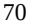
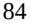
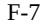
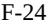
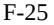

{0}------------------------------------------------

# **UNITED STATES SECURITIES AND EXCHANGE COMMISSION WASHINGTON, D.C. 20549**

# **FORM 20-F**

**(Mark One)**

☐ **REGISTRATION STATEMENT PURSUANT TO SECTION 12(b) OR 12(g) OF THE SECURITIES EXCHANGE ACT OF 1934**

**OR**

☒ **ANNUAL REPORT PURSUANT TO SECTION 13 OR 15(d) OF THE SECURITIES EXCHANGE ACT OF 1934**

**For the fiscal year ended December 31, 2022**

**OR**

☐ **TRANSITION REPORT PURSUANT TO SECTION 13 OR 15(d) OF THE SECURITIES EXCHANGE ACT OF 1934**

**For the transition period from to**

**OR**

☐ **SHELL COMPANY REPORT PURSUANT TO SECTION 13 OR 15(d) OF THE SECURITIES EXCHANGE ACT OF 1934**

**Date of event requiring this shell company report:**

**For the transition period from to**

**Commission file number: 001-38712**

**Pintec Technology Holdings Limited (Exact name of Registrant as specified in its charter)**

**N/A (Translation of Registrant's name into English)**

**Cayman Islands (Jurisdiction of incorporation or organization) 3rd Floor, No. 11 Building, No. 109 Yard Tianjizhigu, Jinghai 3rd Street, BDA, Beijing, 101111, People's Republic of China +86 10 6506-0227 (Address of principal executive offices)**

**Zexiong Huang, Director and Chief Executive Officer**

**Telephone: +86 10 6506-0227 Email: ir@ pintec.com**

**3rd Floor, No. 11**

**Building, No. 109 Yard Tianjizhigu Jinghai 3rd Street, BDA, Beijing, 101111,**

**People's Republic of China**

**(Name, Telephone, E-mail and/or Facsimile number and Address of Company Contact Person)**

**Securities registered or to be registered pursuant to Section 12(b) of the Act:**

| Title of each class                                | Trading Symbol(s) | Name of each exchange on which registered |
|----------------------------------------------------|----------------------|----------------------------------------------|
| American depositary shares (one American           | PT                   | The Nasdaq Stock Market LLC                  |
| depositary share representing 35 Class A           |                      | (The Nasdaq Global Market)                   |
| ordinary shares, par value US\$0.000125 per share) |                      |                                              |
| Class A ordinary shares, par value US\$0.000125    |                      | The Nasdaq Stock Market LLC                  |
| per share*                                         |                      | (The Nasdaq Global Market)                   |

* Not for trading, but only in connection with the listing on The Nasdaq Global Market of American depositary shares.

**Securities registered or to be registered pursuant to Section 12(g) of the Act:**

**None (Title of Class)**

**Securities for which there is a reporting obligation pursuant to Section 15(d) of the Act:**

**None**

{1}------------------------------------------------

#### **(Title of Class)**

Indicate the number of outstanding shares of each of the issuer's classes of capital or common stock as of the close of the period covered by the annual report:

**As of December 31, 2022, there were 252,789,098 Class A ordinary shares and 50,939,520 Class B ordinary shares, par value US\$0.000125 per share.**

Indicate by check mark if the registrant is a well-known seasoned issuer, as defined in Rule 405 of the Securities Act Yes ☐ No ☒

If this report is an annual or transition report, indicate by check mark if the registrant is not required to file reports pursuant to Section 13 or 15(d) of the Securities Exchange Act of 1934 Yes ☐ No ☒

Indicate by check mark whether the registrant (1) has filed all reports required to be filed by Section 13 or 15(d) of the Securities Exchange Act of 1934 during the preceding 12 months (or for such shorter period that the registrant was required to file such reports) and (2) has been subject to such filing requirements for the past 90 days. Yes ☒ No ☐

Indicate by check mark whether the registrant has submitted electronically every Interactive Data File required to be submitted pursuant to Rule 405 of Regulation S-T (§232.405 of this chapter) during the preceding 12 months (or for such shorter period that the registrant was required to submit such files). Yes ☒ No ☐

Indicate by check mark whether the registrant is a large accelerated filer, an accelerated filer, a non-accelerated filer, or an emerging growth company. See definition of "large accelerated filer," "accelerated filer" and "emerging growth company" in Rule 12b-2 of the Exchange Act. (Check one):

Large accelerated filer ☐ Accelerated filer ☐ Non-accelerated filer ☒ Emerging growth company ☒

If an emerging growth company that prepares its financial statements in accordance with U.S. GAAP, indicate by check mark if the registrant has elected not to use the extended transition period for complying with any new or revised financial accounting standards provided pursuant to Section 13(a) of the Exchange Act. ☐

† The term "new or revised financial accounting standard" refers to any update issued by the Financial Accounting Standards Board to its Accounting Standards Codification after April 5, 2012.

Indicate by check mark whether the registrant has filed a report on and attestation to its management's assessment of the effectiveness of its internal control over financial reporting under Section 404(b) of the Sarbanes-Oxley Act (15 U.S.C. 7262(b)) by the registered public accounting firm that prepared or issued its audit report. ☐

If securities are registered pursuant to Section 12(b) of the Act, indicate by check mark whether the financial statements of the registrant included in the filing reflect the correction of an error to previously issued financial statements. ☐

Indicate by check mark whether any of those error corrections are restatements that required a recovery analysis of incentive-based compensation received by any of the registrant's executive officers during the relevant recovery period pursuant to §240.10D-1(b). ☐

Indicate by check mark which basis of accounting the registrant has used to prepare the financial statements included in this filing:

U.S. GAAP ☒ International Financial Reporting Standards as issued Other ☐ by the International Accounting Standards Board ☐

If "Other" has been checked in response to the previous question, indicate by check mark which financial statement item the registrant has elected to follow: Item 17 ☐ Item 18 ☐

If this is an annual report, indicate by check mark whether the registrant is a shell company (as defined in Rule 12b-2 of the Exchange Act). Yes ☐ No ☒

(APPLICABLE ONLY TO ISSUERS INVOLVED IN BANKRUPTCY PROCEEDINGS DURING THE PAST FIVE YEARS)

Indicate by check mark whether the registrant has filed all documents and reports required to be filed by Sections 12, 13 or 15(d) of the Securities Exchange Act of 1934 subsequent to the distribution of securities under a plan confirmed by a court. ☐ Yes ☐ No

{2}------------------------------------------------

# **TABLE OF CONTENTS**

|                                                                                       | Page |
|---------------------------------------------------------------------------------------|------|
| INTRODUCTION                                                                          | 1    |
| FORWARD-LOOKING INFORMATION                                                           | 2    |
| PART I                                                                                | 3    |
| Item 1. Identity of Directors, Senior Management and Advisers                         | 3    |
| Item 2. Offer Statistics and Expected Timetable                                       | 3    |
| Item 3. Key Information                                                               | 3    |
| Item 4. Information on the Company                                                    | 69   |
| Item 4A. Unresolved Staff Comments                                                    | 118  |
| Item 5. Operating and Financial Review and Prospects                                  | 118  |
| Item 6. Directors, Senior Management and Employees                                    | 147  |
| Item 7. Major Shareholders and Related Party Transactions                             | 157  |
| Item 8. Financial Information                                                         | 162  |
| Item 9. The Offer and Listing                                                         | 163  |
| Item 10. Additional Information                                                       | 164  |
| Item 11. Quantitative and Qualitative Disclosures about Market Risk                   | 180  |
| Item 12. Description of Securities Other Than Equity Securities                       | 181  |
| PART II                                                                               | 184  |
| Item 13. Defaults, Dividend Arrearages and Delinquencies                              | 184  |
| Item 14. Material Modifications to the Rights of Security Holders and Use of Proceeds | 184  |
| Item 15. Controls and Procedures                                                      | 184  |
| Item 16A. Audit Committee Financial Expert                                            | 186  |
| Item 16B. Code of Ethics                                                              | 186  |
| Item 16C. Principal Accountant Fees and Services                                      | 186  |
| Item 16D. Exemptions from the Listing Standards for Audit Committees                  | 187  |
| Item 16E. Purchases of Equity Securities by the Issuer and Affiliated Purchasers      | 187  |
| Item 16F. Change in Registrant's Certifying Accountant                                | 187  |
| Item 16G. Corporate Governance                                                        | 187  |
| Item 16H. Mine Safety Disclosure                                                      | 187  |
| Item 16I. Disclosure Regarding Foreign Jurisdictions that Prevent Inspection          | 187  |
| PART III                                                                              | 188  |
| Item 17. Financial Statements                                                         | 188  |
| Item 18. Financial Statements                                                         | 188  |
| Item 19. Exhibits                                                                     | 188  |
| SIGNATURES                                                                            | 197  |
|                                                                                       |      |

# i

{3}------------------------------------------------

## **INTRODUCTION**

Unless otherwise indicated or the context otherwise requires, all information in this annual report reflects the following:

- "ADSs" refers to our American depositary shares, each of which represents 35 Class A ordinary shares;
- "China" or the "PRC" refers to the People's Republic of China, excluding, for the purposes of this annual report only, Hong Kong, Macau and Taiwan;
- "Class A ordinary shares" refers to our Class A ordinary shares, par value US\$0.000125 per share;
- "Class B ordinary shares" refers to our Class B ordinary shares, par value US\$0.000125 per share;
- "Jimu Group" refers to our predecessor and its subsidiaries and variable interest entities that operate its peer-to-peerlending business;
- "MSME" refers to micro, small and medium-sized enterprise;
- "our predecessor" refers to Jimu Holdings Limited, formerly known as Pintec Holdings Limited;
- "other subsidiaries" means other subsidiaries of the Parent than the WFOEs, including but not limited to Sky City Hong Kong Limited;
- "Parent" refers to Pintec Technology Holdings Limited, our ultimate Cayman Islands holding company and a Nasdaq-listed company;
- "registered users" refers to individuals who have registered on our system with their name, government-issued identification number and mobile phone number;
- "RMB" or "Renminbi" refers to the legal currency of China;
- "shares" or "ordinary shares" refers to our Class A ordinary shares and Class B ordinary shares;
- "SME" refers to small and medium enterprise;
- "U.S." refers to the United States;
- "U.S. GAAP" refers to generally accepted accounting principles in the United States;
- "US\$," "U.S. dollars," "\$," or "dollars" refers to the legal currency of the United States;
- "variable interest entities" or "VIEs" refers to Anquying (Tianjin) Technology Co., Ltd., Pintec Jinke (Beijing) Technology Information Co., Ltd., and Beijing Xinshun Dingye Technology Co., Ltd., which are PRC companies in which the Parent does not have equity interests but whose financial results have been consolidated into the consolidated financial statements in accordance with the U.S. GAAP, due to the Parent being the primary beneficiary of, such entities;
- "we," "us," "our company," "our," or "Pintec" refers to Pintec Technology Holdings Limited, its subsidiaries, and, in the context of describing our operations and consolidated financial information, its variable interest entities in China; and
- "wholly foreign-owned enterprises" or "WFOEs" refers to our wholly foreign-invested enterprises in China, including Sky City (Beijing) Technology Co., Ltd. and Pintec (Beijing) Technology Co., Ltd.

{4}------------------------------------------------

## **FORWARD-LOOKING INFORMATION**

This annual report contains forward-looking statements that reflect our current expectations and views of future events. These forward-looking statements are made under the "safe-harbor" provisions of the U.S. Private Securities Litigation Reform Act of 1995. These statements involve known and unknown risks, uncertainties and other factors that may cause our actual results, performance or achievements to be materially different from those expressed or implied by these forward-looking statements.

You can identify these forward-looking statements by terminology such as "may," "will," "expect," "anticipate," "aim," "estimate," "intend," "plan," "believe," "likely to" or other similar expressions. We have based these forward-looking statements largely on our current expectations and projections about future events and financial trends that we believe may affect our financial condition, results of operations, business strategy and financial needs. These forward-looking statements include, but are not limited to:

- our goals and strategies;
- our future business development, financial condition and results of operations;
- expected changes in our revenues, costs or expenditures;
- our expectations regarding demand for and market acceptance of our services and solutions;
- our expectations regarding our relationships with funding sources and customers;
- competition in our industries; and
- developments in government policies, laws and regulations relating to our industries.

We would like to caution you not to place undue reliance on these forward-looking statements. You should read these statements in conjunction with the risks disclosed in "Item 3D. Key Information—Risk Factors." Those risks are not exhaustive. We operate in a rapidly evolving environment. New risks emerge from time to time and it is impossible for our management to predict all risks, nor can we assess the impact of all risks on our business or the extent to which any risk, or combination of risks, may cause actual results to differ from those contained in any forward-looking statement. We do not undertake any obligation to update or revise the forwardlooking statements except as required under applicable law.

{5}------------------------------------------------

#### **PART I**

#### **Item 1. Identity of Directors, Senior Management and Advisers**

Not applicable.

#### **Item 2. Offer Statistics and Expected Timetable**

Not applicable.

## **Item 3. Key Information**

## **Implications of Being a Company with the Holding Company Structure and the VIE Structures**

#### *The VIE Structures and Associated Risks*

Pintec Technology Holdings Limited, the Parent, is the ultimate Cayman Islands holding company with no material operations of its own. The Parent carries out its business in China through the WFOEs and their respective contractual arrangements, commonly known as the VIE structures, with the VIEs based in China and their respective shareholders. Investors in our securities are purchasing the equity securities of Pintec Technology Holdings Limited, the Cayman Islands holding company, rather than the equity securities of the VIEs in which our operations are conducted.

The VIE structures were established through a series of agreements, including those by and among Sky City (Beijing) Technology Co., Ltd., Anquying (Tianjin) Technology Co., Ltd. and the shareholders of Anquying (Tianjin) Technology Co., Ltd., those by and among Pintec (Beijing) Technology Co., Ltd., Beijing Xinshun Dingye Technology Co., Ltd. and the shareholders of Beijing Xinshun Dingye Technology Co., Ltd., those by and among Pintec (Beijing) Technology Co., Ltd., Pintec Jinke (Beijing) Technology Information Co., Ltd. and the shareholders of Pintec Jinke (Beijing) Technology Information Co., Ltd., and those by and among Pintec (Beijing) Technology Co., Ltd., Beijing Hongdian Fund Distributor Co., Ltd. and the shareholders of Beijing Hongdian Fund Distributor Co., Ltd.. The series of agreements generally comprises executive business cooperation agreements (or exclusive technology consulting and service agreement), equity pledge agreements, exclusive option agreements, shareholders' voting rights proxy agreements and spousal consent letters. The contractual arrangements allow us to (1) be considered as the primary beneficiary of the VIEs for accounting purposes and consolidate the financial results of the VIEs, (2) receive substantially all of the economic benefits of the VIEs, (3) have the pledge right over the equity interests in the VIEs as the pledgee, and (4) have an exclusive option to purchase all or part of the equity interests in the VIEs when and to the extent permitted by PRC law. For details, see "Item 4. Information on the Company — C. Organizational Structure — Contractual Arrangements with Our Variable Interest Entities."

However, neither the Parent nor WFOEs own any equity interest in the VIEs. Our contractual arrangements with the VIEs and their respective shareholders are not equivalent of an investment in the equity interest of the VIEs. Instead, as described above, we are regarded as the primary beneficiary of the VIEs and consolidate the financial results of the VIEs under U.S. GAAP in light of the VIE structures.

The VIE structures involve unique risks to holders of our securities. It may be less effective than direct ownership in providing us with operational control over the VIEs, and we may incur substantial costs to enforce the terms of the arrangements. For instance, the VIEs and their respective shareholders could breach their contractual arrangements with us by, among other things, failing to conduct the operations of the VIEs in an acceptable manner or taking other actions that are detrimental to our interests. If we had direct ownership of the VIEs in China, we would be able to exercise our rights as a shareholder to effect changes in the board of directors of the VIEs, which in turn could implement changes, subject to any applicable fiduciary obligations, at the management and operational level. However, under the current contractual arrangements, we rely on the performance by the VIEs and their respective shareholders of their obligations under the contracts to direct the VIEs' activities. The shareholders of the VIEs may not act in the best interests of our company or may not perform its obligations under these contracts. If any dispute relating to these contracts remains unresolved, we will have to enforce our rights under these contracts through the operations of PRC law and arbitration, litigation and other legal proceedings and therefore will be subject to uncertainties in the PRC legal system.

{6}------------------------------------------------

We may face challenges in enforcing the contractual arrangements due to jurisdictional and legal limitations. There are substantial uncertainties regarding the interpretation and application of current and future PRC laws, regulations and rules regarding the status of the rights of our Cayman Islands holding company with respect to the contractual arrangements with the VIEs and their respective shareholders through the WFOEs. As of the date of this annual report, the contractual arrangements governing the VIEs have not been tested in a court of law. It is uncertain whether any new PRC laws or regulations relating to VIE structures will be adopted or, if adopted, what they would provide. If we or the VIEs are found to be in violation of any existing or future PRC laws or regulations or fail to obtain or maintain any of the required licenses, permits, registrations or approvals, the relevant PRC regulatory authorities would have broad discretion to take action in dealing with such violations or failures. The PRC regulatory authorities could disallow the VIE structures at any time in the future. If the PRC government deems that our contractual arrangements with the VIEs do not comply with PRC regulatory restrictions on foreign investment in the relevant industries, or if these regulations or the interpretation of existing regulations change or are interpreted differently in the future, we could be subject to severe penalties and may incur substantial costs to enforce the terms of the arrangements, or be forced to relinquish our interests in those operations. Our Cayman Islands holding company, our subsidiaries, the VIEs and our shareholders face uncertainty with respect to potential future actions by the PRC government that could affect the enforceability of the contractual arrangements with the VIEs and, consequently, significantly affect the financial performance of our company and the VIEs as a whole. For details, see "— D. Risk Factors — Risks Relating to Our Corporate Structure."

For a condensed consolidation schedule depicting the results of operations, financial position and cash flows for us, the WFOEs and the VIEs during 2020, 2021 and 2022, see "Item 5. Operating and Financial Review and Prospects." For details of the permissions and licenses required for operating our business in China and the related limitations, see "— Our Operations in China and Permissions Required from the PRC Authorities for Our Operations."

{7}------------------------------------------------

## *Financial Information Related to the VIE Structures*

The following tables provide the condensed consolidating schedules depicting the financial position, results of operations and cash flows for the parent, the consolidated VIEs, the WFOEs and an aggregation of other entities, eliminating intercompany amounts and consolidated totals (in thousands of RMB) as of December 31, 2021 and 2022 and for the years ended December 31, 2020, 2021 and 2022.

|                                       | As of December 31, 2021 |             |           |                       |                     |                            |                       |
|---------------------------------------|-------------------------|-------------|-----------|-----------------------|---------------------|----------------------------|-----------------------|
|                                       | Parent                  | VIEs        | WFOEs     | Other Subsidiaries | VIE- Elimination | Elimination Adjustments | Consolidated Total |
| Condensed Consolidating Schedule of   |                         |             |           |                       |                     |                            |                       |
| Financial Position                    |                         |             |           |                       |                     |                            |                       |
| Cash and cash equivalents             | 1,255                   | 41,638      | 623       | 174,385               | —                   | —                          | 217,901               |
| Restricted time deposits              | —                       | 1,468       | —         | —                     | —                   | —                          | 1,468                 |
| Restricted cash-non current           | —                       | 5,417       | —         | —                     | —                   | —                          | 5,417                 |
| Financing receivables, net            | —                       | 92,772      | —         | 4,999                 | —                   | —                          | 97,771                |
| Accounts receivables, net             | —                       | 36,620      | 180       | 54                    | —                   | —                          | 36,854                |
| Inter-group balance due from VIEs and |                         |             |           |                       |                     |                            |                       |
| subsidiaries                          | 156,985                 | 1,304,761   | 2,204,376 | 1,773,980             | (1,304,761)         | (4,135,341)                | —                     |
| Other assets                          | 181                     | 129,334     | 141,229   | 625,032               | —                   | (493,954)                  | 401,822               |
|                                       |                         |             |           |                       |                     |                            |                       |
| Total Assets                          | 158,421                 | 1,612,010   | 2,346,408 | 2,578,450             | (1,304,761)         | (4,629,295)                | 761,233               |
| Inter-group balance due to VIEs and   |                         |             |           |                       |                     |                            |                       |
| subsidiaries                          | 379,533                 | 2,337,454   | 1,792,437 | 1,987,265             | (2,337,454)         | (4,159,235)                | —                     |
| Amounts due to related parties        | —                       | 289,936     | —         | —                     | —                   | —                          | 289,936               |
| Convertible loan                      | —                       | —           | —         | 400,000               | —                   | —                          | 400,000               |
| Other liabilities                     | 3,817                   | 84,511      | 7,256     | 41,716                | —                   | (974)                      | 136,326               |
|                                       |                         |             |           |                       |                     |                            |                       |
| Total Liabilities                     | 383,350                 | 2,711,901   | 1,799,693 | 2,428,981             | (2,337,454)         | (4,160,209)                | 826,262               |
| Total Pintec's (Deficit)/Equity       | (224,929)               | (1,117,511) | 546,715   | 7,189                 | 1,032,693           | (469,086)                  | (224,929)             |
| Non-controlling interests             | —                       | 17,620      | —         | 142,280               | —                   | —                          | 159,900               |
|                                       |                         |             |           |                       |                     |                            |                       |
| Total (Deficit)/Equity                | (224,929)               | (1,099,891) | 546,715   | 149,469               | 1,032,693           | (469,086)                  | (65,029)              |

{8}------------------------------------------------

|                                     |           | As of December 31, 2022 |           |                                      |                     |                            |                       |  |
|-------------------------------------|-----------|-------------------------|-----------|--------------------------------------|---------------------|----------------------------|-----------------------|--|
|                                     | Parent    | VIEs                    | WFOEs     | Other Subsidiaries                | VIE- Elimination | Elimination Adjustments | Consolidated Total |  |
| Condensed Consolidating             |           |                         |           |                                      |                     |                            |                       |  |
| Schedule of Financial Position      |           |                         |           |                                      |                     |                            |                       |  |
| Cash and cash equivalents           | 1,329     | 5,350                   | 269       | 242,780                              | —                   | —                          | 249,728               |  |
| Restricted time deposits            | —         | 1,482                   | —         | —                                    | —                   | —                          | 1,482                 |  |
| Restricted cash-non current         | —         | 5,000                   | —         | —                                    | —                   | —                          | 5,000                 |  |
| Financing receivables, net          | —         | 86,910                  | —         | 177                                  | —                   | —                          | 87,087                |  |
| Accounts receivables, net           | —         | 14,439                  | 1,231     | 2,957                                | —                   | —                          | 18,627                |  |
| Inter-group balance due from VIEs   |           |                         |           |                                      |                     |                            |                       |  |
| and subsidiaries                    | 42,460    | 1,326,399               | 2,221,742 | 1,774,456                            | (1,326,399)         | (4,038,658)                | —                     |  |
| Other assets                        | 95        | 57,648                  | 87,365    | 566,896                              | —                   | (545,057)                  | 166,947               |  |
| Total Assets                        | 43,884    | 1,497,228               | 2,310,607 | 2,587,266                            | (1,326,399)         | (4,583,715)                | 528,871               |  |
| Inter-group balance due to VIEs and |           |                         |           |                                      |                     |                            |                       |  |
| subsidiaries                        | 443,575   | 2,198,353               | 1,781,606 | 2,143,703                            | (2,198,353)         | (4,368,884)                | —                     |  |
| Amounts due to related parties      | —         | 294,590                 | —         | 44                                   | —                   | —                          | 294,634               |  |
| Convertible loan                    | —         | —                       | —         | 113,000                              | —                   | —                          | 113,000               |  |
| Long-term loan                      | —         | —                       | —         | 236,755                              | —                   | —                          | 236,755               |  |
| Other liabilities                   | 2,355     | 83,786                  | 9,896     | 37,380                               | —                   | (1,798)                    | 131,619               |  |
| Total Liabilities                   | 445,930   | 2,576,729               | 1,791,502 | 2,530,882                            | (2,198,353)         | (4,370,682)                | 776,008               |  |
|                                     |           |                         |           |                                      |                     |                            |                       |  |
| Total Pintec's (Deficit)/Equity     | (402,046) | (1,094,047)             | 519,105   | (83,979)                             | 871,954             | (213,033)                  | (402,046)             |  |
| Non-controlling interests           | —         | 14,546                  | —         | 140,363                              | —                   | —                          | 154,909               |  |
| Total (Deficit)/Equity              | (402,046) | (1,079,501)             | 519,105   | 56,384                               | 871,954             | (213,033)                  | (247,137)             |  |
|                                     |           |                         |           | For the year ended December 31, 2020 |                     |                            |                       |  |
|                                     |           |                         |           | Other                                | VIE-                | Elimination                | Consolidated          |  |
| Condensed Consolidating             | Parent    | VIEs                    | WFOEs     | Subsidiaries                         | Elimination         | Adjustments                | Total                 |  |
| Schedule of Results of              |           |                         |           |                                      |                     |                            |                       |  |
| Operations                          |           |                         |           |                                      |                     |                            |                       |  |
| Revenues                            | —         | 358,605                 | 80,857    | 21,700                               | (6,001)             | (76,897)                   | 378,264               |  |
| Cost of revenues                    | —         | (284,185)               | (2,193)   | (2,217)                              | 19                  | 2,802                      | (285,774)             |  |
| Operating expenses                  | (27,665)  | (201,177)               | (98,827)  | (53,576)                             | 46,802              | 35,114                     | (299,329)             |  |
| Loss from operations                | (27,665)  | (126,757)               | (20,163)  | (34,093)                             | 40,820              | (38,981)                   | (206,839)             |  |
| Other (expenses)/income             | (10,666)  | (6,044)                 | (17,278)  | 9,796                                | 30,892              | (46,805)                   | (40,105)              |  |
| Share of loss from subsidiaries     | (255,604) | —                       | —         | —                                    | —                   | 255,604                    | —                     |  |
| Loss before income taxes            | (293,935) | (132,801)               | (37,441)  | (24,297)                             | 71,712              | 169,818                    | (246,944)             |  |
| Income tax (expense)/benefit        | —         | (50,676)                | —         | 1,480                                | —                   | —                          | (49,196)              |  |
| Net loss                            | (293,935) | (183,477)               | (37,441)  | (22,817)                             | 71,712              | 169,818                    | (296,140)             |  |
| Less: net loss attributable to non  |           |                         |           |                                      |                     |                            |                       |  |
| controlling interests               | —         | (82)                    | —         | (2,123)                              | —                   | —                          | (2,205)               |  |
| Net loss attributable to Pintec's   |           |                         |           |                                      |                     |                            |                       |  |
| shareholders                        | (293,935) | (183,395)               | (37,441)  | (20,694)                             | 71,712              | 169,818                    | (293,935)             |  |

{9}------------------------------------------------

|                                    | For the year ended December 31, 2021 |          |          |                       |                     |                            |                       |
|------------------------------------|--------------------------------------|----------|----------|-----------------------|---------------------|----------------------------|-----------------------|
|                                    | Parent                               | VIEs     | WFOEs    | Other Subsidiaries | VIE- Elimination | Elimination Adjustments | Consolidated Total |
| Condensed Consolidating            |                                      |          |          |                       |                     |                            |                       |
| Schedule of Results of             |                                      |          |          |                       |                     |                            |                       |
| Operations                         |                                      |          |          |                       |                     |                            |                       |
| Revenues                           | —                                    | 148,957  | 14,840   | 21,243                | (1,074)             | (10,726)                   | 173,240               |
| Cost of revenues                   | —                                    | (82,240) | (1,845)  | (8,648)               | 3,069               | (56)                       | (89,720)              |
| Operating expenses                 | (12,574)                             | (38,335) | (76,390) | (37,044)              | 8,800               | 686                        | (154,857)             |
| Loss from operations               | (12,574)                             | 28,382   | (63,395) | (24,449)              | 10,795              | (10,096)                   | (71,337)              |
| Other income/(expenses)            | 3,292                                | 4,996    | (2,976)  | (25,234)              | —                   | (10,689)                   | (30,611)              |
| Share of loss from subsidiaries    | (92,322)                             | —        | —        | —                     | —                   | 92,322                     | —                     |
| (Loss)/income before income        |                                      |          |          |                       |                     |                            |                       |
| taxes                              | (101,604)                            | 33,378   | (66,371) | (49,683)              | 10,795              | 71,537                     | (101,948)             |
| Income tax expense                 | (125)                                | (3,456)  | —        | (3,415)               | —                   | 124                        | (6,872)               |
| Net (loss)/income                  | (101,729)                            | 29,922   | (66,371) | (53,098)              | 10,795              | 71,661                     | (108,820)             |
| Less: net loss attributable to non |                                      |          |          |                       |                     |                            |                       |
| controlling interests              | —                                    | (1,491)  | —        | (5,600)               | —                   | —                          | (7,091)               |
| Net (loss)/income attributable to  |                                      |          |          |                       |                     |                            |                       |
| Pintec's shareholders              | (101,729)                            | 31,413   | (66,371) | (47,498)              | 10,795              | 71,661                     | (101,729)             |

|                                                   | For the year ended December 31, 2022 |          |          |                       |                     |                            |                       |
|---------------------------------------------------|--------------------------------------|----------|----------|-----------------------|---------------------|----------------------------|-----------------------|
|                                                   | Parent                               | VIEs     | WFOEs    | Other Subsidiaries | VIE- Elimination | Elimination Adjustments | Consolidated Total |
| Condensed Consolidating Schedule of Results of |                                      |          |          |                       |                     |                            |                       |
| Operations                                        |                                      |          |          |                       |                     |                            |                       |
| Revenues                                          | —                                    | 60,436   | 12,221   | 21,500                | (8,900)             | (10,689)                   | 74,568                |
| Cost of revenues                                  | —                                    | (57,517) | (1,060)  | (15,660)              | 7,279               | 4,270                      | (62,688)              |
| Operating expenses                                | (6,946)                              | (81,654) | (34,254) | (65,140)              | 7,528               | 87,054                     | (93,412)              |
| Loss from operations                              | (6,946)                              | (78,735) | (23,093) | (59,300)              | 5,907               | 80,635                     | (81,532)              |
| Other income/(loss)                               | (8)                                  | 189      | (2,343)  | (20,767)              | —                   | (89,574)                   | (112,503)             |
| Share of loss from subsidiaries                   | (183,229)                            | —        | —        | —                     | —                   | 183,229                    | —                     |
| Income (loss) before income                       |                                      |          |          |                       |                     |                            |                       |
| taxes                                             | (190,183)                            | (78,546) | (25,436) | (80,067)              | 5,907               | 174,290                    | (194,035)             |
| Income tax (expense) benefit                      | —                                    | (1,968)  | —        | (7)                   | —                   | (547)                      | (2,522)               |
| Net income (loss)                                 | (190,183)                            | (80,514) | (25,436) | (80,074)              | 5,907               | 173,743                    | (196,557)             |
| Less: net loss attributable to non                |                                      |          |          |                       |                     |                            |                       |
| controlling interests                             | —                                    | (3,074)  | —        | (3,300)               | —                   | —                          | (6,374)               |
| Net income (loss) attributable to                 |                                      |          |          |                       |                     |                            |                       |
| Pintec's shareholders                             | (190,183)                            | (77,440) | (25,436) | (76,774)              | 5,907               | 173,743                    | (190,183)             |

{10}------------------------------------------------

|                                                                         | For the year ended December 31, 2020 |           |          |                       |                     |                            |                       |
|-------------------------------------------------------------------------|--------------------------------------|-----------|----------|-----------------------|---------------------|----------------------------|-----------------------|
|                                                                         | Parent                               | VIEs      | WFOEs    | Other Subsidiaries | VIE- Elimination | Elimination Adjustments | Consolidated Total |
| Condensed Consolidating                                                 |                                      |           |          |                       |                     |                            |                       |
| Schedule of Cash Flows                                                  |                                      |           |          |                       |                     |                            |                       |
| Net cash (used in)/provided by                                          |                                      |           |          |                       |                     |                            |                       |
| operating activities                                                    | (20,972)                             | 480,790   | (58,094) | (344,761)             | (352,243)           | 352,243                    | 56,963                |
| Net cash provided by/(used in)                                          |                                      |           |          |                       |                     |                            |                       |
| investing activities                                                    | 69,327                               | 289,956   | (710)    | (157,510)             | —                   | (8,444)                    | 192,619               |
| Net cash provided by/(used in)                                          |                                      |           |          |                       |                     |                            |                       |
| financing activities                                                    | 20                                   | (686,659) | 65,209   | 326,348               | 20,000              | (11,557)                   | (286,639)             |
| Effect of exchange rate changes on                                      |                                      |           |          |                       |                     |                            |                       |
| cash and cash equivalents                                               | (52,516)                             | —         | 3,761    | 27,252                | —                   | —                          | (21,503)              |
| Net (decrease)/increase in cash and cash equivalents, and restricted |                                      |           |          |                       |                     |                            |                       |
| cash                                                                    | (4,141)                              | 84,087    | 10,166   | (148,671)             | (332,243)           | 332,242                    | (58,560)              |
| Cash and cash equivalents, and restricted cash at the beginning      |                                      |           |          |                       |                     |                            |                       |
| of year                                                                 | 7,608                                | 98,257    | 2,614    | 472,424               | (9,647)             | 9,648                      | 580,904               |
| Cash and cash equivalents, and                                          |                                      |           |          |                       |                     |                            |                       |
| restricted cash at the end of year                                      | 3,467                                | 182,344   | 12,780   | 323,753               | —                   | —                          | 522,344               |

|                                    | For the year ended December 31, 2021 |           |           |              |             |             |              |
|------------------------------------|--------------------------------------|-----------|-----------|--------------|-------------|-------------|--------------|
|                                    |                                      |           |           | Other        | VIE-        | Elimination | Consolidated |
|                                    | Parent                               | VIEs      | WFOEs     | Subsidiaries | Elimination | Adjustments | Total        |
| Condensed Consolidating            |                                      |           |           |              |             |             |              |
| Schedule of Cash Flows             |                                      |           |           |              |             |             |              |
| Net cash (used in)/provided by     |                                      |           |           |              |             |             |              |
| operating activities               | (11,840)                             | 18,945    | 25,521    | (64,808)     | 63,642      | (63,642)    | (32,182)     |
| Net cash provided by/(used in)     |                                      |           |           |              |             |             |              |
| investing activities               | 14,952                               | (19,956)  | (101,608) | (76,783)     | —           | 63,931      | (119,464)    |
| Net cash provided by/(used in)     |                                      |           |           |              |             |             |              |
| financing activities               | 1                                    | (132,810) | 63,930    | 476          | —           | (63,931)    | (132,334)    |
| Effect of exchange rate changes on |                                      |           |           |              |             |             |              |
| cash and cash equivalents          | (5,325)                              | —         | —         | (8,253)      | —           | —           | (13,578)     |
| Net decrease in cash and cash      |                                      |           |           |              |             |             |              |
| equivalents, and restricted cash   | (2,212)                              | (133,821) | (12,157)  | (149,368)    | 63,642      | (63,642)    | (297,558)    |
| Cash and cash equivalents, and     |                                      |           |           |              |             |             |              |
| restricted cash at the beginning   |                                      |           |           |              |             |             |              |
| of year                            | 3,467                                | 182,344   | 12,780    | 323,753      | —           | —           | 522,344      |
| Cash and cash equivalents, and     |                                      |           |           |              |             |             |              |
| restricted cash at the end of year | 1,255                                | 48,523    | 623       | 174,385      | —           | —           | 224,786      |

{11}------------------------------------------------

|                                                   | For the year ended December 31, 2022 |          |          |                       |                     |                            |                       |
|---------------------------------------------------|--------------------------------------|----------|----------|-----------------------|---------------------|----------------------------|-----------------------|
|                                                   | Parent                               | VIEs     | WFOEs    | Other Subsidiaries | VIE- Elimination | Elimination Adjustments | Consolidated Total |
| Condensed Consolidating Schedule of Cash          |                                      |          |          |                       |                     |                            |                       |
| Flows                                             |                                      |          |          |                       |                     |                            |                       |
| Net cash provided by (used in) operating          |                                      |          |          |                       |                     |                            |                       |
| activities                                        | (5,404)                              | (21,215) | (98,179) | 107,502               | 60,347              | (53,569)                   | (10,518)              |
| Net cash provided by (used in) investing          |                                      |          |          |                       |                     |                            |                       |
| activities                                        | 2,136                                | (15,446) | 100,000  | —                     | —                   | —                          | 86,690                |
| Net cash used in financing activities             | —                                    | (30)     | —        | (57,862)              | —                   | —                          | (57,892)              |
| Effect of exchange rate changes on cash and       |                                      |          |          |                       |                     |                            |                       |
| cash equivalents                                  | 3,342                                | —        | (2,175)  | 18,755                | —                   | (6,778)                    | 13,144                |
| Net increase (decrease) in cash and cash          |                                      |          |          |                       |                     |                            |                       |
| equivalents, and restricted cash                  | 74                                   | (36,691) | (354)    | 68,395                | 60,347              | (60,347)                   | 31,424                |
| Cash and cash equivalents, and restricted cash at |                                      |          |          |                       |                     |                            |                       |
| the beginning of year                             | 1,255                                | 48,523   | 623      | 174,385               | —                   | —                          | 224,786               |
| Cash and cash equivalents, and restricted cash at |                                      |          |          |                       |                     |                            |                       |
| the end of year                                   | 1,329                                | 11,832   | 269      | 242,780               | —                   | —                          | 256,210               |

#### *Cash Flows through Our Organization*

In light of our holding company structure and the VIE structures, our ability to pay dividends to the shareholders, and to service any debt we may incur may highly depend upon dividends paid by the WFOEs to us and service fees paid by the VIEs to the WFOEs, despite that we may obtain financing at the holding company level through other methods. For instance, if any of the WFOEs or the VIEs incur debt on their own behalf in the future, the instruments governing such debt may restrict their ability to pay dividends to us and our shareholders, as well as the ability to settle amounts owed under the contractual arrangements. As of the date of this annual report, none of Pintec Technology Holdings Limited, the WFOEs and the VIEs has paid any dividends or made any distributions to their respective shareholders, including any U.S. investors, nor do we have any present plan to pay any cash dividends in the foreseeable future. We currently intend to retain most, if not all, of our available funds and any future earnings to operate and expand our business. See "Dividend Policy" for details. In 2020, 2021 and 2022, the total amount of the service fees that the VIEs paid to the WFOEs under the contractual arrangements was RMB77.7 million (US\$12.2 million), RMB8.8 million (US\$1.4 million) and RMB7.5 million (US\$1.1 million), respectively. We expect to continue to distribute earnings and settle the service fees owed under the contractual arrangements at the request of the WFOEs and based on our business needs, and do not expect to declare dividend in the foreseeable future.

Under PRC laws and regulations, the WFOEs are permitted to pay dividends only out of their retained earnings, if any, as determined in accordance with PRC accounting standards and regulations. Furthermore, the WFOEs and the VIEs are required to make appropriations to certain statutory reserve funds or may make appropriations to certain discretionary funds, which are not distributable as cash dividends except in the event of a solvent liquidation of the companies. Remittance of dividends by the WFOEs out of China is also subject to certain procedures with the banks designated by the PRC State Administration of Foreign Exchange ("SAFE"). These restrictions are benchmarked against the paid-in capital and the statutory reserve funds of the WFOEs and the net assets of the VIEs in which we have no legal ownership. In addition, while there are currently no such restrictions on foreign exchange and our ability to transfer cash or assets between Pintec Technology Holdings Limited and our subsidiaries incorporated in Hong Kong, if certain PRC laws and regulations, including existing laws and regulations and those enacted or promulgated in the future were to become applicable to our subsidiaries incorporated in Hong Kong in the future, and to the extent our cash or assets are in Hong Kong or a Hong Kong entity, such funds or assets may not be available due to interventions in or the imposition of restrictions and limitations on our ability to transfer funds or assets by the PRC government. Furthermore, we cannot assure you that the PRC government will not intervene or impose restrictions on Pintec Technology Holdings Limited, its subsidiaries and the VIEs to transfer or distribute cash within the organization, which could result in an inability of or prohibition on making transfers or distributions to entities outside of mainland China and Hong Kong.

Under PRC laws and regulations, we, the Cayman Islands holding company, may fund the WFOEs only through capital contributions or loans, and fund the VIEs only through loans, subject to satisfaction of applicable government registration and approval requirements. For details, see "Item 3. Key Information—Implications of Being a Company with the Holding Company Structure and the VIE Structures—The VIE Structures and Associated Risks."

{12}------------------------------------------------

For the years ended December 31, 2020, 2021 and 2022, the cash flows that have occurred between the Parent, the WFOEs, the VIEs and subsidiaries are summarized as the following:

|                                                                | For the year ended December 31, |                |         |
|----------------------------------------------------------------|---------------------------------|----------------|---------|
|                                                                | 2020                            | 2021           | 2022    |
|                                                                | RMB                             | RMB            | RMB     |
|                                                                |                                 | (in thousands) |         |
| Cash received by parent company from equity owned subsidiaries | 74,238                          | 14,952         | 2,018   |
| Cash paid by VIEs to equity owned subsidiaries                 | 306,522                         | 642,373        | 226,472 |
| Cash received by VIEs from equity owned subsidiaries           | 819,348                         | 584,159        | 157,648 |
| Cash paid by WFOEs to equity owned subsidiaries                | 284,890                         | 207,161        | 109,270 |
| Cash received by WFOEs from equity owned subsidiaries          | 111,168                         | 293,859        | 36,489  |
| Cash paid by VIEs to WFOEs                                     | 184,078                         | 18,199         | 6,990   |
| Cash received by VIEs from WFOEs                               | 91,442                          | 18,369         | 17,135  |

#### **Our Operations in China and Permissions Required from the PRC Authorities for Our Operations**

We, through the WFOEs and the VIEs, conduct our operations in China. Our operations in China are governed by PRC laws and regulations. We and the VIE are required to obtain certain licenses, permits and approvals from relevant governmental authorities in China in order to operate our business. As of the date of this annual report, as advised by our PRC counsel, Shihui Partners, the WFOEs and the VIEs have obtained the licenses, permits and registrations from the PRC government authorities that are material and necessary for our business operations in China. Given the uncertainties of interpretation and implementation of relevant laws and regulations and the enforcement practice by relevant government authorities, and the promulgation of new laws and regulations and amendment to the existing ones, we may be required to obtain additional licenses, permits, registrations, filings or approvals for our business operations in the future. We cannot assure you that we or the VIEs will be able to obtain, in a timely manner or at all, or maintain such licenses, permits or approvals, and we or the VIEs may also inadvertently conclude that such permissions or approvals are not required. Any lack of or failure to maintain requisite approvals, licenses or permits applicable to us or the VIEs may have a material adverse impact on our business, results of operations, financial condition and prospects and cause the value of any securities we offer to significantly decline or become worthless. For details, see "— D. Risk Factors — Risks Relating to Doing Business in China— Because all of our operations are in China, our business is subject to the complex and evolving laws and regulations there. The Chinese government may exercise certain oversight and discretion over the conduct of our business and may influence our operations at time, which could result in a material change in our operations and/or the value of our ADSs."

On December 28, 2021, the Cyberspace Administration of China (the "CAC") and other 12 PRC regulatory authorities jointly issued an amendment to the Measures for Cybersecurity Review (the "Cybersecurity Review Measures"), which took effect on February 15, 2022. See "Item 4. Information on the Company — Regulation — Regulations Relating to Internet Information Security and Privacy Protection."

Pursuant to the Cybersecurity Review Measures, in addition to "critical information infrastructure operators" who procure internet products and services that affect or may affect national security shall be subject to a cybersecurity review, any "online platform operators" carrying out data processing activities that affect or may affect national security should also be subject to the cybersecurity review requirements. The Cybersecurity Review Measures also provide that if a "online platform operator" holding personal information of more than one million users intends to go public in a foreign country, it must apply for a cybersecurity review. In addition, the relevant PRC governmental authorities may initiate cybersecurity review if they determine certain network products, services, or data processing activities affect or may affect national security. As of the date of this annual report, we have not been informed by any PRC governmental authority of any requirement that we file for a cybersecurity review. However, if we are not able to comply with the cybersecurity and data privacy requirements in a timely manner, or at all, we may be subject to government enforcement actions and investigations, fines, penalties, suspension of our non-compliant operations, or removal of our applications from the relevant application stores, among other sanctions, which could materially and adversely affect our business and results of operations. See "— D. Risk Factors — Risks Relating to Doing Business in China — The Chinese government exerts substantial influence over the manner in which we must conduct our business activities and may intervene or influence our operations at any time, which could result in a material change in our operations and the value of our ADSs."

{13}------------------------------------------------

On February 17, 2023, the China Securities Regulatory Commission (the "CSRC") promulgated the Trial Measures of the Overseas Securities Offering and Listing by Domestic Companies (the "Overseas Listing Trial Measures") and the related guidelines, which became effective on March 31, 2023. The Overseas Listing Trial Measures has comprehensively improved and reformed the existing regulatory regime for overseas offering and listing of securities by PRC domestic companies and regulates both direct and indirect overseas offering and listing of securities by PRC domestic companies by adopting a filing-based regulatory regime. According to the Overseas Listing Trial Measures, PRC domestic companies that seek to offer and list securities in overseas markets, either in direct or indirect means, are required to fulfill the filing procedure with the CSRC and report relevant information. The CSRC provided further notice related to the Overseas Listing Trial Measures that companies that have already been listed on overseas stock exchanges prior to March 31, 2023 are not required to make immediate filings for its listing, but are required to make filings for subsequent offerings in accordance with the Overseas Listing Trial Measures, i.e., to file with the CSRC within three business days after the closing of such subsequent offerings. As we had been listed on Nasdaq prior to March 31, 2023, we are not required to make immediate filing with the CSRC in connection with our listing on Nasdaq. However, we could be subject to the filing requirements with the CSRC if we conduct subsequent offerings. See "Item 4. Information on the Company — Regulation — Regulations Relating to M&A and Overseas Listing."

We cannot assure you that we or the VIEs can complete the filing procedures, obtain the approvals or complete other compliance procedures in a timely manner, or at all, or that any completion of filing or approval or other compliance procedures would not be rescinded. Any such failure would subject us to sanctions by the CSRC or other PRC regulatory authorities. These regulatory authorities may impose restrictions and penalties on the operations in China, significantly limit or completely hinder our ability to launch any new offering of our securities, limit our ability to pay dividends outside of China, delay or restrict the repatriation of the proceeds from future capital raising activities into China, or take other actions that could materially and adversely affect our business, results of operations, financial condition and prospects, as well as the trading price of our ADSs. Furthermore, the PRC government authorities may further strengthen oversight and control over listings and offerings that are conducted overseas. Any such action may adversely affect our operations and significantly limit or completely hinder our ability to offer or continue to offer securities to you and cause the value of such securities to significantly decline or be worthless. For details, see "— D. Risk Factors — Risks Relating to Doing Business in China — Filing procedure with the CSRC shall be fulfilled and the approval of other PRC government authorities may be required in connection with our future offshore offerings under PRC law, and we cannot predict whether or for how long we will be able to obtain such approval or complete such filing if required."

#### **The Holding Foreign Companies Accountable Act**

The Holding Foreign Companies Accountable Act, or the HFCAAct, was enacted on December 18, 2020. The HFCAAct states that if the SEC determines that we have filed audit reports issued by a registered public accounting firm that has not been subject to inspection by the PCAOB for three consecutive years beginning in 2021, the SEC will prohibit our ordinary shares from being traded on a national securities exchange or in the over-the-counter trading market in the United States.

On December 2, 2021, the SEC adopted final amendments to its rules implementing the HFCAAct. Such final rules establish procedures that the SEC will follow in (i) determining whether a registrant is a "Commission-Identified Issuer" (a registrant identified by the SEC as having filed an annual report with an audit report issued by a registered public accounting firm that is located in a foreign jurisdiction and that the PCAOB is unable to inspect or investigate completely because of a position taken by an authority in that jurisdiction) and (ii) prohibiting the trading of an issuer that is a Commission-Identified Issuer for three consecutive years under the HFCAAct. The SEC began identifying Commission-Identified Issuers for the fiscal years beginning after December 18, 2020. A Commission-Identified Issuer is required to comply with the submission and disclosure requirements in the annual report for each year in which it was identified. On June 22, 2021, United States Senate passed the Accelerating Holding Foreign Companies Accountable Act, or Accelerating HFCAAct, which was signed into law on December 29, 2022, amending the HFCAAct and requiring the SEC to prohibit an issuer's securities from trading on any U.S. stock exchange if its auditor is not subject to PCAOB inspections for two consecutive years instead of three consecutive years.

As of the date of this annual report, we have not been, and do not expect to be identified by the SEC under the HFCAAct. However, whether the PCAOB will continue to conduct inspections and investigations completely to its satisfaction of PCAOB-registered public accounting firms headquartered in mainland China and Hong Kong is subject to uncertainty and depends on a number of factors out of our, and our auditor's control including positions taken by authorities of the PRC.

{14}------------------------------------------------

On December 16, 2021, PCAOB issued the HFCAA Determination Report to notify the SEC of its determinations that the PCAOB was unable to inspect or investigate completely registered public accounting firms headquartered in mainland China and Hong Kong (the "2021 Determinations"). As of the date hereof, Marcum Asia CPAs LLP is not included in the list of PCAOB identified firms in 2021 Determinations.

On August 26, 2022, the PCAOB announced that it had signed a Statement of Protocol (the "Statement of Protocol") with the CSRC and the Ministry of Finance of China ("MOF"). The terms of the Statement of Protocol would grant the PCAOB complete access to audit work papers and other information so that it may inspect and investigate PCAOB-registered accounting firms headquartered in mainland China and Hong Kong.

On December 15, 2022, the PCAOB announced that it was able to conduct inspections and investigations completely of PCAOBregistered public accounting firms headquartered in mainland China and Hong Kong in 2022. The PCAOB vacated its previous 2021 Determinations accordingly. Our auditors, Marcum Asia CPAs LLP, headquartered in New York, New York, are not included in the list of PCAOB identified firms in the 2021 Determinations. For this reason, we do not expect to be identified as a Commission-Identified Issuer under the HFCAA for the fiscal year ended December 31, 2022 after we file our annual report on Form 20-F for such fiscal year.

However, whether the PCAOB will continue to conduct inspections and investigations completely to its satisfaction of PCAOBregistered public accounting firms headquartered in mainland China and Hong Kong is subject to uncertainty and depends on a number of factors out of our, and our auditor's, control, including positions taken by authorities of the PRC. The PCAOB is expected to continue to demand complete access to inspections and investigations against accounting firms headquartered in mainland China and Hong Kong in the future and states that it has already made plans to resume regular inspections in early 2023 and beyond.

The PCAOB is required under the HFCAA to make its determination on an annual basis with regards to its ability to inspect and investigate completely accounting firms based in the mainland China and Hong Kong. Should the PCAOB again encounter impediments to inspections and investigations in mainland China or Hong Kong as a result of positions taken by any authority in either jurisdiction, the PCAOB will make determinations under the HFCAA as and when appropriate. If the PCAOB determines in the future that it no longer has full access to inspect and investigate completely accounting firms in mainland China and Hong Kong and if we use an accounting firm headquartered in one of these jurisdictions to issue an audit report on our financial statements filed with the SEC by then, we may be identified as a Commission-Identified Issuer following the filing of the annual report on Form 20-F for the relevant fiscal year. There can be no assurance that we would not be identified as a Commission-Identified Issuer for any future fiscal year, and the possibility of being a Commission-Identified Issuer and risk of delisting could continue to adversely affect the trading price of our securities. For details, see "Risk Factors—Risks Relating to Doing Business—If the PCAOB, is unable to inspect our auditors as required under the Holdings Foreign Companies Accountable Act, the SEC will prohibit the trading of our ADSs. A trading prohibition may materially and adversely affect the value of your investment. Additionally, the inability of the PCAOB to conduct inspections of our auditors deprives our investors of the benefits of such inspections."

#### **Selected Financial Data**

The following selected consolidated statements of operations and comprehensive loss data for the years ended December 31, 2020, 2021 and 2022 and selected consolidated balance sheet data as of December 31, 2021 and 2022 have been derived from our audited consolidated financial statements, which are included in this annual report beginning on page F-1.

Our consolidated financial statements are prepared and presented in accordance with U.S. GAAP. Our historical results do not necessarily indicate results expected for any future periods. You should read the selected consolidated financial data in conjunction with our consolidated financial statements and the related notes in conjunction with "Item 5. Operating and Financial Review and Prospects" included elsewhere in this annual report.

{15}------------------------------------------------

|                                                                       | For the years ended December 31, |           |           |          |
|-----------------------------------------------------------------------|----------------------------------|-----------|-----------|----------|
|                                                                       | 2020                             | 2021      | 2022      |          |
| Selected Consolidated Statements of Operations and Comprehensive Loss | RMB                              | RMB       | RMB       | US\$     |
| Data:                                                                 |                                  |           |           |          |
| Revenues:                                                             |                                  |           |           |          |
| Technical service fees                                                | 330,665                          | 115,272   | 51,571    | 7,477    |
| Instalment service fees                                               | 42,707                           | 16,949    | 14,143    | 2,051    |
| Wealth management service fees and others                             | 4,892                            | 41,019    | 8,854     | 1,284    |
| Total revenues                                                        | 378,264                          | 173,240   | 74,568    | 10,812   |
| Cost of revenues:(1)                                                  |                                  |           |           |          |
| Funding cost                                                          | (16,525)                         | (583)     | (22)      | (3)      |
| (Provision)/Reversal for credit losses                                | (45,090)                         | 1,934     | (22,382)  | (3,245)  |
|                                                                       |                                  |           |           |          |
| Origination and servicing cost                                        | (100,760)                        | (94,186)  | (41,291)  | (5,987)  |
| (Cost on)/Recover of guarantee                                        | (100,347)                        | 4,689     | 1,082     | 157      |
| Service cost charged by Jimu Group-related party                      | (23,052)                         | (1,574)   | (75)      | (11)     |
| Cost of revenues                                                      | (285,774)                        | (89,720)  | (62,688)  | (9,089)  |
| Gross profit                                                          | 92,490                           | 83,520    | 11,880    | 1,723    |
| Operating expenses:(1)                                                |                                  |           |           |          |
| Sales and marketing expenses                                          | (44,697)                         | (40,936)  | (27,154)  | (3,937)  |
| General and administrative expenses                                   | (147,753)                        | (88,111)  | (50,298)  | (7,293)  |
| Research and development expenses                                     | (37,521)                         | (22,714)  | (15,960)  | (2,314)  |
| Impairment loss of goodwill and intangible assets                     | (69,358)                         | (3,096)   | —         | —        |
| Total operating expenses                                              | (299,329)                        | (154,857) | (93,412)  | (13,544) |
| Operating loss                                                        | (206,839)                        | (71,337)  | (81,532)  | (11,821) |
| Loss from disposal of a subsidiary                                    | —                                | (5,498)   | (2,176)   | (315)    |
| Loss from equity method investments                                   | (11,523)                         | —         | —         | —        |
| Impairment loss on long-term investments                              | (15,908)                         | —         | (86,600)  | (12,556) |
| Interest expenses, net                                                | (34,332)                         | (32,453)  | (24,138)  | (3,500)  |
| Other income, net                                                     | 21,658                           | 7,340     | 411       | 60       |
| Loss before income tax expense                                        | (246,944)                        | (101,948) | (194,035) | (28,132) |
| Income tax expense                                                    | (49,196)                         | (6,872)   | (2,522)   | (366)    |
| Net loss                                                              | (296,140)                        | (108,820) | (196,557) | (28,498) |
| Other comprehensive (loss)/income                                     | (22,977)                         | (10,793)  | 6,565     | 952      |
| Total comprehensive loss                                              | (319,117)                        | (119,613) | (189,992) | (27,546) |

(1) Share-based compensation expenses are allocated in operating expense items as follows:

|                                               | For the year ended December 31, |         |             |       |
|-----------------------------------------------|---------------------------------|---------|-------------|-------|
|                                               | 2020 RMB                     | 2021    | 2022 RMB |       |
|                                               |                                 | RMB     |             | US\$  |
| Share-based compensation expenses included in |                                 |         |             |       |
| Cost of revenues                              | (18)                            | 13      | (67)        | (10)  |
| Sales and marketing expenses                  | (3,182)                         | (354)   | —           | —     |
| General and administrative expenses           | (7,054)                         | (2,370) | (1,952)     | (283) |
| Research and development expenses             | (1,644)                         | (1,082) | (2,515)     | (365) |

{16}------------------------------------------------

|                                                              | 2021     | 2022      |          |
|--------------------------------------------------------------|----------|-----------|----------|
|                                                              | RMB      | RMB       | USD      |
| Selected Consolidated Balance Sheets Data:                   |          |           |          |
| Cash and cash equivalent                                     | 217,901  | 249,728   | 36,207   |
| Restricted cash                                              | 1,468    | 1,482     | 215      |
| Short-term financing receivables, net                        | 97,200   | 87,087    | 12,626   |
| Current and noncurrent amounts due from related parties, net | 5,455    | 2,161     | 313      |
| Total assets                                                 | 761,233  | 528,871   | 76,679   |
| Short-term funding debts                                     | 30       | —         | —        |
| Convertible loan                                             | 400,000  | 113,000   | 16,383   |
| Long-term loan                                               | —        | 236,755   | 34,326   |
| Current and non-current amounts due to related parties       | 289,936  | 294,634   | 42,718   |
| Financial guarantee liabilities                              | 13,736   | 6,914     | 1,002    |
| Total liabilities                                            | 826,262  | 776,008   | 112,510  |
| Total deficit                                                | (65,029) | (247,137) | (35,831) |

# **Exchange Rate Information**

Our reporting currency is the Renminbi because our business is mainly conducted in China and all of our revenues are denominated in Renminbi. However, periodic reports made to shareholders will include current period amounts translated into U.S. dollars using the then-current exchange rates, for the convenience of the readers. The conversion of RMB into U.S. dollars in this annual report is based on the exchange rate set forth in the H.10 statistical release of the Federal Reserve Board. Unless otherwise noted, all translations from RMB to U.S. dollars and from U.S. dollars to RMB in this annual report were made at a rate of RMB6.8972 to US\$1.00, the exchange rate on December 30, 2022 set forth in the H.10 statistical release of the Federal Reserve Board. We make no representation that any RMB or U.S. dollar amounts could have been, or could be, converted into U.S. dollars or RMB, as the case may be, at any particular rate, or at all. The PRC government restricts or prohibits the conversion of Renminbi into foreign currency and foreign currency into Renminbi for certain types of transactions. On April 28, 2023, the noon buying rate was RMB6.9110 to US\$1.00.

# **A. [Reserved]**

## **B. Capitalization and Indebtedness**

Not applicable.

## **C. Reasons for the Offer and Use of Proceeds**

Not applicable.

## **D. Risk Factors**

## **Summary Risk Factors**

Our business is subject to numerous risks and uncertainties, including risks that may prevent us from achieving our business objectives or may adversely affect our business, financial condition, results of operations, cash flows, and prospects. These risks are discussed more fully below and include, but are not limited to, risks related to:

## *Risks Relating to Our Business*

- · We have a limited operating history, which makes it difficult to evaluate our future prospects.
- · Regulatory uncertainties relating to consumer finance in China could harm our business, financial condition and results of operations.

{17}------------------------------------------------

- · We largely rely on the creditworthiness of each individual customer and/or its counter-guarantors rather than collateral.
- · We face credit risks in most funding situations.
- · Limitations on credit enhancement may adversely affect our access to funding.
- · We may be deemed to operate a financing guarantee business by the PRC regulatory authorities.
- · The current arrangements with certain of our financial partners and borrowers may have to be modified to comply with existing or future laws or regulations.
- · Limitations on interest and fees that may be charged to borrowers may adversely affect our ability to collect fees.
- · Regulatory uncertainties relating to campus online lending may materially and adversely affect our business and results of operations.
- · We may be required to obtain approval or complete filing or other requirements of the CSRC or other PRC government authorities in connection with maintaining the listing of our ADSs, and, if required, we cannot predict whether we will be able to obtain such approval or complete such governmental procedure.
- · Failure of other technology enablement platforms for the financial service industry or damage to the reputation of other platforms with similar business models may materially and adversely affect our business and results of operations.
- · The trading price of our ADSs is likely to be volatile due to publicity regarding the consumer finance industry and the evolving regulatory environment governing this industry in China.
- · If the PCAOB, is unable to inspect our auditors as required under the Holdings Foreign Companies Accountable Act, the SEC will prohibit the trading of our ADSs. A trading prohibition may materially and adversely affect the value of your investment. Additionally, the inability of the PCAOB to conduct inspections of our auditors deprives our investors of the benefits of such inspections.

## *Risks Relating to Our Corporate Structure*

- · If the PRC government deems that the contractual arrangements in relation to our variable interest entities and their subsidiaries do not comply with PRC regulatory restrictions on foreign investment in the relevant industries, or if these regulations or the interpretation of existing regulations change in the future, we could be subject to severe penalties or be forced to relinquish our interests in those operations.
- · We rely on contractual arrangements with our variable interest entities and their shareholders, for a significant portion of our business operations, which may not be as effective as direct ownership in providing operational control.
- · Any failure by our variable interest entities or their respective shareholders to perform their obligations under our contractual arrangements with them would have a material adverse effect on our business.

## *Risks Relating to Doing Business in China*

- · Changes in China's economic, political or social conditions or government policies could have a material adverse effect on our business, financial conditions and results of operations.
- · Uncertainties in the interpretation and enforcement of PRC laws and regulations could limit the legal protections available to us.

{18}------------------------------------------------

- · The Chinese government exerts substantial influence over the manner in which we must conduct our business activities and may intervene or influence our operations at any time, which could result in a material change in our operations and the value of our ADSs.
- · Because all of our operations are in China, our business is subject to the complex and evolving laws and regulations there. The Chinese government may exercise certain oversight and discretion over the conduct of our business and may influence our operations at time, which could result in a material change in our operations and/or the value of our ADSs.
- · We are subject to extensive and evolving legal system in the PRC, non-compliance with which, or changes in which, may materially and adversely affect our business and prospects, and may result in a material change in our operations and/or the value of our ADSs or could significantly limit or completely hinder our ability to offer or continue to offer securities to investors and cause the value of our ADSs to significantly decline or be worthless.
- · Recent regulatory development in China may exert more oversight and control over listings and offerings that are conducted overseas. Filing procedure with the CSRC shall be fulfilled and the approval of other PRC government authorities may be required in connection with our future offshore offerings under PRC law, and, if required, we cannot predict whether or for how long we will be able to obtain such approval or complete such filing.

## *Risks Relating to Our ADSs*

- · The trading price of our ADSs has declined significantly since listing, and our ADSs could be delisted from Nasdaq or trading could be suspended, which could result in substantial losses to investors.
- · The sale or availability for sale of substantial amounts of our ADSs could adversely affect their market price.
- · Our dual-class share structure with different voting rights will limit your ability to influence corporate matters and could discourage others from pursuing any change of control transactions that holders of our Class A ordinary shares and ADSs may view as beneficial.

## **Risks Relating to Our Business**

## *We have a limited operating history, which makes it difficult to evaluate our future prospects.*

We have a limited operating history. Dumiao, our lending solutions platform, was launched in June 2015. Our Hongdian and Polaris wealth management platforms were launched in September 2015 and June 2016, respectively. We have been operating our financial solutions business separately from Jimu's peer-to-peer funding business only since June 2015, and we have been operating our company substantially as a stand-alone company only since September 2016. We operate in China's consumer finance and wealth management industries, which are rapidly evolving and may not develop as we anticipate. In addition, we commenced new offering of the SME technical services in 2021, which is also in a new field that is rapidly evolving. Starting from 2022, we have further upgraded our business model to provide loan services to MSMEs, as the direct lender, facilitator and enabler. There are few established players and no proven business model yet in these new industries. The regulatory framework governing these industries is currently uncertain and rapidly evolving and is expected to remain uncertain for the foreseeable future. Our business partners and financial partners may have difficulty distinguishing our platforms, services and solutions from those of our competitors. As these industries and our business develop, we may modify our business model or change our platforms, services and solutions. These changes may not achieve the expected results and may have a material and adverse impact on our financial condition and results of operations.

You should consider our business and future prospects in light of the risks and challenges we may encounter in these rapidly evolving industries, including, among other things, our ability to:

- · expand the network of our business partners and financial partners;
- · provide diversified and distinguishable services and solutions to financial service providers;
- · enhance our data analysis and risk management capabilities;

{19}------------------------------------------------

- · navigate an uncertain and evolving regulatory environment;
- · anticipate and adapt to changing market conditions, including technological developments and changes in competitive landscape;
- · diversify our funding sources;
- · maintain a reliable, secure, high-performance and scalable technology infrastructure;
- · attract, retain and motivate talented employees; and
- · improve our operational efficiency.

If we fail to address any or all of these risks and challenges, our business may be materially and adversely affected.

## *Regulatory uncertainties relating to consumer finance in China could harm our business, financial condition and results of operations.*

Our business may be subject to a variety of PRC laws and regulations governing financial services. The application and interpretation of these laws and regulations is ambiguous and may be interpreted and applied inconsistently between different government authorities. In addition, the PRC government is in the process of developing and implementing a regulatory framework to govern the consumer finance market. New regulations may be issued without clear guidance on how to interpret them, or without the implementing procedures necessary to enable us to comply with them. The result is a continually evolving regulatory environment where compliance and business planning is very challenging. See "Item 4. Information on the Company—B. Business Overview—Regulations —Regulations Relating to Loan Interest," "Item 4. Information on the Company—B. Business Overview—Regulations—Regulations Relating to Cooperation with Institutional Funding Partners" and "Item 4. Information on the Company—B. Business Overview— Regulations—Regulations Relating to Microfinance Industry" for more information on the regulations that affect or may affect our business at this time. We expect more regulations to continue to appear.

It is difficult for us to predict how our business might have to evolve under these changing circumstances to remain in compliance. As of the date of this annual report, we have not been subject to any material fines or other penalties under any PRC laws or regulations on our business operations. However, if the PRC government adopts a more stringent regulatory framework for the consumer finance market in the future and imposes specific requirements (including capital requirements, reserve requirements and licensing requirements) on market participants, our business, financial condition and prospects could be materially and adversely affected. It may be costly for us to comply with applicable PRC laws and regulations. If our ability to continue our current practices were to be restricted, our access to funding may be materially constrained. In addition, some of our businesses are subject to licensing requirements. We currently hold internet micro lending license, fund distribution license, insurance brokerage license and enterprise credit investigation license in order to conduct the related businesses. Our current licenses have a limited term of validity, and upon expiration of the term, there is no guarantee that we will be able to renew such licenses on commercially reasonable terms or in a timely manner, or at all. New licensing requirements may be imposed on us in the future. If we are unable to obtain any licenses that may also be required in the future or if our practice is deemed to violate any existing or future laws and regulations, we may face injunctions, including orders to cease illegal activities, and may be subject to other penalties as determined by the relevant government authorities.

In addition, as China's microfinance industry has grown rapidly since 2008, the applicable laws, regulations and policies governing the industry have evolved in recent years. Any new developments in the laws, regulations and policies governing the microfinance industry, including developments at the national, provincial or local level, could change or replace the laws, regulations and policies that are currently applicable to us. There is no assurance that we will be able to strictly comply with any changes or new requirements on a timely basis. While we may be conducting our operations in compliance with existing regulations, new regulations may render our operations non-compliant and require us to make significant changes to our business. Any incident involving non-compliance may subject us to administrative sanctions, monetary penalties and restrictions on our business activities or the revocation of our license. If we do not respond to the changes in a timely manner or fail to fully comply with the applicable laws and regulations, our financial condition, results of operations and business prospects could be adversely affected.

{20}------------------------------------------------

#### *We largely rely on the creditworthiness of each individual customer and/or its counter-guarantors rather than collateral.*

We have further upgraded our business model to provide loan services to MSMEs as a direct lender, facilitator and enabler since 2022 and have developed a credit evaluation system that enables us to make lending decisions based on the creditworthiness of an individual customer rather than the value of a collateral. We will continue to provide credit-based financing solutions, and we expect a majority of our loan portfolios to be unsecured in the future. As a result, our products and services have different risk profiles compared to guarantees or loans that are secured with assets, and our ability to recover from default customers is more limited. Our customers' ability to make repayment depends on various factors, such as general economic condition, the local economy of the regions where our customers conduct business, the development of industries relating to our customers' business as well as the profitability of the customers' business. As our business continues to grow, our customer default rate may rise in the future, which might in turn materially and adversely affect our financial condition and results of operation.

Pursuant to our risk control measures, we generally require counter-guarantees from the business owners and controlling persons of the borrower as well as their family members. However, we may not be able to locate counter-guarantors after a customer defaults and there is also no assurance that these persons will have sufficient financial resources to make full payment on the default customer's behalf. Upon a customer default, if we are unable to locate the corresponding counter-guarantors or the counter-guarantors have limited or no ability to repay, we may have to apply for a court order to attach the assets of the default customer and its counter-guarantor, if any, and resort to legal proceedings to enforce our unsecured interests against these assets. In China, the procedures for applying for court orders to attach assets of another person and liquidating or otherwise realizing the value to attached assets may be protracted or ultimately unsuccessful, and the enforcement process in China may be difficult for legal and practical reasons.

#### *We face credit risks in most funding situations.*

We connect business partners and financial partners and enable them to provide financial services to users. As of December 31, 2022, almost all of the loans that we facilitated were funded by our self-owned financial partners (which are our subsidiaries/consolidated affiliated entities). Our goal is to act as a financial solutions provider and to reduce the credit risk we take on the loan products that we facilitate. However, independent financial solution providers that bear minimal credit risks, such as ourselves, have generally experienced unfavorable market conditions in China. To address the market challenges, in 2019, we bore credit risk for a higher proportion of our funding than we did at the time of our initial public offering. Starting from 2020, aligned with our strategic shift of business focus towards providing digital-centric services, we have gradually reduced a significant portion of our technical services using a risk-sharing model, leading to relatively lower credit risk (without taking into account the impact of COVID-19). In 2021, we continued to adjust insurance models, expand the strengths of our brands, deepen our partner channels, vigilantly manage risk profile while enhancing our asset quality. Specifically, the reduction of risk-sharing loan facilitation business resulted in a decrease of offbalance sheet loans facilitated in 2021. Commencing from April 2022, we did not engage new customers of loan facilitation business and currently only provide loan facilitation business to our existing customers. Moreover, starting from 2022, we further shifted our business focus from facilitating loan products as a financial solutions provider to directly providing technology enabled financial and digital services to MSME ecosystem, which further reduced the credit risk of loan facilitation. We may adjust our credit risk exposure from time to time in the ordinary course of business.

We provided credit enhancement through our subsidiaries or variable interest entities to a group of select financial partners. Starting from 2021, we ceased providing credit enhancement through trust structures. See "Item 5. Operating and Financial Review and Prospects —A. Operating Results—Funding Sources and Credit Risk" for more details.

As of December 31, 2022, we had short-term financing receivables, net, of RMB87.1 million (US\$12.6 million) on our balance sheet. We maintain a provision for credit losses based on delinquency levels and historical charge offs of the underlying on-and offbalance sheet loans, where applicable, using an established systematic process on a pooled basis within each credit risk level of the borrowers. For each credit risk level, we estimate the expected loss rate based on the delinquency status of the financial assets to be within that level: current, 1 to 30 days past due, 31 to 60 days past due, 60 to 90 days past due, or 91 days or greater past due. These loss rates in each delinquency status are based on average historical loss rates of financial assets subject to credit losses associated with each of the abovementioned delinquency categories. The expected loss rate of the specific delinquency status category within each risk level will be applied to the outstanding balances of the applicable financial assets within that level to determine the provision for credit losses for each reporting period. We had a provision for credit losses related to financing receivables of RMB22.4 million (US\$3.2 million) for the year ended December 31, 2022.

{21}------------------------------------------------

If we take credit risk and our credit assessment and risk management system are not effective, we may suffer material unexpected losses, which would harm our financial performance.

## *Limitations on credit enhancement may adversely affect our access to funding.*

We historically provided credit enhancement through our variable interest entities for loans that we facilitated with certain financial partners commencing from the fourth quarter of 2017. However, the Notice on Regulating and Rectifying "Cash Loan" Business, or the Circular 141, and the Implementation Plans of Internet Micro Finance Companies both prohibit financial institutions from accepting credit enhancement services provided by institutions with no relevant qualifications. We cannot assure you that the arrangements between our subsidiaries and our financial partners would be deemed to be in compliance with those requirements. If we were no longer allowed to continue with our current business practices in this regard, we would need to make adjustments to ensure compliance with relevant laws and regulations, including securing qualified sources to provide credit enhancement services for the borrowers. However, it is uncertain whether our financial partners would accept such adjustments on commercially reasonable terms. We historically have cooperated with two independent guarantee companies to provide credit enhancement services to the end users of our financial partners. In our cooperation with these independent guarantee companies, they provide guarantees to the end users of our financial partners, but if they fail to perform their obligations to provide guarantees, we will, instead, provide supplementary guarantees to our financial partners. As of the date of this annual report, we were in cooperation with one of the aforementioned independent guarantee company, and we have fully ceased providing credit enhancement through our variable interest entities for loans that we facilitated with any financial partners commencing from November 2022. We currently do not expect to cooperate with additional independent guarantee companies due to our strategic shift of business focus towards providing digital-centric services and optimizing our product matrix and organizational structure. Moreover, due to the lack of interpretation and implementation rules and the fact that the applicable laws and regulations are rapidly evolving, we cannot assure you that we would not be required to make further changes to our business model in the future. If any of the foregoing were to occur, our business, financial condition and results of operations could be materially and adversely affected.

#### *We may be deemed to operate a financing guarantee business by the PRC regulatory authorities.*

The State Council of China promulgated the Regulations on the Administration of Financing Guarantee Companies, or the Financing Guarantee Rules, effective October 1, 2017. Pursuant to the Financing Guarantee Rules, "financing guarantee" refers to the activities in which guarantors provide guarantees to the guaranteed parties as to loans, bonds or other types of debt financing, and "financing guarantee companies" refer to companies legally established and operating financing guarantee businesses. According to the Financing Guarantee Rules, the establishment of financing guarantee companies shall be subject to the approval by the competent government department, and unless otherwise stipulated by the state, no entity may operate a financing guarantee business without such approval. If any entity violates these regulations and operates a financing guarantee business without approval, the entity may be subject to penalties including ban or suspension of business, fines of RMB500,000 (US\$72,464) to RMB1,000,000 (US\$144,928), and confiscation of any illegal gains, and if the violation constitutes a criminal offense, criminal liability shall be imposed in accordance with the law.

In October 2019, the China Banking and Insurance Regulatory Commission, or the CBIRC, and eight other PRC regulatory agencies promulgated the Supplementary Provisions on the Supervision and Administration of Financing Guarantee Companies, or the Financing Guarantee Supplementary Provisions, which became effective in October 2019 and was amended in June 2021. The Financing Guarantee Supplementary Provisions further clarify that institutions providing services such as client recommendation and credit assessment to various institutional funding partners shall not render any financing guarantee service, whether in direct form or disguised form, without the approval of the competent authorities. An institution that operates financing guarantee business without a financing guarantee business license shall be cancelled by the supervision and administration department in accordance with the regulations and the outstanding transactions of the unlicensed financing guarantee business shall be properly settled. In case any institution intends to continue its financing guarantee business, financing guarantee companies may be established in accordance with the Financing Guarantee Rules.

{22}------------------------------------------------

We historically have provided credit enhancement through our subsidiaries or variable interest entities for loans that we facilitate with certain financial partners. We have fully ceased providing credit enhancement through our subsidiaries or variable interest entities for loans that we facilitated with any financial partners commencing from November 2022. Due to the lack of further interpretations, the exact definition and scope of "operating financing guarantee business" under the Financing Guarantee Rules and what behavior would be deemed as "render any financing guarantee service in disguised form" is unclear. It is uncertain whether we would be deemed to operate a financing guarantee business because of the credit enhancement services we provide. If such credit enhancement services are deemed to be in violation of the Financing Guarantee Rules or the Financing Guarantee Supplementary Provisions, we could be subject to penalties and be required to change our business model in cooperation with our financial partners. As a result, our business, financial condition, results of operations and prospects could be materially and adversely affected.

## *The current arrangements with certain of our financial partners and borrowers may have to be modified to comply with existing or future laws or regulations.*

Circular 141 and the Implementation Plans of Internet Micro Finance Companies both prohibit third parties that cooperate with financial institutions and internet micro finance companies from directly charging any interest or fees to borrowers. In our cooperation with certain of our financial partners in the past, including micro finance companies and banks, we directly charged interest and fees to borrowers for loans funded by those financial partners. In response to Circular 141, we have gradually ceased this practice and as of December 31, 2021, we did not have any additional loans under which we charge borrowers directly. For purpose of repayments to Jimu Box's online platform lenders, the repayments from borrowers in connection with the remaining loans funded by Jimu Box has been collected through us and repaid to Jimu Box's online lenders through custody bank account of Jimu Group. As the custody bank account of Jimu Group established for online lending platform business has been frozen following its insolvency and exit from online lending platform business in February 2020, in order to facilitate Jimu Box's platform unwinding plan, we entered into an agreement with Jimu Group, under which we are obligated to transfer principal and interest collected from the borrowers to the party designed by Jimu Group for purpose of Jimu Box's online borrowers repayment to lenders. Circular 141 and the Implementation Plans of Internet Micro Finance Companies are subject to further interpretation, and detailed implementation rules may be promulgated in the future. We cannot assure you that our current fee arrangements would be deemed to be in compliance with existing or new interpretations or rules. In the event that we are required to modify the current fee arrangements with our financial partners again, our financial partners may be unwilling to cooperate with us to make those adjustments on commercially reasonable terms, or at all. If any of the foregoing were to occur, our business may be materially and adversely affected.

#### *Limitations on interest and fees that may be charged to borrowers may adversely affect our ability to collect fees.*

In accordance with the Provisions on Several Issues Concerning Laws Applicable to Trials of Private Lending Cases issued by the Supreme People's Court in 2015, or the Private Lending Judicial Interpretations (2015 version), agreements between a lender and a borrower for loans with annual interest rates below 24% are valid and enforceable. For loans with annual interest rates between 24% and 36%, the courts will likely refuse a borrower's request for the return of the interest payment if the interest on the loans has already been paid to the lender, provided such payment has not damaged the interest of the state, the community or any third parties. If the annual interest rate of a private loan is higher than 36%, the obligation to make interests payment in excess of 36% is void and the court will uphold the borrower's claim for the return of the excess portion to the borrower. The Certain Opinions Regarding Further Strengthening the Financial Judgment Work, issued by the Supreme People's Court in August 2017, provide more detailed rules regarding the legal limits on interest and fees charged in connection with a loan and specify that intermediary service fees charged by an online lending intermediary to circumvent the statutory limit on interest rates for private lending will be held invalid. Circular 141 further clarifies that not just the interest but the total amount of interest and fees charged to borrowers must be within the limit set forth in the Private Lending Judicial Interpretations (2015 version).

In the past, the annual interest and fees charged to our customers in connection with the loans we facilitated may exceed 24% per year. Therefore, our customers may be entitled to refuse to repay the interest or fees in excess of 24% and the judicial authorities would be unlikely to uphold any claim for remedies that we might make, or they may make a claim for any excess that they paid over 36% per year and the judicial authorities may grant their claim. Since March 1, 2018, the annual interest and fees charged to our customers in connection with the loans we facilitate have been no more than 36% and, since September 1, 2019, such annual interest and fees have been no more than 24%.

{23}------------------------------------------------

On August 20, 2020, the Supreme People's Court implemented a revised judicial interpretation, or the Private Lending Judicial Interpretations (2020 version), to amend and replace the Private Lending Judicial Interpretations (2015 version), which lowers the cap for the private lending interest rate. Under such Private Lending Judicial Interpretations (2020 version), the total annual percentage rates (inclusive of any default rate and default penalty and any other fee) exceeding four times that of China's benchmark one-year loan prime rate, or the LPR, as published on the 20th of each month will not be legally protected. For example, based on the LPR of 3.85% as published on August 20, 2020, such cap would be 15.4%. The Private Lending Judicial Interpretations (2020 version) shall also apply to the first-instance cases involving private lending disputes accepted by the people's courts after the implementation of such revised judicial interpretation.

In December 2020, the Supreme People's Court issued the Official Reply to Issues on the Application of the Interpretations of the Supreme People's Court of New Private Lending, or the Official Reply on the Application of Interpretations of New Private Lending. The Official Reply on the Application of Interpretations of New Private Lending confirms that any disputes arising from the relevant financial business conducted by the microcredit companies, financing guarantee companies, regional equity market, pawn enterprises, financial leasing companies, business factoring companies and local assets management companies that are supervised by the local financial supervision governmental authorities, shall not be subject to the Interpretations of the Supreme People's Court of New Private Lending.

In March 2021, the People's Bank of China, or the PBOC, issued Announcement No.3 to further clarify the method of calculating the "total annual interest rate." According to Announcement No.3, the annualized rate of a loan shall be calculated as the annualized ratio of total costs (to the borrower) to the outstanding principal amount. The costs include interest and other fees and charges directly related to the loan. The amount of principal should be specified in the loan contract or other loan certificates. If the loan is repaid in installments, the outstanding principal amount should be the balance after each repayment. The calculation of the annualized interest rate may be based on compound interest or simple interest. The calculation based on compound interest is equivalent to that of the internal rate of return, and the simple-interest approach should be specified as such.

While the Private Lending Judicial Interpretations (2020 version) stipulates that it does not apply to licensed financial institutions, the PRC court's prior rulings were inconsistent as to whether loans provided by certain financial institutions such as consumer financing companies would be subject to such interest cap. In addition, as the relevant laws and regulations are rapidly evolving, it is uncertain whether any new PRC laws, regulations or rules will be adopted so that the interest and/or fees charged by our institutional funding partners, including but not limited to microcredit companies, will be subject to any cap provided by any newly adopted laws or regulations.

Furthermore, if the cap of aggregated borrowing costs charged by licensed financial institutions is further lowered by any newly adopted, or by the application of any existing, laws, regulations or ruling, then the fees we charged to our institutional funding partners may, subject to further negotiation with our institutional funding partners, need to be lowered to reflect the adjustment of the aggregated borrowing costs. Should any of the foregoing occur, our business, financial condition, results of operations and prospects could be materially and adversely affected.

## *Regulatory uncertainties relating to campus online lending may materially and adversely affect our business and results of operations.*

The laws, regulations, rules and governmental policies governing campus online lending are expected to continue to evolve. There exist uncertainties regarding the interpretation of campus online lending. For a detailed discussion of relevant laws, regulations, rules and notices, see "Item 4. Information on the Company—B. Business Overview—Regulations—Regulations Relating to Campus Online Lending."

{24}------------------------------------------------

We are subject to the laws, regulations, rules and governmental policies governing campus online lending. To minimize our risk, with respect to our point-of-sale installment loans and personal installment loans, we have set the age threshold of our end users at 22. We have also implemented a number of measures for different loan facilitation scenarios, including the following: (i) our business partners will present to borrowers a commitment letter stating that the borrower is not a student and seek their confirmation before extending any point-of-sale installment loans; (ii) any loan request labeled with "student consumption" by our business partners in the point-of-sale installment loans will be rejected; (iii) any loan request generated by lenders identified as students by our financial partners or business partners through the China Credentials Verification system will be rejected; (iv) all the lenders who are between the age of 20 and 22 will be required to confirm whether they are students or not, and any loan request generated by those who have selected the option of "students" will be rejected; and (v) all of our credit lending services will not serve lenders below 22 years of age, who will be labeled as students or individuals with low repayment capabilities. However, we cannot assure you that the foregoing measures will be sufficient to enable us to fully comply with the laws, regulations, rules and governmental policies governing campus online lending. In the event that any Chinese governmental authority considers us to be conducting a campus online lending business, we will be subject to various liabilities and penalties such as rectification and cancellation of campus online lending products. Accordingly, our business, financial condition and prospects would be materially and adversely affected.

# *We may be required to obtain approval or complete filing or other requirements of the CSRC or other PRC government authorities in connection with maintaining the listing of our ADSs, and, if required, we cannot predict whether we will be able to obtain such approval or complete such governmental procedure.*

Approved by the State Council, the CSRC released new regulations for the filing-based administration of overseas securities offering and listing by domestic companies on February 17, 2023. The regulations came into effect on March 31, 2023, which including the Trial Administrative Measures of Overseas Securities Offering and Listing by Domestic Companies or the Trial Measures, and 5 supporting guidelines. See "Item 3. Key Information — D. Risk Factors — Risks Relating to Doing Business in China — Recent regulatory development in China may exert more oversight and control over listings and offerings that are conducted overseas. Filing procedure with the CSRC shall be fulfilled and the approval of other PRC government authorities may be required in connection with our future offshore offerings under PRC law, and, if required, we cannot predict whether or for how long we will be able to obtain such approval or complete such filing." If we fail to obtain the relevant approval or complete the filings and other relevant regulatory procedures of other PRC government authorities, we may face adverse actions or sanctions, which may include fines and penalties on our operations in China, limitations on our operating privileges in China, delays in or restrictions on the repatriation of the proceeds from any such offering into the PRC, restrictions on or prohibition of the payments or remittance of dividends by our subsidiaries in China, or other actions that could have a material and adverse effect on our business, reputation, financial condition, results of operations, prospects, as well as the trading price of the ADSs. The CSRC or other PRC authorities also may take actions requiring us, or making it advisable for us, to halt our offerings before settlement and delivery of the shares offered. Consequently, if investors engage in market trading or other activities in anticipation of and prior to settlement and delivery, they do so at the risk that settlement and delivery may not occur. Any uncertainties and/or negative publicity regarding such an approval or other requirements could have a material adverse effect on the trading price of the ADSs.

{25}------------------------------------------------

## *Failure of other technology enablement platforms for the financial service industry or damage to the reputation of other platforms with similar business models may materially and adversely affect our business and results of operations.*

Any negative development in the technology enablement platforms for the financial service industry or related industries, such as bankruptcies or failures of other technology enablement platforms or online lending platforms, and especially a large number of such bankruptcies or failures, or negative perception of the industry as a whole, such as that arises from any failure of other platforms to detect or prevent money laundering or other illegal activities, even if factually incorrect or based on isolated incidents, could compromise our image, undermine the trust and credibility we have established and impose a negative impact on our ability to attract new borrowers and investors. If any of the foregoing takes place, our business and results of operations could be materially and adversely affected, potentially for a prolonged period of time. For example, a considerable number of troubled online lending platforms in China defaulted or collapsed or otherwise were shut down beginning in June 2018. Although these online lending platforms were not related to us, their failures adversely affected investors' confidence in the consumer finance industry, resulting in a reduction in the availability of funding from individual investors. Consequently, our results of operations and profitability have been adversely affected by market conditions since July 2018. We had ceased facilitating loans through such technology enablement platforms in February 2020, and accordingly were exposed to less risks in this regard. Regulators in the PRC have required online lending platforms to reduce their overall loan volume, outstanding balance, and number of retail investors and borrowers. The consumer finance industry has been faced with difficulty with liquidity and growth. Many industry players have announced their exit or default, and many have begun to transition to other business models as the trial registration for online lending platform did not progress. Negative developments such as widespread borrower defaults, fraudulent behavior and the closure of other platforms may also lead to heightened regulatory scrutiny and limit the scope of permissible business activities that may be conducted, which may adversely affect our business and results of operations.

## *The trading price of our ADSs is likely to be volatile due to publicity regarding the consumer finance industry and the evolving regulatory environment governing this industry in China.*

The trading price of our ADSs is likely to be volatile and could fluctuate widely due to publicity regarding the consumer finance industry and the evolving regulatory environment governing this industry in China. While we are not regulated as a financial service provider, we may be affected by PRC financial regulations as a result of the financial products on our platforms and our relationships with our financial partners. In addition, we may be associated with any negative publicity regarding those industries in which our financial and business partners operate. The tremendous growth of the consumer finance industry has recently led to the offering of commercially unreasonable products in the marketplace from certain market players with questionable business ethics and practices. The peer-to-peer lending industry in China has experienced a number of defaults and bankruptcies since the summer of 2018, and a number of investors have lost significant sums of money as a result. The negative publicity has affected investor confidence and caused a sharp drop in loan volumes on peer-to-peer lending platforms across the industry. In November 2019, the Internet Finance Rectification Office and the Online Lending Rectification Office jointly issued the Guidelines on Transformation from Online Lending Information Intermediaries to Microcredit Company, pursuant to which online lending information intermediaries that conform to certain requirements may apply to transform to microcredit companies. The relevant transformation period shall not exceed one or two years in principle, depending on the outstanding business volume of and the terms of loans facilitated by such online lending information intermediaries. As a result of the foregoing, a number of Chinese companies operating in the consumer finance industry who have listed their securities in the United States experienced significant volatility and sudden price declines. In November 2020, the CBIRC and PBOC released the Interim Measures for the Administration of Network Microcredit Companies Business (Draft) to solicit public comments, seeking to tighten the online consumer finance industry. See "—Limitations on micro finance companies and online lending information intermediaries may adversely affect our access to funding."

These laws and regulations have imposed stringent requirements on the operation of peer-to-peer online lending platforms. Although how these requirements will be interpreted and implemented is still unclear, it is likely that more stringent laws and regulations will be issued and adopted to further regulate related businesses. As a result of the stringent and evolving regulatory environment, consumer finance industry in China is facing great challenges and shrinking in size. The regulatory environment of the consumer finance industry may continue to evolve in response to factors beyond our control. Any rumors of or perceived changes to the regulations, even if proven to be untrue or completely unrelated or inapplicable to our business, may cause wide fluctuations in the trading price of our ADSs, and in certain cases significant declines, which could result in substantial losses to investors. See also "—Risks Relating to Our ADSs—The trading price of our ADSs has declined significantly since listing, and our ADSs could be delisted from Nasdaq or trading could be suspended, which could result in substantial losses to investors."

{26}------------------------------------------------

# *If any wealth management financial product or service on our platform or the business practices of us or any of our financial partners are deemed to violate any new or existing PRC laws or regulations, our business, financial condition and results of operations could be materially and adversely affected.*

Financial products and financial service providers are strictly regulated in China. While we are not regulated as a financial service provider, we may be affected by PRC financial regulations as a result of the wealth management financial products on our platform and our relationships with our financial partners. If any financial product on our platform is deemed to violate any PRC laws or regulations, we may be liable for distributing the product or assisting in offering the product on our platforms, even if we are not its direct provider. If any of our financial partners is deemed to violate any PRC laws or regulations, we may be jointly liable due to the services or solutions we provide. We may have to remove financial products from our platforms or terminate our relationships with financial partners. As a result of any of the foregoing, our business, financial condition and prospects will be materially and adversely affected.

Further, in December 2021, the PBOC, the MIIT, the Cyberspace Administration of China, the CBIRC, the CSRC, the SAFE and the China National Intellectual Property Administration jointly issued the Administrative Measures for Online Marketing of Financial Products (Draft), providing for a code of conduct for marketing cooperation between financial institutions and third-party internet platform operators. As of the date of this annual report, these draft regulations have not been adopted, and there exist uncertainties as to the interpretation of such regulations and their applicability to our business.

## *We generate a significant proportion of our revenues through a limited number of business partners.*

We generate a significant proportion of our total revenues through a limited number of business partners. We generated 49.9%, 53.8% and 49.8% of our total revenues through cooperation with our top five business partners in 2020, 2021 and 2022, respectively. Our partnerships with these business partners are not on an exclusive basis. In addition, our contracts with them typically have a duration of one year, with most of which providing for automatic renewal. If these business partners change their policies, terminate their partnership or do not renew their cooperation agreements with us, our business and result of operations may be materially and adversely affected. If we are not able to expand into new verticals and increase penetration in existing verticals to increase the number of our business partners, retain our existing business partners or renew our existing contracts with major business partners on terms favorable to us, our results of operations will be materially and adversely affected.

## *If our platforms, services and solutions do not achieve sufficient market acceptance, our growth prospects and competitive position will be harmed.*

The attractiveness of our technology-based services and solutions to our business and financial partners, and our online platforms to users, depend on our ability to innovate. To remain competitive, we must continue to develop and expand our platforms, services and solutions. We must also continue to enhance and improve our data analytics and technology infrastructure. These efforts may require us to develop or license increasingly complex technologies. In addition, new services, solutions and technologies developed and introduced by competitors could render our services and solutions obsolete if we are unable to update or modify our own technology. Developing and integrating new services, solutions and technologies into our existing platforms and infrastructure could be expensive and timeconsuming. Furthermore, any new features and functions may not achieve market acceptance. We may not succeed in implementing new technologies, or may incur substantial costs in doing so. Our platforms, services and solutions must achieve high levels of market acceptance in order for us to recoup our investments. Our platforms, services and solutions could fail to attain sufficient market acceptance for many reasons, including:

- · our credit assessment models may not be accurate;
- · we may fail to predict market demand accurately and to provide financial services that meet this demand in a timely fashion;
- · business partners and financial partners using our platforms may not like, find useful or agree with any changes;
- · there may be defects, errors or failures on our platforms;
- · there may be negative publicity about our financial services or our platforms' performance or effectiveness; and

{27}------------------------------------------------

- · there may be competing services or solutions introduced or anticipated to be introduced by our competitors.
If our platforms, services or solutions do not achieve adequate acceptance in the market, our competitive position, results of operations and financial condition could be materially and adversely affected.

# *If our credit assessment system is flawed or ineffective, or if we otherwise fail or are perceived to fail to manage credit risk of loans facilitated through our platform, our reputation and market share would be materially and adversely affected, which would adversely impact our business and results of operations.*

Our ability to attract business partners and financial partners to our online consumer finance platform and gain their trust is significantly dependent on our ability to effectively evaluate users' credit profiles and the likelihood of default. To conduct this evaluation, we analyze a variety of information such as basic personal background, third-party bureau data, credit card and bankcard transactional information and transactional information from e-commerce websites. However, our proprietary credit assessment models may inaccurately predict future loan losses under certain circumstances. For instance, after initial credit lines are granted, a user's risk profile may change due to a variety of factors, such as deteriorating personal finances, which may not be captured by our proprietary credit assessment models in a timely manner. We may also expand our network of business partners and serve new user groups with which we have less experience, and our proprietary credit assessment system may be unable to accurately predict future loan losses of the new user groups. In addition, the model and algorithms used by our proprietary credit assessment engine may contain errors, flaws or other deficiencies that may lead to inaccurate credit assessment. If we fail to continuously refine the algorithms and the data processing and machine learning technologies that we use in our proprietary credit assessment engine, or if these efforts introduce programming or other errors or is otherwise ineffective, or if we fail to continuously expand our data sources or the data provided by customers or third parties is incorrect or obsolete, our loan pricing and approval process could be negatively affected, resulting in mispriced or misclassified loans or incorrect approvals or denials of loan requests. Our business partners and financial partners may decide not to cooperate with us, or users may choose not to use our platform, and our reputation and market share would be materially and adversely affected, which would adversely impact our business and results of operations.

#### *Our business has been and may continue to be adversely affected by the COVID-19 pandemic.*

Since the outbreak of COVID-19 pandemic, many businesses and social activities in China and other countries and regions have been adversely affected. To contain the COVID-19 outbreak, the PRC government imposed strict measures across the country including, but not limited to, travel restrictions, mandatory quarantine requirements, temporary closure of business premises, and postponed resumption of business.

The COVID-19 pandemic had adversely impacted our operations and our business partners, particularly our business partners in the online travel agency and telecom industries. We also experienced temporary shut-down and closure of unprofitable spaces as a result of the regional resurgence of COVID-19 cases in China, particularly during the fourth quarter of 2022. As a result of the pandemic and a series of challenges we encountered, including changes in market conditions, market regulations, external partners and management members, we continued to vigilantly manage risk profile while enhancing our asset quality, and accordingly our loan volume in 2022 decreased by 75% compared with 2021. We have taken measures in response to the outbreak to protect our employees, including temporarily closing our offices, facilitating remote working arrangements for our employees and cancelling business meetings and travel. Furthermore, in part in response to the challenges, we are now shifting our business focus by increasing the digital-centric services and substantially reducing our risk-sharing services. See "Item 5. Operating and Financial Review and Prospects—A. Operating Results— Key Factors Affecting Our Results of Operations—Impact of COVID-19."

Since December 2022, many of the restrictive measures previously adopted by the PRC government at various levels to control the spread of the COVID-19 virus have been revoked or replaced with more flexible measures. As a result, there has recently been and may continue to be an increase in COVID-19 cases in China, which may lead to temporary interruptions to business operations. There remain significant uncertainties surrounding the COVID-19 outbreak, including with respect to the ultimate spread of the virus, the severity and duration of the pandemic and the further actions government authorities may take in response. While it is unknown how long these conditions will last and what the complete financial effect will be on us, we are closely monitoring the impact of COVID-19. Our business, results of operations, financial condition and prospects could be materially adversely affected to the extent that COVID-19 harms the Chinese and global economy in general.

{28}------------------------------------------------

#### *Our business may be affected by the condition of China's credit market and competitive landscape of industries in which we operate.*

Changes in the condition of China's credit markets generally impact the demand and supply of financial products, which in turn will affect the demand for financial services and solutions we provide to our business partners. The range, pricing and terms of financial products available in the market partly result from competition among our financial partners and other financial service providers. In a rising interest rate environment, end users may seek funding through other means. In a declining interest rate environment, end users may choose to refinance their loans with lower-priced financial products, which may not be available through our partners. There can be no assurance that our financial partners can respond to fluctuations in interest rates in a timely manner.

In addition, changes in the competitive landscape of the China's consumer finance and wealth management industries, as well as SME technical services industry, may affect our business. For example, our business partners and financial partners may accumulate more experience and develop more expertise in using our financial solutions, thus they may develop their own capabilities and forgo using the services provided by independent technology platforms such as ours.

A credit crisis or prolonged downturn in the credit markets could severely impact our operating environment. A credit crisis or prolonged downturn in the credit markets might cause tightening in credit guidelines, limited liquidity, deterioration in credit performance and increased foreclosure activities. A decrease in transaction volumes could cause a material decline in our revenues for the duration of the crisis, even if we do not bear credit risk in the event of borrower default. Moreover, a financial and credit crisis may be coupled with or trigger a downturn in the macroeconomic environment, which could cause a general decrease in lending activity over a longer period of time. If a credit crisis were to occur, particularly in China's credit markets, our business, financial performance and prospects could be materially and adversely affected.

#### *Our quarterly results may fluctuate significantly and may not fully reflect the underlying performance of our business.*

We experience some seasonality in our business, primarily reflecting seasonality in our business partners' businesses. Our seasonality is associated with seasonal demands for consumer loans and travel and for consumption in general, as users use point-of-sale installment loans to finance installment purchases from our business partners. See "Item 4. Information on the Company—B. Business Overview—Seasonality." Our quarterly results of operations, including the levels of our revenues, expenses, net loss or income and other key metrics, may vary significantly in the future due to a variety of factors, some of which are outside of our control, and period-toperiod comparisons of our operating results may not be meaningful, especially given our limited operating history. Accordingly, the results for any one quarter are not necessarily an indication of future performance.

#### *If we do not compete effectively, our results of operations could be harmed.*

We may fail to compete for business partners and financial partners against any of our current or future competitors. Furthermore, the COVID-19 pandemic has affected and may continue to affect our ability to compete effectively. Consumer finance, wealth management and insurance are emerging industries in China. We enable our business and financial partners to provide innovative consumer finance, wealth management and insurance services to the users. With respect to consumer finance enablement, OneConnect shares a similar business model where it provides technology enablement services to business partners and financial partners, and we compete with respect to acquiring partners and customers. Other independent platforms also provide such enablement services to partners as one segment of their business. With respect to wealth management and robo-advisory enablement, we compete with companies such as Yingmi.cn. We also compete across consumer finance, wealth management and insurance with platforms affiliated with major internet companies and business ecosystems in China, such as Lexin, 360 DigiTech and Quant Group. In addition, our business and financial partners may develop their own in-house capabilities that compete with the services we currently provide. Some of our larger competitors have substantially broader product or service offerings and greater financial resources to support their spending on sales and marketing. Current or potential competitors may have substantially greater brand recognition and may have more financial, research, marketing and distribution resources than we do. Our competitors may introduce platforms with more effective features, or services or solutions with competitive pricing or better performance. In addition, some of our competitors may have more resources to develop or acquire new technologies and react quicker to the changing demands of business partners and financial partners.

{29}------------------------------------------------

On February 7, 2021, the Anti-monopoly Committee of the State Council officially promulgated the Guidelines to Anti-Monopoly in the Field of Internet Platforms, or the Anti-Monopoly Guidelines for Internet Platforms. The Anti-Monopoly Guidelines for Internet Platforms mainly cover five aspects, including general provisions, monopoly agreements, abusing market dominance, concentration of undertakings, and abusing administrative powers to eliminate or restrict competition. The Anti-Monopoly Guidelines for Internet Platforms prohibit certain monopolistic acts of internet platforms to preserve market competition and safeguard interests of users and undertakings participating in the internet platform economy, including without limitation, prohibiting platforms with dominant position from abusing their market dominance, such as discriminating customers in terms of pricing and other transactional conditions using big data and analytics, coercing counterparties into exclusivity arrangements, using technology means to block competitors' interface, favorable positioning in search results of goods displayed, using bundle services to sell services or products, and compulsory collection of unnecessary user data. As the Anti-Monopoly Guidelines for Internet Platforms were newly promulgated, it is uncertain to estimate its specific impact on our business, financial condition, results of operations and prospects. We cannot assure you that our business operations comply with such regulations and authorities' requirements in all respects. If any non-compliance is raised by relevant authorities and determined against us, we may be subject to fines and other penalties and need to adjust some of our business practice, which could be costly. Moreover, the Anti-Monopoly Law amended in June 2022, promulgated by the Standing Committee of the National People's Congress of the PRC, requires that transactions which are deemed concentrations and involve parties with specified turnover thresholds must be cleared by the Ministry of Commerce before they can be completed. Due to the enhanced implementation of the Anti-Monopoly Law, we may be under heightened regulatory scrutiny, which will increase our compliance costs and subject us to heightened risks and challenges.

#### *Our business model is unproven.*

We work with business partners and financial partners on our platforms and enable them to provide financial services to end users efficiently and effectively. This is a relatively new and unproven business model in the financial services industry, and it has evolved, and may continue to evolve, over time. Our business model differs significantly from that of traditional financial service providers and other internet online lending solutions providers in several ways, including our focus on business to business services. The success of our business model depends on its scalability and on our ability to acquire more business partners and financial partners and achieve higher transaction volumes on our platforms. If we are unable to efficiently acquire partners, address the business needs of our partners or offer a superior user experience to end users, our results of operation would likely suffer.

{30}------------------------------------------------

## *Any failure by us or our financial partners or other funding sources to comply with applicable anti-money laundering laws and regulations could damage our reputation.*

We have adopted various policies and procedures, such as internal controls and "know-your-customer" procedures, for anti-money laundering purposes. The Internet Finance Guidelines purport, among other things, to require internet finance service providers to comply with certain anti-money laundering requirements, including the establishment of a customer identification program, the monitoring and reporting of suspicious transactions, the preservation of customer information and transaction records, and the provision of assistance to the public security department and judicial authority in investigations and proceedings in relation to anti-money laundering matters. The Administrative Measures for Internet Finance Service Providers Regarding Anti-Money Laundering and Counter Terrorism Financing (Trial Version), or the Administrative Measures Regarding AML and CTF, require internet finance service providers to comply with certain anti-money laundering and counter terrorism financing requirements, including establishing an internal control system for anti-money laundering and counter terrorism financing, establishing a customer identification program, monitoring terrorist organizations and terrorists, monitoring and reporting suspicious transactions and preserving customer information and transaction records. The Measures for the Supervision and Administration of Publicly-offered Securities Investment Fund Distributors, originally promulgated by the China Securities Regulatory Commission, or the CSRC, in August 2020, require independent fund sales institutions to comply with certain anti-money laundering requirements, including providing fund managers with necessary information for antimoney laundering, such as clients'statutory basic identity information, as well as assistance in performing such relevant duties as antimoney laundering, counter-terrorism financing and due diligence on tax-related information in terms of non-resident financial accounts. The Notice on Anti-Money Laundering Operations of the Insurance Industry requires insurance brokerage agencies to establishing antimoney laundering internal control systems and provide assistance to public security departments and judicial authorities in investigations. There is no assurance that our anti-money laundering policies and procedures will protect us from being exploited for money laundering purposes or that we will be deemed to be in compliance with applicable anti-money laundering implementing rules, if and when adopted, given that our anti-money laundering obligations in the Internet Finance Guidelines, the Administrative Measures Regarding AML and CIF, the Measures for the Supervision and Administration of Publicly-offered Securities Investment Fund Distributors and the Notice on Anti-Money Laundering Operations of the Insurance Industry are not specified. Measures for the Implementation of Anti-Money Laundering in the Securities and Futures Sector (Amended in 2022) requires Securities and futures operators shall fulfill their anti-money laundering obligations establish sound anti-money laundering internal control systems, information reporting systems, client risk rating systems and work confidentiality systems, training and publicity systems. Any new requirement under money laundering laws could increase our costs, and may expose us to potential sanctions if we fail to comply. Furthermore, our financial partners are required to have their own appropriate anti-money laundering policies and procedures as stipulated in the applicable anti-money laundering laws and regulations, and our other funding sources may also be required to comply with the applicable anti-money laundering laws and regulations. If we or any of our financial partners or other funding sources fail to comply with applicable anti-money laundering laws and regulations, our reputation could suffer and we could become subject to regulatory intervention, which could have a material adverse effect on our business, financial condition and results of operations. Any negative perception of technology enablement platforms for the financial service industry, such as those that arise from any failure of other internet finance service providers to detect or prevent money laundering activities, could compromise our image or undermine the trust and credibility we have established. If any of the foregoing were to occur, our reputation, business, financial condition and results of operations might be materially and adversely affected.

## *Failure to protect confidential information of our end users and our network against security breaches could damage our reputation and brands and substantially harm our business and results of operations.*

Our business involves the collection, storage, processing and transmission of end users' personal data. The highly automated nature of our platforms may make them attractive targets and potentially vulnerable to cyber-attacks, computer viruses, physical or electronic break-ins or similar disruptions. While we have taken steps to protect confidential information that we have access to, our security measures could be breached. Any accidental or willful security breaches or other unauthorized access to our platforms could cause confidential information to be stolen and used for criminal purposes. Security breaches or unauthorized access to confidential information could also expose us to liability related to the loss of the information, time-consuming and expensive litigation and negative publicity. If security measures are breached because of third-party action, employee error, malfeasance or otherwise, or if design flaws in our software are exposed and exploited, our relationships with our business partners and financial partners could be severely damaged, and we could incur significant liability. Because techniques used to sabotage or obtain unauthorized access to systems change frequently and generally are not recognized until they are launched against a target, we may be unable to anticipate these techniques or to implement adequate preventative measures.

{31}------------------------------------------------

## *We may be required to obtain value-added telecommunication service licenses by the PRC regulatory authorities.*

Both Shanghai Anquying Technology Co., Ltd., formerly known as Anquying (Shanghai) Investment Consulting Co., Ltd., and Beijing Hongdian Fund Distributor Co., Ltd., or Beijing Hongdian, conducted value-added telecommunications business, for which they may be required to obtain value-added telecommunications service licenses regarding such value-added telecommunications business. Starting from 2022, Shanghai Anquying no longer engaged in value-added telecommunications business. See "Item 4. Information on the Company—B. Business Overview—Regulations—Regulations Relating to Value-added Telecommunication Service." Failure to comply with the regulations relating to value-added telecommunications services may result in fines and other administrative sanctions. As suggested by Beijing Administration of Telecommunication, which is the competent regulatory authority of Beijing Hongdian, Beijing Hongdian does not need value-added telecommunications service licenses for its operation. However, the regulatory authorities may have wide discretion in the interpretation and enforcement of the laws and regulations regarding value-added telecommunications businesses and it is possible that the regulatory authorities may adjust their former interpretation and make new requirements so that Beijing Hongdian may have to obtain value-added telecommunications service license for its operations in the future. As of the date of this annual report, Beijing Hongdian has not obtained a license for its operations on its websites or mobile applications. There is a lack of further interpretations or explicit and detailed laws and regulations regarding the value-added telecommunications service license for a mobile applications provider. However, to the extent that the PRC regulatory authorities require value-added telecommunication service licenses to be obtained for the operation of our mobile applications, we may be subject to the sanctions described above if we do not obtain such licenses, and our business, financial condition and results of operations maybe materially and adversely affected.

#### *Limitations on micro finance companies and online lending information intermediaries may adversely affect our access to funding.*

Circular 141 requires online micro finance companies to suspend the funding of micro-loans that are unrelated to the circumstances of their use and to gradually reduce the volume of their existing business relating to such loans and to complete rectifications within a given period of time. Circular 141 also prohibits online lending information intermediaries from facilitating loans with no designated use of loan proceeds. Although we now require the end users of our personal and business installment loans to specify the intended use of the loan proceeds, and the intended use is stipulated in the loan agreement between the borrower and the lender, it is unclear whether personal and business installment loans that we have facilitated through our solutions would be deemed to be loans with no designated use of loan proceeds and thus subject to the foregoing requirement of Circular 141. If such personal and business installment loans were deemed to be loans with no designated use of loan proceeds, we would need to take measures to track the actual use of loans, and our financial partners would also need to take measures to track the actual use of loans and may require us to cooperate with them and upgrade our system, both of which could cause us to incur substantial additional expenses. If we were unable to effectively implement the foregoing or other rectification measures, we might need to reduce or even cease the funding and facilitation of such personal and business installment loans. If that were to occur, our business, financial condition and results of operations would be materially and adversely affected.

In addition, we historically engaged in internet-based microcredit business through our subsidiary Ganzhou Aixin Network Micro Finance Co., Ltd. (formerly known as Ganzhou Jimu Micro Finance Co., Ltd.), or Ganzhou Aixin Micro Finance, which holds an internet micro lending license to operate small loan business. However, the regulatory regime and practice with respect to network microcredit companies are evolving in recent years and subject to uncertainties. See "Item 4. Information on the Company—B. Business Overview— Regulations—Regulations Relating to Microfinance Industry." Therefore, we cannot assure you that we would not be subject to any rectification requirements or administrative penalties due to any non-compliance, nor can we assure you that we will be able to satisfy rectification requirements, if any, and maintain or renew the license. If we are unable to maintain or renew the microcredit license or obtain any other requisite approvals, licenses or permits, our business, financial condition and results of operations may be materially and adversely affected. For example, in November 2020, the CBIRC and PBOC released the Interim Measures for the Administration of Network Microfinance Companies Business (Draft) to solicit public comments. The draft measures make it clear that a network microfinance business shall be carried out mainly in the provincial administrative areas to which the entity is registered and shall not be cross-provincial without prior approval. The registered capital of a company operating a network microfinance business within a province shall not be less than RMB1 billion and shall be a one-time paid-in monetary capital. The registered capital of a company operating a network microfinance cross-provinces shall not be less than RMB5 billion and shall be a one-time paid-in monetary capital. The draft measures would establish a three-year transition period, and those operating cross-provincial network microfinance businesses without approval will be phased-out. We cannot assure you that Ganzhou Aixin Micro Finance Co., will be able to maintain or renew its microfinance license if the draft measures are implemented.

{32}------------------------------------------------

## *Jimu Group's insolvency and inability to repay the loans we extended to it may cause us to be unable to meet our obligations as they come due, and we may not be able to obtain additional capital when desired, on favorable terms or at all.*

Our consolidated financial statements have been prepared on a going concern basis. As of December 31, 2019, we had RMB748.4 million in current amounts due from Jimu Group and RMB117.6 million in non-current amounts. Since Jimu Group became insolvent and announced its exit from the online lending platform business in February 2020, we determined that it was probable that the amounts due from Jimu Group were not collectible or recoverable. As of December 31, 2019, we made a provision of RMB856.0 million for the amount due from Jimu Group. We made an additional provision of RMB7.8 million for the year ended December 31, 2020, a reversal of RMB6.7 million for the year ended December 31, 2021 and an addition of RMB1.6 million (US\$0.2 million) for the year ended December 31, 2022. See "Item 7. Major Shareholders and Related Party Transactions—Transactions and Agreements with Jimu Group—Cash Advances and Loan Agreements" for more details. The loss of this capital may further impair our ability to invest in facilities, hardware, software and technological systems, retain talent, or expand our business. Our total current assets decreased from RMB526.9 million as of December 31, 2021 to RMB389.2 million (US\$56.4 million) as of December 31, 2022. And we had net current liabilities of RMB136.8 million (US\$19.8 million), including convertible loan of RMB113 million (US\$16.4 million) as of December 31, 2022. Our operating results for future periods are subject to numerous uncertainties and it is uncertain if we will be able to reduce or eliminate our net losses for the foreseeable future. These conditions raise substantial doubt about our ability to continue as a going concern. To alleviate the pressure of capital liquidity, we have obtained approval of certain lines of credit from third parties and is negotiating with the investor to convert the convertible loan into shares. Moreover, from January 1, 2022 onwards, we have taken measures to improve operating efficiency and implement cost reduction. Actions primarily include downsizing staff to cope with the decrease in business volume and revenue, standardizing our finance and operation policies, enhancing internal controls and creating a synergy of our resources. However, there can be no assurance that these plans and arrangements will be sufficient to fund our ongoing capital expenditures, working capital, and other requirements.

Due to the unpredictable nature of the capital markets and the industries in which we operate, there can be no assurance that we will be able to raise additional capital on terms favorable to us, or at all, if and when required, especially if we experience unfavorable operating results. If adequate capital is not available to us as required, our ability to fund our operations, expand our business, take advantage of unanticipated opportunities, develop or enhance our infrastructure or respond to competitive pressures could be significantly limited, which would adversely affect our business, financial condition and results of operations. If we do raise additional funds through the issuance of equity or convertible debt securities, the ownership interests of our shareholders could be significantly diluted. These newly issued securities may have rights, preferences or privileges senior to those of existing shareholders.

## *Our financial information included in this annual report may not be representative of our financial condition and results of operations if we had been operating as a stand-alone company.*

We entered into various transaction agreements in connection with our pre-IPO reorganization in December 2017 and completed the reorganization in March 2018. We made numerous estimates, assumptions and allocations in our historical financial statements because we did not operate as a stand-alone company from an accounting perspective prior to the completion of the reorganization. In particular, our consolidated balance sheets include those assets and liabilities that are specifically identifiable to our business, and our consolidated statements of operations include all costs and expenses related to us, including costs and expenses allocated from Jimu Group to us. Although we believe that the assumptions underlying our historical financial statements and the above allocations are reasonable, our historical financial statements may not necessarily reflect our results of operations, financial position and cash flows as if we had operated as a stand-alone company during those periods. Therefore, you should not view our historical results as indicators of our future performance. See "Item 5. Operating and Financial Review and Prospects" and the notes to our consolidated financial statements included in this annual report for our historical cost allocation.

#### *Jimu Group's insolvency may materially and adversely affect the strength of our brands.*

Historically, we have benefited significantly from the fact that we and Jimu Group operated as a single entity to develop our businesses and achieve market recognition. Our business, including Dumiao, Polaris and Hongdian, was previously operated under the Jimu umbrella brand. Our services historically have been associated with Jimu Group, and they may continue to be commonly associated with Jimu Group. We used to benefit from Jimu Group's strong brand recognition in China, which provided us credibility and a broad marketing reach. Jimu Group's insolvency and exit from the online lending platform business in February 2020 will likely have an adverse impact on the effectiveness of our marketing as well as our reputation and brands.

{33}------------------------------------------------

On the other hand, we have actively engaged in marketing our own brands, including Pintec, Dumiao, Polaris and Hongdian, to distinguish our services from those provided by Jimu Group. However, there is no assurance that such efforts will be successful. Continued association of our services with Jimu Group may hinder our future marketing endeavor and brand recognition, and as a result, our financial conditions, results of operations and strength of our brands may be materially and adversely affected.

## *Any negative publicity with respect to us, our shareholders, directors or officers, our financial service providers or the industries in which we operate may materially and adversely affect our business and results of operations.*

The reputation of our brands is critical to our business and competitiveness. Any malicious or negative publicity about our products or services, or about our shareholders, directors or officers, whether or not accurate and whether or not we are negligent or at fault, including but not limited to publicity relating to our management, business, compliance with the law, financial conditions or prospects, whether with or without merit, could severely compromise our reputation and harm our business and operating results.

As China's consumer finance and wealth management industries, as well as the SME technical services industry, are new and the regulatory framework is also evolving, negative publicity about these industries and the market segments in which we or our business or financial partners operate may arise from time to time. Negative publicity about China's consumer finance industry in general may also have a negative impact on our reputation, regardless of whether we have engaged in any inappropriate activities. The PRC government is in the process of developing and implementing a regulatory framework to govern the consumer finance market. Any publicity about players in China's consumer finance industry who are not in compliance with the new regulatory framework may adversely impact the reputation of the industry as a whole. Furthermore, any negative development or perception of the consumer finance industry as a whole, even if factually incorrect or based on isolated incidents or as result of conduct by other market players, could compromise our image, undermine our credibility and negatively impact our ability to attract new business and financial partners. Negative developments in the consumer finance industry, such as widespread customer defaults, fraudulent behavior, the closure of other online consumer finance platforms, or incidents indirectly resulting from any particular customer's accumulation of large amounts of debt or inability to repay debt, may also lead to tightened regulatory scrutiny of the sector and limit the scope of permissible business activities that may be conducted by online consumer finance platforms. For instance, there have been a number of reports since 2015 of business failures, accusations of fraud and unfair dealing regarding certain companies in the consumer finance industry in China. If users or business and financial partners associate our company with these companies, they may be less willing to engage in borrowing or funding activities on our platform. If any of the foregoing takes place, our business and results of operations could be materially and adversely affected.

## *If we fail to promote and maintain our brands in a cost-efficient way, our business and results of operations may be harmed.*

We believe that developing and maintaining awareness of our brands effectively is critical to attracting new partners and users to our platforms and retaining existing ones. This depends largely on the effectiveness of our customer acquisition strategy, our marketing efforts, our cooperation with our business partners and the success of the channels we use to promote our platforms. If any of our current user acquisition strategies or marketing channels become less effective, more costly or no longer feasible, we may not be able to attract new partners and users in a cost-effective manner or convert potential partners and users into using our financial services and solutions.

Our efforts to build our brands have caused us to incur expenses, and it is likely that our future marketing efforts will require us to incur additional expenses. These efforts may not result in increased revenues in the immediate future or any increases at all and, even if they do, any increases in revenues may not offset the expenses incurred. If we fail to successfully promote and maintain our brands while incurring additional expenses, our results of operations and financial condition would be adversely affected, and our ability to grow our business may be impaired.

{34}------------------------------------------------

# *If users are dissatisfied with the performance of the financial products we offer on Hongdian or the portfolios we construct and offer through our Polaris robo-advisory services, our brands may suffer and our business and results of operations may be harmed.*

Users access the financial products we offer through our Hongdian platform and the portfolios we construct and offer through our Polaris robo-advisory services. Our reputation and brands may suffer if these products do not provide expected investment returns or otherwise perform poorly, even if we do not provide the underlying investment assets. Although we have established standards to screen financial partners before listing their products, we have limited control over the financial products themselves and no control over how they perform. If users become dissatisfied with the financial products available on our platforms or the financial products that they acquired through our platforms, our business, reputation, financial performance and prospects could be materially and adversely affected.

## *We and certain of our directors and officers have been named as defendants in a shareholder class action, which could have a material adverse impact on our business, financial condition, results of operation, cash flows and reputation.*

We vigorously defended against the shareholder class action described in "Item 8. Financial Information—A. Consolidated Statements and Other Financial Information—Legal Proceedings," including any appeals of such lawsuit should our initial defense be unsuccessful. We filed a motion to dismiss on April 16, 2021 and the plaintiffs filed their opposition to the motion to dismiss on June 15, 2021. We submitted our reply brief on July 15, 2021. On April 25, 2022, the court granted our motion to dismiss the amended complaint in full and ordered the case closed. The plaintiffs have 30 days from the court's order to file a notice of appeal. If the plaintiffs choose to file an appeal, we cannot predict the timing, outcome or consequences of such an appeal or of this class action if the court's order of dismissal is vacated or reversed. We cannot guarantee that we will not be a target for lawsuits in the future, including putative class action lawsuits brought by shareholders. There can be no assurance that we will be able to prevail in our defense or reverse any unfavorable judgment on appeal, and we may decide to settle the lawsuit on unfavorable terms. Any adverse outcome of the lawsuit, including any plaintiffs' appeal of the judgment, could result in payments of substantial monetary damages or fines, or changes to our business practices, and thus have a material adverse effect on our business, financial condition, results of operations, cash flows and reputation. In addition, there can be no assurance that our insurance carriers will cover all or part of the defense costs, or any liabilities that may arise from these matters. The litigation process may utilize a significant portion of our cash resources and divert management's attention from the day-to-day operations of our company, all of which could harm our business. We also may be subject to claims for indemnification related to these matters, and we cannot predict the impact that indemnification claims may have on our business or financial results.

# *If we fail to comply with laws and contractual obligations related to data privacy and protection, our business, results of operations and financial condition could be materially and adversely affected.*

We have access to a large amount of data and personal information of our end users, including financial information and personally identifiable information. While we have security measures in place to protect our end-users' data, our solutions and underlying infrastructure may in the future be materially breached or compromised as a result of the following:

- third-party attempts to fraudulently induce employees or customers into disclosing sensitive information such as usernames, passwords or other information to gain access to our user' data, our data or our IT systems;
- efforts by individuals or groups of hackers and sophisticated organizations;
- cyberattacks on our internally built infrastructure;
- vulnerabilities resulting from enhancements and upgrades to our existing solutions;
- vulnerabilities in third-party infrastructure and systems and applications that our solutions operate in conjunction with or are dependent on;
- vulnerabilities existing within newly acquired or integrated technologies and infrastructure;

{35}------------------------------------------------

- attacks on, or vulnerabilities in, the many different underlying networks and services that power the internet that our solutions depend on, most of which are not under our control; and
- employee or contractor errors or intentional acts that compromise our security systems.

These risks are mitigated, to the extent possible, by our ability to maintain and improve business and data governance policies, enhanced processes and internal security controls, including our ability to escalate and respond to known and potential risks. Although we have developed systems and processes designed to protect our users' data, we can provide no assurance that such measures will provide absolute security. For example, our ability to mitigate these risks may be affected by the following:

- vulnerabilities in third-party infrastructure and systems and applications that our solutions operate in conjunction with or are dependent on;
- vulnerabilities existing within newly acquired or integrated technologies and infrastructure;
- attacks on, or vulnerabilities in, the many different underlying networks and services that power the internet that our solutions depend on, most of which are not under our control; and
- employee or contractor errors or intentional acts that compromise our security systems.

## *Substantial uncertainties exist with respect to the interpretation and implementation of cybersecurity related regulations and cybersecurity review as well as any impact these may have on our business operations.*

The cybersecurity legal regime in China is relatively new and evolving rapidly, and their interpretation and enforcement involve significant uncertainties. As a result, it may be difficult to determine what actions or omissions may be deemed to be in violations of applicable laws and regulations in certain circumstances.

Network operators in China are subject to numerous laws and regulations, and have the obligations to, among others, (i) establish internal security management systems that meet the requirements of the classified protection system for cybersecurity, (ii) implement technical measures to monitor and record network operation status and cybersecurity incidents, (iii) implement data security measures such as data classification, backups and encryption, and (iv) submit for cybersecurity review under certain circumstances.

On November 7, 2016, the Standing Committee of the National People's Congress issued the Cyber Security Law, which imposes more stringent requirements on operators of "critical information infrastructure," especially in data storage and cross-border data transfer.

On November 14, 2021, the CAC published a discussion draft of the Administrative Measures for Internet Data Security, or the Draft Measures for Internet Data Security, which provides that data processors conducting the following activities shall apply for cybersecurity review: (i) merger, reorganization or division of Internet platform operators that have acquired a large number of data resources related to national security, economic development or public interests affects or may affect national security; (ii) listing abroad of data processors processing over one million users' personal information; (iii) listing in Hong Kong which affects or may affect national security; or (iv) other data processing activities that affect or may affect national security. There have been no clarifications from the authorities as of the date of this annual report as to the standards for determining such activities that "affects or may affect national security." The CAC has solicited comments on this draft until December 13, 2021, but there is no timetable as to when it will be enacted. As such, substantial uncertainties exist with respect to the enactment timetable, final content, interpretation and implementation. The Draft Measures for Internet Data Security, if enacted as proposed, may materially impact our capital raising activities. Any failure to obtain such approval or clearance from the regulatory authorities could materially constrain our liquidity and have a material adverse impact on our business operations and financial results, especially if we need additional capital or financing.

On December 28, 2021, the CAC, jointly with other 12 governmental authorities, published the Measures for Cybersecurity Review, which became effective on February 15, 2022. The Cybersecurity Review Measures propose the following key changes:

- companies who are engaged in data processing are also subject to the regulatory scope;

{36}------------------------------------------------

- the CSRC is included as one of the regulatory authorities for purposes of jointly establishing the state cybersecurity review working mechanism;
- the online platform operators holding more than one million users individual information and seeking a listing outside China shall file for cybersecurity review with the Cybersecurity Review Office; and
- the risks of core data, material data or large amounts of personal information being stolen, leaked, destroyed, damaged, illegally used or transmitted to overseas parties and the risks of critical information infrastructure, core data, material data or large amounts of personal information being influenced, controlled or used maliciously shall be collectively taken into consideration during the cybersecurity review process.

We may become subject to enhanced cybersecurity review. Certain internet platforms in China have been reportedly subject to heightened regulatory scrutiny in relation to cybersecurity matters. As of the date of this annual report, we have not been informed by any PRC governmental authority of any requirement that we file for a cybersecurity review. However, if we are deemed to be a critical information infrastructure operator or a company that is engaged in data processing and holds personal information of more than one million users, we could be subject to PRC cybersecurity review.

The interpretation, application and enforcement of Measures for Cybersecurity Review are also subject to substantial uncertainties. If we are found to be in violation of cybersecurity requirements in China, the relevant governmental authorities may, at their discretion, conduct investigations, levy fines, request app stores to take down our apps and cease to provide viewing and downloading services related to our apps, prohibit the registration of new users on our platform, or require us to change our business practices in a manner materially adverse to our business. Any of these actions may disrupt our operations and adversely affect our business, results of operations and financial condition.

The interpretation and application of these cybersecurity laws, regulations and standards are still uncertain and evolving, especially the Draft Measures for Internet Data Security. We cannot assure you that relevant governmental authorities will not interpret or implement these and other laws or regulations in ways that may negatively affect us.

#### *Misconduct and errors by our employees could harm our business and reputation.*

We are exposed to many types of operational risks, including the risk of misconduct and errors by our employees. Our business depends on our employees to interact with users and partners, process large numbers of transactions and support loan servicing, all of which involve the use and disclosure of personal information. We could be materially and adversely affected if transactions were redirected, misappropriated or otherwise improperly executed, if personal information were disclosed to unintended recipients or if an operational breakdown or failure were to occur in the processing of transactions, whether as a result of human error, purposeful sabotage or fraudulent manipulation of our operations or systems. In addition, the manner in which we store and use certain personal information and interact with partners and users through our platforms is governed by various PRC laws. It is not always possible to identify and deter misconduct or errors by employees, and the precautions we take to detect and prevent this activity may not be effective in controlling unknown or unmanaged risks or losses. If any of our employees take, convert or misuse funds, documents or data or fail to follow protocols when interacting with partners and users, we could be liable for damages and subject to regulatory actions and penalties. We could also be perceived to have facilitated or participated in the illegal misappropriation of funds, documents or data, or the failure to follow protocols, and therefore be subject to civil or criminal liability.

{37}------------------------------------------------

# *Fraudulent activity on our platforms could negatively impact our operating results, brands and reputation and cause the use of our products and services to decrease.*

We may be vulnerable to fraudulent activity on our platforms, sometimes through sophisticated schemes or collusion. Certain of our own employees, on their own or in collusion with others inside or outside our company, may participate in fraudulent or otherwise illegal activities. Our resources, technologies, fraud detection tools and risk management system may be insufficient to accurately detect and timely prevent fraud and misconduct. Significant increases in fraudulent activity could negatively impact our brands and reputation, cause losses to users and financial service providers, and reduce user activity on our platforms. We may need to adopt additional measures to prevent and reduce fraud, which could increase our costs. High profile fraudulent activity could even lead to regulatory intervention, and may divert our management's attention and cause us to incur additional expenses and costs. If any of the foregoing were to occur, our results of operations and financial conditions could be materially and adversely affected.

# *We rely on data from third parties and users for the successful operation of our online consumer finance platform, and this data may be inaccurate or may not accurately reflect users' creditworthiness, which may cause us to inaccurately price loans facilitated through our platform and cause our reputation to be harmed.*

Our ability to accurately price loans depends on credit, identification, employment and other relevant information that we receive. Unlike many developed countries, China does not have a well-developed centralized credit reporting system. As an open platform, we have access to data from users, business partners, financial partners and third-party data partners. We synthesize multiple sources of data with our data analytics capability, which drives our credit assessment engine. We cannot ensure the accuracy and timeliness of the various sources of data that we use.

While we strive to predict the likelihood of default of a user through our credit assessment models, we may not accurately predict a user's actual creditworthiness because we may receive outdated, incomplete or inaccurate data. While we verify information obtained from third parties through data source credential evaluation and online and offline test evaluations in an effort to ensure reliability and efficacy, such measures may not turn out to be effective in eliminating low quality and inaccurate data. Low quality or inaccurate data could materially affect the accuracy and validity of our assessment capability, services and solutions, which could adversely affect our reputation and financial performance.

In addition, there is a risk that, following the date we obtain and review the information, a user's personal circumstances may have changed. The user may have become delinquent in the payment of an outstanding obligation, defaulted on a pre-existing debt obligation, taken on additional debt or otherwise had their ability to repay the loan reduced. We cannot ensure that the data that we use is always up to date, and this may cause us to inaccurately price loans and lead to a higher loss rate.

# *We have obligations to verify information relating to users and detecting fraud. If we fail to perform such obligations to meet the requirements of relevant laws and regulations, we may be subject to liabilities.*

Our business of facilitating the offer of financial products by our partners to users constitutes an intermediary service, and our contracts with partners and users are intermediation contracts under the Civil Code of PRC. Under the Civil Code of PRC, an intermediary that intentionally conceals any material information or provides false information in connection with the conclusion of the proposed contract and so harms the client's interests may not claim any service fee for its intermediary services and is liable for any damage incurred by the users. Therefore, if we fail to verify the truthfulness of the information provided by or in relation to our users and to actively detect fraud, we could be subject to liability as an intermediary under the Civil Code of PRC, and our results of operations and financial condition could be materially and adversely affected.

{38}------------------------------------------------

# *If our ability to collect delinquent loans is impaired, our business and results of operations might be materially and adversely affected.*

Our ability to collect loans is dependent on the user's continuing financial stability, and consequently, collections can be adversely affected by job loss, divorce, death, illness or personal bankruptcy. Our collection activities are highly automated, conducted through digital means such as payment reminder notifications in our app, reminder text messages, voice messages and e-mails and supplemented by direct phone calls. We generally refer the delinquent account to an outside collection agent. All of our collection efforts have been outsourced as of July 1, 2017, including to one service provider in which we own an 18.7% equity interest. The collection agency will charge collection fees, which will increase our expenses. If our third-party service providers' collection methods are not effective and we fail to respond quickly and improve our collection methods, our delinquent loan collection rate may decrease and our financial partners may suffer loss, which may affect our business and reputation. Our service fees also depend on the collectability of the loans that we facilitate. If we experience an unexpected significant increase in the number of users who fail to repay their loans or an increase in the principal amount of the loans that are not repaid, we will be unable to collect our entire service fee for such loans and our revenue could be materially and adversely affected.

## *We may be held responsible for illegal or unethical practices by third parties that we use to collect delinquent loans.*

We refer delinquent accounts that are overdue to third party collection service providers, including one service provider in which we own an 18.7% equity interest. All of our collection efforts have been outsourced as of July 1, 2017. While we have implemented and enforced policies and procedures relating to collection activities by third-party service providers, if those collection methods are viewed by the users or regulatory authorities as harassment, threats or other illegal conduct, particularly in the case of a service provider in which we own an 18.7% equity interest, we may be subject to lawsuits initiated by the users or prohibited by the regulatory authorities from using certain collection methods. If this were to happen and we fail to adopt alternative collection methods in a timely manner or the alternative collection methods are proven to be ineffective, we might not be able to maintain our delinquent loan collection rate, and the transaction volumes on our online consumer finance platform may decrease and our business and the results of operations could be materially and adversely affected.

#### *If we fail to effectively manage our growth, our business and operating results could be harmed.*

We aim to achieve rapid growth in our business and operations. Rapid growth would place significant demands on our management, operational and financial resources. We may encounter difficulties as we expand our operations, data and technology, sales and marketing, and general and administrative capabilities. We expect our expenses to continue to increase in the future as we enhance data analytical capabilities, launch new technology development projects and build additional technology infrastructure. Continued growth could also strain our ability to maintain the quality and reliability of our platforms and services, develop and improve our operational, financial, legal and management controls, and enhance our reporting systems and procedures. Our expenses may continue to grow faster than our revenues, and our expenses may be greater than we anticipate. Managing our growth will require significant expenditures and allocation of valuable management resources. If we fail to achieve the necessary level of efficiency in our organization as it grows, our business, operating results and financial condition could be harmed.

## *Our business depends on the continued efforts of our senior management. If one or more of our key executives were unable or unwilling to continue in their present positions, our business may be severely disrupted.*

Our business operations depend on the continued services of our senior management, particularly the executive officers named in this annual report. While we have provided incentives to our management, we cannot assure you that we can continue to retain their services. If one or more of our key executives were unable or unwilling to continue in their present positions, we might not be able to replace them easily or at all, our future growth may be constrained, our business may be severely disrupted and our financial condition and results of operations may be materially and adversely affected. In addition, although we have entered into confidentiality and noncompetition agreements with our management, there is no assurance that any member of our management team will not join our competitors or form a competing business. If any dispute arises between us and our current or former officers, we may have to incur substantial costs and expenses in order to enforce such agreements in China or we may not be able to enforce them at all.

{39}------------------------------------------------

In September 2019, Mr. Wei resigned from his position as chairman of the board of directors but remains on our board of directors (the "Board"). Mr. Jun Dong was elected as the new chairman of the board of directors and has been named as the acting chief executive officer for the duration of Mr. Wei's absence. In August 2020, Dr. Victor Huike Li was appointed as a director and chief executive officer of our company. Mr. Wei Wei tendered his resignation as our chief executive officer for health reasons, and Mr. Jun Dong resigned from his position as our acting chief executive officer as a result of Dr. Li's appointment. In January 2021, Mr. Ziwei Zhang resigned from his position as our chief marketing officer for personal reasons. In August 2021, Mr. Steven Yuan Ning Sim resigned from his position as the chief financial officer for personal reasons. Dr. Li, director and chief executive officer of our company, was appointed as our acting chief financial officer until a suitable candidate for chief financial officer is identified. In December 2022, Dr. Li resigned from the Board and from his positions as the chief executive officer and the acting chief financial officer for personal reasons. Mr. Zexiong Huang was appointed as a successor director, chief executive officer, and acting chief financial officer to replace Mr. Li. Any future changes in our management composition may disrupt our business operations, and our financial condition and results of operations may be adversely affected.

#### *We may not be able to attract and retain the qualified and skilled employees needed to support our business.*

We believe our future success depends on our continued ability to attract, develop, motivate and retain qualified and skilled employees. Competition for highly skilled technical, risk management and financial personnel is extremely intense. We may not be able to hire and retain these personnel at compensation levels consistent with our existing compensation and salary structure. Some of the companies with which we compete for experienced employees have greater resources than we have and may be able to offer more attractive terms of employment. In addition, we invest significant time and expenses in training our employees, which increases their value to competitors who may seek to recruit them. If we fail to retain our employees, we could incur significant expenses in hiring and training new employees, and our ability to serve users and financial service providers could diminish, resulting in a material adverse effect to our business.

## *Our proprietary robo-advisory engine may be flawed or ineffective at providing investment advices, which may subject us to additional risks.*

We have provided investment advisory services to users on our Polaris platform and to our financial partners through our proprietary robo-advisory services, which construct investment portfolios that cater to the specific risk appetites of our users and to achieve targeted risk-adjusted returns. We believe that our proprietary robo-advisory services provide users with a cost-efficient, competitively priced, easy-to-use automated wealth management solution intended to maximize portfolio returns based on a user's specific risk appetite. If our proprietary robo-advisory engine is flawed or ineffective, our reputation and market share would be materially and adversely affected, which would severely impact our business and results of operations. Additional risks associated with these investment advisory activities through robo-advisory engine include those that might arise from unsuitable investment recommendations, inadequate due diligence, inadequate disclosure and fraud. Realization of these risks could lead to liability for client losses, regulatory fines, civil penalties and harm to our reputation and business.

## *Our platforms and internal systems rely on software that is highly technical, and if it contains undetected errors, our business could be adversely affected.*

Our platforms and internal systems rely on software that is highly technical and complex. In addition, our platforms and internal systems depend on the ability of the software to store, retrieve, process and manage immense amounts of data. The software on which we rely has contained, and may now or in the future contain, undetected errors or bugs. Some errors may only be discovered after the code has been released for use. Errors or other design defects within the software on which we rely may result in a negative experience for users and financial service providers, delay introductions of new features or enhancements, result in errors or compromise our ability to protect data or our intellectual property. Any errors, bugs or defects discovered in the software on which we rely could result in harm to our reputation, loss of users or financial service provider partners or liability for damages, any of which could adversely affect our business, results of operations and financial conditions.

{40}------------------------------------------------

# *Any significant disruption in service on our platforms or in our computer systems, including events beyond our control, could reduce the attractiveness of our platforms, services and solutions and result in a loss of users or financial service provider partners.*

In the event of a system outage and physical data loss, the performance of our platforms, services and solutions would be materially and adversely affected. The satisfactory performance, reliability and availability of our platforms, services and solutions and the technology infrastructure that underlies them are critical to our operations and reputation and our ability to retain existing and attract new users and partners. Much of our system hardware is hosted in a leased facility located in Beijing that is operated by our IT staff. We also maintain a real-time backup system in the same facility and a remote backup system at a separate facility also located in Beijing. Our operations depend on our ability to protect our systems against damage or interruption from natural disasters, power or telecommunications failures, air quality issues, environmental conditions, computer viruses or other attempts to harm our systems, criminal acts and similar events. If there is a lapse in service or damage to our leased facilities in Beijing, we could experience interruptions and delays in our service and may incur additional expense in arranging new facilities.

Any interruptions or delays in the availability of our platforms, services or solutions, whether accidental or willful, and whether as a result of our own or third-party error, natural disasters or security breaches, could harm our reputation and our relationships with users and partners. Our disaster recovery plan has not been tested under actual disaster conditions, and we may not have sufficient capacity to recover all data and services in the event of an outage and such recovery may take a prolonged period of time. These factors could damage our brands and reputation, divert our employees' attention and subject us to liability, any of which could adversely affect our business, financial condition and results of operations.

## *Our operations depend on the performance of the internet infrastructure and telecommunications networks in China.*

Almost all access to the internet in China is maintained through state-owned telecommunication operators under the administrative control and regulatory supervision of the Ministry of Industry and Information Technology. We primarily rely on a limited number of telecommunication service providers to provide us with data communications capacity through local telecommunications lines and internet data centers to host our servers. We have limited access to alternative networks or services in the event of disruptions, failures or other problems with China's internet infrastructure or the fixed telecommunications networks provided by telecommunication service providers. With the expansion of our business, we may be required to upgrade our technology and infrastructure to keep up with the increasing traffic on our platforms. We cannot assure you that the internet infrastructure and the fixed telecommunications networks in China will be able to support the demands associated with the continued growth in internet usage. In addition, we have no control over the costs of the services provided by telecommunication service providers. If the prices we pay for telecommunications and internet services rise significantly, our financial performance may be adversely affected. Furthermore, if internet access fees or other charges to internet users increase, our user traffic may decline and our business may be harmed.

# *We may not be able to prevent others from making unauthorized use of our intellectual property, which could harm our business and competitive position.*

We regard our software registrations, trademarks, domain names, know-how, proprietary technologies and similar intellectual property as critical to our success, and we rely on a combination of intellectual property laws and contractual arrangements, including confidentiality and non-compete agreements with our employees and others to protect our proprietary rights. See "Item 4. Information on the Company—B. Business Overview—Intellectual Property." Despite these measures, any of our intellectual property rights could be challenged, invalidated, circumvented or misappropriated, or such intellectual property may not be sufficient to provide us with competitive advantages. In addition, parts of our business rely on technologies developed or licensed by third parties, and we may not be able to obtain or continue to obtain licenses and technologies from these third parties on reasonable terms, or at all.

{41}------------------------------------------------

It is often difficult to maintain and enforce intellectual property rights in China. Statutory laws and regulations are subject to judicial interpretation and enforcement and may not be applied consistently due to the lack of clear guidance on statutory interpretation. Confidentiality and non-compete agreements may be breached by counterparties, and there may not be adequate remedies available to us for any such breach. Accordingly, we may not be able to effectively protect our intellectual property rights or to enforce our contractual rights in China. Preventing any unauthorized use of our intellectual property is difficult and costly and the steps we take may be inadequate to prevent the misappropriation of our intellectual property. In the event that we resort to litigation to enforce our intellectual property rights, such litigation could result in substantial costs and a diversion of our managerial and financial resources. We can provide no assurance that we will prevail in such litigation. In addition, our trade secrets may be leaked or otherwise become available to our competitors, or our competitors may independently discover them. To the extent that our employees or consultants use intellectual property owned by others in their work for us, disputes may arise as to the rights in related know-how and inventions. Any failure in protecting or enforcing our intellectual property rights could have a material adverse effect on our business, financial condition and results of operations.

## *We may be subject to intellectual property infringement claims, which may be expensive to defend and may disrupt our business and operations.*

We cannot be certain that our operations or any aspects of our business do not or will not infringe upon or otherwise violate trademarks, patents, copyrights, know-how or other intellectual property rights held by third parties. From time to time in the future, we may be subject to legal proceedings and claims relating to the intellectual property rights of others. In addition, there may be third-party trademarks, patents, copyrights, know-how or other intellectual property rights that are infringed by our products, services or other aspects of our business without our awareness. Holders of such intellectual property rights may seek to enforce such intellectual property rights against us in China, the United States or other jurisdictions. If any third-party infringement claims are brought against us, we may be forced to divert management's time and other resources from our business and operations to defend against these claims, regardless of their merits.

Additionally, the application and interpretation of China's intellectual property right laws and the procedures and standards for granting trademarks, patents, copyrights, know-how or other intellectual property rights in China are still evolving and are uncertain, and we cannot assure you that PRC courts or regulatory authorities would agree with our analysis. If we were found to have violated the intellectual property rights of others, we may be subject to liability for our infringement activities or may be prohibited from using such intellectual property, and we may incur licensing fees or be forced to develop alternatives of our own. As a result, our business and results of operations may be materially and adversely affected.

# *If we fail to maintain an effective system of internal control over financial reporting, we may be unable to accurately report our financial results or prevent fraud.*

We are a public company in the United States subject to the Sarbanes-Oxley Act of 2002. Section 404 of the Sarbanes-Oxley Act of 2002 requires that we include a report of management on our internal control over financial reporting in our annual report on Form 20-F. In addition, once we cease to be an "emerging growth company" as such term is defined in the JOBS Act, our independent registered public accounting firm may be required to attest to and report on the effectiveness of our internal control over financial reporting. Our management may conclude that our internal control over financial reporting is not effective. Moreover, even if our management concludes that our internal control over financial reporting is effective, our independent registered public accounting firm, after conducting its own independent testing, may issue a report that is qualified if it is not satisfied with our internal controls or the level at which our controls are documented, designed, operated or reviewed, or if it interprets the relevant requirements differently from us. In addition, our reporting obligations as a public company may place a significant strain on our management, operational and financial resources and systems for the foreseeable future. We may be unable to timely complete our evaluation testing and any required remediation.

{42}------------------------------------------------

Our independent registered public accounting firm has not conducted an audit of our internal control over financial reporting. In the course of management's preparation and our independent registered public accounting firm's auditing our consolidated financial statements for the year ended December 31, 2022, we and our independent registered public accounting firm identified one material weakness in our internal control over financial reporting as of December 31, 2022, in accordance with the standards established by the Public Company Accounting Oversight Board of the United States, or the PCAOB. As defined in the standards established by the PCAOB, a "material weakness" is a deficiency, or combination of deficiencies, in internal control over financial reporting, such that there is a reasonable possibility that a material misstatement of the annual or interim financial statements will not be prevented or detected on a timely basis. The material weakness that has been identified relates to our lack of sufficient financial reporting and accounting personnel with appropriate knowledge of U.S. GAAP and SEC reporting requirements to properly address complex U.S. GAAP technical accounting issues and to prepare and review financial statements and related disclosures in accordance with U.S. GAAP and reporting requirements set forth by the SEC. This material weakness, if not timely remedied, may lead to significant misstatements in our consolidated financial statements in the future.

Following the identification of the material weakness, we have taken measures and plan to continue to take measures to remedy the material weakness. For example, we engaged a consulting firm with extensive U.S. GAAP experiences to strengthen our internal control over financial reporting. For details, see "Item 15. Controls and Procedures—Internal Control Over Financial Reporting." However, the implementation of these measures may not fully address these deficiencies in our internal control over financial reporting, and we cannot conclude that they have been fully remedied. Our failure to correct these control deficiencies or our failure to discover and address any other control deficiencies could result in inaccuracies in our financial statements and impair our ability to comply with applicable financial reporting requirements and related regulatory filings on a timely basis. Moreover, ineffective internal control over financial reporting could significantly hinder our ability to prevent fraud.

If we fail to achieve and maintain an effective internal control environment, we could suffer material misstatements in our financial statements and fail to meet our reporting obligations, which would likely cause investors to lose confidence in our reported financial information. This could in turn limit our access to capital markets, harm our results of operations, and lead to a decline in the trading price of our ADSs. Additionally, ineffective internal control over financial reporting could expose us to increased risk of fraud or misuse of corporate assets and subject us to potential delisting from the stock exchange on which we list, regulatory investigations and civil or criminal sanctions. We may also be required to restate our financial statements from prior periods.

# *If the PCAOB, is unable to inspect our auditors as required under the Holdings Foreign Companies Accountable Act, the SEC will prohibit the trading of our ADSs. A trading prohibition may materially and adversely affect the value of your investment. Additionally, the inability of the PCAOB to conduct inspections of our auditors deprives our investors of the benefits of such inspections.*

On April 21, 2020, SEC Chairman Jay Clayton and PCAOB Chairman William D. Duhnke III, along with other senior SEC staff, released a joint statement highlighting the risks associated with investing in companies based in or have substantial operations in emerging markets including China. The joint statement emphasized the risks associated with lack of access for the PCAOB to inspect auditors and audit work papers in China and higher risks of fraud in emerging markets.

On May 18, 2020, Nasdaq filed three proposals with the SEC to (i) apply minimum offering size requirement for companies primarily operating in "Restrictive Market", (ii) adopt a new requirement relating to the qualification of management or board of director for Restrictive Market companies, and (iii) apply additional and more stringent criteria to an applicant or listed company based on the qualifications of the company's auditors.

On May 20, 2020, the U.S. Senate passed the Holding Foreign Companies Accountable Act requiring a foreign company to certify it is not owned or controlled by a foreign government if the PCAOB is unable to audit specified reports because the company uses a foreign auditor not subject to PCAOB inspection. On December 2, 2020, the U.S. House of Representatives approved the Holding Foreign Companies Accountable Act. On December 18, 2020, the Holding Foreign Companies Accountable Act was signed into law. On June 22, 2021, the U.S. Senate passed the Accelerating Holding Foreign Companies Accountable Act, or the Accelerating HFCAAct, which was enacted into law on December 29, 2022, amending the HFCAAct and requiring the SEC to prohibit an issuer's securities from trading on any U.S. stock exchange if its auditor is not subject to PCAOB inspections for two consecutive years instead of three consecutive years.

{43}------------------------------------------------

On December 2, 2021, the SEC adopted final amendments implementing congressionally mandated submission and disclosure requirements of the Holding Foreign Companies Accountable Act.

On December 16, 2021, the PCAOB issued a report to notify the SEC of its determination that the PCAOB is unable to inspect or investigate completely registered public accounting firms headquartered in mainland China and Hong Kong ("2021 Determinations"). As of the date hereof, Marcum Asia CPAs LLP is not included in the list of PCAOB identified firms in 2021 Determinations.

On August 26, 2022, the PCAOB announced that it had signed a Statement of Protocol (the "SOP") with the China Securities Regulatory Commission and the Ministry of Finance of China. The SOP, together with two protocol agreements governing inspections and investigations (together, the "SOP Agreement"), establishes a specific, accountable framework to make possible complete inspections and investigations by the PCAOB of audit firms based in mainland China and Hong Kong, as required under U.S. law.

On December 15, 2022, the PCAOB announced that it was able to conduct inspections and investigations completely of PCAOBregistered public accounting firms headquartered in mainland China and Hong Kong in 2022. The PCAOB vacated its previous 2021 Determinations accordingly.

Our auditors, Marcum Asia CPAs LLP, the independent registered public accounting firm that issued the audit report included elsewhere in the annual report, an auditor of companies that are traded publicly in the United States and a U.S. – based accounting firm registered with the PCAOB, is subject to laws in the United States pursuant which the PACOB conducts regular inspections to assess its compliance with the applicable professional standards. Our auditor is headquartered in New York, New York and is not included in the list of PCAOB identified firms in the 2021 Determinations. As a result, we do not expect to be identified as a "Commission-Identified Issuer" under the HFCAA for the fiscal year ended December 31, 2022 after we file our annual report on Form 20-F for such fiscal year.

However, whether the PCAOB will continue to conduct inspections and investigations completely to its satisfaction of PCAOBregistered public accounting firms headquartered in mainland China and Hong Kong is subject to uncertainty and depends on a number of factors out of our, and our auditor's, control, including positions taken by authorities of the PRC. The PCAOB is expected to continue to demand complete access to inspections and investigations against accounting firms headquartered in mainland China and Hong Kong in the future and states that it has already made plans to resume regular inspections in early 2023 and beyond.

The PCAOB is required under the HFCAA to make its determination on an annual basis with regards to its ability to inspect and investigate completely accounting firms based in the mainland China and Hong Kong. Should the PCAOB again encounter impediments to inspections and investigations in mainland China or Hong Kong as a result of positions taken by any authority in either jurisdiction, the PCAOB will make determinations under the HFCAA as and when appropriate. If the PCAOB determines in the future that it no longer has full access to inspect and investigate completely accounting firms in mainland China and Hong Kong and if we use an accounting firm headquartered in one of these jurisdictions to issue an audit report on our financial statements filed with the SEC by then, we may be identified as a Commission-Identified Issuer following the filing of the annual report on Form 20-F for the relevant fiscal year.

There can be no assurance that we would not be identified as a Commission-Identified Issuer for any future fiscal year. If, in the future, we become identified by the SEC for two consecutive years as a "Commission-Identified Issuer" whose registered public accounting firm is determined by the PCAOB that it is unable to inspect or investigate completely because of a position taken by one or more authorities in China, the SEC may prohibit our securities from being traded on a national securities exchange or in the over-thecounter trading market in the United States. If our securities are prohibited from trading in the United States, there is no certainty that we will be able to list on a non-U.S. exchange or that a market for our securities will develop outside of the United States. Such a prohibition would substantially impair your ability to sell or purchase our securities when you wish to do so, and the risk and uncertainty associated with delisting would have a negative impact on the price of our securities. Also, such a prohibition would significantly affect our ability to raise capital on terms acceptable to us, or at all, which would have a material adverse impact on our business, financial condition, and prospects.

{44}------------------------------------------------

## *We are subject to changing law and regulations regarding regulatory matters, corporate governance and public disclosure that have increased both our costs and the risk of non-compliance.*

We are subject to rules and regulations by various governing bodies, including, for example, the U.S. Securities and Exchange Commission, or the SEC, which is charged with the protection of investors and the oversight of companies whose securities are publicly traded, and the various regulatory authorities in China and the Cayman Islands, and to new and evolving regulatory measures under applicable law. Our efforts to comply with new and changing laws and regulations have resulted in and are likely to continue to result in, increased general and administrative expenses and a diversion of management time and attention from revenue-generating activities to compliance activities.

Moreover, because these laws, regulations and standards are subject to varying interpretations, their application in practice may evolve over time as new guidance becomes available. This evolution may result in continuing uncertainty regarding compliance matters and additional costs necessitated by ongoing revisions to our disclosure and governance practices. If we fail to address and comply with these regulations and any subsequent changes, we may be subject to penalty and our business may be harmed.

## *We have limited insurance coverage, which could expose us to significant costs and business disruption.*

We maintain various insurance policies to safeguard against risks and unexpected events. Additionally, we provide social security insurance including pension insurance, unemployment insurance, work-related injury insurance, maternity insurance and medical insurance for our employees based in the PRC. Meanwhile, we provide supplemental commercial medical insurance for all of our employees based in the PRC. However, as the insurance industry in China is still in an early stage of development, insurance companies in China currently offer limited business-related insurance products. We do not maintain any property insurance policies covering equipment and other properties that is essential to our business operations, nor do we maintain business interruption insurance, general third-party liability insurance, product liability insurance or key-man insurance. We consider our insurance coverage to be in line with that of other companies in the same industry of similar size in China, but we cannot assure you that our insurance coverage is sufficient to prevent us from any loss or that we will be able to successfully claim our losses under our current insurance policies on a timely basis, or at all. If we incur any loss that is not covered by our insurance policies, or the compensated amount is significantly less than our actual loss, our business, financial condition and results of operations could be materially and adversely affected.

## *Future investments in and acquisitions of complementary assets, technologies and businesses may fail and may result in equity dilution or significant diversion of management attention.*

We may invest in or acquire assets, technologies and businesses that are complementary to our existing business. Our investments or acquisitions may not yield the results we expect. In addition, investments and acquisitions could result in the use of substantial amounts of cash, potentially dilutive issuances of equity securities, significant amortization expenses related to intangible assets, significant diversion of management attention and exposure to potential unknown liabilities of the acquired business. Moreover, the cost of identifying and consummating investments and acquisitions, and integrating the acquired businesses into ours, may be significant, and the integration of acquired businesses may be disruptive to our existing business operations. In the event that our investments and acquisitions are not successful, our financial condition and results of operations may be materially and adversely affected.

{45}------------------------------------------------

#### *Our plans for international expansion may expose us to additional risks.*

We are looking into opportunities to expand our platforms into regions outside of China. We have set up seven joint ventures or subsidiaries outside of China to offer our solutions in additional markets in conjunction with local partners. In October 2017, we formed a joint venture named PIVOT Fintech Pte. Ltd. together with FWD Group and certain angel investors to provide robo-advisory services in Southeast Asia. In April 2018, we formed a joint venture named Avatec.ai (S) Pte. Ltd. together with United Overseas Bank Limited to offer credit services and solutions primarily in Southeast Asian countries. In addition, we set up Pintec Solutions Pte. Ltd. in Singapore in November 2018, which was subsequently renamed as "FT Synergy Pte. Ltd.," and 85% of our equity interest in FT Synergy Pte. Ltd. was transferred out in around September 2021, while we kept the remaining 15% equity interests in FT Synergy Pte. Ltd. In April 2019, we acquired Infrarisk Pty Limited, an Australia-based SaaS company providing systems to lenders for managing the credit risk origination process. In December 2021, we set up a wholly owned subsidiary Pintec Australia Pty Ltd in Australia, which holds 50.0% equity interest in Wagepay Pty Ltd, 50.0% equity interest in Janko Loans Pty Ltd, 15.56% of Leasgo Pty Ltd and 100.0% in Suppy Pty Ltd. In May 2022, we approved the deconsolidation of Pintec Australia Pty Ltd ("Pintec Australia") through the disposal of its 100% equity interest to recoup certain expenses incurred in relation to Pintec Australia and therefore eliminate its negative financial impacts on the Company. See "Item 4. Information on the Company—A. History and Development of the Company."

Expansion of our platforms into regions outside of China may expose us to additional risks, including:

- · challenges associated with relying on local partners in markets that are not as familiar to us, including local joint venture partners to help us establish our business;
- · increased demands on our management's time and attention to deal with potentially unique issues arising from local circumstances;
- · potentially adverse tax consequences from operating in multiple jurisdictions;
- · complexities and difficulties in obtaining protection and enforcing our intellectual property in multiple jurisdictions;
- · the burden of compliance with additional regulations and government authorities in highly regulated industries; and
- · general economic and political conditions internationally.

## *We face risks related to natural disasters and health epidemics.*

In addition to the impact of COVID-19, our business could be materially and adversely affected by natural disasters, other health epidemics or other public safety concerns affecting the PRC, and particularly Beijing. Natural disasters may give rise to server interruptions, breakdowns, system failures, technology platform failures or internet failures, which could cause the loss or corruption of data or malfunctions of software or hardware as well as adversely affect our ability to operate our platforms and provide services and solutions. Our business could also be adversely affected if our employees are affected by health epidemics. In addition, our results of operations could be adversely affected to the extent that any health epidemic harms the Chinese economy in general. Our headquarters are located in Beijing, where most of our directors and management and the majority of our employees currently reside. Most of our system hardware and back-up systems are hosted in facilities located in Beijing. Consequently, if any natural disasters, health epidemics or other public safety concerns were to affect Beijing, our operation may experience material disruptions, which may materially and adversely affect our business, financial condition and results of operations.

{46}------------------------------------------------

## **Risks Relating to Our Corporate Structure**

# *If the PRC government deems that the contractual arrangements in relation to our variable interest entities and their subsidiaries do not comply with PRC regulatory restrictions on foreign investment in the relevant industries, or if these regulations or the interpretation of existing regulations change in the future, we could be subject to severe penalties or be forced to relinquish our interests in those operations.*

We are a Cayman Islands company and our PRC subsidiaries are considered foreign-invested enterprises. To comply with PRC laws and regulations, we set up a series of contractual arrangements entered into among Sky City (Beijing) Technology Co., Ltd., or Sky City Beijing, Pintec (Beijing) Technology Co., Ltd., or Pintec Beijing, our variable interest entities, and their shareholders to conduct our operations in China. For a detailed description of these contractual arrangements, see "Item 4. Information on the Company—C. Organizational Structure—Contractual Arrangements with Our Variable Interest Entities." As a result of these contractual arrangements, we exert control over our variable interest entities and their subsidiaries and consolidate their operating results in our financial statements under U.S. GAAP.

Foreign ownership of internet-based businesses, such as distribution of online information and other value-added telecommunication services, are subject to restrictions under current PRC laws and regulations. For example, as provided in the Special Management Measures for Foreign Investment Access (Negative List) (2021 version), or the 2021 Negative List, foreign investors are generally not allowed to own more than 50% of the equity interests in a value-added telecommunication service provider with certain exceptions relating to e-commerce business, and any such foreign investor must have experience in providing value-added telecommunications services overseas and maintain a good track record in accordance with the Provisions on the Administration of Foreign Invested Telecom Enterprise. Under current PRC laws and regulations, foreign-invested companies engaged in the onshore insurance brokerage business are subject to stringent requirements compared with Chinese domestic enterprises. Specifically, according to the Service Guide for the Establishment and Examination and Approval of Insurance Brokers, published by the CBIRC in September 2021, foreign shareholders of a Chinese Insurance Broker shall be (i) foreign insurance brokers with more than 30 years of experience in establishing commercial institutions in WTO member countries; and (ii) have total assets of more than US\$200 million at the end of the year preceding the investment application in a Chinese brokerage business. However, on December 3, 2021, the Notice of the CBIRC General Office on Clarifying Relevant Measures for the Opening up of the Insurance Intermediary Market, or the Clarifying Notice, was released and provided that overseas insurance brokerage companies with actual business experience and complying with the relevant provisions of the CBIRC are allowed to invest in and establish insurance brokerage companies in China to engage in insurance brokerage business. The relevant requirements that an investor that intends to establish a foreign-funded insurance brokerage company in China shall have more than 30 years of business experience in any WTO member country, have established a representative office in China for two consecutive years and have total assets of not less than US \$200 million in the year prior to the application shall no longer be implemented. How these requirements will be interpreted and implemented is still unclear. Our PRC subsidiaries and their subsidiaries may not in practice meet all the requirements of actual business experience. Therefore, even though the insurance brokerage industry falls within the permitted category under the Catalogue of Industries for Encouraging Foreign Investment and the 2021 Negative List, we opted for a variable interest entities structure instead of direct ownership. Myfin Insurance Broker Co., Ltd., or Beijing Myfin, a subsidiary of one of our variable interest entities, Pintec Jinke (Beijing) Technology Information Co., Ltd., or Beijing Jinke, has obtained the license for insurance brokerage issued by the Beijing Bureau of the CBIRC, which allows Beijing Myfin to conduct onshore insurance brokerage business within the territory of the PRC and will remain valid until June 2025. Current PRC regulations relating to foreign investments in the onshore insurance brokerage business in China do not contain detailed explanations and operational procedures, and are subject to interpretations by relevant governmental authorities in China. However, most of these regulations have not been interpreted by the relevant authorities in the context of a corporate structure similar to ours. Therefore, there are substantial uncertainties regarding the applicability of these regulations to our business. Moreover, new regulations may be adopted and interpretations of existing regulations may develop and change, which may materially and adversely affect our ability to conduct our onshore insurance brokerage business.

{47}------------------------------------------------

According to the Measures for the Supervision and Administration of Publicly-offered Securities Investment Fund Distributors, any foreign shareholder of an independent fund distributor must be a financial institution established under the laws of the country or region where it is located and legally existing while having asset management or investment consulting experience, and the securities regulator of the country or region where it is located shall have executed a memorandum of regulatory cooperation with the CSRC or other institutions recognized by the CSRC, and maintains an effective regulatory cooperation relationship therewith. Our subsidiaries may not in practice meet all the requirements. As a result, it is difficult for our PRC subsidiaries or their subsidiaries, as foreign-invested companies and subsidiaries of foreign-invested companies to apply for a fund distribution license. Our variable interest entity Beijing Hongdian has obtained the license relating to the publicly raised securities investment fund distribution business issued by the CSRC, which allows Beijing Hongdian to conduct both publicly raised securities investment fund distribution business and privately-raised investment fund distribution business. Current PRC regulations relating to foreign investments in the fund distribution business in China do not contain detailed explanations and operational procedures, and are subject to interpretations by relevant governmental authorities in China. However, most of these regulations have not been interpreted by the relevant authorities in the context of a corporate structure similar to ours. Therefore, there are substantial uncertainties regarding the applicability of these regulations to our business. Moreover, new regulations may be adopted and interpretations of existing regulations may develop and change, which may materially and adversely affect our ability to conduct our fund distribution business, and the robo-advisory service business, in most cases, provided by Xuanji Intelligence (Beijing) Technology Co., Ltd. to Beijing Hongdian according to the business cooperation. For example, in October 2019, the CSRC issued the Notice on the Pilot Launch of Investment Advisory Business for Public Offered Securities Investment Fund, or the Pilot Notice, which provides specific guidance for the conduct of securities investment fund advisory business. Institutions shall file with the CSRC to operate securities investment fund advisory business and the CSRC shall form an expert evaluation committee to evaluate the pilot implementing plan and preparation work of the relevant institutions and decide the qualification of such institutions. In addition, the securities regulatory bureaus of Beijing have issued the Circular of Regulating Fund Investment Recommendation Activities, or the Recommendation Circular, in 2021, which requires that a fund sales agency shall not provide any investment recommendations for fund portfolio strategies without the fund investment advisory licenses. The Recommendation Circular further prohibits institutions from developing new business of making recommendations for fund portfolio strategies in violation of the requirements of the Pilot Notice. Specifically, they shall not display or launch new fund portfolio strategies, provide existing fund portfolio strategies to new clients, or allow existing clients to make additional fund portfolio strategy investments. Moreover, the Recommendation Circular sets different rectification timelines for institutions with and without fund investment advisory licenses. Asset Management Association of China issued the Measures for Registration and Filing of Private Investment Funds on February 24, 2023, which would come into effect on May 1, 2023 and emphasizes that a fund sales agency should fulfill investor suitability obligations and not mislead consumers and clearly reveal investment risks. Although we have updated the Xuanji Intelligence Investment app to comply with the requirements of the Recommendation Circular to the best we can, including suspending (i) registration by new users and (ii) acceptance of funds from any existing users, we cannot guarantee you that we will not be subject to more similar rectification requests from the governmental authorities or that we will fully comply with all applicable rules and regulations at all times.

In the opinion of our PRC counsel, Shihui Partners, the ownership structures of Sky City Beijing, Pintec Beijing, and our variable interest entities, currently do not result in any violation of the applicable PRC laws or regulations currently in effect; and the contractual arrangements among Sky City Beijing, Pintec Beijing and our variable interest entities and their shareholders, are governed by PRC laws or regulations, and are currently valid, binding and enforceable in accordance with the applicable PRC laws or regulations currently in effect, and do not result in any violation of the applicable PRC laws or regulations currently in effect, except that the equity pledge under (i) the equity pledge agreement entered into among Pintec Beijing, Beijing Hongdian and its shareholders and (ii) the equity pledge agreement entered into among Pintec Beijing, Xinshun Dingye and Xinshun Dingye's shareholder would not be deemed validly created until it is registered with the competent government authorities. However, Shihui Partners has also advised us that there are substantial uncertainties regarding the interpretation and application of current or future PRC laws and regulations, and there can be no assurance that the PRC government will ultimately take a view that is consistent with the opinion of our PRC counsel.

It is uncertain whether any new PRC laws, regulations or rules relating to the "variable interest entity" structure will be adopted or if adopted, what they would provide. In March 2019, the National People's Congress passed the PRC Foreign Investment Law, which became effective as of January 1, 2020. For the effect of the PRC Foreign Investment Law on us, see "—Risks Relating to Doing Business in China—Substantial uncertainties exist with respect to the interpretation and implementation of the PRC Foreign Investment Law and how it may impact the viability of our current corporate structure, corporate governance and business operations."

{48}------------------------------------------------

If the ownership structure, contractual arrangements and business of our company, our PRC subsidiaries or our variable interest entities are found to be in violation of any existing or future PRC laws or regulations or the stringent regulatory requirements applicable to foreign-invested companies engaged in relevant business, or we fail to obtain or maintain any of the required permits or approvals, the relevant governmental authorities, would have broad discretion in dealing with such violation or failures, including, without limitations, levying fines, confiscating our income or the income of our PRC subsidiaries, variable interest entities or their subsidiaries, revoking the business licenses and/or operating licenses of such entities, shutting down our servers or blocking our online platforms, discontinuing or placing restrictions or onerous conditions on our operations, requiring us to undergo a costly and disruptive restructuring, restricting or prohibiting our use of proceeds from our initial public offering to finance our business and operations in China, and taking other regulatory or enforcement actions that could be harmful to our business. Any of these actions could cause significant disruption to our business operations and severely damage our reputation, which would in turn materially and adversely affect our business, financial condition and results of operations. If any of these occurrences results in our inability to direct the activities of Myfin Beijing, Beijing Hongdian, our other variable interest entities and their subsidiaries that most significantly impact its economic performance or to receive economic benefits from Beijing Myfin, Beijing Hongdian, our other variable interest entities and their subsidiaries, we may not be able to consolidate Beijing Myfin, Beijing Hongdian, our other variable interest entities and their subsidiaries in our consolidated financial statements in accordance with U.S. GAAP.

## *We rely on contractual arrangements with our variable interest entities and their shareholders, for a significant portion of our business operations, which may not be as effective as direct ownership in providing operational control.*

We have relied and expect to continue to rely on contractual arrangements with our variable interest entities and their shareholders to operate our business activities. For a description of these contractual arrangements, see "Item 4. Information on the Company—C. Organizational Structure—Contractual Arrangements with Our Variable Interest Entities." These contractual arrangements may not be as effective as direct ownership in providing us with control over our variable interest entities and their subsidiaries. For example, our variable interest entities or their shareholders may fail to fulfill their contractual obligations with us, by, among other things, failing to maintain our website and use the domain names and trademarks in a manner as stipulated in the contractual arrangements, or taking other actions that are detrimental to our interests.

If we had direct ownership of our variable interest entities, we would be able to exercise our rights as shareholders to effect changes in their board of directors, which in turn could implement changes, subject to any applicable fiduciary obligations, at the management and operational level. However, under the current contractual arrangements, we rely on the performance by our variable interest entities and their shareholders of their obligations under the contractual arrangements to exercise control over our variable interest entities and their subsidiaries. The shareholders of our variable interest entities may not act in the best interests of our company or may not perform their obligations under these contracts. Such risks exist throughout the period in which we intend to operate certain portion of our business through the contractual arrangements with our variable interest entities and their shareholders. Although we have the right to replace any shareholder of such entities under the contractual arrangements, if any of these shareholders is uncooperative or any dispute relating to these contracts remains unresolved, we will have to enforce our rights under these contracts through the operations of PRC laws and arbitration, litigation and other legal proceedings, the outcome of which will be subject to uncertainties in the PRC legal system. Therefore, our contractual arrangements with our variable interest entities and their shareholders may not be as effective in ensuring our control over the relevant portion of our business operations as direct ownership would be.

## *Any failure by our variable interest entities or their respective shareholders to perform their obligations under our contractual arrangements with them would have a material adverse effect on our business.*

We have entered into a series of contractual arrangements with our variable interest entities and their shareholders. For a description of these contractual arrangements, see "Item 4. Information on the Company—C. Organizational Structure—Contractual Arrangements with Our Variable Interest Entities." If our variable interest entities or their shareholders fail to perform their respective obligations under the contractual arrangements, we may incur substantial costs and expend additional resources to enforce such arrangements. We may also have to rely on legal remedies under PRC laws, including seeking specific performance or injunctive relief, and claiming damages, which we cannot assure you will be effective under PRC laws. For example, if the shareholders of our variable interest entities were to refuse to transfer their equity interests in such entities to us or our designee when we exercise the purchase option pursuant to these contractual arrangements, or if they were otherwise to act in bad faith toward us, then we may have to take legal action to compel them to perform their contractual obligations.

{49}------------------------------------------------

All the agreements under our contractual arrangements are governed by PRC laws and provide for the resolution of disputes through arbitration in China. Accordingly, these contracts would be interpreted in accordance with PRC laws and any disputes would be resolved in accordance with PRC legal procedures. The legal system in the PRC is not as developed as in some other jurisdictions, such as the United States. As a result, uncertainties in the PRC legal system could limit our ability to enforce these contractual arrangements. Meanwhile, there are very few precedents and little formal guidance as to how contractual arrangements in the context of a variable interest entity should be interpreted or enforced under PRC laws. There remain significant uncertainties regarding the ultimate outcome of such arbitration should legal action become necessary. In addition, under PRC laws, rulings by arbitrators are final and parties cannot appeal the arbitration results in court unless such rulings are revoked or determined unenforceable by a competent court. If the losing parties fail to carry out the arbitration awards within a prescribed time limit, the prevailing parties may only enforce the arbitration awards in PRC courts through arbitration award recognition proceedings, which would require additional expenses and delay. In the event that we are unable to enforce these contractual arrangements, or if we suffer significant delay or other obstacles in the process of enforcing these contractual arrangements, we may not be able to exert effective control over our variable interest entities and their subsidiaries, and our ability to conduct our business may be negatively affected. See "—Risks Relating to Doing Business in China— Uncertainties in the interpretation and enforcement of PRC laws and regulations could limit the legal protections available to us."

## *The shareholders of our variable interest entities may have potential conflicts of interest with us, which may materially and adversely affect our business and financial condition.*

As of December 31, 2022, the equity interests of each of our variable interest entities are held, directly or indirectly, by one or more of Ms. Xiaomei Peng, Mr. Wei Wei, Mr. Wei Hu, Mr. Yudong Zheng and Mr. Xin Sun. These shareholders may have potential conflicts of interest with us. These shareholders may breach, or cause our variable interest entities to breach, the existing contractual arrangements, which would have a material adverse effect on our ability to effectively control our variable interest entities and their subsidiaries and receive economic benefits from them. For example, these shareholders may be able to cause our agreements with our variable interest entities to be performed in a manner adverse to us by, among other things, failing to remit payments due under the contractual arrangements to us on a timely basis. We cannot assure you that when conflicts of interest arise, any or all of these shareholders will act in the best interests of our company or such conflicts will be resolved in our favor.

Currently, we do not have any arrangements to address potential conflicts of interest between these shareholders and our company, except that we could exercise all of their shareholders' rights and shareholder voting rights pursuant the power of attorney, and exercise our purchase option under the exclusive option agreements with these shareholders to request them to transfer all of their equity interests in our variable interest entities to a PRC entity or individual designated by us, to the extent permitted by PRC laws. In addition, these shareholders shall not dispose their interests or rights in the variable interest entities without our prior consent. If we cannot resolve any conflict of interest or dispute between us and these shareholders, we would have to rely on legal proceedings, which could result in the disruption of our business and subject us to substantial uncertainty as to the outcome of any such legal proceedings.

{50}------------------------------------------------

# *Contractual arrangements in relation to our variable interest entities, may be subject to scrutiny by the PRC tax authorities and they may determine that we, or our variable interest entities and their subsidiaries, owe additional taxes, which could negatively affect our financial condition and the value of your investment.*

Under applicable PRC laws and regulations, arrangements and transactions among related parties may be subject to audit or challenge by the PRC tax authorities. The Enterprise Income Tax Law requires every enterprise in China to submit its annual enterprise income tax return together with a report on transactions with its related parties to the relevant tax authorities. The tax authorities may impose reasonable adjustments on taxation if they have identified any related party transactions that are inconsistent with arm's length principles. We may face material and adverse tax consequences if the PRC tax authorities determine that the contractual arrangements among Sky City Beijing, Pintec Beijing, our variable interest entities and their shareholders were not entered into on an arm's length basis in such a way as to result in an impermissible reduction in taxes under applicable PRC laws, regulations and rules, and adjust income of our variable interest entities in the form of a transfer pricing adjustment. A transfer pricing adjustment could, among other things, result in a reduction of expense deductions recorded by our variable interest entities for PRC tax purposes, which could in turn increase their tax liabilities without reducing Sky City Beijing or Pintec Beijing's tax expenses. In addition, if Sky City Beijing or Pintec Beijing requests the shareholders of our variable interest entities to transfer their equity interests at nominal or no value pursuant to these contractual arrangements, such transfer could be viewed as a gift and subject Sky City Beijing or Pintec Beijing to PRC income tax. Furthermore, the PRC tax authorities may impose late payment fees and other penalties on our variable interest entities for the adjusted but unpaid taxes according to the applicable regulations. Our financial position could be materially adversely affected if our variable interest entities' tax liabilities increase or if they are required to pay late payment fees and other penalties.

## *We may lose the ability to use and benefit from assets held by our variable interest entities that are material to the operation of our business if the entity goes bankrupt or becomes subject to a dissolution or liquidation proceeding.*

Our variable interest entities hold certain assets that are material to the operation of our business, including, among others, intellectual properties, hardware and software. Beijing Hongdian holds the license relating to the publicly raised securities investment fund distribution business. Beijing Myfin, a subsidiary of one of our variable interest entities, holds our license for insurance brokerage business. Under the contractual arrangements, our variable interest entities may not, and the shareholders of our variable interest entities may not cause them to, in any manner, sell, transfer, mortgage or dispose of their assets or their legal or beneficial interests in the business without our prior consent. However, in the event these shareholders breach these contractual arrangements and voluntarily liquidate our variable interest entities, or our variable interest entities declare bankruptcy and all or part of their assets become subject to liens or rights of third-party creditors, or are otherwise disposed of without our consent, we may be unable to continue some or all of our business activities, which could materially adversely affect our business, financial condition and results of operations. If our variable interest entities undergo a voluntary or involuntary liquidation proceeding, the independent third-party creditors may claim rights to some or all of these assets, thereby hindering our ability to operate our business, which could materially and adversely affect our business, financial condition and results of operations.

## **Risks Relating to Doing Business in China**

## *Changes in China's economic, political or social conditions or government policies could have a material adverse effect on our business, financial conditions and results of operations.*

Substantially all of our operations are located in China. Accordingly, our business, prospects, financial condition and results of operations may be influenced to a significant degree by political, economic and social conditions in China generally and by continued economic growth in China as a whole.

The Chinese economy differs from the economies of most developed countries in many respects, including the amount of government involvement, level of development, growth rate, control of foreign exchange and allocation of resources. Although the Chinese government has implemented measures emphasizing the utilization of market forces for economic reform, the reduction of state ownership of productive assets and the establishment of improved corporate governance in business enterprises, a substantial portion of productive assets in China are still owned by the government. In addition, the Chinese government continues to play a significant role in regulating industry development by imposing industrial policies. The Chinese government also exercises significant control over China's economic growth through allocating resources, controlling payment of foreign currency-denominated obligations, setting monetary policy and providing preferential treatment to particular industries or companies.

{51}------------------------------------------------

While the Chinese economy has experienced significant growth over the past decades, growth has been uneven, both geographically and among various sectors of the economy. The Chinese government has implemented various measures to encourage economic growth and guide the allocation of resources. Some of these measures may benefit the overall Chinese economy, but may have a negative effect on us. For example, our financial condition and results of operations may be adversely affected by government control over capital investments or changes in tax regulations. The growth rate of the Chinese economy has gradually slowed since 2010, and the impact of COVID-19 on the Chinese economy may continue. Any prolonged slowdown in the Chinese economy may reduce the demand for our products and services and materially and adversely affect our business and results of operations.

## *Uncertainties in the interpretation and enforcement of PRC laws and regulations could limit the legal protections available to us.*

The PRC legal system is based on written statutes and prior court decisions have limited value as precedents. Since these laws and regulations are relatively new and the PRC legal system continues to evolve, the interpretations and the enforcement of many laws, regulations and rules are updated from time to time. For example, the enforcement of laws and rules and regulations in China can change quickly and there are risks that such changes of laws and rule and regulations in China may influence our operations at time, which could result in a material change in our operations and/or the value of our ADSs.

In particular, PRC laws and regulations concerning the consumer finance and wealth management industries, as well as the SME technical services industry, are developing and evolving. Although we have taken measures to comply with the laws and regulations that are applicable to our business operations, and avoid conducting any noncompliant activities under the applicable laws and regulations, the PRC government authority may promulgate the other new laws and regulations regulating the consumer finance and wealth management industries, as well as the SME technical services industry, in the future. We cannot assure you that our practice would not be deemed to violate any new PRC laws or regulations relating to consumer finance and wealth management, as well as the SME technical services. Moreover, developments in the consumer finance and wealth management industries, as well as the SME technical services industry, may lead to changes in PRC laws, regulations and policies or in the interpretation and application of existing laws, regulations and policies that may limit or restrict wealth management platforms, online mutual fund distribution platforms and technology platforms enabling financial services provider like us, which could materially and adversely affect our business and operations.

From time to time, we may have to resort to administrative and court proceedings to enforce our legal rights. However, since PRC administrative and court authorities have certain discretion in interpreting and implementing statutory and contractual terms, it may be difficult to evaluate the outcome of administrative and court proceedings and the level of legal protection we enjoy. Furthermore, the PRC legal system is based in part on government policies and internal rules (some of which are not published in a timely manner) that may have retroactive effect. As a result, we may not be aware of our violation of these policies and rules until sometime after the violation. Such uncertainties, including uncertainty over the scope and effect of our contractual, property (including intellectual property) and procedural rights, could materially and adversely affect our business and impede our ability to continue our operations.

# *The Chinese government exerts substantial influence over the manner in which we must conduct our business activities and may intervene or influence our operations at any time, which could result in a material change in our operations and the value of our ADSs.*

The Chinese government has exercised and continues to exercise substantial control over virtually every sector of the Chinese economy through regulation and state ownership. Our ability to operate in China may be harmed by changes in its laws and regulations, including those relating to securities regulation, data protection, cybersecurity and mergers and acquisitions and other matters. The central or local governments of these jurisdictions may impose new, stricter regulations or interpretations of existing regulations that would require additional expenditures and efforts on our part to ensure our compliance with such regulations or interpretations.

Government actions in the future could significantly affect economic conditions in China or particular regions thereof, and could require us to materially change our operating activities or divest ourselves of any interests we hold in Chinese assets. Our business may be subject to various government and regulatory interference in the provinces in which we operate. We may incur increased costs necessary to comply with existing and newly adopted laws and regulations or penalties for any failure to comply. Our operations could be adversely affected, directly or indirectly, by existing or future laws and regulations relating to our business or industry.

{52}------------------------------------------------

Given recent statements by the Chinese government indicating an intent to exert more oversight and control over offerings that are conducted overseas and/or foreign investment in China-based issuers, any such action could significantly limit or completely hinder our ability to offer or continue to offer securities to investors and cause the value of such securities to significantly decline or be worthless.

The General Office of the Central Committee of the Communist Party of China and the General Office of the State Council jointly issued the Opinions on Severely Cracking Down on Illegal Securities Activities According to Law (the "Opinions"), which were made available to the public on July 6, 2021. The Opinions emphasized the need to strengthen the administration over illegal securities activities, and the need to strengthen the supervision over overseas listings by Chinese companies. Effective measures, such as promoting the construction of relevant regulatory systems, will be taken to deal with the risks and incidents of China-related overseas listed companies. As of the date of this annual report, we have not received any inquiry, notice, warning, or sanctions from PRC government authorities in connection with the Opinions.

On June 10, 2021, the Standing Committee of the National People's Congress of China (the "SCNPC"), promulgated the PRC Data Security Law, which became effective in September 2021. The PRC Data Security Law imposes data security and privacy obligations on entities and individuals carrying out data activities, and introduces a data classification and hierarchical protection system based on the importance of data in economic and social development, and the degree of harm it will cause to national security, public interests, or legitimate rights and interests of individuals or organizations when such data is tampered with, destroyed, leaked, illegally acquired or used. The PRC Data Security Law also provides for a national security review procedure for data activities that may affect national security and imposes export restrictions on certain data an information.

In early July 2021, regulatory authorities in China launched cybersecurity investigations with regard to several China-based companies that are listed in the United States. The Chinese cybersecurity regulator announced on July 2 that it had begun an investigation of Didi Global Inc. (NYSE: DIDI) and two days later ordered that the company's app be removed from smartphone app stores. On July 5, 2021, the Chinese cybersecurity regulator launched the same investigation on two other internet platforms, China's Full Truck Alliance of Full Truck Alliance Co. Ltd. (NYSE: YMM) and Boss of KANZHUN LIMITED (Nasdaq: BZ).

On August 17, 2021, the State Council promulgated the Regulations on the Protection of the Security of Critical Information Infrastructure (the "Regulations"), which took effect on September 1, 2021. The Regulations supplement and specify the provisions on the security of critical information infrastructure as stated in the Cybersecurity Review Measures. The Regulations provide, among others, that protection department of certain industry or sector shall notify the operator of the critical information infrastructure in time after the identification of certain critical information infrastructure.

On August 20, 2021, the SCNPC promulgated the Personal Information Protection Law of the PRC (the "Personal Information Protection Law"), which became effective in November 2021. As the first systematic and comprehensive law specifically for the protection of personal information in the PRC, the Personal Information Protection Law provides, among others, that (1) an individual's consent shall be obtained to use sensitive personal information, such as biometric characteristics and individual location tracking, (2) personal information operators using sensitive personal information shall notify individuals of the necessity of such use and the impact on the individual's rights, and (3) where personal information operators reject an individual's request to exercise his or her rights, the individual may file a lawsuit with a People's Court.

On November 14, 2021, the CAC promulgated the draft Regulations on the Administration of Cyber Data Security (Draft for Comments) (the "Draft CAC Regulation"), which has not yet become effective. The Draft CAC Regulation provides that data processors that conduct the following activities must apply for cybersecurity review: (1) merger, reorganization or spin-off of online platform operators holding a large amount of data resources related to national security, economic development or public interests, which may have an adverse effect on national security; (2) data processors that handle personal information of more than one million users intending to list their securities on a foreign stock exchange; (3) data processors intending to list their securities on a stock exchange in Hong Kong which may have an adverse effect on national security; and (4) other data processing activities that may have an adverse effect on national security.

{53}------------------------------------------------

On December 28, 2021, the CAC, jointly with other 12 governmental authorities, promulgated the revised Cybersecurity Review Measures, which became effective on February 15, 2022. According to the Cybersecurity Review Measures, critical information infrastructure operators that intend to purchase internet products and services which may have an adverse effect on national security must apply for cybersecurity review. Meanwhile, online platform operators holding personal information of over one million users that intend to list their securities on a foreign stock exchange must apply for cybersecurity review.

Given that the above mentioned newly promulgated laws, regulations and policies were recently promulgated or issued, and have not yet taken effect (as applicable), their interpretation, application and enforcement are subject to substantial uncertainties. We are of the view that such requirement for cybersecurity review under the Draft CAC Regulation, if effective in the current form, and revised Cybersecurity Review Measures, are not applicable to us, primarily because, as of the date of the annual report: (1) we have not received any notice or determination from competent PRC governmental authorities identifying us as a critical information infrastructure operator; (2) we do not hold or process personal information of over one million users; and (3) we have not received any investigation, notice, warning, or sanctions from applicable government authorities in relation to national security. However, the relevant PRC government agencies could reach a different conclusion, applicable laws, regulations or interpretations could change and we could be required to obtain such approvals in the future.

See "—Recent regulatory development in China may exert more oversight and control over listings and offerings that are conducted overseas. Filing procedure with the CSRC shall be fulfilled and the approval of other PRC government authorities may be required in connection with our future offshore offerings under PRC law, and, if required, we cannot predict whether or for how long we will be able to obtain such approval or complete such filing."

# *Because all of our operations are in China, our business is subject to the complex and evolving laws and regulations there. The Chinese government may exercise certain oversight and discretion over the conduct of our business and may influence our operations at time, which could result in a material change in our operations and/or the value of our ADSs.*

As a business operating in China, we are subject to the laws and regulations of the PRC, which can be complex and evolve rapidly. The PRC government has the power to exercise certain oversight and discretion over the conduct of our business, and the regulations to which we are subject may change from time to time. As a result, the application, interpretation, and enforcement of new and existing laws and regulations in the PRC are sometimes uncertain. In addition, these laws and regulations may be interpreted and applied inconsistently by different agencies or authorities, and inconsistently with our current policies and practices. New laws, regulations, and other government directives in the PRC may also be costly to comply with, and such compliance or any associated inquiries or investigations or any other government actions may:

- · Delay or impede our development,
- · Result in negative publicity or increase our operating costs,
- · Require significant management time and attention, and
- · Subject us to remedies, administrative penalties and even criminal liabilities that may harm our business, including fines assessed for our current or historical operations, or demands or orders that we modify or even cease our business practices.

The promulgation of new laws or regulations, or the new interpretation of existing laws and regulations, in each case that restrict or otherwise unfavorably impact the ability or manner in which we conduct our business and could require us to change certain aspects of our business to ensure compliance, which could decrease demand for our products or services, reduce revenues, increase costs, require us to obtain more licenses, permits, approvals or certificates, or subject us to additional liabilities. To the extent any new or more stringent measures are required to be implemented, our business, financial condition and results of operations could be adversely affected as well as materially decrease the value of our ADSs.

{54}------------------------------------------------

# *We are subject to extensive and evolving legal system in the PRC, non-compliance with which, or changes in which, may materially and adversely affect our business and prospects, and may result in a material change in our operations and/or the value of our ADSs or could significantly limit or completely hinder our ability to offer or continue to offer securities to investors and cause the value of our ADSs to significantly decline or be worthless.*

PRC companies are subject to various PRC laws, regulations and government policies and the relevant laws, regulations and policies continue to evolve. Recently, the PRC government is enhancing supervision over companies seeking listings overseas and some specific business or activities such as the use of variable interest entities and data security or anti-monopoly. The PRC government may adopt new measures that may affect our and the variable interest entities' operations or may exert more oversight and control over offerings conducted outside of China and foreign investment in China-based companies, and we may be subject to challenges brought by these new laws, regulations and policies. However, since these laws, regulations and policies are relatively new and the PRC legal system continues to evolve, the interpretations and the enforcement of many laws, regulations and rules are updated from time to time. Furthermore, as we may be subject to additional, yet undetermined, laws and regulations, compliance may require us to obtain additional permits and licenses, complete or update registrations with relevant regulatory authorities, adjust our business operations, as well as allocate additional resources to monitor developments in the relevant regulatory environment. However, under the stringent regulatory environment, it may take much more time for the relevant regulatory authorities to approve new applications for permits and licenses, and complete or update registrations and we cannot assure you that we will be able to comply with these laws and regulations in a timely manner or at all. The failure to comply with these laws and regulations may delay, or possibly prevent, us to conduct business, accept foreign investments, or be listed overseas.

Recently, the General Office of the Central Committee of the Communist Party of China and the General Office of the State Council jointly issued the Opinions on Severe and Lawful Crackdown on Illegal Securities Activities, which was available to the public on July 6, 2021. These opinions emphasized the need to strengthen the administration over illegal securities activities and the supervision on overseas listings by China-based companies. These opinions proposed to take effective measures, such as promoting the construction of relevant regulatory systems, to deal with the risks and incidents facing China-based overseas-listed companies and the demand for cybersecurity and data privacy protection. Approved by the State Council, CSRC released new regulations for the filing-based administration of overseas securities offering and listing by domestic companies on February 17, 2023. The regulations come into effect on March 31, 2023, which including the Trial Administrative Measures of Overseas Securities Offering and Listing by Domestic Companies or the Trial Measures, and five supporting guidelines. See "Item 3. Key Information—D. Risk Factors—Risks Relating to Doing Business in China — Recent regulatory development in China may exert more oversight and control over listings and offerings that are conducted overseas. Filing procedure with the CSRC shall be fulfilled and the approval of other PRC government authorities may be required in connection with our future offshore offerings under PRC law, and, if required, we cannot predict whether or for how long we will be able to obtain such approval or complete such filing."

The occurrence of any of these events may materially and adversely affect our business and prospects and may result in a material change in our operations and/or the value of our ADSs or could significantly limit or completely hinder our ability to continue to offer securities to investors. In addition, if any of changes causes us unable to direct the activities of the variable interest entities or lose the right to receive its economic benefits, we may not be able to consolidate the variable interest entities into our consolidated financial statements in accordance with U.S. GAAP, which could cause the value of our ADSs to significantly decline or become worthless.

# *Recent regulatory development in China may exert more oversight and control over listings and offerings that are conducted overseas. Filing procedure with the CSRC shall be fulfilled and the approval of other PRC government authorities may be required in connection with our future offshore offerings under PRC law, and, if required, we cannot predict whether or for how long we will be able to obtain such approval or complete such filing.*

Regulations on Mergers and Acquisitions of Domestic Enterprises by Foreign Investors, or the M&A Rules, adopted by six PRC regulatory agencies in 2006 and amended in 2009, requires an overseas special purpose vehicle formed for listing purposes through acquisitions of PRC domestic companies and controlled by PRC persons or entities to obtain the approval of the CSRC prior to the listing and trading of such special purpose vehicle's securities on an overseas stock exchange. The interpretation and application of the regulations remain unclear, and our offshore offerings may ultimately require approval of the CSRC. If the CSRC approval is required, it is uncertain whether we can or how long it will take us to obtain the approval and, even if we obtain such CSRC approval, the approval could be rescinded. Any failure to obtain or delay in obtaining the CSRC approval for any of our offshore offerings, or a rescission of such approval if obtained, would subject us to sanctions imposed by the CSRC or other PRC regulatory authorities, which could include fines and penalties on our operations in China, restrictions or limitations on our ability to pay dividends outside of China, and other forms of sanctions that may materially and adversely affect our business, financial condition, and results of operations.

{55}------------------------------------------------

On July 6, 2021, the relevant PRC government authorities issued Opinions on Strictly Cracking Down Illegal Securities Activities in Accordance with the Law. These opinions emphasized the need to strengthen the administration over illegal securities activities and the supervision on overseas listings by China-based companies and proposed to take effective measures, such as promoting the construction of relevant regulatory systems to deal with the risks and incidents faced by China-based overseas-listed companies. As a follow-up, on July 6, 2021, the relevant PRC government authorities issued Opinions on Strictly Cracking Down Illegal Securities Activities in Accordance with the Law. These opinions emphasized the need to strengthen the administration over illegal securities activities and the supervision on overseas listings by China-based companies and proposed to take effective measures, such as promoting the construction of relevant regulatory systems to deal with the risks and incidents faced by China-based overseas-listed companies.

Upon an approval by the State Council, the CSRC released new regulations for the filing-based administration of overseas securities offering and listing by domestic companies on February 17, 2023. These regulations, which came into effect on March 31, 2023, include the Trial Administrative Measures of Overseas Securities Offering and Listing by Domestic Companies or the Trial Measures, and five supporting guidelines. The Trial Measures not only stipulate that both direct and indirect overseas securities offering and listing activities are subject to regulations, but also clearly define the circumstances where provisions for direct and indirect overseas securities offering and listing by domestic companies apply. Specifically, where a domestic company seeks to indirectly offer and list securities on overseas markets, the issuer shall designate a major domestic operating entity, which shall, as the domestic responsible entity, file with the CSRC. Any overseas securities offering and listing made by an issuer that meets both of the following conditions will be determined to be indirect: (i) 50% or more of the issuer's operating revenue, total profit, total assets or net assets as documented in its audited consolidated financial statements for the most recent accounting year is accounted for by domestic companies; and (ii) the main parts of the issuer's business activities are conducted in the PRC, or its main places of business are located in the PRC, or the senior managers in charge of its business operation and management are mostly PRC citizens or domiciled in the PRC. The determination as to whether an overseas securities offering and listing by domestic companies is indirect, shall be made on a substance basis over form basis. According to the Trial Measures and the Officials from Relevant Department of CSRC Answered Reporter Question Regarding the Trial Measures, the existing domestic companies that have completed overseas offering and listing before the effective date of the Trial Measures, or March 31, 2023, such as us, shall not be required to perform filling procedures for the completed overseas issuance and listing. However, from the effective date of the regulation, any of our subsequent securities offering in the same overseas market shall be subject to the filing with the CSRC within three working days after the offering is completed, and any of our subsequent securities offering and listing in other overseas markets in future shall be subject to the filing with the CSRC within 3 working days after the relevant application is submitted overseas. See "Regulations—Regulations Relating to M&A and Overseas Listings."

If it is determined that any approval, filing or other administrative procedure from other PRC governmental authorities is required for any future offering or listing, we cannot assure that we or the VIEs can obtain the required approval or accomplish the required filings or other regulatory procedures in a timely manner, or at all. Any such failure would subject us to sanctions by the CSRC or other PRC regulatory authorities. These regulatory authorities may impose restrictions and penalties on the operations in China, significantly limit or completely hinder our ability to launch any new offering of our securities, limit our ability to pay dividends outside of China, delay or restrict the repatriation of the proceeds from future capital raising activities into China, or take other actions that could materially and adversely affect our business, results of operations, financial condition and prospects, as well as the trading price of our ADSs. Furthermore, the PRC government authorities may further strengthen oversight and control over listings and offerings that are conducted overseas. Any such action may adversely affect our operations and significantly limit or completely hinder our ability to offer or continue to offer securities to you and cause the value of such securities to significantly decline or be worthless.

On December 27, 2021, the NDRC and the Ministry of Commerce jointly issued the 2021 Negative List, which became effective on January 1, 2022. Pursuant to the Special Administrative Measures, if a PRC company engaging in the prohibited business stipulated in the 2021 Negative List seeks an overseas offering and listing, it shall obtain the approval from the competent governmental authorities. Besides, the foreign investors of the issuer shall not be involved in the company's operation and management, and their shareholding percentages shall be subject, *mutatis mutandis*, to the relevant regulations on the domestic securities investments by foreign investors. As the 2021 Negative List is relatively new, there remain substantial uncertainties as to the interpretation and implementation of these new requirements, and it is unclear as to whether and to what extent listed companies like us will be subject to these new requirements. If we are required to comply with these requirements and fail to do so on a timely basis, if at all, our business operation, financial conditions and business prospect may be adversely and materially affected.

{56}------------------------------------------------

In addition, we cannot assure you that any new rules or regulations promulgated in the future will not impose additional requirements on us. If it is determined in the future that approval and filing from the CSRC or other regulatory authorities or other procedures, including the cybersecurity review under the Measures for Cybersecurity Review and the Draft Measures for Internet Data Security, are required for our offshore offerings, it is uncertain whether we can or how long it will take us to obtain such approval or complete such filing procedures and any such approval or filing could be rescinded or rejected. Any failure to obtain or delay in obtaining such approval or completing such filing procedures for our offshore offerings, or a rescission of any such approval or filing if obtained by us, would subject us to sanctions by the CSRC or other PRC regulatory authorities for failure to seek CSRC approval or filing or other government authorization for our offshore offerings. These regulatory authorities may impose fines and penalties on our operations in China, limit our ability to pay dividends outside of China, limit our operating privileges in China, delay or restrict the repatriation of the proceeds from our offshore offerings into China or take other actions that could materially and adversely affect our business, financial condition, results of operations, and prospects, as well as the trading price of our listed securities. The CSRC or other PRC regulatory authorities also may take actions requiring us, or making it advisable for us, to halt our offshore offerings before settlement and delivery of the shares offered. Consequently, if investors engage in market trading or other activities in anticipation of and prior to settlement and delivery, they do so at the risk that settlement and delivery may not occur. Any uncertainties or negative publicity regarding such approval requirement could materially and adversely affect our business, prospects, financial condition, reputation, and the trading price of our listed securities.

## *It may be difficult for overseas regulators to conduct investigation or collect evidence within China.*

Shareholder claims or regulatory investigation that are common in the United States generally are difficult to pursue as a matter of law or practicality in China. For example, in China, there are significant legal and other obstacles to providing information needed for regulatory investigations or litigations initiated outside China. Although the authorities in China may establish a regulatory cooperation mechanism with the securities regulatory authorities of another country or region to implement cross-border supervision and administration, such cooperation with the securities regulatory authorities in the Unities States may not be efficient in the absence of mutual and practical cooperation mechanism. Furthermore, according to Article 177 of the PRC Securities Law, which became effective in March 2020, no overseas securities regulator is allowed to directly conduct investigation or evidence collection activities within the PRC territory. While detailed interpretation of or implementation rules under Article 177 have yet to be promulgated, the inability for an overseas securities regulator to directly conduct investigation or evidence collection activities within China may further increase the difficulties you face in protecting your interests.

## *The custodians or authorized users of our controlling non-tangible assets, including chops and seals, may fail to fulfill their responsibilities, or misappropriate or misuse these assets.*

Under the PRC law, legal documents for corporate transactions, including agreements and contracts are executed using the chop or seal of the signing entity or with the signature of a legal representative whose designation is registered and filed with relevant PRC market regulation administrative authorities.

In order to secure the use of our chops and seals, we have established internal control procedures and rules for using these chops and seals. In any event that the chops and seals are intended to be used, the responsible personnel will submit a formal application, which will be verified and approved by authorized employees in accordance with our internal control procedures and rules. In addition, in order to maintain the physical security of our chops, we generally have them stored in secured locations accessible only to authorized employees. Although we monitor such authorized employees, the procedures may not be sufficient to prevent all instances of abuse or negligence. There is a risk that our employees could abuse their authority, for example, by entering into a contract not approved by us or seeking to gain control of one of our subsidiaries or our affiliated entities or their subsidiaries. If any employee obtains, misuses or misappropriates our chops and seals or other controlling non-tangible assets for whatever reason, we could experience disruption to our normal business operations. We may have to take corporate or legal action, which could involve significant time and resources to resolve and divert management from our operations, and we may not be able to recover our loss due to such misuse or misappropriation if the third party relies on the apparent authority of such employees and acts in good faith.

{57}------------------------------------------------

# *A severe or prolonged downturn in the Chinese or global economy could materially and adversely affect our business and financial condition.*

COVID-19 continued to have a severe and negative impact on the Chinese and the global economy in 2022. Even before the outbreak of COVID-19, the global macroeconomic environment was facing numerous challenges. The growth rate of the Chinese economy had already been slowing since 2010. There is considerable uncertainty over the long-term effects of the expansionary monetary and fiscal policies which had been adopted by the central banks and financial authorities of some of the world's leading economies, including the United States and China. The Russia-Ukraine conflict and the imposition of broad economic sanctions on Russia could raise energy prices and disrupt global markets. Unrest, terrorist threats and the potential for war in the Middle East and elsewhere may increase market volatility across the globe. There have also been concerns about the relationship between China and other countries, including the surrounding Asian countries, which may potentially have economic effects. In particular, there is significant uncertainty about the future relationship between the United States and China with respect to trade policies, treaties, government regulations and tariffs. Economic conditions in China are sensitive to global economic conditions, as well as changes in domestic economic and political policies and the expected or perceived overall economic growth rate in China. Recently, the Russia-Ukraine conflict has caused, and continues to intensify, significant geopolitical tensions in Europe and across the world. This conflict and the imposition of broad economic sanctions on Russia could raise energy prices and disrupt global markets. Unrest, terrorist threats and the potential for war in the Middle East and elsewhere may increase market volatility across the globe. There have also been concerns about the relationship between China and other countries, including the surrounding Asian countries, which may potentially have economic effects. Any severe or prolonged slowdown in the global or Chinese economy may materially and adversely affect our business, results of operations and financial condition.

## *Substantial uncertainties exist with respect to the interpretation and implementation of the PRC Foreign Investment Law and how it may impact the viability of our current corporate structure, corporate governance and business operations.*

In March 2019, the National People's Congress passed the PRC Foreign Investment Law, which became effective as of January 1, 2020. The PRC Foreign Investment Law replaced the Law on Sino-Foreign Equity Joint Ventures, the Laws on Sino-Foreign Contractual Joint Ventures and the Law on Foreign-Capital Enterprises to become the legal foundation for foreign investment in the PRC. The Foreign Investment Law embodies an expected PRC regulatory trend to rationalize its foreign investment regulatory regime in line with prevailing international practice and the legislative efforts to unify the corporate legal requirements for both foreign and domestic investments. Meanwhile, the Implementation Regulations on the Foreign Investment Law, which was promulgated by the State Council in December 2019 and came into effect on January 1, 2020, further clarified and elaborated the relevant provisions of the Foreign Investment Law.

We set up a series of contractual arrangements among our subsidiaries in the PRC, our variable interest entities and their shareholders to obtain the necessary licenses and permits in the industries that are currently subject to foreign investment restrictions in China. See "—Risks Relating to Our Corporate Structure" and "Item 4. Information on the Company—C. Organizational Structure." While the PRC Foreign Investment Law stipulates certain forms of foreign investment, it does not explicitly stipulate the variable interest entity structure as a form of foreign investment.

Notwithstanding the above, the PRC Foreign Investment Law stipulates that foreign investment includes "foreign investors investing in China through any other methods under laws, administrative regulations, or provisions prescribed by the State Council". Therefore, it is possible that future laws, administrative regulations, or provisions prescribed by the State Council may stipulate the variable interest entity structure as a form of foreign investment, in which case it is uncertain whether our contractual arrangements will be recognized as foreign investment, whether our contractual arrangements will be deemed to be in violation of the foreign investment access requirements and whether any further actions shall be taken to our contractual arrangements.

If our contractual arrangements are regarded as invalid and illegal, or if we are not able to complete any actions that might be required to prevent them from being regarded as invalid or illegal, we would not be able to (i) continue our business in China through our contractual arrangements with our variable interest entities and their subsidiaries, (ii) receive the economic benefits of our variable interest entities and their subsidiaries under such contractual arrangements, or (iii) consolidate the financial results of our variable interest entities and their subsidiaries. Were this to occur, our results of operations and financial condition would be materially and adversely affected and the market price of our ADSs would decline.

{58}------------------------------------------------

In addition, the PRC Foreign Investment Law may also materially impact our corporate governance practices and increase our compliance costs. For example, the PRC Foreign Investment Law imposes certain information reporting requirements on foreign investors or the applicable foreign investment entities. See "Item 4. Information on the Company—B. Business Overview—Regulations —Regulations Relating to Foreign Investment."

# *We rely on dividends and other distributions on equity paid by our PRC subsidiaries to fund any cash and financing requirements we may have, and any limitation on the ability of our PRC subsidiaries to make payments to us could have a material adverse effect on our ability to conduct our business.*

We are a holding company, and we rely on dividends and other distributions on equity paid by our PRC subsidiaries for our cash and financing requirements, including the funds necessary to pay dividends and other cash distributions to our shareholders and service any debt we may incur. If our PRC subsidiaries incur debt on their own behalf in the future, the instruments governing the debt may restrict their ability to pay dividends or make other distributions to us. In addition, the PRC tax authorities may require our PRC subsidiaries to adjust its taxable income under the contractual arrangements it currently has in place with our variable interest entities and their subsidiaries, in a manner that would materially and adversely affect their ability to pay dividends and other distributions to us.

Under PRC laws and regulations, our wholly foreign-owned subsidiaries in China may pay dividends only out of their respective accumulated after-tax profits as determined in accordance with PRC accounting standards and regulations. In addition, a wholly foreignowned enterprise is required to set aside at least 10% of its accumulated after-tax profits each year, if any, to fund certain statutory reserve funds, until the aggregate amount of such funds reaches 50% of its registered capital. At its discretion, a wholly foreign-owned enterprise may allocate a portion of its after-tax profits based on PRC accounting standards to certain optional reserve funds. These statutory and optional reserve funds are not distributable as cash dividends.

In response to the persistent capital outflow and the Renminbi's depreciation against the U.S. dollar in the fourth quarter of 2016, the People's Bank of China and the State Administration of Foreign Exchange, or SAFE, have implemented a series of capital control measures, including stricter vetting procedures for China-based companies to remit foreign currency for overseas acquisitions, dividend payments and shareholder loan repayments. The PRC government may continue to strengthen its capital controls and our PRC subsidiaries' dividends and other distributions may be subjected to tighter scrutiny in the future. Any limitation on the ability of our PRC subsidiaries to pay dividends or make other distributions to us could materially and adversely limit our ability to grow, make investments or acquisitions that could be beneficial to our business, pay dividends, or otherwise fund and conduct our business.

# *PRC regulation of loans to and direct investment in PRC entities by offshore holding companies and governmental control of currency conversion may delay or prevent us from using the proceeds of our initial public offering to make loans to or make additional capital contributions to our PRC subsidiaries, which could materially and adversely affect our liquidity and our ability to fund and expand our business.*

Any funds we transfer to our PRC subsidiaries, either as a shareholder loan or as an increase in registered capital, are subject to filing or registration with the relevant governmental authorities in China. In addition, any foreign loan procured by our PRC subsidiaries is required to be registered with SAFE, or its local branches, and each of our PRC subsidiaries may not procure loans which exceed its statutory limit. Any medium or long-term loan to be provided by us to our variable interest entities must be recorded and registered by the National Development and Reform Committee and SAFE or its local branches. We may not complete such recording or registrations on a timely basis, if at all, with respect to future capital contributions or foreign loans by us to our PRC subsidiaries. If we fail to complete such recording or registration, our ability to use the proceeds of our initial public offering and to capitalize our PRC operations may be negatively affected, which could adversely affect our liquidity and our ability to fund and expand our business. In addition, SAFE regulations prohibit foreign-invested enterprises from using Renminbi funds converted from its foreign exchange capital for expenditure beyond their business scope, securities, investment (except for guarantee products issued by banks), providing loans to non-affiliated enterprises or constructing or purchasing real estate not for their own use. These regulations may significantly limit our ability to transfer to and use in China the net proceeds from our initial public offering, which may adversely affect our business, financial condition and results of operations. On October 23, 2019, the SAFE promulgated the Notice for Further Advancing the Facilitation of Cross-border Trade and Investment, or SAFE Circular 28, which allows all foreign-invested companies to use Renminbi converted from foreign currency-denominated capital for equity investments in China, as long as the equity investment is genuine, does not violate applicable laws, and complies with the negative list on foreign investment. However, since SAFE Circular 28 is newly promulgated, it is unclear how SAFE and competent banks will carry this out in practice.

{59}------------------------------------------------

#### *Fluctuations in exchange rates could have a material adverse effect on our results of operations and the price of our ADSs.*

The conversion of Renminbi into foreign currencies, including U.S. dollars, is based on rates set by the People's Bank of China. The Renminbi has fluctuated against the U.S. dollar, at times significantly and unpredictably. The value of Renminbi against the U.S. dollar and other currencies is affected by changes in China's political and economic conditions and by China's foreign exchange policies, among other things. We cannot assure you that Renminbi will not appreciate or depreciate significantly in value against the U.S. dollar in the future. It is difficult to predict how market forces or PRC or U.S. government policy may impact the exchange rate between Renminbi and the U.S. dollar in the future.

Substantially all of our revenue and costs are denominated in Renminbi and our reporting currency is Renminbi. Significant revaluation of the Renminbi may have a material and adverse effect on your investment. For example, to the extent that we need to convert U.S. dollars we receive from our initial public offering into Renminbi for our operations, appreciation of the Renminbi against the U.S. dollar would reduce the Renminbi amount we would receive from the conversion. Conversely, if we decide to convert our Renminbi into U.S. dollars for the purpose of paying dividends or for other business purposes, appreciation of the U.S. dollar against the Renminbi would reduce the U.S. dollar amount available to us.

Very limited hedging options are available in China to reduce our exposure to exchange rate fluctuations. To date, we have not entered into any hedging transactions in an effort to reduce our exposure to foreign currency exchange risk. While we may decide to enter into hedging transactions in the future, the availability and effectiveness of these hedges may be limited and we may not be able to hedge our exposure adequately or at all. In addition, our currency exchange losses may be magnified by PRC exchange control regulations that restrict our ability to convert Renminbi into foreign currency.

# *Governmental control of currency conversion may limit our ability to utilize our operating revenues effectively and affect the value of your investment.*

The PRC government imposes controls on the convertibility of the Renminbi into foreign currencies and, in certain cases, the remittance of currency out of China. We receive substantially all of our operating revenues in Renminbi. Under our current corporate structure, our holding company in the Cayman Islands relies on dividend payments from our PRC subsidiaries to fund any cash and financing requirements we may have. Under existing PRC foreign exchange regulations, payments of current account items, such as profit distributions and trade and service-related foreign exchange transactions, can be made in foreign currencies without prior approval from SAFE by complying with certain procedural requirements. Therefore, our PRC subsidiaries are able to pay dividends in foreign currencies to us without prior approval from SAFE, subject to the condition that the remittance of such dividends outside of the PRC complies with certain procedures under PRC foreign exchange regulation, such as the overseas investment registrations by the beneficial owners of our company who are PRC residents. But approval from or registration with appropriate government authorities is required where Renminbi is to be converted into foreign currency and remitted out of China to pay capital expenses such as the repayment of loans denominated in foreign currencies.

As a result, we need to obtain SAFE approval to use cash generated from the operations of our PRC subsidiaries and variable interest entities to pay off their respective debt in a currency other than Renminbi owed to entities outside China, or to make other capital expenditure payments outside China in a currency other than Renminbi. The PRC government may at its discretion further restrict access to foreign currencies in the future for current account transactions. If the foreign exchange control system prevents us from obtaining sufficient foreign currencies to satisfy our foreign currency demands, we may not be able to pay dividends in foreign currencies to our shareholders, including holders of our ADSs.

{60}------------------------------------------------

## *Failure to make adequate contributions to various employee benefit plans and withhold individual income tax on employees'salaries as required by PRC regulations may subject us to penalties.*

Companies operating in China are required to participate in various government sponsored employee benefit plans, including certain social insurance, housing funds and other welfare-oriented payment obligations, and contribute to the plans in amounts equal to certain percentages of salaries, including bonuses and allowances, of our PRC-based employees up to a maximum amount specified by the local government from time to time at locations where we operate our businesses. The requirement of employee benefit plans has not been implemented consistently by the local governments in China given the different levels of economic development in different locations. Companies operating in China are also required to withhold individual income tax on our PRC-based employees'salaries based on the actual salary of each employee upon payment. As of the date of this annual report, we have made employee benefit payments and withheld individual income tax for all employees based in the PRC. However, as the interpretation and implementation of labor-related laws and regulations are still uncertain and evolving in China, with respect to the underpaid employee benefits, we may be required by the relevant governmental authorities to make additional contributions to these plans as well as to pay late fees and fines; with respect to the under withheld individual income tax, we may be required by the relevant governmental authorities to make additional withholding and pay late fees and fines. If we are subject to late fees or fines in relation to the aforementioned additional employee benefits and individual income tax, our financial condition and results of operations may be adversely affected.

# *PRC regulations establish complex procedures for some acquisitions of Chinese companies by foreign investors, which could make it more difficult for us to pursue growth through acquisitions in China.*

The Regulations on Mergers and Acquisitions of Domestic Companies by Foreign Investors, or the M&A Rules, originally adopted by six PRC regulatory agencies in 2006, and some other regulations and rules concerning mergers and acquisitions established additional procedures and requirements that could make merger and acquisition activities by foreign investors more time-consuming and complex, including requirements in some instances that the Ministry of Commerce be notified in advance of any change-of-control transaction in which a foreign investor takes control of a PRC domestic enterprise. Moreover, the Anti-Monopoly Law requires that the anti-monopoly law enforcement agency shall be notified in advance of any concentration of undertaking if certain thresholds are triggered. On February 7, 2021, the Anti-Monopoly Committee of the State Council published the Anti-Monopoly Guidelines for Internet Platforms, which stipulates that any concentration of undertakings involving variable interest entities shall fall within the scope of anti-monopoly review. If a concentration of undertakings meets the criteria for declaration as stipulated by the State Council, an operator shall report such concentration of undertakings to the anti-monopoly law enforcement agency under the State Council in advance. Therefore, our potential acquisitions of other entities that we may make in the future (whether by ourselves, our subsidiaries or through our variable interest entities) and that meets the criteria for declaration may be required to be reported to and approved by the anti-monopoly law enforcement agency, and we may be subject to penalties, including but not limited to a fine of no more than RMB500,000 if we fail to comply with such requirement. In addition, the Provisions on the Implementation of the Safety Review System for Merger and Acquisition of Domestic Enterprises by Foreign Investors issued by the Ministry of Commerce that became effective on September 1, 2011 specify that mergers and acquisitions by foreign investors that raise "national defense and security" concerns and mergers and acquisitions through which foreign investors may acquire de facto control over domestic enterprises that raise "national security" concerns are subject to strict review by the Ministry of Commerce, and the rules prohibit any activities attempting to bypass a security review, including by structuring the transaction through a proxy or contractual control arrangement. In the future, we may grow our business by acquiring complementary businesses. Complying with the requirements of the above-mentioned regulations and other relevant rules to complete such transactions could be time-consuming, and any required approval processes, including obtaining approval from the Ministry of Commerce or its local counterparts may delay or inhibit our ability to complete such transactions, which could affect our ability to expand our business or maintain our market share.

{61}------------------------------------------------

# *PRC regulations relating to offshore investment activities by PRC residents may limit our PRC subsidiaries' ability to increase their registered capital or distribute profits to us or otherwise expose us or our PRC resident beneficial owners to liability and penalties under PRC law.*

SAFE promulgated the Circular on Relevant Issues Relating to PRC Resident's Investment and Financing and Roundtrip Investment through Special Purpose Vehicles, or Circular 37, in 2014, which requires PRC residents or entities to register with SAFE or its local branch in connection with their establishment or control of an offshore entity established for the purpose of overseas investment or financing. In addition, such PRC residents or entities must update their SAFE registrations when the offshore special purpose vehicle undergoes material events relating to any change of basic information (including change of such PRC residents or entities, name and operation term), increases or decreases in investment amount, transfers or exchanges of shares, or mergers or divisions. In 2015, SAFE released the Notice of the State Administration of Foreign Exchange on Further Simplifying and Improving the Policies of Foreign Exchange Administration Applicable to Direct Investment, or Circular 13, which has amended Circular 37 by requiring PRC residents or entities to register with qualified banks rather than SAFE or its local branch in connection with their establishment or control of an offshore entity established for the purpose of overseas investment or financing.

If our shareholders who are PRC residents or entities do not complete their registration as required, our PRC subsidiaries may be prohibited from distributing their profits and proceeds from any reduction in capital, share transfer or liquidation to us, and we may be restricted in our ability to contribute additional capital to our PRC subsidiaries. Moreover, failure to comply with the SAFE registration described above could result in liability under PRC laws for evasion of applicable foreign exchange restrictions.

Mr. Hao Dong, Mr. Yuyang Li, Mr. Wei Wei and Mr. Jun Dong, who directly or indirectly hold shares in our Cayman Islands holding company and who are known to us as being PRC residents, have completed the foreign exchange registrations in accordance with Circular 37. However, we may not be informed of the identities of all the PRC residents or entities holding direct or indirect interest in our company, nor can we compel our beneficial owners to comply with the requirements of Circular 37. As a result, we cannot assure you that all of our shareholders or beneficial owners who are PRC residents or entities have complied with, and will in the future make or obtain any applicable registrations or approvals required by, Circular 37. Failure by such shareholders or beneficial owners to comply with Circular 37, or failure by us to amend the foreign exchange registrations of our PRC subsidiaries, could subject us to fines or legal sanctions, restrict our overseas or cross-border investment activities and limit our PRC subsidiaries' ability to make distributions or pay dividends to us or affect our ownership structure, which could adversely affect our business and prospects.

## *Any failure to comply with PRC regulations regarding the registration requirements for employee stock incentive plans may subject the PRC plan participants or us to fines and other legal or administrative sanctions.*

Pursuant to Circular 37, PRC residents who participate in stock incentive plans in overseas non-publicly-listed companies may submit applications to SAFE or its local branches for the foreign exchange registration with respect to offshore special purpose vehicles. In the meantime, our directors, executive officers and other employees who are PRC citizens, subject to limited exceptions, and who have been granted stock options by us, may follow the Notices on Issues Concerning the Foreign Exchange Administration for Domestic Individuals Participating in Stock Incentive Plan of Overseas Publicly Listed Companies, promulgated by SAFE in 2012. PRC citizens and non-PRC citizens who reside in China for a continuous period of no less than one year who participate in any stock incentive plan of an overseas publicly listed company, subject to a few exceptions, are required to register with SAFE through a domestic qualified agent, which could be the PRC subsidiaries of such overseas listed company, and complete certain other procedures. In addition, an overseas entrusted institution must be retained to handle matters in connection with the exercise or sale of stock options and the purchase or sale of shares and interests. We and our directors, executive officers and other employees who are PRC citizens or who reside in the PRC for a continuous period of no less than one year and who have been granted stock options have been subject to these regulations since our company became an overseas listed company upon the completion of our initial public offering. Failure to complete the SAFE registrations may subject them to fines and legal sanctions, and may also limit our ability to contribute additional capital into our PRC subsidiaries and limit our PRC subsidiaries' ability to distribute dividends to us. We also face regulatory uncertainties that could restrict our ability to adopt additional incentive plans for our directors, executive officers and employees under PRC law. See "Item 4. Information on the Company—B. Business Overview—Regulations—Regulations Relating to Foreign Currency Exchange—Share Option Rules."

{62}------------------------------------------------

The State Administration of Taxation has issued certain circulars concerning employee stock options and restricted shares. Under these circulars, our employees working in China who exercise stock options or are granted restricted shares will be subject to PRC individual income tax. Our PRC subsidiaries have obligations to file documents related to employee stock options or restricted shares with relevant tax authorities and to withhold individual income taxes of those employees who exercise their share options. If our employees fail to pay or we fail to withhold their income taxes according to relevant laws and regulations, we may face sanctions imposed by the tax authorities or other PRC governmental authorities. See "Item 4. Information on the Company—B. Business Overview —Regulations—Regulations Relating to Foreign Currency Exchange—Share Option Rules."

## *If we are classified as a PRC resident enterprise for PRC income tax purposes, such classification could result in unfavorable tax consequences to us and our non-PRC shareholders or ADS holders.*

Under the Enterprise Income Tax Law and its implementation rules, enterprises that are registered in countries or regions outside the PRC but have their "de facto management bodies" located within China may be considered as PRC resident enterprises and are therefore subject to PRC enterprise income tax at the rate of 25% on their worldwide income. For detailed discussions of applicable laws, regulations and implementation rules, see "Item 4. Information on the Company—B. Business Overview—Regulations—Regulations Relating to Tax—Enterprise Income Tax."

We believe none of our entities outside of China is a PRC resident enterprise for PRC tax purposes. See "Item 4. Information on the Company—B. Business Overview—Regulations—Regulations Relating to Tax." However, the tax resident status of an enterprise is subject to determination by the PRC tax authorities and uncertainties remain with respect to the interpretation of the term "de facto management body." As substantially all of our management members are based in China, it remains unclear how the tax residency rule will apply to our case. If the PRC tax authorities determine that Pintec Technology Holdings Limited or any of our subsidiaries outside of China is a PRC resident enterprise for PRC enterprise income tax purposes, then Pintec Technology Holdings Limited or such subsidiary could be subject to PRC tax at a rate of 25% on its worldwide income, which could materially reduce our net income. In addition, we will also be subject to PRC enterprise income tax reporting obligations. Furthermore, if the PRC tax authorities determine that we are a PRC resident enterprise for enterprise income tax purposes, dividends that we pay and gains realized on the sale or other disposition of our ADSs or ordinary shares may be subject to PRC tax, at a rate of 10% in the case of non-PRC enterprises or 20% in the case of non-PRC individuals (in each case, subject to the provisions of any applicable tax treaty), if such dividends or gains are deemed to be from PRC sources. It is unclear whether non-PRC shareholders of our company would be able to claim the benefits of any tax treaties between their country of tax residence and the PRC in the event that we are treated as a PRC resident enterprise. Any such tax may reduce the returns on your investment in the ADSs or ordinary shares.

# *We may not be able to obtain certain tax benefits for dividends paid by our PRC subsidiaries to us through our Hong Kong subsidiaries.*

Pursuant to the Enterprise Income Tax Law and its implementation rules, if a non-resident enterprise has not set up an organization or establishment in the PRC, or has set up an organization or establishment but the income derived has no actual connection with such organization or establishment, it will be subject to a withholding tax on its PRC-sourced income at a rate of 10%. Pursuant to the Arrangement between Mainland China and the Hong Kong Special Administrative Region for the Avoidance of Double Taxation and Tax Evasion on Income, the withholding tax rate on dividends paid by a PRC enterprise to a Hong Kong enterprise is reduced to 5% from a standard rate of 10% if the Hong Kong enterprise directly holds at least 25% of the PRC enterprise. There are also other conditions for enjoying the reduced withholding tax rate according to other relevant tax rules and regulations. See "Item 4. Information on the Company—B. Business Overview—Regulations—Regulations Relating to Tax—Dividend Withholding Tax." We cannot assure you that our determination regarding our qualification to enjoy the preferential tax treatment will not be challenged by the relevant PRC tax authority that or we will be able to complete the necessary filings with the relevant PRC tax authority and enjoy the preferential withholding tax rate of 5% under the Double Taxation Arrangement with respect to dividends to be paid by our PRC subsidiaries to Sky City Hong Kong Limited and Next Hop Hong Kong Limited, our Hong Kong subsidiaries.

{63}------------------------------------------------

# *We face uncertainty with respect to indirect transfers of equity interests in PRC resident enterprises by their non-PRC holding companies.*

According to the Announcement of the State Administration of Taxation on Several Issues Concerning the Enterprise Income Tax on Indirect Property Transfer by Non-Resident Enterprises, or Circular 7, promulgated by the State Administration of Taxation in 2015, if a non-resident enterprise transfers the equity interests of a PRC resident enterprise indirectly by transfer of the equity interests of an offshore holding company (other than a purchase and sale of shares issued by a PRC resident enterprise in a public securities market) without a reasonable commercial purpose, the PRC tax authorities have the power to reassess the nature of the transaction and the indirect equity transfer will be treated as a direct transfer. As a result, the gain derived from such transfer, which means the equity transfer price minus the cost of equity, will be subject to PRC withholding tax at a rate of up to 10%. Under the terms of Circular 7, a transfer which meets all of the following circumstances shall be directly deemed as having no reasonable commercial purposes: (i) over 75% of the value of the equity interests of the offshore holding company are directly or indirectly derived from PRC taxable properties; (ii) at any time during the year before the indirect transfer, over 90% of the total properties of the offshore holding company are investments within PRC territory, or in the year before the indirect transfer, over 90% of the offshore holding company's revenue is directly or indirectly derived from PRC territory; (iii) the function performed and risks assumed by the offshore holding company are insufficient to substantiate its corporate existence; and (iv) the foreign income tax imposed on the indirect transfer is lower than the PRC tax imposed on the direct transfer of the PRC taxable properties.

We face uncertainties as to the reporting and other implications of certain past and future transactions where PRC taxable assets are involved, such as offshore restructuring, sale of the shares in our offshore subsidiaries or investments. Our company may be subject to filing obligations or taxed or subject to withholding obligations in such transactions, under Circular 7. For transfer of shares in our company by investors that are non-PRC resident enterprises, our PRC subsidiaries may be requested to assist in the filing under Circular 7. As a result, we may be required to expend valuable resources to comply with Circular 7 or to request the relevant transferors from whom we purchase taxable assets to comply with these circulars, or to establish that our company should not be taxed under these circulars, which may have a material adverse effect on our financial condition and results of operations.

## *Risks Relating to Our ADSs*

## *The trading price of our ADSs has declined significantly since listing, and our ADSs could be delisted from Nasdaq or trading could be suspended, which could result in substantial losses to investors.*

Since the ADSs became listed on the Nasdaq Global Market on October 24, 2018, the trading price of the ADSs has ranged from US\$15.10 to US\$0.27. The trading price of our ADSs is likely to be volatile and could fluctuate widely due to factors beyond our control. This may happen because of broad market and industry factors, like the performance and fluctuation of the market prices of other companies with business operations located mainly in China that have listed their securities in the United States. A number of Chinese companies have listed or are in the process of listing their securities on U.S. stock markets. The securities of some of these companies have experienced significant volatility, including price declines in connection with their initial public offerings. The trading performances of these Chinese companies'securities after their offerings may affect the attitudes of investors toward Chinese companies listed in the United States in general and consequently may impact the trading performance of our ADSs, regardless of our actual operating performance.

In addition to market and industry factors, the price and trading volume for our ADSs may be highly volatile for factors specific to our own operations, including the following:

- · variations in our revenues, earnings and cash flow;
- · announcements of new investments, acquisitions, strategic partnerships or joint ventures by us or our competitors;
- · announcements of new services and expansions by us or our competitors;
- · changes in financial estimates by securities analysts;
- · detrimental adverse publicity about us, our services and solutions, or the industries in which we operate;

{64}------------------------------------------------

- · additions or departures of key personnel;
- · release of transfer restrictions on our outstanding equity securities or sales of additional equity securities; and
- · potential litigation or regulatory investigations.

Any of these factors may result in large and sudden changes in the volume and price at which our ADSs will trade.

In the past, shareholders of public companies have often brought securities class action suits against those companies following periods of instability in the market price of their securities. If we were involved in a class action suit, it could divert a significant amount of our management's attention and other resources from our business and operations and require us to incur significant expenses to defend the suit, which could harm our results of operations. Any such class action suit, whether or not successful, could harm our reputation and restrict our ability to raise capital in the future. In addition, if a claim is successfully made against us, we may be required to pay significant damages, which could have a material adverse effect on our financial condition and results of operations.

The listing of our ADSs on the Nasdaq Global Market is contingent on our compliance with the Nasdaq Global Market's conditions for continued listing.

On December 9, 2021, we received written notification from the Nasdaq Stock Market LLC ("Nasdaq") that we were not in compliance with the minimum bid price requirement of US\$1.00 per share under the Nasdaq Listing Rules. In accordance with Nasdaq Listing Rules, we must regain compliance within 180 calendar days, or by June 6, 2022. To regain compliance, our ADSs must have a closing bid price of at least US\$1.00 for a minimum of ten consecutive business days. In the event that we do not regain compliance by June 6, 2022, we may be eligible for additional time to regain compliance or may face delisting. On May 13, 2022, we amended the ratio of our ADS representing its Class A ordinary shares from one (1) ADS representing seven (7) Class A ordinary shares to one (1) ADS representing thirty-five (35) Class A ordinary shares, and on June 2, 2022, Nasdaq confirmed that we regained compliance.

On October 26, 2022, we received written notification from the Nasdaq that we were not in compliance with the minimum bid price requirement of US\$1.00 per share under the Nasdaq Listing Rules. In accordance with Nasdaq Listing Rules, we must regain compliance within 180 calendar days, or until April 19, 2023. To regain compliance, our ADSs must have a closing bid price of at least US\$1.00 for a minimum of ten consecutive business days. In the event that we do not regain compliance by April 19, 2023, we may be eligible for additional time to regain compliance or may face delisting. On March 17, 2023, we announced that we entered into share purchase agreements with certain investors on March 16, 2023 to sell and issue an aggregate of 254,450,000 Class A ordinary shares of the Company for a total purchase price of US\$4,000,000., and on April 10, 2022, Nasdaq confirmed that we regained compliance.

See "Item 4. Information on the Company — A. History and Development of the Company."

We cannot assure you that we will not receive other deficiency notifications from Nasdaq in the future. A decline in the closing price of our ADSs could result in a breach of the requirements for listing on the Nasdaq Global Market. If the Parent does not maintain compliance, Nasdaq could commence suspension or delisting procedures in respect of our ADSs. The commencement of suspension or delisting procedures by an exchange remains at the discretion of such exchange and would be publicly announced by the exchange. If a suspension or delisting were to occur, there would be significantly less liquidity in the suspended or delisted securities. In addition, our ability to raise additional necessary capital through equity or debt financing would be greatly impaired. Furthermore, with respect to any suspended or delisted ADSs, we would expect decreases in institutional and other investor demand, analyst coverage, market making activity and information available concerning trading prices and volume, and fewer broker-dealers would be willing to execute trades with respect to such ADSs.

{65}------------------------------------------------

# *If securities or industry analysts do not publish research or reports about our business, or if they publish critical or negative research or reports or otherwise recommend that investors not purchase our ADSs, the trading volume and market price for our ADSs could decline and we may find it difficult to raise additional capital.*

The trading market for our ADSs will be influenced by research or reports that industry or securities analysts publish about our business. If securities or industry analysts do not publish research or reports about our business, then we could lose visibility in the financial markets, institutional investors may not be willing to invest in our ADSs, and it would be more difficult for us to raise additional capital through the capital markets. If analysts publish critical or negative research or reports about our business or industry or otherwise recommend that investors not purchase our ADSs, the trading volume and market price for our ADSs would likely decline.

## *The sale or availability for sale of substantial amounts of our ADSs could adversely affect their market price.*

Sales of substantial amounts of our ADSs in the public market, or the perception that these sales could occur, could adversely affect the market price of our ADSs and could materially impair our ability to raise capital through equity offerings in the future. We have 507,239,098 Class A ordinary shares and 50,939,520 Class B ordinary shares outstanding as of March 31, 2023, including 238,629,685 Class A ordinary shares represented by ADSs. All of our ADSs are freely tradable without restriction or further registration under the Securities Act of 1933, as amended, or the Securities Act. The lockup agreement that our directors and executive officers and all of our pre-IPO shareholders signed with the underwriters of our initial public offering expired on April 23, 2019, and these shareholders, and the remaining Class A ordinary shares are available for sale subject to volume and other restrictions under Rule 144 and Rule 701 under the Securities Act. To date, the trading volume of our ADSs on the Nasdaq Global Market has been low, so sales of even relatively small amounts of our ADSs in the public market could adversely affect the market price of our ADSs. We cannot predict what effect, if any, market sales of securities held by our significant shareholders or any other shareholder or the availability of these securities for future sale will have on the market price of our ADSs.

# *Our dual-class share structure with different voting rights will limit your ability to influence corporate matters and could discourage others from pursuing any change of control transactions that holders of our Class A ordinary shares and ADSs may view as beneficial.*

We have a dual-class share structure. Our ordinary shares consist of Class A ordinary shares and Class B ordinary shares, and our ADSs represent Class A ordinary shares. In respect of matters requiring the votes of shareholders, holders of Class B ordinary shares are entitled to fifteen votes per share, subject to certain conditions, while holders of Class A ordinary shares are entitled to one vote per share. Each Class B ordinary share is convertible into one Class A ordinary share at any time by the holder thereof, while Class A ordinary shares are not convertible into Class B ordinary shares under any circumstances. Upon any sale of Class B ordinary shares by a holder thereof to any person other than our three core founders, Mr. Wei Wei, Mr. Jun Dong and Ms. Xiaomei Peng, or to any entity which is not affiliated with any of the three core founders, such Class B ordinary shares are automatically and immediately converted into the same number of Class A ordinary shares. Each Class B ordinary share beneficially owned by any core founder is automatically converted into one Class A ordinary share if at any time the core founder ceases to be a director or employee of our company or ceases to have the capability to make business decisions on behalf of our company due to health reasons.

As of March 31, 2023, two of our three core founders, Mr. Jun Dong and Mr. Wei Wei, beneficially owned all of our issued Class B ordinary shares. These Class B ordinary shares constitute approximately 9.4% of our total issued and outstanding share capital and 60.2% of the aggregate voting power of our total issued and outstanding share capital due to the disparate voting powers associated with our dual-class share structure. See "Item 6. Directors, Senior Management and Employees—E. Share Ownership." As a result of the dualclass share structure and the concentration of ownership, holders of Class B ordinary shares will have considerable influence over matters such as decisions regarding mergers, consolidations and the sale of all or substantially all of our assets, election of directors and other significant corporate actions. Such holders may take actions that are not in the best interest of us or our other shareholders. This concentration of ownership may discourage, delay or prevent a change in control of our company, which could have the effect of depriving our other shareholders of the opportunity to receive a premium for their shares as part of a sale of our company and may reduce the price of our ADSs. This concentrated control will limit your ability to influence corporate matters and could discourage others from pursuing any potential merger, takeover or other change of control transactions that holders of Class A ordinary shares and ADSs may view as beneficial.

{66}------------------------------------------------

# *Because we do not expect to pay dividends in the foreseeable future, you must rely on price appreciation of our ADSs for return on your investment.*

We currently intend to retain most, if not all, of our available funds and any future earnings to fund the development and growth of our business, including through potential merger and acquisition opportunities. As a result, we do not expect to pay any cash dividends in the foreseeable future. Therefore, you should not rely on an investment in our ADSs as a source for any future dividend income.

Our board of directors has complete discretion as to whether to distribute dividends. Even if our board of directors decides to declare and pay dividends, the timing, amount and form of future dividends, if any, will depend on, among other things, our future results of operations and cash flow, our capital requirements and surplus, the amount of distributions, if any, received by us from our subsidiary, our financial condition, contractual restrictions and other factors deemed relevant by our board of directors. Accordingly, the return on your investment in our ADSs will likely depend entirely upon any future price appreciation of our ADSs. There is no guarantee that our ADSs will appreciate in value or even maintain the price at which you purchased the ADSs. You may not realize a return on your investment in our ADSs and you may even lose your entire investment in our ADSs.

## *We may be classified as a passive foreign investment company, which could result in adverse U.S. federal income tax consequences to U.S. Holders of our ADSs or ordinary shares.*

A non-U.S. corporation, such as our company, will be classified as a passive foreign investment company, or PFIC, for U.S. federal income tax purposes for any taxable year, if either (i) 75% or more of its gross income for such taxable year consists of certain types of "passive" income or (ii) 50% or more of the value of its assets (determined on the basis of a quarterly average) during such taxable year produce or are held for the production of passive income. Passive income generally includes dividends, interest, royalties, rents, annuities, net gains from the sale or exchange of property producing such income and net foreign currency gains. For this purpose, cash and assets readily convertible into cash are categorized as passive assets and the company's unbooked intangibles associated with active business activity are taken into account as non-passive assets.

In addition, we will be treated as owning a proportionate share of the assets and earning a proportionate share of the income of any other corporation in which we own, directly or indirectly, 25% or more (by value) of the stock. Although the law in this regard is unclear, we treat our variable interest entities as being beneficially owned by us for U.S. federal income tax purposes because we control their management decisions, we are entitled to substantially all of the economic benefits associated with these entities, and, as a result, we consolidate their results of operations in our U.S. GAAP financial statements.

We believe our income from and assets used in the installment-sale business are treated as passive under the PFIC provisions. Based on our current income and assets and the value of our ADSs, it is likely that we were classified as a PFIC for our taxable year ended December 31, 2021. Accordingly, U.S. Holders should consult their tax advisors regarding the advisability of making a mark-to-market election (as described in "Item 10. Additional Information—E. Taxation—U.S. Federal Income Tax Considerations—Passive Foreign Investment Company Considerations"). Even if we are not currently a PFIC, changes in the nature of our income or assets, or fluctuations in the market price of our ADSs, may cause us to become a PFIC for future taxable years. In estimating the value of our goodwill and other unbooked intangibles, we have taken into account our market capitalization, which may fluctuate over time. Among other factors, if our market capitalization declines, we may continue to be classified as a PFIC for our taxable year ending December 31, 2022. Under circumstances where revenues from our installment sale business or other activities that produce passive income increase relative to our revenues from activities that produce non-passive income or where we determine not to deploy significant amounts of cash for working capital or other purposes, our risk of becoming classified as a PFIC may substantially increase. In addition, if it were determined that that we are not the beneficial owner of our variable interest entities for U.S. federal income tax purposes, we may be treated as a PFIC for our taxable year ending December 31, 2022 and in future taxable years.

If we are classified as a PFIC for any taxable year during which a U.S. Holder (as defined in "Item 10. Additional Information—E. Taxation—U.S. Federal Income Tax Considerations") holds our ADSs or ordinary shares, such U.S. Holder may incur significantly increased U.S. federal income tax on gain recognized on the sale or other disposition of our ADSs or ordinary shares and on the receipt of distributions on our ADSs or ordinary shares to the extent such gain or distribution is treated as an "excess distribution" under the U.S. federal income tax rules. If we are so classified during a U.S. Holder's holding period, our ADSs or ordinary shares will generally continue to be treated as shares in a PFIC for all succeeding taxable years during which such U.S. Holder holds our ADSs or ordinary shares, even if we cease to be a PFIC, unless certain elections are made. See the discussion under "Item 10.

{67}------------------------------------------------

Additional Information—E. Taxation—U.S. Federal Income Tax Considerations—Passive Foreign Investment Company Rules" concerning the U.S. federal income tax considerations of an investment in our ADSs or ordinary shares if we are or become classified as a PFIC, including the possibility of making certain elections.

## *Our memorandum and articles of association contain anti-takeover provisions that could have a material adverse effect on the rights of holders of our ordinary shares and ADSs.*

Our memorandum and articles of association contain provisions to limit the ability of others to acquire control of our company or cause us to engage in change-of-control transactions. These provisions could have the effect of depriving our shareholders of an opportunity to sell their shares at a premium over prevailing market prices by discouraging third parties from seeking to obtain control of our company in a tender offer or similar transaction. Our board of directors has the authority, without further action by our shareholders, to issue preferred shares in one or more series and to fix their designations, powers, preferences, privileges, and relative participating, optional or special rights and the qualifications, limitations or restrictions, including dividend rights, conversion rights, voting rights, terms of redemption and liquidation preferences, any or all of which may be greater than the rights associated with our ordinary shares. Preferred shares could be issued quickly with terms calculated to delay or prevent a change in control of our company or make removal of management more difficult. If our board of directors decides to issue preferred shares, the price of our ADSs may fall and the voting and other rights of the holders of our ordinary shares and ADSs may be materially and adversely affected.

## *You may face difficulties in protecting your interests, and your ability to protect your rights through U.S. courts may be limited, because we are incorporated under Cayman Islands law and conduct our operations primarily in emerging markets.*

We are an exempted company incorporated under the laws of the Cayman Islands. Our corporate affairs are governed by our memorandum and articles of association, the Companies Act (As Revised) of the Cayman Islands and the common law of the Cayman Islands. The rights of shareholders to take action against the directors, actions by minority shareholders and the fiduciary responsibilities of our directors to us under Cayman Islands law are to a large extent governed by the common law of the Cayman Islands. The common law of the Cayman Islands is derived in part from comparatively limited judicial precedent in the Cayman Islands as well as from the common law of England, the decisions of whose courts are of persuasive authority, but are not binding, on a court in the Cayman Islands. The rights of our shareholders and the fiduciary responsibilities of our directors under Cayman Islands law are not as clearly established as they would be under statutes or judicial precedent in some jurisdictions in the United States. In particular, the Cayman Islands has a less developed body of securities laws than the United States. Some U.S. states, such as Delaware, have more fully developed and judicially interpreted bodies of corporate law than the Cayman Islands. In addition, Cayman Islands companies may not have standing to initiate a shareholder derivative action in a federal court of the United States.

Shareholders of Cayman Islands exempted companies like us have no general rights under Cayman Islands law to inspect corporate records or to obtain copies of lists of shareholders of these companies. Our directors have discretion under our articles of association to determine whether or not, and under what conditions, our corporate records may be inspected by our shareholders, but are not obliged to make them available to our shareholders. This may make it more difficult for you to obtain the information needed to establish any facts necessary for a shareholder motion or to solicit proxies from other shareholders in connection with a proxy contest.

Certain corporate governance practices in the Cayman Islands, which is our home country, differ significantly from requirements for companies incorporated in other jurisdictions such as the United States. As a foreign private issuer, we are permitted under the Nasdaq Stock Market Rules to follow home country corporate governance practices. Specifically, we do not have a majority of independent directors serving on our board of directors. We may also continue to rely on this and other exemptions available to foreign private issuers in the future, and to the extent that we choose to do so, our shareholders may be afforded less protection than they otherwise would under the Nasdaq Stock Market Rules' corporate governance listing standards applicable to U.S. domestic issuers. See "—Risks Relating to Our ADSs—As an exempted company incorporated in the Cayman Islands, we are permitted to adopt certain home country practices for corporate governance matters that differ significantly from the Nasdaq corporate governance listing standards. These practices may afford less protection to shareholders than they would enjoy if we complied fully with the corporate governance listing standards."

{68}------------------------------------------------

In addition, we conduct substantially all of our business operations in emerging markets, including China, and substantially all of our directors and senior management are based in China. The SEC, U.S. Department of Justice, or the DOJ, and other authorities often have substantial difficulties in bringing and enforcing actions against non-U.S. companies and non-U.S. persons, including company directors and officers, in certain emerging markets, including China. Additionally, our public shareholders may have limited rights and few practical remedies in emerging markets where we operate, as shareholder claims that are common in the United States, including class action based on securities law and fraud claims, generally are difficult or impossible to pursue as a matter of law or practicality in many emerging markets, including China. For example, in China, there are significant legal and other obstacles for the SEC, the DOJ and other U.S. authorities to obtaining information needed for shareholder investigations or litigation. Although the competent authorities in China may establish a regulatory cooperation mechanism with the securities regulatory authorities of another country or region to implement cross-border supervision and administration, the regulatory cooperation with the securities regulatory authorities in the United States has not been efficient in the absence of a mutual and practical cooperation mechanism. According to Article 177 of the PRC Securities Law which became effective in March 2020, no foreign securities regulator is allowed to directly conduct investigation or evidence collection activities within the territory of the PRC. Accordingly, without the consent of the competent PRC securities regulators and relevant authorities, no organization or individual may provide the documents and materials relating to securities business activities to foreign securities regulators.

As a result of all of the above, our public shareholders may have more difficulty in protecting their interests in the face of actions taken by management, members of the board of directors or controlling shareholders than they would as public shareholders of a company incorporated in the United States.

#### *Certain judgments obtained against us by our shareholders may not be enforceable.*

We are a Cayman Islands company and all of our assets are located outside of the United States. Substantially all of our current operations are conducted in China. In addition, a majority of our current directors and officers are nationals and residents of countries other than the United States. Substantially all of the assets of these persons are located outside the United States. As a result, it may be difficult or impossible for you to bring an action against us or against these individuals in the United States in the event that you believe that your rights have been infringed under the U.S. federal securities laws or otherwise. Even if you are successful in bringing an action of this kind, the laws of the Cayman Islands and of China may render you unable to enforce a judgment against our assets or the assets of our directors and officers.

## *We are an emerging growth company within the meaning of the Securities Act and may take advantage of certain reduced reporting requirements.*

We are an "emerging growth company," as defined in the JOBS Act, and we may take advantage of certain exemptions from requirements applicable to other public companies that are not emerging growth companies including, most significantly, not being required to comply with the auditor attestation requirements of Section 404 of the Sarbanes-Oxley Act of 2002 for so long as we are an emerging growth company until the fifth anniversary from October 24, 2018.

The JOBS Act also provides that an emerging growth company does not need to comply with any new or revised financial accounting standards until such date that a private company is otherwise required to comply with such new or revised accounting standards. This election allows us to delay the adoption of new or revised accounting standards that have different effective dates for public and private companies until those standards apply to private companies, and as a result of this election our financial statements may not be comparable to those of companies that comply with public company effective dates, including other emerging growth companies that have not made this election.

# *We are a foreign private issuer within the meaning of the rules under the Exchange Act, and as such we are exempt from certain provisions applicable to U.S. domestic public companies.*

Because we are a foreign private issuer under the Exchange Act, we are exempt from certain provisions of the securities rules and regulations in the United States that are applicable to U.S. domestic issuers, including:

- · the rules under the Exchange Act requiring the filing of quarterly reports on Form 10-Q or current reports on Form 8-K with the SEC;

{69}------------------------------------------------

- · the sections of the Exchange Act regulating the solicitation of proxies, consents, or authorizations in respect of a security registered under the Exchange Act;
- · the sections of the Exchange Act requiring insiders to file public reports of their stock ownership and trading activities and liability for insiders who profit from trades made in a short period of time; and
- · the selective disclosure rules by issuers of material nonpublic information under Regulation FD.

We are required to file an annual report on Form 20-F within four months of the end of each fiscal year. In addition, we intend to publish our results on a quarterly basis through press releases, distributed pursuant to the rules and regulations of the Nasdaq Global Market. Press releases relating to financial results and material events will also be furnished to the SEC on Form 6-K. However, the information we are required to file with or furnish to the SEC will be less extensive and less timely than that required to be filed with the SEC by U.S. domestic issuers. As a result, you may not be afforded the same protections or information that would be made available to you were you investing in a U.S. domestic issuer.

# *As an exempted company incorporated in the Cayman Islands, we are permitted to adopt certain home country practices for corporate governance matters that differ significantly from the Nasdaq corporate governance listing standards. These practices may afford less protection to shareholders than they would enjoy if we complied fully with the corporate governance listing standards.*

As an exempted company incorporated in the Cayman Islands company with limited liability that is listed on the Nasdaq, we are subject to the Nasdaq corporate governance listing standards. However, Nasdaq rules permit a foreign private issuer like us to follow the corporate governance practices of its home country. Certain corporate governance practices in the Cayman Islands, which is our home country, may differ significantly from the Nasdaq corporate governance listing standards. We have relied on and plan to continue to rely on home country practice with respect to our corporate governance. Specifically, we do not have a majority of independent directors serving on our board of directors. For details, please refer to "Item 6. Directors, Senior Management and Employees—C. Board Practices —Board of Directors." As a result, our shareholders may be afforded less protection than they otherwise would enjoy under the Nasdaq rules applicable to U.S. domestic issuers.

## *The voting rights of holders of ADSs are limited by the terms of the Deposit Agreement, and you may not be able to exercise your right to vote your Class A ordinary shares.*

As a holder of our ADSs, you will only be able to exercise the voting rights with respect to the underlying Class A ordinary shares in accordance with the provisions of the Deposit Agreement. Under the Deposit Agreement, you must vote by giving voting instructions to the Depositary. If we ask for your instructions, then upon receipt of your voting instructions, the Depositary will try to vote the underlying Class A ordinary shares in accordance with these instructions. You will not be able to directly exercise your right to vote with respect to the underlying shares unless you withdraw the shares. Under our amended and restated memorandum and articles of association, the minimum notice period required for convening a general meeting is 10 days. When a general meeting is convened, you may not receive sufficient advance notice to withdraw the shares underlying your ADSs to allow you to vote with respect to any specific matter. If we ask for your instructions, the Depositary will notify you of the upcoming vote and will arrange to deliver our voting materials to you. We cannot assure you that you will receive the voting materials in time to ensure that you can instruct the Depositary to vote your shares. In addition, the Depositary and its agents are not responsible for failing to carry out voting instructions or for their manner of carrying out your voting instructions. This means that you may not be able to exercise your right to vote and you may have no legal remedy if the shares underlying your ADSs are not voted as you requested.

# *The Depositary for our ADSs will give us a discretionary proxy to vote our Class A ordinary shares underlying your ADSs if you do not vote at shareholders' meetings, except in limited circumstances, which could adversely affect your interests.*

Under the Deposit Agreement for the ADSs, if you do not vote, the Depositary will give us a discretionary proxy to vote the Class A ordinary shares underlying your ADSs on any matter at a shareholder meeting provided that we give the Depositary a written confirmation sufficiently in advance of the meeting that:

- · we wish a proxy to be given to a person of our choice,

{70}------------------------------------------------

- · we reasonably do not know of any substantial opposition to the matter, and
- · the matter is not materially adverse to the interests of shareholders.

The effect of this discretionary proxy is that if you do not vote at shareholders' meetings, you cannot prevent our Class A ordinary shares underlying your ADSs from being voted, except under the circumstances described above. This may make it more difficult for shareholders to influence the management of our company. Holders of our ordinary shares other than the Depositary are not subject to this discretionary proxy.

# *You may not receive dividends or other distributions on our ordinary shares and you may not receive any value for them, if it is illegal or impractical to make them available to you.*

The depositary of our ADSs has agreed to pay you the cash dividends or other distributions it or the custodian receives on Class A ordinary shares or other deposited securities underlying our ADSs, after deducting its fees and expenses. You will receive these distributions in proportion to the number of Class A ordinary shares your ADSs represent. However, the Depositary is not responsible if it decides that it is unlawful or impractical to make a distribution available to any holders of ADSs. For example, it would be unlawful to make a distribution to a holder of ADSs if it consists of securities that require registration under the Securities Act but that are not properly registered or distributed under an applicable exemption from registration. the Depositary may also determine that it is not feasible to distribute certain property through the mail. Additionally, the value of certain distributions may be less than the cost of mailing them. In these cases, the Depositary may determine not to distribute such property. We have no obligation to register under U.S. securities laws any ADSs, ordinary shares, rights or other securities received through such distributions. We also have no obligation to take any other action to permit the distribution of ADSs, ordinary shares, rights or anything else to holders of ADSs. This means that you may not receive distributions we make on our ordinary shares or any value for them if it is illegal or impractical for us to make them available to you. These restrictions may cause a material decline in the value of our ADSs.

#### *You may experience dilution of your holdings due to inability to participate in rights offerings.*

We may, from time to time, distribute rights to our shareholders, including rights to acquire securities. Under the Deposit Agreement, the Depositary will not distribute rights to holders of ADSs unless the distribution and sale of rights and the securities to which these rights relate are either exempt from registration under the Securities Act with respect to all holders of ADSs or are registered under the provisions of the Securities Act. the Depositary may, but is not required to, attempt to sell these undistributed rights to third parties, and may allow the rights to lapse. We may be unable to establish an exemption from registration under the Securities Act, and we are under no obligation to file a registration statement with respect to these rights or underlying securities or to endeavor to have a registration statement declared effective. Accordingly, holders of ADSs may be unable to participate in our rights offerings and may experience dilution of their holdings as a result.

# *ADSs holders may not be entitled to a jury trial with respect to claims arising under the Deposit Agreement, which could result in less favorable outcomes to the plaintiffs in any such action.*

The Deposit Agreement governing the ADSs representing our Class A ordinary shares provides that, to the fullest extent permitted by law, ADS holders waive the right to a jury trial of any claim they may have against us or the Depositary arising out of or relating to our shares, the ADSs or the Deposit Agreement, including any claim under the U.S. federal securities laws.

{71}------------------------------------------------

If we or the Depositary opposed a jury trial demand based on the waiver, the court would determine whether the waiver was enforceable based on the facts and circumstances of that case in accordance with the applicable state and federal law. To our knowledge, the enforceability of a contractual pre-dispute jury trial waiver in connection with claims arising under the federal securities laws has not been finally adjudicated by the United States Supreme Court. However, we believe that a contractual pre-dispute jury trial waiver provision is generally enforceable, including under the laws of the State of New York, which govern the Deposit Agreement, by a federal or state court in the City of New York, which has non-exclusive jurisdiction over matters arising under the Deposit Agreement. In determining whether to enforce a contractual pre-dispute jury trial waiver provision, courts will generally consider whether a party knowingly, intelligently and voluntarily waived the right to a jury trial. We believe that this is the case with respect to the Deposit Agreement and the ADSs. It is advisable that you consult legal counsel regarding the jury waiver provision before entering into the depositors arising under the Deposit Agreement or the ADSs, including claims under federal securities laws, you or such other holder or beneficial owner may not be entitled to a jury trial with respect to such claims, which may have the effect of limiting and discouraging lawsuits against us and the Depositary. If a lawsuit is brought against either or both of us and the Depositary under the Deposit Agreement, it may be heard only by a judge or justice of the applicable trial court, which would be conducted according to different civil procedures and may result in different outcomes agreement.

If you or any other holders or beneficial owners of ADSs bring a claim against us or the Depositary in connection with matters arising under the Deposit Agreement or the ADSs, including claims under federal securities laws, you or such other holder or beneficial owner may not be entitled to a jury trial with respect to such claims, which may have the effect of limiting and discouraging lawsuits against us and the Depositary. If a lawsuit is brought against either or both of us and the Depositary under the Deposit Agreement, it may be heard only by a judge or justice of the applicable trial court, which would be conducted according to different civil procedures and may result in different outcomes than a trial by jury would have, including results that could be less favorable to the plaintiffs in any such action.

Nevertheless, if this jury trial waiver provision is not permitted by applicable law, an action could proceed under the terms of the Deposit Agreement with a jury trial. No condition, stipulation or provision of the Deposit Agreement or ADSs serves as a waiver by any holder or beneficial owner of ADSs or by us or the Depositary of compliance with any substantive provision of the U.S. federal securities laws and the rules and regulations promulgated thereunder.

#### **Item 4. Information on the Company**

#### **A. History and Development of the Company**

We commenced our business in June 2015 as a business unit within our predecessor, Jimu Holdings Limited, formerly known as Pintec Holdings Limited, which is a British Virgin Islands holding company. Our predecessor had launched a peer-to-peer lending business in July 2012. We refer to this business as the Jimu business. Beginning in 2015, our predecessor started to diversify its business by offering various lending and wealth management solutions to business partners, financial partners and end users. It launched Dumiao, our lending solutions platform, in June 2015 and commenced a wealth management business by launching the Hongdian platform in September 2015 and the Polaris platform in June 2016. In 2016, in order to focus on developing an independent technology platform that enables financial services as its core competency, the shareholders initiated a restructuring and reorganization of Pintec Holdings Limited by separating our business and the Jimu business and consolidating them into separate entities. Our holding company in the Cayman Islands, Pintec Technology Holdings Limited, was incorporated in March 2017.

We have been operating our financing solutions business separately from Jimu Group's peer-to-peer funding business since June 2015, and we have been operating our company substantially as a stand-alone company since September 2016. However, Jimu Group has been a significant financial partner of ours and we collaborate with Jimu Group to provide services to end users of the platform.

In December 2017, we entered into a share purchase agreement, a shareholders agreement and other transaction documents with the existing shareholders of our predecessor to issue and distribute our shares to them in proportion to our predecessor's then shareholding structure. We also entered into agreements with Jimu Group that set forth provisions relating to the transfer of assets between us and Jimu Group, change of employment relationships and the restructuring and reorganization of our and Jimu Group's subsidiaries and variable interest entities in China. Our pre-IPO reorganization was completed in March 2018.

{72}------------------------------------------------

On October 24, 2018, our ADSs commenced trading on the Nasdaq Global Market under the symbol "PT." We raised approximately US\$40.7 million in net proceeds from our initial public offering, after deducting underwriting commissions and the offering expenses payable by us, including the net proceeds we received from the underwriters' partial exercise of their over-allotment option.

In December 2018, we established Pintec Solutions Pte. Ltd. in Singapore as the headquarters for our international business expansion. We also acquired Anxunying (Tianjin) Commercial Factoring Co., Ltd. from Jimu Group in the same month.

We acquired control of Beijing Xinshun Dingye Technology Co., Ltd., or Xinshun Dingye, in January 2019. Xinshun Dingye became the major shareholder of Beijing Hongdian in January 2019. Xinshun Dingye is one of our variable interests entities and has executed new variable interest entity agreements with Beijing Hongdian.

In February 2019, we established Pintec Digital Technology (Beijing) Co., Ltd. to provide SaaS solutions to institutions, including financial institutions.

In March 2019, we purchased 100% of the equity of Ganzhou Aixin Micro Finance from Jimu Group. The purchase price of RMB230 million (US\$35 million) was netted against amounts due to us from Jimu Group. The purchase price was supported by a fairness opinion issued by a third-party valuer. Because Ganzhou Aixin Micro Finance holds a license to operate a small loan business, we believe that we can use this entity to develop and operate pilot programs for new service offerings to complement our existing services offerings. The addition of small loan services to our service scope will also allow us to further enhance our data collection capabilities and provide our partners and customers with more robust financial solutions going forward.

In April 2019, we acquired Infrarisk Pty Limited, an Australia-based SaaS company providing systems to lenders for managing the credit risk origination process.

In May 2019, we established Pintec Yunke (Ganzhou) Information Technology Co., Ltd. for the purpose of providing information services to institutions, including financial institutions.

In December 2019, we formed Huatai (Ningxia) Enterprise Consulting Service Partnership (Limited Partnership), a limited partnership between Pintec Ganzhou Technology., Ltd., which is our wholly-owned subsidiary, and Yinchuan Xingyin Investment Fund Partnership, which is jointly owned by the Yinchuan municipal government in Ningxia and the Yinchuan Economic and Technological Development Zone. Through this partnership, we will cooperate with Yinchuan Xingyin Investment Fund Partnership in the area of financial solutions and technology.

On April 30, 2020, Pintec Beijing, Xuanji Intelligence (Beijing) Technology Co., Ltd., or Beijing Xuanji, and Beijing Xuanji's two nominee shareholders entered into an agreement to terminate the variable interest entity agreements entered into during the Reorganization. Immediately after this termination agreement, pursuant to the equity interest transfer agreements, Beijing Xuanji's two nominee shareholders shall transfer 80% and 20% of Beijing Xuanji's equity interests to a third party and Shenzhen Xiaogang Technology Co., Ltd, or Shenzhen Xiaogang, respectively. The consideration for the 80% of Beijing Xuanji's equity transfer to the third party was RMB24 million. Meanwhile, this third party entered into a two-year concerted action agreement to vote in accordance with Shenzhen Xiaogang's decision. The equity interest transfer agreements were subsequently cancelled. On June 1, 2020, the above parties entered into a supplementary agreement, pursuant which all the 80% of the equity interests in Beijing Xuanji to be transferred to the third party shall be transferred to Shenzhen Xiaogang, and Shenzhen Xiaogang shall purchase such equity interests at the consideration originally provided in the equity interest transfer agreements.

On September 25, 2020, we held an extraordinary general meeting of shareholders, or the 2020 EGM. At the 2020 EGM, the shareholders resolved that: (i) our authorized share capital be increased and amended to US\$250,000, divided into 2,000,000,000 shares of a par value of US\$0.000125 each, comprising of (i) 1,750,000,000 Class A ordinary shares and (ii) 250,000,000 Class B ordinary shares; and; and (2) our Third Amended and Restated Memorandum of Association and Articles of Association be amended and restated by their deletion in their entirety and by the substitution in their place of the Fourth Amended and Restated Memorandum of Association and Articles of Association.

{73}------------------------------------------------

On October 22, 2020, we closed the acquisition of all the outstanding equity interests in Yinchuan Chuanxi Technology Co., Ltd., or Chuanxi Technology, from Ningxia Fengyin Enterprise Management Consulting LLP, or Ningxia Fengyin, for a total consideration of RMB400 million (US\$61.3 million), or the Consideration, pursuant to certain equity transfer agreements dated as of October 22, 2020. Chuanxi Technology currently does not have any employee or engage in any business activities. By closing the acquisition, we obtained control over Chuanxi Technology as well as RMB400 million in its bank account. Pursuant to the agreements, to satisfy the payment obligation for the Consideration, we have issued a warrant to Otov Alfa Holdings Limited, an entity designated by Ningxia Fengyin, to purchase, in a private placement, up to 320,036,576 of our Class A ordinary shares. The number of shares is calculated by the U.S. dollar equivalent of the Consideration divided by US\$0.1857 per share, which is equivalent to US\$1.30 per ADS, representing approximately a 25.0% premium to the 45-day volume weighted average price of the ADSs. The warrant is exercisable immediately at the par value per share and will expire on the third anniversary of the issuance date. As of the date of this annual report, the warrant has not been exercised.

On January 21, 2021, Pintec Beijing renewed the contractual arrangements with Beijing Jinke due to a change in Beijing Jinke' shareholding structure.

On April 9, 2021, we entered into an agreement to acquire all the equity interest in Riche Bright Securities Limited, or RB, a securities brokerage firm based in Hong Kong. RB is a registered securities dealer with the Securities and Futures Commission of Hong Kong under a Type 1 license. In connection with the acquisition, we agreed to issue 35,000,000 non-voting ordinary shares to RB's original shareholder as the consideration for the sale of RB's equity interest. On April 12, 2021, we entered into an agreement to acquire all of the equity interest in Shenzhen Jishengtai Technology Co. Ltd., or JST, which is a securities technology firm based in Shenzhen, China and the backbone technology team of RB. In connection with the acquisition, we agreed to issue certain non-voting ordinary shares, consisting of a fixed base of 38,098,200 shares and an additional maximum of 45,098,200 shares subject to downward adjustment based on certain performance target on RB, to JST's original shareholders as the consideration for the sale of JST's equity interest. On August 20, 2021, these two acquisitions were terminated by mutual agreement.

On May 7, 2021, we held an extraordinary general meeting of shareholders, or the 2021 EGM. At the 2021 EGM, the shareholders voted on two proposals including that: (i) our authorized share capital be changed to US\$250,000, divided into 2,000,000,000 shares of a par value of US\$0.000125 each, comprising of (i) 750,000,000 Class A ordinary shares, (ii) 250,000,000 Class B ordinary shares, and (iii) 1,000,000,000 shares of no specific class of a par value of US\$0.000125 each, by the re-designation of 1,000,000,000 authorized but unissued Class A ordinary shares as shares of no specific class; and (2) our Fourth Amended and Restated Memorandum of Association and Articles of Association be amended and restated by their deletion in their entirety and by the substitution in their place of the Fifth Amended and Restated Memorandum of Association and Articles of Association. Both proposals were passed as resolutions.

On August 16, 2021, we entered into an investment agreement pursuant to which we agreed to invest a cash consideration of RMB 100 million for a minority interest in Beijing Xiao Benniao Information Technology Co., Ltd. (the "XBN"). Since the business performance of XBN was not satisfying, we terminated the investment in XBN on December 28, 2021. Pursuant to the termination of investment agreement, XBN transferred 100% interest equity of its subsidiary High Vision (Beijing) Network Technology Co., Ltd. ("High Vision") with RMB100 million cash in bank and no other assets or liabilities to us. On January 10, 2022, we acquired 100% equity interest of High Vision.

In late August 2021, we expanded our technical services to focus on better empowering the SME ecosystem, by leveraging our advanced technology in big data, artificial intelligence, and cloud-based infrastructure. Specifically, we plan to utilize our "SaaS + Fintech" model as a total solution in order to accelerate the digitization of SMEs, encompassing technology-based credit services and solutions to the manufacturing process and operations of the SMEs. Part of this decision requires strategic review of our existing operations in order to optimize resource and talent deployment. As a result, we determined to restructure certain non-core technical services, which require long-term investment but may generate negative earnings currently and in the foreseeable future, by transferring out 85% of our equity interest in FT Synergy Pte. Ltd. ("FT") at nil consideration (the "Deconsolidation"). Upon the completion of this deconsolidation, the subsequent financial results of FT will no longer be included in our consolidated financial statements. We currently plan to focus on offering of comprehensive technology-based credit services and solutions to SMEs.

{74}------------------------------------------------

On December 9, 2021, we received notification from Nasdaq Listing Qualifications that we are not in compliance with the minimum bid price requirement set forth in Listing Rules for continued listing on the Nasdaq Stock Exchange as the closing price of our ADSs have been less than US\$1.00 over a consecutive 30-trading-day period. We were in compliance with all other Nasdaq continued listing standards. The Nasdaq notification did not affect our business operations or our SEC reporting requirements. We had 180 calendar days from the date of notification, or by June 6, 2022, to regain compliance with the minimum bid price requirement.

On May 13, 2022, we amended the ratio of our ADS representing its Class A ordinary shares from one (1) ADS representing seven (7) Class A ordinary shares to one (1) ADS representing thirty-five (35) Class A ordinary shares. The change was automatically made on the books of the depositary and no physical action by ADS holders was required. The effect of the ratio change on the ADS trading price on the Nasdaq Global Market was expected to take place on May 16, 2022. The change in the ADS Ratio was expected to result in a proportional increase in the ADS price, but there was no assurance that the ADS price after the change in the ADS Ratio will be equal to or greater than five times the ADS price before the change.

On May 13, 2022, we approved the deconsolidation of Pintec Australia Pty Ltd ("Pintec Australia") through the disposal of its 100% equity interest. Upon the completion of this deconsolidation, the subsequent financial results of Pintec Australia will no longer be included in our consolidated financial statements. We plan to continue empowering the small and medium enterprise ecosystem through the provision of comprehensive technology-based credit services and solutions.

On June 2, 2022, we received notification from Nasdaq Listing Qualifications that we have regained compliance with the minimum bid price requirement after changing the ratio of our ADSs. On June 1, 2022, Nasdaq confirmed that the closing bid price of our common stock has been at US \$1.00 per share or greater for the last ten consecutive business days, and the matter is now closed.

On October 21, 2022, we confirmed that our Chairman, Mr. Jun Dong, has been detained and is under custody of the relevant PRC government authority. We are not associated with this matter, nor have we received any official notice from any government authority. Our business and daily operations and our subsidiaries are currently conducted in the ordinary course.

On October 26, 2022, we received notified notification from Nasdaq Listing Qualifications we are not in compliance with the minimum bid price requirement set forth in Listing Rules for continued listing on the Nasdaq Stock Exchange as the closing price of our ADSs have been less than US\$1.00 over a consecutive 30-trading-day period. We were in compliance with all other Nasdaq continued listing standards. The Nasdaq notification did not affect our business operations or our SEC reporting requirements. We had 180 calendar days from the date of notification, until April 19, 2023, to regain compliance with the minimum bid price requirement.

On December 27, 2022, Dr. Victor Huike Li resigned from the director, chief executive officer and acting chief financial officer positions of Pintec Technology Holdings Limited for personal reasons, effective January 27, 2023. Mr. Zexiong Huang was appointed as the successor chief executive officer and acting chief financial officer. Mr. Zehua Shi resigned from the Board and Mr. Chao Chen was appointed to replace him. Additionally, Mr. Jimin Zhuo resigned from his positions as an independent director and the chairman of audit committee, and Mr. Sen Lin was appointed to replace Mr. Jimi Zhuo. Mr. Yong Chen resigned from his positions as an independent director and a member of audit committee and Ms. Eun Jung Shin was appointed to replace him. All resignations were for personal reasons and not due to any disagreements with us.

On March 17, 2023, we announced that we entered into share purchase agreements with certain investors on March 16, 2023. Under the share purchase agreements, we agreed to sell and issue an aggregate of 254,450,000 Class A ordinary shares of the Company for a total purchase price of US\$4,000,000. The per share purchase price is approximately US\$0.0157, which is calculated as 92% of the average closing sale price of the Company's American depositary shares ("ADSs") during the five trading days immediately prior to March 16, 2023. Each ADS currently represents 35 of the Company's Class A ordinary shares.

On April 12, 2023, we announced that we received notification from Nasdaq Listing Qualifications that we have it has regained compliance with the minimum bid price requirement set forth in Nasdaq Listing Rule 5450(a)(1). On April 10, 2023, Nasdaq confirmed that the closing bid price of our common stock has been at US \$1.00 per share or greater for the last 10 consecutive business days, and this matter has been closed.

{75}------------------------------------------------

Our principal executive offices are located at 3rd Floor, No. 11 Building, No. 109 Yard Tianjizhigu, Jinghai 3rd Street, BDA, Beijing, People's Republic of China. Our telephone number at this address is +86 (10) 6506-0227. Our registered office in the Cayman Islands is located at the offices of International Corporation Services Ltd., P.O. Box 472, Harbour Place, 2nd Floor, 103 South Church Street, George Town, Grand Cayman KY1-1106, Cayman Islands. Our agent for service of process in the United States is Puglisi & Associates, located at 850 Library Avenue, Suite 204, Newark, Delaware 19711. All information filed with the SEC can be obtained over the internet at the SEC's website at www.sec.gov or inspected and copied at the public reference facilities maintained by the SEC at 100 F Street, N.E., Washington, D.C. 20549.

#### **B. Business Overview**

#### **Overview**

We are a Nasdaq-listed group providing technology-enabled financial and digital services to the ecosystem of MSMEs. We connect business partners and financial partners on our open platform and enable them to provide financial services to end users efficiently and effectively. We empower our business partners by providing them with the capability to add a financing option to their product offerings. We help our financial partners adapt to the new digital economy by enabling them to access the online population that they could not otherwise reach efficiently or effectively. Further, in 2021, we commenced a new offering of technological services to small and medium-sized enterprises, or the SMEs, whereby we utilize our proven "SaaS + Fintech" model as a holistic solution to accelerate the digitization of SMEs, encompassing technology-based credit services and solutions to the manufacturing process and operations of these SMEs. Commencing from April 2022, we have not engaged new customers for our loan facilitation business, and currently we only provide loan facilitation business to our existing customers. Moreover, starting from 2022, leveraging our extensive technology platform, strong brand recognition as well as sound credit ratings, we have further upgraded our business model to provide loan services and digital solutions to MSMEs, as a direct lender, facilitator and enabler. We will continue to deliver exceptional digitization services, diversified financial products, and best-in-class solutions with innovative technology, in order to further solidify the relationships with our partners and satisfy the needs of our clients.

## **Our Network of Partners**

We refer to those partners who provide access to end users as our business partners, and those partners who provide financial products as our financial partners. Partners that are financial partners in one context may be business partners in another. For example, a financial service provider that provides loans to consumers through our online consumer finance platform is a financial partner in that role, but the same financial service provider would also be a business partner if its customers registered on Hongdian to purchase wealth management products.

We have rapidly expanded our scale and built a valuable, diverse and broad network of both business and financial partners since our inception to 2018. In 2019, we deepened our cooperation with certain business partners that have a large number of online visitors and high-quality end users. Our solutions combine diversity on both sides, enabling us to meet a wide range of needs and creating a strong network effect for our business and financial partners as well as for their users. In 2020, we optimized our product matrix by focusing on developing high-quality products with case scenarios for renowned business partners such as Ctrip and BestPay. In 2021, we expanded our technical services to focus on better empowering the SME ecosystem, by leveraging our advanced technology in big data, artificial intelligence, and cloud-based infrastructure. Specifically, we plan to utilize our "SaaS + Fintech" model as a total solution in order to accelerate the digitization of SMEs, encompassing technology-based credit services and solutions to the manufacturing process and operations of the SMEs. We believe that the optimization of our product structure has helped boost the overall quality of our partnership base and further incentivized financial institutions to cooperate with us through profit-sharing partnership models. In 2022, as an integrated financial service provider for the ecosystem of MSMEs, we commenced to offer small loans and derivative financial services to micro and small enterprises, solo entrepreneurs and individuals through our extensive offline micro and small loan network, granting our customers easier access to funds and improving their liquidity throughout operations.

{76}------------------------------------------------

#### **Our Business Partners**

Our business partners include both online and offline businesses and both consumer-facing and business-facing ones. We cover a wide range of industry verticals including online travel booking, telecommunications, online education, SaaS, financial technology, internet search, as well as online classifieds and listings. We provide point-of-sale lending solutions to 25 business partners, including BestPay. In addition, we provide personal installment lending solutions to 14 business partners, including Ctrip and BestPay, and SME lending solutions to 19 business partners. As of December 31, 2022, we provided wealth management solutions to ten business partners, including Xiaomi. Several of our business partners have adopted multiple types of the solutions that we offer, and as we continue to deepen our relationships with them, we expect more of our business partners to achieve the same. The extent of our cooperation ranges from channel partnership and user acquisition to end-to-end full-service solutions. As the end users of our business partners may become potential borrowers for the loans that we facilitate, we are also very selective in choosing business partners in order to ensure our service quality and to optimize risks.

#### **Our Financial Partners**

As of December 31, 2022, we had established cooperations with 130 financial partners, including 19 lending solutions partners, 77 wealth management partners and 34 insurance solution partners.

#### *Lending solutions partners*

Lending solutions partners provide the funds for the loans that we facilitate. Commencing from January 31, 2021, almost all of the loans that we facilitated have been funded by our self-owned lending solution partners (which are our subsidiaries/consolidated affiliated entities).

Jimu Box, which is the online consumer finance platform operated by Jimu Group, used to be the single largest funding source for loans facilitated through our platform since our inception to 2018. Jimu Box was the funding source for 4.0%, 0.2% and 0.3% of the outstanding loans facilitated through our platform as of December 31, 2020, 2021 and 2022, respectively. We have not been receiving any further funding from Jimu Box since February 15, 2020. Since then, we ceased cooperating with any other online consumer finance platforms. For our relationship with Jimu Box and the Jimu Group in general, see "Item 4. Information on the Company—C. Organizational Structure—Our Relationship with Jimu Group."

Historically, a number of financial partners provided funding directly to borrowers for loans that we facilitated, including Fullerton Credit and Orange Finance. Financial partners providing non-structured direct funding were the funding source for 83%, 65%, and 8% of the outstanding loans facilitated through our platform as of December 31, 2020, 2021 and 2022, respectively. Ganzhou Aixin Micro Finance, a licensed micro finance company which we acquired from Jimu Group in March 2019, also provides financing for loans. We have also entered into strategic business cooperation with Fullerton Credit, a group of micro loan companies wholly owned by Fullerton Financial Holdings Pte. Ltd. As of the date of this annual report, Shanghai Anquying Technology Co., Ltd. ("Shanghai Anquying") has entered into an equity transfer agreement with AF Management Services Pte. Ltd. ("AFMS") to sell the five percent of the equity interests held by Shanghai Anquying in Fullerton Credit (Chongqing) Ltd. to AFMS for a total consideration of RMB35 million.

We have historically worked with a variety of financial partners on trusts and other structured finance since 2017. In 2020, we worked with Yunnan Trust on trusts and other structured finance. The trusts are administered by third-party trust companies, and they invest in personal and business installments loans that we recommend. We purchased subordinated tranches to provide credit support. The financing receivables due from the borrowers of the personal and business installment loans and the loan payables to the third-party investors of the trust units were recorded on our balance sheet as financing receivables and funding debts, respectively. Trusts and other structured finance were an important source of funding for us in 2018 and 2019. We ceased working with any financial partners on trusts and other structured finance in 2021. Commencing from May 2020, we ceased using trusts and other structured finance as the funding source for the loans we facilitated.

{77}------------------------------------------------

The table below sets forth the funding from different types of financial partners for our lending solutions in terms of outstanding loans as of December 31, 2020, 2021 and 2022.

|                                     | As of December 31, |       |         |       |        |          |       |  |
|-------------------------------------|--------------------|-------|---------|-------|--------|----------|-------|--|
|                                     | 2020               |       | 2021    |       | 2022   |          |       |  |
|                                     | RMB                | %     | RMB     | %     | RMB    | US\$     | %     |  |
|                                     | (in thousands)     |       |         |       |        |          |       |  |
| Online consumer finance platform    | 21,141             | 3.6   | 409     | 0.19  | 266    | 38.6     | 0.28  |  |
| Non-structured direct funding       | 488,823            | 82.9  | 143,049 | 65.09 | 7,900  | 1,145.4  | 8.31  |  |
| Trusts and other structured finance | 20,573             | 3.5   | 19      | 0.01  | 29     | 4.2      | 0.03  |  |
| Unsecured general loan and others   | 59,147             | 10.0  | 76,305  | 34.71 | 86,865 | 12,594.2 | 91.38 |  |
| Total                               | 589,684            | 100.0 | 219,782 | 100.0 | 95,060 | 13,782.4 | 100.0 |  |

#### *Wealth management solutions partners*

Our wealth management financial partners provide various mutual fund products and asset management products, accessible from our and our business partners' platforms. We enable our wealth management financial partners to distribute those products to the user bases of our business partners. Our 77 wealth management financial partners include such well-known names in China as Guangfa Asset Management, Guotai Asset Management and Penghua Fund Management. We distributed RMB509.3 million, RMB959.6 million, RMB231.6 million (US\$33.6 million) of wealth management products as measured by total value in 2020, 2021 and 2022, respectively, by means of our wealth management solutions. We provide financial solutions that enable our financial partners to efficiently expand the scope of their products and services and extend them to a wider user base.

#### **End Users**

Most end users are the customers of our business partners who have borrowed loans, invested in wealth management products or purchased insurance products from our partners through one of the solutions that we provide to our partners. We also have a small number of end users who have come to us through word of mouth and access loans from our lending solutions partners. We refer to those end users who borrow loans from our lending solutions partners utilizing one of our lending solutions as borrowers, and those end users who invest in financial products offered by our wealth management solutions partners utilizing our wealth management solutions as investors.

#### *Borrowers*

We facilitate loans by our lending solutions partners primarily to individuals and SMEs. We apply advanced credit assessment models to profile loan applicants and allocate the approved cases to our lending solutions partners according to their risk preferences. We have also expanded our lending solutions to help our lending solutions partners target SMEs and their beneficial owners. From our inception through December 31, 2022, we had facilitated a cumulative total of approximately RMB49.3 billion (US\$7.1 billion) in loans by our lending solutions partners. The cumulative number of borrowers who have utilized the solutions we provide to our lending solutions partners has grown to close to 15.6 million as of December 31, 2022.

A geographically diverse set of borrowers stretching across 465 cities and counties in China have borrowed loans from our lending solutions partners using our solutions. The top three cities in terms of borrowers accounted for only approximately 22.3% of all such borrowers as of December 31, 2022. Approximately 52.2 million individuals have registered on our system with their names, government-issued identification numbers and mobile phone numbers. According to the information provided to us by these individuals, approximately 44.7% of the borrowers registered on our platform are between the age of 22 and 30, and 21.1% of them are between the age of 30 and 35. In addition, since June 2021, we have also commenced to offer direct loans to MSMEs through our micro and small loan network to address their needs for ease of access to fund. We focus on lending micro and small loans ranging from RMB5,000 to RMB1 million based on our risk management strategies. Most of our micro and small loans have a repayment term of up to 18 months. We develop and offer a wider variety of credit-based financial solutions to retain existing customers as well as to attract new customers. The total number of the borrowers that we directly provide loan services to, including micro and small enterprises, solo entrepreneurs and individuals, increased from 617 in 2021 to 946 in 2022.

{78}------------------------------------------------

## *Investors*

Our self-owned partners (which are our subsidiaries/consolidated affiliated entities) and our business partners offer and distribute mutual fund products to their investors. As of December 31, 2022, approximately 312,000 retail investors on Hongdian and Polaris had made transactions on our platforms, with an average amount under management of over RMB1,954.7 (US\$282.1) per user, primarily due to the increasing market awareness and recognition of wealth management products as an effective means of investment for retail investors, which in turn was primarily attributable to (i) the further institutionalization and internationalization of Chinese stock markets, in particular China's A shares market, and (ii) the successful promotion and marketing of wealth management products among retail investors.

## **Our Financial Solutions**

We offer six types of solutions that are tailored to the needs of our business and financial partners: point-of-sale installment loan, personal installment loan, business installment loan, international installment loan, wealth management and insurance. These solutions and services in turn serve the credit needs and investment demands of our partners' users. We implement these solutions through a comprehensive set of modules that can be seamlessly integrated with the operations and systems of our business partners and financial partners through application programming interfaces, or APIs, and software development kits, or SDKs. Our partners can adopt our solutions to provide financial services as a white label solution, through co-branding or under our own brands, allowing them to leverage our expertise while focusing on their own core businesses.

## *Point-of-sale Financing Solutions*

We offer point-of-sale financing solutions to our business partners on their platforms or on our own platform under the "Dumiao" brand.

Our point-of-sale financing solutions enable our business partners to make installment purchase loans available to their customers. Our point-of-sale lending solutions facilitate the purchase of online travel products and services such as air tickets and hotel room reservations on travel sites such as Qunar and Ctrip, and mobile devices and services such as Best Pay provided to China Telecom's customers. Our business partners typically integrate our lending solutions in the payment stage of a transaction, offering end users installment payment options when they satisfy our pre-screening procedures and certain criteria stipulated by our business partners. An end user who selects the installment payment option is guided through the application process and can use the approved credit line to finance his purchase from our business partner. End users have the option to choose different combinations of terms which are agreed with our business partners, and our system will automatically calculate monthly payments and service fees. In 2020, 2021 and 2022, the total volume of point-of-sale installment loans we facilitated was approximately RMB0.3 billion, RMB25.6 million, and RMB5.6 million (US\$0.8 million), respectively. Our point-of-sale lending solutions function as a virtual credit card featuring a one-month interest free period and flexible installment terms. We believe such features are attractive to end users and enhance user experience. The weighted average APR for point-of-sale installment loans outstanding more than a month was 11.5% of the principal amount in 2022. The application process of point-of-sale installment loan products are easy and simple, supported by intuitive user interface. The following are screenshots of the application process for Qunar point-of-sale installment loans.

{79}------------------------------------------------

#### *Personal Installment Loan Solutions*

We offer personal installment loan solutions to our financial and business partners on our business partners' platforms. Our personal installment loan solutions enable our business partners to make unsecured personal credit available to their customers. All loans are funded by our lending solutions partners and end users access the loans through the mobile apps or websites of our business partners. We help our lending solutions partners determine the amount of the credit line for each customer based on the result of our credit assessment. The initial credit line is typically between RMB500 (US\$72.5) and RMB100,000 (US\$14,498.6). As end users start building their credit history with us, they will gradually get access to higher credit lines and more favorable credit terms. Normally, each drawdown on the credit line must be individually approved, but we can provide solutions to our lending solutions partners that permit end users to draw down multiple loans without additional approval as long as the aggregate outstanding balance of the loans does not exceed the approved credit limit. The loan proceeds are transferred to the user's bank account when the loan is drawn down. We charge our financial partners technical service fees. In 2022, approximately 4,397 customers were approved for personal installment loan credit lines with an average credit limit of approximately RMB10,165.0 (US\$1,473.8) through solutions that we provided to lending solutions partners. The aggregate amount of credit lines approved was RMB60.3 billion, RMB61.9 billion and RMB61.9 billion (US\$9.0 billion), respectively, and the amount outstanding was RMB0.3 billion, RMB132.9 million and RMB3.1 million (US\$0.45 million) as of December 31, 2020,2021 and 2022, respectively.

We ceased facilitating offline personal installment loans in the fourth quarter of 2018.

#### *Business Installment Loan Solutions*

We offer business installment loan solutions to our business partners on their platforms or on our own platform. Our business installment loan solutions enable our business partners to arrange financing for their customers. These business partners are typically online platforms that provide goods and services to sole proprietors and to SMEs and possess significant data about their customers which can aid credit assessment. These borrowers include both online merchants and owners of traditional enterprises in various industries such as manufacture, retail and wholesale, dining, transportation and other service industries. Such businesses usually have annual sales turnover up to RMB70 million (US\$11 million). Loans are intended to be used for business purposes such as to expand operations, purchase inventory or meet day-to-day operational cash flow needs. The business installment loan products are unsecured and repayable in installments ranging from three months to 24 months, with loan size ranging from RMB1,000 (US\$157) to RMB1,000,000 (US\$156,922). Because we build our end-to-end solution and credit assessment system for business installment loans specifically to evaluate SME creditworthiness on the basis of our massive big data storage, an application is typically approved within 15 minutes, as compared to a few days or weeks by traditional financial institutions. The total volume of business installment loans we facilitated was approximately RMB122.8 million, RMB76.7 million and RMB124.5 million (US\$18.0 million) for the years ended December 31, 2020,2021 and 2022, respectively.

{80}------------------------------------------------

We also provide loan solutions to MSMEs. In June 2021, we established an offline team dedicated to providing loan solutions to the MSMEs. We generally source our MSME customers offline, and we assess their financial needs and conduct due diligence on-site. We also evaluate the SME customers' credit profiles online based on our big data analytic capabilities to determine their credit worthiness. Once a loan application is approved, our self-owned lending solution partners (which are our subsidiaries/consolidated affiliated entities) will provide funds to the MSME customers on a repayment term of up to 18 months and in average of 12 months. Proceeds from such loans shall be used for operational purposes of such MSMEs. For the years ended December 31, 2020, 2021 and 2022, loans provided for MSMEs amounted to approximately RMB52 million, RMB124.0 million and RMB227.8 million (US\$33.0 million), respectively.

The table below sets forth certain information about the loans we have facilitated in 2022.

|                                      | Point-of-sale Installment Loans | Personal Installment Loans | Business Installment Loans |
|--------------------------------------|------------------------------------|-------------------------------|-------------------------------|
| Loans facilitated                    | RMB5.64 million                    | RMB71.65 million              | RMB124.47 million             |
|                                      | (US\$0.82 million)                 | (US\$10.38 million)           | (US\$18.04 million)           |
|                                      |                                    |                               |                               |
| Outstanding loans as of December 31, |                                    |                               |                               |
| 2022                                 | RMB5.19 million                    | RMB3.09 million               | RMB86.77 million              |
|                                      | (US\$0.75 million)                 | (US\$0.45 million)            | (US\$12.56 million)           |
|                                      |                                    |                               |                               |
| Loan size                            | RMB1,000 to RMB50,000              | RMB1,000 to RMB200,000        | RMB1,000 to RMB1,000,000      |
|                                      | (US\$144.9 to US\$7,246.4)         | (US\$156.9 to US\$31,384.4)   | (US\$156.9 to US\$156,921.8)  |
|                                      |                                    |                               |                               |
| Average loan size(1)                 | RMB2,131.12                        | RMB9,883.36                   | RMB377,181.82                 |
|                                      | (US\$308.86)                       | (US\$1,432.4)                 | (US\$54,664.03)               |
|                                      |                                    |                               |                               |
| Loan repayment term                  | 1 to 24 months                     | 3 to 12 months                | 3 to 24 months                |
|                                      |                                    |                               |                               |
| Average loan repayment term(2)       | 24 months                          | 5 months                      | 12 months                     |
|                                      |                                    |                               |                               |
| Weighted average APR(3)              | 11.50 %                            | 20.60 %                       | 12.60 %                       |

(1) Average loan size is calculated as the total amount of loans facilitated in the period divided by the total number of loans facilitated in the period.

- (2) Average loan term is weighted by the amount of loans that originated in the relevant period; only the amount of loan at the origination was considered for this purpose.
- (3) APR is the annualized percentage rate of all-in interest costs and fees to the borrower over the net proceeds received by the borrower. Weighted average APR is weighted by loan origination amount for each loan originated in the period. We do not charge any interest fees to customers who select a one-month loan term for our point-of-sale installment loans and these loans are excluded from the calculation of weighted average APR for point-of-sale installment loans.

#### *International Installment Loan Solutions*

We offer international installment loan solutions through our own platforms, including Wagepay and Janko. Based on our big data and AI-driven risk control modeling capabilities, we can automatically perform credit worthiness assessment, bank flow analysis and process real-time payment, providing our customers with more efficient and lower cost digital credit services and further the advancement of financial inclusion in Australia. We are still looking for opportunities to expand our platforms beyond China.

## *Wealth Management Solutions*

Our wealth management solutions include product distribution and robo-advisory modules.

{81}------------------------------------------------

*Hongdian fund distribution solution.* Our fund distribution solution enables our partners to offer and distribute mutual fund products to their customers, either under our Hongdian brand or as a white label solution. Registered end users can select a variety of mutual fund products through our platform's website and mobile applications or our partners' platforms, which are sourced from our financial partners. All of the mutual fund products that are available to retail investors on Hongdian are publicly listed for trading in China and are regulated by the CSRC. As of December 31, 2022, we had partnered with 77 fund management companies and listed over 5,500 different mutual fund products on Hongdian. Wealth management service fees that we charge primarily consist of commission fees paid by thirdparty asset management companies for participating in our online wealth management platform. We operate Hongdian through Beijing Hongdian, our variable interest entity, which possesses a brokerage license to conduct an investment fund sales business. See "Item 4. Information on the Company—B. Business Overview—Regulations—Regulations Relating to Fund Sales Business."

*Polaris robo-advisory solution.* We offer robo-advisory solutions under our Polaris brand to both financial partners and business partners, which they leverage to offer robo-advisory services to their customers. These solutions utilize assets both from Hongdian and from our partners.

We customize our robo-advisory services to the specific requirements of our business partners, such as risk-return parameters, asset allocation strategies, product offering mix, and target customer base and related specifics. These requirements are factored into the product and service designs and a customized wealth management solution for a particular business partner is designed and implemented. The assets are provided by the financial partners. Wealth management services are personalized for each retail investor through a similar process. See "—Our Modules and Transaction Process—Wealth Management Solution Modules" for descriptions of user assessment and portfolio construction approach.

We charge investment management fees and portfolio rebalancing fees to users. As of December 31, 2022, we had facilitated transactions for over 311,000 unique investors through our wealth management solutions with a cumulative transaction amount of RMB11.2 billion, as compared to over 306,000 unique investors and a cumulative transaction amount of RMB10.4 billion as of December 31, 2021. As of the date of this annual report, we had ceased obtaining new customers for our Polarais robo-advisory solutions.

#### *Insurance Solutions*

*Myfin insurance solution.* We launched our Myfin solution in July 2016. Myfin enables our partners to offer and distribute insurance products to our users. We are still in the early stages of developing this business. We had insurance premiums of RMB94.1 million (US\$13.6 million) and served 153 thousand end users in 2022, as compared to insurance premiums of RMB406.8 million and 310 thousand end users in 2021. As of December 31, 2022, we had provided insurance solutions to 34 insurance companies, as compared to 18 insurance companies as of December 31, 2021. Prior to 2020, we solicited businesses for our insurance solutions primarily through cross-selling among different retail credit channels. In 2020, upon strategically shifting to follow a market-oriented approach in promoting our insurance solutions instead of relying on cross-selling, we experienced a decline in the related revenues. However, our revenues from provision of insurance solutions grew substantially in 2021 and 2022, primarily due to our continued efforts to improve and diversify our product offerings as well as our marketing strategies. Commencing from early 2022, we have expanded our insurance solutions coverage to include insurance products such as high-end life and health insurance products as well as property and casualty insurance products, and we expect such expansion to bring sustainable value growths to our businesses. We believe that, along with our efforts in enriching Myfin's key features and use cases, our insurance solutions will grow substantially in 2023. We operate Myfin through our variable interest entity Beijing Myfin, a subsidiary of which possesses an insurance brokerage license. See "Item 4. Information on the Company—B. Business Overview—Regulations—Regulations Relating to Insurance Brokerage."

{82}------------------------------------------------

## *Value Added Tools*

We provide value added tools to our business partners and financial partners to enable them to quickly deploy our solutions, monitor and evaluate performance and scale their business. We have pre-designed and ready-to-use mobile product templates that can be seamlessly integrated with their existing ecosystem and product features. They can also be customized to account for a variety of factors, such as consumption scenarios and target customers, to ensure a smooth application process and superior user experience. With our big data analytics capabilities, we offer digital marketing tools to our business and financial partners to precisely target users, implement intelligent digital marketing activities and increase marketing efficiencies and effectiveness. Our real time monitoring tools provide comprehensive yet highly visualized performance monitoring interface. We track liquidity and risk performance of loan applications and loan portfolio, as well as general business operation data, and present the information in a simple and transparent way to our partners.

#### **Our Big Data Storage and Computation System**

Our proprietary big data database, which we call Data Lake, and our highly scalable external data querying and computation system, which we call Data Service Bus, drive our advanced risk assessment and our credit assessment engine. Data Lake is a dynamic data pool that is constantly evolving with increasing credit bureau data, transactional data, behavioral data, social data and demographic data accumulated on our platforms and additional data accessed from third parties. With the support of strong underlying infrastructure such as Data Lake and Data Service Bus, we designed and patented a risk assessment and credit assessment engine which evaluates both fraud and credit risks on the basis of over 10,000 data points and a series of different credit models utilizing machine learning technologies to automatically provide personalized, accurate and instant credit decisions with risk-based pricing. The combination of our advanced risk assessment and credit assessment engine with Data Lake and Data Service Bus enables us to make pricing decisions in most cases within seconds with no manual intervention. We apply big data analytics and machine learning technologies to the entire value chain of our lending solutions, from user acquisition to credit assessment, user valuations, customer management and collection services. Because we do not rely only on proprietary data from a single ecosystem, we can aggregate data from a variety of sources and serve the many different needs of our partners and end users. We also partner with a few independent third parties with unique in-house data to customize a set of data features specifically catered for our lending and wealth management solutions.

#### **Our Modules and Transaction Process**

#### *Modules for POS Installment Loan, Personal Installment Loan and Business Installment Loan Solutions*

Our modules cover every step of the loan transaction process, providing seamless integrated solutions to our business partners and a superior experience to end users. We are able to provide customized combinations and configurations of these modules to cater to the specific needs of different business and financial partners.

Our proprietary credit assessment system, backed by our continually growing big data database and our sophisticated algorithms, can quickly provide end users with a credit decision. We match borrowing requests with our financial partners in a smooth and efficient fashion, though our financial partners have the final decision as to whether they will approve the loan applications. Our service is provided in a seamless fashion to credit applicants and make it possible for customers who are approved for our credit lines to receive funds within 10 seconds following their applications, in the case of point-of-sale and personal installment loans, and 15 minutes, in the case of business installment loans. We believe these features are essential to meeting borrowers' financing needs.

## · Module 1: *traffic router*

We have a variety of access points to our services, including directly on our business and partners' platforms and through our mobile website. Some of our business partners only have limited acquisition channels with high acquisition costs and are unable to accurately locate potential end users for point-of-sale installment loan services. Through our end user acquisition module, we analyze a variety of data and predicatively push service options to potential end users. Our customized interface and access point functionalities improve the user acquisition process by accurately identifying potential end users, increasing the conversion rate and lowering acquisition costs for our business partners.

#### · Module 2: *data aggregation and processing*

{83}------------------------------------------------

Our partners often lack a comprehensive set of relevant data from reliable data sources for them to utilize in providing financial services and developing effective risk management. Through our proprietary big data database, Data Lake, we access and aggregate a wide variety of data from more than 50 data sources, including both traditional and non-traditional sources and types of data. We restructure and reorganize these data into our various data models for further processing, and they can be independently updated to support fast model iteration for our credit assessment system. We maintain multiple data sources to increase our data aggregation efficiency and lower data collection and sourcing cost. These data models could also be separately provided to our partners depending on their specific needs. We collect the following information for our credit assessment system:

- · basic personal background and demographic information, including name, ID, mobile number, bank card number, address, age, educational background, occupation and employment history;
- · third-party bureau data including credit history, application, overdue payments and blacklist information; credit card and bankcard transactional information, including spending power and behavioral patterns;
- · transactional information from e-commerce websites and other data provided by our business partners, including spending power, transaction history and high-risk transactions;
- · other information on an end user's online behavior;
- · mobile device and carrier information and mobile data; and
- · for repeat end users, historical loan performance accumulated on our platform.
- · Module 3: *risk management modeling*

Our risk management modeling module adopts a vigorous process of customer identification and anti-fraud detection, in which we match the application with data from both internal and external sources. Our sources of data on users include third-party credit ratings, blacklists, information on the user's patterns of communication, consumption, bank card usage and e-commerce purchases, information from the user's GPS and mobile devices, and the user's historical borrowing history and other information, all collected and aggregated through our data integration and aggregation module. We cross check the data through identification numbers, device IP addresses, application frequency and timing of application and compile a blacklist based on our assessment and public information. We customize our risk management measures to flexibly adapt to the needs of our partners, based on their business targets and product positioning.

- · Module 4: *credit pricing and credit strategy*
We utilize a rigorous pricing framework to produce risk-based pricing decisions while taking into account price sensitivity to maximize value generation. Our credit assessment system groups users on the basis of identification, education background, location, bankcard spending pattern, mobile information and other available information as well as our insights of similarly situated customers. On this basis, a credit line is assigned that could be drawn down by each end user approved by our credit assessment system, subject to the independent credit assessment process described below. More than 99% of all loan applications are handled and approved automatically.

- · Module 5: *funding router*
We connect to our financial partners'systems in real time. We analyze the various aspects of a loan request and the characteristics of the borrower, and allocate the funding needs to the most suitable funding source based on the risk-and-return parameters specified by our financial partners and other asset preferences.

{84}------------------------------------------------

#### · Module 6: *independent credit assessment*

Our financial partners retain their independent credit assessment functions and screen the borrowers we refer to them through a final approval process. Borrowers not approved will be referred back to our platform and we aim to match these borrowers with other financial partners who have suitable risk appetite. Module 4 and module 6 constitute an integrated two-step credit assessment process that is fully compliant with the relevant regulatory requirements.

## · Module 7: *customer service and maintenance*

Our customer service operation efficiently handles questions from end users as well as from business partners about our financial solutions and modules. Our online customer service bots handle more than 90% of customer requests automatically. Our intelligent customer maintenance program predicts potential loss of a customer and automatically alerts our customer service team to engage in customer maintenance efforts. Our business partners can rely on us to provide high-quality customer service throughout the transaction process.

#### · Module 8: *repayment management*

We cooperate with over a dozen payment service providers to provide efficient and stable payment services that cover all of the major Chinese banks. End users are able to select from multiple repayment options including autopay. Payments are automatically directed to the optimal payment route maintained by a particular payment service provider for a given payment option based on cost and stability.

## · Module 9: *loan servicing*

We provide a comprehensive set of post-origination loan servicing solutions to our business partners, including loan collection. We have established a scoring model to determine the priorities of our collection efforts and collection process based on the level of delinquency, which dictates the level of collection steps taken. Our collection activities are highly automated, are accomplished through digital means such as payment reminder notifications in our app, reminder text messages, voice messages and e-mails and are supplemented by direct phone calls. To better focus on developing collection strategy and management and optimizing operational efficiency, we contract with third-party collection service providers which provide collection personnel to conduct all collection activities. However, they are under our close supervision and management and are equipped with the collection system and scoring model we develop. We carefully select these third-party contractors, establish guidelines and limitations on their collection actions, and take measures to enforce those guidelines and limitations.

# *Wealth Management Solution Modules*

Our wealth management solutions include fund aggregation and trade clearing, end user assessment and modeling, portfolio construction, and transaction optimization modules.

- · Module 1: *fund aggregation and trade clearing*
We aggregate over 5,000 public mutual fund products from 77 mutual fund asset management companies in our Hongdian trade clearing system that provide the users of our financial partners with a comprehensive selection of underlying assets. We are fully compliant with laws and regulations for trade clearing. In order to control risk of cash flow, our trading system is provided by Shenzhen Jinzheng, a large financial IT system provider in China, to ensure professional and accurate transaction execution.

- · Module 2: *user assessment and modeling*
For individual investors using our Polaris platform or financial partners that use our proprietary robo-advisory services, we offer tailored portfolio recommendations through a customized investment decisioning process enabled through our user assessment and modeling module. We evaluate end users' risk tolerance on the basis of an investor questionnaire that they complete upon registration and update periodically over time.

{85}------------------------------------------------

## · Module 3: *portfolio construction*

Accurate and customized user assessment serves as the basis for individualized portfolio constructions. Depending on the user's risk tolerance, we offer and recommend one of five primary investment strategies ranging from very conservative to very aggressive and construct an investment portfolio for a particular user to achieve target risk-adjusted returns within the specified risk parameters. Using our Polaris algorithm, we select the products offered by our financial partners through our different business partners and construct them into globally diversified portfolios tailored to each user's needs. Utilizing our sophisticated proprietary algorithms in both investment strategy and transaction optimization, our robo-advisory technology not only provides an automated recommendation for the initial asset allocation to the user based on an assessment of the individual's risk appetite but also recommends rebalancing of investment portfolios to end users and will execute rebalancing if the user specifically approves the rebalancing or does not reject it within a certain period of time.

In addition, by configuring and customizing our robo-advisory technological capabilities, we are able to provide our robo-advisory services as a comprehensive end-to-end solution engine to our financial partners. In this respect, we cater to the specific needs of our financial partners, taking into account their overall business strategy and target customer segments. Financial partners have their own investment model to make independent decisions after we provide investment recommendations. With the depth of the customer data that we have accumulated directly from our financial partners and our ability to use big data technologies to gain insights into that data, our algorithms create personalized asset allocations within the risk and return parameters specified by our financial partners, and significantly streamlined their internal decisioning process.

#### · Module 4: *transaction optimization*

Our Hongdian platform comprises a significant portion of all the available mutual funds in the domestic market in China and provides a one-stop shopping portal for mutual fund products. It streamlines the transaction process and lowers transaction costs for both investors and our financial partners. Polaris, on the other hand, structures and packages different underlying investment assets and achieves diversification for investors at a lower cost than traditional wealth managers. Leveraging our sourcing capabilities and our distribution channels, we establish connections between our financial partners and investors to facilitate a more efficient transaction process.

#### *Insurance Solution Modules*

Our insurance solution modules include a smart product recommendation module that offers comprehensive product recommendations to clients of insurance partners with low cost, scalable operation, and easy access, and a customization and innovation module that helps business partners bring customized and innovative insurance solutions to market.

#### **Risk Management**

We have an advanced and customized risk management capability driven by our proprietary credit approval engine and strong risk management expertise. We believe that our strength in risk management enables us to prevent fraud and provides effective and efficient credit assessment services to our business partners as well as their target customer cohorts. This approach provides for extremely high levels of automation in the underwriting process and, as a result of recent economic headwind both in China and abroad, our management has adopted a more cautious position and took proactive steps to slow down the asset growth. Our risk grading, risk-based pricing and credit limit strategies improve our business and financial performance by controlling overall risk in line with financial partner's risk appetite.

We provide end-to-end risk management solutions for the entire lending process from fraud detection and credit assessment through account management and collection services. Pre-loan risk management is based on an automated fraud detection and credit risk assessment process that utilizes multiple sources of data and modular modeling techniques, with real-time collection, cleaning and arrangement of data, to carry out a modeling assessment and produce a credit decision. During and after the term of the loan, our quantitative modeling tools raise the efficiency of our account management and collection based on our rating of the user's activity. Realtime risk modeling and control and rapid refresh capability help ensure that we are able to quickly react and adjust to changes in risk.

{86}------------------------------------------------

## *Our Fraud Detection and Prevention Mechanism*

We are well equipped to detect sophisticated fraudulent activities. We maintain a fraud-related database within Data Lake consisting of data sourced internally and from our partners, including a comprehensive blacklist based on our own assessment and publicly available information. During the initial application process and throughout the transaction life-cycle, we cross-check data such as individual identification numbers, device IP addresses, application frequency and timing of applications. We also utilize social network analysis to uncover potential fraud schemes. We consistently fine tune our anti-fraud rules and blacklist rules by leveraging our sophisticated big data analytics and by analyzing fraud cases and the massive amount of data we have accumulated. We have not experienced any significant third-party fraudulent losses from our platforms as of the date of this annual report.

## *Our Proprietary Credit Assessment Process*

Our credit assessment process utilizes sophisticated algorithms and credit assessment models. Our credit assessment engine utilizes over 10,000 data points and a series of different machine learning models to evaluate a single loan application, and we apply a rigorous test-and-learn pricing framework to produce risk-based pricing decisions to maximize value generation. Our credit assessment process groups end users on the basis of identification, education background, location, bankcard spending pattern, mobile information and other available information as well as our insights of similarly situated customers. Our newly acquired end users share similar risk profiles and certain key group or risk characters which we believe adequately account for a majority of their credit risks. We analyze end users' credit histories with us and with financial institutions, their employment and income information, and other data we have accumulated upon their prior consents. We also continue to track the loan repayment performances of such end users for future references. Based on the assessment results, our credit assessment engine assigns a credit risk level from one to five to each prospective customer. We are in the process of increasing the credit lines that may be available to our customers and may have additional levels with higher credit lines for prospective customers. We cooperate with third parties such as data providers in the credit assessment process.

#### *Credit Performance*

Our risk management approach has proven to be highly effective, as evidenced by the performance of various loan vintages originated through our platform over time.

We define delinquency rate as outstanding principal balance of loans that were from 16 to 30 calendar days, from 31 to 60 calendar days and from 61 to 90 calendar days past due as a percentage of the total outstanding principal balance of the loans as of a specific date. Loans that are delinquent for more than 90 days are charged off in operating entities in PRC, while 60 days in operating entities in Australia. The following table provides our delinquency rates for all loans we facilitated as of December 31, 2020, 2021 and 2022, including both on-balance sheet loans and off-balance sheet loans.

|                   |              | Delinquency rate by balance |        |  |  |
|-------------------|--------------|-----------------------------|--------|--|--|
|                   | 16 - 30 days | 31 -60 days                 |        |  |  |
|                   |              |                             |        |  |  |
| December 31, 2020 | 0.77 %       | 0.97 %                      | 0.95 % |  |  |
| December 31, 2021 | 1.00 %       | 1.30 %                      | 1.18 % |  |  |
| December 31, 2022 | 0.81 %       | 1.56 %                      | 1.37 % |  |  |

In 2020, as part of our business transformation and in response to challenges caused by the COVID-19 outbreak, we significantly decreased our activities with funding partners who require us to share risks and abandoned the guarantee model. In 2021, we commenced facilitating loans for the SMEs, which primarily use the proceeds thereof for operational purposes and generally demonstrated better loan repayment performance. In addition, we continued to optimize our product matrix by focusing on our development of high-quality products, prioritizing asset quality over asset quantity, and partnering with high-caliber industry leaders, leading to improved loan repayment performance.

{87}------------------------------------------------

COVID-19 has had an adverse impact on the global economy and has, adversely impacted our customers' ability to pay. Benefiting from China's effective epidemic control and prevention work, the spread of COVID-19 has been gradually contained. We experienced a higher level of delinquency in our overall portfolio in early 2020 during the beginning of the COVID-19 outbreak. However, we were still in a favorable position compared with our peers, because (i) our business comes from consumption scenarios, which makes the overall traffic relatively high-quality, and (ii) we were able to quickly adjust our traffic operations, customer screening and risk management strategies in response to the outbreak.

#### *Risk Management Team*

We have established strong risk management expertise with nine independent risk management functions spanning functions such as audit, regulatory compliance and risk management research and development. Our management team has significant experience in the credit industry with expertise in risk management, fraud detection and prevention, and data analytics. We have also built risk management-related performance metrics into our business unit and employee review procedures.

#### **Technology**

The success of our business depends on our strong technological capabilities that support us in delivering innovative and effective financial solutions to our partners, providing a seamless user experience, making accurate credit assessments, protecting information and increasing our operational efficiency. Diversified data collection and aggregation and robust credit assessment through advanced technologies have strengthened our risk management capability, creating value for our business and financial partners.

The entire loan underwriting procedure, including application, verification, authorization, granting credit, execution of agreements, release of funds and collection of repayment, can be completed automatically without human intervention for a substantial majority of our loan applications. Our user-friendly interactive interface allows the user to complete the entire loan application and loan repayment process by himself. Highly optimized stream computing methods for data reporting, retrieval and indexing allow the entire loan application and credit approval procedure to be completed within 10 seconds for a majority of our loan applications. Our management system provides completely automatic control and routing of application volume, data reporting and retrieval volume, indexing distribution, approval amount, credit grade distribution, loan disbursement amounts and loan repayment amounts and enables the healthy and stable operation of the system.

#### *R&D Lab*

Our R&D lab is the source of our continued innovations. It not only supports our existing business and enhances our product and service offerings, but also incubates new technological and business initiatives that allow us to continue to evolve. We have teams within the R&D Lab working on artificial intelligence, robotic process automation, data source assessments and other projects of possible application to our business.

Our R&D lab is empowered by a team of experienced engineers dedicated to research and development. As of December 31, 2022, we had 14 technology employees, representing approximately 16.9% of our total employees. Our engineers are based in our headquarters in Beijing and our offices in Shanghai. We recruit most of our engineers from prestigious universities and hire experienced laterals from well-established internet and software companies. We compete aggressively for engineering talent to help us address challenges and maintain our technology advantages over our competitors. We have continued to invest significantly in research and development. In 2022, we incurred RMB16.0 million (US\$2.3 million) in research and development expenses, primarily consisting of salaries and benefits (including share-based compensation) for our research and development team.

{88}------------------------------------------------

## *Big Data Analytics*

We have developed a proprietary big data database, which we call Data Lake, which drives our advanced risk assessment and our credit assessment engine. Data Lake is a dynamic data pool that is constantly evolving with increasing credit bureau data, transactional data, behavioral data, social data and demographic data accumulated on our platforms and additional data accessed from third parties. Our extensive database has over 10,000 variables for users, covering a wide range of information pertinent to a user's creditworthiness. By tapping into the ecosystems of our partners, we have accumulated a large amount of data that has been authorized and released by users. We also source, aggregate, process and analyze voluminous structured and unstructured data from over 50 internal and external data sources in multiple formats, including credit assessment agencies, payment companies, e-commerce platforms and mobile carriers.

Our strong data-mining capabilities also enable us to collect a large amount of data concerning prospective customers. We apply big data analytics and machine learning to the entire value chain of consumer finance, from credit decision to payment channel to collection services. Leveraging our research and development team, we have developed a number of proprietary automated programs that are capable of searching, aggregating and processing massive amounts of data from the internet in a short period of time. New analytical methods allow us to process these large amounts of untapped data, for example through statistical modelling of past behaviors and patterns.

We value data privacy of users and have stringent data protection and retention policies. We do not share end users' data with third parties without end users' prior consent.

#### *Artificial Intelligence and Machine Learning*

Technology has revolutionized the way that financial services are provided, particularly through the application of advanced artificial intelligence. We apply our artificial intelligence technology in multiple areas, such as fraud detection, credit risk pricing and asset allocation, which leads to improved operational efficiencies and enables us to provide significant value to our partners.

We have integrated a variety of advanced analytical and modelling techniques into our risk management and credit assessment systems by applying artificial intelligence, including machine learning. For example, we make use of social network analysis techniques to discover connections between loan applicants and known or suspected fraud rings and leverage the special characteristics of social networks in our anti-fraud and risk management models to reduce the rate of fraud. We have constructed a real-time online dynamic risk modelling system which, unlike traditional credit score card technology, is able to implement continual updates to our automated models based on the newest risk metrics, and at the same time implement mechanical learning algorithms online, and based on the real-time results of the model, automatically distribute application volume and ensure the stability and highly efficient operation of the model, and timely and reliably control risk. Building on our modelling technology, we carry out automatic clustering based on differences in the user's personal characteristics, and we use different collections of characteristics between clusters to construct mechanical learning models to determine user risk and greatly raise the predictive power of the risk management model.

The robo-advisory services for our wealth management solutions are also based on machine learning technologies. We adopt modern portfolio theory as the main allocation methodology and use a supervised learning method to estimate market return. Machine learning regression algorithms are used to forecast future prices and therefore market return within a defined time period, while market condition classification algorithms classify the market along a spectrum of bullishness and bearishness. Market risk is measured by an estimated covariance matrix. Our algorithms link investor characteristics including risk preference, life cycle stage, and source of income to investment constraints for true personalization. Rebalancing decisions are made dynamically as inputs change.

## *Our Cloud-based Infrastructure*

We depend on cloud-based services for computing power for our customer-facing systems and services. Cloud-based technology allows us to process large amounts of complicated data in-house, which significantly reduces cost and improves operational efficiency. Our business is growing at a tremendous pace and we need to scale up services to fit our needs and customize the applications that we use. Our cloud-based services allow us to maintain flexibility in managing our IT resources with improved manageability and less maintenance, so that we can more rapidly adjust resources to meet any fluctuating or unpredictable business demand.

{89}------------------------------------------------

Our system is highly secure. Our systems infrastructure is hosted in data centers located in different locations in China. We maintain redundancy through a real-time multi-layer data backup system to ensure the reliability of our network. Our in-house developed security system analyzes and predicts malicious attacks. The response time of our cloud system has been shortened to within one second, resulting in enhanced responsiveness to any challenges or attacks. Our platforms adopt modular architecture that consists of multiple connected components, each of which can be separately upgraded and replaced without compromising the functioning of other components. This makes our platforms both highly reliable and scalable. We have developed a business continuity plan and have implemented a disaster recovery program, which enables us to move operations to a back-up data center in the event of a catastrophe.

Our system uses local deployment to run business processes in our data center. Data is stored on our local server and hosted in internet data centers. All services and data use highly available architecture. We have never experienced data loss as of the date of this annual report.

#### **Business Development**

Our "Dumiao" brand is widely recognized by major potential business and financial partners for financial solutions in consumer lending in China, and our "Polaris" brand similarly for wealth management solutions. Our partners can adopt our solutions to provide financial services to their users, allowing them to leverage our expertise while focusing on their own core businesses. We believe that our strong brand recognition and proven track record will enable us to build a large and loyal partner base with a high retention rate. We employ a variety of marketing methods to promote our image.

We have built a sales and marketing team with extensive experience in both the financial service and internet industries. This team is dedicated to establishing long-term relationships with our business and financial partners. We work closely with our business and financial partners to gain insights into the competitive dynamics of the industry and to identify new market opportunities. With our understanding of their needs, we are able to offer customized services and solutions. We also utilize our proprietary data analytical capabilities to conduct cost-efficient marketing.

We have sales and marketing personnel based at our headquarters in Beijing. This allows our sales and marketing team to remain in close contact with the research and development team and operations team at our headquarters to align our sales and business development strategies.

#### **Data Privacy and Security**

We have access to a large amount of data and personal information of our end users. We also have access to certain operating and other data of our financial and business partners. We take the privacy of personal data and confidential information seriously and have designed stringent data protection and retention policies to ensure compliance with applicable laws and regulations. We do not share end users' data with third parties without their prior consent. In addition, we utilize a system of firewalls to prevent unauthorized access to our internal systems. We also maintain a real-time backup system in a leased facility where we host most of our hardware, and a remote backup system at a separate facility. Our IT department monitors the performance of our websites, technology systems and network infrastructure to enable us to respond promptly to potential problems. We also continuously review, improve and iterate our data privacy policies and security foundation.

As of the date of this annual report, we have not received any claim from any third party against us on the ground of infringement of such party's right to data protection as provided by applicable laws and regulations in China and other jurisdictions, and we have not experienced any material data loss or breach incidents.

{90}------------------------------------------------

#### **International Expansion**

We have set up seven joint ventures or subsidiaries outside of China to offer our solutions in additional markets in conjunction with local partners. In October 2017, we formed a joint venture named PIVOT Fintech Pte. Ltd. together with FWD Group and certain angel investors to provide robo-advisory services in Southeast Asia. In April 2018, we formed a joint venture named Avatec.ai (S) Pte. Ltd. together with United Overseas Bank Limited to offer credit services and solutions primarily in Southeast Asian countries. In addition, we set up Pintec Solutions Pte. Ltd. in Singapore in November 2018 as the international headquarters for our international business development. In April 2019, we acquired Infrarisk Pty Limited, an Australia-based SaaS company providing systems to lenders for managing the credit risk origination process. In 2020, we established a new portfolio of Fintechs, including Wagepay and Janko Loans, to provide automated credit service in Australia while leveraging open banking technologies. This move further validates that our lending technology stack is applicable to a wide variety of international markets. Furthermore, the Overseas Finance business unit was established to devise a holistic strategy to extend our financing service offerings globally. In September 2021, we disposed 85.0% of our equity interests in FT Synergy Pte. Ltd. (formerly known as Pintec Solutions Pte. Ltd.), while retaining the remaining 15.0%. In December 2021, we established a wholly-owned subsidiary Pintec Australia Pty Ltd ("Pintec Australia") in Australia, which holds 50.0% of equity interests in Wagepay Pty Ltd, 50.0% of equity interests in Janko Loans Pty Ltd, 15.6% of equity interests in Leasgo Pty Ltd and 100.0% of equity interests in Suppy Pty Ltd. In May 2022, we approved the deconsolidation of Pintec Australia through the disposal of its 100% equity interest to recoup certain expenses incurred in relation to Pintec Australia and therefore eliminate its negative financial impacts on the Company. We expect to provide individuals and small businesses with timely access to low-cost credit through AI, data and automation technologies.

## **Competition**

Consumer finance, wealth management and insurance are emerging industries in China. We enable our business and financial partners to provide innovative consumer finance, wealth management and insurance services to their customers. With respect to consumer finance enablement, OneConnect shares a similar business model with us where it provides technology enablement services to business partners and financial partners, and we compete with respect to acquiring partners and customers. Some independent platforms also provide such enablement services to partners as one segment of their business. With respect to wealth management and roboadvisory enablement, we compete with companies such as Yingmi.cn. We also compete across consumer finance, wealth management and insurance with platforms affiliated with major internet companies and business ecosystems in China, such as Lexin, 360 DigiTech and QuantGroup. In addition, our business and financial partners may develop their own in-house capabilities that compete with the services we currently provide. Some of our larger competitors have substantially broader product or service offerings and greater financial resources to support their spending on sales and marketing. We believe that our ability to compete effectively for business partners, financial partners and end users depends on many factors, including the variety of our modules and solutions, the diversity of our products, user experience with our solutions, the effectiveness of our risk management and the strength the partnership with our financial and business partners.

Furthermore, as our business continues to grow rapidly, we face significant competition for highly skilled personnel, including management, engineers, product managers and risk management personnel. The success of our growth strategy depends in part on our ability to retain existing personnel and add additional highly skilled employees.

#### **Intellectual Property**

We seek to protect our proprietary technology, including our risk management technologies and technology infrastructure, through a combination of patent, copyright, trademark and trade secret laws and restrictions on disclosure by confidentiality and non-compete agreements. We have applied for five patents and have registered 48 copyrights with the PRC National Copyright Administration. We have eight registered domain names that are currently used in our business and operations, including *pintec.com, idumiao.com, ixuanji.com* and *hongdianfund.com.* As of the date of this annual report, we have 66 registered trademarks, including the Chinese name for Dumiao, Hongdian, Myfin, Pintec and Anquying.

{91}------------------------------------------------

We intend to protect our technology and proprietary rights vigorously, but there can be no assurance that our efforts will be successful in every circumstance. Even successful efforts to defend our rights, including resorting to litigation, may incur significant costs. In addition, third parties may initiate litigation against us alleging infringement of their intellectual property or seeking to declare non-infringement of our intellectual property. See "Item 3. Key Information—D. Risk Factors—Risks Related to Our Business—We may not be able to prevent others from making unauthorized use of our intellectual property, which could harm our business and competitive position" and "—We may be subject to intellectual property infringement claims, which may be expensive to defend and may disrupt our business and operations."

## **Seasonality**

We experience a certain degree of seasonality in our business, reflecting seasonal fluctuations in internet usage and personal consumption patterns. For example, we generally experience higher transaction volume in our online travel agency point-of-sale installment loans and personal installment loans before and after the various peak travel seasons throughout the year, including the Chinese New Year holiday, the Labor Day holiday in May, the summer holidays and the National Day holiday in October. At the same time, we generally experience somewhat lower transaction volume in our online travel agency point-of-sale installment loans, and personal installment loans during national holidays in China, particularly around the Chinese New Year holiday.

#### **Insurance**

We provide social security insurance, including pension insurance, unemployment insurance, work-related injury insurance and medical insurance, for our PRC-based employees. Meanwhile, we provide supplemental commercial medical insurance for all of our PRC-based employees. We do not maintain any property insurance policies covering equipment and other properties that is essential to our business operations, nor do we maintain business interruption insurance, general third-party liability insurance, product liability insurance or key-man insurance. We consider our insurance coverage to be sufficient for our business operations in China.

## **Regulations**

This section sets forth a summary of the most significant laws, rules and regulations that affect our business activities in the PRC and our shareholders' rights to receive dividends and other distributions from us.

#### *Regulations Relating to Foreign-Investment*

#### *The PRC Foreign Investment Law*

The establishment, operation, and management of corporate entities in the PRC, including foreign-invested companies, are subject to the Company Law of the PRC, or the Company Law, which was issued by the Standing Committee of the National People's Congress on December 29, 1993 and took effect on July 1, 1994. The Company Law was last amended on October 26, 2018. Unless otherwise provided in the PRC Foreign Investment Law, the provisions of the Company Law shall prevail.

In March 2019, the National People's Congress passed the PRC Foreign Investment Law, which became effective as of January 1, 2020. When it took effect, the PRC Foreign Investment Law replaced the Law on Sino-Foreign Equity Joint Ventures, the Laws on Sino-Foreign Contractual Joint Ventures and the Law on Foreign-Capital Enterprises to become the legal foundation for foreign investment in the PRC. In December 2019, the State Council promulgated the Implementation Regulations on the PRC Foreign Investment Law, which came into effect on January 1, 2020 and further clarified and elaborated the relevant provisions of the PRC Foreign Investment Law. The PRC Foreign Investment Law and its implementation regulations embody the legislative efforts to unify the corporate legal requirements for both foreign and domestic investments.

{92}------------------------------------------------

The Implementation Regulations on the PRC Foreign Investment Law require that existing foreign-invested enterprises established before the effectiveness of the PRC Foreign Investment Law must change to their chosen organizational forms and structures and go through the change of registration procedures at any time prior to January 1, 2025. Otherwise, the relevant local branch of the State Administration for Market Regulation will not process other registration matters for the enterprise and will publicize relevant information of such enterprise. The PRC Foreign Investment Law further provides that a foreign investment information reporting system will apply to foreign-invested enterprises. In December 2019, the Ministry of Commerce and the State Administration for Market Regulation jointly issued the Measures for Reporting of Foreign Investment Information, which came into effect on January 1, 2020. Beginning on January 1, 2020, foreign investors carrying out investment activities directly or indirectly in the PRC and the relevant foreign-invested enterprises must disclose their investment information to the competent commercial department by means of submitting various reports, including the establishment reports, modification reports and annual reports, through the Enterprise Registration System and the National Enterprise Credit Information Publicity System.

In December 2020, the National Development and Reform Commission and the Ministry of Commerce promulgated Measures for Security Review of Foreign Investment, which became effective on January 18, 2021. The Foreign Investment Security Review Mechanism, or the Security Review Mechanism, in charge of organization, coordination and guidance of foreign investment security review is thereunder established. A working mechanism office shall be established under the National Development and Reform Commission and led by the National Development and Reform Commission and the Ministry of Commerce to undertake routine work on the security review of foreign investment. According to the Security Review Mechanism, in terms of foreign investment activities falling in the scope such as important cultural products and services, important information technologies and internet products and services, important financial services, key technologies and other important fields that concern state security, while obtaining the actual control over the enterprises invested in, a foreign investor or a party concerned in the PRC shall take the initiative to make a declaration to the working mechanism office prior to making the investment.

For more details, see "Item 3. Key Information—Risks Relating to Doing Business in China—Substantial uncertainties exist with respect to the interpretation and implementation of the PRC Foreign Investment Law and how it may impact the viability of our current corporate structure, corporate governance and business operations."

#### *Industry Catalog Relating to Foreign Investment*

The PRC Foreign Investment Law reiterates and officially establishes the pre-access national treatment plus negative list management system for foreign investment. In December 2021, the Ministry of Commerce and the National Development and Reform Commission promulgated the Special Management Measures for Foreign Investment Access (Negative List) (2021 version), or the Negative List (2021 version), which became effective on January 1, 2022. The Negative List (2021 version) further expands the scope of industries where foreign investment is permitted by reducing the number of industries where restrictions on the shareholding percentage or requirements for the composition of board or senior management still exist. Industries listed in the Negative List (2021 version) are divided into two categories: restricted and prohibited. Industries in the restricted category are subject to a variety of restrictions. For example, some restricted industries are limited to Sino-foreign joint ventures, and in some cases, the Chinese partners are required to hold the majority interests in such joint ventures. Furthermore, foreign investors are not allowed to invest in companies in industries under the prohibited category. For industries not in the restricted or prohibited categories, the restrictions applicable to the restricted category do not apply in principle, and establishment of wholly foreign-owned enterprises, or WFOEs, in such industries is generally allowed.

We provide value-added telecommunication services, which is an industry in the restricted category pursuant to the Negative List (2021 version), through our consolidated variable interest entities.

## *Regulations Relating to Microfinance Industry*

As of the date of this annual report, there is no nationwide administrative regulatory authority for the microfinance industry at national level. Pursuant to the Guiding Opinions of the China Banking Regulatory Commission and the People's Bank of China on the Pilot Operation of Microfinance Companies (the "Guiding Opinions"), which was promulgated by the CBRC and the PBOC and took effect on May 4, 2008, the provincial governments may launch the pilot operation of microfinance companies within county territory in their respective province (region, municipality) only after they could determine a competent department (financial affairs office or similar department) to be responsible for the supervision and administration on microfinance companies and are willing to assume the responsibility for managing the microfinance companies' risks.

{93}------------------------------------------------

The *Guiding Opinions* has provided guidance on pilot operation of microfinance companies and has specified the incorporation, capital source, capital use and regulatory policies of the microfinance companies. Pursuant to the *Guiding Opinions*:

- Any applicant must apply to the supervising authority of the provincial government and, upon approval, comply with registration formalities to obtain all necessary business licenses, approvals and certificates for the establishment of a microfinance company;
- If a microfinance company is a limited liability company, its registered capital must be at least RMB5.0 million, and if it is a company limited by shares, its registered capital must be at least RMB10.0 million;
- No single natural person, enterprises or other social organization, together with their respective affiliates, may hold in excess of 10% of the total registered capital of the microfinance company;
- The funds of a microfinance company mainly consist of the capital contributed and funds donated by shareholders as well as funds raised from up to a maximum of two banking financial institutions. A microfinance company must accept public supervision and shall not engage in any form of illegal fund-raising. According to relevant laws and regulations, the funds obtained by a microfinance company from banking financial institutions may not exceed 50% of its net capital;
- A microfinance company must conduct its operations according to market-oriented principles. The loan interest rate charged by a microfinance company cannot exceed the maximum loan interest rate specified by judicial departments and cannot be lower than 0.9 of the benchmark interest rate announced by the PBOC. The specific floating rate shall be determined by the microfinance company based on market-oriented principles;
- The outstanding amount of loan made to the same borrower by a microfinance company cannot exceed 5% of the net capital of such microfinance company;
- None of the founders, being natural persons, enterprises and other social organizations, of any microfinance company and no natural person as a director, supervisor, or member of senior management of any microfinance company must have any criminal or bad credit record;
- The microfinance company shall, according to relevant provisions, set up prudent and normative asset classification and provision systems, accurately classify the assets, make full provision for allowances for doubtful accounts, and guarantee that its adequacy ratio of provision for asset losses always remain above 100% in order to fully cover all risks;
- The microfinance company shall establish a sound corporate governance structure and credit management system, and strengthen internal control; and
- The PBOC will trace and monitor the interest rates and capital flows of microfinance companies, and will include them in the credit system. The microfinance company shall regularly provide the credit system with information about the borrower, loan amount, guarantee and repayment, and other business information.

According to the Opinions on Further Supporting the Sound Development of Small and Micro Enterprises issued by the State Council on April 19, 2012, the restriction on the percentage of equity interest held by a single shareholder in a microfinance company can be lifted where it is appropriate.

{94}------------------------------------------------

Jiangxi Financial Service Office, the regulatory authority for microfinance companies in Jiangxi Province, issued the Guidelines for the Supervision and Administration of Network Microfinance Companies of Jiangxi Province (for Trial Implementation) in September 2016, or Jiangxi Network Microfinance Companies Guidelines, to provide more specific rules on the supervision and administration of network microfinance companies in Jiangxi Province, pursuant to which, among other things, the network microfinance company could raise funds through transferring credit asset and asset-backed securitization with the approval of the regulatory authority, apart from the capital contributions paid by its shareholders and loans from no more than two banking financial institutions. In addition, Jiangxi Network Microfinance Companies Guidelines require that (i) the network microcredit company shall primarily conduct its microfinance loan business through the internet, and that the working capital used in the microfinance loan business through the internet shall be no less than 70% of the aggregate working capital of such network microfinance company, and (ii) the aggregate loan balance within the municipality where such network microfinance company is located shall be no less than 30% of the aggregate loan balance of the network microfinance company.

In September 2020, the CBIRC issued the Notice on Strengthening the Supervision and Management of Microfinance Companies, or Circular 86. Circular 86 aims to regulate the operation of microfinance companies, prevent and resolve relevant risks, promote the healthy growth of the microfinance industry. Circular 86 stipulates the following requirements with respect to the microfinance companies, including without limitation: (i) the financing balance of the microfinance company funding by bank loans, shareholder loans and other nonstandard financing instruments shall not exceed such company's net assets; (ii) the financing balance of the microfinance company funding by issuance of bonds, asset securitization products and other instruments of standardized debt assets shall not exceed four times of its net assets; (iii) the balance of loans offered to one borrower shall not exceed 10% of the net assets of the microfinance company, and the balance of loans offered to one borrower and such borrower's related parties shall not exceed 15% of the net assets of the microfinance company; (iv) microfinance companies are prohibited from upfront deduction of interest, commission fees, management fees or deposits from loans by microfinance companies before they are released to the borrowers, and if microfinance companies has deducted any upfront fees in violation of rules and regulations, the borrower will only need to repay the actual loan amount after the exclusion of the interests and fees deducted, and the loan's interest rate shall be calculated accordingly; (v) microfinance companies shall conduct business in the administrative area at the county level where the company is domiciled in principle, except as otherwise provided for the operation of online microfinance business; and (vi) the microfinance companies and third-party loan collection agencies entrusted shall not collect loans by violence, threats of violence, or other ways that intentionally cause harm, infringe personal freedom, illegally occupy property, or interfere with day-to-day life through insulting, slandering, harassing, or disseminating private personal information, or other illegal methods. The local financial regulatory authorities may further lower the ratio caps in (i) and (ii) in accordance with regulatory requirements.

The Interim Measures for the Administration of Network Microfinance Companies Business (Draft), or the Draft Network Microfinance Measures, was released by the CBIRC and PBOC in November 2020 to solicit public comments. The Draft Network Microfinance Measures makes it clear that a network microfinance business shall be carried out mainly in the provincial administrative areas to which the entity is registered and shall not be cross-provincial without prior approval. The registered capital of a company operating a network microfinance business shall not be less than RMB1 billion and shall be a one-time paid-in monetary capital. The Draft Network Microfinance Measures would expressly prohibit loans from being used to invest in bonds, stocks, financial derivatives, or asset management products to purchase houses or to repay mortgage loans. The Draft Network Microfinance Measures would establish a three-year transition period, and those operating cross-provincial network microfinance businesses without approval will be phased-out.

In March 2022, Jiangxi Financial Service Office promulgated Measures for the Supervision and Administration of Microfinance Companies in Jiangxi Province, to impose the management duties upon the relevant regulatory authorities and to specify more detailed requirements on the microfinance companies, in accordance with which, among other requirements, (i) the microfinance companies are prohibited from engaging in deposit taking activities from the public and illegal fund-raising; (ii) the modification of certain company registration issues shall be subject to the approval by the relevant regulatory authorities; and (iii) the registered capital of a microfinance company shall not be less than RMB30 million, while the registered capital of a microfinance company applying for carrying out small loan businesses or establishing branches outside the place of registration (only within the administrative region of Jiangxi Province) shall not be less than RMB50 million.

We engage in microfinance businesses through a subsidiary in Ganzhou, Jiangxi Province, namely Ganzhou Aixin Micro Finance, which has obtained a microfinance license from the relevant local government authority. This microfinance license was updated in July 2022 and remains valid until August 2023.

{95}------------------------------------------------

## *Regulations Relating to Insurance Brokerage*

The primary regulation governing insurance intermediary services is the PRC Insurance Law, originally enacted in 1995. According to the PRC Insurance Law, the China Insurance Regulatory Commission (which was integrated into the CBIRC with other governmental departments in April 2018) is the regulatory authority responsible for the supervision and administration of the PRC insurance companies and the intermediaries in the insurance sector, including insurance agencies and brokers.

The principal regulations governing insurance brokerage are the Provisions on the Supervision and Administration of Insurance Brokers, promulgated by the China Insurance Regulatory Commission in February 2018. According to these regulations, an insurance broker refers to an entity that receives commissions for providing intermediary services to policyholders and insurance companies to facilitate their entering into insurance contracts. An insurance broker established in China must meet the qualification requirements specified by the CBIRC and obtain a license from the CBIRC or its local branches to operate insurance brokerage business.

On March 12, 2002, the Circular of China Insurance Regulatory Commission on Distributing the Contents Related to Insurance Industry in the Legal Documents of China's Accession to WTO, or the Circular 12, became effective and provided that foreign shareholders of a Chinese insurance broker shall (i) be foreign insurance brokers with more than 30 years of experience in establishing commercial institutions in WTO member countries; (ii) have established a representative office in China for two successive years; and (iii) have total assets of more than US\$200 million at the end of the year preceding the investment application in a Chinese brokerage business. On October 30, 2019, the Opinions of the State Council on Furthering Effective Use of Foreign Capital was promulgated, which became effective the same day. The State Council presented several opinions to further the effective use of foreign capital, including canceling the years of business operation and the total assets requirements for foreign insurance brokerage institutions to operate insurance brokerage business. According to the Service Guide for the Establishment and Examination and Approval of Insurance Brokers, published by the CBIRC in September 2021, foreign shareholders of a Chinese Insurance Broker shall be (i) foreign insurance brokers with more than 30 years of experience in establishing commercial institutions in WTO member countries; and (ii) have total assets of more than US\$200 million at the end of the year preceding the investment application in a Chinese brokerage business.

However, on December 3, 2021, the Notice of the CBIRC General Office on Clarifying Relevant Measures for the Opening up of the Insurance Intermediary Market was released and provided that overseas insurance brokerage companies with actual business experience and complying with the relevant provisions of the CBIRC are allowed to invest in and establish insurance brokerage companies in China to engage in insurance brokerage business. The relevant requirements that an investor that intends to establish a foreign-funded insurance brokerage company in China shall have more than 30 years of business experience in any WTO member country, have established a representative office in China for two consecutive years and have total assets of not less than US \$200 million in the year prior to the application as prescribed in the Circular 12 shall no longer be implemented.

On December 26, 2022, the CBIRC issued the Administrative Measures for the Protection of Consumers' Rights and Interests by Banking and Insurance Institutions, or the Administrative Measures, which became effective on March 1, 2023. The Administrative Measures require banking and insurance institutions to establish and improve systems and mechanisms for the protection of consumer's rights and interests, including mechanisms for review, disclosure, consumer appropriateness management, traceability of sales practices, protection of consumers' information, list-based management of the partners, complaint handling, diversified resolution of conflicts and disputes, internal training, internal assessment and internal audit. The Administrative Measures also specify the following consumers' rights that the banking and insurance institutions shall protect: (i) right to know; (ii) right to choices on their own; (iii) right to a fair transaction; (iv) right to property safety; (v) right to lawful claim; (vi) right to education; (vii) right to respect; and (viii) right to information security. Further, the China Banking and Insurance Regulatory Commission and its local offices may take regulatory measures against the institutions if any issue regarding consumer protection was found and may impose administrative penalties in case of violation of the Administrative Measures.

The subsidiary of one of our variable interest entities, Beijing Myfin, has obtained a license for insurance brokerage from the Beijing Bureau of the CBIRC and is thus qualified to conduct an insurance brokerage business within the territory of the PRC. Such license will remain valid until June 2025.

{96}------------------------------------------------

## *Regulations Relating to Fund Sales Business*

The Law on Securities Investment Funds, originally promulgated in 2003 and amended in 2015, sets forth the principal requirements applicable to fund service institutions, including fund sales institutions. This law subjects institutions that engage in fund sales and other fund services related to publicly raised securities investment funds to registration or record-filing requirements with the securities regulatory authority. The Measures for the Supervision and Administration of Publicly-offered Securities Investment Fund Distributors, originally promulgated by the CSRC in August 2020, govern the qualification of publicly raised securities investment fund sales, payments and settlement for publicly raised securities investment fund sales, publicly raised securities investment fund sales charges and other aspects of publicly raised securities investment fund sales business.

Independent fund sales institutions must apply for registration with the local branch of the CSRC at their place of industrial and commercial registration and obtain a license for a publicly raised securities investment fund sales business. In order to obtain such a license, an independent fund sales institution must meet certain requirements, including, but not limited to: (i) having good financial position and regulated operation; (ii) having business premises, security protection and other facilities commensurate with fund distribution business, and its information management platform for handling fund distribution business complies with the requirements of the CSRC; (iii) having sound and efficient business management and risk management systems, its systems for anti-money laundering, counter-terrorism financing and due diligence on tax-related information in terms of non-resident financial accounts, etc., comply with the requirements of laws and regulations, and its systems for fund distribution settlement capital management, investor eligibility management, internal control, etc., comply with the requirements of the CSRC; (iv) having at least 20 employees obtained the fund practice qualification; (v) it has been subjected to neither a criminal penalty nor major administrative punishment during the last three years, it has been subjected to no major administrative regulatory measures due to any analogous business during the last one year, it does not fall within the rectification period due to any major act in violation of laws and regulations, or is under investigation by the competent regulator due to being suspected of committing any major act in violation of laws and regulations, and it involves no matter concerning a major alteration that has affected or may affect the normal company operation, or major litigation, arbitration, etc.; (vi) its shareholders make capital contributions with their self-owned capital, rather than non-self-owned capital such as debt capital or entrusted capital, and its overseas shareholders make capital contributions in freely convertible currencies; (vii) having net assets of no less than RMB50 million; and (viii) the senior executives have obtained the fund practice qualification, are familiar with the fund distribution business and comply with the post-holding conditions for senior executives in the fund industry as required by the CSRC.

The Measures for the Administration of the Raising of Privately Raised Investment Funds, promulgated in April 2016 by the Asset Management Association of China, govern the raising of privately raised investment funds. A member institution of the Asset Management Association of China which has registered with the CSRC and obtained a license for a publicly raised securities investment fund sales business can be entrusted by managers of privately raised investment funds to raise privately raised investment funds. "Raising" refers to the promotion, sale, purchase and redemption of privately raised investment fund units and other related activities.

On March 28, 2018, the Office of the Leading Group for the Special Rectification for Internet Financial Risks issued the Notice on Strengthening the Rectification and Conducting Review and Acceptance of Asset Management Business Conducted through the Internet, also known as Circular 29. Circular 29 emphasized that an asset management business conducted through the internet is subject to the oversight of financial regulatory authorities and the relevant licensing requirements. Any public issuance or sales of asset management products through the internet would be deemed to be a financing business and the relevant asset management licenses or permits would be required to conduct such a business. Internet asset management platforms are not allowed to publicly raise funds through "directed commission plans", "directed financing plans", "wealth management plans", "asset management plans", "credit asset transfers" or similar products, or to act as an agent for any types of trading exchanges to sell asset management products.

In addition, the securities regulatory bureaus of Beijing has issued the Circular of Regulating Fund Investment Recommendation Activities, or the Recommendation Circular, in 2021, which requires that a fund sales agency shall not provide any investment recommendations for fund portfolio strategies without the fund investment advisory licenses. The Recommendation Circular further prohibits institutions from developing new business of making recommendations for fund portfolio strategies in violation of the requirements of the Pilot Notice. Specifically, they shall not display or launch new fund portfolio strategies, provide existing fund portfolio strategies to new clients, or allow existing clients to make additional fund portfolio strategy investments. Moreover, the Recommendation Circular sets different rectification timelines for institutions with and without fund investment advisory licenses.

{97}------------------------------------------------

On February 24, 2023, Asset Management Association of China issued the Measures for Registration and Filing of Private Investment Funds, effective on May 1, 2023, which emphasizes that a fund sales agency should fulfill obligations in ensuring investor suitability, clearly disclose risks in investments and should not mislead consumers.

Our variable interest entity, Beijing Hongdian, a member of the Asset Management Association of China, has obtained a license for a publicly raised securities investment fund sales business from the CSRC and is qualified to conduct both publicly raised and privately raised securities investment fund sales businesses.

#### *Regulations Relating to Value-added Telecommunication Service*

The Telecommunications Regulations, originally promulgated by the State Council in September 2000 and amended in July 2014 and February 2016, respectively, and its related implementation rules, including the Catalog of Classification of Telecommunications Business issued and amended in June 2019 by the Ministry of Industry and Information Technology, or the MIIT, categorize various types of telecommunications and telecommunications-related activities into basic or value-added telecommunications services. The Administrative Measures on Telecommunications Business Operating Licenses, promulgated by the MIIT in 2009 and most recently amended in 2017, set forth more specific provisions regarding the types of licenses required to operate value-added telecommunications services, the qualifications and procedures for obtaining such licenses and the administration and supervision of such licenses. Under these regulations, a commercial operator of value-added telecommunications services must obtain a value-added telecommunications service license from the MIIT or its provincial level counterparts.

According to the Provisions on the Administration of Foreign-Invested Telecommunications Enterprises, originally issued by the State Council in 2001 and amended in 2016, foreign-invested value-added telecommunications enterprises must be in the form of sinoforeign equity joint ventures. The regulations restrict the ultimate capital contribution percentage held by foreign investors in a foreigninvested value-added telecommunications enterprise to 50% or less and require the primary foreign investor in a foreign-invested valueadded telecommunications enterprise to have a good track record and operational experience in the value-added telecommunications industry. Furthermore, on March 29, 2022, the State Council issued the Decision of the State Council to Amend and Repeal Certain Administrative Regulations, effective on May 1, 2022, which amended the Administration of Foreign-Invested Telecommunications Enterprises issued in 2001. According to the currently effective rules, foreign investors who are involved in a business providing valueadded telecommunications will no longer be subject to the requirement to have a good track record and operational experience in the value-added telecommunications industry. In addition, the amended rules simplify the application process for telecommunication business operation permits and shorten the review period.

In 2006, the Ministry of Information Industry (which was integrated into the MIIT with other governmental departments in 2008) issued the Notice of the Ministry of Information Industry on Strengthening the Administration over Foreign Investment in the Operation of Value-Added Telecommunications Business. According to this notice, a foreign investor in the telecommunications service industry must establish a foreign-invested enterprise and apply for a telecommunications service license. The notice also requires that: (i) PRC domestic telecommunications enterprises must not, through any form, lease, transfer or sell a telecommunications service license to a foreign investor, or provide resources, offices and working places, facilities or other assistance to support illegal telecommunications services operations by a foreign investor; (ii) value-added telecommunications enterprises or their shareholders must directly own the domain names and trademarks used in their daily operations; (iii) each value-added telecommunications enterprise must have the necessary facilities for its approved business operations and maintain such facilities only in the regions covered by its license; and (iv) all value-added telecommunications enterprises are required to maintain network and internet security in accordance with the standards set forth in relevant PRC regulations. If a license holder fails to comply with these requirements and cure any non-compliance, the MIIT or its local counterpart has the discretion to take measures against such license holder, including revoking its value-added telecommunications service license.

{98}------------------------------------------------

Administration of mobile internet application information services is subject to the Regulations for Administration of Mobile Internet Application Information Services, which were issued in June 2016 and amended in June 2022, effective in August 2022. These regulations were enacted to regulate mobile application information services and application distribution services which engage in Internet application stores and others. Application providers and application distribution platforms are required to obtain relevant qualifications pursuant to PRC laws and regulations. The amended provisions also outline the requirements for application providers, which include, among others, (i) verifying user identity information; (ii) obtaining an internet news and information services license or other administrative licenses for information services; and (iii) establishing a mechanism for examining the content of the information. In particular, the amended provisions stipulate the obligations in relation to cyber security, data security and personal information protection, emphasizing the necessity for personal information collection and that users shall not be denied the use of the basic function services of certain applications merely on account of their refusal to provide unnecessary personal information.

Our Dumiao platform, which are operated by Shanghai Anquying Technology Co., Ltd., a subsidiary of one of our variable interest entities, may be required to obtain a telecommunication service license for our mobile applications in accordance with the Regulations for Administration of Mobile Internet Application Information Services and other relevant laws and regulations.See "Item 3. Key Information—D. Risk Factors—Risks Relating to Our Business—We may be required to obtain value-added telecommunication service licenses by the PRC regulatory authorities."

#### *Regulations Relating to Loan Interest*

The Civil Code of PRC, which was promulgated by the National People's Congress in May 2020 and became effective in January 2021, requires that the interest rates charged under a loan agreement must not violate applicable provisions of the PRC laws and regulations. In addition, under the Civil Code of PRC, the interest shall not be deducted from the proceeds of the loan in advance; and if the interest is deducted from the proceeds in advance, the loan shall be repaid and the interest shall be calculated based on the actual loan amount.

In accordance with the Provisions on Several Issues Concerning Laws Applicable to Trials of Private Lending Cases issued by the Supreme People's Court in August 2015 and effective in September 2015, or the 2015 Private Lending Judicial Interpretations, agreements between a lender and a borrower on loans with annual interest rates below 24% are valid and enforceable. With respect to loans with annual interest rates between 24% and 36%, if the interest on the loans has already been paid to the lender, and so long as such payment has not damaged the interest of the state, the community or any third parties, the courts will likely turn down the borrower's request to demand the return of the interest payment. If the annual interest rate of a private loan is higher than 36%, the obligations to pay interest payment in excess of the maximum interest rate allowed will be invalidated.

In December 2020, the Supreme People's Court issued the Decision on Amending the Provisions of the Supreme People's Court on Several Issues the Application of Law in the Trial of Private Lending Cases (second revisions in the year of 2020), or the Private Lending Judicial Interpretation Amendment, which amended several provisions of the 2015 Private Lending Judicial Interpretation including the upper limit of judicial protection for private lending interest rates. The Private Lending Judicial Interpretation Amendment provides that where the lender requests the borrower to pay interest in accordance with the interest rate agreed upon in the agreement, the people's court shall support such request, except where the interest rate agreed by both parties exceeds four times of the LPR at the time of the establishment of the agreement, or the Quadruple LPR Limit. The one-year Loan Prime Rate refers to the one-year loan market quoted interest rate issued by the National Bank Interbank Funding Center which was authorized by the People's Bank of China, on the 20th of each month since August 20, 2019. According to the Private Lending Judicial Interpretation Amendment, the upper limit of interest rates of 24% and 36% provided in the 2015 Private Lending Judicial Interpretation, are replaced by the Quadruple LPR Limit. Moreover, if the lender and the borrower agree on both the overdue interest rate and the liquidated damages or other fees, the lender may choose to claim any or all of them, but the portion in total exceeding the Quadruple LPR Limit shall not be supported by the people's court.

In addition, the Supreme People's Court issued the Official Reply to Issues on the Application of the Interpretations of the Supreme People's Court of New Private Lending, or the Official Reply on the Application of Interpretations of New Private Lending, in December 2020, which became effective in January 2021. The Official Reply on the Application of Interpretations of New Private Lending confirms that any disputes arising from the relevant financial business conducted by the microcredit companies, financing guarantee companies, regional equity market, pawn enterprises, financial leasing companies, business factoring companies and local assets management companies that are supervised by the local financial supervision governmental authorities, shall not apply to the Interpretations of the Supreme People's Court of New Private Lending.

{99}------------------------------------------------

In March 2021, the PBOC releases Announcement No.3 to ensure orderly competition in the loan market and protect the legitimate rights and interests of financial consumers. Announcement No.3 requires all loan products to list their annualized interest rates expressly. Specifically, (i) all lending institutions are required to display the annualized rate of each loan product prominently on the website, mobile app, poster, and any other channels where the product is marketed, and specify the annualized rate in the loan contract. Daily and monthly interest rates may also be displayed if necessary, but not more prominently than the annualized interest rates; (ii) lending institutions include but are not limited to depository financial institutions, automobile finance companies, consumer finance companies, micro-lending companies, and internet platforms that advertise or display loan services; (iii) the annualized rate of a loan should be calculated as the annualized ratio of total costs (to the borrower) to the outstanding principal amount. The costs include interest and other fees and charges directly related to the loan. The amount of principal should be specified in the loan contract or other loan certificates. If the loan is repaid in installments, the outstanding principal amount should be the balance after each repayment; and (iv) the calculation of the annualized interest rate may be based on compound interest or simple interest. The calculation based on compound interest is equivalent to that of the internal rate of return, and the simple-interest approach should be specified as such.

#### *Regulations Relating to Cooperation with Institutional Funding Partners*

The PRC laws and regulations governing our cooperation with institutional funding partners are developing and evolving.

In December 2017, the National Internet Finance Rectification Office and the National Online Lending Rectification Office jointly issued the Circular 141, outlining the general features and the principal requirements on "cash loan" businesses conducted by internet micro finance companies, banking financial institutions and online lending information intermediaries. "Cash loans" are generally described as a loan that is unrelated to the circumstances of its use, with no designated use for the loan proceeds, no qualification requirement for the borrower and no collateral for the loan. The definition of a cash loan under Circular 141 is vague and subject to further regulatory interpretation. The principal requirements with respect to "cash loan" businesses are (i) no organizations or individuals may conduct a lending business without obtaining approvals for the lending business; (ii) the annualized all-in borrowing costs to borrowers charged in the form of interest and various fees are subject to the limit on interest rate for private lending as set forth in the Provisions on Several Issues Concerning Laws Applicable to Trials of Private Lending Cases issued by the Supreme People's Court in 2015; (iii) all relevant institutions shall follow the "know-your-customer" principle to assess and determine the borrower's eligibility, credit limit, and cooling-off period with prudence, and a loan to a borrower without any source of income is prohibited; (iv) all relevant institutions shall improve their internal risk control and use a data-driven risk management model with prudence; and (v) relevant institutions and their third-party collection service providers may only use lawful means of collection, and shall not use illegal or inappropriate means of collection such as threats, intimidation or harassment. With respect to internet micro finance companies, Circular 141 requires the regulatory authorities to suspend the approval of the establishment of internet micro finance companies and the approval of any micro finance business across provincial lines. Circular 141 also specifies that internet micro finance companies may not provide campus loans, and should suspend the funding of internet micro loans unrelated to the circumstances of their use, gradually reduce the volume of the existing business relating to such loans and take rectification measures within a given period. Further requirements on internet micro finance companies will be detailed in a rectification implementation plan that is to be issued by the national financial regulator. Circular 141 also sets forth several requirements on the banking financial institutions participating in "cash loan" businesses, including that: (i) extension of loans jointly with any third-party institution that have not obtained approvals for the lending business, or funding to such institutions for the purpose of extending loans in any form, is prohibited; (ii) with respect to a loan business conducted in cooperation with a third-party institution, outsourcing of the core business (including the credit assessment and risk control) is prohibited, and any credit enhancement service whether or not in disguised form (including the commitment to bear the risk of default) provided by any third-party institutions with no guarantee qualification shall be prohibited, and (iii) such banking financial institutions must require and ensure that the third-party institutions shall not collect any interests or fees from the borrowers. In addition, Circular 141 emphasizes several requirements applicable to online lending information intermediaries. For example, it is prohibited to facilitate any loans to students or other persons without repayment source or repayment capacity, or loans with no designated use of proceeds. Also it is not permitted to charge upfront fees to the borrowers. Any violation of Circular 141 may result in a variety of penalties, including sanctions, rectification and revocation of license, an order to cease business operation, and criminal liabilities.

{100}------------------------------------------------

On December 8, 2017, the Online Lending Rectification Office promulgated the Rectification Implementation Plans of Network Microcredit Companies, detailing the requirements on network microcredit companies. Pursuant to the Rectification Implementation Plans of Network Microcredit Companies, "network micro-loans" are defined as micro-loans provided through the internet by network microcredit companies controlled by internet enterprises. The features of network micro-loans include online borrower acquisition, credit assessment based on the online information collected from the business operation and internet consumption, as well as online loan application, approval and funding.

The Interim Measures for the Administration of Network Microcredit Companies Business (Draft), or the Draft Network Microcredit Measures, was released by the CBIRC and the PBOC in November 2020 to solicit public comments. The Draft Network Microcredit Measures makes it clear that internet-based microcredit business shall be carried out mainly within the provincial administrative areas in which the entity is registered and shall not be cross-provincial without prior approval. The registered capital of a company operating internet-based microcredit business shall be no less than RMB1 billion and shall be a one-time paid-in monetary capital. The Draft Network Microcredit Measures would expressly prohibit loans from being used to invest in bonds, stocks, financial derivatives, or asset management products to purchase houses or to repay mortgage loans. The Draft Network Microcredit Measures would establish a threeyear transition period, during which entities operating cross-provincial network microcredit businesses without approval will be phasedout.

## *Regulations Relating to Campus Online Lending*

In April 2016, the General Office of the Ministry of Education and the General Office of the China Banking Regulatory Commission jointly issued the Notice on Education and Guidance Work and Strengthening the Risks Prevention of Campus Delinquency Online Lending, or the Education and Guidance Work Notice. The Education and Guidance Work Notice provides that (i) the local financial regulatory authority shall closely monitor the online lending intermediaries' actions, such as false and misleading advertising and promotion, or other actions that may mislead lenders or borrowers, and strengthen the supervision and the risk warnings of online lending intermediaries' advertising and promotional activities focusing on college students, as well as those online lending intermediaries who neglect to conduct borrower qualification examinations; and (ii) the corresponding response measures and plan for non-compliant campus online lending shall be established and improved; and any non-compliant online lending intermediary that has advertised and promoted its services within the campus and thus may infringe upon the legal rights of the students, cause safety hazards or lack advance permission, shall promptly be reported to the relevant regulatory authorities and be dealt with pursuant to the applicable laws.

In October 2016, six PRC regulatory agencies, including the China Banking Regulatory Commission, the Office of the Central Leading Group for Cyberspace Affairs and the Ministry of Education, jointly issued the Notice on Further Strengthening the Rectification of Campus Online Lending, or Rectification of Campus Online Lending Notice. The Rectification of Campus Online Lending Notice strengthens and details the remediation measures for online lending businesses focusing on students, or campus online lending, and provides the following:

- · Online lending services may not be provided to college students under the age of 18.
- · For college students over 18 years old, the person engaging in campus online lending must verify the secondary repayment source of such borrower, which could be the borrower's parents, guardian, or other custodian, obtain written undertaking documents consenting to the loan and the repayment guarantee from the secondary repayment source of such borrower, and verify the identity of the secondary repayment source of such borrower through the phone or other methods.
- · False and fraudulent advertising and promotion through the use of discriminatory and misleading language or other methods, and the distribution of false or incomplete information to mislead college students borrowers, are prohibited.
- · Publicizing or promoting lending services at physical locations (excluding electronic means such as the internet) either by persons engaging in campus online lending themselves or by a third party is prohibited.
- · Usurious loans in disguised forms such as charging various fees such as procedure fees, overdue fines, service fees and recovery fees, and forcing repayment by illegal collection, are prohibited.

{101}------------------------------------------------

In addition, the Rectification of Campus Online Lending Notice requires that the person engaging in campus online lending shall establish three mechanisms as follows:

- · borrower qualification examinations and classification systems to ensure that the borrowers have the repayment capacity for the loan pursuant to the relevant agreement;
- · risk monitoring systems to further strengthen information disclosure and to provide risk warnings to borrowers, and ensure that the lending procedures and the key elements of the loan are open and transparent; and
- · customer information protection mechanism by implementing the Order for the Protection of Telecommunication and Internet User Personal Information and other relevant criteria and by conducting information system gradation registration and testing, to strengthen customer information protection and ensure the legality and information security during the collection, settlement and use of lenders' and borrowers' information.

Pursuant to the Rectification of Campus Online Lending Notice, the local financial regulatory authorities and the branches of the China Banking Regulatory Commission shall jointly conduct a thorough examination and centralized rectification of persons engaging in campus online lending. When a violation is determined to be minor, rectification shall be made within a prescribed time limit, but when the conduction of the rectification is refused or the violation is determined to be material, such person's business of campus online lending could be suspended, shut down or banned according to the applicable laws. Any person that is suspected to be involved in any malicious fraud or other serious extraordinary activities shall be severely punished. In any case involving criminal activities, the relevant person shall be dealt with by relevant judicial authorities.

In April 2017, the China Banking Regulatory Commission issued the Guidelines on Prevention and Control of the Risks in Banking Industry, to further emphasize the relevant requirements on campus online lending businesses provided in the Rectification of Campus Online Lending Notice, which include prohibitions on:

- · marketing to individuals unable to repay loans;
- · providing online lending service to college students under the age of eighteen;
- · conducting false and fraudulent advertising and promotion; and
- · providing usurious loans in disguised forms.

In May 2017, the China Banking Regulatory Commission, the Ministry of Education and the Ministry of Human Resources and Social Security issued the Notice on Further Strengthening the Regulation and Management Work of Campus Online Lending Business, or the Circular 26. This circular provides that:

- · Commercial banks and policy banks may research and develop financial products and provide loans that provide general assistance to college students and support them in areas such as learning and training, consumption and entrepreneurship, and provide customized and quality financial services to college students with reasonable credit limits and interest rates.
- · Any entity established without approval of the relevant banking regulatory authority shall not provide any credit services to college students so as to eliminate fraud, usurious loans or violent loan collections.
- · All campus online lending businesses conducted by online lending information intermediaries shall be suspended and the outstanding balance of online campus lending loans shall be gradually reduced to zero.

{102}------------------------------------------------

In February 2021, the CBIRC, the PBOC, the Ministry of Education, the Office of the Central Cyberspace Affairs Commission and the Ministry of Public Security jointly issued the Notice on Further Strengthening the Regulation and Management Work of Internet Consumer Loan for College Students, or the Notice on Internet Consumer Loan for College Students. The Notice on Internet Consumer Loan for College Students provides that the microcredit companies are prohibited from providing internet consumer loans to college students. In addition, it sets forth several requirements on the banking financial institutions participating in internet consumer loans for college students, including without limitation: (i) the banking financial institutions and its cooperative institutions shall not conduct online precision marketing aimed at college students, and shall complete necessary filings and reports with relevant authorities before offline promotion on campus; (ii) the banking financial institutions shall strictly check credit qualifications and identities of college students and their use of loans, conduct comprehensive credit assessment, and receive the written confirmation from the second repayment sources (such as parents, guardians, or other administrator of the college students) that they agree such internet consumer loans to be provided to such college student and they will guarantee the repayment of such internet consumer loans; and (iii) all credit information of internet consumer loans for college students shall be submitted to the financial credit information database in a timely, complete and accurate manner, and college students who do not agree to submit such credit information shall not be extended the loan.

#### *Regulations Relating to Commercial Factoring*

The Notice on the Pilot Launch of Commercial Factoring, issued by the Ministry of Commerce in 2012, approves the pilot launch of commercial factoring in the Shanghai Pudong New Area and the Tianjin Binhai New Area. The Ministry of Commerce also issued another notice to expand the list of pilot areas to include the Chongqing Liangjiang New Area, Sunan Modern Construction Demonstration Zone and Suzhou Industrial Park. In 2015, the Ministry of Commerce issued the Opinions on Supporting the Innovative Development of Pilot Free Trade Zones, which approved the pilot commercial factoring businesses in all the free trade zones. Under these notices issued by the Ministry of Commerce and local implementing rules, commercial factoring companies may be established in these areas upon the approval of the local counterpart of the Ministry of Commerce or other competent authorities.

On May 8, 2018, the Ministry of Commerce issued the Notice of Matters concerning the Adjustments to the Duties of Administration of Financial Leasing Companies, Commercial Factoring Companies and Pawnshops, according to which the Ministry of Commerce has transferred the duties of developing business operation and supervision rules for commercial factoring companies to the CBIRC effective April 20, 2018. In October 2019, the CBIRC issued the Notice on Strengthening the Supervision and Administration over Commercial Factoring Enterprises. This notice clarifies the commercial factoring business as to the following services provided by a commercial factoring enterprise to the supplier that transfers its account receivable based on the real transaction to the commercial factoring enterprise: (i) factoring financing; (ii) maintenance of the sales breakdown (ledger); (iii) collection of account receivables; and(iv) non-commercial bad debt guarantee. Commercial factoring enterprises may concurrently engage in client credit investigation and evaluation and the consulting services relating to commercial factoring. A commercial factoring enterprise may not engage in the following activities or businesses: (i) taking or taking in a disguised manner the deposits from the public; (ii) obtaining funds through online lending information intermediaries, local trading places in various types, asset management institutions, private investment fund or any other institutions; (iii) borrowing or borrowing in a disguised manner funds from other commercial factoring enterprises; (iv) offering loans or offering loans as entrusted; (v) specially engaging in or carrying out as entrusted a collection business or debt repayment demand business irrelevant to commercial factoring; and (vi) carrying out a factoring financing business based on an illegal underlying transaction contract, consignment contract, account receivable with unclear ownership or the right to demand payment arising out instrument or other negotiable securities.

Minheng, a subsidiary of one of our variable interest entities, and Anxunying (Tianjin) Commercial Factoring Co., Ltd., a wholly foreign-owned enterprise, are qualified to conduct our commercial factoring business.

{103}------------------------------------------------

## *Regulations Relating to Financing Guarantee*

The State Council promulgated the Regulations on the Administration of Financing Guarantee Companies, or the Financing Guarantee Rules, effective as of October 1, 2017. Pursuant to the Financing Guarantee Rules, "financing guarantee" refers to the activities in which guarantors provide guarantees to the guaranteed parties as to loans, bonds or other types of debt financing, and "financing guarantee companies" refer to companies legally established and operating financing guarantee businesses. According to the Financing Guarantee Rules, the establishment of financing guarantee companies shall be subject to the approval by the competent government department, and unless otherwise stipulated by the state, no entity may operate a financing guarantee business without such approval. If any entity violates these regulations and operates a financing guarantee business without approval, the entity may be subject to penalties including ban or suspension of business, fines of RMB500,000 (US\$72,495) to RMB1,000,000 (US\$144,991), and confiscation of any illegal gains, and if the violation constitutes a criminal offense, criminal liability shall be imposed in accordance with the law.

On October 9, 2019, the CBIRC and eight other PRC regulatory agencies promulgated the Supplementary Provisions on the Supervision and Administration of Financing Guarantee Companies, or the Financing Guarantee Supplementary Provisions, which became effective the same day and was amended in June 2021. The Financing Guarantee Supplementary Provisions provide that institutions providing services such as client recommendation and credit assessment to various institutional funding partners shall not render any financing guarantee service, whether in direct form or disguised form, without the approval of the competent authorities.

In July 2020, the CBIRC issued the Guidelines for Offsite Supervision of Financing Guarantee Companies, or the Offsite Supervision Guidelines, which took effect in September 2020. The Offsite Supervision Guidelines stipulate the guidelines for the competent regulatory authorities to continuously analyze and evaluate the risk of financing guarantee companies and the financing guarantee industry, by way of collecting report data and other internal and external data of the financing guarantee companies and carrying out corresponding measures. Pursuant to the Offsite Supervision Guidelines, financing guarantee companies shall establish and implement an offsite supervision information report system and submit related data and non-data information in accordance with the requirements of the competent regulatory authorities. The Offsite Supervision Guidelines note that the corporate governance, internal control, risk management capabilities, guarantee business, associated guarantee risks, asset quality, liquidity indicators and investment conditions of financing guarantee companies shall be the key areas for the offsite supervision.

#### *Regulations Relating to Anti-Money Laundering*

The Anti-money Laundering Law, which became effective in 2007, sets forth the principal anti-money laundering requirements applicable to financial institutions as well as non-financial institutions with anti-money laundering obligations, including the adoption of precautionary and supervisory measures, establishment of various systems for client identification, retention of clients' identification information and transactions records, and reports on large transactions and suspicious transactions. Financial institutions subject to the Anti-money Laundering Law include banks, credit unions, trust investment companies, stock brokerage companies, futures brokerage companies, insurance companies, fund management companies and other financial institutions as listed and published by the State Council, while the list of the non-financial institutions with anti-money laundering obligations will be published by the State Council. The People's Bank of China and other governmental authorities issued a series of administrative rules and regulations to specify the antimoney laundering obligations of financial institutions and certain non-financial institutions, such as fund sales institutions.

The Administrative Measures for Internet Finance Service Providers Regarding Anti-Money Laundering and Counter Terrorism Financing (Trial Version), or the Administrative Measures Regarding AML and CTF, which were issued jointly by the People's Bank of China, the CBIRC and the CSRC on October 10, 2018 and became effective on January 1, 2019, require internet finance service providers (including service providers of internet fund sale or internet insurance brokerage) to comply with certain anti-money laundering and counter terrorism financing requirements, including (i) establishing an internal control system for anti-money laundering and counter terrorism financing, (ii) establishing a customer identification program, (iii) monitoring terrorist organizations and terrorists, (iv) monitoring and reporting suspicious transactions and (v) preserving customer information and transaction records. The Administrative Measures Regarding AML and CTF define internet service providers as institutions which are approved or filed by the relative authorities to operate internet financial business in accordance with the law. However, the specific applicable scope of the Administrative Measures Regarding AML and CTF has yet to be determined.

{104}------------------------------------------------

The Measures for the Supervision and Administration of Publicly-offered Securities Investment Fund Distributors, originally promulgated by the CSRC in August 2020, require independent fund sales institutions to comply with certain anti-money laundering requirements, including providing fund managers with necessary information for anti-money laundering, such as clients'statutory basic identity information, as well as assistance in performing such relevant duties as anti-money laundering, counter-terrorism financing and due diligence on tax-related information in terms of non-resident financial accounts.

On June 1, 2021, the PBOC released the Anti-Money Laundering Law (Draft for Comment), or the Draft Anti-money Laundering Law, expands the definition of money laundering activities and broadens the scope of institutions subject to the performance of the duties of anti-money laundering.

The Notice on Anti-Money Laundering Operations of the Insurance Industry, promulgated by the China Insurance Regulatory Commission in 2011, requires insurance brokerage agencies to establish anti-money laundering internal control systems and provide assistance to public security departments and judicial authorities in investigations.

In April 2021, the Measures for Supervision and Administration of Anti-Money Laundering and Anti-Terrorism Financing of Financial Institutions, or the Anti-Money Laundering Measures for Financial Institutions, was officially released by the People's Bank of China, which took effect on August 1, 2021. According to the Anti-Money Laundering Measures for Financial Institutions, the following financial institutions duly established within the PRC territory are clearly required by the People's Bank of China to fulfill anti-money laundering and anti-terrorism financing related obligations: (i) developmental financial institution, policy banks, commercial banks, rural cooperative banks, rural credit cooperatives and village/township banks; (ii) securities companies, futures companies and fund management companies; (iii) insurance companies and insurance asset management companies; (iv) trust companies, financial asset management companies, finance companies of enterprise groups, financial leasing companies, auto finance companies, consumer finance companies, currency brokerage companies, loan companies and wealth management subsidiaries of commercial banks; and (v) other financial institutions that shall perform their obligations of anti-money laundering and counter-terrorism financing as determined and announced by the People's Bank of China. Besides, such obligations also apply to the non-bank payment institutions, banks card organization, fund clearing center, microcredit companies engaging in the internet microcredit lending business and the institutions engaging exchange business, funds sales business, insurance agency and brokers business. The People's Bank of China and its branches shall carry out the supervision and administration of the financial institutions' work with regard to the anti-money laundering and antiterrorism financing pursuant to the relevant laws and regulations. The Anti-Money Laundering Measures for Financial Institutions require the financial institutions to draft and improve the anti-money laundering and anti-terrorism financing internal control policy, evaluate the anti-money laundering and anti-terrorism financing risks, establish the risks management mechanism according to its risk conditions and operation scale, construct anti-money laundering system, and set up or appoint institutions equipped with qualified staff, to perform its anti-money laundering and anti-terrorism financing obligations.

#### *Regulations on Anti-Monopoly Matters Related to Internet Platform Companies*

The PRC Anti-Monopoly Law, which took effect on August 1, 2008 and was amended on June 24, 2022 (hereinafter effective on August 1, 2022), prohibits monopolistic conducts such as entering into monopoly agreements, abusing market dominance, and undertaking concentrations that may have the effect of eliminating or restricting competition. The PRC Anti-Monopoly Law requires that operators may not use data and algorithms, technology, capital advantages and platform rules to engage in monopolistic behaviors prohibited by this law. Furthermore, this law stipulates for increasing the fines for illegal concentration of business operators to "no more than ten percent of its preceding year's sales revenue if the concentration of business operator has or may have an effect of excluding or limiting competition; or a fine of up to RMB5 million if the concentration of business operator does not have an effect of excluding or limiting competition", and also requires the relevant authority to investigate transaction where there is evidence that the concentration has or may have the effect of eliminating or restricting competition, even if such concentration does not reach the filing threshold.

{105}------------------------------------------------

On February 7, 2021, the Anti-Monopoly Commission of the State Council officially promulgated the Anti-Monopoly Guidelines for Internet Platforms. The guidelines prohibit certain monopolistic conducts of internet platforms to protect market competition, safeguard interests of users and operators who participate in internet platform economics, including without limitation, prohibiting platforms with dominant position from abusing their market dominance (such as discriminating customers in terms of pricing and other transactional conditions using big data and analytics, coercing counterparties into exclusivity arrangements, using technology methods to block competitors' interface, tying or attaching unreasonable trading conditions, compulsory collection of unnecessary user data). In addition, the guidelines also reinforce the requirement of antitrust merger review for internet platform related transactions to safeguard market competition.

#### *Regulations Relating to Internet Information Security and Privacy Protection*

Internet information in China is regulated from a national security standpoint. The Decisions on Preserving Internet Security, originally enacted by the Standing Committee of the National People's Congress in 2000, subject violators to potential criminal punishment in China for any effort to: (i) gain improper entry into a computer or system of strategic importance, (ii) disseminate politically disruptive information, (iii) leak state secrets, (iv) spread false commercial information or (v) infringe intellectual property rights. The Ministry of Public Security has promulgated measures that prohibit the use of the internet in ways which, among other things, result in a leak of state secrets or a spread of socially destabilizing content. If an internet information service provider violates these measures, the Ministry of Public Security and its local branches may revoke its operating license and shut down its websites.

In recent years, PRC government authorities have enacted laws and regulations on internet use to protect personal information from any unauthorized disclosure. Under the Several Provisions on Regulating the Market Order of Internet Information Services, which was issued by the MIIT and became effective in 2012, an internet information service provider may not collect any user personal information or provide any such information to third parties without the consent of the user. An internet information service provider must expressly inform the users of the method, content and purpose of the collection and processing of such users' personal information and may only collect such information necessary for the provision of its services. An internet information service provider is also required to properly maintain the user personal information, and in case of any leak or likely leak of the user's personal information, the internet information service provider must take immediate remedial measures and, in severe circumstances, immediately report to the telecommunications authority. In addition, pursuant to the Decision on Strengthening the Protection of Online Information issued by the Standing Committee of the National People's Congress in 2012 and the Order for the Protection of Telecommunication and Internet User Personal Information issued by the MIIT in 2013, any collection and use of user personal information must be subject to the consent of the user, abide by the principles of legality, rationality and necessity and be within the specified purposes, methods and scopes. An internet information service provider must also keep such information strictly confidential, and is further prohibited from divulging, tampering or destroying any such information, or selling or providing such information to other parties. An internet information service provider is required to take technical and other measures to prevent the collected personal information from any unauthorized disclosure, damage or loss. Any violation of these laws and regulations may subject the internet information service provider to warnings, fines, confiscation of illegal gains, revocation of licenses, cancellation of filings, closedown of websites or even criminal liabilities.

Moreover, pursuant to the Ninth Amendment to the Criminal Law issued by the Standing Committee of the National People's Congress in August 2015, any internet service provider that fails to fulfill the obligations related to internet information security administration as required by applicable laws and refuses to rectify upon orders, shall be subject to criminal penalty for (i) any dissemination of illegal information on a large scale, (ii) any severe effects due to the leakage of the client's information, (iii) any serious loss of criminal evidence or (iv) any other severe situation arising from a violation of the applicable laws or regulations. Any individual or entity that sells or provides personal information to others in violation of applicable law, or that steals or illegally obtains any personal information, is subject to criminal penalties in severe situations. In addition, the Interpretations of the Supreme People's Court and the Supreme People's Procuratorate of the PRC on Several Issues Concerning the Application of Law in Handling Criminal Cases of Infringing Personal Information, issued in May 2017 and effective in June 2017, clarified certain standards for the conviction and sentencing of criminals in relation to personal information infringement.

In November 2016, the Standing Committee of the National People's Congress released the Internet Security Law, which took effect in June 2017. The Internet Security Law requires network operators to perform certain functions related to internet security protection and the strengthening of network information management. For instance, under the Internet Security Law, network operators of key information infrastructure generally shall, during their operations in the PRC, store the personal information and important data collected and produced within the territory of the PRC.

{106}------------------------------------------------

In January 2019, the Central Cyberspace Affairs Commission, the MIIT, the Ministry of Public Security, and the State Administration for Market Regulation jointly issued the Announcement of Launching Special Crackdown Against Illegal Collection and Use of Personal Information by Apps to carry out special campaigns against mobile apps collecting and using personal information in violation of applicable laws and regulations. The announcement prohibits business operators from collecting personal information irrelevant to their services or forcing users to give authorization in disguised manner. In November 2019, the Cyberspace Administration of the PRC, the MIIT, the Ministry of Public Security and the State Administration for Market Regulation promulgated the Identification Method of Illegal Collection and Use of Personal Information by Apps, which provides guidance for the regulatory authorities to identify the illegal collection and use of personal information through mobile apps, for the app operators to conduct self-examination and selfcorrection, and for other participants to voluntarily monitor compliance.

The MIIT issued the Notice on the Further Special Rectification of Apps Infringing upon Users' Personal Rights and Interests in July 2020, which requires that certain conducts of app service providers should be inspected, including, among others, (i) collecting personal information without the user's consent, collecting or using personal information beyond the necessary scope of providing services, and forcing users to receive advertisements; (ii) requesting user's permission in a compulsory and frequent manner, or frequently launching third-parties apps; and (iii) deceiving and misleading users into downloading apps or providing personal information. The notice also sets forth the period for the regulatory specific inspection on apps, and provides that the MIIT will order the non-compliant entities to modify their business within five business days, or otherwise to make public announcement to remove the apps from the app stores and impose other administrative penalties.

The Civil Code of PRC, which was promulgated by the National People's Congress in May 2020 and became effective in January 2021, provides that:

(i) the personal information of a natural person shall be protected by law. Personal information shall refer to various types of information recorded electronically or otherwise that can identify a specific natural person either alone or in combination with other information, including the natural person's name, date of birth, identity document number, biometric information, residential address, phone number, email address, health information, and location information;

(ii) the processing of personal information shall include the collection, storage, use, processing, transmission, provision, and disclosure of personal information. The processing of personal information shall be carried out pursuant to the principles of lawfulness, appropriateness and necessity, and excessive processing shall not be allowed. In addition, the following conditions shall be satisfied: (a) the consent of the natural person who is the owner of the personal information or his/her guardian shall be obtained, unless otherwise prescribed by laws and administrative regulations; (b) the rules for information processing shall be made public; (c) the purposes, methods and scope of information processing shall be made public; and (d) the provisions of laws and administrative regulations and the agreements of both parties shall not be violated; and

(iii) an information processor shall not divulge or tamper with the personal information it collects or stores; and, without the consent of a natural person, the information processor shall not illegally provide others with the personal information of the natural person, except for information that is rendered unrecoverable after processing and from which no specific individual may be identified.

An information processor shall take technical and other necessary measures to ensure the security of the personal information it collects and stores, and prevent information from being leaked, tampered with or lost; and, if personal information has been or may be leaked, tampered with or lost, the information processor shall take remedial measures in a timely manner, inform the natural persons concerned in accordance with relevant provisions, and report the situations to competent departments concerned.

On September 1, 2021, the Data Security Law officially took effect, which mainly sets forth specific provisions regarding establishing basic systems for data security management, including data classification management system, risk assessment system, monitoring and early warning system, and emergency disposal system. In addition, it clarifies the data security protection obligations of organizations and individuals carrying out data activities and implementing data security protection responsibility, including but not limited to that no entity or individual may acquire such data by stealing or other illegal means, and the collection and use of such data shall not exceed the necessary limits.

{107}------------------------------------------------

On November 1, 2021, the Personal Information Protection Law officially took effect, which sets a high bar for Chinese personal information protection, taking consent as basis for data processing, introducing restrictions on international data transfers and imposing revenue-based fines as the penalty for non-compliance.

On November 14, 2021, the consultation draft of its Cyber Data Security Administration Regulations, or the Draft Cyber Data Administration Regulations, was proposed by the Cyberspace Administration of China for public comments. The Draft Cyber Data Administration Regulations require the data processors that carry out the following activities to apply for cybersecurity review in accordance with the relevant laws and regulations: (i) the merger, reorganization or division of internet platform operators that have gathered a large number of data resources related to national security, economic development and public interests affects or may affect national security; (ii) the listing of the data processor in Hong Kong affects or may affect the national security; and (iii) other data processing activities that affect or may affect national security. In addition, the processors of important data or data processors who are listed overseas shall carry out data security assessments by themselves or by entrusting data security service agencies every year, and submit the previous year's data security assessment report to the cyberspace administration at the districted city level before January 31 of each year.

On July 7, 2022, the CAC issued the Outbound Data Transfer Security Assessment Measures, which took effect on September 1, 2022 and specify that data processors who intend to provide important data and personal information that are collected and generated in the operation within the territory of the PRC to overseas shall be subject to security assessment with the CAC. Under the current Outbound Data Transfer Security Assessment Measures, an entity must apply for a CAC security assessment if it processes personal information of over one million individuals and outbound transfers personal information, or if it has cumulatively outbound transferred personal information of more than 100,000 individuals or sensitive personal information of more than 10,000 individuals since January 1 of the previous year. Furthermore, any entity who plans to transfer important data outside of China shall apply to a CAC security assessment. In addition, the Outbound Data Transfer Security Assessment Measures sets forth a 6-month grace period, any entity or data controller may within 6 months upon the effective date of this measures (i.e., before February 28, 2023), take corrective actions and apply to the CAC for security assessment.

On September 17, 2021, the Cyberspace Administration of China, together with eight other governmental authorities, jointly issued the Guidelines on Strengthening the Comprehensive Regulation of Algorithm for Internet Information Services, which provides that daily monitoring of data use, application scenarios and effects of algorithms shall be carried out by the relevant regulators, and security assessments of algorithm shall be conducted by the relevant regulators. The guidelines also provide that an algorithm filing system shall be established and classified security management of algorithms shall be promoted. On December 31, 2021, the Cyberspace Administration of China, the MIIT, the MPS and the SAMR jointly issued Administrative Provisions on Algorithm Recommendation of Internet Information Services, which became effective from March 1, 2022 and clearly requires algorithm recommendation service providers: (i) not to use algorithms to block information, over-recommend; (ii) not to set up algorithm models such as inducing users to indulge, over-consumption; or (iii) not to use algorithms to implement unreasonable differential treatment on transaction prices or other transaction conditions.

## *Regulations Relating to Intellectual Property Rights*

The PRC has adopted comprehensive legislation governing intellectual property rights, including copyrights, patents, trademarks and domain names.

*Copyright.* Copyright in the PRC, including copyrighted software, is principally protected under the Copyright Law, which was originally promulgated in 1990, and related rules and regulations. Under the Copyright Law, the term of protection for copyrighted software is 50 years.

*Patent.* The Patent Law, which was originally promulgated in 1984, provides for patentable inventions, utility models and designs. An invention or utility model for which patents may be granted must have novelty, creativity and practical applicability. The State Intellectual Property Office under the State Council is responsible for examining and approving patent applications.

{108}------------------------------------------------

*Trademark.* The Trademark Law, which was originally promulgated in 1982, and its implementation rules protect registered trademarks. The Trademark Office of the State Administration for Industry & Commerce is responsible for the registration and administration of trademarks throughout the PRC. The Trademark Law has adopted a "first-to-file" principle with respect to trademark registration. In addition, on January 13, 2023, the China National Intellectual Property Administration, or the CNIPA, issued the Draft Revision to the Trademark Law of the People's Republic of China, or the Draft of Trademark Law, for public comments. The Draft of Trademark Law stipulate that: (i) an application for registration is applied may not be identical to a prior trademark for the same kind of commodity that the applicant has applied for earlier, has been registered, or has been deregistered, revoked or invalidated by public notice within one year before the date of application; (ii) Applicants shall not apply for trademark registration in bad faith; (iii) A trademark registrant shall, within the 12-month period from expiry of every five-year period with effect from the date of approval of trademark registration, explain to the CNIPA the use of the said trademark on the approved commodities or a proper reason for non-use of the said trademark.

*Domain Name.* The MIIT is the major regulatory body responsible for the administration of PRC internet domain names. Domain names are protected under the Measures for the Administration of the Internet Domain Names, promulgated by the MIIT in August 2017 and effective in November 2017. These measures have adopted a "first-to-file" principle with respect to the registration of domain names.

## *Regulations Relating to Tax*

#### *Enterprise Income Tax*

Enterprise income tax is calculated based on taxable income, which is determined under the Enterprise Income Tax Law, promulgated by the National People's Congress and implemented in 2008, and the implementation rules promulgated by the State Council and implemented at the same time. The Enterprise Income Tax Law was further amended in February 2017 and again in December 2018 and the implementation rules to the Enterprise Income Tax Law were amended in April 2019. The Enterprise Income Tax Law imposes a uniform enterprise income tax rate of 25% on all resident enterprises in the PRC, including both foreign-invested enterprises and domestic enterprises, unless they qualify for certain exceptions. The income tax rate of an enterprise that has been determined to be a high and new technology enterprise may be reduced to 15% with the approval of relevant tax authorities. Sky City Beijing is qualified as a "high and new technology enterprise" under the Enterprise Income Tax Law and is eligible for a preferential enterprise income tax rate of 15% from 2022 to 2024, so long as it obtains approval from the relevant tax authority.

In addition, enterprises registered in countries or regions outside the PRC which have their "de facto management bodies" located inside the PRC may be considered PRC resident enterprises and therefore be subject to enterprise income tax in the PRC at the rate of 25% on their worldwide income. The implementation rules of the Enterprise Income Tax Law define "de facto management bodies" as "establishments that carry out substantial and overall management and control over the manufacturing and business operations, personnel, accounting, properties, etc. of an enterprise." However, the only detailed guidance currently available for the definition of "de facto management body" as well as the determination and administration of tax residency status of offshore-incorporated enterprises is set forth in the Notice Regarding the Determination of Chinese-Controlled Overseas Incorporated Enterprises as PRC Tax Resident Enterprises on the Basis of De Facto Management Bodies, or Circular 82, originally promulgated by the State Administration of Taxation in 2009, and the Administrative Measures for Enterprise Income Tax of Chinese-Controlled Overseas Incorporated Resident Enterprises (Trial Version), or Bulletin No. 45, originally issued by the State Administration of Taxation in 2011. Circular 82 and Bulletin No. 45 provide guidance on the administration as well as determination of the tax residency status of a Chinese-controlled offshore-incorporated enterprise, defined as an enterprise that is incorporated under the law of a foreign country or territory and that has a PRC company or PRC corporate group as its primary controlling shareholder.

According to Circular 82, a Chinese-controlled offshore-incorporated enterprise will be regarded as a PRC resident enterprise by virtue of having its "de facto management body" in China and will be subject to PRC enterprise income tax on its global income only if all of the following conditions are met:

- · the primary location of the day-to-day operational management and the places where the "de facto management bodies" perform their duties are in the PRC;
- · decisions relating to the enterprise's financial and human resource matters are made or are subject to approval of organizations or personnel in the PRC;

{109}------------------------------------------------

- · the enterprise's primary assets, accounting books and records, company seals and board and shareholder resolutions are located or maintained in the PRC; and
- · 50% or more of voting board members or senior executives habitually reside in the PRC.

Bulletin No. 45 further clarifies certain issues related to the determination of tax resident status and competent tax authorities. It also specifies that when provided with a copy of Recognition of Residential Status from a resident Chinese-controlled offshore-incorporated enterprise, a payer does not need to withhold income tax when paying certain PRC-sourced income such as dividends, interest and royalties to such Chinese-controlled offshore-incorporated enterprise.

## *Income Tax for Share Transfers*

According to the Announcement of the State Administration of Taxation on Several Issues Concerning the Enterprise Income Tax on Indirect Property Transfer by Non-Resident Enterprises, or Circular 7, promulgated by the State Administration of Taxation in 2015 and amended in 2017, if a non-resident enterprise transfers the equity interests of a PRC resident enterprise indirectly by transfer of the equity interests of an offshore holding company (other than a purchase and sale of shares issued by a PRC resident enterprise in a public securities market) without a reasonable commercial purpose, the PRC tax authorities have the power to reassess the nature of the transaction and the indirect equity transfer will be treated as a direct transfer. As a result, the gain derived from such transfer, which means the equity transfer price less the cost of equity, will be subject to PRC withholding tax at a rate of up to 10%. Under the terms of Circular 7, a transfer which meets all of the following circumstances shall be directly deemed as having no reasonable commercial purposes: (i) over 75% of the value of the equity interests of the offshore holding company are directly or indirectly derived from PRC taxable properties; (ii) at any time during the year before the indirect transfer, over 90% of the total properties of the offshore holding company are investments within PRC territory, or in the year before the indirect transfer, over 90% of the offshore holding company's revenue is directly or indirectly derived from PRC territory; (iii) the function performed and risks assumed by the offshore holding company are insufficient to substantiate its corporate existence; and (iv) the foreign income tax imposed on the indirect transfer is lower than the PRC tax imposed on the direct transfer of the PRC taxable properties.

There is uncertainty as to the application of Circular 7. Circular 7 may be determined by the PRC tax authorities to be applicable to our prior private equity financing transactions that involved non-resident investors, if any of such transactions is determined by the tax authorities to lack reasonable commercial purpose. As a result, we and our non-resident investors in such transactions may be at risk of being taxed under Circular 7.

{110}------------------------------------------------

#### *Dividend Withholding Tax*

Pursuant to the Enterprise Income Tax Law and its implementation rules, if a non-resident enterprise has not set up an organization or establishment in the PRC, or has set up an organization or establishment but the income derived has no actual connection with such organization or establishment, it will be subject to a withholding tax on its PRC-sourced income at a rate of 10%. Pursuant to the Arrangement between Mainland China and the Hong Kong Special Administrative Region for the Avoidance of Double Taxation and Tax Evasion on Income, the withholding tax rate in respect to the payment of dividends by a PRC enterprise to a Hong Kong enterprise, which is the beneficial owner of such dividends, is reduced to 5% from a standard rate of 10% if the Hong Kong enterprise directly holds at least 25% share ownership in the PRC enterprise. Pursuant to the Notice of the State Administration of Taxation on the Issues concerning the Application of the Dividend Clauses of Tax Agreements, or Circular 81, promulgated by the State Administration of Taxation in 2009, a Hong Kong resident enterprise, which is the beneficial owner of applicable dividends, must meet the following conditions, among others, in order to enjoy the reduced withholding tax: (i) it must be a company as provided in the tax treaty, (ii) it must directly own the required percentage of equity interests and voting rights in the PRC resident enterprise and (iii) it must have directly owned such percentage in the PRC resident enterprise throughout the 12 months prior to receiving the dividends. The Administrative Measures for Non-Resident Taxpayers to Enjoy Treatments under Tax Treaties, also known as Circular 60, promulgated by the State Administration of Taxation in 2015 and amended in June 2018, provides that non-resident enterprises are not required to obtain preapproval from the relevant tax authority in order to enjoy the reduced withholding tax rate. Instead, non-resident enterprises and their withholding agents may, by self-assessment and on confirmation that the prescribed criteria to enjoy the tax treaty benefits are met, directly apply the reduced withholding tax rate, and file necessary forms and supporting documents when performing tax filings, which will be subject to post-tax filing examinations by the relevant tax authorities.

In February 2018, the State Administration of Taxation promulgated the Notice on Issues Related to the "Beneficial Owner" in Tax Treaties, according to which, when determining the applicant's status as the "beneficial owner", as stipulated in the Arrangement between Mainland China and the Hong Kong Special Administrative Region for the Avoidance of Double Taxation and Tax Evasion on Income and Circular 81, regarding tax treatment in connection with dividends in the tax treaties, several factors will be taken into account, including whether the applicant is obligated to pay more than 50% of its income in twelve months to residents in a third country or region, whether the business operated by the applicant constitutes the actual business activities, and whether the counterparty country or region to the tax treaties does not levy any tax or grants a tax exemption on the relevant income or levies tax at an extremely low rate, and the tax treatment will be analyzed according to the actual circumstances of the specific cases. In October 2019, the State Administration of Taxation promulgated the Administrative Measures for Non-Resident Taxpayers to Enjoy Treatment under Tax Treaties, or Circular 35, which became effective as of January 1, 2020 and superseded Circular 60 on the same date. In contrast to Circular 60, Circular 35 provides that where non-resident taxpayers determine on their own that they meet the conditions for enjoying the treatment under tax treaties, they may automatically enjoy such treatment when filing tax returns or filing tax returns for tax withheld by withholding agents, provided that they collect and retain relevant materials for reference, subject to further determination by the tax authorities.

Accordingly, Sky City Hong Kong Limited and Next Hop Hong Kong Limited, our wholly owned subsidiaries in Hong Kong, may be able to enjoy the 5% withholding tax rate for the dividends they receive respectively from Pintec (Ganzhou) Technology Co., Ltd. and Anxunying (Tianjin) Commercial Factoring, their wholly-owned subsidiaries in China, if they satisfy the conditions prescribed under Circular 81, the Notice on Issues Related to the "Beneficial Owner" in Tax Treaties, the Arrangement between Mainland China and the Hong Kong Special Administrative Region for the Avoidance of Double Taxation and Tax Evasion on Income and other relevant tax rules and regulations. However, according to Circular 81, if the relevant tax authorities consider the transactions or arrangements we have are for the primary purpose of enjoying a favorable tax treatment, the relevant tax authorities may adjust the favorable withholding tax in the future.

## *Regulations Relating to Foreign Currency Exchange*

## *Foreign Currency Exchange*

The principal regulations governing foreign currency exchange in China are the Regulations of the People's Republic of China on Foreign Exchange Control, originally promulgated by the State Council in 1996. Under these regulations, the Renminbi is freely convertible for current account items, including trade and service-related foreign exchange transactions and other current exchange transactions, but not for capital account items, such as direct investments, loans, repatriation of investments and investments in securities, unless the prior approval of SAFE is obtained and prior registration with SAFE is made.

{111}------------------------------------------------

The Notice of the State Administration of Foreign Exchange on Further Improving and Adjusting the Foreign Exchange Administration Policies on Direct Investments, originally promulgated by SAFE in 2012 and most recently amended in December 2019, permitted the opening of various special purpose foreign exchange accounts, such as pre-establishment expense accounts, foreign exchange capital accounts and guarantee accounts, the reinvestment of Renminbi proceeds by foreign investors in the PRC, and remittance of foreign exchange profits and dividends by a foreign-invested enterprise to its foreign shareholders without the approval or verification of SAFE. It also permitted for multiple capital accounts for the same entity to be opened in different provinces, which had not been possible previously. In addition, the Notice of the State Administration of Foreign Exchange on Issuing the Provisions on the Foreign Exchange Administration of Domestic Direct Investment of Foreign Investors and the Supporting Documents, promulgated by SAFE in 2013 and amended in October 2018 and October 2019, specifies that the administration by SAFE or its local branches over direct investment by foreign investors in the PRC shall be conducted by way of registration and banks shall process foreign exchange business relating to the direct investment in the PRC based on the registration information provided by SAFE and its branches.

In 2015, SAFE released the Notice of the State Administration of Foreign Exchange on Reforming the Administrative Approach Regarding the Settlement of the Foreign Exchange Capitals of Foreign-invested Enterprises, or Circular 19. This notice, which became effective in 2015 was amended in December 2019, has made certain adjustments to some regulatory requirements on the settlement of foreign exchange capital of foreign-invested enterprises and lifted some foreign exchange restrictions. However, Circular 19 continues to prohibit foreign-invested enterprises from among other things, using Renminbi fund converted from its foreign exchange capitals for expenditure beyond its business scope, providing entrusted loans or repaying loans between non-financial enterprises.

In June 2016, SAFE issued the Notice of the State Administration of Foreign Exchange on Reforming and Standardizing the Administrative Provisions on Capital Account Foreign Exchange Settlement, or Circular 16. Compared to Circular 19, Circular 16 provides that, in addition to foreign exchange capital, foreign debt funds and proceeds remitted from foreign listings should also be subject to the discretional foreign exchange settlement. In addition, it also lifted the restriction, that foreign exchange capital under the capital accounts and the corresponding Renminbi capital obtained from foreign exchange settlement should not be used for repaying the inter-enterprise borrowings (including advances by the third party) or repaying bank loans in Renminbi that have been sub-lent to the third party.

In January 2017, SAFE issued the Notice of the State Administration of Foreign Exchange on Further Promoting the Reform of Foreign Exchange Administration and Improving Authenticity and Compliance Review, or Circular 3, which stipulates several capital control measures with respect to the outbound remittance of profit from domestic entities to offshore entities, including (i) under the principle of genuine transaction, banks shall check board resolutions regarding profit distribution, the original version of tax filing records and audited financial statements; and (ii) domestic entities shall hold income to account for previous years' losses before remitting profits. Moreover, pursuant to Circular 3, domestic entities shall make detailed explanations of the sources of capital and utilization arrangements, and provide board resolutions, contracts and other proof when completing the registration procedures in connection with an outbound investment.

#### *Foreign Exchange Registration of Overseas Investment by PRC Residents*

The Notice of the State Administration of Foreign Exchange on the Administration of Foreign Exchange Involved in Overseas Investment, Financing and Return on Investment Conducted by Residents in China via Special-Purpose Companies, or Circular 37, promulgated by SAFE in 2014, requires PRC residents to register with local branches of SAFE in connection with their direct establishment or indirect control of an offshore entity for the purpose of overseas investment and financing, referred to in Circular 37 as a "special purpose vehicle," using such PRC residents' onshore or offshore assets or equity interests. Circular 37 further requires amendment to the registration in the event of any significant changes with respect to the special purpose vehicle, such as increase or decrease of capital contributed by PRC individuals, share transfer or exchange, merger, division or other material event. In the event that a PRC shareholder holding interests in a special purpose vehicle fails to fulfill the required SAFE registration, the PRC subsidiaries of that special purpose vehicle may be prohibited from making profit distributions to the offshore parent and from carrying out subsequent cross-border foreign exchange activities, and the special purpose vehicle may be restricted in its ability to contribute additional capital into its PRC subsidiary. Furthermore, failure to comply with the various SAFE registration requirements described above could result in liability under PRC law for evasion of foreign exchange controls.

{112}------------------------------------------------

The Notice of the State Administration of Foreign Exchange on Further Simplifying and Improving the Policies of Foreign Exchange Administration Applicable to Direct Investment, or Circular 13, released by SAFE in 2015, has amended Circular 37 by requiring PRC residents or entities to register with qualified banks rather than SAFE or its local branch in connection with their establishment or control of an offshore entity established for the purpose of overseas investment or financing.

## *Share Option Rules*

Pursuant to Circular 37, PRC residents who participate in share incentive plans in overseas non-publicly listed companies may submit applications to SAFE or its local branches for the foreign exchange registration with respect to offshore special purpose companies. In addition, under the Notice of the State Administration of Foreign Exchange on Issues Related to Foreign Exchange Administration in Domestic Individuals' Participation in Equity Incentive Plans of Companies Listed Abroad, issued by SAFE in 2012, PRC residents who are granted shares or share options by companies listed on overseas stock exchanges under share incentive plans are required to (i) register with SAFE or its local branches, (ii) retain a qualified PRC agent, which may be a PRC subsidiary of the overseas listed company or another qualified institution selected by the PRC subsidiary, to conduct SAFE registration and other procedures with respect to the share incentive plans on behalf of the participants, and (iii) retain an overseas institution to handle matters in connection with their exercise of share options, purchase and sale of shares or interests and funds transfers.

#### *Regulations Relating to Dividend Distribution*

Under our current corporate structure, our Cayman Islands holding company may rely on dividend payments from Pintec (Ganzhou) Technology Co., Ltd. and Anxunying (Tianjin) Commercial Factoring Co., Ltd., our WFOEs incorporated in China, to fund any cash and financing requirements we may have. The principal legislation with respect to payment or distribution of dividends by WFOEs include the Company Law, originally promulgated by the Standing Committee of the National People's Congress in 1999 and most recently amended in October 2018, and the PRC Foreign Investment Law. Under these laws, WFOEs in the PRC may pay dividends only out of accumulated profits, after setting aside annually at least 10% of accumulated after-tax profits as statutory reserve fund, if any, unless these reserves have reached 50% of the registered capital of the enterprises. These statutory reserve funds may not be distributed as cash dividends. A wholly foreign-owned enterprise may allocate a portion of its after-tax profits to certain optional reserve funds at its discretion. Profit of a wholly foreign-owned enterprise may not be distributed before its losses for the previous accounting years have been made up. Profits retained from prior fiscal years may be distributed together with distributable profits from the current fiscal year.

#### *Regulations Relating to M&A and Overseas Listings*

Six PRC regulatory agencies, including the CSRC, jointly adopted the Regulations on Mergers and Acquisitions of Domestic Enterprises by Foreign Investors, or the M&A Rules. The M&A Rules became effective in 2006. Among other things, they require offshore special purpose vehicles formed for overseas listing purposes through acquisitions of PRC domestic companies and controlled by PRC companies or individuals to obtain the approval of the CSRC prior to publicly listing their securities on an overseas stock exchange.

On July 6, 2021, the relevant PRC government authorities issued Opinions on Strictly Cracking Down Illegal Securities Activities in Accordance with the Law. These opinions emphasized the need to strengthen the administration over illegal securities activities and the supervision on overseas listings by China-based companies and proposed to take effective measures, such as promoting the establishment of relevant regulatory systems to deal with the risks and incidents faced by China-based overseas-listed companies.

On December 27, 2021, the NDRC and the Ministry of Commerce jointly issued the 2021 Negative List, which became effective on January 1, 2022. Pursuant to such Special Administrative Measures, if a domestic company engaging in the prohibited business stipulated in the 2021 Negative List seeks an overseas securities offering and listing, it shall obtain the approval from the competent governmental authorities. Besides, foreign investors of such company shall not be involved in the company's operation and management, and their shareholding percentage shall be subject to the relevant regulations on the domestic securities investments by foreign investors.

{113}------------------------------------------------

Upon an approval by the State Council, the CSRC released new regulations for the filing-based administration of overseas securities offering and listing by domestic companies on February 17, 2023. These regulations, which came into effect on March 31, 2023, include the Trial Administrative Measures of Overseas Securities Offering and Listing by Domestic Companies or the Trial Measures, and five supporting guidelines. The Trial Measures not only stipulate that both direct and indirect overseas securities offering and listing activities are subject to regulations, but also clearly define the circumstances where provisions for direct and indirect overseas securities offering and listing by domestic companies apply. Specifically, where a domestic company seeks to indirectly offer and list securities on overseas markets, the issuer shall designate a major domestic operating entity, which shall, as the domestic responsible entity, file with the CSRC. Any overseas securities offering and listing made by an issuer that meets both of the following conditions will be determined to be indirect: (i) 50% or more of the issuer's operating revenue, total profit, total assets or net assets as documented in its audited consolidated financial statements for the most recent accounting year is accounted for by domestic companies; and (ii) the main parts of the issuer's business activities are conducted in the PRC, or its main places of business are located in the PRC, or the senior managers in charge of its business operation and management are mostly PRC citizens or domiciled in the PRC. The determination as to whether an overseas securities offering and listing by domestic companies is indirect, shall be made on a substance basis over form basis. According to the Trial Measures, no overseas securities offering and listing shall be made under any of the following circumstances: (i) where such securities offering and listing is explicitly prohibited by provisions in laws, administrative regulations and relevant state rules; (ii) where the intended securities offering and listing may endanger national security as reviewed and determined by competent authorities under the State Council in accordance with law; (iii) where the domestic company intending to make the securities offering and listing, or its controlling shareholders and the actual controller, have committed crimes such as corruption, bribery, embezzlement, misappropriation of property or undermining the order of the socialist market economy during the latest three years; (iv) where the domestic company intending to make the securities offering and listing is suspected of committing crimes or major violations of laws and regulations, and is under investigation according to law, and no conclusion has yet been made thereof; or (v) where there are material ownership disputes over equity held by the domestic company's controlling shareholder or by other shareholders that are controlled by the controlling shareholder and/or actual controller.

According to the Trial Measures, initial public offerings or listings in overseas markets, or subsequent securities offerings and listings of an issuer in other overseas markets than where it has offered and listed, shall be filed with the CSRC within 3 working days after the relevant application is submitted overseas. Subsequent securities offerings of an issuer in the same overseas market where it has previously offered and listed securities shall be filed with the CSRC within 3 working days after the offering is completed. A domestic company that seeks to directly or indirectly list its domestic assets in overseas markets through single or multiple acquisitions, share swaps, transfers of shares or other means, shall fulfil the filing procedure with the CSRC within 3 working days the relevant application is submitted overseas or the first public disclosure of the specifics of the transaction is made by the listed company. Where a domestic company fails to fulfill filing procedure as stipulated by the Trial Measures or offers and lists securities in an overseas market in violation of the Trial Measures, the CSRC shall order rectification, issue warnings to such domestic company, and impose a fine of between RMB1,000,000 and RMB10,000,000. Directly liable persons-in-charge and other directly liable persons shall be warned and each imposed a fine of between RMB500,000 and RMB5,000,000. Controlling shareholders and actual controllers of the domestic company that organize or instruct the violations shall be imposed a fine of RMB1,000,000and RMB10,000,000. Directly liable persons-in-charge and other directly liable persons shall be each imposed a fine of between RMB500,000 and RMB5,000,000.

In order to support domestic companies seeking for overseas securities offering and listing pursuant to laws and regulations, as a supplement to the Trial Measures, the CSRC, Ministry of Finance of PRC, National Administration of State Secrets Protection and National Archives Administration of China, have jointly revised the Provisions on Strengthening Confidentiality and Archives Administration for Overseas Securities Offering and Listing (Announcement No.29 [2009] of the CSRC, hereinafter referred to as the Provisions). The revised Provisions were issued under the name the Provisions on Strengthening Confidentiality and Archives Administration of Overseas Securities Offering and Listing by Domestic Companies and became effective on March 31, 2023 along with the Trial Measures. The revised Provisions have expanded the applicability to cover both direct and indirect overseas securities offering and listing and require that a domestic company that plans to, either directly on its own or through its overseas listed entity, publicly disclose or provide to relevant individuals or entities including securities companies, securities service providers and overseas regulators, any documents and materials that (i) contain state secrets or working secrets of government agencies shall first obtain approval from competent authorities according to law, and file with the secrecy administrative department at the same level; or (ii) if leaked, will be detrimental to national security or public interest, shall strictly fulfill relevant procedures stipulated by applicable national regulations. In addition, domestic companies, securities companies and securities service providers seeking for overseas securities offering and listing shall first obtain approvals from the CSRC and/or other competent Chinese authorities before cooperating with the inspections and investigations by the overseas securities regulators or competent overseas authorities, or before providing documents and materials requested in such inspections and investigations.

{114}------------------------------------------------

#### *Regulations Relating to Employment*

The Labor Law, originally promulgated by the National People's Congress in 1994 and most recently amended in December 2018, and the Labor Contract Law, originally promulgated by the Standing Committee of the National People's Congress in 2007, require employers to execute written employment contracts with full-time employees. If an employer fails to enter into a written employment contract with an employee for more than a month but less than a year from the date on which the employment relationship is established, the employer must rectify the situation by entering into a written employment contract with the employee and paying the employee twice the employee's salary for the period from the day following the lapse of one month from the date of establishment of the employment relationship to the day prior to the execution of the written employment contract. If an employer fails to conclude a written labor contract with a worker within one year of the date when it employs the worker, it will be deemed to have concluded an open-ended labor contract with the worker. All employers must compensate their employees with wages equal to at least the local minimum wage. Violations of the Labor Law and the Labor Contract Law may result in fines and other administrative sanctions, and serious violations may result in criminal liabilities.

The Social Insurance Law, which became effective in 2011 and was recently amended in December 2018, the Regulations on Management of Housing Provident Fund, originally released by the State Council in 1999, and other related rules and regulations require enterprises in China to participate in certain employee benefit plans, including social insurance funds, a pension plan, a medical insurance plan, an unemployment insurance plan, a work-related injury insurance plan, a maternity insurance plan, and a housing provident fund, and to contribute to the plans or funds in amounts equal to certain percentages of salaries, including bonuses and allowances, of the employees as specified by the local government. Failure to make adequate contributions to various employee benefit plans may subject the employer to fines and other administrative sanctions. According to the Social Insurance Law, an employer that fails to make social insurance contributions may be ordered to rectify the non-compliance and pay the required contributions within a stipulated deadline and be subject to a late fee of 0.05% per day, as the case may be. If the employer still fails to rectify the failure to make social insurance contributions within the deadline, it may be subject to a fine ranging from one to three times the amount overdue. According to the Regulations on Management of Housing Fund, an enterprise that fails to make housing fund contributions may be ordered to rectify the noncompliance and pay the required contributions within a stipulated deadline; otherwise, an application may be made to a local court for compulsory enforcement.

{115}------------------------------------------------

#### **C. Organizational Structure**

The following diagram illustrates our corporate structure, including our principal subsidiaries, consolidated affiliated entities and subsidiaries of consolidated affiliated entities as of the date of this annual report.

## **Our Relationship with Jimu Group**

We and Jimu Group have a certain degree of overlap in shareholding as of the date of this annual report. Our predecessor, Jimu Holdings Limited, formerly known as Pintec Holdings Limited, was founded in 2013 and has grown to become a large financial services company focusing on providing peer-to-peer lending and financial solutions in China. Prior to our pre-IPO reorganization and the establishment of Pintec Technology Holdings Limited, our business was carried out by various subsidiaries and variable interest entities of our predecessor. Since September 2016, our business and the Jimu business have been operating substantially independent of each other. Pursuant to our pre-IPO reorganization, all of the shares of Pintec Technology Holdings Limited were issued to the shareholders of Jimu Group's holding company such that our company had the same shareholders, in the same proportions and with the same rights, immediately after the reorganization as Jimu Group's holding company did. In addition, there used to be two of the directors on our board, namely, Mr. Jun Dong and Ms Xiaomei Peng, who also sits on the board of Jimu Holdings Limited, until Ms. Xiaomei Peng resigned from the board of Jimu Holdings Limited and the Board of our company in June 2020 and August 2020, respectively. We entered into various transaction agreements in connection with our pre-IPO reorganization in December 2017. The reorganization was completed in March 2018. The peer-to-peer lending business and provision of related services are now carried out by Jimu Group, while our business is carried out by our own subsidiaries and variable interest entities and their subsidiaries. In February 2020, Jimu Group became insolvent and announced its exit from the online lending platform business pursuant to relevant regulations.

{116}------------------------------------------------

Jimu Box used to be the single largest funding source for loans facilitated through our platform since our inception to 2018. Jimu Box was the funding source for 4.0%, 0.2% and 0.3% of the outstanding loans facilitated through our platform as of December 31, 2020, 2021 and 2022, respectively. We have not been receiving any further funding from Jimu Box since February 15, 2020. In the past, we also relied on Jimu Group's brand to have more accessible funding sources by way of relying on certain guarantee arrangement between Jimu Group and our financial partners. We ceased our reliance on Jimu Group for the provision of guarantee services in 2019.

Jimu Box was previously involved in providing credit enhancement to individual investors for loans that we have referred and funded through Jimu Group, but it discontinued this practice in 2018. Effective April 1, 2019, Jimu Group required that we provide credit enhancement for the loans we facilitated that were funded through Jimu Box. We and Jimu Group entered into a supplement to the information service cooperation agreement in December 2019, pursuant to which both parties agree to settle all transactions under the information service cooperation agreement occurring prior to January 1, 2020, and that we will not bear any guarantee obligation for transactions occurring after January 1, 2020. In addition, we entered into two loan agreements with Jimu Group on July 19, 2019, to formally document the amounts due from Jimu Group that were attributable to the cash advances we made to Jimu Group outside of the ordinary course of business prior to May 31, 2019. As of December 31, 2019, the principal amount due under the U.S. dollardenominated loan agreement was US\$18.4 million, and the principal amount due under the Renminbi-denominated loan agreement was RMB154.6 million. As of December 31, 2019, we had RMB866.0 million in amounts due from Jimu Group, including the amounts due under these loans, as compared to RMB4.5 million in amounts due to Jimu Group. The U.S. dollar-denominated loan matured on January 31, 2020 but Jimu Group failed to repay the amount due by the maturity date. The Renminbi-denominated loan matures on January 31, 2022. We have officially initiated the collection process and formally notified Jimu Group for the repayment of the outstanding balances. However, we determined that it was not probable for the amounts due from Jimu Group to be collected or recovered as a result of Jimu Group's insolvency. As of December 31, 2019, we made a provision of RMB856.0 million for the amount due from Jimu Group. We made an additional provision of RMB7.8 million for the year ended December 31, 2020. We had a reversal of RMB6.7 million (US\$1.1 million) for the year ended December 31, 2021 due to the collection received from Jimu Group. We made an additional provision of RMB1.6 million (US\$0.2 million) for the year ended December 31, 2022. See "Item 7. Major Shareholders and Related Party Transactions—Transactions and Agreements with Jimu Group" for more details.

We entered into a series of agreements with Jimu Group with respect to our pre-IPO reorganization and the post-reorganization relationship between us and Jimu Group, including a master transaction agreement, a cooperation framework agreement, a noncompetition agreement and an intellectual property license agreement. The following are summaries of these agreements.

#### *Master Transaction Agreement*

The master transaction agreement contains provisions relating to our pre-IPO reorganization and our ongoing relationship with Jimu Group after the reorganization. Pursuant to this agreement, we are responsible for all financial liabilities associated with our business, whether current or historical, and operations that have been conducted by or transferred to us, and Jimu Group is responsible for financial liabilities associated with all of Jimu Group's other current and historical businesses and operations, in each case regardless of the time those liabilities arise. The master transaction agreement also contains indemnification provisions under which we and Jimu Group agree to indemnify each other with respect to breaches of the master transaction agreement or any related inter-company agreement.

In addition, we agreed to indemnify Jimu Group against liabilities arising from misstatements or omissions in our prospectus or the registration statement of which it was a part, except for misstatements or omissions relating to information that Jimu Group provided to us specifically for inclusion in our prospectus or the registration statement of which it formed a part. Jimu Group agreed to indemnify us against liabilities arising from misstatements or omissions in its subsequent filings, if any, or with respect to information that Jimu Group provided to us specifically for inclusion in our prospectus, the registration statement of which our prospectus formed a part, or our annual reports or other SEC filings following the filing of the registration statement with the SEC of which our prospectus was a part, but only to the extent that the information pertains to Jimu Group or the Jimu business or to the extent we provided Jimu Group prior written notice that the information would be included in our prospectus or other SEC filings and the liability does not result from our action or inaction.

{117}------------------------------------------------

The master transaction agreement also contains a general release, under which the parties will release each other from any liabilities arising from events occurring on or before the initial filing date of the registration statement of which our prospectus formed a part, including in connection with the activities undertaken to implement our initial public offering. The general release does not apply to liabilities allocated between the parties under the master transaction agreement or the other inter-company agreements.

The master transaction agreement will automatically terminate five years after October 29, 2018. This agreement can be terminated early or extended by mutual written consent of the parties. The termination of this agreement will not affect the validity and effectiveness of the cooperation framework agreement, the non-competition agreement and the intellectual property license agreement.

#### *Cooperation Framework Agreement*

Under the cooperation framework agreement, Jimu Group agrees to fund the loans to borrowers referred and approved by us up to an aggregate of no less than 50% of all of the loans matched on Jimu Group's online peer-to-peer lending platform each month. We agree to provide Jimu Group with certain services and support, including borrower referral, repayment management and transaction and technology support.

We and Jimu Group agree that the fee rate, if any, charged by one party to the other party in connection with any of the foregoing areas of cooperation will be negotiated on an arm's length basis. We will enter into separate specific agreements from time to time as necessary and appropriate for the purpose of the cooperation.

This agreement became effective on October 29, 2018 and expires on the later of (i) the date that is 15 calendar days after the first quarter-end date that the common shareholding between Jimu Group's holding company and Pintec drops below 20%; and (ii) the 15th anniversary of October 29, 2018.

#### *Non-competition Agreement*

Our non-competition agreement with Jimu Group provides for a non-competition period beginning upon October 29, 2018 and ending on the later of (i) the date that is 15 calendar days after the first quarter-end date that the common shareholding between Jimu and Pintec drops below 20%; and (ii) the 15th anniversary of October 29, 2018.

We agree not to compete with Jimu Group during the non-competition period in any business that is of the same nature as the peerto-peer lending business, excluding, for the avoidance of doubt, any part of the business that we currently conduct or contemplate to conduct. Jimu Group agrees not to compete with us during the non-competition period in the businesses conducted by us, other than any peer-to-peer lending business, excluding, for the avoidance of doubt, any part of the business that we currently conduct or contemplate to conduct.

The non-competition agreement also provides for a mutual non-solicitation obligation that neither Jimu Group nor we may, during the non-competition period, hire or solicit for hire any active employees of or individuals providing consulting services to the other party, or any former employees of or individuals that provided consulting services to the other party within the previous six months, without the other party's consent, except for solicitation activities through generalized non-targeted advertisement not directed to such employees or individuals that do not result in a hiring within the non-competition period.

#### *Intellectual Property License Agreement*

Under the intellectual property license agreement, Jimu Group grants us and our subsidiaries and variable interest entities a worldwide, royalty-free, fully paid-up, sublicensable, non-transferable, unlimited, exclusive license of certain intellectual property owned by Jimu Group to use, reproduce, modify, prepare derivative works of, perform, display, transfer or otherwise exploit, until and unless, with respect to each intellectual property, such intellectual property is transferred to our company or any of our subsidiaries or consolidated variable interest entities.

This agreement has become effective and will expire on the date on which all relevant intellectual property have been transferred to Pintec.

{118}------------------------------------------------

## **Contractual Arrangements with Our Variable Interest Entities**

PRC laws and regulations impose restrictions on foreign ownership and investment in internet-based businesses such as distribution of online information, insurance brokerage, fund distribution and other value-added telecommunications services. We are a Cayman Islands company and our PRC subsidiaries are considered foreign-invested enterprises. To comply with PRC laws and regulations, we have entered into a series of contractual arrangements, through our PRC subsidiaries, with our variable interest entities and the shareholders of our variable interest entities to obtain effective control over our variable interest entities and their subsidiaries.

We currently conduct our business through our variable interest entities and their subsidiaries based on these contractual arrangements, which allow us to:

- exercise effective control over our variable interest entities and their subsidiaries;
- receive substantially all of the economic benefits from our variable interest entities and their subsidiaries; and
- have an exclusive option to purchase all or part of the equity interests in our variable interest entities and when and to the extent permitted by PRC law.

As a result of these contractual arrangements, we have become the primary beneficiary of our variable interest entities under U.S. GAAP. We have consolidated the financial results of our variable interest entities and their subsidiaries in our consolidated financial statements in accordance with U.S. GAAP.

The following is a summary of the currently effective contractual arrangements between our PRC subsidiaries, our variable interest entities and their shareholders.

#### *Agreements that Allow Us to Receive Economic Benefits from Our Variable Interest Entities*

*Exclusive Business Cooperation Agreements***.** Our PRC subsidiaries entered into exclusive business cooperation agreements with each of our variable interest entities. Pursuant to these agreements, our PRC subsidiaries or their designated parties have the exclusive right to provide our variable interest entities with comprehensive business support, technical support and consulting services. Without our PRC subsidiaries' prior written consent, our variable interest entities shall not accept any consulting and/or services covered by these agreements from any third party. Our variable interest entities agree to pay service fees based on services provided and their commercial value on a quarterly basis or other service fees for specific services as required and as otherwise agreed by both parties. Our PRC subsidiaries own the intellectual property rights arising out of the services performed under these agreements. Unless our PRC subsidiaries terminate these agreements or pursuant to other provisions of these agreements, these agreements will remain effective for ten years. These agreements can be terminated by our PRC subsidiaries with 30 days' advance written notice, our variable interest entities have no right to unilaterally terminate these agreements, subject to certain exceptions.

#### *Agreements that Provide Us with Effective Control over Our Variable Interest Entities*

*Power of Attorney***.** Through a series of powers of attorney, each shareholder of our variable interest entities irrevocably authorizes our PRC subsidiaries or any person(s) designated by our PRC subsidiaries to act as its attorney-in-fact to exercise all of such shareholder's voting and other rights associated with the shareholder's equity interest in our variable interest entities, including but not limited to the right to attend shareholder meetings on behalf of such shareholder, the right to appoint legal representatives, directors, supervisors and chief executive officers and other senior management, and the right to sell, transfer, pledge and dispose of all or a portion of the shares held by such shareholder. The power of attorney is irrevocable and remains in force continuously upon execution.

{119}------------------------------------------------

*Equity Pledge Agreement***.** Our PRC subsidiaries have entered into an equity pledge agreement with each shareholder of our variable interest entities. Pursuant to these equity pledge agreements, each shareholder of our variable interest entities has pledged all of his or her equity interest in our variable interest entities to our PRC subsidiaries to guarantee the performance by such shareholder and our variable interest entities of their respective obligations under the exclusive business cooperation agreements, the power of attorney, the exclusive option agreements, and any amendment, supplement or restatement to such agreements. If our variable interest entities or any of their shareholders breach any obligations under these agreements, our PRC subsidiaries, as pledgee, will be entitled to dispose of the pledged equity and have priority to be compensated by the proceeds from the disposal of the pledged equity. Each of the shareholders of our variable interest entities agrees that before his or her obligations under the contractual arrangements are discharged, he or she will not dispose of the pledged equity interests or create or allow any encumbrance on the pledged equity interests which may result in the change of the pledged equity that may have adverse effects on the pledgee's rights under these agreements without the prior written consent of our PRC subsidiaries. These equity pledge agreements will remain effective until our variable interest entities and their shareholders discharge all their obligations under the contractual arrangements, except that the equity pledge under (i) the equity pledge agreement entered into by and among Pintec Beijing, Beijing Hongdian and Beijing Hongdian's shareholders and (ii) the equity pledge agreement entered among Pintec Beijing, Xinshun Dingye and Xinshun Dingye's shareholders, would not be deemed validly created until it is registered with the competent government authorities.

#### *Agreements that Provide Us with the Option to Purchase the Equity Interest in Our Variable Interest Entities*

*Exclusive Option Agreements***.** Our PRC subsidiaries have entered into exclusive option agreements with our variable interest entities and their respective shareholders. Pursuant to these exclusive option agreements, the shareholders of our variable interest entities have irrevocably granted our PRC subsidiaries or any third party designated by our PRC subsidiaries an exclusive option to purchase all or part of their respective equity interests in our variable interest entities. In addition, our variable interest entities have irrevocably granted our PRC subsidiaries or any third party designated by our PRC subsidiaries an exclusive option to purchase all or part of their respective assets in our variable interest entities. The purchase price of equity interests in our variable interest entities will be the lower of RMB1.00 per share or the lowest price permitted by law. The purchase price of assets in our variable interest entities will be the lower of the book value of the asset or the lowest price permitted by law. Without our PRC subsidiaries' prior written consent, our variable interest entities shall not, among other things, amend their articles of association, increase or decrease the registered capital, sell, dispose of or set any encumbrance on their assets, business or revenue, enter into any material contract outside the ordinary course of business, merge with any other persons, make any investments or distribute dividends. The shareholders of our variable interest entities also undertake that they will not transfer, gift or otherwise dispose of their respective equity interests in our variable interest entities to any third party or create or allow any encumbrance on their equity interests within the term of these agreements. These agreements will remain effective for ten years and will be extended at the sole discretion of our PRC subsidiaries.

In the opinion of Shihui Partners, our PRC counsel, the ownership structures of our variable interest entities, currently do not result in any violation of the applicable PRC laws or regulations currently in effect; and the contractual arrangements among our PRC subsidiaries, our variable interest entities and their shareholders, are governed by PRC laws or regulations, and are currently valid, binding and enforceable in accordance with the applicable PRC laws or regulations currently in effect, and do not result in any violation of the applicable PRC laws or regulations currently in effect, except that the equity pledge under (i) the equity pledge agreement entered into by and among Pintec Beijing, Beijing Hongdian and Beijing Hongdian's shareholders and (ii) the equity pledge agreement entered among Pintec Beijing, Xinshun Dingye and Xinshun Dingye's shareholders, would not be deemed validly created until it is registered with the competent government authorities. However, Shihui Partners has also advised us that there are substantial uncertainties regarding the interpretation and application of current or future PRC laws and regulations and there can be no assurance that the PRC government will ultimately take a view that is consistent with the opinion of our PRC counsel.

{120}------------------------------------------------

However, there are substantial uncertainties regarding the interpretation and application of current and future PRC laws, regulations and rules. In particular, in March 2019, the National People's Congress passed the PRC Foreign Investment Law, which became effective as of January 1, 2020. Notwithstanding the above, the PRC Foreign Investment Law stipulates that foreign investment includes "foreign investors investing in China through any other methods under laws, administrative regulations, or provisions prescribed by the State Council". Therefore, it is possible that future laws, administrative regulations, or provisions prescribed by the State Council may stipulate the variable interest entity structure as a form of foreign investment. Accordingly, the PRC regulatory authorities may in the future take a view that is contrary to the above opinion of our PRC counsel. If the PRC government finds that the agreements that establish the structure for operating our internet-based businesses such as distribution of online information, insurance brokerage, fund distribution and other value-added telecommunications services do not comply with PRC government restrictions on foreign investment in these areas, we could be subject to severe penalties, including being prohibited from continuing operations. See "Item 3. Key Information—D. Risk Factors—Risks Relating to Our Corporate Structure" and "—Risks Relating to Doing Business in China."

## **D. Property, Plant and Equipment**

Our corporate headquarters are located in Beijing, China, where we leased office space with an area of approximately 493.2 square meters as of December 31, 2022. We lease our premises from unrelated third parties under three operating lease agreements. The three leases will expire in November 2023, June 2024 and October 2024, respectively. As of December 31, 2022, we also leased office space in Sichuan province, China, with an area of approximately 431.6 square meters. We also lease office space in Ganzhou, Jiangxi province, the lease of which will expire in December 2023. Our servers are primarily hosted at internet data centers owned by major domestic internet data center providers. We believe that our existing facilities are generally adequate to meet our current needs, but we expect to seek additional space as needed to accommodate future growth.

In December 2020, we purchase a commercial property with a total construction area of approximately 15,700 square meters located in Yinchuan, Ningxia province, China. The state-owned construction land use right in relation to this property will expire in April 2044. We currently have no plan to sell or lease it, subject to future changes in market conditions.

# **Item 4A. Unresolved Staff Comments**

Not applicable.

#### **Item 5. Operating and Financial Review and Prospects**

The following discussion of our financial condition and results of operations is based upon, and should be read in conjunction with, our audited consolidated financial statements and the related notes included in this annual report. This report contains forward-looking statements. See "Forward-Looking Information." In evaluating our business, you should carefully consider the information provided under the caption "Item 3. Key Information—D. Risk Factors" in this annual report. We caution you that our businesses and financial performance are subject to substantial risks and uncertainties.

## **A. Operating results**

#### **Overview**

We are a Nasdaq-listed group providing technology-enabled financial and digital services to the ecosystem of MSMEs. We connect business partners and financial partners with our solutions and enable them to provide financial services to users efficiently and effectively.

We generate our revenues primarily from technical service fees and installment service fees. We generate technical service fee revenue by providing online credit assessment and referral services, post-lending management services, risk control services and, historically, financial guarantee services. We generate installment service fee revenue through the point-of-sale installment payment services that we provide to the users of the business partners' platforms or the provision of personal and business installment loans to borrowers through trust arrangements. Historically, installment service fees are recognized on a gross basis, with the interest from the borrower recognized as revenue and the corresponding funding cost recognized as cost of revenues. We does not use outsourcing funding since 2022 and no such funding cost incurred during the period. As of December 31, 2022, we bore credit risk in connection with a small fraction of the loans that we facilitate. See "—Funding Sources and Credit Risk."

{121}------------------------------------------------

We experienced significant growth in the first three years after we launched our platform in June 2015, until challenges facing the consumer finance industry in the second half of 2018. In 2020, 2021 and 2022, we processed approximately 4.8 million, 1.2 million and 0.1 million loan applications, respectively, and facilitated a total of approximately RMB1.8 billion, RMB0.8 billion and RMB0.2 billion (US\$0.03 billion) in loans, respectively. Due to the continued effect from the difficult environment in the second half of 2018, our revenues decreased since 2019 and recorded RMB378.3 million in 2020, RMB173.2 million in 2021 and RMB74.6 million (US\$10.8 million) in 2022, respectively.

#### **Key Factors Affecting Our Results of Operations**

#### *Consumer Finance Market*

The consumer finance market in China has grown rapidly in recent years, as Chinese consumers have been more willing to incur debt to support their lifestyle. Consumption growth has been outpacing gross domestic product growth since 2008. We expect that continued growth in the consumer finance market will create favorable conditions for our company to continue to grow, provided that PRC government fiscal and economic policies remain broadly supportive of growth in debt-financed consumption. In addition, macroeconomic conditions affect consumers' willingness to incur debt more generally, though not necessarily in a straightforward way. For example, consumers may be willing to incur more debt when they are confident about their future, but they may also feel compelled to incur debt when they suffer a reduction or interruption in their income. Adverse economic conditions would likely cause defaults to increase.

#### *SME Financing Market*

The SME Financing Market in China has been developing in recent years, in particular after the COVID-19 outbreak, as the SMEs in China are increasingly in need of funds and financial solutions during the pandemic. In addition, the PRC government is in support of the development of SME financing market, deeming it a viable solution for difficulties confronted by the SMEs in China. The use of technology for the provision of financial services, or FinTech, is playing an important role in the complex landscape of SME financing. We commenced offering the SMEs technical services in 2021. Specifically, we utilize our proven "SaaS + Fintech" model as a total solution in order to accelerate the digitization of SMEs, encompassing technology-based credit services and solutions to the manufacturing process and operations of these SMEs. Further adverse changes in the economic conditions in the PRC, however, may cause defaults by SMEs to increase.

#### *Ability to Collaborate with Business Partners*

The growth of our business will depend in part on our ability to expand into new verticals and increase penetration in existing verticals to increase the number of our business partners, in particular business partners with large user bases. We acquire substantially all of our users through our business partners, not only the users who borrow point-of-sale installment loans when buying goods or services from our business partners but also the users who borrow personal installment loans. Whether and how quickly we can acquire new business partners, whether in new verticals or in existing verticals, and especially business partners with large user bases, will have a significant impact on the rate of growth of our revenues.

#### *Ability to Collaborate with Financial Partners*

The growth of our business will depend on our ability to seek sufficient funding sources for the loans that we facilitate. Jimu Box was the funding source for 4.0%, 0.2% and 0.3% of the outstanding loans facilitated through our platform as of December 31, 2020, 2021 and 2022, respectively. We did not have any further funding from Jimu Box since February 15, 2020. We are likely to need more capital as we acquire additional financial partners, expand our business in both domestic and international markets, and explore other funding product types.

{122}------------------------------------------------

## *Ability to Manage Risk*

We offer risk management solutions to our partners, including both anti-fraud and risk-based pricing capabilities. If we are unable to prevent fraud or price risk properly, our partners may choose not to continue to use our solutions and we may find it difficult to attract new partners. Furthermore, while our business model is to connect business and financial partners and enable them to provide financial services to end users, we do bear credit risk under most of our funding arrangements. We generally enjoy a larger proportion of the profits when we bear credit risk, but if our risk management capabilities are not effective, we may suffer higher-than-expected losses. Therefore, we must continually improve our risk management and risk-based pricing capability.

#### *Margin Contribution and Product Mix*

Our gross margin for point-of-sale lending solutions has historically been lower compared to the gross margin for our personal installment loans. The relatively low fees we charge for point-of-sale lending solutions are an inducement for business partners to share traffic with us. Our success in attracting users of point-of-sale installment loans to borrow personal installment loans or to engage in other transactions that we facilitate will play a significant role in our ability to achieve profitability. In addition, our success in further diversifying our product mix and generating revenues from wealth management and other products will further increase our growth potential. However, if we cannot manage our product mix to continue to attract new users through point-of-sale installment loans while simultaneously maintaining or improving our overall gross margins by cross-selling other services to our users, our overall margin and may not trend higher as expected and our ability to achieve profitability may be negatively affected.

## *Regulations*

The PRC government is in the process of developing and implementing a regulatory framework to govern the consumer finance market. We expect that the regulatory framework will remain unclear for some time to come. If the PRC governmental authorities adopt stringent regulations on financial service providers in this market, our business and financial partners may be unable or unwilling to adopt our solutions. If the authorities impose specific requirements (including licensing requirements) on us, it may be difficult or costly for us to comply. Regulations may be adopted in a way that favor competing business models or that disadvantage the consumer finance industry as a whole in comparison to more traditional forms of offline lending.

#### *Impact of COVID-19*

As a result of the COVID-19 pandemic and a series of challenges we encountered, including changes in market conditions, market regulations, external partners and management members, our loan volume in 2020 decreased by 83.2% compared with 2019, and further decreased in 2021 by 59.2% compared with that of 2020. Our loan volume in 2022 continued to decreased by 75% compared with that of 2021, primarily because we continued to vigilantly manage our risk profile amid the COVID-19 pandemic, and as a result facilitated fewer loans in 2022. During 2022, the government adopted stricter quarantine and lockdown policies in China's major cities such Beijing, Shanghai, and Guangzhou in response to the increases in COVID-19 infection cases. We have taken measures in response to the outbreak to protect our employees, including temporarily closing our offices, facilitating remote working arrangements for our employees and cancelling business meetings and travel, which may adversely impact to our business to a certain extent. Furthermore, in part in response to the challenges, we are now shifting our business focus by increasing the digital-centric services and substantially reducing our risk-sharing services.

However, in December, 2022, China has declared to treat COVID-19 as a Category B disease, and relevant authorities have since eased quarantine measures on infection cases and ceased identifying close contacts or designating high-risk and low-risk geographic areas. We are nonetheless continuously evaluating any potential impact of COVID-19 on our business, results of operations and financial condition. See "Item 3. Key Information—D. Risk Factors—Risks Related to Our Business and Industry—Our business has been materially adversely affected by the outbreak of COVID-19."

{123}------------------------------------------------

## **Our Relationship with Jimu Group**

We commenced our business in June 2015 as a business unit within our predecessor, Jimu Holdings Limited, which is Jimu Group's holding company. Pintec Technology Holdings Limited was incorporated in the Cayman Islands as a holding company for our business in March 2017. Pursuant to our pre-IPO reorganization, all of the shares of Pintec Technology Holdings Limited were issued to the shareholders of Jimu Group's holding company such that Pintec Technology Holdings Limited had the same shareholders, in the same proportions and with the same rights, as Jimu Group's holding company did immediately prior to our initial public offering. One of the directors on our board, namely, Jun Dong, also sits on the board of Jimu Holdings Limited.

Previously, our business was carried out by various subsidiaries and variable interest entities of Jimu Group's holding company. These subsidiaries have been transferred to Pintec Technology Holdings Limited as part of our pre-IPO reorganization, and our business is now carried out by our own subsidiaries and consolidated variable interest entities. Our consolidated financial statements included elsewhere in this annual report include the assets, liabilities, revenues, expenses and cash flows that were directly attributable to us throughout the periods presented. See "—Critical Accounting Policies, Judgments and Estimates—Basis of Presentation and Combination."

In the past, our business shared certain facilitation and servicing, sales and marketing, and general and administrative expenses with the peer-to-peer funding business of Jimu Group, as well as the services of a number of employees. In preparation for our initial public offering, Jimu Group began to establish separate functions for the two businesses. We have been operating our financing solutions business separately from Jimu's peer-to-peer funding business since June 2015, and we have been operating our company substantially as a stand-alone company since September 2016. We no longer share any employees or administrative, accounting or legal functions with Jimu Group. The accompanying consolidated financial statements include both our direct expenses and allocations for various facilitation and servicing, sales and marketing, general and administrative expenses incurred by Jimu Group that are related to the financing solutions business. These allocations were made based on the actual amount incurred and borne by Jimu Group on behalf of us. See "— Critical Accounting Policies, Judgments and Estimates—Reorganization."

Jimu Box, the online consumer finance platform operated by Jimu Group, was the single largest funding source for loans facilitated through our platform in the past. Jimu Box was the funding source for 4.0%, 0.2% and 0.3% of the outstanding loans facilitated through our platform as of December 31, 2020, 2021 and 2022, respectively. We did not have any further funding from Jimu Box since February 15, 2020.

Jimu Box was previously involved in providing credit enhancement to individual investors for loans that we have referred and funded through Jimu Group, but it discontinued this practice in 2018. Effective April 1, 2019, Jimu Group required that we provide credit enhancement for the loans we facilitated that were funded through Jimu Box. We and Jimu Group entered into a supplement to the information service cooperation agreement in December 2019, pursuant to which both parties agree to settle all transactions under the information service cooperation agreement occurring prior to January 1, 2020, and that we will not bear any guarantee obligation for transactions occurring after January 1, 2020.

As of December 31, 2020, we had RMB851.2 million in current amounts due from Jimu Group and RMB7.4 million in non-current amounts. As of December 31, 2021 we had RMB846.3 million in current amounts and nil in non-current amounts due from Jimu Group. As of December 31, 2022, we had RMB857.1 million in current amounts due from Jimu Group and nil in non-current amounts. Since Jimu Group became insolvent and announced its exit from the online lending platform business in February 2020 pursuant to relevant regulations, there are significant outstanding balances on its platform unpaid to investors that have priority over any other debts, including the balance due to us. We determined that it was not probable for the amounts due from Jimu Group to be collected or recovered and made provisions accordingly. See "Item 7. Major Shareholders and Related Party Transactions—Transactions and Agreements with Jimu Group" for more details.

We have acted as a business counterparty with Jimu Group including loan borrower referrals and collection channel. For purpose of repayments to Jimu Box's online platform lenders, the repayments from borrowers in connection with the remaining loans funded by Jimu Box has been collected through us and repaid to Jimu Box's online lenders through custody bank account of Jimu Group. As the custody bank account of Jimu Group established for online lending platform business has been frozen following its insolvency and exit from online lending platform business in February 2020, in order to facilitate Jimu Box's platform unwinding plan, we entered into an agreement with Jimu Group, under which we are obligated to transfer principal and interest collected from the borrowers to the party designed by Jimu Group for purpose of Jimu Box's online borrowers' repayment to lenders. In September 2020, we paid RMB100.0 million to the party designated by Jimu Group according to the agreement and plan to do so for all collected amount of related loans. As of December 31, 2022, we had RMB294.2 million due to Jimu Group.

{124}------------------------------------------------

We entered into a series of agreements with Jimu Group with respect to our pre-IPO reorganization and the post-reorganization relationship between us and Jimu Group. For a description of the terms of these agreements, see "Item 4. Information on the Company— C. Organizational Structure—Our Relationship with Jimu Group."

#### **Funding Sources and Credit Risk**

Our goal is to act as a financial solutions provider and to reduce the credit risk we take on the loan products that we facilitate. However, independent financial solution providers that bear minimal credit risks, such as ourselves, have generally experienced unfavorable market conditions in China. To address the market challenges, in 2019, we had credit risk for a higher proportion of our funding than we did at the time of our initial public offering. Starting from 2020, aligned with our strategic shift of business focus towards providing digital-centric services, we have gradually reduced a significant portion of our technical services using a risk-sharing model, leading to lower credit risk (without taking into account the impact of COVID-19). In 2022, we continued to vigilantly manage our risk profile, aiming to further refine our asset quality.

*Personal and business installment loans.* We facilitate personal and business installment loans by entering into financing service agreements with borrowers and financial partners. We provide online credit assessment and referral services, post-lending management services and, historically, financial guarantee services under these arrangements. For regulatory and commercial strategy reasons, we are in the process of amending our agreements with our lending solutions partners so that we no longer have contractual relationships with their borrowers.

In 2016, Jimu Box was the sole lending solutions partner to enter into these financing service agreements with us, and it provided peer-to-peer matching services to the borrowers. In 2017, other lending solutions partners also began to provide funds for the personal and business installment loans that we facilitate. In 2018 and 2019, we continued to diversify our funding partners and deepened our cooperation with several existing lending solution partners. Our reliance on Jimu Group as a lending solutions partner declined to a significant extent. In February 2020, Jimu Box announced its exit from the online lending platform business and its plans to transform into a micro finance company, starting from when it ceased providing funding to us until its successful transition. As a result, our credit risk for funding through Jimu Box was minimal in 2021, and we expect that our credit risk for funding through Jimu Box will be minimal for the foreseeable future.

Previously, under most funding arrangements, the financial partner bore the credit risk for personal and business installment loans, and we did not bear credit risk ourselves. However, we did fund some personal and business installment loans through trust structures where we retained some liability or through our own online micro finance license that we acquired in March 2019 where we retained full liability. In some circumstances we provided credit enhancement through our subsidiaries or consolidated variable interest entities for personal and business installment loans. In both of these latter cases, we did bear credit risk.

We historically have cooperated with two independent guarantee companies to provide credit enhancement services to the end users of our financial partners. In our cooperation with these independent guarantee companies, they will provide guarantees to the end users of our financial partners, but if they fail to perform their obligations to provide guarantees, we will provide supplementary guarantees to them. As of the date of this annual report, we only cooperated with one of the aforementioned independent guarantee companies, and we had ceased providing credit enhancement through our variable interest entities for loans that we facilitated with any financial partners. We currently do not expect to cooperate with additional independent guarantee companies due to our strategic shift of business focus towards providing digital-centric services and optimizing our product matrix and organizational structure.

*Point-of-sale installment loans.* We facilitate the purchase of online products and services by providing point-of-sale lending solutions to our business partners. They integrate our lending solutions in the payment stage of a transaction, offering users installment payment options when they satisfy our pre-screening procedures and the criteria mutually agreed between us and our business partners. To meet the requirements of our business partners for quick settlement of purchases on their platforms, in some cases we finance the purchase by the end users initially ourselves, in which case the corresponding financing receivables are recorded on our balance sheet.

{125}------------------------------------------------

In 2016, we funded the financing receivables that we generated from the provision of point-of-sale lending solutions entirely through funds received from individual investors via Jimu Box. In 2017, we began to securitize a significant proportion of our financing receivables through public or private asset-backed securities. In 2018, we stopped funding financing receivables from our provision of point-of-sale lending solutions using funds received from individual investors through Jimu Box. Instead, we significantly expanded our use of trusts and other structured finance as compared to 2017. We also entered into an unsecured general loan with an individual in early 2018. Later in 2018, we entered into two loan agreements with a shareholder allowing us to make early repayment on that loan due to an individual. See "Item 7. Major Shareholders and Related Party Transactions—Shareholder Loans." In 2019 and 2020, point-of-sale lending solutions were mainly funded through direct institutional funding arrangements, which resulted in the decrease in financing receivables. In 2021, the trust arrangement was ended and we relied more on financing for loans ourselves, which resulted in an increase in financing receivables.

We historically bore credit risk for most of the point-of-sale installment loans that we facilitated. Beginning in 2018, we have begun to negotiate settlement arrangements between our business partners and financial partners that do not result in the recognition of financial receivables on our balance sheet. Therefore, we do not bear credit risk on some of the point-of-sale installment loans that we have facilitated since 2018. As of the date of this annual report, we ceased bearing credit risk on any of the new point-of-sale installment loans that we facilitated.

*Balance sheet.* The financing receivables on our balance sheet are generated primarily from our use of trust arrangements and other structured finance products in 2020. As of December 31, 2022, we had ended the trust arrangement and recorded short-term financing receivables, net, of RMB87.1 million (US\$12.6 million) and long-term financing receivables, net, of nil primarily from our own fund.

Funding debts represent the proceeds from individual investors through Jimu Box and other financial partners, the asset-backed securitized debts, the consolidated trusts or the unsecured general loan from an individual lender and a shareholder that we use to fund our financing receivables. We had short-term funding debts of nil and long-term funding debts of nil as of December 31, 2022.

We maintain a provision for credit losses based on delinquency levels and historical charge offs of the underlying on-and-off balance sheet loans, where applicable, using an established systematic process on a pooled basis within each credit risk level of the borrowers. For each credit risk level, we estimate the expected loss rate based on the delinquency status of the financial assets to be within that level: current, 1 to 30 days past due, 31 to 60 days past due, 60 to 90 days past due, or 91 days or greater past due. These loss rates in each delinquency status are based on average historical loss rates of financial assets subject to credit losses associated with each of the abovementioned delinquency categories. The expected loss rate of the specific delinquency status category within each risk level will be applied to the outstanding balances of the applicable financial assets within that level to determine the provision for credit losses for each reporting period. We had a provision for credit losses related to financing receivables of RMB22.4 million (US\$3.2 million) for the year ended December 31, 2022.

For those off-balance-sheet loans where we provide a financial guarantee to the financial partner who funds the loans, we account for the financial guarantee at fair value on the balance sheet as a financial guarantee liability. As of December 31, 2022, the maximum potential future payment that we could be required to make would be RMB11.2 million (US\$1.6 million) We expect our financial guarantee liabilities to decrease in 2022 as we reduce the risk-sharing services and gradually cease to provide financial guarantees for loans that are funded through financial partners.

{126}------------------------------------------------

The following table presents information about our sources of funds for the year ended December 31, 2022.

|                                           | For the Year Ended December 31, 2022 |                |          |  |
|-------------------------------------------|--------------------------------------|----------------|----------|--|
|                                           | RMB                                  | US\$           | %        |  |
|                                           |                                      | (in thousands) |          |  |
| Point-of-sale installment loans           | 5,192                                | 753            | 5.46 %   |  |
| Online consumer finance platform          | 35                                   | 5              | 0.04 %   |  |
| Non-structured direct funding             | 5,143                                | 746            | 5.41 %   |  |
| (l) Unsecured general loan and others* | 14                                   | 2              | 0.01 %   |  |
| Personal installment loans                | 3,093                                | 448            | 3.25 %   |  |
| Online consumer finance platform          | 231                                  | 33             | 0.24 %   |  |
| Trusts and other structured finance*      | 29                                   | 4              | 0.03 %   |  |
| Non-structured direct funding             | 2,757                                | 400            | 2.90 %   |  |
| (l) Unsecured general loan and others* | 76                                   | 11             | 0.08 %   |  |
| Business installment loans                | 86,774                               | 12,581         | 91.28 %  |  |
| Non-structured direct funding             | —                                    | —              | 0.00 %   |  |
| (l) Unsecured general loan and others* | 86,774                               | 12,581         | 91.28 %  |  |
| Total                                     | 95,059                               | 13,782         | 100.00 % |  |

(1) Others include receivables held by Ganzhou Aixin Micro Finance and Minheng using in-house funding.

* On balance sheet sources.

{127}------------------------------------------------

# **Key Operating and Financial Metrics**

We regularly review a number of metrics to evaluate our business, measure our performance, identify trends, formulate financial projections and make strategic decisions. The main metrics we consider are set forth in the two tables below.

|                                                     | For the Years Ended December 31, |                |           |          |
|-----------------------------------------------------|----------------------------------|----------------|-----------|----------|
|                                                     | 2020                             | 2021           | 2022      |          |
|                                                     | RMB                              | RMB            | RMB       | US\$     |
|                                                     |                                  | (in thousands) |           |          |
| Total revenues                                      | 378,264                          | 173,240        | 74,568    | 10,812   |
| Total amount of loans facilitated during the period | 1,846,438                        | 819,558        | 201,763   | 29,253   |
| Point-of-sale installment loans                     | 269,172                          | 25,619         | 5,639     | 818      |
| Personal installment loans                          | 1,453,091                        | 644,621        | 71,654    | 10,389   |
| Business installment loans                          | 124,175                          | 76,734         | 124,470   | 18,046   |
| International installment loans                     | —                                | 72,584         | —         | —        |
| Outstanding balance                                 | 589,744                          | 219,782        | 95,058    | 13,782   |
| Point-of-sale installment loans                     | 263,576                          | 28,845         | 5,192     | 753      |
| On-balance sheet                                    | 30,564                           | 247            | 14        | 2        |
| Off-balance sheet                                   | 233,012                          | 28,598         | 5,178     | 751      |
| Personal installment loans                          | 297,869                          | 132,911        | 3,092     | 448      |
| On-balance sheet                                    | 49,078                           | 18,470         | 105       | 15       |
| Off-balance sheet                                   | 248,791                          | 114,441        | 2,987     | 433      |
| Business installment loans                          | 28,299                           | 51,014         | 86,774    | 12,581   |
| On-balance sheet                                    | 23                               | 50,809         | 86,774    | 12,581   |
| Off-balance sheet                                   | 28,276                           | 205            | —         | —        |
| International installment loans                     | —                                | 7,012          | —         | —        |
| On-balance sheet                                    | —                                | 7,012          | —         | —        |
| Net loss                                            | (296,140)                        | (108,820)      | (196,557) | (28,498) |
| (1) Adjusted net loss                            | (284,242)                        | (105,027)      | (192,023) | (27,841) |
| Total operating expenses                            | (299,329)                        | (154,857)      | (93,412)  | (13,543) |
| (1) Adjusted operating expenses                  | (287,431)                        | (151,064)      | (88,878)  | (12,886) |

(1) Adjusted net (loss)/income and adjusted operating expenses are non-GAAP financial measures. For more information regarding our use of these measures and a reconciliation of these measures to the most comparable GAAP measures, see "Non-GAAP Financial Measures."

|                                                               | For the Years Ended December 31, |                |        |  |  |
|---------------------------------------------------------------|----------------------------------|----------------|--------|--|--|
|                                                               | 2020                             | 2022           |        |  |  |
|                                                               |                                  | (in thousands) |        |  |  |
| Cumulative registered users as of the end of the period       | 42,758                           | 52,124         | 52,217 |  |  |
| (1) Unique borrowers for the period                        | 278                              | 76             | 8      |  |  |
| Unique borrowers of point-of-sale installment loans           | 189                              | 15             | 3      |  |  |
| Unique borrowers of personal and business installment loans   | 90                               | 61             | 5      |  |  |
| Number of loans facilitated during the period                 | 888                              | 114            | 14     |  |  |
| Number of point-of-sale installment loans facilitated         | 56                               | 25             | 9      |  |  |
| Number of personal and business installment loans facilitated | 26                               | 89             | 5      |  |  |

(1) The number of unique borrowers for the period is less than the sum of the following two lines because a person who borrows both point-of-sale installment loans and personal installment loans during the same period only counts as one unique borrower for the period.

{128}------------------------------------------------

## **Non-GAAP Financial Measures**

We use adjusted operating expenses and adjusted net loss, which are non-GAAP financial measures, in evaluating our operating results and for financial and operational decision-making purposes. We believe that these non-GAAP financial measures help identify underlying trends in our business that could otherwise be distorted by the effect of the expenses that we include in total operating expenses, loss from operations and net loss. We believe that these non-GAAP financial measures also provide useful information about our operating results, enhance the overall understanding of our past performance and future prospects and allow for greater visibility with respect to key metrics used by our management in its financial and operational decision-making.

These non-GAAP financial measures are not defined under U.S. GAAP and are not presented in accordance with U.S. GAAP. They should not be considered in isolation or construed as alternatives to total operating expenses, net loss or any other measure of performance or as an indicator of our operating performance. Investors are encouraged to review these historical non-GAAP financial measures in light of the most directly comparable GAAP measures, as shown below. The non-GAAP financial measures presented here may not be comparable to similarly titled measures presented by other companies. Other companies may calculate similarly titled measures differently, limiting their usefulness as comparative measures to our data. We encourage investors and others to review our financial information in its entirety and not rely on a single financial measure.

Adjusted operating expenses represents total operating expenses before share-based compensation expense. Adjusted net loss represents net loss before share-based compensation expenses.

The table below sets forth a reconciliation of these non-GAAP financial measures for the periods indicated.

|                                        | For the Years Ended December 31, |                |           |          |  |  |  |
|----------------------------------------|----------------------------------|----------------|-----------|----------|--|--|--|
|                                        | 2020                             | 2021           | 2022      | 2022     |  |  |  |
|                                        | RMB                              | RMB            | RMB       | US\$     |  |  |  |
|                                        |                                  | (in thousands) |           |          |  |  |  |
| Total operating expenses               | (299,329)                        | (154,857)      | (93,412)  | (13,543) |  |  |  |
| Add: share-based compensation expenses | 11,898                           | 3,793          | 4,534     | 657      |  |  |  |
| Adjusted operating expenses            | (287,431)                        | (151,064)      | (88,878)  | (12,886) |  |  |  |
| Net loss                               | (296,140)                        | (108,820)      | (196,557) | (28,498) |  |  |  |
| Add: share-based compensation expenses | 11,898                           | 3,793          | 4,534     | 657      |  |  |  |
| Adjusted net loss                      | (284,242)                        | (105,027)      | (192,023) | (27,841) |  |  |  |

## **Key Components of Results of Operations**

#### *Revenues*

Our revenues are derived from technical service fees, installment service fees and wealth management service fees and others. The following table sets forth the breakdown of our total revenues, both in absolute amount and as a percentage of our total revenues, for the years indicated.

|                                           | For the Years Ended December 31, |       |                                    |       |        |        |       |  |
|-------------------------------------------|----------------------------------|-------|------------------------------------|-------|--------|--------|-------|--|
|                                           | 2020                             |       | 2021                               |       | 2022   |        |       |  |
|                                           | RMB                              | %     | RMB                                | %     | RMB    | US\$   | %     |  |
|                                           |                                  |       | (in thousands, except percentages) |       |        |        |       |  |
| Revenues:                                 |                                  |       |                                    |       |        |        |       |  |
| Technical service fees                    | 330,665                          | 87.4  | 115,272                            | 66.5  | 51,571 | 7,477  | 69.2  |  |
| Installment service fees                  | 42,707                           | 11.3  | 16,949                             | 9.8   | 14,143 | 2,051  | 19.0  |  |
| Wealth management service fees and others | 4,892                            | 1.3   | 41,019                             | 23.7  | 8,854  | 1,284  | 11.8  |  |
| Total revenues                            | 378,264                          | 100.0 | 173,240                            | 100.0 | 74,568 | 10,812 | 100.0 |  |

{129}------------------------------------------------

We generate technical service fee revenue by providing online credit assessment and referral services, post-lending management services, risk control service and, historically, financial guarantee services. We also receive fees contingent on future events, such as penalty fees for early repayments as well as fees for collection services for late payments. Prior to 2018, we bore minimal credit risk for providing technical services. Independent financial solution providers that bear minimal credit risks, such as ourselves, have generally experienced unfavorable market conditions in China. In 2018, we began to share the credit risks for off-balance-sheet loans with select financial partners due to market challenges. Revenues from our risk-sharing model accounted for approximately 41.9%, 23.5% and 18.7% of our technical service fees for the years ended December 31, 2020, 2021 and 2022, respectively.

We generate installment service fee revenue through the point-of-sale installment loan services and personal and business installment loan services that we provide on our business partners' platforms. For the point-of-sale installment loan services, we pay the full amount of the order that a qualified customer makes on the partner's platform and collect the original order amount plus the installment service fee in installments from the customer. Installment service fee revenue is recognized ratably by applying the effective interest rate. Installment service fee revenue is not recorded when reasonable doubt exists as to the full or timely collection of installment service fee or principal. We also receive fees contingent on future events, such as penalty fees for late payments. These contingent fees are recognized when the event occurs and the payment is made by the customer as that is when collectability is reasonably assured.

Wealth management service fees primarily consist of commission fees charged to third-party asset management companies for their use of our online wealth management platform and insurance brokerage service fees primarily distributing insurance product as broker to insurance companies. For commission fees charged to third-party asset management companies, we earn commissions which are generally determined as a percentage based on the fees charged to customers by the asset management companies through our online wealth management platform. Transaction service commissions are recognized on a net basis when the services are rendered, which occurs when the underlying transaction is executed. For insurance brokerage service fees charged to third-party insurance companies, we earn service fees determined as a percentage of premiums paid by the insured. The commission rate is based on the bill provided by the insurance company, and it is also under tight regulation of the China Banking and Insurance Regulatory Commission ("CBIRC"). Brokerage services revenue is recognized on a gross basis when the insurance policy is signed and the premium is collected by insurance company.

## *Cost of Revenues*

The following table sets forth our cost of revenues, both in absolute amount and as a percentage of total revenues, for the years indicated.

|                                           | For the Years Ended December 31, |        |                                           |        |          |         |        |  |
|-------------------------------------------|----------------------------------|--------|-------------------------------------------|--------|----------|---------|--------|--|
|                                           | 2020                             |        | 2021                                      |        | 2022     |         |        |  |
|                                           | RMB                              | %      | RMB (in thousands, except percentages) | %      | RMB      | US\$    | %      |  |
| Cost of revenues:                         |                                  |        |                                           |        |          |         |        |  |
| Funding cost                              | (16,525)                         | (4.4)  | (583)                                     | (0.3)  | (22)     | (3)     | (0.0)  |  |
| (Provision)/Reversal for credit losses    | (45,090)                         | (11.9) | 1,934                                     | 1.1    | (22,382) | (3,245) | (30.0) |  |
| Origination and servicing cost            | (100,760)                        | (26.6) | (94,186)                                  | (54.4) | (41,291) | (5,987) | (55.5) |  |
| (Cost on)/Recover of guarantee            | (100,347)                        | (26.5) | 4,689                                     | 2.7    | 1,082    | 157     | 1.5    |  |
| Service cost charged by the related party | (23,052)                         | (6.1)  | (1,574)                                   | (0.9)  | (75)     | (11)    | (0.1)  |  |
| Total cost of revenues                    | (285,774)                        | (75.5) | (89,720)                                  | (51.8) | (62,688) | (9,089) | (84.1) |  |

Cost of revenues mainly consists of interest we pay on funding debts, provisions that we make for credit losses, costs that are paid to our data partners for data used in credit assessments, user acquisition costs relating to revenue from lending solutions, reimbursement for defaulted loans to financial partners related to the portion of the loans for which we shared credit risks, and other costs such as salaries and benefits of employees engaged in operating key systems and providing collection services, bandwidth costs, server custody costs, customer service support costs, fees paid to third-party payment channels, and service costs charged by Jimu Group.

{130}------------------------------------------------

# *Gross Profit*

The following table sets forth our gross loss and profit, both in absolute amount and as a percentage of our total revenues, for the years indicated.

|                  | For the Years Ended December 31,   |        |          |        |          |         |        |  |
|------------------|------------------------------------|--------|----------|--------|----------|---------|--------|--|
|                  | 2020                               |        | 2021     |        | 2022     |         |        |  |
|                  | RMB                                | %      | RMB      | %      | RMB      | US\$    | %      |  |
|                  | (in thousands, except percentages) |        |          |        |          |         |        |  |
| Total revenues   | 378,264                            | 100.0  | 173,240  | 100.0  | 74,568   | 10,812  | 100.0  |  |
| Cost of revenues | (285,774)                          | (75.5) | (89,720) | (51.8) | (62,688) | (9,089) | (84.1) |  |
| Gross profit     | 92,490                             | 24.5   | 83,520   | 48.2   | 11,880   | 1,723   | 15.9   |  |

We have different types of solutions that have different profit margins. In particular, our point-of-sale installment loan solutions are relatively low-margin, and our personal and business installment loan solutions are relatively high-margin. We do not manage our business with the intent of maximizing each of these margins separately, since different solutions serve different purposes within our overall business strategy. We tolerate a relatively low margin on our point-of-sale installment loan solutions because they are especially useful in acquiring new business partners: they have a particularly obvious value proposition; in that they help our business partners increase their own sales. High-quality business partners bring high-quality end users, which in turn makes our lending solutions more valuable to our financial partners.

That being said, we do aim for a positive gross margin on each of our solutions. On a partner-by-partner basis, our gross margin tends to rise as our relationship with a business partner develops. This is both because the proportion of higher-margin personal and business installment loan solutions grows as our relationship with a partner matures and because a partner who comes to recognize the mutually beneficial nature of our relationship is more likely to negotiate mutually beneficial terms. More favorable terms with our business partners and end users have been one of the significant reasons for the improvement in our gross margin since 2016. Our gross margin was 24.6%, 48.2% and 15.9% for the years ended December 31, 2020, 2021 and 2022, respectively.

# *Operating Expenses*

The following table sets forth our operating expenses, both in absolute amount and as a percentage of total revenues, for the years indicated.

|                                                   | For the Years Ended December 31, |        |                                    |        |          |          |         |  |  |
|---------------------------------------------------|----------------------------------|--------|------------------------------------|--------|----------|----------|---------|--|--|
|                                                   | 2020                             |        | 2021                               |        | 2022     |          |         |  |  |
|                                                   | RMB                              | %      | RMB                                | %      | RMB      | US\$     | %       |  |  |
|                                                   |                                  |        | (in thousands, except percentages) |        |          |          |         |  |  |
| Sales and marketing expenses                      | (44,697)                         | (11.8) | (40,936)                           | (23.6) | (27,154) | (3,937)  | (36.4)  |  |  |
| General and administrative expenses               | (147,753)                        | (39.1) | (88,111)                           | (50.9) | (50,298) | (7,293)  | (67.5)  |  |  |
| Research and development expenses                 | (37,521)                         | (9.9)  | (22,714)                           | (13.1) | (15,960) | (2,314)  | (21.4)  |  |  |
| Impairment loss of goodwill and intangible assets | (69,358)                         | (18.3) | (3,096)                            | (1.8)  | —        | —        | —       |  |  |
| Total operating expenses                          | (299,329)                        | (79.1) | (154,857)                          | (89.4) | (93,412) | (13,544) | (125.3) |  |  |

{131}------------------------------------------------

#### *Sales and marketing expenses*

Our sales and marketing expenses consist primarily of salaries and benefits (including share-based compensation) for employees involved in sales and marketing functions and advertising and marketing promotion fees. Advertising and marketing promotion fees represent amounts we pay for brand awareness. We expense all sales and marketing costs as incurred. Our sales and marketing expenses as a percentage of our total revenues increased in 2021 from 2020 and continued to increase in 2022 from 2021, primarily due to a decrease in our total revenues while the percentage of our manpower investment in sales and marketing remained relatively stable, such that our total revenues decreased at a greater pace compared to our sales and marketing expenses. In 2021, our sales and marketing expenses decreased primarily due to a decrease in staff cost. In 2022, our sales and marketing expenses decreased primarily due to a decrease in staff cost and professional fees which are mainly IT service fees and data purchase fees for directing traffic to our platform.

#### *General and administrative expenses*

Our general and administrative expenses consist primarily of salaries and benefits (including share-based compensation) and related expenses for employees involved in general corporate functions, including finance, legal and human resources. We also incurred bad debt expenses in 2020, 2021 and 2022 in connection with provision for credit losses on receivable for technical service fees, wealth management service fee as well as amounts due from Jimu Group, which are classified under general and administrative expenses. Other general and administrative expenses include rental expenses, professional fees and depreciation expenses of property, plant and equipment related to general and administrative expenses. In 2020, our general and administrative expenses decreased, primarily due to a decrease in bad debt provision expense related to loans due from Jimu Group, as well as decreases in staff cost due to personnel structure optimization and in professional expense due to decreased consulting expense. In 2021, our general and administrative expenses decreased from 2020, primarily due to a decrease in bad debt provision expense and professional fees. In 2022, our general and administrative expenses continue to decrease from 2021, primarily due to a decrease in our staff cost and professional fees.

#### *Research and development expenses*

Our research and development expenses consist primarily of salaries and benefits (including share-based compensation) for employees involved in research and development functions. We expense all research and development costs as incurred. Our research and development expenses increased as a percentage of our total revenues in 2020, 2021 and 2022, primarily due to a decrease in our total revenues while we would adjust our manpower investment in research and development according to the change of revenue scale, such that our total revenues decreased at a greater pace compared to our research and development expenses. In 2022, our research and development expenses decreased, primarily due to a decrease in staff cost and rental expense.

#### *Impairment loss of goodwill and intangible assets*

We recorded nil impairment loss of goodwill in 2020, and impairment loss of intangible assets of RMB3.1 million (US\$0.5 million) associated with software copyright, trademark and customer relationship, considering the tightening regulation and changing market environment in 2021. No impairment loss of goodwill and intangible assets was recorded in 2022.

{132}------------------------------------------------

## **Results of Operations**

The following table sets forth a summary of our consolidated results of operations for the period indicated, both in absolute amounts and as percentages of our total revenues. This information should be read together with our consolidated financial statements and related notes included elsewhere in this annual report. The operating results in any period are not necessarily indicative of the results that may be expected for any future period.

|                                                   | For the Years Ended December 31, |              |                   |               |                                           |               |               |
|---------------------------------------------------|----------------------------------|--------------|-------------------|---------------|-------------------------------------------|---------------|---------------|
|                                                   | 2020                             |              | 2021              |               | 2022                                      |               |               |
|                                                   | RMB                              | %            | RMB               | %             | RMB (in thousands, except percentages) | US\$          | %             |
| Summary Consolidated Statements of Comprehensive  |                                  |              |                   |               |                                           |               |               |
| Loss Data:                                        |                                  |              |                   |               |                                           |               |               |
| Revenues:                                         |                                  |              |                   |               |                                           |               |               |
| Technical service fees                            | 330,665                          | 87.4         | 115,272           | 66.5          | 51,571                                    | 7,477         | 69.2          |
| Installment service fees                          | 42,707                           | 11.3         | 16,949            | 9.8           | 14,143                                    | 2,051         | 19.0          |
| Wealth management service fees and others         | 4,892                            | 1.3          | 41,019            | 23.7          | 8,854                                     | 1,284         | 11.8          |
| Total revenues                                    | 378,264                          | 100.0        | 173,240           | 100.0         | 74,568                                    | 10,812        | 100.0         |
| Cost of revenues:                                 |                                  |              |                   |               |                                           |               |               |
| Funding cost                                      | (16,525)                         | (4.4)        | (583)             | (0.3)         | (22)                                      | (3)           | (0.0)         |
| (Provision)/Reversal for credit losses            | (45,090)                         | (11.9)       | 1,934             | 1.1           | (22,382)                                  | (3,245)       | (30.0)        |
| Origination and servicing cost                    | (100,760)                        | (26.6)       | (94,186)          | (54.4)        | (41,291)                                  | (5,987)       | (55.5)        |
| (Cost on)/Recover of guarantee                    | (100,347)                        | (26.5)       | 4,689             | 2.7           | 1,082                                     | 157           | 1.5           |
| Service cost charged by the related party         | (23,052)                         | (6.1)        | (1,574)           | (0.9)         | (75)                                      | (11)          | (0.1)         |
| Cost of revenues                                  | (285,774)                        | (75.5)       | (89,720)          | (51.8)        | (62,688)                                  | (9,089)       | (84.1)        |
|                                                   |                                  |              |                   |               |                                           |               |               |
| Gross profit                                      | 92,490                           | 24.5         | 83,520            | 48.2          | 11,880                                    | 1,723         | 15.9          |
|                                                   |                                  |              |                   |               |                                           |               |               |
| Operating expenses:                               |                                  |              |                   |               |                                           |               |               |
| Sales and marketing expenses                      | (44,697)                         | (11.8)       | (40,936)          | (23.6)        | (27,154)                                  | (3,937)       | (36.4)        |
| General and administrative expenses               | (147,753)                        | (39.1)       | (88,111)          | (50.9)        | (50,298)                                  | (7,293)       | (67.5)        |
| Research and development expenses                 | (37,521)                         | (9.9)        | (22,714)          | (13.1)        | (15,960)                                  | (2,314)       | (21.4)        |
| Impairment loss of goodwill and intangible assets | (69,358)                         | (18.3)       | (3,096)           | (1.8)         | —                                         | —             | —             |
| Total operating expenses                          | (299,329)                        | (79.1)       | (154,857)         | (89.4)        | (93,412)                                  | (13,544)      | (125.3)       |
| Operating loss                                    | (206,839)                        | (54.7)       | (71,337)          | (41.2)        | (81,532)                                  | (11,821)      | (109.4)       |
|                                                   |                                  |              |                   |               |                                           |               |               |
| Loss from equity method investments               | (11,523)                         | (3.0)        | —                 | —             | —                                         | —             | —             |
| Loss from disposal of a subsidiary                | —                                | —            | (5,498)           | (3.2)         | (2,176)                                   | (315)         | (2.9)         |
| Impairment loss of long-term investments          | (15,908)                         | (4.2)        | —                 | —             | (86,600)                                  | (12,556)      | (116.1)       |
| Interest expenses, net                            | (34,332) 21,658               | (9.1) 5.7 | (32,453) 7,340 | (18.7) 4.2 | (24,138) 411                           | (3,500) 60 | (32.4) 0.6 |
| Other income, net                                 |                                  |              |                   |               |                                           |               |               |
| Loss before income tax expense                    | (246,944)                        | (65.3)       | (101,948)         | (58.9)        | (194,035)                                 | (28,132)      | (260.2)       |
| Income tax expense                                | (49,196)                         | (13.0)       | (6,872)           | (4.0)         | (2,522)                                   | (366)         | (3.4)         |
| Net loss                                          | (296,140)                        | (78.3)       | (108,820)         | (62.9)        | (196,557)                                 | (28,498)      | (263.6)       |
| Other comprehensive (loss)/income                 | (22,977)                         | (6.1)        | (10,793)          | (6.2)         | 6,565                                     | 952           | 8.8           |
|                                                   |                                  |              |                   |               |                                           |               |               |
| Total comprehensive loss                          | (319,117)                        | (84.4)       | (119,613)         | (69.1)        | (189,992)                                 | (27,546)      | (254.8)       |

{133}------------------------------------------------

#### **Year ended December 31, 2022 compared with year ended December 31, 2021**

#### *Revenues*

Our total revenue decreased by 57.0% from RMB173.2 million in the year ended December 31, 2021 to RMB74.6 million (US\$10.8 million) in the year ended December 31, 2022. This decrease was driven primarily by a decrease in total loan volume from RMB0.8 billion in 2021 to RMB0.2 billion (US\$0.03 billion) in 2022.

*Technical service fees.* Technical service fees decreased by 55.3% from RMB115.3 million in the year ended December 31, 2021 to RMB51.6 million (US\$7.5 million) in the year ended December 31, 2022, primarily due to a decrease in the off-balance sheet loan transactions from RMB0.5 billion in the year ended December 31, 2021 to RMB0.2 billion (US\$0.03 billion) in the year ended December 31, 2022 as we shifted business focus towards providing digital-centric services and reduced a significant portion of our technical services using a risk-sharing model.

*Installment service fees.* Installment service fees decreased by 16.6% from RMB16.9 million in the year ended December 31, 2021 to RMB14.1 million (US\$2.1 million) in the year ended December 31, 2022. The decrease in revenues from installment service fees in 2022 was primarily due to a decrease in on-balance-sheet point-of-sale loans and personal loan.

*Wealth management service fees and others.* Wealth management service fees and others decreased by 78.4% from RMB41.0 million in the year ended December 31, 2021 to RMB8.9 million (US\$1.3 million) in the year ended December 31, 2022. The decrease was primarily due to a significant decrease in our transaction volume in insurance brokerage business in 2022, resulting in a decrease of approximately 31.0 million in commission fees earned from insurance brokerage service.

#### *Cost of revenues*

Cost of revenues decreased by 30.1% from RMB89.7 million in the year ended December 31, 2021 to RMB62.7 million (US\$9.1 million) in the year ended December 31, 2022.

*Funding cost.* Funding cost, consisting primarily of interest expenses, decreased by 96.2% from RMB0.6 million in the year ended December 31, 2021 to RMB22.1 thousand (US\$3.2 thousand) in the year ended December 31, 2022. This decrease was primarily due to the end of the trust arrangement and reflected the change that our loan did not use funding from financial partners during 2022.

*(Provision)/Reversal for credit losses.* Reversal for credit losses changed 1257.3% from reversal for credit losses of RMB1.9 million in the year ended December 31, 2021 to provision for credit losses of RMB22.4 million (US\$3.2 million) in the year ended December 31, 2022. The significant increase in provision for credit losses in 2022 was primarily attributable to the bad debt expense accrued for financing receivables from a business installment loan borrower based on comprehensive consideration of credit risk.

*Origination and servicing cost.* Origination and servicing cost decreased by 56.2% from RMB94.2 million in the year ended December 31, 2021 to RMB41.3 million (US\$6.0 million) in the year ended December 31, 2022, primarily due to the decreased cost of insurance brokage services and collection services. Origination and servicing cost as a percentage of the total revenue had a slight increase for the year ended December 31, 2022 compared to 2021, which was primarily due to a significant decrease in the revenue of technical services, especially collection services which had a relatively lower gross margin.

*Recover on guarantee.* Recover on guarantee decreased by 76.9% from RMB4.7 million in the year ended December 31, 2021 to RMB1.1 million (US\$0.2 million) in the year ended December 31, 2022, as we purposely and gradually ceased providing credit enhancement for loans that we facilitated with any financial partners from 2020 in order to refine the overall quality of our off-balancesheet loans, which lead to the increase of reimbursement for defaulted loans being outpaced by the recovery of reimbursement for defaulted loans in 2021 and 2022.

*Service cost charged by the related party.* Service cost charged by the related party decreased by 95.2% from RMB1.6 million in the year ended December 31, 2021 to RMB0.1 million (US\$0.01 million) in the year ended December 31, 2022, primarily because we ceased our cooperation model with Jimu Group under which Jimu Group used to provide credit enhancement for the borrowers since the beginning of 2019, resulting in a further decrease in the loan balance and related costs under such model through 2020 to 2022.

{134}------------------------------------------------

# *Gross profit*

Our gross profit decreased by 85.8% from RMB83.5 million in the year ended December 31, 2021 to RMB11.9 million (US\$1.7 million) in the year ended December 31, 2022. We had a gross margin of 48.2% in the year ended December 31, 2021 and a gross margin of 15.9% in the year ended December 31, 2022. Our gross margin significantly decreased in 2022 from 2021, primarily due to the provision for credit losses significantly increased while the revenue from installment service fees decreased.

## *Operating expenses*

Total operating expenses decreased by 39.7% from RMB154.9 million in the year ended December 31, 2021 to RMB93.4 million (US\$13.5 million).

*Sales and marketing expenses.* Sales and marketing expenses decreased by 33.7% from RMB40.9 million in the year ended December 31, 2021 to RMB27.2 million (US\$3.9 million) in the year ended December 31, 2022. This decrease was primarily attributable to (i) the decrease of RMB10.1 million (US\$1.5 million) in staff cost due to 50.0% decrease in sales personnel headcount; (ii) the decrease of RMB1.6 million (US\$0.2 million) professional fees; (iii) the decrease of RMB0.5 million (US\$0.1 million) in promotion expense and (iv) the decrease of RMB0.4 million (US\$0.1 million) in rental expense.

*General and administrative expenses.* General and administrative expenses decreased by 42.9% from RMB88.1 million in the year ended December 31, 2021 to RMB50.3 million (US\$7.3 million) in the year ended December 31, 2022, primarily attributable to (i) the decrease of RMB14.4 million (US\$2.1 million) in professional fees due to the significant decrease in legal fees and consulting fees; (ii) the decrease of RMB12.2 million (US\$1.8 million) in staff cost due to 55.9% decrease in general and administrative personnel headcount; (iii) the decrease of RMB6.5 million (US\$0.9 million) in depreciation and amortization expense and (iv) RMB2.9 million (US\$0.4 million) in office rental.

*Research and development expenses.* Research and development expenses decreased by 29.7% from RMB22.7 million in the year ended in December 31, 2021 to RMB16.0 million (US\$2.3 million) in the year ended December 31, 2022, primarily attributable to (i) the decrease of RMB6.7 million (US\$1.0 million) in staff cost due to 51.9% decrease in research and development personnel headcount; (ii) the decrease of RMB0.6 million (US\$0.1 million) in rental expense; offset by (iii) the increase of RMB1.4 million (US\$0.2 million) in share-based compensation.

*Impairment loss of goodwill and intangible assets.* We recorded impairment loss of intangible assets of RMB3.1 million in 2021, primarily attributable to the impairment of software copyright, trademark and customer relationship, which was an out-of-period adjustments from prior years. No impairment loss of goodwill and intangible assets was recorded in 2022.

## *Other expenses, net*

*Impairment loss of long-term investment.* We recorded impairment loss of long-term investment of RMB86.6 million (US\$12.6 million) in 2022, primarily attributable to (i) RMB50.0 million impairment loss related to the investment of 9.1% equity interest in Bene Internet Technology Co., Ltd. ("Bene Info"); and (ii) RMB 36.6 million impairment loss on an investment in a private equity fund made in April 2020.

*Interest expenses, net.* We recorded interest expenses, net of RMB24.1 million (US\$3.5 million), primarily attributable to RMB21.4 million accrued interest expenses for convertible loan to Ningxia Fengyin and RMB6.5 million accrued interest expenses for long-term loan to BitTo Inc.

*Loss from disposal of a subsidiary.* We recorded loss from disposal of a subsidiary of RMB5.5 million and RMB2.2 million (US\$0.3 million) for the years ended December 31, 2021 and 2022, respectively, primarily attributable to the disposal of FT Synergy Pte. Ltd and its subsidiaries in 2021 and the disposal of Pintec Australia Pty Ltd and its subsidiaries in 2022.

#### *Net Loss*

We had net loss of RMB196.6 million (US\$28.5 million) in the year ended December 31, 2022 as a result of the above, as compared to a net loss of RMB108.8 million in the year ended December 31, 2021.

{135}------------------------------------------------

#### **Year ended December 31, 2021 compared with year ended December 31, 2020**

## *Revenues*

Our total revenue decreased by 54.2% from RMB378.3 million in the year ended December 31, 2020 to RMB173.2 million (US\$27.2 million) in the year ended December 31, 2021. This decrease was driven primarily by a decrease in total loan volume from RMB1.8 billion in 2020 to RMB0.8 billion (US\$0.1 billion) in 2021.

*Technical service fees.* Technical service fees decreased by 65.1% from RMB330.7 million in the year ended December 31, 2020 to RMB115.3 million (US\$18.1 million) in the year ended December 31, 2021, primarily due to a decrease in the off-balance sheet loan transactions from RMB1.5 billion in the year ended December 31, 2020 to RMB0.5 billion (US\$0.05 billion) in the year ended December 31, 2021 as we shifted business focus towards providing digital-centric services and reduced a significant portion of our technical services using a risk-sharing model.

*Installment service fees.* Installment service fees decreased by 60.3% from RMB42.7 million in the year ended December 31, 2020 to RMB16.9 million (US\$2.7 million) in the year ended December 31, 2021. The decrease in revenues from installment service fees in 2021 was primarily due to a decrease in on-balance-sheet installment loans volume.

*Wealth management service fees and others.* Wealth management service fees and others increased by 738.5% from RMB4.9 million in the year ended December 31, 2020 to RMB41.0 million (US\$6.4 million) in the year ended December 31, 2021. The increase was primarily due to our continued transition, leading to the expansion in insurance brokerage business in 2021.

#### *Cost of revenues*

Cost of revenues decreased by 68.6% from RMB285.8 million in the year ended December 31, 2020 to RMB89.7 million (US\$14.1 million) in the year ended December 31, 2021.

*Funding cost.* Funding cost, consisting primarily of interest expenses, decreased by 96.5% from RMB16.5 million in the year ended December 31, 2020 to RMB0.6 million (US\$0.1 million) in the year ended December 31, 2021. This decrease was primarily due to the end of the trust arrangement and reflected the lower volume of our on-balance sheet loans using the funds from financial partners.

*Provision for credit losses.* Provision for credit losses decreased by 104.3% from RMB45.1 million in the year ended December 31, 2020 to reversal of RMB1.9 million (US\$0.3 million) in the year ended December 31, 2021. The decrease in provision for credit losses was primarily attributable to the decrease of our on-balance-sheet loans, and the collection of overdue loans in 2021 exceeds the provision for credit losses, resulting in a reversal for credit losses in 2021.

*Origination and servicing cost.* Origination and servicing cost decreased by 6.5% from RMB100.8 million in the year ended December 31, 2020 to RMB94.2 million (US\$14.8 million) in the year ended December 31, 2021, primarily due to reduced user acquisition costs as a result of decrease in loan volume facilitated. The percentage of origination and servicing cost decreased much lower than that of the total revenue, which was primarily due to the increase of insurance brokerage service with lower margin.

*Cost on guarantee.* Cost on guarantee decreased by 104.7% from RMB100.3 million in the year ended December 31, 2020 to a recovery of RMB4.7 million (US\$0.7 million) in the year ended December 31, 2021, as we purposely and gradually ceased providing credit enhancement for loans that we facilitated with any financial partners from 2020 in order to refine the overall quality of our offbalance sheet loans, which lead to the increase of reimbursement for defaulted loans being outpaced by the recovery of reimbursement for defaulted loans in 2021.

*Service cost charged by the related party.* Service cost charged by the related party decreased by 93.2% from RMB23.1 million in the year ended December 31, 2020 to RMB1.6 million (US\$0.2 million) in the year ended December 31, 2021, primarily because we ceased our cooperation model with Jimu Group under which Jimu Group used to provide credit enhancement for the borrowers since the beginning of 2019, resulting in a further decrease in the loan balance and related costs under such model in 2020 and 2021.

{136}------------------------------------------------

# *Gross profit*

Our gross profit decreased by 9.7% from RMB92.5 million in the year ended December 31, 2020 to RMB83.5 million (US\$13.1 million) in the year ended December 31, 2021. We had a gross margin of 24.5% in the year ended December 31, 2020 and a gross margin of 48.2% in the year ended December 31, 2021. Our gross margin increased, primarily due to the collection of overdue loan, resulting to the reversal of provision of credit loss and cost on guarantee, leading to the decrease in revenues being outpaced by the decrease in cost.

## *Operating expenses*

Total operating expenses decreased by 48.3% from RMB299.3 million in the year ended December 31, 2020 to RMB154.9 million (US\$24.3 million), mainly due to the decrease in general and administrative expense and impairment on goodwill and intangible assets.

*Sales and marketing expenses.* Sales and marketing expenses decreased by 8.4% from RMB44.7 million in the year ended December 31, 2020 to RMB40.9 million (US\$6.4 million) in the year ended December 31, 2021. This decrease was primarily attributable to the decrease of RMB5.6 million (US\$0.9 million) in promotion expense and the decrease of RMB2.8 million (US\$0.4 million) sharebased compensation expenses, partially offset by the increase of RMB4.3 million (US\$0.7 million) in salary and welfare.

*General and administrative expenses.* General and administrative expenses decreased by 40.4% from RMB147.8 million in the year ended December 31, 2020 to RMB88.1 million (US\$13.8 million) in the year ended December 31, 2021, primarily due the decrease of RMB23.5 million (US\$3.7 million) in professional fees, the decrease of RMB18.8 million (US\$3.0 million) in bad debt expenses, the decrease of RMB7.7 million (US\$1.2 million) in salary and welfare and the decrease of RMB4.7 million (US\$0.7 million) in share-based compensation expenses.

*Research and development expenses.* Research and development expenses decreased by 39.5% from RMB37.5 million in the year ended in December 31, 2020 to RMB22.7 million (US\$3.6 million) in the year ended December 31, 2021, primarily due to the decrease of RMB8.6 million (US\$1.4 million) in salary and welfare and the decrease of RMB4.0 million (US\$0.7 million) in rental expenses.

Impairment loss of goodwill and intangible assets. We recorded impairment loss of intangible assets of RMB3.1 million (US\$0.5 million) in 2021, primarily attributable to the impairment of software copyright, trademark and customer relationship, which was an outof-period adjustments from prior years.

## *Other expenses, net*

*Loss from disposal of a subsidiary.* We recorded loss from disposal of a subsidiary of RMB5.5 million (US\$ 0.9million) in 2021, primarily attributable to the disposal of FT Synergy Pte. Ltd and its subsidiaries.

#### *Net Loss*

We had net loss of RMB108.8 million (US\$17.1 million) in the year ended December 31, 2021 as a result of the above, as compared to a net loss of RMB296.1 million in the year ended December 31, 2020.

#### **Taxation**

#### *Cayman Islands*

We are not subject to income or capital gains tax under the current laws of the Cayman Islands. There are no other taxes likely to be material to us levied by the government of the Cayman Islands.

{137}------------------------------------------------

## *British Virgin Islands*

Our subsidiaries incorporated in the British Virgin Islands are not subject to income or capital gains tax under the current laws of the British Virgin Islands. The British Virgin Islands do not impose a withholding tax on dividends.

#### *Australia*

During the years ended December 31, 2020, 2021, and 2022, we had subsidiaries incorporated in Australia which were subject to an income tax rate of 30%. We have disposed all of our equity interests in these subsidiaries as of the date of this annual report.

## *Hong Kong*

In accordance with the relevant tax laws and regulations of Hong Kong, a company registered in Hong Kong is subject to income taxes within Hong Kong at the applicable tax rate on taxable income. In March 2018, the Hong Kong government introduced a twotiered profit tax rate regime by enacting the Inland Revenue (Amendment) (No.3) Ordinance 2018, the Ordinance. Under the two-tiered profits tax rate regime, the first HK\$2 million of assessable profits of qualifying corporations is taxed at 8.25% and the remaining assessable profits at 16.5%. The Ordinance is effective from the year of assessment 2018-2019. According to the policy, if no election has been made, the whole of the taxpaying entity's assessable profits will be chargeable to profits tax at the rate of 16.5% or 15%, as applicable. Because we did not elect the preferential tax treatment, all of our subsidiaries registered in Hong Kong are subject to income tax at a rate of 16.5%. Our Hong Kong subsidiaries did not have assessable profits that were derived from Hong Kong during the years ended December 31, 2020, 2021, and 2022. Payments of dividends by our Hong Kong subsidiaries to us are therefore not subject to withholding tax in Hong Kong.

#### *PRC*

Our PRC subsidiaries and our variable interest entities, which are considered PRC resident enterprises under PRC tax law, are subject to enterprise income tax on their worldwide taxable income as determined under PRC tax laws and accounting standards at a rate of 25%. In addition, our variable interest entities and PRC subsidiaries are subject to value added taxes, or VAT, on the services they provide at the rate of 6% or 3%, depending on whether the entity is a general taxpayer or small-scale taxpayer, plus related surcharges, less any deductible VAT they have already paid or borne.

Dividends paid by our wholly foreign-owned subsidiaries in China to our intermediary holding companies in Hong Kong will be subject to a withholding tax rate of 10%, unless they qualify for a special exemption. If our intermediary holding companies in Hong Kong satisfy all the requirements under the Arrangement between Mainland China and the Hong Kong Special Administrative Region for the Avoidance of Double Taxation and Tax Evasion on Income and receive approval from the relevant tax authority, then dividends paid to them by our wholly foreign-owned subsidiaries in China will be subject to a withholding tax rate of 5% instead. See "Item 3. Key Information—D. Risk Factors—Risks Relating to Doing Business in China—We may not be able to obtain certain tax benefits for dividends paid by our PRC subsidiaries to us through our Hong Kong subsidiaries."

If our holding company in the Cayman Islands or any of our subsidiaries outside of China were deemed to be a "resident enterprise" under the Enterprise Income Tax Law, it would be subject to enterprise income tax on its worldwide income at a rate of 25%. See "Item 3. Key Information—D. Risk Factors—Risks Relating to Doing Business in China—If we are classified as a PRC resident enterprise for PRC income tax purposes, such classification could result in unfavorable tax consequences to us and our non-PRC shareholders or ADS holders."

#### **Inflation**

To date, inflation in China has not materially impacted our results of operations. According to the National Bureau of Statistics of China, the year-over-year percent changes in the consumer price index for December 2020, 2021 and 2022 were increases of 0.2%, 1.5% and 2.0%, respectively. Although we have not been materially affected by inflation in the past, we may be affected by higher rates of inflation in China in the future.

{138}------------------------------------------------

## **Critical Accounting Policies and Estimates**

The preparation of financial statements in conformity with U.S. GAAP requires our management to make estimates and assumptions that affect the reported amounts of assets and liabilities and the disclosure of contingent assets and liabilities at the date of the consolidated financial statements, the reported amounts of revenue and expenses during the reporting period and the related disclosures in the consolidated financial statements and accompanying footnotes. Out of our significant accounting policies, which are described in "Note 2—Summary of Significant Accounting Policies" of our consolidated financial statements for the year ended December 31, 2022, included elsewhere in this Annual Report, certain accounting policies are deemed "critical," as they require management's highest degree of judgment, estimates and assumptions. While management believes its judgments, estimates and assumptions are reasonable, they are based on information presently available and actual results may differ significantly from those estimates under different assumptions and conditions.

An accounting policy is considered critical if it requires an accounting estimate to be made based on assumptions about matters that are highly uncertain at the time such estimate is made, and if different accounting estimates that reasonably could have been used, or changes in the accounting estimates that are reasonably likely to occur periodically, could materially impact the consolidated financial statements.

We prepare our financial statements in conformity with U.S. GAAP, which requires us to make judgments, estimates and assumptions. We continually evaluate these estimates and assumptions based on the most recently available information, our own historical experiences and various other assumptions that we believe to be reasonable under the circumstances. Since the use of estimates is an integral component of the financial reporting process, actual results could differ from our expectations as a result of changes in our estimates. Some of our accounting policies require a higher degree of judgment than others in their application and require us to make significant accounting estimates.

The following descriptions of critical accounting policies, judgments and estimates should be read in conjunction with our consolidated financial statements and other disclosures included in this annual report. When reviewing our financial statements, you should consider (i) our selection of critical accounting policies, (ii) the judgments and other uncertainties affecting the application of such policies and (iii) the sensitivity of reported results to changes in conditions and assumptions.

#### *Revenue recognition*

We are principally engaged in providing lending solutions through our online technology platform. We earn revenues by providing: (i) a lending solution that assists borrowers to obtain loans from third party investors and certain financial partners. We provide lending solutions but do not provide loans by ourselves. For these services, we earn technical service fees; (ii) a lending solution for borrowers who want to finance their online purchases from third parties, or Business Partners, or who have personal or business installment loan requests. We provide financing for these borrowers and earn installment service fees (including interests); (iii) a wealth management and insurance product distribution solutions for asset management and insurance companies, respectively, to facilitate the sale of their products. We earn wealth management services fees and commission on financial products distributed through our platform that were sold by these asset management, and earn insurance brokerage commission revenue determined as a percentage of premiums paid by the insured. We are not a party to the financial products or insurance products sold.

## *Revenue recognition under ASC 606, "Revenue from contracts with Customers" in Years Ended December 31, 2020, 2021 and 2022*

For technical service fees and wealth management service fees, we recognize revenue pursuant to ASC 606, Revenue from Contracts with Customers ("ASC 606"). In accordance with ASC 606, revenues from contracts with customers are recognized when control of the promised services is transferred to our customers, in an amount that reflects the consideration we expect to be entitled to in exchange for those services, reduced by Value Added Tax ("VAT"). To achieve the core principle of this standard, we applied the following five steps:

(1) Identification of the contract, or contracts, with the customer;

- (2) Identification of the performance obligations in the contract;

{139}------------------------------------------------

- (3) Determination of the transaction price;
- (4) Allocation of the transaction price to the performance obligations in the contract; and
- (5) Recognition of the revenue when, or as, a performance obligation is satisfied.

#### *Installment service fee*

Installment service fee revenue is recognized over the terms of financing receivables using the effective interest rate method under ASC 310. Installment service fee revenue is not recorded when reasonable doubt exists as to the full, timely collection of installment service fee or principal. We also receive miscellaneous fees, such as penalty fees for late payments, which are contingent fees and are recognized when the event occurs and the payment is made by the customer as that is the point in time collectability is reasonably assured.

Early repayment fees charged by us are recognized when the early repayment occurs and the payments of the fees are made by the borrowers. We also charge fees for collection services related to defaulted payments. These fees are recognized when the contingent events occur and the payments of the fee are made by the borrowers as collectability is reasonably assured.

## *Technical service fees*

Under ASC 606, we consider the online credit assessment, referral service, risk control service and post-lending management service, collectively, and guarantee service as two separate services, of which, the guarantee service is accounted for at fair value in accordance with ASC 460, Guarantees. Revenue from the guarantee service is recognized once we are released from the underlying risk. (see Note 2(r) to our consolidated financial statements included elsewhere in this annual report).

We identify one performance obligation under ASC 606, as the online credit assessment, referral service, risk control service and post-lending management service are not distinct.

We determine the transaction price of technical service to be the service fees chargeable from the borrowers or institutional financial partners, net of value-added tax and excluding the transaction price allocated to guarantee liabilities.

Revenues from technical services are recognized over time since the customers simultaneously receive and consume the benefits provided by our technical service as it is performed. For technical service fees charged to borrowers, we recognize revenue during the service period. For technical service fees charged to other financial partners, we apply the invoice practical expedient and recognize revenue in the amount to which we have a right to invoice.

#### *Wealth management service fee and others*

We earn wealth management service fee from commission on financial products distributed through our platform that were sold by these asset management, and providing brokerage service for insurance companies.

For wealth management service fee and others, the only performance obligation is to distribute the wealth management on our platforms for the third-party asset management companies. We recognize commissions on a net basis as we are not the primary obligor, as we do not have the ability to establish the price nor do we bear the credit risk. The revenue is recognized at a point in time when the performance obligation is satisfied, which occurs when the underlying transaction is executed.

We provide insurance brokerage service primarily distributing insurance products as broker to insurance companies and earns brokerage commission revenue determined as a percentage of premiums paid by the insured. The commission rate is based on the bill provided by the insurance company, and it is also under tight regulation of the CBIRC. As our performance obligation under brokerage service is to sell the insurance policy on behalf the insurance companies, the brokerage services revenue is recognized at the point in time when the insurance policy is signed and the premium is collected by insurance company.

{140}------------------------------------------------

## *Provision for credit losses*

We assess the creditworthiness and collectability of the portfolios of respective financial assets, mainly based on delinquency levels and historical charge offs of respective underlying on-and-off-balance sheet loans, where applicable, using an established systematic process on a pooled basis within each credit risk levels of the borrowers. Each portfolio of respective financial asset subject to credit losses within each credit risk level consists of individually small amount of on-and-off-balance sheet loans. In the consideration of above factors, we determine that each portfolio of respective financial asset subject to credit losses within each credit risk level is homogenous with similar credit characteristics.

Our provision for credit losses of financial assets is calculated separately within each credit risk level of the borrowers. For each credit risk level, we estimate the expected loss rate based on delinquency status of the respective financial assets within that level: current, 1 to 30, 31 to 60, 60 to 90, 91 days or greater past due. These loss rates in each delinquency status are based on average historical loss rates of financial assets subject to credit losses associated with each of the abovementioned delinquency categories. The expected loss rate of the specific delinquency status category within each risk level will be applied to the applicable outstanding balances of respective financial assets within that level to determine the provision for credit losses for each reporting period. In addition, we consider other general economic conditions, if any, when determining the provision for credit losses.

We had a reversal of provision for credit losses related to financing receivables of RMB1.9 million for the year ended December 31, 2021, and provision for credit losses of RMB45.1 million and RMB22.4 million (US\$3.2 million) related to financing receivables for the years ended December 31, 2020 and 2022, respectively. For the year ended December 31, 2022, a 10% increase in our estimate of the provision for credit losses related to financing receivables would increase our pre-tax loss by approximately 1.15%.

#### *Financial guarantee*

#### *Financial guarantee liabilities*

For on-and-off-balance sheet loans funded by certain financial partners, we are obligated to compensate the financial partners for the principal and interest of the defaulted loans in the event of borrowers' default. In general, any unpaid principal and interest are paid by us when the borrower does not repay as scheduled.

We historically had provided guarantee to individual investors for loans that we had referred and funded through Jimu Group before December 2019 and Jimu Group announced its exit from the online lending platform business in February 2020. We are obligated to compensate certain institutional financial partners for defaults on principal and interest repayments. We recognize a stand ready obligation for our guarantee exposure in accordance with ASC 460.

At the inception of each loan subject to the guarantee provided, we recognize the guarantee liability at fair value in accordance with ASC460-10, which incorporates the expectation of potential future payments under the guarantee and takes into both non-contingent and contingent aspects of the guarantee. The liability recorded based on ASC 460 is determined on a loan-by-loan basis. As the risk of the guarantee liability is relieved, it is recognized into the consolidated statements of operation and comprehensive loss by a systematic and rational amortization method over the term of the loan, within the "Technical service fees" line item.

For the years ended December 31, 2020, 2021 and 2022, revenues recognized related to releasing of guarantee liabilities were RMB138.5 million, RMB27.0 million and RMB9.7 million (US\$1.4 million), respectively.

The ASC 450 component is a contingent liability determined based on probable loss considering the actual historical performance and current conditions, representing the obligation to make future payouts under the guarantee liability in excess of the stand-ready liability. The ASC 450 contingent component is determined on a collective basis and loans with similar risk characteristics are pooled into cohorts for purposes of measuring incurred losses. At all times the recognized liability (including the stand ready liability and contingent liability) is at least equal to the probable estimated losses of the guarantee portfolio. The ASC 450 contingent component, including the net payouts by us when borrower defaults, is recognized as cost on guarantee, in the consolidated statement of operations and comprehensive income/(loss). As of December 31, 2021 and 2022, the maximum potential future payment we could be required to make were RMB30.3 million and RMB11.2 million (US\$1.6 million), respectively.

{141}------------------------------------------------

#### *Financial guarantee assets*

Financial guarantee assets are recognized at loan inception which is equal to the stand-ready liability recorded at fair value in accordance with ASC 460 and considers what premium would be required by us to issue the same guarantee service in a standalone arm's-length transaction. Financial guarantee assets are reduced upon the receipt of the service fee payment from the borrowers and financial partners.

We assess the realization of the financial guarantee assets collectively depending on factors such as delinquency rate, size, and other risk characteristics of the portfolio and records an allowance for amounts that it estimates will not be realized. For the year ended December 31, 2020, we recorded a reversal of RMB8.1 million in the statement of operations and comprehensive loss. For the year ended December 31, 2021, we recorded a reversal of RMB0.4 million in the statement of operations and comprehensive loss. For the year ended December 31, 2022, we recorded a reversal of RMB171.0 thousand (US\$24.8 thousand) in the statement of operations and comprehensive loss.

As of December 31, 2022, a 10% increase in our estimate of financial guarantee assets and liabilities would increase our total assets and liabilities by approximately 0.1% and 0.1%, respectively.

#### *Impairment of long-term investment*

Long-term investments represent equity investments in privately held companies accounted for equity method, and equity investments without readily determinable fair values.

For equity investments in privately held companies accounted for equity method, we make assessment of whether an investment is impaired based on performance and financial position of the investee as well as other evidence of market value at each reporting date. Such assessment includes, but is not limited to, reviewing the investee's cash position, recent financing, as well as the financial and business performance. We recognize an impairment loss equal to the difference between the carrying value and fair value in the consolidated statements of operations and comprehensive loss if any. For the years ended December 31, 2020, 2021 and 2022, we recognized impairment loss on equity investment accounted for using the equity method of RMB15,908, nil and RMB36,600, respectively.

For equity investments without readily determinable fair values, we make assessment of whether an investment is impaired based on performance and financial position of the investee as well as other evidence of market value at each reporting date. Such assessment includes, but is not limited to, reviewing the investee's cash position, recent financing, as well as the financial and business performance. We recognize an impairment loss equal to the difference between the carrying value and fair value in the consolidated statements of operations and comprehensive loss if any. No impairment was recognized on equity investment without readily determinable fair values for the years ended December 31, 2020 and 2021. In 2022, we recognized impairment loss of RMB50,000.

#### *Share-based compensation expenses*

All share-based awards granted to employees, including restricted ordinary shares and share options, are measured at fair value on grant date. Share-based compensation expense is recognized using the straight-line method or graded vesting method, net of estimated forfeitures, over the requisite service period, which is the vesting period.

Prior to the Reorganization, all the options and restricted ordinary shares were granted by Jimu Group with its own underlying shares. The Binomial option pricing model is used to estimate fair value of the share options and restricted ordinary shares. The determination of estimated fair value of share-based payment awards on the grant date using an option pricing model is affected by the fair value of Jimu Group's ordinary shares as well as assumptions regarding a number of complex and subjective variables. These variables include the expected value volatility of Jimu Group's shares over the expected term of the awards, actual and projected employee share option exercise behaviors, a risk-free interest rate and any expected dividends. Shares of Jimu Group, which do not have quoted market prices, were valued based on the income approach. Determination of estimated fair value of Jimu Group's shares requires complex and subjective judgments due to their limited financial and operating history, unique business risks and limited public information on companies in China similar to Jimu Group.

{142}------------------------------------------------

Forfeitures are estimated at the time of grant and revised in subsequent periods if actual forfeitures differ from those estimates. We use historical data to estimate pre-vesting option and records share-based compensation expenses only for those awards that are expected to vest.

In connection with the Reorganization and as a result of the anti-dilution provision in the option plan and agreement regarding the options issued by Jimu Group, all the options to purchase the underlying Pintec ordinary shares were issued by us as of March 27, 2018. In accordance with ASC 718, exchanges of share options or other equity instruments or changes to their terms in conjunction with an equity restructuring (i.e. the Reorganization) are modifications of the share options and that the accounting for a modification in conjunction with an equity restructuring requires a comparison of the fair value of the modified awards with the fair value of the original award immediately before the modification in accordance with ASC 718. With respect to the Pintec options and Jimu Group options held by the employees of us, we determined to recognize share-based compensation expense in its consolidated financial statements the remaining unrecognized compensation cost pertaining to the unvested options of Jimu Group which are retained by the employees of us, in addition to the cost pertaining to the unvested options issued by us to our employees in connection with the equity restructuring. Incremental fair value, if any, for unvested awards would be recognized prospectively in the consolidated financial statements of us.

After the completion of Reorganization, all the options and restricted ordinary shares were granted by us with our own underlying shares. For share options for the purchase of ordinary shares granted to employees determined to be equity classified awards, the related share-based compensation expenses are recognized in the consolidated financial statements based on their grant date fair values that are calculated using the binomial option pricing model. The determination of the fair value is affected by the share price as well as assumptions regarding a number of complex and subjective variables, including the expected share price volatility, actual and projected employee share option exercise behavior, risk-free interest rates and expected dividends.

For share options granted with service condition and the occurrence of an IPO as performance condition, share-based compensation expenses are recorded net of estimated forfeitures using graded-vesting method during the requisite service period. Cumulative sharebased compensation expenses for the options that have satisfied the service condition, amounting to RMB94.8 million, were recorded upon the completion of the IPO.

#### *Deferred income tax*

Deferred income taxes are recognized for temporary differences between the tax bases of assets and liabilities and their reported amounts in the consolidated financial statements, net operating loss carry forwards and credits. Deferred tax assets and liabilities are measured using enacted rates expected to apply to taxable income in which temporary differences are expected to be reversed or settled. The effect on deferred tax assets and liabilities of changes in tax rates is recognized in the consolidated statement of operations and comprehensive income/(loss) in the period of the enactment of the change.

Deferred tax assets are reduced by a valuation allowance when, in the opinion of management, it is more likely than not that some portion or all of the deferred tax assets will not be realized. We consider positive and negative evidence when determining whether a portion or all of our deferred tax assets will more likely than not be realized. This assessment considers, among other matters, the nature, frequency and severity of current and cumulative losses, forecasts of future profitability, the duration of statutory carry-forward periods, our experience with tax attributes expiring unused, and our tax planning strategies. The ultimate realization of deferred tax assets is dependent upon our ability to generate sufficient future taxable income within the carry-forward periods provided for in the tax law and during the periods in which the temporary differences become deductible. When assessing the realization of deferred tax assets, we have considered possible sources of taxable income including (i) future reversals of existing taxable temporary differences, (ii) future taxable income exclusive of reversing temporary differences and carry-forwards, (iii) future taxable income arising from implementing tax planning strategies, and (iv) specific known trends of profits expected to be reflected within the industry.

#### *Valuation allowances*

As of December 31, 2021 and 2022, we provided a full valuation allowance of RMB234.3 million and RMB246.2 million, respectively, for the deferred tax assets of Shanghai Anquying, the net income of which dropped significantly during the year ended December 31, 2020 and 2021, and we consider it more likely than not that Shanghai Anquying could not generate sufficient pre-tax profit in the next five consecutive years and the deferred tax assets will not be utilized in the future.

{143}------------------------------------------------

In September, 2021, the Group disposed FT Group, and valuation allowance decrease in the net amount of RMB5.9 million.

In May, 2022 the Group disposed Pintec Australia Pty Ltd. and its subsidiaries, and valuation allowance decreased in the net amount of RMB2.3 million (US\$0.3 million).

As of December 31, 2022, we had net operating loss carryforwards of approximately nil, RMB19.4 million and RMB335.4 million for entities incorporated in Australia, Hong Kong and PRC mainland, respectively. As of December 31, 2022, the net operating loss carryforwards from PRC mainland of RMB53.3 million, RMB49.2 million, RMB60.3 million, RMB88.7 million and RMB83.9 million will expire, if unused, by 2023, 2024, 2025, 2026 and 2027, respectively.

## *Out-of-Period Corrections*

During 2021, we recorded an out-of-period adjustment to correct prior period errors relating to bad debt allowance on accounts receivable of RMB2,903 and impairment of intangible assets of RMB3,096 after an amortization of RMB3,688. In 2022, we recorded an out-of-period adjustment to correct prior period errors relating to accounts receivable of RMB6,047. We evaluated the impacts of the outof-period adjustment to correct the errors for years ended December 31, 2021 and 2022 and for prior periods, both individually and in the aggregate, and concluded that the adjustments were not material to the consolidated financial statements for the years ended December 31, 2021 and 2022 and all impacted periods.

#### *Recent Accounting Pronouncements*

A list of recently issued accounting pronouncements that are relevant to us is included in Note 2(ff) to our consolidated financial statements included elsewhere in this annual report.

## **B. Liquidity and Capital Resources**

The following table sets forth a summary of our cash flows for the period presented:

|                                                                               |           | For the Years Ended December 31, |          |         |  |
|-------------------------------------------------------------------------------|-----------|----------------------------------|----------|---------|--|
|                                                                               | 2020      | 2021                             | 2022     | 2022    |  |
|                                                                               | RMB       | RMB                              | RMB      | US\$    |  |
| Summary Consolidated Cash Flows Data:                                         |           | (in thousands)                   |          |         |  |
| Net cash provided by/(used in) operating activities                           | 56,963    | (32,182)                         | (10,518) | (1,525) |  |
| Net cash provided by/(used in) investing activities                           | 192,619   | (119,464)                        | 86,690   | 12,569  |  |
| Net cash used in financing activities                                         | (286,639) | (132,334)                        | (57,892) | (8,393) |  |
| Effect of exchange rate changes on cash, cash equivalents and restricted cash | (21,503)  | (13,578)                         | 13,144   | 1,905   |  |
| Net (decrease)/increase in cash, cash equivalents and restricted cash         | (58,560)  | (297,558)                        | 31,424   | 4,556   |  |
| Cash, cash equivalents and restricted cash at beginning of the period         | 580,904   | 522,344                          | 224,786  | 32,591  |  |
| Including:                                                                    |           |                                  |          |         |  |
| Cash and cash equivalents at beginning of the year                            | 102,755   | 377,160                          | 217,901  | 31,593  |  |
| Restricted cash at beginning of the year                                      | 382,695   | 137,220                          | 1,468    | 213     |  |
| Non-current restricted time deposits at beginning of the year                 | 95,454    | 7,964                            | 5,417    | 785     |  |
| Cash, cash equivalents and restricted cash at end of the year                 | 522,344   | 224,786                          | 256,210  | 37,147  |  |
| Including:                                                                    |           |                                  |          |         |  |
| Cash and cash equivalents at end of the year                                  | 377,160   | 217,901                          | 249,728  | 36,207  |  |
| Restricted cash at end of the year                                            | 137,220   | 1,468                            | 1,482    | 215     |  |
| Non-current restricted time deposits at end of the year                       | 7,964     | 5,417                            | 5,000    | 725     |  |

{144}------------------------------------------------

As of December 31, 2022, we had RMB249.7 million (US\$36.2 million) in cash and cash equivalents, of which HKD180.0 million (US\$23.1 million) was denominated in Hong Kong dollars and held in banks in Hong Kong, RMB6.4 million (US\$1.3 million) was denominated in Renminbi and held at banks in China, and US\$11.8 million was denominated in U.S. dollars and held at banks located in or outside of China. As of the same date, RMB5.4 million (US\$0.8 million) of our cash and cash equivalents was held by our variable interest entities. Our cash and cash equivalents consist of cash on hand and time deposits, held in deposit accounts with banks that are highly liquid and have original maturities of three months or less and are unrestricted as to withdrawal or use.

Historically, we operated as a separate business within the Jimu Group, and our principal source of liquidity was capital contributions from Jimu Group. Since 2017, we have been carrying out our own debt and equity financing. In November 2017, we began issuing convertible loans convertible into shares of our company, and in May 2018, all of the outstanding convertible loans, which had a principal amount of US\$39.5 million, were converted into series A-1 preferred shares. In May 2018, we issued series A-2 preferred shares to a group of investors for an aggregate consideration of US\$64.0 million. In addition, we entered into a loan agreement with Ms. Xuan Zhang, an individual who is not affiliated with our company investing on behalf of her high net worth extended family, in January 2018, and a supplementary loan agreement in March 2018, pursuant to which we borrowed an unsecured general loan of RMB564.0 million with an interest rate of approximately 10.3% and a term of one year. The loan is intended for repayment of loan payables to third party individual investors matched through Jimu Box. We have repaid the remaining outstanding balance prior to August 2018, using cash on hand and the proceeds from two loans from Xijin (Shanghai) Venture Capital Management Co., Ltd., which is the parent of one of our shareholders. In October 2018, we raised approximately US\$40.7 million in net proceeds from our initial public offering, after deducting underwriting commissions and the offering expenses payable by us, including the net proceeds we received from the underwriters' partial exercise of their over-allotment option. In December 2018, Minheng agreed with Xijin (Shanghai) Venture Capital Management Co., Ltd. to extend the maturity dates for both of its loans to May 15, 2019. See "Item 7. Major Shareholders and Related Party Transactions—Shareholder Loans."

In August 2019, Shanghai Anquying Technology Co., Ltd., or Shanghai Anquying, entered into a loan agreement with Shanghai Mantu and other parties, pursuant to which Shanghai Mantu agreed to loan RMB100.0 million (US\$14.4 million) to Shanghai Anquying for a term of one year at an annual interest rate of 8%. Ganzhou Aixin Micro Finance and Mr. Jun Dong, our director, agreed to guarantee Shanghai Anquying's obligations under the loan agreement. In addition, Shanghai Anquying agreed to pledge its shares in Ganzhou Aixin Micro Finance as security for Shanghai Anquying's obligations under the loan agreement. We also agreed to issue warrants to Mandra iBase Limited, exercisable within three years, to purchase certain ordinary shares of our company at an exercise price of US\$0.5678 per Class A ordinary share, equal to a price per ADS of US\$3.9746; as of December 31, 2021, Mandra iBase Limited still held warrants to purchase up to approximately 26,417,753 Class A ordinary shares of our company. As of December 2, 2020, Shanghai Anquying had fully discharged its obligations under the loan agreement, and the pledged shares had been released.

We entered into two loan agreements with Jimu Group on July 19, 2019, to formally document amounts due from Jimu Group that were attributable to cash advances we made to Jimu Group outside of the ordinary course of business in both U.S. dollars and Renminbi. As of December 31, 2019, we had RMB748.4 million in current amounts due from Jimu Group and RMB117.6 million in non-current amounts. The U.S. dollar-denominated loan matured on January 31, 2020 but Jimu Group failed to repay the amount due by the maturity date and the loan went into default. The Renminbi-denominated loan matured on January 31, 2022. See "Item 7. Major Shareholders and Related Party Transactions—Transactions and Agreements with Jimu Group—Cash Advances and Loan Agreements" for more details.

In December 2019, we acquired a controlling stake in Shenzhen Xinyuhao Technology Co., Ltd., or Shenzhen Xinyuhao, for a consideration of RMB200,000 and subsequently injected capital of RMB199.9 million. In the same month, Shenzhen Xinyuhao purchased financing receivables from an unrelated third party for RMB200.0 million, which Jimu Group provided an unconditional commitment to repurchase within six months. The financing receivables were long overdue loans from Jimu Group's platform and recovery through collection is remote. In January 2020, Shenzhen Xinyuhao required Jimu Group to repurchase these financing receivables. However, Jimu Group failed to perform its commitment to repurchase the financing receivables. Since Jimu Group is insolvent and announced its exit from the online lending platform business in February 2020, we determined that these amounts are unrecoverable. As of December 31, 2022, we had RMB857.1 million in current amounts due from Jimu Group and nil in non-current amounts, and we made a provision of RMB857.1 million for the amount due from Jimu Group.

{145}------------------------------------------------

In October 2020, we entered into certain equity transfer agreements with Ningxia Fengyin to acquire all equity interests in Chuanxi Technology, with a total consideration of RMB400.0 million (US\$61.3 million). Pursuant to the agreements, we issued a warrant to an entity designated by Ningxia Fengyin to purchase, in a private placement, up to 320,036,576 of our Class A ordinary shares at par value US\$0.000125 per share. The warrant is exercisable immediately and will expire on the third anniversary of the closing date, i.e., October 22, 2020. If the warrant is exercised before its expiration date, we will be released from the obligation of paying the corresponding portion of the consideration. The un-released portion of the debt bears an annual interest rate of 8.75%, and the interest is payable quarterly. By closing the acquisition on the closing date, we obtained control over Chuanxi Technology, which has no operations, as well as RMB400.0 million (US\$61.3 million) in its bank account. To secure the debt due to Ningxia Fengyin, on December 2, 2020, we pledged 100% of the equity interest of Ganzhou Aixin Micro Finance to Ningxia Fengyin. In November 2020, we paid transaction service fee of RMB4.0 million to Guangdong Huawen Industry Group Co., Ltd., one of our related parties, as agreed. Since the warrant is not detachable from the debt and is not a derivative, and no cash conversion features and beneficial conversion features are contained in the instrument, the debt and the warrant were accounted together as a liability equal to the proceeds received in entirety. Such acquisition to obtain cash in the amount of RMB400.0 million is in substance an issuance of a convertible debt with a principal of RMB400.0 million for a term of three years at an annual interest rate of 8.75% that is convertible to our Class A ordinary shares.

In 2021, we did not enter into new arrangement which may cause significant cash out flow in future.

During 2022, we repaid RMB306,000 of convertible loan and proceeds another RMB19,000 from purchaser of convertible loan as of December 31, 2022. In December 2022, we entered into a loan agreement with a certain party to obtain a long-term loan of HKD300 million with annual interest rate of 7%, and all principal plus interest accrued due and payable upon September 30, 2025. In the first quarter of 2023, we have repaid RMB19,000 of convertible loan and proceeds another RMB5,000 from the purchaser of convertible loan. The remaining balance of convertible loan is RMB99,000 as of the issuance date of the consolidated financial statements. We have also repaid RMB232,202 of long-term loan and the remaining balance of long-term loan is RMB4,553 as of the issuance date of the consolidated financial statements.

The financing receivables that are recorded on our balance sheet in connection with most of our point-of-sale installment loans and some of our personal installment loans currently remain on our balance sheet until they are paid in full or written off. See "—Funding Sources and Credit Risk." Consequently, access to capital is a potential constraint on the growth of our business. See "Item 3. Key Information—D. Risk Factors—Risks Related to Our Business—We may not be able to obtain additional capital when desired, on favorable terms or at all." Independent financial solution providers that bear minimal credit risks, such as ourselves, have generally experienced unfavorable market conditions in China. To address the market challenges, in 2019, we had credit risk for a higher proportion of our funding than we did at the time of our initial public offering. Starting from 2020, aligned with our strategic shift of business focus towards providing digital-centric services, we have gradually reduced a significant portion of our technical services using a risk-sharing model, leading to lower credit risk (without taking into account the impact of COVID-19), and this trend continued in 2021 and 2022. As of December 31, 2022, we ceased providing guarantees through our variable interest entities for loans that we facilitated with any financial partners. We may require additional financing to continue to expand our operations.

We experienced net loss of RMB296,140, RMB108,820 and RMB196,557 for the years ended December 31, 2020, 2021 and 2022, and net cash used in operating activities of RMB32,182 and RMB10,518 for the years ended December 31, 2021 and 2022, respectively. As of December 31, 2022, we had net current liabilities of RMB136,791, including convertible loan of RMB113,000. Our operating results for future periods are subject to numerous uncertainties and it is uncertain if we will be able to reduce or eliminate our net losses for the foreseeable future. These conditions raise substantial doubt about our ability to continue as a going concern.

We have obtained approval of certain lines of credit from third parties and is negotiating with the investor to convert the convertible loan into shares. Moreover, from January 1, 2022 onwards, we have taken measures to improve operating efficiency and implement cost reduction. Actions primarily include downsizing staff to cope with the decrease in business volume and revenue, standardizing our finance and operation policies, enhancing internal controls and creating a synergy of our resources. However, there can be no assurance that these plans and arrangements will be sufficient to fund our ongoing capital expenditures, working capital, and other requirements. Therefore, we may also decide to enhance our liquidity position or increase our cash reserve through additional capital and finance funding. The issuance and sale of additional equity would result in further dilution to our shareholders. The incurrence of indebtedness would result in increased fixed obligations and could result in operating covenants that would restrict our operations. We cannot assure you that financing will be available in amounts or on terms acceptable to us, if at all.

{146}------------------------------------------------

In utilizing the proceeds we received from our initial public offering, we may make additional capital contributions to our PRC subsidiaries, establish new PRC subsidiaries and make capital contributions to these new PRC subsidiaries, make loans to our PRC subsidiaries, or acquire offshore entities with business operations in China in offshore transactions. However, most of these uses are subject to PRC regulations and approvals. For example:

- capital contributions to our PRC subsidiaries must be approved by the Ministry of Commerce or its local counterparts; and
- loans by us to our PRC subsidiaries to finance their activities cannot exceed statutory limits and must be registered with SAFE or its local branches.

See "Item 4. Information on the Company B. Business Overview—Regulations—Regulations Related to Foreign Currency Exchange."

Substantially all of our future revenues are likely to be in Renminbi. Under existing PRC foreign exchange regulations, payments of current account items, including profit distributions, interest payments and trade and service-related foreign exchange transactions, can be made in foreign currencies without prior SAFE approval as long as certain routine procedural requirements are fulfilled. Therefore, our PRC subsidiaries are allowed to pay dividends in foreign currencies to us without prior SAFE approval by following certain routine procedural requirements. However, approval from or registration with competent government authorities is required where the Renminbi is to be converted into foreign currency and remitted out of China to pay capital expenses such as the repayment of loans denominated in foreign currencies. The PRC government may at its discretion restrict access to foreign currencies for current account transactions in the future.

## *Operating Activities*

Net cash used in operating activities for the year ended December 31, 2022 was RMB10.5 million (US\$1.5 million), as compared to a net loss of RMB196.6 million (US\$28.5 million) adjusted by depreciation and amortization of RMB5.6 million (US\$0.8 million), share-based compensation of RMB4.5 million (US\$0.7 million), provision for doubtful accounts and credit losses of RMB35.3 million (US\$5.1 million) and impairment loss on long-term investment of RMB86.6 million (US\$12.6 million). The difference between our net loss and our net cash used in operating activities was primarily attributable to an increase of RMB3.3 million (US\$0.5 million) in financing receivables and a decrease of RMB6.8 million (US\$1.0 million) in financial guarantee liabilities; offset by a decrease of RMB19.4 million (US\$2.8 million) in prepayments and other current assets, a decrease of RMB6.8 million (US\$1.0 million) in financial guarantee assets, a decrease of RMB15.5 million (US\$2.2 million) in accounts receivable, an increase of RMB4.2 million (US\$0.6 million) in amounts due to related parties, an increase of RMB7.6 million (US\$1.1 million) in tax payable and an increase of RMB4.4 million (US\$0.6 million) in accrued expenses and other liabilities. Our amounts due to related parties mainly arose from collecting principal and interests from borrowers on behalf of Jimu Group. See "Item 7. Major Shareholders and Related Party Transactions— Transactions and Agreements with Jimu Group."

Net cash used in operating activities for the year ended December 31, 2021 was RMB32.2 million, as compared to a net loss of RMB108.8 million. The difference between our net loss and our net cash used in operating activities was primarily attributable to an increase of RMB19.0 million in amounts due to related parties, an increase of RMB12.4 million in depreciation and amortization, an increase of RMB11.3 million in accounts payable and a decrease of RMB10.5 million in accounts receivable, an increase of RMB7.0 million in accrued expenses and other liabilities, a decrease of RMB6.5 million in financial guarantee assets, RMB5.5 million in loss from disposal of a subsidiary, a decrease of RMB4.6 million in prepayments and other current assets, an increase of RMB3.9million in tax payable, an increase of RMB3.8 million in share-based compensation expenses, a decrease of RMB3.5 million in amounts due from related parties, RMB3.1 million in impairment loss of goodwill and intangible assets, partially offset by a reversal for doubtful accounts and credit losses of RMB7.3 million and an increase of RMB6.5 million of financial guarantee liabilities. Our amounts due to related parties mainly arose from collecting principal and interests from borrowers on behalf of Jimu Group. See "Item 7. Major Shareholders and Related Party Transactions—Transactions and Agreements with Jimu Group."

{147}------------------------------------------------

Net cash provided by operating activities for the year ended December 31, 2020 was RMB57.0 million, as compared to a net loss of RMB296.1 million. The difference between our net loss and our net cash provided by operating activities was primarily attributable to non-cash adjusting items including RMB69.4 million in impairment loss of goodwill and intangible assets, RMB15.9 million in impairment on equity-method investment, RMB51.0 million in provision for doubtful accounts, RMB46.9 million in deferred income tax and credit losses and RMB18.9 million in accretion of debt instrument, and an increase of RMB261.2 million in amounts due to related parties, a decrease of RMB83.8 million in financial guarantee assets and a decrease of RMB17.2 million in accounts receivable, partially offset by a decrease of RMB91.1 million in accrued expenses and other liabilities, a decrease of RMB81.7 million in financial guarantee liabilities, a decrease of RMB47.4 million in accounts payable, a decrease of RMB22.2 million in short-term and long-term funding debts and a decrease of RMB12.8 million in tax payable. Our amounts due to related parties mainly arose from collecting principal and interests from borrowers on behalf of Jimu Group. See "Item 7. Major Shareholders and Related Party Transactions—Transactions and Agreements with Jimu Group."

## *Investing Activities*

Net cash provided by investing activities for the year ended December 31, 2022 was RMB86.7 million (US\$12.6 million), consisting primarily of RMB141.8 million (US\$20.6 million) in collection of principal on financing receivables, RMB100.0 million (US\$14.5 million) in cash return of prepayment of intent acquisition and RMB2.0 million (US\$0.3 million) proceeds from long-term investment transaction, offset by RMB156.5 million (US\$22.7 million) in financing receivables facilitated and RMB1.0 million (US\$0.1 million) purchase of short-term investment. We record and collect significant volumes of financing receivables primarily in connection with the point-of-sale installment loans that we facilitate.

Net cash used in investing activities for the year ended December 31, 2021 was RMB119.5 million, consisting primarily of RMB306.8 million in collection of principal on financing receivables, offset by RMB326.6 million in financing receivables facilitated and RMB100.0 million in prepayment of intent acquisition. We record and collect significant volumes of financing receivables primarily in connection with the point-of-sale installment loans that we facilitate.

Net cash provided by investing activities for the year ended December 31, 2020 was RMB192.6 million, consisting primarily of RMB691.7 million in collection of principal on financing receivables and RMB40.0 million in collection of loan from Jimu Group, partially offset by RMB361.0 million in financing receivables facilitated, RMB97.8 million in purchase of property, equipment and software, RMB41.5 million in purchase of long-term investments and RMB40.0 million in loans provided to Jimu Group. We record and collect significant volumes of financing receivables primarily in connection with the point-of-sale installment loans that we facilitate.

#### *Financing Activities*

Net cash used in financing activities for the year ended December 31, 2022 was RMB57.9 million (US\$8.4 million), consisting primarily of RMB306.0 million (US\$44.4 million) in repayment of convertible loan, partially offset by RMB229.1 million (US\$33.2 million) loan received from third parties and RMB19.0 million (US\$2.8 million) proceeds from issuance of convertible loans.

Net cash used in financing activities for the year ended December 31, 2021 was RMB132.3 million, consisting primarily of RMB130.0 million in repayment of borrowings.

Net cash used in financing activities for the year ended December 31, 2020 was RMB286.6 million, consisting primarily of RMB320.0 million in repayment of borrowings, RMB296.7 million in principal repayment on funding debts, RMB100.0 million in repayment of debt instrument and RMB20 million in repayment of notes payable, partially offset by RMB400.0 million in proceeds from issuance of convertible loan and RMB50.0 million in proceeds from borrowings.

#### *Capital Expenditures*

Our capital expenditures are primarily incurred for purchases of property, equipment and software. Historically, the amount of our capital expenditures has been small. Our capital expenditures were RMB97.8 million in 2020, RMB0.2 million in 2021 and RMB35.5 thousand (US\$5.1 thousand) in 2022. We intend to fund our future capital expenditures with our existing cash balance and proceeds from our initial public offering. We will continue to incur capital expenditures as needed to meet the expected growth of our business.

{148}------------------------------------------------

## *Off-Balance Sheet Commitments and Arrangements*

We historically have provided financial guarantees through our subsidiaries or variable interest entities for loans that we facilitated with certain financial partners. In 2018, the only such arrangements that were not recorded on our balance sheet were with Guotou Micro Lending Company, a wholly owned subsidiary of China National Investment and Guaranty Corporation. The purpose of these arrangements was to induce Guotou Micro Lending Company to provide funding for loans that we facilitated. The revenue we generated from the facilitation of loans funded by Guotou Micro Lending Company in 2020, 2021 and 2022 was RMB43.2 million, RMB2.1 million and RMB0.4 million (US\$0.05 million), respectively, and release of financial guarantee liabilities in 2020, 2021 and 2022 was RMB38.8 million, RMB1.6 million and RMB0.03 million (US\$0.004 million), respectively. Guotou Micro Lending Company provided approximately 13.2%, nil and nil of the total funding for the loans we facilitated in 2020, 2021 and 2022, respectively.

Starting in 2019, Jimu Group has required that we provide financial guarantees for the loans we facilitate that are funded through Jimu Box, the online consumer finance platform operated by Jimu Group. The guarantee only covers those loans that are not recorded on our balance sheet. Jimu Box used to be the single largest funding source for loans facilitated through our platform, but our dependence on Jimu has decreased since 2017 with the diversification of our funding sources. Jimu Box was the funding source for 4.0%, 0.2% and 0.3% of the outstanding loans as of December 31, 2020, 2021 and 2022, respectively. Funding from Jimu Box decreased significantly in 2019. Funding from Jimu Box has further decreased since Jimu Group announced its exit from the online lending platform business in February 2020. We did not have any further funding from Jimu Box since February 15, 2020.

Other than the financial guarantees described in the preceding paragraph, we have not entered into any financial guarantees or other commitments to guarantee the payment obligations of any unconsolidated third parties. In addition, we have not entered into any derivative contracts that are indexed to our shares and classified as shareholders' equity or that are not reflected in our consolidated financial statements. Furthermore, we do not have any retained or contingent interest in assets transferred to an unconsolidated entity that serves as credit, liquidity or market risk support to such entity. Moreover, we do not have any variable interest in any unconsolidated entity that provides financing, liquidity, market risk or credit support to us or engages in leasing, hedging or product development services with us.

#### *Tabular Disclosure of Contractual Obligations*

The following table sets forth our contractual obligations as of December 31, 2022:

|               |                  | Payment due by schedule |                   |           |  |
|---------------|------------------|-------------------------|-------------------|-----------|--|
|               | Less than 1 year | 1-3 years               | More than 3 years | Total     |  |
| Office rental | 934,254          | 73,131                  | —                 | 1,007,385 |  |

Operating lease agreements represent non-cancellable operating leases for our office premises and the facilities that contain our system hardware and remote backup system.

Other than those shown above, we did not have any significant capital and other commitments, long-term obligations or guarantees as of December 31, 2022.

## **C. Research and Development, Patents and Licenses, etc.**

See "Item 4. Information on the Company—B. Business Overview—Technology" and "Item 4. Information on the Company—B. Business Overview—Intellectual Property."

# **D. Trend Information**

Other than as disclosed elsewhere in this annual report, we are not aware of any trends, uncertainties, demands, commitments or events for the year ended December 31, 2022 that are reasonably likely to have a material and adverse effect on our net revenues, income, profitability, liquidity or capital resources, or that would cause the disclosed financial information to be not necessarily indicative of future results of operations or financial conditions.

{149}------------------------------------------------

## **E. Critical Accounting Estimates**

We prepare our consolidated financial statements in accordance with U.S. GAAP, which requires our management to make estimates that affect the reported amounts of assets, liabilities and disclosures of contingent assets and liabilities at the balance sheet dates, as well as the reported amounts of revenues and expenses during the reporting periods. To the extent that there are material differences between these estimates and actual results, our financial condition or results of operations would be affected. We base our estimates on our own historical experience and other assumptions that we believe are reasonable after taking account of our circumstances and expectations for the future based on available information. We evaluate these estimates on an ongoing basis.

Our expectations regarding the future are based on available information and assumptions that we believe to be reasonable, which together form our basis for making judgments about matters that are not readily apparent from other sources. Since the use of estimates is an integral component of the financial reporting process, our actual results could differ from those estimates. Some of our accounting policies require a higher degree of judgment than others in their application.

We consider an accounting estimate to be critical if: (i) the accounting estimate requires us to make assumptions about matters that were highly uncertain at the time the accounting estimate was made, and (ii) changes in the estimate that are reasonably likely to occur from period to period or use of different estimates that we reasonably could have used in the current period, would have a material impact on our financial condition or results of operations. When reading our consolidated financial statements, you should consider our selection of critical accounting policies, the judgment and other uncertainties affecting the application of such policies and the sensitivity of reported results to changes in conditions and assumptions. For a detailed discussion of critical accounting estimates and related judgement of (i) Provision for credit losses; (ii) impairment on long-term investment; and (iii) Valuation allowance of deferred tax assets. See "—A. Operating results—Critical Accounting Policies and Estimates."

#### **Item 6. Directors, Senior Management and Employees**

#### **A. Directors and Executive Officers**

The following table sets forth information regarding our directors and executive officers as of the date of this annual report.

| Directors and Executive Officers | Age | Position/Title                                               |  |
|----------------------------------|-----|--------------------------------------------------------------|--|
|                                  |     | Director, Chief Executive Officer and acting Chief Financial |  |
| Zexiong Huang*                   | 37  | Officer                                                      |  |
| Jun Dong                         | 46  | Chairman of the Board of Directors                           |  |
| Chao Chen**                      | 41  | Director                                                     |  |
| Tixin Li                         | 46  | Director                                                     |  |
| Sen Lin***                       | 46  | Independent Director                                         |  |
| Eun Jung Shin****                | 41  | Independent Director                                         |  |
| Xueping Ning                     | 47  | Independent Director                                         |  |

* Mr. Victor Huike Li ceased to be our chief executive officer and acting chief financial officer on January 27, 2023. On the same day, Mr. Zexiong Huang was appointed as the Company's chief executive officer and acting chief financial officer.

- ** Mr. Zehua Shi ceased to be our director on January 27, 2023. Mr. Chao Chen was appointed as a director of the Board to fill in the vacancy created by Mr. Shi's resignation on December 27, 2022.
- *** Mr. Jimin Zhuo ceased to be our independent director on January 27, 2023. Mr. Sen Lin was appointed as a director of the Board to fill in the vacancy created by Mr. Zhuo's resignation on December 27, 2022.
- **** Mr. Yong Chen ceased to be our independent director on January 27, 2023. Ms. Eun Jung Shin was appointed as a director of the Board to fill in the vacancy created by Mr. Chen's resignation on December 27, 2022.

{150}------------------------------------------------

*Mr. Zexiong Huang* has served as a director of the Board and the chief executive officer and acting chief financial officer of our company since January 2023. Mr. Huang has over ten years of experience in the financial industry as well as the financial services industry, specializing in SME financial services, financing and guarantee, consumer finance, real estate mortgage financing, microfinance, and other financial products. He has held various senior management positions in mainland China and Hong Kong and has gained comprehensive industry experience in the areas of consulting, business development, financial operations, and management. Mr. Huang was an executive director and the chief executive officer of JIMU GROUP LIMITED (8187.HK) from June 2020 to May 2022. He has been a consultant of Pintec's digital SME business unit since 2021 and the executive vice president of the group since 2022. Mr. Huang holds a bachelor's degree in economics from Yunnan University of Finance and Economics.

*Mr. Jun Dong* has served as a director of the Board since our inception and the chairman of the Board since September 2019. Mr. Dong served as our acting chief executive officer from September 2019 to August 2020. He has also served as the chairman of the board of Jimu Holdings Limited since its inception and as the chairman of the board of directors of Ever Smart International Holdings Limited since 2017. Mr. Dong has over 15 years of experience in the finance industry. Between 2005 and 2008, Mr. Dong served as investment manager with Bank Hapoalim in New York. Mr. Dong received his MBA degree from University of Connecticut in 2003 and his bachelor's degree in tourism management from Yunnan University in 1999. He received his EMBA degree from China Europe International Business School in 2013. He holds Chief Financial Analyst Charter and Certified Management Accountants and Certified Financial Manage certifications.

*Mr. Chao Chen* has served as a director of the Board since January 2023. Mr. Chao Chen has 15 years of experience in financial services, specializing in customer relationship management, credit risk management and team operation management. He has held various senior management positions in mainland China and Hong Kong, including the credit manager and the branch manager of Zhong An Credit from October 2007 to March 2012, the deputy general manager of Shenzhen Qian Hai Golden Excellence Microfinance Management Company Limited from August 2013 to December 2014 and the executive director of JIMU GROUP LIMITED (8187.HK) from September 2020 to May 2021. He has been a consultant of Pintec's digital SME business unit since 2021 and head of the SME business since 2022.

*Mr. Tixin Li* has served as a director of the Board since January 2022. Mr. Li has extensive experience in the finance sector. Mr. Li has served as the executive director for Yuanfeng (Shenzhen) Asset Management Company Limited since March 2017. From 2014 to 2017, Mr. Li served as a postdoctoral researcher for China Guangfa Bank. In addition, from 2004 to 2012, Mr. Li held several positions at the People's Bank of China, Kunming central branch. Mr. Tixin Li received a Ph.D. degree in economics from Nanjing University in 2012, and a master's degree in law from Yunnan University in 2004.

*Mr. Sen Lin* has served as an independent director of the Board and chairman of the audit committee of the Board since January 2023. Mr. Lin has over 20 years of accounting and auditing experience. He currently serves as the chief capital officer of AsiaLinq Investments. Since December 2021, Mr. Lin has served as an independent director of Metalpha Technology Holding Limited (Nasdaq: MATH), a company engaged in the development of a rewards-based crowdfunding platform. Since June 2021, Mr. Lin has served as an independent director of Shenzhen Jiang &Associates Creative Design Co., Ltd. (300668.SZ). From 2001 to 2006, Mr. Lin served as a manager of PricewaterhouseCoopers, and he became a certified public accountant in China in 2010. Mr. Lin received his bachelor's degree in international business administration from Central University of Finance and Economics in 1998 and an EMBA degree from China Europe International Business School in 2011.

*Ms. Eun Jung Shin* has served as an independent director of the Board and a member of the audit committee of the Board since January 2023. Ms. Eun Jung Shin has over 20 years of management, operations and marketing experience. From November 2013 to March 2022, she served as a director at Jenax Inc, during which time she created a new business unit and managed the R&D, production, HR, marketing and sales departments, presented as a guest speaker at various conferences in many cities in Europe, USA, and Japan, and led external collaborations with global companies. From 2009 to 2011, she worked as a senior account manager at Fleishman-Hillard Korea, where she developed the communications platform as part of the core team of the G20 Business Summit Committee communications partners. She received her bachelor's degree in International Relations and Political Science in 2005 from Tufts University and an MBA degree in 2009 from Yonsei University.

{151}------------------------------------------------

*Ms. Xueping Ning* has served as an independent director of the Board since January 2021. Ms. Ning has served as an associate professor and master students'supervisor at the School of Accounting of Shanghai University of International Business and Economics since 2013. Ms. Ning has also served as a deputy director in the coordination branch of the Construction Office for Promoting Shanghai into a Science and Innovation Center since March 2020. From 2009 to 2013, Ms. Ning served as a lecturer and associate professor at the School of Finance of Shanghai Lixin University of Accounting and Finance. Ms. Ning received her Ph.D. in industrial economics from Xi'an Jiaotong University in 2009 and completed her postdoctoral research at Chinese Academy of Social Sciences in 2016.

## **Board Diversity**

The table below provides certain information regarding the diversity of our board of directors as of the date of this annual report.

| Board Diversity Matrix                       |                            |  |  |
|----------------------------------------------|----------------------------|--|--|
| Country of Principal Executive Offices       | People's Republic of China |  |  |
| Foreign Private Issuer                       | Yes                        |  |  |
| Disclosure Prohibited under Home Country Law | No                         |  |  |
| Total Number of Directors                    | 7                          |  |  |
|                                              |                            |  |  |

|                                 | Female | Male | Non-Binary | Did Not Disclose Gender |
|---------------------------------|--------|------|------------|-------------------------|
| Part I: Gender Identity         |        |      |            |                         |
| Directors                       | 2      | 5    | 0          | 0                       |
| Part II: Demographic Background |        |      |            |                         |
| Underrepresented Individual     |        |      | 7          |                         |
| in Home Country Jurisdiction    |        |      |            |                         |
| LGBTQ+                          |        |      | 0          |                         |
| Did Not Disclose                |        |      | 0          |                         |
| Demographic Background          |        |      |            |                         |

## **B. Compensation**

For the year ended December 31, 2022, we paid an aggregate of approximately RMB3.2 million (US\$0.5 million) in cash and benefits to our executive officers. We paid our non-executive directors an aggregate of US\$60,000 during the same period. We have not set aside or accrued any amount to provide pension, retirement or other similar benefits to our executive officers and directors. Our PRC subsidiaries are required by law to make contributions equal to certain percentages of each employee's salary for his or her pension insurance, medical insurance, unemployment insurance and other statutory benefits and a housing provident fund.

#### **Share Incentives**

#### *2017 Share Incentive Plan*

We adopted a share incentive plan in December 2017, which we refer to as our First Plan, to promote the success of our company and interests of our shareholders by providing a means through which we could grant equity-based incentives to attract, motivate, retain and reward certain officers, employees, directors and other eligible persons and to further link the interests of award recipients with those of our shareholders generally. Under our First Plan, the maximum aggregate number of shares which may be issued pursuant to awards is 45,270,697. Options to purchase a total of 44,109,105 ordinary shares were granted under our First Plan, of which 2,731,925 remained outstanding as of March 31, 2023. Following the adoption of the Second Plan as described below, these grants were assumed under the Second Plan and are being administered pursuant to the Second Plan. We will no longer grant any awards under the terms of the First Plan.

The following paragraphs summarize the terms of our First Plan.

*Types of Awards.* Our First Plan permits awards of options.

{152}------------------------------------------------

*Plan Administration.* Our First Plan is administered by our board of directors or by a committee of one or more members designated by our board of directors or another committee (within its delegated authority). The committee or the full board of directors, as applicable, determines, among other things, the eligibility and any particular eligible person to receive awards, the price and number of awards to be granted to each participant and the terms and conditions of each award grant.

*Award Agreement.* Awards granted under our First Plan are evidenced by an award agreement approved by the administrator that sets forth terms, conditions and limitations for each award.

*Exercise Price.* The plan administrator determines the exercise price for each award, which is set forth in the applicable award agreement, but subject to certain limits as set forth in our First Plan.

*Eligibility.* We may grant awards to officers, employees, directors, consultants and advisors of our company or any of our affiliates.

*Term of the Awards.* The term of each award granted under our First Plan may not exceed ten years from date of the grant.

*Vesting Schedule.* In general, the plan administrator determines the vesting schedule, which is set forth in the applicable award agreement.

*Acceleration of Awards upon Change in Control.* An award will become immediately vested and exercisable, in full or in part, in the event that a change in control of our company occurs, subject to certain exceptions.

*Transfer Restrictions.* Awards may not be transferred in any manner by the recipient other than by will or the laws of descent and distribution, except as otherwise provided by the plan administrator.

*Termination.* Our First Plan will terminate on the date ten years from its adoption, provided that our board may terminate the plan at any time and for any reason.

## *2018 Share Incentive Plan*

In July 2018, our shareholders and board of directors adopted another share incentive plan, which we refer to as our Second Plan, to attract and retain the best available personnel, provide additional incentives to employees, directors and consultants and promote the success of our business. The maximum aggregate number of shares which may be issued pursuant to all awards under our Second Plan is initially 2% of the total number of shares issued and outstanding immediately prior to the completion of our initial public offering, plus an annual increase on September 1 of each year during the ten-year term of our Second Plan commencing on September 1, 2019, by an amount equal to 2% of the total number of shares issued and outstanding on August 31 that year. As of March 31, 2023, options to purchase a total of 11,807,749 ordinary shares were granted and outstanding under our Second Plan, and options to purchase an additional 5,664,190 ordinary shares may still be granted under our Second Plan (including shares carried over from the First Plan).

The following paragraphs describe the principal terms of our Second Plan.

*Types of Awards.* Our Second Plan permits the awards of options, restricted shares, restricted share units or any other type of awards approved by the plan administrator.

*Plan Administration.* Our board of directors or a committee of one or more members of the board of directors will administer our Second Plan. The committee or the full board of directors, as applicable, will determine the participants to receive awards, the type and number of awards to be granted to each participant, and the terms and conditions of each award.

*Exercise Price.* The plan administrator determines the exercise price for each award, which is stated in the award agreement.

*Award Agreement.* Awards granted under our Second Plan will be evidenced by an award agreement that sets forth terms, conditions and limitations for each award, which may include the term of the award, the provisions applicable in the event that the grantee's employment or service terminates, and our authority to unilaterally or bilaterally amend, modify, suspend, cancel or rescind the award.

{153}------------------------------------------------

*Eligibility.* We may grant awards to our employees, directors and consultants of our company or any of our affiliates, which include our parent company, subsidiaries and any entities in which our parent company or a subsidiary of our company holds a substantial ownership interest.

*Term of the Awards.* The vested portion of options will expire if not exercised prior to the time as the plan administrator determines at the time of its grant. However, the maximum exercisable term is ten years from the date of a grant.

*Vesting Schedule.* In general, the plan administrator determines the vesting schedule, which is specified in the relevant award agreement.

*Transfer Restrictions.* Awards may not be transferred in any manner by the recipient other than in accordance with the exceptions provided in our Second Plan, such as transfers by will or the laws of descent and distribution.

*Termination.* Unless terminated earlier, our Second Plan has a term of ten years. Our board of directors has the authority to amend or terminate the plan. However, no such action may adversely affect in any material way any awards previously granted unless agreed by the recipient.

The following table summarizes, as of March 31, 2023, the options issued under our share incentive plans to our directors, executive officers and other grantees.

| Name                                            | Ordinary Shares Underlying Options Awarded | Exercise Price (\$/Share) | Date of Grant | Date of Expiration |
|-------------------------------------------------|--------------------------------------------------------|---------------------------------|---------------|-----------------------|
| Jun Dong                                        | *                                                      | 0.000125                        | July 1, 2018  | July 1, 2028          |
|                                                 |                                                        |                                 |               |                       |
| All Directors and Executive Officers as a Group | *                                                      |                                 |               |                       |

* Less than 1% of our total outstanding shares.

## **C. Board Practices**

#### **Board of Directors**

Our board of directors consists of seven directors. A director is not required to hold any shares in our company to qualify to serve as a director. A director may vote with respect to any contract, proposed contract, or arrangement in which he or she is materially interested. The directors may exercise all the powers of the company to borrow money, mortgage its business, property and uncalled capital and issue debentures or other securities whenever money is borrowed or as security for any obligation of the company or of any third party.

## **Committees of the Board of Directors**

We have established an audit committee and a compensation committee under the Board. We have adopted a charter for each of the committees. Each committee's members and functions are described below.

{154}------------------------------------------------

*Audit Committee.* Our audit committee consists of Mr. Sen Lin, Ms. Eun Jung Shin and Ms. Xueping Ning, and is chaired by Mr. Lin. Mr. Lin, Ms. Shin and Ms. Ning each satisfies the "independence" requirements of Rule 5605(c)(2) of the Listing Rules of the Nasdaq Stock Market and meets the independence standards under Rule 10A-3 under the Exchange Act. We have determined that Mr. Lin qualifies as an "audit committee financial expert." The audit committee oversees our accounting and financial reporting processes and the audits of the financial statements of our company. The audit committee is responsible for, among other things:

- selecting the independent registered public accounting firm and pre-approving all auditing and non-auditing services permitted to be performed by the independent registered public accounting firm;
- reviewing with the independent registered public accounting firm any audit problems or difficulties and management's response;
- reviewing and approving all proposed related party transactions, as defined in Item 404 of Regulation S-K under the Securities Act;
- discussing the annual audited financial statements with management and the independent registered public accounting firm;
- reviewing major issues as to the adequacy of our internal controls and any special audit steps adopted in light of material control deficiencies;
- annually reviewing and reassessing the adequacy of our audit committee charter;
- meeting separately and periodically with management and the independent registered public accounting firm; and
- reporting regularly to the board.

*Compensation Committee.* Our compensation committee consists of Mr. Sen Lin, Ms. Eun Jung Shin and Ms. Xueping Ning, and is chaired by Ms. Shin. Mr. Lin, Ms. Shin and Ms. Ning each satisfies the "independence" requirements of Rule 5605(c)(2) of the Listing Rules of the Nasdaq Stock Market and meets the independence standards under Rule 10A-3 under the Exchange Act. The compensation committee assists the board in reviewing and approving the compensation structure, including all forms of compensation, relating to our directors and executive officers. Our chief executive officer may not be present at any committee meeting during which his compensation is deliberated upon. The compensation committee is responsible for, among other things:

- reviewing the total compensation package for our executive officers and making recommendations to the board with respect to it;
- reviewing the compensation of our non-employee directors and making recommendations to the board with respect to it; and
- periodically reviewing and approving any long-term incentive compensation or equity plans, programs or similar arrangements, annual bonuses, and employee pension and welfare benefit plans.

## **Duties of Directors**

Under Cayman Islands law, our directors have fiduciary duties, including duties of loyalty and a duty to act honestly in good faith with a view to our best interests. Our directors also have a duty to exercise the skill they actually possess and such care and diligence that a reasonably prudent person would exercise in comparable circumstances. In fulfilling their duty of care to us, our directors must ensure compliance with our memorandum and articles of association. We have the right to seek damages if a duty owed by our directors is breached. In limited exceptional circumstances, a shareholder may have the right to seek damages in our name if a duty owed by our directors is breached.

{155}------------------------------------------------

## **Terms of Directors and Officers**

Our officers are elected by and serve at the discretion of the Board. Our directors are not subject to a term of office and hold office until such time as they are removed from office by ordinary resolution of the shareholders or by the board. A director will be removed from office automatically if, among other things, the director (i) becomes bankrupt or makes any arrangement or composition with his creditors; or (ii) is found by our company to be or becomes of unsound mind.

## **Employment Agreements and Indemnification Agreements**

We have entered into employment agreements with our senior executive officers. Pursuant to these agreements, we may terminate a senior executive officer's employment without cause upon 60 days' prior written notice or for cause at any time without remuneration for certain acts of the officer, such as being convicted of any criminal conduct, any act of gross or willful misconduct or any serious, willful, grossly negligent or material breach of any employment agreement provision, or engaging in any conduct which may make the continued employment of such officer detrimental to our company. Under the employment agreements, each senior executive officer grants us a nonexclusive, royalty-free license on any of his or her prior inventions that are related to our business. Each senior executive officer also grants us his or her entire rights to any intellectual property that he or she created, conceived, developed or reduced to practice during his or her term of employment that is related to our business, results from work performed for us, or uses any property of ours. The employment agreements also contain confidentiality, non-disclosure, non-competition, non-solicitation and non-interference provisions.

We also have entered into indemnification agreements with our directors and senior executive officers. Under these agreements, we will agree to indemnify them against certain liabilities and expenses that they incur in connection with claims made by reason of their being a director or officer of our company.

## **D. Employees**

As of December 31, 2022, we had 83 employees, which included 53 in Beijing, 22 in Sichuan, two in Shanghai, five in Jiangxi, and one in Melbourne, Australia. The following table sets forth the numbers of our employees categorized by function as of December 31, 2022.

|                                  | As of December 31, 2022 |                         |
|----------------------------------|-------------------------|-------------------------|
|                                  | Number                  | % of Total Employees |
| Functions:                       |                         |                         |
| Research and development         | 14                      | 16.9                    |
| Risk management                  | 5                       | 0.1                     |
| Business & Marketing Development | 47                      | 56.6                    |
| General and administrative       | 17                      | 20.4                    |
| Total number of employees        | 83                      | 100.0                   |

As required by laws and regulations in China, we participate in various employee social security plans that are organized by municipal and provincial governments, including, among other things, housing, pension, medical insurance and unemployment insurance. We are required under PRC law to make contributions to employee benefit plans at specified percentages of the salaries, bonuses and certain allowances of our employees, up to a maximum amount specified by the local government from time to time.

We typically enter into standard employment and confidentiality agreements with our senior management and core personnel. These contracts include a standard non-compete covenant that prohibits the employee from competing with us, directly or indirectly, during his or her employment and for 12 months after the termination of the employment, provided that we pay compensation equal to half a month's salary.

We maintain a good working relationship with our employees, and we have not experienced any material labor disputes. None of our employees are represented by labor unions.

{156}------------------------------------------------

## **E. Share Ownership**

The following table sets forth information with respect to the beneficial ownership of our shares as of March 31, 2023 by:

- each of our current directors and executive officers; and
- each person known to us to own beneficially 5% or more of our shares.

The calculations in the table below are based on 558,178,618 ordinary shares outstanding as of March 31, 2023, comprising of (i) 507,239,098 Class A ordinary shares, and (ii) 50,939,520 Class B ordinary shares.

Beneficial ownership is determined in accordance with the rules and regulations of the SEC. In computing the number of shares beneficially owned by a person and the percentage ownership of that person, we have included shares that the person has the right to acquire within 60 days, including through the exercise of any option, warrant or other right or the conversion of any other security. These shares, however, are not included in the computation of the percentage ownership of any other person.

See "—B. Compensation" for more details on options and restricted shares granted to our directors and executive officers.

|                                                 | Class A Ordinary Shares | Class B Ordinary Shares | Total Ordinary Shares | % of Beneficial Ownership | % of Aggregate Voting Power† |
|-------------------------------------------------|-------------------------------|-------------------------------|-----------------------------|---------------------------------|---------------------------------------|
| Directors and Executive Officers:*              |                               |                               |                             |                                 |                                       |
| Zexiong Huang                                   | —                             | —                             | —                           | —                               | —                                     |
| Jun Dong(1)                                     | 1,560,000                     | 35,240,606                    | 36,800,606                  | 6.6                             | 41.7                                  |
| Wei Wei (2)                                  | —                             | 15,698,914                    | 15,698,914                  | 2.8                             | 18.5                                  |
| Tixin Li (3)                                 | —                             | —                             | —                           | —                               | —                                     |
| Chao Chen(4)                                    | —                             | —                             | —                           | —                               | —                                     |
| Eun Jung Shin(5)                                | —                             | —                             | —                           | —                               | —                                     |
| Xueping Ning(6)                                 | —                             | —                             | —                           | —                               | —                                     |
| Sen Lin(7)                                      | —                             | —                             | —                           | —                               | —                                     |
| All directors and executive officers as a group | 1,560,000                     | 50,939,520                    | 52,499,520                  | 9.4                             | 60.2                                  |
| Principal Shareholders:                         |                               |                               |                             |                                 |                                       |
| Otov Alfa Holding Limited(8)                    | 320,036,576                   | —                             | 320,036,576                 | 36.4                            | 20.1                                  |

|                                        | Class A Ordinary Shares | Class B Ordinary Shares | Total Ordinary Shares | % of Beneficial Ownership | % of Aggregate Voting Power† |
|----------------------------------------|-------------------------------|-------------------------------|-----------------------------|---------------------------------|---------------------------------------|
| Beansprouts Ltd. (10)               | 43,220,529                    | —                             | 43,220,529                  | 7.7                             | 3.4                                   |
| Flamel Enterprises Ltd. (1)         | —                             | 18,448,795                    | 18,448,795                  | 3.3                             | 21.8                                  |
| New Fortune Fund L.P. (11)          | 18,201,422                    | —                             | 18,201,422                  | 3.3                             | 1.4                                   |
| Ventech China II SICAR(12)             | 17,679,421                    | —                             | 17,679,421                  | 3.2                             | 1.4                                   |
| Xiaomi Ventures Limited(13)            | 16,956,487                    | —                             | 16,956,487                  | 3.0                             | 1.3                                   |
| Genius Hub Limited(1)                  |                               | 16,791,811                    | 16,791,811                  | 3.0                             | 19.8                                  |
| Wise Plus Limited(2)                   | —                             | 15,698,914                    | 15,698,914                  | 2.8                             | 18.5                                  |
| Linkto Tech Limited(14)                | 98,000,000                    | —                             | 98,000,000                  | 17.6                            | 7.7                                   |
| Tadpole Investing Carnival Limited(15) | 105,000,000                   | —                             | 105,000,000                 | 18.8                            | 8.3                                   |

Notes:

{157}------------------------------------------------

For each person and group included in this column, percentage of voting power is calculated by dividing the voting power beneficially owned by such person or group by the voting power of all of our Class A and Class B ordinary shares as a single class. Each holder of Class B ordinary shares is entitled to fifteen votes per share, subject to certain conditions, and each holder of our Class A ordinary shares is entitled to one vote per share on all matters submitted to them for a vote. Our Class A ordinary shares and Class B ordinary shares vote together as a single class on all matters submitted to a vote of our shareholders, except as may otherwise be required by law. Our Class B ordinary shares are convertible at any time by the holder thereof into Class A ordinary shares on a one-for-one basis.

- * Except for Mr. Jun Dong, Mr. Chao Chen, Ms. Eun Jung Shin, Mr. Sen Lin and Ms. Xueping Ning, the business address for our directors and executive officers is 9/F Heng An Building, No. 17 East 3rd Ring Road, Chaoyang District, Beijing, the People's Republic of China.
- ** Less than 1% of our total outstanding shares.
- (1) Represents (i) 18,448,795 Class B ordinary shares directly held by Flamel Enterprises Ltd, (ii) 16,791,811 Class B ordinary shares directly held by Genius Hub Limited and (iii) 1,560,000 Class A ordinary shares that Mr. Dong has the right to acquire upon exercise of option. Mr. Jun Dong is the sole shareholder and the sole director of Flamel Enterprises Ltd. The registered office address of Flamel Enterprises Ltd. is Tortola Pier Park, Building 1, Second Floor, Wickhams Cay I, Road Town, Tortola, British Virgin Islands. Genius Hub Limited is wholly owned and controlled by Coastal Hero Limited, a company incorporated under the laws of the British Virgin Islands. Coastal Hero Limited is controlled by Genesis Trust, a trust established under the laws of the Cayman Islands and managed by TMF (Cayman) Ltd. as the trustee. Mr. Dong is the settlor of Genesis Trust, and Mr. Dong and his family members are the trust's beneficiaries. Under the terms of this trust, Mr. Dong has the power to direct the trustee with respect to the retention or disposal of, and the exercise of any voting and other rights attached to, the shares held by Genius Hub Limited in our company, and the options we granted to Mr. Dong to purchase 1,560,000 ordinary shares of our company.
- (2) Represents 15,698,914 Class B ordinary shares held by Mr. Wei Wei through Wise Plus Limited, a company incorporated under the laws of British Virgin Islands. The registered office address of Wise Plus Limited is Vistra Corporate Services Centre, Wickhams Cay II, Road Town, Tortola, VG1110, British Virgin Islands. Wise Plus Limited is wholly owned and controlled by Beyond Mountain Holdings Limited, a company established under the laws of the British Virgin Islands. Beyond Mountain Holdings Limited is controlled by Beyond Mountain Trust, a trust established under the laws of the Cayman Islands and managed by TMF (Cayman) Ltd. as the trustee. Mr. Wei is the settlor of Beyond Mountain Trust, and Mr. Wei and his family members are the trust's beneficiaries. Under the terms of this trust, Mr. Wei has the power to direct the trustee with respect to the retention or disposal of, and the exercise of any voting and other rights attached to, the shares held by Wise Plus Limited in our company. Mr. Wei Wei ceased to be our director on January 26, 2022, but continues to be an employee of ours.
- (3) The business address of Mr. Tixin Li is 1215, Fuli Yingfeng building, No. 2, Huaqiang Road, Zhujiang New Town, Guangzhou, Guangdong, China. Mr. Li was appointed on January 28, 2022 as a new member of the Board of our company to fill in the vacancy created by Mr. Wei's resignation.
- (4) The business address of Mr. Chao Chen is 3rd Floor, No. 11 Building, No. 109 Yard Tianjizhigu, Jinghai 3rd Street, BDA, Beijing, People's Republic of China.
- (5) The business address of Ms. Eun Jung Shin is 101-2201, 91 Marine City, Ro Haeundae-gu, Busan, South Korea.
- (6) The business address of Ms. Xueping Ning is No.21 Lane 1118, Kangqiao Road, Pudong New Area, Shanghai, PRC.
- (7) The business address of Mr. Sen Lin is 9F, Block 3, Helen's Garden Phase 3, Gongye 7 Road, Nanshan District, Shenzhen, Guangdong, China.
- (8) Represents up to 320,036,570 Class A ordinary shares upon full exercise of a warrant held by Otov Alfa Holdings Limited, pursuant to a warrant entered into between the Issuer and Otov Alfa Holdings Limited. As of the date of this annual report, Otov Alfa Holdings Limited has not exercised any part of the warrant and does not hold our ordinary shares of record.

{158}------------------------------------------------

- (9) Beneficial ownership calculation is based solely on a review of a Schedule 13G filed with the SEC on February 11, 2022. Represents (i) 1,084,986 Class A ordinary shares held by Mandra iBase Limited, a company incorporated under the laws of British Virgin Islands, 14,280,147 Class A ordinary shares in the form of 2,270,850 ADSs held by Mandra iBase Limited, and approximately 26,417,753 Class A ordinary shares which may be purchased by Mandra iBase Limited through the exercise of a warrant pursuant to a warrant agreement entered into between Mandra iBase Limited and us, (ii) 1 Class A ordinary share directly held by Woo Foong Hong Limited, and (iii) 2,818,907 Class A ordinary shares in the form of 402,701 ADSs held by Mandra Mirabilite Limited. Mandra iBase Limited is wholly owned and controlled by Beansprouts Ltd., and Woo Foong Hong Limited is 51% held by Beansprouts Ltd. Beansprouts Ltd. is owned by Bing How Mui and Song Yi Zhang, and each of them holds 50% of the issued and outstanding share capital of Beansprouts Ltd. The registered address of Mandra iBase Limited is 3rd Floor, J&C Building, P.O. Box 933, Road Town, Tortola, British Virgin Islands, VG1110.
- (10)Beneficial ownership calculation is based solely on a review of a Schedule 13G filed with the SEC on January 28, 2019. Represents 18,201,422 Class A ordinary shares directly held by New Fortune Fund L.P., a limited partnership established under the laws of the Cayman Islands. New Fortune Fund L.P. has one general partner and two limited partners. The general partner of New Fortune Fund L.P. is Costal Sunshine Limited, and the limited partners of New Fortune Fund L.P. are Startide Capital Holdings Limited and Allplay Legend Corporation. Pursuant to the constitutional documents of New Fortune Fund L.P., Startide Capital Holdings Limited has the power to direct New Fortune Fund L.P. with respect to the retention or disposal of, and the exercise of voting and other rights attached to, the shares held by New Fortune Fund L.P. Both Startide Capital Holdings Limited and Allplay Legend Corporation are both controlled by Sina Corporation, a Cayman Islands company listed on the Nasdaq Global Select Market. The registered address of New Fortune Fund L.P. is Maples Corporate Services Limited, P.O. Box 309, Ugland House, Grand Cayman KY1-1104, Cayman Islands.
- (11) Beneficial ownership calculation is based solely on a review of a Schedule 13G filed with the SEC on January 24, 2019. Represents 17,679,421 Class A ordinary shares held by Ventech China II SICAR, a company incorporated in Luxemburg. The registered address of Ventech China II SICAR is 47 Avenue John F. Kennedy, L-1855, Luxemburg.
- (12)Beneficial ownership calculation is based solely on a review of a Schedule 13G filed with the SEC on February 1, 2019. Represents 16,956,487 Class A ordinary shares directly held by Xiaomi Ventures Limited, a company incorporated under the laws of British Virgin Islands. Xiaomi Ventures Limited is beneficially owned and controlled by Xiaomi Corporation.
- (13)Beneficial ownership calculation is based solely on a review of a Schedule 13G filed with the SEC on March 16, 2023. Represents 98,000,000 Class A ordinary shares directly held by Linkto Tech Limited, a company incorporated under the laws of Hong Kong. Linkto Tech Limited is beneficially owned and controlled by YuanLan Gao.
- (14)Beneficial ownership calculation is based solely on a review of a Schedule 13G filed with the SEC on March 16, 2023. Represents 105,000,000 Class A ordinary shares directly held by Tadpole Investing Carnival Limited, a company incorporated under the laws of British Virgin Islands. Tadpole Investing Carnival Limited is beneficially owned and controlled by Yechen Gan.

Our ordinary shares are divided into Class A ordinary shares and Class B ordinary shares. Holders of Class A ordinary shares are entitled to one vote per share, while holders of Class B ordinary shares are entitled to fifteen votes per share. We issued Class A ordinary shares represented by the ADSs in our initial public offering.

To our knowledge, as of March 31, 2023, a total of 238,629,685 Class A ordinary shares, representing approximately 42.8% of our total outstanding ordinary shares, were held by one record shareholder in the United States, which is The Bank of New York Mellon, the Depositary of our ADS program. The number of beneficial owners of our ADSs in the United States is likely to be much larger than the number of record holders of our ordinary shares in the United States.

{159}------------------------------------------------

Beginning from the earlier of (i) the date when Mr. Wei Wei, Mr. Jun Dong and Ms. Xiaomei Peng no longer beneficially own, on an aggregate basis, at least 40% of the total Class B ordinary shares that were issued and outstanding immediately prior to the completion of the initial public offering, as adjusted for share splits, share dividends, recapitalizations and the like, or (ii) the seventh anniversary of October 29, 2018, each Class B ordinary shares will entitle its holder to only one vote, rather than fifteen. Other than the foregoing, we are not aware of any arrangement that may, at a subsequent date, result in a change of control of our company.

#### **Item 7. Major Shareholders and Related Party Transactions**

## **A. Major Shareholders**

Please refer to "Item 6. Directors, Senior Management and Employees—E. Share Ownership."

## **B. Related Party Transactions**

#### **Contractual Arrangements with Our Variable Interest Entities and Their Shareholders**

PRC laws and regulations impose restrictions on foreign ownership and investment in internet-based businesses such as distribution of online information, insurance brokerage, fund distribution and other value-added telecommunications services. We are a Cayman Islands company and our PRC subsidiaries are considered foreign-invested enterprises. To comply with PRC laws and regulations, we have entered into a series of contractual arrangements, through our PRC subsidiaries, with our variable interest entities and the shareholders of our variable interest entities to obtain effective control over our variable interest entities and their subsidiaries. For a description of these contractual arrangements, see "Item 4. Information on the Company—C. Organizational Structure—Contractual Arrangements with Our Variable Interest Entities."

#### **Shareholders Agreement**

We entered into an amended and restated shareholders agreement with our shareholders on May 18, 2018.

Pursuant to this shareholders agreement, our board of directors shall consist of up to seven directors. The holders of our ordinary shares are entitled to appoint four directors, and New Fortune Fund L.P., Xiaomi Ventures Limited and Ventech China II SICAR are each entitled to appoint one director.

The amended and restated shareholders agreement also provides for certain preferential rights, including right of participation and co-sale rights. Except for the registration rights, all the preferential rights, as well as the provisions governing the board of directors, were terminated following our initial public offering.

#### *Registration Rights*

Pursuant to our current shareholders agreement, we have granted certain registration rights to our shareholders. Set forth below is a description of the registration rights granted under the agreement.

*Demand Registration Rights.* Holders of at least 20% of our registrable securities have the right to demand in writing that we file a registration statement to register their registrable securities and registrable securities held by others who choose to participate in the offering. This right may be exercised at any time after this initial public offering. We are not obligated to effect a demand registration if, within the six-month period preceding the date of such request, we have already effected a registration pursuant to demand registration rights or Form F-3 registration rights, or holders had an opportunity to participate pursuant to piggyback registration rights. If the underwriters determine that marketing factors require a limitation of the number of share to be underwritten, the underwriters may reduce as required and allocate the shares to be included in the registration statement among holders, subject to certain limitations.

{160}------------------------------------------------

*Piggyback Registration Rights.* If we propose to file a registration statement for a public offering of our securities, we must offer holders of our registrable securities an opportunity to include in the registration the registrable securities then held by such holders. If the underwriters determine in good faith that marketing factors require a limitation of the number of shares to be underwritten, the registrable securities shall allocate first to us, second to each of the holders of series seed-C convertible preferred shares requesting for the inclusion of their registrable securities pursuant to the piggyback registration, third to each of the holders of series seed-B convertible preferred shares requesting for the inclusion of their registrable securities pursuant to the piggyback registration, forth to each of the holders of series seed-A-1 or seed-A-2 convertible preferred shares requesting for the inclusion of their registrable securities pursuant to the piggyback registration, and fifth to each of holders of other securities requesting for the inclusion of their registrable securities pursuant to the piggyback registration.

*Form F-3 Registration Rights.* Holders of at least 20% of our registrable securities have the right to demand in writing to file a registration on Form F-3. We are not obligated to effect such registration if, among other things, (i) the anticipated aggregate offering price is less than US\$20,000,000, or (ii) we have already effected a registration in the six month period preceding the date of the request. We may defer filing of a registration statement on Form F-3 no more than once during any 12-month period for up to 90 days if our board of directors determines in good faith that filing such registration statement will be materially detrimental to us and our shareholders.

*Expenses of Registration.* We will bear all registration expenses, other than underwriting discounts and selling commissions, incurred in connection with any demand, piggyback or F-3 registration.

*Termination of Obligations.* The registration rights set forth above shall terminate on the earlier of (i) the fifth anniversary of this initial public offering and (ii) with respect to any holder of registrable securities, the time when all registrable securities held by such holder may be sold pursuant to Rule 144 under the Securities Act without transfer restrictions.

#### *Option Grants*

We have granted options to purchase our ordinary shares to certain directors, officers, employees and consultants of our company and our affiliates under our First Plan, for their past and future services. See "Item 6. Directors, Senior Management and Employees—B. Compensation"

#### **Transactions and Agreements with Jimu Group**

We and Jimu Group have a high degree of overlap in shareholders, and we and Jimu Group's holding company share two board members until August 2020. Jimu Group was also our largest single funding partner from 2016 to 2018.

#### *Reorganization Agreements*

We entered into a series of agreements with Jimu Group with respect to our pre-IPO reorganization and the relationship between us and Jimu Group after the reorganization. For a description of these contractual arrangements, see "Item 4. Information on the Company —C. Organizational Structure—Our Relationship with Jimu Group."

#### *Cash Advances and Loan Agreements*

In the normal course of business, we collect payments on those loans from borrowers for Jimu Group. In addition to payments we made to Jimu Group in the ordinary course of business, we made a series of cash advances to Jimu Group in 2018 and 2019, in both U.S. dollars and Renminbi, that were not documented contemporaneously by loan agreements.

We entered into two loan agreements with Jimu Group on July 19, 2019, to formally document the amounts due from Jimu Group that were attributable to the cash advances we made to Jimu Group outside of the ordinary course of business. The first loan agreement was denominated in U.S. dollars and had a principal amount of US\$21.4 million. This U.S. dollar-denominated loan bears interest at an annual simple(non-compounding) rate of 3.5%. Jimu Group was required to repay the principal and interest amounts payable under the original loan agreement on a daily basis over the 215 days from July 1, 2019 through January 31, 2020.

{161}------------------------------------------------

The second loan agreement was denominated in Renminbi and had a principal amount of RMB294.9 million. This Renminbidenominated loan bears interest at an annual simple(non-compounding)rate of 11%. The second supplement also allows the offset of loan principal against the guarantee deposit payable by us from July 2019 through January 2020, and provided for repayment on a monthly basis over the 24 months from February 2020 through January 2022.

As of December 31, 2019, the principal amount due under the U.S. dollar-denominated loan agreement was US\$18.4 million, and the principal amount due under the Renminbi-denominated loan agreement was RMB154.6 million. As of December 31, 2019, we had RMB866.0 million in amounts due from Jimu Group, including the amounts due under these loans, as compared to RMB4.5 million in amounts due to Jimu Group. Jimu Group failed to repay the amount due under the U.S. dollar-denominated loan by the maturity date. Since Jimu Group became insolvent and announced its exit from the online lending platform business in February 2020 pursuant to relevant regulations, there are significant outstanding balances on its platform unpaid to investors that have priority over any other debts, including the balance due to us. We determined that it was not probable for the amounts due from Jimu Group to be collected or recovered. In 2019, we made a provision of RMB856.0 million for the amount due from Jimu Group. We made an additional provision of RMB7.8 million for the year ended December 31, 2020. We made reversal of provision of RMB6.7 million (US\$1.1 million) for the year ended December 31, 2021. We made an additional provision of RMB1.6 million for the year ended December 31, 2022.

#### *Strategic Cooperation Agreement*

We entered into a strategic cooperation agreement with Jimu Group on December 31, 2017. Pursuant to the agreement, we collect asset management fees on behalf of Jimu Group as part of a loan project referral program set up between us. The strategic cooperation agreement was supplemented on July 19, 2019. The supplement allows us to withhold asset management fees relating to loans made on or before December 31, 2018, collected in the amount equivalent to the outstanding amount due from Jimu Group under the abovementioned U.S. dollar-denominated loan in the event that Jimu Group fails to fully and timely repay the principal and interest as it falls due under that loan. The supplement also allows us to deduct the asset management fees collected against the outstanding amount due from Jimu Group under the abovementioned U.S. dollar-denominated loan upon Jimu Group's failure to fully and timely repay the principal and interest due under that loan within 60 days after maturity and apply them to amounts due under the U.S. dollardenominated loan agreement.

#### *Purchase of Ganzhou Aixin Micro Finance*

In March 2019, we acquired 100% of the equity of Ganzhou Aixin Micro Finance from Jimu Group at a cost of RMB230 million. The purchase price was supported by a fairness opinion issued by a third-party valuer. Because Ganzhou Aixin Micro Finance holds a license to operate a small loan business, we believe that we can develop and operate pilot programs for new service offerings to complement our existing services offerings through this entity. The addition of small loan services to our service scope will also allow us to further enhance our data collection capabilities and provide our partners and customers with more robust financial solutions going forward. The amount due from us to Jimu Group for this acquisition was netted against the amount that was due to us under the first supplement of the second loan agreement described above under "—Cash Advances and Loan Agreements".

{162}------------------------------------------------

## *Information Service Cooperation Agreement*

We entered into an information service cooperation agreement with Jimu Group on July 19, 2019. Pursuant to the agreement, we are required to maintain a guarantee deposit with Jimu Group and reimburse Jimu Group for defaulted loans we have facilitated that are funded through Jimu Box, up to a cap. The guarantee deposit must be maintained at an amount equal to 12% of the average outstanding balance of loans we have facilitated that are funded through Jimu Box, excluding loans originated before 2019. The guarantee only covers those loans that are not recorded on our balance sheet. If the deposit falls below 12% at the end of any calculation period then we must deposit additional amounts with Jimu Group to raise it to 12%, and similarly, if the deposit exceeds 12% then Jimu Group must refund the excess to us. The cap on our reimbursement of Jimu Group for defaulted loans in any given month is 1.5% of the average aggregate balance of loans that (i) were facilitated by us, excluding loans originated before 2019, (ii) were funded through Jimu Box and (iii) were outstanding during the month in question, regardless of the vintage or tenor or due date of the loans. The average aggregate balance for the month in question is calculated as the outstanding balance at the beginning of the month plus the outstanding balance at the end of the month, divided by two. There is no catch-up or claw-back mechanism for months where the aggregate amount of defaulted loans is less than the cap on our reimbursement obligation. Our initial deposit under the information service cooperation agreement was RMB165.3 million, representing 12% of the loans which we had facilitated and which Jimu Group had funded since January 1, 2019 and which remained outstanding on April 30, 2019, excluding amounts that were in default. In lieu of paying the initial deposit in cash, we reduced the amount that would be due to us from Jimu Group under the Renminbi-denominated loan agreement described above under "—Cash Advances and Loan Agreements". The arrangements under the information service cooperation agreement make the terms of Jimu Group's business relationship with us more similar to the terms of its business relationship with its other partners than had previously been the case. Because we will be taking on some of the credit risk that Jimu Group had previously borne, we will also receive a larger share of the fees from borrowers than previously. We and Jimu Group entered into a supplement to the information service cooperation agreement in December 2019, pursuant to which we and Jimu Group agree to settle all transactions occurring prior to January 1, 2020 under the information service cooperation agreement, and we do not bear any repayment obligations for transactions occurring after January 1, 2020 under the information service cooperation agreement.

{163}------------------------------------------------

## *Collections on Behalf of Jimu Group*

We have acted as a business counterparty with Jimu Group including loan borrower referrals and collection channel. For purpose of repayments to Jimu Box's online platform lenders, the repayments from borrowers in connection with the remaining loans funded by Jimu Box has been collected through us and repaid to Jimu Box's online lenders through custody bank account of Jimu Group. As the custody bank account of Jimu Group established for online lending platform business has been frozen following its insolvency and exit from online lending platform business in February 2020, in order to facilitate Jimu Box's platform unwinding plan, we entered into an agreement with Jimu Group, under which we are obligated to transfer principal and interest collected from the borrowers to the party designed by Jimu Group for purpose of Jimu Box's online borrowers repayment to lenders. In September 2020, we paid RMB100.0 million to the party designated by Jimu Group according to the agreement and plan to do so for all collected amount of related loans. As of December 31, we had RMB294.2 million due to Jimu Group.

## *Transactions with Jimu Group*

Previously, both we and Jimu Group carried out our businesses under our predecessor, Jimu Holdings Limited, formerly known as Pintec Holdings Limited. The table below sets forth our transactions with Jimu Group for the periods indicated.

|                                                                                           | For the Years Ended December 31, |        |       |
|-------------------------------------------------------------------------------------------|----------------------------------|--------|-------|
|                                                                                           | 2020                             | 2021   | 2022  |
|                                                                                           | RMB                              | RMB    | RMB   |
| (i) Transactions recorded through statement of operations and comprehensive loss          |                                  |        |       |
| - Cost and expenses allocated from the related party                                      | 3,712                            | 221    | 65    |
| - Service cost charged by the related party                                               | 23,052                           | 1,574  | 75    |
| - Collection service fees charged by Beijing Liangduo and Changsha Liangduo               | 32,176                           | 12,746 | —     |
| - Interest income from loans to the related party                                         | (31)                             | (30)   | —     |
| - Technical service fees charged to Shenzhen Xiaogang                                     | —                                | 4,451  | 9,935 |
| (ii) Operating transactions                                                               |                                  |        |       |
| - Payment for guarantee deposit to the related party                                      | (24,788)                         | —      | —     |
| - Share-based compensation awards to employees of the related party                       | 3,471                            | 2,736  | 1,967 |
| - Collecting principal and interests from borrowers on behalf of the related party        | 363,342                          | 23,586 | 4,089 |
| - Repayment of collecting principle and interests from borrowers on behalf of the related |                                  |        |       |
| party                                                                                     | (100,000)                        | —      | —     |
| (iii) Financing/Investing transactions                                                    |                                  |        |       |
| - Net cash advances from the related party                                                | 293                              | 232    | 286   |
| - Principal of loans provided to the related parties                                      | (40,000)                         | —      | —     |
| - Principal of loans collected from the related party                                     | 40,000                           | —      | —     |
| - Proceeds from related parties as funding debt                                           | —                                | 472    | —     |

As of December 31, 2020, RMB858.6 million (US\$131.6 million) amounts due from Jimu Group and RMB266.0 million (US\$40.8 million) due to Jimu Group, as of December 31, 2021, RMB846.3 million (US\$132.8 million) million due from Jimu Group and RMB289.8 million (US\$45.5 million) due to Jimu Group and as of December 31, 2022, RMB878.6 million (US\$127.4 million) million due from Jimu Group and RMB294.2 million (US\$42.7 million) due to Jimu Group. All amounts due from Jimu Group as of December 31, 2020, 2021 and 2022 were impaired since Jimu Group announced its insolvency exit from the online lending platform business pursuant to relevant regulations, and there are significant outstanding balances on its platform unpaid to investors, which have priority over any other debts, including the balance due to us. For the year ended December 31, 2022, the current amounts due from Jimu Group increased by RMB10.8 million (US\$1.6 million), while the non-current amounts due from Jimu Group remained nil. We made an additional provision of RMB1.6 million (US\$0.2 million) for the year ended December 31, 2022.

{164}------------------------------------------------

## **Transactions with Beijing Liangduo Science and Technology Co., Ltd and Changsha Liangduo Business Consulting Co., Ltd.**

We invested in Beijing Liangduo Science and Technology Co. Ltd., or Beijing Liangduo, in May 2017 and hold an 18% equity interest in it. Beijing Liangduo holds 100% equity interests of Changsha Liangduo Business Consulting Co., Ltd., or Changsha Liangduo. As of December 31, 2019,2020 and 2021, we had RMB2.8 million, RMB5.1 million and RMB0.1 million (US\$0.01 million), respectively, due to Beijing Liangduo and Changsha Liangduo related to outsourced collection service fees. For the years ended December 31,2019, 2020 and 2021, collection service fees charged by Beijing Liangduo and Changsha Liangduo were RMB61.5 million, RMB34.1 million, and RMB12.7 million (US\$2.0 million), respectively. In 2021, we terminated the cooperation with Beijing Liangduo.

## **Shareholder Loans**

Minheng entered into a loan agreement in July 2018 with Xijin (Shanghai) Venture Capital Management Co., Ltd., which is the 100% owner of Cheer Fortune Investment Limited, a shareholder of ours. This loan has a principal amount of RMB70,000,000, an annual interest rate of 10.3%, and a term of one year, and it may be prepaid by Minheng without penalty at any time. Minheng then entered into a second loan with the same lender on the same terms, also in July 2018, for an additional RMB120,000,000. We used the proceeds of these loans, together with cash on hand, to repay the balance of the loan that we had borrowed from Ms. Xuan Zhang. See "Item 5. Operating and Financial Review and Prospects—A. Operating Results—B. Liquidity and Capital Resources." In August 2018, Minheng and the lender entered into a supplementary agreement which changed the maturity date for both loans to December 31, 2018, and changed the interest rate for both loans, retroactive to the first date of each loan, to 0.6%. In December 2018, Minheng agreed with the lender to extend the maturity dates for both loans to May 15, 2019. In May 2019, we repaid the total amount of principal and interest to the lender.

In August 2019, Shanghai Anquying entered into a loan agreement with Shanghai Mantu and other parties, pursuant to which Shanghai Mantu agreed to loan RMB100.0 million (US\$14.3 million) to Shanghai Anquying for a term of one year at an annual interest rate of 8%. Ganzhou Aixin Micro Finance and Mr. Jun Dong, our director, agreed to guarantee Shanghai Anquying's obligations under the loan agreement. In addition, Shanghai Anquying agreed to pledge its shares in Ganzhou Aixin Micro Finance as security for Shanghai Anquying's obligations under the loan agreement. We also agreed to issue warrants to Mandra iBase Limited, a related party of Shanghai Mantu, exercisable within three years, to purchase certain ordinary shares of our company at an exercise price of US\$0.5678 per Class A ordinary share, equal to a price per ADS of US\$3.9746; as of December 31, 2021, Mandra iBase Limited still held warrants to purchase up to approximately 26,417,753 Class A ordinary shares of our company. As of December 2, 2020, Shanghai Anquying had fully discharged its obligations under the loan agreement, and the pledged shares had been released. As of the date of this annual report, the warrants held by Mandra iBase Limited has expired.

## **Employment Agreements and Indemnification Agreements**

See "Item 6—Directors, Senior Management and Employees—B. Compensation"

#### **Share Incentive Plans**

See "Item 6. Directors, Senior Management and Employees—B. Compensation"

## **C. Interests of Experts and Counsel**

Not applicable.

## **Item 8. Financial Information**

## **A. Consolidated Statements and Other Financial Information**

We have appended consolidated financial statements filed as part of this annual report.

{165}------------------------------------------------

## **Legal Proceedings**

Other than disclosed in this annual report, we are currently not a party to any material legal or administrative proceedings. We may from time to time be subject to various legal or administrative claims and proceedings arising in the ordinary course of business. Litigation or any other legal or administrative proceeding, regardless of the outcome, is likely to result in substantial cost and diversion of our resources, including our management's time and attention.

On September 29, 2020, we and certain of our current and former directors and officers and the underwriters in our initial public offering were named as defendants in a securities class action filed in the U.S. District Court for the Southern District of New York. The action, purportedly brought on behalf of a class of persons who allegedly suffered damages as a result of their trading in the ADSs, alleges that our registration statement on Form F-1 in connection with our initial public offering contained material misstatements and omissions in violation of the U.S. federal securities laws, including those relating to our revenue recognition, internal control over financial reporting and historical financial results. The plaintiff sought to, among others, have the court determine the action a proper class action as well as award compensatory damages and reasonable costs and expenses in favor of the class. We filed a motion to dismiss on April 16, 2021 and the plaintiffs filed their opposition to the motion to dismiss on June 15, 2021. We submitted our reply brief on July 15, 2021. On April 25, 2022, the court granted our motion to dismiss the amended complaint in full and ordered the case closed. The plaintiffs have 30 days from the court's order to file a notice of appeal. If the plaintiffs choose to file an appeal, we cannot predict the timing, outcome or consequences of such an appeal or of this class action if the court's order of dismissal is vacated or reversed. We believe this case is without merit and intend to defend the actions vigorously. For risks and uncertainties relating to pending cases against us, see "Item 3. Key Information—D. Risk Factors—Risks Related to Our Business—We and certain of our directors and officers have been named as defendants in a shareholder class action, which could have a material adverse impact on our business, financial condition, results of operation, cash flows and reputation."

#### **Dividend Policy**

We have not previously declared or paid cash dividends and we have no plan to declare or pay any dividends in the near future on our shares. We currently intend to retain most, if not all, of our available funds and any future earnings to operate and expand our business.

We are a holding company incorporated in the Cayman Islands. We rely principally on dividends from our PRC subsidiaries for our cash requirements, including any payment of dividends to our shareholders. PRC regulations may restrict the ability of our PRC subsidiaries to pay dividends to us. See "Item 3. Key Information—D. Risk Factors—Risks Relating to Doing Business in China—We rely on dividends and other distributions on equity paid by our PRC subsidiaries to fund any cash and financing requirements we may have, and any limitation on the ability of our PRC subsidiaries to make payments to us could have a material adverse effect on our ability to conduct our business."

Our board of directors has discretion as to whether to distribute dividends, subject to applicable laws. Even if our board of directors decides to pay dividends, the form, frequency and amount will depend upon our future operations and earnings, capital requirements and surplus, general financial condition, contractual restrictions and other factors that the board of directors may deem relevant. If we pay any dividends on our ordinary shares, ADS holders will receive payment to the same extent as holders of our ordinary shares, subject to the terms of the Deposit Agreement, including the fees and expenses payable thereunder. Cash dividends on our ordinary shares, if any, will be paid in U.S. dollars.

#### **B. Significant Changes**

Except as disclosed elsewhere in this annual report, we have not experienced any significant changes since the date of our audited consolidated financial statements included in this annual report.

## **Item 9. The Offer and Listing**

## **A. Offering and Listing Details**

Our ADSs, each representing seven Class A ordinary shares, have been listed on the Nasdaq Global Market under the symbol "PT" since October 24, 2018.

{166}------------------------------------------------

On May 13, 2022, we amended the ratio of our ADSs representing its Class A ordinary shares from one (1) ADS representing seven (7) Class A ordinary shares to one (1) ADS representing thirty-five (35) Class A ordinary shares. The change was automatically made on the books of the depositary and no physical action by ADS holders was required.

# **B. Plan of Distribution**

Not applicable.

# **C. Markets**

The ADSs have been listed on the Nasdaq Global Market since October 24, 2018 under the symbol "PT."

# **D. Selling Shareholders**

Not applicable.

# **E. Dilution**

Not applicable.

## **F. Expenses of the Issue**

Not applicable.

## **Item 10. Additional Information**

## **A. Share Capital**

Not applicable.

# **B. Memorandum and Articles of Association**

We are a Cayman Islands exempted company and our affairs are governed by our memorandum and articles of association and the Companies Act (As Revised) of the Cayman Islands, referred to as the Companies Act below. The following are summaries of material provisions of our amended and restated memorandum and articles of association, as well as the Companies Act (As Revised) insofar as they relate to the material terms of our ordinary shares.

## **Registered Office and Objects**

Our registered office in the Cayman Islands is located at the offices of International Corporation Services Ltd., P.O. Box 472, Harbour Place, 2nd Floor, 103 South Church Street, George Town, Grand Cayman KY1-1106, Cayman Islands. Our agent for service of process in the United States is Puglisi & Associates. The objects of our company are unrestricted and we have the full power and authority to carry out any object not prohibited by the law of the Cayman Islands.

## **Board of Directors**

See "Item 6. Directors, Senior Management and Employees—C. Board Practices—Board of Directors."

{167}------------------------------------------------

## **Ordinary Shares**

## *General*

All of our outstanding ordinary shares are fully paid and non-assessable. Our ordinary shares are issued in registered form and issued when issued in our register of members. Our company will issue only non-negotiable shares, and will not issue bearer or negotiable shares.

## *Register of Members*

Under Cayman Islands law, we must keep a register of members and there should be entered therein:

- the names and addresses of the members, a statement of the shares held by each member, and of the amount paid or agreed to be considered as paid, on the shares of each member;
- the date on which the name of any person was entered on the register as a member;
- the date on which any person ceased to be a member; and
- whether each category of shares held by a member carries voting rights under the articles of association of the company and, if so, whether such voting rights are conditional.

Under Cayman Islands law, the register of members of our company is prima facie evidence of the matters set out therein (i.e. the register of members will raise a presumption of fact on the matters referred to above unless rebutted) and a member registered in the register of members is deemed as a matter of Cayman Islands law to have legal title to the shares as set against its name in the register of members. Upon the closing of our initial public offering, the register of members was updated to record and give effect to the issue of shares by us to the Depositary (or its nominee) as the Depositary. Once our register of members has been updated, the shareholders recorded in the register of members should be deemed to have legal title to the shares set against their name.

If the name of any person is entered in or omitted from our register of members without sufficient cause, or if there is any default or unnecessary delay in entering on the register the fact of any person having ceased to be a member of our company, the person or member aggrieved (or any member of our company or our company itself) may apply to the Cayman Islands Grand Court for an order that the register be rectified, and the Court may either refuse such application or it may, if satisfied of the justice of the case, make an order for the rectification of the register.

*Ordinary Shares***.** Our ordinary shares are divided into Class A ordinary shares and Class B ordinary shares. Holders of our Class A ordinary shares and Class B ordinary shares have the same rights except for voting and conversion rights. Each Class B ordinary share shall entitle the holder thereof to fifteen (15) votes on all matters subject to vote at our general meetings, and each Class A ordinary share shall entitle the holder thereof to one (1) vote on all matters subject to vote at our general meetings. However, beginning from the earlier of (i) the date when Mr. Wei Wei, Mr. Jun Dong and Ms. Xiaomei Peng no longer beneficially own, on an aggregate basis, at least 40% of the total Class B ordinary shares that were issued and outstanding immediately prior to the completion of the initial public offering, as adjusted for share splits, share dividends, recapitalizations and the like, or (ii) the seventh anniversary of October 29, 2018, each Class B ordinary share will entitle its holder to only one vote, rather than fifteen. Our ordinary shares are issued in registered form and are issued when registered in our register of members.

*Conversion***.** Each Class B ordinary share is convertible into one Class A ordinary share at any time by the holder thereof. Class A ordinary shares are not convertible into Class B ordinary shares under any circumstances. Upon any sale of Class B ordinary shares by a holder thereof to any person other than our three core founders, Mr. Wei Wei, Mr. Jun Dong and Ms. Xiaomei Peng, or any entity which is not affiliated with any of the three core founders, such Class B ordinary shares are automatically and immediately converted into the same number of Class A ordinary shares. Each Class B ordinary share beneficially owned by any core founder is automatically converted into one Class A ordinary share, if at any time the core founder ceases to be a director or employee of our company or ceases to have the capability to make business decisions on behalf of our company due to health reasons.

{168}------------------------------------------------

## *Dividends*

The holders of our ordinary shares are entitled to such dividends as may be declared by our board of directors or shareholders in general meeting (provided always that dividends may be declared and paid only out of funds legally available therefor, namely out of either profit or our share premium account, and provided further that a dividend may not be paid if this would result in our company being unable to pay its debts as they fall due in the ordinary course of business).

## *Voting Rights*

Holders of ordinary shares have the right to receive notice of, attend, speak and vote at general meetings of our company. Holders of ordinary shares shall, at all times, vote together as one class on all matters submitted to a vote by the members at any such general meeting. Each holder of Class B ordinary shares is entitled to fifteen votes per share, subject to certain conditions, and each holder of our Class A ordinary shares is entitled to one vote per share on all matters submitted to them for a vote. Voting at any meeting of shareholders is by show of hands unless a poll is demanded. A poll may be demanded by the chairman of such meeting or any one shareholder present in person or by proxy.

Travers Thorp Alberga, our counsel as to Cayman Islands law, has advised that such voting structure is in compliance with current Cayman Islands law as in general terms, a company and its shareholders are free to provide in the articles of association for such rights as they consider appropriate, subject to such rights not being contrary to any provision of the Companies Act and not inconsistent with common law. Travers Thorp Alberga has confirmed that the inclusion in our amended and restated memorandum and articles of association of provisions giving weighted voting rights to specific classes of shareholders generally or to specific classes of shareholders on specific resolutions is not prohibited by the Companies Act. Further, weighted voting provisions have been held to be valid as a matter of English common law and therefore it is expected that such would be upheld by a Cayman Islands court.

An ordinary resolution to be passed by the shareholders requires the affirmative vote of a simple majority of the votes attached to the ordinary shares cast by those shareholders who are present in person or by proxy at a general meeting, while a special resolution requires the affirmative vote of no less than two-thirds of the votes attached to the ordinary shares cast by those shareholders who are present in person or by proxy at a general meeting of which notice specifying the intention to propose the resolution as a special resolution has been duly given. Both ordinary resolutions and special resolutions may also be passed by a unanimous written resolution signed by all the shareholders of our company entitled to vote, as permitted by the Companies Act and our memorandum and articles of association. A special resolution will be required for important matters such as a change of name or making changes to our memorandum and articles of association.

### *Transfer of Ordinary Shares*

Any of our shareholders may transfer all or any of his or her ordinary shares by an instrument of transfer in the usual or common form or any other form approved by our board of directors.

However, our board of directors may, in its absolute discretion, decline to register any transfer of any ordinary share which is not fully paid up or on which our company has a lien. Our board of directors may also decline to register any transfer of any ordinary share unless:

- the instrument of transfer is lodged with us, accompanied by the certificate for the ordinary shares to which it relates and such other evidence as our board of directors may reasonably require to show the right of the transferor to make the transfer;
- the instrument of transfer is in respect of only one class of shares;
- the instrument of transfer is properly stamped, if required;
- the ordinary shares transferred are free of any lien in favor of us;
- any fee related to the transfer has been paid to us; and

{169}------------------------------------------------

- in the case of a transfer to joint holders, the transfer is not to more than four joint holders.
If our directors refuse to register a transfer they are required, within three months after the date on which the instrument of transfer was lodged, to send to each of the transferor and the transferee notice of such refusal.

## *Liquidation*

On a return of capital on winding up or otherwise (other than on conversion, redemption or purchase of ordinary shares), assets available for distribution among the holders of ordinary shares will be distributed among the holders of the ordinary shares on a pro rata basis. If our assets available for distribution are insufficient to repay all of the paid-up capital, the assets will be distributed so that the losses are borne by our shareholders proportionately. We are a "limited liability" company registered under the Companies Act, and under the Companies Act, the liability of our members is limited to the amount, if any, unpaid on the shares respectively held by them. Our memorandum of association contains a declaration that the liability of our members is so limited.

#### *Calls on Ordinary Shares and Forfeiture of Ordinary Shares*

Our board of directors may from time to time make calls upon shareholders for any amounts unpaid on their ordinary shares. The ordinary shares that have been called upon and remain unpaid are subject to forfeiture.

#### *Redemption, Repurchase and Surrender of Ordinary Shares*

We may issue shares on terms that such shares are subject to redemption, at our option or at the option of the holders thereof, on such terms and in such manner as may be determined, before the issue of such shares, by our board of directors or by a special resolution of our shareholders. Our company may also repurchase any of our shares provided that the manner and terms of such purchase have been approved by our board of directors or are otherwise authorized by our memorandum and articles of association. Under the Companies Act, the redemption or repurchase of any share may be paid out of our company's profits or out of the proceeds of a fresh issue of shares made for the purpose of such redemption or repurchase, or out of capital (including share premium account and capital redemption reserve) if our company can, immediately following such payment, pay its debts as they fall due in the ordinary course of business. In addition, under the Companies Act no such share may be redeemed or repurchased (a) unless it is fully paid up, (b) if such redemption or repurchase would result in there being no shares outstanding, or (c) if the company has commenced liquidation. In addition, our company may accept the surrender of any fully paid share for no consideration.

#### *Variations of Rights of Shares*

If at any time, our share capital is divided into different classes of shares, all or any of the special rights attached to any class of shares may only be materially adversely varied with the consent in writing of the holders of two-thirds of the issued shares of that class or with the sanction of a resolution passed at a separate meeting of the holders of shares of that class by the holders of two-thirds of the issued shares of that class. The rights conferred upon the holders of the shares of any class issued with preferred or other rights will not, unless otherwise expressly provided by the terms of issue of the shares of that class, be deemed to be materially adversely varied by the creation or issue of further shares ranking pari passu with such existing class of shares. The rights of the holders of shares shall not be deemed to be materially adversely varied by the creation or issue of shares with preferred or other rights including, without limitation, the creation of shares with enhanced or weighted voting rights.

#### *General Meetings of Shareholders and Shareholder Proposals*

As a Cayman Islands exempted company, we are not obliged by the Companies Act to call shareholders' annual general meetings. Our memorandum and articles of association provide that we may (but are not obliged to) in each year hold a general meeting as our annual general meeting in which case we shall specify the meeting as such in the notices calling it, and the annual general meeting shall be held at such time and place as may be determined by our directors.

{170}------------------------------------------------

Shareholders' annual general meetings and any other general meetings of our shareholders may be convened by the chairman or a majority of our board of directors. Advance notice of at least ten calendar days is required for the convening of our annual general shareholders' meeting and any other general meeting of our shareholders. A quorum required for a general meeting of shareholders consists of at least one shareholder present or by proxy, representing not less than one-third of the total voting power of the outstanding shares in our company.

Cayman Islands law provides shareholders with only limited rights to requisition a general meeting, and does not provide shareholders with any right to put any proposal before a general meeting. However, these rights may be provided in a company's articles of association. Our memorandum and articles of association allow any shareholders holding shares representing in aggregate not less than one-third of all votes attaching to all issued and outstanding shares of the company, to requisition an extraordinary general meeting of the shareholders, in which case our directors are obliged to call such meeting and to put the resolutions so requisitioned to a vote at such meeting; however, our memorandum and articles of association do not provide our shareholders with any right to put any proposals before annual general meetings or extraordinary general meetings not called by such shareholders.

#### *Election and Removal of Directors*

Unless otherwise determined by our company in general meeting, our articles provide that our board will consist of not less than three directors. There are no provisions relating to retirement of directors upon reaching any age limit.

The directors have the power to appoint any person as a director either to fill a casual vacancy on the board or as an addition to the existing board.

Our shareholders may also appoint any person to be a director by way of ordinary resolution.

A director may be removed with or without cause by ordinary resolution.

## *Proceedings of Board of Directors*

Our memorandum and articles of association provide that our business is to be managed and conducted by our board of directors. The quorum necessary for board meetings may be fixed by the board and, unless so fixed at another number, will be a majority of the directors.

Our memorandum and articles of association provide that the board may from time to time at its discretion exercise all powers of our company to raise or borrow money, to mortgage or charge all or any part of the undertaking, property and assets (present and future) and uncalled capital of our company and issue debentures, bonds and other securities of our company, whether outright or as collateral security for any debt, liability or obligation of our company or of any third party.

## *Inspection of Books and Records*

Holders of our ordinary shares have no general right under Cayman Islands law to inspect or obtain copies of our list of shareholders or our corporate records. However, we intend to provide our shareholders with annual audited financial statements.

## *Changes in Capital*

Our authorised share capital is US\$250,000 divided into 2,000,000,000 shares of a par value of US\$0.000125 each, comprising of (i) 750,000,000 Class A Ordinary Shares of a par value of US\$0.000125 each, (ii) 250,000,000 Class B Ordinary Shares of a par value of US\$0.000125 each, and (iii) 1,000,000,000 shares of no specific class of a par value of US\$0.000125 each.

{171}------------------------------------------------

Subject to our amended and restated memorandum and articles, all shares for the time being unissued shall be under the control of the directors who may, in their absolute discretion and without the approval of the shareholders, cause us to:

- (a) issue, allot and dispose of shares (including, without limitation, preferred shares) (whether in certificated form or noncertificated form) to such persons, in such manner, on such terms and having such rights and being subject to such restrictions as they may from time to time determine;
- (b) grant rights over shares or other securities to be issued in one or more classes or series as they deem necessary or appropriate and determine the designations, powers, preferences, privileges and other rights attaching to such shares or securities, including dividend rights, voting rights, conversion rights, terms of redemption and liquidation preferences, any or all of which may be greater than the powers, preferences, privileges and rights associated with the then issued and outstanding shares, at such times and on such other terms as they think proper; and
- (c) grant options with respect to shares and issue warrants or similar instruments with respect thereto.

The directors may authorise the division of shares into any number of classes and the different classes shall be authorised, established and designated (or re-designated as the case may be) and the variations in the relative rights (including, without limitation, voting, dividend and redemption rights), restrictions, preferences, privileges and payment obligations as between the different classes (if any) may be fixed and determined by the directors or by an ordinary resolution of the shareholders. The directors may issue shares with such preferred or other rights, all or any of which may be greater than the rights of our ordinary shares, at such time and on such terms as they may think appropriate. The directors may issue from time to time, out of our authorised share capital (other than the authorised but unissued ordinary shares), series of preferred shares in their absolute discretion and without approval of the shareholder; provided, however, before any preferred shares of any such series are issued, the directors shall by resolution of directors determine, with respect to any series of preferred shares, the terms and rights of that series.

Our shareholders may from time to time by ordinary resolution:

- increase our share capital by such sum, to be divided into shares of such amount, as the resolution shall prescribe;
- consolidate and divide all or any of our share capital into shares of a larger amount than our existing shares;
- sub-divide our existing shares, or any of them into shares of a smaller amount, provided that in the subdivision the proportion between the amount paid and the amount, if any, unpaid on each reduced share shall be the same as it was in case of the share from which the reduced share is derived; or
- cancel any shares which, at the date of the passing of the resolution, have not been taken or agreed to be taken by any person and diminish the amount of our share capital by the amount of the shares so cancelled.

Our shareholders may by special resolution, subject to confirmation by the Grand Court of the Cayman Islands on an application by our company for an order confirming such reduction, reduce our share capital or any capital redemption reserve in any manner permitted by law.

## *Exempted Company*

We are an exempted company with limited liability under the Companies Act of the Cayman Islands. The Companies Act in the Cayman Islands distinguishes between ordinary resident companies and exempted companies. Any company that is registered in the Cayman Islands but conducts business mainly outside of the Cayman Islands may apply to be registered as an exempted company. The requirements for an exempted company are essentially the same as for an ordinary company except for the exemptions and privileges listed below:

- an exempted company does not have to file an annual return of its shareholders with the Registrar of Companies;

{172}------------------------------------------------

- an exempted company's register of members is not required to be open to inspection;
- an exempted company does not have to hold an annual general meeting;
- an exempted company may issue no par value, negotiable shares;
- an exempted company may obtain an undertaking against the imposition of any future taxation (such undertakings are usually given for 20 years in the first instance);
- an exempted company may register by way of continuation in another jurisdiction and be deregistered in the Cayman Islands;
- an exempted company may register as a limited duration company; and
- an exempted company may register as a segregated portfolio company.

"Limited liability" means that the liability of each shareholder is limited to the amount unpaid by the shareholder on that shareholder's shares of the company (except in exceptional circumstances, such as involving fraud, the establishment of an agency relationship or an illegal or improper purpose or other circumstances in which a court may be prepared to pierce or lift the corporate veil). Upon the effectiveness of the registration statement on Form F-1 in connection with our initial public offering, we became subject to reporting and other informational requirements of the Exchange Act, as applicable to foreign private issuers.

## **Differences in Corporate Law**

The Companies Act is derived, to a large extent, from the older Companies Acts of England but does not follow recent United Kingdom statutory enactments, and accordingly there are significant differences between the Companies Act and the current Companies Act of England. In addition, the Companies Act differs from laws applicable to United States corporations and their shareholders. Set forth below is a summary of the significant differences between the provisions of the Companies Act applicable to us and the laws applicable to companies incorporated in the United States and their shareholders.

#### *Mergers and Similar Arrangements*

The Companies Act permits mergers and consolidations between Cayman Islands companies and between Cayman Islands companies and non-Cayman Islands companies. For these purposes, (a) "merger" means the merging of two or more constituent companies and the vesting of their undertaking, property and liabilities in one of such companies as the surviving company and (b) a "consolidation" means the combination of two or more constituent companies into a combined company and the vesting of the undertaking, property and liabilities of such companies to the consolidated company. In order to effect such a merger or consolidation, the directors of each constituent company must approve a written plan of merger or consolidation, which must then be authorized by (a) a special resolution of the shareholders of each constituent company, and (b) such other authorization, if any, as may be specified in such constituent company's articles of association. The written plan of merger or consolidation must be filed with the Registrar of Companies together with a declaration as to the solvency of the consolidated or surviving company, a list of the assets and liabilities of each constituent company and an undertaking that a copy of the certificate of merger or consolidation will be given to the members and creditors of each constituent company and that notification of the merger or consolidation will be published in the Cayman Islands Gazette. Dissenting shareholders have the right to be paid the fair value of their shares (which, if not agreed between the parties, will be determined by the Cayman Islands court) if they follow the required procedures, subject to certain exceptions. Court approval is not required for a merger or consolidation which is effected in compliance with these statutory procedures.

{173}------------------------------------------------

In addition, there are statutory provisions that facilitate the reconstruction and amalgamation of companies, provided that the arrangement is approved by a majority in number of each class of shareholders or creditors with whom the arrangement is to be made and who must, in addition, represent seventy-five percent in value of each such class of shareholders or creditors, as the case may be, that are present and voting either in person or by proxy at a meeting, or meetings, convened for that purpose. The convening of the meetings and subsequently the arrangement must be sanctioned by the Grand Court of the Cayman Islands. While a dissenting shareholder has the right to express to the court the view that the transaction ought not to be approved, the court can be expected to approve the arrangement if it determines that:

- the statutory provisions as to the required majority vote have been met;
- the shareholders have been fairly represented at the meeting in question and the statutory majority are acting bona fide without coercion of the minority to promote interests adverse to those of the class;
- the arrangement is such that may be reasonably approved by an intelligent and honest man of that class acting in respect of his interest; and
- the arrangement is not one that would more properly be sanctioned under some other provision of the Companies Act.

When a takeover offer is made and accepted by holders of 90% of the shares affected within four months, the offeror may, within a two-month period commencing on the expiration of such four-month period, require the holders of the remaining shares to transfer such shares on the terms of the offer. An objection can be made to the Grand Court of the Cayman Islands but this is unlikely to succeed in the case of an offer which has been so approved unless there is evidence of fraud, bad faith or collusion.

If an arrangement and reconstruction is thus approved, the dissenting shareholder would have no rights comparable to appraisal rights, which would otherwise ordinarily be available to dissenting shareholders of Delaware corporations, providing rights to receive payment in cash for the judicially determined value of the shares.

## *Shareholders' Lawsuits*

In principle, we will normally be the proper plaintiff and as a general rule a derivative action may not be brought by a minority shareholder. However, based on English authorities, which would in all likelihood be of persuasive authority in the Cayman Islands, the Cayman Islands court can be expected to apply and follow the common law principles (namely the rule in Foss v. Harbottle and the exceptions thereto) which permit a minority shareholder to commence a class action against, or derivative actions in the name of, a company to challenge the following:

- an act which is illegal or ultra vires;
- an act which, although not ultra vires, could only be effected duly if authorized by a special or qualified majority vote that has not been obtained; and
- an act which constitutes a fraud on the minority where the wrongdoers are themselves in control of the company.

{174}------------------------------------------------

#### *Indemnification of Directors and Executive Officers and Limitation of Liability*

Cayman Islands law does not limit the extent to which a company's articles of association may provide for indemnification of officers and directors, except to the extent any such provision may be held by the Cayman Islands courts to be contrary to public policy, such as to provide indemnification against civil fraud or the consequences of committing a crime. Our memorandum and articles of association provide that our directors and officers shall be indemnified against all actions, costs, charges, expenses, losses and damages incurred or sustained by such director or officer, other than by reason of such person's own dishonesty, willful default or fraud, in or about the conduct of our company's business or affairs or in the execution or discharge of his duties, powers, authorities or discretions, including without prejudice to the generality of the foregoing, any costs, expenses, losses or liabilities incurred by such director or officer in defending (whether successfully or otherwise) any civil proceedings concerning our company or its affairs in any court whether in the Cayman Islands or elsewhere. This standard of conduct is generally the same as permitted under the Delaware General Corporation Law for a Delaware corporation. In addition, we intend to enter into indemnification agreements with our directors and senior executive officers that will provide such persons with additional indemnification beyond that provided in our memorandum and articles of association.

Insofar as indemnification for liabilities arising under the Securities Act may be permitted to our directors, officers or persons controlling us under the foregoing provisions, we have been informed that, in the opinion of the SEC, such indemnification is against public policy as expressed in the Securities Act and is therefore unenforceable.

#### *Anti-Takeover Provisions in the Memorandum and Articles of Association*

Some provisions of our memorandum and articles of association may discourage, delay or prevent a change in control of our company or management that shareholders may consider favorable, including provisions that authorize our board of directors to issue preferred shares in one or more series and to designate the price, rights, preferences, privileges and restrictions of such preferred shares without any further vote or action by our shareholders.

However, under Cayman Islands law, our directors may only exercise the rights and powers granted to them under our memorandum and articles of association, as amended and restated from time to time, for a proper purpose and for what they believe in good faith to be in the best interests of our company.

#### *Directors' Fiduciary Duties*

Under Delaware corporate law, a director of a Delaware corporation has a fiduciary duty to the corporation and its shareholders. This duty has two components: the duty of care and the duty of loyalty. The duty of care requires that a director act in good faith, with the care that an ordinarily prudent person would exercise under similar circumstances. Under this duty, a director must inform himself of and disclose to shareholders, all material information reasonably available regarding a significant transaction. The duty of loyalty requires that a director act in a manner he or she reasonably believes to be in the best interests of the corporation. He or she must not use his or her corporate position for personal gain or advantage. This duty prohibits self-dealing by a director and mandates that the best interest of the corporation and its shareholders take precedence over any interest possessed by a director, officer or controlling shareholder and not shared by the shareholders generally. In general, actions of a director are presumed to have been made on an informed basis, in good faith and in the honest belief that the action taken was in the best interests of the corporation. However, this presumption may be rebutted by evidence of a breach of one of the fiduciary duties. Should such evidence be presented concerning a transaction by a director, a director must prove the procedural fairness of the transaction and that the transaction was of fair value to the corporation.

As a matter of Cayman Islands law, a director of a Cayman Islands company is in the position of a fiduciary with respect to the company and therefore he owes the following duties to the company—a duty to act in good faith in the best interests of the company, a duty not to make a personal profit based on his or her position as director (unless the company permits him to do so), a duty not to put himself in a position where the interests of the company conflict with his or her personal interest or his or her duty to a third party and a duty to exercise powers for the purpose for which such powers were intended. A director of a Cayman Islands company owes to the company a duty to act with skill and care. It was previously considered that a director need not exhibit in the performance of his or her duties a greater degree of skill than may reasonably be expected from a person of his or her knowledge and experience. However, English and Commonwealth courts have moved towards an objective standard with regard to the required skill and care and these authorities are likely to be followed in the Cayman Islands.

{175}------------------------------------------------

#### *Shareholder Proposals*

Under the Delaware General Corporation Law, a shareholder has the right to put any proposal before the annual meeting of shareholders, provided it complies with the notice provisions in the governing documents. The Delaware General Corporation Law does not provide shareholders an express right to put any proposal before the annual meeting of shareholders, but in keeping with common law, Delaware corporations generally afford shareholders an opportunity to make proposals and nominations provided that they comply with the notice provisions in the certificate of incorporation or bylaws. A special meeting may be called by the board of directors or any other person authorized to do so in the governing documents, but shareholders may be precluded from calling special meetings.

Cayman Islands law provides shareholders with only limited rights to requisition a general meeting, and does not provide shareholders with any right to put any proposal before a general meeting. However, these rights may be provided in a company's articles of association. Our memorandum and articles of association provides that, on the requisition of any two or more shareholders holding shares representing in aggregate not less than one-third of the total voting rights in the paid up capital of our company, the board shall convene an extraordinary general meeting.

However, our memorandum and articles of association do not provide our shareholders with any right to put any proposals before annual general meetings or extraordinary general meetings not called by such shareholders. As an exempted Cayman Islands company, we are not obliged by law to call shareholders' annual general meetings.

#### *Cumulative Voting*

Under the Delaware General Corporation Law, cumulative voting for elections of directors is not permitted unless the corporation's certificate of incorporation specifically provides for it. Cumulative voting potentially facilitates the representation of minority shareholders on a board of directors since it permits the minority shareholder to cast all the votes to which the shareholder is entitled on a single director, which increases the shareholder's voting power with respect to electing such director. Cayman Islands law does not prohibit cumulative voting, but our articles of association do not provide for cumulative voting. As a result, our shareholders are not afforded any less protections or rights on this issue than shareholders of a Delaware corporation.

#### *Removal of Directors*

Under the Delaware General Corporation Law, a director of a corporation with a classified board may be removed only for cause with the approval of a majority of the outstanding shares entitled to vote, unless the certificate of incorporation provides otherwise. Under our memorandum and articles of association, directors may be removed by ordinary resolution of our shareholders.

#### *Transactions with Interested Shareholders*

The Delaware General Corporation Law contains a business combination statute applicable to Delaware public corporations whereby, unless the corporation has specifically elected not to be governed by such statute by amendment to its certificate of incorporation or bylaws that is approved by its shareholders, it is prohibited from engaging in certain business combinations with an "interested shareholder" for three years following the date that such person becomes an interested shareholder. An interested shareholder generally is a person or a group who or which owns or owned 15% or more of the target's outstanding voting stock or who or which is an affiliate or associate of the corporation and owned 15% or more of the corporation's outstanding voting stock within the past three years. This has the effect of limiting the ability of a potential acquirer to make a two-tiered bid for the target in which all shareholders would not be treated equally. The statute does not apply if, among other things, prior to the date on which such shareholder becomes an interested shareholder, the board of directors approves either the business combination or the transaction which resulted in the person becoming an interested shareholder. This encourages any potential acquirer of a Delaware corporation to negotiate the terms of any acquisition transaction with the target's board of directors.

Cayman Islands law has no comparable statute. As a result, we cannot avail ourselves of the types of protections afforded by the Delaware business combination statute. However, although Cayman Islands law does not regulate transactions between a company and its significant shareholders, it does provide that such transactions must be entered into bona fide in the best interests of the company and for a proper corporate purpose and not with the effect of constituting a fraud on the minority shareholders.

{176}------------------------------------------------

#### *Dissolution; Winding Up*

Under the Delaware General Corporation Law, unless the board of directors approves the proposal to dissolve, dissolution must be approved by shareholders holding 100% of the total voting power of the corporation. Only if the dissolution is initiated by the board of directors may it be approved by a simple majority of the corporation's outstanding shares. Delaware law allows a Delaware corporation to include in its certificate of incorporation a supermajority voting requirement in connection with dissolutions initiated by the board. Under Cayman Islands law, a company may be wound up by either an order of the courts of the Cayman Islands or by a special resolution of its members or, if the company is unable to pay its debts as they fall due, by an ordinary resolution of its members. The court has authority to order winding up in a number of specified circumstances including where it is, in the opinion of the court, just and equitable to do so.

## *Variation of Rights of Shares*

Under the Delaware General Corporation Law, a corporation may vary the rights of a class of shares with the approval of a majority of the outstanding shares of such class, unless the certificate of incorporation provides otherwise. Under Cayman Islands law and our articles of association, if our share capital is divided into more than one class of shares, we may materially adversely vary the rights attached to any class only with the written consent of the holders of two-thirds of the issued shares of that class or with the sanction of a special resolution passed at a general meeting of the holders of shares of that class.

## *Amendment of Governing Documents*

Under the Delaware General Corporation Law, a corporation's certificate of incorporation may be amended only if adopted and declared advisable by the board of directors and approved by a majority of the outstanding shares entitled to vote and the bylaws may be amended with the approval of a majority of the outstanding shares entitled to vote and may, if so provided in the certificate of incorporation, also be amended by the board of directors. Under the Companies Act, our memorandum and articles of association may only be amended by special resolution of our shareholders.

#### *Rights of Non-Resident or Foreign Shareholders*

There are no limitations imposed by our memorandum and articles of association on the rights of non-resident or foreign shareholders to hold or exercise voting rights on our shares. In addition, there are no provisions in our memorandum and articles of association governing the ownership threshold above which shareholder ownership must be disclosed.

#### *Directors' Power to Issue Shares*

Under our memorandum and articles of association, our board of directors is empowered to issue or allot shares or grant options and warrants with or without preferred, deferred, qualified or other special rights or restrictions.

## **C. Material Contracts**

We have not entered into any material contracts other than in the ordinary course of business and other than those described in "Item 4. Information on the Company" or elsewhere in this annual report.

#### **D. Exchange Controls**

See "Item 4. Information on the Company—B. Business Overview—Regulations—Regulations Relating to Foreign Currency Exchange."

#### **E. Taxation**

The following summary of material Cayman Islands, PRC and U.S. federal income tax considerations of an investment in ADSs or ordinary shares is based upon laws and relevant interpretations thereof in effect as of the date of this annual report, all of which are subject to change. This summary does not deal with all possible tax considerations relating to an investment in ADSs or ordinary shares, such as the tax considerations under state, local and other tax laws.

{177}------------------------------------------------

## **Cayman Islands Taxation**

The Cayman Islands currently levies no taxes on individuals or corporations based upon profits, income, gains or appreciation and there is no taxation in the nature of inheritance tax or estate duty. There are no other taxes likely to be material to investors levied by the government of the Cayman Islands. The Cayman Islands is not party to any double tax treaties which are applicable to any payments made by our company.

## **People's Republic of China Taxation**

Although we are incorporated in the Cayman Islands, we may be treated as a PRC resident enterprise for PRC tax purposes under the Enterprise Income Tax Law. The Enterprise Income Tax Law provides that an enterprise established under the laws of a foreign country or region but whose "de facto management body" is located in the PRC is treated as a PRC resident enterprise for PRC tax purposes. The implementing rules of the Enterprise Income Tax Law merely define the "de facto management body" as the "organizational body which effectively manages and controls the production and business operation, personnel, accounting, properties and other aspects of operations of an enterprise." Based on a review of the facts and circumstances, we do not believe that Pintec Technology Holdings Limited or any of our subsidiaries in the British Virgin Islands or Hong Kong should be considered a PRC resident enterprise for PRC tax purposes. However, there is limited guidance and implementation history of the Enterprise Income Tax Law. If Pintec Technology Holdings Limited were to be considered a PRC resident enterprise, then PRC income tax at a rate of 10% would generally be applicable to any gain realized on the transfer of our ADSs or ordinary shares by investors that are"non-resident enterprises" of the PRC and to any interest or dividends payable by us to such investors. See "Item 3D. Key Information—Risk Factors—Risks Relating to Doing Business in China—If we are classified as a PRC resident enterprise for PRC income tax purposes, such classification could result in unfavorable tax consequences to us and our non-PRC shareholders or ADS holders."

## **U.S. Federal Income Tax Considerations**

The following discussion is a summary of U.S. federal income tax considerations generally applicable to the ownership and disposition of our ADSs or ordinary shares by a U.S. Holder (as defined below) that holds our ADSs or ordinary shares as "capital assets" (generally, property held for investment). This discussion is based on the U.S. Internal Revenue Code of 1986, as amended (the "Code"), U.S. Treasury regulations promulgated thereunder ("Regulations"), published positions of the Internal Revenue Service (the "IRS"), court decisions and other applicable authorities, all as currently in effect as of the date hereof and all of which are subject to change or differing interpretations (possibly with retroactive effect).

This discussion does not describe all of the U.S. federal income tax considerations that may be applicable to U.S. Holders in light of their particular circumstances or U.S. Holders subject to special treatment under U.S. federal income tax law, such as:

- banks, insurance companies and other financial institutions;
- tax-exempt entities;
- real estate investment trusts;
- regulated investment companies;
- dealers or traders in securities;
- certain former citizens or residents of the United States;
- persons that elect to mark their securities to market;
- persons holding our ADSs or ordinary shares as part of a "straddle," conversion or other integrated transaction;
- persons that have a functional currency other than the U.S. dollar; and

{178}------------------------------------------------

- persons that actually or constructively own 10% or more of our equity (by vote or value).
In addition, this discussion does not address any U.S. state or local or non-U.S. tax considerations or any U.S. federal estate, gift, alternative minimum tax or Medicare contribution tax considerations. Each U.S. Holder is urged to consult its tax advisor concerning the U.S. federal, state, local and non-U.S. income and other tax considerations associated with an investment in our ADSs or ordinary shares in light of its particular situation.

For purposes of this discussion, a "U.S. Holder" is a beneficial owner of our ADSs or ordinary shares that is, for U.S. federal income tax purposes:

- an individual who is a citizen or resident of the United States;
- a corporation (or other entity treated as a corporation for U.S. federal income tax purposes) created in or organized under the laws of the United States, any state thereof or the District of Columbia;
- an estate, the income of which is subject to U.S. federal income taxation regardless of its source; or
- a trust that (i) is subject to the primary supervision of a court within the United States and the control of one or more U.S. persons or (ii) has a valid election in effect under applicable Regulations to be treated as a "United States Person" within the meaning of the Code.

If a partnership (or other entity or arrangement treated as a partnership for U.S. federal income tax purposes) holds our ADSs or ordinary shares, the U.S. federal income tax treatment of a partner in the partnership will generally depend on the status of the partner and the activities of the partnership. A partner in a partnership holding our ADSs or ordinary shares is urged to consult its tax advisor regarding in the tax considerations generally applicable to it of the ownership and disposition of our ADSs or ordinary shares.

The discussion below assumes that the representations contained in the Deposit Agreement are true and that the obligations in the Deposit Agreement and any related agreement have been and will be complied with in accordance with its terms. If a U.S. Holder holds ADSs, such U.S. Holder should be treated as the beneficial holder of the underlying ordinary shares represented by those ADSs for U.S. federal income tax purposes.

#### *Passive Foreign Investment Company Considerations*

Anon-U.S. corporation, such as our company, will be classified as a PFIC for U.S. federal income tax purposes for any taxable year, if either (i) 75% or more of its gross income for such taxable year consists of certain types of "passive" income or (ii) 50% or more of the value of its assets (determined on the basis of a quarterly average) during such taxable year produce or are held for the production of passive income. Passive income generally includes dividends, interest, royalties, rents, annuities, net gains from the sale or exchange of property producing such income and net foreign currency gains. For this purpose, cash and assets readily convertible into cash are categorized as passive assets and the company's unbooked intangibles associated with active business activity are taken into account as non-passive assets.

In addition, anon-U.S. corporation will be treated as owning its proportionate share of the assets and earning its proportionate share of the income of any other corporation in which it owns, directly or indirectly, 25% or more (by value) of the stock. Although the law in this regard is unclear, we treat our variable interest entities as being beneficially owned by us for U.S. federal income tax purposes because we control their management decisions, we are entitled to substantially all of the economic benefits associated with these entities, and, as a result, we consolidate their results of operations in our U.S. GAAP financial statements.

{179}------------------------------------------------

We believe our income from and assets used in the installment-sale business are treated as passive under the PFIC provisions. Based on our current income and assets and the value of our ADSs, it is likely that we were classified as a PFIC for our taxable year ended December 31, 2020. Accordingly, U.S. Holders should consult their tax advisors regarding the advisability of making a mark-to-market election (as described below under "—Passive Foreign Investment Company Rules"). Even if we are not currently a PFIC, changes in the nature of our income or assets, or fluctuations in the market price of our ADSs, may cause us to become a PFIC for future taxable years. In estimating the value of our goodwill and other unbooked intangibles, we have taken into account our market capitalization, which may fluctuate over time. Among other factors, if our market capitalization declines, we may continue to be classified as a PFIC for our taxable year ending December 31, 2021 or future taxable years. Under circumstances where revenues from our installment-sale business or other activities that produce passive income increase relative to our revenues from activities that produce non-passive income or where we determine not to deploy significant amounts of cash for working capital or other purposes, our risk of becoming classified as a PFIC may substantially increase. In addition, if it were determined that we are not the beneficial owner of our variable interest entities for U.S. federal income tax purposes, we may be treated as a PFIC for our taxable year ending December 31, 2021 and in future taxable years.

#### *Dividends*

Subject to the discussion below under "—Passive Foreign Investment Company Rules," any cash distributions (including constructive distributions and any amount of any PRC tax withheld) paid on our ADSs or ordinary shares out of our current or accumulated earnings and profits, as determined under U.S. federal income tax principles, will generally be includible in the gross income of a U.S. Holder as dividend income on the day actually or constructively received by such U.S. Holder, in the case of ordinary shares, or by the Depositary, in the case of ADSs. Because we do not intend to determine our earnings and profits on the basis of U.S. federal income tax principles, any distribution we pay will generally be reported as dividend income for U.S. federal income tax purposes. Dividends received on our ADSs or ordinary shares will not be eligible for the dividends received deduction allowed to corporations under the Code.

Individuals and certain other non-corporate U.S. Holders will be subject to tax at the lower capital gain tax rate applicable to "qualified dividend income" on dividends paid on our ADSs or ordinary shares, provided that certain conditions are satisfied, including that (i) the ADSs or ordinary shares on which the dividends are paid are readily tradable on an established securities market in the United States or, in the event that we are deemed to be a PRC resident enterprise under the PRC tax law, we are eligible for the benefits of theU.S.-PRC income tax treaty (the "Treaty"), (ii) we are neither a PFIC nor treated as such with respect to a U.S. Holder (as discussed below) for the taxable year in which the dividend was paid or the preceding taxable year and (iii) certain holding period requirements are met. Our ADSs are listed on the Nasdaq Global Market, which is an established securities market in the United States, and we believe that our ADSs should qualify as readily tradable, although there can be no assurances in this regard. Because we do not expect our ordinary shares will be listed on an established securities market, we do not expect that the dividends we pay on our ordinary shares that are not represented by ADSs will meet the conditions required for such reduced tax rates, unless we are deemed to be a PRC resident enterprise (as described above) and are eligible for the benefits of the Treaty. Assuming we are eligible for such benefits and the other requirements are met, dividends we pay on our ordinary shares, regardless of whether such shares are represented by the ADSs, would be eligible for the reduced rates of taxation applicable to qualified dividend income. As discussed above under "—Passive Foreign Investment Company Considerations," however, it is likely that we were classified as a PFIC for our taxable year ended December 31, 2020. Accordingly, we do not expect that dividends paid on our ADSs or ordinary shares will meet the conditions required for such reduced tax rates.

For U.S. foreign tax credit purposes, dividends will generally be treated as income from foreign sources and will generally constitute passive category income. In the event that we are deemed to be a PRC resident enterprise under the PRC tax law, a U.S. Holder may be subject to PRC taxes on dividends paid on our ADSs or ordinary shares. A U.S. Holder may be eligible, subject to a number of complex limitations, to claim a foreign tax credit in respect of any nonrefundable foreign withholding taxes imposed on dividends received on our ADSs or ordinary shares. A U.S. Holder who does not elect to claim a foreign tax credit on foreign tax withheld may instead claim a deduction, for U.S. federal income tax purposes, in respect of such withholding, but only for a taxable year in which such U.S. Holder elects to do so for all creditable foreign income taxes. The rules governing the foreign tax credit are complex. Each U.S. Holder is urged to consult its tax advisor regarding the availability of the foreign tax credit under its particular circumstances.

{180}------------------------------------------------

## *Sale or Other Taxable Disposition of our ADSs or Ordinary Shares*

Subject to the discussion below under "—Passive Foreign Investment Company Rules," a U.S. Holder will generally recognize capital gain or loss upon the sale or other taxable disposition of our ADSs or ordinary shares in an amount equal to the difference, if any, between the amount realized upon the sale or other taxable disposition and the U.S. Holder's adjusted tax basis in such ADSs or ordinary shares. Any capital gain or loss will be long-term if the ADSs or ordinary shares have been held for more than one year and will generally be U.S.-source gain or loss for U.S. foreign tax credit purposes. The deductibility of a capital loss may be subject to limitations. In the event that gain from the disposition of the ADSs or ordinary shares is subject to tax in the PRC because we are deemed to be a PRC resident enterprise, and such gain is deemed to be U.S.-source gain, a U.S. Holder may not be able to credit such tax against its U.S. federal income tax liability unless such U.S. Holder has other income from foreign sources in the appropriate category for purposes of the foreign tax credit rules. However, a U.S. Holder that is eligible for the benefits of the Treaty may be able to elect to treat such gain as PRC-source gain. Each U.S. Holder is urged to consult its tax advisor regarding the tax considerations if a foreign tax is imposed on a disposition of our ADSs or ordinary shares, including the availability of the foreign tax credit under such U.S. Holder's particular circumstances.

## *Passive Foreign Investment Company Rules*

If we are classified as a PFIC for any taxable year during which a U.S. Holder owns our ADSs or ordinary shares, and unless the U.S. Holder makes a "mark-to-market" election (as described below), such U.S. Holder will generally be subject to special tax rules that have a generally penalizing effect, regardless of whether we remain a PFIC, on (i) any excess distribution that we make to such U.S. Holder (which generally means any distribution paid during a taxable year to such U.S. Holder that is greater than 125% of the average annual distributions paid in the three preceding taxable years or, if shorter, such U.S. Holder's holding period for our ADSs or ordinary shares) and (ii) any gain realized on the sale or other disposition, including a pledge, of our ADSs or ordinary shares. Under the PFIC rules:

- the excess distribution or gain will be allocated ratably over a U.S. Holder's holding period for the ADSs or ordinary shares;
- amounts allocated to the current taxable year and any taxable years in each U.S. Holder's holding period prior to the first taxable year in which we are classified as a PFIC will be taxable as ordinary income; and
- amounts allocated to each of the other taxable years will be subject to tax at the highest tax rate in effect applicable to such U.S. Holder for that year, and such amounts will be increased by an additional tax equal to interest on the resulting tax deemed deferred with respect to such years.

If we are a PFIC for any taxable year during which a U.S. Holder holds our ADSs or ordinary shares and any of our subsidiaries (including any variable interest entity or subsidiary thereof) is also a PFIC, such U.S. Holder will be treated as owning a proportionate amount (by value) of the shares of the lower-tier PFIC and would be subject to the rules described above on certain distributions by a lower-tier PFIC and a disposition of shares of a lower-tier PFIC even though such U.S. Holder may not receive the proceeds of those distributions or dispositions.

{181}------------------------------------------------

A U.S. Holder of "marketable stock" in a PFIC may make a mark-to-market election with respect to such stock to mitigate certain adverse tax consequences described above. Marketable stock is stock that is traded in other than de minimis quantities on at least 15 days during each calendar quarter ("regularly traded") on a qualified exchange (such as the Nasdaq Global Market) or other market as defined in applicable Regulations. We believe that a U.S. Holder may make a mark-to-market election with respect to our ADSs, but not our ordinary shares, provided that our ADSs remain listed on the Nasdaq Global Market and that our ADSs are regularly traded. We anticipate that our ADSs should qualify as being regularly traded, but no assurances may be given in this regard. If a U.S. Holder makes this election, such U.S. Holder will generally (i) include as ordinary income for each taxable year that we are a PFIC the excess, if any, of the fair market value of our ADSs held at the end of the taxable year over the adjusted tax basis of such ADSs and (ii) deduct as an ordinary loss the excess, if any, of the adjusted tax basis of our ADSs over the fair market value of such ADSs held at the end of the taxable year, but only to the extent of the net amount previously included in income as a result of the mark-to-market election. A U.S. Holder's adjusted tax basis in our ADSs would be adjusted to reflect any income or loss resulting from the mark-to-market election. If a U.S. Holder makes a mark-to-market election in respect of our ADSs and we cease to be a PFIC, such U.S. Holder will not be required to take into account the gain or loss described above during any period that we are not classified as a PFIC. If a U.S. Holder makes a markto-market election, any gain such U.S. Holder recognizes upon the sale or other disposition of our ADSs in a year when we are a PFIC will be treated as ordinary income and any loss will be treated as ordinary loss, but such loss will only be treated as ordinary loss to the extent of the net amount previously included in income as a result of the mark-to-market election.

Because, as a technical matter, a mark-to-market election cannot be made for any lower-tier PFICs that we may own, a U.S. Holder would generally continue to be subject to the general PFIC rules described above with respect to such U.S. Holder's indirect interest in any investments held by us that are treated as an equity interest in a PFIC for U.S. federal income tax purposes.

We do not intend to provide the information necessary for a U.S. Holder to make a qualified electing fund election in the event that we are classified as a PFIC.

If we are classified as a PFIC, a U.S. Holder must file an annual report with the IRS. Each U.S. Holder is urged to consult its tax advisor concerning the U.S. federal income tax considerations of owning and disposing of our ADSs or ordinary shares if we are or become a PFIC, including the unavailability of a qualified electing fund election, the possibility of making a mark-to-market election and the annual PFIC filing requirements, if any.

#### *Information Reporting*

Certain U.S. Holders are required to report information to the IRS relating to an interest in "specified foreign financial assets" (as defined in the Code), including shares issued by a non-U.S corporation, for any year in which the aggregate value of all specified foreign financial assets exceeds US\$50,000 (or a higher dollar amount prescribed by the IRS), subject to certain exceptions (including an exception for shares held in custodial accounts maintained with a U.S. financial institution). These rules also impose penalties if a U.S. Holder is required to submit such information to the IRS and fails to do so.

In addition, U.S. Holders may be subject to information reporting to the IRS and backup withholding with respect to dividends on and proceeds from the sale or other disposition of the ADSs or ordinary shares. Information reporting will apply to payments of dividends on, and to proceeds from the sale or other disposition of, ADSs or ordinary shares by a paying agent within the United States to a U.S. Holder, other than U.S. Holders that are exempt from information reporting and properly certify their exemption. A paying agent within the United States will be required to withhold at the applicable statutory rate, currently 24%, in respect of any payments of dividends on, and the proceeds from the disposition of, ADSs or ordinary shares within the United States to a U.S. Holder (other than U.S. Holders that are exempt from backup withholding and properly certify their exemption) if the U.S. Holder fails to furnish its correct taxpayer identification number or otherwise fails to comply with applicable backup withholding requirements. U.S. Holders who are required to establish their exempt status generally must provide a properly completed IRS FormW-9.

Backup withholding is not an additional tax. Amounts withheld as backup withholding may be credited against a U.S. Holder's U.S. federal income tax liability. A U.S. Holder generally may obtain a refund of any amounts withheld under the backup withholding rules by filing the appropriate claim for refund with the IRS in a timely manner and furnishing any required information. Each U.S. Holder is advised to consult with its tax advisor regarding the application of the U.S. information reporting rules to its particular circumstances.

{182}------------------------------------------------

# **THE PRECEDING DISCUSSION OF U.S. FEDERAL INCOME TAX CONSIDERATIONS IS INTENDED FOR GENERAL INFORMATION ONLY AND DOES NOT CONSTITUTE TAX ADVICE. EACH U.S. HOLDER IS URGED TO CONSULT ITS TAX ADVISOR AS TO THE U.S. FEDERAL, STATE, LOCALAND NON-U.S. TAX CONSIDERATIONS ASSOCIATED WITH AN INVESTMENT IN OUR ADSs OR ORDINARY SHARES.**

## **F. Dividends and Paying Agents**

Not applicable.

# **G. Statement by Experts**

Not applicable.

# **H. Documents on Display**

We previously filed our registration statement on Form F-1(Registration No. 333-226188), as amended, including the prospectus contained therein, with the SEC to register the issuance and sale of our ordinary shares represented by ADSs in relation to our initial public offering. We have also filed the registration statement on Form F-6(Registration No. 333-227764) with the SEC to register the ADSs.

We are subject to periodic reporting and other informational requirements of the Exchange Act as applicable to foreign private issuers, and are required to file reports and other information with the SEC. Specifically, we are required to file annually an annual report on Form 20-F within four months after the end of each fiscal year, which is December 31.

All information filed with the SEC can be obtained over the internet at the SEC's website at *www.sec.gov* or inspected and copied at the public reference facilities maintained by the SEC at 100 F Street, N.E., Washington, D.C. 20549. You can request copies of documents, upon payment of a duplicating fee, by writing to the SEC. As a foreign private issuer, we are exempt from the rules under the Exchange Act prescribing the furnishing and content of quarterly reports and proxy statements, and officers, directors and principal shareholders are exempt from the reporting and short-swing profit recovery provisions contained in Section 16 of the Exchange Act.

We will furnish the Bank of New York Mellon, the Depositary of the ADSs, with our annual reports, which will include a review of operations and annual audited consolidated financial statements prepared in conformity with U.S. GAAP, and all notices of shareholders' meetings and other reports and communications that are made generally available to our shareholders. the Depositary will make such notices, reports and communications available to holders of ADSs and, upon our request, will mail to all record holders of ADSs the information contained in any notice of a shareholders' meeting received by the Depositary from us.

## **I. Subsidiary Information**

Not applicable.

## **J. Annual Report to Security Holders**

Not applicable.

# **Item 11. Quantitative and Qualitative Disclosures about Market Risk**

## **Foreign Exchange Risk**

Substantially all of our revenues and expenses are denominated in Renminbi. We do not believe that we currently have any significant direct foreign exchange risk and we have not used any derivative financial instruments to hedge exposure to such risk. Although our exposure to foreign exchange risks should be limited in general, the value of your investment in our ADSs will be affected by the exchange rate between the U.S. dollar and the Renminbi because the value of our business is effectively denominated in Renminbi, while our ADSs will be traded in U.S. dollars.

{183}------------------------------------------------

The conversion of Renminbi into foreign currencies, including U.S. dollars, is based on rates set by the People's Bank of China. The Renminbi has fluctuated against the U.S. dollar, at times significantly and unpredictably. It is difficult to predict how market forces or PRC or U.S. government policy may impact the exchange rate between Renminbi and the U.S. dollar in the future.

To the extent that we need to convert U.S. dollars into Renminbi for our operations, appreciation of the Renminbi against the U.S. dollar would have an adverse effect on the Renminbi amount we receive from the conversion. Conversely, if we decide to convert Renminbi into U.S. dollars for the purpose of making payments for dividends on our ordinary shares or ADSs or for other business purposes, appreciation of the U.S. dollar against the Renminbi would have a negative effect on the U.S. dollar amounts available to us.

## **Interest Rate Risk**

We have not been exposed to material risks due to changes in market interest rates, and we have not used any derivative financial instruments to manage our interest risk exposure.

We do not expect rising or falling interest rates to have a material impact on our financial condition unless uncertainty about the direction and timing of interest rate changes materially affects the level of borrowing and lending activity in the economy. Our business is dependent upon the healthy functioning of the credit markets in China, and we cannot provide assurance that we will not be exposed to material risks in the event of a credit crisis or prolonged period of uncertainty in the credit markets. See "Item 3. Key Information—D. Risk Factors—Risks Related to Our Business —Our business may be affected by the condition of China's credit market and competitive landscape of industries in which we operate."

#### **Inflation Risk**

Since our inception, inflation in China has not materially impacted our results of operations. According to the National Bureau of Statistics of China, the year-over-year percent changes in the consumer price index for 2019, 2020 and 2021 were increases of 4.5%, 0.2% and 1.5%, respectively. Although we have not been materially affected by inflation in recent years, we may be affected if China experiences higher rates of inflation in the future.

## **Item 12. Description of Securities Other Than Equity Securities**

## **A. Debt Securities**

Not applicable.

## **B. Warrants and Rights**

Not applicable.

## **C. Other Securities**

Not applicable.

{184}------------------------------------------------

# **D. American Depositary Shares**

## **Fees and Charges Our ADS Holders May Have to Pay**

The Bank of New York Mellon is the Depositary of our American Depositary Share ("ADS") program. A holder of ADSs may have to pay certain fees to The Bank of New York Mellon, as depositary (the "Depositary"), and certain taxes, registration and transfer charges and fees and governmental charges and fees. the Depositary collects fees for delivery and surrender of ADSs directly from holders depositing shares or surrendering ADSs for the purpose of withdrawal, or from intermediaries acting for them. Each ADS represents seven Class A ordinary shares (the "Shares") deposited with The Hong Kong and Shanghai Banking Corporation Limited, as custodian for the Depositary (the "Custodian"). or any other Deposit Securities held by them. On May 13, 2022, we amended the ratio of our ADSs representing its Class A ordinary shares from one (1) ADS representing seven (7) Class A ordinary shares to one (1) ADS representing thirty-five (35) Class A ordinary shares. The change was automatically made on the books of the depositary and no physical action by ADS holders was required. "Deposited Securities" as of any time shall mean Shares at such time deposited or deemed to be deposited under the Deposit Agreement, including without limitation, Shares that have not been successfully delivered upon surrender of the ADSs, and any other securities, cash or other property received by the Depositary or the Custodian in respect of the Deposited Securities and at that time held under the Deposit Agreement. the Depositary's office is located at 240 Greenwich Street, New York, New York 10286.

| Persons depositing or withdrawing shares or ADS holders must pay:                                                                                                                       | For:                                                                                                                                                     |
|--------------------------------------------------------------------------------------------------------------------------------------------------------------------------------------------|----------------------------------------------------------------------------------------------------------------------------------------------------------|
| \$5.00 (or less) per 100 ADSs (or portion of 100 ADSs)                                                                                                                                     | Issuance of ADSs, including issuances resulting from a distribution of shares or rights or other property                                             |
|                                                                                                                                                                                            | Cancellation of ADSs for the purpose of withdrawal, including if the Deposit Agreement terminates                                                     |
| \$0.05 (or less) per ADS                                                                                                                                                                   | Any cash distribution to ADS holders                                                                                                                     |
| A fee equivalent to the fee that would be payable if securities distributed to you had been Shares and the Shares had been deposited for issuance of ADSs                               | Distribution of securities distributed to holders of Deposited Securities (including rights) that are distributed by the Depositary to ADS holders |
| \$0.05 (or less) per ADS per calendar year                                                                                                                                                 | Depositary services                                                                                                                                      |
| Registration or transfer fees                                                                                                                                                              | Transfer and registration of shares on our Share register to or from the name of the Depositary or its agent when you deposit or withdraw Shares   |
| Expenses of the Depositary                                                                                                                                                                 | Cable and facsimile transmissions (when expressly provided in the Deposit Agreement)                                                                  |
|                                                                                                                                                                                            | Converting foreign currency to U.S. dollars                                                                                                              |
| Taxes and other governmental charges the Depositary or the custodian has to pay on any ADSs or shares underlying ADSs, such as stock transfer taxes, stamp duty or withholding taxes | As necessary                                                                                                                                             |
| Any charges incurred by the Depositary or its agents for servicing the Deposited Securities                                                                                             | As necessary                                                                                                                                             |
|                                                                                                                                                                                            |                                                                                                                                                          |

{185}------------------------------------------------

## **Fees and Other Payments Made by the Depositary to Us**

The Depositary has agreed to reimburse us annually for our expenses incurred in connection with investor relationship programs and any other program related to our ADS facility and the travel expense of our key personnel in connection with such programs. the Depositary has also agreed to provide additional payments to us based on the applicable performance indicators relating to our ADS facility. There are limits on the amount of expenses for which the Depositary will reimburse us, but the amount of reimbursement available to us is not necessarily tied to the amount of fees the Depositary collects from investors. In 2022, we did not incur any expenses in connection with investor relationship program and any other program related to our ADS facility and the travel expense of our key personnel in connection with such programs.

{186}------------------------------------------------

## **PART II**

## **Item 13. Defaults, Dividend Arrearages and Delinquencies**

None.

#### **Item 14. Material Modifications to the Rights of Security Holders and Use of Proceeds**

#### **Material Modifications to the Rights of Security Holders**

See "Item 10. Additional Information—B. Memorandum and Articles of Association—Ordinary Shares" for a description of the rights of securities holders, which remain unchanged.

On May 7, 2021, we held an extraordinary general meeting of shareholders, or the 2021 EGM. At the 2021 EGM, the shareholders voted on two proposals including that: (i) our authorized share capital be changed to US\$250,000, divided into 2,000,000,000 shares of a par value of US\$0.000125 each, comprising of (i) 750,000,000 Class A ordinary shares, (ii) 250,000,000 Class B ordinary shares, and (iii) 1,000,000,000 shares of no specific class of a par value of US\$0.000125 each, by the re-designation of 1,000,000,000 authorized but unissued Class A ordinary shares as shares of no specific class; and (2) our Fourth Amended and Restated Memorandum of Association and Articles of Association be amended and restated by their deletion in their entirety and by the substitution in their place of the Fifth Amended and Restated Memorandum of Association and Articles of Association. Both proposals were passed as resolutions.

## *Use of Proceeds*

The following "Use of Proceeds" information relates to the registration statement on Form F-1(File No. 333-226188) for our initial public offering of 3,725,000 ADSs representing 26,075,000 of our Class A ordinary shares. Goldman Sachs (Asia) L.L.C., Deutsche Bank Securities Inc. and Citigroup Global Markets Inc. were the representatives of the underwriters.

We raised approximately US\$40.7 million in net proceeds from our initial public offering, after deducting underwriting commissions and the offering expenses payable by us, including the net proceeds we received from the underwriters' partial exercise of their overallotment option. For the period from October 24, 2018, the date that the F-1 Registration Statement was declared effective by the SEC, to the date of this annual report, we have used all of the net proceeds from our initial public offering, including US\$4.3 million to repay shareholder loans from Xijin (Shanghai) Venture Capital Management Co., Ltd. and the remaining for general corporate purposes.

As disclosed in our registration statement on Form F-1, we intend to use the proceeds from our initial public offering for (i) general corporate purposes, including investment in product development, sales and marketing activities, technology infrastructure, capital expenditures, improvement of corporate facilities and other general and administrative matters, and (ii) acquisition of, or investment in, technologies, solutions or business that complement our business.

## **Item 15. Controls and Procedures**

#### **Evaluation of Disclosure Controls and Procedures**

Our management, with the participation of our chief executive officer and acting chief financial officer, has performed an evaluation of the effectiveness of our disclosure controls and procedures (as defined in Rule 13a-15(e)under the Exchange Act) as of the end of the period covered by this report, as required by Rule 13a-15(b)under the Exchange Act.

Based upon that evaluation, our management has concluded that, as of December 31, 2022, our disclosure controls and procedures were not effective in ensuring that the information required to be disclosed by us in the reports that we file and furnish under the Exchange Act was recorded, processed, summarized and reported, within the time periods specified in the SEC's rules and forms, and that the information required to be disclosed by us in the reports that we file or submit under the Exchange Act was accumulated and communicated to our management, including our chief executive officer and acting chief financial officer, as appropriate, to allow timely decisions regarding required disclosure.

{187}------------------------------------------------

## **Management's Annual Report on Internal Control over Financial Reporting**

Our management is responsible for establishing and maintaining adequate internal control over financial reporting, as defined in Rules 13a-15(f) under the Exchange Act. Our management, with the participation of our chief executive officer and acting chief financial officer, evaluated the effectiveness of our internal control over financial reporting based on criteria established in the framework in Internal Control—Integrated Framework (2013) issued by the Committee of Sponsoring Organizations of the Treadway Commission. Based on this evaluation, our management has concluded that our internal control over financial reporting was not effective as of December 31, 2022.

Because of its inherent limitations, internal control over financial reporting may not prevent or detect misstatements. Also, projections of any evaluation of effectiveness to future periods are subject to the risk that controls may become inadequate because of changes in conditions, or that the degree of compliance with the policies and procedures may deteriorate.

#### **Attestation Report of the Registered Public Accounting Firm**

This annual report on Form 20-F does not include an attestation report of our independent registered public accounting firm due to rules of the SEC where domestic and foreign registrants that are "emerging growth companies" which we are, are not required to provide the auditor attestation.

#### **Internal Control over Financial Reporting**

Prior to our initial public offering in October 2018, we were a private company with limited accounting personnel and other resources with which to address our internal controls. In the course of management's preparation and our independent registered public accounting firm's auditing of our consolidated financial statements as of and for the year ended December 31, 2022, we and our independent registered public accounting firm identified one material weakness in our internal control over financial reporting. As defined in the standards established by the U.S. Public Company Accounting Oversight Board, a "material weakness" is a deficiency, or combination of deficiencies, in internal control over financial reporting, such that there is a reasonable possibility that a material misstatement of the annual or interim financial statements will not be prevented or detected on a timely basis, in accordance with the standards established by the Public Company Accounting Oversight Board of the United States.

The material weakness that has been identified relates to our lack of sufficient financial reporting and accounting personnel with appropriate knowledge of U.S. GAAP and SEC reporting requirements to properly address complex U.S. GAAP technical accounting issues and prepare and review financial statements and related disclosures in accordance with U.S. GAAP and reporting requirements set forth by the SEC.

We have implemented and plan to implement a number of measures to address this material weakness:

- we hired a consulting firm with U.S. GAAP experience to strengthen our financial reporting function;
- we are in the process of establishing clear roles and responsibilities for accounting and financial reporting staff to address accounting and financial reporting issues, and we added additional professionals for our financial reporting team in 2019; and
- we are continuing to further expedite and streamline our reporting process and develop our U.S. GAAP and SEC reporting process to allow early detection, prevention and resolution of potential financial reporting and U.S. GAAP issues, and have established an ongoing program to provide sufficient and appropriate training for financial reporting and accounting personnel, especially training related to U.S. GAAP and SEC reporting requirements.

We plan to establish due diligence procedures for investment transactions, including credit assessment procedures to ascertain the financial position of investment targets and other parties involved in the investment transactions, and improve post-investment management activities to address this material weakness.

{188}------------------------------------------------

However, we cannot assure you that all these measures will be sufficient to remediate our material weakness in time, or at all. We did not undertake a comprehensive assessment of our internal control over financial reporting under the Sarbanes-Oxley Act for purposes of identifying and reporting any material weakness or significant deficiency in our internal control over financial reporting. Had we performed a formal assessment of our internal control over financial reporting or had our independent registered public accounting firm performed an audit of our internal control over financial reporting, additional control deficiencies may have been identified. See "Item 3. Key Information—D. Risk Factors—Risks Related to Our Business—If we fail to maintain an effective system of internal control over financial reporting, we may be unable to accurately report our financial results or prevent fraud."

As a company with less than US\$1.235 billion in revenue for our last fiscal year, we qualify as an "emerging growth company" pursuant to the JOBS Act. An emerging growth company may take advantage of specified reduced reporting and other requirements that are otherwise applicable generally to public companies. These provisions include exemption from the auditor attestation requirement under Section 404 of the Sarbanes-Oxley Act of 2002 in the assessment of the emerging growth company's internal control over financial reporting.

#### **Changes in Internal Control over Financial Reporting**

Other than as described above, there were no changes in our internal controls over financial reporting that occurred during the period covered by this annual report on Form 20-F that have materially affected, or are reasonably likely to materially affect, our internal control over financial reporting.

#### **Item 16A. Audit Committee Financial Expert**

Our board of directors has determined that Mr. Sen Lin, an independent director (under the standards set forth in Nasdaq Stock Market Rule 5605(a)(2) and Rule 10A-3 under the Exchange Act) and chairman of our audit committee, is an audit committee financial expert.

## **Item 16B. Code of Ethics**

Our board of directors adopted a code of business conduct and ethics that applies to our directors, officers, employees and advisors in July 2018. We have posted a copy of our code of business conduct and ethics on our website at http://ir.pintec.com.

#### **Item 16C. Principal Accountant Fees and Services**

The following table sets forth the aggregate fees by categories specified below in connection with certain professional services rendered by Marcum Asia CPAs LLP (formerly Marcum Bernstein & Pinchuk LLP), our principal external auditors, for the periods indicated.

|                       |      | For the year ended December 31, |      |
|-----------------------|------|------------------------------------|------|
|                       | 2020 | 2021                               | 2022 |
|                       |      | (in US\$thousands)                 |      |
| Audit fees(1)         | 650  | 450                                | 400  |
| Audit-related fees(2) | —    | —                                  | —    |
| Tax fees(3)           | —    | —                                  | —    |
| All other fees(4)     | 105  | —                                  | —    |

(1) "Audit fees" means the aggregate fees incurred in each of the fiscal years listed for professional services rendered by our principal auditor for the audit or review of our annual financial statements or quarterly financial information and review of documents filed with the SEC.

(2) "Audit-related fees" means the aggregate fees incurred in each of the fiscal years listed for permissible services to review and comment on the design of internal control over financial reporting rendered by our principal auditors.

{189}------------------------------------------------

- (3) "Tax fees" means the aggregate fees incurred in each of the fiscal years listed for professional services rendered by our principal auditors for tax compliance, tax advice, and tax planning.
- (4) "All other fees" means the aggregate fees billed in each of the last two fiscal years for products and services provided by the principal accountant, other than the services reported in footnotes (1) through (3).

The policy of our audit committee or our board of directors is to pre-approve all audit and non-audit services provided by Marcum Asia CPAs LLP, including audit services, tax services and other services as described above.

#### **Item 16D. Exemptions from the Listing Standards for Audit Committees**

Not applicable.

#### **Item 16E. Purchases of Equity Securities by the Issuer and Affiliated Purchasers**

In December 2019, our board of directors approved a share repurchase program under which we may purchase up to US\$10 million worth of our Class A ordinary shares in the form of ADSs over the 12 months following December 2019. However, the outbreak of COVID-19 followed shortly after the approval of the share repurchase program. As a result, to ensure that we can overcome the related market challenges in the near term and maintain a healthy cash position, we have not repurchased any of our ADSs as of the date of this annual report. The share repurchase program is no longer effective. We will continue to monitor the market. We may initiate another share repurchase program in 2023 when appropriate.

#### **Item 16F. Change in Registrant's Certifying Accountant**

Not applicable.

## **Item 16G. Corporate Governance**

As a Cayman Islands exempted company listed on the Nasdaq Global Market, we are subject to the Nasdaq Stock Market Rules corporate governance listing standards. However, Nasdaq Stock Market Rules permit a foreign private issuer like us to follow the corporate governance practices of its home country. Certain corporate governance practices in the Cayman Islands, which is our home country, may differ significantly from the Nasdaq Stock Market Rules.

We have relied on and plan to continue to rely on home country practice with respect to our corporate governance. Specifically, we do not have a majority of independent directors serving on our board of directors. We may also continue to rely on this and other exemptions available to foreign private issuers in the future, and to the extent that we choose to do so, our shareholders may be afforded less protection than they otherwise would under the Nasdaq Stock Market Rules corporate governance listing standards applicable to U.S. domestic issuers. See "Item 3. Key Information—D. Risk Factors— Risks Related to Our ADSs—We are a foreign private issuer within the meaning of the rules under the Exchange Act, and as such we are exempt from certain provisions applicable to U.S. domestic public companies."

## **Item 16H. Mine Safety Disclosure**

Not applicable.

## **Item 16I. Disclosure Regarding Foreign Jurisdictions that Prevent Inspection**

Not applicable.

{190}------------------------------------------------

## **PART III**

## **Item 17. Financial Statements**

We have elected to provide financial statements pursuant to Item 18.

## **Item 18. Financial Statements**

The consolidated financial statements of Pintec Technology Holdings Limited, its subsidiaries and its consolidated affiliated entities are included at the end of this annual report.

## **Item 19. Exhibits**

| Exhibit |                                                                                                                                                                                                                          |
|---------|--------------------------------------------------------------------------------------------------------------------------------------------------------------------------------------------------------------------------|
| Number  | Description of Document                                                                                                                                                                                                  |
| 1.1     | Fifth Amended and Restated Memorandum and Articles of Association of the Registrant (incorporated herein by                                                                                                              |
|         | reference to Exhibit 1.1 to our annual report on Form 20-F (File No. 001-38712) filed with the SEC on April 28, 2022)                                                                                                 |
| 2.1     | Registrant's Specimen American Depositary Receipt (incorporated by reference to Exhibit 4.3 to our                                                                                                                       |
|         | registration statement on Form F-1 (File No. 333-226188), as amended, initially filed with the SEC on July 16,                                                                                                           |
|         | 2018)                                                                                                                                                                                                                    |
| 2.2     | Registrant's Specimen Certificate for Class A Ordinary Shares (incorporated by reference to Exhibit 4.2 to our                                                                                                           |
|         | registration statement on Form F-1 (File No. 333-226188), as amended, initially filed with the SEC on July 16,                                                                                                           |
|         | 2018)                                                                                                                                                                                                                    |
| 2.3     | Deposit Agreement (incorporated by reference to Exhibit 4.3 to our registration statement on Form F-1 (File No.                                                                                                          |
|         | 333¬226188), as amended, initially filed with the SEC on July 16, 2018)                                                                                                                                                  |
| 2.4     | Description of Securities                                                                                                                                                                                                |
|         |                                                                                                                                                                                                                          |
| 4.1     | 2017 Share Incentive Plan of the Registrant (incorporated by reference to Exhibit 10.1 to our registration                                                                                                               |
|         | statement on Form F-1 (File No. 333-226188), as amended, initially filed with the SEC on July 16, 2018)                                                                                                                  |
| 4.2     | Form of Indemnification Agreement between the Registrant and its directors and executive officers                                                                                                                        |
|         | (incorporated by reference to Exhibit 10.2 to our registration statement on Form F-1 (File No. 333-226188), as                                                                                                           |
|         | amended, initially filed with the SEC on July 16, 2018)                                                                                                                                                                  |
| 4.3     | Form of Employment Agreement between the Registrant and its executive officers (incorporated by reference to                                                                                                             |
|         | Exhibit 10.3 to our registration statement on Form F-1 (File No. 333-226188), as amended, initially filed with                                                                                                           |
|         | the SEC on July 16, 2018)                                                                                                                                                                                                |
| 4.4     | English translation of Exclusive Business Cooperation Agreement between Sky City (Beijing) Technology Co.,                                                                                                               |
|         | Ltd. and Anquying (Tianjin) Technology Co., Ltd. (formerly known as Anquying (Tianjin) Business Information                                                                                                              |
|         | Consulting Co., Ltd.) dated December 13, 2017 (incorporated by reference to Exhibit 10.4 to our registration                                                                                                             |
|         | statement on Form F-1 (File No. 333-226188), as amended, initially filed with the SEC on July 16, 2018)                                                                                                                  |
| 4.5     | English translation of Exclusive Option Agreement among Sky City (Beijing) Technology Co., Ltd., Anquying                                                                                                                |
|         | (Tianjin) Technology Co., Ltd. (formerly known as Anquying (Tianjin) Business Information Consulting Co.,                                                                                                                |
|         | Ltd.) and shareholders of Anquying (Tianjin) Technology Co., Ltd. (formerly known as Anquying (Tianjin) Business Information Consulting Co., Ltd.) dated December 13, 2017 (incorporated by reference to Exhibit 10.5 |
|         | to our registration statement on Form F-1 (File No. 333-226188), as amended, initially filed with the SEC on                                                                                                             |
|         | July 16, 2018)                                                                                                                                                                                                           |
|         |                                                                                                                                                                                                                          |

{191}------------------------------------------------

| Exhibit Number | Description of Document                                                                                                                                                                                                                                                                                                                                                                                                                                                                                                                                                           |
|-------------------|-----------------------------------------------------------------------------------------------------------------------------------------------------------------------------------------------------------------------------------------------------------------------------------------------------------------------------------------------------------------------------------------------------------------------------------------------------------------------------------------------------------------------------------------------------------------------------------|
| 4.6               | English translation of Equity Pledge Agreement among Sky City (Beijing) Technology Co., Ltd., Anquying (Tianjin) Technology Co., Ltd. (formerly known as Anquying (Tianjin) Business Information Consulting Co., Ltd.) and shareholders of Anquying (Tianjin) Technology Co., Ltd. (formerly known as Anquying (Tianjin) Business Information Consulting Co., Ltd.) dated December 13, 2017 (incorporated by reference to Exhibit 10.6 to our registration statement on Form F-1 (File No. 333-226188), as amended, initially filed with the SEC on July 16, 2018) |
| 4.7               | English translation of the Power of Attorney of the shareholders of Anquying (Tianjin) Technology Co., Ltd. (formerly known as Anquying (Tianjin) Business Information Consulting Co., Ltd.) dated December 13, 2017 (incorporated by reference to Exhibit 10.7 to our registration statement on Form F-1 (File No. 333-226188), as amended, initially filed with the SEC on July 16, 2018)                                                                                                                                                                              |
| 4.8               | English translation of Exclusive Business Cooperation Agreement between Pintec (Beijing) Technology Co., Ltd. and Pintec Jinke (Beijing) Technology Information Co., Ltd. dated January 21, 2021 (incorporated herein by reference to Exhibit 4.8 to our annual report on Form 20-F (File No. 001-38712) filed with the SEC on April 28, 2022)                                                                                                                                                                                                                           |
| 4.9               | English translation of Exclusive Option Agreement among Pintec (Beijing) Technology Co., Ltd., Pintec Jinke (Beijing) Technology Information Co., Ltd. and shareholders of Pintec Jinke (Beijing) Technology Information Co., Ltd. dated January 21, 2021 (incorporated herein by reference to Exhibit 4.9 to our annual report on Form 20-F (File No. 001-38712) filed with the SEC on April 28, 2022)                                                                                                                                                                  |
| 4.10              | English translation of Equity Pledge Agreement among Pintec (Beijing) Technology Co., Ltd., Pintec Jinke (Beijing) Technology Information Co., Ltd. and shareholders of Pintec Jinke (Beijing) Technology Information Co., Ltd. dated January 21, 2021 (incorporated herein by reference to Exhibit 4.10 to our annual report on Form 20-F (File No. 001-38712) filed with the SEC on April 28, 2022)                                                                                                                                                                    |
| 4.11              | English translation of the Power of Attorney by Xin Sun, a shareholder of Pintec Jinke (Beijing) Technology Information Co., Ltd. dated January 21, 2021 (incorporated herein by reference to Exhibit 4.11 to our annual report on Form 20-F (File No. 001-38712) filed with the SEC on April 28, 2022)                                                                                                                                                                                                                                                                     |
| 4.12              | English translation of the Power of Attorney by Wei Wei, a shareholder of Pintec Jinke (Beijing) Technology Information Co., Ltd. dated January 21, 2021 (incorporated herein by reference to Exhibit 4.12 to our annual report on Form 20-F (File No. 001-38712) filed with the SEC on April 28, 2022)                                                                                                                                                                                                                                                                     |
| 4.13              | English translation of the Letter of Spousal Consent issued by the spouse of Xin Sun, a shareholder of Pintec Jinke (Beijing) Technology Information Co., Ltd., dated January 21, 2021 (incorporated herein by reference to Exhibit 4.13 to our annual report on Form 20-F (File No. 001-38712) filed with the SEC on April 28, 2022)                                                                                                                                                                                                                                       |
| 4.14              | English translation of the Letter of Spousal Consent issued by the spouse of Wei Wei, a shareholder of Pintec Jinke (Beijing) Technology Information Co., Ltd., dated January 21, 2021 (incorporated herein by reference to Exhibit 4.14 to our annual report on Form 20-F (File No. 001-38712) filed with the SEC on April 28, 2022)                                                                                                                                                                                                                                       |
| 4.15              | English translation of Exclusive Business Cooperation Agreement between Pintec (Beijing) Technology Co., Ltd. and Beijing Hongdian Fund Distributor Co., Ltd. dated December 13, 2017 (incorporated by reference to Exhibit 10.16 to our registration statement on Form F-1 (File No. 333-226188), as amended, initially filed with the SEC on July 16, 2018)                                                                                                                                                                                                            |
| 4.16              | English translation of Exclusive Option Agreement among Pintec (Beijing) Technology Co., Ltd., Beijing Hongdian Fund Distributor Co., Ltd. and shareholders of Beijing Hongdian Fund Distributor Co., Ltd. dated January 23, 2019. (incorporated herein by reference to Exhibit 4.35 to our annual report on Form 20-F (File No. 001-38712) filed with the SEC on July 30, 2019)                                                                                                                                                                                         |

{192}------------------------------------------------

| Exhibit Number | Description of Document                                                                                                                                                                                                                                                                                                                                                                  |
|-------------------|------------------------------------------------------------------------------------------------------------------------------------------------------------------------------------------------------------------------------------------------------------------------------------------------------------------------------------------------------------------------------------------|
| 4.17              | English translation of Equity Pledge Agreement among Pintec (Beijing) Technology Co., Ltd., Beijing Hongdian Fund Distributor Co., Ltd. and shareholders of Beijing Hongdian Fund Distributor Co., Ltd. dated January 23, 2019. (incorporated herein by reference to Exhibit 4.36 to our annual report on Form 20-F (File No. 001-38712) filed with the SEC on July 30, 2019)   |
| 4.18              | English translation of the Power of Attorney by Wei Hu, a shareholder of Beijing Hongdian Fund Distributor Co., Ltd. dated January 23, 2019. (incorporated herein by reference to Exhibit 4.37 to our annual report on Form 20-F (File No. 001-38712) filed with the SEC on July 30, 2019)                                                                                         |
| 4.19              | English translation of the Power of Attorney by Beijing Xinshun Dingye Technology Co., Ltd., a shareholder of Beijing Hongdian Fund Distributor Co., Ltd. dated January 23, 2019. (incorporated herein by reference to Exhibit 4.38 to our annual report on Form 20-F (File No. 001-38712) filed with the SEC on July 30, 2019)                                                    |
| 4.20              | English translation of Exclusive Option Agreement among Pintec (Beijing) Technology Co., Ltd., Beijing Xinshun Dingye Technology Co., Ltd. and shareholders of Beijing Xinshun Dingye Technology Co., Ltd. dated January 30, 2019 (incorporated herein by reference to Exhibit 4.40 to our annual report on Form 20-F (File No. 001-38712) filed with the SEC on July 30, 2019) |
| 4.21              | English translation of Equity Pledge Agreement among Pintec (Beijing) Technology Co., Ltd., Beijing Xinshun Dingye Technology Co., Ltd. and shareholders of Beijing Xinshun Dingye Technology Co., Ltd. dated January 30, 2019 (incorporated herein by reference to Exhibit 4.41 to our annual report on Form 20-F (File No. 001- 38712) filed with the SEC on July 30, 2019)   |
| 4.22              | English translation of the Power of Attorney by Wei Hu, a shareholder of Beijing Xinshun Dingye Technology Co., Ltd., dated January 30, 2019 (incorporated herein by reference to Exhibit 4.42 to our annual report on Form 20-F (File No. 001-38712) filed with the SEC on July 30, 2019)                                                                                         |
| 4.23              | English translation of the Power of Attorney by Yudong Zheng, a shareholder of Beijing Xinshun Dingye Technology Co., Ltd., dated January 30, 2019 (incorporated herein by reference to Exhibit 4.43 to our annual report on Form 20-F (File No. 001-38712) filed with the SEC on July 30, 2019)                                                                                   |
| 4.24              | English translation of the Termination Agreement by and among Pintec (Beijing) Technology Co., Ltd., Wei Wei, Xiaomei Peng, and Xuanji Intelligence (Beijing) Technology Co., Ltd. dated April 30, 2020 (incorporated herein by reference to Exhibit 4.24 to our annual report on Form 20-F (File No. 001-38712) filed with the SEC on April 28, 2022)                          |
| 4.25              | English translation of the Equity Interest Transfer Agreement between Xiaomei Peng and Yang Liu dated April 30, 2020 (incorporated herein by reference to Exhibit 4.25 to our annual report on Form 20-F (File No. 001- 38712) filed with the SEC on April 28, 2022)                                                                                                               |
| 4.26              | English translation of the Equity Interest Transfer Agreement between Wei Wei and Yang Liu dated April 30, 2020 (incorporated herein by reference to Exhibit 4.26 to our annual report on Form 20-F (File No. 001-38712) filed with the SEC on April 28, 2022)                                                                                                                     |
| 4.27              | English translation of the Equity Interest Transfer Agreement between Wei Wei and Shenzhen Xiaogang Technology Co., Ltd. dated April 30, 2020 (incorporated herein by reference to Exhibit 4.27 to our annual report on Form 20-F (File No. 001-38712) filed with the SEC on April 28, 2022)                                                                                       |
| 4.28              | English translation of the Concerted Action Agreement between Yang Liu and Shenzhen Xiaogang Technology Co., Ltd. dated April 30, 2020 (incorporated herein by reference to Exhibit 4.28 to our annual report on Form 20-F (File No. 001-38712) filed with the SEC on April 28, 2022)                                                                                              |

{193}------------------------------------------------

| Exhibit Number | Description of Document                                                                                                                                                                                                                                                                                                                                                                                                                                                                                                                                                                                                                                                |
|-------------------|------------------------------------------------------------------------------------------------------------------------------------------------------------------------------------------------------------------------------------------------------------------------------------------------------------------------------------------------------------------------------------------------------------------------------------------------------------------------------------------------------------------------------------------------------------------------------------------------------------------------------------------------------------------------|
| 4.29              | English translation of the Intellectual Property License Agreement by and among Shanghai Anquying Technology Co., Ltd., Ganzhou Aixin Network Micro Finance Co., Ltd., Qilehui Credit Information Co., Ltd., Ganzhou Dumiao Intelligence Technology Co., Ltd., Myfin Insurance Broker Co., Ltd., Beijing Hongdian Fund Distributor Co., Ltd., Pintec (Beijing) Technology Co., Ltd., Sky City (Beijing) Technology Co., Ltd. and Xuanji Intelligence (Beijing) Technology Co., Ltd. dated April 30, 2020 (incorporated herein by reference to Exhibit 4.29 to our annual report on Form 20-F (File No. 001-38712) filed with the SEC on April 28, 2022) |
| 4.30              | English translation of the Supplementary Agreement by and among Yang Liu, Wei Wei, Shenzhen Xiaogang Technology Co., Ltd. and Xuanji Intelligence (Beijing) Technology Co., Ltd. dated June 1, 2020 (incorporated herein by reference to Exhibit 4.30 to our annual report on Form 20-F (File No. 001-38712) filed with the SEC on April 28, 2022)                                                                                                                                                                                                                                                                                                            |
| 4.31              | English translation of "Jiequhua" Business Cooperation Agreement by and among Tianjin Quna Internet Finance Information Technology Co., Ltd. and Shanghai Anquying Technology Co., Ltd. dated April 3, 2018 (incorporated by reference to Exhibit 10.20 of our registration statement on Form F-1 (File No. 333-226188), as amended, initially filed with the SEC on July 16, 2018)                                                                                                                                                                                                                                                                           |
| 4.32              | English translation of "Naquhua" Business Cooperation Agreement by and among Shanghai Anquying Technology Co., Ltd. and Xi'an Quxie Financial Services Co., Ltd. dated December 25, 2017 (incorporated by reference to Exhibit 10.21 of our registration statement on Form F-1 (File No. 333-226188), as amended, initially filed with the SEC on July 16, 2018)                                                                                                                                                                                                                                                                                              |
| 4.33              | English translation of Supplemental Agreement (I) to Naquhua Business Cooperation Agreement by and among Shanghai Anquying Technology Co., Ltd. and Xi'an Quxie Financial Services Co., Ltd. dated February 2, 2018 (incorporated by reference to Exhibit 10.22 to our registration statement on Form F-1 (File No. 333-226188), as amended, initially filed with the SEC on July 16, 2018)                                                                                                                                                                                                                                                                   |
| 4.34              | English translation of Supplemental Agreement (DI) to Naquhua Business Cooperation Agreement by and among Shanghai Anquying Technology Co., Ltd. and Xi'an Quxie Financial Services Co., Ltd. dated May 1, 2018 (incorporated by reference to Exhibit 10.23 to our registration statement on Form F-1 (File No. 333- 226188), as amended, initially filed with the SEC on July 16, 2018)                                                                                                                                                                                                                                                                      |
| 4.35              | Lerong Cooperation Agreement by and among Shanghai Anquying Technology Co., Ltd. and Beijing Lerong Duoyuan Information Technology Co., Ltd. dated August 30, 2016 (incorporated by reference to Exhibit 10.24 to our registration statement on Form F-1 (File No. 333-226188), as amended, initially filed with the SEC on July 16, 2018)                                                                                                                                                                                                                                                                                                                    |
| 4.36              | Master Transaction Agreement by and between Pintec Technology Holdings Limited and Pintec Holdings Limited, dated December 1, 2017 (incorporated by reference to Exhibit 10.25 to our registration statement on Form F-1 (File No. 333-226188), as amended, initially filed with the SEC on July 16, 2018)                                                                                                                                                                                                                                                                                                                                                       |
| 4.37              | Restructuring Agreement by and among Pintec Holdings Limited and Shareholders, dated December 1, 2017 (incorporated by reference to Exhibit 10.26 to our registration statement on Form F-1 (File No. 333-226188), as amended, initially filed with the SEC on July 16, 2018)                                                                                                                                                                                                                                                                                                                                                                                    |
| 4.38              | Cooperation Framework Agreement by and between Pintec Technology Holdings Limited and Pintec Holdings Limited, dated December 1, 2017 (incorporated by reference to Exhibit 10.27 to our registration statement on Form F-1 (File No. 333-226188), as amended, initially filed with the SEC on July 16, 2018)                                                                                                                                                                                                                                                                                                                                                    |

{194}------------------------------------------------

| Exhibit Number | Description of Document                                                                                                                                                                                             |
|-------------------|---------------------------------------------------------------------------------------------------------------------------------------------------------------------------------------------------------------------|
| 4.39              | Non-Competition Agreement by and between Pintec Technology Holdings Limited and Pintec Holdings                                                                                                                     |
|                   | Limited, dated December 1, 2017 (incorporated by reference to Exhibit 10.28 to our registration statement on                                                                                                        |
|                   | Form F-1 (File No. 333-226188), as amended, initially filed with the SEC on July 16, 2018)                                                                                                                          |
| 4.40              | Intellectual Property License Agreement by and between Pintec Technology Holdings Limited and Pintec                                                                                                                |
|                   | Holdings Limited, dated December 1, 2017 (incorporated by reference to Exhibit 10.29 to our registration statement on Form F-1 (File No. 333-226188), as amended, initially filed with the SEC on July 16, 2018) |
| 4.41              | Loan agreement between Shenzhen Qianhai Minheng Commercial Factoring Co., Ltd. and Xuan Zhang dated as of January 22, 2018, and amended as of March 9, 2018 (incorporated by reference to Exhibit 10.30 to our   |
|                   | registration statement on Form F-1 (File No. 333-226188), as amended, initially filed with the SEC on July 16, 2018)                                                                                             |
| 4.42              | 2018 Share Incentive Plan of the Registrant (incorporated by reference to Exhibit 10.31 to our registration                                                                                                         |
|                   | Statement on Form F-1 (File No. 333-226188), as amended, initially filed with the SEC on July 16, 2018)                                                                                                             |
| 4.43              | Loan agreement between Shenzhen Qianhai Minheng Commercial Factoring Co., Ltd. and Xijin (Shanghai)                                                                                                                 |
|                   | Venture Capital Management Co., Ltd. dated as of July 14, 2018 (incorporated by reference to Exhibit 10.32 to                                                                                                       |
|                   | our registration statement on Form F-1 (File No. 333-226188), as amended, initially filed with the SEC on July 16, 2018)                                                                                         |
| 4.44              | Loan agreement between Shenzhen Qianhai Minheng Commercial Factoring Co., Ltd. and Xijin (Shanghai)                                                                                                                 |
|                   | Venture Capital Management Co., Ltd. dated as of July 25, 2018 (incorporated by reference to Exhibit 10.33 to                                                                                                       |
|                   | our registration statement on Form F-1 (File No. 333-226188), as amended, initially filed with the SEC on July                                                                                                      |
|                   | 16, 2018)                                                                                                                                                                                                           |
| 4.45              | Supplementary Agreement to loan agreement between Shenzhen Qianhai Minheng Commercial Factoring Co.,                                                                                                                |
|                   | Ltd. and Xijin (Shanghai) Venture Capital Management Co., Ltd. dated as of August 21, 2018 (incorporated by                                                                                                         |
|                   | reference to Exhibit 10.34 to our registration statement on Form F-1 (File No. 333-226188), as amended,                                                                                                             |
|                   | initially filed with the SEC on July 16, 2018)                                                                                                                                                                      |
| 4.46              | English translation of Supplementary Agreement 2 to loan agreement between Shenzhen Qianhai Minheng                                                                                                                 |
|                   | Commercial (incorporated herein by reference to Exhibit 4.45 to our annual report on Form 20-F (File No. 001-                                                                                                       |
|                   | 38712) filed with the SEC on July 30, 2019)                                                                                                                                                                         |
| 4.47              | English translation of Ganzhou Aixin Micro Finance Co., Ltd. Purchase Agreement between Lerong Duoyuan                                                                                                              |
|                   | (Beijing) Technology Co., Ltd. and Shanghai Anquying Technology Co., Ltd., dated as of March 18, 2019                                                                                                               |
|                   | (incorporated herein by reference to Exhibit 4.46 to our annual report on Form 20-F (File No. 001-38712) filed with the SEC on July 30, 2019)                                                                    |
| 4.48              | English translation of Loan Agreement among Shanghai Anquying Technology Co., Ltd., Beijing LeRong                                                                                                                  |
|                   | Duoyuan Information Technology Co., Ltd., Sky City (Beijing) Technology Co., Ltd., Shenzhen Qianhai                                                                                                                 |
|                   | Minheng Commercial Factoring Co., Ltd., Pintec (Beijing) Technology Co., Ltd., Lerong Duoyuan (Beijing)                                                                                                             |
|                   | Science and Technology Co., Ltd. and Jianianhua (Tianjin) Information Technology Co., Ltd. dated July 19,                                                                                                           |
|                   | 2019 (incorporated herein by reference to Exhibit 4.47 to our annual report on Form 20-F (File No. 001-38712) filed with the SEC on July 30, 2019)                                                               |
| 4.49              | English translation of Supplementary Agreement 1 to loan agreement among Shanghai Anquying Technology                                                                                                               |
|                   | Co., Ltd., Beijing LeRong Duoyuan Information Technology Co., Ltd., Sky City (Beijing) Technology Co., Ltd.                                                                                                         |
|                   | and Lerong Duoyuan (Beijing) Technology Co., Ltd. dated July 19, 2019 (incorporated herein by reference to                                                                                                          |
|                   | Exhibit 4.48 to our annual report on Form 20-F (File No. 001-38712) filed with the SEC on July 30, 2019)                                                                                                            |

{195}------------------------------------------------

| Exhibit Number | Description of Document                                                                                                                                                                                                                                                                                                                                                                                                                        |
|-------------------|------------------------------------------------------------------------------------------------------------------------------------------------------------------------------------------------------------------------------------------------------------------------------------------------------------------------------------------------------------------------------------------------------------------------------------------------|
| 4.50              | English translation of Supplementary Agreement 2 to loan agreement among Shanghai Anquying Technology Co., Ltd., Beijing LeRong Duoyuan Information Technology Co., Ltd., Sky City (Beijing) Technology Co., Ltd. and Lerong Duoyuan (Beijing) Technology Co., Ltd. dated July 19, 2019 (incorporated herein by reference to Exhibit 4.49 to our annual report on Form 20-F (File No. 001-38712) filed with the SEC on July 30, 2019) |
| 4.51              | English translation of Loan Agreement among the Registrant, Jimu Holdings Limited, Next Hop Holdings Limited, Next Hop Hong Kong Limited and Sky City Hong Kong Limited dated July 19, 2019 (incorporated herein by reference to Exhibit 4.50 to our annual report on Form 20-F (File No. 001-38712) filed with the SEC on July 30, 2019)                                                                                             |
| 4.52              | English translation of Supplementary Agreement to loan agreement between the Registrant and Jimu Holdings Limited dated July 19 2019 (incorporated herein by reference to Exhibit 4.51 to our annual report on Form 20-F (File No. 001-38712) filed with the SEC on July 30, 2019)                                                                                                                                                       |
| 4.53              | English translation of Information Service Cooperation Agreement among Beijing LeRong Duoyuan Information Technology Co., Ltd., Lerong Duoyuan (Beijing) Technology Co., Ltd. and Shanghai Anquying Technology Co., Ltd. dated July 19, 2019 (incorporated herein by reference to Exhibit 4.52 to our annual report on Form 20-F (File No. 001-38712) filed with the SEC on July 30, 2019)                                            |
| 4.54              | English translation of Share Transfer Agreement entered into among Jianianhua (Tianjin) Information Technology Co., Ltd., Anquying (Tianjin) Technology Co., Ltd. and Yunnan Zhongzhiyuan Yunda Automobile Sales Co., Ltd. dated December 20, 2019 (incorporated by reference to Exhibit 4.44 to our annual report on Form 20-F (File No. 001-38712) filed with the SEC on June 29, 2020)                                             |
| 4.55              | English translation of Capital Increase Agreement entered into among Shenzhen Xinyuhao Technology Co., Ltd., Anquying (Tianjin) Technology Co., Ltd., Shenzhen Guoyu Commercial Factoring Co., Ltd. and Yunnan Zhongzhiyuan Yunda Automobile Sales Co., Ltd. dated December 20, 2019 (incorporated by reference to Exhibit 4.45 to our annual report on Form 20-F (File No. 001-38712) filed with the SEC on June 29, 2020)           |
| 4.56              | English translation of Loan Contract entered into among Shanghai Anquying Technology Co., Ltd., Shanghai Mandra Technology Co., Ltd., Dong Jun and Ganzhou Aixin Micro Finance Co., Ltd. dated August 30, 2019 (incorporated by reference to Exhibit 4.46 to our annual report on Form 20-F (File No. 001-38712) filed with the SEC on June 29, 2020)                                                                                 |
| 4.57              | English translation of Equity Pledge Agreement entered into between Shanghai Mandra Technology Co., Ltd. and Shanghai Anquying Technology Co., Ltd. dated August 30, 2019 (incorporated by reference to Exhibit 4.47 to our annual report on Form 20-F (File No. 001-38712) filed with the SEC on June 29, 2020)                                                                                                                         |
| 4.58              | English translation of Loan Agreement entered into between Sky City (Beijing) Technology Co., Ltd. and Lerong Duoyuan (Beijing) Technology Co., Ltd. dated August 30, 2019 (incorporated by reference to Exhibit 4.48 to our annual report on Form 20-F (File No. 001-38712) filed with the SEC on June 29, 2020)                                                                                                                        |
| 4.59              | English translation of Loan Agreement between Sikaisite (Beijing) Science and Technology Co., Ltd. and Lerong Duoyuan (Beijing) Technology Co., Ltd. dated September 9, 2019 (incorporated by reference to Exhibit 4.49 to our annual report on Form 20-F (File No. 001-38712) filed with the SEC on June 29, 2020)                                                                                                                      |
| 4.60              | English translation of Partnership Agreement entered into between Yinchuan Xingyin Investment Fund Partnership (Limited Partnership) and Pintec (Ganzhou) Technology Co., Ltd. dated October 21, 2019                                                                                                                                                                                                                                       |

{196}------------------------------------------------

| Exhibit Number | Description of Document                                                                                                                                                                                                                                                                                                                                                                                         |
|-------------------|-----------------------------------------------------------------------------------------------------------------------------------------------------------------------------------------------------------------------------------------------------------------------------------------------------------------------------------------------------------------------------------------------------------------|
|                   | (incorporated by reference to Exhibit 4.50 to our annual report on Form 20-F (File No. 001-38712) filed with                                                                                                                                                                                                                                                                                                    |
|                   | the SEC on June 29, 2020)                                                                                                                                                                                                                                                                                                                                                                                       |
| 4.61              | English translation of Share Transfer Agreement entered into between Pintec (Ganzhou) Technology Co., Ltd.                                                                                                                                                                                                                                                                                                      |
|                   | and Pintec (Yinchuan) Technology Co., Ltd. dated November 20, 2019 (incorporated by reference to Exhibit                                                                                                                                                                                                                                                                                                        |
|                   | 4.51 to our annual report on Form 20-F (File No. 001-38712) filed with the SEC on June 29, 2020)                                                                                                                                                                                                                                                                                                                |
| 4.62              | English translation of Capital Increase Agreement entered into among Huatai (Ningxia) Enterprise Consulting Service Partnership (Limited Partnership), Pintec (Yinchuan) Technology Co., Ltd. and Pintec (Ganzhou) Technology Co., Ltd. dated November 20, 2019 (incorporated by reference to Exhibit 4.52 to our annual report on Form 20-F (File No. 001-38712) filed with the SEC on June 29, 2020) |
|                   |                                                                                                                                                                                                                                                                                                                                                                                                                 |
| 4.63              | English translation of Supplementary Agreement to Information Service Cooperation Agreement entered into among the Beijing LeRong Duoyuan Information Technology Co., Ltd., Lerong Duoyuan (Beijing) Technology                                                                                                                                                                                              |
|                   | Co., Ltd. and Shanghai Anquying Technology Co., Ltd. dated December 2019 (incorporated by reference to                                                                                                                                                                                                                                                                                                          |
|                   | Exhibit 4.53 to our annual report on Form 20-F (File No. 001-38712) filed with the SEC on June 29, 2020)                                                                                                                                                                                                                                                                                                        |
| 4.64              | English translation of Equity Interest Transfer Agreement by and among Pintec (Yinchuan) Technology Co.,                                                                                                                                                                                                                                                                                                        |
|                   | Ltd., Ningxia Fengyin Enterprise Management Consulting LLP and Yinchuan Chuanxi Technology Co., Ltd.                                                                                                                                                                                                                                                                                                            |
|                   | dated October 22, 2020. (incorporated herein by reference to Exhibit 4.64 to our annual report on Form 20-F                                                                                                                                                                                                                                                                                                     |
|                   | (File No. 001-38712) filed with the SEC on April 28, 2022)                                                                                                                                                                                                                                                                                                                                                      |
| 4.65              | English translation of the Supplementary Agreement I by and among Yinchuan Chuanxi Technology Co., Ltd.,                                                                                                                                                                                                                                                                                                        |
|                   | Ningxia Fengyin Enterprise Management Consulting LLP and Pintec (Yinchuan) Technology Co., Ltd. dated                                                                                                                                                                                                                                                                                                           |
|                   | October 22, 2020. (incorporated herein by reference to Exhibit 4.65 to our annual report on Form 20-F (File No.                                                                                                                                                                                                                                                                                                 |
|                   | 001-38712) filed with the SEC on April 28, 2022)                                                                                                                                                                                                                                                                                                                                                                |
| 4.66              | English translation of the Supplementary Agreement II by and among Yinchuan Chuanxi Technology Co., Ltd.,                                                                                                                                                                                                                                                                                                       |
|                   | Ningxia Fengyin Enterprise Management Consulting LLP and Pintec (Yinchuan) Technology Co., Ltd. dated                                                                                                                                                                                                                                                                                                           |
|                   | October 22, 2020. (incorporated herein by reference to Exhibit 4.66 to our annual report on Form 20-F (File No.                                                                                                                                                                                                                                                                                                 |
|                   | 001-38712) filed with the SEC on April 28, 2022)                                                                                                                                                                                                                                                                                                                                                                |
| 4.67              | English translation of the Title Transfer Contract by and between Ningxia Gaoxin Software and Animation                                                                                                                                                                                                                                                                                                         |
|                   | Development Co., Ltd. and Pintec (Yinchuan) Technology Co., Ltd. dated December 14, 2020. (incorporated                                                                                                                                                                                                                                                                                                         |
|                   | herein by reference to Exhibit 4.67 to our annual report on Form 20-F (File No. 001-38712) filed with the SEC                                                                                                                                                                                                                                                                                                   |
|                   | on April 28, 2022)                                                                                                                                                                                                                                                                                                                                                                                              |
| 4.68              | English translation of the Supplementary Agreement to the Title Transfer Contract by and between Ningxia                                                                                                                                                                                                                                                                                                        |
|                   | Gaoxin Software and Animation Development Co., Ltd. and Pintec (Yinchuan) Technology Co., Ltd. dated                                                                                                                                                                                                                                                                                                            |
|                   | December 14, 2020. (incorporated herein by reference to Exhibit 4.68 to our annual report on Form 20-F (File                                                                                                                                                                                                                                                                                                    |
|                   | No. 001-38712) filed with the SEC on April 28, 2022)                                                                                                                                                                                                                                                                                                                                                            |
| 4.69              | Warrant to Purchase Class A Ordinary Shares dated October 16, 2020 (incorporated by reference to Exhibit 99.2                                                                                                                                                                                                                                                                                                   |
|                   | to the Schedule 13D filed with the SEC on April 7, 2021)                                                                                                                                                                                                                                                                                                                                                        |
| 4.70              | Share Purchase Agreement by and among Sky City Holdings Limited (BVI), Pinte Technology Holdings                                                                                                                                                                                                                                                                                                                |
|                   | Limited, Hzone Holdings Limited, Riche Bright Securities Limited dated April 9, 2021 (incorporated herein by                                                                                                                                                                                                                                                                                                    |
|                   | reference to Exhibit 4.70 to our annual report on Form 20-F (File No. 001-38712) filed with the SEC on April                                                                                                                                                                                                                                                                                                    |
|                   | 28, 2022)                                                                                                                                                                                                                                                                                                                                                                                                       |
| 4.71              | English translation of Equity Transfer Agreement by and among Sky City (Beijing) Technology Co., Ltd., Jing                                                                                                                                                                                                                                                                                                     |
|                   | Shi, Yingzi Peng and Shenzhen Jishengtai Technology Co. Ltd. dated April 12, 2021 (incorporated                                                                                                                                                                                                                                                                                                                 |
|                   |                                                                                                                                                                                                                                                                                                                                                                                                                 |

{197}------------------------------------------------

| Exhibit Number | Description of Document                                                                                                                                                                                                                                                                                                                                                                           |
|-------------------|---------------------------------------------------------------------------------------------------------------------------------------------------------------------------------------------------------------------------------------------------------------------------------------------------------------------------------------------------------------------------------------------------|
|                   | herein by reference to Exhibit 4.71 to our annual report on Form 20-F (File No. 001-38712) filed with the SEC                                                                                                                                                                                                                                                                                     |
|                   | on April 28, 2022)                                                                                                                                                                                                                                                                                                                                                                                |
| 4.72              | English translation of Capital Increase Agreement by and among Beijing Xiao Benniao Information Technology Co., Ltd., Xu Danxia, Zheng Yu, Liu Feng, Shi Haonan, Lv Yin and Sky City (Beijing) Technology Co., Ltd. dated August 16, 2021 (incorporated herein by reference to Exhibit 4.72 to our annual report on Form 20-F (File No. 001-38712) filed with the SEC on April 28, 2022) |
| 4.73              | English translation of Shareholders'Agreement by and among Beijing Xiao Benniao Information Technology Co., Ltd., Xu Danxia, Zheng Yu, Liu Feng, Shi Haonan, Lv Yin and Sky City (Beijing) Technology Co., Ltd. dated August 16, 2021 (incorporated herein by reference to Exhibit 4.73 to our annual report on Form 20-F (File No. 001-38712) filed with the SEC on April 28, 2022)     |
| 4.74              | English translation of Cooperation Agreement by and among Pintec Technology Holdings Limited, NCA DEVELOPMENT UNIT TRUST and FT Synergy Pte. Ltd. dated September 27, 2021 (incorporated herein by reference to Exhibit 4.74 to our annual report on Form 20-F (File No. 001-38712) filed with the SEC on April 28, 2022)                                                                |
| 4.75              | English translation of Investment Termination Agreement by and among Beijing Xiao Benniao Information Technology Co., Ltd., Xu Danxia, Zheng Yu and Sky City (Beijing) Technology Co., Ltd. dated December 28, 2021 (incorporated herein by reference to Exhibit 4.75 to our annual report on Form 20-F (File No. 001-38712) filed with the SEC on April 28, 2022)                       |
| 4.76              | English translation of Equity Transfer Agreement by and among Peng Jun, Tang Mei and Sky City (Beijing) Technology Co., Ltd. dated January 10, 2022 (incorporated herein by reference to Exhibit 4.76 to our annual report on Form 20-F (File No. 001-38712) filed with the SEC on April 28, 2022)                                                                                          |
| 8.1*              | List of Principal Subsidiaries and Consolidated Affiliated Entities                                                                                                                                                                                                                                                                                                                               |
| 10.1*             | Form of Equity Transfer Agreement between Pintec Technology Holdings Limited, TMRW Management Pty Ltd as trustee for the TMRW Investment Trust and Pintec Australia Pty Ltd dated May 31, 2022                                                                                                                                                                                                 |
| 10.2              | Form of Shares Purchase Agreement between Pintec Technology Holdings Limited and certain investors (incorporated by reference to Exhibit 99.2 to our Form 6-K filed with the SEC on March 17, 2023)                                                                                                                                                                                            |
| 11.1              | Code of Business Conduct and Ethics (incorporated by reference to Exhibit 99.1 to our registration statement on Form F-1 (File No. 333-226188), as amended, initially filed with the SEC on July 16, 2018)                                                                                                                                                                                     |
| 12.1*             | Certification by Principal Executive Officer Pursuant to Section 302 of the Sarbanes-Oxley Act of 2002                                                                                                                                                                                                                                                                                            |
| 12.2*             | Certification by Principal Financial Officer Pursuant to Section 302 of the Sarbanes-Oxley Act of 2002                                                                                                                                                                                                                                                                                            |
| 13.1**            | Certification by Principal Executive Ofificer Pursuant to Section 906 of the Sarbanes-Oxley Act of 2002                                                                                                                                                                                                                                                                                           |
| 13.2**            | Certification by Principal Financial Officer Pursuant to Section 906 of the Sarbanes-Oxley Act of 2002                                                                                                                                                                                                                                                                                            |
| 15.1*             | Consent of Shihui Partners                                                                                                                                                                                                                                                                                                                                                                        |
| 15.2*             | Consent of Travers Thorp Alberga                                                                                                                                                                                                                                                                                                                                                                  |
| 15.3*             | Consent of Marcum Asia CPAs LLP (formerly Marcum Bernstein & Pinchuk LLP), Independent Registered Public Accounting Firm                                                                                                                                                                                                                                                                       |

{198}------------------------------------------------

| Exhibit Number | Description of Document                                                                                                                                                  |
|-------------------|--------------------------------------------------------------------------------------------------------------------------------------------------------------------------|
| 101.INS*          | Inline XBRL Instance Document- the instance document does not appear in the Interactive Data File because its XBRL tags are embedded within the Inline XBRL document. |
| 101.SCH*          | Inline XBRL Taxonomy Extension Schema Document                                                                                                                           |
| 101.CAL*          | Inline XBRL Taxonomy Extension Calculation Linkbase Document                                                                                                             |
| 101.DEF*          | Inline XBRL Taxonomy Extension Definition Linkbase Document                                                                                                              |
| 101.LAB*          | Inline XBRL Taxonomy Extension Label Linkbase Document                                                                                                                   |
| 101.PRE*          | Inline XBRL Taxonomy Extension Presentation Linkbase Document                                                                                                            |
| 104               | Cover Page Interactive Data File (formatted as inline XBRL and contained in Exhibit 101)                                                                                 |

* Filed herewith

** Furnished herewith

{199}------------------------------------------------

## **SIGNATURES**

The registrant hereby certifies that it meets all of the requirements for filing its annual report on Form 20-F and that it has duly caused and authorized the undersigned to sign this annual report on its behalf.

# **Pintec Technology Holdings Limited**

By: /s/ Zexiong Huang Name:Zexiong Huang Title: Chief Executive Officer

Date: May 12, 2023

{200}------------------------------------------------

# **Pintec Technology Holdings Limited**

# **INDEX TO CONSOLIDATED FINANCIAL STATEMENTS**

|                                                                                                                   | Page(s)    |
|-------------------------------------------------------------------------------------------------------------------|------------|
| Report of Independent Registered Public Accounting Firm (PCAOB ID: 5395)                                          | F-2        |
| Consolidated Balance Sheets as of December 31, 2021 and 2022                                                      | F-3        |
|                                                                                                                   |            |
| Consolidated Statements of Operations and Comprehensive Loss for the years ended December 31, 2020, 2021 and 2022 | F-4        |
|                                                                                                                   |            |
| Consolidated Statements of Changes in Equity/(Deficit) for the years ended December 31, 2020, 2021 and 2022       | F-5        |
| Consolidated Statements of Cash Flows for the years ended December 31, 2020, 2021 and 2022                        | F-6        |
|                                                                                                                   |            |
| Notes to Consolidated Financial Statements                                                                        | F-7 ~ F-47 |

{201}------------------------------------------------

## REPORT OF INDEPENDENT REGISTERED PUBLIC ACCOUNTING FIRM

To the Shareholders and Board of Directors of Pintec Technology Holdings Limited.

## *Opinion on the Financial Statements*

We have audited the accompanying consolidated balance sheets of Pintec Technology Holdings Limited (the "Company") as of December 31, 2021 and 2022, the related consolidated statements of operations and comprehensive loss, changes in equity/(deficit) and cash flows for each of the three years in the period ended December 31, 2022, and the related notes (collectively referred to as the "financial statements"). In our opinion, the financial statements present fairly, in all material respects, the financial position of the Company as of December 31, 2021 and 2022, and the results of its operations and its cash flows for each of the three years in the period ended December 31, 2022, in conformity with accounting principles generally accepted in the United States of America.

## *Explanatory Paragraph – Going Concern*

The accompanying consolidated financial statements have been prepared assuming that the Company will continue as a going concern. As more fully described in Note 1(e), the Company has incurred significant recurring losses and negative cash flows from operating activities, and there were significant net current liability balance as of December 31, 2022. These conditions raise substantial doubt about the Company's ability to continue as a going concern. Management's plans in regard to these matters are also described in Note 1(e). The consolidated financial statements do not include any adjustments that might result from the outcome of this uncertainty.

#### *Basis for Opinion*

These financial statements are the responsibility of the Company's management. Our responsibility is to express an opinion on the Company's financial statements based on our audit. We are a public accounting firm registered with the Public Company Accounting Oversight Board (United States) ("PCAOB") and are required to be independent with respect to the Company in accordance with the U.S. federal securities laws and the applicable rules and regulations of the Securities and Exchange Commission and the PCAOB.

We conducted our audit in accordance with the standards of the PCAOB. Those standards require that we plan and perform the audit to obtain reasonable assurance about whether the financial statements are free of material misstatement, whether due to error or fraud. The Company is not required to have, nor were we engaged to perform, an audit of its internal control over financial reporting. As part of our audit we are required to obtain an understanding of internal control over financial reporting but not for the purpose of expressing an opinion on the effectiveness of the Company's internal control over financial reporting. Accordingly, we express no such opinion.

Our audit included performing procedures to assess the risks of material misstatement of the financial statements, whether due to error or fraud, and performing procedures that respond to those risks. Such procedures included examining, on a test basis, evidence regarding the amounts and disclosures in the financial statements. Our audit also included evaluating the accounting principles used and significant estimates made by management, as well as evaluating the overall presentation of the financial statements. We believe that our audit provide a reasonable basis for our opinion.

/s/ Marcum Asia CPAs LLP We have served as the Company's auditor since 2019.

New York, NY May 12, 2023

{202}------------------------------------------------

# **PINTEC TECHNOLOGY HOLDINGS LIMITED CONSOLIDATED BALANCE SHEETS**

(RMB and US\$ in thousands, except for share and per share data, or otherwise noted)

| 2021 2022 2022 RMB RMB US\$Note 2 (f) ASSETS Current assets: Cash and cash equivalents 217,901 249,728 36,207 Restricted cash 1,468 1,482 215 Short-term investment — 1,001 145 Short-term financing receivables, net 97,200 87,087 12,626 Short-term financial guarantee assets, net 12,947 6,480 940 Accounts receivable, net 36,854 18,627 2,701 Prepayments and other current assets, net 155,087 22,628 3,280 5,455 2,161 313 Amounts due from related parties, net 526,912 389,194 56,427 Total current assets Non-current assets: Non-current restricted cash 5,417 5,000 725 Long-term financing receivables, net 571 — Long-term financial guarantee assets, net 184 — Long-term investments 122,572 35,000 5,075 Property, equipment and software, net 95,695 89,795 13,019 9,882 9,882 1,433 Intangible assets, net 234,321 139,677 20,252 Total non-current assets 761,233 528,871 76,679 TOTALASSETS LIABILITIES Current liabilities: Short-term funding debts (including amounts of the consolidated VIEs of RMB30 and nil, respectively) 30 — Convertible loan, current (including amounts of consolidated VIEs of nil and nil, respectively) — 113,000 16,383 Accounts payable (including amounts of the consolidated VIEs of RMB20,443 and RMB19,288, respectively) 21,400 22,684 3,289 Amounts due to related parties, current (including amounts of the consolidated VIEs of RMB289,936 and RMB294,590 respectively) 289,936 294,634 42,718 Tax payable (including amounts of consolidated VIEs of RMB26,402 and RMB32,781, respectively) 30,901 36,476 5,289 Financial guarantee liabilities (including amounts of consolidated VIEs of RMB13,736 and RMB6,914, respectively) 13,736 6,914 1,002 Accrued expenses and other liabilities (including amounts of consolidated VIEs of RMB23,690 and RMB24,803, respectively) 48,963 52,277 7,579 Total current liabilities 404,966 525,985 76,260 Non-current liabilities: Convertible loan, non-current (including amounts of consolidated VIEs of nil and nil, respectively) 400,000 — Deferred tax liabilities (including amounts of consolidated VIEs of nil and nil, respectively) 1,493 2,470 358 Long-term loan (including amounts of consolidated VIEs of nil and nil, respectively) — 236,755 34,326 Other non-current liabilities (including amounts of consolidated VIEs of RMB210 and nil, respectively) 19,331 10,798 1,566 Amounts due to related parties, non-current (including amounts of consolidated VIEs of nil and nil, respectively) 472 — Total non-current liabilities 421,296 250,023 36,250 TOTAL LIABILITIES 826,262 776,008 112,510 Commitments and contingencies (Note 21) DEFICIT Class A Ordinary Shares (US\$ 0.000125 par value per share; 348,217,505 shares authorized as of December 31, 2021 and 2022; 249,085,237 and 249,232,020 shares outstanding as of December 31, 2021 and 2022, respectively) 233 233 34 Class B Ordinary Shares (US\$ 0.000125 par value per share; 51,782,495 shares authorized as of December 31, 2021 and 2022; 50,939,520 shares outstanding as of December 31, 2021 and 2022) 42 42 6 Additional paid-in capital 1,992,321 1,998,822 289,802 Statutory reserves 31,279 31,995 4,639 Accumulated other comprehensive income 9,120 15,685 2,274 Accumulated deficit (2,257,924) (2,448,823) Total shareholders' deficit (224,929) (402,046) Non-controlling interests 159,900 154,909 22,460 TOTAL DEFICIT (65,029) (247,137) 761,233 528,871 76,679 TOTAL LIABILITIES AND DEFICIT | As of December 31, |  |  |
|----------------------------------------------------------------------------------------------------------------------------------------------------------------------------------------------------------------------------------------------------------------------------------------------------------------------------------------------------------------------------------------------------------------------------------------------------------------------------------------------------------------------------------------------------------------------------------------------------------------------------------------------------------------------------------------------------------------------------------------------------------------------------------------------------------------------------------------------------------------------------------------------------------------------------------------------------------------------------------------------------------------------------------------------------------------------------------------------------------------------------------------------------------------------------------------------------------------------------------------------------------------------------------------------------------------------------------------------------------------------------------------------------------------------------------------------------------------------------------------------------------------------------------------------------------------------------------------------------------------------------------------------------------------------------------------------------------------------------------------------------------------------------------------------------------------------------------------------------------------------------------------------------------------------------------------------------------------------------------------------------------------------------------------------------------------------------------------------------------------------------------------------------------------------------------------------------------------------------------------------------------------------------------------------------------------------------------------------------------------------------------------------------------------------------------------------------------------------------------------------------------------------------------------------------------------------------------------------------------------------------------------------------------------------------------------------------------------------------------------------------------------------------------------------------------------------------------------------------------------------------------------------------------------------------------------------------------------------------------------------------------------------------------------------------------------------------------------------------------------------------------------------------------------------------------------------------------------------------------------------------------------------------------------------------------------------------------------------------------------------------------------------------------------------------------------------------------------------------------------------------------------------------------------------------------------------------------------------------------------------------------------------------------------------------------------------------------------------------------------------------------------------------------------------------------------------------------------------------------------------------------------------------------------------------------------------------------------------------------------------------------------------------------------------------------------------------|--------------------|--|--|
|                                                                                                                                                                                                                                                                                                                                                                                                                                                                                                                                                                                                                                                                                                                                                                                                                                                                                                                                                                                                                                                                                                                                                                                                                                                                                                                                                                                                                                                                                                                                                                                                                                                                                                                                                                                                                                                                                                                                                                                                                                                                                                                                                                                                                                                                                                                                                                                                                                                                                                                                                                                                                                                                                                                                                                                                                                                                                                                                                                                                                                                                                                                                                                                                                                                                                                                                                                                                                                                                                                                                                                                                                                                                                                                                                                                                                                                                                                                                                                                                                                                                            |                    |  |  |
|                                                                                                                                                                                                                                                                                                                                                                                                                                                                                                                                                                                                                                                                                                                                                                                                                                                                                                                                                                                                                                                                                                                                                                                                                                                                                                                                                                                                                                                                                                                                                                                                                                                                                                                                                                                                                                                                                                                                                                                                                                                                                                                                                                                                                                                                                                                                                                                                                                                                                                                                                                                                                                                                                                                                                                                                                                                                                                                                                                                                                                                                                                                                                                                                                                                                                                                                                                                                                                                                                                                                                                                                                                                                                                                                                                                                                                                                                                                                                                                                                                                                            |                    |  |  |
|                                                                                                                                                                                                                                                                                                                                                                                                                                                                                                                                                                                                                                                                                                                                                                                                                                                                                                                                                                                                                                                                                                                                                                                                                                                                                                                                                                                                                                                                                                                                                                                                                                                                                                                                                                                                                                                                                                                                                                                                                                                                                                                                                                                                                                                                                                                                                                                                                                                                                                                                                                                                                                                                                                                                                                                                                                                                                                                                                                                                                                                                                                                                                                                                                                                                                                                                                                                                                                                                                                                                                                                                                                                                                                                                                                                                                                                                                                                                                                                                                                                                            |                    |  |  |
|                                                                                                                                                                                                                                                                                                                                                                                                                                                                                                                                                                                                                                                                                                                                                                                                                                                                                                                                                                                                                                                                                                                                                                                                                                                                                                                                                                                                                                                                                                                                                                                                                                                                                                                                                                                                                                                                                                                                                                                                                                                                                                                                                                                                                                                                                                                                                                                                                                                                                                                                                                                                                                                                                                                                                                                                                                                                                                                                                                                                                                                                                                                                                                                                                                                                                                                                                                                                                                                                                                                                                                                                                                                                                                                                                                                                                                                                                                                                                                                                                                                                            |                    |  |  |
| — — — — — (355,046) (58,291) (35,831)                                                                                                                                                                                                                                                                                                                                                                                                                                                                                                                                                                                                                                                                                                                                                                                                                                                                                                                                                                                                                                                                                                                                                                                                                                                                                                                                                                                                                                                                                                                                                                                                                                                                                                                                                                                                                                                                                                                                                                                                                                                                                                                                                                                                                                                                                                                                                                                                                                                                                                                                                                                                                                                                                                                                                                                                                                                                                                                                                                                                                                                                                                                                                                                                                                                                                                                                                                                                                                                                                                                                                                                                                                                                                                                                                                                                                                                                                                                                                                                                                 |                    |  |  |
|                                                                                                                                                                                                                                                                                                                                                                                                                                                                                                                                                                                                                                                                                                                                                                                                                                                                                                                                                                                                                                                                                                                                                                                                                                                                                                                                                                                                                                                                                                                                                                                                                                                                                                                                                                                                                                                                                                                                                                                                                                                                                                                                                                                                                                                                                                                                                                                                                                                                                                                                                                                                                                                                                                                                                                                                                                                                                                                                                                                                                                                                                                                                                                                                                                                                                                                                                                                                                                                                                                                                                                                                                                                                                                                                                                                                                                                                                                                                                                                                                                                                            |                    |  |  |
|                                                                                                                                                                                                                                                                                                                                                                                                                                                                                                                                                                                                                                                                                                                                                                                                                                                                                                                                                                                                                                                                                                                                                                                                                                                                                                                                                                                                                                                                                                                                                                                                                                                                                                                                                                                                                                                                                                                                                                                                                                                                                                                                                                                                                                                                                                                                                                                                                                                                                                                                                                                                                                                                                                                                                                                                                                                                                                                                                                                                                                                                                                                                                                                                                                                                                                                                                                                                                                                                                                                                                                                                                                                                                                                                                                                                                                                                                                                                                                                                                                                                            |                    |  |  |
|                                                                                                                                                                                                                                                                                                                                                                                                                                                                                                                                                                                                                                                                                                                                                                                                                                                                                                                                                                                                                                                                                                                                                                                                                                                                                                                                                                                                                                                                                                                                                                                                                                                                                                                                                                                                                                                                                                                                                                                                                                                                                                                                                                                                                                                                                                                                                                                                                                                                                                                                                                                                                                                                                                                                                                                                                                                                                                                                                                                                                                                                                                                                                                                                                                                                                                                                                                                                                                                                                                                                                                                                                                                                                                                                                                                                                                                                                                                                                                                                                                                                            |                    |  |  |
|                                                                                                                                                                                                                                                                                                                                                                                                                                                                                                                                                                                                                                                                                                                                                                                                                                                                                                                                                                                                                                                                                                                                                                                                                                                                                                                                                                                                                                                                                                                                                                                                                                                                                                                                                                                                                                                                                                                                                                                                                                                                                                                                                                                                                                                                                                                                                                                                                                                                                                                                                                                                                                                                                                                                                                                                                                                                                                                                                                                                                                                                                                                                                                                                                                                                                                                                                                                                                                                                                                                                                                                                                                                                                                                                                                                                                                                                                                                                                                                                                                                                            |                    |  |  |
|                                                                                                                                                                                                                                                                                                                                                                                                                                                                                                                                                                                                                                                                                                                                                                                                                                                                                                                                                                                                                                                                                                                                                                                                                                                                                                                                                                                                                                                                                                                                                                                                                                                                                                                                                                                                                                                                                                                                                                                                                                                                                                                                                                                                                                                                                                                                                                                                                                                                                                                                                                                                                                                                                                                                                                                                                                                                                                                                                                                                                                                                                                                                                                                                                                                                                                                                                                                                                                                                                                                                                                                                                                                                                                                                                                                                                                                                                                                                                                                                                                                                            |                    |  |  |
|                                                                                                                                                                                                                                                                                                                                                                                                                                                                                                                                                                                                                                                                                                                                                                                                                                                                                                                                                                                                                                                                                                                                                                                                                                                                                                                                                                                                                                                                                                                                                                                                                                                                                                                                                                                                                                                                                                                                                                                                                                                                                                                                                                                                                                                                                                                                                                                                                                                                                                                                                                                                                                                                                                                                                                                                                                                                                                                                                                                                                                                                                                                                                                                                                                                                                                                                                                                                                                                                                                                                                                                                                                                                                                                                                                                                                                                                                                                                                                                                                                                                            |                    |  |  |
|                                                                                                                                                                                                                                                                                                                                                                                                                                                                                                                                                                                                                                                                                                                                                                                                                                                                                                                                                                                                                                                                                                                                                                                                                                                                                                                                                                                                                                                                                                                                                                                                                                                                                                                                                                                                                                                                                                                                                                                                                                                                                                                                                                                                                                                                                                                                                                                                                                                                                                                                                                                                                                                                                                                                                                                                                                                                                                                                                                                                                                                                                                                                                                                                                                                                                                                                                                                                                                                                                                                                                                                                                                                                                                                                                                                                                                                                                                                                                                                                                                                                            |                    |  |  |
|                                                                                                                                                                                                                                                                                                                                                                                                                                                                                                                                                                                                                                                                                                                                                                                                                                                                                                                                                                                                                                                                                                                                                                                                                                                                                                                                                                                                                                                                                                                                                                                                                                                                                                                                                                                                                                                                                                                                                                                                                                                                                                                                                                                                                                                                                                                                                                                                                                                                                                                                                                                                                                                                                                                                                                                                                                                                                                                                                                                                                                                                                                                                                                                                                                                                                                                                                                                                                                                                                                                                                                                                                                                                                                                                                                                                                                                                                                                                                                                                                                                                            |                    |  |  |
|                                                                                                                                                                                                                                                                                                                                                                                                                                                                                                                                                                                                                                                                                                                                                                                                                                                                                                                                                                                                                                                                                                                                                                                                                                                                                                                                                                                                                                                                                                                                                                                                                                                                                                                                                                                                                                                                                                                                                                                                                                                                                                                                                                                                                                                                                                                                                                                                                                                                                                                                                                                                                                                                                                                                                                                                                                                                                                                                                                                                                                                                                                                                                                                                                                                                                                                                                                                                                                                                                                                                                                                                                                                                                                                                                                                                                                                                                                                                                                                                                                                                            |                    |  |  |
|                                                                                                                                                                                                                                                                                                                                                                                                                                                                                                                                                                                                                                                                                                                                                                                                                                                                                                                                                                                                                                                                                                                                                                                                                                                                                                                                                                                                                                                                                                                                                                                                                                                                                                                                                                                                                                                                                                                                                                                                                                                                                                                                                                                                                                                                                                                                                                                                                                                                                                                                                                                                                                                                                                                                                                                                                                                                                                                                                                                                                                                                                                                                                                                                                                                                                                                                                                                                                                                                                                                                                                                                                                                                                                                                                                                                                                                                                                                                                                                                                                                                            |                    |  |  |
|                                                                                                                                                                                                                                                                                                                                                                                                                                                                                                                                                                                                                                                                                                                                                                                                                                                                                                                                                                                                                                                                                                                                                                                                                                                                                                                                                                                                                                                                                                                                                                                                                                                                                                                                                                                                                                                                                                                                                                                                                                                                                                                                                                                                                                                                                                                                                                                                                                                                                                                                                                                                                                                                                                                                                                                                                                                                                                                                                                                                                                                                                                                                                                                                                                                                                                                                                                                                                                                                                                                                                                                                                                                                                                                                                                                                                                                                                                                                                                                                                                                                            |                    |  |  |
|                                                                                                                                                                                                                                                                                                                                                                                                                                                                                                                                                                                                                                                                                                                                                                                                                                                                                                                                                                                                                                                                                                                                                                                                                                                                                                                                                                                                                                                                                                                                                                                                                                                                                                                                                                                                                                                                                                                                                                                                                                                                                                                                                                                                                                                                                                                                                                                                                                                                                                                                                                                                                                                                                                                                                                                                                                                                                                                                                                                                                                                                                                                                                                                                                                                                                                                                                                                                                                                                                                                                                                                                                                                                                                                                                                                                                                                                                                                                                                                                                                                                            |                    |  |  |
|                                                                                                                                                                                                                                                                                                                                                                                                                                                                                                                                                                                                                                                                                                                                                                                                                                                                                                                                                                                                                                                                                                                                                                                                                                                                                                                                                                                                                                                                                                                                                                                                                                                                                                                                                                                                                                                                                                                                                                                                                                                                                                                                                                                                                                                                                                                                                                                                                                                                                                                                                                                                                                                                                                                                                                                                                                                                                                                                                                                                                                                                                                                                                                                                                                                                                                                                                                                                                                                                                                                                                                                                                                                                                                                                                                                                                                                                                                                                                                                                                                                                            |                    |  |  |
|                                                                                                                                                                                                                                                                                                                                                                                                                                                                                                                                                                                                                                                                                                                                                                                                                                                                                                                                                                                                                                                                                                                                                                                                                                                                                                                                                                                                                                                                                                                                                                                                                                                                                                                                                                                                                                                                                                                                                                                                                                                                                                                                                                                                                                                                                                                                                                                                                                                                                                                                                                                                                                                                                                                                                                                                                                                                                                                                                                                                                                                                                                                                                                                                                                                                                                                                                                                                                                                                                                                                                                                                                                                                                                                                                                                                                                                                                                                                                                                                                                                                            |                    |  |  |
|                                                                                                                                                                                                                                                                                                                                                                                                                                                                                                                                                                                                                                                                                                                                                                                                                                                                                                                                                                                                                                                                                                                                                                                                                                                                                                                                                                                                                                                                                                                                                                                                                                                                                                                                                                                                                                                                                                                                                                                                                                                                                                                                                                                                                                                                                                                                                                                                                                                                                                                                                                                                                                                                                                                                                                                                                                                                                                                                                                                                                                                                                                                                                                                                                                                                                                                                                                                                                                                                                                                                                                                                                                                                                                                                                                                                                                                                                                                                                                                                                                                                            |                    |  |  |
|                                                                                                                                                                                                                                                                                                                                                                                                                                                                                                                                                                                                                                                                                                                                                                                                                                                                                                                                                                                                                                                                                                                                                                                                                                                                                                                                                                                                                                                                                                                                                                                                                                                                                                                                                                                                                                                                                                                                                                                                                                                                                                                                                                                                                                                                                                                                                                                                                                                                                                                                                                                                                                                                                                                                                                                                                                                                                                                                                                                                                                                                                                                                                                                                                                                                                                                                                                                                                                                                                                                                                                                                                                                                                                                                                                                                                                                                                                                                                                                                                                                                            |                    |  |  |
|                                                                                                                                                                                                                                                                                                                                                                                                                                                                                                                                                                                                                                                                                                                                                                                                                                                                                                                                                                                                                                                                                                                                                                                                                                                                                                                                                                                                                                                                                                                                                                                                                                                                                                                                                                                                                                                                                                                                                                                                                                                                                                                                                                                                                                                                                                                                                                                                                                                                                                                                                                                                                                                                                                                                                                                                                                                                                                                                                                                                                                                                                                                                                                                                                                                                                                                                                                                                                                                                                                                                                                                                                                                                                                                                                                                                                                                                                                                                                                                                                                                                            |                    |  |  |
|                                                                                                                                                                                                                                                                                                                                                                                                                                                                                                                                                                                                                                                                                                                                                                                                                                                                                                                                                                                                                                                                                                                                                                                                                                                                                                                                                                                                                                                                                                                                                                                                                                                                                                                                                                                                                                                                                                                                                                                                                                                                                                                                                                                                                                                                                                                                                                                                                                                                                                                                                                                                                                                                                                                                                                                                                                                                                                                                                                                                                                                                                                                                                                                                                                                                                                                                                                                                                                                                                                                                                                                                                                                                                                                                                                                                                                                                                                                                                                                                                                                                            |                    |  |  |
|                                                                                                                                                                                                                                                                                                                                                                                                                                                                                                                                                                                                                                                                                                                                                                                                                                                                                                                                                                                                                                                                                                                                                                                                                                                                                                                                                                                                                                                                                                                                                                                                                                                                                                                                                                                                                                                                                                                                                                                                                                                                                                                                                                                                                                                                                                                                                                                                                                                                                                                                                                                                                                                                                                                                                                                                                                                                                                                                                                                                                                                                                                                                                                                                                                                                                                                                                                                                                                                                                                                                                                                                                                                                                                                                                                                                                                                                                                                                                                                                                                                                            |                    |  |  |
|                                                                                                                                                                                                                                                                                                                                                                                                                                                                                                                                                                                                                                                                                                                                                                                                                                                                                                                                                                                                                                                                                                                                                                                                                                                                                                                                                                                                                                                                                                                                                                                                                                                                                                                                                                                                                                                                                                                                                                                                                                                                                                                                                                                                                                                                                                                                                                                                                                                                                                                                                                                                                                                                                                                                                                                                                                                                                                                                                                                                                                                                                                                                                                                                                                                                                                                                                                                                                                                                                                                                                                                                                                                                                                                                                                                                                                                                                                                                                                                                                                                                            |                    |  |  |
|                                                                                                                                                                                                                                                                                                                                                                                                                                                                                                                                                                                                                                                                                                                                                                                                                                                                                                                                                                                                                                                                                                                                                                                                                                                                                                                                                                                                                                                                                                                                                                                                                                                                                                                                                                                                                                                                                                                                                                                                                                                                                                                                                                                                                                                                                                                                                                                                                                                                                                                                                                                                                                                                                                                                                                                                                                                                                                                                                                                                                                                                                                                                                                                                                                                                                                                                                                                                                                                                                                                                                                                                                                                                                                                                                                                                                                                                                                                                                                                                                                                                            |                    |  |  |
|                                                                                                                                                                                                                                                                                                                                                                                                                                                                                                                                                                                                                                                                                                                                                                                                                                                                                                                                                                                                                                                                                                                                                                                                                                                                                                                                                                                                                                                                                                                                                                                                                                                                                                                                                                                                                                                                                                                                                                                                                                                                                                                                                                                                                                                                                                                                                                                                                                                                                                                                                                                                                                                                                                                                                                                                                                                                                                                                                                                                                                                                                                                                                                                                                                                                                                                                                                                                                                                                                                                                                                                                                                                                                                                                                                                                                                                                                                                                                                                                                                                                            |                    |  |  |
|                                                                                                                                                                                                                                                                                                                                                                                                                                                                                                                                                                                                                                                                                                                                                                                                                                                                                                                                                                                                                                                                                                                                                                                                                                                                                                                                                                                                                                                                                                                                                                                                                                                                                                                                                                                                                                                                                                                                                                                                                                                                                                                                                                                                                                                                                                                                                                                                                                                                                                                                                                                                                                                                                                                                                                                                                                                                                                                                                                                                                                                                                                                                                                                                                                                                                                                                                                                                                                                                                                                                                                                                                                                                                                                                                                                                                                                                                                                                                                                                                                                                            |                    |  |  |
|                                                                                                                                                                                                                                                                                                                                                                                                                                                                                                                                                                                                                                                                                                                                                                                                                                                                                                                                                                                                                                                                                                                                                                                                                                                                                                                                                                                                                                                                                                                                                                                                                                                                                                                                                                                                                                                                                                                                                                                                                                                                                                                                                                                                                                                                                                                                                                                                                                                                                                                                                                                                                                                                                                                                                                                                                                                                                                                                                                                                                                                                                                                                                                                                                                                                                                                                                                                                                                                                                                                                                                                                                                                                                                                                                                                                                                                                                                                                                                                                                                                                            |                    |  |  |
|                                                                                                                                                                                                                                                                                                                                                                                                                                                                                                                                                                                                                                                                                                                                                                                                                                                                                                                                                                                                                                                                                                                                                                                                                                                                                                                                                                                                                                                                                                                                                                                                                                                                                                                                                                                                                                                                                                                                                                                                                                                                                                                                                                                                                                                                                                                                                                                                                                                                                                                                                                                                                                                                                                                                                                                                                                                                                                                                                                                                                                                                                                                                                                                                                                                                                                                                                                                                                                                                                                                                                                                                                                                                                                                                                                                                                                                                                                                                                                                                                                                                            |                    |  |  |
|                                                                                                                                                                                                                                                                                                                                                                                                                                                                                                                                                                                                                                                                                                                                                                                                                                                                                                                                                                                                                                                                                                                                                                                                                                                                                                                                                                                                                                                                                                                                                                                                                                                                                                                                                                                                                                                                                                                                                                                                                                                                                                                                                                                                                                                                                                                                                                                                                                                                                                                                                                                                                                                                                                                                                                                                                                                                                                                                                                                                                                                                                                                                                                                                                                                                                                                                                                                                                                                                                                                                                                                                                                                                                                                                                                                                                                                                                                                                                                                                                                                                            |                    |  |  |
|                                                                                                                                                                                                                                                                                                                                                                                                                                                                                                                                                                                                                                                                                                                                                                                                                                                                                                                                                                                                                                                                                                                                                                                                                                                                                                                                                                                                                                                                                                                                                                                                                                                                                                                                                                                                                                                                                                                                                                                                                                                                                                                                                                                                                                                                                                                                                                                                                                                                                                                                                                                                                                                                                                                                                                                                                                                                                                                                                                                                                                                                                                                                                                                                                                                                                                                                                                                                                                                                                                                                                                                                                                                                                                                                                                                                                                                                                                                                                                                                                                                                            |                    |  |  |
|                                                                                                                                                                                                                                                                                                                                                                                                                                                                                                                                                                                                                                                                                                                                                                                                                                                                                                                                                                                                                                                                                                                                                                                                                                                                                                                                                                                                                                                                                                                                                                                                                                                                                                                                                                                                                                                                                                                                                                                                                                                                                                                                                                                                                                                                                                                                                                                                                                                                                                                                                                                                                                                                                                                                                                                                                                                                                                                                                                                                                                                                                                                                                                                                                                                                                                                                                                                                                                                                                                                                                                                                                                                                                                                                                                                                                                                                                                                                                                                                                                                                            |                    |  |  |
|                                                                                                                                                                                                                                                                                                                                                                                                                                                                                                                                                                                                                                                                                                                                                                                                                                                                                                                                                                                                                                                                                                                                                                                                                                                                                                                                                                                                                                                                                                                                                                                                                                                                                                                                                                                                                                                                                                                                                                                                                                                                                                                                                                                                                                                                                                                                                                                                                                                                                                                                                                                                                                                                                                                                                                                                                                                                                                                                                                                                                                                                                                                                                                                                                                                                                                                                                                                                                                                                                                                                                                                                                                                                                                                                                                                                                                                                                                                                                                                                                                                                            |                    |  |  |
|                                                                                                                                                                                                                                                                                                                                                                                                                                                                                                                                                                                                                                                                                                                                                                                                                                                                                                                                                                                                                                                                                                                                                                                                                                                                                                                                                                                                                                                                                                                                                                                                                                                                                                                                                                                                                                                                                                                                                                                                                                                                                                                                                                                                                                                                                                                                                                                                                                                                                                                                                                                                                                                                                                                                                                                                                                                                                                                                                                                                                                                                                                                                                                                                                                                                                                                                                                                                                                                                                                                                                                                                                                                                                                                                                                                                                                                                                                                                                                                                                                                                            |                    |  |  |
|                                                                                                                                                                                                                                                                                                                                                                                                                                                                                                                                                                                                                                                                                                                                                                                                                                                                                                                                                                                                                                                                                                                                                                                                                                                                                                                                                                                                                                                                                                                                                                                                                                                                                                                                                                                                                                                                                                                                                                                                                                                                                                                                                                                                                                                                                                                                                                                                                                                                                                                                                                                                                                                                                                                                                                                                                                                                                                                                                                                                                                                                                                                                                                                                                                                                                                                                                                                                                                                                                                                                                                                                                                                                                                                                                                                                                                                                                                                                                                                                                                                                            |                    |  |  |
|                                                                                                                                                                                                                                                                                                                                                                                                                                                                                                                                                                                                                                                                                                                                                                                                                                                                                                                                                                                                                                                                                                                                                                                                                                                                                                                                                                                                                                                                                                                                                                                                                                                                                                                                                                                                                                                                                                                                                                                                                                                                                                                                                                                                                                                                                                                                                                                                                                                                                                                                                                                                                                                                                                                                                                                                                                                                                                                                                                                                                                                                                                                                                                                                                                                                                                                                                                                                                                                                                                                                                                                                                                                                                                                                                                                                                                                                                                                                                                                                                                                                            |                    |  |  |
|                                                                                                                                                                                                                                                                                                                                                                                                                                                                                                                                                                                                                                                                                                                                                                                                                                                                                                                                                                                                                                                                                                                                                                                                                                                                                                                                                                                                                                                                                                                                                                                                                                                                                                                                                                                                                                                                                                                                                                                                                                                                                                                                                                                                                                                                                                                                                                                                                                                                                                                                                                                                                                                                                                                                                                                                                                                                                                                                                                                                                                                                                                                                                                                                                                                                                                                                                                                                                                                                                                                                                                                                                                                                                                                                                                                                                                                                                                                                                                                                                                                                            |                    |  |  |
|                                                                                                                                                                                                                                                                                                                                                                                                                                                                                                                                                                                                                                                                                                                                                                                                                                                                                                                                                                                                                                                                                                                                                                                                                                                                                                                                                                                                                                                                                                                                                                                                                                                                                                                                                                                                                                                                                                                                                                                                                                                                                                                                                                                                                                                                                                                                                                                                                                                                                                                                                                                                                                                                                                                                                                                                                                                                                                                                                                                                                                                                                                                                                                                                                                                                                                                                                                                                                                                                                                                                                                                                                                                                                                                                                                                                                                                                                                                                                                                                                                                                            |                    |  |  |
|                                                                                                                                                                                                                                                                                                                                                                                                                                                                                                                                                                                                                                                                                                                                                                                                                                                                                                                                                                                                                                                                                                                                                                                                                                                                                                                                                                                                                                                                                                                                                                                                                                                                                                                                                                                                                                                                                                                                                                                                                                                                                                                                                                                                                                                                                                                                                                                                                                                                                                                                                                                                                                                                                                                                                                                                                                                                                                                                                                                                                                                                                                                                                                                                                                                                                                                                                                                                                                                                                                                                                                                                                                                                                                                                                                                                                                                                                                                                                                                                                                                                            |                    |  |  |
|                                                                                                                                                                                                                                                                                                                                                                                                                                                                                                                                                                                                                                                                                                                                                                                                                                                                                                                                                                                                                                                                                                                                                                                                                                                                                                                                                                                                                                                                                                                                                                                                                                                                                                                                                                                                                                                                                                                                                                                                                                                                                                                                                                                                                                                                                                                                                                                                                                                                                                                                                                                                                                                                                                                                                                                                                                                                                                                                                                                                                                                                                                                                                                                                                                                                                                                                                                                                                                                                                                                                                                                                                                                                                                                                                                                                                                                                                                                                                                                                                                                                            |                    |  |  |
|                                                                                                                                                                                                                                                                                                                                                                                                                                                                                                                                                                                                                                                                                                                                                                                                                                                                                                                                                                                                                                                                                                                                                                                                                                                                                                                                                                                                                                                                                                                                                                                                                                                                                                                                                                                                                                                                                                                                                                                                                                                                                                                                                                                                                                                                                                                                                                                                                                                                                                                                                                                                                                                                                                                                                                                                                                                                                                                                                                                                                                                                                                                                                                                                                                                                                                                                                                                                                                                                                                                                                                                                                                                                                                                                                                                                                                                                                                                                                                                                                                                                            |                    |  |  |
|                                                                                                                                                                                                                                                                                                                                                                                                                                                                                                                                                                                                                                                                                                                                                                                                                                                                                                                                                                                                                                                                                                                                                                                                                                                                                                                                                                                                                                                                                                                                                                                                                                                                                                                                                                                                                                                                                                                                                                                                                                                                                                                                                                                                                                                                                                                                                                                                                                                                                                                                                                                                                                                                                                                                                                                                                                                                                                                                                                                                                                                                                                                                                                                                                                                                                                                                                                                                                                                                                                                                                                                                                                                                                                                                                                                                                                                                                                                                                                                                                                                                            |                    |  |  |
|                                                                                                                                                                                                                                                                                                                                                                                                                                                                                                                                                                                                                                                                                                                                                                                                                                                                                                                                                                                                                                                                                                                                                                                                                                                                                                                                                                                                                                                                                                                                                                                                                                                                                                                                                                                                                                                                                                                                                                                                                                                                                                                                                                                                                                                                                                                                                                                                                                                                                                                                                                                                                                                                                                                                                                                                                                                                                                                                                                                                                                                                                                                                                                                                                                                                                                                                                                                                                                                                                                                                                                                                                                                                                                                                                                                                                                                                                                                                                                                                                                                                            |                    |  |  |
|                                                                                                                                                                                                                                                                                                                                                                                                                                                                                                                                                                                                                                                                                                                                                                                                                                                                                                                                                                                                                                                                                                                                                                                                                                                                                                                                                                                                                                                                                                                                                                                                                                                                                                                                                                                                                                                                                                                                                                                                                                                                                                                                                                                                                                                                                                                                                                                                                                                                                                                                                                                                                                                                                                                                                                                                                                                                                                                                                                                                                                                                                                                                                                                                                                                                                                                                                                                                                                                                                                                                                                                                                                                                                                                                                                                                                                                                                                                                                                                                                                                                            |                    |  |  |
|                                                                                                                                                                                                                                                                                                                                                                                                                                                                                                                                                                                                                                                                                                                                                                                                                                                                                                                                                                                                                                                                                                                                                                                                                                                                                                                                                                                                                                                                                                                                                                                                                                                                                                                                                                                                                                                                                                                                                                                                                                                                                                                                                                                                                                                                                                                                                                                                                                                                                                                                                                                                                                                                                                                                                                                                                                                                                                                                                                                                                                                                                                                                                                                                                                                                                                                                                                                                                                                                                                                                                                                                                                                                                                                                                                                                                                                                                                                                                                                                                                                                            |                    |  |  |
|                                                                                                                                                                                                                                                                                                                                                                                                                                                                                                                                                                                                                                                                                                                                                                                                                                                                                                                                                                                                                                                                                                                                                                                                                                                                                                                                                                                                                                                                                                                                                                                                                                                                                                                                                                                                                                                                                                                                                                                                                                                                                                                                                                                                                                                                                                                                                                                                                                                                                                                                                                                                                                                                                                                                                                                                                                                                                                                                                                                                                                                                                                                                                                                                                                                                                                                                                                                                                                                                                                                                                                                                                                                                                                                                                                                                                                                                                                                                                                                                                                                                            |                    |  |  |
|                                                                                                                                                                                                                                                                                                                                                                                                                                                                                                                                                                                                                                                                                                                                                                                                                                                                                                                                                                                                                                                                                                                                                                                                                                                                                                                                                                                                                                                                                                                                                                                                                                                                                                                                                                                                                                                                                                                                                                                                                                                                                                                                                                                                                                                                                                                                                                                                                                                                                                                                                                                                                                                                                                                                                                                                                                                                                                                                                                                                                                                                                                                                                                                                                                                                                                                                                                                                                                                                                                                                                                                                                                                                                                                                                                                                                                                                                                                                                                                                                                                                            |                    |  |  |
|                                                                                                                                                                                                                                                                                                                                                                                                                                                                                                                                                                                                                                                                                                                                                                                                                                                                                                                                                                                                                                                                                                                                                                                                                                                                                                                                                                                                                                                                                                                                                                                                                                                                                                                                                                                                                                                                                                                                                                                                                                                                                                                                                                                                                                                                                                                                                                                                                                                                                                                                                                                                                                                                                                                                                                                                                                                                                                                                                                                                                                                                                                                                                                                                                                                                                                                                                                                                                                                                                                                                                                                                                                                                                                                                                                                                                                                                                                                                                                                                                                                                            |                    |  |  |
|                                                                                                                                                                                                                                                                                                                                                                                                                                                                                                                                                                                                                                                                                                                                                                                                                                                                                                                                                                                                                                                                                                                                                                                                                                                                                                                                                                                                                                                                                                                                                                                                                                                                                                                                                                                                                                                                                                                                                                                                                                                                                                                                                                                                                                                                                                                                                                                                                                                                                                                                                                                                                                                                                                                                                                                                                                                                                                                                                                                                                                                                                                                                                                                                                                                                                                                                                                                                                                                                                                                                                                                                                                                                                                                                                                                                                                                                                                                                                                                                                                                                            |                    |  |  |
|                                                                                                                                                                                                                                                                                                                                                                                                                                                                                                                                                                                                                                                                                                                                                                                                                                                                                                                                                                                                                                                                                                                                                                                                                                                                                                                                                                                                                                                                                                                                                                                                                                                                                                                                                                                                                                                                                                                                                                                                                                                                                                                                                                                                                                                                                                                                                                                                                                                                                                                                                                                                                                                                                                                                                                                                                                                                                                                                                                                                                                                                                                                                                                                                                                                                                                                                                                                                                                                                                                                                                                                                                                                                                                                                                                                                                                                                                                                                                                                                                                                                            |                    |  |  |
|                                                                                                                                                                                                                                                                                                                                                                                                                                                                                                                                                                                                                                                                                                                                                                                                                                                                                                                                                                                                                                                                                                                                                                                                                                                                                                                                                                                                                                                                                                                                                                                                                                                                                                                                                                                                                                                                                                                                                                                                                                                                                                                                                                                                                                                                                                                                                                                                                                                                                                                                                                                                                                                                                                                                                                                                                                                                                                                                                                                                                                                                                                                                                                                                                                                                                                                                                                                                                                                                                                                                                                                                                                                                                                                                                                                                                                                                                                                                                                                                                                                                            |                    |  |  |
|                                                                                                                                                                                                                                                                                                                                                                                                                                                                                                                                                                                                                                                                                                                                                                                                                                                                                                                                                                                                                                                                                                                                                                                                                                                                                                                                                                                                                                                                                                                                                                                                                                                                                                                                                                                                                                                                                                                                                                                                                                                                                                                                                                                                                                                                                                                                                                                                                                                                                                                                                                                                                                                                                                                                                                                                                                                                                                                                                                                                                                                                                                                                                                                                                                                                                                                                                                                                                                                                                                                                                                                                                                                                                                                                                                                                                                                                                                                                                                                                                                                                            |                    |  |  |
|                                                                                                                                                                                                                                                                                                                                                                                                                                                                                                                                                                                                                                                                                                                                                                                                                                                                                                                                                                                                                                                                                                                                                                                                                                                                                                                                                                                                                                                                                                                                                                                                                                                                                                                                                                                                                                                                                                                                                                                                                                                                                                                                                                                                                                                                                                                                                                                                                                                                                                                                                                                                                                                                                                                                                                                                                                                                                                                                                                                                                                                                                                                                                                                                                                                                                                                                                                                                                                                                                                                                                                                                                                                                                                                                                                                                                                                                                                                                                                                                                                                                            |                    |  |  |
|                                                                                                                                                                                                                                                                                                                                                                                                                                                                                                                                                                                                                                                                                                                                                                                                                                                                                                                                                                                                                                                                                                                                                                                                                                                                                                                                                                                                                                                                                                                                                                                                                                                                                                                                                                                                                                                                                                                                                                                                                                                                                                                                                                                                                                                                                                                                                                                                                                                                                                                                                                                                                                                                                                                                                                                                                                                                                                                                                                                                                                                                                                                                                                                                                                                                                                                                                                                                                                                                                                                                                                                                                                                                                                                                                                                                                                                                                                                                                                                                                                                                            |                    |  |  |
|                                                                                                                                                                                                                                                                                                                                                                                                                                                                                                                                                                                                                                                                                                                                                                                                                                                                                                                                                                                                                                                                                                                                                                                                                                                                                                                                                                                                                                                                                                                                                                                                                                                                                                                                                                                                                                                                                                                                                                                                                                                                                                                                                                                                                                                                                                                                                                                                                                                                                                                                                                                                                                                                                                                                                                                                                                                                                                                                                                                                                                                                                                                                                                                                                                                                                                                                                                                                                                                                                                                                                                                                                                                                                                                                                                                                                                                                                                                                                                                                                                                                            |                    |  |  |

The accompanying notes are an integral part of these consolidated financial statements.

{203}------------------------------------------------

# **PINTEC TECHNOLOGY HOLDINGS LIMITED CONSOLIDATED STATEMENTS OF OPERATIONS AND COMPREHENSIVE LOSS**

(RMB and US\$ in thousands, except for share and per share data, or otherwise noted)

|                                                                             | For the years ended December 31, |             |             |                |  |
|-----------------------------------------------------------------------------|----------------------------------|-------------|-------------|----------------|--|
|                                                                             | 2020                             | 2021        | 2022        | 2022           |  |
|                                                                             | RMB                              | RMB         | RMB         | US\$Note 2 (f) |  |
| Revenues:                                                                   |                                  |             |             |                |  |
| Technical service fees                                                      | 330,665                          | 115,272     | 51,571      | 7,477          |  |
| Installment service fees                                                    | 42,707                           | 16,949      | 14,143      | 2,051          |  |
| Wealth management service fees and others                                   | 4,892                            | 41,019      | 8,854       | 1,284          |  |
| Total revenues                                                              | 378,264                          | 173,240     | 74,568      | 10,812         |  |
| Cost of revenues:                                                           |                                  |             |             |                |  |
| Funding cost                                                                | (16,525)                         | (583)       | (22)        | (3)            |  |
| ( Provision )/Reversal for credit losses                                    | (45,090)                         | 1,934       | (22,382)    | (3,245)        |  |
| Origination and servicing cost                                              | (100,760)                        | (94,186)    | (41,291)    | (5,987)        |  |
| ( Cost on )/Recover of guarantee                                            | (100,347)                        | 4,689       | 1,082       | 157            |  |
| Service cost charged by Jimu Group-related party                            | (23,052)                         | (1,574)     | (75)        | (11)           |  |
| Cost of revenues                                                            | (285,774)                        | (89,720)    | (62,688)    | (9,089)        |  |
| Gross profit                                                                | 92,490                           | 83,520      | 11,880      | 1,723          |  |
| Operating expenses:                                                         |                                  |             |             |                |  |
| Sales and marketing expenses                                                | (44,697)                         | (40,936)    | (27,154)    | (3,937)        |  |
| General and administrative expenses                                         | (147,753)                        | (88,111)    | (50,298)    | (7,293)        |  |
| Research and development expenses                                           | (37,521)                         | (22,714)    | (15,960)    | (2,314)        |  |
| Impairment loss of goodwill and intangible assets                           | (69,358)                         | (3,096)     | —           | —              |  |
|                                                                             | (299,329)                        | (154,857)   | (93,412)    | (13,544)       |  |
| Total operating expenses                                                    |                                  |             |             |                |  |
| Operating loss                                                              | (206,839)                        | (71,337)    | (81,532)    | (11,821)       |  |
| Loss from equity method investments                                         | (11,523)                         | —           | —           | —              |  |
| Loss from disposal of a subsidiary                                          | —                                | (5,498)     | (2,176)     | (315)          |  |
| Impairment loss of long-term investments                                    | (15,908)                         | —           | (86,600)    | (12,556)       |  |
| Interest expenses, net                                                      | (34,332)                         | (32,453)    | (24,138)    | (3,500)        |  |
| Other income, net                                                           | 21,658                           | 7,340       | 411         | 60             |  |
| Loss before income tax expense                                              | (246,944)                        | (101,948)   | (194,035)   | (28,132)       |  |
| Income tax expense                                                          | (49,196)                         | (6,872)     | (2,522)     | (366)          |  |
| Net loss                                                                    | (296,140)                        | (108,820)   | (196,557)   | (28,498)       |  |
| Net loss attributable to non-controlling interest                           | (2,205)                          | (7,091)     | (6,374)     | (924)          |  |
| Net loss attributable to Pintec Technology Holdings Limited shareholders    | (293,935)                        | (101,729)   | (190,183)   | (27,574)       |  |
| Other comprehensive (loss)/income:                                          |                                  |             |             |                |  |
| Fair value change in available for sale investment                          | (421)                            | (91)        | —           | —              |  |
| Foreign currency translation adjustments, net of nil tax                    | (22,556)                         | (10,702)    | 6,565       | 952            |  |
| Total other comprehensive (loss)/income                                     | (22,977)                         | (10,793)    | 6,565       | 952            |  |
| Total comprehensive loss                                                    | (319,117)                        | (119,613)   | (189,992)   | (27,546)       |  |
| Total comprehensive loss attributable to non-controlling interest           | (2,205)                          | (7,091)     | (6,374)     | (924)          |  |
| Total comprehensive loss attributable to Pintec Technology Holdings Limited |                                  |             |             |                |  |
| shareholders                                                                | (316,912)                        | (112,522)   | (183,618)   | (26,622)       |  |
| Loss per ordinary share                                                     |                                  |             |             |                |  |
| Basic and diluted                                                           | (0.99)                           | (0.34)      | (0.63)      | (0.09)         |  |
| Weighted average number of ordinary shares outstanding                      |                                  |             |             |                |  |
| Basic and diluted                                                           | 297,334,389                      | 299,714,670 | 300,112,189 | 300,112,189    |  |
| Share-based compensation expenses included in                               |                                  |             |             |                |  |
| Cost of revenues                                                            | 18                               | (13)        | 67          | 10             |  |
| Sales and marketing expenses                                                | 3,182                            | 354         | —           | —              |  |
| General and administrative expenses                                         | 7,054                            | 2,370       | 1,952       | 283            |  |
| Research and development expenses                                           | 1,644                            | 1,082       | 2,515       | 365            |  |

The accompanying notes are an integral part of these consolidated financial statements.

{204}------------------------------------------------

# **PINTEC TECHNOLOGY HOLDINGS LIMITED CONSOLIDATED STATEMENTS OF CHANGES IN EQUITY/(DEFICIT)**

(RMB and US\$ in thousands, except for share data and per share data, or otherwise noted)

|                                                              |                         |        |                         |        |           | Additional | Accumulated Other |             |                                           | Total     |
|--------------------------------------------------------------|-------------------------|--------|-------------------------|--------|-----------|------------|----------------------|-------------|-------------------------------------------|-----------|
|                                                              | Class A Ordinary Shares |        | Class B Ordinary Shares |        | Statutory | Paid-in    |                      |             | Comprehensive Accumulated Non-controlling | Equity/   |
|                                                              | Share                   | Amount | Share                   | Amount | Reserve   | Capital    | Income               | Deficit     | Interest                                  | (Deficit) |
|                                                              |                         | RMB    |                         | RMB    | RMB       | RMB        | RMB                  | RMB         | RMB                                       | RMB       |
| As of December 31, 2019                                      | 244,499,207             | 212    | 50,939,520              | 42     | 29,659    | 1,977,365  | 42,890               | (1,860,640) | 169,192                                   | 358,720   |
| Exercise of options                                          | 3,353,789               | 20     | —                       | —      | —         | —          | —                    | —           | —                                         | 20        |
| Share-based awards to employee of the Group                  | —                       | —      | —                       | —      | —         | 11,898     | —                    | —           | —                                         | 11,898    |
| Share-based awards to employee of Jimu Group                 | —                       | —      | —                       | —      | —         | (3,471)    | —                    | —           | —                                         | (3,471)   |
| Net loss                                                     | —                       | —      | —                       | —      | —         | —          | —                    | (293,935)   | (2,205)                                   | (296,140) |
| Appropriation to statutory reserve                           | —                       | —      | —                       | —      | 1,104     | —          | —                    | (1,104)     | —                                         | —         |
| Fair value change in available for sale investment           | —                       | —      | —                       | —      | —         | —          | (421)                | —           | —                                         | (421)     |
| Foreign currency translation adjustments, net of nil         |                         |        |                         |        |           |            |                      |             |                                           |           |
| tax                                                          | —                       | —      | —                       | —      | —         | —          | (22,556)             | —           | —                                         | (22,556)  |
| As of December 31, 2020                                      | 247,852,996             | 232    | 50,939,520              | 42     | 30,763    | 1,985,792  | 19,913               | (2,155,679) | 166,987                                   | 48,050    |
| Exercise of options                                          | 1,232,241               | 1      | —                       | —      | —         | —          | —                    | —           | —                                         | 1         |
| Non-controlling interests' contribution                      | —                       | —      | —                       | —      | —         | —          | —                    | —           | 4                                         | 4         |
| Share-based awards to employee of the Group                  | —                       | —      | —                       | —      | —         | 3,793      | —                    | —           | —                                         | 3,793     |
| Share-based awards to employee of Jimu Group                 | —                       | —      | —                       | —      | —         | 2,736      | —                    | —           | —                                         | 2,736     |
| Net loss                                                     | —                       | —      | —                       | —      | —         | —          | —                    | (101,729)   | (7,091)                                   | (108,820) |
| Appropriation to statutory reserve                           | —                       | —      | —                       | —      | 516       | —          | —                    | (516)       | —                                         | —         |
| Fair value change in available for sale investment           | —                       | —      | —                       | —      | —         | —          | (91)                 | —           | —                                         | (91)      |
| Foreign currency translation adjustments, net of nil         |                         |        |                         |        |           |            |                      |             |                                           |           |
| tax                                                          | —                       | —      | —                       | —      | —         | —          | (10,702)             | —           | —                                         | (10,702)  |
| As of December 31, 2021                                      | 249,085,237             | 233    | 50,939,520              | 42     | 31,279    | 1,992,321  | 9,120                | (2,257,924) | 159,900                                   | (65,029)  |
| Exercise of options                                          | 146,783                 | —      | —                       | —      | —         | —          | —                    | —           | —                                         | —         |
| Share-based awards to employee of the Group                  | —                       | —      | —                       | —      | —         | 4,534      | —                    | —           | —                                         | 4,534     |
| Share-based awards to employee of Jimu Group                 | —                       | —      | —                       | —      | —         | 1,967      | —                    | —           | —                                         | 1,967     |
| Net loss                                                     | —                       | —      | —                       | —      | —         | —          | —                    | (190,183)   | (6,374)                                   | (196,557) |
| Appropriation to statutory reserve                           | —                       | —      | —                       | —      | 716       | —          | —                    | (716)       | —                                         | —         |
| Disposal of Pintec Australia Pty Ltd and its subsidiaries | —                       | —      | —                       | —      | —         | —          | —                    | —           | 1,383                                     | 1,383     |
| Foreign currency translation adjustments, net of nil         |                         |        |                         |        |           |            |                      |             |                                           |           |
| tax                                                          | —                       | —      | —                       | —      | —         | —          | 6,565                | —           | —                                         | 6,565     |
| As of December 31, 2022                                      | 249,232,020             | 233    | 50,939,520              | 42     | 31,995    | 1,998,822  | 15,685               | (2,448,823) | 154,909                                   | (247,137) |

The accompanying notes are an integral part of these consolidated financial statements.

{205}------------------------------------------------

# **PINTEC TECHNOLOGY HOLDINGS LIMITED CONSOLIDATED STATEMENTS OF CASH FLOWS**

(RMB and US\$ in thousands, except for share data and per share data, or otherwise noted)

|                                                                                            |                    | For the years ended December 31, |             |                |  |
|--------------------------------------------------------------------------------------------|--------------------|----------------------------------|-------------|----------------|--|
|                                                                                            | 2020               | 2021                             | 2022        | 2022           |  |
|                                                                                            | RMB                | RMB                              | RMB         | US\$Note 2 (f) |  |
| Cash flows from operating activities:                                                      |                    |                                  |             |                |  |
| Net loss                                                                                   | (296,140)          | (108,820)                        | (196,557)   | (28,498)       |  |
| Adjustments to reconcile net loss to net cash provided by/(used in) operating activities:  |                    |                                  |             |                |  |
| Depreciation and amortization                                                              | 15,225             | 12,356                           | 5,564       | 807            |  |
| Share-based compensation expenses                                                          | 11,898             | 3,793                            | 4,534       | 657            |  |
| Provision/(reversal) for doubtful accounts and credit losses                               | 50,965             | (7,276)                          | 35,342      | 5,124          |  |
| Impairment loss on long-term investment                                                    | 15,908             | —                                | 86,600      | 12,556         |  |
| Impairment loss of goodwill and intangible assets                                          | 69,358             | 3,096                            | —           | —              |  |
| Loss from disposal of subsidiaries                                                         | —                  | 5,498                            | 2,176       | 315            |  |
| Loss from disposal of property, equipment and software                                     | —                  | —                                | 362         | 52             |  |
| Loss from equity-method investments                                                        | 11,523             | —                                | —           | —              |  |
| Recovery from long-term investments                                                        | —                  | —                                | (2,020)     | (293)          |  |
| Accretion of debt instrument                                                               | 18,947             | —                                | —           | —              |  |
| Deferred income tax                                                                        | 46,915             | 1,845                            | 977         | 142            |  |
| Change in the fair value of contingent consideration payable from acquisition of Infrarisk | 985                | —                                | —           | —              |  |
| Changes in operating assets and liabilities:                                               |                    |                                  |             |                |  |
| Short-term and long-term financing receivables                                             | 108                | (2,415)                          | (3,330)     | (483)          |  |
| Short-term and long-term financial guarantee assets                                        | 83,806             | 6,523                            | 6,822       | 989            |  |
| Accounts receivable                                                                        | 17,162             | 10,473                           | 15,452      | 2,240          |  |
| Amounts due from related parties, net                                                      | (8,076)            | 3,486                            | 2,795       | 405            |  |
| Prepayments and other current assets Short-term and long-term funding debts             | 12,299 (22,210) | 4,636 —                       | 19,423 — | 2,816 —     |  |
| Accounts payable                                                                           | (47,362)           | 11,281                           | 1,949       | 283            |  |
| Amounts due to related parties                                                             | 261,229            | 18,989                           | 4,226       | 613            |  |
| Tax payable                                                                                | (12,755)           | 3,859                            | 7,564       | 1,097          |  |
| Financial guarantee liabilities                                                            | (81,673)           | (6,523)                          | (6,822)     | (989)          |  |
|                                                                                            | (91,149)           | 7,017                            | 4,425       | 642            |  |
| Accrued expenses and other liabilities                                                     |                    |                                  |             |                |  |
| Net cash provided by/(used in) operating activities                                        | 56,963             | (32,182)                         | (10,518)    | (1,525)        |  |
| Cash flows from investing activities:                                                      |                    |                                  |             |                |  |
| Purchase of property, equipment and software                                               | (97,801)           | (177)                            | (36)        | (5)            |  |
| Proceeds from disposal of property, equipment and software                                 | 924                | 1,964                            | —           | —              |  |
| Purchase of short-term investment                                                          | —                  | —                                | (1,001)     | (145)          |  |
| Financing receivables facilitated                                                          | (360,984)          | (326,637)                        | (156,477)   | (22,687)       |  |
| Collection of principal on financing receivables                                           | 691,655            | 306,835                          | 141,780     | 20,556         |  |
| Net cash advances to Jimu Group                                                            | 293                | 232                              | 286         | 41             |  |
| Loans provided to Jimu Group                                                               | (40,000)           | —                                | —           | —              |  |
| Collection of loan from Jimu Group                                                         | 40,000             | —                                | —           | —              |  |
| Cash acquired due to acquisition of Qilehui (Note 4)                                       | 26                 | —                                | —           | —              |  |
| Purchase of long-term investments                                                          | (41,494)           | —                                | —           | —              |  |
| Prepayment of intent acquisition (Note 7)                                                  | —                  | (100,000)                        | —           | —              |  |
| Cash return for prepayment of intent acquisition                                           | —                  | —                                | 100,000     | 14,499         |  |
| Net cash (outflow)/inflow from disposal of subsidiaries                                    | —                  | (1,681)                          | 118         | 17             |  |
| Proceeds from long-term investment transaction                                             | —                  | —                                | 2,020       | 293            |  |
| Net cash provided by/(used in) investing activities                                        | 192,619            | (119,464)                        | 86,690      | 12,569         |  |
| Cash flows from financing activities:                                                      |                    |                                  |             |                |  |
| Proceeds from short-term and long-term borrowings                                          | 50,000             | —                                | —           | —              |  |
| Repayment of short-term and long-term borrowings                                           | (320,000)          | (130,000)                        | —           | —              |  |
| Loan received from third parties                                                           | —                  | —                                | 229,138     | 33,222         |  |
| Proceeds from related parties as funding debts                                             | —                  | 472                              | —           | —              |  |
| Principal repayments on funding debts                                                      | (296,659)          | (2,811)                          | (30)        | (4)            |  |
| Proceeds from issuance of convertible loans                                                | 400,000            | —                                | 19,000      | 2,755          |  |
| Repayment of convertible loans                                                             | (100,000)          | —                                | (306,000)   | (44,366)       |  |
| Proceeds from exercise of options                                                          | 20                 | 1                                | —           | —              |  |
| Proceeds from capital injection by non-controlling shareholders                            | —                  | 4                                | —           | —              |  |
| Repayment of notes payable                                                                 | (20,000)           | —                                | —           | —              |  |
| Net cash used in financing activities                                                      | (286,639)          | (132,334)                        | (57,892)    | (8,393)        |  |
| Effect of exchange rate changes on cash, cash equivalents and restricted cash              | (21,503)           | (13,578)                         | 13,144      | 1,905          |  |
| Net (decrease)/increase in cash, cash equivalents and restricted cash                      | (58,560)           | (297,558)                        | 31,424      | 4,556          |  |
| Cash, cash equivalents and restricted cash at beginning of the year                        | 580,904            | 522,344                          | 224,786     | 32,591         |  |
| Including:                                                                                 |                    |                                  |             |                |  |
| Cash and cash equivalents at beginning of the year                                         | 102,755            | 377,160                          | 217,901     | 31,593         |  |
| Restricted cash at beginning of the year                                                   | 382,695            | 137,220                          | 1,468       | 213            |  |
| Non-current restricted time deposits at beginning of the year                              | 95,454             | 7,964                            | 5,417       | 785            |  |
| Cash, cash equivalents and restricted cash at end of the year                              | 522,344            | 224,786                          | 256,210     | 37,147         |  |
| Including:                                                                                 |                    |                                  |             |                |  |
| Cash and cash equivalents at end of the year                                               | 377,160            | 217,901                          | 249,728     | 36,207         |  |
| Restricted cash at end of the year                                                         | 137,220            | 1,468                            | 1,482       | 215            |  |
| Non-current restricted time deposits at end of the year                                    | 7,964              | 5,417                            | 5,000       | 725            |  |
| Supplemental disclosure of cash flow information:                                          |                    |                                  |             |                |  |
| Cash paid for interest and funding cost                                                    | 49,473             | 36,654                           | 14,584      | 2,114          |  |
| Cash paid for income tax expense                                                           | 6,455              | 1,097                            | 1,445       | 210            |  |

The accompanying notes are an integral part of these consolidated financial statements.

{206}------------------------------------------------

(RMB in thousands, except for share data and per share data, or otherwise noted)

## **1. Organization and principal activities**

## **(a) Nature of operations**

The Pintec Business commenced operations in June 2015 as a business unit within Jimu Holdings Limited (the "Parent Company" or "Jimu Parent" formerly known as Pintec Holdings Limited), which is a British Virgin Islands ("BVI") holding company. Pintec Technology Holdings Limited (the "Company" or "Pintec") is principally engaged in the operation of an online technology platform enabling financial services (the "Pintec Business") in the People's Republic of China (the "PRC" or "China"). The financial services enabled by the Company's technology platform include: (i) assistance for borrowers to obtain loans from third party investors and certain financial partners, (ii) a lending solution for borrowers who want to finance their on-line purchases or who have personal or business installment loan requests, and (iii) a wealth management and insurance product distribution solution for asset management and insurance companies respectively to facilitate the sales of their products. The Company was incorporated in the Cayman Islands on March 2, 2017 as an exempted company with limited liability.

## **(b) Major subsidiaries and VIEs**

To pursue initial public offering of Pintec Business, Jimu Parent initiated a restructuring process (the "Reorganization") that separated Pintec Business from Jimu Parent as of March 31, 2018.

As of December 31, 2022, the Company's principal subsidiaries, consolidated VIEs and subsidiaries of VIEs (collectively the "Group") are as follows.

|                                                                                                                                       | Date of incorporation/ acquisition | Place of incorporation | Percentage of direct or indirect economic interest | Principal activities                |
|---------------------------------------------------------------------------------------------------------------------------------------|---------------------------------------|---------------------------|----------------------------------------------------------------|-------------------------------------|
| The Company:                                                                                                                          |                                       |                           |                                                                |                                     |
| Pintec Technology Holdings Limited ("Pintec")                                                                                         | March 2, 2017                         | The Cayman Islands        |                                                                | Investment holding                  |
| Wholly owned subsidiaries:                                                                                                            |                                       |                           |                                                                |                                     |
| Sky City (Beijing) Technology Co., Ltd. ("Sky City WFOE")                                                                             | December 22, 2016                     | The PRC                   | 100%                                                           | Investment holding                  |
| Anxunying (Tianjin) Commercial Factoring Co., Ltd. ("Anxunying Tianjin")                                                           | December 3, 2018                      | The PRC                   | 100%                                                           | Lending solution business           |
| Pintec (Beijing) Technology Co., Ltd ("Pintec Beijing WFOE")                                                                          | December 21, 2016                     | The PRC                   | 100%                                                           | Investment holding                  |
| Qilehui Credit Information Co., Ltd ("Qilehui")                                                                                       | August 31, 2020                       | The PRC                   | 100%                                                           | Corporate credit investigation      |
| VIEs and VIEs subsidiaries (referred to as "Pintec Operating Entities"):                                                           |                                       |                           |                                                                |                                     |
| Beijing Hongdian Fund Distributor Co., Ltd. ("Beijing Hongdian")                                                                      | April 13, 2015                        | The PRC                   | 100%                                                           | Wealth management solution business |
| Shanghai Anquying Technology Co., Ltd. ("Shanghai Anquying")                                                                          | November 16, 2015                     | The PRC                   | 100%                                                           | Lending solution business           |
| Myfin Insurance Broker Co., Ltd ("Myfin Insurance")                                                                                   | December 17, 2015                     | The PRC                   | 60%                                                            | Insurance solution business         |
| Anquying (Tianjin) Technology Co., Ltd. ("Tianjin Anquying")                                                                          | January 29, 2016                      | The PRC                   | 100%                                                           | Lending solution business           |
| Xuanji Intelligence (Beijing) Technology Co., Ltd. ("Beijing Xuanji")                                                                 | May 31, 2016                          | The PRC                   | 100%                                                           | Wealth management solution business |
| Shenzhen Qianhai Minheng Commercial Factoring Co., Ltd. ("Shenzhen Minheng")                                                       | June 30, 2016                         | The PRC                   | 100%                                                           | Lending solution business           |
| Pintec Jinke (Beijing) Technology Information Co., Ltd., (formerly known as Hezi (Beijing) Consultants Co., Ltd) ("Beijing Jinke") | January 3, 2017                       | The PRC                   | 100%                                                           | Wealth management solution business |

{207}------------------------------------------------

(RMB in thousands, except for share data and per share data, or otherwise noted)

## **1. Organization and principal activities (Continued)**

|                                                                                                                                        | Date of incorporation/ acquisition | Place of incorporation | Percentage of direct or indirect economic interest | Principal activities                     |
|----------------------------------------------------------------------------------------------------------------------------------------|---------------------------------------|---------------------------|----------------------------------------------------------------|------------------------------------------|
| Ganzhou Dumiao Intelligence Technology Co., Ltd (formerly known as Anquying (Ganzhou) Technology Co., Ltd.) ("Ganzhou Anquying") | May 27, 2017                          | The PRC                   | 100%                                                           | Lending solution business                |
| Anquyun (Tianjin) Technology Co., Ltd. ("Tianjin Anquyun")                                                                          | January 2, 2018                       | The PRC                   | 100%                                                           | Lending solution business                |
| Beijing Xinshun Dingye Technology Co., Ltd. ("Xinshundingye")                                                                       | January 30, 2019                      | The PRC                   |                                                                | 100% Wealth management solution business |
| Ganzhou Aixin Network Micro Finance Co., Ltd, (formerly known as Ganzhou Jimu Micro Finance Co., Ltd.) ("Ganzhou Micro Finance") | March 21, 2019                        | The PRC                   | 100%                                                           | Micro-loan Lending                       |
| Pintec Yunke (Ganzhou) Technology Information Co., Ltd. ("Pintec Yunke")                                                            | May 9, 2019                           | The PRC                   | 100%                                                           | Lending solution business                |

#### **(c) Variable interest entities (excluding the consolidated trust as discussed in Note 2(j))**

In order to comply with the PRC laws and regulations which prohibit or restrict foreign control of companies involved in provision of internet content, the Group operates its websites and carries out other restricted businesses in the PRC through certain PRC domestic companies, whose equity interests are held by certain current or former management members family members of founders as nominee shareholders. The Group obtained control over these PRC domestic companies through certain PRC subsidiaries, by entering into a series of contractual arrangements with these PRC domestic companies and their nominee shareholders. To comply with PRC laws and regulations which prohibit or restrict foreign ownership of internet content, the nominee shareholders are legal owners of an entity. However, the rights of those nominee shareholders have been transferred to the Group's relevant PRC subsidiaries through such contractual arrangements. These contractual arrangements include exclusive option agreements, exclusive business cooperation agreements, equity pledge agreement and powers of attorney. Management concluded that the Group's relevant PRC subsidiaries, through the contractual arrangements, have the power to direct the activities that most significantly impact economic performance of these PRC domestic companies, bear the risks of and enjoy the rewards normally associated with ownership of these PRC domestic companies. Therefore, these PRC domestic companies are VIEs of the Group's relevant PRC subsidiaries, of which the Company is the ultimate primary beneficiary. As such, the Group consolidated the financial statements of these PRC domestic companies.

{208}------------------------------------------------

(RMB in thousands, except for share data and per share data, or otherwise noted)

## **1. Organization and principal activities (Continued)**

The following is a summary of the contractual arrangements that the Company's subsidiaries entered into with VIEs and their nominee shareholders:

*Powers of attorney* —Pursuant to the irrevocable power of attorney, the Company's relevant PRC subsidiaries are authorized by each of the nominee shareholders as their attorney in-fact to exercise all shareholder rights under PRC law and the relevant articles of association, including but not limited to, the sale or transfer or pledge or disposition of all or part of the nominee shareholders' equity interests, and designate and appoint directors, chief executive officers and general manager, and other senior management members of the VIEs. Each power of attorney will remain in force during the period when the nominee shareholder continues to be shareholder of the VIEs. Each nominee shareholder has waived all the rights which have been authorized to the Company's relevant PRC subsidiaries under each power of attorney. The powers of attorney are irrevocable and remain in force continuously upon execution.

*Exclusive business cooperation agreements* —The Company's relevant PRC subsidiaries and the VIEs entered into exclusive business cooperation agreements under which the VIEs engage the Company's relevant PRC subsidiaries as their exclusive provider of technical services and business consulting services. The VIEs shall pay services fees to the Company's relevant PRC subsidiaries, which are determined by the Company's relevant PRC subsidiaries at its sole discretion. The Company's relevant PRC subsidiaries shall have exclusive and proprietary rights and interests in all rights, ownership, interests and intellectual properties arising from the performance of the agreement. During the term of the agreement, the VIEs shall not accept any consultations and/or services provided by any third party and shall not cooperate with any third party for the provision of identical or similar services without prior consent of the Company's relevant PRC subsidiaries. These agreements will remain in effect for ten years, but can be terminated by the Company's relevant PRC subsidiaries with 30 days' advance written notice. These agreements can be extended at the sole discretion of the Company's relevant PRC subsidiaries.

*Equity pledge agreements* —Pursuant to the relevant equity pledge agreements, the nominee shareholders of the VIEs have pledged all of their equity interests in the VIEs to the Company's relevant PRC subsidiaries as collateral for all of the VIEs' payments due to the Company's relevant PRC subsidiaries and to secure the VIEs' obligations under the above agreement. The nominee shareholders shall not transfer or assign the equity interests, the rights and obligations in the equity pledge agreement or create or permit to create any pledges which may have an adverse effect on the rights or benefits of the Company's relevant PRC subsidiaries without the Company's relevant PRC subsidiaries' written consent. The Company's relevant PRC subsidiaries are entitled to transfer or assign in full or in part the equity interests pledged. In the event of default, the Company's relevant PRC subsidiaries as the pledgee, will be entitled to request immediate payment of the unpaid service fee and other amounts due to the Company's relevant PRC subsidiaries, and/or to dispose of the pledged equity. These equity pledge agreements will remain effective until the variable interest entities and their shareholders discharge all their obligations under the contractual arrangements.

*Exclusive option agreements* —The nominee shareholders of the VIEs have granted the Company's relevant PRC subsidiaries the exclusive and irrevocable option to purchase from the nominee shareholders, to the extent permitted under PRC laws and regulations, part or all of their equity interests in these entities for a purchase price equal to the actual capital contribution paid in the registered capital of the VIEs by the nominee shareholders for their equity interests. The Company's relevant PRC subsidiaries may exercise such option at any time. In addition, the VIEs and their nominee shareholders have agreed that without prior written consent of the Company's relevant PRC subsidiaries, they shall not sell, transfer, mortgage or dispose of any assets or equity interests of the VIEs or declare any dividend. These agreements will remain effective for ten years and can be extended at the sole discretion of the Company's relevant PRC subsidiaries.

{209}------------------------------------------------

(RMB in thousands, except for share data and per share data, or otherwise noted)

## **1. Organization and principal activities (Continued)**

# **(d) Risks in relation to the VIE structure**

The Company believes that the contractual arrangements with its VIE and their respective shareholders are in compliance with PRC laws and regulations and are legally enforceable. However, uncertainties in the PRC legal system could limit the Company's ability to enforce the contractual arrangements. If the legal structure and contractual arrangements were found to be in violation of PRC laws and regulations, the PRC government could, among others:

- revoke the Group's business and operating licenses;
- require the Group to discontinue or restrict its operations;
- restrict the Group's right to collect revenues;
- block the Group's websites;
- require the Group to restructure the operations, re-apply for the necessary licenses or relocate the Group's businesses, staff and assets;
- impose additional conditions or requirements with which the Group may not be able to comply; or
- take other regulatory or enforcement actions against the Group that could be harmful to the Group's business.

The Company's ability to conduct its business may be negatively affected if the PRC government were to carry out of any of the aforementioned actions. As a result, the Company may not be able to consolidate its VIE in its consolidated financial statements as it may lose the ability to exert effective control over the VIE and their respective shareholders and it may lose the ability to receive economic benefits from the VIE. The Company, however, does not believe such actions would result in the liquidation or dissolution of the Company, its PRC subsidiary and VIE.

The interests of the shareholders of VIE may diverge from that of the Company and that may potentially increase the risk that they would seek to act contrary to the contractual terms, for example by influencing VIE not to pay the service fees when required to do so. The Company cannot assure that when conflicts of interest arise, shareholders of VIE will act in the best interests of the Company or that conflicts of interests will be resolved in the Company's favor. The Company believes the shareholders of VIE will not act contrary to any of the contractual arrangements and the exclusive option agreements provide The Company with a mechanism to remove the current shareholders of VIE should they act to the detriment of The Company. The Company relies on certain current shareholders of VIE to fulfill their fiduciary duties and abide by laws of the PRC and act in the best interest of the Company. If the Company cannot resolve any conflicts of interest or disputes between the Company and the shareholders of VIE, the Company would have to rely on legal proceedings, which could result in disruption of its business, and there is substantial uncertainty as to the outcome of any such legal proceedings.

{210}------------------------------------------------

(RMB in thousands, except for share data and per share data, or otherwise noted)

# **1. Organization and principal activities (Continued)**

The following consolidated financial information of the Group's VIEs after the elimination of inter-company transactions and balances as of December 31, 2021 and 2022 and for the years ended December 31, 2020, 2021 and 2022 were included in the Group's consolidated financial statements as follows:

|                                                     |           | As of December 31,               |          |
|-----------------------------------------------------|-----------|----------------------------------|----------|
|                                                     |           | 2021                             | 2022     |
|                                                     |           | RMB                              | RMB      |
| Total assets                                        |           | 307,249                          | 170,829  |
| Total liabilities                                   |           | 374,447                          | 378,376  |
|                                                     |           | For the years ended December 31, |          |
|                                                     | 2020      | 2021                             | 2022     |
|                                                     | RMB       | RMB                              | RMB      |
| Total net revenues                                  | 352,604   | 147,883                          | 51,536   |
| Net (loss)/income                                   | (111,765) | 40,717                           | (74,607) |
|                                                     |           | For the years ended December 31, |          |
|                                                     | 2020      | 2021                             | 2022     |
|                                                     | RMB       | RMB                              | RMB      |
| Net cash provided by operating activities           | 128,547   | 82,587                           | 39,132   |
| Net cash provided by/(used in) investing activities | 289,956   | (19,956)                         | (15,446) |
| Net cash used in financing activities               | (666,659) | (132,810)                        | (30)     |

In accordance with the contractual arrangements, the relevant PRC subsidiaries have the power to direct activities of the Group's VIEs and VIEs' subsidiaries, and can transfer assets out of the Group's VIEs and VIEs' subsidiaries. No assets of the VIEs and VIEs' subsidiaries are collateral for the VIEs' obligations and all assets can only be used to settle the VIEs' obligations, and the equity interest in Ganzhou Micro Finance was pledged as security for Pintec Yinchuan's obligations under the equity transfer agreements with Ningxia Feng Yin Enterprise Management Consulting LLP. Relevant PRC laws and regulations restrict the VIE from transferring a portion of its net assets, equivalent to the balance of its paid-in capital, capital reserve and statutory reserves, to the Group in the form of loans and advances or cash dividends. As the VIEs and VIEs' subsidiaries are incorporated as limited liability companies under the PRC Company Law, the creditors do not have recourse to the general credit of the Group for the liabilities of the VIEs and the VIEs'subsidiaries.

Currently there is no contractual arrangement that could require the relevant PRC subsidiaries or the Group to provide additional financial support to the Group's VIEs and VIEs'subsidiaries. As the Group is conducting certain businesses in the PRC through the VIEs and VIEs'subsidiaries, the Group may provide additional financial support on a discretionary basis in the future, which could expose the Group to a loss. The COVID-19 pandemic lasted for the past three years had a material adverse impact on the Company's financial position and results of its operation. As the government declared to treat COVID-19 as Category B disease and dropped all quarantines and travel restrictions in December, 2022, the adverse impact of pandemic is expected to materially reduce in the future but uncertainty of such changes is unpredictable pending on the further development of the pandemic. The financial statements do not include any adjustments that might result from the outcome of this uncertainty.

# **(e) Going Concern**

The Group experienced net loss of RMB296,140, RMB108,820 and RMB196,557 for the years ended December 31, 2020, 2021 and 2022, and net cash used in operating activities of RMB32,182 and RMB10,518 for the years ended December 31, 2021 and 2022, respectively. As of December 31, 2022, the Company had net current liabilities of RMB136,791, including convertible loan of RMB113,000. The Group's operating results for future periods are subject to numerous uncertainties and it is uncertain if the Company will be able to reduce or eliminate its net losses for the foreseeable future. These conditions raise substantial doubt about the Group's ability to continue as a going concern.

{211}------------------------------------------------

(RMB in thousands, except for share data and per share data, or otherwise noted)

# **1. Organization and principal activities (Continued)**

The Group has obtained approval of certain lines of credit from third parties and is negotiating with the investor to convert the convertible loan into shares. Moreover, from January 1, 2022 onwards, the Group has taken measures to improve operating efficiency and implement cost reduction. Actions primarily include downsizing staff to cope with the decrease in business volume and revenue, standardizing the Group's finance and operation policies throughout the Group, enhancing internal controls and creating a synergy of the Group's resources. However, there can be no assurance that these plans and arrangements will be sufficient to fund the Group's ongoing capital expenditures, working capital, and other requirements.

# **2. Summary of significant accounting policies**

# *(a) Basis of presentation*

The consolidated financial statements of the Group have been prepared in accordance with U.S. GAAP. Significant accounting policies followed by the Group in the preparation of the consolidated financial statements are summarized below.

# *(b) Principles of consolidation*

The consolidated financial statements include the financial statements of the Company, its subsidiaries, the VIEs for which the Company is the ultimate primary beneficiary, and the subsidiaries of the VIEs.

All significant intercompany transactions and balances between the Company, its consolidated subsidiaries and the consolidated VIEs have been eliminated upon consolidation.

# *(c) Use of estimates*

The preparation of the consolidated financial statements in conformity with U.S. GAAP requires the Group to make estimates and assumptions that affect the reported amounts of assets and liabilities and related disclosure of contingent assets and liabilities at the balance sheet dates, and the reported revenues and expenses during the reporting periods and disclosed in the consolidated financial statements and accompanying notes.

Significant accounting estimates reflected in the Group's consolidated financial statements include provision for doubtful accounts and credit losses, valuation and recognition of share-based compensation expenses, uncertain tax positions, valuation allowance of deferred tax assets, fair value of assets and liabilities acquired in business combinations, impairment of long-lived assets including goodwill, impairment of long-term investment, the fair value of financial guarantee liabilities under ASC 460, the useful lives of property, equipment and software and intangible assets, and fair values of the debt instruments issued with warrants. Changes in facts and circumstances may result in revised estimates.

# *(d) Business combination*

Business combinations are recorded using the acquisition method of accounting. The assets acquired, the liabilities assumed, and any non-controlling interests of the acquiree at the acquisition date, if any, are measured at their fair values as of the acquisition date. Goodwill is recognized and measured as the excess of the total consideration transferred plus the fair value of any non-controlling interest of the acquiree and fair value of previously held equity interest in the acquiree, if any, at the acquisition date over the fair values of the identifiable net assets acquired. Common forms of the consideration made in acquisitions include cash and common equity instruments. Consideration transferred in a business acquisition is measured at the fair value as of the date of acquisition. Acquisitionrelated expenses and restructuring costs are expensed as incurred.

{212}------------------------------------------------

(RMB in thousands, except for share data and per share data, or otherwise noted)

# **2. Summary of significant accounting policies (Continued)**

Where the consideration in an acquisition includes contingent consideration the payment of which depends on the achievement of certain specified conditions post-acquisition, the contingent consideration is recognized and measured at its fair value at the acquisition date and is recorded as a liability, it is subsequently remeasured at fair value at each reporting date with changes in fair value reflected in earnings.

# *(e) Foreign currency translation and transaction*

The Group's reporting currency is Renminbi ("RMB"). The functional currency of the Company and the Group's subsidiary incorporated in Hong Kong and BVI is United States dollars ("US\$"). The functional currency of the Group's subsidiary incorporated in Australia is Australian dollars ("AUD"). The functional currency of the Group's subsidiary incorporated in Singapore is Singapore dollars ("SGD"). The functional currency of the Group's PRC subsidiaries, VIEs and VIEs'subsidiaries determined their functional currency to be RMB.

Transactions denominated in foreign currencies other than functional currency are translated into the functional currency at the exchange rates prevailing on the transaction dates. Assets and liabilities denominated in foreign currencies other than functional currency are remeasured into the functional currency at the exchange rates prevailing at the balance sheet date. Exchange gains or losses arising from foreign currency transactions are recorded in the consolidated statements of operations and comprehensive loss.

The financial statements of the Group's non-PRC entities are translated from their respective functional currency into RMB. Assets and liabilities are translated into RMB using the applicable exchange rates at the balance sheet date. Equity accounts other than earnings generated in current period are translated into RMB at the appropriate historical rates. Revenues, expenses, gains and losses are translated into RMB using the average exchange rates for the relevant period.

The resulting foreign currency translation adjustments are recorded as a component of accumulated other comprehensive income in the consolidated statements of changes in equity/(deficit) and a component of other comprehensive income/ (loss) in the consolidated statement of operations and comprehensive loss.

# *(f) Convenience translation*

Translations of the consolidated balance sheets, the consolidated statement of operations and comprehensive loss and the consolidated statement of cash flows from RMB into US\$ as of and for the year ended December 31, 2022 are solely for the convenience of the readers and were calculated at the rate of US\$1.00=RMB6.8972, representing the noon buying rate set forth in the H.10 statistical release of the U.S. Federal Reserve Board on December 30, 2022. No representation is made that the RMB amounts could have been, or could be, converted, realized or settled into US\$ at that rate, or at any other rate.

## *(g) Cash and cash equivalents*

Cash and cash equivalents consist of cash on hand, time deposits, and funds held in deposit accounts with banks, which are highly liquid and have original maturities of three months or less and are unrestricted as to withdrawal or use. The Company had cash and cash equivalents of RMB217,901 and RMB249,728 as of December 31, 2021 and 2022, respectively.

# *(h) Short-term investments*

Short-term investments consist primarily of wealth management products issued by commercial banks, which contains variable interest indexed to the performance of underlying assets and redeemable on demand. The management considers the term deposits in bank as held to maturity investments and intend to withdraw within one year, and thus classify as short-term investments. These investments are stated at principal plus accrued interests. Accrued interests are reflected in interest income, net in the consolidation statements of operation and comprehensive loss and recognized as interest income during liquidation.

{213}------------------------------------------------

(RMB in thousands, except for share data and per share data, or otherwise noted)

# **2. Summary of significant accounting policies (Continued)**

# *(i) Restricted cash*

Cash that are restricted as to withdrawal for use or pledged as security is reported separately as restricted cash, and that are restricted as to withdrawal or use for other than current operations is classified as non-current. Restricted cash primarily represent: (i) deposits restricted in banks due to legal disputes (ii) dedicated funding demanded by the China Banking and Insurance Regulatory Commission ("CBIRC") for insurance business. The Company had current restricted cash of RMB1,468 and RMB1,482 and non-current restricted cash of RMB5,417 and RMB5,000 as of December 31, 2021 and 2022, respectively.

# *(j) Fair value measurement*

Accounting guidance defines fair value as the price that would be received from selling an asset or paid to transfer a liability in an orderly transaction between market participants at the measurement date. When determining the fair value measurements for assets and liabilities required or permitted to be recorded at fair value, the Group considers the principal or most advantageous market in which it would transact and it considers assumptions that market participants would use when pricing the asset or liability.

Accounting guidance establishes a fair value hierarchy that requires an entity to maximize the use of observable inputs and minimize the use of unobservable inputs when measuring fair value. A financial instrument's categorization within the fair value hierarchy is based upon the lowest level of input that is significant to the fair value measurement. Accounting guidance establishes three levels of inputs that may be used to measure fair value:

- Level 1 applies to assets or liabilities for which there are quoted prices, in active markets for identical assets or liabilities.
- Level 2 applies to assets or liabilities for which there are inputs other than quoted prices included within Level 1 that are observable for the asset or liability such as quoted prices for similar assets or liabilities in active markets; quoted prices for identical asset or liabilities in markets with insufficient volume or infrequent transactions (less active markets); or model-derived valuations in which significant inputs are observable or can be derived principally from, or corroborated by, observable market data.
- Level 3 applies to asset or liabilities for which there are unobservable inputs to the valuation methodology that are significant to the measurement of the fair value of the assets or liabilities.

## *(k) Financing receivables, net*

The Group generates financing receivables by providing the following:

(1) Point-of-sale installment services to users of third-party online travel websites and other e-commerce websites (the "Business Partners").

When a user, who qualifies for point-of-sale installment services makes an online purchase using a point-of-sale installment loan, the Group pays the sales price to the Business Partner and collects the sales price from the user with interest and fees.Upon paying the sales price to the Business Partners, the Group promptly obtains financing for the sales price by factoring the receivable due from the user. The Group does not derecognize the receivable from users upon factoring and accounts for the transaction as secured borrowings according to ASC860-10, because the Group has control over the receivables during the factoring period.

(2) Personal and business installment loans to borrowers where the Group uses its own cash to fund the loan.

{214}------------------------------------------------

(RMB in thousands, except for share data and per share data, or otherwise noted)

# **2. Summary of significant accounting policies (Continued)**

(3) Personal and business installment loans to borrowers which are financed via securitization vehicles in the form of trust arrangements (the "Trusts"), where the Group's funding source include the proceeds from third-party investors of the Trusts. By the end of 2020, the Trusts arrangement was ended.

The Trusts are considered as variable interest entities under ASC 810. As the Group has power to direct the activities that most significantly impact economic performance of the Trusts that could potentially be significant to the Trusts, and the Group is obligated to repurchase any loans that are delinquent for more than a specified number of days, accordingly, the Group is considered as the primary beneficiary of the Trusts and has consolidated the Trusts' assets, liabilities, results of operations, and cash flows in the Group's consolidated financial statements.

The financing receivables due from the borrowers of the personal and business installment loans and the loans payable to the third-party investors of the trust units are measured at amortized cost and recorded on the Group's consolidated balance sheets as financing receivables and funding debts, respectively.

(4) Accrued interest income on financing receivables

Accrued interest income on financing receivables is calculated based on the contractual interest rate of the loan and recorded as installment service fees as earned. Financing receivables are placed on non-accrual status upon reaching 90 days past due in operating entities in PRC, and 60 days past due in in operating entities in Australia. When a financing receivable is placed on non-accrual status, the Group stops accruing interest as of such date. The Group does not resume accrual of interest after a loan has been placed on nonaccrual basis.

The Company charges off the accrued interest receivable against the related allowance when management determines that full repayment of a loan is not probable. Generally, charge-off occurs after the 90th day of delinquency in operating entities in PRC, and the 60th day of delinquency in operating entities in Australia. All accrued but unpaid interest as of such date is charged off against the provision for credit loss. The primary factor in making such determination is the assessment of potential recoverable amounts from the delinquent debtor.

(5) Non-accrual financing receivables and charged-off financing receivables

The Group considers a financing receivable to be delinquent when a monthly payment is one day past due. When the Group determines it is probable that full repayment of a loan will not be made, the remaining unpaid principal balance is charged off against the allowance for credit losses. Generally, charge-offs occur after 90 days of delinquency in operating entities in PRC, and 60 days in operating entities in Australia. Installment service fees for nonaccrual financing receivables is recognized upon the collection of cash.

# *(l) Accounts receivable, net*

Accounts receivables are stated at the historical carrying amount net of the allowance for doubtful accounts. The Group reviews the accounts receivable on a periodic basis and makes allowances when there is doubt as to the collectability of individual balances. In evaluating the collectability of individual accounts receivable balances, the Group considers several factors, including the age of the balance, the customer's payment history, and current credit worthiness, and current economic trends. For accounts receivable from individuals, the balances are charged off after 90 days of delinquency. Accounts receivable were RMB36,854 and RMB18,627 as of December 31, 2021 and 2022.

# *(m) Long-term investments*

Long-term investments represent the Group's equity investments in privately held companies accounted for equity method, and equity investments without readily determinable fair values.

{215}------------------------------------------------

(RMB in thousands, except for share data and per share data, or otherwise noted)

# **2. Summary of significant accounting policies (Continued)**

## (1) Equity investments accounted for using the equity method

The Group applies the equity method of accounting to equity investments, in common stock or in-substance common stock, over which it has significant influence but does not own a majority equity interest or otherwise control. Under the equity method, the Group initially records its investment at cost. The difference between the cost of the equity investment and the amount of the underlying equity in the net assets of the equity investee is recognized as equity method goodwill or as an intangible asset as appropriate, which is included in the equity method investment on the consolidated balance sheets. The Group subsequently adjusts the carrying amount of the investment to recognize the Group's proportionate share of each equity investee's net income or loss into consolidated statements of operations and comprehensive loss after the date of acquisition. The Group makes assessment of whether an investment is impaired based on performance and financial position of the investee as well as other evidence of market value at each reporting date. Such assessment includes, but is not limited to, reviewing the investee's cash position, recent financing, as well as the financial and business performance. The Group recognizes an impairment loss equal to the difference between the carrying value and fair value in the consolidated statements of operations and comprehensive loss if any. For the years ended December 31, 2020, 2021 and 2022, the Group recognized impairment loss on equity investment accounted for using the equity method of RMB15,908, nil and RMB36,600, respectively.

(2) Equity investments without readily determinable fair values

Beginning on January 1, 2018, the Group's equity investments without readily determinable fair values, which do not qualify for the existing practical expedient in ASC Topic 820, Fair Value Measurements and Disclosures ("ASC 820"), to estimate fair value using the net asset value per share (or its equivalent) of the investment ("NAV practical expedient"), and over which the Group does not have the ability to exercise significant influence through the investments in common stock or in substance common stock, are accounted for under the measurement alternative upon the adoption of ASU2016-01 (the "Measurement Alternative"). Under the Measurement Alternative, the carrying value is measured at cost, less any impairment, plus or minus changes resulting from observable price changes in orderly transactions for identical or similar investments of the same issuer. All gains and losses on these investments, realized and unrealized, are recognized in the consolidated statements of operations and comprehensive loss. The Group makes assessment of whether an investment is impaired based on performance and financial position of the investee as well as other evidence of market value at each reporting date. Such assessment includes, but is not limited to, reviewing the investee's cash position, recent financing, as well as the financial and business performance. The Group recognizes an impairment loss equal to the difference between the carrying value and fair value in the consolidated statements of operations and comprehensive loss if any. No impairment was recognized on equity investment without readily determinable fair values for the years ended December 31, 2020 and 2021. For the year ended December 31, 2022, the Group recognized impairment loss of RMB50,000.

## *(n) Property, equipment and software, net*

Property, equipment and software are recorded at cost, less accumulated depreciation and impairment. Depreciation of property and equipment and amortization of software is calculated on a straight-line basis, after consideration of expected useful lives and estimated residual values. The estimated useful lives of these assets are generally as follows:

| Category                          | Estimated useful life                                               |
|-----------------------------------|---------------------------------------------------------------------|
| Building                          | 24 years                                                            |
| Office furniture and equipment    | 3 - 5 years                                                         |
| Computer and electronic equipment | 3 - 5 years                                                         |
| Software                          | 5 years                                                             |
| Vehicle                           | 10 years                                                            |
| Leasehold improvements            | Over the shorter of lease term or the estimated useful lives of the |
|                                   | assets                                                              |

{216}------------------------------------------------

(RMB in thousands, except for share data and per share data, or otherwise noted)

## **2. Summary of significant accounting policies (Continued)**

Repairs and maintenance costs are charged to expenses as incurred, whereas the costs of renewals and betterment that extend the useful lives of property, equipment and software are capitalized as additions to the related assets. Gains and losses from the disposal of property, equipment and software are the differences between the net sales proceeds and the carrying amounts of the relevant assets and are recognized in the consolidated statements of operations and comprehensive loss.

## *(o) Intangible assets, net*

The Group performs valuation of the intangible assets arising from business combination to determine the relative fair value to be assigned to each asset acquired. The acquired intangible assets are recognized and measured at fair value. Intangible assets with useful lives are amortized using the straight-line approach over the estimated economic useful lives of the assets as follows:

| Category                     | Estimated useful life |
|------------------------------|-----------------------|
| Microcredit license          | 17 years              |
| Software copyright           | 2 years               |
| Customer database            | 5.5 years             |
| Customer relationship        | 10 years              |
| Trademark                    | 5.5 years             |
| Credit investigation license | indefinite            |

The enterprise credit investigation license acquired from acquisition of Qilehui is recognized as an intangible asset with indefinite life and evaluated for impairment when an event occurs or circumstances change that could indicate that the asset might be impaired. Such impairment test compares the fair values of asset with its carrying value and an impairment loss is recognized if and when the carrying amounts exceed the fair value.

## *(p) Goodwill*

Goodwill represents the excess of the purchase price over fair value of the identifiable assets and liabilities acquired in a business combination.

Goodwill is not depreciated or amortized but is tested for impairment on an annual basis as of December 31 of each balance sheet date and in between annual tests when an event occurs or circumstances change that could indicate that the asset might be impaired. The Company first has the option to assess qualitative factors to determine whether it is more likely than not that the fair value of a reporting unit is less than its carrying amount.

If the Company decides, as a result of its qualitative assessment, that it is more likely than not that the fair value of a reporting unit is less than its carrying amount, the quantitative impairment test is mandatory. Otherwise, no further testing is required. The quantitative impairment test consists of a comparison of the fair value of each reporting unit with its carrying amount, including goodwill. A goodwill impairment charge will be recorded for the amount by which a reporting unit's carrying value exceeds its fair value, but not to exceed the carrying amount of goodwill. Application of a goodwill impairment test requires significant management judgment, including the identification of reporting units and determining the fair value of each reporting unit. The judgment in estimating the fair value of reporting units includes estimating future cash flows, determining appropriate discount rates and making other assumptions. Changes in these estimates and assumptions could materially affect the determination of fair value for each reporting unit. Goodwill of RMB37,593 was fully impaired for the year ended December 31, 2020, and the impairment loss was recognized in the consolidated statements of operations and comprehensive loss. As of December 31, 2021 and 2022, the carry amount of goodwill was nil.

{217}------------------------------------------------

(RMB in thousands, except for share data and per share data, or otherwise noted)

# **2. Summary of significant accounting policies (Continued)**

# *(q) Impairment of long-lived assets*

The Group evaluates its long-lived assets with finite lives for impairment whenever events or changes in circumstances (such as a significant adverse change to market conditions that will impact the future use of the assets) indicate that the carrying amount of an asset may not be fully recoverable. When these events occur, the Group evaluates the impairment by comparing carrying amount of the assets to an estimate of future undiscounted cash flows expected to be generated from the use of the assets and their eventual disposition. If the sum of the expected future undiscounted cash flows is less than the carrying amount of the assets, the Group recognizes an impairment loss based on the excess of the carrying amount of the long-lived assets over their fair value. Fair value is estimated based on various valuation techniques, including the discounted value of estimated future cash flows. The evaluation of asset impairment requires the Company to make assumptions about future cash flows over the life of the asset being evaluated. These assumptions require significant judgment and actual results may differ from assumed and estimated amounts. The Group recorded impairment of long-lived assets of RMB31,765, RMB3,096 and nil for the years ended 2020, 2021 and 2022, respectively.

# *(r) Financial Guarantee*

# *(1) Financial guarantee liabilities*

For the off-balance sheet loans funded by certain financial partners, the Group is obligated to compensate the financial partners for the principal and interest of the defaulted loans in the event of borrowers' default. In general, any unpaid principal and interest are paid by the Group when the borrower does not repay as scheduled.

(i) The Group provided guarantees to individual investors for loans that the Group has referred and funded through Jimu Group before December 2019 and Jimu Group announced its exit from the online lending platform business in February 2020. (ii) The Group is obligated to compensate certain institutional financial partners for defaults on principal and interest repayments. The Group recognizes a stand ready obligation for its guarantee exposure in accordance with ASC 460.

At the inception of each loan subject to the guarantee provided, the Group recognizes the guarantee liability at fair value in accordance with ASC 460-10, which incorporates the expectation of potential future payments under the guarantee and takes into both noncontingent and contingent aspects of the guarantee. The liability recorded based on ASC 460 is determined on a loan-by-loan basis. As the risk of the guarantee liability is relieved, it is recognized into the consolidated statements of operation and comprehensive loss by a systematic and rational amortization method over the term of the loan, within the "Technical service fees" line item.

For the years ended December 31, 2020, 2021 and 2022, revenues recognized related to releasing of guarantee liabilities were RMB138,483, RMB27,035 and RMB9,662 respectively.

The ASC 450 component is a contingent liability determined based on probable loss considering the actual historical performance and current conditions, representing the obligation to make future payouts under the guarantee liability in excess of the stand-ready liability. The ASC 450 contingent component is determined on a collective basis and loans with similar risk characteristics are pooled into cohorts for purposes of measuring incurred losses. At all times the recognized liability (including the stand ready liability and contingent liability) is at least equal to the probable estimated losses of the guarantee portfolio. The ASC 450 contingent component, including the net payouts by the Group when borrower defaults, is recognized as cost on guarantee, in the consolidated statement of operations and comprehensive loss.

As of December 31, 2021 and 2022, the maximum potential future payment the Group could be required to make were RMB30,275 and RMB11,158, respectively.

{218}------------------------------------------------

(RMB in thousands, except for share data and per share data, or otherwise noted)

# **2. Summary of significant accounting policies (Continued)**

## *(2) Financial guarantee assets*

Financial guarantee assets are recognized at loan inception which is equal to the stand-ready liability recorded at fair value in accordance with ASC 460 and considers what premium would be required by the Group to issue the same guarantee service in a standalone arm'slength transaction. Financial guarantee assets are reduced upon the receipt of the service fee payment from the borrowers and financial partners.

The Company assesses the realization of the financial guarantee assets collectively depending on factors such as delinquency rate, size, and other risk characteristics of the portfolio and records an allowance for amounts that it estimates will not be realized. For the years ended December 31, 2020, 2021 and 2022, the Company recorded a reversal of allowance RMB8,053, RMB387 and RMB171 in the statement of operations and comprehensive loss.

# *(s) Revenue recognition*

The Group is principally engaged in providing lending solutions through its online technology platform. The Group earns its revenues by providing the following: (i) A lending solution which assists borrowers to obtain loans from third party investors and certain financial partners. The Group provides lending solution but does not provide loan by itself. For these services, the Group earns technical service fees. (ii) A lending solution for borrowers who want to finance their on-line purchases from third parties ("Business Partners") or who have personal or business installment loan requests. The Group provides financing for these borrowers and earns installment service fees (including interests). (iii) A wealth management and insurance product distribution solution for asset management and insurance companies respectively to facilitate the sale of their products. The Group earns wealth management service and commission on financial products distributed through the Group's platform that were sold by these asset management, and earns insurance brokerage commission revenue determined as a percentage of premiums paid by the insured. The Group is not a party to the financial products or insurance products sold.

# *Installment service fee*

Installment service fee revenue is recognized over the terms of financing receivables using the effective interest rate method under ASC 310. Installment service fee revenue is not recorded when reasonable doubt exists as to the full, timely collection of installment service fee or principal. The Group also receives miscellaneous fees, such as penalty fees for late payments, which are contingent fees and are recognized when the event occurs and the payment is made by the customer as that is the point in time collectability is reasonably assured.

For technical service fees and wealth management service fees, the Group recognizes revenue pursuant to ASC 606. In accordance with ASC 606, revenues from contracts with customers are recognized when control of the promised services is transferred to the Group's customers, in an amount that reflects the consideration the Group expects to be entitled to in exchange for those services, reduced by Value Added Tax ("VAT"). To achieve the core principle of this standard, we applied the following five steps:

- 1. Identification of the contract, or contracts, with the customer;
- 2. Identification of the performance obligations in the contract;
- 3. Determination of the transaction price;
- 4. Allocation of the transaction price to the performance obligations in the contract; and
- 5. Recognition of the revenue when, or as, a performance obligation is satisfied.

{219}------------------------------------------------

(RMB in thousands, except for share data and per share data, or otherwise noted)

# **2. Summary of significant accounting policies (Continued)**

# *Technical service fees*

Under ASC 606, the Group considers the online credit assessment and referral service and post-lending management service, collectively and guarantee service as two separate services, of which, the guarantee service is accounted for at fair value in accordance with ASC 460. Revenue from the guarantee services is recognized once the Company is released from the underlying risk (see Note2(r)).

As the online credit assessment and referral service and post-lending management service are not distinct, the Group identifies one performance obligation under ASC 606.

The Group determines the transaction price of technical service to be the service fees chargeable from the borrowers or institutional financial partners, net of value-added tax and excluding the transaction price allocated to guarantee service.

Revenues from technical services are recognized over time since the customers simultaneously receive and consume benefit provided by the Group's technical service as the Group performs. For technical service fees charged from borrowers, the Group recognizes revenue during the service period. For technical service fees charged from other financial partners, the Group applies the invoice practical expedient and recognizes revenue in the amount to which the Group has a right to invoice.

## *Wealth management service fee and others*

The Group earns wealth management service fee from commission on financial products distributed through the Group's platform that were sold by these asset management companies, and from providing brokerage service for insurance companies.

For wealth management service fee and others, the only performance obligation is to distribute the wealth management products on the Group's platforms for the third-party asset management companies. The Group recognizes commissions on a net basis as the Group is not the primary obligor, it does not have the ability to establish the price nor does it bear the credit risk. The revenue is recognized at a point in time when the performance obligation is satisfied, which occurs when the underlying transaction is executed.

The Group provides insurance brokerage service primarily distributing insurance products as broker for insurance companies and earns brokerage commission revenue determined as a percentage of premiums paid by the insured. The commission rate is based on the bill provided by the insurance companies, and it is also under strict regulation of the CBIRC. As the Group's performance obligation under brokerage service is to sell the insurance policy on behalf the insurance companies, the brokerage services revenue is recognized at the point in time when the insurance policy is signed and the premium is collected by insurance company.

## *Contract assets*

The Group has no contract assets.

#### *Contract liability*

Contract liability consists of technical service fees received from borrowers before the Group has a right to invoice, and is recorded as "Deferred service fee" included in "Accrued expenses and other liabilities" on the consolidated balance sheets. For monthly consulting fee which is received monthly from customers and upfront fee which is received upon the successful matching of the loans, contract liability is recognized as revenue when service is provided. The amount of revenue recognized during the years ended December 31, 2020, 2021 and 2022 that was previously included in the contract liabilities balance as of December 31, 2019, 2020 and 2021 was RMB66,576, RMB6,890 and RMB1,885.

{220}------------------------------------------------

(RMB in thousands, except for share data and per share data, or otherwise noted)

# **2. Summary of significant accounting policies (Continued)**

# *(t) Funding cost*

Funding cost mainly consists of interest expense the Group pays in relation to the funding debts to fund its financing receivables and certain fees incurred in obtaining these funding debts, such as origination and management fees and legal fees.

# *(u) Provision for credit losses*

The Group assesses the creditworthiness and collectability of the portfolios of respective financial assets, mainly based on delinquency levels and historical charge offs of respective underlying on- and off-balance sheet loans, where applicable, using an established systematic process on a pooled basis within each credit risk levels of the borrowers. Each portfolio of respective financial asset subject to credit losses within each credit risk level consists of individually small amount of on- and off-balance sheet loans. In the consideration of above factors, the Group determines that each portfolio of respective financial asset subject to credit losses within each credit risk level is homogenous with similar credit characteristics.

The Group's provision for credit losses of financial assets is calculated separately within each credit risk level of the borrowers. For each credit risk level, the Group estimates the expected loss rate based on delinquency status of the respective financial assets within that level: current, 1 to 30, 31 to 60, 60 to 90, 91 days or greater past due. These loss rates in each delinquency status are based on average historical loss rates of financial assets subject to credit losses associated with each of the abovementioned delinquency categories. The expected loss rate of the specific delinquency status category within each risk level will be applied to the applicable outstanding balances of respective financial assets within that level to determine the provision for credit losses for each reporting period. In addition, the Group considers other general economic conditions, if any, when determining the provision for credit losses.

# *(v) Origination and servicing cost*

Origination and servicing cost mainly consists of costs that are paid for data used in credit assessments, users acquisition costs relating to revenue from lending solutions, bandwidth and data center costs, customer service support costs and fees paid to third-party payment channels.

## *(w) Research and development expenses*

Research and development expenses consist primarily of salaries and benefits (including share-based compensation expenses) of employees and related expenses for IT professionals involved in developing technology platforms and websites, server and other equipment depreciation, bandwidth and data center costs, and rental fees. All research and development costs have been expensed as incurred as the costs qualifying for capitalization have been insignificant.

## *(x) Share-based compensation expenses*

All share-based awards granted to employees, including restricted ordinary shares and share options, are measured at fair value on grant date. Share based compensation expense is recognized using the straight-line method or graded vesting method, net of estimated forfeitures, over the requisite service period, which is the vesting period.

{221}------------------------------------------------

(RMB in thousands, except for share data and per share data, or otherwise noted)

## **2. Summary of significant accounting policies (Continued)**

The Binomial option pricing model is used to estimate fair value of the share options and restricted ordinary shares. The determination of estimated fair value of share-based payment awards on the grant date using an option pricing model was affected by the fair value of underlying ordinary shares as well as assumptions regarding a number of complex and subjective variables. These variables include the expected value volatility over the expected term of the awards, actual and projected employee share option exercise behaviors, a risk-free interest rate and any expected dividends. Shares that do not have quoted market prices, were valued based on the income approach. Determination of estimated fair value shares that do not have quoted market prices requires complex and subjective judgments due to their limited financial and operating history, unique business risks and limited public information on similar companies in China.

Forfeitures are estimated at the time of grant and revised in subsequent periods if actual forfeitures differ from those estimates. The Group uses historical data to estimate pre-vesting option and records share based compensation expenses only for those awards that are expected to vest.

For share options for the purchase of ordinary shares granted to employees determined to be equity classified awards, the related sharebased compensation expenses are recognized in the consolidated financial statements based on their grant date fair values which are calculated using the binomial option pricing model. The determination of the fair value is affected by the share price as well as assumptions regarding a number of complex and subjective variables, including the expected share price volatility, actual and projected employee share option exercise behavior, risk-free interest rates and expected dividends.

For share options granted with service condition and the occurrence of an IPO as performance condition, share-based compensation expenses are recorded net of estimated forfeitures using graded-vesting method during the requisite service period.

## *(y) Leases*

The Group adopted the ASC 842 since January 1, 2022 using the cumulative effect adjustment approach and elected not to present shortterm leases on the consolidated balance sheets as these leases have a lease term of 12 months or less at commencement date of the lease. The Group recognizes lease expenses for such short-term lease generally on a straight-line basis over the lease term. Leases where substantially all the rewards and risks of ownership of assets remain with the lessor are accounted for as operating leases. Lease renewal periods are considered on a lease-by-lease basis and are generally not included in the initial lease terms. Upon adoption, no right-of-use assets nor lease liabilities was recognized as all leases were short-term leases or cancellable leases.

## *(z) Taxation*

#### *Income taxes*

Current income taxes are provided on the basis of net income (loss) for financial reporting purposes, adjusted for income and expense items which are not assessable or deductible for income tax purposes, in accordance with the regulations of the relevant tax jurisdictions.

Deferred income taxes are recognized for temporary differences between the tax bases of assets and liabilities and their reported amounts in the consolidated financial statements, net operating loss carry forwards and credits. Deferred tax assets and liabilities are measured using enacted rates expected to apply to taxable income in which temporary differences are expected to be reversed or settled. The effect on deferred tax assets and liabilities of changes in tax rates is recognized in the consolidated statement of operations and comprehensive loss in the period of the enactment of the change.

{222}------------------------------------------------

(RMB in thousands, except for share data and per share data, or otherwise noted)

## **2. Summary of significant accounting policies (Continued)**

Deferred tax assets are reduced by a valuation allowance when, in the opinion of management, it is more likely than not that some portion or all of the deferred tax assets will not be realized. The Group considers positive and negative evidence when determining whether a portion or all of its deferred tax assets will more likely than not be realized. This assessment considers, among other matters, the nature, frequency and severity of current and cumulative losses, forecasts of future profitability, the duration of statutory carryforward periods, its experience with tax attributes expiring unused, and its tax planning strategies. The ultimate realization of deferred tax assets is dependent upon its ability to generate sufficient future taxable income within the carry-forward periods provided for in the tax law and during the periods in which the temporary differences become deductible. When assessing the realization of deferred tax assets, the Group has considered possible sources of taxable income including (i) future reversals of existing taxable temporary differences, (ii) future taxable income exclusive of reversing temporary differences and carry-forwards, (iii) future taxable income arising from implementing tax planning strategies, and (iv) specific known trend of profits expected to be reflected within the industry.

The Company's affiliated entities in the PRC are subject to examination by the relevant tax authorities. According to the PRC Tax Administration and Collection Law, the statute of limitations is three years if the underpayment of taxes is due to computational errors made by the taxpayer or the withholding agent. The statute of limitations is extended to five years under special circumstances, where the underpayment of taxes is more than RMB100 (\$15). In the case of transfer pricing issues, the statute of limitation is 10 years. There is no statute of limitation in the case of tax evasion. Accordingly, the PRC entities remain subject to examination by the tax authorities based on the above.

## *Uncertain tax positions*

In order to assess uncertain tax positions, the Group applies a more-likely-than-not threshold and a two-step approach for the tax position measurement and financial statement recognition. Under the two-step approach, the first step is to evaluate the tax position for recognition by determining if the weight of available evidence indicates that it is more-likely-than-not that the position will be sustained, including resolution of related appeals or litigation processes, if any. The second step is to measure the tax benefit as the largest amount that is more than 50% likelihood of being realized upon settlement. The Group recognizes interest and penalties, if any, under accrued expenses and other current liabilities on its consolidated balance sheets and under income tax expenses in its consolidated statements of operations and comprehensive loss.

#### *Value added Tax ("VAT")*

The Group is subject to VAT at the rate of 6% depending on whether the entity is a general tax payer, and related surcharges on revenue generated from providing services. Entities that are VAT general taxpayers are allowed to offset qualified input VAT, paid to suppliers against their output VAT liabilities. Net VAT balance between input VAT and output VAT is recorded in the line item of tax payable on the face of balance sheet. The Group records revenue net of value added tax and related surcharges.

## *(aa) Segment reporting*

The Group's chief operating decision maker, the Chief Executive Officer, reviews the consolidated results when making decisions about allocating resources and assessing performance of the Group as a whole and hence, the Group has only one reportable segment. The Group does not distinguish between markets or segments for the purpose of internal reporting. The Group's long-lived assets are substantially all located in the PRC and substantially all of the Group's revenues are derived from within the PRC. Therefore, no geographical segments are presented.

{223}------------------------------------------------

(RMB in thousands, except for share data and per share data, or otherwise noted)

# **2. Summary of significant accounting policies (Continued)**

## *(bb) Loss per share*

Loss per share is computed in accordance with ASC 260. The two-class method is used for computing earnings per share in the event the Group has net income available for distribution. Under the two-class method, net income is allocated between ordinary shares and participating securities based on dividends declared (or accumulated) and participating rights in undistributed earnings as if all the earnings for the reporting period had been distributed.

Basic loss per share is computed using the weighted average number of ordinary shares outstanding during the period. Diluted loss per share is computed using the weighted average number of ordinary shares and potential ordinary shares outstanding during the period. Potential ordinary shares include ordinary shares issuable upon the exercise of outstanding share options and restricted shares using the treasury stock method, and convertible loan under if-convertible method. The computation of diluted net loss per share does not assume conversion, exercise, or contingent issuance of securities that would have an anti-dilutive effect (i.e. an increase in earnings per share amounts or a decrease in loss per share amounts) on net loss per share. Net loss per ordinary share is computed on Class A Ordinary Shares and Class B Ordinary Shares on the combined basis, because both classes have the same dividend rights in the Company's undistributed net income.

# *(cc) Statutory reserves*

In accordance with China's Company Laws and Foreign Investment Enterprises, the Company's subsidiaries, VIEs and VIEs' subsidiaries in the PRC must make appropriations from their after-tax profit (as determined under the accounting principles generally acceptable in the People's Republic of China ("PRC GAAP")) to non-distributable reserve funds. The appropriation to the statutory surplus fund must be at least 10% of the after-tax profits calculated in accordance with PRC GAAP. Appropriation is not required if the statutory surplus fund has reached 50% of the registered capital of the respective company. Appropriation to the discretionary surplus fund is made at the discretion of the respective company.

The use of the statutory surplus fund and discretionary surplus fund are restricted to offsetting of losses or increasing of the registered capital of the respective company. None of these reserves are allowed to be transferred to the Company in terms of cash dividends, loans or advances, nor can they be distributed except under liquidation.

For the years ended December 31, 2020, 2021 and 2022, profit appropriation to general reserve fund and statutory surplus fund for the Group's entities incorporated in the PRC was approximately RMB1,104, RMB516 and RMB716, respectively. No appropriation to other reserve funds was made for any of the periods presented.

# *(dd) Comprehensive loss*

Comprehensive loss is defined to include all changes in shareholders' equity/(deficit) of the Group during a period arising from transactions and other events and circumstances excluding transactions resulting from investments by shareholders and distributions to shareholders. Accumulated other comprehensive income, as presented on the consolidated balance sheets, consists of accumulated foreign currency translation adjustments and unrealized loss of available for sales investment.

# *(ee) Out-of-period corrections*

During 2021, the Group recorded an out-of-period adjustment to correct prior period errors relating to bad debt allowance on accounts receivable of RMB2,903 and impairment of intangible assets of RMB3,096 after an amortization of RMB3,688. During 2022, the Group recorded an out-of-period adjustment to correct prior period errors relating to accounts receivable of RMB6,047. The Group evaluated the impacts of the out-of-period adjustment to correct the errors for year ended December 31, 2021, 2022 and for prior periods, both individually and in the aggregate, and concluded that the adjustments were not material to the consolidated financial statements for the year ended December 31, 2021, 2022 and for all impacted periods.

{224}------------------------------------------------

(RMB in thousands, except for share data and per share data, or otherwise noted)

# **2. Summary of significant accounting policies (Continued)**

# *(ff) Recently issued accounting pronouncements*

The Company is an "emerging growth company" ("EGC") as defined in the Jumpstart Our Business Startups Act of 2012 (the "JOBS Act"). Under the JOBS Act, EGC can delay adopting new or revised accounting standards issued subsequent to the enactment of the JOBS Act until such time as those standards apply to private companies.

In June 2016, the FASB issued ASU No. 2016-13, "Financial Instruments – Credit Losses", which will require the measurement of all expected credit losses for financial assets held at the reporting date based on historical experience, current conditions, and reasonable and supportable forecasts. Subsequently, the FASB issued ASU No. 2018-19, Codification Improvements to Topic 326, to clarify that receivables arising from operating leases are within the scope of lease accounting standards. Further, the FASB issued ASU No. 2019-04, ASU2019-05, ASU2019-10, ASU2019-11and ASU2020-02 to provide additional guidance on the credit losses standard.

For the Group as an EGC, the amendments for ASU2016-13 are effective for fiscal years beginning after December 15, 2022, including interim periods within those fiscal years. Adoption of the ASUs is on a modified retrospective basis. The Company adopted ASU2016-13 from January 1, 2023. The Company concluded that the adoption did not have a material impact on its consolidated financial statements.

Recently issued ASUs by the FASB, except for the ones mentioned above, are not expected to have a significant impact on the Group's consolidated results of operations or financial position.

## **3. Concentration and risks**

## *Concentration of Business Partners*

The Group generates the majority of revenues through a limited number of Business Partners. For the years ended December 31, 2020, 2021 and 2022, the Group generated the 49.9%, 53.8% and 49.8% of its total revenues, respectively, through cooperation with top five Business Partners, among which 28.9%, 28.8% and 17.0% of total revenues were generated through cooperation with Qunar, which is a large mobile and online travel platform in China. The partnerships with these Business Partners are not on an exclusive basis, and the contract durations are short. If these Business Partners change their policies, terminate their partnership or do not renew their cooperation agreements with the Group, the business and result of operations of the Group may be materially and adversely affected.

## *Concentration of Financial Partners*

The Group have historically relied on Jimu Group, which was considered as one of the Group's related parties, for the funding of most of the loans issued by the Group. However, funding from Jimu Box decreased significantly in 2019 when Jimu Box announced its exit from the online lending platform business. Beginning in February 2020, Jimu Box initiated its plans to transition into a micro finance company. Loans funded by Jimu Box were minimal for the years ended December 31, 2020, 2021 and 2022, representing only 4.0%, 0.19% and 0.28% of the outstanding loans as of December 31, 2020, 2021 and 2022, respectively.

{225}------------------------------------------------

(RMB in thousands, except for share data and per share data, or otherwise noted)

## **3. Concentration and risks (Continued)**

## *Credit risks*

The Group's credit risk primarily arises from financing receivables derived from the point-of-sale installment loans and personal and business installment loans. The Group records provision for credit losses based on its estimated probable losses against its financing receivables. Apart from the financing receivables, financial instruments that potentially expose the Group to significant concentration of credit risk primarily included in the financial statement line items of cash and cash equivalents, restricted cash, accounts receivable, financing receivables, prepayments and other current assets, financial guarantee assets, and amounts due from related parties. The Group holds its cash and cash equivalents, restricted cash at reputable financial institutions in the PRC and at international financial institutions with high ratings from internationally recognized rating agencies. Financing receivables, accounts receivable and financial guarantee assets are typically unsecured and are derived from revenues earned from customers in the PRC and Australia and the credit risk with respect to which is mitigated by credit evaluations the Group performs on its customers and its ongoing monitoring process of outstanding balances. Receivables due from customers are typically unsecured in the PRC and Australia and the credit risk with respect to which is mitigated by credit evaluations the Group performs on its customers and its ongoing monitoring process of outstanding balances.

Amounts due from related parties, prepayments and other current assets are typically unsecured. In evaluating the collectability of the balance, the Group considers many factors, including the related parties and third parties' repayment history and their credit-worthiness. An allowance for doubtful accounts is made when collection of the full amount is no longer probable.

## *Foreign currency exchange rate risk*

The Group's operating transactions are mainly denominated in RMB. RMB is not freely convertible into foreign currencies. The value of the RMB is subject to changes by the central government policies and to international economic and political developments. In the PRC, certain foreign exchange transactions are required by law to be transacted only through authorized financial institutions at exchange rates set by the People's Bank of China (the "PBOC"). Remittances in currencies other than RMB by the Group in China must be processed through PBOC or other China foreign exchange regulatory bodies which require certain supporting documents in order to affect the remittances.

#### **4. Acquisitions**

## **(i) Acquisition and disposal of FT Synergy**

On April 18, 2019, Pintec acquired 100% equity interest of FT Synergy Pty Ltd. ("FT Synergy") for a purchase price of RMB16,191. FT Synergy owns a wholly owned subsidiary Infrarisk Pty Limited ("Infrarisk"), an Australia-based SaaS company providing systems to lenders for managing the credit risk origination process. The assets acquired and liabilities assumed and operations of Infrarisk prior to the acquisition were not material. On September 27, 2021, the Company entered into an agreement with NCA Development Unit Trust ("NCA"), a trusted company incorporated in Australia held by a third party, under which the Company transferred out 85% of its equity interest in subsidiaries including FT Synergy and Infrarisk, and other VIE subsidiaries (collectively "FT Group") at the consideration of nil. (the "Deconsolidation"). Upon the completion of this deconsolidation, the FT Group was deconsolidated since September 30, 2021 as the control has transferred to NCA, the Group accounts for the remaining 15% of equity interests of FT Group afterward under longterm investment. The Deconsolidation of FT Group was not a strategic shift and would not have major impact on the Group's business, therefore it was not qualified as discontinued operation. For the year ended December 31, 2021, net loss of RMB5,498 was recognized for the disposal of FT Group.

## **(ii) Acquisition of Qilehui**

On August 31, 2020, the Group acquired 100% equity interest of Qilehui, a company engaged in corporation credit investigation, which owns a credit investigation license, with a consideration of RMB10,000 prepaid by the Company in 2019. The assets acquired and liabilities assumed and operations of Qilehui prior to the acquisition were not material.

{226}------------------------------------------------

(RMB in thousands, except for share data and per share data, or otherwise noted)

# **5. Financing receivables, net**

The financing receivables, net, consists of the following:

|                                       | As of December 31, |          |
|---------------------------------------|--------------------|----------|
|                                       | 2021               | 2022     |
|                                       | RMB                | RMB      |
| Short-term:                           |                    |          |
| Short-term financing receivables      | 99,857             | 110,418  |
| Allowance for credit losses           | (2,657)            | (23,331) |
| Short-term financing receivables, net | 97,200             | 87,087   |
|                                       |                    |          |
| Long-term:                            |                    |          |
| Long-term financing receivables       | 571                | —        |
| Allowance for credit losses           | —                  | —        |
| Long-term financing receivables, net  | 571                | —        |

The following table summarizes the balances of financing receivables by due date.

|                             |         | As of December 31, |  |
|-----------------------------|---------|--------------------|--|
|                             | 2021    | 2022               |  |
|                             | RMB     | RMB                |  |
| Due in months:              |         |                    |  |
| 0 - 12                      | 99,857  | 110,418            |  |
| 13 - 24                     |         | 571 —           |  |
| Total financing receivables | 100,428 | 110,418            |  |
|                             |         |                    |  |

The movement of the allowance for credit losses for the years ended December 31, 2020, 2021 and 2022 were as following:

|          | For the years ended December 31, |         |  |
|----------|----------------------------------|---------|--|
| 2020     | 2021                             | 2022    |  |
| RMB      | RMB                              | RMB     |  |
| 20,544   | 583                              | 2,657   |  |
| —        | —                                | (3,673) |  |
| 45,090   | (1,934)                          | 22,382  |  |
| (65,051) | 4,008                            | 1,965   |  |
| 583      | 2,657                            | 23,331  |  |
|          |                                  |         |  |

Aging analysis of past due financing receivables are as below:

|                         |             |              |              | 91 Days or   |            |         |         |
|-------------------------|-------------|--------------|--------------|--------------|------------|---------|---------|
|                         | 1 - 30 Days | 31 - 60 Days | 61 - 90 Days | Greater Past | Total Past |         |         |
| Financing receivables   | Past Due    | Past Due     | Past Due     | Due          | Due        | Current | Total   |
| As of December 31, 2021 | 1,354       | 700          | 232          | —            | 2,286      | 98,142  | 100,428 |
| As of December 31, 2022 | 278         | 69           | —            | —            | 347        | 110,071 | 110,418 |

{227}------------------------------------------------

(RMB in thousands, except for share data and per share data, or otherwise noted)

## **6. Accounts receivable, net**

Accounts receivable, net, consists of the following:

|                                                                              | As of December 31, |         |
|------------------------------------------------------------------------------|--------------------|---------|
|                                                                              | 2021               | 2022    |
|                                                                              | RMB                | RMB     |
| Receivables for technical service fees from borrowers and financial partners | 26,494             | 12,998  |
| Receivables for marketplace service fees from asset management companies     | 1,062              | 1,394   |
| Receivables for marketplace service fees from insurance companies and others | 13,694             | 11,342  |
| Total accounts receivable                                                    | 41,250             | 25,734  |
| Allowance for doubtful accounts                                              | (4,396)            | (7,107) |
| Accounts receivable, net                                                     | 36,854             | 18,627  |

The movements in the allowance for doubtful accounts for the years ended December 31, 2020, 2021 and 2022 were as follows:

|                                  |          | For the years ended December 31, |       |  |
|----------------------------------|----------|----------------------------------|-------|--|
|                                  | 2020     | 2021                             | 2022  |  |
|                                  | RMB      | RMB                              | RMB   |  |
| Balance at beginning of the year | 4,780    | 369                              | 4,396 |  |
| Additions                        | 6,110    | 1,152                            | 2,775 |  |
| (Charge-off)/Charge-off reversal | (10,521) | 2,875                            | (64)  |  |
| Balance at end of the year       | 369      | 4,396                            | 7,107 |  |

# **7. Prepayments and other current assets, net**

Prepayments and other current assets, net consist of the following:

|                                                                             | As of December 31, |         |
|-----------------------------------------------------------------------------|--------------------|---------|
|                                                                             | 2021               | 2022    |
|                                                                             | RMB                | RMB     |
| Deposits to financial partners and other vendors                            | 24,809             | 10,913  |
| Prepaid expenses                                                            | 16,186             | 8,875   |
| Receivables from third-party online payment platforms and business partners | 1,477              | 1,261   |
| Prepaid input VAT                                                           | 8,618              | 4,577   |
| Prepayment of intent acquisition*                                           | 100,000            | —       |
| Short-term loan to third parties                                            | 1,500              | —       |
| Advance to staff                                                            | 289                | —       |
| Others                                                                      | 4,344              | 5,911   |
| Total prepayments and other current assets                                  | 157,223            | 31,537  |
| Bad debt provision                                                          | (2,136)            | (8,909) |
| Total prepayments and other current assets, net                             | 155,087            | 22,628  |

* On August 16, 2021, the Group entered into an investment agreement pursuant to which it agreed to invest a cash consideration of RMB100 million for a minority interest in Beijing Xiao Benniao Information Technology Co., Ltd. (the "XBN"). Since the business performance of XBN is not satisfying, the Group terminated its investment in XBN on December 28, 2021. Pursuant to the termination of investment agreement, XBN transferred 100% interest equity of its subsidiary High Vision (Beijing) Network Technology Co., Ltd. ("High Vision") with RMB100 million cash in bank and no other assets or liabilities to the Group. During 2022, RMB100 million in prepayment of intent acquisition were returned due to the termination of investment in High Vision.

For the years ended December 31, 2020, 2021 and 2022, the Group made provision for prepayments and other current assets in the amount of RMB1,500, RMB636 and RMB8,781, respectively.

{228}------------------------------------------------

(RMB in thousands, except for share data and per share data, or otherwise noted)

# **8. Property, equipment and software, net**

Property, equipment and software, net consist of the following:

|                                                 | As of December 31, |          |
|-------------------------------------------------|--------------------|----------|
|                                                 | 2021               | 2022     |
|                                                 | RMB                | RMB      |
| Building                                        | 92,747             | 92,747   |
| Computer and electronic equipment               | 12,166             | 11,675   |
| Software                                        | 7,990              | 7,990    |
| Office furniture and equipment                  | 601                | 581      |
| Leasehold improvement                           | 1,458              | 1,458    |
| Total                                           | 114,962            | 114,451  |
| Less: Accumulated depreciation and amortization | (19,267)           | (24,656) |
| Property, equipment and software, net           | 95,695             | 89,795   |

Depreciation and amortization expenses for the years ended December 31, 2020, 2021 and 2022 was RMB3,516, RMB8,830 and RMB5,564 respectively.

# **9. Long-term investments**

The following table sets forth the changes in the Group's long-term investments:

|                                 | Total    |
|---------------------------------|----------|
|                                 | RMB      |
| Balance as of December 31, 2020 | 121,179  |
| Investments made                | 1,484    |
| Loss from private fund          | (91)     |
| Balance as of December 31, 2021 | 122,572  |
| Disposal of investments         | (972)    |
| Impairment loss of investments  | (86,600) |
| Balance as of December 31, 2022 | 35,000   |

In 2021, the Group acquired an equity investment by providing technical support with a consideration of RMB1,484.

In 2022, the Group derecognized a long-term investment of RMB1,484 as a result of disposal of Pintec Australia Pty Ltd and its subsidiaries.

In 2022, the Group transferred 52,844 shares with the consideration of RMB2,020 and ultimately owned 10% equity interest of an investment. As a result, the Group would neither significant influence nor control over it and recognized investment as investment without readily determinable fair value subsequently in its carrying amount of nil.

For the years ended December 31, 2020, 2021 and 2022, the Group recognized impairment on long-term investments of RMB15,908, nil and RMB86,600, respectively, due to their recurring operating losses and non-recoverability, such the impairment was other-than temporary. For the years ended December 31, 2020, 2021 and 2022, the Group recognized its proportionate share of the equity investee's net loss in the amount of RMB11,523, nil and nil. For the years ended December 31, 2020, 2021 and 2022, the changes in fair value of private fund were loss of RMB421, RMB91 and gain of RMB nil, respectively. As of December 31, 2021 and 2022, the carrying amount of long- term investments was RMB122,572 and RMB35,000, respectively.

{229}------------------------------------------------

(RMB in thousands, except for share data and per share data, or otherwise noted)

## **10. Fair value measurement**

## *Fair value measurements on a recurring basis*

The carrying amount of cash and cash equivalents, restricted cash, short-term financial guarantee assets, accounts receivable, amounts due from related parties, accounts payable, short-term borrowing and amounts due to related parties approximates fair value because of their short-term nature. Financing receivables and funding debts are carried at amortized cost. The carrying amount of the financing receivables, funding debts approximates their respective fair value as the interest rates applied reflect the current quoted market yield for comparable financial instruments. The available for sale investment is carried at fair values and the unrealized gains or losses from the changes in fair values are included in accumulated other comprehensive income.

The following table presents the fair value hierarchy for the Group's liabilities that are measured and recorded at fair value on a recurring basis:

|                                                  | As of December 31, 2021 |                |                |                       |
|--------------------------------------------------|-------------------------|----------------|----------------|-----------------------|
|                                                  | Level 1 Inputs          | Level 2 Inputs | Level 3 Inputs | Balance at fair value |
|                                                  | RMB                     | RMB            | RMB            | RMB                   |
| Liabilities                                      |                         |                |                |                       |
| Consideration payable for acquisition-current    | —                       | —              | (2,574)        | (2,574)               |
| Consideration payable for acquisition-noncurrent | —                       | —              | —              | —                     |
| Total                                            | —                       | —              | (2,574)        | (2,574)               |
|                                                  |                         |                |                |                       |
|                                                  | As of December 31, 2022 |                |                |                       |
|                                                  | Level 1 Inputs          | Level 2 Inputs | Level 3 Inputs | Balance at fair value |
|                                                  | RMB                     | RMB            | RMB            | RMB                   |
| Liabilities                                      |                         |                |                |                       |
| Consideration payable for acquisition-current    | —                       | —              | —              | —                     |
| Consideration payable for acquisition-noncurrent | —                       | —              | —              | —                     |
| Total                                            | —                       | —              | —              | —                     |

*Fair value measurements on a non-recurring basis*

The Group measures certain financial assets, including the long-term investments at fair value on a non-recurring basis only if an impairment charge were to be recognized. The Group's non-financial assets, such as property, equipment and software, intangible assets and goodwill, would be measured at fair value only if they were determined to be impaired.

## **11. Intangible assets, net**

Intangible assets, net consist of the following:

|                                | As of December 31, |         |
|--------------------------------|--------------------|---------|
|                                | 2021               | 2022    |
|                                | RMB                | RMB     |
| License with indefinite life   | 9,882              | 9,882   |
| Customer database              | 8,815              | 8,815   |
| Trademark                      | 65                 | 65      |
| Less: Accumulated amortization | (8,880)            | (8,880) |
| Intangible assets, net         | 9,882              | 9,882   |

Amortization expenses for the years ended December 31, 2020, 2021 and 2022 was RMB11,709, RMB3,526 and nil, respectively.

{230}------------------------------------------------

(RMB in thousands, except for share data and per share data, or otherwise noted)

# **11. Intangible assets, net (Continued)**

For the years ended December 31, 2020 and 2021, the Group recognized impairment loss of RMB31,765 for the Microcredit license, RMB3,096 for software copyright and customer relationship, respectively. The Group did not record any impairment loss of intangible assets in 2022.

As of December 31, 2022, the balance of intangible asset is the enterprise credit investigation license with indefinite life acquired from acquisition of Qilehui. Therefore, amortization expenses related to the intangible asset for future periods are zero.

# **12. Financial guarantee liabilities and financial guarantee assets**

# (i) Financial guarantee liabilities

The following table sets forth the financial guarantee liabilities movement activities for the years ended December 31, 2020, 2021 and 2022.

|                                                                               | For the years ended December 31, |          |         |
|-------------------------------------------------------------------------------|----------------------------------|----------|---------|
|                                                                               | 2020                             | 2021     | 2022    |
|                                                                               | RMB                              | RMB      | RMB     |
| Balance at beginning of the year                                              | 101,933                          | 20,260   | 13,736  |
| Fair value of financial guarantee liabilities upon the inception of new loans | 56,810                           | 20,511   | 2,840   |
| Release of financial guarantee liabilities upon repayment                     | (138,483)                        | (27,035) | (9,662) |
| Balance at the end of the year                                                | 20,260                           | 13,736   | 6,914   |

# (ii) Financial guarantee assets, net

The financial guarantee assets, net consist of the following:

|                                             | As of December 31, |       |
|---------------------------------------------|--------------------|-------|
|                                             | 2021               | 2022  |
|                                             | RMB                | RMB   |
| Short-term:                                 |                    |       |
| Short-term financial assets receivable      | 13,552             | 6,914 |
| Allowance for credit losses                 | (605)              | (434) |
| Short-term financial assets receivable, net | 12,947             | 6,480 |
| Long-term:                                  |                    |       |
| Long-term financial assets receivable       | 184                | —     |
| Allowance for credit losses                 | —                  | —     |
| Long-term financial assets receivable, net  | 184                | —     |

The movement of the allowance for credit losses for the years ended December 31, 2020, 2021 and 2022 consist of the following:

|                                  |         | For the years ended December 31, |       |  |
|----------------------------------|---------|----------------------------------|-------|--|
|                                  | 2020    | 2021                             | 2022  |  |
|                                  | RMB     | RMB                              | RMB   |  |
| Balance at beginning of the year | 9,045   | 992                              | 605   |  |
| Reversal                         | (8,053) | (387)                            | (171) |  |
| Balance at end of the year       | 992     | 605                              | 434   |  |

{231}------------------------------------------------

(RMB in thousands, except for share data and per share data, or otherwise noted)

## **13. Convertible loan**

In October 2020, the Group entered into certain equity transfer agreements (the "Agreements") with Ningxia Fengyin Enterprise Management Consulting LLP ("Ningxia Fengyin") to obtain total equity interests of Yinchuan Chuanxi Technology Co., Ltd. ("Chuanxi Technology"), for total consideration of RMB400,000 (the "Consideration").

As part of the transaction, in October 2020, the Group issued a warrant (the "Warrant") to Otov Alfa Holding Limited (the "Otov Alfa"), an entity designated by Ningxia Fengyin, to subscribe 320,036,576 class A ordinary shares of the Company at par value US\$0.000125 per share (the "Warrant Shares"). The Warrant is exercisable immediately and will expire on the third anniversary of October 22, 2020. If the Warrant is exercised before its expiration date, the Group will be released from the obligation of paying corresponding portion of the Consideration. The un-released portion of the debt bears an annual interest rate of 8.75%, and the interest is payable quarterly. The Group has repaid RMB306,000 of convertible loan and proceeds another RMB19,000 from new issuance of convertible loan as of December 31, 2022. Accrued interest payable was of RMB8,750 and RMB8,127 as of December 31, 2021 and 2022. For the years ended December 31, 2020, 2021 and 2022, interest expenses were RMB5,516 and RMB35,000 and RMB21,377, respectively.

Since the Warrant is not detachable from the debt and is not a derivative, and no cash conversion features and beneficial conversion features are contained in the instrument, the debt and the Warrant were accounted as a liability equal to the proceeds received in entirety.

To secure the debt due to Ningxia Fengyin, on December 2, 2020, the Group pledged 100% equity interest of Ganzhou Aixin Network Micro Finance Co., Ltd, a subsidiary of the Group, to Ningxia Fengyin. The Group paid a transaction service fee of RMB4,000 to Guangdong Huawen Industry Group Co., Ltd., a related party of the Group in November 2020.

# **14. Accrued expenses and other liabilities**

Accrued expenses and other liabilities consist of the following:

|                                                      | As of December 31, |        |
|------------------------------------------------------|--------------------|--------|
|                                                      | 2021               | 2022   |
|                                                      | RMB                | RMB    |
| Interest payable                                     | 8,750              | 14,641 |
| Professional service fees payable                    | 8,358              | 7,007  |
| Payables to financial partners                       | 5,662              | 5,713  |
| Payables to non-performing assets disposal companies | 4,899              | 5,627  |
| Payable to business partner on behalf a third party  | 4,593              | 4,514  |
| Deferred government grants                           | 3,000              | 3,000  |
| Payroll payable                                      | 3,668              | 2,947  |
| Deferred service fee                                 | 1,885              | 1,714  |
| Contractual penalty payable                          | —                  | 2,000  |
| Investment consideration payable                     | 2,574              | —      |
| Others                                               | 5,574              | 5,114  |
| Total                                                | 48,963             | 52,277 |

{232}------------------------------------------------

(RMB in thousands, except for share data and per share data, or otherwise noted)

# **15. Non-controlling interests**

In June 2019, Beijing Caissa International Travel Agency Co., Ltd. ("Beijing Caissa") entered into an equity purchase agreement with Pintec Jinke to invest RMB20,151 in Myfin Insurance, a subsidiary of Pintec Jinke, and obtained 40% equity interest of Myfin Insurance. Since the Group retains control of Myfin Insurance, the investment from Beijing Caissa was accounted for as non-controlling interest.

Pursuant to an investment agreement signed in December 2019, Pintec Ganzhou and Yinchuan Xingyin Investment Fund Limited Partnership ("Yinchuan Xingyin") agreed to invest RMB300,000 and RMB200,000 respectively to setup Huatai Ningxia Corporation Consulting Limited Partnership ("Huatai Ningxia"), the primary purpose of which is to invest in Pintec Yinchuan, a subsidiary of Pintec Ganzhou. Pintec Ganzhou and Yinchuan Xingyin paid RMB300,000 and RMB150,000 respectively in December 2019. Since the Group controlled Huatai Ningxia after the investment, the investment from Yinchuan Xingyin was accounted for as non-controlling interest.

In September 2021, the Group set up Janko Loans Pty Ltd ("Janko") and Wagepay Pty Ltd ("Wagepay") and hold 50% and 50% equity interest, respectively. Since the Group retains control of Janko and Wagepay by owning majority seats of the board, the investment from other shareholders of Janko and Wagepay is accounted for as non-controlling interest. Since May, 2022, Janko and Wagepay were no longer accounted for as non-controlling interest due to the disposal of Pintec Australia Pty Ltd. and its subsidiaries.

# **16. Taxation**

# *Cayman Islands*

Under the current laws of the Cayman Islands, the Group is not subject to tax on income or capital gain. Additionally, upon payments of dividends to the shareholders, no Cayman Islands withholding tax will be imposed.

# *British Virgin Islands*

Under the current laws of the British Virgin Islands, entities incorporated in British Virgin Islands are not subject to tax on their income or capital gains.

# Australia

Under the current laws of the Australia, entities incorporated in Australia are subject to income tax rate at 30%.

## *Hong Kong*

In accordance with the relevant tax laws and regulations of Hong Kong, a company registered in Hong Kong is subject to income taxes within Hong Kong at the applicable tax rate on taxable income. In March 2018, the Hong Kong Government introduced a two-tiered profit tax rate regime by enacting the Inland Revenue (Amendment) (No.3) Ordinance 2018 (the "Ordinance"). Under the two-tiered profits tax rate regime, the first HK dollar 2 million of assessable profits of qualifying corporations is taxed at 8.25% and the remaining assessable profits at 16.5%. The Ordinance is effective from the year of assessment 2018-2019. According to the policy, if no election has been made, the whole of the taxpaying entity's assessable profits will be chargeable to Profits Tax at the rate of 16.5% or 15%, as applicable. Because the preferential tax treatment is not elected by the Group, all the subsidiaries registered in Hong Kong are subject to income tax at a rate of 16.5%. Payments of dividends by the subsidiary to the Group are not subject to withholding tax in Hong Kong as the Group has no assessable profits during the years ended December 31, 2020, 2021 and 2022.

## *PRC*

Under the PRC Enterprise Income Tax Law (the "EIT Law"), the standard enterprise income tax rate for domestic enterprises and foreign invested enterprises is 25%. Effective January 1, 2008, the EIT Law in China unifies the enterprise income tax rate for the entities incorporated in China at 25% if they are not eligible for any preferential tax treatment. High and new technology enterprises enjoy a preferential tax rate of 15% under the EIT Law.

{233}------------------------------------------------

(RMB in thousands, except for share data and per share data, or otherwise noted)

## **16. Taxation (Continued)**

Sky City WFOE is qualified as a "high and new technology enterprise" under the EIT Law and is eligible for a preferential enterprise income tax rate of 15%, for the period from 2018 to 2024, so long as it obtains approval from the relevant tax authority and if it is profitable during the period. In addition, Sky City WFOE was qualified as an eligible software enterprise before the income tax year-end final settlement in 2019. As a result of this qualification, it is entitled to a tax holiday of a full exemption for the year ended December 31, 2019, in which its taxable income is greater than zero, followed by a three-year 50% exemption.

Pintec Beijing WFOE is qualified as a "high and new technology enterprise" under the EIT Law and is eligible for a preferential enterprise income tax rate of 15% for the period from 2018 to 2020, as long as it obtains approval from the relevant tax authority, and is profitable during the period, it could apply the income tax rate of 15%. However, from 2021, the Company did not apply for renewal as they did not expect to be profitable in the near future. Therefore, they are subject to an income tax rate of 25% from 2021.

The EIT Law also provides that an enterprise established under the laws of a foreign country or region but whose "de facto management body" is located in the PRC be treated as a resident enterprise for PRC tax purposes and consequently be subject to the PRC income tax at the rate of 25 % for its global income. The Implementing Rules of the EIT Law merely define the location of the "de facto management body "as" the place where the exercising, in substance, of the overall management and control of the production and business operation, personnel, accounting, property, of a non-PRC company is located." Based on a review of surrounding facts and circumstances, the Group does not believe that it is likely that its operations outside of the PRC should be considered as a resident enterprise for the PRC tax purposes for the years ended December 31, 2020, 2021 and 2022.

## *Withholding tax on undistributed dividends*

The EIT law also imposes a withholding income tax of 10% on dividends distributed by a foreign investment enterprise ("FIE") to its immediate holding company outside China, if such immediate holding company is considered as a non-resident enterprise without any establishment or place within China or if the received dividends have no connection with the establishment or place of such immediate holding company within China, unless such immediate holding company's jurisdiction of incorporation has a tax treaty with China that provides for a different withholding arrangement. The Cayman Islands, where the Company is incorporated, does not have such tax treaty with China. According to the arrangement between Mainland China and Hong Kong Special Administrative Region on the Avoidance of Double Taxation and Prevention of Fiscal Evasion in August 2006, dividends paid by an FIE in China to its immediate holding company in Hong Kong will be subject to withholding tax at a rate of no more than 5%. The Group did not record any dividend withholding tax, as the Group's FIE, the PRC WFOE, has no retained earnings in any of the period presented.

The following table sets forth current and deferred portion of income tax expense of the Company's China subsidiaries, overseas subsidiaries, VIEs, and subsidiaries of the VIEs:

|                             |        | For the years ended December 31, |       |  |
|-----------------------------|--------|----------------------------------|-------|--|
|                             | 2020   | 2021                             | 2022  |  |
|                             | RMB    | RMB                              | RMB   |  |
| Current income tax expense  | 2,281  | 5,027                            | 1,545 |  |
| Deferred income tax expense | 46,915 | 1,845                            | 977   |  |
| Income tax expense          | 49,196 | 6,872                            | 2,522 |  |

Loss before income tax expense was attributable to the following geographic locations:

|         | For the years ended December 31, |         |  |
|---------|----------------------------------|---------|--|
| 2020    | 2021                             | 2022    |  |
| RMB     | RMB                              | RMB     |  |
| 207,533 | 73,988                           | 175,801 |  |
| 39,411  | 27,960                           | 18,234  |  |
| 246,944 | 101,948                          | 194,035 |  |
|         |                                  |         |  |

{234}------------------------------------------------

(RMB in thousands, except for share data and per share data, or otherwise noted)

## **16. Taxation (Continued)**

The following table sets forth reconciliation between the statutory EIT rate and the effective tax rates:

|                                                          | For the years ended December 31, |          |          |
|----------------------------------------------------------|-------------------------------------|----------|----------|
|                                                          |                                     |          |          |
|                                                          | 2020                                | 2021     | 2022     |
|                                                          | RMB                                 | RMB      | RMB      |
| Statutory income tax rate in PRC                         | 25.00 %                             | 25.00 %  | 25.00 %  |
| Tax effect of different tax rates in other jurisdictions | (0.01)%                             | (0.39)%  | (0.37)%  |
| Tax effect of tax-exempt entities *                      | (4.69)%                             | (1.89)%  | (0.53)%  |
| Tax effect of expired tax attribute carryforwards        | (0.86)%                             | (4.57)%  | (4.03)%  |
| Tax effect of preferred tax rate                         | (1.55)%                             | (7.85)%  | (1.47)%  |
| Tax effect of R&D expense additional deduction           | 0.98 %                              | 1.59 %   | 0.97 %   |
| Tax effect of non-deductible interest expenses           | (1.92)%                             | — %      | — %      |
| Tax effect of goodwill impairment                        | (3.37)%                             | — %      | — %      |
| Tax effect of non-deductible expenses                    | 1.82 %                              | (0.29)%  | (0.54)%  |
| Tax effect of deferred tax effect of tax rate change     | 0.13 %                              | 6.88 %   | 1.44 %   |
| Changes in valuation allowance                           | (35.45)%                            | (25.22)% | (21.77)% |
| Effective tax rate                                       | (19.92)%                            | (6.74)%  | (1.30)%  |

* Tax-exempt entities represent entities entity incorporated in the Cayman Islands for which the statutory tax rate is zero.

In general, the PRC tax authority has up to five years to conduct examinations of the Company's tax filings. Accordingly, the tax years from 2019 to 2022 of the Company's PRC subsidiaries remain open to examination by the taxing jurisdictions. The Group had unrecognized tax benefits of RMB14,421 and RMB14,421 which were included in the income tax payable balance as of December 31, 2021 and 2022, respectively. The amount of unrecognized tax benefit that if recognized would affect the effective tax rate as of December 31, 2021 and 2022 was RMB14,421 and RMB14,421, respectively.

The Group recognizes interest expenses and penalty charges related to uncertain tax positions as necessary in the provision for income taxes. For the years ended December 31, 2020, 2021 and 2022, no interest expense or penalty was accrued in relation to the unrecognized tax benefit. The Group has a liability for accrued interest of nil and nil as of December 31, 2021 and 2022, respectively.

ASC 740 states that a tax benefit from an uncertain tax position may be recognized when it is more likely than not that the position will be sustained upon examination, including resolutions of any related appeals or litigation processes, on the basis of the technical merits. The Group record unrecognized tax benefits as liabilities in accordance with ASC 740 and adjust these liabilities when the Group's judgment changes as a result of the evaluation of new information not previously available. However, due to the uncertain and complex application of tax regulations, it is possible that the ultimate resolution of uncertain tax positions may result in liabilities which could be materially different from these estimates. In such an event, the Group will record additional tax expense or tax benefit in the period in which such resolution occurs. Due to statute expiration, RMB12,319 is expected to reverse in the next 12 months.

## **16. Taxation (Continued)**

## *Deferred tax assets and deferred tax liabilities*

The following table sets forth the significant components of the deferred tax assets and deferred tax liabilities:

*Jurisdictions other than Australia*

{235}------------------------------------------------

(RMB in thousands, except for share data and per share data, or otherwise noted)

|                                                      |           | As of December 31, |  |
|------------------------------------------------------|-----------|--------------------|--|
|                                                      | 2021      | 2022               |  |
|                                                      | RMB       | RMB                |  |
| Deferred tax assets:                                 |           |                    |  |
| Allowance for doubtful accounts and credit losses    | 234,075   | 241,242            |  |
| Impairment of long-term investment                   | 706       | 22,498             |  |
| Deductible advertising fees                          | 225       | —                  |  |
| Net operating loss carry forwards                    | 62,347    | 74,072             |  |
| Guarantee liabilities                                | 57,383    | 57,112             |  |
| Accrued expense                                      | 12,129    | 12,129             |  |
| Subtotal                                             | 366,865   | 407,053            |  |
| Less: valuation allowance                            | (365,888) | (407,053)          |  |
| Total deferred tax assets, net                       | 977       | —                  |  |
| Deferred tax liabilities:                            |           |                    |  |
| Intangible assets acquired in a business combination | (2,470)   | (2,470)            |  |
| Total deferred tax liabilities                       | (2,470)   | (2,470)            |  |
| Net deferred tax liabilities                         | (1,493)   | (2,470)            |  |
|                                                      |           |                    |  |

*Australia*

|                                                   | As of December 31, |      |
|---------------------------------------------------|--------------------|------|
|                                                   | 2021               | 2022 |
|                                                   | RMB                | RMB  |
| Deferred tax assets:                              |                    |      |
| Net operating loss carry forwards                 | 8                  | —    |
| Allowance for doubtful accounts and credit losses | 1,175              | —    |
| Subtotal                                          | 1,183              | —    |
| Less: valuation allowance                         | (1,183)            | —    |
| Total deferred tax assets, net                    | —                  | —    |

Changes in valuation allowance are as follows:

|                                      | As of December 31, |         |         |
|--------------------------------------|--------------------|---------|---------|
|                                      | 2020               | 2021    | 2022    |
|                                      | RMB                | RMB     | RMB     |
| Balance at beginning of the year     | 260,002            | 347,240 | 367,071 |
| Additions                            | 102,398            | 35,095  | 51,823  |
| Reversals                            | (15,160)           | (9,388) | (9,586) |
| Decrease in disposal of a subsidiary | —                  | (5,876) | (2,255) |
| Balance at end of the year           | 347,240            | 367,071 | 407,053 |

{236}------------------------------------------------

(RMB in thousands, except for share data and per share data, or otherwise noted)

## **16. Taxation (Continued)**

In September, 2021, the Group disposed FT Group, and valuation allowance decreased in the net amount of RMB5,876.

In May, 2022 the Group disposed Pintec Australia Pty Ltd. and its subsidiaries, and valuation allowance decreased in the net amount of RMB2,255.

For entities incorporated in Australia and Hong Kong, net loss can be carried forward indefinitely; for entities incorporated in PRC mainland, net loss can be carried forward for five years. As of December 31, 2022, the Group had net operating loss carryforwards of approximately nil, RMB19,362, and RMB335,419 for entities incorporated in Australia, Hong Kong and PRC mainland, respectively. As of December 31, 2022, the net operating loss carryforwards from PRC will expire, if unused, as follows:

|                                  | Net operating loss carryforwards due by schedule |        |        |        |        |         |
|----------------------------------|--------------------------------------------------|--------|--------|--------|--------|---------|
|                                  | 2023                                             | 2024   | 2025   | 2026   | 2027   | Total   |
| Net operating loss carryforwards | 53,305                                           | 49,208 | 60,311 | 88,731 | 83,864 | 335,419 |

## **17. Share based compensation expenses**

For the years ended December 31, 2020, 2021 and 2022, total share-based compensation expenses were RMB11,898, RMB3,793 and RMB4,534, respectively.

## **(a) Share options issued by Jimu Parent to employees of the Company**

Starting from 2014, Jimu Parent granted multiple tranches of share options with tiered vesting commencement dates to employees, including employees of the Pintec Business. The options are generally scheduled to be vested over four years, one-fourth of the awards shall be vested upon the end of the calendar year in which the awards were granted or the first anniversary dates of the grants, and the remaining of the awards shall be vested on straight line basis. Options granted typically expire in ten years from the respective vesting commencement date as stated in the grant letters.

A summary of activities of the service-based share options granted to the employees of the predecessor operations of Pintec Business for the year ended December 31, 2022 is presented below:

|                                                | Options Outstanding | Weighted Average Exercise Price US\$ | Weighted Average Remaining Contractual Life (In years) | Average Intrinsic Value |
|------------------------------------------------|------------------------|-----------------------------------------|-----------------------------------------------------------|----------------------------|
| Outstanding as of December 31, 2021            | 74,354                 | 1.00                                    | 3.82                                                      | —                          |
| Granted                                        | —                      | —                                       | —                                                         | —                          |
| Exercised                                      | (23,044)               | 1.00                                    | —                                                         | —                          |
| Forfeited                                      | —                      | —                                       | —                                                         | —                          |
| Outstanding as of December 31, 2022            | 51,310                 | 1.00                                    | 2.45                                                      | —                          |
| Vested and exercisable as of December 31, 2022 | 51,310                 | 1.00                                    | 2.45                                                      | —                          |

For the years ended December 31, 2020, 2021 and 2022, share-based compensation expenses recognized associated with the servicebased share options granted to employees of the predecessor operations of Pintec Business and allocated to the Company were RMB3,383, RMB119 and nil, respectively.

As of December 31, 2022, there was no unrecognized share-based compensation expenses related to the share options granted.

{237}------------------------------------------------

(RMB in thousands, except for share data and per share data, or otherwise noted)

## **17. Share based compensation expenses (Continued)**

## **(b) Restriction of ordinary shares held by management and employee**

In connection with Jimu Parent's issuance of Series A preferred shares on March 5, 2014, 40% of the 72,000,000 ordinary shares held by certain members of Jimu Parent's senior management became restricted pursuant to the shareholders' agreement. The 40% of the shares subject to vesting thereafter in 60 equal and continuous monthly installments following the grant date, provided that the founders' continuous service for the Jimu Parent. This arrangement is accounted for similar to a reverse stock split, followed by the grant of restricted stock awards to the founders subject to service vesting conditions. These shares issued are determined to be share-based compensation. The fair value of the ordinary shares at the grant date was estimated using the income approach. Grant date fair value per restricted share on March 5, 2014 was US\$0.45.

The Company granted 1,863,043 restricted shares on June 28, 2019 to its employees and managements. The shares subject to vesting thereafter in 4 equal and continuous yearly installments following the grant date provided that the employees' and managements' continuous service. The fair value of the restricted shares at the grant date equal to the market price of the Company's ordinary shares, which was US\$0.42 per share.

The fair value of the ordinary shares at the grant date recognized as compensation expenses using graded vesting method over the requisite service period, which is the vesting period.

The activities of the total restricted ordinary shares for the year ended December 31, 2022 are summarized as below:

|                               |                  | Weighted-Average Grant Date Fair Value |
|-------------------------------|------------------|-------------------------------------------|
|                               | Number of shares | (in US\$)                                 |
| Unvested at December 31, 2021 | 67,689           | 0.42                                      |
| Vested                        | (22,669)         | 0.42                                      |
| Forfeited                     | (33,803)         | 0.42                                      |
| Unvested at December 31, 2022 | 11,217           | 0.42                                      |

For the years ended December 31, 2020, 2021 and 2022, share-based compensation expenses recognized associated with the restricted ordinary shares and allocated to the Company were RMB329, RMB102 and RMB65, respectively. As of December 31, 2022, unrecognized compensation cost, adjusted for estimated forfeitures and related to non-vested service-based restricted ordinary shares was RMB33, which was expected to be recognized in a weighted average period of 0.49 years.

## **(c) Share options issued by Pintec to mirror the options originally granted by Jimu Parent**

In connection with the Reorganization and as a result of the anti-dilution provision in the option plan and agreement regarding the options issued by Jimu Parent, 24,287,218 options to purchase the underlying Pintec ordinary shares were issued by the Company as of March 27, 2018 under the Company's first share incentive plan (the "First Plan"). For each of the outstanding share options granted under the Jimu Plan before the Reorganization, excluding those that were forfeited, it was additionally paired with one share option issued by the Company under the First Plan after the Reorganization, as an equitable adjustment pursuant to the anti-dilution provision. Such issuance of options in conjunction with the Reorganization was determined to be a modification of the share option.

{238}------------------------------------------------

(RMB in thousands, except for share data and per share data, or otherwise noted)

## **17. Share based compensation expenses (Continued)**

## **(d) Share options granted by Pintec to employees of the Company**

The Group granted 16,042,500 share options and 740,000 share options on May 31, 2018 and July 31, 2018, respectively, to its employees and directors of the Company under the First Plan with an exercise price of US\$0.000125. The fair value of the Company's options was estimated to be \$1.2785 per option granted on May 31, 2018, and \$1.4506 per option granted on July 31, 2018 under the plan. These awards have a service condition and an initial public offering performance condition. For share options granted with performance condition, the share-based compensation expenses are recorded when the performance condition is considered probable. As a result, the cumulative share-based compensation expenses for these options that have satisfied the service condition was recorded upon the completion of the IPO.

In 2018, the Company created a second share incentive plan (the "Second Plan") under which the maximum aggregate number of shares which may be issued under the Second Plan shall initially equal to 2.0% of the total number of shares issued and outstanding as of the effective date, plus an annual increase on September 1 of each year during the ten-year term of this Second Plan commencing with September 1, 2019, by an amount equal to 2.0% of the total number of shares issued and outstanding on August 31 of each year. Share options under this plan may vest over a service period, performance condition or market condition, as specified in each award. Share options expire ten years from the grant date.

A summary of activities of the service and performance-based share options granted to the employees and directors of the Company for the year ended December 31, 2022 are presented below:

|                                     | Options Outstanding | Weighted-Average Exercise Price US\$ | Weighted Average Remaining Contractual Life (In years) | Average Intrinsic Value |
|-------------------------------------|------------------------|--------------------------------------------|-----------------------------------------------------------------|-------------------------------|
| Outstanding as of December 31, 2021 | 2,844,769              | 0.3398                                     | 2.71                                                            | 223                           |
| Exercised                           | (73,906)               | 0.0001                                     | —                                                               | 18                            |
| Forfeited                           | (735,718)              | 0.4934                                     | —                                                               | —                             |
| Outstanding as of December 31, 2022 | 2,035,145              | 0.2966                                     | 6.90                                                            | 18                            |
| Unvested as of December 31, 2022    | 10,710                 | 0.4243                                     | 6.49                                                            | —                             |
| Exercisable as of December 31, 2022 | 2,024,435              | 0.2959                                     | 6.90                                                            | 18                            |

For the years ended December 31, 2020, 2021 and 2022, share-based compensation expenses recognized associated with share options granted by the company were RMB8,186, RMB3,572 and RMB4,469 respectively. As of December 31, 2022, there was RMB1 of unrecognized share-based compensation, which was expected to be recognized in a weighted average period of 0.49 years, adjusted for estimated forfeitures, related to the share options granted to the Group's employees and directors. The weighted-average grant-date fair value of options granted during the year December 31, 2020 were \$0.1599, and there were no new granted options for the years ended December 31, 2021 and 2022. The total intrinsic value of options exercised during the years ended December 31, 2020, 2021 and 2022, was RMB2,365, RMB394 and RMB6, respectively.

{239}------------------------------------------------

(RMB in thousands, except for share data and per share data, or otherwise noted)

## **17. Share based compensation expenses (Continued)**

The estimated fair value of option granted in 2020 is estimated on the date of grant using the Binomial option-pricing model with the following assumptions:

|                                                                            | For the year ended December 31, |
|----------------------------------------------------------------------------|---------------------------------|
|                                                                            | 2020                            |
|                                                                            | RMB                             |
| Expected volatility                                                        | 40.61%~40.83%                   |
| Risk-free interest rate (per annum)                                        | 0.73%~0.87%                     |
| Exercise multiples                                                         | 2.2                             |
| Expected dividend yield                                                    | 0%                              |
| Expected term (in years)                                                   | 5.5~6.25                        |
| Fair value of the underlying shares on the date of option grants (in US\$) | 0.11~0.18                       |

The expected volatility at the grant date is estimated based on the annualized standard deviation of the daily return embedded in historical share prices of comparable companies. The risk-free interest rate is estimated based on the yield to maturity of China treasury bonds at the option valuation date. Expected term is considering the contractual term of the option and the employee's expected exercise term. The Group has not declared or paid any cash dividends and does not anticipate any dividend payments on its ordinary shares in the foreseeable future.

## **18. Related party transactions**

The table below sets forth the major related parties and their relationships with the Group as of December 31, 2021 and 2022:

| Relationship with the Group                                                                                                                                        |
|--------------------------------------------------------------------------------------------------------------------------------------------------------------------|
| An entity and its certain subsidiaries that have a high degree of overlap in                                                                                       |
| shareholding with the Group and share three common board members as of                                                                                             |
| December 31, 2021 and one common board members as of December 31, 2022.                                                                                            |
| An entity 100% wholly-owned subsidiary of FT Synergy which the Group                                                                                               |
| holds 15% equity interests                                                                                                                                         |
| An entity which the Group holds 15.56% equity interests and was no longer a related party since May, 2022 after the Group disposed Pintec Australia Pty Ltd. |
| An entity which the Group holds 18% equity interests                                                                                                               |
| An entity which Beijing Liangduo Science and Technology Co., Ltd holds 100% equity interests                                                                    |
|                                                                                                                                                                    |

{240}------------------------------------------------

(RMB in thousands, except for share data and per share data, or otherwise noted)

## **18. Related party transactions (Continued)**

(a) The Group entered into the following transactions with related parties:

|                                                                                           | For the years ended December 31, |         |         |
|-------------------------------------------------------------------------------------------|----------------------------------|---------|---------|
|                                                                                           | 2020                             | 2021    | 2022    |
|                                                                                           | RMB                              | RMB     | RMB     |
| (i) Transactions recorded through statement of operations and comprehensive loss          |                                  |         |         |
| - Cost and expenses allocated from the related party                                      | 3,712                            | 221     | 65      |
| (1) - Service cost charged by the related party                                        | 23,052                           | 1,574   | 75      |
| - Collection service fees charged by Beijing Liangduo and Changsha Liangduo               | 32,176                           | 12,746  | —       |
| (3) - Interest income from loans to the related party                                  | (31)                             | (30)    | —       |
| - Technical service fees charged to Shenzhen Xiaogang                                     | —                                | 4,451   | 9,935   |
| (ii) Operating transactions                                                               |                                  |         |         |
| (1) - Payment for guarantee deposit to the related party                               | (24,788)                         | —       | —       |
| - Reversed/(accrued) share-based compensation awards to employees of the related party    | 3,471                            | (2,736) | (1,967) |
| (4) - Collecting principal and interests from borrowers on behalf of the related party | 363,342                          | 23,586  | 4,089   |
| - Repayment of collecting principle and interests from borrowers on behalf of the related |                                  |         |         |
| (5) party                                                                              | (100,000)                        | —       | —       |
| (iii) Financing/Investing transactions                                                    |                                  |         |         |
| (2) Net cash advances from the related party                                           | 293                              | 232     | 286     |
| (3) - Principal of loans provided to the related parties                               | (40,000)                         | —       | —       |
| (3) - Principal of loans collected from the related party                              | 40,000                           | —       | —       |
| - Proceeds from related parties as funding debt                                           | —                                | 472     | —       |

(1) The Group entered into a strategic cooperation agreement with Jimu Group on December 31, 2017. Pursuant to the agreement, Jimu Group provided financial guarantee to the investors and charged the Group an asset management fee. The accumulative service fee due to Jimu Group of RMB959,073 was used to reduce the amounts due from Jimu Group pursuant to a series of offsetting agreements executed in July 2019.

{241}------------------------------------------------

(RMB in thousands, except for share data and per share data, or otherwise noted)

## **18. Related party transactions (Continued)**

The Group entered into an information service cooperation agreement with Jimu Group on July 19, 2019. Pursuant to the agreement, the Group provides guarantee to individual investors for loans that the Group has referred and funded through Jimu Group. The guarantee deposit cooperation was terminated on January 1, 2020. Service costs for the year ended December 31, 2020 were charged for the loans facilitated before January 1, 2020 pursuant to the termination agreement.

(2) The Group received cash advances from Jimu Group free of interest mainly for daily operation expenses.

(3) The Company has played as a business counter-party with Jimu group including loan borrower referrals and collection channel. For purpose of repayments to Jimu Box's online platform lenders, the repayments from borrowers in connection with the remaining loans funded by Jimu Box has been collected through the Company.

(4) As the custody bank account of Jimu Group established for online lending platform business has been frozen following its insolvency and exit from online lending platform business in February 2020, in order to facilitate Jimu Box's platform unwinding plan, the Company entered into an agreement with Jimu group, under which the Company was obligated to transfer principal and interest collected from the borrowers to the party designated by Jimu group for purpose of Jimu Box's online borrowers repayments to lenders. The Company paid RMB100,000 to the party designated by Jimu group according to the agreement for the years ended December 31, 2020.

(b) Balances with related parties:

|                                                     |           | As of December 31, |  |
|-----------------------------------------------------|-----------|--------------------|--|
|                                                     | 2021      | 2022               |  |
|                                                     | RMB       | RMB                |  |
| Amounts due from related parties – current:         |           |                    |  |
| Amounts due from Jimu Group                         | 846,266   | 857,092            |  |
| Amounts due from other related parties              | 5,455     | 2,280              |  |
| Total current amounts due from related parties      | 851,721   | 859,372            |  |
| Allowance for credit losses                         | (846,266) | (857,211)          |  |
| Total current amounts due from related parties, net | 5,455     | 2,161              |  |
|                                                     |           |                    |  |
| Amounts due to related parties – current:           |           |                    |  |
| Amounts due to Jimu Group                           | 289,792   | 294,168            |  |
| Amounts due to other related parties                | 144       | 466                |  |
| Total current amounts due to related parties        | 289,936   | 294,634            |  |
| Amounts due to related parties – non–current:       |           |                    |  |
| Amounts due to Jimu Group – non–current             | —         | —                  |  |
| Amounts due to other related parties – non–current  | 472       | —                  |  |
| Total non-current amounts due to related parties    | 472       | —                  |  |
|                                                     |           |                    |  |

{242}------------------------------------------------

(RMB in thousands, except for share data and per share data, or otherwise noted)

## **18. Related party transactions (Continued)**

The movement of the allowance for credit losses for the years ended December 31, 2021 and 2022 consist of the following:

|                                       | For the year ended December 31, |         |
|---------------------------------------|---------------------------------|---------|
|                                       | 2021                            | 2022    |
|                                       | RMB                             | RMB     |
| Balance at beginning of the year      | 858,618                         | 846,266 |
| Charge-offs*                          | (2,736)                         | (1,967) |
| (Reversal)/Addition, net              | (6,743)                         | 1,575   |
| Foreign currency exchange differences | (2,873)                         | 11,337  |
| Balance at end of the year            | 846,266                         | 857,211 |

As of December 31, 2019, except for the prepaid consideration for acquisition of Qilehui with an amount of RMB10,000, the Group determined that RMB748,427 of the current balance and RMB107,589 of the noncurrent balance due from Jimu Group were unrecoverable since Jimu Group was insolvent and in February 2020, Jimu Group announced its exit from online lending platform business pursuant to the relative regulations. There are significant outstanding balances on its platform unpaid to investors, which has priority over any other debts of Jimu Group including the balance due to the Group. As a result, a full provision was made to these balances in the year ended December 31, 2019. For the year ended December 31, 2022, the total amounts due from Jimu Group increased by RMB10,826, primarily due to the increase of short-term loan and foreign currency exchange differences. The Group recognized a provision of RMB1,575 for the year ended December 31, 2022.

## **19. Defined contribution plan**

Full time employees of the Group in the PRC participate in a government mandated defined contribution plan, pursuant to which certain pension benefits, medical care, employee housing fund and other welfare benefits are provided to the employees. Chinese labor regulations require that the PRC subsidiaries, VIEs and VIEs' subsidiaries of the Group make contributions to the government for these benefits based on certain percentages of the employees'salaries, up to a maximum amount specified by the local government. The Group has no legal obligation for the benefits beyond the contributions made. The total amounts for such employee benefit expenses, which were expensed as incurred, were RMB10,613, RMB13,278 and RMB8,247 for the years ended December 31, 2020, 2021 and 2022.

* The share-based compensation awards to employees of Jimu Group was recognized in the amount due from Jimu Group. As of December 31, 2021 and 2022, the Group would recognize the amount due from Jimu Group and recognize provision immediately and then charge-off corresponding provision.

{243}------------------------------------------------

(RMB in thousands, except for share data and per share data, or otherwise noted)

# **20. Loss per share**

|                                                                 | For the years ended December 31, |             |             |                |
|-----------------------------------------------------------------|----------------------------------|-------------|-------------|----------------|
|                                                                 | 2020                             | 2021        | 2022        | 2022           |
|                                                                 | RMB                              | RMB         | RMB         | US\$Note 2 (f) |
| Basic and diluted loss per ordinary share calculation:          |                                  |             |             |                |
| Numerator:                                                      |                                  |             |             |                |
| Net loss attributable to ordinary shareholders                  | (293,935)                        | (101,729)   | (190,183)   | (27,574)       |
| Denominator:                                                    |                                  |             |             |                |
| Weighted average ordinary shares outstanding-basic and diluted* | 297,334,389                      | 299,714,670 | 300,112,189 | 300,112,189    |
| Loss per ordinary share basic and diluted                       | (0.99)                           | (0.34)      | (0.63)      | (0.09)         |

* For the years ended December 31, 2020, 2021 and 2022, restricted shares, share options and warrants were anti-dilutive and thus excluded from the calculation of diluted loss per share. The potential dilutive securities that were not included in the calculation of dilutive loss per share in those periods are 64,198,232, 321,768,101 and 596,230 respectively, for the years ended December 31, 2020, 2021 and 2022.

# **21. Commitments and contingencies**

## *Operating lease commitment*

The Group has entered into non-cancellable operating leases covering various facilities. Future minimum lease payments under these non-cancellable leases as follows:

|               | Payment due by schedule |           |                   |           |
|---------------|-------------------------|-----------|-------------------|-----------|
|               | Less than 1 year        | 1-3 years | More than 3 years | Total     |
| Office rental | 934,254                 | 73,131    | —                 | 1,007,385 |

# *Contingencies*

In the normal course of business, the Group is subject to commitments and contingencies, including legal proceedings and claims arising out of its business that relate to a wide range of matters, such as government investigations and tax matters. The Group recognizes a liability for such contingency if it determines it is probable that a loss has occurred and a reasonable estimate of the loss can be made. The Group may consider many factors in making these assessments including historical and the specific facts and circumstances of each matter.

The Company is not aware of any pending or threatened claims and litigation as of December 31, 2022 and through the issuance date of these consolidated financial statements.

{244}------------------------------------------------

(RMB in thousands, except for share data and per share data, or otherwise noted)

# **22. Subsequent events**

On March 16, 2023, the Company has entered into share purchase agreements ("SPA") with certain investors. Under the SPA, the Company agrees to sell and issue an aggregate of 254,450,000 Class A ordinary shares of the Company for a total purchase price of US\$4,000,000. The per share purchase price is approximately US\$0.0157, which is calculated as 92% of the average closing sale price of the Company's American depositary shares ("ADSs") during the five trading days immediately prior to March 16, 2023. Each ADS currently represents 35 of the Company's Class A ordinary shares.

On April 28, 2023, a VIE's subsidiary of the Group, Shanghai Anquying Technology Co., Ltd. ("Shanghai Anquying") has entered into an equity transfer agreement with AF Management Services Pte. Ltd. ("AFMS") to transfer the five percent of the equity interests held by the Shanghai Anquying in Fullerton Credit (Chongqing) Ltd. to AFMS for a total consideration of RMB35,000.

In the first quarter of 2023, the Group has repaid RMB19,000 of convertible loan and proceeds another RMB5,000 from the purchaser of convertible loan. The remaining balance of convertible loan to Ningxia Fengyin Enterprise Management Consulting LLP is RMB99,000 as of the issuance date of the consolidated financial statements. The Group also has repaid RMB232,202 of long-term loan to Bit To Inc and the remaining balance of long-term loan is RMB4,553 as of the issuance date of the consolidated financial statements.

The Company has evaluated subsequent events through the issuance of the consolidated financial statements and did not identify any other subsequent events.

{245}------------------------------------------------

(RMB in thousands, except for share data and per share data, or otherwise noted)

## **23. Parent company only condensed financial information**

The condensed financial information of the Company has been prepared in accordance with SEC RegulationS-XRule5-04and Rule12-04, using the same accounting policies as set out in the Group's consolidated financial statements, except that the Company uses the equity method to account for investments in its subsidiaries, VIEs and VIEs'subsidiaries.

*Condensed balance sheets (In thousands, except for share and per share data)*

|                                                                                                 | As of December 31, |             |                        |
|-------------------------------------------------------------------------------------------------|--------------------|-------------|------------------------|
|                                                                                                 | 2021               | 2022 RMB | 2022 US\$Note 2 (f) |
|                                                                                                 | RMB                |             |                        |
| ASSETS                                                                                          |                    |             |                        |
| Cash and cash equivalents                                                                       | 1,255              | 1,329       | 193                    |
| Prepayments and other current assets                                                            | 181                | 95          | 14                     |
| Amounts due from and investment deficit in VIEs and subsidiaries of the Company                 | 156,985            | 42,460      | 6,155                  |
| TOTALASSETS                                                                                     | 158,421            | 43,884      | 6,362                  |
| LIABILITIES                                                                                     |                    |             |                        |
| Amounts due to subsidiaries of the Company                                                      | 379,533            | 443,575     | 64,312                 |
| Accrued expenses and other liabilities                                                          | 3,817              | 2,355       | 341                    |
| TOTAL LIABILITIES                                                                               | 383,350            | 445,930     | 64,653                 |
|                                                                                                 |                    |             |                        |
| Commitments and contingencies (Note 24)                                                         |                    |             |                        |
| SHAREHOLDERS' EQUITY                                                                            |                    |             |                        |
| Class A Ordinary Shares (US\$ 0.000125 par value per share; 348,217,505 shares authorized as of |                    |             |                        |
| December 31, 2021 and 2022; 249,085,237 and 249,232,020 shares outstanding as of December 31,   |                    |             |                        |
| 2021 and 2022, respectively)                                                                    | 233                | 233         | 34                     |
| Class B Ordinary Shares (US\$ 0.000125 par value per share; 51,782,495 shares authorized as of  |                    |             |                        |
| December 31, 2021 and 2022; 50,939,520 shares outstanding as of December 31, 2021 and 2022)     | 42                 | 42          | 6                      |
| Additional paid-in capital                                                                      | 1,992,321          | 1,998,822   | 289,802                |
| Accumulated other comprehensive income                                                          | 9,120              | 15,685      | 2,274                  |
| Accumulated deficit                                                                             | (2,226,645)        | (2,416,828) | (350,407)              |
| TOTAL SHAREHOLDERS' DEFICIT                                                                     | (224,929)          | (402,046)   | (58,291)               |
| TOTAL LIABILITIES AND SHAREHOLDERS' DEFICIT                                                     | 158,421            | 43,884      | 6,362                  |

{246}------------------------------------------------

(RMB in thousands, except for share data and per share data, or otherwise noted)

## **23. Parent company only condensed financial information (Continued)**

*Condensed statements of operations and comprehensive loss (In thousands)*

|                                                         | For the years ended December 31, |           |           |                |
|---------------------------------------------------------|----------------------------------|-----------|-----------|----------------|
|                                                         | 2020                             | 2021      | 2022      | 2022           |
|                                                         | RMB                              | RMB       | RMB       | US\$Note 2 (f) |
| Operating expenses:                                     |                                  |           |           |                |
| Sales and marketing expenses                            | (3,182)                          | (354)     | —         | —              |
| General and administrative expenses                     | (22,839)                         | (11,138)  | (4,431)   | (642)          |
| Research and development expenses                       |                                  | (1,082)   | (2,515)   | (365)          |
| Total operating expenses                                | (27,665)                         | (12,574)  | (6,946)   | (1,007)        |
|                                                         |                                  |           |           |                |
| Equity in loss of subsidiaries                          | (255,604)                        | (92,322)  | (183,229) | (26,566)       |
| Share of loss from equity method investments            | (9,697)                          | 3,331     | —         | —              |
| Other expense, net                                      | (969)                            | (39)      | (8)       | (1)            |
| Loss before income tax expense                          | (293,935)                        | (101,604) | (190,183) | (27,574)       |
| Income tax expense                                      | —                                | (125)     | —         | —              |
| Net loss                                                | (293,935)                        | (101,729) | (190,183) | (27,574)       |
|                                                         |                                  |           |           |                |
| Other comprehensive income/(loss):                      |                                  |           |           |                |
| Foreign currency translation adjustments net of nil tax |                                  | (10,793)  | 6,565     | 952            |
| Total other comprehensive income/(loss)                 | (22,977)                         | (10,793)  | 6,565     | 952            |
| Total comprehensive loss                                | (316,912)                        | (112,522) | (183,618) | (26,622)       |

*Condensed statements of cash flows (In thousands)*

|                                                           |          | For the years ended December 31, |         |                |
|-----------------------------------------------------------|----------|----------------------------------|---------|----------------|
|                                                           | 2020     | 2021                             | 2022    | 2022           |
|                                                           | RMB      | RMB                              | RMB     | US\$Note 2 (f) |
| Net cash used in operating activities                     | (20,972) | (11,840)                         | (5,404) | (784)          |
| Cash flows from investing activities:                     |          |                                  |         |                |
| Net cash advances from subsidiaries                       | 74,238   | 14,952                           | 2,018   | 293            |
| Purchase of Infrarisk, net of cash acquired (Note 4)      | (4,911)  | —                                | —       | —              |
| Net cash inflow from disposal of subsidiary               | -        | —                                | 118     | 17             |
| Net cash provided by investing activities                 | 69,327   | 14,952                           | 2,136   | 310            |
|                                                           |          |                                  |         |                |
| Cash flows from financing activities:                     |          |                                  |         |                |
| Proceeds from exercise of options                         | 20       | 1                                | —       | —              |
| Net cash provided by financing activities                 | 20       | 1                                | —       | —              |
|                                                           |          |                                  |         |                |
| Effect of exchange rate changes on cash, cash equivalents | (52,516) | (5,325)                          | 3,342   | 485            |
| Net decrease in cash, cash equivalents                    | (4,141)  | (2,212)                          | 74      | 11             |
| Cash and cash equivalents at beginning of the year        | 7,608    | 3,467                            | 1,255   | 182            |
| Cash and cash equivalents at end of the year              | 3,467    | 1,255                            | 1,329   | 193            |
|                                                           |          |                                  |         |                |

{247}------------------------------------------------

#### **Principal Subsidiaries, Consolidated Affiliated Entities and Subsidiaries of**

#### **Consolidated Affiliated Entities of the Registrant**

#### **Subsidiaries:**

- Sky City Holdings Limited, a British Virgin Islands company
- Sky City Hong Kong Limited, a Hong Kong company
- Sky City (Beijing) Technology Co., Ltd., a PRC company
- Anxunying (Tianjin) Commercial Factoring Co., Ltd., a PRC company
- Pintec (Ganzhou) Technology Co., Ltd., a PRC company
- Huatai (Ningxia) Enterprise Consulting Service Partnership, a PRC limited partnership
- Pintec (Beijing) Technology Co., Ltd., a PRC company
- Pintec (Yinchuan) Technology Co., Ltd., a PRC company
- Next Hop Holdings Limited, a British Virgin Islands company
- Next Hop Hong Kong Limited, a Hong Kong company
- Pintec Huiju (Yinchuan) Technology Co., Ltd., a PRC company

{248}------------------------------------------------

# **Consolidated Affiliated Entities:**

Anquying (Tianjin) Technology Co., Ltd., a PRC company

Pintec Jinke (Beijing) Technology Information Co., Ltd., a PRC company

Beijing Hongdian Fund Distributor Co., Ltd., a PRC company

Beijing Xinshun Dingye Technology Co., Ltd., a PRC company

## **Subsidiaries of Consolidated Affiliated Entities:**

Shanghai Anquying Technology Co., Ltd., a PRC company

Ganzhou Aixin Network Micro Finance Co., Ltd., a PRC company

Sichuan Aixin Jinfu Technology Co., Ltd., a PRC company

Shenzhen Qianhai Minheng Commercial Factoring Co., Ltd., a PRC company

Ganzhou Dumiao Intelligence Technology Co., Ltd., a PRC company

Pintec Yunke (Ganzhou) Information Technology Co., Ltd., a PRC company

Myfin Insurance Broker Co., Ltd., a PRC company

Pintec Digital Technology (Beijing) Co., Ltd., a PRC company

Xuanji Intelligence (Beijing) Technology Co., Ltd., a PRC company

Qilehui Credit Information Co., Ltd, a PRC company

{249}------------------------------------------------

# **Equity Transfer Agreement**

## THIS EQUITY TRANSFER AGREEMENT (the "Agreement") is entered into as of May 31, 2022, by and between:

- 1. Transferor:
Pintec Technology Holdings Limited, a company incorporated in the British Cayman Islands (Company No. OI-320352) with its registered address at P. O. Box 472, Harbour Place, 2nd Floor, 103 South Church Street, George Town, Grand Cayman KY1- 1106, Cayman Islands;

- 2. Transferee:
TMRW Management Pty Ltd as trustee for the TMRW Investment Trust (as trustee of a trust incorporated in the Commonwealth of Australia), a company incorporated in the Commonwealth of Australia (Company No. 659482443) with its registered address at 50 Prospect Hill Road Camberwell 3124 AUSTRALIA; and

- 3. Pintec Australia Pty Ltd, a company incorporated in the Commonwealth of Australia (Company No. 652368280) with its registered address at 49 Whitehorse Road, DEEPDENE VIC 3103 (the "Company").
# **WHEREAS:**

The Transferor intends to transfer all the equity held by it in the Company to the Transferee upon friendly negotiation between the Transferor and the Transferee (the "Equity Transfer" and 100% of the equity in the Company to be transferred is referred to as the "Target Equity").

**NOW, THEREFORE**, the Parties conclude this Agreement on the Equity Transfer for mutual compliance.

# **Article 1 Equity Transfer**

- 1.1 The Transferor agrees to transfer to the Transferee, and the Transferee agrees to acquire from the Transferor, the Target Equity for a total consideration of SEVENTY THOUSAND, ONE HUNDRED AND SIXTY-SEVEN DOLLARS (USD70,167) (the "Transfer Consideration") in accordance with the

{250}------------------------------------------------

terms and conditions set forth in this Agreement. For the avoidance of doubt, the Transferor agrees that all tangible and intangible assets belonging to the Company shall be transferred to the Transferee together with the Target Equity in the Equity Transfer.

- 1.2 The Parties agree that the Transferee shall pay the amount set forth in Article 1.1 hereof in twelve (12) installments (i.e. FIVE THOUSAND, EIGHT HUNDRED AND FORTY-SEVEN DOLLARS AND TWENTY-FIVE CENTS (USD 5,847.25) per installment) within one (1) year after the date of this Agreement (the "Execution Date"), and that the Transferee shall make payment of the current installment of the Transfer Consideration to an account designated by the Transferor by the 10th day of each natural month from the Execution Date until the Transfer Consideration is paid in full. For the avoidance of doubt, the Transferor agrees that the first payment date shall be July 10, 2022.
- 1.3 The Parties agree that the Transferor shall no longer enjoy the shareholder rights of the Target Equity as from the Execution Date of this Agreement.

# **Article 2 Representations and Warranties of the Parties**

- 2.1 The Transferor hereby represents and warrants to the Transferee as follows:
	- (1) the Transferor is a limited company legally established and validly existing with the right to enter into this Agreement and the ability to perform all of its duties and obligations under this Agreement;
	- (2) the Transferor is the sole owner of the Target Equity hereunder and has taken all necessary measures to conclude this Agreement and perform its obligations hereunder; and
	- (3) the obligations of the Transferor under this Agreement are valid, binding and enforceable in accordance with their terms.
- 2.2 The Transferee hereby represents and warrants to the Transferor as follows:
	- (1) the Transferee is a limited company legally established and validly existing with the right to enter into this Agreement and the ability to perform all of its duties and obligations under this Agreement;
	- (2) the obligations of the Transferee under this Agreement are valid, binding and enforceable in accordance with their terms; and
	- (3) the Transferee has sufficient legal funds or other immediately available sources of legal funds to pay the Transfer Consideration under this Agreement, and will pay the Transfer Consideration to the Transferor in full and on time in accordance with the provisions of this Agreement.

{251}------------------------------------------------

# **Article 3 Undertakings of the Parties**

- 3.1 The Parties agree and acknowledge that, upon the execution of this Agreement, the Company and the Transferor shall sign a Loan Agreement in the form and content as shown in Annex I in respect of a loan with a total amount of THREE HUNDRED AND EIGHTY-FIVE THOUSAND DOLLARS (USD385,000) provided by the Transferor to the Company, and the Company undertakes to repay the loan in full and on time in accordance with the provisions of the Loan Agreement.
- 3.2 The Parties agree and acknowledge that the Transferee shall assume the obligations and responsibilities to complete the legal change registration procedures related to the Equity Transfer upon the execution of this Agreement, including but not limited to going through the corporate change registration procedures with the competent authority at the place where the Company is located (if necessary), for which the Transferor shall provide the necessary cooperation.
- 3.3 The Parties agree and acknowledge that the Transferor shall, upon the execution of this Agreement and no later than May 31, 2022, complete the severance procedures for personnel who actually provided services to the Company but established an employment relationship with Affiliates of the Transferor prior to the execution of this Agreement ("Proposed Removed Personnel", whose names are shown in Annex II to this Agreement), and shall make reasonable efforts to facilitate the establishment of the employment relationship between the Removed Personnel and the Company, so as to complete the removal of relevant personnel.
- 3.4 The Parties agree and acknowledge that upon the execution of this Agreement, unless otherwise agreed by the Parties, the employees of the Transferor ("Non-Removed Personnel") will continue to provide services to the Company, and the Transferee shall confirm the duration and content of the services with the human resources department of the Transferor by the tenth (10th) day of the following month on a natural monthly basis, and make payment of service fee to the Transferor.

# **Article 4 Rescission and Termination**

- 4.1 This Agreement may be terminated if:
	- (1) the Parties unanimously agree in writing to terminate this Agreement; or
	- (2) any statutory force majeure event occurs, which prevents the Parties from performing this Agreement or achieving the purposes of this Agreement.
- 4.2 Effect of Rescission and Termination:

{252}------------------------------------------------

- (1) Upon the rescission or termination of this Agreement, each Party hereto shall return the consideration received from the other Party under this Agreement in a fair, reasonable and honest manner and try to restore the status at the time of signing this Agreement as much as possible; and
- (2) If this Agreement is rescinded or terminated pursuant to any provision of Article 4.1 above, all rights and obligations of the Parties under this Agreement shall terminate, except as otherwise agreed herein. Neither Party shall have any other claim against the other Party under this Agreement or in respect of the termination of this Agreement, except for the liability under the provisions of Articles 5 and 6 of this Agreement.

# **Article 5 Confidentiality**

- 5.1 Unless otherwise agreed herein, each Party hereto shall use its best efforts to keep strictly confidential any technical, commercial information and any undisclosed information and materials (including written, oral, tangible or intangible) obtained by it from the other Parties in connection with the negotiation, execution or performance of this Agreement, due diligence, etc., including any content of this Agreement and any other cooperation and transactions that may exist between the Parties, until such information and materials have been made public by the original provider. Either Party shall restrict the access of its directors, officers, employees, agents, consultants, subcontractors, suppliers and customers to such information to only the extent necessary for the proper performance of its obligations under this Agreement.
- 5.2 The above limitations do not apply to any information that:
	- (1) has become generally available to the public at the time of disclosure;
	- (2) has become generally available to the public after disclosure not due to the fault of the receiving party;
	- (3) the receiving party can demonstrate was in its possession prior to disclosure and was not obtained directly or indirectly from the disclosing party; and
	- (4) either Party is obligated by law to disclose to relevant governmental authorities, stock exchange agencies, etc., or that either Party discloses to its direct legal advisors and financial advisors as necessary for its normal operations.
- 5.3 Each Party hereto shall cause its and its Affiliates'shareholders/partners, directors, officers, employees, agents, consultants, subcontractors, suppliers and customers to comply with the confidentiality obligations set forth in Article 5.1.

{253}------------------------------------------------

- 5.4 The Parties shall comply with the confidentiality obligations set forth in Article 5.1 regardless of whether this Agreement is rescinded or terminated for any reason.
# **Article 6 Liability for Breach of Contract**

- 6.1 If either Party hereto violates the provisions of this Agreement, the other Parties shall have the right to claim compensation for the losses suffered by the non-breaching Parties in addition to their other rights under this Agreement.
- 6.2 Notwithstanding anything to the contrary in this Agreement, the provisions of this Article shall survive the termination of the rights and obligations of the Parties hereto, or the termination of this Agreement.

# **Article 7 Applicable Law and Dispute Resolution**

- 7.1 This Agreement shall be governed by and construed in accordance with the laws of Hong Kong Special Administrative Region ("Hong Kong").
- 7.2 Any dispute arising out of or in connection with this Agreement shall be submitted to the Hong Kong International Arbitration Center for arbitration in Hong Kong in accordance with its Rules of Arbitration for the time being in force. The arbitral award shall be final and binding on the Parties. During the dispute resolution period, the Parties shall continue to perform the terms of this Agreement except for the disputed matters.

## **Article 8 Effectiveness of the Agreement**

This Agreement shall come into effect from the date first written above after it is signed by the Parties, which shall be complied with and performed by the Parties.

## **Article 9 Amendment and Supplement to the Agreement**

- 9.1 Any amendment or supplement to this Agreement must be made in writing.
- 9.2 Any supplement to this Agreement shall be deemed to be an integral part of this Agreement.

## **Article 10 Miscellaneous**

{254}------------------------------------------------

- 10.1 Each provision of this Agreement shall be severable and independent of each other provision hereof. If at any time any one or more provisions of this Agreement become invalid, illegal or unenforceable, the validity, legality, and enforceability of the other provisions of this Agreement shall not be affected thereby.
- 10.2 The Parties agree that each Party shall bear its own taxes and other transaction costs, if any, arising out of the execution and performance of this Agreement.
- 10.3 This Agreement shall be made in three (3) counterparts, each of which shall have the same legal effect.

[The remainder of this page is intentionally left blank.]

{255}------------------------------------------------

**Transferor:**

# **Pintec Technology Holdings Limited**

Signed by authorized signatory: ______________________________

{256}------------------------------------------------

**Transferee:**

# **TMRW Management Pty Ltd as trustee for the TMRW Investment Trust**

Signed by: ____________________________

{257}------------------------------------------------

**Company:**

**Pintec Australia Pty Ltd**

Signed by authorized signatory: ______________________________

{258}------------------------------------------------

**Annex I**

**Loan Agreement**

{259}------------------------------------------------

## **Annex II**

## **List of Proposed Removed Personnel**

| No. | Name          | ID/Passport No. | Position  |
|-----|---------------|-----------------|-----------|
| 1   | Chen Yong     | *               | Front-end |
| 2   | Zhang Yan     | *               | Back-end  |
| 3   | Sun Bo        | *               | Back-end  |
| 4   | Zhang Guirong | *               | Product   |
| 5   | Jin Jing      | *               | Testing   |

{260}------------------------------------------------

# **Certification by the Principal Executive Officer Pursuant to Section 302 of the Sarbanes-Oxley Act of 2002**

I, Zexiong Huang, certify that:

- 1. I have reviewed this annual report on Form 20-F of Pintec Technology Holdings Limited;
- 2. Based on my knowledge, this report does not contain any untrue statement of a material fact or omit to state a material fact necessary to make the statements made, in light of the circumstances under which such statements were made, not misleading with respect to the period covered by this report;
- 3. Based on my knowledge, the financial statements, and other financial information included in this report, fairly present in all material respects the financial condition, results of operations and cash flows of the company as of, and for, the periods presented in this report;
- 4. The company's other certifying officer and I are responsible for establishing and maintaining disclosure controls and procedures (as defined in Exchange Act Rules 13a-15(e) and 15d-15(e)) and internal control over financial reporting (as defined in Exchange Act Rule 13a-15(f) and 15d-15(f)) for the company and have:
	- (a) Designed such disclosure controls and procedures, or caused such disclosure controls and procedures to be designed under our supervision, to ensure that material information relating to the company, including its consolidated subsidiaries, is made known to us by others within those entities, particularly during the period in which this report is being prepared;
	- (b) Designed such internal control over financial reporting, or caused such internal control over financial reporting to be designed under our supervision, to provide reasonable assurance regarding the reliability of financial reporting and the preparation of financial statements for external purposes in accordance with generally accepted accounting principles;
	- (c) Evaluated the effectiveness of the company's disclosure controls and procedures and presented in this report our conclusions about the effectiveness of the disclosure controls and procedures, as of the end of the period covered by this report based on such evaluation; and
	- (d) Disclosed in this report any change in the company's internal control over financial reporting that occurred during the period covered by the annual report that has materially affected, or is reasonably likely to materially affect, the company's internal control over financial reporting; and
- 5. The company's other certifying officer and I have disclosed, based on our most recent evaluation of internal control over financial reporting, to the company's auditors and the audit committee of the company's board of directors (or persons performing the equivalent functions):
	- (a) All significant deficiencies and material weaknesses in the design or operation of internal control over financial reporting which are reasonably likely to adversely affect the company's ability to record, process, summarize and report financial information; and
	- (b) Any fraud, whether or not material, that involves management or other employees who have a significant role in the company's internal control over financial reporting.

# **Pintec Technology Holdings Limited**

Date: May 12, 2023 By: /s/ Zexiong Huang Name:Zexiong Huang Title: Chief Executive Officer

{261}------------------------------------------------

# **Certification by the Principal Financial Officer Pursuant to Section 302 of the Sarbanes-Oxley Act of 2002**

I, Zexiong Huang, certify that:

- 1. I have reviewed this annual report on Form 20-F of Pintec Technology Holdings Limited;
- 2. Based on my knowledge, this report does not contain any untrue statement of a material fact or omit to state a material fact necessary to make the statements made, in light of the circumstances under which such statements were made, not misleading with respect to the period covered by this report;
- 3. Based on my knowledge, the financial statements, and other financial information included in this report, fairly present in all material respects the financial condition, results of operations and cash flows of the company as of, and for, the periods presented in this report;
- 4. The company's other certifying officer and I are responsible for establishing and maintaining disclosure controls and procedures (as defined in Exchange Act Rules 13a-15(e) and 15d-15(e)) and internal control over financial reporting (as defined in Exchange Act Rule 13a-15(f) and 15d-15(f)) for the company and have:
	- (a) Designed such disclosure controls and procedures, or caused such disclosure controls and procedures to be designed under our supervision, to ensure that material information relating to the company, including its consolidated subsidiaries, is made known to us by others within those entities, particularly during the period in which this report is being prepared;
	- (b) Designed such internal control over financial reporting, or caused such internal control over financial reporting to be designed under our supervision, to provide reasonable assurance regarding the reliability of financial reporting and the preparation of financial statements for external purposes in accordance with generally accepted accounting principles;
	- (c) Evaluated the effectiveness of the company's disclosure controls and procedures and presented in this report our conclusions about the effectiveness of the disclosure controls and procedures, as of the end of the period covered by this report based on such evaluation; and
	- (d) Disclosed in this report any change in the company's internal control over financial reporting that occurred during the period covered by the annual report that has materially affected, or is reasonably likely to materially affect, the company's internal control over financial reporting; and
- 5. The company's other certifying officer and I have disclosed, based on our most recent evaluation of internal control over financial reporting, to the company's auditors and the audit committee of the company's board of directors (or persons performing the equivalent functions):
	- (a) All significant deficiencies and material weaknesses in the design or operation of internal control over financial reporting which are reasonably likely to adversely affect the company's ability to record, process, summarize and report financial information; and
	- (b) Any fraud, whether or not material, that involves management or other employees who have a significant role in the company's internal control over financial reporting.

# **Pintec Technology Holdings Limited**

Date: May 12, 2023 By: /s/ Zexiong Huang Name:Zexiong Huang Title: Acting Chief Financial Officer

{262}------------------------------------------------

# **Certification by the Principal Executive Officer Pursuant to Section 906 of the Sarbanes-Oxley Act of 2002**

In connection with the Annual Report of Pintec Technology Holdings Limited (the "Company") on Form 20-F for the year ended December 31, 2022 as filed with the Securities and Exchange Commission on the date hereof (the "Report"), I, Zexiong Huang, Chief Executive Officer of the Company, certify, pursuant to 18 U.S.C. Section 1350, as adopted pursuant to Section 906 of the Sarbanes-Oxley Act of 2002, that to my knowledge:

- (1) The Report fully complies with the requirements of Section 13(a) or 15(d) of the Securities Exchange Act of 1934; and
- (2) The information contained in the Report fairly presents, in all material respects, the financial condition and results of operations of the Company.

Date: May 12, 2023

By: /s/ Zexiong Huang Name:Zexiong Huang Title: Chief Executive Officer

{263}------------------------------------------------

# **Certification by the Principal Financial Officer Pursuant to Section 906 of the Sarbanes-Oxley Act of 2002**

In connection with the Annual Report of Pintec Technology Holdings Limited (the "Company") on Form 20-F for the year ended December 31, 2022 as filed with the Securities and Exchange Commission on the date hereof (the "Report"), I, Zexiong Huang, Acting Chief Financial Officer of the Company, certify, pursuant to 18 U.S.C. Section 1350, as adopted pursuant to Section 906 of the Sarbanes-Oxley Act of 2002, that to my knowledge:

- (1) The Report fully complies with the requirements of Section 13(a) or 15(d) of the Securities Exchange Act of 1934; and
- (2) The information contained in the Report fairly presents, in all material respects, the financial condition and results of operations of the Company.

Date: May 12, 2023

By: /s/ Zexiong Huang Name:Zexiong Huang Title: Acting Chief Financial Officer

{264}------------------------------------------------

**Exhibit 15.1**

May 12, 2023

**To: Pintec Technology Holdings Limited (the "Company")**

3rd Floor, No. 11 Building,

No. 109 Yard Tianjizhigu,

Jinghai 3rd Street, BDA, Beijing,

People's Republic of China

Ladies and Gentlemen:

We hereby consent to the reference of our name under the headings "Item 3. Key Information—Our Operations in China and Permissions Required from the PRC Authorities for Our Operations", "Item 3. Key Information—D. Risk Factors—Risks Relating to Our Corporate Structure" and "Item 4. Information on the Company—C. Organizational Structure" in the Company's annual report on Form 20-F for the year ended December 31, 2022 (the "Annual Report"), which will be filed with the Securities and Exchange Commission (the "SEC") in the month of May 2023. We also consent to the filing of this consent letter with the SEC as an exhibit to the Annual Report.

In giving such consent, we do not thereby admit that we come within the category of persons whose consent is required under Section 7 of the Securities Act of 1933, or under the Securities Exchange Act of 1934, in each case, as amended, or the regulations promulgated thereunder.

Yours faithfully,

/s/ Shihui Partners **SHIHUI PARTNERS**

{265}------------------------------------------------

## To: **Pintec Technology Holdings Limited**

P.O. Box 472, Harbour Place, 2nd Floor, 103 South Church Street, George Town, Grand Cayman KY1-1106, Cayman Islands

12 May 2023

#### **Pintec Technology Holdings Limited (the "Company")**

We consent to the reference to our firm under the heading "Memorandum and Articles of Association" in the Company's Annual Report on Form 20-F for the year ended December 31, 2022, which will be filed with the Securities and Exchange Commission in the month of May 2023.

Yours faithfully

/s/ Travers Thorp Alberga

## **TRAVERS THORPALBERGA**

Fax +1 345 949 8171 103 South Church Street Grand Cayman KY1-1106 www.traversthorpalberga.com Cayman Islands

Tel +1 345 949 0699 Harbour Place, P.O. Box 472

{266}------------------------------------------------

## INDEPENDENT REGISTERED PUBLIC ACCOUNTING FIRM'S CONSENT

We consent to the incorporation by reference in this Registration Statement of Pintec Technology Holdings Limited on Form S-8 (File No. 229745) of our report dated May 12, 2023, with respect to our audits of the consolidated financial statements of Pintec Technology Holdings Limited as of December 31, 2022 and 2021 and for each of the three years in the period ended December 31, 2022, which report is included in the Annual Report on Form 20-F of Pintec Technology Holdings Limited for the year ended December 31, 2022.

/s/ Marcum Asia CPAs LLP

Marcum Asia CPAs LLP New York, NY May 12, 2023