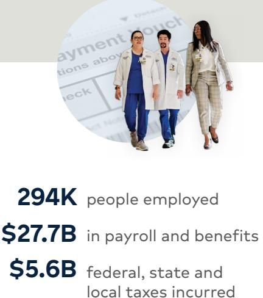
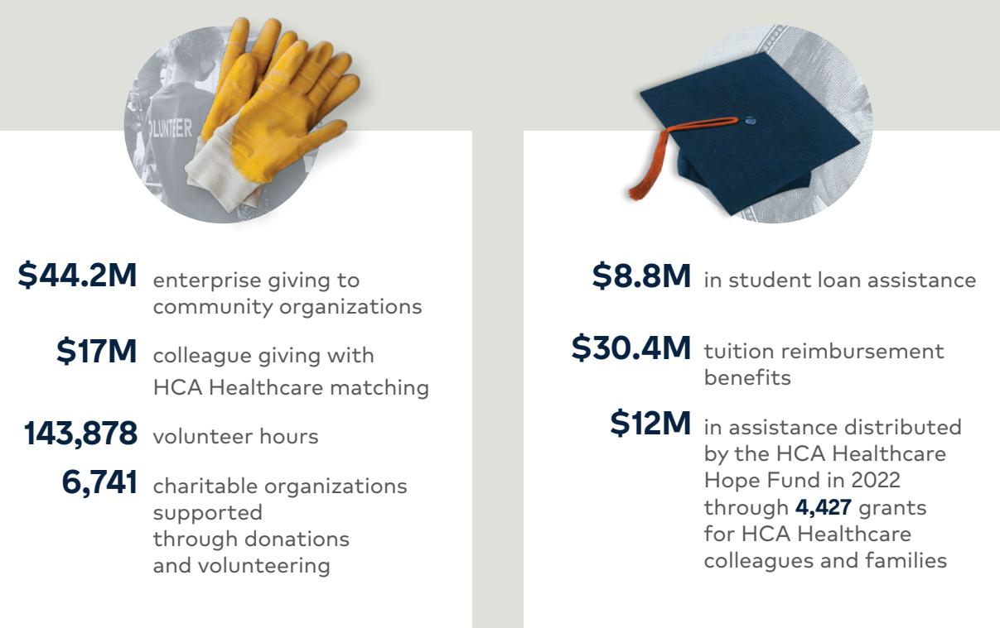
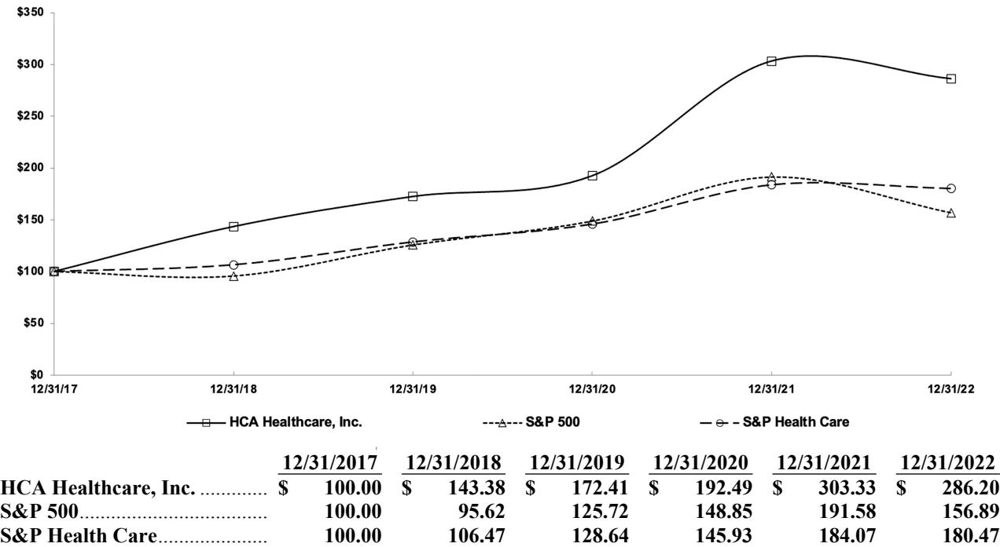
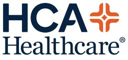
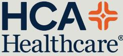

{0}------------------------------------------------

Annual Report to Shareholders

{1}------------------------------------------------

# 2022 by the numbers

|  | \$4.4B in capital investment |  |
|--|------------------------------|--|
|--|------------------------------|--|

| 2.0M+ | admissions |
|-------|------------|
|-------|------------|

- **37M+** patient encounters
- **9.0M** emergency room visits
- **\$3.5B** estimated cost of uncompensated care provided

{2}------------------------------------------------

# To our valued shareholders,

2022 was another positive year for HCA Healthcare. Our 182 hospitals and approximately 2,300 ambulatory sites of care cared for more than 37 million patients. Our people, nearly 294,000 colleagues and 45,000 physicians on our medical staff, fulfilled our core mission by continuing to show up and deliver highquality healthcare services to our communities.

The impact of COVID-19 continued to significantly influence the healthcare industry; however, HCA Healthcare performed well by balancing local needs while also developing more enterprise capabilities to support our local networks. As leaders, our actions were informed by lessons learned during the pandemic: the importance of setting clear priorities; the power of teamwork and partnerships; the significance of timely decision-making and execution; and communicating timely and transparently to our stakeholders.

The aftermath of the pandemic created a number of industrywide challenges. There has been a clear disruption in the labor market; inflationary pressures have driven up costs; and capacity constraints have affected the ability to meet patient demand. To address these matters, our teams continued to incorporate financial resiliency measures while focusing on four key areas: recruitment, retention, new care models, and capacity management. These initiatives will carry us into 2023.

Financially, we ended the year in a solid position. Our revenues for the year totaled \$60.2 billion, a 2.5% increase from 2021.

 **We generated \$8.5 billion in cash flows from operations, providing us with the capacity to execute a balanced approach to capital allocation.** 

- • As you see later in this letter, we invested substantial amounts of capital into our facilities.
- • We repurchased \$7 billion, or over 30 million shares, of common stock.
- • We increased our quarterly dividend by 17% over 2021.

Additionally, we generated over \$1.2 billion of pre-tax proceeds from divestitures. And, as a taxpaying healthcare provider, we incurred approximately \$5.6 billion of federal, state, and local taxes, including \$2.3 billion of income, property, and sales and use taxes.

#### Above all else, we are committed to the care and improvement of human life.

 HCA Healthcare's **182 hospitals** are supported 
by approximately **2,300
 ambulatory sites of care** in **20
 states** and the U.K., including:

> 126 surgery centers

130 freestanding emergency rooms

1,616 physician practices

270 urgent care clinics

43 home health and hospice agencies

61 behavioral health sites of care

Learn more about our collective impact at HCAhealthcareImpact.com.

*As of Dec. 31, 2022

{3}------------------------------------------------

#### **Most importantly, we stayed true to our mission and values – caring for our patients, people, and communities.**

- • We cared for over 2 million inpatient admissions, almost 9 million emergency room visits, over 1.5 million surgical procedures and over 200,000 deliveries.
- • 25% of our admissions and 48% of our emergency room visits were for the treatment of patients who were either uninsured or covered under Medicaid.
- • We provided uncompensated care at an estimated cost of \$3.5 billion.

We believe HCA Healthcare is poised to meet today's challenges and take advantage of the opportunities before us.

On the workforce front, HCA Healthcare made investments in our people this past year. Overall, we believe our workforce initiatives are starting to take hold. This past year, we increased our investment in recruitment to help hire approximately 105,000 colleagues.

To further bolster our nursing development programs, HCA Healthcare opened seven more Galen College of Nursing schools. We expect to open more schools in 2023. HCA Healthcare has more than 93,000 registered nurses holding positions from bedside caregivers to leadership roles in various healthcare settings and at every level throughout the organization. Bringing Galen into the HCA Healthcare family was designed to combine two leading nursing organizations to increase access to nursing education and to provide nursing career development opportunities for HCA Healthcare colleagues.

In 2022, HCA Healthcare invested more than \$135 million in our clinical education programs, including centers for clinical advancement. These investments enhance the learning environment for our people so we can advance nursing care for our patients. Workforce development remains a top priority. We anticipate more investments in these areas in the future.

As part of our workforce development initiatives and to help with the country's issue of physician shortages, HCA Healthcare has become a significant provider of medical education. We have 320 Accreditation Council for Graduate Medical Education (ACGME) programs, more than 5,300 residents and fellows, and 66 teaching hospitals across 16 states.

In addition to growing the pipeline of physicians and nurses, it's important that we continue to upgrade our facilities to meet the growing demand for healthcare. In 2022, HCA Healthcare invested \$4.4 billion in our existing facilities. That's the most HCA Healthcare has ever invested in our capital spending in a single year. These investments provide us with expanded capacity, advanced clinical technology, and better facilities for our patients.

As part of our capital spending, we continued to expand our outpatient network in key markets. For example, in 2022, HCA Healthcare purchased MD Now Urgent Care, a network of 59 urgent care centers in Florida, which was one of the largest urgent care acquisitions in the healthcare industry.

Adding MD Now Urgent Care in Florida enhances our already strong capabilities in a rapidly growing state by providing convenient outpatient care options for our patients. It also connects MD Now patients to a comprehensive statewide network of care, including acute care and specialty services, should they be needed.

{4}------------------------------------------------

We also announced plans to build new full-service hospitals in Texas and Florida to help meet both states' growing needs for healthcare services.

These facilities and hospitals would provide more resources for the communities we serve and help us deliver the quality care and easier access our patients deserve.

And while we continued to educate our clinicians, update our facilities, and grow our networks, HCA Healthcare continued to remain a leader in operational and clinical excellence.

We are proud to say that in 2022 Ethisphere recognized HCA Healthcare as one of the World's Most Ethical Companies for the 12th time. We were also recognized for the second consecutive year on the 2022 LinkedIn Top Companies ranking, an annual list that helps professionals identify the top workplaces to grow their careers. Additionally, we were named by Military Times as one of the country's best employers based on the company's efforts to recruit, retain, and support current and former service members, military spouses, and military caregivers.

As an organization, we have programs and initiatives that underscore our strong sense of purpose to do what is right for our patients, colleagues, and the communities we serve, and these awards reflect that culture. As a result, and thanks to our clinical staff's hard work and dedication this past year, in the fall 2022, more than 80% of our hospitals rated by The Leapfrog Group received an "A" or "B" Leapfrog Safety Score.

On the innovation front, HCA Healthcare's Care Transformation and Innovation (CT&I) department is working to deliver the healthcare of the future and support our care teams. For example, this past year, we launched a pilot in the Labor and Delivery (L&D) space – "Staff Scheduler." The Staff Scheduler system predicts staffing needs based on a machine-learning algorithm, measures the difficulty of procedures, and improves staffing according to proficiencies and preferences. Since the pilot launched, we have saved time, improved staffing to meet our patients' needs, and increased nurse satisfaction.

CT&I's work to identify, build, and roll out new technology solutions and innovative processes should create better outcomes and experiences for our care teams and patients. We look forward to sharing more of their work.

To further enhance our technology, we decided to update our clinical systems. This updated clinical system is designed to provide HCA Healthcare clinicians with an intuitive, mobile user interface, personalized to our workflows. In addition, we expect it will allow us to standardize our data sets more effectively and utilize cloud-based analytics to support better clinical decisions, improve efficiencies, and create a safer environment for our patients.

And as we continue to innovate and integrate technology into patient care, we are partnering with organizations that share our common goal.

For example, we recently partnered with McKesson Corporation to form an oncology research joint venture combining McKesson's U.S. Oncology Research (USOR) and HCA Healthcare's Sarah Cannon Research Institute (SCRI). Together, USOR and SCRI create a fully integrated oncology research organization with goals to expand clinical research, accelerate drug development, and increase availability and access to clinical trials for community oncology providers and patients. In addition, this joint venture with McKesson, which unifies our oncology research experts, is intended to promote the development of individualized therapies and provide more opportunities for cancer patients to receive new treatments.

{5}------------------------------------------------

HCA Healthcare is collaborating with Johnson & Johnson to address key issues in the healthcare industry, including improving health outcomes through early-stage lung cancer detection for the Black community, providing more resources for our nurses on health equity issues, and collaborating on cardiovascular health initiatives. HCA Healthcare and Johnson & Johnson have had a long and productive relationship, and both companies have worked hard to address many of our country's healthcare challenges. We are excited to collaborate to advance health equity, enhance patient care and provide even greater support to our nurses.

And in conjunction with the HCA Healthcare Foundation and the American Heart Association, we have started a new initiative, Getting to the Heart of Stroke, to help prevent initial and recurrent strokes and improve overall stroke care. This initiative will launch in 15 select HCA Healthcare markets to empower consumers to know and better manage stroke risk, deepen collaboration between healthcare professionals, and improve the overall health of communities. Through this collaboration, we hope to have a significant impact in improving heart and brain health outcomes in order to beat stroke.

Additionally, we continue to show up for our colleagues and the communities we serve in their time of need.

In the aftermath of Hurricane Ian,

HCA Healthcare showed up and supported our Florida communities. Our human resources and supply chain teams deployed on-site mini-marts, fuel stations, showers, and laundry services in Florida to assist facilities, colleagues, and nearby health systems in need. In addition, the HCA Healthcare Hope Fund received 776 applications from colleagues, with more than

\$1.2 million being provided to colleagues impacted by the hurricane. We are incredibly proud of how our Florida colleagues responded before, during, and in the wake of Hurricane Ian.

Furthermore, HCA Healthcare and the HCA Healthcare Foundation showed up and supported several organizations in our communities throughout the year. For example, the Foundation committed approximately \$1.38 million over three years to the Girl Scouts of the USA to provide mental wellness workshops to girls in grades 4-12 nationwide, over \$350,000 to Kentucky flood relief efforts, \$600,000 to Volunteers of America over two years to promote mental wellbeing and resiliency for first responders and front-line caregivers, \$250,000 to the American Red Cross to support disaster relief and preparedness nationwide, and more.

Through the HCA Healthcare Foundation's Healthier Tomorrow Fund, we are also aligning with strategic partners who share our goal of creating a more diverse pipeline of healthcare leaders.

The HCA Healthcare Foundation also committed to donating \$1.35 million over the next three years to Educate Texas, an initiative of the Communities Foundation of Texas. This grant aims to increase access to student programs that enable healthcare careers, including high schools in Texas that offer Pathways in Technology Early College High School (P-TECH) healthcare career tracks.

We also continued our commitment to support Historically Black Colleges and Universities (HBCUs) and Hispanic-Serving Institutions (HSIs) in communities near our hospitals. As part of this commitment, we are investing \$1.5 million to Florida International University's Nicole Wertheim College of Nursing & Health Sciences (NWCNHS) to address the national nursing shortage. Additionally, we announced an investment of \$750,000 to The University of Texas at El Paso to advance diversity in healthcare 

{6}------------------------------------------------

leadership. HCA Healthcare is also investing \$1.55 million to Tennessee State University to fund scholarships for students pursuing healthcare and computer science careers, and \$1.5 million to Fisk University to support students pursuing the accelerated dual-degree program with Galen College of Nursing.

HCA Healthcare has announced approximately \$6.75 million in gifts since 2021 to multiple colleges and universities as part of our three-year \$10 million pledge to HBCUs/HSIs. These partnerships will help support students pursuing a career in healthcare and, in turn, create a more diverse talent pipeline of healthcare leaders.

Our dedication to showing up for the communities we serve also includes understanding how the environment impacts overall health. To help ensure our current and future environmental strategies, like reducing our carbon emissions, are carried out, HCA Healthcare has robust governance in place to prepare and execute our sustainability plans.

#### **We look forward to continuing to show up for our colleagues and communities in 2023 and beyond.**

As we push forward on our journey to be the provider system of choice, HCA Healthcare announced organizational changes which, we believe, can be a catalyst for unlocking even more value for our stakeholders. As of January 1, 2023, we have a new operating model that includes a chief operating officer, an additional senior vice president-finance, and three operating groups with five domestic divisions each. The new organizational design reflects a structure that is intended to align better with our strategy, streamline areas that can improve long-term performance, and provide greater focus and better coordination in supporting our business. As mentioned previously, the COVID-19 pandemic taught us that we need to be well-positioned to make timely decisions and act quickly. We believe that's exactly what this structural change will do.

All in all, we are coming out of this pandemic with momentum. We believe HCA Healthcare is wellpositioned culturally, competitively, and financially. We are grateful for the hard work and dedication our colleagues showed this past year in carrying out HCA Healthcare's mission, and we want to thank them in advance for what they're going to accomplish in the year ahead.

**Thomas F. Frist III**  Chairman of the Board

**Samuel N. Hazen**  Chief Executive Officer

{7}------------------------------------------------

## **UNITED STATES SECURITIES AND EXCHANGE COMMISSION**

**Washington, D.C. 20549**

# **Form 10-K**

#### **(Mark One)**

☒ **ANNUAL REPORT PURSUANT TO SECTION 13 OR 15(d) OF THE SECURITIES EXCHANGE ACT OF 1934**

**For the fiscal year ended December 31, 2022**

**Or**

☐ **TRANSITION REPORT PURSUANT TO SECTION 13 OR 15(d) OF THE SECURITIES EXCHANGE ACT OF 1934**

**For the transition period from to**

**Commission File Number 1-11239**

# **HCA Healthcare, Inc.**

**(Exact Name of Registrant as Specified in its Charter)**

| Delaware                                                           | 27-3865930          |
|--------------------------------------------------------------------|---------------------|
| (State or Other Jurisdiction of                                    | (I.R.S. Employer    |
| Incorporation or Organization)                                     | Identification No.) |
| One Park Plaza                                                     |                     |
| Nashville, Tennessee                                               | 37203               |
| (Address of Principal Executive Offices)                           | (Zip Code)          |
| Registrant's telephone number, including area code: (615) 344-9551 |                     |
| Securities Registered Pursuant to Section 12(b) of the Act:        |                     |

|                                | Trading   | Name of Each Exchange   |  |  |
|--------------------------------|-----------|-------------------------|--|--|
| Title of Each Class            | Symbol(s) | on Which Registered     |  |  |
| Common Stock, \$0.01 Par Value | HCA       | New York Stock Exchange |  |  |
|                                |           |                         |  |  |

**Securities Registered Pursuant to Section 12(g) of the Act: None**

Indicate by check mark if the Registrant is a well-known seasoned issuer, as defined in Rule 405 of the Securities Act. Yes ☒ No ☐ Indicate by check mark if the Registrant is not required to file reports pursuant to Section 13 or Section 15(d) of the Act. Yes ☐ No ☒

Indicate by check mark whether the Registrant (1) has filed all reports required to be filed by Section 13 or 15(d) of the Securities Exchange Act of 1934 during the preceding 12 months (or for such shorter period that the Registrant was required to file such reports), and (2) has been subject to such filing requirements for the past 90 days. Yes ☒ No ☐

Indicate by check mark whether the Registrant has submitted electronically every Interactive Data File required to be submitted pursuant to Rule 405 of Regulation S-T (§ 232.405 of this chapter) during the preceding 12 months (or for such shorter period that the Registrant was required to submit such files). Yes ☒ No ☐

Indicate by check mark whether the Registrant is a large accelerated filer, an accelerated filer, a non-accelerated filer, a smaller reporting company, or an emerging growth company. See the definitions of "large accelerated filer," "accelerated filer," "smaller reporting company" and "emerging growth company" in Rule 12b-2 of the Exchange Act.

Large accelerated filer ☒ ☐

Accelerated filer ☐ ☐ ☐ Non-accelerated filer Smaller reporting company Emerging growth company

If an emerging growth company, indicate by check mark if the Registrant has elected not to use the extended transition period for complying with any new or revised financial accounting standards provided pursuant to Section 13(a) of the Exchange Act. ☐

Indicate by check mark whether the Registrant has filed a report on and attestation to its management's assessment of the effectiveness of its internal control over financial reporting under Section 404(b) of the Sarbanes-Oxley Act (15 U.S.C. 7262(b)) by the registered public accounting firm that prepared or issued its audit report. ☒

If securities are registered pursuant to Section 12(b) of the Act, indicate by check mark whether the financial statements of the registrant included in the filing reflect the correction of an error to previously issued financial statements. ☐

Indicate by check mark whether any of those error corrections are restatements that required a recovery analysis of incentive-based compensation received by any of the registrant's executive officers during the relevant recovery period pursuant to §240.10D-1(b). ☐

Indicate by check mark whether the Registrant is a shell company (as defined in Rule 12b-2 of the Act). Yes ☐ No ☒

Auditor PCAOB ID Number: 42 Auditor Name: Ernst & Young LLP Auditor Location: Nashville, Tennessee, United States of America

As of January 31, 2023, there were 276,966,400 outstanding shares of the Registrant's common stock. As of June 30, 2022, the aggregate market value of the common stock held by nonaffiliates was approximately \$36.171 billion. For purposes of the foregoing calculation only, Hercules Holding II and the Registrant's directors and executive officers have been deemed to be affiliates.

#### **DOCUMENTS INCORPORATED BY REFERENCE**

Portions of the Registrant's definitive proxy materials for its 2023 Annual Meeting of Stockholders are incorporated by reference into Part III hereof.

{8}------------------------------------------------

# **INDEX**

# **Page**

| Item 1.  | Business                                                                                                        |
|----------|-----------------------------------------------------------------------------------------------------------------|
| Item 1A. | Risk Factors                                                                                                    |
| Item 1B. | Unresolved Staff Comments                                                                                       |
| Item 2.  | Properties                                                                                                      |
| Item 3.  | Legal Proceedings                                                                                               |
| Item 4.  | Mine Safety Disclosures                                                                                         |
| Part II  |                                                                                                                 |
| Item 5.  | Market for Registrant's Common Equity, Related Stockholder Matters and Issuer Purchases of Equity Securities |
| Item 6.  | [Reserved]                                                                                                      |
| Item 7.  | Management's Discussion and Analysis of Financial Condition and Results of Operations                           |
| Item 7A. | Quantitative and Qualitative Disclosures about Market Risk                                                      |
| Item 8.  | Financial Statements and Supplementary Data                                                                     |
| Item 9.  | Changes in and Disagreements with Accountants on Accounting and Financial Disclosure                            |
| Item 9A. | Controls and Procedures                                                                                         |
| Item 9B. | Other Information                                                                                               |
| Item 9C. | Disclosure Regarding Foreign Jurisdictions that Prevent Inspections                                             |
| Part III |                                                                                                                 |
| Item 10. | Directors, Executive Officers and Corporate Governance                                                          |
| Item 11. | Executive Compensation                                                                                          |
| Item 12. | Security Ownership of Certain Beneficial Owners and Management and Related Stockholder Matters               |
| Item 13. | Certain Relationships and Related Transactions, and Director Independence                                       |
| Item 14. | Principal Accountant Fees and Services                                                                          |
| Part IV  |                                                                                                                 |
| Item 15. | Exhibits and Financial Statement Schedules                                                                      |
| Item 16. | Form 10-K Summary                                                                                               |
|          | Signatures                                                                                                      |

{9}------------------------------------------------

# **PART I**

Our facilities are located in 20 states and England.

### **Item 1.** *Business*

**General** HCA Healthcare, Inc. is one of the leading health care services companies in the United States. At December 31, 2022, we operated 182 hospitals, comprised of 175 general, acute care hospitals; five psychiatric hospitals; and two rehabilitation hospitals. In addition, we operated 126 freestanding surgery centers and 21 freestanding endoscopy centers.

The terms "Company," "HCA," "HCA Healthcare," "we," "our" or "us," as used herein and unless otherwise stated or indicated by context, refer to HCA Healthcare, Inc. and its affiliates. The term "affiliates" means direct and indirect subsidiaries of HCA Healthcare, Inc. and partnerships and joint ventures in which such subsidiaries are partners. The terms "facilities" or "hospitals" refer to entities owned and operated by affiliates of HCA, and the term "employees" refers to employees of affiliates of HCA.

Our primary objective is to provide a comprehensive array of quality health care services in the most cost-effective manner possible. Our general, acute care hospitals typically provide a full range of services to accommodate such medical specialties as internal medicine, general surgery, cardiology, oncology, neurosurgery, orthopedics and obstetrics, as well as diagnostic and emergency services. Outpatient and ancillary health care services are provided by our general, acute care hospitals, freestanding surgery centers, freestanding emergency care facilities, urgent care facilities, walk-in clinics, diagnostic centers and rehabilitation facilities. Our psychiatric hospitals provide a full range of mental health care services through inpatient, partial hospitalization and outpatient settings.

Our common stock is traded on the New York Stock Exchange (symbol "HCA"). Through our predecessors, we commenced operations in 1968. HCA Healthcare, Inc. was incorporated in Delaware in October 2010. Our principal executive offices are located at One Park Plaza, Nashville, Tennessee 37203, and our telephone number is (615) 344- 9551.

#### **Available Information**

We file certain reports with the Securities and Exchange Commission (the "SEC"), including annual reports on Form 10-K, quarterly reports on Form 10-Q and current reports on Form 8-K. The SEC maintains an Internet site at http://www.sec.gov that contains the reports, proxy and information statements and other information we file. Our website address is www.hcahealthcare.com. Please note that our website address is provided throughout this report as an inactive textual reference only. We make available free of charge, through our website, our annual report on Form 10-K, quarterly reports on Form 10-Q, current reports on Form 8-K and all amendments to those reports filed or furnished pursuant to Section 13 or 15(d) of the Exchange Act, as soon as reasonably practicable after such material is electronically filed with or furnished to the SEC. The information provided on our website is not part of this report, and is therefore not incorporated by reference unless such information is specifically referenced elsewhere in this report.

Our Code of Conduct is available free of charge upon request to our Investor Relations Department, HCA Healthcare, Inc., One Park Plaza, Nashville, Tennessee 37203, and is also available on the Ethics and Compliance and Corporate Governance portion of our website at www.hcahealthcare.com.

# **Business Strategy**

We are committed to providing the communities we serve with high quality, convenient and cost-effective health care while growing our business and creating long-term value for our stockholders. We strive to be the health care system of choice in the communities we serve by developing comprehensive networks locally and supporting these networks with enterprise expertise and economies of scale. Our strategy is organized around a framework that seeks to drive sustained growth by delivering operational excellence, attracting exceptional physicians and other health care professionals, developing comprehensive services; creating greater access, and coordinating higher quality care for patients.

{10}------------------------------------------------

To achieve these objectives, we align our efforts around the following growth agenda:

- • grow our presence in existing markets;
- • achieve industry-leading performance in clinical, operational and satisfaction measures;
- • recruit and retain physicians and other health care professionals to meet the need for high quality health services;
- • continue to utilize economies of scale to grow the Company; and
- • pursue a disciplined development strategy.

Our strategy also emphasizes investments that advance our clinical systems and digital capabilities, transform care models with innovative care solutions, expand our workforce development programs and enhance our health care networks and partnerships.

#### **Health Care Facilities**

We currently own, manage or operate hospitals, freestanding surgery centers, freestanding emergency care facilities, urgent care facilities, walk-in clinics, diagnostic and imaging centers, radiation and oncology therapy centers, comprehensive rehabilitation and physical therapy centers, physician practices, home health, hospice, outpatient physical therapy home and community-based services providers, and various other facilities.

At December 31, 2022, we owned and operated 175 general, acute care hospitals with 48,508 licensed beds. Most of our general, acute care hospitals provide medical and surgical services, including inpatient care, intensive care, cardiac care, diagnostic services and emergency services. The general, acute care hospitals also provide outpatient services such as outpatient surgery, laboratory, radiology, respiratory therapy, cardiology and physical therapy. Each hospital has an organized medical staff and a local board of trustees or governing board comprised of members of the local community.

At December 31, 2022, we operated five psychiatric hospitals with 593 licensed beds. Our psychiatric hospitals provide therapeutic programs, including child, adolescent and adult psychiatric care and adolescent and adult alcohol and drug abuse treatment and counseling.

We also operate outpatient health care facilities, which include freestanding ambulatory surgery centers ("ASCs"), freestanding emergency care facilities, urgent care facilities, walk-in clinics, diagnostic and imaging centers, comprehensive rehabilitation and physical therapy centers, radiation and oncology therapy centers, physician practices and various other facilities. These outpatient services are an integral component of our strategy to develop comprehensive health care networks in select communities. Most of our ASCs are operated through partnerships or limited liability companies, with majority ownership of each partnership or limited liability company typically held by a general partner or member that is an affiliate of HCA.

Certain of our affiliates provide a variety of management services to our health care facilities, including patient safety programs, ethics and compliance programs, national supply contracts, equipment purchasing and leasing contracts, accounting, financial and clinical systems, governmental reimbursement assistance, construction planning and coordination, information technology systems and solutions, legal counsel, human resources services and internal audit services.

#### **COVID-19**

We believe the extent of COVID-19's impact on our operating results and financial condition has been and could continue to be driven by many factors, most of which are beyond our control and ability to forecast. Because of these uncertainties, we cannot estimate how long or to what extent COVID-19 will impact our operations.

{11}------------------------------------------------

#### **Summary Risk Factors**

You should carefully read and consider the risk factors set forth under Item 1A, "Risk Factors," as well as all other information contained in this annual report on Form 10-K. Additional risks and uncertainties not presently known to us or that we currently deem immaterial may also affect us. If any of these risks occur, our business, financial position, results of operations, cash flows or prospects could be materially, adversely affected. Our business is subject to the following principal risks and uncertainties:

Risks related to COVID-19 and other potential pandemics:

- • COVID-19 has affected, and may continue to affect, our operations. Further, COVID-19 could negatively impact our business, financial condition, and cash flows, particularly if it causes public health conditions and/or economic conditions to deteriorate.
- • We are unable to predict the ultimate impact of the CARES Act (as defined below) and other stimulus and relief legislation or the effect that such legislation and other governmental responses intended to assist providers in responding to COVID-19 may have on our business, financial condition, results of operations or cash flows.
- • The emergence and effects related to a potential future pandemic, epidemic or outbreak of an infectious disease could adversely affect our operations.

Risks related to our indebtedness:

- • Our substantial leverage could adversely affect our ability to raise additional capital to fund our operations, limit our ability to react to changes in the economy or our industry, expose us to interest rate risk to the extent of our variable rate debt and prevent us from meeting our obligations.
- • We may not be able to generate sufficient cash to service all of our indebtedness and may not be able to refinance our indebtedness on favorable terms. If we are unable to do so, we may be forced to take other actions to satisfy our obligations under our indebtedness, which may not be successful.
- • Our debt agreements contain restrictions that limit our flexibility in operating our business.

Risks related to human capital:

- • Our results of operations may be adversely affected by competition for staffing, the shortage of experienced nurses and other health care professionals and labor union activity.
- • We may be unable to attract, hire and retain a highly qualified and diverse workforce, including key management.
- • Our performance depends on our ability to recruit and retain quality physicians.

Risks related to technology, data privacy and cybersecurity:

- • A cybersecurity incident or other form of data breach could result in the compromise of our facilities, confidential data or critical data systems. A cybersecurity incident or other form of data breach could also give rise to potential harm to patients; remediation and other expenses; and exposure to liability under HIPAA (as defined below), consumer protection laws, common law theories or other laws. Such incidents could subject us to litigation and foreign, federal and state governmental inquiries, damage our reputation, and otherwise be disruptive to our business.
- • Our operations could be impaired by a failure of our information systems.
- • Health care technology initiatives, particularly those related to sharing patient data and interoperability, may adversely affect our operations.
- • We may not be reimbursed for the cost of expensive, new technology.

Risks related to governmental regulation and other legal matters:

- • Our business and results of operations may be adversely affected by health care reform efforts. We are unable to predict whether, what, and when additional health reform measures will be adopted or implemented, and the effects and ultimate impact of any such measures are uncertain and may adversely affect our business and results of operations.

{12}------------------------------------------------

- • Changes in government health care programs may adversely affect our revenues.
- • If we fail to comply with extensive laws and government regulations, we could suffer penalties or be required to make significant changes to our operations.
- • State efforts to regulate the construction or expansion of health care facilities could impair our ability to operate and expand our operations.
- • We may incur additional tax liabilities.
- • We have been and could become the subject of government investigations, claims and litigation.
- • We may be subject to liabilities from claims brought against our facilities, which are costly to defend and may require us to pay significant damages if not covered by insurance.

Risks related to operations, strategy, demand and competition:

- • Our hospitals and other facilities face competition for patients from other hospitals and health care providers.
- • Any increase in the volume of uninsured patients or deterioration in the collectability of uninsured and patient due accounts could adversely affect our results of operations.
- • If our volume of patients with private health insurance coverage declines or we are unable to retain and negotiate favorable contracts with private third-party payers, including managed care plans, our revenues may be adversely affected.
- • Changes to physician utilization practices and treatment methodologies, third-party payer controls designed to reduce inpatient services or surgical procedures and other factors outside our control that impact demand for medical services may reduce our revenues.
- • We may encounter difficulty acquiring hospitals and other health care businesses, encounter challenges integrating the operations of acquired hospitals and other health care businesses and/or become liable for unknown or contingent liabilities as a result of acquisitions.
- • Our facilities are heavily concentrated in Florida and Texas, which makes us sensitive to regulatory, economic, public health, environmental and competitive conditions and changes in those states.
- • Our business and operations are subject to risks related to climate change.
- • We may be adversely affected if we are not able to achieve our environmental, social and governance ("ESG") goals or otherwise meet the expectations of our stakeholders with respect to ESG matters.
- • The industry trend toward value-based purchasing may negatively impact our revenues.

Risks related to macroeconomic conditions:

- • Our overall business results may suffer during periods of general economic weakness.
- • We are exposed to market risk related to changes in the market values of securities and interest rates.

Risks related to ownership of our common stock:

- • There can be no assurance that we will continue to pay dividends.
- • Certain of our investors may continue to have influence over us.

#### **Sources of Revenue**

Hospital revenues depend upon inpatient occupancy levels, the medical and ancillary services ordered by physicians and provided to patients, the volume of outpatient procedures and the charges or payment rates for such services. Reimbursement rates for inpatient and outpatient services vary significantly depending on the type of third-party payer, the type of service (e.g., medical/surgical, intensive care or psychiatric) and the geographic location of the hospital. Inpatient occupancy levels fluctuate for various reasons, many of which are beyond our control.

{13}------------------------------------------------

We receive payments for patient services from the federal government under the Medicare program, state governments under their respective Medicaid or similar programs, managed care plans (including plans offered through the American Health Benefit Exchanges ("Exchanges")), private insurers and directly from patients. Our revenues by primary third-party payer classification and other (including uninsured patients) for the years ended December 31, 2022, 2021 and 2020 are summarized in the following table (dollars in millions):

|                                                    | Years Ended December 31, |       |                  |       |                  |        |
|----------------------------------------------------|--------------------------|-------|------------------|-------|------------------|--------|
|                                                    | 2022                     | Ratio | 2021             | Ratio | 2020             | Ratio  |
| Medicare                                        | \$ 10,447                |       | 17.3% \$ 10,447  |       | 17.8% \$ 10,420  | 20.2%  |
| Managed Medicare                                | 9,201                    | 15.3  | 8,424            | 14.3  | 6,997            | 13.6   |
| Medicaid                                        | 2,636                    | 4.4   | 2,290            | 3.9   | 1,965            | 3.8    |
| Managed Medicaid                                | 3,998                    | 6.6   | 3,124            | 5.3   | 2,621            | 5.1    |
| Managed care and other insurers                 | 29,120                   | 48.3  | 30,295           | 51.6  | 26,535           | 51.5   |
| International(managed care and other insurers)  | 1,317                    | 2.2   | 1,336            | 2.3   | 1,120            | 2.2    |
| Other                                           | 3,514                    | 5.9   | 2,836            | 4.8   | 1,875            | 3.6    |
| Revenues                                        | \$ 60,233                |       | 100.0% \$ 58,752 |       | 100.0% \$ 51,533 | 100.0% |

Medicare is a federal program that provides certain hospital and medical insurance benefits to persons age 65 and over, some disabled persons, persons with end-stage renal disease and persons with Lou Gehrig's Disease. Medicaid is a federal-state program, administered by the states, that provides hospital and medical benefits to qualifying low-income individuals. All of our general, acute care hospitals located in the United States are eligible to participate in Medicare and Medicaid programs. Amounts received under Medicare and Medicaid programs are generally significantly less than established hospital gross charges for the services provided.

Our hospitals generally offer discounts from established charges to certain group purchasers of health care services, including private health insurers, employers, health maintenance organizations ("HMOs"), preferred provider organizations ("PPOs") and other managed care plans, including health plans offered through the Exchanges. These discount programs generally limit our ability to increase revenues in response to increasing costs. See Item 1, "Business — Competition." For services under Medicare, Medicaid, HMOs, PPOs and other managed care plans, patients are generally responsible for any exclusions, deductibles or coinsurance features of their coverage. The amounts of such exclusions, deductibles and coinsurance continue to increase. Collection of amounts due from individuals is typically more difficult than from government health care programs or other third-party payers. We provide discounts to uninsured patients who do not qualify for Medicaid or for financial relief under our charity care policy. We may attempt to provide assistance to uninsured patients to help determine whether they may qualify for Medicaid, other federal or state assistance or charity care under our charity care policy. If an uninsured patient does not qualify for these programs, the uninsured discount is applied.

#### *Medicare*

In addition to the reimbursement reductions and adjustments discussed below, the Budget Control Act of 2011 (the "BCA") requires automatic spending reductions to reduce the federal deficit, resulting in a uniform percentage reduction across all Medicare programs of 2% per fiscal year. The Coronavirus Aid, Relief, and Economic Security ("CARES") Act and related legislation temporarily suspended these reductions through March 31, 2022 and reduced the sequestration adjustment from 2% to 1% from April 1 through June 30, 2022. The full 2% reduction resumed on July 1, 2022. The BCA sequestration has been extended through the first six months of 2032. In addition, the American Rescue Plan Act of 2021 ("ARPA") increased the federal budget deficit in a manner that triggers an additional sequestration mandated under the Pay As You Go Act of 2010 ("PAYGO Act"). As a result, a further payment reduction of up to 4% was required to take effect in January 2022. However, Congress has delayed implementation of this payment reduction until 2025. We anticipate that the federal deficit will continue to place pressure on government health care programs, and it is possible that future deficit reduction legislation will impose additional spending reductions.

#### *Inpatient Acute Care*

Under the Medicare program, we receive reimbursement under a prospective payment system ("PPS") for general, acute care hospital inpatient services. Under the hospital inpatient PPS, fixed payment amounts per inpatient discharge are established based on the patient's assigned Medicare severity diagnosis-related group ("MS-DRG"). MS-DRGs classify treatments for illnesses according to the estimated intensity of hospital resources necessary to furnish care for each principal diagnosis. MS-DRG weights represent the average resources for a given MS-DRG relative to the average 

{14}------------------------------------------------

resources for all MS-DRGs. MS-DRG payments are adjusted for area wage differentials. Hospitals, other than those defined as "new," receive PPS reimbursement for inpatient capital costs based on MS-DRG weights multiplied by a geographically adjusted federal rate. When the cost to treat certain patients falls well outside the normal distribution, providers typically receive additional "outlier" payments. These payments are financed by offsetting reductions in the inpatient PPS rates. A high-cost outlier threshold is set annually at a level that targets estimated outlier payments equaling 5.1% of total inpatient PPS payments for the fiscal year.

MS-DRG rates are updated, and MS-DRG weights are recalibrated, using cost-relative weights each federal fiscal year (which begins October 1). The index used to update the MS-DRG rates (the "market basket") gives consideration to the inflation experienced by hospitals and entities outside the health care industry in purchasing goods and services. Each federal fiscal year, the annual market basket update is reduced by a productivity adjustment based on the Bureau of Labor Statistics ("BLS") 10-year moving average of changes in specified economy-wide productivity. A decrease in payment rates or an increase in rates that is below the increase in our costs may adversely affect our results of operations.

For federal fiscal year 2022, the Centers for Medicare & Medicaid Services ("CMS") increased the MS-DRG rate by approximately 2.5%. This increase reflected a market basket update of 2.7%, reduced by a negative 0.7 percentage point productivity adjustment and increased by 0.5 percentage points in accordance with the Medicare Access and CHIP Reauthorization Act of 2015 ("MACRA"). For federal fiscal year 2023, CMS increased the MS-DRG rate by approximately 4.3%. This increase reflects a market basket update of 4.1%, reduced by a negative 0.3 percentage point productivity adjustment and increased by 0.5 percentage points as required by MACRA. Additional adjustments may apply, depending on patient-specific or hospital-specific factors. For example, the two-midnight rule limits payments to hospitals when services to Medicare beneficiaries are payable as inpatient services. In addition, under the post-acute care transfer policy, Medicare reimbursement rates may be reduced when an inpatient hospital discharges a patient in a specified MS-DRG to certain post-acute care settings.

CMS has implemented and is implementing a number of programs and requirements intended to transform Medicare from a passive payer to an active purchaser of quality goods and services. For example, hospitals that do not successfully participate in the Hospital Inpatient Quality Reporting Program are subject to a 25% reduction of the market basket update. Hospitals that do not demonstrate meaningful use of electronic health records ("EHRs") are subject to a 75% reduction of the market basket update.

Further, Medicare does not allow an inpatient hospital discharge to be assigned to a higher paying MS-DRG if certain designated hospital acquired conditions ("HACs") were not present on admission and the identified HAC is the only condition resulting in the assignment of the higher paying MS-DRG. In this situation, the case is paid as though the secondary diagnosis was not present. There are currently 14 categories of conditions on the list of HACs. In addition, the 25% of hospitals with the worst risk-adjusted HAC scores in the designated performance period receive a 1% reduction in their inpatient PPS Medicare payments. CMS has also established three National Coverage Determinations that prohibit Medicare reimbursement for erroneous surgical procedures performed on an inpatient or outpatient basis.

Under the Hospital Readmission Reduction Program ("HRRP"), payments to hospitals may also be reduced based on readmission rates. Each federal fiscal year, inpatient payments are reduced if a hospital experiences "excess" readmissions within the 30-day time period from the date of discharge for conditions designated by CMS. For federal fiscal year 2017 and subsequent years, CMS has designated six conditions or procedures, including heart attack, pneumonia and total hip arthroplasty. Hospitals with what CMS defines as excess readmissions for these conditions or procedures receive reduced payments for all inpatient discharges, not just discharges relating to the conditions or procedures subject to the excess readmission standard. The amount by which payments are reduced is determined by assessing a hospital's performance relative to hospitals with similar proportions of dual eligible patients, subject to a cap established by CMS. The reduction in payments to hospitals with excess readmissions can be up to 3% of a hospital's base payments. Each hospital's performance is publicly reported by CMS.

In addition, under the Hospital Value-Based Purchasing ("HVBP") Program, CMS reduces the inpatient PPS payment amount for all discharges by 2.0%. The total amount collected from these reductions is pooled, and the entire amount collected is redistributed as incentive payments to reward hospitals that meet certain quality performance standards established by CMS. CMS scores each hospital based on achievement (relative to other hospitals) and improvement ranges (relative to the hospital's own past performance) for each applicable performance standard. Hospitals that meet or exceed the quality performance standards receive greater reimbursement under the value-based purchasing program than they would have otherwise. Hospitals that do not achieve the necessary quality performance receive reduced Medicare inpatient hospital payments. Hospitals are scored on a number of individual measures that are categorized into four domains: clinical outcomes; efficiency and cost reduction; safety; and person and community engagement.

{15}------------------------------------------------

As a result of the national public health emergency ("PHE") declared in response to COVID-19, CMS has paused or refined several measures across various hospital quality measurement and value-based purchasing programs. These policies are intended to ensure that the programs neither reward nor penalize hospitals based on circumstances caused by the PHE that the measures were not designed to accommodate. For example, CMS is modifying certain readmissions measures within the HRRP to exclude COVID-19 diagnosed patients. Under the HVBP Program in federal fiscal year 2023, as a result of the measure suppression policy, hospitals will receive a net neutral payment adjustment for each discharge that is equal to the 2% withheld under the program. In addition, facilities that experience extraordinary circumstances beyond their control, that prevent satisfaction of program reporting requirements, may request an exception from CMS.

#### *Outpatient*

CMS reimburses hospital outpatient services (and certain Medicare Part B services furnished to hospital inpatients who have no Part A coverage) on a PPS basis. Hospital outpatient services paid under PPS are classified into groups called ambulatory payment classifications ("APCs"). Services for each APC are similar clinically and in terms of the resources they require. A payment rate is established for each APC. Depending on the services provided, a hospital may be paid for more than one APC for a patient visit. The APC payment rates are updated for each calendar year. Each calendar year, the annual market basket update is further reduced by a productivity adjustment based on the BLS 10-year moving average of changes in specified economy-wide productivity. For calendar year 2022, CMS increased APC payment rates by 2.0%. This increase reflected a market basket increase of 2.7% with a negative 0.7 percentage point productivity adjustment. For calendar year 2023, CMS increased payment rates under the outpatient PPS by an estimated 3.8%. This increase reflects a market basket increase of 4.1% with a negative 0.3 percentage point productivity adjustment. CMS requires hospitals to submit quality data relating to outpatient care to avoid receiving a 2.0 percentage point reduction in the annual payment update under the outpatient PPS.

The Medicare reimbursement we receive may also be affected by broad shifts in payment policy. For example, in June 2022, the U.S. Supreme Court invalidated past payment cuts for hospitals participating in the 340B Drug Pricing Program. Although our hospitals do not participate in the 340B program, the decision has implications for all hospitals reimbursed under the outpatient PPS and could affect our Medicare reimbursement for both past and future periods. The 340B program allows participating hospitals to purchase certain outpatient drugs from manufacturers at discounted rates. These hospitals are reimbursed for the discounted drugs under the same Medicare payment methodology and rates that are applied to non-340B hospitals. The past payment cuts, which CMS implemented in 2018, resulted in increased payments for non-340B hospitals, and it has not yet been determined whether the increased payments to non-340B hospitals may be recouped due to budget neutrality principles. Further, depending on future Medicare payment policies, non-340B hospitals may receive decreased reimbursement going forward for outpatient drugs and services. For calendar year 2023, CMS finalized the payment rate for drugs acquired through the 340B program in light of the Supreme Court decision and, as a result of the payment rate change, is implementing a 3.09% reduction to payment rates for non-drug services under the outpatient PPS for calendar year 2023 to achieve budget neutrality. In addition, CMS has, in recent years, phased in an expanded site-neutral payment policy for clinic visit services provided at all off-campus providerbased departments. Under the policy, clinic visit services provided at all off-campus provider-based departments are generally not covered as outpatient department services under the outpatient PPS, but rather are reimbursed at the Medicare Physician Fee Schedule ("Physician Fee Schedule") rate, which is generally lower than the outpatient PPS rate. Before the expanded policy, the Physician Fee Schedule equivalent rate did not apply to "excepted" provider-based departments. The Physician Fee Schedule equivalent rate for calendar year 2023 is substantially less than the outpatient PPS rate.

#### *Rehabilitation*

CMS reimburses inpatient rehabilitation facilities ("IRFs") on a PPS basis. Under the IRF PPS, patients are classified into case mix groups that reflect the relative resource intensity typically associated with the patient's clinical condition. The case mix groups are based upon impairment, age, functional motor and cognitive scores, and comorbidities (additional diseases or disorders from which the patient suffers). IRFs are paid a predetermined amount per discharge that reflects the patient's case mix group that is adjusted for facility-specific factors, such as area wage levels, proportion of low-income patients, and location in a rural area. Each federal fiscal year, the IRF rates are updated using a market basket index, which is reduced by a productivity adjustment based on the BLS 10-year moving average of changes in specified economy-wide productivity. For federal fiscal year 2022, CMS increased IRF payment rates by an estimated 1.9%, reflecting an IRF market basket update of 2.6% reduced by a negative 0.7 percentage point productivity adjustment. For federal fiscal year 2023, CMS increased IRF payment rates by an estimated 3.9%, reflecting an IRF market basket update of 4.2% with a negative 0.3 percentage point productivity adjustment. In addition, CMS requires IRFs to report quality measures to avoid receiving a reduction of 2.0 percentage points to the market basket update.

{16}------------------------------------------------

In order to qualify for classification as an IRF, at least 60% of a facility's inpatients during the most recent 12 month CMS-defined review period must have required intensive rehabilitation services for one or more of 13 specified conditions. IRFs must also meet additional coverage criteria, including patient selection and care requirements relating to pre-admission screenings, post-admission evaluations, ongoing coordination of care and involvement of rehabilitation physicians. A facility that fails to meet the 60% threshold, or other criteria to be classified as an IRF, will be paid under either the acute care hospital inpatient or outpatient PPS, which generally provide for lower payment amounts. As of December 31, 2022, we had two rehabilitation hospitals and 66 hospital rehabilitation units.

The Improving Medicare Post-Acute Care Transformation Act of 2014 ("IMPACT Act") requires the U.S. Department of Health and Human Services ("HHS"), together with the Medicare Payment Advisory Commission, to work toward a unified payment system for post-acute care services provided by IRFs, home health agencies, skilled nursing facilities, and long-term care hospitals. A unified post-acute care payment system would pay post-acute care providers under a single framework according to a patient's characteristics, rather than based on the post-acute care setting where the patient receives treatment. As required under the statute, CMS issued a report presenting a prototype for a unified post-acute care payment model in July 2022. CMS noted in its report the need for additional analyses and acknowledged that the universal implementation of a unified post-acute care payment system would require congressional action. The Medicare Payment Advisory Commission is required to submit a report to Congress by June 2023.

#### *Psychiatric*

Inpatient hospital services furnished in psychiatric hospitals and psychiatric units of general, acute care hospitals and critical access hospitals are reimbursed on a PPS basis. The inpatient psychiatric facility ("IPF") PPS is based upon a per diem payment, with adjustments to account for certain patient and facility characteristics. The IPF PPS contains an "outlier" policy for extraordinarily costly cases and an adjustment to a facility's base payment if it maintains a full-service emergency department. CMS has established the IPF PPS payment rate in a manner intended to be budget neutral. Each federal fiscal year, IPF payment rates are updated using a market basket index, which is reduced by a productivity adjustment based on the BLS 10-year moving average of changes in specified economy-wide productivity. For federal fiscal year 2022, CMS increased IPF payment rates by an estimated 2.0%, reflecting a 2.7% IPF market basket update reduced by a negative 0.7 percentage point productivity adjustment. For federal fiscal year 2023, CMS increased IPF payment rates by an estimated 3.8%, which reflects a 4.1% IPF market basket increase with a negative 0.3 percentage point productivity adjustment. Together with other policy changes, total payments to IPFs are anticipated to increase by 2.5% in federal fiscal year 2023. Inpatient psychiatric facilities are required to report quality measures to CMS to avoid receiving a 2.0 percentage point reduction to the market basket update. As of December 31, 2022, we had five psychiatric hospitals and 45 hospital psychiatric units.

#### *Ambulatory Surgery Centers*

CMS reimburses ASCs using a predetermined fee schedule. Reimbursements for ASC overhead costs are limited to no more than the overhead costs paid to hospital outpatient departments under the Medicare hospital outpatient PPS for the same procedure. If CMS determines that a procedure is commonly performed in a physician's office, the ASC reimbursement for that procedure is limited to the reimbursement allowable under the Physician Fee Schedule, with limited exceptions. All surgical procedures, other than those that pose a significant safety risk or generally require an overnight stay, are payable as ASC procedures. From time to time, CMS expands the services that may be performed in ASCs, which may result in more Medicare procedures that historically have been performed in hospitals being moved to ASCs, reducing surgical volume in our hospitals. Also, more Medicare procedures that historically have been performed in ASCs may be moved to physicians' offices. Some commercial third-party payers have adopted similar policies.

Historically, CMS updated reimbursement rates for ASCs based on changes to the consumer price index. However, for calendar years through 2023, CMS updates to ASC reimbursement rates will be based on the hospital market basket index, partly to promote site-neutrality between hospitals and ASCs. For each federal fiscal year, the ASC payment system update is reduced by a productivity adjustment based on the BLS 10-year moving average of changes in specified economy-wide productivity. For calendar year 2022, CMS increased ASC payment rates by 2.0%, which reflected a market basket increase of 2.7% and a negative 0.7 percentage point productivity adjustment. For calendar year 2023, CMS increased ASC payment rates by 3.8%, which reflects a market basket increase of 4.1% and a negative 0.3 percentage point productivity adjustment. In addition, CMS has established a quality reporting program for ASCs under which ASCs that fail to report on specified quality measures receive a 2.0 percentage point reduction to the market basket update.

{17}------------------------------------------------

#### *Home Health*

CMS reimburses home health agencies under the Home Health PPS. Home health agencies are paid a national, standardized 30-day period payment rate if a period of care meets a certain threshold of home health visits (periods of care that do not meet the visit threshold are paid a per-visit payment rate for the discipline providing care). The daily home health payment rate is adjusted for case-mix and area wage levels. An outlier adjustment may be paid for periods of care where costs exceed a specific threshold amount. Each calendar year, home health payment rates are updated using a market basket index, which is reduced by a productivity adjustment based on the BLS 10-year moving average of changes in specified economy-wide productivity. For calendar year 2022, CMS increased home health payment rates by 3.2%, based on a home health payment update percentage of 2.6%, which reflected a 3.1% market basket increase reduced by a 0.5 percentage point productivity adjustment, among other changes. For calendar year 2023, CMS increased home health payment rates by 0.7%, based on a home health payment update percentage of 4.0%, which reflects a 4.1% market basket increase reduced by a 0.1 percentage point productivity adjustment, among other changes. Home health agencies that do not submit required quality data are subject to a 2.0 percentage point reduction to the market basket update. In addition, home health agencies are required to submit a one-time Notice of Admission ("NOA") for each patient that establishes that the beneficiary is under a Medicare home health period of care. Failure to submit the NOA within five calendar days from the start of care results in a reduction to the 30-day period payment amount for each day from the start of care date until the date the NOA is submitted.

CMS began implementing a nationwide expansion of the Home Health Value-Based Purchasing ("HHVBP") Model in January 2022. Under the model, home health agencies will receive increases or reductions to their Medicare fee-forservice payments of up to 5%, based on performance against specific quality measures relative to the performance of other home health providers. Data collected in each performance year will impact Medicare payments two years later. Calendar year 2023 is the first performance year under the expanded HHVBP Model, which will affect payments in calendar year 2025.

Payment of claims for home health services may be impacted by the Review Choice Demonstration, a program intended to identify and prevent home health services fraud, reduce the number of Medicare appeals, and improve provider compliance with Medicare program requirements. The program applies only to home health agencies in certain states, including North Carolina, Florida and Texas. Providers in these states may initially select from the following claims review and approval processes: pre-claim review, post-payment review or a minimal post-payment review with a 25% payment reduction. Home health agencies that maintain high levels of compliance are eligible for additional, less burdensome options.

As noted above, the IMPACT Act requires HHS, in conjunction with the Medicare Payment Advisory Commission, to propose a unified post-acute care payment model by 2023. The unified post-acute care payment system would include home health agencies.

#### *Hospice*

Medicare beneficiaries who have a terminal illness and a life expectancy of six months or less may elect to receive hospice benefits (palliative care) instead of standard coverage of treatment for the terminal illness and related conditions. Hospice services are paid under the Hospice PPS, under which CMS sets a daily rate for each day a patient is enrolled in the hospice benefit. The daily rate depends on the level of care provided to a patient (routine home care, continuous home care, inpatient respite care, or general inpatient care). Daily rates are adjusted for factors such as area wage levels. Each federal fiscal year, hospice payment rates are updated using a market basket index, which is reduced by a productivity adjustment based on the BLS 10-year moving average of changes in specified economy-wide productivity. For federal fiscal year 2022, CMS increased hospice payment rates by 2.0%, which reflected a 2.7% market basket update and a negative 0.7 percentage point productivity adjustment. For federal fiscal year 2023, CMS increased hospice payment rates by 3.8%, which reflects a 4.1% market basket update and a negative 0.3 percentage point productivity adjustment. Hospices that fail to satisfy quality reporting requirements receive a 2.0 percentage point reduction to the market basket update. Beginning in 2024, the payment reduction for failure to report quality data will increase to 4.0 percentage points.

Overall payments made by Medicare to each hospice are subject to an inpatient cap and an aggregate cap. The inpatient cap limits the number of days of inpatient care to no more than 20% of total patient care days. The aggregate cap limits the amount of Medicare reimbursement a hospice may receive, based on the number of Medicare patients served. The aggregate cap is updated annually. In federal fiscal year 2023, the aggregate cap is \$32,486.92. If a hospice's Medicare payments exceed its inpatient or aggregate caps, it must repay Medicare for the excess amount.

{18}------------------------------------------------

#### *Physician Services*

Physician services are reimbursed under the Physician Fee Schedule system, under which CMS has assigned a national relative value unit ("RVU") to most medical procedures and services that reflects the various resources required by a physician to provide the services, relative to all other services. Each RVU is calculated based on a combination of work required in terms of time and intensity of effort for the service, practice expense (overhead) attributable to the service and malpractice insurance expense attributable to the service. These three elements are each modified by a geographic adjustment factor to account for local practice costs and are then aggregated. While RVUs for various services may change in a given year, any alterations are required by statute to be virtually budget neutral, such that total payments made under the Physician Fee Schedule may not differ by more than \$20 million from what payments would have been if adjustments were not made. CMS annually reviews resource inputs for select services as part of the potentially misvalued code initiative. To determine the payment rate for a particular service, the sum of the geographically adjusted RVUs is multiplied by a conversion factor. For calendar year 2023, CMS reduced the conversion factor by approximately 4.48%. However, Congress approved a partial offset to this reduction, increasing payment amounts by 2.5%, which will result in a payment reduction of approximately 2% for calendar year 2023.

Medicare payments are adjusted based on participation in the Quality Payment Program ("QPP"), a payment methodology intended to reward high-quality patient care. Physicians and certain other health care clinicians are required to participate in one of two QPP tracks. Under both tracks, performance data collected in each performance year will affect Medicare payments two years later. CMS expects to transition increasing financial risk to providers as the QPP evolves. The Advanced Alternative Payment Model ("Advanced APM") track makes incentive payments available for participation in specific innovative payment models approved by CMS, which are paid two years after the relevant performance period, if a provider has sufficient participation (based on percentage of payments or patients) in an Advanced APM. Providers were able to earn a 5.0% Medicare incentive payment for performance year 2022 (to be paid in 2024), may earn a 3.5% incentive payment for performance year 2023 (to be paid in 2025), and may receive higher Medicare Physician Fee Schedule payment rate updates based on performance in 2025 and beyond. In addition, providers are exempt from the reporting requirements and payment adjustments imposed under the Merit-Based Incentive Payment System ("MIPS"). Alternatively, providers may participate in the MIPS track. Providers electing this option may receive payment incentives or be subject to payment reductions based on their performance with respect to clinical quality, resource use, clinical improvement activities, and meeting Promoting Interoperability standards related to the meaningful use of EHRs. Performance data collected in 2023 will result in payment adjustments of up to 9% in 2025; positive adjustments are subject to a scaling factor to meet budget neutrality requirements. CMS makes available an exception that permits clinicians to request reweighting of any or all performance categories if they encounter an extreme and uncontrollable circumstance or public health emergency, such as COVID-19, that is outside of their control.

#### *Other*

CMS uses fee schedules to pay for physical, occupational and speech therapies, durable medical equipment, clinical diagnostic laboratory services, nonimplantable orthotics and prosthetics and services provided by independent diagnostic testing facilities.

Under the various PPS structures, the payment rates are adjusted for area differences in wage levels by a factor ("wage index") reflecting the relative wage level in the geographic area compared to the national average wage level and taking into account occupational mix. The redistributive impact of wage index changes is not anticipated to have a material financial impact for 2023. CMS recently finalized a permanent, budget-neutral cap on year-to-year wage index changes to smooth variations and decrease volatility.

Medicare reimburses hospitals for a portion (65%) of deductible and coinsurance amounts that are uncollectable from Medicare beneficiaries.

CMS has implemented contractor reform whereby CMS competitively bids the Medicare fiscal intermediary and Medicare carrier functions to Medicare Administrative Contractors ("MACs"), which are geographically assigned across 12 jurisdictions to service both Part A and Part B providers. Home health and hospice providers are serviced across four MAC jurisdictions. While providers with operations across multiple geographies had the option of having all hospitals use one home office MAC, we chose, in most cases, to use the MACs assigned to the geographic areas in which our hospitals are located. CMS periodically re-solicits bids, and the MAC servicing a geographic area can change as a result of the bid competition. MAC transition periods can impact claims processing functions and the resulting cash flows.

CMS contracts with third parties to promote the integrity of the Medicare program through reviews of quality concerns and detections, and corrections of improper payments. Quality Improvement Organizations ("QIOs"), for example, are groups of physicians and other health care quality experts that work on behalf of CMS to ensure that Medicare pays only for goods and services that are reasonable and necessary, and that are provided in the most appropriate setting. Under the Recovery Audit Contractor ("RAC") program, CMS contracts with RACs on a contingency basis to 

{19}------------------------------------------------

conduct post-payment reviews to detect and correct improper payments in the fee-for-service Medicare program. The compensation for RACs is based on their review of claims submitted to Medicare for billing compliance, including correct coding and medical necessity, and the amount of overpayments and underpayments they identify. CMS limits the number of claims that RACs may audit by limiting the number of records that RACs may request from hospitals based on each provider's claim denial rate for the previous year. CMS has implemented the RAC program on a permanent, nationwide basis and expanded the RAC program to the Managed Medicare program and Medicare Part D. CMS has transitioned some of its other integrity programs to a consolidated model by engaging Unified Program Integrity Contractors ("UPICs") to perform audits, investigations and other integrity activities.

We have established policies and procedures to respond to requests from and payment denials by RACs and other Medicare contractors. Payment recoveries resulting from reviews and denials are appealable through administrative and judicial processes, and we pursue reversal of adverse determinations at appropriate appeal levels. We incur additional costs related to responding to requests and denials, including costs associated with responding to requests for records and pursuing the reversal of payment denials and losses associated with overpayments that are not reversed upon appeal. In recent years, there have been significant delays in the Medicare appeals process. Depending upon changes to and the growth of the RAC program and other Medicare integrity programs and our success in appealing claims in future periods, our cash flows and results of operations could be negatively impacted.

Medicare reimburses teaching hospitals for portions of the direct and indirect costs of graduate medical education ("GME") through statutory formulas that are generally based on the number of medical residents and which take into account patient volume or the number of hospital beds. Accrediting organizations review GME programs for compliance with educational standards. Many of our hospitals operate GME or other residency programs to train physicians and other allied health professionals.

#### *Managed Medicare*

Under the Managed Medicare program (also known as Medicare Part C, or Medicare Advantage), the federal government contracts with private health insurers to provide members with Medicare Part A, Part B and Part D benefits. Managed Medicare plans can be structured as HMOs, PPOs or private fee-for-service plans. In addition to covering Part A and Part B benefits, the health insurers may choose to offer supplemental benefits and impose higher premiums and plan costs on beneficiaries. CMS makes fee payment adjustments based on service benchmarks and quality ratings and publishes star ratings to assist beneficiaries with plan selection. According to CMS, nearly half of all Medicare enrollees participate in managed Medicare plans.

#### *Medicaid*

Medicaid programs are funded jointly by the federal government and the states and are administered by states under approved plans. Most state Medicaid program payments are made under a PPS or are based on negotiated payment levels with individual hospitals. Medicaid reimbursement is often less than a hospital's cost of services. The Patient Protection and Affordable Care Act, as amended by the Health Care and Education Reconciliation Act of 2010 (collectively, the "Affordable Care Act") requires states to expand Medicaid coverage to all individuals under age 65 with incomes effectively at or below 138% of the federal poverty level. However, states may opt out of the expansion without losing existing federal Medicaid funding. A number of states, including Texas and Florida, have opted out of the Medicaid expansion. Among these states, the maximum income level required for individuals and families to qualify for Medicaid varies widely.

Medicaid enrollment has increased as a result of COVID-19. Through COVID-19 relief legislation, Congress authorized a temporary increase in federal funds for certain Medicaid expenditures. The enhanced funding is available to states that maintain continuous Medicaid enrollment and meet certain other conditions. The continuous coverage requirement will expire as of April 1, 2023, and the increase in federal funding will be phased out through calendar year 2023. The resumption of redeterminations for Medicaid enrollees and end of the other conditions of funding may lead to coverage disruptions and dis-enrollments of current Medicaid enrollees.

Because most states must operate with balanced budgets and because the Medicaid program is often a state's largest program, many states have adopted or may consider adopting various strategies to reduce their Medicaid expenditures. Outside of the government response to COVID-19, budgetary pressures have, in recent years, resulted and likely will continue to result in decreased spending, or decreased spending growth, for Medicaid programs in many states. Most states in which we operate have adopted broad-based provider taxes to fund the non-federal share of Medicaid programs or fund indigent care within the state. Many states have also adopted, or are considering, legislation designed to reduce coverage, enroll Medicaid recipients in managed care programs and/or impose additional taxes on hospitals to help finance or expand the states' Medicaid systems. Some states use, or have applied to use, waivers granted by CMS to implement Medicaid expansion, impose different eligibility or enrollment restrictions, or otherwise implement programs that vary 

{20}------------------------------------------------

from federal standards. For example, the Texas Healthcare Transformation and Quality Improvement Program, which is operated under a Medicaid waiver, expands Medicaid managed care programs in the state, provides funding for uncompensated care and supports several delivery system reform initiatives. Although this Texas waiver has been extended through 2030, certain delivery system reform initiatives operate under different approval periods. For example, a directed payment program for hospitals in Texas expires August 31, 2023. If Texas is unable to obtain future extensions of this program or similar programs, our revenues could be negatively impacted. In recent years, aspects of existing or proposed Medicaid waiver programs have been subject to legal challenge, resulting in uncertainty. Additionally, federal policies that shape administration of the Medicaid programs at the state level are subject to change, including as a result of changes in the presidential administration. Where states had previously been permitted to condition Medicaid enrollment on work or other community engagement, the approvals of waivers permitting these conditions have been rescinded, and the federal government is also reexamining block grant funding structures. However, a federal court is permitting Georgia to impose work and community engagement requirements under a Medicaid demonstration program that is expected to launch in mid-2023.

Many state Medicaid programs incorporate value-based purchasing models and related payment and delivery system reform initiatives that incentivize improvements in quality of care and cost-effectiveness. For example, federal funds under the Medicaid program may not be used to reimburse providers for treatment of certain provider-preventable conditions. Each state Medicaid program must deny payments to providers for the treatment of health care-acquired conditions designated by CMS as well as other provider-preventable conditions that may be designated by the state.

Congress has expanded the federal government's involvement in fighting fraud, waste and abuse in the Medicaid program through the Medicaid Integrity Program. CMS employs UPICs to perform post-payment audits of Medicaid claims, identify overpayments and perform other program integrity activities. The UPICs collaborate with states and coordinate provider investigations across the Medicare and Medicaid programs. In addition, state Medicaid agencies are required to establish Medicaid RAC programs. These programs vary by state in design and operation.

#### *Managed Medicaid*

Enrollment in managed Medicaid plans has increased in recent years, as state governments seek to control the cost of Medicaid programs. Managed Medicaid programs enable states to contract with one or more entities for patient enrollment, care management and claims adjudication. The states usually do not relinquish program responsibilities for financing, eligibility criteria and core benefit plan design. We generally contract directly with one or more of the designated entities, usually a managed care organization. The provisions of these programs are state-specific. Many states direct managed care plans to pass through supplemental payments to designated providers, independent of services rendered, to ensure consistent funding of providers that serve large numbers of low-income patients. In an effort to more closely tie funds to delivery and outcomes, CMS is limiting these "pass-through payments" that are paid by states under managed Medicaid plan contracts and will generally prohibit such payments by 2027. However, CMS permits new passthroughs of supplemental provider payments for up to a three-year period when states are transitioning Medicaid populations or services from a fee-for-service system to a managed care system.

#### *Accountable Care Organizations and Bundled Payment Initiatives*

An Accountable Care Organization ("ACO") is a network of providers and suppliers that work together to invest in infrastructure and redesign delivery processes to attempt to achieve high quality and efficient delivery of services. Promoting accountability and coordination of care, ACOs are intended to produce savings as a result of improved quality and operational efficiency. ACOs that achieve quality performance standards established by HHS are eligible to share in a portion of the amounts saved by the Medicare program. There are several types of ACO programs, including the Medicare Shared Savings Program.

The CMS Innovation Center is responsible for establishing demonstration projects and other initiatives in order to identify, develop, test and encourage the adoption of new methods of delivering and paying for health care that create savings under the Medicare and Medicaid programs, while improving quality of care. For example, providers participating in bundled payment initiatives agree to receive one payment for services provided to Medicare patients for certain medical conditions or episodes of care, accepting accountability for costs and quality of care. By rewarding providers for increasing quality and reducing costs and penalizing providers if costs exceed a set amount, these models are intended to lead to higher quality, more coordinated care at a lower cost to the Medicare program. Hospitals may receive supplemental Medicare payments or owe repayments to CMS depending on whether overall CMS spending per episode exceeds or falls below a target specified by CMS and whether quality standards are met. The CMS Innovation Center has implemented bundled payment models, including the Bundled Payment Care Improvement Advanced ("BPCI Advanced") program, which is voluntary and expected to run through December 2025. Participation in bundled payment programs is generally 

{21}------------------------------------------------

voluntary, but CMS currently requires providers in selected geographic areas to participate in a mandatory bundled program for specified orthopedic procedures and a model for end-stage renal disease treatment. In addition, a mandatory radiation oncology model was expected to begin on January 1, 2023, but CMS has indefinitely delayed its implementation. CMS has indicated that it will provide six months' notice before starting the model.

In a strategic report issued in 2021 and updated in 2022, the CMS Innovation Center highlighted the need to accelerate the movement to value-based care and drive broader system transformation. By 2030, the CMS Innovation Center aims to have all fee-for-service Medicare beneficiaries and most Medicaid beneficiaries in a care relationship with accountability for quality and total cost of care. CMS also indicated it will streamline its payment model portfolio and consider how to ensure broad provider participation, including by implementing more mandatory models. In the 2022 updated report, the CMS Innovation Center indicated that it plans to focus on increased care coordination between primary care physicians and specialists. Moreover, several private third-party payers are increasingly employing alternative payment models, which may increasingly shift financial risk to providers.

#### *Disproportionate Share Hospital and Medicaid Supplemental Payments*

In addition to making payments for services provided directly to beneficiaries, Medicare makes additional payments to hospitals that treat a disproportionately large number of low-income patients (Medicaid and Medicare patients eligible to receive Supplemental Security Income). Disproportionate Share Hospital ("DSH") payment adjustments are determined annually based on certain statistical information required by HHS and are paid as a percentage addition to MS-DRG payments. Pending litigation challenging the payment formula for prior years and any future policies implemented by CMS may affect how CMS calculates DSH payments and may increase or decrease our payments in the future. CMS has previously proposed making changes to the calculation of Section 1115 Demonstrations in the Medicaid fraction of the DSH formula in a manner that would effectively lower DSH payments for many hospitals, and hasindicated that the agency will return to the issue in future rulemaking. These changes could adversely impact our results of operations. CMS also distributes a payment to each DSH hospital that is allocated according to the hospital's proportion of uncompensated care costs relative to the uncompensated care amount of other DSH hospitals.

Some states make additional payments to providers through the Medicaid program that are separate from base payments and not specifically tied to an individual's care. These supplemental payments may be in the form of Medicaid DSH payments, which are intended to offset hospital uncompensated care costs. The federal government distributes federal Medicaid DSH funds to each state based on a statutory formula. The states then distribute the DSH funding among qualifying hospitals. States have broad discretion to define which hospitals qualify for Medicaid DSH payments and the amount of such payments. The Affordable Care Act and subsequent legislation provide for reductions to the Medicaid DSH hospital program, but Congress has delayed the implementation of these reductions until federal fiscal year 2024. Under current law, Medicaid DSH payments will be reduced by \$8 billion in each of federal fiscal years 2024 through 2027. Supplemental payments may also be in the form of non-DSH payments, such as upper payment limit payments, which are intended to address the difference between Medicaid fee-for-service payments and Medicare reimbursement rates, or payments under other programs that vary by state under Section 1115 waivers. These supplemental reimbursement programs are designed with input from CMS. The programs are generally authorized for a specified period of time and require CMS's approval to be extended. CMS is considering changes to both DSH and non-DSH types of programs.

#### *TRICARE*

TRICARE is the Department of Defense's health care program for members of the armed forces. For inpatient services, TRICARE reimburses hospitals based on a DRG system modeled on the Medicare inpatient PPS. For outpatient services, TRICARE reimburses hospitals based on a PPS that is similar to that utilized for services furnished to Medicare beneficiaries.

#### *Annual Cost Reports*

All hospitals, home health agencies, hospice providers and other institutional providers participating in the Medicare, Medicaid and TRICARE programs, whether paid on a reasonable cost basis or under a PPS, are required to meet certain financial reporting requirements. Federal and, where applicable, state regulations require the submission of annual cost reports covering the revenues, costs and expenses associated with the services provided by each provider type to Medicare beneficiaries and Medicaid recipients.

Annual cost reports required under the Medicare and Medicaid programs are subject to routine audits, which may result in adjustments to the amounts ultimately determined to be due to us under these reimbursement programs. These audits often require several years to reach the final determination of amounts due to or from us under these programs. Providers also have rights of appeal, and it is common to contest issues raised in audits of cost reports.

{22}------------------------------------------------

#### *Managed Care and Other Discounted Plans*

Most of our hospitals offer discounts from established charges to certain large group purchasers of health care services, including managed care plans and private health insurers. Admissions reimbursed by commercial managed care and other insurers were 30%, 31% and 29% of our total admissions for the years ended December 31, 2022, 2021 and 2020, respectively. Managed care contracts are typically negotiated for terms between one and three years. While we generally have received contracted annual increases to payment rates from managed care payers, there can be no assurance that we will continue to receive increases in the future. Price transparency initiatives may impact our relationships with payers and ability to obtain or maintain favorable contract terms. For example, hospitals are required to publish a list of their standard charges for all items and services, including gross charges, discounted cash prices and payer-specific and de-identified negotiated charges, in a publicly accessible online file. Further, CMS requires health insurers to publish online charges negotiated with providers for health care services. In addition, the No Surprises Act requires providers to send to a patient's health plan a good faith estimate of the expected charges for furnishing scheduled items or services, including billing and diagnostic codes, prior to the scheduled date of the items or services. The estimate must cover any item or service that is reasonably expected to be provided in conjunction with the primary items or services, including those that may be delivered by another provider. However, HHS is deferring enforcement of certain requirements of the No Surprises Act related to the good faith estimates for insured patients until it issues additional regulations. It is not clear what impact, if any, these or future health reform efforts at the federal and state levels, consolidation within the thirdparty payer industry and vertical integration among third-party payers and health care providers will have on our ability to negotiate reimbursement rates.

#### *Uninsured and Self-Pay Patients*

Self-pay revenues are derived from providing health care services to patients without health insurance coverage and from the patient responsibility portion of payments for our health care services that are not covered by an individual's health plan. Collection of amounts due from individuals is typically more difficult than collection of amounts due from government health care programs or private third-party payers. Any increases in uninsured individuals, changes to the payer mix or greater adoption of health plan structures that result in higher patient responsibility amounts could increase amounts due from individuals. The No Surprises Act requires providers to provide uninsured and self-pay patients, in advance of the scheduled date for the item or service or upon request of the individual, a good faith estimate of the expected charges for furnishing scheduled items or services, including billing and diagnostic codes. The estimate must cover any item or service that is reasonably expected to be provided in conjunction with the scheduled item or service or that is reasonably expected to be delivered by another provider. HHS is delaying enforcement with regard to good faith estimates that do not include expected charges for co-providers or co-facilities until the agency issues additional regulations. If the actual charges to the uninsured or self-pay patient are substantially higher than the estimate or the provider furnishes an item or service that was not included in the good faith estimate, the patient can invoke a patientprovider dispute resolution process to challenge the higher amount.

A high percentage of our uninsured patients are initially admitted through our emergency rooms. For the year ended December 31, 2022, approximately 85% of our admissions of uninsured patients occurred through our emergency rooms. The Emergency Medical Treatment and Labor Act ("EMTALA") requires any hospital that participates in the Medicare program to conduct an appropriate medical screening examination of every person who presents to the hospital's emergency room for treatment and, if the individual is suffering from an emergency medical condition, to either stabilize that condition or make an appropriate transfer of the individual to a facility that can handle the condition. The obligation to screen and stabilize emergency medical conditions exists regardless of an individual's ability to pay for treatment. In addition, health insurers are required to reimburse hospitals for emergency services provided to enrollees without prior authorization and without regard to whether a participating provider contract is in place.

{23}------------------------------------------------

#### **Hospital Utilization**

We believe the most important factors relating to the overall utilization of a hospital are the quality and market position of the hospital and the number and quality of physicians and other health care professionals providing patient care within the facility. Generally, we believe the ability of a hospital to be a market leader is determined by its breadth of services, level of technology, quality and condition of the facilities, emphasis on quality of care and convenience for patients and physicians. Other factors that impact utilization include the growth in local population, local economic conditions and market penetration of managed care programs.

The following table sets forth certain operating statistics for our health care facilities. Health care facility operations are subject to certain seasonal fluctuations, including decreases in patient utilization during holiday periods and increases in the cold weather months.

|                                                                           | 2022      | 2021      | 2020      |
|---------------------------------------------------------------------------|-----------|-----------|-----------|
| Number of hospitals at end of period                                   | 182       | 182       | 185       |
| Number of freestanding outpatient surgery centers at end of period(a)  | 126       | 125       | 121       |
| Number of licensed beds at end of period(b)                            | 49,281    | 48,803    | 49,265    |
| Weighted average beds in service(c)                                    | 41,982    | 42,148    | 42,246    |
| Admissions(d)                                                          | 2,075,459 | 2,089,975 | 2,009,909 |
| Equivalent admissions(e)                                               | 3,611,299 | 3,536,238 | 3,312,330 |
| Average length of stay (days)(f)                                       | 5.1       | 5.2       | 5.1       |
| Average daily census(g)                                                | 28,778    | 29,752    | 27,734    |
| Occupancy rate(h)                                                      | 72%       | 74%       | 69%       |
| Emergency room visits(i)                                               | 8,971,951 | 8,475,345 | 7,450,307 |
| Outpatient surgeries(j)                                                | 1,023,239 | 1,008,236 | 882,483   |
| Inpatient surgeries(k)                                                 | 522,151   | 522,069   | 522,385   |
| Days revenues in accounts receivable(l)                                | 53        | 49        | 45        |
| Outpatient revenues as a % of patient revenues(m)                      | 38%       | 37%       | 35%       |

(a) Excludes freestanding endoscopy centers (21 at December 31, 2022, 2021 and 2020).

- (b) Licensed beds are those beds for which a facility has been granted approval to operate from the applicable state licensing agency.
- (c) Represents the average number of beds in service, weighted based on periods owned.
- (d) Represents the total number of patients admitted to our hospitals and is used by management and certain investors as a general measure of inpatient volume.
- (e) Equivalent admissions are used by management and certain investors as a general measure of combined inpatient and outpatient volume. Equivalent admissions are computed by multiplying admissions (inpatient volume) by the sum of gross inpatient revenue and gross outpatient revenue and then dividing the resulting amount by gross inpatient revenue. The equivalent admissions computation "equates" outpatient revenue to the volume measure (admissions) used to measure inpatient volume, resulting in a general measure of combined inpatient and outpatient volume.
- (f) Represents the average number of days admitted patients stay in our hospitals.
- (g) Represents the average number of admitted patients in our hospital beds each day.
- (h) Represents the percentage of hospital beds in service that are occupied by patients (admitted and observations). Both average daily census and occupancy rate provide measures of the utilization of inpatient rooms.
- (i) Represents the number of patients treated in our emergency rooms.
- (j) Represents the number of surgeries performed on patients who were not admitted to our hospitals. Pain management and endoscopy procedures are not included in outpatient surgeries.
- (k) Represents the number of surgeries performed on patients who have been admitted to our hospitals. Pain management and endoscopy procedures are not included in inpatient surgeries.
- (l) Revenues per day is calculated by dividing the revenues for the fourth quarter of each year by the days in the quarter. Days revenues in accounts receivable is then calculated as accounts receivable at the end of the period divided by revenues per day.
- (m) Represents the percentage of patient revenues related to patients who are not admitted to our hospitals.

#### **Competition**

Generally, other hospitals and facilities in the communities we serve provide services similar to those we offer. Additionally, the number of freestanding specialty hospitals, surgery centers, emergency departments, urgent care centers, diagnostic and imaging centers and other medical facilities in the geographic areas in which we operate continues to increase. As a result, most of our hospitals and other facilities operate in a highly competitive environment. In some cases, 

{24}------------------------------------------------

competing facilities are more established than we are. Some competing facilities are physician-owned or are owned by tax-supported government agencies and many others are owned by not-for-profit entities that may be supported by endowments, charitable contributions and/or tax revenues and are exempt from sales, property and income taxes. Such exemptions and support are not available to our facilities and may provide the tax-supported or not-for-profit entities an advantage in funding capital expenditures. In certain localities there are large teaching hospitals that provide highly specialized facilities, equipment and services that may not be available at most of our hospitals. We also face competition from specialty hospitals and from both our own and unaffiliated freestanding ASCsfor marketshare in certain high margin services. Psychiatric hospitals frequently attract patients from areas outside their immediate locale and, therefore, our psychiatric hospitals and units compete with both local and regional hospitals, including the psychiatric units of general, acute care hospitals.

Trends toward clinical and pricing transparency may impact our competitive position, ability to obtain or maintain favorable contract terms and patient volumes in ways that may be difficult to predict. For example, hospitals are currently required to publish a list of their standard charges for all items and services, including discounted cash prices and payerspecific and de-identified negotiated charges, in a publicly accessible online file. Hospitals are also required to publish a consumer-friendly list ofstandard chargesfor certain "shoppable" services(i.e.,servicesthat can be scheduled by a patient in advance) and associated ancillary services or, alternatively, maintain an online price estimator tool. CMS may impose civil monetary penalties for noncompliance with these price transparency requirements. Further, CMS requires health insurers to publish online charges negotiated with providers for health care services. Starting January 1, 2023, health insurers must also provide online price comparison tools to help individuals get personalized cost estimates for covered items and services. In addition, the No Surprises Act imposes additional price transparency requirements, including the requirement that providers send uninsured and self-pay patients (in advance of the scheduled date for the item or service or upon request) and health plans of insured patients a good faith estimate of the expected charges and diagnostic codes. Until HHS issues additional regulations, the agency is deferring enforcement of certain requirements regarding providing good faith estimates for insured patients and for good faith estimates sent to uninsured or self-pay patients that do not include expected charges for co-providers or co-facilities.

Our strategies are designed to ensure our hospitals and other facilities are competitive. We believe our hospitals and other facilities compete within local communities on the basis of many factors, including the quality of care, ability to attract and retain quality physicians, skilled clinical personnel and other health care professionals, location, breadth of services, technology offered and quality and condition of the facilities. We focus on operating outpatient services with accessibility and convenient service for patients and predictability and efficiency for physicians.

Two of the most significant factors that impact the competitive position of a hospital are the number and quality of physicians affiliated with or employed by the hospital. Although physicians may at any time terminate their relationship with a hospital we operate, our hospitals seek to retain physicians with varied specialties on the hospitals' medical staffs and to attract other qualified physicians. We believe physicians refer patients to a hospital on the basis of the quality and scope of services it renders to patients and physicians, the quality of physicians on the medical staff, the location of the hospital and the quality of the hospital's facilities, technology, equipment and employees. Accordingly, we strive to maintain and provide quality facilities, technology, equipment, employees and services for physicians and patients. Our hospitals face competition from competitors that are implementing physician alignment strategies, such as employing physicians, acquiring physician practice groups and participating in ACOs or other clinical integration models.

Another major factor in the competitive position of our hospitals and other facilities is our ability to negotiate service contracts with group purchasers of health care services. Managed care plans attempt to direct and control the use of health care services and obtain discounts from providers' established gross charges. Similarly, employers and traditional health insurers continue to attempt to contain costs through negotiations with providers for managed care programs and discounts from established gross charges. Generally, hospitals compete for service contracts with group purchasers of health care services on the basis of price, market reputation, geographic location, quality and range of services, quality of the medical staff and convenience. Our future success will depend, in part, on our ability to retain and renew our contracts with third-party payers and enter into new contracts on favorable terms. Other health care providers may impact our ability to enter into contracts with third-party payers or negotiate increases in our reimbursement and other favorable terms and conditions. For example, some of our competitors may negotiate exclusivity provisions with managed care plans or otherwise restrict the ability of managed care companies to contract with us. Price transparency initiatives and increasing vertical integration efforts involving third-party payers and health care providers, among other factors, may increase these challenges. Moreover, the trend toward consolidation among private third-party payers tends to increase payer bargaining power over fee structures. In addition, health reform efforts may lead to private third-party payers increasingly demanding reduced fees or being unwilling to negotiate reimbursement increases. Health plans increasingly utilize narrow networks that restrict the number of participating providers or tiered networks that impose significantly higher cost sharing obligations on patients that obtain services from providers in a disfavored tier. The importance of obtaining contracts with group purchasers of health care services varies from community to community, depending on the market strength of such organizations.

{25}------------------------------------------------

State certificate of need ("CON") laws, which place limitations on a health care facility's ability to expand services and facilities, make capital expenditures and otherwise make changes in operations, may also have the effect of restricting competition. We currently operate health care facilities in a number of states with CON laws or that require other types of approvals for the establishment or expansion of certain facility types or services. Before issuing a CON or other approval, these states consider the need for additional, changes in, or expanded health care facilities or services. Removal of these requirements could reduce barriers to entry and increase competition in our service areas. In those states that do not require state approval or that set relatively high levels of expenditures before they become reviewable by state authorities, competition in the form of new services, facilities and capital spending is more prevalent. Other federal and state laws and regulations may also adversely impact our ability to expand, such as a regulation commonly known as the "36 Month Rule," which restricts the assumption of Medicare billing privileges for certain home health agencies. In addition, changes in licensure or other laws or regulations and recognition of new provider types or payment models could impact our competitive position. See Item 1, "Business — Regulation and Other Factors."

We and the health care industry as a whole face the challenge of continuing to provide quality patient care while dealing with rising costs and strong competition for patients. Changes in medical technology, existing and future legislation, regulations and interpretations and contracting for provider services by third-party payers remain ongoing challenges.

Admissions, average lengths of stay and reimbursement amounts continue to be negatively affected by third-party payer pre-admission authorization requirements, utilization review and pressure to maximize outpatient and alternative health care delivery services for less acutely ill patients. Increased competition, admission constraints and third-party payer pressures are expected to continue. To meet these challenges, we intend to expand and update our facilities or acquire or construct new facilities where appropriate, enhance the provision of a comprehensive array of outpatient services, offer market competitive pricing to group purchasers of health care services, upgrade facilities and equipment and offer new or expanded programs and services.

#### **Regulation and Other Factors**

#### *Licensure, Certification and Accreditation*

Health care facility construction and operation are subject to numerous federal, state and local regulations relating to the adequacy of medical care, equipment, personnel, operating policies and procedures, maintenance of adequate records, fire prevention, rate-setting, building codes and environmental protection. Facilities are subject to periodic inspection by governmental and other authorities to assure continued compliance with the various standards necessary for licensing, certification, and accreditation. We believe our health care facilities are properly licensed under applicable state laws. Each of our acute care hospitals located in the United States is eligible to participate in Medicare and Medicaid programs and is accredited by The Joint Commission. If any facility were to lose its Medicare or Medicaid certification, the facility would be unable to receive reimbursement from federal health care programs. From time to time, we may acquire a facility that is not accredited but for which we will seek accreditation. If any facility were to lose accreditation, the facility would be subject to state surveys, potentially be subject to increased scrutiny by CMS and likely lose payment from private third-party payers.

The Controlled Substances Act and Drug Enforcement Administration ("DEA") regulations require every person who dispenses controlled substances to be registered with the DEA at each principal place of business or professional practice where the person dispenses controlled substances, subject to limited exceptions. Each hospital or clinic must hold a DEA registration at each location and may be subject to similar state registration requirements. In addition, we are subject to a variety of federal and state statutes and regulations that govern operational issues related to pharmaceuticals and controlled substances, such as those related to packaging, storing, and dispensing of pharmaceutical drugs, inventory control and recordkeeping requirements for controlled substances, and other standards intended to prevent diversion of controlled substances. The DEA, the Department of Justice ("DOJ"), HHS, and state boards of pharmacy have broad enforcement powers, may conduct audits and investigations and can impose substantial fines and other penalties, including revocation of registration.

Management believes our facilities are in substantial compliance with current applicable federal, state, local and independent review body regulations and standards. The requirements for licensure, certification and accreditation are subject to change, and, in order to remain qualified, it may become necessary for us to make changes in our facilities, equipment, personnel and services. The requirements for licensure, certification and accreditation also include notification or approval in the event of the transfer or change of ownership or certain other changes. Failure to provide required notifications or obtain necessary approvals in these circumstances can result in the inability to complete an acquisition or change of ownership, loss of licensure, lapses in reimbursement or other penalties.

{26}------------------------------------------------

#### *Certificates of Need*

In some states where we operate hospitals and other health care providers, the construction or expansion of health care facilities, the acquisition of existing facilities, the transfer or change of ownership, capital expenditures and the addition of new beds or services may be subject to review by and prior approval of, or notifications to, state regulatory agencies under a CON program. Such laws generally require the reviewing state agency to determine the public need for additional or expanded health care facilities and services or other change. Failure to provide required notifications or obtain necessary state approvals can result in the inability to expand facilities, complete an acquisition or expenditure or change ownership or other penalties.

#### *Federal Health Care Program Regulations*

Participation in any federal health care program, including the Medicare and Medicaid programs, is heavily regulated by statute and regulation. If a hospital or other provider fails to substantially comply with the numerous conditions of participation in the Medicare and Medicaid programs or performs certain prohibited acts, the provider's participation in the federal health care programs may be terminated, or civil and/or criminal penalties may be imposed. Civil monetary penalties are adjusted annually based on updates to the consumer price index.

#### *Anti-kickback Statute*

A section of the Social Security Act known as the "Anti-kickback Statute" prohibits providers and others from directly or indirectly soliciting, receiving, offering or paying any remuneration with the intent of generating referrals or orders for services or items covered by a federal health care program. Courts have interpreted this statute broadly and held that there is a violation of the Anti-kickback Statute if just one purpose of the remuneration is to generate referrals, even if there are other lawful purposes. Furthermore, knowledge of the law or the intent to violate the law is not required. Violations of the Anti-kickback Statute may be punished by criminal fines of up to \$100,000 per violation, imprisonment, substantial civil monetary penalties per violation that are subject to annual adjustment based on updates to the consumer price index and damages of up to three times the total amount of the remuneration and/or exclusion from participation in federal health care programs, including Medicare and Medicaid. In addition, submission of a claim for services or items generated in violation of the Anti-kickback Statute may be subject to additional penalties under the federal False Claims Act ("FCA") as a false or fraudulent claim.

The HHS Office of Inspector General (the "OIG"), among other regulatory agencies, is responsible for identifying and eliminating fraud, abuse and waste. The OIG carries out this mission through a nationwide program of audits, investigations and inspections. The OIG provides guidance to the industry through various methods, including advisory opinions and "Special Fraud Alerts." These Special Fraud Alerts do not have the force of law, but identify features of arrangements or transactions that the government believes may cause the arrangements or transactions to violate the Antikickback Statute or other federal health care laws. The OIG has identified several incentive arrangements that constitute suspect practices, including: (a) payment of any incentive by a hospital each time a physician refers a patient to the hospital, (b) the use of free or significantly discounted office space or equipment in facilities usually located close to the hospital, (c) provision of free or significantly discounted billing, nursing or other staff services, (d) free training for a physician's office staff in areas such as management techniques and laboratory techniques, (e) guarantees which provide, if the physician's income fails to reach a predetermined level, the hospital will pay any portion of the remainder, (f) lowinterest or interest-free loans, or loans which may be forgiven if a physician refers patients to the hospital, (g) payment of the costs of a physician's travel and expenses for conferences or payments to a physician for speaking engagements, (h) coverage on the hospital's group health insurance plans at an inappropriately low cost to the physician, (i) payment for services (which may include consultations at the hospital) which require few, if any, substantive duties by the physician, (j) purchasing goods or services from physicians at prices in excess of their fair market value, (k) rental of space in physician offices, at other than fair market value terms, by persons or entities to which physicians refer, and (l) physicianowned entities (frequently referred to as physician-owned distributorships or PODs) that derive revenue from selling, or arranging for the sale of, implantable medical devices ordered by their physician-owners for use on procedures that physician-owners perform on their own patients at hospitals or ASCs. The OIG has encouraged persons having information about hospitals who offer the above types of incentives to physicians to report such information to the OIG.

The OIG also issues "Special Advisory Bulletins" as a means of providing guidance to health care providers. These bulletins, along with the Special Fraud Alerts, have focused on certain arrangements that could be subject to heightened scrutiny by government enforcement authorities, including: (a) contractual joint venture arrangements and other joint venture arrangements between those in a position to refer business, such as physicians, and those providing items or services for which Medicare or Medicaid pays, and (b) certain "gainsharing" arrangements, i.e., the practice of giving physicians a share of any reduction in a hospital's costs for patient care attributable in part to the physician's efforts.

{27}------------------------------------------------

In addition to issuing Special Fraud Alerts and Special Advisory Bulletins, the OIG issues compliance program guidance for certain types of health care providers. The OIG guidance identifies a number of risk areas under federal fraud and abuse statutes and regulations. These areas of risk include compensation arrangements with physicians, recruitment arrangements with physicians and joint venture relationships with physicians.

As authorized by Congress, the OIG has published safe harbor regulations that outline categories of activities deemed protected from prosecution under the Anti-kickback Statute. Currently, there are statutory exceptions and safe harbors for various activities, including the following: certain investment interests, space rental, equipment rental, practitioner recruitment, personnel services and management contracts, sale of practice, referral services, warranties, discounts, employees, group purchasing organizations, waiver of beneficiary coinsurance and deductible amounts, managed care arrangements, obstetrical malpractice insurance subsidies, investments in group practices, freestanding surgery centers, ambulance replenishing, referral agreements for specialty services, care coordination arrangements, arrangements for patient engagement and support, CMS-sponsored model arrangements, cybersecurity technology and related services, and value-based arrangements.

The fact that conduct or a business arrangement does not fall within a safe harbor or is identified in a Special Fraud Alert, Special Advisory Bulletin or other guidance does not necessarily render the conduct or business arrangement illegal under the Anti-kickback Statute. However, such conduct and business arrangements may lead to increased scrutiny by government enforcement authorities.

We have a variety of financial relationships with physicians and others who either refer or influence the referral of patients to our hospitals, other health care facilities and employed physicians, including employment contracts, leases, medical director agreements and professional service agreements. We also have similar relationships with physicians and facilities to which patients are referred from our facilities and other providers. In addition, we provide financial incentives, including minimum revenue guarantees, to recruit physicians into the communities served by our hospitals. While we endeavor to comply with the applicable safe harbors, certain of our current arrangements, including joint ventures and financial relationships with physicians and other referral sources and persons and entities to which we refer patients, do not qualify for safe harbor protection.

Although we believe our arrangements with physicians and other referral sources and referral recipients have been structured to comply with current law and available interpretations, there can be no assurance regulatory authorities enforcing these laws will determine these financial arrangements comply with the Anti-kickback Statute or other applicable laws. An adverse determination could subject us to liabilities under the Social Security Act and other laws, including criminal penalties, civil monetary penalties and exclusion from participation in Medicare, Medicaid or other federal health care programs.

#### *Stark Law*

The Social Security Act also includes a provision commonly known as the "Stark Law." The Stark Law prohibits physicians from referring Medicare and Medicaid patients to entities with which they or any of their immediate family members have a financial relationship, if these entities provide certain "designated health services" reimbursable by Medicare or Medicaid unless an exception applies. The Stark Law also prohibits entities that provide designated health services reimbursable by Medicare and Medicaid from billing the Medicare and Medicaid programs for any items or services that result from a prohibited referral and requires the entities to refund amounts received for items or services provided pursuant to the prohibited referral on a timely basis. "Designated health services" include inpatient and outpatient hospital services, clinical laboratory services, radiology and certain other imaging services, radiation therapy services and home health services. Sanctions for violating the Stark Law include denial of payment, substantial civil monetary penalties per claim submitted and exclusion from the federal health care programs. Failure to refund amounts received as a result of a prohibited referral on a timely basis may constitute a false or fraudulent claim and may result in civil penalties and additional penalties under the FCA. The statute also provides for a penalty for a circumvention scheme. These penalties are updated annually based on changes to the consumer price index.

There are exceptions to the self-referral prohibition for many of the customary financial arrangements between physicians and providers, including employment contracts, leases, recruitment agreements and personal service arrangements. Unlike safe harbors under the Anti-kickback Statute with which compliance is voluntary, a financial relationship must comply with every requirement of a Stark Law exception or the arrangement is in violation of the Stark Law. Although there is an exception for a physician's ownership interest in an entire hospital, the Affordable Care Act prohibits physician-owned hospitals established after December 31, 2010 from billing for Medicare or Medicaid patients referred by their physician owners. As a result, the law effectively prevents the formation of new physician-owned hospitals that participate in Medicare or Medicaid. While the Affordable Care Act grandfathers existing physician-owned hospitals, it does not allow these hospitals to increase the percentage of physician ownership and significantly restricts their ability to expand services.

{28}------------------------------------------------

Through a series of rulemakings, CMS has issued final regulations implementing the Stark Law. While these regulations were intended to clarify the requirements of the exceptions to the Stark Law, it is unclear how the government will interpret many of these exceptions for enforcement purposes. Further, we do not always have the benefit of significant regulatory or judicial interpretation of the Stark Law and its implementing regulations. We attempt to structure our relationships to meet an exception to the Stark Law, but the regulations implementing the exceptions are detailed and complex, and are subject to continuing legal and regulatory change. We cannot assure that every relationship complies fully with the Stark Law.

#### *Other Fraud and Abuse Provisions*

Certain federal fraud and abuse laws apply to all health benefit programs and provide for criminal penalties. The Social Security Act also imposes criminal and civil penalties for making false claims and statements to Medicare and Medicaid. False claims include, but are not limited to, billing for services not rendered or for misrepresenting actual services rendered in order to obtain higher reimbursement, billing for unnecessary goods and services and cost report fraud. Federal enforcement officials have the ability to exclude from Medicare and Medicaid any business entities and any investors, officers and managing employees associated with business entities that have committed health care fraud, even if the officer or managing employee had no knowledge of the fraud. Criminal and civil penalties may be imposed for a number of other prohibited activities, including failure to return known overpayments, certain gainsharing arrangements, billing Medicare amounts that are substantially in excess of a provider's usual charges, offering remuneration to influence a Medicare or Medicaid beneficiary's selection of a health care provider, contracting with an individual or entity known to be excluded from a federal health care program, making or accepting a payment to induce a physician to reduce or limit services, and soliciting or receiving any remuneration in return for referring an individual for an item or service payable by a federal health care program. Like the Anti-kickback Statute, these provisions are very broad. Civil penalties may be imposed for the failure to report and return an overpayment within 60 days of identifying the overpayment or by the date a corresponding cost report is due, whichever is later. To avoid liability, providers must, among other things, carefully and accurately code claims for reimbursement, promptly return overpayments and accurately prepare cost reports.

Some of these provisions, including the federal Civil Monetary Penalty Law, require a lower burden of proof than other fraud and abuse laws, including the Anti-kickback Statute. Substantial civil monetary penalties may be imposed under the federal Civil Monetary Penalty Law. These penalties will be updated annually based on changes to the consumer price index. In some cases, violations of the Civil Monetary Penalty Law may result in penalties of up to three times the remuneration offered, paid, solicited or received. In addition, a violator may be subject to exclusion from federal and state health care programs. Federal and state governments increasingly use the federal Civil Monetary Penalty Law, especially where they believe they cannot meet the higher burden of proof requirements under the Anti-kickback Statute. Further, individuals can receive up to \$1,000 for providing information on Medicare fraud and abuse that leads to the recovery of at least \$100 of Medicare funds under the Medicare Integrity Program.

In addition, the Eliminating Kickbacks in Recovery Act of 2018 ("EKRA") establishes criminal penalties for paying, receiving, soliciting or offering any remuneration in return for referring a patient to a laboratory, clinical treatment facility or recovery home, or in exchange for an individual using the services of one of these entities. The EKRA prohibitions apply to services covered by government health care programs and by private health plans. There is limited guidance with respect to the application of EKRA.

#### *State Fraud and Abuse Laws*

Many states in which we operate also have laws intended to prevent fraud and abuse within the health care industry. Some of these laws are similar to the Anti-kickback Statute, prohibiting payments to physicians for patient referrals, and to the Stark Law, prohibiting certain self-referrals. These state laws often apply regardless of the source of payment for care, and little precedent exists for their interpretation or enforcement. These statutes typically provide for criminal and civil penalties, as well as loss of licensure.

#### *The Federal False Claims Act and Similar State Laws*

We are subject to state and federal laws that govern the submission of claims for reimbursement and prohibit the making of false claims or statements. One of the most prominent of these laws is the FCA, which may be enforced by the federal government directly or by a *qui tam* plaintiff, or whistleblower, on the government's behalf. The government may use the FCA to prosecute Medicare and other government program fraud in areas such as coding errors, billing for services not provided and submitting false cost reports. In addition, the FCA covers payments made in connection with the Exchanges created under the Affordable Care Act, if those payments include any federal funds. When a private party brings a *qui tam* action under the FCA, the defendant is not made aware of the lawsuit until the government commences its own investigation or makes a determination whether it will intervene. If a defendant is determined by a court of law to 

{29}------------------------------------------------

be liable under the FCA, the defendant may be required to pay three timesthe actual damagessustained by the government, plus substantial mandatory civil penalties for each separate false claim. These penalties are updated annually based on changes to the consumer price index.

There are many potential bases for liability under the FCA. Liability often arises when an entity knowingly submits a false claim for reimbursement to the federal government. The FCA defines the term "knowingly" broadly. Though simple negligence will not give rise to liability under the FCA, submitting a claim with reckless disregard to its truth or falsity constitutes a "knowing" submission under the FCA and, therefore, may create liability. Submission of claims for services or items generated in violation of the Anti-kickback Statute constitutes a false or fraudulent claim under the FCA. Whistleblowers and the federal government have taken the position, and some courts have held, that providers who allegedly have violated other statutes, such as the Stark Law, have thereby submitted false claims under the FCA. False claims under the FCA also include the knowing and improper failure to report and refund amounts owed to the government in a timely manner following identification of an overpayment. An overpayment is deemed to be identified when a person has, or should have through reasonable diligence, determined that an overpayment was received and quantified the overpayment.

Every entity that receives at least \$5 million annually in Medicaid payments must have written policies for all employees, contractors or agents, providing detailed information about false claims, false statements and whistleblower protections under certain federal laws, including the FCA, and similar state laws. In addition, federal law provides an incentive to states to enact false claims laws comparable to the FCA. A number of states in which we operate have adopted their own false claims provisions as well as their own whistleblower provisions under which a private party may file a civil lawsuit in state court. We have adopted and distributed policies pertaining to the FCA and relevant state laws.

#### *HIPAA Administrative Simplification and Privacy, Security and Interoperability Requirements*

The Administrative Simplification Provisions of the Health Insurance Portability and Accountability Act of 1996 ("HIPAA") and implementing regulations require the use of uniform electronic data transmission standards and code sets for certain health care claims and payment transactions submitted or received electronically. In addition, HIPAA requires each provider to use a National Provider Identifier. These provisions are intended to encourage electronic commerce in the health care industry.

The privacy and security regulations promulgated pursuant to HIPAA extensively regulate the use and disclosure of individually identifiable health information, known as "protected health information," and require covered entities, including health plans and most health care providers, to implement administrative, physical and technical safeguards to protect the security of such information. Certain provisions of the security and privacy regulations apply to business associates (entities that handle protected health information on behalf of covered entities), and business associates are subject to direct liability for violation of these provisions. In addition, a covered entity may be subject to penalties as a result of a business associate violating HIPAA, if the business associate is found to be an agent of the covered entity.

Covered entities must report breaches of unsecured protected health information to affected individuals without unreasonable delay but not to exceed 60 days after discovery of the breach by a covered entity or its agents. Notification must also be made to HHS and, in certain situations involving large breaches, to the media. HHS is required to publish on its website a list of all covered entities that report a breach involving more than 500 individuals. All non-permitted uses or disclosures of unsecured protected health information are presumed to be breaches unless the covered entity or business associate establishes that there is a low probability the information has been compromised. Various state laws and regulations may also require us to notify affected individuals in the event of a data breach involving individually identifiable information.

Violations of the HIPAA privacy and security regulations may result in criminal penalties and in substantial civil penalties per violation. These civil penalties are updated annually based on updates to the consumer price index. HHS enforces the regulations and performs compliance audits. In addition to enforcement by HHS, state attorneys general are authorized to bring civil actions seeking either injunction or damages in response to violations that threaten the privacy of state residents. HHS may resolve HIPAA violations through informal means, such as allowing a covered entity to implement a corrective action plan, but HHS has the discretion to move directly to impose monetary penalties and is required to impose penalties for violations resulting from willful neglect. We enforce compliance in accordance with HIPAA privacy and security regulations. The Information Protection and Security Department monitors our compliance with the HIPAA privacy and security regulations. The HIPAA privacy regulations and security regulations have and will continue to impose significant costs on our facilities in order to comply with these standards.

{30}------------------------------------------------

There are numerous other laws and legislative and regulatory initiatives at the federal and state levels addressing privacy and security concerns. Our facilities remain subject to federal or state privacy-related laws that are more restrictive than the privacy regulations issued under HIPAA. These laws vary and could impose additional penalties. For example, the Federal Trade Commission uses its consumer protection authority to initiate enforcement actions in response to data breaches. The California Consumer Privacy Act of 2018 (the "CCPA"), which was significantly amended by the California Privacy Rights Act ("CPRA"), the Colorado Privacy Act, the Utah Privacy Act and the Virginia Consumer Data Protection Act each afford consumers expanded privacy protections. These provide for civil penalties for violations, and the CCPA and CPRA provide for a private right of action for data breaches. Additionally, several privacy bills have been proposed both at the federal and state level that may result in additional legal requirements that impact our business. The potential effects of these laws are far-reaching and may require us to modify our data processing practices and policies and to incur substantial costs and expenses in order to comply. For example, residents in states with comprehensive privacy laws have expanded rights to access and require deletion and portability of their personal information, opt out of certain personal information sharing and receive detailed information about how their personal information is used.

Many foreign data privacy regulations (including the UK Data Protection Legislation) are more stringent than those in the United States. In the case of non-compliance with these regulations, regulators may impose administrative fines which are based on a multi-factored approach.

Health care providers and industry participants are also subject to a growing number of requirements intended to promote the interoperability and exchange of patient health information. For example, health care providers and certain other entities are subject to information blocking restrictions pursuant to the 21st Century Cures Act that prohibit practices that are likely to interfere with the access, exchange or use of electronic health information, except as required by law or specified by HHS as a reasonable and necessary activity. Violations may result in penalties or other disincentives.

#### *EMTALA*

All of our hospitals in the United States are subject to EMTALA. This federal law requires any hospital participating in the Medicare program to conduct an appropriate medical screening examination of every individual who presents to the hospital's emergency room for treatment and, if the individual is suffering from an emergency medical condition, to either stabilize the condition or make an appropriate transfer of the individual to a facility able to handle the condition. The obligation to screen and stabilize emergency medical conditions exists regardless of an individual's ability to pay for treatment. There are severe penalties under EMTALA if a hospital fails to screen or appropriately stabilize or transfer an individual or if the hospital delays appropriate treatment in order to first inquire about the individual's ability to pay. Penalties for violations of EMTALA include exclusion from participation in the Medicare program and civil monetary penalties. These civil monetary penalties are adjusted annually based on updates to the consumer price index. In addition, an injured individual, the individual's family or a medical facility that suffers a financial loss as a direct result of a hospital's violation of the law can bring a civil suit against the hospital.

The government broadly interprets EMTALA to cover situations in which individuals do not actually present to a hospital's emergency room, but present for emergency examination or treatment to the hospital's campus, generally, or to a hospital-based clinic that treats emergency medical conditions or are transported in a hospital-owned ambulance, subject to certain exceptions. At least one court has interpreted the law also to apply to a hospital that has been notified of a patient's pending arrival in a non-hospital owned ambulance. In recent years, the government has undertaken enforcement actions in which it has broadly interpreted a hospital's obligations with respect to screening and stabilizing patients who present with a psychiatric emergency. EMTALA does not generally apply to individuals admitted for inpatient services. The government has expressed its intent to investigate and enforce EMTALA violations actively. Hospitals may face conflicting interpretations of EMTALA's requirements with respect to state laws that limit access to abortion or other reproductive health services. For example, HHS has provided guidance regarding EMTALA obligations specific to patients who are pregnant or are experiencing pregnancy loss and the preemption of state law. This guidance is the subject of legal challenges, and a federal district court issued a preliminary injunction prohibiting enforcement of the guidance in Texas and against members of certain professional groups involved in the litigation.

#### *Corporate Practice of Medicine/Fee Splitting*

Some of the states in which we operate have laws prohibiting corporations and other entities not owned by physicians or other permitted health professionals from employing physicians or certain other health professionals, practicing medicine for a profit and making certain direct and indirect payments to, or entering into fee-splitting arrangements with, health care providers designed to induce or encourage the referral of patients to, or the recommendation of, particular providers for medical products and services. Possible sanctions for violation of these restrictions include loss of license and civil and criminal penalties. In addition, agreements between the corporation and 

{31}------------------------------------------------

the physician or other health professional may be considered void and unenforceable. These statutes vary from state to state, are often vague and have seldom been interpreted by the courts or regulatory agencies.

#### *Health Care Industry Investigations*

Significant media and public attention has focused in recent years on the hospital industry. This media and public attention, changes in government personnel and other factors have led to increased scrutiny of the health care industry. Except as may be disclosed in our SEC filings, we are not aware of any material investigations of the Company under federal or state health care laws or regulations. It is possible that governmental entities could initiate investigations or litigation in the future at facilities we operate and that such matters could result in significant penalties, as well as adverse publicity. It is also possible that our executives and managers could be included in governmental investigations or litigation or named as defendants in private litigation.

Our substantial Medicare, Medicaid and other governmental billings result in heightened scrutiny of our operations. We continue to monitor all aspects of our business and have developed a comprehensive ethics and compliance program that is designed to meet or exceed applicable federal guidelines and industry standards.

However, because the law in this area is complex and constantly evolving, governmental investigations or litigation may result in interpretations that are inconsistent with our practices or industry practices.

In public statements surrounding current investigations, governmental authorities have taken positions on a number of issues, including some for which little official interpretation previously has been available, that appear to be inconsistent with practices that have been common within the industry and that previously have not been challenged in this manner. In some instances, government investigations that have in the past been conducted under the civil provisions of federal law may now be conducted as criminal investigations.

Both federal and state government agencies have increased their focus on and coordination of civil and criminal enforcement efforts in the health care area. Through the national Health Care Fraud and Abuse Control Program, the OIG and the DOJ coordinate federal, state and local law enforcement activities with respect to health care fraud against both public and private health plans. The OIG and DOJ have, from time to time, established national enforcement initiatives that target all hospital providers, focusing on specific billing practices or other suspected areas of abuse. In addition, governmental agencies and their agents, such as MACs, fiscal intermediaries and carriers, may conduct audits of our health care operations. Private third-party payers may conduct similar post-payment audits, and we also perform internal audits and monitoring.

In addition to national enforcement initiatives, federal and state investigations have addressed a wide variety of routine health care operations such as: cost reporting and billing practices, including for Medicare outliers; financial arrangements with referral sources; physician recruitment activities; physician joint ventures; and hospital charges and collection practices for self-pay patients. We engage in many of these routine health care operations and other activities that could be the subject of governmental investigations or inquiries. For example, we have significant Medicare and Medicaid billings, numerous financial arrangements with physicians who are referral sources to our hospitals, and joint venture arrangements involving physician investors. Certain of our individual facilities have received, and other facilities may receive, government inquiries from, and may be subject to investigation by, federal and state agencies. Any additional investigations of the Company, our executives or managers could result in significant liabilities or penalties to us, as well as adverse publicity.

#### **Health Care Reform**

The health care industry is subject to changing political, regulatory and other influences, along with various scientific and technological initiatives and innovations. In recent years, the U.S. health care industry has undergone significant changes at the federal and state levels, many of which have been aimed at reducing costs and government spending and increasing access to health insurance. The most prominent of these efforts, the Affordable Care Act, affects how health care services are covered, delivered and reimbursed. The Affordable Care Act increased health insurance coverage through a combination of private sector health insurance requirements, public program expansion and other reforms.

There is uncertainty regarding the ongoing net effect of the Affordable Care Act, particularly as it has been, and continues to be, subject to legislative and regulatory changes and court challenges. For example, effective January 1, 2019, the penalty associated with the individual mandate to maintain health insurance was effectively eliminated. However, some states have imposed individual health insurance mandates, and other states have explored or offer public health insurance options. To increase access to health insurance during COVID-19, the ARPA enhanced subsidies for individuals eligible to purchase coverage through Affordable Care Act marketplaces. The Inflation Reduction Act, enacted in August 2022, extends these enhanced subsidies through 2025. In addition, in a final rule published in September 2021, 

{32}------------------------------------------------

HHS extended the annual open enrollment period for coverage through federal marketplaces and granted state exchanges flexibility to lengthen their open enrollment periods. These changes and initiatives may impact the number of individuals that elect to obtain public or private health insurance or the scope of such coverage, if purchased.

The expansion in public program coverage under the Affordable Care Act has been driven primarily by expanding the categories of individuals eligible for Medicaid coverage and permitting individuals with relatively higher incomes to qualify. However, a number of states, including Texas and Florida, have opted out of the Medicaid expansion provisions. Some states use, or have applied to use, waivers granted by CMS to implement expansion, impose different eligibility or enrollment conditions, or otherwise implement programs that vary from federal standards. The Medicaid landscape is constantly evolving as the federal and state governments consider and test various models of delivery and payment system reform.

In addition, there is uncertainty regarding the potential impact of other reform efforts at the federal and state levels. For example, some members of Congress have proposed measures that would expand government-sponsored coverage, including proposals to expand coverage of federally-funded insurance programs as an alternative to private insurance or establish a single-payer system (such reforms often referred to as "Medicare for All"). Other recent initiatives and proposals include those aimed at price transparency and out-of-network charges, which may impact prices and the relationships between health care providers, insurers and patients. For example, the No Surprises Act imposes various requirements on providers and health plans intended to prevent "surprise" medical bills, and several states have implemented similar laws intended to protect consumers. The No Surprises Act prohibits providers from charging patients an amount beyond the in-network cost sharing amount for items and services rendered by out-of-network providers (i.e., prohibits balance billing), subject to limited exceptions. The No Surprises Act also impacts the payment received by an out-of-network provider from a health plan for items and services to which the prohibitions on balance billing apply. For items and services for which balance billing is prohibited (even when no balance billing occurs), the No Surprises Act establishes an independent dispute resolution ("IDR") process for providers and payers to handle payment disputes that cannot be resolved through direct negotiations. Regulations implementing the IDR provisions of the No Surprises Act provide that, when making a payment determination, the IDR must consider the qualifying payment amount, or QPA (which is generally the payer's median contracted rate for the same or similar service in an area), and all additional permissible information submitted by each party. The IDR entity must select the offer that best represents the value of the item or service under dispute. However, the final rule establishing the IDR process is currently the subject of legal challenges. On February 6, 2023, a federal judge vacated parts of the rule, including provisions related to consideration of the QPA. The No Surprises Act also requires providers to send an insured patient's health plan a good faith estimate of expected charges, including billing and diagnostic codes, prior to when the patient is scheduled to receive the item or service. HHS is deferring enforcement of this requirement until it issues additional regulations. The No Surprises Act also requires providers to provide a good faith estimate of expected charges to uninsured or self-pay individuals in connection with scheduled items or services, in advance of the date of the scheduled item or service or upon request of the individual. HHS is delaying enforcement with regard to good faith estimates that do not include expected charges for co-providers or co-facilities until the agency issues additional regulations. If the actual charges to an uninsured or self-pay patient are substantially higher than the estimate or the provider furnishes an item or service that was not included in the good faith estimate, the patient may invoke a patient-provider dispute resolution process established by regulation to challenge the higher amount.

Other trends toward transparency and value-based purchasing may impact the competitive position and patient volumes of providers. For example, the CMS Care Compare website makes available to the public certain data that hospitals, home health agencies, hospices, and other Medicare-certified providers submit in connection with Medicare reimbursement claims, including performance data on quality measures and patient satisfaction. Medicare reimbursement may be adjusted based on quality and efficiency measures and/or compliance with quality reporting requirements. In addition, hospitals are required by federal regulation to publish online payer-specific negotiated charges and de-identified minimum and maximum charges. Some price transparency obligations apply only to payers. For example, CMS requires health insurers to publish online charges negotiated with providers for health care services. Starting January 1, 2023, health insurers must provide online price comparison tools to help individuals get personalized cost estimates for covered items and services. Other industry participants, such as private payers and large employer groups and their affiliates, may also introduce financial or delivery system reforms. For example, in recent years, there have been trends influenced by private and/or public payers toward enrollment in managed care programs, favoring outpatient care over inpatient care, and provider consolidation. These issues are further discussed in Item 1A, "Risk Factors."

#### **General Economic and Demographic Factors**

The health care industry is impacted by changes in or uncertainty regarding the overall U.S. economy. COVID-19 has adversely impacted, and may in the future adversely impact, economic conditions in the United States. In addition, outside of COVID-19-related stimulus and relief measures, budget deficits at the federal level and within some state and local government entities have had a negative impact on spending for many health and human service programs, including 

{33}------------------------------------------------

Medicare, Medicaid and similar programs, which represent significant payer sources for our hospitals and other providers. We anticipate that the federal deficit, the growing magnitude of Medicare and Medicaid expenditures and the aging of the U.S. population will continue to place pressure on government health care programs. Other risks we face during periods of economic weakness and high unemployment include potential declines in the population covered under managed care agreements, increased patient decisions to postpone or cancel elective and nonemergency health care procedures (including delaying surgical procedures), potential increases in the uninsured and underinsured populations, increased adoption of health plan structures that shift financial responsibility to patients and increased difficulties in collecting patient receivables for copayment and deductible amounts.

#### **Compliance Program**

We maintain a comprehensive ethics and compliance program that is designed to meet or exceed applicable federal guidelines and industry standards. The program is intended to monitor and raise awareness of various regulatory issues among employees and to emphasize the importance of complying with governmental laws and regulations. As part of the ethics and compliance program, we provide annual ethics and compliance training to our employees and encourage all employees to report any violations to their supervisor, an ethics and compliance officer or to the Company's ethics line available 24 hours a day by phone and internet portal.

#### **Antitrust Laws**

The federal government and most states have enacted antitrust laws that prohibit certain types of conduct deemed to be anti-competitive. These laws prohibit price fixing, market allocation, bid-rigging, concerted refusal to deal, market monopolization, price discrimination, tying arrangements, acquisitions of competitors and other practices that have, or may have, an adverse effect on competition. Violations of federal or state antitrust laws can result in various sanctions, including criminal and civil penalties. Antitrust enforcement in the health care industry is currently a priority of the Federal Trade Commission and the DOJ, including with respect to hospital and physician practice acquisitions. We believe we are in compliance with such federal and state laws, but courts or regulatory authorities may reach a determination in the future that could adversely affect our operations and growth strategy.

#### **Environmental Matters**

We are subject to various federal, state and local statutes and ordinances regulating the discharge of materials into the environment. We do not believe that we will be required to expend any material amounts in order to comply with these laws and regulations as presently in effect. Regulations limiting greenhouse gas emissions and energy inputs may increase in coming years, which may increase our costs associated with compliance, disrupt and adversely affect our operations and could materially, adversely affect our financial performance.

Our environmental strategy is designed to complement our mission of the care and improvement of human life, which extends to the environment. This strategy is centered on incorporating the following four pillars into our operations:

- Managing energy and water responsibly,
- Enhancing our climate resilience,
- Sourcing and consuming efficiently, and
- Managing the environmental impact of our capital programs.

We are pursuing a plan to reduce our scope 1 and scope 2 greenhouse gas emissions by 2030 in line with the Paris Agreement 1.5℃ emissions reduction goal. Our initiatives contemplate operational changes intended to reduce energy consumption, including by accelerating related capital investments, new technology pilots, renewable energy contracting and investments, and medical gas initiatives. We have baselined our scope 1 and scope 2 greenhouse gas emissions for 2021, and we are updating those calculations for 2022 activity to measure trends in our greenhouse gas emissions. We are exploring a process to measure scope 3 greenhouse gas emissions in the future.

In 2022, we released our inaugural Task Force on Climate-related Financial Disclosure ("TCFD") report to provide additional insight into our commitment to improving our environmental impact and strengthening our climate resilience to support the communities we serve. The report follows TCFD guidance and outlines the ways we are integrating climaterelated risks and opportunities into our governance structure, our risk management and strategy development processes, and how we establish and track climate-related metrics and targets. We plan to continue following established guidelines to assess and better understand the physical and transition risks from climate change that we believe most significantly impact our operations. We have also integrated climate-related risk assessment into our established enterprise risk management function.

{34}------------------------------------------------

While we currently believe that compliance with existing environmental laws and regulations does not have a material impact on our operations, changes in consumer preferences and additional legislation or regulatory requirements, including those associated with the transition to a low-carbon economy, may increase costs associated with compliance,

**Insurance** As is typical in the health care industry, we are subject to claims and legal actions by patients in the ordinary course of business. Subject, in most cases, to a \$15 million per occurrence self-insured retention, our facilities are insured by our insurance subsidiary for losses up to \$80 million per occurrence (effective January 1, 2023). The insurance subsidiary has obtained reinsurance for professional liability risks generally above a retention level of either \$25 million or \$35 million per occurrence, depending on the jurisdiction for the related claim. We also maintain professional liability insurance with unrelated commercial carriers for losses in excess of amounts insured by our insurance subsidiary.

We purchase, from unrelated insurance companies, coverage for cyber security incidents, directors and officers liability and property loss in amounts we believe are reasonable and subject to terms of coverage we believe to be reasonable.

# **Human Capital Resources**

the operation of our facilities and supplies.

Our workforce is comprised of approximately 294,000 employees (as of December 31, 2022), including approximately 87,000 part-time and PRN employees (references herein to "employees" refer to employees of our affiliates). Our Board of Directors and its committees oversee human capital matters through regular reporting from management and advisors.

#### *Diversity, Equity and Inclusion*

We are committed to fostering a culture of inclusion that embraces and supports our patients, colleagues, partners, physicians and communities. Our workforce is comprised of approximately 78% women and 44% people of color. Our policies prohibit discrimination on the basis of age, gender, disability, race, color, ancestry, citizenship, religion, pregnancy, sexual orientation, gender identity or expression, national origin, medical condition, marital status, veteran status, payment source or ability, or any other basis prohibited by federal, state or local law.

We are dedicated to being an employer of choice. We seek to recruit diverse candidates at all stages of their careers and through a variety of venues and programs. Our Chief Diversity Officer leads a team that is responsible for advancing diversity, equity and inclusion ("DEI") and cultural competence initiatives across the Company. Our Executive Diversity Council, sponsored by our Chief Executive Officer and comprised of executive leaders from the Company, champions DEI across the Company and informs strategic decisions towards DEI goals and objectives. In addition to the Executive Diversity Council, we have implemented DEI Councils comprised of diversity leaders and facility representatives and added division-based DEI leaders to support local deployment of DEI strategies and programs across the enterprise.

In the beginning of 2020, we launched a DEI strategy based on internal and external research to support the advancement of people of color and women into leadership roles. We have since established nine employee resource groups to provide colleagues opportunities to convene around shared experiences, including groups for Black colleagues, women, young professionals, LGBTQ+, Hispanic/Latinx, and Asian colleagues, veterans, colleagues with disabilities, and a group focused on mental health and wellness – each with a senior leader serving as executive sponsor. In addition, the Company launched a sponsorship program in 2022 for a cohort of Black colleagues to support leadership and advancement, which has since expanded to include a broader focus on Black, Asian, and Hispanic leaders.

The Company's Corporate Governance Guidelines reinforce its commitment to diversity by requiring the initial pool of candidates from which the Nominating and Corporate Governance Committee may recommend director nominees to include qualified female and racially/ethnically diverse candidates and the Nominating and Corporate Governance Committee to request that any third-party search firm that it engages to identify such candidates to include qualified female and racially/ethnically diverse candidates in such initial pool. We encourage you to review the "Diversity, Equity and Inclusion" section of our website, which includes our

EEO-1 data, as well as our 2022 Impact Report (available at www.hcahealthcareimpact.com) for more detailed

{35}------------------------------------------------

information regarding our DEI and pay equity programs and initiatives. Nothing on our website, including our 2022 Impact Report or sections thereof, shall be deemed incorporated by reference into this annual report on Form 10-K.

#### *Compensation and Benefits*

To recruit and retain a highly qualified and diverse workforce, we design competitive compensation and benefits programs to attract, retain, recognize and reward the performance of our employees. These programs (which vary by location) include an Employee Stock Purchase Plan, a 401(k) Plan, health care and insurance benefits, flexible spending accounts, paid time off, family leave, family care resources, flexible work schedules, employee assistance and wellbeing programs, tuition and student loan payment assistance and on-site services, such as cafeterias and fitness centers, among many others.

#### *Recruitment and Workforce Development*

We continue to invest in numerous initiatives to attract and acquire the talent needed to deliver on our mission and business objectives. We are working within our communities to expand access to health care programs and careers, including our expansion of Galen College of Nursing, to specifically address the growing nursing shortage. We are broadening our access to talent through early outreach programs, internships, career paths, and college and diversity recruitment efforts.

#### *Serving the Community*

We strive to provide not only the quality health care that our patients deserve, but also to address needs in the communities we serve. We provide opportunities for our colleagues to get involved and be a part of something bigger than our organization. By joining forces with other leading organizations, we believe our collective talents and work has an impact that is only possible when we work together. Through research, partnerships, leadership and investments, we are tackling problems in our communities and throughout the health care industry, from disaster relief to environmental sustainability to new innovations. We also support the HCA Healthcare Foundation, whose mission is to promote health and wellbeing and strive to make a positive impact in all the communities HCA Healthcare serves by providing leadership, service and financial support to effective non-profit organizations.

#### *Culture and Talent Development*

HCA Healthcare's culture is critical to our success. We seek to instill a culture across our system that includes making a positive impact on our patients, communities and each other, and nurture that culture through inclusion, compassion and respect. To assess and improve employee retention and engagement, we connect with our colleagues in several ways to listen to and respond to their concerns, including employee rounding, employee advisory groups and governance councils, and colleague surveys throughout the year. During 2022, we expanded our efforts to improve our colleagues' engagement by focusing on the vital behavior of personal connection through care, support and growth to better respond to the needs of our colleagues. By providing education, training and opportunities to grow as clinicians and leaders, we seek to support our colleagues throughout their career journey. We also support our colleagues' development through programs such as tuition assistance, student loan payment assistance, clinical training and certification.

We are highly committed to developing leaders who support our culture, grow our business and lead the industry. We invest in award winning programs offered through the HCA Healthcare Leadership Institute where we develop the capabilities of our current leaders and build our pipeline for the future. These programs are designed to assess, develop and advance leaders at all levels from supervisory to executive. Our commitment to leadership development and succession planning creates the platform for which we continue to deliver on our mission and grow our business.

#### *Health, Safety and Wellness*

We focus on supporting employees in ways that have a positive impact on their physical, mental and financial health so they can take care of themselves, their families, their patients and each other. We provide our employees and their families with access to a variety of health and wellness programs that can help with burnout, stress, depression, anxiety, and other health concerns as well as relationship issues, career development, work challenges, retirement planning and financial support. For 2022, this included the following touchpoints:

- Approximately 40,000 visits to the online Wellbeing Hub website;
- More than 17,000 calls to the Nurse Care help line; and
- Approximately 14,000 interactions with Optum Wellbeing Services.

{36}------------------------------------------------

#### *Labor Matters*

We are subject to various state and federal laws that regulate wages, hours, benefits and other terms and conditions relating to employment. At December 31, 2022, certain employees at 37 of our domestic hospitals are represented by various labor unions. No union elections occurred at any of our domestic facilities in 2022. While no elections are scheduled in 2023, it is possible that employees at additional hospitals may unionize in the future, or employees currently represented by labor unions may choose to reject that representation. We have not experienced work stoppages that have materially, adversely affected our business or results of operations. However, it is possible that a material work stoppage at one or more of our hospitals may occur in the future.

Physicians are an integral part of the success of our hospitals in delivering quality care to our patients. Our hospitals are staffed by licensed physicians, including both employed physicians and physicians who are not employees of our hospitals. Some physicians provide services in our hospitals under contracts, which generally describe a term of service, provide and establish the duties and obligations ofsuch physicians, require the maintenance of certain performance criteria and set compensation for such services. Any licensed physician may apply to be accepted to the medical staff of any of our hospitals, but the hospital's medical staff and the appropriate governing board of the hospital, in accordance with established credentialing criteria, must approve acceptance to the staff. Members of the medical staffs of our hospitals often also serve on the medical staffs of other hospitals and may terminate their affiliation with one of our hospitals at any time.

Our facilities, like most health care facilities, have experienced rising labor costs and turnover. In some markets, nurse and medical support personnel availability and retention have become significant operating issues for health care providers, including the Company. These challenges have been exacerbated by the effects that COVID-19 has had on health care personnel. Nurse and medical support shortages have resulted in a number of adverse impacts to our business, including capacity and growth constraints, reduced patient satisfaction, reduced physician satisfaction, impact on services offered and increased costs, among others. To address this challenge, we have implemented several initiatives to improve retention, recruiting, compensation programs and productivity.

We may be required to continue to enhance wages and benefits to recruit and retain nurses and other medical support personnel and to utilize more expensive temporary or contract personnel. As a result, our labor costs could continue to increase at rates in excess of historical levels. We also depend on the available labor pool of employees in each of the marketsin which we operate to fill other necessary positions. If there is additional union organizing activity or a significant portion of our employee base unionizes, our costs could increase. In addition, we operate in several states that have adopted mandatory nurse-staffing ratios, mandate staffing committees to develop staffing plans or require public reporting of nurse staffing levels. If these states reduce mandatory nurse to patient ratios or additional states in which we operate adopt mandatory nurse to patient ratios, such changes could significantly affect labor costs and have an adverse impact on revenues if we are required to limit patient admissions in order to meet the required ratios.

The inability to attract, retain and utilize sufficient, quality clinical and non-clinical personnel could impair our capacity, ability to grow and our results of operations.

{37}------------------------------------------------

#### **Information about our Executive Officers**

As of February 1, 2023, our executive officers were as follows:

| Name                       | Age | Position(s)                                                   |
|----------------------------|-----|---------------------------------------------------------------|
| Samuel N. Hazen         | 62  | Chief Executive Officer and Director                          |
| Erol R. Akdamar         | 55  | President — American Group                                    |
| Jennifer L. Berres      | 52  | Senior Vice President and Chief Human Resources Officer       |
| Phillip G. Billington   | 55  | Senior Vice President — Internal Audit Services               |
| Jeff E. Cohen           | 51  | Senior Vice President — Government Relations                  |
| Michael S. Cuffe, M.D.  | 57  | Executive Vice President and Chief Clinical Officer           |
| Jon M. Foster           | 61  | Executive Vice President and Chief Operating Officer          |
| Richard A. Hammett      | 53  | President — Atlantic Group                                    |
| Michael A. Marks        | 53  | Senior Vice President — Finance                               |
| Michael R. McAlevey     | 59  | Senior Vice President and Chief Legal Officer                 |
| Timothy M. McManus.     | 51  | President — National Group                                    |
| Sammie S. Mosier        | 48  | Senior Vice President and Chief Nurse Executive               |
| P. Martin Paslick       | 63  | Senior Vice President and Chief Information Officer           |
| Deborah M. Reiner       | 61  | Senior Vice President — Marketing and Communications          |
| William B. Rutherford   | 59  | Executive Vice President and Chief Financial Officer          |
| Joseph A. Sowell, III   | 66  | Senior Vice President and Chief Development Officer           |
| Kathryn A. Torres       | 59  | Senior Vice President — Payer Contracting and Alignment       |
| Kathleen M. Whalen      | 59  | Senior Vice President and Chief Ethics and Compliance Officer |
| Christopher F. Wyatt    | 45  | Senior Vice President and Controller                          |

*Samuel N. Hazen* has served as Chief Executive Officer since January 2019 and was appointed as a director in September 2018. From November 2016 through December 2018, Mr. Hazen served as the Company's President and Chief Operating Officer. Prior to that, he served as Chief Operating Officer of the Company from January 2015 to November 2016 and as President — Operations of the Company from 2011 to 2015. He also served as President — Western Group from 2001 to 2011 and as Chief Financial Officer — Western Group of the Company from 1995 to 2001. Prior to that time, Mr. Hazen served in various hospital, regional and division Chief Financial Officer positions with the Company, Humana Inc. and Galen Health Care, Inc.

*Erol R. Akdamar* was appointed President – American Group effective January 1, 2023. Mr. Akdamar previously served as President of the North Texas Division from October 2013 to December 2022. Prior to that, he served as CEO of Medical City Dallas Hospital in Dallas, Texas from 2010 to 2013 and CEO of St. David's South Austin Medical Center in Austin, Texas from 2004 to 2010. Mr. Akdamar began his career with HCA in 1993 with Rapides Regional Medical Center.

*Jennifer L. Berres* was appointed Senior Vice President and Chief Human Resources Officer effective November 1, 2019. Ms. Berres joined HCA in 1993 and served in various capacities, including as Vice President — Human Resources from April 2013 through October 2019.

*Phillip G. Billington* was appointed Senior Vice President — Internal Audit Services effective January 1, 2019. Mr. Billington previously served as Vice President — Corporate Internal Audit from June 2005 to December 2018. Prior to joining HCA, Mr. Billington worked as a managing director for FTI Consulting, Inc., a director for KPMG LLP and was a senior manager at Arthur Andersen LLP.

*Jeff E. Cohen* was appointed Senior Vice President — Government Relations effective October 1, 2019. Prior to joining HCA, Mr. Cohen spent 20 years with the Federation of American Hospitals, most recently as Executive Vice President of Public Affairs, where he managed all advocacy, public affairs and communications for the association.

*Michael S. Cuffe, M.D.* was appointed Executive Vice President and Chief Clinical Officer effective January 1, 2022. He previously served as President — Physician Services Group from October 2011 through December 2021. From October 2011 to January 2015, Dr. Cuffe also served as a Vice President of the Company. Prior to that time, Dr. Cuffe served Duke University Health System as Vice President for Ambulatory Services and Chief Medical Officer from March 2011 to October 2011 and Vice President Medical Affairs from June 2005 to March 2011. He also served Duke University School of Medicine as Vice Dean for Medical Affairs from June 2008 to March 2011, Deputy Chair of the Department of Medicine from August 2009 to August 2010 and Associate Professor of Medicine from March 2005 to October 2011. Prior that time, Dr. Cuffe served in various leadership roles with the Duke Clinical Research Institute, Duke University Medical Center and Duke University School of Medicine.

{38}------------------------------------------------

*Jon M. Foster* was appointed Executive Vice President and Chief Operating Officer effective January 1, 2023. Prior to that time, he served as President — American Group from January 2013 to December 2022, President — Southwest Group from February 2011 to January 2013 and Division President for the Central and West Texas Division from January 2006 to February 2011. Mr. Foster joined HCA in March 2001 as President and CEO of St. David's HealthCare in Austin, Texas and served in that position until February 2011. Prior to joining the Company, Mr. Foster served in various executive capacities within the Baptist Health System in Knoxville, Tennessee and The Methodist Hospital System in Houston, Texas.

*Richard A. Hammett* was appointed President — Atlantic Group effective January 1, 2023. Mr. Hammett previously served as President of the North Florida Division from June 2020 to December 2022. Prior to that, he served as President and CEO of Swedish Medical Center in Englewood, Colorado from 2015 to 2020. Prior to that time, Mr. Hammett held numerous leadership positions within HCA Healthcare, including serving as president and chief executive officer of The Medical Center of Aurora in Aurora, Colorado and chief operating officer and interim CEO of St. David's Medical Center in Austin, Texas.

*Michael A. Marks* was appointed Senior Vice President — Finance effective January 1, 2023. Mr. Marks previously served as Vice President — Financial Operations Support from March 2021 to December 2022. Prior to that time, he served as CFO of the National Group from December 2008 to February 2021 and CFO of the West Florida Division from January 2006 to November 2008. Mr. Marks joined HCA Healthcare in 1996.

*Michael R. McAlevey* was appointed Senior Vice President and Chief Legal Officer in January 2022. Prior to joining HCA, Mr. McAlevey served in senior legal and executive roles at General Electric, most recently as Vice President, General Counsel and Business Development Leader for GE Healthcare since 2018. Prior to that, he served as General Counsel and Business Development Leader for GE Aviation from 2011 to 2018 and Chief Corporate, Securities and Finance Counsel for GE from 2003 to 2011. Before joining GE, Mr. McAlevey served as Deputy Director of the United States Securities and Exchange Commission's Division of Corporation Finance from 1998 to 2002.

*Timothy M. McManus* was appointed President — National Group effective January 1, 2023. Mr. McManus previously served as President of the Capital Division from August 2016 to December 2022. Mr. McManus joined HCA Healthcare in 2007 and served as CEO of Chippenham and Johnston-Willis Medical Center in Richmond, Virginia from June 2012 to July 2016, CEO of Reston Medical Center in Reston, Virginia from June 2010 to June 2012 and CEO of Garden Park Medical Center in Gulfport, Mississippi from September 2007 to May 2010.

*Sammie S. Mosier* was appointed Senior Vice President and Chief Nurse Executive effective December 1, 2021. Dr. Mosier joined HCA in 1992 as a medical-surgical bedside nurse at Frankfort Regional Medical Center and has held progressive leadership roles, including as Vice President and Assistant Chief Nursing Executive — Clinical Services Group from 2019 to 2021.

*P. Martin Paslick* was appointed Senior Vice President and Chief Information Officer in June 2012. Prior to that time, he served as Vice President and Chief Operating Officer of Information Technology & Services from March 2010 to May 2012 and Vice President — Information Technology & Services Field Operations from September 2006 to February 2010. From January 1998 to September 2006, he served in various Vice President roles in the Company's Information Technology & Services department. Mr. Paslick joined the Company in 1985.

*Deborah M. Reiner* was appointed Senior Vice President — Marketing and Communications in October 2017. Prior to that time, she served as Vice President of Marketing and Customer Relationship Management from August 2017 to October 2017 and Vice President of Customer Relationship Management from January 2012 to August 2017. Ms. Reiner joined the Company in 2000 and served in various roles with the Company's Mountain Division from 2000 to 2012.

*William B. Rutherford* has served as Executive Vice President and Chief Financial Officer since January 2014. Mr. Rutherford previously served as Chief Operating Officer of the Company's Clinical and Physician Services Group from January 2011 to January 2014 and Chief Financial Officer of the Company's Outpatient Services Group from November 2008 to January 2011. Prior to that time, Mr. Rutherford was employed by Summit Consulting Group of Tennessee from July 2007 to November 2008 and was Chief Operating Officer of Psychiatric Solutions, Inc. from March 2006 to June 2007. Mr. Rutherford also previously served in various positions with the Company from 1986 to 2005, including Chief Financial Officer of what was then the Company's Eastern Group, Director of Internal Audit and Director of Operations Support.

*Joseph A. Sowell, III* was appointed as Senior Vice President and Chief Development Officer in December 2009. From 1987 to 1996 and again from 1999 to 2009, Mr. Sowell was a partner at the law firm of Waller Lansden Dortch & Davis where he specialized in the areas of health care law, mergers and acquisitions, joint ventures, private equity 

{39}------------------------------------------------

financing, tax law and general corporate law. He also co-managed the firm's corporate and commercial transactions practice. From 1996 to 1999, Mr. Sowell served as the head of development, and later as the Chief Operating Officer of Arcon Healthcare.

*Kathryn A. Torres* was appointed Senior Vice President — Payer Contracting and Alignment (formerly Senior Vice President — Employer and Payer Engagement) in July 2016. Ms. Torres joined HCA in 1993 and served in various capacities, including as Vice President of Employer and Payer Engagement and Vice President — Strategy.

*Kathleen M. Whalen* was appointed Senior Vice President and Chief Ethics and Compliance Officer effective January 1, 2019. Prior to that time, Ms. Whalen served as Vice President — Ethics and Compliance from August 2013 through December 2018 and Assistant Vice President — Ethics and Compliance Program Development from March 2000 through July 2013. Prior to joining HCA in January 1998, Ms. Whalen served as Associate Counsel to President Clinton with responsibility for the White House's ethics program. She began her government service in the ethics division of the General Counsel's Office at the U.S. Commerce Department. Prior to that, she practiced labor and employment law in Dayton, Ohio.

*Christopher F. Wyatt* was appointed Senior Vice President and Controller in April 2016. Prior to that time, Mr. Wyatt served the Company as Vice President and Chief Financial Officer — IT&S from January 2013 to April 2016 and Chief Financial Officer — Clinical Services Group from October 2010 until January 2013. From 2000 to 2010, Mr. Wyatt served in various capacities with Ernst & Young LLP.

#### **Item 1A. Risk Factors**

If any of the events discussed in the following risk factors were to occur, our business, financial position, results of operations, cash flows or prospects could be materially, adversely affected. Additional risks and uncertainties not presently known to us or that we currently deem immaterial may also affect us. COVID-19 amplifies and exacerbates many of the risks we face in our business operations, including those discussed below. Our business is subject to the following material risks and uncertainties.

#### *Risks related to COVID-19 and other potential pandemics:*

*COVID-19 has affected, and may continue to affect, our operations. Further, COVID-19 could negatively impact our business, financial condition, and cash flows, particularly if it causes public health conditions and/or economic conditions to deteriorate.*

As a front-line provider of health care services, we have been and continue to be affected by the health and economic effects of COVID-19. Although vaccines and booster shots for the virus causing COVID-19 are widely available in the United States, COVID-19 has continued to result in a significant number of hospitalizations. COVID-19 continues to evolve, including as a result of mutations of the virus. Due to the concentration of our hospitals in Florida and Texas, we may be particularly sensitive to increases in COVID-19 cases in those states, where COVID-19 could have a disproportionate effect on our business. The extent to which COVID-19 will continue to impact our business, results of operations, financial condition and liquidity will depend on future developments that are uncertain and cannot be accurately predicted. We are unable to predict the severity or duration of impacts related to COVID-19, including direct or indirect impacts on macroeconomic conditions.

We continue to work with federal, state and local health authorities to respond to COVID-19 cases in the markets we serve and continue to take and support measures to try to limit the spread of the virus and to mitigate the burden on the health care system. We expect to continue to incur additional costs, which may be significant, as a result of operational changes in response to COVID-19. Further, our response to COVID-19 has required and may continue to require a substantial investment of management's time and resources across our enterprise, which may affect our ability to properly prioritize and successfully execute on the Company's strategic initiatives.

We have implemented considerable safety measures within our hospitals and other facilities in response to COVID-19. Nonetheless, treatment of COVID-19 patients has associated risks, which may include the manner in which patients and our physicians and clinical staff perceive and respond to such risks. These risks may result in reduced operating capacity, impaired employee morale and increased exposure to workforce disruptions. Furthermore, we have experienced and may continue to experience supply chain disruptions, including delays and price increases in equipment, pharmaceuticals and medical supplies and supply shortages. Continued constraints on staffing and equipment, laboratory resources and pharmaceutical and medical supplies shortages may impact our ability to schedule, admit and treat patients. In addition, we may be subject to claims from patients, employees and others exposed to COVID-19 at our facilities. Such actions may involve large demands, as well as substantial defense costs. Our insurance, a portion of which is provided through our insurance subsidiaries, may not cover all claims against us.

{40}------------------------------------------------

Our operations and financial performance have been, and may continue to be, affected by actions taken by governmental authorities in response to COVID-19. Some of these measures, such as restrictions on elective procedures, reduced, and may in the future reduce, the volume of procedures performed at our facilities, as well as the volume of emergency room and physician office visits unrelated to COVID-19. Moreover, we believe that some individuals have elected to postpone medical care for an undetermined period of time as a result of COVID-19, impacting patient volumes in comparison to pre-pandemic levels. While patient volumes began rebounding in the second quarter of 2021 as the effects of COVID-19 moderated and pandemic-related restrictions and policies were eased, we experienced a resurgence in COVID-19 cases in the latter half of 2021 and early 2022, further impacting the return to pre-pandemic levels. We cannot provide assurances as to the continued recovery and stability of pre-pandemic patient volumes or the ultimate impact on demand. Further, our patient volumes may be adversely impacted by the expanded use of telehealth services from other providers as a result of reduced regulatory barriers on the use and reimbursement of telehealth services and individuals becoming more comfortable with receiving remote care. The Company may not be able to timely innovate its strategies and technologies to meet changing consumer demands as a result of COVID-19. It is possible that COVID-19 could continue to impact patient behavior in future periods.

Beginning in 2020 and continuing through 2022, we experienced increased patient acuity as a result of COVID-19 cases at our hospitals, which led to increased reimbursements. However, the impacts of COVID-19, including patient acuity levels, in future periods may vary, and could exert unpredictable and potentially negative effects on clinical performance metrics that impact reimbursement levels and could adversely affect our results of operations.

Developments related to COVID-19, including broad economic factors related to COVID-19 and public health conditions, may have a material, adverse effect on our business, results of operations, financial position and cash flows. The ongoing impact of COVID-19 on our business will depend on, among other factors, the duration and severity of any severe or widespread outbreaks of COVID-19; the impact of COVID-19 on economic conditions; the volume of canceled or rescheduled procedures at our facilities; the volume of COVID-19 patients cared for across our health systems; the availability, acceptance of, and need for effective vaccines and medical treatments; the spread of potentially more contagious and/or virulent forms of the virus; and the impact of government actions on the health care industry and broader economy. COVID-19 continues to evolve, and we may not be able to predict or effectively respond to future developments.

The foregoing and other continued disruptions to our business as a result of COVID-19 could heighten the risks in certain of the other risk factors described in this annual report on Form 10-K, any of which could have a material, adverse effect on our results of operations and financial position.

#### *We are unable to predict the ultimate impact of the CARES Act and other stimulus and relief legislation or the effect that such legislation and other governmental responses intended to assist providers in responding to COVID-19 may have on our business, financial condition, results of operations or cash flows.*

In response to COVID-19, federal and state governments have passed legislation, promulgated regulations and taken other administrative actions intended to assist health care providers in providing care to COVID-19 and other patients and to provide financial relief to health care providers. Together, the CARES Act, the Paycheck Protection Program and Health Care Enhancement ("PPPHCE") Act, the Consolidated Appropriations Act, 2021 ("CAA") and the ARPA authorized over \$186 billion in funding to be distributed to hospitals and other health care providers through the Public Health and Social Services Emergency Fund ("PHSSEF"), also known as the Provider Relief Fund, and expanded the Medicare Accelerated and Advance Payment Program. Funds from the Provider Relief Fund are intended to reimburse eligible providers and suppliers for health care-related expenses or lost revenues attributable to COVID-19 and are not required to be repaid, provided that recipients attest to and comply with certain terms and conditions. In addition, a portion of the available funding was distributed to reimburse health care providers that submitted claims requests for COVID-19 related treatment, testing and vaccine administration for uninsured patients at Medicare rates. Recipients of these claims reimbursements must attest to and comply with certain terms and conditions, including confirming that patients are uninsured, limitations on balance billings and not using funds to reimburse expenses or losses that other sources are obligated to reimburse. We received general and targeted distributions from the Provider Relief Fund in 2020, but during the fourth quarter of 2020, we returned or repaid early approximately \$6.1 billion of our share of the Provider Relief Fund distributions and all Medicare accelerated payments.

The CARES Act and related legislation have also made other forms of financial assistance available to health care providers. For example, CMS hasincreased payment under the hospital inpatient PPS by 20% for discharges of individuals diagnosed with COVID-19 and provides an add-on payment for eligible inpatient cases that use certain new products to treat COVID-19.

The CARES Act and related legislation temporarily suspended the Medicare sequestration payment adjustment, which would have otherwise reduced payments to Medicare providers by 2% as required by the BCA. The sequestration 

{41}------------------------------------------------

adjustment was phased back in with a 1% reduction beginning April 1, 2022, and returned to 2% on July 1, 2022. The BCA sequestration has been extended through the first six months of 2032. The APRA, in addition to providing funding for health care providers, increased the federal budget deficit in a manner that triggers an additional statutorily mandated sequestration under the PAYGO Act. As a result, an additional Medicare payment reduction of up to 4% was required to take effect in January 2022. However, Congress has delayed implementation of this payment reduction until 2025.

Beyond financial assistance, federal and state governments have enacted legislation, established regulations and issued waivers intended to expand access to and payment for telehealth services, increase access to medical supplies and equipment, prioritize review of drug applications to help with shortages of emergency drugs, and ease various legal and regulatory burdens on health care providers. HHS and CMS have announced other flexibilities for health care providers in response to COVID-19, such as temporary modifications of certain value-based care programs, implementing special scoring and payment policies intended to mitigate negative effects of the PHE on providers participating in some of these programs. It is unclear how these changes will affect our financial condition.

COVID-19 continues to evolve, and there is uncertainty regarding the ultimate impact to our business of governmental efforts to assist health care providers responding to and otherwise affected by COVID-19. As the United States has experienced a moderation of infection and related hospitalization rates in comparison to earlier periods, federal and state governments have shifted to reducing or terminating certain temporary measures that were implemented earlier in the COVID-19 PHE. Many of the measures allowing for flexibility in delivery of care and various financial supports for health care providers are available only until funds expire or for the duration of the PHE. The current PHE declared by HHS expires May 11, 2023. The presidential administration has indicated that the public health emergency will not be extended. Termination of the PHE may impact our operations and financial results. Further, there can be no assurance that the terms and conditions of relief programs will not change or be interpreted in ways that affect our ability to comply with such terms and conditions, including in cases where our partners have retained such assistance. We continue to assess the potential impact of COVID-19 and government responses to COVID-19 on our business, results of operations, financial condition and cash flows.

#### *The emergence and effects related to a potential future pandemic, epidemic or outbreak of an infectious disease could adversely affect our operations.*

If a pandemic, epidemic, outbreak of an infectious disease or other public health crisis were to occur in an area in which we operate, our operations could be adversely affected. Such a crisis could diminish the public trust in health care facilities, especially hospitals that fail to accurately or timely diagnose, or are treating (or have treated) patients affected by infectious diseases. If any of our facilities were involved, or perceived as being involved, in treating patients from such an infectious disease, patients might cancel elective procedures or fail to seek needed care at our facilities, and our reputation may be negatively affected. Patient volumes may decline or volumes of uninsured and underinsured patients may increase, depending on the economic circumstances surrounding the pandemic, epidemic or outbreak. Further, a pandemic, epidemic or outbreak might adversely affect our operations by causing a temporary shutdown or diversion of patients, disrupting or delaying production and delivery of materials and products in the supply chain or causing staffing shortages in our facilities. We have disaster plans in place and operate pursuant to infectious disease protocols, but the potential emergence of a pandemic, epidemic or outbreak, as well as the public's and the government's response to the pandemic, epidemic or outbreak, is difficult to predict and could adversely affect our operations.

#### *Risks related to our indebtedness:*

*Our substantial leverage could adversely affect our ability to raise additional capital to fund our operations, limit our ability to react to changes in the economy or our industry, expose us to interest rate risk to the extent of our variable rate debt and prevent us from meeting our obligations.*

We are highly leveraged. As of December 31, 2022, our total indebtedness was \$38.084 billion. As of December 31, 2022, we had availability of \$1.935 billion under our senior secured cash flow credit facility and \$1.600 billion under our senior secured asset-based revolving credit facility, after giving effect to letters of credit and borrowing base limitations. Our high degree of leverage could have important consequences, some of which may be exacerbated by the impact of COVID-19, including:

- • increasing our vulnerability to downturns or adverse changes in general economic, industry or competitive conditions and adverse changes in government regulations;
- • requiring a substantial portion of cash flows from operations to be dedicated to the payment of principal and interest on our indebtedness, therefore reducing our ability to use our cash flows to fund our operations, capital expenditures and future business opportunities;

{42}------------------------------------------------

- • exposing us to the risk of increased interest rates on our existing borrowings that are at variable rates of interest or refinancing our debt in a rising rate environment;
- • limiting our ability to make strategic acquisitions or causing us to make nonstrategic divestitures;
- • limiting our ability to obtain additional financing for working capital, capital expenditures, share repurchases, dividends, product or service line development, debt service requirements, acquisitions and general corporate or other purposes; and
- • limiting our ability to adjust to changing market conditions and placing us at a competitive disadvantage compared to our competitors who are less highly leveraged.

We and our subsidiaries have the ability to incur additional indebtedness in the future, subject to the restrictions contained in our senior secured credit facilities and the indentures governing our outstanding notes. If new indebtedness is added to our current debt levels, interest rates and the related risks that we now face could intensify.

*We may not be able to generate sufficient cash to service all of our indebtedness and may not be able to refinance our indebtedness on favorable terms. If we are unable to do so, we may be forced to take other actions to satisfy our obligations under our indebtedness, which may not be successful.*

Our ability to make scheduled payments on or to refinance our debt obligations depends on our financial condition and operating performance, which are subject to prevailing economic and competitive conditions, including the impact of COVID-19, and to certain financial, business and other factors beyond our control. We cannot assure you we will maintain a level of cash flows from operating activities sufficient to permit us to pay the principal, premium, if any, and interest on our indebtedness.

In addition, we conduct our operations through our subsidiaries. Accordingly, repayment of our indebtedness is dependent on the generation of cash flows by our subsidiaries and their ability to make such cash available to us by dividend, debt repayment or otherwise. Our subsidiaries may not be able to, or may not be permitted to, make distributions to enable us to make payments in respect of our indebtedness. Each subsidiary is a distinct legal entity, and, under certain circumstances, legal and contractual restrictions may limit our ability to obtain cash from our subsidiaries.

We may find it necessary or prudent to refinance our outstanding indebtedness, the terms of which may not be favorable to us. Our ability to refinance our indebtedness on favorable terms, or at all, is directly affected by the then current global economic and financial conditions which affect the availability of debt financing and the rates at which such financing is available. In addition, our ability to incur secured indebtedness depends in part on the value of our assets, which depends, in turn, on the strength of our cash flows and results of operations, and on economic and market conditions and other factors.

If our cash flows and capital resources are insufficient to fund our debt service obligations or we are unable to refinance our indebtedness, we may be forced to reduce or delay investments and capital expenditures, or to sell assets, seek additional capital or restructure our indebtedness. These alternative measures may not be successful and may not permit us to meet our scheduled debt service obligations. If our operating results and available cash are insufficient to meet our debt service obligations, we could face substantial liquidity problems and might be required to dispose of material assets or operations to meet our debt service and other obligations. We may not be able to consummate those dispositions, or the proceeds from the dispositions may not be adequate to meet any debt service obligations then due.

#### *Our debt agreements contain restrictions that limit our flexibility in operating our business.*

Our senior secured credit facilities and, to a lesser extent, the indentures governing our outstanding notes contain various covenants that limit our ability to engage in specified types of transactions. These covenants limit our and certain of our subsidiaries' ability to, among other things:

- • incur additional indebtedness or issue certain preferred shares;
- • pay dividends on, repurchase or make distributions in respect of our capital stock or make other restricted payments;
- • make certain investments;
- • sell or transfer assets;
- • create liens;
- • consolidate, merge, sell or otherwise dispose of all or substantially all of our assets; and
- • enter into certain transactions with our affiliates.

{43}------------------------------------------------

Under our asset-based revolving credit facility, borrowing availability is subject to a borrowing base of 85% of eligible accounts receivable less customary reserves, with any reduction in the borrowing base commensurately reducing our ability to access this facility as a source of liquidity. In addition, under the asset-based revolving credit facility, when (and for as long as) the combined availability under our asset-based revolving credit facility and the revolving facility under our senior secured cash flow credit facility is less than a specified amount for a certain period of time or, if a payment or bankruptcy event of default has occurred and is continuing, funds deposited into any of our depository accounts will be transferred on a daily basis into a blocked account with the administrative agent and applied to prepay loans under the asset-based revolving credit facility and to collateralize letters of credit issued thereunder.

Under our senior secured credit facilities, we are required to satisfy and maintain specified financial ratios. Our ability to meet those financial ratios may be affected by events beyond our control, and there can be no assurance we will continue to meet those ratios. A breach of any of these covenants could result in a default under both the cash flow credit facility and the asset-based revolving credit facility. Upon the occurrence of an event of default under these senior secured credit facilities, the lenders thereunder could elect to declare all amounts outstanding under the senior secured credit facilities to be immediately due and payable and terminate all commitments to extend further credit, which would also result in an event of default under a significant portion of our other outstanding indebtedness. If we were unable to repay those amounts, the lenders under the senior secured credit facilities could proceed against the collateral granted to them to secure such indebtedness. We have pledged a significant portion of our assets under our senior secured credit facilities. If any of the lenders under the senior secured credit facilities accelerate the repayment of borrowings, there can be no assurance there will be sufficient assets to repay the senior secured credit facilities and our other indebtedness.

#### *Risks related to human capital:*

*Our results of operations may be adversely affected by competition for staffing, the shortage of experienced nurses and other health care professionals and labor union activity.*

Our operations are dependent on the efforts, abilities and experience of our management and medical support personnel, such as nurses, pharmacists and lab technicians, as well as our physicians. We compete with other health care providers in recruiting and retaining qualified management and personnel responsible for the daily operations of each of our hospitals and other facilities, including nurses and other nonphysician health care professionals. In some markets, the availability of nurses and other medical support personnel has been a significant operating issue to health care providers, including at certain of our facilities. The impact of labor shortages across the health care industry may result in other health care facilities, such as nursing homes, limiting admissions, which may constrain our ability to discharge patients to such facilities and further exacerbate the demand on our resources, supplies and staffing.

COVID-19 has exacerbated workforce competition, shortages and capacity restraints, including due to the impact of vaccine mandates on our workforce, and may continue to exacerbate workforce competition, shortages and capacity constraints beyond the duration of COVID-19. We may be required to continue to enhance wages and benefits to recruit and retain nurses and other medical support personnel and to hire more expensive temporary or contract personnel. As a result of shortages, competition and inflationary pressures, our labor costs could continue to increase and/or our capacity could be negatively impacted. We also depend on the available labor pool of employees in each of the markets in which we operate to fill other necessary positions. If there is continued competition for these employees or additional union organizing activity or a significant portion of our employee base unionizes, it is possible our labor costs could increase. When negotiating collective bargaining agreements with unions, whether such agreements are renewals or first contracts, there is the possibility that strikes could occur during the negotiation process, and our continued operation during any strikes could increase our labor costs. The unavailability of staff, or the inability of the Company to control labor costs, could have a material, adverse effect on our capacity, growth prospects and results of operations.

In addition, federal and state laws and regulations may increase our costs of maintaining qualified nurses and other medical support personnel. We operate in several states that have adopted mandatory nurse-staffing ratios, mandate staffing committees to develop staffing plans, or require public reporting of nurse staffing levels. If these states reduce, or if additional states in which we operate adopt, mandatory nurse-staffing ratios or related measures, such changes could significantly affect labor costs and have an adverse impact on revenues if we are required to limit admissions in order to meet the required ratios. If our labor costs continue to increase, we may not be able to offset these increased costs as a significant percentage of our revenues consists of fixed, prospective payments.

#### *We may be unable to attract, hire and retain a highly qualified and diverse workforce, including key management.*

The talents and efforts of our employees, particularly our key management, are vital to our success. Our management team has significant industry experience and would be difficult to replace. In addition, institutional knowledge may be lost in any potential managerial transition. We may be unable to retain them or to attract other highly qualified employees, particularly if we do not offer employment terms that are competitive with the rest of the labor market. Our management is focused on mitigating the impact of COVID-19, which has required and will continue to 

{44}------------------------------------------------

require a substantial investment of time and resources across our enterprise. Failure to attract, hire, develop, motivate, and retain highly qualified and diverse employee talent, or failure to develop and implement an adequate succession plan for the management team, could disrupt our operations and adversely affect our business and our future success.

#### *Our performance depends on our ability to recruit and retain quality physicians.*

The success of our hospitals depends in part on the number and quality of the physicians on the medical staffs of our hospitals, the admitting and utilization practices of those physicians, maintaining good relations with those physicians and controlling costs related to the employment of physicians. Although we employ some physicians, physicians are often not employees of the hospitals at which they practice, and, in many of the markets we serve, physicians may have admitting privileges at other hospitals in addition to our hospitals. We continue to face increasing competition to recruit and retain quality physicians, as well as increasing cost to contract with hospital-based physicians. Such physicians may terminate their affiliation with our hospitals at any time. We anticipate facing increased challenges in this area as the physician population reaches retirement age, especially if there is a shortage of physicians willing and able to provide comparable services. If we are unable to recruit and retain quality physicians to affiliate with our hospitals or adequately contract with hospital-based physicians, our admissions may decrease, our operating performance may decline, and our capacity and growth prospects may be materially adversely affected. If we are unable to provide adequate support personnel or technologically advanced equipment and hospital facilities that meet the needs of those physicians and their patients, they may be discouraged from referring patients to our facilities, admissions may decrease and our operating performance may decline.

#### *Risks related to technology, data privacy and cybersecurity:*

*A cybersecurity incident or other form of data breach could result in the compromise of our facilities, confidential data or critical data systems. A cybersecurity incident or other form of data breach could also give rise to potential harm to patients; remediation and other expenses; and exposure to liability under HIPAA, consumer protection laws, common law theories or other laws. Such incidents could subject us to litigation and foreign, federal and state governmental inquiries, damage our reputation, and otherwise be disruptive to our business.*

We, directly and through our vendors and other third parties, collect and store on our networks and devices and third-party technology platforms sensitive information, including intellectual property, proprietary business information and personally identifiable information of our patients and employees. We have made significant investments in technology to adopt and meaningfully use EHR and in the use of medical devices that store sensitive data and are integral to the provision of patient care and to protect our systems, software, equipment, devices and data from cybersecurity risks. In addition, medical devices manufactured by third parties that are used within our facilities are increasingly connected to the internet, hospital networks and other medical devices. The secure maintenance of this information and technology is critical to our business operations. We have implemented multiple layers of security measures to protect the confidentiality, integrity and availability of this data and the systems and devices that store and transmit such data. We embed security measures into software and system development processes and utilize current security technologies, and our defenses are monitored and routinely tested internally and by external parties. We vet the security and integrity of third-party technology platforms hosting infrastructure, applications, and data supporting our operations, and set contractual terms holding them to our security standards.

Despite these efforts, even the most advanced internal control environment is vulnerable to compromise. Threats from malicious persons and groups, new vulnerabilities and advanced new attacks against information systems and devices against us or our vendors and other third parties create risk of cybersecurity incidents, including ransomware, malware and phishing incidents. We have seen, and believe we will continue to see, widely spread vulnerabilities that could affect our or other parties' systems. Mitigation and remediation recommendations continue to evolve, and addressing this and other critical vulnerabilities is a priority for us. The volume and intensity of cyberattacks on hospitals, health systems and other health care entities continue to increase. We are regularly the target of attempted cybersecurity and other threats that could have a security impact, including those by third parties to access, misappropriate or manipulate our information or disrupt our operations, and we expect to continue to experience an increase in cybersecurity threats in the future. While we are periodically exposed to such threats and expect them to continue, we have not experienced any material losses or other material consequences relating to technology failure, cyberattacks or other information or security incidents, whether directed at us or third parties. Internal access management failures could result in the compromise or unauthorized exposure of confidential data. Moreover, hardware, software or applications we use may have inherent vulnerabilities or defects of design, manufacture or operations or could be inadvertently or intentionally implemented or used in a manner that could compromise information security. There can be no assurance that we or our vendors and other third parties will not be subject to cybersecurity threats and incidents that bypass our or their security measures, impact the integrity, availability or privacy of personal health information or other data subject to privacy laws or disrupt our or their information systems, devices or business, including our ability to provide various health care services. In such an 

{45}------------------------------------------------

event, we may incur substantial costs, including but not limited to, costs associated with remediating the effects of the cybersecurity incident, costs for security measures to guard against similar future incidents and costs to recover data. Further, consumer confidence in the integrity and security of personal information and critical operations data in the health care industry generally could be shaken to the extent there are successful cyberattacks at other health care services companies, which could have a material, adverse effect on our business, financial position or results of operations.

As a result, cybersecurity, privacy, physical security and the continued development and enhancement of our controls, processes and practices designed to protect our facilities, information systems and data from attack, damage or unauthorized access remain a priority for us. Our Audit and Compliance Committee includes the topic of cybersecurity risk and information security as one of its standing agenda items, and is frequently updated on management's ongoing actions to monitor, identify, assess and mitigate significant cybersecurity matters. Committee meetings regularly include a report from our Chief Security Officer to provide an update on (i) activities within our internal cybersecurity defense center to monitor and respond to both internal and third-party cyber events, (ii) ongoing threats that are being monitored and (iii) the current threat level assessment for the Company. As cyber threats continue to evolve, along with their increased volume and sophistication, we may be required to expend significant additional resources to continue to modify or enhance our protective measures or to investigate and remediate any cybersecurity vulnerabilities or incidents. Although to date no cyberattack or other information or security breach, whether experienced by us or a third party, has resulted in material losses or other material consequences to us, there can be no assurance that our controls and procedures in place to monitor and mitigate the risks of cyber threats, including the remediation of critical information security and software vulnerabilities, will be sufficient and/or timely and that we will not suffer material losses or consequences in the future. Additionally, while we have in place insurance coverage designed to address certain aspects of cyber risks, such insurance coverage may be insufficient to cover all losses or all types of claims that may arise. The occurrence of any of these events could result in (i) harm to patients; (ii) business interruptions and delays; (iii) the loss, misappropriation, corruption or unauthorized access of data; (iv) litigation and potential liability under privacy, security, breach notification and consumer protection laws, common law theories or other applicable laws; (v) reputational damage; and (vi) foreign, federal and state governmental inquiries, any of which could have a material, adverse effect on our financial position and results of operations and harm our business reputation.

#### *Our operations could be impaired by a failure of our information systems.*

The performance of our information systems is critical to our business operations. In addition to our shared services initiatives, our information systems are essential to a number of critical areas of our operations, including:

- • accounting and financial reporting;
- • billing and collecting accounts;
- • coding and compliance;
- • admissions, provision of care and care coordination;
- • clinical systems and medical devices;
- • medical records and document storage;
- • inventory management;
- • negotiating, pricing and administering managed care contracts and supply contracts; and
- • monitoring quality of care and collecting data on quality measures necessary for full Medicare payment updates.

Information systems may be vulnerable to damage from a variety of sources, including telecommunications or network failures, human acts such as inadvertent or intentional misuse by employees and cyberattacks, including ransomware and data theft, and natural disasters. Moreover, we rely on various third-party technology platforms, which are increasingly important to our business and continue to grow in complexity and scope. Failure to adequately manage implementations of new technology, updates or enhancements of such platforms or interfaces between platforms could place us at a competitive disadvantage, disrupt our operations, and have a material, adverse impact on our business and results of operations.

We have taken precautionary measures to prevent unanticipated problems that could affect our information systems. Nevertheless, we or our vendors and other third parties that we rely upon may experience system failures and disruptions. The occurrence of any system failure could result in interruptions, delays, the loss or corruption of data and cessations or interruptions in the availability of systems, any of which could have a material, adverse effect on our financial position and results of operations and harm our business reputation.

{46}------------------------------------------------

#### *Health care technology initiatives, particularly those related to sharing patient data and interoperability, may adversely affect our operations.*

The federal government is working to promote the adoption of health information technology and the promotion of nationwide health information exchange to improve health care. For example, HHS incentivizes the adoption and meaningful use of certified EHR technology through its Promoting Interoperability Programs. Eligible hospitals and eligible professionals, including our hospitals and employed professionals, are subject to reduced payments from Medicare if they fail to demonstrate meaningful use of certified EHR technology. As these technologies have become widespread, the focus has shifted to increasing patient access to health care data and interoperability. The 21st Century Cures Act and its implementing regulations promote information sharing by prohibiting information blocking by health care providers and certain other entities. Information blocking is defined as engaging in activities likely to interfere with the access, exchange or use of electronic health information, except asrequired by law orspecified by HHS as a reasonable and necessary activity. Current and future initiatives related to health care technology, data sharing and interoperability may require changes to our operations, impose new and complex compliance obligations and require investments in infrastructure. We may be subject to financial penalties or other disincentives or experience reputational damage for failure to comply. It is difficult to predict how these initiatives will affect our relationships with providers and vendors, participation in health care information exchanges or networks, the exchange of patient data and patient engagement.

#### *We may not be reimbursed for the cost of expensive, new technology.*

As health care technology continues to advance, the price of purchasing such new technology has significantly increased for providers. Some payers have not adapted their payment systems to adequately cover the cost of these technologies for providers and patients. If payers do not adequately reimburse us for these new technologies, we may be unable to acquire such technologies or we may nevertheless determine to acquire or utilize these technologies in order to treat our patients. In either case, our results of operations and financial position could be adversely affected.

#### *Risks related to governmental regulation and other legal matters:*

*Our business and results of operations may be adversely affected by health care reform efforts. We are unable to predict whether, what, and when additional health reform measures will be adopted or implemented, and the effects and ultimate impact of any such measures are uncertain and may adversely affect our business and results of operations.*

In recent years, the U.S. health care industry has undergone significant changes at the federal and state levels, many of which have been aimed at reducing costs and government spending and increasing access to health insurance. The most prominent of these legislative reform efforts is the Affordable Care Act, which affects how health care services are covered, delivered and reimbursed, and expanded health insurance coverage through a combination of public program expansion and private sector health insurance reforms. The Affordable Care Act has been, and continues to be, subject to legislative and regulatory changes and court challenges. For example, effective January 1, 2019, the penalty associated with the individual mandate to maintain health insurance was effectively eliminated. However, some states have imposed individual health insurance mandates, and other states have explored or offer public health insurance options. To increase access to health insurance during COVID-19, the ARPA enhanced subsidies for individuals eligible to purchase coverage through Affordable Care Act marketplaces as part of the APRA. The Inflation Reduction Act, enacted in August 2022, extends these enhanced subsidies through 2025. These changes and initiatives may impact the number of individuals that elect to obtain public or private health insurance or the scope of such coverage, if purchased.

There is uncertainty regarding whether, when and how the Affordable Care Act may be further changed, and how the law will be interpreted and implemented. Changes by Congress or government agencies could eliminate or alter provisions beneficial to us, while leaving in place provisions reducing our reimbursement or otherwise negatively impacting our business.

There is also uncertainty regarding whether, when, and what other health reform initiatives will be adopted and the impact of such efforts on providers and other health care industry participants. Some members of Congress have proposed measures that would expand government-sponsored coverage, including proposals to expand coverage of federallyfunded insurance programs as an alternative to private insurance or establish a single-payer system (such reforms often referred to as "Medicare for All"). CMS administrators may grant states additional flexibility in the administration of state Medicaid programs and make changes to Medicaid payment models. Other recent health reform initiatives and proposals at the federal and state levels include those focused on price transparency and out-of-network charges, which may impact prices, our relationships with patients, payers or ancillary providers (such as anesthesiologists, radiologists and pathologists) and our competitive position. For example, among other consumer protections, the No Surprises Act imposes various requirements on providers and health plans intended to prevent "surprise" medical bills. It also establishes an IDR process for providers and payers to handle payment disputes that cannot be resolved through direct negotiations. Trends toward transparency and value-based pricing may impact our competitive position and patient volumes. For example, the 

{47}------------------------------------------------

CMS Care Compare website makes publicly available certain data on performance of hospitals and other Medicarecertified providers on quality measures and patient satisfaction, and our patient volumes could decline if any of our facilities achieve poor results. Further, Medicare reimbursement for hospitals is adjusted based on quality and efficiency measures. Other industry participants, such as private payers and large employer groups and their affiliates, may also introduce financial or delivery system reforms. We are unable to predict the nature and success of such initiatives. Health care reform initiatives, including changes to the Affordable Care Act, may have an adverse effect on our business, results of operations, cash flow, capital resources and liquidity.

#### *Changes in government health care programs may adversely affect our revenues.*

A significant portion of our patient volume is derived from government health care programs, principally Medicare and Medicaid. Specifically, we derived 43.6% of our revenues from the Medicare and Medicaid programs in 2022. Changes in government health care programs, including as a result of health reform efforts, may reduce the reimbursement we receive and could adversely affect our business and results of operations. In addition, in some cases, private thirdparty payers rely on all or portions of Medicare payment systems to determine payment rates. Changes to government health care programs that reduce payments under these programs may negatively impact payments from private thirdparty payers.

In recent years, legislative and regulatory changes have resulted in limitations on and, in some cases, reductions in levels of payments to health care providers for certain services under the Medicare program. For example, Congress established automatic spending reductions under the BCA, resulting in a 2% reduction in Medicare payments beginning in 2013. The CARES Act and related legislation temporarily suspended these reductions through March 31, 2022, and reduced the sequestration adjustment from 2% to 1% from April 1 through June 30, 2022. The full 2% reduction resumed on July 1, 2022. The BCA sequestration has been extended through the first six months of 2032. In addition, as a result of the ARPA, an additional Medicare payment reduction of up to 4% was required to take effect in January 2022; however, Congress has delayed implementation of thisreduction until 2025. These reductions are in addition to reductions mandated by the Affordable Care Act and other laws. It is difficult to predict whether, when or what other deficit reduction initiatives may be proposed by Congress, but future legislation may include additional Medicare spending reductions.

From time to time, CMS revises the reimbursement systems used to reimburse health care providers, including changes to the inpatient hospital MS-DRG system and other payment systems, which may result in reduced Medicare payments. For example, under a site neutrality policy, clinic visit services provided by off-campus provider-based departments that were formerly paid under the outpatient PPS are now paid under the Physician Fee Schedule. Further, due to changes to the 340B Drug Pricing Program in prior years and resulting litigation, hospitals that do not participate in the 340B program (including our hospitals) will receive decreased reimbursement going forward for outpatient drugs and services, and may be required to repay previously received payments. As another example, CMS has previously implemented and proposed changes to DSH payment formulas, some of which are the subject of court challenges, and has indicated that the agency will return to DSH payment formulas in future rulemaking. Future changes to these payment policies may adversely impact our results of operations, and any potential legal challenges to changes may take years to resolve. Additionally, as required under the IMPACT Act, HHS and the Medicare Payment Advisory Commission are working toward a unified post-acute care payment model that would include home health agencies and IRFs. A unified post-acute care payment system would pay post-acute care providers under a single framework according to a patient's characteristics, rather than based on the post-acute care setting where the patient receives treatment. In a July 2022 report, CMS acknowledged that universal implementation of such a system would require congressional approval. Under the IMPACT Act, the Medicare Payment Advisory Commission must submit a report to Congress by June 2023. Payment policies for different types of providers and for various items and services continue to evolve. Congress and/or CMS may implement further changes to reimbursement for items or services that result in payment reductions for other items or services or that otherwise affect our business and operations.

Because most states must operate with balanced budgets and the Medicaid program is often a state's largest program, some states have enacted or may consider enacting legislation designed to reduce their Medicaid expenditures. Further, many states have also adopted, or are considering, legislation designed to reduce coverage, enroll Medicaid recipients in managed care programs, and/or impose additional taxes on hospitals to help finance or expand the states' Medicaid systems. Periods of economic weakness may increase the budgetary pressures on many states, and these budgetary pressures may result in decreased spending, or decreased spending growth, for Medicaid programs and the Children's Health Insurance Program in many states. Some states that provide Medicaid supplemental payments are reviewing these programs or have filed waiver requests with CMS to replace these programs, and CMS has performed and continues to perform compliance reviews of some states' programs and is considering changes to the requirements for such programs, which could result in Medicaid supplemental payments being reduced or eliminated. Further, legislation and administrative actions at the federal level may impact the funding for, or structure of, the Medicaid program, and may shape the administration of the Medicaid program at the state level. Federal Medicaid policies are subject to change, including as a result of changes in the presidential administration. For example, where states had 

{48}------------------------------------------------

previously been permitted to condition Medicaid enrollment on work or other community engagement, the approvals of waivers permitting these conditions have been rescinded. However, a federal court is permitting Georgia to impose work and community engagement requirements under a Medicaid demonstration program that is expected to launch in mid-2023. The federal government is also reexamining block grant funding structures.

Current or future health care reform and deficit reduction efforts, changes in laws or regulations regarding government health care programs, other changes in the administration of government health care programs and changes by private third-party payers in response to health care reform and other changes to government health care programs could have a material, adverse effect on our financial position and results of operations.

*If we fail to comply with extensive laws and government regulations, we could suffer penalties or be required to make significant changes to our operations.*

The health care industry is required to comply with extensive and complex laws and regulations at the federal, state and local government levels relating to, among other things:

- • billing and coding for services and properly handling overpayments;
- • appropriateness and classification of level and setting of care provided, including proper classification of inpatient admissions, observation services and outpatient care;
- • certifications of patient eligibility for home health and hospice services;
- • relationships with physicians and other referral sources and referral recipients;
- • necessity and adequacy of medical care;
- • quality of medical equipment and services;
- • qualifications of medical and support personnel;
- • the confidentiality, maintenance, interoperability, exchange, data breach, identity theft and security of health-related and personal information and medical records;
- • screening, stabilization and transfer of individuals who have emergency medical conditions;
- • restrictions on the provision of medical care, including reproductive care;
- • licensure, certification and enrollment with government programs;
- • the distribution, maintenance and dispensing of pharmaceuticals and controlled substances;
- • debt collection, limits or prohibitions on balance billing and billing for out of network services;
- • communications with patients and consumers;
- preparing and filing of cost reports;
- operating policies and procedures;
- • activities regarding competitors;
- • addition of facilities and services; and
- • environmental protection.

Among these laws are the federal Anti-kickback Statute, EKRA, the federal Stark Law, the FCA, the No Surprises Act and similar state laws. We have a variety of financial relationships with physicians and others who either refer or influence the referral of patients to our hospitals, other health care facilities, laboratories and employed physicians or who are the recipients of referrals, and these laws govern those relationships. The OIG has enacted safe harbor regulations that outline practices deemed protected from prosecution under the Anti-kickback Statute. While we endeavor to comply with the applicable safe harbors, certain of our current arrangements, including joint ventures and financial relationships with physicians and other referral sources and persons and entities to which we refer patients, do not qualify for safe harbor protection. Failure to qualify for a safe harbor does not mean the arrangement necessarily violates the Anti-kickback Statute but may subject the arrangement to greater scrutiny. However, we cannot offer assurance that practices outside of a safe harbor will not be found to violate the Anti-kickback Statute. Allegations of violations of the Anti-kickback Statute 

{49}------------------------------------------------

may be brought under the federal Civil Monetary Penalty Law, which requires a lower burden of proof than other fraud and abuse laws, including the Anti-kickback Statute.

Our financial relationships with referring physicians and their immediate family members must comply with the Stark Law by meeting an exception. We attempt to structure our relationships to meet an exception to the Stark Law, but the regulations implementing the exceptions are detailed and complex and are subject to continuing legal and regulatory change. Thus, we cannot provide assurance that every relationship complies fully with the Stark Law. Unlike the Antikickback Statute, failure to meet an exception under the Stark Law results in a violation of the Stark Law, even if such violation is technical in nature.

Additionally, if we violate the Anti-kickback Statute or Stark Law, or if we improperly bill for our services, we may be found to violate the FCA, either under a suit brought by the government or by a private person under a *qui tam*, or "whistleblower," suit. See Item 1, "Business — Regulation and Other Factors."

We develop software programs utilizing machine learning/artificial intelligence for use within our network to improve care. In some cases, software can be considered a medical device under the federal Food, Drug, and Cosmetic Act ("FDCA"). Medical devices are subject to extensive regulation by the Food and Drug Administration ("FDA") under the FDCA. In September 2022, FDA issued non-binding final guidance that describes the types of clinical decision support software that FDA will regulate as a medical device, potentially including software programs that were not previously treated as medical devices. Application of the new guidance may result in our current and/or future software programs providing clinical decision support being subject to FDA regulation. If FDA determines that any of our software programs are medical devices under the FDCA, the distribution and/or use of those software programs may require premarket approval or clearance, and we may be required to cease distribution and/or use of such programs until we obtain any required premarket approval or clearance, which could adversely affect our operations. Failure to seek FDA approval or clearance or noncompliance with other applicable FDA requirements could adversely affect our business, financial condition or results of operations.

We also operate health care facilities in the United Kingdom and have operations and commercial relationships with companies in other foreign jurisdictions and, as a result, are subject to certain U.S. and foreign laws applicable to businesses generally, including anti-corruption and anti-bribery laws. The Foreign Corrupt Practices Act regulates U.S. companies in their dealings with foreign officials, prohibiting bribes and similar practices, and requires that they maintain records that fairly and accurately reflect transactions and appropriate internal accounting controls. In addition, the United Kingdom Bribery Act has wide jurisdiction over certain activities that affect the United Kingdom.

A variety of state, national, foreign and international laws and regulations apply to the collection, use, retention, protection, security, disclosure, transfer and other processing of personal data. For example, the CCPA, which affords consumers expanded privacy protections such as the right to know what personal information is collected and how it is used, went into effect on January 1, 2020, and was recently significantly amended by the CPRA. California residents also have the right to request that a business delete their personal information unless it is necessary for the business to maintain for certain purposes, to direct a businessto correct errorsin their personal information, and to restrict the use and disclosure of sensitive information. They have the right to know if their personal information is being sold or shared and the right to opt out of the sale or disclosure. Beginning in 2023, under the CPRA's amendments, as well as comprehensive privacy legislation passed in other states, including Colorado, Utah and Virginia, residents of those states will have additional rights with respect to their personal information, such as a right to opt out of certain processing activities for sensitive data and a right to a portable copy of their personal information. The CPRA creates a new regulator responsible for enforcement of the CPRA, and enforcement priorities of the regulatory bodies responsible for enforcing new state privacy laws have yet to be determined or may change in the future. These new state privacy laws provide for civil penalties for violations, and the CCPA and CPRA provide a private right of action for data breaches that may increase data breach litigation. Failure to comply with these and any other comprehensive privacy laws passed at the state or federal level may result in regulatory enforcement action and damage to our reputation. The potential effects of such legislation are farreaching and may require us to modify our data processing practices and policies and to incur substantial costs and expenses to comply. Moreover, several privacy bills have been proposed both at the federal and state level that may result in additional legal requirements that impact our business. With the United Kingdom's departure from the European Union ("Brexit"), our United Kingdom operations are no longer subject to the European Union's General Data Protection Regulation ("GDPR") but are subject to the UK Data Protection Legislation, which has been amended in connection with Brexit to be functionally similar to the GDPR and which contains stricter privacy restrictions than laws and regulations in the United States and provides for significant fines in the event of violations. These administrative fines are based on a multi-factored approach. Moreover, rules for data transfers outside of the United Kingdom and European Economic Area have changed significantly with Brexit and a recent Court of European Justice decision, and are subject to further revision and updated regulator guidance, making necessary compliance measures challenging to ascertain and implement 

{50}------------------------------------------------

with respect to our United Kingdom operations. We expect that there will continue to be new laws, regulations, regulatory guidance, and industry standards concerning privacy, data protection and information security proposed and enacted in various jurisdictions, which could impact our operations and cause us to incur substantial costs.

We send short message service, or SMS, text messages to patients. While we obtain consent from these individuals to send text messages, federal or state regulatory authorities or private litigants may claim that the notices and disclosures we provide, form of consents we obtain or our SMS texting practices are not adequate or violate applicable law. In addition, we must ensure that our SMS texting practices comply with regulations and agency guidance under the Telephone Consumer Protection Act (the "TCPA"), a federal statute that protects consumers from unwanted telephone calls, faxes and text messages. While we strive to adhere to strict policies and procedures that comply with the TCPA, the Federal Communications Commission, as the agency that implements and enforces the TCPA, may disagree with our interpretation of the TCPA and subject us to penalties and other consequences for noncompliance. Determination by a court or regulatory agency that our SMS texting practices violate the TCPA could subject us to civil penalties and could require us to change some portions of our business. Even an unsuccessful challenge by patients or regulatory authorities of our activities could result in adverse publicity and could require a costly response from and defense by us. Moreover, if wireless carriers or their trade associations, which issue guidelines for texting programs, determine that we have violated their guidelines, our ability to engage in texting programs may be curtailed or revoked, which could impact our operations and cause us to incur costs related to implementing a workaround solution.

We engage in consumer debt collection for HCA-affiliated hospitals and certain non-affiliated hospitals. We also engage in credit reporting for certain non-affiliated hospitals. The federal Fair Debt Collection Practices Act, the Fair Credit Reporting Act and the TCPA restrict the methods that companies may use to contact and seek payment from consumer debtorsregarding past due accounts and to report to consumer reporting agencies on the status of those accounts. Many states impose additional requirements on debt collection and credit reporting practices, and some of those requirements may be more stringent than the federal requirements.

Finally, we are subject to various federal, state and local statutes and ordinances regulating the discharge of materials into the environment. For example, our health care operations generate medical waste, such as pharmaceuticals, biological materials and disposable medical instruments, that must be handled, stored, transported, treated and disposed of in compliance with federal, state and local environmental laws and regulations. Environmental regulations also may apply when we build new facilities or renovate existing facilities. If we are found not to be in compliance with such laws and regulations, we may be liable for significant investigation and clean-up costs or be subject to enforcement actions by governmental authorities or lawsuits by private plaintiffs. Moreover, any changes in the environmental regulatory framework (including legislative or regulatory efforts designed to address climate change) could have a material, adverse effect on our business.

If we fail to comply with these or other applicable laws and regulations, which are subject to change, we could be subject to liabilities, including civil penalties, money damages, lapses in reimbursement, the loss of our licenses to operate one or more facilities, exclusion of one or more facilities from participation in the Medicare, Medicaid and other federal and state health care programs, civil lawsuits and criminal penalties. In addition, different interpretations or enforcement of, or amendments to, these and other laws and regulations in the future could subject our current or past practices to allegations of impropriety or illegality or could require us to make changes in our facilities, equipment, personnel, services, capital expenditure programs and operating expenses. The costs of compliance with, and the other burdens imposed by, these and other laws or regulatory actions may increase our operational costs, result in interruptions or delays in the availability of systems and/or result in a patient volume decline. We may also face audits or investigations by one or more domestic or foreign government agencies relating to our compliance with these regulations. An adverse outcome under any such investigation or audit, a determination that we have violated these or other laws or a public announcement that we are being investigated for possible violations could result in liability, result in adverse publicity, and adversely affect our business, financial condition, results of operations or prospects.

#### *State efforts to regulate the construction or expansion of health care facilities could impair our ability to operate and expand our operations.*

Some states, particularly in the eastern part of the country, require health care providers to obtain prior approval, often known as a CON, for the purchase, construction or expansion of health care facilities, to make certain capital expenditures or to make changes in services or bed capacity. In giving approval, these states consider the need for additional or expanded health care facilities or services. We currently operate health care facilities in a number of states with CON laws or that require other types of approvals for the establishment or expansion of certain facility types or services. The failure to obtain any required CON or other required approval could impair our ability to operate or expand operations. Any such failure could, in turn, adversely affect our ability to attract patients and physicians to our facilities and grow our revenues, which would have an adverse effect on our results of operations.

{51}------------------------------------------------

#### *We may incur additional tax liabilities.*

We are subject to tax in the United States as well as those states and foreign jurisdictions in which we do business. Changes in tax laws, including increases in tax rates, or interpretations of tax laws by taxing authorities or other standard setting bodies could increase our tax obligations and have a material, adverse impact on our results of operations.

We are also subject to examination by federal, state and foreign taxing authorities. Management believes HCA Healthcare, Inc., its predecessors, subsidiaries and affiliates properly reported taxable income and paid taxesin accordance with applicable laws and agreements established with the Internal Revenue Service ("IRS"), state and foreign taxing authorities and final resolution of any disputes will not have a material, adverse effect on our results of operations or financial position. However, if payments due upon final resolution of any issues exceed our recorded estimates, such resolutions could have a material, adverse effect on our results of operations or financial position.

#### *We have been and could become the subject of government investigations, claims and litigation.*

Health care companies are subject to numerous investigations by various government agencies. Further, under the FCA, private parties have the right to bring *qui tam*, or "whistleblower," suits against companies that submit false claims for payments to, or improperly retain overpayments from, the government. Some states have adopted similar state whistleblower and false claims provisions. Certain of our individual facilities and/or affiliates have received, and other facilities and/or affiliates may receive, government inquiries from, and may be subject to investigation by, federal and state agencies. Depending on whether the underlying conduct in these or future inquiries or investigations could be considered systemic, their resolution could have a material, adverse effect on our financial position, results of operations and liquidity.

Government agencies and their agents, such as the MACs, fiscal intermediaries and carriers, as well as the OIG, CMS and state Medicaid programs, conduct audits of our health care operations. CMS and state Medicaid agencies contract with RACs and other contractors on a contingency fee basis to conduct post-payment reviews to detect and correct improper payments in the Medicare program, including managed Medicare plans, and the Medicaid programs. RAC denials are appealable; however, in recent years, there have been significant delays in the Medicare appeals process. HHS has taken steps to streamline the process and improve efficiency, and has significantly reduced a years-long backlog. Nevertheless, we may experience delays in appealing RAC payment denials. Private third-party payers may conduct similar post-payment audits, and we also perform internal audits and monitoring. Depending on the nature of the conduct found in such audits and whether the underlying conduct could be considered systemic, the resolution of these audits could have a material, adverse effect on our financial position, results of operations and liquidity.

Should we be found out of compliance with applicable laws, regulations or programs, depending on the nature of the findings, our business, our financial position and our results of operations could be negatively impacted.

#### *We may be subject to liabilities from claims brought against our facilities, which are costly to defend and may require us to pay significant damages if not covered by insurance.*

We are subject to litigation relating to our business practices, including claims and legal actions by patients and others in the ordinary course of business alleging malpractice, product liability or other legal theories. Many of these actions seek large sums of money as damages and involve significant defense costs. We insure a portion of our professional liability risks through our insurance subsidiary. Management believes our reserves for self-insured retentions and insurance coverage are sufficient to cover insured claims arising out of the operation of our facilities, although some claims may exceed the scope or amount of the coverage limits of our insurance policies. Our insurance subsidiary has entered into certain reinsurance contracts; however, the subsidiary remains liable to the extent that the reinsurers do not meet their obligations under the reinsurance contracts. If payments for claims exceed actuarially determined estimates, are not covered by insurance, or reinsurers, if any, fail to meet their obligations, our results of operations and financial position could be adversely affected.

#### *Risks related to operations, strategy, demand and competition:*

#### *Our hospitals and other facilities face competition for patients from other hospitals and health care providers.*

The health care business is highly competitive, and competition among hospitals and other health care providers for patients has intensified in recent years. Generally, other hospitals and health care facilities in the communities we serve provide services similar to those we offer. Trends toward transparency and value-based purchasing may have an impact on our competitive position, ability to obtain and maintain favorable contract terms, and patient volumes in ways that are difficult to predict. CMS publicizes on its Care Compare website performance data related to quality measures and data on patientsatisfaction surveysthat hospitals, home health agencies, hospices and various other types of Medicarecertified facilities submit in connection with their Medicare reimbursement. The Care Compare website provides an overall rating that synthesizes various quality measures into a star rating for each hospital, home health agency and 

{52}------------------------------------------------

hospice. If any of our hospitals or other provider types achieve poor results (or results that are lower than our competitors) on quality measures or on patient satisfaction surveys, our competitive position could be negatively affected. Further, hospitals are required to publish online a list of their standard charges for all items and services, including discounted cash prices and payer-specific and de-identified negotiated charges, and must also publish a consumer-friendly list of standard charges for certain "shoppable" services or, alternatively, maintain an online price estimator tool for the shoppable services. HHS also requires health insurers to publish online charges negotiated with providers for health care services, and starting January 1, 2023, health insurers must provide online price comparison tools to help individuals get personalized cost estimates for covered items and services. The No Surprises Act imposes additional price transparency requirements, including requiring providers to send uninsured or self-pay patients (in advance of the date of the scheduled item or service or upon request) and health plans (prior to the scheduled date of the item or service) of insured patients a good faith estimate of the expected charges and diagnostic codes. HHS is deferring enforcement of certain requirements of the No Surprises Act applicable to providing estimates for insured individuals, and is also deferring enforcement with regard to good faith estimates sent to uninsured or self-pay patients that do not include expected charges for co-providers or co-facilities. It is not entirely clear how price transparency requirements will affect consumer behavior, our relationships with payers, or our ability to set and negotiate prices, but our competitive position could be negatively affected if our standard charges are higher or are perceived to be higher than the charges of our competitors.

The number of freestanding specialty hospitals, surgery centers, emergency departments, urgent care centers and diagnostic and imaging centers in the geographic areas in which we operate has increased. Many individuals are seeking a broader range of services at outpatient facilities as a result of the growing availability of stand-alone outpatient health care facilities, the increase in payer reimbursement policies that restrict inpatient coverage and the increase in the services that can be provided on an outpatient basis, including high margin services. Consequently, most of our hospitals operate in a highly competitive environment, which may put pressure on our pricing, ability to contract with third-party payers and strategy for volume growth. Some of the facilities that compete with our hospitals are physician-owned or are owned by governmental agencies or not-for-profit corporations supported by endowments, charitable contributions and/or tax revenues and can finance capital expenditures and operations on a tax-exempt basis. Recent consolidations of not-forprofit hospital entities may intensify this competitive pressure. There is also increasing consolidation in the third-party payer industry, including vertical integration efforts among third-party payers and health care providers, and increasing efforts by payers to influence or direct the patient's choice of provider by the use of narrow networks or other strategies. Health care industry participants are increasingly implementing physician alignment strategies, such as employing physicians, acquiring physician practice groups and participating in ACOs or other clinical integration models. Other industry participants, such as large employer groups and their affiliates and large retail chains, may intensify competitive pressure and affect the industry in ways that are difficult to predict.

Our hospitals compete with specialty hospitals and with both our own and unaffiliated freestanding ASCs and other outpatient providers for market share in certain high margin services and for quality physicians and personnel. If ASCs and other outpatient providers are better able to compete in this environment than our hospitals, our hospitals may experience a decline in patient volume, and we may experience a decrease in margin, even if those patients use our providers. In states that do not require a CON or other type of approval for the purchase, construction or expansion of health care facilities or services, competition in the form of new services, facilities and capital spending is more prevalent. Some states that have historically imposed CON or similar prior approval requirements have removed or are considering removing these requirements, which may reduce barriers to entry and increase competition in our service areas. Changes in licensure or other regulations and recognition of new provider types or payment models could also impact our competitive position. If our competitors are better able to attract patients, make capital expenditures and maintain modern and technologically upgraded facilities and equipment, recruit physicians, expand services or obtain favorable third-party payer contracts at their facilities than our hospitals and other providers, we may experience an overall decline in patient volume. See Item 1, "Business — Competition."

#### *Any increase in the volume of uninsured patients or deterioration in the collectability of uninsured and patient due accounts could adversely affect our results of operations.*

The primary collection risksfor our accounts receivable relate to the uninsured patient accounts and patient accounts for which the primary third-party payer has paid the amounts covered by the applicable agreement, but patient responsibility amounts (exclusions, deductibles and copayments) remain outstanding. At December 31, 2022, estimated implicit price concessions of \$6.780 billion had been recorded to adjust our revenues and accounts receivable to the estimated amounts we expect to collect. The estimated cost of total uncompensated care was \$3.491 billion for 2022, \$3.350 billion for 2021 and \$3.483 billion for 2020.

Any increase in the volume of uninsured patients or deterioration in the collectability of uninsured accounts receivable could adversely affect our cash flows and results of operations. Our facilities may experience growth in total uncompensated care as a result of a number of factors, including conditions impacting the overall economy and 

{53}------------------------------------------------

unemployment levels. In addition, legislative and regulatory changes, such as the effective elimination of the financial penalty associated with the Affordable Care Act's individual mandate, may impact the number of individuals that elect to obtain public or private health insurance or the scope of such coverage, if purchased. We are unable to predict what, if any, and when such changes will be made in the future.

We provide uninsured discounts and charity care for individuals, including for those residing in states that choose not to implement the Medicaid expansion or that modify the terms of the program, for undocumented aliens who are not permitted to enroll in an Exchange or government health care programs and for certain others who may not have insurance. Some patients may choose to enroll in lower cost Medicaid plans or other health insurance plans with lower reimbursement levels. We may also be adversely affected by the growth in patient responsibility accounts as a result of increases in the adoption of health plan structures that shift greater payment responsibility for care to individuals through greater exclusions and copayment and deductible amounts. Further, our ability to collect patient responsibility accounts may be limited by statutory, regulatory and investigatory initiatives, including private lawsuits directed at hospital charges and collection practices for uninsured and underinsured patients. For example, the No Surprises Act requires providers to send uninsured and self-pay patients a good faith estimate of expected charges for items and services. The estimate must cover items and services that are reasonably expected to be provided together with the primary item or services, including those that may be provided by other providers. If the uninsured or self-pay patient receives a bill that is substantially greater than the expected charges in the good faith estimate or the provider furnishes an item or service that was not included in the good faith estimate, they may initiate a patient-provider dispute resolution process established by regulation.

#### *If our volume of patients with private health insurance coverage declines or we are unable to retain and negotiate favorable contracts with private third-party payers, including managed care plans, our revenues may be adversely affected.*

Broad economic factors, including inflationary pressures, supply chain disruptions, labor shortages, increased unemployment and underemployment rates and reduced consumer spending and confidence, the continued shift of care to an outpatient setting and the aging population may impact our revenue mix. Private third-party payers, including HMOs, PPOs and other managed care plans, typically reimburse health care providers at a higher rate than Medicare, Medicaid or other government health care programs. Reimbursement rates are set forth by contract when our facilities are innetwork, and payers utilize plan structures to encourage or require the use of in-network providers. Revenues derived from private third-party payers (domestic only) accounted for 48.3%, 51.6% and 51.5% of our revenues for 2022, 2021 and 2020, respectively. As a result, our ability to maintain or increase patient volumes covered by private third-party payers and to maintain and obtain favorable contracts with private third-party payers significantly affects the revenues and operating results of our facilities.

Private third-party payers, including managed care plans, continue to demand discounted fee structures, and the ongoing trend toward consolidation among payers tends to increase their bargaining power over fee structures. Payers may utilize plan structures such as narrow networks and tiered networks that limit beneficiary provider choices, impose significantly higher cost sharing obligations when care is obtained from providers in a disfavored tier or otherwise shift greater financial responsibility for care to individuals.

Other health care providers may impact our ability to enter into managed care contracts or negotiate increases in our reimbursement and other favorable terms and conditions. For example, some of our competitors may negotiate exclusivity provisions with managed care plans or otherwise restrict the ability of managed care plans to contract with us. In addition to increasing negotiating leverage of private third-party payers, alignment efforts between third-party payers and health care providers may result in other competitive advantages, such as greater access to performance and pricing data. Our future success will depend, in part, on our ability to retain and renew our third-party payer contracts and enter into new contracts on terms favorable to us, which may be impacted by price transparency initiatives. For example, the No Surprises Act requires providers to send health plans of insured patients a good faith estimate of the expected charges and diagnostic codes prior to the scheduled date of the service or item. Further, hospitals are required to publish online payer-specific negotiated charges and de-identified minimum and maximum charges. In addition,starting January 1, 2023, health insurers must provide online price comparison tools to help individuals get personalized cost estimates for covered items and services. Cost-reduction strategies by large employer groups and their affiliates, such as directly contracting with a limited number of providers, may also limit our ability to negotiate favorable terms in our contracts and otherwise intensify competitive pressure. It is not clear what impact, if any, these and future health reform efforts will have on our ability to negotiate reimbursement increases and participate in third-party payer networks on favorable terms. If we are unable to retain and negotiate favorable contracts with third-party payers or experience reductions in payment increases or amounts received from third-party payers, our revenues may be reduced.

{54}------------------------------------------------

Under early COVID-related legislation, states that maintain continuous Medicaid enrollment until the end of the month in which the PHE ends are eligible for a temporary increase in federal funds for state Medicaid expenditures. Under recent legislation, the continuous coverage requirement was decoupled from the PHE timeline and will now expire as of April 1, 2023, and the increase in federal funding will be phased out through calendar year 2023. The resumption of redeterminations for Medicaid enrollees may lead to coverage disruptions and dis-enrollments of current Medicaid enrollees. Furthermore, the number and identity of states that choose to expand or otherwise modify Medicaid programs and the terms of expansion and other program modifications continue to evolve. Some states have imposed individual health insurance mandates with financial penalties for noncompliance. Other states have explored or offer public health insurance options. These variables, among others, make it difficult to predict the number of uninsured individuals.

#### *Changes to physician utilization practices and treatment methodologies, third-party payer controls designed to reduce inpatientservices orsurgical procedures and otherfactors outside our control that impact demand for medicalservices may reduce our revenues.*

Controls imposed by Medicare, managed Medicare, Medicaid, managed Medicaid and private third-party payers designed to reduce admissions, intensity of services, surgical volumes and lengths of stay, in some instances referred to as "utilization review," have affected and are expected to increasingly affect our facilities. Utilization review entails the review of the admission and course of treatment of a patient by third-party payers, and may involve prior authorization requirements. The Medicare program also issues national or local coverage determinations that restrict the circumstances under which Medicare pays for certain services. Inpatient utilization, average lengths of stay and occupancy rates continue to be negatively affected by third-party payers' preadmission authorization requirements, coverage restrictions, utilization review and by pressure to maximize outpatient and alternative health care delivery services for less acutely ill patients. Efforts to impose more stringent cost controls are expected to continue. Additionally, trends in physician treatment protocols and health plan design, such as health plans that shift increased costs and accountability for care to patients, could reduce our surgical volumes and admissions in favor of lower intensity and lower cost treatment methodologies or result in patients seeking care from other providers.

Volume, admission and case-mix trends may be impacted by other factors beyond our control, such as changes in volume of certain high acuity services, variations in the prevalence and severity of outbreaks of influenza and other illnesses, such as COVID-19, and medical conditions, seasonal and severe weather conditions, changes in treatment regimens and medical technology and other advances. Further, our operations may be impacted by expansion of in-home acute care models, and our inpatient volumes may decline if various inpatient hospital procedures become eligible for reimbursement by Medicare when performed in outpatient settings. These factors may reduce the demand for services we offer and decrease the reimbursement that we receive. Significant limits on the scope of services reimbursed, cost controls, changes to physician utilization practices, treatment methodologies, reimbursement rates and fees and other factors beyond our control could have a material, adverse effect on our business, financial position and results of operations.

#### *We may encounter difficulty acquiring hospitals and other health care businesses, encounter challenges integrating the operations of acquired hospitals and other health care businesses and/or become liable for unknown or contingent liabilities as a result of acquisitions.*

A component of our business strategy is acquiring hospitals and other health care businesses. We may encounter difficulty acquiring new facilities or other businesses as a result of competition from other purchasers that may be willing to pay purchase prices that are higher than we believe are reasonable. Antitrust enforcement in the health care industry is currently a priority of the Federal Trade Commission and the DOJ, including with respect to hospital and physician practice acquisitions. Some states require CONs in order to acquire a hospital or other facility, or to expand facilities or services. In addition, the acquisition of health care facilities often involves licensure approvals or reviews and complex change of ownership processes for Medicare and other payers. Further, many states have laws that restrict the conversion or sale of not-for-profit hospitals to for-profit entities. These laws may require prior approval from the state attorney general, advance notification of the attorney general or other regulators and community involvement. Attorneys general in states without specific requirements may exercise broad discretionary authority over transactions involving the sale of not-for-profits under their general obligations to protect the use of charitable assets. These legislative and administrative efforts often focus on the appropriate valuation of the assets divested and the use of the proceeds of the sale by the nonprofit seller and may include consideration of commitments for capital improvements and charity care by the purchaser. Also, the increasingly challenging regulatory and enforcement environment may negatively impact our ability to acquire health care businesses if they are found to have material unresolved compliance issues, such as repayment obligations. Resolving compliance issues as well as completion of oversight, review or approval processes could seriously delay or even prevent our ability to acquire hospitals or other businesses and increase our acquisition costs.

{55}------------------------------------------------

We may be unable to timely and effectively integrate hospitals and other businesses that we acquire with our ongoing operations, or we may experience delays implementing operating procedures and systems. Hospitals and other health care businesses that we acquire may have unknown or contingent liabilities, including liabilities for failure to comply with health care and other laws and regulations, medical and general professional liabilities, workers' compensation liabilities and tax liabilities. Although we typically exclude significant liabilities from our acquisition transactions and seek indemnification from the sellers for these matters, we could experience difficulty enforcing those obligations, experience liability in excess of any indemnification obtained or otherwise incur material liabilities for the pre-acquisition conduct of acquired businesses. Such liabilities and related legal or other costs could harm our business and results of operations.

#### *Our facilities are heavily concentrated in Florida and Texas, which makes us sensitive to regulatory, economic, public health, environmental and competitive conditions and changes in those states.*

We operated 182 hospitals at December 31, 2022, and 91 of those hospitals are located in Florida and Texas. Our Florida and Texas facilities' combined revenues represented 50% of our consolidated revenues for the year ended December 31, 2022. This geographic concentration makes us particularly sensitive to regulatory, economic, public health, environmental and competitive conditions in those states. Any material change in the current payment programs or regulatory, economic, public health, environmental or competitive conditions in those states could have a disproportionate effect on our overall business results.

In addition, our hospitals and other facilities in Florida, Texas and other coastal states are located in hurricane-prone areas. In the past, hurricanes have had a disruptive effect on the operations of our hospitals and other facilities in Florida, Texas and other coastal states and the patient populations in those states. Global climate change could also increase the intensity or frequency of hurricanes or other natural disasters. Our business activities could be harmed by a particularly active hurricane season or even a single storm, and the property insurance we obtain may not be adequate to cover losses from future hurricanes or other natural disasters.

#### *Our business and operations are subject to risks related to climate change.*

Global climate change presents both immediate and long-term physical risks (such as potential increases in the intensity or frequency of hurricanes, extreme weather conditions or other natural disasters) and risks associated with the transition to a low-carbon economy (such as regulatory or technology changes). These changes could result in, for example, temporary declines in the number of patients seeking our services, closures of our hospitals and related facilities, and supply chain disruptions, as well as increased costs of products, commodities and energy (including utilities), and disruptions in our information systems, which in turn could negatively impact our business and results of operations. In addition, certain of our operations and facilities are located in regions that may be disproportionately impacted by the physical risks of climate change (resulting in potential increases in the intensity or frequency of hurricanes, extreme weather conditions or other natural disasters), and we face the risk of losses incurred as a result of physical damage to our hospitals and related facilities and business interruptions caused by such events. We maintain property insurance coverage to address the impact of physical damage to our facilities and for business interruption losses. However, such insurance coverage may be insufficient to cover all losses and we may experience a material, adverse effect on our results of operations that is not recoverable through our insurance policies. Additionally, if we experience a significant increase in climate-related events that result in material losses we may be unable to obtain similar levels of property insurance coverage in the future. In addition, changes in consumer preferences and additional legislation and regulatory requirements, including those associated with the transition to a low-carbon economy, may increase costs associated with compliance, the operation of our facilities and supplies. Regulations limiting greenhouse gas emissions and energy inputs may also increase in coming years, which may adversely impact us through increased compliance costs for us and our suppliers and vendors. Our response to climate change, our climate change strategies, policies, goals, commitments and disclosure, and/or our ability to achieve our climate-related goals and commitments (which are subject to risks and uncertainties, many of which are outside of our control) could result in reputational harm as a result of negative public sentiment, regulatory scrutiny, litigation and reduced investor and stakeholder confidence.

#### *We may be adversely affected if we are not able to achieve our environmental, social and governance ("ESG") goals or otherwise meet the expectations of our stakeholders with respect to ESG matters.*

We strive to deliver shared value through our business, and our diverse stakeholders expect us to make significant progress with respect to certain ESG-related matters. From time to time, we announce certain aspirations and goals relevant to our priority ESG matters. We periodically publish information about our ESG priorities, strategies, goals, targets and progress on our corporate website and update our ESG reporting from time to time. Achievement of these aspirations, targets, plans and goals is subject to risks and uncertainties, many of which are outside of our control, and it is possible that we may not achieve, or be perceived to have not achieved, our ESG goals or certain of our stakeholders 

{56}------------------------------------------------

might not be satisfied with our efforts, which could result in reputational harm as a result of negative public sentiment, regulatory scrutiny, litigation and reduced investor and stakeholder confidence. Certain challenges we face in the achievement of our ESG objectives are also captured within our ESG reporting, which is not incorporated by reference into and does not form any part of this Annual Report on Form 10-K or our other filings with the SEC. Standards for tracking and reporting ESG matters continue to evolve. Our selection of voluntary disclosure frameworks and standards, and the interpretation or application of those frameworks and standards, may change from time to time or differ from those of others. This may result in a lack of consistent or meaningful comparative data from period to period or between us and other companies in the same industry. In addition, our processes and controls may not always comply with evolving standards for identifying, measuring and reporting ESG metrics, including ESG-related disclosures that may be required of public companies by the SEC, and such standards may change over time, which could result in significant revisions to our current goals, reported progress in achieving such goals, or ability to achieve such goals in the future. A delay or inability to meet our goals and aspirations, comply with federal, state or international environmental, social and governance laws and regulations, or meet evolving and varied stakeholder expectations and standards could adversely affect public perception of our business, employee morale or patient or shareholder support, expend corporate resources, result in substantial costs and expenses, result in legal or regulatory proceedings against the Company and negatively impact our financial condition and results of operations.

#### *The industry trend toward value-based purchasing may negatively impact our revenues.*

There is a trend in the health care industry toward value-based purchasing of health care services. These valuebased purchasing programs include both public reporting of quality data and preventable adverse events tied to the quality and efficiency of care provided by facilities. Governmental programs including Medicare currently require hospitals, ASCs, home health agencies, hospices and other providers to report certain quality data to receive full reimbursement updates. In addition, Medicare does not reimburse for care related to certain preventable adverse events (also called "never events"), and federal law prohibits the use of federal funds under the Medicaid program to reimburse providers for medical assistance provided to treat HACs. The 25% of hospitals with the worst risk-adjusted HAC scores in the designated performance period receive a 1% reduction in their inpatient PPS Medicare payments the following year.

Hospitals with excess readmission rates for conditions designated by CMS receive a reduction in their inpatient PPS operating Medicare payments for all Medicare inpatient discharges, not just discharges relating to the conditions subject to the excess readmission standard. The reduction in payments to hospitals with excess readmissions can be up to 3% of a hospital's base payments.

CMS has implemented a value-based purchasing program for inpatient hospital services that reduces inpatient hospital payments for all discharges by 2% in each federal fiscal year. CMS pools the amount collected from these reductions to fund payments to reward hospitals that meet or exceed certain quality performance standards established by CMS. CMS scores each hospital based on achievement (relative to other hospitals) and improvement (relative to the hospital's own past performance). Hospitals that meet or exceed the quality performance standards will receive greater reimbursement under the value-based purchasing program than they would have otherwise. In response to COVID-19, CMS has paused or refined several measures across various hospital quality measurement and value-based purchasing programs. These policies are intended to ensure that these programs neither reward nor penalize hospitals based on circumstances caused by the PHE that the measures were not designed to accommodate.

In January 2022, CMS began implementing a nationwide expansion of the HHVBP Model. Under the model, home health agencies will receive increases or reductions to their Medicare fee-for-service payments of up to 5%, based on performance against specific quality measures relative to the performance of other home health providers. Calendar year 2023 is the first performance year under the expanded HHVBP Model, and data collected in 2023 will impact payments in calendar year 2025.

CMS has developed several alternative payment models that are intended to reduce costs and improve quality of care for Medicare beneficiaries and has signaled its intent to have states apply similar strategies in the Medicaid context. Examples of alternative payment models include bundled payment models in which, depending on whether overall CMS spending per episode exceeds or falls below a target specified by CMS and whether quality standards are met, hospitals may receive supplemental Medicare payments or owe repayments to CMS. Generally, participation in bundled payment programs is voluntary, but CMS currently requires hospitals in selected markets to participate in a bundled payment initiative for specified orthopedic procedures and in a model for end-stage renal disease treatment. In addition, a mandatory radiation oncology model was expected to begin January 1, 2023, but CMS has indefinitely delayed its implementation. CMS has indicated that it is developing more voluntary and mandatory bundled payment models. Participation in mandatory or voluntary demonstration projects, particularly demonstrations with the potential to affect payment, may negatively impact our results of operations.

{57}------------------------------------------------

In a strategic report issued in 2021 and updated in 2022, the CMS Innovation Center highlighted the need to accelerate the movement to value-based care and drive broader system transformation. By 2030, the CMS Innovation Center aims to have all fee-for-service Medicare beneficiaries and the vast majority of Medicaid beneficiaries in an accountable care relationship with providers who are responsible for quality and total medical costs. The CMS Innovation Center signaled its intent to streamline its payment models and to increase provider participation through implementation of more mandatory models.

There are also several state-driven value-based care initiatives. For example, some states have aligned quality metrics across payers through legislation or regulation. Some private third-party payers are also transitioning toward alternative payment models or implementing other value-based care strategies. For example, many large private thirdparty payers currently require hospitals to report quality data, and several private third-party payers do not reimburse hospitals for certain preventable adverse events. Further, we have implemented a policy pursuant to which we do not bill patients or third-party payers for fees or expenses incurred due to certain preventable adverse events.

We expect value-based purchasing programs, including programs that condition reimbursement on patient outcome measures, to become more common and to involve a higher percentage of reimbursement amounts. It is unclear whether these and other alternative payment models will successfully coordinate care and reduce costs or whether they will decrease aggregate reimbursement. We are unable to predict our future payments or whether we will be subject to payment reductions under these programs or how this trend will affect our results of operations. If we are unable to meet or exceed the quality performance standards under any applicable value-based purchasing program, perform at a level below the outcomes demonstrated by our competitors, or otherwise fail to effectively provide or coordinate the efficient delivery of quality health care services, our reputation in the industry may be negatively impacted, we may receive reduced reimbursement amounts and we may owe repayments to payers, causing our revenues to decline.

#### *Risks related to macroeconomic conditions:*

#### *Our overall business results may suffer during periods of general economic weakness.*

COVID-19 has adversely impacted, and may in the future adversely impact, economic conditions in the United States. Outside of the governmental response to COVID-19, budget deficits at the federal level and within some state and local government entities have had a negative impact on spending, and may continue to negatively impact spending for health and human service programs, including Medicare, Medicaid and similar programs, which represent significant third-party payer sources for our hospitals. We anticipate that the federal deficit, the growing magnitude of Medicare and Medicaid expenditures and the aging of the U.S. population will continue to place pressure on government health care programs, and it is possible that future deficit reduction legislation will mandate additional Medicare spending reductions. Other risks we face during periods of economic weakness and high unemployment include potential declines in the population covered under managed care agreements, increased patient decisions to postpone or cancel elective and nonemergency health care procedures (including delaying surgical procedures), which may lead to poorer health and higher acuity interventions, potential increases in the uninsured and underinsured populations, increased adoption of health plan structures that shift financial responsibility to patients and further difficulties in collecting patient receivables for copayment and deductible receivables. Further, inflationary pressures may increase operating expenses faster than reflected in updates to the reimbursement systems of governmental and private payers. If general economic conditions, including inflation, deteriorate or remain volatile or uncertain for an extended period of time, our results of operations, liquidity and ability to repay our outstanding debt may be harmed and the trading price of our common stock could decline. These factors may affect the availability, terms or timing on which we may obtain any additional funding and our ability to access our cash. There can be no assurance that we will be able to raise additional funds on terms acceptable to us, if at all.

#### *We are exposed to market risk related to changes in the market values of securities and interest rates.*

We are exposed to market risk related to changes in market values of securities. COVID-19 has increased volatility of the capital and credit markets and has adversely impacted economic conditions. The investment securities held by our insurance subsidiaries were \$473 million at December 31, 2022. These investments are carried at fair value, with changes in unrealized gains and losses related to factors other than credit loss allowances being recorded as adjustments to other comprehensive income. At December 31, 2022, we had unrealized losses of \$38 million on the insurance subsidiaries' investment securities.

We are exposed to market risk related to market illiquidity. Investment securities of our insurance subsidiaries could be impaired by the inability to access the capital markets. Should the insurance subsidiaries require significant amounts of cash in excess of normal cash requirements to pay claims and other expenses on short notice, we may have difficulty selling these investments in a timely manner or be forced to sell them at a price less than what we might otherwise have 

{58}------------------------------------------------

been able to in a normal market environment. We may be required to recognize credit-related impairments on long-term investments in future periods should issuers default on interest payments or should the fair market valuations of the securities deteriorate due to ratings downgrades or other issue specific factors.

We are also exposed to market risk related to changes in interest rates that impact the amount of the interest expense we incur with respect to our floating rate obligations as well as the value of certain investments. We periodically enter into interest rate swap agreements to manage our exposure to these fluctuations. These interest rate swap agreements involve the exchange of fixed and variable rate interest payments between two parties, based on common notional principal amounts and maturity dates.

#### *Risks related to ownership of our common stock:*

#### *There can be no assurance that we will continue to pay dividends.*

In 2018, the Board of Directors initiated a cash dividend program under which the Company commenced a regular quarterly cash dividend. During 2022, the Board of Directors declared four quarterly dividends of \$0.56 per share, or \$2.24 per share in the aggregate, on our common stock. On January 26, 2023, our Board of Directors declared a quarterly dividend of \$0.60 per share on our common stock payable on March 31, 2023 to stockholders of record at the close of business on March 17, 2023.

The declaration, amount and timing of such dividends are subject to capital availability and determinations by our Board of Directors that cash dividends are in the best interest of our stockholders and are in compliance with all respective laws and our agreements applicable to the declaration and payment of cash dividends. Our ability to pay dividends will depend upon, among other factors, our cash flows from operations, our available capital and potential future capital requirements for strategic transactions, including acquisitions, debt service requirements, share repurchases and investing in our existing markets as well as our results of operations, financial condition and other factors beyond our control that our Board of Directors may deem relevant. A reduction in or suspension or elimination of our dividend payments could have a negative effect on our stock price.

#### *Certain of our investors may continue to have influence over us.*

On November 17, 2006, HCA Inc. was acquired by a private investor group, including affiliates of HCA founder, Dr. Thomas F. Frist, Jr. and certain other investors. Through their investment in Hercules Holding II and other holdings, certain of the Frist-affiliated investors continue to hold a significant interest in our outstanding common stock (approximately 25% as of January 31, 2023). In addition, pursuant to a shareholders agreement we entered into with Hercules Holding II and the Frist-affiliated investors, certain representatives of these investors have the continued right to nominate certain of the members of our Board of Directors. As a result, certain of these investors potentially have the ability to influence our decisions to enter into corporate transactions (and the terms thereof) and prevent changes in the composition of our Board of Directors or any transaction that requires stockholder approval.

#### **Item 1B.** *Unresolved Staff Comments*

None.

{59}------------------------------------------------

#### **Item 2.** *Properties*

The following table lists, by state, the number of hospitals (general, acute care, psychiatric and rehabilitation) directly or indirectly owned and operated by us as of December 31, 2022:

| State              | Hospitals | Beds   |
|--------------------|-----------|--------|
| Alaska             | 1         | 250    |
| California      | 5         | 1,883  |
| Colorado        | 7         | 2,471  |
| Florida         | 46        | 12,988 |
| Georgia         | 5         | 1,487  |
| Idaho           | 2         | 442    |
| Indiana         | 1         | 278    |
| Kansas          | 4         | 1,400  |
| Kentucky        | 2         | 384    |
| Louisiana       | 3         | 923    |
| Missouri        | 5         | 1,072  |
| Nevada          | 3         | 1,524  |
| New Hampshire   | 3         | 432    |
| North Carolina  | 7         | 1,181  |
| South Carolina  | 3         | 989    |
| Tennessee       | 14        | 2,742  |
| Texas           | 45        | 13,609 |
| Utah            | 8         | 1,038  |
| Virginia        | 11        | 3,300  |
| International      |           |        |
| England         | 7         | 888    |
|                    | 182       | 49,281 |

In addition to the hospitals listed in the above table, we directly or indirectly operate 126 freestanding surgery centers and 21 freestanding endoscopy centers. We also operate medical office buildings in conjunction with some of our hospitals. These office buildings are primarily occupied by physicians who practice at our hospitals. Twelve of our general, acute care hospitals and five of our other properties have been mortgaged to support our obligations under our senior secured cash flow credit facility.

We maintain our headquarters in approximately 2,031,000 square feet of space in the Nashville, Tennessee area. In addition to the headquarters in Nashville, we maintain regional service centers related to our shared services initiatives. These service centers are located in markets in which we operate hospitals.

We believe our headquarters, hospitals and other facilities are suitable for their respective uses and are, in general, adequate for our present needs. Our properties are subject to various federal, state and local statutes and ordinances regulating their operation. Management does not believe that compliance with such statutes and ordinances will materially affect our financial position or results of operations.

#### **Item 3.** *Legal Proceedings*

The information set forth in Note 10 – Contingencies in the notes to the consolidated financial statements is incorporated herein by reference.

#### **Item 4.** *Mine Safety Disclosures*

None.

{60}------------------------------------------------

#### **Item 5.** *Market for Registrant's Common Equity, Related Stockholder Matters and Issuer Purchases of Equity Securities*

During February 2021, January 2022 and January 2023, our Board of Directors authorized \$6 billion, \$8 billion and \$3 billion, respectively, for share repurchases of the Company's outstanding common stock. The February 2021 authorization was completed during 2022, and at December 31, 2022, there was \$1.586 billion of share repurchase authorization that remained available under the January 2022 authorization. All repurchases made during the fourth quarter of 2022, as detailed below, were made pursuant to the January 2022 share repurchase authorization and were made in the open market.

The following table provides certain information with respect to our repurchases of common stock from October 1, 2022 through December 31, 2022 (dollars in billions, except per share amounts).

| Period                            | Total Number of Shares Purchased | Total Number of Shares Purchased as Part of Publicly Announced Average Price |                          | Plans or Programs | Approximate Dollar Value of Shares That May Yet Be Purchased Under Publicly Announced Plans or |                   |  |
|-----------------------------------|----------------------------------------|------------------------------------------------------------------------------------------------|--------------------------|----------------------|---------------------------------------------------------------------------------------------------------------------|-------------------|--|
| October 2022                      | 1,753,666                              | \$                                                                                             | Paid per Share 205.58 | 1,753,666            | \$                                                                                                                  | Programs 2.745 |  |
| November 2022                  | 2,733,018                              | \$                                                                                             | 222.84                   | 2,733,018            | \$                                                                                                                  | 2.136             |  |
|  December 2022                 | 2,294,497                              | \$                                                                                             | 239.71                   | 2,294,497            | \$                                                                                                                  | 1.586             |  |
|  Total for Fourth Quarter 2022 | 6,781,181                              | \$                                                                                             | 224.09                   | 6,781,181            | \$                                                                                                                  | 1.586             |  |

Our common stock is traded on the New York Stock Exchange ("NYSE") (symbol "HCA"). During 2022, our Board of Directors declared four quarterly dividends of \$0.56 per share, or \$2.24 per share in the aggregate, on our common stock. On January 26, 2023, our Board of Directors declared a quarterly dividend of \$0.60 per share on our common stock payable on March 31, 2023 to stockholders of record at the close of business on March 17, 2023. Future declarations of quarterly dividends and the establishment of future record and payment dates are subject to the final determination of our Board of Directors. Our ability to declare future dividends may also from time to time be limited by the terms of our debt agreements. At the close of business on February 1, 2023, there were approximately 400 holders of record of our common stock.

{61}------------------------------------------------

#### **STOCK PERFORMANCE GRAPH COMPARISON OF 5 YEAR CUMULATIVE TOTAL RETURN** Among HCA Healthcare, Inc., the S&P 500 Index and the S&P Health Care Index

The graph shows the cumulative total return to our stockholders for the five-year period ended December 31, 2022, in comparison to the cumulative returns of the S&P 500 Index and the S&P Health Care Index. The graph assumes \$100 invested on December 31, 2017 in our common stock and in each index with the subsequent reinvestment of dividends. The stock performance shown on the graph represents historical stock performance and is not necessarily indicative of future stock price performance.

**Item 6.** [Reserved]

{62}------------------------------------------------

#### **MANAGEMENT'S DISCUSSION AND ANALYSIS OF FINANCIAL CONDITION AND RESULTS OF OPERATIONS**

#### **Item 7.** *Management's Discussion and Analysis of Financial Condition and Results of Operations*

The accompanying consolidated financial statements present certain information with respect to the financial position, results of operations and cash flows of HCA Healthcare, Inc. which should be read in conjunction with the following discussion and analysis. The terms "HCA," "Company," "we," "our," or "us," as used herein, refer to HCA Healthcare, Inc. and its affiliates. The term "affiliates" means direct and indirect subsidiaries of HCA Healthcare, Inc. and partnerships and joint ventures in which such subsidiaries are partners.

#### **Forward-Looking Statements**

This annual report on Form 10-K includes certain disclosures that contain "forward-looking statements," within the meaning of the federal securities laws, which involve risks and uncertainties. Forward-looking statements include statements regarding expected share-based compensation expense, expected capital expenditures, expected dividends, expected share repurchases, expected net claim payments, expected inflationary pressures and all other statements that do not relate solely to historical or current facts, and can be identified by the use of wordslike "may," "believe," "will," "expect," "project," "estimate," "anticipate," "plan," "initiative" or "continue." These forward-looking statements are based on our current plans and expectations and are subject to a number of known and unknown uncertainties and risks, many of which are beyond our control, which could significantly affect current plans and expectations and our future financial position and results of operations. These factors include, but are not limited to, (1) developments related to COVID-19, including, without limitation, the length and severity of its impact and the spread of virus strains with new epidemiological characteristics; the volume of canceled or rescheduled procedures and the volume and acuity of COVID-19 patients cared for across our health systems; measures we are taking to respond to COVID-19; the impact and terms(including the termination or expiration) of government and administrative regulation and stimulus and relief measures (including the Families First Coronavirus Response Act, the Coronavirus Aid, Relief, and Economic Security ("CARES") Act, the Paycheck Protection Program and Health Care Enhancement Act, the Consolidated Appropriations Act, 2021, the American Rescue Plan Act of 2021 ("ARPA") and other enacted and potential future legislation) and whether various stimulus and relief programs continue or new similar programs are enacted in the future; changes in revenues due to declining patient volumes, changes in payer mix, deteriorating macroeconomic conditions (including increases in uninsured and underinsured patients) and capacity constraints; potential increased expenses related to inflation or labor, supply chain or other expenditures; supply shortages and disruptions; and the timing, availability and adoption of effective medical treatments and vaccines (including boosters), (2) the impact of our substantial indebtedness and the ability to refinance such indebtedness on acceptable terms, (3) the impact of current and future federal and state health reform initiatives and possible changes to other federal, state or local laws and regulations affecting the health care industry, including but not limited to, the Patient Protection and Affordable Care Act, as amended by the Health Care and Education Reconciliation Act of 2010 (collectively, the "Affordable Care Act"), additional changes to the Affordable Care Act, its implementation, or interpretation (including through executive orders and court challenges), and proposals to expand coverage of federally-funded insurance programs as an alternative to private insurance or establish a single-payer system (such reforms often referred to as "Medicare for All"), (4) the effects related to the implementation of sequestration spending reductions required under the Budget Control Act of 2011, related legislation extending these reductions and those required under the Pay-As-You-Go Act of 2010 ("PAYGO Act") as a result of the federal budget deficit impact of the ARPA, and the potential for future deficit reduction legislation that may alter these spending reductions, which include cuts to Medicare payments, or create additional spending reductions, (5) increases in the amount and risk of collectability of uninsured accounts and deductibles and copayment amounts for insured accounts, (6) the ability to achieve operating and financial targets, and attain expected levels of patient volumes and control the costs of providing services, (7) possible changes in Medicare, Medicaid and other state programs, including Medicaid supplemental payment programs or Medicaid waiver programs, that may impact reimbursements to health care providers and insurers and the size of the uninsured or underinsured population, (8) personnel related capacity constraints; increases in wages and the ability to attract, utilize and retain qualified management and other personnel, including affiliated physicians, nurses and medical and technical support personnel; and workforce disruptions, (9) the highly competitive nature of the health care business, (10) changes in service mix, revenue mix and surgical volumes, including potential declines in the population covered under third-party payer agreements, the ability to enter into and renew third-party payer provider agreements on acceptable terms and the impact of consumer-driven health plans and physician utilization trends and practices, (11) the efforts of health insurers, health care providers, large employer groups and others to contain health care costs, (12) the outcome of our continuing efforts to monitor, maintain and comply with appropriate laws, regulations, policies and procedures, (13) the availability and terms of capital to fund the expansion of our business and improvements to our existing facilities, (14) changes in accounting practices, (15) changes in general economic conditions nationally and regionally in our markets, including inflation and economic and business conditions (and the impact thereof on the economy and financial markets), (16) the emergence of and effects related to pandemics, epidemics and infectious diseases, (17) future divestitures which may result in charges and possible impairments of long-lived assets, (18) changes in business strategy or development plans, (19) delays in receiving payments for

{63}------------------------------------------------

#### **MANAGEMENT'S DISCUSSION AND ANALYSIS OF FINANCIAL CONDITION AND RESULTS OF OPERATIONS (Continued)**

#### **Forward-Looking Statements (continued)**

services provided, (20) the outcome of pending and any future tax audits, disputes and litigation associated with our tax positions, (21) potential adverse impact of known and unknown government investigations, litigation and other claims that may be made against us, (22) the impact of potential cybersecurity incidents or security breaches, (23) our ongoing ability to demonstrate meaningful use of certified electronic health record ("EHR") technology and the impact of interoperability requirements, (24) the impact of natural disasters, such as hurricanes and floods, physical risks from climate change or similar events beyond our control, (25) changes in U.S. federal, state, or foreign tax laws including interpretive guidance that may be issued by taxing authorities or other standard setting bodies, and (26) other risk factors described in this annual report on Form 10-K. As a consequence, current plans, anticipated actions and future financial position and results of operations may differ from those expressed in any forward-looking statements made by or on behalf of HCA. You are cautioned not to unduly rely on such forward-looking statements when evaluating the information presented in this report, which forward-looking statements reflect management's views only as of the date of this report. We undertake no obligation to revise or update any forward-looking statements, whether as a result of new information, future events or otherwise.

#### **COVID-19**

We believe the extent of COVID-19's impact on our operating results and financial condition has been and could continue to be driven by many factors, most of which are beyond our control and ability to forecast. Because of these uncertainties, we cannot estimate how long or to what extent COVID-19 will impact our operations.

#### **2022 Operations Summary**

Net income attributable to HCA Healthcare, Inc. totaled \$5.643 billion, or \$19.15 per diluted share, for 2022, compared to \$6.956 billion, or \$21.16 per diluted share, for 2021. The 2022 results include gains on sales of facilities of \$1.301 billion, or \$2.46 per diluted share, and losses on retirement of debt of \$78 million, or \$0.20 per diluted share. The 2021 results include gains on sales of facilities of \$1.620 billion, or \$3.69 per diluted share, and losses on retirement of debt of \$12 million, or \$0.03 per diluted share. Our provisions for income taxes for 2022 and 2021 include tax benefits of \$77 million, or \$0.26 per diluted share, and \$119 million, or \$0.36 per diluted share, respectively, related to employee equity award settlements. All "per diluted share" disclosures are based upon amounts net of the applicable income taxes. Shares used for diluted earnings per share were 294.666 million shares and 328.752 million shares for the years ended December 31, 2022 and 2021, respectively. During 2022 and 2021, we repurchased 30.747 million and 37.812 million shares, respectively, of our common stock.

Revenues increased to \$60.233 billion for 2022 from \$58.752 billion for 2021. Revenues increased 2.5% and 3.2%, respectively, on a consolidated basis and on a same facility basis for 2022, compared to 2021. The consolidated revenues increase can be attributed to the combined impact of a 0.4% increase in revenue per equivalent admission and a 2.1% increase in equivalent admissions. The same facility revenues increase resulted from the net impact of a 3.3% increase in equivalent admissions and a 0.1% decline in revenue per equivalent admission.

During 2022, consolidated admissions declined 0.7% and same facility admissions increased 0.5%, compared to 2021. Inpatient surgical volumes were flat on a consolidated basis and increased 0.9% on a same facility basis during 2022, compared to 2021. Outpatient surgical volumes increased 1.5% on a consolidated basis and increased 1.8% on a same facility basis during 2022, compared to 2021. Emergency room visits increased 5.9% on a consolidated basis and increased 7.6% on a same facility basis during 2022, compared to 2021.

The estimated cost of total uncompensated care increased \$141 million for 2022, compared to 2021. Consolidated and same facility uninsured admissions declined 6.0% and 4.6%, respectively, and consolidated and same facility uninsured emergency room visits increased 4.4% and 6.6%, respectively, for 2022, compared to 2021.

Interest expense totaled \$1.741 billion for 2022, compared to \$1.566 billion for 2021. The \$175 million increase in interest expense for 2022 was primarily due to an increase in the average debt balance, which was partially offset by a decline in the average effective interest rate.

Cash flows from operating activities declined \$437 million, from \$8.959 billion for 2021 to \$8.522 billion for 2022. The decline in cash flows from operating activities was related primarily to a negative change in working capital items of \$649 million, mainly from a decline in accounts payable and accrued expenses, and a decline in net income of \$687 million, excluding gains on sales of facilities and losses on retirement of debt, offset by a decline in cash payments for interest and income taxes of \$847 million for 2022 compared to 2021.

{64}------------------------------------------------

#### **MANAGEMENT'S DISCUSSION AND ANALYSIS OF FINANCIAL CONDITION AND RESULTS OF OPERATIONS (Continued)**

#### **Business Strategy**

We are committed to providing the communities we serve with high quality, convenient and cost-effective health care while growing our business and creating long-term value for our stockholders. We strive to be the health care system of choice in the communities we serve by developing comprehensive networks locally and supporting these networks with enterprise expertise and economies of scale. Our strategy is organized around a framework that seeks to drive sustained growth by delivering operational excellence, attracting exceptional physicians and other health care professionals, developing comprehensive services, creating greater access, and coordinating higher quality care for patients. To achieve these objectives, we align our efforts around the following growth agenda:

*Grow Our Presence in Existing Markets.* We believe we are well positioned in a number of large and growing markets that will allow us the opportunity to generate long-term, attractive growth through the expansion of our presence in these markets. We plan to continue recruiting and strategically collaborating with the physician community and developing comprehensive service lines such as cardiology, neurology, oncology, orthopedics and women's services. Additional components of our growth strategy include providing access and convenience through developing various outpatient facilities, including, but not limited to surgery centers, urgent care clinics, freestanding emergency care facilities, imaging centers and home health and hospice services, as well as seeking to improve coordination of care and patient retention across our markets.

*Achieve Industry-Leading Performance in Clinical, Operational and Satisfaction Measures.* Achieving high levels of patient safety, patient satisfaction and clinical quality are central goals of our business. To achieve these goals, we have implemented a number of initiatives including infection reduction initiatives, hospitalist programs, advanced health information technology and evidence-based medicine programs. We routinely analyze operational practices from our best-performing hospitals to identify ways to implement organization-wide performance improvements and reduce clinical variation. We believe these initiatives will continue to improve patient care, help us achieve cost efficiencies and favorably position us in an environment where our constituents are increasingly focused on quality, efficacy and efficiency.

*Recruit and Retain Physicians and Other Health Care Professionals to Meet the Need for High Quality Health Services.* We depend on the quality and dedication of the health care providers and other team members who serve at our facilities. We believe a critical component of our growth strategy is our ability to successfully recruit and strategically collaborate with physicians and other health care professionals to provide high quality care. We attract and retain physicians and other health care professionals by providing high quality, convenient facilities with advanced technology, by expanding our specialty services and by building our outpatient operations. We believe our continued investment in the employment, recruitment and retention of physicians and other health care professionals will improve the quality of care at our facilities.

*Continue to Utilize Economies of Scale to Grow the Company.* We believe there is significant opportunity to continue to grow our company by fully utilizing the scale and scope of our organization. We continue to invest in initiatives such as care navigators, clinical data exchange and centralized patient transfer operations, which will enable us to improve coordination of care and patient retention across our markets. We believe our centrally managed business processes and ability to leverage cost-saving practices across our extensive network will enable us to continue to manage costs effectively. We continue to invest in our Parallon subsidiary group to deploy key components of our support infrastructure, including revenue cycle management, health care group purchasing, supply chain management and staffing functions.

*Pursue a Disciplined Development Strategy.* We continue to believe there are significant growth opportunities in our markets. We will continue to provide financial and operational resources to analyze and develop our in-market opportunities. To complement our in-market growth agenda and achieve cost savings and other benefits for the patients and communities we serve, we intend to focus on selectively developing and acquiring new hospitals, outpatient facilities and other health care service providers.

Our strategy also emphasizes investments that advance our clinical systems and digital capabilities, transform care models with innovative care solutions, expand our workforce development programs and enhance our health care networks and partnerships.

{65}------------------------------------------------

#### **MANAGEMENT'S DISCUSSION AND ANALYSIS OF FINANCIAL CONDITION AND RESULTS OF OPERATIONS (Continued)**

#### **Critical Accounting Policies and Estimates**

The preparation of our consolidated financial statements requires management to make estimates and assumptions that affect the reported amounts of assets and liabilities, the disclosure of contingent liabilities and the reported amounts of revenues and expenses. Our estimates are based on historical experience and various other assumptions we believe are reasonable under the circumstances. We evaluate our estimates on an ongoing basis and make changes to the estimates and related disclosures as experience develops or new information becomes known. Actual results may differ from these estimates.

We believe the following critical accounting policies affect our more significant judgments and estimates used in the preparation of our consolidated financial statements.

#### *Revenues*

Revenues are recorded during the period the health care services are provided, based upon the estimated amounts due from payers. Estimates of contractual allowances under managed care health plans are based upon the payment terms specified in the related contractual agreements. Laws and regulations governing the Medicare and Medicaid programs are complex and subject to interpretation. The estimated reimbursement amounts are made on a payer-specific basis and are recorded based on the best information available regarding management's interpretation of the applicable laws, regulations and contract terms. Management continually reviews the contractual estimation process to consider and incorporate updates to laws and regulations and the frequent changes in managed care contractual terms resulting from contract renegotiations and renewals. We have invested significant resources to refine and improve our billing systems and the information system data used to make contractual allowance estimates. We have developed standardized calculation processes and related employee training programs to improve the utility of our patient accounting systems.

Patients treated at hospitals for non-elective care, who have income at or below 400% of the federal poverty level, are eligible for charity care, and we limit the patient responsibility amounts for these patients to a percentage of their annual household income, computed on a sliding scale based upon their annual income and the applicable percentage of the federal poverty level. Patients treated at hospitals for non-elective care, who have income above 400% of the federal poverty level, are eligible for certain other discounts which limit the patient responsibility amounts for these patients to a percentage of their annual household income, computed on a sliding scale based upon their annual income and the applicable percentage of the federal poverty level. We apply additional discounts to limit patient responsibility for certain emergency services. The federal poverty level is established by the federal government and is based on income and family size. Because we do not pursue collection of amounts determined to qualify as charity care, they are not reported in revenues. We provide discounts to uninsured patients who do not qualify for Medicaid or charity care. We may attempt to provide assistance to uninsured patients to help determine whether they may qualify for Medicaid, other federal or state assistance, or charity care. If an uninsured patient does not qualify for these programs, the uninsured discount is applied.

Implicit price concessions relate primarily to amounts due directly from patients. Estimated implicit price concessions are recorded for all uninsured accounts, regardless of the age of those accounts. Accounts are written off when all reasonable collection efforts have been performed. The estimates for implicit price concessions are based upon management's assessment of historical writeoffs and expected net collections, business and economic conditions, trends in federal, state and private employer health care coverage and other collection indicators. Management relies on the results of detailed reviews of historical writeoffs and collections at facilities that represent a majority of our revenues and accounts receivable (the "hindsight analysis") as a primary source of information in estimating the collectability of our accounts receivable. We perform the hindsight analysis quarterly, utilizing rolling twelve-months accounts receivable collection and writeoff data. We believe our quarterly updates to the estimated implicit price concession amounts at each of our hospital facilities provide reasonable estimates of our revenues and valuations of our accounts receivable. These routine, quarterly changes in estimates have not resulted in material adjustments to the valuations of our accounts receivable or period-to-period comparisons of our revenues.

{66}------------------------------------------------

#### **MANAGEMENT'S DISCUSSION AND ANALYSIS OF FINANCIAL CONDITION AND RESULTS OF OPERATIONS (Continued)**

#### **Critical Accounting Policies and Estimates (Continued)**

#### *Revenues (continued)*

To quantify the total impact of and trends related to uninsured patient accounts, we believe it is beneficial to view total uncompensated care, which is comprised of charity care, uninsured discounts and implicit price concessions. A summary of the estimated cost of total uncompensated care for the years ended December 31, follows (dollars in millions):

|                                                                      | 2022   | 2021         | 2020         |
|----------------------------------------------------------------------|--------|--------------|--------------|
| Patient care costs (salaries and benefits, supplies, other operating |        |              |              |
| expenses and depreciation and amortization)  \$                      | 51,180 | \$ 49,074 | \$ 44,271 |
| Cost-to-charges ratio (patient care costs as percentage of gross     |        |              |              |
| patient charges)                                                     | 11.0%  | 11.3%        | 12.0%        |
| Total uncompensated care \$                                          | 31,734 | \$ 29,642 | \$ 29,029 |
| Multiply by the cost-to-charges ratio                                | 11.0%  | 11.3%        | 12.0%        |
| Estimated cost of total uncompensated care  \$                       | 3,491  | \$ 3,350  | \$ 3,483  |

Management expects a continuation of the challenges related to the collection of the patient due accounts. Adverse changes in the percentage of our patients having adequate health care coverage, increases in patient responsibility amounts under certain health care coverages, general economic conditions, patient accounting service center operations, payer mix, or trends in federal, state, and private employer health care coverage could affect the collection of accounts receivable, cash flows and results of operations.

#### *Professional Liability Claims*

We, along with virtually all health care providers, operate in an environment with professional liability risks. Our facilities are insured by our insurance subsidiary for losses up to \$75 million per occurrence, subject, in most cases, to a \$15 million per occurrence self-insured retention. The insurance subsidiary has obtained reinsurance for professional liability risks generally above a retention level of either \$25 million or \$35 million per occurrence, depending on the jurisdiction for the related claim. We purchase excess insurance on an occurrence reported basis for losses in excess of amounts insured by our insurance subsidiary. Provisions for losses related to professional liability risks were \$517 million, \$453 million and \$435 million for the years ended December 31, 2022, 2021 and 2020, respectively. During 2022, 2021 and 2020, we recorded reductions to the provision for professional liability risks of \$55 million, \$87 million and \$112 million, respectively, due to the receipt of updated actuarial information.

Reserves for professional liability risks represent the estimated ultimate cost of all reported and unreported losses incurred through the respective consolidated balance sheet dates. The estimated ultimate cost includes estimates of direct expenses and fees paid to outside counsel and experts, but does not include the general overhead costs of our insurance subsidiary or corporate office. Individual case reserves are established based upon the particular circumstances of each reported claim and represent our estimates of the future costs that will be paid on reported claims. Case reserves are reduced as claim payments are made and are adjusted upward or downward as our estimates regarding the amounts of future losses are revised. Once the case reserves for known claims are determined, information is stratified by loss layers and retentions, accident years, reported years, and geographic location of our hospitals. Several actuarial methods are employed to utilize this data to produce estimates of ultimate losses and reserves for incurred but not reported claims, including: paid and incurred extrapolation methods utilizing paid and incurred loss development to estimate ultimate losses; frequency and severity methods utilizing paid and incurred claims development to estimate ultimate average frequency (number of claims) and ultimate average severity (cost per claim); and Bornhuetter-Ferguson methods which add expected development to actual paid or incurred experience to estimate ultimate losses. These methods use our company-specific historical claims data and other information. Company-specific claim reporting and payment data collected over an approximate 20-year period is used in our reserve estimation process. This company-specific data includes information regarding our business, including historical paid losses and loss adjustment expenses, historical and current case loss reserves, actual and projected hospital statistical data, professional liability retentions for each policy year, geographic information and other data.

{67}------------------------------------------------

#### **MANAGEMENT'S DISCUSSION AND ANALYSIS OF FINANCIAL CONDITION AND RESULTS OF OPERATIONS (Continued)**

#### **Critical Accounting Policies and Estimates (Continued)**

#### *Professional Liability Claims (continued)*

Reserves and provisions for professional liability risks are based upon actuarially determined estimates. The estimated reserve ranges, net of amounts receivable under reinsurance contracts, were \$1.802 billion to \$2.159 billion at December 31, 2022 and \$1.752 billion to \$2.098 billion at December 31, 2021. Our estimated reserves for professional liability claims may change significantly if future claims differ from expected trends. We perform sensitivity analyses which model the volatility of key actuarial assumptions and monitor our reserves for adequacy relative to all our assumptions in the aggregate. Based on our analysis, we believe the estimated professional liability reserve ranges represent the reasonably likely outcomes for ultimate losses. We consider the number and severity of claims to be the most significant assumptions in estimating reserves for professional liabilities. A 2.5% change in the expected frequency trend could be reasonably likely and would increase the reserve estimate by \$29 million or reduce the reserve estimate by \$28 million. A 2.5% change in the expected claim severity trend could be reasonably likely and would increase the reserve estimate by \$135 million or reduce the reserve estimate by \$123 million. We believe adequate reserves have been recorded for our professional liability claims; however, due to the complexity of the claims, the extended period of time to resolve the claims and the wide range of potential outcomes, our ultimate liability for professional liability claims could change by more than the estimated sensitivity amounts and could change materially from our current estimates.

The reserves for professional liability risks cover approximately 2,000 and 2,100 individual claims at December 31, 2022 and 2021, respectively, and estimates for unreported potential claims. The time period required to resolve these claims can vary depending upon the jurisdiction and whether the claim is settled or litigated. The average time period between the occurrence and final resolution for our professional liability claims is approximately five years, although the facts and circumstances of each individual claim can result in an occurrence-to-resolution timeframe that varies from this average. The estimation of the timing of payments beyond a year can vary significantly.

Reserves for professional liability risks were \$2.043 billion and \$2.022 billion at December 31, 2022 and 2021, respectively. The current portion of these reserves, \$515 million and \$508 million at December 31, 2022 and 2021, respectively, is included in "other accrued expenses." Obligations covered by reinsurance and excess insurance contracts are included in the reserves for professional liability risks, as we remain liable to the extent reinsurers and excess insurance carriers do not meet their obligations. Reserves for professional liability risks (net of \$60 million and \$55 million receivable under reinsurance and excess insurance contracts at December 31, 2022 and 2021, respectively) were \$1.983 billion and \$1.967 billion at December 31, 2022 and 2021, respectively. The estimated total net reserves for professional liability risks at December 31, 2022 and 2021 are comprised of \$793 million and \$874 million, respectively, of case reserves for known claims and \$1.190 billion and \$1.093 billion, respectively, of reserves for incurred but not reported claims.

Changes in our professional liability reserves, net of reinsurance recoverable, for the years ended December 31, are summarized in the following table (dollars in millions):

|                                                                       | 2022  | 2021        | 2020        |
|-----------------------------------------------------------------------|-------|-------------|-------------|
| Net reserves for professional liability claims, January 1  \$   | 1,967 | \$ 1,924 | \$ 1,781 |
| Provision for current year claims                                  | 538   | 530         | 519         |
| Favorable development related to prior years' claims               | (21)  | (77)        | (84)        |
| Total provision                                                    | 517   | 453         | 435         |
| Payments for current year claims                                   | 4     | 5           | 5           |
| Payments for prior years' claims                                   | 493   | 379         | 287         |
| Total claim payments                                               | 497   | 384         | 292         |
| Effect of new retroactive reinsurance contracts                    | (4)   | (26)        | —           |
| Net reserves for professional liability claims, December 31  \$ | 1,983 | \$ 1,967 | \$ 1,924 |

{68}------------------------------------------------

#### **MANAGEMENT'S DISCUSSION AND ANALYSIS OF FINANCIAL CONDITION AND RESULTS OF OPERATIONS (Continued)**

#### **Critical Accounting Policies and Estimates (Continued)**

#### *Income Taxes*

We calculate our provision for income taxes using the asset and liability method, under which deferred tax assets and liabilities are recognized by identifying the temporary differences that arise from the recognition of items in different periods for tax and accounting purposes. Deferred tax assets generally represent the tax effects of amounts expensed in our income statement for which tax deductions will be claimed in future periods. Interest and penalties payable to taxing authorities are included as a component of our provision for income taxes. We have elected to treat taxes incurred on global intangible low-taxed income as a period expense.

Although we believe we have properly reported taxable income and paid taxes in accordance with applicable laws, federal, state or foreign taxing authorities may challenge our tax positions upon audit. Significant judgment is required in determining and assessing the impact of uncertain tax positions. We report a liability for unrecognized tax benefits from uncertain tax positions taken or expected to be taken in our income tax returns. During each reporting period, we assess the facts and circumstances related to uncertain tax positions. If the realization of unrecognized tax benefits is deemed probable based upon new facts and circumstances, the estimated liability and the provision for income taxes are reduced in the current period. Final audit results may vary from our estimates.

#### **Results of Operations**

#### *Revenue/Volume Trends*

Our revenues depend upon inpatient occupancy levels, the ancillary services and therapy programs ordered by physicians and provided to patients, the volume of outpatient procedures and the charge and negotiated payment rates for such services. Patient volumes and the related revenues were negatively impacted by COVID-19 beginning in the first half of 2020, and subsequent periods through the first half of 2022 have experienced fluctuations in COVID-19 volumes and revenues through the various surges, impacting comparisons for most of our patient volume and revenues operating statistics. Gross charges typically do not reflect what our facilities are actually paid. Our facilities have entered into agreements with third-party payers, including government programs and managed care health plans, under which the facilities are paid based upon the cost of providing services, predetermined rates per diagnosis, fixed per diem rates or discounts from gross charges. We do not pursue collection of amounts related to patients who meet our guidelines to qualify for charity care; therefore, they are not reported in revenues. We provide discounts to uninsured patients who do not qualify for Medicaid or charity care.

Revenues increased 2.5% to \$60.233 billion for 2022 from \$58.752 billion for 2021 and increased 14.0% for 2021 from \$51.533 billion for 2020. The increase in revenues in 2022 can be attributed to the combined impact of a 0.4% increase in revenue per equivalent admission and a 2.1% increase in equivalent admissions compared to the prior year. The increase in revenues in 2021 can be primarily attributed to the combined impact of a 6.8% increase in revenue per equivalent admission and a 6.8% increase in equivalent admissions compared to the prior year.

Same facility revenues increased 3.2% for the year ended December 31, 2022 compared to the year ended December 31, 2021 and increased 14.4% for the year ended December 31, 2021 compared to the year ended December 31, 2020. The 3.2% increase for 2022 can be attributed to the net impact of a 3.3% increase in equivalent admissions and a 0.1% decline in revenue per equivalent admission. The 14.4% increase for 2021 can be primarily attributed to the combined impact of a 6.3% increase in revenue per equivalent admission and a 7.6% increase in equivalent admissions.

Consolidated admissions declined 0.7% during 2022 compared to 2021 and increased 4.0% during 2021 compared to 2020. Consolidated surgeries increased 1.0% during 2022 compared to 2021 and increased 8.9% during 2021 compared to 2020. Consolidated emergency room visits increased 5.9% during 2022 compared to 2021 and increased 13.8% during 2021 compared to 2020.

Same facility admissions increased 0.5% during 2022 compared to 2021 and increased 4.8% during 2021 compared to 2020. Same facility surgeries increased 1.5% during 2022 compared to 2021 and increased 9.0% during 2021 compared to 2020. Same facility emergency room visits increased 7.6% during 2022 compared to 2021 and increased 15.1% during 2021 compared to 2020.

{69}------------------------------------------------

#### **MANAGEMENT'S DISCUSSION AND ANALYSIS OF FINANCIAL CONDITION AND RESULTS OF OPERATIONS (Continued)**

#### **Results of Operations (continued)**

#### *Revenue/Volume Trends (continued)*

Same facility uninsured emergency room visits increased 6.6% and same facility uninsured admissions declined 4.6% during 2022 compared to 2021. Same facility uninsured emergency room visits declined 6.3% and same facility uninsured admissions declined 3.5% during 2021 compared to 2020.

The approximate percentages of our admissions related to Medicare, managed Medicare, Medicaid, managed Medicaid, managed care and insurers and the uninsured for the years ended December 31, 2022, 2021 and 2020 are set forth below.

|                               | Years Ended December 31, |      |      |  |
|-------------------------------|--------------------------|------|------|--|
|                               | 2022                     | 2021 | 2020 |  |
| Medicare                      | 22%                      | 23%  | 26%  |  |
| Managed Medicare           | 23                       | 21   | 20   |  |
| Medicaid                   | 4                        | 5    | 5    |  |
| Managed Medicaid           | 14                       | 13   | 12   |  |
| Managed care and insurers  | 30                       | 31   | 29   |  |
| Uninsured                  | 7                        | 7    | 8    |  |
|                               | 100%                     | 100% | 100% |  |

The approximate percentages of our inpatient revenues related to Medicare, managed Medicare, Medicaid, managed Medicaid, and managed care and insurers for the years ended December 31, 2022, 2021 and 2020 are set forth below.

|                               | Years Ended December 31, |      |      |  |
|-------------------------------|--------------------------|------|------|--|
|                               | 2022                     | 2021 | 2020 |  |
| Medicare                   | 23%                      | 23%  | 27%  |  |
| Managed Medicare           | 17                       | 16   | 15   |  |
| Medicaid                   | 7                        | 6    | 5    |  |
| Managed Medicaid           | 8                        | 6    | 6    |  |
| Managed care and insurers  | 45                       | 49   | 47   |  |
|                               | 100%                     | 100% | 100% |  |

At December 31, 2022, we owned and operated 46 hospitals and 30 surgery centers in the state of Florida. Our Florida facilities' revenues totaled \$13.812 billion, \$13.670 billion and \$11.442 billion for the years ended December 31, 2022, 2021 and 2020, respectively. At December 31, 2022, we owned and operated 45 hospitals and 37 surgery centers in the state of Texas. Our Texas facilities' revenues totaled \$16.450 billion, \$15.344 billion and \$13.528 billion for the years ended December 31, 2022, 2021 and 2020, respectively. During 2022, 2021 and 2020, 58%, 56% and 56%, respectively, of our admissions and 50%, 49% and 49%, respectively, of our revenues were generated by our Florida and Texas facilities. Uninsured admissions in Florida and Texas represented 74%, 72% and 72%, respectively, of our uninsured admissions each year during 2022, 2021 and 2020.

We receive a significant portion of our revenues from government health programs, principally Medicare and Medicaid, which are highly regulated and subject to frequent and substantial changes. Some state Medicaid programs use, or have applied to use, waivers granted by CMS to implement Medicaid expansion, impose different eligibility or enrollment restrictions, or otherwise implement programs that vary from federal standards. We receive supplemental payments in several states. We are aware these supplemental payment programs are currently being reviewed by certain state agencies and some states have made requests to CMS to replace their existing supplemental payment programs. It is possible these reviews and requests will result in the restructuring of such supplemental payment programs and could result in the payment programs being reduced or eliminated. Because deliberations about these programs are ongoing, we are unable to estimate the financial impact the program structure modifications, if any, may have on our results of operations.

{70}------------------------------------------------

#### **MANAGEMENT'S DISCUSSION AND ANALYSIS OF FINANCIAL CONDITION AND RESULTS OF OPERATIONS (Continued)**

#### **Results of Operations (continued)**

#### *Key Performance Indicators*

We present certain metrics and statistical information that management uses when assessing our results of operations. We believe this information is useful to investors as it provides insight to how management evaluates operational performance and trends between reporting periods. Information on how these metrics and statistical information are defined is provided in the following tables summarizing operating results and operating data.

#### *Operating Results Summary*

The following are comparative summaries of operating results and certain operating data for the years ended December 31, 2022, 2021 and 2020 (dollars in millions):

|                                                    | 2022 2021 |       |              | 2020  |    |        |       |
|----------------------------------------------------|--------------|-------|--------------|-------|----|--------|-------|
|                                                    | Amount       | Ratio | Amount       | Ratio |    | Amount | Ratio |
| Revenues                                        | \$ 60,233 | 100.0 | \$ 58,752 | 100.0 | \$ | 51,533 | 100.0 |
|  Salaries and benefits                          | 27,685       | 46.0  | 26,779       | 45.6  |    | 23,874 | 46.3  |
|  Supplies                                       | 9,371        | 15.6  | 9,481        | 16.1  |    | 8,369  | 16.2  |
|  Other operating expenses                       | 11,155       | 18.5  | 9,961        | 17.0  |    | 9,307  | 18.1  |
|  Equity in earnings of affiliates               | (45)         | (0.1) | (113)        | (0.2) |    | (54)   | (0.1) |
|  Depreciation and amortization                  | 2,969        | 5.0   | 2,853        | 4.9   |    | 2,721  | 5.3   |
| Interest expense                                | 1,741        | 2.9   | 1,566        | 2.7   |    | 1,584  | 3.1   |
|  Losses (gains) on sales of facilities          | (1,301)      | (2.2) | (1,620)      | (2.8) |    | 7      | —     |
|  Losses on retirement of debt                   | 78           | 0.1   | 12           | —     |    | 295    | 0.6   |
|                                                    | 51,653       | 85.8  | 48,919       | 83.3  |    | 46,103 | 89.5  |
|  Income before income taxes                     | 8,580        | 14.2  | 9,833        | 16.7  |    | 5,430  | 10.5  |
|  Provision for income taxes                     | 1,746        | 2.9   | 2,112        | 3.6   |    | 1,043  | 2.0   |
|  Net income                                     | 6,834        | 11.3  | 7,721        | 13.1  |    | 4,387  | 8.5   |
| Net income attributable to noncontrolling          |              |       |              |       |    |        |       |
|  interests                                      | 1,191        | 1.9   | 765          | 1.3   |    | 633    | 1.2   |
| Net income attributable to HCA Healthcare, Inc.    | \$ 5,643  | 9.4   | \$ 6,956  | 11.8  | \$ | 3,754  | 7.3   |
| % changes from prior year:                         |              |       |              |       |    |        |       |
|  Revenues                                       | 2.5%         |       | 14.0%        |       |    | 0.4%   |       |
| Income before income taxes                      | (12.7)       |       | 81.1         |       |    | 3.6    |       |
|  Net income attributable to HCA Healthcare, Inc | (18.9)       |       | 85.3         |       |    | 7.1    |       |
|  Admissions(a)                                  | (0.7)        |       | 4.0          |       |    | (4.7)  |       |
| Equivalent admissions(b)                        | 2.1          |       | 6.8          |       |    | (9.2)  |       |
|  Revenue per equivalent admission               | 0.4          |       | 6.8          |       |    | 10.5   |       |
| Same facility % changes from prior year(c):        |              |       |              |       |    |        |       |
| Revenues                                        | 3.2          |       | 14.4         |       |    | (0.1)  |       |
|  Admissions(a)                                  | 0.5          |       | 4.8          |       |    | (4.8)  |       |
|  Equivalent admissions(b)                       | 3.3          |       | 7.6          |       |    | (9.3)  |       |
|  Revenue per equivalent admission               | (0.1)        |       | 6.3          |       |    | 10.1   |       |

(a) Represents the total number of patients admitted to our hospitals and is used by management and certain investors as a general measure of inpatient volume.

- (b) Equivalent admissions are used by management and certain investors as a general measure of combined inpatient and outpatient volume. Equivalent admissions are computed by multiplying admissions (inpatient volume) by the sum of gross inpatient revenue and gross outpatient revenue and then dividing the resulting amount by gross inpatient revenue. The equivalent admissions computation "equates" outpatient revenue to the volume measure (admissions) used to measure inpatient volume, resulting in a general measure of combined inpatient and outpatient volume.
- (c) Same facility information excludes the operations of hospitals and their related facilities that were either acquired, divested or removed from service during the current and prior year.

{71}------------------------------------------------

#### **MANAGEMENT'S DISCUSSION AND ANALYSIS OF FINANCIAL CONDITION AND RESULTS OF OPERATIONS (Continued)**

#### **Results of Operations (continued)**

*Operating Results Summary (continued)*

#### **Operating Data:**

|                                                                           | 2022      | 2021      | 2020      |
|---------------------------------------------------------------------------|-----------|-----------|-----------|
| Number of hospitals at end of period                                      | 182       | 182       | 185       |
| Number of freestanding outpatientsurgical centers at end of period(a)  | 126       | 125       | 121       |
| Number of licensed beds at end of period(b)                            | 49,281    | 48,803    | 49,265    |
| Weighted average beds in service(c)                                 | 41,982    | 42,148    | 42,246    |
| Admissions(d)                                                       | 2,075,459 | 2,089,975 | 2,009,909 |
| Equivalent admissions(e)                                            | 3,611,299 | 3,536,238 | 3,312,330 |
| Average length of stay (days)(f)                                    | 5.1       | 5.2       | 5.1       |
| Average daily census(g)                                             | 28,778    | 29,752    | 27,734    |
| Occupancy(h).                                                       | 72%       | 74%       | 69%       |
| Emergency room visits(i)                                            | 8,971,951 | 8,475,345 | 7,450,307 |
| Outpatient surgeries(j)                                             | 1,023,239 | 1,008,236 | 882,483   |
| Inpatient surgeries(k)                                              | 522,151   | 522,069   | 522,385   |
| Days revenues in accounts receivable(l)                             | 53        | 49        | 45        |
| Outpatient revenues as a % of patient revenues(m)                      | 38%       | 37%       | 35%       |

(a) Excludes freestanding endoscopy centers (21 at December 31, 2022, 2021 and 2020).

- (b) Licensed beds are those beds for which a facility has been granted approval to operate from the applicable state licensing agency.
- (c) Represents the average number of beds in service, weighted based on periods owned.
- (d) Represents the total number of patients admitted to our hospitals and is used by management and certain investors as a general measure of inpatient volume.
- (e) Equivalent admissions are used by management and certain investors as a general measure of combined inpatient and outpatient volume. Equivalent admissions are computed by multiplying admissions (inpatient volume) by the sum of gross inpatient revenue and gross outpatient revenue and then dividing the resulting amount by gross inpatient revenue. The equivalent admissions computation "equates" outpatient revenue to the volume measure (admissions) used to measure inpatient volume, resulting in a general measure of combined inpatient and outpatient volume.
- (f) Represents the average number of days admitted patients stay in our hospitals.
- (g) Represents the average number of admitted patients in our hospital beds each day.
- (h) Represents the percentage of hospital beds in service that are occupied by patients (admitted and observations). Both average daily census and occupancy rate provide measures of the utilization of inpatient rooms.
- (i) Represents the number of patients treated in our emergency rooms.
- (j) Represents the number of surgeries performed on patients who were not admitted to our hospitals. Pain management and endoscopy procedures are not included in outpatient surgeries.
- (k) Represents the number of surgeries performed on patients who have been admitted to our hospitals. Pain management and endoscopy procedures are not included in inpatient surgeries.
- (l) Revenues per day is calculated by dividing the revenues for the fourth quarter of each year by the days in the quarter. Days revenues in accounts receivable is then calculated as accounts receivable at the end of the period divided by revenues per day.
- (m) Represents the percentage of patient revenues related to patients who are not admitted to our hospitals.

{72}------------------------------------------------

#### **MANAGEMENT'S DISCUSSION AND ANALYSIS OF FINANCIAL CONDITION AND RESULTS OF OPERATIONS (Continued)**

#### **Results of Operations (continued)**

*Years Ended December 31, 2022 and 2021*

Net income attributable to HCA Healthcare, Inc. totaled \$5.643 billion, or \$19.15 per diluted share, for 2022, compared to \$6.956 billion, or \$21.16 per diluted share, for 2021. The 2022 results include gains on sales of facilities of \$1.301 billion, or \$2.46 per diluted share, and losses on retirement of debt of \$78 million, or \$0.20 per diluted share. The 2022 results include additional expenses and lost revenues estimated at approximately \$85 million associated with the impact of Hurricane Ian primarily on our Florida facilities. This amount is prior to any insurance recoveries. Revenues for 2022 include \$244 million and other operating expenses include \$90 million from provider tax assessments related to the period September through December 2021 for the Texas directed payment program that was approved by CMS in March 2022 for the program year that began September 1, 2021. The 2021 results include gains on sales of facilities of \$1.620 billion, or \$3.69 per diluted share, and losses on retirement of debt of \$12 million, or \$0.03 per diluted share. Our provisions for income taxes for 2022 and 2021 include tax benefits of \$77 million, or \$0.26 per diluted share, and \$119 million, or \$0.36 per diluted share, respectively, related to employee equity award settlements. All "per diluted share" disclosures are based upon amounts net of the applicable income taxes. Shares used for diluted earnings per share were 294.666 million shares and 328.752 million shares for the years ended December 31, 2022 and 2021, respectively. During 2022 and 2021, we repurchased 30.747 million and 37.812 million shares, respectively, of our common stock.

During 2022, consolidated admissions declined 0.7% and same facility admissions increased 0.5% compared to 2021. Consolidated inpatient surgeries were flat and same facility inpatient surgeries increased 0.9% during 2022 compared to 2021. Emergency room visits increased 5.9% on a consolidated basis and increased 7.6% on a same facility basis during 2022 compared to 2021.

Revenues increased 2.5% to \$60.233 billion for 2022 from \$58.752 billion for 2021. The increase in revenues was due to the combined impact of a 0.4% increase in revenue per equivalent admission and a 2.1% increase in equivalent admissions compared to 2021. Same facility revenues increased 3.2% due primarily to the net impact of a 3.3% increase in equivalent admissions and a 0.1% decline in revenue per equivalent admission compared to 2021.

Salaries and benefits, as a percentage of revenues, were 46.0% in 2022 and 45.6% in 2021. Salaries and benefits per equivalent admission increased 1.2% in 2022 compared to 2021. Same facility salaries and benefits per full time equivalent increased 3.3% for 2022 compared to 2021 as inflation has impacted our labor costs and as we continue to utilize certain contract, overtime and other premium rate labor costs to support our clinical staff and patients. We expect inflationary pressures will continue to impact our labor costs in the future. We intend to continue reducing our utilization of and rates paid for premium rate labor, but our ability to mitigate labor cost challenges may be affected by labor market conditions and other factors. Share-based compensation expense was \$341 million in 2022 and \$440 million in 2021.

Supplies, as a percentage of revenues, were 15.6% in 2022 and 16.1% in 2021. Supply costs per equivalent admission declined 3.2% in 2022 compared to 2021. Supply costs per equivalent admission increased 2.4% for medical devices, but declined 18.8% for pharmacy supplies and 1.6% for general medical and surgical items in 2022 compared to 2021. The decline in pharmacy supplies is primarily related to higher utilization of certain COVID-19 therapies during 2021.

Other operating expenses, as a percentage of revenues, were 18.5% in 2022 and 17.0% in 2021. Other operating expenses are primarily comprised of contract services, professional fees, repairs and maintenance, rents and leases, utilities, insurance (including professional liability insurance) and nonincome taxes. The 1.5% increase in other operating expenses, as a percentage of revenues for 2022 compared to 2021, was primarily related to increased costs for supplemental payment programs in certain states, as well as increased professional fees, utilities and insurance premiums. We have seen inflation have a negative impact on certain of these expenses and expect inflationary pressures will continue to impact operating expenses in 2023. Provisions for losses related to professional liability risks were \$517 million and \$453 million for 2022 and 2021, respectively. During 2022 and 2021, we recorded reductions of \$55 million, or \$0.14 per diluted share, and \$87 million, or \$0.20 per diluted share, respectively, to our provision for professional liability risks related to the receipt of updated actuarial information.

Equity in earnings of affiliates was \$45 million for 2022 and \$113 million for 2021. The decline of \$68 million is primarily related to the sale of an equity investment during 2021.

{73}------------------------------------------------

#### **MANAGEMENT'S DISCUSSION AND ANALYSIS OF FINANCIAL CONDITION AND RESULTS OF OPERATIONS (Continued)**

#### **Results of Operations (continued)**

#### *Years Ended December 31, 2022 and 2021 (continued)*

Depreciation and amortization, as a percentage of revenues, were 5.0% in 2022 and 4.9% in 2021. Depreciation expense was \$2.941 billion for 2022 and \$2.826 billion for 2021. The increase of \$115 million in depreciation expense relates primarily to capital expenditures at our existing facilities (same facility depreciation expense increased \$134 million).

Interest expense increased to \$1.741 billion for 2022 from \$1.566 billion for 2021. The \$175 million increase in interest expense was due to an increase in the average debt balance, which was partially offset by a decline in the average effective interest rate. Our average debt balance was \$37.363 billion for 2022 compared to \$32.109 billion for 2021. The average effective interest rate for our long-term debt was 4.7% for 2022 and 4.9% for 2021.

Gains on sales of facilities were \$1.301 billion and \$1.620 billion for 2022 and 2021, respectively. The gains on sales of facilities for 2022 are primarily related to the sales of controlling interests in a subsidiary of our group purchasing organization and subsidiaries of our research entities. The gains on sales of facilities for 2021 are primarily related to the sales of five hospitals in Georgia and other health care entity investments.

During 2022, we issued \$6.000 billion aggregate principal amount of senior notes. We used a portion of the net proceeds to pay down our revolving credit facilities, and we redeemed all \$1.250 billion outstanding aggregate principal amount of our 4.75% senior notes due 2023 and all \$1.250 billion outstanding aggregate principal amount of our 5.875% senior notes due 2023. The pretax loss on retirement of debt for these two redemptions was \$78 million. During 2021, we issued \$2.350 billion aggregate principal amount of senior notes. We also amended and restated our senior secured revolving credit facility and our senior secured asset-based revolving credit facility, including increasing availability under the asset-based revolving credit facility to \$4.500 billion, extending the maturity date on both facilities to June 30, 2026 and entering into a new \$1.500 billion term loan A facility and a new \$500 million term loan B facility (the "Credit Agreement Transactions"). We used the net proceeds from the senior notes issuance and the Credit Agreement Transactions to retire \$3.657 billion of term loan facilities. The pretax loss on retirement of debt was \$12 million.

The effective income tax rates were 23.6% and 23.3% for 2022 and 2021, respectively. The effective tax rate computations exclude net income attributable to noncontrolling interests as it relates to consolidated partnerships.

Net income attributable to noncontrolling interests increased from \$765 million for 2021 to \$1.191 billion for 2022. The increase in net income attributable to noncontrolling interests related primarily to the gain on the sale of a controlling interest in a subsidiary of our group purchasing organization and the partnership operations of two of our Texas markets.

For results of operations comparisons relating to years ending December 31, 2021 and 2020, refer to our annual report on Form 10-K, Item 7. Management's Discussion and Analysis of Financial Condition and Results of Operations for the year ended December 31, 2021, filed with the Securities and Exchange Commission ("SEC") on February 18, 2022.

#### **Liquidity and Capital Resources**

Our primary cash requirements are paying our operating expenses, servicing our debt, capital expenditures on our existing properties, acquisitions of hospitals and health care entities, repurchases of our common stock, dividends to stockholders and distributions to noncontrolling interests. Our primary cash sources are cash flows from operating activities, issuances of debt and equity securities and sales of hospitals and health care entities.

Cash provided by operating activities totaled \$8.522 billion in 2022 compared to \$8.959 billion in 2021 and \$9.232 billion in 2020. The \$437 million decline in cash provided by operating activities for 2022, compared to 2021, was related primarily to a negative change in working capital items of \$649 million, mainly from a decline in accounts payable and accrued expenses, and a decline in net income of \$687 million, excluding gains on sales of facilities and losses on retirement of debt, offset by a decline in cash payments for interest and income taxes of \$847 million for 2022 compared to 2021. The \$273 million decline in cash provided by operating activities for 2021, compared to 2020, was related to a negative change in working capital items of \$1.781 billion, primarily from an increase in accounts receivable, offset by the increase in net income, excluding the non-cash impact of losses and gains on sales of facilities, losses on retirement of debt and depreciation and amortization. Cash payments for interest and income taxes increased \$1.075 billion for 2021 compared to 2020. During 2020, we deferred \$688 million of Social Security taxes as allowed for under the CARES Act. Half of these taxes were paid in January 2022 and the remainder was paid in January 2023. Working capital totaled \$3.741 billion at December 31, 2022 and \$3.960 billion at December 31, 2021.

{74}------------------------------------------------

#### **MANAGEMENT'S DISCUSSION AND ANALYSIS OF FINANCIAL CONDITION AND RESULTS OF OPERATIONS (Continued)**

#### **Liquidity and Capital Resources (continued)**

Cash used in investing activities was \$3.389 billion, \$2.643 billion and \$3.393 billion in 2022, 2021 and 2020, respectively. Excluding acquisitions, capital expenditures were \$4.395 billion in 2022, \$3.577 billion in 2021 and \$2.835 billion in 2020. In response to the risks COVID-19 presented to our business, we reduced certain planned projects and capital expenditures during 2020. Planned capital expenditures are expected to approximate \$4.3 billion in 2023. At December 31, 2022, there were projects under construction which had an estimated additional cost to complete and equip over the next five years of approximately \$4.707 billion. We expect to finance capital expenditures with internally generated and borrowed funds. We expended \$224 million, \$1.105 billion and \$568 million for acquisitions of hospitals and health care entities during 2022, 2021 and 2020, respectively. Cash flows from sales of hospitals and health care entities declined from \$2.160 billion for 2021 (primarily related to the proceeds from our sales of five hospitals in Georgia and other health care entity investments) to \$1.237 billion of net proceeds for 2022 (primarily related to proceeds from our sales of other health care entities).

Cash used in financing activities totaled \$5.656 billion in 2022, \$6.655 billion in 2021 and \$4.677 billion in 2020. During 2022, we had a net increase of \$3.287 billion in our indebtedness, paid dividends of \$653 million and paid \$7.000 billion for repurchases of common stock. During 2021, we had a net increase of \$3.255 billion in our indebtedness, paid dividends of \$624 million and paid \$8.215 billion for repurchases of common stock. During 2020, we made net payments of \$3.217 billion related to our indebtedness, paid dividends of \$153 million and paid \$441 million for repurchases of our common stock. During 2022, 2021 and 2020, we made distributions to noncontrolling interests of \$1.025 billion, \$749 million and \$626 million, respectively. The increase in distributions in 2022 is related to the sale of a controlling interest in a subsidiary of our group purchasing organization.

We, or our affiliates, may in the future repurchase portions of our debt or equity securities, subject to certain limitations, from time to time in either the open market or through privately negotiated transactions, in accordance with applicable SEC and other legal requirements. The timing, prices, and sizes of purchases depend upon prevailing trading prices, general economic and market conditions, and other factors, including applicable securities laws.

During February 2021, January 2022 and January 2023, our Board of Directors authorized \$6 billion, \$8 billion and \$3 billion, respectively, for share repurchases of the Company's outstanding common stock. The February 2021 authorization was completed during 2022, and at December 31, 2022, there was \$1.586 billion of share repurchase authorization that remained available under the January 2022 authorization. Funds for the repurchase of debt or equity securities have, and are expected to, come primarily from cash generated from operations and borrowed funds.

During 2022, our Board of Directors declared four quarterly dividends of \$0.56 per share, or \$2.24 per share in the aggregate, on our common stock. On January 26, 2023, our Board of Directors declared a quarterly dividend of \$0.60 per share on our common stock payable on March 31, 2023 to stockholders of record at the close of business on March 17, 2023. The timing and amount of future cash dividends will vary based on a number of factors, including future capital requirements for strategic transactions, share repurchases and investing in our existing markets, the availability of financing on acceptable terms, debt service requirements, changes to applicable tax laws or corporate laws, changes to our business model and periodic determinations by our Board of Directors that cash dividends are in the best interest of stockholders and are in compliance with all applicable laws and agreements of the Company.

In addition to cash flows from operations, available sources of capital include amounts available under our senior secured credit facilities (\$3.535 billion as of December 31, 2022 and \$4.445 billion as of January 31, 2023) and anticipated access to public and private debt and equity markets. Effective in January 2023, availability under our senior secured revolving credit facility was increased by \$1.500 billion to total \$3.500 billion.

Investments of our insurance subsidiaries, held to maintain statutory equity levels and to provide liquidity to pay claims, totaled \$473 million and \$541 million at December 31, 2022 and 2021, respectively. The insurance subsidiary maintained net reserves for professional liability risks of \$147 million and \$154 million at December 31, 2022 and 2021, respectively. Our facilities are insured by our insurance subsidiary for losses up to \$75 million per occurrence; however, this coverage is subject, in most cases, to a \$15 million per occurrence self-insured retention. Net reserves for the selfinsured professional liability risks retained were \$1.836 billion and \$1.813 billion at December 31, 2022 and 2021, respectively. Claims payments, net of reinsurance recoveries, during the next 12 months are expected to approximate \$503 million. We estimate that approximately \$459 million of the expected net claim payments during the next 12 months will relate to claims subject to the self-insured retention.

{75}------------------------------------------------

#### **MANAGEMENT'S DISCUSSION AND ANALYSIS OF FINANCIAL CONDITION AND RESULTS OF OPERATIONS (Continued)**

#### **Liquidity and Capital Resources (continued)**

#### *Financing Activities*

We are a highly leveraged company with significant debt service requirements. Our debt totaled \$38.084 billion and \$34.579 billion at December 31, 2022 and 2021, respectively. Our interest expense was \$1.741 billion for 2022 and \$1.566 billion for 2021.

During 2022, we issued \$6.000 billion aggregate principal amount of senior notes comprised of (i) \$1.000 billion aggregate principal amount of 3 1/8% senior notes due 2027, (ii) \$500 million aggregate principal amount of 3 3/8% senior notes due 2029, (iii) \$2.000 billion aggregate principal amount of 3 5/8% senior notes due 2032, (iv) \$500 million aggregate principal amount of 4 3/8% senior notes due 2042 and (v) \$2.000 billion aggregate principal amount of 4 5/8% senior notes due 2052. We used a portion of the net proceeds to pay down our revolving credit facilities, and we redeemed all \$1.250 billion outstanding aggregate principal amount of our 4.75% senior notes due 2023 and all \$1.250 billion outstanding aggregate principal amount of our 5.875% senior notes due 2023.

Management believes that cash flows from operations, amounts available under our senior secured credit facilities and our anticipated access to public and private debt markets will be sufficient to meet expected liquidity needs for the foreseeable future.

HCA Inc., a direct wholly-owned subsidiary of HCA Healthcare, Inc., is the primary obligor under a substantial portion of our indebtedness, including our senior secured credit facilities and senior notes. The senior secured credit facilities are fully and unconditionally guaranteed on a senior secured basis by substantially all existing and future, direct and indirect, 100% owned material domestic subsidiaries that are "Unrestricted Subsidiaries" under our Indenture dated December 16, 1993 (except for certain special purpose subsidiaries that only guarantee and pledge their assets under our senior secured asset-based revolving credit facility). On May 25, 2022, Standard & Poor's Rating Services ("S&P") announced it had issued an investment grade rating with respect to the issuer credit rating of HCA Healthcare, Inc. and its subsidiaries. S&P's announcement, in conjunction with previously disclosed events, constituted an "Investment Grade Rating Event" or a "Ratings Event," as applicable, under the terms of the indentures governing HCA Inc.'s outstanding senior secured notes and, as a result, the conditions in the senior secured indentures to permit the permanent release of the subsidiary guarantees and all collateral securing the senior secured notes were met. The subsidiary guarantees and collateral securing our senior secured credit facilities are not affected. Following this release of the subsidiary guarantees and collateral securing the senior secured notes, the subsidiary guarantors deregistered with the SEC. As a result, summarized financial information for HCA Healthcare, Inc., HCA Inc. and the subsidiary guarantors, and information about the subsidiary guarantees and affiliates whose securities were pledged as collateral will no longer be presented.

All of the senior notes issued by HCA Inc. in 2014 or later continue to be fully and unconditionally guaranteed on an unsecured basis by HCA Healthcare, Inc. The combined assets, liabilities, and results of operations of HCA Healthcare, Inc. and HCA Inc. are not materially different than the corresponding amounts presented in the consolidated financial statements of HCA Healthcare, Inc. As a result, summarized financial information of HCA Healthcare, Inc. and HCA Inc. is not required to be presented under Rule 13-01 of Regulation S-X.

#### **Market Risk**

We are exposed to market risk related to changes in market values of securities. Our insurance subsidiaries held \$473 million of investment securities at December 31, 2022. These investments are carried at fair value, with changes in unrealized gains and losses being recorded as adjustments to other comprehensive income. At December 31, 2022, we had unrealized losses of \$38 million on the insurance subsidiaries' investment securities.

We are exposed to market risk related to market illiquidity. Investments in debt and equity securities of our insurance subsidiaries could be impaired by the inability to access the capital markets. Should the insurance subsidiaries require significant amounts of cash in excess of normal cash requirements to pay claims and other expenses on short notice, we may have difficulty selling these investments in a timely manner or be forced to sell them at a price less than what we might otherwise have been able to in a normal market environment. We may be required to recognize creditrelated impairments on our investment securities in future periods should issuers default on interest payments or should the fair market valuations of the securities deteriorate due to ratings downgrades or other issue-specific factors.

{76}------------------------------------------------

#### **MANAGEMENT'S DISCUSSION AND ANALYSIS OF FINANCIAL CONDITION AND RESULTS OF OPERATIONS (Continued)**

#### **Market Risk (continued)**

We are also exposed to market risk related to changes in interest rates. With respect to our interest-bearing liabilities, approximately \$4.780 billion of long-term debt at December 31, 2022 was subject to variable rates of interest, while the remaining balance in long-term debt of \$33.304 billion at December 31, 2022 was subject to fixed rates of interest. Both the general level of interest rates and, for the senior secured credit facilities, our leverage affect our variable interest rates. Our variable debt is comprised primarily of amounts outstanding under the senior secured credit facilities. The average effective interest rate for our long-term debt was 4.7% for 2022 and 4.9% for 2021.

The estimated fair value of our total long-term debt was \$35.555 billion at December 31, 2022. The estimates of fair value are based upon the quoted market prices for the same or similar issues of long-term debt with the same maturities. Based on a hypothetical 1% increase in interest rates, the potential annualized reduction to future pretax earnings would be approximately \$48 million. To mitigate the impact of fluctuations in interest rates, we generally target a majority of our debt portfolio to be maintained at fixed rates.

We are exposed to currency translation risk related to our foreign operations. We currently do not consider the market risk related to foreign currency translation to be material to our consolidated financial statements or our liquidity.

#### **Tax Examinations**

The Internal Revenue Service ("IRS") was conducting an examination of the Company's 2016, 2017 and 2018 federal income tax returns and the 2019 return for one affiliated partnership at December 31, 2022. We are also subject to examination by state and foreign taxing authorities. Management believes HCA Healthcare, Inc., its predecessors, subsidiaries and affiliates properly reported taxable income and paid taxes in accordance with applicable laws and agreements established with the IRS, state and foreign taxing authorities, and final resolution of any disputes will not have a material, adverse effect on our results of operations or financial position. However, if payments due upon final resolution of any issues exceed our recorded estimates, such resolutions could have a material, adverse effect on our results of operations or financial position.

#### **Item 7A.** *Quantitative and Qualitative Disclosures about Market Risk*

Information with respect to this Item is provided under the caption "Market Risk" under Item 7, "Management's Discussion and Analysis of Financial Condition and Results of Operations."

{77}------------------------------------------------

#### **Item 8.** *Financial Statements and Supplementary Data*

Information with respect to this Item is contained in our consolidated financial statements indicated in the Index to Consolidated Financial Statements on Page F-1 of this annual report on Form 10-K.

#### **Item 9.** *Changes in and Disagreements with Accountants on Accounting and Financial Disclosure*

None.

#### **Item 9A.** *Controls and Procedures*

#### **1. Conclusion Regarding the Effectiveness of Disclosure Controls and Procedures**

Under the supervision and with the participation of our management, including our principal executive officer and principal financial officer, we conducted an evaluation of our disclosure controls and procedures, as such term is defined under Rule 13a-15(e) promulgated under the Securities Exchange Act of 1934, as amended (the "Exchange Act"). Based on this evaluation, our principal executive officer and our principal financial officer concluded that our disclosure controls and procedures were effective as of the end of the period covered by this annual report.

#### **2. Internal Control Over Financial Reporting**

(a) Management's Report on Internal Control Over Financial Reporting

Our management is responsible for establishing and maintaining effective internal control over financial reporting, as such term is defined in Exchange Act Rule 13a-15(f). Because of its inherent limitations, internal control over financial reporting may not prevent or detect misstatements. Therefore, even those systems determined to be effective, can provide only reasonable assurance with respect to financial statement preparation and presentation.

Under the supervision and with the participation of our management, including our principal executive officer and principal financial officer, we conducted an assessment of the effectiveness of our internal control over financial reporting based on the framework in Internal Control — Integrated Framework issued by the Committee of Sponsoring Organizations of the Treadway Commission (2013 framework). Based on our assessment under the framework in Internal Control — Integrated Framework, our management concluded that our internal control over financial reporting was effective as of December 31, 2022.

Ernst & Young LLP, the independent registered public accounting firm that audited our consolidated financial statements included in this Form 10-K, has issued a report on our internal control over financial reporting, which is included herein.

{78}------------------------------------------------

(b) Attestation Report of the Independent Registered Public Accounting Firm

#### **Report of Independent Registered Public Accounting Firm**

The Board of Directors and Stockholders HCA Healthcare, Inc.

#### **Opinion on Internal Control over Financial Reporting**

We have audited HCA Healthcare, Inc.'s internal control over financial reporting as of December 31, 2022, based on criteria established in Internal Control — Integrated Framework issued by the Committee of Sponsoring Organizations of the Treadway Commission (2013 framework) (the COSO criteria). In our opinion, HCA Healthcare, Inc. (the Company) maintained, in all material respects, effective internal control over financial reporting as of December 31, 2022, based on the COSO criteria.

We also have audited, in accordance with the standards of the Public Company Accounting Oversight Board (United States) (PCAOB), the consolidated balance sheets of HCA Healthcare, Inc. as of December 31, 2022 and 2021, and the related consolidated statements of income, comprehensive income, stockholders' equity (deficit), and cash flows for each of the three years in the period ended December 31, 2022, and the related notes and our report dated February 17, 2023 expressed an unqualified opinion thereon.

#### **Basis for Opinion**

The Company's management is responsible for maintaining effective internal control over financial reporting and for its assessment of the effectiveness of internal control over financial reporting included in the accompanying Management's Report on Internal Control Over Financial Reporting. Our responsibility is to express an opinion on the Company's internal control over financial reporting based on our audit. We are a public accounting firm registered with the PCAOB and are required to be independent with respect to the Company in accordance with the U.S. federal securities laws and the applicable rules and regulations of the Securities and Exchange Commission and the PCAOB.

We conducted our audit in accordance with the standards of the PCAOB. Those standardsrequire that we plan and perform the audit to obtain reasonable assurance about whether effective internal control over financial reporting was maintained in all material respects.

Our audit included obtaining an understanding of internal control over financial reporting, assessing the risk that a material weakness exists, testing and evaluating the design and operating effectiveness of internal control based on the assessed risk, and performing such other procedures as we considered necessary in the circumstances. We believe that our audit provides a reasonable basis for our opinion.

#### **Definition and Limitations of Internal Control Over Financial Reporting**

A company's internal control over financial reporting is a process designed to provide reasonable assurance regarding the reliability of financial reporting and the preparation of financial statements for external purposes in accordance with generally accepted accounting principles. A company's internal control over financial reporting includes those policies and procedures that (1) pertain to the maintenance of records that, in reasonable detail, accurately and fairly reflect the transactions and dispositions of the assets of the company; (2) provide reasonable assurance that transactions are recorded as necessary to permit preparation of financial statements in accordance with generally accepted accounting principles, and that receipts and expenditures of the company are being made only in accordance with authorizations of management and directors of the company; and (3) provide reasonable assurance regarding prevention or timely detection of unauthorized acquisition, use, or disposition of the company's assets that could have a material effect on the financial statements.

Because of its inherent limitations, internal control over financial reporting may not prevent or detect misstatements. Also, projections of any evaluation of effectiveness to future periods are subject to the risk that controls may become inadequate because of changes in conditions, or that the degree of compliance with the policies or procedures may deteriorate.

/s/ Ernst & Young LLP

Nashville, Tennessee February 17, 2023

{79}------------------------------------------------

(c) Changes in Internal Control Over Financial Reporting

During the fourth quarter of 2022, there were no changes in our internal control over financial reporting that materially affected or are reasonably likely to materially affect our internal control over financial reporting.

#### **Item 9B.** *Other Information*

None.

#### **Item 9C.** *Disclosure Regarding Foreign Jurisdictions that Prevent Inspections*

None.

{80}------------------------------------------------

# **PART III**

**Item 10.** *Directors, Executive Officers and Corporate Governance* The information required by this Item regarding the identity and business experience of our directors and executive officers is set forth under the heading "Nominees for Election" and "Election of Directors" in the definitive proxy materials of HCA to be filed in connection with our 2023 Annual Meeting of Stockholders with respect to our directors and isset forth in Item 1 of Part I of this annual report on Form 10-K with respect to our executive officers. The information

Information on the beneficial ownership reporting for our directors and executive officers required by this Item is contained under the caption "Delinquent Section 16(a) Reports" in the definitive proxy materials to be filed in connection with our 2023 Annual Meeting of Stockholders and is incorporated herein by reference.

required by this Item contained in such definitive proxy materials is incorporated herein by reference.

Information on our Audit and Compliance Committee and Audit Committee Financial Experts required by this Item is contained under the caption "Corporate Governance" in the definitive proxy materials to be filed in connection with our 2023 Annual Meeting of Stockholders and is incorporated herein by reference.

We have a Code of Conduct which is applicable to all our directors, officers and employees (the "Code of Conduct"). The Code of Conduct is available on the Ethics and Compliance and Corporate Governance pages of our website at www.hcahealthcare.com. To the extent required pursuant to applicable SEC regulations, we intend to post amendments to or waivers from our Code of Conduct (to the extent applicable to our chief executive officer, principal financial officer or principal accounting officer) at this location on our website or report the same on a Current Report on Form 8-K. Our Code of Conduct is available free of charge upon request to our Investor Relations Department, HCA Healthcare, Inc., One Park Plaza, Nashville, TN 37203.

### **Item 11.** *Executive Compensation*

The information required by this Item is set forth under the headings "Executive Compensation" and "Compensation Committee Interlocks and Insider Participation" in the definitive proxy materials to be filed in connection with our 2023 Annual Meeting of Stockholders, which information is incorporated herein by reference, except as to information required pursuant to Item 402(v) of SEC Regulation S-K, relating to pay versus performance.

#### **Item 12.** *Security Ownership of Certain Beneficial Owners and Management and Related Stockholder Matters*

Information about security ownership of certain beneficial owners required by this Item is set forth under the heading "Security Ownership of Certain Beneficial Owners and Management and Related Stockholder Matters" in the definitive proxy materials to be filed in connection with our 2023 Annual Meeting of Stockholders, which information is incorporated herein by reference.

{81}------------------------------------------------

This table provides certain information as of December 31, 2022 with respect to our equity compensation plans:

#### **EQUITY COMPENSATION PLAN INFORMATION (Share and share unit amounts in millions)**

|                                                                   | (a) Number of securities to be issued upon exercise of outstanding options, warrants and rights | (b) Weighted-average exercise price of outstanding options, warrants and rights | (c) Number of securities remaining available for future issuance under equity compensation plans (excluding securities reflected in column(a)) |
|-------------------------------------------------------------------|----------------------------------------------------------------------------------------------------------------|------------------------------------------------------------------------------------------------|------------------------------------------------------------------------------------------------------------------------------------------------------------------------|
| Equity compensation plans approved by  security holders     | 9.586(1)                                                                                                       | \$126.38(1)                                                                                    | 18.262(2)                                                                                                                                                              |
| Equity compensation plans not approved by  security holders | —                                                                                                              | —                                                                                              | —                                                                                                                                                                      |
|  Total                                                         | 9.586                                                                                                          | \$126.38                                                                                       | 18.262                                                                                                                                                                 |

- (1) Includes 1.784 million restricted share units which vest solely based upon continued employment over a specific period of time and 1.715 million performance share units which vest based upon continued employment over a specific period of time and the achievement of predetermined financial targets over time. The performance share units reported reflect the number of performance share units that would vest upon achievement of target performance; the number of performance share units that vest can vary from zero (for actual performance less than 90% of target) to two times the units granted (for actual performance of 110% or more of target). The weighted average exercise price does not take these restricted share units and performance share units into account.
- (2) Includes 13.826 million shares available for future grants under the 2020 Stock Incentive Plan for Key Employees of HCA Healthcare, Inc. and its Affiliates and 4.436 million shares of common stock reserved for future issuance under the HCA Holdings, Inc. Employee Stock Purchase Plan.

* For additional information concerning our equity compensation plans, see the discussion in Note 2 — Share-Based Compensation in the notes to the consolidated financial statements.

#### **Item 13.** *Certain Relationships and Related Transactions, and Director Independence*

The information required by this Item is set forth under the headings "Certain Relationships and Related Party Transactions" and "Corporate Governance" in the definitive proxy materials to be filed in connection with our 2023 Annual Meeting of Stockholders, which information is incorporated herein by reference.

#### **Item 14.** *Principal Accountant Fees and Services*

The information required by this Item is set forth under the heading "Ratification of Appointment of Independent Registered Public Accounting Firm" in the definitive proxy materials to be filed in connection with our 2023 Annual Meeting of Stockholders, which information is incorporated herein by reference.

{82}------------------------------------------------

#### **Item 15.** *Exhibits and Financial Statement Schedules*

#### *(a) Documents filed as part of the report:*

1. *Financial Statements.* The accompanying Index to Consolidated Financial Statements on page F-1 of this annual report on Form 10-K is provided in response to this item.

2. *List of Financial Statement Schedules.* All schedules are omitted because the required information is either not present, not present in material amounts or presented within the consolidated financial statements.

#### *3. List of Exhibits*

- 2.1 Agreement and Plan of Merger, dated July 24, 2006, by and among HCA Inc., Hercules Holding II, LLC and Hercules Acquisition Corporation (filed as Exhibit 2.1 to the Company's Current Report on Form 8-K filed July 25, 2006, and incorporated herein by reference).
- 2.2 Merger Agreement, dated November 22, 2010, by and among HCA Inc., HCA Holdings, Inc., and HCA Merger Sub LLC (filed as Exhibit 2.1 to the Company's Current Report on Form 8-K filed November 24, 2010, and incorporated herein by reference).
- 3.1 Amended and Restated Certificate of Incorporation of the Company (restated for SEC filing purposes only) (filed as Exhibit 3.1 to the Company's Quarterly Report on Form 10-Q for the quarter ended June 30, 2020, and incorporated herein by reference).
- 3.2 Third Amended and Restated Bylaws of the Company (filed as Exhibit 3.1 to the Company's Current Report on Form 8-K filed December 19, 2022, and incorporated herein by reference).
- 4.1 — Description of Registered Securities.
- 4.2 Specimen Certificate for shares of Common Stock, par value \$0.01 per share, of the Company (filed as Exhibit 4.1 to the Company's Quarterly Report on Form 10-Q for the quarter ended March 31, 2017, and incorporated herein by reference).
- 4.3 Security Agreement, dated as of November 17, 2006, by and among HCA Inc., the subsidiary grantors party thereto and The Bank of New York, as collateral agent (filed as Exhibit 4.2 to the Company's Current Report on Form 8-K filed November 24, 2006, and incorporated herein by reference).
- 4.4 Pledge Agreement, dated as of November 17, 2006, by and among HCA Inc., the subsidiary pledgors party thereto and The Bank of New York, as collateral agent (filed as Exhibit 4.3 to the Company's Current Report on Form 8-K filed November 24, 2006, and incorporated herein by reference).
- 4.5(a) — \$13,550,000,000 €1,000,000,000 Credit Agreement, dated as of November 17, 2006, by and among HCA Inc., HCA UK Capital Limited, the lending institutions from time to time parties thereto, Banc of America Securities LLC, J.P. Morgan Securities Inc., Citigroup Global Markets Inc. and Merrill Lynch, Pierce, Fenner & Smith Incorporated, as joint lead arrangers and joint bookrunners, Bank of America, N.A., as administrative agent, JPMorgan Chase Bank, N.A. and Citicorp North America, Inc., as cosyndication agents and Merrill Lynch Capital Corporation, as documentation agent (filed as Exhibit 4.8 to the Company's Current Report on Form 8-K filed November 24, 2006, and incorporated herein by reference).
- 4.5(b) — Amendment No. 1 to the Credit Agreement, dated as of February 16, 2007, by and among HCA Inc., HCA UK Capital Limited, the lending institutions from time to time parties thereto, Bank of America, N.A., as administrative agent, JPMorgan Chase Bank, N.A., and Citicorp North America, Inc., as Co-Syndication Agents, Banc of America Securities, LLC, J.P. Morgan Securities Inc., Citigroup Global Markets Inc. and Merrill Lynch, Pierce, Fenner & Smith Incorporated, as joint lead arrangers and bookrunners, Deutsche Bank Securities and Wachovia Capital Markets LLC, as joint bookrunners and Merrill Lynch Capital Corporation, as documentation agent (filed as Exhibit 4.7(b) to the Company's Annual Report on Form 10-K for the fiscal year ended December 31, 2006, and incorporated herein by reference).

{83}------------------------------------------------

- 4.5(c) — Amendment No. 2 to the Credit Agreement, dated as of March 2, 2009, by and among HCA Inc., HCA UK Capital Limited, the lending institutions from time to time parties thereto, Bank of America, N.A., as administrative agent, JPMorgan Chase Bank, N.A., and Citicorp North America, Inc., as Co-Syndication Agents, Banc of America Securities, LLC, J.P. Morgan Securities Inc., Citigroup Global Markets Inc. and Merrill Lynch, Pierce, Fenner & Smith Incorporated, as joint lead arrangers and bookrunners, Deutsche Bank Securities and Wachovia Capital Markets LLC, as joint bookrunners and Merrill Lynch Capital Corporation, as documentation agent (filed as Exhibit 4.8(c) to the Company's Annual Report on Form 10-K for the fiscal year ended December 31, 2008, and incorporated herein by reference).
- 4.5(d) — Amendment No. 3 to the Credit Agreement, dated as of June 18, 2009, by and among HCA Inc., HCA UK Capital Limited, the lending institutions from time to time parties thereto, Bank of America, N.A., as administrative agent, JPMorgan Chase Bank, N.A., and Citicorp North America, Inc., as Co-Syndication Agents, Banc of America Securities, LLC, J.P. Morgan Securities Inc., Citigroup Global Markets Inc. and Merrill Lynch, Pierce, Fenner & Smith Incorporated, as joint lead arrangers and bookrunners, Deutsche Bank Securities and Wachovia Capital Markets LLC, as joint bookrunners and Merrill Lynch Capital Corporation, as documentation agent (filed as Exhibit 4.1 to the Company's Current Report on Form 8-K filed June 22, 2009, and incorporated herein by reference).
- 4.5(e) — Extension Amendment No. 1 to the Credit Agreement, dated as of April 6, 2010, by and among HCA Inc., HCA UK Capital Limited, the lending institutions from time to time parties thereto, Bank of America, N.A., as administrative agent and collateral agent (filed as Exhibit 10.1 to the Company's Current Report on Form 8-K filed April 8, 2010, and incorporated herein by reference).
- 4.5(f) — Amended and Restated Joinder Agreement No. 1, dated as of November 8, 2010, by and among each of the financial institutions listed as a "Replacement-1 Revolving Credit Lender" on Schedule A thereto, HCA Inc., Bank of America, N.A., as Administrative Agent and as Collateral Agent, and the other parties listed on the signature pages thereto (filed as Exhibit 4.1 to the Company's Quarterly Report on Form 10-Q for the quarter ended September 30, 2010, and incorporated herein by reference).
- 4.5(g) — Restatement Agreement, dated as of May 4, 2011, by and among HCA Inc., HCA UK Capital Limited, the lenders party thereto and Bank of America, N.A., as administrative agent and collateral agent to the Credit Agreement, dated as of November 17, 2006, as amended on February 16, 2007, March 2, 2009, June 18, 2009, April 6, 2010 and November 8, 2010 (filed as Exhibit 10.1 to the Company's Current Report on Form 8-K filed May 9, 2011, and incorporated herein by reference).
- 4.5(h) — Extension Amendment No. 1, dated as of April 25, 2012, by and among HCA Inc., HCA UK Capital Limited, each of the U.S. Guarantors, each of the European Guarantors, the lenders party thereto and Bank of America, N.A., as administrative agent, swingline lender and letter of credit issuer (filed as Exhibit 10.1 to the Company's Current Report on Form 8-K filed April 26, 2012, and incorporated herein by reference).
- 4.5(i) — Restatement Agreement, dated as of February 26, 2014, to (i) the Credit Agreement, dated as of November 17, 2006 and as amended and restated as of May 4, 2011, by and among the HCA Inc., HCA UK Capital Limited, the lenders party thereto and Bank of America, N.A., as administrative agent and collateral agent and (ii) the U.S. Guarantee, dated as of November 17, 2006, by and among the guarantors party thereto and Bank of America, N.A., as administrative agent (filed as Exhibit 4.1 to the Company's Current Report on Form 8-K filed February 28, 2014, and incorporated herein by reference).
- 4.5(j) — Supplement No. 14, dated as of November 9, 2015, to the U.S. Guarantee, dated as of November 17, 2006 and amended and restated on February 26, 2014, by and among the guarantors party thereto and Bank of America, N.A., as administrative agent (filed as Exhibit 4.4(j) to the Company's Annual Report on Form 10-K for the fiscal year ended December 31, 2018, and incorporated herein by reference).
- 4.5(k) — Schedule of Omitted Supplements to the U.S. Guarantee, dated as of November 17, 2006 and amended and restated on February 26, 2014, filed pursuant to Instruction 2 to Item 601 of Regulation S-K.
- 4.5(l) — Restatement Agreement, dated as of June 28, 2017, to the Credit Agreement, dated as of November 17, 2006, by and among HCA Inc., as borrower, the guarantors party thereto, Bank of America, N.A., as

{84}------------------------------------------------

administrative agent and collateral agent, and the lenders party thereto (filed as Exhibit 4.1 to the Company's Current Report on Form 8-K filed June 30, 2017, and incorporated herein by reference).

- 4.5(m) — Joinder Agreement No. 8, dated as of July 16, 2019, by and among HCA Inc., as borrower, the guarantors party thereto, Bank of America, N.A., as administrative agent and collateral agent, and the lenders party thereto (filed as Exhibit 4.1 to the Company's Current Report on Form 8-K filed July 22, 2019, and incorporated herein by reference).
- 4.5(n) — Joinder Agreement No. 9, dated as of October 8, 2019, by and among HCA Inc., as borrower, the guarantors party thereto, Bank of America, N.A., as administrative agent and collateral agent, and the lenders party thereto (filed as Exhibit 4.1 to the Company's Current Report on Form 8-K filed October 10, 2019, and incorporated herein by reference).
- 4.5(o) — Joinder Agreement No. 10, dated as of November 20, 2019, by and among HCA Inc., as borrower, the guarantors party thereto, Bank of America, N.A., as administrative agent and collateral agent, and the lenders party thereto (filed as Exhibit 4.1 to the Company's Current Report on Form 8-K filed November 21, 2019, and incorporated herein by reference).
- 4.5(p) — Restatement Agreement, dated as of June 30, 2021, to the Credit Agreement, dated as of November 17, 2006, by and among HCA Inc., as borrower, the guarantors party thereto, Bank of America, N.A., as administrative agent and collateral agent, and the lenders party thereto (filed as Exhibit 4.10 to the Company's Current Report on Form 8-K filed July 1, 2021, and incorporated herein by reference).
- 4.5(q) — Restatement Agreement dated as of January 4, 2023, by and among HCA Inc., as borrower, the guarantors party thereto, Bank of America, N.A., as administrative agent and collateral agent, and the lenders party thereto (filed as Exhibit 4.1 to the Company's Current Report on Form 8-K filed January 4, 2023, and incorporated herein by reference).
- 4.6(a) — Security Agreement, dated as November 17, 2006, and amended and restated as of March 2, 2009, by and among the Company, the Subsidiary Grantors named therein and Bank of America, N.A., as Collateral Agent (filed as Exhibit 4.10 to the Company's Annual Report on Form 10-K for the fiscal year ended December 31, 2008, and incorporated herein by reference).
- 4.6(b) — Supplement No. 2, dated as of October 27, 2011, to the Amended and Restated Security Agreement, dated as of March 2, 2009, as supplemented, by and among the subsidiary grantor named therein and Bank of America, N.A., as collateral agent (filed as Exhibit 4.5(b) to the Company's Annual Report on Form 10-K for the fiscal year ended December 31, 2018, and incorporated herein by reference).
- 4.6(c) — Schedule of Omitted Supplements to the Security Agreement, dated as of November 17, 2006 and amended and restated as of March 2, 2009, filed pursuant to Instruction 2 to Item 601 of Regulation S-K.
- 4.7(a) — Pledge Agreement, dated as of November 17, 2006, and amended and restated as of March 2, 2009, by and among the Company, the Subsidiary Pledgors named therein and Bank of America, N.A., as Collateral Agent (filed as Exhibit 4.11 to the Company's Annual Report on Form 10-K for the fiscal year ended December 31, 2008, and incorporated herein by reference).
- 4.7(b) — Supplement No. 1 dated as of October 27, 2011 to the Amended and Restated Pledge Agreement, dated as of March 2, 2009, by and among the subsidiary pledgors named therein and Bank of America, N.A., as collateral agent (filed as Exhibit 4.6(b) to the Company's Annual Report on Form 10-K for the fiscal year ended December 31, 2018, and incorporated herein by reference).
- 4.7(c) — Schedule of Omitted Supplements to the Pledge Agreement, dated as of November 6, 2006 and amended and restated as of March 2, 2009, filed pursuant to Instruction 2 to Item 601 of Regulation S-K.
- 4.8(a) — \$2,500,000,000 Credit Agreement, dated as of September 30, 2011, by and among HCA Inc., the subsidiary borrowers party thereto, the lenders from time to time party thereto and Bank of America, N.A., as administrative agent (filed as Exhibit 4.4 to the Company's Current Report on Form 8-K filed October 3, 2011, and incorporated herein by reference).
- 4.8(b) — Restatement Agreement, dated as of March 7, 2014, to the Credit Agreement, dated as of September 30, 2011, by and among HCA Inc., the subsidiary borrowers party thereto, the lenders party thereto and

{85}------------------------------------------------

Bank of America, N.A. as administrative agent and collateral agent (filed as Exhibit 4.1 to the Company's Current Report on Form 8-K filed March 11, 2014, and incorporated herein by reference).

- 4.8(c) — Joinder Agreement and Amendment No. 1, dated as of October 30, 2014, to the Credit Agreement, dated as of September 30, 2011 and amended and restated as of March 7, 2014, by and among HCA Inc., the subsidiary borrowers party thereto, the lenders party thereto and Bank of America, N.A. as administrative agent and collateral agent (filed as Exhibit 4.1 to the Company's Current Report on Form 8-K filed October 31, 2014, and incorporated herein by reference).
- 4.8(d) — Restatement Agreement, dated as of June 28, 2017, to the Credit Agreement, dated as of September 30, 2011, by and among HCA Inc., as borrower, the subsidiary borrowers party thereto, Bank of America, N.A., as administrative agent and collateral agent, and the lenders party thereto (filed as Exhibit 4.2 to the Company's Current Report on Form 8-K filed June 30, 2017, and incorporated herein by reference).
- 4.8(e) — Joinder Agreement, dated as of January 3, 2018, to the Credit Agreement, dated as of September 30, 2011 (as amended and restated on March 7, 2014, as further amended on October 30, 2014, and as further amended and restated on June 28, 2017), by and among the subsidiary borrowers party thereto and Bank of America, N.A., as administrative agent (filed as Exhibit 4.7(e) to the Company's Annual Report on Form 10-K for the fiscal year ended December 31, 2018, and incorporated herein by reference).
- 4.8(f) — Restatement Agreement, dated as of June 30, 2021, to the Credit Agreement, dated as of September 30, 2011, by and among HCA Inc., as parent borrower, the subsidiary borrowers party thereto, Bank of America, N.A., as administrative agent and collateral agent, and the lenders party thereto (filed as Exhibit 4.11 to the Company's Current Report on Form 8-K filed July 1, 2021, and incorporated herein by reference).
- 4.8(g) — Amendment No. 1 to Credit Agreement dated as of January 4, 2023, by and among HCA Inc., as parent borrower, the subsidiary borrowers party thereto, Bank of America, N.A., as administrative agent and collateral agent, and the lenders party thereto (filed as Exhibit 4.2 to the Company's Current Report on Form 8-K filed January 4, 2023, and incorporated herein by reference).
- 4.9(a) — Security Agreement, dated as of September 30, 2011, by and among HCA Inc., the subsidiary borrowers party thereto and Bank of America, N.A., as collateral agent (filed as Exhibit 4.5 to the Company's Current Report on Form 8-K filed October 3, 2011, and incorporated herein by reference).
- 4.9(b) — Supplement No. 1, dated as of October 27, 2011, to the Security Agreement dated as of September 30, 2011, by and among the subsidiary borrower party thereto and Bank of America, N.A., as collateral agent (filed as Exhibit 4.8(b) to the Company's Annual Report on Form 10-K for the fiscal year ended December 31, 2018, and incorporated herein by reference).
- 4.9(c) — Schedule of Omitted Supplements to the Security Agreement dated as of September 30, 2011, filed pursuant to Instruction 2 to Item 601 of Regulation S-K.
- 4.10(a) — General Intercreditor Agreement, dated as of November 17, 2006, by and between Bank of America, N.A., as First Lien Collateral Agent, and The Bank of New York, as Junior Lien Collateral Agent (filed as Exhibit 4.13(a) to the Company's Registration Statement on Form S-4 (File No. 333-145054), and incorporated herein by reference).
- 4.10(b) — Receivables Intercreditor Agreement, dated as of November 17, 2006, by and among Bank of America, N.A., as ABL Collateral Agent, Bank of America, N.A., as CF Collateral Agent and The Bank of New York, as Bonds Collateral Agent (filed as Exhibit 4.13(b) to the Company's Registration Statement on Form S-4 (File No. 333-145054), and incorporated herein by reference).
- 4.10(c) — First Lien Intercreditor Agreement, dated as of April 22, 2009, by and among Bank of America, N.A. as Collateral Agent, Bank of America, N.A. as Authorized Representative under the Credit Agreement and Law Debenture Trust Company of New York as the Initial Additional Authorized Representative (filed as Exhibit 4.5 to the Company's Current Report on Form 8-K filed April 28, 2009, and incorporated herein by reference).
- 4.10(d) — Additional General Intercreditor Agreement, dated as of August 1, 2011, by and among Bank of America, N.A., in its capacity as First Lien Collateral Agent, The Bank of New York Mellon, in its capacity as Junior Lien Collateral Agent and in its capacity as trustee for the Second Lien Notes issued

{86}------------------------------------------------

on November 17, 2006, and The Bank of New York Mellon Trust Company, N.A., in its capacity as trustee for the Second Lien Notes issued on February 19, 2009 (filed as Exhibit 4.9 to the Company's Current Report on Form 8-K filed August 1, 2011, and incorporated herein by reference).

- 4.10(e) — Additional Receivables Intercreditor Agreement, dated as of August 1, 2011, by and between Bank of America, N.A., as ABL Collateral Agent, and Bank of America, N.A., as New First Lien Collateral Agent (filed as Exhibit 4.10 to the Company's Current Report on Form 8-K filed August 1, 2011, and incorporated herein by reference).
- 4.10(f) — Additional General Intercreditor Agreement, dated as of February 16, 2012, by and among Bank of America, N.A., in its capacity as First Lien Collateral Agent, The Bank of New York Mellon, in its capacity as Junior Lien Collateral Agent and in its capacity as trustee for the Second Lien Notes issued on November 17, 2006, and The Bank of New York Mellon Trust Company, N.A., in its capacity as trustee for the Second Lien Notes issued on February 19, 2009 (filed as Exhibit 4.9 to the Company's Current Report on Form 8-K filed February 16, 2012, and incorporated herein by reference).
- 4.10(g) — Additional Receivables Intercreditor Agreement, dated as of February 16, 2012, by and between Bank of America, N.A., as ABL Collateral Agent, and Bank of America, N.A., as New First Lien Collateral Agent (filed as Exhibit 4.10 to the Company's Current Report on Form 8-K filed February 16, 2012, and incorporated herein by reference).
- 4.10(h) — Additional General Intercreditor Agreement, dated as of October 23, 2012, by and among Bank of America, N.A., in its capacity as First Lien Collateral Agent, The Bank of New York Mellon, in its capacity as Junior Lien Collateral Agent and in its capacity as trustee for the Second Lien Notes issued on November 17, 2006, and The Bank of New York Mellon Trust Company, N.A., in its capacity as trustee for the Second Lien Notes issued on February 19, 2009 (filed as Exhibit 4.10 to the Company's Current Report on Form 8-K filed October 23, 2012, and incorporated herein by reference).
- 4.10(i) — Additional Receivables Intercreditor Agreement, dated as of October 23, 2012, by and between Bank of America, N.A., as ABL Collateral Agent, and Bank of America, N.A., as New First Lien Collateral Agent (filed as Exhibit 4.11 to the Company's Current Report on Form 8-K filed October 23, 2012, and incorporated herein by reference).
- 4.11 Registration Rights Agreement, dated as of November 22, 2010, by and among HCA Holdings, Inc., Hercules Holding II, LLC and certain other parties thereto (filed as Exhibit 4.4 to the Company's Current Report on Form 8-K filed November 24, 2010, and incorporated herein by reference).
- 4.12 Registration Rights Agreement, dated as of March 16, 1989, by and among HCA-Hospital Corporation of America and the persons listed on the signature pages thereto (filed as Exhibit 4.14 to the Company's Registration Statement on Form S-4 (File No. 333-145054), and incorporated herein by reference).
- 4.13 Assignment and Assumption Agreement, dated as of February 10, 1994, by and between HCA-Hospital Corporation of America and Columbia Healthcare Corporation relating to the Registration Rights Agreement, as amended (filed as Exhibit 4.15 to the Company's Registration Statement on Form S-4 (File No. 333-145054), and incorporated herein by reference).
- 4.14(a) — Indenture, dated as of December 16, 1993, by and between the Company and The First National Bank of Chicago, as Trustee (filed as Exhibit 4.16(a) to the Company's Registration Statement on Form S-4 (File No. 333-145054), and incorporated herein by reference).
- 4.14(b) — First Supplemental Indenture, dated as of May 25, 2000, by and between the Company and Bank One Trust Company, N.A., as Trustee (filed as Exhibit 4.16(b) to the Company's Registration Statement on Form S-4 (File No. 333-145054), and incorporated herein by reference).
- 4.14(c) — Second Supplemental Indenture, dated as of July 1, 2001, by and between the Company and Bank One Trust Company, N.A., as Trustee (filed as Exhibit 4.16(c) to the Company's Registration Statement on Form S-4 (File No. 333-145054), and incorporated herein by reference).
- 4.14(d) — Third Supplemental Indenture, dated as of December 5, 2001, by and between the Company and The Bank of New York, as Trustee (filed as Exhibit 4.16(d) to the Company's Registration Statement on Form S-4 (File No. 333-145054), and incorporated herein by reference).

{87}------------------------------------------------

- 4.14(e) — Fourth Supplemental Indenture, dated as of November 14, 2006, by and between the Company and The Bank of New York, as Trustee (filed as Exhibit 4.1 to the Company's Current Report on Form 8-K filed November 16, 2006, and incorporated herein by reference). 4.15 — Form of 7.5% Debenture due 2023 (filed as Exhibit 4.17 to the Company's Registration Statement on Form S-4 (File No. 333-145054), and incorporated herein by reference). 4.16 — Form of 8.36% Debenture due 2024 (filed as Exhibit 4.18 to the Company's Registration Statement on Form S-4 (File No. 333-145054), and incorporated herein by reference). 4.17 — Form of Fixed Rate Global Medium-Term Note (filed as Exhibit 4.19 to the Company's Registration Statement on Form S-4 (File No. 333-145054), and incorporated herein by reference). 4.18 — Form of Floating Rate Global Medium-Term Note (filed as Exhibit 4.20 to the Company's Registration Statement on Form S-4 (File No. 333-145054), and incorporated herein by reference). 4.19 — Form of 7.69% Note due 2025 (filed as Exhibit 4.10 to the Company's Annual Report on Form 10-K for the fiscal year ended December 31, 2004, and incorporated herein by reference). 4.20 — Form of 7.50% Debenture due 2095 (filed as Exhibit 4.23 to the Company's Registration Statement on Form S-4 (File No. 333-145054), and incorporated herein by reference). 4.21 — Form of 7.05% Debenture due 2027 (filed as Exhibit 4.24 to the Company's Registration Statement on Form S-4 (File No. 333-145054), and incorporated herein by reference). 4.22 — 7.50% Note due 2033 in the principal amount of \$250,000,000 (filed as Exhibit 4.2 to the Company's Current Report on Form 8-K filed November 6, 2003, and incorporated herein by reference). 4.23 — Form of Indenture of HCA Inc. (filed as Exhibit 4.2 to the Registrant's Registration Statement on Form S-3 (File No. 333-175791), and incorporated herein by reference). 4.24 — Indenture dated as of August 1, 2011, by and among HCA Inc., the guarantors named on Schedule I thereto, Delaware Trust Company (as successor to Law Debenture Trust Company of New York), as trustee, and Deutsche Bank Trust Company Americas, as paying agent, registrar and transfer agent (filed as Exhibit 4.5 to the Company's Registration Statement on Form S-3 (File No. 333-226709), and incorporated herein by reference). 4.25 — Indenture, dated as of December 6, 2012, by and among HCA Holdings, Inc., Law Debenture Trust Company of New York, as trustee, and Deutsche Bank Trust Company Americas, as registrar, paying agent and transfer agent (filed as Exhibit 4.1 to the Company's Current Report on Form 8-K filed December 6, 2012, and incorporated herein by reference). 4.26 — Supplemental Indenture No. 8, dated as of March 17, 2014, by and among HCA Inc., HCA Holdings, Inc., the subsidiary guarantors named therein, Law Debenture Trust Company of New York, as trustee, and Deutsche Bank Trust Company Americas, as paying agent, registrar and transfer agent (filed as Exhibit 4.3 to the Company's Current Report on Form 8-K filed March 21, 2014, and incorporated herein by reference). 4.27 — Form of 5.00% Senior Secured Notes due 2024 (included in Exhibit 4.26). 4.28 — Additional Receivables Intercreditor Agreement, dated as of March 17, 2014, by and between Bank of America, N.A., as ABL Collateral Agent, and Bank of America, N.A., as New First Lien Collateral Agent (filed as Exhibit 4.9 to the Company's Current Report on Form 8-K filed March 21, 2014, and incorporated herein by reference). 4.29 — Supplemental Indenture No. 10, dated as of October 17, 2014, by and among HCA Inc., HCA Holdings, Inc., the subsidiary guarantors named therein, Law Debenture Trust Company of New York, as trustee, and Deutsche Bank Trust Company Americas, as paying agent, registrar and transfer agent (filed as Exhibit 4.3 to the Company's Current Report on Form 8-K filed October 17, 2014, and incorporated herein by reference). 4.30 — Form of 5.25% Senior Secured Notes due 2025 (included in Exhibit 4.29). 4.31 — Additional Receivables Intercreditor Agreement, dated as of October 17, 2014, by and between Bank of America, N.A., as ABL Collateral Agent, and Bank of America, N.A., as New First Lien Collateral

{88}------------------------------------------------

Agent (filed as Exhibit 4.9 to the Company's Current Report on Form 8-K filed October 17, 2014, and incorporated herein by reference).

- 4.32 Supplemental Indenture No. 11, dated as of January 16, 2015, by and among HCA Inc., HCA Holdings, Inc., Law Debenture Trust Company of New York, as trustee, and Deutsche Bank Trust Company Americas, as paying agent, registrar and transfer agent (filed as Exhibit 4.2 to the Company's Current Report on Form 8-K filed January 16, 2015, and incorporated herein by reference).
- 4.33 — Form of 5.375% Senior Notes due 2025 (included in Exhibit 4.32).
- 4.34 Supplemental Indenture No. 12, dated as of May 20, 2015, by and among HCA Inc., HCA Holdings, Inc., Law Debenture Trust Company of New York, as trustee, and Deutsche Bank Trust Company Americas, as paying agent, registrar and transfer agent (filed as Exhibit 4.4 to the Company's Current Report on Form 8-K filed May 20, 2015, and incorporated herein by reference).
- 4.35 Supplemental Indenture No. 13, dated as of November 13, 2015, by and among HCA Inc., HCA Holdings, Inc., Law Debenture Trust Company of New York, as trustee, and Deutsche Bank Trust Company Americas, as paying agent, registrar and transfer agent (filed as Exhibit 4.2 to the Company's Current Report on Form 8-K filed November 13, 2015, and incorporated herein by reference).
- 4.36 — Form of 5.875% Senior Notes due 2026 (included in Exhibit 4.35).
- 4.37 Supplemental Indenture No. 14, dated as of December 8, 2015, by and among HCA Inc., HCA Holdings, Inc., Law Debenture Trust Company of New York, as trustee, and Deutsche Bank Trust Company Americas, as paying agent, registrar and transfer agent (filed as Exhibit 4.4 to the Company's Current Report on Form 8-K filed December 8, 2015, and incorporated herein by reference).
- 4.38 Supplemental Indenture No. 15, dated as of March 15, 2016, by and among HCA Inc., HCA Holdings, Inc., the subsidiary guarantors named therein, Law Debenture Trust Company of New York, as trustee, and Deutsche Bank Trust Company Americas, as paying agent, registrar and transfer agent (filed as Exhibit 4.2 to the Company's Current Report on Form 8-K filed March 15, 2016, and incorporated herein by reference).
- 4.39 — Form of 5.250% Senior Secured Notes due 2026 (included in Exhibit 4.38).
- 4.40 Additional Receivables Intercreditor Agreement, dated as of March 15, 2016, by and between Bank of America, N.A., as ABL Collateral Agent, and Bank of America, N.A., as First Lien Collateral Agent (filed as Exhibit 4.7 to the Company's Current Report on Form 8-K filed March 15, 2016, and incorporated herein by reference).
- 4.41 Supplemental Indenture No. 16, dated as of August 15, 2016, by and among HCA Inc., HCA Holdings, Inc., the subsidiary guarantors named therein, Law Debenture Trust Company of New York, as trustee, and Deutsche Bank Trust Company Americas, as paying agent, registrar and transfer agent (filed as Exhibit 4.3 to the Company's Current Report on Form 8-K filed August 15, 2016, and incorporated herein by reference).
- 4.42 — Form of 4.500% Senior Secured Notes due 2027 (included in Exhibit 4.41).
- 4.43 Additional Receivables Intercreditor Agreement, dated as of August 15, 2016, by and between Bank of America, N.A., as ABL Collateral Agent, and Bank of America, N.A., as First Lien Collateral Agent (filed as Exhibit 4.8 to the Company's Current Report on Form 8-K filed August 15, 2016, and incorporated herein by reference).
- 4.44 Supplemental Indenture No. 17, dated as of December 9, 2016, by and among HCA Inc., HCA Holdings, Inc., the subsidiary guarantors named therein, Delaware Trust Company, as trustee, and Deutsche Bank Trust Company Americas, as paying agent, registrar and transfer agent (filed as Exhibit 4.1 to the Company's Current Report on Form 8-K filed December 9, 2016, and incorporated herein by reference).
- 4.45 Supplemental Indenture No. 18, dated as of June 22, 2017, by and among HCA Inc., HCA Healthcare, Inc., the subsidiary guarantors named therein, Delaware Trust Company, as trustee, and Deutsche Bank Trust Company Americas, as paying agent, registrar and transfer agent (filed as Exhibit 4.2 to the Company's Current Report on Form 8-K filed June 22, 2017, and incorporated herein by reference).

{89}------------------------------------------------

- 4.46 — Form of 5.500% Senior Secured Notes due 2047 (included in Exhibit 4.45).
- 4.47 Additional Receivables Intercreditor Agreement, dated as of June 22, 2017, by and between Bank of America, N.A., as ABL Collateral Agent, and Bank of America, N.A., as First Lien Collateral Agent (filed as Exhibit 4.7 to the Company's Current Report on Form 8-K filed June 22, 2017, and incorporated herein by reference).
- 4.48 Supplemental Indenture No. 19, dated as of August 23, 2018, by and among HCA Inc., HCA Healthcare, Inc., Delaware Trust Company, as trustee, and Deutsche Bank Trust Company Americas, as paying agent, registrar and transfer agent (filed as Exhibit 4.2 to the Company's Current Report on Form 8-K filed August 23, 2018, and incorporated herein by reference).
- 4.49 — Form of 5.375% Senior Notes Due 2026 (included in Exhibit 4.48).
- 4.50 Supplemental Indenture No. 20, dated as of August 23, 2018, by and among HCA Inc., HCA Healthcare, Inc., Delaware Trust Company, as trustee, and Deutsche Bank Trust Company Americas, as paying agent, registrar and transfer agent (filed as Exhibit 4.3 to the Company's Current Report on Form 8-K filed August 23, 2018, and incorporated herein by reference).
- 4.51 — Form of 5.625% Senior Notes Due 2028 (included in Exhibit 4.50).
- 4.52 Supplemental Indenture No. 21, dated as of January 22, 2019, by and among HCA Inc., HCA Healthcare, Inc., Delaware Trust Company, as trustee, and Deutsche Bank Trust Company Americas, as paying agent, registrar and transfer agent (filed as Exhibit 4.4 to the Company's Current Report on Form 8-K filed January 22, 2019, and incorporated herein by reference).
- 4.53 Supplemental Indenture No. 22, dated as of January 30, 2019, by and among HCA Inc., HCA Healthcare, Inc., Delaware Trust Company, as trustee, and Deutsche Bank Trust Company Americas, as paying agent, registrar and transfer agent (filed as Exhibit 4.2 to the Company's Current Report on Form 8-K filed January 30, 2019, and incorporated herein by reference).
- 4.54 — Form of 5.875% Senior Notes Due 2029 (included in Exhibit 4.53).
- 4.55 Supplemental Indenture No. 23, dated as of June 12, 2019, by and among HCA Inc., HCA Healthcare, Inc., the subsidiary guarantors named therein, Delaware Trust Company, as trustee, and Deutsche Bank Trust Company Americas, as paying agent, registrar and transfer agent (filed as Exhibit 4.2 to the Company's Current Report on Form 8-K filed June 12, 2019, and incorporated herein by reference).
- 4.56 Supplemental Indenture No. 24, dated as of June 12, 2019, by and among HCA Inc., HCA Healthcare, Inc., the subsidiary guarantors named therein, Delaware Trust Company, as trustee, and Deutsche Bank Trust Company Americas, as paying agent, registrar and transfer agent (filed as Exhibit 4.3 to the Company's Current Report on Form 8-K filed June 12, 2019, and incorporated herein by reference).
- 4.57 Supplemental Indenture No. 25, dated as of June 12, 2019, by and among HCA Inc., HCA Healthcare, Inc., the subsidiary guarantors named therein, Delaware Trust Company, as trustee, and Deutsche Bank Trust Company Americas, as paying agent, registrar and transfer agent (filed as Exhibit 4.4 to the Company's Current Report on Form 8-K filed June 12, 2019, and incorporated herein by reference).
- 4.58 — Form of 4 1/8% Senior Secured Notes due 2029 (included in Exhibit 4.55).
- 4.59 — Form of 5 1/8% Senior Secured Notes due 2039 (included in Exhibit 4.56).
- 4.60 — Form of 5 1/4% Senior Secured Notes due 2049 (included in Exhibit 4.57).
- 4.61 Additional Receivables Intercreditor Agreement, dated as of June 12, 2019, by and between Bank of America, N.A., as ABL Collateral Agent, and Bank of America, N.A., as First Lien Collateral Agent (filed as Exhibit 4.11 to the Company's Current Report on Form 8-K filed June 12, 2019, and incorporated herein by reference).
- 4.62 Supplemental Indenture No. 26, dated as of February 26, 2020, by and among HCA Inc., HCA Healthcare, Inc., Delaware Trust Company, as trustee, and Deutsche Bank Trust Company Americas, as paying agent, registrar and transfer agent (filed as Exhibit 4.2 to the Company's Current Report on Form 8-K filed February 26, 2020, and incorporated herein by reference).
- 4.63 — Form of 3.500% Senior Notes Due 2030 (included in Exhibit 4.62).

{90}------------------------------------------------

- 4.64 Supplemental Indenture No. 27, dated as of June 30, 2021, by and among HCA Inc., HCA Healthcare, Inc., the subsidiary guarantors named therein, Delaware Trust Company, as trustee, and Deutsche Bank Trust Company Americas, as paying agent, registrar and transfer agent (filed as Exhibit 4.2 to the Company's Current Report on Form 8-K filed July 1, 2021, and incorporated herein by reference). 4.65 — Supplemental Indenture No. 28, dated as of June 30, 2021, by and among HCA Inc., HCA Healthcare, Inc., the subsidiary guarantors named therein, Delaware Trust Company, as trustee, and Deutsche Bank Trust Company Americas, as paying agent, registrar and transfer agent (filed as Exhibit 4.3 to the Company's Current Report on Form 8-K filed July 1, 2021, and incorporated herein by reference). 4.66 — Form of 2 3/8% Senior Secured Notes Due 2031 (included in Exhibit 4.64). 4.67 — Form of 3 1/2% Senior Secured Notes Due 2051 (included in Exhibit 4.65). 4.68 — Additional Receivables Intercreditor Agreement, dated as of June 30, 2021, by and between Bank of America, N.A., as ABL Collateral Agent, and Bank of America, N.A., as First Lien Collateral Agent (filed as Exhibit 4.9 to the Company's Current Report on Form 8-K filed July 1, 2021, and incorporated herein by reference). 4.69 — Supplemental Indenture No. 29, dated as of March 9, 2022, among HCA Inc., HCA Healthcare, Inc., the subsidiary guarantors named therein, Delaware Trust Company, as trustee, and Deutsche Bank Trust Company Americas, as paying agent, registrar and transfer agent (filed as Exhibit 4.2 to the Company's Current Report on Form 8-K filed March 10, 2022, and incorporated herein by reference). 4.70 — Supplemental Indenture No. 30, dated as of March 9, 2022, among HCA Inc., HCA Healthcare, Inc., the subsidiary guarantors named therein, Delaware Trust Company, as trustee, and Deutsche Bank Trust Company Americas, as paying agent, registrar and transfer agent (filed as Exhibit 4.3 to the Company's Current Report on Form 8-K filed March 10, 2022, and incorporated herein by reference). 4.71 — Supplemental Indenture No. 31, dated as of March 9, 2022, among HCA Inc., HCA Healthcare, Inc., the subsidiary guarantors named therein, Delaware Trust Company, as trustee, and Deutsche Bank Trust Company Americas, as paying agent, registrar and transfer agent (filed as Exhibit 4.4 to the Company's Current Report on Form 8-K filed March 10, 2022, and incorporated herein by reference). 4.72 — Supplemental Indenture No. 32, dated as of March 9, 2022, among HCA Inc., HCA Healthcare, Inc., the subsidiary guarantors named therein, Delaware Trust Company, as trustee, and Deutsche Bank Trust Company Americas, as paying agent, registrar and transfer agent (filed as Exhibit 4.5 to the Company's Current Report on Form 8-K filed March 10, 2022, and incorporated herein by reference). 4.73 — Supplemental Indenture No. 33, dated as of March 9, 2022, among HCA Inc., HCA Healthcare, Inc., the subsidiary guarantors named therein, Delaware Trust Company, as trustee, and Deutsche Bank Trust Company Americas, as paying agent, registrar and transfer agent (filed as Exhibit 4.6 to the Company's Current Report on Form 8-K filed March 10, 2022, and incorporated herein by reference). 4.74 — Form of 3 1/8% Senior Secured Notes due 2027 (included in Exhibit 4.69). 4.75 — Form of 3 3/8% Senior Secured Notes due 2029 (included in Exhibit 4.70). 4.76 — Form of 3 5/8% Senior Secured Notes due 2032 (included in Exhibit 4.71). 4.77 — Form of 4 3/8% Senior Secured Notes due 2042 (included in Exhibit 4.72). 4.78 — Form of 4 5/8% Senior Secured Notes due 2052 (included in Exhibit 4.73). 4.79 — Additional Receivables Intercreditor Agreement, dated as of March 9, 2022, by and between Bank of America, N.A., as ABL Collateral Agent, and Bank of America, N.A., as First Lien Collateral Agent (filed as Exhibit 4.15 to the Company's Current Report on Form 8-K filed March 10, 2022, and incorporated herein by reference). 4.80 — Registration Rights Agreement, dated as of March 9, 2022, among HCA Inc., HCA Healthcare, Inc., the subsidiary guarantors named therein and Citigroup Global Markets Inc., BofA Securities, Inc., J.P. Morgan Securities LLC and Morgan Stanley & Co. LLC as representatives of the other several initial purchasers named therein (filed as Exhibit 4.16 to the Company's Current Report on Form 8-K filed March 10, 2022, and incorporated herein by reference). 10.1 — Form of Indemnity Agreement with certain officers and directors (filed as Exhibit 10.3 to the Company's Registration Statement on Form S-4 (File No. 333-145054) and incorporated herein by
reference).

{91}------------------------------------------------

- 10.2(a) — 2006 Stock Incentive Plan for Key Employees of HCA Holdings, Inc. and its Affiliates as Amended and Restated (filed as Exhibit 10.11(b) to the Company's Registration Statement on Form S-1 (File No. 333-171369), and incorporated herein by reference).*
- 10.2(b) — First Amendment to 2006 Stock Incentive Plan for Key Employees of HCA Holdings, Inc. and its Affiliates, as Amended and Restated (filed as Exhibit 10.1 to the Company's Quarterly Report on Form 10-Q for the quarter ended June 30, 2011, and incorporated herein by reference).*
- 10.2(c) — Second Amendment to the 2006 Stock Incentive Plan for Key Employees of HCA Holdings, Inc. and its Affiliates, as Amended and Restated (filed as Exhibit 10.1 to the Company's Quarterly Report on Form 10-Q for the quarter ended March 31, 2013, and incorporated herein by reference).*
- 10.3(a) — Management Stockholder's Agreement, dated November 17, 2006 (filed as Exhibit 10.12 to the Company's Annual Report on Form 10-K for the fiscal year ended December 31, 2006, and incorporated herein by reference).
- 10.3(b) — Form of Omnibus Amendment to HCA Holdings, Inc.'s Management Stockholder's Agreements (filed as Exhibit 10.39 to the Company's Registration Statement on Form S-1 (File No. 333-171369), and incorporated herein by reference).
- 10.4 Form of Stock Appreciation Right Award Agreement Under the 2006 Stock Incentive Plan for Key Employees of HCA Holdings, Inc. and its Affiliates, as Amended and Restated (filed as Exhibit 10.1 to the Company's Current Report on Form 8-K filed February 14, 2012, and incorporated herein by reference).*
- 10.5 Form of 2014 Stock Appreciation Right Award Agreement Under the 2006 Stock Incentive Plan for Key Employees of HCA Holdings, Inc. and its Affiliates, as Amended and Restated (filed as Exhibit 10.17(b) to the Company's Annual Report on Form 10-K for the fiscal year ended December 31, 2013, and incorporated herein by reference).*
- 10.6 Retirement Agreement, dated as of January 1, 2002, by and between the Company and Thomas F. Frist, Jr., M.D. (filed as Exhibit 10.30 to the Company's Annual Report on Form 10-K for the fiscal year ended December 31, 2001, and incorporated herein by reference).*
- 10.7(a) — Amended and Restated HCA Supplemental Executive Retirement Plan, effective December 22, 2010, except as provided therein (filed as Exhibit 10.26 to the Company's Annual Report on Form 10-K for the fiscal year ended December 31, 2010, and incorporated herein by reference).*
- 10.7(b) — Amendment, dated December 22, 2020, to Amended and Restated HCA Supplemental Executive Retirement Plan (filed as Exhibit 10.7(b) to the Company's Annual Report on Form 10-K for the fiscal year ended December 31, 2020, and incorporated herein by reference).*
- 10.8(a) — Amended and Restated HCA Restoration Plan, effective December 22, 2010 (filed as Exhibit 10.27 to the Company's Annual Report on Form 10-K for the fiscal year ended December 31, 2010, and incorporated herein by reference).*
- 10.8(b) — Amendment to the Amended and Restated HCA Restoration Plan, effective June 5, 2020 (filed as Exhibit 10.5 to the Company's Quarterly Report on Form 10-Q for the quarter ended June 30, 2020, and incorporated herein by reference).*
- 10.9(a) — Employment Agreement dated November 16, 2006 (Samuel N. Hazen) (filed as Exhibit 10.27(d) to the Company's Annual Report on Form 10-K for the fiscal year ended December 31, 2006, and incorporated herein by reference).*
- 10.9(b) — Employment Agreement dated November 16, 2006 (Charles J. Hall) (filed as Exhibit 10.28(d) to the Company's Annual Report on Form 10-K for the fiscal year ended December 31, 2012, and incorporated herein by reference).*
- 10.9(c) — Amendment to Employment Agreement effective February 9, 2011 (Samuel N. Hazen) (filed as Exhibit 10.29(j) to the Company's Annual Report on Form 10-K for the fiscal year ended December 31, 2010, and incorporated herein by reference).*

{92}------------------------------------------------

- 10.9(d) — Second Amendment to Employment Agreement effective January 29, 2015 (Samuel N. Hazen) (filed as Exhibit 10.23(i) to the Company's Annual Report on Form 10-K for the fiscal year ended December 31, 2014 (File No. 001-11239), and incorporated herein by reference).* 10.9(e) — Third Amendment to Employment Agreement effective January 27, 2016 (Samuel N. Hazen) (filed as Exhibit 10.23(j) to the Company's Annual Report on Form 10-K for the fiscal year ended December 31, 2015, and incorporated herein by reference).* 10.9(f) — Amendment to Employment Agreement effective January 27, 2016 (Charles J. Hall) (filed as Exhibit 10.23(k) to the Company's Annual Report on Form 10-K for the fiscal year ended December 31, 2015, and incorporated herein by reference).* 10.9(g) — Fourth Amendment to Employment Agreement effective November 14, 2016 (Samuel N. Hazen) (filed as Exhibit 10.16(l) to the Company's Annual Report on Form 10-K for the fiscal year ended December 31, 2016, and incorporated herein by reference).* 10.9(h) — Fifth Amendment to Employment Agreement effective January 1, 2019 (Samuel N. Hazen) (filed as Exhibit 10.14(i) to the Company's Annual Report on Form 10-K for the fiscal year ended December 31, 2018, and incorporated herein by reference).* 10.9(i) — Signing Bonus Agreement, dated as of January 24, 2022, by and between HCA Healthcare, Inc. and Michael R. McAlevey.* 10.10 — Indemnification Priority and Information Sharing Agreement, dated as of November 1, 2009, by and between HCA Inc. and certain other parties thereto (filed as Exhibit 10.35 to the Company's Annual Report on Form 10-K for the fiscal year ended December 31, 2009, and incorporated herein by reference). 10.11 — Assignment and Assumption Agreement, dated November 22, 2010, by and among HCA Inc., HCA Holdings, Inc. and HCA Merger Sub LLC (filed as Exhibit 10.1 to the Company's Current Report on Form 8-K filed November 24, 2010, and incorporated herein by reference). 10.12 — Omnibus Amendment to Various Stock and Option Plans and the Management Stockholders' Agreement, dated November 22, 2010 (filed as Exhibit 10.2 to the Company's Current Report on Form 8-K filed November 24, 2010, and incorporated herein by reference).* 10.13 — Omnibus Amendment to Stock Option Agreements Issued Under the 2006 Stock Incentive Plan for Key Employees of HCA Holdings, Inc. and its Affiliates, as amended, effective February 16, 2011 (filed as Exhibit 10.38 to the Company's Annual Report on Form 10-K for the fiscal year ended December 31, 2010, and incorporated herein by reference).* 10.14 — Stockholders' Agreement, dated as of March 9, 2011, by and among the Company, Hercules Holding II, LLC and the other signatories thereto (filed as Exhibit 10.1 to the Company's Current Report on Form 8-K filed March 16, 2011, and incorporated herein by reference). 10.15 — Amendment, dated as of September 21, 2011, to the Stockholders' Agreement, dated as of March 9, 2011 (filed as Exhibit 10.2 to the Company's Current Report on Form 8-K filed September 21, 2011, and incorporated herein by reference). 10.16 — Form of Director Restricted Share Unit Agreement Under the 2006 Stock Incentive Plan for Key Employees of HCA Holdings, Inc. and its Affiliates, as Amended and Restated (filed as Exhibit 10.5 to the Company's Quarterly Report on Form 10-Q for the quarter ended March 31, 2011, and incorporated herein by reference).* 10.17 — Executive Severance Policy (filed as Exhibit 10.46 to the Company's Annual Report on Form 10-K for the fiscal year ended December 31, 2013, and incorporated herein by reference).* 10.18 — HCA Holdings, Inc. Employee Stock Purchase Plan (filed as Exhibit 10.1 to the Company's Current Report on Form 8-K filed April 25, 2014 (File No. 001-11239), and incorporated herein by reference).* 10.19 — Form of 2015 Stock Appreciation Right Award Agreement Under the 2006 Stock Incentive Plan for Key Employees of HCA Holdings, Inc. and its Affiliates, as Amended and Restated (filed as Exhibit 10.1 to the Company's Current Report on Form 8-K filed February 4, 2015, and incorporated herein by
reference).*

{93}------------------------------------------------

- 10.20 Form of 2016 Stock Appreciation Right Award Agreement Under the 2006 Stock Incentive Plan for Key Employees of HCA Holdings, Inc. and its Affiliates, as Amended and Restated (filed as Exhibit 10.50 to the Company's Annual Report on Form 10-K for the fiscal year ended December 31, 2015, and incorporated herein by reference).*
- 10.21 Form of Director Restricted Share Unit Agreement (Annual Award) Under the 2006 Stock Incentive Plan for Key Employees of HCA Holdings, Inc. and its Affiliates, as Amended and Restated (filed as Exhibit 10.2 to the Company's Quarterly Report on Form 10-Q for the quarter ended March 31, 2016, and incorporated herein by reference).*
- 10.22 Form of 2017 Stock Appreciation Right Award Agreement Under the 2006 Stock Incentive Plan for Key Employees of HCA Holdings, Inc. and its Affiliates, as Amended and Restated (filed as Exhibit 10.42 to the Company's Annual Report on Form 10-K for the fiscal year ended December 31, 2016, and incorporated herein by reference).*
- 10.23 Form of 2018 Stock Appreciation Right Award Agreement Under the 2006 Stock Incentive Plan for Key Employees of HCA Holdings, Inc. and its Affiliates, as Amended and Restated (filed as Exhibit 10.40 to the Company's Annual Report on Form 10-K for the fiscal year ended December 31, 2017, and incorporated herein by reference).*
- 10.24 Form of 2019 Stock Appreciation Right Award Agreement Under the 2006 Stock Incentive Plan for Key Employees of HCA Holdings, Inc. and its Affiliates, as Amended and Restated (filed as Exhibit 10.41 to the Company's Annual Report on Form 10-K for the fiscal year ended December 31, 2018, and incorporated herein by reference).*
- 10.25 Form of 2019 Performance Share Unit Award Agreement Under the 2006 Stock Incentive Plan for Key Employees of HCA Holdings, Inc. and its Affiliates, as Amended and Restated (filed as Exhibit 10.42 to the Company's Annual Report on Form 10-K for the fiscal year ended December 31, 2018, and incorporated herein by reference).*
- 10.26 Form of 2020 Stock Appreciation Right Award Agreement Under the 2006 Stock Incentive Plan for Key Employees of HCA Holdings, Inc. and its Affiliates, as Amended and Restated (filed as Exhibit 10.32 to the Company's Annual Report on Form 10-K for the fiscal year ended December 31, 2019, and incorporated herein by reference).*
- 10.27 Form of 2020 Performance Share Unit Award Agreement Under the 2006 Stock Incentive Plan for Key Employees of HCA Holdings, Inc. and its Affiliates, as Amended and Restated (filed as Exhibit 10.33 to the Company's Annual Report on Form 10-K for the fiscal year ended December 31, 2019, and incorporated herein by reference).*
- 10.28 2020 Stock Incentive Plan for Key Employees of HCA Healthcare, Inc., and its Affiliates (filed as Exhibit 4.4 to the Company's Registration Statement on Form S-8, and incorporated herein by reference).*
- 10.29 Form of Stock Appreciation Right Award Agreement Under the 2020 Stock Incentive Plan for Key Employees of HCA Healthcare, Inc. and its Affiliates (filed as Exhibit 4.5 to the Company's Registration Statement on Form S-8 (File No. 333-237967), and incorporated herein by reference).*
- 10.30 Form of Employee Restricted Share Unit Award Agreement Under the 2020 Stock Incentive Plan for Key Employees of HCA Healthcare, Inc. and its Affiliates (filed as Exhibit 4.6 to the Company's Registration Statement on Form S-8 (File No. 333-237967), and incorporated herein by reference).*
- 10.31 Form of Performance Share Unit Award Agreement Under the 2020 Stock Incentive Plan for Key Employees of HCA Healthcare, Inc. and its Affiliates (filed as Exhibit 4.7 to the Company's Registration Statement on Form S-8 (File No. 333-237967), and incorporated herein by reference).*
- 10.32 HCA Healthcare, Inc. 2020 Senior Officer Performance Excellence Program (filed as Exhibit 10.1 to the Company's Current Report on Form 8-K filed April 2, 2020, and incorporated herein by reference).*
- 10.33 Form of Director Restricted Share Unit Agreement Under the 2020 Stock Incentive Plan for Key Employees of HCA Healthcare, Inc. and its Affiliates (filed as Exhibit 10.2 to the Company Quarterly Report on Form 10-Q for the quarter ended March 31, 2020, and incorporated herein by reference).*

{94}------------------------------------------------

| 10.34    | —      | Form of 2021 Stock Appreciation Right Award Agreement Under the 2020 Stock Incentive Plan for Key Employees of HCA Healthcare, Inc. and its Affiliates (filed as Exhibit 10.37 to the Company's Annual Report on Form 10-K for the fiscal year ended December 31, 2020, and incorporated herein by reference).*                                                                                                                                                                                                                                                                                                                                                                                                                                                                                   |
|----------|--------|------------------------------------------------------------------------------------------------------------------------------------------------------------------------------------------------------------------------------------------------------------------------------------------------------------------------------------------------------------------------------------------------------------------------------------------------------------------------------------------------------------------------------------------------------------------------------------------------------------------------------------------------------------------------------------------------------------------------------------------------------------------------------------------------------------|
| 10.35    | —      | Form of 2021 Performance Share Unit Award Agreement Under the 2020 Stock Incentive Plan for Key Employees of HCA Healthcare, Inc. and its Affiliates (filed as Exhibit 10.38 to the Company's Annual Report on Form 10-K for the fiscal year ended December 31, 2020, and incorporated herein by reference).*                                                                                                                                                                                                                                                                                                                                                                                                                                                                                     |
| 10.36    | —      | HCA Healthcare, Inc. 2021 Senior Officer Performance Excellence Program (filed as Exhibit 10.1 to the Company's Current Report on Form 8-K filed April 9, 2021, and incorporated herein by reference).*                                                                                                                                                                                                                                                                                                                                                                                                                                                                                                                                                                                                 |
| 10.37    | —      | Form of 2022 Stock Appreciation Right Award Agreement Under the 2020 Stock Incentive Plan for Key Employees of HCA Healthcare, Inc. and its Affiliates (filed as Exhibit 10.38 to the Company's Annual Report on Form 10-K for the fiscal year ended December 31, 2021, and incorporated herein by reference).*                                                                                                                                                                                                                                                                                                                                                                                                                                                                                   |
| 10.38    | —      | Form of 2022 Performance Share Unit Award Agreement Under the 2020 Stock Incentive Plan for Key Employees of HCA Healthcare, Inc. and its Affiliates (filed as Exhibit 10.39 to the Company's Annual Report on Form 10-K for the fiscal year ended December 31, 2021, and incorporated herein by reference).*                                                                                                                                                                                                                                                                                                                                                                                                                                                                                     |
| 10.39    | —      | HCA Healthcare, Inc. 2022 Senior Officer Performance Excellence Program (filed as Exhibit 10.1 to the Company's Current Report on Form 8-K filed on April 11, 2022, and incorporated herein by reference).*                                                                                                                                                                                                                                                                                                                                                                                                                                                                                                                                                                                          |
| 10.40    | —      | Form of 2023 Stock Appreciation Right Award Agreement Under the 2020 Stock Incentive Plan for Key Employees of HCA Healthcare, Inc. and its Affiliates.*                                                                                                                                                                                                                                                                                                                                                                                                                                                                                                                                                                                                                                                |
| 10.41    | —      | Form of 2023 Performance Share Unit Award Agreement Under the 2020 Stock Incentive Plan for Key Employees of HCA Healthcare, Inc. and its Affiliates.* List of Subsidiaries.                                                                                                                                                                                                                                                                                                                                                                                                                                                                                                                                                                                                                         |
| 21 22 | — — | List of Subsidiary Guarantors and Pledged Securities.                                                                                                                                                                                                                                                                                                                                                                                                                                                                                                                                                                                                                                                                                                                                                      |
| 23       | —      | Consent of Ernst & Young LLP.                                                                                                                                                                                                                                                                                                                                                                                                                                                                                                                                                                                                                                                                                                                                                                              |
| 31.1     | —      | Certification of Chief Executive Officer Pursuant to Section 302 of the Sarbanes-Oxley Act of 2002.                                                                                                                                                                                                                                                                                                                                                                                                                                                                                                                                                                                                                                                                                                        |
| 31.2     | —      | Certification of Chief Financial Officer Pursuant to Section 302 of the Sarbanes-Oxley Act of 2002.                                                                                                                                                                                                                                                                                                                                                                                                                                                                                                                                                                                                                                                                                                        |
| 32       | —      | Certification Pursuant to 18 U.S.C. Section 1350, as Adopted Pursuant to Section 906 of the Sarbanes Oxley Act of 2002.                                                                                                                                                                                                                                                                                                                                                                                                                                                                                                                                                                                                                                                                                 |
| 101      | —      | The following financial information from our annual report on Form 10-K for the year ended December 31, 2022, filed with the SEC on February 17, 2023, formatted in Extensible Business Reporting Language (XBRL): (i) the consolidated balance sheets at December 31, 2022 and 2021, (ii) the consolidated income statements for the years ended December 31, 2021, 2020 and 2019, (iii) the consolidated comprehensive income statements for the years ended December 31, 2022, 2021 and 2020, (iv) the consolidated statements ofstockholders' equity (deficit) for the years ended December 31, 2022, 2021 and 2020, (v) the consolidated statements of cash flows for the years ended December 31, 2022, 2021 and 2020, and (vi) the notes to consolidated financial statements. |
| 104      | —      | The cover page from the Company's Annual Report on Form 10-K for the year ended December 31, 2022, formatted in Inline XBRL (included in Exhibit 101).                                                                                                                                                                                                                                                                                                                                                                                                                                                                                                                                                                                                                                                  |

__________ * Management compensatory plan or arrangement.

#### **Item 16.** *Form 10-K Summary*

None.

{95}------------------------------------------------

#### **SIGNATURES**

Pursuant to the requirements of Section 13 or 15(d) of the Securities Exchange Act of 1934, the Registrant has duly caused this report to be signed on its behalf by the undersigned, thereunto duly authorized.

HCA HEALTHCARE, INC.

By: /S/ SAMUEL N. HAZEN

Samuel N. Hazen *Chief Executive Officer*

Dated: February 17, 2023

Pursuant to the requirements of the Securities Exchange Act of 1934, this report has been signed below by the following persons on behalf of the Registrant and in the capacities and on the dates indicated.

| Signature                               | Title                                | Date              |
|-----------------------------------------|--------------------------------------|-------------------|
| /S/ SAMUEL N. HAZEN                  | Chief Executive Officer and Director | February 17, 2023 |
| Samuel N. Hazen                         | (Principal Executive Officer)        |                   |
| /S/ WILLIAM B. RUTHERFORD            | Executive Vice President and         | February 17, 2023 |
| William B. Rutherford                   | Chief Financial Officer              |                   |
|                                         | (Principal Financial Officer and     |                   |
|                                         | Principal Accounting Officer)        |                   |
| /S/ THOMAS F. FRIST III              | Chairman and Director                | February 17, 2023 |
| Thomas F. Frist III                     |                                      |                   |
| /S/ MEG G. CROFTON                   | Director                             | February 17, 2023 |
| Meg G. Crofton                          |                                      |                   |
| /S/ ROBERT J. DENNIS                 | Director                             | February 17, 2023 |
| Robert J. Dennis                        |                                      |                   |
|                                         |                                      |                   |
| /S/ NANCY-ANN DEPARLE                | Director                             | February 17, 2023 |
| Nancy-Ann DeParle                       |                                      |                   |
| /S/ WILLIAM R. FRIST                 | Director                             | February 17, 2023 |
| William R. Frist                        |                                      |                   |
| /S/ CHARLES O. HOLLIDAY, JR.         | Director                             | February 17, 2023 |
| Charles O. Holliday, Jr.                |                                      |                   |
| /S/ HUGH F. JOHNSTON                 | Director                             | February 17, 2023 |
| Hugh F. Johnston                        |                                      |                   |
| /S/ MICHAEL W. MICHELSON             | Director                             | February 17, 2023 |
| Michael W. Michelson                    |                                      |                   |
|                                         |                                      |                   |
| /S/ WAYNE J. RILEY Wayne J. Riley | Director                             | February 17, 2023 |
|                                         |                                      |                   |
| /S/ ANDREA B. SMITH                  | Director                             | February 17, 2023 |
| Andrea B. Smith                         |                                      |                   |

{96}------------------------------------------------

# **HCA HEALTHCARE, INC. INDEX TO CONSOLIDATED FINANCIAL STATEMENTS**

| Report of Independent Registered Public Accounting Firm                                               | F-2  |
|-------------------------------------------------------------------------------------------------------|------|
| Consolidated Financial Statements:                                                                    |      |
| Consolidated Income Statements for the years ended December 31, 2022, 2021 and 2020                   | F-5  |
| Consolidated Comprehensive Income Statements for the years ended December 31, 2022, 2021 and 2020     | F-6  |
| Consolidated Balance Sheets, December 31, 2022 and 2021                                               | F-7  |
| Consolidated Statements of Stockholders' Equity (Deficit) for the years ended December 31, 2022, 2021 |      |
| and 2020                                                                                              | F-8  |
| Consolidated Statements of Cash Flows for the years ended December 31, 2022, 2021 and 2020            | F-9  |
| Notes to Consolidated Financial Statements                                                            | F-10 |
|                                                                                                       |      |

{97}------------------------------------------------

#### **Report of Independent Registered Public Accounting Firm**

The Board of Directors and Stockholders HCA Healthcare, Inc.

#### **Opinion on the Financial Statements**

We have audited the accompanying consolidated balance sheets of HCA Healthcare, Inc. (the Company) as of December 31, 2022 and 2021, the related consolidated statements of income, comprehensive income, stockholders' equity (deficit) and cash flows for each of the three years in the period ended December 31, 2022, and the related notes (collectively referred to as the "consolidated financial statements"). In our opinion, the consolidated financial statements present fairly, in all material respects, the financial position of the Company at December 31, 2022 and 2021, and the results of its operations and its cash flows for each of the three years in the period ended December 31, 2022, in conformity with U.S. generally accepted accounting principles.

We also have audited, in accordance with the standards of the Public Company Accounting Oversight Board (United States) (PCAOB), the Company's internal control over financial reporting as of December 31, 2022, based on criteria established in Internal Control-Integrated Framework issued by the Committee of Sponsoring Organizations of the Treadway Commission (2013 framework), and our report dated February 17, 2023 expressed an unqualified opinion thereon.

#### **Basis for Opinion**

These financial statements are the responsibility of the Company's management. Our responsibility is to express an opinion on the Company's financial statements based on our audits. We are a public accounting firm registered with the PCAOB and are required to be independent with respect to the Company in accordance with the U.S. federal securities laws and the applicable rules and regulations of the Securities and Exchange Commission and the PCAOB.

We conducted our audits in accordance with the standards of the PCAOB. Those standards require that we plan and perform the audit to obtain reasonable assurance about whether the financial statements are free of material misstatement, whether due to error or fraud. Our audits included performing procedures to assess the risks of material misstatement of the financial statements, whether due to error or fraud, and performing procedures that respond to those risks. Such proceduresincluded examining, on a test basis, evidence regarding the amounts and disclosuresin the financialstatements. Our audits also included evaluating the accounting principles used and significant estimates made by management, as well as evaluating the overall presentation of the financial statements. We believe that our audits provide a reasonable basis for our opinion.

#### **Critical Audit Matters**

The critical audit matters communicated below are matters arising from the current period audit of the financial statements that were communicated or required to be communicated to the audit committee and that: (1) relate to accounts or disclosures that are material to the financial statements and (2) involved our especially challenging, subjective or complex judgments. The communication of critical audit matters does not alter in any way our opinion on the consolidated financial statements, taken as a whole, and we are not, by communicating the critical audit matters below, providing separate opinions on the critical audit matters or on the accounts or disclosures to which they relate.

{98}------------------------------------------------

#### *Revenue Recognition*

*Description of the Matter* For the year ended December 31, 2022, the Company's revenues were \$60.233 billion. As discussed in Note 1 to the consolidated financial statements, revenues are based upon the estimated amounts the Company expects to be entitled to receive from patients and thirdparty payers. Estimates of contractual allowances under managed care and commercial insurance plans are based upon the payment terms specified in the related contractual agreements. Management continually reviews the contractual allowances estimation process to consider and incorporate updates to laws and regulations and the frequent changes in managed care contractual terms resulting from contract renegotiations and renewals. Revenues related to uninsured patients and uninsured copayment and deductible amounts for patients who have health care coverage may have discounts applied (uninsured discounts and contractual discounts). The Company also records estimated implicit price concessions (based primarily on historical collection experience) related to uninsured accounts to record these revenues and accounts receivable at the estimated amounts the Company expects to collect. The primary collection risks relate to uninsured patient accounts, including amounts owed from patients after insurance has paid the amounts covered by the applicable agreement. Implicit price concessions relate primarily to amounts due directly from patients and are based upon management's assessment of historical write-offs and expected net collections, business and economic conditions, trends in federal, state and private employer health care coverage and other collection indicators.

> Auditing management's estimates of contractual allowances and implicit price concessions was complex and judgmental due to the significant data inputs and subjective assumptions utilized in determining related amounts.

*How We Addressed the Matter in Our Audit* We tested internal controls that address the risks of material misstatement related to the measurement and valuation of revenues, including estimation of contractual allowances and implicit price concessions. For example, we tested management's internal controls over the key data inputs to the contractual allowance and implicit price concession models, significant assumptions underlying management's models, and management's internal controls over retrospective reviews of historical reserve accuracy.

> To test the estimated contractual allowances and implicit price concessions, we performed audit procedures that included, among others, assessing methodologies and evaluating the significant assumptions discussed above and testing the completeness and accuracy of the underlying data used by the Company in its estimates. We compared the significant assumptions used by management to current industry and economic trends and considered changes, if any, to the Company's business and other relevant factors. We also assessed the historical accuracy of management's estimates as a source of potential corroborative or contrary evidence.

#### *Professional Liability Claims*

*Description of the Matter* At December 31, 2022, the Company's reserves for professional liability risks were \$2.043 billion and the Company's related provision for losses for the year ended December 31, 2022 was \$517 million. As discussed in Note 1 to the consolidated financial statements, reserves for professional liability risks represent the estimated ultimate net cost of all reported and unreported losses incurred and unpaid through the consolidated balance sheet date. Management estimates professional liability reserves and provisions for losses using individual case-basis valuations and actuarial analyses. Trends in the average frequency (number of claims) and ultimate average severity (cost per claim) of claims are significant assumptions in estimating the reserves.

> Auditing management's professional liability claims reserves was complex and judgmental due to the significant estimations required in determining the reserves, particularly the actuarial methodology and assumptions related to the severity and frequency of claims.

{99}------------------------------------------------

*How We Addressed the Matter in Our Audit* 

We tested management's internal controls that addressthe risks of material misstatement over the Company's professional liability claims reserves estimation process. For example, we tested internal controls over management's review of the actuarial methodology and significant assumptions, and the completeness and accuracy of claims data supporting the recorded reserves.

To test the Company's determination of the estimated professional liability expense and reserves, we performed audit procedures that included, among others, testing the completeness and accuracy of underlying claims data used by the Company and its actuaries in its determination of reserves and reviewing the Company's insurance contracts by policy year to validate self-insured limits, deductibles and coverage limits. Additionally, with the involvement of our actuarial specialists, we performed audit procedures that included, among others, assessing the actuarial valuation methodologies utilized by management and its actuaries, testing the significant assumptions including consideration of Company-specific claim reporting and payment data, assessing the accuracy of management's historical reserve estimates, and developing an independent range of reserves for comparison to the Company's recorded amounts.

/s/ Ernst & Young LLP

We have served as the Company's auditor since 1994.

Nashville, Tennessee February 17, 2023

{100}------------------------------------------------

### **HCA HEALTHCARE, INC. CONSOLIDATED INCOME STATEMENTS FOR THE YEARS ENDED DECEMBER 31, 2022, 2021 AND 2020 (Dollars in millions, except per share amounts)**

|                                                                                       | 2022         | 2021         | 2020         |
|---------------------------------------------------------------------------------------|--------------|--------------|--------------|
| Revenues                                                                           | \$ 60,233 | \$ 58,752 | \$ 51,533 |
| Salaries and benefits                                                        | 27,685       | 26,779       | 23,874       |
| Supplies.                                                                          | 9,371        | 9,481        | 8,369        |
| Other operating expenses                                                     | 11,155       | 9,961        | 9,307        |
| Equity in earnings of affiliates                                       | (45)         | (113)        | (54)         |
| Depreciation and amortization                                                | 2,969        | 2,853        | 2,721        |
| Interest expense                                                                | 1,741        | 1,566        | 1,584        |
| Losses (gains) on sales of facilities                               | (1,301)      | (1,620)      | 7            |
| Losses on retirement of debt                                           | 78           | 12           | 295          |
|                                                                                       | 51,653       | 48,919       | 46,103       |
| Income before income taxes                                                | 8,580        | 9,833        | 5,430        |
| Provision for income taxes                                                | 1,746        | 2,112        | 1,043        |
| Net income                                                                      | 6,834        | 7,721        | 4,387        |
| Net income attributable to noncontrolling interests                 | 1,191        | 765          | 633          |
| Net income attributable to HCA Healthcare, Inc.                  | \$ 5,643  | \$ 6,956  | \$ 3,754  |
| Per share data:                                                                 |              |              |              |
| Basic earnings per share                                                  | \$ 19.43  | \$ 21.52  | \$ 11.10  |
| Diluted earnings per share                                                | \$ 19.15  | \$ 21.16  | \$ 10.93  |
| Shares used in earnings per share calculations (in millions): |              |              |              |
| Basic                                                                              | 290.348      | 323.315      | 338.274      |
| Diluted                                                                            | 294.666      | 328.752      | 343.605      |

{101}------------------------------------------------

### **HCA HEALTHCARE, INC. CONSOLIDATED COMPREHENSIVE INCOME STATEMENTS FOR THE YEARS ENDED DECEMBER 31, 2022, 2021 AND 2020 (Dollars in millions)**

|                                                                                                 | 2022        | 2021        | 2020        |
|-------------------------------------------------------------------------------------------------|-------------|-------------|-------------|
| Net income                                                                                | \$ 6,834 | \$ 7,721 | \$ 4,387 |
| taxes: Other comprehensive income (loss) before                                  |             |             |             |
| Foreign currency translation                                                           | (111)       | (9)         | 18          |
| Unrealized gains (losses) on available-for-sale securities                    | (55)        | (16)        | 14          |
| Losses included in other operating expenses                                   | 1           | —           | —           |
|                                                                                                 | (54)        | (16)        | 14          |
| Defined benefit plans                                                                  | 49          | 87          | (71)        |
| Pension costs included in salaries and benefits                            | 9           | 28          | 28          |
|                                                                                                 | 58          | 115         | (43)        |
| Change in fair value of derivative financial instruments                | 6           | 1           | (66)        |
| Interest costs included in interest expense                                   | 2           | 37          | 24          |
|                                                                                                 | 8           | 38          | (42)        |
| Other comprehensive income (loss) before taxes                                | (99)        | 128         | (53)        |
| Income taxes (benefits) related to other comprehensive income items  | (13)        | 30          | (11)        |
| Other comprehensive income (loss)                                                   | (86)        | 98          | (42)        |
| Comprehensive income                                                                      | 6,748       | 7,819       | 4,345       |
| Comprehensive income attributable to noncontrolling interests                 | 1,191       | 765         | 633         |
| Comprehensive income attributable to HCA Healthcare, Inc.                  | \$ 5,557 | \$ 7,054 | \$ 3,712 |

{102}------------------------------------------------

#### **HCA HEALTHCARE, INC. CONSOLIDATED BALANCE SHEETS DECEMBER 31, 2022 AND 2021 (Dollars in millions)**

|                                                                               | 2022         | 2021             |
|-------------------------------------------------------------------------------|--------------|------------------|
| ASSETS                                                                        |              |                  |
| Current assets:                                                               |              |                  |
| Cash and cash equivalents                                                  | \$ 908    | \$ 1,451      |
| Accounts receivable                                                        | 8,891        | 8,095            |
| Inventories                                                                | 2,068        | 1,986            |
| Other                                                                      | 1,776        | 2,010            |
|                                                                               | 13,643       | 13,542           |
| Property and equipment, at cost:                                              |              |                  |
| Land                                                                       | 2,799        | 2,496            |
| Buildings                                                                  | 20,221       | 19,211           |
| Equipment                                                                  | 29,981       | 28,256           |
| Construction in progress                                                   | 1,756        | 1,387            |
|                                                                               | 54,757       | 51,350           |
| Accumulated depreciation                                                   | (29,182)     | ( 27,287 ) |
|                                                                               | 25,575       | 24,063           |
| Investments of insurance subsidiaries                                      | 381          | 438              |
| Investments in and advances to affiliates                                  | 823          | 448              |
| Goodwill and other intangible assets                                       | 9,653        | 9,540            |
| Right-of-use operating lease assets                                        | 2,065        | 2,113            |
| Other                                                                      | 298          | 598              |
|                                                                               | \$ 52,438 | \$ 50,742     |
| LIABILITIES AND STOCKHOLDERS' EQUITY (DEFICIT)                                |              |                  |
| Current liabilities:                                                          |              |                  |
|  Accounts payable                                                          | \$ 4,239  | \$ 4,111      |
| Accrued salaries                                                           | 1,712        | 1,912            |
| Other accrued expenses                                                     | 3,581        | 3,322            |
| Long-term debt due within one year                                         | 370          | 237              |
|                                                                               | 9,902        | 9,582            |
| Long-term debt, less debt issuance costs and discounts of \$301 and \$248  | 37,714       | 34,342           |
| Professional liability risks                                               | 1,528        | 1,514            |
| Right-of-use operating lease obligations                                   | 1,752        | 1,755            |
| Income taxes and other liabilities                                         | 1,615        | 2,060            |
| Stockholders' equity (deficit):                                               |              |                  |
| Common stock \$0.01 par; authorized 1,800,000,000 shares; outstanding         |              |                  |
| 277,378,300 shares — 2022 and 305,476,800 shares — 2021                    | 3            | 3                |
| Accumulated other comprehensive loss                                       | (490)        | (404)            |
| Retained deficit                                                           | (2,280)      | (532)            |
| Stockholders' deficit attributable to HCA Healthcare, Inc.                 | (2,767)      | (933)            |
| Noncontrolling interests                                                   | 2,694        | 2,422            |
|                                                                               | (73)         | 1,489            |
|                                                                               | \$ 52,438 | \$ 50,742     |

{103}------------------------------------------------

### **HCA HEALTHCARE, INC. CONSOLIDATED STATEMENTS OF STOCKHOLDERS' EQUITY (DEFICIT) FOR THE YEARS ENDED DECEMBER 31, 2022, 2021 AND 2020**

|                                 |                         |              |                 | Equity (Deficit) Attributable to HCA Healthcare, Inc. |                       |                             |             |
|---------------------------------|-------------------------|--------------|-----------------|-------------------------------------------------------|-----------------------|-----------------------------|-------------|
|                                 |                         |              | Capital         | Accumulated                                           |                       | Equity                      |             |
|                                 | Common Stock            |              | in Excess       | Other                                                 | Retained              | Attributable to             |             |
|                                 | Shares (in millions) | Par Value | of Par Value | Comprehensive Loss                                 | Earnings (Deficit) | Noncontrolling Interests | Total       |
| Balances, December 31, 2019  | 338.446                 | \$ 3      | \$ —         | \$                                                    | (460) \$ (2,351) \$   | 2,243                       | \$ (565) |
| Comprehensive income (loss)     |                         |              |                 | (42)                                                  | 3,754                 | 633                         | 4,345       |
| Repurchase of common stock      | (3.287)                 |              |                 |                                                       | (441)                 |                             | (441)       |
| Share-based benefit plans    | 4.267                   |              | 300             |                                                       | (35)                  |                             | 265         |
| Cash dividends declared         |                         |              |                 |                                                       |                       |                             |             |
| (\$0.43 per share)           |                         |              |                 |                                                       | (150)                 |                             | (150)       |
| Distributions                |                         |              |                 |                                                       |                       | (626)                       | (626)       |
| Other                        |                         |              | (6)             |                                                       |                       | 70                          | 64          |
|                                 |                         |              |                 |                                                       |                       |                             |             |
| Balances, December 31, 2020  | 339.426                 | 3            | 294             | (502)                                                 | 777                   | 2,320                       | 2,892       |
| Comprehensive income         |                         |              |                 | 98                                                    | 6,956                 | 765                         | 7,819       |
| Repurchase of common stock      | (37.812)                |              | (578)           |                                                       | (7,637)               |                             | (8,215)     |
| Share-based benefit plans    | 3.863                   |              | 280             |                                                       |                       |                             | 280         |
| Cash dividends declared         |                         |              |                 |                                                       |                       |                             |             |
| (\$1.92 per share)           |                         |              |                 |                                                       | (628)                 |                             | (628)       |
| Distributions                |                         |              |                 |                                                       |                       | (749)                       | (749)       |
| Other                        |                         |              | 4               |                                                       |                       | 86                          | 90          |
| Balances, December 31, 2021  | 305.477                 | 3            | -               | (404)                                                 | (532)                 | 2,422                       | 1,489       |
| Comprehensive income (loss)     |                         |              |                 | (86)                                                  | 5,643                 | 1,191                       | 6,748       |
| Repurchase of common stock      | (30.747)                |              | (264)           |                                                       | (6,736)               |                             | (7,000)     |
| Share-based benefit plans    | 2.648                   |              | 282             |                                                       |                       |                             | 282         |
| Cash dividends declared         |                         |              |                 |                                                       |                       |                             |             |
| (\$2.24 per share)           |                         |              |                 |                                                       | (655)                 |                             | (655)       |
| Distributions                |                         |              |                 |                                                       |                       | (1,025)                     | (1,025)     |
| Other                        |                         |              | (18)            |                                                       |                       | 106                         | 88          |
| Balances, December 31, 2022  | 277.378                 | \$ 3      | \$ —         | \$                                                    | (490) \$ (2,280) \$   | 2,694                       | \$ (73)  |

**(Dollars in millions, except per share amounts)**

{104}------------------------------------------------

### **HCA HEALTHCARE, INC. CONSOLIDATED STATEMENTS OF CASH FLOWS FOR THE YEARS ENDED DECEMBER 31, 2022, 2021 AND 2020 (Dollars in millions)**

|                                                                                             |    | 2022    |    | 2021    |    | 2020    |  |
|---------------------------------------------------------------------------------------------|----|---------|----|---------|----|---------|--|
| Cash flows from operating activities:                                           |    |         |    |         |    |         |  |
| Net income                                                                            | \$ | 6,834   | \$ | 7,721   | \$ | 4,387   |  |
| Adjustments to reconcile net income to net cash provided by      |    |         |    |         |    |         |  |
| operating activities:                                                                    |    |         |    |         |    |         |  |
| Increase (decrease) in cash from operating assets and liabilities:  |    |         |    |         |    |         |  |
| Accounts receivable                                                                   |    | (797)   |    | (962)   |    | 327     |  |
| Inventories and other assets                                                    |    | (59)    |    | (540)   |    | (304)   |  |
| Accounts payable and accrued expenses                                        |    | (296)   |    | 999     |    | 1,255   |  |
| Depreciation and amortization                                                      |    | 2,969   |    | 2,853   |    | 2,721   |  |
| Income taxes                                                                          |    | 571     |    | (70)    |    | 41      |  |
| Losses (gains) on sales of facilities                                     |    | (1,301) |    | (1,620) |    | 7       |  |
| Losses on retirement of debt                                                 |    | 78      |    | 12      |    | 295     |  |
| Amortization of debt issuance costs                                          |    | 29      |    | 27      |    | 30      |  |
| Share-based compensation                                                              |    | 341     |    | 440     |    | 362     |  |
| Other                                                                                    |    | 153     |    | 99      |    | 111     |  |
| Net cash provided by operating activities                                 |    | 8,522   |    | 8,959   |    | 9,232   |  |
|                                                                                             |    |         |    |         |    |         |  |
| Cash flows from investing activities:                                           |    |         |    |         |    |         |  |
| Purchase of property and equipment                                           |    | (4,395) |    | (3,577) |    | (2,835) |  |
| Acquisition of hospitals and health care entities                      |    | (224)   |    | (1,105) |    | (568)   |  |
| Sales of hospitals and health care entities                            |    | 1,237   |    | 2,160   |    | 68      |  |
| Change in investments                                                                 |    | 14      |    | (117)   |    | (20)    |  |
|                                                                                             |    |         |    |         |    |         |  |
| Other                                                                                    |    | (21)    |    | (4)     |    | (38)    |  |
| Net cash used in investing activities                                     |    | (3,389) |    | (2,643) |    | (3,393) |  |
| Cash flows from financing activities:                                           |    |         |    |         |    |         |  |
| Issuances of long-term debt                                                     |    | 5,997   |    | 4,344   |    | 2,700   |  |
| Net change in revolving credit facilities                                 |    | 120     |    | 2,780   |    | (2,480) |  |
| Repayment of long-term debt                                                     |    | (2,830) |    | (3,869) |    | (3,437) |  |
| Distributions to noncontrolling interests                                       |    | (1,025) |    | (749)   |    | (626)   |  |
| Payment of debt issuance costs                                               |    | (53)    |    | (38)    |    | (35)    |  |
| Payment of dividends                                                               |    | (653)   |    | (624)   |    | (153)   |  |
| Repurchase of common stock                                                      |    | (7,000) |    | (8,215) |    | (441)   |  |
| Other                                                                                    |    | (212)   |    | (284)   |    | (205)   |  |
| Net cash used in financing activities                                     |    | (5,656) |    | (6,655) |    | (4,677) |  |
| Effect of exchange rate changes on cash and cash equivalents  |    | (20)    |    | (3)     |    | 10      |  |
|                                                                                             |    |         |    |         |    |         |  |
| Change in cash and cash equivalents                                       |    | (543)   |    | (342)   |    | 1,172   |  |
| Cash and cash equivalents at beginning of period                    |    | 1,451   |    | 1,793   |    | 621     |  |
| Cash and cash equivalents at end of period                          | \$ | 908     | \$ | 1,451   | \$ | 1,793   |  |
| Interest payments                                                                     | \$ | 1,662   | \$ | 1,502   | \$ | 1,607   |  |
| Income tax payments, net                                                        | \$ | 1,175   | \$ | 2,182   | \$ | 1,002   |  |

{105}------------------------------------------------

#### **NOTES TO CONSOLIDATED FINANCIAL STATEMENTS**

#### **NOTE 1 — ACCOUNTING POLICIES**

#### *Reporting Entity*

HCA Healthcare, Inc. is a holding company whose affiliates own and operate hospitals and related health care entities. The term "affiliates" includes direct and indirect subsidiaries of HCA Healthcare, Inc. and partnerships and joint ventures in which such subsidiaries are partners. At December 31, 2022 these affiliates owned and operated 182 hospitals, 126 freestanding surgery centers, 21 freestanding endoscopy centers and provided extensive outpatient and ancillary services. HCA Healthcare, Inc.'s facilities are located in 20 states and England. The terms "Company," "HCA," "we," "our" or "us," as used herein and unless otherwise stated or indicated by context, refer to HCA Healthcare, Inc. and its affiliates. The terms "facilities" or "hospitals" refer to entities owned and operated by affiliates of HCA and the term "employees" refers to employees of affiliates of HCA.

#### *Basis of Presentation*

The preparation of financial statements in conformity with generally accepted accounting principles requires management to make estimates and assumptions that affect the amounts reported in the consolidated financial statements and accompanying notes. Actual results could differ from those estimates.

The consolidated financial statements include all subsidiaries and entities controlled by HCA. We generally define "control" as ownership of a majority of the voting interest of an entity. The consolidated financial statements include entities in which we absorb a majority of the entity's expected losses, receive a majority of the entity's expected residual returns, or both, as a result of ownership, contractual or other financial interests in the entity. The accounts of acquired entities are included in our consolidated financial statements for periods subsequent to our acquisition of controlling interests. Significant intercompany transactions have been eliminated. Investments in entities we do not control, but in which we have a substantial ownership interest and can exercise significant influence, are accounted for using the equity method.

The majority of our expenses are "cost of revenue" items. Costs that could be classified as general and administrative include our corporate office costs, which were \$378 million, \$400 million and \$416 million for the years ended December 31, 2022, 2021 and 2020, respectively.

#### *COVID-19*

We believe the extent of COVID-19's impact on our operating results and financial condition has been and could continue to be driven by many factors, most of which are beyond our control and ability to forecast. Because of these uncertainties, we cannot estimate how long or to what extent COVID-19 will impact our operations.

#### *Revenues*

Our revenues generally relate to contracts with patients in which our performance obligations are to provide health care services to the patients. Revenues are recorded during the period our obligations to provide health care services are satisfied. Our performance obligations for inpatient services are generally satisfied over periods that average approximately five days, and revenues are recognized based on charges incurred in relation to total expected charges. Our performance obligations for outpatient services are generally satisfied over a period of less than one day. The contractual relationships with patients, in most cases, also involve a third-party payer (Medicare, Medicaid, managed care health plans and commercial insurance companies, including plans offered through the health insurance exchanges) and the transaction prices for the services provided are dependent upon the terms provided by (Medicare and Medicaid) or negotiated with (managed care health plans and commercial insurance companies) the third-party payers. The payment arrangements with third-party payers for the services we provide to the related patients typically specify payments at amounts less than our standard charges. Medicare generally pays for inpatient and outpatient services at prospectively determined rates based on clinical, diagnostic and other factors. Services provided to patients having Medicaid coverage are generally paid at prospectively determined rates per discharge, per identified service or per covered member. Agreements with commercial insurance carriers, managed care and preferred provider organizations generally provide for payments based upon predetermined rates per diagnosis, per diem rates or discounted fee-for-service rates. Management continually reviews the contractual estimation process to consider and incorporate updates to laws and regulations and the frequent changes in managed care contractual terms resulting from contract renegotiations and renewals.

{106}------------------------------------------------

#### **NOTES TO CONSOLIDATED FINANCIAL STATEMENTS (Continued)**

#### **NOTE 1 — ACCOUNTING POLICIES (continued)**

#### *Revenues (continued)*

Our revenues are based upon the estimated amounts we expect to be entitled to receive from patients and thirdparty payers. Estimates of contractual adjustments under managed care and commercial insurance plans are based upon the payment terms specified in the related contractual agreements. Revenues related to uninsured patients and uninsured copayment and deductible amounts for patients who have health care coverage may have discounts applied (uninsured discounts and contractual discounts). We also record estimated implicit price concessions (based primarily on historical collection experience) related to uninsured accounts to record these revenues at the estimated amounts we expect to collect. Our revenues by primary third-party payer classification and other (including uninsured patients) for the years ended December 31, are summarized in the following table (dollars in millions):

|                                                    | Years Ended December 31, |        |              |        |              |        |  |
|----------------------------------------------------|--------------------------|--------|--------------|--------|--------------|--------|--|
|                                                    | 2022                     | Ratio  | 2021         | Ratio  | 2020         | Ratio  |  |
| Medicare                                        | \$ 10,447             | 17.3%  | \$ 10,447 | 17.8%  | \$ 10,420 | 20.2%  |  |
| Managed Medicare                                | 9,201                    | 15.3   | 8,424        | 14.3   | 6,997        | 13.6   |  |
| Medicaid                                        | 2,636                    | 4.4    | 2,290        | 3.9    | 1,965        | 3.8    |  |
| Managed Medicaid                                | 3,998                    | 6.6    | 3,124        | 5.3    | 2,621        | 5.1    |  |
| Managed care and other insurers                 | 29,120                   | 48.3   | 30,295       | 51.6   | 26,535       | 51.5   |  |
| International (managed care and otherinsurers)  | 1,317                    | 2.2    | 1,336        | 2.3    | 1,120        | 2.2    |  |
| Other                                           | 3,514                    | 5.9    | 2,836        | 4.8    | 1,875        | 3.6    |  |
| Revenues                                        | \$ 60,233             | 100.0% | \$ 58,752 | 100.0% | \$ 51,533 | 100.0% |  |

Laws and regulations governing the Medicare and Medicaid programs are complex and subject to interpretation. Estimated reimbursement amounts are adjusted in subsequent periods as cost reports are prepared and filed and as final settlements are determined (in relation to certain government programs, primarily Medicare, this is generally referred to as the "cost report" filing and settlement process). The adjustments to estimated Medicare and Medicaid reimbursement and disproportionate-share amounts, related primarily to cost reports filed during the respective year, resulted in net increases to revenues of \$56 million, \$53 million and \$70 million in 2022, 2021 and 2020, respectively. The adjustments to estimated reimbursement amounts related primarily to cost reports filed during previous years resulted in a net increase to revenues of \$42 million in 2022, a net increase to revenues of \$19 million in 2021 and a net reduction to revenues of \$5 million in 2020.

The Emergency Medical Treatment and Labor Act ("EMTALA") requires any hospital participating in the Medicare program to conduct an appropriate medical screening examination of every person who presents to the hospital's emergency room for treatment and, if the individual is suffering from an emergency medical condition, to either stabilize the condition or make an appropriate transfer of the individual to a facility able to handle the condition. The obligation to screen and stabilize emergency medical conditions exists regardless of an individual's ability to pay for treatment. Federal and state laws and regulations require, and our commitment to providing quality patient care encourages, us to provide services to patients who are financially unable to pay for the health care services they receive.

Patients treated at hospitals for non-elective care, who have income at or below 400% of the federal poverty level, are eligible for charity care, and we limit the patient responsibility amounts for these patients to a percentage of their annual household income, computed on a sliding scale based upon their annual income and the applicable percentage of the federal poverty level. Patients treated at hospitals for non-elective care, who have income above 400% of the federal poverty level, are eligible for certain other discounts which limit the patient responsibility amounts for these patients to a percentage of their annual household income, computed on a sliding scale based upon their annual income and the applicable percentage of the federal poverty level. We apply additional discounts to limit patient responsibility for certain emergency services. The federal poverty level is established by the federal government and is based on income and family size. Because we do not pursue collection of amounts determined to qualify as charity care, they are not reported in revenues. We provide discounts to uninsured patients who do not qualify for Medicaid or charity care. We may attempt to provide assistance to uninsured patients to help determine whether they may qualify for Medicaid, other federal or state assistance, or charity care. If an uninsured patient does not qualify for these programs, the uninsured discount is applied.

{107}------------------------------------------------

#### **NOTES TO CONSOLIDATED FINANCIAL STATEMENTS (Continued)**

#### **NOTE 1 — ACCOUNTING POLICIES (continued)**

#### *Revenues (continued)*

The collection of outstanding receivables from Medicare, Medicaid, managed care payers, other third-party payers and patients is our primary source of cash and is critical to our operating performance. The primary collection risks relate to uninsured patient accounts, including patient accounts for which the primary insurance carrier has paid the amounts covered by the applicable agreement, but patient responsibility amounts (deductibles and copayments) remain outstanding. Implicit price concessions relate primarily to amounts due directly from patients. Estimated implicit price concessions are recorded for all uninsured accounts, regardless of the age of those accounts. Accounts are written off when all reasonable collection efforts have been performed.

The estimates for implicit price concessions are based upon management's assessment of historical writeoffs and expected net collections, business and economic conditions, trends in federal, state and private employer health care coverage and other collection indicators. Management relies on the results of detailed reviews of historical writeoffs and collections at facilities that represent a majority of our revenues and accounts receivable (the "hindsight analysis") as a primary source of information in estimating the collectability of our accounts receivable. We perform the hindsight analysis quarterly, utilizing rolling twelve-months accounts receivable collection and writeoff data. We believe our quarterly updates to the estimated implicit price concession amounts at each of our hospital facilities provide reasonable estimates of our revenues and valuations of our accounts receivable. These routine, quarterly changes in estimates have not resulted in material adjustments to the valuations of our accounts receivable or period-to-period comparisons of our revenues. At December 31, 2022 and 2021, estimated implicit price concessions of \$6.780 billion and \$6.784 billion, respectively, had been recorded to adjust our revenues and accounts receivable to the estimated amounts we expect to collect.

To quantify the total impact of the trends related to uninsured patient accounts, we believe it is beneficial to view total uncompensated care, which is comprised of charity care, uninsured discounts and implicit price concessions. A summary of the estimated cost of total uncompensated care for the years ended December 31, follows (dollars in millions):

|                                                                  | 2022 |        | 2021 |        | 2020         |
|------------------------------------------------------------------|------|--------|------|--------|--------------|
| Patient care costs (salaries and benefits, supplies, other       |      |        |      |        |              |
| operating                                                        |      |        |      |        |              |
| expenses and depreciation and amortization)                   | \$   | 51,180 | \$   | 49,074 | \$ 44,271 |
| Cost-to-charges ratio (patient care costs as percentage of gross |      |        |      |        |              |
| patient charges)                                              |      | 11.0%  |      | 11.3%  | 12.0%        |
| Total uncompensated care                                      | \$   | 31,734 | \$   | 29,642 | \$ 29,029 |
| Multiply by the cost-to-charges ratio                         |      | 11.0%  |      | 11.3%  | 12.0%        |
| Estimated cost of total uncompensated care                    | \$   | 3,491  | \$   | 3,350  | \$ 3,483  |

The total uncompensated care amounts include charity care of \$13.615 billion, \$13.644 billion and \$13.763 billion for the years ended December 31, 2022, 2021 and 2020, respectively. The estimated cost of charity care was \$1.498 billion, \$1.542 billion and \$1.652 billion for the years ended December 31, 2022, 2021 and 2020, respectively.

#### *Cash and Cash Equivalents*

Cash and cash equivalentsinclude highly liquid investments with a maturity of three months or less when purchased. Our insurance subsidiaries' cash equivalent investments in excess of the amounts required to pay estimated professional liability claims during the next twelve months are not included in cash and cash equivalents asthese funds are not available for general corporate purposes. Carrying values of cash and cash equivalents approximate fair value due to the short-term nature of these instruments.

Our cash management system provides for daily investment of available balances and the funding of outstanding checks when presented for payment. Outstanding, but unpresented, checks totaling \$656 million and \$536 million at December 31, 2022 and 2021, respectively, have been included in "accounts payable" in the consolidated balance sheets. Upon presentation for payment, these checks are funded through available cash balances or our credit facility.

{108}------------------------------------------------

#### **NOTES TO CONSOLIDATED FINANCIAL STATEMENTS (Continued)**

#### **NOTE 1 — ACCOUNTING POLICIES (continued)**

#### *Accounts Receivable*

We receive payments for services rendered from federal and state agencies (under the Medicare and Medicaid programs), managed care health plans, commercial insurance companies, employers and patients. We recognize that revenues and receivables from government agencies are significant to our operations, but do not believe there are significant credit risks associated with these government agencies. We do not believe there are any other significant concentrations of revenues from any particular payer that would subject us to any significant credit risks in the collection of our accounts receivable. Days revenues in accounts receivable were 53 days, 49 days and 45 days at December 31, 2022, 2021 and 2020, respectively. Changes in general economic conditions, patient accounting service center operations, payer mix, payer claim processing, or federal or state governmental health care coverage could affect our collection of accounts receivable, cash flows and results of operations.

#### *Inventories*

Inventories are stated at the lower of cost (first-in, first-out) or market.

#### *Property and Equipment*

Depreciation expense, computed using the straight-line method, was \$2.941 billion in 2022, \$2.826 billion in 2021 and \$2.693 billion in 2020. Buildings and improvements are depreciated over estimated useful lives ranging generally from 10 to 40 years. Estimated useful lives of equipment vary generally from four to 10 years.

When events, circumstances or operating results indicate the carrying values of certain property and equipment expected to be held and used might be impaired, we prepare projections of the undiscounted future cash flows expected to result from the use of the assets and their eventual disposition. If the projections indicate the recorded amounts are not expected to be recoverable, such amounts are reduced to estimated fair value. Fair value may be estimated based upon internal evaluations that include quantitative analyses of revenues and cash flows, reviews of recent sales of similar assets and independent appraisals.

Property and equipment to be disposed of are reported at the lower of their carrying amounts or fair value less costs to sell or close. The estimates of fair value are usually based upon recent sales of similar assets and market responses based upon discussions with and offers received from potential buyers.

#### *Investments of Insurance Subsidiaries*

At December 31, 2022 and 2021, the investment securities held by our insurance subsidiaries were classified as "available-for-sale" as defined in Accounting Standards Codification ("ASC") No. 320, *Investments — Debt Securities* and are recorded at fair value. The investment securities are held for the purpose of providing a funding source to pay liability claims covered by the insurance subsidiaries. We perform quarterly assessments of individual investment securities to determine whether declines in fair value are due to credit-related or noncredit-related factors. Our investment securities evaluation process involves subjective judgments, often involves estimating the outcome of future events, and requires a significant level of professional judgment in determining whether a credit-related impairment has occurred. We evaluate, among other things, the financial position and near term prospects of the issuer, conditions in the issuer's industry, liquidity of the investment, changes in the amount or timing of expected future cash flows from the investment, and recent downgrades of the issuer by a rating agency, to determine if, and when, a decline in the fair value of an investment below amortized cost is considered to be a credit-related impairment. The extent to which the fair value of the investment is less than amortized cost and our ability and intent to retain the investment, to allow for any anticipated recovery of the investment's fair value, are important components of our investment securities evaluation process.

{109}------------------------------------------------

#### **NOTES TO CONSOLIDATED FINANCIAL STATEMENTS (Continued)**

#### **NOTE 1 — ACCOUNTING POLICIES (continued)**

#### *Goodwill and Intangible Assets*

Goodwill is not amortized but is subject to annual impairment tests. In addition to the annual impairment review, impairment reviews are performed whenever circumstances indicate a possible impairment may exist. Impairment testing for goodwill is done at the reporting unit level. Reporting units are one level below the business segment level, and our impairment testing is performed at the operating division level. We compare the fair value of the reporting unit assets to the carrying amount, on at least an annual basis, to determine if there is potential impairment. If the fair value of the reporting unit assets is less than their carrying value, an impairment loss is recognized. Fair value is estimated based upon internal evaluations of each reporting unit that include quantitative analyses of market multiples, revenues and cash flows and reviews of recent sales of similar facilities. No goodwill impairments were recognized during 2022, 2021 or 2020.

During 2022, goodwill increased by \$262 million related to acquisitions and declined by \$105 million related to foreign currency translation and other adjustments. During 2021, goodwill increased by \$1.002 billion related to acquisitions and declined by \$75 million related to foreign currency translation and other adjustments.

During 2022, identifiable intangible assets declined by \$44 million due to amortization and other adjustments. During 2021, identifiable intangible assets increased by \$60 million related to acquisitions and declined by \$25 million due to amortization and other adjustments. Identifiable intangible assets with finite lives are amortized over estimated lives ranging generally from three to 10 years. The gross carrying amounts of amortizable identifiable intangible assets at both December 31, 2022 and 2021 were \$274 million and accumulated amortization was \$208 million and \$175 million, respectively. The gross carrying amounts of indefinite-lived identifiable intangible assets at December 31, 2022 and 2021 were \$293 million and \$304 million, respectively. Indefinite-lived identifiable intangible assets are not amortized but are subject to annual impairment tests, and impairment reviews are performed whenever circumstances indicate a possible impairment may exist.

#### *Debt Issuance Costs and Discounts*

Debt issuance costs and discounts are amortized based upon the terms of the respective debt obligations. The gross carrying amounts of debt issuance costs and discounts at December 31, 2022 and 2021 were \$496 million and \$446 million, respectively, and accumulated amortization was \$195 million and \$198 million, respectively. Amortization of debt issuance costs and discounts is included in interest expense and was \$29 million, \$27 million and \$30 million for 2022, 2021 and 2020, respectively.

#### *Professional Liability Claims*

Reserves for professional liability risks were \$2.043 billion and \$2.022 billion at December 31, 2022 and 2021, respectively. The current portion of the reserves, \$515 million and \$508 million at December 31, 2022 and 2021, respectively, is included in "other accrued expenses" in the consolidated balance sheets. Provisions for losses related to professional liability risks were \$517 million, \$453 million and \$435 million for 2022, 2021 and 2020, respectively, and are included in "other operating expenses" in our consolidated income statements. Provisions for losses related to professional liability risks are based upon actuarially determined estimates. During 2022, 2021 and 2020, we recorded reductions to the provision for professional liability risks of \$55 million, \$87 million and \$112 million, respectively, due to the receipt of updated actuarial information. Loss and loss expense reserves represent the estimated ultimate net cost of all reported and unreported losses incurred through the respective consolidated balance sheet dates. The reserves for unpaid losses and loss expenses are estimated using individual case-basis valuations and actuarial analyses. Those estimates are subject to the effects of trends in loss severity and frequency. The estimates are continually reviewed and adjustments are recorded as experience develops or new information becomes known. Adjustments to the estimated reserve amounts are included in current operating results. The reserves for professional liability risks cover approximately 2,000 and 2,100 individual claims at December 31, 2022 and 2021, respectively, and estimates for unreported potential claims. The time period required to resolve these claims can vary depending upon the jurisdiction and whether the claim is settled or litigated. During 2022 and 2021, \$497 million and \$384 million, respectively, of net payments were made for professional and general liability claims. The estimation of the timing of payments beyond a year can vary significantly. Although considerable variability is inherent in professional liability reserve estimates, we believe the reserves for losses and loss expenses are adequate; however, there can be no assurance the ultimate liability will not exceed our estimates.

{110}------------------------------------------------

#### **NOTES TO CONSOLIDATED FINANCIAL STATEMENTS (Continued)**

#### **NOTE 1 — ACCOUNTING POLICIES (continued)**

#### *Professional Liability Claims (continued)*

A portion of our professional liability risks is insured through our insurance subsidiary. Subject, in most cases, to a \$15 million per occurrence self-insured retention, our facilities are insured by our insurance subsidiary for losses up to \$75 million per occurrence. The insurance subsidiary has obtained reinsurance for professional liability risks generally above a retention level of either \$25 million or \$35 million per occurrence, depending on the jurisdiction for the related claim. We also maintain professional liability insurance with unrelated commercial carriers for lossesin excess of amounts insured by our insurance subsidiary.

The obligations covered by reinsurance and excess insurance contracts are included in the reserves for professional liability risks, as we remain liable to the extent the reinsurers and excess insurance carriers do not meet their obligations under the reinsurance and excess insurance contracts. The amounts receivable under the reinsurance contracts were \$48 million and \$44 million at December 31, 2022 and 2021, respectively, recorded in "other assets," and \$12 million and \$11 million at December 31, 2022 and 2021, respectively, recorded in "other current assets."

#### *Financial Instruments*

Derivative financial instruments have been employed to manage risks, including interest rate exposures, and have not been used for trading or speculative purposes. Changes in the fair value of derivatives are recognized periodically either in earnings or in stockholders' equity, as a component of other comprehensive income, depending on whether the derivative financial instrument qualifies for hedge accounting, and if so, whether it qualifies as a fair value hedge or a cash flow hedge. Gains and losses on derivatives designated as cash flow hedges, to the extent they are effective, are recorded in other comprehensive income, and subsequently reclassified to earnings to offset the impact of the hedged items when they occur. The net interest paid or received on interest rate swaps is recognized as interest expense.

#### *Noncontrolling Interests in Consolidated Entities*

The consolidated financial statements include all assets, liabilities, revenues and expenses of less than 100% owned entities that we control. Accordingly, we have recorded noncontrolling interests in the earnings and equity of such entities.

#### **NOTE 2 — SHARE-BASED COMPENSATION**

#### *Stock Incentive Plans*

Our stock incentive plans are designed to promote the long-term financial interests and growth of the Company by attracting and retaining management and other personnel, motivating them to achieve long range goals and aligning their interests with those of our stockholders. Stock appreciation right ("SARs") and restricted share unit ("RSUs") grants vest solely based upon continued employment over a specific period of time, and performance share unit ("PSUs") grants vest based upon both continued employment over a specific period of time and the achievement of predetermined financial targets over a specific period of time. At December 31, 2022 there were 13.826 million shares available for future grants.

#### *Employee Stock Purchase Plan*

Our employee stock purchase plan ("ESPP") provides our participating employees an opportunity to obtain shares of our common stock at a discount (through payroll deductions over three-month periods). At December 31, 2022, 4.436 million shares of common stock were reserved for ESPP issuances. During 2022, 2021 and 2020, the Company recognized \$16 million, \$15 million and \$13 million, respectively, of compensation expense related to the ESPP.

{111}------------------------------------------------

#### **NOTES TO CONSOLIDATED FINANCIAL STATEMENTS (Continued)**

#### **NOTE 2 — SHARE-BASED COMPENSATION (continued)**

#### *SAR, RSU and PSU Activity*

The fair value of each SAR award is estimated on the grant date, using valuation models and the weighted average assumptions indicated in the following table. Awards under our stock incentive plans generally vest based on continued employment ("Time SARs" and "RSUs") or based upon continued employment and the achievement of certain financial targets ("Performance SARs" and "PSUs"). PSUs have a three-year cumulative earnings per share target, and the number of PSUs earned can vary from zero (for actual performance of less than 90% of target) to two times the original PSU grant (for actual performance of 110% or more of target). Each grant is valued as a single award with an expected term equal to the average expected term of the component vesting tranches. The expected term of the share-based award is limited by the contractual term. We use historical exercise behavior data and other factors to estimate the expected term of the SARs.

Compensation cost is recognized on the straight-line attribution method. The straight-line attribution method requires that total compensation expense recognized must at least equal the vested portion of the grant-date fair value. The expected volatility is derived using historical stock price information for our common stock and the volatility implied by the trading of options to purchase our stock on open-market exchanges. The risk-free interest rate is the approximate yield on United States Treasury Strips having a life equal to the expected share-based award life on the date of grant. The expected life is an estimate of the number of years a share-based award will be held before it is exercised. The expected dividend yield is estimated based on the assumption that the dividend yield at date of grant will be maintained over the expected life of the grant.

|                             | 2022  | 2021  | 2020  |
|-----------------------------|-------|-------|-------|
| Risk-free interest rate     | 1.64% | 0.68% | 1.44% |
| Expected volatility      | 34%   | 36%   | 27%   |
| Expected life, in years  | 5.11  | 6.17  | 6.15  |
| Expected dividend yield  | 0.95% | 1.10% | 1.19% |

Information regarding Time SARs and Performance SARs activity during 2022, 2021 and 2020 is summarized below (share amounts in thousands):

|                                         | Time    | Performance | Total   | Weighted Average Exercise | Weighted Average Remaining Contractual | Aggregate Intrinsic Value (dollars in |
|-----------------------------------------|---------|-------------|---------|---------------------------------|-------------------------------------------------|------------------------------------------------|
|                                         | SARs    | SARs        | SARs    | Price                           | Term                                            | millions)                                      |
| SARs outstanding, December 31,2019   | 9,050   | 2,144       | 11,194  | \$ 71.79                     |                                                 |                                                |
| Granted                              | 1,120   | —           | 1,120   | 144.47                          |                                                 |                                                |
| Exercised                            | (2,159) | (1,325)     | (3,484) | 44.07                           |                                                 |                                                |
| Cancelled                            | (175)   | —           | (175)   | 111.69                          |                                                 |                                                |
| SARs outstanding, December 31,2020   | 7,836   | 819         | 8,655   | 91.53                           |                                                 |                                                |
| Granted                              | 877     | —           | 877     | 174.98                          |                                                 |                                                |
| Exercised                            | (2,443) | (533)       | (2,976) | 67.57                           |                                                 |                                                |
| Cancelled                            | (108)   | —           | (108)   | 138.32                          |                                                 |                                                |
| SARs outstanding, December 31,2021   | 6,162   | 286         | 6,448   | 113.15                          |                                                 |                                                |
| Granted                              | 570     | —           | 570     | 236.00                          |                                                 |                                                |
| Exercised                            | (660)   | (159)       | (819)   | 90.84                           |                                                 |                                                |
| Cancelled                            | (112)   | —           | (112)   | 182.87                          |                                                 |                                                |
| SARs outstanding, December 31,2022   | 5,960   | 127         | 6,087   | \$ 126.38                    | 5.7 years                                       | \$ 691                                      |
| SARs exercisable, December 31, 2022  | 4,022   | 127         | 4,149   | \$ 102.20                    | 4.7 years                                       | \$ 572                                      |

{112}------------------------------------------------

#### **NOTES TO CONSOLIDATED FINANCIAL STATEMENTS (Continued)**

#### **NOTE 2 — SHARE-BASED COMPENSATION (continued)**

The weighted average fair values of SARs granted during 2022, 2021 and 2020 were \$69.55, \$54.57 and \$35.98 per share, respectively. The intrinsic values of SARs exercised during 2022, 2021 and 2020 were \$115 million, \$404 million and \$328 million, respectively. As of December 31, 2022, the unrecognized compensation cost related to nonvested SARs was \$40 million.

#### *SAR, RSU and PSU Activity (continued)*

Information regarding RSUs and PSUs activity during 2022, 2021 and 2020 is summarized below (share amounts in thousands):

|                                                  | RSUs    | PSUs    | Total RSUs and PSUs | Weighted Average Grant Date Fair Value |
|--------------------------------------------------|---------|---------|------------------------|----------------------------------------------------|
| RSUs and PSUs outstanding, December 31, 2019     | 2,620   | 3,035   | 5,655                  | \$ 105.23                                       |
| Granted                                          | 1,048   | 808     | 1,856                  | 144.17                                             |
| Performance adjustment                        | —       | 206     | 206                    | 81.89                                              |
| Vested                                        | (1,030) | (1,364) | (2,394)                | 88.63                                              |
| Cancelled                                     | (162)   | (93)    | (255)                  | 124.50                                             |
| RSUs and PSUs outstanding, December 31, 2020  | 2,476   | 2,592   | 5,068                  | 125.40                                             |
| Granted                                       | 899     | 689     | 1,588                  | 174.34                                             |
| Performance adjustment                        | —       | 684     | 684                    | 102.02                                             |
| Vested                                        | (992)   | (1,772) | (2,764)                | 106.62                                             |
| Cancelled                                     | (192)   | (110)   | (302)                  | 149.07                                             |
| RSUs and PSUs outstanding, December 31, 2021  | 2,191   | 2,083   | 4,274                  | 150.32                                             |
| Granted .                                     | 611     | 455     | 1,066                  | 235.71                                             |
| Performance adjustment                        | —       | 699     | 699                    | 138.45                                             |
| Vested                                        | (878)   | (1,399) | (2,277)                | 138.41                                             |
| Cancelled                                     | (140)   | (123)   | (263)                  | 183.86                                             |
| RSUs and PSUs outstanding, December 31, 2022  | 1,784   | 1,715   | 3,499                  | \$ 179.18                                       |

The fair values of RSUs and PSUs that vested during 2022, 2021 and 2020 were \$550 million, \$475 million and \$349 million, respectively. As of December 31, 2022, the unrecognized compensation cost related to RSUs and PSUs was \$324 million.

#### **NOTE 3 — ACQUISITIONS AND DISPOSITIONS**

During 2022, we paid \$224 million to acquire nonhospital health care entities (noncontrolling interests of \$72 million were recorded). During 2021, we paid \$67 million to acquire two hospital facilities, one in southern Georgia and one in Tennessee, \$594 million to acquire a network of urgent care centers in Florida and \$114 million to acquire other nonhospital health care entities (noncontrolling interests of \$117 million were recorded). We also paid \$330 million and assumed certain liabilities to acquire an 80% interest (noncontrolling interests of \$100 million were recorded) in a venture providing post-acute care services (home health and hospice). During 2020, we paid \$568 million to acquire a hospital in New Hampshire and other nonhospital health care entities. Purchase price amounts have been allocated to the related assets acquired and liabilities assumed based upon their respective fair values. The purchase price paid in excess of the fair value of identifiable net assets of these acquired entities aggregated \$262 million, \$1.002 billion and \$279 million in 2022, 2021 and 2020, respectively. The consolidated financial statements include the accounts and operations of the acquired entities subsequent to the respective acquisition dates. The pro forma effects of these acquired entities on our results of operations for periods prior to the respective acquisition dates were not significant.

{113}------------------------------------------------

#### **NOTES TO CONSOLIDATED FINANCIAL STATEMENTS (Continued)**

#### **NOTE 3 — ACQUISITIONS AND DISPOSITIONS (continued)**

During 2022, we received proceeds of \$326 million and recognized a pretax gain of \$274 million (\$200 million after tax) related to sales of real estate and other health care entity investments. We also received proceeds of \$911 million and recognized a pretax gain of \$1.027 billion (\$527 million after tax and amounts attributable to noncontrolling interests) related to the sale of a controlling interest in a subsidiary of our group purchasing organization. During 2021, we received proceeds of \$1.502 billion and recognized a pretax gain of \$1.226 billion (\$920 million after tax) related to the sales of five hospital facilities in Georgia, comprised of three facilities from our American Group (northern Georgia market) and two facilities from our National Group (southern Georgia market). We also received proceeds of \$658 million and recognized a pretax gain of \$394 million (\$294 million after tax) related to sales of other health care entity investments and real estate. During 2020, we received proceeds of \$68 million and recognized a pretax loss of \$7 million (\$9 million after tax) related to the sale of a hospital facility from our American Group (Mississippi market) and sales of real estate and other investments.

#### **NOTE 4 — INCOME TAXES**

|             | 2022 |       | 2021        | 2020 |       |  |
|-------------|------|-------|-------------|------|-------|--|
| Current:    |      |       |             |      |       |  |
|  Federal | \$   | 1,222 | \$ 1,769 | \$   | 1,021 |  |
|  State   |      | 206   | 311         |      | 126   |  |
|  Foreign |      | 18    | 15          |      | 5     |  |
| Deferred:   |      |       |             |      |       |  |
|  Federal |      | 261   | 24          |      | (73)  |  |
|  State   |      | 27    | (18)        |      | (39)  |  |
|  Foreign |      | 12    | 11          |      | 3     |  |
|             | \$   | 1,746 | \$ 2,112 | \$   | 1,043 |  |

The provision for income taxes consists of the following (dollars in millions):

Our provision for income taxes for the years ended December 31, 2022, 2021 and 2020 included tax benefits of \$77 million, \$119 million and \$92 million, respectively, related to the settlement of employee equity awards. Our foreign pretax income was \$66 million, \$64 million and \$9 million for the years ended December 31, 2022, 2021 and 2020, respectively.

A reconciliation of the federal statutory rate to the effective income tax rate follows:

|                                                                              | 2022  | 2021  | 2020  |
|------------------------------------------------------------------------------|-------|-------|-------|
| Federal statutory rate                                                    | 21.0% | 21.0% | 21.0% |
| State income taxes, net of federal tax benefit                            | 2.3   | 2.0   | 1.9   |
| Change in liability for uncertain tax positions                           | 0.7   | 0.7   | (0.2) |
| Tax benefit from settlements of employee equity awards                    | (0.9) | (1.2) | (1.8) |
| Other items, net                                                          | 0.5   | 0.8   | 0.8   |
| Effective income tax rate on income attributable to HCA Healthcare, Inc.  | 23.6  | 23.3  | 21.7  |
| Income attributable to noncontrolling interests from consolidated            |       |       |       |
| partnerships                                                              | (3.3) | (1.8) | (2.5) |
| Effective income tax rate on income before income taxes                   | 20.3% | 21.5% | 19.2% |

{114}------------------------------------------------

#### **NOTES TO CONSOLIDATED FINANCIAL STATEMENTS (Continued)**

#### **NOTE 4 — INCOME TAXES (continued)**

A summary of the items comprising our deferred tax assets and liabilities at December 31 follows (dollars in millions):

|                                                           | 2022 |        |             |       | 2021 |        |             |       |  |  |
|-----------------------------------------------------------|------|--------|-------------|-------|------|--------|-------------|-------|--|--|
|                                                           |      | Assets | Liabilities |       |      | Assets | Liabilities |       |  |  |
| Depreciation and fixed asset basis differences         |      | —      | \$          | 938   | \$   | —      | \$          | 737   |  |  |
| Allowances for professional liability and other risks  |      | 430    |             |       |      | 426    |             | —     |  |  |
| Accounts receivable                                    |      | 368    |             |       |      | 348    |             | —     |  |  |
| Compensation                                           |      | 402    |             |       |      | 502    |             | —     |  |  |
| Right-of-use lease assets and obligations              |      | 451    |             | 438   |      | 428    |             | 419   |  |  |
| Other                                                  |      | 536    |             | 698   |      | 499    |             | 652   |  |  |
|                                                           | \$   | 2,187  | \$          | 2,074 | \$   | 2,203  | \$          | 1,808 |  |  |

At December 31, 2022, federal and state net operating loss carryforwards (expiring in years 2025 through 2039) available to offset future taxable income approximated \$28 million and \$193 million, respectively. Utilization of net operating loss carryforwards in any one year may be limited.

The following table summarizes the activity related to our gross unrecognized tax benefits, excluding accrued interest of \$129 million and \$99 million as of December 31, 2022 and 2021, respectively (dollars in millions):

|                                                                  |    | 2022 | 2021 |     |  |
|------------------------------------------------------------------|----|------|------|-----|--|
| Balance at January 1                                          | \$ | 576  | \$   | 469 |  |
| Additions based on tax positions related to the current year  |    | 25   |      | 57  |  |
| Additions for tax positions of prior years                    |    | 50   |      | 66  |  |
| Reductions for tax positions of prior years                   |    | (4)  |      | (6) |  |
| Settlements                                                   |    | (1)  |      | (3) |  |
| Lapse of applicable statutes of limitations                   |    | (7)  |      | (7) |  |
| Balance at December 31 \$                                     |    | 639  | \$   | 576 |  |

Unrecognized tax benefits of \$278 million as of December 31, 2022 (\$217 million as of December 31, 2021) would affect the effective rate, if recognized.

The Internal Revenue Service ("IRS") was conducting an examination of the Company's 2016, 2017 and 2018 federal income tax returns and the 2019 return for one affiliated partnership at December 31, 2022. We are also subject to examination by state and foreign taxing authorities. Depending on the resolution of any federal, state and foreign tax disputes, the completion of examinations by federal, state or foreign taxing authorities, or the expiration of statutes of limitation for specific taxing jurisdictions, we believe it is reasonably possible that our liability for unrecognized tax benefits may significantly increase or decrease within the next 12 months. However, we are currently unable to estimate the range of any possible change.

{115}------------------------------------------------

#### **NOTES TO CONSOLIDATED FINANCIAL STATEMENTS (Continued)**

#### **NOTE 5 — EARNINGS PER SHARE**

We compute basic earnings per share using the weighted average number of common shares outstanding. We compute diluted earnings per share using the weighted average number of common shares outstanding plus the dilutive effect of outstanding SARs, RSUs and PSUs, computed using the treasury stock method. During 2022, 2021 and 2020, we repurchased 30.747 million shares, 37.812 million shares and 3.287 million shares, respectively, of our common stock. The following table sets forth the computations of basic and diluted earnings per share for the years ended December 31, 2022, 2021 and 2020 (dollars and shares in millions, except per share amounts):

|                                                     |    | 2022    | 2021        | 2020 |         |  |
|-----------------------------------------------------|----|---------|-------------|------|---------|--|
| Net income attributable to HCA Healthcare, Inc . | \$ | 5,643   | \$ 6,956 | \$   | 3,754   |  |
|  Weighted average common shares outstanding      |    | 290.348 | 323.315     |      | 338.274 |  |
|  Effect of dilutive incremental shares           |    | 4.318   | 5.437       |      | 5.331   |  |
| Shares used for diluted earnings per share       |    | 294.666 | 328.752     |      | 343.605 |  |
| Earnings per share:                                 |    |         |             |      |         |  |
| Basic earnings per share                         | \$ | 19.43   | \$ 21.52 | \$   | 11.10   |  |
| Diluted earnings per share                       | \$ | 19.15   | \$ 21.16 | \$   | 10.93   |  |

#### **NOTE 6 — INVESTMENTS OF INSURANCE SUBSIDIARIES**

A summary of the insurance subsidiaries' investments at December 31 follows (dollars in millions):

|                                                         | 2022 Unrealized Amounts |           |    |        |        |              |               |
|---------------------------------------------------------|-------------------------------|-----------|----|--------|--------|--------------|---------------|
|                                                         | Amortized Cost             |           |    | Gains  | Losses |              | Fair Value |
| Debt securities  Money market funds and other  | \$                            | 415 96 | \$ | — — | \$     | (38) \$ — | 377 96     |
|                                                         | \$                            | 511       | \$ | —      | \$     | (38)         | 473           |
| Amounts classified as current assets                 |                               |           |    |        |        |              | (92)          |
| Investment carrying value                            |                               |           |    |        |        |              | \$ 381     |

|                                          | 2021 |                   |    |                       |    |        |    |               |  |  |  |
|------------------------------------------|------|-------------------|----|-----------------------|----|--------|----|---------------|--|--|--|
|                                          |      |                   |    | Unrealized Amounts |    |        |    |               |  |  |  |
|                                          |      | Amortized Cost |    | Gains                 |    | Losses |    | Fair Value |  |  |  |
| Debt securities                       | \$   | 400               | \$ | 18                    | \$ | (2) \$ |    | 416           |  |  |  |
| Money market funds and other          |      | 125               |    | —                     |    | —      |    | 125           |  |  |  |
|                                          | \$   | 525               | \$ | 18                    | \$ | (2)    |    | 541           |  |  |  |
| Amounts classified as current assets  |      |                   |    |                       |    |        |    | (103)         |  |  |  |
| Investment carrying value             |      |                   |    |                       |    |        | \$ | 438           |  |  |  |

At December 31, 2022 and 2021, the investments in debt securities of our insurance subsidiaries were classified as "available-for-sale." Changes in unrealized gains and losses are recorded as adjustments to other comprehensive income (loss).

{116}------------------------------------------------

#### **NOTES TO CONSOLIDATED FINANCIAL STATEMENTS (Continued)**

#### **NOTE 6 — INVESTMENTS OF INSURANCE SUBSIDIARIES (continued)**

Scheduled maturities of investments in debt securities at December 31, 2022 were as follows (dollars in millions):

|                                            | Amortized Cost | Fair Value |
|--------------------------------------------|-------------------|---------------|
|  Due in one year or less                | \$ 31          | \$ 31      |
| Due after one year through five years   | 121               | 116           |
| Due after five years through ten years  | 185               | 161           |
| Due after ten years                     | 78                | 69            |
|                                            | \$ 415         | \$ 377     |

The average expected maturity of the investments in debt securities at December 31, 2022 was 5.3 years, compared to the average scheduled maturity of 8.6 years. Expected and scheduled maturities may differ because the issuers of certain securities have the right to call, prepay or otherwise redeem such obligations prior to their scheduled maturity date.

#### **NOTE 7 — ASSETS AND LIABILITIES MEASURED AT FAIR VALUE**

Accounting Standards Codification 820, *Fair Value Measurements and Disclosures* ("ASC 820") emphasizes fair value is a market-based measurement, and fair value measurements should be determined based on the assumptions market participants would use in pricing assets or liabilities. ASC 820 utilizes a fair value hierarchy that distinguishes between market participant assumptions based on market data obtained from sources independent of the reporting entity (observable inputs classified within Levels 1 and 2 of the hierarchy) and the reporting entity's own assumptions about market participant assumptions (unobservable inputs classified within Level 3 of the hierarchy).

Level 1 inputs utilize quoted prices (unadjusted) in active markets for identical assets or liabilities. Level 2 inputs are inputs other than quoted prices included in Level 1 that are observable for the asset or liability, either directly or indirectly. Level 2 inputs may include quoted prices for similar assets and liabilities in active markets, as well as inputs observable for the asset or liability (other than quoted prices), such as interest rates, foreign exchange rates, and yield curves observable at commonly quoted intervals. Level 3 inputs are unobservable inputs for the asset or liability, which are typically based on an entity's own assumptions, as there is little, if any, related market activity. In instances where the determination of the fair value measurement is based on inputs from different levels of the fair value hierarchy, the level in the fair value hierarchy within which the entire fair value measurement fallsis based on the lowest level inputsignificant to the fair value measurement in its entirety. Our assessment of the significance of a particular input to the fair value measurement in its entirety requires judgment.

The investments of our insurance subsidiaries are generally classified within Level 1 or Level 2 of the fair value hierarchy because they are valued using quoted market prices, broker or dealer quotations, or alternative pricing sources with reasonable levels of price transparency.

The following tables summarize our assets and liabilities measured at fair value on a recurring basis as of December 31, 2022 and 2021, aggregated by the level in the fair value hierarchy within which those measurements fall (dollars in millions):

|                                           |            |      | 2022                                                                                       |      |                                                           |     |                                                    |   |
|-------------------------------------------|------------|------|--------------------------------------------------------------------------------------------|------|-----------------------------------------------------------|-----|----------------------------------------------------|---|
|                                           |            |      | Fair Value Measurements Using                                                              |      |                                                           |     |                                                    |   |
|                                           | Fair Value |      | Quoted Prices in Active Markets for Identical Assets and Liabilities (Level 1) |      | Significant Other Observable Inputs (Level 2) |     | Significant Unobservable Inputs (Level 3) |   |
| Assets:                                   |            |      |                                                                                            |      |                                                           |     |                                                    |   |
| Investments of insurance subsidiaries:    |            |      |                                                                                            |      |                                                           |     |                                                    |   |
| Debt securities \$                        |            | 377  | \$                                                                                         | —    | \$                                                        | 377 | \$                                                 | — |
| Money market funds and other              |            | 96   |                                                                                            | 96   |                                                           | —   |                                                    | — |
| Investments of insurance subsidiaries     |            | 473  |                                                                                            | 96   |                                                           | 377 |                                                    | — |
| Less amounts classified as current assets |            | (92) |                                                                                            | (92) |                                                           | —   |                                                    | — |
|                                           | \$         | 381  | \$                                                                                         | 4    | \$                                                        | 377 | \$                                                 | — |

{117}------------------------------------------------

#### **NOTES TO CONSOLIDATED FINANCIAL STATEMENTS (Continued)**

#### **NOTE 7 — ASSETS AND LIABILITIES MEASURED AT FAIR VALUE (continued)**

|                                                 | 2021 |               |    |                                                                                            |    |                                                           |    |                                                    |  |  |  |  |
|-------------------------------------------------|------|---------------|----|--------------------------------------------------------------------------------------------|----|-----------------------------------------------------------|----|----------------------------------------------------|--|--|--|--|
|                                                 |      |               |    | Fair Value Measurements Using                                                              |    |                                                           |    |                                                    |  |  |  |  |
|                                                 |      | Fair Value |    | Quoted Prices in Active Markets for Identical Assets and Liabilities (Level 1) |    | Significant Other Observable Inputs (Level 2) |    | Significant Unobservable Inputs (Level 3) |  |  |  |  |
| Assets:                                         |      |               |    |                                                                                            |    |                                                           |    |                                                    |  |  |  |  |
| Investments of insurance subsidiaries:          |      |               |    |                                                                                            |    |                                                           |    |                                                    |  |  |  |  |
|  Debt securities                             | \$   | 416           | \$ | —                                                                                          | \$ | 416                                                       | \$ | —                                                  |  |  |  |  |
|  Money market funds and other                |      | 125           |    | 125                                                                                        |    | —                                                         |    | —                                                  |  |  |  |  |
|  Investments of insurance subsidiaries       |      | 541           |    | 125                                                                                        |    | 416                                                       |    | —                                                  |  |  |  |  |
| Less amounts classified as current assets    |      | (103)         |    | (103)                                                                                      |    | —                                                         |    | —                                                  |  |  |  |  |
|                                                 | \$   | 438           | \$ | 22                                                                                         | \$ | 416                                                       | \$ | —                                                  |  |  |  |  |
| Liabilities:                                    |      |               |    |                                                                                            |    |                                                           |    |                                                    |  |  |  |  |
|  Interest rate swap (Other accrued expenses) | \$   | 8             | \$ | —                                                                                          | \$ | 8                                                         | \$ | —                                                  |  |  |  |  |

The estimated fair value of our long-term debt was \$35.555 billion and \$38.541 billion at December 31, 2022 and 2021, respectively, compared to carrying amounts, excluding debt issuance costs and discounts, aggregating \$38.385 billion and \$34.827 billion, respectively. The estimates of fair value are generally based upon the quoted market prices or quoted market prices for similar issues of long-term debt with the same maturities.

#### **NOTE 8 — LONG-TERM DEBT**

A summary of long-term debt at December 31, including related interest rates at December 31, 2022, follows (dollars in millions):

|                                                                                            | 2022         | 2021         |
|--------------------------------------------------------------------------------------------|--------------|--------------|
|  Senior secured asset-based revolving credit facility (effective interest rate of 5.6%) | \$ 2,900  | \$ 2,780  |
| Senior secured revolving credit facility                                                | —            | —            |
| Senior secured term loan facilities (effective interest rate of 5.9%)                   | 1,880        | 1,960        |
| Senior secured notes                                                                    | —            | 16,200       |
| Other senior secured debt (effective interest rate of 3.9%)                             | 953          | 935          |
| Senior secured debt                                                                     | 5,733        | 21,875       |
| Senior unsecured notes (effective interest rate of 4.9%)                                | 32,652       | 12,952       |
| Debt issuance costs and discounts                                                       | (301 )    | (248)        |
| Total debt (average life of 9.6 years, rates averaging 5.0%)                            | 38,084       | 34,579       |
| Less amounts due within one year                                                        | 370          | 237          |
|                                                                                            | \$ 37,714 | \$ 34,342 |

During 2022, we issued \$6.000 billion aggregate principal amount of senior notes comprised of (i) \$1.000 billion aggregate principal amount of 3 1/8% senior notes due 2027, (ii) \$500 million aggregate principal amount of 3 3/8% senior notes due 2029, (iii) \$2.000 billion aggregate principal amount of 3 5/8% senior notes due 2032, (iv) \$500 million aggregate principal amount of 4 3/8% senior notes due 2042 and (v) \$2.000 billion aggregate principal amount of 4 5/8% senior notes due 2052. We used a portion of the net proceeds to pay down our revolving credit facilities, and we redeemed all \$1.250 billion outstanding aggregate principal amount of our 4.75% senior notes due 2023 and all \$1.250 billion outstanding aggregate principal amount of our 5.875% senior notes due 2023. The pretax loss on retirement of debt for these two redemptions was \$78 million.

Also during 2022, Standard & Poor's Rating Services ("S&P") announced it had issued an investment grade rating with respect to the issuer credit rating of HCA Healthcare, Inc. and its subsidiaries. S&P's announcement, in conjunction with the Moody's Investors Service, Inc. upgrade in 2021, permitted the permanent release of the subsidiary guarantees and all collateral securing ourseniorsecured notes. As a result of these releases, ourseniorsecured notes are now classified as senior unsecured notes. The subsidiary guarantees and collateral securing our senior secured credit facilities are not affected.

{118}------------------------------------------------

#### **NOTES TO CONSOLIDATED FINANCIAL STATEMENTS (Continued)**

#### **NOTE 8 — LONG-TERM DEBT (continued)**

#### *Senior Secured Credit Facilities And Other Senior Secured Debt*

We have entered into the following senior secured credit facilities: (i) a \$4.500 billion asset-based revolving credit facility maturing on June 30, 2026 with a borrowing base of 85% of eligible accounts receivable, subject to customary reserves and eligibility criteria (\$2.900 billion outstanding at December 31, 2022) (the "ABL credit facility"); (ii) a \$2.000 billion senior secured revolving credit facility maturing on June 30, 2026 (none outstanding at December 31, 2022 without giving effect to certain outstanding letters of credit); (iii) a \$1.388 billion senior secured term loan A facility maturing on June 30, 2026; and (iv) a \$492 million senior secured term loan B facility maturing on June 30, 2028. We refer to the facilities described under (ii) through (iv) above, collectively, as the "cash flow credit facility" and, together with the ABL credit facility, the "senior secured credit facilities." Finance leases and other secured debt totaled \$953 million at December 31, 2022. Effective in January 2023, availability under our senior secured revolving credit facility was increased by \$1.500 billion to total \$3.500 billion, the senior secured term loan B facility was fully retired and certain administrative updates were made to our credit agreements.

Borrowings under the senior secured credit facilities bear interest at a rate equal to, at our option, either (a) a base rate determined by reference to the higher of (1) the federal funds rate plus 0.50% or (2) the prime rate of Bank of America or (b) a reference rate (LIBOR historically and the Secured Overnight Financing Rate (SOFR) beginning January 4, 2023) for the relevant interest period, plus, in each case, an applicable margin. The applicable margin for borrowings under the senior secured credit facilities may be reduced subject to attaining certain leverage ratios.

The senior secured credit facilities contain a number of covenants that restrict, subject to certain exceptions, our (and some or all of our subsidiaries') ability to incur additional indebtedness, repay subordinated indebtedness, create liens on assets, sell assets, make investments, loans or advances, engage in certain transactions with affiliates, pay dividends and distributions, and enter into sale and leaseback transactions. In addition, we are required to satisfy and maintain a maximum total leverage ratio covenant under the cash flow credit facility and, in certain situations under the ABL credit facility, a minimum interest coverage ratio covenant.

#### *Senior Unsecured Notes*

Senior unsecured notes consist of (i) \$31.791 billion aggregate principal amount of senior notes with maturities ranging from 2024 to 2052; (ii) an aggregate principal amount of \$125 million medium-term notes maturing 2025; and (iii) an aggregate principal amount of \$736 million debentures with maturities ranging from 2023 to 2095.

#### *General Debt Information*

The senior secured credit facilities are fully and unconditionally guaranteed by substantially all existing and future, direct and indirect, 100% owned material domestic subsidiaries that are "Unrestricted Subsidiaries" under our Indenture (the "1993 Indenture") dated December 16, 1993 (except for certain special purpose subsidiaries that only guarantee and pledge their assets under our ABL credit facility).

All obligations under the ABL credit facility, and the guarantees of those obligations, are secured, subject to permitted liens and other exceptions, by a first-priority lien on substantially all of the receivables of the borrowers and each guarantor under such ABL credit facility (the "Receivables Collateral").

All obligations under the cash flow credit facility and the guarantees of such obligations are secured, subject to permitted liens and other exceptions, by:

- • a first-priority lien on the capital stock owned by HCA Inc., or by any guarantor, in each of their respective first-tier subsidiaries;
- • a first-priority lien on substantially all present and future assets of HCA Inc. and of each guarantor other than (i) "Principal Properties" (as defined in the 1993 Indenture), (ii) certain other real properties and (iii) deposit accounts, other bank or securities accounts, cash, leaseholds, motor-vehicles and certain other exceptions; and
- • a second-priority lien on certain of the Receivables Collateral.

Maturities of long-term debt in years 2024 through 2027 are \$2.382 billion, \$4.656 billion, \$5.316 billion and \$2.396 billion, respectively.

{119}------------------------------------------------

#### **NOTES TO CONSOLIDATED FINANCIAL STATEMENTS (Continued)**

#### **NOTE 9 — LEASES**

We lease property and equipment under finance and operating leases. For leases with terms greater than 12 months, we record the related assets and obligations at the present value of lease payments over the term. Many of our leases include rental escalation clauses and renewal options that are factored into our determination of lease payments, when appropriate. We do not separate lease and nonlease components of contracts. Generally, we use our estimated incremental borrowing rate to discount the lease payments, as most of our leases do not provide a readily determinable implicit interest rate.

The following table presents our lease-related assets and liabilities at December 31, 2022 and 2021 (dollars in millions):

|                                 | Balance Sheet Classification             |    | 2022       | 2021 |            |  |
|---------------------------------|------------------------------------------|----|------------|------|------------|--|
| Assets:                         |                                          |    |            |      |            |  |
| Operating leases                | Right-of-use operating lease assets      | \$ | 2,065      | \$   | 2,113      |  |
| Finance leases.              | Property and equipment                   |    | 587        |      | 637        |  |
| Total lease assets           |                                          | \$ | 2,652      | \$   | 2,750      |  |
| Liabilities:                    |                                          |    |            |      |            |  |
| Current:                        |                                          |    |            |      |            |  |
| Operating leases             | Other accrued expenses                   | \$ | 364        | \$   | 392        |  |
| Finance leases               | Long-term debt due within one year       |    | 131        |      | 143        |  |
| Noncurrent:                     |                                          |    |            |      |            |  |
| Operating leases          | Right-of-use operating lease obligations |    | 1,752      |      | 1,755      |  |
| Finance leases               | Long-term debt                           |    | 579        |      | 577        |  |
| Total lease liabilities      |                                          | \$ | 2,826      | \$   | 2,867      |  |
| Weighted-average remaining      |                                          |    |            |      |            |  |
| term:                           |                                          |    |            |      |            |  |
| Operating leases             |                                          |    | 10.1 years |      | 10.2 years |  |
| Finance leases               |                                          |    | 9.5 years  |      | 10.4 years |  |
| Weighted-average discount rate: |                                          |    |            |      |            |  |
| Operating leases             |                                          |    | 4.4%       |      | 4.4%       |  |
| Finance leases               |                                          |    | 4.5%       |      | 4.4%       |  |

The following table presents certain information related to expenses for finance and operating leases for the years ended December 31, 2022, 2021 and 2020 (dollars in millions):

|                                   | 2022        | 2021        | 2020 |       |
|-----------------------------------|-------------|-------------|------|-------|
| Finance lease expense:            |             |             |      |       |
|  Depreciation and amortization | \$ 163   | \$ 135   | \$   | 106   |
| Interest                       | 29          | 29          |      | 31    |
|  Operating leases(1)           | 484         | 478         |      | 447   |
|  Short-term lease expense(1)   | 329         | 354         |      | 322   |
|  Variable lease expense(1)     | 163         | 157         |      | 154   |
|                                   | \$ 1,168 | \$ 1,153 | \$   | 1,060 |

(1) Expenses are included in "other operating expenses" in our consolidated income statements.

The following table presents supplemental cash flow information for the years ended December 31, 2022, 2021 and 2020 (dollars in millions):

|                                                            |    | 2022 | 2021      | 2020 |     |  |
|------------------------------------------------------------|----|------|-----------|------|-----|--|
| Cash paid for amounts included in the measurement of lease |    |      |           |      |     |  |
| liabilities:                                               |    |      |           |      |     |  |
| Operating cash flows for operating leases               | \$ | 473  | \$ 474 | \$   | 445 |  |
| Operating cash flows for finance leases                 |    | 29   | 29        |      | 31  |  |
| Financing cash flows for finance leases                 |    | 124  | 123       |      | 86  |  |

{120}------------------------------------------------

#### **NOTES TO CONSOLIDATED FINANCIAL STATEMENTS (Continued)**

#### **NOTE 9 — LEASES (continued)**

#### *Maturities of Lease Liabilities*

The following table reconciles the undiscounted minimum lease payment amounts to the operating and finance lease liabilities recorded on the balance sheet at December 31, 2022 and 2021 (dollars in millions):

|                                                      |             | 2022      | 2021        |           |  |  |  |  |  |
|------------------------------------------------------|-------------|-----------|-------------|-----------|--|--|--|--|--|
|                                                      | Operating   | Finance   | Operating   | Finance   |  |  |  |  |  |
|                                                      | Leases      | Leases    | Leases      | Leases    |  |  |  |  |  |
|  Year 1                                           | \$ 436   | \$ 156 | \$ 438   | \$ 165 |  |  |  |  |  |
|  Year 2                                           | 380         | 164       | 378         | 126       |  |  |  |  |  |
| Year 3                                            | 320         | 125       | 320         | 132       |  |  |  |  |  |
| Year 4                                            | 269         | 89        | 267         | 98        |  |  |  |  |  |
| Year 5                                            | 222         | 39        | 219         | 70        |  |  |  |  |  |
|  Thereafter                                       | 1,122       | 359       | 1,148       | 350       |  |  |  |  |  |
| Total minimum lease payments                      | 2,749       | 932       | 2,770       | 941       |  |  |  |  |  |
| Less: amount of lease payments representing interest | (633)       | (222)     | (623)       | (221)     |  |  |  |  |  |
| Present value of future minimum lease payments    | 2,116       | 710       | 2,147       | 720       |  |  |  |  |  |
|  Less: current lease obligations                  | (364)       | (131)     | (392)       | (143)     |  |  |  |  |  |
| Long-term lease obligations                       | \$ 1,752 | \$ 579 | \$ 1,755 | \$ 577 |  |  |  |  |  |

#### **NOTE 10 — CONTINGENCIES**

We operate in a highly regulated and litigious industry. As a result, various lawsuits, claims and legal and regulatory proceedings have been and can be expected to be instituted or asserted against us. We are also subject to claims and suits arising in the ordinary course of business, including claims for personal injuries or wrongful restriction of, or interference with, physicians' staff privileges. In certain of these actions the claimants may seek punitive damages against us, which may not be covered by insurance. We are also subject to claims by various taxing authorities for additional taxes and related interest and penalties. The resolution of any such lawsuits, claims or legal and regulatory proceedings could have a material, adverse effect on our results of operations, financial position or liquidity.

#### *Government Investigations, Claims and Litigation*

Health care companies are subject to numerous investigations by various governmental agencies. Under the federal False Claims Act ("FCA"), private parties have the right to bring *qui tam*, or "whistleblower," suits against companies that submit false claims for payments to, or improperly retain overpayments from, the government. Some states have adopted similar state whistleblower and false claims provisions. Certain of our individual facilities have received, and from time to time, other facilities may receive, government inquiries from, and may be subject to investigation by, federal and state agencies. Depending on whether the underlying conduct in these or future inquiries or investigations could be considered systemic, their resolution could have a material, adverse effect on our results of operations, financial position or liquidity.

Texas operates a state Medicaid program pursuant to a waiver from the Centers for Medicare & Medicaid Services under Section 1115 of the Social Security Act ("Program"). The Program includes uncompensated-care pools; payments from these pools are intended to defray the uncompensated costs of services provided by our and other hospitals to Medicaid eligible or uninsured individuals. Separately, we and other hospitals provide charity care services in several communities in the state. In 2018, the Civil Division of the U.S. Department of Justice and the U.S. Attorney's Office for the Southern District of Texas requested information about whether the Program, as operated in Harris County, complied with the laws and regulations applicable to provider related donations, and the Company cooperated with that request. On May 21, 2019, a *qui tam* lawsuit asserting violations of the FCA and the Texas Medicaid Fraud Prevention Act related to the Program, as operated in Harris County, was unsealed by the U.S. District Court for the Southern District of Texas. Both the federal and state governments declined to intervene in the *qui tam* lawsuit. The Company believes that our participation is and has been consistent with the requirements of the Program and is vigorously defending against the lawsuit being pursued by the relator. We cannot predict what effect, if any, the *qui tam* lawsuit could have on the Company.

{121}------------------------------------------------

#### **NOTES TO CONSOLIDATED FINANCIAL STATEMENTS (Continued)**

#### **NOTE 11 — CAPITAL STOCK**

The amended and restated certificate of incorporation authorizes the Company to issue up to 1,800,000,000 shares of common stock, and our amended and restated by-laws set the number of directors constituting the board of directors of the Company at not less than three members, the exact number to be determined from time to time by resolution adopted by the affirmative vote of a majority of the total number of directors then in office.

#### *Share Repurchase Transactions*

During January 2023, January 2022 and February 2021, our Board of Directors authorized share repurchase programs for up to \$3 billion, \$8 billion and \$6 billion, respectively, of the Company's outstanding common stock. During January 2020 and January 2019, our Board of Directors authorized share repurchase programs for up to \$4 billion (\$2 billion for each authorization) of our outstanding common stock.

During 2022, we repurchased 30.747 million shares of our common stock at an average price of \$227.67 per share through market purchases pursuant to the February 2021 authorization (which was completed during 2022) and the January 2022 authorization. At December 31, 2022, we had \$1.586 billion of repurchase authorization available under the January 2022 authorization. During 2021, we repurchased 37.812 million shares of our common stock at an average price of \$217.25 per share through market purchases pursuant to each of the \$2 billion share repurchase programs authorized during January 2019 and January 2020 (which were completed during 2021) and the \$6 billion share repurchase program authorized during February 2021. During 2020, we repurchased 3.287 million shares of our common stock at an average price of \$134.18 per share through market purchases pursuant to the \$2 billion share repurchase program authorized during January 2019.

#### **NOTE 12 — EMPLOYEE BENEFIT PLANS**

We maintain defined contribution benefit plans that are available to employees who meet certain minimum requirements. The plans require that we match specified percentages of participant contributions up to certain maximum levels (generally, 100% of the first 3% to 9%, depending upon years of vesting service, of compensation deferred by participants). Benefits expense under these plans totaled \$606 million for 2022, \$560 million for 2021 and \$552 million for 2020. Our matching contributions are funded during the year following the participant contributions.

We maintain the noncontributory, nonqualified Restoration Plan to provide retirement benefits for eligible employees. Eligibility for the Restoration Plan is based upon earning eligible compensation in excess of a base amount and attaining 1,000 or more hours of service during the plan year. Company credits to participants' hypothetical account balances (the Restoration Plan is not funded) depend upon participants' compensation, years of vesting service, hypothetical investment returns (gains or losses) and certain IRS limitations. Benefits expense under this plan was a \$27 million credit for 2022, \$38 million expense for 2021 and \$35 million expense for 2020. Accrued benefits liabilities under this plan totaled \$210 million at December 31, 2022 and \$258 million at December 31, 2021.

We maintain a Supplemental Executive Retirement Plan ("SERP") for certain executives (the SERP is not funded). The plan is designed to ensure that upon retirement the participant receives the value of a prescribed life annuity from the combination of the SERP and our other benefit plans. Benefits expense under the plan was \$22 million for 2022, \$22 million for 2021 and \$24 million for 2020. Accrued benefits liabilities under this plan totaled \$137 million at December 31, 2022 and \$201 million at December 31, 2021.

We maintain defined benefit pension plans which resulted from certain hospital acquisitions in prior years. Benefits expense under these plans was an \$11 million credit for 2022, \$4 million expense for 2021, and \$8 million expense for 2020. Accrued benefits under these plans totaled \$9 million of assets at December 31, 2022 and \$9 million of liabilities at December 31, 2021.

{122}------------------------------------------------

#### **NOTES TO CONSOLIDATED FINANCIAL STATEMENTS (Continued)**

#### **NOTE 13 — SEGMENT AND GEOGRAPHIC INFORMATION**

We operate in one line of business, which is operating hospitals and related health care entities. We operate in two geographically organized groups: the National and American Groups. At December 31, 2022, the National Group included 96 hospitals located in Alaska, California, Florida, Georgia, Idaho, Indiana, northern Kentucky, Nevada, New Hampshire, North Carolina, South Carolina, Utah and Virginia, and the American Group included 79 hospitals located in Colorado, Kansas, southern Kentucky, Louisiana, Missouri, Tennessee and Texas. We also operate seven hospitals in England, and these facilities are included in the Corporate and other group.

Adjusted segment EBITDA is defined as income before depreciation and amortization, interest expense, losses and gains on sales of facilities, losses on retirement of debt, income taxes and net income attributable to noncontrolling interests. We use adjusted segment EBITDA as an analytical indicator for purposes of allocating resources to geographic areas and assessing their performance. Adjusted segment EBITDA is commonly used as an analytical indicator within the health care industry, and also serves as a measure of leverage capacity and debt service ability. Adjusted segment EBITDA should not be considered as a measure of financial performance under generally accepted accounting principles, and the items excluded from adjusted segment EBITDA are significant components in understanding and assessing financial performance. Because adjusted segment EBITDA is not a measurement determined in accordance with generally accepted accounting principles and is thus susceptible to varying calculations, adjusted segment EBITDA, as presented, may not be comparable to other similarly titled measures of other companies. The geographic distributions of our revenues, equity in earnings of affiliates, adjusted segment EBITDA, depreciation and amortization, assets and goodwill and other intangible assets are summarized in the following table (dollars in millions) and represent the operating segments at December 31, 2022:

|                                   | For the Year Ended December 31, |         |    |          |    |        |  |
|-----------------------------------|---------------------------------|---------|----|----------|----|--------|--|
|                                   |                                 | 2022    |    | 2021     |    | 2020   |  |
| Revenues:                         |                                 |         |    |          |    |        |  |
| National Group                 | \$                              | 30,350  | \$ | 29,826   | \$ | 25,694 |  |
| American Group                 |                                 | 26,865  |    | 26,152   |    | 23,593 |  |
| Corporate and other            |                                 | 3,018   |    | 2,774    |    | 2,246  |  |
|                                   | \$                              | 60,233  | \$ | 58,752   | \$ | 51,533 |  |
| Equity in earnings of affiliates: |                                 |         |    |          |    |        |  |
| National Group                 | \$                              | (4) \$  |    | (33) \$  |    | (28)   |  |
| American Group                 |                                 | (43)    |    | (53)     |    | (42)   |  |
| Corporate and other            |                                 | 2       |    | (27)     |    | 16     |  |
|                                   | \$                              | (45) \$ |    | (113) \$ |    | (54)   |  |
| Adjusted segment EBITDA:          |                                 |         |    |          |    |        |  |
| National Group                 | \$                              | 6,379   | \$ | 7,200    | \$ | 5,532  |  |
| American Group                 |                                 | 6,055   |    | 6,156    |    | 5,333  |  |
| Corporate and other            |                                 | (367)   |    | (712)    |    | (828)  |  |
|                                   | \$                              | 12,067  | \$ | 12,644   | \$ | 10,037 |  |
| Depreciation and amortization:    |                                 |         |    |          |    |        |  |
| National Group                 | \$                              | 1,464   | \$ | 1,359    | \$ | 1,216  |  |
| American Group                 |                                 | 1,219   |    | 1,183    |    | 1,164  |  |
| Corporate and other            |                                 | 286     |    | 311      |    | 341    |  |
|                                   | \$                              | 2,969   | \$ | 2,853    | \$ | 2,721  |  |
|                                   |                                 |         |    |          |    |        |  |

|                                           | For the Year Ended December 31, |              |    |         |    |        |  |  |
|-------------------------------------------|---------------------------------|--------------|----|---------|----|--------|--|--|
|                                           |                                 | 2022 2021 |    |         |    | 2020   |  |  |
| Adjusted segment EBITDA                | \$                              | 12,067       | \$ | 12,644  | \$ | 10,037 |  |  |
| Depreciation and amortization          |                                 | 2,969        |    | 2,853   |    | 2,721  |  |  |
| Interest expense                       |                                 | 1,741        |    | 1,566   |    | 1,584  |  |  |
| Losses (gains) on sales of facilities  |                                 | (1,301)      |    | (1,620) |    | 7      |  |  |
| Losses on retirement of debt           |                                 | 78           |    | 12      |    | 295    |  |  |
| Income before income taxes             | \$                              | 8,580        | \$ | 9,833   | \$ | 5,430  |  |  |

{123}------------------------------------------------

#### **NOTES TO CONSOLIDATED FINANCIAL STATEMENTS (Continued)**

#### **NOTE 13 — SEGMENT AND GEOGRAPHIC INFORMATION (continued)**

|                                                          | December 31,       |          |       |           |       |             |
|----------------------------------------------------------|--------------------|----------|-------|-----------|-------|-------------|
|                                                          | 2022               | 2021     |       | 2020      |       |             |
| Assets:                                                  |                    |          |       |           |       |             |
| National Group                                        | \$ 22,863 \$ | 21,205   | \$    | 18,913    |       |             |
| American Group                                        | 22,216             | 21,428   |       | 20,760    |       |             |
| Corporate and other                                   | 7,359              | 8,109    |       | 7,817     |       |             |
|                                                          | \$ 52,438 \$ | 50,742   | \$    | 47,490    |       |             |
|                                                          | National           | American |       | Corporate |       |             |
|                                                          | Group              | Group    |       | and Other |       | Total       |
| Goodwill and other intangible assets:                    |                    |          |       |           |       |             |
| Balance at December 31, 2019                          | \$ 1,739        | \$       | 5,765 | \$        | 765   | \$ 8,269 |
| Acquisitions                                          | 38                 |          | 27    |           | 279   | 344         |
| Foreign currency translation, amortization and other  | (2)                |          | (17)  |           | (16)  | (35)        |
| Balance at December 31, 2020                          | 1,775              |          | 5,775 |           | 1,028 | 8,578       |
| Acquisitions                                          | 735                |          | 67    |           | 260   | 1,062       |
| Foreign currency translation, amortization and other  | (18)               |          | (10)  |           | (72)  | (100)       |
| Balance at December 31, 2021                          | 2,492              |          | 5,832 |           | 1,216 | 9,540       |
| Acquisitions                                          | 165                |          | 91    |           | 6     | 262         |
| Foreign currency translation, amortization and other  | (5)                |          | (62)  |           | (82)  | (149)       |
| Balance at December 31, 2022                          | \$ 2,652        | \$       | 5,861 | \$        | 1,140 | \$ 9,653 |

Effective January 1, 2023, we reorganized our operations into three geographically organized groups: the National, American and Atlantic Groups. The National Group includes 57 hospitals located in Alaska, California, Idaho, Indiana, Kentucky, Nevada, New Hampshire, North Carolina, Tennessee, Utah and Virginia, the American Group includes 57 hospitals located in Colorado, Central Kansas, Louisiana and Texas, and the Atlantic Group includes 61 hospitals located in Florida, Georgia, Northern Kansas, Missouri and South Carolina. The seven hospitals we operate in England will remain in the Corporate and other group. Operating segment reporting with this reorganized group structure will be provided in periodic filings starting with the first quarter of 2023, with retrospective presentation of all periods presented.

{124}------------------------------------------------

#### **NOTES TO CONSOLIDATED FINANCIAL STATEMENTS (Continued)**

#### **NOTE 14 — OTHER COMPREHENSIVE LOSS**

The components of accumulated other comprehensive loss are as follows (dollars in millions):

| Balances at December 31, 2019 \$ Unrealized gains on available-for-sale securities, net of \$3 of income taxes 11 11 Foreign currency translation adjustments, net of \$6 of  income taxes 12 12  Defined benefit plans, net of \$16 income tax benefit (55) (55) Change in fair value of derivative instruments, net of  \$15 income tax benefit (51) (51) Expense reclassified into operations from other comprehensive income, net of \$6 and \$5 of  income tax benefits, respectively 22 19 41  Balances at December 31, 2020 25 (271) (220) (36) (502) Unrealized losses on available-for-sale securities, net  of \$3 income tax benefit (13) (13) Foreign currency translation adjustments, net of \$2  income tax benefit (7) (7)  Defined benefit plans, net of \$20 of income taxes 67 67  Change in fair value of derivative instruments 1 1 Expense reclassified into operations from other comprehensive income, net of \$7 and \$8 income  tax benefits, respectively 21 29 50  Balances at December 31, 2021 12 (278) (132) (6) (404) Unrealized losses on available-for-sale securities, net  of \$12 income tax benefit (43) (43) Foreign currency translation adjustments, net of \$16  income tax benefit (95) (95)  Defined benefit plans, net of \$11 of income taxes 38 38 Change in fair value of derivative instruments, net of  \$1 of income taxes 5 5 Expense reclassified into operations from other comprehensive income, net of none, \$2 and \$1  income tax benefits, respectively 1 7 1 9  Balances at December 31, 2022 \$ (30) \$ (373) \$ (87) \$ — \$ (490) | Unrealized Gains (Losses) on Available for-Sale Securities | Foreign Currency Translation Adjustments | Defined Benefit Plans | Change in Fair Value of Derivative Instruments | Total    |
|---------------------------------------------------------------------------------------------------------------------------------------------------------------------------------------------------------------------------------------------------------------------------------------------------------------------------------------------------------------------------------------------------------------------------------------------------------------------------------------------------------------------------------------------------------------------------------------------------------------------------------------------------------------------------------------------------------------------------------------------------------------------------------------------------------------------------------------------------------------------------------------------------------------------------------------------------------------------------------------------------------------------------------------------------------------------------------------------------------------------------------------------------------------------------------------------------------------------------------------------------------------------------------------------------------------------------------------------------------------------------------------------------------------------------------------------------------------------------------------------------------------------------------------------------------------------------------------------------------------------------------------------------------------------------------------------------------------------------------------------------------------------------------------------------------------------------------------------------------------------------------------------------------------------|---------------------------------------------------------------------------|---------------------------------------------------|-----------------------------|------------------------------------------------------------|----------|
|                                                                                                                                                                                                                                                                                                                                                                                                                                                                                                                                                                                                                                                                                                                                                                                                                                                                                                                                                                                                                                                                                                                                                                                                                                                                                                                                                                                                                                                                                                                                                                                                                                                                                                                                                                                                                                                                                                                     | 14                                                                        | \$ (283)                                       | \$ (187)                 | \$ (4)                                                  | \$ (460) |
|                                                                                                                                                                                                                                                                                                                                                                                                                                                                                                                                                                                                                                                                                                                                                                                                                                                                                                                                                                                                                                                                                                                                                                                                                                                                                                                                                                                                                                                                                                                                                                                                                                                                                                                                                                                                                                                                                                                     |                                                                           |                                                   |                             |                                                            |          |
|                                                                                                                                                                                                                                                                                                                                                                                                                                                                                                                                                                                                                                                                                                                                                                                                                                                                                                                                                                                                                                                                                                                                                                                                                                                                                                                                                                                                                                                                                                                                                                                                                                                                                                                                                                                                                                                                                                                     |                                                                           |                                                   |                             |                                                            |          |
|                                                                                                                                                                                                                                                                                                                                                                                                                                                                                                                                                                                                                                                                                                                                                                                                                                                                                                                                                                                                                                                                                                                                                                                                                                                                                                                                                                                                                                                                                                                                                                                                                                                                                                                                                                                                                                                                                                                     |                                                                           |                                                   |                             |                                                            |          |
|                                                                                                                                                                                                                                                                                                                                                                                                                                                                                                                                                                                                                                                                                                                                                                                                                                                                                                                                                                                                                                                                                                                                                                                                                                                                                                                                                                                                                                                                                                                                                                                                                                                                                                                                                                                                                                                                                                                     |                                                                           |                                                   |                             |                                                            |          |
|                                                                                                                                                                                                                                                                                                                                                                                                                                                                                                                                                                                                                                                                                                                                                                                                                                                                                                                                                                                                                                                                                                                                                                                                                                                                                                                                                                                                                                                                                                                                                                                                                                                                                                                                                                                                                                                                                                                     |                                                                           |                                                   |                             |                                                            |          |
|                                                                                                                                                                                                                                                                                                                                                                                                                                                                                                                                                                                                                                                                                                                                                                                                                                                                                                                                                                                                                                                                                                                                                                                                                                                                                                                                                                                                                                                                                                                                                                                                                                                                                                                                                                                                                                                                                                                     |                                                                           |                                                   |                             |                                                            |          |
|                                                                                                                                                                                                                                                                                                                                                                                                                                                                                                                                                                                                                                                                                                                                                                                                                                                                                                                                                                                                                                                                                                                                                                                                                                                                                                                                                                                                                                                                                                                                                                                                                                                                                                                                                                                                                                                                                                                     |                                                                           |                                                   |                             |                                                            |          |
|                                                                                                                                                                                                                                                                                                                                                                                                                                                                                                                                                                                                                                                                                                                                                                                                                                                                                                                                                                                                                                                                                                                                                                                                                                                                                                                                                                                                                                                                                                                                                                                                                                                                                                                                                                                                                                                                                                                     |                                                                           |                                                   |                             |                                                            |          |
|                                                                                                                                                                                                                                                                                                                                                                                                                                                                                                                                                                                                                                                                                                                                                                                                                                                                                                                                                                                                                                                                                                                                                                                                                                                                                                                                                                                                                                                                                                                                                                                                                                                                                                                                                                                                                                                                                                                     |                                                                           |                                                   |                             |                                                            |          |
|                                                                                                                                                                                                                                                                                                                                                                                                                                                                                                                                                                                                                                                                                                                                                                                                                                                                                                                                                                                                                                                                                                                                                                                                                                                                                                                                                                                                                                                                                                                                                                                                                                                                                                                                                                                                                                                                                                                     |                                                                           |                                                   |                             |                                                            |          |
|                                                                                                                                                                                                                                                                                                                                                                                                                                                                                                                                                                                                                                                                                                                                                                                                                                                                                                                                                                                                                                                                                                                                                                                                                                                                                                                                                                                                                                                                                                                                                                                                                                                                                                                                                                                                                                                                                                                     |                                                                           |                                                   |                             |                                                            |          |
|                                                                                                                                                                                                                                                                                                                                                                                                                                                                                                                                                                                                                                                                                                                                                                                                                                                                                                                                                                                                                                                                                                                                                                                                                                                                                                                                                                                                                                                                                                                                                                                                                                                                                                                                                                                                                                                                                                                     |                                                                           |                                                   |                             |                                                            |          |
|                                                                                                                                                                                                                                                                                                                                                                                                                                                                                                                                                                                                                                                                                                                                                                                                                                                                                                                                                                                                                                                                                                                                                                                                                                                                                                                                                                                                                                                                                                                                                                                                                                                                                                                                                                                                                                                                                                                     |                                                                           |                                                   |                             |                                                            |          |
|                                                                                                                                                                                                                                                                                                                                                                                                                                                                                                                                                                                                                                                                                                                                                                                                                                                                                                                                                                                                                                                                                                                                                                                                                                                                                                                                                                                                                                                                                                                                                                                                                                                                                                                                                                                                                                                                                                                     |                                                                           |                                                   |                             |                                                            |          |
|                                                                                                                                                                                                                                                                                                                                                                                                                                                                                                                                                                                                                                                                                                                                                                                                                                                                                                                                                                                                                                                                                                                                                                                                                                                                                                                                                                                                                                                                                                                                                                                                                                                                                                                                                                                                                                                                                                                     |                                                                           |                                                   |                             |                                                            |          |
|                                                                                                                                                                                                                                                                                                                                                                                                                                                                                                                                                                                                                                                                                                                                                                                                                                                                                                                                                                                                                                                                                                                                                                                                                                                                                                                                                                                                                                                                                                                                                                                                                                                                                                                                                                                                                                                                                                                     |                                                                           |                                                   |                             |                                                            |          |
|                                                                                                                                                                                                                                                                                                                                                                                                                                                                                                                                                                                                                                                                                                                                                                                                                                                                                                                                                                                                                                                                                                                                                                                                                                                                                                                                                                                                                                                                                                                                                                                                                                                                                                                                                                                                                                                                                                                     |                                                                           |                                                   |                             |                                                            |          |
|                                                                                                                                                                                                                                                                                                                                                                                                                                                                                                                                                                                                                                                                                                                                                                                                                                                                                                                                                                                                                                                                                                                                                                                                                                                                                                                                                                                                                                                                                                                                                                                                                                                                                                                                                                                                                                                                                                                     |                                                                           |                                                   |                             |                                                            |          |
|                                                                                                                                                                                                                                                                                                                                                                                                                                                                                                                                                                                                                                                                                                                                                                                                                                                                                                                                                                                                                                                                                                                                                                                                                                                                                                                                                                                                                                                                                                                                                                                                                                                                                                                                                                                                                                                                                                                     |                                                                           |                                                   |                             |                                                            |          |
|                                                                                                                                                                                                                                                                                                                                                                                                                                                                                                                                                                                                                                                                                                                                                                                                                                                                                                                                                                                                                                                                                                                                                                                                                                                                                                                                                                                                                                                                                                                                                                                                                                                                                                                                                                                                                                                                                                                     |                                                                           |                                                   |                             |                                                            |          |
|                                                                                                                                                                                                                                                                                                                                                                                                                                                                                                                                                                                                                                                                                                                                                                                                                                                                                                                                                                                                                                                                                                                                                                                                                                                                                                                                                                                                                                                                                                                                                                                                                                                                                                                                                                                                                                                                                                                     |                                                                           |                                                   |                             |                                                            |          |
|                                                                                                                                                                                                                                                                                                                                                                                                                                                                                                                                                                                                                                                                                                                                                                                                                                                                                                                                                                                                                                                                                                                                                                                                                                                                                                                                                                                                                                                                                                                                                                                                                                                                                                                                                                                                                                                                                                                     |                                                                           |                                                   |                             |                                                            |          |
|                                                                                                                                                                                                                                                                                                                                                                                                                                                                                                                                                                                                                                                                                                                                                                                                                                                                                                                                                                                                                                                                                                                                                                                                                                                                                                                                                                                                                                                                                                                                                                                                                                                                                                                                                                                                                                                                                                                     |                                                                           |                                                   |                             |                                                            |          |
|                                                                                                                                                                                                                                                                                                                                                                                                                                                                                                                                                                                                                                                                                                                                                                                                                                                                                                                                                                                                                                                                                                                                                                                                                                                                                                                                                                                                                                                                                                                                                                                                                                                                                                                                                                                                                                                                                                                     |                                                                           |                                                   |                             |                                                            |          |
|                                                                                                                                                                                                                                                                                                                                                                                                                                                                                                                                                                                                                                                                                                                                                                                                                                                                                                                                                                                                                                                                                                                                                                                                                                                                                                                                                                                                                                                                                                                                                                                                                                                                                                                                                                                                                                                                                                                     |                                                                           |                                                   |                             |                                                            |          |
|                                                                                                                                                                                                                                                                                                                                                                                                                                                                                                                                                                                                                                                                                                                                                                                                                                                                                                                                                                                                                                                                                                                                                                                                                                                                                                                                                                                                                                                                                                                                                                                                                                                                                                                                                                                                                                                                                                                     |                                                                           |                                                   |                             |                                                            |          |
|                                                                                                                                                                                                                                                                                                                                                                                                                                                                                                                                                                                                                                                                                                                                                                                                                                                                                                                                                                                                                                                                                                                                                                                                                                                                                                                                                                                                                                                                                                                                                                                                                                                                                                                                                                                                                                                                                                                     |                                                                           |                                                   |                             |                                                            |          |
|                                                                                                                                                                                                                                                                                                                                                                                                                                                                                                                                                                                                                                                                                                                                                                                                                                                                                                                                                                                                                                                                                                                                                                                                                                                                                                                                                                                                                                                                                                                                                                                                                                                                                                                                                                                                                                                                                                                     |                                                                           |                                                   |                             |                                                            |          |

{125}------------------------------------------------

#### **NOTES TO CONSOLIDATED FINANCIAL STATEMENTS (Continued)**

#### **NOTE 15 — ACCRUED EXPENSES**

A summary of other accrued expenses at December 31 follows (dollars in millions):

|                                          | 2022        | 2021        |
|------------------------------------------|-------------|-------------|
| Professional liability risks          | \$ 515   | \$ 508   |
| Defined contribution benefit plans    | 612         | 549         |
| Right-of-use operating leases         | 364         | 392         |
| Taxes other than income               | 371         | 361         |
| Interest                              | 402         | 353         |
| Government stimulus refund liability  | 81          | 79          |
| Other                                 | 1,236       | 1,080       |
|                                          | \$ 3,581 | \$ 3,322 |

{126}------------------------------------------------

#### **CERTIFICATIONS**

I, Samuel N. Hazen, certify that:

1. I have reviewed this annual report on Form 10-K of HCA Healthcare, Inc.;

2. Based on my knowledge, this report does not contain any untrue statement of a material fact or omit to state a material fact necessary to make the statements made, in light of the circumstances under which such statements were made, not misleading with respect to the period covered by this report;

3. Based on my knowledge, the financial statements, and other financial information included in this report, fairly present in all material respects the financial condition, results of operations and cash flows of the Registrant as of, and for, the periods presented in this report;

4. The Registrant's other certifying officer(s) and I are responsible for establishing and maintaining disclosure controls and procedures (as defined in Exchange Act Rules 13a-15(e) and 15d-15(e)) and internal control over financial reporting (as defined in Exchange Act Rules 13a-15(f) and 15d-15(f)) for the Registrant and have:

(a) Designed such disclosure controls and procedures, or caused such disclosure controls and procedures to be designed under our supervision, to ensure that material information relating to the Registrant, including its consolidated subsidiaries, is made known to us by others within those entities, particularly during the period in which this report is being prepared;

(b) Designed such internal control over financial reporting, or caused such internal control over financial reporting to be designed under our supervision, to provide reasonable assurance regarding the reliability of financial reporting and the preparation of financial statements for external purposes in accordance with generally accepted accounting principles;

(c) Evaluated the effectiveness of the Registrant's disclosure controls and procedures and presented in this report our conclusions about the effectiveness of the disclosure controls and procedures, as of the end of the period covered by this report based on such evaluation; and

(d) Disclosed in this report any change in the Registrant's internal control over financial reporting that occurred during the Registrant's most recent fiscal quarter (the Registrant's fourth fiscal quarter in the case of an annual report) that has materially affected, or is reasonably likely to materially affect, the Registrant's internal control over financial reporting; and

5. The Registrant's other certifying officer(s) and I have disclosed, based on our most recent evaluation of internal control over financial reporting, to the Registrant's auditors and the audit and compliance committee of the Registrant's board of directors (or persons performing the equivalent functions):

(a) All significant deficiencies and material weaknesses in the design or operation of internal control over financial reporting which are reasonably likely to adversely affect the Registrant's ability to record, process, summarize and report financial information; and

(b) Any fraud, whether or not material, that involves management or other employees who have a significant role in the Registrant's internal control over financial reporting.

By: /S/ SAMUEL N. HAZEN

Samuel N. Hazen *Chief Executive Officer*

Date: February 17, 2023

{127}------------------------------------------------

#### **CERTIFICATIONS**

I, William B. Rutherford, certify that:

1. I have reviewed this annual report on Form 10-K of HCA Healthcare, Inc.;

2. Based on my knowledge, this report does not contain any untrue statement of a material fact or omit to state a material fact necessary to make the statements made, in light of the circumstances under which such statements were made, not misleading with respect to the period covered by this report;

3. Based on my knowledge, the financial statements, and other financial information included in this report, fairly present in all material respects the financial condition, results of operations and cash flows of the Registrant as of, and for, the periods presented in this report;

4. The Registrant's other certifying officer(s) and I are responsible for establishing and maintaining disclosure controls and procedures (as defined in Exchange Act Rules 13a-15(e) and 15d-15(e)) and internal control over financial reporting (as defined in Exchange Act Rules 13a-15(f) and 15d-15(f)) for the Registrant and have:

(a) Designed such disclosure controls and procedures, or caused such disclosure controls and procedures to be designed under our supervision, to ensure that material information relating to the Registrant, including its consolidated subsidiaries, is made known to us by others within those entities, particularly during the period in which this report is being prepared;

(b) Designed such internal control over financial reporting, or caused such internal control over financial reporting to be designed under our supervision, to provide reasonable assurance regarding the reliability of financial reporting and the preparation of financial statements for external purposes in accordance with generally accepted accounting principles;

(c) Evaluated the effectiveness of the Registrant's disclosure controls and procedures and presented in this report our conclusions about the effectiveness of the disclosure controls and procedures, as of the end of the period covered by this report based on such evaluation; and

(d) Disclosed in this report any change in the Registrant's internal control over financial reporting that occurred during the Registrant's most recent fiscal quarter (the Registrant's fourth fiscal quarter in the case of an annual report) that has materially affected, or is reasonably likely to materially affect, the Registrant's internal control over financial reporting; and

5. The Registrant's other certifying officer(s) and I have disclosed, based on our most recent evaluation of internal control over financial reporting, to the Registrant's auditors and the audit and compliance committee of the Registrant's board of directors (or persons performing the equivalent functions):

(a) All significant deficiencies and material weaknesses in the design or operation of internal control over financial reporting which are reasonably likely to adversely affect the Registrant's ability to record, process, summarize and report financial information; and

(b) Any fraud, whether or not material, that involves management or other employees who have a significant role in the Registrant's internal control over financial reporting.

By: /S/ WILLIAM B. RUTHERFORD

William B. Rutherford *Executive Vice President and Chief Financial Officer*

Date: February 17, 2023

{128}------------------------------------------------

#### **CERTIFICATION PURSUANT TO 18 U.S.C. SECTION 1350, AS ADOPTED PURSUANT TO SECTION 906 OF THE SARBANES-OXLEY ACT OF 2002**

In connection with the Annual Report of HCA Healthcare, Inc. (the "Company") on Form 10-K for the year ended December 31, 2022, as filed with the Securities and Exchange Commission on the date hereof (the "Report"), each of the undersigned certifies, pursuant to 18 U.S.C. Section 1350, as adopted pursuant to Section 906 of the Sarbanes-Oxley Act of 2002, that:

(1) The Report fully complies with the requirements of section 13(a) or 15(d) of the Securities Exchange Act of 1934; and

(2) The information contained in the Report fairly presents, in all material respects, the financial condition and results of operations of the Company.

By: /S/ SAMUEL N. HAZEN

Samuel N. Hazen *Chief Executive Officer*

February 17, 2023

By: /S/ WILLIAM B. RUTHERFORD

William B. Rutherford *Executive Vice President and Chief Financial Officer*

February 17, 2023

{129}------------------------------------------------

This document contains forward-looking statements within the meaning of the federal securities laws. These forward-looking statements are based on our current plans and expectations and are subject to a number of known and unknown uncertainties and risks, including those set forth in our earnings releases and reports filed with the Securities and Exchange Commission.

All references to "Company," "HCA," "HCA Healthcare," "we," and "us" as used herein refer to HCA Healthcare, Inc. and its affiliates.

{130}------------------------------------------------

#### **Thomas F. Frist Ill**  Chairman HCA Healthcare

Founder and Managing Principal Frist Capital

 **Samuel N. Hazen**  Chief Executive Officer HCA Healthcare

**Meg G. Crofton** Retired President Parks and Resorts Operations The Walt Disney Company

#### **Robert J. Dennis**

 Retired Chairman and Chief Executive Officer Genesco Inc.

#### **Nancy-Ann DeParle** Co-founder and Managing Partner Consonance Capital Partners

**William R. Frist**  Principal Frist Capital

 **Charles O. Holliday, Jr** (Not standing for re-election) Retired Chairman and Chief Executive Officer DuPont

## Directors

 **Hugh F. Johnston** Vice Chairman and Chief Financial Officer PepsiCo, Inc.

**Michael W. Michelson**  Retired Member KKR Management LLC

 **Wayne J. Riley, M.D., M.B.A.** President of SUNY Downstate Health Sciences University

**Andrea B. Smith**  Retired Chief Administrative Officer Bank of America Corporation

# Executive Officers

**Samuel N. Hazen**  Chief Executive Officer and Director

**Erol R. Akdamar**  President - American Group

**Jennifer L. Berres**  Senior Vice President and Chief Human Resources Officer

**Phillip G. Billington**  Senior Vice President – Internal Audit Services

**Jeff E. Cohen**  Senior Vice President – Government Relations

**Michael S. Cuffe, M.D.** Executive Vice President and Chief Clinical Officer

**Jon M. Foster**  Executive Vice President and Chief Operating Officer

**Richard A. Hammett**  President – Atlantic Group

**Michael A. Marks**  Senior Vice President - Finance

**Michael R. McAlevey** Senior Vice President and Chief Legal Officer

**Timothy M. McManus**  President – National Group

**Sammie S. Mosier**  Senior Vice President and Chief Nurse Executive

**P. Martin Paslick**  Senior Vice President and Chief Information Officer

**Deborah M. Reiner**  Senior Vice President – Marketing and Communications

**William B. Rutherford**  Executive Vice President and Chief Financial Officer

**Joseph A. Sowell, III** Senior Vice President and Chief Development Officer

**Kathryn A. Torres**  Senior Vice President – Payer Contracting and Alignment

**Kathleen M. Whalen**  Senior Vice President and Chief Ethics and Compliance Officer

**Christopher F. Wyatt** Senior Vice President and Controller

{131}------------------------------------------------

## Corporate Information

#### **Transfer Agent and Registrar**

EQ Shareowner Services P.O. Box 64874 St. Paul, Minnesota 55164-0874 Toll free: 800-468-9716

#### **Certified/Overnight Mail**

EQ Shareowner Services 1110 Centre Pointe Curve, Suite 101 Mendota Heights, Minnesota 55120

#### **Independent Registered Public Accounting Firm**

Ernst & Young LLP Nashville, Tennessee

#### **Corporate Headquarters**

One Park Plaza Nashville, Tennessee 37203 615-344-9551

#### **Form 10-K**

 The Company has filed an annual report on Form 10-K for the year ended December 31, 2022 with the United States Securities and Exchange Commission (SEC). Shareholders may obtain a copy of this report, without charge, by writing:

 Investor Relations, HCA Healthcare, Inc., One Park Plaza, Nashville, TN 37203 or by visiting the Company's website at www.HCAhealthcare.com.

#### **Common Stock and Dividend Information**

The Common Stock of HCA Healthcare, Inc. is listed on the New York Stock Exchange (NYSE) under the symbol "HCA". On February 24, 2023, the Company had approximately 400 shareholders of record. On January 26, 2023, the Company's Board of Directors declared a quarterly dividend of \$0.60 per share on our common stock payable on March 31, 2023 to shareholders of record on March 17, 2023. Future declarations of quarterly dividends and the establishment of future record and payment dates are subject to the final determination of the Company's Board of Directors.

#### **Annual Meeting of Shareholders**

The annual meeting of shareholders will be held on April 19, 2023, at 2:00 pm local time in a virtual meeting format only, via live webcast at www.virtualshareholdermeeting.com/HCA2023. Shareholders of record as of February 24, 2023 are invited to attend the virtual meeting.

HCA Healthcare One Park Plaza Nashville, Tennessee 37203 www.HCAhealthcare.com

