{0}------------------------------------------------

# **ANNUAL REPORT & ACCOUNTS 2022**

**AA Limited** Annual Report and Accounts 2021 **1**

{1}------------------------------------------------

# **CONTENTS**

# **[STRATEGIC REPORT](#page-2-0)**

- 4 [Chair's statement](#page-3-0)
- 6 [CEO's statement](#page-4-0)
- 10 [Group at a glance](#page-6-0)
- 12 [Our business model](#page-7-0)
- 16 [Key performance](#page-9-0) [indicators](#page-9-0)
- 20 [Financial review](#page-11-0)
- 32 [Risk management report](#page-17-0)
- [36 Health, safety and environmental](#page-19-0)  [performance](#page-19-0) report
- 42 [Our people and social matters](#page-22-0)
- 44 [Stakeholder engagement](#page-23-0)
- 46 [S172(1) statement](#page-24-0)
- 48 [Non-financial information statement](#page-25-0)

# **[GOVERNANCE REPORT](#page-26-0)**

- 52 [Directors' report](#page-27-0)
# **[FINANCIAL STATEMENTS](#page-30-0)**

- [60 Independent auditors' report](#page-31-0)  [to the members of AA Limited](#page-31-0)
- 67 [Consolidated income statement](#page-34-0)
- [67 Consolidated statement of](#page-34-0)  [comprehensive](#page-34-0) income
- 68 [Consolidated statement of financial position](#page-35-0)
- 69 [Consolidated statement of changes in equity](#page-35-0)
- 70 [Consolidated statement of cash flows](#page-36-0)
- 71 [Notes to the consolidated financial statements](#page-36-0)
- 110 [Company statement of financial position](#page-56-0)
- 111 [Company statement of changes in equity](#page-56-0)
- 112 [Notes to the Company financial statements](#page-57-0)

# **GOOD FINANCIAL AND OPERATIONAL PERFORMANCE, MOMENTUM BUILDING WITH CLEAR GROWTH STRATEGY.**

- I am pleased to report a solid financial and operational performance during my first year as CEO of the AA. We have successfully managed the challenges of the pandemic, growing both revenues and Trading EBITDA1
, and delivered market-leading services for our valued members.

During the period we entered into new ownership and alongside this, received a significant injection of capital that has enabled us to reset our financial position and create a strong platform from which to build. It is from this platform we have developed a new ambitious strategy to take the AA through its next phase of growth and I am confident that, through the hard work of our colleagues, and market-leading service and scale, we are well placed to deliver on this."

**Jakob Pfaudler, AA CEO**

#### **Presentation of financial information UK regulations/APM Forward-looking statements**

This Annual Report contains forward-looking statements. These forward-looking statements are not guarantees of future performance, rather they are based on current views and assumptions as at the date of this Annual Report. These assumptions are made in good faith based on the information available at the time of the approval of this report. These statements should be treated with caution due to the inherent risks and uncertainties underlying any such forward-looking statements, and the Board has no obligation to update these statements.

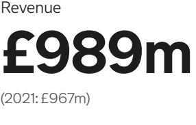

Trading EBITDA1

(2021: £341m)

Total motor and home policies

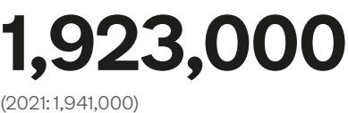

1 Non-Generally Accepted Accounting Principles (Non-GAAP) measures explained on *[page](#page-10-0) 18* 2 Personal members have been restated, see *[page](#page-9-0) 16*

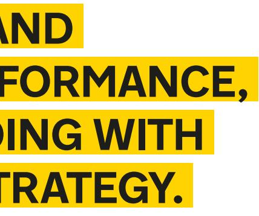

| (Loss)/profit before tax |
|--------------------------|
|                          |
| (2021: £52m)             |

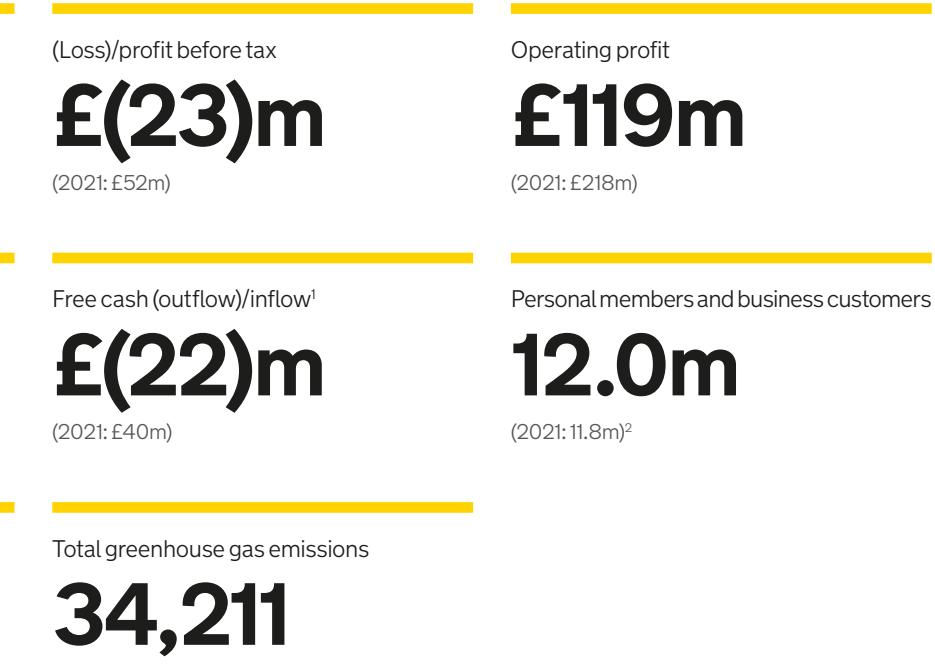

(2021: 33,819)

{2}------------------------------------------------

# **STRATEGIC REPORT**

{3}------------------------------------------------

2021 has been a transformative year for the AA and one which positions the business well for success. I was invited to chair the Board of Basing Topco Limited (Topco Board), the AA investment company controlled by Warburg Pincus and TowerBrook Capital Partners that acquired the AA, early in the financial year having been attracted by the AA's rich heritage, skilled workforce and critical role it plays across the UK. In short, the AA is an iconic brand and it is an honour to take the role of chair.

It is no secret that for a long time the AA laboured under too much debt. Pleasingly, the privatisation of the business, with the reduction in debt this enabled, has meant that the business is now able to build on its leading positions and invest and operate with far greater freedom.

As Chair my role is clear, working alongside the Topco Board to provide governance and oversight of the Executive management team as they focus on ensuring that the AA goes from strength to strength and delivers on its significant potential. To do that, there continues to be an intense focus on strategy based around a framework approach in the context of the industry and societal trends ahead in the short, medium and longer term. Following the smooth ownership transition and with the benefit of the very constructive and collaborative relationship that has already grown up between the Topco Board, the Executive management team and the new owners, the AA is well placed.

To ensure the right balance of skills, I am pleased that we have recently appointed Kory Sorenson to join us on the Topco Board. Kory is an experienced non-executive director and brings specific expertise across the insurance industry through her time with both Aviva and more recently, Phoenix Group. During the year we have also launched Topco Board committees in respect of Remuneration and Nominations, and Audit and Risk and spent significant time debating and establishing Board Reserved Matters. Through all of these measures and a continued focus on regulatory discipline and customer outcomes, I am confident we have embedded an appropriate governance culture that complements the business. Furthermore, through the adoption of the Wates Principles on Corporate Governance, we have set a benchmark to continue to develop our governance. For more information about the corporate governance arrangements at the AA, please refer to the Directors' Report on *[page](#page-27-0) 52* .

The Topco Board is fully aware of the AA's rich history in supporting the wider community and all drivers, and the new Topco Board continues to back that approach. For example, this year the AA continued its support of the NHS by providing signage for NHS community vaccination centres.

Our progress would not be possible without the work of our people. This has unfortunately been another year when COVID-19 impacted the way we work and created incredibly challenging circumstances for many. Throughout this period, the priority has been to ensure that our people are safe and can fulfil the important role they play across the UK. I am proud to say that every challenge we have come up against has been overcome, and this is down to the hard work of our colleagues and the ability of this business, as it has proven again and again over its rich history, to be agile and deliver.

There is no higher recognition of the AA's standing than the independent ratings we received from organisations such as consumer champion Which? and the growth in members. This has taken strong management both at our Executive level and all the teams that support them and a drive from all colleagues to adapt to deliver.

# **CHAIR'S STATEMENT**

I would like to thank all our colleagues for going above and beyond this year, for their resilience in challenging periods and their dedication to our members, this is why the AA has led for so long, and why it will continue to do so." **Rick Haythornthwaite** Chair

{4}------------------------------------------------

environment. During this period, we have also facilitated a smooth transition to meet the GIPP requirements by January 2022, have further strengthened our direct to consumer and cross selling activities and have further expanded footprint and capability in our insurance underwriter. The introduction of GIPP is one of the most significant changes to pricing within the UK insurance industry and has resulted in a challenging trading environment, which has been widely reported on. As we look ahead, and not withstanding the near-term disruption, we remain confident in the quality of our insurance business.

# **A strong foundation from which to build**

In March 2021 we entered into new ownership with the acquisition of the AA by Warburg Pincus and TowerBrook Capital Partners. The change in ownership resulted in a significant equity injection of £378m of which a section was used to pay down debt and allowed us to refinance other tranches of our remaining debt at a more attractive and sustainable level.

This has allowed us both to increase our investment in the future of the AA whilst at the same time continuing on a deleveraging trajectory: investment of £77m capital expenditure has gone into core re-platforming, new digital propositions and upgrades to our data and operational infrastructure. It was pleasing to see further growth in usage of our app, which enables our customers to access a range of services from the AA whilst delivering an enhanced customer experience.

The Group continues to generate strong operating cashflows and coupled with lower interest costs going forwards following the significant repayment of debt noted above we expect to see stronger net cash flows going forwards. After the impact of the acquisition and refinancings in the current year, our net debt decreased from £2,605m to £2,261m.

In addition, new ownership and leadership, combined with the strength of the brand and strategic vision, have allowed us to attract top talent from the market across a number of disciplines with more than 20 senior external and internal appointments to our senior management team in the year. Our team is highly motivated, and we have a clear plan to ensure the AA delivers on its significant potential, which I outline below.

# **A clear strategy for the future**

Whilst we already offer a market-leading proposition to our members, we are acutely aware of the need for continued evolution and modernisation of the AA to ensure that our offering meets the changing needs of our members. The AA has a strong track record of demonstrating its agility and adaptability and as we look ahead under our new ownership, we have outlined three strategy horizons.

- **› Horizon 1:** Optimising the core, modernising the AA to drive growth and profitability in the core business
- **› Horizon 2:** Extending the business to develop new propositions and services to future proof the business
- **› Horizon 3:** Monetising innovation to develop new revenue streams in the emerging automotive value chain

## **Horizon 1: Optimising the core**

The current Horizon 1 activity focuses on the most critical 2–3-year value levers to deliver membership and revenue growth and better efficiency. Our digital investment is targeted at continuously improving customer journeys, app usage and customer engagement, with some marked improvements in sales journey conversion rates and online breakdown reporting already evident.

In the rapidly evolving electrification arena, we already support electric vehicle (EV) drivers through a variety of innovative approaches such as Smart Care which offers service, maintenance and repair for EVs, EV specific driver training via AA Driving School and Drivetech, and new EV leasing propositions via Smart Lease. We have the largest EV trained patrol workforce in Europe with innovations such as our award-winning Freewheeling Hub. We insure EVs including their cables and are the first UK breakdown organisation to target marketing specifically at EV drivers. In our B2B business we offer customer support to seven leading Charge Post Operators.

Our multi-year investment in new core platforms in both Roadside and Insurance will allow us to broaden our product and propositions, provide improved agility and support customer retention and customer value management.

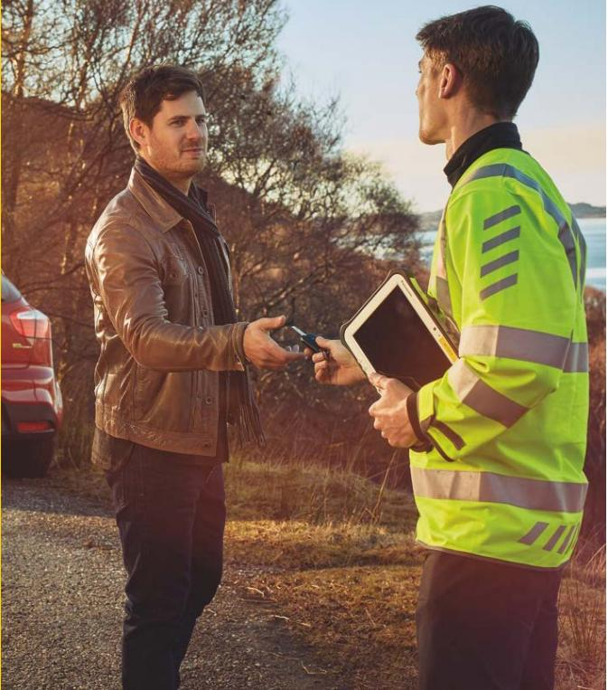

As I look back at my first year as CEO of the AA, I am proud of how the business has performed and delivered for customers despite the continued pressures of COVID-19 and a challenging external environment. This is in no small part down to the hard work of our colleagues who pride themselves on going above and beyond for our members. The AA is an iconic brand which has a proud history and I am confident to say that the best is yet to come.

I would like to highlight some of the many achievements of 2021 and outline why we are so excited for the future.

## **Delivering unrivalled service for our members**

Like 2020, 2021 was another year when we had to manage challenges presented by the pandemic and I am pleased to say that our business has yet again overcome the obstacles this has presented admirably. There is no stronger evidence for this than being granted Which? Recommended Provider for the fourth consecutive year, with neither of our direct competitors being awarded this accolade once over that period. The 5 stars awarded for the 'knowledge and courtesy' of our patrols once again demonstrates the strength of our offering.

At the heart of this lies our focus on service excellence delivered through our people at unrivalled scale in the UK market. We are the leading national provider of roadside assistance services with c.40% market share of the UK consumer market and c.50% of the business-to-business market. We have around 2,500 dedicated patrols, more than any other competitor, and attend c.8,000 breakdowns per day with an industry leading average arrival time of 50 mins.

# **A year of strong performance under new ownership**

Alongside a strong operational performance, the first year of new ownership has been focused on restoring the business to growth and laying the foundation for the future. We are proud to have delivered growth in membership, revenue and Trading EBITDA1 across the Group, demonstrating highly resilient and recurring revenues, and the strong operating cash flow generation that are core characteristics of our business.

# **Return to growth in Roadside**

In our Roadside business, we delivered growth in both revenue and Trading EBITDA1 , with margin remaining strong and growth in both business and individual membership. This performance was achieved despite a fundamental shift in driving patterns caused by the pandemic, with reduced commuting and increased longer drives for domestic staycations. Our business proved responsive to these changes and managed to secure important new business-to-business contract wins, now amounting to a c.62% market share of bank business-tobusiness-to-consumer (B2B2C) and 53% of Original Equipment Manufacturer (OEM) new car volumes.

The platform from which we build is a strong one. We have a brand which is synonymous with excellent service and a loyal customer base who appreciate the differentiated service we offer, which is demonstrated in our Roadside retention rate increasing to 81% under the new basis of calculation for paid personal membership. See *[page](#page-11-0) 21*.

# **A year of change in Insurance**

Continuing the trends outlined at the half year, the wider insurance environment has remained fluid, with the effects of the pandemic and the new General Insurance Pricing Practices (GIPP) creating a unique combination of challenges. Having delivered strong growth in the first half of the year, we evolved our stance in the second half of the year by balancing growth and profitability and ensuring robust underwriting disciplines in our underwriter in light of a particularly competitive pricing

# **CEO'S STATEMENT**

# **HIGHLIGHTS**

**Revenue**

**£989m** (2021: £967m)

**Trading EBITDA margin 35%** (2021: 35%)

**Trading EBITDA**2 **£345m**

(2021: £341m)

# **Breakdowns attended 3.07m**

(2021: 3.01m)

**Paid personal members**

**3.177m** (2021: 3.111m)3

**Business customers**

**8.8m** (2021: 8.7m)

{5}------------------------------------------------

Fantastic service from the AA today. Turned up in 7 minutes, got me going again in 10. Great. Worth every penny."

**Graham** Twitter

In parallel and in the face of growing inflationary cost pressures we will improve efficiency and productivity through operational improvements, operating model changes, more focused cost control and a far-reaching digitisation of customer and other business processes.

Beyond this we are investing in data and analytical capability to further create value from the unrivalled ecosystem of AA propositions, spanning Roadside and in-house Insurance, our Driving Schools, accident management solutions, service, maintenance and repair (SMR) services and a wide range of financial services and car purchasing solutions.

#### **Horizon 2: Extending the business**

Our Horizon 2 strategy, which we are now beginning to embark on, will develop targeted new propositions for the rapidly approaching era of EV, and capture opportunities arising from increasingly connected vehicles and data-based propositions derived from it and modernise the core of the Roadside business model for the future. Our strong and growing data assets from more than 30,000 connected vehicles, combined with the unique proprietary knowledge and insights derived from decades of patrol knowledge and customer proximity gives us some unrivalled advantages in this important and fast-moving mobility ecosystem.

In addition to the connected car agenda, increasing expertise and capability in the electrification arena plays an important role in our Horizon 2 strategy. Key priorities include further equipping and training our patrols to deal with EV specific issues and investment in mobile charging and other solutions to address 'range anxiety'. Beyond this we will continue to enhance the wider AA EV offering significantly to ensure the AA remains the go-to provider for future drivers. In short, ensuring that the EV drivers' needs, and indeed all drivers' needs, can be entirely met by the AA.

Our impact matters, and our Environmental, Social and Governance (ESG) activities are an important part of our business. We have included in our reporting our key environmental, social and corporate governance updates. However, this is just a small part of a what we do and we will be launching a separate ESG report in the coming months to talk about our ESG activities to date, and our commitments for the future.

#### **Horizon 3: Monetising innovation**

As we move to Horizon 3, we will capitalise on new opportunities in the automotive value chain, extend our leadership in electrification and develop wider ecosystem propositions. The unique combination of an iconic, trusted brand, scale in terms of customer reach and data and the breadth of the AA's propositional offer gives rise to unrivalled opportunities for new and more integrated customer propositions. Over the next 18-24 months we will develop more detailed strategies, business models and further partnerships to modernise the AA and develop new revenue streams and future growth.

#### **CEO'S STATEMENT** CONTINUED

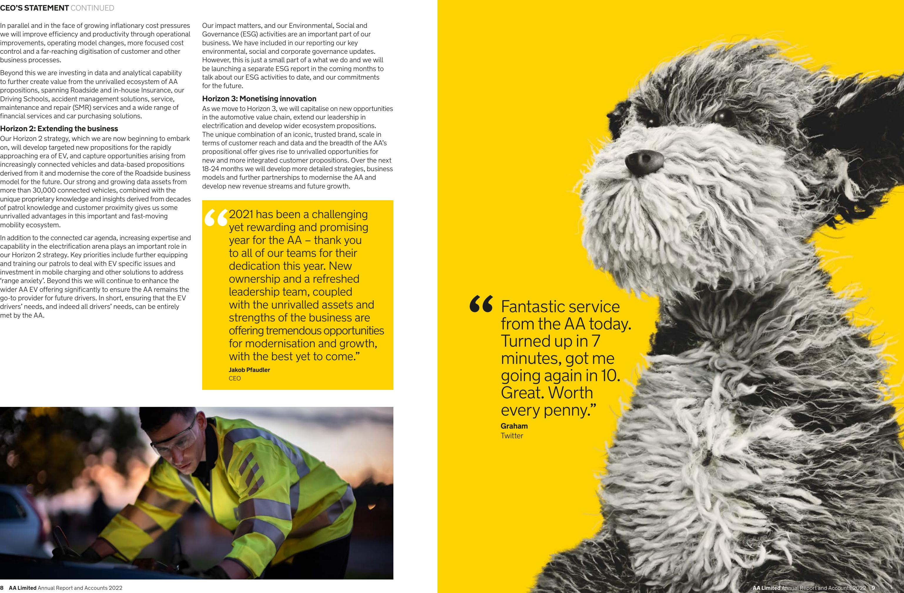

2021 has been a challenging yet rewarding and promising year for the AA – thank you to all of our teams for their dedication this year. New ownership and a refreshed leadership team, coupled with the unrivalled assets and strengths of the business are offering tremendous opportunities for modernisation and growth, with the best yet to come." **Jakob Pfaudler** CEO

{6}------------------------------------------------

# **The services we deliver Breakdown**

Whether drivers are looking for personal cover, vehicle cover or even European cover, we have a range of breakdown products to ensure they get the cover they need. In addition, through our market-leading Smart Breakdown platform, we can identify the majority of faults in engine-related breakdowns, which means we can identify many faults before the vehicle breaks down. We can then either help our customers fix the fault remotely, send a patrol to repair their vehicle or direct them to our AA approved garage network, Prestige, using our Smart Care platform.

#### **Insurance**

Our insurance broking business sells both motor and home insurance. These policies are underwritten by a panel of underwriters including the AA's in-house underwriter. Through our connected services technology, we are progressing with the rollout of our younger driver telematic insurance proposition.

#### **Claims and accident management**

If customers have been involved in an accident, our in-house claims and accident management systems for our personal members and customers will aim to deliver a smooth end-to-end experience by ensuring they are taken care of by the AA throughout the process.

## **Service, maintenance and repair (SMR)**

Smart Care allows customers to access our SMR services online in one simple, smart place. Wherever our customers are, it just takes a few taps to book an MOT, service or repair online. Our Smart Care service is contact-free – customers can book and pay online, with free collection and return across most of the UK – so they don't need to leave their home.

## **Driving school**

From learning to drive to finally passing the driving test, our leading driving schools business offers a trusted and reliable platform for pupils and instructors alike. We are enhancing our digital capabilities to deliver a seamless offering that nurtures long-term brand affinity and promotes greater cross-sell opportunities.

## **Drivetech**

Our Drivetech business is a world-leading provider of fleet risk and safety management and driver training, which is available online and on-road in over 95 countries and in 35 languages through over 40 partners. We are the UK's largest provider of driver offender retraining courses.

#### **AA Cars**

Our trusted online AA Cars platform enables customers to buy their next used car through our network of dealers, which gives customers greater choice and flexibility when sourcing funding for their purchase.

#### **Financial services**

Our partnership with the Bank of Ireland includes AA branded car finance products to sit alongside our successful savings and loan products.

#### **Leasing**

In partnership with LeasePlan, we launched our Smart Lease proposal to our members in January 2021. Smart Lease offers AA members a flexible and hassle-free alternative to traditional vehicle ownership. For a single monthly price, Smart Lease allows our customers to drive a brand-new car, with servicing, maintenance, breakdown cover and car tax included. AA members are able to choose from a range of exclusive vehicles, including electric and hybrid options, which are delivered directly to their home. AA members also have the peace of mind that if their circumstances change unexpectedly then they will have the option to hand the vehicle back early without penalty.

# **GROUP AT A GLANCE**

We are the leading provider of roadside assistance services in the UK, with a successful insurance business.

1 Non-Generally Accepted Accounting Principles (Non-GAAP) measures explained on *[page](#page-10-0) 18*

2 Personal members have been restated, see *[page](#page-9-0) 16*

# **Roadside**

We have approximately 2,500 patrols attending an average of around 8,000 breakdowns each day across the UK. Our Roadside segment also consists of several developing businesses, including our market-leading driving schools, AA Driving School and BSM, Drivetech, the market leader in driver education including driver awareness courses offered by police forces, and Prestige, our growing service, maintenance and repair (SMR) platform.

**Revenue £822m** 

(2021: £799m)

**Trading EBITDA margin 35%**

(2021: 35%)

**Trading EBITDA1 £290m** 

(2021: £280m)

**Paid personal members** 

**3.177m** 

(2021: 3.111m)2

**Share of UK consumer market** 

**40%** 

(2021: 40%)

**Business customers** 

**8.8m** 

(2021: 8.7m)

**Share of business to business market** 

**50%** (2021: 50%)

## **Insurance**

Our Insurance Services segment includes our insurance broker business that operates a panel of motor and home policy distribution and our successful in-house underwriter, which started trading in January 2016 and is a member of this panel. The segment also includes our Financial Services partnership with the Bank of Ireland and our AA Cars business, which operates our online used cars and vans platform.

**Revenue £167m** 

(2021: £168m)

**Trading EBITDA margin 33%** 

(2021: 36%)

**Trading EBITDA1**

**£55m**

(2021: £61m)

# **Insurance policies broker 1,923,000**

(2021: 1,941,000) **Motor policies broker 1,027,000** 

(2021: 1,052,000)

**Home policies broker**

**896,000** 

(2021: 889,000)

**Underwritten policies 1,018,000** 

(2021: 1,006,000)

**Motor policies in-house underwriter 576,000** 

(2021: 600,000)

**Home policies in-house underwriter**

**442,000**

(2021: 406,000)

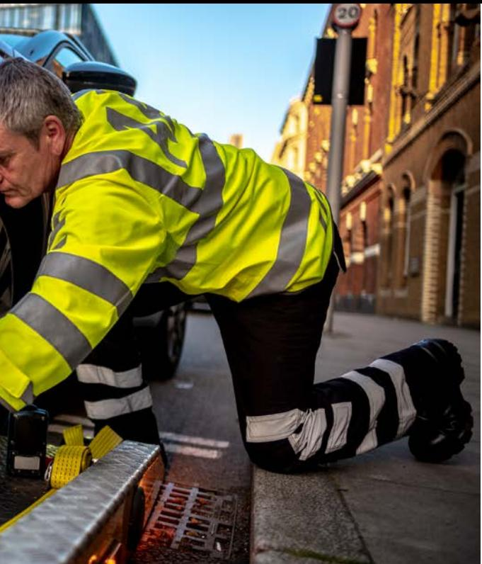

{7}------------------------------------------------

# **OUR BUSINESS MODEL**

# **Our impact**

**Great customer outcomes**

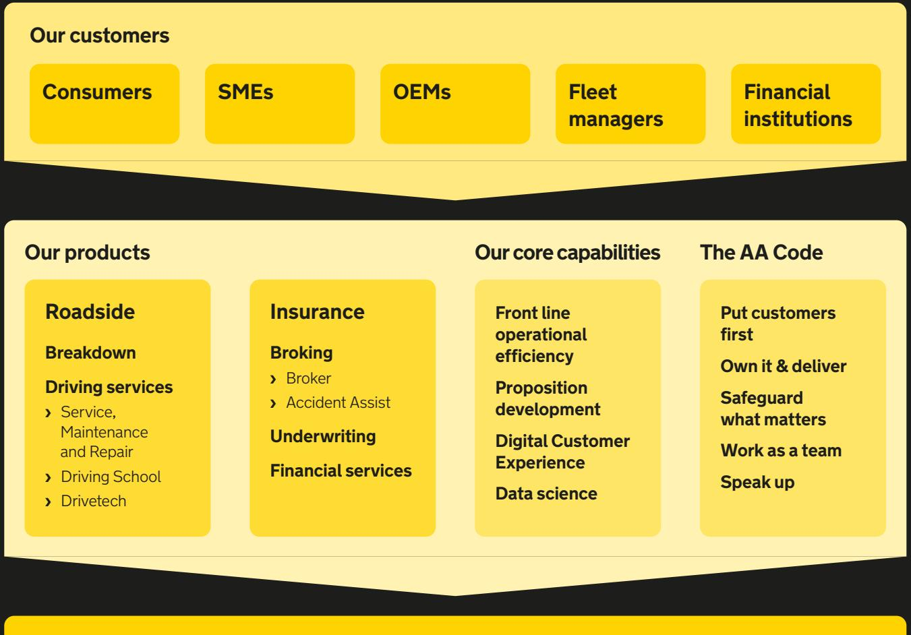

**Membership growth & value**

**Trading EBITDA & Cash flow**

**Employee engagement**

{8}------------------------------------------------

# **WHAT WE DO ››› ROADSIDE**

#### **Personal Membership**

We provide breakdown cover for our consumer members. Vehicle-based policies cover only a specific vehicle and personal memberships cover one or more individuals, including families, regardless of the vehicle.

# **HOW WE COMPETE ›››**

The roadside recovery market has seen steady expansion in recent years, fuelled by a growing car parc and a relatively buoyant economy. The market has grown in value to £1.76bn in 2021, representing an increase of 10% since 2016. The market however remains mature and increasingly competitive. The sector is dominated by three major players, of which the AA is the largest. Our competitive advantage is based on quality of service, brand consideration and distribution platform as well as digital capability. New trends are emerging which the AA is well placed to take advantage of given our leading market position, our technology and developing connected car propositions. The AA is the market leader with c.40% of the consumer market, followed by RAC and Green Flag.

#### **HOW WE MEASURE THE VALUE WE CREATE ›››**

Consumer Roadside Assistance fees are principally paid through annual or monthly subscriptions. Subject to identifying customer needs, additional revenue is available from cross-selling (selling other services) or up-selling (selling higher value products and services) following a breakdown.

#### **MANAGING OUR RISKS EFFECTIVELY ›››**

Roadside Assistance is a discretionary product for consumers; however, our sales process is regulated as it is bought by consumers as insurance. We actively manage risk through our Risk Management Framework, which covers the following areas:

- **›** Member satisfaction levels and good member outcomes
- **›** Changes to the regulatory and fiscal environment **›** Competition from lower
- priced competitors
- **›** Information security, cyber-crime and data management

# **Business to Business (B2B)**

For our c. 9m business (B2B) customers, breakdown cover is provided by manufacturers or a number of extended roadside programmes beyond warranty, by banks for premium added value account holders (AVAs), by insurers as an "add-on" cover for car insurance or by managers of large fleets including vehicle leasing companies, car hire and commercial fleets. However, the service is delivered by the AA. These contracts are a mix between pay-for-use contracts, insured contracts and some hybrid contacts.

# **HOW WE COMPETE ›››**

The B2B roadside assistance market typically earns lower margins given the number of the vehicles covered, but, as these contracts are sophisticated in their specification, barriers to entry are high and our leading position is based on our high service levels, strong partnerships, digital capability and ability to deliver innovative value-adding solutions to our partners. The AA has c.55% of the manufacturer segment, over 65% of the UK's largest fleet and leasing companies and over 60% of the banking AVA segment.

#### **HOW WE MEASURE THE VALUE WE CREATE ›››**

B2B fees are either set per breakdown or per vehicle, with the contracts typically ranging from three to five years.

We are working on a range of innovative solutions with our B2B partners and rolling out our award-winning app and digital breakdown service, which, combined with our technical know-how, will enable our partners to improve their offering to end customers while generating additional revenue for the AA.

## **MANAGING OUR RISKS EFFECTIVELY ›››**

Roadside Assistance is provided with warranties for new vehicles, leased vehicles and fleets. It is provided as part of benefits packages for banks' AVA holders. We actively manage risk through our Risk Management Framework which covers the following areas:

- **›** Partner satisfaction levels
- **›** Competition
	- **›** Information security, cyber-crime and data management

# **Driving Services**

Our Driving Services business consists of our Driving Schools and Drivetech businesses. The Driving School's business offers franchises to qualified driving instructors under the AA Driving School and British School of Motoring (BSM) brands. The Drivetech business offers training for occupational drivers and drivers who have committed driving offences.

# **HOW WE COMPETE ›››**

The UK driving school market is highly competitive and fragmented, but we have approximately 6% of this market. Our main competitors are Red and Bill Plant.

In relation to the Drivetech business, the AA has strong positions in both fleet and police markets. In the fleet market, the AA is market leader and has a range of smaller competitors who compete primarily on price.

#### **HOW WE MEASURE THE VALUE WE CREATE ›››**

The AA and BSM driving schools' revenue derives from franchise fees from instructors for use of branded cars and the AA's digital booking system. The cars are funded by the AA under a lease arrangement. We also provide training for driving instructors.

In relation to the Drivetech business, our driver training services are delivered under long-term service contracts.

#### **MANAGING OUR RISKS EFFECTIVELY ›››**

We actively manage our risks through our Risk Management Framework which covers the following areas:

- **›** Customer satisfaction levels
- **›** Competition from lower priced competitors
- **›** Information security, cyber-crime and data management

# **WHAT WE DO ››› INSURANCE**

Our customers (Consumers, SMEs, OEMs, Fleet managers and Financial Institutions) are at the heart of our business model. Our business model spans the motoring lifecycle from roadside assistance and motor & home insurance to accident management, service, maintenance & repair through Prestige and learning to drive with the Driving School. Data science and a digital customer experience are fundamental to each business area, and the proposition is underpinned by a service culture and long-term focus.

As our customer base grows, we have access to a greater quantity of data from which we can generate improved customer insight to enhance our proposition, further growing customer numbers. Additional data also improves efficiency and grows customer value. We differentiate ourselves from our competitors by our leading brand and market position, excellent standards of service, strategic investments in our digital proposition and by training and developing the best people.

## **Broking**

The AA's insurance broking business serves both personal members and non-members selling motor and home insurance. These policies are underwritten by a panel of underwriters, including the AA's in-house underwriter.

# **HOW WE COMPETE ›››**

The market competes largely on the price of premiums. This is particularly true of the 82% of motor insurance sales which are through price comparison websites (PCWs). While our brand consideration is ranked high in motor insurance, price dominates, and we have turned around our motor policy book as a result of our improved price competitiveness.

In home insurance, PCWs are less dominant, in part because home specifications vary more, and home insurance is less expensive than motor which reduces the rate of attrition.

We currently have a growing share in the motor and home insurance markets with plans to accelerate growth through the successful execution of our strategy.

#### **HOW WE MEASURE THE VALUE WE CREATE ›››**

As an insurance broker, the AA acts as an intermediary between those seeking insurance cover and the insurance underwriters. The AA has the ability to earn commission on new business sales and renewing policies as well as income from add-ons and premium finance.

#### **MANAGING OUR RISKS EFFECTIVELY ›››**

Broking is regulated by the FCA. We manage our risk through our Risk Management Framework which covers:

- **›** Customer satisfaction levels and good customer outcomes **›** Changes to the regulatory and tax environment **›** Information security, cyber-crime and data management

**Underwriting**

The AA's in-house underwriter launched motor policies in January 2016 followed by home policies in August 2016. As part of the AA Group, we utilise our extensive proprietary data as appropriate to hone our pricing. This enables us to price more competitively which supports the broker's ability to win more business.

# **HOW WE COMPETE ›››**

Underwriters compete primarily on price. The CORs in this underwriting market are just under 100% (thus earning single digit margins) and the integrated model means that our underwriter drives our higher broker volumes which generate

better margins.

# **HOW WE MEASURE THE VALUE WE CREATE ›››**

The underwriter retains 20% of gross written premiums after coinsurance and reinsurance. The in-house underwriter is required to maintain certain levels of solvency capital and as at 31 January 2022 the solvency coverage headroom is 86%

over required levels.

#### **MANAGING OUR RISKS EFFECTIVELY ›››**

Underwriting is carried out by a Gibraltar company within the Group and is regulated by the Gibraltar Financial Services Commission (GFSC). We manage our risk through our Risk Management Framework

which covers:

**›** Changes to the regulatory and

tax environment

**›** Information security, cyber-crime and data management

**›** Solvency capital

# **Financial Services**

In 2015, we signed an exclusive partnership with the Bank of Ireland to provide savings and loans. As part of the agreement, our partnership now includes AA branded car finance products to sit alongside the successful savings and loan products.

# **HOW WE COMPETE ›››**

The combination of the AA's brand and distribution platform and the Bank of Ireland's expertise in service delivery gives our partnership a competitive advantage. We expect to grow our book over the life of our agreement with the Bank of Ireland.

Our main competitors are Virgin Money, Tesco and the high street banks.

## **HOW WE MEASURE THE VALUE WE CREATE ›››**

The AA and Bank of Ireland remain committed to process improvements and these together with enhancements to analytics and marketing are expected to deliver improved profitability in the future.

# **MANAGING OUR RISKS EFFECTIVELY ›››**

The Financial Services business is subject to regulation by the FCA. The Bank of Ireland undertakes the principal regulated activities.

{9}------------------------------------------------

# **KEY PERFORMANCE INDICATORS**

# **Growth in personal membership and meaningful deleveraging**

Our key performance indicators (KPIs) measure progress against our strategy. Further details can be found in the Financial review section on *[page](#page-11-0) 20*.

# **ROADSIDE**

| KPI                               | Definition                                                                       | Performance |       | Relevance for the AA                                                                                                                            |  |
|-----------------------------------|----------------------------------------------------------------------------------|-------------|-------|-------------------------------------------------------------------------------------------------------------------------------------------------|--|
| Average income per member (£)* | Average income per paid personal member excluding free memberships      | 2022        | 169   | This measures the average income we generate from our personal member base as a proportion of                                                |  |
|                                   |                                                                                  | 2021        | 167   | the average paid personal membership holdings. Longer term, as we look to move beyond breakdown and capture an increasingly larger        |  |
|                                   |                                                                                  | 2020        | 167   | share of the car ownership value chain, we expect the average income to trend upwards.                                                       |  |
| Average income per business    | Average income per business customer                                          | 2022        | 23    | This measures the average income we generate from our business customers. Alongside growing                                                  |  |
| customer (£)                      |                                                                                  | 2021        | 23    | the business customer base, we are targeting a growth in the average income per business customer through the launch of new services such |  |
|                                   |                                                                                  | 2020        | 22    | as vehicle recalls and onward mobility solutions through our Agile platform.                                                                 |  |
| Paid personal                     | Number of personal members excluding free memberships at the period end |             |       | This demonstrates our ability to build on our                                                                                                   |  |
| members                           |                                                                                  | 2022        | 3,177 | market-leading position in the consumer market.                                                                                                 |  |
| (thousands)*                      |                                                                                  | 2021        | 3,111 | Our strategy to innovate and differentiate our core Roadside proposition will enable us to grow our paid personal membership base.        |  |
|                                   |                                                                                  | 2020        | 3,136 |                                                                                                                                                 |  |
| Business                          | Number of business                                                               |             |       | We are market leaders in the business-to-business                                                                                               |  |
| customers (thousands)          | customers at the period end                                                   | 2022        | 8,842 | (B2B) market, with c.9m business customers. A key tenet of our strategy in B2B is defending our                                              |  |
|                                   |                                                                                  | 2021        | 8,702 | core base as well as growing that base through new contract wins and generating new sources of                                               |  |
|                                   |                                                                                  | 2020        | 9,049 | income that improve the average income per business customer.                                                                                |  |

* During the year we have revised the basis of the paid personal membership holding to exclude ancillary holdings. This has resulted in a change to the average income per member. See *[page](#page-11-0) 21*.

# **ROADSIDE OPERATIONS**

| KPI                    | Definition                          | Performance |       | Relevance for the AA                                                                             |
|------------------------|-------------------------------------|-------------|-------|--------------------------------------------------------------------------------------------------|
| Breakdowns attended | Number of breakdowns attended | 2022        | 3,072 | This is a key driver of our cost base and also demonstrates utilisation of our service by our |
| (thousands)            |                                     | 2021        | 3,014 | members and customers.                                                                           |
|                        |                                     | 2020        | 3,423 |                                                                                                  |
|                        |                                     |             |       |                                                                                                  |

# **INSURANCE**

| KPI                               | Definition                                                                                                         | Performance                      |       | Relevance for the AA |  |  |
|-----------------------------------|--------------------------------------------------------------------------------------------------------------------|----------------------------------|-------|----------------------|--|--|
| Average income per policy (£)  | Average income per insurance policy for motor and home                                                       | Broker only 2022              | 47    |                      |  |  |
|                                   |                                                                                                                    | 2021                             | 59    |                      |  |  |
|                                   |                                                                                                                    | 2020                             | 68    |                      |  |  |
|                                   |                                                                                                                    | Broker and additional businesses |       |                      |  |  |
|                                   |                                                                                                                    | 2022                             | 78    |                      |  |  |
|                                   |                                                                                                                    | 2021                             | 78    |                      |  |  |
|                                   |                                                                                                                    | 2020                             | 84    |                      |  |  |
| Insurance policies                | Total motor and home policies sold in the last 12 months by our insurance broker                       |                                  |       |                      |  |  |
| (thousands)                       |                                                                                                                    | 2022                             | 1,923 |                      |  |  |
|                                   |                                                                                                                    | 2021                             | 1,941 |                      |  |  |
|                                   |                                                                                                                    | 2020                             | 1,713 |                      |  |  |
| Underwritten                      | Total motor and                                                                                                    |                                  |       |                      |  |  |
| insurance policies (thousands) | home policies sold, including renewals, in the last 12 months by our in-house insurance underwriter | 2022                             | 1,018 |                      |  |  |
|                                   |                                                                                                                    | 2021                             | 1,006 |                      |  |  |
|                                   |                                                                                                                    | 2020                             | 780   |                      |  |  |
|                                   |                                                                                                                    |                                  |       |                      |  |  |

#### 59 68 **78** 78 84 The first measure shows the average income generated by our insurance broking business. As we continue to grow and increase our investment in new business, we expect the second measure of average income per policy, including revenue from our underwriter and Accident Assist business, to increase longer term. **1,923** 1,941 1,713 Growing our Insurance business through the total number of policies we broker is a key component of our strategy. We will deliver this through new insurance innovation, driving more competitive premiums and broadening our footprint to include non-members and younger customers. **1,018** 1,006 780 A key tenet of growing our Insurance business is growing our in-house underwriting business utilising our proprietary member data. We are continuing to increase our penetration levels within the non-member and existing member base.

{10}------------------------------------------------

# **FINANCIAL SUSTAINABILITY**

| KPI                              | Definition                                                                                                                           | Performance                        |            | Relevance for the AA                                                                                                                                                                                                                                                                                                                                              |  |
|----------------------------------|--------------------------------------------------------------------------------------------------------------------------------------|------------------------------------|------------|-------------------------------------------------------------------------------------------------------------------------------------------------------------------------------------------------------------------------------------------------------------------------------------------------------------------------------------------------------------------|--|
| Trading EBITDA (£ millions)   | Trading EBITDA is the performance measure most closely aligned to that required by our debt documents (see note 3) | 2022                               | 345        | This is a key measure of our underlying trading performance as defined in our debt covenants.                                                                                                                                                                                                                                                                  |  |
|                                  |                                                                                                                                      | 2021                               | 341        |                                                                                                                                                                                                                                                                                                                                                                   |  |
|                                  |                                                                                                                                      | 2020                               | 348        |                                                                                                                                                                                                                                                                                                                                                                   |  |
| Operating profit (£ millions) | Statutory measure of profit before tax, finance income and finance costs, including adjusting operating items         | 2022 119 2021 2020        | 218 255 | Alongside Trading EBITDA, this is a key measure of our performance and is a GAAP measure. As we execute our plans for growth, we expect to drive a meaningful growth in operating profit. In the current year, operating profit was impacted by the £64m of transaction fees incurred in relation to the acquisition of the Group (see note 5). |  |
| Free cash flow (£ millions)   | Net cash flow before bond buy-backs, refinancing costs and equity contributions                                       | (22) 2022 2021 40 2020 | 83         | This measures the level of free cash flow generated by the Group and which is available for investment and debt management, subject to the restrictions of our whole business securitisation structure. In the current year, this was impacted by an outflow of £68m for transaction fees in relation to the acquisition of the Group.          |  |
| Leverage (ratio)              | Ratio of net debt to Trading EBITDA for continuing operations for the last 12 months (see note 29)                    | 2022                               | 6.6        | Proactive debt management remains a key focus for the Group.                                                                                                                                                                                                                                                                                                   |  |
|                                  |                                                                                                                                      | 2021                               | 7.6        |                                                                                                                                                                                                                                                                                                                                                                   |  |
|                                  |                                                                                                                                      | 2020                               | 7.6        |                                                                                                                                                                                                                                                                                                                                                                   |  |
| Interest cover (ratio)        | Ratio of Trading EBITDA to total ongoing cash finance costs (see notes 6 and 29)                                         | 2022                               | 2.7        | This measures the extent to which our earnings cover interest payments on our debt.                                                                                                                                                                                                                                                                            |  |
|                                  |                                                                                                                                      | 2021                               | 2.5        |                                                                                                                                                                                                                                                                                                                                                                   |  |
|                                  |                                                                                                                                      | 2020                               | 2.6        |                                                                                                                                                                                                                                                                                                                                                                   |  |

#### **KEY PERFORMANCE INDICATORS** CONTINUED

# **ENVIRONMENT**

| KPI                                    | Definition                                                                                                                                                                                                                                                        | Performance    |        | Relevance for the AA |
|----------------------------------------|-------------------------------------------------------------------------------------------------------------------------------------------------------------------------------------------------------------------------------------------------------------------|----------------|--------|----------------------|
| Total greenhouse                       | Our total Group                                                                                                                                                                                                                                                   | Market based   |        |                      |
| gas emissions (GHG)                 | emissions are reported under the Companies Act 2006 (Strategic Report and Directors'                                                                                                                                                                  | 2022           | 34,211 |                      |
| (tonnes carbon dioxide equivalent)* |                                                                                                                                                                                                                                                                   | 2021           | 33,819 |                      |
|                                        | Reports) Regulations                                                                                                                                                                                                                                              | 2020           | 41,339 |                      |
|                                        | 2013 and Streamlined Carbon and Energy Reporting requirements. Calculations follow the GHG Protocol Corporate Accounting and Reporting Standard (revised edition), using market-based and UK location-based emissions factors | Location based |        |                      |
|                                        |                                                                                                                                                                                                                                                                   | 2022           | 35,872 |                      |
|                                        |                                                                                                                                                                                                                                                                   | 2021           | 35,565 |                      |
|                                        |                                                                                                                                                                                                                                                                   | 2020           | 43,472 |                      |
|                                        |                                                                                                                                                                                                                                                                   |                |        |                      |

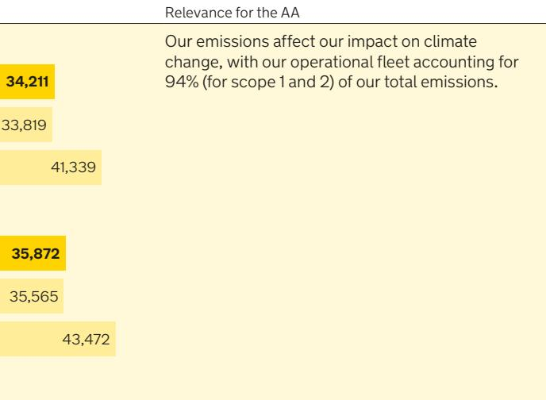

* Please note that prior year estimates have been adjusted to reflect availability of updated figures. This has not resulted in any material changes.

# **EMPLOYEES**

| KPI                    | Definition                                         | Performance |       | Relevance for the AA     |  |
|------------------------|----------------------------------------------------|-------------|-------|--------------------------|--|
| Employees at the AA | The number of employees at the AA (excluding | 2022        | 6,890 | AA since the prior year. |  |
|                        | contractors and agency)                         | 2021        | 6,988 |                          |  |
|                        |                                                    | 2020        | 7,105 |                          |  |

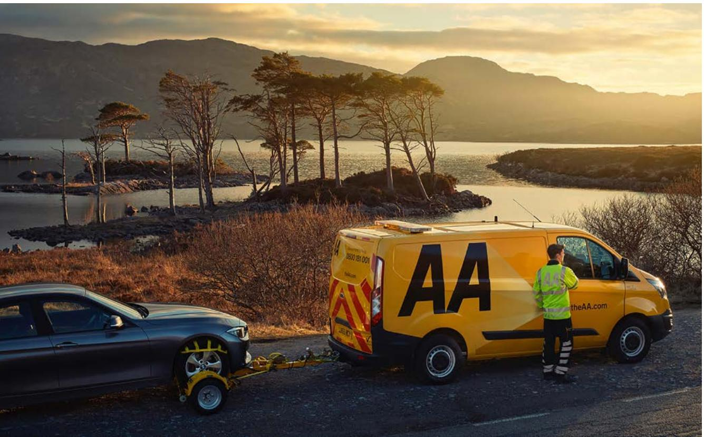

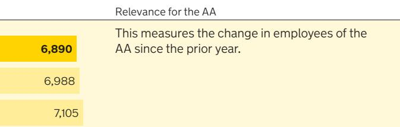

{11}------------------------------------------------

We are pleased to report a return to revenue growth despite the ongoing challenges from COVID-19. We have seen increasing overall membership and Trading EBITDA as well as positive operating cash flow generation. We have confidence in continued Trading EBITDA growth and cash flow generation building on the positive momentum from this year. The change in ownership of the Group has been a positive step change for the AA's future enabling both a reduction in leverage and a rebalanced capital structure providing a long-term sustainable amount of leverage to support investment in our successful future." **Tom Mackay** Chief Financial Officer

# **FINANCIAL REVIEW**

During the period we have continued to demonstrate our highly resilient and recurring revenues as well as our strong operating cash flow generation that are the core characteristics of our business.

We have seen a return to growth despite the continued challenges of COVID-19 and are really pleased to see increasing overall membership figures. Improvement in our top line revenue of 2% has been the driver for the year-on-year improvement seen in Trading EBITDA.

The change in ownership of the Group has been a positive step change for the AA's future enabling both a reduction in leverage and a rebalanced capital structure providing a long-term sustainable amount of leverage to support future investment in our successful future. Our new owners have injected equity of £378m contributing to a reduction in net debt from 7.6x Trading EBITDA at 31 January 2021 to 6.6x at 31 January 2022.

Building on the positive momentum from this year, we have confidence in continued Trading EBITDA growth and positive cash flow. Underpinned by our improved capital structure, we will make significant investments in both our core roadside and insurance platforms as well as our back office to build an AA of the future.

# **Group Revenue**

|           | 2022 £m | 2021 £m |
|-----------|------------|------------|
| Roadside  | 822        | 799        |
| Insurance | 167        | 168        |
| Revenue   | 989        | 967        |

Group revenue was £989m, up 2% compared to last year (2021: £967m), despite the continued challenges of COVID-19.

# **ROADSIDE**

Our core Roadside business delivered significant top line growth with revenue up 3% from £799m to £822m driven by the increase in new business volumes seen in both business-toconsumer (B2C) and business-to-business (B2B) and continued recovery of our developing businesses.

# **Business-to-consumer**

During the year, we revised the basis of the paid personal membership holding to exclude ancillary holdings. Under this new basis, the paid membership holding increased by 2.1% to 3.177m (2021: 3.111m). Under the old basis, paid membership increased by 2.7% to 3.253m (2021: 3.168m). Given the impact of the pandemic over the last two years, we were very pleased to see the paid personal membership base increase under both measures. The revised basis has been used in our measure of retention which increased to 81% (2021: 80%) on the new basis compared to 80% (2021: 78%) on the old basis. This improvement in our performance was supported by our market-leading service at the roadside and through our contact centres.

As lockdowns were relifted at the start of the year, the paid membership base increased by 1.5% in H1 underpinned by the 'Tukker' above the line marketing campaign, which ran for a number of months. In H2, membership continued to grow by a further 0.6% reflecting the unwinding of the impact of COVID-19 on new business volumes seen in the prior year.

Average income per paid personal member has also been recalculated using the new paid membership basis and increased in the year by £2 to £169 (2021: £167) reflecting the impact of inflation partly offset by strong new business growth but at lower-than-average transaction values. On the old basis income per member increased by £2 to £165 (2021: £163).

# **Business-to-business**

We successfully retained or extended all our major core roadside contracts this year, including JLR, Lotus, VWG, Ford, Suzuki, Arval, Rivus, LeasePlan, Hertz, Zenith, DAS and Admiral. In addition, we acquired new breakdown assistance business from Smart, Innovation Automotive, Bugatti, GKL Leasing and Scottish Water via new contract wins, as well as several new insurance contracts with Tempcover, Marshmallow, Kudo and Riverside.

Total business customers rose to 8.8m (2021: 8.7m) following our successful new business wins in the year. In addition, we continued to see growth in our holdings from our insurance partnerships offset with a continued and anticipated decline in the number of AVAs with our banking partners. Overall income for B2B grew slightly reflecting the benefit of higher pay-for-use income from the breakdowns we serviced and the additional services that we provided in supporting our motor manufacturing partners.

The sea change in EV adoption across the UK was a catalyst for the expansion of our EV Charge Post Operator (CPO) customer service operation, bringing support to new partners including Liberty Charge, EB Charging and Instavolt, and taking our total portfolio of CPOs to nine, with implementation of more new contracts scheduled for 2022. On the customer service front we were also appointed to provide contact centre and retention services for Toyota GB from March 2022 for their extended roadside programme.

In March 2021, we announced the award of a new five-year contract with Nationwide through which we will provide Nationwide's FlexPlus customers with our award-winning roadside assistance services, which they will be able to access fully through digital channels, including the AA app.

{12}------------------------------------------------

Recognising the desire amongst small business customers for increased online access to our services, we have enhanced our digital platform for SMEs and have seen very strong growth over the year. We also expanded our portfolio of SME trade partnerships, bringing four new buying groups on board over the course of the year.

Externally, our market-leading approach to EV and alternative fuels was strengthened by our participation in the COP26 EV Rally of Scotland, and our partnership with the EV Café. We also collaborated on thought leadership with a number of key B2B influencers in the EV space. The success of our game-changing Free Wheeling Hub, allowing electric vehicles to be towed safely, was recognised by industry innovation awards from Fleet News and Green Fleet and we were also recognised with awards for Fleet Partnership and exceptional Customer Service within the Fleet and Leasing sector.

## **Customer service and operations**

Which? have reported that manufacturer programmes provided by the AA occupy the top 9 slots for serving motor manufacturers' customers, with Lexus, Toyota and Honda all gaining 'Recommended Provider' status. We have also continued to drive a successful programme on recalls supporting Toyota, Honda, Hyundai and JLR. The mobile appointment-based service is going from strength to strength, and we have now completed over 30,000 airbag replacements for customers driving an exceptional level of customer satisfaction.

Total breakdowns increased by 2% in the year to 3.07m (2021: 3.01m) as drivers returned to Britain's roads. As a result of this volume increase, overall pay-for-use income was up compared to last year. Ancillary sales including battery sales were lower than last year following the spike in members and customers experiencing flat batteries in the prior year due to their cars not being driven during the initial lockdown.

We have continued to improve our customer journey through a focused effort on making digital breakdown frictionless so that more of our personal membership breakdowns can be reported online.

## **Developing businesses**

FY22 saw encouraging recovery from the impact of COVID-19 in the prior year.

Smart Care volumes grew strongly over prior year as we continued with a programme of web-based marketing offers, enhancements to the digital journey and further developing the links with the wider AA, increasing the volume of jobs being passed to the garage network from patrols.

Our B2B segment saw SMR volume growth with retention of existing key accounts and four new accounts added in year giving us visibility of further B2B growth in the year ahead.

We have also continued to make good progress with our product development plans across our markets, including supporting our AA Cars business with the fulfilment of Service Plan SMR work and further development of our B2B downtime management proposition.

Our Driving Schools and Drivetech businesses were significantly impacted by COVID-19 last year and we saw a strong recovery in FY22.

Driving Schools benefitted from pent up demand for driving lessons following the easing of lockdown restrictions.

Our BSM VR product won Best Product at the Intelligent Instructor Awards and the Driving School fleet has also been nominated for most improved fleet, by the Fleet Awards.

In response to COVID-19 last year, Drivetech was the first to provide comprehensive online speed awareness courses as an alternative to class-based learning. As more people took to the road in the current year, police referral volumes for courses grew.

# **INSURANCE**

The Insurance division faced a tough economic environment with significant market premium deflation in FY22 resulting in a highly competitive new business market. Market volatility was also heightened by the implementation of the FCA's new General Insurance Pricing Practices (GIPP) rules which we successfully implemented on 1 January 2022. Overall insurance revenue decreased slightly to £167m (FY21: £168m). Revenue growth was achieved in our in-house underwriter, Accident Assist and AA Cars businesses but was offset by lower motor new business commissions as seen across the sector.

## **Insurance Broking and other services**

Revenue decreased principally due to the impact of lower motor new business commissions despite an improved trading environment for AA Cars following the impact of COVID-19 in the prior year.

The motor policy book reduced slightly by 2% to 1,027,000 policies (2021: 1,052,000) and the home book grew by 1% to 896,000 (2021: 889,000), a resilient performance in an uncertain market reflecting the strength of both our brand and our in-house underwriter, AA Underwriting Insurance Company Limited (AAUICL). During the year we continued to make improvements in our customer journey which helped to deliver consistent and healthy cross-sell conversions into our Roadside business. The continued investment in our brand and improvements to our digital journeys have also received external recognition. AA topped the Insurance category in the Savanta Top 100 Most Loved Financial Services Brands 2021 and our motor insurance product was voted winner in the 2022 Consumer Intelligence awards for Customer Trust and Recommendation by Customers.

In January 2022 we were awarded the Feefo Platinum Trusted Service award for the second year in a row. Feefo gives Platinum Trusted Service awards to businesses that have achieved the Feefo Gold standard for three consecutive years or more. It is a highly valued badge of approval, as it is based purely on genuine, verified, customer feedback about excellent service.

Throughout 2021, AA Insurance has been investing in improving outcomes for customers in conjunction with preparation for the requirements of the FCA's GIPP rules and whilst continuing to drive new business volumes in a highly price competitive motor market. With retail motor insurance rates at the lowest point for many years, we have invested in commission reductions on both new and renewing business to support our volume aspirations. This combined with supporting our customers through the COVID-19 pandemic with a reduction in administrative and processing fees led to the average income per motor and home policy for our broker falling to £47 (2021: £59). However, due to growth in income from our in-house underwriter and other insurance businesses, total average income per insurance policy remained stable at £78 (2021: £78).

Renewal rates have increased with volume and value being optimised through targeted commission reductions.

Accident Assist, our in-house claims management proposition launched in FY21, is performing well from a volume and margin perspective. Accident Assist services are actively marketed to our B2C membership base with improving take-up as awareness increases.

We continue to have a strong relationship with our partner Bank of Ireland UK, however growth of our Financial Services business has been curtailed by our competitors aggressively chasing lend volume.

AA Cars, our online used cars and vans platform, recovered well following the significantly low demand and discounting required in the prior year as a result of COVID-19. Volumes of vehicle inspections and car finance applications and conversions increased in the period as a result.

# **Insurance Underwriting**

Our Insurance Underwriting business continued to grow profits in the year.

The in-house underwriter business remains well capitalised under the Solvency II capital requirements. As at 31 January 2022, the solvency coverage headroom was 86% over requirement and can be funded from the profits and liquid assets of the underwriter.

{13}------------------------------------------------

## **Operating profit**

|                                                |                |                 | 2022        |                |                 | 2021        |
|------------------------------------------------|----------------|-----------------|-------------|----------------|-----------------|-------------|
|                                                | Roadside £m | Insurance £m | Group £m | Roadside £m | Insurance £m | Group £m |
| Trading EBITDA                                 | 290            | 55              | 345         | 280            | 61              | 341         |
| Share-based payments                           | (4)            | (1)             | (5)         | (3)            | (1)             | (4)         |
| Pension service charge adjustment              | (3)            | (1)             | (4)         | (4)            | (1)             | (5)         |
| Pension past service cost                      | (23)           | (3)             | (26)        | –              | –               | –           |
| Amortisation and depreciation                  | (86)           | (13)            | (99)        | (81)           | (12)            | (93)        |
| Impairment of property, plant and equipment | (7)            | (4)             | (11)        | –              | –               | –           |
| Operating profit before adjusting items        | 167            | 33              | 200         | 192            | 47              | 239         |
| Adjusting operating items                      |                |                 | (81)        |                |                 | (21)        |
| Operating profit                               |                |                 | 119         |                |                 | 218         |

Operating profit decreased by £99m to £119m, a year-on-year decrease of 45%. This was predominately attributable to the pension past service cost discussed above and the £60m increase in adjusting operating items due to the acquisition transaction expenses incurred in the year (see below). In addition, there was a £6m increase in amortisation and depreciation which continues to reflect the historic and ongoing investments in IT and an £11m impairment of property, plant and equipment, see note 12.

## **Transaction fees and expenses**

As part of the acquisition of the Group, both the Group and Basing Bidco Limited ("Bidco"), AA Limited's new immediate parent entity, incurred transaction fees and expenses in an aggregate amount of c.£90m of which £10m were refinancing costs relating to issuance of the Class B3 Notes and have been capitalised. Given the significant ongoing benefit to the Group as a result of the significant deleveraging, the Directors agreed that the Group would meet a substantial proportion of the transaction fees. £64m of transaction fees were incurred in the period and expensed as adjusting operating items (see note 5) in addition to the £16m expensed in the prior year. Bidco made a further equity injection of £17m towards these costs, with the remainder met using cash from the Group.

## **Share schemes**

In accordance with the terms of the Scheme of Arrangement by which the acquisition of the Group was affected, the Group's ESIP and PSP share schemes vested to differing extents on 8 March 2021 and the relevant underlying share awards were subsequently purchased by Bidco. See note 35 for more details.

## **Net finance costs**

| Interest on external borrowings                        |  |  |
|--------------------------------------------------------|--|--|
| Finance charges payable on lease liabilities           |  |  |
| Total ongoing cash net finance costs                   |  |  |
| Ongoing amortisation of debt issue fees                |  |  |
| Fair value movement on interest rate swaps             |  |  |
| Net finance expense on defined benefit pension schemes |  |  |
| Total ongoina non-cach not finance costs               |  |  |

|                                                        | 2022 £m | 2021 £m |
|--------------------------------------------------------|------------|------------|
| Interest on external borrowings                        | 125        | 136        |
| Finance charges payable on lease liabilities           | 2          | 3          |
| Total ongoing cash net finance costs                   | 127        | 139        |
| Ongoing amortisation of debt issue fees                | 9          | 9          |
| Fair value movement on interest rate swaps             | (1)        | 1          |
| Net finance expense on defined benefit pension schemes | 2          | (3)        |
| Total ongoing non-cash net finance costs               | 10         | 7          |
| Adjusting finance costs*                               | 5          | 20         |
| Total net finance costs                                | 142        | 166        |

* See note 6 for more details re adjusting finance costs.

# **Group Trading EBITDA**

|                       | 2022 £m | 2021 £m |
|-----------------------|------------|------------|
| Roadside              | 290        | 280        |
| Insurance             | 55         | 61         |
| Trading EBITDA        | 345        | 341        |
| Trading EBITDA margin | 34.9%      | 35.3%      |

We saw a return to growth in Group Trading EBITDA up from £341m in the prior year to £345m. This reflected a strong recovery following the impact of COVID-19 last year and was despite the tough economic environment seen in Insurance.

Roadside Trading EBITDA increased 4% with favourable trading performance in B2C and Driving Schools partially offset by higher garaging spend due to the higher number of breakdowns and investment in brand marketing.

Insurance Trading EBITDA fell by 10% to £55m (FY21: £61m), with the Insurance Trading EBITDA margin slightly down from 36% to 33% again due to the lower motor new business commissions. Looking forward we expect market pricing volatility throughout the first half of FY23 but a steady return to normal levels of claims frequency and general claims inflation will inevitably lead to increasing market prices.

Trading EBITDA margin was stable at 35% (2021: 35%), with resilient Roadside Trading EBITDA margins offsetting the anticipated reduction in Insurance Trading margins due to the impact of lower motor new business commissions noted above.

#### **Reconciliation of Trading EBITDA to operating profit**

Trading EBITDA is a performance measure required under the terms of our debt documents and is used for calculating our debt covenants. The Group also shows Trading EBITDA as a measure of underlying trading performance. Trading EBITDA is calculated as operating profit before adjustments as shown in the table below:

|                                             | 2022 £m | 2021 £m |
|---------------------------------------------|------------|------------|
| Trading EBITDA                              | 345        | 341        |
| Share-based payments                        | (5)        | (4)        |
| Pension service charge adjustment           | (4)        | (5)        |
| Pension past service cost                   | (26)       | –          |
| Amortisation and depreciation               | (99)       | (93)       |
| Impairment of property, plant and equipment | (11)       | –          |
| Adjusting operating items                   | (81)       | (21)       |
| Operating profit                            | 119        | 218        |

In the current year, adjusting operating items of £81m comprised £64m transaction fees related to the acquisition and debt financing arrangements of the Group, £13m related to strategic review projects, £5m related to the closure costs of the CARE section of the AAUK pension scheme and the transitional agreement made with employees in that scheme, a £2m profit on the sale of fixed assets and a £1m impairment of investments in joint ventures.

As previously communicated, the Group was informed by the trustee of the AAUK pension scheme of a possible need to review the scheme's approach to equalising certain pension benefits earned before 1 April 1992 so that the benefits earned by male and female members are equal. This is a highly technical matter that has involved a detailed legal analysis to determine whether any additional liabilities needed to be recognised by the Group. The legal analysis was completed and the approach required to address this matter was agreed between the Group and the AAUK pension scheme Trustee on 26 November 2021, crystalising the recognition of a pension past service cost of £26m and corresponding increase to the pension liability. See note 26.

{14}------------------------------------------------

The change in ownership has been highly beneficial for the Group. The total investment made by AA Limited shareholders as part of the acquisition of the Group was £596m, which includes the £218m acquisition price. Of the £378m equity injection, £361m has been invested in deleveraging to pay down debt held within the AA Intermediate Co Limited group. The combination of reduced debt requirements and substantially improved market pricing has resulted in significant improvements in interest costs for the Group. The reduced pressure on financing costs provides the group with the operational freedom to drive the business forward, to better serve its customers and capitalise on its considerable strengths. The committed, long-term owners of the AA Limited group are expected to support the growth of the business and to invest in critical areas such as IT transformation which in turn, will generate new and better opportunities for customers.

Net finance costs decreased by £24m to £142m (2021: £166m) due to lower external borrowings costs and lower adjusting finance costs. External borrowing costs reduced mainly as a result of the refinancing of the £570m Class B2 Notes at an interest rate of 6.5% in March 2021 which were repaid using the £280m proceeds from the Class B3 Notes issued in January 2021 and £261m equity contribution from Bidco. Adjusting finance costs reduced from £20m to £5m as the prior year included the costs of an early repayment premium related to the repayment of A5 Notes and £14m write off of issue fees.

## **Profit before tax**

On account of the transaction fees and pension past service cost outlined above, profit before tax in the year fell to a loss of £23m (2021: profit of £52m).

## **Taxation**

The tax charge for the year decreased by £8m to £4m (2021: tax charge of £12m) reflecting the loss before tax offset by several adjustments most notably relating to an adjustment for Corporate Interest Restriction and in relation to the transaction fees and expenses described above. The tax charge consisted of a current tax charge of £14m (2021: £14m) and a deferred tax credit of £10m (2021: credit of £2m). The effective tax rate was (17.4%) (2021: 23.1%), see note 9.

# **Profit after tax**

We made a loss after tax of £27m (2021: profit of £40m) reflecting the transaction fees associated with the acquisition and debt financing arrangements of the Group and the pension past service cost noted above.

## **Assets held for sale**

During the year, the Topco Board approved the sale of two properties. Purchasers for both properties have been identified and legal terms are being negotiated. The sales are expected to complete within 10 months of the year end. The properties have been presented as assets held for sale in the statement of financial position and have been remeasured to the lower of carrying amount and fair value less cost to sell, which has resulted in an impairment of £11m included within administrative expenses in the income statement.

## **Pension liabilities**

The AAUK pension scheme was in surplus as at 31 January 2022. The significant movement since 31 January 2021 was mainly due to an increase in corporate bond yields over the period, which drive the discount rate and an increase in assets due to higher-thanexpected asset returns, partially offset by an increase in future inflation expectations. It also incorporates a £13m gain resulting from the incorporation of the inter-valuation experience for the AAPMP, as well as the impact of Barber equalisation for the UK Scheme which has been recognised as a one-off past service cost as noted above.

In February 2020, the triennial actuarial review was completed for the AAUK pension scheme as at 31 March 2019. The agreed recovery plan with the pension trustees aims to eliminate the technical provisions deficit by July 2025. The Group has committed to paying an additional (above the Asset-Backed Funding scheme payments) £10m per annum from April 2020 to March 2021, £11m per annum from April 2021 to March 2022 and £12m per annum from April 2022 to July 2025.

Following closure of the CARE section of the AAUK pension scheme in March 2020, transitional arrangements were agreed with all employees costing c.£11m over three years starting from 1 April 2020. Following closure of the AAUK scheme to future accrual, the ongoing volatility from accrual costs has been removed but future volatility of deficit costs does remain. The impact of COVID-19 on the global financial markets has meant higher fluctuation of the funding level in the AAUK scheme, albeit partially mitigated by the de-risked investment strategy and high levels of hedging. Therefore, the contributions required from the Group could increase following completion of the 2022 triennial valuation.

# **Cash flow and liquidity Free cash flow**

|                                                                                                                      | 2022 £m | 2021 £m |
|----------------------------------------------------------------------------------------------------------------------|------------|------------|
| Trading EBITDA                                                                                                       | 345        | 341        |
| Working capital and provisions excluding adjusting operating items                                                   | (8)        | (8)        |
| Pension deficit reduction contributions                                                                              | (27)       | (25)       |
| Other items                                                                                                          | –          | (1)        |
| Cash flow from continuing operating activities before taxation, adjusting operating items and capital expenditure | 310        | 307        |
| Tax paid                                                                                                             | (10)       | (15)       |
| Capital expenditure including capital and interest payments on leases less proceeds from sale of fixed assets     | (102)      | (93)       |
| Operating free cash flow after capital expenditure                                                                   | 198        | 199        |
| Interest on borrowings                                                                                               | (123)      | (137)      |
| Financial investments                                                                                                | (10)       | –          |
| Acquisition of own shares                                                                                            | –          | (2)        |
| Acquisitions, disposals and investment in joint ventures                                                             | (1)        | (4)        |
| Operating free cash flow before adjusting operating items                                                            | 64         | 56         |
| Adjusting operating Items                                                                                            | (86)       | (16)       |
| Free cash flow                                                                                                       | (22)       | 40         |
| Purchase of Bonds/Debt refinancing activities                                                                        | (429)      | (14)       |
| Equity contribution                                                                                                  | 378        | –          |
| Net (decrease) / increase in cash and cash equivalents                                                               | (73)       | 26         |

We remain well within our financial covenants, have good levels of liquidity and continue to generate positive operating cash flow. We saw a free cash outflow in the current year of £22m (2021: £40m inflow) before the costs of purchasing bonds, refinancing and equity contributions. The outflow was predominately due to the one-off transaction fees and expenses incurred following the acquisition and deleveraging of the Group.

Working capital and provisions excluding adjusting operating items was an outflow of £8m in the current year and prior year. The outflow was due to timing of cash receipts and lower insurance broker volumes around the year end, which impacted the working capital position.

Capital expenditure was up £13m at £77m (FY21: £64m) as projects delayed in FY21 due to COVID-19 were able to gain momentum in FY22. Investment has gone into core re-platforming, new digital propositions and upgrades to our data and operational infrastructure.

Pension deficit reduction payments of £27m (2021: £25m) were in line with the agreement made with the Pension Trustees in February 2020.

We are required to hold segregated funds as 'restricted cash' to satisfy requirements governing our regulated businesses, including the Insurance Underwriting business. These restricted cash balances have decreased to £29m (2021: £40m) as we have increased investment in highly rated bonds (see note 18).

Interest cover is calculated as the ratio of Trading EBITDA to total ongoing cash finance costs (see note 29) and was 2.7x (2021: 2.5x).

## **Capital management**

Following the delisting of the Group in March 2021, capital is represented by our net debt position. As at 31 January 2022, net debt was £2.3bn, a reduction of £0.3bn compared to the prior year.

The Directors aim to reduce both the amount of net debt and the cost of servicing it over time through the successful delivery of our strategy as well as a proactive approach to managing our debt. We continue to have significant headroom in respect of our covenants and in addition to the Senior Term Facility the Group has a Working Capital Facility available of £56m, of which £46m is available for cash drawings and remained undrawn at 31 January 2022.

As part of our commitment to proactively manage our debt and with the support of our new owners, following the acquisition of the Group in March 2021, the proceeds of the £280m Class B3 Notes issued in January 2021 were released from escrow and combined with an equity contribution of £261m from Bidco in order to prepay and redeem the Class B2 Notes. In addition, £29m aggregate principal amount of Class B2 Notes which were held by AA Limited were surrendered for cancellation. As a result, all £570m of outstanding Class B2 Notes were redeemed as part of this refinancing. The Group also entered into a new £150m Senior Term Facility which it drew down immediately and used, in combination with £50m of cash, to refinance its existing £200m Senior Term Facility. Alongside this, the Group agreed a new £160m Liquidity Facility which remains undrawn and cancelled its existing Liquidity Facility of £165m.

{15}------------------------------------------------

Subsequently, on 21 July 2021 the Group issued £270m of Class A9 Notes at an interest rate of 3.25%. The proceeds of this issue were used on 1 November 2021, along with a further equity contribution of £100m from Bidco, to repay the £372m of outstanding Class A5 Notes.

Bidco provided a further equity contribution of £17m towards the transaction fees incurred by the Group.

The pricing for both the Class B3 and Class A9 Notes was at a substantially lower rate than our previous expectation prior to the acquisition of the Group and gives us the confidence that we can accelerate our plans for growth and continue reducing our leverage.

On 20 July 2021, S&P Global Ratings reaffirmed the credit rating of the Group's Class A Notes at BBB- and the Class B3 Notes at B+.

Our leverage ratio significantly reduced to 6.6x at 31 January 2022 compared to 7.6x in the prior year representing a positive shift towards a rebalanced capital structure.

In light of the Group's continued positive performance, the Group intends to continue to proactively manage its capital structure subject to market conditions.

#### **Capital structure as at 31 January 2022**

|                           | Expected maturity date | Interest rate % | Principal £m |
|---------------------------|---------------------------|--------------------|-----------------|
| Senior Term Facility      | 10 March 2026             | 3.31               | 150             |
| Class A2 Notes            | 31 July 2025              | 6.27               | 500             |
| Class A6 Notes            | 31 July 2023              | 2.75               | 250             |
| Class A7 Notes            | 31 July 2024              | 4.88               | 550             |
| Class A8 Notes            | 31 July 2027              | 5.50               | 325             |
| Class A9 Notes            | 31 July 2028              | 3.25               | 270             |
| Class B3 Notes            | 31 January 2026           | 6.50               | 280             |
| Total loan notes          |                           | 4.94               | 2,325           |
| Lease liabilities         |                           |                    | 48              |
| Cash and cash equivalents |                           |                    | (112)           |
| Total net debt / capital  |                           |                    | 2,261           |

The weighted average interest rate for all borrowings of 4.94% has been calculated using the effective interest rate and carrying values as at 31 January 2022.

The majority of the Groups borrowings are long-term in nature, with no borrowings due within 12 months from the date of signing of these financial statements. It remains a key assumption of the Directors that the Group continues to have ready access to public debt markets to enable these borrowings to be refinanced in due course.

In July 2021, the Group completed a highly successful refinancing of its outstanding A5 notes, issuing £270m of A9 notes at a coupon of 3.25% with a 7x oversubscribed order book. The Group will continue to seek to refinance its maturities within good time of their scheduled maturities. It is expected that market conditions in the coming months will be more challenging than in the past with significant macroeconomic concerns around interest rates and inflation as well as substantial geopolitical risk. However, despite these concerns, the Group still expects to be able to access markets at a suitable time and refinance its debt at affordable prices.

At the date of approval of these financial statements and considering each of these points along with the projected cash flows for a period of one year from the date of approval of these consolidated financial statements, the Directors have concluded that they have confidence that the Group will have sufficient funds to continue trading for this period and will be able to secure financing so as to be able to continue to meet its liabilities as they fall due.

The Company continues to evaluate the optimal refinancing strategy of its debt maturities and coupon payments, including the A Notes, B Notes and Senior Term Facility. Early redemption of the Class A Notes would result in make-whole interest penalties up to the expected maturity date, except the Class A6, Class A7, Class A8, and Class A9 Notes which can be settled without penalty within two months, three months, six months and six months respectively of the expected maturity date. The Class B3 Notes would attract a make-whole payment if they were to be redeemed before 31 January 2023, thereafter any voluntary repayment would be made at a fixed premium until 31 January 2025 after which there would be no premium to pay on redemption.

Our going concern assessment shown on *page 71*, highlights our cash generative nature, our ability to service the interest obligations on our debt and the risks associated with refinancing.

The Group remains committed to the proactive management of its capital structure and will continue to assess all options as we go through FY23.

#### **Net debt**

Within the Group there is a Whole Business Securitisation (WBS) structure. All of the Class A Notes within the WBS are secured by first ranking security in respect of the undertakings and assets of AA Intermediate Co Limited (a subsidiary of the Company) and its subsidiaries. The Class A facility security over the AA Intermediate Co Limited group's assets ranks ahead of the Class B3 Notes. The Class B3 Notes have first ranking security over the assets of the immediate parent undertaking of the AA Intermediate Co Limited group, AA Mid Co Limited. Thus cash held by the AA Intermediate group is ring-fenced within the WBS. Dividends can only be paid to AA Limited when certain debt to Trading EBITDA and cash flow criteria are met.

| Year ended 31 January                                            | 2022 £m | 2021 £m |
|------------------------------------------------------------------|------------|------------|
| Senior Term Facility                                             | 150        | 200        |
| Class A Notes                                                    | 1,895      | 1,997      |
| Less: AA Intermediate Co Limited group cash and cash equivalents | (67)       | (119)      |
| Net Senior Secured Debt1                                         | 1,978      | 2,078      |
| Class B Notes                                                    | 280        | 850        |
| Less: Proceeds of Class B3 Notes issuance held in escrow         | -          | (280)      |
| Lease obligations for covenant reporting2                        | 20         | 27         |
| Net WBS debt3                                                    | 2,278      | 2,675      |
| IFRS 16 lease adjustment for WBS lease obligations4              | 25         | 22         |
| AA Limited group lease obligations5                              |            | 3          |
| Class B2 Notes repurchased by the AA Limited                     |            | (29)       |
| Less: AA Limited group cash and cash equivalents6                | (45)       | (66)       |
| Total net debt                                                   | 2,261      | 2,605      |
| AA Limited Trading EBITDA                                        | 345        | 341        |
| AA Intermediate Co Limited Trading EBITDA7                       | 321        | 319        |
| Net debt ratio8                                                  | 6.6x       | 7.6x       |
| Class B leverage ratio9                                          | 7.1x       | 8.4x       |
| Senior leverage ratio10                                          | 6.2x       | 6.5x       |
| Class A free cash flow: debt service11                           | 3.1x       | 2.5x       |

3 WBS debt represents the borrowings and cash balances within the WBS structure headed by AA Intermediate Co Limited. This includes the principal amounts of the Senior Term Facility, 4 Difference between lease obligations for covenant reporting based on frozen GAAP and the lease liabilities value shown in the statement of financial position having adopted IFRS 16 from

- 1 Principal amounts of the Senior Term Facility and Class A Notes less AA Intermediate Co Limited group cash and cash equivalents. 2 The lease obligations for covenant reporting value is presented based on frozen GAAP pre-IFRS 16, as required by the debt documents. The figure above is therefore different to the lease
- liabilities value shown in the statement of financial position.
- Class A Notes, Class B Notes and lease obligations for covenant reporting less AA Intermediate Co Limited group cash and cash equivalents. 1 February 2019.
- 5 Total lease obligations for the Group excluding the value reported as the AA Intermediate Co Limited group lease obligations.
- 6 Total cash and cash equivalents for the Group excluding the value reported as the AA Intermediate Co Limited group cash and cash equivalents.
- 8 Ratio of Total Net Debt to AA Limited Trading EBITDA for the last 12 months.
- 9 Ratio of Net WBS Debt³ to AA Intermediate Co Limited Trading EBITDA for the last 12 months.
- 10 Ratio of Net Senior Secured Debt¹ to AA Intermediate Co Limited Trading EBITDA for the last 12 months.
- 11 Ratio of last 12 months free cash flow to proforma debt service relating to the Senior Term Facility and Class A Notes as calculated by the debt documents.

7 AA Intermediate Co Limited group Trading EBITDA including discontinued operations as required by the debt documents based on frozen GAAP.

{16}------------------------------------------------

The Class A Notes only permit the release of cash providing the senior leverage ratio after payment is less than 5.5x and providing there is sufficient excess cash flow to cover the payment.

The Class B3 Note restrictions generally only permit the release of cash providing the fixed charge cover ratio after payment is more than 2:1 and providing that the aggregate payments do not exceed 50% of the accumulated consolidated net income.

The Class A and Class B3 Notes therefore place restrictions on the Group's ability to upstream cash from the key trading companies to pay external dividends and undertake those other finance activities which are not restricted.

The Group tests investment balances for impairment annually, which in the current year has resulted in an impairment reversal to the carrying value of the Company's investment in subsidiaries (see note 2 to the Company Financial Statements).

The Group also tests the goodwill balance for impairment annually which involves assumptions about future cash flow projections such as contract wins, sales volumes, prices and capex investment requirements including into climate change, together with operational KPIs such as number of personal members, number of business customers, insurance policies in force, renewal rates and average repair times. These assumptions involve a high degree of judgement and take into account expected risks. No impairment charges have been booked in the current or prior year. See note 27 for more details.

#### **Key cash release metrics**

|                              | 2022  | 2021  |
|------------------------------|-------|-------|
| Senior Leverage ratio1       | 6.2x  | 6.5x  |
| Excess cash flow2            | £228m | £228m |
| Fixed charge coverage ratio3 | 2.7x  | 2.4x  |
| Consolidated net income4     | £401m | £352m |

1 Ratio of Net Senior Secured Debt to Trading EBITDA of AA Intermediate Co Limited group for the last 12 months. This excludes AA Limited cash and cash equivalents.

2 Cumulative free cash flow, since 1 February 2013, reduced by dividends paid by the AA Intermediate Co Limited group and adjusted for items required by the financing documents.

3 Ratio of fixed finance charges to Trading EBITDA of AA Intermediate Co Limited group for the last 12 months. 4 Cumulative profit after tax, since 1 May 2013, adjusted for items required by the financing documents and reduced by dividends paid by the AA Intermediate Co Limited group.

Note that the above table relates to the financial activities of the AA Intermediate Co Limited group and therefore the metrics therein will differ from those of the Group. Each of these metrics are required by the financing documents.

At 31 January 2022 the Senior Leverage ratio was 6.2x. In order for this to reduce to 5.5x thus enabling dividends to be paid up to AA Limited, either the AA Intermediate Co Limited group Trading EBITDA would need to increase by £39m or the AA Intermediate Co Limited group cash and cash equivalents would need to increase by £213m.

**Tom Mackay Chief Financial Officer 12 April 2022**

New electric car broke down at Weymss Bay, Charlie your patroller was an absolute legend. Warm, engaging, enthusiastic and said after 35 years he still loved his job. Thanks Charlie forfixing my car but also for brightening my day by being you" **Martin**

Twitter

{17}------------------------------------------------

# **RISK MANAGEMENT REPORT**

## **Overall Responsibility**

The Board of Basing Topco Limited, the AA investment company controlled by Warburg Pincus and TowerBrook Capital Partners, is responsible for determining the level of risk that the AA is prepared to take, or that it is willing to accept, in order to achieve its strategic objectives. The levels of risk are articulated through a series of risk appetite statements, and we monitor ourselves closely against the statements through our risk governance and our risk management framework. Further information about the corporate governance arrangements for the AA is set out in the Chair's Statement on *[page](#page-3-0) 4* and the Directors' Report on *[pages](#page-27-0) 52-57*.

# **Risk Governance**

The AA operates a three lines of defence model to ensure that its risks and opportunities are identified, assessed, monitored and managed in line with its stated risk appetite.

The three lines of defence model can be summarised as follows:

- **›** First line of defence: the business units that run the business, they are accountable for the day to day management of the AA, which includes identifying and managing their risks;
- **›** Second line of defence: the AA's Group Risk and Compliance function, they are accountable for providing oversight, challenge and advice to the first line; and
- **›** Third line of defence: the AA's Internal Audit function, they are accountable for providing assurance to the business by performing independent reviews about the first and second lines of defence.

**Risk management framework** 

The AA's risk management framework aims to ensure that:

**›** risks are made visible;

**›** risks are discussed and understood; **›** risks are owned and managed; **›** appropriate action is taken;

**›** risks are used for opportunities; and **›** we learn from our risk-taking.

The risk management framework is comprised of the five pillars set out below.

| Risk culture and governance            | The processes and structures to demonstrate to the Topco Board that effective risk management, oversight and assurance is being undertaken for all key risks faced by the AA.                                                                                                                                                                                                                      |
|----------------------------------------|----------------------------------------------------------------------------------------------------------------------------------------------------------------------------------------------------------------------------------------------------------------------------------------------------------------------------------------------------------------------------------------------------------|
| Strategy and objectives                | The process to ensure that risk is considered as part of strategy and objectives, including the direction it sets for taking, avoiding and considering opportunity from risk.                                                                                                                                                                                                                         |
| Risk identification and prioritisation | A set of key risk categories to identify where the AA has, or is likely to have, material risk exposures and the activities we perform to prioritise our actions.                                                                                                                                                                                                                                     |
| Risk management and controls           | A set of processes to review and assess the risk and control environment. Risks are assessed on an inherent (no controls), residual (with controls) and target basis to help senior management understand and manage their risk exposures. The AA will be undertaking a comprehensive review of its controls in 2022 as part of its continuous improvement of the risk management framework. |
| Risk reporting and communication       | The information and reporting in place to support senior management in discharging their risk management accountabilities effectively and to help them make informed, risk-based decisions.                                                                                                                                                                                                        |

# **Own Risk and Solvency Assessment (ORSA)**

The AA has an in-house underwriter in Gibraltar who are subject to Solvency II compliance. As such, they operate a defined set of capital management processes to ensure its solvency and liquidity needs are met on a current and forward-looking basis. Results of the ORSA are presented to the underwriter's Board and the conclusions of the assessment are used to inform strategic decision-making.

# **Principal Risks and Opportunities**

Principal risks and opportunities are defined as the risks and opportunities that are likely to have a material impact on the AA's business strategy.

The principal risks faced by the AA over the last year are summarised in the table below. We monitor and assess these risks very closely to ensure they are managed appropriately and effectively.

> Financial services products and services are continually evolving in the market and as customer needs are changing, there is a risk that products do not perform as customers expect and that they no longer deliver appropriate customer outcomes.

The AA has a robust product governance framework in place to ensure that it continually reviews and adapts the products and services it offers to ensure customers receive fair

#### **CUSTOMER RISK** *The risk that the AA fails to constantly monitor, manage and develop the interaction between our agents and customers to ensure fair treatment and good outcomes* **Risk trend Potential impact Mitigation** treatment and good outcomes. **OPERATIONAL RESILIENCE**  *The risk of failure to adequately prepare, respond and recover from disruptive events or stress scenarios leading to disruptions to internal and external services provided by the AA* **Potential impact Mitigation**

#### **Risk trend**

Disruptive events can have a severe impact on our ability to deliver the products and services we offer to our customers. 2021 saw a continuation of home working and intermittent disruption to businesses following the effects of the global pandemic. In addition, supply chain disruption impacted the availability of HGV drivers and fuel.

The AA has an effective homeworking infrastructure in place to mitigate the disruption of the global pandemic for office-based services. To address driver shortages, we adapted our recruitment and retention strategy, which included the introduction of training and apprenticeship initiatives. We also have processes in place to continually assess external events that may affect our operational resilience.

#### **CYBER SECURITY**

*The risk of failure to detect fraudulent or unauthorised modification of IT resources, physical or virtual theft of assets and events that compromise business critical data*

**Risk trend**

**Potential impact**

Cyber attacks are becoming more and more sophisticated and businesses are becoming increasingly vulnerable to cyber threats due to their reliance on IT infrastructure.

**Mitigation**

The AA has a clearly defined cyber security strategy and it invests significant resources in controls that enable it to prevent, identify, detect and correct potential cyber-related issues. In addition, the AA benchmarks its security controls against the Standard for Information Security (ISO27001) and an annual review of the effectiveness of these controls is performed by an independent third party.

# **INSURANCE RISK**

*The risk that we have higher claims costs than anticipated or that market conditions impact our commercials*

**Risk trend**

**Potential impact**

The UK continued to experience market volatility in 2021 due to COVID-19 and Brexit. There are risks of higher than expected claims frequency, higher average cost per claim

or catastrophic claims. **Mitigation**

The AA has an agile pricing methodology that enables it to adapt to movement in the market. Underwriting guidelines are used to ensure that claims frequency and costs remain within expected levels. The AA also has a robust reinsurance programme in place to ensure that it can meet its future liabilities. The reinsurance structure using coinsurance and quota share proportionately reduces the AA's risk. Excess of loss and catastrophe reinsurance is also used to protect against costly individual claims and events.

{18}------------------------------------------------

The ability to finance the AA is critical to the ongoing existence and operation of the Group. Credit rating, stakeholder management, financial market conditions and interest rates are all important factors. The position has become more favourable since the change of ownership, although financing costs are expected to increase as a result of rising interest rates as the economy sees higher levels of inflation.

Since the change of ownership, shareholders have injected £361m of new equity for the purpose of reducing debt. This has reduced refinancing costs for the debt that remains so that the AA has a sustainable financing structure. This has also supported the credit rating profile. The AA continues to monitor financial markets and pricing and cultivates relationships with credit rating agencies and bond investors. It seeks to refinance bonds well ahead of their maturity dates. The AA also has good levels of available cash as well as a Working Capital Facility of £56m, of which £46m is available for cash drawings.

# **FINANCIAL RISK** *The risk that the company has insufficient liquid funds required for the business to operate, is unable to refinance its maturing debt, or unable to do this at affordable cost* **Risk trend Potential impact Mitigation REGULATORY RISK** *The risk of failing to comply with regulatory changes, obtain the required authorisations/ licencing and meet reporting requirements imposed by relevant regulatory authorities* **Risk trend Potential impact Mitigation**

2021 was a period of substantial regulatory change as general insurance firms prepared themselves for complying with the package of remedies set out under the FCA's General Insurance Pricing Practices rules, and note that there are a number of other significant regulatory changes on the horizon. Transformation linked to Regulatory change, alongside our strategic transformation ambitions presents a heightened risks around ability to implement change effectively and inline with regulatory requirements.

The AA has effective processes in place to proactively identify incoming regulatory change and in doing so, it was able to mobilise a programme to prepare for the required changes and ensure its systems and processes were updated ahead of the pricing practices rules coming into force.

We have also started to look ahead to a new set of proposals coming into force in 2023 (Consumer Duty) that require a fundamental shift in mindsets across the financial services industry. We will be mobilising a programme of work from early 2022 to ensure we remain well-positioned to support changes that will drive the highest standards of behaviour and support for retail consumers. We are also working to implement a financial reporting standard (IFRS 17) which we need to apply for our FY24 reporting and that requires accounting, system and operational changes.

We manage risks around conflict, and execution of regulatory change programmes through our transformation governance processes.

#### **HEALTH AND SAFETY RISK**

*The risk we are unable to maintain the safety of our workforce and customers*

**Risk trend**

#### **Potential impact**

Vehicles breaking down at the roadside is inherently dangerous and it is absolutely vital that we continue to maintain a safe environment for our members and for our workforce.

#### **Mitigation**

The AA has a robust and externally audited integrated health, safety and environmental (HS&E) management system, as well as local arrangements where appropriate. We regularly review all our HS&E risks to ensure that our control environment remains strong and effective.

We have a dedicated team of health and safety advisers who are all members of the Institution of Occupational Safety and Health – we deploy best practice internally and externally.

Monitoring and oversight of the management of our HSE risks is strong, with performance reviewed at our executive risk committee and Board meetings.

We are an active member of SURVIVE, the industry group working towards improving safety for those working at the roadside and we have an external expert chair of our core Health and Safety Committee, to ensure good governance and independent scrutiny.

# **Risk Trend key:**

Risk exposure has increased Risk exposure has reduced Risk exposure remained the same

## **Emerging Risks**

In addition to monitoring the risks currently faced by the AA, we identify risks and opportunities on the horizon i.e. the risks and opportunities that could have a material impact on the AA in the future but where the timescale and/or impact due to the nature of the risks remains uncertain.

The monitoring and management of emerging risks is a key part of the AA's strategic risk management process since the risks and opportunities can lead to changes in business strategy or operational ways of working that support the AA in it delivering long-term value to members, customers, employees and sponsors.

Emerging risks are identified using a PESTLE analysis, which categorises the risks into six high level themes:

| Risk type     | Examples                                                                                             |
|---------------|------------------------------------------------------------------------------------------------------|
| Political     | › Current tax policy or future tax policy › Monetary policy › Stability of Government |
| Economic      | › Economic growth › Interest rates or exchange rates › Inflation                      |
| Social        | › Health and safety consciousness › Consumer behaviour › Brand and image              |
| Technology    | › Competing technology development › Vehicle automation › Artificial intelligence     |
| Legal         | › Regulatory change › Consumer laws › Advertising laws                                |
| Environmental | › Climate change › Governance › Energy availability and cost                          |

We report on our emerging risks to our executive risk committee and relevant Group company Boards. In addition, emerging risks that could impact our in-house underwriter are incorporated into the annual ORSA report.

The most notable emerging risks and opportunities for the AA are summarised below.

#### **Global financial instability**

- **›** Economic uncertainty is expected to remain high as a result of the global pandemic and geopolitical risks arising from the Russian war on Ukraine and we will continue to monitor the situation closely.
- **›** The International Monetary Fund (IMF) has indicated the UK can expect lower growth than originally forecast for 2022 and higher inflation, as a result of COVID-19, labour shortages and high energy prices.
- **›** The IMF's revised down growth rate was the smallest among the group of seven (G7) large, advanced economies, with the exception of Japan. In addition, it has raised its estimate for growth in 2023.
- **›** As this is a macroeconomic risk, the AA will continue to monitor financial markets and the external environment.

{19}------------------------------------------------

# **HEALTH, SAFETY AND ENVIRONMENTAL PERFORMANCE REPORT**

# **Our commitment to safe operations**

We will continue to put the safety and security of our people and our members first by:

- **›** Continuing to drive employee engagement in the safety space to ensure that we mitigate the risks that affect our people
- **›** Proactively engaging with our recognised Union, the IDU, to ensure that our people are engaged in the development and delivery of our strategy
- **›** Developing our core health and safety IT systems to optimise accessibility, performance and MI capability
- **›** Enhancing the quality of our risk assessments, safe systems of work and learning and development programmes
- **›** Enhancing our pro-active hazard identification to deliver industry-leading effective safety controls
- **›** Undertaking targeted risk-based safety awareness campaigns to reduce harm to our community, members, staff, suppliers and contracted parties

Further details about how the AA manages health and safety risks to its people and customers can be found in the principal risk section on *pages 33 and 34*.

# **Health and Safety performance**

We are committed to providing an environment that positively supports our people, our customers and those in our communities. Health and Safety is core to our decision making and fundamental to all services we provide. We actively strive to enhance both the physical and mental wellbeing of our people and ensure that our people and those within our care get home safely every day.

The AA continued to drive its safety-first approach with a specific focus to get everyone home safely every day. This year saw a positive performance with key milestones outlined below:

- **›** Awarded The Royal Society for the Prevention of Accidents (RoSPA) Gold award for demonstrating high health and safety standards
- **›** Continued to lead the campaign to improve the safety of 'smart' motorways
- **›** We had fewer Accidents/Incidents in 2021 than 2020 despite the number of cases worked on increasing. The number of accidents/incidents has decreased by 28% since 2019
- **›** Near miss reporting increased (>111%: 2021 and >33%: 2020) which enables the proactive management of identified issues
- **›** We recorded Accident Incidence rates, Lost Time Incident Frequency rates and RIDDOR incidence rates to enable external benchmarking
- › We had a lower Accident Incidence Rate (AIR) in 2021 than in 2020
- › We had a similar Lost Time Incidence Rate in 2021 and 2020 with only one more time loss incident recorded
- › We calculated a blended industry-based target to best match our activities from an indoor and outdoor perspective. In both areas we performed notably better than our industry target
- **›** The number of total RIDDOR reports was higher in 2021 than in 2020 however was an improvement on previous years
- **›** The number of days lost due to incidents increased in 2021 (>23%) . This will be a focus area for improvement in 2022
- **›** We maintained our record of zero fatalities

The AA has invested in protective controls from the outset of the pandemic and continued to go above and beyond to protect its people, its members and the wider community this year. The Group has continued to implement robust COVID-19 controls in 2021 to ensure our people have appropriately safe workplaces and our members can safely receive the services they require.

2021 continued to be an unusual year due to COVID-19. Whilst last year's health and safety performance was inevitably impacted positively by a reduction and change in workload and the increase in homeworking, there was also an intensified focus on our safe working practices. As such, exceeding or meeting 2020 performance standards in 2021 was hoped for but not guaranteed. The AA has however has largely met this challenge and is satisfied with its performance in 2021. We will continue to strive to improve and will ensure safety is at the heart of decision making for our people, our members, and the wider community.

# **Environmental performance**

Environmental impact remains important to the AA, and we will be publishing a separate Environmental, Social and Governance (ESG) report by July 2022 to discuss our activities in more detail and our future direction. As a result, for our Annual Report and Accounts we will only be reporting on applicable statutory environmental requirements. The ESG report will contain additional supporting information about the activities undertaken but also future direction.

#### **Streamlined Energy & Carbon Reporting (SECR)**

Climate change represents one of the greatest challenges facing our planet. At the AA, we are committed to supporting the transition to a low-carbon economy to meet the science-based recommendations of the Intergovernmental Panel on Climate Change (IPCC). Our emissions are generated across the AA's operations, including at sites, by vehicles and through colleague travel.

The AA's goal is to conduct current and future business operations in a sustainable manner which helps create a better future for the environment. Our largest environmental impact from our direct operations comes from our fleet and buildings. Therefore, the Group has established the following emission reduction targets:

- **›** Buildings Maintain 2019/20 (AR20) levels of consumption (metric: emissions per square foot)
- **›** Operational Fleet Achieve 5% reduction in overall road operations fuel use (litres) compared to 2019/20 (AR20) levels of consumption.

This report contains the entire Greenhouse Gas inventory for AR22, for all the areas of our business where we have operational control. It includes the data from this financial year and, for the sake of comparison, data from the previous financial years AR21 and AR20, which is also our baseline year for our Corporate and Signs locations.

In AR22, the AA Limited had a carbon footprint comprised of Scope 1, 2 and (limited) 3 of 35,872 tCO2e using a location-based approach. This is an increase of 307 tCO2e compared to AR211 and has primarily been driven by an increase in gas emissions (scope 1) generated to maintain a standard temperature whilst ensuring 100% fresh air in our premises throughout this year. This decision was actively made to ensure a safe working environment for our people during COVID-19. We have achieved a decrease of 7,601 tCO2e (-17%) against base year (AR20). We continue our development of operational and company car fleet options to optimise available and suitable lower carbon alternatives. In addition, we will review deployment options and mobilise suitable options to reduce our fleet emissions and purchase electricity from Renewable Energy Guarantees of Origin (REGO) assured renewable sources for our buildings.

## **Methodology**

To comply with Streamlined Energy and Carbon Reporting (SECR), the AA has reported on all the emission sources required under The Companies (Directors' Report) and Limited Liability Partnerships (Energy and Carbon Report) Regulations 2018. Previously we reported as the AA plc, so comparison years of AR20 and AR21 now reflect emissions from sites under our operational control as the AA Limited (i.e. ability to influence, manage and track energy use and/or emissions from an operation). Our emissions have been calculated in line with the GHG Protocol Corporate Accounting and Reporting Standard (revised edition). We calculated our Scope 2 emissions using a dual reporting approach, publishing both a location-based footprint (using regional average grid-mix), and a market-based footprint (determined from suppliers' standard fuel mix). Emission factors are provided by suppliers when feasible to cover REGO or conventional supplies. Where this is not available, UK Residual Mix by the Association of Issuing Bodes (AIB, 2021) factors have been used.

It should be noted that some data which had previously been disclosed in the 2021 Annual Report and Accounts may differ to the data declared in this report. Where improvements have been made to our reporting process, and where able, these have retrospectively been applied to historical data.

Reported emissions align with our financial year and in line with SECR requirements, the emissions in scope are based on an operational control boundary.

The AA undertakes third party verification to independently verify the accuracy, completeness and consistency of GHG emissions data (operational control scope only) against ISO 14064-1 and ISO 14064-3. The AR20 (our baseline), AR21 and AR22 data have been independently assured by a third party.

For our detailed GHG inventory and verification statement please visit **[www.theaacorporate.com/esg](http://www.theaacorporate.com/esg)**

# **Statement from the Independent Health and Safety Chair**

The independent chair concluded that Health, Safety & Environment (HS&E) within the AA is 'sector leading and well-structured that fulfils its statutory objectives effectively'.

Much work had been done within the HS&E arena to:

- **›** Formulate colleague competence through review of the structured training and compliance of that training
- **›** Review of the wellbeing program and delivery at a time of a global pandemic
- **›** Held flexible reviews of safe working for front-line colleagues and customers throughout the pandemic

1 An amendment to last year's ARA should be noted. The updated figures for AR21 Total carbon emissions can be found in table four: total carbon emissions on *[page](#page-20-0) 39*. The amendment did

{20}------------------------------------------------

## **Annual Energy & Carbon**

In AR22, the AA Limited group consumed 153,960 MWh of energy and had an adjusted footprint of 35,872 tCO2e (location-based), equating to an absolute increase of 307 tCO2e compared to AR21 and an absolute decrease of 7,601 tCO2e compared to AR20.

Table 1 shows our operational Scope 1 emissions, including our consumption of natural gas, fuel consumed by our operational fleet and company cars, fugitive emissions from refrigerants and fuel consumed by our backup generators and equipment. Please note it is not yet feasible to separate fuel purchased for private use from fuel card data, and therefore the following table includes a minimal proportion of grey fleet data.

## **Table 1: Scope 1 Emissions**

Further to this year's assessment some figures have been adjusted to correct a calculation error identified in the AR21 SECR report.

|         |       | Natural Gas |                      | Transport – Diesel |     | Transport – Other (LPG) |       | Transport – Petrol |     | Refrigerants |     | Generators & Equipment – Gas oil |
|---------|-------|-------------|----------------------|-----------------------|-----|----------------------------|-------|-----------------------|-----|--------------|-----|-------------------------------------|
| Scope 1 | MWh   | tCO2e       | MWh                  | tCO2e                 | MWh | tCO2e                      | MWh   | tCO2e                 | MWh | tCO2e        | MWh | tCO2e                               |
| AR20    | 7,357 |             | 1,353 157,582 38,548 |                       | 13  | 2.9                        | 1,518 | 355                   | N/A | 240          | 0   | 1                                   |
| AR21    | 8,030 |             | 1,477 131,150        | 31,551                | 3   | 0.6                        | 959   | 220                   | N/A | 368          | 1   | 6                                   |
| AR22    | 9,847 |             | 1,804 134,458 31,848 |                       | 7   | 2                          | 980   | 225                   | N/A | 130          | 2   | 8                                   |

Table 2 shows our Scope 2 emissions, released from the generation of the electricity we consume. These have been calculated using both the location-based methodology (in line with the average UK grid energy mix); as well as the market-based methodology (which reflects the contractual emission factors of our electricity providers, with specific information regarding the origin of electricity and associated GHG intensity). The AA entered into a renewable energy contract in March 2019, backed by REGO. The sites that are not covered by this contract are:

- **›** Belfast Signs Depot
- **›** Bedford Signs Depot

It is planned to move these two sites to purchased renewable electricity in 2022.

It should be noted that we have removed electricity from leased assets compared to our approach in AR21 so figures shown compared to last year's submission will be lower. These will now be reported under scope 3.

#### **Table 2: Scope 2 Emissions**

| Scope 2 |       | Electricity MWh tCO2e (location) tCO2e (market) |     |
|---------|-------|-------------------------------------------------|-----|
| AR20    | 9,372 | 2,395                                           | 262 |
| AR21    | 7,623 | 1,777                                           | 31  |
| AR22    | 7,888 | 1,675                                           | 14  |

Table 3 shows our Scope 3 emissions from our energy consumed by our colleagues who have travelled either in a rental car or claimed mileage on their personal car.

We have revisited the previous reporting process to consolidate the source data and rerun previous reports to check/account for any late submissions, which should improve our data going forward. This accounts for any changes to previous data reported in table 3 for AR21.

#### **Table 3: Scope 3 Emissions**

|         | Transport Grey Fleet – Diesel |       | Transport Grey Fleet – Petrol |       |
|---------|-------------------------------|-------|-------------------------------|-------|
| Scope 3 | MWh                           | tCO2e | MWh                           | tCO2e |
| AR20    | 897                           | 219   | 1,531                         | 358   |
| AR21    | 264                           | 64    | 449                           | 103   |
| AR22    | 291                           | 69    | 486                           | 112   |

A summary of all the emissions reported in line with our SECR disclosure is shown in Table 4 & 4a. In relation to previously disclosed data in FY21 Annual Report and Accounts: Data differences in Scope 1 reflect the calculation error mentioned (table one). Data differences (Scope 2/3) are impacted by changes in where data has been re-allocated.

#### **Table 4: Total carbon emissions (location-based)**

| Scopes                                          |        | Scope 1 Scope 2 (location) | Scope 3 | Total (location) |
|-------------------------------------------------|--------|----------------------------|---------|------------------|
| AR20                                            | 40,500 | 2,395                      | 577     | 43,472           |
| AR21                                            | 33,621 | 1,777                      | 167     | 35,565           |
| AR22                                            | 34,016 | 1,675                      | 181     | 35,872           |
| Table 4a: Total carbon emissions (market-based) |        |                            |         |                  |
| Scopes                                          |        | Scope 1 Scope 2 (market)   | Scope 3 | Total (market)   |
| AR20                                            | 40,500 | 262                        | 577     | 41,339           |
| AR21                                            | 33,621 | 31                         | 167     | 33,819           |
| AR22                                            | 34,016 | 14                         | 181     | 34,211           |
|                                                 |        |                            |         |                  |

| AR22   |  |  |  |
|--------|--|--|--|
| AR21   |  |  |  |
| AR20   |  |  |  |
| Scopes |  |  |  |

A summary of all the MWh energy reported in line with our SECR disclosure is shown in Table 5.

AR21 data differed for the reasons already provided in previous text.

#### **Table 5: Total MWh energy**

| MWh  | Scope 1 | Scope 2 | Scope 3 | Total   |
|------|---------|---------|---------|---------|
| AR20 | 166,471 | 9,372   | 2,428   | 178,271 |
| AR21 | 140,143 | 7,623   | 714     | 148,480 |
| AR22 | 145,295 | 7,888   | 777     | 153,960 |
|      |         |         |         |         |

Table 6 contains our intensity ratios. The AA discloses its emissions so as to reflect the share of environmental impact across the business, in particular with regard to emissions from property, and emissions from the operational fleet. Emissions data collection has been updated to improve accuracy of reporting. This includes:

**›** Occupied Floor Area – AA Corporation Limited "UK Corporate & Signs" sites

- 
**›** Number of operational job tasks – The AA Breakdown & Recovery Operations Confirmation of floor area and number of job tasks

# **Table 6: Intensity ratio (tCO2e/sqft and tCO2e/no of operational job tasks)**

It should be noted that we have removed electricity from leased assets compared to our approach in AR21, so figures shown will be lower compared to last year's submission.

|             |            |         | tCO2e /sqft tCO2e/number of |
|-------------|------------|---------|-----------------------------|
| Intensities | (Location) |         | (Market) operational jobs   |
| AR20        | 0.00716    | 0.00308 | 0.01121                     |
| AR21        | 0.00622    | 0.00288 | 0.01054                     |
| AR22        | 0.00695    | 0.00363 | 0.01067                     |

- 
- 
- 
- 

{21}------------------------------------------------

## **Energy efficiency actions**

The AA strives to increase its energy efficiency efforts and we have thus evaluated several cost-effective energy efficiency measures across our portfolio for AR22.

Due to COVID-19 we had to adjust our usual business operations (e.g. adapting buildings and reducing occupancy levels due to government restrictions and lockdowns).

The below outlines some of the energy efficiency actions that we have introduced in our buildings in AR22:

- **›** Isolating unused floors to minimise gas and electricity consumption
- **›** Run times and set points were adjusted across all sites, to reflect reduced occupation
- **›** Ancillary equipment and service areas were reviewed, and un-used equipment were switched off (e.g. catering equipment in kitchens, unnecessary fridges etc.)
- **›** COVID-19-secure workplaces have required the isolation of heat recovery mechanisms in HVAC
- **›** Installation of a monitoring and optimisation system across the whole site in Oldbury, which ensures the humidity, temperature and CO2 emissions are as expected while ensures that the HVAC is not operating unnecessarily
- **›** Installed 3 x dual 22kw EV chargers (11kw per socket) in Oldbury
- **›** Replacement of car park lighting in Cheadle to efficient LED lights
- **›** Installed 3 x dual 22kw EV chargers (11kw per socket) in Cheadle
- **›** Upgraded the WC Lighting controls with new PIR sensor controls in Newcastle
- **›** Installed 3 x dual 22kw EV chargers (11kw per socket) in Newcastle
- **›** Upgraded all exterior flood lighting to LED units (60 x Flood Lights in total replaced) in Basingstoke

From a Roadside Operations perspective we have two energy efficiency actions.

**RMS Project** Through innovation, we have reduced our recovery emissions by 7% (551 tonnes of CO2e) this year as a result of our 'Repair management solution'. We first trialled this solution in AR21 and have continued to expand it during AR22.

**Remote Fix Strategy** We have continued development of our 'remote fix' strategy to reduce the fuel consumption of our fleet, resulting in the avoidance of 59,978 patrol journeys.

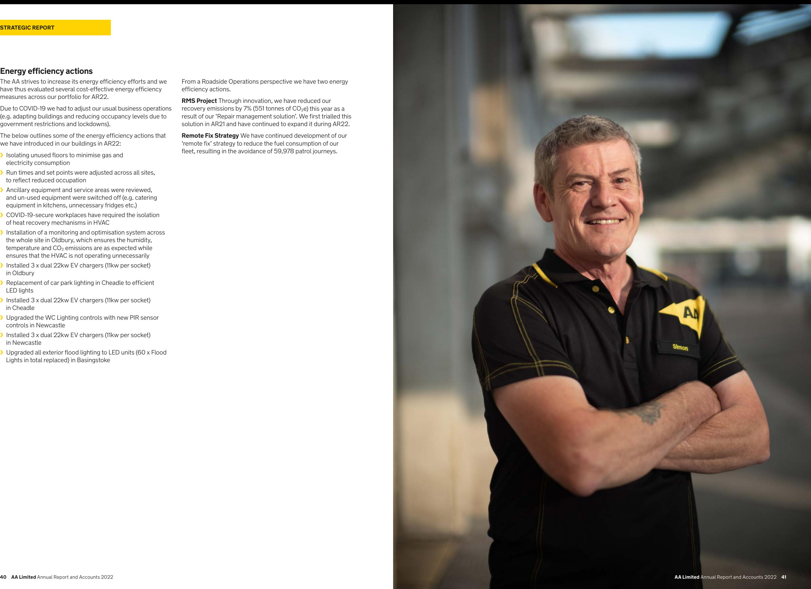

{22}------------------------------------------------

# **OUR PEOPLE AND SOCIAL MATTERS**

## **Diversity and inclusion**

Creating a diverse and inclusive workforce is important to the AA and we are committed to creating a culture where all our people can bring their full selves to work and feel they belong. We do this to:

- **›** represent the customers and communities we serve and provide products with great customer outcomes
- **›** encourage different thoughts and ideas, enabling debate and innovation that drives increased business success
- **›** attract and retain the best talent and to support all our people in reaching their full potential

In 2021/22, we had several areas of focus which included:

- **›** recruitment we focused on increasing our pipelines of diverse talent by trailing new ways of attraction including advertising for under-represented groups
- **›** talent and career development we ran our first female talent programme 'Driven Women' to accelerate the career progression of women in mid-level management roles
- **›** communication and engagement we have 5 employee network groups and have worked with them to establish senior sponsorship, celebration events such as International Women's Day and Black History Month. In addition, we have included several inclusivity questions in our annual employee engagement survey so that we can monitor inclusivity

The table below provides a breakdown of gender diversity within the management population and the number of persons of each sex who were employees of the AA at 31 January 2022. This excludes a population of 145 non-payrolled people from Used Cars Sites Limited and Prestige Fleet Servicing Limited.

|                                            |        | Gender split (%) |              |
|--------------------------------------------|--------|------------------|--------------|
| Group                                      | Female | Male             | Total number |
| Group Executive Committee*                 | 33     | 67               | 9            |
| Senior Leadership Team                     | 39     | 61               | 64           |
| Manager Grades                             | 35     | 65               | 596          |
| Employees (excluding agency & contractors) | 33     | 67               | 6,890        |

* Jakob Pfaudler and Tom Mackay are directors of the AA and members of the Group Executive Committee

# **Developing our people**

Our success as a business depends on building our people's capability. We expect all our people to learn and grow and are committed to making sure they have access to learning solutions to keep pace with the changing needs of our customers and our business.

We recognise that the foundation of effective development is on the job experience, coaching and mentoring and therefore we introduced a new Leadership Essentials curriculum in 2021/22 to support our leaders in the foundations of effective leadership. In addition, we introduced a new leadership capability framework and 360 feedback process.

Our people accessed over 100,000 hours of learning in 2021/22, equating to over two days of learning per person. We invested in online resources and virtual delivery to ensure we could continue to support our people.

We continue to onboard entry talent and 120 apprentices completed their programmes with 90% achieving a distinction. We also introduced a new apprenticeship programme to develop HGV drivers. The AA has 205 apprentices and we use apprenticeships to provide professional development to our existing people. Over 70% of our apprentices are internal and we provide entry level to post-graduate level qualifications. We also have gender diverse apprentices with almost an equal split of males and females.

## **Attracting Talent**

In an increasingly tough talent market, we have continued to attract great talent to the AA. For example, by introducing remote working to attract diverse and geographically dispersed talent. This has proved very successful.

We have trained our hiring managers in recruitment skills and have updated and enhanced our selection tools to ensure our leaders are reflecting our AA values and behaviours.

## **Respect for human rights**

The AA respects human rights and it is committed to safe operations throughout its supply chain and has a zero-tolerance policy towards modern slavery or violation of human rights. The Topco Board reviews the effectiveness of the policies in place for respecting human rights and the AA's commitment to eradicating modern slavery from all aspects of the supply chain. The Topco Board annually approves the AA's Modern Slavery Statement, which is then signed by Jakob Pfaudler on behalf of the AA. This is made available on the AA's corporate website, **[theaacorporate.com](http://theaacorporate.com)**

## **Supporting our wider communities and society**

This year, to ensure we make a positive contribution to the places where we live and work, and continue to, we have taken the following actions:

- **›** continued as a signatory of the Armed Forces Covenant, and holder of their Employer Recognition Scheme Gold Award **›** the AA Charitable Trust for Road Safety and the Environment (the AA Charitable Trust) continued to work towards the preservation and protection of human life and health on our roads
- 
- **›** the AA Charitable Trust launched a major campaign aimed at improving the safety of new drivers on rural roads
- **›** research part-funded by the Road Safety Trust meant we were able to produce an interactive map highlighting the riskiest roads for new drivers as 71% of fatal crashes involving young drivers are on rural roads

Further details about how the AA manages customer risk can be found in the principal risk section on *[page](#page-17-0) 33*.

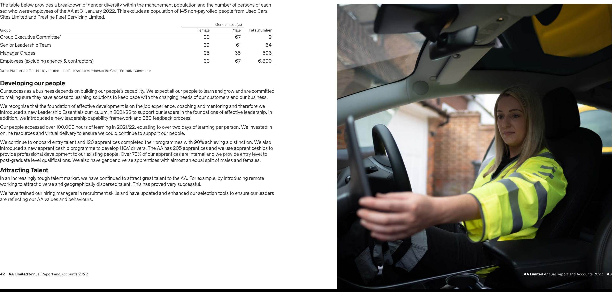

- 

{23}------------------------------------------------

# **STAKEHOLDER ENGAGEMENT**

## **Engaging with stakeholders makes our business better**

Engagement is critical for any business, but particularly so for one in the process of transforming itself. The importance of aligning everyone around a common objective and working towards delivering it successfully cannot be overstated. That is why we are proud of the work that we have been doing to ensure that our people at all levels understand the direction of our business and the role they play in ensuring our long-term success.

| Our people                          | Communities and societies             | Government and regulators        |
|-------------------------------------|---------------------------------------|----------------------------------|
| We engage with our people in        | Ensuring that we make a positive      | In our conversations with        |
| a variety of ways, ensuring that    | contribution to the places where      | Government and regulators,       |
| their voice is heard and that they  | we live and work helps build thriving | we promote the interests of all  |
| can help to influence the future of | communities and strengthens           | UK motorists and advocate for    |
| our business                        | our business                          | more rigorous industry standards |

#### **Examples in 2021/2022**

- **›** Held 'roadshows' across all our sites where our CEO and Group Executive Committee visited colleagues and shared our story of where we are heading as a business and how we are 'creating the future AA'
- **›** Measured employee engagement and culture through a mixture of shorter surveys and a longer annual survey which gave us valuable insights about how colleagues are feeling about life at the AA
- **›** Elected new members to our Management Forum, which is designed involve management grade employees in key decisions impacting Managers
- **›** Developed our internal communications to help drive two-way conversation and support remote working; including more use of video and vlogs (including regular vlogs from the CEO)
- **›** Our annual AA colleague awards event was held in person this year. Approximately 500 colleagues from across the business attended the VIP event in Birmingham. We had more than 1,000 nominations this year and our judges chose our winners across 11 categories who were a mix of teams and individuals who really stood out
- **›** Continued as a signatory of the Armed Forces Covenant, and holder of their Employer Recognition Scheme Gold Award
- **›** Encouraged our people to raise funds for their nominated local charity throughout the year
- **›** This year, the AA Charitable Trust launched a major campaign aimed at improving the safety of new drivers on rural roads. Research part-funded by the Road Safety Trust meant we were able to produce an interactive map highlighting the riskiest roads for new drivers as 71% of fatal crashes involving young drivers are on rural roads
- **›** The second part of the campaign, 'Caitlin's Hour', was based around the death of 18-year-old car passenger, Caitlin Huddleston. A special radio programme was broadcast across Hits and Kerrang radio. The campaign also targeted parents of teenage drivers with 'Caitlin's Message'. The AA Charitable Trust has also been helping teenagers in care learn to drive and also helped to promote various other road safety initiatives
- **›** Our campaign on the safety of 'smart' motorways has continued with the Transport Secretary agreeing to reduce the spacing between emergency refuge areas to ¾ mile and retrofit an extra 150. He also agreed to consider our proposal for an 'emergency corridor' to help emergency services access a crash scene more quickly. In addition, he has also agreed to halt the roll-out of new 'smart' motorways until at least five years safety data is available
- **›** We also gave evidence to various House of Commons Select Committees on safety and environmental issues
- **›** We are active members of governmental and regulatory forums including a member of the Government's Motorists' Forum, an adviser to the Climate Assembly UK, and we worked with the Environment Agency and Office for Zero Emission Vehicles to help give a better understanding of consumer concerns regarding electric vehicles

| Industry                                                                                                                                                                                                                                                                                                             | Investors                                                                                                                                                                                                                                                                                                                                                                               | Customers                                                                                                                                                              |
|----------------------------------------------------------------------------------------------------------------------------------------------------------------------------------------------------------------------------------------------------------------------------------------------------------------------|-----------------------------------------------------------------------------------------------------------------------------------------------------------------------------------------------------------------------------------------------------------------------------------------------------------------------------------------------------------------------------------------|------------------------------------------------------------------------------------------------------------------------------------------------------------------------|
| We believe that effective, system-wide change is only possible if we work with our wider industry peers, partners and supply chain                                                                                                                                                                          | While no longer being a listed company, we continue to maintain significant levels of debt in the form of publicly issued bonds, and to engage with our investors and bondholders                                                                                                                                                                                           | We aim to deliver industry-leading value, service and quality for our customers, and we are regularly judged as 'best in class'                               |
| Examples in 2021/2022                                                                                                                                                                                                                                                                                                |                                                                                                                                                                                                                                                                                                                                                                                         |                                                                                                                                                                        |
| › Participated in the SURVIVE Group for roadside safety and the Society of Motor Manufacturers and Traders (SMMT) connected and autonomous vehicle working group › Worked with the Motability charity to promote better accessibility to electric vehicle charge points for disabled drivers | › Worked on a new reporting cycle to meet bondholder requirements in the new private ownership structure › Held a results call with bond investors in April 2021 covering AA Group results. Published AA Intermediate Co full year and interim accounts › Conducted investor updates and meetings as part of Class A Notes refinancing exercise in July 2021 | › 'Which? Recommended Provider' status for the fourth year running › 5-star patrols called out by Which? › Our Insurance has a five-star rating by Defaqto |

{24}------------------------------------------------

# **S172(1) STATEMENT**

## **Our Directors make decisions with our stakeholders, and the long-term, in mind**

Section 172 of the Companies Act 2006 (Section 172) requires company directors to act in the way that they consider, in good faith, would be most likely to promote the success of the company for the benefit of its members, as a whole.

In this s172(1) statement, the term 'Director' refers to the two statutory directors of AA Limited (the Directors). The Directors' aim is to make sure that their decisions follow a consistent process, by considering the Company's strategic priorities while working within a governance framework for key decision-making that takes into account all relevant stakeholders and balances their various interests. The Directors have considered the need to act fairly between stakeholders and continue to maintain high standards of business conduct. Nevertheless, the Directors acknowledge that stakeholder interests may conflict with each other and that not every decision can result in a positive outcome for all stakeholders.

The table below sets out how the Directors had regard to the matters set out in s172(1) (a) to (f) of the Companies Act 2006 when performing their duties in respect of the AA (the Company).

| Section 172(1)                                                                                          | Decisions/considerations                                                                                                                                                                                                                                                                                                                                                                                                                                                                                                                                  |         |                        |
|---------------------------------------------------------------------------------------------------------|-----------------------------------------------------------------------------------------------------------------------------------------------------------------------------------------------------------------------------------------------------------------------------------------------------------------------------------------------------------------------------------------------------------------------------------------------------------------------------------------------------------------------------------------------------------|---------|------------------------|
| (a) the likely consequence of any decision in the long term                                          | The Directors play an active role in the development of the Company's strategy and take into account external factors, including the impact to stakeholders and wider society and the long-term consequences, when making decisions.                                                                                                                                                                                                                                                                                                                |         |                        |
|                                                                                                         | Further details can be found in the stakeholder engagement section on pages 44 and 45 and the Risk Management Framework on page 32.                                                                                                                                                                                                                                                                                                                                                                                                                    |         |                        |
| (b) the interests of the company's colleagues                                                        | The Directors recognise that delivery of the AA's purpose, strategy and long-term sustainable growth requires strong employee engagement. Management keeps employees informed of the Company's plans, vision, purpose and culture through various events, video blogs and briefings.                                                                                                                                                                                                                                                             |         |                        |
|                                                                                                         | Following their appointment during the year, the new CEO and Group Executive Committee were introduced to colleagues across the business and since then, the CEO has published a weekly vlog to all employees to keep in touch. The Directors have also measured employee engagement and culture through a number of short 'pulse' surveys and an annual engagement survey. The results of these surveys have been shared with colleagues and the Directors and senior management have developed action plans to respond to this input. |         |                        |
|                                                                                                         | Further details can be found in the stakeholder engagement section on pages 44 and 45 and the Directors' Report on pages 55 and 56.                                                                                                                                                                                                                                                                                                                                                                                                                    |         |                        |
| ( c) the need to foster the company's business relationships with suppliers, customers and others | The Directors recognise the importance of the Company developing strong relationships with all its stakeholders and actively seeks opportunities to understand these interests and have effective interaction with its key stakeholders.                                                                                                                                                                                                                                                                                                            |         |                        |
|                                                                                                         | A great example of this is our participation in the SURVIVE Group for roadside safety and the connected and autonomous vehicle working group. The Directors have also                                                                                                                                                                                                                                                                                                                                                                                  |         |                        |
|                                                                                                         | supported various initiatives in respect of zero emission vehicles and electric vehicles and the accessibility of electric vehicle charging points for disabled drivers.                                                                                                                                                                                                                                                                                                                                                                               | ›       | Our people             |
|                                                                                                         | Further details can be found in the stakeholder engagement section on pages 44 and 45.                                                                                                                                                                                                                                                                                                                                                                                                                                                                 |         |                        |
| (d) the impact of the company's operations on the community and the environment                   | The Directors understand that ensuring the Company's operations have a positive impact on the community and environment is of strategic importance. That is why the Company continued to fund the AA Charitable Trust for Road Safety and the                                                                                                                                                                                                                                                                                                       | › ›  | Investors Customers |
|                                                                                                         | Environment so that it could continue its work on the protection of human life and health on UK roads, including the launch of a major campaign regarding safety on rural roads.                                                                                                                                                                                                                                                                                                                                                                    | and 45. |                        |
|                                                                                                         | Further details can be found in the stakeholder engagement section on pages 44 and 45 and the health, safety and environmental performance report on pages 36 and 37.                                                                                                                                                                                                                                                                                                                                                                                  |         |                        |

The Directors believe that managing its reputation for high standards of business conduct is a key priority. The Directors ensure that an appropriate framework, including relevant policies and codes of conduct, is in place to support this. The Directors are made aware of any issues that may have a material impact on the Company's reputation

In particular, all employees are required to complete mandatory e-learning training, and this includes the AA Code, financial crime, conduct risk and anti-bribery and corruption. The Directors are kept up to date with the completion rates of mandatory training amongst colleagues via monthly updates. In addition, there are policies in respect of these areas and they are available to all employees via an internal policy library which has been through a comprehensive review process during the year, led by a new

| Section 172(1)                                                                                            | Decisions/considerations                 |  |
|-----------------------------------------------------------------------------------------------------------|------------------------------------------|--|
| (e) the desirability of the company maintaining a reputation for high standards of business conduct | and operations.                          |  |
|                                                                                                           | policy committee.                        |  |
|                                                                                                           |                                          |  |
| (f) the need to act fairly as between the Company's owners                                             |                                          |  |
|                                                                                                           |                                          |  |
|                                                                                                           | 45 and the Directors' Report on page 55. |  |
|                                                                                                           |                                          |  |

Further details can be found in the Directors' Report on *[page](#page-28-0) 55*.

The Company engages positively with its shareholders and other investors

Specifically, the Directors have regular contact with the Company's two principal shareholders and maintains contact with other investors through regular corporate reporting on its website and through the accessibility of an Investor Relations function.

Further details can be found in the stakeholder engagement section on *pages [44 and](#page-23-0)* 

# **Key stakeholders**

The Board continuously monitors the AA's key stakeholders to ensure due consideration is given to all relevant stakeholders in the context of principal decisions. During the year, the following key stakeholders were identified:

- **›** Communities and societies
- **›** Government and regulators
- **›** Industry (including the supply chain)
- 

Read more about our engagement with key stakeholders, and our approach to each of the groups mentioned above, on *[pages](#page-23-0) 44* 

{25}------------------------------------------------

# **NON-FINANCIAL INFORMATION STATEMENT**

| Reporting requirement                                                         | The AA's key policies and standards which govern our approach and controls                                       | Reporting requirement                                                                | The AA's key policies and standards which govern our approach and controls                                                                                                                   |  |  |
|-------------------------------------------------------------------------------|------------------------------------------------------------------------------------------------------------------|--------------------------------------------------------------------------------------|----------------------------------------------------------------------------------------------------------------------------------------------------------------------------------------------|--|--|
| Environmental matters                                                         | Health, Safety and Environmental Risk Assessment Policy (I)                                                      | Anti-corruption and anti-bribery                                                     | Anti-Bribery and Allowable Gifts, Hospitality and Donations Policy (I)                                                                                                                       |  |  |
| Further details in this Report:                                               | Health, Safety and Environmental Policy (E)                                                                      | Further details in this Report:                                                      | Conduct Risk Policy (I)                                                                                                                                                                      |  |  |
| › Our commitment to safe operations page 36                                | Sustainability and Corporate Social Responsibility Statement (E) and (I)                                         | › Employee engagement                                                             | Conflicts of Interest Policy (I)                                                                                                                                                             |  |  |
| › Risk management report: health and                                       | Preventing Environmental Incidents Policy (I)                                                                    | (in the Directors Report page 56)                                                    | Financial Crime Policy (I)                                                                                                                                                                   |  |  |
| safety risk page 34                                                           | Waste Policy (I)                                                                                                 |                                                                                      | Securities Dealing Policy (I)                                                                                                                                                                |  |  |
| Company employees                                                             | What Drives Us – the AA Code (I)                                                                                 |                                                                                      | Whistleblowing Policy (I)                                                                                                                                                                    |  |  |
| Further details in this Report:                                               | Time Off Work Policy (I)                                                                                         | Due diligence and outcome                                                            | Risk Management Framework Policy (I)                                                                                                                                                         |  |  |
| › Diversity and inclusion page 42                                          | Absence policies including Attendance Management Policy and Family Leave                                         | Further details in this Report:                                                      | Annual Internal Audit Plan (I)                                                                                                                                                               |  |  |
| › Developing our people page 42 ›                                       | (e.g. Maternity leave, paternity leave and share parental leave, adoption leave, surrogacy and fostering) (I) | › Risk Management report page 32                                                  | Risk Register (I)                                                                                                                                                                            |  |  |
| Our commitment to safe operations page 36                                     | Flexible Working Policy (I)                                                                                      |                                                                                      | ISO 14001, ISO 9001 and OHSAS 18001 certification for specified business areas (E)                                                                                                        |  |  |
|                                                                               | Capability Policy (I)                                                                                            |                                                                                      |                                                                                                                                                                                              |  |  |
|                                                                               | Equality and Diversity Policy (E)                                                                                | Business model                                                                       |                                                                                                                                                                                              |  |  |
|                                                                               | Workplace Policy (I)                                                                                             | Further details in this Report:                                                      |                                                                                                                                                                                              |  |  |
|                                                                               | Health, Safety and Environmental Risk Assessment Policy (I)                                                      | › CEO statement pages 6-8                                                         |                                                                                                                                                                                              |  |  |
|                                                                               | Health, Safety and Environmental Policy (E)                                                                      | › Our business model pages 12-15                                                  |                                                                                                                                                                                              |  |  |
|                                                                               | Sustainability and Corporate Social Responsibility Statement (E) and (I)                                         | Non-financial key                                                                    |                                                                                                                                                                                              |  |  |
| Social matters                                                                | Sustainability and Corporate Social Responsibility Statement (E) and (I)                                         | performance indicators Further details in this Report:                            |                                                                                                                                                                                              |  |  |
| Further details in this Report:                                               | Complaints Handling Policy (I)                                                                                   | › Key performance indicators pages 16-19                                          |                                                                                                                                                                                              |  |  |
| › Supporting our wider communities                                         | Vulnerable Customers Policy (I)                                                                                  |                                                                                      |                                                                                                                                                                                              |  |  |
| and society page 43                                                           | The AA Charitable Trust (UK charity no.1125119)                                                                  | I Group policies, standards and guidelines that are published internally only.       |                                                                                                                                                                                              |  |  |
| › Stakeholder engagement pages 44 and 45                                   |                                                                                                                  | E Group policies, standards and guidelines that are published on theaacorporate.com. |                                                                                                                                                                                              |  |  |
| Respect for human rights                                                      | Equality and Diversity Policy (I)                                                                                |                                                                                      |                                                                                                                                                                                              |  |  |
| Further details in this Report:                                               | Human Rights Policy (E)                                                                                          |                                                                                      | The Strategic Report, which has been prepared in accordance with the requirements of the Companies Act 2006, has been approved by the Board on 12 April 2022 and signed on its behalf by: |  |  |
| › Diversity and inclusion page 42 › Respect for human rights page 43 |                                                                                                                  | Jakob Pfaudler Chief Executive Officer                                            |                                                                                                                                                                                              |  |  |

{26}------------------------------------------------

# **GOVERNANCE REPORT**

{27}------------------------------------------------

# **DIRECTORS' REPORT**

The Directors present their annual report and the audited consolidated financial statements of the AA Limited for the year ended 31 January 2022 (Companies Act 2006, s415). This Directors' Report meets the requirements set out in the Companies Act 2006, the Large and Medium-sized Companies and Groups (Accounts and Reports) Regulations 2008 and the Companies (Miscellaneous Reporting) Regulations 2018. Some disclosures are included in other sections of this Annual Report and Accounts and are incorporated into this Directors' Report by way of cross-reference.

#### **Index to Directors' Report and other required disclosures**

| Acquisitions and disposals                     | page 83 (Notes to the Financial Statements)                                    |  |
|------------------------------------------------|--------------------------------------------------------------------------------|--|
| Auditor information                            | page 56 (Directors' Report)                                                    |  |
| Board of Directors                             | page 53 (Directors' Report)                                                    |  |
| Carbon emissions                               | pages 37-39 (Strategic Report)                                                 |  |
| Directors' indemnities and insurance           | page 56 (Directors' Report)                                                    |  |
| Employee engagement                            | page 56 (Directors' Report) and page 44 (Strategic Report)                     |  |
| Employees with disabilities                    | page 56 (Directors' Report)                                                    |  |
| Events after the reporting period              | page 109 (Notes to the Financial Statements)                                   |  |
| Financial instruments                          | page 72 (Notes to the Financial Statements)                                    |  |
| Going concern                                  | page 56 (Directors' Report) and page 71 (Notes to the Financial Statements) |  |
| Internal controls over financial reporting     | page 56 (Directors' Report)                                                    |  |
| Our people and social matters                  | page 42 (Strategic Report)                                                     |  |
| Ownership of the AA                            | page 53 (Directors Report)                                                     |  |
| Political donations and expenditure            | page 57 (Directors' Report)                                                    |  |
| Risk management                                | pages 32-35 (Strategic Report)                                                 |  |
| Statement of corporate governance arrangements | page 54 (Directors' Report)                                                    |  |
| Suppliers payment policy                       | page 57 (Directors' Report)                                                    |  |
| Walker Guidelines                              | page 56 (Directors' Report)                                                    |  |

# **Ownership of the AA**

On 25 November 2020, the boards of the AA (the Company) and Basing Bidco Limited (Bidco) announced that they had reached agreement on the terms of a recommended cash acquisition by Bidco, a newly incorporated company indirectly wholly owned by a consortium of (i) funds advised by TowerBrook Capital Partners (U.K.) LLP or its affiliates; and (ii) private equity funds managed by Warburg Pincus LLC or its affiliates (together, the Consortium), of the entire issued and to be issued ordinary share capital of the AA, by means of a Court approved scheme of arrangement under Part 26 of the Companies Act 2006.

On 9 March 2021, Bidco, completed the recommended cash acquisition of the AA. Under the terms of the acquisition, AA shareholders were entitled to receive 35p in cash for each AA share. The acquisition valued the entire issued and to be issued ordinary share capital of the AA at approximately £218 million. Bidco is the immediate parent company of the AA and is a subsidiary of Basing Topco Limited, the investment company controlled by the Consortium. This report explains the governance arrangements at the AA and the oversight role played by the Board of Basing Topco Limited.

# **Board of Directors**

During the financial year ending 31 January 2022, there were a number of changes to the Board of Directors due to the acquisition of the AA (then known as AA plc) by the Consortium on 9 March 2021 and the subsequent delisting of the Company's shares from the London Stock Exchange on 10 March 2021.

The Directors who served from 1 February 2021 until 9 March 2021 were Steve Barber, Andrew Blowers, Mark Brooker, John Leach, Cathryn Riley and Suzi Williams. Simon Breakwell resigned as a Director of the AA on 14 April 2021. Jakob Pfaudler was appointed to his role as CEO and a Director of the AA on 14 April 2021. Kevin Dangerfield served as CFO of the AA until 12 November 2021. Subsequently, Tom Mackay was appointed as CFO and a Director of the AA on 15 November 2021.

Due to the ownership structure of the AA, this report refers to the governance arrangements and activities of the Board of Basing Topco Limited (Topco) and the Board of AA Limited (the Board). Management control of the AA is exercised by the Topco Board. Jakob Pfaudler is a director of both the AA and Topco boards, so he has a central role in board discussions and decision-making about the strategic direction of the AA. The Company's financial activities are aligned with Topco and the governance structures in respect of Topco apply equally to its subsidiaries, including the Company. However, the Directors recognise that from time to time there may be a divergence between the Company's stakeholders and Topco stakeholders and in such circumstances, they act accordingly in discharging their duties. The AA subsidiary undertakings consolidated in the Group financial statements are listed in note 7 to the Company's financial statements on *page 115*.

The Directors of Topco during the year were James O'Gara (on behalf on Warburg Pincus LLC) (from 18 November 2020), Gordon Holmes (on behalf of TowerBrook Capital Partners (U.K.) LLP) (from 5 March 2021), Adarsh Sarma (on behalf of Warburg Pincus LLC) (from 5 March 2021), Rick Haythornthwaite (Chair and Non-Executive Director) (from 17 March 2021), Joseph Knoll (on behalf of TowerBrook Capital Partners (U.K.) LLP (from 17 March 2021), Simon Breakwell (Deputy Chair and Non-Executive Director) (from 17 March 2021) and Jakob Pfaudler (AA Group CEO) (from 17 March 2021). Kory Sorenson was subsequently appointed as a Non-Executive Director and she joined the Topco Board on 1 February 2022.

The Topco Board has a number of matters reserved for its consideration and approval. Furthermore, it has delegated authority in respect of certain matters to an Audit and Risk Committee and a Remuneration and Nomination Committee, and these matters are detailed in the respective committee terms of reference.

{28}------------------------------------------------

## **Statement of corporate governance arrangements**

From 1 February 2021 until 9 March 2021, the AA was a premium listed company, with its shares listed on the London Stock Exchange. During that period, the AA was subject to the requirements of the UK Corporate Governance Code 2018 (the Code) and it complied with the requirements of the Code.

Following its delisting from the London Stock Exchange on 10 March 2021, and subsequent conversion from a public to a private limited company, the AA is subject to the requirements for Large Private Companies under the Companies (Miscellaneous Reporting) Regulations 2018 and must include a statement of its corporate governance arrangements in its Annual Report and Accounts.

The AA has chosen to adopt the Wates Corporate Governance Principles for Large Private Companies (the Wates Principles). This report explains how the Directors have applied each of the Wates Principles to the AA's operations and the corporate governance arrangements in place at the AA. The AA was fully compliant with the Wates Principles for the year ending 31 January 2022. We have set out below how we applied the six principles of the Wates Principles during FY22.

| The Wates Principles                                                                              | Application during FY22                                                                                                                                                                                                                                                                            |
|---------------------------------------------------------------------------------------------------|----------------------------------------------------------------------------------------------------------------------------------------------------------------------------------------------------------------------------------------------------------------------------------------------------|
| 1. PURPOSE AND LEADERSHIP An effective board develops and promotes the purpose of           | The Topco Board is collectively responsible for the long-term sustainable success of the Company and builds successful relationships with a range of stakeholders through both formal and informal engagement                                                                                |
| the company, and ensures its values, strategy and culture align with that purpose           | Following the acquisition of the AA, the new private equity owners have expressed a commitment to developing and promoting the Company's purpose and maintaining and embedding a culture that aligns to the Company's purpose                                                                |
|                                                                                                   | The Company's strategic objectives, vision and values are communicated to colleagues through various channels, including direct video blogs from the CEO                                                                                                                                        |
|                                                                                                   | The Topco Board is dedicated to promoting the success of the business as a whole through development of effective strategy, which generates long-term sustainable success for the AA's shareholders and stakeholders                                                                         |
| 2. BOARD COMPOSITION Effective board composition                                               | There is a clear division of responsibilities between the Chair of the Topco Board and the Chief Executive Officer of the Company as recommended by the Wates Principles                                                                                                                        |
| requires an effective chair and a balance of skills, backgrounds, experience, and knowledge | The AA values balance and diversity, and each Director and member of senior management has a high level of understanding and knowledge relevant to the AA's business needs                                                                                                                   |
|                                                                                                   | The Topco Board considers board diversity, and it has recently recruited an additional Non-Executive Director (Kory Sorenson). She will chair the Topco Audit and Risk Committee                                                                                                             |
|                                                                                                   | There are clear arrangements for the delegation of authority from the Topco Board to a Topco Audit and Risk Committee and Remuneration and Nomination Committee, and the Board are satisfied that this delegation is appropriate for the size and complexity of the AA                    |
|                                                                                                   | The AA also recognises the benefits of regular board evaluations and intends to carry out future board effectiveness evaluations to ensure that there is an appropriate balance of skills, experience, and knowledge, and to ensure that refreshment and succession plans are appropriate |
| 3. DIRECTOR RESPONSIBILITIES                                                                      | Each Director has a clear understanding of their general duties and accountabilities                                                                                                                                                                                                               |
| The board and individual directors should have a                                               | The Directors understand their duty to disclose a conflict of interest as and when it may arise. Declared conflicts of interest are regularly reviewed and monitored                                                                                                                            |
| clear understanding of their accountability and responsibilities                            | The Topco Board maintains clear lines of accountability and any delegated areas are specified in terms of reference and the effectiveness of these delegations is monitored                                                                                                                     |
|                                                                                                   | The Company Secretary and the Chair periodically review the appropriateness and strength of governance process and they consider if enhancements could be made                                                                                                                                  |
|                                                                                                   | Board meetings, papers and supporting items are provided in a timely and accurate manner from the relevant experts within the business, allowing for clear and informed decision-making at management level                                                                                  |

The Wates Principles Application during FY22

#### **4. OPPORTUNITY AND RISK**

*A board should promote the long-term sustainable success of the company, by identifying opportunities to create and preserve value and establishing oversight for the identification and mitigation of risks*

The Topco Board has overall responsibility for the AA's risk appetite and risk management framework, however, the AA's risk management is delegated to the Topco Audit and Risk Committee which, supported by the Chief Risk Officer, has oversight of the risk within the AA

The AA operates a 'three lines of defence' model. The model distinguishes between functions that have prime responsibility for identifying, owning and managing risks (first line), oversight and control functions (second line) and functions providing independent assurance (third line). All three lines of defence have specific tasks in the internal control governance framework

To support this model, the AA has risk policies, defined risk appetites for key risks, risk oversight committees, and clearly documented accountabilities and responsibilities from the business, through to the management

There is an internal control framework with appropriate risk management systems in place, which helps to identify emerging and established risks by the Group and its stakeholders

The AA's Risk Management Framework Policy requires all areas of the business to maintain a risk register, which must be reviewed at a minimum, on a quarterly basis

Read more about risk management on *pages [32-35](#page-17-0)*

## **5. REMUNERATION**

*A board should promote executive remuneration structures aligned to the long-term sustainable success of a company*

Matters of remuneration policies and procedures are delegated to the Topco Remuneration and Nomination Committee which meets twice a year and additionally

when required

The Company has appropriate and fair levels of remuneration in place to secure and retain high-quality directors, senior management and wider employees at the AA

Remuneration is aligned to the AA group's strategy and is designed to promote the long-term sustainable success of the business

Remuneration structures and practices take account of the AA's wider business operating environment and wider workforce pay and conditions

The AA reports on the gender pay gap on its corporate website

**6. STAKEHOLDER RELATIONSHIPS AND ENGAGEMENT** 

*to the company's purpose*

The AA recognises the importance of stakeholder engagement and has a strong focus on quality internal and external communication. The AA's key stakeholders are continuously monitored, to ensure that due consideration is given to the relevant stakeholders in the context of principal decisions

*Directors should foster effective stakeholder relationships aligned*  environmental impacts

The AA is responsible for ensuring its business activities sustainably benefit the wider stakeholder system including consideration of social, economic and

As a large private company, the AA recognises that stakeholder engagement is critical and aligning everyone around a common objective and delivering the objective successfully is of key importance. The AA ensures people at all levels understand the direction of the business, and role they play in the business

The AA regularly engages with its key stakeholders, through both formal and informal channels including but not limited to employee engagement surveys, internal communications and live streams from senior management, campaigns for smart motorways, active involvement in governmental and regulatory forums and participation in industry groups including SURVIVE Group for Roadside Safety and the Society of Motor Manufacturers and Traders

Read more about our stakeholder engagement on *pages [44 and 45](#page-23-0)*

#### **DIRECTORS' REPORT** CONTINUED

{29}------------------------------------------------

# **The Guidelines for Enhanced Disclosure by Portfolio Companies and Private Equity Firms (the Walker Guidelines)**

This is the first year that the AA is required to report against the Walker Guidelines, as a result of the change to the AA's ownership in March 2021. Due to our private equity ownership, the AA is classified as a portfolio company under the Walker Guidelines. The private equity funds that own the AA are managed by (i) TowerBrook Capital Partners (U.K.) LLP or its affiliates; and (ii) Warburg Pincus LLC or its affiliates. The senior executives of the private equity funds who have oversight of the AA, on behalf of the funds are James O'Gara and Adarsh Sharma (for Warburg Pincus LLC) and Gordon Holmes and Joseph Knoll (for TowerBrook Capital Partners (U.K.) LLP).

The Directors confirm that the AA was fully compliant with the Walker Guidelines for the year ending 31 January 2022. The specific disclosures required under the Walker Guidelines (i) environmental matters, (ii) employee matters, (iii) social matters, (iv) respect for human rights and (v) anti-corruption and bribery are included within the Strategic Report. The Walker Guidelines also require disclosure about the main trends and factors likely to affect the future development, performance and position of the AA's business, which are included in 'Our Business Model' and 'Financial Review' sections of the Strategic Report on *[pages](#page-7-0) 12-15* and *pages [20-30](#page-11-0)*.

# **Auditor information**

The auditor of the Company is PricewaterhouseCoopers LLP.

## **Internal controls over financial reporting**

The Topco Audit and Risk Committee monitors the effectiveness of the Group's risk management framework and internal financial controls. It should be noted that the Group's risk management systems are designed to manage rather than eliminate the risk of failure to achieve business objectives and they can only provide reasonable and not absolute assurance against material misstatement or loss. The Topco Audit and Risk Committee receives copies of relevant internal audit plans and reports in addition to finance updates and risk reports from the Chief Risk Officer. The Head of Internal Audit and Group Financial Controller attend all Committee meetings, the chair of the Committee regularly meets with the Chief Risk Officer and Head of Internal Audit.

# **Directors' indemnities and insurance**

The Company maintains appropriate directors' and officers' liability insurance cover. The Company also grants indemnities to each of its Directors to the extent permitted by law. Qualifying third-party indemnity provisions (as defined by Section 234 of the Act) were in force during the year ended 31 January 2022 and remain in force, in relation to certain losses and liabilities which the Directors may incur to third parties in the course of acting as Directors, of the Group.

## **Employee engagement**

We remain committed to employee engagement throughout the business. Employees are kept updated on the AA's strategy and progress through regular communication emails and updates on the AA's intranet page. Further details of our workforce engagement and our people can be found on *[page](#page-22-0) 42*. There are clear and transparent policies in place for employees to raise concerns about misconduct and unethical practices at the AA, which include but are not limited to: Whistleblowing Policy, Conflicts of Interest Policy, and Anti-Bribery and Allowable Gifts, Hospitality and Donations Policy.

The Board believes that a shared vision and organisational culture across the organisation inform the management's decision making. This is supported by regular employee engagement surveys, which address and monitor how well the organisational culture and values between senior management and their colleagues are aligned.

The latest employee engagement survey, held in November 2021, had a response rate of 81% and an employee engagement score of 61%. Read more about how the Board has engaged with our people in the stakeholder engagement summary on *[page](#page-23-0) 44*.

## **Employees with disabilities**

The AA is proud of our policy that people with any disability should have full and fair consideration for all vacancies. During the year, we continued to demonstrate our commitment to interviewing those people with disabilities who fulfil the minimum criteria and we endeavour to retain employees in the workforce if they become disabled during employment.

## **Going concern**

The Group's operations are highly cash generative with a large proportion of its revenues coming from recurring transactions. The significant customer loyalty demonstrated by high renewal rates and lengthy customer tenure underpins this and, in addition to the cash balances at the reporting date, the Group has agreed undrawn credit facilities. The majority of the Group's borrowings are long term in nature, with no borrowings due within 12 months from the date of signing of these financial statements. For the Group's longer-term viability, it remains a key assumption of the Directors that the Group continues to have ready access to public debt markets to enable these borrowings to be refinanced in due course.

In July 2021, the Group completed a highly successful refinancing of its outstanding A5 notes, issuing £270m of A9 notes at a coupon of 3.25% with a 7x oversubscribed order book. The Group will continue to seek to refinance its maturities within good time of their scheduled maturities, including the refinancing of £250m of A6 notes which are due to mature in July 2023. It is expected that market conditions in the coming months will be more challenging than in the past with significant macroeconomic concerns around interest rates and inflation as well as substantial geopolitical risk. However, despite these concerns, the Group still expects to be able to access markets at a suitable time and refinance its debt at affordable prices.

The Directors have reviewed projected cash flows for a period of one year from the date of signing these financial statements and have concluded that the Group has sufficient funds to continue trading for this period and the foreseeable future. Therefore, the financial statements have been prepared using the going concern basis.

## **Political donations and expenditure**

No political donations were made during the year ended 31 January 2022 (2021: £nil). The AA has a policy of not making donations to political organisations or independent election candidates or incurring political expenditure anywhere in the world as defined by relevant legislation.

# **Suppliers' payment policy**

It is the Company's policy to develop and maintain key commercial relationships with its suppliers and to obtain mutually agreeable payment terms. For the full year ended 31 January 2022, the average time taken to pay invoices was 18.08 days. Further information can be obtained from the Government's payment practice reporting portal.

The Directors' Report has been approved by the Board on 12 April 2022 and signed on its behalf by:

**Jakob Pfaudler Chief Executive Officer** 

#### **DIRECTORS' REPORT** CONTINUED

## **Directors' responsibilities statement**

The Directors are responsible for preparing the Annual Report and the financial statements in accordance with applicable law and regulation.

Company law requires the Directors to prepare financial statements for each financial year. Under that law the Directors have prepared the Group financial statements in accordance with UK-adopted international accounting standards and the company financial statements in accordance with United Kingdom Generally Accepted Accounting Practice (United Kingdom Accounting Standards, comprising FRS 101 "Reduced Disclosure Framework", and applicable law).

Under company law, the Directors must not approve the financial statements unless they are satisfied that they give a true and fair view of the state of affairs of the Group and Company and of the profit or loss of the Group and Company for that period. In preparing the financial statements, the Directors are required to:

- **›** select suitable accounting policies and then apply them consistently;
- **›** state whether applicable UK-adopted international accounting standards have been followed for the Group financial statements and United Kingdom Accounting Standards, comprising FRS 101, have been followed for the Company financial statements, subject to any material departures disclosed and explained in the financial statements;
- **›** make judgements and accounting estimates that are reasonable and prudent;
- **›** prepare the financial statements on the going concern basis unless it is inappropriate to presume that the Group and Company will continue in business.

The Directors are responsible for safeguarding the assets of the Group and Company and hence for taking reasonable steps for the prevention and detection of fraud and other irregularities.

The Directors are also responsible for keeping adequate accounting records that are sufficient to show and explain the Group and Company's transactions and disclose with reasonable accuracy at any time the financial position of the Group and Company and enable them to ensure that the financial statements comply with the Companies Act 2006.

The Directors are responsible for the maintenance and integrity of the Company's website. Legislation in the United Kingdom governing the preparation and dissemination of financial statements may differ from legislation in other jurisdictions.

# **Directors' confirmations**

In the case of each Director in office at the date the Directors' Report is approved:

- **›** so far as the Director is aware, there is no relevant audit information of which the Group's and Company's auditors are unaware; and
- **›** they have taken all the steps that they ought to have taken as a Director in order to make themselves aware of any relevant audit information and to establish that the Group's and Company's auditors are aware of that information.

The Directors' Responsibilities Statement was approved by the Board on 12 April 2022 and signed on its behalf by:

**Jakob Pfaudler Chief Executive Officer** 

{30}------------------------------------------------

# **FINANCIAL STATEMENTS**

{31}------------------------------------------------

# **INDEPENDENT AUDITORS' REPORT TO THE MEMBERS OF AA LIMITED**

# **Report on the audit of the financial statements**

# **Opinion**

- In our opinion:
- **›** AA Limited's Group financial statements and Company financial statements (the "financial statements") give a true and fair view of the state of the Group's and of the Company's affairs as at 31 January 2022 and of the Group's loss and the Group's cash flows for the year then ended;
- **›** the Group financial statements have been properly prepared in accordance with UK-adopted international accounting standards;
- **›** the Company financial statements have been properly prepared in accordance with United Kingdom Generally Accepted Accounting Practice (United Kingdom Accounting Standards, comprising FRS 101 "Reduced Disclosure Framework", and applicable law); and
- **›** the financial statements have been prepared in accordance with the requirements of the Companies Act 2006.

We have audited the financial statements, included within the Annual Report & Accounts 2022 (the "Annual Report"), which comprise: the Consolidated and Company Statements of Financial Position as at 31 January 2022; the Consolidated Income Statement and Consolidated Statement of Comprehensive Income, the Consolidated Statement of Cash Flows, and the Consolidated and Company Statements of Changes in Equity for the year then ended; and the notes to the financial statements, which include a description of the significant accounting policies.

#### **Basis for opinion**

We conducted our audit in accordance with International Standards on Auditing (UK) ("ISAs (UK)") and applicable law. Our responsibilities under ISAs (UK) are further described in the Auditors' responsibilities for the audit of the financial statements section of our report. We believe that the audit evidence we have obtained is sufficient and appropriate to provide a basis for our opinion.

#### *Independence*

We remained independent of the Group in accordance with the ethical requirements that are relevant to our audit of the financial statements in the UK, which includes the FRC's Ethical Standard, and we have fulfilled our other ethical responsibilities in accordance with these requirements.

#### **Our audit approach**

#### *Overview*

Audit scope

- **›** We conducted audit testing over seven components.
- **›** Four components were subject to an audit of their complete financial information.
- **›** Specific audit procedures were performed on certain balances and transactions in respect of a further three components.
- **›** We obtained coverage of 91% of revenue.

#### Key audit matters

- **›** Recognition of revenue in respect of the personal roadside business (Group)
- **›** Valuation of post-retirement benefit obligations (Group)
- **›** Valuation of insurance technical provisions (Group)
- **›** Goodwill impairment assessment (Group)
- **›** Investment in subsidiaries impairment assessment (Company)

#### Materiality

- **›** Overall Group materiality: £8.0m (2021: £8.5m) based on approximately 2.5% of adjusted Trading EBITDA (2021: approximately 4% of Operating Profit).
- **›** Overall Company materiality: £7.5m (2021: £3.0m) based on approximately 1% (2021: 1%) of Total Assets, but for the purposes of the audit of the Group financial statements, we limited the Company materiality to £3.0m.
- **›** Performance materiality: £6.0m (2021: £6.3m) (Group) and £5.6m (2021: £2.25m) (Company).

#### *The scope of our audit*

As part of designing our audit, we determined materiality and assessed the risks of material misstatement in the financial statements.

#### *Key audit matters*

Key audit matters are those matters that, in the auditors' professional judgement, were of most significance in the audit of the financial statements of the current period and include the most significant assessed risks of material misstatement (whether or not due to fraud) identified by the auditors, including those which had the greatest effect on: the overall audit strategy; the allocation of resources in the audit; and directing the efforts of the engagement team. These matters, and any comments we make on the results of our procedures thereon, were addressed in the context of our audit of the financial statements as a whole, and in forming our opinion thereon, and we do not provide a separate opinion on these matters.

This is not a complete list of all risks identified by our audit.

COVID-19 (Group and Company), which was a key audit matter last year, is no longer included because of the reduced risk of material misstatement of the financial statements as a consequence of COVID-19. Otherwise, the key audit matters below are consistent with last year.

#### **Recognition of revenue in respect of the personal roadside business (Group)**

*Refer to Note 1.3(m) to the financial statements for the Directors' disclosures of the related accounting policies, judgements and estimates, and Note 2 to the financial statements.*

The Group has recognised revenue of £480m in respect of the insured personal roadside business.

There are known issues with the underlying policy management systems used in the insured personal roadside business and the way in which they account for revenue. A set of manual corrections are made each month, along with a series of standing provisions and other adjustments, to appropriately account for revenue.

We focused on whether revenue from these policies was correctly recognised, and whether the corrections and standing provisions and other adjustments made are complete. Given the known issues, there is an increased completeness risk that there are undetected errors in the policy management system calculations. There is also an increased risk of error where manual corrections are made.

We evaluated the relevant IT systems and related internal controls; however, we concluded that we would not rely on the controls over financial reporting and we performed only substantive procedures in this area.

For a sample of insured personal roadside contracts, we performed detailed testing of revenue transactions including agreeing to the underlying contracts, recalculating the revenue and deferred revenue recognised based on transactional data and contractual terms, and agreement to cash receipt. We performed detailed testing of the deferred revenue balances at period end to underlying contracts and recalculated the deferred revenue balance.

We reviewed management's reconciliations of the revenue to be recognised as generated by the policy management systems to the revenue actually recognised in the general ledger, and tested a sample of the specific manual corrections, standing provisions and other adjustments posted by management to correct the known system errors as well as obtaining a full understanding of each of these.

We performed substantive testing procedures over the completeness of the monthly corrections, standing provisions and other adjustments through the following procedures: sample testing policies and tracing through any identified differences to the corresponding correction, provision or other adjustment made, obtaining an understanding of all policy types and ways of policy set up and the corresponding accounting entries for each of these, and understood the nature of complaints through review of the complaints log to understand whether these could be indicative of further unidentified issues.

We found no material misstatements from our testing.

#### **Valuation of post-retirement benefit obligations (Group)**

*Refer to Notes 1.3(l) and 1.3(u) to the financial statements for the Directors' disclosures of the related accounting policies, judgements and estimates, and Note 26 to the financial statements.*

The Group operates three defined benefit pension schemes, the most significant of which is the AA UK Pension Scheme (AA UK), which combined have a total net defined benefit pension surplus of £130m, comprising gross assets of £2,666m and gross liabilities of £2,536m.

Valuation of the liabilities requires significant levels of judgement and technical expertise in determining the appropriate assumptions to measure it. Changes in assumptions (including discount rate, mortality, inflation and pension increases) can have a material impact on the calculation of the liabilities either individually or in combination. The Directors used independent actuaries to prepare the year end valuation under International Accounting Standard 19, 'Employee benefits' ("IAS 19").

Valuation of the scheme assets requires judgement, due to the nature of certain complex and illiquid assets held, for which there are no quoted prices available. Of the total asset value held, the majority do not have a quoted price available. Prices are obtained directly from the relevant investment managers who apply judgement in valuing those assets. In addition, the bulk annuity policies held are valued using actuarial assumptions.

The recognition of the surplus this year involves judgement surrounding the criteria of IAS 19. We focused on the reasonableness of the assumptions used in the calculation of the AAUK defined benefit liability, the valuation of assets held by the AAUK scheme, the disclosure of post-retirement benefit scheme obligations and the surplus recognition criteria.

We involved our specialists in our assessment of the reasonableness of actuarial assumptions and the overall pension liability calculations by comparing the assumptions, including the discount rate and inflation rate, mortality and pension increases, to benchmark ranges, performing sensitivity analysis, checking whether methods have been consistently applied and are reasonable and assessing the impact of the assumptions in combination with one another. We agreed that the judgements taken by the Directors were reasonable.

We obtained external confirmations to test the existence of pension assets as at 31 January 2022. In order to test the valuation of the complex assets, we obtained a range of supporting evidence as available, including recent transaction prices, audited fund financial statements and fund controls reports, to assess whether the net asset value provided was reliable and appropriate. In respect of the bulk annuity policies held, we utilised our actuarial specialists to test the valuation of the assets and performed testing of the insured members to data provided by both the scheme actuary and the administrator.

We reviewed the disclosure of post-retirement scheme obligations and the criteria for recognition of the pension surplus against the requirements of IAS 19. We were satisfied with the nature and extent of the disclosures provided and that the conditions for recognition of the surplus were appropriate against the criteria in IAS 19.

We found no material misstatements from our testing.

{32}------------------------------------------------

#### Key audit matter How our audit addressed the key audit matter

#### **Valuation of insurance technical provisions (Group)**

*Refer to Notes 1.3(n) and 1.3(u) to the financial statements for the Directors' disclosures of the related accounting policies, judgements and estimates and Note 24 to the financial statements.*

The Group financial statements include liabilities for the estimated cost of settling general insurance claims. The insurance technical provisions contain both the outstanding claims provisions of £60m and the provisions for incurred but not reported claims of £17m.

The estimation of insurance contract liabilities involves a significant degree of judgement. The liabilities are based upon management's best estimate of the ultimate cost of all claims incurred but not settled at the year end, whether reported or not, together with the related claims handling costs.

The Directors focused on this area due to the significance of these liabilities to the Group's Statement of Financial Position and because of the inherent uncertainties present when estimating future claims development.

We focused, in particular, on:

- **›** The methodologies and assumptions used in estimating the outstanding claims provisions for general insurance products, in particular for those claims such as personal injury, which can take a long time to settle and where the amounts concerned can be large; and
- **›** Whether the Directors' provision for incurred but not reported claims, which has been determined with the assistance of an external actuarial expert, has been prepared appropriately, including whether any trends in the underlying claims experience were appropriately reflected.

Our work to address the valuation of the insurance technical provisions was supported by our internal non-life actuarial specialists.

We targeted the largest outstanding claims and evaluated the methodology and assumptions used by the Directors to estimate the most judgemental components of each claim. We obtained supporting documentation for the most significant elements of the claims. Given the relatively early stages of development of these large claims, we utilised our in-house claims handling specialists to ensure that appropriate factors had been taken into account when estimating the expected cost of settlement. We agreed that the judgements taken by the Directors were reasonable.

We performed independent actuarial projections of the reserve requirements as at 31 December 2021, rolling forward our estimates to the year end. These projections were carried out at varying degrees of granularity, including claim type and policy type projections, which were subsequently aggregated in order to produce our independent view.

We tested, on a sample basis, the completeness and accuracy of the underlying source data on which our actuarial projections are based to supporting documentation.

Within the booked reserve recognised in the financial statements, there is a management loading on top of the actuarial best estimate which represents a margin for uncertainty. We challenged the Directors on the level of margin held as it falls towards the higher end of our reasonable range. We corroborated the explanations received to our industry knowledge of the various uncertainties within the market at the current time, such as claims inflation, as well as considering the margin in the context of the maturity of the business and relevant peers.

We concluded that the year end insurance technical provisions are reasonable based on the independent projections performed and our assessment of the potential uncertainty present, and that they are consistent with financial reporting requirements and industry accepted practice.

#### **Goodwill impairment assessment (Group)**

*Refer to Notes 1.3(i) and 1.3(u) to the financial statements for the Directors' disclosures of the related accounting policies, judgements and estimates, and Notes 10 and 27 to the financial statements.*

The goodwill balance of £1,170m is subject to an annual impairment review.

The Directors analyse discounted cash flows at the cash generating unit (CGU) level to calculate the value in use for each CGU. Cash flow forecasts are an area of particular focus given the judgements relating to future growth and discount rate assumptions.

No impairment charge has been recorded by the Directors against the goodwill balance in the current financial year. The risk that we focused on in the audit is that the goodwill balance may have been impaired in value and this has not been recognised.

For all CGUs, we checked the cash flow forecasts used by the Directors in the assessment of goodwill impairment were consistent with the approved five year plans, and considered the reasonableness of assumptions in relation to recent trading, including roadside membership rates and the number of motor and home insurance policies sold. We also challenged the extent to which climate change considerations had been reflected, as appropriate, in the cash flow forecasts.

We focused additional work upon the AA Cars and Drivetech CGU's (with reasonable but more limited headroom). For certain assumptions which underpinned their forecast performance, including the speed of recovery of the used vehicles sales market and the resumption of police speed awareness courses, we assessed these for reasonableness against market data, if available, and other internal management data where appropriate.

We also evaluated the historical accuracy of the cash flow forecasts for these businesses. We found that the forecasts have been completed on a basis consistent with prior years and were an appropriate basis upon which the Directors could base their conclusions.

We tested the Directors' assumptions in the forecasts for long-term growth rates (by comparing them to economic forecasts); and the discount rate (by engaging our valuation experts to assess the cost of capital for the Company and comparable organisations). We found the assumptions to be consistent and in line with our expectations based on industry benchmarks.

We obtained and tested the Directors' sensitivity calculations over all their CGUs and agreed with their conclusion that there was no reasonable possible change that would give rise to an impairment or to enhanced disclosure.

Key audit matter How our audit addressed the key audit matter

#### **Investment in subsidiaries impairment assessment (Company)**

*Refer to Notes 1.3(b), 1.3(d) and 2 to the Company financial statements.*

Prior to the reversal of impairment of £210m, the Company held investments in subsidiaries of £506m representing the AA Insurance Holdings Limited group (the underwriting business) and AA Mid Co Limited (which owns the rest of the Group).

In the previous two financial years, impairments totalling £688m were recognised following the Directors' assessments of the appropriateness of the investment in subsidiary carrying values in light of the Group's decreasing market capitalisation and the takeover offer for the Company, accepted by shareholders.

During the year to 31 January 2022, there was an increase in investments in subsidiaries of £366m, principally as a result of a capital contribution of £361m made to AA Mid Co Limited following completion of the takeover by the Consortium.

In light of the additional equity injected by the Consortium on takeover, and as a result of the successful refinancing of the B3 notes and the A9 notes in the year, the Directors prepared a set of 'dividend distribution' forecasts to reflect the cash flows available for distribution to the Company from the Group's subsidiaries. These incorporated interest and tax cash flows in addition to the enterprise value cash flows used in support of the goodwill impairment assessment, reflecting that the Group's debt materially is held in those subsidiaries. These cash flows were then discounted at an equity discount rate. Having referred to the requirements of International Accounting Standard 36, 'Impairment of Assets' ("IAS 36"), the Directors were satisfied it was appropriate to recognise the reversal of £210m of past impairment charges.

We evaluated the appropriateness of the 'dividend distribution' model prepared.

We evaluated the Directors' impairment assessment of the investment in subsidiaries' carrying value by agreeing amounts to supporting documentation and checking calculations. This leveraged the Directors' calculations for the Group goodwill impairment assessment referred to above.

We evaluated the assumptions with regard to anticipated interest flows as debt is refinanced over the coming years and the basis for calculating tax cash flows. We found these to be reasonable and, in relation to interest flows, supported by current market rates.

With the support of our valuation experts, we evaluated the Directors' determination of the equity discount rate and found this to be reasonable.

We considered the requirements of IAS 36 when assessing the appropriateness of the reversal of past impairment charges and, based on our testing, we did not identify any material misstatements. We agreed with the Directors' conclusion that the reversal of £210m of past impairment charges was supportable.

#### **How we tailored the audit scope**

We tailored the scope of our audit to ensure that we performed enough work to be able to give an opinion on the financial statements as a whole, taking into account the structure of the Group and the Company, the accounting processes and controls, and the industry in which they operate.

AA Limited has two operating segments. Within these segments there are around 51 reporting units, of which the following are considered financially significant: Automobile Association Developments Limited and Automobile Association Insurance Services Limited. Two further reporting units were subject to an audit of their complete financial information due to their nature: AA Limited and AA Bond Co Limited. In addition, three reporting units were in scope for specific audit procedures, being AA Corporation Limited, AA Underwriting Insurance Company Limited and AA Senior Co Limited. These three components were selected based on the contribution of each to specific financial statement line items, including: intangible assets, operating and accrued expenses, staff costs and prepayments; revenue, insurance technical reserves and related accounts; and borrowings and external interest expense respectively. These, together with the procedures performed at the Group level, including auditing the consolidation and financial statement disclosures, taxation, pension scheme balances and asset impairment assessments, gave us the evidence we needed for our opinion on the financial statements as a whole. Having undertaken certain procedures to understand the accounting processes and controls at the Group, we determined it was appropriate to perform a wholly substantive audit for the reporting units in scope. All audit procedures were performed by the Group engagement team, with no component auditors involved. Due to restrictions imposed by the COVID-19 pandemic, the audit was predominantly performed remotely and, although we met face-to-face with management where possible, we also communicated via regular telephone and video calls.

The Company is principally a holding company and there are no branches or other locations to be considered when scoping the audit.

#### **INDEPENDENT AUDITORS' REPORT** continued

{33}------------------------------------------------

#### **Materiality**

The scope of our audit was influenced by our application of materiality. We set certain quantitative thresholds for materiality. These, together with qualitative considerations, helped us to determine the scope of our audit and the nature, timing and extent of our audit procedures on the individual financial statement line items and disclosures and in evaluating the effect of misstatements, both individually and in aggregate on the financial statements as a whole.

Based on our professional judgement, we determined materiality for the financial statements as a whole as follows:

|                                       | Financial statements – Group                                                                                                                                                                                                                                                                                                                                                                                                                                                                                                                                                                                                                                                 | Financial statements – Company                                                                                                                                                                                                                                                                                                                                  |
|---------------------------------------|------------------------------------------------------------------------------------------------------------------------------------------------------------------------------------------------------------------------------------------------------------------------------------------------------------------------------------------------------------------------------------------------------------------------------------------------------------------------------------------------------------------------------------------------------------------------------------------------------------------------------------------------------------------------------|-----------------------------------------------------------------------------------------------------------------------------------------------------------------------------------------------------------------------------------------------------------------------------------------------------------------------------------------------------------------|
| Overall materiality                | £8.0m (2021: £8.5m).                                                                                                                                                                                                                                                                                                                                                                                                                                                                                                                                                                                                                                                         | £7.5m (2021: £3.0m).                                                                                                                                                                                                                                                                                                                                            |
| How we determined it               | Approximately 2.5% of adjusted Trading EBITDA (2021: approximately 4% of Operating Profit)                                                                                                                                                                                                                                                                                                                                                                                                                                                                                                                                                                                | 1% (2021: 1%) of Total Assets, but for the purposes of the audit of the Group financial statements, we limited the Company materiality to £3.0m                                                                                                                                                                                                              |
| Rationale for benchmark applied | EBITDA, which is a common performance measure for PE backed companies, reflects the fact that this is typically the most relevant measure of profitability. Based on the benchmarks used in the Annual Report, Trading EBITDA is the primary measure used by the shareholders and other users of the financial statements in assessing the performance of the Group, and that by adjusting this to exclude certain items (such as the pension service charge adjustment, the share-based payments charge and the impairment of investments in joint ventures), it provides a clearer view of the performance of the underlying business. | We believe that total assets is the appropriate measure as the Company is a non-profit oriented entity. In the current year, overall materiality has been reduced to £3.0m, for the purposes of the audit of the Group financial statements, to ensure the Company did not have a higher materiality than the overall Group materiality allocation. |

For each component in the scope of our Group audit, we allocated a materiality that is less than our overall Group materiality. The range of materiality allocated across components was £3.0m to £7.6m. Certain components were audited to a local statutory audit materiality that was also less than our overall Group materiality.

We use performance materiality to reduce to an appropriately low level the probability that the aggregate of uncorrected and undetected misstatements exceeds overall materiality. Specifically, we use performance materiality in determining the scope of our audit and the nature and extent of our testing of account balances, classes of transactions and disclosures, for example in determining sample sizes. Our performance materiality was 75% (2021: 75%) of overall materiality, amounting to £6.0m (2021: £6.3m) for the Group financial statements and £5.6m (2021: £2.25m) for the Company financial statements.

In determining the performance materiality, we considered a number of factors – the history of misstatements, risk assessment and aggregation risk and the effectiveness of controls, and concluded that an amount at the upper end of our normal range was appropriate.

We agreed with those charged with governance that we would report to them misstatements identified during our audit above £0.4m (Group and Company audits) (2021: £0.5m) as well as misstatements below those amounts that, in our view, warranted reporting for qualitative reasons.

## **Conclusions relating to going concern**

Based on the work we have performed, we have not identified any material uncertainties relating to events or conditions that, individually or collectively, may cast significant doubt on the Group's and the Company's ability to continue as a going concern for a period of at least twelve months from when the financial statements are authorised for issue.

In auditing the financial statements, we have concluded that the Directors' use of the going concern basis of accounting in the preparation of the financial statements is appropriate.

However, because not all future events or conditions can be predicted, this conclusion is not a guarantee as to the Group's and the Company's ability to continue as a going concern.

Our responsibilities and the responsibilities of the Directors with respect to going concern are described in the relevant sections of this report.

# **Reporting on other information**

The other information comprises all of the information in the Annual Report other than the financial statements and our auditors' report thereon. The Directors are responsible for the other information. Our opinion on the financial statements does not cover the other information and, accordingly, we do not express an audit opinion or, except to the extent otherwise explicitly stated in this report, any form of assurance thereon.

In connection with our audit of the financial statements, our responsibility is to read the other information and, in doing so, consider whether the other information is materially inconsistent with the financial statements or our knowledge obtained in the audit, or otherwise appears to be materially misstated. If we identify an apparent material inconsistency or material misstatement, we are required to perform procedures to conclude whether there is a material misstatement of the financial statements or a material misstatement of the other information. If, based on the work we have performed, we conclude that there is a material misstatement of this other information, we are required to report that fact. We have nothing to report based on these responsibilities.

Company and their environment obtained in the course of the audit, we did not identify any material misstatements in the Strategic Report and Directors' Report.

# **Responsibilities for the financial statements and the audit**

#### **Responsibilities of the Directors for the financial statements**

As explained more fully in the Directors' responsibilities statement, the Directors are responsible for the preparation of the financial statements in accordance with the applicable framework and for being satisfied that they give a true and fair view. The Directors are also responsible for such internal control as they determine is necessary to enable the preparation of financial statements that are free from material misstatement, whether due to fraud or error.

In preparing the financial statements, the Directors are responsible for assessing the Group's and the Company's ability to continue as a going concern, disclosing, as applicable, matters related to going concern and using the going concern basis of accounting unless the Directors either intend to liquidate the Group or the Company or to cease operations, or have no realistic alternative but to do so.

## **Auditors' responsibilities for the audit of the financial statements**

With respect to the Strategic Report and Directors' Report, we also considered whether the disclosures required by the UK Companies Act 2006 have been included. Based on our work undertaken in the course of the audit, the Companies Act 2006 requires us also to report certain opinions and matters as described below. **Strategic Report and Directors' Report** In our opinion, based on the work undertaken in the course of the audit, the information given in the Strategic Report and Directors' Report for the year ended 31 January 2022 is consistent with the financial statements and has been prepared in accordance with applicable legal requirements. In light of the knowledge and understanding of the Group and Based on our understanding of the Group and industry, we identified that the principal risks of non-compliance with laws and regulations related to breaches of UK regulatory requirements, such as those governed by the Financial Conduct Authority ("FCA"), and unethical and prohibited business practices, and we considered the extent to which non-compliance might have a material effect on the financial statements. We also considered those laws and regulations that have a direct impact on the financial statements such as the Companies Act 2006 and tax legislation. We evaluated management's incentives and opportunities for fraudulent manipulation of the financial statements (including the risk of override of controls), and determined that the principal risks were related to posting inappropriate journal entries to increase revenue or profit and the potential for management bias in accounting estimates. Audit procedures performed by the engagement team included:

Our objectives are to obtain reasonable assurance about whether the financial statements as a whole are free from material misstatement, whether due to fraud or error, and to issue an auditors' report that includes our opinion. Reasonable assurance is a high level of assurance, but is not a guarantee that an audit conducted in accordance with ISAs (UK) will always detect a material misstatement when it exists. Misstatements can arise from fraud or error and are considered material if, individually or in the aggregate, they could reasonably be expected to influence the economic decisions of users taken on the basis of these financial statements.

Irregularities, including fraud, are instances of non-compliance with laws and regulations. We design procedures in line with our responsibilities, outlined above, to detect material misstatements in respect of irregularities, including fraud. The extent to which our procedures are capable of detecting irregularities, including fraud, is detailed below.

- **›** Discussion with management, internal audit, internal compliance, internal legal counsel and enquiries of the Group's legal advisors, including consideration of known or suspected instances of non-compliance with laws and regulations, and fraud.
- **›** Reviewing correspondence between the Group and the FCAin relation to compliance with laws and regulations, and considering the matters identified in light of our understanding of the sector.
- **›** Challenging significant accounting assumptions and judgements individually and collectively for indications of management bias, in particular in relation to the valuation of post-retirement benefit obligations, general insurance claims liabilities, subsidiary investment and goodwill impairment assessments, as described further in the Key audit matters above and Business to Business revenue accruals.
- **›** Designing risk filters to search for journal entries, such as those posted with unusual account combinations or posted by members of senior management with a financial reporting oversight role, and testing those journals highlighted (if any).
- **›** Incorporating elements of unpredictability into the audit procedures performed.
- **›** Reviewing the disclosures in the Annual Report and financial statements against the specific legal requirements, for example within the Directors' Report.

#### **INDEPENDENT AUDITORS' REPORT** continued

{34}------------------------------------------------

There are inherent limitations in the audit procedures described above. We are less likely to become aware of instances of non-compliance with laws and regulations that are not closely related to events and transactions reflected in the financial statements. Also, the risk of not detecting a material misstatement due to fraud is higher than the risk of not detecting one resulting from error, as fraud may involve deliberate concealment by, for example, forgery or intentional misrepresentations, or through collusion.

Our audit testing might include testing complete populations of certain transactions and balances, possibly using data auditing techniques. However, it typically involves selecting a limited number of items for testing, rather than testing complete populations. We will often seek to target particular items for testing based on their size or risk characteristics. In other cases, we will use audit sampling to enable us to draw a conclusion about the population from which the sample is selected.

A further description of our responsibilities for the audit of the financial statements is located on the FRC's website at: **[www.frc.org.uk/auditorsresponsibilities](http://www.frc.org.uk/auditorsresponsibilities)**. This description forms part of our auditors' report. In our engagement letter, we also agreed to describe our audit approach, including communicating key audit matters.

#### **Use of this report**

This report, including the opinions, has been prepared for and only for the Company's members as a body in accordance with Chapter 3 of Part 16 of the Companies Act 2006 and for no other purpose. We do not, in giving these opinions, accept or assume responsibility for any other purpose or to any other person to whom this report is shown or into whose hands it may come save where expressly agreed by our prior consent in writing.

# **Other required reporting**

#### **Companies Act 2006 exception reporting**

Under the Companies Act 2006 we are required to report to you if, in our opinion:

- **›** we have not obtained all the information and explanations we require for our audit; or
- **›** adequate accounting records have not been kept by the Company, or returns adequate for our audit have not been received from branches not visited by us; or
- **›** certain disclosures of Directors' remuneration specified by law are not made; or
- **›** the Company financial statements are not in agreement with the accounting records and returns.

We have no exceptions to report arising from this responsibility.

**Nicholas Smith (Senior Statutory Auditor) for and on behalf of PricewaterhouseCoopers LLP Chartered Accountants and Statutory Auditors Southampton 12 April 2022**

# **INDEPENDENT AUDITORS' REPORT** continued **CONSOLIDATED INCOME STATEMENT**

for the year ended 31 January

|                                             | Note | 2022 £m | 2021 £m |
|---------------------------------------------|------|------------|------------|
| Revenue                                     | 2    | 989        | 967        |
| Cost of sales                               |      | (393)      | (362)      |
| Gross profit                                |      | 596        | 605        |
| Administrative and marketing expenses       |      | (466)      | (387)      |
| Impairment of property, plant and equipment | 12   | (11)       | –          |
| Operating profit                            | 4    | 119        | 218        |
| Finance costs                               | 6    | (143)      | (169)      |
| Finance income                              | 7    | 1          | 3          |
| (Loss)/profit before tax                    |      | (23)       | 52         |
| Tax expense                                 | 9    | (4)        | (12)       |
| (Loss)/profit for the year                  |      | (27)       | 40         |

The accompanying notes are an integral part of this consolidated income statement.

# **CONSOLIDATED STATEMENT OF COMPREHENSIVE INCOME**

for the year ended 31 January

| Note                                                                                                                       | 2022 £m | 2021 £m |
|----------------------------------------------------------------------------------------------------------------------------|------------|------------|
| (Loss)/profit for the year                                                                                                 | (27)       | 40         |
| Other comprehensive income on items that may be reclassified to the income statement in subsequent years                |            |            |
| Effective portion of changes in fair value of cash flow hedges                                                             | 7          | 1          |
| Tax effect 9                                                                                                            | (2)        | –          |
|                                                                                                                            | 5          | 1          |
| Other comprehensive income/(expense) on items that will not be reclassified to the income statement in subsequent years |            |            |
| Remeasurement gains/(losses) on defined benefit schemes 26                                                              | 322        | (50)       |
| Tax effect 9                                                                                                            | (80)       | 10         |
|                                                                                                                            | 242        | (40)       |
| Total other comprehensive income/(losses)                                                                                  | 247        | (39)       |
| Total comprehensive income for the year                                                                                    | 220        | 1          |

#### **Other comprehensive income/(expense) on items that will not be reclassified to the income statement in subsequent years**

The accompanying notes are an integral part of this consolidated statement of comprehensive income.

{35}------------------------------------------------

# **CONSOLIDATED STATEMENT OF FINANCIAL POSITION**

as at 31 January

|                                                    | Note | 2022 £m | 2021 £m |
|----------------------------------------------------|------|------------|------------|
| Non-current assets                                 |      |            |            |
| Goodwill and other intangible assets               | 10   | 1,350      | 1,353      |
| Property, plant and equipment                      | 12   | 37         | 53         |
| Right-of-use assets                                | 13   | 51         | 55         |
| Investments in joint ventures and associates       | 14   | 5          | 5          |
| Financial Investments                              | 16   | 10         | –          |
| Derivative financial instruments                   | 22   | 6          | –          |
| Financial assets at amortised cost                 | 28   | 4          | 4          |
| Defined benefit pension scheme assets              | 26   | 130        | –          |
| Deferred tax assets                                | 9    | –          | 17         |
|                                                    |      | 1,593      | 1,487      |
| Current assets                                     |      |            |            |
| Inventories                                        | 15   | 4          | 4          |
| Trade and other receivables                        | 17   | 328        | 304        |
| Proceeds of Class B3 Notes issuance held in escrow | 20   | –          | 280        |
| Cash and cash equivalents                          | 18   | 112        | 185        |
|                                                    |      | 444        | 773        |
| Assets classified as held for sale                 | 37   | 8          | –          |
| Total assets                                       |      | 2,045      | 2,260      |
|                                                    |      |            |            |
| Current liabilities                                |      |            |            |
| Trade and other payables                           | 19   | (525)      | (556)      |
| Current tax payable                                |      | (6)        | (2)        |
| Borrowings and loans                               | 20   | –          | (637)      |
| Derivative financial instruments                   | 22   | –          | (1)        |
| Lease liabilities                                  | 30   | (16)       | (18)       |
| Provisions                                         | 23   | (4)        | (5)        |
|                                                    |      | (551)      | (1,219)    |
| Non-current liabilities                            |      |            |            |
| Borrowings and loans                               | 20   | (2,306)    | (2,354)    |
| Derivative financial instruments                   | 22   | –          | (1)        |
| Lease liabilities                                  | 30   | (32)       | (34)       |
| Defined benefit pension scheme liabilities         | 26   | –          | (188)      |
| Provisions                                         | 23   | (10)       | (7)        |
| Deferred tax liabilities                           | 9    | (55)       | –          |
| Insurance technical provisions                     | 24   | (77)       | (47)       |
|                                                    |      | (2,480)    | (2,631)    |
| Total liabilities                                  |      | (3,031)    | (3,850)    |
| Net liabilities                                    |      | (986)      | (1,590)    |
|                                                    |      |            |            |
| Equity                                             |      |            |            |
| Share capital                                      | 25   | 4          | 1          |
| Share premium                                      |      | 787        | 412        |
| Own shares                                         |      | –          | (23)       |
| Cash flow hedge reserve                            |      | 4          | (1)        |
| Retained earnings                                  |      | (1,781)    | (1,979)    |
| Total equity                                       |      | (986)      | (1,590)    |

The financial statements were approved by the Board of Directors on 12 April 2022 and signed on its behalf by

**Jakob Pfaudler Tom Mackay** Chief Executive Officer Chief Financial Officer

The accompanying notes are an integral part of this consolidated statement of financial position.

for the year ended 31 January

|                                                   | Share         | Share         | Own          | Cash flow hedge | Retained       |             |
|---------------------------------------------------|---------------|---------------|--------------|--------------------|----------------|-------------|
|                                                   | capital £m | premium £m | shares £m | reserve £m         | earnings £m | Total £m |
| At 1 February 2020                                | 1             | 410           | (33)         | (2)                | (1,968)        | (1,592)     |
| Profit for the year                               | –             | –             | –            | –                  | 40             | 40          |
| Other comprehensive expense                       | –             | –             | –            | 1                  | (40)           | (39)        |
| Total comprehensive income                        | –             | –             | –            | 1                  | –              | 1           |
| Issue of share capital                            | –             | 2             | –            | –                  | –              | 2           |
| Purchase of own shares                            | –             | –             | (4)          | –                  | –              | (4)         |
| Settlement of share schemes                       | –             | –             | 14           | –                  | (14)           | –           |
| Equity-settled share-based payments (see note 35) | –             | –             | –            | –                  | 3              | 3           |
| At 31 January 2021                                | 1             | 412           | (23)         | (1)                | (1,979)        | (1,590)     |
| Loss for the year                                 | –             | –             | –            | –                  | (27)           | (27)        |
| Other comprehensive income                        | –             | –             | –            | 5                  | 242            | 247         |
| Total comprehensive income                        | –             | –             | –            | 5                  | 215            | 220         |
| Issue of share capital                            | 3             | 375           | –            | –                  | –              | 378         |
| Settlement of share schemes                       | –             | –             | 23           | –                  | (22)           | 1           |
| Equity-settled share-based payments (see note 35) | –             | –             | –            | –                  | 5              | 5           |
| At 31 January 2022                                | 4             | 787           | –            | 4                  | (1,781)        | (986)       |

#### **Cash flow hedge reserve**

The cash flow hedge reserve comprises the effective portion of the cumulative net change in the fair value of cash flow hedging instruments related to hedged transactions that have not yet occurred.

The accompanying notes are an integral part of this consolidated statement of changes in equity.

{36}------------------------------------------------

# **CONSOLIDATED STATEMENT OF CASH FLOWS**

for the year ended 31 January

|                                                             | Note     | 2022 £m | 2021 £m |
|-------------------------------------------------------------|----------|------------|------------|
| Operating activities                                        |          |            |            |
| (Loss)/profit before tax                                    |          | (23)       | 52         |
| Amortisation, depreciation and impairment                   | 10,12,13 | 110        | 93         |
| Net finance costs                                           | 6,7      | 142        | 166        |
| Difference between pension charge and cash contributions    |          | (24)       | (19)       |
| Other adjustments to profit before tax                      |          | 30         | 5          |
| Working capital and provisions:                             |          |            |            |
| Increase in trade and other receivables                     |          | (23)       | (52)       |
| (Decrease)/increase in trade and other payables             |          | (20)       | 41         |
| Increase in provisions                                      |          | 32         | 5          |
| Total working capital and provisions adjustments            |          | (11)       | (6)        |
| Net cash flows from operating activities before tax         |          | 224        | 291        |
| Tax paid                                                    |          | (10)       | (15)       |
| Net cash flows from operating activities                    |          | 214        | 276        |
| Investing activities                                        |          |            |            |
| Capital expenditure                                         |          | (77)       | (64)       |
| Proceeds from sale of fixed assets                          |          | 2          | 1          |
| Payment for acquisition of subsidiary, net of cash acquired |          | –          | (1)        |
| Investment in joint venture                                 |          | (1)        | (1)        |
| Financial investments                                       |          | (10)       | –          |
| Proceeds from sale of subsidiaries, net of cash sold        |          | –          | (2)        |
| Net cash flows used in investing activities                 |          | (86)       | (67)       |
| Financing activities                                        |          |            |            |
| Proceeds from borrowings                                    | 21       | 699        | 525        |
| Issue costs on borrowings                                   | 21       | (15)       | (8)        |
| Debt repayment premium and penalties                        | 21       | –          | (6)        |
| Equity contribution via issue of shares                     |          | 378        | –          |
| Repayment of borrowings                                     | 21       | (1,113)    | (525)      |
| Refinancing transactions                                    |          | (51)       | (14)       |
| Interest paid on borrowings                                 |          | (123)      | (137)      |
| Acquisition of own shares                                   |          | –          | (2)        |
| Payment of lease capital                                    |          | (25)       | (27)       |
| Payment of lease interest                                   |          | (2)        | (3)        |
| Net cash flows used in financing activities                 |          | (201)      | (183)      |
| Net (decrease)/increase in cash and cash equivalents        |          | (73)       | 26         |
| Cash and cash equivalents at 1 February                     |          | 185        | 159        |
| Cash and cash equivalents at 31 January                     | 18       | 112        | 185        |

The cash flows from operating activities are stated net of cash outflows relating to adjusting operating items of £86m (2021: £16m). These items comprised £5m related to the closure costs of the CARE section of the AAUK pension scheme and the transitional agreement made with employees in that scheme (2021: £5m), transaction fees related to the acquisition of £68m (2021: £12m), costs of strategic initiatives of £12m (2021: £2m) and legal claims £1m (2021: £nil). The prior year also included £4m related to emergency IT expenditure incurred setting up home working due to the COVID-19 pandemic offset by £7m related to government furlough support in respect of COVID-19, both of which were nil in 2022.

Other adjustments to (loss)/profit before tax inflow of £30m (2021: inflow of £5m) include pension past service cost £26m (2021: £nil) equity-settled share-based payment charge of £5m (2021: £3m), profit on sale of fixed assets of £2m (2021 loss: £2m) and impairment of investment in joint ventures of £1m (2021: £nil).

Financial investments include variable-yield securities largely consisting of highly rated bonds which have been reclassified from cash to investments in the period.

Non-cash investing activities include the acquisition of right-of-use assets (see note 13).

The accompanying notes are an integral part of this consolidated statement of cash flows.

# **NOTES TO THE CONSOLIDATED FINANCIAL STATEMENTS**

## **1 Basis of preparation and accounting policies**

#### **1.1 General information**

The consolidated financial statements for the year ended 31 January 2022 comprise the financial statements of AA Limited ('the Company') and its subsidiaries (together referred to as 'the Group'). AA Limited is a private company, limited by shares, and is incorporated and domiciled in England and Wales, UK. Prior to de-listing on 10 March 2021, the Company's ordinary share capital was listed on the London Stock Exchange.

These statements and the prior year comparatives have been presented to the nearest £million.

#### **1.2 Basis of preparation**

The Group has prepared these statements in accordance with UK-adopted international accounting standards and with the requirements of the Companies Act 2006 as applicable to companies reporting under those standards.

These consolidated financial statements have been prepared under the historic cost convention as modified by the measurement of derivatives and liabilities for contingent consideration in business combinations at fair value.

#### **a) Going concern**

The Group's operations are highly cash generative with a large proportion of its revenues coming from recurring transactions. The significant customer loyalty demonstrated by high renewal rates and lengthy customer tenure underpins this and, in addition to the cash balances at the reporting date, the Group has agreed undrawn credit facilities. The majority of the Group's borrowings are long term in nature, with no borrowings due within 12 months from the date of signing of these financial statements. For the Group's longer-term viability, it remains a key assumption of the Directors that the Group continues to have ready access to public debt markets to enable these borrowings to be refinanced in due course.

In July 2021, the Group completed a highly successful refinancing of its outstanding A5 notes, issuing £270m of A9 notes at a coupon of 3.25% with a 7x oversubscribed order book. The Group will continue to seek to refinance its maturities within good time of their scheduled maturities, including the refinancing of £250m of A6 notes which are due to mature in July 2023. It is expected that market conditions in the coming months will be more challenging than in the past with significant macroeconomic concerns around interest rates and inflation as well as substantial geopolitical risk. However, despite these concerns, the Group still expects to be able to access markets at a suitable time and refinance its debt at affordable prices.

The Directors have reviewed projected cash flows for a period of one year from the date of signing these financial statements and have concluded that the Group has sufficient funds to continue trading for this period and the foreseeable future. Therefore, the financial statements have been prepared using the going concern basis.

#### **b) Basis of consolidation**

The consolidated financial statements incorporate the financial statements of the Company and entities controlled by the Company (its subsidiaries). Control is achieved where the Company has rights to variable returns from its involvement with the entity and has the ability to influence those returns through its power over the entity.

The results of subsidiaries acquired or disposed of during the year are included in the consolidated income statement from the effective date of acquisition or up to the effective date of disposal, as appropriate. Where necessary, adjustments are made to the financial statements of subsidiaries to bring the accounting policies into line with those used by the Group. All intra-group transactions, balances, income and expenses are eliminated on consolidation.

## **1.3 Accounting policies**

The accounting policies set out below have, unless otherwise stated, been applied consistently to all years presented in these consolidated financial statements.

## **a) Interests in joint ventures and associates**

An associate is an entity over which the Group is in a position to exercise significant influence, but not control or joint control, through participating in the financial and operating policy decisions of the entity. Joint ventures are joint arrangements whereby the parties that have joint control of the arrangement have rights to the net assets of the arrangement.

The results, assets and liabilities of joint ventures and associates are incorporated in these financial statements using the equity method of accounting. Investments in joint ventures and associates are carried in the Group statement of financial position at cost, including direct acquisition costs, as adjusted by post-acquisition changes in the Group's share of the net assets less any impairment losses.

## **b) Foreign currencies**

These financial statements are presented in pounds sterling, which is the currency of the primary economic environment in which the Group operates.

Transactions in currencies other than the functional currency of each consolidated undertaking are recorded at rates of exchange prevailing on the dates of the transactions. Monetary assets and liabilities denominated in foreign currencies are translated into the respective functional currency at rates of exchange ruling at the statement of financial position date. Gains and losses arising on the translation of assets and liabilities are taken to the income statement.

## **c) Business combinations and goodwill**

All business combinations are accounted for by applying the acquisition method.

Costs related to the acquisition, other than those associated with the issue of debt or equity securities, are expensed as incurred.

Goodwill arising on consolidation represents the excess of the consideration paid over the Group's interest in the fair value of the identified assets and liabilities of a subsidiary at the date of acquisition. Goodwill is recognised as an asset at cost less accumulated impairment losses.

Any contingent consideration payable is recognised at fair value at the acquisition date, and subsequent changes to the fair value of the contingent consideration are taken to the income statement.

{37}------------------------------------------------

#### **d) Intangible assets**

Intangible assets other than goodwill which are acquired separately are stated at cost. The cost of intangible assets acquired in a business combination is their fair value as at the date of acquisition.

Following initial recognition, intangible assets are carried at cost less any accumulated amortisation and impairment losses. Intangible assets with finite lives are amortised on a straight-line basis over their estimated useful economic lives. The only intangible assets with finite lives held by the Group are customer relationships, software and development costs. Customer relationships are amortised over 10 years and software and development costs over 5 years.

#### **e) Software and development costs**

Software development expenditures on an individual project are recognised as an intangible asset when the Group can demonstrate:

- **›** The technical feasibility of completing the intangible asset so that it will be available for use or sale
- **›** Its intention to complete and its ability to use or sell the asset
- **›** How the asset will generate future economic benefits
- **›** The availability of resources to complete the asset
- **›** The ability to measure reliably the expenditure during development

Following initial recognition of the development expenditure as an asset, the cost model is applied. The asset is carried at cost less any accumulated amortisation and impairment losses. Amortisation of the asset begins when development is complete and the asset is available for use. It is amortised on a straight-line basis over its useful life of three to five years.

Software-as-a-Service arrangements are service contracts providing the Group with the right to access the cloud provider's application software over the contract period. Costs incurred to configure or customise, and the ongoing fees to obtain access to the cloud provider's application software, are recognised as operating expenses. Some of the costs incurred relate to the development of software code that enhances or modifies, or creates additional capability to existing systems and meets the definition of, and the recognition criteria for, an intangible asset. These costs are recognised as intangible software assets and amortised over the useful life of the software on a straight-line basis.

#### **f) Property, plant and equipment**

Land and buildings held for use in the production of goods and the provision of services or for administrative purposes are stated in the statement of financial position at cost or fair value for assets acquired in a business combination less any subsequent accumulated depreciation and impairment losses. If relevant conditions are met, borrowing costs are capitalised.

Property, plant and equipment is stated at cost less accumulated depreciation and impairment losses. Such costs include costs directly attributable to making the asset capable of operating as intended. The cost of property, plant and equipment less their expected residual value is depreciated in equal instalments over their useful economic lives. In assessing residual values and asset lives consideration have been given to the impact of climate change. These lives are as follows:

| Buildings                                        | 50 years                     |
|--------------------------------------------------|------------------------------|
| Related fittings                                 | 3 – 20 years                 |
| Leasehold properties                             | over the period of the lease |
| Plant, vehicles and other equipment 3 – 10 years |                              |

Property, plant and equipment shall be classified as held-for-sale if its carrying amount will be recovered through a sale transaction rather than through continuing use. Assets meeting the criteria of held-for-sale are transferred to held-for-sale at the lower of carrying value or fair value less costs to sell at the point at which the criteria are met.

#### **g) Inventories**

Inventories are stated at the lower of cost and net realisable value. Costs include all costs incurred in bringing each product to its present location and condition. Net realisable value is based on estimated selling price less any further costs expected to be incurred to completion and disposal.

#### **h) Financial instruments**

Financial assets and financial liabilities are recognised in the Group's statement of financial position when the Group becomes a party to the contractual provisions of the instrument. They are classified according to the substance of the contractual arrangements entered into. The Group recognises loss allowances for expected credit losses (ECLs) on relevant financial assets.

#### *Trade receivables*

Trade receivables are amounts due from customers for goods or services performed in the ordinary course of business. They are generally due for settlement within 30 days and are therefore all classified as current. Trade receivables are recognised at fair value and are subsequently held at amortised cost. The Group applies the IFRS 9 simplified approach to measuring ECLs which uses a lifetime expected loss allowance for all trade receivables.

#### *Trade payables*

Trade payables are not interest bearing and are recognised at fair value and are subsequently held at amortised cost.

#### *Cash and cash equivalents*

Cash and cash equivalents comprise cash balances and call deposits with an original maturity less than three months. Restricted cash is cash which is subject to contractual or regulatory restrictions.

#### *Debt instruments*

Debt is initially recognised in the statement of financial position at fair value less transaction costs incurred directly in connection with the issue of the instrument. Debt issue fees in respect of the instrument, including premiums and discounts on issue, are capitalised at inception and charged to the income statement over the term of the instrument using the effective interest method. Remaining issue costs on debt are written off to the income statement when the debt is extinguished.

#### *Equity instruments (share capital issued by the Group)*

An equity instrument is any contract that evidences a residual interest in the assets of the Group after deducting all its liabilities. Equity instruments are recognised at the fair value of proceeds received less direct issue costs.

#### *Derivative financial instruments*

The Group's capital structure exposes it to the financial risk of changes in interest rates and fuel prices. The Group uses interest rate and fuel swap contracts to hedge these exposures.

Derivative financial instruments are recorded in the statement of financial position at fair value. The fair value of derivative financial instruments is determined by reference to market values for similar financial instruments. The gain or loss on remeasurement to fair value is recognised immediately in the income statement unless they qualify for hedge accounting as described below.

#### *Financial Investments*

The Group classifies its financial investments as financial assets at fair value through profit or loss. These investments are initially recorded at fair value. Subsequent to initial recognition, these investments are re-measured at fair value at each reporting date. Fair value adjustments and realised gains and losses are recognised in the profit and loss account.

An exchange with an existing lender of debt instruments with substantially different terms, or a substantial modification of the terms of an existing financial liability or a part of it, is accounted for as an extinguishment of the original financial liability and the recognition of a new financial liability. If an exchange of debt instruments or modification of terms is accounted for as an extinguishment, any costs or fees incurred are recognised as part of the gain or loss on the extinguishment. If the exchange or modification is not accounted for as an extinguishment, any costs or fees incurred adjust the carrying amount of the liability and are amortised over the remaining term of the modified liability. **i) Impairment of assets** The carrying amounts of the Group's non-financial assets, other than inventories, are reviewed at each reporting date to determine whether there is any indication of impairment. If any such indication exists, then the asset's recoverable amount is estimated. In addition, goodwill and intangible assets not yet available for use are tested for impairment annually. For the purpose of impairment testing, assets that cannot be tested individually are grouped together into the smallest group of assets that generates cash inflows from continuing use that

#### *Cash flow hedges*

Where a derivative financial instrument is designated as a hedge of the variability in cash flows of a recognised asset or liability, or a highly probable forecast transaction, the effective part of any gain or loss on the derivative financial instrument is recognised directly in the cash flow hedge reserve. Any ineffective portion of the hedge is recognised immediately in the income statement.

In the same period or periods during which the hedged expected future cash flows affect profit or loss, the associated cumulative gain or loss on the hedged forecast transaction is removed from equity and recognised in the income statement.

When the hedging instrument is sold, expires, is terminated or exercised, or the entity revokes designation of the hedge relationship but the hedged forecast transaction is still expected to occur, the cumulative gain or loss at that point remains in equity and is recognised in accordance with the above policy when the transaction occurs. If the hedged transaction is no longer expected to take place, the cumulative unrealised gain or loss recognised in equity is recognised in the income statement immediately.

are largely independent of the cash inflows of other assets or groups of assets (the cash-generating units or 'CGUs'). The goodwill acquired in a business combination is allocated to CGUs so that the level at which impairment is tested reflects the lowest level at which goodwill is monitored for internal reporting purposes.

The recoverable amount of an asset or CGU is the greater of its value in use and its fair value less costs to sell. In assessing value in use, the estimated future cash flows are discounted to their present value using a pre-tax discount rate that reflects current market assessments of the time value of money and the risks specific to the asset.

An impairment loss is recognised if the carrying amount of an asset or its CGU exceeds its estimated recoverable amount. Impairment losses are recognised in the income statement. Impairment losses recognised in respect of CGUs are allocated first to reduce the carrying amount of any allocated goodwill and then to reduce the carrying amounts of the other assets on a pro rata basis.

An impairment loss in respect of goodwill is not reversed. In respect of other assets, an impairment loss is reversed if there has been a change in the estimates used to determine the recoverable amount. An impairment loss is reversed only to the extent that the asset's carrying amount does not exceed the carrying amount that would have been determined, net of depreciation or amortisation, if no impairment loss had been recognised.

## **j) Leases**

#### *Lease liabilities*

Lease liabilities are measured at the present value of the remaining lease payments, discounted using the lessee's incremental borrowing rate.

#### *Measurement of right-of-use assets*

The associated right-of-use assets for leases are initially measured at cost, being the initial lease liability plus any direct initial costs and an estimate of end of life costs, adjusted by the amount of any prepaid or accrued lease payments relating to that lease recognised in the statement of financial position.

Subsequently the right-of-use assets are depreciated over their lease terms. Useful economic lives of leased assets are reviewed for appropriateness on a continuous basis including in relation to climate change impacts such as electric vehicles.

For property leases, where a decision has been made prior to the year end to permanently vacate the property, the right-of-use asset is impaired to the extent that the value cannot be recovered through rental or other income expected to be received up to the estimated date of final disposal.

#### **NOTES TO THE CONSOLIDATED FINANCIAL STATEMENTS** continued

#### **1 Basis of preparation and accounting policies** continued

**1.3 Accounting policies** continued

{38}------------------------------------------------

#### **k) Provisions and contingent liabilities**

A provision is required when the Group has a present legal or constructive obligation as a result of a past event and it is probable that settlement will be required of an amount that can be reliably estimated.

Provisions are discounted where the impact is material. Material contingent liabilities are disclosed unless the likelihood of transfer of economic benefits is remote. Contingent assets are only disclosed if an inflow of economic benefits is probable.

Provisions for restructuring costs are recognised when the Group has a detailed formal plan for the restructuring that has been communicated to affected parties.

#### **l) Retirement benefit obligation**

The Group's position in respect of defined benefit pension plans is calculated by estimating the amount of future benefit that employees have earned in return for their service in the current and prior years; that benefit is discounted to determine its present value, and the fair value of any plan assets (at bid price) is deducted. The Group determines the net interest on the net defined benefit liability for the year by applying the discount rate used to measure the defined benefit obligation at the beginning of the year to the net defined benefit liability.

The discount rate is the yield at the reporting date on bonds that have a credit rating of at least AA, with maturity dates approximating the terms of the Group's obligations, and that are denominated in the currency in which the benefits are expected to be paid.

Remeasurements arising from defined benefit plans comprise actuarial gains and losses and the return on plan assets (excluding interest). The Group recognises them immediately in other comprehensive income and all other expenses related to defined benefit plans in administrative and marketing expenses in the income statement.

When the benefits of a plan are changed, or when a plan is curtailed, the portion of the changed benefit related to past service by employees, or the gain or loss on curtailment, is recognised immediately in the income statement when the plan amendment or curtailment occurs.

The calculation of the defined benefit obligations is performed by a qualified actuary using the projected unit credit method. When the calculation results in a benefit to the Group, the recognised asset is limited to the present value of benefits available in the form of any future refunds from the plan or reductions in future contributions and takes into account the adverse effect of any minimum funding requirements.

For defined contribution schemes, the amounts recognised in the income statement are the contributions payable in the year.

#### **m) Revenue recognition**

Revenue is measured at the fair value of the consideration receivable less any discounts and excluding value added tax and other sales related taxes.

Roadside membership subscriptions and premiums receivable on underwritten insurance products are apportioned on a time basis over the period where the Group is liable for risk cover as the relevant performance obligations are settled over time, with the Group acting as principal. The unrecognised element of

subscriptions and premiums receivable, relating to future periods, is held within liabilities as deferred income and provision for unearned premium.

Commission income from insurers external to the Group is recognised at the commencement of the period of risk on a point in time basis, with the Group acting as agent in this relationship. Commission income for policies underwritten by the Group is deferred and recognised over the period of risk, with the Group acting as principal in this relationship.

Where customers choose to pay by instalments, the Group charges interest based on the principal outstanding and disclosed interest rate and recognises this income over the course of the loan.

Fees receivable on franchise agreements with driving instructors are recognised as revenue over time across the term of the franchise agreements. This includes fees receivable under the franchise agreement in respect of provision of tuition vehicles, which is not considered to be a sub-lease arrangement. The Group acts as principal in this relationship.

Commission income receivable from the sale and related marketing and administrative services of financial products, such as that earned through the partnership with the Bank of Ireland, is recognised on a point in time basis at the point of the provision of the service, with the Group acting as agent in this relationship. Fixed income, fixed rebates and profit share relating to the provision of these services are recognised in revenue over time in line with the profile of expected lending over the contract term.

For all other revenue, this income is recognised on a point in time basis at the point of delivery of goods or on the provision of service, or over time where the service is provided over more than one day. This includes work which has not yet been fully invoiced, provided that it is considered to be fully recoverable.

#### **n) Insurance contracts**

An insurance contract is a contract under which insurance risk is transferred to the issuer of the contract by another party. In the roadside segment, the Group accepts insurance risk from its customers under roadside recovery service contracts by agreeing to provide services whose frequency and cost is uncertain. Claims and expenses arising from these contracts are recognised in profit or loss as incurred, broker acquisition costs are deferred. The Group also has insurance risk within the insurance underwriting segment on insurance products underwritten by the Group.

At the statement of financial position date, a liability adequacy test is performed to ensure the adequacy of the insurance contract liabilities. In performing these tests, current estimates of future cash outflows arising under insurance contracts are considered and compared with the carrying amount of deferred income, provision for unearned premiums and other insurance contract liabilities. Any deficiency is immediately recognised in the income statement and an additional liability is established.

The estimation of the ultimate liability from claims made under insurance contracts for breakdown recovery is not considered to be one of the Group's most critical accounting estimates. This is because there is a very short period of time between the receipt of a claim, e.g. a breakdown, and the settling of that claim. Consequently, there are no significant provisions for unsettled claims costs in respect of the roadside assistance services.

The provision for outstanding claims relating to products with insurance risk within the insurance underwriting segment is set on an individual claim basis and is based on the ultimate cost of all claims notified but not settled, less amounts already paid by the reporting date, together with a provision for related claims handling costs. The provision also includes the estimated cost of claims incurred but not reported ('IBNR') at the statement of financial position date, which is set using statistical methods. Both outstanding claims and IBNR are not discounted for the time value of money.

The amount of any anticipated reinsurance, salvage or subrogation recoveries is separately identified and reported within trade and other receivables and insurance contract liabilities respectively. Differences between the provisions at the reporting date and settlements and provisions in the following year are recognised in the income statement as they arise.

#### *Reinsurance*

The Group undertakes a programme of reinsurance in respect of the policies which it underwrites. Outward reinsurance premiums are accounted for in the same accounting period as the related inward insurance premiums and are included as a deduction from earned premium, and therefore as a reduction in revenue. The amount of any anticipated reinsurance recoveries is treated as a reduction in claims costs.

The Group had in the year coinsurance arrangements in respect of certain policies that it underwrites. Premiums and claims in respect of coinsured policies are shown net of the coinsurer's share.

#### **o) Insurance aggregator fees**

Insurance aggregator fees are the costs related to the acquisition of customers from insurance comparison websites. These costs are expensed to the income statement in full at the commencement of the insurance policy except where the risk is underwritten by the Group in which case aggregator fees are initially deferred then expensed over the duration of the policy. These costs are presented in the income statement within administrative and marketing expenses.

#### **p) Adjusting operating items**

Adjusting operating items are events or transactions that fall within the operating activities of the Group and which, by virtue of their size or incidence, have been disclosed in order to improve a reader's understanding of the financial statements.

In addition, occasionally there are events or transactions that fall below operating profit that are one-off in nature and items within operating profit that relate to transactions that do not form part of the ongoing segment performance and which, by virtue of their size or incidence, have been separately disclosed in the financial statements.

#### **q) Finance income and costs**

Finance costs comprise interest payable, finance charges on lease liabilities recognised in profit or loss using the effective interest method, amortisation of debt issue fees, unwinding of the discount on provisions (including the net defined benefit obligations) and debt issue fees written off.

Finance income comprises net finance income from defined benefit pension schemes and movement in interest rate swaps.

## **r) Taxation**

Tax on the profit or loss for the year comprises current and deferred tax.

Current tax is the expected tax payable or receivable on the taxable income or loss for the year, using tax rates enacted or substantively enacted at the statement of financial position date, and any adjustment to tax payable in respect of prior years.

Deferred tax is provided on temporary differences between the carrying amounts of assets and liabilities for financial reporting purposes and the amounts used for taxation purposes. The following temporary differences are not provided for: the initial recognition of goodwill; the initial recognition of assets or liabilities that affect neither accounting nor taxable profit other than in a business combination; and differences relating to investments in subsidiaries to the extent that they will probably not reverse in the foreseeable future. The amount of deferred tax provided is based on the expected manner of realisation or settlement of the carrying amount of assets and liabilities, using tax rates enacted or substantively enacted at the statement of financial position date.

A deferred tax asset is recognised only to the extent that it is probable that future taxable profits will be available against which the temporary difference can be utilised. The carrying amount of deferred tax assets is reviewed at each statement of financial position date and reduced to the extent that it is no longer probable that sufficient taxable profits will be available to allow all or part of the asset to be recovered.

#### **s) Segmental analysis**

The Group reports its operations using the segments that are reported for management purposes. Segments are based on business operations because this is where Group risk and return is focused.

#### **t) Share-based payments**

The Group operates equity-settled and cash-settled share-based payment compensation plans for employees.

Share-based payment arrangements in which the Group receives goods or services as consideration for its own equity instruments are accounted for as equity-settled share-based payment transactions, regardless of how the equity instruments are obtained by the Group.

The grant date fair value of equity-settled share-based payment awards granted to employees is recognised as an employee cost, with a corresponding increase in equity, over the period that the employees become unconditionally entitled to the awards. The fair value of the awards granted is measured using a valuation model, taking into account the terms and conditions upon which the awards were granted. The amount recognised as an expense is adjusted to reflect the actual number of awards for which the related service and non-market vesting conditions are expected to be met, such that the amount ultimately recognised as an expense is based on the number of awards that do meet the related service and non-market performance conditions at the vesting date. For share-based payment awards with market vested and non-vesting conditions, the grant date fair value of the share-based payment is measured to reflect such conditions and there is no true up for differences between expected and actual outcomes. On change of control, if vesting date is brought forward, the share based payment charge and increase in equity for the remainder of the vesting term will be accelerated and recognised as at that date (see note 35).

#### **NOTES TO THE CONSOLIDATED FINANCIAL STATEMENTS** continued

#### **1 Basis of preparation and accounting policies** continued

**1.3 Accounting policies** continued

{39}------------------------------------------------

Share-based payment transactions in which the Group receives goods or services by incurring a liability to transfer cash or other assets that is based on the price of the Group's equity instruments are accounted for as cash-settled share-based payments. The fair value of the amount payable to employees is recognised as an expense, with a corresponding increase in liabilities, over the period in which the employees become unconditionally entitled to payment. The liability is remeasured at each statement of financial position date and at settlement date. Any changes in the fair value of the liability are recognised as an employee cost in the income statement.

#### **u) Critical accounting estimates and judgements**

Estimates are evaluated continually and are based on historical experience and other factors, including expectations of future events that are believed to be reasonable under the circumstances. The Group makes estimates and assumptions about the future. The resulting accounting estimates will, by definition, seldom equal the related actual results.

Management has exercised judgement in applying the Group's accounting policies and in making critical estimates. The underlying assumptions on which these judgements are based are reviewed on an ongoing basis and include the selection of assumptions in relation to the retirement benefit obligation and assumptions for future growth of cash flows to support the value in use calculations for the goodwill impairment review.

The principal estimates and assumptions that have a significant risk of causing a material adjustment to the carrying amounts of assets and liabilities within the next financial year are discussed below:

#### *Retirement benefit obligation*

The Group's retirement benefit obligation, which is actuarially assessed each period, is based on key assumptions including return on plan assets, discount rates, mortality rates, inflation, future salary and pension costs. These assumptions may be different to the actual outcome (see note 26 for sensitivity analysis).

In the current year, the AAUK defined benefit pension scheme is in a surplus position. There is judgement around the recognition of a surplus which has been considered by management. The defined benefit pension scheme surplus has been recognised as the Group has an unconditional right to a refund of the surplus assuming the gradual settlement of AAUK scheme liabilities over time until all members have left the scheme.

#### *Insurance technical provisions*

The Group's insurance technical provisions, which are presented on a gross asset and liability basis, are an estimate of the expected ultimate cost of claims as at the statement of financial position date and the cost of claims incurred but not yet reported to the Group. Due to the level of reinsurance the results for the year are not subject to significant risk of misstatement caused by changes to the assumptions in the next 12 months. The estimation of these claims is based on actuarial projection methodologies which incorporate analysis of historic patterns on a peril-by-peril basis to make assumptions about the development of incurred claims and an additional loading over the actuarial best estimate is made, which represents a margin for uncertainty. It can take a significant period of time before the ultimate cost of claims can be established with certainty, and the final outcome may be better or worse than that provided (see note 24).

#### *Intangibles*

The Group has significant software development programmes and there is judgement in relation to which programmes and costs to capitalise under IAS 38. Additionally, there is an estimate in respect of the future usage period of software on which the Group bases the useful economic life of related assets. A reduction in the useful economic life of Customer relationships and Software of 1 year would result in an increase in the amortisation charge by 10% and 25% respectively (see note 10).

The following are other principal estimates and assumptions made by the Group, but which management believes do not have a significant risk of causing a material adjustment to the carrying amounts of assets and liabilities within the next financial year:

#### Goodwill

The Group tests goodwill for impairment annually. The recoverable amounts of CGUs have been determined based on value in use calculations which require the use of estimates (see note 27). Management has prepared discounted cash flows based on the latest strategic plan. The value in use calculation is most sensitive to assumptions in growth and discount rate, and cash flows incorporate the latest business-led assumptions including contract wins, sales volumes and investment requirements including an assessment of the impact of climate change.

#### Share-based payments

The Group has issued a number of share-based payment awards to employees which are measured at fair value. Calculating the share-based payment charge for the year involves estimating the number of awards expected to vest, which in turn involves estimating the number of expected leavers over the vesting period and the extent to which non-market-based performance conditions will be met. Determining the fair value of an award with a market-based performance condition also involves factoring in the impact of the expected volatility of the share price.

#### Leases

The Group recognises lease liabilities in relation to leases, measured at the present value of the minimum lease payments, discounted using the discount rate implicit in the lease, or, where this is not available, the corresponding incremental borrowing rate as at the date of inception of the lease. Management's approach to determining the incremental borrowing rate for a right-of-use asset involves using data provided by the Group's external advisers on the rate of interest that the Group would have to pay to borrow over a similar term, and with a similar security, the funds necessary to obtain an asset of a similar value to the relevant right-of-use asset.

#### **2 Segmental information and revenue disaggregation**

The Group has two key segments – Roadside and Insurance. These segments are consistent with the way in which information is presented to the chief operating decision maker. Head Office costs have been allocated to these two key segments as these costs principally directly support the operations of these segments. Head Office costs are predominately allocated on a percentage of revenue basis.

#### The two reportable operating segments are as follows:

**› Roadside:** This segment is the largest part of the AA business. The AA provides a nationwide service, sending patrols out to members stranded at the side of the road, repairing their vehicles where possible and getting them back on their way quickly

- and safely. In addition, this segment includes the AA and BSM driving schools, Drivetech which provides driver training and educative programmes, and our Prestige business which provides service, maintenance and repair services.
- for customers and its intermediary financial services business. This segment also includes the insurance underwriting and reinsurance activities of the AA, as well as AA Cars which sells used vehicles.

**› Insurance:** This segment includes the insurance brokerage activities of the AA, primarily in arranging motor and home insurance

|                                                           | 2022 £m | 2021 £m |
|-----------------------------------------------------------|------------|------------|
| Revenue                                                   |            |            |
| Roadside                                                  | 822        | 799        |
| Insurance                                                 | 167        | 168        |
| Revenue                                                   | 989        | 967        |
| Trading EBITDA                                            |            |            |
| Roadside                                                  | 290        | 280        |
| Insurance                                                 | 55         | 61         |
| Trading EBITDA                                            | 345        | 341        |
| Share-based payments (see note 35)                        | (5)        | (4)        |
| Pension service charge adjustment (see note 3)            | (4)        | (5)        |
| Amortisation and depreciation (see notes 10, 12, 13)      | (99)       | (93)       |
| Impairment of property, plant and equipment (see note 12) | (11)       | –          |
| Pension past service cost (see note 26)                   | (26)       | –          |
| Operating profit before adjusting operating items         | 200        | 239        |
| Adjusting operating items (see note 5)                    | (81)       | (21)       |
| Operating profit                                          | 119        | 218        |
| Net finance costs (see notes 6 and 7)                     | (142)      | (166)      |
| (Loss)/profit before tax                                  | (23)       | 52         |

All segments operate principally in the UK. Revenue by destination is not materially different from revenue by origin.

Segment performance is primarily evaluated using the Group's key performance measures of Revenue and Trading EBITDA as well as operating profit before adjusting operating items.

Adjusting operating items, net finance costs and tax expense are not allocated to individual segments as they are managed on a group basis.

Segmental information is not presented for items in the statement of financial position as management does not view this information on a segmental basis.

Insurance revenue includes £24m (FY21: £23m) which is recognised under the effective interest method. Please see corresponding accounting policy in note 1.3(m) for further details.

## **Reconciliation of Trading EBITDA to operating profit before adjusting operating items**

|                                                   | Roadside   |            |            | Insurance  |
|---------------------------------------------------|------------|------------|------------|------------|
|                                                   | 2022 £m | 2021 £m | 2022 £m | 2021 £m |
| Trading EBITDA                                    | 290        | 280        | 55         | 61         |
| Share-based payments                              | (4)        | (3)        | (1)        | (1)        |
| Pension service charge adjustment                 | (3)        | (4)        | (1)        | (1)        |
| Amortisation and depreciation                     | (86)       | (81)       | (13)       | (12)       |
| Impairment of property, plant and equipment       | (7)        | –          | (4)        | –          |
| Pension past service cost                         | (23)       | –          | (3)        | –          |
| Operating profit before adjusting operating items | 167        | 192        | 33         | 47         |

#### **NOTES TO THE CONSOLIDATED FINANCIAL STATEMENTS** continued

#### **1 Basis of preparation and accounting policies** continued

#### **1.3 Accounting policies** continued

{40}------------------------------------------------

#### **Disaggregation of revenue:**

|                         | 2022 £m | 2021 £m |
|-------------------------|------------|------------|
| Roadside:               |            |            |
| Consumer (B2C)          |            |            |
| Insured contracts       | 480        | 470        |
| Pay for use contracts1  | 47         | 48         |
| Business services (B2B) |            |            |
| Insured contracts       | 31         | 32         |
| Pay for use contracts1  | 178        | 176        |
| Roadside other2         | 86         | 73         |
| Total Roadside          | 822        | 799        |
| Insurance:              |            |            |
| Brokering activities    | 100        | 113        |
| Insurance underwriting  | 49         | 40         |
| Insurance other2        | 18         | 15         |
| Total Insurance         | 167        | 168        |
| Revenue                 | 989        | 967        |

1 Pay for use contracts relate to contracts that take into account the number of breakdowns.

2 Roadside other comprises the Group's Driving Schools, Drivetech and Prestige businesses as well as a number of other smaller operations. Insurance other comprises the Group's AA Cars and Financial Services businesses.

Roadside B2C and B2B mostly consists of revenue from roadside membership subscriptions.

The majority of brokering activities revenue relates to commission income from insurers external to the Group, whereas insurance underwriting largely consists of premiums receivable on underwritten insurance products.

For further detail on the Group's revenue streams see the 'Financial Review' section of the Annual Report on *[pages](#page-11-0) 21-23*, and the 'Risk Management report' section of the Annual Report on *pages [32-35](#page-17-0)* for the associated risks.

#### **3 Adjusted performance measures**

These financial statements report results and performance both on a statutory and non-GAAP (non-statutory) basis. The Group's adjusted performance measures are non-GAAP (non-statutory) financial measures and are included in these financial statements as they are key financial measures used by management to evaluate performance of business segments. The measures enable stakeholders to more easily and consistently track the underlying operational performance of the Group and its business segments. Some of the measures are also required under our debt documents for debt covenant calculations.

Trading EBITDA is profit after tax on a continuing basis as reported, adjusted for depreciation, amortisation, adjusting operating items, share-based payments, pension service charge adjustments, pension past service costs, impairment of property, plant and equipment, net finance costs, and tax expense.

The pension service charge adjustment relates to the difference between the cash contributions to the pension scheme for ongoing contributions and the calculated annual service costs.

#### **Reconciliation of Trading EBITDA to operating profit**

Trading EBITDA is calculated as operating profit before adjustments as shown in the table below:

|                                             |          |            | for the year ended 31 January |  |
|---------------------------------------------|----------|------------|-------------------------------|--|
|                                             | Note     | 2022 £m | 2021 £m                    |  |
| Trading EBITDA                              | 2        | 345        | 341                           |  |
| Share-based payments                        | 35       | (5)        | (4)                           |  |
| Pension service charge adjustment           |          | (4)        | (5)                           |  |
| Amortisation and depreciation               | 10,12,13 | (99)       | (93)                          |  |
| Impairment of property, plant and equipment | 12       | (11)       | –                             |  |
| Pension past service cost                   | 26       | (26)       | –                             |  |
| Adjusting operating items                   | 5        | (81)       | (21)                          |  |
| Operating profit                            | 4        | 119        | 218                           |  |

Trading EBITDA excludes discontinued operations and the effects of significant items of income and expenditure which may have an impact on the quality of earnings, such as restructuring costs, legal costs and impairments when the impairment is the result of an isolated, non-recurring event. It also excludes the effects of share-based payments, defined benefit pension service charge adjustments, pension past service costs, amortisation and depreciation.

These specific adjustments are made between the GAAP measure of operating profit and the non-GAAP measure of Trading EBITDA because Trading EBITDA is a performance measure required and clearly defined under the terms of our debt documents and is used for calculating our debt covenants. Given the significance of the Group debt, Trading EBITDA is a key measure for our bondholders and therefore management. In addition, the Group shows Trading EBITDA to enable stakeholders and management to more easily and consistently track the underlying operational performance of the Group and its business segments.

#### **4 Operating profit**

Operating profit is stated after charging:

|                                                           | 2022 £m | 2021 £m |
|-----------------------------------------------------------|------------|------------|
| Amortisation of owned intangible assets (see note 10)     | 61         | 55         |
| Depreciation of owned tangible fixed assets (see note 12) | 14         | 12         |
| Depreciation of right-of-use assets (see note 13)         | 24         | 26         |
|                                                           | 99         | 93         |

#### **5 Adjusting operating items**

|                                                                                                                                   | 2022 £m | 2021 £m |
|-----------------------------------------------------------------------------------------------------------------------------------|------------|------------|
| Transaction fees related to the acquisition and debt financing arrangements                                                       | 64         | 16         |
| Strategic review projects                                                                                                         | 13         | 2          |
| Closure costs of the CARE section of the AAUK pension scheme and the transitional agreement made with employees in that scheme | 5          | 5          |
| Emergency IT expenditure incurred setting up home working due to the COVID-19 pandemic                                            | –          | 4          |
| Government furlough support in respect of COVID-19                                                                                | –          | (7)        |
| Other adjusting operating items                                                                                                   | (1)        | 1          |
| Total adjusting operating items                                                                                                   | 81         | 21         |

In the current year, strategic review projects included the cost of consultancy and restructuring of the executive team. Other adjusting operating items comprise mainly of £2m profit on sale of fixed assets, partly offset by £1m impairment of investments in joint ventures.

In the prior year, other adjusting operating items comprised a £2m loss on disposal of subsidiaries, £1m of additional property dilapidations costs and a £1m impairment of investments in joint ventures offset by a £2m release of a provision for conduct and regulatory costs and a £1m profit on disposal of non-current assets.

In the prior year incremental costs directly attributable to COVID-19 and the credit received from government furlough support were included within adjusting operating items. The trading effects from COVID-19 were reflected within Trading EBITDA.

Costs from the current year refinancings were directly attributable to the issue and repayment of loan notes and have therefore been included either in finance costs or in borrowings as debt issue fees (see notes 6 and 21).

#### **NOTES TO THE CONSOLIDATED FINANCIAL STATEMENTS** continued

#### **2 Segmental information and revenue disaggregation** continued

{41}------------------------------------------------

#### **6 Finance costs**

|                                                                                                   | 2022 £m | 2021 £m |
|---------------------------------------------------------------------------------------------------|------------|------------|
| Interest on external borrowings                                                                   | 125        | 136        |
| Finance charges payable on lease liabilities                                                      | 2          | 3          |
| Total ongoing cash finance costs                                                                  | 127        | 139        |
| Ongoing amortisation of debt issue fees                                                           | 9          | 9          |
| Fair value movement on interest rate swaps                                                        | –          | 1          |
| Net finance expense on defined benefit pension schemes                                            | 2          | –          |
| Total ongoing non-cash finance costs                                                              | 11         | 10         |
| Debt repayment premium                                                                            | –          | 6          |
| Debt issue fees immediately written off following repayment of borrowings                         | –          | 5          |
| Debt issue fees immediately written off following refinancing of banking facilities (see note 21) | 1          | –          |
| Total adjusting cash finance costs                                                                | 1          | 11         |
| Unamortised debt issue fees written off following repayment of borrowings (see note 21)           | 4          | 9          |
| Total adjusting non-cash finance costs                                                            | 4          | 9          |
| Total finance costs                                                                               | 143        | 169        |

During the current year, the Group issued £270m of Class A9 Notes, repaid £372m of Class A5 Notes and refinanced the £570m outstanding Class B2 Notes, £200m Senior Term Facility (STF), £60m Working Capital Facility (WCF) and £165m Liquidity Facility (LF) (see note 21).

The issue of the class A9 Notes was not a modification of any existing debt and the associated issue fees were capitalised. £1m of facility arrangement fees were also capitalised for the Senior Term Facility (see note 21).

The Group incurred adjusting finance costs of £5m consisting of £1m of debt issue fees immediately written off on refinancing of the WCF and LF, a £1m write-off of unamortised issue fees associated with the Class A5 Notes and a £3m write-off of unamortised issue fees associated with the Class B2 Notes

#### **7 Finance income**

|                                                       | 2022 £m | 2021 £m |
|-------------------------------------------------------|------------|------------|
| Net finance income on defined benefit pension schemes | –          | 3          |
| Fair value movement on interest rate swap             | 1          | –          |
| Total ongoing non-cash finance income                 | 1          | 3          |
| Total finance income                                  | 1          | 3          |

#### **8 Employee costs**

|                                            | 2022 £m | 2021 £m |
|--------------------------------------------|------------|------------|
| Wages and salaries                         | 254        | 244        |
| Social security costs                      | 26         | 25         |
| Other pension costs                        | 31         | 32         |
| Share-based payments expense (see note 35) | 5          | 4          |
|                                            | 316        | 305        |

The average monthly number of persons employed under contracts of service during the year was:

|                               | 2022  | 2021  |
|-------------------------------|-------|-------|
| Operational                   | 5,629 | 5,931 |
| Management and administration | 1,572 | 1,290 |
|                               | 7,201 | 7,221 |

#### **Directors' Remuneration**

|                                                          | 2022 £m | 2021 £m |
|----------------------------------------------------------|------------|------------|
| Aggregate remuneration in respect of qualifying services | 2          | 2          |
| Share-based payments (see note 35)                       | 1          | –          |
|                                                          | 3          | 2          |

Emoluments of highest paid director:

|                                                          | 2022 £m | 2021 £m |
|----------------------------------------------------------|------------|------------|
| Aggregate remuneration in respect of qualifying services | 1          | 1          |
|                                                          | 1          | 1          |

During the year ended 31 January 2022, the highest paid director received 2,004,279 shares in respect of qualifying services under a long-term incentive scheme. No other emoluments under long-term incentive schemes were received by the highest paid director.

Retirement benefits are accruing for nil (2021: nil) directors under a defined benefit scheme and nil (2021: nil) under a money purchase scheme.

One director exercised share options in the current year (2021: nil). The number of shares exercised was 2,004,279.

No money has been paid or is receivable by directors under long-term incentive schemes in respect of qualifying services in the current year (2021: nil).

No director has received shares in respect of qualifying services under long-term incentive schemes in the current year (2021: nil).

#### **9 Tax**

The major components of the income tax expense are:

#### **Consolidated income statement**

#### **Deferred tax**

|                                                                             | 2022 £m | 2021 £m |
|-----------------------------------------------------------------------------|------------|------------|
| Consolidated income statement                                               |            |            |
| Current income tax                                                          |            |            |
| Current income tax charge                                                   | 15         | 15         |
| Adjustments in respect of prior years                                       | (1)        | (1)        |
|                                                                             | 14         | 14         |
| Deferred tax                                                                |            |            |
| Origination and reversal of temporary differences                           | (3)        | (1)        |
| Effect of UK corporation tax rate change                                    | (7)        | (1)        |
|                                                                             | (10)       | (2)        |
| Tax expense in the income statement                                         | 4          | 12         |
|                                                                             |            |            |
|                                                                             | 2022 £m | 2021 £m |
| Consolidated statement of comprehensive income                              |            |            |
| Current tax on remeasurements of defined benefit pension asset/(liability)  | –          | (4)        |
| Deferred tax on changes in fair value of cash flow hedges                   | 2          | –          |
| Deferred tax on remeasurements of defined benefit pension asset/(liability) | 80         | (6)        |
| Income tax charged/(credited) directly to other comprehensive income        | 82         | (10)       |

#### **Consolidated statement of comprehensive income**

## **Reconciliation of tax expense to (loss)/profit before tax multiplied by UK's corporation tax rate**

Expenses not deductible for tax purposes:

|                                                                                                                | 2022 £m | 2021 £m |
|----------------------------------------------------------------------------------------------------------------|------------|------------|
| (Loss)/profit before tax                                                                                       | (23)       | 52         |
| Tax at rate of 19% (2021: 19%)                                                                                 | (4)        | 10         |
| Adjustments in respect of prior years                                                                          | (1)        | (1)        |
| Effect of UK corporation tax rate change                                                                       | (7)        | (1)        |
| Lower rate of foreign tax                                                                                      | (1)        | –          |
| Expenses not deductible for tax purposes:                                                                      |            |            |
| – Corporate Interest Restriction disallowance                                                                  | 9          | –          |
| – Costs relating to sale of the group                                                                          | 7          | 3          |
| – Costs relating to the internal reorganisation                                                                | –          | 1          |
| – Other disallowable expenses                                                                                  | 1          | –          |
| Income tax expense reported in the consolidated income statement at effective rate of (17.4)% (2021: 23.1%) | 4          | 12         |

#### **NOTES TO THE CONSOLIDATED FINANCIAL STATEMENTS** continued

{42}------------------------------------------------

#### **Deferred tax by type of temporary difference**

|                                                               | Consolidated statement of financial position |            | Consolidated income statement |            |
|---------------------------------------------------------------|-------------------------------------------------|------------|----------------------------------|------------|
|                                                               | 2022 £m                                      | 2021 £m | 2022 £m                       | 2021 £m |
| Accelerated depreciation for tax purposes                     | 16                                              | 9          | (7)                              | (2)        |
| Revaluations of land and buildings to fair value              | –                                               | (1)        | (1)                              | –          |
| Rollover relief                                               | (2)                                             | (2)        | –                                | –          |
| Pension                                                       | (78)                                            | –          | (2)                              | –          |
| Revaluation of cash flow hedges                               | (1)                                             | –          | (1)                              | –          |
| Short-term temporary differences                              | 8                                               | 7          | (1)                              | (2)        |
| Losses available for offsetting against future taxable income | 2                                               | 4          | 2                                | 2          |
| Deferred tax credit                                           |                                                 |            | (10)                             | (2)        |
| Net deferred tax (liability)/asset                            | (55)                                            | 17         | –                                | –          |

#### **Reconciliation of net deferred tax (liability)/assets**

|                                                               | 2022 £m | 2021 £m |
|---------------------------------------------------------------|------------|------------|
| At 1 February                                                 | 17         | 9          |
| Tax credit recognised in the income statement                 | 10         | 2          |
| Tax (expense)/credit recognised in other comprehensive income | (82)       | 6          |
| At 31 January                                                 | (55)       | 17         |

The Group offsets tax assets and liabilities if and only if it has a legally enforceable right to set off current tax assets and current tax liabilities and the deferred tax assets and deferred tax liabilities relate to income taxes levied by the same tax authority.

The March 2021 budget announced that the main corporation tax rate will increase from 19% to 25% in April 2023. This increase was substantively enacted in May 2021 and has therefore been reflected in the measurement of deferred tax as at 31 January 2022. The effect of the tax rate increase has been a deferred tax credit of £7m.

Deferred tax balances have been measured according to the substantively enacted rates applicable to the periods in which they are scheduled to reverse.

The Group has carried forward tax losses which arose in the UK of £12m (deferred tax equivalent £2m) (2021: £22m tax losses, deferred tax equivalent £4m) that are available indefinitely for offsetting against future taxable profits of the companies in which the losses arose. A deferred tax asset has been recognised in respect of these losses and the majority of these are expected to reverse within 12 months. A further £1m (2021: £1m) deferred tax asset relating to other tax losses has not been recognised due to the uncertainty of the availability of suitable future profits to enable recovery. The group has carried forward interest expenses of £58m (deferred tax equivalent £14m, 2021: £10m, deferred tax equivalent £2m). This potential deferred tax asset has not been recognised due to uncertainty over whether the group will be able to access these amounts in future periods. Due to the requirements of the UK's Corporate Interest Restriction rules, the existence of deferred tax liabilities within the group do not support the recognition of this asset.

The effective tax rate is (17.4)% which differs from the standard rate of corporation tax. This rate is as a result of the benefit of the rate change differences being more than offset by the impact of one-off disallowable costs incurred in respect of the acquisition of the Group's shares and the impact of the carried forward interest expenses.

#### **10 Goodwill and other intangible assets**

|                                         | Goodwill | Customer relationships | Software | Total |
|-----------------------------------------|----------|---------------------------|----------|-------|
|                                         | £m       | £m                        | £m       | £m    |
| Cost                                    |          |                           |          |       |
| At 1 February 2020                      | 1,197    | 11                        | 301      | 1,509 |
| Additions                               | –        | –                         | 57       | 57    |
| Reclassifications                       | –        | –                         | (2)      | (2)   |
| Disposals                               | –        | –                         | (46)     | (46)  |
| At 31 January 2021                      | 1,197    | 11                        | 310      | 1,518 |
| Additions                               | –        | –                         | 59       | 59    |
| Disposals                               | –        | –                         | (21)     | (21)  |
| At 31 January 2022                      | 1,197    | 11                        | 348      | 1,556 |
|                                         |          |                           |          |       |
| Accumulated amortisation and impairment |          |                           |          |       |
| At 1 February 2020                      | 27       | 1                         | 127      | 155   |
| Amortisation                            | –        | 1                         | 54       | 55    |
| Disposals                               | –        | –                         | (45)     | (45)  |
| At 31 January 2021                      | 27       | 2                         | 136      | 165   |
| Amortisation                            | –        | 1                         | 60       | 61    |
| Disposals                               | –        | –                         | (20)     | (20)  |
| At 31 January 2022                      | 27       | 3                         | 176      | 206   |

#### **Net book value**

| At 31 January 2022 | 1,170 | 8 | 172 | 1,350 |
|--------------------|-------|---|-----|-------|
| At 31 January 2021 | 1,170 | 9 | 174 | 1,353 |

Within software, £22m (2021: £17m) relates to assets under construction which are not amortised.

Software additions comprise £16m (2021: £12m) in relation to internally developed assets and £43m (2021: £45m) in relation to separately acquired assets.

Amortisation costs are included within administrative and marketing expenses in the income statement.

An annual impairment review has been performed over the goodwill balance, see note 27 for details.

#### **11 Business combinations**

**Acquisitions during the year ended 31 January 2022**

There were no acquisitions during the year ended 31 January 2022.

**Acquisitions during the year ended 31 January 2021**

There were no acquisitions during the year ended 31 January 2021.

**Disposals during the year ended 31 January 2022** There were no disposals during the year ended 31 January 2022.

#### **Disposals during the year ended 31 January 2021**

On 21 May 2020, the Group completed the sale of the entire share capital of AA Reinsurance Company Limited, AA Underwriting Limited and Automobile Association Underwriting Services Limited for cash consideration of £6m. The combined net book value of net assets disposed of was £8m, which resulted in a £2m loss on disposal being recognised. The net outflow of cash to dispose of these subsidiaries was £2m.

#### **NOTES TO THE CONSOLIDATED FINANCIAL STATEMENTS** continued

#### **9 Tax** continued

{43}------------------------------------------------

#### **12 Property, plant and equipment**

| At 31 January 2022                         | –                                     | 7                                            | –              | 77                         | 84          |
|--------------------------------------------|---------------------------------------|----------------------------------------------|----------------|----------------------------|-------------|
| Transferred to Held for Sale (see note 37) | (24)                                  | –                                            | –              | (6)                        | (30)        |
| Disposals                                  | –                                     | –                                            | –              | (9)                        | (9)         |
| Additions                                  | –                                     | –                                            | –              | 17                         | 17          |
| At 31 January 2021                         | 24                                    | 7                                            | –              | 75                         | 106         |
| Disposals                                  | –                                     | –                                            | (4)            | (18)                       | (22)        |
| Reclassification                           | –                                     | –                                            | –              | 2                          | 2           |
| Additions                                  | –                                     | –                                            | –              | 11                         | 11          |
| At 1 February 2020                         | 24                                    | 7                                            | 4              | 80                         | 115         |
| Cost                                       |                                       |                                              |                |                            |             |
|                                            | Freehold land & buildings £m | Buildings on long leasehold land £m | Vehicles £m | Plant & equipment £m | Total £m |

#### **Accumulated depreciation and impairment**

| At 1 February 2020                         | 9    | 4 | 4   | 46   | 63   |
|--------------------------------------------|------|---|-----|------|------|
| Charge for the year                        | 1    | – | –   | 11   | 12   |
| Disposals                                  | –    | – | (4) | (18) | (22) |
| At 31 January 2021                         | 10   | 4 | –   | 39   | 53   |
| Charge for the year                        | 1    | 1 | –   | 12   | 14   |
| Impairment                                 | 5    | 2 | –   | 4    | 11   |
| Disposals                                  | –    | – | –   | (9)  | (9)  |
| Transferred to Held for Sale (see note 37) | (16) | – | –   | (6)  | (22) |
| At 31 January 2022                         | –    | 7 | –   | 40   | 47   |
| Net book value                             |      |   |     |      |      |
| At 31 January 2022                         | –    | – | –   | 37   | 37   |

At 31 January 2021 14 3 – 36 53

Within plant and equipment, £1m (2021: £1m) relates to assets under construction which are not depreciated.

During the year, there was an impairment charge of £11m (2021: £nil) against property, plant and equipment, of which £9m relates to two properties that have been transferred to held for sale (see note 37). The impairment reduced the values of the properties to the lower of carrying amount and fair value less cost to sell.

#### **13 Right-of-use assets**

This note provides information for leases where the Group is a lessee. Under IFRS 16, right-of-use assets are recognised in the statement of financial position in respect of leased assets.

|                                                                                      | Property £m | Vehicles & equipment £m | Total £m |
|--------------------------------------------------------------------------------------|----------------|-------------------------------|-------------|
| Cost                                                                                 |                |                               |             |
| At 1 February 2020                                                                   | 27             | 81                            | 108         |
| Additions                                                                            | –              | 13                            | 13          |
| Disposals                                                                            | (2)            | (19)                          | (21)        |
| At 31 January 2021                                                                   | 25             | 75                            | 100         |
| Additions                                                                            | 6              | 16                            | 22          |
| Disposals                                                                            | (1)            | (22)                          | (23)        |
|                                                                                      |                |                               |             |
| At 31 January 2022                                                                   | 30             | 69                            | 99          |
|                                                                                      | 3              | 36                            | 39          |
| Accumulated depreciation and impairment At 1 February 2020 Charge for the year | 3              | 23                            | 26          |
| Disposals                                                                            | (2)            | (18)                          | (20)        |
|                                                                                      | 4              | 41                            | 45          |
| At 31 January 2021 Charge for the year                                            | 2              | 22                            | 24          |
| Disposals                                                                            | –              | (21)                          | (21)        |

| At 31 January 2022 | 24 | 27 | 51 |
|--------------------|----|----|----|
| At 31 January 2021 | 21 | 34 | 55 |

#### **14 Investments in joint ventures and associates**

|               |                      |                  | 2022        |                      |                  | 2021        |
|---------------|----------------------|------------------|-------------|----------------------|------------------|-------------|
|               | Joint ventures £m | Associates £m | Total £m | Joint ventures £m | Associates £m | Total £m |
| At 1 February | 1                    | 4                | 5           | 1                    | 4                | 5           |
| Additions     | 1                    | –                | 1           | 1                    | –                | 1           |
| Impairment    | (1)                  | –                | (1)         | (1)                  | –                | (1)         |
| At 31 January | 1                    | 4                | 5           | 1                    | 4                | 5           |

The joint ventures of the Group which are indirectly held are detailed below. Except where otherwise stated, the share capital of each joint venture consists of only ordinary shares.

| Company                                     | Country of registration | Nature of business |
|---------------------------------------------|-------------------------|--------------------|
| AA Law Limited (49% interest held)1         | England and Wales, UK   | Insurance services |
| Drvn Solutions Limited (48% interest held)2 | England and Wales, UK   | Roadside services  |
| AA Media Limited (49% interest held)3       | England and Wales, UK   | Publishing         |

1 The Group exercises joint control over AA Law Limited through its equal representation on the Board. AA Law Limited has A and B ordinary shares. 2 The Group exercises joint control over Drvn Solutions Limited through its joint influence over key decision making. Drvn Solutions Limited has A and B ordinary shares. 3 The Group exercises joint control over AA Media Limited through its equal representation on the Board. AA Media Limited has A ordinary shares.

The associates of the Group are listed below. Except where otherwise stated, the share capital of each associate consists of only ordinary shares.

| Company                           | Country of registration | Nature of business |
|-----------------------------------|-------------------------|--------------------|
| ARC Europe SA (20% interest held) | Belgium                 | Roadside services  |

#### **15 Inventories**

|                | 2022 £m | 2021 £m |
|----------------|------------|------------|
| Finished goods | 4          | 4          |
|                | 4          | 4          |

#### **NOTES TO THE CONSOLIDATED FINANCIAL STATEMENTS** continued

{44}------------------------------------------------

#### **16 Financial Investments**

Financial investments comprise of the following:

|                                                                                     | 2022 £m | 2021 £m |
|-------------------------------------------------------------------------------------|------------|------------|
| Shares and other variable-yield securities and units in unit trusts – at fair value | 10         | –          |
|                                                                                     | 10         | –          |

These investments predominantly consist of highly rated bonds, intended for investment purposes.

#### **17 Trade and other receivables**

|                                                          | 2022 £m | 2021 £m |
|----------------------------------------------------------|------------|------------|
| Current                                                  |            |            |
| Trade receivables                                        | 159        | 162        |
| Prepayments                                              | 26         | 30         |
| Contract assets                                          | 21         | 15         |
| Reinsurers' share of insurance liabilities (see note 24) | 115        | 86         |
| Other receivables                                        | 7          | 11         |
|                                                          | 328        | 304        |

Trade receivables include £99m (2021: £106m) relating to amounts due from insurance broking customers.

Reinsurers' share of insurance liability comprises £57m (2021: £52m) in relation to the provision for unearned premiums and £58m (2021: £34m) in relation to the technical provision.

#### **18 Cash and cash equivalents**

|                                                                                        | 2022 £m | 2021 £m |
|----------------------------------------------------------------------------------------|------------|------------|
| Ring-fenced cash at bank and in hand – available                                       | 67         | 119        |
| Non ring-fenced cash at bank and in hand – available                                   | 16         | 26         |
| Non ring-fenced cash at bank and in hand – restricted                                  | 29         | 40         |
| Cash and cash equivalents as presented in consolidated statement of financial position | 112        | 185        |

Ring-fenced cash and cash equivalents relate to cash held within the Whole Business Securitisation (WBS) by AA Intermediate Co Limited and its subsidiaries. Dividends can only be paid to AA Limited when certain debt to Trading EBITDA and cash flow criteria are met.

Restricted cash is cash which is subject to contractual or regulatory restrictions. Restricted cash consists of £29m (2021: £40m) held by and on behalf of the Group's insurance businesses which are subject to contractual or regulatory restrictions.

#### **19 Trade and other payables**

|                                                                         | 2022 £m | 2021 £m |
|-------------------------------------------------------------------------|------------|------------|
| Current                                                                 |            |            |
| Trade payables                                                          | 128        | 128        |
| Other taxes and social security costs                                   | 28         | 25         |
| Accruals                                                                | 58         | 81         |
| Deferred income                                                         | 230        | 225        |
| Provision for unearned premiums in insurance underwriting (see note 24) | 65         | 62         |
| Other payables                                                          | 16         | 35         |
|                                                                         | 525        | 556        |

Trade payables include £67m (2021: £77m) relating to amounts due to underwriters in respect of insurance broking activities.

Deferred income primarily relates to roadside subscriptions deferred on a time apportionment basis. Of the revenue recognised in the current year, £214m (2021: £219m) was included within deferred income at the beginning of the year.

Included in deferred income is £11m (2021: £11m) which will be released over a period more than 12 months from the statement of financial position date.

#### **20 Borrowings and loans**

| Current liabilities     |  |
|-------------------------|--|
|                         |  |
| Non-current liabilities |  |
|                         |  |
|                         |  |

|                          | 2022 £m | 2021 £m |
|--------------------------|------------|------------|
| Current liabilities      |            |            |
| Borrowings (see note 21) | –          | 637        |
| Non-current liabilities  |            |            |
| Borrowings (see note 21) | 2,306      | 2,354      |
|                          | 2,306      | 2,991      |

At 31 January 2022 there are no current borrowings.

At 31 January 2021, the current borrowing of £637m comprised:

**›** £367m carrying value of £372m Class A5 Notes for which the expected maturity date was 31 January 2022

**›** £270m carrying value of £280m Class B3 Notes

At 31 January 2021, the £280m Class B3 Notes were contingent on the completion of the acquisition and as such were presented as a current liability at the year end. This matched the presentation as a current asset of the £280m proceeds of Class B3 Notes issuance held in escrow (see below). On 10 March 2021 these funds were released from escrow and combined with an equity contribution of £261m from Basing BidCo Limited in order to prepay and redeem the Class B2 Notes.

The class A5 notes were redeemed on 1 November 2021 (see note 21).

#### **Current assets**

|                                                    | 2022 £m | 2021 £m |
|----------------------------------------------------|------------|------------|
| Current assets                                     |            |            |
| Proceeds of Class B3 Notes issuance held in escrow | –          | 280        |

#### **21 Borrowings**

|                                         | Expected maturity date | Interest rate | Principal £m | Issue costs £m | Amortised issue costs £m | Total as at 31 January 2022 £m | Total as at 31 January 2021 £m |
|-----------------------------------------|------------------------|------------------|-----------------|----------------------|--------------------------------|-----------------------------------------|-----------------------------------------|
| Senior Term Facility                    | 31 July 2023           | 2.72%            | –               | –                    | –                              | –                                       | 200                                     |
| Senior Term Facility 2021 10 March 2026 |                        | 3.31%            | 150             | (1)                  | –                              | 149                                     | –                                       |
| Class A2 Notes                          | 31 July 2025           | 6.27%            | 500             | (1)                  | 1                              | 500                                     | 500                                     |
| Class A5 Notes                          | 31 January 2022        | 2.88%            | –               | –                    | –                              | –                                       | 367                                     |
| Class A6 Notes                          | 31 July 2023           | 2.75%            | 250             | (4)                  | 3                              | 249                                     | 248                                     |
| Class A7 Notes                          | 31 July 2024           | 4.88%            | 550             | (8)                  | 5                              | 547                                     | 545                                     |
| Class A8 Notes                          | 31 July 2027           | 5.50%            | 325             | (3)                  | 1                              | 323                                     | 322                                     |
| Class A9 Notes                          | 31 July 2028           | 3.25%            | 270             | (4)                  | –                              | 266                                     | –                                       |
| Class B2 Notes                          | 31 July 2022           | 5.50%            | –               | –                    | –                              | –                                       | 568                                     |
| Class B3 Notes                          | 31 January 2026        | 6.50%            | 280             | (10)                 | 2                              | 272                                     | 270                                     |
|                                         |                        | 4.94%            | 2,325           | (31)                 | 12                             | 2,306                                   | 3,020                                   |
| Class B2 Notes                          | Repurchased            | (5.50%)          | –               | –                    | –                              | –                                       | (29)                                    |
|                                         |                        | 4.94%            | 2,325           | (31)                 | 12                             | 2,306                                   | 2,991                                   |

At 31 January 2022, the Senior Term Facility was subject to a variable interest rate of LIBOR plus a margin of 2.75% per annum. This converted to a rate of SONIA plus a credit adjustment spread of 0.28% and a margin of 2.75% from March 2022. However, the Group has an interest rate swap in place which exchanges SONIA for a fixed interest rate of 0.46% thereby fixing the Senior Term Facility's interest rate at 3.49% through to 10 March 2026.

At 31 January 2022, all other borrowings have fixed interest rates. The weighted average interest rate for all borrowings of 4.94% has been calculated using the interest rate and principal values on 31 January 2022.

On 29 January 2021, AA Bond Co Limited issued £280m of Class B3 Notes. The gross proceeds of the issuance of the Class B3 Notes were held in escrow for the benefit of the Class B3 Noteholders until the completion of the acquisition. On 10 March 2021, these funds were released from escrow and combined with an equity contribution of £261m from Basing BidCo Limited, the acquiring company, in order to prepay and redeem the Class B2 Notes. In addition, £29m aggregate principal amount of Class B2 Notes which were held by the Company were surrendered for cancellation. As a result, all £570m of outstanding Class B2 Notes were redeemed as part of this refinancing and following the extinguishment £3m was written off.

#### **NOTES TO THE CONSOLIDATED FINANCIAL STATEMENTS** continued

{45}------------------------------------------------

On 10 March 2021, the Group refinanced its Senior Term Facility. The new £150m Senior Term Facility was drawn down immediately and used, in combination with £50m of cash, to refinance the existing £200m Senior Term Facility. £1m of facility arrangement fees were capitalised for the Senior Term Facility. The Group also agreed a new £56m Working Capital Facility, of which £46m is available for cash drawings and remains undrawn, and cancelled its existing Working Capital Facility of £60m. In addition, the Group agreed a new £160m Liquidity Facility which remains undrawn, and cancelled its existing Liquidity Facility of £165m. As a result of refinancing these facilities, £1m of issue fees were written off.

In accordance with the terms of the acquisition, Basing BidCo Limited stated its intention to provide an additional £100m of funds to be used, together with an issue by the Group of £270m in new Class A9 Notes, to redeem in full the £372m of Class A5 Notes. On 21 July 2021, the Group issued £270m of Class A9 Notes at an interest rate of 3.25%. £4m of new issue premium associated with the issue of the Class A9 Notes was capitalised. The proceeds of these notes were held in escrow until 1 November 2021 when they were released and used, along with the further equity injection of £100m, to redeem the £372m of outstanding Class A5 Notes.

Following the extinguishment of the Class A5 Notes, £1m of associated unamortised fees were written off.

In order to show the Group net borrowings, the notes and the issue costs have been offset. Issue costs are shown net of any premium on the issue of borrowings. Interest rate swaps are recognised in the statement of financial position at fair value at the year end.

All of the Class A Notes are secured by first ranking security in respect of the undertakings and assets of AA Intermediate Co Limited and its subsidiaries. The Class A facility security over the AA Intermediate Co Limited group's assets ranks ahead of the Class B3 Notes. The Class B3 Notes have first ranking security over the assets of the immediate parent undertaking of the AA Intermediate Co Limited group, AA Mid Co Limited. AA Mid Co Limited can only pay a dividend when certain Net Debt to Trading EBITDA and cash flow criteria are met.

Any voluntary early repayments of the Class A Notes would incur a make-whole payment of all interest due to expected maturity date, except the Class A6, Class A7, Class A8, and Class A9 Notes which can be settled without penalty within, two months, three months, six months and six months respectively of the expected maturity date. The Class B3 Notes would attract a make-whole payment if they were to be redeemed before 31 January 2023, thereafter any voluntary repayment would be made at a fixed premium until 31 January 2025 after which there would be no premium to pay on redemption.

All of the Group loan notes are listed on the Irish Stock Exchange.

In order to comply with the requirements of the Class A Notes, the Group is required to maintain the Class A free cash flow to debt service ratio in excess of 1.35x. The actual Class A free cash flow to debt service ratio as at 31 January 2022 was 3.1x (2021: 2.5x). Following redemption of the Group's Class B2 Notes on 10 March 2021, the Group no longer has to comply with any Class B free cash flow to debt service ratio requirements.

The Class A Notes only permit the release of cash providing the Senior Leverage ratio after payment is less than 5.5x and providing there is sufficient excess cash flow to cover the payment. The actual Senior Leverage ratio as at 31 January 2022 was 6.2x (2021: 6.5x). The Class B Notes restrictions only permit the release of cash providing the Fixed Charge Coverage ratio after payment is more than 2:1 and providing that the aggregate payments do not exceed 50% of the accumulated consolidated net income. The actual Fixed Charge Coverage ratio as at 31 January 2022 was 2.7x (2021: 2.4x).

The Class A and Class B Notes therefore place restrictions on the Group's ability to upstream cash from the key trading companies to pay external dividends and finance activities unconstrained by the restrictions embedded in the debts.

On 20 July 2021, S&P Global Ratings reaffirmed the credit rating of the Group's Class A Notes at BBB- and the Class B2 Notes at B+.

#### **22 Derivative financial instruments**

|                        | 2022 £m | 2021 £m |
|------------------------|------------|------------|
| Current                |            |            |
| Interest rate swap     | –          | (1)        |
| Non-current            |            |            |
| Forward fuel contracts | 1          | (1)        |
| Interest rate swap     | 5          | –          |
|                        | 6          | (2)        |

The forward fuel contract is shown and settled on a net basis. On a gross basis, the asset is £1m (2021: £nil) and the liability is £nil (2021: £1m).

In the current year, the net position of the forward fuel contract and the interest rate swap has moved to a net asset position. This is due to increases in fuel prices and interest rates respectively.

#### **23 Provisions and contingent liabilities**

|                          | Property leases £m | Other £m | Total £m |
|--------------------------|-----------------------|-------------|-------------|
| At 1 February 2020       | 3                     | 8           | 11          |
| Utilised during the year | –                     | (5)         | (5)         |
| Released during the year | –                     | (2)         | (2)         |
| Charge for the year      | 1                     | 7           | 8           |
| At 31 January 2021       | 4                     | 8           | 12          |
| Utilised during the year | –                     | (5)         | (5)         |
| Released during the year | –                     | (2)         | (2)         |
| Charge for the year      | –                     | 9           | 9           |
| At 31 January 2022       | 4                     | 10          | 14          |
| Current                  | –                     | 4           | 4           |
| Non-current              | 4                     | 6           | 10          |
| At 31 January 2022       | 4                     | 10          | 14          |
| Current                  | 1                     | 4           | 5           |
| Non-current              | 3                     | 4           | 7           |
| At 31 January 2021       | 4                     | 8           | 12          |

The property leases provision primarily relates to dilapidations. These sums are mainly expected to be paid out over the next 9 years; however, it will take 34 years to fully pay out all amounts provided for. The provision has been calculated at a risk free rate.

Other provisions include a £2m provision (2021: £nil) in relation to a warranty for vehicle part replacements and £8m (2021: £7m) relating to self-funded insurance liabilities, where the Group provides for the cost of certain claims made against it, for example motor vehicle accident damage and employer liability claims. These sums are mainly expected to be paid out over the next 5 years; however, it can take up to 30 years for employer liability claims to pay out in full.

In the prior year other provisions also included £1m for anticipated redress costs. The Group identified that there had been limited instances whereby consumer renewal pricing needed to realign with regulatory requirements. The Group has subsequently released this provision.

#### **Contingent Liabilities**

*Litigation – update on Mr Mackenzie's claim*

As reported previously, the former Executive Chairman, Bob Mackenzie, who was dismissed for gross misconduct on 1 August 2017, had on 6 March 2018 issued a claim for substantial damages against AA Limited, its subsidiary (Automobile Association Developments Limited) (together, 'the Companies') and personally against a number of their former directors and the former Company Secretary.

In November 2018, Mr Mackenzie's claim against all the directors and a former Company Secretary was dismissed in full and he was ordered to pay their costs to be assessed by the Court if not agreed. The majority of Mr Mackenzie's claim arises from his exclusion from a share option scheme which, in any event, lapsed for all participants without any payment in June 2019. However, Mr Mackenzie has now issued an amended claim which includes a new claim for personal injury allegedly suffered as a result of stress arising from his role as CEO and Chairman. The Companies have filed a full defence in relation to Mr Mackenzie's amended claim. After further discussion with external counsel the Companies decided to apply for a strike-out application in relation to the entirety of Mr Mackenzie's claims against them. This application was filed in May 2020 and the strike out hearing was held in March 2021. The strike out application was successful on all counts and all of Mr Mackenzie's claims, bar his wrongful dismissal claim which was not part of the strike-out application, were dismissed. However, as a result Mr Mackenzie has now lodged an application to the Court of Appeal for leave to appeal the strike-out application judgement and Mr Mackenzie's application is expected to be heard by the Court of Appeal in May 2022. The Board assumes for the purpose of these financial statements that should Mr Mackenzie be successful in appealing the strike-out application decision then he will proceed with the claim against the Companies but maintains that it is not necessary for the Group to make a financial provision as it expects the defence will prevail.

From time to time the Group is subject to other claims and potential litigation. At the time of these financial statements, the Directors do not consider any such claims and litigation to have anything other than a remote risk of resulting in any material liability to the Group.

#### **NOTES TO THE CONSOLIDATED FINANCIAL STATEMENTS** continued

#### **21 Borrowings** continued

{46}------------------------------------------------

#### **24 Insurance Underwriting**

#### **Reconciliation to segmental result**

|                                             | 2022  | 2021 |
|---------------------------------------------|-------|------|
|                                             | £m    | £m   |
| Gross earned premium                        | 138   | 115  |
| Earned premium ceded to reinsurers          | (109) | (88) |
| Net earned premium                          | 29    | 27   |
| Deferral of broker commission               | 3     | –    |
| Other income                                | 17    | 13   |
| Insurance Underwriting revenue (see note 2) | 49    | 40   |

|                                      | 2022 £m | 2021 £m |
|--------------------------------------|------------|------------|
| Gross claims incurred                | (112)      | (69)       |
| Less reinsurance recoveries          | 79         | 44         |
| Net claims incurred                  | (33)       | (25)       |
| Ceding commission                    | 17         | 14         |
| Administrative costs                 | (9)        | (10)       |
| Deferral of broker acquisition costs | (2)        | 3          |
| Insurance Underwriting costs         | (27)       | (18)       |

#### **Reconciliation of movements in the provision for unearned premiums**

|                                                            | 2022 £m | 2021 £m |
|------------------------------------------------------------|------------|------------|
| Gross unearned premiums at 1 February                      | 62         | 46         |
| Less: reinsurers' share of unearned premiums               | (52)       | (35)       |
| Net unearned premiums at 1 February                        | 10         | 11         |
|                                                            |            |            |
| Gross premiums written                                     | 141        | 131        |
| Less: outward reinsurance premium ceded                    | (114)      | (105)      |
| Net premiums written                                       | 27         | 26         |
|                                                            |            |            |
| Gross premiums earned                                      | (138)      | (115)      |
| Less: earned premium ceded to reinsurers                   | 109        | 88         |
| Net premiums earned                                        | (29)       | (27)       |
|                                                            |            |            |
| Gross unearned premiums at 31 January (see note 19)        | 65         | 62         |
| Less: reinsurers' share of unearned premiums (see note 17) | (57)       | (52)       |
| Net unearned premiums at 31 January                        | 8          | 10         |

#### **Reconciliation of movements in insurance technical provision**

|                                                                        | 2022 £m | 2021 £m |
|------------------------------------------------------------------------|------------|------------|
| Insurance technical provision at 1 February                            | 47         | 43         |
| Less: reinsurers' share of insurance technical provision               | (34)       | (32)       |
| Net insurance technical provision at 1 February                        | 13         | 11         |
| Gross claims incurred                                                  | 112        | 69         |
| Less: reinsurance recoveries                                           | (79)       | (44)       |
| Net claims incurred                                                    | 33         | 25         |
| Gross claims paid                                                      | (82)       | (65)       |
| Less: received from reinsurers                                         | 55         | 42         |
| Net claims paid                                                        | (27)       | (23)       |
| Insurance technical provision at 31 January (see below)                | 77         | 47         |
| Less: reinsurers' share of insurance technical provision (see note 17) | (58)       | (34)       |
| Net insurance technical provision at 31 January                        | 19         | 13         |

#### **Insurance technical provisions**

|                                                                                     | 2022 £m | 2021 £m |
|-------------------------------------------------------------------------------------|------------|------------|
| Outstanding claims provisions                                                       | 60         | 35         |
| Other technical provisions – provisions for incurred but not reported (IBNR) claims | 17         | 12         |
|                                                                                     | 77         | 47         |

Provision is made for the estimated cost of claims incurred but not settled at the statement of financial position date, including the cost of claims incurred but not yet reported. The estimated cost of claims includes expenses to be incurred in settling claims.

The purpose of the outstanding claims provision is to ensure that adequate reserves are in place for claims where the incident has already occurred. It is calculated by aggregating the case reserves for all the claims that have already been reported to us, which are estimated by using the most up-to-date information available concerning each case.

The purpose of the IBNR reserve is to reflect the additional claims cost from claims incurred but not reported before the statement of financial position date. Standard actuarial claims projection techniques are used to estimate outstanding claims. Such methods extrapolate the development of paid and incurred claims, recoveries from third parties, average cost per claim and ultimate claim numbers for each accident year, based upon the observed development of earlier years and expected loss ratios.

The insurance technical provisions include a margin for uncertainty. This amount is set by management with reference to the expected loss ratio development on each portfolio of contracts, using historical development experience.

Whilst the Group's financial position is impacted, the results are not materially susceptible to changes in the assumptions used within the insurance technical provisions due to the reinsurance arrangements in place.

#### **Claims development table as at 31 January**

| Incurred to date – gross claims | 2017 £m | 2018 £m | 2019 £m | 2020 £m | 2021 £m | 2022 £m | Total £m |
|---------------------------------|------------|------------|------------|------------|------------|------------|-------------|
| At end of underwriting year     | 16         | 16         | 23         | 45         | 49         | 72         |             |
| One year later                  | 31         | 24         | 38         | 68         | 87         | –          |             |
| Two years later                 | 29         | 23         | 38         | 68         | –          | –          |             |
| Three years later               | 30         | 23         | 39         | –          | –          | –          |             |
| Four years later                | 29         | 23         | –          | –          | –          | –          |             |
| Five years later                | 29         | –          | –          | –          | –          | –          |             |
| Cumulative claims incurred      | 29         | 23         | 39         | 68         | 87         | 72         | 318         |
| Claims paid                     | (28)       | (22)       | (34)       | (58)       | (64)       | (35)       | (241)       |
| Insurance technical             |            |            |            |            |            |            |             |
| provision                       | 1          | 1          | 5          | 10         | 23         | 37         | 77          |
|                                 |            |            |            |            |            |            |             |
| Incurred to date – net claims   | 2017 £m | 2018 £m | 2019 £m | 2020 £m | 2021 £m | 2022 £m | Total £m |
| At end of underwriting year     | 2          | 7          | 7          | 18         | 18         | 23         |             |
| One year later                  | 5          | 12         | 20         | 25         | 28         | –          |             |
| Two years later                 | 5          | 11         | 20         | 25         | –          | –          |             |
| Three years later               | 5          | 11         | 20         | –          | –          | –          |             |
| Four years later                | 5          | 11         | –          | –          | –          | –          |             |
| Five years later                | 5          | –          | –          | –          | –          | –          |             |
| Cumulative claims incurred      | 5          | 11         | 20         | 25         | 28         | 23         | 112         |
| Claims paid                     | (5)        | (10)       | (18)       | (22)       | (23)       | (15)       | (93)        |
| Net claims outstanding          | –          | 1          | 2          | 3          | 5          | 8          | 19          |

#### **NOTES TO THE CONSOLIDATED FINANCIAL STATEMENTS** continued

{47}------------------------------------------------

#### **25 Share Capital**

|                                                                  | 2022 £m | 2021 £m |
|------------------------------------------------------------------|------------|------------|
| Allotted, called up and fully paid                               |            |            |
| 4,072,341,178 (2021: 624,054,757) ordinary shares of £0.001 each | 4          | 1          |
|                                                                  | 4          | 1          |

The voting rights of the holders of all ordinary shares are the same and all ordinary shares rank pari passu on a winding up.

On acquisition of AA Limited on 9 March 2021 all ordinary shares were transferred to the acquirer, Basing BidCo Limited. This included 373,018 of matching shares which had been issued in relation to the Employee Share Incentive Plans (see note 35) between 31 January 2021 and 9 March 2021.

Following the acquisition, 2,538,822,493 ordinary shares were issued to Basing BidCo Limited on 10 March 2021 and a further 909,090,910 were issued on 27 October 2021.

Other share types issued were as follows:

|                                                              | 2022 £000 | 2021 £000 |
|--------------------------------------------------------------|--------------|--------------|
| Allotted, called up and fully paid                           |              |              |
| 60,000,000 (2021: 60,000,000) deferred shares of £0.001 each | 60           | 60           |
|                                                              | 60           | 60           |

The deferred shares have no voting rights and are held in trust (see note 35).

#### **26 Pensions**

The Group operates two funded defined benefit pension schemes: the AA UK Pension Scheme (AAUK) and the AA Ireland Pension Scheme (AAI). The assets of the schemes are held separately from those of the Group in independently administered funds. The AAUK scheme has a closed final salary section and a Career Average Revalued Earnings (CARE) section which itself was closed on 31 March 2020 following consultation with affected employees. All future pensions build-up from 1 April 2020 in the UK is now on a defined contribution basis. The CARE section provided for benefits to accrue on an average salary basis. During the 2017 financial year and following the sale of the Irish business by the Group, AA Corporation Limited, a UK subsidiary of the Group, became the sponsor of the AAI scheme. The Group also operates an unfunded post-retirement Private Medical Plan (AAPMP), which is treated as a defined benefit scheme and is not open to new entrants.

The AAUK scheme is governed by a corporate trustee whose board is currently composed of member-nominated and Companynominated directors. The AAI scheme is governed by a corporate trustee whose board is currently composed of Company-nominated directors of which some are also members of the scheme. For both pension schemes the Company-nominated directors include an independent director whom the trustee board directors have nominated as Chairman. The Trustee of each scheme is responsible for paying members' benefits and for investing scheme assets, which are legally separate from the Group.

The AAUK and AAI schemes are subject to full actuarial valuations every three years using assumptions agreed between the trustee of each scheme and the Group. The purpose of this valuation is to design a funding plan to ensure that the pension scheme has sufficient assets available to meet the future payment of benefits to scheme members.

The valuation of liabilities for funding purposes differs from the valuation for accounting purposes, mainly due to the different assumptions used and changes in market conditions between different valuation dates. For funding valuation purposes, the assumptions used to value the liabilities are agreed between the trustee and the Group with the discount rate, for example, being based on a bond yield plus a margin based on the assumed rate of return on scheme assets. For accounting valuation purposes, the assumptions used to value the liabilities are determined in accordance with IAS 19, with the discount rate, for example, being based on high-quality (AA rated) corporate bonds.

The valuations have been based on a full assessment of the liabilities of the schemes which have been updated where appropriate to 31 January 2022 by independent qualified actuaries.

The amounts recognised in the statement of financial position are as follows:

|                                                                             |            |           |             | As at 31 January 2022 |
|-----------------------------------------------------------------------------|------------|-----------|-------------|-----------------------|
|                                                                             | AAUK £m | AAI £m | AAPMP £m | Total £m           |
| Present value of the defined benefit obligation in respect of pension plans | (2,453)    | (51)      | (32)        | (2,536)               |
| Fair value of plan assets                                                   | 2,617      | 49        | –           | 2,666                 |
| Surplus/(deficit)                                                           | 164        | (2)       | (32)        | 130                   |
|                                                                             |            |           |             |                       |
|                                                                             |            |           |             | As at 31 January 2021 |
|                                                                             | AAUK £m | AAI £m | AAPMP £m | Total £m           |
| Present value of the defined benefit obligation in respect of pension plans | (2,713)    | (60)      | (46)        | (2,819)               |
| Fair value of plan assets                                                   | 2,580      | 51        | –           | 2,631                 |
| Deficit                                                                     | (133)      | (9)       | (46)        | (188)                 |

The overall deficit of £188m as at 31 January 2021 has moved to a surplus of £130m as at 31 January 2022, which represents a change of £318m over the year. This is largely the result of an increase in corporate bond yields over the period, which drive the discount rate, and an increase in assets due to higher-than-expected asset returns, partially offset by an increase in future inflation expectations. It also incorporates a £13m gain resulting from the incorporation of the inter-valuation experience for the AAPMP, as well as the impact of Barber equalisation for the UK Scheme.

The Group recognised a one-off past service cost of £26m as a result of a legal review of the method of 'Barber' equalisation implemented for the AAUK scheme.

Leading counsel was engaged jointly by the Group and AAUK scheme Trustee to provide a legal opinion in respect of the method of equalisation used to date. Following receipt of that opinion on 26 November 2021 the Group and the AAUK scheme Trustee agreed to administer the AAUK scheme as per the opinion, crystalising the recognition of the one-off past service cost. These facts and circumstances were not present at the previous year end and so no liability was recognised in the prior year.

In November 2013, the Group implemented an asset-backed funding scheme which remains in place. The asset-backed funding scheme provides a long-term deficit reduction plan where the Group makes an annual deficit reduction contribution of £14m increasing annually with inflation, until October 2038 or until the AAUK scheme funding deficit is removed if earlier, secured on the Group's brands.

In February 2020, the actuarial triennial review for the AAUK pension scheme was completed as at 31 March 2019. This resulted in a significant reduction to the technical provisions deficit of 64% from £366m as at 31 March 2016 to £131m. Under the previous 2016 valuation, the recovery plan extended through to 2038 in respect of the Asset-Backed Funding element and to 2026 in respect of the Additional Funding element. A new recovery plan was put in place and agreed with the Trustee which assumes that the scheme's technical deficit will be fully repaid by July 2025, which is one year earlier than previously planned in terms of the Additional Funding element and 13 years earlier in terms of the Asset-Backed Funding element. To do this, the Group has committed to paying an additional (above the Asset-Backed Funding scheme payments) £10m per annum from April 2020 to March 2021, £11m per annum from April 2021 to March 2022 and £12m per annum from April 2022 to July 2025. From 1 February 2020, the trustee has also met its own costs of running the scheme.

Consultation on the closure of the CARE section of the AAUK pension scheme commenced on 18 January 2020 through employee representatives and concluded on 18 March 2020. The Group had proposed that, from 1 April 2020, all future pension accrual would be on a defined contribution basis. Following a review of the feedback received during consultation, the Group confirmed on 27 March 2020 that the proposals were going to be implemented on a modified basis and future pension accrual would be on a defined contribution basis for all UK employees with transitional arrangements which will cost c. £11m over three years starting from 1 April 2020. Closure of the scheme has curtailed the ongoing build-up of defined benefit risk for the Group.

The agreed transitional arrangements provide a valuable enhanced Group pension contribution over a three-year period commencing 1 April 2020 available to all members who make a contribution of at least 4% of pensionable salary per year. Further enhancements to the Group pension contribution are also available during the transitional period to members willing to make higher contributions.

Following agreement of the 31 March 2019 triennial valuation in February 2020, as well as conclusion of the consultation on closure of the AAUK scheme to future accrual, the Group gained much clearer visibility over short-term pension costs lasting at least to the end of FY23 (where finalisation of the 31 March 2022 triennial valuation would reasonably be expected). The ongoing volatility from accrual costs has been removed but future volatility of deficit costs does remain. The impact of COVID-19 and other events on the global financial markets has meant higher fluctuation of the funding level in the AAUK scheme, albeit mitigated by the de-risked investment strategy and high levels of hedging. Therefore, there is a risk that the contributions required from the Group could increase following the 2022 triennial valuation.

Using an inflation assumption of 3.6% and a discount rate assumption of 2.3%, the present value of the future deficit reduction contributions has been calculated. These contributions remain due until such a time as another recovery plan is put in place, despite the IAS19 surplus position shown as at 31 January 2022. The Group notes that it would have an unconditional right to a refund of the surplus assuming the gradual settlement of AAUK scheme liabilities over time until all members have left the scheme.

#### **NOTES TO THE CONSOLIDATED FINANCIAL STATEMENTS** continued

{48}------------------------------------------------

The actuarial triennial review as at 31 December 2019 for the AAI pension scheme was completed during September 2020. This resulted in a reduction to the funding deficit of 50% from c. £8m as at 31 December 2016 to c. £4m as at 31 December 2019. The Group made deficit reduction contributions of £1m in the year ended 31 January 2022 and will continue to make annual deficit reduction contributions, increasing with inflation, until December 2024 (an extension of one year over the previous agreement) or until an alternative agreement is signed with the AAI scheme trustee.

In total, the Group paid £27m in deficit reduction employer contributions to its defined benefit plans (AAUK and AAI) in the year ending 31 January 2022.

In January 2022, the Group completed a full accounting valuation of the AAPMP with a valuation date of 31 January 2021. This updated the previous full accounting valuation of the AAPMP that was performed as at 31 January 2017 and was projected forward to relevant reporting dates.

The 31 January 2021 full accounting valuation of the AAPMP revealed a reduction in reported deficit as a result of the actual level of medical premium inflation experienced being lower than that assumed over the period between full valuations and the impact of the latest longevity expectations.

The Group recognised a charge in the income statement of £27m in respect of defined contribution pension scheme costs in the year (2021: £24m).

#### **Total Group schemes**

|                                                             | Assets £m | Liabilities £m | Income statement £m | Other comprehensive income £m |
|-------------------------------------------------------------|--------------|-------------------|---------------------------|----------------------------------------|
| Balance at 1 February 2020                                  | 2,519        | (2,681)           | –                         | –                                      |
| Current service cost                                        | –            | (4)               | (4)                       | –                                      |
| Past service cost                                           | –            | (1)               | (1)                       | –                                      |
| Administrative expenses                                     | (4)          | –                 | (4)                       | –                                      |
| Interest on defined benefit scheme assets/(liabilities)     | 52           | (49)              | 3                         | –                                      |
| Amounts recognised in the income statement                  | 48           | (54)              | (6)                       | –                                      |
| Effect of changes in financial assumptions                  | –            | (170)             | –                         | (170)                                  |
| Effect of changes in demographic assumptions                | –            | (8)               | –                         | (8)                                    |
| Effect of experience adjustment                             | –            | 17                | –                         | 17                                     |
| Return on plan assets excluding interest income             | 111          | –                 | –                         | 111                                    |
| Amounts recognised in the statement of comprehensive income | 111          | (161)             | –                         | (50)                                   |
| Foreign exchange gain/(loss)                                | 3            | (3)               | –                         | –                                      |
| Benefits paid from scheme assets                            | (80)         | 80                | –                         | –                                      |
| Ongoing employer contributions                              | 5            | –                 | –                         | –                                      |
| Deficit reduction employer contributions                    | 25           | –                 | –                         | –                                      |
| Movements through cash                                      | (50)         | 80                | –                         | –                                      |
| Balance at 31 January 2021                                  | 2,631        | (2,819)           | –                         | –                                      |
| Past service cost                                           | –            | (26)              | (26)                      | –                                      |
| Administrative expenses                                     | (4)          | –                 | (4)                       | –                                      |
| Interest on defined benefit scheme assets/(liabilities)     | 40           | (42)              | (2)                       | –                                      |
| Amounts recognised in the income statement                  | 36           | (68)              | (32)                      | –                                      |
| Effect of changes in financial assumptions                  | –            | 211               | –                         | 211                                    |
| Effect of changes in demographic assumptions                | –            | 11                | –                         | 11                                     |
| Effect of experience adjustment                             | –            | 47                | –                         | 47                                     |
| Return on plan assets excluding interest income             | 53           | –                 | –                         | 53                                     |
| Amounts recognised in the statement of comprehensive income | 53           | 269               | –                         | 322                                    |
| Foreign exchange (loss)/gain                                | (3)          | 3                 | –                         | –                                      |
| Benefits paid from scheme assets                            | (79)         | 79                | –                         | –                                      |
| Ongoing employer contributions                              | 1            | –                 | –                         | –                                      |
| Deficit reduction employer contributions                    | 27           | –                 | –                         | –                                      |
| Movements through cash                                      | (51)         | 79                | –                         | –                                      |
| Balance at 31 January 2022                                  | 2,666        | (2,536)           | –                         | –                                      |

**AAUK scheme**

|                                                             | Assets £m | Liabilities £m | Income statement £m | Other comprehensive income £m |
|-------------------------------------------------------------|--------------|-------------------|---------------------------|----------------------------------------|
| Balance at 1 February 2020                                  | 2,472        | (2,576)           | –                         | –                                      |
| Current service cost                                        | –            | (4)               | (4)                       | –                                      |
| Past service cost                                           | –            | (1)               | (1)                       | –                                      |
| Administrative expenses                                     | (4)          | –                 | (4)                       | –                                      |
| Interest on defined benefit scheme assets/(liabilities)     | 51           | (48)              | 3                         | –                                      |
| Amounts recognised in the income statement                  | 47           | (53)              | (6)                       | –                                      |
| Effect of changes in financial assumptions                  | –            | (166)             | –                         | (166)                                  |
| Effect of changes in demographic assumptions                | –            | (8)               | –                         | (8)                                    |
| Effect of experience adjustment                             | –            | 13                | –                         | 13                                     |
| Return on plan assets excluding interest income             | 110          | –                 | –                         | 110                                    |
| Amounts recognised in the statement of comprehensive income | 110          | (161)             | –                         | (51)                                   |
| Benefits paid from scheme assets                            | (77)         | 77                | –                         | –                                      |
| Ongoing employer contributions                              | 4            | –                 | –                         | –                                      |
| Deficit reduction employer contributions                    | 24           | –                 | –                         | –                                      |
| Movements through cash                                      | (49)         | 77                | –                         | –                                      |
| Balance at 31 January 2021                                  | 2,580        | (2,713)           | –                         | –                                      |
| Past service cost                                           | –            | (26)              | (26)                      | –                                      |
| Administrative expenses                                     | (4)          | –                 | (4)                       | –                                      |
| Interest on defined benefit scheme assets/(liabilities)     | 40           | (41)              | (1)                       | –                                      |
| Amounts recognised in the income statement                  | 36           | (67)              | (31)                      | –                                      |
| Effect of changes in financial assumptions                  | –            | 206               | –                         | 206                                    |
| Effect of changes in demographic assumptions                | –            | 11                | –                         | 11                                     |
| Effect of experience adjustment                             | –            | 34                | –                         | 34                                     |
| Return on plan assets excluding interest income             | 51           | –                 | –                         | 51                                     |
| Amounts recognised in the statement of comprehensive income | 51           | 251               | –                         | 302                                    |
| Benefits paid from scheme assets                            | (76)         | 76                | –                         | –                                      |
| Deficit reduction employer contributions                    | 26           | –                 | –                         | –                                      |
| Movements through cash                                      | (50)         | 76                | –                         | –                                      |
| Balance at 31 January 2022                                  | 2,617        | (2,453)           | –                         | –                                      |

#### **NOTES TO THE CONSOLIDATED FINANCIAL STATEMENTS** continued

#### **26 Pensions** continued

{49}------------------------------------------------

#### **AAI scheme**

|                                                             | Assets £m | Liabilities £m | Income statement £m | Other comprehensive income £m |
|-------------------------------------------------------------|--------------|-------------------|---------------------------|----------------------------------------|
| Balance at 1 February 2020                                  | 47           | (61)              | –                         | –                                      |
| Interest on defined benefit scheme assets/(liabilities)     | 1            | –                 | 1                         | –                                      |
| Amounts recognised in the income statement                  | 1            | –                 | 1                         | –                                      |
| Effect of changes in financial assumptions                  | –            | (2)               | –                         | (2)                                    |
| Effect of experience adjustment                             | –            | 4                 | –                         | 4                                      |
| Return on plan assets excluding interest income             | 1            | –                 | –                         | 1                                      |
| Amounts recognised in the statement of comprehensive income | 1            | 2                 | –                         | 3                                      |
| Foreign exchange gain/(loss)                                | 3            | (3)               | –                         | –                                      |
| Benefits paid from scheme assets                            | (2)          | 2                 | –                         | –                                      |
| Deficit reduction employer contributions                    | 1            | –                 | –                         | –                                      |
| Movements through cash                                      | (1)          | 2                 | –                         | –                                      |
| Balance at 31 January 2021                                  | 51           | (60)              | –                         | –                                      |
| Amounts recognised in the income statement                  | –            | –                 | –                         | –                                      |
| Effect of changes in financial assumptions                  | –            | 4                 | –                         | 4                                      |
| Return on plan assets excluding interest income             | 2            | –                 | –                         | 2                                      |
| Amounts recognised in the statement of comprehensive income | 2            | 4                 | –                         | 6                                      |
| Foreign exchange (loss)/gain                                | (3)          | 3                 | –                         | –                                      |
| Benefits paid from scheme assets                            | (2)          | 2                 | –                         | –                                      |
| Ongoing employer contributions                              | –            | –                 | –                         | –                                      |
| Deficit reduction employer contributions                    | 1            | –                 | –                         | –                                      |
| Movements through cash                                      | (1)          | 2                 | –                         | –                                      |
| Balance at 31 January 2022                                  | 49           | (51)              | –                         | –                                      |

#### **AA PMP scheme**

|                                                             | Assets £m | Liabilities £m | Income statement £m | Other comprehensive income £m |
|-------------------------------------------------------------|--------------|-------------------|---------------------------|----------------------------------------|
| Balance at 1 February 2020                                  | –            | (44)              | –                         | –                                      |
| Interest on defined benefit scheme liabilities              | –            | (1)               | (1)                       | –                                      |
| Amounts recognised in the income statement                  | –            | (1)               | (1)                       | –                                      |
| Effect of changes in financial assumptions                  | –            | (2)               | –                         | (2)                                    |
| Amounts recognised in the statement of comprehensive income | –            | (2)               | –                         | (2)                                    |
| Benefits paid from scheme assets                            | (1)          | 1                 | –                         | –                                      |
| Ongoing employer contributions                              | 1            | –                 | –                         | –                                      |
| Movements through cash                                      | –            | 1                 | –                         | –                                      |
| Balance at 31 January 2021                                  | –            | (46)              | –                         | –                                      |
| Interest on defined benefit scheme liabilities              | –            | (1)               | (1)                       | –                                      |
| Amounts recognised in the income statement                  | –            | (1)               | (1)                       | –                                      |
| Effect of changes in financial assumptions                  | –            | 1                 | –                         | 1                                      |
| Effect of experience adjustment                             | –            | 13                | –                         | 13                                     |
| Amounts recognised in the statement of comprehensive income | –            | 14                | –                         | 14                                     |
| Benefits paid from scheme assets                            | (1)          | 1                 | –                         | –                                      |
| Ongoing employer contributions                              | 1            | –                 | –                         | –                                      |
| Movements through cash                                      | –            | 1                 | –                         | –                                      |
| Balance at 31 January 2022                                  | –            | (32)              | –                         | –                                      |

#### **Fair value of plan assets**

The tables below show the AAUK and AAI scheme assets split between those that have a quoted market price and those that are unquoted.

The fair value of the AAUK scheme assets and the return on those assets were as follows:

|                                   |                                               | 2022                                             |                                               | 2021                                             |
|-----------------------------------|-----------------------------------------------|--------------------------------------------------|-----------------------------------------------|--------------------------------------------------|
|                                   | Assets with a quoted market price £m | Assets without a quoted market price £m | Assets with a quoted market price £m | Assets without a quoted market price £m |
| Equities                          | –                                             | 439                                              | –                                             | 360                                              |
| Bonds/gilts                       | 322                                           | 667                                              | 439                                           | 562                                              |
| Property                          | 15                                            | 300                                              | 31                                            | 239                                              |
| Hedge funds                       | –                                             | 194                                              | 29                                            | 287                                              |
| Private equity                    | –                                             | 110                                              | –                                             | 69                                               |
| Cash/net current assets           | 19                                            | 66                                               | 26                                            | 12                                               |
| Annuity policies                  | –                                             | 485                                              | –                                             | 526                                              |
| Total AAUK scheme assets          | 356                                           | 2,261                                            | 525                                           | 2,055                                            |
| Actual return on AAUK plan assets |                                               | 91                                               |                                               | 161                                              |

The above table displays the quoted and unquoted splits of the underlying investments.

The AAUK scheme assets are largely invested in pooled funds, with the market values provided by the scheme's custodian, Bank of New York Mellon Corporation (BNYM). Some of the pooled funds themselves are not listed on any publicly traded exchange and are therefore described as unquoted except where we are aware of a specific look-through to allow part of the assets within the fund to be described as quoted.

Of the £2,261m assets without a quoted market price at 31 January 2022, £485m is in relation to the buy-in policies held by the scheme. Under IAS 19, the fair value of the insurance policies is deemed to be the present value of the related defined benefit obligations. Hence a key area of judgement is the assumptions used to derive the value of the corresponding obligations.

Approximately £29m of unquoted assets allocated to private equity and £13m of unquoted assets allocated to property have been measured at amortised cost rather than fair value.

The fair value of the AAI scheme assets and the return on those assets were as follows:

|                                         |                                               | 2022                                             |                                               | 2021                                             |
|-----------------------------------------|-----------------------------------------------|--------------------------------------------------|-----------------------------------------------|--------------------------------------------------|
|                                         | Assets with a quoted market price £m | Assets without a quoted market price £m | Assets with a quoted market price £m | Assets without a quoted market price £m |
| Equities                                | 8                                             | –                                                | 12                                            | –                                                |
| Bonds/gilts                             | 27                                            | –                                                | 25                                            | –                                                |
| Property                                | –                                             | 6                                                | –                                             | 6                                                |
| Hedge funds                             | 8                                             | –                                                | 8                                             | –                                                |
| Total AA Ireland scheme assets          | 43                                            | 6                                                | 45                                            | 6                                                |
| Actual return on AA Ireland plan assets |                                               | 2                                                |                                               | 2                                                |

#### **Investment strategy**

The AAUK scheme trustee determines its investment strategy after taking advice from a professional investment adviser. The AAUK scheme's investment strategy has been set following an asset/liability review which considered a wide range of investment opportunities available to the scheme and how they might perform in combination. Other factors were also taken into account such as the strength of the employer covenant, the long-term nature of the liabilities and the funding plan agreed with the employer.

The AAUK scheme trustee aims to achieve the scheme's investment objectives through investing in a diversified portfolio of growth assets which, over the long term, are expected to grow in value by more than low-risk assets like cash and gilts. This is done within a broad liability driven investing framework that also uses such cash and gilts in a capital efficient way. In combination, this efficiently captures the trustee risk tolerances and return objectives relative to the scheme's liabilities. A number of investment managers are appointed to promote diversification by assets, organisation and investment style.

To diversify sources of return and risk, the AAUK scheme invests in many asset classes and strategies, including equities, bonds and property funds which primarily rely on the upward direction of the underlying markets for returns, and also hedge funds which also invest in asset classes like equities, bonds and currencies, but in such a way that relies more on the skill of the investment manager to add returns while hedging against downward market moves.

#### **NOTES TO THE CONSOLIDATED FINANCIAL STATEMENTS** continued

#### **26 Pensions** continued

{50}------------------------------------------------

The AAUK scheme trustee's investment advisers carry out detailed ongoing due diligence on funds in all asset classes from both operational and investment capability standpoints, and any funds which are not expected to achieve their investment performance targets are replaced where possible.

#### **Pension plan assumptions**

The principal actuarial assumptions were as follows:

|                                                                                    | AAUK      |           | AAI       |           |           | AAPMP     |
|------------------------------------------------------------------------------------|-----------|-----------|-----------|-----------|-----------|-----------|
|                                                                                    | 2022 % | 2021 % | 2022 % | 2021 % | 2022 % | 2021 % |
| Pensioner discount rate                                                            | 2.3       | 1.5       | 1.1       | 0.4       | 2.3       | 1.5       |
| Non-pensioner discount rate                                                        | 2.3       | 1.6       | 1.4       | 0.7       | 2.3       | 1.5       |
| Pensioner RPI                                                                      | 3.6       | 3.0       | –         | –         | 3.6       | 3.0       |
| Non-pensioner RPI                                                                  | 3.3       | 2.8       | –         | –         | 3.6       | 3.0       |
| Pensioner CPI                                                                      | 3.0       | 2.2       | 1.9       | 1.3       | 3.0       | 2.2       |
| Non-pensioner CPI                                                                  | 2.7       | 2.3       | 1.9       | 1.3       | 3.0       | 2.2       |
| Rate of increase of pensions in payment (final salary sections) – pensioner     | 3.5       | 2.9       | –         | –         | –         | –         |
| Rate of increase of pensions in payment (final salary sections) – non-pensioner | 3.2       | 2.8       | –         | –         | –         | –         |
| Rate of increase of pensions in payment (CARE section) – pensioner              | 2.2       | 1.8       | –         | –         | –         | –         |
| Rate of increase of pensions in payment (CARE section) – non-pensioner          | 2.0       | 1.9       | –         | –         | –         | –         |
| Pension increase for deferred benefits                                             | 2.7       | 2.3       | 1.9       | 1.3       | –         | –         |
| Medical premium inflation rate                                                     | –         | –         | –         | –         | 7.6       | 7.0       |

Mortality assumptions are set using standard tables based on scheme-specific experience where available and an allowance for future improvements. For 2022, the assumptions used were in line with the SAPS (S3) series mortality tables with scheme-specific adjustments (2021 – SAPS (S3) series with scheme-specific adjustments) with future improvements in line with the CMI_2020 model with a 1.25% long-term rate of improvement and a 2020 experience weighting of 10% (2021 – CMI_2019 model with a 1.25% long-term rate of improvement). The AAI scheme mortality assumptions are set using standard tables with scheme-specific adjustments.

The AA schemes' overall assumptions are that an active male retiring in normal health currently aged 60 will live on average for a further 25 years (2021: 25 years) and an active female retiring in normal health currently aged 60 will live on average for a further 28 years (2021: 28 years).

#### **Sensitivity analysis**

Reasonably possible changes at the reporting date to one of the relevant actuarial assumptions, holding other assumptions constant, would have affected the defined benefit liability by the amounts shown below:

|                                            | For the year ended 31 January 2022 |           |             |
|--------------------------------------------|------------------------------------|-----------|-------------|
|                                            | AAUK £m                         | AAI £m | AAPMP £m |
| Increase of 0.25% in discount rate         | 117                                | 2         | 1           |
| Increase of 0.25% in RPI and CPI           | (91)                               | (1)       | –           |
| Increase of 0.25% in CPI only              | (37)                               | (1)       | –           |
| Increase of 1% in medical claims inflation | –                                  | –         | (4)         |
| Increase of one year of life expectancy    | (95)                               | (2)       | –           |

An equivalent decrease in the assumptions at 31 January 2022 would have had a broadly equal but opposite effect on the amounts shown above, on the basis that all other variables remain constant. The amounts shown above are the effects of changing the assumptions on the gross defined benefit liability, rather than on the net deficit. The de-risked investment strategy, the two insured annuity policies and high levels of hedging reduce the sensitivities of changing these assumptions on the net surplus considerably.

The weighted average duration of the defined benefit obligation at 31 January 2022 is around 20 years.

#### **Pension scheme risks**

The AAUK and AAI schemes have exposure to a number of risks because of the investments they make in following their investment strategy. Investment objectives and risk limits are implemented through the investment management agreements in place with the schemes' investment managers and monitored by the trustees of each scheme through regular reviews of the investment portfolios. In addition, under guidance from their investment advisers, the trustees of each scheme monitor estimates of key risks on an ongoing basis such as those shown below. A number of measures are taken to mitigate these risks where possible.

**Credit risk** – This is the risk that one party to a financial instrument will cause a financial loss for the other party by failing to discharge an obligation. This risk mainly relates to the schemes' bonds and is mitigated by carrying out due diligence and investing only in bond funds which are well diversified in terms of credit instrument, region, credit rating and issuer of the underlying bond assets. To reduce risk further, the underlying bond assets within a fund are ring-fenced, and the scheme diversifies across a number of bond funds.

**Currency risk** – The scheme is subject to currency risk because some of the scheme's investments are in overseas markets. The trustee hedges some of this currency risk by investing in investment funds which hold currency derivatives to protect against adverse fluctuations in the relative value of its portfolio positions as a result of changes in currency exchange rates.

**Market price risk** – This is the risk that the fair value or future cash flows of a financial asset such as equities will fluctuate because of changes in market prices (other than those arising from interest rate, inflation or currency risk), whether those changes are caused by factors specific to the individual financial instrument or its issuer, or factors affecting all similar financial instruments traded in the market. The scheme manages this exposure to overall price movements by constructing a diverse portfolio of investments across various markets and investment managers.

**Financial derivatives risk** – The AAUK scheme does not directly hold any financial derivatives but instead invests in investment funds which hold the derivatives required to hedge the scheme's interest rate, inflation and currency risks. The scheme also permits some of the investment managers to use derivative instruments if these are being used to contribute to a reduction of risks or facilitate efficient portfolio management of their funds. The main risks associated with financial derivatives include: losses may exceed the initial margin; counterparty risk where the other party defaults on the contract; and liquidity risk where it may be difficult to close out a contract prior to expiry. These risks are managed by monitoring of investment managers to ensure that they use reasonable levels of market exposure relative to initial margin and positions are fully collateralised on a daily basis with secure cash or gilts collateral.

The AAUK scheme aims to hedge the majority of both the interest rate risk and inflation risk (of the non-insured liabilities on the scheme-specific self-sufficiency measure) as part of a policy to reduce financial risks. As at 31 January 2022, the scheme had hedged around 80% of interest rate and inflation risk (of the non-insured liabilities on the scheme-specific self-sufficiency measure). Hedging levels fluctuate regularly as market conditions evolve and the scheme trustees, along with their advisers, closely monitor these fluctuations. Where changes are needed to the level of hedging, the scheme trustees effect this, in consultation with the Group, with consideration to prevailing pricing and risk appetite.

#### **Bulk annuity policies**

The AAUK scheme holds two bulk annuity policies with a total fair value of £485m as at 31 January 2022. The bulk annuity policy purchased in August 2018 insured all the benefits payable under the scheme in respect of 2,510 pensioner and dependant members, while the bulk annuity policy purchased in September 2019 insured all the benefits payable under the scheme in respect of a further 1,790 pensioner and dependant members.

The Trustee has invested in such policies as the scheme will see all financial and demographic risks exactly matched for the covered members. The annuity policies were purchased in the name of the trustee and therefore remain assets of the AAUK scheme. Under IAS 19, these policies are considered to be qualifying insurance policies which exactly match the amount and timing of certain benefits payable under the scheme. The fair value of the insurance policies is therefore deemed to be the present value of the related defined benefit obligations.

The bulk annuity policies mean that the AAUK scheme has hedged the associated longevity risks on c.20% of the scheme's IAS 19 liabilities.

While risks remain, the hedging strategy noted above, including the bulk annuity purchases, is important in controlling the Group's exposure to future increases in the deficit.

#### **NOTES TO THE CONSOLIDATED FINANCIAL STATEMENTS** continued

#### **26 Pensions** continued

{51}------------------------------------------------

#### **27 Impairment of intangible assets**

Goodwill acquired through business combinations has been allocated to cash-generating units (CGUs) on initial recognition and for subsequent impairment testing. CGUs represent the smallest group of assets that independently generate cash flow and whose cash flow is largely independent of the cash flows generated by other assets.

The carrying value of goodwill by CGU is as follows:

|                     | 2022 £m | 2021 £m |
|---------------------|------------|------------|
| Roadside Assistance | 874        | 874        |
| Insurance Services  | 240        | 240        |
| AA Cars             | 25         | 25         |
| Drivetech           | 31         | 31         |
|                     | 1,170      | 1,170      |

The Group has performed impairment testing at 31 January 2022 and 31 January 2021. The impairment test compares the recoverable amount of the CGU with its carrying value.

The recoverable amount of each CGU has been determined based on a value in use calculation using cash flow projections from the Group's five-year plan up to 31 January 2026, and a 2% growth expectation in the subsequent year. For the purposes of the impairment test, terminal values have been calculated using a 2% growth assumption (2021: 2%). Cash flows have been discounted at a pre-tax rate reflecting the time value of money and the risk specific to these cash flows. This has been determined as a pre-tax rate of 10.2% (2021: 7.7%). The equivalent post-tax rate was 7.7% (2021: 7.0%).

The cash flow projections are forecast using historical trends overlaid with business-led assumptions such as contract wins, sales volumes, prices and capex investment requirements including into climate change, together with operational KPIs such as number of personal members, number of business customers, insurance policies in force, renewal rates and average repair times. These allow the business to forecast profits, working capital and capital expenditure requirements.

The value in use calculation used is most sensitive to the assumptions used for growth and the discount rate. Accordingly, stress testing has been performed on these key assumptions as part of the impairment test to further inform the consideration of whether any impairment is evident. From the results of this stress testing it was concluded that no reasonably foreseeable change in the key assumptions would result in the recoverable amount being less than the carrying amount for any of the CGUs.

Goodwill was not impaired for any of the above CGUs in either the current or prior financial year.

#### **28 Financial assets and financial liabilities**

The carrying amounts of all financial assets and financial liabilities by class are as follows:

#### **Financial assets**

|                                                                                                   | 2022 £m | 2021 £m |
|---------------------------------------------------------------------------------------------------|------------|------------|
| Financial assets at fair value through other comprehensive income                                 |            |            |
| Derivative financial instruments (see note 22)                                                    | 6          | –          |
| Financial assets at fair value through profit and loss                                            |            |            |
| Shares and other variable-yield securities and units in unit trusts – at fair value (see note 16) | 10         | –          |
| Financial assets at amortised cost                                                                |            |            |
| Loans to related parties                                                                          | 4          | 4          |
| Cash and cash equivalents (see note 18)                                                           | 112        | 185        |
| Trade receivables (see note 17)                                                                   | 159        | 162        |
| Proceeds of Class B3 Notes issuance held in escrow (see note 20)                                  | –          | 280        |
| Reinsurers' share of insurance liabilities (see note 17)                                          | 115        | 86         |
| Contract assets and other receivables (see note 17)                                               | 28         | 26         |
| Total financial assets                                                                            | 434        | 743        |

Loans to related parties comprise £4m of 5% fixed rate loan notes issued from AA Media Limited to the Group, redeemable at par on 29 March 2024. The Group has recognised this receivable from a related party as a financial asset at amortised cost.

#### **Financial liabilities**

|                                                                        | 2022 £m | 2021 £m |
|------------------------------------------------------------------------|------------|------------|
| Financial liabilities at fair value through other comprehensive income |            |            |
| Derivative financial instruments (see note 22)                         | –          | 1          |
| Financial liabilities at fair value through profit or loss             |            |            |
| Derivative financial instruments (see note 22)                         | –          | 1          |
| Financial liabilities at amortised cost                                |            |            |
| Trade payables (see note 19)                                           | 128        | 128        |
| Other payables and accruals (see note 19)                              | 74         | 116        |
| Borrowings (see note 20)                                               | 2,306      | 2,991      |
| Lease liabilities (see note 30)                                        | 48         | 52         |
| Insurance technical provisions (see note 24)                           | 77         | 47         |
| Total financial liabilities                                            | 2,633      | 3,336      |

#### **Fair values**

Financial instruments held at fair value are valued using quoted market prices or other valuation techniques.

market observable prices exist. Assumptions and market observable inputs used in valuation techniques include interest rates.

end at which the asset or liability would have been exchanged by market participants acting at arm's length.

- Valuation techniques include net present value and discounted cash flow models, and comparison to similar instruments for which
- The objective of using valuation techniques is to arrive at a fair value that reflects the price of the financial instrument at each year
- Observable inputs are those that have been seen either from counterparties or from market pricing sources and are publicly available. The use of these depends upon the liquidity of the relevant market. When measuring the fair value of an asset or a liability, the Group uses observable inputs as much as possible. Fair values are categorised into different levels in a fair value hierarchy based on the
	-
- **Level 2** Inputs other than quoted prices included in Level 1 that are observable for the assets or liabilities. These include valuation
	-
- If the inputs used to measure the fair values of an asset or a liability might be categorised in different levels of the fair value
	-

inputs used in the valuation as follows:

**Level 1** – Quoted market prices in an actively traded market for identical assets or liabilities. These are the most reliable.

models used to calculate the present value of expected future cash flows and may be employed either when no active market exists or when there are quoted prices available for similar instruments in active markets. The models incorporate various inputs including interest rate curves and forward rate curves of the underlying instrument.

**Level 3** – Inputs for assets or liabilities that are not based on observable market data.

hierarchy, then the fair value measurement is categorised in its entirety in the same level as the lowest input that is significant to the entire measurements.

The fair values are periodically reviewed by the Group Treasury function. The following tables provide the quantitative fair value hierarchy of the Group's fuel and interest rate swaps, loan notes and financial investments.

#### **NOTES TO THE CONSOLIDATED FINANCIAL STATEMENTS** continued

{52}------------------------------------------------

The carrying values of all other financial assets and liabilities (including the Senior Term Facility) are approximate to their fair values.

*At 31 January 2022:*

|                                                                                                      |                      | Fair value measurement using          |                                     |                                       |
|------------------------------------------------------------------------------------------------------|----------------------|---------------------------------------|-------------------------------------|---------------------------------------|
|                                                                                                      |                      | Quoted prices in active markets | Significant observable inputs | Significant unobservable inputs |
|                                                                                                      | Carrying value £m | (Level 1) £m                       | (Level 2) £m                     | (Level 3) £m                       |
| Financial assets measured at fair value                                                              |                      |                                       |                                     |                                       |
| Forward fuel contracts (note 22)                                                                     | 1                    | 1                                     | –                                   | –                                     |
| Interest rate swap derivatives (note 22)                                                             | 5                    | 5                                     | –                                   | –                                     |
| Shares and other variable-yield securities and units in unit trusts – at fair value (see note 16) | 10                   | 10                                    | –                                   | –                                     |
| Liabilities for which fair values are disclosed                                                      |                      |                                       |                                     |                                       |
| Loan notes (note 21)                                                                                 | 2,157                | 2,274                                 | –                                   | –                                     |

#### *At 31 January 2021:*

|                                                 |                      | Fair value measurement using          |                                     |                                       |  |
|-------------------------------------------------|----------------------|---------------------------------------|-------------------------------------|---------------------------------------|--|
|                                                 |                      | Quoted prices in active markets | Significant observable inputs | Significant unobservable inputs |  |
|                                                 | Carrying value £m | (Level 1) £m                       | (Level 2) £m                     | (Level 3) £m                       |  |
| Financial liabilities measured at fair value    |                      |                                       |                                     |                                       |  |
| Forward fuel contracts (note 22)                | 1                    | 1                                     | –                                   | –                                     |  |
| Interest rate swap derivatives (note 22)        | 1                    | 1                                     | –                                   | –                                     |  |
| Liabilities for which fair values are disclosed |                      |                                       |                                     |                                       |  |
| Loan notes (note 21)                            | 2,791                | 2,978                                 | –                                   | –                                     |  |

There have been no transfers between the levels and no non-recurring fair value measurements of assets and liabilities during the two years to 31 January 2022.

#### **29 Financial risk management objectives and policies**

The Group's principal financial liabilities comprise borrowings as well as trade and other payables. The main purpose of these financial liabilities is to finance the Group's operations. The Group's principal financial assets include deposits with financial institutions, money market funds and trade receivables.

The Group is exposed to market risk, credit risk, liquidity risk and insurance risk. The Group's senior management oversees the management of these risks, supported by the Group Treasury function. The Group Treasury function ensures that the Group's financial risks are governed by appropriate policies and procedures and that financial risks are identified, measured and managed in accordance with the Group's policies and risk objectives. All derivative activities are for risk management purposes and are carried out by the Group Treasury function. It is the Group's policy not to trade in derivatives for speculative purposes.

The Board of Directors reviews and agrees policies for managing each of these risks, which are summarised below.

#### **Market risk**

Market risk is the risk that the fair value of future cash flows of a financial instrument will fluctuate because of changes in prices set by the market. The key market risk that the Group is exposed to is interest rate risk. The Group has policies and limits approved by the Board for managing the interest rate risk exposure. The Group's policy is to fully hedge all of its exposure to variable interest rates. The Group therefore takes out interest rate swaps to the value of its variable rate instruments.

The Group seeks to manage the impact of variable fuel prices through managing its procurement contracts with suppliers and by hedging the indexed element of diesel costs using Contracts for Difference. The Group has currently hedged 100% of forecast diesel usage for the year ended 31 January 2023 and c.50% of forecast usage for the year ended 31 January 2024.

The interest rate profile of the Group's interest-bearing financial instruments is as follows:

|                                           | 2022 £m | 2021 £m |
|-------------------------------------------|------------|------------|
| Fixed rate instruments                    |            |            |
| Financial assets                          | 4          | 284        |
| Financial liabilities                     | (2,204)    | (2,844)    |
| Net exposure to fixed rate instruments    | (2,200)    | (2,560)    |
|                                           |            |            |
| Variable rate instruments                 |            |            |
| Financial assets                          | 10         | –          |
| Financial liabilities                     | (150)      | (200)      |
| Net exposure to variable rate instruments | (140)      | (200)      |

#### **Sensitivity of fixed-rate instruments**

The Group does not account for any fixed-rate financial assets and financial liabilities at fair value through profit or loss and does not use derivative instruments in fair value hedges. Consequently, having regard to fixed rate instruments, a change in market interest rates at the reporting date would not affect profit or loss.

#### **Sensitivity of variable rate instruments**

An increase of 50 basis points in interest rates at 31 January 2022 would have increased equity by £nil (2021: £nil) and would have had no impact on profit or cash because the variable rate on the Senior Term Facility, which was drawn during the current year, is hedged by an interest rate swap.

#### **Credit risk**

Credit risk is the risk that a counterparty will not meet its obligations under a financial instrument or customer contract, leading to a financial loss. The Group is exposed to credit risk in relation to its financial assets, outstanding derivatives and trade and other receivables. The Group assesses its counterparty exposure in relation to the investment of surplus cash and undrawn credit facilities. The Group primarily uses published credit ratings to assess counterparty strength and therefore to define the credit limit for each counterparty, in accordance with approved treasury policies.

The credit risk for the Group is limited as payment from customers is generally required before services are provided.

Credit risk in relation to deposits and derivative counterparties is managed by the Group Treasury function in accordance with the Group's policy. Investments of surplus funds are made only with approved counterparties and within credit limits assigned to each counterparty. The limits are set to mitigate financial loss through any potential counterparty failure.

The Group's maximum exposure to credit risk for the components of the statement of financial position at each reporting date is the carrying amount except for derivative financial instruments. The Group's maximum exposure for financial derivative instruments is noted under liquidity risk.

The ageing analysis of trade receivables is as follows:

|      | Total £m | Current £m | < 30 days £m | 30-60 days £m | 60+ days £m |
|------|-------------|---------------|-----------------|------------------|----------------|
| 2022 | 159         | 143           | 9               | 6                | 1              |
| 2021 | 162         | 144           | 6               | 5                | 7              |

The movements in the provision for the collective impairment of receivables are as follows:

| At 31 January       | 4          | 4          |
|---------------------|------------|------------|
| Utilised            | (2)        | (1)        |
| Charge for the year | 2          | 3          |
| At 1 February       | 4          | 2          |
|                     | 2022 £m | 2021 £m |

#### **NOTES TO THE CONSOLIDATED FINANCIAL STATEMENTS** continued

#### **28 Financial assets and financial liabilities** continued

{53}------------------------------------------------

#### **Liquidity risk**

Liquidity risk is the risk that the Group either does not have available sufficient financial resources to enable it to meet its obligations as they fall due, or can secure them only at excessive cost. The Group's approach to managing liquidity risk is to evaluate current and expected liquidity requirements to ensure that it maintains sufficient reserves of cash and headroom on its working capital facilities.

The table below analyses the maturity of the Group's financial liabilities on a contractual undiscounted cash flow basis and includes any associated debt service costs. The analysis of non-derivative financial liabilities is based on the remaining period at the reporting date to the contractual maturity date.

#### *At 31 January 2022:*

|                             | Less than 1 year £m | 1-2 years £m | 2-5 years £m | Over 5 years £m | Total £m |
|-----------------------------|---------------------------|--------------------|--------------------|-----------------------|-------------|
| Loans and borrowings        | 115                       | 354                | 1,618              | 617                   | 2,704       |
| Lease liabilities           | 18                        | 9                  | 13                 | 24                    | 64          |
| Other payables and accruals | 74                        | –                  | –                  | –                     | 74          |
| Insurance liabilities       | 56                        | 12                 | 9                  | –                     | 77          |
| Trade payables              | 128                       | –                  | –                  | –                     | 128         |
|                             | 391                       | 375                | 1,640              | 641                   | 3,047       |

#### *At 31 January 2021:*

|                                  | Less than 1 year £m | 1-2 years £m | 2-5 years £m | Over 5 years £m | Total £m |
|----------------------------------|------------------------|--------------------|-----------------|--------------------|-------------|
| Loans and borrowings             | 519                    | 661                | 2,012           | 352                | 3,544       |
| Derivative financial instruments | 1                      | 1                  | –               | –                  | 2           |
| Lease liabilities                | 21                     | 14                 | 10              | 21                 | 66          |
| Other payables and accruals      | 116                    | –                  | –               | –                  | 116         |
| Insurance liabilities            | 35                     | 7                  | 5               | –                  | 47          |
| Trade payables                   | 128                    | –                  | –               | –                  | 128         |
|                                  | 820                    | 683                | 2,027           | 373                | 3,903       |

#### **Insurance risk**

The Group's insurance activities are primarily concerned with the pricing, underwriting and claims handling of private motor and residential household policies.

The most critical accounting estimate is the ultimate liability arising from insurance claims. Estimates have to be made both for the expected cost of claims reported at the reporting date and for the expected cost of claims incurred but not yet reported ('IBNR'). This balance is net of subrogation and salvage balances expected to be received from third party insurers. These amounts are estimated based on the value of the respective claim and the judgement of the claims handler.

In calculating the estimated cost of unpaid claims, a number of standard actuarial claims projection techniques are used to develop statistical analysis of historic experience and market data. Based on their insurance industry experience, management also include an allowance for uncertainty given the relatively immature book of business.

The estimation of IBNR is generally subject to a greater degree of uncertainty than the estimation of the cost of settling claims already notified, for which more information about the claim is generally available. Most claims are reported soon after the event, but in some cases, it can be longer.

Overall exposure is reduced by the extensive use of reinsurance contracts with approximately 80% of risk ceded through quota share contracts to multiple reinsurance partners. There is further reduction to risk; Motor contracts by an Excess of Loss reinsurance programme to limit large losses to £1.0m and Household by a Catastrophe reinsurance programme limiting each event to £9.5m.

#### **Capital management**

As noted in the Financial Review on *pages [27-28](#page-14-0)*, the Group considered its capital to be a combination of Net Debt and equity until the de-listing on 10 March 2021.

|                                        | 2022 £m | 2021 £m |
|----------------------------------------|------------|------------|
| Total Net Debt                         | 2,261      | 2,605      |
| Equity (valued at close on 31 January) | –          | 217        |
| Total capital                          | 2,261      | 2,822      |

The Group's objectives when managing capital are:

## **›** to safeguard the entity's ability to continue as a going concern, so that it can continue to provide returns for shareholders and

- benefits for other stakeholders
- **›** to put service, innovation and data at the heart of the AA
- **›** to deliver targeted and strategic investment in our people, our products, our systems and operations
- **›** to reduce Group borrowings and associated interest costs

The relative priorities of these objectives are discussed on *[pages](#page-4-0) 7-8* and *[pages](#page-14-0) 27-28*.

The Group monitors capital using Net Debt to Trading EBITDA ratios. The key ratios are Senior Secured Debt to Trading EBITDA, and Net Debt to Trading EBITDA as calculated below:

|                                                                  | 2022 £m | 2021 £m |
|------------------------------------------------------------------|------------|------------|
| Class A Notes                                                    | 1,895      | 1,997      |
| Senior Term Facility                                             | 150        | 200        |
| Less: AA Intermediate Co Limited group cash and cash equivalents | (67)       | (119)      |
| Net Senior Secured Debt1                                         | 1,978      | 2,078      |
| Class B Notes                                                    | 280        | 850        |
| Less: proceeds of Class B3 Notes issuance held in escrow         | –          | (280)      |
| Lease obligations for covenant reporting2                        | 20         | 27         |
| Net Whole Business Securitisation (WBS) Debt3                    | 2,278      | 2,675      |
| IFRS 16 lease adjustment for WBS lease obligations4              | 25         | 22         |
| AA Limited group lease obligations5                              | 3          | 3          |
| Class B2 Notes repurchased by AA Limited                         | –          | (29)       |
| Less: AA Limited group cash and cash equivalents6                | (45)       | (66)       |
| Total Net Debt                                                   | 2,261      | 2,605      |
|                                                                  |            |            |
| AA Limited Trading EBITDA                                        | 345        | 341        |
| AA Intermediate Co Limited Trading EBITDA7                       | 321        | 319        |
| Covenant                                                         |            |            |
| Net Debt ratio8                                                  | 6.6x       | 7.6x       |
| Class B leverage ratio9                                          | 7.1x       | 8.4x       |
| Senior Leverage ratio10                                          | 6.2x       | 6.5x       |
| Interest cover11                                                 | 2.7x       | 2.5x       |
| Class A Free Cash Flow: Debt Service12 >1.35x                 | 3.1x       | 2.5x       |

2 The lease obligations for covenant reporting value is presented based on frozen GAAP pre-IFRS 16, as required by the debt documents. The figure above is therefore different to the lease

Facility, Class A Notes, Class B2 Notes, Class B3 Notes and lease obligations for covenant reporting less AA Intermediate Co Limited group cash and cash equivalents and proceeds of

4 Difference between lease obligations for covenant reporting based on frozen GAAP and the lease liabilities value shown in the statement of financial position having adopted IFRS 16 from

- 1 Principal amounts of the Senior Term Facility and Class A Notes less AA Intermediate Co Limited group cash and cash equivalents.
- liabilities value shown in the statement of financial position. 3 Net WBS Debt represents the borrowings and cash balances within the WBS structure headed by AA Intermediate Co Limited. This includes the principal amounts of the Senior Term
- Class B3 Notes issuance held in escrow.
- 1 February 2019.
- 5 Total lease obligations for the Group excluding the value reported as the AA Intermediate Co Limited group lease obligations. 6 Total cash and cash equivalents for the Group excluding the value reported as the AA Intermediate Co Limited group cash and cash equivalents.
- 7 AA Intermediate Co Limited group Trading EBITDA including discontinued operations as required by the debt documents based on frozen GAAP.
- 8 Ratio of Total Net Debt to AA Limited Trading EBITDA. 9 Ratio of Net WBS Debt3 to AA Intermediate Co Limited group Trading EBITDA.
- 10 Ratio of Net Senior Secured Debt1 to AA Intermediate Co Limited group Trading EBITDA.
- 11 AA Limited Trading EBITDA divided by total ongoing cash finance costs (see note 6).
- 12 Ratio of free cash flow to proforma debt service relating to the Senior Term Facility and Class A Notes.

The Senior Term Facility and Class A Notes have interest cover covenants attached to them. The Group was in compliance with all covenants throughout the year and as at 31 January 2022.

The Group includes regulated companies which are required to hold sufficient capital to meet acceptable solvency levels based on the relevant regulators' requirements. In addition, the Group is required to hold on deposit a calculated amount of 'excess cash' under the terms of its debt documents when within an accumulation period.

Further details on our policies and processes for managing capital as well as the thresholds set for the covenants above are set out in the Financial Review on *[pages](#page-14-0) 27-30*.

#### **NOTES TO THE CONSOLIDATED FINANCIAL STATEMENTS** continued

#### **29 Financial risk management objectives and policies** continued

{54}------------------------------------------------

#### **30Commitments and contingencies**

#### **Lease commitments**

The Group has lease contracts for property, plant, equipment and vehicles. Future minimum lease payments under lease contracts together with the present value of the net minimum lease payments are as follows:

|                                          |                                    | 2022                      |                                    | 2021                      |
|------------------------------------------|------------------------------------|---------------------------|------------------------------------|---------------------------|
|                                          | Present value of payments £m | Minimum payments £m | Present value of payments £m | Minimum payments £m |
| Within one year                          | 16                                 | 18                        | 18                                 | 21                        |
| Between one and five years               | 17                                 | 22                        | 21                                 | 24                        |
| After five years                         | 15                                 | 24                        | 13                                 | 21                        |
| Total minimum lease payments             | 48                                 | 64                        | 52                                 | 66                        |
| Less amounts representing finance charge | –                                  | (16)                      | –                                  | (14)                      |
| Present value of minimum lease payments  | 48                                 | 48                        | 52                                 | 52                        |

Where the future minimum lease payments are in excess of any expected rental income due, the corresponding right-of-use asset is impaired by this excess.

#### **Capital commitments**

Amounts contracted for but not provided in the financial statements amounted to £7m (2021: £4m).

#### **31 Subsidiary undertakings**

The subsidiary undertakings of the Company, all of which are wholly owned except where stated, are listed in note 7 of the Company financial statements.

#### **32 Auditors' remuneration**

|                                                                                  | 2022 £m | 2021 £m |
|----------------------------------------------------------------------------------|------------|------------|
| Amounts receivable by the Company's auditors and their associates in respect of: |            |            |
| Audit of financial statements of subsidiaries of the Company                     | 1          | 1          |

The fee for the audit of these financial statements was £0.8m (2021: £0.8m).

In addition, fees for non-audit services provided by the Company's auditors were £0.1m (2021: £0.6m) principally relating to other assurance services associated with the debt refinancings in both the current and prior years. Also included in the prior year, were fees of £0.1m for audit-related assurance services.

#### **33 Related party transactions**

#### **Transactions with key management personnel:**

Key management personnel are defined as those persons having authority and responsibility for planning, directing and controlling the activities of the Group. A loan amounting of £0.2m was made to a director of one of the group companies in the current year at an interest rate of 1.3% per annum from Automobile Association Developments Limited in relation to the Management Equity Plan.

The following tables provide the total value of transactions that have been entered into with associates and joint ventures during each financial year:

#### **Transactions with associates:**

| Associate     | Nature of transaction               | 2022 £m | 2021 £m |
|---------------|-------------------------------------|------------|------------|
| ARC Europe SA | Registration and call handling fees | 2          | 2          |

At 31 January 2022, the Group had an outstanding balance payable to ARC Europe SA of £1m (2021: £nil) comprising trade payables in respect of the above transactions.

#### **Transactions with joint ventures:**

| Joint venture          | Nature of transaction                    | 2022 £m | 2021 £m |
|------------------------|------------------------------------------|------------|------------|
| Drvn Solutions Limited | Goods supplied by Drvn Solutions Limited | 1          | 3          |

At 31 January 2022, the Group had an outstanding balance receivable from AA Media Limited of £4m comprising fixed rate loan notes (2021: £4m).

#### **34 Compensation of key management personnel of the Group**

Key management personnel are defined as those persons having authority and responsibility for planning, directing and controlling the activities of the Group.

Key management personnel consist of the Chief Executive Officer, Chief Financial Officer, the Executive Committee and the Non-Executive Directors.

The amounts recognised as an expense during the financial year in respect of key management personnel were as follows:

|                                                     | 2022 £m | 2021 £m |
|-----------------------------------------------------|------------|------------|
| Short-term employee benefits                        | 6          | 5          |
| Share-based payments (see note 35)                  |            | 1          |
| Compensation for loss of office                     |            | –          |
| Total compensation paid to key management personnel |            | 6          |

#### **35 Share-based payments**

|                                                      | 2022 £m | 2021 £m |
|------------------------------------------------------|------------|------------|
| Equity-settled share-based payments:                 |            |            |
| Share-based payments – Employee Share Incentive Plan | 3          | 2          |
| Share-based payments – Performance Share Plan        | 2          | 1          |
| Total equity-settled share-based payments            | 5          | 3          |
| Cash-settled share-based payments:                   |            |            |
| Share-based payments – Insurance LTBP                | –          | 1          |
| Total cash-settled share-based payments              | –          | 1          |
| Total share-based payments expense                   | 5          | 4          |

Following the acquisition of AA Limited, both the ESIP and PSP schemes vested on 8 March 2021. Charges of £4m relating to the full vesting period of these schemes were accelerated and recognised in the year ending 31 January 2022.

#### **Shares held in trust**

Ordinary shares in the Group that were held in the Employee Benefit Trust administered by Ocorian were purchased in the ordinary course upon the acquisition of AA Limited and certain of the proceeds were used to partially satisfy prior incentive awards. Likewise, shares in the ESIP administered by Equiniti were also purchased pursuant to the acquisition of the Company and the proceeds distributed to the relevant participants.

The Employee Benefit Trust also held certain deferred shares in relation to a defunct incentive scheme. Following the acquisition of AA Limited and during the course of the year, the legal title to the deferred shares was transferred to AA Corporation Limited with the beneficial entitlement held on trust respectively: (i) as to 20 million deferred shares, for the Company's ex-Chairman Bob Mackenzie pending the outcome of his litigation against the Company and (ii) as to the remaining 40 million deferred shares, for Basing BidCo Limited, the purchaser and immediate parent undertaking of AA Limited.

As at 31 January 2022, the following shares were held on trust by AA Corporation Limited:

|                            | Deferred shares |
|----------------------------|-----------------|
| Total shares held on trust | 60,000,000      |

#### **Employee Share Incentive Plans**

Prior to the acquisition of AA Limited, the Group had an all-Employee Share Incentive Plan (ESIP). Under the ESIP, employees were able to buy Partnership shares by making weekly or monthly payments into the ESIP. In addition, for every Partnership share an employee purchased the Company would match this on a 1:1 basis (Matching shares).

The ESIP share-based payments were equity-settled. ESIP Matching shares were issued on the 11th day of each month with a vesting period of 36 months from the date they were issued.

As at 31 January 2021, there were 11,567,837 outstanding matching shares relating to the FY19, FY20 and FY21 schemes. On 8 March 2021, when the schemes vested, there were 11,796,212 outstanding matching shares. The underlying shares were subsequently purchased by Basing BidCo Limited at 35p per share as part of the acquisition.

#### **NOTES TO THE CONSOLIDATED FINANCIAL STATEMENTS** continued

{55}------------------------------------------------

#### **Performance Share Plans (PSP)**

During the 2018, 2019 and 2020 financial years, awards were granted under the PSP scheme to the CEO and other members of Senior Management, with vesting conditions linked to the performance of the Group and its share price.

The plans that were due to vest in financial year 2022 or later were the 2018 CEO/CFO and 2018 Award plan, and the 2019 CEO and 2019 award plan. The 2017 CEO and 2017 Award plans were due to vest in October 2020 but this was delayed until the acquisition of AA Limited in March 2021. As a result of the acquisition of AA Limited that took place on 9 March 2021, the PSP schemes vested on 8 March 2021 and the underlying shares were subsequently purchased by Basing BidCo Limited at 35p per share.

|                |                    | 2021 No. of shares |                                    |                       | 2022 No. of shares |
|----------------|--------------------|-----------------------|------------------------------------|-----------------------|-----------------------|
|                | Award Date         | outstanding           | Lapsed                             | Vested                | outstanding           |
| 2017 CEO Award | 27 October 2017    | 1,148,606             | (1,124,327)                        | (24,279)              | –                     |
| 2017 Award     | 11 December 2017   | 1,920,058             | (1,877,557)                        | (42,501)              | –                     |
| 2018 CEO/CFO   | 7 November 2018    | 1,355,371             | (1,355,371)                        | –                     | –                     |
| 2018 Award     | 7/14 November 2018 |                       | 3,542,026 (3,495,643)              | (46,383)              | –                     |
| 2019 CEO       | 30 October 2019    | 2,200,000             |                                    | (220,000) (1,980,000) | –                     |
| 2019 Award     | 30 October 2019    | 8,731,136             |                                    | (872,745) (7,858,391) | –                     |
| Total          |                    |                       | 18,897,197 (8,945,643) (9,951,554) |                       | –                     |

#### **Insurance Long-Term Bonus Plan (Insurance LTBP)**

During the 2019 financial year, awards were granted under the Insurance LTBP to certain key members of senior management of the Group's Insurance businesses. These awards vest to specified threshold pound sterling values. The vesting conditions for each threshold are linked to the performance of the Group's Insurance businesses. The award date for this scheme was 23 January 2019.

The first settlement under this scheme was paid out in shares in respect of awards vesting over the period from 23 January 2019 to 31 July 2020. These were accounted for as equity-settled share-based payments.

Awards under this scheme with vesting periods from 23 January 2019 to 31 July 2021, 2022 and 2023 are expected to be settled in cash. As the terms of this award permit settlement in cash or shares, these awards are accounted for as cash-settled share-based payments.

The total expected value of shares to be awarded under this scheme is £nil as at 31 January 2022. The vesting charge for the current year is £nil and is presented in the cash-settled share-based payments expense (2021: £1m).

#### **Management Incentive Plan (MEP)**

During the current financial year, Basing TopCo Limited (an indirect parent company of Basing BidCo Limited, the acquiring company) issued shares to senior management with vesting conditions linked to their continued employment. This plan has been accounted for as an equity settled share based payment, and where the participants directly benefit the AA Limited Group, the share based payment charge has been accounted for within the Group. The charge for the year ended 31 January 2022 was £nil.

At 31 January 2022, 30,089,992 shares had been issued under this plan with a fair value of 5.3p each.

The fair value of the shares were calculated using a Monte Carlo simulation model. Key inputs to the model were as follows:

- **›** Equity value Based on Basing TopCo Limited equity value of £601m
- **›** Expected term Vesting date of March 2026 has been assumed
- **›** Exercise price Based on equity value of Basing TopCo Limited taking into account the ratchet mechanism inbuilt to the plan
- **›** Volatility 30% has been used following the review of a broad set of quoted comparators
- **›** Risk free rate 0.59% based on UK Government bond rates for 5 year period as at first grant date

#### **36 Accounting standards, amendments and interpretations**

#### **New accounting standards, amendments and interpretations adopted in the year**

The Group did not identify any new accounting standards coming into effect in the current year with a material impact on the financial statements.

#### **New accounting standards, amendments and interpretations not yet adopted**

A number of new standards, amendments and interpretations have been issued and will be effective for financial years beginning after 1 February 2022 but have not been applied by the Group in these financial statements. These are set out below (effective dates are UK effective dates).

**›** A number of narrow-scope amendments to IFRS 3, IAS 16, IAS 37 and some annual improvements on IFRS 1, IFRS 9, IAS 41 and

- IFRS 16 (effective 1 January 2022)
- **›** Amendments to IAS 1, 'Presentation of financial statements' on classification of liabilities (effective date to be confirmed)
- **›** Narrow scope amendments to IAS 1, Practice statement 2 and IAS 8 (effective date 1 January 2023)
- 
- **›** Amendment to IAS 12 deferred tax related to assets and liabilities arising from a single transaction (effective date 1 January 2023) **›** IFRS 17, 'Insurance contracts' as amended in December 2021 (effective date 1 January 2023)

- IFRS 17 replaces IFRS 4 Insurance contracts, providing consistent principles for all aspects of accounting for insurance contracts, impacting recognition, measurement, presentation and disclosure of insurance contracts within the scope of the standard.
	-
- The Group did not identify any new accounting standards coming into effect in the financial year ending 31 January 2023 with an

The Group is currently undergoing an impact assessment with regard to IFRS 17, with implementation due for the year ending 31 January 2024. This is expected to have a material impact on the Group and comparative figures will be restated.

expected material impact on the financial statements.

#### **37 Assets classified as held for sale**

During the year, the directors agreed the sale of two properties. Purchasers for both properties have been identified and legal terms are being negotiated. The sales are expected to complete within 10 months of the year end. The assets have been remeasured to the lower of carrying amount and fair value less cost to sell which has resulted in an impairment of £9m included within administrative expenses in the income statement.

The assets classified as held for sale were:

|                                            | 2022 £m | 2021 £m |
|--------------------------------------------|------------|------------|
| Property, plant and equipment – property 1 | 5          | –          |
| Property, plant and equipment – property 2 | 3          | –          |
| Total                                      | 8          | –          |

#### **38 Events after the reporting period**

#### **Renewal of Liquidity Facility**

On 25 January 2022, the Group renewed, under the same terms, the £160m Liquidity Facility. This was effective 9 March 2022.

#### **Contract with Nationwide Building Society**

In March 2021, the Group announced the award of a new five-year contract with Nationwide through which it will offer Nationwide's FlexPlus customers the Group's award-winning roadside assistance services, which they will be able to access fully through the Group's digital channels including the AA app. The service went live from 1 March 2022.

**35 Share-based payments** continued

#### **NOTES TO THE CONSOLIDATED FINANCIAL STATEMENTS** continued

{56}------------------------------------------------

# **COMPANY STATEMENT OF FINANCIAL POSITION**

as at 31 January

|                             | Notes | 2022 £m | 2021 £m |
|-----------------------------|-------|------------|------------|
| Non-current assets          |       |            |            |
| Investments in subsidiaries | 2     | 716        | 140        |
|                             |       | 716        | 140        |
| Current assets              |       |            |            |
| Trade and other receivables | 3     | 37         | 1          |
| Cash and cash equivalents   | 4     | 12         | 25         |
|                             |       | 49         | 26         |
| Total assets                |       | 765        | 166        |
| Current liabilities         |       |            |            |
| Trade and other payables    | 5     | (17)       | (3)        |
| Total liabilities           |       | (17)       | (3)        |
| Net assets                  |       | 748        | 163        |
|                             |       |            |            |
| Equity                      |       |            |            |
| Called up share capital     | 6     | 4          | 1          |
| Share premium               |       | 787        | 412        |
| Own shares                  |       | –          | (23)       |
| Retained earnings           |       | (43)       | (227)      |
| Total equity                |       | 748        | 163        |

The profit for the financial year of the Company is £202m (2021: loss of £436m).

The financial statements were approved by the Board of Directors on 12 April 2022 and signed on its behalf by

**Jakob Pfaudler Tom Mackay** Chief Executive Officer Chief Financial Officer

The accompanying notes are an integral part of this Company statement of financial position.

# **COMPANY STATEMENT OF CHANGES IN EQUITY**

for the year ended 31 January

|                             | Share capital £m | Share premium £m | Own shares £m | Retained earnings £m | Total £m |
|-----------------------------|------------------------|------------------------|---------------------|----------------------------|-------------|
| At 1 February 2020          | 1                      | 410                    | (33)                | 220                        | 598         |
| Loss for the year           | –                      | –                      | –                   | (436)                      | (436)       |
| Issue of share capital      | –                      | 2                      | –                   | –                          | 2           |
| Purchase of own shares      | –                      | –                      | (4)                 | –                          | (4)         |
| Settlement of share schemes | –                      | –                      | 14                  | (14)                       | –           |
| Share-based payments        | –                      | –                      | –                   | 3                          | 3           |
| At 31 January 2021          | 1                      | 412                    | (23)                | (227)                      | 163         |
| Profit for the year         | –                      | –                      | –                   | 202                        | 202         |
| Issue of share capital      | 3                      | 375                    | –                   | –                          | 378         |
| Settlement of share schemes | –                      | –                      | 23                  | (23)                       | –           |
| Share-based payments        | –                      | –                      | –                   | 5                          | 5           |
| At 31 January 2022          | 4                      | 787                    | –                   | (43)                       | 748         |

The accompanying notes are an integral part of this Company statement of changes in equity.

{57}------------------------------------------------

#### **1 Presentation of financial statements and Company accounting policies**

#### **1.1 Presentation of financial statements**

AA Limited ('the Company') is a private company, limited by shares, incorporated and domiciled in England and Wales, UK. Prior to de-listing on 10 March 2021, the Company's ordinary shares were traded on the London Stock Exchange. The address of the Company's registered office is Fanum House, Basing View, Basingstoke, Hampshire, RG21 4EA.

These financial statements were prepared in accordance with Financial Reporting Standard 101 Reduced Disclosure Framework (FRS 101) and the Companies Act 2006. The financial statements are prepared under the historical cost convention and on a going concern basis. See also note 1.2(a) of the consolidated financial statements.

No income statement is presented by the Company as permitted by Section 408 of the Companies Act 2006.

The accounting policies which follow set out those policies which apply in preparing the financial statements for the year ended 31 January 2022. The financial statements are prepared in sterling and are rounded to the nearest million pounds (£m).

#### **1.2 Basis of preparation**

The Company has taken advantage of the following disclosure exemptions under FRS 101:

- **›** IAS 1 paragraph 10(d) (statement of cash flows)
- **›** IAS 1 paragraph 16 (statement of compliance with all IFRS)
- **›** IAS 1 paragraph 38A (requirement for minimum of two primary statements, including cash flow statements)
- **›** IAS 1 paragraph 111 (cash flow statement information)
- **›** IAS 1 paragraphs 134-136 (capital management disclosures)
- **›** Paragraphs 45(b) and 46 to 52 of IFRS 2, 'Sharebased payment'
- **›** IAS 7, 'Statement of cash flows'
- **›** IAS 8 paragraphs 30 and 31
- **›** The requirements in IAS 24, 'Related party disclosures' to disclose related party transactions entered into between two or more members of a group
- **›** IFRS 7, 'Financial Instruments: Disclosures'

The Company did not identify any new accounting standards coming into effect in the financial year ending 31 January 2023 with an expected material impact on the financial statements.

#### **1.3 Accounting policies**

The accounting policies set out below have, unless otherwise stated, been applied consistently to all years presented in these financial statements.

#### **a) Foreign currencies**

Transactions in foreign currencies are recorded at the rate ruling at the date of the transaction or at the contracted rate if the transaction is covered by a forward foreign currency contract. Monetary assets and liabilities denominated in foreign currencies are retranslated at the rate of exchange ruling at the statement of financial position date or if appropriate at the forward contract rate. All differences are taken to the income statement.

#### **b) Investments in subsidiaries**

Investments in subsidiaries are held at cost less impairment.

The cost of share-based payments settled by the Company in respect of employees of its subsidiaries are accounted for as a capital contribution and are therefore reflected as an addition to the cost of the investments in subsidiaries.

The carrying amounts of the Company's assets are reviewed for impairment when events or changes in circumstances indicate that the carrying amount of the fixed asset may not be recoverable. If any such indication exists, the asset's recoverable amount is estimated. An impairment loss is recognised whenever the carrying amount of an asset or its income-generating unit exceeds its recoverable amount. Impairment losses are recognised in the income statement unless they arise on a previously revalued fixed asset.

The recoverable amount of fixed assets is the greater of their fair value less costs to sell and value in use. In assessing value in use, the expected future cash flows are discounted to their present value using a discount rate that reflects current market assessments of the rate of return expected on an investment of equal risk. For an asset that does not generate largely independent income streams, the recoverable amount is determined for the income-generating unit to which the asset belongs.

#### **c) Financial instruments**

Financial assets and financial liabilities are recognised in the Company's statement of financial position when the Company becomes a party to the contractual provisions of the instrument. They are classified according to the substance of the contractual arrangements entered into. The Company recognises loss allowances for expected credit losses (ECLs) on relevant financial assets.

#### **d) Critical accounting estimates and judgements**

Estimates are evaluated continually and are based on historical experience and other factors, including expectations of future events that are believed to be reasonable under the circumstances. The Group makes estimates and assumptions about the future. The resulting accounting estimates will, by definition, seldom equal the related actual results. The following are principal estimates and assumptions made by the Company.

Management has exercised judgement in applying the Group's accounting policies and in making critical estimates. The underlying assumptions on which these judgements are based are reviewed on an ongoing basis and include the assumptions for future growth of cash flows to support the value in use calculations for the investment impairment review.

#### *Investments*

The Group tests the investment balances for impairment annually. The recoverable amounts of the investments have been determined based on value in use calculations which require the use of estimates. Management has prepared discounted cash flow forecasts based on the latest strategic plan. For the purposes of the impairment test, terminal values are calculated using a growth assumption and cash flows are discounted at a pre-tax rate reflecting the time value of money and the risk specific to these cash flows. In assessing the specific method of calculating the value in use, a specific judgement has been made regarding the use of the 'dividend distribution model' which is explained in Note 2.

The cash flow projections are forecast using historical trends overlaid with business-led assumptions such as contract wins, sales volumes, and prices, together with operational KPIs such as number of personal members, number of business customers, insurance policies in force, renewal rates and average repair times, along with an assessment of the impact of climate change, (however future government or industry wider changes could reduce the present forecasts). These allow the business to forecast profits, working capital and capital expenditure requirements. (see note 2 for details). Due to the previous impairments booked, as the equity investments are carried at the higher of fair value less costs to sell and value in use, there is a risk that subsequent changes in the assumptions individually or in combination in the next 12 months could give rise to a material adjustment to the carrying value of the equity investment, and this represents the estimation uncertainty, details of the sensitivity are given in Note 2.

#### **2 Investments in subsidiaries**

|                                                       | 2022 £m | 2021 £m |
|-------------------------------------------------------|------------|------------|
| At 1 February                                         | 140        | 532        |
| Additions                                             | 361        | –          |
| Charge for the share incentive schemes                | 5          | 3          |
| Disposal of subsidiary AA Reinsurance Company Limited | –          | (1)        |
| Impairment reversal/(charge)                          | 210        | (394)      |
| At 31 January                                         | 716        | 140        |

In the year end 31 January 2022, there was an increase in investments in subsidiaries of £576m. This was due to additions in relation to a capital contribution of £361m from AA Limited to AA Mid Co Limited, one of the Company's direct subsidiaries, a charge of £5m relating to the Group's equity settled share schemes (see note 35 of the Group financial statements) and an impairment reversal of £210m, discussed further below.

The Company has performed impairment testing at 31 January 2022 to compare the recoverable amount of the investments in subsidiaries to their carrying value. The Company has two directly held subsidiaries, AA Insurance Holdings Limited which owns the Group's underwriting business and AA Mid Co Limited which owns the rest of the Group.

The impairment test was principally performed on the cash flow projections of the underlying AA Mid Co Limited group. The recoverable amount of the investment was determined based on a value in use calculation using cash flow projections from the Group's five-year plan. For the year ended 31 January 2022, the Company used the five-year plan, adjusted for expected changes, covering the four years up to 31 January 2026 and a 2% expectation of growth in the subsequent year. For the purposes of the impairment test, terminal values have been calculated using a 2% (2021: 2%) inflationary growth assumption in perpetuity based on the IMF's UK long-term growth rate.

Using an enterprise value model which deducts net debt as at 31 January 2022, cash flows were discounted at a pre-tax rate reflecting the time value of money and the risk specific to these cash flows. This was determined as a pre-tax rate of 10.2% (2021: 7.7%). The result of this impairment test was that there was a significant amount of headroom and therefore no indicators of impairment in the value of investments in subsidiaries were identified.

However, given the short period of time between the acquisition of the Group and the year end, management deemed it appropriate and prudent to also conduct the impairment assessment using a 'dividend distribution' model which was used in the years ended 31 January 2021 and 31 January 2020, due to the short-term risks specific to the Group and industry. This

model assesses the cash flows available to the parent company from its investment in subsidiaries. This model uses the cash flow projections of the underlying investments including cash outflows relating to financing costs (i.e. interest) and taxation, a departure from the traditional value in use model described in IAS 36. Using both a discount rate based on the post-tax weighted average cost of capital (7.7%), and a more prudent basis, being the cost of equity (19.1%), there was a significant amount of headroom and therefore no indicators of impairment in the value of the investments.

IAS 36 permits the reversal of impairment losses when there have been favourable events or changes in circumstances since the loss was recognised. Following the acquisition of the Group in March 2021 and the subsequent equity injection of £378m, combined with successful refinancing of the B2 and A5 notes, management consider that the short term risks faced in the years ending 31 January 2021 and 31 January 2020 have now been, in part, removed. However given the short time period lapsed between acquisition and the year end, the more prudent dividend distribution model using the estimated cost of equity of 19.1% as the discount rate, has been deemed the appropriate measure of value in use as at 31 January 2022. This has resulted in reversal of impairment of £210m in the current year.

If the cashflow forecasts were to change by +/-1% the extent of the impairment reversal in the year would have increased/ reduced by £7m respectively and if the equity discount rate were to change by +/-1% the extent of the impairment reversal in the year would have reduced/increased by £44m.

As the business continues to grow and cashflows and cost of equity improve further, management will continue to assess whether there is a basis for further impairment reversal in the future.

# **NOTES TO THE COMPANY FINANCIAL STATEMENTS**

{58}------------------------------------------------

#### **3 Trade and other receivables**

|                                         | 2022 £m | 2021 £m |
|-----------------------------------------|------------|------------|
| Amounts owed by subsidiary undertakings | 36         | –          |
| Other receivables                       | 1          | 1          |
|                                         | 37         | 1          |

Amounts owed by subsidiary undertakings are unsecured, have no repayment terms and bear no interest.

#### **4 Cash and cash equivalents**

|                          | 2022 £m | 2021 £m |
|--------------------------|------------|------------|
| Cash at bank and in hand | 12         | 25         |
|                          | 12         | 25         |

#### **5 Trade and other payables**

|                                         | 2022 £m | 2021 £m |
|-----------------------------------------|------------|------------|
| Amounts owed to subsidiary undertakings | 17         | 3          |
|                                         | 17         | 3          |

Amounts owed to subsidiary undertakings are unsecured, have no repayment terms and bear no interest.

#### **6 Called up share capital**

|                                                                  | 2022 £m | 2021 £m |
|------------------------------------------------------------------|------------|------------|
| Allotted, called up and fully paid                               |            |            |
| 4,072,341,178 (2021: 624,054,757) ordinary shares of £0.001 each | 4          | 1          |
|                                                                  | 4          | 1          |

The voting rights of the holders of all ordinary shares are the same and all ordinary shares rank pari passu on a winding up.

On acquisition of AA Limited on 9 March 2021 all ordinary shares were transferred to the acquirer, Basing BidCo Limited. This included 373,018 of matching shares which had been issued in relation to the Employee Share Incentive Plans between 31 January 2021 and 9 March 2021.

Following the acquisition, 2,538,822,493 ordinary shares were issued to Basing BidCo Limited on 10 March 2021 and a further 909,090,910 were issued on 27 October 2021.

Other share types issued were as follows:

|                                                              | 2022 £000 | 2021 £000 |
|--------------------------------------------------------------|--------------|--------------|
| Allotted, called up and fully paid                           |              |              |
| 60,000,000 (2021: 60,000,000) deferred shares of £0.001 each | 60           | 60           |
|                                                              | 60           | 60           |

The deferred shares have no voting rights and are held in trust.

#### **7 Subsidiary undertakings**

All subsidiaries are wholly owned (except where stated) and incorporated and registered where stated below. All subsidiaries are consolidated in the Group financial statements. The principal subsidiary undertakings of the Company at 31 January 2022 are:

| Name                                                                                 | Country of incorporation / registered office key | Class of shares held                                               |
|--------------------------------------------------------------------------------------|--------------------------------------------------|--------------------------------------------------------------------|
| AA Acquisition Co Limited                                                            | England and Wales, UK / A                        | Ordinary                                                           |
| AA Bond Co Limited1                                                                  | Jersey / B                                       | Ordinary                                                           |
| AA Corporation Limited                                                               | England and Wales, UK / A                        | Ordinary                                                           |
| AA Financial Services Limited                                                        | England and Wales, UK / A                        | Ordinary                                                           |
| AA Intermediate Co Limited                                                           | England and Wales, UK / A                        | Ordinary                                                           |
| AA Mid Co Limited2                                                                   | England and Wales, UK / A                        | Ordinary                                                           |
| AA Senior Co Limited                                                                 | England and Wales, UK / A                        | Ordinary                                                           |
| AA Technical Solutions Limited                                                       | England and Wales, UK / A                        | Ordinary                                                           |
| A A The Driving School Agency Limited                                                | England and Wales, UK / A                        | Ordinary                                                           |
| AA Underwriting Insurance Company Limited                                            | Gibraltar / D                                    | Ordinary                                                           |
| Automobile Association Developments Limited                                          | England and Wales, UK / A                        | Ordinary                                                           |
| Automobile Association Insurance Services Limited                                    | England and Wales, UK / A                        | Ordinary                                                           |
| Drivetech (UK) Limited                                                               | England and Wales, UK / A                        | Ordinary                                                           |
| Prestige Fleet Servicing Limited                                                     | England and Wales, UK / A                        | Ordinary                                                           |
| Used Car Sites Limited                                                               | England and Wales, UK / A                        | Ordinary                                                           |
| Longacre Claims Limited                                                              | England and Wales, UK / A                        | Ordinary and B Shares                                              |
| The other subsidiary undertakings of the Company at 31 January 2022 are:             |                                                  |                                                                    |
| Name                                                                                 | Country of incorporation / registered office key | Class of shares held                                               |
| A.A. Pensions Trustees Limited                                                       | England and Wales, UK / A                        | Ordinary                                                           |
| AA Brand Management Limited                                                          | England and Wales, UK / A                        | Ordinary                                                           |
| AA Garage Services Limited                                                           | England and Wales, UK / A                        | Ordinary                                                           |
| AA Insurance Holdings Limited2                                                       | England and Wales, UK / A                        | Ordinary                                                           |
| AA Ireland Pension Trustees DAC                                                      | Ireland / E                                      | Ordinary                                                           |
| AA Pension Funding GP Limited                                                        | Scotland, UK / C                                 | Ordinary                                                           |
| AA Pension Funding LP3                                                               | Scotland, UK / C                                 | Membership interest                                                |
| Automobile Association Holdings Limited                                              | England and Wales, UK / A                        | Ordinary and deferred redeemable non-voting special dividend |
| Automobile Association Insurance Services Holdings Limited England and Wales, UK / A |                                                  | Ordinary                                                           |
| Automobile Association Services Limited                                              | England and Wales, UK / A                        | Limited by guarantee                                               |
| Accident Assistance Services Limited                                                 | England and Wales, UK / A                        | Ordinary                                                           |
| Intelligent Data Systems (UK) Limited                                                | England and Wales, UK / A                        | Ordinary                                                           |
| Personal Insurance Mortgages and Savings Limited                                     | England and Wales, UK / A                        | Ordinary                                                           |
| The Automobile Association Limited1                                                  | Jersey / B                                       | Ordinary                                                           |

| Name                                                                                 | Country of incorporation / registered office key | Class of shares held                                               |
|--------------------------------------------------------------------------------------|--------------------------------------------------|--------------------------------------------------------------------|
| AA Acquisition Co Limited                                                            | England and Wales, UK / A                        | Ordinary                                                           |
| AA Bond Co Limited1                                                                  | Jersey / B                                       | Ordinary                                                           |
| AA Corporation Limited                                                               | England and Wales, UK / A                        | Ordinary                                                           |
| AA Financial Services Limited                                                        | England and Wales, UK / A                        | Ordinary                                                           |
| AA Intermediate Co Limited                                                           | England and Wales, UK / A                        | Ordinary                                                           |
| AA Mid Co Limited2                                                                   | England and Wales, UK / A                        | Ordinary                                                           |
| AA Senior Co Limited                                                                 | England and Wales, UK / A                        | Ordinary                                                           |
| AA Technical Solutions Limited                                                       | England and Wales, UK / A                        | Ordinary                                                           |
| A A The Driving School Agency Limited                                                | England and Wales, UK / A                        | Ordinary                                                           |
| AA Underwriting Insurance Company Limited                                            | Gibraltar / D                                    | Ordinary                                                           |
| Automobile Association Developments Limited                                          | England and Wales, UK / A                        | Ordinary                                                           |
| Automobile Association Insurance Services Limited                                    | England and Wales, UK / A                        | Ordinary                                                           |
| Drivetech (UK) Limited                                                               | England and Wales, UK / A                        | Ordinary                                                           |
| Prestige Fleet Servicing Limited                                                     | England and Wales, UK / A                        | Ordinary                                                           |
| Used Car Sites Limited                                                               | England and Wales, UK / A                        | Ordinary                                                           |
| Longacre Claims Limited                                                              | England and Wales, UK / A                        | Ordinary and B Shares                                              |
| The other subsidiary undertakings of the Company at 31 January 2022 are:             |                                                  |                                                                    |
| Name                                                                                 | Country of incorporation / registered office key | Class of shares held                                               |
| A.A. Pensions Trustees Limited                                                       | England and Wales, UK / A                        | Ordinary                                                           |
| AA Brand Management Limited                                                          | England and Wales, UK / A                        | Ordinary                                                           |
| AA Garage Services Limited                                                           | England and Wales, UK / A                        | Ordinary                                                           |
| AA Insurance Holdings Limited2                                                       | England and Wales, UK / A                        | Ordinary                                                           |
| AA Ireland Pension Trustees DAC                                                      | Ireland / E                                      | Ordinary                                                           |
| AA Pension Funding GP Limited                                                        | Scotland, UK / C                                 | Ordinary                                                           |
| AA Pension Funding LP3                                                               | Scotland, UK / C                                 | Membership interest                                                |
| Automobile Association Holdings Limited                                              | England and Wales, UK / A                        | Ordinary and deferred redeemable non-voting special dividend |
| Automobile Association Insurance Services Holdings Limited England and Wales, UK / A |                                                  | Ordinary                                                           |
| Automobile Association Services Limited                                              | England and Wales, UK / A                        | Limited by guarantee                                               |
| Accident Assistance Services Limited                                                 | England and Wales, UK / A                        | Ordinary                                                           |
| Intelligent Data Systems (UK) Limited                                                | England and Wales, UK / A                        | Ordinary                                                           |
| Personal Insurance Mortgages and Savings Limited                                     | England and Wales, UK / A                        | Ordinary                                                           |
| The Automobile Association Limited1                                                  | Jersey / B                                       | Ordinary                                                           |

| Name                                                                                 | Country of incorporation / registered office key | Class of shares held                                               |
|--------------------------------------------------------------------------------------|--------------------------------------------------|--------------------------------------------------------------------|
| AA Acquisition Co Limited                                                            | England and Wales, UK / A                        | Ordinary                                                           |
| AA Bond Co Limited1                                                                  | Jersey / B                                       | Ordinary                                                           |
| AA Corporation Limited                                                               | England and Wales, UK / A                        | Ordinary                                                           |
| AA Financial Services Limited                                                        | England and Wales, UK / A                        | Ordinary                                                           |
| AA Intermediate Co Limited                                                           | England and Wales, UK / A                        | Ordinary                                                           |
| AA Mid Co Limited2                                                                   | England and Wales, UK / A                        | Ordinary                                                           |
| AA Senior Co Limited                                                                 | England and Wales, UK / A                        | Ordinary                                                           |
| AA Technical Solutions Limited                                                       | England and Wales, UK / A                        | Ordinary                                                           |
| A A The Driving School Agency Limited                                                | England and Wales, UK / A                        | Ordinary                                                           |
| AA Underwriting Insurance Company Limited                                            | Gibraltar / D                                    | Ordinary                                                           |
| Automobile Association Developments Limited                                          | England and Wales, UK / A                        | Ordinary                                                           |
| Automobile Association Insurance Services Limited                                    | England and Wales, UK / A                        | Ordinary                                                           |
| Drivetech (UK) Limited                                                               | England and Wales, UK / A                        | Ordinary                                                           |
| Prestige Fleet Servicing Limited                                                     | England and Wales, UK / A                        | Ordinary                                                           |
| Used Car Sites Limited                                                               | England and Wales, UK / A                        | Ordinary                                                           |
| Longacre Claims Limited                                                              | England and Wales, UK / A                        | Ordinary and B Shares                                              |
| The other subsidiary undertakings of the Company at 31 January 2022 are:             |                                                  |                                                                    |
| Name                                                                                 | Country of incorporation / registered office key | Class of shares held                                               |
| A.A. Pensions Trustees Limited                                                       | England and Wales, UK / A                        | Ordinary                                                           |
| AA Brand Management Limited                                                          | England and Wales, UK / A                        | Ordinary                                                           |
| AA Garage Services Limited                                                           | England and Wales, UK / A                        | Ordinary                                                           |
| AA Insurance Holdings Limited2                                                       | England and Wales, UK / A                        | Ordinary                                                           |
| AA Ireland Pension Trustees DAC                                                      | Ireland / E                                      | Ordinary                                                           |
| AA Pension Funding GP Limited                                                        | Scotland, UK / C                                 | Ordinary                                                           |
| AA Pension Funding LP3                                                               | Scotland, UK / C                                 | Membership interest                                                |
| Automobile Association Holdings Limited                                              | England and Wales, UK / A                        | Ordinary and deferred redeemable non-voting special dividend |
| Automobile Association Insurance Services Holdings Limited England and Wales, UK / A |                                                  | Ordinary                                                           |
| Automobile Association Services Limited                                              | England and Wales, UK / A                        | Limited by guarantee                                               |
| Accident Assistance Services Limited                                                 | England and Wales, UK / A                        | Ordinary                                                           |
| Intelligent Data Systems (UK) Limited                                                | England and Wales, UK / A                        | Ordinary                                                           |
| Personal Insurance Mortgages and Savings Limited                                     | England and Wales, UK / A                        | Ordinary                                                           |
| The Automobile Association Limited1                                                  | Jersey / B                                       | Ordinary                                                           |

1 This company also has a UK branch establishment.

2 Directly owned by AA Limited; all other subsidiaries are indirectly held.

3 This partnership is fully consolidated into the Group financial statements and the Group has taken advantage of the exemption (as confirmed by regulation 7 of the Partnerships (Accounts)

Regulations 2008) not to prepare or file separate financial statements for this entity.

#### **Registered office key**

| Registered office                                                   | Key |
|---------------------------------------------------------------------|-----|
| Fanum House, Basing View, Basingstoke, Hampshire, RG21 4EA, England | A   |
| 22 Grenville Street, St Helier, Jersey, JE4 8PX                     | B   |
| 20 Castle Terrace, Edinburgh, EH1 2EN, Scotland                     | C   |
| First Floor, Grand Ocean Plaza, Ocean Village, Gibraltar            | D   |
| 6th Floor, South Bank House, Barrow Street, Dublin 4, Ireland       | E   |

#### **NOTES TO THE COMPANY FINANCIAL STATEMENTS** continued

{59}------------------------------------------------

#### **8 Auditors' remuneration**

The fee for the audit of these financial statements was £0.8m (2021: £0.8m). See also note 32 of the consolidated financial statements.

#### **9 Employee costs**

The Company had no employees or employee costs in the current or prior year. However, the Company has incurred costs in respect of the NEDs of £0.3m (2021: £0.7m).

#### **10 Ultimate parent undertaking**

The Company is a wholly owned subsidiary of Basing BidCo Limited, a company incorporated and domiciled in Jersey.

The ultimate controlling party and parent undertaking is Basing ConsortiumCo Limited, which is also the parent of the largest group to consolidate these financial statements and whose registered office is 3rd Floor 44 Esplanade, St Helier, JE4 9WG, Jersey.

{60}------------------------------------------------

AA Limited

Fanum House Basing View Basingstoke Hampshire RG21 4EA

Company number: 05149111

