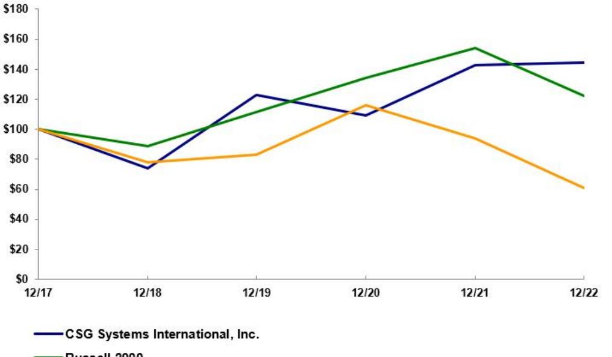
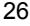
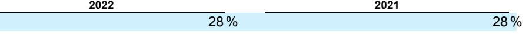
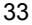
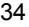
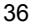
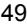

{0}------------------------------------------------

# **UNITED STATES SECURITIES AND EXCHANGE COMMISSION**

**Washington, D.C. 20549**

# **FORM 10-K**

**(Mark One)**

☒ **ANNUAL REPORT PURSUANT TO SECTION 13 OR 15(d) OF THE SECURITIES EXCHANGE ACT OF 1934**

**For the fiscal year ended December 31, 2022**

**OR**

- ☐ **TRANSITION REPORT PURSUANT TO SECTION 13 OR 15(d) OF THE SECURITIES EXCHANGE ACT OF 1934 FOR THE TRANISITON PERIOD FROM _____ TO _____**
**Commission File Number 0-27512**

# **CSG SYSTEMS INTERNATIONAL, INC.**

**(Exact name of Registrant as specified in its Charter)**

| Title of Each Class                                               | Trading Symbol                                                     | Name of Each Exchange on Which Registered |  |  |
|-------------------------------------------------------------------|--------------------------------------------------------------------|-------------------------------------------|--|--|
|                                                                   | Securities registered pursuant to Section 12(b) of the Act:        |                                           |  |  |
|                                                                   | Registrant's telephone number, including area code: (303) 200-2000 |                                           |  |  |
| (Address of principal executive offices)                          |                                                                    | (Zip Code)                                |  |  |
| 169 Inverness Dr W, Suite 300 Englewood, Colorado              |                                                                    | 80112                                     |  |  |
| (State or other jurisdiction of incorporation or organization) |                                                                    | (I.R.S. Employer Identification No.)   |  |  |
| Delaware                                                          |                                                                    | 47-0783182                                |  |  |

**Common Stock, Par Value \$0.01 Per Share CSGS NASDAQ Stock Market LLC**

Securities registered pursuant to Section 12(g) of the Act: None.

Indicate by check mark if the Registrant is a well-known seasoned issuer, as defined in Rule 405 of the Securities Act. YES ☒ NO ☐

Indicate by check mark if the Registrant is not required to file reports pursuant to Section 13 or 15(d) of the Act. YES ☐ NO ☒

Indicate by check mark whether the Registrant: (1) has filed all reports required to be filed by Section 13 or 15(d) of the Securities Exchange Act of 1934 during the preceding 12 months (or for such shorter period that the Registrant was required to file such reports), and (2) has been subject to such filing requirements for the past 90 days. YES ☒ NO ☐

Indicate by check mark whether the Registrant has submitted electronically every Interactive Data File required to be submitted pursuant to Rule 405 of Regulation S-T (§232.405 of this chapter) during the preceding 12 months (or for such shorter period that the Registrant was required to submit such files). YES ☒ NO ☐

Indicate by check mark whether the registrant is a large accelerated filer, an accelerated filer, a non-accelerated filer, smaller reporting company, or an emerging growth company. See the definitions of "large accelerated filer," "accelerated filer," "smaller reporting company," and "emerging growth company" in Rule 12b-2 of the Exchange Act.

Large accelerated filer ☒ Accelerated filer ☐ Non-accelerated filer ☐ Smaller reporting company ☐ Emerging growth company ☐

If an emerging growth company, indicate by check mark if the registrant has elected not to use the extended transition period for complying with any new or revised financial accounting standards provided pursuant to Section 13(a) of the Exchange Act. ☐

Indicate by check mark whether the registrant has filed a report on and attestation to its management's assessment of the effectiveness of its internal control over financial reporting under Section 404(b) of the Sarbanes-Oxley Act (15 U.S.C. 7262(b)) by the registered public accounting firm that prepared or issued its audit report. ☒

If securities are registered pursuant to Section 12(b) of the Act, indicate by check mark whether the financial statements of the registrant included in the filing reflect the correction of an error to previously issued financial statements. ☐

Indicate by check mark whether any of those error corrections are restatements that required a recovery analysis of incentive-based compensation received by any of the registrant's executive officers during the relevant recovery period pursuant to §240.10D-1(b). ☐

Indicate by check mark whether the Registrant is a shell company (as defined in Rule 12b-2 of the Exchange Act). Yes ☐ No ☒

The aggregate market value of the voting and non-voting common equity held by non-affiliates of the Registrant, based on the closing price of the shares of common stock on The NASDAQ Stock Market on June 30, 2022, was \$1,332,181,496.

The number of shares of Registrant's Common Stock outstanding as of February 14, 2023 was 31,263,574.

**DOCUMENTS INCORPORATED BY REFERENCE**

Portions of the Registrant's Definitive Proxy Statement for its 2023 Annual Meeting of Stockholders to be filed on or prior to April 30, 2023, are incorporated by reference into Part III of this Report.

{1}------------------------------------------------

# **CSG SYSTEMS INTERNATIONAL, INC. 2022 FORM 10-K TABLE OF CONTENTS**

# **Page [PART](#page-1-0) I** Item 1. [Business](#page-4-0) 4 Item 1A. Risk [Factors](#page-11-0) 11 Item 1B. [Unresolved](#page-20-0) Staff Comments 20 Item 2. [Properties](#page-20-1) 20 Item 3. Legal [Proceedings](#page-20-2) 20 Item 4. Mine Safety [Disclosures](#page-20-3) 20 **[PART](#page-23-0) II** Item 5. Market for Registrant's Common Equity, Related [Stockholder](#page-23-1) Matters and Issuer Purchases of Equity Securities 23 Item 6. [Reserved] 24 Item 7. [Management's](#page-24-0) Discussion and Analysis of Financial Condition and Results of Operations 24 Item 7A. [Quantitative](#page-37-0) and Qualitative Disclosures About Market Risk 37 Item 8. Financial Statements and [Supplementary](#page-38-0) Data 38 Item 9. Changes in and [Disagreements](#page-70-0) with Accountants on Accounting and Financial Disclosure 70 Item 9A. Controls and [Procedures](#page-70-1) 70 Item 9B. Other [Information](#page-70-2) 70 Item 9C. Disclosure Regarding Foreign [Jurisdictions](#page-70-3) that Prevent Inspections 70 **[PART](#page-71-0) III** Item 10. Directors, Executive Officers and Corporate [Governance](#page-71-1) 71 Item 11. Executive [Compensation](#page-71-2) 71 Item 12. Security Ownership of Certain Beneficial Owners and [Management](#page-71-3) and Related Stockholder Matters 71 Item 13. Certain Relationships and Related Transactions, and Director [Independence](#page-71-4) 71 Item 14. Principal [Accounting](#page-71-5) Fees and Services 71 **[PART](#page-71-6) IV** Item 15. Exhibits, Financial Statement [Schedules](#page-71-7) 71 Item 16. Form 10-K [Summary](#page-71-8) 71

[Signatures](#page-85-0) 79

{2}------------------------------------------------

{3}------------------------------------------------

# **CAUTIONARY NOTE REGARDING FORWARD-LOOKING STATEMENTS**

This Form 10-K, including Item 7, "Management's Discussion and Analysis of Financial Condition and Results of Operations", contains forwardlooking statements within the meaning of the Private Securities Litigation Reform Act of 1995. We may also make forward-looking statements in other reports filed with the Securities and Exchange Commission, in materials delivered to stockholders, and in press releases. In addition, our representatives may from time to time make oral forward-looking statements.

Forward-looking statements relate to future events and typically address our expected future business and financial performance. Statements in this report that are not historical facts are forward looking statements. Words such as "expect," "anticipate," "intend," "plan," "aspire," "believe," "seek," "see," "will," "would," "may," "target," and similar expressions and variations or negatives of these words, typically identify such forwardlooking statements. These include, among others, statements relating to:

- relationships with and financial condition of our significant customers;
- fluctuations in credit market conditions, general global economic and political conditions, and foreign currency exchange rates;
- our ability to maintain a reliable, secure computing environment;
- continued market acceptance of our products and services;
- our ability to continuously develop and enhance products in a timely, cost-effective, technically advanced, and competitive manner;
- our ability to deliver our solutions in a timely fashion within budget, particularly large software implementations;
- our dependency on the industries in which we serve;
- our ability to meet our financial expectations;
- increasing competition in our market from companies of greater size and with broader presence;
- our ability to successfully integrate and manage acquired businesses or assets to achieve expected strategic, operating, and financial goals;
- our ability to protect our intellectual property rights;
- our ability to conduct business in the international marketplace;
- our ability to comply with applicable U.S. and international laws and regulations; and
- risks related to the global COVID-19 pandemic.

We assume no obligation to update or revise any forward-looking statements except as required by federal securities laws.

Forward-looking statements are based on management's beliefs, assumptions and expectations of future events and trends that are subject to risks and uncertainties. Forward-looking statements speak only as of the date made, and actual future results and trends may differ materially from historical results or those reflected in any such forward-looking statements depending on a variety of factors. We have included important factors in this Form 10-K, particularly under "Item 1A. Risk Factors" that we believe could cause actual results to differ materially from any forward-looking statement. Investors are cautioned not to place undue reliance on forward-looking statements. For additional information concerning factors that may cause actual results to vary materially from those stated in the forward-looking statements, see our reports on Form 10-K, 10-Q, and 8-K filed with the Securities and Exchange Commission ("SEC").

{4}------------------------------------------------

#### **Item 1. Business**

#### **Who We Are**

CSG Systems International, Inc. (the "Company", "CSG", or forms of the pronoun "we") is a purpose-driven, SaaS platform company that enables global companies in a wide variety of industry verticals to tackle the ever-growing complexity of business in the digital age. Our cloud-first architecture and customer-centric approach empower companies to deliver unforgettable experiences for their B2B (business-to-business), B2C (business-to-consumer), and B2B2X (business-to-business-to-consumer) customers, making it easier for people and businesses to connect to, use and pay for the services they value most. CSG manages billions of critical customer interactions annually, and we do it with a singular focus – an obsession on our customers' success.

As a global technology leader, we aspire to envision, invent, and shape a better, more future-ready world. Specifically, our mission is focused on helping some of the world's most recognizable brands compete and win in the digital age by making it easier for their customers to do business.

Every company needs to make it easier for their consumer and enterprise customers to do business with them in the customers' preferred channel of choice. They need to make it easier for customers to identify which product or service is right for them; easier to buy, procure, and provision their goods and services; easier to communicate with or get updates from them; easier to modify the goods/services they buy; and easier to pay for the products and services they purchase. This is exactly where CSG's SaaS platforms come in. Industry leaders in telecom, broadband cable, media, retail, healthcare, financial services, insurance, government, and other industries leverage the power of our technology to compete and win in the digital age.

Our 5,700-plus employees around the globe have made CSG a trusted technology leader and SaaS platform company to some of the biggest and most innovative brands around the world.

Our corporate headquarters is located at 169 Inverness Dr W, Suite 300, Englewood, Colorado 80112, and the telephone number at that address is (303) 200-2000.

Our common stock is listed on the NASDAQ Stock Market LLC ("NASDAQ") under the symbol "CSGS". We are a member of the S&P Small Cap 600 and Russell 2000 indices.

#### **What We Do**

Simply put, CSG helps companies solve their toughest business challenges. We help our customers deliver personalized, secure, and integrated customer experience solutions in order to grow their revenues and wow their customers with future-ready solutions that drive exceptional customer experiences.

#### *Our Industry-Leading Solutions*

**Revenue Management and Digital Monetization:** We provide robust, integrated real-time revenue management platforms leveraging public cloud, private cloud, or on-premise deployments to optimize and monetize transactions at every stage of the customer lifecycle. Our flexible, configurable business support systems help companies monetize and digitally enable their customer engagement. These solutions span the commerce lifecycle, streamlining the entire revenue monetization process from concept to cash, helping companies address digital transformation in the ever-changing and dynamic business world in which they operate.

{5}------------------------------------------------

The power and capacity of 5G will fuel the growth of digital services across many industries including healthcare, education, transportation, agriculture, and manufacturing. This will change the way we work, live, and interact bringing a new digital reality to everything we do. For Communication Service Providers ("CSPs"), it provides new revenue sources beyond connectivity, information, and communications services. For consumers, it enables personalized new digital capabilities in a simpler to consume and engage model. But, behind these 'simple' user experiences are complex B2B, B2C, and B2B2X platforms, rich collaboration ecosystems, and a web of partnerships which are underpinned by open application programming interfaces, or APIs, distributed architecture, and microservices technology. Our solutions are architected to bring speed, agility, and interoperability while maintaining the operational stability, security, reliability, and scalability needed to power these complex ecosystems. We enable companies to bring new services to market with hyper speed and scale with our revenue management platforms which are key to growing revenue and profits in a digital world.

**Transformational Customer Experiences:** Delivering exceptional customer experience is a critical strategic lever that companies need to excel at in order to grow faster, improve retention, and strengthen customer loyalty. We believe customer experience is the number one differentiator for businesses today.

We provide some of the biggest brands in the world with strategic insights, experience design, customer journey management, business intelligence analytics, and customer communication solutions aimed at driving extraordinary customer experiences and better business outcomes. We help companies deliver unique customer experiences across both traditional and digital channels creating moments that are personalized, predictive, and proactive.

Today, companies use many different communication channels to interact with customers including website, call center, physical location, SMS text, print, and more. Each of these channels generates a massive amount of information that can be harnessed by these companies to craft extraordinary customer journeys. Each customer touchpoint illuminates key moments of truth that are pivotal in growing customer acquisition and retention. Continuous active customer profiling and decisioning for care and commerce – based on real-time and stored data from a variety of sources – provides value to our customers by powering them with insights needed to optimize every interaction with their customers.

These solutions are designed to help the end consumers easily interact with our customers' brands through their preferred channel of choice. We take a holistic approach to orchestrating end-to-end customer experiences that helps brands see, think, act and react in realtime to drive conversion, retention, and loyalty. Our approach yields better business results with quicker time to value and lower risk.

**Payments:** We continue to see an increase in the velocity and the expectations from our merchants and partners that make digital payments table stakes for every facet of their customer's life – whether that be paying rent, property taxes, gym memberships, educational fees, or other goods and services.

At CSG, we have been recognized as a leader in payments, providing a full end-to-end SaaS payments platform, allowing organizations to accept electronic check/ACH, debit and credit card payments, and offer the ability to receive funds quicker via same-day ACH. With one of the most robust and complete payments platforms in the market, we enable integrated software vendors (ISV) to differentiate their solution stack by offering a fully customizable payments platform that seamlessly integrates into existing architectures to help their customers scale payments smarter and faster. Our all-in-one payments platform simplifies and enables businesses and governments to onboard merchants quickly, deliver ongoing innovation, and address the changing market demands in digital payments. Our platform handles tens of billions of dollars in payment volumes annually for more than 98,000 active merchants. And we do this all in a secure, PCI-compliant environment.

Taken in whole or in modules, our SaaS payments platform combined with our deep domain expertise, help leading brands across different industries optimize their business processes and integrate critical back- and front-office technology platforms to create a differentiated customer experience, resulting in accelerated growth and profits.

# *Technology Innovation & Operations*

Our customers are looking for the best, most modern, and cost-efficient technologies to solve their toughest business challenges. We continue to make meaningful investments in research and development ("R&D") to ensure that we stay ahead of our customers' needs, advancing our customers' businesses as well as our own.

Our products are recognized by industry analysts as best-in-class in the areas of 5G/IOT monetization, financial services, technology, telecom, field service management, OSS/BSS, journey orchestration, journey analytics, customer experience, and integrated payments. Product award wins include the Big Innovation Awards for CSG Xponent (2022) and CSG Encompass (2023) and the Card Not Present Best E-Commerce Platform and Best Processor awards for CSG Forte (2022). Additionally, during 2022 analysts ranked CSG as a Leader in the Forrester Wave: Customer Journey Orchestration, SPARK Matrix: Customer Communication Management, SPARK Matrix: Customer Data Platform, SPARK Matrix: Journey Analytics, and SPARK Matrix: Real Time Interaction Management.

{6}------------------------------------------------

In addition, we provide operational services encompassing infrastructure management (including hardware, application, and environmental management), application configuration management (including configuration development, release, and deployment) and business operations management (including event processing, revenue management, and settlement). Our pre-integrated approach, combined with our deep domain experts managing the applications, allow our customers to scale their operations and do what matters most – focus on satisfying their end customers and growing their businesses.

Over the past several years, two of the largest drugstore chains in the United States ("U.S.") and one of the largest retailers used our technology to help improve their digital customer experience related to COVID-19 vaccinations, appointment scheduling, prescription refill notifications, and other transactional engagements. During 2022, we won and signed a large new contract expansion with one of these leading drugstore chains. Over the past couple of years, we also helped one of the largest financial services providers in the U.S. streamline and personalize their mortgage and auto lending processes in a digital world with our journey orchestration and analytics offerings. And, we helped some of the largest CSPs in the world scale and grow their enterprise and consumer businesses by consolidating, standardizing, and automating their disparate systems to a modern platform that can manage complex ecosystems, new digital B2B marketplaces, 5G deployments, and multi-sided business models. On this front, during 2022, we largely completed the migration of approximately 14 million Charter Communications customer accounts from a competitor's platform. This six-year contract with Charter was the largest contract in our history.

#### **Why We Win**

At CSG, many of our significant customer relationships span decades. To earn the right to do business with companies for that length of time, you need to be trusted, dependable, and innovative. You need to be bold, future-forward, relentlessly focused, passionate, customer obsessed, people-centric, innovative – and most importantly – you need to deliver.

We do all of this by constantly obsessing over the needs and success of our customers as we help them design and deliver exceptional, digitallyenabled, customer and employee experiences. We believe in innovating jointly with our current and potential future customers to anticipate future-market trends and then redesign and technologically-enable personalized engagements with their consumer and enterprise customers. And, since our modular solutions are mission-critical systems at the heart of our customers' business, operational excellence, security, and reliability will always be our top priority.

In addition, working side-by-side with some of the biggest and most innovative companies in the world helps us to develop breakthrough technologies that address the market's most pressing needs today and into the future.

#### **How We Grow**

We believe the successful execution of our goals will allow us to accelerate our revenue and earnings growth, and therefore, create long-term sustained value for our customers, employees, and stockholders.

Our strategic focus is underpinned by our key business priorities:

*Harnessing the best culture, the best talent, and the most energized and globally diverse team:* Our global employees and leaders continue to be CSG's greatest competitive differentiator. As a purpose-driven, SaaS platform company, we foster a culture where we prioritize employee experience, learning, and development to provide a workplace environment where our employees can do their best work and thrive. We foster a culture of diversity, equity, and belonging for all employees. By being customer-obsessed every day, CSG will continue to win big in the market.

*Accelerating our revenue growth:* We continue to target accelerated long-term organic revenue growth and unlock significant value with disciplined strategic, financially-attractive acquisitions. Accelerating our growth will enable CSG to add scale and operating leverage in order to create greater customer and shareholder value. We look to acquire capabilities, proven product platforms, market share in highgrowth industry verticals, and human capital talent. In today's challenging macro-economic environment, we will remain highly disciplined and strive to ensure that every acquisition meets our four criteria: strategic fit, culture/integration fit, financial fit, and risk/return profile.

*Creating and leading with category-defining technology:* Our broad portfolio of industry-leading solutions provide our customers with a competitive advantage. These solutions enable customers to efficiently manage their traditional businesses while being able to quickly deliver new digital services and a more personalized and relevant experience to their consumers. We will continually add relevant capabilities to what we do as a company, both in terms of our people and our solutions.

{7}------------------------------------------------

*Delivering an exceptional customer experience:* We believe we deliver more business value by doing what we say and being easy to do business with. We do this by putting the customer at the heart of our decision-making and by continuing to raise the bar on our agility, delivery capabilities, efficiency, and reliability to power our customers' success.

*Becoming the SaaS technology provider of choice for CSPs:* We have a strong presence in the world's largest CSPs technology ecosystem with our award-winning revenue management platforms. However, as these companies wrestle with new competitors, changes in customer demands, and disruptive technologies like 5G, they need a partner that can provide them with a suite of solutions that can help them turn these challenges into opportunities, higher revenues, and greater operating profits. With our vast portfolio of solutions, we can help service providers launch and scale new digital services quickly, provide a great customer experience across any channel, and simplify and monetize B2B2X ecosystems and marketplaces, across industry verticals.

*Expanding into big, higher growth industry verticals:* Brands in many large, high-growth industry verticals rely on and need the technology products and platforms that CSG provides. We are focused on increasing the amount of revenue we generate from customers outside of the CSP industry. While we've made significant progress over the years, we have significant opportunities to expand our footprint in these verticals. CSG is helping some of the biggest brands in retail, healthcare, financial services, and government digitize and modernize their revenue management, customer experience and payments capabilities.

#### **Customers**

We work with some of the world's leading brands in a wide variety of industry verticals. These range from working with leading CSPs like Charter, Comcast, MTN, Airtel Africa, DISH, Mobily, Verizon, AT&T, American Movil, and Telstra. Outside of the CSP space, we work with hundreds of other customers and over 98,000 active merchants including some of the largest financial services companies, three of the largest pharmacy retailers in the U.S., property management companies, and state and local governments.

Customers that represented 10% or more of our revenue for 2022 and 2021 were as follows (in millions, except percentages):

|         | 2022   |     |              | 2021      |              |  |
|---------|--------|-----|--------------|-----------|--------------|--|
|         | Amount |     | % of Revenue | Amount    | % of Revenue |  |
| Charter | \$     | 221 | 20 %         | \$ 221 | 21 %         |  |
| Comcast |        | 214 | 20 %         | 216       | 21 %         |  |

See the Significant Customer Relationships section of our Management's Discussion and Analysis ("MD&A") for additional information regarding our business relationships with these key customers.

# **Professional Services**

We employ professional services experts globally who bring both deep domain expertise and a wide range of skills – including solution architecture, project management, systems implementation, system integration, and business consultancy – to every services project. We apply a structured methodology to each of our engagements, leveraging consistent world-class processes, best-practice program management, and systemized templates in the deployment of our solutions.

#### **Sales and Marketing**

We organize our sales efforts to customers primarily within our geographically dispersed, dedicated account teams, with senior level account managers who are responsible for winning new customers, expanding our business with existing customers, and renewing existing contracts. In addition, we have partnerships and alliances with leading industry participants. The account teams are supported by sales support personnel who are experienced in the various industry-leading solutions that we provide. And because our customers trust and depend on CSG, we have built a self-sustaining customer ecosystem that provides us with the opportunity to gain more share of our customers' IT spend by cross-selling more solutions to them.

In marketing, we have taken a digital-first approach aimed at identifying and accelerating opportunities through the pipeline by establishing CSG as an innovative, results-driven thought leader and proven partner in helping our customers solve their toughest business problems. 7

{8}------------------------------------------------

# **Competition**

The market for our offerings is competitive and evolving. We compete with both independent providers and in-house developers of revenue management, digital monetization, customer experience, and payments systems. Our current competitors include companies who deliver onpremise bespoke custom offerings (i.e., Amdocs Limited, NEC Netcracker), software solutions (i.e., Salesforce, Adobe, Pegasystems, Twilio), internally developed enterprise applications, network operators (i.e., Ericsson, Huawei), large outsourced transactional communications companies (i.e., Intrado, Fiserv), systems integrators (i.e., Accenture, Tech Mahindra) and large payments processors (i.e., FIS and Fiserv) and payments specialists (i.e., Stripe and Nuvei/Paya).

#### **Proprietary Rights and Licenses**

We rely on a combination of trade secret, copyright, trademark, and patent laws in the U.S. and similar laws in other countries, and nondisclosure, confidentiality, and other types of contractual arrangements to establish, maintain, and enforce our intellectual property rights in our solutions. Despite these measures, any of our intellectual property rights could be challenged, invalidated, circumvented, or misappropriated. Although we hold a select number of patents and patent applications on some of our newer solutions, we do not rely upon patents as a primary means of protecting our rights in our intellectual property. In any event, there can be no assurance that our patent applications will be approved, that any issued patents will adequately protect our intellectual property, or that such patents will not be challenged by third parties. Also, much of our business and many of our solutions rely on key technologies developed or licensed by third parties, and we may not be able to obtain or continue to obtain licenses and technologies from these third parties at all or on reasonable terms. Our failure to adequately establish, maintain, and protect our intellectual property rights could have a material adverse impact on our business, financial position, and results of operations.

For a description of the risks associated with our intellectual property rights, see "Item 1A - Risk Factors – Failure to Protect Our Intellectual Property Rights or Claims by Others That We Infringe Their Intellectual Property Rights Could Substantially Harm Our Business, Financial Position and Results of Operations," and "Item 1A – Risk Factors – We Rely on A Limited Number of Third-Party Vendor Relationships to Execute Our Business Which Exposes Us to Supply Chain Disruptions, Costs Increases, and Cyberattacks".

#### **Human Capital**

We believe that our culture serves as a competitive differentiator in the marketplace and gives CSG a competitive edge. As a result, our success is dependent upon our ability to attract, develop, and retain this smart, talented, and diverse team. We have introduced a framework that outlines our ethos for how we serve not only our customers and each other, but the greater communities in which we operate.

#### **Our Purpose**:

To envision, invent and shape a better, more future-ready world.

#### **Our Mission:**

By channeling the power of all, we make ordinary customer and employee experiences extraordinary.

#### **Our Guiding Principles:**

*Integrity:* Be Authentic, Be Inclusive, Be Trusted Team Players

#### *Inspiration:* Be Bold, Be Inventive, Be Agile

*Impact:* Be Customer Obsessed, Be Game Changers, Be Drivers of Growth

At CSG, we believe in the power of all so much that it is a cornerstone of our mission statement. The power of all means that we draw on the experiences and innovations of the best, most diverse global talent to serve our customers. The power of all means we are mindful of living our guiding principles and creating a diverse and inclusive environment where team members around the world can reach their full potential by being valued for their authentic selves. And the power of all means that together, we strive to make a bigger difference in the communities in which we operate by envisioning, inventing, and shaping a better, more future-ready world.

{9}------------------------------------------------

Delivering on our greater purpose and mission at speed and scale while delighting our customers and being mindful of our team members' growth, wellbeing, and happiness requires a people and culture philosophy that accelerates sustainable growth and innovation through three pillars:

- **Leading the Future of Work** through our flexible work approach. This means fostering a diverse, industry leading employee experience focused on employee choice and flexibility, providing programs and events focusing on wellbeing and mental health of all team members, and inspiring collaborative and connected teams.
- **Winning with Talent** by attracting and retaining the best, most diverse global talent; accelerating time to productivity, integration, and engagement; embedding diversity, equity, and inclusion considerations into our strategy; and ensuring our global team members thrive in an inclusive environment. In addition to our already competitive pay and benefits, we continue to introduce many new benefits and programs that are designed to promote mental and physical wellness.
- **Grow@CSG** by developing bold, agile, inventive team members and leaders; innovating talent development and succession planning; and expanding cross-company and cross-unit rotations and promotions. We continue to expand our personalized learning platform and internal talent marketplace, which allows employees to browse open roles, see their skills match for roles they might be interested in, and receive curated learning pathways designed to provide them the skills they need to take on more responsibility or move to an entirely different role or department.

We believe that our culture and our team members are a key reason our customers continue to rely on us to help them achieve their business goals and objectives and do business with us for years.

As of December 31, 2022, we employed over 5,700 people, of which approximately 41% were in North America, 42% were in our locations in Asia-Pacific and Australia, 10% were in our locations in Europe, the Middle East, and Africa, and 7% in our locations in South and Central America.

As of December 31, 2022, our workforce was approximately 64% male, 36% female, and less than 1% nonbinary or undeclared. The race/ethnicity of our U.S. workforce was 67% White, 12% Asian, 8% Hispanic or Latino, 7% Black or African American, <1% American Indian/Alaskan Native, <1% Native Hawaiian/Pacific Islander, 1% two or more races, and 5% unknown or undeclared.

We believe our employee relations are good and we work hard to constantly improve in this area.

#### **Social Impact & Responsibility**

We aspire to envision, invent, and create a better, more inclusive and future ready world by channeling the power of all. To accomplish that, we are focusing on these key areas:

*Expanding Our Community Impact:* We support Community Based Organizations ("CBOs") that provide underrepresented communities the opportunity to participate, thrive, and make a lasting impact on the technology industry across the globe. We continue to expand our partnerships with CBOs like WeMakeChange and Earthday.org. In addition, we've continued our commitment to CSG's Global Days of Action, where we give every team member an opportunity (two free days) to volunteer their time in the community impact area of their choosing.

*Enhancing Our Environmental Stewardship:* With employees in over 20 countries and serving customers globally, this is a vital and important focus area. We seek to work with partners that are committed to reducing and recycling waste, investing in green energy, and responsible sourcing to create a more sustainable future. Reducing global emissions is critical, and we are working towards disclosing our carbon footprint. With the goal of reducing our environmental impact, we've established a baseline to drive improvement in our environmental performance as part of our ongoing business strategy and operating methods.

*Enabling Digital Inclusion:* We strive to develop technological solutions that promote social progress and make navigating the digital world easier for anyone, anywhere in the world. We also believe that diverse experiences and perspectives help bring out the best ideas, drive innovation, and achieve transformative results to benefit the clients we serve. We are committed to digital inclusivity, doing the right thing for the users of our products, and taking action to improve the accessibility of our digital products and services.

{10}------------------------------------------------

# **Regulatory Matters**

We are subject to numerous international, federal, state, and local laws and regulations. These laws and regulations govern matters that include environmental, employment, and occupational health and safety matters. Additionally, these laws and regulations also require us to obtain and comply with permits, registrations, and other authorizations issued by governmental authorities. These authorities can modify or revoke our permits, registrations, or other authorizations and can enforce compliance through fines and injunctions. We expect to incur ongoing costs to comply with existing and future requirements.

We are also subject to regulation by various U.S. federal regulatory agencies and by the applicable regulatory authorities in countries in which we operate. Additionally, as a U.S. entity operating through subsidiaries in non-U.S. jurisdictions, we are subject to foreign exchange control, transfer pricing, and custom laws that regulate the flow of funds between CSG and its subsidiaries. We are also required to be in compliance with transfer pricing, securities laws, and other statutes and regulations, such as the Foreign Corrupt Practices Act ("FCPA"), and other countries' anticorruption and anti-bribery laws.

In addition, we are subject to laws relating to information security, privacy, anti-money laundering, counter-terrorist financing, consumer credit, protection, and fraud. An increasing number of government and industry groups worldwide have established data privacy laws and standards for the protection of personal information, including financial information, social security numbers, and health information. We are also subject to labor and employment laws, including regulations established by the U.S. Department of Labor, the countries in which we do business, and other local regulatory agencies, which sets laws governing working conditions, paid leave, workplace safety, wage and hour standards, and hiring and employment practices.

We believe that our operations are in compliance with all applicable laws and regulations in all material respects, and that we hold all necessary permits to operate our business in each jurisdiction in which we operate. Laws and government regulations are subject to change and interpretation. In some cases, compliance with applicable laws and regulations may cause us to make additional capital and operational expenditures. While there are no current regulatory developments that we expect to be material to our results of operations, financial position, or cash flows, there can be no assurances that existing or future environmental laws or other regulations applicable to our operations would not lead to a material adverse impact on our results of operations, financial position, or cash flows.

#### **Available Information**

Our annual reports on Form 10-K, quarterly reports on Form 10-Q, current reports on Form 8-K, proxy materials, and amendments to those reports filed or furnished pursuant to Section 13(a) or 15(d) of the Securities Exchange Act are available free of charge on our website at www.csgi.com. Information on our website is not incorporated by reference into this report and should not be considered part of this document. Additionally, these reports are available on the SEC's website at www.sec.gov.

#### **Code of Conduct and Business Ethics**

A copy of our Code of Conduct and Business Ethics (the "Code of Conduct") is maintained on our website. Any future amendments to the Code of Conduct, or any future waiver of a provision of our Code of Conduct, will be timely posted to our website upon their occurrence. Information on our website is not incorporated by reference into this report and should not be considered part of this document. Historically, we have had no waivers of a provision of our Code of Conduct.

{11}------------------------------------------------

#### **Item 1A. Risk Factors**

We or our representatives from time-to-time may make or may have made certain forward-looking statements, whether orally or in writing, including without limitation, any such statements made or to be made in MD&A contained in our various Securities and Exchange Commission ("SEC") filings or orally in conferences or teleconferences. We wish to ensure that such statements are accompanied by meaningful cautionary statements, so as to ensure, to the fullest extent possible, the protections of the safe harbor established in the Private Securities Litigation Reform Act of 1995.

We operate in rapidly changing and evolving markets throughout the world addressing the complex needs of industry leaders in the telecom, broadband, cable media, retail, healthcare, financial services, insurance, government and other industries. As a result, new risk factors will likely emerge and currently identified risk factors will likely evolve in their scope. Further, as we enter new market sectors as well as new geographic markets, we could be subject to new regulatory requirements that increase the risk of non-compliance and the potential for economic harm to us and our customers. Accordingly, the risk factors and any forward-looking statements are qualified in their entirety by reference to and are accompanied by the following meaningful cautionary statements:

- If any of the following risk factors would occur, it could have a material adverse effect on our business, financial position, results of operations, and/or trading price of our common stock.
- This list of risk factors is not exhaustive, and management cannot predict all of the relevant risk factors, nor can it assess the potential impact, if any, of such risk factors on our business or the extent to which any risk factor, or combination of risk factors, may create.
- There can be no assurances that forward-looking statements will be accurate indicators of future actual results, and it is likely that actual results will differ from results projected in the forward-looking statements, and that such differences may be material.

# **Risks Related to Our Business**

#### *We Derive a Significant Portion of Our Revenue from a Limited Number of Customers, and the Loss of the Business of a Significant Customer Could Have a Material Adverse Effect on Our Financial Position and Results of Operations.*

Over the past decade, the global communications industry has experienced significant consolidation, resulting in a large percentage of the market being served by a limited number of CSPs, with greater size and scale, and there are possibilities of further consolidation. Consistent with this market concentration, we generate over 40% of our revenue from our two largest customers, which are Charter and Comcast, which each individually accounted for over 10% or more of our total revenue. See the Significant Customer Relationships section of MD&A for a brief summary of our business relationship with these customers.

There are inherent risks whenever a large percentage of total revenue is concentrated with a limited number of customers. Such risks include, but are not limited to, a significant customer: (i) undergoing a formalized process to evaluate alternative providers for solutions and services we provide; (ii) terminating or failing to renew their contracts with us, in whole or in part, for any reason; (iii) significantly reducing the number of customer accounts processed on our solutions, the price paid for our solutions and services, or the scope of solutions and services that we provide; or (iv) experiencing significant financial or operating difficulties.

Our industry is highly competitive, and as a result, it is possible that a competitor could increase its footprint and share of customers serviced at our expense or a customer could develop their own internal solutions. While our customers may incur costs in switching to our competitors or developing their own solutions, they may do so for a variety of reasons, including: (i) price; (ii) dissatisfaction with our solutions or service levels, including our ability to adequately protect their data; or (iii) dissatisfaction with our relationship.

#### *A Reduction in Demand for Our Revenue Management Platforms Could Have a Material Adverse Effect on Our Financial Position and Results of Operations.*

Historically, a substantial percentage of our total revenue has been generated from our SaaS platforms and related solutions. Our platforms and solutions are expected to continue to provide a large percentage of our total revenue in the foreseeable future. Any significant reduction in demand for these products could have a material adverse effect on our business.

{12}------------------------------------------------

#### *The Delivery of Our Solutions is Dependent on a Variety of Computing and Processing Environments and Communications Networks Which May Not Be Available or May Be Subject to Security Attacks.*

Our solutions are generally delivered through a variety of sources including public and hybrid cloud, third-party data center and other service providers, and internally operated computing and processing environments (collectively referred to hereafter in this section as "Systems"). We and/or end users are connected to the Systems through a variety of public and private communications networks, which we will collectively refer to herein as "Networks". Our solutions are generally considered to be mission critical customer management systems by our customers. As a result, our customers are highly dependent on the consistent availability and uncompromised security of the Networks and Systems to conduct their business operations.

Networks and Systems are subject to the risk of an extended interruption, outage, or security breach due to many factors such as: (i) changes to the Systems and Networks for such things as scheduled maintenance and technology upgrades, or conversions to other technologies, service providers, or physical location of hardware; (ii) failures or lack of continuity of services from public cloud or third-party data center and other service providers; (iii) defects and/or critical security vulnerabilities in software program(s); (iv) human and machine error; (v) acts of war and/or nature; (vi) intentional, unauthorized attacks from computer "hackers", or cyber-attacks; and (vii) using the Systems to perpetrate identity theft through unauthorized authentication to our customers' customers' accounts.

Most recently, the global marketplace is experiencing an ever-increasing exposure to both the number and severity of cyber-attacks. In particular, ransomware attacks are becoming increasingly prevalent and can lead to significant reputational harm, loss of data, operational disruption, and significant monetary loss. Organized criminals, nation state threat actors, and motivated hacktivists have the possibility of impacting our Systems, Networks, data, and business operations. We may not be able or willing to respond to any such attacks due to policy, laws, or other regulations. In addition, we continue to expand our use of third-party Systems and Networks with our solution offerings thereby permitting, for example, our customers' customers to use the Internet to review account balances, order services or execute similar account management functions. Access to Networks and Systems via the Internet has the potential to increase their vulnerability to unauthorized access and corruption, as well as increasing the dependency of the Systems' reliability on the availability and performance of the Internet and end users' infrastructure they obtain through other third-party providers.

The method, manner, cause and timing of an extended interruption, outage, or security breach in third-party and/or the Networks or Systems are impossible to predict. As a result, there can be no assurances that these Networks and Systems will not fail or suffer a security breach or that the third-party and/or our business continuity or remediation plans will adequately mitigate the negative effects of a disruption or security breach to the Networks or Systems. Further, our property, technology errors and omissions, contractual relationship with third-party providers, and business interruption insurance may not adequately compensate us for losses that we incur as a result of such interruptions or security breaches. Should the Networks or Systems: (i) experience an extended interruption or outage; (ii) have their security breached; (iii) have their data lost, corrupted or otherwise compromised; and/or (iv) fail to meet contractual requirements related to our cybersecurity program, it would impede our ability to meet our delivery obligations, and likely have an immediate impact to the business operations of our customers. In addition, this would most likely result in damaging our reputation as well as our long-term ability to attract and retain new customers. The loss of confidential information could result in losing the customers' confidence, as well as claims for contractual breach, and imposition of penalties, fines, and/or damages. These risks will increase as our business continues to expand to include new solutions, technologies, verticals, and markets. These risks, individually or collectively, could result in an adverse material impact to our business.

# *We May Not Be Able to Efficiently and Effectively Implement New Solutions or Migrate Customers and Merchants onto Our Solutions.*

Our continued growth plans include the implementation of new solutions, as well as migrating both new and existing customers and merchants to our solutions. Such implementations or migrations (collectively referred to hereafter in this section as "implementations"), regardless of whether they involve new solutions or new customers, have become increasingly more difficult because of the sophistication, complexity, interdependencies of the various software and network environments, and the impact to our customers' and merchants' underlying business processes. In addition, the complexity of the implementations increases when the arrangement includes other vendors participating in the project, including but not limited to, prime and subcontractor relationships with our company. For these reasons, implementations subject our customers and merchants to potential business disruption, which could cause them to delay or even cancel future implementations.

As a result, there is a risk that we may experience cancellations, delays, or unexpected costs associated with implementations. In addition, our inability to complete implementations in an efficient and effective manner could damage our reputation in the global marketplace, adversely impacting our financial results and/or reducing our opportunity to grow our organic business with both new and existing customers and merchants.

{13}------------------------------------------------

# *We May Not Be Successful in the Integration or Achievement of Financial Targets of Our Acquisitions.*

As part of our growth strategy, we seek to acquire assets, technology, access to new markets, human capital talent and businesses which will provide the technology and personnel to expedite our solutions and services development efforts, provide complementary solutions, or provide access to new markets and customers.

Acquisitions involve a number of risks and potential disruptions, including: (i) expansion into new markets and business ventures; (ii) the requirement to understand local business practices; (iii) the diversion of management's attention to the integration of acquired operations and personnel; (iv) being bound by acquired customer or vendor contracts with unfavorable terms; and (v) potential adverse effects on a company's operating results for various reasons, including, but not limited to, the following items: (a) the inability to achieve financial targets; (b) the inability to achieve certain integration expectations, operating goals, and synergies; (c) costs incurred to exit current or acquired contracts or restructuring activities; (d) costs incurred to service acquisition debt, if any; and (e) the amortization or impairment of acquired intangible assets.

Due to the multiple risks and potential disruptions associated with any acquisition, there can be no assurance that we will be successful in achieving our expected strategic, operating, and financial goals for any such acquisition(s).

#### *We May Not Be Able to Respond to Rapid Technological Changes.*

The market for our solutions is characterized by rapid changes in technology and is highly competitive with respect to the need for timely innovations and new product and technology introductions. As a result, we believe that our future success in sustaining and growing our revenue depends upon: (i) our ability to continuously expand, adapt, modify, maintain, and operate our solutions to address the increasingly complex and evolving needs of our customers without sacrificing the reliability or quality of the solutions; (ii) the integration of acquired technologies and their widely distributed, complex worldwide operations; and (iii) creating and maintaining an integrated suite of products and technologies which are portable to new verticals. In addition, the market is demanding that our solutions have greater architectural flexibility and interoperability, and that we are able to meet the demands for technological advancements to our solutions at a greater pace. Our attempts to meet these demands subject our R&D efforts to greater risks. As a result, substantial and effective R&D and solution investment will be required to maintain the competitiveness of our solutions in the market. Technical problems may arise in developing, maintaining, integrating, and operating our solutions as the complexities continue to increase. Development projects can be lengthy and costly, and may be subject to changing requirements, programming difficulties, a shortage of qualified personnel, and/or unforeseen factors which can result in delays. In addition, we may be responsible for the implementation of new solutions and/or the conversion of customers to new solutions, and depending upon the specific solution, we may also be responsible for operations of the solution.

There is an inherent risk in the successful development, implementation, migration, integration, and operation of our solutions as the technological complexities, and the pace at which we must deliver these solutions to market, continue to increase. The risk of making an error that causes significant operational disruption to a customer, or results in incorrect processing of customer or vendor data that we perform on behalf of our customers, increases proportionately with the frequency and complexity of changes to our solutions and new delivery models. There can be no assurance: (i) of continued market acceptance of our solutions; (ii) that we will be successful in the development of enhancements or new solutions that respond to technological advances or changing customer needs at the pace the market demands; or (iii) that we will be successful in supporting the implementation, conversion, integration, and/or operations of enhancements or new solutions.

#### *We May Incur Material Restructuring or Reorganization Charges in the Future.*

In the past, we have recorded restructuring and reorganization charges related to involuntary employee terminations, various facility abandonments, and various other restructuring and reorganization activities. We continually evaluate ways to reduce our operating expenses through restructuring plans, including more effective utilization of our assets, workforce, and operating facilities. As a result, there is a risk, which is increased during economic downturns and with expanded global operations, that we may incur material restructuring or reorganization charges in the future.

{14}------------------------------------------------

#### *We Rely on A Limited Number of Third-Party Vendor Relationships to Execute Our Business Which Exposes Us to Supply Chain Disruptions, Cost Increases, and Cyberattacks.*

We rely on third-party providers for software, distributed computing infrastructure environments (or commonly referred to as "cloud" computing services), processing, and other suppliers to deliver our solutions to our customers. Our ability to deliver according to our contractual commitments and market demands depends significantly on being able to obtain the necessary licenses, components, computing capacity, and other vital services and supplies as needed and on competitive terms. Our growth and ability to meet customer demands depend in part on our ability to obtain timely deliveries from our suppliers and partners. In addition, if a third party were to experience a material breach of their information technology systems which results in the unauthorized access, theft, use, destruction, or unauthorized disclosures of customers' or employees' data or confidential information of the Company stored in such systems, including through cyberattacks or other external or internal methods, it could result in a material loss of revenue from the potential adverse impact to our reputation, our ability to retain or attract new customers, potential disruption or loss of services from the vendor and disruption to our business. Such a breach could also result in contractual claims, and it could lead to our being named as a party in litigation brought by or on behalf of impacted individuals. Although we strive to avoid single-source supplier solutions, this is not always possible. Failure by any of our third-party vendors could interrupt our operations and the delivery of our solutions, and/or substantially increase our costs. Additionally, if these third-party vendors would decide to significantly increase our costs, due to inflationary pressures or otherwise, it could have an adverse financial impact to our business as we may have limited third-party options and the ability to shift to a competing solution, or redesign our solutions would take considerable time, effort, and money.

# *Our Global Operations Subject Us to Additional Risks.*

We currently conduct a portion of our business outside the U.S. We are subject to certain risks associated with operating globally including the following items:

- Our solutions may not meet local or legal requirements;
- Fluctuations and unexpected changes in foreign currency exchange rates that may be due to inflation and interest rate spreads;
- Staffing and managing of our global operations at a reasonable cost;
- Longer sales cycles for new contracts;
- Longer collection cycles for customer billings or accounts receivable, as well as heightened customer collection risks, especially in countries with high inflation rates and/or restrictions on the movement of cash out of the country;
- Trade barriers;
- Governmental and economic sanctions;
- Complying with varied legal and regulatory requirements across jurisdictions;
- Growing requirements related to human rights and occupational safety and health;
- Reduced protection for intellectual property rights in some countries;
- Inability to recover value added taxes and/or goods and services taxes in foreign jurisdictions;
- Political and financial instability and threats of terrorism and/or war;
- A potential adverse impact to our overall effective income tax rate resulting from, among other things:
	- o Operations in foreign countries with higher tax rates than the U.S.;
	- o The inability to utilize certain foreign tax credits; and
	- o The inability to utilize some or all of losses generated in one or more foreign countries.

One or any combination of these or other risks could have an adverse impact on our operations and business.

{15}------------------------------------------------

#### *Failure to Deal Effectively with Fraud, Fictitious Transactions, Bad Transactions, and Negative Experiences Could Increase Our Loss Rate and Harm Our Payments Business, and Could Severely Diminish Merchant and Consumer Confidence in and Use of Our Services.*

In the event that merchants do not fulfill their obligations to consumers, or a consumer disputes a transaction for various reasons, we may incur losses as a result of chargebacks and/or claims from consumers. We would seek to recover such losses from the merchant; however, we may not be able to recover the amounts in full if the merchant is unwilling or unable to pay or the deposit does not cover the damages. While we have established financial reserves based on assumptions and estimates that we believe are reasonable to cover such eventualities, these reserves for individual merchants may be insufficient. We may also incur losses from claims that the consumer did not authorize the purchase, from consumer fraud, from erroneous transactions, and as a result of consumers who have closed bank accounts or have insufficient funds in their bank accounts to satisfy payments. In addition, if losses incurred by us related to payment card transactions become excessive, we could lose the ability to process credit card transactions, which would significantly impact our payments business. We have taken measures to detect and reduce the risk of fraud, including underwriting and risk management procedures and processes. These measures need to be continually updated to address emerging means of perpetrating fraud or to accommodate new solution offerings, but the increase in costs could adversely impact our business.

#### *Our Use of Open Source Software May Subject Us to Certain Intellectual Property-Related Claims or Require Us to Re-Engineer Our Software, Which Could Harm Our Business.*

We use open source software in connection with our solutions, processes, and technology. Companies that use or incorporate open source software into their solutions have, from time to time, faced claims challenging their use, ownership and/or licensing rights associated with that open source software. As a result, we could be subject to suits by parties claiming certain rights to what we believe to be open source software. Some open source software licenses require users who distribute open source software as part of their software to publicly disclose all or part of the source code in their software and make any derivative works of the open source code available on unfavorable terms or at no cost. In addition to risks related to license requirements, use of open source software can lead to greater risks than use of third-party commercial software, as open source licensors generally do not provide warranties, support, or controls with respect to origin of the software. Use of open source software also complicates compliance with export-related laws. While we take measures to protect our use of open source software in our solutions, and comply with applicable laws, open source license terms may be ambiguous, and many of the risks associated with usage of open source software cannot be eliminated. If we were found to have inappropriately used open source software, we may be required to release our proprietary source code, re-engineer our software, discontinue the sale of certain solutions in the event re-engineering cannot be accomplished on a timely basis, or take other remedial action that may divert resources away from our development efforts.

#### *Failure to Protect Our Intellectual Property Rights or Claims by Others That We Infringe Their Intellectual Property Rights Could Substantially Harm Our Business, Financial Position and Results of Operations.*

We rely on a combination of trade secret, copyright, trademark, and patent laws in the U.S. and similar laws in other countries, and nondisclosure, confidentiality, and other types of contractual arrangements to establish, maintain, and enforce our intellectual property rights in our solutions. Despite these measures, any of our intellectual property rights could be challenged, invalidated, circumvented, or misappropriated. Further, our contractual arrangements may not effectively prevent disclosure of our confidential information or provide an adequate remedy in the event of unauthorized disclosure of our confidential information. Others may independently discover trade secrets and proprietary information, which may complicate our assertion of trade secret rights against such parties. Costly and time-consuming litigation could be necessary to enforce and determine the scope of our proprietary rights, and failure to obtain or maintain trade secret protection could adversely affect our competitive business position. In addition, the laws of certain countries do not protect proprietary rights to the same extent as the laws of the U.S. Therefore, in certain jurisdictions, we may be unable to protect our proprietary technology adequately against unauthorized third party copying or use, which could adversely affect our competitive position.

Although we hold a limited number of patents and patent applications on some of our solutions, we do not rely upon patents as a primary means of protecting our rights in our intellectual property. In any event, there can be no assurance that our patent applications will be approved, any issued patents will adequately protect our intellectual property, or such patents will not be challenged by third parties. Also, much of our business and many of our solutions rely on key technologies developed or licensed by third parties, and we may not be able to obtain or continue to obtain licenses and technologies from these third parties at all or on reasonable terms.

Finally, third parties may claim that we, our customers, licensees or other parties indemnified by us are infringing upon their intellectual property rights. Even if we believe that such claims are without merit, they can be time consuming and costly to defend and distract management and technical staff attention and resources. Claims of intellectual property infringement also might require us to redesign affected solutions, enter into costly settlement or license agreements or pay material damage awards, or face a temporary or permanent injunction prohibiting us from marketing or selling certain of our solutions. Even if we have an agreement to indemnify us against such costs, the indemnifying party may be unable to uphold its contractual obligations. If we cannot or do not license the infringed technology on reasonable pricing terms or at all, or substitute similar technology from another source, our business could be adversely impacted. Our failure to adequately establish, maintain, and protect our intellectual property rights could have a material adverse effect on our business.

{16}------------------------------------------------

#### *Our Alliances with Strategic Partners Could Put Our Business at Risk if the Partner Does Not Perform as Expected.*

We rely on long-term strategic partnerships and alliances with leading industry participants to develop new technologies, deliver large customer implementations and products, and execute strategic growth. If our strategic partners encounter financial or other business difficulties, if their strategic objectives change, or if they no longer perceive us to be an attractive alliance partner, they may no longer desire or be able to participate in our partnerships and alliances. Our business could be hurt if we are unable to continue one or more of our alliances. We participate in large projects where various other companies provide services and products that are integrated into systems to meet customer requirements. If any of the services or products that any other company provides have any defects or problems causing the integrated systems to malfunction or otherwise fail to meet customer requirements, our reputation and business could be harmed.

#### **Risks Related to Our Industry**

#### *Our Business is Highly Dependent on the Global Communications Industry.*

Since a large percentage of our revenue is generated from customers that operate within the global communications industry, we are highly dependent on the health and the business trends occurring within this industry (in particular for our North American cable and satellite customers). Key factors within this industry that could potentially impact our customers' businesses, and thus, our business, are as follows:

- *Key Market Conditions:* The global communications industry has undergone significant fluctuations in growth rates and capital investment cycles in the past decade.
In addition, changes in demand for traditional services for CSPs are causing them to seek new revenue sources, while also managing their cost structure and quality of service delivery during their business transformation. The result is that many CSPs are delaying investment decisions on legacy systems, directing investment towards internal development and engineering efforts and making investments in new solutions to drive their business forward into new areas. However, cost pressures and/or our ability to develop solutions to meet their future needs may begin to cause a decline in new revenue opportunities and adversely impact our business.

- *Market Consolidation:* The pace of consolidation within the industry continues to accelerate as CSPs look to increase the scale of their operations and footprint within the entire digital communications ecosystem. Potential byproducts of this consolidation that could impact us are as follows: (i) there could be fewer providers in the market, each with potentially greater bargaining power and economic leverage due to their larger size, which may result in our having to lower our prices to remain competitive, retain our market share, or comply with the surviving customer's current more favorable contract terms; and (ii) the controlling entity in a consolidation that is not our current customer, may acquire one of our existing customers and choose to consolidate both entities onto the controlling entity's customer management platform, thus reducing and possibly eliminating our business with our existing customer.
Also, as consolidated entities execute on their revenue and operational synergies, there is generally a slowdown in decision-making on discretionary spending and/or on new business initiatives which could adversely impact our quarterly and annual financial results.

- *Competition*: Our customers operate in a highly competitive environment. Our competitors include companies who deliver onpremise bespoke custom offerings (i.e., Amdocs Limited, NEC Netcracker), software solutions (i.e., Salesforce, Adobe, Pegasystems, Twilio), internally developed enterprise applications, network operators (i.e., Ericsson, Huawei), large outsourced transactional communications companies (i.e., Intrado, Fiserv), systems integrators (i.e., Accenture, Tech Mahindra) and large payments processors (i.e., FIS and Fiserv) and payments specialists (i.e., Stripe and Nuvei/Paya). Should these competitors be successful in their strategies, it could threaten our customers' market share, pricing power, and level of services delivered. These threats could negatively impact our customers' revenue, putting pressure on our source of revenue, as generally speaking, these companies do not use our core solutions and there can be no assurance that new entrants will become our customers. In addition, demand for spectrum, network bandwidth and content continue to increase and any changes in the regulatory environment could have a significant impact to not only our customers' businesses, but in our ability to help our customers be successful.
The above industry factors are impacting our customers' businesses, and thus could cause delays, cancellations/loss of business, and/or downward pricing pressure on our sales and services. This could cause us to either fall short of revenue expectations or have a cost model that is misaligned with revenue.

{17}------------------------------------------------

#### *We Face Significant Competition in Our Industry.*

The market for our solutions is highly competitive. We directly compete with both independent providers and in-house solutions developed by existing and potential customers. In addition, some independent providers are entering into strategic alliances with other independent providers, resulting in either new competitors, or competitors with greater resources. Many of our current and potential competitors have significantly greater financial, marketing, technical, and other competitive resources than our Company, many with significant and well-established domestic and international operations. There can be no assurance that we will be able to compete successfully with our existing competitors or with new competitors.

#### **Risks Related to Laws and Regulations**

#### *The Occurrence or Perception of a Security Breach or Disclosure of Confidential Personally Identifiable Information Could Harm Our Business.*

In providing solutions to our customers, we transmit, use, store and otherwise process, confidential and personally identifiable information ("PII") including health, financial, and other personal information. Our treatment of such information is subject to contractual restrictions and federal, state, and foreign data privacy laws and regulations, which continue to evolve resulting in greater scrutiny and regulation over the protection of PII.

In response to these evolving restrictions and regulations (which include, without limitation, the Health Insurance Portability and Accountability Act ("HIPAA"), the Health Information Technology for Economic and Clinical Health Act ("HITECH"), the California Consumer Privacy Act ("CCPA"), the Gramm-Leach-Bliley Act ("GLBA"), and other U.S. federal and state financial privacy laws and regulations, the European Union's General Data Protection Regulation ("GDPR"), the South Africa Protection of Personal Information Act ("POPIA") and the Brazilian General Data Protection Low ("LGPD")), we have implemented and maintain administrative, technical, and physical security measures and it is our standard practice to contractually require our service providers to whom we disclose data (including PII) to implement and maintain reasonable privacy, data protection, and information security measures, in each case to protect against loss, theft, misuse, or unauthorized access to or disclosure of such information, and otherwise comply with these laws and regulations. These measures include standard industry practices (e.g., payment card industry ("PCI") requirements), periodic security reviews of our systems by independent parties, secure development practices, network firewalls, policy directives, procedural controls, training of our personnel, intrusion detection systems, and antivirus applications. However, due to the inherent risks and complexities of defending against cybercrime and other information security incidents, these measures may fail to adequately protect this information. Any failure on our part to protect the security and privacy of PII and other confidential information, or otherwise comply with data privacy laws and regulations may subject us to contractual liability and damages, loss of business, damages from individual claimants (including class action litigation), substantial fines/penalties, criminal prosecution, and unfavorable publicity.

Even the mere perception of a security breach or inadvertent disclosure of PII could damage our reputation and inhibit market acceptance of our solutions. In addition, third-party vendors that we engage to perform services for us may unintentionally release PII or otherwise fail to comply with applicable laws and regulations. Under our terms of service and our contracts with customers, if there is a breach of PII that we process, we could be liable to the customer for their losses and related expenses. As new laws and regulations emerge and evolve and as our business continues to expand to include new products and technologies, these risks will likely continue to increase, and our compliance costs are likely to increase substantially as well. Bad actors, individual and State sponsored, will increasingly attempt to compromise our security controls or gain unauthorized access to our, and our customers', sensitive information and PII. Further, because a significant number of our employees work remotely, these security risks may increase. We have implemented heightened monitoring of our Networks and Systems, but cannot guarantee that our efforts, or those of third parties on whom we rely or with whom we partner, will be successful in preventing any such information security incidents or attacks.

#### *We May Be Subject to Enforcement Actions or Financial Penalties with Payments Regulation in the U.S.*

Many states in which we operate have laws that govern payments activities and have implemented various definitions and licensing requirements for entities deemed to be money transmitters, including licensure. We have applied for and been issued money transmitter licenses in a majority of states, and for those states where we have applied and not yet received licensure, we could be subject to enforcement actions and financial penalties and other costs. An enforcement action could result in restrictions on, or a prohibition on engaging in, the business of money transmission in one or more states and it could delay or prevent us from obtaining a money transmitter license in one or more states. Enforcement actions could also result in reputational harm to our business and force us to cease or limit certain aspects of our business or prevent us from growing our business. Further, laws governing payments activities may evolve and changes in such law could affect our ability to provide our solutions or services in the same form and on the same terms as we have historically, or at all.

{18}------------------------------------------------

There are substantial costs and potential solution changes involved in maintaining such licenses, and we could be subject to fines or other enforcement action if we are found to have violated applicable federal, state, and local laws and regulations, including those related to licensing and supervision, anti-money laundering, the Bank Secrecy Act, financial privacy, and cybersecurity and data security. These factors could impose substantial additional costs and involve considerable delay to the development or provision of our solutions or services, or could require significant and costly operational changes or prevent us from providing our solutions or services in a given market. These limitations may adversely affect our ability to grow our business.

We may also be subject to card association and network rules and requirements, and violations of such rules and requirements could result in fines or the inability to use third-party networks to conduct our business.

#### *We Are Subject to Various Anti-Money Laundering and Counter-Terrorist Financing Laws and Regulations.*

We are subject to various anti-money laundering ("AML") and counter-terrorist financing laws and regulations that prohibit, among other things, our involvement in processing the proceeds of criminal activities. We maintain AML Compliance Policies and Procedures applicable to our payments processing business which policies are intended to comply with any applicable U.S. federal and foreign requirements. The laws or their application, our interpretation of the laws, and/or our services may change so that we could be subject to additional regulation and incur additional costs of compliance. We may not be able to meet additional regulatory requirements or the cost of adhering to such requirements could be substantial or could severely impact our ability to continue to maintain and/or grow our payments processing business or retain merchants or partners. The regulations of other countries and/or any increased compliance costs associated with such regulations, could prevent us from entering new markets for our services.

#### *Our Global Operations Require Us to Comply With Applicable U.S. and International Laws and Regulations.*

Doing business on a global basis requires our Company and our subsidiaries to comply with the laws and the regulations of the U.S. government and various international jurisdictions. In addition, the number of countries enacting anti-corruption laws and related enforcement activities is increasing. These regulations place restrictions on our operations, trade practices and trade partners, as such we may face increasing compliance and legal costs in operating our trade compliance program. In particular, our global operations are subject to U.S. and foreign anticorruption laws and regulations such as the Foreign Corrupt Practices Act ("FCPA"), the U.K. Anti-Bribery Act and economic sanction programs administered by the Office of Foreign Assets Control ("OFAC").

The FCPA prohibits us from providing anything of value to foreign officials for the purposes of influencing official decisions or obtaining or retaining business. In addition, the FCPA imposes accounting standards and requirements on publicly traded U.S. corporations and their foreign affiliates, which are intended to prevent the diversion of corporate funds to the payment of bribes and other improper payments, and to prevent the establishment of "off books" slush funds from which such improper payment can be made. As part of our business, we regularly deal with stateowned business enterprises, the employees of which are considered foreign officials for purposes of the FCPA. In addition, some of the international locations in which we operate lack a developed legal system and have higher than normal levels of corruption. We inform our personnel and third-party sales representatives of the requirements of the FCPA and other anti-corruption laws, including, but not limited to their reporting requirements. We have also developed and will continue to develop and implement systems for formalizing contracting processes, performing due diligence on agents and partners while improving our recordkeeping and auditing practices regarding these regulations. However, there is no guarantee that our employees, third-party sales representatives or other agents have not or will not engage in conduct undetected by our processes and for which we might be held responsible under the FCPA or other anti-corruption laws.

Economic sanctions programs restrict our business dealings with certain countries and individuals. As a global provider, we are exposed to a heightened risk of violating OFAC regulations. Violations of these laws and regulations are punishable by civil penalties, including fines, injunctions, asset seizures, debarment from government contracts and revocations or restrictions of licenses, as well as criminal fines and imprisonment. While we actively screen and monitor the global companies and individuals that we do business with, utilizing a risk-based approach, there is no guarantee that we have not or will not, through the lack of accurate information, changing customer business structures, process failure, oversight, or error, have violations occur.

{19}------------------------------------------------

#### **General Risks**

#### *Our Business May be Disrupted and Our Results of Operations and Cash Flows May be Adversely Affected by a Global Pandemic.*

The significance of the impact of a global pandemic on our operations depends on numerous evolving factors that we may not be able to accurately predict or effectively respond to, including, among others:

- the effect on global economic activity and the resulting impact on our customer's businesses, their credit and liquidity, and their demand for our solutions and services, as well as their ability to pay;
- our ability to deliver and implement our solutions in a timely manner, including as a result of supply chain disruptions and related cost increases; and
- actions taken by U.S., foreign, state, and local governments, suppliers, and individuals in response to the outbreak.

While we have significant sources of cash and liquidity and access to a committed credit line, a prolonged period of generating lower cash from operations could adversely affect our financial condition and the achievement of our strategic objectives.

#### *Failure to Attract and Retain Our Key Management and Other Highly Skilled Personnel Could Have a Material Adverse Effect on Our Business.*

Our future success depends in large part on the continued service of our key management, sales, product development, professional services, and operational personnel. We believe that our future success also depends on our ability to attract and retain a diverse, highly skilled technical, managerial, operational, and sales and marketing personnel, including, in particular, personnel in the areas of R&D, professional services, and technical support. Competition for qualified personnel at times can be intense, particularly in the areas of R&D, conversions, software implementations, and technical support which could lead to increased costs to attract and/or retain personnel. This risk is heightened with a widely dispersed customer base and employee populations, and potential inflationary pressures on wages. For these reasons, we may not be successful in attracting and retaining the personnel we require, which could have a material adverse effect on our ability to meet our commitments and new solution delivery objectives.

#### *Variability of Our Quarterly Revenue and Our Failure to Meet Revenue and Earnings Expectations Would Negatively Affect the Market Price of Our Common Stock.*

From time to time, we may experience variability in quarterly revenue and operating results. Common causes of failure to meet revenue and operating profit expectations include, among others:

- Inability to close and/or recognize revenue on certain transactions in the period originally anticipated;
- Inability to accurately forecast payments transaction volumes and related transaction costs;
- Delays in renewal of multiple or individually significant agreements;
- Inability to renew existing customer or vendor arrangements at anticipated rates;
- Delays in timing of initiation and/or implementation of significant projects or arrangements;
- Inability to meet customer expectations materially within our cost estimates;
- Changes in spending and investment levels;
- Inflationary pressures;
- Significant increase in our cost of borrowing;
- Foreign currency fluctuations; and
- Economic and political conditions.

Should we fail to meet our revenue and earnings expectations of the investment community, by even a relatively small amount, it could have a disproportionately negative impact upon the market price of our common stock.

{20}------------------------------------------------

#### *Substantial Impairment of Long-lived Assets in the Future May Be Possible.*

As a result of various acquisitions and the growth of our Company over the last several years, as of December 31, 2022, we have approximately \$244 million of long-lived assets other than goodwill (principally, property and equipment, operating lease right-of-use assets, software, acquired customer contracts, and customer contract costs) and approximately \$304 million of goodwill. Long-lived assets are required to be evaluated for possible impairment whenever events or changes in circumstances indicate that the carrying amount of these assets may not be recoverable. We utilize our market capitalization, third party valuation and/or cash flow models as the primary basis to estimate the fair value amounts used in our long-lived asset impairment valuations. If an impairment was to be recorded in the future, it could materially impact our results of operations in the period such impairment is recognized, but such an impairment charge would be a non-cash expense, and therefore would have no impact on our current or future cash flows.

# **Item 1B. Unresolved Staff Comments**

None.

#### **Item 2. Properties**

As of December 31, 2022, we were operating in over 25 leased sites around the world, representing approximately 175,000 square feet. In connection with our workplace of the future philosophy, during 2022 we consolidated or closed space at thirteen of our leased real estate locations in Australia, India, Sweden, and the U.S.

Our corporate headquarters is located in Denver, Colorado. In addition, we lease office space in the U.S. in Allen, Texas; Atlanta, Georgia; and Omaha, Nebraska. The leases for these office facilities expire in the years 2023 through 2033. We also operate in leased facilities internationally in Brazil, Canada, Colombia, France, India, Indonesia, Ireland, Malaysia, Mexico, Portugal, Saudi Arabia, Slovakia, South Africa, Sweden, United Arab Emirates, and the U.K. The leases for these international office facilities expire in the years 2023 through 2026. We utilize these office facilities primarily for the following: (i) customer services, training, and support; (ii) product and operations support; (iii) systems and programming activities; (iv) professional services staff; (v) R&D activities; (vi) sales and marketing activities; and (vii) general and administrative functions.

Additionally, we lease three design and delivery centers totaling approximately 330,000 square feet. These facilities are located in: (i) Omaha, Nebraska; (ii) Crawfordville, Florida; and (iii) Fort Worth, Texas. The leases for these facilities expire in the years 2026 through 2029.

We believe that our facilities are adequate for our current needs and that additional suitable space will be available as required. We also believe that we will be able to either: (i) extend our current leases as they terminate; or (ii) find alternative space without experiencing a significant increase in cost. See Note 6 to our Financial Statements for information regarding our obligations under our facility leases.

# **Item 3. Legal Proceedings**

From time-to-time, we are involved in litigation relating to claims arising out of our operations in the normal course of business. In the opinion of our management, we are not presently a party to any material pending or threatened legal proceedings.

# **Item 4. Mine Safety Disclosures**

Not applicable.

{21}------------------------------------------------

#### **Executive Officers of the Registrant**

As of the date of this filing, our executive officers are Brian A. Shepherd (President and Chief Executive Officer), Hai Tran (Executive Vice President, Chief Financial Officer), Kenneth M. Kennedy (Executive Vice President, Chief Operating Officer and President - Revenue Management and Digital Monetization), Elizabeth A. Bauer (Executive Vice President, Chief Experience Officer), Rasmani Bhattacharya (Executive Vice President, Chief Legal Officer), Chad C. Dunavant (Executive Vice President, Chief Product and Strategy Officer), and David N. Schaaf (Senior Vice President, Chief Accounting Officer and Treasurer).

# *Brian A. Shepherd*

# *President and Chief Executive Officer*

Mr. Shepherd, 55, joined CSG in 2016 and is the President and Chief Executive Officer of CSG. Mr. Shepherd was appointed President and CEO of CSG and a member of our Board in January 2021. He joined the Company in 2016 and before becoming CEO, was Executive Vice President and Group President of CSG, where he led the profit and loss organization for the entire global organization. He also served as Executive Vice President and President of Global Broadband, Cable and Satellite Business from 2016 to 2017, where he focused on accelerating the growth and strategic direction of CSG's global broadband, cable and direct broadcast satellite business. Mr. Shepherd received his M.B.A. from Harvard Business School and graduated magna cum laude from Wabash College with a B.A. in Economics.

#### *Hai Tran*

#### *Executive Vice President and Chief Financial Officer*

Mr. Tran, 53, is Chief Financial Officer of CSG, where he oversees the finance, accounting, treasury, and investor relations functions for the organization. Mr. Tran joined CSG in November 2021 and brings over 30 years of finance and operational experience, having most recently served as President and Chief Operating Officer (2020-2021) and COO and CFO (2015-2020) at SOC Telemed, the largest U.S. provider of acute care telemedicine solutions. Prior to that, he served as Chief Financial Officer at a number of companies including BioScrip, Inc., Harris Healthcare Solutions, and Catalyst Health Solutions. Mr. Tran holds a B.S. in Electrical Engineering from the University of Virginia and an M.B.A from the University of Richmond.

# *Kenneth M. Kennedy*

#### *Executive Vice President, Chief Operating Officer and President - Revenue Management and Digital Monetization*

Mr. Kennedy, 53, is Chief Operating Officer of CSG and President of Revenue Management and Digital Monetization, responsible for driving revenue and creating scalable monetization solutions that help CSG deepen customer relationships. Prior to becoming COO, Mr. Kennedy served as President of Technology and Product, where he oversaw all product management, engineering, platform architecture, and operations across CSG's solutions portfolio. Mr. Kennedy also served as CSG's Executive Vice President of Product Development from 2016 to 2017, and as Chief Technology Officer and Senior Vice President of Product Management, Development and Operations from 2006 to 2016. Prior to CSG, Mr. Kennedy was one of the original founders of Telution, where he served as Vice President of Software Development and Professional Services from 1998 to 2006. Before Telution, he worked at Accenture (f.k.a. Andersen Consulting), where he was responsible for developing highly scalable distributed software solutions for the financial services and communications industries. Mr. Kennedy is a member of the TM Forum Beyond Connectivity Council and holds a B.B.A. in Management Information Systems from the University of Notre Dame.

# *Elizabeth A. Bauer*

#### *Executive Vice President and Chief Experience Officer*

Ms. Bauer, 60, is Chief Experience Officer of CSG, and is dedicated to delivering a differentiated customer and experiences that focuses on deepening relationships, enhancing engagement, and promoting new growth. Leading all human capital management, marketing and corporate communications, customer centricity, sales enablement, and voice of the customer programs, she continues to evolve and amplify the CSG brand and experience through multiple channels and stakeholders with a commitment to accelerating growth. Ms. Bauer has been instrumental in developing and driving CSG's business success over the last two decades. Previously Chief Marketing and Customer Officer (2021-2022) and Senior Vice President, Chief Investor Relations, and Communications Officer (2016-2021), her influence has spanned the Company's growth strategy and the development of CSG's customer-first, values-based culture. Ms. Bauer has served as a strategic advisor to the Company's leadership team during key points in CSG's evolution, including repositioning following an ownership change, executive leadership transitions, and multiple integrations post acquisitions and various new product launches. She brings over 30 years of combined business management, investor relations, and integrated marketing and communications experience, including managing a Midwest-based advertising agency. In addition to her work at CSG, she is a current member of the World 50 CXO 50 community and a founding member of the TM Forum Diversity & Inclusion Council. She served on the board of the National Investor Relations Institute, the founding board of West Denver Preparatory Charter School, and previously chaired the Rocky Mountain WICT Gala. Ms. Bauer holds a B.S.B.A. in Business and Journalism from Creighton University.

{22}------------------------------------------------

#### **Rasmani Bhattacharya** *Executive Vice President and Chief Legal Officer*

Ms. Bhattacharya, 54, is Chief Legal Officer for CSG (since 2022), where she leads the Company's legal and compliance teams. A results-driven leader with a broad and deep global background, Ms. Bhattacharya has extensive experience in structuring and negotiating complex, multijurisdictional transactions supporting business transformations, including joint ventures, corporate restructurings, and strategic partnerships. Previously, from 2015-2017, she served as Executive Vice President, General Counsel and Corporate Secretary at Gates Corporation, where she led a global team responsible for legal, mergers and acquisitions, intellectual property, regulatory, compliance, insurance, and environmental matters worldwide with subsidiaries in over 30 countries. She played a central role in the dual track sale and IPO process of Gates to a private equity investor, as well as the divestiture of all non-core businesses around the world. Ms. Bhattacharya started her career as a corporate lawyer in the Houston office of the law firm of Vinson & Elkins, LLP, where she served a wide variety of clients on their international business transactions. Ms. Bhattacharya holds her B.A in Economics and Foreign Affairs from the University of Virginia and her J.D. from the University of Virginia School of Law.

# **Chad C. Dunavant**

# *Executive Vice President and Chief Product and Strategy Officer*

Mr. Dunavant, 46, serves as CSG's Chief Strategy and Product Officer, responsible for developing, communicating, executing, and sustaining corporate strategic initiatives. Mr. Dunavant has been with CSG for over 20 years, previously as Senior Vice President and Global Head of Product Management, from 2017-2020, where he developed the strategy and direction for CSG's products and services, ensuring that the Company's solutions met the current and future needs of a dynamic, global client base. He possesses a wealth of knowledge and experience in developing products for the communications services industry and is a frequent author and speaker on best practices for driving profits in the digital era. Mr. Dunavant holds a B.B.S. in Finance and Management Information Systems from Gonzaga University and received an M.B.A. in International Business from the University of Denver.

# **David N. Schaaf**

# *Senior Vice President, Chief Accounting Officer and Treasurer*

Mr. Schaaf, 53, is Chief Accounting Officer and Treasurer at CSG. Prior to becoming CAO in 2019, he served as Senior Vice President of Finance and Treasurer and has held numerous other positions within the finance, accounting, treasury, and corporate development areas since he joined the Company in 2002. Mr. Schaaf brings an immense knowledge in accounting, finance, tax, treasury, and mergers and acquisitions to CSG, with a focus in software and technology services. Prior to CSG, he was a corporate and international tax manager with Arthur Andersen LLP and served 13 years in the Army National Guard. Mr. Schaaf is a certified public accountant (inactive) and holds a B.S. in Accounting and Finance and a Masters in Public Accountancy, both from the University of Lincoln-Nebraska.

{23}------------------------------------------------

#### **PART II**

#### **Item 5. Market for Registrant's Common Equity, Related Stockholder Matters and Issuer Purchases of Equity Securities**

Our common stock is listed on NASDAQ under the symbol ''CSGS''. On January 31, 2023, the number of holders of record of common stock was 123.

#### **Stock Price Performance**

The following graph compares the cumulative total stockholder return on our common stock, the Russell 2000 Index, and our Standard Industrial Classification ("SIC") Code Index: Computer Processing and Data Preparation and Processing Services during the indicated five-year period. The graph assumes that \$100 was invested on December 31, 2017, in our common stock and in each of the two indexes, and all dividends, if any, were reinvested.

|                                          | As of December 31, |             |              |              |              |              |
|------------------------------------------|--------------------|-------------|--------------|--------------|--------------|--------------|
|                                          | 2017               | 2018        | 2019         | 2020         | 2021         | 2022         |
| CSG Systems International, Inc.          | \$ 100.00       | \$ 74.05 | \$ 122.94 | \$ 109.42 | \$ 142.80 | \$ 144.38 |
| Russell 2000 Index                       | 100.00             | 88.99       | 111.70       | 134.00       | 153.85       | 122.41       |
| Data Preparation and Processing Services | 100.00             | 77.91       | 82.99        | 116.27       | 93.93        | 60.87        |
|                                          |                    |             |              |              |              |              |

{24}------------------------------------------------

#### **Issuer Repurchases of Equity Securities**

The following table presents information with respect to purchases of our common stock made during the fourth quarter of 2022 by CSG Systems International, Inc. or any "affiliated purchaser" of CSG Systems International, Inc., as defined in Rule 10b-18(a)(3) under the Exchange Act.

| Period                   | Total Number of Shares Purchased (1) (2) | Average Price Paid Per Share |       | Total Number of Shares Purchased as Part of Publicly Announced Plans or Programs (2) | Maximum Number (or Approximate Dollar Value) of Shares that May Yet Be Purchased Under the Plan or Programs (2) |  |
|--------------------------|------------------------------------------------|------------------------------------|-------|--------------------------------------------------------------------------------------------------------|-----------------------------------------------------------------------------------------------------------------------------------|--|
| October 1 - October 31   | 165,164                                        | \$                                 | 58.06 | 165,000                                                                                                | 2,325,717                                                                                                                         |  |
| November 1 - November 30 | 120,924                                        |                                    | 59.80 | 120,000                                                                                                | 2,205,717                                                                                                                         |  |
| December 1 - December 31 | 103,057                                        |                                    | 57.50 | 98,670                                                                                                 | 2,107,047                                                                                                                         |  |
| Total                    | 389,145                                        | \$                                 | 58.45 | 383,670                                                                                                |                                                                                                                                   |  |

- (1) The total number of shares purchased that are not part of the Stock Repurchase Program represents shares purchased and cancelled in connection with stock incentive plans.
- (2) See Note 12 to our Financial Statements for additional information regarding our share repurchases.

#### **Item 6. [Reserved]**

#### **Item 7. Management's Discussion and Analysis of Financial Condition and Results of Operations**

#### **Forward-Looking Statements**

This report contains a number of forward-looking statements relative to our future plans and our expectations concerning our business and the industries we serve. These forward-looking statements are based on assumptions about a number of important factors and involve risks and uncertainties that could cause actual results to differ materially from estimates contained in the forward-looking statements. Some of the risks that are foreseen by management are outlined above within Item 1A., "Risk Factors". Item 1A. constitutes an integral part of this report, and readers are strongly encouraged to review this section closely in conjunction with MD&A.

#### **Acquisition Activity**

As discussed in Note 7 to our Financial Statements, during 2021, we completed the following acquisitions: (i) Tango Telecom Limited ("Tango") in May; (ii) Kitewheel, LLC ("Kitewheel") in July; (iii) Keydok, LLC in September; and (iv) DGIT Systems Pty Ltd ("DGIT") in October. Additionally, in July 2021, we obtained a controlling interest in MobileCard Holdings, LLC ("MobileCard"). The results of these businesses are included in our 2021 results of operations from the acquisition date forward. As a result, our year-over-year results of operations may not be comparable between years due to the timing of the transactions. The comparable differences have been described below where relevant or significant.

The 2021 acquired businesses have been operating at a lower operating margin than our organic business operations as time is required to realize the expected synergies, thus, having a dilutive impact on our operating results. In June 2022, our management team, with the support of our Board, decided to dissolve the MobileCard business as it was not meeting its projected targets. See Note 8 to our Financial Statements for further details of the dissolution of MobileCard.

{25}------------------------------------------------

#### **Management Overview**

*Results of Operations.* A summary of our results of operations for 2022 and 2021, and other key performance metrics are as follows (in thousands, except percentages and per share amounts):

|                                                 | Year Ended December 31, |    |           |  |
|-------------------------------------------------|-------------------------|----|-----------|--|
|                                                 | 2022                    |    | 2021      |  |
| Revenue                                         | \$ 1,089,752         | \$ | 1,046,487 |  |
| Transaction fees (1)                            | 75,679                  |    | 66,722    |  |
| Operating Results:                              |                         |    |           |  |
| Operating income                                | 78,747                  |    | 124,186   |  |
| Operating income margin                         | 7.2 %                   |    | 11.9 %    |  |
| Diluted EPS                                     | \$ 1.41              | \$ | 2.26      |  |
| Supplemental Data:                              |                         |    |           |  |
| Restructuring and reorganization charges (2)    | \$ 46,308            | \$ | 4,870     |  |
| Executive transition costs                      | 1,302                   |    | 503       |  |
| Acquisition-related costs:                      |                         |    |           |  |
| Amortization of acquired intangible assets      | 14,355                  |    | 11,645    |  |
| Transaction-related costs                       | 173                     |    | (1,071 )  |  |
| Stock-based compensation (2)                    | 27,945                  |    | 21,580    |  |
| Amortization of OID                             | -                       |    | 3,021     |  |
| Loss on acquisition of controlling interest (3) | -                       |    | 6,180     |  |

(1) Transaction fees are primarily comprised of fees paid to third-party payment processors and financial institutions and interchange fees under our payment services contracts. Transaction fees are included in revenue in our Income Statement (and not netted against revenue) because we maintain control and act as the principal over the integrated service provided under our payment services customer contracts.

- (2) Restructuring and reorganization charges includes stock-based compensation which is not included in the stock-based compensation line in the table above, and depreciation, which has not been recorded to the depreciation line on our Income Statement.
- (3) During 2021, we acquired a controlling interest in MobileCard (see Note 7 to our Financial Statements). Upon acquisition, we recognized a non-cash loss in other income (expense) related to the fair value remeasurement of the previously held equity investment interest.

*Revenue.* Revenue for 2022 was \$1,089.8 million, a 4.1% increase when compared to \$1,046.5 million for 2021, with the increase primarily attributed to the continued growth of our revenue management solutions, as over three-fourths of the increase was attributed to organic growth.

*Operating Results.* Operating income for 2022 was \$78.7 million, or a 7.2% operating income margin percentage, compared to \$124.2 million, or an 11.9% operating income margin percentage for 2021. The decrease in operating income in 2022 can be mainly attributed to the \$41.4 million increase in restructuring and reorganization charges related mainly to an operating margin improvement initiative that began in the second quarter of 2022.

*Diluted Earnings Per Share ("EPS").* Diluted EPS for 2022 was \$1.41 compared to \$2.26 for 2021, with the decrease mainly attributed to the increase in restructuring and reorganization charges, discussed further below.

*Balance Sheet and Cash Flows.* As of December 31, 2022, we had cash, cash equivalents, and short-term investments of \$150.4 million, compared to \$233.7 million as of December 31, 2021. Cash flows from operating activities for 2022 were \$63.6 million, compared to \$140.2 million for 2021. See the Liquidity section below for further discussion of our cash flows.

- 25

{26}------------------------------------------------

#### **Significant Customer Relationships**

A large percentage of our historical revenue has been generated from our two largest customers, which are Charter Communications Inc. ("Charter") and Comcast Corporation ("Comcast").

*Charter.* For 2022 and 2021, revenue from Charter was \$221 million, for both periods, representing approximately 20% and 21%, respectively, of our total revenue. Our agreement with Charter runs through December 31, 2027, and will automatically be extended for an additional one-year term, subject to Charter achieving certain conditional processing minimums on July 1, 2027, unless Charter provides us with written notice of nonrenewal.

During 2021 and 2022, Charter migrated approximately five million customer accounts and nine million customer accounts, respectively, onto our platforms from a competitor's product, substantially completing the consolidation of Charter's residential and small and medium business internet, video, and landline voice customer accounts.

A copy of the Charter agreement and related amendments, with confidential information redacted, is included in the exhibits to this Form 10-K.

*Comcast*. For 2022 and 2021, revenue from Comcast was \$214 million and \$216 million, respectively, representing approximately 20% and 21% of our total revenue. Our agreement with Comcast runs through December 31, 2024 for processing and other related solutions, and through December 31, 2025 for print and mail services for residential customer accounts, with the option to extend the processing agreement for an additional one-year term.

A copy of the Comcast agreement and related amendments, with confidential information redacted, is included in the exhibits to this Form 10-K.

#### **Stock-Based Compensation Expense**

Stock-based compensation expense is included in the following captions in our Income Statements as follows (in thousands):

|                                          | 2022         | 2021         |  |  |
|------------------------------------------|--------------|--------------|--|--|
| Cost of revenue                          | \$ 4,706  | \$ 4,561  |  |  |
| Research and development                 | 3,744        | 3,276        |  |  |
| Selling, general and administrative      | 19,495       | 13,743       |  |  |
| Restructuring and reorganization charges | (702 )       | (180 )       |  |  |
| Total stock-based compensation expense   | \$ 27,243 | \$ 21,400 |  |  |

The increase in stock-based compensation expense between years is mainly due to: (i) our 2022 awards having a higher grant date fair value and the time-based awards having a three-year vest term (as compared to previous grants having a four-year vest term); (ii) the full year impact of performance-based awards issued in the fourth quarter of 2021; and (iii) our 2021 performance-based awards tracking above their performance objectives.

See Notes 2 and 13 to our Financial Statements for additional discussion of our stock-based compensation expense.

#### **Critical Accounting Policies**

The preparation of our Financial Statements in conformity with accounting principles generally accepted in the U.S. requires us to select appropriate accounting policies, and to make judgments and estimates affecting the application of those accounting policies. In applying our accounting policies, different business conditions or the use of different assumptions may result in materially different amounts reported in our Financial Statements.

We have identified the most critical accounting policies that affect our financial position and the results of our operations. These critical accounting policies were determined by considering our accounting policies that involve the most complex or subjective decisions or assessments. Our most critical accounting policies identified relate to: (i) revenue recognition; (ii) impairment assessments of long-lived assets; (iii) income taxes; and (iv) loss contingencies. These critical accounting policies, as well as our other significant accounting policies, are disclosed in the notes to our Financial Statements.

{27}------------------------------------------------

*Revenue Recognition.* Revenue is recognized upon conclusion that a contract with a customer exists. Such conclusion is made by us when the contract is legally enforceable and certain criteria, including collectability, are met. In making our determination of collectability, we consider a number of factors depending upon the specific aspects of an arrangement, which may include, but is not limited to, the following items: (i) an assessment of the customer's specific credit worthiness, evidenced by its current financial position and/or recent operating results, credit ratings, and/or a bankruptcy filing status (as applicable); (ii) the customer's current accounts receivable status and/or its historical payment patterns with us (as applicable); (iii) the economic condition of the industry in which the customer conducts the majority of its business; and/or (iv) the economic conditions and/or political stability of the country or region in which the customer is domiciled and/or conducts the majority of its business. The evaluation of these factors, and the ultimate determination of collectability, requires significant judgments to be made by us. Our judgments could have a significant effect to the amount and timing of revenue recognized in any period.

Our contracts with customers include SaaS based revenue management platform arrangements, managed services arrangements, SaaS payments platform arrangements, software license and service arrangements, professional services arrangements, and bundled service arrangements. The revenue recognition policies that involve the most complex and subjective decisions or assessments that may have a material impact on our operations relate to the accounting for revenue management platform arrangements, software license and service arrangements, and bundled service arrangements.

Our SaaS based revenue management platform arrangements are complex agreements that typically include multiple performance obligations. Key factors considered in accounting for these arrangements include the following criteria: (i) identification of performance obligations within the contract; (ii) determination of the transaction price given the variable nature of the consideration, if any, and significance of the consideration; (iii) determination of stand-alone selling price for each performance obligation and the allocation of value between the performance obligations; and (iv) calculation of revenue recognized in each period. The evaluation of these factors and ultimate revenue recognition decision requires significant judgements to be made by us. Depending on the significance of variable consideration, if any, number of solutions/services, complex pricing structures and long-term nature of these types of contracts, our judgements and estimates made in this area could have a significant effect on the amount and timing of revenue recognized in any period. In addition, certain solutions and arrangements require us to assess whether we are a principal to the transaction (gross revenue) or an agent to the transaction (net revenue). Such assessments can have a significant effect on the amount of total revenue recognized.

Our software license, maintenance and other professional services arrangements may include multiple performance obligations which may be complex and require considerable judgement. Key factors considered in accounting for these arrangements include the following criteria: (i) identification of performance obligations within the contract; (ii) assessment of whether services included in the arrangement represent significant production, modification or customization of the software (as applicable), such that the delivery of the software license and other professional services required to implement the software represent one combined performance obligation; (iii) determination of the transaction price for the contract as these types of arrangements may include both fixed and variable consideration; (iv) determination of stand-alone selling price for each performance obligation including the allocation of value between performance obligations; and (v) estimates to measure progress for delivery.

The evaluation of these factors and ultimate revenue recognition decision requires significant judgements to be made by us. We generally determine stand-alone selling prices using pricing calculations (which include regional market factors) for our software license fees and maintenance, and cost-plus margins for services. The pricing calculations can be complex and require estimates based on volumes. Additionally, our use of an hours-based method of accounting for software license and other professional services performance obligations that are satisfied over time requires estimates of total project revenue and costs, along with the expected hours necessary to complete a project. Changes in estimates as a result of additional information as work progresses on a project are inherent characteristics of this method of revenue recognition as we are exposed to business risks in completing these types of performance obligations. The estimation process to support our hours-based recognition method is more difficult for projects of greater length and/or complexity. Our judgments and estimates could: (i) have a significant effect on revenue recognized in any period by changing the amount and/or the timing of the revenue recognized; and/or (ii) impact the expected profitability of a project, including whether an overall loss on an arrangement has occurred.

Our contracts are subject to modification via amendment, change requests, and/or statement of works. Such modifications may occur frequently. The accounting for contract modifications is complex and requires significant judgements to be made by us as to whether the contract modification is treated as either a separate contract or part of the existing contract. Our judgements could have a significant effect on the revenue recognized in any period by changing the amount and/or timing of the revenue recognized.

Our contracts typically include service level agreements or other incentives which may result in refunds or credits to our customers. Failure to meet service level standards under the terms of the contract represent adjustments to the overall consideration (reductions in revenue) and may need to be estimated at the outset of the arrangement as part of the overall variable consideration. Such estimates require significant judgement by us and may impact the amount and/or timing of the revenue recognized.

{28}------------------------------------------------

*Impairment Assessments of Long-Lived Assets.* Long-lived assets relate primarily to property and equipment, operating lease right-of-use assets, software, acquired customer contracts, and customer contract costs. These assets are required to be evaluated for possible impairment as events or changes in circumstances indicate that the carrying amount of these assets may not be recoverable. A long-lived asset (or group of long-lived assets) is impaired if estimated future undiscounted cash flows associated with that asset, without consideration of interest, are insufficient to recover the carrying amount of the long-lived asset. Once deemed impaired, even if by \$1, the long-lived asset is written down to its fair value which could be considerably less than the carrying amount or future undiscounted cash flows. The determination of estimated future cash flows and, if required, the determination of the fair value of a long-lived asset, are by their nature, highly subjective judgments. Changes to one or more of the assumptions utilized in such an analysis could materially affect our impairment conclusions for long-lived assets.

*Income Taxes.* We are required to estimate our income tax liability in each jurisdiction in which we operate, including U.S. federal, state, and foreign income taxes.

Various judgments are required in evaluating our income tax positions and determining our provisions for income taxes. We regularly assess the likelihood of the future realization of our deferred income tax assets. To the extent we believe that it is not more likely than not that a deferred income tax asset will be realized, a valuation allowance is established. During the ordinary course of our business, there are certain transactions and calculations for which the ultimate income tax determination may be uncertain. In addition, we may be subject to examination of our income tax returns by various tax authorities which could result in adverse outcomes. For these reasons, we establish a liability associated with unrecognized tax benefits based on estimates of whether additional taxes and interest may be due. We adjust this liability based upon changing facts and circumstances, such as the closing of a tax audit, the closing of a tax year upon the expiration of a statute of limitations, or the refinement of an estimate. Should any of the factors considered in determining the adequacy of this liability change significantly, an adjustment to the liability may be necessary. Due to the potential significance of these issues, such an adjustment could be material.

One of the more complex items within our income tax expense is the determination of our annual research and experimentation income tax credit ("R&D tax credit"). We have incurred approximately \$120 - \$140 million annually in R&D expense over the last three years. The calculation of the R&D tax credit involves the identification of qualifying projects, as well as an estimation of the qualifying costs for such projects. Due to the size, nature, and the number of projects worked on in any given year, the calculation can become complex and certain judgments are necessary in determining the amount of the R&D tax credits claimed.

*Loss Contingencies.* In the ordinary course of business, we are subject to potential claims related to various items including but not limited to the following: (i) legal and regulatory matters; (ii) vendor contracts; (iii) solution and service delivery matters; and (iv) labor matters. Accounting and disclosure requirements for loss contingencies requires us to assess the likelihood of any adverse judgments in or range of potential outcomes for these matters. A determination of the amount of reserves for such contingencies, if any, is based on an analysis of the issues, often with the assistance of legal counsel. The evaluation of such issues, and our ultimate accounting and disclosure decisions, are by their nature, subject to various estimates and highly subjective judgments. Should any of the factors considered in determining the adequacy of any required reserves change significantly, an adjustment to the reserves may be necessary. Due to the potential significance of these issues, such an adjustment could be material.

#### **Detailed Discussion of Results of Operations**

The following discussion includes a comparison of our results of operations and liquidity for 2022 compared to 2021. For a discussion of the 2021 compared to 2020, please refer to Part II, Item 7, "Management's Discussion and Analysis of Financial Condition and Results of Operations" in our Annual Report on Form 10-K for the year ended December 31, 2021, filed with the SEC on February 18, 2022.

*Total Revenue.* Total revenue for 2022 was \$1,089.8 million, a 4.1% increase when compared to \$1,046.5 million for 2021. The increase in total revenue can be primarily attributed to the continued growth of our revenue management solutions, as over three-fourths of the increase was attributed to organic growth. This resulted mainly from increased payments volumes, conversions of customer accounts onto our solutions, other ancillary services, and increased revenue related to implementation projects. During 2022, we successfully converted onto our solutions approximately six million Charter customer accounts in June and an additional three million Charter customer accounts in November.

We use the location of the customer as the basis of attributing revenue to individual countries and corresponding geographic region. Revenue by geographic region for 2022 and 2021 was as follows (in thousands):

|                                 | 2022            | 2021 |           |  |
|---------------------------------|-----------------|------|-----------|--|
| Americas (principally the U.S.) | \$ 928,096   | \$   | 887,428   |  |
| Europe, Middle East, and Africa | 115,980         |      | 117,431   |  |
| Asia Pacific                    | 45,676          |      | 41,628    |  |
| Total revenue                   | \$ 1,089,752 | \$   | 1,046,487 |  |

{29}------------------------------------------------

*Total Operating Expenses.* Our operating expenses for 2022 increased 9.6% to \$1,011.0 million, from \$922.3 million for 2021. The increase in operating expenses can mainly be attributed to increased restructuring and reorganization costs, discussed below, the full-year impact of the additional expenses from the 2021 acquired businesses, inflationary and supply-chain pressures, increased staffing related to recently closed large deals and future projects, and increased travel expenses.

*Cost of Revenue (Exclusive of Depreciation).* Our cost of revenue consist principally of the following: (i) computing capacity and network communications costs; (ii) statement production costs (e.g., labor, paper, envelopes, equipment, equipment maintenance, etc.); (iii) transaction fees, which are primarily comprised of fees paid to third-party payment processors and financial institutions and interchange fees; (iv) customer support organizations (e.g., our customer support call center, account management, etc.); (v) professional services organization; (vi) various product delivery and support organizations (e.g., managed services delivery, product management, product maintenance, etc.); (vii) third-party software costs and/or royalties related to certain software products; (viii) facilities and infrastructure costs related to the statement production and support organizations; and (ix) amortization of acquired intangibles. The costs related to new solution development (including significant enhancements to existing products and services) are included in R&D expense.

The cost of revenue for 2022 increased 4.0% to \$565.2 million, from \$543.2 million for 2021, reflective of the increase in revenue year-over-year, and can be mainly attributed to higher employee-related costs, including the full-year impact of the increased staffing from the 2021 acquired businesses. Total cost of revenue as a percentage of revenue for 2022 and 2021 was 51.9%, for both periods.

*R&D Expense (Exclusive of Depreciation)*. R&D expense for 2022 was \$137.9 million, a 2.4% increase when compared to \$134.7 million for 2021, with the increase mainly attributed to the R&D activities of the 2021 acquired businesses.

Our R&D efforts are focused on the continued evolution of our solutions that enable our customers worldwide to provide a more personalized customer experience while introducing new digital solutions. This includes the continued investment in our products and integration of the recently acquired assets into our solutions.

As a percentage of total revenue, R&D expense for 2022 and 2021 was 12.7% and 12.9%, respectively. We anticipate the level of R&D investment in the near-term to be relatively consistent with 2022.

*SG&A Expense (Exclusive of Depreciation)*. SG&A expense for 2022 increased 10.9% to \$238.0 million, from \$214.7 million for 2021. The increase in SG&A expense between 2022 and 2021 is primarily due to increases in employee-related costs, to include wage inflation, stock-based compensation, and travel expense; and increased investments in items such as cyber-security, ESG and DE&I initiatives. As a percentage of total revenue, SG&A expense for 2022 and 2021 was 21.8% and 20.5%, respectively.

*Depreciation Expense*. Depreciation expense for all property and equipment is reflected separately from cost of revenue and the other components of operating expenses. Depreciation expense for 2022 was \$23.6 million, a 4.8% decrease from \$24.8 million for 2021. As a result of our office space consolidation undertaken as part of our flexible work approach during 2022, we incurred \$4.4 million of accelerated depreciation related to leasehold improvements and machinery and equipment, which was recorded to restructuring and reorganization charges, discussed below.

*Restructuring and Reorganization Charges.* In 2022 and 2021, we implemented cost reduction and efficiency initiatives that resulted in restructuring and reorganization charges of \$46.3 million and \$4.9 million, respectively. The restructuring and reorganization charges for 2022 relate mainly to the following:

- real estate restructuring charges to include impairment charges of \$23.1 million and accelerated depreciation of \$4.4 million, as we continue to rationalize our real estate footprint to reflect our flexible work approach;
- net impairment charges of \$7.0 million recorded in the second quarter of 2022 related to the dissolution of our controlling interest in MobileCard, discussed above; and
- reduction in workforce resulting in restructuring charges related to involuntary terminations of \$7.7 million.

See Note 8 to our Financial Statements for additional information regarding these initiatives.

{30}------------------------------------------------

*Operating Income.* Operating income and operating income margin for 2022 was \$78.7 million, or 7.2% of total revenue, compared to \$124.2 million, or 11.9% of total revenue for 2021. The decrease in operating income in 2022 can be mainly attributed to the increase in restructuring and reorganization charges related mainly to an operating margin improvement initiative that began in the second quarter of 2022, and to a lesser degree, an increase in SG&A expense, discussed above.

*Interest Expense and Amortization of Original Issue Discount ("OID").* Our interest expense relates primarily to our 2016 Convertible Notes and our 2021 Credit Agreement. Interest expense for 2022 was \$16.4 million, a 12.8% increase from \$14.6 million for 2021, with the increase due to us having a higher average debt balance outstanding during 2022 and increasing interest rates in 2022 as compared to 2021.

See Note 5 to our Financial Statements for additional discussion of our long-term debt, to include the non-cash interest expense related to the amortization of the OID related to our 2016 Convertible Notes.

*Loss on Derivative Liability Upon Debt Conversion*. In March 2022, we settled our 2016 Convertible Notes for approximately \$242 million in cash. As a result of the conversion of the 2016 Convertible Notes, we recognized a \$7.5 million loss on a derivative liability related to the change in our stock price over the observation period prior to settlement.

See Note 5 to our Financial Statements for further discussion.

*Other, net.* Other, net for 2022 was \$5.0 million of other income, an \$11.0 million change when compared to \$6.0 million of other expense for 2021. The other income in 2022 is primarily the result of foreign currency transaction gains due to the continued strengthening of the U.S. dollar. The other expense in 2021 is primarily related to obtaining control of MobileCard at which time, the fair value of our pre-existing equity investment was remeasured, resulting in a \$6.2 million non-cash loss as of the acquisition date (see Note 7 to our Financial Statements).

*Income Tax Provision.* Our effective income tax rates for 2022 and 2021 were as follows:

#### **Liquidity**

*Cash and Liquidity*. As of December 31, 2022, our principal sources of liquidity included cash, cash equivalents, and short-term investments of \$150.4 million, compared to \$233.7 million as of December 31, 2021. We generally invest our excess cash balances in low-risk, short-term investments to limit our exposure to market and credit risks.

As part of our 2021 Credit Agreement, we have a \$450.0 million senior secured revolving loan facility with a syndicate of financial institutions that expires in September 2026, the 2021 Revolver. As of December 31, 2022, we had \$275.0 million outstanding on the 2021 Revolver. In January 2023 we borrowed an additional \$15.0 million under the 2021 Revolver and currently have \$160.0 million available to us. The 2021 Credit Agreement contains customary affirmative, negative, and financial covenants. As of December 31, 2022, and the date of this filing, we believe we are in compliance with the provisions of the 2021 Credit Agreement.

Our cash, cash equivalents, and short-term investment balances as of the end of the indicated periods were located in the following geographical regions (in thousands):

|                                                    | December 31, 2022 | December 31, 2021 |
|----------------------------------------------------|----------------------|----------------------|
| Americas (principally the U.S.)                    | \$ 91,569         | \$ 164,561        |
| Europe, Middle East and Africa                     | 49,099               | 56,368               |
| Asia Pacific                                       | 9,768                | 12,743               |
| Total cash, equivalents and short-term investments | \$ 150,436        | \$ 233,672        |

We generally have ready access to substantially all of our cash, cash equivalents, and short-term investment balances, but may face limitations on moving cash out of certain foreign jurisdictions due to currency controls and potential negative economic consequences.

{31}------------------------------------------------

As of December 31, 2022, we had \$1.0 million of cash restricted as to use primarily to collateralize guarantees and outstanding letters of credit included in our total cash, cash equivalents and short-term investments balance. In addition, we had \$238.7 million of settlement and merchant reserve assets which are deemed restricted due to contractual restrictions with the merchants and restrictions arising from our policy and intention. It has historically been our policy to segregate settlement and merchant reserve assets from our operating cash balances and we intend to continue to do so.

*Cash Flows From Operating Activities.* We calculate our cash flows from operating activities beginning with net income, adding back the impact of non-cash items or non-operating activity (e.g., depreciation, amortization, amortization of OID, impairments, gain/loss from debt extinguishments/conversions, unrealized foreign currency transactions gain/loss, deferred income taxes, stock-based compensation, etc.), and then factoring in the impact of changes in operating assets and liabilities.

Our primary source of cash is from our operating activities. Our current business model consists of a significant amount of recurring revenue sources related to our long-term revenue management solutions and managed services arrangements (primarily billed monthly), payments transaction services (primarily billed monthly), and software maintenance agreements (which may be billed monthly, quarterly, or annually). This recurring revenue base provides us with a reliable and predictable source of cash. In addition, software license fees and professional services revenue are sources of cash, but the payment streams for these items are less predictable.

The primary use of our cash is to fund our operating activities. Over half of our total operating costs relate to labor costs (both employees and contracted labor) for the following: (i) compensation; (ii) related fringe benefits; (iii) incentive compensation; and (iv) reimbursements for travel and entertainment expenses. Other operating expenses consist of: (i) computing capacity and related services and communication lines for our outsourced cloud-based business; (ii) paper, envelopes, and related supplies for our statement processing solutions; (iii) transaction fees paid in conjunction with the delivery of services under our payment services contracts; (iv) hardware and software maintenance; and (v) rent and related facility costs. These items are purchased under a variety of both short-term and long-term contractual commitments. A discussion of our material contractual obligations is provided below.

Our 2022 and 2021 net cash flows from operating activities, broken out between operations and changes in operating assets and liabilities, for the indicated quarterly periods are as follows (in thousands):

| 2022: March 31 (1)(2) \$ 49,687 \$ (55,236 ) \$ June 30 (2)(3) 36,881 (44,597 ) September 30 (2) 35,852 (13,014 ) December 31 (2) 37,339 16,685 \$ 159,759 \$ (96,162 ) \$ Total 2021: March 31 (1)(4) \$ 49,377 \$ (51,601 ) \$ June 30 42,707 1,746 September 30 42,197 3,883 December 31 44,524 7,390 | Cash Flows from Operating Activities: | Operations    | Changes in Operating Assets and Liabilities | Net Cash Provided by (Used In) Operating Activities – Totals |          |
|-------------------------------------------------------------------------------------------------------------------------------------------------------------------------------------------------------------------------------------------------------------------------------------------------------------------------------------------------------------------------------------------------------------------------|---------------------------------------|---------------|------------------------------------------------------|--------------------------------------------------------------------------|----------|
|                                                                                                                                                                                                                                                                                                                                                                                                                         |                                       |               |                                                      |                                                                          |          |
|                                                                                                                                                                                                                                                                                                                                                                                                                         |                                       |               |                                                      |                                                                          | (5,549 ) |
|                                                                                                                                                                                                                                                                                                                                                                                                                         |                                       |               |                                                      |                                                                          | (7,716 ) |
|                                                                                                                                                                                                                                                                                                                                                                                                                         |                                       |               |                                                      |                                                                          | 22,838   |
|                                                                                                                                                                                                                                                                                                                                                                                                                         |                                       |               |                                                      |                                                                          | 54,024   |
|                                                                                                                                                                                                                                                                                                                                                                                                                         |                                       |               |                                                      |                                                                          | 63,597   |
|                                                                                                                                                                                                                                                                                                                                                                                                                         |                                       |               |                                                      |                                                                          |          |
|                                                                                                                                                                                                                                                                                                                                                                                                                         |                                       |               |                                                      |                                                                          |          |
|                                                                                                                                                                                                                                                                                                                                                                                                                         |                                       |               |                                                      |                                                                          | (2,224 ) |
|                                                                                                                                                                                                                                                                                                                                                                                                                         |                                       |               |                                                      |                                                                          | 44,453   |
|                                                                                                                                                                                                                                                                                                                                                                                                                         |                                       |               |                                                      |                                                                          | 46,080   |
|                                                                                                                                                                                                                                                                                                                                                                                                                         |                                       |               |                                                      |                                                                          | 51,914   |
|                                                                                                                                                                                                                                                                                                                                                                                                                         | Total                                 | \$ 178,805 | \$ (38,582 )                                      | \$                                                                       | 140,223  |

(1) Cash flows from operating activities for the first quarter of 2022 and 2021 reflect the negative impacts of the payment of the 2021 and 2020 year-end accrued employee incentive compensation in the first quarter subsequent to the year-end accrual for those items.

(2) Cash flows from operating activities were negatively impacted by the capitalization of certain R&D expenses for tax purposes, as required by the 2017 Tax Cuts and Jobs Act, beginning in 2022. The negative impact of this change resulted in a net use of cash for our deferred income taxes of approximately \$7 million per quarter, or approximately \$28 million in total, for 2022.

(3) Cash flows from operating activities for the second quarter of 2022 was negatively impacted by unfavorable changes in working capital, which can mainly be attributed to timing.

(4) Cash flows from operating activities for the first quarter of 2021 were negatively impacted by the timing of a certain recurring key customer payment that was delayed and received subsequent to quarter-end, of approximately \$26 million.

{32}------------------------------------------------

Variations in our net cash provided by/(used in) operating activities are generally related to the changes in our operating assets and liabilities (related mostly to fluctuations in timing at quarter-end of customer payments and changes in accrued expenses), and generally over longer periods of time, do not significantly impact our cash flows from operations.

Significant fluctuations in key operating assets and liabilities between 2022 and 2021 that impacted our cash flows from operating activities are as follows:

#### Billed Trade Accounts Receivable

Management of our trade billed accounts receivable is one of the primary factors in maintaining strong cash flows from operating activities. These balances include significant billings for several non-revenue items (primarily postage, sales tax, and deferred revenue items). As a result, we evaluate our performance in collecting our billed trade accounts receivable through our calculation of Days Billings Outstanding ("DBO") rather than a typical Days Sales Outstanding ("DSO") calculation.

Our gross and net billed trade accounts receivable and related allowance for doubtful accounts receivable ("Allowance") as of the end of the indicated quarterly periods, and the related DBOs for the quarters then ended, are as follows (in thousands, except DBOs):

| Quarter Ended | Gross |         | Allowance |          | Net Billed |         | DBOs |  |
|---------------|-------|---------|-----------|----------|------------|---------|------|--|
| 2022:         |       |         |           |          |            |         |      |  |
| March 31      | \$    | 243,292 | \$        | (4,924 ) | \$         | 238,368 | 70   |  |
| June 30       |       | 241,682 |           | (5,105 ) |            | 236,577 | 66   |  |
| September 30  |       | 243,829 |           | (4,998 ) |            | 238,831 | 66   |  |
| December 31   |       | 279,717 |           | (5,528 ) |            | 274,189 | 64   |  |
|               |       |         |           |          |            |         |      |  |
| 2021:         |       |         |           |          |            |         |      |  |
| March 31      | \$    | 250,743 | \$        | (3,718 ) | \$         | 247,025 | 70   |  |
| June 30       |       | 226,774 |           | (3,546 ) |            | 223,228 | 68   |  |
| September 30  |       | 246,317 |           | (3,157 ) |            | 243,160 | 65   |  |
| December 31   |       | 248,567 |           | (4,250 ) |            | 244,317 | 66   |  |

As of December 31, 2022 and 2021, approximately 94% and 96%, respectively, of our billed trade accounts receivable balances were less than 60 days past due.

We may experience adverse impacts to our DBOs if and when customer payment delays occur. However, these recurring monthly payments that cross a reporting period-end do not raise collectability concerns, as payment is generally received subsequent to quarterend. All other changes in our gross and net billed accounts receivable reflect the normal fluctuations in the timing of customer payments at quarter-end, as evidenced by our relatively consistent DBO metric.

As a global provider of solutions and services, a portion of our billed trade accounts receivable balance relates to international customers. This diversity in the geographic composition of our customer base may adversely impact our DBOs as longer billing cycles (i.e., billing terms and cash collection cycles) are an inherent characteristic of international software and professional services transactions. For example, our ability to invoice and collect arrangement fees may be dependent upon, among other things: (i) the completion of various customer administrative matters, local country billing protocols and processes (including local cultural differences), and non-customer administrative matters; (ii) meeting certain contractual invoicing milestones; (iii) the overall project status in certain situations in which we act as a subcontractor to another vendor on a project; or (iv) due to currency controls in certain foreign jurisdictions.

#### Unbilled Trade Accounts Receivable

Unbilled trade accounts receivable increased \$17.0 million to \$52.8 million as of December 31, 2022, from \$35.8 million as of December 31, 2021, due primarily to large implementation projects where various milestone and contractual billing dates have not yet been reached or delayed. Unbilled trade accounts receivable are an inherent characteristic of certain software and services transactions and may fluctuate between quarters, as these types of transactions typically have scheduled invoicing terms over several quarters, as well as certain milestone billing events.

#### Income Taxes Payable/Receivable

Net income taxes payable/receivable (current and non-current) as of December 31, 2022 was a net income taxes payable balance of \$7.6 million, compared to a net income taxes receivable balance of \$2.0 million as of December 31, 2021. This net \$9.6 million change is primarily due to the timing of our estimated Federal and state income tax payments.

{33}------------------------------------------------

#### Accrued Employee Compensation

Accrued employee compensation decreased \$22.8 million to \$68.3 million as of December 31, 2022, from \$91.1 million as of December 31, 2021, due primarily to the payment of the 2021 year-end accrued incentive compensation in 2022, lower incentive-compensation accruals in 2022, and the final payment of the deferred 2020 social security payments in 2022.

*Cash Flows From Investing Activities*. Our typical investing activities consist of purchases and sales of short-term investments and purchases of software, property and equipment, which are discussed below. Additionally, during 2021, we made cash payments of \$63.6 million related to acquisitions of and investments in businesses (see Note 7 to our Financial Statements). All of these activities are included in our cash flows from investing activities.

#### Purchases/Sales of Short-Term Investments

During 2022 and 2021 we purchased zero and \$67.0 million, respectively, and sold or had mature \$28.0 million and \$90.5 million, respectively, of short-term investments. We continually evaluate the possible uses of our excess cash balances and will likely purchase and sell additional short-term investments in the future.

#### Purchases of Software, Property and Equipment

Our annual capital expenditures for software, property and equipment for 2022 and 2021 were \$37.0 million and \$26.6 million, respectively. Our capital expenditures for these periods consisted principally of investments in: (i) computer hardware; (ii) software and related equipment; and (iii) statement production equipment and infrastructure.

*Cash Flows From Financing Activities.* Our financing activities typically consist of various debt-related transactions and activities with our common stock, which are discussed below.

#### Issuance of Common Stock

Proceeds from the issuance of common stock for 2022 and 2021 were \$3.0 million and \$2.6 million, respectively, and relate primarily to our employee stock purchase plan.

#### Cash Dividends Paid on Common Stock

During 2022 and 2021, the Board approved dividend payments totaling \$33.7 million and \$32.7 million, respectively. During 2022 and 2021, we paid dividends of \$33.5 million and \$32.6 million, respectively, with the differences between the amount approved and paid attributed to dividends accrued on unvested incentive shares that are paid upon vesting.

#### Repurchase of Common Stock

During 2022 and 2021 we repurchased approximately 1,498,000 shares and 733,000 shares of our common stock under the guidelines of our Stock Repurchase Program for \$87.9 million and \$36.0 million, respectively.

Additionally, outside of our Stock Repurchase Program, during 2022 and 2021, we repurchased from our employees and then canceled approximately 138,000 shares and 130,000 shares, of our common stock for \$8.7 million and \$6.3 million, respectively, in connection with minimum tax withholding requirements resulting from the vesting of restricted stock under our stock incentive plans.

Through December 31, 2022 and 2021, we have paid \$96.7 million and \$42.3 million, respectively, for our total repurchases of common stock, with any differences when compared to the amounts purchased attributed to the timing of the settlement.

#### Deferred Acquisition Payments

During 2022 we made deferred acquisition payments related to our Kitewheel and DGIT acquisitions of \$2.0 million and \$0.3 million, respectively.

{34}------------------------------------------------

#### Long-Term Debt

During 2022, we borrowed \$245.0 million from our 2021 Revolver to settle our 2016 Convertible Notes for \$242.3 million, and \$45.0 million for general corporate purposes.

In 2021, we refinanced our 2018 Credit Agreement and as a result, we repaid the outstanding principal balance of \$120.0 million and borrowed \$150.0 million under the 2021 Credit Agreement, resulting in a net increase of available cash of \$30.0 million. As part of the refinancing, we paid \$3.0 million of deferred financing costs.

Additionally, during 2022 and 2021 we made principal repayments of \$7.5 million and \$8.4 million, respectively, and during 2022 we paid \$15.0 million on our 2021 Revolver balance.

See Note 5 to our Financial Statements for additional discussion of our long-term debt.

#### Settlement and Merchant Reserve Activity

During 2022 and 2021, we had net settlement and merchant reserve activity of \$52.7 million and \$20.3 million, respectively, related to the cash collected, held on behalf, and paid to our merchants related to our payments services and the net change in deposits held on behalf of our merchants.

# **Contractual Obligations and Other Commercial Commitments and Contingencies**

We have various contractual obligations that are recorded as liabilities in our Balance Sheets. Other items, such as certain purchase commitments and other executory contracts, are not recognized as liabilities in our Balance Sheets but are required to be disclosed.

Our 2021 Credit Agreement includes the mandatory quarterly amortization payments on the term loan, interest payments throughout the life of the term loan, interest payments on the used balance of the revolver, and a commitment fee on the unused balance of the revolver. As of December 31, 2022, the outstanding balance on our 2021 Term Loan was \$140.6 million and on our 2021 Revolver was \$275.0 million. In January 2023, we borrowed an additional \$15.0 million on our 2021 Revolver bringing our outstanding balance to \$290.0 million. Our estimated interest for our 2021 Credit Agreement over the remaining life of the loan includes: (i) approximately \$31 million for our 2021 Term Debt; (ii) approximately \$61 million for our 2021 Revolver; and (iii) approximately \$1 million for the commitment fee. These amounts are based on the current leverage ratio and LIBOR rates and assumes that for the 2021 Revolver, no further amounts are borrowed, \$45.0 million is repaid in the next twelve months, and \$245.0 million remains outstanding for the duration of the loan.

Our long-term debt obligations are discussed in more detail in Note 5 to our Financial Statements.

Our operating leases are discussed in Note 6 to our Financial Statements. As of December 31, 2022, the value of our obligations under our real estate and equipment leases was approximately \$67 million.

Our purchase obligations consist primarily of our expected minimum base fees under our outsourced computing service agreement with Ensono, Inc., which includes embedded lease components (discussed in Notes 6 and 11 to our Financial Statements). As of December 31, 2022, the total value of our purchase obligations related to Ensono, Inc. was approximately \$149 million.

# **Off-Balance Sheet Arrangements**

Our off-balance sheet arrangements are mainly limited to money transmitter bonds and performance bonds. These arrangements do not have a material impact and are not reasonably likely to have a material future impact to our financial condition, results of operation, liquidity, capital expenditures, or capital resources. See Note 11 to our Financial Statements for additional information on these guarantees.

{35}------------------------------------------------

#### **Capital Resources**

The following are the key items to consider in assessing our sources and uses of capital resources:

*Current Sources of Capital Resources.* Below are the key items to consider in assessing our current sources of capital resources:

- Cash, Cash Equivalents and Short-term Investments. As of December 31, 2022, we had cash, cash equivalents, and short-term investments of \$150.4 million, of which approximately 55% is in U.S. dollars and held in the U.S. Included in cash and cash equivalents is \$1.0 million of restricted cash. For the remainder of the monies denominated in foreign currencies and/or located outside the U.S., we do not anticipate any material amounts being unavailable for use in funding our business, but may face limitations on moving cash out of certain foreign jurisdictions due to currency controls and potential negative economic consequences.
- Operating Cash Flows. As described in the Liquidity section above, we believe we have the ability to generate strong cash flows to fund our operating activities and act as a source of funds to meet our capital resource needs, although we may experience quarterly variations in our cash flows from operations related to the changes in our operating assets and liabilities.
- Revolving Loan Facility. As part of our 2021 Credit Agreement, we have a \$450.0 million revolving loan facility, our 2021 Revolver. As of December 31, 2022, we had \$275.0 million outstanding on our 2021 Revolver. In January 2023, we borrowed an additional \$15.0 million and currently have \$160.0 million available to us. Our long-term debt obligations are discussed in more detail in Note 5 to our Financial Statements.

*Uses/Potential Uses of Capital Resources.* Below are the key items to consider in assessing our uses/potential uses of capital resources:

- Common Stock Repurchases. We have made repurchases of our common stock in the past under our Stock Repurchase Program. As of December 31, 2022, we had 2.1 million shares authorized for repurchase remaining under our Stock Repurchase Program. Our 2021 Credit Agreement places certain limitations on our ability to repurchase our common stock.
Under our Stock Repurchase Program, we may repurchase shares in the open market or in privately negotiated transactions, including through an accelerated stock repurchase plan or under a SEC Rule 10b5-1 plan. The actual timing and amount of share repurchases are dependent on the current market conditions and other business-related factors. Our common stock repurchases are discussed in more detail in Note 12 to our Financial Statements.

During 2022, we repurchased 1,498,000 shares of our common stock for \$87.9 million (weighted-average price of \$58.71 per share) under our Stock Repurchase Program.

Outside of our Stock Repurchase Program, during 2022, we repurchased from our employees and then cancelled 138,000 shares of our common stock for \$8.7 million in connection with minimum tax withholding requirements resulting from the vesting of restricted stock under our stock incentive plans.

- Cash Dividends. During 2022, the Board declared dividends totaling \$33.7 million. Going forward, we expect to pay cash dividends each year in March, June, September, and December, with the amount and timing subject to the Board's approval.
- Executive Transition. In 2020 and 2021, we entered into Separation Agreements with our former President and CEO, and former CFO, which included commitments to pay additional compensation of \$9.1 million, for which approximately \$5 million was paid in 2021, approximately \$3 million was paid in 2022, and approximately \$1 million will be paid in 2023.

{36}------------------------------------------------

• Acquisitions. As a result of our recent acquisition activity, we have the following potential future obligations:

- o The 2020 acquisition of Tekzenit includes Provisional Purchase Price payments in the form of earn-out and qualified sales payments for up to \$10.0 million over a measurement period through March 31, 2023. As of December 31, 2022, we have not accrued any amounts related to the contingent purchase price payments or the post-acquisition compensation payments due to the payment not being probable.
- o The 2021 Kitewheel purchase acquisition agreement includes deferred purchase price payments of \$6.0 million. During 2022, we paid \$2.0 million, with the remaining \$4.0 million to be paid in equal annual amounts on July 1, 2023 and 2024.
- o The 2021 Keydok acquisition purchase agreement includes provisions for up to \$18.0 million of potential future earn-out payments through September 30, 2025. As of December 31, 2022 we have not accrued any amounts related to the potential earn-out payments due to the payment not being probable.
- o The 2021 DGIT acquisition purchase price includes escrowed funds of approximately \$2 million to be paid over the next four years, subject to certain reductions, as applicable. In 2022 we made DGIT holdback payments of \$0.3 million. Additionally, there are provisions for up to approximately \$13 million of potential future earn-out payments. The earn-out period is through September 30, 2025. As of December 31, 2022 we accrued \$0.3 million related to potential earn-out payments.

Our acquisitions are discussed in more detail in Note 7 to our Financial Statements. As part of our growth strategy, we are continually evaluating potential business and/or asset acquisitions and investments in market share expansion with our existing and potential new customers and expansion into verticals outside the global communications market.

- Capital Expenditures. During 2022, we spent \$37.0 million on capital expenditures.
- Stock Warrants. We have issued stock warrants with an exercise price of \$26.68 per warrant to Comcast as an incentive for Comcast to convert new customer accounts onto our solutions. Once vested, Comcast may exercise the stock warrants and elect either physical delivery of common shares or net share settlement (cashless exercise). Alternatively, the exercise of the stock warrants may be settled with cash based solely on our approval, or if Comcast were to beneficially own or control in excess of 19.99% of the common stock or voting of the Company. As of December 31, 2022, 1.0 million Stock Warrants were outstanding, none of which were vested.

The stock warrants are discussed in more detail in Note 12 to our Financial Statements.

- Long-Term Debt. As of December 31, 2022, our long-term debt consisted of our 2021 Credit Agreement which includes: (i) outstanding 2021 Term Loan borrowings of \$140.6 million; and (ii) outstanding 2021 Revolver borrowings of \$275 million. During 2022, we borrowed \$245.0 million from our 2021 Revolver to settle our 2016 Convertible Notes for \$242.3 million and an additional \$45.0 million for general corporate purposes. During 2022, we repaid \$15.0 million of the revolver borrowings. As of December 31, 2022, there were no remaining 2016 Convertible Notes outstanding.
Our 2021 Credit Agreement mandatory repayments for the next twelve months are \$7.5 million and the cash interest expense (based upon current interest rates) for the 2021 Term Loan and 2021 Revolver (to include an additional \$15.0 million that was borrowed in January 2023, assuming no further amounts are borrowed, and the amount is not repaid) are \$8.9 million and \$18.6 million, respectively. We have the ability to make prepayments without penalties on our 2021 Credit Agreement.

Our long-term debt obligations are discussed in more detail in Note 5 to our Financial Statements.

In summary, we expect to continue to have material needs for capital resources going forward, as noted above. We believe that our current cash, cash equivalents and short-term investments balances and our 2021 Revolver, together with cash expected to be generated in the future from our current operating activities, will be sufficient to meet our anticipated capital resource requirements for at least the next twelve months. We believe we could obtain additional capital through other debt sources which may be available to us if deemed appropriate.

{37}------------------------------------------------

#### **Item 7A. Quantitative and Qualitative Disclosures About Market Risk**

Market risk is the potential loss arising from adverse changes in market rates and prices. As of December 31, 2022, we are exposed to various market risks, including changes in interest rates, fluctuations and changes in the market value of our cash equivalents and short-term investments, and changes in foreign currency exchange rates. We have not historically entered into derivatives or other financial instruments for trading or speculative purposes.

#### *Interest Rate Risk*

*Long-Term Debt.* The interest rates on our 2021 Credit Agreement are based upon an adjusted LIBOR rate plus an applicable margin, or an alternate base rate ("ABR") plus an applicable margin. The 2021 Credit Agreement includes LIBOR transition language in which we can elect an ABR, a Eurodollar rate, an alternate currency term rate, or an alternate currency daily rate. See Note 5 to our Financial Statements for further details related to our long-term debt.

A hypothetical adverse change of 10% in the December 31, 2022 adjusted LIBOR rate would not have a material impact upon our results of operations.

#### *Market Risk*

*Cash Equivalents and Short-Term Investments.* Our cash and cash equivalents as of December 31, 2022 and 2021 were \$150.4 million and \$205.6 million, respectively. Certain of our cash balances are swept into overnight money market accounts on a daily basis, and at times, any excess funds are invested in low-risk, somewhat longer term, cash equivalent instruments and short-term investments. Our cash equivalents are invested primarily in institutional money market funds, commercial paper, and time deposits held at major banks. We have minimal market risk for our cash and cash equivalents due to the relatively short maturities of the instruments.

Our short-term investments as of December 31, 2022 and 2021 were \$0.1 million and \$28.0 million, respectively. Currently, we utilize short-term investments as a means to invest our excess cash only in the U.S. The day-to-day management of our short-term investments is performed by a large financial institution in the U.S., using strict and formal investment guidelines approved by our Board. Under these guidelines, short-term investments are limited to certain acceptable investments with: (i) a maximum maturity; (ii) a maximum concentration and diversification; and (iii) a minimum acceptable credit quality. At this time, we believe we have minimal liquidity risk associated with the short-term investments included in our portfolio.

*Settlement and Merchant Reserve Assets.* We are exposed to market risk associated with cash held on behalf of our merchants related to our payment processing services. As of December 31, 2022 and 2021, we had \$238.7 million and \$186.3 million, respectively, of cash collected on behalf of our merchants. The cash is held in accounts with various major financial institutions in the U.S. and Canada in an amount equal to at least 100% of the aggregate amount owed to our merchants. These balances can significantly fluctuate between periods due to activity at the end of the period and the day in which the period ends.

#### *Foreign Currency Exchange Rate Risk*

Due to foreign operations around the world, our balance sheet and income statement are exposed to foreign currency exchange risk due to the fluctuations in the value of currencies in which we conduct business. While we attempt to maximize natural hedges by incurring expenses in the same currency in which we contract revenue, the related expenses for that revenue could be in one or more differing currencies than the revenue stream.

During the year ended December 31, 2022, we generated approximately 88% of our revenue in U.S. dollars. We expect that, in the foreseeable future, we will continue to generate a very large percentage of our revenue in U.S. dollars.

As of December 31, 2022 and 2021, the carrying amounts of our monetary assets and monetary liabilities on the books of our non-U.S. subsidiaries in currencies denominated in a currency other than the functional currency of those non-U.S. subsidiaries are as follows (in thousands, in U.S. dollar equivalents):

|                    | December 31, 2022       |    |                    |                         | December 31, 2021 |                    |        |  |
|--------------------|-------------------------|----|--------------------|-------------------------|-------------------|--------------------|--------|--|
|                    | Monetary Liabilities |    | Monetary Assets | Monetary Liabilities |                   | Monetary Assets |        |  |
| Pounds sterling    | \$ (119 )            | \$ | 601                | \$                      | (4 )              | \$                 | 1,829  |  |
| Euro               | (425 )                  |    | 1,992              |                         | (297 )            |                    | 2,702  |  |
| U.S. Dollar        | (597 )                  |    | 31,646             |                         | (541 )            |                    | 30,212 |  |
| South African Rand | -                       |    | -                  |                         | (95 )             |                    | 3,631  |  |
| Other              | (72 )                   |    | 503                |                         | (10 )             |                    | 976    |  |
| Totals             | \$ (1,213 )          | \$ | 34,742             | \$                      | (947 )            | \$                 | 39,350 |  |

A hypothetical adverse change of 10% in the December 31, 2022 exchange rates would not have had a material impact upon our results of operations.

{38}------------------------------------------------

#### **CSG SYSTEMS INTERNATIONAL, INC.**

#### **CONSOLIDATED FINANCIAL STATEMENTS**

#### **INDEX**

| Management's Report on Internal Control Over Financial Reporting                                      | 39 |
|-------------------------------------------------------------------------------------------------------|----|
| Reports of Independent Registered Public Accounting Firm (PCAOB: 185)                                 | 40 |
| Consolidated Balance Sheets as of December 31, 2022 and 2021                                          | 42 |
| Consolidated Statements of Income for the Years Ended December 31, 2022, 2021, and 2020               | 43 |
| Consolidated Statements of Comprehensive Income for the Years Ended December 31, 2022, 2021, and 2020 | 44 |
| Consolidated Statements of Stockholders' Equity for the Years Ended December 31, 2022, 2021, and 2020 | 45 |
| Consolidated Statements of Cash Flows for the Years Ended December 31, 2022, 2021, and 2020           | 46 |
| Notes to Consolidated Financial Statements                                                            | 47 |

{39}------------------------------------------------

#### **Management's Report on Internal Control Over Financial Reporting**

Management of CSG Systems International, Inc. and subsidiaries (the "Company") is responsible for establishing and maintaining adequate internal control over financial reporting as defined in Rule 13a-15(f) or 15d-15(f) under the Securities Exchange Act of 1934, as amended. The Company's internal control over financial reporting is designed to provide reasonable assurance regarding the reliability of financial reporting and the preparation of financial statements for external purposes in accordance with U.S. generally accepted accounting principles. The Company's internal control over financial reporting includes those policies and procedures that:

- (i) Pertain to the maintenance of records that, in reasonable detail, accurately and fairly reflect the transactions and dispositions of the assets of the Company;
- (ii) Provide reasonable assurance that transactions are recorded as necessary to permit preparation of financial statements in accordance with U.S. generally accepted accounting principles, and that receipts and expenditures of the Company are being made only in accordance with authorizations of management and directors of the Company; and
- (iii) Provide reasonable assurance regarding prevention or timely detection of unauthorized acquisition, use or disposition of the Company's assets that could have a material effect on the financial statements.

Because of its inherent limitations, internal control over financial reporting may not prevent or detect misstatements. Also, projections of any evaluation of effectiveness to future periods are subject to the risk that controls may become inadequate because of changes in conditions, or that the degree of compliance with the policies and procedures may deteriorate.

Management assessed the effectiveness of the Company's internal control over financial reporting as of December 31, 2022. In making this assessment, management used the criteria set forth by the Committee of Sponsoring Organizations of the Treadway Commission (COSO) in *Internal Control-Integrated Framework (2013)*.

Based on our assessment, management believes that the Company maintained effective internal control over financial reporting as of December 31, 2022.

The Company's independent registered public accounting firm, KPMG LLP, has issued an attestation report on the effectiveness of the Company's internal control over financial reporting as of December 31, 2022. That report appears immediately following.

{40}------------------------------------------------

#### **Report of Independent Registered Public Accounting Firm**

To the Stockholders and Board of Directors CSG Systems International, Inc.:

#### *Opinion on Internal Control Over Financial Reporting*

We have audited CSG Systems International, Inc. and subsidiaries' (the Company) internal control over financial reporting as of December 31, 2022, based on criteria established in *Internal Control – Integrated Framework (2013)* issued by the Committee of Sponsoring Organizations of the Treadway Commission. In our opinion, the Company maintained, in all material respects, effective internal control over financial reporting as of December 31, 2022, based on criteria established in *Internal Control – Integrated Framework (2013)* issued by the Committee of Sponsoring Organizations of the Treadway Commission.

We also have audited, in accordance with the standards of the Public Company Accounting Oversight Board (United States) (PCAOB), the consolidated balance sheets of the Company as of December 31, 2022 and 2021, the related consolidated statements of income, comprehensive income, stockholders' equity, and cash flows for each of the years in the three-year period ended December 31, 2022, and the related notes (collectively, the consolidated financial statements), and our report dated February 17, 2023 expressed an unqualified opinion on those consolidated financial statements.

#### *Basis for Opinion*

The Company's management is responsible for maintaining effective internal control over financial reporting and for its assessment of the effectiveness of internal control over financial reporting, included in the accompanying Management's Report on Internal Control Over Financial Reporting. Our responsibility is to express an opinion on the Company's internal control over financial reporting based on our audit. We are a public accounting firm registered with the PCAOB and are required to be independent with respect to the Company in accordance with the U.S. federal securities laws and the applicable rules and regulations of the Securities and Exchange Commission and the PCAOB.

We conducted our audit in accordance with the standards of the PCAOB. Those standards require that we plan and perform the audit to obtain reasonable assurance about whether effective internal control over financial reporting was maintained in all material respects. Our audit of internal control over financial reporting included obtaining an understanding of internal control over financial reporting, assessing the risk that a material weakness exists, and testing and evaluating the design and operating effectiveness of internal control based on the assessed risk. Our audit also included performing such other procedures as we considered necessary in the circumstances. We believe that our audit provides a reasonable basis for our opinion.

#### *Definition and Limitations of Internal Control Over Financial Reporting*

A company's internal control over financial reporting is a process designed to provide reasonable assurance regarding the reliability of financial reporting and the preparation of financial statements for external purposes in accordance with generally accepted accounting principles. A company's internal control over financial reporting includes those policies and procedures that (1) pertain to the maintenance of records that, in reasonable detail, accurately and fairly reflect the transactions and dispositions of the assets of the company; (2) provide reasonable assurance that transactions are recorded as necessary to permit preparation of financial statements in accordance with generally accepted accounting principles, and that receipts and expenditures of the company are being made only in accordance with authorizations of management and directors of the company; and (3) provide reasonable assurance regarding prevention or timely detection of unauthorized acquisition, use, or disposition of the company's assets that could have a material effect on the financial statements.

Because of its inherent limitations, internal control over financial reporting may not prevent or detect misstatements. Also, projections of any evaluation of effectiveness to future periods are subject to the risk that controls may become inadequate because of changes in conditions, or that the degree of compliance with the policies or procedures may deteriorate.

/s/ KPMG LLP

Omaha, Nebraska February 17, 2023

{41}------------------------------------------------

#### **Report of Independent Registered Public Accounting Firm**

To the Stockholders and Board of Directors CSG Systems International, Inc.:

#### *Opinion on the Consolidated Financial Statements*

We have audited the accompanying consolidated balance sheets of CSG Systems International, Inc. and subsidiaries (the Company) as of December 31, 2022 and 2021, the related consolidated statements of income, comprehensive income, stockholders' equity, and cash flows for each of the years in the three-year period ended December 31, 2022, and the related notes (collectively, the consolidated financial statements). In our opinion, the consolidated financial statements present fairly, in all material respects, the financial position of the Company as of December 31, 2022 and 2021, and the results of its operations and its cash flows for each of the years in the three-year period ended December 31, 2022, in conformity with U.S. generally accepted accounting principles.

We also have audited, in accordance with the standards of the Public Company Accounting Oversight Board (United States) (PCAOB), the Company's internal control over financial reporting as of December 31, 2022, based on criteria established in *Internal Control – Integrated Framework (2013)* issued by the Committee of Sponsoring Organizations of the Treadway Commission, and our report dated February 17, 2023 expressed an unqualified opinion on the effectiveness of the Company's internal control over financial reporting.

#### *Basis for Opinion*

These consolidated financial statements are the responsibility of the Company's management. Our responsibility is to express an opinion on these consolidated financial statements based on our audits. We are a public accounting firm registered with the PCAOB and are required to be independent with respect to the Company in accordance with the U.S. federal securities laws and the applicable rules and regulations of the Securities and Exchange Commission and the PCAOB.

We conducted our audits in accordance with the standards of the PCAOB. Those standards require that we plan and perform the audit to obtain reasonable assurance about whether the consolidated financial statements are free of material misstatement, whether due to error or fraud. Our audits included performing procedures to assess the risks of material misstatement of the consolidated financial statements, whether due to error or fraud, and performing procedures that respond to those risks. Such procedures included examining, on a test basis, evidence regarding the amounts and disclosures in the consolidated financial statements. Our audits also included evaluating the accounting principles used and significant estimates made by management, as well as evaluating the overall presentation of the consolidated financial statements. We believe that our audits provide a reasonable basis for our opinion.

#### *Critical Audit Matters*

The critical audit matter communicated below is a matter arising from the current period audit of the consolidated financial statements that was communicated or required to be communicated to the audit committee and that: (1) relates to accounts or disclosures that are material to the consolidated financial statements and (2) involved our especially challenging, subjective, or complex judgments. The communication of a critical audit matter does not alter in any way our opinion on the consolidated financial statements, taken as a whole, and we are not, by communicating the critical audit matter below, providing a separate opinion on the critical audit matter or on the accounts or disclosures to which it relates.

#### *Agreements with significant customers*

As discussed in Note 3 to the consolidated financial statements, the Company generated 40% of its revenue from its two largest customers (significant customers). The agreements with these significant customers are complex and subject to modification in the form of amendments, change requests, or statements of work, which can occur frequently. The accounting for these agreements requires significant judgments to be made by the Company, specifically whether a new or revised agreement is treated as either a separate contract or modification of an existing contract. The judgments could significantly affect revenue recognized in any period.

We identified the evaluation of agreements with significant customers as a critical audit matter. Due to the subjectivity and complexity in the application of the portion of the accounting standard related to contract modifications, the assessment of the Company's judgments regarding whether each new or revised agreement is treated as a separate contract or modification of an existing contract required a higher degree of auditor judgment.

The following are the primary procedures we performed to address this critical audit matter. We evaluated the design and tested the operating effectiveness of certain internal controls related to the Company's revenue recognition process. This included controls over monitoring and evaluating agreements with significant customers. For certain new or revised agreements with significant customers, we obtained and read the agreement, performed an independent analysis of the accounting treatment as a separate contract or modification of an existing contract, and compared our conclusions to those made by the Company.

#### /s/ KPMG LLP

We have served as the Company's auditor since 2002.

Omaha, Nebraska February 17, 2023

{42}------------------------------------------------

#### **CSG SYSTEMS INTERNATIONAL, INC. CONSOLIDATED BALANCE SHEETS (in thousands, except per share amounts)**

|                                                                                                                                                                                      |    | December 31,      |    | December 31,      |  |
|--------------------------------------------------------------------------------------------------------------------------------------------------------------------------------------|----|-------------------|----|-------------------|--|
|                                                                                                                                                                                      |    | 2022              |    | 2021              |  |
| ASSETS                                                                                                                                                                               |    |                   |    |                   |  |
| Current assets:                                                                                                                                                                      |    |                   |    |                   |  |
| Cash and cash equivalents                                                                                                                                                            | \$ | 150,365           | \$ | 205,635           |  |
| Short-term investments                                                                                                                                                               |    | 71                |    | 28,037            |  |
| Total cash, cash equivalents and short-term investments                                                                                                                              |    | 150,436           |    | 233,672           |  |
| Settlement and merchant reserve assets                                                                                                                                               |    | 238,653           |    | 186,267           |  |
| Trade accounts receivable:                                                                                                                                                           |    |                   |    |                   |  |
| Billed, net of allowance of \$5,528 and \$4,250                                                                                                                                      |    | 274,189           |    | 244,317           |  |
| Unbilled                                                                                                                                                                             |    | 52,830            |    | 35,802            |  |
| Income taxes receivable                                                                                                                                                              |    | 1,270             |    | 6,414             |  |
| Other current assets                                                                                                                                                                 |    | 48,577            |    | 41,727            |  |
| Total current assets                                                                                                                                                                 |    | 765,955           |    | 748,199           |  |
| Non-current assets:                                                                                                                                                                  |    |                   |    |                   |  |
| Property and equipment, net of depreciation of \$105,466 and \$111,244                                                                                                               |    | 71,787            |    | 73,580            |  |
| Operating lease right-of-use assets                                                                                                                                                  |    | 49,687            |    | 86,034            |  |
| Software, net of amortization of \$150,337 and \$152,283                                                                                                                             |    | 22,774            |    | 29,757            |  |
| Goodwill Acquired customer contracts, net of amortization of \$120,080 and \$114,166                                                                                              |    | 304,036 45,417 |    | 321,330 57,207 |  |
| Customer contract costs, net of amortization of \$30,601 and \$32,410                                                                                                                |    | 54,735            |    | 46,618            |  |
| Deferred income taxes                                                                                                                                                                |    | 26,206            |    | 8,584             |  |
| Other assets                                                                                                                                                                         |    | 7,956             |    | 15,840            |  |
| Total non-current assets                                                                                                                                                             |    | 582,598           |    | 638,950           |  |
| Total assets                                                                                                                                                                         | \$ | 1,348,553         | \$ | 1,387,149         |  |
|                                                                                                                                                                                      |    |                   |    |                   |  |
| LIABILITIES AND STOCKHOLDERS' EQUITY Current liabilities:                                                                                                                         |    |                   |    |                   |  |
| Current portion of long-term debt                                                                                                                                                    | \$ | 37,500            | \$ | 237,500           |  |
| Operating lease liabilities                                                                                                                                                          |    | 21,012            |    | 23,270            |  |
| Customer deposits                                                                                                                                                                    |    | 40,472            |    | 43,546            |  |
| Trade accounts payable                                                                                                                                                               |    | 47,720            |    | 35,397            |  |
| Accrued employee compensation                                                                                                                                                        |    | 68,321            |    | 91,115            |  |
| Settlement and merchant reserve liabilities                                                                                                                                          |    | 237,810           |    | 185,276           |  |
| Deferred revenue                                                                                                                                                                     |    | 46,033            |    | 53,748            |  |
| Income taxes payable                                                                                                                                                                 |    | 5,455             |    | 398               |  |
| Other current liabilities                                                                                                                                                            |    | 22,886            |    | 24,852            |  |
| Total current liabilities                                                                                                                                                            |    | 527,209           |    | 695,102           |  |
| Non-current liabilities:                                                                                                                                                             |    |                   |    |                   |  |
| Long-term debt, net of unamortized discounts of \$2,656 and \$3,406                                                                                                                  |    | 375,469           |    | 137,219           |  |
| Operating lease liabilities                                                                                                                                                          |    | 53,207            |    | 70,068            |  |
| Deferred revenue                                                                                                                                                                     |    | 21,991            |    | 19,599            |  |
| Income taxes payable                                                                                                                                                                 |    | 3,410             |    | 4,058             |  |
| Deferred income taxes                                                                                                                                                                |    | 117               |    | 7,752             |  |
| Other non-current liabilities                                                                                                                                                        |    | 11,901            |    | 13,107            |  |
| Total non-current liabilities                                                                                                                                                        |    | 466,095           |    | 251,803           |  |
| Total liabilities                                                                                                                                                                    |    | 993,304           |    | 946,905           |  |
| Stockholders' equity:                                                                                                                                                                |    |                   |    |                   |  |
| Preferred stock, par value \$.01 per share; 10,000 shares authorized; zero shares issued and outstanding                                                                          |    | -                 |    | -                 |  |
| Common stock, par value \$.01 per share; 100,000 shares authorized; 5,091 and 4,704 shares reserved for employee stock purchase plan and stock incentive plans; 31,269 and 32,495 |    |                   |    |                   |  |
| shares outstanding                                                                                                                                                                   |    | 708               |    | 705               |  |
| Additional paid-in capital                                                                                                                                                           |    | 495,189           |    | 488,303           |  |
| Treasury stock, at cost; 38,210 and 36,713 shares                                                                                                                                    |    | (1,018,034 )      |    | (930,106 )        |  |
| Accumulated other comprehensive income (loss):                                                                                                                                       |    |                   |    |                   |  |
| Unrealized gain (loss) on short-term investments, net of tax                                                                                                                         |    | 1                 |    | (6 )              |  |
| Cumulative foreign currency translation adjustments                                                                                                                                  |    | (58,830 )         |    | (38,347 )         |  |
| Accumulated earnings                                                                                                                                                                 |    | 936,215           |    | 916,060           |  |
| Total CSG stockholders' equity                                                                                                                                                       |    | 355,249           |    | 436,609           |  |
| Noncontrolling interest                                                                                                                                                              |    | -                 |    | 3,635             |  |
| Total stockholders' equity                                                                                                                                                           |    | 355,249           |    | 440,244           |  |
| Total liabilities and stockholders' equity                                                                                                                                           | \$ | 1,348,553         | \$ | 1,387,149         |  |

The accompanying notes are an integral part of these consolidated financial statements.

{43}------------------------------------------------

#### **CSG SYSTEMS INTERNATIONAL, INC. CONSOLIDATED STATEMENTS OF INCOME (in thousands, except per share amounts)**

|                                                                     | Year Ended December 31, |    |           |    |           |  |  |  |
|---------------------------------------------------------------------|-------------------------|----|-----------|----|-----------|--|--|--|
|                                                                     | 2022                    |    | 2021      |    | 2020      |  |  |  |
| Revenue                                                             | \$ 1,089,752         | \$ | 1,046,487 | \$ | 990,533   |  |  |  |
|                                                                     |                         |    |           |    |           |  |  |  |
| Cost of revenue (exclusive of depreciation, shown separately below) | 565,168                 |    | 543,211   |    | 535,597   |  |  |  |
| Other operating expenses:                                           |                         |    |           |    |           |  |  |  |
| Research and development                                            | 137,913                 |    | 134,691   |    | 122,847   |  |  |  |
| Selling, general and administrative                                 | 238,018                 |    | 214,694   |    | 198,279   |  |  |  |
| Depreciation                                                        | 23,598                  |    | 24,835    |    | 22,926    |  |  |  |
| Restructuring and reorganization charges                            | 46,308                  |    | 4,870     |    | 5,328     |  |  |  |
| Total operating expenses                                            | 1,011,005               |    | 922,301   |    | 884,977   |  |  |  |
| Operating income                                                    | 78,747                  |    | 124,186   |    | 105,556   |  |  |  |
| Other income (expense):                                             |                         |    |           |    |           |  |  |  |
| Interest expense                                                    | (16,432 )               |    | (14,569 ) |    | (15,500 ) |  |  |  |
| Amortization of original issue discount                             | -                       |    | (3,021 )  |    | (2,983 )  |  |  |  |
| Interest and investment income, net                                 | 877                     |    | 365       |    | 1,244     |  |  |  |
| Loss on derivative liability upon debt conversion                   | (7,456 )                |    | -         |    | -         |  |  |  |
| Other, net                                                          | 5,045                   |    | (6,015 )  |    | (2,961 )  |  |  |  |
| Total other                                                         | (17,966 )               |    | (23,240 ) |    | (20,200 ) |  |  |  |
| Income before income taxes                                          | 60,781                  |    | 100,946   |    | 85,356    |  |  |  |
| Income tax provision                                                | (16,721 )               |    | (28,615 ) |    | (26,645 ) |  |  |  |
| Net income                                                          | \$ 44,060            | \$ | 72,331    | \$ | 58,711    |  |  |  |
|                                                                     |                         |    |           |    |           |  |  |  |
| Weighted-average shares outstanding:                                |                         |    |           |    |           |  |  |  |
| Basic                                                               | 31,028                  |    | 31,776    |    | 32,010    |  |  |  |
| Diluted                                                             | 31,298                  |    | 32,010    |    | 32,278    |  |  |  |
| Earnings per common share:                                          |                         |    |           |    |           |  |  |  |
| Basic                                                               | \$ 1.42              | \$ | 2.28      | \$ | 1.83      |  |  |  |
| Diluted                                                             | 1.41                    |    | 2.26      |    | 1.82      |  |  |  |
|                                                                     |                         |    |           |    |           |  |  |  |

The accompanying notes are an integral part of these consolidated financial statements.

{44}------------------------------------------------

#### **CSG SYSTEMS INTERNATIONAL, INC. CONSOLIDATED STATEMENTS OF COMPREHENSIVE INCOME (in thousands)**

|                                                                                   | Year Ended December 31, |           |    |          |    |        |  |
|-----------------------------------------------------------------------------------|-------------------------|-----------|----|----------|----|--------|--|
|                                                                                   | 2022                    |           |    | 2021     |    | 2020   |  |
| Net income                                                                        | \$                      | 44,060    | \$ | 72,331   | \$ | 58,711 |  |
| Other comprehensive income (loss), net of tax:                                    |                         |           |    |          |    |        |  |
| Foreign currency translation adjustments                                          |                         | (20,483 ) |    | (7,196 ) |    | 8,368  |  |
| Unrealized holding gain (loss) on short-term investments arising during period |                         | 7         |    | (19 )    |    | (3 )   |  |
| Other comprehensive income (loss), net of tax                                     |                         | (20,476 ) |    | (7,215 ) |    | 8,365  |  |
| Total comprehensive income, net of tax                                            | \$                      | 23,584    | \$ | 65,116   | \$ | 67,076 |  |

The accompanying notes are an integral part of these consolidated financial statements.

{45}------------------------------------------------

#### **CSG SYSTEMS INTERNATIONAL, INC. CONSOLIDATED STATEMENTS OF STOCKHOLDERS' EQUITY (in thousands)**

|                                                                                              | Shares of Common Stock Outstanding | Common Stock | Additional Paid-in Capital | Treasury Stock     | Accumulated Other Comprehensiv e Income (Loss) | Accumulated Earnings | Noncontrolli ng Interest | Total Stockholders' Equity |
|----------------------------------------------------------------------------------------------|---------------------------------------------|-----------------|----------------------------------|-----------------------|------------------------------------------------------------|-------------------------|--------------------------------|----------------------------------|
| BALANCE, January 1, 2020                                                                     | 32,891                                      | \$ 696       | \$ 454,663                    | \$ (867,817 ) \$   | (39,503 ) \$                                               | 848,623                 | \$ -                        | \$ 396,662                    |
|                                                                                              |                                             |                 |                                  |                       |                                                            |                         |                                |                                  |
| Comprehensive income:                                                                        |                                             |                 |                                  |                       |                                                            |                         |                                |                                  |
| Net income                                                                                   | -                                           | -               | -                                | -                     | -                                                          | 58,711                  | -                              |                                  |
| Unrealized loss on short-term investments, net of tax                                        | -                                           | -               | -                                | -                     | (3 )                                                       | -                       | -                              |                                  |
| Foreign currency translation adjustments                                                     | -                                           | -               | -                                | -                     | 8,368                                                      | -                       | -                              |                                  |
| Total comprehensive income                                                                   |                                             |                 |                                  |                       |                                                            |                         |                                | 67,076                           |
| Repurchase of common stock Issuance of common stock pursuant to employee stock            | (878 )                                      | -               | (11,859 )                        | (26,309 )             | -                                                          | -                       | -                              | (38,168 )                        |
| purchase plan                                                                                | 68                                          | -               | 2,523                            | -                     | -                                                          | -                       | -                              | 2,523                            |
| Issuance of restricted common stock pursuant to stock based compensation plans            | 672                                         | 7               | (7 )                             | -                     | -                                                          | -                       | -                              | -                                |
| Cancellation of restricted common stock issued pursuant to stock-based compensation plans | (40 )                                       | (3 )            | -                                | -                     | -                                                          | -                       | -                              | (3 )                             |
| Stock-based compensation expense                                                             | -                                           | -               | 25,237                           | -                     | -                                                          | -                       | -                              | 25,237                           |
| Dividends                                                                                    | -                                           | -               | -                                | -                     | -                                                          | (30,932 )               | -                              | (30,932 )                        |
| BALANCE, December 31, 2020                                                                   | 32,713                                      | 700             | 470,557                          | (894,126 )            | (31,138 )                                                  | 876,402                 | -                              | 422,395                          |
| Comprehensive income:                                                                        |                                             |                 |                                  |                       |                                                            |                         |                                |                                  |
| Net income                                                                                   | -                                           | -               | -                                | -                     | -                                                          | 72,331                  | -                              |                                  |
| Unrealized loss on short-term investments, net of tax                                        | -                                           | -               | -                                | -                     | (19 )                                                      | -                       | -                              |                                  |
| Foreign currency translation adjustments                                                     | -                                           | -               | -                                | -                     | (7,196 )                                                   | -                       | -                              |                                  |
| Total comprehensive income                                                                   |                                             |                 |                                  |                       |                                                            |                         |                                | 65,116                           |
| Repurchase of common stock                                                                   | (863 )                                      | -               | (6,258 )                         | (35,980 )             | -                                                          | -                       | -                              | (42,238 )                        |
| Issuance of common stock pursuant to employee stock purchase plan                         | 64                                          | -               | 2,610                            | -                     | -                                                          | -                       | -                              | 2,610                            |
| Issuance of restricted common stock pursuant to stock based compensation plans            | 661                                         | 6               | (6 )                             | -                     | -                                                          | -                       | -                              | -                                |
| Cancellation of restricted common stock issued pursuant to stock-based compensation plans | (80 )                                       | (1 )            | -                                | -                     | -                                                          | -                       | -                              | (1 )                             |
| Stock-based compensation expense                                                             | -                                           | -               | 21,400                           | -                     | -                                                          | -                       | -                              | 21,400                           |
| Dividends                                                                                    | -                                           | -               | -                                | -                     | -                                                          | (32,673 )               | -                              | (32,673 )                        |
| Noncontrolling interest related to business combination                                      | -                                           | -               | -                                | -                     | -                                                          | -                       | 3,635                          | 3,635                            |
| BALANCE, December 31, 2021                                                                   | 32,495                                      | 705             | 488,303                          | (930,106 )            | (38,353 )                                                  | 916,060                 | 3,635                          | 440,244                          |
| Comprehensive income:                                                                        |                                             |                 |                                  |                       |                                                            |                         |                                |                                  |
| Net income                                                                                   | -                                           | -               | -                                | -                     | -                                                          | 44,060                  | -                              |                                  |
| Unrealized gain on short-term investments, net of tax                                        | -                                           | -               | -                                | -                     | 7                                                          | -                       | -                              |                                  |
| Foreign currency translation adjustments                                                     | -                                           | -               | -                                | -                     | (20,483 )                                                  | -                       | -                              |                                  |
| Total comprehensive income                                                                   |                                             |                 |                                  |                       |                                                            |                         |                                | 23,584                           |
| Repurchase of common stock                                                                   | (1,635 )                                    | (1 )            | (8,675 )                         | (87,928 )             | -                                                          | -                       | -                              | (96,604 )                        |
| Issuance of common stock pursuant to employee stock purchase plan                         | 57                                          | -               | 2,969                            | -                     | -                                                          | -                       | -                              | 2,969                            |
| Issuance of restricted common stock pursuant to stock based compensation plans            | 544                                         | 6               | (6 )                             | -                     | -                                                          | -                       | -                              | -                                |
| Cancellation of restricted common stock issued pursuant to stock-based compensation plans | (192 )                                      | (2 )            | 2                                | -                     | -                                                          | -                       | -                              | -                                |
| Stock-based compensation expense                                                             | -                                           | -               | 27,243                           | -                     | -                                                          | -                       | -                              | 27,243                           |
| Settlement of convertible debt securities, net of tax                                        | -                                           | -               | (4,845 )                         | -                     | -                                                          | -                       | -                              | (4,845 )                         |
| Adjustments due to adoption of new accounting standard                                       | -                                           | -               | (9,802 )                         | -                     | -                                                          | 9,802                   | -                              | -                                |
| Dividends                                                                                    | -                                           | -               | -                                | -                     | -                                                          | (33,707 )               | -                              | (33,707 )                        |
| Write-off of noncontrolling interest                                                         | -                                           | -               | -                                | -                     | -                                                          | -                       | (3,635 )                       | (3,635 )                         |
| BALANCE, December 31, 2022                                                                   | 31,269                                      | \$ 708       | \$ 495,189                    | \$ (1,018,034 ) \$ | (58,829 ) \$                                               | 936,215                 | \$ -                        | \$ 355,249                    |

The accompanying notes are an integral part of these consolidated financial statements.

{46}------------------------------------------------

#### **CSG SYSTEMS INTERNATIONAL, INC. CONSOLIDATED STATEMENTS OF CASH FLOWS (in thousands)**

|                                                                                    | Year Ended |            |    |            |               |
|------------------------------------------------------------------------------------|------------|------------|----|------------|---------------|
|                                                                                    |            | 2022       |    | 2021       | 2020          |
| Cash flows from operating activities:                                              |            |            |    |            |               |
| Net income                                                                         | \$         | 44,060     | \$ | 72,331     | \$ 58,711  |
| Adjustments to reconcile net income to net cash provided by operating activities   |            |            |    |            |               |
| Depreciation                                                                       |            | 27,967     |    | 24,835     | 22,926        |
| Amortization                                                                       |            | 48,984     |    | 47,966     | 43,947        |
| Amortization of original issue discount                                            |            | -          |    | 3,021      | 2,983         |
| Asset impairment                                                                   |            | 31,761     |    | 1,270      | 11,030        |
| Loss on short-term investments and other                                           |            | 18         |    | (294 )     | (123 )        |
| Loss on derivative liability upon debt conversion                                  |            | 7,456      |    | -          | -             |
| Loss on extinguishment of debt                                                     |            | -          |    | 132        | -             |
| Loss on acquisition of controlling interest                                        |            | -          |    | 6,180      | -             |
| Unrealized foreign currency transactions (gain)/loss, net                          |            | (103 )     |    | (424 )     | 18            |
| Deferred income taxes                                                              |            | (27,627 )  |    | 2,388      | (1,033 )      |
| Stock-based compensation                                                           |            | 27,243     |    | 21,400     | 25,237        |
| Changes in operating assets and liabilities, net of acquired amounts:              |            |            |    |            |               |
| Trade accounts receivable, net                                                     |            | (51,005 )  |    | (10,278 )  | 14,659        |
| Other current and non-current assets and liabilities                               |            | (12,833 )  |    | (1,527 )   | (10,733 )     |
| Income taxes payable/receivable                                                    |            | 9,336      |    | (10,174 )  | 5,405         |
| Trade accounts payable and accrued liabilities                                     |            | (36,971 )  |    | (15,607 )  | (5,752 )      |
| Deferred revenue                                                                   |            | (4,689 )   |    | (996 )     | 5,718         |
| Net cash provided by operating activities                                          |            | 63,597     |    | 140,223    | 172,993       |
|                                                                                    |            |            |    |            |               |
| Cash flows from investing activities:                                              |            |            |    |            |               |
| Purchases of software, property and equipment                                      |            | (36,991 )  |    | (26,562 )  | (29,397 )     |
| Purchases of short-term investments                                                |            | -          |    | (66,970 )  | (81,824 )     |
| Proceeds from sale/maturity of short-term investments                              |            | 27,953     |    | 90,452     | 56,454        |
| Acquisition of and investments in business, net of cash acquired                   |            | -          |    | (63,626 )  | (11,491 )     |
| Net cash used in investing activities                                              |            | (9,038 )   |    | (66,706 )  | (66,258 )     |
|                                                                                    |            |            |    |            |               |
| Cash flows from financing activities:                                              |            |            |    |            |               |
| Proceeds from issuance of common stock                                             |            | 2,969      |    | 2,610      | 2,523         |
| Payment of cash dividends                                                          |            | (33,475 )  |    | (32,587 )  | (31,056 )     |
| Repurchase of common stock                                                         |            | (96,720 )  |    | (42,253 )  | (38,123 )     |
| Deferred acquisition payments                                                      |            | (2,314 )   |    | -          | -             |
| Proceeds from long-term debt                                                       |            | 290,000    |    | 150,000    | -             |
| Payments on long-term debt                                                         |            | (264,801 ) |    | (128,438 ) | (10,313 )     |
| Payments of deferred financing costs                                               |            | -          |    | (3,000 )   | -             |
| Settlement and merchant reserve activity                                           |            | 52,656     |    | 20,277     | (15,144 )     |
| Net cash used in financing activities                                              |            | (51,685 )  |    | (33,391 )  | (92,113 )     |
| Effect of exchange rate fluctuations on cash, cash equivalents and restricted cash |            | (5,758 )   |    | (2,954 )   | 2,454         |
|                                                                                    |            |            |    |            |               |
| Net increase (decrease) in cash, cash equivalents and restricted cash              |            | (2,884 )   |    | 37,172     | 17,076        |
|                                                                                    |            |            |    |            |               |
| Cash, cash equivalents and restricted cash, beginning of period                    |            | 391,902    |    | 354,730    | 337,654       |
| Cash, cash equivalents and restricted cash, end of period                          | \$         | 389,018    | \$ | 391,902    | \$ 354,730 |
|                                                                                    |            |            |    |            |               |
| Supplemental disclosures of cash flow information:                                 |            |            |    |            |               |
| Cash paid during the period for                                                    |            |            |    |            |               |
| Interest                                                                           | \$         | 18,314     | \$ | 12,882     | \$ 13,681  |
| Income taxes                                                                       |            | 34,671     |    | 36,690     | 22,431        |
|                                                                                    |            |            |    |            |               |
| Reconciliation of cash, cash equivalents and restricted cash:                      |            |            |    |            |               |
| Cash and cash equivalents                                                          | \$         | 150,365    | \$ | 205,635    | \$ 188,699 |
| Settlement and merchant reserve assets                                             |            | 238,653    |    | 186,267    | 166,031       |
| Total cash, cash equivalents and restricted cash                                   | \$         | 389,018    | \$ | 391,902    | \$ 354,730 |
|                                                                                    |            |            |    |            |               |

The accompanying notes are an integral part of these consolidated financial statements.

{47}------------------------------------------------

#### **NOTES TO CONSOLIDATED FINANCIAL STATEMENTS**

#### **1. General**

CSG Systems International, Inc. (the "Company", "CSG", or forms of the pronoun "we"), a Delaware corporation, was formed in October 1994 and is based in Denver, Colorado. We are a purpose-driven, SaaS platform company with revenue management and digital monetization, customer experience, and payments solutions serving a wide variety of industry verticals. Our cloud-first architecture and customer-centric approach help companies around the world acquire, monetize, engage, and retain their B2B (business-to-business), B2C (business-to-consumer), and B2B2X (business-to-business-to-consumer) customers. Over the years, we have focused our research and development ("R&D") and acquisition investments on expanding our solution set to address the complex, transformative needs of our customers. We are a member of the S&P SmallCap 600 and Russell 2000 indices.

The accompanying Consolidated Financial Statements ("Financial Statements") are prepared in conformity with generally accepted accounting principles ("GAAP") in the United States of America ("U.S.").

#### **2. Summary of Significant Accounting Policies**

*Principles of Consolidation.* Our Financial Statements include all of our accounts and our subsidiaries' accounts. All material intercompany accounts and transactions have been eliminated.

*Translation of Foreign Currency.* Our foreign subsidiaries use the local currency of the countries in which they operate as their functional currency. Their assets and liabilities are translated into U.S. dollars at the exchange rates in effect at the balance sheet date. Revenue, expenses, and cash flows are translated at the average exchange rates prevailing during the period. Foreign currency translation adjustments are included in comprehensive income in stockholders' equity. Foreign currency transaction gains and losses are included in the determination of net income.

*Use of Estimates in Preparation of Our Financial Statements.* The preparation of our Financial Statements requires management to make estimates and assumptions that may affect the reported amounts of assets and liabilities and disclosure of contingent assets and liabilities as of the date of our Financial Statements and the reported amounts of revenue and expenses during the reporting period. Actual results could differ from those estimates. The more critical accounting estimates and related assumptions that may affect our financial position and results of operations are in the areas of: (i) revenue recognition; (ii) impairment assessments of long-lived assets; (iii) income taxes; and (iv) loss contingencies.

*Reclassifications.* Certain amounts within our net cash provided by operating activities on our Statements of Cash Flows for 2021 and 2020 have been reclassified to conform to the 2022 presentation.

*Revenue Recognition.* Our revenue from customer contracts is measured based on consideration specified in our contracts as discussed further below. We recognize revenue for our products and services separately if there are distinct performance obligations. A product or service, or group of products or services, has a distinct performance obligation if it is separately identifiable from other items in the context of the contract and if our customer can benefit from the product or service on their own or with other resources that are readily available to that customer. We recognize revenue when we satisfy our performance obligations by transferring control of a particular product or service, or group of products or services, to our customers, as described in more detail below. Taxes assessed on our products and services based on governmental authorities at the time of invoicing are generally excluded from our revenue.

{48}------------------------------------------------

#### SaaS and Related Solutions

Our SaaS and related solutions include: (i) our revenue management platforms and various related ancillary services; (ii) our managed services offering in which we operate software solutions (primarily our software solutions) on behalf of our customers; and (iii) our SaaS payments platform.

We contract for our SaaS based solutions using long-term arrangements whose terms have typically ranged from three to five years. These arrangements consist of a series of multiple services delivered daily or monthly, to include such things as: (i) revenue management platforms; (ii) related products and services (e.g., field service management tools, consumer credit verifications, etc.); (iii) digital enablement and delivery functions; and (iv) customer statement invoice printing and mailing services. The fees for these services typically are billed to our customers monthly based upon actual monthly volumes and/or usage of services (e.g., the number of customer accounts maintained on our solutions, the number of transactions processed on our solutions, and/or the quantity and content of the monthly statements and mailings processed through our solutions).

For SaaS based solution contracts, the total contract consideration (including impacts of discounts or incentives) is primarily variable dependent upon actual monthly volumes and/or usage of services; however, these contracts can also include ancillary fixed consideration in the form of onetime, monthly, or annual fees. The pricing of products and services in these contracts is generally at stand-alone selling price, with no allocation of value between the individual performance obligations. In situations where we do an allocation, we determine stand-alone selling price based on established pricing and/or cost, plus an applicable margin. Revenue is generally recognized based on activities performed over a series of daily or monthly periods.

We contract for managed services using long-term arrangements whose terms have typically ranged from three to five years. Under managed services agreements, we operate software products (primarily our software solutions) on behalf of our customers: (i) out of a customer's data center; (ii) out of a data center we own and operate; or (iii) out of a third-party data center we contract with for such services. Managed services can also include us providing other services, such as transitional services, fulfillment, remittance processing, operational consulting, back office, and end-user billing services.

For managed services contracts, the total contract consideration is typically a fixed monthly fee, but these contracts may also have variable fee components. The fees for these services typically are billed to our customers on a monthly basis. Unless managed services are included with a software license contract (as discussed further below), there is generally only one performance obligation and revenue is recognized for these arrangements on a ratable basis as the services are performed.

Our contracts for SaaS payments platform solutions are generally month-to-month or fixed term with automatic renewals. Services provided under these arrangements primarily include Automated Clearing House ("ACH") transaction processing, credit/debit card processing, web-based and telephone payment processing, and real-time check verification and authentication services. The fees for these services typically are billed on a monthly basis.

Our SaaS payments platform solutions are comprised of one performance obligation. Revenue for these services is based primarily on a fee per transaction or a percentage of the transaction principal, and are recognized as delivered over a series of daily service periods. Transaction fees collected from merchants are recognized as revenue on a gross basis when we are the principal in completing the payment processing transaction. As a principal to the transaction, we control the service of processing payments on our platform. We bear primary responsibility for the fulfillment of the payment service, contract directly with the merchant, and have full discretion in determining the fee charged to our customers which is independent of the costs we incur when we utilize payment processors or other financial institutions to perform services on our behalf. We therefore bear full margin risk when completing a payment processing transaction. Transaction fees are primarily comprised of fees paid to third-party payment processors and other financial institutions and interchange fees paid in conjunction with the delivery of service to customers under our payments services contracts. These fees are recognized in cost of revenue.

Fees related to set-up or implementation activities for both SaaS and related solutions and managed services contracts are generally deferred and recognized ratably over the related service period to which the activities relate.

Depending on the significance of variable consideration, number of products/services, complex pricing structures, and long-term nature of these types of contracts, the judgments and estimates made in this area could have a significant effect on the amount and timing of revenue recognized in any period.

{49}------------------------------------------------

#### Software and Services

Our software and services revenue relates primarily to: (i) software license sales on either a perpetual or term license basis; and (ii) professional services to implement the software. Our software and services contracts are often contracted in bundled arrangements that include the software license and related implementation services, and may also include maintenance, managed services, and/or additional professional services.

For our software arrangements, total contract consideration is allocated between the separate performance obligations based on stand-alone selling prices for software licenses, cost plus applicable margin for third-party licenses and/ or services, and established pricing for maintenance. The initial sale of our software products generally requires significant production, modification, or customization, such that the delivery of the software license and related professional services required to implement the software represent one combined performance obligation that is satisfied over time based on hours worked (i.e., hours-based method). We are using hours worked on the project, compared against expected hours to complete the project, as the measure to determine progress toward completion as we believe it is the most appropriate metric to measure such progress. The software and services fees are generally fixed fees billed to our customers on a milestone or date basis.

The determination of the performance obligations and allocation of value for software license arrangements require significant judgment. We generally determine stand-alone selling prices using pricing calculations (which include regional market factors) for our software license fees and maintenance, and cost-plus margins for services. Additionally, our use of an hours-based method of accounting for software license and other professional services performance obligations that are satisfied over time requires estimates of total project revenue and costs, along with the expected hours necessary to complete a project. Changes in estimates as a result of additional information or experience on a project as work progresses are inherent characteristics of this method of revenue recognition as we are exposed to business risks in completing these types of performance obligations. The estimation process to support our hours-based recognition method is more difficult for projects of greater length and/or complexity. The judgments and estimates made for these types of obligations could: (i) have a significant effect on revenue recognized in any period by changing the amount and/or the timing of the revenue recognized; and/or (ii) impact the expected profitability of a project, including whether an overall loss on an arrangement has occurred. To mitigate the inherent risks in using this hours-based method, we track our current hours expended against our estimates on a periodic basis and continually reevaluate the appropriateness of our estimates.

In certain instances, we sell software license volume upgrades, which provide our customers with the right to use our software to process higher transaction volume levels. In these instances, we analyze the contract to determine if the volume upgrade is a separate performance obligation and if so, we recognize the value associated with the software license as revenue on the effective date of the volume upgrade.

A portion of our professional services revenue is contracted separately (e.g., business consulting services, etc.). Such contracts can either be on a fixed-price or time-and-materials basis. Revenue from fixed-price professional service contracts is recognized using an estimated hours-based method (discussed above), as these professional services represent a performance obligation that is satisfied over time. Revenue from professional services contracts billed on a time-and-materials basis is recognized as the services are performed.

#### Maintenance

Our maintenance revenue relates primarily to support of our software once it has been implemented and placed in service. Maintenance revenue is recognized ratably over the software maintenance period as services are provided. Our maintenance consists primarily of customer and product support, technical updates (e.g., bug fixes, etc.), and unspecified upgrades or enhancements to our software products. If specified upgrades or enhancements are offered in a contract, they are accounted for as a separate performance obligation. Maintenance may be invoiced to our customers on a monthly, quarterly, or annual basis.

#### Transaction Price Allocated to Remaining Performance Obligations

As of December 31, 2022, our aggregate amount of the transaction price allocated to the remaining performance obligations is approximately \$1.7 billion, which is made up of fixed fee consideration and guaranteed minimums expected to be recognized in the future related to performance obligations that are unsatisfied (or partially unsatisfied). We expect to recognize approximately 75% of this amount by the end of 2025, with the remaining amount recognized by the end of 2036. We have excluded from this amount variable consideration expected to be recognized in the future related to performance obligations that are unsatisfied. The majority of our future revenue is related to our SaaS and related solutions customer contracts that includes variable consideration dependent upon a series of monthly volumes and/or daily usage of services and have contractual terms ending from 2023 through 2036.

{50}------------------------------------------------

#### Disaggregation of Revenue

The nature, amount, timing, and uncertainty of our revenue and how revenue and cash flows are affected by economic factors is most appropriately depicted by revenue type, geographic region, and customer vertical.

Revenue type for 2022, 2021, and 2020 was as follows (in thousands):

|                            | 2022 2021    |    |           | 2020          |  |  |
|----------------------------|-----------------|----|-----------|---------------|--|--|
| Revenue:                   |                 |    |           |               |  |  |
| SaaS and related solutions | \$ 956,995   | \$ | 926,290   | \$ 880,822 |  |  |
| Software and services      | 87,247          |    | 72,818    | 63,239        |  |  |
| Maintenance                | 45,510          |    | 47,379    | 46,472        |  |  |
| Total revenue              | \$ 1,089,752 | \$ | 1,046,487 | \$ 990,533 |  |  |

We use the location of the customer as the basis of attributing revenue to geographic regions. Revenue by geographic region for 2022, 2021, and 2020, as a percentage of our total revenue, was as follows:

|                                                     | 2022  | 2021  | 2020  |
|-----------------------------------------------------|-------|-------|-------|
| Americas (principally the U.S.)                     | 85 %  | 85 %  | 86 %  |
| Europe, Middle East and Africa (principally Europe) | 11 %  | 11 %  | 10 %  |
| Asia Pacific                                        | 4 %   | 4 %   | 4 %   |
| Total revenue                                       | 100 % | 100 % | 100 % |

We generate our revenue primarily from the global communications markets; however, we serve an expanding group of customers in markets including retail, financial services, healthcare, insurance, and government entities. Revenue by customer vertical for 2022, 2021, and 2020, as a percentage of our total revenue, was as follows:

|                           | 2022  | 2021  | 2020  |
|---------------------------|-------|-------|-------|
|                           |       |       |       |
| Broadband/Cable/Satellite | 54 %  | 57 %  | 58 %  |
| Telecommunications        | 20 %  | 19 %  | 19 %  |
| Other                     | 26 %  | 24 %  | 23 %  |
| Total revenue             | 100 % | 100 % | 100 % |

*Billed and Unbilled Accounts Receivable.* Billed accounts receivable represents our unconditional rights to consideration. Once invoiced, our payment terms are generally between 30-60 days. We rarely have contracts with financing arrangements. Unbilled accounts receivable represents our rights to consideration for work completed but not billed. Unbilled accounts receivable is transferred to billed accounts receivable when the rights become unconditional which is generally at the time of invoicing.

The following table rolls forward our unbilled accounts receivable from January 1, 2021 to December 31, 2022 (in thousands):

|                                    | Unbilled Receivables |
|------------------------------------|----------------------|
| Beginning Balance, January 1, 2021 | \$ 37,785         |
| Recognized during the period       | 252,661              |
| Reclassified to receivables        | (254,482 )           |
| Other                              | (162 )               |
| Ending Balance, December 31, 2021  | 35,802               |
| Recognized during the period       | 285,562              |
| Reclassified to receivables        | (265,707 )           |
| Other                              | (2,827 )             |
| Ending Balance, December 31, 2022  | \$ 52,830         |

{51}------------------------------------------------

*Deferred Revenue.* Deferred revenue represents consideration received from customers in advance of services being performed.

The following table rolls forward our deferred revenue from January 1, 2021 to December 31, 2022 (in thousands):

|                                                                                                            | Deferred Revenue |           |  |  |
|------------------------------------------------------------------------------------------------------------|------------------|-----------|--|--|
| Beginning Balance, January 1, 2021                                                                         | \$               | (69,632 ) |  |  |
| Revenue recognized that was included in deferred revenue at the beginning of the period                 |                  | 49,052    |  |  |
| Consideration received in advance of services performed net of revenue recognized in the current period |                  | (53,084 ) |  |  |
| Other                                                                                                      |                  | 317       |  |  |
| Ending Balance, December 31, 2021                                                                          |                  | (73,347 ) |  |  |
| Revenue recognized that was included in deferred revenue at the beginning of the period                 |                  | 53,947    |  |  |
| Consideration received in advance of services performed net of revenue recognized in the current period |                  | (51,432 ) |  |  |
| Other                                                                                                      |                  | 2,808     |  |  |
| Ending Balance, December 31, 2022                                                                          | \$               | (68,024 ) |  |  |

*Postage.* We pass through to our customers the cost of postage that is incurred on behalf of those customers, and typically require an advance payment on expected postage costs. These advance payments are included in customer deposits in the accompanying Consolidated Balance Sheets ("Balance Sheets" or "Balance Sheet") and are classified as current liabilities regardless of the contract period. We net the cost of postage against the postage reimbursements for those customers where we require advance deposits and include the net amount (which is not material) in SaaS and related solutions revenue.

*Cash and Cash Equivalents.* We consider all highly liquid investments with original maturities of three months or less as of the date of purchase to be cash equivalents. As of December 31, 2022 and 2021, our cash equivalents consist primarily of institutional money market funds, commercial paper, and time deposits held at major banks. For the cash and cash equivalents denominated in foreign currencies and/or located outside the U.S., we do not anticipate any material amounts being unavailable for use in running our business, but may face limitations on moving cash out of certain foreign jurisdictions due to currency controls and potential negative economic consequences.

*Restricted Cash*. Restricted cash includes cash that is legally or contractually restricted, as well as our settlement and merchant reserve assets (discussed below). The nature of the restrictions on our settlement and merchant reserve assets consists of contractual restrictions with the merchants and restrictions arising from our policy and intention. It has historically been our policy to segregate settlement and merchant reserve assets from our operating cash balances and our intention is to continue to do so. As of December 31, 2022 and 2021, we had \$1.0 million and \$1.4 million, respectively, of restricted cash that serves to collateralize bank guarantees and outstanding letters of credit included in cash and cash equivalents in our Balance Sheets.

*Short-term Investments and Other Financial Instruments*. Our financial instruments as of December 31, 2022 and 2021 include cash and cash equivalents, short-term investments, settlement and merchant reserve assets and liabilities, accounts receivable, accounts payable, and debt. Due to their short maturities, the carrying amounts of cash equivalents, settlement and merchant reserve assets and liabilities, accounts receivable, and accounts payable approximate their fair value.

Our short-term investments and certain cash equivalents are considered "available-for-sale" and are reported at fair value in our Balance Sheets, with unrealized gains and losses, net of the related income tax effect, excluded from earnings and reported in a separate component of stockholders' equity. Realized and unrealized gains and losses were not material in any period presented.

Primarily all short-term investments held by us as of December 31, 2022 and 2021 have contractual maturities of less than two years from the time of acquisition. Our short-term investments as of December 31, 2022 and 2021 consisted almost entirely of fixed income securities. Proceeds from the sale/maturity of short-term investments in 2022, 2021, and 2020 were \$28.0 million, \$90.5 million, and \$56.5 million, respectively.

{52}------------------------------------------------

The following table represents the fair value hierarchy based upon three levels of inputs, of which Levels 1 and 2 are considered observable and Level 3 is unobservable, for our financial assets measured at fair value (in thousands):

|                           | December 31, 2022 |    |         |    |       |    | December 31, 2021 |    |         |    |        |  |
|---------------------------|-------------------|----|---------|----|-------|----|-------------------|----|---------|----|--------|--|
|                           | Level 1           |    | Level 2 |    | Total |    | Level 1           |    | Level 2 |    | Total  |  |
| Cash equivalents:         |                   |    |         |    |       |    |                   |    |         |    |        |  |
| Money market funds        | \$ 5,318       | \$ | —       | \$ | 5,318 | \$ | 29,305            | \$ | —       | \$ | 29,305 |  |
| Commercial paper          | —                 |    | —       |    | —     |    | —                 |    | 1,000   |    | 1,000  |  |
| Short-term investments:   |                   |    |         |    |       |    |                   |    |         |    |        |  |
| Corporate debt securities | —                 |    | —       |    | —     |    | —                 |    | 24,352  |    | 24,352 |  |
| Asset-backed securities   | —                 |    | 71      |    | 71    |    | —                 |    | 3,685   |    | 3,685  |  |
| Total                     | \$ 5,318       | \$ | 71      | \$ | 5,389 | \$ | 29,305            | \$ | 29,037  | \$ | 58,342 |  |

Valuation inputs used to measure the fair values of our money market funds were derived from quoted market prices. The fair values of all other financial instruments are based upon pricing provided by third-party pricing services. These prices were derived from observable market inputs.

We have chosen not to record our debt at fair value, with changes recognized in earnings each reporting period. The following table indicates the carrying value and estimated fair value of our debt as of the indicated periods (in thousands):

|                                                                          | December 31, 2022 |    | December 31, 2021 |    |                |    |            |
|--------------------------------------------------------------------------|-------------------|----|-------------------|----|----------------|----|------------|
|                                                                          | Carrying Value    |    | Fair Value        |    | Carrying Value |    | Fair Value |
| 2021 Credit Agreement (carrying value including current maturities) : |                   |    |                   |    |                |    |            |
| Term Loan                                                                | \$ 140,625     | \$ | 140,625           | \$ | 148,125        | \$ | 148,125    |
| Revolver                                                                 | 275,000           |    | 275,000           |    | —              |    | —          |
| 2016 Convertible Notes (par value)                                       | —                 |    | —                 |    | 230,000        |    | 244,950    |

The fair value for our Credit Agreement was estimated using a discounted cash flow methodology, while the fair value for our convertible debt was estimated based upon quoted market prices or recent sales activity, both of which are considered Level 2 inputs. See Note 5 for discussion regarding our debt.

*Settlement and Merchant Reserve Assets and Liabilities.* Settlement assets and settlement liabilities represent cash collected on behalf of merchants via payments processing services which is held for an established holding period until settlement with the customer. The holding period is generally one to four business days depending on the payment model and contractual terms with the customer. During the holding period, cash is subject to restriction and segregation based on the nature of our custodial relationship with the merchants. Should we fail to remit these funds to our merchants, the merchant's sole recourse would be against us, for payment. These rights and obligations are set forth in the contracts between us and the merchants. Settlement assets are held with various major financial institutions and a corresponding liability is recorded for the amounts owed to the customer. At any given time, there may be differences between the cash held and the corresponding liability due to the timing of operating-related cash transfers.

Merchant reserve assets/liabilities represent deposits collected from merchants to mitigate our risk of loss due to nonperformance of settlement obligations initiated by those merchants using our payments processing services, or non-payment by customers for services rendered by us. We perform a credit risk evaluation on each customer based on multiple criteria, which provides the basis for the deposit amount required for each merchant. For the duration of our relationship with each merchant, we hold their reserve deposits with major financial institutions. We hold these funds in separate accounts and are fully offset by corresponding liabilities.

The following table summarizes our settlement and merchant reserve assets and liabilities as of the indicated periods (in thousands):

|                                     | December 31, 2022 |    |             | December 31, 2021 |    |             |  |
|-------------------------------------|-------------------|----|-------------|-------------------|----|-------------|--|
|                                     | Assets            |    | Liabilities | Assets            |    | Liabilities |  |
| Settlement assets/liabilities       | \$ 219,368     | \$ | 218,525     | \$ 171,505     | \$ | 170,514     |  |
| Merchant reserve assets/liabilities | 19,285            |    | 19,285      | 14,762            |    | 14,762      |  |
| Total                               | \$ 238,653     | \$ | 237,810     | \$ 186,267     | \$ | 185,276     |  |
|                                     |                   |    |             |                   |    |             |  |

{53}------------------------------------------------

*Concentrations of Credit Risk.* In the normal course of business, we are exposed to credit risk. The principal concentrations of credit risk relate to cash deposits, cash equivalents, short-term investments, and accounts receivable. We regularly monitor credit risk exposures and take steps to mitigate the likelihood of these exposures resulting in a loss. We hold our cash deposits, cash equivalents, and short-term investments with financial institutions we believe to be of sound financial condition.

We generally do not require collateral or other security to support accounts receivable. We evaluate the credit worthiness of our customers in conjunction with our revenue recognition process, as well as through our ongoing collectability assessment process for accounts receivable. We maintain an allowance for doubtful accounts receivable based upon factors surrounding the credit risk of specific customers, historical trends, and other information. We use various judgments and estimates in determining the adequacy of the allowance for doubtful accounts receivable. See Note 3 for additional details of our concentration of accounts receivable.

The activity in our allowance for doubtful accounts receivable is as follows (in thousands):

|                            | 2022        | 2021        | 2020        |
|----------------------------|-------------|-------------|-------------|
| Balance, beginning of year | \$ 4,250 | \$ 3,628 | \$ 3,735 |
| Additions to expense       | 1,295       | 1,102       | 1,481       |
| Write-offs                 | (8 )        | (466 )      | (1,532 )    |
| Other                      | (9 )        | (14 )       | (56 )       |
| Balance, end of year       | \$ 5,528 | \$ 4,250 | \$ 3,628 |

*Property and Equipment*. Property and equipment are recorded at cost (or at estimated fair value if acquired in a business combination) and are depreciated over their estimated useful lives ranging from three to ten years. Leasehold improvements are depreciated over the shorter of their economic life or the lease term. Depreciation expense is computed using the straight-line method for financial reporting purposes. Depreciation expense for property and equipment is reflected in our Consolidated Statements of Income ("Income Statement" or "Income Statements") separately in the aggregate and is not included in the cost of revenue or the other components of operating expenses, except for accelerated depreciation expense that is included in our restructuring and reorganization charges (see Note 8).

*Software.* We expend substantial amounts on R&D, particularly for new solutions, and enhancements of existing products and services. For development of software solutions that are to be licensed by us, we expense all costs related to the development of the software until technological feasibility is established. For development of software to be used internally (e.g., cloud-based systems software), we expense all costs prior to the application development stage.

During 2022, 2021, and 2020, we expended \$137.9 million, \$134.7 million, and \$122.8 million, respectively, on R&D projects. We did not capitalize any R&D costs in 2022, 2021, and 2020, as the costs subject to capitalization during these periods were not material. We did not have any capitalized R&D costs included in our December 31, 2022 and 2021 Balance Sheets.

*Realizability of Long-Lived Assets.* We evaluate our long-lived assets, other than goodwill, for possible impairment whenever events or changes in circumstances indicate that the carrying value of these assets may not be recoverable. A long-lived asset is impaired if estimated future undiscounted cash flows associated with that asset are insufficient to recover the carrying amount of the long-lived asset. If deemed impaired, the long-lived asset is written down to its estimated fair value.

*Goodwill.* We evaluate our goodwill for impairment on an annual basis, as well as we may evaluate our goodwill on a more periodic basis (e.g., quarterly) if events occur or circumstances change that could indicate a potential impairment may have occurred. Goodwill is considered impaired if the carrying value of the reporting unit which includes the goodwill is greater than the estimated fair value of the reporting unit.

*Contingencies.* We accrue for a loss contingency when: (i) it is probable that an asset has been impaired, or a liability has been incurred; and (ii) the amount of the loss can be reasonably estimated. The determination of loss contingencies is subject to various judgments and estimates. We do not record the benefit from a gain contingency until the benefit is realized.

*Earnings Per Common Share ("EPS").* Basic and diluted EPS amounts are presented on the face of our Income Statements.

The reconciliation of the basic and diluted EPS denominators related to the common shares is included in the following table (in thousands):

|                                            | 2022   | 2021   | 2020   |
|--------------------------------------------|--------|--------|--------|
| Basic weighted-average common shares       | 31,028 | 31,776 | 32,010 |
| Dilutive effect of restricted common stock | 270    | 234    | 268    |
| Diluted weighted-average common shares     | 31,298 | 32,010 | 32,278 |

{54}------------------------------------------------

Once vested, the stock warrants (see Note 12) will have a dilutive effect only in those periods in which our average stock price exceeds the exercise price of \$26.68 per warrant (under the treasury stock method).

Potentially dilutive common shares related to non-participating unvested restricted stock and stock warrants were excluded from the computation of diluted EPS, as the effect was antidilutive, and were not material in any period presented.

*Stock-Based Compensation*. Stock-based compensation represents the cost related to stock-based awards granted to employees and nonemployee directors. We measure stock-based compensation cost at the grant date of the award, based on the estimated fair value of the award, and recognize the cost (net of estimated forfeitures) over the requisite service period.

*Income Taxes.* We account for income taxes using the asset and liability method. Under this method, income tax expense is recognized for the amount of taxes payable or refundable for the current year. Deferred tax assets and liabilities are recognized for expected future tax consequences of temporary differences between the financial reporting and tax basis of assets and liabilities using enacted tax rates in effect for the year in which the differences are expected to reverse. The effect of a change in tax rates on deferred tax assets and liabilities is recognized in income in the period that includes the enactment date.

*Accounting Pronouncements Adopted.* In August 2020, the FASB issued ASU No. 2020-06, *Accounting for Convertible Instruments and Contracts in an Entity's Own Equity.* ("ASU 2020-06"), which simplifies the accounting for certain financial instruments with characteristics of liabilities and equity, including convertible instruments and contracts in an entity's own equity. ASU 2020-06 also amends the related EPS guidance. ASU 2020-06 was effective for fiscal years beginning after December 15, 2021, and could be adopted on either a fully retrospective or modified retrospective basis. We elected to adopt this ASU using the modified retrospective transition method in which a \$9.8 million cumulativeeffect adjustment was made to our January 1, 2022 accumulated earnings and additional paid-in capital balances.

#### **3. Segment Reporting and Significant Concentration**

*Segment Information.* We have evaluated how our chief operating decision maker has organized our Company for purposes of making operating decisions and assessing performance, and have concluded that as of December 31, 2022, there is one reportable segment.

*Solutions and Services.* Our solutions and services help companies around the world monetize and digitally enable the customer experience by accurately capturing, managing, generating, and optimizing the interactions and revenue associated with their customers. We generate a substantial percentage of our revenue from customers utilizing Advanced Convergent Platform (ACP), a private SaaS platform, and related solutions (e.g., field force automation, analytics, electronic bill presentment, etc.) within the North American cable and satellite markets. In addition, a smaller portion of our revenue is generated from our public SaaS revenue management and payments platform, serving customers globally. In addition, we license certain solutions (e.g., mediation, partner management, rating, and charging) and provide our professional services to implement, configure, and maintain these solutions. These solutions are sometimes provided under a managed service arrangement, where we assume long-term responsibility for delivering and maintaining our solutions and related operations under a defined scope and specified service levels.

*Significant Customers*. A large percentage of our revenue has been generated from our two largest customers, which are Charter Communications, Inc. ("Charter") and Comcast Corporation ("Comcast").

Revenue from these customers represented the following percentages of our total revenue for the following years:

|         | 2022 | 2021 | 2020 |
|---------|------|------|------|
| Charter | 20 % | 21 % | 21 % |
| Comcast | 20 % | 21 % | 22 % |

As of December 31, 2022 and 2021, the percentage of net billed accounts receivable balances attributable to these customers were as follows:

|         |      | As of December 31, |  |  |
|---------|------|--------------------|--|--|
|         | 2022 | 2021               |  |  |
| Charter |      | 22 % 23 %       |  |  |
| Comcast |      | 17 % 20 %       |  |  |

We expect to continue to generate a large percentage of our future revenue from our significant customers. There are inherent risks whenever a large percentage of total revenue is concentrated with a limited number of customers. Should a significant customer: (i) terminate or fail to renew their contracts with us, in whole or in part for any reason; (ii) significantly reduce the number of customer accounts processed on our solutions, the price paid for our solutions and services, or the scope of solutions and services that we provide; or (iii) experience significant financial or operating difficulties, it could have a material adverse effect on our financial position and results of operations.

{55}------------------------------------------------

# **4. Goodwill and Long-Lived Assets**

*Property and Equipment.* Property and equipment as of December 31, 2022 and 2021 consisted of the following (in thousands, except years):

|                                 | Useful Lives |                   |            |                   |            |
|---------------------------------|--------------|-------------------|------------|-------------------|------------|
|                                 | (Years)      | December 31, 2022 |            | December 31, 2021 |            |
| Computer equipment              | 3-6          | \$                | 85,432     | \$                | 85,501     |
| Leasehold improvements          | 10           |                   | 23,996     |                   | 25,183     |
| Operating equipment             | 3-8          |                   | 65,949     |                   | 68,583     |
| Furniture and fixtures          | 8            |                   | 1,876      |                   | 5,557      |
|                                 |              |                   | 177,253    |                   | 184,824    |
| Less - accumulated depreciation |              |                   | (105,466 ) |                   | (111,244 ) |
| Property and equipment, net     |              | \$                | 71,787     | \$                | 73,580     |

*Goodwill.* We do not have any intangible assets with indefinite lives other than goodwill. A rollforward of goodwill for 2021 and 2022 is as follows (in thousands):

| January 1, 2021 balance                               | \$ 272,322 |
|-------------------------------------------------------|---------------|
| Goodwill acquired during the period                   | 50,550        |
| Adjustments related to prior acquisitions             | (60 )         |
| Effects of changes in foreign currency exchange rates | (1,482 )      |
| December 31, 2021 balance                             | 321,330       |
| Adjustments related to prior acquisitions             | 1,896         |
| Impairment charge related to MobileCard Holdings, LLC | (7,211 )      |
| Effects of changes in foreign currency exchange rates | (11,979 )     |
| December 31, 2022 balance                             | \$ 304,036 |
|                                                       |               |

Goodwill acquired during 2021 primarily relates to the acquisitions of: (i) Tango Telecom Limited; (ii) Kitewheel, LLC; (iii) Keydok, LLC; and (iv) DGIT Systems Pty Ltd, as well as the additional investment in MobileCard Holdings, LLC. See Note 7 for discussion regarding these acquisitions.

The adjustments during 2022 related to prior acquisitions are primarily a result of the finalization of the purchase accounting for MobileCard Holdings, LLC and DGIT Systems Pty Ltd. See Notes 7 and 8 for further discussion, to include management's decision to dissolve the MobileCard business resulting in the impairment charge recorded above.

*Other Intangible Assets.* Our other intangible assets subject to ongoing amortization consist of acquired customer contracts and software.

*Acquired Customer Contracts.* As of December 31, 2022 and 2021, the carrying values of our acquired customer contracts were as follows (in thousands):

|                                 | December 31, 2022        |    |                             |    |            |    | December 31, 2021           |    |                             |    |            |  |  |
|---------------------------------|--------------------------|----|-----------------------------|----|------------|----|-----------------------------|----|-----------------------------|----|------------|--|--|
|                                 | Gross Carrying Amount |    | Accumulated Amortization |    | Net Amount |    | Gross Carrying Amount |    | Accumulated Amortization |    | Net Amount |  |  |
| Acquired customer contracts (1) | \$ 165,497            | \$ | (120,080 )                  | \$ | 45,417     | \$ | 171,373                     | \$ | (114,166 )                  | \$ | 57,207     |  |  |

The aggregate amortization related to acquired customer contracts included in our operations for 2022, 2021, and 2020 was as follows (in thousands):

|                                 | 2022         | 2021        | 2020 |       |  |  |
|---------------------------------|--------------|-------------|------|-------|--|--|
| Acquired customer contracts (1) | \$ 11,605 | \$ 9,240 | \$   | 9,963 |  |  |

(1) Acquired customer contracts represent assets acquired in our prior business acquisitions. Acquired customer contracts are amortized over their estimated useful lives ranging from one to twenty years based on the approximate pattern in which the economic benefits of the intangible assets are expected to be realized, with the amortization expense included as cost of revenue in our Income Statements.

{56}------------------------------------------------

The remaining weighted-average amortization period of the acquired customer contract as of December 31, 2022 was approximately 81 months. Based on the net carrying value of these acquired customer contracts, the estimated amortization for each of the five succeeding fiscal years ending December 31 will be: 2023 – \$9.7 million; 2024 – \$8.5 million; 2025 – \$7.7 million; 2026 – \$5.9 million; and 2027 – \$3.1 million.

*Software.* Software consists of: (i) software and similar intellectual property rights from various business acquisitions; and (ii) internal use software. As of December 31, 2022 and 2021, the carrying values of our software assets were as follows (in thousands):

|                           |    |                                                            | December 31, 2022 |            | December 31, 2021 |               |    |                             |    |                             |    |               |
|---------------------------|----|------------------------------------------------------------|-------------------|------------|-------------------|---------------|----|-----------------------------|----|-----------------------------|----|---------------|
|                           |    | Gross Carrying Accumulated Amount Amortization |                   |            |                   | Net Amount |    | Gross Carrying Amount |    | Accumulated Amortization |    | Net Amount |
| Acquired software (2)     | \$ | 83,543                                                     | \$                | (74,578 )  | \$                | 8,965         | \$ | 84,633                      | \$ | (72,675 )                   | \$ | 11,958        |
| Internal use software (3) |    | 89,568                                                     |                   | (75,759 )  |                   | 13,809        |    | 97,407                      |    | (79,608 )                   |    | 17,799        |
| Total software            | \$ | 173,111                                                    | \$                | (150,337 ) | \$                | 22,774        | \$ | 182,040                     | \$ | (152,283 )                  | \$ | 29,757        |

The aggregate amortization related to software included in our operations for 2022, 2021, and 2020 was as follows (in thousands):

|                                        | 2022         | 2021         | 2020         |  |
|----------------------------------------|--------------|--------------|--------------|--|
| Acquired software amortization (2)     | \$ 2,750  | \$ 2,405  | \$ 1,853  |  |
| Internal use software amortization (3) | 14,140       | 13,316       | 13,216       |  |
| Total software amortization            | \$ 16,890 | \$ 15,721 | \$ 15,069 |  |

- (2) Acquired software represents software intangible assets acquired in our prior business acquisitions, which are amortized over their estimated useful lives ranging from four to eight years. The amortization of acquired software is reflected as a cost of revenue in our Income Statements.
- (3) Internal use software represents: (i) third-party software licenses; and (ii) the internal and external costs related to the implementation of the third-party software licenses. Internal use software is amortized over its estimated useful life ranging from one to ten years.

The remaining weighted-average amortization period of the software intangible assets as of December 31, 2022 was approximately 30 months. Based on the net carrying value of these intangible assets, the estimated amortization for each of the four succeeding fiscal years ending December 31 will be: 2023 – \$12.3 million; 2024 – \$5.2 million; 2025 – \$3.5 million; and 2026 – \$1.8 million; with the software intangible assets being fully amortized by the end of 2026.

*Customer Contract Costs*. As of December 31, 2022 and 2021, the carrying values of our customer contract cost assets, related to those contracts with a contractual term greater than one year, were as follows (in thousands):

|                                  |                             | December 31, 2022 |                             |           |    |        |    | December 31, 2021 |    |               |    |                             |  |                             |  |               |
|----------------------------------|-----------------------------|-------------------|-----------------------------|-----------|----|--------|----|-------------------|----|---------------|----|-----------------------------|--|-----------------------------|--|---------------|
|                                  | Gross Carrying Amount |                   | Accumulated Amortization |           |    |        |    |                   |    | Net Amount |    | Gross Carrying Amount |  | Accumulated Amortization |  | Net Amount |
| Customer contract incentives (4) | \$                          | 6,626             | \$                          | (3,798 )  | \$ | 2,828  | \$ | 4,627             | \$ | (3,007 )      | \$ | 1,620                       |  |                             |  |               |
| Capitalized costs (5)            |                             | 63,081            |                             | (20,459 ) |    | 42,622 |    | 63,323            |    | (25,136 )     |    | 38,187                      |  |                             |  |               |
| Capitalized commission fees (6)  |                             | 15,629            |                             | (6,344 )  |    | 9,285  |    | 11,078            |    | (4,267 )      |    | 6,811                       |  |                             |  |               |
| Total customer contract costs    | \$                          | 85,336            | \$                          | (30,601 ) | \$ | 54,735 | \$ | 79,028            | \$ | (32,410 )     | \$ | 46,618                      |  |                             |  |               |

{57}------------------------------------------------

The aggregate amortization related to our customer contract costs included in our operations for 2022, 2021, and 2020 was as follows (in thousands):

|                                               | 2022         | 2021         | 2020         |  |
|-----------------------------------------------|--------------|--------------|--------------|--|
| Customer contract incentives amortization (4) | \$ 792    | \$ 687    | \$ 708    |  |
| Capitalized costs amortization (5)            | 15,918       | 17,955       | 13,803       |  |
| Capitalized commission fees amortization (6)  | 3,028        | 2,576        | 2,679        |  |
| Total customer contract costs amortization    | \$ 19,738 | \$ 21,218 | \$ 17,190 |  |

(4) Customer contract incentives consist principally of incentives provided to new or existing customers to convert their customer accounts to, or retain their customer accounts on, our solutions. Customer contract incentives are amortized ratably over the contract period to include renewal periods, if applicable, which as of December 31, 2022, have termination dates that range from 2024 to 2026. The amortization of customer contract incentives is reflected as a reduction of revenue in our Income Statements.

(5) Capitalized costs are related to: (i) customer conversion/set-up activities; and (ii) direct material costs to fulfill long-term revenue management solutions and managed services arrangements. These costs are amortized over the contract period based on the transfer of goods or services to which the assets relate, which as of December 31, 2022, range from 2023 to 2036, and are included in cost of revenue in our Income Statements.

(6) Capitalized commission fees are incremental commissions paid as a result of obtaining a customer contract. These fees are amortized over the contract period based on the transfer of goods or services to which the assets relate, which as of December 31, 2022, range from 2023 to 2028, and are included in selling, general and administrative ("SG&A") expenses in our Income Statements. Incremental commission fees incurred as a result of obtaining a customer contract are expensed when incurred if the amortization period of the asset that we otherwise would have recognized is one year or less.

# **5. Debt**

As of December 31, 2022 and 2021, our long-term debt was as follows (in thousands):

|                                                                                                                                                                   | December 31, 2022 |    | December 31, 2021 |
|-------------------------------------------------------------------------------------------------------------------------------------------------------------------|----------------------|----|----------------------|
| 2021 Credit Agreement:                                                                                                                                            |                      |    |                      |
| 2021 Term Loan, due September 2026, interest at adjusted LIBOR plus applicable margin (combined rate of 6.355% at December 31, 2022)                           | \$ 140,625        | \$ | 148,125              |
| Less – deferred financing costs                                                                                                                                   | (2,656 )             |    | (3,406 )             |
| 2021 Term Loan, net of unamortized discounts                                                                                                                      | 137,969              |    | 144,719              |
| \$450 million revolving loan facility, due September 2026, interest at adjusted LIBOR plus applicable margin (combined rate of 6.355% at December 31, 2022) | 275,000              |    | -                    |
| 2016 Convertible Notes:                                                                                                                                           |                      |    |                      |
| 2016 Convertible Notes – Senior convertible notes, due March 15, 2036, cash interest at 4.25%                                                                  | -                    |    | 230,000              |
| Total debt, net of unamortized discounts                                                                                                                          | 412,969              |    | 374,719              |
| Current portion of long-term debt, net of unamortized discounts                                                                                                   | (37,500 )            |    | (237,500 )           |
| Long-term debt, net of unamortized discounts                                                                                                                      | \$ 375,469        | \$ | 137,219              |

*2021 Credit Agreement.* In September 2021, we entered into a new \$600.0 million credit agreement (the "2021 Credit Agreement") with a consortium of banks to replace our \$350.0 million credit agreement ("2018 Credit Agreement").

The 2021 Credit Agreement provides borrowings in the form of: (i) a \$150.0 million aggregate principal five-year term loan (the "2021 Term Loan"); and (ii) a \$450.0 million aggregate principal five-year revolving loan facility (the "2021 Revolver"). With the \$150.0 million proceeds from the 2021 Term Loan, we repaid the outstanding \$120.0 million balance of the term loan under the 2018 Credit Agreement, resulting in a net increase of available cash of \$30.0 million, a portion of which we used to pay certain fees and expenses in connection with the refinancing, and the remainder of which was used for general corporate purposes.

The interest rates under the 2021 Credit Agreement are based upon our choice of an adjusted LIBOR rate plus an applicable margin of 1.375% - 2.125%, or an alternate base rate ("ABR") plus an applicable margin of 0.375% - 1.125%, with the applicable margin dependent upon our then-net secured total leverage ratio. We will pay a commitment fee of 0.150% - 0.325% of the average daily unused amount of the 2021 Revolver, with the commitment fee rate also dependent

{58}------------------------------------------------

upon our then-net secured total leverage ratio. The 2021 Credit Agreement includes LIBOR transition language in which we can elect an ABR, a Eurodollar rate, an alternate currency term rate, or an alternate currency daily rate.

The 2021 Credit Agreement contains customary affirmative, negative, and financial covenants that places limits on our ability to: (i) incur additional indebtedness; (ii) create liens on its property; (iii) make investments; (iv) enter into mergers and consolidations; (v) sell assets; (vi) declare dividends or repurchase shares; (vii) engage in certain transactions with affiliates; (viii) prepay certain indebtedness; and (ix) issue capital stock of subsidiaries. We must also meet certain financial covenants to include: (i) a maximum total leverage ratio; (ii) a maximum first-lien leverage ratio; and (iii) a minimum interest coverage ratio. In conjunction with the 2021 Credit Agreement, we entered into a security agreement in favor of Bank of America N.A, as collateral agent (the "Security Agreement"). Under the Security Agreement and 2021 Credit Agreement, certain of our domestic subsidiaries have guaranteed its obligations, and have pledged substantially all of our assets to secure the obligations under the 2021 Credit Agreement and such guarantees.

During 2022, we made \$7.5 million of principal repayments on our 2021 Term Loan. As of December 31, 2022, our interest rate on the 2021 Term Loan is 6.355% (adjusted LIBOR plus 1.625% per annum), effective through March 31, 2023, and our commitment fee on the 2021 Revolver is 0.20%.

In March 2022, we borrowed \$245.0 million from our 2021 Revolver to settle our 2016 Convertible Notes (see below). Additionally, throughout 2022, we also borrowed \$45.0 million from the 2021 Revolver for general corporate purposes, and repaid \$15.0 million of this amount, resulting in total borrowings on our 2021 Revolver as of December 31, 2022 of \$275.0 million. In January of 2023, we borrowed an additional \$15.0 million on the 2021 Revolver, leaving us currently with \$160.0 million available.

In conjunction with the closing of the 2021 Credit Agreement, we incurred financing costs of \$3.0 million. When combined with the remaining deferred financing costs of the 2018 Credit Agreement, financing costs of \$3.7 million had been deferred and are being amortized to interest expense using the effective interest method over the related term of the 2021 Credit Agreement. Additionally, as certain lenders from the 2018 Credit Agreement chose not to participate in the 2021 Credit Agreement syndication group, we wrote-off \$0.1 million of unamortized debt issuance costs and recognized a loss on the extinguishment of the 2018 Credit Agreement.

*2016 Convertible Notes.* In March 2016, we completed an offering of \$230 million of 4.25% senior convertible notes due March 15, 2036 (the "2016 Convertible Notes") to qualified institutional buyers pursuant to Rule 144A under the Securities Act of 1933, as amended. The 2016 Convertible Notes were unsecured obligations and paid 4.25% annual cash interest, payable semiannually in arrears on March 15 and September 15 of each year.

The 2016 Convertible Notes were convertible at the option of the note holders upon the satisfaction of specified conditions and during certain periods. During the period from, and including, December 15, 2021 to the close of business on the business day immediately preceding March 15, 2022 (the "Conversion Period"), the 2016 Convertible Note holders were able to convert all or any portion of their 2016 Convertible Notes at the conversion rate then in effect (17.7621 shares of our common stock per \$1,000 principal amount of the 2016 Convertible Notes). For the 2016 Convertible Notes presented during this Conversion Period, the settlement amount was equal to the sum of the daily settlement amounts for each of the following 40 consecutive trading days during the period of January 12, 2022 to March 10, 2022 (the "Observation Period").

Under the original terms of the 2016 Convertible Notes Indenture (the "2016 Notes Indenture"), we could settle conversions of the 2016 Convertible Notes by paying or delivering, as the case may be, cash, shares of our common stock, or a combination thereof, at our election. In November 2021, we entered into the First Supplemental Indenture to the 2016 Notes Indenture, in which we made an irrevocable election to settle the par amount in cash. On December 15, 2021, we notified holders of the 2016 Convertible Notes that we elected a cash settlement method for any conversions of the 2016 Convertible Notes during the period of December 15, 2021 to March 14, 2022.

On December 27, 2021, we notified holders of the 2016 Convertible Notes that we had elected to redeem all of the outstanding notes on March 15, 2022, at a redemption price of 100% of the principal amount. Holders could still convert their 2016 Convertible Notes at any time prior to the close of business on March 14, 2022.

During the Conversion Period, \$229.1 million principal amount of the 2016 Convertible Notes were converted. On March 15, 2022, we paid each converting holder that exercised their conversion right, cash in an amount equal to \$1,053.68 per each \$1,000 principal amount of 2016 Convertible Notes being converted, for a total cash payment of \$241.4 million. The remaining principal amount of \$0.9 million that was not converted by the holders was redeemed and paid for on March 15, 2022 at a redemption price of 100% of the principal amount. Total settlement of the 2016 Convertible Notes was \$242.3 million.

As a result of our irrevocable election made in December 2021 to settle all conversions during the Conversion Period (discussed above) in cash, a derivative liability was created and required to be separated from the debt upon conversion by the holders. There were no conversions as of December 31, 2021. At the close of the Observation Period, as a result of the conversions in March 2022, we recognized a \$7.5 million loss on derivative liability upon debt conversion due to the related change in our stock price over the Observation Period. The loss was recorded to other income (expense) in our

{59}------------------------------------------------

Income Statements with the remaining amount paid above par of \$4.8 million, net of tax, recorded to additional paid-in capital.

The original issue discount ("OID") related to the 2016 Convertible Notes was amortized to interest expense through December 15, 2021, the first date the 2016 Convertible Notes could be put back to us by the holders without conditions.

*Estimated Maturities on Long-Term Debt.* As of December 31, 2022, the maturities of our long-term debt, based upon: (i) the mandatory repayment schedule for the 2021 Term Loan; and (ii) the assumptions that the \$30.0 million borrowed on our 2021 Revolver during the third quarter of 2022 will be paid in 2023 and the \$245.0 million borrowed in March 2022 to settle our 2016 Convertible Notes will not be paid off until maturity, were as follows (in thousands):

|                                 | 2023         | 2024 |       | 2025 |       | 2026 |         | Total         |
|---------------------------------|--------------|------|-------|------|-------|------|---------|---------------|
| 2021 Term Loan                  | \$ 7,500  | \$   | 7,500 | \$   | 7,500 | \$   | 118,125 | \$ 140,625 |
| 2021 Revolver                   | 30,000       |      | —     |      | —     |      | 245,000 | 275,000       |
| Total long-term debt repayments | \$ 37,500 | \$   | 7,500 | \$   | 7,500 | \$   | 363,125 | \$ 415,625 |

*Deferred Financing Costs.* As of December 31, 2022, net deferred financing costs related to the 2021 Credit Agreement were \$2.7 million and are being amortized to interest expense over the related term of the 2021 Credit Agreement (through September 2026). The net deferred financing costs are presented as a reduction from the carrying amount of the corresponding debt liability on our Balance Sheets. Interest expense for 2022, 2021, and 2020 includes amortization of deferred financing costs of \$1.0 million, \$1.9 million, and \$1.9 million, respectively. The weightedaverage interest rate on our debt borrowings, including amortization of OID, amortization of deferred financing costs, and commitment fees on the revolving loan facility, for 2022, 2021, and 2020, was approximately 4%, 5%, and 5%, respectively.

#### **6. Leases**

We have operating leases for: (i) real estate which includes office space and our design and delivery centers; (ii) our outsourced data center environment, as discussed further in Note 11; and (iii) operating equipment. Our leases have remaining terms through 2031, some of which include options to extend the leases for up to an additional ten years. For leases commencing prior to 2019, we used the noncancelable term to calculate the related right-of-use asset and corresponding lease liability. The exercise of lease renewal options is at our sole discretion. Additionally, certain of our leases include payments that are adjusted periodically for inflation.

We have made an accounting policy election not to recognize on our Balance Sheets, leases with an initial term of twelve months or less, for any class of underlying asset. We have also made an election for real estate leases beginning in 2019 and later, not to separate the lease and nonlease components, but rather account for the entire arrangement as a single lease component (a practical expedient allowed under ASU No. 2016-02, *Leases* (Topic 842) ("ASC 842")). For our outsourced data center environment agreement, we have concluded that there are lease and non-lease components, and we have allocated the consideration in the agreement on a relative stand-alone price basis. Due to the significant assumptions and judgements required in accounting for leases (to include whether a contract contains a lease, the allocation of the consideration, and the determination of the discount rate), the judgements and estimates made could have a significant effect on the amount of assets and liabilities recognized.

We sublease certain of our leased real estate to third parties. These subleases have remaining lease terms through 2031 and certain subleases have renewal terms that can extend the lease for up to an additional two years.

The components of lease expense for 2022, 2021, and 2020 was as follows (in thousands):

|                          | 2022         | 2021         | 2020         |
|--------------------------|--------------|--------------|--------------|
| Operating lease expense  | \$ 21,516 | \$ 26,131 | \$ 26,360 |
| Variable lease expense   | 4,103        | 4,530        | 4,518        |
| Short-term lease expense | 1,105        | 582          | 625          |
| Sublease income          | (2,246 )     | (2,596 )     | (2,066 )     |
| Total net lease expense  | \$ 24,478 | \$ 28,647 | \$ 29,437 |

{60}------------------------------------------------

Other information related to leases for 2022, 2021, and 2020 was as follows (in thousands, except term and discount rate):

|                                                                                     | 2022 |           | 2021 |           | 2020         |
|-------------------------------------------------------------------------------------|------|-----------|------|-----------|--------------|
| Supplemental Cash Flows Information:                                                |      |           |      |           |              |
| Cash paid for amounts included in the measurement of operating lease liabilities | \$   | 21,125    | \$   | 23,272    | \$ 21,130 |
| Right-of-use assets obtained in exchange for new operating lease liabilities     |      | 3,817     |      | 3,909     | 37,987       |
| Weighted-average remaining lease term - operating leases                         |      | 54 months |      | 59 months | 69 months    |
| Weighted-average discount rate - operating leases                                |      | 3.84 %    |      | 3.30 %    | 3.62 %       |

Future minimum lease payments under non-cancelable leases as of December 31, 2022 were as follows (in thousands):

| 2023                                    | \$ 22,841 |
|-----------------------------------------|--------------|
| 2024                                    | 21,352       |
| 2025                                    | 15,343       |
| 2026                                    | 6,037        |
| 2027                                    | 4,498        |
| Thereafter                              | 10,382       |
| Total future minimum lease payments (1) | 80,453       |
| Less: Interest (2)                      | (6,234 )     |
| Total                                   | \$ 74,219 |
|                                         |              |
| Current operating lease liabilities     | \$ 21,012 |
| Non-current operating lease liabilities | 53,207       |
| Total                                   | \$ 74,219 |

(1) For leases commencing prior to 2019, minimum lease payments exclude payments for real estate taxes and non-lease components.

(2) We use our functional currency adjusted incremental borrowing rate for the discount rate.

As of December 31, 2022, we have one operating lease for office space that has not yet commenced of approximately \$6.6 million. This operating lease will commence in 2023 with a lease term through 2033.

# **7. Acquisitions**

*Tekzenit, Inc.* On January 2, 2020, we acquired Tekzenit, Inc. ("Tekzenit"), a digital transformation company serving customers who are focused on improving their customers' experience while transforming their business, for a purchase price of approximately \$10 million. The purchase agreement includes provisions for additional purchase price ("Provisional Purchase Price") payments in the form of earn-out and qualified sales payments for up to \$10 million over a three-year measurement period upon meeting certain financial and sales criteria. Of the Provisional Purchase Price amount, \$6 million is considered contingent purchase price payments. The remaining \$4 million is tied to certain financial and sales criteria over a defined service period by the eligible recipients and is therefore accounted for as post-acquisition compensation. As of December 31, 2022, we have not accrued any amounts related to the contingent purchase price payments or post-acquisition compensation payments due to the payment not being probable.

*Tango Telecom Limited.* On May 5, 2021, we acquired Tango Telecom Limited ("Tango"), a leading supplier of convergent policy control and messaging solutions headquartered in Limerick, Ireland. We acquired 100% of the equity of Tango for a purchase price of approximately \$13 million, or approximately \$11 million, net of cash acquired.

*Kitewheel, LLC.* On July 1, 2021, we acquired Kitewheel, LLC ("Kitewheel"), a leading provider for customer journey orchestration and analytics, headquartered in Boston, Massachusetts. We acquired 100% of the equity of Kitewheel for a purchase price of \$40.0 million, with \$34.0 million paid upon close, \$2.0 million paid in 2022, and the remaining \$4.0 million to be paid in equal annual amounts over the next two years.

*MobileCard Holdings, LLC.* In 2018, we invested in MobileCard Holdings, LLC ("MobileCard"), a mobile money fintech payment company that enables omni-channel digital payments and financial inclusion in Latin America. As of June 30, 2021, we held a 15% noncontrolling equity interest with a carrying value of approximately \$8 million. In July 2021, we purchased additional LLC units from a third-party for approximately \$4 million and contributed cash of approximately \$2

{61}------------------------------------------------

million. As a result of these transactions, we held a 64% controlling interest in the company. Beginning in the third quarter of 2021, the results of MobileCard were consolidated in our results of operations.

The purchase accounting for MobileCard was completed in the second quarter of 2022. We recorded goodwill of \$7.2 million, acquired client contracts of \$2.6 million, and technology of \$0.9 million. The non-controlling interest of \$3.6 million was recorded in total stockholders' equity.

In June 2022, our management team, with the support of our Board of Directors (the "Board"), decided to dissolve the MobileCard business. See Note 8 for additional discussion.

*Keydok, LLC.* On September 14, 2021, we acquired Keydok, LLC ("Keydok"), a digital identity and document management platform provider, headquartered in Mexico. We acquired 100% of the equity of Keydok for a purchase price of \$1.0 million, which includes provisions for up to \$18.0 million of potential future earn-out payments. The earn-out payments are tied to performance-based goals and a defined service period by the eligible recipients and are accounted for as post-acquisition compensation. The earn-out period is through September 30, 2025. As of December 31, 2022, we have not accrued any amounts related to the potential earn-out payments due to payment not being probable.

The purchase accounting for Keydok was completed during the second quarter of 2022. We recorded goodwill of \$1.0 million.

*DGIT Systems Pty Ltd.* On October 4, 2021, we acquired DGIT Systems Pty Ltd ("DGIT"), a provider of configure, price and quote (CPQ), and order management solutions for the telecommunications industry. We acquired 100% of the equity of DGIT for a purchase price of approximately \$16 million, approximately \$14 million paid upon close and the remaining escrowed funds of approximately \$2 million to be paid through the first quarter of 2025, subject to certain reductions, as applicable. In 2022 we made DGIT holdback payments of \$0.3 million. The DGIT acquisition includes provisions for up to approximately \$13 million of potential future earn-out payments. The earn-out payments are tied to performancebased goals and a defined service period by the eligible recipients and are accounted for as post-acquisition compensation, as applicable. The earn-out period is through September 30, 2025. As of December 31, 2022, we have accrued \$0.3 million related to the potential earn-out payments.

The purchase accounting for the DGIT acquisition was completed during the third quarter of 2022. We recorded goodwill of \$11.8 million, acquired client contracts of \$5.1 million, and acquired software of \$3.6 million and liabilities assumed primarily included deferred revenue of \$1.9 million, accrued income taxes of \$1.2 million, and accrued employee compensation of \$1.1 million.

{62}------------------------------------------------

# **8. Restructuring and Reorganization Charges**

Restructuring and reorganization charges are expenses that generally result from cost reduction initiatives and/or significant changes to our business, to include such things as involuntary employee terminations, changes in management structure or skillset, divestitures of businesses, facility consolidations and abandonments, modifications of leases, impairment of acquired intangible assets, and fundamental reorganizations impacting operational focus and direction. The following are the key restructuring and reorganizational activities we incurred over the last three years that have impacted our results from operations.

During 2022 we implemented the following restructuring and reorganizational activities:

- In connection with our workplace of the future philosophy, we consolidated or closed office space at thirteen of our leased real estate locations in Australia, India, Sweden, and the U.S., resulting in restructuring charges of \$23.1 million related to the impairments of operating lease right-of-use assets, furniture and fixtures, and leasehold improvements, and \$4.4 million of accelerated depreciation.
- In June 2022, our management team, with the support of our Board, decided to dissolve the MobileCard business, in which we had acquired a controlling interest in July of 2021 (see Note 7). MobileCard was not meeting its projected targets. As a result, we recorded net impairment charges of \$7.0 million, to include the write-offs of the remaining acquired intangible assets, goodwill, and the noncontrolling interest. We also terminated approximately 40 employees, which resulted in restructuring charges related to involuntary terminations of \$0.6 million.
- We reduced our workforce by approximately 100 employees, mainly in North America, as a result of organizational changes and efficiencies, to include a margin improvement initiative that began in the second quarter of 2022. As a result, we incurred restructuring charges related to involuntary terminations of \$7.1 million.

During 2021 we implemented the following restructuring and reorganizational activities:

- We reduced our workforce by approximately 100 employees, mainly in North America, as a result of organizational changes and efficiencies. As a result, we incurred restructuring charges related to involuntary terminations of \$3.4 million.
- We modified one of our real estate leases resulting in an earlier termination date. As a result, we incurred restructuring charges related to the accelerated depreciation of furniture and fixtures and leasehold improvements of \$1.2 million.

During 2020 we implemented the following restructuring and reorganizational activities:

- We reduced our workforce by approximately 80 employees, mainly in North America, as a result of organizational changes and efficiencies. As a result, we incurred restructuring charges related to involuntary terminations of \$4.2 million.
The activities discussed above resulted in total charges for 2022, 2021, and 2020 of \$46.3 million, \$4.9 million, and \$5.3 million, respectively, which have been reflected as a separate line item in our Income Statements.

{63}------------------------------------------------

The activity in the business restructuring and reorganization reserves during 2022, 2021, and 2020 is as follows (in thousands):

|                                         | Termination |           |             |
|-----------------------------------------|-------------|-----------|-------------|
|                                         | Benefits    | Other     | Total       |
| January 1, 2020, balance                | \$ 822   | \$ -   | \$ 822   |
| Charged to expense during period        | 4,152       | 1,176     | 5,328       |
| Cash payments                           | (4,042 )    | (504 )    | (4,546 )    |
| Adjustment for asset impairment         | -           | (672 )    | (672 )      |
| Other                                   | 1           | -         | 1           |
| December 31, 2020, balance              | 933         | -         | 933         |
| Charged to expense during period        | 3,419       | 1,451     | 4,870       |
| Cash payments                           | (3,516 )    | 210       | (3,306 )    |
| Adjustment for accelerated depreciation | -           | (1,246 )  | (1,246 )    |
| Adjustment for asset impairment         | -           | (415 )    | (415 )      |
| Other                                   | (161 )      | -         | (161 )      |
| December 31, 2021, balance              | 675         | -         | 675         |
| Charged to expense during period        | 7,720       | 38,588    | 46,308      |
| Cash payments                           | (7,665 )    | (4,098 )  | (11,763 )   |
| Adjustment for asset impairment         | -           | (30,121 ) | (30,121 )   |
| Adjustment for accelerated depreciation | -           | (4,369 )  | (4,369 )    |
| Other                                   | 1,761       | -         | 1,761       |
| December 31, 2022, balance              | \$ 2,491 | \$ -   | \$ 2,491 |

As of December 31, 2022, all of the business restructuring and reorganization reserves were included in current liabilities.

# **9. Income Taxes**

*Income Tax Provision.* The components of net income before income taxes are as follows (in thousands):

|                | 2022         | 2021          | 2020         |
|----------------|--------------|---------------|--------------|
| Domestic       | \$ 53,251 | \$ 98,261  | \$ 77,721 |
| Australia      | (5,851 )     | (3,429 )      | (2,085 )     |
| India          | 9,517        | 5,873         | 6,245        |
| Ireland        | (3,391 )     | 1,627         | 874          |
| United Kingdom | 2,533        | (5,734 )      | (4,281 )     |
| Foreign other  | 4,722        | 4,348         | 6,882        |
| Total          | \$ 60,781 | \$ 100,946 | \$ 85,356 |

The income tax provision consists of the following (in thousands):

|                            | 2022         | 2021 |        | 2020 |          |
|----------------------------|--------------|------|--------|------|----------|
| Current:                   |              |      |        |      |          |
| Federal                    | \$ 30,012 | \$   | 17,012 | \$   | 17,760   |
| State                      | 6,517        |      | 5,835  |      | 5,373    |
| Australia                  | 55           |      | 118    |      | 40       |
| India                      | 4,370        |      | 959    |      | 1,788    |
| Ireland                    | 273          |      | 561    |      | 567      |
| United Kingdom             | 349          |      | 426    |      | 357      |
| Foreign other              | 2,772        |      | 1,338  |      | 2,026    |
|                            | 44,348       |      | 26,249 |      | 27,911   |
| Deferred:                  |              |      |        |      |          |
| Federal                    | (21,962 )    |      | 2,294  |      | (497 )   |
| State                      | (3,073 )     |      | 344    |      | (1,031 ) |
| Australia                  | (890 )       |      | (180 ) |      | (424 )   |
| India                      | (1,388 )     |      | 368    |      | (387 )   |
| Ireland                    | (341 )       |      | (150 ) |      | 331      |
| United Kingdom             | 469          |      | (558 ) |      | 304      |
| Foreign other              | (442 )       |      | 248    |      | 438      |
|                            | (27,627 )    |      | 2,366  |      | (1,266 ) |
| Total income tax provision | \$ 16,721 | \$   | 28,615 | \$   | 26,645   |
|                            |              |      |        |      |          |

{64}------------------------------------------------

The effective tax rate in India of 31.3%, 22.6% and 22.4% in 2022, 2021 and 2020 respectively, differs from the statutory rate of approximately 29% due primarily to certain operations occurring within a Special Economic Zone ("SEZ"). Under the terms of SEZ, CSG qualifies for a reduced income tax rate on operations within the SEZ for a period of up to 10 years, beginning in 2018. In 2022, the rate increased due to reduced operations within the SEZ. The effective tax rates in Australia, Ireland and the United Kingdom differ from the statutory rates of 30%, 12.5%, and 19% respectively, due to changes in valuation allowances on deferred tax assets, withholding taxes incurred, and the impact of foreign exchange recognition on certain intercompany loans.

The difference between our income tax provision computed at the statutory Federal income tax rate and our financial statement income tax is summarized as follows (in thousands):

|                                             | 2022         | 2021         | 2020         |
|---------------------------------------------|--------------|--------------|--------------|
| Provision at Federal rate of 21%            | \$ 12,764 | \$ 21,199 | \$ 17,925 |
| State income taxes, net of Federal impact   | 2,079        | 4,882        | 3,430        |
| Research and experimentation credits        | (1,560 )     | (2,062 )     | (2,705 )     |
| Stock award vesting                         | (1,355 )     | (538 )       | (540 )       |
| Tax uncertainties                           | (227 )       | 69           | (403 )       |
| Section 162(m) compensation limitation      | 2,326        | 1,610        | 4,494        |
| Foreign rate differential                   | 571          | 592          | 462          |
| Valuation allowance for deferred tax assets | 638          | 1,427        | 1,002        |
| Withholding tax                             | 1,948        | 2,305        | 2,572        |
| Other impact of foreign operations          | 422          | (468 )       | 621          |
| Statutory rate change                       | 303          | (299 )       | 71           |
| Convertible debt premium                    | (1,017 )     | —            | —            |
| Other                                       | (171 )       | (102 )       | (284 )       |
| Total income tax provision                  | \$ 16,721 | \$ 28,615 | \$ 26,645 |

We have undistributed earnings of approximately \$70 million from certain foreign subsidiaries. We intend to indefinitely reinvest these foreign earnings; therefore, a provision has not been made for foreign withholding taxes that might be payable upon remittance of such earnings. Determination of the amount of unrecognized deferred tax liability on unremitted foreign earnings is not practicable because of the complexities of the hypothetical calculation.

*Deferred Income Taxes.* Net deferred income tax assets as of December 31, 2022 and 2021 are as follows (in thousands):

|                                 | 2022         | 2021 |           |  |
|---------------------------------|--------------|------|-----------|--|
| Deferred income tax assets      | \$ 81,747 | \$   | 56,065    |  |
| Deferred income tax liabilities | (27,733 )    |      | (25,250 ) |  |
| Valuation allowance             | (27,925 )    |      | (29,983 ) |  |
| Net deferred income tax assets  | \$ 26,089 | \$   | 832       |  |

{65}------------------------------------------------

The components of our net deferred income tax assets (liabilities) as of December 31, 2022 and 2021 are as follows (in thousands):

|                                                           | 2022         | 2021 |           |  |
|-----------------------------------------------------------|--------------|------|-----------|--|
| Net deferred income tax assets:                           |              |      |           |  |
| Accrued expenses and reserves                             | \$ 6,206  | \$   | 9,470     |  |
| Stock-based compensation                                  | 5,321        |      | 3,807     |  |
| Software                                                  | (855 )       |      | (1,435 )  |  |
| Client contracts and related intangibles                  | (9,577 )     |      | (5,993 )  |  |
| Goodwill                                                  | (13,424 )    |      | (11,563 ) |  |
| Net operating loss carryforwards                          | 27,820       |      | 31,548    |  |
| Property and equipment                                    | (3,789 )     |      | (4,311 )  |  |
| Deferred revenue                                          | 4,882        |      | 3,578     |  |
| State taxes                                               | -            |      | 195       |  |
| Contingent payments                                       | (88 )        |      | (123 )    |  |
| Foreign exchange gain/loss                                | 1,791        |      | 1,064     |  |
| Operating lease right-of-use assets and lease liabilities | 5,872        |      | 1,768     |  |
| Unrecognized tax benefit                                  | 408          |      | 522       |  |
| Credits and incentives                                    | 374          |      | 397       |  |
| R&D                                                       | 28,733       |      | 554       |  |
| Other                                                     | 340          |      | 1,337     |  |
| Total net deferred income tax assets                      | 54,014       |      | 30,815    |  |
| Less: valuation allowance                                 | (27,925 )    |      | (29,983 ) |  |
| Net deferred income tax assets                            | \$ 26,089 | \$   | 832       |  |

Beginning January 1, 2022, we are required to capitalize certain research and development expenditures in accordance with section 174 of the Internal Revenue Code, as amended by the Tax Cuts and Jobs Act of 2017, instead of previously being allowed to expense. Amortization of such capitalized expenditures are allowed over a 5-year period if incurred domestically or a 15-year period if incurred outside the United States. Of the total R&D related deferred income tax assets (net of applicable amortization) as of December 31, 2022, in the table above, Federal and state was \$28.2 million with the remaining amount attributable to foreign R&D credits.

We regularly assess the likelihood of the future realization of our deferred income tax assets. To the extent we believe that it is more likely than not that a deferred income tax asset will not be realized, a valuation allowance is established. As of December 31, 2022, we believe we will generate sufficient taxable income in the future such that we will realize 100% of the benefit of our U.S. Federal deferred income tax assets, thus no valuation allowance has been established. As of December 31, 2022, we have state and foreign deferred income tax assets (net of federal benefit related to state and foreign income tax jurisdictions) of \$3.2 million and \$34.7 million, respectively, and have established valuation allowances against those state and foreign income tax deferred income tax assets of \$2.0 million and \$26.0 million, respectively.

As of December 31, 2022 and 2021, we have an acquired U.S. Federal net operating loss ("NOL") carryforward of approximately \$13 million and \$18 million, respectively, which will begin to expire in 2029 and can be utilized through 2033. The acquired U.S. Federal NOL carryforward is attributable to the pre-acquisition periods of acquired businesses. The annual utilization of this U.S. Federal NOL carryforward is limited pursuant to Section 382 of the Internal Revenue Code of 1986, as amended. In addition, as of December 31, 2022 and 2021, we have: (i) state NOL carryforwards of approximately \$42 million and \$41 million, respectively, which will expire beginning in 2023 with a portion of the losses available over an indefinite period of time; and (ii) foreign subsidiary NOL carryforwards of approximately \$104 million and \$116 million, respectively, which will expire beginning in 2031, with a portion of the losses available over an indefinite period of time.

*Accounting for Uncertainty in Income Taxes.* We are required to estimate our income tax liability in each jurisdiction in which we operate, including U.S. Federal, state, and foreign income tax jurisdictions. Various judgments and estimates are required in evaluating our tax positions and determining our provisions for income taxes. There are certain transactions and calculations for which the ultimate income tax determination may be uncertain. In addition, we may be subject to examination of our income tax returns by various foreign, federal, state, or local tax authorities, which could result in adverse outcomes. For these reasons, we establish a liability associated with unrecognized tax benefits based on estimates of whether additional taxes and interest may be due. This liability is adjusted based upon changing facts and circumstances, such as the closing of a tax audit, the expiration of a statute of limitations or the refinement of an estimate.

{66}------------------------------------------------

A reconciliation of the beginning and ending balances of our liability for unrecognized tax benefits is as follows (in thousands):

|                                             | 2022        | 2021        | 2020        |
|---------------------------------------------|-------------|-------------|-------------|
| Balance, beginning of year                  | \$ 2,929 | \$ 1,393 | \$ 1,540 |
| Additions related to prior acquisitions     | 2           | 1,508       | 160         |
| Lapse of statute of limitations             | 5           | (151 )      | (313 )      |
| Additions for tax positions of prior years  | 8           | 36          | 111         |
| Reductions for tax positions of prior years | (382 )      | (62 )       | (105 )      |
| Additions for tax positions of current year | —           | 205         | —           |
| Balance, end of year                        | \$ 2,562 | \$ 2,929 | \$ 1,393 |

We recognize interest and penalties associated with our liability for unrecognized tax benefits as a component of income tax expense in our Income Statements. In addition to the \$2.6 million, \$2.9 million, and \$1.4 million of liability for unrecognized tax benefits as of December 31, 2022, 2021, and 2020, we had \$0.6 million, \$0.7 million, and \$0.6 million, respectively of income tax-related accrued interest, net of any federal benefit of deduction. If recognized, the \$2.6 million of unrecognized tax benefits as of December 31, 2022, would favorably impact our effective tax rate in future periods.

We file income tax returns in the U.S. Federal jurisdiction, various U.S. state and local jurisdictions, and many foreign jurisdictions. The U.S., U.K., India, and Australia are the primary taxing jurisdictions in which we operate. The years open for audit vary depending on the taxing jurisdiction. We estimate that it is reasonably possible that the amount of gross unrecognized tax benefits will decrease by up to \$0.6 million over the next twelve months due to completion of tax audits and the expiration of statute of limitations.

# **10. Employee Retirement Benefit Plans**

We sponsor a defined contribution plan covering substantially all of our U.S.-based employees. Eligible participants may defer up to 100% of their eligible pay, subject to certain limitations, as pre-tax, Roth, or traditional after-tax contributions. We make certain matching, and at our discretion, non-elective employer contributions to the plan. All contributions are subject to certain IRS limits. The expense related to these contributions for 2022, 2021, and 2020 was \$13.2 million, \$12.4 million, and \$12.1 million, respectively. We also have defined contribution-type plans for certain of our non-U.S.-based employees. The total contributions made to these plans in 2022, 2021, and 2020 were \$6.6 million, \$6.1 million, and \$4.8 million, respectively.

# **11. Commitments, Guarantees and Contingencies**

*Service Agreements.* We have an agreement with Ensono, Inc. ("Ensono") to provide us outsourced computing services through September 30, 2025. We outsource the computer processing and related services required for the operation of our SaaS platforms. Our proprietary software and other software applications are run in an outsourced data center environment in order to obtain the necessary computer processing capacity and other computer support services without us having to make the substantial capital and infrastructure investments that would be necessary for us to provide these services internally. Our customers are connected to the outsourced data center environment through a combination of private and commercially provided networks. Our SaaS platforms are generally considered to be mission critical customer management systems by our customers. As a result, we are highly dependent upon Ensono for system availability, security, and response time.

*Guarantees*. In the ordinary course of business, we may provide guarantees in the form of bid bonds, performance bonds, or standby letters of credit. As of December 31, 2022, we had \$1.8 million of restricted assets used to collateralize these guarantees, with \$1.0 million included in cash and cash equivalents and \$0.8 million included in other non-current assets.

We have performance guarantees in the form of surety bonds and money transmitter bonds, both issued through a third-party that are not required to be on our Balance Sheet. As of December 31, 2022, we had performance guarantees of \$3.4 million. We are ultimately liable for claims that may occur against these guarantees. We have no history of material claims or are aware of circumstances that would require us to pay under any of these arrangements. We also believe that the resolution of any claim that may arise in the future, either individually or in the aggregate, would not be material to our Financial Statements. As of December 31, 2022, we had total aggregate money transmitter bonds of \$19.0 million outstanding. These money transmitter bonds are for the benefit of various states to comply with the states' financial requirements and industry regulations for money transmitter licenses.

{67}------------------------------------------------

*Warranties.* We generally warrant that our solutions and related offerings will conform to published specifications, or to specifications provided in an individual customer arrangement, as applicable. The typical warranty period is 90 days from the date of acceptance of the solution or offering. For certain service offerings we provide a warranty for the duration of the services provided. We generally warrant that those services will be performed in a professional and skillful manner. The typical remedy for breach of warranty is to correct or replace any defective deliverable, and if not possible or practical, we will accept the return of the defective deliverable and refund the amount paid under the customer arrangement that is allocable to the defective deliverable. Our contracts also generally contain limitation of damages provisions in an effort to reduce our exposure to monetary damages arising from breach of warranty claims. Historically, we have incurred minimal warranty costs, and as a result, do not maintain a warranty reserve.

*Solution and Services Indemnifications.* Arrangements with our customers generally include an indemnification provision that will indemnify and defend a customer in actions brought against the customer that claim our products and/or services infringe upon a copyright, trade secret, or valid patent. Historically, we have not incurred any significant costs related to such indemnification claims, and as a result, do not maintain a reserve for such exposure.

*Claims for Company Non-performance.* Our arrangements with our customers typically limit our liability for breach to a specified amount of the direct damages incurred by the customer resulting from the breach. From time-to-time, these arrangements may also include provisions for possible liquidated damages or other financial remedies for our non-performance, or in the case of certain of our solutions, provisions for damages related to service level performance requirements. The service level performance requirements typically relate to system availability and timeliness of service delivery. As of December 31, 2022, we believe we have adequate reserves, based on our historical experience, to cover any reasonably anticipated exposure as a result of our nonperformance for any past or current arrangements with our customers.

*Indemnifications Related to Officers and the Board of Directors.* Other guarantees include promises to indemnify, defend, and hold harmless our directors, and certain officers. Such indemnification covers any expenses and liabilities reasonably incurred by a person, by reason of the fact that such person is, was, or has agreed to be a director or officer, in connection with the investigation, defense, and settlement of any threatened, pending, or contemplated action, suit, proceeding, or claim. We maintain directors' and officers' ("D&O") insurance coverage to protect against such losses. We have not historically incurred any losses related to these types of indemnifications and are not aware of any pending or threatened actions or claims against any officer or member of our Board. As a result, we have not recorded any liabilities related to such indemnifications as of December 31, 2022. In addition, as a result of the insurance policy coverage, we believe these indemnification agreements are not significant to our results of operations.

*Legal Proceedings.* From time-to-time, we are involved in litigation relating to claims arising out of our operations in the normal course of business.

# **12. Stockholders' Equity**

*Stock Repurchase Program.* We currently have a stock repurchase program, approved by our Board, authorizing us to repurchase shares of our common stock from time-to-time as market and business conditions warrant (the "Stock Repurchase Program"). During 2022, 2021, and 2020, we repurchased 1,497,000 shares of our common stock for \$87.9 million (weighted–average price of \$58.71 per share), 733,000 shares of our common stock for \$36.0 million (weighted-average price of \$49.13 per share), and 624,000 shares of our common stock for \$26.3 million (weighted-average price of \$42.13 per share), respectively, under a Securities and Exchange Commission Rule 10b5-1 Plan.

As of December 31, 2022, the remaining number of shares available for repurchase under the Stock Repurchase Program totaled 2.1 million shares.

*Stock Repurchases for Tax Withholdings.* In addition to the above-mentioned stock repurchases, during 2022, 2021, and 2020, we repurchased and then cancelled approximately 138,000 shares, 130,000 shares, and 254,000 shares for \$8.7 million, \$6.3 million, and \$11.9 million, respectively, of common stock from our employees in connection with minimum tax withholding requirements resulting from the vesting of restricted stock under our stock incentive plans.

*Cash Dividend.* During 2022, 2021, and 2020 our Board approved total cash dividends of \$1.06 per share, \$1.00 per share, and \$0.94 per share of common stock, totaling \$33.7 million, \$32.7 million, and \$30.9 million, respectively.

- 67

{68}------------------------------------------------

*Warrants*. In 2014, in conjunction with the execution of an amendment to our current agreement with Comcast, we issued stock warrants (the "Warrant Agreement") for the right to purchase up to 2.9 million shares of our common stock (the "Stock Warrants") as an additional incentive for Comcast to convert customer accounts onto our solutions based on various milestones. The Stock Warrants have a ten-year term and an exercise price of \$26.68 per warrant.

Of the total Stock Warrants issued, 1.9 million Stock Warrants have vested and been exercised. As of December 31, 2022, 1.0 million Stock Warrants remain issued, none of which have vested. The remaining unvested Stock Warrants will be accounted for as a customer contract cost asset once the performance conditions necessary for vesting are considered probable.

Once vested, Comcast may exercise the Stock Warrants and elect either physical delivery of common shares or net share settlement (cashless exercise). Alternatively, the exercise of the Stock Warrants may be settled with cash based solely on our approval, or if Comcast were to beneficially own or control in excess of 19.99% of the common stock or voting of the Company.

# **13. Equity Compensation Plans**

*Stock Incentive Plan*. Our stockholders have approved the issuance of up to 25.0 million shares under the Amended and Restated 2005 Stock Incentive Plan (the "2005 Plan"). Shares reserved under the 2005 Plan can be granted to officers and other key employees of our Company and its subsidiaries and to non-employee directors of our Company in the form of stock options, stock appreciation rights, performance unit awards, restricted stock awards, or stock bonus awards. Shares granted under the 2005 Plan in the form of a performance unit award, restricted stock award, or stock bonus award are counted toward the aggregate number of shares of common stock available for issuance under the 2005 Plan as two shares for every one share granted or issued in payment of such award. As of December 31, 2022, 3.9 million shares were available for issuance, with 3.5 million shares available for grant.

*Restricted Stock*. We generally issue new shares (versus treasury shares) to fulfill restricted stock award grants. Restricted stock awards are granted at no cost to the recipient. Historically, our restricted stock awards have vested annually primarily over two to four years with no restrictions other than the passage of time (i.e., the shares are released upon calendar vesting with no further restrictions) (or "Time-Based Awards"). Unvested Time-Based Awards are typically forfeited and cancelled upon termination of employment with our Company. Certain Time-Based Awards become fully vested (i.e., vesting accelerates) upon a change in control, as defined, and the subsequent involuntary termination of employment, or death. The fair value of the Time-Based Awards (determined by using the closing market price of our common stock on the grant date) is charged to expense on a straight-line basis over the requisite service period for the entire award.

We also issue restricted stock shares to key members of management that vest upon meeting pre-established financial and operational performance objectives ("Performance-Based Awards"). The structure of the performance goals for the Performance-Based Awards has been approved by our stockholders. Certain Performance-Based Awards become fully vested (i.e., vesting accelerates) upon a change in control, as defined, and the subsequent involuntary termination of employment. The fair value of the Performance-Based Awards (determined by using the closing market price of our common stock on the grant date) is charged to expense on a straight-line basis over the performance period (generally two-years).

Additionally, we issue restricted stock to key members of management which vest upon the achievement of specified Company market valuations and conditions ("Market-Based Awards"). During 2022, we issued Market-Based Awards to key members of management, which vest upon meeting a relative shareholder return performance achievement tier ("2022 Market-Based Awards"). Certain 2022 Market-Based Awards become fully vested (i.e., vesting accelerates) upon a change in control, as defined, and the subsequent involuntary termination of employment. The fair value of the 2022 Market-Based Awards (determined using a Monte Carlo valuation method) is charged to expense on a straight-line basis over a three-year performance period.

During 2020, we issued Market-Based Awards for 0.1 million to certain members of executive management which vest upon meeting preestablished share price targets over a four-year period ("2020 Market-Based Awards"). The 2020 Market-Based Awards become fully vested upon a change in control, as defined, and the subsequent involuntary termination of employment. The fair value of the 2020 Market-Based Awards (determined using a Monte Carlo valuation method), is charged to expense over the estimated service period for each separately vesting portion of the award as if the award is, in-substance, multiple awards.

{69}------------------------------------------------

A summary of our unvested restricted stock activity during 2022 is as follows (shares in thousands):

|                            | Year Ended December 31, 2022 |    |                                                 |
|----------------------------|---------------------------------|----|-------------------------------------------------|
|                            |                                 |    |                                                 |
|                            | Shares                          |    | Weighted Average Grant Date Fair Value |
| Unvested awards, beginning | 1,206                           | \$ | 45.22                                           |
| Awards granted             | 567                             |    | 63.25                                           |
| Awards forfeited/cancelled | (205 )                          |    | 51.88                                           |
| Awards vested              | (421 )                          |    | 44.67                                           |
| Unvested awards, ending    | 1,147                           | \$ | 53.34                                           |

The weighted-average grant date fair value per share of restricted stock shares granted during 2022, 2021, and 2020 was \$63.25, \$48.82, and \$40.86, respectively. The total market value of restricted stock shares vesting during 2022, 2021, and 2020 was \$26.4 million, \$21.0 million, and \$32.8 million, respectively.

*1996 Employee Stock Purchase Plan.* As of December 31, 2022, we have an employee stock purchase plan whereby 2.9 million shares of our common stock have been reserved for sale to our U.S. employees through payroll deductions. The price for shares purchased under the plan is 85% of market value on the last day of the purchase period. Purchases are made at the end of each month. During 2022, 2021, and 2020, 58,362 shares, 64,342 shares, and 68,552 shares, respectively, were purchased under the plan for \$3.0 million (\$44.95 to \$55.46 per share), \$2.6 million (\$36.63 to \$48.98 per share), and \$2.5 million (\$32.20 to \$42.35 per share), respectively. As of December 31, 2022, 1.2 million shares remain eligible for purchase under the plan.

*Stock-Based Compensation Expense.* We recorded stock-based compensation expense of \$27.2 million, \$21.4 million, and \$25.2 million, respectively, for 2022, 2021, and 2020. As of December 31, 2022, there was \$36.2 million of total compensation cost related to unvested awards not yet recognized. This amount, excluding the impact of forfeitures, is expected to be recognized over a weighted-average period of 1.8 years.

We recorded a deferred income tax benefit related to stock-based compensation expense during 2022, 2021, and 2020, of \$5.7 million, \$4.9 million, and \$5.8 million, respectively. The actual income tax benefit realized for the tax deductions from the vesting of restricted stock for 2022, 2021, and 2020, totaled \$4.5 million, \$4.4 million, and \$4.0 million, respectively.

*Modification of Stock-Based Awards.* In August 2020, we entered into a Separation Agreement, with our then-current President and Chief Executive Officer ("CEO") which included a provision that accelerated the vesting of approximately 198,000 shares of unvested restricted stock on December 30, 2020. This modification resulted in a reversal of stock-based compensation expense in 2020 of \$2.7 million. The fair value of the modified award of \$8.4 million was recognized ratably from the date of modification through the resignation date, all of which was recognized in 2020.

{70}------------------------------------------------

#### **Item 9. Changes in and Disagreements with Accountants on Accounting and Financial Disclosure**

None.

#### **Item 9A. Controls and Procedures**

#### *(a) Evaluation of Disclosure Controls and Procedures*

As required by Rule 13a-15(b), our management, including the Chief Executive Officer ("CEO") and Chief Financial Officer ("CFO"), conducted an evaluation as of the end of the period covered by this report of the effectiveness of our disclosure controls and procedures as defined in Rule 13a-15(e). Based on that evaluation, the CEO and CFO concluded that our disclosure controls and procedures were effective as of the end of the period covered by this report.

#### *(b) Management's Annual Report on Internal Control over Financial Reporting*

As required by Rule 13a-15(d), our management, including the CEO and CFO, also conducted an evaluation of our internal control over financial reporting, as defined by Rule 13a-15(f). Management's Report on Internal Control over Financial Reporting is located at the front of Part II, Item 8 of this report.

#### *(c) Attestation Report of the Independent Registered Public Accounting Firm*

Our independent registered public accounting firm issued an attestation report on the effectiveness of our internal control over financial reporting as of December 31, 2022. KPMG LLP's report is located immediately following Management's Report on Internal Control over Financial Reporting at the front of Part II, Item 8 of this report.

#### *(d) Changes in Internal Control over Financial Reporting*

There were no changes in our internal control over financial reporting identified in connection with the evaluation required by paragraph (d) of Exchange Act Rules 13a-15 or 15d-15 that occurred during the fourth quarter of 2022 that have materially affected, or are reasonably likely to materially affect, our internal control over financial reporting.

**Item 9B. Other Information**

None.

#### **Item 9C. Disclosure Regarding Foreign Jurisdictions that Prevent Inspection**

Not applicable.

{71}------------------------------------------------

#### **Item 10. Directors, Executive Officers and Corporate Governance**

See the Proxy Statement for our 2023 Annual Meeting of Stockholders, from which information regarding directors is incorporated herein by reference. Information regarding our executive officers will be omitted from such proxy statement and is furnished in a separate item captioned ''Executive Officers of the Registrant'' included at the end of Part I of this Form 10-K.

#### **Item 11. Executive Compensation**

See the Proxy Statement for our 2023 Annual Meeting of Stockholders, from which information in response to this Item is incorporated herein by reference.

#### **Item 12. Security Ownership of Certain Beneficial Owners and Management and Related Stockholder Matters**

See the Proxy Statement for our 2023 Annual Meeting of Stockholders, from which information required by this Item is incorporated herein by reference, with the exception of the equity compensation plan information which is presented in Item 5, "Market for Registrant's Common Equity, Related Stockholder Matters and Issuer Purchases of Equity Securities," and is incorporated herein by reference.

#### **Item 13. Certain Relationships and Related Transactions, and Director Independence**

See the Proxy Statement for our 2023 Annual Meeting of Stockholders, from which information in response to this Item is incorporated herein by reference.

#### **Item 14. Principal Accounting Fees and Services**

See the Proxy Statement for our 2023 Annual Meeting of Stockholders, from which information in response to this Item is incorporated herein by reference.

#### **PART IV**

#### **Item 15. Exhibits, Financial Statement Schedules**

(a) Financial Statements, Financial Statement Schedules, and Exhibits

- (1) Financial Statements
The financial statements filed as part of this report are listed on the Index to Consolidated Financial Statements on page 38.

- (2) Financial Statement Schedules
None. Any information required in the Financial Statement Schedules is provided in sufficient detail in our Financial Statements and notes thereto.

- (3) Exhibits
Exhibits are listed in the Exhibit Index on page 72.

The Exhibits include management contracts, compensatory plans and arrangements required to be filed as exhibits to the Form 10-K by Item 601 of Regulation S-K.

#### (b) Exhibits

The Exhibits filed or incorporated by reference herewith are as specified in the Exhibit Index.

# **Item 16. Form 10-K Summary**

None.

{72}------------------------------------------------

# **EXHIBIT INDEX**

| Exhibit Number | Description                                                                                                                                                                                                                                                                                                                                                                                                                                                                                                                                                                                                        |
|-------------------|--------------------------------------------------------------------------------------------------------------------------------------------------------------------------------------------------------------------------------------------------------------------------------------------------------------------------------------------------------------------------------------------------------------------------------------------------------------------------------------------------------------------------------------------------------------------------------------------------------------------|
| 2.10 (8)          | Implementation Agreement between CSG Systems International, Inc. and Intec                                                                                                                                                                                                                                                                                                                                                                                                                                                                                                                                         |
| 3.01 (1)          | Restated Certificate of Incorporation of the Company (P)                                                                                                                                                                                                                                                                                                                                                                                                                                                                                                                                                           |
| 3.02 (40)         | Amended and Restated Bylaws of CSG Systems International, Inc.                                                                                                                                                                                                                                                                                                                                                                                                                                                                                                                                                     |
| 3.03 (2)          | Certificate of Amendment of Restated Certificate of Incorporation of CSG Systems International, Inc.                                                                                                                                                                                                                                                                                                                                                                                                                                                                                                               |
| 4.01 (1)          | Form of Common Stock Certificate (P)                                                                                                                                                                                                                                                                                                                                                                                                                                                                                                                                                                               |
| 4.10 (12)         | Indenture dated March 15, 2016, between CSG Systems International, Inc. and The Bank of New York Mellon Trust Company, N.A., as trustee                                                                                                                                                                                                                                                                                                                                                                                                                                                                         |
| 4.1 (34)          | First Supplemental Indenture, dated as of November 26, 2021, between CSG Systems International, Inc. and The Bank of New York Mellon Trust Company, N.A., as Trustee                                                                                                                                                                                                                                                                                                                                                                                                                                            |
| 4.60 (32)         | \$600.0 million Amended and Restated Credit Agreement dated September 13, 2021, among CSG Systems International, Inc., as Borrower, the Subsidiary Guarantors Party Hereto, Bank of America, N.A., as Administrative Agent, Collateral Agent, Swingline Lender and an Issuing Bank, Wells Fargo Bank, National Association, as Syndication Agent, BBVA, USA and U.S. Bank National Association, as Co-Documentation Agents, the Lenders Party Hereto, and the Other Issuing Banks Party Hereto BofA Securities, Inc. and Wells Fargo Securities, LLC, as Joint Lead Arrangers and Joint Bookrunners |
| 4.90 (23)         | Description of Capital Stock                                                                                                                                                                                                                                                                                                                                                                                                                                                                                                                                                                                       |
| 10.02 (38)        | Third Amended and Restated 1996 Employee Stock Purchase Plan, as adopted on May 18, 2022                                                                                                                                                                                                                                                                                                                                                                                                                                                                                                                           |
| 10.04 (25)        | CSG Systems International, Inc. Amended and Restated 2005 Stock Incentive Plan, as amended on May 21, 2020                                                                                                                                                                                                                                                                                                                                                                                                                                                                                                         |
| 10.05 (9)         | CSG Systems International, Inc. Performance Bonus Program, as amended on August 14, 2007                                                                                                                                                                                                                                                                                                                                                                                                                                                                                                                           |
| 10.06 (5)         | CSG Systems International, Inc. 2001 Stock Incentive Plan, as amended August 14, 2007                                                                                                                                                                                                                                                                                                                                                                                                                                                                                                                              |
| 10.15 (7)         | Form of Indemnification Agreement between CSG Systems International, Inc. and Directors and Executive Officers                                                                                                                                                                                                                                                                                                                                                                                                                                                                                                     |
| 10.16 (4)         | Indemnification Agreement between CSG Systems International, Inc. and Mr. Ronald Cooper, dated November 16, 2006                                                                                                                                                                                                                                                                                                                                                                                                                                                                                                |
| 10.26* (14)       | Consolidated CSG Master Subscriber Management System Agreement between CSG Systems, Inc. and Charter Communications Operating, LLC                                                                                                                                                                                                                                                                                                                                                                                                                                                                              |
| 10.26A* (14)      | Second Amendment to Consolidated CSG Master Subscriber Management System Agreement between CSG Systems, Inc. and Charter Communications Operating, LLC                                                                                                                                                                                                                                                                                                                                                                                                                                                          |
| 10.26B* (14)      | Third Amendment to Consolidated CSG Master Subscriber Management System Agreement between CSG Systems, Inc. and Charter Communications Operating, LLC                                                                                                                                                                                                                                                                                                                                                                                                                                                           |
| 10.26C* (14)      | Fourth Amendment to Consolidated CSG Master Subscriber Management System Agreement between CSG Systems, Inc. and Charter Communications Operating, LLC                                                                                                                                                                                                                                                                                                                                                                                                                                                          |
| 10.26D (15)       | First Amendment to Consolidated CSG Master Subscriber Management System Agreement between CSG Systems, Inc. and Charter Communications Operating, LLC                                                                                                                                                                                                                                                                                                                                                                                                                                                           |
| 10.26E* (15)      | Fifth Amendment to Consolidated CSG Master Subscriber Management System Agreement between CSG Systems, Inc. and Charter Communications Operating, LLC                                                                                                                                                                                                                                                                                                                                                                                                                                                           |
| 10.26F* (15)      | Sixth Amendment to Consolidated CSG Master Subscriber Management System Agreement between CSG Systems, Inc. and Charter Communications Operating, LLC                                                                                                                                                                                                                                                                                                                                                                                                                                                           |
| 10.26G* (15)      | Eighth Amendment to Consolidated CSG Master Subscriber Management System Agreement between CSG Systems, Inc. and Charter Communications Operating, LLC                                                                                                                                                                                                                                                                                                                                                                                                                                                          |

{73}------------------------------------------------

{74}------------------------------------------------

| 10.26H* (15)  | Ninth Amendment to Consolidated CSG Master Subscriber Management System Agreement between CSG Systems, Inc. and Charter Communications Operating, LLC          |
|---------------|-------------------------------------------------------------------------------------------------------------------------------------------------------------------|
| 10.26I (15)   | Tenth Amendment to Consolidated CSG Master Subscriber Management System Agreement between CSG Systems, Inc. and Charter Communications Operating, LLC          |
| 10.26J* (16)  | Eleventh Amendment to Consolidated CSG Master Subscriber Management System Agreement between CSG Systems, Inc. and Charter Communications Operating, LLC       |
| 10.26K* (18)  | Thirteenth Amendment to Consolidated CSG Master Subscriber Management System Agreement between CSG Systems, Inc. and Charter Communications Operating, LLC     |
| 10.26L* (18)  | Fifteenth Amendment to Consolidated CSG Master Subscriber Management System Agreement between CSG Systems, Inc. and Charter Communications Operating, LLC      |
| 10.26M* (18)  | Seventeenth Amendment to Consolidated CSG Master Subscriber Management System Agreement between CSG Systems, Inc. and Charter Communications Operating, LLC    |
| 10.26N* (18)  | Eighteenth Amendment to Consolidated CSG Master Subscriber Management System Agreement between CSG Systems, Inc. and Charter Communications Operating, LLC     |
| 10.26O* (19)  | Seventh Amendment to Consolidated CSG Master Subscriber Management System Agreement between CSG Systems, Inc. and Charter Communications Operating, LLC        |
| 10.26P* (19)  | Twelfth Amendment to Consolidated CSG Master Subscriber Management System Agreement between CSG Systems, Inc. and Charter Communications Operating, LLC        |
| 10.26Q* (19)  | Fourteenth Amendment to Consolidated CSG Master Subscriber Management System Agreement between CSG Systems, Inc. and Charter Communications Operating, LLC     |
| 10.26R* (19)  | Nineteenth Amendment to Consolidated CSG Master Subscriber Management System Agreement between CSG Systems, Inc. and Charter Communications Operating, LLC     |
| 10.26S* (20)  | Twentieth Amendment to Consolidated CSG Master Subscriber Management System Agreement between CSG Systems, Inc. and Charter Communications Operating, LLC      |
| 10.26T* (21)  | Twenty-Second Amendment to Consolidated CSG Master Subscriber Management System Agreement between CSG Systems, Inc. and Charter Communications Operating, LLC  |
| 10.26U* (21)  | Twenty-Fourth Amendment to Consolidated CSG Master Subscriber Management System Agreement between CSG Systems, Inc. and Charter Communications Operating, LLC  |
| 10.26V* (21)  | Twenty-Fifth Amendment to Consolidated CSG Master Subscriber Management System Agreement between CSG Systems, Inc. and Charter Communications Operating, LLC   |
| 10.26W* (21)  | Twenty-Sixth Amendment to Consolidated CSG Master Subscriber Management System Agreement between CSG Systems, Inc. and Charter Communications Operating, LLC   |
| 10.26X* (21)  | Twenty-Seventh Amendment to Consolidated CSG Master Subscriber Management System Agreement between CSG Systems, Inc. and Charter Communications Operating, LLC |
| 10.26Y* (21)  | Twenty-Eighth Amendment to Consolidated CSG Master Subscriber Management System Agreement between CSG Systems, Inc. and Charter Communications Operating, LLC  |
| 10.26Z* (22)  | Twenty-Third Amendment to Consolidated CSG Master Subscriber Management System Agreement between CSG Systems, Inc. and Charter Communications Operating, LLC   |
| 10.26AA* (22) | Thirty-First Amendment to Consolidated CSG Master Subscriber Management System Agreement between CSG Systems, Inc. and Charter Communications Operating, LLC   |
| 10.26AB* (22) | Thirty-Second Amendment to Consolidated CSG Master Subscriber Management System Agreement between CSG Systems, Inc. and Charter Communications Operating, LLC  |
| 10.26AC* (22) | Thirty-Third Amendment to Consolidated CSG Master Subscriber Management System Agreement between CSG Systems, Inc. and Charter Communications Operating, LLC   |
| 10.26AD* (22) | Thirty-Fourth Amendment to Consolidated CSG Master Subscriber Management System Agreement between CSG Systems, Inc. and Charter Communications Operating, LLC  |

{75}------------------------------------------------

{76}------------------------------------------------

| 10.26AF* (24) | Thirty-Seventh Amendment to Consolidated CSG Master Subscriber Management System Agreement between CSG Systems, Inc. and Charter Communications Operating, LLC |
|---------------|-------------------------------------------------------------------------------------------------------------------------------------------------------------------|
| 10.26AG* (24) | Thirty-Eighth Amendment to Consolidated CSG Master Subscriber Management System Agreement between CSG Systems, Inc. and Charter Communications Operating, LLC  |
| 10.26AH* (26) | Twenty-First Amendment to Consolidated CSG Master Subscriber Management System Agreement between CSG Systems, Inc. and Charter Communications Operating, LLC   |
| 10.26AI* (26) | Thirty-Ninth Amendment to Consolidated CSG Master Subscriber Management System Agreement between CSG Systems, Inc. and Charter Communications Operating, LLC   |
| 10.26AJ* (26) | Fortieth Amendment to Consolidated CSG Master Subscriber Management System Agreement between CSG Systems, Inc. and Charter Communications Operating, LLC       |
| 10.26AK* (28) | Forty-First Amendment to Consolidated CSG Master Subscriber Management System Agreement between CSG Systems, Inc. and Charter Communications Operating, LLC    |
| 10.26AL* (28) | Forty-Second Amendment to Consolidated CSG Master Subscriber Management System Agreement between CSG Systems, Inc. and Charter Communications Operating, LLC   |
| 10.26AM* (29) | Forty-Fifth Amendment to Consolidated CSG Master Subscriber Management System Agreement between CSG Systems, Inc. and Charter Communications Operating, LLC    |
| 10.26AN* (29) | Forty-Sixth Amendment to Consolidated CSG Master Subscriber Management System Agreement between CSG Systems, Inc. and Charter Communications Operating, LLC    |
| 10.26AO* (29) | Forty-Seventh Amendment to Consolidated CSG Master Subscriber Management System Agreement between CSG Systems, Inc. and Charter Communications Operating, LLC  |
| 10.26AP* (30) | Forty-Eighth Amendment to Consolidated CSG Master Subscriber Management System Agreement between CSG Systems, Inc. and Charter Communications Operating, LLC   |
| 10.26AQ* (30) | Forty-Ninth Amendment to Consolidated CSG Master Subscriber Management System Agreement between CSG Systems, Inc. and Charter Communications Operating, LLC    |
| 10.26AR* (30) | Forty-Ninth Amendment to Consolidated CSG Master Subscriber Management System Agreement between CSG Systems, Inc. and Charter Communications Operating, LLC    |
| 10.26AS* (31) | Fifty-First Amendment to Consolidated CSG Master Subscriber Management System Agreement between CSG Systems, Inc. and Charter Communications Operating, LLC    |
| 10.26AT* (31) | Fifty-Second Amendment to Consolidated CSG Master Subscriber Management System Agreement between CSG Systems, Inc. and Charter Communications Operating, LLC   |
| 10.26AU* (31) | Fifty-Third Amendment to Consolidated CSG Master Subscriber Management System Agreement between CSG Systems, Inc. and Charter Communications Operating, LLC    |
| 10.26AV* (32) | Fifty-Fifth Amendment to Consolidated CSG Master Subscriber Management System Agreement between CSG Systems, Inc. and Charter Communications Operating, LLC    |
| 10.26AW* (35) | Fifty-Seventh Amendment to Consolidated CSG Master Subscriber Management System Agreement between CSG Systems, Inc. and Charter Communications Operating, LLC  |
| 10.26AX* (35) | Fifty-Eighth Amendment to Consolidated CSG Master Subscriber Management System Agreement between CSG Systems, Inc. and Charter Communications Operating, LLC   |
| 10.26AY* (35) | Fifty-Ninth Amendment to Consolidated CSG Master Subscriber Management System Agreement between CSG Systems, Inc. and Charter Communications Operating, LLC    |
| 10.26AZ*(37)  | Sixty-First Amendment to Consolidated CSG Master Subscriber Management System Agreement between CSG Systems, Inc. and Charter Communications Operating, LLC    |
| 10.26BA*(37)  | Sixty-Third Amendment to Consolidated CSG Master Subscriber Management System Agreement between CSG Systems, Inc. and Charter Communications Operating, LLC    |
| 10.26BB* (39) | Sixty-Fifth Amendment to Consolidated CSG Master Subscriber Management System Agreement between CSG                                                               |

{77}------------------------------------------------

{78}------------------------------------------------

| 10.26BC*(41) | Sixty-Fourth Amendment to Consolidated CSG Master Subscriber Management System Agreement between CSG Systems, Inc. and Charter Communications Operating, LLC   |
|--------------|-------------------------------------------------------------------------------------------------------------------------------------------------------------------|
| 10.26BD*(41) | Sixty-Seventh Amendment to Consolidated CSG Master Subscriber Management System Agreement between CSG Systems, Inc. and Charter Communications Operating, LLC  |
| 10.26BE*     | Sixty-Eighth Amendment to Consolidated CSG Master Subscriber Management System Agreement between CSG Systems, Inc. and Charter Communications Operating, LLC   |
| 10.26BF*     | Seventieth Amendment to Consolidated CSG Master Subscriber Management System Agreement between CSG Systems, Inc. and Charter Communications Operating, LLC     |
| 10.26BG*     | Seventy-First Amendment to Consolidated CSG Master Subscriber Management System Agreement between CSG Systems, Inc. and Charter Communications Operating, LLC  |
| 10.26BH*     | Seventy-Second Amendment to Consolidated CSG Master Subscriber Management System Agreement between CSG Systems, Inc. and Charter Communications Operating, LLC |
| 10.26BI*     | Seventy-Third Amendment to Consolidated CSG Master Subscriber Management System Agreement between CSG Systems, Inc. and Charter Communications Operating, LLC  |
| 10.27* (23)  | CSG Master Subscriber Management System Agreement between CSG Systems, Inc. and Comcast Cable Communications Management, LLC                                   |
| 10.27A* (23) | CD Addendum to CSG Master Subscriber Management System Agreement between CSG Systems, Inc. and Comcast Cable Communications Management, LLC                    |
| 10.27B* (24) | First Amendment to the CSG Master Subscriber Management System Agreement between CSG Systems, Inc. and Comcast Cable Communications Management, LLC            |
| 10.27C* (29) | Second Amendment to the CSG Master Subscriber Management System Agreement between CSG Systems, Inc. and Comcast Cable Communications Management, LLC           |
| 10.27D* (30) | Third Amendment to the CSG Master Subscriber Management System Agreement between CSG Systems, Inc. and Comcast Cable Communications Management, LLC            |
| 10.27E* (31) | Fourth Amendment to the CSG Master Subscriber Management System Agreement between CSG Systems, Inc. and Comcast Cable Communications Management, LLC           |
| 10.27F* (31) | Fifth Amendment to the CSG Master Subscriber Management System Agreement between CSG Systems, Inc. and Comcast Cable Communications Management, LLC            |
| 10.27G* (31) | Fifth Amendment to the CSG Master Subscriber Management System Agreement between CSG Systems, Inc. and Comcast Cable Communications Management, LLC            |
| 10.27H* (31) | Eighth Amendment to the CSG Master Subscriber Management System Agreement between CSG Systems, Inc. and Comcast Cable Communications Management, LLC           |
| 10.27I* (32) | Seventh Amendment to the CSG Master Subscriber Management System Agreement between CSG Systems, Inc. and Comcast Cable Communications Management, LLC          |
| 10.27J* (32) | Ninth Amendment to the CSG Master Subscriber Management System Agreement between CSG Systems, Inc. and Comcast Cable Communications Management, LLC            |
| 10.27K*(35)  | Tenth Amendment to the CSG Master Subscriber Management System Agreement between CSG Systems, Inc. and Comcast Cable Communications Management, LLC            |
| 10.27L*(35)  | Eleventh Amendment to the CSG Master Subscriber Management System Agreement between CSG Systems, Inc. and Comcast Cable Communications Management, LLC         |
| 10.27M*(35)  | Twelfth Amendment to the CSG Master Subscriber Management System Agreement between CSG Systems, Inc. and Comcast Cable Communications Management, LLC          |
| 10.27N*(35)  | Thirteenth Amendment to the CSG Master Subscriber Management System Agreement between CSG Systems, Inc. and Comcast Cable Communications Management, LLC       |
| 10.27O*(37)  | Fourteenth Amendment to the CSG Master Subscriber Management System Agreement between CSG Systems, Inc. and Comcast Cable Communications Management, LLC       |

{79}------------------------------------------------

{80}------------------------------------------------

| 10.27Q*(37) | Sixteenth Amendment to the CSG Master Subscriber Management System Agreement between CSG Systems, Inc. and Comcast Cable Communications Management, LLC   |
|-------------|--------------------------------------------------------------------------------------------------------------------------------------------------------------|
| 10.27R*(37) | Seventeenth Amendment to the CSG Master Subscriber Management System Agreement between CSG Systems, Inc. and Comcast Cable Communications Management, LLC |
| 10.27S*(37) | Eighteenth Amendment to the CSG Master Subscriber Management System Agreement between CSG Systems, Inc. and Comcast Cable Communications Management, LLC  |
| 10.27T*(37) | Nineteenth Amendment to the CSG Master Subscriber Management System Agreement between CSG Systems, Inc. and Comcast Cable Communications Management, LLC  |
| 10.39 (19)  | CSG Systems, Inc. Wealth Accumulation Plan, as restated and amended effective December 6, 2017                                                               |
| 10.39A (19) | Adoption Agreement to CSG Systems, Inc. Wealth Accumulation Plan, executed September 13, 2018                                                                |
| 10.50 (3)   | CSG Systems International, Inc. 2001 Stock Incentive Plan                                                                                                    |
| 10.51 (6)   | Employment Agreement with Bret C. Griess, dated February 19, 2009                                                                                            |
| 10.51A (10) | Amended and Restated Employment Agreement with Bret C. Griess, dated November 19, 2015                                                                       |
| 10.51B (13) | Amendment No. 1 to Amended and Restated Employment Agreement with Bret C. Griess, dated November 17, 2016                                                    |
| 10.51C (27) | Separation Agreement with Bret C. Griess, dated August 26, 2020                                                                                              |
| 10.51D (29) | Amendment No. 1 to Separation Agreement with Bret C. Griess, dated December 31, 2020                                                                         |
| 10.53 (11)  | Employment Agreement with Kenneth M. Kennedy, dated March 1, 2016                                                                                            |
| 10.53A (13) | Amendment No. 1 to Employment Agreement with Kenneth Kennedy, dated November 17, 2016                                                                        |
| 10.53B (29) | Amendment No. 2 to Employment Agreement with Kenneth M. Kennedy, dated November 8, 2017                                                                      |
| 10.53C (29) | Amendment No. 3 to Employment Agreement with Kenneth Kennedy, dated January 1, 2021                                                                          |
| 10.54 (17)  | Employment Agreement with Rolland B. Johns, dated May 17, 2018                                                                                               |
| 10.54A (36) | Transition Agreement with Rolland B. Johns, dated February 18, 2022                                                                                          |
| 10.55 (27)  | Employment Agreement with Brian A. Shepherd, dated August 26, 2020                                                                                           |
| 10.56 (31)  | Employment Agreement with Elizabeth A. Bauer, dated May 20, 2021                                                                                             |
| 10.57 (33)  | Employment Offer Letter with Hai Tran, dated November 16, 2021                                                                                               |
| 10.60 (37)  | CSG Systems International, Inc. Executive Severance Plan                                                                                                     |
| 10.61 (37)  | CSG Systems International, Inc. Executive Severance Plan Participation Agreement with Brian A. Shepherd, dated April 1, 2022                              |
| 10.62 (37)  | CSG Systems International, Inc. Executive Severance Plan Participation Agreement with Kenneth M. Kennedy, dated April 1, 2022                             |
| 10.63 (37)  | CSG Systems International, Inc. Executive Severance Plan Participation Agreement with Elizabeth A. Bauer, dated April 1, 2022                             |
| 10.81 (37)  | Forms of Agreement for Equity Compensation                                                                                                                   |
| 10.82 (28)  | Forms of Agreement for Equity Compensation                                                                                                                   |
| 10.83 (29)  | Forms of Agreement for Equity Compensation                                                                                                                   |
| 10.84 (37)  | Forms of Agreement for Equity Compensation                                                                                                                   |

{81}------------------------------------------------

{82}------------------------------------------------

| 23.01      |           | Consent of KPMG LLP                                                                                                                                                                                                                                           |
|------------|-----------|---------------------------------------------------------------------------------------------------------------------------------------------------------------------------------------------------------------------------------------------------------------|
| 31.01      |           | Certifications Pursuant to Section 302 of the Sarbanes-Oxley Act of 2002                                                                                                                                                                                      |
| 31.02      |           | Certifications Pursuant to Section 302 of the Sarbanes-Oxley Act of 2002                                                                                                                                                                                      |
| 32.01      |           | Certification Pursuant to 18 U.S.C. Section 1350, as Adopted Pursuant to Section 906 of the Sarbanes-Oxley Act of 2002                                                                                                                                     |
| 101.INS    |           | Inline XBRL Instance Document – the instance document does not appear in the Interactive Data File because XBRL tags are embedded within the Inline XBRL document                                                                                          |
| 101.SCH    |           | Inline XBRL Taxonomy Extension Schema Document                                                                                                                                                                                                                |
| 101.CAL    |           | Inline XBRL Taxonomy Extension Calculation Linkbase Document                                                                                                                                                                                                  |
| 101.DEF    |           | Inline XBRL Taxonomy Extension Definition Linkbase Document                                                                                                                                                                                                   |
| 101.LAB    |           | Inline XBRL Taxonomy Extension Label Linkbase Document                                                                                                                                                                                                        |
| 101.PRE    |           | Inline XBRL Taxonomy Extension Presentation Linkbase Document                                                                                                                                                                                                 |
| 104        |           | Cover Page Interactive Data File (embedded within the Inline XBRL document)                                                                                                                                                                                   |
| (1) (2) | 30, 1997. | Incorporated by reference to the exhibit of the same number to the Registration Statement No. 333-244 on Form S-1. Incorporated by reference to the exhibit of the same number to the Registrant's Quarterly Report on Form 10-Q for the period ended June |
| (3)        | 30, 2002. | Incorporated by reference to the exhibit of the same number to the Registrant's Quarterly Report on Form 10-Q for the period ended June                                                                                                                       |
| (4)        |           | Incorporated by reference to the exhibit of the same number to the Registrant's Current Report on Form 8-K for the event dated November                                                                                                                       |

16, 2006. (5) Incorporated by reference to the exhibit of the same number to the Registrant's Quarterly Report on Form 10-Q for the period ended September 30, 2007.

(6) Incorporated by reference to the exhibit of the same number to the Registrant's Current Report on Form 8-K for the event dated February 19, 2009.

(7) Incorporated by reference to the exhibit of the same number to the Registrant's Quarterly Report on Form 10-Q for the period ended March 31, 2010.

(8) Incorporated by reference to the exhibit of the same number to the Registrant's Quarterly Report on Form 10-Q for the period ended September 30, 2010.

(9) Incorporated by reference to the exhibit of the same number to the Registrant's Current Report on Form 8-K for the event dated May 17, 2011.

(10) Incorporated by reference to the exhibit of the same number to the Registrant's Current Report on Form 8-K for the event dated November 19, 2015.

(11) Incorporated by reference to the exhibit of the same number to the Registrant's Current Report on Form 8-K for the event dated February 25, 2016.

(12) Incorporated by reference to the exhibit of the same number to the Registrant's Current Report on Form 8-K for the event dated March 9, 2016.

(13) Incorporated by reference to the exhibit of the same number to the Registrant's Current Report on Form 8-K for the event dated November 17, 2016.

(14) Incorporated by reference to the exhibit of the same number to the Registrant's Quarterly Report on Form 10-Q for the period ended September 30, 2017.

(15) Incorporated by reference to the exhibit of the same number to the Registrant's Annual Report on Form 10-K for the year ended December 31, 2017.

(16) Incorporated by reference to the exhibit of the same number to the Registrant's Quarterly Report on Form 10-Q for the period ended March 31, 2018.

(17) Incorporated by reference to the exhibit of the same number to the Registrant's Current Report on Form 8-K for the event dated May 17, 2018.

(18) Incorporated by reference to the exhibit of the same number to the Registrant's Quarterly Report on Form 10-Q for the period ended June 30, 2018.

(19) Incorporated by reference to the exhibit of the same number to the Registrant's Quarterly Report on Form 10-Q for the period ended September 30, 2018.

(20) Incorporated by reference to the exhibit of the same number to the Registrant's Quarterly Report on Form 10-Q for the period ended March 31, 2019.

(21) Incorporated by reference to the exhibit of the same number to the Registrant's Quarterly Report on Form 10-Q for the period ended June 30, 2019.

(22) Incorporated by reference to the exhibit of the same number to the Registrant's Quarterly Report on Form 10-Q for the period ended September 30, 2019.

(23) Incorporated by reference to the exhibit of the same number to the Registrant's Annual Report on Form 10-K for the year ended December 31, 2019.

{83}------------------------------------------------

{84}------------------------------------------------

- (24) Incorporated by reference to the exhibit of the same number to the Registrant's Quarterly Report on Form 10-Q for the period ended March 31, 2020.
- (25) Incorporated by reference to the exhibit of the same number to the Registrant's Current Report on Form 8-K for the event dated May 21, 2020.
- (26) Incorporated by reference to the exhibit of the same number to the Registrant's Quarterly Report on Form 10-Q for the period ended June 30, 2020.
- (27) Incorporated by reference to the exhibit of the same number to the Registrant's Current Report on Form 8-K for the event dated August 26, 2020.
- (28) Incorporated by reference to the exhibit of the same number to the Registrant's Quarterly Report on Form 10-Q for the period ended September 30, 2020.
- (29) Incorporated by reference to the exhibit of the same number to the Registrant's Annual Report on Form 10-K for the year ended December 31, 2020.
- (30) Incorporated by reference to the exhibit of the same number to the Registrant's Quarterly Report on Form 10-Q for the period ended March 31, 2021.
- (31) Incorporated by reference to the exhibit of the same number to the Registrant's Quarterly Report on Form 10-Q for the period ended June 30, 2021.
- (32) Incorporated by reference to the exhibit of the same number to the Registrant's Quarterly Report on Form 10-Q for the period ended September 30, 2021.
- (33) Incorporated by reference to the exhibit of the same number to the Registrant's Current Report on Form 8-K for the event dated November 29, 2021.
- (34) Incorporated by reference to the exhibit of the same number to the Registrant's Current Report on Form 8-K for the event dated November 26, 2021.
- (35) Incorporated by reference to the exhibit of the same number to the Registrant's Annual Report on Form 10-K for the year ended December 31, 2021.
- (36) Incorporated by reference to the exhibit of the same number to the Registrant's Current Report on Form 8-K/A for the event dated November 22, 2021, filed on February 22, 2022.
- (37) Incorporated by reference to the exhibit of the same number to the Registrant's Quarterly Report on Form 10-Q for the period ended March 31, 2022.
- (38) Incorporated by reference to the exhibit of the same number to the Registrant's Current Report on Form 8-K for the event dated May 18, 2022.
- (39) Incorporated by reference to the exhibit of the same number to the Registrant's Quarterly Report on Form 10-Q for the period ended June 30, 2022.
- (40) Incorporated by reference to the exhibit of the same number to the Registrant's Current Report on Form 8-K for the event dated August 17, 2022.
- (41) Incorporated by reference to the exhibit of the same number to the Registrant's Quarterly Report on Form 10-Q for the period ended September 30, 2022.
- * Portions of the exhibit have been omitted pursuant to an application for confidential treatment, and the omitted portions have been filed separately with the Commission.

{85}------------------------------------------------

**Pursuant to the requirements of Section 13 or 15(d) of the Securities Exchange Act of 1934, the registrant has duly caused this report to be signed on its behalf by the undersigned, thereunto duly authorized.**

CSG SYSTEMS INTERNATIONAL, INC.

By: /s/ BRIAN A. SHEPHERD **Brian A. Shepherd President and Chief Executive Officer (Principal Executive Officer)**

Date: February 17, 2023

**Pursuant to the requirements of the Securities Exchange Act of 1934, this report has been signed below by the following persons on behalf of the registrant and in capacities and on the dates indicated.**

| Signature             | Title                                           | Date              |
|-----------------------|-------------------------------------------------|-------------------|
| /s/ RONALD H. COOPER  | Chair of the Board of Directors                 | February 17, 2023 |
| Ronald H. Cooper      |                                                 |                   |
| /s/ BRIAN A. SHEPHERD | Director, President and Chief Executive Officer | February 17, 2023 |
| Brian A. Shepherd     | (Principal Executive Officer)                   |                   |
| /s/ HAI TRAN          | Chief Financial Officer                         | February 17, 2023 |
| Hai Tran              | (Principal Financial Officer)                   |                   |
| /s/ DAVID N. SCHAAF   | Chief Accounting Officer                        | February 17, 2023 |
| David N. Schaaf       | (Principal Accounting Officer)                  |                   |
| /s/ RACHEL A. BARGER  | Director                                        | February 17, 2023 |
| Rachel A. Barger      |                                                 |                   |
| /s/ DAVID G. BARNES   | Director                                        | February 17, 2023 |
| David G. Barnes       |                                                 |                   |
| /s/ GREGORY A. CONLEY | Director                                        | February 17, 2023 |
| Gregory A. Conley     |                                                 |                   |
| /s/ MARWAN H. FAWAZ   | Director                                        | February 17, 2023 |
| Marwan H. Fawaz       |                                                 |                   |
| /s/ RAJAN NAIK        | Director                                        | February 17, 2023 |
| Rajan Naik            |                                                 |                   |
| /s/ FRANK V. SICA     | Director                                        | February 17, 2023 |
| Frank V. Sica         |                                                 |                   |
| /s/ HAIYAN SONG       | Director                                        | February 17, 2023 |
| Haiyan Song           |                                                 |                   |
| /s/ SILVIO TAVARES    | Director                                        | February 17, 2023 |
| Silvio Tavares        |                                                 |                   |
| /s/ TSE LI YANG       | Director                                        | February 17, 2023 |
| Tse Li Yang           |                                                 |                   |
|                       |                                                 |                   |

{86}------------------------------------------------

#### **THIS DOCUMENT CONTAINS INFORMATION WHICH HAS BEEN EXCLUDED FROM THE EXHIBIT BECAUSE IT IS BOTH (I) NOT MATERIALAND (II) WOULD BE COMPETITIVELY HARMFUL IF PUBLICLY DISCLOSED. SUCH EXCLUDED INFORMATION IS IDENTIFIED BY BRACKETS AND MARKED WITH (***).**

#### **SIXTY-EIGHTH AMENDMENT TO CONSOLIDATED CSG MASTER SUBSCRIBER MANAGEMENT SYSTEM AGREEMENT BETWEEN CSG SYSTEMS, INC. AND CHARTER COMMUNICATIONS OPERATING, LLC**

#### **SCHEDULE AMENDMENT**

**This Sixty-eighth Amendment** (the "Amendment") is made by and between **CSG Systems, Inc**., a Delaware corporation ("CSG"), and **Charter Communications Operating, LLC**, a Delaware limited liability company ("Customer"). CSG and Customer entered into that certain Consolidated CSG Master Subscriber Management System Agreement effective as of August 1, 2017 (CSG document no. 4114281), as amended (the "Agreement"), and now desire to further amend the Agreement in accordance with the terms and conditions set forth in this Amendment. If the terms and conditions set forth in this Amendment shall be in conflict with the Agreement, the terms and conditions of this Amendment shall control. Any terms in initial capital letters or all capital letters used as a defined term but not defined in this Amendment shall have the meaning set forth in the Agreement. Upon execution of this Amendment by the parties, any subsequent reference to the Agreement between the parties shall mean the Agreement as amended by this Amendment. Except as amended by this Amendment, the terms and conditions set forth in the Agreement shall continue in full force and effect according to their terms.

**WHEREAS**, CSG currently provides and Customer currently consumes the [******* known as "******** *******," as more particularly described in that paragraph titled "******** *******" in ********** * *(*) to ******* * *, "***** *** **** ********," to ******** *, "********* ********]"; and

**WHEREAS**, CSG's provision of [******** *******] under the Agreement to Customer is evolving based upon [*** and ********** *************]; and

**WHEREAS**, CSG and Customer desire to amend the Agreement to delete references in the Agreement to [******** *******]; and

**WHEREAS,** CSG and Customer desire to amend the Agreement to provide for "[*******" as a *******] and to specify such terms and conditions under which CSG will [**** ******* available to Customer and Customer will ******* ******* as a *******].

**NOW, THEREFORE,** in consideration of the mutual covenants and agreements contained herein and for other good and valuable consideration, the receipt and sufficiency of which is hereby acknowledged, CSG and Customer agree to the following as of the Amendment Effective Date (defined below).

- **1. Customer desires to use and CSG agrees to provide [***'* "********] to Customer as described herein, under the Agreement. Therefore, upon execution of this Amendment and pursuant to the terms and conditions of the Agreement, the following changes are hereby made to the Agreement:**
	- a) **Section [**, "*** ******," of Exhibit * *, ***** *** **** ********, to Schedule *, "********* ********]" of the Agreement shall be deleted in its entirety and replaced as follows:**

**[**. *** ******.** *** ****** is a CSG hosted online ********* ******** ******* for storage of Customer's ******* and **********, including ********* ******* and ** ***** that will allow

{87}------------------------------------------------

Customer to **** and ******** ******* and ******** **********, in *** ******, not later than ***** ***** (**) ***** after completion of Customer's then-current ******* *****].

[*** ****** will permit Customer ****** to its ********* ***********' and its *** *** ***********; ********* ****** for a period of up to ***** (**) ****** from the date that each such ********* ***** is available for ******* (the "********* **** ********* ******"), after which time the *** ********* ****** will no longer be **********] to Customer.

Further, [******* can be stored in the same *** ****** ******* ********. As a result, *** ****** will permit Customer ****** to its ******* for a period of up to *** (*) ****** from the date that each such ****** is available for ******* (the "****** ********* ******"), after which time *** ****** of ******* will no longer be **********] to Customer.

#### b) **Exhibit *-*, ***** *** **** ********, to Schedule *, entitled "********* ********," of the Agreement shall be amended to add "*******" as a new Section **, as follows:**

"[****. *******.** ******* provides Customer with (a) ********** Customer-********* ******* for Customer's ********* ***********, ***-*** *********** and ********** selected and specified by Customer. ******* will, collectively, include each of (i) ********-*********** ******* via a **** **** from Customer to CSG (the "**** **** *********** *******") and (ii) Customer-********* ******* from Customer's *********** of ***'* **** ******** *********** ******** entitled "*** ************* *******" (the ************* ******* *******"). Customer's *********** of **** **** *********** ****** or ************* ******* ****** will be determined solely by Customer for **** ******* ******* from Customer to CSG; and (b) ****** ***** as an ********* ************* ******** ******* to **** ******* ******* via *****].

#### For purposes of clarification:

**[************* ******* *******.** CSG will provide Customer with access to *** ************* *******, a CSG **** ******** *********** ******** from which Customer will have the ability to ******, **** and ***** ******* and **** **** ******* and ******* ****** ********* with Customer ******** ************ stored on *** ************* ******* from Customer's *** ******* for Customer to ******, ********, *******, ****** and ******* ******* for ******** *** ***** and **** ******** (that will include ***** ******* and *********) and ********* ************* ******** (for ******* *******) for ********* ***********, *** *** *********** and **********, ************* ******* ******* will be sent, as determined solely by Customer, via (i) ****** ********* (***** *** ****) and via (ii) ***** ("********* ************* ********) for ********* ***********, *** *** *********** and **********. The specific terms and conditions for any ************* ******* ******] will be set forth in mutually agreed Statements of Work, E-SOWs or Letters of Authorization.

**[**** **** *********** *******.** CSG will provide Customer with access to a *** through *** *********** ******* that allow Customer to ******, **** ********, *******, ******, and ******* ******* for ******** via ***** *** **** and, **************, via ********* ************* ******** for ********* ***********, *** *** *********** and recipients. The specific terms and conditions for any **** **** *********** ******] will be set forth in mutually agreed Statements of Work, E-SOWs or Letters of Authorization.

**[********* ************* ********.** ********* ************* ******** will be available via ***** as an ********* ******** ***** for ******* ******* for ********* ***********, *** *** *********** and **********].

- **2. As a result, Schedule [*, "****," Line item ** of the "******* *** *** ***** *** **** ***** **** *** *********** ***** ********," Section *, "*** ********," Subsection *, "**********," Subsection *, "*****, **** ***** ****, and *********** ***** ********]," is deleted in its entirety and replaced as follows:**
32. [******* *******/******** ***** *** **********, *******, *** **** *** *******

{88}------------------------------------------------

- **3. Additionally,** as a further result, **Schedule *, "****," Section *., "*** ********," Subsection ***., "******* ***********," subsection *., ****** ********* (***** *** ****)," is deleted and replaced as "*. ****** ********* (***** *** ****; ********* ************* ********)" and, further, those sections of subsection *. ****** ********* (***** *** ****; ********* ************* ********) of the *** ***** identified as "*" and "*" and the related "*****" are deleted in their entirety and replaced, and new line item "*]" is added to the fee table, as follows:**
#### **III. [******* *************

- **A. ****** ********* (***** *** ****; ********* ************* ********])**

| Description of Item/Unit of Measure |                                                                                                                                                                                                                                                                     | Frequency     | Fee                             |
|-------------------------------------|---------------------------------------------------------------------------------------------------------------------------------------------------------------------------------------------------------------------------------------------------------------------|---------------|---------------------------------|
|                                     | 1. Startup:                                                                                                                                                                                                                                                         |               |                                 |
|                                     | a. [******* *** *******] Fees                                                                                                                                                                                                                                       |               |                                 |
|                                     | 1. [********* ***********]                                                                                                                                                                                                                                          | [*** *******] | [*****]                         |
|                                     | 2. [*** *** ***********]                                                                                                                                                                                                                                            | [*** *******] | [*****]                         |
|                                     | 3. [**********]                                                                                                                                                                                                                                                     | [*** *******] | [*****]                         |
| 4.                                  | [******* ********** Fees (Note **])                                                                                                                                                                                                                                 |               |                                 |
|                                     | a. [***** ******** **** (******* ** ******, ***** ***** ****) (******** ********* ** ******** ****, *** ********** ********, ** ***, ******* ********* *** **** ************* *** **** ********) (******** *****, ********* *** *******) (*** ******** ****]) | [******* ]    | [**.****]                       |
|                                     | b. [********** ******** **** (******* ** ****** ***** ***** ****) (excludes *****) (per ******** ****]) (Note 4)                                                                                                                                                 | [*******]     | [**.****]                       |
|                                     | c. [********** ******* ****-** **** (****** ** ********** ******** ****) (per ******* ****]) (Note 5)                                                                                                                                                               | [*******]     | [**.****]                       |
|                                     | d. [************* ******* **** ********* ******]                                                                                                                                                                                                                    |               | [*******][* ** *.*.] [*****] |
| 5.                                  | [********* ************* ******** Fees (per *****])                                                                                                                                                                                                                 | [*******]     | [**.***]                        |

**Note 4:** An [********** ******** **** means **** *****, such as ******* ******* or ******-********* ********* ******** that ******** onto an ********** ******** **** with no more ******** than those ******** tied to ******** via the ********* ******* ****** and no ********** ************. The page may include ****** ******* ***********, such as, ******** and **********, ******* *********, ********* ***********, etc. If Customer is using **** or ******** **** *** *******, only ******** from the **** ******** ******* may be used on the ********** ******** **** (***** and ******* to this **** are billed at the *********** and *********** rate, as set forth in this Schedule *). If Customer is using **** or ******** **** *** *******, the ********** ******** **** has ****** **********.

**Note 5:** ********** ******* **** - ** **** is only available for customers using **** or ******** **** *** *******. An ** ****/****** **** means ******** ********, ******* or ************** ***** ****, ******** and ****** ******* generated on an ********** ******* ****. A ******* **** is *** **** of a ******** ****. No ******** or **** ****** may be used. This page may be ********, but only **** may be ******* on the **** ****. ***** and ******* to this **** are billed at the *********** and *********** rate, as set forth in this Schedule *. If the ** ****/****** **** is ******* on an ********** ******** ****, Customer shall be charged the ********** ******** ****] rate, as set forth in the table above.

**Note 17:** For invoicing purposes only, for applicable [******* for ********* ***********, ***-*** *********** and **********], the following shall apply:

• [********* as reflected in *.*.* (*****), *.*.*.*.* (******* ********), and *.*.*.*.* (***** ********) shall be added to the ********* ********** ***** ******** **** ********** fee as reflected in *.*.

- ********* as reflected in *.*.* (paper), shall be added to the ********* ********** ********** ******** **** ********** fee as reflected in *.*. • ********* as reflected in *.*.* (*****), *.*.*.*.* (******* ********), and *.*.*.*.* (***** ********) shall be added to the ***** ******** **** ********** fees
- of applicable ******* as reflected in *.*.
- ********* as reflected in *.*.* (*****), shall be added to the ********** ******** **** ********** fees to both the ********* and applicable ******* as reflected in *.*.
- ********** ***** ********** fees as reflected, respectively, in *.* and *.*.shall be added to both the ********* and the ******* ********** ***** ******** **** fees as reflected in *.* and *.*. and in the ********* and the ******* ********** ********** ******** **** fee as reflected in *.*. and *.*].
- **4. Further, as a result and for purposes of clarification under this Amendment, the paragraph entitled "[******** *******" in Attachment * * (*) of Exhibit *-*, "***** *** **** ********" of Schedule *, "********* ****," is hereby deleted in its entirety and any references in the Agreement to "******** *******" are hereby deleted and replaced with "*******]".**

{89}------------------------------------------------

**THIS AMENDMENT is executed on the days and year last signed below to be effective as of the date last signed below (the "Amendment Effective Date").**

**CSG SYSTEMS, INC. ("CSG")**

**CHARTER COMMUNICATIONS OPERATING, LLC ("CUSTOMER")**

By: Charter Communications, Inc., its Manager

| By:    | /s/ Philip Montsinger | By:    | /s/ Rasmani Bhattacharya |
|--------|-----------------------|--------|--------------------------|
| Name:  | Philip Montsinger     | Name:  | Rasmani Bhattacharya     |
| Title: | Group Vice President  | Title: | EVP and General Counsel  |
| Date:  | Oct 18, 2022          | Date:  | Oct 17, 2022             |

{90}------------------------------------------------

#### **THIS DOCUMENT CONTAINS INFORMATION WHICH HAS BEEN EXCLUDED FROM THE EXHIBIT BECAUSE IT IS BOTH (I) NOT MATERIALAND (II) WOULD BE COMPETITIVELY HARMFUL IF PUBLICLY DISCLOSED. SUCH EXCLUDED INFORMATION IS IDENTIFIED BY BRACKETS AND MARKED WITH (***).**

#### **SEVENTIETH AMENDMENT TO CONSOLIDATED CSG MASTER SUBSCRIBER MANAGEMENT SYSTEM AGREEMENT BETWEEN CSG SYSTEMS, INC. AND CHARTER COMMUNICATIONS OPERATING, LLC**

#### **SCHEDULE AMENDMENT**

This **Seventieth Amendment** (the "Amendment") is made by and between **CSG Systems, Inc**., a Delaware corporation ("CSG"), and **Charter Communications Operating, LLC**, a Delaware limited liability company ("Customer"). CSG and Customer entered into that certain Consolidated CSG Master Subscriber Management System Agreement effective as of August 1, 2017 (CSG document no. 4114281), as amended (the "Agreement"), and now desire to further amend the Agreement in accordance with the terms and conditions set forth in this Amendment. If the terms and conditions set forth in this Amendment shall be in conflict with the Agreement, the terms and conditions of this Amendment shall control. Any terms in initial capital letters or all capital letters used as a defined term but not defined in this Amendment shall have the meaning set forth in the Agreement. Upon execution of this Amendment by the parties, any subsequent reference to the Agreement between the parties shall mean the Agreement as amended by this Amendment. Except as amended by this Amendment, the terms and conditions set forth in the Agreement shall continue in full force and effect according to their terms.

**WHEREAS,** pursuant to the Agreement, CSG provides and Customer consumes [***** ******* ***** **** ("****") ********]; and

**WHEREAS,** pursuant to Schedule [*, "****," Section *, "*** ********," Section *, "**********," subsection *, "****** ************** ********," subsection *, "*** ***** ******* ***** ****," of the Agreement, CSG provides up to *** ******* ****** ***** (***) ******* ********** *********** ******* ***** to Customer in support of **** ******** as more particularly described in that certain ***** ***** Amendment to the Agreement, executed by the parties to be effective as of ****** *, **** (CSG document no. *****) (the "****] Amendment"); and

**WHEREAS,** CSG and Customer acknowledge and agree Customer has requested and CSG has agreed to implement further additional and updated [**** "*****]" to be set forth in certain various Statements of Work to be executed by the parties; and

**WHEREAS,** Customer requests and CSG agrees to provide support for such additional and updated [**** ***** and the parties acknowledge and agree such support will be in ****** of the ******* ********** *********** ******* ***** provided for in the ****] Amendment; and

**WHEREAS,** Customer requests and CSG agrees to amend Schedule [*, "****," Section *, "*** ********," Section *, "**********," subsection *, "****** ************** ********," subsection *, "*** ***** ******* ***** ****," of the Agreement to provide for additional ********** *********** support for the further additional and updated **** *****] that will be implemented as set forth in the specific, identified Statements of Work to be executed by and between the parties.

**NOW, THEREFORE,** in consideration of the mutual covenants and agreements contained herein and for other good and valuable consideration, the receipt and sufficiency of which is hereby acknowledged, CSG and Customer agree to the following as of the Amendment Effective Date (defined below).

{91}------------------------------------------------

- **1.** The parties agree to amend the [**** from **** ** **** relating to additional ********** *********** ******* for the ***** ******* ***** **** ("****") ******** provided by CSG to Customer and documented in various Statements of Work to be agreed upon and executed by the parties to implement and deploy further additional and updated **** ***** (the "**** *****]").
- **2.** Customer and CSG mutually agree Customer has requested and CSG has agreed to provide an additional [**** ****, commonly known as "**** ***** ***** **************]" to be implemented and deployed pursuant to that certain Statement of Work to be agreed upon and executed by CSG and Customer (CSG document no. [*****) (the "**** ***** ***** ************** SOW") and, further, acknowledge and agree that such **** ***** ***** ************** **** **** will include up to **** (*) ***** per ***** of additional ******* ********** *********** ******* ***** upon completion of ************** and ********** of the **** ***** ***** ************** **** ****] SOW.
- **3.** Customer and CSG mutually agree Customer has requested and CSG has agreed to provide an additional [**** ****, commonly known as "*** ********** *******]" to be implemented and deployed pursuant to that certain Statement of Work to be agreed upon and executed by CSG and Customer (CSG document no. [*****) (the "********** ******* **** ****] SOW") and, further, acknowledge and agree that such [********** ******* **** **** will include up to **** (*) ***** per ***** of additional ******* ********** *********** ******* ***** upon completion of ************** and ********** of the ********** ******* **** ****] SOW.
- **4.** As a result, to provide for per month additional [******* ********** *********** ******* *****, Schedule *, "****," Section *, "*** ********," Section *, "**********," Subsection *, "****** ************** ********," Subsection *, "*** ***** ******* ***** **** ("****"), including *****] thereto, shall be deleted in its entirety and replaced as follows:

#### **X. [****** ************** ********]**

- **G. [*** ***** ******* ***** **** ("****]")**

| Description of Item/Unit of Measure                          | Frequency  | Fee          |
|--------------------------------------------------------------|------------|--------------|
| 1. [**** ********** **************] Fees                     | [*** ****] | [*****]      |
| 2. [********* *******] Fees                                  |            |              |
| a. [********** *********** ******* Fees **** *****] (Note *) | [*******]  | [***,***.**] |
| b. [******* ******] Fees (Note *)                            | [*******]  | [***,***.**] |

**Note 1: [************ support will be limited to ***** ******* ****** (***) ***** per ***** (the "******* ********** *********** ******* *****"). ******* ********** ******* Fees covers ****-********** support, including ********* ********** *********, ********* ******** ******** ********, , and **** ******** *******. ********** *********** ******* also includes, but is not limited to, modifying **** to ******* **** ******* other than ****®, including changes to **** required by use of *** ********, *********, ********, or *********** ************* *******. ******* ********** *********** ******* ***** for **** ********] for additional and updated **** ***** requested by Customer from [**** ** ****] and implemented pursuant to separate, mutually agreed upon and executed Statements of Work will result in additional [********** *********** ******* *****] and will documented in further amendments to this Agreement that will reflect the additional [********** ******* ***** in the ********** *********** ******* ****]. For purposes of clarification, [********** *********** ******* Fees in the fee table above will commence as of ******* *, ****].

**Note 2:** Includes **[******* (*) ******* ******* and *** (*) ********* ******** *******].

**Signature page follows**

{92}------------------------------------------------

**THIS AMENDMENT is executed on the days and year last signed below to be effective as of the date last signed below (the "Amendment Effective Date").**

| CHARTER COMMUNICATIONS OPERATING, LLC ("CUSTOMER") |                                               | CSG SYSTEMS, INC. ("CSG") |                          |
|-------------------------------------------------------|-----------------------------------------------|---------------------------|--------------------------|
|                                                       | By: Charter Communications, Inc., its Manager |                           |                          |
| By:                                                   | /s/ Scott Ortiz                               | By:                       | /s/ Rasmani Bhattacharya |
| Name:                                                 | Scott Ortiz                                   | Name:                     | Rasmani Bhattacharya     |
| Title:                                                | Vice President Billing Design                 | Title:                    | EVP and General Counsel  |
| Date:                                                 | Nov 9, 2022                                   | Date:                     | Nov 8, 2022              |
|                                                       |                                               |                           |                          |

{93}------------------------------------------------

#### **THIS DOCUMENT CONTAINS INFORMATION WHICH HAS BEEN EXCLUDED FROM THE EXHIBIT BECAUSE IT IS BOTH (I) NOT MATERIALAND (II) WOULD BE COMPETITIVELY HARMFUL IF PUBLICLY DISCLOSED. SUCH EXCLUDED INFORMATION IS IDENTIFIED BY BRACKETS AND MARKED WITH (***).**

#### **SEVENTY-FIRST AMENDMENT TO CONSOLIDATED CSG MASTER SUBSCRIBER MANAGEMENT SYSTEM AGREEMENT BETWEEN CSG SYSTEMS, INC. AND CHARTER COMMUNICATIONS OPERATING, LLC**

#### **SCHEDULE AMENDMENT**

**This Seventy-first Amendment** (the "Amendment") is made by and between **CSG Systems, Inc**., a Delaware corporation ("CSG"), and **Charter Communications Operating, LLC**, a Delaware limited liability company ("Customer"). CSG and Customer entered into that certain Consolidated CSG Master Subscriber Management System Agreement effective as of August 1, 2017 (CSG document no. 4114281), as amended (the "Agreement"), and now desire to further amend the Agreement in accordance with the terms and conditions set forth in this Amendment. If the terms and conditions set forth in this Amendment shall be in conflict with the Agreement, the terms and conditions of this Amendment shall control. Any terms in initial capital letters or all capital letters used as a defined term but not defined in this Amendment shall have the meaning set forth in the Agreement. Upon execution of this Amendment by the parties, any subsequent reference to the Agreement between the parties shall mean the Agreement as amended by this Amendment. Except as amended by this Amendment, the terms and conditions set forth in the Agreement shall continue in full force and effect according to their terms. The effective date of this Amendment is the date last signed below (the "Amendment Effective Date").

**WHEREAS,** pursuant to the Agreement, as more particularly described in that certain [*********] Amendment to the Agreement (CSG document no. [*******]) executed by the parties and effective as of [******* **, **** (the "****] Amendment"), Customer requested and CSG agreed to provide "[*** ******** *** ******" ********, pursuant to Schedule * to the Agreement and as further amended by that certain *****-***** Amendment to the Agreement (CSG document no. *****) executed by the parties and effective as of ***** **, **** (the "**** Amendment") that includes pricing terms for ******* "********* ****" for the *** ******** *** ****** ******** based on a per "********* ****" (as defined in **Note **** of the ****] Amendment) pricing model; and

**WHEREAS,** Customer and CSG agree to further amend certain payment terms of the [*** ******** *** ****** ********], under the Agreement, as more particularly described in the **** Amendment and the [****] Amendment, pursuant to the terms hereunder, to a [******* *********] mutually agreed upon pricing model based on the number of Customer's [**** ******* ********* ***********]; and

**WHEREAS,** pursuant to the Agreement, as more particularly described in that certain [***** ******] Amendment to the Agreement executed by the parties and effective as of *** **, **** (CSG document no. [*****) (the "****] Amendment"), the parties acknowledge and agree [*** ******** ******* was implemented pursuant to the ******** ******* SOW (defined in the **** Amendment) and delivered by CSG to Customer as of *** **, ****]; and

**WHEREAS,** Customer consumed the [*** ******** ******* ********] from and after CSG's delivery of the [******** ******* and CSG provided the ******* ********] described in **NOTE **** of the [**** Amendment for ******** ****** **** and **** ****]; and

**WHEREAS,** Customer tendered notice of its intent to [********* the *** ******** ******* ********** via email to CSG on or about **** **, ****]; and

**WHEREAS,** pursuant to discussions between CSG and Customer, the Parties agree to (i) amend certain of the terms of the [******** *** ******** and (ii) provide terms under which ******* *** *********** ******** of the *** ******** ******* services will be **********].

{94}------------------------------------------------

**NOW, THEREFORE,** in consideration of the mutual covenants and agreements contained herein and for other good and valuable consideration, the receipt and sufficiency of which is hereby acknowledged, CSG and Customer agree as follows:

- **1. To delete the current fee table and associated "Notes" in Schedule *, "Fees," Section [*., "*** ********," subsection ***., "******* ***********," subsection *, "****** ********* (***** *** ****)," subsection **, "*** ******** *** ******]" in its entirety.**
- **2. For the entirety of [******** **** ****, CSG shall invoice Customer and Customer shall pay CSG the agreed-upon amount of **** ******* ******** ******* (****,***.**) for ******** **** **** CSG ******** *** ****** ********].**
- **3. Commencing as of [******* *, **** (subject to execution of this Amendment), and pursuant to the terms and conditions of the Agreement, the *** ******** *** ****** ******** shall be provided by CSG to Customer pursuant to the following fee table at Schedule *, "****," Section *., "*** ********," subsection ***., "******* ***********," subsection *, "****** ********* (***** *** ****)," subsection **, "*** ******** *** ******]," of the Agreement:**

| Description                                                              | Frequency | Fee          |
|--------------------------------------------------------------------------|-----------|--------------|
| [**. *** ******** *** ******]                                            |           |              |
| ([*) ************** *** *** ** Fees (Note **])                           | [*** **** | [*****]      |
| ([*) ********* *** ********* ********** *** ******** *** ****** ******** |           |              |
| Fees (Note **) (Note **])                                                |           |              |
| *. ** ** **,***,*** ********* ***********]                               | [*******] | [***,***.**] |
| **. ********** ****** ** ***,*** ********* ***********]                  | [*******] | [****.**]    |

**Note 33:** Implementation and set up of the [*** ******** *** ****** was mutually agreed upon and documented in that certain Statement of Work entitled "********* *** ******** *** ******," effective as of ******* **, **** (CSG document no. *******) executed by CSG and Customer.

**Note 34:** For purposes of the *** ******** *** ****** ********, CSG shall invoice and Customer shall pay CSG the ********* ***- ********* ********** *** ******** *** ****** ******** Fees pursuant to each then current ********* ********** ***** (as measured within a ******** *****); provided, however, in no event shall the ********* ***-********* ********** *** ******** *** ****** ******** Fees be less than the fees specified in **** "*" of the fee table above (the "***-********* ********** **** *******"). **Note 35:** ******** *** ****** will be stored and available to Customer for retrieval by Customer from the *** for a ******* ******** (**) ***** ******].

#### **4. Effective as of the Amendment Effective Date, CSG and Customer acknowledge and agree to the following as relates to Section [*.**(*) entitled "*** ******** ********" of the Agreement (the "******** ********"), as more particularly described in the ****] Amendment:**

- a) CSG provided and Customer consumed the [******** ******** ******** for ******** ****** **** and **** ****]; and
- b) Customer submitted notice to CSG of its intent to terminate the [******** ******** services on or about **** **, ****, pursuant to **Note **** of subsection **., "*** ******** ********," to Schedule *, "****],"

Section [*, "**********," Subsection *, "*****, **** ***** **** *** *********]"; and

- c) [******** ********] services are no longer available to Customer; and
	- d) Pursuant to agreement of the parties and the terms of the Agreement notwithstanding, Customer shall be obligated for payment to CSG of invoices for [******* ******** ****] for (i) the period during which Customer consumed the [******** ******** services during ******** ****** **** and **** **** and, pursuant to agreement between the parties, (ii) the ****** of ******, ********* and ******* ****]; and
- e) Pursuant to further agreement between the parties and the terms of the Agreement notwithstanding, CSG and Customer agree [******* ******** **** for the ******** ****** of ******** and ******** **** and ******* **** shall be waived and Customer shall have no obligation for payment of ******* ******** **** therefor related to its termination of the ******** ******** services for the ******** ****** of ******** and ******** **** and ******* ****].

*[Signature Page Follows]*

{95}------------------------------------------------

**THIS AMENDMENT** is executed on the days and year last signed below to be effective as of the Amendment Effective Date (defined above).

# **CHARTER COMMUNICATIONS OPERATING, LLC ("CUSTOMER") CSG SYSTEMS, INC. ("CSG")**

By: Charter Communications, Inc., its Manager

| By: /s/ Philip Montsinger   | By: /s/ Rasmani Bhattacharya   |
|-----------------------------|--------------------------------|
| Name: Philip Montsinger     | Name: Rasmani Bhattacharya     |
| Title: Group Vice President | Title: EVP and General Counsel |
| Date: Nov 30, 2022          | Date: Nov 30, 2022             |

{96}------------------------------------------------

#### **THIS DOCUMENT CONTAINS INFORMATION WHICH HAS BEEN EXCLUDED FROM THE EXHIBIT BECAUSE IT IS BOTH (I) NOT MATERIALAND (II) WOULD BE COMPETITIVELY HARMFUL IF PUBLICLY DISCLOSED. SUCH EXCLUDED INFORMATION IS IDENTIFIED BY BRACKETS AND MARKED WITH (***).**

#### **SEVENTY-SECOND AMENDMENT TO CONSOLIDATED CSG MASTER SUBSCRIBER MANAGEMENT SYSTEM AGREEMENT BETWEEN CSG SYSTEMS, INC. AND CHARTER COMMUNICATIONS OPERATING, LLC**

#### **SCHEDULE AMENDMENT**

**This Seventy-second Amendment** (the "Amendment") is made by and between **CSG Systems, Inc**., a Delaware corporation ("CSG"), and **Charter Communications Operating, LLC**, a Delaware limited liability company ("Customer"). CSG and Customer entered into that certain Consolidated CSG Master Subscriber Management System Agreement effective as of August 1, 2017 (CSG document no. 4114281), as amended (the "Agreement"), and now desire to further amend the Agreement in accordance with the terms and conditions set forth in this Amendment. If the terms and conditions set forth in this Amendment shall be in conflict with the Agreement, the terms and conditions of this Amendment shall control. Any terms in initial capital letters or all capital letters used as a defined term but not defined in this Amendment shall have the meaning set forth in the Agreement. Upon execution of this Amendment by the parties, any subsequent reference to the Agreement between the parties shall mean the Agreement as amended by this Amendment. Except as amended by this Amendment, the terms and conditions set forth in the Agreement shall continue in full force and effect according to their terms. The effective date of this Amendment is the date last signed below (the "Amendment Effective Date").

**WHEREAS,** CSG currently provides and Customer consumes those certain [******* services pursuant to the Agreement and as more particularly described in Schedule *, "****," Subsection **, "**********," subsection *, "******** ******* ***]"; and

**WHEREAS,** payment terms for the [******** ******* *** currently provide for mutually agreed ****** fees for certain ******* services based on Customer's *********** ****** to ***'* ******** ******* **]*; and

**WHEREAS,** following discussions by the parties, CSG and Customer acknowledge and agree to update and amend the [****** ********** of the *** *** to more accurately reflect Customer's ******** *** and CSG's provision and support of the *** ***]; and

**WHEREAS,** following further discussions by the parties, CSG and Customer agree to amend the current [******* terms for the ******* services associated with Customer's *********** of the *** *** to a ******* ********* mutually agreed upon ******* model based on the number of Customer's **** ******* ********* ***********].

**NOW, THEREFORE,** in consideration of the mutual covenants and agreements contained herein and for other good and valuable consideration, the receipt and sufficiency of which is hereby acknowledged, CSG and Customer agree as follows:

- **1. References in the Agreement to "[******** ***" and references in the Agreement to "******** ******* ***" are hereby deleted and replaced as "******** ******** ***]."**
- **2. The current fee table, including associated "Notes," in Schedule *, "[****," Section *, "*** ********," Subsection **, "**********," subsection *, "******** ******* ***," is deleted in its entirety and replaced, including associated "*****]," as follows:**

**II. [**********]**

| F. [******** ******** *** (per ********* **********]) |           |     |
|-------------------------------------------------------|-----------|-----|
| Description of Item/Unit of Measure                   | Frequency | Fee |

{97}------------------------------------------------

| 1. | [*********** and **************] Fees (Note *)                                              | [*** *******] | [*****] |
|----|---------------------------------------------------------------------------------------------|---------------|---------|
| 2. | [********* *** ********* ********** ******** ******** *** ******* ********] Fees (Note [*]) |               |         |

| *********** ** ****/**** ** *******                                                                                                               | [********* | [***]         |
|---------------------------------------------------------------------------------------------------------------------------------------------------|------------|---------------|
| (Note [*) (Note *])                                                                                                                               |            |               |
| [*) ** ** **,***,*** ********* *********** (Note *)                                                                                               | [*******]  | [****,***.**] |
| [*) **** ********** ***,*** ********* *********** (Note *) (Note *)                                                                               | [*******]  | [****.**]     |
| [*) ********** ********** *********** ******* (*** (*) ********** *******] Fees; [*.*., ***] ([*) *** **** *** **** ******) (Note *) (Note *]) | [*******]  | [****.**]     |

**Note 1:** Development and Implementation of additional functionality of the [******** ******** ***] and associated fees provided pursuant to a mutually agreed upon Statement of Work or Change Order.

**Note 2: [*********** *** ********* ********** ******** ******** *** ******* ******** **** include Customer's consumption of ***'* ******** ******** *** from ********'* ********* ***********] via the following Customer channels:

(i) [***** */* ******* (********** *******) *** ********'* ******** ******* ***************; ***]

(ii) [******* ******* *** ****** ****** *** ********'* ********* *********** *** ********'* *******; ***] (iii) [********** ******* *** ********'* *** *********** *** ********'* ********** *********** collectively, the Customer

******** consuming ******** ******** ***].

**Note 3:** CSG and Customer have agreed CSG will provide Customer with a [******* ****** of ***,***.** for ****** (**) ****** commencing ******** **** through ******** ****. Each such ****** will be ******* to the **** *******] for which the associated support fee is invoiced.

**Note 4:** In the event the number of [********'* ********* *********** ******* **,***,*** during any ******** *****, the fees specified above as "**** ********** ***,*** ********* *********** ****" shall apply; for example, if the ********* ********** count is **,***,***, CSG will invoice Customer and Customer will pay CSG ****,***.**; if the ********* ********** count is **,***,***, CSG will invoice Customer and Customer will pay CSG ****,***.** + ****.**].

**Note 5: [***** ********* *** ********* ********** ******** ******** *** ******* ******** ****, referenced above, will be subject to the ****** ********** *** ****, pursuant to ******* *.* of the Agreement commencing ******* *, ****].

**Note 6**: [********* *** ********* ********** ******** ******** *** ******* ******** are required for Customer's on-going use of the ******** ******** ***].

**Note 7**: [********** *********** is currently sized for *** (*) ******* in each of CSG's **** ******* for a ***** of ****** (**) *******].

**Note 8**: [********* ********** of the ******* and ********** ******** or any further mutually agreed upon additional Customer ********, CSG and Customer agree to review ******** ******** *** ****** on an ** ****** basis but in any event no less than an ****** basis in ******* of each ******** year to evaluate *********** ****** of ******* based on ********'* **** ******* ******** ******** *** ******. ********** ******* will be added as agreed by the parties (email is sufficient) pursuant to the fees specified for the ********** ********** *********** ******* **** in *(*]) above.

**THIS AMENDMENT** is executed on the days and year last signed below to be effective as of the Amendment Effective Date (defined above).

| CHARTER COMMUNICATIONS OPERATING, LLC ("CUSTOMER") |                       | CSG SYSTEMS, INC. ("CSG") |                          |  |  |
|-------------------------------------------------------|-----------------------|---------------------------|--------------------------|--|--|
| By: Charter Communications, Inc., its Manager         |                       |                           |                          |  |  |
| By:                                                   | /s/ Philip Montsinger | By:                       | /s/ Rasmani Bhattacharya |  |  |
| Name:                                                 | Philip Montsinger     | Name:                     | Rasmani Bhattacharya     |  |  |
| Title:                                                | Group Vice President  | Title:                    | EVP and General Counsel  |  |  |
| Date:                                                 | Dec 31, 2022          | Date:                     | Dec 31, 2022             |  |  |
|                                                       |                       |                           |                          |  |  |

{98}------------------------------------------------

#### **THIS DOCUMENT CONTAINS INFORMATION WHICH HAS BEEN EXCLUDED FROM THE EXHIBIT BECAUSE IT IS BOTH (I) NOT MATERIALAND (II) WOULD BE COMPETITIVELY HARMFUL IF PUBLICLY DISCLOSED. SUCH EXCLUDED INFORMATION IS IDENTIFIED BY BRACKETS AND MARKED WITH (***).**

#### **SEVENTY-THIRD AMENDMENT TO CONSOLIDATED CSG MASTER SUBSCRIBER MANAGEMENT SYSTEM AGREEMENT BETWEEN CSG SYSTEMS, INC. AND CHARTER COMMUNICATIONS OPERATING, LLC**

#### **SCHEDULE AMENDMENT**

This **Seventy-third Amendment** (the "Amendment") is made by and between **CSG Systems, Inc**., a Delaware corporation ("CSG"), and **Charter Communications Operating, LLC**, a Delaware limited liability company ("Customer"). CSG and Customer entered into that certain Consolidated CSG Master Subscriber Management System Agreement effective as of August 1, 2017 (CSG document no. 4114281), as amended (the "Agreement"), and now desire to further amend the Agreement in accordance with the terms and conditions set forth in this Amendment. If the terms and conditions set forth in this Amendment shall be in conflict with the Agreement, the terms and conditions of this Amendment shall control. Any terms in initial capital letters or all capital letters used as a defined term but not defined in this Amendment shall have the meaning set forth in the Agreement. Upon execution of this Amendment by the parties, any subsequent reference to the Agreement between the parties shall mean the Agreement as amended by this Amendment. Except as amended by this Amendment, the terms and conditions set forth in the Agreement shall continue in full force and effect according to their terms.

**WHEREAS,** CSG and Customer acknowledge and agree that CSG will provide and Customer will consume an enhanced CSG functionality that will allow Customer's [***** to *** ** from Customer's **** ******* *** *** with ****** **** ** ********** to Customer-selected Products and Services on CSG's ******** ********** ******** ("***]"); and

**WHEREAS,** CSG and Customer acknowledge and agree that CSG will provide maintenance and support services related to the [****** **** ** *************] and the parties wish to amend the Agreement accordingly.

**NOW, THEREFORE,** in consideration of the mutual covenants and agreements contained herein and for other good and valuable consideration, the receipt and sufficiency of which is hereby acknowledged, CSG and Customer agree to the following as of the Amendment Effective Date (defined below).

- **1. Customer has requested and CSG has agreed to make [***'* ****** **** ** ("***") functionality available to Customer's "*** **" system such that Customer's ***** will have the ability to *** ** from such *****' Customer-provided **** ******* *** *** ("****") to (i) ***** directly from Customer's ***** **** (******* ** ******) or (ii) ****** *** *** ******* **** and ******* ************ ("**]").**
- **2. The parties acknowledge and agree that, for the fees and pursuant to the terms set forth herein, CSG shall provide maintenance and support for such of CSG Products and Services for which CSG provides and Customer consumes [*** *************].**
- **3. As a result, Schedule *, "[****," Section *, "*** ********," Section *, "****** ************** ********," shall be amended to add a new subsection "*," "****** **** ** ************* *********** and *******]," as follows:**

# **[*. ****** **** ** ("***") ************* *********** *** *******]**

| *********** ** ****/**** ** *******                       | Frequency | Fee    |
|-----------------------------------------------------------|-----------|--------|
| [*. ***********, ************** *** *** ** Fees (Note *]) | [*** **** | *****] |

{99}------------------------------------------------

| [*. *********** *** ******* ** ****** **** ** ************* *** ******** Fees (Note *]) | [*******] | [*********] |
|-----------------------------------------------------------------------------------------|-----------|-------------|
| (Note [*) (Note *])                                                                     |           |             |
|                                                                                         |           |             |

**Note 1:** Implementation and set up for (i) [***** from Customer's ***** **** directly (******* ** ******) or (ii) ****** *** *** ******* **** and ******* ************ ("**") shall be pursuant to that certain Statement of Work entitled "********* ****** **** ** [****** ****] (CSG document no. *****) (the "****/** ***] SOW"), to be executed by CSG and Customer. Implementation of any [*** functionality as agreed by the parties in addition to (i) and (ii) specified in the previous sentence shall be subject to separate Statement(s) of Work for implementation and may incur, as agreed by the parties, ********** ******* ****].

**Note 2: [************* and ******* of ****** **** ** and ******** **** will be invoiced *******, commencing in the ***** **** ***** following ***** ******** of the Project defined in the ****/** ***] SOW.

**Note 3: [************* and ******* includes ** ** ******* ***** (**) ***** per *****. In the event additional maintenance and support ***** are necessary in a ***** *****, Customer may purchase additional hours at the then ******* ********* ******* ******] rate.

**Note 4:** Customer may [*********** *********** *** *******] at any time; provided, however, Customer shall provide no less than [****** (**) ****' written notice (email is sufficient) prior to ************* *** *********** *** ******* ****** **** ** and ******** **** and Customer shall concurrently discontinue use of ***]. The [*********** *** ******* Fee for the ***** ***** of the *********** and ******* services will be pro-rated for the actual date of termination based on the date on which the notice of *********** is provided and the *********** *** ******* services provided to Customer shall ***** *** ** ****** ** *********].

#### **THIS AMENDMENT is executed on the days and year last signed below to be effective as of the date last signed below (the "Amendment Effective Date").**

| CHARTER COMMUNICATIONS OPERATING, LLC ("CUSTOMER") |                        | CSG SYSTEMS, INC. ("CSG") |                          |  |
|-------------------------------------------------------|------------------------|---------------------------|--------------------------|--|
| By: Charter Communications, Inc., its Manager         |                        |                           |                          |  |
| By:                                                   | /s/ Ganesh Palaniappan | By:                       | /s/ Rasmani Bhattacharya |  |
| Name:                                                 | Ganesh Palaniappan     | Name:                     | Rasmani Bhattacharya     |  |
| Title:                                                | SVP                    | Title:                    | EVP & General Counsel    |  |
| Date:                                                 | Dec 19, 2022           | Date:                     | Dec 13, 2022             |  |

{100}------------------------------------------------

#### **CSG Systems International, Inc. Subsidiaries of the Registrant As of December 31, 2022**

Subsidiary Ascade AB Sweden Ascade Middle East FZ-LLC United Arab Emirates Billing Intec Uruguay S.A. Uruguay CSG Forte Payments Holdings, Inc. Delaware CSG Forte Payments, Inc. Delaware CSG Forte Payments Canada, Inc. Canada CSG International Australia Pty Limited Australia CSG International Colombia SAS Colombia CSG International Pty Limited Australia CSG International PTE Ltd Singapore CSG International Sdn Bhd Malaysia MobileCard Holdings, LLC Delaware CSG SA Holdings (Pty) Limited South Africa CSG SA Services (Pty) Limited South Africa CSG Systems International, Inc. Delaware CSG Systems U.K. Limited United Kingdom CSG Systems, Inc. Delaware Designgen, Comunicação Visual, Unipessoal Lda. Portugal DGIT Systems Pty, Ltd. Australia DGIT Holdings Pty, Ltd. Australia DGIT NZ Limited New Zealand Digiquant, Inc. Delaware Independent Technology Billing Solutions S de RL de CV Mexico Inomial Pty, Ltd. Australia CSG Systems International (India) Pvt. Ltd. India Independent Technology Systems Limited United Kingdom Independent Technology Systems for Information Technology LLC Saudi Arabia Independent Technology Systems SL Unipersonal Spain Intec Billing Canada Ltd. Canada Intec Billing Ireland Ireland Intec Billing Nigeria Limited Nigeria Intec Billing, Inc. Delaware Intec Telecom Systems (France) SARL France Intec Telecom Systems Denmark A/S Denmark Intec Telecom Systems Deutschland GmbH Germany Intec Telecom Systems do Brasil Limitada Brazil Intec Telecom Systems Italia S.P.A. Italy Intec Telecom Systems Limited United Kingdom Intec Telecom Systems South Africa (Pty) Limited South Africa Keydok Mexico SA de CV Mexico Kitewheel (U.K.) Limited United Kingdom PT DGIT Indonesia Indonesia Tango Telecom Ltd. Ireland Tango Telecom Sdn Bhd Malaysia Volubill Danmark ApS Denmark Volubill, Inc. Delaware

State or Country of Organization

{101}------------------------------------------------

#### **Consent of Independent Registered Public Accounting Firm**

We consent to the incorporation by reference in the registration statements (Nos. 333-117928, 333-125584, 333-176579, 333-176580, 333-196530, 333-227000, 333-248228, 333-266669) on Form S-8 of our reports dated February 17, 2023, with respect to the consolidated financial statements of CSG Systems International, Inc. and the effectiveness of internal control over financial reporting.

/s/ KPMG LLP

Omaha, Nebraska February 17, 2023

{102}------------------------------------------------

#### **CERTIFICATIONS PURSUANT TO SECTION 302 OF THE SARBANES-OXLEY ACT OF 2002**

I, Brian A. Shepherd, certify that:

- 1. I have reviewed this annual report on Form 10-K of CSG Systems International, Inc.;
- 2. Based on my knowledge, this report does not contain any untrue statement of a material fact or omit to state a material fact necessary to make the statements made, in light of the circumstances under which such statements were made, not misleading with respect to the period covered by this report;
- 3. Based on my knowledge, the financial statements, and other financial information included in this report, fairly present in all material respects the financial condition, results of operations and cash flows of the registrant as of, and for, the periods presented in this report;
- 4. The registrant's other certifying officer and I are responsible for establishing and maintaining disclosure controls and procedures (as defined in Exchange Act Rules 13a-15(e) and 15d-15(e)) and internal control over financial reporting (as defined in Exchange Act Rules 13a-15(f) and 15d-15(f)) for the registrant and have:
	- (a) Designed such disclosure controls and procedures, or caused such disclosure controls and procedures to be designed under our supervision, to ensure that material information relating to the registrant, including its consolidated subsidiaries, is made known to us by others within those entities, particularly during the period in which this report is being prepared;
	- (b) Designed such internal control over financial reporting, or caused such internal control over financial reporting to be designed under our supervision, to provide reasonable assurance regarding the reliability of financial reporting and the preparation of financial statements for external purposes in accordance with generally accepted accounting principles;
	- (c) Evaluated the effectiveness of the registrant's disclosure controls and procedures and presented in this report our conclusions about the effectiveness of the disclosure controls and procedures, as of the end of the period covered by this report based on such evaluation; and
	- (d) Disclosed in this report any change in the registrant's internal control over financial reporting that occurred during the registrant's most recent fiscal quarter (the registrant's fourth fiscal quarter in the case of an annual report) that has materially affected, or is reasonably likely to materially affect, the registrant's internal control over financial reporting; and
- 5. The registrant's other certifying officer and I have disclosed, based on our most recent evaluation of internal control over financial reporting, to the registrant's auditors and the audit committee of the registrant's board of directors (or persons performing the equivalent functions):
	- (a) All significant deficiencies and material weaknesses in the design or operation of internal control over financial reporting which are reasonably likely to adversely affect the registrant's ability to record, process, summarize and report financial information; and
	- (b) Any fraud, whether or not material, that involves management or other employees who have a significant role in the registrant's internal control over financial reporting.

Date: February 17, 2023 /s/ Brian A. Shepherd

Brian A. Shepherd President and Chief Executive Officer

{103}------------------------------------------------

#### **CERTIFICATIONS PURSUANT TO SECTION 302 OF THE SARBANES-OXLEY ACT OF 2002**

I, Hai Tran, certify that:

- 1. I have reviewed this annual report on Form 10-K of CSG Systems International, Inc.;
- 2. Based on my knowledge, this report does not contain any untrue statement of a material fact or omit to state a material fact necessary to make the statements made, in light of the circumstances under which such statements were made, not misleading with respect to the period covered by this report;
- 3. Based on my knowledge, the financial statements, and other financial information included in this report, fairly present in all material respects the financial condition, results of operations and cash flows of the registrant as of, and for, the periods presented in this report;
- 4. The registrant's other certifying officer and I are responsible for establishing and maintaining disclosure controls and procedures (as defined in Exchange Act Rules 13a-15(e) and 15d-15(e)) and internal control over financial reporting (as defined in Exchange Act Rules 13a-15(f) and 15d-15(f)) for the registrant and have:
	- (a) Designed such disclosure controls and procedures, or caused such disclosure controls and procedures to be designed under our supervision, to ensure that material information relating to the registrant, including its consolidated subsidiaries, is made known to us by others within those entities, particularly during the period in which this report is being prepared;
	- (b) Designed such internal control over financial reporting, or caused such internal control over financial reporting to be designed under our supervision, to provide reasonable assurance regarding the reliability of financial reporting and the preparation of financial statements for external purposes in accordance with generally accepted accounting principles;
	- (c) Evaluated the effectiveness of the registrant's disclosure controls and procedures and presented in this report our conclusions about the effectiveness of the disclosure controls and procedures, as of the end of the period covered by this report based on such evaluation; and
	- (d) Disclosed in this report any change in the registrant's internal control over financial reporting that occurred during the registrant's most recent fiscal quarter (the registrant's fourth fiscal quarter in the case of an annual report) that has materially affected, or is reasonably likely to materially affect, the registrant's internal control over financial reporting; and
- 5. The registrant's other certifying officer and I have disclosed, based on our most recent evaluation of internal control over financial reporting, to the registrant's auditors and the audit committee of the registrant's board of directors (or persons performing the equivalent functions):
	- (a) All significant deficiencies and material weaknesses in the design or operation of internal control over financial reporting which are reasonably likely to adversely affect the registrant's ability to record, process, summarize and report financial information; and
	- (b) Any fraud, whether or not material, that involves management or other employees who have a significant role in the registrant's internal control over financial reporting.

Date: February 17, 2023 /s/ Hai Tran

Hai Tran Executive Vice President and Chief Financial Officer

{104}------------------------------------------------

#### **CERTIFICATION PURSUANT TO 18 U.S.C. SECTION 1350, AS ADOPTED PURSUANT TO SECTION 906 OF THE SARBANES-OXLEY ACT OF 2002**

The certification set forth below is being submitted in connection with the Annual Report on Form 10-K (the "Report") for the purpose of complying with Rule 13a-14(b) or Rule 15d-14(b) of the Securities Exchange Act of 1934 (the "Exchange Act") and Section 1350 of Chapter 63 of Title 18 of the United States Code.

Brian A. Shepherd, the Chief Executive Officer and Hai Tran, the Chief Financial Officer of CSG Systems International, Inc., each certifies that, to the best of his knowledge:

(1) the Report fully complies with the requirements of Section 13(a) or 15(d) of the Exchange Act; and

(2) the information contained in the Report fairly presents, in all material respects, the financial condition and results of operations of CSG Systems International, Inc.

February 17, 2023

/s/ Brian A. Shepherd Brian A. Shepherd President and Chief Executive Officer

February 17, 2023

/s/ Hai Tran Hai Tran Executive Vice President and Chief Financial Officer