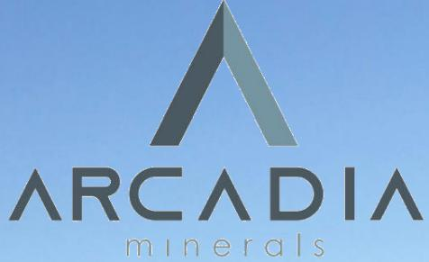
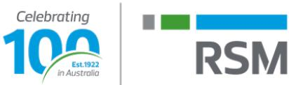
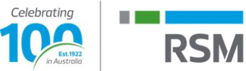
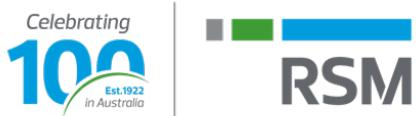
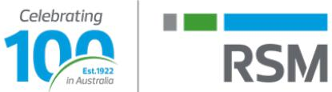
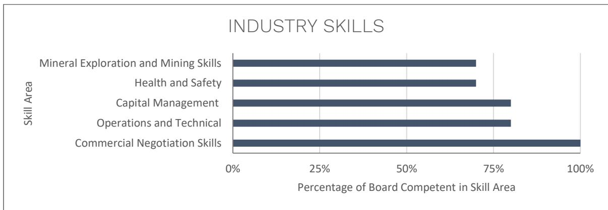
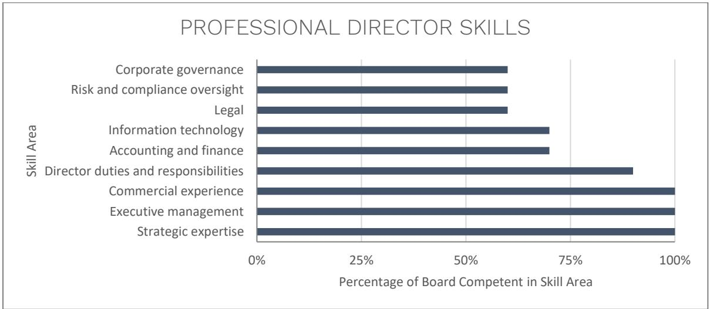

{0}------------------------------------------------

# ARCADIA MINERALS LTD

Annual Report

For the year ended 30 June 2022

Registration Number 68211 (Incorporated in Guernsey) ARBN 646 114 749

{1}------------------------------------------------

| Corporate Directory                                        | 2  |
|------------------------------------------------------------|----|
| Directors' Report                                          | 3  |
| Statement of Profit or Loss and Other Comprehensive Income | 19 |
| Statement of Financial Position                            | 20 |
| Statement of Changes in Equity                             | 21 |
| Statement of Cash Flows                                    | 22 |
| Notes to the Financial Statements                          | 23 |
| Independent Auditor's Report                               | 47 |
| ASX Additional Information                                 | 51 |
| Corporate Governance Statement                             | 56 |

{2}------------------------------------------------

#### **Board of Directors**

Mr Jurie Hendrik Wessels - Executive Chairman Mr Philip Le Roux - Chief Executive Officer and Director Mr Johan Le Roux - Non-Executive Director Mr Michael Davy - Non-Executive Director Mr Andrew Law - Non-Executive Director

#### **Local Agent & Australian Company Secretary**

Onyx Corporate Pty Ltd, Ms Kyla Garic *Registered office in Australia and Local Agent Address* Suite 7, 63 Shepperton Road Victoria Park WA 6100 Telephone: + 61 8 6158 9990

#### **Guernsey Corporate Secretary**

Oak Securities Limited *Registered office in Guernsey* Oak House, Hirzel Street St Peter Port Guernsey GY1 3RH

#### **Auditors**

RSM Australia Partners Level 32, Exchange Tower 2 The Esplanade Perth WA 6000

#### **Share Registry**

Automic Share Registry Level 2/267 St Georges Terrace Perth WA 6000 Telephone: +61 1300 288 664

#### **Email**

info@arcadiaminerals.global

#### **Website**

www.arcadiaminerals.global

{3}------------------------------------------------

# ARCADIA MINERALS LIMITED

# **DIRECTORS REPORT**

The Directors of Arcadia Minerals Limited have the pleasure in presenting their Directors report, together with the consolidated financial statements for Arcadia Minerals Limited ("Arcadia" or "the Company") and its subsidiaries (together "the Group") for the year ended to 30 June 2022.

The names of the Company's Directors who held office during the whole of the financial year and up to the date of this report, unless otherwise stated, are set out below.

| Name                     | Position                                       | Appointment/ Resignation     |  |
|--------------------------|------------------------------------------------|------------------------------|--|
| Mr Jurie Hendrik Wessels | Executive Chairman                             | Appointed on 6 October 2020  |  |
| Mr Philip Le Roux        | Chief Executive Officer and Executive Director | Appointed on 1 December 2020 |  |
| Mr Johan Le Roux         | Non-Executive Director                         | Appointed on 6 October 2020  |  |
| Mr Michael Davy          | Non-Executive Director                         | Appointed on 6 October 2020  |  |
| Mr Andrew Law            | Non-Executive Director                         | Appointed 24 September 2021  |  |
| Mr Joseph Van Den Elsen  | Non-Executive Director                         | Appointed 6 October 2020,    |  |
|                          |                                                | Resigned 24 September 2021   |  |

#### **INFORMATION ON DIRECTORS**

#### **Mr Jurie Wessels**

**Executive Chairman**

#### *Qualifications*

BA, LLB

#### *Experience*

Mr Jurie Wessels has 25 years' experience in the exploration industry and co-founded a number of exploration and mining companies, including Bauba Resources Ltd (BAU.J), GoldStone Resources Ltd (GRL.L) and Vanadium Resources Ltd (VR8.Asx). Mr Wessels has significant experience in the sourcing and assessment of exploration and exploitation projects and in the governance, funding and management of resource companies. Mr Wessels explored for various minerals in Africa, South America and Europe and practised as a minerals lawyer up to 2003 but still is admitted as an attorney (nonpractising) and a notary of the High Court of South Africa.

*Interest in Chess Depositary Interests (CDIs) and Performance Shares at the date of this report*

4,099,353 Chess Depositary Interests

685,619 Performance Shares

*Directorships held in other listed entities (last 3 years)*

Vanadium Resources Limited (current) (ASX Listed)

Bauba Resources Limited (JSE Listed)

{4}------------------------------------------------

#### **Mr Philip Le Roux**

#### **Chief Executive Officer and Director**

#### *Qualifications*

B.Sc. (Hons) (Geology)

#### *Experience*

Philip has 30 years' experience in exploration, mining and economic geology, with extensive exposure in different geological terrains worldwide. He commenced his career as a Mine Geologist for Gencor Limited, then became a Mining Analyst for the Industrial Development Corporation of South Africa and operated as an independent consultant to several junior and mid-tier mining companies. Philip has progressed numerous projects from greenfields to feasibility and into production. Philip was responsible for progressing the projects that are the subject of the Acquisition Agreement from a technical point of view. Philip is a member of the Geological Society of South Africa and holds an Honours Degree in Geology from the University of Stellenbosch.

*Interest in Chess Depositary Interests (CDIs) and Performance Shares at the date of this report*

4,099,353 Chess Depositary Interests

685,619 Performance Shares

*Directorships held in other listed entities (last 3 years)*

Nil

#### **Mr Michael Davy**

**Non Executive Director**

#### *Qualifications*

BCom (Acc)

#### *Experience*

Mr Michael Davy is an Australian executive and Accountant with over 16 years' experience across a range of industries. Mr Davy previously held a senior management role in Australia for Songa Offshore (listed Norwegian Oil and Gas drilling company), where he assisted with the start-up of the Australian operations and managed the finance team for a two rig operation with multi-hundred million dollar revenues. Prior to that Mr Davy had worked in Australia and London for other large organisations overseeing various finance functions.

*Interest in Chess Depositary Interests (CDIs) and Performance Shares at the date of this report*

1,016,150 Chess Depositary Interests

Nil Performance Shares

*Directorships held in other listed entities (last 3 years)*

Raiden Resources Limited (Chairman) (Current)

Haranga Resources Limited (Chairman) (Current)

Vanadium Resources Limited (Current)

Riversgold Limited (resigned 24 June 2020)

{5}------------------------------------------------

#### **Mr Johan Le Roux**

#### **Non Executive Director**

*Qualifications*

B.Com (Management accounting), MBA

#### *Experience*

Johan is a business development executive with an accounting background. For the past 12 years, he has been the Business Development Manager of SPH Kundalila (Pty) Ltd, a leading mining services provider that is a wholly owned subsidiary of JSE-listed Raubex Group Limited. Johan holds a Bachelor of Commerce degree from Stellenbosch University and a Master of Business Administration from the University of Stellenbosch Business School.

*Interest in Chess Depositary Interests (CDIs) and Performance Shares at the date of this report*

Nil Chess Depositary Interests

Nil Performance Shares

*Directorships held in other listed entities (last 3 years)*

Bauba Resources Limited (current) (JSE Listed)

#### **Mr Andrew Law**

**Non Executive Director (Appointed 24 September 2021)**

*Qualifications*

MBA, MMin, FAusIMM(CP), FIQ(Aus), MAICD, AFAIM

*Experience*

Andrew Law has over 35 years' experience in the mining and Resources industry in Australia, Africa and South America. Andrew's extensive technical and management experience ranges from deep level underground mining environments to large open pit environments and large mineral sands mining and dredging environments. Executive Management experience has been gained at both the Corporate and Executive operational levels at Anglo American, Plutonic Resources, Downer Group, Placer Dome, Mundo Minerals and Optiro Limited. Until recently, Andrew was the Executive Director – Projects at Relentless Resources Limited. Andrew's specialist skills are in Corporate strategic business planning, execution, and governance across a wide range of mineral commodities; project management; management of feasibility studies; Ore Reserve compliance and auditing (ASX, TSX, SEC, SGX, JSE); project acquisitions, valuations and due diligence; operational performance management and optimisation; mentoring executive corporate personnel and operational management, as well as peer reviewing mining studies and projects.

*Interest in Chess Depositary Interests (CDIs) and Performance Shares at the date of this report*

Nil Chess Depositary Interests

Nil Performance Shares

*Directorships held in other listed entities (last 3 years)*

Ookami Limited (current)

{6}------------------------------------------------

#### **Mr Joseph van den Elsen**

**Non Executive Director (Resigned 24 September 2021)**

#### *Qualifications*

GradDip in Environment, Energy and Resources Law

GradDip in Mineral Exploration Geoscience

Bachelor of Laws & Bachelor of Arts

#### *Experience*

In addition to his position as the Managing Director of Ookami, Mr van den Elsen currently serves as the Executive Chairman of Ronin Resources Ltd, a public exploration and development company advancing a coal project in Colombia. Prior to joining Ronin Resources Ltd, he held executive positions with MHM Metals and Hampshire Mining. Previously, he was an Associate Director with UBS and held a comparable position with Goldman Sachs JB Were.

*Interest in Chess Depositary Interests (CDIs) and Performance Shares at the date of this report*

Nil Chess Depositary Interests

Nil Performance Shares

*Directorships held in other listed entities (last 3 years)*

Oar Resources Limited (current)

Ookami Limited (Current)

#### **Ms Kyla Garic**

#### **Local Agent & Company Secretary**

#### *Qualifications*

BCom (Info. Systems and Electronic Commerce), MAcc, GradDipCA,

#### *Experience*

Ms Garic is a Chartered Accountant, Chartered Secretary and Director of Onyx Corporate. Onyx Corporate provides financial reporting, accounting, company secretarial and other services primarily to ASX listed companies.

#### **PRINCIPAL ACTIVITIES**

The principal activities of the Group are continued exploration of the Swanson Project and advancement of the exploration of the Kum-Kum, Karibib and Bitterwasser Project. The Group also seeks to investigate additional exploration opportunities within Namibia which may present themselves from time to time.

{7}------------------------------------------------

#### **REVIEW OF OPERATIONS AND ACTIVITIES**

The loss after income tax of the Group for the year ended 30 June 2022 is \$2,083,972 (30 June 2021: \$593,893).

Arcadia Minerals is an exploration company. The projects acquired by the Company have been developed over a period of time by the prior owners of the projects. Management and the Board have developed a three pillar strategy to provide investors and shareholders with access to the opportunities presented in the mining industry. Arcadia listed on the Frankfurt Stock Exchange on the 22nd of November 2021.

- Pillar One, Potential development and exploitation of a cash generating asset **(Pillar One)**,
- Pillar Two, Use of the potential cash resources from pillar one to explore and potentially transform the Company's assets **(Pillar Two)** and
- Pillar Three, utilise human capital of industry specific experience tied with a history of project generation to bring projects to results **(Pillar Three)**

Some of the Company's projects are located in the neighbourhood of established mining operations and significant discoveries, and all the projects holds significant potential to host economic quantities of minerals that may be capable of further development and extraction.

The projects under investigation are as follows;

- 1. The Swanson Project advanced tantalum project with early development potential
- 2. Kum-Kum Project prospective for nickel, copper, and platinum group elements
- 3. Karibib Project prospective for copper and gold
- 4. Bitterwasser Brines Project prospective for lithium-in-brines
- 5. Bitterwasser Clays Project prospective for lithium-in-clays

During the financial year, the Company commenced exploration across all projects. The projects are detailed below:

#### **Swanson Tantalum/ Lithium Project (Swanson)**

The advanced Swanson Tantalum exploration project situated in Tantalite Valley, Namibia. The Project is held through the Company's 80% owned Namibian subsidiary Orange River Pegmatite (Pty) Ltd (ORP). The strategy with Swanson is to advance the project into a potentially cash generating mining operation and forms part of Pillar One.

Key highlights during the year were the rapid mobilisation of drilling contractors and two diamond drill rigs on site. Road building operations, drill pad preparation and the construction of water for drilling infrastructure was completed and drilling commenced.

The program was a follow on from the initial drilling program conducted by ORP in August 2020. The intention of the program was to explore an additional 11 (D0, D1, D2 E2, E3, E4, E5, E6, E7, E8 & F1) of the 15 pegmatites identified at Swanson. In addition, the drilling program specifically explored the opencast potential of the E5, E6, E7 and E8 pegmatites, and the up-dip underground potential of the F1, E4, and E5 pegmatites1 . Down-dip exploration and the mineralisation of the remaining undrilled pegmatites at Swanson remains to be tested.

1 Refer announcement 01 September 2021, Drilling underway at Swanson and First Ta/Li Resource Estimate expected

{8}------------------------------------------------

Further, as announced on 23 September 20212 bench-scale metallurgical test-work were completed from a 5.45 tonne sample using industry standard gravity separation equipment, which achieved recoveries of 76% (spiral) and 90% (multi-gravityseparator). A 60-tonne bulk sample was also taken, crushed, and transported for commercial size plant test-work to simulate flowsheet, optimise stage recoveries and to provide results for final plant design. Assay results returned during the period confirmed high grade intercepts with an average thickness of 2.31m and a weighted average grade of 559 g/t Ta2O5.

Drilling was completed for a total of 29 diamond drill holes, totalling 1,217.54 m of drilling in February 2022. All holes contained pegmatite intersections, the samples were sent to Scientific Services Laboratory in South Africa for analyses. The drillhole database was delivered to Snowden Mining Consultants to update the Mineral Resources estimate. On 6 May 2022 a revised mineral resource delivered a new estimate including a total indicated and inferred Mineral Resource of 2.59Mt (an increase of 115%) at an average grade of 486 ppm Ta2O5 (an increase of 17.9%), 73uppm Nb2O5 and 0.15 % Li2O. The Mineral Resource is based on an exploration program that includes: 283 channel / chip samples and 52 diamond boreholes on a 50m grid spacing over 10 (of 15) outcropping open-castable shallow pegmatites located at Swanson, namely the D0, D1, D2, E2, E3, E4, E6, E7, E8 and F1. To date only 15 of the more than 200 known pegmatites present over Arcadia's three licenses have been explored. Refer below for further information on the Swanson Tantalum Project Mineral Resource.

Subsequent to the release of the updated Mineral Resource estimate, the Minister for the Department of Mines and Energy of Namibia granted the previously applied for Mining License, ML 223 to ORP on the 3 June 2022. The license authorises ORP to commence with the necessary development work towards mining operations for Base and Rare Metals, Industrial Minerals and Precious Metals over the Swanson Tantalite Project for a period of 15 years (from 19 May 2022 up to 18 May 2037). In terms of the Minerals (Prospecting and Mining Act) of 1992, the mining license is renewable by application 12 months before its expiry date subject to ORP showing that the mineral to which the mining license relates exists in the mining area in sufficient quantity that it can be won or mined and sold. The Minister may not refuse to grant an application for the renewal of a mining licence if the holder of the license complied with the terms of the mining license and the proposed programme of mining operations and has expended the capital required for the purposes of which the mining license was granted.

Within this reporting period, ORP also received notice that an Environmental Clearance Certificate (ECC) to undertake the proposed development of a Tantalite Mine at Swanson and to commence with activities specified in ORP's environmental assessment report and environmental management plan filed with the Ministry of Environment, Forestry and Tourism of Namibia was granted under reference ECC 02187.

The updated Mineral Resource estimate, granting of the Mining License and Environmental permits has established Swanson Tantalum Project in good stead for the upcoming year.

#### **Kum Kum Nickel and PGE Project**

The Kum-Kum exploration project situated in Tantalite Valley Complex, Namibia. The Project is held through the Company's 80% owned Namibian subsidiary Orange River Pegmatite (Pty) Ltd (ORP). At the Kum-Kum PGE and Nickel project the Company commenced with a Minerals Systems Approach (MSA) to identify the mineral processes evident over the project and to formulate an exploration model to assist with future exploration over areas where anomalous results were attained by previous explorers during the 1970's and 1980's. The MSA will, together with hyperspectral domaining, assist the refining of a litho-geochemical sampling program and a field mapping campaign over the Tantalite Valley Complex with the purpose of understanding the geological prospectively of the Tantalite Valley Complex before expensive intrusive exploration programs are undertaken.

The Mineral Systems Approach commenced in August 2021 by a team comprising members from Arcadia Minerals and from the Department of Earth Sciences at the Stellenbosch University, South Africa, the study was completed in 2022 and results were announced on 9 May 2022.

Arcadia Minerals Limited – Annual Report 2022 8 | P a g e 2 Refer announcement 23 September 2021, Mineralogical results received and bulk sample completed at Swanson Ta/Li Project.

{9}------------------------------------------------

The Tantalite Valley Complex (TVC) geological study involved various field sampling campaigns (94 field samples collected) augmented with detailed consideration of historical drill core segments (57 samples), and supporting data from historical records, hyperspectral mapping, and stream sediment sampling. The field samples collected with the historical core samples were subjected to a suite of analytical protocols including reflected and transmitted-light optical petrography, whole-rock major and trace element chemistry, precious metal assays, sulphur isotope analyses, scanning electron microscopy with associated spectrometry and in-situ Laser Ablation Inductively Coupled Plasma Mass Spectrometry (LA-ICP-MS) of individual sulphide grains. Together, the results provided novel insights into the known mineralisation and prospectively of the TVC.

The TVC hosts two main categories of sulphides, viz primary magmatic sulphides, hosted by an orthopyroxenite, as well as secondary (or hydrothermal) sulphides inside amphibolitised host rocks and typically found near shear zones (including the intrusion's sheared contacts). The latter remobilized category only hosts sub-economic Cu (<0.29 wt.%) and minor Ni (<0.17 wt.%), while Pd+Pt values never exceed 0.15 ppm. Texturally, this assemblage comprises of predominantly pyrite, with later paragenetic rims of chalcopyrite + magnetite and ilmenite. In contrast, the primary magmatic sulphides comprise of pyrrhotite + pentlandite + chalcopyrite, with the best assay results measured for a 10-15 cm long split core, with 0.28% Cu, 0.71% Ni and 1.24 ppm Pd+Pt.

Importantly, the above stated assay values and corroborating Scanning Electron Microscope analyses constitute the first records of PGE and Au (max. Au assay value = 0.26 ppm) in the TVC. Using metal prices at the time of the study, their presence adds significantly (~24 %) to the in-ground value of the mineral assemblage. Sulphur isotopes indicate that the magmatic sulphides carry a mantle signal and no contamination by crustal sulphur. Further, various in situ and whole rock geochemical proxies enable the calculation of an R factor, which represents the degree to which an immiscible sulphide melt interacted with a silicate magma chamber to obtain its precious metal signatures. The R factor for the TVC is estimated to be between 800 and 3000, which plots towards the high end for Ni-Cu deposits, but towards the low end for world-class PGE deposits.

Following an established relationship between Ni and total PGE, as well as these being hosted within a relatively unique orthopyroxenitic orthocumulate, this most mineralized target layer within the ultramafic units of the south-eastern TVC is suspected to have been intersected by historical boreholes TV03, N01, and PW01. These intersection depths range between 150 and 250 m below surface and likely coincide with at a pyroxenite-troctolite contact. Further targeting of this most interesting horizon should endeavour to discern the dip, strike and true thickness of the mineralized layer, whether it outcrops at surface, the degree to which it has been affected by post-magmatic processes (e.g., amphibolitisation), and its lateral and vertical (i.e., within unit) grade variability.

Superficial insights that have implications for the metallurgical properties of the mineralisation are detailed as the results of a preliminary scanning electron microscopy study of the precious metal minerals.

#### **Karibib Project – Cu and Au**

The Karibib exploration project is situated near the mining town of Karibib, Namibia. The Project is held through the Company's 80% owned subsidiary (see-through 68%) Karibib Pegmatite Exploration (Pty) Ltd (Karibib).

At the Karibib Copper-Gold Project field work confirmed mineralisation trends over the license extends over the exposed rocks of a 20 km x 2 km metasedimentary structural feature. Outcropping skarn-type mineralisation pointed to significant mineralisation displaying, on average, grades of 4.32 % Cu (highest 28.40% Cu), 1.49 g/t Au (highest 7.65 g/t Au), 50.50 g/t Ag (highest 453 g/t Ag) and 0.23 % (highest 1.00% WO3). Outcropping vein-type mineralisation rock chip samples returned the following results: 1.94% Cu (highest 5.69% Cu), 2.06 g/t Au (highest 26.30 g/t Au) and 12.68 g/t Ag (highest 30.10 g/t Ag)3 .

3 Refer announcement 07 September 2021, High Grade Sampling Results at Karibib Copper and Gold Project

Arcadia Minerals Limited – Annual Report 2022 9 | P a g e

{10}------------------------------------------------

#### **Bitterwasser Project – Prospective for Lithium in Clays**

During the year, a 64 drill hole exploration program utilising hand auger drilling mechanisms was conducted.

Final assay results for the 64 drill hole campaign over the Eden Pan were announced in May 2022. The entire sequence of the drill holes sampled (Upper Brown Clay Unit and Middle Green Glay Unit) returned lithium mineralisation4 . The Middle Green Clay Unit, lithologically named the Middle-Unit (MU), comprised the dominant lithological unit from which the maiden Mineral Resource as announced on 3 November 2021 was derived. Subsequently an updated Mineral Resource was released, refer to the Events Occurring after Reporting Date.

This green clay unit was intersected in a total of 43 drill holes from which assay results were received and extended from a depth of 1.4 m below surface to the maximum End-of-Hole (EOH) depth of 9.60m.

|   | Eden Pan Stack Sections Based on Phase 1 & 2 Drilling                       |
|---|-----------------------------------------------------------------------------|
|   | Brown Clay Layer Not Part of Current JORC Resource                          |
|   | Dark Green Green Clay Layer - Current 15.1 M ton Resource Light Green |
|   | Green Clay Layer - Drilled Phase 2 N 1220                             |
|   | 7353000 7352000                                                          |
|   | 7351000 7350000 າ ຜູ້ ຂໍ້ມູນຄົງ Y                                  |
| 8 | 7349000 7348000 7347000                                               |
|   |                                                                             |

**Figure1:** Stacked cross section of the Eden Pan depicting drill-hole interpretation with reference to the existing Mineral Resource (green layers) and clay units intercepted in the follow-up auger drilling program.

As expected, the best individual drillhole intersections for the high-grade Middle Green Clay Unit were located in the centre of the pan. These results were:

- BMC33: From 4.8 to 9.4 m, 4.6 m @ 811 ppm Li
- BMC32: From 3.8 to 6.6 m, 2.8 m @ 796 ppm Li
- BMC28: From 4.2 to 9.4 m, 5.2 m @ 760 ppm Li
- BMC36: From 3.4 to 5.6 m. 2.2 m @ 744 ppm Li

Through its local subsidiary, Brines Mining and Exploration Namibia (Pty) Ltd (BME), Arcadia has exercised a first option in terms of an acquisition agreement to acquire up to 100% of Bitterwasser Lithium Exploration (Pty) Ltd (BLE), which the acquisition agreement was approved by shareholders on 5 April 2022. By exercising the first option, Arcadia has acquired 25% of BLE in return for a consideration of approximately A\$92,000. Arcadia holds an additional option for 2 years from 12 April 2022 to acquire the remaining 75% of BLE (and thereby own 100% of the Bitterwasser Pan district) in consideration of approximately A\$184,000.

Combined with the 3,438Km2 owned by BME and the BLE licenses, the land holding currently under investigation by Arcadia comprises 4,031Km2 in extent.

4 Refer to ASX Announcement dated 2 May 2022 titled 'Final Lithium Drilling assay results Bitterwasser'

Arcadia Minerals Limited – Annual Report 2022 10 | P a g e

{11}------------------------------------------------

#### **Bitterwasser Project – Prospective for Lithium in Brines**

Exploration over the Lithium in Brines project, is to be conducted in five phases, of which the first and second were completed during the year ended 30 June 2022:

#### **Phase 1 (Completed)**

Acquisition and consolidation of all historical geology, geohydrology, geochemical and geophysical data available for the project area and its surroundings.

#### **Phase 2 (Completed)**

Construction of a comprehensive geological and geohydrological model of the regional and local Bitterwasser System controlling known lithium-in-clay mineralisation and lithium-in-brine mineralisation.

#### **Phase 3 (In Progress)**

Stratigraphic drilling to be able to build a geological section of the basin and understand the basin parameters, water sampling (hot springs and groundwater), and airborne geophysical surveys aimed at understanding the Project's stratigraphy and identifying potential trap sites for additional lithium-in-clay mineralisation, and to prove lithium-in-brines mineralisation at depth.

#### **Phase 4 (Planned)**

Targeted drilling of potential trap sites to determine volume and grade of brines and additional sub-terranean clay horizons.

#### **Phase 5 (Planning stages)**

Targeting and drilling of geothermal structures for potential energy harvesting, which could have significant ESG impact

If the phased work program is successfully implemented, the intention is to drill the high priority exploration drill targets in an effort to make a discovery of lithium-in-brine mineralisation at depth and to conduct exploration work to discover sub-surface lithium-in-clay mineralisation similar to what is currently expressed on surface.

There were no further substantive exploration activities at the projects by the Company during the reporting period.

#### **ANNUAL MINERAL RESOURCES REPORT AS AT 30 JUNE 2022**

In accordance with ASX listing rule 5.21, Arcadia Minerals reports its Mineral Resources on an annual basis. The date of reporting is 30 June each year to coincide with company financial year end. If there are any material changes to the Company's Mineral Resource the Company is required to publish these changes promptly.

There was no Mineral Resource reported at 30 June 2020, the Company released two Mineral Resource statements being the Swanson Tantalum Project and the Bitterwasser Prospective for Lithium in Clays details as follows:

{12}------------------------------------------------

#### **ANNUAL MINERAL RESOURCES REPORT AS AT 30 JUNE 2022 (continued)**

#### **Swanson Tantalum Project Mineral Resource**

At Swanson a revised JORC Mineral Resource of 2.59Mt at an average grade of 486g/t Ta2O5, 73g/t Nb2O5 and 0.15% Li2O was announced on the 6 May 2022, which was derived from 52 drillholes drilled over 10 pegmatites.

| D, E and F Classification    | Area     | Tonnes (kt) | Ta2O5 Content (Tonnes) | Ta2O5 ppm | Nb2O5 ppm | Li2O % |  |
|------------------------------|----------|-------------|---------------------------|-----------|-----------|--------|--|
| Indicated                    | Total D  | 568         | 207                       | 365       | 87        | 0.27   |  |
| Indicated                    | Total EF | 577         | 334                       | 578       | 65        | 0.07   |  |
| Subtotal Indicated           |          | 1,145       | 541                       | 472       | 76        | 0.17   |  |
| Indicated                    | Total D  | 444         | 162                       | 365       | 79        | 0.34   |  |
| Indicated                    | Total EF | 995         | 554                       | 557       | 69        | 0.00   |  |
| Subtotal Inferred            |          | 1,439       | 716                       | 498       | 72        | 0.14   |  |
| Comparison to September 2021 |          |             |                           |           |           |        |  |
| Indicated Sept. 2021         | Total    | 664         | 286                       | 431       | 76        | 0.28   |  |
| Inferred Sept. 2021          | Total    | 544         | 212                       | 389       | 75        | 0.30   |  |

#### **TABLE 1: SWANSON TANTALUM PROJECT MINERAL RESOURCE (JORC 2021)**

#### **Bitterwasser Prospective for Lithium in Clays Mineral Resource**

At Bitterwasser a JORC Mineral Resource of JORC Mineral Resource of 15.1 million tons @ 828ppm Li and 1.79% K (at a cut-off grade of 680ppm Li) representing only 6% of the exposed clay pans was defined over one of seven clay pans. The Mineral Resource was announced on the 3rd of November 2021 and is contained over three exploration licenses, the licenses were subject to an acquisition that was conditional upon Arcadia shareholders' approval pursuant to ASX LR 11.1.2, shareholder approval was received on the 5 April 2022.

#### **TABLE 2: BITTERSWASSER LITHIUM PROJECT MINERAL RESOURCE (JORC 2012)**

| Classification  | Tonnage (kt) | Li Grade ppm | Contained Li (tonnes) | Lithium Carbonate Equivalent (tonnes) |
|-----------------|--------------|--------------|--------------------------|------------------------------------------|
| Total Indicated | 0            | 0            | 0                        | 0                                        |
| Total Inferred  | 15,100       | 828          | 12,503                   | 66,929                                   |
| Total Resources | 15,100       | 828          | 12,503                   | 66,929                                   |

An updated Mineral Resource was released to the Market on 24 August 2022, refer to events occurring after the reporting period for further information.

#### **Governance Arrangements and Internal Controls**

Arcadia has ensured that the Mineral Resources quoted are subject to good governance arrangements and internal controls. The Mineral Resources reported have been generated by internal and external Company subject matter experts, who are experienced in best practice modelling and estimation methods. The Competent Persons has also undertaken reviewed of the quality and suitability of the underlying information used to generate the resources estimation. The Mineral Resources estimates for reporting of Exploration Results are prepared in accordance with the JORC Code 2012. In addition, Arcadia's management carry out regular reviews of processes used by the external contractors that have been engaged by the Company.

{13}------------------------------------------------

#### **COMPETENT PERSONS'S & COMPLIANCE STATEMENT**

#### **Swanson Tantalum Project - Mineral Resource**

The Company confirms it is not aware of any new information or data that materially affects the information included in the Mineral Resource estimate and all material assumptions and technical parameters underpinning the estimate continue to apply and have not materially changed when referring to its resource announcement made on 6 May 2022.

#### **Bitterwasser Prospective for Lithium in Clays - Mineral Resource**

Subsequent to 30 June 2022, the Company released an updated Mineral Resource. The updated Mineral Resource is included in this Annual Report under Events Occurring After Reporting Date. The Company confirms it is not aware of any new information or data that materially affects the information included in the Mineral Resource estimate and all material assumptions and technical parameters underpinning the estimate continue to apply and have not materially changed when referring to its resource announcement made on 24 August 2022.

#### **Compliance Statement**

The Company confirms that the information in this report that relates to Exploration Results have previously been released to ASX and have not materially changed, and that it is not aware of any new information or data that materially affects the information that has been included in this report. The Company confirms that the form and context in which the Competent Person's finding are presented have not been materially modified from the original market announcement.

#### **CORPORATE**

In September of 2021, the Company's board welcomed Mr Andrew Law as a non-executive director when Mr Joseph van den Elsen resigned due to other work commitments.

During the financial year Arcadia listed on the Frankfurt Stock Exchange (FRA). The Frankfurt listing enlarges Arcadia's investor reach and increases exposure to European markets.

#### **FINANCIAL RESULTS**

The financial results of the Group for the year ended 30 June 2022 are summarised below and set out on the Financial Statements. The Group's financial results were consistent with a mining exploration company, the Group remained well funded at the end of year:

|                                | 30 June 2022 | 30 June 2021 |
|--------------------------------|--------------|--------------|
| Cash and cash equivalents (\$) | 2,840,406    | 6,165,049    |
| Net assets (\$)                | 13,751,803   | 15,803,009   |
| Net loss after tax (\$)        | (2,617,584)  | (593,893)    |

#### **SHARE CAPITAL**

The Company's issued share capital as at 30 June 2022 consisted of 85,500,100 shares (CDIs). The securities hold equal rights, with 38,802,208 shares remaining in escrow. No securities carry special rights with regard to the control of the Company. Further information is contained in the Additional Shareholders Information at the end of this report.

{14}------------------------------------------------

#### **MAJORITY SHAREHOLDING IN THE COMPANY**

As at 30 June 2022, the following shareholders had an interest of greater that 5% in the Company's issued share capital:

| Holder Name             | Holding Balance | % IC   |
|-------------------------|-----------------|--------|
| SPH Kundalila (Pty) Ltd | 16,314,688      | 19.08% |
| Russell Brooks Ltd      | 10,317,097      | 12.07% |
| Raubex Pty Ltd          | 7,394,000       | 8.65%  |

#### **DIVIDENDS**

There were no dividends paid or recommended during the financial year ended 30 June 2022.

#### **SIGNIFICANT CHANGES IN THE STATE OF AFFAIRS**

Refer to the Review of Operations and Activities. There were no other significant changes in the state of affairs during the financial year.

#### **EVENTS OCCURRING AFTER REPORTING DATE**

#### **Bitterwasser Prospective for Lithium in Clays - Mineral Resource**

On 24 August 2022, it was announced that the previous JORC Mineral Resource released on 3 November 20215 has been revised following the Phase 2 drilling program6 and comprises an updated JORC Mineral Resource defined over Eden Pan of 85.2 million tonnes @ 633ppm for 286,909t Li2CO3 (LCE) wholly classified in the Inferred Category. This updated resource represents a ~560% increase in resource and 430% increase in metal content.

The updated Mineral Resource estimate is based on 77 auger drill holes and 486 core samples taken. The Mineral Resource estimate was based on two groups of resources, namely the Upper and Middle Units, which refers all the material inside the wire frames, and the Secondary Unit which refers to the economic mineralisation material outside the wire frames. A summary of the estimated JORC compliant Mineral Resources for the Bitterwasser Project at various cut-off grades is provided in Table 3 below. The estimate includes all the main mineralised geological domains.

The Mineral Resource has been classified as an Inferred Mineral Resource following the guidelines and procedures for classifying the reported Mineral Resources were undertaken within the context of JORC (2012).

5 Refer to ASX Announcement dated 3 November 2021 "*Arcadia Acquires Adjacent Lithium Project with JORC Mineral Resources*"

6 Refer to Asx Announcement dated 2 May 2022 "*Final Lithium Drilling Assay Results Received at Bitterwasser*" and 10 March 2022 "*Encouraging Lithium Drilling Assay Results at Bitterwasser*"

{15}------------------------------------------------

#### **EVENTS OCCURRING AFTER REPORTING DATE (continued)**

#### **TABLE 3: SUMMARY OF ESTIMATED JORC COMPLIANT MINERAL RESOURCES FOR THE BITTERWASSER PROJECT**

| CATEGORY                    | UNIT            | TONNAGE     | GRADE  | CONTAINED |
|-----------------------------|-----------------|-------------|--------|-----------|
|                             |                 | ton         | Li ppm | Li ton    |
| Cut-off Grade of 0 ppm Li   |                 |             |        |           |
|                             | Upper           | -           | -      | -         |
| Indicated                   | Middle          | -           | -      | -         |
|                             | Total Indicated | -           | -      | -         |
| Inferred                    | Upper           | 61 518 571  | 464.60 | 28 582    |
|                             | Middle          | 92 382 945  | 568.85 | 52 552    |
|                             | Total Inferred  | 153 901 516 | 527.18 | 81 134    |
| Cut-off Grade of 500 ppm Li |                 |             |        |           |
|                             | Upper           | -           | -      | -         |
| Indicated                   | Middle          | -           | -      | -         |
|                             | Total Indicated | -           | -      | -         |
| Inferred                    | Upper           | 28 192 877  | 556.86 | 15 699    |
|                             | Middle          | 56 955 751  | 670.72 | 38 201    |
|                             | Total Inferred  | 85 148 628  | 633.03 | 53 900    |
| Cut-off Grade of 600 ppm Li |                 |             |        |           |
| Indicated                   | Upper           | -           | -      | -         |
|                             | Middle          | -           | -      | -         |
|                             | Total Indicated | -           | -      | -         |
|                             | Upper           | 2 878 041   | 634.69 | 3 659     |
| Inferred                    | Middle          | 21 292 230  | 729.82 | 28 282    |
|                             | Total Inferred  | 44 516 575  | 717.50 | 31 941    |

| Cut-off Grade of 650 ppm Li |                 |            |        |        |
|-----------------------------|-----------------|------------|--------|--------|
|                             | Upper           | -          | -      | -      |
| Indicated                   | Middle          | -          | -      | -      |
|                             | Total Indicated | -          | -      | -      |
|                             | Upper           | -          | -      | -      |
| Inferred                    | Middle          | 29 572 282 | 761.84 | 22 529 |
|                             | Total Inferred  | 29 572 282 | 761.84 | 22 529 |

{16}------------------------------------------------

#### **EVENTS OCCURRING AFTER REPORTING DATE (continued)**

#### **Karibib Project – Cu and Au**

On 29 August 2022, the Company announced the commencement of drilling at Karibib Copper-Gold Project. The planned drilling program consisted of 9 drill holes drilled at a 60 degree inclination and at varied azimuths and depths dependent on the inferred geometry and geology of the targeted zone. As announced on 23 September drilling was completed, a total of 10 holes were drilled.

There are no other matters or circumstances which have arisen since the end of the year which significantly affected or may significantly affect the operations of the Group, the results of those operations, or the state of affairs of the Group in subsequent financial years.

#### **FUTURE DEVELOPMENTS, PROSPECTS AND BUSINESS STRATEGIES**

The Group's principal continuing activity is mineral exploration. The Company's future developments, prospects and business strategies are to continue mineral exploration.

#### **DIRECTORS' MEETINGS**

The following table sets out the number of Directors' meetings held during the financial year and the number attended by each Director. During the financial year, four board meetings were held. In addition, a number of matters were approved by circular resolution.

| Director                   | Number Eligible to Attend | Number Attended |
|----------------------------|---------------------------|-----------------|
| Mr Jurie Hendrik Wessels   | 4                         | 4               |
| Mr Philip Le Roux          | 4                         | 4               |
| Mr Johan Le Roux           | 4                         | 3               |
| Mr Michael Davy            | 4                         | 4               |
| Mr Andrew Law *            | 4                         | 4               |
| Mr Joseph Van Den Elsen ** | -                         | -               |

*Appointed to directorship on 24 September 2021.

** Resigned from directorship on 24 September 2021.

Due to the size and scale of the Company, there is no separate Remuneration Committee, Nomination Committee or Audit and Risk Committee at present. Matters typically dealt with by these Committees are, for the time being, managed by the Board. For details of the function of the Board, refer to the Corporate Governance Statement.

{17}------------------------------------------------

#### **INDEMNITY OF OFFICERS AND AUDITORS**

The Company's Articles of Incorporation include indemnities in favour of persons who are or who have been officers of the Company. To the extent permitted by law the company indemnifies every person who has been an officers against:

- Any liability to any person (other than to the Company or related entities) incurred while acting in their official capacity and in good faith;
- Costs and expenses incurred by the officer in successfully defending legal proceedings and ancillary matters.

For this purpose, "officer" means any director or secretary of the Company. The Company has given indemnities by deed of indemnity in favour of certain officers in respect of liabilities incurred by them whilst acting as an officer of the company. No claims under the abovementioned indemnities have been made against the Company during or since the end of the financial year.

The Company has not, during or since the end of the financial year, indemnified or agreed to indemnify the auditor of the Company or any related entity against a liability incurred by the auditor.

During the financial year, the Company has not paid a premium in respect of a contract to insure the auditor of the Company or any related entity.

#### **ENVIRONMENTAL REGULATIONS**

The Group's operations are subject to the environmental risks inherent in the mining industry. There have been no known significant breaches of environmental regulations during the financial year and up to the date of this report.

#### **AUDITOR**

Mr Tutu Phong, a Director of RSM Australia Pty Ltd, was appointed to the office as the Company's independent auditor. A resolution to authorise his appointment will be proposed at the Company's forthcoming annual general meeting.

#### **DISCLOSURE OF INFORMATION TO AUDITOR**

The current directors of the Company confirms that:

- to the best of his knowledge and belief, there is no information relevant to the preparation of their report which the Company's Auditor is unaware; and
- he has taken all steps a Director might reasonably be expected to have taken to be aware of relevant audit information and to establish that the Company's Auditor is aware of that information.

#### **NON-AUDIT SERVICES**

The Company may decide to employ the auditor on assignments additional to their statutory audit duties where the auditor's expertise and experience with the Company are important.

Details of the amounts paid or payable to the auditor for non-audit services provided during the financial year by the auditor are outlined in Note 21 to the financial statements.

The directors are satisfied that the provision of non-audit services during the financial year, by the auditor (or by another person or firm on the auditor's behalf), is compatible with the general standard of independence for auditors.

{18}------------------------------------------------

#### **SHARES (CDIs) UNDER OPTION**

At the date of this report there were 5,000,000 options over unissued shares which were outstanding, refer to Note 18 Share Based Payments for further information:

- 500,000 unlisted options expiring 17 June 2024 exercisable at \$0.20, and
- 4,500,000 unlisted options expiring 17 June 2024 exercisable at \$0.20 and unvested at 30 June 2022

#### **SHARES (CDIs) ISSUED ON THE EXERCISE OF OPTIONS**

There were no shares of Arcadia Minerals Limited issued during the year ended 30 June 2022 and up to the date of this report on the exercise of options.

#### **SHARES (CDIs) UNDER PERFORMANCE SHARES**

At the date of this report, 8,550,000 performance shares with a nil exercise price were outstanding. No performance share milestone was met during the year and up to the date of this report

| Expiry                                    | Milestones                                                                                                                                                                                                                                                                                                                                                                                                                         |
|-------------------------------------------|------------------------------------------------------------------------------------------------------------------------------------------------------------------------------------------------------------------------------------------------------------------------------------------------------------------------------------------------------------------------------------------------------------------------------------|
| 23/06/2024 (36 months from issue date) | A Performance Share will be able to be converted into a Share by a Holder subject to the Company completing a positive Feasibility Study in relation to the Swanson Project as accepted by the Independent Directors of the Company and announcement of the same to the ASX, within 36 months of the date of admission of the Company to the Official List (Milestone).                                                |
|                                           | For the purposes of the above:                                                                                                                                                                                                                                                                                                                                                                                                     |
|                                           | (a) a "Feasibility Study" shall mean means a feasibility study that confirms economic extraction and processing of tantalum ore to produce a concentrate, that is compliant with the JORC Code and has been signed off by an independent third party technical firm; and (b) the "Independent Directors" shall be those directors of the Company at the time who do not have an entitlement to any Performance Shares. |

This report is signed in accordance with a resolution of the Board of Directors.

*JH Wessels*

*Chairman 28 September 2022*

{19}------------------------------------------------

# ARCADIA MINERALS LIMITED

# **CONSOLIDATED STATEMENT OF PROFIT OR LOSS AND OTHER COMPREHENSIVE INCOME FOR THE YEAR ENDED 30 JUNE 2022**

|                                                                     | Notes | 30 June 2022 | 7 October to 30 June 2021 |
|---------------------------------------------------------------------|-------|--------------|------------------------------|
|                                                                     |       | \$           | \$                           |
| Revenue from continuing operations                                  |       |              |                              |
| Other income                                                        | 4     | 13,998       | 25                           |
| Expenses                                                            |       |              |                              |
| Professional fees                                                   |       | (118,309)    | (72,000)                     |
| Other expenses                                                      |       | (302,472)    | (69,783)                     |
| Exploration expenditure                                             |       | (1,405,562)  | -                            |
| Share and company registry fees                                     |       | (30,592)     | (108,600)                    |
| Consulting and legal fees                                           |       | (259,589)    | (263,349)                    |
| Share of losses of associates accounted for using the equity method | 5     | (3,774)      | -                            |
| Directors' fees                                                     |       | (455,200)    | (38,000)                     |
| Company secretary and financial management                          |       | (56,084)     | (42,186)                     |
| Loss before income tax for the year                                 |       | (2,617,584)  | (593,893)                    |
| Income tax expense                                                  | 6     | -            | -                            |
| Loss after income tax for the year                                  |       | (2,617,584)  | (593,893)                    |
| Other comprehensive income for the year, net of tax                 |       | -            | -                            |
| Total comprehensive loss for the year                               |       | (2,617,584)  | (593,893)                    |
| Total comprehensive loss for the year attributable to:              |       |              |                              |
| Owners of Arcadia Minerals Limited                                  |       | (2,083,972)  | (593,893)                    |
| Non-controlling interest                                            | 15    | (533,612)    | -                            |
|                                                                     |       | (2,617,584)  | (593,893)                    |
| Loss per share for the year                                         |       |              |                              |
| Basic loss per share (cents)                                        | 7     | (2.44)       | (14.54)                      |
| Diluted loss per share (cents)                                      | 7     | (2.44)       | (14.54)                      |

The Consolidated Statement of Profit or Loss and Other Comprehensive Income should be read in conjunction with the notes to the financial statements.

{20}------------------------------------------------

# ARCADIA MINERALS LIMITED

# **CONSOLIDATED STATEMENT OF FINANCIAL POSITION AS AT 30 JUNE 2022**

|                                                               | Notes | 30 June 2022 | 30 June 2021 |
|---------------------------------------------------------------|-------|--------------|--------------|
|                                                               |       | \$           | \$           |
| ASSETS                                                        |       |              |              |
| Non-Current Assets                                            |       |              |              |
| Plant and equipment                                           |       | 9,280        | 14,499       |
| Investments accounted for using the equity method             | 8     | 84,905       | -            |
| Other receivables                                             | 9     | 65,622       | -            |
| Exploration and evaluation assets                             | 10    | 10,783,221   | 10,216,843   |
| Total Non-Current Assets                                      |       | 10,943,028   | 10,231,342   |
| Current Assets                                                |       |              |              |
| Trade and other receivables                                   | 11    | 75,791       | 40,398       |
| Cash and cash equivalents                                     | 12    | 2,840,406    | 6,165,049    |
| Total Current Assets                                          |       | 2,916,197    | 6,205,447    |
| TOTAL ASSETS                                                  |       | 13,859,225   | 16,436,789   |
| EQUITY AND LIABILITIES                                        |       |              |              |
| Equity                                                        |       |              |              |
| Issued capital                                                | 13    | 16,158,016   | 16,319,565   |
| Reserves                                                      | 14    | 860,866      | 132,939      |
| Accumulated losses                                            |       | (2,677,865)  | (593,893)    |
| Equity attributable to the owners of Arcadia Minerals Limited |       | 14,341,017   | 15,858,611   |
| Non-controlling interest                                      | 15    | (589,214)    | (55,602)     |
| Total Equity                                                  |       | 13,751,803   | 15,803,009   |
| Current Liabilities                                           |       |              |              |
| Trade and other payables                                      | 16    | 107,422      | 633,780      |
| Total Current Liabilities                                     |       | 107,422      | 633,780      |
| TOTAL EQUITY AND LIABILITIES                                  |       | 13,859,225   | 16,436,789   |

The Consolidated Statement of Financial Position should be read in conjunction with the notes to the financial statements.

{21}------------------------------------------------

# **CONSOLIDATED STATEMENT OF CHANGES IN EQUITY FOR THE YEAR ENDED 30 JUNE 2022**

|                                                                                         | Issued Capital | Reserves | Accumulated Losses | Non-controlling Interest | Total Equity |
|-----------------------------------------------------------------------------------------|-------------------|----------|-----------------------|-----------------------------|--------------|
|                                                                                         | \$                | \$       | \$                    | \$                          | \$           |
| Balance at 1 July 2021                                                               | 16,319,565        | 132,939  | (593,893)             | (55,602)                    | 15,803,009   |
| Loss after income tax for the year                                                | -                 | -        | (2,083,972)           | (533,612)                   | (2,617,584)  |
| Total comprehensive loss for the year after tax                                      | -                 | -        | (2,083,972)           | (533,612)                   | (2,617,584)  |
| Transactions with owners in their capacity as owners:                                   |                   |          |                       |                             |              |
| Contributions of equity, net of transaction costs (note 13)                             | (161,549)         | -        | -                     | -                           | (161,549)    |
| Issue of unlisted options, net of transaction costs (note 14)                        | -                 | 161,549  | -                     | -                           | 161,549      |
| Issue of performance shares, net of transaction costs (note 14)                         | -                 | 566,378  | -                     | -                           | 566,378      |
| Balance at 30 June 2022                                                              | 16,158,016        | 860,866  | (2,677,865)           | (589,214)                   | 13,751,803   |
| Balance at 7 October 2020 (Incorporation)                                            | -                 | -        | -                     | -                           | -            |
| Loss after income tax for the period                                              | -                 | -        | (593,893)             | -                           | (593,893)    |
| Total comprehensive loss for the period                                                 | -                 | -        | (593,893)             | -                           | (593,893)    |
| Transactions with owners in their capacity as owners:                                   |                   |          |                       |                             |              |
| Contributions of equity, net of transaction costs (note 13)                             | 6,319,565         | -        | -                     | -                           | 6,319,565    |
| Issue of unlisted options and performance shares, net of transaction costs (note 14) | -                 | 132,939  | -                     | -                           | 132,939      |
| Purchase of shareholding in subsidiaries (note 10)                                      | 10,000,000        | -        | -                     | -                           | 10,000,000   |
| Non-controlling interest on acquisition date (note 10, note 15)                         | -                 | -        | -                     | (55,602)                    | (55,602)     |
| Balance at 30 June 2021                                                              | 16,319,565        | 132,939  | (593,893)             | (55,602)                    | 15,803,009   |

The Statement of Changes in Equity should be read in conjunction with the notes to the financial statements.

{22}------------------------------------------------

# ARCADIA MINERALS LIMITED **CONSOLIDATED STATEMENT OF CASH FLOWS FOR THE YEAR ENDED 30 JUNE 2022**

|                                                        | Note | 30 June 2022 \$ | 7 October to 30 June 2021 \$ |
|--------------------------------------------------------|------|--------------------|------------------------------------|
| Cash flows used in operating activities                |      |                    |                                    |
| Payments to suppliers and employees                    |      | (3,184,340)        | (353,472)                          |
| Interest received                                      | 4    | 13,998             | 25                                 |
| Net cash flows used in operating activities            |      | (3,170,342)        | (353,447)                          |
| Cash flows from investing activities                   |      |                    |                                    |
| Cash consideration for acquisition of subsidiaries     |      | -                  | (977)                              |
| Cash consideration for acquisition of associate        |      | (88,679)           | -                                  |
| Payments to associate for long term loan               |      | (65,622)           | -                                  |
| Cash acquired on acquisition                           |      | -                  | 86,161                             |
| Net cash flows (used)/from in investing activities     |      | (154,301)          | 85,184                             |
| Cash flows from financing activities                   |      |                    |                                    |
| Proceeds from the issue of shares (net)                |      | -                  | 6,750,181                          |
| Share issue costs                                      |      | -                  | (317,896)                          |
| Payments received for issue of options                 |      | -                  | 50                                 |
| Payments received for conversion of share-options      |      | -                  | 977                                |
| Net cash flows provided by financing activities        |      | -                  | 6,433,312                          |
| Net (decrease) / increase in cash and cash equivalents |      | (3,324,643)        | 6,165,049                          |
| Cash and cash equivalents at the beginning of the year |      | 6,165,049          | -                                  |
| Cash and cash equivalents at the end of the year       | 12   | 2,840,406          | 6,165,049                          |

The Statement of Cash Flows should be read in conjunction with the notes to the financial statements.

{23}------------------------------------------------

#### **NOTE 1: SUMMARY OF SIGNIFICANT ACCOUNTING POLICIES**

#### **(a) Reporting Entity**

Arcadia Minerals Limited (referred to as the "Company" or "parent entity") is a company domiciled in Guernsey and listed on the Australian Stock Exchange (ASX). The address of the Company's registered office and principal place of business is disclosed in the Corporate Directory of the Report. The consolidated financial statements of the Company as at and for the year ended 30 June 2022 comprise the Company and its subsidiaries (together, the "Group" or "consolidated entity").

#### **(b) Basis of Preparation**

### *i. Statement of compliance*

These general purpose financial statements have been prepared in accordance with International Financial Reporting Standards (IFRS) and interpretations issued by the IFRS Interpretations Committee, applicable to companies reporting under IFRS, Companies (Guernsey) Law 2008, and the Listing Requirements of the Australian Securities Exchange.

#### *ii. Basis of measurement*

#### Historical Cost Convention

The financial statements have been prepared under the historical costs convention, expect for where applicable, the revaluation of financial assets and liabilities at fair value through profit or loss, financial assets at fair value through other comprehensive income, investment properties, certain classes of property, plant and equipment and derivative financial instruments.

#### *iii. Parent entity information*

These financial statements present the results of the consolidated entity only. Supplementary information about the parent entity is disclosed in Note 22.

#### *iv. New or amended International Financial Reporting Standards and Interpretations adopted*

The consolidated entity has adopted all of the new or amended International Financial Reporting Standards and Interpretations that are mandatory for the current reporting period. The adoption of these did not have a material impact on the consolidated entity.

Any new or amended International Financial Reporting Standards and Interpretations that are not yet mandatory have not been early adopted.

#### *v. New International Financial Reporting Standards and Interpretations not yet mandatory or early adopted*

International Financial Reporting Standards and Interpretations that have recently been issued or amended but are not yet mandatory, have not been early adopted by the consolidated entity for the annual reporting period ended 30 June 2022. The consolidated entity has not yet assessed the impact of these new or amended International Financial Reporting Standards and Interpretations.

#### *vi. Significant Judgements and Estimates*

The preparation of financial statements requires the use of certain critical accounting estimates. It also requires management to exercise its judgement in the process of applying the consolidated entity 's accounting policies. The areas involving a higher degree of judgement or complexity, or areas where assumptions and estimates are significant to the financial statements are disclosed in Note 2.

{24}------------------------------------------------

#### **(c) Principles of Consolidation**

The consolidated financial statements incorporate the assets and liabilities of all entities controlled by Arcadia Minerals Limited at the end of the reporting year. A controlled entity is any entity over which Arcadia Minerals Limited has the power to govern the financial and operating policies so as to obtain benefits from the entity's activities. Control will generally exist where the parent owns, directly or indirectly through subsidiaries, more than half of the voting power of an entity. In assessing the power to govern, the existence and effect of holdings of actual and potential voting rights are also considered.

Where controlled entities have entered or left the consolidated entity during the year, the financial performance of those entities are included only for the period of the year that they were controlled.

In preparing the consolidated financial statements, all inter-group balances and transactions between entities in the consolidated entity have been eliminated on consolidation. Accounting policies of subsidiaries have been changed where necessary to ensure consistency with those adopted by the parent entity.

Non-controlling interests, being the equity in a subsidiary not attributable, directly or indirectly, to a parent, are shown separately within the Equity section of the statement of financial position and statement of profit or loss and other comprehensive income. The non-controlling interests in the net assets comprise their interests at the date of the original business combination and their share of changes in equity since that date.

#### **(d) Foreign Currency Translation**

The financial statements are presented in Australian dollars, which is Arcadia Minerals Limited's functional and presentation currency.

#### *Foreign currency transactions*

Foreign currency transactions are translated into Australian dollars using the exchange rates prevailing at the dates of the transactions. Foreign exchange gains and losses resulting from the settlement of such transactions and from the transaction at the financial year-end exchange rates of monetary assets and liabilities denominated in foreign currencies are recognised in profit or loss.

#### *Foreign operations*

The assets and liabilities of foreign operations are translated into Australian dollars using the exchange rates at the reporting date. The revenues and expenses of foreign operations are translated into Australian dollars using the average exchange rates, which approximate the rates of the transactions, for the period. All resulting foreign exchange differences are recognised in other comprehensive income through the foreign currency reserve in equity.

The foreign currency reserve is recognised in profit or loss when the foreign operation or net investment is disposed of.

#### **(e) Other Income**

#### *i. Interest*

Interest revenue is recognised as interest accrues using the effective interest method. This is a method of calculating the amortised cost of a financial asset and allocating the interest income over the relevant period using the effective interest rate, which is the rate that exactly discounts estimated future cash receipts through the expected life of the financial interest to the net carrying amount of the financial asset.

#### *ii. Other revenue*

Other revenue is recognised when it is received or when the right to receive payment is established.

{25}------------------------------------------------

#### **(f) Income Tax**

The income tax expense (revenue) for the period comprises current income tax expense (income) and deferred tax expense (income).

Current income tax expense charged to the profit or loss is the tax payable on taxable income calculated using applicable income tax rates enacted, or substantially enacted, as at the end of the reporting period. Current tax liabilities (assets) are therefore measured at the amounts expected to be paid to (recovered from) the relevant taxation authority.

Deferred income tax expense reflects movements in deferred tax asset and deferred tax liability balances during the period as well as unused tax losses.

Current and deferred income tax expense (income) is charged or credited directly to equity instead of the profit or loss when the tax relates to items that are credited or charged directly to equity.

Deferred tax assets and liabilities are ascertained based on temporary differences arising between the tax bases of assets and liabilities and their carrying amounts in the financial statements. Deferred tax assets also result where amounts have been fully expensed but future tax deductions are available. No deferred income tax will be recognised from the initial recognition of an asset or liability, excluding a business combination, where there is no effect on accounting or taxable profit or loss.

Deferred tax assets and liabilities are calculated at the tax rates that are expected to apply to the period when the asset is realised or the liability is settled, based on tax rates enacted or substantively enacted at the end of the reporting period. Their measurement also reflects the manner in which management expects to recover or settle the carrying amount of the related asset or liability.

Deferred tax assets relating to temporary differences and unused tax losses are recognised only to the extent that it is probable that future taxable profit will be available against which the benefits of the deferred tax asset can be utilised.

Where temporary differences exist in relation to investments in subsidiaries, branches, associates, and joint ventures, deferred tax assets and liabilities are not recognised where the timing of the reversal of the temporary difference can be controlled and it is not probable that the reversal will occur in the foreseeable future.

Current tax assets and liabilities are offset where a legally enforceable right of set-off exists and it is intended that net settlement or simultaneous realisation and settlement of the respective asset and liability will occur. Deferred tax assets and liabilities are offset where a legally enforceable right of set-off exists, the deferred tax assets and liabilities relate to income taxes levied by the same taxation authority on either the same taxable entity or different taxable entities where it is intended that net settlement or simultaneous realisation and settlement of the respective asset and liability will occur in future periods in which significant amounts of deferred tax assets or liabilities are expected to be recovered or settled.

#### **(g) Exploration and evaluation expenditure**

Acquisition costs of exploration and evaluation of separate areas of interest for which rights of tenure are current are carried forward as an asset in the statement of financial position where it is expected that the expenditure will be recovered through the successful development and exploitation of an area of interest, or by its sale; or exploration activities are continuing in an area and activities have not reached a stage which permits a reasonable estimate of the existence or otherwise of economically recoverable reserves. Where a project or an area of interest has been abandoned, the expenditure incurred thereon is written off in the year in which the decision is made.

Exploration and evaluation expenditure on each separate areas of interest, subsequent to its acquisition, are expensed to profit of loss.

{26}------------------------------------------------

#### **(h) Cash and Cash Equivalents**

Cash on hand and in bank and short-term deposits are stated at nominal value. For the purpose of the statement of cash flows, cash includes cash on hand and in bank, and bank securities readily convertible to cash, net of outstanding bank overdrafts.

#### **(i) Trade and Other Receivables**

Trade and other receivables include amounts due from customers for goods sold and services performed in the ordinary course of business. Receivables expected to be collected within 12 months of the end of the reporting period are classified as current assets. All other receivables are classified as non-current assets. The consolidated entity has applied the simplified approach to measuring the expected credit losses, which uses a lifetime expected loss allowance. To measure expected credit losses, trade receivables have been grouped on days overdue. Other receivables are recognised at amortised cost, less any allowance for expected credit losses.

#### **(j) Impairment of Assets**

Assets that have an indefinite useful life are not subject to amortisation and are tested annually for impairment. Assets that are subject to amortisation are reviewed for impairment whenever events or changes in circumstances indicate that the carrying amount may not be recoverable. An impairment loss is recognised for the amount by which the asset's carrying amount exceeds its recoverable amount. The recoverable amount is the higher of an asset's fair value less costs to sell and value in use. For the purposes of assessing impairment, assets are grouped at the lowest levels for which there are separately identifiable cash flows. Where an impairment loss subsequently reverses, the carrying amount of the asset, other than goodwill, is increased to the revised estimate of its recoverable amount, but only to the extent the increased carrying amount does not exceed the carrying amount that would have been determined had no impairment loss been recognised in prior years. A reversal of an impairment loss is recognised immediately in profit or loss.

#### **(k) Trade and Other Payables**

Liabilities are recognised for amounts to be paid in the future for goods and services received whether or not billed to the consolidated entity. Trade payables are usually settled within 30 days of recognition.

#### **(l) Employee Benefits**

#### *i. Short-term employee benefits*

Liabilities for wages and salaries, including non-monetary benefits, annual leave and long service leave expected to be settled within 12 months of the reporting date are recognised in current liabilities in respect of employees' services up to the reporting date and are measured at the amounts expected to be paid when the liabilities are settled.

#### *ii. Other long-term employee benefits*

The liability for annual leave and long service leave not expected to be settled within 12 months of the reporting date are recognised in non-current liabilities, provided there is an unconditional right to defer settlement of the liability. The liability is measured as the present value of expected future payments to be made in respect of services provided by employees up to the reporting date using the projected unit credit method. Consideration is given to the expected future wage and salary levels, experience of employee departures and periods of service. Expected future payments are discounted using market yields at the reporting date on national government bonds with terms to maturity and currency that match, as closely as possible, the estimated future cash outflows.

{27}------------------------------------------------

#### **(m) Share-based Payments**

Equity-settled and cash-settled share-based compensation benefits are provided to Key Management Personnel and employees. Equity-settled transactions are awards of shares, or options over shares, that are provided to employees in exchange for the rendering of services. Cash-settled transactions are awards of cash for the exchange of services, where the amount of cash is determined by reference to the share price.

The cost of equity-settled transactions are measured at fair value on grant date. Fair value is independently determined using an appropriate valuation model that takes into account the exercise price, the term of the option, the impact of dilution, the share price at grant date and expected price volatility of the underlying share, the expected dividend yield and the risk free interest rate for the term of the option, together with non-vesting conditions that do not determine whether the consolidated entity receives the services that entitle the employees to receive payment. No account is taken of any other vesting conditions.

The cost of equity-settled transactions are recognised as an expense with a corresponding increase in equity over the vesting period. The cumulative charge to profit or loss is calculated based on the grant date fair value of the award, the best estimate of the number of awards that are likely to vest and the expired portion of the vesting period. The amount recognised in profit or loss for the period is the cumulative amount calculated at each reporting date less amounts already recognised in previous periods.

The cost of cash-settled transactions is initially, and at each reporting date until vested, determined by applying an appropriate valuation model, taking into consideration the terms and conditions on which the award was granted. The cumulative charge to profit or loss until settlement of the liability is calculated as follows:

- During the vesting period, the liability at each reporting date is the fair value of the award at that date multiplied by the expired portion of the vesting period.
- From the end of the vesting period until settlement of the award, the liability is the full fair value of the liability at the reporting date.

All changes in the liability are recognised in profit or loss. The ultimate cost of cash-settled transactions is the cash paid to settle the liability.

Market conditions are taken into consideration in determining fair value. Therefore, any awards subject to market conditions are considered to vest irrespective of whether or not that market condition has been met, provided all other conditions are satisfied.

If equity-settled awards are modified, as a minimum an expense is recognised as if the modification has not been made. An additional expense is recognised, over the remaining vesting period, for any modification that increases the total fair value of the share-based compensation benefit as at the date of modification.

If the non-vesting condition is within the control of the consolidated entity or employee, the failure to satisfy the condition is treated as a cancellation. If the condition is not within the control of the consolidated entity or employee and is not satisfied during the vesting period, any remaining expense for the award is recognised over the remaining vesting period, unless the award is forfeited.

If equity-settled awards are cancelled, it is treated as if it has vested on the date of cancellation, and any remaining expense is recognised immediately. If a new replacement award is substituted for the cancelled award, the cancelled and new award is treated as if they were a modification.

{28}------------------------------------------------

#### **(n) Issued Capital**

Ordinary shares are classified as equity.

Incremental costs directly attributable to the issue of new shares or options are shown in equity as a deduction, net of tax, from the proceeds.

#### **(o) Segment reporting**

A business segment is identified for a group of assets and operations engaged in providing products or services that are subject to risks and returns that are different to those of other business segments. A geographical segment is identified when products or services are provided within a particular economic environment subject to risks and returns that are different from those of segments operating in other economic environments.

#### **(p) Financial instruments**

Financial assets and financial liabilities are recognised in the consolidated entity's statement of financial position when the consolidated entity becomes a party to the contractual provisions of the instrument.

Financial assets and financial liabilities are initially measured at fair value. Transaction costs that are directly attributable to the acquisition or issue of financial assets and financial liabilities (other than financial assets and financial liabilities at fair value through profit or loss) are added to or deducted from the fair value of the financial assets or financial liabilities, as appropriate, on initial recognition. Transaction costs directly attributable to the acquisition of financial assets or financial liabilities at fair value through profit or loss are recognised immediately in profit or loss.

At each reporting date, the financial assets are assessed for impairment.

#### **(q) Earnings Per Share**

#### *i. Basic earnings per share*

Basic earnings per share are calculated by dividing:

- the profit attributable to owners of the Company, excluding any costs of servicing equity other than ordinary shares
- by the weighted average number of ordinary shares outstanding during the financial year, adjusted for bonus elements in ordinary shares issued during the year and excluding treasury shares.

#### *ii. Diluted earnings per share*

Diluted earnings per share adjust the figures used in the determination of basic earnings per share to take into account:

- the after-income tax effect of interest and other financing costs associated with dilutive potential ordinary shares, and
- the weighted average number of additional ordinary shares that would have been outstanding assuming the conversion of all dilutive potential ordinary shares.

{29}------------------------------------------------

#### **(r) Current and Non-Current classification**

Assets and liabilities are presented in the statement of financial position based on current and non-current classification.

An asset is classified as current when: it is either expected to be realised or intended to be sold or consumed in the consolidated entity's normal operating cycle; it is held primarily for the purpose of trading; it is expected to be realised within 12 months after the reporting period; or the asset is cash or cash equivalent unless restricted from being exchanged or used to settle a liability for at least 12 months after the reporting period. All other assets are classified as non-current.

A liability is classified as current when: it is either expected to be settled in the consolidated entity's normal operating cycle; it is held primarily for the purpose of trading; it is due to be settled within 12 months after the reporting period; or there is no unconditional right to defer the settlement of the liability for at least 12 months after the reporting period. All other liabilities are classified as non-current.

Deferred tax assets and liabilities are always classified as non-current.

#### **(s) Dividends**

Dividends are recognised when declared during the financial year and no longer at the discretion of the Company.

#### **(t) Associates**

Associates are entities over which the consolidated entity has significant influence but not control or joint control. Investments in associates are accounted for using the equity method. Under the equity method, the share of the profits or losses of the associate is recognised in profit or loss and the share of the movements in equity is recognised in other comprehensive income. Investments in associates are carried in the statement of financial position at cost plus postacquisition changes in the consolidated entity's share of net assets of the associate. Goodwill relating to the associate is included in the carrying amount of the investment and is neither amortised nor individually tested for impairment. Dividends received or receivable from associates reduce the carrying amount of the investment.

When the consolidated entity's share of losses in an associate equal or exceeds its interest in the associate, including any unsecured long-term receivables, the consolidated entity does not recognise further losses, unless it has incurred obligations or made payments on behalf of the associate.

The consolidated entity discontinues the use of the equity method upon the loss of significant influence over the associate and recognises any retained investment at its fair value. Any difference between the associate's carrying amount, fair value of the retained investment and proceeds from disposal is recognised in profit or loss.

{30}------------------------------------------------

#### **NOTE 2: CRITICAL ACCOUNTING ESTIMATES AND JUDGEMENTS AND ASSUMPTIONS**

The preparation of the financial statements requires management to make judgements, estimates and assumptions that affect the reported amounts in the financial statements. Management continually evaluates its judgements and estimates in relation to assets, liabilities, contingent liabilities, revenue and expenses. Management bases its judgements, estimates and assumptions on historical experience and on other various factors, including expectations of future events management believes to be reasonable under the circumstances. The resulting accounting judgements and estimates will seldom equal the related actual results. The judgements, estimates and assumptions that have a significant risk of causing a material adjustment to the carrying amounts of assets and liabilities within the next financial year are discussed below.

#### **Share based payments**

The consolidated entity measures the cost of equity-settled transactions with employees by reference to the fair value of the equity instruments at the date at which they are granted. The fair value is determined by using an appropriate valuation model taking into account the terms and conditions upon which the instruments were granted. The accounting estimates and assumptions relating to equity-settled share-based payments would have no impact on the carrying amounts of assets and liabilities within the next annual reporting period but may impact profit or loss and equity.

{31}------------------------------------------------

#### **NOTE 3: SEGMENT INFORMATION**

For the financial year ended 30 June 2022 it was determined that the Group operates in two operating segments, being exploration activities in Namibia, and resources allocated to administration in Australia. This is the basis in which internal reports are provided to the Directors for assessing performance and determining the allocation of resources within the Group.

| For the year ended 30 June 2022 | Australia | Namibia     | Total       |
|---------------------------------|-----------|-------------|-------------|
| Other revenue                   | 558       | 13,440      | 13,998      |
| Loss before income tax expense  | (561,093) | (2,056,491) | (2,617,584) |
| Total Segment Assets            | 2,002,171 | 11,857,054  | 13,859,225  |
| Total Segment Liabilities       | (72,756)  | (34,666)    | (107,422)   |
| Net Segment Assets              | 1,929,415 | 11,822,388  | 13,751,803  |

| For the period 7 October 2020 to 30 June 2021 | Australia | Namibia    | Total      |
|-----------------------------------------------|-----------|------------|------------|
| Other revenue                                 | 25        | -          | 25         |
| Loss before income tax expense                | (593,893) | -          | (593,893)  |
| Total Segment Assets                          | 6,115,535 | 10,321,254 | 16,436,789 |
| Total Segment Liabilities                     | (608,294) | (25,486)   | (633,780)  |
| Net Segment Assets                            | 5,507,241 | 10,295,768 | 15,803,009 |

The Board considers its business operations in mineral exploration to be its primary reporting function. Results are analysed as a whole by the CODM. Consequently, revenue, profit or loss, net assets, total assets and total liabilitiesfor the operating segment are reflected in this financial report.

#### **NOTE 4: OTHER INCOME**

|                 | 30 June 2022 | 30 June 2021 |  |
|-----------------|--------------|--------------|--|
|                 | \$           | \$           |  |
|                 |              |              |  |
| Interest income | 13,998       | 25           |  |
|                 |              |              |  |

#### **NOTE 5: SHARE OF LOSS OF ASSOCIATES ACCOUNTED FOR USING THE EQUITY METHOD**

|                                                                         | 30 June 2022 | 30 June 2021 |
|-------------------------------------------------------------------------|--------------|--------------|
|                                                                         | \$           | \$           |
| Share of Loss of Associate – Bitterwasser Lithium Exploration (Pty) Ltd | 3,774        | -            |

Brines Mining Exploration Namibia (Pty) Ltd, a subsidiary of Arcadia Minerals Ltd, acquired 25% of the issued shares in Bitterwasser Lithium Exploration (Pty) Ltd, an exploration company situated in Namibia on 14 April 2022. The company has an option to procure the balance of the issued shares on fulfilment of certain milestones.

{32}------------------------------------------------

#### **NOTE 6: INCOME TAX EXPENSE**

The Company is incorporated and domiciled in Guernsey and is not tax resident in Australia. There are currently no withholding taxes or exchange control regulations in Guernsey applicable to the Company. The subsidiaries of the Company are all domiciled and tax resident in Namibia. The combined accumulated gross loss available for set-off against future profits is N\$35,965,922 (2021: N\$13,637,804).

#### **NOTE 7: LOSS PER SHARE**

Basic loss per share amounts are calculated by dividing net loss for the year attributable to ordinary equity holders of the Company by the weighted average number of ordinary shares outstanding during the year.

Diluted loss per share amounts are calculated by dividing the net loss attributable to ordinary equity holders of the Company by the weighted average number of ordinary shares outstanding during the year plus the weighted average number of ordinary shares that would be issued on the conversion of all the dilutive potential ordinary shares into ordinary shares.

|                                                                                    | 30 June 2022 \$ | 30 June 2021 \$ |
|------------------------------------------------------------------------------------|--------------------|--------------------|
| Net loss for the year                                                              | (2,083,972)        | (593,893)          |
| Weighted average number of ordinary shares for basic and diluted loss per share | 85,500,100         | 4,084,722          |

Options on issue are considered anti-dilutive to the earnings per share as the Company is in a loss-making position.

| Continuing operations                                                         |            |            |
|-------------------------------------------------------------------------------|------------|------------|
| - Basic and diluted loss per share (cents)                                    | (2.44)     | (14.54)    |
| NOTE 8: NON-CURRENT ASSETS – INVESTMENT ACCOUNTED FOR USING THE EQUITY METHOD |            |            |
| Investment in Associate - Bitterwasser Lithium Exploration (Pty) Ltd          | 84,905     | -          |
| NOTE 9: NON-CURRENT ASSETS – OTHER RECEIVABLES                                |            |            |
|                                                                               |            |            |
| Loan to Associate - Bitterwasser Lithium Exploration (Pty) Ltd                | 65,622     | -          |
|                                                                               |            |            |
| NOTE 10: NON-CURRENT ASSETS – EXPLORATION AND EVALUATION ASSETS               |            |            |
| Opening balance                                                               | 10,216,843 | -          |
| Expenditure acquired during the year                                          | -          | 10,216,843 |
| Additions capitalised during the year (note 18)                               | 566,378    | -          |
| Closing balance                                                               | 10,783,221 | 10,216,843 |
|                                                                               |            |            |

{33}------------------------------------------------

# **NOTES TO THE CONSOLIDATED FINANCIAL STATEMENTS FOR THE YEAR ENDED 30 JUNE 2022**

#### **NOTE 11: CURRENT ASSETS – TRADE AND OTHER RECEIVABLES**

|                   | 30 June 2022 | 30 June 2021 |
|-------------------|--------------|--------------|
|                   | \$           | \$           |
| Trade receivables | -            | 700          |
| Prepayments       | 40,387       | 39,698       |
| Other receivables | 35,404       | -            |
|                   | 75,791       | 40,398       |
|                   |              |              |

*Prepayments*

Prepayments relates to amounts prepaid for annual expenditure.

#### *Allowance for expected credit losses*

No expected credit losses have been recognised by the Group for the year ended 30 June 2022.

#### **NOTE 12: CURRENT ASSETS – CASH AND CASH EQUIVALENTS**

| Cash at bank and on hand | 2,840,406 | 6,165,049 |
|--------------------------|-----------|-----------|
|                          |           |           |

Cash at bank balances are denominated in A\$ except the net exposure to foreign currency detailed below:

|                                             | N\$       | N\$     |
|---------------------------------------------|-----------|---------|
| Cash at bank and on hand (Namibian Dollars) | 9,884,205 | 924,113 |

Cash at bank earns interest at floating rates based on daily deposit rates. Short-term deposits are made in varying periods between one day and three months, depending on the immediate cash requirements of the Group and earn interest at the respective short-term deposit rates.

The Group's exposure to interest rate and credit risks is disclosed in Note 17.

|                                                                             | 30 June 2022 | 30 June 2021 |
|-----------------------------------------------------------------------------|--------------|--------------|
|                                                                             | \$           | \$           |
| (a) Reconciliation of cash flow from operations with loss before income tax |              |              |
| Loss for the financial year                                                 | (2,617,584)  | (593,893)    |
| Adjustments for:                                                            |              |              |
| - Share of loss of associate using equity method                            | 3,774        | -            |
| - Other non-cash items                                                      | 5,220        | -            |
| Changes in assets and liabilities:                                          |              |              |
| - Trade and other receivables                                               | (35,394)     | (367,873)    |
| - Trade and other payables                                                  | (526,358)    | 608,319      |
| Cash flow from operations                                                   | (3,170,342)  | (353,447)    |
| (b) Non-cash investing and financing activities                             |              |              |
| Shares issued for asset acquisition                                         | -            | 10,000,000   |
| Performance shares issued for asset acquisition                             | 566,379      | 20,172       |
| Options issued to lead manager and investors                                | 161,548      | 112,767      |
|                                                                             | 727,927      | 10,132,939   |

{34}------------------------------------------------

# ARCADIA MINERALS LIMITED

### **NOTES TO THE CONSOLIDATED FINANCIAL STATEMENTS FOR THE YEAR ENDED 30 JUNE 2022**

#### **NOTE 13: ISSUED CAPITAL**

|                                                                                       | 30 June 2022 |            |              | 30 June 2021 |  |
|---------------------------------------------------------------------------------------|--------------|------------|--------------|--------------|--|
|                                                                                       | No of shares | \$         | No of shares | \$           |  |
| Issued Capital                                                                        |              |            |              |              |  |
| Ordinary Shares Fully Paid                                                            | 85,500,100   | 16,158,016 | 85,500,100   | 16,319,565   |  |
|                                                                                       |              |            |              |              |  |
|                                                                                       |              |            | No of Shares | \$           |  |
| Movement in ordinary shares on issue                                                  |              |            |              |              |  |
| Balance at incorporation (7 October 2020)                                             |              |            | 100          | 181          |  |
| Issue of shares - \$0.10 placement (22 December 2020 – 28 January 2021)               |              |            | 3,500,000    | 350,000      |  |
| Consideration for Orange River Pegmatite (Pty) Ltd - \$0.20 placement (17 June 2021)  |              |            | 43,750,000   | 8,750,000    |  |
| Consideration for Karibib Pegmatite Exploration (Pty) Ltd - \$0.20 placement (17 June |              |            |              |              |  |
| 2021)                                                                                 |              |            | 5,000,000    | 1,000,000    |  |
| Consideration for Brines Mining Exploration Namibia (Pty) Ltd - \$0.20 placement (17  |              |            |              |              |  |
| June 2021)                                                                            |              |            | 1,250,000    | 250,000      |  |
| Issue of shares for IPO (23 June 2021)                                                |              |            | 32,000,000   | 6,400,000    |  |
| Capital raising costs                                                                 |              |            | -            | (430,616)    |  |
| Balance at 30 June 2021                                                               |              |            | 85,500,100   | 16,319,565   |  |
|                                                                                       |              |            |              |              |  |
| Capital raising costs (note 18)                                                       |              |            | -            | (161,549)    |  |
| Balance at 30 June 2022                                                               |              |            | 85,500,100   | 16,158,016   |  |

#### *Ordinary shares*

Ordinary shares entitle the holder to participate in dividends and the proceeds on the winding up of the company in proportion to the number of and amounts paid on the share held. The fully paid ordinary shares have no par value and the company does not have a limited amount of authorised capital.

On a show of hands every member present at a meeting in person or by proxy shall have one vote and upon a poll each share shall have one vote.

#### *Share buy-back*

There is no current on-market share buy-back.

{35}------------------------------------------------

# ARCADIA MINERALS LIMITED

### **NOTES TO THE CONSOLIDATED FINANCIAL STATEMENTS FOR THE YEAR ENDED 30 JUNE 2022**

#### **NOTE 14: RESERVES**

|                                                               | 30 June 2022 | 30 June 2021 |
|---------------------------------------------------------------|--------------|--------------|
|                                                               | \$           | \$           |
|                                                               |              |              |
| Share-based payments reserve                                  | 860,866      | 132,939      |
|                                                               |              |              |
| Movement reconciliation of share-based payments reserve       |              |              |
| Balance at beginning of year                                  | 132,939      |              |
| Amortisation of options issued in the prior period            | 161,549      | 112,767      |
| Amortisation of performance shares issued in the prior period | 566,378      | 20,172       |
| Balance at the end of the year                                | 860,866      | 132,939      |

|                                                                                                                 | Number of performance shares | Number of unlisted options | \$      |
|-----------------------------------------------------------------------------------------------------------------|---------------------------------|-------------------------------|---------|
| On issue at incorporation                                                                                       | -                               | -                             | -       |
| Performance share issued during the period                                                                      | 8,550,000                       | -                             | -       |
| Recognition of share-based payment expense for performance shares issued to Vendors on Acquisition (Note 18) | -                               | -                             | 20,172  |
| Issue of unlisted options during the period                                                                     | -                               | 5,000,000                     | -       |
| Recognition of share-based payment expense for unlisted options issued (Note 18)                             | -                               | -                             | 112,767 |
| Balance at 30 June 2021                                                                                         | 8,550,000                       | 5,000,000                     | 132,939 |
|                                                                                                                 |                                 |                               |         |
| Recognition of share-based payment expense for performance shares issued to Vendors on Acquisition (Note 18) | -                               | -                             | 566,378 |
| Recognition of share-based payment expense for unlisted options issued (Note 18)                             | -                               | -                             | 161,549 |
| Balance at 30 June 2022                                                                                         | 8,550,000                       | 5,000,000                     | 860,866 |

The share-based payment reserve is used to record the value of share-based payments provided to outside parties, and sharebased remuneration provided to employees and directors.

#### **NOTE 15: NON-CONTROLLING INTEREST**

|                                                     | 30 June 2022 | 30 June 2021 |
|-----------------------------------------------------|--------------|--------------|
|                                                     | \$           | \$           |
| Movement reconciliation of non-controlling interest |              |              |
| Non-Controlling Interest on Acquisition Date        | 55,602       | 55,602       |
| Accumulated losses                                  | 533,612      | -            |
| Closing balance                                     | 589,214      | 55,602       |

{36}------------------------------------------------

### **NOTE 16: CURRENT LIABILITIES – TRADE AND OTHER PAYABLES**

|                  | 30 June 2022 | 30 June 2021 |
|------------------|--------------|--------------|
|                  | \$           | \$           |
| Trade payables   | 107,422      | 584,780      |
| Accrued expenses | -            | 49,000       |
|                  | 107,422      | 633,780      |

*Trade payables*

Trade payables are non-interest bearing and are normally settled on 30-day terms.

#### **NOTE 17: FINANCIAL RISK MANAGEMENT OBJECTIVES AND POLICIES**

The Group's activities expose it to a variety of financial risks: market risk (including foreign exchange risk and interest rate risk), credit risk and liquidity risk. The Group's overall risk management programme focuses on the unpredictability of the financial markets and seeks to minimise potential adverse effects on the financial performance of the Group. The Group uses different methods to measure and manage different types of risks to which it is exposed. These include monitoring levels of exposure to interest rate and foreign exchange risk and assessments of market forecasts for interest rate and foreign exchange prices. Ageing analysis and monitoring of specific credit allowances are undertaken to manage credit risk. Liquidity risk is monitored through the development of future cash flow forecasts.

Risk management is carried out by Management and overseen by the Board of Directors with assistance from suitably qualified external advisors. The main risks arising for the Group are foreign exchange risk, interest rate risk, credit risk and liquidity risk. The Board reviews and agrees policies for managing each of these risks and they are summarised below.

The carrying values of the Group's financial instruments are as follows:

| Financial Assets            |           |           |
|-----------------------------|-----------|-----------|
| Trade and other receivables | 75,791    | 40,398    |
| Cash and cash equivalents   | 2,840,406 | 6,165,049 |
|                             | 2,916,197 | 6,205,447 |
|                             |           |           |
| Financial Liabilities       |           |           |
| Trade and other payables    | (107,422) | (633,780) |
|                             |           |           |

#### **(a) Market risk**

#### *i. Foreign exchange risk*

The currency risk is the risk that the value of financial instruments will fluctuate due to change in foreign exchange rates. Currency risk arises when future commercial transactions and recognised assets and liabilities are denominated in a currency that is not the Group's functional currency. The Group is exposed to foreign exchange risk arising from various currency exposures primarily with respect to the Australian Dollar (AUD), the Group's functional currency. The Group's policy is not to enter into any currency hedging transactions.

{37}------------------------------------------------

#### **NOTE 17: FINANCIAL RISK MANAGEMENT OBJECTIVES AND POLICIES (continued)**

#### *ii. Interest rate risk*

The Group is exposed to interest rate risk, which is the risk that a financial instrument's value will fluctuate as a result of changes in the market interest rates on interest bearing financial instruments. The Group's exposure to this risk relates primarily to the Group's cash and any cash on deposit. The Group does not use derivatives to mitigate these exposures. The Group manages its exposure to interest rate risk by holding certain amounts of cash in fixed and floating interest rate facilities. At the reporting date, the interest rate profile of the Group's interest-bearing financial instruments was:

|                           | Weighted average |             |
|---------------------------|------------------|-------------|
|                           | interest rate *  | Balance     |
| Cash and cash equivalents | 0.31%            | \$2,840,406 |

Movements in the changes to interest rates will not have material effect on the profit or loss of the Group.

#### **(b) Credit risk**

Credit risk arises from the financial assets of the Group, which comprise cash and cash equivalents, trade and other receivables and other financial assets. The Group's exposure to credit risk arises from potential default of the counterparty, with maximum exposure equal to the carrying amount of the financial assets.

The Group's policy is to trade only with recognised, creditworthy third parties. It is the Group's policy that all customers who wish to trade on credit terms will be subject to credit verification procedures. In addition, receivable balances are monitored on an ongoing basis with the result that the Group's exposure to bad debts is not significant. There are no significant concentrations of credit risk within the Group.

#### **(c) Liquidity risk**

Liquidity risk is the risk that the Group will not be able to meet its financial obligations as they fall due. The Group's approach to managing liquidity is to ensure, as far as possible, that it will always have sufficient liquidity to meet its liabilities when due, under both normal and stressed conditions, without incurring unacceptable losses or risking damage to its reputation.

The Group manages liquidity risk by maintaining adequate cash reserves from funds raised in the market and by continuously monitoring forecast and actual cash flows. The Group does not have any external borrowings.

The following are the contractual maturities of financial liabilities:

|                          | 6 months \$ | 6-12 months \$ | 1-5 years \$ | > 5 years \$ | Total \$ |
|--------------------------|----------------|-------------------|-----------------|-----------------|-------------|
| 2021                     |                |                   |                 |                 |             |
| Trade and other payables | 633,780        | -                 | -               | -               | 633,780     |
| 2022                     |                |                   |                 |                 |             |
| Trade and other payables | 107,422        | -                 | -               | -               | 107,422     |

#### **(d) Capital risk management**

The Group's objectives when managing capital is to safeguard its ability to continue as a going concern, so that it can continue to provide returns for shareholders and benefits for other stakeholders and to maintain an optimal capital structure to reduce the cost of capital.

Capital is regarded as total equity, as recognised in the statement of financial position, plus net debt. Net debt is calculated as total borrowings less cash and cash equivalents.

{38}------------------------------------------------

#### **NOTE 17: FINANCIAL RISK MANAGEMENT OBJECTIVES AND POLICIES (continued)**

In order to maintain or adjust the capital structure, the Group may adjust the number of dividends paid to shareholders, return capital to shareholders, issue new shares or sell assets to reduce debt.

Given the stage of the Company's development there are no formal targets set for return on capital. There were no changes to the Company's approach to capital management during the year. The Company is not subject to externally imposed capital requirements. The net equity of the Company is equivalent to capital. Net capital is obtained through capital raisings on the Australian Securities Exchange ("ASX").

#### **NOTE 18: SHARE-BASED PAYMENTS**

| Recognised share-based payment transactions                   | 30 June 2022 | 30 June 2021 |
|---------------------------------------------------------------|--------------|--------------|
|                                                               | \$           | \$           |
|                                                               |              |              |
| Performance shares issued to Vendors of Acquisition (Note 10) | 566,378      | 20,172       |
| Options issued to lead manager and investor                   | 161,549      | 112,767      |
|                                                               | 727,927      | 132,939      |
| Represented by:                                               |              |              |
| Capitalised exploration assets (Note 10)                      | 566,378      | 20,172       |
| Share issue costs                                             | 161,549      | 112,767      |
|                                                               | 727,927      | 132,939      |

There were no options granted during the year ended 30 June 2022.

#### **Summary of options for the year ended 30 June 2022:**

|               |            |            |          | Balance at   | Granted    | Exercised  | Expired    |                 |
|---------------|------------|------------|----------|--------------|------------|------------|------------|-----------------|
|               |            | Date of    | Exercise | the start of | during the | during the | during the | Balance at the  |
| Options       | Issue Date | Expiry     | Price    | the year     | year       | year       | year       | end of the year |
|               |            |            |          |              |            |            |            |                 |
| Lead managers | 17/06/2021 | 17/06/2024 | 0.200    | 4,500,000    | -          | -          | -          | 4,500,000       |
| options (1)   |            |            |          |              |            |            |            |                 |
| Investor      | 17/06/2021 | 17/06/2024 | 0.200    | 500,000      | -          | -          | -          | 500,000         |
| options (2)   |            |            |          |              |            |            |            |                 |
|               |            |            |          | 5,000,000    | -          | -          | -          | 5,000,000       |

#### **Summary of options granted during the previous period:**

| Options                      | Issue Date | Date of Expiry | Exercise Price | Balance at the start of the period | Granted during the period | Exercised during the period | Expired during the period | Balance at the end of the period |
|------------------------------|------------|-------------------|-------------------|------------------------------------------|---------------------------------|-----------------------------------|---------------------------------|----------------------------------------|
| Lead managers options (1) | 17/06/2021 | 17/06/2024        | 0.200             | -                                        | 4,500,000                       | -                                 | -                               | 4,500,000                              |
| Investor options (2)      | 17/06/2021 | 17/06/2024        | 0.200             | -                                        | 500,000                         | -                                 | -                               | 500,000                                |
|                              |            |                   |                   | -                                        | 5,000,000                       | -                                 | -                               | 5,000,000                              |

{39}------------------------------------------------

#### **NOTE 18: SHARE-BASED PAYMENTS (continued)**

- 1. 4,500,000 Lead Manager Options to CPS Capital in part consideration for the provision of lead manager services (Lead Manager Offer). The options will be exercisable at \$0.20 each on or before the date that is three years from the date of issue. The Options will vest in two equal tranches, upon the Company's 30-Day VWAP being equal to or greater than \$0.40 and \$0.50 respectively. The Options were issued at an issue price of \$0.00001 per Option.
- 2. 500,000 Raubex Options to Raubex Australia in consideration for its role as cornerstone investor in the Public Offer (Raubex Offer). These options vest immediately and are exercisable at \$0.20 each on or before the date that is three years from the date of issue. The Options were issued at an issue price of \$0.00001 per Option.

The options issued during the previous period to CPS Capital and Raubex, have been valued using the Black-Scholes model. The model, vesting conditions and assumptions are as follow:

|                             | Lead manager options – Tranche 1 | Lead manager options – Tranche 2 | Investor options |
|-----------------------------|-------------------------------------|-------------------------------------|------------------|
|                             |                                     |                                     |                  |
| Grant date share price      | 0.200                               | 0.200                               | 0.200            |
| Exercise price              | 0.200                               | 0.200                               | 0.200            |
| Vesting conditions          | 30-day VWAP exceed                  | 30-day VWAP exceed                  | immediate        |
|                             | \$0.40                              | \$0.50                              |                  |
| Expected volatility         | 100%                                | 100%                                | 100%             |
| Grant date                  | 11 February 2021                    | 11 February 2021                    | 15 April 2021    |
| Expiry date                 | 17 June 2024                        | 17 June 2024                        | 17 June 2024     |
| Dividend yield              | 0.00%                               | 0.00%                               | 0.00%            |
| Risk free rate              | 0.16%                               | 0.16%                               | 0.16%            |
| Black-Scholes Valuation     | 0.1213                              | 0.1191                              | 0.1025           |
| Total Fair Value of Options | \$272,903                           | \$267,953                           | \$51,245         |
| Number of Options Issued    | 2,250,000                           | 2,250,000                           | 500,000          |

The weighted average exercise price of options outstanding at the end of the financial year was \$0.20 (2021: \$0.20).

The weighted average remaining contractual life of options outstanding at the end of the financial year was 1.97 years (2021: 2.97 years).

There were no performance shares granted during the year ended 30 June 2022.

#### **Summary of performance shares for the year ended 30 June 2022:**

| Issue Date | Date of Expiry | Exercise Price | Balance at the start of the year | Granted during the year | Exercised during the year | Expired during the year | Balance at the end of the year |
|------------|-------------------|-------------------|----------------------------------------|----------------------------|------------------------------|----------------------------|-----------------------------------|
| 17/06/2021 | 23/06/2024        | 0.200             | 8,550,000                              | -                          | -                            | -                          | 8,550,000                         |

{40}------------------------------------------------

#### **NOTE 18: SHARE-BASED PAYMENTS (continued)**

#### **Summary of performance shares granted during the previous period:**

| Issue Date | Date of Expiry | Exercise Price | Balance at the start of the period | Granted during the period | Exercised during the period | Expired during the period | Balance at the end of the period |
|------------|-------------------|-------------------|------------------------------------------|------------------------------|-----------------------------------|------------------------------|----------------------------------------|
| 17/06/2021 | 23/06/2024        | 0.200             | -                                        | 8,550,000                    | -                                 | -                            | 8,550,000                              |

On 17 June 2021, the Company issued 8,550,000 Performance Shares issued to Vendors of the Orange River Pegmatite (Pty) Ltd acquisition which will each convert into a share on a one for one basis of the company completing a positive feasibility study in relation to the Swanson Project as accepted by the independent directors of the company and announcement of the same on the ASX, within 36 months of the date of admission of the company to the official list. Based on management assessment, percentage of a share-based payment expense has been recognised in the Statement of Financial Position as capitalised exploration assets on acquisition. The performance shares issued during the period ended 30 June 2021 to the vendors of the Orange River Pegmatite (Pty) Ltd, have been valued using the Black-Scholes model.

The model, vesting conditions and assumptions are as follows:

| Acquisition Performance Shares                                                | Inputs                   |
|-------------------------------------------------------------------------------|--------------------------|
| Grant date share price                                                        | \$0.200                  |
| Exercise price                                                                | \$0.00                   |
| Expected volatility                                                           | 100%                     |
| Grant date                                                                    | 17 June 2021             |
| Expiry date                                                                   | 23 June 2024             |
| Dividend yield                                                                | 0.00%                    |
| Risk free rate                                                                | 0.16%                    |
| Black-Scholes Valuation                                                       | \$0.200                  |
| Total Fair Value of Performance Shares Number of Performance Shares Issued | \$1,710,000 8,550,000 |

{41}------------------------------------------------

### **NOTE 19: RELATED PARTY DISCLOSURE**

#### **(a) Key Management Personnel Compensation**

The total remuneration paid to key management personnel of the Company and the Group during the year are as follows:

|                              | 30 June 2022 \$ | 30 June 2021 \$ |
|------------------------------|--------------------|--------------------|
| Short-term employee benefits | 511,697            | 40,354             |
| Post-term employee benefits  | -                  | -                  |
| Equity benefits              | 123,200            | 4,388              |
|                              | 634,897            | 44,742             |

Details relating to Key Management Personnel, including remuneration paid, for the year ended 30 June 2022 are below.

| Directors and other Key Management Personnel | Director Salary \$ | Performance Shares \$ | Total \$ |
|-------------------------------------------------|-----------------------|--------------------------|-------------|
| Mr Jurie Hendrik Wessels                        | 174,000               | 45,418                   | 219,418     |
| Mr Philip Le Roux                               | 174,000               | 45,418                   | 219,418     |
| Mr Johan Le Roux                                | 36,000                | -                        | 36,000      |
| Mr Michael Davy                                 | 36,000                | -                        | 36,000      |
| *Mr Andrew Law                                  | 27,000                | -                        | 27,000      |
| **Mr Joseph van den Elsen                       | 8,200                 | -                        | 8,200       |
| *** Mr Lisias Pius                              | 56,497                | 32,364                   | 88,861      |
| Total                                           | 511,697               | 123,200                  | 634,897     |

Details relating to Key Management Personnel, including remuneration paid, for the year ended 30 June 2021 are below.

| Directors and other Key Management Personnel | Director Salary \$ | Performance Shares \$ | Total \$ |
|-------------------------------------------------|-----------------------|--------------------------|-------------|
| Mr Jurie Hendrik Wessels                        | 14,500                | 1,618                    | 16,118      |
| Mr Philip Le Roux                               | 14,500                | 1,618                    | 16,118      |
| Mr Johan Le Roux                                | 3,000                 | -                        | 3,000       |
| Mr Michael Davy                                 | 3,000                 | -                        | 3,000       |
| Mr Joseph van den Elsen                         | 3,000                 | -                        | 3,000       |
| *** Mr Lisias Pius                              | 2,354                 | 1,152                    | 3,506       |
| Total                                           | 40,354                | 4,388                    | 44,742      |

* Mr Andrew Law was appointed to directorship from 24 September 2021.

** Mr Joseph van den Elsen resigned from directorship on 24 September 2021.

***Mr Lisias Pius is a director of Brines Mining Exploration Namibia (Pty) Ltd, GOAS Pegmatite Exploration (Pty) Ltd, Karibib Pegmatite Exploration (Pty) Ltd and Orange River Pegmatite (Pty) Ltd.

{42}------------------------------------------------

#### **NOTE 19: RELATED PARTY DISCLOSURE (continued)**

There were no new shares issued to key management personnel during the year ended 30 June 2022.

Shares issued to key management personnel during the previous period:

| Director                 | Shares issued | Value of Shares \$ | Reason for issue                 |
|--------------------------|---------------|--------------------|----------------------------------|
| Mr Jurie Hendrik Wessels | 4,099,353     | 819,871            | Consideration for acquisition    |
| Mr Philip Le Roux        | 4,099,353     | 819,871            | Consideration for acquisition    |
| Mr Johan Le Roux         | -             | -                  | -                                |
| Mr Michael Davy          | 871,150       | 174,230            | Loan extinguished on acquisition |
| Mr Michael Davy          | 145,000       | 29,000             | Participation in IPO             |
| Mr Joseph Van Den Elsen  | -             | -                  | -                                |
| * Mr Lisias Pius         | 2,760,581     | 552,116            | Consideration for acquisition    |

There were no new performance shares issued to key management personnel during the year ended 30 June 2022.

Performance shares issued to key management personnel during the previous period:

| Director                 | Performance shares issued | Value of Performance Shares \$ | Reason for issue              |
|--------------------------|------------------------------|-----------------------------------|-------------------------------|
| Mr Jurie Hendrik Wessels | 685,619                      | 1,618                             | Consideration for acquisition |
| Mr Philip Le Roux        | 685,619                      | 1,618                             | Consideration for acquisition |
| Mr Johan Le Roux         | -                            | -                                 | -                             |
| Mr Michael Davy          | -                            | -                                 | -                             |
| Mr Joseph Van Den Elsen  | -                            | -                                 | -                             |
| * Mr Lisias Pius         | 488,571                      | 1,152                             | Consideration for acquisition |

#### **(b) Transactions with Associates**

As stated in Note 5, Brines Mining Exploration Namibia (Pty) Ltd, a subsidiary of Arcadia Minerals Ltd, acquired 25% of the issued shares in Bitterwasser Lithium Exploration (Pty) Ltd, an exploration company situated in Namibia on 14 April 2022, for consideration payment of \$89,920.

There are no receivables from and payables to associates outstanding at 30 June 2022 (30 June 2021: nil).

There is a loan to associate of \$65,622 at 30 June 2022 (30 June 2021: nil). There are no loans from associates at 30 June 2022 (30 June 2021: nil).

{43}------------------------------------------------

# ARCADIA MINERALS LIMITED **NOTES TO THE CONSOLIDATED FINANCIAL STATEMENTS FOR THE YEAR ENDED 30 JUNE 2022**

#### **NOTE 19: RELATED PARTY DISCLOSURE (continued)**

#### **(c) Other Transactions with related parties**

Details relating to transactions with related parties, are below:

|                                               |                                     | 2022   | 2021   |
|-----------------------------------------------|-------------------------------------|--------|--------|
| Related parties                               | Nature                              | \$     | \$     |
| Lexrox Management Services (Pty) Ltd*         | Equipment leasing charges           | 33,898 | 2,825  |
| Lexrox Exploration (Pty) Ltd **               | Leasing and office costs            | 24,011 | -      |
| Brines Mining Exploration Namibia (Pty) Ltd** | Capitalised exploration funding**** | -      | 6,838  |
| Karibib Pegmatite Exploration (Pty) Ltd**     | Capitalised exploration funding**** | -      | 32,704 |
| Orange River Pegmatite (Pty) Ltd**            | Capitalised exploration funding**** | -      | 84,653 |
| GOAS Pegmatite Exploration (Pty) Ltd***       | Loan for exploration funding****    | -      | 2,819  |

The following directors of the Company hold directorships in the acquired entities as follows:

* JH Wessels and P Le Roux are directors of the company.

- ** JH Wessels, P Le Roux and L Pius are directors of the company.
*** GOAS Pegmatite Exploration (Pty) Ltd is 85% owned by Karibib Pegmatite Exploration (Pty) Ltd, of which JH Wessels, P Le Roux and L Pius are directors.

**** Related party transactions with subsidiaries occurred prior to acquisition of the entities on 17 June 2021. Directors of the Company held directorships in the acquired entities from the start of the period 7 October 2020 to 17 June 2021.

Transactions between related parties are on normal commercial terms and conditions no more favourable than those available to other parties unless otherwise stated.

#### **NOTE 20: CONTINGENCIES AND COMMITMENTS**

As part of the acquisition of its subsidiaries in the prior year, the Company is responsible for the sole funding of the minimum work programs, being:

- (a) in respect of the Swanson project held in Orange River Pegmatite (Pty) Ltd, drilling, bulk sampling, metallurgical test work, feasibility studies and infrastructure development up to a maximum of \$3,695,000;
- (b) in respect of the Kum-Kum project held in Orange River Pegmatite (Pty) Ltd, geological mapping, geochemical sampling and geophysical surveys up to a maximum of \$714,000;
- (c) in respect of the Karibib project held through Karibib Pegmatite Exploration (Pty) Ltd, geological mapping, geochemical sampling, geophysical surveys and scout drilling up to a maximum of \$489,191; and
- (d) in respect of the Bitterwasser Lithium project held through Brines Mining Exploration Namibia (Pty) Ltd, drilling, geochemical analysis and metallurgical test work up to a maximum of \$468,015.

There are no other contingent assets or contingent liabilities as at 30 June 2022 and 30 June 2021.

{44}------------------------------------------------

# ARCADIA MINERALS LIMITED

### **NOTES TO THE CONSOLIDATED FINANCIAL STATEMENTS FOR THE YEAR ENDED 30 JUNE 2022**

#### **NOTE 21: AUDITOR'S REMUNERATION**

|                                                                      | 30 June 2022 | 30 June 2021 |
|----------------------------------------------------------------------|--------------|--------------|
|                                                                      | \$           | \$           |
| Amounts received or due and receivable by RSM Australia Pty Ltd for: |              |              |
| Audit and review of financial statements                             | 38,950       | 30,000       |
| Tax advisory services                                                | 20,000       | -            |
| Investigative accountants report                                     | -            | 25,000       |
| Amounts received by SGA Chartered Accountants and Auditors for:      |              |              |
| Audit and review of financial statements                             | 10,378       | 6,088        |
| Other services                                                       | 541          | -            |
|                                                                      | 69,869       | 61,088       |

#### **NOTE 22: PARENT ENTITY**

Set out below is the supplementary information about the parent entity.

#### *Statement of financial position*

|                     | 30 June 2022 | 30 June 2021 |
|---------------------|--------------|--------------|
|                     | \$           | \$           |
| Assets              |              |              |
| Current assets      | 2,002,171    | 6,115,535    |
| Non-current assets  | 11,822,388   | 10,295,768   |
| Total assets        | 13,824,559   | 16,411,303   |
| Liabilities         |              |              |
| Current liabilities | 72,756       | 608,294      |
| Total liabilities   | 72,756       | 608,294      |
| Equity              |              |              |
| Contributed equity  | 16,158,016   | 16,319,565   |
| Reserves            | 860,866      | 132,939      |
| Accumulated losses  | (3,267,079)  | (649,495)    |
| Total equity        | 13,751,803   | 15,803,009   |

*Statement of profit or loss and other comprehensive income*

|                          | 30 June 2022 | 30 June 2021 |  |
|--------------------------|--------------|--------------|--|
|                          | \$           | \$           |  |
|                          |              |              |  |
| Loss after income tax    | (2,617,584)  | (649,495)    |  |
| Total comprehensive loss | (2,617,584)  | (649,495)    |  |

{45}------------------------------------------------

# **NOTES TO THE CONSOLIDATED FINANCIAL STATEMENTS FOR THE YEAR ENDED 30 JUNE 2022**

#### **NOTE 22: PARENT ENTITY (continued)**

#### *Contingent assets and liabilities*

The parent entity had no contingent assets or liabilities as at 30 June 2022 and 30 June 2021.

#### *Capital commitments - Property, plant and equipment*

The parent entity had no capital commitments for property, plant and equipment as at 30 June 2022 and 30 June 2021.

#### *Significant accounting policies*

The accounting policies of the parent entity are consistent with those of the Group, as disclosed in note 1.

Dividends received from subsidiaries are recognised as other income by the parent entity and its receipt may be an indicator of an impairment of the investment.

#### **NOTE 23: INVESTMENT IN CONTROLLED ENTITIES**

|                                             |                      |               |      | Ownership interest |
|---------------------------------------------|----------------------|---------------|------|--------------------|
|                                             |                      | Country of    | 2022 | 2021               |
| Entity                                      | Principal Activities | Incorporation | %    | %                  |
| Orange River Pegmatite (Pty) Ltd            | Exploration          | Namibia       | 80   | 80                 |
| Brines Mining Exploration Namibia (Pty) Ltd | Exploration          | Namibia       | 50   | 50                 |
| Karibib Pegmatite Exploration (Pty) Ltd     | Exploration          | Namibia       | 80   | 80                 |
| Goas Pegmatite Exploration (Pty) Ltd        | Exploration          | Namibia       | 68   | 68                 |

#### **NOTE 24: EVENTS OCCURRING AFTER REPORTING DATE**

#### **Bitterwasser Prospective for Lithium in Clays - Mineral Resource**

On 24 August 2022, it was announced that the previous JORC Mineral Resource released on 3 November 20217 has been revised following the Phase 2 drilling program8 and comprises an updated JORC Mineral Resource defined over Eden Pan of 85.2 million tonnes @ 633ppm for 286,909t Li2CO3 (LCE) wholly classified in the Inferred Category. This updated resource represents a ~560% increase in resource and 430% increase in metal content.

The updated Mineral Resource estimate (Refer to Table 3, Director's Report) is based on 77 auger drill holes and 486 core samples taken. The Mineral Resource estimate was based on two groups of resources, namely the Upper and Middle Units, which refers all the material inside the wire frames, and the Secondary Unit which refers to the economic mineralisation material outside the wire frames. The estimate includes all the main mineralised geological domains.

7 Refer to ASX Announcement dated 3 November 2021 "*Arcadia Acquires Adjacent Lithium Project with JORC Mineral Resources*"

8 Refer to Asx Announcement dated 2 May 2022 "*Final Lithium Drilling Assay Results Received at Bitterwasser*" and 10 March 2022 "*Encouraging Lithium* 

*Drilling Assay Results at Bitterwasser*"

Arcadia Minerals Limited – Annual Report 2022 45 | P a g e

{46}------------------------------------------------

# **NOTES TO THE CONSOLIDATED FINANCIAL STATEMENTS FOR THE YEAR ENDED 30 JUNE 2022**

#### **Note 24: Events OCCURRING AFTER REPORTING DATE (continued)**

#### **Karibib Project – Cu and Au**

On 29 August 2022, the Company announced the commencement of drilling at Karibib Copper-Gold Project. The planned drilling program consisted of 9 drill holes drilled at a 60 degree inclination and at varied azimuths and depths dependent on the inferred geometry and geology of the targeted zone. As announced on 23 September drilling was completed, a total of 10 holes were drilled.

There are no other matters or circumstances which have arisen since the end of the year which significantly affected or may significantly affect the operations of the Group, the results of those operations, or the state of affairs of the Group in subsequent financial years.

{47}------------------------------------------------

#### **RSM Australia Pty Ltd**

Level 32, Exchange Tower 2 The Esplanade Perth WA 6000 GPO Box R1253 Perth WA 6844

> T +61 (0) 8 9261 9100 F +61 (0) 8 9261 9111

> > www.rsm.com.au

#### **INDEPENDENT AUDITOR'S REPORT TO THE MEMBERS OF ARCADIA MINERALS LIMITED**

#### **Opinion**

We have audited the financial report of Arcadia Minerals Limited (the Company) and its subsidiaries (the Group), which comprises the consolidated statement of financial position as at 30 June 2022, the consolidated statement of profit or loss and other comprehensive income, the consolidated statement of changes in equity and the consolidated statement of cash flows for the year ended 30 June 2022, and notes to the financial statements, including a summary of significant accounting policies.

In our opinion, the accompanying financial report of the Group presents fairly, in all material respects, the financial position of the Group as at 30 June 2022 and of its financial performance for the year ended 30 June 2022 in accordance with International Financial Reporting Standards and Companies (Guernsey) Law 2008.

#### **Basis for Opinion**

We conducted our audit in accordance with International Standards on Auditing. Our responsibilities under those standards are further described in the Auditor's Responsibilities for the Audit of the Financial Report section of our report. We are independent of the Group in accordance with the International Ethics Standard Board for Accountants' International Code of Ethics for Professional Accountants (including International Independence Standards) (IESBA Code) that are relevant to our audit of the financial report. We have also fulfilled our other ethical responsibilities in accordance with the IESBA Code.

We believe that the audit evidence we have obtained is sufficient and appropriate to provide a basis for our opinion.

#### **THE POWER OF BEING UNDERSTOOD** AUDIT | TAX | CONSULTING

RSM Australia Pty Ltd is a member of the RSM network and trades as RSM. RSM is the trading name used by the members of the RSM network. Each member of the RSM network is an independent accounting and consulting firm which practices in its own right. The RSM network is not itself a separate legal entity in any jurisdiction.

RSM Australia Pty Ltd ABN 36 965 185 036

{48}------------------------------------------------

#### **Key Audit Matters**

Key audit matters are those matters that, in our professional judgement, were of most significance in our audit of the financial report of the current period. These matters were addressed in the context of our audit of the financial report as a whole, and in forming our opinion thereon, and we do not provide a separate opinion on these matters.

| Key Audit Matter                                                                                                                                                                                                                                                                                                                                                                                                                                                                                                                                                                                                                                                                                                                                                                                                                                                       | How our audit addressed this matter                                                                                                                                                                                                                                                                                                                                                                                                                                                                                                                                                                                                                                                                                                                                                                                                                                                                                                                         |
|------------------------------------------------------------------------------------------------------------------------------------------------------------------------------------------------------------------------------------------------------------------------------------------------------------------------------------------------------------------------------------------------------------------------------------------------------------------------------------------------------------------------------------------------------------------------------------------------------------------------------------------------------------------------------------------------------------------------------------------------------------------------------------------------------------------------------------------------------------------------|-------------------------------------------------------------------------------------------------------------------------------------------------------------------------------------------------------------------------------------------------------------------------------------------------------------------------------------------------------------------------------------------------------------------------------------------------------------------------------------------------------------------------------------------------------------------------------------------------------------------------------------------------------------------------------------------------------------------------------------------------------------------------------------------------------------------------------------------------------------------------------------------------------------------------------------------------------------|
| Exploration and Evaluation Assets Refer to Note 10 in the financial statements                                                                                                                                                                                                                                                                                                                                                                                                                                                                                                                                                                                                                                                                                                                                                                                      |                                                                                                                                                                                                                                                                                                                                                                                                                                                                                                                                                                                                                                                                                                                                                                                                                                                                                                                                                             |
| The Group has capitalised exploration and evaluation expenditure with a carrying value of \$10,783,221 as at 30 June 2022. We considered this to be a key audit matter due to significant management judgements involved in assessing the carrying value of the asset. • Determination of whether the exploration and evaluation expenditure can be associated with finding specific mineral resources and the basis on which that expenditure is allocated to an area of interest; • Assessing whether exploration and evaluation activities have reached a stage at which the existence of economically recoverable reserves may be determined; and • Assessing whether any indicators of impairment are present and if so, judgement applied to determine and quantify any impairment loss. | Our audit procedures included: • Assessing the Group's accounting policy for compliance with International Financial Reporting Standards; • Testing whether the Group has valid rights to explore in the specific area of interest; • Assessing and evaluating management's assessment of whether indicators of impairment existed as at 30 June 2022; • Assessing management's determination that exploration and evaluation activities have not yet reached a stage where the existence or otherwise of economically recoverable reserves may be reasonably determined; • Enquiring with management and reading budgets and other documentation as evidence that active and significant operations in, or relation to, the area of interests will be continued in the future; and • Assessing the appropriateness of the disclosures in financial report. |

### **Other Information**

The directors are responsible for the other information. The other information comprises the information included in the Group's annual report for the year ended 30 June 2022, but does not include the financial report and the auditor's report thereon.

Our opinion on the financial report does not cover the other information and accordingly we do not express any form of assurance conclusion thereon.

In connection with our audit of the financial report, our responsibility is to read the other information and, in doing so, consider whether the other information is materially inconsistent with the financial report or our knowledge obtained in the audit or otherwise appears to be materially misstated.

If, based on the work we have performed, we conclude that there is a material misstatement of this other information, we are required to report that fact. We have nothing to report in this regard.

{49}------------------------------------------------

# **Responsibilities of the Directors for the Financial Report**

The directors of the Company are responsible for the preparation of the financial report that gives a true and fair view in accordance with International Financial Reporting Standards and Companies (Guernsey) Law 2008 and for such internal control as the directors determine is necessary to enable the preparation of the financial report that gives a true and fair view and is free from material misstatement, whether due to fraud or error.

In preparing the financial report, the directors are responsible for assessing the ability of the Group to continue as a going concern, disclosing, as applicable, matters related to going concern and using the going concern basis of accounting unless the directors either intend to liquidate the Group or to cease operations, or have no realistic alternative but to do so.

#### **Auditor's Responsibilities for the Audit of the Financial Report**

Our objectives are to obtain reasonable assurance about whether the financial report as a whole is free from material misstatement, whether due to fraud or error, and to issue an auditor's report that includes our opinion. Reasonable assurance is a high level of assurance, but is not a guarantee that an audit conducted in accordance with the International Standards on Auditing will always detect a material misstatement when it exists. Misstatements can arise from fraud or error and are considered material if, individually or in the aggregate, they could reasonably be expected to influence the economic decisions of users taken on the basis of this financial report.

As part of an audit in accordance with International Standards on Auditing, we exercise professional judgment and maintain professional scepticism throughout the audit. We also:

- Identify and assess the risks of material misstatement of the financial report, whether due to fraud or error, design and perform audit procedures responsive to those risks, and obtain audit evidence that is sufficient and appropriate to provide a basis for our opinion. The risk of not detecting a material misstatement resulting from fraud is higher than for one resulting from error, as fraud may involve collusion, forgery, intentional omissions, misrepresentations, or the override of internal control.
- Obtain an understanding of internal control relevant to the audit in order to design audit procedures that are appropriate in the circumstances, but not for the purpose of expressing an opinion on the effectiveness of the Group's internal control.
- Evaluate the appropriateness of accounting policies used and the reasonableness of accounting estimates and related disclosures made by the directors.
- Conclude on the appropriateness of the director's use of the going concern basis of accounting and, based on the audit evidence obtained, whether a material uncertainty exists related to events or conditions that may cast significant doubt on the Group's ability to continue as a going concern. If we conclude that a material uncertainty exists, we are required to draw attention in our auditor's report to the related disclosures in the financial report or, if such disclosures are inadequate, to modify our opinion. Our conclusions are based on the audit evidence obtained up to the date of our auditor's report. However, future events or conditions may cause the Group to cease to continue as a going concern.
- Evaluate the overall presentation, structure and content of the financial report, including the disclosures, and whether the financial report represent the underlying transactions and events in a manner that achieves fair presentation.
- Obtain sufficient appropriate audit evidence regarding the financial information of the entities or business activities within the Group to express an opinion on the financial report. We are responsible for the direction, supervision and performance of the group audit. We remain solely responsible for our audit opinion.

{50}------------------------------------------------

We communicate with those charged with governance regarding, among other matters, the planned scope and timing of the audit and significant audit findings, including any significant deficiencies in internal control that we identify during our audit. We also provide those charged with governance with a statement that we have complied with relevant ethical requirements regarding independence, and to communicate with them all relationships and other matters that may reasonably be thought to bear on our independence, and where applicable, related safeguards.

From the matters communicated with those charged with governance, we determine those matters that were of most significance in the audit of the financial report of the current period and are therefore the key audit matters. We describe these matters in our auditor's report unless law or regulation precludes public disclosure about the matter or when, in extremely rare circumstances, we determine that a matter should not be communicated in our report because the adverse consequences of doing so would reasonably be expected to outweigh the public interest benefits of such communication.

RSM AUSTRALIA PTY LTD

Perth, WA TUTU PHONG Dated: 28 September 2022 Director

{51}------------------------------------------------

#### **ADDITIONAL SHAREHOLDER INFORMATION**

Additional information required by the ASX Listing Rules and not disclosed elsewhere in this report is set out below. The information is effective as at 14 September 2022.

#### **Corporate Governance**

The Company's 2022 Corporate Governance Statement is contained in the Company's Annual Report 2022.

#### **CHESS Depositary Interests**

The Company has CHESS Depositary Interests (CDIs) quoted on the Australian Securities Exchange (ASX) trading under the ASX code AM7. Each CDI represents an interest in one share of Common Stock of the Company (Share). Legal title to the Shares underlying the CDIs is held by CHESS Depositary Nominees Pty Ltd (CDN), a wholly owned subsidiary of the ASX. The Company's securities are not quoted on any other exchange. All information provided below is current as at 14 September 2022 except as otherwise stated. To avoid double-counting, the holding of Shares by CHESS Depositary Nominees Pty Limited (underpinning the CDIs on issue) have been disregarded in the presentation of the information below, unless otherwise stated.

85,500,100 CHESS Depositary Interests are held by 766 individual holders.

#### **Place of Incorporation**

The Company is incorporated in the Bailiwick of Guernsey, United Kingdom with registration number 68211.

#### **Application of Chapters 6, 6A, 6B and 6C of the Corporations Act**

The Company is not subject to chapters 6, 6A, 6B and 6C of the Corporations Act 2001 (Cth) dealing with the acquisition of its shares, including substantial holdings and takeovers.

#### **Limitations on the acquisition of securities**

There are no limitations on the acquisition of securities imposed by regulations of the Guernsey Financial Services Commission or the Companies (Guernsey) Law 2008.

Three are no limitations (including pre-emption rights) on the acquisition of securities imposed by the Company's Articles of Association.

#### **Voting Rights**

CDI Holders may attend and vote at Arcadia's shareholder meetings. The Company must allow CDI Holders to attend any meeting of Shareholders unless relevant law at the time of the meeting prevents CDI Holders from attending those meetings. In order to vote at such meetings, CDI Holders may:

- instruct CDN, as the legal owner, to vote the Shares underlying their CDIs in a particular manner. A voting instruction form will be sent to CDI Holders with the notice of meeting or proxy statement for the meeting and this must be completed and returned to the Registry before the meeting;
- inform Arcadia that they wish to nominate themselves or another person to be appointed as CDN's proxy for the purposes of attending and voting at the general meeting; or
- convert their CDIs into a holding of Shares and vote these at the meeting. Afterwards, if the former CDI Holder wishes to sell their investment on the ASX it would need to convert the Shares back to CDIs. In order to vote in person, the conversion from CDIs to Shares must be completed before the record date for the meeting.

{52}------------------------------------------------

#### **Voting Rights (continued)**

One of the above steps must be undertaken before CDI Holders can vote at Shareholder meetings.

CDI voting instruction forms and details of these alternatives will be included in each notice of meeting or proxy statement sent to CDI Holders by Arcadia.

#### **Twenty Largest CDI Holders**

| Rank | Name                                                                        | Holding    | %      |
|------|-----------------------------------------------------------------------------|------------|--------|
| 1    | SPH KUNDALILA (PTY) LTD                                                     | 16,314,688 | 19.08% |
| 2    | RUSSELL BROOKS LTD                                                          | 10,317,197 | 12.07% |
| 3    | RAUBEX PTY LTD                                                              | 7,394,000  | 8.65%  |
| 4    | PHILIP LE ROUX                                                              | 4,099,353  | 4.79%  |
| 4    | JURIE HENDRIK WESSELS                                                       | 4,099,353  | 4.79%  |
| 5    | BNP PARIBAS NOMINEES PTY LTD ACF CLEARSTREAM                                | 3,509,427  | 4.10%  |
| 6    | LISIAS PIUS                                                                 | 2,760,581  | 3.23%  |
| 7    | BNP PARIBAS NOMINEES PTY LTD <ib au="" drp="" noms="" retailclient=""></ib> | 2,540,132  | 2.97%  |
| 8    | ROMFAL SIFAT PTY LTD <the a="" c="" family="" fizmail=""></the>             | 2,109,430  | 2.47%  |
| 9    | MR JEREMY PETTER-BOWYER & MRS CHARLEEN PETTER-BOWYER                        | 1,580,000  | 1.85%  |
| 10   | MORNING-STAR NDAPANDULA OMAGANO CHAMPION                                    | 1,561,607  | 1.83%  |
| 11   | BENEFICO PTY LTD                                                            | 1,450,000  | 1.70%  |
| 12   | DAVY CORP PTY LTD <davy a="" c="" investment=""></davy>                     | 1,016,150  | 1.19%  |
| 13   | ARKYN PTY LTD <kovani a="" c=""></kovani>                                   | 994,431    | 1.16%  |
| 14   | BNP PARIBAS NOMS PTY LTD <drp></drp>                                        | 886,435    | 1.04%  |
| 15   | FOOTHILLS SECURITIES INC                                                    | 825,000    | 0.96%  |
| 16   | DC & PC HOLDINGS PTY LTD <dc &="" a="" c="" neesham="" pc="" super=""></dc> | 800,000    | 0.94%  |
| 17   | TELLARO PTY LTD <tellaro a="" c=""></tellaro>                               | 798,893    | 0.93%  |
| 18   | MR HENDRIK SCHLOEMANN                                                       | 750,000    | 0.88%  |
| 19   | GODIN CORP PTY LTD <seven a="" c=""></seven>                                | 682,500    | 0.80%  |
| 20   | MS ELAINE YOUNG FORTMANN                                                    | 627,950    | 0.73%  |
|      | Total top 20 holders of CDI's                                               | 65,117,127 | 76.16% |
|      | Total remaining holders balance                                             | 20,382,973 | 23.84% |

{53}------------------------------------------------

#### **Substantial CDI Holders**

The names of the substantial CDI holders and number of CDI'S in which each has a relevant interest, as disclosed in substantial holding notices received by Arcadia Minerals as at 14 September 2022, are listed below:

| Holder Name          | Holding Balance | % IC   |
|----------------------|-----------------|--------|
| RAUBEX GROUP LIMITED | 23,708,688      | 27.73% |
| RUSSELL BROOKS LTD   | 10,317,197      | 12.07% |

#### **Distribution of CDI's**

A distribution schedule of the number of holders of CDI's is set out below.

|                                          |             |             | CDI Holdings |
|------------------------------------------|-------------|-------------|--------------|
| Range                                    | No. Holders | Total Units | %            |
| above 0 up to and including 1,000        | 18          | 3,950       | 0.00%        |
| above 1,000 up to and including 5,000    | 258         | 776,349     | 0.91%        |
| above 5,000 up to and including 10,000   | 154         | 1,304,683   | 1.53%        |
| above 10,000 up to and including 100,000 | 278         | 9,748,573   | 11.40%       |
| above 100,000                            | 58          | 73,666,545  | 86.16%       |
| Totals                                   | 461         | 85,500,100  | 100.00%      |

#### **Unquoted Securities and Distribution**

As at 14 September 2022 the Company has on issue 5,000,000 Unlisted Options.

5,000,000 Unquoted options expiring 17/06/2024 at \$0.20 – 8 holders

|                  | Unlisted Options exercisable at \$0.20 each on or before 17 June 2024 |             |         |  |  |
|------------------|-----------------------------------------------------------------------|-------------|---------|--|--|
| Range            | No. Holders                                                           | Total Units | %       |  |  |
| 1 – 1,000        | 0                                                                     | 0           | 0.00%   |  |  |
| 1,001 – 5,000    | 0                                                                     | 0           | 0.00%   |  |  |
| 5,001 – 10,000   | 0                                                                     | 0           | 0.00%   |  |  |
| 10,001 – 100,000 | 0                                                                     | 0           | 0.00%   |  |  |
| 100,001 and Over | 8                                                                     | 5,000,0001  | 100.00% |  |  |
| Total            | 8                                                                     | 5,000,000   | 100.00% |  |  |

1 Angkor Imperial Resources Pty Ltd <Turkish Bread S/F A/C> holds 1,312,500 (26.25%) of this class.

As at 14 September 2022 the Company has on issue 8,550,000 Unlisted Options.

#### 8,550,000 performance shares – 10 holders

|                  | Performance Shares |             |         |  |
|------------------|--------------------|-------------|---------|--|
| Range            | No. Holders        | Total Units | %       |  |
| 1 – 1,000        | 0                  | 0           | 0.00%   |  |
| 1,001 – 5,000    | 0                  | 0           | 0.00%   |  |
| 5,001 – 10,000   | 0                  | 0           | 0.00%   |  |
| 10,001 – 100,000 | 0                  | 0           | 0.00%   |  |
| 100,001 and Over | 10                 | 8,550,0002  | 100.00% |  |
| Total            | 10                 | 8,550,000   | 100.00% |  |

2 SPH Kundalila (Pty) Ltd holds 3,334,500 (39%), Russell Brooks Ltd holds 1,975,476 (23.11%) of this class.

{54}------------------------------------------------

# ARCADIA MINERALS LIMITED

### **ASX ADDITIONAL INFORMATION FOR THE YEAR ENDED 30 JUNE 2022**

#### **Restricted Securities**

As at 14 September 2022 the following securities are restricted:

The following CDI's are restricted:

- 38,802,208 CDI's are restricted to 25 June 2023
The following performance shares are restricted:

- 6,681,214 performance shares are restricted to 25 June 2023
All the 5,000,000 options on issue are restricted to 25 June 2023

#### **Unmarketable Parcels**

Holdings of less than a marketable parcel of CDI's: Holders: 53

#### **On-market Buy Back**

There is currently no on-market buy-back program.

#### **ASX Listing Rule 4.10.19**

The Company has used cash and assets in a form readily convertible to cash that it had at the time of the Company's securities being admitted to the official list on the 23 June 2021 (quotation of the securities occurred on 25 June 2021) and the end of the reporting period in a way consistent with its business objectives.

{55}------------------------------------------------

#### **Schedule of Tenements**

| PERMIT NAME                                  | PERMIT NUMBER | REGISTERED HOLDER                       | AREA IN HECTARES | PERMIT STATUS | PERMIT EXPIRY   | INTEREST |
|-------------------------------------------------|------------------|-----------------------------------------|---------------------|------------------|--------------------|----------|
| Tantalite Project, Karas Region - Namibia       |                  |                                         |                     |                  |                    |          |
| Swanson                                         | EPL5047          | Orange River Pegmatite (Pty) Ltd     | 14 672              | Active           | 03/06/2023         | 80%      |
| Nickel Project, Karas Region - Namibia          |                  |                                         |                     |                  |                    |          |
| Kum-Kum                                         | EPL7295          | Orange River                            | 29 738              | Active           | Pending Renewal | 80%      |
| Keimusmund                                      | EPL6940          | Pegmatite (Pty) Ltd                     | 20 119              | Active           | Pending Renewal |          |
| Copper Gold Project, Karibib Region - Namibia   |                  |                                         |                     |                  |                    |          |
| Goas                                            | EPL4663          | Goas Pegmatite Exploration (Pty) Ltd | 40 979              | Active           | 03/06/2023         | 68%      |
| Lithium Brines Project, Hardap Region - Namibia |                  |                                         |                     |                  |                    |          |
| Mbela                                           | EPL7614          |                                         | 12 578              | Active           | 18/11/2022         |          |
| Blokwater                                       | EPL8101          | Brines Mining                           | 87 902              | Active           | 15/11/2023         |          |
| Lekkerwater                                     | EPL8102          | Exploration Namibia (Pty) Ltd        | 95 561              | Active           | 16/11/2023         | 50%      |
| Kentani                                         | EPL8103          |                                         | 92 745              | Active           | 15/11/2023         |          |
| Meerkat                                         | EPL8104          |                                         | 55 108              | Active           | 10/02/2024         |          |

{56}------------------------------------------------

#### **Introduction**

Arcadia Minerals Limited **(Company)** has established a corporate governance framework, the key features of which are set out in this statement. In establishing its corporate governance framework, the Company refers to the recommended corporate governance practices for ASX listed entities set out in the ASX Corporate Governance Council Principles and Recommendations **(Principles and Recommendations).**

This Corporate Governance Statement discloses the extent to which the Company followed the recommendations set out in the Principles and Recommendations **(Recommendations)** for the Reporting Period. The Recommendations are not mandatory, however, the Recommendations not followed have been identified and reasons have been provided for not following them along with what (if any) alternative governance practices the Company adopted in lieu of the recommendation.

The Company has adopted a Corporate Governance Plan which provides the written terms of reference for the Company's corporate governance duties.

Due to the current size and nature of the existing Board and the magnitude of the Company's operations, the Board does not consider that the Company will gain any benefit from individual Board committees and that its resources would be better utilised in other areas as the Board is of the strong view that at this stage the experience and skill set of the current Board is sufficient to perform these roles. Under the Company's Board Charter, the duties that would ordinarily be assigned to individual committees are currently carried out by the full Board under the written terms of reference for those committees.

The information in the statement is current at 28 September 2022 and was approved by a resolution of the Board on the 28 September 2022.

#### **Corporate governance policies and procedures**

The Company has adopted the following suite of corporate governance policies and procedures (together, the Corporate Governance Plan):

Corporate Governance

- Statement of Values
- Board Charter
- Corporate Code of Conduct
- Audit and Risk Committee Charter
- Remuneration Committee Charter
- Nomination Committee Charter
- Performance Evaluation Policy
- Continuous Disclosure Policy
- Risk Management Policy
- Trading Policy
- Diversity Policy
- Whistleblower Policy Protection Policy
	- o Summary of protections under the Corporations Act
	- o Summary of protections under the Taxation Administration Act
	- o Designated Disclosure Officers
- Anti-Bribery and Corruption Policy
- Shareholder Communication Strategy
- Annexure A Definition of independence

The Company's Corporate Governance Plan is available on the Company's website at <https://arcadiaminerals.global/>

{57}------------------------------------------------

# ARCADIA MINERALS LIMITED

| Recommendations                                                                                                                                                                                                                                                                                                                                                                                                                                                                                            |     | Comply Explanation                                                                                                                                                                                                                                                                                                                                                                           |  |  |  |
|------------------------------------------------------------------------------------------------------------------------------------------------------------------------------------------------------------------------------------------------------------------------------------------------------------------------------------------------------------------------------------------------------------------------------------------------------------------------------------------------------------|-----|----------------------------------------------------------------------------------------------------------------------------------------------------------------------------------------------------------------------------------------------------------------------------------------------------------------------------------------------------------------------------------------------|--|--|--|
| Principle 1: Lay solid foundations for management and oversight                                                                                                                                                                                                                                                                                                                                                                                                                                            |     |                                                                                                                                                                                                                                                                                                                                                                                              |  |  |  |
| Recommendation 1.1 A listed entity should have and disclose a charter which: (a) sets out the respective roles and responsibilities of the board, the chair and management; and (b) includes a description of those matters                                                                                                                                                                                                                                         | Yes | The Company has established the respective roles and responsibilities of its Board and management, and those matters expressly reserved to the Board and those delegated to management, and has documented this in its Board Charter, within the Company Corporate Governance Plan, which is disclosed on the Company's website. |  |  |  |
| expressly reserved to the board and those delegated to management.                                                                                                                                                                                                                                                                                                                                                                                                                                      |     |                                                                                                                                                                                                                                                                                                                                                                                              |  |  |  |
| Recommendation 1.2 A listed entity should: (a) undertake appropriate checks before                                                                                                                                                                                                                                                                                                                                                                                                       | Yes | (a) The Board undertakes appropriate checks before appointing a person, these checks were undertaken for all Directors appointed. The checks that are undertaken is set out in the Nomination Committee Charter.                                                                                                                                                                 |  |  |  |
| appointing a person, or putting forward to security holders a candidate for election, as a director; and                                                                                                                                                                                                                                                                                                                                                                                             |     | (b) Under the Nomination Committee Charter, all material information relevant to a decision on whether or not to elect or re-elect a Director must be provided to security holders in the Notice of Meeting containing the resolution to elect or re-elect a Director.                                                                                                        |  |  |  |
| (b) provide security holders with all material information relevant to a decision on whether or not to elect or re-elect a director.                                                                                                                                                                                                                                                                                                                                                              |     |                                                                                                                                                                                                                                                                                                                                                                                              |  |  |  |
| Recommendation 1.3 A listed entity should have a written agreement with each director and senior executive setting out the terms of their appointment.                                                                                                                                                                                                                                                                                                                                            | Yes | The Nomination Committee Charter outlines the requirement to have a written agreement with each Director and senior executive of the Company which sets out the terms of that Director's or senior executive's appointment. The Company has a written agreement with each of its Directors, and senior executives.                                                            |  |  |  |
| Recommendation 1.4 The company secretary of a listed entity should be accountable directly to the board, through the chair, on all matters to do with the proper functioning of the board.                                                                                                                                                                                                                                                                                                     | Yes | The Board Charter outlines the roles, responsibility and accountability of the Company Secretary. In accordance with this, the Company Secretary is accountable directly to the Board, through the Chair, on all matters to do with the proper functioning of the Board.                                                                                                            |  |  |  |
| Recommendation 1.5 A listed entity should: (a) have a diversity policy which includes                                                                                                                                                                                                                                                                                                                                                                                              | No  | The Company has a Diversity Policy, which is disclosed on the Company's website. However, the Diversity Policy does not include requirements for the Board to set measurable objectives for achieving gender diversity and to assess annually both the objectives                                                                                                                   |  |  |  |
| requirements for the board to set measurable objectives for achieving gender diversity and to assess annually both the objectives and the entity's progress in achieving them; (b) disclose that policy or a summary or it; and (c) disclose as at the end of each reporting period: (i) the measurable objectives for achieving gender diversity set by the board in accordance with the entity's diversity policy and its progress towards achieving them; and |     | and the Company's progress in achieving them. The Board has not set measurable objectives for achieving gender diversity. Given the Company's stage of development and the number of employees, the Board considers it is not practical to set measurable objectives for achieving gender diversity at this time.                                                                |  |  |  |
|                                                                                                                                                                                                                                                                                                                                                                                                                                                                                                            |     | The respective proportions of men and women on the Board, in senior executive positions and across the whole organisations are set out in the following table. Senior executives for these purposes means those person who report directly to the chief executive officer (or equivalent):                                                                                       |  |  |  |

{58}------------------------------------------------

| Recommendations                                                                   | Comply Explanation |                                                                                                                                     |                                      |      |                                                                                                                              |       |     |
|-----------------------------------------------------------------------------------|--------------------|-------------------------------------------------------------------------------------------------------------------------------------|--------------------------------------|------|------------------------------------------------------------------------------------------------------------------------------|-------|-----|
| (ii) either:                                                                      |                    |                                                                                                                                     |                                      |      |                                                                                                                              |       |     |
| (A) the respective proportions of men                                          |                    |                                                                                                                                     |                                      | Male | Female                                                                                                                       | Total |     |
| and women on the board, in senior                                                 |                    |                                                                                                                                     | Board of                             | 5    | -                                                                                                                            | 5     |     |
| executive positions and across the                                                |                    |                                                                                                                                     | Arcadia                              |      |                                                                                                                              |       |     |
| whole organisation including how                                                  |                    |                                                                                                                                     | Senior                               | 1    | 1                                                                                                                            | 2     |     |
| the entity has defined "senior                                                    |                    |                                                                                                                                     | executives                           |      |                                                                                                                              |       |     |
| executive" for these purposes); or                                                |                    |                                                                                                                                     |                                      |      |                                                                                                                              |       |     |
| (B) if the entity is a "relevant employer"                                     |                    |                                                                                                                                     | Total                                | 6    | 1                                                                                                                            | 7     |     |
| under the Workplace Gender                                               |                    |                                                                                                                                     |                                      |      |                                                                                                                              |       |     |
| Equality Act, the entity's most recent "Gender Equality                  |                    |                                                                                                                                     |                                      |      |                                                                                                                              |       |     |
| Indicators", as defined in and                                        |                    |                                                                                                                                     |                                      |      |                                                                                                                              |       |     |
| published under the Workplace                                                     |                    |                                                                                                                                     |                                      |      |                                                                                                                              |       |     |
| Gender Equality Act.                                                              |                    |                                                                                                                                     |                                      |      |                                                                                                                              |       |     |
| Recommendation 1.6                                                                | Yes                | (a)                                                                                                                                 |                                      |      | The Company's Nomination Committee (or, in its absence, the                                                                  |       |     |
| A listed entity should:                                                           |                    |                                                                                                                                     |                                      |      | Board) is responsible for evaluating the performance of the                                                                  |       |     |
|                                                                                   |                    |                                                                                                                                     |                                      |      | Board, its committees and individual Directors on an annual                                                                  |       |     |
| (a) have and disclose a process for periodically                               |                    |                                                                                                                                     |                                      |      | basis. It may do so with the aid of an independent advisor. The                                                              |       |     |
| evaluating the performance of the board, its                                      |                    |                                                                                                                                     |                                      |      | process for this is set out in the Company's Corporate                                                                       |       |     |
| committees and individual directors; and                                          |                    |                                                                                                                                     |                                      |      | Governance Plan which is available on the Company's website.                                                                 |       |     |
|                                                                                   |                    | (b)                                                                                                                                 |                                      |      | The Company's Corporate Governance Plan requires the Board                                                                   |       |     |
| (b) disclose in relation to each reporting period,                             |                    |                                                                                                                                     |                                      |      | to disclose whether or not performance evaluations were                                                                      |       |     |
| whether a performance evaluation was                                           |                    |                                                                                                                                     |                                      |      | conducted during the relevant reporting period. The Company                                                                  |       |     |
| undertaken in the reporting period in                              |                    | intends to undertake performance evaluations in respect of the Board, its committees (if any) and individual Directors on annual |                                      |      |                                                                                                                              |       |     |
| accordance with that process.                                                     |                    |                                                                                                                                     | basis.                               |      |                                                                                                                              |       |     |
|                                                                                   |                    |                                                                                                                                     |                                      |      |                                                                                                                              |       |     |
|                                                                                   |                    |                                                                                                                                     |                                      |      | A performance evaluation of the Board was completed during                                                                   |       |     |
|                                                                                   |                    |                                                                                                                                     | the financial year.                  |      |                                                                                                                              |       |     |
| Recommendation 1.7                                                                | Yes                | (a)                                                                                                                                 |                                      |      | The Company's Nomination Committee (or, in its absence, the                                                                  |       |     |
| A listed entity should:                                                           |                    |                                                                                                                                     |                                      |      | Board) is responsible for evaluating the performance of the Company's senior executives on an annual basis. The Company's |       |     |
|                                                                                   |                    |                                                                                                                                     |                                      |      | Remuneration Committee (or, in its absence, the Board) is                                                                    |       |     |
| (a) have and disclose a process evaluating the                                 |                    |                                                                                                                                     |                                      |      | responsible for evaluating the remuneration of the Company's                                                                 |       |     |
| performance of its senior executives at least once every reporting period; and |                    |                                                                                                                                     |                                      |      | senior executives on an annual basis. A senior executive, for                                                                |       |     |
|                                                                                   |                    |                                                                                                                                     |                                      |      | these purposes, means key management personnel (as defined                                                                   |       |     |
| (b) disclose for each reporting period, whether a                              |                    |                                                                                                                                     |                                      |      | in the Corporations Act) other than a non-executive Director.                                                                |       |     |
| performance evaluation has been undertaken                                        |                    |                                                                                                                                     |                                      |      | The applicable processes for these evaluations can be found in                                                               |       |     |
| in accordance with that process during or in                                      |                    |                                                                                                                                     |                                      |      | the Company's Corporate Governance Plan, which is available on                                                               |       |     |
| respect of that period.                                                           |                    |                                                                                                                                     | the Company's website.               |      |                                                                                                                              |       |     |
|                                                                                   |                    | (b)                                                                                                                                 |                                      |      | The Company's Corporate Governance Plan requires the                                                                         |       |     |
|                                                                                   |                    |                                                                                                                                     |                                      |      | Company to disclose whether or not performance evaluations                                                                   |       |     |
|                                                                                   |                    |                                                                                                                                     |                                      |      | were conducted during the relevant reporting period. The                                                                     |       |     |
|                                                                                   |                    |                                                                                                                                     |                                      |      | Company intends to undertake performance evaluations in                                                                      |       |     |
|                                                                                   |                    |                                                                                                                                     |                                      |      | respect of Senior Executives in the 12 month period post                                                                     |       |     |
|                                                                                   |                    |                                                                                                                                     | admission to the ASX.                |      |                                                                                                                              |       |     |
|                                                                                   |                    |                                                                                                                                     |                                      |      | A performance evaluation of the Senior Executives                                                                            |       | was |
|                                                                                   |                    |                                                                                                                                     | completed during the financial year. |      |                                                                                                                              |       |     |

{59}------------------------------------------------

| Recommendations                                                                                                                                                                                                                                                                                                                                                        |     | Comply Explanation                                                                                                                                                                                                                                                                                                                                                                                                                                                                                                                                                                                                                                                                                                                                                                   |  |  |  |
|------------------------------------------------------------------------------------------------------------------------------------------------------------------------------------------------------------------------------------------------------------------------------------------------------------------------------------------------------------------------|-----|--------------------------------------------------------------------------------------------------------------------------------------------------------------------------------------------------------------------------------------------------------------------------------------------------------------------------------------------------------------------------------------------------------------------------------------------------------------------------------------------------------------------------------------------------------------------------------------------------------------------------------------------------------------------------------------------------------------------------------------------------------------------------------------|--|--|--|
| Principle 2: Structure the board to be effective and add value                                                                                                                                                                                                                                                                                                         |     |                                                                                                                                                                                                                                                                                                                                                                                                                                                                                                                                                                                                                                                                                                                                                                                      |  |  |  |
| Recommendation 2.1 The board of a listed entity should: (a) have a nomination committee which: (i) has at least three members, a majority of whom are independent directors;                                                                                                                                                                         | Yes | (a) The Company will not have a separate Nomination Committee. The Company's Nomination Committee Charter provides for the creation of a Nomination Committee (if it is considered it will benefit the Company), with at least three members, a majority of whom are independent Directors, and which must be chaired by an independent Director.                                                                                                                                                                                                                                                                                                                                                                                                                  |  |  |  |
| and (ii) is chaired by an independent director, and disclose: (iii) the charter of the committee; (iv) the members of the committee; and (v) as at the end of each reporting period, the number of times the committee met throughout the period and the individual attendances of the members at those meetings; or            |     | (b) The Company does not have a Nomination Committee as the Board considers the Company will not currently benefit from its establishment. In accordance with the Company's Board Charter, the Board carries out the duties that would ordinarily be carried out by the Nomination Committee under the Nomination Committee Charter, including the following processes to address succession issues and to ensure the Board has the appropriate balance of skills, experience, independence and knowledge of the entity to enable it to discharge its duties and responsibilities effectively:                                                                                                                                                      |  |  |  |
| (b) if it does not have a nomination committee, disclose that fact and the processes it employs to address board succession issues and to ensure that the board has the appropriate balance of skills, experience, independence and knowledge of the entity to enable it to discharge its duties and responsibilities effectively. |     | (i) devoting time at least annually to discuss Board succession matters and updating the Company's Board skills matrix; and (ii) all Board members being involved in the Company's nomination process to the maximum extent permitted under the Company's Articles and ASX Listing Rules Details of director attendance at meetings of the full Board, during the reporting period, is set out in the Directors' Report in the Annual Report.                                                                                                                                                                                                                                                                                                          |  |  |  |
| Recommendation 2.2 A listed entity should have and disclose a board skill matrix setting out the mix of skills and diversity that the board currently has or is looking to achieve in its membership.                                                                                                                                                      | Yes | Under the Nomination Committee Charter (in the Company's Corporate Governance Plan), the Nomination Committee (or, in its absence, the Board) will be required to prepare a Board skill matrix setting out the mix of skills and diversity that the Board currently has (or is looking to achieve) and to review this at least annually against the Company's Board skills matrix to ensure the appropriate mix of skills and expertise is present to facilitate successful strategic direction. The Board has identified the appropriate mix of skills and diversity required of its members to operate efficiently and effectively. The Board has completed the Board Skills Matrix and this is Annexure 1 of the Corporate Governance Statement. |  |  |  |

{60}------------------------------------------------

# ARCADIA MINERALS LIMITED

| Recommendations                                                                                                                                                                                                                                                                                                                                                                                                                                                                                                                                |     | Comply Explanation                                                                                                                                                                                                                                                                                                                                                                                                                                                                                                                                                                                                                                                                                                                                                                                                                                                                                                                                                                                                                                                                                                                                                                                                                                                                                                                                                                                                                                                         |
|------------------------------------------------------------------------------------------------------------------------------------------------------------------------------------------------------------------------------------------------------------------------------------------------------------------------------------------------------------------------------------------------------------------------------------------------------------------------------------------------------------------------------------------------|-----|----------------------------------------------------------------------------------------------------------------------------------------------------------------------------------------------------------------------------------------------------------------------------------------------------------------------------------------------------------------------------------------------------------------------------------------------------------------------------------------------------------------------------------------------------------------------------------------------------------------------------------------------------------------------------------------------------------------------------------------------------------------------------------------------------------------------------------------------------------------------------------------------------------------------------------------------------------------------------------------------------------------------------------------------------------------------------------------------------------------------------------------------------------------------------------------------------------------------------------------------------------------------------------------------------------------------------------------------------------------------------------------------------------------------------------------------------------------------------|
| Recommendation 2.3 A listed entity should disclose: (a) the names of the directors considered by the board to be independent directors;                                                                                                                                                                                                                                                                                                                                                                                            | Yes | The board considered the independence of Directors with regards to factors set out in recommendation 2.3 of the ASX Principle and Recommendations. During the Reporting Period the Company had two independent directors Mr Michael Davy and Mr Andrew Law. Names of Directors during the Reporting Period and their length of service up to the date of this statement is noted below:                                                                                                                                                                                                                                                                                                                                                                                                                                                                                                                                                                                                                                                                                                                                                                                                                                                                                                                                                                                                                                                                     |
| (b) if a director has an interest, position, association or relationship of the type described in Box 2.3 of the ASX Corporate Governance Principles and Recommendation (4th Edition), but the board is of the opinion that it does not compromise the independence of the director, the nature of the interest, position, association or relationship in question and an explanation of why the board is of that opinion; and (c) the length of service of each director |     | Name Length of Service Jurie Wessels 1 year and 10 months Executive Chairman Philip Le Roux 1 year and 10 months CEO & Executive Director Michael Davy 1 year and 10 months Non-Executive Director Johan Le Roux 1 year and 9 months Non Executive Director Mr Andrew Law 10 months                                                                                                                                                                                                                                                                                                                                                                                                                                                                                                                                                                                                                                                                                                                                                                                                                                                                                                                                                                                                                                                                                                                                        |
| Recommendation 2.4 A majority of the board of a listed entity should be independent directors.                                                                                                                                                                                                                                                                                                                                                                                                                                           | No  | Non-Executive Director The Company's Board Charter requires that, where practical, the majority of the Board should be independent. The Board currently comprises a total of five directors, of whom two are considered to be independent. As such, independent directors currently do not comprise the majority of the Board. The Board recognises the importance of the appropriate balance between independent and non-independent representation on the Board. However, the Board does not currently consider an independent majority of the Board to be appropriate given: a) the speculative nature of the Company's business, and its limited scale of activities, means the Company only needs, and can only commercially sustain, a small board of directors; b) the Company considers at least two (2) directors need to be executive directors for the Company to be effectively managed; c) the Company considers it necessary, given its speculative and small scale activities, to attract and retain suitable directors by offering directors an interest in the Company; and d) the Company considers it appropriate to provide remuneration to its Directors in the form of securities in order to conserve its limited cash reserves As the Company's operations progress, the Board will review the composition of the Board, including independence of its Directors. |
| Recommendation 2.5 The chair of the board of a listed entity should be an independent director and, in particular, should not be the same person as the CEO of the entity.                                                                                                                                                                                                                                                                                                                                                            | No  | The Board Charter provides that, where practical, the Chair of the Board should be an independent Director and should not be the CEO/Managing Director. The Chair of the Board is Mr Wessels. Mr Wessels is an Executive of the Company and is not considered to be an independent Director, he is not the CEO/Managing Director.                                                                                                                                                                                                                                                                                                                                                                                                                                                                                                                                                                                                                                                                                                                                                                                                                                                                                                                                                                                                                                                                                                                           |

{61}------------------------------------------------

# ARCADIA MINERALS LIMITED

| Recommendations                                                                                                                                                                                                                                                                                                                |     | Comply Explanation                                                                                                                                                                                                                                                                                                                                                                                                                                                  |
|--------------------------------------------------------------------------------------------------------------------------------------------------------------------------------------------------------------------------------------------------------------------------------------------------------------------------------|-----|---------------------------------------------------------------------------------------------------------------------------------------------------------------------------------------------------------------------------------------------------------------------------------------------------------------------------------------------------------------------------------------------------------------------------------------------------------------------|
| Recommendation 2.6 A listed entity should have a program for inducting new directors and providing appropriate professional development opportunities for continuing directors to develop and maintain the skills and knowledge needed to perform their role as a director effectively. | Yes | In accordance with the Company's Board Charter, the Nominations Committee (or, in its absence, the Board) is responsible for the approval and review of induction and continuing professional development programs and procedures for Directors to ensure that they can effectively discharge their responsibilities. The Company Secretary is responsible to help organise and facilitate inductions and professional development of directors . |

| Principle 3: Instil a culture of acting lawfully, ethically and responsibly                                                                                                                                                                                                |     |                                                                                                                                                                                                                                                                                  |
|----------------------------------------------------------------------------------------------------------------------------------------------------------------------------------------------------------------------------------------------------------------------------|-----|----------------------------------------------------------------------------------------------------------------------------------------------------------------------------------------------------------------------------------------------------------------------------------|
| Recommendation 3.1 A listed entity should articulate and disclose its values.                                                                                                                                                                                        | Yes | The Company's statement of values (which forms part of the Corporate Governance Plan) is available on the Company's website.                                                                                                                                                  |
| Recommendation 3.2 A listed entity should: (a) have a code of conduct for its directors, senior executives and employees; and (b) ensure that the board or a committee of the Board is informed of any material breaches of that code              | Yes | The Company's Corporate Code of Conduct applies to the Company's Directors, senior executives and employees. Any material breaches of the Code of Conduct are expected to be reported to the Board.                                                                     |
| Recommendation 3.3 A listed entity should: (a) have and disclose a whistleblower policy; and (b) ensure that the board or a committee of the Board is informed of any material incidents reported under that policy.                                  | Yes | The Company's Whistleblower Protection Policy (which forms part of the Corporate Governance Plan) is available on the Company's website. Any material breaches of the Whistleblower Protection Policy are to be reported to the Board or a committee of the Board.      |
| Recommendation 3.4 A listed entity should: (a) have and disclose an anti-bribery and corruption policy; and (b) ensure that the board or a committee of the Board is informed of any material incidents reported under that policy. | Yes | The Company's anti-bribery and corruption Policy (which forms part of the Corporate Governance Plan) is available on the Company's website. Any material breaches of the anti-bribery and corruption Policy are to be reported to the Board or a committee of the Board |

{62}------------------------------------------------

| Recommendations                                                                                                                                                                                                                                                                                                                                                                                                                                                                                                                                                                                                                                                                                                                                                                                                                                                                                                                                                                                                                                               |     | Comply Explanation                                                                                                                                                                                                                                                                                                                                                                                                                                                                                                                                                                                                                                                                                                                                                                                                                                                                                                                                                                                                                                                                                                                                                                                                                                                                                                                                                                                                                                                                                                                                                                                                                                                                                                                                                                                                                         |
|---------------------------------------------------------------------------------------------------------------------------------------------------------------------------------------------------------------------------------------------------------------------------------------------------------------------------------------------------------------------------------------------------------------------------------------------------------------------------------------------------------------------------------------------------------------------------------------------------------------------------------------------------------------------------------------------------------------------------------------------------------------------------------------------------------------------------------------------------------------------------------------------------------------------------------------------------------------------------------------------------------------------------------------------------------------|-----|--------------------------------------------------------------------------------------------------------------------------------------------------------------------------------------------------------------------------------------------------------------------------------------------------------------------------------------------------------------------------------------------------------------------------------------------------------------------------------------------------------------------------------------------------------------------------------------------------------------------------------------------------------------------------------------------------------------------------------------------------------------------------------------------------------------------------------------------------------------------------------------------------------------------------------------------------------------------------------------------------------------------------------------------------------------------------------------------------------------------------------------------------------------------------------------------------------------------------------------------------------------------------------------------------------------------------------------------------------------------------------------------------------------------------------------------------------------------------------------------------------------------------------------------------------------------------------------------------------------------------------------------------------------------------------------------------------------------------------------------------------------------------------------------------------------------------------------------|
| Principle 4: Safeguard the integrity of corporate reports                                                                                                                                                                                                                                                                                                                                                                                                                                                                                                                                                                                                                                                                                                                                                                                                                                                                                                                                                                                                     |     |                                                                                                                                                                                                                                                                                                                                                                                                                                                                                                                                                                                                                                                                                                                                                                                                                                                                                                                                                                                                                                                                                                                                                                                                                                                                                                                                                                                                                                                                                                                                                                                                                                                                                                                                                                                                                                            |
| Recommendation 4.1 The board of a listed entity should: (a) have an audit committee which: (i) has at least three members, all of whom are non-executive directors and a majority of whom are independent directors; and (ii) is chaired by an independent director, who is not the chair of the board, and disclose: (iii) the charter of the committee; (iv) the relevant qualifications and experience of the members of the committee; and (v) in relation to each reporting period, the number of times the committee met throughout the period and the individual attendances of the members at those meetings; or (b) if it does not have an audit committee, disclose that fact and the processes it employs that independently verify and safeguard the integrity of its financial reporting, including the processes for the appointment and removal of the external auditor and the rotation of the audit engagement partner. | Yes | The Company did not have a separate Audit and Risk Committee. Given the current size and composition of the Board, the Board believes that there would be no efficiencies gained by establishing a separate Audit and Risk Committee. Accordingly, the Board performs the role of the Audit and Risk Committee. Although the Board does not have a separate Audit and Risk Committee, it had adopted an Audit and Risk Committee Charter, which is disclosed on the Company's website. Items usually required to be discussed by an Audit and Risk Committee will be marked as separate agenda items at Board meetings when required, and when the Board convenes to address matters as the Audit and Risk Committee it will carry out the functions which are delegated to it in the Company's Audit and Risk Committee Charter. The Board will deals with conflicts of interest that occur when it performs the functions of an Audit and Risk, Committee by ensuring that any Director with a conflicting interest is not party to the relevant discussions. The Board will be responsible for the initial appointment of the external auditor and the appointment of a new external auditor when any vacancy arises. Candidates for the position of external auditor must demonstrate complete independence from the Company through the engagement period. The Board may otherwise select an external auditor based on criteria relevant to the Company's business and circumstances. The performance of the external auditor will be reviewed on an annual basis by the Board. The Company has an established Procedure for the Selection, Appointment and Rotation of its External Auditor, which is an annexure to the Corporate Governance Plan. |
| Recommendation 4.2 The board of a listed entity should, before it approves the entity's financial statements for a financial period, receive from its CEO and CFO a declaration that the financial records of the entity have been properly maintained and that the financial statements comply with the appropriate accounting standards and give a true and fair view of the financial position and performance of the entity and that the opinion has been formed on the basis of a sound system of risk management and internal control which is operating effectively.                                                                                                                                                                                                                                                                                                                                                                                                                                                  | Yes | The Board receives a signed declaration from the CFO and CEO in accordance with Recommendation 4.2 prior to the approval of the Company's financial statements.                                                                                                                                                                                                                                                                                                                                                                                                                                                                                                                                                                                                                                                                                                                                                                                                                                                                                                                                                                                                                                                                                                                                                                                                                                                                                                                                                                                                                                                                                                                                                                                                                                                                      |
| Recommendation 4.3 A listed entity should disclose its process to verify the integrity of any periodic corporate report it releases to the market that is not audited or reviewed by an external auditor.                                                                                                                                                                                                                                                                                                                                                                                                                                                                                                                                                                                                                                                                                                                                                                                                                                         | Yes | The Company will disclose its process to verify the integrity of any periodic corporate report it releases to the market that is not audited or reviewed by an external auditor.                                                                                                                                                                                                                                                                                                                                                                                                                                                                                                                                                                                                                                                                                                                                                                                                                                                                                                                                                                                                                                                                                                                                                                                                                                                                                                                                                                                                                                                                                                                                                                                                                                                     |

{63}------------------------------------------------

| Recommendations                                                                                                                                                                                         |     | Comply Explanation                                                                                                                                                                                                                                                                                                                                                                                                                                                                                               |
|---------------------------------------------------------------------------------------------------------------------------------------------------------------------------------------------------------|-----|------------------------------------------------------------------------------------------------------------------------------------------------------------------------------------------------------------------------------------------------------------------------------------------------------------------------------------------------------------------------------------------------------------------------------------------------------------------------------------------------------------------|
| Principle 5: Make timely and balanced disclosure                                                                                                                                                        |     |                                                                                                                                                                                                                                                                                                                                                                                                                                                                                                                  |
| Recommendation 5.1 A listed entity should have and disclose a written policy for complying with its continuous disclosure obligations under the Listing Rules 3.1.                             | Yes | The Company has adopted a Continuous Disclosure Policy which sets out the processes the Company follows to comply with its continuous disclosure obligations under the ASX Listing Rules and other relevant legislation. The Company's Continuous Disclosure Policy (which forms part of the Company's Corporate Governance Plan) is available on the Company's website.                                                                                                                       |
| Recommendation 5.2 A listed entity should ensure that its board receives copies of all material market announcements promptly after they have been made.                                       | Yes | Under the Company's Continuous Disclosure Policy (which forms part of the Corporate Governance Plan), all members of the Board will receive material market announcements promptly after they have been made. A listed entity should have and disclose a written policy for complying with its continuous disclosure obligations under the Listing Rules 3.1.                                                                                                                                  |
| Recommendation 5.3 A listed entity should ensure that its board receives copies of all material market announcements promptly after they have been made.                                       | Yes | All substantive investor or analyst presentations will be released on the ASX Markets Announcement Platform ahead of such presentations.                                                                                                                                                                                                                                                                                                                                              |
| Principle 6: Respect the rights of security holders                                                                                                                                                     |     |                                                                                                                                                                                                                                                                                                                                                                                                                                                                                                                  |
| Recommendation 6.1 A listed entity should provide information about itself and its governance to investors via its website.                                                                    | Yes | Information about the Company and its governance is available in the Corporate Governance Plan which can be found on the Company's website.                                                                                                                                                                                                                                                                                                                                                                |
| Recommendation 6.2 A listed entity should have an investor relations program to facilitates effective two-way communication with investors.                                        | Yes | The Company has adopted a Shareholder Communications Strategy which aims to promote and facilitate effective two-way communication with investors. The Strategy outlines a range of ways in which information is communicated to shareholders and is available on the Company's website as part of the Company's Corporate Governance Plan.                                                                                                                                  |
| Recommendation 6.3 A listed entity should disclose how it facilitates and encourages participation at meetings of security holders.                                                            | Yes | Shareholders are encouraged to participate at all general meetings and AGMs of the Company. Upon the despatch of any notice of meeting to Shareholders, the Company Secretary shall send out material stating that all Shareholders are encouraged to participate at the meeting.                                                                                                                                                                                                                    |
| Recommendation 6.4 A listed entity should ensure that all substantive resolutions at a meeting of security holders are decided by a poll rather than by a show of hands.                       | Yes | All substantive resolutions at securityholder meetings will be decided by a poll rather than a show of hands.                                                                                                                                                                                                                                                                                                                                                                                                 |
| Recommendation 6.5 A listed entity should give security holders the option to receive communications from, and send communications to, the entity and its security registry electronically. | Yes | The Shareholder Communication Strategy provides that security holders can register with the Company to receive email notifications when an announcement is made by the Company to the ASX, including the release of the Annual Report, half yearly reports and quarterly reports. Links are made available to the Company's website on which all information provided to the ASX is immediately posted. Shareholders queries should be referred to the Company Secretary at first instance. |

{64}------------------------------------------------

| Recommendations                                                                                                                                                                                                                                                                                                                                                                                                                                                                                                                |     | Comply Explanation                                                                                                                                                                                                                                                                                                             |
|--------------------------------------------------------------------------------------------------------------------------------------------------------------------------------------------------------------------------------------------------------------------------------------------------------------------------------------------------------------------------------------------------------------------------------------------------------------------------------------------------------------------------------|-----|--------------------------------------------------------------------------------------------------------------------------------------------------------------------------------------------------------------------------------------------------------------------------------------------------------------------------------|
| Principle 7: Recognise and manage risk                                                                                                                                                                                                                                                                                                                                                                                                                                                                                         |     |                                                                                                                                                                                                                                                                                                                                |
| Recommendation 7.1 The board of a listed entity should:                                                                                                                                                                                                                                                                                                                                                                                                                                                                     | Yes | The Company did not have a separate Risk Committee. Please refer to disclosure in relation to Recommendation 4.1 above.                                                                                                                                                                                                     |
| have a committee or committees to oversee (a) risk, each of which: (i) has at least three members, a majority of whom are independent directors; and (ii) is chaired by an independent director, and disclose: (iii) the charter of the committee; (iv) the members of the committee; and (v) as at the end of each reporting period, the number of times the committee met throughout the period and the individual attendances of the members at those meetings; or |     |                                                                                                                                                                                                                                                                                                                                |
| if it does not have a risk committee or (b) committees that satisfy (a) above, disclose that fact and the process it employs for overseeing the entity's risk management framework.                                                                                                                                                                                                                                                                                                                             |     |                                                                                                                                                                                                                                                                                                                                |
| Recommendation 7.2 The board or a committee of the board should:                                                                                                                                                                                                                                                                                                                                                                                                                                                            | Yes | The Audit and Risk Committee Charter requires that the Audit and Risk Committee (or, in its absence, the Board) should, at least                                                                                                                                                                                            |
| (a) review the entity's risk management framework at least annually to satisfy itself that it continues to be sound, and that the entity is operating with due regard to the risk                                                                                                                                                                                                                                                                                                                      |     | annually, satisfy itself that the Company's risk management framework continues to be sound. The Company's Corporate Governance Plan requires the Company to disclose at least annually whether such a review of the Company's risk management framework has taken place, the Board has                            |
| appetite set by the board; and (b) disclose in relation to each reporting period, whethersuch a review has taken place.                                                                                                                                                                                                                                                                                                                                                                                               |     | completed a review of the risk management framework during the reporting period.                                                                                                                                                                                                                                            |
|                                                                                                                                                                                                                                                                                                                                                                                                                                                                                                                                |     |                                                                                                                                                                                                                                                                                                                                |
| Recommendation 7.3 A listed entity should disclose:                                                                                                                                                                                                                                                                                                                                                                                                                                                                         | Yes | The Company does not have an internal audit function. The Audit and Risk Committee Charter provides for the Audit and Risk Committee to monitor the need for an internal audit function.                                                                                                                                 |
| (a) if it has an internal audit function, how the function is structured and what role it performs; or                                                                                                                                                                                                                                                                                                                                                                                                                |     | As set out in Recommendation 7.1, the Board is responsible for overseeing the Company's risk management framework.                                                                                                                                                                                                          |
| (b) if it does not have an internal audit function, that fact and the processes it employs for evaluating and continually improving the effectiveness of its risk management and internal control processes.                                                                                                                                                                                                                                                                                                    |     | The Board devotes time formally at Board meetings and informally through regular communication to fulfilling the roles and responsibilities associated with overseeing risk and maintaining the entity's risk management framework and associated internal compliance and control procedures. |
| Arcadia Minerals Limited – Annual Report 2022                                                                                                                                                                                                                                                                                                                                                                                                                                                                                  |     | 64   P a g e                                                                                                                                                                                                                                                                                                                   |

{65}------------------------------------------------

# ARCADIA MINERALS LIMITED

| Recommendations                                                                                                                                                                                                                                                                                                                                                                                                                                                                                                                                                                                                                                                                                                                                                                                                                             |     | Comply Explanation                                                                                                                                                                                                                                                                                                                                                                                                                                                                                                                                                                                                                                                                                                                                                                                                                                                                                                                                                                                                                                                                                                                                                                                                                                                                                                                                                              |
|---------------------------------------------------------------------------------------------------------------------------------------------------------------------------------------------------------------------------------------------------------------------------------------------------------------------------------------------------------------------------------------------------------------------------------------------------------------------------------------------------------------------------------------------------------------------------------------------------------------------------------------------------------------------------------------------------------------------------------------------------------------------------------------------------------------------------------------------|-----|---------------------------------------------------------------------------------------------------------------------------------------------------------------------------------------------------------------------------------------------------------------------------------------------------------------------------------------------------------------------------------------------------------------------------------------------------------------------------------------------------------------------------------------------------------------------------------------------------------------------------------------------------------------------------------------------------------------------------------------------------------------------------------------------------------------------------------------------------------------------------------------------------------------------------------------------------------------------------------------------------------------------------------------------------------------------------------------------------------------------------------------------------------------------------------------------------------------------------------------------------------------------------------------------------------------------------------------------------------------------------------|
| Recommendation 7.4 A listed entity should disclose whether, it has material exposure to environmental or social risks and, if it does, how it manages or intends to manage those risks.                                                                                                                                                                                                                                                                                                                                                                                                                                                                                                                                                                                                                                         | Yes | The Audit and Risk Committee Charter requires the Audit and Risk Committee (or, in its absence, the Board) to assist management determine whether the Company has any material exposure to economic, environmental and social sustainability risks and, if it does, how it manages or intends to manage those risks.                                                                                                                                                                                                                                                                                                                                                                                                                                                                                                                                                                                                                                                                                                                                                                                                                                                                                                                                                                                                                                                |
|                                                                                                                                                                                                                                                                                                                                                                                                                                                                                                                                                                                                                                                                                                                                                                                                                                             |     | The Company is currently exposed to minimal environmental and social risks due to its present size and magnitude of operations.                                                                                                                                                                                                                                                                                                                                                                                                                                                                                                                                                                                                                                                                                                                                                                                                                                                                                                                                                                                                                                                                                                                                                                                                                                              |
| Principle 8: Remunerate fairly and responsibly                                                                                                                                                                                                                                                                                                                                                                                                                                                                                                                                                                                                                                                                                                                                                                                              |     |                                                                                                                                                                                                                                                                                                                                                                                                                                                                                                                                                                                                                                                                                                                                                                                                                                                                                                                                                                                                                                                                                                                                                                                                                                                                                                                                                                                 |
| Recommendation 8.1 The board of a listed entity should: (a) have a remuneration committee which: (i) has at least three members, a majority of whom are independent directors; and (ii) is chaired by an independent director, and disclose: (iii) the charter of the committee; (iv) the members of the committee; and (v) as at the end of each reporting period, the number of times the committee met throughout the period and the individual attendances of the members at those meetings; or (b) if it does not have a remuneration committee, disclose that fact and the processes it employs for setting the level and composition of remuneration for directors and senior executives and ensuring that such remuneration is appropriate and not | Yes | The Company's Corporate Governance Plan contains a Remuneration Committee Charter that provides for the creation of a Remuneration Committee (if it is considered it will benefit the Company), with at least three members, a majority of whom must be independent Directors, and which must be chaired by an independent Director. The Company does not have a Remuneration Committee as the Board considers the Company will not currently benefit from its establishment. In accordance with the Company's Board Charter, the Board carries out the duties that would ordinarily be carried out by the Remuneration Committee under the Remuneration Committee Charter including the following processes to set the level and composition of remuneration for Directors and senior executives and ensuring that such remuneration is appropriate and not excessive. The Board devotes time formally at Board meetings but also informally amongst non-interested Directors to assess the level and composition of remuneration for Directors and senior executives as necessary when there are changes to Company, Director or executives' circumstances which indicate the level and/or composition of remuneration may require amendment to achieve consistency with the revised circumstance. |
| excessive.                                                                                                                                                                                                                                                                                                                                                                                                                                                                                                                                                                                                                                                                                                                                                                                                                                  |     |                                                                                                                                                                                                                                                                                                                                                                                                                                                                                                                                                                                                                                                                                                                                                                                                                                                                                                                                                                                                                                                                                                                                                                                                                                                                                                                                                                                 |
| Recommendation 8.2 A listed entity should separately disclose its policies and practices regarding the remuneration of non executive directors and the remuneration of executive directors and other senior executives.                                                                                                                                                                                                                                                                                                                                                                                                                                                                                                                                                                                                         | Yes | The Company's Corporate Governance Plan requires the Board to disclose its policies and practices regarding the remuneration of Directors and senior executives. The information will be set out in the Company's annual report.                                                                                                                                                                                                                                                                                                                                                                                                                                                                                                                                                                                                                                                                                                                                                                                                                                                                                                                                                                                                                                                                                                                                       |
| Recommendation 8.3 A listed entity which has an equity-based remuneration scheme should:                                                                                                                                                                                                                                                                                                                                                                                                                                                                                                                                                                                                                                                                                                                                              | Yes | The Company does not have an equity based remuneration scheme in place.                                                                                                                                                                                                                                                                                                                                                                                                                                                                                                                                                                                                                                                                                                                                                                                                                                                                                                                                                                                                                                                                                                                                                                                                                                                                                                      |
| (a) have a policy on whether participants are permitted to enter into transactions (whether through the use of derivatives or otherwise) which limit the economic risk of participating in the scheme; and                                                                                                                                                                                                                                                                                                                                                                                                                                                                                                                                                                                                                   |     |                                                                                                                                                                                                                                                                                                                                                                                                                                                                                                                                                                                                                                                                                                                                                                                                                                                                                                                                                                                                                                                                                                                                                                                                                                                                                                                                                                                 |
| (b) disclose that policy or a summary of it.                                                                                                                                                                                                                                                                                                                                                                                                                                                                                                                                                                                                                                                                                                                                                                                             |     |                                                                                                                                                                                                                                                                                                                                                                                                                                                                                                                                                                                                                                                                                                                                                                                                                                                                                                                                                                                                                                                                                                                                                                                                                                                                                                                                                                                 |

{66}------------------------------------------------

| Recommendations                                                                                                                                                                                                                                                                                                                                                                                                                    |     | Comply Explanation                                                                                                                                 |
|------------------------------------------------------------------------------------------------------------------------------------------------------------------------------------------------------------------------------------------------------------------------------------------------------------------------------------------------------------------------------------------------------------------------------------|-----|----------------------------------------------------------------------------------------------------------------------------------------------------|
| Principle 9: Additional recommendations that apply in certain cases                                                                                                                                                                                                                                                                                                                                                                |     |                                                                                                                                                    |
| Recommendation 9.1 A listed entity with a director who does not speak the language in which board or security holder meetings are held or key corporate documents are written should disclose the processes it has in place to ensure the director understands and can contribute to the discussions at those meetings and understands and can discharge their obligations in relation to those documents. | N/A | Not Applicable                                                                                                                                     |
| Recommendation 9.2 A listed entity established outside Australia should ensure that meetings of security holders are held at a reasonable place and time.                                                                                                                                                                                                                                                                 | Yes | The Company ensuresthat meetings of security holders are held at a reasonable place and time.                                                   |
| Recommendation 9.3 A listed entity established outside Australia, and an externally managed listed entity that has an AGM, should ensure that its external auditor attends its AGM and is available to answer questions from security holders relevant to the audit.                                                                                                                                             | Yes | The Company ensures that its external auditor attends its AGM and security holders are given an opportunity to ask questions of the auditor. |

{67}------------------------------------------------

#### **CORPORATE GOVERNANCE STATEMENT – APPENDIX 1 BOARD SKILLS MATRIX**

The Board has identified that the appropriate mix of skills and diversity required of its members to operate effectively and efficiently is achieved by personnel having substantial skills and experience in the following Industry Skills: Health and Safety; Operations and Technical; Mineral Exploration and Mining Skills; Capital Management; and Commercial Negotiation Skills.

The skills and experience of the Board in each of these areas is summarised as follows:

In addition, directors of the Company are expected to be knowledgeable and experienced in the following areas: Legal; Accounting and finance; Information technology; Corporate governance; Risk and compliance oversight; Director duties and responsibilities; Strategic expertise; Commercial experience; and Executive management.

The skills and experience of the Board in each of these areas is summarised as follows:

Gaps in the collective skills of the Board will be considered by the full Board in its capacity as the Nomination and Remuneration Committee.