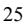

{0}------------------------------------------------

# **UNITED STATES SECURITIES AND EXCHANGE COMMISSION Washington, D.C. 20549**

☒ **ANNUAL REPORT PURSUANT TO SECTION 13 OR 15(d) OF THE SECURITIES EXCHANGE ACT OF 1934**

**For the fiscal year ended December 31, 2022 For the transition period from to** 

**OR** ☐ **TRANSITION REPORT PURSUANT TO SECTION 13 OR 15(d) OF THE SECURITIES EXCHANGE ACT OF 1934**

**Commission File Number 001-5507**

# Tellurian Inc.

**(Exact name of registrant as specified in its charter)**

(State or other jurisdiction of incorporation or organization)

**Delaware 06-0842255** (I.R.S. Employer Identification No.)

**1201 Louisiana Street, Suite 3100, Houston, TX 77002** (Address of principal executive offices) (Zip Code)

**(832) 962-4000**

(Registrant's telephone number, including area code)

|                                                                                                                              | Securities registered pursuant to Section 12(b) of the Act:      |                                           |
|------------------------------------------------------------------------------------------------------------------------------|------------------------------------------------------------------|-------------------------------------------|
| Title of each class                                                                                                          | Trading symbol                                                   | Name of each exchange on which registered |
| Common stock, par value \$0.01 per share                                                                                     | TELL                                                             | NYSE American LLC                         |
| 8.25% Senior Notes due 2028                                                                                                  | TELZ                                                             | NYSE American LLC                         |
|                                                                                                                              | Securities registered pursuant to Section 12(g) of the Act: None |                                           |
| Indicate by check mark if the registrant is a well-known seasoned issuer, as defined in Rule 405 of the Securities Act.      |                                                                  |                                           |
| Yes ☒ No ☐                                                                                                                   |                                                                  |                                           |
| Indicate by check mark if the registrant is not required to file reports pursuant to Section 13 or Section 15(d) of the Act. |                                                                  |                                           |
| Yes ☐ No ☒                                                                                                                   |                                                                  |                                           |
|                                                                                                                              |                                                                  |                                           |

Indicate by check mark whether the registrant (1) has filed all reports required to be filed by Section 13 or 15(d) of the Securities Exchange Act of 1934 during the preceding 12 months (or for such shorter period that the registrant was required to file such reports), and (2) has been subject to such filing requirements for the past 90 days. Yes ☒ No ☐

Indicate by check mark whether the registrant has submitted electronically every Interactive Data File required to be submitted pursuant to Rule 405 of Regulation S-T (§ 232.405 of this chapter) during the preceding 12 months (or for such shorter period that the registrant was required to submit such files).

{1}------------------------------------------------

Yes ☒ No ☐

|                                                                                                                                                                 | Indicate by check mark whether the registrant is a large accelerated filer, an accelerated filer, a non-accelerated filer, a smaller reporting company or an emerging growth company. See |                           |   |  |
|-----------------------------------------------------------------------------------------------------------------------------------------------------------------|-------------------------------------------------------------------------------------------------------------------------------------------------------------------------------------------|---------------------------|---|--|
| the definitions of "large accelerated filer," "accelerated filer," "smaller reporting company" and "emerging growth company" in Rule 12b-2 of the Exchange Act. |                                                                                                                                                                                           |                           |   |  |
| Large accelerated filer                                                                                                                                         | ☒                                                                                                                                                                                         | Accelerated filer         | ☐ |  |
| Non-accelerated filer                                                                                                                                           | ☐                                                                                                                                                                                         | Smaller reporting company | ☐ |  |

|                                                                                                                                                                               | Emerging growth company | ☐ |
|-------------------------------------------------------------------------------------------------------------------------------------------------------------------------------|-------------------------|---|
| If an emerging growth company, indicate by check mark if the registrant has elected not to use the extended transition period for complying with any new or revised financial |                         |   |
| accounting standards provided pursuant to Section 13(a) of the Exchange Act. ¨                                                                                                |                         |   |

Indicate by check mark whether the registrant has filed a report on and attestation to its management's assessment of the effectiveness of its internal control over financial reporting under Section 404(b) of the Sarbanes-Oxley Act (15 U.S.C. 7262(b)) by the registered public accounting firm that prepared or issued its audit report. ☒

Indicate by check mark whether the registrant is a shell company (as defined in Rule 12b-2 of the Exchange Act).

Yes ☐ No ☒

The aggregate market value of the voting and non-voting common equity held by non-affiliates of the registrant, as of June 30, 2022, the last business day of the registrant's most recently completed second fiscal quarter, was approximately \$1,518,690 thousand, based on the per share closing sale price of \$2.98 on that date. Solely for purposes of this disclosure, shares of common stock held by executive officers and directors of the registrant as of such date have been excluded because such persons may be deemed to be affiliates. This determination of executive officers and directors as affiliates is not necessarily a conclusive determination for any other purpose.

563,518,417 shares of common stock were issued and outstanding as of February 7, 2023.

# **DOCUMENTS INCORPORATED BY REFERENCE**

Portions of the definitive proxy statement related to the 2023 annual meeting of stockholders, to be filed within 120 days after December 31, 2022, are incorporated by reference in Part III of this annual report on Form 10-K.

{2}------------------------------------------------

# **Tellurian Inc.**

# **For the Fiscal Year Ended December 31, 2022**

# **TABLE OF CONTENTS**

|                                                                                                                           | Page |
|---------------------------------------------------------------------------------------------------------------------------|------|
| Part I                                                                                                                    |      |
| Item 1 and 2. Our Business and Properties                                                                                 | 1    |
| Item 1A. Risk Factors                                                                                                     | 14   |
| Item 1B. Unresolved Staff Comments                                                                                        | 28   |
| Item 3. Legal Proceedings                                                                                                 | 28   |
| Item 4. Mine Safety Disclosures                                                                                           | 28   |
| Part II                                                                                                                   |      |
| Item 5. Market for the Registrant's Common Equity, Related Stockholder Matters, and Issuer Purchases of Equity Securities | 29   |
| Item 6. [Reserved]                                                                                                        | 30   |
| Item 7. Management's Discussion and Analysis of Financial Condition and Results of Operations                             | 30   |
| Item 7A. Quantitative and Qualitative Disclosures About Market Risk                                                       | 36   |
| Item 8. Financial Statements and Supplementary Data                                                                       | 37   |
| Item 9. Changes in and Disagreements with Accountants on Accounting and Financial Disclosure                              | 68   |
| Item 9A. Controls and Procedures                                                                                          | 68   |
| Item 9B. Other Information                                                                                                | 70   |
| Item 9C. Disclosure Regarding Foreign Jurisdictions that Prevents Inspections                                             | 70   |
| Part III                                                                                                                  |      |
| Item 10. Directors, Executive Officers and Corporate Governance                                                           | 71   |
| Item 11. Executive Compensation                                                                                           | 71   |
| Item 12. Security Ownership of Certain Beneficial Owners and Management and Related Stockholder Matters                   | 71   |
| Item 13. Certain Relationships and Related Transactions, and Director Independence                                        | 71   |
| Item 14. Principal Accounting Fees and Services                                                                           | 71   |
| Part IV                                                                                                                   |      |
| Item 15. Exhibits, Financial Statement Schedules                                                                          | 72   |
| Item 16. Form 10-K Summary                                                                                                | 77   |
| Signatures                                                                                                                | 78   |
|                                                                                                                           |      |

{3}------------------------------------------------

# **Cautionary Information About Forward-Looking Statements**

The information in this report includes "forward-looking statements" within the meaning of Section 27A of the Securities Act of 1933, as amended (the "Securities Act"), and Section 21E of the Securities Exchange Act of 1934, as amended (the "Exchange Act"). All statements, other than statements of historical facts, that address activity, events, or developments with respect to our financial condition, results of operations, or economic performance that we expect, believe or anticipate will or may occur in the future, or that address plans and objectives of management for future operations, are forward-looking statements. The words "anticipate," "assume," "believe," "budget," "contemplate," "continue," "could," "estimate," "expect," "forecast," "initial," "intend," "likely," "may," "plan," "possible," "potential," "predict," "project," "proposed," "should," "will," "would" and similar terms, phrases, and expressions are intended to identify forward-looking statements. These forward-looking statements relate to, among other things:

- our businesses and prospects and our overall strategy;
- planned or estimated capital expenditures;
- availability of liquidity and capital resources;
- our ability to obtain financing as needed and the terms of financing transactions, including for the Driftwood Project;
- revenues and expenses;
- progress in developing our projects and the timing of that progress;
- attributes and future values of the Company's projects or other interests, operations or rights; and
- government regulations, including our ability to obtain, and the timing of, necessary governmental permits and approvals.

Our forward-looking statements are based on assumptions and analyses made by us in light of our experience and our perception of historical trends, current conditions, expected future developments and other factors that we believe are appropriate under the circumstances. These statements are subject to a number of known and unknown risks and uncertainties, which may cause our actual results and performance to be materially different from any future results or performance expressed or implied by the forward-looking statements. Factors that could cause actual results and performance to differ materially from any future results or performance expressed or implied by the forward-looking statements include, but are not limited to, the following:

- the uncertain nature of demand for and price of natural gas and LNG;
- risks related to shortages of LNG vessels worldwide;
- technological innovation which may render our anticipated competitive advantage obsolete;
- risks related to a terrorist or military incident involving an LNG carrier;
- changes in legislation and regulations relating to the LNG industry, including environmental laws and regulations that impose significant compliance costs and liabilities;
- governmental interventions in the LNG industry, including increases in barriers to international trade;
- uncertainties regarding our ability to maintain sufficient liquidity and attract sufficient capital resources to implement our projects;
- our limited operating history;
- our ability to attract and retain key personnel;
- risks related to doing business in, and having counterparties in, foreign countries;
- our reliance on the skill and expertise of third-party service providers;
- the ability of our vendors, customers and other counterparties to meet their contractual obligations;
- risks and uncertainties inherent in management estimates of future operating results and cash flows;
- our ability to maintain compliance with our debt arrangements;
- changes in competitive factors, including the development or expansion of LNG, pipeline and other projects that are competitive with ours;
- development risks, operational hazards and regulatory approvals;

{4}------------------------------------------------

- our ability to enter into and consummate planned financing and other transactions;
- risks related to pandemics or disease outbreaks;
- risks of potential impairment charges and reductions in our reserves; and
- risks and uncertainties associated with litigation matters.

The forward-looking statements in this report speak as of the date hereof. Although we may from time to time voluntarily update our prior forward-looking statements, we disclaim any commitment to do so except as required by securities laws.

{5}------------------------------------------------

# **DEFINITIONS**

All defined terms under Rule 4-10(a) of Regulation S-X shall have their statutorily prescribed meanings when used in this report. As used in this document, the terms listed below have the following meanings:

| ASC               | Accounting Standards Codification                                                                                                                                            |
|-------------------|------------------------------------------------------------------------------------------------------------------------------------------------------------------------------|
| Bcf               | Billion cubic feet of natural gas                                                                                                                                            |
| Bcfe              | Billion cubic feet of natural gas equivalent volumes using a ratio of 6 Mcf to 1 barrel of liquid                                                                            |
| Condensate        | Hydrocarbons that exist in a gaseous phase at original reservoir temperature and pressure, but when produced, are in the liquid phase at surface pressure and temperature |
| DD&A              | Depreciation, depletion, and amortization                                                                                                                                    |
| DFC               | Deferred financing costs                                                                                                                                                     |
| DOE/FECM          | U.S. Department of Energy, Office of Fossil Energy and Carbon Management                                                                                                     |
| EPC               | Engineering, procurement, and construction                                                                                                                                   |
| FASB              | Financial Accounting Standards Board                                                                                                                                         |
| FEED              | Front-End Engineering and Design                                                                                                                                             |
| FERC              | U.S. Federal Energy Regulatory Commission                                                                                                                                    |
| FID               | Final investment decision as it pertains to the Driftwood Project                                                                                                            |
| FTA countries     | Countries with which the U.S. has a free trade agreement providing for national treatment for trade in natural gas                                                           |
| GAAP              | Generally accepted accounting principles in the U.S.                                                                                                                         |
| Henry Hub         | A common market pricing point for natural gas in the United States, located in Louisiana.                                                                                    |
| LNG               | Liquefied natural gas                                                                                                                                                        |
| LSTK              | Lump Sum Turnkey                                                                                                                                                             |
| Mcf               | Thousand cubic feet of natural gas                                                                                                                                           |
| MMBtu             | Million British thermal unit                                                                                                                                                 |
| MMcf              | Million cubic feet of natural gas                                                                                                                                            |
| MMcf/d            | MMcf per day                                                                                                                                                                 |
| MMcfe             | Million cubic feet of natural gas equivalent volumes using a ratio of 6 Mcf to 1 barrel of liquid                                                                            |
| Mtpa              | Million tonnes per annum                                                                                                                                                     |
| NGA               | Natural Gas Act of 1938, as amended                                                                                                                                          |
| Non-FTA countries | Countries with which the U.S. does not have a free trade agreement providing for national treatment for trade in natural gas and with which trade is permitted            |
| NYMEX             | New York Mercantile Exchange                                                                                                                                                 |
| NYSE American     | NYSE American LLC                                                                                                                                                            |
| Oil               | Crude oil and condensate                                                                                                                                                     |
| Phase 1           | Plants one and two of the Driftwood terminal                                                                                                                                 |
| PUD               | Proved undeveloped reserves                                                                                                                                                  |
| SEC               | U.S. Securities and Exchange Commission                                                                                                                                      |
| SPA               | Sale and purchase agreement                                                                                                                                                  |
| Train             | An industrial facility comprised of a series of refrigerant compressor loops used to cool natural gas into LNG                                                               |
| U.K.              | United Kingdom                                                                                                                                                               |
| U.S.              | United States                                                                                                                                                                |
| USACE             | U.S. Army Corps of Engineers                                                                                                                                                 |

With respect to the information relating to our ownership in wells or acreage, "net" oil and gas wells or acreage is determined by multiplying gross wells or acreage by our working interest therein. Unless otherwise specified, all references to wells and acres are gross.

{6}------------------------------------------------

# **PART I**

#### **ITEM 1 AND 2. OUR BUSINESS AND PROPERTIES**

#### **Overview**

Tellurian Inc. ("Tellurian," "we," "us," "our," or the "Company"), a Delaware corporation, is a Houston-based company that is developing and plans to own and operate a portfolio of natural gas, LNG marketing, and infrastructure assets that includes an LNG terminal facility (the "Driftwood terminal"), an associated pipeline (the "Driftwood pipeline"), other related pipelines, and upstream natural gas assets (collectively referred to as the "Business"). The Driftwood terminal and the Driftwood pipeline are collectively referred to as the "Driftwood Project." As of December 31, 2022, our upstream natural gas assets consist of 27,689 net acres and interests in 143 producing wells located in the Haynesville Shale trend of northern Louisiana. Our Business may be developed in phases.

As part of our execution strategy, which includes increasing our asset base, we will consider various commercial arrangements with third parties across the natural gas value chain. We are also pursuing activities such as direct sales of LNG to global counterparties, trading of LNG, the acquisition of additional upstream acreage and drilling of new wells on our existing or newly acquired upstream acreage. We remain focused on the financing and construction of the Driftwood Project and related pipelines while managing our upstream assets.

We manage and report our operations in three reportable segments. The Upstream segment is organized and operates to produce, gather, and deliver natural gas and to acquire and develop natural gas assets. The Midstream segment is organized to develop, construct and operate LNG terminals and pipelines. The Marketing & Trading segment is organized and operates to purchase and sell natural gas produced primarily by the Upstream segment, market the Driftwood terminal's LNG production capacity and trade LNG.

We continue to evaluate the scope and other aspects of our Business in light of the evolving economic environment, dynamics of the global political landscape, needs of potential counterparties and other factors. How we execute our Business will be based on a variety of factors, including the results of our continuing analysis, changing business conditions and market feedback.

#### **Overview of Significant Events**

#### *Limited Notice to Proceed*

On March 24, 2022, the Company issued a limited notice to proceed to Bechtel Energy Inc., formerly known as Bechtel Oil, Gas and Chemicals, Inc. ("Bechtel"), under our LSTK EPC agreement for Phase 1 of the Driftwood terminal dated as of November 10, 2017 (the "Phase 1 EPC Agreement"). The Company commenced construction of Phase 1 of the Driftwood terminal on April 4, 2022.

#### *Senior Secured Convertible Notes due 2025*

On June 3, 2022, we issued and sold \$500.0 million aggregate principal amount of 6.00% Senior Secured Convertible Notes due May 1, 2025 (the "Convertible Notes"). Net proceeds from the Convertible Notes were approximately \$488.7 million after deducting fees and expenses.

#### *Upstream Asset Acquisition*

On August 18, 2022, the Company completed the acquisition of certain natural gas assets in the Haynesville Shale basin. The purchase price of \$125.0 million was subject to customary adjustments totaling approximately \$8.8 million, for an adjusted purchase price of approximately \$133.8 million.

#### *Environmental, Social, Governance Practices*

During the year ended December 31, 2021, the Company entered into a pledge with the National Forest Foundation on a five-year plan for reforestation and other forest management projects totaling \$25.0 million across the United States. In 2022, the Company supported the planting of more than one million trees on 1,441 acres across the United States and bolstered nursery capacity by one million seedlings.

# *Upstream Natural Gas Drilling Activities*

During the year ended December 31, 2022, we put in production 13 operated Haynesville wells and participated in four non-operated Haynesville wells that were put in production.

{7}------------------------------------------------

# **Natural Gas Properties**

#### *Reserves*

Our natural gas assets consist of 27,689 net acres and interests in 143 producing wells located in the Haynesville Shale trend of north Louisiana. For the year ended December 31, 2022, our average net production was approximately 129.7 MMcf/d. All of our proved reserves were associated with those properties as of December 31, 2022. Proved reserves are the estimated quantities of natural gas and condensate which geological and engineering data demonstrate with reasonable certainty to be recoverable in future years from known reservoirs under existing economic and operating conditions (i.e., costs as of the date the estimate is made). Proved reserves are categorized as either developed or undeveloped.

Our reserves as of December 31, 2022 were estimated by Netherland, Sewell & Associates, Inc. ("NSAI"), an independent petroleum engineering firm, and are set forth in the following table. Per SEC rules, NSAI based its estimates on the 12-month unweighted arithmetic average of the first-day-of-the-month price of natural gas for each month from January through December 2022. Prices include consideration of changes in existing prices provided for under contractual arrangements, but not on escalations or reductions based upon future conditions. The price used for the reserve estimates as of December 31, 2022 was \$6.36 per MMBtu of natural gas, adjusted for energy content, transportation fees and market differentials.

The following table shows our proved reserves as of December 31, 2022:

|                                            | Natural Gas (MMcf) |
|--------------------------------------------|-----------------------|
| Proved reserves (as of December 31, 2022): |                       |
| Developed                                  | 218,382               |
| Undeveloped                                | 226,511               |
| Total proved reserves                      | 444,893               |

As of December 31, 2022, the standardized measure of discounted future net cash flow from our proved reserves (the "standardized measure") was approximately \$1,036.3 million.

During the year ended December 31, 2022, the Company spent approximately \$140.0 million on the conversion of our proved undeveloped reserves to proved developed reserves. The Company converted approximately 138 Bcfe of proved undeveloped to proved developed reserves, which represents a conversion rate of approximately 43%.

Refer to Supplemental Disclosures About Natural Gas Producing Activities, starting on page [63,](#page-67-0) for additional details.

#### *Controls Over Reserve Report Preparation, Technical Qualifications and Technologies Used*

Our December 31, 2022 reserve report was prepared by NSAI in accordance with guidelines established by the SEC. Reserve definitions comply with the definitions provided by Regulation S‑X of the SEC. NSAI prepared the reserve report based upon a review of property interests being appraised, production from such properties, current costs of operation and development, current prices for production, agreements relating to current and future operations and sale of production, geoscience and engineering data, and other information we provided to them. This information was reviewed by knowledgeable members of our Company for accuracy and completeness prior to submission to NSAI. A letter that identifies the professional qualifications of the individual at NSAI who was responsible for overseeing the preparation of our reserve estimates as of December 31, 2022, has been filed as an addendum to Exhibit 99.1 to this report and is incorporated by reference herein.

Internally, a Senior Vice President is responsible for overseeing our reserves process. Our Senior Vice President has over 20 years of experience in the oil and natural gas industry, with the majority of that time in reservoir engineering and asset management. She is a graduate of Virginia Polytechnic Institute and State University with dual degrees in Chemical Engineering and French, and a graduate of the University of Houston with a Masters of Business Administration degree. During her career, she has had multiple responsibilities in technical and leadership roles, including reservoir engineering and reserves management, production engineering, planning, and asset management for multiple U.S. onshore and international projects. She is also a licensed Professional Engineer in the State of Texas.

#### *Production*

For the years ended December 31, 2022, 2021 and 2020, we produced 47,322 MMcf, 14,302 MMcf and 16,893 MMcf of natural gas at an average sales price of \$5.78, \$3.52 and \$1.74 per Mcf, respectively. Natural gas production and operating costs for the periods ended December 31, 2022, 2021 and 2020 were \$0.37, \$0.48 and \$0.28 per Mcfe, respectively.

{8}------------------------------------------------

# *Drilling Activity*

The information in the table below should not be considered indicative of future performance, nor should it be assumed that there is necessarily any correlation among the number of productive wells drilled, quantities of reserves found, or economic value. A dry well is an exploratory, development, or extension well that proves to be incapable of producing either oil or gas in sufficient quantities to justify completion as an oil or gas well. A productive well is an exploratory, development, or extension well that is not a dry well. Completion refers to installation of permanent equipment for production of oil or gas, or, in the case of a dry well, to reporting to the appropriate authority that the well has been abandoned. The number of wells drilled refers to the number of wells completed at any time during the fiscal year, regardless of when drilling was initiated. The table below shows the number of net productive and dry development operated and non-operated wells drilled during the past three years.

|                    |      | For the Year Ended December 31, |      |  |
|--------------------|------|---------------------------------|------|--|
|                    | 2022 | 2021                            | 2020 |  |
| Development wells: |      |                                 |      |  |
| Productive         | 13.5 | 6.9                             |      |  |
| Dry                | —    | —                               |      |  |
|                    |      |                                 |      |  |

We had no exploratory wells drilled during any of the periods presented.

# *Wells*

As of December 31, 2022, we owned working interests in 114 gross (45.6 net) productive natural gas wells. As of December 31, 2022, there were 22 gross (9.7 net) in process

# wells. *Acreage*

We have 7,982 gross (7,063 net) developed leasehold acres that are held by production. Additionally, we hold 21,650 gross (20,626 net) undeveloped leasehold acres. Of the total gross and net undeveloped acreage, 16,091 gross (15,681 net) acres are not held by production, of which 1,441 gross and net acres are set to expire in the fourth quarter of 2023 unless production is established within the spacing units covering the acreage prior to the expiration dates or unless such leasehold rights are extended or renewed.

# *Volume Commitments*

For the year ended December 31, 2022, we were not subject to any material volume delivery commitments. The Company is expected to be subject to gas gathering agreements in the near-term with two third-party companies that are constructing gathering systems in the Haynesville Shale. Upon the in-service date of these gathering systems, the Company will have dedicated gathering capacity for a portion of the Upstream segment's future natural gas production. The contracts will require the Company to make deficiency payments to the extent the Company does not meet the minimum volume commitments per the terms of each contract. The Company expects to fulfill this commitment with existing reserves. The Company will monitor current production, anticipated future production, and future development plans to meet its future commitments.

#### *Gathering, Processing and Transportation*

As part of our acquisitions of natural gas properties, we also acquired certain gathering systems that deliver the natural gas we produce into third-party gathering systems. We believe that these systems and other available midstream facilities and services in the Haynesville Shale trend are adequate for our current operations and near-term growth.

#### **Government Regulations**

Our operations are and will be subject to extensive federal, state and local statutes, rules, regulations, and laws that include, but are not limited to, the NGA, the Energy Policy Act of 2005 ("EPAct 2005"), the Oil Pollution Act, the National Environmental Policy Act ("NEPA"), the Clean Air Act (the "CAA"), the Clean Water Act (the "CWA"), the Resource Conservation and Recovery Act ("RCRA"), the Pipeline Safety Improvement Act of 2002 (the "PSIA"), and the Coastal Zone Management Act (the "CZMA"), as amended from time to time. These statutes cover areas related to the authorization, construction and operation of LNG facilities, natural gas pipelines and natural gas producing properties, including discharges and releases to the air, land and water, and the handling, generation, storage and disposal of hazardous materials and solid and hazardous wastes. These laws are administered and enforced by governmental agencies including but not limited to FERC, the U.S. Environmental Protection Agency (the "EPA"), DOE/FECM, the U.S. Department of Transportation ("DOT"), the Pipeline and Hazardous Materials Safety Administration ("PHMSA"), the Louisiana Department of Environmental Quality and the Louisiana Department of Natural Resources. Additionally, numerous other governmental and regulatory permits and

{9}------------------------------------------------

approvals have been and will be required to build and operate our Business, including, with respect to the construction and operation of the Driftwood Project, consultations and approvals by the Advisory Council on Historic Preservation, USACE, U.S. Department of Commerce, National Marine Fisheries Service, U.S. Department of the Interior, U.S. Fish and Wildlife Service, and U.S. Department of Homeland Security. For example, throughout the life of the Driftwood Project, we will be subject to regular reporting requirements to FERC, PHMSA and other federal and state regulatory agencies regarding the operation and maintenance of our facilities.

Failure to comply with applicable federal, state, and local laws, rules, and regulations could result in substantial administrative, civil and/or criminal penalties and/or failure to secure and retain necessary authorizations. Criminal and regulatory enforcement agencies such as the U.S. Department of Justice have conducted investigations and have imposed criminal and civil penalties on other companies within our industry.

We have received regulatory permits and approvals in connection with the Driftwood terminal, Driftwood pipeline, and related pipelines, including the following:

{10}------------------------------------------------

| Agency                                                                                    | Permit / Consultation                                                                                                                                   | Approval Date (Anticipated)                                                                                                                                                                                                             |
|-------------------------------------------------------------------------------------------|---------------------------------------------------------------------------------------------------------------------------------------------------------|-----------------------------------------------------------------------------------------------------------------------------------------------------------------------------------------------------------------------------------------|
| FERC                                                                                      | Section 3 and Section 7 Application - NGA Related Pipeline - Section Related Pipeline - Section 7 Application                                     | April 18, 2019 March 2023                                                                                                                                                                                                            |
| DOE                                                                                       | Section 3 Application - NGA                                                                                                                             | FTA countries: February 28, 2017 (3968); amended December 6, 2018 (3968-A); amended December 18, 2020 (4641) Non-FTA countries: May 2, 2019 (4373); amended December 10, 2020 (4373-A); amended December 18, 2020 (4641) |
| USACE                                                                                     | Section 404 Section 10 (Rivers and Harbors Act) Related Pipeline - Section 404 Related Pipeline - Section 10                                   | May 3, 2019 May 3, 2019 January 31, 2023 January 31, 2023                                                                                                                                                                      |
| United States Coast Guard                                                                 | Letter of Intent and Preliminary Water Suitability Assessment Follow-On Water Suitability Assessment and Letter of Recommendation                 | June 21, 2016 April 25, 2017                                                                                                                                                                                                         |
| United States Fish and Wildlife Service                                                   | Section 7 of Endangered Species Act Consultation Related Pipeline - Section 7 of Endangered Species Act Consultation                                 | September 19, 2017; February 7, 2019 August 11, 2021; October 27, 2021; April 26, 2022; June 30, 2022                                                                                                                                |
| National Oceanic and Atmospheric Administration / National Marine Fisheries Service | Section 7 of the Endangered Species Act Consultation Magnuson-Stevens Fishery Management and Conservation Act Essential Fish Habitat Consultation | February 14, 2018 October 3, 2017                                                                                                                                                                                                    |
|                                                                                           | Marine Mammal Protection Act Consultation                                                                                                               | October 3, 2017                                                                                                                                                                                                                         |
| State Louisiana Department of Natural Resources- Coastal Management Division        | Coastal Use Permit and Coastal Zone Consistency Permit, Joint Permit with USACE                                                                      | May 21, 2020 (extension)                                                                                                                                                                                                                |
|                                                                                           | Air Permit for LNG Terminal                                                                                                                             | June 2, 2021 (extension)                                                                                                                                                                                                                |
| Louisiana Department of Environmental Quality - Air Quality Division                   | Gillis Compressor Station                                                                                                                               | July 6, 2022 (renewal)                                                                                                                                                                                                                  |
|                                                                                           | Related Pipeline - Indian Bayou Compressor Station                                                                                                      | March 2023                                                                                                                                                                                                                              |
| Louisiana State Historic Preservation Office                                              | Section 106 Consultation                                                                                                                                | Concurrence received on June 29, 2016 Concurrence received on November 22, 2016 Concurrence received on April 13, 2017 Concurrence received on March 1, 2019 Concurrence received on July 28, 2021                          |
|                                                                                           | Related Pipeline - Section 106 Consultation                                                                                                             | Concurrence received on November 15, 2021 Concurrence received on March 16, 2022 Concurrence received on July 26, 2022                                                                                                            |

# *Federal Energy Regulatory Commission*

The design, construction and operation of natural gas liquefaction facilities and pipelines, the export of LNG and the transportation of natural gas are highly regulated activities. In order to site, construct and operate the Driftwood Project, we obtained authorizations from FERC under Section 3 and Section 7 of the NGA as well as several other material governmental and regulatory approvals and permits as detailed in the table above. Construction of the Driftwood terminal has commenced. In order to gain regulatory certainty with respect to certain potential commercial transactions, on November 13, 2020, the Company filed a Petition with FERC requesting, among other things, a prospective limited waiver of FERC's buy/sell

{11}------------------------------------------------

prohibition as well as any other prospective waivers necessary to enable the Company to purchase natural gas from potentially affiliated upstream suppliers that may be resold to a different affiliate under a long-term contract for export as LNG in foreign commerce. On January 19, 2021, FERC issued an order granting a prospective limited waiver of the prohibition on buy/sell arrangements for future proposed transactions in which the Company enters into: (1) an agreement to purchase natural gas from a potentially affiliated supplier; and (2) an agreement to sell LNG to affiliates in foreign commerce.

EPAct 2005 amended Section 3 of the NGA to establish or clarify FERC's exclusive authority to approve or deny an application for the siting, construction, expansion or operation of LNG terminals, although except as specifically provided in EPAct 2005, nothing in the statute is intended to affect otherwise applicable law related to any other federal agency's authorities or responsibilities related to LNG terminals.

In 2002, FERC concluded that it would apply light-handed regulation to the rates, terms and conditions agreed to by parties for LNG terminalling services, such that LNG terminal owners would not be required to provide open-access service at non-discriminatory rates or maintain a tariff or rate schedule on file with FERC, as distinguished from the requirements applied to FERC-regulated interstate natural gas pipelines. Although EPAct 2005 codified FERC's policy, those provisions expired on January 1, 2015. Nonetheless, we see no indication that FERC intends to modify its longstanding policy of light-handed regulation of LNG terminal operations.

A certificate of public convenience and necessity from FERC is required for the construction and operation of facilities used in interstate natural gas transportation, including pipeline facilities, in addition to other required governmental and regulatory approvals. In this regard, in April 2019, the Company obtained a certificate of public convenience and necessity to construct and operate the Driftwood pipeline. On June 17, 2021, the Company filed an application pursuant to Section 7(c) of the NGA in FERC Docket No. CP21-465- 000, which, as amended, requests that FERC grant a certificate of public convenience and necessity and related approvals to construct, own and operate dual 42-inch diameter natural gas pipelines, an approximately 211,200 horsepower compressor station and appurtenant facilities to be located in Beauregard and Calcasieu Parishes, Louisiana, which would provide a maximum seasonal capacity of 5.7 Bcf of natural gas per day. FERC issued the final environmental impact statement for the project on September 15, 2022. The final order on the application is still pending.

FERC's jurisdiction under the NGA generally extends to the transportation of natural gas in interstate commerce, to the sale in interstate commerce of natural gas for resale for ultimate consumption for domestic, commercial, industrial or any other use and to natural gas companies engaged in such transportation or sale. FERC's jurisdiction does not extend to the production, gathering, local distribution or export of natural gas.

Specifically, FERC's authority to regulate interstate natural gas pipelines includes:

- rates and charges for natural gas transportation and related services;
- the certification and construction of new facilities;
- the extension and abandonment of services and facilities;
- the maintenance of accounts and records;
- the acquisition and disposition of facilities;
- the initiation and discontinuation of services; and
- various other matters.

In addition, FERC has the authority to approve, and if necessary set, "just and reasonable rates" for the transportation or sale of natural gas in interstate commerce. Relatedly, under the NGA, our proposed pipelines will not be permitted to unduly discriminate or grant undue preference as to rates or the terms and conditions of service to any shipper, including our own affiliates.

EPAct 2005 amended the NGA to make it unlawful for any entity, including otherwise non-jurisdictional producers, to use any deceptive or manipulative device or contrivance in connection with the purchase or sale of natural gas or the purchase or sale of transportation services subject to regulation by FERC, in contravention of rules prescribed by FERC. The anti-manipulation rule does not apply to activities that relate only to intrastate or other non-jurisdictional sales, gathering or production, but does apply to activities of otherwise non-jurisdictional entities to the extent the activities are conducted "in connection with" natural gas sales, purchases or transportation subject to FERC jurisdiction. EPAct 2005 also gives FERC authority to impose civil penalties for violations of the NGA or Natural Gas Policy Act of more than \$1 million per day per violation.

On February 18, 2022, FERC issued two policy statements: (1) an updated policy statement describing how it will determine whether a new interstate natural gas transportation project is required by the public convenience and necessity under section 7 of the NGA; and (2) an interim policy statement explaining how FERC will assess the impacts of natural gas

{12}------------------------------------------------

infrastructure projects on climate change in its review under the National Environmental Policy Act and the NGA. On March 24, 2022, FERC reissued the policy statements as drafts and requested additional comments. FERC is not applying the draft policy statements to new or pending applications until FERC issues the final policy statements. It is not clear when the final policy statements will be issued.

Transportation of the natural gas we produce, and the prices we pay for such transportation, will be significantly affected by the foregoing laws and regulations.

#### *U.S. Department of Energy, Of ice of Fossil Energy Export Licenses*

Under the NGA, exports of natural gas to FTA countries are "deemed to be consistent with the public interest," and authorization to export LNG to FTA countries shall be granted by the DOE/FECM "without modification or delay." FTA countries currently capable of importing LNG include but are not limited to Canada, Chile, Colombia, Jordan, Mexico, Singapore, South Korea and the Dominican Republic. Exports of natural gas to Non-FTA countries are authorized unless the DOE/FECM "finds that the proposed exportation" "will not be consistent with the public interest." We have authorization from the DOE/FECM to export LNG in a volume up to the equivalent of 1,415.3 Bcf per year of natural gas to FTA countries for a term of 30 years and to Non-FTA countries for a term through December 31, 2050.

#### *Federal and State Regulation of Pipeline and Hazardous Materials Safety*

The Natural Gas Pipeline Safety Act of 1968 (the "NGPSA") authorizes DOT to regulate pipeline transportation of natural (flammable, toxic, or corrosive) gas and other gases, as well as the transportation and storage of LNG. Amendments to the NGPSA include the Pipeline Safety Act of 1979, which addresses liquids pipelines, and the PSIA, which governs the areas of testing, education, training, and communication.

PHMSA administers pipeline safety regulations for jurisdictional gas gathering, transmission, and distribution systems under minimum federal safety standards. PHMSA also establishes and enforces safety regulations for onshore LNG facilities, which are defined as pipeline facilities used for the transportation or storage of LNG subject to such safety standards. Those regulations address requirements for siting, design, construction, equipment, operations, personnel qualification and training, fire protection, and security of LNG facilities. The Driftwood terminal will be subject to such PHMSA regulations.

The Driftwood pipeline and other related pipelines will also be subject to regulation by PHMSA, including those under the PSIA. The PHMSA Office of Pipeline Safety administers the PSIA, which requires pipeline companies to perform extensive integrity tests on natural gas transportation pipelines that exist in high population density areas designated as "high consequence areas." Pipeline companies are required to perform the integrity tests on a seven-year cycle. The risk ratings are based on numerous factors, including the population density in the geographic regions served by a particular pipeline, as well as the age and condition of the pipeline and its protective coating. Testing consists of hydrostatic testing, internal electronic testing, or direct assessment of the piping. In addition to the pipeline integrity tests, pipeline companies must implement a qualification program to make certain that employees are properly trained. Pipeline operators also must develop integrity management programs for natural gas transportation pipelines, which requires pipeline operators to perform ongoing assessments of pipeline integrity; identify and characterize applicable threats to pipeline segments that could impact a high consequence area; improve data collection, integration and analysis; repair and remediate the pipeline, as necessary; and implement preventive and mitigative actions.

On December 27, 2020, the Protecting our Infrastructure of Pipelines and Enhancing Safety Act (PIPES Act) of 2020 was signed into law as part of the Consolidated Appropriations Act of 2021. The legislation reauthorizes the PHMSA pipeline safety program through fiscal year 2023 and provides for advances to improve pipeline safety. The legislation includes a directive to PHMSA to update its current regulations for large-scale LNG facilities.

On January 11, 2021, PHMSA published a final rule in the Federal Register amending the Federal Pipeline Safety Regulations to reduce regulatory burdens and offer greater flexibility with respect to the construction, maintenance, and operation of gas transmission, distribution, and gathering pipeline systems, including updates to corrosion control requirements and test requirements for pressure vessels. Mandatory compliance with this rule started on October 1, 2021.

On November 15, 2021, PHMSA published a final rule in the Federal Register revising the Federal Pipeline Safety Regulations to improve the safety of onshore gas gathering pipelines. The rule extends reporting requirements to all gas gathering operators and applies a set of minimum safety requirements to certain gas gathering pipelines with large diameters and high operating pressures. This rule went into effect on May 16, 2022.

On April 8, 2022, PHMSA published a final rule in the Federal Register revising the Federal Pipeline Safety Regulations applicable to most newly constructed and entirely replaced onshore gas transmission, certain gas gathering, and hazardous liquid pipelines with diameters of six inches or greater. In the revised regulations, PHMSA establishes requirements for operators of these lines to install rupture-mitigation valves or alternative equivalent technologies and establishes minimum

{13}------------------------------------------------

performance standards for those valves and requirements for rupture-mitigation valve spacing, maintenance and inspection, and risk analysis, among other actions. The final rule went into effect on October 5, 2022.

On August 24, 2022, as subsequently corrected on October 25, 2022, PHMSA published a final rule in the Federal Register revising the Federal Pipeline Safety Regulations relating to improved safety of onshore gas transmission pipelines. The amendments in this final rule clarify certain integrity management provisions, codify a management of change process, update and bolster gas transmission pipeline corrosion control requirements, require operators to inspect pipelines following extreme weather events, strengthen integrity management assessment requirements, adjust the repair criteria for high-consequence areas, create new repair criteria for non-high consequence areas, and revise or create specific definitions related to the amendments. The rule goes into effect on May 24, 2023.

The Driftwood pipeline and other related pipelines will be subject to regulation by PHMSA, which will involve capital and operating costs for compliance-related equipment and operations. We have no reason to believe that these compliance costs will be material to our financial performance, but the significance of such costs will depend on future events and our ability to achieve and maintain compliance throughout the life of the Driftwood Project or related pipelines.

# *Natural Gas Pipeline Safety Act of 1968*

The State of Louisiana also administers certain federal pipeline safety standards under the NGPSA, which requires certain pipelines to comply with safety standards in constructing and operating the pipelines and subjects the pipelines to regular inspections. Failure to comply with the NGPSA may result in the imposition of administrative, civil and criminal sanctions.

#### *Other Governmental Permits, Approvals and Authorizations*

The construction and operation of the Driftwood terminal and Driftwood pipeline are subject to federal permits, orders, approvals and consultations required by other federal and state agencies, including DOT, the Advisory Council on Historic Preservation, USACE, U.S. Department of Commerce, National Marine Fisheries Service, U.S. Department of the Interior, U.S. Fish and Wildlife Service, the EPA and the U.S. Department of Homeland Security. The necessary permits required for construction have been obtained and will be required to be maintained for the Driftwood terminal and Driftwood pipeline. Similarly, additional permits, orders, approvals and consultations will be required for other related pipelines.

Three significant permits that apply to the Driftwood terminal and Driftwood pipeline are the USACE Section 404 of the CWA/Section 10 of the Rivers and Harbors Act Permit, the CAA Title V Operating Permit and the Prevention of Significant Deterioration Permit, of which the latter two permits are issued by the Louisiana Department of Environmental Quality. Each of the Driftwood terminal and Driftwood pipeline has received its permit from the USACE, including a review and approval by the USACE of the findings and conditions set forth in an Environmental Impact Statement and Record of Decision issued for the Driftwood terminal and Driftwood pipeline pursuant to the requirements of NEPA. The Louisiana Department of Environmental Quality has issued the Prevention of Significant Deterioration permit, which is required to commence construction of the Driftwood terminal, as well as the Title V Operating Permit. These material approvals may be required for other related pipelines.

#### *Environmental Regulation*

Our operations are and will be subject to various federal, state and local laws and regulations relating to the protection of the environment and natural resources, the handling, generation, storage and disposal of hazardous materials and solid and hazardous wastes and other matters. These environmental laws and regulations, which can restrict or prohibit impacts to the environment or the types, quantities and concentration of substances that can be released into the environment, will require significant expenditures for compliance, can affect the cost and output of operations, may impose substantial administrative, civil and/or criminal penalties for non-compliance and can result in substantial liabilities. The statutes, regulations and permit requirements imposed under environmental laws are modified frequently, sometimes retroactively. Such changes are difficult to predict or prepare for, and may impose material costs for new permits, capital investment or operational limitations or changes.

The Biden Administration has issued a number of executive orders that direct federal agencies to take actions that may change regulations and guidance applicable to our business.

For example, Executive Order 14008, "Tackling the Climate Crisis at Home and Abroad," 86 FR 7619 (January 27, 2021), establishes a policy "promoting the flow of capital toward climate-aligned investments and away from high-carbon investments." It also requires the heads of agencies to identify any fossil fuel subsidies provided by their respective agencies, and to seek to eliminate fossil fuel subsidies from the budget request for fiscal year 2022 and thereafter.

Executive Order 13990, "Protecting Public Health and the Environment and Restoring Science to Tackle the Climate Crisis," 86 FR 7037 (January 20, 2021) directs agencies to review regulations and policies adopted by the Trump Administration and to "confront the climate crisis." It specifically directs the EPA to consider suspending, revising or rescinding certain regulations, including restrictions on emissions from the oil and gas sector. In addition, Executive Order

{14}------------------------------------------------

13990 establishes a federal inter-agency working group to recommend methods for agencies to incorporate the "social cost of carbon" into their decision-making. In addition, Executive Order 13990 directs the White House Council on Environmental Quality to rescind draft guidance restricting the review of climate change issues in reviews under NEPA and to update regulations to strengthen climate change reviews. In November 2022, the EPA requested public comment on a technical report on the social cost of greenhouse gases and announced that it was also conducting an external peer review of the report, which estimates a substantially higher social carbon cost than past EPA estimates. On February 9, 2023, the peer review panel was selected to review this technical report.

Relatedly, multiple states have challenged the Biden Administration's interim values for the social cost of greenhouse gases in the federal courts and these challenges remain pending. Regulation and judicial challenges in these areas are evolving and we cannot predict their ultimate impact, but these issues could have an impact on the Company's operations and financial condition.

*NEPA*. NEPA and comparable state laws and regulations require that government agencies review the environmental impacts of proposed projects. On January 9, 2023, the CEQ published interim guidance for federal agencies on the consideration of greenhouse gas ("GHG") emissions and climate change under NEPA and is seeking public comment through March 10, 2023. The impact on us of these and future developments in NEPA regulation and guidance is not determinable at this time, especially with respect to those aspects of our operations and development projects that may require future federal approvals.

*Clean Air Act.* The CAA and comparable state laws and regulations restrict the emission of air pollutants from many sources and impose various monitoring and reporting requirements, among other requirements. The Driftwood Project and related pipelines include facilities and operations that are subject to the federal CAA and comparable state and local laws, including requirements to obtain pre-construction permits and operating permits. We may be required to incur capital expenditures for air pollution control equipment in connection with maintaining or obtaining permits and approvals pursuant to the CAA and comparable state laws and regulations.

In November 2021, the EPA published a proposed rule, which it then supplemented with a November 2022 update, that would create significant new requirements and standards designed to reduce air emissions (including methane and volatile organic compounds) from new and existing oil and gas operations, including oil and gas wells, controllers, pumps, storage vessels, and compressor stations, through measures such as leak detection monitoring and repair and the elimination of flaring except under limited circumstances. The impact of these proposed oil and gas regulations on the Driftwood Project and other related pipelines and any related costs and obligations are not determinable at this time.

On January 6, 2023, the EPA issued pre-publication proposed revisions to the primary (health-based) annual PM2.5 standard from its current level of 12.0 µg/m3 to a maximum within the range of 9.0 to 10.0 µg/m3. The EPA will accept public comment on the proposed revisions for 60 days following the publication of the revisions in the Federal Register. The impact of such revisions on the Driftwood Project and related pipelines cannot be predicted at this time.

In addition, under the Biden Administration, the EPA has released guidance documents intended to assist in the evaluation of environmental justice considerations in many aspects of governmental decision making. Among other things, the guidance emphasizes a focus on advancing environmental justice goals in connection with federal permitting and regulatory programs like the Clean Air Act. The impact of this guidance on us is not determinable at this time.

In December 2009, the EPA published its findings that emissions of carbon dioxide, methane, and other GHGs present an endangerment to public health and the environment because emissions of GHGs are, according to the EPA, contributing to warming of the earth's atmosphere and other climatic changes. These findings provide the basis for the EPA to adopt and implement regulations that would restrict emissions of GHGs under existing provisions of the CAA. In June 2010, the EPA began regulating GHG emissions from stationary sources, including LNG terminals.

As discussed above, the Biden Administration has issued Executive Orders with respect to certain governmental actions related to climate change, and the EPA has promulgated, and may promulgate additional, regulations for sources of GHG emissions that could affect the oil and gas sector, and Congress or states may enact new GHG legislation, any of which could impose emission limits on the Driftwood Project or related pipelines or require us to implement additional pollution control technologies, pay fees related to GHG emissions or implement mitigation measures. On August 16, 2022, President Biden signed into law the Inflation Reduction Act of 2022 ("IRA"). The IRA imposes a fee of up to \$1,500 per metric ton of methane emitted above specified thresholds from onshore petroleum and natural gas production facilities, natural gas processing facilities, natural gas transmission and compression facilities, and onshore petroleum and natural gas gathering and boosting facilities, among other facilities. The fees will apply to methane emissions after January 1, 2024. The scope and effects of any new laws or regulations are difficult to predict, and the impact of such laws or regulations on the Driftwood Project or related pipelines cannot be predicted at this time.

*Coastal Zone Management Act.* Certain aspects of the Driftwood terminal are subject to the requirements of the CZMA. The CZMA is administered by the states (in Louisiana, by the Department of Natural Resources). This program is implemented to ensure that impacts to coastal areas are consistent with the intent of the CZMA to manage the coastal areas.

{15}------------------------------------------------

Certain facilities that are part of the Driftwood Project obtained permits for construction and operation in coastal areas pursuant to the requirements of the CZMA.

*Clean Water Act.* The Driftwood Project and related pipelines are subject to the CWA and analogous state and local laws. The CWA and analogous state and local laws regulate discharges of pollutants to waters of the United States or waters of the state, including discharges of wastewater and storm water runoff and discharges of dredged or fill material into waters of the United States, as well as spill prevention, control and countermeasure requirements. Permits must be obtained prior to discharging pollutants into state and federal waters or dredging or filling wetland and coastal areas. The CWA is administered by the EPA, the USACE and the states. Additionally, the siting and construction of the Driftwood terminal and Driftwood pipeline will impact jurisdictional wetlands, which would require appropriate federal, state and/or local permits and approval prior to impacting such wetlands. The authorizing agency may impose significant direct or indirect mitigation costs to compensate for regulated impacts to wetlands. Although the CWA permits required for construction and operation of the Driftwood terminal and Driftwood pipeline have been obtained, other CWA permits may be required in connection with our projects that are under development and our future projects. The approval timeframe may also be longer than expected and could potentially affect project schedules.

In addition, in recent years, certain CWA regulatory programs, including the Section 404 wetlands permitting program, have been the subject of shifting agency interpretations and legal challenges, including in a case, Sackett v. EPA, currently pending before the Supreme Court of the United States. Most recently, on January 18, 2023, the EPA and USACE published a new rule defining jurisdictional waters under the CWA. This new rule is set to become effective March 30, 2023, but has been challenged in judicial proceedings. Further regulatory changes or judicial decisions in this area could affect the Driftwood terminal and Driftwood pipeline or other related pipelines in ways that cannot be predicted at this time.

Federal laws, including the CWA, require certain owners or operators of facilities that store or otherwise handle oil and produced water to prepare and implement spill prevention, control, countermeasure and response plans addressing the possible discharge of oil into surface waters. The Oil Pollution Act of 1990 ("OPA") subjects owners and operators of facilities to strict and joint and several liability for all containment and cleanup costs and certain other damages arising from oil spills, including the government's response costs. Spills subject to the OPA may result in varying civil and criminal penalties and liabilities. The Driftwood Project incorporates appropriate equipment and operational measures to reduce the potential for spills of oil and establish protocols for responding to spills, but oil spills remain an operational risk that could adversely affect our operations and result in additional costs or fines or penalties.

*Resource Conservation and Recovery Act*. The federal RCRA and comparable state requirements govern the generation, handling and disposal of solid and hazardous wastes and require corrective action for releases into the environment. In the event such wastes are generated or used in connection with our facilities, we will be subject to regulatory requirements affecting the handling, transportation, treatment, storage and disposal of such wastes and could be required to perform corrective action measures to clean up releases of such wastes.

Wastes from oil and gas activities are currently excluded from certain regulatory programs under RCRA. In response to litigation by environmental groups over the EPA's alleged failure to periodically review existing RCRA regulations, the EPA and certain environmental groups entered into a consent decree pursuant to which the EPA was required to undertake a review of whether changes to the existing regulations were necessary. In April 2019, the EPA issued a report concluding that such revisions were unnecessary. A loss of the exclusion from RCRA coverage for oil and gas-related wastes, including drilling fluids, produced waters and related wastes in the future, could result in a significant increase in our costs to manage and dispose of waste associated with our production operations.

*The Comprehensive Environmental Response, Compensation, and Liability Act ("CERCLA").* CERCLA, often referred to as Superfund, and comparable state statutes, impose liability that is generally joint and several and that is retroactive for costs of investigation and remediation and for natural resource damages, without regard to fault or the legality of the original conduct, for the release of a "hazardous substance" (or under state law, other specified substances) into the environment. So-called potentially responsible parties ("PRPs") include the current and certain past owners and operators of a facility where there has been a release or threat of release of a hazardous substance and persons who disposed of or arranged for the disposal of, or transported hazardous substances found at a site. CERCLA also authorizes the EPA and, in some cases, third parties to take actions in response to threats to the public health or the environment and to seek to recover from the PRPs the cost of such action. Liability can arise from conditions on properties where operations are conducted, even under circumstances where such operations were performed by third parties and/or from conditions at disposal facilities where materials were sent. Our operations involve the use or handling of materials that include or may be classified as hazardous substances under CERCLA or regulated under similar state statutes. We may also be the owner or operator of sites on which hazardous substances have been released and may be responsible for the investigation, management and disposal of soils or dredge spoils containing hazardous substances in connection with our operations.

Oil and natural gas exploration and production, and possibly other activities, have been conducted at some of our properties by previous owners and operators. Materials from these operations remain on some of the properties and, in certain

{16}------------------------------------------------

instances, may require remediation. In some instances, we have agreed to indemnify the sellers of producing properties from whom we have acquired reserves against certain liabilities for environmental claims associated with the properties. Accordingly, we could incur material costs for remediation required under CERCLA or similar state statutes in the future.

*Hydraulic Fracturing.* Hydraulic fracturing is commonly used to stimulate the production of crude oil and/or natural gas from dense subsurface rock formations. We plan to use hydraulic fracturing extensively in our natural gas development operations. The process involves the injection of water, sand, and additives under pressure into a targeted subsurface formation. The water and pressure create fractures in the rock formations, which are held open by the grains of sand, enabling the natural gas to more easily flow to the wellbore. The process is generally subject to regulation by state oil and natural gas commissions but is also subject to new and changing regulatory programs at the federal, state and local levels.

In February 2014, the EPA issued permitting guidance under the Safe Drinking Water Act ("SDWA") for the underground injection of liquids from hydraulically fractured wells and other wells where diesel is used. Depending upon how it is implemented, this guidance may create duplicative requirements in certain areas, further slow the permitting process in certain areas, increase the costs of operations, and result in expanded regulation of hydraulic fracturing activities related to the Driftwood Project.

In May 2014, the EPA issued an advance notice of proposed rulemaking under the Toxic Substances Control Act ("TSCA") pursuant to which it collected extensive information on the chemicals used in hydraulic fracturing fluid, as well as other health-related data, from chemical manufacturers and processors. If the EPA regulates hydraulic fracturing fluid under TSCA in the future, such regulation may increase the cost of our natural gas development operations and the feedstock for the Driftwood terminal.

In June 2016, the EPA finalized pretreatment standards for indirect discharges of wastewater from the oil and natural gas extraction industry. The regulation prohibits sending wastewater pollutants from onshore unconventional oil and natural gas extraction facilities to publicly-owned treatment works. Certain activities of our Business are subject to the pretreatment standards, which means that we are required to use disposal methods that may require additional permits or cost more to implement than disposal at publicly-owned treatment works.

In December 2016, the EPA released a report titled "Hydraulic Fracturing for Oil and Gas: Impacts from the Hydraulic Fracturing Water Cycle on Drinking Water Resources in the United States." The report concluded that activities involved in hydraulic fracturing can have impacts on drinking water under certain circumstances. In addition, the U.S. Department of Energy has investigated practices that the agency could recommend to better protect the environment from drilling using hydraulic fracturing completion methods. These and similar studies, depending on their degree of development and the nature of results obtained, could spur initiatives to further regulate hydraulic fracturing under the SDWA or other regulatory mechanisms*.* If the EPA proposes additional regulations of hydraulic fracturing in the future, it could impose additional emission limits and pollution control technology requirements, which could limit our operations and revenues and potentially increase our costs of gas production or acquisition.

*Endangered Species Act ("ESA").* Our operations may be restricted by requirements under the ESA. The ESA prohibits the harassment, harming or killing of certain protected species and destruction of protected habitats. Under the NEPA review process conducted by FERC, we have been and will be required to consult with federal agencies to determine limitations on and mitigation measures applicable to activities that have the potential to result in harm to threatened or endangered species of plants, animals, fish and their designated habitats. Although we have conducted studies and engaged in consultations with agencies in order to avoid harming protected species, inadvertent or incidental harm may occur in connection with the construction or operation of our properties, including the Driftwood Project or related pipelines, which could result in fines or penalties. In addition, if threatened or endangered species are found on any part of our properties, including the sites of the Driftwood Project, related pipelines, or pipeline rights of way, then we may be required to implement avoidance or mitigation measures that could limit our operations or impose additional costs.

# *Regulation of Natural Gas Operations*

Our natural gas operations are subject to a number of additional laws, rules and regulations that require, among other things, permits for the drilling of wells, drilling bonds and reports concerning operations. States, parishes and municipalities in which we operate may regulate, among other things:

- the location of new wells;
- the method of drilling, completing and operating wells;
- the surface use and restoration of properties upon which wells are drilled;
- the plugging and abandoning of wells;
- notice to surface owners and other third parties; and

{17}------------------------------------------------

- produced water and waste disposal.
State laws regulate the size and shape of drilling and spacing units or proration units governing the pooling of oil and natural gas properties. Some states, including Louisiana, allow forced pooling or integration of tracts to facilitate exploration, while other states rely on the voluntary pooling of lands and leases. In some instances, forced pooling or unitization may be implemented by third parties and may reduce our interest in the unitized properties. In addition, state conservation laws establish maximum rates of production from oil and natural gas wells and generally prohibit the venting or flaring of natural gas and require that oil and natural gas be produced in a prorated, equitable system. These laws and regulations may limit the amount of oil and natural gas that we can produce from our wells or limit the number of wells or the locations at which we can drill. Moreover, most states, and some local authorities, impose a production, ad valorem or severance tax with respect to the production and sale of oil and natural gas and minerals in place within their jurisdictions. States do not generally regulate wellhead prices or engage in other, similar direct economic regulation, but there can be no assurance they will not do so in the future.

#### *Anti-Corruption, Trade Control, and Tax Evasion Laws*

We are subject to anti-corruption laws in various jurisdictions, such as the U.S. Foreign Corrupt Practices Act of 1977, as amended (the "FCPA"), the U.K. Bribery Act of 2010 and other anti-corruption laws. The FCPA and these other laws generally prohibit our employees, directors, officers and agents from authorizing, offering, or providing improper payments or anything else of value to government officials or other covered persons to obtain or retain business or gain an improper business advantage. We face the risk that one of our employees or agents will offer, authorize, or provide something of value that could subject us to liability under the FCPA and other anti-corruption laws. In addition, we cannot predict the nature, scope or effect of future regulatory requirements to which our international operations might be subject or the manner in which existing laws might be administered or interpreted.

We are also subject to other laws and regulations governing our international operations, including regulations administered by the U.S. Department of Commerce's Bureau of Industry and Security, the U.S. Department of Treasury's Office of Foreign Assets Control, and various non-U.S. government entities, including applicable export control regulations, economic sanctions on countries and persons, customs requirements, currency exchange regulations, and transfer pricing regulations (collectively, "Trade Control laws").

We are also subject to new U.K. corporate criminal offenses for failure to prevent the facilitation of tax evasion pursuant to the Criminal Finances Act 2017, which imposes criminal liability on a company where it has failed to prevent the criminal facilitation of tax evasion by a person associated with the company.

We have instituted policies, procedures and ongoing training of employees designed to ensure that we and our employees and agents comply with the FCPA, other anticorruption laws, Trade Control laws and the Criminal Finances Act 2017. However, there is no assurance that our efforts have been and will be completely effective in ensuring our compliance with all applicable anti-corruption laws, including the FCPA or other legal requirements. If we are not in compliance with the FCPA, other anti-corruption laws, the Trade Control laws or the Criminal Finances Act 2017, we may be subject to criminal and civil penalties, disgorgement and other sanctions and remedial measures, and legal expenses, which could have a material adverse impact on our business, financial condition, results of operations and liquidity. Likewise, any investigation of any potential violations of the FCPA, other anti-corruption laws, the Trade Control laws or the Criminal Finances Act 2017 by the U.S. or foreign authorities could have a material adverse impact on our reputation, business, financial condition and results of operations. U.S. or foreign authorities may also seek to hold us liable for successor liability for anti-corruption violations committed by companies we acquire or in which we invest (for example, by way of acquiring equity interests, participating as a joint venture partner, or acquiring assets).

# **Competition**

We are subject to a high degree of competition in all aspects of our business. See "Item 1A — Risk Factors — Risks Relating to Our Business in General — *Competition is intense in the energy industry and some of Tellurian's competitors have greater financial, technological and other resources.*"

*Production & Transportation.* The natural gas and oil business is highly competitive in the exploration for and acquisition of reserves, the acquisition of natural gas and oil leases, equipment and personnel required to develop and produce reserves, and the gathering, transportation and marketing of natural gas and oil. Our competitors include national oil companies, major integrated natural gas and oil companies, other independent natural gas and oil companies, and participants in other industries supplying energy and fuel to industrial, commercial, and individual consumers, such as operators of pipelines and other midstream facilities. Many of our competitors have longer operating histories, greater name recognition, larger staffs and substantially greater financial, technical and marketing resources than we currently possess.

*Liquefaction.* The Driftwood terminal will compete with liquefaction facilities worldwide to supply low-cost liquefaction to the market. There are a number of liquefaction facilities worldwide that we compete with for customers. Many

{18}------------------------------------------------

of the companies with which we compete have greater name recognition, larger staffs and substantially greater financial, technical and marketing resources than we do.

*LNG Marketing.* Tellurian competes with a variety of companies in the global LNG market, including (i) integrated energy companies that market LNG from their own liquefaction facilities, (ii) trading houses and aggregators with LNG supply portfolios, and (iii) liquefaction plant operators that market equity volumes. Many of the companies with which we compete have greater name recognition, larger staffs, greater access to the LNG market and substantially greater financial, technical, and marketing resources than we do.

#### **Title to Properties**

With respect to our natural gas producing properties, we believe that we hold good and defensible leasehold title to substantially all of our properties in accordance with standards generally accepted in the industry. A preliminary title examination is conducted at the time the properties are acquired. Our natural gas properties are subject to royalty, overriding royalty, and other outstanding interests. We believe that we hold good title to our other properties, subject to customary burdens, liens, or encumbrances that we do not expect to materially interfere with our use of the properties.

# **Major Customers**

We do not have any major customers.

#### **Facilities**

Certain subsidiaries of Tellurian have entered into operating leases for office space in Houston, Texas, Washington, D.C. and London, United Kingdom. The tenors of the leases are five, eight and five years for Houston, Washington, D.C. and London, respectively.

#### **Employees and Human Capital**

As of December 31, 2022, Tellurian had 171 full-time employees worldwide. None of them are subject to collective bargaining arrangements. The Company's workforce is primarily located in Houston, Texas, and we have offices in Louisiana, Washington DC, London and Singapore. Many of our employees are originally from or have extensive experience working in countries other than the United States. This reflects our overall strategy of building a natural gas business that is global in scope.

We plan to build, among other things, an LNG liquefaction facility that we believe is one of the largest energy infrastructure projects currently under development in the United States. Given the inherent challenges involved in the construction of a project of this type, in particular by a company that has limited current operations, our human resources strategy focuses on the recruitment and retention of employees who have already established relevant expertise in the industry. The execution of this strategy has resulted in us assembling what we believe to be a premier management team in the global natural gas and LNG industry. A related aspect of our human resources strategy is that the compensation structure for many of our employees is weighted towards incentive compensation that is designed to reward progress toward the development of our business, including in particular the financing and construction of the Driftwood Project.

# **Jurisdiction and Year of Formation**

The Company is a Delaware corporation originally formed in 1967 and formerly known as Magellan Petroleum Corporation.

# **Available Information**

We file annual, quarterly and current reports, proxy statements and other information with the SEC. Our SEC filings are available free of charge from the SEC's website at www.sec.gov or from our website at www.tellurianinc.com. We also make available free of charge any of our SEC filings by mail. For a mailed copy of a report, please contact Tellurian Inc., Investor Relations, 1201 Louisiana Street, Suite 3100, Houston, Texas 77002.

{19}------------------------------------------------

# **ITEM 1A. RISK FACTORS**

Our business activities and the value of our securities are subject to significant hazards and risks, including those described below. If any of such events should occur, our business, financial condition, liquidity, and/or results of operations could be materially harmed, and holders and purchasers of our securities could lose part or all of their investments. Our risk factors are grouped into the following categories:

- Risks Relating to Financial Matters;
- Risks Relating to Our Common Stock;
- Risks Relating to Our LNG Business;
- **•** Risks Relating to Our Natural Gas and Oil Operating Activities; and
- Risks Relating to Our Business in General.

# **Risks Relating to Financial Matters**

# *Tellurian will be required to seek additional equity and/or debt financing in the future to complete the Driftwood Project and to grow its other operations, and may not be able to secure such financing on acceptable terms, or at all.*

Tellurian will be unable to generate any significant revenue from the Driftwood Project for multiple years, and expects cash flow from its other lines of business to be modest for an extended period as it focuses on the development and growth of these businesses. Tellurian will, therefore, need substantial amounts of additional financing to execute its business plan and to repay its indebtedness when necessary. There can be no assurance that Tellurian will be able to raise sufficient capital on acceptable terms, or at all. Tellurian's ability to raise financing, and the terms of that financing, will depend to a significant extent on factors outside of its control such as global market conditions. Interest rates rose significantly in 2022 in response to inflationary pressures in the U.S. and world economies, and rising interest rates generally make financing more difficult to obtain as well as more expensive. If adequate financing is not available on satisfactory terms or at all, Tellurian may be required to delay, scale back or cancel the development of business opportunities, and this could adversely affect its operations and financial condition to a significant extent. Tellurian intends to pursue a variety of potential financing transactions, including project finance transactions and sales of equity and debt securities. We do not know whether, and to what extent, potential sources of financing will find the terms we propose acceptable. In addition, potential sources of financing may conclude that the terms of our commercial agreements for the sale of LNG are not attractive enough to justify an investment.

Debt or preferred equity financing, if obtained, may involve agreements that include liens or restrictions on Tellurian's assets and covenants limiting or restricting our ability to take specific actions, such as paying dividends or making distributions, incurring additional debt, acquiring or disposing of assets and increasing expenses. Debt financing would also be required to be repaid regardless of Tellurian's operating results. Obtaining financing through additional issuances of common stock or other equity securities would impose fewer restrictions on our future operations but would be dilutive to the interests of existing stockholders.

# *We have a limited operating history and expect to incur losses for a significant period of time.*

We have a limited operating history. Although Tellurian's current directors, managers and officers have prior professional and industry experience, our business is in an early stage of development. Accordingly, the prior history, track record and historical financial information you may use to evaluate our prospects are limited.

Completion of construction of the Driftwood Project will require Tellurian to incur costs and expenses much greater than those it has incurred to date. The Company also expects to devote substantial amounts of capital to the growth and development of its other operations. Tellurian expects that operating losses will increase substantially in 2023 and thereafter, and expects to continue to generate negative operating cash flows for the next several years.

#### *Tellurian's exposure to the performance and credit risks of its counterparties may adversely af ect its operating results, liquidity and access to financing.*

Our operations involve our entering into various construction, purchase and sale, hedging, supply and other transactions with numerous third parties. In such arrangements, we will be exposed to the performance and credit risks of our counterparties, including the risk that one or more counterparties fail to perform their obligations under the applicable agreement. Some of these risks may increase during periods of commodity price volatility. In some cases, we will be dependent on a single counterparty or a small group of counterparties, all of whom may be similarly affected by changes in economic and other conditions. These risks include, but are not limited to, risks related to the construction of the Driftwood terminal discussed below in " — Risks Relating to Our LNG Business — *Tellurian will be dependent on third-party contractors for the successful completion of the Driftwood terminal, and these contractors may be unable to complete the Driftwood terminal*." Defaults by suppliers and other counterparties may adversely affect our operating results, liquidity and access to financing.

{20}------------------------------------------------

# *Our use of hedging arrangements may adversely af ect our future operating results or liquidity.*

As we continue to develop our LNG and natural gas marketing and natural gas operating activities, we may enter into commodity hedging arrangements in an effort to reduce our exposure to fluctuations in price and timing risk. Any hedging arrangements entered into would expose us to the risk of financial loss when (i) the counterparty to the hedging contract defaults on its contractual obligations or (ii) there is a change in the expected differential between the underlying price in the hedging agreement and the actual prices received.

Also, commodity derivative arrangements may limit the benefit we would otherwise receive from a favorable change in the relevant commodity price. In addition, regulations issued by the Commodities Futures Trading Commission, the SEC and other federal agencies establishing regulation of the over-the-counter derivatives market could adversely affect our ability to manage our price risks associated with our LNG and natural gas activity and therefore have a negative impact on our operating results and cash flows.

# *Changes in tax laws or exposure to additional income tax liabilities could have a material impact on our financial condition, results of operations and liquidity.*

Factors that could materially affect our future effective tax rates include but are not limited to:

- changes in the regulatory environment;
- changes in accounting and tax standards or practices;
- changes in U.S., state or foreign tax laws;
- changes in the composition of operating income by tax jurisdiction; and
- our operating results before taxes.

We are also subject to examination by the Internal Revenue Service (the "IRS") and other tax authorities, including state revenue agencies and other foreign governments. While we regularly assess the likelihood of favorable or unfavorable outcomes resulting from examinations by the IRS and other tax authorities to determine the adequacy of our provision for income taxes, there can be no assurance that the actual outcome resulting from these examinations will not materially adversely affect our financial condition and operating results. Additionally, the IRS and several foreign tax authorities have increasingly focused attention on intercompany transfer pricing with respect to sales of products and services and the use of intangibles. Tax authorities could disagree with our cross-jurisdictional transfer pricing or other matters and assess additional taxes. If we do not prevail in any such disagreements, our profitability may be affected.

#### *Tellurian does not expect to generate suf icient cash to pay dividends until the completion of construction of the Driftwood Project.*

Tellurian's directly and indirectly held assets currently consist primarily of natural gas leaseholds and related upstream development assets, cash held for certain development and operating expenses, applications for permits from regulatory agencies relating to the Driftwood Project and certain real property related to that project. Tellurian's cash flow, and consequently its ability to distribute earnings, is solely dependent upon the cash flow its subsidiaries receive from the Driftwood Project and its other operations. Tellurian's ability to complete the project, as discussed elsewhere in this section, is dependent upon its and its subsidiaries' ability to obtain and maintain necessary regulatory approvals and raise the capital necessary to fund the development of the project. We expect that cash flows from our operations will be reinvested in the business rather than used to fund dividends, that pursuing our strategy will require substantial amounts of capital, and that the required capital will exceed cash flows from operations for a significant period.

Tellurian's ability to pay dividends in the future is uncertain and will depend on a variety of factors, including limitations on the ability of it or its subsidiaries to pay dividends under applicable law and/or the terms of debt or other agreements, and the judgment of the Board of Directors or other governing body of the relevant entity.

#### *We may be unable to fulfill our obligations under our debt agreements.*

We have issued senior notes as described in Note 10, *Borrowings,* of our Notes to Consolidated Financial Statements included in this report. Our ability to generate cash flows from operations or obtain refinancing capital sufficient to pay interest and principal on our indebtedness will depend on our future operating performance and financial condition and the availability of refinancing debt or equity capital, which will be affected by prevailing commodity prices and economic conditions and financial, business and other factors, many of which are beyond our control. Our inability to generate adequate cash flows from operations could adversely affect our ability to execute our overall business plan, and we could be required to sell assets, reduce our capital expenditures or seek refinancing debt or equity capital to satisfy the requirements of the debt agreements. These alternative measures may be unavailable or inadequate, in which case we could be forced into bankruptcy or liquidation, and may themselves adversely affect our overall business strategy. In addition, the indenture governing our convertible notes

{21}------------------------------------------------

contains covenants, including limitations on our ability to incur additional indebtedness and a minimum cash covenant, that could prevent us from pursuing certain business strategies or opportunities. If we are unable to comply with these covenants, amounts due under the notes could be accelerated. Further, the holder of our convertible notes may redeem up to \$166 million of those notes at par, plus accrued and unpaid interest, on each of May 1, 2023 and May 1, 2024. The exercise of this redemption right could materially adversely affect our liquidity.

# *Pandemics or disease outbreaks, such as the COVID-19 pandemic, may adversely af ect our ef orts to reach a final investment decision with respect to the Driftwood Project.*

Pandemics or disease outbreaks such as the COVID-19 pandemic may have a variety of adverse effects on our business, including by depressing commodity prices and the market value of our securities. Prospects for the development and financing of the Driftwood Project are based in part on factors including global economic conditions that have been, and may continue to be, adversely affected by the COVID-19 pandemic.

# **Risks Relating to Our Common Stock**

# *The price of our common stock has been and may continue to be highly volatile, which may make it dif icult for shareholders to sell our common stock when desired or at attractive prices.*

The market price of our common stock is highly volatile, and we expect it to continue to be volatile for the foreseeable future. Adverse events could trigger a significant decline in the trading price of our common stock, including, among others, failure to obtain necessary permits, unfavorable changes in commodity prices or commodity price expectations, adverse regulatory developments, loss of a relationship with a partner, litigation, departures of key personnel, and failures to advance the Driftwood Project on the terms or within the time periods anticipated. Furthermore, general market conditions, including the level of, and fluctuations in, the trading prices of equity securities generally could affect the price of our stock. The stock markets frequently experience price and volume volatility that affects many companies' stock prices, often in ways unrelated to the operating performance of those companies. These fluctuations may affect the market price of our common stock. The trading price of our common stock during 2022 was as low as \$1.54 per share and as high as \$6.54 per share.

# *The market price of our common stock could be adversely af ected by sales of substantial amounts of our common stock by us or our major shareholders.*

Sales of a substantial number of shares of our common stock in the market by us or any of our major shareholders, or the perception that these sales may occur, could cause the market price of our common stock to decline. In addition, the sale of these shares in the public market, or the possibility of such sales, could impair our ability to raise capital through the sale of additional equity securities. Our insider trading policy permits our officers and directors, some of whom own substantial percentages of our outstanding common stock, to pledge shares of stock that they own as collateral for loans subject to certain requirements. Some of our officers and directors have pledged shares of stock in accordance with this policy. Such pledges have resulted, and could result in the future, in large amounts of shares of our stock being sold in the market in a short period and corresponding declines in the trading price of the common stock.

In addition, in the future, we may issue shares of our common stock, or securities convertible into our common stock, in connection with acquisitions of assets or businesses or for other purposes. Such issuances may result in dilution to our existing stockholders and could have an adverse effect on the market value of shares of our common stock, depending on market conditions at the time, the terms of the issuance, and if applicable, the value of the business or assets acquired and our success in exploiting the properties or integrating the businesses we acquire.

# **Risks Relating to Our LNG Business**

# *Various economic and political factors could negatively af ect the development, construction and operation of LNG facilities, including the Driftwood terminal, which could have a material adverse ef ect on our business, contracts, financial condition, operating results, cash flow, liquidity and prospects.*

Commercial development of an LNG facility takes a number of years, requires substantial capital investment and may be delayed by factors such as:

- increased construction costs;
- economic downturns, increases in interest rates or other events that may affect the availability of sufficient financing for LNG projects on commercially reasonable terms;
- decreases in the price of natural gas or LNG outside of the United States, which might decrease the expected returns relating to investments in LNG projects;

{22}------------------------------------------------

- the inability of project owners or operators to obtain governmental approvals to construct or operate LNG facilities;
- any renegotiation of EPC agreements that may be required in the event of delays in a final investment decision or other failures to meet specified deadlines; and
- political unrest or local community resistance to the siting of LNG facilities due to safety, environmental or security concerns.

Our failure to execute our business plan within budget and on schedule could materially adversely affect our business, financial condition, operating results, liquidity and prospects.

#### *Tellurian's estimated costs for the Driftwood Project and other projects may not be accurate and are subject to change.*

Cost estimates for the Driftwood Project and other projects we may pursue are only approximations of the actual costs of construction. Cost estimates may be inaccurate and may change due to various factors, such as cost overruns, change orders, delays in construction, legal and regulatory requirements, site issues, increased component and material costs, escalation of labor costs, labor disputes, changes in commodity prices, changes in foreign currency exchange rates, increased spending to maintain Tellurian's construction schedule and other factors. For example, new or increased tariffs on materials needed in the construction process could materially increase construction costs, as could supply chain issues affecting long lead-time items. Our estimate of the cost of construction of the Driftwood terminal is based on the prices set forth in our LSTK EPC agreements with Bechtel and those prices are subject to adjustment by change orders, including for consideration of certain increased costs. Our failure to achieve our cost estimates could materially adversely affect our business, financial condition, operating results, liquidity and prospects.

# *If third-party pipelines and other facilities interconnected to our LNG facilities become unavailable to transport natural gas, this could have a material adverse ef ect on our business, financial condition, operating results, liquidity and prospects.*

We will depend upon third-party pipelines and other facilities that will provide natural gas delivery options to our natural gas operations and our LNG facilities. If the construction of new or modified pipeline connections is not completed on schedule or any pipeline connection were to become unavailable for current or future volumes of natural gas due to repairs, damage to the facility, lack of capacity or any other reason, our ability to meet our LNG sale and purchase agreement obligations and continue shipping natural gas from producing operations or regions to end markets could be restricted, thereby reducing our revenues. This could have a material adverse effect on our business, financial condition, operating results, liquidity and prospects.

# *Tellurian's ability to generate cash will depend upon it entering into contracts with third-party customers, the terms of those contracts and the performance of those customers under those contracts.*

We have entered into a commercial arrangement with a third-party customer for the sale of LNG from Phase I of the Driftwood Project. Our ability to generate revenue from that contract will depend upon, among other factors, LNG prices and our ability to finance and complete the construction of the project. Tellurian's business strategy may change regarding how and when the proposed Driftwood Project's export capacity is marketed. Also, Tellurian's business strategy may change due to an inability to enter into additional agreements with customers or based on a variety of factors, including the future price outlook, supply and demand of LNG, natural gas liquefaction capacity, and global regasification capacity. If our efforts to market the proposed Driftwood Project and the LNG it will produce are not successful, Tellurian's business, results of operations, financial condition and prospects may be materially and adversely affected.

# *We may not be able to purchase, receive or produce suf icient natural gas to satisfy our delivery obligations under any LNG sale and purchase agreements, which could have an adverse ef ect on us.*

Under LNG sale and purchase agreements with our customers, we may be required to make available to them a specified amount of LNG at specified times. However, we may not be able to acquire or produce sufficient quantities of natural gas or LNG to satisfy those obligations, which may provide affected customers with the right to terminate their LNG sale and purchase agreements. Our failure to purchase, receive or produce sufficient quantities of natural gas or LNG in a timely manner could have an adverse effect on our business, contracts, financial condition, operating results, cash flow, liquidity and prospects.

# *The construction and operation of the Driftwood Project and related pipelines remain subject to ongoing compliance obligations and further approvals, and some approvals may be subject to further conditions, review and/or revocation.*

The design, construction and operation of LNG export terminals is a highly regulated activity. The approval of FERC under Section 3 of the NGA, as well as several other material governmental and regulatory approvals and permits, is required to construct and operate an LNG terminal. Such approvals and authorizations are often subject to ongoing conditions imposed by regulatory agencies, and additional approval and permit requirements may be imposed. Tellurian and its affiliates will be

{23}------------------------------------------------

required to obtain and maintain governmental approvals and authorizations to implement its proposed business strategy, which includes the construction and operation of the Driftwood Project. Although all the major permits required for construction and operation of the Driftwood terminal and Driftwood pipeline have been obtained, we must still satisfy various conditions of our FERC permits during the construction process. Additionally, numerous permits and approvals will be required in connection with other assets, including our upstream operations and other related pipelines. Certain environmental groups have opposed our efforts to obtain and maintain the permits necessary to grow our operations pursuant to our strategy.

There is no assurance that Tellurian will obtain and maintain these governmental permits, approvals and authorizations, and failure to obtain and maintain any of these permits, approvals or authorizations could have a material adverse effect on its business, results of operations, financial condition and prospects.

# *Tellurian will be dependent on third-party contractors for the successful completion of the Driftwood terminal, and these contractors may be unable to complete the Driftwood terminal.*

The construction of the Driftwood terminal is expected to take several years, will be confined to a limited geographic area and could be subject to delays, cost overruns, labor disputes and other factors that could adversely affect financial performance or impair Tellurian's ability to execute its proposed business plan. Timely and cost-effective completion of the Driftwood terminal in compliance with agreed-upon specifications will be highly dependent upon the performance of Bechtel and other third-party contractors pursuant to their agreements. However, Tellurian has not yet entered into definitive agreements with all of the contractors, advisors and consultants necessary for the development and construction of the Driftwood terminal. Tellurian may not be able to successfully enter into such construction contracts on terms or at prices that are acceptable to it.

Further, faulty construction that does not conform to Tellurian's design and quality standards may have an adverse effect on Tellurian's business, results of operations, financial condition and prospects. For example, improper equipment installation may lead to a shortened life of Tellurian's equipment, increased operations and maintenance costs or a reduced availability or production capacity of the affected facility. The ability of Tellurian's third-party contractors to perform successfully under any agreements to be entered into is dependent on a number of factors, including force majeure events and such contractors' ability to:

- design, engineer and receive critical components and equipment necessary for the Driftwood terminal to operate in accordance with specifications and address any start-up and operational issues that may arise in connection with the commencement of commercial operations;
- attract, develop and retain skilled personnel, engage and retain third-party subcontractors, and address any labor issues that may arise;
- post required construction bonds and comply with the terms thereof, and maintain their own financial condition, including adequate working capital;
- adhere to any warranties that the contractors provide in their EPC contracts; and
- respond to difficulties such as equipment failure, delivery delays, schedule changes and failure to perform by subcontractors, some of which are beyond their control, and manage the construction process generally, including engaging and retaining third-party contractors, coordinating with other contractors and regulatory agencies and dealing with inclement weather conditions.

Furthermore, Tellurian may have disagreements with its third-party contractors about different elements of the construction process, which could lead to the assertion of rights and remedies under the related contracts, resulting in a contractor's unwillingness to perform further work on the relevant project. The risk of disagreements with contractors and other construction issues such as increased costs and delays may be exacerbated by inflation, supply chain disruptions and other market conditions. Tellurian may also face difficulties in commissioning a newly constructed facility. Any significant delays in the development of the Driftwood terminal could materially and adversely affect Tellurian's business, results of operations, financial condition and prospects. The construction of the Driftwood pipeline or related pipelines will be required for the long-term operations of the Driftwood terminal and will be subject to similar risks.

# *Tellurian's construction and operations activities are subject to a number of development risks, operational hazards, regulatory approvals and other risks, which could cause cost overruns and delays and could have a material adverse ef ect on its business, results of operations, financial condition, liquidity and prospects.*

Siting, development and construction of the Driftwood Project and related pipelines will be subject to the risks of delay or cost overruns inherent in any construction project resulting from numerous factors, including, but not limited to, the following:

- difficulties or delays in obtaining, or failure to obtain, sufficient equity or debt financing on reasonable terms;

{24}------------------------------------------------

- failure to obtain all necessary government and third-party permits, approvals and licenses for the construction and operation of the Driftwood Project or any other proposed LNG facilities or related pipelines;
- difficulties in engaging qualified contractors necessary for the construction of the contemplated Driftwood Project or related pipelines;
- shortages of equipment, material or skilled labor;
- natural disasters and catastrophes, such as hurricanes, explosions, fires, floods, industrial accidents, pandemics and terrorism;
- unscheduled delays in the delivery of ordered materials;
- work stoppages and labor disputes;
- competition with other domestic and international LNG export terminals;
- unanticipated changes in domestic and international market demand for and supply of natural gas and LNG, which will depend in part on supplies of and prices for alternative energy sources and the discovery of new sources of natural resources;
- unexpected or unanticipated need for additional improvements; and
- adverse general economic conditions.

Delays beyond the estimated development periods, as well as cost overruns, could increase the cost of completion beyond the amounts that are currently estimated, which could require Tellurian to obtain additional sources of financing to fund its activities until the proposed Driftwood terminal is constructed and operational (which could cause further delays). Any delay in completion of the Driftwood Project may also cause a delay in the receipt of revenues projected from the Driftwood Project or cause a loss of one or more customers. As a result, any significant construction delay, whatever the cause, could have a material adverse effect on Tellurian's business, results of operations, financial condition, liquidity and prospects. Similar risks may affect the construction of other facilities and projects we elect to pursue.

# *Cyclical or other changes in the demand for and price of LNG and natural gas may adversely af ect Tellurian's LNG business and the performance of our customers and could lead to the reduced development of LNG projects worldwide.*

Tellurian's plans and expectations regarding its business and the development of domestic LNG facilities and projects are generally based on assumptions about the future price of natural gas and LNG and the conditions of the global natural gas and LNG markets. Natural gas and LNG prices have been, and are likely to remain in the future, volatile and subject to wide fluctuations that are difficult to predict. Such fluctuations may be caused by various factors, including, but not limited to, one or more of the following:

- competitive liquefaction capacity in North America;
- insufficient or oversupply of natural gas liquefaction or receiving capacity worldwide;
- insufficient or oversupply of LNG tanker capacity;
- weather conditions;
- changes in demand for natural gas, including as a result of disruptive events such as the Russian invasion of Ukraine and the COVID-19 pandemic;
- increased natural gas production deliverable by pipelines, which could suppress demand for LNG;
- decreased oil and natural gas exploration activities, which may decrease the production of natural gas;
- cost improvements that allow competitors to offer LNG regasification services or provide natural gas liquefaction capabilities at reduced prices;
- changes in supplies of, and prices for, alternative energy sources such as coal, oil, nuclear, hydroelectric, wind and solar energy, which may reduce the demand for natural gas;
- changes in regulatory, tax or other governmental policies regarding imported or exported LNG, natural gas or alternative energy sources, which may reduce the demand for imported or exported LNG and/or natural gas;
- political conditions in natural gas producing regions; and
- cyclical trends in general business and economic conditions that cause changes in the demand for natural gas.

{25}------------------------------------------------

Adverse trends or developments affecting any of these factors could result in decreases in the price of LNG and/or natural gas, which could materially and adversely affect the performance of our customers and could have a material adverse effect on our business, contracts, financial condition, operating results, cash flows, liquidity and prospects. The profitability of the LNG SPA we have entered into will depend in part on the relationship between the costs we incur in producing or purchasing natural gas and the then-current index prices when sales occur. An adverse change in that relationship, whether resulting from an increase in our costs, a decline in the index prices or both, could make sales under the agreements less profitable or could require us to sell at a loss. Similarly, part of our business involves the trading of LNG cargos from time to time. LNG trading involves risks, including the risk that commodity price changes will result in us selling cargos at a loss. These risks have increased in recent periods as higher commodity prices have resulted in cargos becoming generally more expensive, therefore increasing our exposure to potential losses.

# *Technological innovation may render Tellurian's anticipated competitive advantage or its processes obsolete.*

Tellurian's success will depend on its ability to create and maintain a competitive position in the natural gas liquefaction industry. In particular, although Tellurian plans to construct the Driftwood terminal using proven technologies that it believes provide it with certain advantages, Tellurian does not have any exclusive rights to any of the technologies that it will be utilizing. In addition, the technology Tellurian anticipates using in the Driftwood Project may be rendered obsolete or uneconomical by legal or regulatory requirements, technological advances, more efficient and cost-effective processes or entirely different approaches developed by one or more of its competitors or others, which could materially and adversely affect Tellurian's business, results of operations, financial condition, liquidity and prospects.

# *Failure of exported LNG to be a competitive source of energy for international markets could adversely af ect our customers and could materially and adversely af ect our business, contracts, financial condition, operating results, cash flow, liquidity and prospects.*

Operations of the Driftwood Project will be dependent upon our ability to deliver LNG supplies from the U.S., which is primarily dependent upon LNG being a competitive source of energy internationally. The success of our business plan is dependent, in part, on the extent to which LNG can, for significant periods and in significant volumes, be supplied from North America and delivered to international markets at a lower cost than the cost of alternative energy sources. Through the use of improved exploration technologies, additional sources of natural gas may be discovered outside the U.S., which could increase the available supply of natural gas outside the U.S. and could result in natural gas in those markets being available at a lower cost than that of LNG exported to those markets.

Factors which may negatively affect potential demand for LNG from our liquefaction projects are diverse and include, among others:

- increases in worldwide LNG production capacity and availability of LNG for market supply;
- increases in demand for LNG but at levels below those required to maintain current price equilibrium with respect to supply;
- increases in the cost to supply natural gas feedstock to our liquefaction project;
- decreases in the cost of competing sources of natural gas or alternative sources of energy such as coal, heavy fuel oil, diesel, nuclear, hydroelectric, wind and solar;
- decreases in the price of non-U.S. LNG, including decreases in price as a result of contracts indexed to lower oil prices;
- increases in capacity and utilization of nuclear power and related facilities;
- increases in the cost of LNG shipping; and
- displacement of LNG by pipeline natural gas or alternative fuels in locations where access to these energy sources is not currently available.

Political instability in foreign countries that import natural gas, or strained relations between such countries and the U.S., may also impede the willingness or ability of LNG suppliers, purchasers and merchants in such countries to import LNG from the U.S. Furthermore, some foreign purchasers of LNG may have economic or other reasons to obtain their LNG from non-U.S. markets or our competitors' liquefaction facilities in the U.S.

As a result of these and other factors, LNG may not be a competitive source of energy internationally. The failure of LNG to be a competitive supply alternative to local natural gas, oil and other alternative energy sources in markets accessible to our customers could adversely affect the ability of our customers to deliver LNG from the U.S. on a commercial basis. Any significant impediment to the ability to deliver LNG from the U.S. generally, or from the Driftwood Project specifically, could

{26}------------------------------------------------

have a material adverse effect on our customers and our business, contracts, financial condition, operating results, cash flow, liquidity and prospects.

# *There may be shortages of LNG vessels worldwide, which could have a material adverse ef ect on Tellurian's business, results of operations, financial condition, liquidity and prospects.*

The construction and delivery of LNG vessels require significant capital and long construction lead times, and the availability of the vessels could be delayed to the detriment of Tellurian's business and customers due to a variety of factors, including, but not limited to, the following:

- an inadequate number of shipyards constructing LNG vessels and a backlog of orders at these shipyards;
- political or economic disturbances in the countries where the vessels are being constructed;
- changes in governmental regulations or maritime self-regulatory organizations;
- work stoppages or other labor disturbances at shipyards;
- bankruptcies or other financial crises of shipbuilders;
- quality or engineering problems;
- weather interference or catastrophic events, such as a major earthquake, tsunami, or fire; or
- shortages of or delays in the receipt of necessary construction materials.

Any of these factors could have a material adverse effect on Tellurian's business, results of operations, financial condition, liquidity and prospects.

# *We will rely on third-party engineers to estimate the future capacity ratings and performance capabilities of the Driftwood terminal, and these estimates may prove to be inaccurate.*

We will rely on third parties for the design and engineering services underlying our estimates of the future capacity ratings and performance capabilities of the Driftwood terminal. Any of our LNG facilities, when constructed, may not have the capacity ratings and performance capabilities that we intend or estimate. Failure of any of our facilities to achieve our intended capacity ratings and performance capabilities could prevent us from achieving the commercial start dates under our current or future LNG sale and purchase agreements and could have a material adverse effect on our business, contracts, financial condition, operating results, cash flow, liquidity and prospects.

# *The Driftwood Project and related pipelines will be subject to a number of environmental and safety laws and regulations that impose significant compliance costs, and existing and future environmental, safety and similar laws and regulations could result in increased compliance costs, liabilities or additional operating restrictions.*

We are and will be subject to extensive federal, state and local environmental and safety regulations and laws, including regulations and restrictions related to discharges and releases to the air, land and water and the handling, storage, generation and disposal of hazardous materials and solid and hazardous wastes in connection with the development, construction and operation of our LNG facilities and pipelines. Failure to comply with these regulations and laws could result in the imposition of administrative, civil and criminal sanctions.

These regulations and laws, which include the CAA, the Oil Pollution Act, the CWA and RCRA, and analogous state and local laws and regulations, will restrict, prohibit or otherwise regulate the types, quantities and concentration of substances that can be released into the environment in connection with the construction and operation of our facilities. These laws and regulations, including NEPA, will require and have required us to obtain and maintain permits with respect to our facilities, prepare environmental impact assessments, provide governmental authorities with access to our facilities for inspection and provide reports related to compliance. Federal and state laws impose liability, without regard to fault or the lawfulness of the original conduct, for the release of certain types or quantities of hazardous substances into the environment. Violation of these laws and regulations could lead to substantial liabilities, fines and penalties, the denial or revocation of permits necessary for our operations, governmental orders to shut down our facilities or capital expenditures related to pollution control equipment or remediation measures that could have a material adverse effect on Tellurian's business, results of operations, financial condition, liquidity and prospects.

As the owner and the operator of the Driftwood Project and other related assets we could be liable for the costs of investigating and cleaning up hazardous substances released into the environment and for damage to natural resources, whether caused by us or our contractors or existing at the time construction commences. Hazardous substances present in soil, groundwater and dredge spoils may need to be processed, disposed of or otherwise managed to prevent releases into the environment. Tellurian or its affiliates may be responsible for the investigation, cleanup, monitoring, removal, disposal and other remedial actions with respect to hazardous substances on, in or under properties that Tellurian owns or operates, or

{27}------------------------------------------------

released at a site where materials are disposed of from our operations, without regard to fault or the origin of such hazardous substances. Such liabilities may involve material costs that are unknown and not predictable.

# *Changes in legislation and regulations could have a material adverse impact on Tellurian's business, results of operations, financial condition, liquidity and prospects.*

Tellurian's business will be subject to governmental laws, rules, regulations and permits that impose various restrictions and obligations that may have material effects on the results of our operations. Each of the applicable regulatory requirements and limitations is subject to change, either through new regulations enacted on the federal, state or local level, or by new or modified regulations that may be implemented under existing law. The nature and effects of these changes in laws, rules, regulations and permits may be unpredictable and may have material effects on our business. Future legislation and regulations, such as those relating to the transportation and security of LNG exported from our proposed LNG facilities through the Calcasieu Ship Channel, could cause additional expenditures, restrictions and delays in connection with the proposed LNG facilities and their construction, the extent of which cannot be predicted and which may require Tellurian to limit substantially, delay or cease operations in some circumstances. Revised, reinterpreted or additional laws and regulations that result in increased compliance costs or additional operating costs and restrictions could have a material adverse effect on Tellurian's business, results of operations, financial condition, liquidity and prospects.

# *Our operations will be subject to significant risks and hazards, one or more of which may create significant liabilities and losses that could have a material adverse ef ect on Tellurian's business, results of operations, financial condition, liquidity and prospects.*

We will face numerous risks in developing and conducting our operations. For example, the plan of operations for the proposed Driftwood Project and related assets is subject to the inherent risks associated with LNG, pipeline and upstream operations, including explosions, pollution, leakage or release of toxic substances, fires, hurricanes and other adverse weather conditions, leakage of hydrocarbons, and other hazards, each of which could result in significant delays in commencement or interruptions of operations and/or result in damage to or destruction of the proposed Driftwood Project, related pipelines, or upstream assets, or damage to persons and property. In addition, operations at the proposed Driftwood Project, related pipelines, upstream assets, and vessels or facilities of third parties on which Tellurian's operations are dependent could face possible risks associated with acts of aggression or terrorism.

Hurricanes have damaged coastal and inland areas located in the Gulf Coast area, resulting in disruption and damage to certain LNG terminals located in the area. Future storms and related storm activity and collateral effects, or other disasters such as explosions, fires, floods or accidents, could result in damage to, or interruption of operations at, the Driftwood terminal or related infrastructure, as well as delays or cost increases in the construction and the development of the Driftwood terminal or other facilities. Storms, disasters and accidents could also damage or interrupt the activities of vessels that we or third parties operate in connection with our LNG business. Changes in the global climate may have significant physical effects, such as increased frequency and severity of storms, floods and rising sea levels. If any such effects were to occur, they could have an adverse effect on our coastal operations.

Our LNG business will face other types of risks and liabilities as well. For instance, our LNG marketing activities expose us to possible financial losses, including the risk of losses resulting from adverse changes in the index prices upon which contracts for the purchase and sale of LNG cargos are based. Our LNG marketing activities are also subject to various domestic and international regulatory and foreign currency risks.

Tellurian does not, nor does it intend to, maintain insurance against all of these risks and losses, and many risks are not insurable. Tellurian may not be able to maintain desired or required insurance in the future at rates that it considers reasonable. The occurrence of a significant event not fully insured or indemnified against could have a material adverse effect on Tellurian's business, contracts, financial condition, operating results, cash flow, liquidity and prospects.

# **Risks Relating to Our Natural Gas and Oil Operating Activities**

#### *Acquisitions of natural gas and oil properties are subject to the uncertainties of evaluating reserves and potential liabilities, including environmental uncertainties.*

We expect to continue to pursue acquisitions of natural gas and oil properties from time to time. Successful acquisitions require an assessment of a number of factors, many of which are beyond our control. These factors include reserves, development potential, future commodity prices, operating costs, title issues, and potential environmental and other liabilities. Such assessments are inexact, and their accuracy is inherently uncertain. In connection with our assessments, we perform due diligence that we believe is generally consistent with industry practices.

However, our due diligence activities are not likely to permit us to become sufficiently familiar with the properties to fully assess their deficiencies and capabilities. We do not inspect every well prior to an acquisition, and our ability to evaluate undeveloped acreage is inherently imprecise. Even when we inspect a well, we may not always discover structural, subsurface,

{28}------------------------------------------------

and environmental problems that may exist or arise. In some cases, our review prior to signing a definitive purchase agreement may be even more limited. In addition, we may acquire acreage without any warranty of title except as to claims made by, through or under the transferor.

When we acquire properties, we will generally have potential exposure to liabilities and costs for environmental and other problems existing on the acquired properties, and these liabilities may exceed our estimates. We may not be entitled to contractual indemnification associated with acquired properties. We may acquire interests in properties on an "as is" basis with limited or no remedies for breaches of representations and warranties.

Therefore, we could incur significant unknown liabilities, including environmental liabilities or losses due to title defects, in connection with acquisitions for which we have limited or no contractual remedies or insurance coverage. In addition, the acquisition of undeveloped acreage is subject to many inherent risks, and we may not be able to realize efficiently, or at all, the assumed or expected economic benefits of acreage that we acquire.

In addition, acquiring additional natural gas and oil properties, or businesses that own or operate such properties, when attractive opportunities arise is a significant component of our strategy, and we may not be able to identify attractive acquisition opportunities. If we do identify an appropriate acquisition candidate, we may be unable to negotiate mutually acceptable terms with the seller, finance the acquisition or obtain the necessary regulatory approvals. It may be difficult to agree on the economic terms of a transaction, as a potential seller may be unwilling to accept a price that we believe to be appropriately reflective of prevailing economic conditions. If we are unable to complete suitable acquisitions, it will be more difficult to pursue our overall strategy.

# *Natural gas and oil prices fluctuate widely, and lower prices for an extended period of time may have a material adverse ef ect on the profitability of our natural gas or oil operating activities.*

The revenues, operating results and profitability of our natural gas or oil operating activities will depend significantly on the prices we receive for the natural gas or oil we sell. We will require substantial expenditures to replace reserves, sustain production and fund our business plans. Low natural gas or oil prices can negatively affect the amount of cash available for acquisitions and capital expenditures and our ability to raise additional capital and, as a result, could have a material adverse effect on our revenues, cash flow and reserves. In addition, low natural gas or oil prices may result in write-downs of our natural gas or oil properties, such as the \$81.1 million impairment charge we incurred in 2020. Conversely, any substantial or extended increase in the price of natural gas would adversely affect the competitiveness of LNG as a source of energy (as discussed above in " — Risks Relating to Our LNG Business — *Failure of exported LNG to be a competitive source of energy for international markets could adversely af ect our customers and could materially and adversely af ect our business, contracts, financial condition, operating results, cash flow, liquidity and prospects*". Part of our strategy involves adjusting the level of our natural gas development activities based on our judgment as to the most cost-effective manner in which to source natural gas for the Driftwood terminal. In some circumstances, making these adjustments may involve costs. For example, a decrease in our activities may result in the expiration of leases or an increase in costs on a per-unit basis.

Historically, the markets for natural gas and oil have been volatile, and they are likely to continue to be volatile. Wide fluctuations in natural gas or oil prices may result from relatively minor changes in the supply of or demand for natural gas or oil, market uncertainty and other factors that are beyond our control. The volatility of the energy markets makes it extremely difficult to predict future natural gas or oil price movements, and we will be unable to fully hedge our exposure to natural gas or oil prices.

# *Significant capital expenditures will be required to grow our natural gas or oil operating activities in accordance with our plans.*

Our planned development and acquisition activities will require substantial capital expenditures. We intend to fund our capital expenditures for our natural gas and oil operating activities through cash on hand and financing transactions that may include public or private equity or debt offerings or borrowings under additional debt agreements. Our ability to generate operating cash flow in the future will be subject to a number of risks and variables, such as the level of production from existing wells, the price of natural gas or oil, our success in developing and producing new reserves and the other risk factors discussed in this section. If we are unable to fund our capital expenditures for natural gas or oil operating activities as planned, we could experience a curtailment of our development activity and a decline in our natural gas or oil production, and that could affect our ability to pursue our overall strategy.

# *We have limited control over the activities on properties we do not operate.*

Some of the properties in which we have an interest are operated by other companies and involve third-party working interest owners. As a result, we have limited ability to influence or control the operation or future development of such properties, including compliance with environmental, safety and other regulations, or the amount of capital expenditures that we will be required to fund with respect to such properties. Moreover, we are dependent on the other working interest owners of such projects to fund their contractual share of the capital expenditures of such projects. In addition, a third-party operator could

{29}------------------------------------------------

also decide to shut-in or curtail production from wells, or plug and abandon marginal wells, on properties owned by that operator during periods of lower natural gas or oil prices. These limitations and our dependence on the operator and third-party working interest owners for these projects could cause us to incur unexpected future costs, reduce our production and materially and adversely affect our financial condition and results of operations.

# *Drilling and producing operations can be hazardous and may expose us to liabilities.*

Natural gas and oil operations are subject to many risks, including well blowouts, explosions, pipe failures, fires, formations with abnormal pressures, uncontrollable flows of oil, natural gas, brine or well fluids, leakages or releases of hydrocarbons, severe weather, natural disasters, groundwater contamination and other environmental hazards and risks. For our non-operated properties, we will be dependent on the operator for regulatory compliance and for the management of these risks.

These risks could materially and adversely affect our revenues and expenses by reducing production from wells, causing wells to be shut in or otherwise negatively impacting our projected economic performance. If any of these risks occurs, we could sustain substantial losses as a result of:

- injury or loss of life;
- severe damage to or destruction of property, natural resources or equipment;
- pollution or other environmental damage;
- facility or equipment malfunctions and equipment failures or accidents;
- clean-up responsibilities;
- regulatory investigations and administrative, civil and criminal penalties; and
- injunctions resulting in limitation or suspension of operations.

Any of these events could expose us to liabilities, monetary penalties or interruptions in our business operations. In addition, certain of these risks are greater for us than for many of our competitors in that some of the natural gas we produce has a high sulphur content (sometimes referred to as "sour" gas), which increases its corrosiveness and the risk of an accidental release of hydrogen sulfide gas, exposure to which can be fatal. We may not maintain insurance against such risks, and some risks are not insurable. Even when we are insured, our insurance may not be adequate to cover casualty losses or liabilities. Also, in the future, we may not be able to obtain insurance at premium levels that justify its purchase. The occurrence of a significant event against which we are not fully insured may expose us to liabilities.

# *Our drilling ef orts may not be profitable or achieve our targeted returns and our reserve estimates are based on assumptions that may not be accurate.*

Drilling for natural gas and oil may involve unprofitable efforts from wells that are either unproductive or productive but do not produce sufficient commercial quantities to cover drilling, completion, operating and other costs. In addition, even a commercial well may have production that is less, or costs that are greater, than we projected. The cost of drilling, completing and operating a well is often uncertain, and many factors can adversely affect the economics of a well or property. Drilling operations may be curtailed, delayed or canceled as a result of unexpected drilling conditions, equipment failures or accidents, shortages of equipment or personnel, environmental issues and for other reasons. Natural gas and oil reserve engineering requires estimates of underground accumulations of hydrocarbons and assumptions concerning future prices, production rates and operating and development costs. As a result, estimated quantities of proved reserves and projections of future production rates and the timing of development expenditures may be incorrect. Our estimates of proved reserves are determined based in part on costs at the date of the estimate. Any significant variance from these costs could greatly affect our estimates of reserves. At December 31, 2022, approximately 51% of our estimated proved reserves (by volume) were undeveloped. These reserve estimates reflected our plans to make significant capital expenditures to convert our PUDs into proved developed reserves. The estimated development costs may not be accurate, development may not occur as scheduled and results may not be as estimated. If we choose not to develop PUDs, or if we are not otherwise able to successfully develop them, we will be required to remove the associated volumes from our reported proved reserves. In addition, under the SEC's reserve reporting rules, PUDs generally may be booked only if they relate to wells scheduled to be drilled within five years of the date of booking, and we may therefore be required to reclassify to probable or possible any PUDs that are not developed within this five-year time frame.

{30}------------------------------------------------

# *Our natural gas operating activities are subject to complex laws and regulations relating to environmental protection that can adversely af ect the cost, manner and feasibility of doing business, and further regulation in the future could increase costs, impose additional operating restrictions and cause delays.*

Our natural gas operating activities and properties are (and to the extent that we acquire oil producing properties, these properties will be) subject to numerous federal, regional, state and local laws and regulations governing the release of pollutants or otherwise relating to environmental protection. These laws and regulations govern the following, among other things:

- conduct of drilling, completion, production and midstream activities;
- amounts and types of emissions and discharges;
- generation, management, and disposal of hazardous substances and waste materials;
- reclamation and abandonment of wells and facility sites; and
- remediation of contaminated sites.

In addition, these laws and regulations may result in substantial liabilities for our failure to comply or for any contamination resulting from our operations, including the assessment of administrative, civil and criminal penalties; the imposition of investigatory, remedial, and corrective action obligations or the incurrence of capital expenditures; the occurrence of delays in the development of projects; and the issuance of injunctions restricting or prohibiting some or all of our activities in a particular area.

Environmental laws and regulations change frequently, and these changes are difficult to predict or anticipate. Future environmental laws and regulations imposing further restrictions on the emission of pollutants into the air, discharges into state or U.S. waters, wastewater disposal and hydraulic fracturing, or the designation of previously unprotected species as threatened or endangered in areas where we operate, may negatively impact our natural gas or oil production. We cannot predict the actions that future regulation will require or prohibit, but our business and operations could be subject to increased operating and compliance costs if certain regulatory proposals are adopted. In addition, such regulations may have an adverse impact on our ability to develop and produce our reserves.

#### *Federal, state or local legislative and regulatory initiatives relating to hydraulic fracturing could result in increased costs and additional operating restrictions or delays.*

Laws or regulations that could impose more stringent permitting, public disclosure and/or well construction requirements on hydraulic fracturing operations are proposed from time to time at the federal, state and local levels. Regulatory bodies and others from time to time assess, among other things, the risks of groundwater contamination and earthquakes caused by hydraulic fracturing and other exploration and production activities. Depending on the outcome of these assessments, federal and state legislatures and agencies may seek to further regulate or even ban such activities, as some state and local governments have already done. We cannot predict whether additional federal, state or local laws or regulations applicable to hydraulic fracturing will be enacted in the future and, if so, what actions any such laws or regulations would require or prohibit. If additional levels of regulation or permitting requirements were imposed on hydraulic fracturing operations, our business and operations could be subject to delays, increased operating and compliance costs and process prohibitions. Among other things, this could adversely affect the cost to produce natural gas, either by us or by third-party suppliers, and therefore LNG, and this could adversely affect the competitiveness of LNG relative to other sources of energy.

# *We expect to drill the locations we acquire over a multi-year period, making them susceptible to uncertainties that could materially alter the occurrence or timing of drilling.*

Our management team has identified certain well locations on our natural gas properties. Our ability to drill and develop these locations depends on a number of uncertainties, including natural gas prices, the availability and cost of capital, drilling and production costs, availability of drilling services and equipment, drilling results, lease expirations, gathering system and pipeline transportation constraints, access to and availability of water sourcing and distribution systems, regulatory approvals and other factors. Because of these factors, we do not know if the well locations we have identified will ever be drilled or if we will be able to produce natural gas from these or any other potential locations.

# *The unavailability or high cost of drilling rigs, equipment, supplies, personnel and services could adversely af ect our ability to execute our development plans within budgeted amounts and on a timely basis.*

The demand for qualified and experienced field and technical personnel to conduct our operations can fluctuate significantly, often in correlation with hydrocarbon prices. The price of services and equipment may increase in the future and availability may decrease.

In addition, it is possible that oil prices could increase without a corresponding increase in natural gas prices, which could lead to increased demand and prices for equipment, facilities and personnel without an increase in the price at which we

{31}------------------------------------------------

sell our natural gas to third parties. This could have an adverse effect on the competitiveness of the LNG produced from the Driftwood terminal. In this scenario, necessary equipment, facilities and services may not be available to us at economical prices. Any shortages in availability or increased costs could delay us or cause us to incur significant additional expenditures, which could have a material adverse effect on the competitiveness of the natural gas we sell and therefore on our business, financial condition and results of operations.

# *Our natural gas and oil production may be adversely af ected by pipeline and gathering system capacity constraints.*

Our natural gas and oil production activities rely on third parties to meet our needs for midstream infrastructure and services. Capital constraints and public opposition to projects could limit the construction of new infrastructure by us and third parties. In addition, increased production from us and other operators could lead to capacity constraints. We may experience delays in producing and selling natural gas or oil from time to time when adequate midstream infrastructure and services are not available. Such an event could reduce our production or result in other adverse effects on our business.

#### **Risks Relating to Our Business in General**

# *We are pursuing a strategy of participating in multiple aspects of the natural gas business, which exposes us to risks.*

We plan to develop, own and operate a global natural gas business and to deliver natural gas to customers worldwide. We may not be successful in executing our strategy in the near future, or at all. Our management will be required to understand and manage a diverse set of business opportunities, which may distract their focus and make it difficult to be successful in increasing value for shareholders.

# *Tellurian will be subject to risks related to doing business in, and having counterparties based in, foreign countries.*

Tellurian may engage in operations or make substantial commitments and investments, or enter into agreements with counterparties, located outside the U.S., which would expose Tellurian to political, governmental, and economic instability, foreign currency exchange rate fluctuations and corruption risk.

Any disruption caused by these factors could harm Tellurian's business, results of operations, financial condition, liquidity and prospects. Risks associated with operations, commitments and investments outside of the U.S. include but are not limited to risks of:

- currency fluctuations;
- war or terrorist attack;
- expropriation or nationalization of assets;
- renegotiation or nullification of existing contracts;
- changing political conditions;
- changing laws and policies affecting trade, taxation, and investment;
- multiple taxation due to different tax structures;
- compliance with laws and regulations of foreign jurisdictions, and with U.S. laws and regulations related to foreign operations;
- general hazards associated with the assertion of sovereignty over areas in which operations are conducted; and
- the unexpected credit rating downgrade of countries in which Tellurian's LNG customers are based.

Because Tellurian's reporting currency is the U.S. dollar, any of the operations conducted outside the U.S. or denominated in foreign currencies would face additional risks of fluctuating currency values and exchange rates, hard currency shortages and controls on currency exchange. In addition, Tellurian would be subject to the impact of foreign currency fluctuations and exchange rate changes on its financial reports when translating the value of its assets, liabilities, revenues and expenses from operations outside of the U.S. into U.S. dollars at then-applicable exchange rates. These translations could result in changes to the results of operations from period to period.

#### *Potential legislative and regulatory actions addressing climate change, public views about climate change and the physical ef ects of climate change could significantly impact us.*

In recent years, various federal and state governments and regional organizations have enacted or proposed new legislation and regulations governing or restricting the emission of GHGs, including GHG emissions from oil and natural gas production equipment and facilities. At the federal level, for example, the EPA has issued regulations that require GHG emissions reporting for the Driftwood Project and related operations and proposed new regulations regarding methane emissions from our operations. Additional legislative and/or regulatory proposals targeting the elimination of or restricting

{32}------------------------------------------------

GHG emissions or otherwise addressing climate change could require us to incur additional operating costs or otherwise impact our financial results. The potential increase in our operating costs could include new or increased costs to obtain permits, operate and maintain our equipment and facilities, install new emission controls on our equipment and facilities, acquire allowances to authorize our GHG emissions, pay taxes related to our GHG emissions and administer and manage a GHG emissions program. Even without additional federal legislation or regulation of GHG emissions, states and other governmental authorities may impose these requirements either directly or indirectly. For example, many states and other governmental authorities have set specific targets for future GHG reductions or created renewable portfolio standards that require the procurement of certain amounts of renewable energy.

Many scientists have concluded that increasing concentrations of GHGs in the earth's atmosphere may produce climate changes that have significant physical effects, such as higher sea levels, increased frequency and severity of storms, droughts, floods, and other climatic events. Such effects could adversely affect our facilities and operations, and have an adverse effect on our financial condition and results of operations. Further, adverse weather events may accelerate changes in laws and regulations aimed at reducing GHG emissions, which could result in declining demand for natural gas and LNG, and could adversely affect our business generally. In addition, many customers are focusing more on sustainability and the environmental impacts of operations of companies. An inability to respond to potential customer demands with respect to these issues could have an impact on our financial results. Furthermore, some governmental or business entities have set voluntary carbon emissions targets or are otherwise subject to regulatory limits on their carbon emissions. Any of these developments could result in less demand for our products and, in turn, affect our financial results.

For additional information on recent regulatory changes relating to climate change, please refer to Item 1, *Governmental Regulations.*

# *A major health and safety incident relating to our business could be costly in terms of potential liabilities and reputational damage.*

Tellurian is subject to extensive federal, state and local health and safety regulations and laws. Health and safety performance is critical to the success of all areas of our business. Any failure in health and safety performance may result in personal harm or injury, penalties for non-compliance with relevant laws and regulations or litigation, and a failure that results in a significant health and safety incident is likely to be costly in terms of potential liabilities. Such a failure could generate public concern and have a corresponding impact on our reputation and our relationships with relevant regulatory agencies and local communities, which in turn could have a material adverse effect on our business, contracts, financial condition, operating results, cash flow, liquidity and prospects.

# *A terrorist attack or military incident could result in delays in, or cancellation of, construction or closure of our facilities or other disruption to our business.*

A terrorist or military incident could disrupt our business. For example, an incident involving an LNG carrier or LNG facility may result in delays in, or cancellation of, construction of new LNG facilities, including our proposed LNG facilities, which would increase our costs and decrease our cash flows. A terrorist incident may also result in the temporary or permanent closure of Tellurian facilities or operations, which could increase costs and decrease cash flows, depending on the duration of the closure. Our operations could also become subject to increased governmental scrutiny that may result in additional security measures at a significant incremental cost. In addition, the threat of terrorism and the impact of military campaigns may lead to continued volatility in prices for natural gas or oil that could adversely affect Tellurian's business and customers, including by impairing the ability of Tellurian's suppliers or customers to satisfy their respective obligations under Tellurian's commercial agreements.

# *Cyber-attacks targeting systems and infrastructure used in our business may adversely impact our operations.*

We depend on digital technology in many aspects of our business, including the processing and recording of financial and operating data, analysis of information, and communications with our employees and third parties. Cyber-attacks on our systems and those of third-party vendors and other counterparties occur frequently and have grown in sophistication. A successful cyber-attack on us or a vendor or other counterparty could have a variety of adverse consequences, including theft of proprietary or commercially sensitive information, data corruption, interruption in communications, disruptions to our existing or planned activities or transactions, and damage to third parties, any of which could have a material adverse impact on us. Further, as cyber-attacks continue to evolve, we may be required to expend significant additional resources to continue to modify or enhance our protective measures or to investigate and remediate any vulnerabilities to cyber-attacks.

{33}------------------------------------------------

# *Failure to retain and attract key personnel such as Tellurian's Executive Chairman, Vice Chairman, Chief Executive Of icer or other skilled professional and technical employees could have an adverse ef ect on Tellurian's business, results of operations, financial condition, liquidity and prospects.*

The success of Tellurian's business relies heavily on key personnel such as its Executive Chairman, Vice Chairman and Chief Executive Officer. Should such persons be unable to perform their duties on behalf of Tellurian, or should Tellurian be unable to retain or attract other members of management, Tellurian's business, results of operations, financial condition, liquidity and prospects could be materially impacted.

Additionally, we are dependent upon an available labor pool of skilled employees. We will compete with other energy companies and other employers to attract and retain qualified personnel with the technical skills and experience required to construct and operate our facilities and to provide our customers with the highest quality service. A shortage of skilled workers or other general inflationary pressures or changes in applicable laws and regulations could make it more difficult for us to attract and retain qualified personnel and could require an increase in the wage and benefits packages that we offer, or increases in the amounts we are obligated to pay our contractors, thereby increasing our operating costs. Any increase in our operating costs could materially and adversely affect our business, financial condition, operating results, liquidity and prospects.

# *Competition is intense in the energy industry and some of Tellurian's competitors have greater financial, technological and other resources.*

Tellurian plans to operate in various aspects of the natural gas and oil business and will face intense competition in each area. Depending on the area of operations, competition may come from independent, technology-driven companies, large, established companies and others.

For example, many competing companies have secured access to, or are pursuing the development or acquisition of, LNG facilities to serve the North American natural gas market, including other proposed liquefaction facilities in North America. Tellurian may face competition from major energy companies and others in pursuing its proposed business strategy to provide liquefaction and export products and services at its proposed Driftwood terminal. In addition, competitors have developed and are developing additional LNG terminals in other markets, which will also compete with our proposed LNG facilities.

As another example, our business will face competition in, among other things, buying and selling reserves and leases and obtaining goods and services needed to operate properties and market natural gas and oil. Competitors include multinational oil companies, independent production companies and individual producers and operators.

Many of our competitors have longer operating histories, greater name recognition, larger staffs and substantially greater financial, technical and marketing resources than Tellurian currently possesses. The superior resources that some of these competitors have available for deployment could allow them to compete successfully against Tellurian, which could have a material adverse effect on Tellurian's business, results of operations, financial condition, liquidity and prospects.

# **ITEM 1B. UNRESOLVED STAFF COMMENTS**

None.

# **ITEM 3. LEGAL PROCEEDINGS**

None.

# **ITEM 4. MINE SAFETY DISCLOSURE**

None.

{34}------------------------------------------------

# **PART II**

# **ITEM 5. MARKET FOR THE REGISTRANT'S COMMON EQUITY, RELATED STOCKHOLDER MATTERS, AND ISSUER PURCHASES OF EQUITY SECURITIES**

#### **Market Information, Holders and Dividends**

Our common stock trades on the NYSE American under the symbol "TELL." As of February 7, 2023, there were 563,518,417 million shares outstanding held by 793 record holders of Tellurian's common stock. The Company does not intend to pay cash dividends on its common stock in the foreseeable future.

#### **Recent Sales of Unregistered Securities**

None that occurred during the three months ended December 31, 2022.

# **Purchases of Equity Securities by the Issuer and Affiliated Purchasers**

None that occurred during the three months ended December 31, 2022.

#### **Stock Performance Graph**

The information contained in this Stock Performance Graph section shall not be deemed to be "soliciting material" or "filed" or incorporated by reference in future filings with the SEC, or subject to the liabilities of Section 18 of the Exchange Act, except to the extent that we specifically incorporate it by reference into a document filed under the Securities Act or the Exchange Act. The following graph compares the cumulative total shareholder return, calculated on a dividend reinvested basis, on \$100.00 invested at the closing of the market on December 31, 2017, through and including the market close on December 31, 2022, with the cumulative total return for the same time period of the same amount invested in the Russell 2000 index and a peer group index. The peer group was selected based on a review of publicly available information about these companies and our determination that they met one or more of the following criteria: (i) comparable industries, (ii) similar market capitalization and (iii) similar operational characteristics, capital intensity, business and operating risks. Our peer group index consists of the following companies:

|                                         | Peer group                         |
|-----------------------------------------|------------------------------------|
| APA Corporation (APA)                   | NextDecade Corporation (NEXT)      |
| Cheniere Energy, Inc. (LNG)             | NuStar Energy L.P. (NS)            |
| Chesapeake Energy Corporation (CHK)     | ONEOK, Inc. (OKE)                  |
| Continental Resources, Inc. (CLR)       | Range Resources Corporation (RRC)  |
| Enterprise Products Partners L.P. (EPD) | Southwestern Energy Company (SWN)  |
| EQT Corporation (EQT)                   | Targa Resources Corp. (TRGP)       |
| Gibson Energy Inc. (GEI)                | The Williams Companies, Inc. (WMB) |
| Kinder Morgan, Inc. (KMI)               |                                    |

{35}------------------------------------------------

|                |      | Year Ended December 31, |      |      |      |      |
|----------------|------|-------------------------|------|------|------|------|
|                | 2017 | 2018                    | 2019 | 2020 | 2021 | 2022 |
| Tellurian Inc. | 100  | 71                      | 75   | 13   | 32   | 17   |
| Russell 2000   | 100  | 88                      | 109  | 129  | 146  | 115  |
| Peer group     | 100  | 78                      | 84   | 60   | 92   | 124  |

# **ITEM 6. [Reserved]**

#### **ITEM 7. MANAGEMENT'S DISCUSSION AND ANALYSIS OF FINANCIAL CONDITION AND RESULTS OF OPERATIONS**

#### **Introduction**

The following discussion and analysis presents management's view of our business, financial condition and overall performance and should be read in conjunction with our Consolidated Financial Statements and the accompanying notes. This information is intended to provide investors with an understanding of our past development activities, current financial condition and outlook for the future organized as follows:

- Our Business
- Overview of Significant Events
- Liquidity and Capital Resources
- Capital Development Activities
- Results of Operations
- Commitments and Contingencies
- Summary of Critical Accounting Estimates
- Recent Accounting Standards

{36}------------------------------------------------

# **Our Business**

Tellurian Inc. ("Tellurian," "we," "us," "our," or the "Company"), a Delaware corporation, is a Houston-based company that is developing and plans to operate a portfolio of natural gas, LNG marketing, and infrastructure assets that includes an LNG terminal facility (the "Driftwood terminal"), an associated pipeline (the "Driftwood pipeline"), other related pipelines, and upstream natural gas assets (collectively referred to as the "Business"). The Driftwood terminal and the Driftwood pipeline are collectively referred to as the "Driftwood Project." As of December 31, 2022, our upstream natural gas assets consist of 27,689 net acres and interests in 143 producing wells located in the Haynesville Shale trend of northern Louisiana. Our Business may be developed in phases.

As part of our execution strategy, which includes increasing our asset base, we will consider various commercial arrangements with third parties across the natural gas value chain. We are also pursuing activities such as direct sales of LNG to global counterparties, trading of LNG, the acquisition of additional upstream acreage and drilling of new wells on our existing or newly acquired upstream acreage. We remain focused on the financing and construction of the Driftwood Project and related pipelines while managing our upstream assets.

We manage and report our operations in three reportable segments. The Upstream segment is organized and operates to produce, gather, and deliver natural gas and to acquire and develop natural gas assets. The Midstream segment is organized to develop, construct and operate LNG terminals and pipelines. The Marketing & Trading segment is organized and operates to purchase and sell natural gas produced primarily by the Upstream segment, market the Driftwood terminal's LNG production capacity and trade LNG.

We continue to evaluate the scope and other aspects of our Business in light of the evolving economic environment, dynamics of the global political landscape, needs of potential counterparties and other factors. How we execute our Business will be based on a variety of factors, including the results of our continuing analysis, changing business conditions and market feedback.

#### **Overview of Significant Events**

#### *Limited Notice to Proceed*

On March 24, 2022, the Company issued a limited notice to proceed to Bechtel Energy Inc., formerly known as Bechtel Oil, Gas and Chemicals, Inc. ("Bechtel"), under our LSTK EPC agreement for Phase 1 of the Driftwood terminal dated as of November 10, 2017 (the "Phase 1 EPC Agreement"). The Company commenced construction of Phase 1 of the Driftwood terminal on April 4, 2022.

#### *Senior Secured Convertible Notes due 2025*

On June 3, 2022, we issued and sold \$500.0 million aggregate principal amount of 6.00% Senior Secured Convertible Notes due May 1, 2025 (the "Convertible Notes"). Net proceeds from the Convertible Notes were approximately \$488.7 million after deducting fees and expenses.

#### *Upstream Asset Acquisition*

On August 18, 2022, the Company completed the acquisition of certain natural gas assets in the Haynesville Shale basin. The purchase price of \$125.0 million was subject to customary adjustments totaling approximately \$8.8 million, for an adjusted purchase price of approximately \$133.8 million.

#### *Environmental, Social, Governance Practices*

During the year ended December 31, 2021, the Company entered into a pledge with the National Forest Foundation on a five-year plan for reforestation and other forest management projects totaling \$25.0 million across the United States. In 2022, the Company supported the planting of more than one million trees on 1,441 acres across the United States and bolstered nursery capacity by 1 million seedlings.

# *Upstream Natural Gas Drilling Activities*

During the year ended December 31, 2022, we put in production 13 operated Haynesville wells and participated in four non-operated Haynesville wells that were put in production.

{37}------------------------------------------------

# **Liquidity and Capital Resources**

#### *Capital Resources*

We consider all highly liquid investments with an original maturity of three months or less to be cash equivalents. We are currently funding our operations, development activities and general working capital needs through our cash on hand and cash generated from our upstream natural gas sales. Our current capital resources consist of approximately \$474.2 million of cash and cash equivalents as of December 31, 2022 on a consolidated basis. We currently maintain an at-the-market equity offering program pursuant to which we may sell our common stock from time to time. As of the date of this filing, we have availability to raise aggregate gross sales proceeds of \$500.0 million under this at-the-market equity offering program.

As of December 31, 2022, we had total indebtedness of approximately \$557.7 million, of which approximately \$166.7 million is subject to redemption at the sole discretion of holders of the Convertible Notes on May 1, 2023. The holders of the Convertible Notes may also redeem up to an additional \$166.7 million on May 1, 2024. We also had contractual obligations associated with our finance and operating leases totaling \$215.8 million, of which \$7.7 million is scheduled to be paid within the next twelve months.

The Company has sufficient cash on hand and available liquidity to satisfy its obligations and fund its working capital needs for at least twelve months following the date of issuance of the consolidated financial statements. The Company has the ability to generate additional proceeds from various potential financing transactions. We remain focused on the financing and construction of the Driftwood Project and related pipelines while managing our upstream assets.

#### *Sources and Uses of Cash*

The following table summarizes the sources and uses of our cash and cash equivalents and costs and expenses for the periods presented (in thousands):

|                                                                     | Year Ended December 31, |             |    |          |
|---------------------------------------------------------------------|-------------------------|-------------|----|----------|
|                                                                     |                         | 2022        |    | 2021     |
| Cash used in operating activities                                   | \$                      | (22,534) \$ |    | (61,560) |
| Cash used in investing activities                                   |                         | (565,571)   |    | (57,865) |
| Cash provided by financing activities                               |                         | 789,299     |    | 344,962  |
|                                                                     |                         |             |    |          |
| Net increase in cash, cash equivalents and restricted cash          |                         | 201,194     |    | 225,537  |
| Cash, cash equivalents and restricted cash, beginning of the period |                         | 307,274     |    | 81,737   |
| Cash, cash equivalents and restricted cash, end of the period       | \$                      | 508,468     | \$ | 307,274  |
|                                                                     |                         |             |    |          |
| Net working capital                                                 | \$                      | 276,750     | \$ | 238,920  |

Cash used in operating activities for the year ended December 31, 2022 decreased by approximately \$39.0 million compared to the same period in 2021 due primarily to a decrease in our consolidated Net loss of approximately \$49.8 million for the year ended December 31, 2022, compared to a Net loss of approximately \$114.7 million in 2021. The decrease in our consolidated Net loss was partially offset by an overall increase in disbursements in the normal course of business.

Cash used in investing activities for the year ended December 31, 2022 increased by approximately \$507.7 million compared to the same period in 2021. This increase was primarily due to increased spending on natural gas acquisition and development activities of approximately \$344.8 million in the current period, as compared to approximately \$32.4 million in the prior period. This increase was also due to the funding of Driftwood Project construction activities of approximately \$175.8 million and Driftwood Project land purchases and land improvements of approximately \$23.5 million in the current period.

See Note 4, *Property, plant and equipment*, of our Notes to the Consolidated Financial Statements for additional information about our investing activities.

Cash provided by financing activities increased by approximately \$444.3 million for the year ended December 31, 2022, as compared to the same period in 2021. This increase was primarily due to higher net proceeds from borrowing transactions of approximately \$436.0 million in the current period as compared to the same period of 2021 and the absence of principal repayments of borrowings of approximately \$119.7 million which were completed during the year ended December 31, 2021. The increase was partially offset by an overall decrease in net proceeds from equity issuances of \$108.1 million in the current period as compared to the prior period.

See Note 10, *Borrowings* and Note 12, *Stockholders'Equity*, of our Notes to the Consolidated Financial Statements for additional information about our financing activities.

{38}------------------------------------------------

#### **Capital Development Activities**

The activities we have proposed will require significant amounts of capital and are subject to completion risks and delays. We have received all regulatory approvals for the construction of Phase 1 of the Driftwood terminal and, as a result, our business success will depend to a significant extent upon our ability to obtain the funding necessary to construct assets on a commercially viable basis and to finance the costs of staffing, operating and expanding our company during that process. In March 2022, we issued a limited notice to proceed to Bechtel under our Phase 1 EPC Agreement and commenced the construction of Phase 1 of the Driftwood terminal in April 2022.

We currently estimate the total cost of the Driftwood Project as well as related pipelines to be approximately \$25.0 billion, including owners' costs, transaction costs and contingencies but excluding interest costs incurred during construction and other financing costs. The proposed Driftwood terminal will have a liquefaction capacity of up to approximately 27.6 Mtpa and will be situated on approximately 1,200 acres in Calcasieu Parish, Louisiana. The proposed Driftwood terminal will include up to 20 liquefaction Trains, three full containment LNG storage tanks and three marine berths.

Our strategy involves acquiring additional natural gas properties, including properties in the Haynesville shale basin. We intend to pursue potential acquisitions of such assets, or public or private companies that own such assets. We expect to use stock, cash on hand, or cash raised in financing transactions to complete an acquisition of this type.

We anticipate funding our more immediate liquidity requirements for the construction of the Driftwood terminal, natural gas activities, and general and administrative expenses through the use of cash on hand, proceeds from operations, and proceeds from completed and future issuances of securities by us. Investments in the construction of the Driftwood terminal and natural gas development are and will continue to be significant, but the size of those investments will depend on, among other things, commodity prices, Driftwood Project financing developments and other liquidity considerations, and our continuing analysis of strategic risks and opportunities. Consistent with our overall financing strategy, the Company has considered, and in some cases discussed with investors, various potential financing transactions, including issuances of debt, equity and equity-linked securities or similar transactions, to support its capital requirements. The Company will continue to evaluate its cash needs and business outlook, and it may execute one or more transactions of this type in the future.

{39}------------------------------------------------

# **Results of Operations**

The following table summarizes costs and expenses for the periods presented (in thousands):

|                                                  | Year Ended December 31, |             |              |           |
|--------------------------------------------------|-------------------------|-------------|--------------|-----------|
|                                                  | 2022                    |             | 2021         | 2020      |
| Natural gas sales                                | \$                      | 270,975     | \$51,499     | \$30,441  |
| LNG sales                                        |                         | 120,951     | 19,776       | 6,993     |
| Total revenue                                    |                         | 391,926     | 71,275       | 37,434    |
| Operating expenses                               |                         | 37,886      | 11,693       | 10,230    |
| LNG cost of sales                                |                         | 131,663     | 24,745       | 6,993     |
| Total cost of sales                              |                         | 169,549     | 36,438       | 17,223    |
| Development expenses                             |                         | 68,782      | 50,186       | 27,492    |
| Depreciation, depletion and amortization         |                         | 44,357      | 11,481       | 17,228    |
| General and administrative expenses              |                         | 126,386     | 85,903       | 47,349    |
| Impairment charge and loss on transfer of assets |                         | —           | —            | 81,065    |
| Severance and reorganization charges             |                         | —           | —            | 6,359     |
| Related party charges                            |                         | 625         | —            | 7,357     |
| Loss from operations                             |                         | (17,773)    | (112,733)    | (166,639) |
| Interest expense, net                            |                         | (13,860)    | (9,378)      | (43,445)  |
| Gain on extinguishment of debt, net              |                         | —           | 1,422        | —         |
| Other (loss) income, net                         |                         | (18,177)    | 5,951        | (612)     |
| Income tax benefit (provision)                   |                         | —           | —            | —         |
| Net loss                                         | \$                      | (49,810) \$ | (114,738) \$ | (210,696) |

The most significant changes affecting our results of operations for the year ended December 31, 2022 compared to 2021, on a consolidated basis and by segment, are the following:

# **Upstream**

- Increase of approximately \$219.5 million in Natural gas sales as a result of higher realized natural gas prices and production volumes attributable to the acquisition of proved natural gas properties and newly drilled and completed wells during 2022.
- Increase of approximately \$26.2 million in Operating expenses primarily as a result of higher production volumes attributable to the acquisition of proved natural gas properties and newly drilled and completed wells during 2022.
- Increase of approximately \$32.9 million in DD&A is primarily attributable to a higher net book value utilized in the calculation of DD&A due to the acquisition of proved natural gas assets, increased capital expenditures and higher production volumes during the current period.

# **Marketing & Trading**

- Increase of approximately \$101.2 million and approximately \$106.9 million in LNG sales and LNG cost of sales, respectively, primarily as a result of increased realized sales and purchase prices of an LNG cargo sold during the first quarter of 2022, as compared to the realized price of an LNG cargo sold during the second quarter of 2021.
- Increase of approximately \$24.1 million in Other (loss) income, net primarily attributable to approximately \$27.2 million of realized losses on the settlement of natural gas financial instruments, which was partially offset by a \$10.5 million unrealized gain on natural gas financial instruments due to changes in the fair value of the Company's derivative instruments during the current period as compared to the same period in 2021. The net loss on natural gas financial instruments in the current period was partially offset by approximately \$3.5 million of realized gain on the settlements of LNG financial instruments.

# **Midstream**

- Increase of approximately \$18.6 million in Development expenses primarily attributable to a one-time donation of \$6.8 million of land and roads for public use in the state of Louisiana, an approximately \$3.1 million increase in technical and engineering services associated with the Driftwood Project and pipeline development activities, and

{40}------------------------------------------------

an approximately \$8.7 million increase in other development expenses associated with the Driftwood Project and related pipelines.

# **Consolidated**

- Increase of approximately \$40.5 million in General and administrative expenses primarily attributable to a \$14.6 million increase in professional services, a \$9.0 million increase in donations to a university to advance global energy research and an increase of \$16.9 million in other expenses in the normal course of business.
- Increase of approximately \$4.5 million in Interest expense, net due to increased interest charges as a result of the Company's increase in borrowing obligations during 2022 as compared to 2021. The increase in Interest expense, net was partially offset by approximately \$5.7 million of capitalized interest during 2022. For further information regarding the Company's outstanding borrowing obligations, see Note 10*, Borrowings*, of our Notes to the Consolidated Financial Statements.

As a result of the foregoing, our consolidated Net loss was approximately \$49.8 million for the year ended December 31, 2022, compared to a Net loss of approximately \$114.7 million in 2021.

The most significant changes affecting our results of operations for the year ended December 31, 2021 compared to 2020, on a consolidated basis and by segment, are the following:

# **Upstream**

- Increase of approximately \$21.1 million and approximately \$1.5 million in Natural gas sales and Operating expenses, respectively, attributable to increased realized natural gas prices, partially offset by decreased production volumes, as compared to 2020.
- Absence of proved natural gas Impairment charges of approximately \$81.1 million that were incurred during 2020.
- Decrease of approximately \$5.7 million in DD&A expenses due to utilizing a lower net book value in the calculation of DD&A as a result of the Impairment charge that we recognized in the prior year.

# **Marketing & Trading**

- Increase of approximately \$12.8 million and approximately \$17.8 million in LNG sales and LNG cost of sales, respectively, as a result of increased prices of an LNG cargo sold during the second quarter of 2021, as compared to an LNG cargo sold in the third quarter of 2020.
# **Midstream**

- An increase of approximately \$22.7 million in Development expenses primarily attributable to an \$18.1 million increase in compensation expenses and a \$4.6 million increase in professional services, engineering services and other development expenses associated with the Driftwood Project.
# **Consolidated**

- Absence of Severance and reorganization charges, and Related party charges of approximately \$6.4 million and \$7.4 million, respectively, that were incurred during 2020.
- Decrease of approximately \$34.1 million in Interest expense due to the decline in interest charges as a result of the repayment of our borrowing obligations that were outstanding at the end of 2020. For further information regarding the repayment of our borrowing obligations, see *Note 10, Borrowings*, of our Notes to the Consolidated Financial Statements.
- Increase of approximately \$38.6 million in General and administrative expenses primarily attributable to a \$32.2 million increase in compensation expenses and a \$6.4 million increase in professional services.
- Increase of approximately \$6.6 million in Other income (loss), net primarily attributable to an approximately \$8.7 million unrealized gain on natural gas financial instruments due to changes in the fair value of the Company's derivative instruments during the current period. The increase was partially offset by an approximately \$2.5 million realized loss on the settlements of unvested warrants during the current period.

As a result of the foregoing, our consolidated Net loss was approximately \$114.7 million for the year ended December 31, 2021, compared to a Net loss of approximately \$210.7 million in 2020.

# **Commitments and Contingencies**

The information set forth in Note 11, *Commitments and Contingencies*, to the accompanying Consolidated Financial Statements included in Part II, Item 8 of this Form 10-K is incorporated herein by reference.

{41}------------------------------------------------

# **Summary of Critical Accounting Estimates**

Our accounting policies are more fully described in Note 2, *Summary of Significant Accounting Policies*, of our Notes to Consolidated Financial Statements included in this report. As disclosed in Note 2, the preparation of financial statements requires the use of judgments and estimates. We base our estimates on historical experience and on various other assumptions we believe to be reasonable according to current facts and circumstances, the results of which form the basis for making judgments about the carrying values of assets and liabilities that are not readily apparent from other sources. Actual results could differ from these estimates. We considered the following to be our most critical accounting estimates that involve significant judgment:

# *Valuation of Long-Lived Assets*

When there are indicators that our proved natural gas properties carrying value may not be recoverable, we compare expected undiscounted future cash flows at a depreciation, depletion and amortization group level to the unamortized capitalized cost of the asset. If the expected undiscounted future cash flows, based on our estimates of (and assumptions regarding) future natural gas prices, operating costs, development expenditures, anticipated production from proved reserves and other relevant data, are lower than the unamortized capitalized cost, the capitalized cost is reduced to fair value. Fair value is generally calculated using the income approach in accordance with GAAP. Estimates of undiscounted future cash flows require significant judgment, and the assumptions used in preparing such estimates are inherently uncertain. The impairment review includes cash flows from proved developed and undeveloped reserves, including any development expenditures necessary to achieve that production. Additionally, when probable and possible reserves exist, an appropriate risk-adjusted amount of these reserves may be included in the impairment calculation. In addition, such assumptions and estimates are reasonably likely to change in the future.

Proved reserves are the estimated quantities of natural gas and condensate that geological and engineering data demonstrate with reasonable certainty to be recoverable in future years from known reservoirs under existing economic and operating conditions. Despite the inherent imprecision in these engineering estimates, our reserves are used throughout our financial statements. For example, because we use the units-of-production method to deplete our natural gas properties, the quantity of reserves could significantly impact our DD&A expense. Consequently, material revisions (upward or downward) to existing reserve estimates may occur from time to time. Finally, these reserves are the basis for our supplemental natural gas disclosures. See Item 1 and 2 — Our Business and Properties for additional information on our estimate of proved reserves.

#### *Share-Based Compensation*

Share-based compensation transactions are measured based on the grant-date estimated fair value. For awards containing only service conditions or performance conditions deemed probable of occurring, the fair value is recognized as expense over the requisite service period using the straight-line method. We recognize compensation cost for awards with performance conditions if and when we conclude that it is probable that the performance condition will be achieved. For awards where the performance or market condition is not considered probable, compensation cost is not recognized until the performance or market condition becomes probable. We reassess the probability of vesting at each reporting period for awards with performance conditions and adjust compensation cost based on our probability assessment. We recognize forfeitures as they occur.

#### **Recent Accounting Standards**

We do not believe that any recently issued, but not yet effective, accounting standards, if currently adopted, would have a material effect on our Consolidated Financial Statements or related disclosures.

# **ITEM 7A. QUANTITATIVE AND QUALITATIVE DISCLOSURES ABOUT MARKET RISK**

The primary market risk relating to our financial instruments is the volatility in market prices for our natural gas production. We use financial instruments to reduce cash flow variability due to fluctuations in the prices of natural gas. The market price risk is offset by the gain or loss recognized upon the related sale of the production that is financially protected. Refer to Note 7, *Financial Instruments*, of the consolidated financial statements included in this Annual Report for additional details about our financial instruments and their fair value. To quantify the sensitivity of the fair value of the Company's financial instruments to changes in underlying commodity prices, management modeled a 10% increase and decrease in the commodity price for natural gas prices, as follows (in millions):

| As of December 31, 2022           |                 | 10% Increase | 10% Decrease |  |  |
|-----------------------------------|-----------------|--------------|--------------|--|--|
| Natural Gas Financial Instruments | \$ 10,463 \$ | 7,711        | \$ 13,446 |  |  |

{42}------------------------------------------------

# **ITEM 8. FINANCIAL STATEMENTS AND SUPPLEMENTARY DATA**

# **INDEX TO FINANCIAL STATEMENTS TELLURIAN INC.**

|                                                                                | Page |
|--------------------------------------------------------------------------------|------|
| Report of Independent Registered Public Accounting Firm (PCAOB Firm ID No. 34) | 38   |
| Consolidated Financial Statements:                                             |      |
| Consolidated Balance Sheets                                                    | 40   |
| Consolidated Statements of Operations                                          | 41   |
| Consolidated Statements of Stockholders' Equity                                | 42   |
| Consolidated Statements of Cash Flows                                          | 43   |
| Notes to Consolidated Financial Statements                                     | 44   |
| Supplementary Information                                                      |      |
| Supplemental Disclosures About Natural Gas Producing Activities (unaudited)    | 63   |

{43}------------------------------------------------

# **REPORT OF INDEPENDENT REGISTERED PUBLIC ACCOUNTING FIRM**

To the stockholders and the Board of Directors of Tellurian Inc.

# **Opinion on the Financial Statements**

We have audited the accompanying consolidated balance sheets of Tellurian Inc. and subsidiaries (the "Company") as of December 31, 2022 and 2021, the related consolidated statements of operations, stockholders' equity and cash flows, for each of the three years in the period ended December 31, 2022, and the related notes (collectively referred to as the "financial statements"). In our opinion, the financial statements present fairly, in all material respects, the financial position of the Company as of December 31, 2022 and 2021, and the results of its operations and its cash flows for each of the three years in the period ended December 31, 2022, in conformity with accounting principles generally accepted in the United States of America.

We have also audited, in accordance with the standards of the Public Company Accounting Oversight Board (United States) (PCAOB), the Company's internal control over financial reporting as of December 31, 2022, based on criteria established in *Internal Control — Integrated Framework (2013)* issued by the Committee of Sponsoring Organizations of the Treadway Commission and our report dated February 22, 2023, expressed an unqualified opinion on the Company's internal control over financial reporting.

# **Basis for Opinion**

These financial statements are the responsibility of the Company's management. Our responsibility is to express an opinion on the Company's financial statements based on our audits. We are a public accounting firm registered with the PCAOB and are required to be independent with respect to the Company in accordance with the U.S. federal securities laws and the applicable rules and regulations of the Securities and Exchange Commission and the PCAOB.

We conducted our audits in accordance with the standards of the PCAOB. Those standards require that we plan and perform the audit to obtain reasonable assurance about whether the financial statements are free of material misstatement, whether due to error or fraud. Our audits included performing procedures to assess the risks of material misstatement of the financial statements, whether due to error or fraud, and performing procedures that respond to those risks. Such procedures included examining, on a test basis, evidence regarding the amounts and disclosures in the financial statements. Our audits also included evaluating the accounting principles used and significant estimates made by management, as well as evaluating the overall presentation of the financial statements. We believe that our audits provide a reasonable basis for our opinion.

# **Critical Audit Matter**

The critical audit matter communicated below is a matter arising from the current-period audit of the financial statements that was communicated or required to be communicated to the audit committee and that (1) relates to accounts or disclosures that are material to the financial statements and (2) involved our especially challenging, subjective, or complex judgments. The communication of critical audit matters does not alter in any way our opinion on the financial statements, taken as a whole, and we are not, by communicating the critical audit matter below, providing a separate opinion on the critical audit matter or on the accounts or disclosures to which it relates.

# **Proved Natural Gas Properties and Depletion – Natural Gas Reserves – Refer to Note 2 and 4 to the financial statements**

# *Critical Audit Matter Description*

The Company's proved natural gas properties are depleted using the units-of-production method based upon natural gas reserves. The development of the Company's natural gas reserve quantities requires management to make significant estimates and assumptions. The Company engages an independent reservoir engineer, management's specialist, to estimate natural gas quantities using generally accepted methods, calculation procedures and engineering data. Changes in assumptions or engineering data could have a significant impact on the amount of depletion. Proved natural gas properties, net of accumulated depreciation were \$320.6 million as of December 31, 2022, and depletion expense was \$43.8 million for the year then ended.

Given the significant judgments made by management and management's specialist, performing audit procedures to evaluate the Company's natural gas reserve quantities, including management's estimates and assumptions related to the five-year development rule, natural gas prices, and capital expenditures requires a high degree of auditor judgment and an increased extent of effort.

{44}------------------------------------------------

# *How the Critical Audit Matter Was Addressed in the Audit*

Our audit procedures related to management's significant judgments and assumptions related to natural gas reserves included the following, among others:

- We tested the effectiveness of controls related to the Company's estimation of natural gas properties reserve quantities, including controls relating to the natural gas prices.
- We evaluated the reasonableness of management's five-year development plan by comparing the forecasts to:
	- Historical conversions of proved undeveloped reserves.
	- Compared expected completion date of proved undeveloped reserves in the current year against the completion date the year the reserves were added to the development plan.
- We evaluated the reasonableness of natural gas prices by comparing such amounts to:
	- Third party industry sources.
	- Historical realized natural gas prices.
	- Historical realized natural gas price differentials.
- We evaluated the reasonableness of capital expenditures by comparing to historical wells drilled.
- We evaluated the Company's estimates around production volumes by evaluating wells' past production performance to ensure it was appropriately reflected in production forecasts used in generating proved reserves.
- We evaluated the experience, qualifications and objectivity of management's specialist, an independent reservoir engineering firm, including the methodologies and calculation procedures used to estimate natural gas reserves and performing analytical procedures on the reserve quantities.

# /s/ DELOITTE & TOUCHE LLP

Houston, Texas February 22, 2023

We have served as the Company's auditor since 2016.

{45}------------------------------------------------

# **TELLURIAN INC. AND SUBSIDIARIES CONSOLIDATED BALANCE SHEETS (in thousands, except share and per share amounts)**

|                                                                                                                     | December 31,    |    |           |
|---------------------------------------------------------------------------------------------------------------------|-----------------|----|-----------|
|                                                                                                                     | 2022            |    | 2021      |
| ASSETS                                                                                                              |                 |    |           |
| Current assets:                                                                                                     |                 |    |           |
| Cash and cash equivalents                                                                                           | \$ 474,205   | \$ | 305,496   |
| Accounts receivable                                                                                                 | 76,731          |    | 9,270     |
| Prepaid expenses and other current assets                                                                           | 23,355          |    | 12,952    |
| Total current assets                                                                                                | 574,291         |    | 327,718   |
|                                                                                                                     |                 |    |           |
| Property, plant and equipment, net                                                                                  | 789,076         |    | 150,545   |
| Deferred engineering costs                                                                                          | —               |    | 110,025   |
| Other non-current assets                                                                                            | 63,316          |    | 33,518    |
| Total assets                                                                                                        | \$ 1,426,683 | \$ | 621,806   |
| LIABILITIES AND STOCKHOLDERS' EQUITY                                                                                |                 |    |           |
| Current liabilities:                                                                                                |                 |    |           |
| Accounts payable                                                                                                    | \$ 4,805     | \$ | 2,852     |
| Accrued and other liabilities                                                                                       | 129,180         |    | 85,946    |
| Borrowings                                                                                                          | 163,556         |    | —         |
| Total current liabilities                                                                                           | 297,541         |    | 88,798    |
|                                                                                                                     |                 |    |           |
| Long-term liabilities:                                                                                              |                 |    |           |
| Borrowings                                                                                                          | 382,208         |    | 53,687    |
| Finance lease liabilities                                                                                           | 49,963          |    | 50,103    |
| Other non-current liabilities                                                                                       | 24,428          |    | 10,917    |
| Total long-term liabilities                                                                                         | 456,599         |    | 114,707   |
|                                                                                                                     |                 |    |           |
| Commitments and Contingencies (Note 11)                                                                             |                 |    |           |
| Stockholders' equity:                                                                                               |                 |    |           |
| Preferred stock, \$0.01 par value, 100,000,000 authorized: 6,123,782 and 6,123,782 shares outstanding, respectively | 61              |    | 61        |
| Common stock, \$0.01 par value, 800,000,000 and 800,000,000 authorized: 564,567,568 and 500,453,575 shares          |                 |    |           |
| outstanding, respectively                                                                                           | 5,456           |    | 4,774     |
| Additional paid-in capital                                                                                          | 1,647,896       |    | 1,344,526 |
| Accumulated deficit                                                                                                 | (980,870)       |    | (931,060) |
| Total stockholders' equity                                                                                          | 672,543         |    | 418,301   |
| Total liabilities and stockholders' equity                                                                          | \$ 1,426,683 | \$ | 621,806   |

The accompanying notes are an integral part of these consolidated financial statements.

{46}------------------------------------------------

# **TELLURIAN INC. AND SUBSIDIARIES CONSOLIDATED STATEMENTS OF OPERATIONS (in thousands, except per share amounts)**

|                                          | Year Ended December 31, |              |    |           |  |
|------------------------------------------|-------------------------|--------------|----|-----------|--|
|                                          | 2022                    | 2021         |    | 2020      |  |
| Revenues:                                |                         |              |    |           |  |
| Natural gas sales                        | \$ 270,975           | \$ 51,499 | \$ | 30,441    |  |
| LNG sales                                | 120,951                 | 19,776       |    | 6,993     |  |
| Total revenue                            | 391,926                 | 71,275       |    | 37,434    |  |
|                                          |                         |              |    |           |  |
| Operating costs and expenses:            |                         |              |    |           |  |
| LNG Cost of sales                        | 131,663                 | 24,745       |    | 6,993     |  |
| Operating expenses                       | 37,886                  | 11,693       |    | 10,230    |  |
| Development expenses                     | 68,782                  | 50,186       |    | 27,492    |  |
| Depreciation, depletion and amortization | 44,357                  | 11,481       |    | 17,228    |  |
| General and administrative expenses      | 126,386                 | 85,903       |    | 47,349    |  |
| Impairment charges                       | —                       | —            |    | 81,065    |  |
| Severance and reorganization charges     | —                       | —            |    | 6,359     |  |
| Related party charges (Note 8)           | 625                     | —            |    | 7,357     |  |
| Total operating costs and expenses       | 409,699                 | 184,008      |    | 204,073   |  |
|                                          |                         |              |    |           |  |
| Loss from operations                     | (17,773)                | (112,733)    |    | (166,639) |  |
| Interest expense, net                    | (13,860)                | (9,378)      |    | (43,445)  |  |
| Gain on extinguishment of debt, net      | —                       | 1,422        |    | —         |  |
| Other (expense) income, net              | (18,177)                | 5,951        |    | (612)     |  |
|                                          |                         |              |    |           |  |
| Loss before income taxes                 | (49,810)                | (114,738)    |    | (210,696) |  |
| Income tax benefit (provision)           | —                       | —            |    | —         |  |
| Net loss                                 | \$ (49,810) \$       | (114,738) \$ |    | (210,696) |  |
| Net loss per common share:               |                         |              |    |           |  |
| Basic and diluted                        | \$ (0.09) \$         | (0.28) \$    |    | (0.79)    |  |
|                                          |                         |              |    |           |  |
| Weighted average shares outstanding:     |                         |              |    |           |  |
| Basic and diluted                        | 526,946                 | 407,615      |    | 267,615   |  |

The accompanying notes are an integral part of these consolidated financial statements.

{47}------------------------------------------------

# **TELLURIAN INC. AND SUBSIDIARIES CONSOLIDATED STATEMENT OF CHANGES IN STOCKHOLDERS' EQUITY (in thousands)**

|                                                         |                  | Year Ended December 31, |           |  |  |
|---------------------------------------------------------|------------------|-------------------------|-----------|--|--|
|                                                         | 2022             | 2021                    | 2020      |  |  |
| Total shareholders' equity, beginning balance           | \$ 418,301 \$ | 109,090 \$              | 166,285   |  |  |
| Preferred stock                                         | 61               | 61                      | 61        |  |  |
|                                                         |                  |                         |           |  |  |
| Common stock:                                           |                  |                         |           |  |  |
| Beginning balance                                       | 4,774            | 3,309                   | 2,211     |  |  |
| Common stock issuance                                   | 677              | 1,361                   | 808       |  |  |
| (1) Share-based compensation, net                    | 3                | 43                      | 55        |  |  |
| Severance and reorganization charges                    | —                | —                       | 22        |  |  |
| Shared-based payments                                   | 2                | 1                       | —         |  |  |
| Settlement of Final Payment Fee (Note 10)               | —                | —                       | 110       |  |  |
| Borrowings principal repayment (Note 10)                | —                | —                       | 93        |  |  |
| Warrants exercised                                      | —                | 60                      | 10        |  |  |
| Ending balance                                          | 5,456            | 4,774                   | 3,309     |  |  |
|                                                         |                  |                         |           |  |  |
| Additional paid-in capital:                             |                  |                         |           |  |  |
| Beginning balance                                       | 1,344,526        | 922,042                 | 769,639   |  |  |
| Common stock issuance                                   | 299,063          | 406,493                 | 98,867    |  |  |
| (1) Share-based compensation, net                    | 3,631            | 7,892                   | 8,589     |  |  |
| Severance and reorganization charges                    | —                | —                       | 2,667     |  |  |
| Share-based payments                                    | 676              | 200                     | 561       |  |  |
| Settlement of Final Payment Fee (Note 10)               | —                | —                       | 9,036     |  |  |
| Warrants issued in connection with Borrowings (Note 12) | —                | —                       | 17,998    |  |  |
| Borrowings principal repayment (Note 10)                | —                | —                       | 13,695    |  |  |
| Warrants exercised                                      | —                | 8,117                   | 990       |  |  |
| Debt extinguishment                                     | —                | (218)                   | —         |  |  |
| Ending balance                                          | 1,647,896        | 1,344,526               | 922,042   |  |  |
|                                                         |                  |                         |           |  |  |
| Accumulated deficit:                                    |                  |                         |           |  |  |
| Beginning balance                                       | (931,060)        | (816,322)               | (605,626) |  |  |
| Net loss                                                | (49,810)         | (114,738)               | (210,696) |  |  |
| Ending balance                                          | (980,870)        | (931,060)               | (816,322) |  |  |
|                                                         |                  |                         |           |  |  |
| Total shareholders' equity, ending balance              | \$ 672,543 \$ | 418,301 \$              | 109,090   |  |  |

 Includes settlement of 2019 bonuses that were accrued for in 2019. (1)

The accompanying notes are an integral part of these consolidated financial statements.

{48}------------------------------------------------

# **TELLURIAN INC. AND SUBSIDIARIES CONSOLIDATED STATEMENTS OF CASH FLOWS (in thousands)**

|                                                                             | Year Ended December 31, |    |              |    |           |
|-----------------------------------------------------------------------------|-------------------------|----|--------------|----|-----------|
|                                                                             | 2022                    |    | 2021         |    | 2020      |
| Cash flows from operating activities:                                       |                         |    |              |    |           |
| Net loss                                                                    | \$ (49,810) \$       |    | (114,738) \$ |    | (210,696) |
| Adjustments to reconcile net loss to net cash used in operating activities: |                         |    |              |    |           |
| Depreciation, depletion and amortization                                    | 44,357                  |    | 11,481       |    | 17,228    |
| Amortization of debt issuance costs, discounts and fees                     | 2,424                   |    | 3,102        |    | 28,741    |
| Share-based compensation                                                    | 3,633                   |    | 5,950        |    | 2,699     |
| Share-based payments                                                        | 678                     |    | 200          |    | 562       |
| Severance and reorganization charges                                        | —                       |    | —            |    | 2,689     |
| Interest elected to be paid-in-kind                                         | —                       |    | 508          |    | 3,317     |
| Impairment charge and loss on transfer of assets                            | —                       |    | —            |    | 81,065    |
| Unrealized (gain) loss on financial instruments not designated as hedges    | (9,073)                 |    | (8,693)      |    | 2,618     |
| Net gain on extinguishment of debt                                          | —                       |    | (1,422)      |    | —         |
| Other                                                                       | 1,210                   |    | 1,035        |    | 3,378     |
| Net changes in working capital (Note 18)                                    | (15,953)                |    | 41,017       |    | (1,566)   |
| Net cash used in operating activities                                       | (22,534)                |    | (61,560)     |    | (69,965)  |
| Cash flows from investing activities:                                       |                         |    |              |    |           |
| Acquisition and development of natural gas properties                       | (344,800)               |    | (32,364)     |    | (1,307)   |
| Driftwood Project and other related pipelines construction costs            | (175,791)               |    | (15,208)     |    | —         |
| Land purchases and land improvements                                        | (23,492)                |    | (10,293)     |    | —         |
| Investment in unconsolidated entities                                       | (6,089)                 |    | —            |    | —         |
| Note receivable                                                             | (6,595)                 |    |              |    |           |
| Capitalized internal use software and other assets                          | (8,804)                 |    | —            |    | —         |
| Net cash used in investing activities                                       | (565,571)               |    | (57,865)     |    | (1,307)   |
| Cash flows from financing activities:                                       |                         |    |              |    |           |
| Proceeds from common stock issuances                                        | 309,021                 |    | 421,809      |    | 103,664   |
| Equity issuance costs                                                       | (9,281)                 |    | (13,955)     |    | (3,989)   |
| Borrowing proceeds                                                          | 501,178                 |    | 56,500       |    | 50,000    |
| Borrowings issuance costs                                                   | (11,487)                |    | (2,854)      |    | (2,612)   |
| Borrowings principal repayments                                             | —                       |    | (119,725)    |    | (60,100)  |
| Proceeds from warrant exercise                                              | —                       |    | 8,177        |    | 1,000     |
| Tax payments for net share settlements of equity awards (Note 18)           | —                       |    | (3,064)      |    | (1,659)   |
| Finance lease principal payments                                            | (132)                   |    | (1,926)      |    | (1,777)   |
| Net cash provided by financing activities                                   | 789,299                 |    | 344,962      |    | 84,527    |
|                                                                             |                         |    |              |    |           |
| Net increase in cash, cash equivalents and restricted cash                  | 201,194                 |    | 225,537      |    | 13,255    |
| Cash, cash equivalents and restricted cash, beginning of period             | 307,274                 |    | 81,737       |    | 68,482    |
| Cash, cash equivalents and restricted cash, end of period                   | 508,468                 |    | 307,274      |    | 81,737    |
| Supplementary disclosure of cash flow information:                          |                         |    |              |    |           |
| Interest paid                                                               | \$ 20,647            | \$ | 4,105        | \$ | 11,025    |

The accompanying notes are an integral part of these consolidated financial statements.

{49}------------------------------------------------

#### **NOTE 1 — ORGANIZATION AND NATURE OF OPERATIONS**

Tellurian Inc. ("Tellurian," "we," "us," "our," or the "Company"), a Delaware corporation, is a Houston-based company that is developing and plans to operate a portfolio of natural gas, LNG marketing, and infrastructure assets that includes an LNG terminal facility (the "Driftwood terminal"), an associated pipeline (the "Driftwood pipeline"), other related pipelines, and upstream natural gas assets (collectively referred to as the "Business").

The terms "we," "our," "us," "Tellurian" and the "Company" as used in this report refer collectively to Tellurian Inc. and its subsidiaries unless the context suggests otherwise. These terms are used for convenience only and are not intended as a precise description of any separate legal entity associated with Tellurian Inc.

# **NOTE 2 — SUMMARY OF SIGNIFICANT ACCOUNTING POLICIES**

# **Basis of Presentation**

Our Consolidated Financial Statements have been prepared in accordance with GAAP. The Consolidated Financial Statements include the accounts of Tellurian Inc. and its wholly owned subsidiaries. All intercompany accounts and transactions have been eliminated in consolidation.

Certain reclassifications have been made to conform prior period information to the current presentation. The reclassifications did not have a material effect on our consolidated financial position, results of operations or cash flows.

#### **Liquidity**

Our Consolidated Financial Statements have been prepared in accordance with GAAP, which contemplates the realization of assets and satisfaction of liabilities in the normal course of business as well as the Company's ability to continue as a going concern. As of the date of the Consolidated Financial Statements, we have generated losses and negative cash flows from operations, and have an accumulated deficit. We have not yet established an ongoing source of revenues that is sufficient to cover our future operating costs and obligations as they become due during the twelve months following the issuance of the Consolidated Financial Statements.

The Company has sufficient cash on hand and available liquidity to satisfy its obligations and fund its working capital needs for at least twelve months following the date of issuance of the Consolidated Financial Statements. The Company has the ability to generate additional proceeds from various other potential financing transactions. We remain focused on the financing and construction of the Driftwood Project and related pipelines while managing our upstream assets.

#### **Segments**

Segment information is prepared on the same basis that our Chief Executive Officer, who is our Chief Operating Decision Maker, uses to manage the segments, evaluate financial results and make key operating decisions. We identified the Upstream, Midstream and Marketing & Trading components as the Company's operating segments. These operating segments represent the Company's reportable segments. The remainder of our business is presented as "Corporate," and consists of corporate costs and intersegment eliminations.

#### **Use of Estimates**

The preparation of financial statements in conformity with GAAP requires management to make certain estimates and assumptions that affect the amounts reported in the Consolidated Financial Statements and the accompanying notes. Management evaluates its estimates and related assumptions on a regular basis. Changes in facts and circumstances or additional information may result in revised estimates, and actual results may differ from these estimates.

#### **Fair Value**

Fair value is the price that would be received to sell an asset or paid to transfer a liability in an orderly transaction between market participants at the measurement date. The Company uses three levels of the fair value hierarchy of inputs to measure the fair value of an asset or a liability. Level 1 inputs are quoted prices in active markets for identical assets or liabilities. Level 2 inputs are inputs other than quoted prices included within Level 1 that are directly or indirectly observable for the asset or liability. Level 3 inputs are inputs that are not observable in the market.

#### **Revenue Recognition**

For the sale of natural gas, we consider the delivery of each unit (MMBtu) to be a separate performance obligation that is satisfied upon delivery to the designated sales point and therefore is recognized at a point in time. These contracts are either fixed price contracts or contracts with a fixed differential to an index price, both of which are deemed fixed consideration that is allocated to each performance obligation and represents the relative standalone selling price basis.

{50}------------------------------------------------

Each LNG cargo, in its entirety, is deemed to be a single performance obligation due to each molecule of LNG being distinct and substantially the same and therefore meeting the criteria for the transfer of a series of distinct goods. Accordingly, LNG sales are recognized at a point in time when the LNG has completed discharging to the customer. These are contracts with a fixed differential to an index price, which is deemed fixed consideration that is allocated to each performance obligation and represents the relative standalone selling price basis. These LNG sales are recorded on a gross basis and reported in "LNG sales" on the Consolidated Statements of Operations.

Purchases and sales of LNG inventory with the same counterparty that are entered into in contemplation of one another (including buy/sell arrangements) are combined and recorded on a net basis and reported in "LNG sales" on the Consolidated Statements of Operations. For such LNG sales, we require payment within 10 days from delivery. We exclude all taxes from the measurement of the transaction price.

# **Accounts Receivable**

The Company's receivables consist primarily of trade receivables from natural gas sales and joint interest billings due from owners on properties the Company operates. The majority of these receivables have payment terms of 30 days or less. The Company generally has the ability to withhold future revenue disbursements to recover non-payment of joint interest billings for receivables due from joint interest owners. The Company's historical credit losses have been de minimis and are expected to remain so in the future assuming no substantial changes to the business or creditworthiness of the Company's counterparties.

# **Cash, Cash Equivalents and Restricted Cash**

We consider all highly liquid investments with an original maturity of three months or less to be cash equivalents. Cash and cash equivalents that are restricted as to withdrawal or use under the terms of certain contractual agreements are recorded in Non-current restricted cash on our Consolidated Balance Sheets. The carrying value of cash, cash equivalents and restricted cash approximates their fair value.

#### **Concentration of Cash**

We maintain cash balances and restricted cash at financial institutions, which may, at times, be in excess of federally insured levels. We have not incurred losses related to these balances to date.

# **Derivative Instruments**

We use derivative instruments to hedge our exposure to cash flow variability from commodity price risk. Derivative instruments are recorded at fair value and included in our Consolidated Balance Sheets as assets or liabilities, depending on the derivative position and the expected timing of settlement, unless they satisfy the criteria for and we elect the normal purchases and sales exception.

We have not elected and do not apply hedge accounting for our derivative instruments; therefore, all changes in fair value of the Company's derivative instruments are recognized within Other income, net, in the Consolidated Statements of Operations. Settlements of derivative instruments are reported as a component of cash flows from operations in the Consolidated Statements of Cash Flows.

# **Property, Plant and Equipment**

Natural gas development and production activities are accounted for using the successful efforts method of accounting. Costs incurred to acquire a property (whether proved or unproved) are capitalized when incurred. Costs to develop proved reserves are capitalized and our natural gas reserves are depleted using the units-of-production method.

Fixed assets are recorded at cost. We depreciate our property, plant and equipment, excluding land, using the straight-line depreciation method over the estimated useful life of the asset. Upon retirement or other disposition of property, plant and equipment, the cost and related accumulated depreciation are removed, and the resulting gains or losses are recorded in our Consolidated Statements of Operations.

Management tests property, plant and equipment for impairment whenever there are indicators that the carrying amount of property, plant and equipment might not be recoverable. The carrying values of our proved natural gas properties are reviewed for impairment when events or circumstances indicate that the remaining carrying value may not be recoverable. If there is an indication that the carrying amount of our proved natural gas properties may not be recoverable, we compare the estimated expected undiscounted future cash flows from our natural gas properties to the carrying values of those properties. Proved properties that have carrying amounts in excess of estimated future undiscounted cash flows are written down to fair value.

{51}------------------------------------------------

# **Leases**

The Company adopted Accounting Standards Update ASU 2016-02, *Leases (Topic 842*), and subsequent amendments thereto ("ASC 842") on January 1, 2019 using the optional transition approach to apply the standard at the beginning of the first quarter of 2019 with no retrospective adjustments to prior periods. We elected the transition package of practical expedients to carry-forward prior conclusions related to lease identification and classification for existing leases, combine lease and non-lease components of an arrangement for all classes of our leased assets and omit short-term leases with a term of 12 months or less from recognition on the balance sheet.

The Company determines if an arrangement is a lease at inception. Leases are recognized as either finance or operating leases on our Consolidated Balance Sheets by recording a lease liability representing the obligation to make future lease payments and a right-of-use asset representing the right to use the underlying asset for the lease term. Refer to Note 17 - *Leases* for operating and finance right-of-use assets and lease liabilities classification within our Consolidated Balance Sheets. In the absence of a readily determinable implicitly interest rate, we discount our expected future lease payments using our incremental borrowing rate. Options to renew a lease are included in the lease term and recognized as part of the right-of-use asset and lease liability, only to the extent they are reasonably certain to be exercised.

Lease expense for operating lease payments is recognized on a straight-line basis over the lease term. Lease expense for finance leases is recognized as the sum of the amortization of the right-of-use assets on a straight-line basis and the interest on lease liabilities over the lease term.

#### **Accounting for LNG Development Activities**

As we have been in the preliminary stage of developing the Driftwood terminal, substantially all the costs related to such activities have been expensed. These costs primarily include professional fees associated with FEED studies and complying with FERC for authorization to construct our terminal and other required permitting for the Driftwood Project.

Costs incurred in connection with a project to develop the Driftwood terminal shall generally be treated as development expenses until the project has reached the notice-toproceed state ("NTP State") and the following criteria (the "NTP Criteria") have been met: (i) the necessary regulatory permits have been obtained, (ii) financing for the project has been secured and (iii) management has committed to commence construction.

In addition, certain costs incurred prior to achieving the NTP State will be capitalized although the NTP Criteria have not been met. Costs to be capitalized prior to achieving the NTP State include land purchase costs, land improvement costs, costs associated with preparing the facility for use, direct payroll and payroll benefit-related costs and any fixed structure construction costs (fence, storage areas, drainage, etc.). Furthermore, activities directly associated with detailed engineering and/or facility designs shall be capitalized. Interest is capitalized in connection with the construction of major facilities. All amounts capitalized are periodically assessed for impairment and may be impaired if indicators are present.

Prior to reaching the NTP State, costs incurred to complete construction activities necessary to proceed under our LSTK EPC agreement with Bechtel are capitalized as construction in progress when the following criteria are met: (i) costs incurred are directly identifiable, (ii) necessary regulatory permits are secured, (iii) funding for the scope of work is available, and (iv) construction activities are creditable under the LSTK EPC agreement.

Prior to reaching the NTP State, costs incurred to complete construction activities necessary to develop the Driftwood pipeline and other related pipelines are capitalized as construction in progress when the following criteria are met: (i) costs incurred are directly identifiable, (ii) necessary regulatory permits are secured, and (iii) funding for the scope of work is available.

#### **Debt**

Discounts, fees and expenses incurred with the issuance of debt are amortized over the term of the debt. These amounts are presented as a reduction of our indebtedness on the accompanying Consolidated Balance Sheets. See Note 10, *Borrowings*, for additional details about our loans.

#### **Share-Based Compensation**

We have awarded share-based compensation in the form of stock, restricted stock, restricted stock units and stock options to employees, directors and outside consultants. Share-based compensation transactions are measured based on the grant-date estimated fair value. For awards containing only service conditions or performance conditions deemed probable of occurring, the fair value is recognized as expense over the requisite service period using the straight-line method. We recognize compensation cost for awards with performance conditions if and when we conclude that it is probable that the performance condition will be achieved. For awards where the performance or market condition is not considered probable, compensation cost is not recognized until the performance or market condition becomes probable. We reassess the probability of vesting at

{52}------------------------------------------------

each reporting period for awards with performance conditions and adjust compensation cost based on our probability assessment. We recognize forfeitures as they occur.

# **Income Taxes**

We account for income taxes under the asset and liability method, which requires the recognition of deferred tax assets and liabilities for the expected future tax consequences of events that have been included in the financial statements. Under this method, we determine deferred tax assets and liabilities on the basis of the differences between the financial statement and tax basis of assets and liabilities by using enacted tax rates in effect for the year in which the differences are expected to be realized or settled. The effect of a change in tax rates on deferred tax assets and liabilities is recognized in income in the period that includes the enactment date.

We recognize deferred tax assets to the extent that we believe that these assets are more likely than not to be realized. In making such a determination, we consider current and historical financial results, expectations for future taxable income and the availability of tax planning strategies that can be implemented, if necessary, to realize deferred tax assets. If we determine that we would be able to realize our deferred tax assets in the future in excess of their net recorded amount, we will make an adjustment to the deferred tax asset valuation allowance, which would reduce the provision for income taxes.

# **Post employment benefits**

The Company provides cash and other termination benefits pursuant to ongoing benefit arrangements to its employees in connection with a qualifying termination of their employment. The cost of providing post employment benefits is recognized when the obligation is probable of occurring and can be reasonably estimated.

# **Net Loss Per Share**

Basic net loss per share excludes dilution and is computed by dividing net loss by the weighted average number of common shares outstanding during the period. Diluted net loss per share reflects potential dilution and is computed by dividing net loss by the weighted average number of common shares outstanding during the period increased by the number of additional common shares that would have been outstanding if the potential common shares had been issued and were dilutive.

# **NOTE 3 — PREPAID EXPENSES AND OTHER CURRENT ASSETS**

Prepaid expenses and other current assets consist of the following (in thousands):

|                                                 |      | December 31, |    |        |  |
|-------------------------------------------------|------|--------------|----|--------|--|
|                                                 | 2022 |              |    | 2021   |  |
| Prepaid expenses                                | \$   | 2,174        | \$ | 605    |  |
| Deposits                                        |      | 172          |    | 2,268  |  |
| Restricted cash                                 |      | 9,375        |    | —      |  |
| Derivative asset, net - current (Note 7)        |      | 10,463       |    | 8,693  |  |
| Other current assets                            |      | 1,171        |    | 1,386  |  |
| Total prepaid expenses and other current assets | \$   | 23,355       | \$ | 12,952 |  |

# **Deposits**

Margin deposits posted with a third-party financial institution related to our financial instrument contracts were approximately \$0.1 million and \$2.1 million as of December 31, 2022 and December 31, 2021, respectively.

# **Restricted Cash**

Restricted cash as of December 31, 2022 consists of approximately \$9.4 million held in escrow under the terms of the purchase and sale agreement for the acquisition of certain natural gas assets in the Haynesville Shale. See Note 4, *Property, Plant and Equipment*, for further information.

{53}------------------------------------------------

# **NOTE 4 — PROPERTY, PLANT AND EQUIPMENT**

Property, plant and equipment consist of the following (in thousands):

|                                                     | December 31, |          |    |          |
|-----------------------------------------------------|--------------|----------|----|----------|
|                                                     |              | 2022     |    | 2021     |
| Upstream natural gas assets:                        |              |          |    |          |
| Proved properties                                   | \$           | 412,977  | \$ | 96,297   |
| Wells in progress                                   |              | 55,374   |    | 17,653   |
| Accumulated DD&A                                    |              | (92,423) |    | (48,638) |
| Total upstream natural gas assets, net              |              | 375,928  |    | 65,312   |
|                                                     |              |          |    |          |
| Driftwood Project assets:                           |              |          |    |          |
| Land and land improvements                          |              | 52,460   |    | 25,222   |
| Driftwood terminal construction in progress         |              | 292,734  |    | —        |
| Finance lease assets, net of accumulated DD&A       |              | 56,708   |    | 57,883   |
| Buildings and other assets, net of accumulated DD&A |              | 340      |    | 371      |
| Total Driftwood Project assets, net                 |              | 402,242  |    | 83,476   |
|                                                     |              |          |    |          |
| Fixed assets and other:                             |              |          |    |          |
| Leasehold improvements and other assets             |              | 12,672   |    | 3,104    |
| Accumulated DD&A                                    |              | (1,766)  |    | (1,347)  |
| Total fixed assets and other, net                   |              | 10,906   |    | 1,757    |
| Total property, plant and equipment, net            | \$           | 789,076  | \$ | 150,545  |

Depreciation, depletion and amortization expenses for the years ended December 31, 2022, 2021 and 2020 were approximately \$44.4 million, \$11.5 million and \$17.2 million, respectively.

# **Driftwood Terminal Construction in Progress**

During the year ended December 31, 2021, the Company initiated certain owner construction activities necessary to proceed under our LSTK EPC agreement with Bechtel Energy Inc., formerly known as Bechtel Oil, Gas and Chemicals, Inc. ("Bechtel"), for Phase 1 of the Driftwood terminal. On March 24, 2022, the Company issued a limited notice to proceed ("LNTP") to Bechtel under the Phase 1 EPC Agreement and commenced construction of Phase 1 of the Driftwood terminal on April 4, 2022. As the Company commenced construction activities, Deferred engineering costs and Permitting costs of approximately \$110.0 million and \$13.4 million, respectively, were transferred to construction in progress as of March 31, 2022. During the year ended December 31, 2022, we also capitalized approximately \$169.3 million of directly identifiable project costs as construction in progress, inclusive of approximately \$5.7 million in capitalized interest.

# **Asset Acquisition**

On August 18, 2022, the Company completed the acquisition of certain natural gas assets in the Haynesville Shale basin (the "Asset Acquisition"). The purchase price of \$125.0 million was subject to customary adjustments totaling approximately \$8.8 million, for an adjusted purchase price of approximately \$133.8 million. The sellers may receive an additional cash payment of \$7.5 million if the average NYMEX Henry Hub gas price for the contract delivery months beginning with August 2022 through March 2023 exceeds a specific threshold per MMBtu (the "Contingent Consideration"). See Note 7, *Financial Instruments*, for further information.

# **Proved Properties**

During the year ended December 31, 2022, we put in production 13 operated Haynesville wells and participated in four non-operated Haynesville wells that were put in production.

# **NOTE 5 — DEFERRED ENGINEERING COSTS**

Deferred engineering costs related to the planned construction of the Driftwood terminal were transferred to construction in progress upon issuing the LNTP to Bechtel in March 2022. See Note 4, *Property, Plant and Equipment*, for further information.

{54}------------------------------------------------

# **NOTE 6 — OTHER NON-CURRENT ASSETS**

Other non-current assets consist of the following (in thousands):

| December 31, |        |    |        |
|--------------|--------|----|--------|
| 2022         |        |    | 2021   |
| \$           | 300    | \$ | 6,368  |
|              | 916    |    | 13,408 |
|              | 13,303 |    | 10,166 |
|              | 24,888 |    | 1,778  |
|              | 6,089  |    | —      |
|              | 6,595  |    |        |
|              | 9,136  |    | —      |
|              | 2,089  |    | 1,798  |
| \$           | 63,316 | \$ | 33,518 |
|              |        |    |        |

# **Land Lease and Purchase Options**

During the first quarter of 2022, we exercised the final land purchase options related to the Driftwood terminal. Land purchase options held by the Company as of December 31, 2022 are related to the Driftwood pipeline.

# **Permitting Costs**

Permitting costs primarily represent the purchase of wetland credits in connection with our permit application to the USACE in 2017, which was supplemented in 2018. The permit was issued on May 3, 2019 (the "Permit"). These wetland credits were transferred to construction in progress upon issuing the limited notice to proceed to Bechtel in March 2022. See Note 4, *Property, Plant and Equipment*, for further information. The purchase of these wetland credits was a condition of the Permit in accordance with the Clean Water Act and the Rivers and Harbors Act, which requires us to mitigate the potential impact to Louisiana wetlands that might be caused by the construction of the Driftwood Project.

# **Restricted Cash**

Restricted cash as of December 31, 2022 and December 31, 2021, represents the cash collateralization of letters of credit associated with finance leases.

# **Investment in Unconsolidated Entities**

On February 24, 2022, the Company purchased 1.5 million ordinary shares of an unaffiliated entity that provides renewable energy services. The total cost of this investment was approximately \$6.1 million. This investment does not provide the Company with a controlling financial interest in or significant influence over the operating or financial decisions of the unaffiliated entity. The Company's investment was recorded at cost.

#### **Note Receivable**

The Company issued an amended and restated \$6.6 million promissory note due June 14, 2024 (the "Promissory Note") to an unaffiliated entity (the "Borrower") engaged in the development of infrastructure projects in the energy industry. The Promissory Note is collateralized by a secondary interest in the Borrower's rights to certain land lease agreements. The Promissory Note bears interest at a rate of 6.00%, which will be capitalized into the outstanding principal balance annually.

# **NOTE 7 — FINANCIAL INSTRUMENTS**

#### **Natural Gas Financial Instruments**

The primary purpose of our commodity risk management activities is to hedge our exposure to cash flow variability from commodity price risk due to fluctuations in commodity prices. The Company uses natural gas financial futures and option contracts to economically hedge the commodity price risks associated with a portion of our expected natural gas production. The Company's open positions as of December 31, 2022 had notional volumes of approximately 9.8 Bcf, with maturities extending through October 2023.

{55}------------------------------------------------

# **LNG Financial Futures**

During the year ended December 31, 2021, we entered into LNG financial futures contracts to reduce our exposure to commodity price fluctuations and to achieve more predictable cash flows relative to two LNG cargos that we were committed to purchase from and sell to unrelated third-party LNG merchants in the normal course of business in January and April 2022. As of December 31, 2022, there were no open LNG financial instrument positions.

# **Contingent Consideration**

The purchase price for the Asset Acquisition includes Contingent Consideration which was determined to be an embedded derivative and is recorded at fair value in the Consolidated Balance Sheets. Refer to Note 4, *Property, Plant and Equipment*, for additional information. As of the date of the acquisition, the fair value of the Contingent Consideration was approximately \$3.9 million, which was recorded as part of the basis in proved natural gas properties with a corresponding embedded derivative liability. Changes in the fair value of the Contingent Consideration are recognized in the period they occur and included within Other expense, net on the Consolidated Statements of Operations.

The following table summarizes the effect of the Company's financial instruments which are included within Other expense, net on the Consolidated Statements of Operations (in thousands):

|                                    | Year ended December 31, 2022 | Year ended December 31, 2021 |  |
|------------------------------------|---------------------------------|---------------------------------|--|
| Natural gas financial instruments: |                                 |                                 |  |
| Realized loss                      | \$ 27,179                    | \$ 826                       |  |
| Unrealized gain                    | 10,463                          | —                               |  |
| LNG financial futures contracts:   |                                 |                                 |  |
| Realized gain                      | 3,532                           | 1,010                           |  |
| Unrealized (loss) gain             | (5,161)                         | 8,693                           |  |
| Contingent Consideration:          |                                 |                                 |  |
| Unrealized gain                    | 3,770                           | —                               |  |

The following table presents the classification of the Company's financial derivative assets and liabilities that are required to be measured at fair value on a recurring basis on the Company's Consolidated Balance Sheets (in thousands):

|                                   | Year ended December 31, 2022 |        | Year ended December 31, 2021 |       |
|-----------------------------------|---------------------------------|--------|---------------------------------|-------|
| Current Assets:                   |                                 |        |                                 |       |
| Natural Gas Financial Instruments | \$                              | 10,463 | \$                              | —     |
| LNG Financial Futures             |                                 | —      |                                 | 8,693 |
| Current liabilities:              |                                 |        |                                 |       |
| Contingent Consideration          |                                 | 118    |                                 | —     |

The Company's natural gas and LNG financial instruments are valued using quoted prices in active exchange markets as of the balance sheet date and are classified as Level 1 within the fair value hierarchy.

The fair value of the Contingent Consideration was determined using Monte Carlo simulations including inputs such as quoted future natural gas price curves, natural gas price volatility, and discount rates. These inputs are substantially observable in active markets throughout the full term of the Contingent Consideration arrangement and are therefore designated as Level 2 within the valuation hierarchy.

{56}------------------------------------------------

# **NOTE 8 — RELATED PARTY TRANSACTIONS**

# **Accounts Payable due to Related Parties**

In conjunction with the dismissal of prior litigation (the "Litigation"), we agreed to reimburse the Vice Chairman of the Company's Board of Directors, Martin Houston, for reasonable attorneys' fees and expenses he incurred during the Litigation. During the year ended December 31, 2020, we paid approximately \$5.1 million to third parties to settle outstanding amounts incurred by Mr. Houston for reasonable attorneys' fees and expenses. During the years ended December 31, 2021 and 2020, we also paid Mr. Houston approximately \$0.9 million and \$1.4 million, respectively, for other expenses he incurred in connection with the Litigation. As of December 31, 2022 and 2021, all amounts owed to Mr. Houston were fully settled.

# **Related Party Contractor Service Fees and Expenses**

The Company entered into a one-year independent contractor agreement, effective January 1, 2022, with Mr. Houston. Pursuant to the terms and conditions of this agreement, the Company paid Mr. Houston a monthly fee of \$50.0 thousand plus approved expenses. In December 2022, the Company amended the independent contractor agreement to expire on the earlier of (i) termination of Mr. Houston and (ii) December 31, 2023, and to increase the monthly fee to \$55.0 thousand plus approved expenses. For the year ended December 31, 2022, the Company paid Mr. Houston approximately \$0.6 million, for contractor service fees and expenses. As of December 31, 2022, there were no balances due to Mr. Houston.

# **NOTE 9 — ACCRUED AND OTHER LIABILITIES**

Accrued and other liabilities consist of the following (in thousands):

|                                                                | December 31, |         |    |        |
|----------------------------------------------------------------|--------------|---------|----|--------|
|                                                                |              | 2022    |    | 2021   |
| Upstream accrued liabilities                                   | \$           | 71,977  | \$ | 26,421 |
| Payroll and compensation                                       |              | 37,329  |    | 50,243 |
| Accrued taxes                                                  |              | 730     |    | 991    |
| Driftwood Project and related pipelines development activities |              | 4,423   |    | 435    |
| Lease liabilities                                              |              | 2,875   |    | 2,279  |
| Accrued interest                                               |              | 5,793   |    | 660    |
| Other                                                          |              | 6,053   |    | 4,917  |
| Total accrued and other liabilities                            | \$           | 129,180 | \$ | 85,946 |

# **NOTE 10 — BORROWINGS**

The Company's borrowings consist of the following (in thousands):

|                                               | December 31, 2022              |                   |                |
|-----------------------------------------------|--------------------------------|-------------------|----------------|
|                                               | Principal repayment obligation | Unamortized DFC   | Carrying value |
| Senior Secured Convertible Notes, current     | \$ 166,666                  | \$ (3,110) \$  | 163,556        |
| Senior Secured Convertible Notes, non-current | 333,334                        | (6,219)           | 327,115        |
| Senior Notes due 2028                         | 57,678                         | (2,585)           | 55,093         |
| Total borrowings                              | \$ 557,678                  | \$ (11,914) \$ | 545,764        |

|                       |                                | December 31, 2021 |                |
|-----------------------|--------------------------------|-------------------|----------------|
|                       | Principal repayment obligation | Unamortized DFC   | Carrying value |
| Senior Notes due 2028 | \$ 56,500                   | \$ (2,813) \$  | 53,687         |
| Total borrowings      | \$ 56,500                   | \$ (2,813) \$  | 53,687         |

Amortization of the Company's DFC is a component of Interest expense, net in the Company's Consolidated Statements of Operations. The Company amortized approximately \$2.4 million, \$3.1 million, and \$28.7 million during the years ended December 31, 2022, 2021, and 2020, respectively.

{57}------------------------------------------------

#### **Senior Secured Convertible Notes due 2025**

On June 3, 2022, we issued and sold \$500.0 million aggregate principal amount of 6.00% Senior Secured Convertible Notes due May 1, 2025 (the "Convertible Notes" or the "Notes"). Net proceeds from the Convertible Notes were approximately \$488.7 million after deducting fees and expenses. The Convertible Notes have quarterly interest payments due on February 1, May 1, August 1, and November 1 of each year and on the maturity date. Debt issuance costs of approximately \$11.5 million were capitalized and are being amortized over the full term of the Notes using the effective interest rate method.

The holders of the Convertible Notes have the right to convert the Notes into shares of our common stock at an initial conversion rate of 174.703 shares per \$1,000 principal amount of Notes (equivalent to a conversion price of approximately \$5.724 per share of common stock) (the "Conversion Price"), subject to adjustment in certain circumstances. Holders of the Convertible Notes may force the Company to redeem the Notes for cash upon (i) a fundamental change or (ii) an event of default.

The Company will force the holders of the Convertible Notes to convert all of the Notes if the trading price of our common stock closes above 200% of the Conversion Price for 20 consecutive trading days and certain other conditions are satisfied. The Company may provide written notice to each holder of the Notes calling all of such holder's Notes for a cash purchase price equal to 120% of the principal amount being redeemed, plus accrued and unpaid interest (the "Optional Redemption"), and each holder will have the right to accept or reject such Optional Redemption.

On each of May 1, 2023 and May 1, 2024, the holders of the Convertible Notes may redeem up to \$166.7 million of the initial principal amount of the Notes at par, plus accrued and unpaid interest (the "Redemption Amount"). The Company classified the potential Redemption Amount in respect of May 1, 2023 as a current borrowing on the Consolidated Balance Sheet as of December 31, 2022.

Our borrowing obligations under the Convertible Notes are collateralized by a first priority lien on the Company's equity interests in Tellurian Production Holdings LLC ("Tellurian Production Holdings"), a wholly owned subsidiary of Tellurian Inc. Tellurian Production Holdings owns all of the Company's upstream natural gas assets described in Note 4, *Property, Plant and Equipment*. Upon the Company's compliance with its obligations in respect of an Optional Redemption (regardless of whether holders accept or reject the redemption), the lien on the equity interests in Tellurian Production Holdings will be automatically released. The Notes contain a minimum cash balance requirement of \$100.0 million and non-financial covenants. As of December 31, 2022, we remained in compliance with the minimum cash balance requirement and all other covenants under the Notes.

As of December 31, 2022, the estimated fair value of the Convertible Notes was approximately \$446.1 million. The Level 3 fair value was estimated based on inputs that are observable in the market or that could be derived from, or corroborated with, observable market data, including our stock price and inputs that are not observable in the market.

#### **Senior Notes due 2028**

On November 10, 2021, we sold in a registered public offering \$50.0 million aggregate principal amount of 8.25% Senior Notes due November 30, 2028 (the "Senior Notes"). Net proceeds from the Senior Notes were approximately \$47.5 million after deducting fees. The underwriter was granted an option to purchase up to an additional \$7.5 million of the Senior Notes within 30 days. On December 7, 2021, the underwriter exercised the option and purchased an additional \$6.5 million of the Senior Notes resulting in net proceeds of approximately \$6.2 million after deducting fees. The Senior Notes have quarterly interest payments due on January 31, April 30, July 31, and October 31 of each year and on the maturity date. As of December 31, 2022, the Company was in compliance with all covenants under the indenture governing the Senior Notes. The Senior Notes are listed and trade on the NYSE American under the symbol "TELZ," and are classified as Level 1 within the fair value hierarchy. As of December 31, 2022, the closing market price was \$17.45 per Senior Note.

#### **At-the-Market Debt Offering Program**

On December 17, 2021, we entered into an at-the-market debt offering program under which the Company may offer and sell, from time to time on the NYSE American, up to an aggregate principal amount of \$200.0 million of additional Senior Notes. During the year ended December 31, 2022, we sold approximately \$1.2 million aggregate principal amount of additional Senior Notes for total proceeds of approximately \$1.1 million after fees and commissions under our at-the-market debt offering program. On December 30, 2022, the Company terminated the at-the-market debt offering program.

#### **2020 Senior Unsecured Note**

On April 29, 2020, we issued a zero coupon \$56.0 million senior unsecured note (the "2020 Unsecured Note") to an unrelated third party. The 2020 Unsecured Note was repaid in installments with the final contractually required payment made on March 31, 2021.

{58}------------------------------------------------

#### **2019 Term Loan**

On May 23, 2019, Driftwood Holdings LP ("Driftwood Holdings"), a wholly owned subsidiary of the Company, entered into a senior secured term loan agreement (the "2019 Term Loan") to borrow an aggregate principal amount of \$60.0 million. On July 16, 2019, the principal amount was increased by an additional \$15.0 million. Upon maturity or early repayment of the 2019 Term Loan, Driftwood Holdings was obligated to pay to the lender a fee equal to 20% of the principal amount borrowed less financing costs and cash interest paid (the "Final Payment Fee"). We issued to the lender a warrant to purchase approximately 1.5 million shares of our common stock at \$10.00 per share (the "Original Warrant"). On March 3, 2020, the Original Warrant was replaced with a new warrant (the "Replacement Warrant") which provided the lender with the right to purchase 9.0 million shares of our common stock at \$1.00 per share.

On March 12, 2021 (the "Extinguishment Date"), we finalized a voluntary repayment of the remaining outstanding principal balance of the 2019 Term Loan. The extinguishment of the 2019 Term Loan resulted in an approximately \$2.1 million gain, which was recognized within Gain on extinguishment of debt, net, on our Consolidated Statements of Operations for the year ended December 31, 2021. As a result of repaying the outstanding balance prior to its contractual maturity, an approximately \$4.4 million in unamortized debt issuance costs and discount were written off and included in the computation of the gain from the extinguishment of the 2019 Term Loan for the year ended December 31, 2021.

The holder of the 2019 Term Loan held approximately 3.5 million unvested warrants that had a fair value of approximately \$6.3 million as of the Extinguishment Date. Due to the extinguishment of the 2019 Term Loan, all the unvested warrants were contractually terminated, and their respective fair value was included in the computation of the gain on extinguishment of the 2019 Term Loan.

# **2018 Term Loan**

On September 28, 2018, Tellurian Production Holdings LLC, a wholly owned subsidiary of Tellurian Inc., entered into a three-year senior secured term loan credit agreement (the "2018 Term Loan") in an aggregate principal amount of \$60.0 million.

On April 23, 2021, we voluntarily repaid the remaining outstanding principal balance of the 2018 Term Loan. As a result of the voluntary repayment, we recognized an approximately \$0.7 million loss, which was recognized within Gain on extinguishment of debt, net, on our Consolidated Statements of Operations for the year ended December 31, 2021.

#### **NOTE 11 — COMMITMENTS AND CONTINGENCIES**

#### **Trade Finance Credit Line**

On July 19, 2021, we entered into an uncommitted trade finance credit line for up to \$30.0 million that is intended to finance the purchase of LNG cargos for ultimate resale in the normal course of business. On December 7, 2021, the uncommitted trade finance credit line was amended and increased to \$150.0 million. As of the period ended December 31, 2022, no amounts were drawn under this credit line.

# **NOTE 12 — STOCKHOLDERS' EQUITY**

#### **At-the-Market Equity Offering Programs**

We maintained multiple at-the-market equity offering programs pursuant to which we sold shares of our common stock from time to time on the NYSE American. For the year ended December 31, 2022, we issued 67.7 million shares of our common stock under our at-the-market equity offering programs for net proceeds of approximately \$299.7 million. The Company has not sold any common stock under the at-the-market equity offering programs since April 2022.

On December 30, 2022, the Company terminated the Company's then-existing at-the-market equity offering programs. On December 30, 2022, the Company entered into a new at-the-market equity offering program pursuant to which the Company may sell shares of its common stock from time to time on the NYSE American for aggregate sales proceeds of up to \$500.0 million. As of December 31, 2022, we had availability under the at-the-market program to raise aggregate gross sales proceeds of up to \$500.0 million.

#### **Common Stock Issuances**

On August 6, 2021, we sold 35.0 million shares of our common stock in an underwritten public offering at a price of \$3.00 per share. Net proceeds from this offering, after deducting fees and expenses, were approximately \$100.8 million. The underwriters were granted an option to purchase up to an additional 5.3 million shares of common stock within 30 days. On August 31, 2021, the underwriters exercised this option, which generated net proceeds, after deducting fees, of approximately \$15.1 million.

{59}------------------------------------------------

# **Common Stock Purchase Warrants**

# *2020 Unsecured Note*

In conjunction with the issuance of the 2020 Unsecured Note, we issued a warrant providing the lender with the right to purchase up to 20.0 million shares of our common stock at \$1.542 per share (the "2020 Warrant"). The 2020 Warrant, which vested immediately, will expire in October 2025. The 2020 Warrant was valued using a Black-Scholes option pricing model that resulted in a relative fair value of approximately \$16.1 million on the Issuance Date and is not subject to subsequent remeasurement. The 2020 Warrant has been classified as equity and is recognized within Additional paid-in capital on our Consolidated Balance Sheets. The 2020 Warrant has been excluded from the computation of diluted loss per share because including it in the computation would have been antidilutive for the periods presented.

# *2019 Term Loan*

During the first quarter of 2021, the lender of the 2019 Term Loan exercised warrants to purchase approximately 6.0 million shares of our common stock for total proceeds of approximately \$8.2 million. As discussed in Note 10, *Borrowings*, the 2019 Term Loan has been repaid in full and the lender no longer holds any warrants.

# **Preferred Stock**

In March 2018, we entered into a preferred stock purchase agreement with BDC Oil and Gas Holdings, LLC ("Bechtel Holdings"), a Delaware limited liability company and an affiliate of Bechtel Oil, Gas and Chemicals, Inc., a Delaware corporation, pursuant to which we sold to Bechtel Holdings approximately 6.1 million shares of our Series C convertible preferred stock (the "Preferred Stock").

The holders of the Preferred Stock do not have dividend rights but do have a liquidation preference over holders of our common stock. The holders of the Preferred Stock may convert all or any portion of their shares into shares of our common stock on a one-for-one basis. At any time after "Substantial Completion" of "Project 1," each as defined in and pursuant to the LSTK EPC Agreement for the Driftwood LNG Phase 1 Liquefaction Facility, dated as of November 10, 2017, or at any time after March 21, 2028, we have the right to cause all of the Preferred Stock to be converted into shares of our common stock on a one-for-one basis. The Preferred Stock has been excluded from the computation of diluted loss per share because including it in the computation would have been antidilutive for the periods presented.

# **NOTE 13 — 2020 SEVERANCE AND REORGANIZATION**

During the first quarter of 2020, we implemented a cost reduction and reorganization plan due to the sharp decline in oil and natural gas prices as well as the negative economic effects of the COVID-19 pandemic. We satisfied all amounts owed to former employees and incurred approximately \$6.4 million of severance and reorganization charges during the year ended December 31, 2020.

# **Employee Retention Plan**

In July 2020, the Company's Board of Directors approved an employee retention incentive plan (the "Employee Retention Plan") aggregating \$12.0 million. The Employee Retention Plan was designed to vest in four equal installments upon the attainment of a ten-day average closing price of the Company's common stock above \$2.25, \$3.25, \$4.25 and \$5.25 (the "Stock Performance Targets"). During the year ended December 31, 2021, three of the four installments vested and we recognized approximately \$7.9 million in retention charges within General and administrative expenses and Development expenses in our Consolidated Statements of Operations, of which \$3.6 million was paid during 2022. The plan expired on March 31, 2022, and the fourth installment did not vest, as the final Stock Performance Target was not attained.

# **NOTE 14 — SHARE-BASED COMPENSATION**

We have granted restricted stock and restricted stock units (collectively, "Restricted Stock"), as well as unrestricted stock and stock options, to employees, directors and outside consultants under the Tellurian Inc. 2016 Omnibus Incentive Compensation Plan, as amended (the "2016 Plan"), and the Amended and Restated Tellurian Investments Inc. 2016 Omnibus Incentive Plan (the "Legacy Plan"). The maximum number of shares of Tellurian common stock authorized for issuance under the 2016 Plan is 40 million shares of common stock, and no further awards can be made under the Legacy Plan.

For the years ended December 31, 2022, 2021 and 2020, Tellurian recognized approximately \$3.6 million, \$6.0 million and \$2.7 million, respectively, of share-based compensation expense related to all share-based awards. As of December 31, 2022, unrecognized compensation expense, based on the grant date fair value, for all share-based awards totaled approximately \$179.7 million.

#### **Restricted Stock**

As of December 31, 2022, we had approximately 27.4 million shares of primarily performance-based Restricted Stock outstanding, of which approximately 15.7 million shares will vest entirely based upon an affirmative FID by the Company's

{60}------------------------------------------------

Board of Directors, as defined in the award agreements, and approximately 11.0 million shares will vest in one-third increments at FID and the first and second anniversaries of FID. The remaining shares of primarily performance-based Restricted Stock, totaling approximately 0.7 million shares, will vest based on other criteria. As of December 31, 2022, no expense had been recognized in connection with performance-based Restricted Stock.

The approximately 27.4 million shares of primarily performance-based and time-based Restricted Stock have been excluded from the computation of diluted loss per share because including them in the computation would have been antidilutive for the periods presented.

Summary of our Restricted Stock transactions for the year ended December 31, 2022 (shares and units in thousands):

|                               | Shares  | Weighted-Average Grant Date Fair Value |
|-------------------------------|---------|----------------------------------------------|
| Unvested at January 1, 2022   | 30,804  | \$ 6.43                                   |
| (1) Granted                | 1,420   | 4.46                                         |
| Vested                        | (399)   | 4.34                                         |
| Forfeited                     | (4,399) | 5.36                                         |
| Unvested at December 31, 2022 | 27,426  | \$ 6.52                                   |

The weighted-average per share grant date fair values of Restricted Stock granted during the years ended December 31, 2021 and 2020 were \$2.90 and \$1.17, respectively. (1)

The total grant date fair value of restricted stock vested during the years ended December 31, 2022, 2021 and 2020 was approximately \$1.7 million, \$7.4 million and \$11.7 million, respectively.

# **Stock Options**

Participants in the 2016 Plan have been granted non-qualified options to purchase shares of common stock. Stock options are granted at a price not less than the market price of the common stock on the date of grant.

Summary of our stock option transactions for the year ended December 31, 2022 (stock options in thousands):

|                                  | Stock Options | Weighted Average Exercise Price |
|----------------------------------|---------------|------------------------------------|
| Outstanding at January 1, 2022   | 11,079        | \$ 5.07                         |
| Granted                          | —             | —                                  |
| Exercised                        | —             | —                                  |
| Forfeited or expired             | (110)         | 10.32                              |
| Outstanding at December 31, 2022 | 10,970        | 5.01                               |
| Exercisable at December 31, 2022 | 7,637         | \$ 4.80                         |

The stock options that were granted to a member of the Company's executive management team during the year ended December 31, 2020 vest and become exercisable upon the achievement of both triggers as follows (stock options in thousands):

| Service Trigger (1)   | Stock Price Trigger (2) | Amount |
|--------------------------|----------------------------|--------|
| (3) December 15, 2021 | \$3.50                     | 3,333  |
| (4) December 15, 2022 | \$4.50                     | 3,333  |
| December 15, 2023        | \$5.50                     | 3,334  |
|                          |                            | 10,000 |

Satisfied through continued employment or other service to the Company through the designated date. (1)

Satisfied upon the Company's common stock price closing at a price per share at or equal to the designated closing price for any ten consecutive trading days. (2)

Vested during the year ended December 31, 2021. (3)

Vested during the year ended December 31, 2022. (4)

The stock options granted during the year ended December 31, 2020, expire on the fifth anniversary of the date of its grant.

{61}------------------------------------------------

The fair value of each stock option awarded in 2020 was estimated using a Monte Carlo simulation and, due to the service trigger, is being recognized as compensation expense ratably over the vesting term. Valuation assumptions used to value stock options granted during the year ended December 31, 2020 were as follows:

| 113.6 % |
|---------|
| — %     |
| 0.4 %   |
|         |

Due to our limited history, the expected volatility is based on a blend of our historical annualized volatility and the implied volatility utilizing options quoted or traded. The expected dividend yield is based on historical yields on the date of grant. The risk-free rate is based on the U.S. Treasury yield curve in effect at the time of the grant.

There were no stock options exercised during any of the years ended December 31, 2022, 2021, and 2020. Further, the approximately 11.0 million stock options outstanding have been excluded from the computation of diluted loss per share because including them in the computation would have been antidilutive for the periods presented.

# **NOTE 15 — INCENTIVE COMPENSATION PROGRAM**

On November 18, 2021, the Company's Board of Directors approved the adoption of the Tellurian Incentive Compensation Program (the "Incentive Compensation Program" or "ICP"). The ICP allows the Company to award short-term and long-term performance and service-based incentive compensation to full-time employees of the Company. ICP awards may be earned with respect to each calendar year and are determined based on guidelines established by the Compensation Committee of the Board of Directors, as administrator of the ICP.

# **Short-term incentive awards**

Short-term incentive ("STI") awards are payable annually in cash at the discretion of the Company's Board of Directors. Compensation expense for STI awards is recognized over the performance period when it is probable that the performance condition will be achieved. For the years ended December 31, 2022 and December 31, 2021, we recognized approximately \$15.7 million and \$26.2 million, respectively, in compensation expenses for STI awards.

# **Long-term incentive awards**

Long-term incentive ("LTI") awards under the ICP were granted in January 2022 in the form of "tracking units," at the discretion of the Company's Board of Directors (the "2021 LTI Award"). Each such tracking unit has a value equal to one share of Tellurian common stock and entitles the grantee to receive, upon vesting, a cash payment equal to the closing price of our common stock on the trading day prior to the vesting date. These tracking units will vest in three equal tranches at grant date, and the first and second anniversaries of the grant date. Non-vested tracking unit awards as of December 31, 2022, and awards granted during the period were as follows:

|                                       | Number of Tracking Units (in thousands) | Price per Tracking Unit |
|---------------------------------------|--------------------------------------------|-------------------------|
| Balance at January 1, 2022            | —                                          | —                       |
| Granted                               | 19,332 \$                                  | 3.09                    |
| Vested                                | (6,444)                                    | 3.38                    |
| Forfeited                             | (169)                                      | 3.40                    |
| Unvested balance at December 31, 2022 | 12,719 \$                                  | 1.68                    |

We recognize compensation expense for awards with graded vesting schedules over the requisite service periods for each separately vesting portion of the award as if each award was in substance multiple awards. Compensation expense for the first tranche of the 2021 LTI Award that vested at the grant date was recognized over the performance period when it was probable that the performance condition was achieved. Compensation expense for the second and third tranches of the 2021 LTI Award is recognized on a straight-line basis over the requisite service periods. Compensation expense for unvested tracking units is subsequently adjusted each reporting period to reflect the estimated payout levels based on changes in the Company's stock price and actual forfeitures. For the year ended December 31, 2021, we recognized approximately \$19.9 million in compensation expenses for LTI awards that have been earned over the 2021 performance period.

As of December 31, 2022, no tracking units for LTI awards had been granted under the ICP for the December 31, 2022 fiscal period. For the year ended December 31, 2022, we recognized approximately \$10.3 million in compensation expenses for LTI awards that have been earned over the 2022 performance period.

{62}------------------------------------------------

# **NOTE 16 — INCOME TAXES**

Income tax benefit (provision) included in our reported net loss consisted of the following (in thousands):

|                                      | Year Ended December 31, |              |      |  |
|--------------------------------------|-------------------------|--------------|------|--|
|                                      | 2022                    | 2021         | 2020 |  |
| Current:                             |                         |              |      |  |
| Federal                              | \$                      | — \$ — \$ | —    |  |
| State                                | —                       | —            | —    |  |
| Foreign                              | —                       | —            | —    |  |
| Total Current                        | —                       | —            | —    |  |
| Deferred:                            |                         |              |      |  |
| Federal                              | —                       | —            | —    |  |
| State                                | —                       | —            | —    |  |
| Foreign                              | —                       | —            | —    |  |
| Total Deferred                       | —                       | —            | —    |  |
| Total income tax benefit (provision) | \$                      | — \$ — \$ | —    |  |
|                                      |                         |              |      |  |

The sources of loss from operations before income taxes were as follows (in thousands):

|                                | Year Ended December 31, |             |              |           |
|--------------------------------|-------------------------|-------------|--------------|-----------|
|                                | 2022                    |             | 2021         | 2020      |
| Domestic                       | \$                      | (36,591) \$ | (111,114) \$ | (202,831) |
| Foreign                        |                         | (13,219)    | (3,624)      | (7,865)   |
| Total loss before income taxes | \$                      | (49,810) \$ | (114,738) \$ | (210,696) |

The reconciliation of the federal statutory income tax rate to our effective income tax rate is as follows:

|                                                       | Year Ended December 31, |         |              |              |
|-------------------------------------------------------|-------------------------|---------|--------------|--------------|
|                                                       | 2022                    |         | 2021         | 2020         |
| Income tax benefit (provision) at U.S. statutory rate | \$                      | 10,460  | \$ 24,095 | \$ 44,246 |
| Share-based compensation                              |                         | (126)   | 1,352        | —            |
| Executive compensation                                |                         | (3,688) | (203)        | —            |
| Change in U.S. state tax rate                         |                         | (1,313) | —            | —            |
| Change in foreign tax rate                            |                         | 1,816   | —            | —            |
| U.S. state tax                                        |                         | 792     | 4,333        | 8,563        |
| Change in valuation allowance                         |                         | (8,871) | (29,648)     | (49,802)     |
| R&D Credit                                            |                         | 748     | 524          | 524          |
| Foreign rate differential                             |                         | 516     | (74)         | (168)        |
| Other                                                 |                         | (334)   | (379)        | (3,363)      |
| Total income tax benefit (provision)                  | \$                      | — \$    | — \$         | —            |

{63}------------------------------------------------

Significant components of our deferred tax assets and liabilities are as follows (in thousands):

|                                                 | December 31, |              |  |
|-------------------------------------------------|--------------|--------------|--|
|                                                 | 2022         | 2021         |  |
| Deferred tax assets:                            |              |              |  |
| Capitalized costs                               | \$ 85,875 | \$ 75,315 |  |
| Compensation and benefits                       | 8,860        | 12,403       |  |
| Lease liability                                 | 16,086       | 15,514       |  |
| Disallowed interest expense carryforward        | 3,510        | —            |  |
| Net operating loss carryforwards and credits:   |              |              |  |
| Federal                                         | 99,922       | 80,246       |  |
| State                                           | 16,142       | 13,406       |  |
| Foreign                                         | 11,023       | 5,687        |  |
| Other, net                                      | 7,080        | 2,993        |  |
| Deferred tax assets                             | 248,498      | 205,564      |  |
| Less valuation allowance                        | (211,157)    | (201,366)    |  |
| Deferred tax assets, net of valuation allowance | 37,341       | 4,198        |  |
|                                                 |              |              |  |
| Deferred tax liabilities                        |              |              |  |

| Property and equipment  | (37,341)   | (4,198) |
|-------------------------|------------|---------|
| Net deferred tax assets | \$ — \$ | —       |

As of December 31, 2022, we had federal, state and international net operating loss ("NOL") carryforwards of approximately \$453.6 million, \$303.9 million and \$45.6 million, respectively. Approximately \$495.9 million of these NOLs have an indefinite carryforward period. All other NOLs will expire between 2036 and 2040.

Due to our historical losses and other available evidence related to our ability to generate taxable income, we have established a valuation allowance to fully offset our federal, state and international deferred tax assets as of December 31, 2022 and 2021. We will continue to evaluate the realizability of our deferred tax assets in the future. The increase in the valuation allowance was approximately \$9.8 million for the year ended December 31, 2022.

In addition, we experienced a Section 382 ownership change in April 2017. An analysis of the annual limitation on the utilization of our NOLs was performed in accordance with IRC Section 382. It was determined that IRC Section 382 will not materially limit the use of our NOLs over the carryover period. We will continue to monitor trading activity in our shares which could cause an additional ownership change. If the Company experiences a Section 382 ownership change, it could further affect our ability to utilize our existing NOL carryforwards.

As of December 31, 2022, the Company determined that it has no uncertain tax positions, interest or penalties as defined within ASC 740-10. The Company does not have unrecognized tax benefits. The Company does not believe that it is reasonably possible that the total unrecognized benefits will significantly increase within the next 12 months.

We are subject to tax in the U.S. and various state and foreign jurisdictions. Federal and state tax returns filed with each jurisdiction remain open to examination under the normal three-year statute of limitations.

Pursuant to ASC 740-30-25-17, the Company recognizes deferred tax liabilities associated with outside basis differences on investments in foreign subsidiaries unless the difference is considered essentially permanent in duration. As of December 31, 2022, the Company has not recorded any deferred taxes on unremitted earnings as the Company has no undistributed earnings and profits. If circumstances change in the foreseeable future and it becomes apparent that some or all of the undistributed earnings and profits will not be reinvested indefinitely, or will be remitted in the foreseeable future, a deferred tax liability will be recorded for some or all of the outside basis difference.

{64}------------------------------------------------

# **NOTE 17 — LEASES**

Our land leases are classified as finance leases and include one or more options to extend the lease term for up to 40 years, as well as to terminate the lease within five years, at our sole discretion. We are reasonably certain that those options will be exercised, and that our termination rights will not be exercised, and we have, therefore, included those assumptions within our right of use assets and corresponding lease liabilities. Our office space leases are classified as operating leases and include one or more options to extend the lease term up to 10 years, at our sole discretion. As we are not reasonably certain that those options will be exercised, none are recognized as part of our right of use assets and lease liabilities. As none of our leases provide an implicit rate, we have determined our own discount rate.

The following table shows the classification and location of our right-of-use assets and lease liabilities on our Consolidated Balance Sheets (in thousands):

|                          |        | Consolidated Balance Sheets Classification | December 31, |           |      |        |  |  |
|--------------------------|--------|--------------------------------------------|--------------|-----------|------|--------|--|--|
|                          | Leases |                                            |              | 2022      | 2021 |        |  |  |
| Right of use asset       |        |                                            |              |           |      |        |  |  |
| Operating                |        | Other Non-Current Assets                   | \$           | 13,303 \$ |      | 10,166 |  |  |
| Finance                  |        | Property, plant and equipment, net         |              | 56,708    |      | 57,883 |  |  |
| Total Leased Assets      |        |                                            | \$           | 70,011 \$ |      | 68,049 |  |  |
| Liabilities              |        |                                            |              |           |      |        |  |  |
| Current                  |        |                                            |              |           |      |        |  |  |
| Operating                |        | Accrued and other liabilities              | \$           | 2,734 \$  |      | 2,147  |  |  |
| Finance                  |        | Accrued and other liabilities              |              | 140       |      | 132    |  |  |
| Non-Current              |        |                                            |              |           |      |        |  |  |
| Operating                |        | Other non-current liabilities              |              | 12,148    |      | 9,563  |  |  |
| Finance                  |        | Finance lease liabilities                  |              | 49,963    |      | 50,103 |  |  |
| Total leased liabilities |        |                                            | \$           | 64,985 \$ |      | 61,945 |  |  |

Lease costs recognized in our Consolidated Statements of Operations is summarized as follows (in thousands):

|                               | Year Ended December 31, |          |       |  |  |  |  |
|-------------------------------|-------------------------|----------|-------|--|--|--|--|
| Lease Costs                   | 2022                    | 2021     | 2020  |  |  |  |  |
| Operating lease cost          | \$ 3,149 \$          | 2,519 \$ | 2,741 |  |  |  |  |
| Finance lease cost            |                         |          |       |  |  |  |  |
| Amortization of lease assets  | 1,174                   | 788      | 367   |  |  |  |  |
| Interest on lease liabilities | 3,978                   | 2,904    | 1,694 |  |  |  |  |
| Finance lease cost            | \$ 5,152 \$          | 3,692 \$ | 2,061 |  |  |  |  |
| Total lease cost              | \$ 8,301 \$          | 6,211 \$ | 4,802 |  |  |  |  |

Other information about lease amounts recognized in our Consolidated Financial Statements is as follows:

| December 31, |       |  |  |  |
|--------------|-------|--|--|--|
| 2022         | 2021  |  |  |  |
|              |       |  |  |  |
| 4.5          | 4.7   |  |  |  |
| 48.4         | 49.4  |  |  |  |
|              |       |  |  |  |
| 6.2 %        | 8.0 % |  |  |  |
| 9.4 %        | 9.4 % |  |  |  |
|              |       |  |  |  |

{65}------------------------------------------------

The following shows other quantitative information for our operating and finance leases (in thousands):

|                                                                         | Year Ended December 31, |       |       |  |  |  |
|-------------------------------------------------------------------------|-------------------------|-------|-------|--|--|--|
|                                                                         | 2022                    | 2021  | 2020  |  |  |  |
| Cash paid for amounts included in the measurement of lease liabilities: |                         |       |       |  |  |  |
| Operating cash flows from operating leases                              | \$                      | \$    | \$    |  |  |  |
|                                                                         | 3,423                   | 2,953 | 2,847 |  |  |  |
| Operating cash flows from finance leases                                | \$                      | \$    | \$    |  |  |  |
|                                                                         | 3,674                   | 1,813 | 1,056 |  |  |  |
| Financing cash flows from finance leases                                | \$                      | \$    | \$    |  |  |  |
|                                                                         | 132                     | 1,926 | 1,777 |  |  |  |

The table below presents an analysis of the maturity of our lease liability on an undiscounted basis and reconciles those amounts to the present value of the lease liability as of December 31, 2022 (in thousands):

|                                  | Operating |        |    | Finance |  |
|----------------------------------|-----------|--------|----|---------|--|
| 2023                             | \$        | 3,581  | \$ | 4,111   |  |
| 2024                             |           | 3,848  |    | 4,111   |  |
| 2025                             |           | 3,891  |    | 4,111   |  |
| 2026                             |           | 3,913  |    | 4,111   |  |
| 2027                             |           | 1,665  |    | 4,111   |  |
| After 2027                       |           | 275    |    | 178,111 |  |
| Total lease payments             | \$        | 17,173 | \$ | 198,666 |  |
| Less: discount                   |           | 2,291  |    | 148,563 |  |
| Present value of lease liability | \$        | 14,882 | \$ | 50,103  |  |

# **NOTE 18 — SUPPLEMENTAL CASH FLOW INFORMATION**

The following table provides information regarding the net changes in working capital (in thousands):

|                                           | Year Ended December 31, |             |      |            |      |         |
|-------------------------------------------|-------------------------|-------------|------|------------|------|---------|
|                                           | 2022                    |             | 2021 |            | 2020 |         |
| Accounts receivable                       | \$                      | (67,462) \$ |      | (4,770) \$ |      | 506     |
| Prepaid expenses and other current assets |                         | 5,801       |      | (2,536)    |      | 6,915   |
| Accounts payable                          |                         | 1,953       |      | (5,514)    |      | (1,069) |
| Accounts payable due to related parties   |                         | —           |      | (910)      |      | 910     |
| Accrued liabilities                       |                         | 44,548      |      | 55,884     |      | (6,842) |
| Other, net                                |                         | (793)       |      | (1,137)    |      | (1,986) |
| Net changes in working capital            | \$                      | (15,953) \$ |      | 41,017     | \$   | (1,566) |

The following table provides supplemental disclosure of cash flow information (in thousands):

|                                                                                                               | Year Ended December 31, |        |    |        |    |       |  |
|---------------------------------------------------------------------------------------------------------------|-------------------------|--------|----|--------|----|-------|--|
|                                                                                                               |                         | 2022   |    | 2021   |    | 2020  |  |
| Non-cash accruals of property, plant and equipment and other non-current assets                               | \$                      | 13,323 | \$ | 56,305 | \$ | 8,370 |  |
| Non-cash settlement of Final Payment Fee                                                                      |                         | —      |    | —      |    | 8,539 |  |
| Non-cash settlement of withholding taxes associated with the 2019 bonus paid and vesting of certain awards |                         | —      |    | 3,064  |    | 1,659 |  |
| Non-cash settlement of the 2019 bonus paid                                                                    |                         | —      |    | 5,430  |    | 7,602 |  |
| Asset retirement obligation additions and revisions                                                           |                         | 1,533  |    | 76     |    | —     |  |

For the year ended December 31, 2020, the statement of cash flows reflects approximately \$78.5 million and \$2.1 million in non-cash movements related to the 2019 Term Loan and the Replacement Warrant, respectively.

{66}------------------------------------------------

The following table provides a reconciliation of cash, cash equivalents, and restricted cash reported within the Condensed Consolidated Balance Sheets that sum to the total of such amounts shown in the Condensed Consolidated Statements of Cash Flows (in thousands):

|                                                                                 | Year Ended December 31, |         |    |         |    |        |  |  |
|---------------------------------------------------------------------------------|-------------------------|---------|----|---------|----|--------|--|--|
|                                                                                 |                         | 2022    |    | 2021    |    | 2020   |  |  |
| Cash and cash equivalents                                                       | \$                      | 474,205 | \$ | 305,496 | \$ | 78,297 |  |  |
| Current restricted cash                                                         |                         | 9,375   |    | —       |    | —      |  |  |
| Non-current restricted cash                                                     |                         | 24,888  |    | 1,778   |    | 3,440  |  |  |
| Total cash, cash equivalents and restricted cash in the statement of cash flows | \$                      | 508,468 | \$ | 307,274 | \$ | 81,737 |  |  |

# **NOTE 19 — DISCLOSURE ABOUT SEGMENTS AND RELATED INFORMATION**

During the quarter ended June 30, 2022, the Company commenced construction of the Driftwood terminal under the Phase 1 EPC Agreement with Bechtel. The Company also continued to increase its natural gas presence in the Haynesville Shale basin in northern Louisiana through the acquisition of mineral rights and natural gas drilling and marketing activities. The Company's Chief Operating Decision Maker ("CODM") determined to place additional emphasis on operating cash flows generated by our upstream and natural gas marketing business activities. Consequently, we identified the Upstream, Midstream and Marketing & Trading components as the Company's operating segments. The Company's prior period information was retrospectively revised to reflect this change in reportable segments.

These functions have been defined as the operating segments of the Company because (1) they are engaged in business activities from which revenues are recognized and expenses are incurred, (2) their operating results are regularly reviewed by the Company's CODM to make decisions about resources to be allocated to the segment and to assess its performance, and (3) they are segments for which discrete financial information is available.

Factors used to identify these operating segments are based on the nature of the business activities that are undertaken by each component. The Upstream segment is organized and operates to produce, gather and deliver natural gas and to acquire and develop natural gas assets. The Midstream segment is organized to develop, construct and operate LNG terminals and pipelines. The Marketing & Trading segment is organized and operates to purchase and sell natural gas produced primarily by the Upstream segment, market the Driftwood terminal's LNG production capacity and trade LNG. These operating segments represent the Company's reportable segments. The remainder of our business is presented as "Corporate," and consists of corporate costs and intersegment eliminations. The Company's CODM does not currently assess segment performance or allocate resources based on a measure of total assets. Accordingly, a total asset measure has not been provided for segment disclosure.

| Year ended December 31, 2022                 | Upstream     | Midstream |      | Marketing & Trading | Corporate | Consolida |
|----------------------------------------------|--------------|-----------|------|------------------------|-----------|-----------|
| Revenues from external customers (1)      | \$ 15,993 | \$        | — \$ | 375,933 \$             | — \$      | 39        |
| (2) (3) Intersegment revenues (purchases) | 254,984      | (1,760)   |      | (241,229)              | (11,995)  |           |
| (4) Segment operating income (loss)       | 130,663      | (80,626)  |      | (31,192)               | (36,618)  | (1        |
| Interest expense, net                        | —            | (1,751)   |      | (454)                  | (11,655)  | (1        |
| Gain on extinguishment of debt, net          | —            | —         |      | —                      | —         |           |
| Other income (loss), net                     | 3,770        | —         |      | (22,912)               | 964       | (1        |
| Consolidated loss before tax                 |              |           |      |                        |           | \$ (4  |

{67}------------------------------------------------

| Year ended December 31, 2021                 | Upstream    | Midstream  | Marketing & Trading | Corporate | Consolidated    |
|----------------------------------------------|-------------|------------|------------------------|-----------|-----------------|
| (1) Revenues from external customers      | \$ 2,317 | \$ — \$ | 68,958 \$              | — \$      | 71,275          |
| (2) (3) Intersegment revenues (purchases) | 49,182      | —          | (44,755)               | (4,427)   | —               |
| Segment operating loss (4)                | (5,651)     | (42,040)   | (22,889)               | (42,153)  | (112,733)       |
| Interest expense, net                        | (1,642)     | (4,722)    | —                      | (3,014)   | (9,378)         |
| Gain on extinguishment of debt, net          | (665)       | 2,087      | —                      | —         | 1,422           |
| Other (loss) income , net                    | (1,284)     | (2,494)    | 9,460                  | 269       | 5,951           |
| Consolidated loss before tax                 |             |            |                        |           | \$ (114,738) |

|                                          |             |            | Marketing & |           |                 |
|------------------------------------------|-------------|------------|-------------|-----------|-----------------|
| Year ended December 31, 2020             | Upstream    | Midstream  | Trading     | Corporate | Consolidated    |
| Revenues from external customers (1)  | \$ 2,358 | \$ — \$ | 35,076 \$   | — \$      | 37,434          |
| (2) Intersegment revenues (purchases) | 28,083      | —          | (28,083)    | —         | —               |
| (4) Segment operating loss            | (100,788)   | (15,027)   | (13,886)    | (36,938)  | (166,639)       |
| Interest expense, net                    | (6,215)     | (14,424)   | —           | (22,806)  | (43,445)        |
| Other income (loss), net                 | 2,452       | 195        | (408)       | (2,851)   | (612)           |
| Consolidated loss before tax             |             |            |             |           | \$ (210,696) |

The Marketing & Trading segment markets to third party-purchasers most of the Company's natural gas production from the Upstream segment. (1)

The Marketing & Trading segment purchases most of the Company's natural gas production from the Upstream segment. Intersegment revenues are eliminated at consolidation. (2)

Intersegment revenues related to the Marketing & Trading segment are a result of cost allocations to the Corporate component using a cost plus transfer pricing methodology. Intersegment revenues are eliminated at (3)

consolidation.

Operating profit (loss) is defined as operating revenues less operating costs and allocated corporate costs. (4)

|                                                    | Year Ended December 31, |            |        |   |             |  |  |  |  |  |  |
|----------------------------------------------------|-------------------------|------------|--------|---|-------------|--|--|--|--|--|--|
| Capital expenditures                               | 2022                    |            | 2021   |   | 2020        |  |  |  |  |  |  |
| Upstream                                           | \$                      | 347,240 \$ | 32,364 |   | \$ 1,307 |  |  |  |  |  |  |
| Midstream                                          |                         | 199,283    | 25,501 |   | —           |  |  |  |  |  |  |
| Marketing & Trading                                |                         | 675        |        | — | —           |  |  |  |  |  |  |
| Total capital expenditures for reportable segments |                         | 547,198    | 57,865 |   | 1,307       |  |  |  |  |  |  |
| Corporate capital expenditures                     |                         | 5,690      |        | — | —           |  |  |  |  |  |  |
| Consolidated capital expenditures                  | \$                      | 552,888 \$ | 57,865 |   | \$ 1,307 |  |  |  |  |  |  |

# **NOTE 20 — SUBSEQUENT EVENTS**

In February 2023, the Company was assigned the rights and obligations of an unrelated third party in certain land lease agreements. Total consideration paid was approximately \$24.6 million, of which approximately \$6.6 million was paid in 2022. The Company is currently unable to estimate the impact of the land lease agreements on the Company's consolidated financial statements.

{68}------------------------------------------------

# **TELLURIAN INC. SUPPLEMENTAL INFORMATION TO CONSOLIDATED FINANCIAL STATEMENTS (Unaudited)**

# **SUPPLEMENTAL DISCLOSURES ABOUT NATURAL GAS PRODUCING ACTIVITIES**

In accordance with FASB and SEC disclosure requirements for natural gas producing activities, this section provides supplemental information on Tellurian's natural gas producing activities in six separate tables. Tables I through III provide historical cost information pertaining to costs incurred in exploration, property acquisitions and development; capitalized costs; and results of operations. Tables IV through VI present information on the Company's estimated net proved reserve quantities, standardized measure of estimated discounted future net cash flows related to proved reserves and changes in estimated discounted future net cash flows.

# **Table I — Capitalized Costs Related to Natural Gas Producing Activities**

Capitalized costs related to Tellurian's natural gas producing activities are summarized as follows (in thousands):

|                         | December 31,  |    |          |    |          |
|-------------------------|---------------|----|----------|----|----------|
|                         | 2022          |    | 2021     |    | 2020     |
| Proved properties       | \$ 468,351 | \$ | 113,950  | \$ | 62,718   |
| Unproved properties     | —             |    | —        |    | —        |
| Gross capitalized costs | 468,351       |    | 113,950  |    | 62,718   |
| Accumulated DD&A        | (92,423)      |    | (48,637) |    | (37,639) |
| Net capitalized costs   | \$ 375,928 | \$ | 65,313   | \$ | 25,079   |

# **Table II — Costs Incurred in Property Acquisitions,Exploration and Development**

Costs incurred in natural gas property acquisition (inclusive of producing well costs), exploration and development activities are summarized as follows (in thousands):

|                        | Year Ended December 31, |         |    |        |    |       |
|------------------------|-------------------------|---------|----|--------|----|-------|
|                        |                         | 2022    |    | 2021   |    | 2020  |
| Property acquisitions: |                         |         |    |        |    |       |
| Proved                 | \$                      | 135,974 | \$ | 3,409  | \$ | 1,307 |
| Unproved               |                         | —       |    | —      |    | —     |
| Exploration costs      |                         | —       |    | —      |    | —     |
| Development costs      |                         | 210,546 |    | 28,955 |    | —     |
| Costs incurred         | \$                      | 346,520 | \$ | 32,364 | \$ | 1,307 |

# **Table III — Results of Operations for Natural Gas Producing Activities**

The following table includes revenues and expenses directly associated with our natural gas and condensate producing activities. It does not include any interest costs or indirect general and administrative costs and, therefore, is not necessarily indicative of the contribution to consolidated net operating results of our natural gas operations. Tellurian's results of operations from natural gas and condensate producing activities for the periods presented are as follows (in thousands):

|                                          | Year Ended December 31, |    |        |    |          |
|------------------------------------------|-------------------------|----|--------|----|----------|
|                                          | 2022                    |    | 2021   |    | 2020     |
| Natural gas sales                        | \$ 270,977           | \$ | 51,499 | \$ | 30,441   |
| Operating costs                          | 53,963                  |    | 20,576 |    | 15,814   |
| Depreciation, depletion and amortization | 43,966                  |    | 10,998 |    | 16,703   |
| Impairment charge                        | —                       |    | —      |    | 81,065   |
| Total operating costs and expenses       | 97,929                  |    | 31,574 |    | 113,582  |
| Results of operations                    | \$ 173,048           | \$ | 19,925 | \$ | (83,141) |
|                                          |                         |    |        |    |          |

{69}------------------------------------------------

# **SUPPLEMENTAL INFORMATION TO CONSOLIDATED FINANCIAL STATEMENTS (Continued)**

#### **Table IV — Natural Gas Reserve Quantity Information**

Our estimated proved reserves are located in Louisiana. We caution that there are many uncertainties inherent in estimating proved reserve quantities and in projecting future production rates and the timing of development expenditures. Accordingly, these estimates are expected to change as further information becomes available. Material revisions of reserve estimates may occur in the future, development and production of the natural gas and condensate reserves may not occur in the periods assumed, and actual prices realized and actual costs incurred may vary significantly from those used in these estimates.

The estimates of our proved reserves as of December 31, 2022, 2021 and 2020 have been prepared by Netherland, Sewell & Associates, Inc., independent petroleum consultants.

|                                             | Gas (MMcf) | Condensate (Mbbl) | Gas Equivalent (MMcfe) |
|---------------------------------------------|---------------|----------------------|---------------------------|
| Proved reserves:                            |               |                      |                           |
| December 31, 2019                           | 268,538       | —                    | 268,538                   |
| Extensions, discoveries and other additions | —             | —                    | —                         |
| Revisions of previous estimates             | (152,132)     | —                    | (152,132)                 |
| Production                                  | (16,898)      | —                    | (16,898)                  |
| Sale of reserves-in-place                   | —             | —                    | —                         |
| Purchases of reserves-in-place              | —             | —                    | —                         |
| December 31, 2020                           | 99,508        | —                    | 99,508                    |
| Extensions, discoveries and other additions | 202,897       | —                    | 202,897                   |
| Revisions of previous estimates             | 35,237        | —                    | 35,237                    |
| Production                                  | (14,306)      | —                    | (14,306)                  |
| Sale of reserves-in-place                   | —             | —                    | —                         |
| Purchases of reserves-in-place              | —             | —                    | —                         |
| December 31, 2021                           | 323,336       | —                    | 323,336                   |
| Extensions, discoveries and other additions | 113,047       | —                    | 113,047                   |
| Revisions of previous estimates             | (52,185)      | —                    | (52,185)                  |
| Production                                  | (47,322)      | —                    | (47,322)                  |
| Sale of reserves-in-place                   | —             | —                    | —                         |
| Purchases of reserves-in-place              | 108,017       | —                    | 108,017                   |
| December 31, 2022                           | 444,893       | —                    | 444,893                   |
| Proved developed reserves:                  |               |                      |                           |
| December 31, 2020                           | 26,593        | —                    | 26,593                    |
| December 31, 2021                           | 73,927        | —                    | 73,927                    |
| December 31, 2022                           | 218,382       | —                    | 218,382                   |
| Proved undeveloped reserves:                |               |                      |                           |
| December 31, 2020                           | 72,915        | —                    | 72,915                    |
| December 31, 2021                           | 249,409       | —                    | 249,409                   |
| December 31, 2022                           | 226,511       | —                    | 226,511                   |

*2021 to 2022 Overall Reserve Changes*

*•* The Company added 113 Bcfe of proved reserves comprised of 89 Bcfe from additional proved undeveloped locations and 24 Bcfe of proved developed reserves from drilling activities.

- The Company had total negative revisions of approximately 52 Bcfe, comprised primarily of a 38 Bcfe negative revision from removing proved undeveloped locations that now fall outside of the SEC mandated five-year development window, a 25 Bcfe negative revision from changes in lateral lengths and ownership, a 3 Bcfe negative revision from increased operational costs, partially offset by an 8 Bcfe positive revision from improved well performance, and a 6 Bcfe positive revision due to an increase in commodity prices. The removal of the proved

{70}------------------------------------------------

# **SUPPLEMENTAL INFORMATION TO CONSOLIDATED FINANCIAL STATEMENTS (Continued)**

undeveloped locations that fell outside of the five-year development window resulted from a re-prioritization of activity due to (i) our asset acquisition and (ii) unanticipated third party development activity that caused an existing well to be shut in and unable to return to production and thereby required us to alter our drilling schedule to preserve the affected leases.

• During the year ending December 31, 2022, we acquired approximately 108 Bcfe primarily related to the acquisition of natural gas assets.

*2021 to 2022 PUD Changes*

- The Company added approximately 89 Bcfe from additional proved undeveloped locations.
- The Company had total negative revisions of approximately 44 Bcfe, comprised of a 38 Bcfe negative revision from removing proved undeveloped locations that now fall outside of the SEC mandated five-year development window, a 13 Bcfe negative revision from changes in lateral lengths and ownership, partially offset by a 5 Bcfe positive revision from improved well performance, and a 2 Bcfe positive revision due to an increase in commodity prices.
- During the year ending December 31, 2022, we acquired approximately 71 Bcfe of proved undeveloped reserves primarily related to the acquisition of natural gas assets.
- The Company converted approximately 138 Bcfe from proved undeveloped reserves to proved developed reserves.

#### *2020 to 2021 Overall Reserve Changes*

- *•* Added 203 Bcfe of proved reserves comprised of 152 Bcfe from additional proved undeveloped locations and 51 Bcfe of proved developed reserves from drilling activities.
- Had total positive revisions of approximately 35 Bcfe, comprised primarily of a 9 Bcfe positive revision due to an increase in commodity prices, a 15 Bcfe positive revision from changes in ownership and an 11 Bcfe positive revision from improved well performance.

# *2020 to 2021 PUD Changes*

- *•* Added approximately 152 Bcfe from additional proved undeveloped locations.
- Had total positive revisions of approximately 25 Bcfe, comprised of a 3 Bcfe positive revision due to an increase in commodity prices, a 16 Bcfe positive revision from changes in ownership and a 6 Bcfe positive revision from improved well performance.

#### *2019 to 2020 Overall Reserve Changes*

- Had total negative revisions of approximately 152 Bcfe, comprised primarily of a 149 Bcfe negative revision due to the downturn in commodity prices and a 17 Bcfe negative revision from the loss of leases. These downward revisions were offset by a 14 Bcfe positive revision due to improved well performance.
*2019 to 2020 PUD Changes*

- Had total negative revisions of approximately 165 Bcfe, comprised of a 148 Bcfe negative revision due to the downturn in commodity prices and a 17 Bcfe negative revision from lease expirations.

{71}------------------------------------------------

# **SUPPLEMENTAL INFORMATION TO CONSOLIDATED FINANCIAL STATEMENTS (Continued)**

#### **Table V — Standardized Measure of Discounted Future Net Cash Flows Related to Proved Natural Gas Reserves**

ASC 932 prescribes guidelines for computing a standardized measure of future net cash flows and changes therein relating to estimated proved reserves. Tellurian has followed these guidelines, which are briefly discussed below.

Future cash inflows and future production and development costs as of December 31, 2022, 2021 and 2020 were determined by applying the average of the first-day-of-themonth prices for the 12 months of the year and year-end costs to the estimated quantities of natural gas and condensate to be produced. Actual future prices and costs may be materially higher or lower than the prices and costs used. For each year, estimates are made of quantities of proved reserves and the future periods during which they are expected to be produced based on the continuation of the economic conditions applied for that year. Estimated future income taxes are computed using current statutory income tax rates, including consideration of the current tax basis of the properties and related carryforwards, giving effect to permanent differences and tax credits. The resulting future net cash flows are reduced to present value amounts by applying a 10% annual discount factor.

The assumptions used to compute the standardized measure are those prescribed by the FASB and do not necessarily reflect our expectations of actual revenue to be derived from those reserves or their present worth. The limitations inherent in the reserve quantity estimation process, as discussed previously, are equally applicable to the standardized measure computations since these estimates reflect the valuation process.

The following summary sets forth our future net cash flows relating to proved natural gas and condensate reserves based on the standardized measure (in thousands):

|                                                          | Year Ended December 31, |           |    |           |               |
|----------------------------------------------------------|-------------------------|-----------|----|-----------|---------------|
|                                                          |                         | 2022      |    | 2021      | 2020          |
| Future cash inflows                                      | \$                      | 2,441,930 | \$ | 945,651   | \$ 132,563 |
| Future production costs                                  |                         | (341,925) |    | (133,909) | (34,624)      |
| Future development costs                                 |                         | (360,107) |    | (211,836) | (71,557)      |
| Future income tax provisions                             |                         | (257,908) |    | (54,401)  | —             |
| Future net cash flows                                    |                         | 1,481,990 |    | 545,505   | 26,382        |
| Less effect of a 10% discount factor                     |                         | (445,686) |    | (181,302) | (19,497)      |
| Standardized measure of discounted future net cash flows | \$                      | 1,036,304 | \$ | 364,203   | \$ 6,885   |

{72}------------------------------------------------

# **SUPPLEMENTAL INFORMATION TO CONSOLIDATED FINANCIAL STATEMENTS (Continued)**

# **Table VI — Changes in Standardized Measure of Discounted Future Net Cash Flows Related to Proved Natural Gas Reserves**

The following sets forth the changes in the standardized measure of discounted future net cash flows (in thousands):

| December 31, 2019                                                              | \$ 53,171    |
|--------------------------------------------------------------------------------|-----------------|
| Sales and transfers of gas and condensate produced, net of production costs    | (20,211)        |
| Net changes in prices and production costs                                     | (58,136)        |
| Extensions, discoveries, additions and improved recovery, net of related costs | —               |
| Development costs incurred                                                     | —               |
| Revisions of estimated development costs                                       | —               |
| Revisions of previous quantity estimates                                       | 26,133          |
| Accretion of discount                                                          | 5,725           |
| Net change in income taxes                                                     | 4,077           |
| Purchases of reserves in place                                                 | —               |
| Sales of reserves in place                                                     | —               |
| Changes in timing and other                                                    | (3,874)         |
| December 31, 2020                                                              | \$ 6,885     |
| Sales and transfers of gas and condensate produced, net of production costs    | (39,806)        |
| Net changes in prices and production costs                                     | 110,850         |
| Extensions, discoveries, additions and improved recovery, net of related costs | 255,246         |
| Development costs incurred                                                     | —               |
| Revisions of estimated development costs                                       | 10,643          |
| Revisions of previous quantity estimates                                       | 35,012          |
| Accretion of discount                                                          | 688             |
| Net change in income taxes                                                     | (27,455)        |
| Purchases of reserves in place                                                 | —               |
| Sales of reserves in place                                                     | —               |
| Changes in timing and other                                                    | 12,140          |
| December 31, 2021                                                              | \$ 364,203   |
| Sales and transfers of gas and condensate produced, net of production costs    | (236,374)       |
| Net changes in prices and production costs                                     | 503,099         |
| Extensions, discoveries, additions and improved recovery, net of related costs | 255,970         |
| Development costs incurred                                                     | 154,931         |
| Revisions of estimated development costs                                       | (105,352)       |
| Revisions of previous quantity estimates                                       | (143,398)       |
| Accretion of discount                                                          | 36,420          |
| Net change in income taxes                                                     | (127,154)       |
| Purchases of reserves in place                                                 | 262,050         |
| Sales of reserves in place                                                     | —               |
| Changes in timing and other                                                    | 71,909          |
| December 31, 2022                                                              | \$ 1,036,304 |

{73}------------------------------------------------

# **ITEM 9. CHANGES IN AND DISAGREEMENTS WITH ACCOUNTANTS ON ACCOUNTING AND FINANCIAL DISCLOSURE**

# None.

# **ITEM 9A. CONTROLS AND PROCEDURES**

#### **Disclosure Controls and Procedures**

Octávio Simões, the Company's Chief Executive Officer and President, in his capacity as principal executive officer, and Kian Granmayeh, the Company's Chief Financial Officer, in his capacity as principal financial officer, evaluated the effectiveness of our disclosure controls and procedures as of December 31, 2022, the end of the period covered by this report. Based on that evaluation and as of the date of that evaluation, these officers concluded that the Company's disclosure controls and procedures were effective, providing effective means to ensure that the information we are required to disclose under applicable laws and regulations is recorded, processed, summarized, and reported within the time periods specified in the SEC's rules and forms and accumulated and communicated to our management, including our principal executive officer and principal financial officer, to allow timely decisions regarding required disclosure. We periodically review the design and effectiveness of our disclosure controls, including compliance with various laws and regulations that apply to our operations both inside and outside the U.S. We make modifications to improve the design and effectiveness of our disclosure controls and may take other corrective action if our reviews identify deficiencies or weaknesses in our controls.

# **Management's Annual Report on Internal Control Over Financial Reporting**

Management, including the Company's Chief Executive Officer, Chief Financial Officer, and Chief Accounting Officer, is responsible for establishing and maintaining adequate internal control over the Company's financial reporting. Management conducted an evaluation of the effectiveness of internal control over financial reporting based on criteria established in *Internal Control - Integrated Framework (2013)* issued by the Committee of Sponsoring Organizations of the Treadway Commission. Based on this evaluation, management concluded that Tellurian Inc.'s internal control over financial reporting was effective as of December 31, 2022. The effectiveness of our internal control over financial reporting as of December 31, 2022 has been audited by Deloitte & Touche LLP, an independent registered public accounting firm, as stated in their report below.

#### **Changes in Internal Control over Financial Reporting**

There was no change in our internal control over financial reporting during the quarter ended December 31, 2022, that has materially affected, or is reasonably likely to materially affect, our internal control over financial reporting.

{74}------------------------------------------------

# **REPORT OF INDEPENDENT REGISTERED PUBLIC ACCOUNTING FIRM**

To the stockholders and the Board of Directors of Tellurian Inc.

# **Opinions on Internal Control over Financial Reporting**

We have audited the internal control over financial reporting of Tellurian Inc. and subsidiaries (the "Company") as of December 31, 2022, based on criteria established in *Internal Control – Integrated Framework (2013)* issued by the Committee of Sponsoring Organizations of the Treadway Commission (COSO). In our opinion, the Company maintained, in all material respects, effective internal control over financial reporting as of December 31, 2022, based on criteria established in *Internal Control – Integrated Framework (2013)* issued by COSO.

We have also audited, in accordance with the standards of the Public Company Accounting Oversight Board (United States) (PCAOB), the consolidated financial statements as of and for the year ended December 31, 2022, of the Company and our report dated February 22, 2023, expressed an unqualified opinion on those financial statements.

# **Basis for Opinion**

The Company's management is responsible for maintaining effective internal control over financial reporting and for its assessment of the effectiveness of internal control over financial reporting, included in the accompanying Management's Report on Internal Control over Financial Reporting. Our responsibility is to express an opinion on the Company's internal control over financial reporting based on our audit. We are a public accounting firm registered with the PCAOB and are required to be independent with respect to the Company in accordance with the U.S. federal securities laws and the applicable rules and regulations of the Securities and Exchange Commission and the PCAOB.

We conducted our audit in accordance with the standards of the PCAOB. Those standards require that we plan and perform the audit to obtain reasonable assurance about whether effective internal control over financial reporting was maintained in all material respects. Our audit included obtaining an understanding of internal control over financial reporting, assessing the risk that a material weakness exists, testing and evaluating the design and operating effectiveness of internal control based on the assessed risk, and performing such other procedures as we considered necessary in the circumstances. We believe that our audit provides a reasonable basis for our opinion.

# **Definition and Limitations of Internal Control over Financial Reporting**

A company's internal control over financial reporting is a process designed to provide reasonable assurance regarding the reliability of financial reporting and the preparation of financial statements for external purposes in accordance with generally accepted accounting principles. A company's internal control over financial reporting includes those policies and procedures that (1) pertain to the maintenance of records that, in reasonable detail, accurately and fairly reflect the transactions and dispositions of the assets of the company; (2) provide reasonable assurance that transactions are recorded as necessary to permit preparation of financial statements in accordance with generally accepted accounting principles, and that receipts and expenditures of the company are being made only in accordance with authorizations of management and directors of the company; and (3) provide reasonable assurance regarding prevention or timely detection of unauthorized acquisition, use, or disposition of the company's assets that could have a material effect on the financial statements.

Because of its inherent limitations, internal control over financial reporting may not prevent or detect misstatements. Also, projections of any evaluation of effectiveness to future periods are subject to the risk that controls may become inadequate because of changes in conditions, or that the degree of compliance with the policies or procedures may deteriorate.

/s/ DELOITTE & TOUCHE LLP

Houston, Texas February 22, 2023

{75}------------------------------------------------

# **ITEM 9B. OTHER INFORMATION**

Not applicable

# **ITEM 9C. DISCLOSURE REGARDING FOREIGN JURISDICTIONS THAT PREVENT INSPECTIONS**

Not applicable

{76}------------------------------------------------

# **PART III**

# **ITEM 10. DIRECTORS, EXECUTIVE OFFICERS AND CORPORATE GOVERNANCE**

The information required by this Item is incorporated by reference from Tellurian's Definitive Proxy Statement with respect to its 2023 Annual Meeting of Stockholders to be filed not later than May 1, 2023.

# **ITEM 11. EXECUTIVE COMPENSATION**

The information required by this Item is incorporated by reference from Tellurian's Definitive Proxy Statement with respect to its 2023 Annual Meeting of Stockholders to be filed not later than May 1, 2023.

# **ITEM 12. SECURITY OWNERSHIP OF CERTAIN BENEFICIAL OWNERS AND MANAGEMENT AND RELATED STOCKHOLDER MATTER**

The information required by this Item with respect to security ownership of certain beneficial owners and management is incorporated by reference from Tellurian's Definitive Proxy Statement with respect to its 2023 Annual Meeting of Stockholders to be filed not later than May 1, 2023.

#### **ITEM 13. CERTAIN RELATIONSHIPS AND RELATED TRANSACTIONS, AND DIRECTOR INDEPENDENCE**

The information required by this Item is incorporated by reference from Tellurian's Definitive Proxy Statement with respect to its 2023 Annual Meeting of Stockholders to be filed not later than May 1, 2023.

#### **ITEM 14. PRINCIPALACCOUNTING FEES AND SERVICES**

The information required by this Item is incorporated by reference from Tellurian's Definitive Proxy Statement with respect to its 2023 Annual Meeting of Stockholders to be filed not later than May 1, 2023.

{77}------------------------------------------------

# **PART IV**

# **ITEM 15. EXHIBITS, FINANCIAL STATEMENT SCHEDULES**

(a) The following financial statements, financial statement schedules and exhibits are filed as part of this report:

- 1. *Financial Statements.* Tellurian's consolidated financial statements are included in Item 8 of Part II of this report. Reference is made to the accompanying Index to Financial Statements.
- 2. *Financial Statement Schedules.* Our financial statement schedules filed herewith are set forth in Item 8 of Part II of this report as follows: All valuation and qualifying accounts schedules were omitted since the subject matter thereof is either not present or is not present in amounts sufficient to require submission of the schedule.
- 3. *Exhibits.* The exhibits listed below are filed, furnished or incorporated by reference pursuant to the requirements of Item 601 of Regulation S-K.

| Exhibit No. | Description                                                                                                                                                                                                                                                                                                                                                                                                                                                                                                                          |
|-------------|--------------------------------------------------------------------------------------------------------------------------------------------------------------------------------------------------------------------------------------------------------------------------------------------------------------------------------------------------------------------------------------------------------------------------------------------------------------------------------------------------------------------------------------|
| 1.1‡        | Distribution Agency Agreement, dated as of December 30, 2022, by and between Tellurian Inc. and T.R. Winston & Company, LLC (incorporated by reference to Exhibit 1.1 to the Company's Current Report on Form 8-K filed December 30, 2022)                                                                                                                                                                                                                                                                                        |
| 3.1         | Amended and Restated Certificate of Incorporation of Tellurian Inc. (incorporated by reference to Exhibit 3.1 to the Company's Current Report on Form 8-K filed on September 22, 2017)                                                                                                                                                                                                                                                                                                                                            |
| 3.1.1       | Certificate of Amendment to Amended and Restated Certificate of Incorporation of Tellurian Inc. (incorporated by reference to Exhibit 3.1 to the Company's Current Report on Form 8-K filed on June 10, 2020)                                                                                                                                                                                                                                                                                                                     |
| 3.1.2       | Certificate of Designations of Series C Convertible Preferred Stock of Tellurian Inc. (incorporated by reference to Exhibit 3.1 to the Company's Current Report on Form 8-K filed on March 21, 2018)                                                                                                                                                                                                                                                                                                                              |
| 3.2         | Amended and Restated Bylaws of Tellurian Inc. (incorporated by reference to Exhibit 3.2 to the Company's Current Report on Form 8-K filed on September 22, 2017)                                                                                                                                                                                                                                                                                                                                                                  |
| 4.1*        | Description of Capital Stock and Debt Securities                                                                                                                                                                                                                                                                                                                                                                                                                                                                                     |
| 4.2         | Warrant to Purchase Common Stock, dated as of April 29, 2020, issued to HT Investments MA LLC (incorporated by reference to Exhibit 4.4 to the Company's Annual Report on Form 10-K for the fiscal year ended December 31, 2020)                                                                                                                                                                                                                                                                                                  |
| 4.3         | Indenture, dated as of November 10, 2021, by and between Tellurian Inc. and The Bank of New York Mellon Trust Company, N.A., as trustee (incorporated by reference to Exhibit 4.1 to the Company's Current Report on Form 8-K filed on November 10, 2021)                                                                                                                                                                                                                                                                         |
| 4.4         | First Supplemental Indenture, dated as of November 10, 2021, by and between Tellurian Inc. and The Bank of New York Mellon Trust Company, N.A., as trustee (incorporated by reference to Exhibit 4.2 to the Company's Current Report on Form 8-K filed on November 10, 2021))                                                                                                                                                                                                                                                     |
| 4.5         | Second Supplemental Indenture, dated as of November 10, 2021, by and between Tellurian Inc. and The Bank of New York Mellon Trust Company, N.A., as trustee (incorporated by reference to Exhibit 4.5 to the Company's Annual Report on Form 10-K for the fiscal year ended December 31, 2021)                                                                                                                                                                                                                                    |
| 4.6         | Form of 8.25% Senior Note due 2028 (included as Exhibit A to Exhibit 4.5)                                                                                                                                                                                                                                                                                                                                                                                                                                                            |
| 4.7         | Indenture, dated as of June 3, 2022, by and between Tellurian Inc., as issuer, and Wilmington Trust, National Association, as trustee (incorporated by reference to Exhibit 4.1 to the Company's Current Report on Form 8-K filed on June 3, 2022)                                                                                                                                                                                                                                                                                |
| 4.8         | First Supplemental Indenture, dated as of June 3, 2022, by and among Tellurian Inc., as issuer, Wilmington Trust, National Association, as trustee, and the collateral agent named therein, relating to the 6.00% Senior Secured Convertible Notes due 2025 (incorporated by reference to Exhibit 4.2 to the Company's Current Report on Form 8-K filed on June 3, 2022)                                                                                                                                                       |
| 4.9         | Second Supplemental Indenture, dated as of July 18, 2022, by and between Tellurian Inc., as issuer, and Wilmington Trust, National Association, as trustee, relating to the 6.00% Senior Secured Convertible Notes due 2025 (incorporated by reference to Exhibit 4.3 to the Company's Quarterly Report on Form 10- Q for the quarter ended June 30, 2022)                                                                                                                                                                     |
| 4.10        | Form of 6.00% Senior Secured Convertible Note due 2025 (included as Exhibit A to Exhibit 4.8)                                                                                                                                                                                                                                                                                                                                                                                                                                        |
| 10.1††      | Lump Sum Turnkey Agreement for the Engineering, Procurement and Construction of the Driftwood LNG Phase 1 Liquefaction Facility, dated as of November 10, 2017, by and between Driftwood LNG LLC and Bechtel Oil, Gas and Chemicals, Inc. (portions of this exhibit have been omitted and filed separately with the Securities and Exchange Commission pursuant to a request for confidential treatment) (incorporated by reference to Exhibit 10.1 to the Company's Current Report on Form 8-K filed on November 13, 2017) |

{78}------------------------------------------------

| Exhibit No. | Description                                                                                                                                                                                                                                                                                                                                                                                                                                                                                                                          |
|-------------|--------------------------------------------------------------------------------------------------------------------------------------------------------------------------------------------------------------------------------------------------------------------------------------------------------------------------------------------------------------------------------------------------------------------------------------------------------------------------------------------------------------------------------------|
| 10.1.1      | Change Order CO-001, dated as of May 18, 2018, to the Lump Sum Turnkey Agreement for the Engineering, Procurement and Construction of the Driftwood LNG Phase 1 Liquefaction Facility, dated as of November 10, 2017, by and between Driftwood LNG LLC and Bechtel Oil, Gas and Chemicals, Inc. (incorporated by reference to Exhibit 10.1 to the Company's Quarterly Report on Form 10-Q for the quarter ended June 30, 2018)                                                                                                 |
| 10.1.2††    | Change Order CO-002, dated as of July 24, 2019, to the Lump Sum Turnkey Agreement for the Engineering, Procurement and Construction of the Driftwood LNG Phase 1 Liquefaction Facility, dated as of November 10, 2017, by and between Driftwood LNG LLC and Bechtel Oil, Gas and Chemicals, Inc. (incorporated by reference to Exhibit 10.3 to the Company's Quarterly Report on Form 10-Q for the quarter ended September 30, 2019)                                                                                           |
| 10.1.3††    | Change Order CO-003, executed on July 24, 2019, to the Lump Sum Turnkey Agreement for the Engineering, Procurement and Construction of the Driftwood LNG Phase 1 Liquefaction Facility, dated as of November 10, 2017, by and between Driftwood LNG LLC and Bechtel Oil, Gas and Chemicals, Inc. (incorporated by reference to Exhibit 10.4 to the Company's Quarterly Report on Form 10-Q for the quarter ended September 30, 2019)                                                                                           |
| 10.1.4††    | Change Order CO-004, executed on October 21, 2019, to the Lump Sum Turnkey Agreement for the Engineering, Procurement and Construction of the Driftwood LNG Phase 1 Liquefaction Facility, dated as of November 10, 2017, by and between Driftwood LNG LLC and Bechtel Oil, Gas and Chemicals, Inc. (incorporated by reference to Exhibit 10.5.4 to the Company's Annual Report on Form 10-K for the fiscal year ended December 31, 2019)                                                                                      |
| 10.1.5††    | Change Order CO-005, executed on December 17, 2019, to the Lump Sum Turnkey Agreement for the Engineering, Procurement and Construction of the Driftwood LNG Phase 1 Liquefaction Facility, dated as of November 10, 2017, by and between Driftwood LNG LLC and Bechtel Oil, Gas and Chemicals, Inc. (incorporated by reference to Exhibit 10.5.5 to the Company's Annual Report on Form 10-K for the fiscal year ended December 31, 2019)                                                                                     |
| 10.1.6††    | Change Order CO-006, executed on October 20, 2020, to the Lump Sum Turnkey Agreement for the Engineering, Procurement and Construction of the Driftwood LNG Phase 1 Liquefaction Facility, dated as of November 10, 2017, by and between Driftwood LNG LLC and Bechtel Oil, Gas and Chemicals, Inc.                                                                                                                                                                                                                            |
| 10.1.7††    | Change Order CO-007, dated as of March 24, 2022, to the Lump Sum Turnkey Agreement for the Engineering, Procurement and Construction of the Driftwood LNG Phase 1 Liquefaction Facility, dated as of November 10, 2017, by and between Driftwood LNG LLC and Bechtel Oil, Gas and Chemicals, Inc. (incorporated by reference to Exhibit 10.6 to the Company's Quarterly Report on Form 10-Q for the quarter ended March 31, 2022)                                                                                              |
| 10.1.8††    | Change Order CO-008, dated as of March 30, 2022, to the Lump Sum Turnkey Agreement for the Engineering, Procurement and Construction of the Driftwood LNG Phase 1 Liquefaction Facility, dated as of November 10, 2017, by and between Driftwood LNG LLC and Bechtel Oil, Gas and Chemicals, Inc. (incorporated by reference to Exhibit 10.7 to the Company's Quarterly Report on Form 10-Q for the quarter ended March 31, 2022)                                                                                              |
| 10.1.9‡     | Change Order CO-009, dated as of July 15, 2022, to the Lump Sum Turnkey Agreement for the Engineering, Procurement and Construction of the Driftwood LNG Phase 1 Liquefaction Facility, dated as of November 10, 2017, by and between Driftwood LNG LLC and Bechtel Energy Inc. (formerly known as Bechtel Oil, Gas and Chemicals, Inc.) (incorporated by reference to Exhibit 10.5 to the Company's Quarterly Report on Form 10-Q for the quarter ended June 30, 2022)                                                     |
| 10.1.10‡    | Change Order CO-010, dated as of October 10, 2022, to the Lump Sum Turnkey Agreement for the Engineering, Procurement and Construction of the Driftwood LNG Phase 1 Liquefaction Facility, dated as of November 10, 2017, by and between Driftwood LNG LLC and Bechtel Energy Inc. (formerly known as Bechtel Oil, Gas and Chemicals, Inc.) (incorporated by reference to Exhibit 10.3 to the Company's Quarterly Report on Form 10-Q for the quarter ended September 30, 2022)                                             |
| 10.2††      | Lump Sum Turnkey Agreement for the Engineering, Procurement and Construction of the Driftwood LNG Phase 2 Liquefaction Facility, dated as of November 10, 2017, by and between Driftwood LNG LLC and Bechtel Oil, Gas and Chemicals, Inc. (portions of this exhibit have been omitted and filed separately with the Securities and Exchange Commission pursuant to a request for confidential treatment) (incorporated by reference to Exhibit 10.2 to the Company's Current Report on Form 8-K filed on November 13, 2017) |
| 10.2.1      | Change Order CO-001, dated as of May 18, 2018, to the Lump Sum Turnkey Agreement for the Engineering, Procurement and Construction of the Driftwood LNG Phase 2 Liquefaction Facility, dated as of November 10, 2017, by and between Driftwood LNG LLC and Bechtel Oil, Gas and Chemicals, Inc. (incorporated by reference to Exhibit 10.2 to the Company's Quarterly Report on Form 10-Q for the quarter ended June 30, 2018)                                                                                                 |

{79}------------------------------------------------

| Exhibit No. | Description                                                                                                                                                                                                                                                                                                                                                                                                                                                                                                                          |
|-------------|--------------------------------------------------------------------------------------------------------------------------------------------------------------------------------------------------------------------------------------------------------------------------------------------------------------------------------------------------------------------------------------------------------------------------------------------------------------------------------------------------------------------------------------|
| 10.2.2††    | Change Order CO-002, executed on July 24, 2019, to the Lump Sum Turnkey Agreement for the Engineering, Procurement and Construction of the Driftwood LNG Phase 2 Liquefaction Facility, dated as of November 10, 2017, by and between Driftwood LNG LLC and Bechtel Oil, Gas and Chemicals, Inc. (incorporated by reference to Exhibit 10.5 to the Company's Quarterly Report on Form 10-Q for the quarter ended September 30, 2019)                                                                                           |
| 10.2.3††    | Change Order CO-003, executed on October 21, 2019, to the Lump Sum Turnkey Agreement for the Engineering, Procurement and Construction of the Driftwood LNG Phase 2 Liquefaction Facility, dated as of November 10, 2017, by and between Driftwood LNG LLC and Bechtel Oil, Gas and Chemicals, Inc. (incorporated by reference to Exhibit 10.6.3 to the Company's Annual Report on Form 10-K for the fiscal year ended December 31, 2019)                                                                                      |
| 10.2.4††    | Change Order CO-004, dated as of January 21, 2020, to the Lump Sum Turnkey Agreement for the Engineering, Procurement and Construction of the Driftwood LNG Phase 2 Liquefaction Facility, dated as of November 10, 2017, by and between Driftwood LNG LLC and Bechtel Oil, Gas and Chemicals, Inc. (incorporated by reference to Exhibit 10.1 to the Company's Quarterly Report on Form 10-Q for the quarter ended March 31, 2020)                                                                                            |
| 10.3††      | Lump Sum Turnkey Agreement for the Engineering, Procurement and Construction of the Driftwood LNG Phase 3 Liquefaction Facility, dated as of November 10, 2017, by and between Driftwood LNG LLC and Bechtel Oil, Gas and Chemicals, Inc. (portions of this exhibit have been omitted and filed separately with the Securities and Exchange Commission pursuant to a request for confidential treatment) (incorporated by reference to Exhibit 10.3 to the Company's Current Report on Form 8-K filed on November 13, 2017) |
| 10.3.1      | Change Order CO-001, dated as of May 18, 2018, to the Lump Sum Turnkey Agreement for the Engineering, Procurement and Construction of the Driftwood LNG Phase 3 Liquefaction Facility, dated as of November 10, 2017, by and between Driftwood LNG LLC and Bechtel Oil, Gas and Chemicals, Inc. (incorporated by reference to Exhibit 10.3 to the Company's Quarterly Report on Form 10-Q for the quarter ended June 30, 2018)                                                                                                 |
| 10.3.2      | Change Order CO-002, executed on July 24, 2019, to the Lump Sum Turnkey Agreement for the Engineering, Procurement and Construction of the Driftwood LNG Phase 3 Liquefaction Facility, dated as of November 10, 2017, by and between Driftwood LNG LLC and Bechtel Oil, Gas and Chemicals, Inc. (incorporated by reference to Exhibit 10.6 to the Company's Quarterly Report on Form 10-Q for the quarter ended September 30, 2019)                                                                                           |
| 10.3.3††    | Change Order CO-003, executed on October 21, 2019, to the Lump Sum Turnkey Agreement for the Engineering, Procurement and Construction of the Driftwood LNG Phase 3 Liquefaction Facility, dated as of November 10, 2017, by and between Driftwood LNG LLC and Bechtel Oil, Gas and Chemicals, Inc. (incorporated by reference to Exhibit 10.7.3 to the Company's Annual Report on Form 10-K for the fiscal year ended December 31, 2019)                                                                                      |
| 10.3.4††    | Change Order CO-004, dated as of January 21, 2020, to the Lump Sum Turnkey Agreement for the Engineering, Procurement and Construction of the Driftwood LNG Phase 3 Liquefaction Facility, dated as of November 10, 2017, by and between Driftwood LNG LLC and Bechtel Oil, Gas and Chemicals, Inc. (incorporated by reference to Exhibit 10.2 to the Company's Quarterly Report on Form 10-Q for the quarter ended March 31, 2020)                                                                                            |
| 10.4††      | Lump Sum Turnkey Agreement for the Engineering, Procurement and Construction of the Driftwood LNG Phase 4 Liquefaction Facility, dated as of November 10, 2017, by and between Driftwood LNG LLC and Bechtel Oil, Gas and Chemicals, Inc. (portions of this exhibit have been omitted and filed separately with the Securities and Exchange Commission pursuant to a request for confidential treatment) (incorporated by reference to Exhibit 10.4 to the Company's Current Report on Form 8-K filed on November 13, 2017) |
| 10.4.1      | Change Order CO-001, dated as of May 18, 2018, to the Lump Sum Turnkey Agreement for the Engineering, Procurement and Construction of the Driftwood LNG Phase 4 Liquefaction Facility, dated as of November 10, 2017, by and between Driftwood LNG LLC and Bechtel Oil, Gas and Chemicals, Inc. (incorporated by reference to Exhibit 10.4 to the Company's Quarterly Report on Form 10-Q for the quarter ended June 30, 2018)                                                                                                 |
| 10.4.2      | Change Order CO-002, executed on July 24, 2019, to the Lump Sum Turnkey Agreement for the Engineering, Procurement and Construction of the Driftwood LNG Phase 4 Liquefaction Facility, dated as of November 10, 2017, by and between Driftwood LNG LLC and Bechtel Oil, Gas and Chemicals, Inc. (incorporated by reference to Exhibit 10.7 to the Company's Quarterly Report on Form 10-Q for the quarter ended September 30, 2019)                                                                                           |
| 10.4.3††    | Change Order CO-003, executed on October 21, 2019, to the Lump Sum Turnkey Agreement for the Engineering, Procurement and Construction of the Driftwood LNG Phase 4 Liquefaction Facility, dated as of November 10, 2017, by and between Driftwood LNG LLC and Bechtel Oil, Gas and Chemicals, Inc. (incorporated by reference to Exhibit 10.8.3 to the Company's Annual Report on Form 10-K for the fiscal year ended December 31, 2019)                                                                                      |

{80}------------------------------------------------

| Exhibit No. | Description                                                                                                                                                                                                                                                                                                                                                                                                                               |
|-------------|-------------------------------------------------------------------------------------------------------------------------------------------------------------------------------------------------------------------------------------------------------------------------------------------------------------------------------------------------------------------------------------------------------------------------------------------|
| 10.4.4††    | Change Order CO-004, dated as of January 21, 2020, to the Lump Sum Turnkey Agreement for the Engineering, Procurement and Construction of the Driftwood LNG Phase 4 Liquefaction Facility, dated as of November 10, 2017, by and between Driftwood LNG LLC and Bechtel Oil, Gas and Chemicals, Inc. (incorporated by reference to Exhibit 10.3 to the Company's Quarterly Report on Form 10-Q for the quarter ended March 31, 2020) |
| 10.5††‡     | LNG Sale and Purchase Agreement by and between Driftwood LNG LLC and Gunvor Singapore Pte Ltd, dated as of May 27, 2021 (incorporated by reference to Exhibit 10.1 to the Company's Current Report on Form 8-K filed on May 27, 2021)                                                                                                                                                                                                  |
| 10.5.1      | Amendment No. 1 of LNG Sale and Purchase Agreement, effective as of December 30, 2022, by and between Driftwood LNG LLC and Gunvor Singapore Pte Ltd (incorporated by reference to Exhibit 10.1 to the Company's Current Report on Form 8-K filed on December 30, 2022)                                                                                                                                                                |
| 10.5.2      | Amendment No. 2 of LNG Sale and Purchase Agreement, effective as of January 27, 2023, by and between Driftwood LNG LLC and Gunvor Singapore Pte Ltd (incorporated by reference to Exhibit 10.1 to the Company's Current Report on Form 8-K filed on January 27, 2023)                                                                                                                                                                  |
| 10.6‡       | Securities Purchase Agreement, dated as of June 1, 2022, by and between Tellurian Inc. and the investor named therein (incorporated by reference to Exhibit 10.1 to the Company's Current Report on Form 8-K filed on June 3, 2022)                                                                                                                                                                                                    |
| 10.7††‡     | Purchase and Sale Agreement, dated as of July 13, 2022, by and between Tellurian Production LLC, EnSight IV Energy Partners, LLC and EnSight Haynesville Partners, LLC (incorporated by reference to Exhibit 10.1 to the Company's Current Report on Form 8-K filed on July 13, 2022)                                                                                                                                                  |
| 10.8†‡      | Executive Chairman Employment Agreement, effective as of October 1, 2021, by and between Tellurian Inc. and Charif Souki (incorporated by reference to Exhibit 10.1 to the Company's Current Report on Form 8-K filed on October 4, 2021)                                                                                                                                                                                              |
| 10.9†‡      | President and Chief Executive Officer Employment Agreement, effective as of October 1, 2021, by and between Tellurian Inc. and Octávio Simões (incorporated by reference to Exhibit 10.2 to the Company's Current Report on Form 8-K filed on October 4, 2021)                                                                                                                                                                         |
| 10.10†‡     | Retirement Agreement and General Release, dated as of May 13, 2022, by and between Tellurian Inc. and R. Keith Teague (incorporated by reference to Exhibit 10.1 to the Company's Current Report on Form 8-K filed on May 16, 2022)                                                                                                                                                                                                    |
| 10.10.1†‡   | Consulting Agreement, dated as of May 13, 2022, by and between Tellurian Inc. and R. Keith Teague (incorporated by reference to Exhibit 10.2 to the Company's Current Report on Form 8-K filed on May 16, 2022)                                                                                                                                                                                                                        |
| 10.11†      | Employment Letter Agreement by and between Tellurian Services LLC and Daniel A. Belhumeur, dated as of September 23, 2016 (incorporated by reference to Exhibit 10.3 to the Company's Registration Statement on Form S-4/A filed on November 8, 2016)                                                                                                                                                                                  |
| 10.12†      | Employment Letter Agreement, by and between Tellurian Services LLC and Khaled Sharafeldin, dated as of January 9, 2017 (incorporated by reference to Exhibit 10.6 to the Company's Quarterly Report on Form 10-Q for the quarter ended June 30, 2017)                                                                                                                                                                                  |
| 10.13†      | Independent Contractor Agreement, dated as of March 30, 2022, by and between Tellurian Inc. and Martin Houston (incorporated by reference to Exhibit 10.8 to the Company's Quarterly Report on Form 10-Q for the quarter ended March 31, 2022)                                                                                                                                                                                         |
| 10.13.1†*   | Amendment to Independent Contractor Agreement, dated as of December 14, 2022, by and between Tellurian Inc. and Martin Houston                                                                                                                                                                                                                                                                                                            |
| 10.14†‡     | Tellurian Inc. Executive Severance Plan, effective as of January 6, 2022 (incorporated by reference to Exhibit 10.5 to the Company's Current Report on Form 8-K filed on January 6, 2022)                                                                                                                                                                                                                                              |
| 10.15†‡     | Tellurian Inc. Employee Severance Plan, effective as of January 1, 2022 (incorporated by reference to Exhibit 10.15 to the Company's Annual Report on Form 10-K for the fiscal year ended December 31, 2021)                                                                                                                                                                                                                           |
| 10.16†      | Form of Indemnification Agreement (Officers) (incorporated by reference to Exhibit 10.8 to the Company's Quarterly Report on Form 10-Q for the quarter ended September 30, 2019)                                                                                                                                                                                                                                                       |
| 10.17†      | Form of Indemnification Agreement (Directors) (incorporated by reference to Exhibit 10.9 to the Company's Quarterly Report on Form 10-Q for the quarter ended September 30, 2019)                                                                                                                                                                                                                                                      |
| 10.18†      | Amended and Restated Tellurian Inc. 2016 Omnibus Incentive Compensation Plan (incorporated by reference to Exhibit 10.1 to the Company's Current Report on Form 8-K filed on September 22, 2017)                                                                                                                                                                                                                                       |
| 10.18.1†    | Form of Restricted Stock Agreement pursuant to the Amended and Restated Tellurian Inc. 2016 Omnibus Incentive Compensation Plan (U.S. Selected Senior Management) (Milestone-Based Vesting) (incorporated by reference to Exhibit 10.1 to the Company's Current Report on Form 8-K filed on January 31, 2018)                                                                                                                       |

{81}------------------------------------------------

| Exhibit No. | Description                                                                                                                                                                                                                                                                                                                                     |
|-------------|-------------------------------------------------------------------------------------------------------------------------------------------------------------------------------------------------------------------------------------------------------------------------------------------------------------------------------------------------|
| 10.18.2†    | Form of Restricted Stock Agreement pursuant to the Amended and Restated Tellurian Inc. 2016 Omnibus Incentive Compensation Plan (U.S. Selected Senior Management) (incorporated by reference to Exhibit 10.23.3 to the Company's Annual Report on Form 10-K for the fiscal year ended December 31, 2020)                                  |
| 10.18.3†    | Form of Restricted Stock Agreement pursuant to the Amended and Restated Tellurian Inc. 2016 Omnibus Incentive Compensation Plan (Directors) (incorporated by reference to Exhibit 10.9 to the Company's Quarterly Report on Form 10-Q for the quarter ended June 30, 2019)                                                                   |
| 10.18.4†    | Form of Restricted Stock Unit Agreement pursuant to the Amended and Restated Tellurian Inc. 2016 Omnibus Incentive Compensation Plan (U.S. Employees) (Milestone-Based Vesting) (incorporated by reference to Exhibit 10.6 to the Company's Quarterly Report on Form 10-Q for the quarter ended June 30, 2020)                            |
| 10.18.5†    | Form of Restricted Stock Unit Agreement pursuant to the Amended and Restated Tellurian Inc. 2016 Omnibus Incentive Compensation Plan (U.S. Selected Senior Management) (Milestone-Based Vesting) (incorporated by reference to Exhibit 10.5 to the Company's Quarterly Report on Form 10-Q for the quarter ended September 30, 2021)      |
| 10.18.6†    | Form of Restricted Stock Unit Agreement pursuant to the Amended and Restated Tellurian Inc. 2016 Omnibus Incentive Compensation Plan (U.S. Selected Senior Management) (Milestone-Based Vesting) (incorporated by reference to Exhibit 10.18.7 to the Company's Annual Report on Form 10-K for the fiscal year ended December 31, 2021)   |
| 10.18.7†    | Form of Stock Option Agreement pursuant to the Amended and Restated Tellurian Inc. 2016 Omnibus Incentive Compensation Plan (U.S. Selected Senior Management) (incorporated by reference to Exhibit 10.5 to the Company's Quarterly Report on Form 10-Q for the quarter ended September 30, 2017)                                            |
| 10.18.8†    | Stock Option Agreement pursuant to the Amended and Restated Tellurian Inc. 2016 Omnibus Incentive Compensation Plan, dated as of December 15, 2020, by and between Tellurian Inc. and Charif Souki (incorporated by reference to Exhibit 10.23.8 to the Company's Annual Report on Form 10-K for the fiscal year ended December 31, 2020) |
| 10.18.9†    | Form of Omnibus Amendment to Outstanding Restricted Stock Agreement under Tellurian Inc. Amended and Restated 2016 Omnibus Incentive Compensation Plan, effective as of January 6, 2022 (incorporated by reference to Exhibit 10.2 to the Company's Current Report on Form 8-K filed on January 6, 2022)                                  |
| 10.19†      | Tellurian Inc. Incentive Compensation Program, effective as of November 18, 2021 (incorporated by reference to Exhibit 10.1 to the Company's Current Report on Form 8-K filed on January 6, 2022)                                                                                                                                            |
| 10.19.1†    | Form Long Term Incentive Award Agreement under the Tellurian Inc. Incentive Compensation Program (U.S. Selected Senior Management) (incorporated by reference to Exhibit 10.4 to the Company's Current Report on Form 8-K filed on January 6, 2022)                                                                                          |
| 10.19.2†    | Long Term Incentive Award Agreement under the Tellurian Inc. Incentive Compensation Program, effective as of January 13, 2022, by and between Tellurian Inc. and Khaled Sharafeldin (incorporated by reference to Exhibit 10.19.2 to the Company's Annual Report on Form 10-K for the fiscal year ended December 31, 2021)                |
| 10.20†      | Amended and Restated Tellurian Investments Inc. 2016 Omnibus Incentive Plan (incorporated by reference to Exhibit 10.5 to the Company's Current Report on Form 8-K filed on February 13, 2017)                                                                                                                                               |
| 10.20.1†    | Form of Restricted Stock Amendment Letter regarding the Amended and Restated Tellurian Investments Inc. 2016 Omnibus Incentive Plan (incorporated by reference to Exhibit 10.3 to the Company's Current Report on Form 8-K filed on February 13, 2017)                                                                                       |
| 10.20.2†    | Form of Notice of Grant and Restricted Stock Award Agreement pursuant to the 2016 Tellurian Investments Omnibus Incentive Plan (Milestone-Based Vesting) (incorporated by reference to Exhibit 10.4 to the Company's Current Report on Form 8-K filed on February 13, 2017)                                                                  |
| 10.20.3†    | Form of Amendment to Restricted Stock Agreement pursuant to the Amended and Restated Tellurian Investments Inc. 2016 Omnibus Incentive Plan (Employees) (incorporated by reference to Exhibit 10.2 to the Company's Quarterly Report on Form 10-Q for the quarter ended June 30, 2017)                                                       |
| 10.20.4†    | Form of Omnibus Amendment to Outstanding Restricted Stock Agreement under Tellurian Investments Inc. 2016 Omnibus Incentive Plan, effective as of January 6, 2022 (incorporated by reference to Exhibit 10.3 to the Company's Current Report on Form 8-K filed on January 6, 2022)                                                           |
| 10.21†      | Form of Construction Incentive Award Agreement (U.S. Selected Senior Management) (incorporated by reference to Exhibit 10.1 to the Company's Current Report on Form 8-K filed on April 23, 2018)                                                                                                                                             |
| 10.22†      | Form of Construction Incentive Award Agreement (U.S. Employees) (incorporated by reference to Exhibit 10.20 to the Company's Annual Report on Form 10-K for the fiscal year ended December 31, 2018)                                                                                                                                         |
| 10.23†      | 2020 Cash Incentive Award Agreement, dated as of September 28, 2020, by and between Tellurian Management Services LLC and Octávio Simões (Milestone-Based Vesting) (incorporated by reference to Exhibit 10.24 to the Company's Annual Report on Form 10-K for the fiscal year ended December 31, 2021)                                   |

{82}------------------------------------------------

| Exhibit No. | Description                                                                                                                                                                                |
|-------------|--------------------------------------------------------------------------------------------------------------------------------------------------------------------------------------------|
| 21.1*       | Subsidiaries of Tellurian Inc.                                                                                                                                                             |
| 22.1*       | Affiliate Securities Pledged as Collateral for Securities of Tellurian Inc.                                                                                                                |
| 23.1*       | Consent of Deloitte & Touche LLP                                                                                                                                                           |
| 23.2*       | Consent of Netherland, Sewell & Associates, Inc.                                                                                                                                           |
| 31.1*       | Certification by Chief Executive Officer required by Rule 13a-14(a) and 15d-14(a) under the Exchange Act                                                                                   |
| 31.2*       | Certification by Chief Financial Officer required by Rule 13a-14(a) and 15d-14(a) under the Exchange Act                                                                                   |
| 32.1**      | Certification by Chief Executive Officer pursuant to 18 U.S.C. Section 1350, as adopted pursuant to Section 906 of the Sarbanes-Oxley Act of 2002                                          |
| 32.2**      | Certification by Chief Financial Officer pursuant to 18 U.S.C. Section 1350, as adopted pursuant to Section 906 of the Sarbanes-Oxley Act of 2002                                          |
| 99.1*       | Summary Reserves Report of Netherland, Sewell & Associates, Inc.                                                                                                                           |
| 101.INS*    | XBRL Instance Document - the instance document does not appear in the Interactive Data File because its XBRL tags are embedded within the Inline XBRL document                          |
| 101.SCH*    | Inline XBRL Taxonomy Extension Schema Document                                                                                                                                             |
| 101.CAL*    | Inline XBRL Taxonomy Extension Calculation Linkbase Document                                                                                                                               |
| 101.DEF*    | Inline XBRL Taxonomy Extension Definition Linkbase Document                                                                                                                                |
| 101.LAB*    | Inline XBRL Taxonomy Extension Labels Linkbase Document                                                                                                                                    |
| 101.PRE*    | Inline XBRL Taxonomy Extension Presentation Linkbase Document                                                                                                                              |
| 104         | Cover Page Interactive Data File – the cover page interactive data file does not appear in the Interactive Data File because its XBRL tags are embedded within the Inline XBRL document |

‡ Certain schedules or similar attachments to this exhibit have been omitted in accordance with Item 601(a)(5) of Regulation S-K. The registrant hereby agrees to furnish supplementally to the Securities and Exchange Commission upon request a copy of any omitted schedule or attachment to this exhibit.

# **ITEM 16. FORM 10-K SUMMARY**

None.

* Filed herewith.

** Furnished herewith.

† Management contract or compensatory plan or arrangement.

†† Portions of this exhibit have been omitted in accordance with Item 601(b)(2) or 601(b)(10) of Regulation S-K. The omitted information is not material and would likely cause competitive harm to the registrant if publicly disclosed. The registrant hereby agrees to furnish supplementally an unredacted copy of this exhibit to the Securities and Exchange Commission upon request.

{83}------------------------------------------------

# **SIGNATURES**

Pursuant to the requirements of the Securities Exchange Act of 1934, the registrant has duly caused this report to be signed on its behalf by the undersigned, thereunto duly authorized.

|       |                   |     | TELLURIAN INC.                                                                                                                        |  |  |
|-------|-------------------|-----|---------------------------------------------------------------------------------------------------------------------------------------|--|--|
| Date: | February 22, 2023 | By: | /s/ L. Kian Granmayeh L. Kian Granmayeh Chief Financial Officer (as Principal Financial Officer) Tellurian Inc.           |  |  |
| Date: | February 22, 2023 | By: | /s/ Khaled A. Sharafeldin Khaled A. Sharafeldin Chief Accounting Officer (as Principal Accounting Officer) Tellurian Inc. |  |  |

{84}------------------------------------------------

Pursuant to the requirements of the Securities Exchange Act of 1934, this report has been signed below by the following persons on behalf of the registrant and in the capacities and on the dates indicated.

| /s/ Octávio M.C. Simões                                                                           | Date: February 22, 2023 |
|---------------------------------------------------------------------------------------------------|-------------------------|
| President and Chief Executive Officer, Tellurian Inc. (as Principal Executive Officer)            |                         |
| /s/ L. Kian Granmayeh                                                                             | Date: February 22, 2023 |
| L. Kian Granmayeh, Chief Financial Officer, Tellurian Inc. (as Principal Financial Officer)       |                         |
| /s/ Khaled A. Sharafeldin                                                                         | Date: February 22, 2023 |
| Khaled A. Sharafeldin, Chief Accounting Officer, Tellurian Inc. (as Principal Accounting Officer) |                         |
| /s/ Charif Souki                                                                                  | Date: February 22, 2023 |
| Charif Souki, Director and Executive Chairman, Tellurian Inc.                                     |                         |
| /s/ Martin J. Houston                                                                             | Date: February 22, 2023 |
| Martin J. Houston, Director and Vice Chairman, Tellurian Inc.                                     |                         |
| /s/ Jean P. Abiteboul                                                                             | Date: February 22, 2023 |
| Jean P. Abiteboul, Director, Tellurian Inc.                                                       |                         |
| /s/ Diana Derycz-Kessler                                                                          | Date: February 22, 2023 |
| Diana Derycz-Kessler, Director, Tellurian Inc.                                                    |                         |
| /s/ Dillon J. Ferguson                                                                            | Date: February 22, 2023 |
| Dillon J. Ferguson, Director, Tellurian Inc.                                                      |                         |
| /s/ Jonathan S. Gross                                                                             | Date: February 22, 2023 |
| Jonathan S. Gross, Director, Tellurian Inc.                                                       |                         |
| /s/ Brooke A. Peterson                                                                            | Date: February 22, 2023 |
| Brooke A. Peterson, Director, Tellurian Inc.                                                      |                         |
| /s/ Don A. Turkleson                                                                              | Date: February 22, 2023 |
| Don A. Turkleson, Director, Tellurian Inc.                                                        |                         |

{85}------------------------------------------------

# **DESCRIPTION OF CAPITAL STOCK AND DEBT SECURITIES**

The following is a description of each class of securities of Tellurian Inc. ("Tellurian" the "Company," "we," "us," or "our") that is registered under Section 12 of the Securities Exchange Act of 1934, as amended, and does not purport to be complete.

# **Description of Capital Stock**

For a complete description of the terms and provisions of our capital stock, refer to our amended and restated articles of incorporation, as amended by a certificate of amendment, the certificate of designations governing the shares of Tellurian Series C convertible preferred stock (the "Series C Preferred Shares"), and our amended and restated by-laws, which are incorporated herein by reference to Exhibit 3.1 to the Company's Current Report on Form 8-K filed with the Securities and Exchange Commission (the "SEC") on September 22, 2017, Exhibit 3.1 to the Company's Current Report on Form 8-K filed with the SEC on June 10, 2020, Exhibit 3.1 to the Company's Current Report on Form 8-K filed with the SEC on March 21, 2018, and Exhibit 3.2 to the Company's Current Report on Form 8-K filed with the SEC on September 22, 2017, respectively. This summary is qualified in its entirety by reference to these documents.

Our amended and restated certificate of incorporation authorizes us to issue 800,000,000 shares of common stock, \$0.01 par value per share, and 100,000,000 shares of preferred stock, \$0.01 par value per share. As of February 7, 2023, 563,518,417 shares of our common stock were issued and outstanding and 6,123,782 Series C Preferred Shares were issued and outstanding. The rights of the holders of our common stock and Series C Preferred Shares are governed by the Delaware General Corporation Law (the "DGCL"), our amended and restated certificate of incorporation, including the certificate of designations governing the Series C Preferred Shares, and our amended and restated by-laws.

# *Common Stock*

#### Voting Rights

Holders of common stock are entitled to one vote for each share held on all matters submitted to a vote of stockholders. Cumulative voting in the election of directors is not permitted. Under our amended and restated by-laws, unless otherwise provided in our amended and restated certificate of incorporation, the DGCL, the rules or regulations of any stock exchange applicable to us, or any law or regulation applicable to us or our securities with respect to a specified action, matters to be voted on by stockholders are generally decided by a majority of the votes cast, except that contested elections of directors will be decided by a plurality vote. Our amended and restated bylaws provide that the presence at a stockholders' meeting of one-third of the voting power of our outstanding stock entitled to vote at the meeting will constitute a quorum.

#### Dividend and Distribution Rights

Subject to the provisions of any outstanding series of preferred stock, the holders of outstanding shares of our common stock are entitled to dividends when, as, and if declared by our board of directors out of funds legally available for the payment of dividends. As a Delaware corporation, we may pay dividends out of surplus or, if there is no surplus, out of net profits for the fiscal year in which a dividend is declared and/or the preceding fiscal year. In the event of our liquidation, dissolution, or winding up of our affairs, subject to the provisions of any outstanding series of preferred stock, the holders of our common stock will be entitled to receive ratably our net assets available to the stockholders.

# Preemptive, Conversion and Redemption Rights

Holders of our outstanding common stock have no conversion or redemption rights. In addition, holders of our common stock have no preemptive rights under the DGCL. To the extent that additional shares of our common stock may be issued in the future, the relative interests of the then-existing stockholders may be diluted.

{86}------------------------------------------------

# Registrar and Transfer Agent

Our registrar and transfer agent for all shares of common stock is Broadridge Corporate Issuer Solutions, Inc.

# *Preferred Stock Generally*

Our amended and restated certificate of incorporation authorizes our board of directors, subject to any limitations prescribed by law, without further stockholder approval, to establish and to issue from time to time one or more series of preferred stock, covering up to an aggregate of 100,000,000 shares of preferred stock. Each such series of preferred stock will consist of the number of shares and will have the powers, designations, preferences, and relative, participating, optional and other rights, if any, or the qualifications, limitations and restrictions thereof, if any, determined by resolution of our board of directors, and may include, among others, dividend rights, liquidation rights, voting rights, conversion rights and redemption rights.

#### *Series C Convertible Preferred Stock*

# Voting Rights

Holders of the Series C Preferred Shares are entitled to one vote for each Series C Preferred Share held on matters submitted to a vote of common stockholders.

# Conversion

Holders of the Series C Preferred Shares may convert all or any portion of such shares for shares of Tellurian common stock on a one-for-one basis. At any time after "Substantial Completion" of "Project 1," each as defined in and pursuant to the Lump Sum Turnkey Agreement for the Engineering, Procurement and Construction of the Driftwood LNG Phase 1 Liquefaction Facility, dated as of November 10, 2017, by and between Driftwood LNG LLC, a Delaware limited liability company and a subsidiary of Tellurian, and Bechtel Oil, Gas and Chemicals, Inc. (now known as Bechtel Energy Inc.), or at any time after March 21, 2028, Tellurian has the right, at its option, to cause not less than all of the Series C Preferred Shares to be converted into shares of Tellurian common stock on a one-for-one basis. The conversion ratio will be subject to customary anti-dilution adjustments.

# Dividends

The Series C Preferred Shares do not have dividend rights. Tellurian will be prohibited from paying dividends on its common stock so long as the Series C Preferred Shares remain outstanding.

# Liquidation

In the event of any liquidation, dissolution or winding up of the affairs of Tellurian (a "Liquidation Event"), after payment or provision for payment of the debts and other liabilities of Tellurian, holders of the Series C Preferred Shares will be entitled to receive the greater of (i) an amount in cash equal to \$8.16489 per share and (ii) the amount that would be received by the holders of the Series C Preferred Shares had such holders converted those shares into Tellurian common stock immediately prior to the Liquidation Event.

# Priority

So long as any Series C Preferred Shares remain outstanding, Tellurian may not, without the consent of the holders of at least a majority of the Series C Preferred Shares, among other things, authorize the issuance of any class of shares that is pari passu with or senior to the Series C Preferred Shares in the payment of dividends or the distribution of assets following a Liquidation Event.

# *Anti-Takeover Provisions in our Amended and Restated Certificate of Incorporation and Amended and Restated By-Laws*

Our amended and restated certificate of incorporation and amended and restated by-laws also contain provisions that we describe in the following paragraphs, which may delay, defer, discourage, or prevent a change in control of us, the removal of our existing management or directors, or an offer by a potential acquirer to our

{87}------------------------------------------------

stockholders, including an offer by a potential acquirer at a price higher than the market price for the stockholders'shares.

Among other things, our amended and restated certificate of incorporation and amended and restated by-laws:

- divide our board of directors into three classes serving staggered three-year terms, provide that directors may only be removed for cause, and provide that the size of the board of directors can be changed only by resolution of the board of directors, which could have the effect of increasing the length of time necessary to change the composition of a majority of the board of directors;
- provide that all vacancies on the board of directors, including newly created directorships, will, except as otherwise required by law, be filled by the vote of a majority of directors then in office;
- provide our board of directors with the ability to designate the terms and issue shares of our currently undesignated preferred stock. This ability makes it possible for our board of directors to issue, without stockholder approval, preferred stock with voting or other rights or preferences designated by the board that could have the effect of impeding the success of any attempt to change control of us;
- establish advance notice procedures with regard to stockholder proposals relating to the nomination of candidates for election as directors or other business to be brought before meetings of our stockholders. These procedures provide that notice of stockholder proposals must be timely given in writing to our corporate secretary prior to the meeting at which the action is to be taken. Generally, to be timely, notice must be received at our principal executive offices not less than 90 days, and not more than 120 days, prior to the first anniversary of the prior year's annual meeting (or, in the case of a special meeting, not less than 90 days or more than 120 days prior to the date of the meeting). Our amended and restated by-laws specify the information that must be included in a stockholder's notice and other requirements that must be met. These requirements may prevent stockholders from bringing matters before the stockholders at an annual or special meeting;
- provide that stockholders may not act by written consent in lieu of a meeting unless the action, and the taking of such action by written consent, has been approved in advance by the board of directors;
- provide that stockholders are not permitted to call special meetings of stockholders. Only our chairman of the board, president, and the board of directors are permitted to call a special meeting of stockholders; and
- provide that our board of directors may alter, amend, or repeal our by-laws or approve new by-laws without further stockholder approval, and provide that a stockholder amendment to the by-laws requires a favorable vote of two-thirds of the voting power of all outstanding voting stock.

# *Anti-Takeover Provisions of Delaware Law*

We are subject to the anti-takeover provisions of Section 203 of the DGCL. In general, Section 203 prohibits a publicly held Delaware corporation from engaging in a "business combination" with an "interested stockholder" for a period of three years after the date the person became an interested stockholder, unless certain approvals are obtained.

Section 203 defines a "business combination" to include a merger, asset sale, stock issuance or other transaction in which the interested stockholder receives a financial benefit that is not shared pro rata with other stockholders. Section 203 generally defines an "interested stockholder" as a person who, together with affiliates and associates, owns 15% or more of the corporation's voting stock. Under Section 203, a business combination between us and an interested stockholder is subject to the threeyear moratorium unless:

- our board of directors approved in advance either the business combination or the transaction that resulted in the stockholder becoming an interested stockholder;
- upon consummation of the transaction that resulted in the stockholder becoming an interested stockholder, the interested stockholder owned at least 85% of our voting stock outstanding at the time the transaction commenced, excluding, for purposes of determining the number of shares outstanding, shares owned by persons who are directors and also officers and employee stock plans in which

{88}------------------------------------------------

employee participants do not have the right to determine confidentially whether shares held under the plan will be tendered in a tender or exchange offer; or

- the business combination is approved by our board of directors on or subsequent to the date the person became an interested stockholder and authorized at an annual or special meeting of the stockholders by the affirmative vote of the holders of at least two-thirds of the outstanding voting stock that is not owned by the interested stockholder.
These provisions may have an anti-takeover effect with respect to transactions not approved in advance by our board of directors, including by discouraging takeover attempts that might result in a premium over the market price for the shares of our stock and that are favored by the holders of a majority of our then-outstanding stock.

# **Description of Debt Securities**

For a complete description of the terms and provisions of our debt securities, refer to (i) the Indenture, dated as of November 10, 2021, by and between Tellurian and The Bank of New York Mellon Trust Company, N.A. ("BNY"), as trustee, (ii) the First Supplemental Indenture, dated as of November 10, 2021, by and between Tellurian and BNY, as trustee, and (iii) the Second Supplemental Indenture, dated as of November 10, 2021, by and between Tellurian and BNY, as trustee (which Indenture and supplemental Indenture are collectively referred to herein as the "Indenture"), which are incorporated herein by reference to Exhibit 4.1 to the Company's Current Report on Form 8-K filed on November 10, 2021, Exhibit 4.2 to the Company's Current Report on Form 8-K filed on November 10, 2021, and Exhibit 4.5 to the Company's Annual Report on Form 10-K for the fiscal year ended December 31, 2021, respectively. This summary is qualified in its entirety by reference to the Indenture.

# *8.25% Senior Notes due 2028*

#### General

On November 10, 2021, we first issued an aggregate principal amount of \$50,000,000 of our 8.25% Senior Notes due 2028 (the "Notes") in an underwritten offering, and on December 7, 2021, the underwriter of that offering exercised its option to purchase additional Notes in an aggregate principal amount of \$6,500,000 (the "original offering"). We refer herein to the \$56,500,000 aggregate principal amount of Notes issued in the original offering as the "Initial Notes."

On December 17, 2021, we entered into an At Market Issuance Sales Agreement with B. Riley Securities, Inc. pursuant to which we were permitted to issue, from time to time, up to an aggregate principal amount of \$200,000,000 of Notes by means of an "at the market offering." The Notes offered through our at the market offering are "Additional Notes" under the Indenture and have the same terms as (except for the price to public, the issue date and, if applicable, the initial interest accrual date and the initial interest payment date), form a single series of debt securities with, and have the same CUSIP number and are fungible with, the Initial Notes or any other Additional Notes immediately upon issuance, including for purposes of notices, consents, waivers, amendments and any other action permitted under the Indenture. In January 2022, we sold approximately \$1.2 million aggregate principal amount of Additional Notes pursuant to the "at the market offering." The Company has not sold any Additional Notes pursuant to the "at the market offering" since January 2022. The At Market Issuance Sales Agreement, dated as of December 17, 2021, by and between Tellurian and B. Riley Securities, Inc. was terminated on December 29, 2022.

As of February 7, 2023, approximately \$57.7 million aggregate principal amount of Notes were outstanding.

# Listing

The Notes are listed for trading on the NYSE American under the symbol "TELZ."

# Maturity

The Notes will mature on November 30, 2028, unless redeemed prior to maturity.

{89}------------------------------------------------

# Interest Rate and Payment Dates

Interest on the Notes accrues at an annual rate of 8.25% and is paid quarterly in arrears on January 31, April 30, July 31 and October 31 of each year and at maturity to the record holders at the close of business on the immediately preceding January 15, April 15, July 15 and October 15 (and November 15 immediately preceding the maturity date), as applicable (whether or not a business day). The purchase price to be paid by the purchaser of any Note may be partially attributable to interest that accrued on such Note from the most recent interest payment date to the issue date of such Note, or pre-issuance accrued interest.

# Guarantors

#### None.

# Ranking

The Notes are Tellurian's senior unsecured obligations and rank equal in right of payment with all of our existing and future senior unsecured and unsubordinated indebtedness. The Notes are effectively subordinated to all of our existing and future secured indebtedness to the extent of the value of the assets securing such indebtedness. The Notes are structurally subordinated to all existing and future indebtedness (including trade payables) of our subsidiaries.

The Indenture governing the Notes does not limit the amount of indebtedness that we or our subsidiaries may incur or whether any such indebtedness can be secured by our assets.

# Optional Redemption

We may redeem the Notes for cash in whole or in part at any time at our option (i) on or after November 30, 2023 and prior to November 30, 2024, at a price equal to \$25.75 per note, plus accrued and unpaid interest to, but excluding, the date of redemption, (ii) on or after November 30, 2024 and prior to November 30, 2025, at a price equal to \$25.50 per note, plus accrued and unpaid interest to, but excluding, the date of redemption, (iii) on or after November 30, 2025 and prior to November 30, 2026, at a price equal to \$25.25 per note, plus accrued and unpaid interest to, but excluding, the date of redemption, and (iv) on or after November 30, 2026 and prior to maturity, at a price equal to 100% of their principal amount, plus accrued and unpaid interest to, but excluding, the date of redemption. In addition, we may redeem the Notes, in whole or in part, at any time before November 30, 2023 at a redemption price equal to 100% of the principal amount of the Notes plus an applicable make-whole premium.

# Sinking Fund

The Notes are not subject to any sinking fund (i.e., no amounts are being set aside by us to ensure repayment of the Notes at maturity).

# Events of Default

Events of default generally include failure to pay principal, failure to pay interest, failure to observe or perform any other covenant or warranty in the Notes or in the Indenture, and certain events of bankruptcy, insolvency or reorganization.

Each year, we will furnish to the trustee a written statement of certain of our officers certifying that to their knowledge we are in compliance with the Indenture and the Notes, or else specifying any known default.

# Certain Covenants

The Indenture that governs the Notes contains certain covenants, including, but not limited to, restrictions on our ability to merge or consolidate with or into any other entity.

# No Financial Covenants

The Indenture relating to the Notes does not contain financial covenants.

{90}------------------------------------------------

# Defeasance

The Notes are subject to legal and covenant defeasance by us.

# Form and Denomination

The Initial Notes were issued in book-entry form in denominations of \$25 and integral multiples thereof. The purchase price paid by purchasers of the Additional Notes (which may be greater or less than \$25) in part reflect the market price for the Notes at the time of issuance, but the Additional Notes were also issued in book-entry form in denominations of \$25 and integral multiples thereof. The Notes are represented by one or more global certificates deposited with the trustee as custodian for The Depository Trust Company ("DTC") and registered in the name of a nominee of DTC. Beneficial interests in any of the Notes are shown on, and transfers will be effected only through, records maintained by DTC and its direct and indirect participants and any such interest may not be exchanged for certificated securities, except in limited circumstances.

# Trustee

The Bank of New York Mellon Trust Company, N.A. is the trustee under the Indenture and is the principal paying agent and registrar for the Notes.

# Governing Law

The Indenture and the Notes are governed by and construed in accordance with the laws of the State of New York.

#### Modifications of Terms or Rights of Note Holders

There are three types of changes we can make to the Indenture and the Notes:

# *Changes Not Requiring Approval*

First, there are changes that we can make to the Indenture and/or the Notes without the approval of the holders of the Notes. This type is limited to clarifications and certain other changes that would not adversely affect holders of the Notes in any material respect and include changes:

- to evidence the succession of another corporation or limited liability company, and the assumption by the successor corporation or limited liability company of our covenants, agreements and obligations under the Indenture and the Notes;
- to add to our covenants such new covenants, restrictions, conditions or provisions for the protection of the holders of the Notes, and to make the occurrence, or the occurrence and continuance, of a default in any of such additional covenants, restrictions, conditions or provisions an event of default;
- to modify, eliminate or add to any of the provisions of the Indenture to such extent as necessary to effect the qualification of the Indenture under the Trust Indenture Act of 1939, as amended (the "Trust Indenture Act"), and to add to the Indenture such other provisions as may be expressly permitted by the Trust Indenture Act, excluding, however, the provisions referred to in Section 316(a)(2) of the Trust Indenture Act;
- to cure any ambiguity or to correct or supplement any provision contained in the Indenture or in any supplemental Indenture which may be defective or inconsistent with other provisions;
- to secure the Notes;
- to issue additional notes;
- to evidence and provide for the acceptance and appointment of a successor trustee and to add or change any provisions of the Indenture as necessary to provide for or facilitate the administration of the trust by more than one trustee; and

{91}------------------------------------------------

- to make provisions in regard to matters or questions arising under the Indenture, so long such other provisions do not materially affect the interest of any other holder of the Notes.
# *Changes Requiring Approval of Each Holder*

Second, we cannot make certain changes to the Notes without the specific approval of each holder of the Notes. The following is a list of those types of changes:

- changing the stated maturity of the principal of, or any installment of interest on, any Note;
- reducing the principal amount or rate of interest of any Note;
- changing the place of payment where any Note or any interest is payable;
- impairing the right to institute suit for the enforcement of any payment on or after the date on which it is due and payable;
- reducing the percentage in principal amount of holders of the Notes whose consent is needed to modify or amend the Indenture; and
- reducing the percentage in principal amount of holders of the Notes whose consent is needed to waive compliance with certain provisions of the Indenture or to waive certain defaults.

# *Changes Requiring Majority Approval*

Third, any other change to the Indenture and the Notes would require the following approval:

- if the change only affects the Notes, it must be approved by holders of not less than a majority in aggregate principal amount of the outstanding Notes; and
- if the change affects more than one series of debt securities issued under the Indenture, it must be approved by the holders of not less than a majority in aggregate principal amount of each of the series of debt securities affected by the change.

Consent from holders to any change to the Indenture or the Notes must be given in writing.

# *Further Details Concerning Voting*

The amount of Notes deemed to be outstanding for the purpose of voting will include all Notes authenticated and delivered under the Indenture as of the date of determination except:

- Notes cancelled by the trustee or delivered to the trustee for cancellation;
- Notes for which we have deposited with the trustee or paying agent or set aside in trust money for their payment or redemption and, if money has been set aside for the redemption of the Notes, notice of such redemption has been duly given pursuant to the Indenture to the satisfaction of the trustee;
- Notes held by the Company, its subsidiaries or any other entity which is an obligor under the Notes, unless such Notes have been pledged in good faith and the pledgee is not the Company, an affiliate of the Company or an obligor under the Notes;
- Notes that have undergone full defeasance (where "defeasance" generally means that, by irrevocably depositing with the trustee an amount of cash sufficient to pay all principal and interest, if any, on the Notes when due and satisfying certain additional conditions, we will be deemed to have been discharged from our obligations under the Notes); and
- Notes which have been paid or exchanged for other Notes due to such Notes' loss, destruction or mutilation, with the exception of any such Notes held by bona fide purchasers who have presented proof to the trustee that such Notes are valid obligations of the Company.

{92}------------------------------------------------

We will generally be entitled to set any day as a record date for the purpose of determining the holders of the Notes that are entitled to vote or take other action under the Indenture, and the trustee will generally be entitled to set any day as a record date for the purpose of determining the holders of the Notes that are entitled to join in the giving or making of any notice of default, any declaration of acceleration of maturity of the Notes, any request to institute proceedings or the reversal of such declaration. If we or the trustee set a record date for a vote or other action to be taken by the holders of the Notes, that vote or action can only be taken by persons who are holders of the Notes as of the close of business on the record date and, unless otherwise specified, such vote or action must take place on or prior to the 180th day after the record date. We may change the record date at our option, and we will provide written notice to the trustee and to each holder of the Notes of any such change of record date.

# Original Issue Discount

The issuance of the Additional Notes were treated for U.S. federal income tax purposes as a "qualified reopening" of the Initial Notes. Debt instruments issued in a qualified reopening are deemed to be part of the same "issue" as the original debt instruments to which such reopening relates. Accordingly, the Additional Notes were treated as having the same issue date and the same issue price as the Initial Notes for U.S. federal income tax purposes. The Initial Notes were issued at no more than a de minimis discount from their stated principal amount. As a result, the Initial Notes were treated as issued without original issue discount ("OID") and, therefore, the Additional Notes were treated as issued without OID.

{93}------------------------------------------------

# **Exhibit 10.13.1**

# **AMENDMENT TO INDEPENDENT CONTRACTOR AGREEMENT**

This Amendment (the "Amendment") to that certain Independent Contractor Agreement, dated March 30, 2022 (as further amended, restated, supplemented, or otherwise modified from time to time in accordance with its provisions prior to the date hereof, "Agreement") by and between Tellurian Inc. ("Company") and Mr. Martin Houston ("Contractor"), is by and among Company and Contractor. Company and Contractor are individually referred to herein as a "Party" or collectively as the "Parties."

# **RECITALS**

**WHEREAS**, the Parties hereto desire to enter into this Amendment in order to amend the Agreement as set forth herein with an effective date of January 1, 2023 (the "Effective Date"); and

**WHEREAS**, pursuant to Section 6.6 of the Agreement, the amendment contemplated by the Parties must be contained in a written agreement signed by an authorized representative of each Party against whom the amendment is to be enforced.

# **AGREEMENT**

**NOW, THEREFORE**, in consideration of the mutual promises contained herein and other good and valuable consideration, the receipt and sufficiency of which are hereby acknowledged, the Parties agree as follows:

1. Defined Terms. Capitalized terms used but not defined herein shall have the respective meanings set forth in the Agreement.

2. Term. The terms detailed in this Section shall replace and supersede the corresponding portions of Section 1.2 of the Agreement and shall be the sole document setting forth the engagement Term pursuant to the Agreement or this Amendment:

"1.2 Term. The term of this Agreement shall commence on January 1, 2022 (the "**Effective Date**") and shall expire on the earlier of (i) termination of the Vice Chairman; and (ii) December 31, 2023, unless earlier terminated in accordance with ARTICLE V (the "**Term**"). Any extension of the Term will be subject to the mutual written agreement between the Parties."

3. Compensation. The terms detailed in this Section shall replace and supersede the corresponding portions of Section 1.3(a) of the Agreement and shall be the sole document setting forth the engagement Cash Fees pursuant to the Agreement or this Amendment:

1

"(a) As compensation for the Services and the rights granted to the Company in this Agreement, the Company shall pay the Contractor in the form of cash compensation (the "**Cash Fees**") of (i) **FIFTY THOUSAND DOLLARS** (\$50,000) per calendar month during the period beginning January 1, 2022, and ending December 31, 2022; and (ii) **FIFTY FIVE THOUSAND DOLLARS** (\$55,000) per calendar month during the period beginning January 1, 2023, and ending December 31, 2023. The Cash Fees shall be payable in arrears following the end of each calendar month during the Term. The Contractor acknowledges that he will receive an appropriate IRS Form 1099 from the Company and that the Contractor shall be solely responsible for all federal, state, and local taxes, as set out in Section 2.1(b)."

{94}------------------------------------------------

4. No Other Amendment. Except as expressly provided herein, all terms of the Agreement remain in full force and effect, and nothing herein shall otherwise affect, amend or modify any provision of the Agreement or the respective rights and obligations of the Parties.

5. Counterparts. This Amendment may be executed in one or more counterparts, each of which when executed shall be deemed an original, but all of which when taken together shall constitute one and the same instrument.

6. Entirety. The Agreement (as amended hereby) constitutes the entire contract between the Parties hereto relative to the subject matter.

7. Governing Law. THIS AMENDMENT IS GOVERNED BY AND CONSTRUED IN ACCORDANCE WITH THE LAWS OF THE STATE OF TEXAS, WITHOUT REGARD TO THE CONFLICT OF LAWS PROVISIONS OF SUCH STATE.

8. Expenses. Each Party shall pay its own costs and expenses in connection with this Amendment (including the fees and expenses of its legal counsel).

9. Recitals. The Recitals to this Agreement are hereby incorporated and made a part hereof and are an integral part of this Amendment.

2

{95}------------------------------------------------

IN WITNESS WHEREOF, the Parties have duly executed this Amendment as of December 14, 2022.

# **TELLURIAN INC.**

By: /s/ Octávio Simões

Name: Octávio Simões Title: President and Chief Executive Officer

# **MARTIN HOUSTON**

By: /s/ Martin Houston

Name: Martin Houston Tax ID: XXX-XX-XXXX

*[Signature Page to Amendment]*

{96}------------------------------------------------

# **SUBSIDIARIES OF THE REGISTRANT**

Below is a list of all direct and indirect subsidiaries of Tellurian Inc. as of December 31, 2022:

| Subsidiary                                                                                          | State or Other Jurisdiction of Incorporation or Organization | Ownership |
|-----------------------------------------------------------------------------------------------------|-----------------------------------------------------------------------|-----------|
| Tellurian Inc. owns the following subsidiary directly:                                              |                                                                       |           |
| Tellurian Investments LLC (formerly known as Tellurian Investments Inc.)                            | Delaware                                                              | 100.0%    |
| Tellurian Investments LLC owns the following subsidiaries directly:                                 |                                                                       |           |
| Driftwood LNG Holdings LLC                                                                          | Delaware                                                              | 100.0%    |
| Tellurian Production Holdings LLC                                                                   | Delaware                                                              | 100.0%    |
| Delhi Connector LLC                                                                                 | Delaware                                                              | 100.0%    |
| Tellurian Corporate & Shared Services LLC                                                           | Delaware                                                              | 100.0%    |
| Tellurian Marketing & Trading LLC                                                                   | Delaware                                                              | 100.0%    |
| Driftwood LNG Holdings LLC owns the following subsidiary directly:                                  |                                                                       |           |
| Driftwood Capital Holdings I LLC                                                                    | Delaware                                                              | 100.0%    |
| Driftwood Capital Holdings I LLC owns the following subsidiary directly:                            |                                                                       |           |
| Driftwood Capital Holdings LLC                                                                      | Delaware                                                              | 100.0%    |
| Driftwood Capital Holdings LLC owns the following subsidiary directly:                              |                                                                       |           |
| Driftwood Holdco I LLC                                                                              | Delaware                                                              | 100.0%    |
| Driftwood Holdco I LLC owns the following subsidiary directly:                                      |                                                                       |           |
| Driftwood Holdco LLC                                                                                | Delaware                                                              | 100.0%    |
| Driftwood Holdco LLC owns the following subsidiaries directly:                                      |                                                                       |           |
| Driftwood Pipeline LLC (formerly known as Driftwood LNG Pipeline LLC)                               | Delaware                                                              | 100.0%    |
| Driftwood LNG Tug Services LLC                                                                      | Delaware                                                              | 100.0%    |
| Driftwood LNG LLC                                                                                   | Delaware                                                              | 100.0%    |
| Tellurian Production Holdings LLC owns the following subsidiaries directly:                         |                                                                       |           |
| Tellurian Operating LLC                                                                             | Delaware                                                              | 100.0%    |
| Tellurian Production LLC                                                                            | Delaware                                                              | 100.0%    |
| Tellurian Minerals LLC                                                                              | Delaware                                                              | 100.0%    |
| Tellurian Corporate & Shared Services LLC owns the following subsidiaries directly:                 |                                                                       |           |
| Driftwood Asset Services LLC                                                                        | Delaware                                                              | 100.0%    |
| Tellurian Services LLC (formerly known as Parallax Services LLC)                                    | Delaware                                                              | 100.0%    |
| Tellurian Management Services LLC (formerly known as Tellurian O&M LLC and Driftwood Operating LLC) | Delaware                                                              | 100.0%    |
| Tellurian Marketing & Trading LLC owns the following subsidiaries directly:                         |                                                                       |           |
| Tellurian LNG Marketing and Trading Ltd. (formerly known as Tellurian International Holdings Ltd)   | United Kingdom                                                        | 100.0%    |
| Tellurian Supply & Trade LLC                                                                        | Delaware                                                              | 100.0%    |
| Tellurian LNG Marketing and Trading Ltd. owns the following subsidiaries directly:                  |                                                                       |           |
| Tellurian Trading UK Ltd                                                                            | United Kingdom                                                        | 100.0%    |
| Tellurian LNG Singapore Pte. Ltd.                                                                   | Singapore                                                             | 100.0%    |
| Tellurian LNG UK Ltd                                                                                | United Kingdom                                                        | 100.0%    |

{97}------------------------------------------------

# **AFFILIATE SECURITIES PLEDGED AS COLLATERAL FOR SECURITIES OF TELLURIAN INC.**

As of December 31, 2022, the obligations of Tellurian Inc., a Delaware corporation ("Tellurian"), under the 6.00% Senior Secured Convertible Notes due 2025 issued by Tellurian in a registered direct offering on June 3, 2022 were secured by a pledge of 100% of the limited liability company interests in Tellurian's indirect wholly owned subsidiary Tellurian Production Holdings LLC, a Delaware limited liability company, granted by Tellurian's direct wholly owned subsidiary Tellurian Investments LLC, a Delaware limited liability company.

|                                                 | Issuer | Affiliate Whose Security Is Pledged as Collateral | Class of Security Pledged           | Percentage of Securities Owned / Pledged |
|-------------------------------------------------|--------|---------------------------------------------------------|----------------------------------------|------------------------------------------------|
| 6.00% Senior Secured Convertible Notes due 2025 |        |                                                         |                                        |                                                |
| Tellurian Inc.                                  | X      |                                                         |                                        |                                                |
| Tellurian Production Holdings LLC               |        | X                                                       | Limited liability company interests | 100% / 100%                                    |

{98}------------------------------------------------

# **CONSENT OF INDEPENDENT REGISTERED PUBLIC ACCOUNTING FIRM**

We consent to the incorporation by reference in Registration Statement No. 333-269069 on Form S-3ASR and Registration Statement Nos. 333-220641, 333-216010, 333- 189614, 333-171149, 333-162668, and 333-70567 on Form S-8 of our reports dated February 22, 2023, relating to the financial statements of Tellurian Inc. and the effectiveness of Tellurian Inc.'s internal control over financial reporting appearing in this Annual Report on Form 10-K of Tellurian Inc. for the year ended December 31, 2022.

# /s/ DELOITTE & TOUCHE LLP

Houston, Texas February 22, 2023

{99}------------------------------------------------

# **CONSENT OF INDEPENDENT PETROLEUM ENGINEERS AND GEOLOGISTS**

We hereby consent to the incorporation by reference in the Registration Statement on Form S-3ASR of Tellurian Inc. (No. 333-269069) and to the incorporation by reference in the Registration Statements on Form S-8 of Tellurian Inc. (No. 333-220641, No. 333-216010, No. 333-189614, No. 333-171149, No. 333-162668 and No. 333-70567) of all references to our firm and information from our reserves report dated February 7, 2023, included in or made a part of Tellurian Inc.'s Annual Report on Form 10-K for the year ended December 31, 2022, and our summary report attached as Exhibit 99.1 to the Annual Report on Form 10-K.

# **NETHERLAND, SEWELL & ASSOCIATES, INC.**

By: /s/ Danny D. Simmons

Danny D. Simmons, P.E. Executive Chairman

Houston, Texas February 22, 2023

{100}------------------------------------------------

# **CERTIFICATION BY CHIEF EXECUTIVE OFFICER**

# **PURSUANT TO RULE 13a-14(a) AND 15d-14(a) UNDER THE EXCHANGE ACT**

I, Octávio M.C. Simões, certify that:

- 1. I have reviewed this annual report on Form 10-K of Tellurian Inc.:
- 2. Based on my knowledge, this report does not contain any untrue statement of a material fact or omit to state a material fact necessary to make the statements made, in light of the circumstances under which such statements were made, not misleading with respect to the period covered by this report;
- 3. Based on my knowledge, the financial statements, and other financial information included in this report, fairly present in all material respects the financial condition, results of operations and cash flows of the registrant as of, and for, the periods presented in this report;
- 4. The registrant's other certifying officer and I are responsible for establishing and maintaining disclosure controls and procedures (as defined in Exchange Act Rules 13a-15(e) and 15d-15(e)) and internal control over financial reporting (as defined in Exchange Act Rules 13a-15(f) and 15d-15(f)) for the registrant and have:
	- a. Designed such disclosure controls and procedures, or caused such disclosure controls and procedures to be designed under our supervision, to ensure that material information relating to the registrant, including its consolidated subsidiaries, is made known to us by others within those entities, particularly during the period in which this report is being prepared;
	- b. Designed such internal control over financial reporting, or caused such internal control over financial reporting to be designed under our supervision, to provide reasonable assurance regarding the reliability of financial reporting and the preparation of financial statements for external purposes in accordance with generally accepted accounting principles;
	- c. Evaluated the effectiveness of the registrant's disclosure controls and procedures and presented in this report our conclusions about the effectiveness of the disclosure controls and procedures, as of the end of the period covered by this report based on such evaluation; and
	- d. Disclosed in this report any change in the registrant's internal control over financial reporting that occurred during the registrant's most recent fiscal quarter (the registrant's fourth fiscal quarter in the case of an annual report) that has materially affected, or is reasonably likely to materially affect, the registrant's internal control over financial reporting; and
- 5. The registrant's other certifying officer and I have disclosed, based on our most recent evaluation of internal control over financial reporting, to the registrant's auditors and the audit committee of the registrant's board of directors (or persons performing the equivalent functions):
	- a. All significant deficiencies and material weaknesses in the design or operation of internal control over financial reporting which are reasonably likely to adversely affect the registrant's ability to record, process, summarize and report financial information; and
	- b. Any fraud, whether or not material, that involves management or other employees who have a significant role in the registrant's internal control over financial reporting.

Date: February 22, 2023

/s/ Octávio M.C. Simões

Octávio M.C. Simões Chief Executive Officer (as Principal Executive Officer) Tellurian Inc.

{101}------------------------------------------------

# **CERTIFICATION BY CHIEF FINANCIAL OFFICER**

# **PURSUANT TO RULE 13a-14(a) AND 15d-14(a) UNDER THE EXCHANGE ACT**

I, L. Kian Granmayeh, certify that:

- 1. I have reviewed this annual report on Form 10-K of Tellurian Inc.;
- 2. Based on my knowledge, this report does not contain any untrue statement of a material fact or omit to state a material fact necessary to make the statements made, in light of the circumstances under which such statements were made, not misleading with respect to the period covered by this report;
- 3. Based on my knowledge, the financial statements, and other financial information included in this report, fairly present in all material respects the financial condition, results of operations and cash flows of the registrant as of, and for, the periods presented in this report;
- 4. The registrant's other certifying officer and I are responsible for establishing and maintaining disclosure controls and procedures (as defined in Exchange Act Rules 13a-15(e) and 15d-15(e)) and internal control over financial reporting (as defined in Exchange Act Rules 13a-15(f) and 15d-15(f)) for the registrant and have:
	- a. Designed such disclosure controls and procedures, or caused such disclosure controls and procedures to be designed under our supervision, to ensure that material information relating to the registrant, including its consolidated subsidiaries, is made known to us by others within those entities, particularly during the period in which this report is being prepared;
	- b. Designed such internal control over financial reporting, or caused such internal control over financial reporting to be designed under our supervision, to provide reasonable assurance regarding the reliability of financial reporting and the preparation of financial statements for external purposes in accordance with generally accepted accounting principles;
	- c. Evaluated the effectiveness of the registrant's disclosure controls and procedures and presented in this report our conclusions about the effectiveness of the disclosure controls and procedures, as of the end of the period covered by this report based on such evaluation; and
	- d. Disclosed in this report any change in the registrant's internal control over financial reporting that occurred during the registrant's most recent fiscal quarter (the registrant's fourth fiscal quarter in the case of an annual report) that has materially affected, or is reasonably likely to materially affect, the registrant's internal control over financial reporting; and
- 5. The registrant's other certifying officer and I have disclosed, based on our most recent evaluation of internal control over financial reporting, to the registrant's auditors and the audit committee of the registrant's board of directors (or persons performing the equivalent functions):
	- a. All significant deficiencies and material weaknesses in the design or operation of internal control over financial reporting which are reasonably likely to adversely affect the registrant's ability to record, process, summarize and report financial information; and
	- b. Any fraud, whether or not material, that involves management or other employees who have a significant role in the registrant's internal control over financial reporting.

Date: February 22, 2023

/s/ L. Kian Granmayeh

L. Kian Granmayeh Chief Financial Officer (as Principal Financial Officer) Tellurian Inc.

{102}------------------------------------------------

# **CERTIFICATION BY CHIEF EXECUTIVE OFFICER**

# **PURSUANT TO 18 U.S.C. SECTION 1350,**

# **AS ADOPTED PURSUANT TO**

# **SECTION 906 OF THE SARBANES-OXLEY ACT OF 2002**

In connection with the annual report of Tellurian Inc. (the "Company") on Form 10-K for the year ended December 31, 2022, as filed with the Securities and Exchange Commission on the date hereof (the "Report"), I, Octávio M.C. Simões, Chief Executive Officer of the Company, certify, pursuant to 18 U.S.C. Section 1350, as adopted pursuant to Section 906 of the Sarbanes-Oxley Act of 2002, to my knowledge, that:

1. The Report fully complies with the requirements of Section 13(a) or 15(d) of the Securities Exchange Act of 1934; and

- 2. The information contained in the Report fairly presents, in all material respects, the financial condition and results of operations of the Company.
Date: February 22, 2023

/s/ Octávio M.C. Simões

Octávio M.C. Simões Chief Executive Officer (as Principal Executive Officer) Tellurian Inc.

{103}------------------------------------------------

# **CERTIFICATION BY CHIEF FINANCIAL OFFICER**

# **PURSUANT TO 18 U.S.C. SECTION 1350,**

# **AS ADOPTED PURSUANT TO**

# **SECTION 906 OF THE SARBANES-OXLEY ACT OF 2002**

In connection with the annual report of Tellurian Inc. (the "Company") on Form 10-K for the year ended December 31, 2022, as filed with the Securities and Exchange Commission on the date hereof (the "Report"), I, L. Kian Granmayeh, Chief Financial Officer of the Company, certify, pursuant to 18 U.S.C. Section 1350, as adopted pursuant to Section 906 of the Sarbanes-Oxley Act of 2002, to my knowledge, that:

1. The Report fully complies with the requirements of Section 13(a) or 15(d) of the Securities Exchange Act of 1934; and

- 2. The information contained in the Report fairly presents, in all material respects, the financial condition and results of operations of the Company.
Date: February 22, 2023

/s/ L. Kian Granmayeh

L. Kian Granmayeh Chief Financial Officer (as Principal Financial Officer) Tellurian Inc.

{104}------------------------------------------------

**Exhibit 99.1**

February 7, 2023

Ms. Ami Arief Tellurian Production LLC 1201 Louisiana Street, Suite 3100 Houston, Texas 77002

Dear Ms. Arief:

In accordance with your request, we have estimated the proved reserves and future revenue, as of December 31, 2022, to the Tellurian Production LLC (Tellurian) interest in certain gas properties located in Louisiana. We completed our evaluation on or about the date of this letter. It is our understanding that the proved reserves estimated in this report constitute all of the proved reserves owned by Tellurian. The estimates in this report have been prepared in accordance with the definitions and regulations of the U.S. Securities and Exchange Commission (SEC) and, with the exception of the exclusion of future income taxes, conform to the FASB Accounting Standards Codification Topic 932, Extractive Activities—Oil and Gas. Definitions are presented immediately following this letter. This report has been prepared for Tellurian's use in filing with the SEC; in our opinion the assumptions, data, methods, and procedures used in the preparation of this report are appropriate for such purpose.

We estimate the gross (100 percent) gas reserves and the net gas reserves and future net revenue to the Tellurian interest in these properties, as of December 31, 2022, to be:

|                                | Gas Reserves (MMCF) |           |             | Future Net Revenue (M\$) |
|--------------------------------|---------------------|-----------|-------------|--------------------------|
| Category                       | Gross (100%)     | Net       | Total       | Present Worth at 10%  |
| Proved Developed Producing     | 500,180.5           | 165,026.7 | 747,104.5   | 571,070.1                |
| Proved Developed Non-Producing | 225,905.8           | 53,355.3  | 234,863.5   | 162,824.8                |
| Proved Undeveloped             | 443,497.7           | 226,511.2 | 757,929.3   | 457,018.2                |
| Total Proved                   | 1,169,584.0         | 444,893.3 | 1,739,897.5 | 1,190,913.7              |

#### *Totals may not add because of rounding.*

Gas volumes are expressed in millions of cubic feet (MMCF) at standard temperature and pressure bases. These properties have never produced commercial volumes of condensate.

Reserves categorization conveys the relative degree of certainty; reserves subcategorization is based on development and production status. As requested, probable and possible reserves that exist for these properties have not been included. The estimates of reserves and future revenue included herein have not been adjusted for risk. This report does not include any value that could be attributed to interests in undeveloped acreage beyond those tracts for which undeveloped reserves have been estimated.

Gross revenue is Tellurian's share of the gross (100 percent) revenue from the properties prior to any deductions. Future net revenue is after deductions for Tellurian's share of production taxes, ad valorem taxes, capital costs, abandonment costs, and operating expenses but before consideration of any income taxes. The future net revenue has been discounted at an annual rate of 10 percent to determine its present worth, which is shown to indicate the effect of time on the value of money. Future net revenue presented in this report, whether discounted or undiscounted, should not be construed as being the fair market value of the properties.

Gas prices used in this report are based on the 12-month unweighted arithmetic average of the first-day-of-the-month price for each month in the period January through December 2022. The average Henry Hub spot price of \$6.357 per MMBTU is adjusted for energy content, transportation fees, and market differentials. The fees

{105}------------------------------------------------

associated with Tellurian's gathering and transportation contracts are included as a deduction to gas revenue. Gas prices are held constant throughout the lives of the properties. The average adjusted gas price weighted by production over the remaining lives of the properties is \$5.489 per MCF.

Operating costs used in this report are based on operating expense records of Tellurian and the previous interest owners of certain recently acquired properties, as provided by Tellurian. These costs include the per-well overhead expenses allowed under joint operating agreements along with estimates of costs to be incurred at and below the district and field levels. Operating costs have been divided into project-level costs, per-well costs, and per-unit-of-production costs. Headquarters general and administrative overhead expenses of Tellurian are included to the extent that they are covered under joint operating agreements for the operated properties. Operating costs are not escalated for inflation.

Capital costs used in this report were provided by Tellurian and are based on authorizations for expenditure and actual costs from recent activity. Capital costs are included as required for workovers, new development wells, and production equipment. Based on our understanding of future development plans, a review of the records provided to us, and our knowledge of similar properties, we regard these estimated capital costs to be reasonable. Abandonment costs used in this report are Tellurian's estimates of the costs to abandon the wells and production facilities, net of any salvage value. Capital costs and abandonment costs are not escalated for inflation.

For the purposes of this report, we did not perform any field inspection of the properties, nor did we examine the mechanical operation or condition of the wells and facilities. We have not investigated possible environmental liability related to the properties; therefore, our estimates do not include any costs due to such possible liability.

We have made no investigation of potential volume and value imbalances resulting from overdelivery or underdelivery to the Tellurian interest. Therefore, our estimates of reserves and future revenue do not include adjustments for the settlement of any such imbalances; our projections are based on Tellurian receiving its net revenue interest share of estimated future gross production.

The reserves shown in this report are estimates only and should not be construed as exact quantities. Proved reserves are those quantities of oil and gas which, by analysis of engineering and geoscience data, can be estimated with reasonable certainty to be economically producible; probable and possible reserves are those additional reserves which are sequentially less certain to be recovered than proved reserves. Estimates of reserves may increase or decrease as a result of market conditions, future operations, changes in regulations, or actual reservoir performance. In addition to the primary economic assumptions discussed herein, our estimates are based on certain assumptions including, but not limited to, that the properties will be developed consistent with current development plans as provided to us by Tellurian, that the properties will be operated in a prudent manner, that no governmental regulations or controls will be put in place that would impact the ability of the interest owner to recover the reserves, and that our projections of future production will prove consistent with actual performance. If the reserves are recovered, the revenues therefrom and the costs related thereto could be more or less than the estimated amounts. Because of governmental policies and uncertainties of supply and demand, the sales rates, prices received for the reserves, and costs incurred in recovering such reserves may vary from assumptions made while preparing this report.

For the purposes of this report, we used technical and economic data including, but not limited to, well logs, geologic maps, seismic data, well test data, production data, historical price and cost information, and property ownership interests. The reserves in this report have been estimated using deterministic methods; these estimates have been prepared in accordance with the Standards Pertaining to the Estimating and Auditing of Oil and Gas Reserves Information promulgated by the Society of Petroleum Engineers (SPE Standards). We used standard engineering and geoscience methods, or a combination of methods, including performance analysis and analogy, that we considered to be appropriate and necessary to categorize and estimate reserves in accordance with SEC definitions and regulations. A substantial portion of these reserves are for undeveloped locations; such reserves are based on analogy to properties with similar geologic and reservoir characteristics. As in all aspects of oil and gas evaluation, there are uncertainties inherent in the interpretation of engineering and geoscience data; therefore, our conclusions necessarily represent only informed professional judgment.

The data used in our estimates were obtained from Tellurian, public data sources, and the nonconfidential files of Netherland, Sewell & Associates, Inc. (NSAI) and were accepted as accurate. Supporting work data are on file in our office. We have not examined the titles to the properties or independently confirmed the actual degree or type of interest owned. The technical persons primarily responsible for preparing the estimates presented herein meet the requirements regarding qualifications, independence, objectivity, and confidentiality set forth in the SPE Standards. Chad E. Ireton, a Licensed Professional Engineer in the State of Texas, has been practicing consulting

{106}------------------------------------------------

petroleum engineering at NSAI since 2012 and has over 11 years of prior industry experience. Zachary R. Long, a Licensed Professional Geoscientist in the State of Texas, has been practicing consulting petroleum geoscience at NSAI since 2007 and has over 2 years of prior industry experience. We are independent petroleum engineers, geologists, geophysicists, and petrophysicists; we do not own an interest in these properties nor are we employed on a contingent basis.

Sincerely,

**NETHERLAND, SEWELL & ASSOCIATES, INC.** Texas Registered Engineering Firm F-2699

/s/ C.H. (Scott) Rees III By: C.H. (Scott) Rees III, P.E. Executive Chairman

/s/ Chad E. Ireton /s/ Zachary R. Long By: By: Chad E. Ireton, P.E. 115760 Zachary R. Long, P.G. 11792 Vice President Vice President

Date Signed: February 7, 2023 Date Signed: February 7, 2023

CEI:DEC

{107}------------------------------------------------

# **DEFINITIONS OF OIL AND GAS**

# **RESERVES**

Adapted from U.S. Securities and Exchange Commission Regulation S-X Section 210.4-10(a)

The following definitions are set forth in U.S. Securities and Exchange Commission (SEC) Regulation S-X Section 210.4-10(a). Also included is supplemental information from (1) the 2018 Petroleum Resources Management System approved by the Society of Petroleum Engineers, (2) the FASB Accounting Standards Codification Topic 932, Extractive Activities—Oil and Gas, and (3) the SEC's Compliance and Disclosure Interpretations.

(1) *Acquisition of properties.* Costs incurred to purchase, lease or otherwise acquire a property, including costs of lease bonuses and options to purchase or lease properties, the portion of costs applicable to minerals when land including mineral rights is purchased in fee, brokers' fees, recording fees, legal costs, and other costs incurred in acquiring properties.

(2) *Analogous reservoir*. Analogous reservoirs, as used in resources assessments, have similar rock and fluid properties, reservoir conditions (depth, temperature, and pressure) and drive mechanisms, but are typically at a more advanced stage of development than the reservoir of interest and thus may provide concepts to assist in the interpretation of more limited data and estimation of recovery. When used to support proved reserves, an "analogous reservoir" refers to a reservoir that shares the following characteristics with the reservoir of interest:

- (i) Same geological formation (but not necessarily in pressure communication with the reservoir of interest);
- (ii) Same environment of deposition;
- (iii) Similar geological structure; and
- (iv) Same drive mechanism.

*Instruction to paragraph (a)(2)*: Reservoir properties must, in the aggregate, be no more favorable in the analog than in the reservoir of interest.

(3) *Bitumen*. Bitumen, sometimes referred to as natural bitumen, is petroleum in a solid or semi-solid state in natural deposits with a viscosity greater than 10,000 centipoise measured at original temperature in the deposit and atmospheric pressure, on a gas free basis. In its natural state it usually contains sulfur, metals, and other non-hydrocarbons.

(4) *Condensate*. Condensate is a mixture of hydrocarbons that exists in the gaseous phase at original reservoir temperature and pressure, but that, when produced, is in the liquid phase at surface pressure and temperature.

(5) *Deterministic estimate*. The method of estimating reserves or resources is called deterministic when a single value for each parameter (from the geoscience, engineering, or economic data) in the reserves calculation is used in the reserves estimation procedure.

(6) *Developed oil and gas reserves*. Developed oil and gas reserves are reserves of any category that can be expected to be recovered:

- (i) Through existing wells with existing equipment and operating methods or in which the cost of the required equipment is relatively minor compared to the cost of a
- new well; and (ii) Through installed extraction equipment and infrastructure operational at the time of the reserves estimate if the extraction is by means not involving a well.

*Supplemental definitions from the 2018 Petroleum Resources Management System:*

*Developed Producing Reserves – Expected quantities to be recovered from completion intervals that are open and producing at the effective date of the estimate. Improved recovery Reserves are considered producing only after the improved recovery project is in operation.*

*Developed Non-Producing Reserves – Shut-in and behind-pipe Reserves. Shut-in Reserves are expected to be recovered from (1) completion intervals that are open at the time of the estimate but which have not yet started producing, (2) wells which were shut-in for market conditions or pipeline connections, or (3) wells not capable of production for mechanical reasons. Behind-pipe Reserves are expected to be recovered from zones in existing wells that will require additional completion work or future re-completion before start of production with minor cost to access these reserves. In all cases, production can be initiated or restored with relatively low expenditure compared to the cost of drilling a new well.*

(7) *Development costs.* Costs incurred to obtain access to proved reserves and to provide facilities for extracting, treating, gathering and storing the oil and gas. More specifically, development costs, including depreciation and applicable operating costs of support equipment and facilities and other costs of development activities, are costs incurred to:

- (i) Gain access to and prepare well locations for drilling, including surveying well locations for the purpose of determining specific development drilling sites, clearing
- ground, draining, road building, and relocating public roads, gas lines, and power lines, to the extent necessary in developing the proved reserves. (ii) Drill and equip development wells, development-type stratigraphic test wells, and service wells, including the costs of platforms and of well equipment such as
- casing, tubing, pumping equipment, and the wellhead assembly.
- (iii) Acquire, construct, and install production facilities such as lease flow lines, separators, treaters, heaters, manifolds, measuring devices, and production storage tanks, natural gas cycling and processing plants, and central utility and waste disposal systems.
- (iv) Provide improved recovery systems.

(8) *Development project*. A development project is the means by which petroleum resources are brought to the status of economically producible. As examples, the development of a single reservoir or field, an incremental development in a

Definitions - Page 1 of 6

{108}------------------------------------------------

# **RESERVES**

# Adapted from U.S. Securities and Exchange Commission Regulation S-X Section 210.4-10(a)

producing field, or the integrated development of a group of several fields and associated facilities with a common ownership may constitute a development project.

(9) *Development well*. A well drilled within the proved area of an oil or gas reservoir to the depth of a stratigraphic horizon known to be productive.

(10) *Economically producible*. The term economically producible, as it relates to a resource, means a resource which generates revenue that exceeds, or is reasonably expected to exceed, the costs of the operation. The value of the products that generate revenue shall be determined at the terminal point of oil and gas producing activities as defined in paragraph (a)(16) of this section.

(11) *Estimated ultimate recovery (EUR)*. Estimated ultimate recovery is the sum of reserves remaining as of a given date and cumulative production as of that date.

(12) *Exploration costs*. Costs incurred in identifying areas that may warrant examination and in examining specific areas that are considered to have prospects of containing oil and gas reserves, including costs of drilling exploratory wells and exploratory-type stratigraphic test wells. Exploration costs may be incurred both before acquiring the related property (sometimes referred to in part as prospecting costs) and after acquiring the property. Principal types of exploration costs, which include depreciation and applicable operating costs of support equipment and facilities and other costs of exploration activities, are:

- (i) Costs of topographical, geographical and geophysical studies, rights of access to properties to conduct those studies, and salaries and other expenses of geologists, geophysical crews, and others conducting those studies. Collectively, these are sometimes referred to as geological and geophysical or "G&G" costs.
- (ii) Costs of carrying and retaining undeveloped properties, such as delay rentals, ad valorem taxes on properties, legal costs for title defense, and the maintenance of
- land and lease records.
- (iii) Dry hole contributions and bottom hole contributions.
- (iv) Costs of drilling and equipping exploratory wells.
- (v) Costs of drilling exploratory-type stratigraphic test wells.

(13) *Exploratory well*. An exploratory well is a well drilled to find a new field or to find a new reservoir in a field previously found to be productive of oil or gas in another reservoir. Generally, an exploratory well is any well that is not a development well, an extension well, a service well, or a stratigraphic test well as those items are defined in this section.

(14) *Extension well*. An extension well is a well drilled to extend the limits of a known reservoir.

(15) *Field*. An area consisting of a single reservoir or multiple reservoirs all grouped on or related to the same individual geological structural feature and/or stratigraphic condition. There may be two or more reservoirs in a field which are separated vertically by intervening impervious strata, or laterally by local geologic barriers, or by both. Reservoirs that are associated by being in overlapping or adjacent fields may be treated as a single or common operational field. The geological terms "structural feature" and "stratigraphic condition" are intended to identify localized geological features as opposed to the broader terms of basins, trends, provinces, plays, areas-of-interest, etc.

# (16) *Oil and gas producing activities*.

- (i) Oil and gas producing activities include:
	- (A) The search for crude oil, including condensate and natural gas liquids, or natural gas ("oil and gas") in their natural states and original locations;
	- (B) The acquisition of property rights or properties for the purpose of further exploration or for the purpose of removing the oil or gas from such properties;
	- (C) The construction, drilling, and production activities necessary to retrieve oil and gas from their natural reservoirs, including the acquisition, construction, installation, and maintenance of field gathering and storage systems, such as:
	- *(1)* Lifting the oil and gas to the surface; and
	- *(2)* Gathering, treating, and field processing (as in the case of processing gas to extract liquid hydrocarbons); and
	- (D) Extraction of saleable hydrocarbons, in the solid, liquid, or gaseous state, from oil sands, shale, coalbeds, or other nonrenewable natural resources which are intended to be upgraded into synthetic oil or gas, and activities undertaken with a view to such extraction.

*Instruction 1 to paragraph (a)(16)(i)*: The oil and gas production function shall be regarded as ending at a "terminal point", which is the outlet valve on the lease or field storage tank. If unusual physical or operational circumstances exist, it may be appropriate to regard the terminal point for the production function as:

- a. The first point at which oil, gas, or gas liquids, natural or synthetic, are delivered to a main pipeline, a common carrier, a refinery, or a marine terminal; and b. In the case of natural resources that are intended to be upgraded into synthetic oil or gas, if those natural resources are delivered to a purchaser prior to upgrading, the first point at which the natural resources are delivered to a main pipeline, a common carrier, a refinery, a marine terminal, or a facility which upgrades such natural resources into synthetic oil or gas.
*Instruction 2 to paragraph (a)(16)(i):* For purposes of this paragraph (a)(16), the term *saleable hydrocarbons* means hydrocarbons that are saleable in the state in which the hydrocarbons are delivered.

{109}------------------------------------------------

# **RESERVES**

Adapted from U.S. Securities and Exchange Commission Regulation S-X Section 210.4-10(a)

- (ii) Oil and gas producing activities do not include:
	- (A) Transporting, refining, or marketing oil and gas;
	- (B) Processing of produced oil, gas, or natural resources that can be upgraded into synthetic oil or gas by a registrant that does not have the legal right to produce or a revenue interest in such production;
	- (C) Activities relating to the production of natural resources other than oil, gas, or natural resources from which synthetic oil and gas can be extracted; or (D) Production of geothermal steam.

(17) *Possible reserves.* Possible reserves are those additional reserves that are less certain to be recovered than probable reserves.

- (i) When deterministic methods are used, the total quantities ultimately recovered from a project have a low probability of exceeding proved plus probable plus possible reserves. When probabilistic methods are used, there should be at least a 10% probability that the total quantities ultimately recovered will equal or exceed the proved plus probable plus possible reserves estimates.
- (ii) Possible reserves may be assigned to areas of a reservoir adjacent to probable reserves where data control and interpretations of available data are progressively less certain. Frequently, this will be in areas where geoscience and engineering data are unable to define clearly the area and vertical limits of commercial production from the reservoir by a defined project.
- (iii) Possible reserves also include incremental quantities associated with a greater percentage recovery of the hydrocarbons in place than the recovery quantities assumed for probable reserves.
- (iv) The proved plus probable and proved plus probable plus possible reserves estimates must be based on reasonable alternative technical and commercial interpretations within the reservoir or subject project that are clearly documented, including comparisons to results in successful similar projects.
- (v) Possible reserves may be assigned where geoscience and engineering data identify directly adjacent portions of a reservoir within the same accumulation that may be separated from proved areas by faults with displacement less than formation thickness or other geological discontinuities and that have not been penetrated by a wellbore, and the registrant believes that such adjacent portions are in communication with the known (proved) reservoir. Possible reserves may be assigned to areas that are structurally higher or lower than the proved area if these areas are in communication with the proved reservoir.
- (vi) Pursuant to paragraph (a)(22)(iii) of this section, where direct observation has defined a highest known oil (HKO) elevation and the potential exists for an associated gas cap, proved oil reserves should be assigned in the structurally higher portions of the reservoir above the HKO only if the higher contact can be established with reasonable certainty through reliable technology. Portions of the reservoir that do not meet this reasonable certainty criterion may be assigned as probable and possible oil or gas based on reservoir fluid properties and pressure gradient interpretations.

(18) *Probable reserves.* Probable reserves are those additional reserves that are less certain to be recovered than proved reserves but which, together with proved reserves, are as likely as not to be recovered.

- (i) When deterministic methods are used, it is as likely as not that actual remaining quantities recovered will exceed the sum of estimated proved plus probable reserves. When probabilistic methods are used, there should be at least a 50% probability that the actual quantities recovered will equal or exceed the proved plus probable reserves estimates.
- (ii) Probable reserves may be assigned to areas of a reservoir adjacent to proved reserves where data control or interpretations of available data are less certain, even if the interpreted reservoir continuity of structure or productivity does not meet the reasonable certainty criterion. Probable reserves may be assigned to areas that are structurally higher than the proved area if these areas are in communication with the proved reservoir.
- (iii) Probable reserves estimates also include potential incremental quantities associated with a greater percentage recovery of the hydrocarbons in place than assumed for proved reserves.
- (iv) See also guidelines in paragraphs (a)(17)(iv) and (a)(17)(vi) of this section.

(19) *Probabilistic estimate.* The method of estimation of reserves or resources is called probabilistic when the full range of values that could reasonably occur for each unknown parameter (from the geoscience and engineering data) is used to generate a full range of possible outcomes and their associated probabilities of occurrence.

#### (20) *Production costs*.

- (i) Costs incurred to operate and maintain wells and related equipment and facilities, including depreciation and applicable operating costs of support equipment and facilities and other costs of operating and maintaining those wells and related equipment and facilities. They become part of the cost of oil and gas produced. Examples of production costs (sometimes called lifting costs) are:
	- (A) Costs of labor to operate the wells and related equipment and facilities.
	- (B) Repairs and maintenance.
	- (C) Materials, supplies, and fuel consumed and supplies utilized in operating the wells and related equipment and facilities.
	- (D) Property taxes and insurance applicable to proved properties and wells and related equipment and facilities.
	- (E) Severance taxes.

{110}------------------------------------------------

**RESERVES**

Adapted from U.S. Securities and Exchange Commission Regulation S-X Section 210.4-10(a)

- (ii) Some support equipment or facilities may serve two or more oil and gas producing activities and may also serve transportation, refining, and marketing activities. To the extent that the support equipment and facilities are used in oil and gas producing activities, their depreciation and applicable operating costs become exploration, development or production costs, as appropriate. Depreciation, depletion, and amortization of capitalized acquisition, exploration, and development costs are not production costs but also become part of the cost of oil and gas produced along with production (lifting) costs identified above.
(21) *Proved area.* The part of a property to which proved reserves have been specifically attributed.

(22) *Proved oil and gas reserves.* Proved oil and gas reserves are those quantities of oil and gas, which, by analysis of geoscience and engineering data, can be estimated with reasonable certainty to be economically producible—from a given date forward, from known reservoirs, and under existing economic conditions, operating methods, and government regulations—prior to the time at which contracts providing the right to operate expire, unless evidence indicates that renewal is reasonably certain, regardless of whether deterministic or probabilistic methods are used for the estimation. The project to extract the hydrocarbons must have commenced or the operator must be reasonably certain that it will commence the project within a reasonable time.

- (i) The area of the reservoir considered as proved includes:
	- (A) The area identified by drilling and limited by fluid contacts, if any, and
	- (B) Adjacent undrilled portions of the reservoir that can, with reasonable certainty, be judged to be continuous with it and to contain economically producible oil or gas on the basis of available geoscience and engineering data.
- (ii) In the absence of data on fluid contacts, proved quantities in a reservoir are limited by the lowest known hydrocarbons (LKH) as seen in a well penetration unless geoscience, engineering, or performance data and reliable technology establishes a lower contact with reasonable certainty.
- (iii) Where direct observation from well penetrations has defined a highest known oil (HKO) elevation and the potential exists for an associated gas cap, proved oil reserves may be assigned in the structurally higher portions of the reservoir only if geoscience, engineering, or performance data and reliable technology establish the higher contact with reasonable certainty.
- (iv) Reserves which can be produced economically through application of improved recovery techniques (including, but not limited to, fluid injection) are included in the proved classification when:
	- (A) Successful testing by a pilot project in an area of the reservoir with properties no more favorable than in the reservoir as a whole, the operation of an installed program in the reservoir or an analogous reservoir, or other evidence using reliable technology establishes the reasonable certainty of the engineering analysis on which the project or program was based; and
	- (B) The project has been approved for development by all necessary parties and entities, including governmental entities.
- (v) Existing economic conditions include prices and costs at which economic producibility from a reservoir is to be determined. The price shall be the average price during the 12-month period prior to the ending date of the period covered by the report, determined as an unweighted arithmetic average of the first-day-of-themonth price for each month within such period, unless prices are defined by contractual arrangements, excluding escalations based upon future conditions.

# (23) *Proved properties.* Properties with proved reserves.

(24) *Reasonable certainty.* If deterministic methods are used, reasonable certainty means a high degree of confidence that the quantities will be recovered. If probabilistic methods are used, there should be at least a 90% probability that the quantities actually recovered will equal or exceed the estimate. A high degree of confidence exists if the quantity is much more likely to be achieved than not, and, as changes due to increased availability of geoscience (geological, geophysical, and geochemical), engineering, and economic data are made to estimated ultimate recovery (EUR) with time, reasonably certain EUR is much more likely to increase or remain constant than to decrease.

(25) *Reliable technology.* Reliable technology is a grouping of one or more technologies (including computational methods) that has been field tested and has been demonstrated to provide reasonably certain results with consistency and repeatability in the formation being evaluated or in an analogous formation.

(26) *Reserves.* Reserves are estimated remaining quantities of oil and gas and related substances anticipated to be economically producible, as of a given date, by application of development projects to known accumulations. In addition, there must exist, or there must be a reasonable expectation that there will exist, the legal right to produce or a revenue interest in the production, installed means of delivering oil and gas or related substances to market, and all permits and financing required to implement the project.

*Note to paragraph (a)(26)*: Reserves should not be assigned to adjacent reservoirs isolated by major, potentially sealing, faults until those reservoirs are penetrated and evaluated as economically producible. Reserves should not be assigned to areas that are clearly separated from a known accumulation by a non-productive reservoir (i.e., absence of reservoir, structurally low reservoir, or negative test results). Such areas may contain prospective resources (i.e., potentially recoverable resources from undiscovered accumulations).

{111}------------------------------------------------

# **DEFINITIONS OF OIL AND GAS**

# **RESERVES**

Adapted from U.S. Securities and Exchange Commission Regulation S-X Section 210.4-10(a)

*Excerpted from the FASB Accounting Standards Codification Topic 932, Extractive Activities—Oil and Gas:*

*932-235-50-30 A standardized measure of discounted future net cash flows relating to an entity's interests in both of the following shall be disclosed as of the end of the year:*

- *a. Proved oil and gas reserves (see paragraphs 932-235-50-3 through 50-11B)*
- *b. Oil and gas subject to purchase under long-term supply, purchase, or similar agreements and contracts in which the entity participates in the operation of the properties on which the oil or gas is located or otherwise serves as the producer of those reserves (see paragraph 932-235-50-7).*

*The standardized measure of discounted future net cash flows relating to those two types of interests in reserves may be combined for reporting purposes.*

*932-235-50-31 All of the following information shall be disclosed in the aggregate and for each geographic area for which reserve quantities are disclosed in accordance with paragraphs 932-235-50-3 through 50-11B:*

- *a. Future cash inflows. These shall be computed by applying prices used in estimating the entity's proved oil and gas reserves to the year-end quantities of those reserves. Future price changes shall be considered only to the extent provided by contractual arrangements in existence at year-end.*
- *b. Future development and production costs. These costs shall be computed by estimating the expenditures to be incurred in developing and producing the proved oil and gas reserves at the end of the year, based on year-end costs and assuming continuation of existing economic conditions. If estimated development expenditures are significant, they shall be presented separately from estimated production costs.*
- *c. Future income tax expenses. These expenses shall be computed by applying the appropriate year-end statutory tax rates, with consideration of future tax rates already legislated, to the future pretax net cash flows relating to the entity's proved oil and gas reserves, less the tax basis of the properties involved. The future income tax expenses shall give effect to tax deductions and tax credits and allowances relating to the entity's proved oil and gas reserves.*
- *d. Future net cash flows. These amounts are the result of subtracting future development and production costs and future income tax expenses from future cash inflows. e. Discount. This amount shall be derived from using a discount rate of 10 percent a year to reflect the timing of the future net cash flows relating to proved oil and gas*
- *reserves. f. Standardized measure of discounted future net cash flows. This amount is the future net cash flows less the computed discount.*

(27) *Reservoir.* A porous and permeable underground formation containing a natural accumulation of producible oil and/or gas that is confined by impermeable rock or water barriers and is individual and separate from other reservoirs.

(28) *Resources.* Resources are quantities of oil and gas estimated to exist in naturally occurring accumulations. A portion of the resources may be estimated to be recoverable, and another portion may be considered to be unrecoverable. Resources include both discovered and undiscovered accumulations.

(29) *Service well.* A well drilled or completed for the purpose of supporting production in an existing field. Specific purposes of service wells include gas injection, water injection, steam injection, air injection, salt-water disposal, water supply for injection, observation, or injection for in-situ combustion.

(30) *Stratigraphic test well.* A stratigraphic test well is a drilling effort, geologically directed, to obtain information pertaining to a specific geologic condition. Such wells customarily are drilled without the intent of being completed for hydrocarbon production. The classification also includes tests identified as core tests and all types of expendable holes related to hydrocarbon exploration. Stratigraphic tests are classified as "exploratory type" if not drilled in a known area or "development type" if drilled in a known area.

(31) *Undeveloped oil and gas reserves.* Undeveloped oil and gas reserves are reserves of any category that are expected to be recovered from new wells on undrilled acreage, or from existing wells where a relatively major expenditure is required for recompletion.

- (i) Reserves on undrilled acreage shall be limited to those directly offsetting development spacing areas that are reasonably certain of production when drilled, unless
- evidence using reliable technology exists that establishes reasonable certainty of economic producibility at greater distances. (ii) Undrilled locations can be classified as having undeveloped reserves only if a development plan has been adopted indicating that they are scheduled to be drilled within five years, unless the specific circumstances, justify a longer time.

Definitions - Page 5 of 6

{112}------------------------------------------------

# **DEFINITIONS OF OIL AND GAS**

# **RESERVES**

Adapted from U.S. Securities and Exchange Commission Regulation S-X Section 210.4-10(a)

*From the SEC's Compliance and Disclosure Interpretations (October 26, 2009):*

*Although several types of projects — such as constructing offshore platforms and development in urban areas, remote locations or environmentally sensitive locations — by their nature customarily take a longer time to develop and therefore often do justify longer time periods, this determination must always take into consideration all of the facts and circumstances. No particular type of project per se justifies a longer time period, and any extension beyond five years should be the exception, and not the rule.*

*Factors that a company should consider in determining whether or not circumstances justify recognizing reserves even though development may extend past five years include, but are not limited to, the following:*

*The company's level of ongoing significant development activities in the area to be developed (for example, drilling only the minimum number of wells necessary to maintain the lease generally would not constitute significant development activities);*

*The company's historical record at completing development of comparable long-term projects;*

*The amount of time in which the company has maintained the leases, or booked the reserves, without significant development activities;*

*The extent to which the company has followed a previously adopted development plan (for example, if a company has changed its development plan several times without taking significant steps to implement any of those plans, recognizing proved undeveloped reserves typically would not be appropriate); and*

*The extent to which delays in development are caused by external factors related to the physical operating environment (for example, restrictions on development on Federal lands, but not obtaining government permits), rather than by internal factors (for example, shifting resources to develop properties with higher priority).*

- (iii) Under no circumstances shall estimates for undeveloped reserves be attributable to any acreage for which an application of fluid injection or other improved recovery technique is contemplated, unless such techniques have been proved effective by actual projects in the same reservoir or an analogous reservoir, as defined in paragraph (a)(2) of this section, or by other evidence using reliable technology establishing reasonable certainty.
(32) *Unproved properties.* Properties with no proved reserves.

Definitions - Page 6 of 6