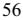

{0}------------------------------------------------

# **UNITED STATES SECURITIES AND EXCHANGE COMMISSION**

**Washington, D.C. 20549**

# **FORM 10-K**

þ **ANNUAL REPORT PURSUANT TO SECTION 13 or 15(d) OF THE SECURITIES EXCHANGE ACT OF 1934**

**For the fiscal year ended December 31, 2022**

**OR**

 **TRANSITION REPORT PURSUANT TO SECTION 13 OR 15(d) OF THE SECURITIES EXCHANGE ACT OF 1934**

**For the transition period from _________ to _________**

**Commission file number 001-35713**

# **WHEELER REAL ESTATE INVESTMENT TRUST, INC.**

**(Exact Name of Registrant as Specified in Its Charter)**

**(State or Other Jurisdiction of Incorporation or Organization) 2529 Virginia Beach Blvd., Virginia Beach, Virginia 23452 (Address of Principal Executive Offices) (Zip Code)**

**Maryland 45-2681082 (I.R.S. Employer Identification No.)**

**(757) 627-9088**

**(Registrant's Telephone Number, Including Area Code)**

**Securities registered pursuant to Section 12(b) of the Act:**

**Title of each class Trading Symbol(s) Name of each exchange on which registered**

Common Stock, \$0.01 par value per share WHLR Nasdaq Capital Market Series B Convertible Preferred Stock WHLRP Nasdaq Capital Market Series D Cumulative Convertible Preferred Stock WHLRD Nasdaq Capital Market 7.00% Subordinated Convertible Notes due 2031 WHLRL Nasdaq Capital Market

**Securities registered pursuant to Section 12(g) of the Act: None**

Indicate by check mark if the registrant is a well-known seasoned issuer, as defined in Rule 405 of the Securities Act. Yes ¨ No þ

Indicate by check mark if the registrant is not required to file reports pursuant to Section 13 or Section 15(d) of the Act. Yes¨ No þ

Indicate by check mark whether the registrant (1) has filed all reports required to be filed by Section 13 or 15(d) of the Securities Exchange Act of 1934 during the preceding 12 months (or for such shorter period that the registrant was required to file such reports), and (2) has been subject to such filing requirements for the past 90 days. Yes þ No ¨

Indicate by check mark whether the registrant has submitted electronically every Interactive Data File required to be submitted pursuant to Rule 405 of Regulation S-T during the preceding 12 months (or for such shorter period that the registrant was required to submit such files). Yes þ No ¨

{1}------------------------------------------------

Indicate by check mark whether the registrant is a large accelerated filer, an accelerated filer, a non-accelerated filer, smaller reporting company, or an emerging growth company. See the definitions of "large accelerated filer", "accelerated filer", "smaller reporting company", and "emerging growth company" in Rule 12b-2 of the Exchange Act.:

| Large accelerated file | ¨ | ¨ | Accelerated filer         |
|------------------------|---|---|---------------------------|
| Non-accelerated filer  | þ |   | Smaller reporting company |
|                        |   |   | Emerging growth company   |

If an emerging growth company indicate by check mark if the registrant has elected not to use the extended transition period for complying with any new or revised financial accounting standards provided pursuant to Section 13(a) of the Exchange Act. ¨

Indicate by check mark whether the registrant has filed a report on and attestation to its management's assessment of the effectiveness of its internal control over financial reporting under Section 404(b) of the Sarbanes-Oxley Act (15 U.S.C. 7262(b)) by the registered public accounting firm that prepared or issued its audit report. Yes ☐ No þ

If securities are registered pursuant to Section 12(b) of the Act, indicate by check mark whether the financial statements of the registrant included in the filing reflect the correction of an error to previously issued financial statements. ☐

Indicate by check mark whether any of those error corrections are restatements that required a recovery analysis of incentive-based compensation received by any of the registrant's executive officers during the relevant recovery period pursuant to §240.10D-1(b). ☐

Indicate by check mark whether the registrant is a shell company (as defined in Rule 12b-2 of the Exchange Act). Yes No þ

As of June 30, 2022, the last trading day of the registrant's most recently completed second fiscal quarter, the aggregate market value of the registrant's Common Stock held by nonaffiliates of the registrant was \$21,457,917, based on the closing price of the registrant's Common Stock on such date as reported on the Nasdaq Capital Market. For the purposes of this computation, shares held by directors and executive officer of the registrant have been excluded. Such exclusion is not intended, nor shall it be deemed, to be an admission that such persons are affiliates of the registrant.

As of February 28, 2023, there were9,793,957 shares of Common Stock, \$0.01 par value per share, outstanding.

#### **Documents Incorporated by Reference**

<span id="page-1-0"></span>Portions of the registrant's Proxy Statement for its 2023 Meeting to be filed with the Securities and Exchange Commission not later than 120 days after the end of the year covered by this Annual Report are incorporated by reference into Part III of this Annual Report.

{2}------------------------------------------------

### **Table of Contents**

### **[PART](#page-4-0) I**

| Item 1.    | Business                                                                                                     | 3  |
|------------|--------------------------------------------------------------------------------------------------------------|----|
| Item 1A.   | Risk Factors                                                                                                 | 6  |
| Item 1B.   | Unresolved Staff Comments                                                                                    | 6  |
| Item 2.    | Properties                                                                                                   | 7  |
| Item 3.    | Legal Proceedings                                                                                            | 10 |
| Item 4.    | Mine Safety Disclosures                                                                                      | 10 |
|            | PART II                                                                                                      |    |
| Item 5.    | Market for Registrant's Common Equity, Related Stockholder Matters and Issuer Purchases of Equity Securities | 10 |
| Item 6.    | Reserved                                                                                                     | 11 |
| Item 7.    | Management's Discussion and Analysis of Financial Condition and Results of Operations                        | 11 |
| Item 7A.   | Quantitative and Qualitative Disclosures About Market Risk                                                   | 26 |
| Item 8.    | Financial Statements and Supplementary Data                                                                  | 26 |
| Item 9.    | Changes in and Disagreements with Accountants on Accounting and Financial Disclosure                         | 26 |
| Item 9A.   | Controls and Procedures                                                                                      | 26 |
| Item 9B.   | Other Information                                                                                            | 27 |
| Item 9C.   | Disclosure Regarding Foreign Jurisdictions that Prevent Inspections                                          | 27 |
|            | PART III                                                                                                     |    |
| Item 10.   | Directors, Executive Officers and Corporate Governance                                                       | 27 |
| Item 11.   | Executive Compensation                                                                                       | 28 |
| Item 12.   | Security Ownership of Certain Beneficial Owners and Management and Related Stockholder Matters               | 28 |
| Item 13.   | Certain Relationships and Related Transactions, and Director Independence                                    | 28 |
| Item 14.   | Principal Accountant Fees and Services                                                                       | 28 |
|            | PART IV                                                                                                      |    |
| Item 15.   | Exhibits and Financial Statement Schedules                                                                   | 28 |
| Item 16.   | Form 10-K Summary                                                                                            | 71 |
| SIGNATURES |                                                                                                              | 72 |
|            |                                                                                                              |    |

{3}------------------------------------------------

### **CAUTIONARY STATEMENT ON FORWARD-LOOKING STATEMENTS**

This Annual Report on Form 10-K ("Form 10-K") of Wheeler Real Estate Investment Trust, Inc. (the "Trust", the "REIT", the "Company", "WHLR", "we", "our" or "us") contains forward-looking statements that are subject to risk and uncertainties. These forward-looking statements are not historical facts but are the intent, belief or current expectations of our management based on its knowledge and understanding of our business and industry. Forward-looking statements are typically identified by the use of terms such as "may," "will," "should," "potential," "predicts," "anticipates," "expects," "intends," "plans," "believes," "seeks," "estimates," or the negative of such terms and variations of these words and similar expressions. These statements are not guarantees of future performance and are subject to risks, uncertainties and other factors, some of which are beyond our control, are difficult to predict and could cause actual results to differ materially from those expressed or forecasted in the forward-looking statements.

Forward-looking statements that were true at the time made may ultimately prove to be incorrect or false. You are cautioned to not place undue reliance on forward-looking statements, which reflect our management's view only as of the date of this Form 10-K. We undertake no obligation to update or revise forward-looking statements to reflect changed assumptions, the occurrence of unanticipated events or changes to future operating results.

Factors that could cause actual results to differ materially from any forward-looking statements made in this Form 10-K include:

- the adverse effect of the COVID-19 pandemic or any future pandemic, endemic or outbreak of infectious disease, and mitigation efforts to control their spread, on the Company's financial condition, operating results and cash flows, the Company's tenants and their customers, the use of and demand for retail space, the real estate market in which the Company operates, the U.S. economy, the global economy and the financial markets;
- general and economic business conditions, including those affecting the ability of individuals to spend in retail shopping centers and/or the rate and other terms on which we are able to lease our properties;
- tenant bankruptcies;
- the state of the U.S. economy generally, or specifically in the Southeast, Mid-Atlantic and Northeast where our properties are geographically concentrated;
- consumer spending and confidence trends;
- availability, terms and deployment of capital;
- general volatility of the capital markets and the market price of our common and preferred stock;
- anticipated substantial dilution of our common stockafter September 21, 2023 that may result from the exercise by the holders of our Series D Cumulative Convertible Preferred Stock of their redemption rights;
- the degree and nature of our competition;
- changes in governmental regulations, accounting rules, tax rates and similar matters;
- adverse economic or real estate developments in our markets of Virginia, North Carolina, South Carolina, Georgia, Florida, Alabama, Oklahoma, Tennessee, Kentucky, New Jersey, Pennsylvania, Massachusetts, Maryland, Connecticut and West Virginia.;
- the ability and willingness of the Company's tenants and other third parties to satisfy their obligations under their respective contractual arrangements with the Company;
- the ability and willingness of the Company's tenants to renew their leases with the Company upon expiration, the Company's ability to re-lease its properties on the similar or better terms in the event of nonrenewal or in the event the Company exercises its right to replace an existing tenant, and obligations the Company may incur in connection with the replacement of an existing tenant
- litigation risks;
- increases in the Company's financing and other costs as a result of changes in interest rates and other factors;
- inability to successfully integrate the acquisition of Cedar Realty Trust, Inc.;
- changes in our ability to obtain and maintain financing;
- damage to the Company's properties from catastrophic weather and other natural events, and the physical effects of climate change;
- information technology security breaches;
- the Company's ability and willingness to maintain its qualification as a REIT in light of economic, market, legal, tax and other considerations, including ht e Inflation Reduction Act of 2022;
- the ability of our operating partnership, Wheeler REIT, L.P. (the "Operating Partnership") and each of our other partnerships and limited liability companies to be classified as partnerships or disregarded entities for federal income tax purposes;

{4}------------------------------------------------

- the impact of e-commerce on our tenants' business;and
- inability to generate sufficient cash flows due to market conditions, competition, uninsured losses, changes in tax or other applicable laws.

<span id="page-4-0"></span>Forward-looking statements should be read in light of these factors.

{5}------------------------------------------------

#### **Item 1. Business.**

#### <span id="page-5-0"></span>**Overview**

Wheeler Real Estate Investment Trust, Inc. is a Maryland corporation formed on June 23, 2011. The Trust serves as the general partner of Wheeler REIT, L.P. (the "Operating Partnership") which was formed as a Virginia limited partnership on April 5, 2012. Substantially, all of our assets are held by, and all of our operations are conducted through, our Operating Partnership. At December 31, 2022, the Company owned 99.05% of the Operating Partnership. The Company is a fully-integrated, self-managed commercial real estate investment company that owns, leases and operates income-producing retail properties with a primary focus on grocery-anchored centers.

On August 22, 2022, the Company completed a merger transaction with Cedar Realty Trust, Inc. ("Cedar" or "CDR"). As a result of the merger, the Company acquired all of the outstanding shares of Cedar's common stock, which ceased to be publicly traded on the New York Stock Exchange ("NYSE"). Cedar's outstanding 7.25% Series B Preferred Stock and 6.50% Series C Preferred Stock remain outstanding and continue to trade on the NYSE. Each outstanding share of common stock of Cedar and outstanding common unit of the Cedar OP held by persons other than Cedar immediately prior to the merger were cancelled and converted into the right to receive a cash payment of \$9.48 per share or unit. As a result Cedar became a subsidiary of the REIT.

For additional information on recent business developments, see Item 7. Management's Discussion and Analysis of Financial Condition and Results of Operations in this Form 10-K.

Our corporate office is located at 2529 Virginia Beach Boulevard, Virginia Beach, Virginia 23452. Our telephone number is (757) 627-9088. Our registrar and stock transfer agent is Computershare Trust Company, N.A. and may be contacted at 150 Royall Street, Suite 101, Canton, MA 02021 or their website, www.computershare.com.

#### **Portfolio**

Our portfolio contains retail properties in secondary and tertiary markets, with a particular emphasis on grocery-anchored retail centers. Our properties are in communities that have stable demographics and have historically exhibited favorable trends, such as strong population and income growth. We generally lease our properties to national and regional retailers that offer consumer goods and services and generate regular consumer traffic. We believe our tenants carry goods and offer services that are less impacted by fluctuations in the broader U.S. economy and consumers' disposable income, generating more predictable property level cash flows.

The Company's portfolio of properties is dependent upon regional and local economic conditions. As of December 31, 2022, we own a portfolio consisting of seventy-nine properties, including seventy-five retail shopping centers, totaling 8,172,527 leasable square feet which is 92.9% leased (our "operating portfolio"), and four undeveloped land parcels totaling approximately 61 acres. The properties are geographically located in the Mid-Atlantic, Southeast and Northeast, which markets represented approximately 44%, 41% and 15%, respectively, of the total annualized base rent of the properties in its portfolio as of December 31, 2022.

No tenant represents greater than approximately 10% of the Company's annualized base rent or 10% of gross leasable square footage. The top 10 tenants account for 23.19% or \$16.99 million of annualized base rent and 27.22% or 2.22 million of gross leasable square footage at December 31, 2022.

#### **Human Capital Management**

#### *Information About our Executive Of icers*

Andrew Franklin, age 42,was appointed as Chief Executive Officer ("CEO") and President in October 2021. He previously served as Interim Chief Executive Officer since July 2021, Chief Operating Officer since February 2018, and Senior Vice President of Operations since January 2017. Mr Franklin has over twenty-three years of commercial real estate

#### **Part I**

{6}------------------------------------------------

experience. Mr. Franklin is responsible for overseeing the property management, lease administration, and leasing divisions of our growing portfolio of commercial assets. Prior to joining the Company, Mr. Franklin was a partner with Broad Reach Retail Partners where he ran the day-to-day operations of the company, managing the leasing team as well as overseeing the asset, property and construction management of the portfolio with assets totaling \$50 million. Mr. Franklin is a graduate of the University of Maryland, with a Bachelor of Science degree in Finance.

Crystal Plum, age 41, was appointed as Chief Financial Officer ("CFO") in February 2020. She most recently served as the Vice President of Financial Reporting and Corporate Accounting for the Company from March 2018 to February 2020 and as Director of Financial Reporting for the Company from September 2016 to March 2018. Prior to that time, she served as Manager at Dixon Hughes Goodman LLP from September 2014 to August 2016 and as Supervisor at Dixon Hughes Goodman LLP from 2008 to September 2014. Ms. Plum has experience reviewing and performing audits, reviews, compilations and tax engagements for a diverse group of clients, as well as banking experience. Ms. Plum is a Certified Public Accountant and has a Bachelor of Science degree in Business Administration - Accounting and Finance from Old Dominion University.

### *Our Team and Talent*

As of December 31, 2022, we have 47 full-time employees. We seek to hire experienced leaders and team members and offer competitive wage and benefit programs. Employees are offered flexibility to meet personal and family needs, which was further expanded when the COVID-19 pandemic began. In addition to medical insurance support, the Company offers wellness programs including free short and long term disability insurance, free basic life insurance policy with accidental death and dismemberment coverage, employee assistance programs that include emotional health support, gym memberships, volunteer time off and tuition assistance. Tuition assistance includes assistance to learn a new language as the Company identifies opportunities to better serve a diverse tenant base.

#### **Business Objectives and Investment Strategy**

Our primary business objective is to provide attractive risk-adjusted returns to our stockholders. We intend to achieve this objective utilizing the following investment strategies:

- *• Focus on necessity-based retail*. Own and operate retail properties that serve the essential day-to-day shopping needs of the surrounding communities. These necessity-based centers attract high levels of daily traffic resulting in cross-selling of goods and services from our tenants. The majority of our tenants provide non-cyclical consumer goods and services that are less impacted by fluctuations in the economy. We believe these centers that provide essential goods and services such as groceries and electric vehicle charging stations result in a stable, lower-risk portfolio of retail investment properties.
- *• Focus on secondary and tertiary markets with strong demographics and demand*. Our properties are in markets that have strong demographics such as population density, population growth, stable tenant sales trends and growth in household income. We seek to identify new tenants and renew leases with existing tenants in these locations that support the need for necessity-based retail and limited new supply.
- *• Increase operating income through leasing strategies and expense management*. We employ intensive lease management strategies to optimize occupancy. Management has extensive expertise in acquiring and managing under-performing properties and increasing operating income through more effective leasing strategies and expense management. Our leases generally require the tenant to reimburse us for a substantial portion of the expenses incurred in operating, maintaining, repairing, and managing the shopping center and the common areas, along with the associated insurance costs and real estate taxes. In many cases the tenant is either fully or partially responsible for all maintenance of the property, thereby limiting our financial exposure towards maintaining the center and increasing our net income. We refer to this arrangement as a "triple net lease."
- *• Selectively utilize our capital to improve retail properties.* We intend to make capital investments where the return on such capital is accretive to our stockholders. We allocate capital to value-added improvements of retail properties to increase rents, extend long-term leases with anchor tenants and increase occupancy. We selectively allocate capital to revenue enhancing projects that we believe will improve the market position of a given property.


{7}------------------------------------------------

- *Recycling and sensible management of capital structure.* We intend to sell non-income producing land parcels utilizing sales proceeds to deleverage the balance sheet. In 2022, we sold two properties for a total of \$10.51 million net proceeds which were used to reduce outstanding indebtedness. Additional properties may be slated for disposition based upon management's periodic review of our portfolio, and approval by our Board of Directors.
- *Strategy for Integrating Cedar Assets.*Through integrations of both software and personnel, the increased scale will allow the Company to maximize efficiencies both at the property and corporate level. Focusing on our core model of necessity, service and convenience-based retailers, the assets obtained through the acquisition of Cedar Realty Trust, Inc. (the "Cedar Assets") complement our existing portfolio, further diversifying our tenant credit profiles and micro-market risks.

#### **Governmental Regulations Affecting Our Properties**

We and our properties are subject to a variety of federal, state and local environmental, health, safety, tax and similar laws. The application of these laws to a specific property that we own depends on a variety of property-specific circumstances, including the current and former uses of the property, the building materials used at the property and the physical layout of the property. Neither existing environmental, health, safety and similar laws nor the costs of our compliance with these laws has had a material adverse effect on our financial condition or results of operations, and management does not believe they will in the future. In addition, we have not incurred, and do not expect to incur, any material costs or liabilities due to environmental contamination at properties we currently own or have owned in the past. However, we cannot predict the impact of new or changed laws or regulations on properties we currently own or may acquire in the future. We have no current plans for substantial capital expenditures with respect to compliance with environmental, health, safety and similar laws and we carry environmental insurance that covers a number of environmental risks for most of our properties.

#### **Competition**

Numerous commercial developers and real estate companies compete with us with respect to the leasing of properties. Some of these competitors may possess greater capital resources than we do, although we do not believe that any single competitor or group of competitors in any of the primary markets where our properties are located are dominant in that market. This competition may interfere with our ability to attract and retain tenants, leading to increased vacancy rates and/or reduced rents and adversely affect our ability to minimize operating expenses.

Retailers at our properties also face increasing competition from online retailers, outlet stores, discount shopping clubs, superstores, and other forms of sales and marketing of goods and services, such as direct mail. This competition could contribute to lease defaults and insolvency of tenants.

### **Climate**

Some of our properties could be subject to potential natural or other disasters. In addition, we may acquire properties that are located in areas that are subject to natural disasters, such as earthquakes and droughts. Properties could also be affected by increases in the frequency or severity of tornadoes, hurricanes or other storms, whether such increases are caused by global climate changes or other factors. The occurrence of natural disasters or severe weather conditions can increase investment costs to repair or replace damaged properties, increase operating costs, increase future property insurance costs, and/or negatively impact the tenant demand for lease space. If insurance is unavailable to us, or is unavailable on acceptable terms, or if our insurance is not adequate to cover business interruption or losses from such events, our earnings, liquidity and/or capital resources could be adversely affected. While several of our properties are located in areas that have experienced hurricanes, tornados, severe rain storms, or snow during the past two years, there has been no substantial damage or change in operations related to weather events.

### **Information Technology and Cyber Security**

The Company depends on the proper functioning, availability and security of its information systems, including financial, data processing, communications and operating systems. Several information systems are software applications provided by third parties. Our business is at risk from and may be impacted by cybersecurity attacks, including attempts to gain unauthorized access to our confidential data, and other electronic security breaches. Such cyber attacks can range from individual attempts to gain unauthorized access to our information technology systems to more sophisticated security threats.

{8}------------------------------------------------

While we employ a number of measures to prevent, detect and mitigate these threats, there is no guarantee such efforts will be successful in preventing a cyber attack. A cybersecurity attack could compromise the confidential information of our employees, tenants and vendors. A successful attack could disrupt and otherwise adversely affect our business operations.

The Company has incorporated cybersecurity coverage in its insurance policies; however, there is no assurance that the insurance the Company maintains will cover all cybersecurity breaches or that policy limits will be sufficient to cover all related losses. The Company is not aware of any information security breaches over the last two years.

### **Insurance**

The Company carries comprehensive liability, fire, extended coverage, business interruption and rental loss insurance covering all of the properties in its portfolio under an insurance policy, in addition to other coverages, such as trademark and pollution coverage that may be appropriate for certain of its properties. Additionally, the Company carries a directors', officers', entity and employment practices liability insurance policy that covers such claims made against the Company and its directors and officers. The Company believes the policy specifications and insured limits are appropriate and adequate for its properties given the relative risk of loss, the cost of the coverage and industry practice; however, its insurance coverage may not be sufficient to fully cover losses.

#### **Company Website Access and SEC Filings**

We are subject to the information reporting requirements of the Exchange Act. Pursuant to those requirements, we are required to file annual and periodic reports, proxy statements and other information, including audited consolidated financial statements, with the SEC which can be found at http://www.sec.gov.

Additionally, we make available free of charge through our website http://www.whlr.us our most recent Annual Report on Form 10-K, including our audited consolidated financial statements, Quarterly Reports on Form 10-Q, Current Reports on Form 8-K, and amendments to those reports as soon as reasonably practicable after we electronically file or furnish such materials to the Securities and Exchange Commission (the "SEC"). In addition, we have posted the Charters of our Asset Liability Committee, Audit Committee, Compensation Committee, Governance and Nominating Committee, and Executive Committee, as well as our Code of Business Conduct and Ethics for Employees, Officers, Agents and Representatives, Code of Business Conduct and Ethics for Members of the Board of Directors, Corporate Governance Principles, including guidelines on director independence, and Insider Trading Policy, all under separate headings. The content of our website is not incorporated by reference into this Annual Report on Form 10-K or in any other report or document we file with the SEC, and any references to our website is intended to be inactive textual references only.

6

#### <span id="page-8-0"></span>**Item 1A. Risk Factors.**

We are a smaller reporting company as defined by Rule 12b-2 of the Exchange Act and are not required to provide the information under this item.

#### <span id="page-8-1"></span>**Item 1B. Unresolved Staff Comments.**

None.

{9}------------------------------------------------

### <span id="page-9-0"></span>**Item 2. Properties. Our Portfolio**

At December 31, 2022, we owned seventy-nine properties, including seventy-five income producing properties located in South Carolina, Georgia, Virginia, Pennsylvania, North Carolina, Massachusetts, New Jersey, Florida, Connecticut, Kentucky, Tennessee, Alabama, Maryland, and West Virginia, containing a total of approximately 8,173,000 gross leasable square feet of retail space, which we refer to as our operating portfolio. Additionally, we owned four undeveloped land parcels located in Virginia, North Carolina and Oklahoma. The following table presents an overview of our properties, based on information as of December 31, 2022. **Portfolio**

|                 |                            |             |                           | Number        | Total                   |                          |   |                     |   |                   |                                        |                                               |
|-----------------|----------------------------|-------------|---------------------------|---------------|-------------------------|--------------------------|---|---------------------|---|-------------------|----------------------------------------|-----------------------------------------------|
|                 | Property                   |             | Location                  | of<br>Tenants | Leasable<br>Square Feet | Percentage<br>Leased (1) |   | Percentage Occupied |   | Total SF Occupied | Annualized<br>Base Rent (in 000's) (2) | Annualized Base<br>Rent per Occupied Sq. Foot |
|                 | WHLR                       |             |                           |               |                         |                          |   |                     |   |                   |                                        |                                               |
| Marketplace     | Alex City                  | City, AL    | Alexander                 | 19            | 151,843                 | 100.0                    | % | 100.0               | % | 151,843           | \$<br>1,215                            | \$<br>8.00                                    |
|                 | Amscot                     |             |                           |               |                         |                          |   |                     |   |                   |                                        |                                               |
| Building        | Beaver Ruin                |             | Tampa, FL                 | 1             | 2,500                   | 100.0                    | % | 100.0               | % | 2,500             | 83                                     | 33.00                                         |
| Village         | Beaver Ruin                |             | Lilburn, GA               | 29            | 74,038                  | 96.8                     | % | 94.1                | % | 69,648            | 1,254                                  | 18.01                                         |
| Village II      | Brook Run                  |             | Lilburn, GA<br>Richmond,  | 4             | 34,925                  | 100.0                    | % | 100.0               | % | 34,925            | 464                                    | 13.29                                         |
| Shopping Center | Brook Run                  | VA          | Richmond,                 | 20            | 147,738                 | 87.0                     | % | 87.0                | % | 128,495           | 1,167                                  | 9.08                                          |
| Properties (3)  | Bryan                      | VA          | Lexington,                | —             | —                       | —                        | % | —                   | % | —                 | —                                      | —                                             |
| Station         |                            | KY          |                           | 10            | 54,277                  | 100.0                    | % | 100.0               | % | 54,277            | 637                                    | 11.73                                         |
| Plaza           | Cardinal                   | NC          | Henderson,                | 9             | 50,000                  | 100.0                    | % | 100.0               | % | 50,000            | 504                                    | 10.07                                         |
| Square          | Chesapeake                 |             | Onley, VA                 | 14            | 108,982                 | 99.1                     | % | 99.1                | % | 108,016           | 838                                    | 7.76                                          |
| Plaza           | Clover                     |             | Clover, SC                | 9             | 45,575                  | 100.0                    | % | 97.1                | % | 44,275            | 360                                    | 8.12                                          |
| Commons (3)     | Courtland                  | VA          | Courtland,                | —             | —                       | —                        | % | —                   | % | —                 | —                                      | —                                             |
| Crossing        | Conyers                    |             | Conyers, GA               | 14            | 170,475                 | 100.0                    | % | 100.0               | % | 170,475           | 986                                    | 5.78                                          |
| Square          | Crockett                   | TN          | Morristown,               | 4             | 107,122                 | 100.0                    | % | 100.0               | % | 107,122           | 970                                    | 9.06                                          |
| Shopping Center | Cypress                    | Springs, SC | Boiling                   | 16            | 80,435                  | 59.9                     | % | 39.5                | % | 31,775            | 447                                    | 14.06                                         |
| Shopping Center | Darien                     |             | Darien, GA                | 1             | 26,001                  | 100.0                    | % | 100.0               | % | 26,001            | 140                                    | 5.38                                          |
| Street          | Devine                     | SC          | Columbia,                 | 1             | 38,464                  | 89.1                     | % | 89.1                | % | 34,264            | 180                                    | 5.25                                          |
| Commons (3)     | Edenton                    |             | Edenton, NC               | —             | —                       | —                        | % | —                   | % | —                 | —                                      | —                                             |
|                 | Folly Road                 | SC          | Charleston,               | 5             | 47,794                  | 100.0                    | % | 100.0               | % | 47,794            | 733                                    | 15.35                                         |
| Gallery         | Forrest                    | TN          | Tullahoma,                | 28            | 214,451                 | 90.0                     | % | 90.0                | % | 193,024           | 1,425                                  | 7.38                                          |
| Shopping Center | Fort Howard                |             | Rincon, GA                | 20            | 113,652                 | 100.0                    | % | 100.0               | % | 113,652           | 1,250                                  | 11.00                                         |
| Junction        | Freeway                    | GA          | Stockbridge,              | 17            | 156,834                 | 97.5                     | % | 97.5                | % | 152,984           | 1,323                                  | 8.65                                          |
|                 | Franklin                   |             | Kittanning,               |               |                         |                          |   |                     |   |                   |                                        |                                               |
| Village         | Franklinton                | PA          | Franklinton,              | 25            | 151,821                 | 99.9                     | % | 99.9                | % | 151,673           | 1,297                                  | 8.55                                          |
| Square          |                            | NC          | Georgetown,               | 15            | 65,366                  | 100.0                    | % | 100.0               | % | 65,366            | 596                                    | 9.11                                          |
|                 | Georgetown<br>Grove Park   | SC          | Orangeburg,               | 2             | 29,572                  | 100.0                    | % | 100.0               | % | 29,572            | 267                                    | 9.04                                          |
| Shopping Center | Harbor                     | SC          |                           | 14            | 93,265                  | 100.0                    | % | 100.0               | % | 93,265            | 761                                    | 8.16                                          |
| Pointe (3)      | Harrodsburg                |             | Grove, OK<br>Harrodsburg, | —             | —                       | —                        | % | —                   | % | —                 | —                                      | —                                             |
| Marketplace     |                            | KY          |                           | 8             | 60,048                  | 91.0                     | % | 91.0                | % | 54,648            | 451                                    | 8.26                                          |
|                 | JANAF (4)<br>Laburnum      |             | Norfolk, VA<br>Richmond,  | 118           | 798,086                 | 96.7                     | % | 95.0                | % | 758,320           | 8,993                                  | 11.86                                         |
| Square          |                            | VA          |                           | 19            | 109,405                 | 99.1                     | % | 96.9                | % | 106,045           | 970                                    | 9.14                                          |
| Crossing        | Ladson                     |             | Ladson, SC                | 16            | 52,607                  | 100.0                    | % | 100.0               | % | 52,607            | 548                                    | 10.42                                         |
| Marketplace     | LaGrange                   | GA          | LaGrange,                 | 14            | 76,594                  | 93.7                     | % | 93.7                | % | 71,800            | 443                                    | 6.17                                          |
|                 | Lake<br>Greenwood Crossing | SC          | Greenwood,                | 8             | 43,618                  | 100.0                    | % | 100.0               | % | 43,618            | 363                                    | 8.33                                          |
| Murray          | Lake                       | SC          | Lexington,                | 5             | 39,218                  | 100.0                    | % | 100.0               | % | 39,218            | 272                                    | 6.92                                          |
| Market Village  | Litchfield                 | Island, SC  | Pawleys                   | 24            | 86,740                  | 94.8                     | % | 94.8                | % | 82,202            | 1,028                                  | 12.51                                         |
| River Village   | Lumber                     | NC          | Lumberton,                | 11            | 66,781                  | 100.0                    | % | 100.0               | % | 66,781            | 474                                    | 7.09                                          |
| Corner          | Moncks                     | Corner, SC  | Moncks                    | 1             | 26,800                  | 100.0                    | % | 100.0               | % | 26,800            | 330                                    | 12.31                                         |
| Commons         | Nashville                  | NC          | Nashville,                | 12            | 56,100                  | 100.0                    | % | 100.0               | % | 56,100            | 646                                    | 11.51                                         |
| Crossing        | New Market                 |             | Mt. Airy, NC              | 12            | 117,076                 | 100.0                    | % | 100.0               | % | 117,076           | 1,035                                  | 8.84                                          |
| Plaza           | Parkway                    | GA          | Brunswick,                | 4             | 52,365                  | 81.7                     | % | 81.7                | % | 42,785            | 452                                    | 10.57                                         |
|                 | Pierpont                   |             | Morgantown,               |               |                         |                          |   |                     |   |                   |                                        |                                               |
| Centre          |                            | WV          |                           | 15            | 111,162                 | 98.4                     | % | 98.4                | % | 109,437           | 1,055                                  | 9.64                                          |

{10}------------------------------------------------

{11}------------------------------------------------

| Property                    | Location                | Number of<br>Tenants | Total Leasable<br>Square Feet | Percentage<br>Leased (1) | Percentage Occupied | Total SF Occupied | Annualized<br>Base Rent (in 000's)<br>(2) | Annualized Base Rent<br>per Occupied Sq.<br>Foot |
|-----------------------------|-------------------------|----------------------|-------------------------------|--------------------------|---------------------|-------------------|-------------------------------------------|--------------------------------------------------|
| Port Crossing               | Harrisonburg, VA        | 7                    | 65,365                        | 95.9 %                   | 95.9 %              | 62,715 \$         | 813 \$                                    | 12.97                                            |
| Ridgeland                   | Ridgeland, SC           | 1                    | 20,029                        | 100.0 %                  | 100.0 %             | 20,029            | 140                                       | 7.00                                             |
| Riverbridge Shopping Center | Carrollton, GA          | 11                   | 91,188                        | 100.0 %                  | 100.0 %             | 91,188            | 769                                       | 8.43                                             |
| Rivergate Shopping Center   | Macon, GA               | 24                   | 193,960                       | 87.0 %                   | 87.0 %              | 168,816           | 2,509                                     | 14.86                                            |
| Sangaree Plaza              | Summerville, SC         | 10                   | 66,948                        | 100.0 %                  | 100.0 %             | 66,948            | 714                                       | 10.67                                            |
| Shoppes at Myrtle Park      | Bluffton, SC            | 13                   | 56,601                        | 97.3 %                   | 97.3 %              | 55,084            | 657                                       | 11.92                                            |
| South Lake                  | Lexington, SC           | 10                   | 44,318                        | 97.3 %                   | 97.3 %              | 43,118            | 242                                       | 5.61                                             |
| South Park                  | Mullins, SC             | 4                    | 60,734                        | 96.9 %                   | 96.9 %              | 58,834            | 379                                       | 6.43                                             |
| South Square                | Lancaster, SC           | 6                    | 44,350                        | 80.9 %                   | 80.9 %              | 35,900            | 303                                       | 8.44                                             |
| St. George Plaza            | St. George, SC          | 8                    | 59,174                        | 100.0 %                  | 100.0 %             | 59,174            | 401                                       | 6.78                                             |
| Sunshine Plaza              | Lehigh Acres, FL        | 23                   | 111,189                       | 100.0 %                  | 100.0 %             | 111,189           | 1,111                                     | 9.99                                             |
| Surrey Plaza                | Hawkinsville, GA        | 4                    | 42,680                        | 100.0 %                  | 100.0 %             | 42,680            | 258                                       | 6.05                                             |
| Tampa Festival              | Tampa, FL               | 19                   | 141,580                       | 98.9 %                   | 66.7 %              | 94,380            | 932                                       | 9.88                                             |
| Tri-County Plaza            | Royston, GA             | 7                    | 67,577                        | 90.2 %                   | 90.2 %              | 60,977            | 432                                       | 7.08                                             |
| Tuckernuck                  | Richmond, VA            | 17                   | 93,440                        | 98.6 %                   | 98.6 %              | 92,173            | 999                                       | 10.84                                            |
| Twin City Commons           | Batesburg-Leesville, SC | 5                    | 47,680                        | 100.0 %                  | 100.0 %             | 47,680            | 488                                       | 10.23                                            |
| Village of Martinsville     | Martinsville, VA        | 21                   | 288,254                       | 100.0 %                  | 96.4 %              | 277,742           | 2,199                                     | 7.92                                             |
| Waterway Plaza              | Little River, SC        | 10                   | 49,750                        | 100.0 %                  | 100.0 %             | 49,750            | 503                                       | 10.11                                            |
| Westland Square             | West Columbia, SC       | 11                   | 62,735                        | 100.0 %                  | 100.0 %             | 62,735            | 537                                       | 8.57                                             |
| Winslow Plaza               | Sicklerville, NJ        | 18                   | 40,695                        | 100.0 %                  | 100.0 %             | 40,695            | 653                                       | 16.04                                            |
|                             | WHLR TOTAL              | 773                  | 5,309,977                     | 96.5 %                   | 94.7 %              | 5,030,190 \$      | 48,996 \$                                 | 9.74                                             |
| CDR                         |                         |                      |                               |                          |                     |                   |                                           |                                                  |
| Brickyard Plaza             | Berlin, CT              | 10                   | 227,598                       | 100.0 %                  | 99.2 %              | 225,821 \$        | 2,027 \$                                  | 8.98                                             |
| Carll's Corner              | Bridgeton, NJ           | 5                    | 129,582                       | 27.5 %                   | 21.1 %              | 27,324            | 400                                       | 14.63                                            |
| Coliseum Marketplace        | Hampton, VA             | 9                    | 106,648                       | 100.0 %                  | 45.9 %              | 48,986            | 610                                       | 12.46                                            |
| Fairview Commons            | New Cumberland, PA      | 10                   | 52,964                        | 77.5 %                   | 77.5 %              | 41,064            | 448                                       | 10.91                                            |
| Fieldstone Marketplace      | New Bedford, MA         | 10                   | 193,970                       | 71.7 %                   | 71.7 %              | 139,139           | 1,652                                     | 11.87                                            |
| Gold Star Plaza             | Shenandoah, PA          | 6                    | 71,720                        | 97.8 %                   | 97.8 %              | 70,120            | 641                                       | 9.14                                             |
| Golden Triangle             | Lancaster, PA           | 19                   | 202,790                       | 98.4 %                   | 98.4 %              | 199,605           | 2,609                                     | 13.07                                            |
| Hamburg Square              | Hamburg, PA             | 7                    | 102,058                       | 100.0 %                  | 100.0 %             | 102,058           | 684                                       | 6.70                                             |
| Kings Plaza                 | New Bedford, MA         | 16                   | 168,243                       | 82.2 %                   | 82.2 %              | 138,239           | 1,227                                     | 8.87                                             |
| Oakland Commons             | Bristol, CT             | 2                    | 90,100                        | 100.0 %                  | 100.0 %             | 90,100            | 574                                       | 6.37                                             |
| Oregon Avenue               | Philadelphia, PA        | 1                    | 20,380                        | 100.0 %                  | 5.8 %               | 1,180             | 40                                        | 34.21                                            |
| Patuxent Crossing           | California, MD          | 30                   | 264,068                       | 84.3 %                   | 84.3 %              | 222,715           | 2,254                                     | 10.12                                            |
| Pine Grove Plaza            | Brown Mills, NJ         | 14                   | 79,306                        | 81.1 %                   | 49.6 %              | 39,343            | 573                                       | 14.56                                            |
| South Philadelphia          | Philadelphia, PA        | 10                   | 221,511                       | 71.8 %                   | 71.8 %              | 159,131           | 1,445                                     | 9.08                                             |
| Southington Center          | Southington, CT         | 10                   | 155,842                       | 100.0 %                  | 98.5 %              | 153,507           | 1,172                                     | 7.64                                             |
| Timpany Plaza               | Gardner, MA             | 14                   | 182,799                       | 65.0 %                   | 65.0 %              | 118,875           | 1,167                                     | 9.81                                             |
| Trexler Mall                | Trexlertown, PA         | 23                   | 336,687                       | 98.2 %                   | 98.2 %              | 330,634           | 3,670                                     | 11.10                                            |
|                             |                         |                      |                               |                          |                     |                   |                                           |                                                  |
| Washington Center Shoppes   | Sewell, NJ              | 28                   | 157,300                       | 94.0 %                   | 94.0 %              | 147,856           | 1,810                                     | 12.24                                            |
| Webster Commons             | Webster, MA             | 9                    | 98,984                        | 100.0 %                  | 100.0 %             | 98,984            | 1,241                                     | 12.54                                            |
|                             | CDR TOTAL               | 233                  | 2,862,550                     | 86.2 %                   | 82.3 %              | 2,354,681 \$      | 24,244 \$                                 | 10.30                                            |
|                             | COMBINED TOTAL          | 1,006                | 8,172,527                     | 92.9 %                   | 90.4 %              | 7,384,871 \$      | 73,240 \$                                 | 9.92                                             |

(1) Reflects leases executed through December 31, 2022 that commence subsequent to the end of the current reporting period.

(2) Annualized based rent per occupied square foot, assumes base rent as of the end of the current reporting period, excludes the impact of tenant concessions and rent abatements.

(3) This information is not available because the property is undeveloped.

(4) Square footage is net of the Company's on-premise management office and net of building square footage whereby the Company only leases the land.

{12}------------------------------------------------

### **Major Tenants**

The following table sets forth information regarding the ten largest tenants in our operating portfolio based on annualized base rent as of December 31, 2022.

| Tenants           | Category          | Annualized Base<br>Rent<br>(\$ in 000s) |        | % of Total Annualized<br>Base Rent | Total Occupied<br>Square Feet | Percent Total<br>Leasable Square Foot | Annualized Base<br>Rent Per Occupied<br>Square Foot |
|-------------------|-------------------|-----------------------------------------|--------|------------------------------------|-------------------------------|---------------------------------------|-----------------------------------------------------|
| Food Lion         | Grocery           | \$                                      | 4,435  | 6.06 %                             | 549,000                       | 6.72 % \$                             | 8.08                                                |
| Kroger Co (1)     | Grocery           |                                         | 2,097  | 2.86 %                             | 311,000                       | 3.81 %                                | 6.74                                                |
| Dollar Tree (2)   | Discount Retailer |                                         | 2,046  | 2.79 %                             | 244,000                       | 2.99 %                                | 8.39                                                |
| Piggly Wiggly     | Grocery           |                                         | 1,509  | 2.06 %                             | 203,000                       | 2.48 %                                | 7.43                                                |
| Planet Fitness    | Gym               |                                         | 1,443  | 1.97 %                             | 140,000                       | 1.71 %                                | 10.31                                               |
| TJX Companies (4) | Discount Retailer |                                         | 1,186  | 1.62 %                             | 195,000                       | 2.39 %                                | 6.08                                                |
| Lowes Foods (3)   | Grocery           |                                         | 1,181  | 1.61 %                             | 130,000                       | 1.59 %                                | 9.08                                                |
| Big Lots          | Discount Retailer |                                         | 1,079  | 1.47 %                             | 171,000                       | 2.09 %                                | 6.31                                                |
| Kohl's            | Discount Retailer |                                         | 1,031  | 1.41 %                             | 147,000                       | 1.80 %                                | 7.01                                                |
| Winn Dixie        | Grocery           |                                         | 984    | 1.34 %                             | 134,000                       | 1.64 %                                | 7.34                                                |
|                   |                   | \$                                      | 16,991 | 23.19 %                            | 2,224,000                     | 27.22 % \$                            | 7.64                                                |

(1) Kroger 4 / Harris Teeter 1 / 3 fuel stations

(2) Dollar Tree 17 / Family Dollar 7

(3) Lowes Foods 1 / KJ's Market 2

(4) Marshall's 4 / HomeGoods 2 / TJ Maxx 1

#### **Lease Expirations**

The following table sets forth information with respect to the lease expirations of our properties as of December 31, 2022.

| Lease Expiration Period | Number of<br>Expiring Leases | Total Expiring Square<br>Footage | % of Total Expiring<br>Square Footage | % of Total Occupied<br>Square Footage<br>Expiring | Expiring<br>Annualized Base<br>Rent (in 000s) | % of Total<br>Annualized Base Rent | Expiring Base<br>Rent Per<br>Occupied<br>Square Foot |
|-------------------------|------------------------------|----------------------------------|---------------------------------------|---------------------------------------------------|-----------------------------------------------|------------------------------------|------------------------------------------------------|
| Available               | —                            | 787,656                          | 9.64 %                                | — % \$                                            | —                                             | — % \$                             | —                                                    |
| Month-to-Month          | 14                           | 57,298                           | 0.70 %                                | 0.78 %                                            | 843                                           | 1.15 %                             | 14.71                                                |
| 2023                    | 123                          | 495,810                          | 6.07 %                                | 6.71 %                                            | 5,635                                         | 7.69 %                             | 11.37                                                |
| 2024                    | 164                          | 908,659                          | 11.12 %                               | 12.30 %                                           | 9,712                                         | 13.26 %                            | 10.69                                                |
| 2025                    | 171                          | 1,202,547                        | 14.71 %                               | 16.28 %                                           | 11,811                                        | 16.13 %                            | 9.82                                                 |
| 2026                    | 146                          | 898,230                          | 10.99 %                               | 12.16 %                                           | 9,737                                         | 13.29 %                            | 10.84                                                |
| 2027                    | 142                          | 720,776                          | 8.82 %                                | 9.76 %                                            | 8,615                                         | 11.76 %                            | 11.95                                                |
| 2028                    | 70                           | 1,049,374                        | 12.84 %                               | 14.21 %                                           | 8,270                                         | 11.29 %                            | 7.88                                                 |
| 2029                    | 49                           | 470,930                          | 5.76 %                                | 6.38 %                                            | 4,425                                         | 6.04 %                             | 9.40                                                 |
| 2030                    | 30                           | 445,826                          | 5.46 %                                | 6.04 %                                            | 3,267                                         | 4.46 %                             | 7.33                                                 |
| 2031                    | 28                           | 340,279                          | 4.16 %                                | 4.61 %                                            | 3,254                                         | 4.44 %                             | 9.56                                                 |
| 2032 and thereafter     | 69                           | 795,142                          | 9.73 %                                | 10.77 %                                           | 7,671                                         | 10.49 %                            | 9.65                                                 |
| Total                   | 1,006                        | 8,172,527                        | 100.00 %                              | 100.00 % \$                                       | 73,240                                        | 100.00 % \$                        | 9.92                                                 |

#### **Property Management and Leasing Strategy**

We self-administer our property management and substantially all of our leasing activities and operating and administrative functions (including leasing, legal, acquisitions, development, data processing, finance and accounting). On-site


{13}------------------------------------------------

functions such as maintenance, landscaping, sweeping, plumbing and electrical are subcontracted out at each location and, to the extent permitted by their respective leases, the cost of these functions is passed on to the tenants.

We believe that focused property management, leasing and customer retention are essential to maximizing the sales per square foot, operating cash flow and value of our properties. Our primary goal in property management is to maintain an attractive shopping environment on a cost effective basis for our tenants.

The majority of our property management and leasing functions are supervised and administered by us. We maintain regular contact with our tenants and frequently visit each asset to ensure the proper implementation and execution of our market strategies. As part of our ongoing property management, we conduct regular physical property reviews to improve our properties, react to changing market conditions and ensure proper maintenance.

Our leasing representatives are experienced in the markets in which we operate; they are familiar with current tenants and potential local, regional, and national tenants that would complement our current tenant base. We study demographics, customer sales, merchandising mix and cultivate tenant relationships to optimize the sales performance of our centers and thereby increase rents. We believe this hands-on approach maximizes the value of our shopping centers.

#### <span id="page-13-0"></span>**Item 3. Legal Proceedings.**

See the discussion set forth under the heading "Commitments and Contingencies, – Litigation" in Note 10 to our consolidated financial statements.

#### <span id="page-13-2"></span><span id="page-13-1"></span>**Item 4. Mine Safety Disclosures.**

Not applicable.

#### **Part II**

#### <span id="page-13-3"></span>**Item 5. Market for Registrant's Common Equity, Related Stockholder Matters and Issuer Purchases of Equity Securities.**

#### *Market Information.*

Our Common Stock is traded on the NASDAQ Capital Market under the symbol "WHLR."

### *Approximate Number of Holders of Our Common Stock*

As of March 2, 2023 there were 123 holders of record of our Common Stock. This number excludes stockholders whose stock is held in nominee or street name by brokers.

#### *Dividend Policy*

In March 2018, the Board of Directors suspended the payment of dividends on our Common Stock. The Board of Directors also suspended the quarterly dividends on shares of our Series A Preferred Stock ("Series A Preferred"), Series B Convertible Preferred Stock ("Series B Preferred") and Series D Cumulative Convertible Preferred Stock ("Series D Preferred"), beginning with the three months ended December 31, 2018. Dividends were suspended to retain cash flow to pay operating expenses and reduce debt.

As the Company has failed to pay cash dividends on the outstanding Series D Preferred, the annual dividend rate on the Series D Preferred has increased to 10.75%; commencing on the first day after the first missed quarterly payment, January 1, 2019 and will continue until such time as the Company has paid all accumulated and unpaid dividends on the Series D Preferred in full. See Note 8, Equity and Mezzanine Equity, to our consolidated financial statements included in this Form 10-K.

On November 3, 2021, common stockholders of the Company voted to amend the Company's charter (the "Charter") to remove the cumulative dividend rights of the Series A Preferred and Series B Preferred.

{14}------------------------------------------------

As a result of the dividend suspension on the Series D Preferred, our Charter provides that no dividends may be declared or paid on the Common Stock or on our other outstanding preferred until all accumulated accrued and unpaid dividends on the Series D Preferred have been paid in full. At this time, the Company does not intend to pay dividends other than those required dividend distributions, if any, that will enable us to maintain our REIT status and to eliminate or minimize our obligation to pay income and excise taxes. See "Management's Discussion and Analysis of Financial Condition and Results of Operations-Future Liquidity Needs."

#### <span id="page-14-0"></span>**Item 6. Reserved**

#### <span id="page-14-1"></span>**Item 7. Management's Discussion and Analysis of Financial Condition and Results of Operations.**

You should read the following discussion of our financial condition and results of operations in conjunction with our audited consolidated financial statements and the notes thereto included in this Form 10-K. For more detailed information regarding the basis of presentation for the following information, you should read the notes to the audited consolidated financial statements included in this Form 10-K.

#### **Company Overview**

We are a Maryland corporation focused on owning, leasing and operating income producing grocery-anchored centers, neighborhood centers, community centers and free-standing retail properties. We have targeted properties located within developed areas, commonly referred to as in-fill, that are surrounded by communities that have strong demographics and dynamic, diversified economies that will continue to generate jobs and future demand for commercial real estate. Our primary target markets include the Mid-Atlantic, Southeast and Northeast.

Our portfolio is comprised of seventy-five retail shopping centers and four undeveloped land parcels. Twenty-one of these properties are located in South Carolina, twelve in Georgia, ten in Virginia, eight in Pennsylvania, six in North Carolina, four in Massachusetts, four in New Jersey, three in Florida, three in Connecticut, two in Kentucky, two in Tennessee, one in Alabama, one in Maryland, one in West Virginia, and one in Oklahoma. The Company's portfolio had total gross rentable space of approximately 8,173,000 square feet and a leased level of approximately 92.9% at December 31, 2022.

#### **Impact of COVID-19**

The spread of COVID-19 had a significant impact on the global economy, the U.S. economy, the economies of the local markets in which the Company's properties are located, and the broader financial markets. Local, state and federal authorities took preventative measures to alleviate the public health crisis primarily in 2020 and those preventative measures affected the operations of the Company's tenant base to varying degrees depending on the category and location of the tenant. While substantially all of the limitations and restrictions imposed during the onset of the pandemic have been lifted and/or eased and people have largely resumed pre-pandemic activities, economic conditions continue to negatively impact the financial health of certain retail stores.

The COVID-19 pandemic or variants or future outbreaks of other highly infectious diseases could impact the Company's ability to collect rent and could lead to increases in rent relief requests from tenants, termination of leases by tenants, tenant bankruptcies, decreases in demand for retail space at the Company's properties, difficulties in accessing capital, impairment of the Company's long-lived assets and other impacts that could materially and adversely affect the Company's business, results of operations, financial condition and ability to pay distributions to stockholders.

#### **Recent Trends and Activities**

There have been several significant events in 2022 that have impacted our Company. These events are summarized below.

#### *Acquisition of Cedar Realty Trust*

On August 22, 2022 (the "Cedar Closing Date"), the Company consummated transactions contemplated by that certain Agreement and Plan of Merger, dated as of March 2, 2022 (as amended, the "Merger Agreement"), by and among the


{15}------------------------------------------------

Company, WHLR Merger Sub Inc., a wholly owned subsidiary of the Company ("Merger Sub I"), WHLR OP Merger Sub LLC, a wholly owned subsidiary of Merger Sub I ("Merger Sub II"), Cedar, and Cedar Realty Trust Partnership, L.P., the operating partnership of Cedar ("Cedar OP"). Pursuant to the Merger Agreement, on the Cedar Closing Date, Merger Sub II merged with and into Cedar OP, with Cedar OP being the surviving limited partnership resulting from such merger, and immediately following such merger, Merger Sub I merged with and into Cedar, with Cedar being the surviving company resulting from such merger (together, the "Cedar Acquisition").

Each outstanding share of common stock of Cedar and outstanding common unit of Cedar OP held by persons other than Cedar immediately prior to the merger were cancelled and converted into the right to receive a cash payment of \$9.48 per share or unit. As a result of the Cedar Acquisition, the Company acquired all of the outstanding shares of Cedar's common stock, which ceased to be publicly traded on the NYSE. Cedar's 7.25% Series B Preferred Stock and 6.50% Series C Preferred Stock remain outstanding and continue to trade on the NYSE. As a result, Cedar became a subsidiary of the REIT.

In connection with the consummation of the Cedar Acquisition, the Company entered into a Guaranty of the obligations of Cedar OP under a Loan Agreement (the "KeyBank-Cedar Loan Agreement") by and between the Borrower, KeyBanc Capital Markets, as Lead Arranger and Bookrunner, and KeyBank National Association, as administrative agent and as lender, and under the other loan documents executed in connection with the KeyBank-Cedar Loan Agreement.

By virtue of the Cedar Acquisition, the Company acquired 19 shopping centers (the majority of which are grocery-anchored), consisting of approximately 2.9 million square feet of gross leasable area and increased the Company's presence in the Northeast.

The consolidated financial statements included in this Form 10-K (the "Form 10-K") include Cedar starting from the date of acquisition. We have determined that this acquisition is not a variable interest entity, as defined under the consolidation topic of the Financial Accounting Standards Board (the "FASB"), Accounting Standards Codification, or ASC, and we evaluated such entity under the voting model and concluded we should consolidate the entity. Under the voting model, we consolidate the entity if we determine that we, directly or indirectly, have greater than 50% of the voting rights and that other equity holders do not have substantive participating rights.

#### *KeyBank-Cedar Loan Agreement*

On August 22, 2022, Cedar entered into the KeyBank-Cedar Loan Agreement for \$130.00 million with interest-only payments due monthly through maturity, August 22, 2023. The interest rate on this term loan consisted of the Secured Overnight Financing Rate plus 0.10% plus an applicable margin of 2.5% through February 2023, at which time increases to 4.0% and was collateralized by 19 properties.

The obligations under the KeyBank-Cedar Loan Agreement were satisfied in full with the proceeds of the loans under the Guggenheim-Cedar Loan Agreement (as defined below) entered into on October 28, 2022 and the Patuxent Crossing/Coliseum Marketplace Loan Agreement (as defined below) entered into on December 21, 2022.

#### *Exchange Of er and Consent Solicitation*

On November 22, 2022, the Company commenced an exchange offer for its outstanding shares of Series D Preferred (the "Exchange Offer"). As subsequently amended, the terms of the Exchange Offer provided for the exchange of up to 2,112,103 outstanding shares of Series D Preferred, representing 67% of the outstanding shares of Series D Preferred, for (i) 6.00% Subordinated Convertible Notes due 2028, and (ii) Common Stock, in each case to have been newly issued by the Company, and related consents (the "Consent Solicitation") from the holders of the Series D Preferred (the "Series D Preferred Holders")to certain amendments to the Company's charter that would have modified the terms of the Series D Preferred (the "Proposed Amendments").

The consummation of the Exchange Offer and Consent Solicitation was subject to, and was conditional upon, the satisfaction of certain conditions, including the condition that the holders of at least 66 2/3% of the outstanding shares of Series D Preferred (i) validly tender their Series D Preferred into the Exchange Offer, and do not validly withdraw such Series D Preferred, on or prior to the expiration date of the Exchange Offer, and (ii) consent to the Proposed Amendments.

{16}------------------------------------------------

As of the expiration of the Exchange Offer on January 20, 2023,864,391 shares of Series D Preferred (representing 26.8% of the total outstanding Series D Preferred) had been validly tendered (and not validly withdrawn) in the Exchange Offer. Accordingly, the condition that the holders of at least 66 2/3% of the outstanding shares of Series D Preferred (i) validly tender their Series D Preferred into the Exchange Offer, and not validly withdraw such Series D Preferred, and (ii) consent to the Proposed Amendments, had not been satisfied, and the Exchange Offer expired on January 20, 2023.

As a result, the Series D Preferred remains outstanding with no change to its terms.

#### *Assets Held for Sale and Dispositions*

At December 31, 2022, there were no assets held for sale. At December 31, 2021, assets held for sale included Walnut Hill Plaza, which was sold in 2022.

Impairment expenses on assets held for sale are a result of reducing the carrying value for the amount that exceeded the property's fair value less estimated selling costs. The valuation assumptions are based on the three-level valuation hierarchy for fair value measurement and represent Level 2 inputs. Impairment expense was \$760 thousand for the year ending December 31, 2022, resulting from reducing the carrying value of Harbor Pointe Land Parcel. Impairment expense was \$2.30 million for the year ending December 31, 2021, resulting from \$100 thousand on Walnut Hill Plaza and \$2.20 million on Columbia Fire Station reducing the carrying value for the amounts that exceeded the property's fair value less estimated selling costs.

The following properties were sold during the year ended December 31, 2022 (in thousands):

| Disposal Date    | Property          | Contract Price | Gain (loss)    | Net Proceeds |
|------------------|-------------------|----------------|----------------|--------------|
| December 9, 2022 | Butler Square     | \$<br>9,250    | \$<br>2,619 \$ | 8,723        |
| January 11, 2022 | Walnut Hill Plaza | 1,986          | (15)           | 1,786        |

In conjunction with the Walnut Hill Plaza sale, the Company made a \$1.79 million principal paydown on the Walnut Hill Plaza loan and on February 17, 2022 the Company paid the remaining loan balance of \$1.34 million in full. On December 9, 2022, the Company made a \$5.64 million principal payment on the Butler Square loan in conjunction with the sale of the Butler Square property.

#### *Guggenheim Loan Agreement*

On June 17, 2022, the Company entered into a loan agreement (the "Guggenheim Loan Agreement") with Guggenheim Real Estate, LLC, for \$75.00 million at a fixed rate of 4.25% with interest-only payments due monthly. Commencing on August 10, 2027, until the maturity date of July 10, 2032, monthly principal and interest payments will be made based on a 30 year amortization schedule calculated based on the principal amount as of that time. The Guggenheim Loan Agreement is collateralized by twenty-two properties and loan proceeds were used to refinance eleven loans including paying \$1.46 million in defeasance.

#### *JANAF Loan Agreement*

On July 6, 2022, the Company entered into a loan agreement (the "JANAF Loan Agreement") with CITI Real Estate Funding Inc. for \$60.00 million at a fixed interest rate of 5.31% with interest-only payments due monthly through maturity, July 6, 2032. The JANAF Loan Agreement proceeds were used to refinance three loans including paying \$1.16 million in defeasance.

#### *Guggenheim-Cedar Loan Agreement*

On October 28, 2022, Cedar entered into a loan agreement (the "Guggenheim-Cedar Loan Agreement") with Guggenheim Real Estate, LLC, for \$110.00 million at a fixed rate of 5.25% with interest-only payments due monthly through November 2027. Wheeler REIT, L.P. provided a guarantee in connection with such loan. Commencing on December 10, 2027, until the maturity date of November 10, 2032, monthly principal and interest payments will be made based on a 30-year amortization schedule calculated based on the principal amount as of that time. The Guggenheim-Cedar Loan Agreement

{17}------------------------------------------------

proceeds were used to refinance a portion of Cedar's property portfolio that were previously collateralized by the KeyBank-Cedar Loan Agreement.

#### *Patuxent Crossing/Coliseum Marketplace Loan Agreement*

On December 21, 2022, Cedar entered into a loan agreement (the "Patuxent Crossing/Coliseum Marketplace Loan Agreement") with CITI Real Estate Funding, Inc. for \$25.00 million at a fixed rate of 6.35% with interest-only payments due monthly through maturity, January 6, 2033. The Patuxent Crossing/Coliseum Marketplace Loan Agreement proceeds were used to satisfy the remaining obligations of the KeyBank-Cedar Loan Agreement and, accordingly, the remaining collateral was released.

#### *Interest Payments on Convertible Notes*

The Company's 7.00% subordinated convertible notes due 2031 (the "Convertible Notes") bear interest at a rate of 7.00% per annum. Interest on the Convertible Notes is payable semi-annually in arrears on June 30 and December 31 of each year, commencing on December 31, 2021.

Interest payments on the Convertible Notes were made as follows (in thousands, except for share values):

| For the years ended December 31, | Series B Preferred<br>number of shares | Series D Preferred<br>number of shares |  | Convertible Note<br>Interest at 7% |  | Fair value adjustment |  | Paid-in-kind Interest<br>Expense |  |
|----------------------------------|----------------------------------------|----------------------------------------|--|------------------------------------|--|-----------------------|--|----------------------------------|--|
| 2021                             | —                                      | 113,709 \$                             |  | 885 \$                             |  | 725 \$                |  | 1,610                            |  |
| 2022                             | 1,511,541                              | — \$                                   |  | 2,310 \$                           |  | 1,429 \$              |  | 3,739                            |  |

#### *Preferred Dividends*

At December 31, 2022, the Company had accumulated undeclared dividends of \$34.63 million to holders of shares of our Series D Preferred of which \$8.47 million is attributable to the year ended December 31, 2022.


{18}------------------------------------------------

### *New Leases, Leasing Renewals and Expirations*

The following table presents selected lease activity statistics for our properties.

|                                                                                                 | Years Ended December 31, |    |         |  |
|-------------------------------------------------------------------------------------------------|--------------------------|----|---------|--|
|                                                                                                 | 2022<br>(3)              |    | 2021    |  |
| (1)<br>Renewals :                                                                               |                          |    |         |  |
| Leases renewed with rate increase (sq feet)                                                     | 676,814                  |    | 402,875 |  |
| Leases renewed with rate decrease (sq feet)                                                     | 62,771                   |    | 67,743  |  |
| Leases renewed with no rate change (sq feet)                                                    | 284,461                  |    | 148,542 |  |
| Total leases renewed (sq feet)                                                                  | 1,024,046                |    | 619,160 |  |
| Leases renewed with rate increase (count)                                                       | 104                      |    | 104     |  |
| Leases renewed with rate decrease (count)                                                       | 11                       |    | 11      |  |
| Leases renewed with no rate change (count)                                                      | 28                       |    | 23      |  |
| Total leases renewed (count)                                                                    | 143                      |    | 138     |  |
| Option exercised (count)                                                                        | 18                       |    | 22      |  |
| Weighted average on rate increases (per sq foot)                                                | \$<br>1.29               | \$ | 0.85    |  |
| Weighted average on rate decreases (per sq foot)                                                | \$<br>(1.17)             | \$ | (2.18)  |  |
| Weighted average rate (per sq foot)                                                             | \$<br>0.78               | \$ | 0.32    |  |
| Weighted average change over prior rates                                                        | 8.29 %                   |    | 3.05 %  |  |
| (1) (2)<br>New Leases<br>:                                                                      |                          |    |         |  |
| New leases (sq feet)                                                                            | 374,149                  |    | 436,170 |  |
| New leases (count)                                                                              | 79                       |    | 76      |  |
| Weighted average rate (per sq foot)                                                             | \$<br>11.27              | \$ | 8.30    |  |
| Gross Leasable Area ("GLA") expiring during the next 12 months, including month-to-month leases | 6.77 %                   |    | 6.16 %  |  |

(1) Lease data presented is based on average rate per square foot over the renewed or new lease term.

(2) The Company does not include ground leases entered into for the purposes of new lease sq feet and weighted average rate (per sq foot) on new leases.

(3) Includes lease data for the Cedar Portfolio for the six months ended December 31, 2022.

#### **Critical Accounting Estimates**

The following discussion and analysis of our financial condition and results of operations are based upon our consolidated financial statements included in this Form 10-K, which have been prepared in accordance with accounting principles generally accepted in the United States. The preparation of these consolidated financial statements requires us to make estimates, assumptions and judgments that affect the reported amounts of assets, liabilities, revenues and expenses. On an on-going basis, we evaluate our estimates based on historical experience and on various other assumptions that are believed to be reasonable under the circumstances, the results of which form the basis for making judgments about the carrying values of assets and liabilities that are not readily apparent from other sources. Actual results may differ from these estimates under different assumptions or conditions.

{19}------------------------------------------------

The critical accounting estimates and policies summarized in this section are discussed in further detail in the notes to the consolidated financial statements appearing elsewhere in this Form 10-K. We believe that the application of these policies on a consistent basis enables us to provide useful and reliable financial information about our operating results and financial condition. The following accounting estimates are considered critical because they are particularly dependent on management's judgment about matters that have a significant level of uncertainty at the time the accounting estimates are made, and changes to those estimates could have a material impact on our financial condition or operating results.

#### **Revenue Recognition**

Principal components of our total revenues include base and percentage rents and tenant reimbursements. The Company combines lease and nonlease components in lease contracts, which includes combining base rent and tenant reimbursement revenue. We accrue minimum (base) rent on a straight-line basis over the terms of the respective leases which results in an unbilled rent asset or deferred rent liability being recorded on the balance sheet. Certain lease agreements contain provisions that grant additional rents based on tenants' sales volumes (contingent or percentage rent) which we recognize when the tenants achieve the specified targets as defined in their lease agreements. Although we periodically review the valuation of the asset/liability resulting from the straight-line accounting treatment of our leases in light of any changes in lease terms, financial condition or other factors concerning our tenants, they are subject to uncertainty. These assessments are inherently sensitive as they are based on the judgment of management and information available at the time of evaluation.

#### **Rents and Other Tenant Receivables**

We record a tenant receivable for amounts due from tenants such as base rents, tenant reimbursements and other charges allowed under the lease terms. We periodically review tenant receivables for collectability and determine the need for an allowance for the uncollectible portion of accrued rents and other accounts receivable based upon customer creditworthiness (including expected recovery of a claim with respect to any tenants in bankruptcy), historical bad debt levels and current economic trends. We consider a receivable past due once it becomes delinquent per the terms of the lease; our standard lease form considers a rent charge past due after five days. A past due receivable triggers certain events such as notices, fees and other allowable and required actions per the lease.

#### **Acquired Properties and Lease Intangibles**

We allocate the purchase price of the acquired properties to land, building and improvements, identifiable intangible assets and to the acquired liabilities based on their respective fair values. Identifiable intangibles include amounts allocated to acquired out-of-market leases, tenant relationships, the value of in-place leases and ground. We determine fair value based on estimated cash flow projections that utilize appropriate discount and capitalization rates and available market information. Estimates of future cash flows are based on a number of factors including the historical operating results, known trends and specific market and economic conditions that may affect the property. Management also estimates costs to execute similar leases including leasing commissions, tenant improvements, legal and other related expenses. Such amounts are based on estimates and forecasts which, by their nature, are highly subjective and may result in future changes in the event forecasts are not realized.

#### **Impairment of Long-Lived Assets**

We periodically review investment properties for impairment on a property-by-property basis whenever events or changes in circumstances indicate that the carrying value of investment properties may not be recoverable, with an evaluation performed at least annually. These circumstances include, but are not limited to, declines in the property's cash flows, occupancy and fair market value. We measure any impairment of investment property when the estimated undiscounted future operating income before depreciation and amortization, plus its residual value, is less than the carrying value of the property. To the extent impairment has occurred, we charge to income the excess of carrying value of the property over its estimated fair value. We estimate fair value using unobservable data such as operating income, estimated capitalization rates or multiples, leasing prospects and local market information. These valuation assumptions are based on the three-level valuation hierarchy for fair value measurement and represent Level 3 inputs. Level 3 inputs are unobservable inputs that are supported by little or no market activity and that are significant to the fair value of the assets or liabilities.

The Company may decide to sell properties. Properties classified as held for sale are reported at the lower of their carrying value or their fair value, less estimated costs to sell. When the carrying value exceeds the fair value, less estimated costs to sell, an impairment expense is recognized. The Company estimates fair value, less estimated closing costs, based on

{20}------------------------------------------------

similar real estate sales transactions. These valuation assumptions are based on the three-level valuation hierarchy for fair value measurement and represent Level 2 and 3 inputs. Level 2 inputs are quoted prices for similar assets or liabilities in active markets; quoted prices for identical or similar assets in markets that are not active; and inputs other than quoted prices. Level 3 inputs are unobservable inputs that are supported by little or no market activity and that are significant to the fair value of the assets or liabilities.

#### **Derivative Financial Instruments**

The Company does not use derivative instruments to hedge exposures to cash flow, market, or foreign currency risks. The Company evaluates all of its financial instruments, including stock purchase warrants and convertible notes, to determine if such instruments are derivatives or contain features that qualify as embedded derivatives. For derivative financial instruments that are accounted for as liabilities, the derivative instrument is initially recorded at its fair value and is then re-valued at each reporting date, with changes in the fair value reported in the consolidated statement of operations. The assumptions used in these fair value estimates are based on the three-level valuation hierarchy for fair value measurement and represent Level 3 inputs. Level 3 inputs are unobservable inputs that are supported by little or no market activity and that are significant to the fair value of the assets or liabilities.

### **Liquidity and Capital Resources**

At December 31, 2022, our consolidated cash, cash equivalents and restricted cash totaled \$55.87 million compared to consolidated cash, cash equivalents and restricted cash of \$40.42 million at December 31, 2021. Cash flows from operating activities, investing activities and financing activities for the years ended December 31, 2022 and 2021 are as follows (in thousands):

|                      | Years Ended December 31, |  |             |  | Year Over Year Change |             |  |  |  |
|----------------------|--------------------------|--|-------------|--|-----------------------|-------------|--|--|--|
|                      | 2022                     |  | 2021        |  | \$                    | %           |  |  |  |
| Operating activities | \$<br>30,758 \$          |  | 17,041 \$   |  | 13,717                | 80.49 %     |  |  |  |
| Investing activities | \$<br>(133,512) \$       |  | 5,101 \$    |  | (138,613)             | (2,717.37)% |  |  |  |
| Financing activities | \$<br>118,200 \$         |  | (24,491) \$ |  | 142,691               | 582.63 %    |  |  |  |

#### **Operating Activities**

Our cash flows from operating activities were \$30.76 million and \$17.04 million during the year ended December 31, 2022 and 2021, representing an increase of 80.49% or \$13.72 million. Net cash provided by operating activities, before net changes in operating assets and liabilities, was \$19.71 million and \$16.54 million for 2022 and 2021, respectively. The increase was primarily a result of an increase in non-same store net operating income ("NOI") of \$5.91 million, primarily a result of the Cedar Acquisition and an increase in same store NOI of \$1.23 million, partially offset by an increase in cash paid for interest expense and corporate general and administrative expenses.

### **Investing Activities**

Our cash flows used in investing activities were \$133.51 million during the year ended December 31, 2022, compared to cash flows from investing activities of \$5.10 million during the year ended December 31, 2021, representing a decrease of (2,717.37)% or \$138.61 million primarily due to costs related to the Cedar Acquisition described in Note 3 included in this Form 10-K and an increase in capital expenditures paid of \$2.10 million.

#### **Financing Activities**

Our cash flows from financing activities were \$118.20 million during the year ended December 31, 2022, compared to cash flows used in financing activities of \$24.49 million for the year ended December 31, 2021, respectively, representing an increase of 582.63% or \$142.69 million due to the following:

- \$302.35 million increase in loan proceeds a result of the KeyBank-Cedar Loan Agreement, Guggenheim-Cedar Loan Agreement, Guggenheim Loan Agreement, JANAF Loan Agreement and Patuxent Crossing/Coliseum Marketplace Loan Agreement, partially offset by the 2021 refinancing activity including the Wilmington Financing Agreement;
- \$8.34 million decrease as a result of 2021 preferred stock redemptions made in the Company's tender offers; partially offset by

{21}------------------------------------------------

- \$4.87 million increase in deferred financing costs primarily related to the KeyBank-Cedar Loan Agreement, Guggenheim-Cedar Loan Agreement, Guggenheim Loan Agreement JANAF Loan Agreement and Patuxent Crossing/Coliseum Marketplace Loan Agreement, partially offset by 2021 refinancing activity including the Wilmington Financing Agreement;
- \$158.51 million increase in loan principal payments primarily a result of the KeyBank-Cedar Loan Agreement payoff, eleven loans paid associated with the Guggenheim Loan Agreement, the three loans paid associated with the JANAF Loan Agreement and the 2022 Walnut Hill Plaza and Butler Square payoffs, partially offset by the 2021 Powerscourt Financing Agreement payoff, the 2021 refinancing activities and the loans paid down as a result of 2021 property sales;
- \$1.93 million increase in prepayment penalties related to defeasance associated with the Guggenheim Loan Agreement and JANAF Loan Agreement, partially offset by the Berkley/Sangaree/Tri-County loan payoff; and
- \$2.69 million increase in dividend and distributions paid on noncontrolling interests.

The Company continues to endeavor to manage its debt prudently with the objective of achieving a conservative capital structure and minimizing leverage within the Company. Our debt balances, excluding unamortized debt issuance costs, consisted of the following (in thousands):

|                           | December 31,     |      |         |  |
|---------------------------|------------------|------|---------|--|
|                           | 2022             | 2021 |         |  |
| (1)<br>Fixed-rate notes   | \$<br>482,447 \$ |      | 344,177 |  |
| Adjustable-rate mortgages | —                |      | 2,085   |  |
| Total debt                | \$<br>482,447 \$ |      | 346,262 |  |

(1) Includes portion attributable to liabilities held for sale, see Note 3 included in this Form 10-K.

The weighted average interest rate and term of our fixed-rate debt including liabilities held for sale are 4.99% and 7.43 years, respectively, at December 31, 2022. We have no debt maturing during the year ending December 31, 2023. While we anticipate being able to refinance all the loans at reasonable market terms upon maturity, our inability to do so may materially impact our financial position and results of operations. See Note 5 included in this Form 10-K for additional mortgage indebtedness details.

### **Material Cash Requirements, Contractual Obligations and Commitments**

Our expected material cash requirements for the year ended December 31, 2022 and thereafter are comprised of (i) contractually obligated expenditures; (ii) other essential expenditures; and (iii) opportunistic expenditures.

The primary liquidity needs of the Company, in addition to the funding of our ongoing operations, at December 31, 2022 are \$2.34 million in principal and regularly scheduled payments due in the year ended December 31, 2023 as described in Note 5 on this Form 10-K.

In addition to liquidity required to fund debt payments we may incur some level of capital expenditures during the year for our existing properties that cannot be passed on to our tenants.

To meet these future liquidity needs, the Company:

- had \$28.49 million in cash and cash equivalents at December 31, 2022;
- had \$27.37 million held in lender reserves for the purpose of tenant improvements, lease commissions, real estate taxes and insurance at December 31, 2022; and
- intends to use cash generated from operations during the year ended December 31, 2023.

Additionally, the Company plans to undertake measures to grow its operations and increase liquidity through delivering space currently leased but not yet occupied, backfilling vacant anchor spaces, replacing tenants who are in default of their lease terms, increasing future lease revenue through tenant improvements partially funded by restricted cash, disposition of assets and refinancing properties.

Our success in executing on our strategy will dictate our liquidity needs going forward. If we are unable to execute in these areas, our ability to grow may be limited without additional capital.


{22}------------------------------------------------

In addition, the Board of Directors suspended Series A Preferred, Series B Preferred and Series D Preferred dividend payments beginning with the fourth quarter 2018 dividend. On November 3, 2021, common stockholders of the Company approved amendments to the Company's Charter to remove the cumulative dividend of the Series A Preferred and the Series B Preferred. The Company believes that these actions support the Company's liquidity needs and improve the Company's capital structure.

#### *Series D Preferred Stock*

After September 21, 2023 (the "Series D Redemption Date"), the Series D Preferred Holders will have the right to cause the Company to redeem their Series D Preferred at a price of \$25.00 per share plus the amount of all accrued and unpaid dividends. This redemption price is payable by the Company, at the Company's election, in cash or shares of our common stock, \$0.01 par value per share ("Common Stock"), or a combination of cash and shares of Common Stock.

Since January 2019, Series D Preferred (of which there are approximately 3.15 million shares outstanding at December 31, 2022) has been accruing unpaid dividends at a rate of 10.75% *per annum* of the \$25.00 liquidation preference per share, or at \$2.6875 per share*per annum*.

As of December 31, 2022, the outstanding Series D Preferred had an aggregate liquidation preference of approximately \$78.81 million, with aggregate accrued and unpaid dividends in the amount of approximately \$34.63 million, for a total liquidation value of \$113.44 million. Assuming dividends continue to accrue and remain unpaid on the Series D Preferred, then on the Series D Redemption Date we estimate that the aggregate liquidation preference (based on the 3,152,392 shares outstanding as of December 31, 2022) would be approximately \$78.81 million, with aggregate accrued and unpaid dividends in the amount of approximately \$40.99 million, for a total liquidation value of \$119.80 million.

As of December 31, 2022, the Series D Preferred is convertible, in whole or in part, at any time, at the option of the Series D Preferred Holders, into previously unissued Common Stock at a conversion price of \$16.96 per share of Common Stock. Based upon the closing price of our Common Stock on February 28, 2023 of \$1.58 per share, we believe it unlikely that Series D Preferred Holders would convert their shares of Series D Preferred into Common Stock in advance of the Series D Redemption Date, and likely that they would instead choose to exercise their redemption rights after the Series D Redemption Date.

In an effort to address the risk of a significant reduction to the value of a Series D Preferred Holder's investment in Series D Preferred and Common Stock following the Series D Redemption Date, the Company launched a modified Dutch auction tender offer in December 2020 for up to \$19.00 million (subsequently reduced to \$6.00 million) of Series D Preferred, in which 1,467,162 shares were tendered and 387,097 shares were accepted for purchase for an aggregate cost of \$6.00 million. We subsequently launched a second modified Dutch auction tender offer in April 2021 for up to \$12.00 million of our Series D Preferred, in which 103,513 shares were tendered and accepted for purchase for an aggregate cost of \$1.86 million.

In July 2021, we raised additional capital for the Company through a rights offering pursuant to which the Common Stock holders purchased \$30.00 million in aggregate principal amount of our Convertible Notes. Interest on the Convertible Notes is payable at the Company's option in cash, Series B Preferred and/or Series D Preferred.

On December 31, 2021, the first interest payment date on the Convertible Notes, interest was paid in the form of Series D Preferred. For purposes of determining the value of the Series D Preferred paid as interest on the Convertible Notes, each share of Series D Preferred was deemed to have a value equal to the product of (x) the average of the per share volumeweighted average prices of the Series D Preferred for the 15 consecutive trading days ending on the third business day immediately preceding the interest payment date, and (y) 0.55.

On June 30, 2022, interest on the Convertible Notes was paid in the form of Series B Preferred. For purposes of determining the value of the Series B Preferred paid as interest on the Convertible Notes, each share of Series B Preferred was deemed to have a value equal to the product of (x) the average of the per share volume-weighted average prices of the Series B Preferred for the 15 consecutive trading days ending on the third business day immediately preceding the interest payment date, and (y) 0.55.


{23}------------------------------------------------

On January 3, 2023 (the next succeeding Business Day after December 31, 2022), interest was paid on the Convertible Notes in the form of Series B Preferred. For purposes of determining the value of the Series B Preferred paid as interest on the Convertible Notes, each share of Series B Preferred was deemed to have a value equal to the product of (x) the average of the per share volume-weighted average prices of the Series B Preferred for the 15 consecutive trading days ending on the third business day immediately preceding the interest payment date, and (y) 0.55.

The Convertible Notes could have the effect of causing, if interest is paid in the future in shares of Series D Preferred, substantial dilution of the Series D Preferred and reduction in the value of any Series D Preferred.

In an effort to address the risk associated with the significant and growing financial obligation tothe Series D Preferred Holders, and to provide the Series D Preferred Holders with an opportunity to receive value for their Series D Preferred prior to the Series D Redemption Date, on November 22, 2022, the Company commenced an Exchange Offer and related Consent Solicitation.

The consummation of the Exchange Offer and Consent Solicitation was subject to, and was conditional upon, the satisfaction of certain conditions, including the condition that the holders of at least 66 2/3% of the outstanding shares of Series D Preferred (i) validly tender their Series D Preferred into the Exchange Offer, and do not validly withdraw such Series D Preferred, on or prior to the expiration date of the Exchange Offer, and (ii) consent to the Proposed Amendments. As of the expiration of the Exchange Offer on January 20, 2023,864,391 shares of Series D Preferred (representing 26.8% of the total outstanding Series D Preferred) had been validly tendered (and not validly withdrawn) in the Exchange Offer.Accordingly, the condition that the holders of at least 66 2/3% of the outstanding shares of Series D Preferred (i) validly tender their Series D Preferred into the Exchange Offer, and not validly withdraw such Series D Preferred, and (ii) consent to the Proposed Amendments, had not been satisfied, and the Exchange Offer expired on January 20, 2023. As a result, the Series D Preferred remains outstanding with no change to its terms, including its redemption rights.

We anticipate that, in the event of the Series D Preferred Holders' exercise of such redemption rights after the Series D Redemption Date, the Company will not have sufficient available cash to pay the aggregate redemption price. Accordingly, in such event, we will not be able to meet our redemption obligation without either liquidating assets or issuing significant additional amounts of Common Stock.

The Company does not believe it is in its interests to liquidate assets or incur indebtedness to fund cash redemptions of the Series D Preferred Stock and, accordingly, it has no intention of doing so. Therefore, the Company will likely be required to settle redemptions of Series D Preferred following the Series D Redemption Date in Common Stock.

We believe that the issuance of Common Stock to either (i) fund cash redemptions or (ii) directly settle redemptions in Common Stock, will result in a substantial dilution of Common Stock.

#### *Inflation, Deflation and Economic Condition Considerations*

Prior to 2021, inflation was relatively low and did not have a significant detrimental impact on the Company's results of operations. However, inflation substantially increased in 2022. In addition, substantially all of the Company's tenant leases contain provisions designed to partially mitigate the negative impact of inflation in the near term. Such lease provisions include clauses that require tenants to reimburse the Company for inflation-sensitive costs such as real estate taxes, insurance and many of the operating expenses it incurs. In addition, many of our leases are for terms of less than ten years, which permits us to seek increased rents upon re-rental at market rates. Significant inflation rate increases over a prolonged period of time may have a material adverse impact on the Company's business. Conversely, deflation could lead to downward pressure on rents and other sources of income.

Interest rate increases could result in higher incremental borrowing costs for the Company and our tenants. The duration of our indebtedness and our relatively low exposure to floating rate debt have mitigated the direct impact of inflation and interest rate increases, the degree and pace of these changes have had and may continue to have impacts on our business.

#### *Recent Accounting Pronouncements*

See Note 2 to the consolidated financial statements beginning on page 38 of this Annual Report on Form 10-K.

{24}------------------------------------------------

#### **Year Ended December 31, 2022 Compared to the Year Ended December 31, 2021**

#### **Results of Operations**

Results from operations for the year ended December 31, 2022 reflect the results of the Company's acquisition of Cedar on August 22, 2022. Accordingly, our results of operations will reflect the combined operations for the entire period for future quarters. Therefore, our historical financial statements may not be indicative of future operating results.

The following table presents a comparison of the consolidated statements of operations for the years ended December 31, 2022 and 2021, respectively (in thousands, except Property Data).

|                                                            | For the Years Ended December 31, |    |           | Year over Year Changes |            |  |  |
|------------------------------------------------------------|----------------------------------|----|-----------|------------------------|------------|--|--|
|                                                            | 2022                             |    | 2021      | \$/#                   | %          |  |  |
| PROPERTY DATA:                                             |                                  |    |           |                        |            |  |  |
| Number of properties owned and leased at period end<br>(1) | 75                               |    | 58        | 17                     | 29.31 %    |  |  |
| (1)<br>Aggregate gross leasable area at period end         | 8,172,527                        |    | 5,478,855 | 2,693,672              | 49.16 %    |  |  |
| (1)<br>Ending leased rate at period end                    | 92.9 %                           |    | 94.2 %    | (1.3)%                 | (1.38)%    |  |  |
| FINANCIAL DATA:                                            |                                  |    |           |                        |            |  |  |
| Rental revenues                                            | \$<br>75,195                     | \$ | 60,368    | \$<br>14,827           | 24.56 %    |  |  |
| Other revenues                                             | 1,450                            |    | 942       | 508                    | 53.93 %    |  |  |
| Total Revenue                                              | 76,645                           |    | 61,310    | 15,335                 | 25.01 %    |  |  |
| EXPENSES:                                                  |                                  |    |           |                        |            |  |  |
| Property operations                                        | 25,731                           |    | 19,618    | 6,113                  | 31.16 %    |  |  |
| Depreciation and amortization                              | 19,540                           |    | 14,797    | 4,743                  | 32.05 %    |  |  |
| Impairment of assets held for sale                         | 760                              |    | 2,300     | (1,540)                | (66.96)%   |  |  |
| Corporate general & administrative                         | 8,620                            |    | 7,140     | 1,480                  | 20.73 %    |  |  |
| Total Operating Expenses                                   | 54,651                           |    | 43,855    | 10,796                 | 24.62 %    |  |  |
| Gain on disposal of properties                             | 2,604                            |    | 2,055     | 549                    | 26.72 %    |  |  |
| Operating Income                                           | 24,598                           |    | 19,510    | 5,088                  | 26.08 %    |  |  |
| Interest income                                            | 65                               |    | 34        | 31                     | 91.18 %    |  |  |
| Interest expense                                           | (30,107)                         |    | (33,028)  | 2,921                  | 8.84 %     |  |  |
| Net changes in fair value of derivative liabilities        | (2,335)                          |    | 3,768     | (6,103)                | (161.97)%  |  |  |
| Other income                                               | —                                |    | 552       | (552)                  | (100.00)%  |  |  |
| Other expense                                              | (691)                            |    | (185)     | (506)                  | (273.51)%  |  |  |
| Net Loss Before Income Taxes                               | (8,470)                          |    | (9,349)   | 879                    | 9.40 %     |  |  |
| Income tax expense                                         | —                                |    | (2)       | 2                      | 100.00 %   |  |  |
| Net Loss                                                   | (8,470)                          |    | (9,351)   | 881                    | 9.42 %     |  |  |
| Less: Net loss attributable to noncontrolling interests    | 3,984                            |    | 92        | 3,892                  | 4,230.43 % |  |  |
| Net Loss Attributable to Wheeler REIT                      | \$<br>(12,454)                   | \$ | (9,443)   | \$<br>(3,011)          | (31.89)%   |  |  |

(1) Excludes the undeveloped land parcels. Includes assets held for sale.

#### *Total Revenue*

Total revenue was \$76.65 million and \$61.31 million for the years ended December 31, 2022 and December 31, 2021, respectively, representing an increase of 25.01%. The increase in rental revenues of \$14.83 million is primarily a result of the Cedar Acquisition, partially offset by the decrease from sold properties. See Same Store and Non-same Store Operating Income for further details about the changes within operating revenue.

#### *Total Operating Expenses*

{25}------------------------------------------------

Total operating expenses were \$54.65 and \$43.86 million for the years ended December 31, 2022 and 2021, respectively, representing an increase of 24.62%. The increases are primarily a result of the Cedar Acquisition. See Same Store and Non-same Store Operating Income for further details about the changes within property operations expense.

Impairment of assets held for sale was \$760 thousand and \$2.30 million for the years ended December 31, 2022 and 2021 respectively, as a result of Harbor Pointe Land Parcel and Columbia Fire Station, respectively.

Depreciation and amortization increased 32.05% for the year ended December 31, 2022 primarily as a result of the Cedar Acquisition.

Corporate general and administrative expenses were \$8.62 million and \$7.14 million for the years ended December 31, 2022 and 2021, respectively, representing an increase of 20.73%, primarily a result of the following:

- \$811 thousand increase in compensation and benefits primarily driven by hiring more employees due to the Cedar Acquisition and payroll related costs;
- \$694 thousand increase in professional fees primarily a result of the Cedar preferred litigation;
- \$200 thousand increase in advertising related costs;
- \$130 thousand increase in corporate administration costs; and partially offset by
- \$355 thousand decrease in other expenses, primarily related to lower fees associated with capital, debt and financing activities.

#### *Disposal of Properties*

The net gain on disposal of properties increase of \$549 thousand for the year ended December 31, 2022 is a result of the 2022 sale of Walnut Hill Plaza and Butler Square compared to the 2021 sale of the Rivergate Shopping Center Out Parcel, Berkley Shopping Center and Berkley Land Parcel, Columbia Fire Station and Tulls Creek Land Parcel.

### *Interest Expense*

Interest expense was \$30.11 million and \$33.03 million for the year ended December 31, 2022 and 2021, respectively, representing a decrease of 8.84%. Below is a comparison of the components which make up interest expense (in thousands):

|                                               | December 31, |           |  | Changes   |         |           |  |
|-----------------------------------------------|--------------|-----------|--|-----------|---------|-----------|--|
|                                               |              | 2022      |  | 2021      | Change  | % Change  |  |
| Property debt interest - excluding Cedar debt | \$           | 14,717 \$ |  | 14,611 \$ | 106     | 0.73 %    |  |
| (1)<br>Convertible Notes interest             |              | 3,739     |  | 1,610     | 2,129   | 132.24 %  |  |
| Defeasance paid                               |              | 2,614     |  | 687       | 1,927   | 280.49 %  |  |
| Amortization of deferred financing costs      |              | 6,098     |  | 12,710    | (6,612) | (52.02)%  |  |
| Interest on corporate debt                    |              | —         |  | 3,410     | (3,410) | (100.00)% |  |
| Property debt interest - Cedar                |              | 2,939     |  | —         | 2,939   | 100.00 %  |  |
| Total Interest Expense                        | \$           | 30,107 \$ |  | 33,028 \$ | (2,921) | (8.84)%   |  |

(1) Includes the fair value adjustment for the paid-in-kind interest.

#### *Net Change in Fair Value of Derivative Liabilities*

The net changes in the fair value of derivative liabilities was a loss of \$2.34 million and a gain of \$3.77 million for the years ended December 31, 2022 and 2021, respectively, which represents a non-cash adjustment from a change in the fair value. The largest impact on the derivative liabilities' valuation is a result of the change in fair market value of the Company's securities described at Note 6 on this Form 10-K.

#### *Other Income and Expense*

Other income was \$0 and \$552 thousand for the years ended December 31, 2022 and 2021, respectively, relating toPaycheck Protection Program (the "PPP") Promissory Note forgiveness. Other expense was \$691 thousand and \$185 thousand


{26}------------------------------------------------

for the years ended December 31, 2022, respectively, relating to legal settlement costs. Other income and other expense are non-operating in nature.

#### *Same Store and Non-same Store Operating Income*

NOI is a widely-used non-GAAP financial measure for REITs. The Company believes that NOI is a useful measure of the Company's property operating performance. The Company defines NOI as property revenues (rental and other revenues) less property and related expenses (property operation and maintenance and real estate taxes). Because NOI excludes general and administrative expenses, depreciation and amortization, interest expense, interest income, provision for income taxes, gain or loss on sale or capital expenditures and leasing costs, impairment charges, it provides a performance measure, that when compared year over year, reflects the revenues and expenses directly associated with owning and operating commercial real estate properties and the impact to operations from trends in occupancy rates, rental rates and operating costs, providing perspective not immediately apparent from net income. The Company uses NOI to evaluate its operating performance since NOI allows the Company to evaluate the impact of factors, such as occupancy levels, lease structure, lease rates and tenant base, have on the Company's results, margins and returns. NOI should not be viewed as a measure of the Company's overall financial performance since it does not reflect general and administrative expenses, depreciation and amortization, involuntary conversion, interest expense, interest income, provision for income taxes, market lease amortization, gain or loss on sale or disposition of assets, and the level of capital expenditures and leasing costs necessary to maintain the operating performance of the Company's properties. Other REITs may use different methodologies for calculating NOI, and accordingly, the Company's NOI may not be comparable to that of other REITs.

The following table is a reconciliation of same and non-same store NOI from the most directly comparable GAAP financial measure of net income (loss). Same stores consist of those properties owned during all periods presented in their entirety, non-same stores consist of those properties acquired or disposed of during the periods presented. The non-same store category consists of the following properties:

• Continuing operations

- Berkley Shopping Center and Berkley Land Parcel (sold March 25, 2021);
- Tulls Creek Land Parcel (sold July 9, 2021);
- Rivergate Shopping Center Out Parcel (sold August 31, 2021);
- Columbia Fire Station (sold November 17, 2021);
- Walnut Hill Plaza (sold January 11, 2022);
- Butler Square (sold December 9, 2022); and
- Cedar Portfolio, 19 properties (acquired August 22, 2022).

{27}------------------------------------------------

|                                                     | Years Ended December 31, |  |            |  |                |  |            |  |            |  |         |  |
|-----------------------------------------------------|--------------------------|--|------------|--|----------------|--|------------|--|------------|--|---------|--|
|                                                     | Same Store               |  |            |  | Non-same Store |  |            |  | Total      |  |         |  |
|                                                     | 2022                     |  | 2021       |  | 2022           |  | 2021       |  | 2022       |  | 2021    |  |
|                                                     |                          |  |            |  | (in thousands) |  |            |  |            |  |         |  |
| Net (Loss) Income                                   | \$<br>(5,926) \$         |  | (8,179) \$ |  | (2,544) \$     |  | (1,172) \$ |  | (8,470) \$ |  | (9,351) |  |
| Adjustments:                                        |                          |  |            |  |                |  |            |  |            |  |         |  |
| Income tax expense                                  | —                        |  | 2          |  | —              |  | —          |  | —          |  | 2       |  |
| Other expense                                       | 691                      |  | 185        |  | —              |  | —          |  | 691        |  | 185     |  |
| Net changes in fair value of derivative liabilities | 2,335                    |  | (3,768)    |  | —              |  | —          |  | 2,335      |  | (3,768) |  |
| Interest expense                                    | 23,067                   |  | 31,551     |  | 7,040          |  | 1,477      |  | 30,107     |  | 33,028  |  |
| Interest Income                                     | (65)                     |  | (34)       |  | —              |  | —          |  | (65)       |  | (34)    |  |
| Gain on disposal of properties                      | —                        |  | —          |  | (2,604)        |  | (2,055)    |  | (2,604)    |  | (2,055) |  |
| Corporate general & administrative                  | 6,850                    |  | 7,063      |  | 1,770          |  | 77         |  | 8,620      |  | 7,140   |  |
| Impairment of assets held for sale                  | 760                      |  | —          |  | —              |  | 2,300      |  | 760        |  | 2,300   |  |
| Depreciation and amortization                       | 14,193                   |  | 14,404     |  | 5,347          |  | 393        |  | 19,540     |  | 14,797  |  |
| Other non-property revenue                          | (33)                     |  | (585)      |  | (2,069)        |  | 10         |  | (2,102)    |  | (575)   |  |
| Property Net Operating Income                       | \$<br>41,872 \$          |  | 40,639 \$  |  | 6,940 \$       |  | 1,030 \$   |  | 48,812 \$  |  | 41,669  |  |
|                                                     |                          |  |            |  |                |  |            |  |            |  |         |  |
| Property revenues                                   | \$<br>62,150 \$          |  | 59,594 \$  |  | 12,393 \$      |  | 1,693 \$   |  | 74,543 \$  |  | 61,287  |  |
| Property expenses                                   | 20,278                   |  | 18,955     |  | 5,453          |  | 663        |  | 25,731     |  | 19,618  |  |
| Property Net Operating Income                       | \$<br>41,872 \$          |  | 40,639 \$  |  | 6,940 \$       |  | 1,030 \$   |  | 48,812 \$  |  | 41,669  |  |
|                                                     |                          |  |            |  |                |  |            |  |            |  |         |  |

### *Property Revenues*

Total same store property revenues were \$62.15 million and \$59.59 million for the years ended December 31, 2022 and 2021, respectively, representing an increase of 4.29%. The same store property revenue increases are primarily related to the occupancy growth since December 31, 2020.

#### *Property Expenses*

Total same store property expenses were \$20.28 million and \$18.96 million for the years ended December 31, 2022 and 2021, respectively, an increase of 6.98% .Same store property expense increase was primarily due to expense increases in insurance, grounds and landscaping and repairs and maintenance.

#### *Property Net Operating Income*

Total property net operating income were \$48.81 million and \$41.67 million for the years ended December 31, 2022 and 2021, respectively, representing a increase of 17.14%, primarily as a result of the Cedar Acquisition.

#### *Funds from Operations (FFO)*

We use FFO, a non-GAAP measure, as an alternative measure of our operating performance, specifically as it relates to results of operations and liquidity. We compute FFO in accordance with standards established by the Board of Governors of NAREIT in its March 1995 White Paper (as amended in November 1999, April 2002 and December 2018). As defined by NAREIT, FFO represents net income (computed in accordance with GAAP), excluding gains (or losses) from sales of property, plus real estate related depreciation and amortization (excluding amortization of loan origination costs), impairment of real estate related long-lived assets and after adjustments for unconsolidated partnerships and joint ventures. Most industry analysts and equity REITs, including us, consider FFO to be an appropriate supplemental measure of operating performance because, by excluding gains or losses on dispositions and excluding depreciation, FFO is a helpful tool that can assist in the comparison of the operating performance of a company's real estate between periods, or as compared to different companies. Management uses FFO as a supplemental measure to conduct and evaluate our business because there are certain limitations associated with using GAAP net income alone as the primary measure of our operating performance. Historical cost accounting for real estate

{28}------------------------------------------------

assets in accordance with GAAP implicitly assumes that the value of real estate assets diminishes predictably over time, while historically real estate values have risen or fallen with market conditions. Accordingly, we believe FFO provides a valuable alternative measurement tool to GAAP when presenting our operating results.

Below is a comparison of same and non-same store FFO, which is a non-GAAP measurement, for the years ended December 31, 2022 and 2021:

|                                                        | Years Ended December 31, |            |  |            |  |                |  |            |  |            |       |            |                        |         |          |  |
|--------------------------------------------------------|--------------------------|------------|--|------------|--|----------------|--|------------|--|------------|-------|------------|------------------------|---------|----------|--|
|                                                        | Same Store               |            |  |            |  | Non-same Store |  |            |  |            | Total |            | Year Over Year Changes |         |          |  |
|                                                        |                          | 2022       |  | 2021       |  | 2022           |  | 2021       |  | 2022       |       | 2021       |                        | \$      | %        |  |
| Net Loss                                               | \$                       | (5,926) \$ |  | (8,179) \$ |  | (2,544) \$     |  | (1,172) \$ |  | (8,470) \$ |       | (9,351) \$ |                        | 881     | 9.42 %   |  |
| Depreciation and amortization of real<br>estate assets |                          | 14,193     |  | 14,404     |  | 5,347          |  | 393        |  | 19,540     |       | 14,797     |                        | 4,743   | 32.05 %  |  |
| Impairment of assets held for sale                     |                          | 760        |  | —          |  | —              |  | 2,300      |  | 760        |       | 2,300      |                        | (1,540) | (66.96)% |  |
| Gain on disposal of properties                         |                          | —          |  | —          |  | (2,604)        |  | (2,055)    |  | (2,604)    |       | (2,055)    |                        | (549)   | (26.72)% |  |
| FFO                                                    | \$                       | 9,027 \$   |  | 6,225 \$   |  | 199 \$         |  | (534) \$   |  | 9,226 \$   |       | 5,691 \$   |                        | 3,535   | 62.12 %  |  |

During the year ended December 31, 2022, same store FFO increased \$2.80 million.

We believe the computation of FFO in accordance with NAREIT's definition includes certain items that are not indicative of the results provided by our operating portfolio and affect the comparability of our period-over-period performance. These items include, but are not limited to, legal settlements, non-cash share-based compensation expense, non-cash amortization on loans and acquisition costs. Therefore, in addition to FFO, management uses Adjusted FFO ("AFFO"), which we define to exclude such items. Management believes that these adjustments are appropriate in determining AFFO as they are not indicative of the operating performance of our assets. In addition, we believe that AFFO is a useful supplemental measure for the investing community to use in comparing us to other REITs as many REITs provide some form of adjusted or modified FFO. However, there can be no assurance that AFFO presented by us is comparable to the adjusted or modified FFO of other REITs.

Total AFFO for the years ended December 31, 2022 and 2021 is shown in the table below (in thousands):

|                                                                | Years Ended December 31, |  |         |
|----------------------------------------------------------------|--------------------------|--|---------|
|                                                                | 2022                     |  | 2021    |
| FFO                                                            | \$<br>9,226 \$           |  | 5,691   |
| Preferred stock dividends - undeclared                         | (9,056)                  |  | (8,837) |
| Dividends on noncontrolling interests preferred stock          | (3,913)                  |  | —       |
| Preferred stock redemption                                     | —                        |  | 70      |
| Preferred stock accretion adjustments                          | 584                      |  | 600     |
| FFO available to common stockholders and common unitholders    | (3,159)                  |  | (2,476) |
| Capital related costs                                          | 27                       |  | 438     |
| Other non-recurring and non-cash expenses                      | 3,065                    |  | 352     |
| Net changes in fair value of derivative liabilities            | 2,335                    |  | (3,768) |
| Share-based compensation                                       | —                        |  | 14      |
| Straight-line rental revenue, net straight-line expense        | (768)                    |  | (1,026) |
| Loan cost amortization                                         | 6,098                    |  | 12,710  |
| Paid-in-kind interest                                          | 3,739                    |  | 1,610   |
| Above (below) market lease amortization                        | (2,079)                  |  | 13      |
| Recurring capital expenditures and tenant improvement reserves | (1,354)                  |  | (1,096) |
| AFFO                                                           | \$<br>7,904 \$           |  | 6,771   |


{29}------------------------------------------------

Other non-recurring and non-cash expenses are costs we believe will not be incurred on a go forward basis. Other nonrecurring expenses of \$3.07 million for the year ended December 31, 2022 primarily include \$2.61 million in loan defeasance payments, a result of the 2022 loan refinancing activities, \$691 thousand legal settlement costs and severance partially offset with \$353 thousand nonrecurring revenue related to Cedar's recognition of easement revenue. Other nonrecurring expenses of \$352 thousand for the year ended December 31, 2021 include \$185 thousand in legal settlement costs, \$687 thousand in loan prepayment penalty on sale of the Berkley Shopping Center, partially offset with \$552 thousand in PPP Promissory Note forgiveness.

#### The preferred stock redemption of \$0 and \$70 thousand for the years ended December 31, 2022 and

2021, respectively, represents the undeclared dividends on the stock retirement for the months preceding their retirement. Net changes in fair value of derivative liabilities is the result of the non-cash loss or gain from adjusting the warrant liabilities and embedded derivative liabilities to their fair market value, further details are described at Note 6 on this Form 10-K.

The preferred stock accretion adjustments represent the amortization of offering costs associated with raising the Series B Preferred and Series D Preferred.

#### <span id="page-29-0"></span>**Item 7A. Quantitative and Qualitative Disclosures About Market Risk.**

We are a smaller reporting company as defined by Rule 12b-2 of the Exchange Act and are not required to provide the information under this item.

#### <span id="page-29-1"></span>**Item 8. Financial Statements and Supplementary Data.**

The information required by this Item 8 is incorporated by reference to our Financial Statements beginning on page 33 of this Annual Report on Form 10-K.

#### <span id="page-29-2"></span>**Item 9. Changes in and Disagreements with Accountants on Accounting and Financial Disclosure.**

None.

#### <span id="page-29-3"></span>**Item 9A. Controls and Procedures.**

#### *Disclosure Controls and Procedures*

Our management, under the supervision and with the participation of our principal executive officer and principal financial officer, has evaluated the effectiveness of our disclosure controls and procedures in ensuring that the information required to be disclosed in our filings under the Securities Exchange Act of 1934, as amended, is recorded, processed, summarized and reported within the time periods specified in the SEC's rules and forms, including ensuring that such information is accumulated and communicated to our management, as appropriate, to allow timely decisions regarding required disclosure. Based on such evaluation, our principal executive officer and principal financial officer have concluded that, as of December 31, 2022, such disclosure controls and procedures were effective to provide reasonable assurance that information required to be disclosed by us inour filings under the Securities Exchange Act of 1934, as amended, is recorded, processed, summarized, and reported within the time periods specified in the SEC's rules and forms and to provide reasonable assurance that such information is accumulated and communicated to our management, including our principal executive officer and principal financial officer, as appropriate to allow timely decisions regarding required disclosure.

#### *Management's Annual Report on Internal Control Over Financial Reporting*

Our management is responsible for establishing and maintaining adequate internal control over financial reporting. Internal control over financial reporting, as defined in rules promulgated under the Exchange Act, is a process designed by, or under the supervision of, our CEO and CFO and effected by our Board of Directors, management and other personnel to provide reasonable assurance regarding the reliability of financial reporting and the preparation of financial statements for external purposes in accordance with GAAP. Internal control over financial reporting includes those policies and procedures that:


{30}------------------------------------------------

- pertain to the maintenance of records that in reasonable detail accurately and fairly reflect the transactions and dispositions of our assets;
- provide reasonable assurance that transactions are recorded as necessary to permit preparation of financial statements in accordance with GAAP, and that our receipts and expenditures are being made only in accordance with authorizations of our management and our Board of Directors; and
- provide reasonable assurance regarding prevention or timely detection of unauthorized acquisition, use or disposition of our assets that could have a material effect on our financial statements.

Our internal control over financial reporting is evaluated on a regular basis by personnel in our organization. The overall goals of these various evaluation activities are to monitor our internal control over financial reporting and to make modifications as necessary, as disclosure and internal controls are intended to be dynamic systems that change (including improvements and corrections) as conditions warrant.

Management conducted an assessment of the effectiveness of our company's internal control over financial reporting as of December 31, 2022, utilizing the framework established in "INTERNAL CONTROL-INTEGRATED FRAMEWORK" issued by the Committee of Sponsoring Organizations of the Treadway Commission (2013). Based on this assessment, management has determined that our internal controls over financial reporting as of December 31, 2022 were effective.

All internal control systems, no matter how well designed, have inherent limitations. Therefore, even those systems determined to be effective can provide only reasonable assurance with respect to financial statement preparation and presentation. Also, projections of any evaluation of effectiveness to future periods are subject to the risk that controls may become inadequate because of changes in conditions, or that the degree of compliance with the policies or procedures may deteriorate.

This Annual Report does not include an attestation report of our independent registered public accounting firm regarding internal controls over financial reporting. Management's report was not subject to attestation by our independent registered public accounting firm pursuant to the rules of the SEC that permit us to provide only management's report in this Annual Report.

### *Changes in Internal Control Over Financial Reporting*

On August 22, 2022, the Company completed the Cedar Acquisition and accordingly the Company's management has integrated Cedar's operations into its internal control over financial reporting, as necessary, to accommodate modifications to its business processes related to the Cedar Acquisition. None of these integration activities had a material impact on our system of internal control over financial reporting for the year ended December 31, 2022

### <span id="page-30-0"></span>**Item 9B. Other Information.**

None.

### <span id="page-30-1"></span>**Item 9C. Disclosure Regarding Foreign Jurisdictions that Prevent Inspections.**

Not applicable.

#### **PART III**

### <span id="page-30-3"></span><span id="page-30-2"></span>**Item 10. Directors, Executive Officers and Corporate Governance.**

Except as set forth below, the information required by this Item 10 of Part III will be contained in the Company's definitive proxy statement for the 2023 Annual Meeting (our "Proxy Statement") and is incorporated herein by reference.

The Company has adopted a Code of Business Conduct and Ethics applicable to the directors, officers and employees. A copy of that code is available on the Company's corporate website at www.whlr.us, which does not form a part of this Annual Report on Form 10-K. We intend to post any amendments to such code, or any waivers of its requirements, on our website.

{31}------------------------------------------------

### <span id="page-31-0"></span>**Item 11. Executive Compensation.**

The information required by this Item 11 of Part III will be contained in our Proxy Statement and is incorporated herein by reference.

### <span id="page-31-1"></span>**Item 12. Security Ownership of Certain Beneficial Owners and Management and Related Stockholder Matters.**

Except as set forth below, the information required by this Item 12 of Part III will be contained in the Company's Proxy Statement and is incorporated herein by reference.

#### **Securities Authorized for Issuance Under Equity Compensation Plans**

The following table sets forth information as of December 31, 2022 regarding our equity compensation plans and the Common Stock we may issue under the plans.

**Equity Compensation Plan Information Table**

| Plan Category                                             | Number of securities to be issued upon exercise<br>of outstanding options, warrants and rights |     | Weighted-average exercise price of outstanding<br>options, warrants and rights | Number of securities remaining available for<br>future issuance under equity compensation plans |  |  |
|-----------------------------------------------------------|------------------------------------------------------------------------------------------------|-----|--------------------------------------------------------------------------------|-------------------------------------------------------------------------------------------------|--|--|
| Equity compensation plans approved by stockholders<br>(1) | 15,000                                                                                         | (2) | —                                                                              | 153,811                                                                                         |  |  |
| Equity compensation plans not approved by stockholders    | —                                                                                              |     | —                                                                              | —                                                                                               |  |  |
| Total                                                     | 15,000                                                                                         |     | —                                                                              | 153,811                                                                                         |  |  |

(1) Includes our 2015 and 2016 Long-Term Incentive Plans, which authorized a maximum of 125,000 and 625,000 shares, respectively, of our Common Stock for issue. Awards are granted by the Compensation Committee. (2) Includes 15,000 performance awards assuming maximum payout (as a result, this aggregate reported number may overstate actual dilution). Performance awards are not taken into account in the weighted-average exercise price as such awards have no exercise price.

#### <span id="page-31-2"></span>**Item 13. Certain Relationships and Related Transactions, and Director Independence.**

The information required by this Item 13 of Part III will be contained in the Company's Proxy Statement and incorporated herein by reference

### <span id="page-31-3"></span>**Item 14. Principal Accounting Fees and Services.**

The information by this Item 14 of Part III will be contained in the Company's Proxy Statement and is incorporated herein by reference.

**PART IV**

### <span id="page-31-5"></span><span id="page-31-4"></span>**Item 15. Exhibits and Financial Statement Schedules.**

#### (a)(1). **Financial Statements**.

The financial statements filed as a part of this Annual Report on Form 10-K are as follows:

| Report of Independent Registered Public Accounting Firm | (PCAOB ID: 677) | 30 |
|---------------------------------------------------------|-----------------|----|
| Consolidated Balance Sheets                             |                 | 33 |
| Consolidated Statements of Operations                   |                 | 34 |
| Consolidated Statements of Equity                       |                 | 35 |
| Consolidated Statements of Cash Flows                   |                 | 36 |
| Notes to Consolidated Financial Statements              |                 | 37 |
|                                                         |                 |    |

**Page**

(a)(2). **Financial Statement Schedules**.

{32}------------------------------------------------

- Schedule II- Valuation and Qualifying Accounts
- Schedule III- Real Estate and Accumulated Depreciation

All other financial statement schedules have been omitted because the required information of such schedules is not present, is not present in amounts sufficient to require a schedule or is included in the consolidated financial statements.

(a)(3). **Exhibits**.

<span id="page-32-0"></span>See the Exhibit Index at the end of this Annual Report on Form 10-K, which is incorporated by reference.

{33}------------------------------------------------

#### **Report of Independent Registered Public Accounting Firm**

To the Board of Directors and Stockholders Wheeler Real Estate Investment Trust, Inc. and Subsidiaries Virginia Beach, Virginia

#### **Opinion on the Consolidated Financial Statements**

We have audited the accompanying consolidated balance sheets of Wheeler Real Estate Investment Trust, Inc. and Subsidiaries (the "Company") as of December 31, 2022 and 2021, and the related consolidated statements of operations, equity, and cash flows for each of the years in the two-year period ended December 31, 2022, and the related notes and schedules (collectively referred to as the "consolidated financial statements"). In our opinion, the consolidated financial statements present fairly, in all material respects, the financial position of the Company as of December 31, 2022 and 2021, and the results of its operations and its cash flows for each of the years in the two-year period ended December 31, 2022, in conformity with accounting principles generally accepted in the United States of America.

#### **Basis for Opinion**

These consolidated financial statements are the responsibility of the Company's management. Our responsibility is to express an opinion on the Company's consolidated financial statements based on our audits. We are a public accounting firm registered with the Public Company Accounting Oversight Board ("PCAOB") and are required to be independent with respect to the Company in accordance with the U.S. federal securities laws and the applicable rules and regulations of the Securities and Exchange Commission and the PCAOB.

We conducted our audits in accordance with the standards of the PCAOB. Those standards require that we plan and perform the audits to obtain reasonable assurance about whether the consolidated financial statements are free of material misstatement, whether due to error or fraud. The Company is not required to have, nor were we engaged to perform, an audit of its internal control over financial reporting. As part of our audits, we are required to obtain an understanding of internal control over financial reporting, but not for the purpose of expressing an opinion on the effectiveness of the Company's internal control over financial reporting. Accordingly, we express no such opinion.

Our audits included performing procedures to assess the risks of material misstatement of the consolidated financial statements, whether due to error or fraud, and performing procedures that respond to those risks. Such procedures included examining, on a test basis, evidence regarding the amounts and disclosures in the consolidated financial statements. Our audits also included evaluating the accounting principles used and significant estimates made by management, as well as evaluating the overall presentation of the consolidated financial statements. We believe that our audits provide a reasonable basis for our opinion.

#### **Critical Audit Matters**

The critical audit matters communicated below are matters arising from the current period audit of the consolidated financial statements that were communicated or required to be communicated to the audit committee and that: (1) relate to accounts or disclosures that are material to the financial statements and (2) involved our especially challenging, subjective, or complex judgments. The communication of critical audit matters does not alter in any way our opinion on the consolidated financial statements, taken as a whole, and we are not, by communicating the critical audit matters below, providing a separate opinion on the critical audit matters or on the accounts or disclosures to which it relates.

### **Evaluation of Investment Properties for Impairment**

### *Description of Matter*

At December 31, 2022, the Company's investment properties totaled \$561.0 million. As more fully described in Note 2 to the consolidated financial statements, the Company evaluates its investment properties for impairment whenever events or changes in circumstances indicate that the carrying value of investment properties may not be recoverable. Management evaluates various qualitative factors in determining whether or not events or changes in circumstances indicate that the carrying amount of an investment property may not be recoverable.

{34}------------------------------------------------

Auditing the Company's impairment assessment involved subjectivity due to the estimation required to assess significant assumptions utilized in estimating the recoverability of the investment properties based on undiscounted operating income and residual values, such as assumptions related to renewal and renegotiations of current leases, estimates of new leases on vacant spaces, and estimates of operating costs.

#### *How We Addressed the Matter in Our Audit*

To test the Company's evaluation of investment properties for impairment, we performed audit procedures that included, among others, assessing the methodologies applied, evaluating the significant assumptions discussed above and testing the completeness and accuracy of the underlying data used in the analysis. We compared the recoverability calculated to the remaining net book value of the assets to ensure recoverability for the properties' remaining useful lives. We compared the significant assumptions used by management to relevant market information and other applicable sources. As part of our evaluation, we performed sensitivity analyses of significant assumptions to evaluate the changes in the undiscounted cash flows of the related investment property that would result from changes in the assumptions.

#### **Derivative Liabilities**

#### *Description of Matter*

At December 31, 2022, the Company had convertible notes with an outstanding principal balance of \$33.0 million and 1.6 million common stock warrants. Calculations and accounting for the notes payable and embedded conversion features as well as the warrants require management's judgments related to initial and subsequent recognition, use of a valuation model, and determination of the appropriate inputs used in the selected valuation model. As more fully described in Note 6 to the consolidated financial statements, the Company utilizes a multinomial lattice model valuation technique in measuring the fair value of the notes' conversion features and a Monte Carlo simulation technique in measuring the fair value of the warrants

Auditing management's valuations of the derivative liabilities was challenging due to the complexity of valuation model and the inputs that are highly sensitive to changes such as the common stock market price, volatility, risk free rates, and yields.

#### *How We Addressed the Matter in Our Audit*

To test the accounting for the derivative liabilities resulting from the issuance of warrants and convertible notes, our audit procedures included, among others, inspection of the contracts, and testing completeness and accuracy of the data used as well as management's application of the relevant accounting guidance. We also involved our valuation specialists to evaluate the Company's determination of the fair value of the convertible notes inclusive of the embedded features and warrants, including testing the appropriateness of the methodology and underlying inputs used and assessing the reasonableness of those inputs.

#### **Valuation of Purchase Price Allocation for Acquisition**

#### *Description of Matter*

As more fully described in Note 3 to the consolidated financial statements, on August 22, 2022 the Company acquired Cedar Realty Trust, a 2.9 million square foot shopping center portfolio consisting of 19 properties for an aggregate of \$135.5 million of cash merger consideration and acquisition costs. The acquisition was accounted for as an asset acquisition which required the Company to assess the acquisition-date fair value of all tangible assets, identifiable intangible assets, and assumed liabilities. The Company determines fair value based on estimated cash flow projections that utilize appropriate discount and capitalization rates and available market information. Estimates of future cash flows are based on a number of factors including the historical operating results, known trends, and specific market and economic conditions that may affect the properties.

Auditing management's estimated fair value of all acquired tangible assets, identifiable intangible assets, and assumed liabilities required the assistance of our valuation professionals with specialized skills and knowledge as the fair value estimates required subjective auditor judgment to evaluate the audit evidence obtained.

{35}------------------------------------------------

### *How We Addressed the Matter in Our Audit*

To test the accounting for the purchase price allocation, our audit procedures included, among others, inspection of the purchase and sale agreements, and testing the completeness and accuracy of the data used in the fair value determination. We evaluated management's application of the relevant accounting guidance and involved our valuation specialists to evaluate the Company's determination of fair value of the purchase price allocations, including testing the appropriateness of the methodology and underlying inputs used and assessing the reasonableness of those inputs.

/s/ Cherry Bekaert LLP

We have served as the Company's auditor since 2012.

<span id="page-35-0"></span>Virginia Beach, Virginia March 2, 2023

{36}------------------------------------------------

### **Wheeler Real Estate Investment Trust, Inc. and Subsidiaries Consolidated Balance Sheets (in thousands, except par value and share data)**

|                                                                                                                                                                                                                                       | December 31,     |  |           |
|---------------------------------------------------------------------------------------------------------------------------------------------------------------------------------------------------------------------------------------|------------------|--|-----------|
|                                                                                                                                                                                                                                       | 2022             |  | 2021      |
| ASSETS:                                                                                                                                                                                                                               |                  |  |           |
| Investment properties, net                                                                                                                                                                                                            | \$<br>560,980 \$ |  | 386,730   |
| Cash and cash equivalents                                                                                                                                                                                                             | 28,491           |  | 22,898    |
| Restricted cash                                                                                                                                                                                                                       | 27,374           |  | 17,521    |
| Rents and other tenant receivables, net                                                                                                                                                                                               | 13,544           |  | 9,233     |
| Assets held for sale                                                                                                                                                                                                                  | —                |  | 2,047     |
| Above market lease intangibles, net                                                                                                                                                                                                   | 3,134            |  | 2,424     |
| Operating lease right-of-use assets                                                                                                                                                                                                   | 15,133           |  | 12,455    |
| Deferred costs and other assets, net                                                                                                                                                                                                  | 35,880           |  | 11,973    |
| Total Assets                                                                                                                                                                                                                          | \$<br>684,536 \$ |  | 465,281   |
| LIABILITIES:                                                                                                                                                                                                                          |                  |  |           |
| Loans payable, net                                                                                                                                                                                                                    | \$<br>466,029 \$ |  | 333,283   |
| Liabilities associated with assets held for sale                                                                                                                                                                                      | —                |  | 3,381     |
| Below market lease intangibles, net                                                                                                                                                                                                   | 23,968           |  | 3,397     |
| Derivative liabilities                                                                                                                                                                                                                | 7,111            |  | 4,776     |
| Operating lease liabilities                                                                                                                                                                                                           | 16,478           |  | 13,040    |
| Accounts payable, accrued expenses and other liabilities                                                                                                                                                                              | 18,398           |  | 11,054    |
| Total Liabilities                                                                                                                                                                                                                     | 531,984          |  | 368,931   |
| Series D Cumulative Convertible Preferred Stock (no par value,6,000,000 shares authorized, 3,152,392 shares issued and outstanding,<br>respectively; \$113.44 million and \$104.97 million aggregate liquidation value, respectively) | 101,518          |  | 92,548    |
|                                                                                                                                                                                                                                       |                  |  |           |
| EQUITY:                                                                                                                                                                                                                               |                  |  |           |
| Series A Preferred Stock (no par value,4,500 shares authorized, 562 shares issued and outstanding)                                                                                                                                    | 453              |  | 453       |
| Series B Convertible Preferred Stock no par value, 5,000,000 authorized, 3,379,142                                                                                                                                                    |                  |  |           |
| and 1,872,448 shares issued and outstanding, respectively; \$84.48 million and \$46.81<br>million aggregate liquidation preference, respectively)                                                                                     | 44,911           |  | 41,189    |
| Common Stock (\$0.01 par value, 200,000,000 shares authorized, 9,793,957 and 9,720,532 shares issued and outstanding, respectively)                                                                                                   | 98               |  | 97        |
| Additional paid-in capital                                                                                                                                                                                                            | 234,993          |  | 234,229   |
| Accumulated deficit                                                                                                                                                                                                                   | (295,617)        |  | (274,107) |
| Total Stockholders' (Deficit) Equity                                                                                                                                                                                                  | (15,162)         |  | 1,861     |
| Noncontrolling interests                                                                                                                                                                                                              | 66,196           |  | 1,941     |
| Total Equity                                                                                                                                                                                                                          | 51,034           |  | 3,802     |
|                                                                                                                                                                                                                                       |                  |  |           |
| Total Liabilities and Equity                                                                                                                                                                                                          | \$<br>684,536 \$ |  | 465,281   |

<span id="page-36-0"></span>See accompanying notes to consolidated financial statements.

{37}------------------------------------------------

### **Wheeler Real Estate Investment Trust, Inc. and Subsidiaries Consolidated Statements of Operations (in thousands, except share and per share data)**

|                                                           |                   | Years Ended December 31, |           |  |  |
|-----------------------------------------------------------|-------------------|--------------------------|-----------|--|--|
|                                                           | 2022              |                          | 2021      |  |  |
| REVENUE:                                                  |                   |                          |           |  |  |
| Rental revenues                                           | \$<br>75,195 \$   |                          | 60,368    |  |  |
| Other revenues                                            | 1,450             |                          | 942       |  |  |
| Total Revenue                                             | 76,645            |                          | 61,310    |  |  |
| OPERATING EXPENSES:                                       |                   |                          |           |  |  |
| Property operations                                       | 25,731            |                          | 19,618    |  |  |
| Depreciation and amortization                             | 19,540            |                          | 14,797    |  |  |
| Impairment of assets held for sale                        | 760               |                          | 2,300     |  |  |
| Corporate general & administrative                        | 8,620             |                          | 7,140     |  |  |
| Total Operating Expenses                                  | 54,651            |                          | 43,855    |  |  |
| Gain on disposal of properties                            | 2,604             |                          | 2,055     |  |  |
| Operating Income                                          | 24,598            |                          | 19,510    |  |  |
| Interest income                                           | 65                |                          | 34        |  |  |
| Interest expense                                          | (30,107)          |                          | (33,028)  |  |  |
| Net changes in fair value of derivative liabilities       | (2,335)           |                          | 3,768     |  |  |
| Other income                                              |                   | —                        | 552       |  |  |
| Other expense                                             | (691)             |                          | (185)     |  |  |
| Net Loss Before Income Taxes                              | (8,470)           |                          | (9,349)   |  |  |
| Income tax expense                                        |                   | —                        | (2)       |  |  |
| Net Loss                                                  | (8,470)           |                          | (9,351)   |  |  |
| Less: Net income attributable to noncontrolling interests | 3,984             |                          | 92        |  |  |
| Net Loss Attributable to Wheeler REIT                     | (12,454)          |                          | (9,443)   |  |  |
| Preferred Stock dividends - undeclared                    | (9,056)           |                          | (8,837)   |  |  |
| Deemed contribution related to preferred stock redemption |                   | —                        | 5,040     |  |  |
| Net Loss Attributable to Wheeler REIT Common Stockholders | \$<br>(21,510) \$ |                          | (13,240)  |  |  |
|                                                           |                   |                          |           |  |  |
| Loss per share:                                           |                   |                          |           |  |  |
| Basic and Diluted                                         | \$                | (2.20) \$                | (1.36)    |  |  |
| Weighted-average number of shares:                        |                   |                          |           |  |  |
| Basic and Diluted                                         | 9,760,704         |                          | 9,711,944 |  |  |
|                                                           |                   |                          |           |  |  |

<span id="page-37-0"></span>See accompanying notes to consolidated financial statements.

{38}------------------------------------------------

### **Wheeler Real Estate Investment Trust, Inc. and Subsidiaries Consolidated Statements of Equity (in thousands, except share data)**

|                                 |       |                                                                                                                                 |                                                                                                      |                                                                                                                                                                                             |                 | Additional                                                                                          |                                                                                                                                            | Total                                                            | Noncontrolling<br>Interests                                                                                                                                                                               |                         | Total                                                                                                                                                                     |  |
|---------------------------------|-------|---------------------------------------------------------------------------------------------------------------------------------|------------------------------------------------------------------------------------------------------|---------------------------------------------------------------------------------------------------------------------------------------------------------------------------------------------|-----------------|-----------------------------------------------------------------------------------------------------|--------------------------------------------------------------------------------------------------------------------------------------------|------------------------------------------------------------------|-----------------------------------------------------------------------------------------------------------------------------------------------------------------------------------------------------------|-------------------------|---------------------------------------------------------------------------------------------------------------------------------------------------------------------------|--|
| Shares                          | Value | Shares                                                                                                                          | Value                                                                                                | Shares                                                                                                                                                                                      | Value           | Capital                                                                                             | Deficit                                                                                                                                    | Equity                                                           | Units                                                                                                                                                                                                     | Value                   | Equity                                                                                                                                                                    |  |
|                                 | 453   |                                                                                                                                 |                                                                                                      |                                                                                                                                                                                             |                 |                                                                                                     |                                                                                                                                            | 14,918                                                           |                                                                                                                                                                                                           |                         | 1,931 \$ 16,849                                                                                                                                                           |  |
|                                 |       |                                                                                                                                 | 87                                                                                                   |                                                                                                                                                                                             |                 |                                                                                                     |                                                                                                                                            | 87                                                               |                                                                                                                                                                                                           | —                       | 87                                                                                                                                                                        |  |
| partnership units to Common     |       |                                                                                                                                 | —                                                                                                    | 9,086                                                                                                                                                                                       |                 |                                                                                                     |                                                                                                                                            | 33                                                               | (9,086)                                                                                                                                                                                                   | (33)                    | —                                                                                                                                                                         |  |
|                                 |       |                                                                                                                                 | —                                                                                                    | 5,000                                                                                                                                                                                       |                 |                                                                                                     |                                                                                                                                            | 14                                                               |                                                                                                                                                                                                           | —                       | 14                                                                                                                                                                        |  |
| Adjustment for noncontrolling   |       |                                                                                                                                 | —                                                                                                    |                                                                                                                                                                                             |                 |                                                                                                     |                                                                                                                                            | 49                                                               |                                                                                                                                                                                                           | (49)                    | —                                                                                                                                                                         |  |
|                                 |       | (3,300)                                                                                                                         | (72)                                                                                                 | 2,572                                                                                                                                                                                       |                 |                                                                                                     |                                                                                                                                            |                                                                  |                                                                                                                                                                                                           | —                       | —                                                                                                                                                                         |  |
| Deemed contribution related to  |       |                                                                                                                                 | —                                                                                                    |                                                                                                                                                                                             |                 |                                                                                                     | 5,040                                                                                                                                      | 5,040                                                            |                                                                                                                                                                                                           | —                       | 5,040                                                                                                                                                                     |  |
|                                 |       |                                                                                                                                 | —                                                                                                    |                                                                                                                                                                                             |                 |                                                                                                     | (8,837)                                                                                                                                    | (8,837)                                                          |                                                                                                                                                                                                           | —                       | (8,837)                                                                                                                                                                   |  |
|                                 |       |                                                                                                                                 | —                                                                                                    |                                                                                                                                                                                             |                 |                                                                                                     | (9,443)                                                                                                                                    | (9,443)                                                          |                                                                                                                                                                                                           | 92                      | (9,351)                                                                                                                                                                   |  |
| 562                             | 453   | 1,872,448                                                                                                                       | 41,189                                                                                               | 9,720,532                                                                                                                                                                                   |                 | 234,229                                                                                             | (274,107)                                                                                                                                  | 1,861                                                            | 215,343                                                                                                                                                                                                   | 1,941                   | 3,802                                                                                                                                                                     |  |
|                                 |       |                                                                                                                                 |                                                                                                      |                                                                                                                                                                                             |                 |                                                                                                     |                                                                                                                                            |                                                                  |                                                                                                                                                                                                           | —                       | 87                                                                                                                                                                        |  |
|                                 |       |                                                                                                                                 |                                                                                                      |                                                                                                                                                                                             |                 |                                                                                                     |                                                                                                                                            |                                                                  |                                                                                                                                                                                                           |                         | —                                                                                                                                                                         |  |
| Adjustment for noncontrolling   |       |                                                                                                                                 |                                                                                                      |                                                                                                                                                                                             |                 |                                                                                                     |                                                                                                                                            |                                                                  |                                                                                                                                                                                                           |                         | —                                                                                                                                                                         |  |
| Partnership units to Common     |       |                                                                                                                                 |                                                                                                      |                                                                                                                                                                                             |                 |                                                                                                     |                                                                                                                                            |                                                                  |                                                                                                                                                                                                           |                         | —                                                                                                                                                                         |  |
| Paid-in-kind interest, Issuance |       |                                                                                                                                 |                                                                                                      |                                                                                                                                                                                             |                 |                                                                                                     |                                                                                                                                            |                                                                  |                                                                                                                                                                                                           |                         | 3,739                                                                                                                                                                     |  |
|                                 |       |                                                                                                                                 |                                                                                                      |                                                                                                                                                                                             |                 |                                                                                                     |                                                                                                                                            |                                                                  |                                                                                                                                                                                                           |                         | 64,845                                                                                                                                                                    |  |
|                                 |       |                                                                                                                                 |                                                                                                      |                                                                                                                                                                                             |                 |                                                                                                     |                                                                                                                                            |                                                                  |                                                                                                                                                                                                           |                         | (12,969)                                                                                                                                                                  |  |
|                                 |       |                                                                                                                                 |                                                                                                      |                                                                                                                                                                                             |                 |                                                                                                     |                                                                                                                                            |                                                                  |                                                                                                                                                                                                           |                         | (8,470)                                                                                                                                                                   |  |
|                                 | 453   |                                                                                                                                 |                                                                                                      |                                                                                                                                                                                             |                 |                                                                                                     |                                                                                                                                            | (15,162)                                                         |                                                                                                                                                                                                           |                         |                                                                                                                                                                           |  |
|                                 |       | Series A<br>Preferred Stock<br>562 \$<br>—<br>—<br>—<br>—<br>—<br>—<br>—<br>—<br>—<br>—<br>—<br>—<br>—<br>—<br>—<br>—<br>562 \$ | —<br>—<br>—<br>—<br>—<br>—<br>—<br>—<br>—<br>—<br>(4,847)<br>—<br>—<br>—<br>1,511,541<br>—<br>—<br>— | Series B<br>Preferred Stock<br>1,875,748 \$ 41,174<br>—<br>—<br>—<br>—<br>—<br>—<br>—<br>—<br>87<br>(104)<br>—<br>—<br>—<br>—<br>3,739<br>—<br>—<br>—<br>—<br>—<br>—<br>3,379,142 \$ 44,911 | 3,024<br>70,401 | Common Stock<br>9,703,874 \$<br>—<br>—<br>—<br>—<br>—<br>—<br>—<br>—<br>—<br>—<br>—<br>9,793,957 \$ | Paid-in<br>—<br>—<br>33<br>—<br>14<br>—<br>49<br>—<br>72<br>—<br>—<br>—<br>97<br>—<br>—<br>104<br>—<br>500<br>1<br>160<br>—<br>—<br>—<br>— | —<br>—<br>—<br>—<br>—<br>—<br>—<br>—<br>(9,056)<br>—<br>(12,454) | Accumulated<br>Stockholders'<br>97 \$ 234,061 \$ (260,867) \$<br>—<br>—<br>—<br>—<br>—<br>—<br>87<br>—<br>—<br>500<br>—<br>161<br>—<br>3,739<br>—<br>(9,056)<br>(12,454)<br>98 \$ 234,993 \$ (295,617) \$ | —<br>—<br>(70,401)<br>— | 224,429 \$<br>—<br>—<br>—<br>—<br>—<br>—<br>—<br>—<br>—<br>—<br>—<br>(500)<br>(161)<br>—<br>—<br>—<br>64,845<br>—<br>(3,913)<br>—<br>3,984<br>144,942 \$ 66,196 \$ 51,034 |  |

(1) See Notes 1, 2 and 3 of the Notes to the Condensed Consolidated Financial Statements for further details.

<span id="page-38-0"></span>See accompanying notes to consolidated financial statements.

{39}------------------------------------------------

### **Wheeler Real Estate Investment Trust, Inc. and Subsidiaries Consolidated Statements of Cash Flows (in thousands)**

|                                                                                                          |                    | For the Years Ended<br>December 31, |
|----------------------------------------------------------------------------------------------------------|--------------------|-------------------------------------|
|                                                                                                          | 2022               | 2021                                |
| CASH FLOWS FROM OPERATING ACTIVITIES:                                                                    |                    |                                     |
| Net Loss<br>Adjustments to reconcile consolidated net loss to net cash provided by operating activities: | \$<br>(8,470) \$   | (9,351)                             |
| Depreciation                                                                                             | 13,489             | 11,072                              |
| Amortization                                                                                             | 6,051              | 3,725                               |
| Loan cost amortization                                                                                   | 6,098              | 12,710                              |
| Changes in fair value of derivative liabilities                                                          | 2,335              | (3,768)                             |
| Above (below) market lease amortization, net                                                             | (2,079)            | 13                                  |
| Paid-in-kind interest                                                                                    | 3,739              | 1,610                               |
| Straight-line expense                                                                                    | 32                 | 35                                  |
| Share-based compensation                                                                                 | —                  | 14                                  |
| Gain on disposal of properties                                                                           | (2,604)            | (2,055)                             |
| Credit losses on operating lease receivables                                                             | 361                | 239                                 |
| Impairment of assets held for sale                                                                       | 760                | 2,300                               |
| Net changes in assets and liabilities:                                                                   |                    |                                     |
| Rent and other tenant receivables, net                                                                   | (1,221)            | 1,001                               |
| Unbilled rent                                                                                            | (740)              | (1,220)                             |
| Deferred costs and other assets, net                                                                     | 4,381              | (427)                               |
| Accounts payable, accrued expenses and other liabilities                                                 | 8,626              | 1,143                               |
| Net cash provided by operating activities                                                                | 30,758             | 17,041                              |
| CASH FLOWS FROM INVESTING ACTIVITIES:                                                                    |                    |                                     |
| Investment property acquisitions, net of cash acquired                                                   | (135,510)          | —                                   |
| Capital expenditures                                                                                     | (8,511)            | (6,412)                             |
| Cash received from disposal of properties                                                                | 10,509             | 11,513                              |
| Net cash (used in) provided by investing activities                                                      | (133,512)          | 5,101                               |
| CASH FLOWS FROM FINANCING ACTIVITIES:                                                                    |                    |                                     |
| Payments for deferred financing costs                                                                    | (12,683)           | (7,813)                             |
| Dividends and distributions paid on noncontrolling interests<br>Loan proceeds                            | (2,688)<br>400,000 | —<br>97,650                         |
| Loan principal payments                                                                                  | (263,815)          | (105,305)                           |
| Preferred stock redemption                                                                               | —                  | (8,336)                             |
| Loan prepayment penalty                                                                                  | (2,614)            | (687)                               |
| Net cash provided by (used in) financing activities                                                      | 118,200            | (24,491)                            |
| INCREASE (DECREASE) IN CASH, CASH EQUIVALENTS AND RESTRICTED CASH                                        | 15,446             | (2,349)                             |
| CASH, CASH EQUIVALENTS AND RESTRICTED CASH, beginning of year                                            | 40,419             | 42,768                              |
| CASH, CASH EQUIVALENTS AND RESTRICTED CASH, end of year                                                  | \$<br>55,865 \$    | 40,419                              |
| Supplemental Disclosures:                                                                                |                    |                                     |
| Non-cash Transactions:                                                                                   |                    |                                     |
| Paycheck Protection Program forgiveness                                                                  | \$<br>— \$         | 552                                 |
| Initial fair value of warrants                                                                           |                    |                                     |
|                                                                                                          | \$<br>— \$         | 2,018                               |
| Initial fair value of derivative liability at issuance of convertible notes                              | \$<br>— \$         | 5,932                               |
| Conversion of common units to common stock                                                               | \$<br>160          | \$<br>33                            |
| Conversion of Series B Preferred Stock to common stock                                                   | \$<br>104          | \$<br>72                            |
| Accretion of Preferred Stock discounts                                                                   | \$<br>584          | \$<br>600                           |
| Deemed contribution related to Preferred Stock discount                                                  | \$<br>— \$         | 5,040                               |
| Other Cash Transactions:                                                                                 |                    |                                     |
| Cash paid for taxes                                                                                      | \$<br>— \$         | 2                                   |
| Cash paid for interest                                                                                   | \$<br>19,957 \$    | 18,973                              |
| The following table provides a reconciliation of cash, cash equivalents and restricted cash:             |                    |                                     |
| Cash and cash equivalents                                                                                | \$<br>28,491 \$    | 22,898                              |
| Restricted cash                                                                                          | 27,374             | 17,521                              |
| Cash, cash equivalents, and restricted cash                                                              | \$<br>55,865 \$    | 40,419                              |
|                                                                                                          |                    |                                     |

<span id="page-39-0"></span>See accompanying notes to consolidated financial statements.

{40}------------------------------------------------

#### **1. Organization and Basis of Presentation and Consolidation**

Wheeler Real Estate Investment Trust, Inc. is a Maryland corporation formed on June 23, 2011. The Trust serves as the general partner of Wheeler REIT, L.P. (the "Operating Partnership"), which was formed as a Virginia limited partnership on April 5, 2012. At December 31, 2022, the Company owned 99.05% of the Operating Partnership. As of December 31, 2022, the Trust, through the Operating Partnership, owned and operated seventy-five centers and four undeveloped properties. Twenty-one of these properties are located in South Carolina, twelve in Georgia, ten in Virginia, eight in Pennsylvania, six in North Carolina,four in Massachusetts, four in New Jersey, three in Florida, three in Connecticut, two in Kentucky, two in Tennessee, one in Alabama, one in Maryland, one in West Virginia, and one in Oklahoma. The Company's portfolio had total gross rentable space of approximately8,173,000 square feet and a leased level of approximately 92.9% at December 31, 2022. Accordingly, the use of the word "Company", "we", "our" or "us" refers to the Trust and its consolidated subsidiaries, except where the context otherwise requires. The Company includes the Trust, the Operating Partnership, the entities included in the REIT formation and the entities acquired since November 2012. The Company prepared the accompanying consolidated financial statements in accordance with accounting principles generally accepted in the United States of America, or GAAP. All material balances and transactions between the consolidated entities of the Company have been eliminated.

The Company owns, leases and operates income producing grocery-anchored centers, neighborhood centers, community centers and free-standing retail properties with a strategy to acquire high quality retail properties that generate attractive risk-adjusted returns. The Company targets properties in communities that have stable demographics. The Company considers properties that are generally located in the most prominent shopping districts in their respective markets, ideally situated at major "Main and Main" intersections. The Company generally leases its properties to national and regional supermarket chains and selects retailers that offer necessity and value oriented services and items and generate regular consumer traffic. The Company's tenants carry goods and offer services that are less impacted by fluctuations in the broader U.S. economy and consumers' disposable income, which it believes generates more predictable property-level cash flows.

The Trust through the Operating Partnership owns Wheeler Interests, LLC ("WI") and Wheeler Real Estate, LLC ("WRE") (collectively the "Operating Companies"). The Operating Companies are Taxable REIT Subsidiaries ("TRS") to accommodate serving the Non-REIT Properties since applicable REIT regulations consider the income derived from these services to be "bad" income subject to taxation. The regulations allow for costs incurred by the Company commensurate with the services performed for the Non-REIT Properties to be allocated to a TRS.

#### *Acquisition of Cedar Realty Trust*

On March 2, 2022, the Company entered into an Agreement and Plan of Merger (as amended, the "Merger Agreement") with Cedar Realty Trust, Inc. ("Cedar"), Cedar Realty Trust Partnership, L.P., ("Cedar OP"), WHLR Merger Sub Inc., a wholly owned subsidiary of the Company, and WHLR OP Merger Sub LLC, a wholly owned subsidiary of Merger Sub I ("Merger Sub II"), pursuant to which the Company agreed to acquire Cedar, including 19 of its shopping center assets, in an all-cash merger transaction consisting, in accordance with the terms of the Merger Agreement, of a payment to Cedar common shareholders of merger consideration of \$9.48 per common share (the "Cedar Acquisition").

On August 22, 2022, the Company completed the merger transaction with Cedar. As a result of the merger, the Company acquired all of the outstanding shares of the Cedar's common stock, which ceased to be publicly traded on the NYSE. Cedar's outstanding 7.25% Series B Preferred Stock and 6.50% Series C Preferred Stock remain outstanding and continue to trade on the NYSE. Each outstanding share of common stock of Cedar and outstanding common unit of the Cedar OP held by persons other than Cedar immediately prior to the merger were cancelled and converted into the right to receive a cash payment of \$9.48 per share or unit. As a result Cedar became a subsidiary of the REIT.

During the year ended December 31, 2022 the Company incurred acquisition related costs of \$5.51 million for the merger. These costs were capitalized as part of the acquisition and are primarily comprised of professional fees and legal fees, see Note 3 included in this Form 10-K for further details.

The consolidated financial statements included in this Form 10-K include Cedar starting from the date of acquisition. We have determined that this acquisition is not a variable interest entity, as defined under the consolidation topic of the Financial Accounting Standards Board (the "FASB"), Accounting Standards Codification, or ASC, and we evaluated such entity under the voting model and concluded we should consolidate the entity. Under the voting model, we consolidate the

{41}------------------------------------------------

### **1. Organization and Basis of Presentation and Consolidation (continued)**

entity if we determine that we, directly or indirectly, have greater than 50% of the voting rights and that other equity holders do not have substantive participating rights.

### **2. Summary of Significant Accounting Policies**

#### *Investment Properties*

The Company records investment properties and related intangibles at fair value upon acquisition. Investment properties include both acquired and constructed assets. Improvements and major repairs and maintenance are capitalized when the repair and maintenance substantially extends the useful life, increases capacity or improves the efficiency of the asset. All other repair and maintenance costs are expensed as incurred.

The Company allocates the purchase price of acquisitions to the various components of the asset based upon the fair value of each component which may be derived from various observable or unobservable inputs and assumptions. Also, the Company may utilize third party valuation specialists. These components typically include buildings, land and any intangible assets related to out-of-market leases, tenant relationships and in-place leases the Company determines to exist. The Company determines fair value based on estimated cash flow projections that utilize appropriate discount and capitalization rates and available market information. Estimates of future cash flows are based on a number of factors including the historical operating results, known trends and specific market and economic conditions that may affect the property. Factors considered by management in the analysis of determining the as-if-vacant property value include an estimate of carrying costs during the expected lease-up periods considering market conditions, and costs to execute similar leases. In estimating carrying costs, management includes real estate taxes, insurance and estimates of lost rentals at market rates during the expected lease-up periods, tenant demand and other economic conditions. Management also estimates costs to execute similar leases including leasing commissions, tenant improvements, legal and other related expenses. Intangibles related to out-of-market leases, tenant relationships and in-place lease value are recorded at fair value as acquired lease intangibles and are amortized as an adjustment to rental revenue or amortization expense, as appropriate, over the remaining terms of the underlying leases.

The Company records depreciation on buildings and improvements utilizing the straight-line method over the estimated useful life of the asset, generally5 to 40 years. The Company reviews depreciable lives of investment properties periodically and makes adjustments to reflect a shorter economic life, when necessary. Tenant allowances, tenant inducements and tenant improvements are amortized utilizing the straight-line method over the term of the related lease or occupancy term of the tenant, if shorter.

Amounts allocated to buildings are depreciated over the estimated remaining life of the acquired building or related improvements. The Company amortizes amounts allocated to tenant improvements, in-place lease assets and other lease-related intangibles over the remaining life of the underlying leases. The Company also estimates the value of other acquired intangible assets, if any, and amortizes them over the remaining life of the underlying related intangibles.

The Company reviews investment properties for impairment on a property-by-property basis whenever events or changes in circumstances indicate that the carrying value of investment properties may not be recoverable. These circumstances include, but are not limited to, declines in the property's cash flows, occupancy and fair market value. The Company measures any impairment of investment property when the estimated undiscounted future operating income before depreciation and amortization, plus its residual value, is less than the carrying value of the property. Estimated undiscounted operating income before depreciation and amortization include renewal and renegotiations of current leases, estimates of new leases on vacant spaces, estimates of operating costs and fluctuating market conditions. The renewal and renegotiations of leases in some cases must be approved by additional third parties outside the control of the Company and the tenant. If such renewed or renegotiated leases are approved at amounts below current estimates, then impairment adjustments may be necessary in the future. To the extent impairment has occurred, the Company charges to income the excess of the carrying value of the property over its estimated fair value. The Company estimates fair value using unobservable data such as operating income, estimated capitalization rates, or multiples, leasing prospects for vacant spaces and local market information. These valuation assumptions are based on the three-level valuation hierarchy for fair value measurement and represent Level 3 inputs. Level 3 inputs are unobservable inputs that are supported by little or no market activity and that are significant to the fair value of the assets or liabilities.

*Assets Held For Sale and Discontinued Operations*


{42}------------------------------------------------

### **2. Summary of Significant Accounting Policies (continued)**

The Company may decide to sell properties that are held for use. The Company records these properties as held for sale when management has committed to a plan to sell the assets, actively seeks a buyer for the assets, and the consummation of the sale is considered probable and is expected within one year. Properties classified as held for sale are reported at the lower of their carrying value or their fair value, less estimated costs to sell. When the carrying value exceeds the fair value, less estimated costs to sell, an impairment expense is recognized. The Company estimates fair value, less estimated closing costs, based on similar real estate sales transactions. These valuation assumptions are based on the three-level valuation hierarchy for fair value measurement and represent Level 2 and 3 inputs. Level 2 inputs are quoted prices for similar assets or liabilities in active markets; quoted prices for identical or similar assets in markets that are not active; and inputs other than quoted prices. Level 3 inputs are unobservable inputs that are supported by little or no market activity and that are significant to the fair value of the assets or liabilities. See Note 3 for additional details on impairment of assets held for sale for the years ended December 31, 2022 and 2021.

Assets held for sale are presented as discontinued operations in all periods presented if the disposition represents a strategic shift that has, or will have, a major effect on the Company's financial position or results of operations. This includes the net gain (or loss) upon disposal of property held for sale, the property's operating results, depreciation and interest expense.

#### *Conditional Asset Retirement Obligation*

A conditional asset retirement obligation represents a legal obligation to perform an asset retirement activity in which the timing and/or method of settlement depends on a future event that may or may not be within the Company's control. Currently, the Company does not have any conditional asset retirement obligations. However, any such obligations identified in the future would result in the Company recording a liability if the fair value of the obligation can be reasonably estimated. Environmental studies conducted at the time the Company acquired its properties did not reveal any material environmental liabilities, and the Company is unaware of any subsequent environmental matters that would have created a material liability. The Company believes that its properties are currently in material compliance with applicable environmental, as well as non-environmental, statutory and regulatory requirements. The Company did not record any conditional asset retirement obligation liabilities as of December 31, 2022 and 2021.

#### *Cash and Cash Equivalents and Restricted Cash*

The Company considers all highly liquid investments purchased with an original maturity of90 days or less to be cash and cash equivalents. Cash equivalents are carried at cost, which approximates fair value. Cash equivalents consist primarily of bank operating accounts and money markets. Financial instruments that potentially subject the Company to concentrations of credit risk include its cash and cash equivalents and its trade accounts receivable. The Company places its cash and cash equivalents with institutions of high credit quality.

Restricted cash represents amounts held by lenders for real estate taxes, insurance, reserves for capital improvements, leasing costs and tenant security deposits.

The Company places its cash and cash equivalents and restricted cash on deposit with financial institutions in the United States, which are insured by the Federal Deposit Insurance Company ("FDIC") up to \$250 thousand. The Company's loss in the event of failure of these financial institutions is represented by the difference between the FDIC limit and the total amounts on deposit. Management monitors the financial institutions credit worthiness in conjunction with balances on deposit to minimize risk.

#### *Tenant Receivables*

Tenant receivables include base rents, tenant reimbursements and receivables attributable to recording rents on a straight-line basis. The Company determines an allowance for the uncollectible portion of accrued rents and accounts receivable based upon customer credit-worthiness (including expected recovery of a claim with respect to any tenants in bankruptcy), historical bad debt levels, and current economic trends. The Company considers a receivable past due once it becomes delinquent per the terms of the lease. The Company's standard lease form considers a rent charge past due after five days. A past due receivable triggers certain events such as notices, fees and other allowable and required actions per the lease.As of December 31, 2022 and 2021, the Company's allowance for uncollectible tenant receivables totaled \$3.15 million and \$633 thousand, respectively.


{43}------------------------------------------------

#### **2. Summary of Significant Accounting Policies (continued)**

#### *Above and Below Market Lease Intangibles, net*

The Company determines the above and below market lease intangibles upon acquiring a property. Above and below market lease intangibles are amortized over the life of the respective leases. Amortization of above and below market lease intangibles is recorded as a component of rental revenues.

#### *Deferred Costs and Other Assets, net*

The Company's deferred costs and other assets consist primarily of leasing commissions, leases in place, capitalized legal and marketing costs, tenant relationships and ground lease sandwich interest intangibles associated with acquisitions. The Company's lease origination costs consist primarily of the portion of property acquisitions allocated to lease originations and commissions paid to third parties in connection with lease originations. The Company generally records amortization of lease origination costs on a straight-line basis over the terms of the related leases. Amortization of deferred costs and other assets represents a component of depreciation and amortization expense.

#### *Paycheck Protection Program*

The Company received proceeds of \$552 thousand (the "PPP funds") pursuant to the Paycheck Protection Program (the "PPP") under the Coronavirus Aid, Relief and Economic Security ("CARES") Act.

The PPP funds were received in the form of a promissory note, dated April 24, 2020 (the "Promissory Note"), between the Company and KeyBank as the lender. Under the terms of the CARES Act, the Promissory Note was forgiven during the year ended December 31, 2021 and the corresponding forgiveness of the liability was recorded as "other income" on the consolidated statements of operations.

#### *Derivative Financial Instruments*

The Company does not use derivative instruments to hedge exposures to cash flow, market, or foreign currency risks. The Company evaluates all of its financial instruments, including stock purchase warrants and convertible notes, to determine if such instruments are derivatives or contain features that qualify as embedded derivatives. For derivative financial instruments that are accounted for as liabilities, the derivative instrument is initially recorded at its fair value and is then re-valued at each reporting date, with changes in the fair value reported in the consolidated statements of operations. The assumptions used in these fair value estimates are based on the three-level valuation hierarchy for fair value measurement and represent Level 3 inputs. Level 3 inputs are unobservable inputs that are supported by little or no market activity and that are significant to the fair value of the assets or liabilities. *Debt Issuance Costs*

The Company may incur debt issuance costs in connection with raising funds through debt. These costs may be paid in the form of cash, or equity (such as warrants and convertible notes). These costs are amortized to interest expense over the life of the debt. If a conversion of the underlying debt occurs, a proportionate share of the unamortized amounts is immediately expensed. Debt issuance costs are presented as a direct deduction from the carrying value of the associated debt liability in the consolidated balance sheets.

#### *Revenue Recognition*

#### **Lease Contract Revenue**

The Company hastwo classes of underlying assets relating to rental revenue activity, retail and office space. The Company retains substantially all of the risks and benefits of ownership of these underlying assets and accounts for these leases as operating leases. The Company combines lease and nonlease components in lease contracts, which includes combining base rent and tenant reimbursement revenue.

The Company accrues minimum rents on a straight-line basis over the terms of the respective leases which results in an unbilled rent asset or deferred rent liability being recorded on the balance sheet. At December 31, 2022 and 2021, there were \$6.52 million and \$5.77 million, respectively, in unbilled rent which is included in "rents and other tenant receivables, net."

{44}------------------------------------------------

### **2. Summary of Significant Accounting Policies (continued)**

Additionally, certain lease agreements contain provisions that grant additional rents based on tenants' sales volumes (contingent or percentage rent). Percentage rents are recognized when the tenants achieve the specified targets as defined in their lease agreements as variable lease income.

The Company's leases generally require the tenant to reimburse the Company for a substantial portion of its expenses incurred in operating, maintaining, repairing, insuring and managing the shopping center and common areas (collectively defined as Common Area Maintenance or "CAM" expenses). This significantly reduces the Company's exposure to increases in costs and operating expenses resulting from inflation or other outside factors. These reimbursements are considered nonlease components which the Company combines with the lease component. The Company calculates the tenant's share of operating costs by multiplying the total amount of the operating costs by the tenant's pro-rata percentage of square footage to total square footage of the property. The Company also receives monthly payments for these reimbursements from substantially all its tenants throughout the year. The Company recognizes tenant reimbursements as variable lease income.

Additionally, the Company has tenants who pay real estate taxes directly to the taxing authority. The Company excludes these Company costs paid directly by the tenant to third parties on the Company's behalf from both variable revenue payments recognized and the associated property operating expenses. The Company does not evaluate whether certain sales taxes and other similar taxes are the Company's costs or tenants' costs. Instead, the Company accounts for these costs as tenant costs.

The Company recognizes lease termination fees, which are included in "other revenues" on the consolidated statements of operations, in the year that the lease is terminated and collection of the fee is reasonably assured. Upon early lease termination, the Company records losses related to unrecovered intangibles and other assets. The below table disaggregates the Company's revenue by type of service for the years ended December 31, 2022 and 2021 (in thousands):

|                                                | Years Ended December 31, |  |        |  |
|------------------------------------------------|--------------------------|--|--------|--|
|                                                | 2022                     |  | 2021   |  |
|                                                |                          |  |        |  |
| Minimum rent                                   | \$<br>57,533 \$          |  | 45,896 |  |
| Tenant reimbursements - variable lease revenue | 16,665                   |  | 13,120 |  |
| Straight-line rents                            | 800                      |  | 1,060  |  |
| Percentage rent - variable lease revenue       | 558                      |  | 531    |  |
| Lease termination fees                         | 134                      |  | 139    |  |
| Other                                          | 1,316                    |  | 803    |  |
| Total                                          | 77,006                   |  | 61,549 |  |
| Credit losses on operating lease receivables   | (361)                    |  | (239)  |  |
| Total                                          | \$<br>76,645 \$          |  | 61,310 |  |

#### *Income Taxes*

The Company has elected to be taxed as a REIT under Sections 856 through 860 of the Internal Revenue Code and applicable Treasury regulations relating to REIT qualification. In order to maintain this REIT status, the regulations require the Company to distribute at least 90% of its taxable income to stockholders and meet certain other asset and income tests, as well as other requirements. If the Company fails to qualify as a REIT, it will be subject to tax at regular corporate rates for the years in which it fails to qualify. If the Company loses its REIT status it could not elect to be taxed as a REIT for five years unless the Company's failure to qualify was due to reasonable cause and certain other conditions were satisfied.

Management has evaluated the effect of the guidance provided by GAAP on*Accounting for Uncertainty of Income Taxes*and has determined that the Company had no uncertain income tax positions.

#### *Financial Instruments*

{45}------------------------------------------------

### **2. Summary of Significant Accounting Policies (continued)**

The carrying amount of financial instruments included in assets and liabilities approximates fair market value due to their immediate or short-term maturity.

#### *Use of Estimates*

The Company has made estimates and assumptions that affect the reported amounts of assets and liabilities, disclosure of contingent assets and liabilities at the date of the financial statements, and revenues and expenses during the reported periods. The Company's actual results could differ from these estimates.

#### *Corporate General and Administrative Expense*

Corporate general & administrative expenses consist of the following (in thousands):

|                                          |      |          | Years Ended December 31, |       |  |
|------------------------------------------|------|----------|--------------------------|-------|--|
|                                          | 2022 |          | 2021                     |       |  |
| Professional fees                        | \$   | 3,810 \$ |                          | 3,116 |  |
| Compensation and benefits                |      | 2,276    |                          | 1,465 |  |
| Corporate administration                 |      | 1,901    |                          | 1,771 |  |
| Advertising costs for leasing activities |      | 319      |                          | 119   |  |
| Other                                    |      | 314      |                          | 669   |  |
| Total                                    | \$   | 8,620 \$ |                          | 7,140 |  |
|                                          |      |          |                          |       |  |

#### *Other Expense*

Other expense represents costs which are non-operating in nature. Other expenses were \$691 thousand and \$185 thousand for the year ended December 31, 2022 and 2021 respectively, and consist of legal settlement costs.

#### *Lease Commitments*

The Company determines if an arrangement is a lease at inception. Operating leases, in which the Company is the lessee, are included in operating lease right-of-use ("ROU") assets and operating lease liabilities on our consolidated balance sheets.

ROU assets represent the right to use an underlying asset for the lease term and the lease liabilities represent our obligation to make lease payments arising from the lease. Operating lease ROU assets and liabilities are recognized at commencement date based on the present value of lease payments over the lease term. As most of the Company's leases do not provide an implicit rate, the Company uses its incremental borrowing rate based on the information available at commencement date in determining the present value of lease payments. The operating lease ROU assets include any lease payments made and excludes lease incentives. The Company's lease terms may include options to extend the lease when it is reasonably certain that the company will exercise that option. Lease expense for lease payments is recognized on a straight-line basis over the lease term.

The Company elects the practical expedient to combine lease and associated nonlease components. The lease components are the majority of its leasing arrangements and the Company accounts for the combined component as an operating lease. In the event the Company modifies existing ground leases or enters into new ground leases, such leases may be classified as finance leases.

#### *Noncontrolling Interests*

Noncontrolling interests is the portion of equity in the Operating Partnership not attributable to the Trust and noncontrolling interest attributable to the acquisition of Cedar. The ownership interests not held by the parent are considered noncontrolling interests. Accordingly, noncontrolling interests have been reported in equity on the consolidated balance sheets but separate from the Company's equity. On the consolidated statements of operations, the subsidiaries are reported at the consolidated amount, including both the amount attributable to the Company and noncontrolling interests. Consolidated


{46}------------------------------------------------

### **2. Summary of Significant Accounting Policies (continued)**

statements of equity include beginning balances, activity for the period and ending balances for stockholders' equity, noncontrolling interests and total equity.

The noncontrolling interest of the Operating Partnership common unit holders is calculated by multiplying the noncontrolling interest ownership percentage at the balance sheet date by the Operating Partnership's net assets (total assets less total liabilities). The noncontrolling interest percentage is calculated at any point in time by dividing the number of units not owned by the Company by the total number of units outstanding. The noncontrolling interest ownership percentage will change as additional units are issued or as units are exchanged for the Company's \$0.01 par value per share common stock ("Common Stock"). In accordance with GAAP, any changes in the value from period to period are charged to additional paid-in capital.

The noncontrolling interest attributable to the acquisition of Cedar represents the fair value of Cedar's outstanding7.25% Series B Preferred Stock ("Cedar Series B Preferred") and 6.50% Series C Preferred Stock ("Cedar Series C Preferred") as of August 22, 2022, the date of acquisition. The valuation assumption was based on the three-level valuation hierarchy for fair value measurements and represents Level 1 inputs. Level 1 inputs represent observable inputs that reflect quoted prices (unadjusted) for identical assets or liabilities in active markets. The total cumulative dividends for the Cedar Series B Preferred and Cedar Series C Preferred were \$3.91 million as of December 31, 2022 and are included as a reduction to net loss attributable to Wheeler REIT Common Stockholders on the consolidated statements of operations during the year ended December 31, 2022.

#### *Recently Adopted Accounting Standards*

In August 2020, the FASB issued Accounting Standards Update ("ASU") 2020-06, "Debt—Debt with Conversion and Other Options (Subtopic 470-20) and Derivatives and Hedging—Contracts in Entities Own Equity (Subtopic 815-40)." This ASU simplifies accounting for convertible instruments by eliminating two of the three models in ASC 470-20 that require separating embedded conversion features from convertible instruments. In addition, ASU 2020-06 requires the application of the if-converted method for calculating diluted earnings per share and the treasury stock method will be no longer available. The guidance is effective for fiscal years beginning after December 15, 2021. We adopted this guidance effective January 1, 2021 under the modified retrospective adoption approach. There was no effect to the opening balance of retained earnings at the date of adoption. The comparative information has not been restated and continues to be presented according to accounting standards in effect for those periods.

In June 2016, the FASB issued ASU 2016-13, "Financial Instruments - Credit Losses (Topic 326): Measurement of Credit Losses on Financial Instruments." This update enhances the methodology of measuring expected credit losses to include the use of forward-looking information to better calculate credit loss estimates. The guidance will apply to most financial assets measured at amortized cost and certain other instruments, such as accounts receivable and loans. The guidance will require that the Company estimate the lifetime expected credit loss with respect to these receivables and record allowances that, when deducted from the balance of the receivables, represent the net amounts expected to be collected. This guidance is effective for fiscal years, and for interim reporting periods within those fiscal years, beginning after December 15, 2022, however the Company is early adopting as of January 1, 2022. In November 2018, the FASB issued ASU 2018-19 to clarify that operating lease receivables, including straight-line rent receivables, recorded by lessors are explicitly excluded from the scope of Topic 326. The adoption of this standard did not have a material impact on the Company's consolidated financial statements.

#### *Recent Accounting Pronouncements*

Other accounting standards that have been issued or proposed by the FASB or other standard-setting bodies are not currently applicable to the Company or are not expected to have a significant impact on the Company's financial position, results of operations and cash flows.


{47}------------------------------------------------

### **3. Real Estate**

Investment properties consist of the following (in thousands):

|                               | December 31,     |  |          |
|-------------------------------|------------------|--|----------|
|                               | 2022             |  | 2021     |
| Land and land improvements    | \$<br>144,537 \$ |  | 96,752   |
| Buildings and improvements    | 494,668          |  | 357,606  |
| Investment properties at cost | 639,205          |  | 454,358  |
| Less accumulated depreciation | (78,225)         |  | (67,628) |
| Investment properties, net    | \$<br>560,980 \$ |  | 386,730  |
|                               |                  |  |          |

The Company's depreciation expense on investment properties was \$13.49 million and \$11.07 million for the years ended December 31, 2022 and 2021, respectively.

A significant portion of the Company's land, buildings and improvements serve as collateral for its mortgage loans. Accordingly, restrictions exist as to the encumbered property's transferability, use and other common rights typically associated with property ownership.

### *Assets Held for Sale and Dispositions*

At December 31, 2022, there were no assets held for sale. At December 31, 2021, assets held for sale included Walnut Hill Plaza, which was sold in 2022.

Impairment expenses on assets held for sale are a result of reducing the carrying value for the amount that exceeded the property's fair value less estimated selling costs. The valuation assumptions are based on the three-level valuation hierarchy for fair value measurement and represent Level 2 inputs. Impairment expenses for the years ended December 31, 2022 and 2021 are as follows (in thousands):

|                           | Years Ended December 31, |        |  |       |
|---------------------------|--------------------------|--------|--|-------|
|                           | 2022                     |        |  | 2021  |
| Harbor Pointe Land Parcel | \$                       | 760 \$ |  | —     |
| Walnut Hill Plaza         |                          | —      |  | 100   |
| Columbia Fire Station     |                          | —      |  | 2,200 |
| Total                     | \$                       | 760 \$ |  | 2,300 |

As of December 31, 2022 and 2021, assets held for sale and associated liabilities consist of the following (in thousands):

|                                         | December 31, |       |  |  |
|-----------------------------------------|--------------|-------|--|--|
|                                         | 2022         | 2021  |  |  |
| Investment properties, net              | \$<br>— \$   | 1,824 |  |  |
| Rents and other tenant receivables, net | —            | 18    |  |  |
| Deferred costs and other assets, net    | —            | 205   |  |  |
| Total assets held for sale              | \$<br>— \$   | 2,047 |  |  |
|                                         |              |       |  |  |

|                                                          | December 31, |       |  |  |
|----------------------------------------------------------|--------------|-------|--|--|
|                                                          | 2022         | 2021  |  |  |
| Loans payable                                            | \$<br>— \$   | 3,145 |  |  |
| Accounts payable, accrued expenses and other liabilities | —            | 236   |  |  |
| Total liabilities associated with assets held for sale   | \$<br>— \$   | 3,381 |  |  |

{48}------------------------------------------------

### **3. Real Estate (continued)**

The following properties were sold during the years ended December 31, 2022 and 2021 (in thousands):

| Disposal          | Property                                                     | Contract Price | Gain (Loss) | Net Proceeds |
|-------------------|--------------------------------------------------------------|----------------|-------------|--------------|
| December 9, 2022  | Butler Square                                                | \$<br>9,250 \$ | 2,619 \$    | 8,723        |
| January 11, 2022  | Walnut Hill Plaza                                            | 1,986          | (15)        | 1,786        |
| November 17, 2021 | Columbia Fire Station                                        | 4,250          | (88)        | 3,903        |
| August 31, 2021   | Rivergate Shopping Center Out Parcel                         | 3,700          | 1,915       | 3,451        |
| July 9, 2021      | Tulls Creek Land Parcel (1.28 acres)                         | 250            | 52          | 222          |
| March 25, 2021    | Berkley Shopping Center and Berkley Land Parcel (0.75 acres) | 4,150          | 176         | 3,937        |

### *Cedar Acquisition*

On August 22, 2022, the Company acquired Cedar, a 2.9 million square foot shopping center portfolio consisting of 19 properties located primarily in the Northeast from Virginia to Massachusetts (the "Cedar Portfolio"). The Cedar Portfolio was acquired through the purchase of the issued and outstanding shares of Cedar's common stock, par value \$0.06 per share ("Cedar Common Stock"), and the issued and outstanding common units of Cedar OP held by persons other than Cedar for an aggregate of \$135.51 million of cash merger consideration and acquisition costs.

The following summarizes the consideration paid and the purchase allocation of assets acquired and liabilities assumed in conjunction with the acquisition described above in accordance with ASU 2017-01, along with a description of the methods used to determine the purchase price allocation (in thousands, unaudited). In determining the purchase price allocation, the Company considered many factors including, but not limited to, cash flows, market capitalization rates, location, occupancy rates, appraisals, other acquisitions and management's knowledge of the current acquisition market for similar properties. The following table summarizes the purchase price allocation based on the Company's initial valuation, including estimates and assumptions of the acquisition date fair value of the tangible and intangible assets acquired and liabilities assumed (in thousands):

{49}------------------------------------------------

### **3. Real Estate (continued)**

| Building and building improvements (a)                                               | \$<br>137,120 |
|--------------------------------------------------------------------------------------|---------------|
| Land and land improvements (a)                                                       | 47,899        |
| Lease intangibles (b)                                                                | 28,215        |
| Above market lease (c)                                                               | 1,718         |
| Right of use asset adjustment, ground lease (d)                                      | 2,913         |
| Cash, accounts receivable and other assets                                           | 14,242        |
| Total assets acquired                                                                | 232,107       |
|                                                                                      |               |
| Below market lease (c)                                                               | (23,622)      |
| Lease Liabilities, ground lease (d)                                                  | (3,552)       |
| Accounts payable and other liabilities                                               | (4,578)       |
| Total liabilities acquired                                                           | (31,752)      |
|                                                                                      |               |
| Noncontrolling interest (e)                                                          | (64,845)      |
|                                                                                      |               |
| Purchase price allocation of net assets acquired, excluding noncontrolling interests | \$<br>135,510 |
|                                                                                      |               |
| Purchase consideration: (f)                                                          |               |
| Cash merger consideration                                                            | \$<br>130,000 |
| Capitalized acquisition costs                                                        | 5,510         |
|                                                                                      | \$<br>135,510 |
|                                                                                      |               |

- a. Represents the purchase price allocation of the net investment properties acquired which includes land, buildings, site improvements and tenant improvements. The purchase price allocation was determined using following approaches:
	- i. the market approach valuation methodology for land by considering similar transactions in the markets;
	- ii. a combination of the cost approach and income approach valuation methodologies for buildings, including replacement cost evaluations, "go dark" analyses and residual calculations incorporating the land values; and
	- iii. the cost approach valuation methodology for site and tenant improvements, including replacement costs and prevailing quoted market rates.
- b. Represents the purchase price allocation of lease intangibles and other assets. Lease intangibles include in place leases. The income approach was used to determine the allocation of these intangible assets which included estimated market rates and expenses.
- c. Represents the purchase price allocation of above and below market leases. The income approach was used to determine the allocation of above/below market leases using market rental rates for similar properties.
- d. Represents the purchase price allocation of the lease liability and corresponding right of use asset associated with a ground lease. The Company used an incremental borrowing rate of 5.25% for the purpose of calculating the lease liability.
- e. Represents the fair market value of Cedar's outstanding7.25% Series B Preferred Stock and 6.50% Series C Preferred Stock.
- f. Represents merger consideration and capitalized transaction costs.

{50}------------------------------------------------

### **3. Real Estate (continued)**

Unaudited pro forma financial information in the aggregate is presented below for the acquisition of the Cedar properties. The unaudited pro forma information presented below includes the effects of the Cedar Acquisition as if it had been consummated as of January 1, 2021. The pro forma results include adjustments for depreciation and amortization associated with acquired tangible and intangible assets, straight-line rent adjustments and interest expense related to debt incurred. The unaudited pro forma financial information is presented for informational purposes only and may not be indicative of the results of operations that would have been achieved if this acquisition had taken place on January 1, 2021 or 2022. (Amounts presented in thousands, except per share figures).

|                                                           | Year Ended<br>December 31, |          |    |          |  |  |  |
|-----------------------------------------------------------|----------------------------|----------|----|----------|--|--|--|
|                                                           |                            | 2022     |    | 2021     |  |  |  |
| Rental revenues                                           | \$                         | 100,315  | \$ | 98,802   |  |  |  |
| Net loss from continuing operations                       | \$                         | (6,950)  | \$ | (9,252)  |  |  |  |
| Net loss attributable to Wheeler REIT                     | \$                         | (7,022)  | \$ | (20,096) |  |  |  |
| Net loss attributable to Wheeler REIT common shareholders | \$                         | (26,830) | \$ | (23,893) |  |  |  |
| Basic loss per share                                      | \$                         | (2.75)   | \$ | (2.46)   |  |  |  |
| Diluted loss per share                                    | \$                         | (2.75)   | \$ | (2.46)   |  |  |  |

### **4. Deferred Costs and Other Assets**

Deferred costs and other assets, net of accumulated amortization are as follows (in thousands):

|                                            | December 31,    |  |        |  |  |
|--------------------------------------------|-----------------|--|--------|--|--|
|                                            | 2022            |  | 2021   |  |  |
| Leases in place, net                       | \$<br>24,956 \$ |  | 7,519  |  |  |
| Lease origination costs, net               | 7,165           |  | 1,474  |  |  |
| Ground lease sandwich interest, net        | 1,393           |  | 1,667  |  |  |
| Tenant relationships, net                  | 500             |  | 853    |  |  |
| Legal and marketing costs, net             | 389             |  | 14     |  |  |
| Prepaid expenses                           | 1,456           |  | 413    |  |  |
| Other                                      | 21              |  | 33     |  |  |
| Total deferred costs and other assets, net | \$<br>35,880 \$ |  | 11,973 |  |  |

As of December 31, 2022 and 2021, the Company's intangible accumulated amortization totaled \$62.35 million and \$62.94 million, respectively. During the years ended December 31, 2022 and 2021, the Company's intangible amortization expense totaled \$6.05 million and \$3.73 million, respectively. Future amortization of leases in place, lease origination costs, ground lease sandwich interest, tenant relationships, and legal and marketing costs is as follows (in thousands):

| For the Years Ended December 31, | Leases in<br>place, net |  | Lease<br>origination<br>costs, net |  | Ground lease sandwich<br>interest, net |  | Tenant<br>relationships, net |    | Legal &<br>marketing<br>costs, net |    |        |  | Total |
|----------------------------------|-------------------------|--|------------------------------------|--|----------------------------------------|--|------------------------------|----|------------------------------------|----|--------|--|-------|
| 2023                             | \$<br>7,702 \$          |  | 1,264 \$                           |  | 274 \$                                 |  | 221                          | \$ | 101                                | \$ | 9,562  |  |       |
| 2024                             | 5,178                   |  | 1,120                              |  | 274                                    |  | 124                          |    | 84                                 |    | 6,780  |  |       |
| 2025                             | 3,637                   |  | 957                                |  | 274                                    |  | 62                           |    | 61                                 |    | 4,991  |  |       |
| 2026                             | 2,394                   |  | 830                                |  | 274                                    |  | 11                           |    | 48                                 |    | 3,557  |  |       |
| 2027                             | 1,886                   |  | 719                                |  | 274                                    |  | 11                           |    | 33                                 |    | 2,923  |  |       |
| Thereafter                       | 4,159                   |  | 2,275                              |  | 23                                     |  | 71                           |    | 62                                 |    | 6,590  |  |       |
|                                  | \$<br>24,956 \$         |  | 7,165 \$                           |  | 1,393 \$                               |  | 500                          | \$ | 389                                | \$ | 34,403 |  |       |

{51}------------------------------------------------

### **5. Loans Payable**

The Company's loans payable consist of the following (in thousands, except monthly payment):

| Property/Description                                                    |          | Monthly Payment  | Interest<br>Rate                                     | Maturity                      | December 31,<br>2022 | December 31,<br>2021 |  |
|-------------------------------------------------------------------------|----------|------------------|------------------------------------------------------|-------------------------------|----------------------|----------------------|--|
| Cypress Shopping Center                                                 | \$       | 34,360           | 4.70 %                                               | July 2024                     | \$<br>5,903          | \$<br>6,031          |  |
| Port Crossing                                                           | \$       | 34,788           | 4.84 %                                               | August 2024                   | 5,641                | 5,778                |  |
| Freeway Junction                                                        | \$       | 41,798           | 4.60 %                                               | September 2024                | 7,273                | 7,431                |  |
| Harrodsburg Marketplace                                                 | \$       | 19,112           | 4.55 %                                               | September 2024                | 3,186                | 3,267                |  |
| Bryan Station                                                           | \$       | 23,489           | 4.52 %                                               | November 2024                 | 4,136                | 4,226                |  |
| Crockett Square                                                         |          | Interest only    | 4.47 %                                               | December 2024                 | 6,338                | 6,338                |  |
| Pierpont Centre                                                         | \$       | 39,435           | 4.15 %                                               | February 2025                 | 7,716                | 7,861                |  |
| Shoppes at Myrtle Park                                                  | \$       | 33,180           | 4.45 %                                               | February 2025                 | 5,615                | 5,757                |  |
| Alex City Marketplace                                                   |          | Interest only    | 3.95 %                                               | April 2025                    | 5,750                | 5,750                |  |
| Brook Run Shopping Center                                               |          | Interest only    | 4.08 %                                               | June 2025                     | 10,950               | 10,950               |  |
| Beaver Ruin Village I and II                                            |          | Interest only    | 4.73 %                                               | July 2025                     | 9,400                | 9,400                |  |
| Sunshine Shopping Plaza                                                 |          | Interest only    | 4.57 %                                               | August 2025                   | 5,900                | 5,900                |  |
| Barnett Portfolio (2)                                                   |          | Interest only    | 4.30 %                                               | September 2025                | 8,770                | 8,770                |  |
| Fort Howard Shopping Center                                             |          | Interest only    | 4.57 %                                               | October 2025                  | 7,100                | 7,100                |  |
| Conyers Crossing                                                        |          | Interest only    | 4.67 %                                               | October 2025                  | 5,960                | 5,960                |  |
| Grove Park Shopping Center                                              |          | Interest only    | 4.52 %                                               | October 2025                  | 3,800                | 3,800                |  |
| Parkway Plaza                                                           |          | Interest only    | 4.57 %                                               | October 2025                  | 3,500                | 3,500                |  |
| Winslow Plaza                                                           | \$       | 24,295           | 4.82 %                                               | December 2025                 | 4,409                | 4,483                |  |
| Tuckernuck                                                              | \$       | 32,202           | 5.00 %                                               | March 2026                    | 4,915                | 5,052                |  |
| Chesapeake Square                                                       | \$       | 23,857           | 4.70 %                                               | August 2026                   | 4,106                | 4,192                |  |
| Sangaree/Tri-County                                                     | \$       | 32,329           | 4.78 %                                               | December 2026                 | 6,086                | 6,176                |  |
| Riverbridge                                                             |          | Interest only    | 4.48 %                                               | December 2026                 | 4,000                | 4,000                |  |
| Franklin Village                                                        | \$       | 45,336           | 4.93 %                                               | January 2027                  | 8,144                | 8,277                |  |
| Village of Martinsville                                                 | \$       | 89,664           | 4.28 %                                               | July 2029                     | 15,181               | 15,589               |  |
| Laburnum Square                                                         |          | Interest only    | 4.28 %                                               | September 2029                | 7,665                | 7,665                |  |
| Rivergate (3)                                                           | \$       | 100,222          | 4.25 %                                               | September 2031                | 18,003               | 18,430               |  |
| Convertible Notes                                                       |          | Interest only    | 7.00 %                                               | December 2031                 | 33,000               | 33,000               |  |
| Guggenheim Loan Agreement (4)                                           |          | Interest only    | 4.25 %                                               | July 2032                     | 75,000               | —                    |  |
| JANAF Loan Agreement (5)                                                |          | Interest only    | 5.31 %                                               | July 2032                     | 60,000               | —                    |  |
| Guggenheim-Cedar Loan Agreement(6)                                      |          | Interest only    | 5.25 %                                               | November 2032                 | 110,000              | —                    |  |
| Patuxent Crossing/Coliseum Marketplace Loan Agreement                   |          | Interest only    | 6.35 %                                               | January 2033                  | 25,000               | —                    |  |
| Walnut Hill Plaza                                                       | \$       | 26,850           | 5.50 %                                               | March 2023                    | —                    | 3,145                |  |
| Litchfield Market Village                                               | \$       | 46,057           | 5.50 %                                               | November 2022                 | —                    | 7,312                |  |
| Twin City Commons                                                       | \$       | 17,827           | 4.86 %                                               | January 2023                  | —                    | 2,843                |  |
| New Market                                                              | \$       | 48,747           | 5.65 %                                               | June 2023                     | —                    | 6,291                |  |
| Benefit Street Note                                                     | \$       | 53,185           | 5.71 %                                               | June 2023                     | —                    | 6,914                |  |
| Deutsche Bank Note                                                      | \$       | 33,340           | 5.71 %                                               | July 2023                     | —                    | 5,488                |  |
|                                                                         |          |                  |                                                      |                               |                      |                      |  |
| First National Bank<br>Lumber River                                     | \$<br>\$ | 24,656<br>10,723 | LIBOR + 350 basis points<br>LIBOR + 350 basis points | August 2023<br>September 2023 | —<br>—               | 789<br>1,296         |  |
| Tampa Festival                                                          | \$       | 50,797           | 5.56 %                                               | September 2023                | —                    | 7,753                |  |
|                                                                         |          |                  |                                                      |                               |                      |                      |  |
| Forrest Gallery                                                         | \$       | 50,973           | 5.40 %                                               | September 2023                | —                    | 8,060                |  |
| South Carolina Food Lions Note                                          | \$       | 68,320           | 5.25 %                                               | January 2024                  | —                    | 11,259               |  |
| Folly Road                                                              | \$       | 41,482           | 4.65 %                                               | March 2025                    | —                    | 7,063                |  |
| JANAF                                                                   | \$       | 333,159          | 4.49 %                                               | July 2023                     | —                    | 47,065               |  |
| JANAF Bravo                                                             | \$       | 35,076           | 5.00 %                                               | May 2024                      | —                    | 5,936                |  |
| JANAF BJ's                                                              | \$       | 29,964           | 4.95 %                                               | January 2026                  | —                    | 4,725                |  |
| Butler Square                                                           |          | Interest only    | 3.90 %                                               | May 2025                      | —                    | 5,640                |  |
| Total Principal Balance (1)                                             |          |                  |                                                      |                               | 482,447              | 346,262              |  |
| Unamortized debt issuance cost (1)                                      |          |                  |                                                      |                               | (16,418)             | (9,834)              |  |
| Total Loans Payable, including assets held for sale                     |          |                  |                                                      |                               | 466,029              | 336,428              |  |
| Less loans payable on assets held for sale, net loan amortization costs |          |                  |                                                      |                               | —                    | 3,145                |  |
| Total Loans Payable, net                                                |          |                  |                                                      |                               | \$<br>466,029        | \$<br>333,283        |  |

(1) Includes loans payable on assets held for sale, see Note 3. The loan agreements include customary prepayment penalties or defeasance costs, which can be incurred by the company when prepaying or defeasing loans.

(2) Collateralized by Cardinal Plaza, Franklinton Square, and Nashville Commons.

(3) October 2026 the interest rate changes to variable interest rate equal to the 5 years U.S. Treasury Rate plus 2.70%, with a floor of 4.25%.

(4) Collateralized by 22 properties.

(5) Collateralized by JANAF properties.

(6) Collateralized by 10 Cedar properties.

{52}------------------------------------------------

### **5. Loans Payable (continued)**

#### *Rights Of ering and Convertible Notes*

On July 22, 2021, the Company commenced a rights offering (the "Rights Offering") for the purchase of up to \$30.00 million in aggregate principal amount of the Company's 7.00% senior subordinated convertible notes due 2031 (the "Convertible Notes"). On August 13, 2021, the Rights Offering expired. Pursuant to the Rights Offering, the Company distributed to holders of its Common Stock, as of 5:00 p.m. New York City time on June 1, 2021 (the "Record Date"), non-transferable subscription rights to purchase Convertible Notes. Each holder of the Company's Common Stock as of the Record Date received one right for each eight shares of the Company's Common Stock owned, and each right entitled a holder to purchase \$25.00 principal amount of Convertible Notes. The Rights Offering was made pursuant to an effective registration statement filed with the U.S. Securities and Exchange Commission. The aggregate principal amount of Convertible Notes issued in the Rights Offering was \$30.00 million. The Rights Offering was backstopped by Magnetar Structured Credit Fund, LP, Magnetar Longhorn Fund LP, Magnetar Lake Credit Fund LLC, Purpose Alternative Credit Fund – F LLC, Purpose Alternative Credit Fund – T LLC, and AY2 Capital LLC (each individually, a "Backstop Party" and, collectively, the "Backstop Parties") in the amount of \$2.19 million in aggregate principal. On October 12, 2021, the Backstop Parties and their assignee elected to exercise their "accordion right" in full and purchased from the Company an additional \$3.00 million in aggregate principal amount of the Company's Convertible Notes. The Convertible Notes contain debt issuance costs aggregating \$7.10 million which is being amortized over the life of the Convertible Notes.

On August 13, 2021, the Company, as Issuer, and Wilmington Savings Fund Society, FSB., as Trustee, entered into an Indenture governing the terms of the Convertible Notes (the "Indenture").

The Convertible Notes bear interest at a rate of7.00% per annum. Interest on the Convertible Notes is payable semi-annually in arrears on June 30 and December 31 of each year, commencing on December 31, 2021.

The Convertible Notes are subordinate and junior in right of payment to the Company's obligations to the holders of senior indebtedness, and that in the case of any insolvency, receivership, conservatorship, reorganization, readjustment of debt, marshalling of assets and liabilities or similar proceedings or any liquidation or winding-up of or relating to the Company as a whole, whether voluntary or involuntary, all obligations to holders of senior indebtedness shall be entitled to be paid in full before any payment shall be made on account of the principal or interest on the Convertible Notes.

Interest on the Convertible Notes is payable, at the Company's election: (a) in cash; (b) in shares of Series B Preferred; (c) in shares of Series D Preferred; or (d) in any combination of (a), (b), and/or (c). For purposes of determining the value of Series B Preferred and Series D Preferred paid as interest on the Convertible Notes, each share of Series B Preferred and Series D Preferred shall be deemed to have a value equal to the product of (x) the average of the VWAPs (as defined in the Indenture) for the Series B Preferred or the Series D Preferred, as the case may be, for the 15 consecutive trading days ending on the third business day immediately preceding the relevant interest payment date, and (y)0.55.

Interest payments on the Convertible Notes were made as follows (in thousands, except for shares )

| For the years ended<br>December 31, | Series B<br>Preferred<br>number of shares | Series D<br>Preferred<br>number of shares | Convertible Note<br>Interest at 7% |       |    |       | Paid-in-kind<br>Interest Expense |       |  |
|-------------------------------------|-------------------------------------------|-------------------------------------------|------------------------------------|-------|----|-------|----------------------------------|-------|--|
| 2021                                | —                                         | 113,709                                   | \$                                 | 885   | \$ | 725   | \$                               | 1,610 |  |
| 2022                                | 1,511,541                                 | —                                         | \$                                 | 2,310 | \$ | 1,429 | \$                               | 3,739 |  |

The Convertible Notes are convertible, in whole or in part, at any time, at the option of the holders of the Convertible Notes, into shares of the Company's Common Stock at a conversion price of \$6.25 per share of the Company's Common Stock (the "Conversion Price"); provided, however, that if at any time after September 21, 2023, holders of the Series D Preferred have required the Company to redeem (payable in cash or stock) in the aggregate at least 100,000 shares of Series D Preferred, then the Conversion Price will be adjusted to the lower of (i) 55% of the Conversion Price or (ii) a 45% discount to the lowest price at which any Series D Preferred was converted into the Common Stock. Upon a change of control, each Convertible Note will mandatorily convert into shares of the Company's Common Stock equal to: (i) the principal amount of each Convertible Note divided by (ii) the product of (x) the average of the per share volume-weighted average prices for the Common Stock for the 15 consecutive trading days ending on the third business day immediately preceding the date of such change of control, and (y) 0.55. After January 1, 2024, the Company may redeem the Convertible Notes at any time (in whole or in part) at the


{53}------------------------------------------------

### **5. Loans Payable (continued)**

Company's option at a redemption price equal to100% of the principal amount thereof plus accrued and unpaid interest as of the redemption date (the "Redemption Price"). The Redemption Price may be paid: (a) in cash; (b) in shares of Common Stock; or (c) in any combination of (a) and (b).

#### *Powerscourt Financing Agreement*

On December 22, 2020, the Company entered into a financing agreement (the "Powerscourt Financing Agreement") with Powerscourt Investments XXII, LP, as administrative agent and collateral agent. In conjunction with the Powerscourt Financing Agreement, the Company issued to Powerscourt XXII, LP a warrant (the "Powerscourt Warrant") to purchase 496,415 shares of Common Stock for \$3.12 per share (the "Powerscourt Warrant Agreement"). The Powerscourt Warrant is exercisable at the option of its holder in whole or in part into shares of Common Stock from time to time on or after December 22, 2020 (the "Effective Date") and before the date that is the 36-month anniversary of the Effective Date.

Additionally, the Company entered into a registration rights agreement with the holders from time to time of the Powerscourt Warrant, dated as of December 22, 2020 (the "Powerscourt Registration Rights Agreement"), accordingly, the Company registered the resale of the common stock underlying the Powerscourt Warrant on a Form S-11 Registration Statement which became effective on May 25, 2021.

On March 12, 2021, the Company paid in full the \$25.00 million Powerscourt Financing Agreement. The Powerscourt Warrant Agreement and the Powerscourt Registration Rights Agreement remain as of December 31, 2022, see Note 6.

#### *Wilmington Financing Agreement*

On March 12, 2021, the Company entered into a financing agreement (the "Wilmington Financing Agreement") as borrower, certain subsidiaries of the Company from time to time party thereto, as guarantors (together with the Company, the "Loan Parties"), the lenders from time to time party thereto, and Wilmington Savings Fund Society, FSB, as administrative agent and collateral agent. The Wilmington Financing Agreement provided for a term loan in the aggregate principal amount of \$35.00 million. The proceeds of the Wilmington Financing Agreement were intended for the following: (i) to payoff the Company's indebtedness on the Powerscourt Financing Agreement, (ii) to fund the redemption of certain shares of the Company's 8.75% Series D Preferred and (iii) to pay fees and expenses in connection with the transactions contemplated by the Wilmington Financing Agreement. The Wilmington Financing Agreement is at a rate of 8.00% and matures in March 2026 with quarterly interest only payments beginning on April 15, 2021. Any payment or repayment of principal will be made with a premium equal to 5% of the amount repaid or prepaid, a total of \$1.75 million.

The obligations of the Company under the Wilmington Financing Agreement were secured by liens on certain assets of the Company and certain of the Company's subsidiaries, including mortgages on the properties within the Company's portfolio. The Wilmington Financing Agreement also contains covenants that restrict, among other things the ability of the Company and its subsidiaries to create liens, incur indebtedness, make certain investments, merge or consolidate, dispose of assets, pay certain dividends and make certain other restricted payments or certain equity issuances, change the nature of their businesses, enter into certain transactions with affiliates and change their governing documents.

Pursuant to the Wilmington Financing Agreement, the Company issued to the holders from time to time party thereto a warrant (the "Wilmington Warrant") to purchase in the aggregate 1,061,719 shares of Common Stock inthree tranches (the "Wilmington Warrant Agreement"). The Wilmington Warrant is exercisable at the option of its holder in whole or in part into shares of Common Stock from time to time on or after March 12, 2021 (the "Effective Date") and before the maturity date of the Wilmington Financing Agreement.

In connection with the Wilmington Financing Agreement, the Company entered into a registration rights agreement with the holders from time to time of the Wilmington Warrants, dated as of March 12, 2021 (the "Wilmington Registration Rights Agreement"), accordingly, the Company registered the resale of the common stock underlying the Wilmington Warrant on a Form S-11 Registration Statement which became effective on May 25, 2021.

On December 21, 2021, the principal balance on the Wilmington Financing Agreement was paid in full. The Wilmington Warrant Agreement and the Wilmington Registration Rights Agreement remain as of December 31, 2022.

#### *First National Bank Amendment*

{54}------------------------------------------------

### **5. Loans Payable (continued)**

On September 22, 2021, the Company entered into the Fourth Amendment to extend the \$875 thousand First National Bank Loan to August 15, 2023 with monthly principal and interest payments of \$25 thousand. The First National Bank Loan will bear interest at LIBOR plus350 basis points with a minimum interest rate set at4.25%.

In conjunction with Guggenheim Loan Agreement on June 17, 2022, the principal balance on the First National Bank Loan was paid in full.

#### *Lumber River Extensions*

On September 22, 2021, the Company entered into the Fifth Amendment to extend the \$1.31 million Lumber River Loan to September 10, 2023 with monthly principal and interest payments of \$11 thousand. The Lumber River Loan will bear interest at LIBOR plus350 basis points with a minimum interest rate set at4.25%.

In conjunction with Guggenheim Loan Agreement on June 17, 2022, the principal balance on the Lumber River Loan was paid in full.

#### *Tuckernuck Extension and Refinance*

On February 2, 2021, the Company refinanced the Tuckernuck Loan for \$5.15 million at a rate of 5.00%. The loan matures on March 1, 2026 with monthly principal and interest payments of \$32 thousand.

#### *Rivergate Extensions and Refinance*

On May 28, 2021, the Company entered into an agreement with Synovus Bank to extend the maturity date from April 21, 2021 to October 20, 2021 with monthly principal payments of \$60 thousand plus accrued and unpaid interest. The Rivergate Loan will bear interest at the Synovus Bank's prime rate less0.25% with a floor of 3.00%. On August 31, 2021 a \$3.54 million principal payment was made in conjunction with the outparcel sale.

On September 30, 2021, the Company refinanced the Rivergate Loan for \$18.50 million at a rate of 4.25%. The loan matures on September 30, 2031 with monthly principal and interest payments of \$100 thousand through September 2026 at which time monthly principal and interest payments begin based on a20-year amortization and an interest rate change to 5 year U.S. Treasury Rate plus 2.70% with a floor of 4.25%.

#### *Columbia Fire Station Extension and Payof*

On January 21, 2021, the Company entered into a Forbearance Agreement (the "Forbearance Agreement") with Pinnacle Bank at an interest rate of14% and made a \$500 thousand principal payment. The Forbearance Agreement, among other provisions, extends the maturity date of the Columbia Fire Station Loan to July 21, 2021 and waives all defaults and late fees existing prior to the Forbearance Agreement.

On July 21, 2021, the principal balance on the Columbia Fire Station Loan was paid in full.

#### *Berkley/Sangaree/Tri-County Paydown*

On March 25, 2021, the Company made a \$3.22 million principal payment on the Berkley/Sangaree/Tri-County loan with the sale of the Berkley Shopping Center, as detailed in Note 3, and paid \$687 thousand in defeasance.

#### *JANAF Bravo Refinance*

On May 5, 2021, the Company refinanced the JANAF Bravo Loan for \$6.00 million at a rate of 5.00%. The loan matures on May 5, 2024 with monthly principal and interest payments of \$35 thousand.

In conjunction with JANAF Loan Agreement on July 6, 2022, the principal balance on the JANAF Bravo Loan was paid in full.


{55}------------------------------------------------

### **5. Loans Payable (continued)**

### *Walnut Hill Plaza Payof*

In conjunction with the Walnut Hill Plaza sale, as detailed in Note 3, the Company made a \$1.79 million principal paydown on the Walnut Hill Plaza loan. On February 17, 2022 the Company paid the remaining loan balance of \$1.34 million in full.

#### *Guggenheim Loan Agreement*

On June 17, 2022, the Company entered into a term loan agreement (the "Guggenheim Loan Agreement") with Guggenheim Real Estate, LLC, for \$75.00 million at a fixed rate of 4.25% with interest-only payments due monthly. Commencing on August 10, 2027, until the maturity date of July 10, 2032, monthly principal and interest payments will be madebased on a 30-year amortization schedule calculated based on the principal amount as of that time. The Guggenheim Loan Agreement proceeds were used to refinanceeleven loans including paying \$1.46 million in defeasance.

#### *JANAF Loan Agreement*

On July 6, 2022, the Company entered into a loan agreement (the "JANAF Loan Agreement") with CITI Real Estate Funding Inc. for \$60.00 million at a fixed interest rate of5.31% with interest-only payments due monthly through maturity, July 6, 2032. The JANAF Loan Agreement proceeds were used to refinance three loans including paying \$1.16 million in defeasance.

#### *KeyBank-Cedar Loan Agreement*

On August 22, 2022, Cedar entered into a loan agreement (the "KeyBank-Cedar Loan Agreement") with KeyBank National Association for \$130.00 million with interest-only payments due monthly through maturity, August 22, 2023. The interest rate on this term loan consisted of the Secured Overnight Financing Rate plus 0.10% plus an applicable margin of 2.5% through February 2023, at which time increases to4.0% and was collateralized by 19 properties.

The obligations under the KeyBank-Cedar Loan Agreement were satisfied in full with the proceeds of the loans under the Guggenheim-Cedar Loan Agreement entered into on October 28, 2022 and the Patuxent Crossing/Coliseum Marketplace Loan Agreement entered into on December 21, 2022.

#### *Guggenheim-Cedar Loan Agreement*

On October 28, 2022, Cedar entered into a loan agreement (the "Guggenheim-Cedar Loan Agreement") with Guggenheim Real Estate, LLC, for \$110.00 million at a fixed rate of 5.25% with interest-only payments due monthly through November 2027. Wheeler REIT, L.P. provided a guarantee in connection with such loan. Commencing on December 10, 2027, until the maturity date of November 10, 2032, monthly principal and interest payments will be made based on a 30-year amortization schedule calculated based on the principal amount as of that time. The Guggenheim-Cedar Loan Agreement proceeds were used to refinance a portion of Cedar's property portfolio that were previously collateralized by the KeyBank-Cedar Loan Agreement.

#### *Butler Square Payof*

On December 9, 2022, the Company made a \$5.64 million principal payment on the Butler Square loan in conjunction with the sale of the Butler Square property, as detailed in Note

3.

#### *Patuxent Crossing/Coliseum Marketplace Loan Agreement*

On December 21, 2022, Cedar entered into a loan agreement (the "Patuxent Crossing/Coliseum Marketplace Loan Agreement") with CITI Real Estate Funding, Inc. for \$25.00 million at a fixed rate of 6.35% with interest-only payments due monthly through maturity, January 6, 2033. The Patuxent Crossing/Coliseum Marketplace Loan Agreement proceeds were used to satisfy the remaining obligations of the KeyBank-Cedar Loan Agreement and, accordingly, the remaining collateral was released.


{56}------------------------------------------------

### **5. Loans Payable (continued)**

### *Debt Maturities*

The Company's scheduled principal repayments on indebtedness as of December 31, 2022, are as follows (in thousands):

| \$<br>2,343   |
|---------------|
| 33,690        |
| 79,697        |
| 19,347        |
| 9,440         |
| 337,930       |
| \$<br>482,447 |
|               |

### **6. Derivative Liabilities**

### *Fair Value of Warrants*

The Company utilized the Monte Carlo simulation model to calculate the fair value of the Powerscourt Warrant and Wilmington Warrant (collectively, the "Warrant Agreements"). Significant observable and unobservable inputs include stock price, conversion price, risk-free rate, term, likelihood of an event of contractual conversion and expected volatility. The Monte Carlo simulation is a Level 3 valuation technique because it requires the development of significant internal assumptions in addition to observable market indicators. The Warrant Agreements contain terms and features that give rise to derivative liability classification. In determining the initial fair value of the Wilmington Warrant, the Company used the following inputs in its Monte Carlo model; exercise price of each of the three tranches described in the table below, Common Stock price \$3.75, contractual term to maturity 5.0 years, expected Common Stock volatility 54.72% and risk-free interest rate 0.91%.

Warrants to purchase shares of common stock outstanding at December 31, 2022 and 2021 are as follows:

| Warrant Name                 | Warrants | Exercise Price | Expiration Date |
|------------------------------|----------|----------------|-----------------|
| Powerscort Warrant           | 496,415  | \$3.120        | 12/22/2023      |
| Wilmington Warrant Tranche A | 510,204  | \$3.430        | 3/12/2026       |
| Wilmington Warrant Tranche B | 424,242  | \$4.125        | 3/12/2026       |
| Wilmington Warrant Tranche C | 127,273  | \$6.875        | 3/12/2026       |

In measuring the warrant liability, the Company used the following inputs in its Monte Carlo Model:

|                                               | For the Years Ended December 31, |                 |
|-----------------------------------------------|----------------------------------|-----------------|
|                                               | 2022                             | 2021            |
| Common Stock price                            | \$1.40                           | \$1.94          |
| Weighted average contractual term to maturity | 2.5 years                        | 3.5 years       |
| Range of expected market volatility %         | 66.00% - 72.88%                  | 70.12% - 81.00% |
| Range of risk-free interest rate              | 4.14% - 4.68%                    | 0.72% - 1.16%   |

### *Fair Value of Conversion Features Related to Convertible Notes*

The Company identified certain embedded derivatives related to the conversion features of the Convertible Notes. In accordance with ASC 815-40,*Derivatives and Hedging Activities*, the embedded conversion options contained within the Convertible Notes were accounted for as derivative liabilities at the date of issuance and shall be adjusted to fair value through each reporting date. The Company utilized a multinomial lattice model to calculate the fair value of the embedded derivatives. Significant observable and unobservable inputs include, conversion price, stock price, dividend rate, expected volatility, risk-

{57}------------------------------------------------

### **6. Derivative Liabilities (continued)**

free rate and term. Themultinomial lattice model is a Level 3 valuation technique because it requires the development of significant internal assumptions in addition to observable market indicators. In determining the initial fair value of the embedded derivatives, the Company used the following inputs in its multinomial lattice model; initial conversion price within the Convertible Notes was \$6.25, Common Stock price of \$2.94, dividend rate of0%, expected Common Stock volatility 50.00%, risk-free interest rate1.53% and contractual term to maturity was 10.3 years.

In measuring the embedded derivative liability, the Company used the following inputs in its multinomial lattice model:

|                              | December 31, 2022 | December 31, 2021 |
|------------------------------|-------------------|-------------------|
| Conversion price             | \$6.25            | \$6.25            |
| Common Stock price           | \$1.40            | \$1.94            |
| Contractual term to maturity | 9.0 years         | 10.1 years        |
| Expected market volatility % | 205.00%           | 80.00%            |
| Risk-free interest rate      | 3.87%             | 1.51%             |
| Traded WHLRL price % of par  | 120.50%           | 113.96%           |

The following table sets forth a summary of the changes in fair value of the Company's derivative liabilities, which include both the warrant liabilities and embedded derivative liability (in thousands):

|                                          | Year Ended December 31, 2022 | Year Ended December 31, 2021 |  |
|------------------------------------------|------------------------------|------------------------------|--|
| Balance at the beginning of period<br>\$ | 4,776 \$                     | 594                          |  |
| Issuance of Wilmington Warrant           | —                            | 2,018                        |  |
| Issuance of embedded derivative          | —                            | 5,932                        |  |
| Changes in fair value                    | 2,335                        | (3,768)                      |  |
| \$<br>Balance at ending of period        | 7,111 \$                     | 4,776                        |  |

{58}------------------------------------------------

### **7. Rentals under Operating Leases**

Future minimum rents to be received under noncancelable tenant operating leases, excluding rents on assets held for sale, for each of the next five years and thereafter, excluding tenant reimbursements and percentage rent based on tenant sales volume, as of December 31, 2022 are as follows (in thousands):

| For the years ended December 31, |               |
|----------------------------------|---------------|
| 2023                             | \$<br>71,562  |
| 2024                             | 66,076        |
| 2025                             | 56,970        |
| 2026                             | 46,507        |
| 2027                             | 37,195        |
| Thereafter                       | 104,546       |
| Total minimum rents              | \$<br>382,856 |

### **8. Equity and Mezzanine Equity**

The Company has authority to issue 215,000,000 shares of stock, consisting of 200,000,000 shares of \$0.01 par value Common Stock ("Common Stock") and 15,000,000 shares of preferred stock of which 5,000,000 shares have been classified as no par value Series B Preferred Stock ("Series B Preferred"), 6,000,000 shares as Series D Cumulative Convertible Preferred Stock ("Series D Preferred") and 4,500 shares of Series A Preferred Stock ("Series A Preferred").

Substantially all of our business is conducted through the Company's Operating Partnership. The Trust is the sole general partner of the Operating Partnership and owned a99.05% and 98.59% interest in the Operating Partnership as of December 31, 2022 and 2021, respectively. Limited partners in the Operating Partnership have the right to redeem their common units for cash or, at our option, common shares at a ratio of one common unit for one common share. Distributions to common unit holders are paid at the same rate per unit as dividends per share to the Trust's common stockholders. As of December 31, 2022 and 2021, there were 15,227,758 of common units outstanding with the Trust owning15,082,816 and 15,012,415, respectively, of these common units.

#### *Series A Preferred Stock*

At December 31, 2022 and 2021, the Company had 562 shares without par value Series A Preferred issued and outstanding and a \$1,000 liquidation preference per share, or \$562 thousand in aggregate. The Company has the right to redeem the 562 shares of Series A Preferred, on a pro rata basis, at any time at a price equal to103% of the purchase price for the Series A Preferred.

#### *Series B Preferred Stock*

At December 31, 2022 and 2021, the Company had 3,379,142 and 1,872,448 shares, issued and outstanding, respectively, without par value Series B Preferred with a \$25.00 liquidation preference per share, or \$84.48 million and \$46.81 million, respectively. Holders of Series B Preferred shares have the right to receive, only when and as authorized by the Board of Directors and declared by the Company, out of funds legally available for the payment of dividends, cash dividends, at a rate of 9% per annum of the \$25 liquidation preference per share. The Series B Preferred has no redemption rights. However, the Series B Preferred is subject to a mandatory conversion once the 20-trading day volume-weighted average closing price of our Common Stock, exceeds \$58 per share; once this weighted average closing price is met, each share of our Series B Preferred will automatically convert into shares of our Common Stock at a conversion price equal to \$40.00 per share of Common Stock. In addition, holders of our Series B Preferred also have the option, at any time, to convert shares of our Series B Preferred into shares of our Common Stock at a conversion price of \$40.00 per share of Common Stock. Upon any voluntary or involuntary liquidation, dissolution or winding up of our company, the holders of shares of our Series B Preferred shall be entitled to be paid out of our assets a liquidation preference of \$25.00 per share. The Series B Preferred has no maturity date and will remain outstanding indefinitely unless subject to a mandatory or voluntary conversion as described above.

{59}------------------------------------------------

#### **8. Equity and Mezzanine Equity (continued)**

#### *Series D Preferred Stock - Redeemable Preferred Stock and Tender Of ers*

At December 31, 2022 and 2021, the Company had 3,152,392 issued and outstanding, of Series D Preferred, without par value with a \$25.00 liquidation preference per share, and a liquidation value of \$113.44 million and \$104.97 million in aggregate, respectively. Until September 21, 2023, the holders of the Series D Preferred are entitled to receive cumulative cash dividends at a rate of 8.75% per annum of the \$25.00 liquidation preference per share (equivalent to the fixed annual amount of \$2.1875 per share) (the "Initial Rate"). Commencing September 21, 2023, the holders will be entitled to cumulative cash dividends at an annual dividend rate of the Initial Rate increased by 2% of the liquidation preference per annum on each subsequent anniversary thereafter, subject to a maximum annual dividend rate of 14%. Dividends are payable quarterly in arrears on or before January 15 , April 15 , July 15 and October 15 of each year. On or after September 21, 2021, the Company may, at its option, redeem the Series D Preferred, for cash at a redemption price of \$25.00 per share, plus an amount equal to all accrued and unpaid dividends, if any, to and including the redemption date. The holder of the Series D Preferred may convert shares at any time into shares of the Company's Common Stock at an initial conversion rate of \$16.96 per share of Common Stock. After September 21, 2023, the holders of the Series D Preferred may, at their option, elect to cause the Company to redeem any or all of their shares at a redemption price of \$25.00 per share, plus an amount equal to all accrued and unpaid dividends, if any, to and including the redemption date, payable in cash or in shares of Common Stock, or any combination thereof, at the Company's option. th th th th

The Series D Preferred requires the Company maintain asset coverage of at least200%. If we fail to maintain asset coverage of at least200% calculated by determining the percentage value of (i) our total assets plus accumulated depreciation and accumulated amortization minus our total liabilities and indebtedness as reported in our financial statements prepared in accordance with accounting principles generally accepted in the United States ("GAAP") (exclusive of the book value of any Redeemable and Term Preferred Stock (defined below)) over (ii) the aggregate liquidation preference, plus an amount equal to all accrued and unpaid dividends, of outstanding shares of our Series D Preferred and any outstanding shares of term preferred stock or preferred stock providing for a fixed mandatory redemption date or maturity date (collectively referred to as "Redeemable and Term Preferred Stock") on the last business day of any calendar quarter ("Asset Coverage Ratio"), and such failure is not cured by the close of business on the date that is 30 calendar days following the filing date of our Annual Report on Form 10-K or Quarterly Report on Form 10-Q, as applicable, for that quarter, or the "Asset Coverage Cure Date," then we will be required to redeem, within 90 calendar days of the Asset Coverage Cure Date, shares of Redeemable and Term Preferred Stock, which may include Series D Preferred, at least equal to the lesser of (i) the minimum number of shares of Redeemable and Term Preferred Stock that will result in us having a coverage ratio of at least 200% and (ii) the maximum number of shares of Redeemable and Term Preferred Stock that can be redeemed solely out of funds legally available for such redemption. In connection with any redemption for failure to maintain the Asset Coverage Ratio, we may, in our sole option, redeem any shares of Redeemable and Term Preferred Stock we select, including on a non-pro rata basis. We may elect not to redeem any Series D Preferred to cure such failure as long as we cure our failure to meet the Asset Coverage Ratio by or on the Asset Coverage Cure Date. If shares of Series D Preferred are to be redeemed for failure to maintain the Asset Coverage Ratio, such shares will be redeemed solely in cash at a redemption price equal to \$25.00 per share plus an amount equal to all accrued but unpaid dividends, if any, on such shares (whether or not declared) to and including the redemption date.

Dividends on the Series D Preferred cumulate from the end of the most recent dividend period for which dividends have been paid. Dividends on the Series D Preferred cumulate whether or not (i) we have earnings, (ii) there are funds legally available for the payment of such dividends and (iii) such dividends are authorized by our Board of Directors or declared by us. Dividends on the Series D Preferred do not bear interest. If the Company, fails to pay any dividend within three (3) business days after the payment date for such dividend, the thencurrent dividend rate increases following the payment date by an additional 2.0% of the \$25.00 stated liquidation preference per share, or \$0.50 per annum, until we pay the dividend, subject to our ability to cure the failure. On December 20, 2018, the Company suspended the Series D Preferred dividend. As such, the Series D Preferred shares began accumulating dividends at 10.75% beginning January 1, 2019 and will continue to accumulate dividends at this rate until all accumulated dividends have been paid.

Holders of shares of the Series D Preferred have no voting rights. Pursuant to the Company's Articles Supplementary, if dividends on the Series D Preferred are in arrears fosrix or more consecutive quarterly periods (a "Preferred Dividend Default") holders of shares of the Series D Preferred and the holders of Series A Preferred and Series B Preferred upon which, like voting rights have been conferred and are exercisable (such the Series A Preferred and Series B Preferred together, being the "Parity Preferred Stock"), shall be entitled to vote for the election of two additional directors to serve on the Board of Directors (the "Series D Preferred Directors"). A Preferred Dividend Default occurred on April 15, 2020. The election of the Series D Preferred Directors will take place upon the written request of the holders of record of at least 20% of the Series D



{60}------------------------------------------------

### **8. Equity and Mezzanine Equity (continued)**

Preferred and Parity Preferred Stock. The Board of Directors is not permitted to fill the vacancies on the Board of Directors as a result of the failure of the holders of20% of the Series D Preferred and Parity Preferred Stock to deliver such written request for the election of the Series D Preferred Directors. The Series D Preferred Directors may serve on our Board of Directors, until all unpaid dividends on such Series D Preferred and Parity Preferred Stock, if any, have been paid or declared and a sum sufficient for the payment thereof is set apart for payment.

The Company through "modified Dutch auction" tender offers on the Series D Preferred accepted for purchase387,097 shares at a purchase price of \$15.50 per share, for an aggregate cost of \$6.00 million on March 12, 2021, and 103,513 shares of Series D Preferred at a purchase price of \$18.00 per share, for an aggregate cost of \$1.86 million on May 15, 2021, both excluding fees and expenses.

The changes in the carrying value of the Series D Preferred for the years ended December 31, 2022 and 2021 is as follows (in thousands):

|                                                    | Series D Preferred |
|----------------------------------------------------|--------------------|
| Balance December 31, 2020                          | \$<br>95,563       |
| Accretion of Preferred Stock discount              | 513                |
| Undeclared dividends                               | 8,237              |
| Paid-in-kind interest, issuance of Preferred Stock | 1,610              |
| Redemption of Preferred Stock                      | (13,375)           |
| Balance December 31, 2021                          | 92,548             |
| Accretion of Preferred Stock discount              | 498                |
| Undeclared dividends                               | 8,472              |
| Balance December 31, 2022                          | \$<br>101,518      |

#### *Earnings per share*

Basic earnings per share for the Company's common stockholder is calculated by dividing income (loss) from continuing operations, excluding amounts attributable to preferred stockholders and the net income (loss) attributable to noncontrolling interests, by the Company's weighted-average shares of Common Stock outstanding during the period. Diluted earnings per share is computed by dividing the net income (loss) attributable to common stockholders, excluding amounts attributable to preferred stockholders and the net income (loss) attributable to noncontrolling interests, by the weighted-average number of common shares including any dilutive shares.

The following table summarizes the potential dilution of conversion of common units, Series B Preferred, Series D Preferred, warrants and Convertible Notes into the Company's Common Stock. These have been excluded from the Company's diluted earnings per share calculation because their inclusion would be antidilutive.

|                                   |                       | December 31, 2022            | December 31, 2021     |                              |  |  |
|-----------------------------------|-----------------------|------------------------------|-----------------------|------------------------------|--|--|
|                                   | Outstanding<br>shares | Potential Dilutive<br>Shares | Outstanding<br>shares | Potential Dilutive<br>Shares |  |  |
|                                   |                       |                              |                       |                              |  |  |
| Common units                      | 144,942               | 144,942                      | 215,343               | 215,343                      |  |  |
| Series B Preferred Stock          | 3,379,142             | 2,111,964                    | 1,872,448             | 1,170,280                    |  |  |
| Series D Preferred Stock          | 3,152,392             | 6,688,898                    | 3,152,392             | 6,189,366                    |  |  |
| Warrants to purchase Common Stock | —                     | 1,558,134                    | —                     | 1,558,134                    |  |  |
| Convertible Notes                 | —                     | 38,562,586                   | —                     | 31,801,297                   |  |  |

*Dividends*

{61}------------------------------------------------

### **8. Equity and Mezzanine Equity (continued)**

On November 3, 2021, common stockholders of the Company voted to amend the Company's Charter to remove the cumulative dividend rights of the Series A Preferred and Series B Preferred.

The following table summarizes the Series D Preferred dividends (in thousands except for per share amounts):

|                                      |                          | Series D Preferred |           |  |  |
|--------------------------------------|--------------------------|--------------------|-----------|--|--|
|                                      | Record Date/Arrears Date | Arrears            | Per Share |  |  |
| For the year ended December 31, 2022 |                          | \$<br>8,472 \$     | 2.69      |  |  |
| For the year ended December 31, 2021 |                          | \$<br>8,167 \$     | 2.59      |  |  |

The total cumulative dividends in arrears for Series D Preferred (per share \$10.99) as of December 31, 2022 is \$34.63 million. There were no dividends declared to holders of Common Stock, Series A Preferred, Series B Preferred or Series D Preferred during years ended December 31, 2022 or 2021.

### *2015 Long-Term Incentive Plan*

On June 4, 2015, the Company's stockholders approved the 2015 Long-Term Incentive Plan (the "2015 Incentive Plan"). The 2015 Incentive Plan allows for issuance of up to 125,000 shares of the Company's Common Stock to employees, directors, officers and consultants for services rendered to the Company. The 2015 Incentive Plan replaced the 2012 Stock Incentive Plan.

As of December 31, 2022, there are41,104 shares available for issuance under the Company's 2015 Incentive Plan and there wereno shares issued in 2022 or 2021.

### *2016 Long-Term Incentive Plan*

On June 15, 2016, the Company's stockholders approved the 2016 Long-Term Incentive Plan (the "2016 Incentive Plan"). The 2016 Incentive Plan allows for issuance of up to 625,000 shares of the Company's Common Stock to employees, directors, officers and consultants for services rendered to the Company.

| For the Years Ended December 31, | Shares Issued | Market Value   |    |  |  |
|----------------------------------|---------------|----------------|----|--|--|
|                                  |               | (in thousands) |    |  |  |
| 2022                             | —             | \$             | —  |  |  |
| 2021                             | 5,000         |                | 14 |  |  |

As of December 31, 2022, there are127,707 shares available for issuance under the Company's 2016 Incentive Plan.

#### *Cancellation of Stock Appreciation Rights Agreement*

Effective July 5, 2021, Daniel Khoshaba resigned as the President and Chief Executive Officer of the Company and as a member of the Board of Directors and as a member of the Executive Committee of our Board of Directors. Upon Mr. Khoshaba's cessation of employment with the Company, all of his rights under that certain Stock Appreciation Rights Agreement, dated August 4, 2020, by and between Mr. Khoshaba and the Company (the "SAR Agreement"), were forfeited for no consideration.

#### **9. Lease Commitments**

The Company has ground leases and leases its corporate headquarters; both are accounted for as operating leases. Most leases includeone or more options to renew, with renewal terms that can extend the lease term from 5 to 50 years. As of December 31, 2022 and 2021, the weighted average remaining lease term of our leases is34 and 31 years, respectively. Rent expense under the operating lease agreements were \$1.15 million and \$1.06 million for the years ended December 31, 2022 and 2021, respectively.

{62}------------------------------------------------

### **9. Lease Commitments (continued)**

The Cedar Portfolio has a ground lease which is accounted for as an operating lease expiring in 2071 and is included in the purchase price allocation discussed in Note 3 of this Form 10-K.

```
Supplemental information related to leases is as follows (in thousands):
```

|                                                                                  |      | For the Years Ended December 31,<br>2021<br>956 \$ |     |
|----------------------------------------------------------------------------------|------|----------------------------------------------------|-----|
|                                                                                  | 2022 |                                                    |     |
| Cash paid for amounts included in the measurement of operating lease liabilities | \$   |                                                    | 902 |

Undiscounted cash flows of our scheduled obligations for future minimum lease payments due under the operating leases, including applicable automatic extension options and options reasonably certain of being exercised, as of December 31, 2022 and a reconciliation of those cash flows to the operating lease liabilities at December 31, 2022 are as follows (in thousands):

| For the years ended December 31,    |              |
|-------------------------------------|--------------|
| 2023                                | \$<br>1,113  |
| 2024                                | 1,115        |
| 2025                                | 1,119        |
| 2026                                | 1,148        |
| 2027                                | 1,152        |
| Thereafter                          | 30,829       |
| (1)<br>Total minimum lease payments | 36,476       |
| Discount                            | (19,998)     |
| Operating lease liabilities         | \$<br>16,478 |

(1) Operating lease payments include \$ 7.54 million related to options to extend lease terms that are reasonably certain of being exercised.

#### **10. Commitments and Contingencies**

#### *Insurance*

The Company carries comprehensive liability, fire, extended coverage, business interruption and rental loss insurance covering all of the properties in its portfolio under an insurance policy, in addition to other coverages, such as trademark and pollution coverage that may be appropriate for certain of its properties. Additionally, the Company carries a directors', officers', entity and employment practices liability insurance policy that covers such claims made against the Company and its directors and officers. The Company believes the policy specifications and insured limits are appropriate and adequate for its properties given the relative risk of loss, the cost of the coverage and industry practice; however, its insurance coverage may not be sufficient to fully cover losses.

#### *Concentration of Credit Risk*

The Company is subject to risks incidental to the ownership and operation of commercial real estate. These risks include, among others, the risks normally associated with changes in the general economic climate, trends in the retail industry, creditworthiness of tenants, competition for tenants and customers, changes in tax laws, interest rates, the availability of financing and potential liability under environmental and other laws.

The Company's portfolio of properties is dependent upon regional and local economic conditions and is geographically located in the Mid-Atlantic, Southeast, and Northeast, which markets represented approximately 44%, 41% and 15%, respectively, of the total annualized base rent of the properties in its portfolio as of December 31, 2022. The Company's geographic concentration may cause it to be more susceptible to adverse developments in those markets than if it owned a more geographically diverse portfolio. Additionally, the Company's retail shopping center properties depend on anchor stores or major tenants to attract shoppers and could be adversely affected by the loss of, or a store closure by, one or more of these tenants.

{63}------------------------------------------------

### **10. Commitments and Contingencies (continued)**

#### *Regulatory and Environmental*

As the owner of the buildings on our properties, the Company could face liability for the presence of hazardous materials (e.g., asbestos or lead) or other adverse conditions (e.g., poor indoor air quality) in its buildings. Environmental laws govern the presence, maintenance, and removal of hazardous materials in buildings, and if the Company does not comply with such laws, it could face fines for such noncompliance. Also, the Company could be liable to third parties (e.g., occupants of the buildings) for damages related to exposure to hazardous materials or adverse conditions in its buildings, and the Company could incur material expenses with respect to abatement or remediation of hazardous materials or other adverse conditions in its buildings. In addition, some of the Company's tenants routinely handle and use hazardous or regulated substances and wastes as part of their operations at our properties, which are subject to regulation. Such environmental and health and safety laws and regulations could subject the Company or its tenants to liability resulting from these activities. Environmental liabilities could affect a tenant's ability to make rental payments to the Company, and changes in laws could increase the potential liability for noncompliance. This may result in significant unanticipated expenditures or may otherwise materially and adversely affect the Company's operations. The Company is not aware of any material contingent liabilities, regulatory matters or environmental matters that may exist.

#### *Litigation*

The Company is involved in various legal proceedings arising in the ordinary course of its business, including, but not limited to commercial disputes. The Company believes that such litigation, claims and administrative proceedings will not have a material adverse impact on its financial position or its results of operations. The Company records a liability when it considers the loss probable and the amount can be reasonably estimated. In addition, the below legal proceedings are in process.

*David Kelly v. Wheeler Real Estate Investment Trust, Inc.,*Circuit Court for the City of Virginia Beach, Virginia. Former CEO David Kelly filed suit on May 28, 2020, alleging breach of his employment contract. On March 15, 2022, the Court granted Mr. Kelly \$340 thousand with interest thereon at a rate of6% per annum from the date of termination, April 13, 2020, until paid, plus attorneys' fees and costs in the amount of \$311 thousand. On March 31, 2022, \$691 thousand was paid to Mr. Kelly. The Company has now fulfilled its obligations pursuant to the Court's Order in this case.

*JCP Investment Partnership LP, et al v. Wheeler Real Estate Investment Trust, Inc.,*United States District Court for the District of Maryland. On March 22, 2021, JCP Investment Partnership, LP, a Texas limited partnership and stockholder of the Company, JCP Investment Partners, LP, a Texas limited partnership and stockholder of the Company, JCP Investment Holdings, LLC, a Texas limited liability company and stockholder of the Company, and JCP Investment Management, LLC, a Texas limited liability company and stockholder of the Company (collectively, the "JCP Plaintiffs"), filed suit against the Company and certain current and former directors and former officers of the Company (the "Individual Defendants"). The complaint alleged that the Company amended provisions of its charter (as set forth in the Articles Supplementary in 2018) governing the issuance of the Company's Series D Preferred in violation of Maryland corporate law and without obtaining the consent of preferred stockholders and, therefore, the court should declare the Company's said amendment invalid, enjoin further purportedly unauthorized amendments, and either compel the Company to redeem the JCP Plaintiffs' stock or enter judgment for monetary damages the JCP Plaintiffs purportedly sustained based on the Company's alleged breach of its contractual duties to redeem the JCP Plaintiffs' Series D Preferred. The complaint also alleges certain violations of Section 10(b) of the Securities Exchange Act of 1934, as amended (the "Exchange Act"), and Rule 10b-5 promulgated thereunder, and alleges that the Individual Defendants violated Section 20(a) of the Exchange Act. The JCP Plaintiffs are each purportedly a holder of the Company's Series D Preferred. The complaint sought damages, interest, attorneys' fees, other costs and expenses, and such other relief as the court may deem just and equitable. The Company filed an answer to the complaint denying any liability. The Individual Defendants filed a motion to dismiss the complaint, which was denied. The JCP Plaintiffs filed a Motion For Partial Summary Judgment, as to which the Company and the Individual Defendants filed oppositions. The Judge denied the JCP Plaintiffs' Motion and ordered the parties to prepare a joint discovery schedule. The Judge also ordered the parties to engage in mediation with a Magistrate Judge. During the mediation process, the Company made no offers of settlement. On or about November 2, 2022, the JCP Plaintiffs entered into a Settlement Agreement resolving all their claims against the Individual Defendants, but to which the Company did not join. Thereafter, the JCP Plaintiffs advised the Company that they had decided to dismiss their claims against the Company, and the JCP Plaintiffs requested pursuant to applicable rule that the Company consent to the filing of a Stipulation of


{64}------------------------------------------------

### **10. Commitments and Contingencies (continued)**

Dismissal. The Company consented, and on November 3, 2022, the Stipulation of Dismissal was filed dismissing with prejudice all of the JCP Plaintiffs' claims against the Company.

*Steamboat Capital Partners Master Fund, LP and Steamboat Capital Partners II, LP v. Wheeler Real Estate Investment Trust, Inc.,*Steamboat Capital Partners Master Fund, LP and Steamboat Capital Partners II, LP v. Wheeler Real Estate Investment Trust, Inc., Circuit Court for Baltimore County, Maryland. On September 20, 2022, summary judgment concluded in the Company's favor and the plaintiffs did not file an appeal.

*In Re: Cedar Realty Trust, Inc. Preferred Shareholder Litigation*, Case No.: 1:22-cv-1103, in the*United States District Court for the District of Maryland.*On April 8, 2022, several purported holders of preferred stock of Cedar Realty Trust, Inc. ("Cedar") filed a putative class action in the Circuit Court for Montgomery County, Maryland against Cedar, Cedar's former Board of Directors, and the Company arising out of transactions that included the then pending acquisition of Cedar by the Company. The defendants removed the case to federal court. *David Sydney, et. al. v. Cedar Realty Trust, Inc., Wheeler Real Estate Investment Trust, Inc. et al.*in the United States District Court for the District of Maryland, Case No. 8:22-cv-01142. On May 6, 2022, a purported holder of preferred stock of Cedar filed a separate putative class action on the United States District Court for the District of Maryland, Case No. 1:22-cv-01103 against Cedar and Cedar's former Board of Directors arising out of those same transactions. Following the denial of motions seeking to enjoin the acquisition of Cedar by the Company and other preliminary relief, the cases were consolidated under Case No.: 1-22-cv-1103. A consolidated amended complaint was filed on August 24, 2022 (the "Operative Complaint"). The Operative Complaint includes allegations of breach of contract against Cedar with respect to the Articles Supplementary governing the terms of Cedar's preferred stock and breach of fiduciary duty against the members of Cedar's former Board of Directors. The plaintiffs allege that Cedar breached their liquidation and conversion rights as set forth in Cedar's Articles Supplementary, and that the members of Cedar's former Board of Directors breached their fiduciary duty in structuring the transactions that include the merger. The Complaint further alleges that the Company tortiously interfered with Cedar's contract with the owners of Cedar's preferred stock and aided and abetted the alleged breach of fiduciary duty by Cedar's former Board of Directors. The Operative Complaint seeks damages in an unspecified amount. The Company and Cedar have filed a motion to dismiss the Operative Complaint in its entirety which is fully briefed. The plaintiffs have recently filed a motion to certify an issue of law addressed in the motion to dismiss to Maryland's Supreme Court. That motion is not yet fully briefed. At this juncture, the outcome of the litigation is uncertain.

*Krasner v. Cedar Realty Trust, Inc., et. al*., in the United States District Court for the Eastern District of New York, Case No. 2:22-cv-06945. On October 14, 2022, a purported holder of preferred stock of Cedar filed a putative class action in the Supreme Court of the State of New York County of Nassau, Index Number 613985/2022, against Cedar, Cedar's former Board of Directors, and the Company alleging the same claims asserted in the *In Re: Cedar Realty Trust, Inc. Preferred Shareholder Litigation*discussed above. The defendants removed the case to federal court. The plaintiff filed a motion to remand the case to state court which is fully briefed. The Company and Cedar intend to seek procedural relief precluding this case from proceeding in tandem with the Maryland action. At this juncture, the outcome of the litigation is uncertain.

*High Income Securities Fund v. Cedar Realty Trust, Inc., et al*,*.* No. 2:22-cv-4031, in the United States District Court for the Eastern District of New York. On July 11, 2022, a purported holder of the Company's outstanding preferred stock filed a complaint against Cedar and Cedar's former Board of Directors alleging that the Defendants violated Section 10(b) of the Exchange Act and SEC Rule 10b-5 promulgated thereunder by making false and misleading statements and omissions, and that the former Cedar Board are control persons under Section 20(a) of the Exchange Act. On August 12, 2022, Defendants requested permission to file a motion to dismiss, and Plaintiff responded to Defendants' request on September 7, 2022. The court granted Defendants' request to file a motion to dismiss on October 25, 2022. Defendants served their motion to dismiss on December 23, 2022, which Plaintiff opposed on January 27, 2023. Defendants filed a reply brief on the motion to dismiss on February 17, 2023. At this juncture, the outcome of the litigation is uncertain.

### *Harbor Pointe Tax Increment Financing*

On September 1, 2011, the Grove Economic Development Authority issued the Grove Economic Development Authority Tax Increment Revenue Note, Taxable Series 2011 in the amount of \$2.42 million, bearing a variable interest rate of2.29%, not to exceed 14% and payable in 50 semi-annual installments. The proceeds of the bonds were to provide funding for


{65}------------------------------------------------

### **10. Commitments and Contingencies (continued)**

the construction of public infrastructure and other site improvements and to be repaid by incremental additional property taxes generated by development. Harbor Pointe Associates, LLC, then owned by an affiliate of former CEO, Jon Wheeler, entered into an Economic Development Agreement with the Grove Economic Development Authority for this infrastructure development and in the event the ad valorem taxes were insufficient to cover annual debt service, Harbor Pointe Associates, LLC would reimburse the Grove Economic Development Authority (the "Harbor Pointe Agreement"). In 2014, Harbor Pointe Associates, LLC was acquired by the Company.

The total debt service shortfall over the life of the bond is uncertain as it is based on ad valorem taxes, assessed property values, property tax rates, LIBOR and future potential development ranging until 2036. The Company's future total principal obligation under the Harbor Pointe Agreement will be no more than \$2.04 million, the principal amount of the bonds, as of December 31, 2022. In addition, the Company may have an interest obligation on the note based on the principal balance and LIBOR rates in effect at future payment dates. The Company funded approximately \$42 thousand and \$87 thousand, during the years ended December 31, 2022 and 2021, respectively, in debt service shortfalls.No amounts have been accrued for this as of December 31, 2022 as a reasonable estimate of future debt service shortfalls cannot be determined based on variables noted above.

### *Tax Protection Agreement*

In 2016, in connection with the acquisition of Berkley, Sangaree and Tri-County, the Operating Partnership entered into a tax protection agreement that obligates the Operating Partnership to reimburse Jon Wheeler, the Company's former CEO, for his tax liabilities resulting from the recognition of certain taxable income or gain in the event the Operating Partnership takes certain action prior to November 10, 2023 with respect to Sangaree Plaza, Tri-County Plaza and Berkley. No liability was recorded as of December 31, 2022.

#### **11. Related Party Transactions**

The Company performs property management and leasing services for Cedar, a subsidiary of the Company. During the year ended December 31, 2022, Cedar paid the Company \$1.05 million for these services. Related party amounts due to the Company as of December 31, 2022 were \$7.33 million, which consists primarily of financing costs, real estate taxes and costs paid on Cedar's behalf at the closing of the KeyBank-Cedar Loan Agreement. These related party amounts have been eliminated for consolidation purposes.

### *Reimbursement of Proxy Solicitation Expenses*

The Company agreed to reimburse the Stilwell Value Partners VII, L.P., Stilwell Activist Fund, L.P., Stilwell Activist Investments, L.P., Stilwell Value LLC and Joseph Stilwell (collectively, the "Stilwell Group"), for expenses it incurred in connection with the 2019 Stilwell Solicitation. At the 2019 annual meeting, our stockholders elected three nominees designated by the Stilwell Group to the Board of Directors. The Stilwell Group disclosed in the Stilwell Solicitation that it intended to seek reimbursement of the expenses it incurred in connection with such solicitation. This reimbursement was recorded on the consolidated statements of operations as "other expense". During the year ended December 31, 2021, the Company reimbursed the Stilwell Group \$369 thousand for these costs. As of December 31, 2021, the Company had reimbursed the Stilwell Group in full for these expenses.

#### **12. Subsequent Events**

On February 21, 2023 the Company purchased a 2.5 acre land parcel adjacent to St. George Plaza, located in St. George, SC, for \$160 thousand.


{66}------------------------------------------------

### **Wheeler Real Estate Investment Trust, Inc. and Subsidiaries**

### **Schedule II-Valuation and Qualifying Accounts**

### **December 31, 2022**

| Description                      | Balance at<br>Beginning<br>of Year |        | Charged to<br>Costs and<br>Expense |    | Deductions<br>from<br>Reserves |  | Balance at<br>End of<br>Year |
|----------------------------------|------------------------------------|--------|------------------------------------|----|--------------------------------|--|------------------------------|
|                                  | (in thousands)                     |        |                                    |    |                                |  |                              |
| Allowance for doubtful accounts: |                                    |        |                                    |    |                                |  |                              |
| Year Ended December 31, 2022     | \$<br>4,262                        | (1) \$ | 361                                | \$ | (1,477) \$                     |  | 3,146                        |
| Year Ended December 31, 2021     | \$<br>994                          | \$     | 239                                | \$ | (600) \$                       |  | 633                          |

(1) The Cedar Acquisition purchase price allocation related to allowance for doubtful accounts of \$3.63 million is included within the beginning year ended December 31, 2022 column.

{67}------------------------------------------------

### **Wheeler Real Estate Investment Trust, Inc. and Subsidiaries**

#### **Schedule III-Real Estate and Accumulated Depreciation**

#### **December 31, 2022**

|                               | Initial Cost                         |             |    | Costs Capitalized<br>Subsequent<br>to Acquisition |    |                   |      | Gross Amount at which Carried<br>at End of Period |                              |        |    |        |
|-------------------------------|--------------------------------------|-------------|----|---------------------------------------------------|----|-------------------|------|---------------------------------------------------|------------------------------|--------|----|--------|
| Property Name                 | Building and<br>Land<br>Improvements |             |    | Improvements<br>(net)                             |    | Carrying<br>Costs | Land |                                                   | Building and<br>Improvements |        |    | Total  |
| WHLR                          |                                      |             |    |                                                   |    | (in thousands)    |      |                                                   |                              |        |    |        |
| Amscot Building               | \$                                   | — \$<br>462 | \$ | 31                                                | \$ | — \$              |      |                                                   | — \$                         | 493    | \$ | 493    |
| Lumber River Village          | 800                                  | 4,487       |    | 221                                               |    | —                 |      | 1,005                                             |                              | 4,503  |    | 5,508  |
| Surrey Plaza                  | 381                                  | 1,857       |    | 516                                               |    | —                 |      | 701                                               |                              | 2,053  |    | 2,754  |
| Tuckernuck                    | 2,115                                | 6,719       |    | 1,316                                             |    | —                 |      | 2,171                                             |                              | 7,979  |    | 10,150 |
| Twin City Commons             | 800                                  | 3,041       |    | 151                                               |    | —                 |      | 809                                               |                              | 3,183  |    | 3,992  |
| Tampa Festival                | 4,653                                | 6,691       |    | 1,144                                             |    | —                 |      | 4,695                                             |                              | 7,793  |    | 12,488 |
| Forrest Gallery               | 3,015                                | 7,455       |    | 2,645                                             |    | —                 |      | 3,192                                             |                              | 9,923  |    | 13,115 |
| Winslow Plaza                 | 1,325                                | 3,684       |    | 462                                               |    | —                 |      | 1,582                                             |                              | 3,889  |    | 5,471  |
| Clover Plaza                  | 356                                  | 1,197       |    | 29                                                |    | —                 |      | 356                                               |                              | 1,226  |    | 1,582  |
| St. George Plaza              | 706                                  | 1,264       |    | 235                                               |    | —                 |      | 776                                               |                              | 1,429  |    | 2,205  |
| South Square                  | 353                                  | 1,911       |    | 328                                               |    | —                 |      | 480                                               |                              | 2,112  |    | 2,592  |
| Westland Square               | 887                                  | 1,710       |    | 216                                               |    | —                 |      | 901                                               |                              | 1,912  |    | 2,813  |
| Waterway Plaza                | 1,280                                | 1,248       |    | 430                                               |    | —                 |      | 1,474                                             |                              | 1,484  |    | 2,958  |
| Cypress Shopping Center       | 2,064                                | 4,579       |    | 367                                               |    | —                 |      | 2,064                                             |                              | 4,946  |    | 7,010  |
| Harrodsburg Marketplace       | 1,431                                | 2,485       |    | 80                                                |    | —                 |      | 1,515                                             |                              | 2,481  |    | 3,996  |
| Port Crossing Shopping Center | 792                                  | 6,921       |    | 212                                               |    | —                 |      | 792                                               |                              | 7,133  |    | 7,925  |
| LaGrange Marketplace          | 390                                  | 2,648       |    | 429                                               |    | —                 |      | 430                                               |                              | 3,037  |    | 3,467  |
| DF I-Courtland<br>(1)         | 196                                  | —           |    | —                                                 |    | —                 |      | 196                                               |                              | —      |    | 196    |
| DF I-Edenton<br>(1)           | 746                                  | —           |    | —                                                 |    | —                 |      | 746                                               |                              | —      |    | 746    |
| Freeway Junction              | 1,521                                | 6,755       |    | 213                                               |    | —                 |      | 1,521                                             |                              | 6,968  |    | 8,489  |
| Bryan Station                 | 1,658                                | 2,756       |    | 338                                               |    | —                 |      | 1,807                                             |                              | 2,945  |    | 4,752  |
| Crockett Square               | 1,546                                | 6,834       |    | 233                                               |    | —                 |      | 1,565                                             |                              | 7,048  |    | 8,613  |
| Harbor Pointe<br>(1)          | 778                                  | —           |    | (359)                                             |    | —                 |      | 419                                               |                              | —      |    | 419    |
| Pierpont Centre               | 484                                  | 9,221       |    | 494                                               |    | —                 |      | 881                                               |                              | 9,318  |    | 10,199 |
| Brook Run Properties          | 300                                  | —           |    | 8                                                 |    | —                 |      | 300                                               |                              | 8      |    | 308    |
| Alex City Marketplace         | 454                                  | 7,837       |    | 1,879                                             |    | —                 |      | 716                                               |                              | 9,454  |    | 10,170 |
| Brook Run Shopping Center     | 2,209                                | 12,919      |    | 326                                               |    | —                 |      | 2,377                                             |                              | 13,077 |    | 15,454 |
| Beaver Ruin Village           | 2,604                                | 8,284       |    | 114                                               |    | —                 |      | 2,619                                             |                              | 8,383  |    | 11,002 |
| Beaver Ruin Village II        | 1,153                                | 2,809       |    | 5                                                 |    | —                 |      | 1,153                                             |                              | 2,814  |    | 3,967  |
| Chesapeake Square             | 895                                  | 4,112       |    | 1,088                                             |    | —                 |      | 1,269                                             |                              | 4,826  |    | 6,095  |
| Sunshine Plaza                | 1,183                                | 6,368       |    | 584                                               |    | —                 |      | 1,268                                             |                              | 6,867  |    | 8,135  |
| Barnett Portfolio             | 3,107                                | 8,912       |    | 497                                               |    | —                 |      | 3,293                                             |                              | 9,223  |    | 12,516 |
| Grove Park                    | 722                                  | 4,590       |    | 69                                                |    | —                 |      | 790                                               |                              | 4,591  |    | 5,381  |
| Parkway Plaza                 | 772                                  | 4,230       |    | 72                                                |    | —                 |      | 778                                               |                              | 4,296  |    | 5,074  |
| Fort Howard Square            | 1,890                                | 7,350       |    | 343                                               |    | —                 |      | 1,952                                             |                              | 7,631  |    | 9,583  |
| Conyers Crossing              | 2,034                                | 6,820       |    | 351                                               |    | —                 |      | 2,138                                             |                              | 7,067  |    | 9,205  |
| Darien Shopping Center        | 188                                  | 1,054       |    | (17)                                              |    | —                 |      | 188                                               |                              | 1,037  |    | 1,225  |
| Devine Street                 | 365                                  | 1,941       |    | (4)                                               |    | —                 |      | 365                                               |                              | 1,937  |    | 2,302  |
| Folly Road                    | 5,992                                | 4,527       |    | 43                                                |    | —                 |      | 6,020                                             |                              | 4,542  |    | 10,562 |
| Georgetown                    | 742                                  | 1,917       |    | 126                                               |    | —                 |      | 753                                               |                              | 2,032  |    | 2,785  |

{68}------------------------------------------------

|                           |                   | Initial Cost |                              | Costs Capitalized<br>Subsequent<br>to Acquisition |      |                   |      | Gross Amount at which Carried<br>at End of Period |  |                              |  |         |  |
|---------------------------|-------------------|--------------|------------------------------|---------------------------------------------------|------|-------------------|------|---------------------------------------------------|--|------------------------------|--|---------|--|
| Property Name             |                   | Land         | Building and<br>Improvements | Improvements<br>(net)                             |      | Carrying<br>Costs |      | Land                                              |  | Building and<br>Improvements |  | Total   |  |
| Ladson Crossing           | \$                | 2,981 \$     | 3,920 \$                     | 206                                               |      |                   | — \$ | 3,146 \$                                          |  | 3,961 \$                     |  | 7,107   |  |
| Lake Greenwood Crossing   |                   | 550          | 2,499                        | 17                                                |      | —                 |      | 550                                               |  | 2,516                        |  | 3,066   |  |
| Lake Murray               |                   | 447          | 1,537                        | 42                                                |      | —                 |      | 470                                               |  | 1,556                        |  | 2,026   |  |
| Litchfield I              |                   | 568          | 929                          | 84                                                |      | —                 |      | 572                                               |  | 1,009                        |  | 1,581   |  |
| Litchfield II             |                   | 568          | 936                          | 146                                               |      | —                 |      | 572                                               |  | 1,078                        |  | 1,650   |  |
| Litchfield Market Village |                   | 2,970        | 4,716                        | 590                                               |      | —                 |      | 3,125                                             |  | 5,151                        |  | 8,276   |  |
| Moncks Corner             |                   | —            | 1,109                        | 9                                                 |      | —                 |      | —                                                 |  | 1,118                        |  | 1,118   |  |
| Ridgeland                 |                   | 203          | 376                          | —                                                 |      | —                 |      | 203                                               |  | 376                          |  | 579     |  |
| Shoppes at Myrtle Park    |                   | 3,182        | 5,360                        | 1,103                                             |      | —                 |      | 3,182                                             |  | 6,463                        |  | 9,645   |  |
| South Lake                |                   | 804          | 2,025                        | 931                                               |      | —                 |      | 804                                               |  | 2,956                        |  | 3,760   |  |
| South Park                |                   | 943          | 2,967                        | 114                                               |      | —                 |      | 1,005                                             |  | 3,019                        |  | 4,024   |  |
| Sangaree                  |                   | 2,302        | 2,922                        | 762                                               |      | —                 |      | 2,503                                             |  | 3,483                        |  | 5,986   |  |
| Tri-County                |                   | 411          | 3,421                        | 379                                               |      | —                 |      | 635                                               |  | 3,576                        |  | 4,211   |  |
| Riverbridge               |                   | 774          | 5,384                        | 69                                                |      | —                 |      | 815                                               |  | 5,412                        |  | 6,227   |  |
| Laburnum Square           |                   | 3,735        | 5,929                        | 278                                               |      | —                 |      | 3,827                                             |  | 6,115                        |  | 9,942   |  |
| Franklin Village          |                   | 2,608        | 9,426                        | 433                                               |      | —                 |      | 2,685                                             |  | 9,782                        |  | 12,467  |  |
| Village at Martinsville   |                   | 5,208        | 12,879                       | 997                                               |      | —                 |      | 5,228                                             |  | 13,856                       |  | 19,084  |  |
| New Market Crossing       |                   | 993          | 5,216                        | 782                                               |      | —                 |      | 1,060                                             |  | 5,931                        |  | 6,991   |  |
| Rivergate Shopping Center |                   | 1,537        | 29,177                       | 1,189                                             |      | —                 |      | 1,687                                             |  | 30,216                       |  | 31,903  |  |
| JANAF                     |                   | 8,267        | 66,549                       | 1,548                                             |      | —                 |      | 8,514                                             |  | 67,850                       |  | 76,364  |  |
| Totals                    | \$                | 91,938 \$    | 334,872 \$                   | 24,894                                            | \$   |                   | — \$ | 96,640 \$                                         |  | 355,064 \$                   |  | 451,704 |  |
| CDR                       |                   |              |                              |                                                   |      |                   |      |                                                   |  |                              |  |         |  |
| Brickyard Plaza           | \$                | 1,989 \$     | 13,119 \$                    |                                                   | — \$ |                   | — \$ | 1,989 \$                                          |  | 13,119 \$                    |  | 15,108  |  |
| Carll's Corner            |                   | 2,193        | 3,011                        | —                                                 |      | —                 |      | 2,193                                             |  | 3,011                        |  | 5,204   |  |
| Coliseum Marketplace      |                   | 1,226        | 3,172                        | 27                                                |      | —                 |      | 1,226                                             |  | 3,199                        |  | 4,425   |  |
| Fairview Commons          |                   | 948          | 2,083                        | —                                                 |      | —                 |      | 948                                               |  | 2,083                        |  | 3,031   |  |
| Fieldstone Marketplace    |                   | 2,359        | 2,279                        | 126                                               |      | —                 |      | 2,359                                             |  | 2,405                        |  | 4,764   |  |
| Gold Star Plaza           |                   | 1,403        | 3,223                        | —                                                 |      | —                 |      | 1,403                                             |  | 3,223                        |  | 4,626   |  |
| Golden Triangle           |                   | 3,322        | 13,388                       | (49)                                              |      | —                 |      | 3,322                                             |  | 13,339                       |  | 16,661  |  |
| Hamburg Square            |                   | 933          | 4,967                        | —                                                 |      | —                 |      | 933                                               |  | 4,967                        |  | 5,900   |  |
| Kings Plaza               |                   | 2,192        | 3,961                        | —                                                 |      | —                 |      | 2,192                                             |  | 3,961                        |  | 6,153   |  |
| Oakland Commons           |                   | 824          | 3,080                        | —                                                 |      | —                 |      | 824                                               |  | 3,080                        |  | 3,904   |  |
| Oregon Avenue             |                   | 3,158        | —                            | 277                                               |      |                   |      | 3,158                                             |  | 277                          |  | 3,435   |  |
| Patuxent Crossing         |                   | 2,999        | 15,145                       | 450                                               |      | —                 |      | 2,999                                             |  | 15,595                       |  | 18,594  |  |
| Pine Grove Plaza          |                   | 1,292        | 3,832                        | (3)                                               |      | —                 |      | 1,292                                             |  | 3,829                        |  | 5,121   |  |
| South Philadelphia        |                   | 11,996       | 11,137                       | —                                                 |      | —                 |      | 11,996                                            |  | 11,137                       |  | 23,133  |  |
| Southington Center        |                   | 358          | 8,429                        | —                                                 |      | —                 |      | 358                                               |  | 8,429                        |  | 8,787   |  |
| Timpany Plaza             |                   | 1,778        | 5,754                        | 1                                                 |      | —                 |      | 1,778                                             |  | 5,755                        |  | 7,533   |  |
| Trexler Mall              |                   | 3,746        | 22,979                       | —                                                 |      | —                 |      | 3,746                                             |  | 22,979                       |  | 26,725  |  |
| Washington Center Shoppes |                   | 3,618        | 11,354                       | 206                                               |      | —                 |      | 3,618                                             |  | 11,560                       |  | 15,178  |  |
| Webster Commons           |                   | 1,565        | 6,207                        | 113                                               |      | —                 |      | 1,565                                             |  | 6,320                        |  | 7,885   |  |
| CDR Total                 | \$                | 47,899 \$    | 137,120 \$                   | 1,148                                             | \$   |                   | — \$ | 47,899 \$                                         |  | 138,268 \$                   |  | 186,167 |  |
|                           | Combined Total \$ | 139,837 \$   | 471,992 \$                   | 26,042                                            | \$   |                   | — \$ | 144,539 \$                                        |  | 493,332 \$                   |  | 637,871 |  |

Net of impairment expenses. (1)

As of December 31, 2022, the aggregate cost for federal income tax purposes was approximately \$866 million.

{69}------------------------------------------------

### **Wheeler Real Estate Investment Trust, Inc. and Subsidiaries**

#### **Schedule III-Real Estate and Accumulated Depreciation**

| Property Name                           |    | Encumbrances | Accumulated<br>Depreciation | Date of<br>Construction | Date<br>Acquired | Depreciation<br>Life |  |
|-----------------------------------------|----|--------------|-----------------------------|-------------------------|------------------|----------------------|--|
| WHLR                                    |    |              | (in thousands)              |                         |                  |                      |  |
| Amscot Building                         |    |              | \$<br>264                   | 5/15/2004               |                  | 5-40 years           |  |
| Lumber River Village<br>(3)             |    |              | 1,415                       |                         | 11/16/2012       | 5-40 years           |  |
| Surrey Plaza<br>(3)                     |    |              | 652                         |                         | 12/21/2012       | 5-40 years           |  |
| Tuckernuck                              | \$ | 4,915        | 2,598                       |                         | 11/16/2012       | 5-40 years           |  |
| Twin City Commons<br>(3)                |    |              | 988                         |                         | 12/18/2012       | 5-40 years           |  |
| Tampa Festival<br>(3)                   |    |              | 2,405                       |                         | 8/26/2013        | 5-40 years           |  |
| Forrest Gallery<br>(3)                  |    |              | 2,847                       |                         | 8/29/2013        | 5-40 years           |  |
| Winslow Plaza                           |    | 4,409        | 1,198                       |                         | 12/19/2013       | 5-40 years           |  |
| Clover Plaza<br>(3)                     |    |              | 311                         |                         | 12/23/2013       | 5-40 years           |  |
| St. George Plaza<br>(3)                 |    |              | 342                         |                         | 12/23/2013       | 5-40 years           |  |
| South Square<br>(3)                     |    |              | 478                         |                         | 12/23/2013       | 5-40 years           |  |
| Westland Square<br>(3)                  |    |              | 449                         |                         | 12/23/2013       | 5-40 years           |  |
| Waterway Plaza<br>(3)                   |    |              | 361                         |                         | 12/23/2013       | 5-40 years           |  |
| Cypress Shopping Center                 |    | 5,903        | 1,163                       |                         | 7/1/2014         | 5-40 years           |  |
| Harrodsburg Marketplace                 |    | 3,186        | 629                         |                         | 7/1/2014         | 5-40 years           |  |
| Port Crossing Shopping Center           |    | 5,641        | 2,249                       |                         | 7/3/2014         | 5-40 years           |  |
| LaGrange Marketplace<br>(3)             |    |              | 735                         |                         | 7/25/2014        | 5-40 years           |  |
| DF I-Courtland (undeveloped land)       |    |              | —                           |                         | 8/15/2014        | N/A                  |  |
| Edenton Commons (undeveloped land)      |    |              | —                           |                         | 8/15/2014        | N/A                  |  |
| Freeway Junction                        |    | 7,273        | 1,652                       |                         | 9/4/2014         | 5-40 years           |  |
| Bryan Station                           |    | 4,136        | 818                         |                         | 10/2/2014        | 5-40 years           |  |
| Crockett Square                         |    | 6,338        | 1,787                       |                         | 11/5/2014        | 5-40 years           |  |
| Harbor Pointe (undeveloped land)        |    |              | —                           |                         | 11/21/2014       | N/A                  |  |
| Pierpont Centre                         |    | 7,716        | 2,167                       |                         | 1/14/2015        | 5-40 years           |  |
| Brook Run Properties (undeveloped land) |    |              | —                           |                         | 3/27/2015        | N/A                  |  |
| Alex City Marketplace                   |    | 5,750        | 2,378                       |                         | 4/1/2015         | 5-40 years           |  |
| Brook Run Shopping Center               |    | 10,950       | 3,404                       |                         | 6/2/2015         | 5-40 years           |  |
| Beaver Ruin Village<br>(2)              |    |              | 1,737                       |                         | 7/1/2015         | 5-40 years           |  |
| Beaver Ruin Village II<br>(2)           |    |              | 587                         |                         | 7/1/2015         | 5-40 years           |  |
| Chesapeake Square                       |    | 4,106        | 1,344                       |                         | 7/10/2015        | 5-40 years           |  |
| Sunshine Plaza                          |    | 5,900        | 1,539                       |                         | 7/21/2015        | 5-40 years           |  |
| Barnett Portfolio                       |    | 8,770        | 2,076                       |                         | 8/21/2015        | 5-40 years           |  |
| Grove Park                              |    | 3,800        | 1,040                       |                         | 9/9/2015         | 5-40 years           |  |
| Parkway Plaza                           |    | 3,500        | 933                         |                         | 9/15/2015        | 5-40 years           |  |
| Fort Howard Square                      |    | 7,100        | 1,591                       |                         | 9/30/2015        | 5-40 years           |  |
| Conyers Crossing                        |    | 5,960        | 1,669                       |                         | 9/30/2015        | 5-40 years           |  |
| Darien Shopping Center<br>(3)           |    |              | 179                         |                         | 4/12/2016        | 5-40 years           |  |
| Devine Street                           |    |              | 352                         |                         | 4/12/2016        | 5-40 years           |  |
|                                         |    |              |                             |                         |                  |                      |  |

{70}------------------------------------------------

| P<br>r<br>o<br>p<br>e<br>r<br>t<br>y<br>N<br>a<br>m<br>e                                                       | E<br>n<br>c<br>u<br>m<br>b<br>r<br>a<br>n<br>c<br>e<br>s | A<br>c<br>D<br>e | c<br>u<br>m<br>u<br>la<br>t<br>e<br>d<br>p<br>r<br>e<br>c<br>ia<br>t<br>i<br>o<br>n | D<br>a<br>t<br>e<br>o<br>f<br>C<br>o<br>n<br>s<br>t<br>r<br>u<br>c<br>t<br>i<br>o<br>n | D<br>a<br>t<br>e<br>A<br>c<br>q<br>u<br>ir<br>e<br>d | D<br>e<br>p<br>r<br>e<br>c<br>i<br>a<br>t<br>i<br>o<br>n<br>L<br>ife |  |
|----------------------------------------------------------------------------------------------------------------|----------------------------------------------------------|------------------|-------------------------------------------------------------------------------------|----------------------------------------------------------------------------------------|------------------------------------------------------|----------------------------------------------------------------------|--|
|                                                                                                                |                                                          | (<br>i<br>n<br>t | h<br>o<br>u<br>s<br>a<br>n<br>d<br>s<br>)                                           |                                                                                        |                                                      |                                                                      |  |
| F<br>o<br>l<br>l<br>y<br>R<br>o<br>a<br>d<br>(<br>3<br>)                                                       |                                                          | \$               | 8<br>5<br>1                                                                         |                                                                                        | 4<br>/1<br>2<br>/2<br>0<br>1<br>6                    | 5<br>-<br>4<br>0<br>y<br>e<br>a<br>r<br>s                            |  |
| G<br>e<br>o<br>r<br>g<br>e<br>t<br>o<br>w<br>n<br>(3<br>)                                                      |                                                          |                  | 3<br>8<br>5                                                                         |                                                                                        | 4<br>/1<br>2<br>/2<br>0<br>1<br>6                    | 5<br>-<br>4<br>0<br>y<br>e<br>a<br>r<br>s                            |  |
| L<br>a<br>d<br>s<br>o<br>n<br>C<br>r<br>o<br>s<br>s<br>i<br>n<br>g<br>(<br>3<br>)                              |                                                          |                  | 7<br>7<br>5                                                                         |                                                                                        | 4<br>/1<br>2<br>/2<br>0<br>1<br>6                    | 5<br>-<br>4<br>0<br>y<br>e<br>a<br>r<br>s                            |  |
| L<br>a<br>k<br>e<br>G<br>re<br>e<br>n<br>w<br>o<br>o<br>d<br>C<br>ro<br>s<br>s<br>i<br>n<br>g<br>(<br>3<br>)   |                                                          |                  | 4<br>8<br>9                                                                         |                                                                                        | 4<br>/1<br>2<br>/2<br>0<br>1<br>6                    | 5<br>-<br>4<br>0<br>y<br>e<br>a<br>r<br>s                            |  |
| L<br>a<br>k<br>e<br>M<br>u<br>rr<br>a<br>y<br>(<br>3<br>)                                                      |                                                          |                  | 2<br>9<br>9                                                                         |                                                                                        | 4<br>/1<br>2<br>/2<br>0<br>1<br>6                    | 5<br>-<br>4<br>0<br>y<br>e<br>a<br>r<br>s                            |  |
| L<br>it<br>c<br>h<br>fi<br>e<br>l<br>d<br>I<br>(<br>3<br>)                                                     |                                                          |                  | 2<br>1<br>3                                                                         |                                                                                        | 4<br>/1<br>2<br>/2<br>0<br>1<br>6                    | 5<br>-<br>4<br>0<br>y<br>e<br>a<br>r<br>s                            |  |
| L<br>it<br>c<br>h<br>fi<br>e<br>l<br>d<br>I<br>I<br>(3<br>)                                                    |                                                          |                  | 1<br>8<br>6                                                                         |                                                                                        | 4<br>/1<br>2<br>/2<br>0<br>1<br>6                    | 5<br>-<br>4<br>0<br>y<br>e<br>a<br>r<br>s                            |  |
| L<br>it<br>c<br>h<br>fi<br>e<br>l<br>d<br>M<br>ar<br>k<br>e<br>t<br>V<br>il<br>l<br>a<br>g<br>e<br>(<br>3<br>) |                                                          |                  | 9<br>6<br>2                                                                         |                                                                                        | 4<br>/1<br>2<br>/2<br>0<br>1<br>6                    | 5<br>-<br>4<br>0<br>y<br>e<br>a<br>r<br>s                            |  |
| M<br>o<br>n<br>c<br>k<br>s<br>C<br>o<br>rn<br>e<br>r                                                           |                                                          |                  | 2<br>2<br>5                                                                         |                                                                                        | 4<br>/1<br>2<br>/2<br>0<br>1<br>6                    | 5<br>-<br>4<br>0<br>y<br>e<br>a<br>r<br>s                            |  |
| R<br>id<br>g<br>e<br>l<br>a<br>n<br>d<br>(<br>3<br>)                                                           |                                                          |                  | 9<br>2                                                                              |                                                                                        | 4<br>/1<br>2<br>/2<br>0<br>1<br>6                    | 5<br>-<br>4<br>0<br>y<br>e<br>a<br>r<br>s                            |  |
| S<br>h<br>o<br>p<br>p<br>e<br>s<br>a<br>t<br>M<br>y<br>r<br>t<br>l<br>e<br>P<br>a<br>r<br>k                    | 5,6<br>1<br>5                                            |                  | 1,3<br>5<br>8                                                                       |                                                                                        | 4<br>/1<br>2<br>/2<br>0<br>1<br>6                    | 5<br>-<br>4<br>0<br>y<br>e<br>a<br>r<br>s                            |  |
| S<br>o<br>u<br>t<br>h<br>L<br>a<br>k<br>e<br>(<br>3<br>)                                                       |                                                          |                  | 6<br>3<br>4                                                                         |                                                                                        | 4<br>/1<br>2<br>/2<br>0<br>1<br>6                    | 5<br>-<br>4<br>0<br>y<br>e<br>a<br>r<br>s                            |  |
| S<br>o<br>u<br>t<br>h<br>P<br>a<br>r<br>k<br>(<br>3<br>)                                                       |                                                          |                  | 5<br>6<br>7                                                                         |                                                                                        | 4<br>/1<br>2<br>/2<br>0<br>1<br>6                    | 5<br>-<br>4<br>0<br>y<br>e<br>a<br>r<br>s                            |  |
| S<br>a<br>n<br>g<br>a<br>r<br>e<br>e<br>(<br>1<br>)                                                            |                                                          |                  | 9<br>8<br>9                                                                         |                                                                                        | 1<br>1<br>/<br>1<br>0<br>/2<br>0<br>1<br>6           | 5<br>-<br>4<br>0<br>y<br>e<br>a<br>r<br>s                            |  |
| T<br>r<br>i<br>-<br>C<br>o<br>u<br>n<br>ty<br>(<br>1<br>)                                                      |                                                          |                  | 7<br>6<br>1                                                                         |                                                                                        | 1<br>1<br>/<br>1<br>0<br>/2<br>0<br>1<br>6           | 5<br>-<br>4<br>0<br>y<br>e<br>a<br>r<br>s                            |  |
| R<br>iv<br>e<br>rb<br>r<br>i<br>d<br>g<br>e                                                                    | 4,0<br>0<br>0                                            |                  | 1,0<br>2<br>1                                                                       |                                                                                        | 1<br>1<br>/<br>1<br>5<br>/2<br>0<br>1<br>6           | 5<br>-<br>4<br>0<br>y<br>e<br>a<br>r<br>s                            |  |
| L<br>a<br>b<br>u<br>rn<br>u<br>m<br>S<br>q<br>u<br>a<br>r<br>e                                                 | 7,6<br>6<br>5                                            |                  | 1,1<br>5<br>3                                                                       |                                                                                        | 1<br>2<br>/7<br>/2<br>0<br>1<br>6                    | 5<br>-<br>4<br>0<br>y<br>e<br>a<br>r<br>s                            |  |
| F<br>r<br>a<br>n<br>k<br>l<br>i<br>n<br>V<br>i<br>l<br>l<br>a<br>g<br>e                                        | 8,1<br>4<br>4                                            |                  | 1,6<br>2<br>0                                                                       |                                                                                        | 1<br>2<br>/<br>1<br>2<br>/2<br>0<br>1<br>6           | 5<br>-<br>4<br>0<br>y<br>e<br>a<br>r<br>s                            |  |
| V<br>il<br>l<br>a<br>g<br>e<br>a<br>t<br>M<br>ar<br>t<br>i<br>n<br>s<br>v<br>i<br>l<br>l<br>e                  | 1<br>5,1<br>8<br>1                                       |                  | 2,7<br>3<br>3                                                                       |                                                                                        | 1<br>2<br>/<br>1<br>6<br>/2<br>0<br>1<br>6           | 5<br>-<br>4<br>0<br>y<br>e<br>a<br>r<br>s                            |  |
| N<br>e<br>w<br>M<br>a<br>r<br>k<br>e<br>t<br>C<br>ro<br>s<br>s<br>i<br>n<br>g<br>(<br>3<br>)                   |                                                          |                  | 1,0<br>3<br>6                                                                       |                                                                                        | 1<br>2<br>/<br>2<br>0<br>/2<br>0<br>1<br>6           | 5<br>-<br>4<br>0<br>y<br>e<br>a<br>r<br>s                            |  |
| R<br>iv<br>e<br>r<br>g<br>a<br>t<br>e<br>S<br>h<br>o<br>p<br>p<br>in<br>g<br>C<br>e<br>n<br>t<br>e<br>r        | 1<br>8,0<br>0<br>3                                       |                  | 5,1<br>2<br>1                                                                       |                                                                                        | 1<br>2<br>/<br>2<br>1<br>/2<br>0<br>1<br>6           | 5<br>-<br>4<br>0<br>y<br>e<br>a<br>r<br>s                            |  |
| J<br>AN<br>A<br>F<br>S<br>h<br>o<br>p<br>p<br>i<br>n<br>g<br>C<br>e<br>n<br>t<br>e<br>r                        | 6<br>0,0<br>0<br>0                                       |                  | 9,6<br>8<br>5                                                                       |                                                                                        | 1<br>/1<br>8<br>/2<br>0<br>1<br>8                    | 5<br>-<br>4<br>0<br>y<br>e<br>a<br>r<br>s                            |  |
| W<br>H<br>L<br>R<br>T<br>o<br>t<br>a<br>l<br>s                                                                 |                                                          | \$               | 7<br>5,4<br>9<br>2                                                                  |                                                                                        |                                                      |                                                                      |  |
| C<br>D<br>R                                                                                                    |                                                          |                  |                                                                                     |                                                                                        |                                                      |                                                                      |  |
| B<br>ri<br>c<br>k<br>y<br>a<br>r<br>d<br>P<br>la<br>z<br>a<br>(<br>4<br>)                                      |                                                          | \$               | 1<br>8<br>9                                                                         |                                                                                        | 8<br>/2<br>2<br>/2<br>0<br>2<br>2                    | 5<br>-<br>4<br>0<br>y<br>e<br>a<br>r<br>s                            |  |
| C<br>a<br>r<br>l<br>l's<br>C<br>o<br>rn<br>e<br>r                                                              |                                                          |                  | 5<br>1                                                                              |                                                                                        | 8<br>/2<br>2<br>/2<br>0<br>2<br>2                    | 5<br>-<br>4<br>0<br>y<br>e<br>a<br>r<br>s                            |  |
| C<br>o<br>l<br>i<br>s<br>e<br>u<br>m<br>M<br>a<br>r<br>k<br>e<br>tp<br>la<br>c<br>e<br>(<br>5<br>)             |                                                          |                  | 7<br>2                                                                              |                                                                                        | 8<br>/2<br>2<br>/2<br>0<br>2<br>2                    | 5<br>-<br>4<br>0<br>y<br>e<br>a<br>r<br>s                            |  |
| F<br>a<br>i<br>r<br>v<br>ie<br>w<br>C<br>o<br>m<br>m<br>o<br>n<br>s<br>(<br>4<br>)                             |                                                          |                  | 4<br>3                                                                              |                                                                                        | 8<br>/2<br>2<br>/2<br>0<br>2<br>2                    | 5<br>-<br>4<br>0<br>y<br>e<br>a<br>r<br>s                            |  |
| F<br>ie<br>l<br>d<br>s<br>t<br>o<br>n<br>e<br>M<br>a<br>r<br>k<br>e<br>tp<br>la<br>c<br>e                      |                                                          |                  | 6<br>9                                                                              |                                                                                        | 8<br>/2<br>2<br>/2<br>0<br>2<br>2                    | 5<br>-<br>4<br>0<br>y<br>e<br>a<br>r<br>s                            |  |
| G<br>o<br>l<br>d<br>S<br>t<br>a<br>r<br>P<br>la<br>z<br>a<br>(<br>4<br>)                                       |                                                          |                  | 7<br>1                                                                              |                                                                                        | 8<br>/2<br>2<br>/2<br>0<br>2<br>2                    | 5<br>-<br>4<br>0<br>y<br>e<br>a<br>r<br>s                            |  |
| G<br>o<br>l<br>d<br>e<br>n<br>T<br>ri<br>a<br>n<br>g<br>le<br>(<br>4<br>)                                      |                                                          |                  | 2<br>0<br>9                                                                         |                                                                                        | 8<br>/2<br>2<br>/2<br>0<br>2<br>2                    | 5<br>-<br>4<br>0<br>y<br>e<br>a<br>r<br>s                            |  |
| H<br>a<br>m<br>b<br>u<br>r<br>g<br>S<br>q<br>u<br>a<br>r<br>e<br>(<br>4<br>)                                   |                                                          |                  | 8<br>4                                                                              |                                                                                        | 8<br>/2<br>2<br>/2<br>0<br>2<br>2                    | 5<br>-<br>4<br>0<br>y<br>e<br>a<br>r<br>s                            |  |
| K<br>in<br>g<br>s<br>P<br>la<br>z<br>a                                                                         |                                                          |                  | 8<br>1                                                                              |                                                                                        | 8<br>/2<br>2<br>/2<br>0<br>2<br>2                    | 5<br>-<br>4<br>0<br>y<br>e<br>a<br>r<br>s                            |  |
| O<br>a<br>k<br>l<br>a<br>n<br>d<br>C<br>o<br>m<br>m<br>o<br>n<br>s                                             |                                                          |                  | 5<br>5                                                                              |                                                                                        | 8<br>/2<br>2<br>/2<br>0<br>2<br>2                    | 5<br>-<br>4<br>0<br>y<br>e<br>a<br>r<br>s                            |  |
| O<br>r<br>e<br>g<br>o<br>n<br>A<br>v<br>e<br>n<br>u<br>e                                                       |                                                          |                  | —                                                                                   |                                                                                        | 8<br>/2<br>2<br>/2<br>0<br>2<br>2                    | N<br>/<br>A                                                          |  |
| P<br>a<br>tu<br>x<br>e<br>n<br>tC<br>ro<br>s<br>s<br>i<br>n<br>g<br>(5<br>)                                    |                                                          |                  | 2<br>5<br>0                                                                         |                                                                                        | 8<br>/2<br>2<br>/2<br>0<br>2<br>2                    | 5<br>-<br>4<br>0<br>y<br>e<br>a<br>r<br>s                            |  |
| P<br>in<br>e<br>G<br>ro<br>v<br>e<br>P<br>la<br>z<br>a<br>(<br>4<br>)                                          |                                                          |                  | 6<br>8                                                                              |                                                                                        | 8<br>/2<br>2<br>/2<br>0<br>2<br>2                    | 5<br>-<br>4<br>0<br>y<br>e<br>a<br>r<br>s                            |  |
| S<br>o<br>u<br>t<br>h<br>P<br>h<br>i<br>l<br>a<br>d<br>e<br>l<br>p<br>h<br>ia                                  |                                                          |                  | 1<br>8<br>3                                                                         |                                                                                        | 8<br>/2<br>2<br>/2<br>0<br>2<br>2                    | 5<br>-<br>4<br>0<br>y<br>e<br>a<br>r<br>s                            |  |
| S<br>o<br>u<br>t<br>h<br>i<br>n<br>g<br>t<br>o<br>n<br>C<br>e<br>n<br>t<br>e<br>r<br>(<br>4<br>)               |                                                          |                  | 1<br>3<br>0                                                                         |                                                                                        | 8<br>/2<br>2<br>/2<br>0<br>2<br>2                    | 5<br>-<br>4<br>0<br>y<br>e<br>a<br>r<br>s                            |  |
| T<br>im<br>p<br>a<br>n<br>y<br>P<br>l<br>a<br>z<br>a                                                           |                                                          |                  | 1<br>0<br>5                                                                         |                                                                                        | 8<br>/2<br>2<br>/2<br>0<br>2<br>2                    | 5<br>-<br>4<br>0<br>y<br>e<br>a<br>r<br>s                            |  |
| T<br>r<br>e<br>x<br>l<br>e<br>r<br>M<br>al<br>l<br>(<br>4<br>)                                                 |                                                          |                  | 3<br>2<br>4                                                                         |                                                                                        | 8<br>/2<br>2<br>/2<br>0<br>2<br>2                    | 5<br>-<br>4<br>0<br>y<br>e<br>a<br>r<br>s                            |  |
| W<br>as<br>h<br>in<br>g<br>to<br>n<br>C<br>e<br>n<br>te<br>r<br>S<br>h<br>o<br>p<br>p<br>e<br>s<br>(<br>4<br>) |                                                          |                  | 1<br>6<br>7                                                                         |                                                                                        | 8<br>/2<br>2<br>/2<br>0<br>2<br>2                    | 5<br>-<br>4<br>0<br>y<br>e<br>a<br>r<br>s                            |  |
| W<br>eb<br>s<br>t<br>e<br>r<br>C<br>o<br>m<br>m<br>o<br>n<br>s<br>(<br>4<br>)                                  |                                                          |                  | 1<br>0<br>1                                                                         |                                                                                        | 8<br>/2<br>2<br>/2<br>0<br>2<br>2                    | 5<br>-<br>4<br>0<br>y<br>e<br>a<br>r<br>s                            |  |

{71}------------------------------------------------

(1) Properties secure a \$6.1 million mortgage note.

(2) Properties secure a \$9.4 million mortgage note.

(3) Properties secure a \$75.0 million mortgage note. (4) Properties secure a \$110.0 million mortgage note.

(5) Properties secure a \$25.0 million mortgage note.

The changes in total real estate assets for the years ended December 31, 2022 and 2021 are as follows:

|                                | 2022 |                |    | 2021    |
|--------------------------------|------|----------------|----|---------|
|                                |      | (in thousands) |    |         |
| Balance at beginning of period | \$   | 458,214        | \$ | 464,814 |
| Additions during the period:   |      |                |    |         |
| Acquisitions                   |      | 185,019        |    | —       |
| Improvements                   |      | 6,777          |    | 4,997   |
| Impairments                    |      | (760)          |    | (2,300) |
| Disposals                      |      | (11,379)       |    | (9,297) |
| Balance at end of period       | \$   | 637,871        | \$ | 458,214 |

{72}------------------------------------------------

| Exhibit |                                                                                                                                                                                                                                                                                                                     |
|---------|---------------------------------------------------------------------------------------------------------------------------------------------------------------------------------------------------------------------------------------------------------------------------------------------------------------------|
| 2.1     | Agreement and Plan of Merger, dated as of March 2, 2022, by and among Wheeler Real Estate Investment Trust, Inc., WHLR Merger Sub Inc., WHLR OP<br>Merger Sub LLC, Cedar Realty Trust, Inc., and Cedar Realty Trust Partnership, L.P.(Filed as an exhibit to Form 8-K, filed on March 7, 2022).                     |
| 2.2     | First Amendment to Merger Agreement, dated as of April 19, 2022, by and among Wheeler Real Estate Investment Trust, Inc., WHLR Merger Sub Inc.,<br>WHLR OP Merger Sub LLC, Cedar Realty Trust, Inc., and Cedar Realty Trust Partnership, L.P. (Filed as an exhibit to Form 10-Q, filed on May 11, 2022).            |
| 2.3     | Second Amendment to Merger Agreement, entered into as of August 9, 2022 by and among Wheeler Real Estate Investment Trust, Inc., WHLR Merger Sub<br>Inc., WHLR OP Merger Sub LLC, Cedar Realty Trust, Inc. and Cedar Realty Trust Partnership, L.P. (Filed as an exhibit to Form 8-K, filed on August 25,<br>2022). |
| 3.1     | Articles of Amendment and Restatement of Wheeler Real Estate Investment Trust, Inc. filed with SDAT on August 5, 2016 (Filed as exhibit to Form 8-K, filed<br>on August 8, 2016).                                                                                                                                   |
| 3.2     | Articles Supplementary of Wheeler Real Estate Investment Trust, Inc. filed with SDAT on September 16, 2016 (Filed as exhibit to Form 8-K, filed on<br>September 20, 2016).                                                                                                                                          |
| 3.3     | Articles Supplementary of Wheeler Real Estate Investment Trust, Inc. filed with SDAT on December 1, 2016 (Filed as exhibit to Form 8-K, filed on December<br>5, 2016).                                                                                                                                              |
| 3.4     | Articles of Amendment of Wheeler Real Estate Investment Trust, Inc., filed with SDAT on March31, 2017 (Filed as exhibit to Form 8-K, filed on April 3,<br>2017).                                                                                                                                                    |
| 3.5     | Articles of Amendment of Wheeler Real Estate Investment Trust, Inc., filed with SDAT on March31, 2017 (Filed as exhibit to Form 8-K, filed on April 3,<br>2017).                                                                                                                                                    |
| 3.6     | Articles of Amendment of Wheeler Real Estate Investment Trust, Inc. filed with SDAT on May 29, 2016 (Filed as exhibit to Form 8-K, filed on May 29,<br>2020).                                                                                                                                                       |
| 3.7     | Certificate of Correction of Articles Supplementary of Wheeler Real Estate Investment Trust, Inc. filed with SDAT on May 3, 2018 (Filed as exhibit to Form 8-<br>K, filed on May 4, 2018).                                                                                                                          |
| 3.8     | Articles Supplementary of Wheeler Real Estate Investment Trust, Inc. filed with SDAT on July 8, 2021 (Filed as an exhibit to Form 8-K, filed on July 8, 2021).                                                                                                                                                      |
| 3.9     | Articles of Amendment of Wheeler Real Estate Investment Trust, Inc. filed with SDAT on November 5, 2021 (Filed as an exhibit to Form 8-K, filed on<br>November 5, 2021).                                                                                                                                            |
| 3.10    | Articles of Amendment of Wheeler Real Estate Investment Trust, Inc. filed with SDAT on November 29, 2021 (Filed as an exhibit to Form 8-K, filed on<br>November 29, 2021).                                                                                                                                          |
| 3.11    | Bylaws of Wheeler Real Estate Investment Trust, Inc., as amended (Filed as exhibit to Form 8-K, filed on May 29, 2020).                                                                                                                                                                                             |
| 3.12    | Amended and Restated Agreement of Limited Partnership of Wheeler REIT, L.P. (Filed as exhibit to Form S-11 (Registration No. 333-198245) filed on August<br>20, 2014 pursuant to the Securities Act of 1933).                                                                                                       |
| 3.13    | Amendment to the Amended and Restated Agreement of Limited Partnership of Wheeler REIT, L.P. Designation of Series A Convertible Preferred Units<br>(Filed as exhibit to Form 8-K, filed on April 15, 2015).                                                                                                        |
| 3.14    | Amendment to the Amended and Restated Agreement of Limited Partnership of Wheeler REIT, L.P. Amended Designation of Series B Convertible Preferred<br>Units (Filed as exhibit to Form 8-K, filed on July 15, 2016).                                                                                                 |
| 3.15    | Amendment to the Amended and Restated Agreement of Limited Partnership of Wheeler REIT, L.P. Designation of Series D Cumulative Convertible<br>Preferred Units (Filed as exhibit to Form 8-K, filed on September 20, 2016).                                                                                         |
| 3.16    | Amendment to the Amended and Restated Agreement of Limited Partnership of Wheeler REIT, L.P. Amended Designation of Additional Series D Cumulative<br>Convertible Preferred Units (Filed as exhibit to Form 8-K, filed on December 5, 2016).                                                                        |
| 3.17    | Amendment to the Amended and Restated Agreement of Limited Partnership of Wheeler REIT, L.P. (Filed as exhibit to Form 8-K, filed on September 5,<br>2019).                                                                                                                                                         |
| 3.18    | Amendment to the Amended and Restated Agreement of Limited Partnership of Wheeler REIT, L.P., dated December 22, 2020 (Filed as an exhibit to Form 8-<br>K, filed on December 23, 2020).                                                                                                                            |

{73}------------------------------------------------

| 3.19  | Amendment to the Amended and Restated Agreement of Limited Partnership of Wheeler REIT, L.P, dated March 12, 2021 (Filed as an exhibit to Form 8-K,<br>filed on March 12, 2021).                                                                                                                                                       |
|-------|----------------------------------------------------------------------------------------------------------------------------------------------------------------------------------------------------------------------------------------------------------------------------------------------------------------------------------------|
| 4.1   | Form of Certificate of Common Stock of Wheeler Real Estate Investment Trust, Inc. (Filed as exhibit to Form 8-K, filed on April 3, 2017).                                                                                                                                                                                              |
| 4.2   | Form of Certificate of Series B Preferred Stock of Wheeler Real Estate Investment Trust, Inc. (Filed as exhibit to Form S-11/A (Registration No. 333-194831),<br>filed on April 23, 2014 pursuant to the Securities Act of 1933).                                                                                                      |
| 4.3   | Form of Certificate of Series D Preferred Stock of Wheeler Real Estate Investment Trust, Inc. (Filed as exhibit to Form 8-K, filed on September 20, 2016).                                                                                                                                                                             |
| 4.4   | Description of Securities (Filed herewith).                                                                                                                                                                                                                                                                                            |
| 4.5   | Common Stock Purchase Warrant, dated December 22, 2020 (Filed as an exhibit to Form 8-K, filed on December 23, 2020).                                                                                                                                                                                                                  |
| 4.6   | Form of Common Stock Purchase Warrant, dated March 12, 2021 (Filed as an exhibit to Form 8-K, filed on March 12, 2021).                                                                                                                                                                                                                |
| 4.7   | Indenture, dated as of August 13, 2021 between Wheeler Real Estate Investment Trust Inc. and Wilmington Savings Fund Society, FSB., as trustee (including<br>form of Note). (Filed as an exhibit to Form 8-K, filed on August 16, 2021).                                                                                               |
| 10.1  | Wheeler Real Estate Investment Trust, Inc. 2015 Long-Term Incentive Plan (Filed as exhibit to Form 8-K, filed on June 8, 2015).                                                                                                                                                                                                        |
| 10.2  | Wheeler Real Estate Investment Trust, Inc. 2016 Long-Term Incentive Plan (Filed as exhibit to Form 8-K, filed on June 16, 2016).                                                                                                                                                                                                       |
| 10.3  | Employment Agreement with M. Andrew Franklin (Filed as exhibit to Form 8-K, filed on February 20, 2018).                                                                                                                                                                                                                               |
| 10.4  | Amended and Restated Employment Agreement, by and between Wheeler Real Estate Investment Trust, Inc. and Crystal Plum, dated as of August 13, 2021<br>(Filed as an exhibit to Form 8-K on August 17, 2021).                                                                                                                            |
| 10.5  | Shareholders Rights Agreement, dated March 19, 2015, by and between Wheeler Real Estate Investment Trust, Inc. and Westport Capital Partners LLC as<br>agent on behalf of certain investor (Filed as exhibit to Form 8-K, filed on March 19, 2015).                                                                                    |
| 10.6  | Tax Protection Agreement dated February 8, 2017 (Filed as exhibit to Form 8-K, filed on February 10, 2017).                                                                                                                                                                                                                            |
| 10.7  | Registration Rights Agreement, dated December 22, 2020 (Filed as an exhibit to Form 8-K, filed on December 23, 2020).                                                                                                                                                                                                                  |
| 10.8  | Registration Rights Agreement dated March 12, 2021, (Filed as an exhibit to Form 8-K, filed on March 12, 2021).                                                                                                                                                                                                                        |
| 10.9  | Term Loan Agreement dated June 17, 2022, between Guggenheim Real Estate, LLC and the Borrowers party thereto. (Filed as an exhibit to Form 8-K, filed on<br>June 21, 2022).                                                                                                                                                            |
| 10.10 | Loan Agreement dated July 6, 2022 between CITI REAL ESTATE FUNDING INC and the Borrowers party thereto. (Filed as an exhibit to Form 8-K, filed on<br>July 8, 2022).                                                                                                                                                                   |
| 10.11 | Loan Agreement dated August 22, 2022, between KEYBANK NATIONAL ASSOCIATION and the Borrowers party thereto. (Filed as an exhibit to Form 8-K,<br>filed on August 25, 2022).                                                                                                                                                            |
| 10.12 | Guaranty, dated August 22,2022, made by Wheeler Real Estate Investment Trust, Inc. (Filed as an exhibit to Form 8-K, filed on August 25, 2022).                                                                                                                                                                                        |
| 10.13 | Environmental Compliance and Indemnity Agreement, dated as of August 22, 2022, made by Wheeler Real Estate Investment Trust, Inc., Cedar Realty Trust,<br>Inc., Cedar Realty Trust Partnership, L.P., and certain subsidiaries of Cedar Realty Trust Partnership, L.P. (Filed as an exhibit to Form 8-K, filed on August 25,<br>2022). |
| 10.14 | Limited Recourse Indemnity Agreement made by Wheeler REIT, L.P. in favor of Guggenheim Real Estate, LLC as of October 28, 2022 (Filed as an exhibit to<br>Form 8-K, filed on October 31, 2022).                                                                                                                                        |
| 10.15 | Term Loan Agreement, dated as of October 28, 2022, between Guggenheim Real Estate, LLC and the Borrowers party thereto (Filed as an exhibit to Form 8-K,<br>filed on October 31, 2022).                                                                                                                                                |
| 21.1  | Subsidiaries of Registrant (Filed herewith).                                                                                                                                                                                                                                                                                           |
|       |                                                                                                                                                                                                                                                                                                                                        |

{74}------------------------------------------------

| 23.1                       | Consent of Cherry Bekaert LLP (Filed herewith).                                                                                                                                                                                                                  |  |  |  |
|----------------------------|------------------------------------------------------------------------------------------------------------------------------------------------------------------------------------------------------------------------------------------------------------------|--|--|--|
| 31.1                       | Certification of the Chief Executive Officer of Wheeler Real Estate Investment Trust, Inc. pursuant to Rule 13a-14 of the Securities Exchange Act of 1934, as<br>amended, as adopted pursuant to Section 302 of the Sarbanes-Oxley Act of 2002 (Filed herewith). |  |  |  |
| 31.2                       | Certification of the Chief Financial Officer of Wheeler Real Estate Investment Trust, Inc. pursuant to Rule 13a-14 of the Securities Exchange Act of 1934, as<br>amended, as adopted pursuant to Section 302 of the Sarbanes-Oxley Act of 2002 (Filed herewith). |  |  |  |
| 32.1                       | Certification of Chief Executive Officer pursuant to 18 U.S.C. Section 1350, as adopted pursuant to Section 906 of the Sarbanes-Oxley Act of 2002 (Filed<br>herewith).                                                                                           |  |  |  |
| 32.2                       | Certification of Chief Financial Officer pursuant to 18 U.S.C. Section 1350, as adopted pursuant to Section 906 of the Sarbanes-Oxley Act of 2002 (Filed<br>herewith).                                                                                           |  |  |  |
| 101.INS XBRL               | Instance Document (Filed herewith).                                                                                                                                                                                                                              |  |  |  |
| 101.SCH                    | XBRL Taxonomy Extension Schema Document (Filed herewith).                                                                                                                                                                                                        |  |  |  |
| 101.CAL                    | XBRL Taxonomy Extension Calculation Linkbase (Filed herewith).                                                                                                                                                                                                   |  |  |  |
| 101.DEF                    | XBRL Taxonomy Extension Definition Linkbase (Filed herewith).                                                                                                                                                                                                    |  |  |  |
| 101.LAB                    | XBRL Taxonomy Extension Labels Linkbase (Filed herewith).                                                                                                                                                                                                        |  |  |  |
| 101.PRE                    | XBRL Taxonomy Extension Presentation Linkbase (Filed herewith).                                                                                                                                                                                                  |  |  |  |
| Item 16. Form 10-K Summary |                                                                                                                                                                                                                                                                  |  |  |  |
|                            |                                                                                                                                                                                                                                                                  |  |  |  |

<span id="page-74-1"></span><span id="page-74-0"></span>Not applicable.

{75}------------------------------------------------

#### **SIGNATURES**

Pursuant to the requirements Section 13 or 15(d) of the Securities Exchange Act of 1934, as amended the Registrant has duly caused this report to be signed on its behalf by the undersigned thereunto duly authorized.

WHEELER REAL ESTATE INVESTMENT TRUST, INC.

- By: /s/ M. Andrew Franklin
M. Andrew Franklin Chief Executive Officer and President (Principal Executive Officer)

By: /s/ Crystal Plum

Crystal Plum Chief Financial Officer (Principal Financial Officer and Principal Accounting Officer)

Date: March 2, 2023

#### **POWER OF ATTORNEY**

Pursuant to the requirements of the Securities Exchange Act of 1934, as amended, this Report has been signed below by the following persons on behalf of the Registrant and in the capacity and on the dates indicated. Each person whose signature appears below hereby constitutes and appoints each of M. Andrew Franklin and Crystal Plum as his or her attorney-in-fact and agent, with full power of substitution and resubstitution for him or her in any and all capacities, to sign any or all amendments to this Report and to file same, with exhibits thereto and other documents in connection therewith, granting unto such attorney-in-fact and agent full power and authority to do and perform each and every act and thing requisite and necessary in connection with such matters and hereby ratifying and confirming all that such attorney-in-fact and agent or his or her substitutes may do or cause to be done by virtue hereof.

| Signature               | Title                                                          | Date          |
|-------------------------|----------------------------------------------------------------|---------------|
| /S/ M. ANDREW FRANKLIN  | CEO and President                                              | March 2, 2023 |
| M. Andrew Franklin      | (Principal Executive Officer)                                  |               |
| /S/ CRYSTAL PLUM        | Chief Financial Officer                                        | March 2, 2023 |
| Crystal Plum            | (Principal Financial Officer and Principal Accounting Officer) |               |
| /S/ STEFANI D. CARTER   | Chair of Board                                                 | March 2, 2023 |
| Stefani D. Carter       |                                                                |               |
| /S/ SAVERIO M FLEMMA    | Director                                                       | March 2, 2023 |
| Saverio M Flemma        |                                                                |               |
| /S/ MICHELLE D. BERGMAN | Director                                                       | March 2, 2023 |
| Michelle D. Bergman     |                                                                |               |
| /S/ JOSEPH D. STILWELL  | Director                                                       | March 2, 2023 |
| Joseph D. Stilwell      |                                                                |               |
| /S/ MEGAN PARISI        | Director                                                       | March 2, 2023 |
| Megan Parisi            |                                                                |               |

{76}------------------------------------------------

/ S / K E R RY G. C A M P B E L L

K e rry G. C a m p b e l l / S / E.J. B O R RA C K E.J. B o rr a c k

D i r e c t o r

M a r c h 2, 2 0 2 3

D i r e c t o r

M a r c h 2, 2 0 2 3

{77}------------------------------------------------

### **Description of Securities**

#### **Registered Pursuant to Section 12 of the Securities Exchange Act of 1934**

As of December 31, 2022, Wheeler Real Estate Investment Trust, Inc. ("WHLR", the "Company" or "our") had five classes of securities: our common stock, par value \$0.01 per share ("Common Stock"), Series A Preferred Stock, no par value per share ("Series A Preferred"); Series B Convertible Preferred Stock, no par value per share ("Series B Preferred"); Series D Cumulative Convertible Preferred Stock, no par value per share ("Series D Preferred") and 7.00% Subordinated Convertible Notes due 2031 (the "Notes"). Series A Preferred, Series B Preferred and Series D Preferred are collectively referred to "Preferred Stock" hereinafter. As of December 31, 2022, the Company had authority to issue 215,000,000 shares of stock consisting of the following:

- 200,000,000 Common Stock authorized, 9,793,957 of which were issued and outstanding;
- 4,500 Series A Preferred authorized, 562 of which were issued and outstanding;
- 5,000,000 Series B Preferred authorized, 3,379,142 of which were issued and outstanding; and
- 6,000,000 Series D Preferred authorized, 3,152,392 of which were issued and outstanding.

Our Common Stock, Series B Preferred, Series D Preferred, and the Notes are registered under Section 12 of the Securities Exchange Act of 1934, as amended (the "Act") on the Nasdaq Capital Market exchange. The following is a summary of each class of our securities registered under the Act and is subject to, and qualified in its entirety by reference to the provisions of our Amended and Restated Articles of Incorporation (the "Charter"), Supplementary Articles, as amended and restated and our by-laws, as amended and restated (the "By-Laws"), copies of which are incorporated by reference within the Exhibits to our Annual Report on Form 10-K for the year ended December 31, 2022 of which this Exhibit 4.4 is a part. Our Series A Preferred stock is not registered on an exchange for trading and is not included in the following description.

### **Common Stock**

Pursuant to Article V of our Charter, each share of Common Stock shall entitle the holder thereof to one vote. The Board of Directors of the Company (the "Board") may reclassify any unissued shares of Common Stock from time to time in one or more classes or series of stock.

With respect to dividend payments and distribution of the Company's assets upon redemption and upon the voluntary or involuntary liquidation, dissolution or winding up of the Company, the holders of shares of our Common Stock are subject to the prior rights of the holders of any shares of our Preferred Stock.

When and if declared by the Board, the holders of shares of Common Stock are subject to prior rights of the holders of any shares of our Preferred Stock for any dividends declared, paid upon or set aside for the Common Stock in any such year, dividends in cash, stock or otherwise. Any dividends on our Series D Preferred declared, but not paid shall be cumulative. No deposit, payment, dividend or distribution of any kind shall be made with respect to the Common Stock unless all dividends payable on the Preferred Stock have been paid.

### **Preferred Stock**

In the event of (i) any voluntary or involuntary liquidation, winding up or dissolution of the Company or (ii) any sale or transfer by the Company of all or substantially all of its assets, the holders of Preferred Stock shall be entitled to receive, prior to and in preference of any distribution or payment upon the Common Stock, an amount per share of Preferred Stock equal to the sum of the Preferred Stock purchase price plus any accrued but unpaid dividends thereon. To the extent the assets and funds available for distribution after payment of all required obligations of the Company are insufficient to make such payment, then the entire assets and funds available for distribution shall be distributed ratably among the holders of the Preferred Stock. Any amounts remaining after payment in full of the holders of the Preferred Stock shall be distributed ratably among the holders of the Common Stock.

{78}------------------------------------------------

### **Series B Preferred**

Holders of Series B Preferred shares have the right to receive, only when and as authorized by the Board of Directors and declared by the Corporation, out of funds legally available for the payment of dividends, cash dividends, at a rate of 9% per annum of the \$25 liquidation preference per share. The Series B Preferred has no redemption rights. However, the Series B Preferred is subject to a mandatory conversion once the 20-trading day volume-weighted average closing price of our Common Stock, \$0.01 par value per share, exceeds \$58 per share; once this weighted average closing price is met, each share of our Series B Preferred will automatically convert into shares of our Common Stock at a conversion price equal to \$40.00 per share. In addition, holders of our Series B Preferred also have the option, at any time, to convert shares of our Series B Preferred into shares of our Common Stock at a conversion price of \$40.00 per share of Common Stock. Upon any voluntary or involuntary liquidation, dissolution or winding up of our company, the holders of shares of our Series B Preferred shall be entitled to be paid out of our assets a liquidation preference of \$25.00 per share. The Series Preferred B has no maturity date and will remain outstanding indefinitely unless subject to a mandatory or voluntary conversion as described above. Holders of Series B Preferred Stock have no voting rights except as provided by law.

#### **Series D Preferred**

The Series D Preferred has a \$25.00 liquidation preference per share. Until September 21, 2023, the holders of the Series D Preferred are entitled to receive cumulative cash dividends at a rate of 8.75% per annum of the \$25.00 liquidation preference per share (equivalent to the fixed annual amount of \$2.1875 per share) (the "Initial Rate"). Commencing September 21, 2023, the holder's will be entitled to cumulative cash dividends at an annual dividend rate of the Initial Rate increased by 2% of the liquidation preference per annum on each subsequent anniversary thereafter, subject to a maximum annual dividend rate of 14%. Dividends are payable quarterly in arrears on or before January 15th, April 15th, July 15th and October 15th of each year. On or after September 21, 2021, the Company, may at its option, redeem the Series D Preferred, for cash at a redemption price of \$25.00 per share, plus an amount equal to all accrued and unpaid dividends, if any, to and including the redemption date. The holder of the Series D Preferred may convert shares at any time into shares of the Company's Common Stock at an initial conversion rate of \$16.96 per share of Common Stock. On September 21, 2023, the holders of the Series D Preferred may, at their option, elect to cause the Company to redeem any or all of their shares at a redemption price of \$25.00 per share, plus an amount equal to all accrued and unpaid dividends, if any, to and including the redemption date, payable in cash or in shares of Common Stock, or any combination thereof, at the holder's option.

The Series D Preferred requires the Company maintain asset coverage of at least 200%. If we fail to maintain asset coverage of at least 200% calculated by determining the percentage value of (i) our total assets plus accumulated depreciation and accumulated amortization minus our total liabilities and indebtedness as reported in our financial statements prepared in accordance with accounting principles generally accepted in the United States ("GAAP") (exclusive of the book value of any Redeemable and Term Preferred Stock (defined below)) over (ii) the aggregate liquidation preference, plus an amount equal to all accrued and unpaid dividends, of outstanding shares of our Series D Preferred Stock and any outstanding shares of term preferred stock or preferred stock providing for a fixed mandatory redemption date or maturity date (collectively referred to as "Redeemable and Term Preferred Stock") on the last business day of any calendar quarter ("Asset Coverage Ratio"), and such failure is not cured by the close of business on the date that is 30 calendar days following the filing date of our Annual Report on Form 10-K or Quarterly Report on Form 10-Q, as applicable, for that quarter, or the "Asset Coverage Cure Date," then we will be required to redeem, within 90 calendar days of the Asset Coverage Cure Date, shares of Redeemable and Term Preferred Stock, which may include Series D Preferred Stock, at least equal to the lesser of (i) the minimum number of shares of Redeemable and Term Preferred Stock that will result in us having a coverage ratio of at least 200% and (ii) the maximum number of shares of Redeemable and Term Preferred Stock that can be redeemed solely out of funds legally available for such redemption. In connection with any redemption for failure to maintain the Asset Coverage Ratio, we may, in our sole option, redeem any shares of Redeemable and Term Preferred Stock we select, including on a non-pro rata basis. We may elect not to redeem any Series D Preferred Stock to cure such failure as long as we cure our failure to meet the Asset Coverage Ratio by or on the Asset Coverage Cure Date. If shares of Series D Preferred Stock are to be redeemed for failure to maintain the Asset Coverage Ratio, such shares

{79}------------------------------------------------

<span id="page-79-0"></span>will be redeemed solely in cash at a redemption price equal to \$25.00 per share plus an amount equal to all accrued but unpaid dividends, if any, on such shares (whether or not declared) to and including the redemption date.

Dividends on the Series D Preferred cumulate from the end of the most recent dividend period for which dividends have been paid. Dividends on the Series D Preferred cumulate whether or not (i) we have earnings, (ii) there are funds legally available for the payment of such dividends and (iii) such dividends are authorized by the Board or declared by us. Dividends on the Series D Preferred Stock do not bear interest. If the Company, fails to pay any dividend within three (3) business days after the payment date for such dividend, the then-current dividend rate increases following the payment date by an additional 2.0% of the \$25.00 stated liquidation preference per share, or \$0.50 per annum, until we pay the dividend, subject to our ability to cure the failure. On December 20, 2018, the Company suspended the Series D Preferred dividend. As such, the Series D Preferred shares began accumulating dividends at 10.75% beginning January 1, 2019 and will continue to accumulate dividends at this rate until all accumulated dividends have been paid.

Holders of shares of the Series D Preferred have no voting rights. However, if dividends on the Series D Preferred are in arrears for six or more consecutive quarterly periods, the number of directors on the Board will automatically be increased by two, and holders of shares of the Series D Preferred and the holders of shares of Parity Preferred Stock upon which like voting rights have been conferred and are exercisable (voting together as a single class) will be entitled to vote, at a special meeting called upon the written request of the holders of at least 20% of such stock or at our next annual meeting and at each subsequent annual meeting of stockholders, for the election of two additional directors to serve on the Board, until all unpaid dividends on such Series D Preferred and Parity Preferred Stock, if any, have been paid or declared and a sum sufficient for the payment thereof set apart for payment. The Series D Preferred Directors will be elected by a plurality of the votes cast in the election. The Board of Directors is not permitted to fill the vacancies on the Board of Directors as a result of the failure of the holders of 20% of the Series D Preferred and Parity Preferred Stock to deliver such written request for the election of the Series D Preferred Directors. In addition, holders of shares of the Series D Preferred shall have the right to vote to approve any amendment to the terms of the Series D Preferred Stock. Any such amendment of the terms of the Series D Preferred Stock requires the affirmative vote of two-thirds of the shares of Series D Preferred Stock issued and outstanding.

### **7.00% Subordinated Convertible Notes due 2031**

This section includes a description of the material terms of the Notes and the indenture, dated as of August 13, 2021, among the Company, as Issuer, and Wilmington Savings Fund Society, FSB, as Trustee (the "Indenture"). Because this section is a summary, however, it does not describe every aspect of the Notes and the Indenture. The Indenture, and not this Exhibit, defines a holder's rights as a holder of the Notes. The Indenture has been incorporated by reference as an exhibit to our Annual Report on Form 10-K for the year ended December 31, 2022 of which this Exhibit 4.4 is a part. All capitalized terms used herein shall have the meaning set forth in the Indenture.

### General

On August 13, 2021, we issued \$30,000,000 in aggregate principal amount of Notes under the Indenture and as of December 31, 2022, we had \$30,000,000 in aggregate principal amount of the Notes registered under Section 12 of the Act outstanding, as well as a further \$3,000,000 in aggregate principal amount of the Notes issued pursuant to an exemption under Section 4(a)(2) of the Securities Act of 1933, as amended. We have listed the Notes on Nasdaq Capital Market under the trading symbol "WHLRL". The Notes were issued under the Indenture.

The stated maturity of the Notes is December 31, 2031. Interest on the Notes is payable semi-annually on June 30 and December 31 of each year starting on December 31, 2022 to holders of record at the close of business on the preceding June 1 and December 1, respectively. Interest will accrue on the Notes at a rate of 7.0% per annum. Interest will accrue on the Notes from and including the issuance date or from, and including, the last date in respect of which interest has been paid or provided for, as the case may be, to, but excluding, the next interest payment date or the maturity date, as the case may be. Interest will be computed on the basis of a 360-day year comprised of twelve 30-day months, until the principal thereof is paid or duly provided for. Interest on any overdue principal,

{80}------------------------------------------------

interest (to the extent lawful) or premium, if any, shall be payable on demand in the form as provided in Article Fourteen the Indenture. We issued the Notes in denominations of \$25. The holders of the Notes will not have the option to have the Notes repaid prior to the stated maturity date. Covenants

The Indenture contains standard covenants relating to, among other things, payment of principal and interest, maintaining an office where payments may be made or securities can be surrendered for payment and related matters, holding money for note payments in trust, maintenance of existence, maintenance of properties, payment of taxes, compliance with laws, notices to the trustee regarding certain matters and delivery of certain reports to the holders.

### Trustee

The Trustee for the Notes is Wilmington Savings Fund Society, FSB, and we have initially appointed the Trustee as the paying agent, conversion agent and registrar with regard to the Notes. Except during the continuance of an event of default, the Trustee will perform only such duties as are specifically set forth in the Indenture.

The Trustee is not obligated to exercise any of its rights or powers at the request or demand of the holders of the Notes, unless the holders of the Notes have offered to the Trustee security or indemnity that is satisfactory to the Trustee against the costs, expenses and liabilities that the Trustee may incur to comply with the request or demand. Subject to applicable law and the Trustee's rights to indemnification, the holders of a majority in aggregate principal amount of the outstanding Notes will have the right to direct the time, method and place of conducting any proceeding for any remedy available to the Trustee or exercising any trust or power conferred on the Trustee.

### Optional Redemption

After January 1, 2024, the Company may redeem the Notes, in whole or from time to time in part, at the Company's option at a redemption price equal to 100% of the principal amount thereof plus accrued and unpaid interest as of the redemption date (the "Redemption Price"). The Redemption Price may be paid: (a) in cash; (b) in shares of Common Stock; or (c) in any combination of (a) and (b). For purposes of determining the value of Common Stock paid as all or part of the Redemption Price, each share of Common Stock shall be deemed to have a value equal to the product of (x) the average of the per share volume-weighted average prices for the Common Stock for the 15 consecutive trading days ending on the third business day immediately preceding the relevant redemption date and (y) 0.55.

### Conversion and Exchange

Upon a change of control, each Note will mandatorily convert into shares of the Common Stock equal to: (i) the principal amount of each Note divided by (ii) the product of (x) the average of the per share volume-weighted average prices for Common Stock for the 15 consecutive trading days ending on the third business day immediately preceding the date of such change of control, and (y) 0.55. On the maturity date, in lieu of paying the principal of the Note in cash, the Company may elect to pay such principal: (a) in cash; (b) in shares of Common Stock; or (c) in any combination of (a) or (b). To the extent principal is paid in shares of Common Stock each share of Common Stock shall be deemed to have a value equal to the product of (x) the average of the per share volume-weighted average prices for Common Stock for the 15 consecutive trading days ending on the third business day preceding the maturity date and (y) 0.55.

The Notes are convertible, in whole or in part, at any time, at the option of the holders of the Notes, into shares of Common Stock at a conversion price of \$6.25 per share of Common Stock (the "Conversion Price"); provided, however, that if at any time after September 21, 2023, holders of the Series D Preferred Stock have required the Company to redeem (payable in cash or stock) in the aggregate at least 100,000 shares of Series D Preferred Stock, then the Conversion Price will be adjusted to the lower of (i) 55% of the Conversion Price or (ii) a 45% discount to the lowest price at which any Series D Preferred Stock was converted into Common Stock.

{81}------------------------------------------------

### Ranking

The Notes are subordinate and junior in right of payment to the Company's obligations to the holders of senior indebtedness, and that in the case of any insolvency, receivership, conservatorship, reorganization, readjustment of debt, marshalling of assets and liabilities or similar proceedings or any liquidation or winding-up of or relating to the Company as a whole, whether voluntary or involuntary, all obligations to holders of senior indebtedness shall be entitled to be paid in full before any payment shall be made on account of the principal or interest on the Notes.

### Events of Default

The Indenture provides that an Event of Default means that one or more of the following events has occurred and is continuing with respect to the Notes:

- a. failure to pay the principal of or premium, if any, on any Note;
- b. failure to pay an installment of interest on any Note when due, if the failure continues for 30 days after the date when due;
- c. failure to timely provide notice with respect to any conversion or redemption of the Notes or failure to timely provide shares of Common Stock upon conversion of the Notes
- d. failure to comply with any other term, covenant or agreement contained in the Notes or the Indenture, if the failure is not cured within 60 days after notice to the Company by the Trustee or to the Trustee and the Company by holders of at least 25% in aggregate principal amount of the applicable Notes then outstanding, in accordance with the Indenture;
- e. voluntary insolvency of the Company or any of its material subsidiaries;
- f. involuntary insolvency of the Company or any of its material subsidiaries if unstayed for at least 60 days.

If an Event of Default shall occur and be continuing with respect to the Notes, except for the events of default relating to bankruptcy proceedings, either the Trustee, by notice to the Company, or the holders of at least 25% in aggregate principal amount of the Notes outstanding, by notice to the Company and the Trustee, may declare the principal of, (and premium, if any) accrued and unpaid interest on, all the then outstanding Notes to be immediately due and payable in cash.

### Modification and Waiver

With the written consent of the holders of at least a majority in aggregate principal amount of the outstanding Notes delivered to the Company and the Trustee , the Company and the Trustee may amend or supplement the Indenture or the Notes for the purpose of adding any provisions hereto or thereto, changing in any manner or eliminating any of the provisions thereunder or of modifying in any manner the rights of the holders thereunder and any existing Default or Event of Default or compliance with any provision of the Indenture or the Notes may be waived with the consent of the holders of not less than a majority in aggregate principal amount of the outstanding Notes, other than Notes beneficially owned by the Company or its affiliates; provided, however, that no such amendment, supplement or waiver shall, without the consent of the holder of each outstanding Note affected thereby (with respect to any Notes held by a nonconsenting holder):

- a. change the stated maturity of the principal of, or the payment date of any installment of interest on, or any additional amounts with respect to, any Note;
- b. reduce the principal amount of, or any premium or interest on, any Note;
- c. change the manner, consideration or currency of payment of principal of, or any premium or interest on, any Note;
- d. impair the right to institute a suit for the enforcement of any payment on, or with respect to, or of the conversion of, any Note;
- e. modify, in a manner adverse to the holders, the provisions of the Indenture relating to the Redemption Price or the Company's obligation to pay the Redemption Price when due;

{82}------------------------------------------------

- f. modify the ranking provisions of the Indenture, relative to other indebtedness of the Company in a manner adverse to the holders;
- g. reduce the percentage in aggregate principal amount of Outstanding Notes whose holders must consent to a modification or amendment of the Indenture or the Notes; h. reduce the percentage in aggregate principal amount of Outstanding Notes whose holders must consent to a waiver of compliance with any provision of the Indenture or the Notes or a waiver of any Default or Event of Default; or
- i. modify the provisions of the Indenture with respect to modification and waiver (including waiver of a Default or Event of Default), except to increase the percentage required for modification or waiver or to provide for the consent of each affected holder.

{83}------------------------------------------------

#### **S U B S I D I A R I E S O F T H E R E G I S T RA N T**

<span id="page-83-0"></span>W h e e l e r D e v e l o p m e n t, L L C W h e e l e r I n t e r e s t s, L L C, Wheeler Real Estate, LL C W H L R M a n a g e m e n t, L L C B r o o k Ru n A s s o c i a t e s, L L C C h e s ap e a k e S q u a r e A s s o c i a t e s, L L C D F I - C o u r t l a n d, L L C D F I - M o y o c k I I, L L C H a rb o r P o i n t A s s o c i a t e s, L L C L a G ra n g e A s s o c i a t e s, L L C L u m b e r R iv e r A s s o c i a t e s, L L C N o r t h p o i n t e I n v e s t o r s, L L C P C S C A s s o c i a t e s, L L C P e r i m e t e r A s s o c i a t e s, L L C R iv e r s e d g e O ffi c e A s s o c i a t e s, L L C T u c k e rn u c k A s s o c i a t e s, L L C W a l n u t H i l l P l a z a A s s o c i a t e s, L L C W D I I I A s s o c i a t e s, L L C W H L R - A le x C i t y M a r k e tp l a c e, L L C W H L R - B e a v e r Ru i n V il l a g e I I, L L C W H L R - B e a v e r Ru i n V il l a g e, L L C W H L R - B r o o k Ru n P r o p e r t y, L L C W H L R - B ry a n S t a t i o n L L C W H L R - B u t l e r S q u a r e, L L C W H L R - C a r d i n a l P la z a, L L C W H L R - C a r o l i n a P la c e, L L C W H L R - C l o v e r L L C W H L R - C o n y e r s C r o s s i n g, L L C W H L R - C r o c k e t t S q u a r e, L L C W H L R - C y p r e s s L L C W H L R - D a r i e n, L L C W H L R - D e v i n e S t r e e t, L L C W H L R - F o l l y R o a d C r o s s i n g, L L C W H L R - F t. H o w a r d S q u a r e, L L C W H L R - F r a n k l i n t o n S q u a r e, L L C W H L R - F r e e w a y J u n c t i o n L L C W H L R - G e o r g e t o w n, L L C W H L R - G r o v e P a r k, L L C W H L R - H a rr o d s b u r g M a r k e tp l a c e L L C W H L R - L a d s o n C r o s s i n g, L L C W H L R - L a k e G re e n w o o d C r o s s i n g, L L C W H L R - L a k e M u rr a y, L L C W H L R - L it c h fi e l d M a r k e t V il l a g e, L L C W H L R - M o n c k s C o rn e r, L L C W H L R - M u l l i n s S o u t h P a r k, L L C W H L R - N a s h v i l l e C o m m o n s, L L C W H L R - P a r k w a y P l a z a, L L C W H L R - P i e rp o n t C e n t e r, L L C W H L R - R i d g e l a n d, L L C W H L R - S h o p p e s a t M y r t l e P a r k, L L C W H L R - S o u t h L a k e P o i n t e, L L C W H L R - S o u t h S q u a r e L L C W H L R - S t. G e o r g e L L C W H L R - S u n s h i n e S h o p p i n g P l a z a, L L C W H L R - W a t e rw a y L L C W H L R - W e s t l a n d L L C W H L R - W i n s l o w L L C

{84}------------------------------------------------

- WHLR Forrest Gallery, LLC Jenks Plaza Associates, LLC Surrey Plaza Associates, LLC WHLR - Tampa Festival, LLC WHLR - Twin City Associates, LLC WHLR - Graystone Crossing LLC WHLR - Sangaree Associates, LLC WHLR - TriCounty Associates, LLC WHLR - LaGrange, LLC WHLR - Riverbridge Shopping Center, LLC WHLR - Rivergate, LLC WHLR - Franklin Village, LLC WHLR - Laburnum Square, LLC WHLR - Village of Martinsville, LLC WHLR - New Market Crossing, LLC WHLR - JANAF, LLC WHLR - JANAF BRAVO, LLC WHLR - JANAF BJ's, LLC WHLR - JANAF OFFICE, LLC WHLR – Pierpont Center, LLC

{85}------------------------------------------------

### **Consent of Independent Registered Public Accounting Firm**

<span id="page-85-0"></span>Wheeler Real Estate Investment Trust, Inc. and Subsidiaries Virginia Beach, Virginia

We hereby consent to the incorporation by reference in the Registration Statements of Wheeler Real Estate Investment Trust, Inc. (the "Company"), on Form S-11 (Nos. 333- 189363, 333-256015, 333-177262, 333‑194831, 333-198245, and 333-256699), Form S-11 MEF (Nos. 333-190740, 333-195492, and 333-198696), Form S-3 (Nos. 333- 194252, 333-189887, 333-203563, 333‑207241, 333-212426, 333-206014, 333-213294, 333-211506, 333-193563, 333-221877, and 333-222971), Form S-4 (No. 333-204957 and 333-268080), and Form S-8 (Nos. 333-205845, 333-213102, and 333-191568) of our report dated March 2, 2023, relating to the consolidated financial statements and consolidated financial statement schedules as of December 31, 2022 and 2021 and for each of the years in the two-year period ended December 31, 2022, which appears in the Company's annual report on Form 10-K.

/s/ Cherry Bekaert LLP

Virginia Beach, Virginia March 2, 2023

{86}------------------------------------------------

### **Exhibit 31.1**

### **CERTIFICATION OF CHIEF EXECUTIVE OFFICER Pursuant to Section 302 of the Sarbanes-Oxley Act of 2002**

<span id="page-86-0"></span>I, M. Andrew Franklin, certify that:

- 1. I have reviewed this annual report on Form 10-K of Wheeler Real Estate Investment Trust, Inc.;
- 2. Based on my knowledge, this report does not contain any untrue statement of a material fact or omit to state a material fact necessary to make the statements made, in light of the circumstances under which such statements were made, not misleading with respect to the period covered by this report;
- 3. Based on my knowledge, the financial statements, and other financial information included in this report, fairly present in all material respects the financial condition, results of operations and cash flows of the registrant as of, and for, the periods presented in this report;
- 4. The registrant's other certifying officer(s) and I are responsible for establishing and maintaining disclosure controls and procedures (as defined in Exchange Act Rules 13a-15(e) and 15d-15(e)) and internal control over financial reporting (as defined in Exchange Act Rules 13a-15(f) and 15d-15(f)) for the registrant and have:
- (a) Designed such disclosure controls and procedures, or caused such disclosure controls and procedures to be designed under our supervision, to ensure that material information relating to the registrant, including its consolidated subsidiaries, is made known to us by others within those entities, particularly during the period in which this report is being prepared;
- (b) Designed such internal control over financial reporting, or caused such internal control over financial reporting to be designed under our supervision, to provide reasonable assurance regarding the reliability of financial reporting and the preparation of financial statements for external purposes in accordance with generally accepted accounting principles;
- (c) Evaluated the effectiveness of the registrant's disclosure controls and procedures and presented in this report our conclusions about the effectiveness of the disclosure controls and procedures, as of the end of the period covered by this report based on such evaluation; and
- (d) Disclosed in this report any change in the registrant's internal control over financial reporting that occurred during the registrant's most recent fiscal quarter (the registrant's fourth fiscal quarter in the case of an annual report) that has materially affected, or is reasonably likely to materially affect, the registrant's internal control over financial reporting; and
- 5. The registrant's other certifying officer(s) and I have disclosed, based on our most recent evaluation of internal control over financial reporting, to the registrant's auditors and the audit committee of the registrant's board of directors (or persons performing the equivalent functions):
- (a) All significant deficiencies and material weaknesses in the design or operation of internal control over financial reporting which are reasonably likely to adversely affect the registrant's ability to record, process, summarize and report financial information; and
- (b) Any fraud, whether or not material, that involves management or other employees who have a significant role in the registrant's internal control over financial reporting.

{87}------------------------------------------------

Date: March 2, 2023

/s/ M. Andrew Franklin

M. Andrew Franklin Chief Executive Officer

{88}------------------------------------------------

### **Exhibit 31.2**

### **CERTIFICATION OF CHIEF FINANCIAL OFFICER Pursuant to Section 302 of the Sarbanes-Oxley Act of 2002**

<span id="page-88-0"></span>I, Crystal Plum, certify that:

- 1. I have reviewed this annual report on Form 10-K of Wheeler Real Estate Investment Trust, Inc.;
- 2. Based on my knowledge, this report does not contain any untrue statement of a material fact or omit to state a material fact necessary to make the statements made, in light of the circumstances under which such statements were made, not misleading with respect to the period covered by this report;
- 3. Based on my knowledge, the financial statements, and other financial information included in this report, fairly present in all material respects the financial condition, results of operations and cash flows of the registrant as of, and for, the periods presented in this report;
- 4. The registrant's other certifying officer(s) and I are responsible for establishing and maintaining disclosure controls and procedures (as defined in Exchange Act Rules 13a-15(e) and 15d-15(e)) and internal control over financial reporting (as defined in Exchange Act Rules 13a-15(f) and 15d-15(f)) for the registrant and have:
- (a) Designed such disclosure controls and procedures, or caused such disclosure controls and procedures to be designed under our supervision, to ensure that material information relating to the registrant, including its consolidated subsidiaries, is made known to us by others within those entities, particularly during the period in which this report is being prepared;
- (b) Designed such internal control over financial reporting, or caused such internal control over financial reporting to be designed under our supervision, to provide reasonable assurance regarding the reliability of financial reporting and the preparation of financial statements for external purposes in accordance with generally accepted accounting principles;
- (c) Evaluated the effectiveness of the registrant's disclosure controls and procedures and presented in this report our conclusions about the effectiveness of the disclosure controls and procedures, as of the end of the period covered by this report based on such evaluation; and
- (d) Disclosed in this report any change in the registrant's internal control over financial reporting that occurred during the registrant's most recent fiscal quarter (the registrant's fourth fiscal quarter in the case of an annual report) that has materially affected, or is reasonably likely to materially affect, the registrant's internal control over financial reporting; and
- 5. The registrant's other certifying officer(s) and I have disclosed, based on our most recent evaluation of internal control over financial reporting, to the registrant's auditors and the audit committee of the registrant's board of directors (or persons performing the equivalent functions):
- (a) All significant deficiencies and material weaknesses in the design or operation of internal control over financial reporting which are reasonably likely to adversely affect the registrant's ability to record, process, summarize and report financial information; and
- (b) Any fraud, whether or not material, that involves management or other employees who have a significant role in the registrant's internal control over financial reporting.

{89}------------------------------------------------

Date: March 2, 2023

/s/ Crystal Plum

Crystal Plum Chief Financial Officer

{90}------------------------------------------------

### **CERTIFICATION OF CHIEF EXECUTIVE OFFICER PURSUANT TO 18 U.S.C. SECTION 1350, AS ADOPTED PURSUANT TO SECTION 906 OF THE SARBANES-OXLEY ACT OF 2002**

<span id="page-90-0"></span>The undersigned, M. Andrew Franklin, Chief Executive Officer of Wheeler Real Estate Investment Trust, Inc. (the "Company"), certifies, pursuant to 18 U.S.C. §1350, as adopted pursuant to §906 of the Sarbanes-Oxley Act of 2002, that:

1. The Annual Report on Form 10-K of the Company for the year ended December 31, 2022 ("the Report") fully complies with the requirements of section 13(a) or 15(d) of the Securities Exchange Act of 1934; and

2. The information contained in the Report fairly presents, in all material respects, the financial condition and results of operations of the Company.

### /s/ M. Andrew Franklin

M. Andrew Franklin Chief Executive Officer

Date: March 2, 2023

{91}------------------------------------------------

### **CERTIFICATION OF CHIEF FINANCIAL OFFICER PURSUANT TO 18 U.S.C. SECTION 1350, AS ADOPTED PURSUANT TO SECTION 906 OF THE SARBANES-OXLEY ACT OF 2002**

<span id="page-91-0"></span>The undersigned, Crystal Plum, Chief Financial Officer of Wheeler Real Estate Investment Trust, Inc. (the "Company"), certifies, pursuant to 18 U.S.C. §1350, as adopted pursuant to §906 of the Sarbanes-Oxley Act of 2002, that:

1. The Annual Report on Form 10-K of the Company for the year ended December 31, 2022 ("the Report") fully complies with the requirements of section 13(a) or 15(d) of the Securities Exchange Act of 1934; and

2. The information contained in the Report fairly presents, in all material respects, the financial condition and results of operations of the Company.

/s/ Crystal Plum

Crystal Plum Chief Financial Officer

Date: March 2, 2023