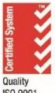

{0}------------------------------------------------

## **APPENDIX 4E: FINAL REPORT FOR THE YEAR ENDED 30 JUNE 2022**

The following sets out the requirements of Appendix 4E with the stipulated information:

## **1. Reporting Period**

| Report for the financial year ended:                          | 30 June 2022 |  |
|------------------------------------------------------------------|--------------|--|
| Previous corresponding period is the financial year ended: | 30 June 2021 |  |

## **2. Results for announcement to the market (Item 2)**

|                                                                    |    |        |    | \$          |
|--------------------------------------------------------------------|----|--------|----|-------------|
| Revenues from ordinary activities                                  | up | 0.3%   | to | 4,638,696   |
| Loss from ordinary activities after tax attributable to members | up | 215.7% | to | (9,445,288) |
| Net loss for the period attributable to members                    | up | 215.7% | to | (9,445,288) |
| Dividends                                                          |    |        |    | n/a         |
| Record date for determining entitlements to a dividend             |    |        |    | n/a         |

## **Brief explanation of any of the figures reported above necessary to enable the figures to be understood (Item 2.6)**

Refer to the audited financial statements in the attached 2022 Annual Report.

## **3. Statement of Comprehensive Income (Item 3)** Refer to page 29.

**4. Statement of Financial Position (Item 4)** Refer to page 30.

## **5. Statement of Cash Flows (Item 5)** Refer to page 32.

**6. Statement of Changes in Equity (Item 6)** Refer to page 31.

## **7. Dividends (Item 7)**

No dividends were paid or declared during the year.

{1}------------------------------------------------

## **8. Dividend Reinvestment Plan (Item 8)**

There was no dividend reinvestment plan in operation which occurred during the financial year.

|                                                                                            | 2022                             | 2021    |
|--------------------------------------------------------------------------------------------|----------------------------------|---------|
| Net tangible asset backing per ordinary security                                           | \$0.017                          | \$0.026 |
|                                                                                            |                                  |         |
| Details of Entities over which Control has been Gained or Lost during the Period (Item 10) |                                  |         |
| Name of entities for which AR9 gained control                                              | Date of gain of control          |         |
|                                                                                            |                                  |         |
| archTIS UK Limited archTIS EU GmbH                                                      | 19 July 2021 26 November 2021 |         |

*Name of entities for which AR9 lost control Date of loss of control* archTIS Solutions Pty Limited 1 July 2022 archTIS Services Pty Limited 1 July 2022

## **11. Details of Associates and Joint Venture Entities (Item 11)**

Not applicable

.

- **12. Details of Significant Information Relating to the Entity's Financial Performance and Financial Position (Item 12)**
Refer to the audited financial statements in the attached 2022 Annual Report.

- **13. For Foreign Entities, which set of Accounting Standards is Used in Compiling the Report (Item 13)** Not applicable
## **14. Commentary on Results for the Period (Item 14)**

Refer to the audited 2022 Annual Report attached for further information.

## **15. Audit of the Financial Report (Items 15 to 17)**

The attached 2022 Annual Report has been audited. All documents comprise the information required by listing rule 4.3A.

{2}------------------------------------------------

# 20 22 For personal use only

# ANNUAL REPORT

**ARCHTIS LIMITED**

ANNUAL REPORT 2022 **ARCHTIS LIMITED | AR9 | ACN 123 098 671**

{3}------------------------------------------------

## TRUSTED TO SAFEGUARD THE WORLD'S MOST SENSITIVE INFORMATION

a

archTIS' products apply and enforce dynamic, policy-driven access, usage and sharing controls that leverage both user and data attributes to ensure your users and partners access, share and collaborate on sensitive, classified and top secret information, securely. For personal use only

{4}------------------------------------------------

a

## CONTENTS

| CORPORATE DIRECTORY                                                        | 4  |
|----------------------------------------------------------------------------|----|
| LETTER FROM THE CHAIRMAN                                                   | 5  |
| LETTER FROM THE CEO                                                        | 6  |
| HIGHLIGHTS                                                                 | 7  |
| EXECUTIVE LEADERSHIP                                                       | 8  |
| OVERVIEW OF FY22                                                           | 10 |
| DIRECTORS ' REPORT                                                      | 14 |
| FINANCIAL STATEMENTS                                                       | 28 |
| CONSOLIDATED STATEMENT OF PROFIT OR LOSS AND OTHER COMPREHENSIVE INCOME | 29 |
| CONSOLIDATED STATEMENT OF FINANCIAL POSITION                               | 30 |
| CONSOLIDATED STATEMENT OF CHANGES IN EQUITY                                | 31 |
| CONSOLIDATED STATEMENT OF CASH FLOWS                                       | 32 |
| NOTES TO THE FINANCIAL STATEMENTS                                          | 33 |
| DIRECTORS' DECLARATION                                                     | 66 |
| INDEPENDENT AUDITOR'S DECLARATION                                          | 67 |
| INDEPENDENT AUDITOR'S REPORT TO THE MEMBERS OF ARCHTIS LIMITED          | 68 |
| SHAREHOLDER INFORMATION                                                    | 72 |

{5}------------------------------------------------

For personal use only

## CORPORATE DIRECTORY

## **DIRECTORS**

Miles Jakeman AM Daniel Lai Leanne Graham

## **JOINT COMPANY SECRETARIES**

Erlyn Dale Winton Willesee

## **REGISTERED OFFICE**

Level 3, archTIS House 10 National Circuit Barton ACT 2600 (02) 6162 2783

## **PRINCIPAL PLACE OF BUSINESS**

Level 3, archTIS House 10 National Circuit Barton ACT 2600

## **SHARE REGISTRIES**

Automic Level 5, 191 St Georges Terrace Perth, WA 6000 (08) 9324 2099

Link Market Services (Employee Incentive Plan Register) 10 Eagle Street Brisbane, QLD 4000 1300 554 474

## **AUDITOR**

RSM Australia Partners Equinox Building 4, Level 2 70 Kent Street Deakin, ACT 2600

## **STOCK EXCHANGE LISTING**

archTIS Limited shares are listed on the:

ASX: AR9 OTCQB: ARHLF

**WEBSITE** www.archtis.com

{6}------------------------------------------------

## LETTER FROM THE CHAIRMAN

**DR MILES JAKEMAN AM** 

Dear fellow shareholders,

I am pleased to present the 2022 Annual Report for archTIS Limited (ASX:AR9) (the Company) evidencing another good year and continued successful execution of the Company's strategic plans.

As background, the ongoing challenges and disruptions posed by COVID-19 initially impacted our operations and growth across global markets. Notwithstanding this, the team worked hard and sharpened its focus, thereby enabling them to deliver year-on-year growth in both licensing and annual recurring revenues (up 126% and 70% respectively). Total Revenue for FY22 was \$4.64M. Gross Profit for the year also grew to \$3.2M. While neither of these were as high as hoped due to the COVID-affected slow sales start to the FY, the quality of these earnings in terms of marquee clientele, repeatability and improved margins were particularly pleasing. From a shareholder perspective, such factors all contribute to making the Company more predictable and valuable.

In terms of material activities, the Company successfully completed its U.S. public market quoting on the OTCQB as well as finalising the merger integration of both Nucleus Cyber and the acquired Cipherpoint technology assets, customers, staff and global operations. In November, the Company successfully undertook a \$6.9M capital raise and associated share purchase plan to achieve these expansion goals. These funds were used to establish a stronger U.S. sales force, expanded Microsoft co-sell capabilities, and better reseller relationships in Asia. Pleasingly, archTIS also delivered new versions and feature sets across its entire software offering during the year.

From a sales perspective, Q4 FY22 saw the team successfully enter into its largest ever deal (circa \$7.0M with the Australian Department of Defence), which strongly validates the Company's products for securing sensitive information and enabling multi-party sharing across global networks.

Moreover, this contract provides an important reference for further related sales opportunities which, as archTIS continues to expand, will amplify via the "network growth" effect. Coupled with industry tailwinds and increased levels of spending on cybersecurity globally, I expect that the Company will continue to witness growing demand for its products.

Furthermore, I also anticipate the strong close to FY22 will lead to another record-breaking year in FY23 (the new Defence deal alone is expected to provide \$5.0M in recognisable revenue and \$7.0M in cash proceeds). On that basis, the Company provided guidance for a minimum year-on-year revenue increase of 60%. FY23 cash receipts without incremental new sales are expected to be a minimum of \$9.5M. Core gross margins are expected to remain at the targeted 70% level, while the Company is targeting its monthly cash burn to halve during FY23 due to increased revenues, cash receipts and continued close monitoring of operating expenses. Importantly, this will support the trend toward cash-flow neutrality.

In closing, and on behalf of the wider Board and Executive team, I would like to thank the entire team for their commitment and continued execution of our strategic initiatives. I would also like to thank our shareholders for their ongoing support as we strive to become a major cybersecurity company globally.

Yours sincerely,

**Dr Miles Jakeman AM**  Chairman of the Board 24 AUGUST 2022

{7}------------------------------------------------

## LETTER FROM THE CEO & MANAGING DIRECTOR

**DANIEL LAI**

## Dear fellow shareholders,

FY22 will go down as a year of important quiet achievements and execution for archTIS – a milestone period in terms of validating the Company's longerterm strategy of becoming the premier provider of policy enforcement to Global Defence and adjacent Defence Industrial Base (DIB).

The quiet achievements have included the Australian Department of Defence providing an endorsed use case for NC Protect and archTIS being named as part of the winning KPMG consortia to deliver the One Defence Data Strategy. FY22 culminated with the awarding of a \$7.0M contract with Defence for the expansion of Kojensi, the largest single deal in archTIS' history. Collectively, these wins validate our strategy over the last 18 months, focusing on Australian Defence as the foundation of revenue as well as a referenceable lead as we seek to expand into our overseas Defence markets such as the US and EMEA. Additionally, beyond validating market demand and competitive advantage of our policy enforcement products, each of these opportunities will continue to grow revenue into FY23. Equally, this recognition was also acknowledged by the industry with the NC Protect and Kojensi solutions winning 8 Gold Product Awards in the 2022 Cybersecurity Excellence Awards in February across a variety of categories. For personal use only

Growing revenue is a key objective within our strategy. Specifically, expansion of licensing revenues, focusing on more predictable revenue streams, as well as enhancing Annual Recurring Revenue (ARR) and the margin profile of the Company are current priorities. Whilst we achieved solid momentum across each of these metrics during FY22, the outlook is for enhanced growth across these metrics for FY23.

Kojensi as a SaaS platform successfully delivered a 100% growth over the period and demonstrated the network growth effect that we have invested in, whilst maintaining a low churn and high margin. This growth includes the expansion of licences with existing global clients in addition to onboarding of new clients in the Defence Industrial Base as well as the Research and Development sectors. Over FY22, we have made significant R&D investment to prepare Kojensi for launch within overseas markets.

This includes Kojensi V2.0 adding several new features to address the global tightening of Defence Export Controls compliance requirements, including the International Trade and Arms Regulations (ITAR). We're particularly excited to launch Kojensi into the U.S. in FY23.

NC Protect global growth continues to be driven via key strategic channel partner alliances across Microsoft and Thales, which has led to a favourable 'network' effect across our customer base, expanding our pipeline to an all-time high. Notably, the IP Cosell partnership with Microsoft continues to drive significant levels of interest from ancillary defence and intelligence agencies as well as corporations looking for enhanced data security across their protected and top-secret cloud, hybrid and onpremises environments. Encouragingly, this is resulting in immediate sales opportunities for the team, amplified by ongoing corporate investment in digital transformation across supply chains, manufacturing, defence, intelligence, government and industry on a global scale. Together, this also provides a more supportive backdrop for future opportunities for archTIS.

Laying these foundations forms a critical element within our strategy of exporting archTIS' products and platforms globally, building upon our success domestically, within Australia. Throughout FY22 we have continued to support and monitor our US subsidiary (archTIS US, Inc.) in achieving this objective. We continue to observe positive leadindicators of sales growth in both U.S. and EMEA.

I would like to also thank our fellow Directors and global staff for their support over a very busy 12 month period as we continued the Company's growth. Likewise, thank you to our supportive shareholders for your continued vote of confidence in the business and its team. We look forward to delivering on the opportunities for the business moving forward and growing shareholder value.

Yours sincerely,

**Daniel Lai** CEO & Managing Director 24 AUGUST 2022

{8}------------------------------------------------

## HIGHLIGHTS

**Largest deal in Company history signed with Australian Department of Defence**

**with annual recurring revenue +70%*** 

**Strong cash position as at 30 June 2022 of**

\$6.6M

**with additional \$2M collected post Q4 period**

**Consistent operating expenses across prior**

For personal use only

**FY23 outlook of minimum** 60%

**annual revenue growth and \$9.5M of cash receipts** 

*Prior Comparative Period (PCP)

{9}------------------------------------------------

## EXECUTIVE LEADERSHIP

Daniel Lai is the CEO and Managing Director of archTIS. He has extensive industry experience in successfully delivering outcomes as part of a senior executive team to both government and commercial organisations. Most importantly Lai has direct experience in implementing organisational change to address the real challenges businesses confront today in a rapidly evolving environment.

Over his career, he has had many successes including leading the Security Enterprise Architecture for the Single Information Environment for the Department of Defence, leading enterprise change as the National Manager for Service Delivery for the Australian Customs and Border Protection Service, and restructuring and implementing enterprise ITIL services for the Australian Customs and Border Protection Service. Lai is a regular speaker at industry events and has been featured in the Financial Review and CIO magazine. For personal use only

CEO AND MANAGING DIRECTOR GLOBAL COO & US PRESIDENT CHIEF FINANCIAL OFFICER CHIEF TECHNOLOGY OFFICER

As Global Chief Operating Officer (COO) and US President of archTIS, Kurt Mueffelmann brings over 25 years of technology leadership to the companies. He brings his passion for start-ups, and proven strategies for scaling go to market efforts and achieving hyper revenue growth to the role.

Mueffelmann has overseen the growth and sale of four technology companies and earned two Deloitte Fast 500 company awards at previous companies. He has served as CEO of Cryptzone, HiSoftware (acquired by Cryptzone), Create!form International (acquired by Bottomline Technologies), and RealWord (acquired by Microsoft Great Plains). Mueffelmann was Vice President and General Manager of both the Document Output Solutions and Business Process Solutions divisions of Bottomline Technologies where he was responsible for over \$40M in profitable revenue while broadening the product lines and expanding the distribution model.

Mueffelmann has served on the advisory boards of numerous companies and professional organisations within the technology industry.

Kylie Sheather is the Chief Financial Officer of archTIS. With extensive knowledge of software as a service companies, Sheather has held senior financial roles for medium and large listed companies. Sheather's strong project management, associated process reengineering and change management skills support the Company's expansion goals.

Sheather most recently served as TechnologyOne Director of Finance and Business Partnering. Her prior roles include Group Financial Controller at ASXlisted engineering services company LogiCamms and held a number of senior roles at Boom Logistics.

DANIEL LAI KURT MUEFFELMANN KYLIE SHEATHER THOMAS MYERSCOUGH

As CTO Thomas Myerscough is responsible for managing archTIS' technical strategy, service management, and relationships with key technology partners. He brings more than 30 years of experience in the IT industry, with 20 years in Federal Government technology. In this time, he successfully delivered projects from design to implementation and support for the Australian Department of Defence, Australian Taxation Office and the Department of Finance and Deregulation. His government and subsequent private industry experience gives Myerscough a deep breadth of expertise from which to call upon to innovate archTIS technology platforms and ensure seamless client delivery.

{10}------------------------------------------------

LEIGH ROWLAND IRENA MROZ BILL BELCHER MATTHEW KLUKEN CHIEF ENGINEER CHIEF MARKETING OFFICER VICE PRESIDENT OF

As the Chief Engineer of archTIS, Leigh Rowland is responsible for driving the evolution of the company's technology to provide secure collaboration and seamless integration into supported platforms. Under his leadership, NC Protect has expanded from its core strength of protecting documents in SharePoint on-premises, to extend the same protection to cloud collaboration and storage repositories including SharePoint Online, Microsoft 365, Microsoft Teams, and Nutanix, as well as the protection of Exchange emails.

He began his career at Xerox and has been involved in a series of successful startups as a consultant and development leader including Cyxtera, Cryptzone (acquire by Cyxtera), and Create!form International. He helped build and on-sell the businesses through a strong focus on innovative software solutions. His involvement with Security Sheriff began back in 2011 and he has continued to be involved in the design and development of the industry leading security solution. Rowland earned Bachelor of Science (Hons) in Mathematics from University of York.

Irena Mroz is CMO of archTIS. She is responsible for defining the company's branding, demand generation and public relations. An innovative strategist with impeccable attention to detail, Mroz leverages more than 20 years of B2B marketing expertise to direct the company's marketing strategy and communications programs.

She served as VP of Marketing at several cybersecurity start-ups including data-centric security company Nucleus Cyber (acquired by archTIS) and Infocyte, a malware and threat hunting solution. As the SVP of Marketing for Cryptzone's network and application security solutions and the VP of Marketing for HiSoftware, a provider of compliance and security solutions acquired by Cryptzone, she led the integration of the two global marketing organizations, while managing development of all strategic marketing programs and communications for the joint entity. Her previous roles include senior marketing positions at Bottomline Technologies and Create!form International.

Mroz holds a Bachelor of Science in Mass Communications from Boston University's College of Communication.

GLOBAL SALES

Bill Belcher brings over 30 years of experience building sales teams, reseller channels and system integrator relationships to deliver best in class solutions across multiple market verticals. He is responsible for the company's global sales teams with the goal of expanding the use of archTIS NC Protect and Kojensi solutions across DoD and civilian agencies, their supply chain and large commercial accounts.

After spending the first five years of his career as a sales analyst and Contracts Administrator, Belcher has spent his career working for a variety of network and cyber software start-ups, turn arounds, and leading technology companies including GE, Micromuse, and Spirent Communications. Prior to joining archTIS he was Vice President of Sales and Business Development for Boldon James responsible for the American operations.

Belcher graduated from The American University with a BA in Economics and Political Science and a Master of Public Administration degree with a concentration in organizational development.

VICE PRESIDENT & GENERAL MANAGER ASIA PACIFIC

Matt Kluken has 27 years experience in the Information and Communication Technologies Industry in Sales, Marketing, Technical and Customer Experience in Australian ICT and large multinational technology and advisory companies such as Gartner, NetApp, CA Technologies and Oracle.

As Vice President & General Manager Asia Pacific, Kluken's primary focus is building archTIS' presence with global Defence, Intelligence, Federal and State Governments and Defence Industry companies, as well as building and growing our partner eco-system supporting these markets, both within the Asia Pacific region.

{11}------------------------------------------------

## Overview Of FY22

During FY22, the Company continued to deliver on the tactical execution across several key areas including:

- Customer-centric vertical focus of the Defence and Intelligence and Defence Industrial Base (DIB);
• Alliance expansion of key relationships across Microsoft, Thales, KPMG and DIB; and

- Drive product innovation across its two core products, Kojensi and NC Protect.
archTIS delivered revenue of \$4.6M with a 70.5% gross operating margin. This was highlighted by \$2.6M in licensing revenue, up 126% on the prior year with annual recurring revenues at year-end of \$3.3M, up 66% from the prior year. Operating expense investments in the business were \$10.3M (excluding capitalisation for the year), consistent for the last 3 quarters. The Company ended 30 June 2022 in a strong financial position with \$6.6M of available cash. Additional cash receipts of \$2.0M were collected from customers post the end of financial year. The Company continues to show a strong growth trend across licensing revenue; driven by the predicable, low-churn growth of annual recurring revenue – starting at \$0 in 2019 to today's values.

## **2019 2020 2021 Licensing Revenue ARR 2022 3,500,000 2,500,000 1,500,000 500,000 3,000,000 2,000,000 1,000,000**

GROWING LICENSING REVENUE AND ARR

## FY22 Customer Wins Validating Strategy

archTIS continued to demonstrate customer traction across Defence and Intelligence, Microsoft IP Co-sell, expanded geographical channel growth and strong customer retention. Most notably, the Company secured a \$7.0M contract in June with the Australian Department of Defence (Defence) for expanded and enhanced licensing of Kojensi to be deployed onpremises. The sale continues archTlS' strong growth in the Defence and DIB market, while establishing Kojensi and NC Protect for future user and licensing growth as Defence expands the platform across additional sites.

Beyond the deployment of Kojensi and NC Protect directly into Defence, general commercial application continually expands into practical use-cases across sectors, illustrating the "network growth" effect in driving global customer acquisition. Adoption from global energy conglomerates, financial institutions, as well as multinational manufacturers and distributors is ongoing, resulting in additional contract wins during FY22 via new, expanded, and renewed solutions across regions, including:

- **• North America** U.S. Department of Health and Human Services agency, leading Real Estate management company, Health insurance providers and materials sciences;
- **EMEA** Middle-Eastern government agency, global European bank, global logistics company; and
- **APAC** Singapore government agency, several higher-education institutions and large DIBs.

## Key Alliance Development

## **MICROSOFT PARTNERSHIP AND IP CO-SELL**

The Company continued to make significant inroads through the ever-expanding relationship with Microsoft. A number of co-sell deals were closed, as well as the creation of \$15M in pipeline; generally across the Defence and Intelligence vertical within Microsoft.

{12}------------------------------------------------

archTIS was invited to participate with Microsoft in a number of key events and tradeshows including Microsoft Ignite, Eurosatory, regional Microsoft sales kick-off meetings and Microsoft Inspire, Microsoft's global partner kick-off conference for FY23.

## **KPMG CONSORTIUM**

The acquisition of Tranche 1 of the ICT 2284 OneDefence Data Program was announced by the Australian Assistant Minister of Defence, the Hon Andrew Hastie MP, on 8 April 20221 . The announcement advised that defence had entered into a contract with KPMG to lead a consortium of industry leading suppliers, which would aim to improve the data maturity and security of the Australian Defence Force.

Also announced in April 2022, archTIS was invited to participate in a KPMG-led systems integration consortium for Defence. While a pleasing vote of confidence for the Company in working closely with KPMG and the other members of the OneDefence consortium to improve the data maturity and security of the Defence Force, archTIS is currently in discussion with KPMG to finalise the terms of its involvement in the consortium including value, length and other underlying terms of the project. archTIS will update the market as those terms are finalised. For personal use only

## Technology Innovation

archTIS' significant R&D investment throughout the year was ongoing as the company continues to extend the functionality and capabilities of its software solutions. Beyond the news of NC Protect and Kojensi solutions receiving 8 Gold Product Awards in the 2022 Cybersecurity Excellence Awards in February, across a variety of categories and being a Finalist in the 2021 Australian Defence Industry Awards in August, the company continues to highlight the commercial application potential of archTIS' product offering.

In doing so, the Company was able to achieve significant milestones during FY22, all tangible examples of the ongoing focus on product innovation, critically enabling greater buy-in and channel collaboration across our key markets. Specifically, archTIS:

- 1. Successfully released Kojensi Enterprise v2.0 in Australian marketplace;
- 2. Announced availability of NC Protect for Microsoft 365 in the Azure Marketplace; and
- 3. Announced new Controlled Unclassified Information (CUI) designator labelling capability for US Defence requirements.

## **KOJENSI ENTERPRISE V2.0 LAUNCH**

Kojensi is a military grade multi-level security (MLS) document collaboration management platform for government, Defence, industry and higher education institutions. It empowers secure collaboration between Defence, industry partners and multinational coalitions with dynamic and granular ABAC-based information barriers. The release adds new fine grain controls via an in-app Secure Document Viewer that enforces read-only viewing of sensitive information, expanded search and classification controls to assist with granular management of content and simplified deployment for on-premises environments.

## **NC PROTECT MICROSOFT AZURE MARKETPLACE LAUNCH**

In continuing with a strong Microsoft partnership, archTIS announced the availability of NC Protect for Microsoft 365 in both Microsoft Azure Marketplace and Azure Government Marketplace, online stores providing applications and services for use on Azure. Microsoft Azure customers worldwide now gain access to NC Protect to take advantage of the scalability, reliability and agility of Azure, to drive application development and shape business strategies through streamlined deployment and management. This is critical in bolstering the Company's relationship with, and integration into, the Microsoft suite.

1 https://www.minister.defence.gov.au/minister/andrew-hastie/media-releases/managing-defence-data-military-and-strategic-advantage

{13}------------------------------------------------

## **NEW CUI DESIGNATOR LABELLING CAPABILITY**

As announced on 14 June 2022, the Company introduced a new NC Protect watermarking feature to support CUI Designator labelling to assist US Defence and the DIB with meeting the requirements for CUI document handling and tagging to meet CMMC 2.0, NIST and ITAR compliance. The feature will be globally available, expanding the strategic market opportunity across defence and defence prime contractors.

## Corporate

## **CAPITAL RAISE**

As announced on 11 November 2021, archTIS successfully completed placement and associated SPP, raising \$6.9M. The proceeds enabled the continued global expansion of sales and marketing investments, continued development of strategic alliances with the likes of Microsoft, Thales and KPMG and assisted in the development and readiness of Kojensi to enter international markets. In addition to Australian investors, the raise also saw several US-based institutions enter the Company's register.

## **COMMENCED TRADING ON THE OTCQB MARKET IN THE UNITED STATES**

archTIS successfully commenced trading on the U.S. based OTCQB Market as announced on 2 November 2021 under the stock ticker OTCQB: ARHLF. The Company's quotation on OTCQB broadens archTIS' international profile and provides U.S. institutional and retail investors with the ability to trade the Company's stock, aligning with global expansion efforts. The U.S. is an important growth market for the Company. Being quoted on the OTCQB helps to establish archTIS' presence in the U.S. market with key corporate executives, along with federal agencies and defence contractors.

## **CIPHERPOINT TECHNOLOGY ACQUISITION**

As announced on 20 September 2021, archTIS acquired certain business technology assets, customers and employees connected with the software division of Cipherpoint Limited and its subsidiaries for acquisition price of \$1.4M initial cash consideration and an additional consideration of \$0.1M which was settled 31 March 22. The acquisition included intellectual property of 'cp.Protect', an advanced SharePoint on-premises data encryption solution, as well as 'cp.Discover', a data discovery and classification platform. The acquisition also delivered new and compelling customers to the Company, including DHL, Bank of Finland, and Arthur J. Gallagher, as well as important technology partners NTT Singapore and NTT DATA Deutschland.

## Outlook

archTIS' recent Australian Defence deal provides \$5.0M of recognisable revenue in FY23, along with \$7.0M of cash proceeds. The Company is providing revenue outlook guidance for a minimum year-on-year increase of 60% with current visibility for triple-digit growth in FY23. This includes committed revenue associated with the Defence contract, existing shortterm deferred revenue on the balance sheet and previously committed contractual engagements. Core gross margins are anticipated to remain at the targeted 70% level. FY23 cash receipts (without further new sales) are expected to be a minimum of \$9.5M. The Company also expects to see its monthly cash burn halved, during FY23, due to increased revenues, cash receipts and continued monitoring of operating expenses. This will support the trend toward cash-ow neutrality.

{14}------------------------------------------------

DYNAMIC ACCESS & DATA PROTECTION FOR MICROSOFT 365 APPS & FILE SHARES

For personal use only

Discover, classify and secure sensitive information

Prevent data loss, misuse and human error

Audit and report for compliance

SENSITIVE & CLASSIFIED INFORMATION - SHARED SECURELY

Accredited secure document collaboration

Share sensitive and classified files securely

Enforce zero trust with attribute-based access control (ABAC)

ANNUAL REPORT 2022 13

{15}------------------------------------------------

For personal use only

# DIRECTORS' REPORT

The directors present their report, together with the financial statements, on the Group (referred to hereafter as the 'Group') consisting of archTIS Limited (referred to hereafter as the 'company' or 'parent entity') and the entities it controlled at the end of, or during, the year ended 30 June 2022 ('Reporting Period' or 'FY2022').

> ANNUAL REPORT 2022 14

{16}------------------------------------------------

## Directors

The following persons were directors of archTIS Limited during the whole of the financial year and up to the date of this report, unless otherwise stated:

- Miles Jakeman
- Daniel Lai
- Leanne Graham

## Directors and Meetings of Directors

The qualifications and experience of directors, including current and recent directorships, are detailed below:

**DR MILES JAKEMAN AM Chairman of the Board**

Miles Jakeman is a specialist in business strategy, leadership, high performance team development, and risk management. As a company director, former CEO and technology business founder, he brings deep domain expertise in these areas and has successfully guided companies across global markets to deliver outstanding year-on-year results. After 30 years of industry experience, with the last 20 years as a director, he has also built an excellent network in the government, enterprise, and healthcare sectors.

Jakeman co-founded and was the Managing Director of Australian software and technology success story, The Citadel Group Limited ("Citadel"). During his time as Managing Director, he grew Citadel from a start-up to an ASX-listed company with over 300 staff and a market capitalisation of more than \$400M. The company was subsequently sold to Pacific Equity Partners for \$503M.

Jakeman has a Bachelor of Science (Hons), a Graduate Diploma in Asian Studies, a Doctorate of Philosophy (PhD) in Asian Studies and a second PhD in Business Leadership. He is conversant in Bahasa Indonesia, Malay and Tok Pisin. Professionally, Jakeman is a Fellow of the Australian Institute of Company Directors (AICD) and has successfully completed both the AICD Diploma of International Company Directors and the Mastering the Boardroom Advanced Diploma. Jakeman was appointed as a Member of the Order of Australia (AM) for significant service to business, national security, and to the community.

**Interest in Shares and Options:** 1,634,545 ordinary shares and 1,360,000 unlisted options

**Other current directorships:** GetBusy plc (AIM:GetB), Fifth Domain Pty Ltd

**Former directorships (last 3 years):** Manteena Security Australia Pty Ltd (resigned 20 August 2021), The Shepherd Centre Charity (resigned 22 March 2022)

**ARCHTIS LIMITED**

{17}------------------------------------------------

## DIRECTORS' REPORT

Daniel Lai is a founding member of the Company and has successfully developed the business with its partners to be recognised by the Australian and United States Departments of Defence as a thought leader in information sharing strategies. Most importantly Lai has direct experience in implementing organisational change to address the real challenges businesses confront today in a rapidly evolving environment.

**Interest in Shares and Options:** 9,595,991 ordinary shares, 7,246 listed options and 612,245 performance rights

**Other current directorships:** None

**Former directorships (last 3 years):** None

With over 30 years in the software sector, Leanne Graham has assisted technology companies with her broad experience and SaaS expertise. In 2018, Graham was awarded the New Zealand Order of Merit for her services to the software industry. Graham is also a director of Bill Identity Limited (formerly BidEnergy Limited), and Bridge SaaS Limited.

**Interest in Shares and Options:** 773,474 ordinary shares, 6,612 listed options and 750,000 unlisted options

**Other current directorships:** Non-Executive Director of Bill Identity Limited and Bridge SaaS Limited

**Former directorships (last 3 years):** Douugh Limited (resigned 29 July 2022), Executive Chairman of Health House International Limited (formerly Velpic Limited) (resigned 19 March 2021) and Non- Executive Director of AppsVillage (resigned 10 June 2020).

{18}------------------------------------------------

The number of meetings of the company's Board of Directors ('the Board') held during the year ended 30 June 2022, and the number of meetings attended by each director were:

|               | Number of Meetings Held | Number Attended |
|---------------|-------------------------|-----------------|
| Miles Jakeman | 12                      | 12              |
| Daniel Lai    | 12                      | 12              |
| Leanne Graham | 12                      | 11              |

The Directors have determined that the Group's operations continue not to be of a sufficient magnitude to require the Board Committees outlined in the Corporate Governance Plan. The Board is carrying out the duties that would ordinarily be assigned to each committee under the written terms of reference for that committee.

## COMPANY SECRETARY

As at the date of this report, the role of company secretary is held jointly by Winton Willesee and Erlyn Dawson.

## **Erlyn Dawson**

## **Joint-Company Secretary**

Erlyn Dawson is an experienced corporate professional with a broad range of corporate governance and capital markets experience, having been involved with several public company listings, merger and acquisition transactions and capital raisings for ASX-listed companies across a diverse range of industries.

Dawson holds a Bachelor of Commerce (Accounting and Finance) and a Graduate Diploma in Applied Corporate Governance. She is a member of the Governance Institute of Australia/Chartered Secretary.

## **Winton Willesee Joint-Company Secretary**

Willesee is an experienced company director and secretary with over 20 years' experience in various roles within the Australian capital markets. Willesee has considerable experience with ASX listed and other companies over a broad range of industries having been involved with many successful ventures from early stage through to large capital development projects.

Willesee holds a Master of Commerce, a Post-Graduate Diploma in Business (Economics and Finance), a Graduate Diploma in Applied Finance and Investment, a Graduate Diploma in Applied Corporate Governance, a Graduate Diploma in Education and a Bachelor of Business. He is a Fellow of the Financial Services Institute of Australasia, a Graduate of the Australian Institute of Company Directors, a Member of CPA Australia and a Fellow of the Governance Institute of Australia and the Institute of Chartered Secretaries and Administrators/ Chartered Secretary.

## PRINCIPAL ACTIVITIES

During the financial year the principal continuing activities of the Group consisted of:

- Sales of a secure information management and collaboration software: Kojensi either in-cloud or on-premise and NC Protect for users of the Microsoft software suite;
- Integration of certain Cipherpoint Limited technologies into NC Protect and M365 solutions; and
- Consulting and solutions services for secure information sharing and inter-organisational collaboration related to the above software sale

{19}------------------------------------------------

## Dividends

No dividends were paid during the financial year.

## Review of Operations

Refer to pages 10 – 12 of the annual report for an overview of the FY22 operations'.

## Significant changes in the state of affairs

As announced on 20 September 2021, archTIS Limited, acquired certain business assets, customers and employees connected with the software division of Cipherpoint Limited and its subsidiaries as disclosed in note 12 Business Combinations. The acquisition includes intellectual property of 'cp.Protect', an advanced SharePoint on-premise data encryption solution, as well as 'cp.Discover', a data discovery and classification platform. For personal use only

There were no other significant changes in the state of affairs of the Group entity during the financial year.

## Matters subsequent to the end of the financial year

No matter or circumstance has arisen since 30 June 2022 which has significantly affected, or may significantly affect:

- a) the Company's operations in future financial years, or
- b) the results of those operations in future financial years, or
- c) the Company's state of affairs in future financial years.

## COVID-19

As the impact of the Coronavirus (COVID-19) pandemic is ongoing, it is not practicable to estimate the potential impact, positive or negative, after the reporting date. The situation continues to develop and is dependent on continued measures imposed by the Australian Government and other countries, such as maintaining social distancing requirements, quarantine, travel restrictions and any further economic stimulus that may be provided.

No other matter or circumstance has arisen since 30 June 2022 that has significantly affected, or may significantly affect the Group's operations, the results of those operations, or the Group's state of affairs in future financial years.

## Likely developments and expected results of operations

Information on likely developments in the operations of the Group and the expected results of operations have not been included in this report because the directors believe it would be likely to result in unreasonable prejudice to the Group.

{20}------------------------------------------------

## Environmental regulation

The Group is not subject to any significant environmental regulation under Australian Commonwealth or State law.

## Indemnity and insurance of officers

## Proceedings on behalf of the company

## Shares under option

| y l faith. n       | The company has indemnified the directors and executives of the company for costs incurred, in their capacity as a director or executive, for which they may be held personally liable, except where there is a lack of good During the financial year, the company paid a premium in respect of a contract to insure the directors and |             |                |                          |
|-----------------------------|-----------------------------------------------------------------------------------------------------------------------------------------------------------------------------------------------------------------------------------------------------------------------------------------------------------------------------------------------|-------------|----------------|--------------------------|
| o                           | executives of the company against a liability to the extent permitted by the Corporations Act 2001. The contract of insurance prohibits disclosure of the nature of the liability and the amount of the premium.                                                                                                                           |             |                |                          |
|                             | Proceedings on behalf of the company                                                                                                                                                                                                                                                                                                          |             |                |                          |
| e s                      | No person has applied to the Court under section 237 of the Corporations Act 2001 for leave to bring proceedings on behalf of the Group, or to intervene in any proceedings to which the company is a party for the purpose of taking responsibility on behalf of the Group for all or part of those proceedings.                       |             |                |                          |
| u Shares under option    |                                                                                                                                                                                                                                                                                                                                               |             |                |                          |
|                             | Unissued ordinary shares of archTIS Limited under option at the date of this report are as follows:                                                                                                                                                                                                                                           |             |                |                          |
| l Class Code a        | Grant Date                                                                                                                                                                                                                                                                                                                                    | Expiry Date | Exercise Price | Number under Option   |
| AR9O1                       | 10 Oct 2017                                                                                                                                                                                                                                                                                                                                   | 10 Oct 2022 | \$ 0.100       | 420,000                  |
| n AR9O3                  | 22 May 2018                                                                                                                                                                                                                                                                                                                                   | 1 Jul 2023  | \$ 0.200       | 800,000                  |
| o AR9O5                  | 06 Sep 2018                                                                                                                                                                                                                                                                                                                                   | 6 Sep 2022  | \$ 0.240       | 1,330,000                |
| AR9O7                       | 20 Nov 2019                                                                                                                                                                                                                                                                                                                                   | 1 Jul 2023  | \$0.200        | 250,000                  |
| s AR9O8                  | 13 Feb 2020                                                                                                                                                                                                                                                                                                                                   | 13 Feb 2023 | \$0.200        | 360,000                  |
|                             | 30 Jun 2020                                                                                                                                                                                                                                                                                                                                   | 1 Jul 2023  | \$0.100        | 500,000                  |
| r AR9O9                  |                                                                                                                                                                                                                                                                                                                                               |             |                |                          |
| AR9O12                      | 24 Nov 2021                                                                                                                                                                                                                                                                                                                                   | 24 Nov 2025 | \$0.316        | 1,750,000                |
| e AR9O (Listed)          | 23 Dec 2021                                                                                                                                                                                                                                                                                                                                   | 23 Dec 2023 | \$.0.350       |                          |
| p Total options on issue |                                                                                                                                                                                                                                                                                                                                               |             |                | 10,044,257 15,454,257 |

{21}------------------------------------------------

## REMUNERATION REPORT (audited)

The remuneration report details the key management personnel remuneration arrangements for the Group, in accordance with the requirements of section 300A of the Corporations Act 2001 and its Regulations.

Key management personnel are those persons having authority and responsibility for planning, directing and controlling the activities of the entity, directly or indirectly, including all directors.

## Overview of remuneration approach and framework

The performance of the Group depends on the quality of its directors and executives. The remuneration philosophy is to attract, motivate and retain high performance and high-quality personnel.

The remuneration of Directors and other key management personnel is not directly linked to the Group's performance.

The remuneration of Directors and other key management personnel is fixed annually. Incentives are structured to reward outstanding performance against agreed Key Performance Indicators (KPI's) including financial and non-financial metrics.

The Group did not engage a remuneration consultant to provide recommendations in respect of the remuneration of key management personnel.

In accordance with best practice corporate governance, the structure of non-executive director and executive director remuneration is separate.

## Non-executive directors' remuneration

Fees and payments to non-executive directors reflect the demands and responsibilities of their role. Non-executive directors' fees and payments are reviewed annually by the Board.

ASX listing rules require the aggregate non-executive directors' remuneration be determined periodically by a general meeting. The company's Constitution provides that the maximum annual aggregate remuneration for non-executive directors will be not more than a fixed sum determined by a general meeting. On 24 November 2021, shareholders approved the maximum annual aggregate remuneration to \$500,000 per annum. For personal use only

## Executive remuneration

The Group aims to reward executives based on their position and responsibility, with a level and mix of remuneration which has both fixed and variable components.

The executive remuneration and reward framework has four components:

- base pay and non-monetary benefits
- short-term performance incentives
- share-based payments
- other remuneration such as superannuation and long service leave

The combination of these comprises the executive's total remuneration.

{22}------------------------------------------------

**ARCHTIS LIMITED**

## REMUNERATION REPORT (AUDITED) Executive remuneration (continued)

Fixed remuneration, consisting of base salary, superannuation and non-monetary benefits, are reviewed annually by the Board based on individual and business unit performance, the overall performance of the Group and comparable market remunerations.

Executives may receive their fixed remuneration in the form of cash or other fringe benefits (for example motor vehicle benefits) where it does not create any additional costs to the Group and provides additional value to the executive.

The short-term incentives ('STI') program is designed to align the targets of the business units with the performance hurdles of executives. STI payments are granted to executives based on specific annual targets and key performance indicators ('KPI's') being achieved.

The long-term incentives ('LTI') include long service leave and share-based payments. Securities are awarded to executives over a period of three years based on long-term incentive measures. These include increase in shareholders' value relative to the entire market and the increase compared to the Group's direct competitors.

## Details of remuneration

## *Amounts of remuneration*

Details of the remuneration of key management personnel of the Group are set out in the following tables.

During the Reporting Period, the key management personnel of the Group consisted of the following personnel of archTIS Limited. The following persons were key management personnel of the Group during the whole of the Reporting Period and up to the date of this report, unless otherwise stated:

| 2022                     |                                             |  |  |  |  |
|--------------------------|---------------------------------------------|--|--|--|--|
| Directors                |                                             |  |  |  |  |
| Miles Jakeman AM         | Chairman                                    |  |  |  |  |
| Daniel Lai               | Managing Director & Chief Executive Officer |  |  |  |  |
| Leanne Graham            | Non-executive Director                      |  |  |  |  |
| Key Management Personnel |                                             |  |  |  |  |
| Kurt Mueffelmann         | Global Chief Operations Officer             |  |  |  |  |
| Kylie Sheather           | Chief Financial Officer                     |  |  |  |  |

{23}------------------------------------------------

## REMUNERATION REPORT (AUDITED) (CONTINUED) Details of remuneration (continued)

During the prior comparative period, the key management personnel of the Group consisted of the following personnel of archTIS Limited.

| 2021                     |                                                |                                     |  |  |  |  |  |
|--------------------------|------------------------------------------------|-------------------------------------|--|--|--|--|--|
| Directors                |                                                |                                     |  |  |  |  |  |
| Miles Jakeman AM         | Chairman                                       |                                     |  |  |  |  |  |
| Daniel Lai               | Managing Director & Chief Executive Officer |                                     |  |  |  |  |  |
| Leanne Graham            | Non-executive Director                         |                                     |  |  |  |  |  |
| Stephen Smith            | Non-executive Director                         | (until resignation on 31 July 2020) |  |  |  |  |  |
| Wayne Zekulich           | Non-executive Director                         | (until resignation on 31 July 2020) |  |  |  |  |  |
| Bruce Talbot             | Non-executive Director                         | (until resignation on 31 July 2020) |  |  |  |  |  |
| Key Management Personnel |                                                |                                     |  |  |  |  |  |
| Kurt Mueffelmann         | Global Chief Operations Officer                | (commenced on 23 December 2020)     |  |  |  |  |  |
| James Palmer             | Chief Financial Officer                        | (until resignation on 28 May 2021)  |  |  |  |  |  |
| Kylie Sheather           | Chief Financial Officer                        | (commenced on 29 April 2021)        |  |  |  |  |  |

{24}------------------------------------------------

## Details of remuneration (continued)

|             |                          |              | Short-term benefits |            |                                      |                                       |                                |             |                                                          |                                                       |
|-------------|--------------------------|--------------|---------------------|------------|--------------------------------------|---------------------------------------|--------------------------------|-------------|----------------------------------------------------------|-------------------------------------------------------|
| y l n |                          | Salary \$ | Cash bonus \$ | Fees \$ | Share based pay ments \$ | Post employ ment super \$ | Long service leave \$ | Total \$ | % of salary assoc. with perfor mance % | Share based payments as a % of total % |
|             | 2022                     |              |                     |            |                                      |                                       |                                |             |                                                          |                                                       |
| o           | Non-Executive Directors  |              |                     |            |                                      |                                       |                                |             |                                                          |                                                       |
|             | Miles Jakeman AM         | -            | -                   | 75,000     | 37,654                               | 7,156                                 | -                              | 119,810     | -                                                        | 31%                                                   |
| e           | Leanne Graham            | -            | -                   | 54,756     | 26,613                               | -                                     | -                              | 81,369      | -                                                        | 33%                                                   |
| s           | Executive Directors      |              |                     |            |                                      |                                       |                                |             |                                                          |                                                       |
|             | Daniel Lai               | 319,800      | 19,113              | -          | 14,711                               | 33,987                                | 5,000                          | 392,611     | 40%                                                      | 4%                                                    |
| u           | Key Management Personnel |              |                     |            |                                      |                                       |                                |             |                                                          |                                                       |
|             | Kurt Mueffelmann**       | 344,250      | 18,777              | -          | 16,709                               | -                                     | -                              | 379,736     | 30%                                                      | 5%                                                    |
| l           | Kylie Sheather           | 253,351      | 25,520              | -          | 12,562                               | 27,933                                | -                              | 319,366     | 30%                                                      | 4%                                                    |
| a           | 2021                     |              |                     |            |                                      |                                       |                                |             |                                                          |                                                       |
| n           | Non-Executive Directors  |              |                     |            |                                      |                                       |                                |             |                                                          |                                                       |
|             | Miles Jakeman AM         | -            | -                   | 72,917     | 7,687                                | 6,927                                 | -                              | 87,531      | -                                                        | 8%                                                    |
| o           | Leanne Graham            | -            | -                   | 54,756     | -                                    | -                                     | -                              | 54,756      | -                                                        |                                                       |
| s           | Stephen Smith            | -            | -                   | 6,250      | -                                    | 594                                   | -                              | 6,844       | -                                                        |                                                       |
| r           | Wayne Zekulich           | -            | -                   | 4,167      | -                                    | 396                                   | -                              | 4,563       | -                                                        |                                                       |
| e           | Executive Directors      |              |                     |            |                                      |                                       |                                |             |                                                          |                                                       |
|             | Daniel Lai               | 276,966      | -                   | -          | -                                    | 26,312                                | 5,000                          | 308,278     | -                                                        |                                                       |
| p           | Bruce Talbot             | 19,171       | -                   | -          | -                                    | 1,808                                 | 320                            | 21,299      | -                                                        |                                                       |
|             | Key Management Personnel |              |                     |            |                                      |                                       |                                |             |                                                          |                                                       |
| r           | Kurt Mueffelmann*        | 167,250      | -                   | -          | -                                    | -                                     | -                              | 167,250     | 20%                                                      |                                                       |
| o           | James Palmer             | -            | -                   | 222,509    | -                                    | -                                     | -                              | 222,509     | -                                                        |                                                       |
| F           | Kylie Sheather           | 26,639       | -                   | -          | -                                    | -                                     | 443                            | 27,082      | 20%                                                      |                                                       |
|             |                          |              |                     |            |                                      |                                       |                                |             |                                                          |                                                       |

**Estimated AUD remuneration based on USD to AUD 2021/22 average exchange rate of 1.377 *Estimated AUD remuneration based on USD to AUD 2020/21 average exchange rate of 1.338

{25}------------------------------------------------

## Services Agreements

**Name**: Daniel Lai

**Title:** Chief Executive Officer

**Agreement commenced:** 29 June 2018

**Term of agreement:** No fixed term. Six-month termination period.

**Details:** The remuneration of Mr Lai is \$330,000 per year including statutory superannuation, plus an annual cash bonus of an amount, and based on KPIs, set by the Board, and long-term equity incentives as determined by the Board.

**Name:** Kylie Sheather

**Title:** Chief Financial Officer

**Agreement commenced:** 24 May 2021

**Term of agreement:** No fixed term. Four-week termination period.

**Details:** The remuneration of Ms Sheather is \$250,000 per year plus statutory superannuation, plus variation compensation based upon certain targets of an additional 50% of base salary (comprised of cash and longerterm equity incentives).

## **Name:** Kurt Mueffelmann

**Title:** Senior Vice President of Sales and Chief Operating Officer of archTIS and President of US Operations

**Agreement commenced:** 23 December 2020

**Term of agreement:** Annual term, renewed automatically unless either party gives notice not to extend at least 30 days prior to the renewal date. In the event of termination without cause or resignation for good reason (unremedied cause), in addition to accrued amounts, Mr Mueffelmann will receive salary and bonus continuation equal to 12 months base salary plus bonus and performance based securities, and up to 12 months continued insurance benefits. For personal use only

**Details:** The remuneration of Mr Mueffelmann is US\$250,000 per year, plus an annual cash bonus of 20% of base salary, based on KPIs set by the Board, and long-term equity incentives as determined by the Board, plus insurance benefits.

Key management personnel have no entitlement to termination payments in the event of removal for misconduct.

{26}------------------------------------------------

## Share-based compensation

## *Options*

The terms and conditions of each grant of options over ordinary shares affecting remuneration of directors

| AR9012 Class o Non-Executive Directors Miles Jakeman 24 Nov 21 24 Nov 22 24 Nov 25 \$0.316 \$0.097 e 24 Nov 21 24 Nov 23 24 Nov 25 \$0.316 \$0.097 s 24 Nov 21 24 Nov 24 24 Nov 25 \$0.316 \$0.097 Leanne Graham 24 Nov 21 24 Nov 22 24 Nov 25 \$0.316 \$0.097 u 24 Nov 21 24 Nov 23 24 Nov 25 \$0.316 \$0.097 24 Nov 21 24 Nov 24 24 Nov 25 \$0.316 \$0.097 l a During the financial year, AR9012 options were granted to the non-executive directors as part of their remuneration packages. The options are exercisable by the holder from the vesting date. If the holder n ceases to be a director of the Company, vested options will lapse six months after cessation of engagement. o There are no amounts paid or payable by the recipient in relation to the granting of such options other than on their potential exercise. Options granted carry no dividend or voting rights. s r e p | y l n | Grant Date | Vesting Date | Expiry Date | Exercise Price | Value Per Option | Number under Option |
|-----------------------------------------------------------------------------------------------------------------------------------------------------------------------------------------------------------------------------------------------------------------------------------------------------------------------------------------------------------------------------------------------------------------------------------------------------------------------------------------------------------------------------------------------------------------------------------------------------------------------------------------------------------------------------------------------------------------------------------------------------------------------------------------------------------------------------------------------------------------------------------------------------------------------------------------------------------------------------------------------------------------------------------------------------------|-------------|---------------|-----------------|----------------|-------------------|---------------------|------------------------|
|                                                                                                                                                                                                                                                                                                                                                                                                                                                                                                                                                                                                                                                                                                                                                                                                                                                                                                                                                                                                                                                           |             |               |                 |                |                   |                     |                        |
|                                                                                                                                                                                                                                                                                                                                                                                                                                                                                                                                                                                                                                                                                                                                                                                                                                                                                                                                                                                                                                                           |             |               |                 |                |                   |                     |                        |
|                                                                                                                                                                                                                                                                                                                                                                                                                                                                                                                                                                                                                                                                                                                                                                                                                                                                                                                                                                                                                                                           |             |               |                 |                |                   |                     | 333,333                |
|                                                                                                                                                                                                                                                                                                                                                                                                                                                                                                                                                                                                                                                                                                                                                                                                                                                                                                                                                                                                                                                           |             |               |                 |                |                   |                     | 333,333                |
|                                                                                                                                                                                                                                                                                                                                                                                                                                                                                                                                                                                                                                                                                                                                                                                                                                                                                                                                                                                                                                                           |             |               |                 |                |                   |                     | 333,334                |
|                                                                                                                                                                                                                                                                                                                                                                                                                                                                                                                                                                                                                                                                                                                                                                                                                                                                                                                                                                                                                                                           |             |               |                 |                |                   |                     | 250,000                |
|                                                                                                                                                                                                                                                                                                                                                                                                                                                                                                                                                                                                                                                                                                                                                                                                                                                                                                                                                                                                                                                           |             |               |                 |                |                   |                     |                        |
|                                                                                                                                                                                                                                                                                                                                                                                                                                                                                                                                                                                                                                                                                                                                                                                                                                                                                                                                                                                                                                                           |             |               |                 |                |                   |                     |                        |
|                                                                                                                                                                                                                                                                                                                                                                                                                                                                                                                                                                                                                                                                                                                                                                                                                                                                                                                                                                                                                                                           |             |               |                 |                |                   |                     | 250,000 250,000     |

{27}------------------------------------------------

## Share-based compensation (continued)

## *Share holding*

The number of shares in the company held during the financial year by each director and other members of key management personnel of the Group, including their personally related parties, is set out below:

| l n                                                                                                                                                                                                                                                                                                            | Opening Balance | Received as part of remuneration | Additions | Disposals   | Closing Balance |
|-------------------------------------------------------------------------------------------------------------------------------------------------------------------------------------------------------------------------------------------------------------------------------------------------------------------|--------------------|----------------------------------------|-----------|-------------|--------------------|
| AR9012 Class                                                                                                                                                                                                                                                                                                      |                    |                                        |           |             |                    |
| o Non-Executive Directors                                                                                                                                                                                                                                                                                      |                    |                                        |           |             |                    |
| Miles Jakeman AM                                                                                                                                                                                                                                                                                                  | 1,634,545          | -                                      | -         | -           | 1,634,545          |
| e Leanne Graham                                                                                                                                                                                                                                                                                                | 753,636            | -                                      | 19,838    | -           | 773,474            |
| Executive Directors                                                                                                                                                                                                                                                                                               |                    |                                        |           |             |                    |
| s Daniel Lai                                                                                                                                                                                                                                                                                                   | 9,574,252          | -                                      | 21,739    | -           | 9,595,991          |
| u Key Management Personnel                                                                                                                                                                                                                                                                                     |                    |                                        |           |             |                    |
| Kurt Mueffelmann                                                                                                                                                                                                                                                                                                  | 17,772,859         | -                                      | 130,435   | -           | 17,903,294         |
| Kylie Sheather l                                                                                                                                                                                                                                                                                               | -                  | -                                      | -         | -           |                    |
| a Option & performance rights holding n The number of options and performance rights over ordinary shares in the company held during the financial year by each director and other members of key management personnel of the Group, including their personally related parties, is set out below: |                    |                                        |           |             |                    |
| o                                                                                                                                                                                                                                                                                                                 |                    |                                        |           | Expired/    |                    |
| s                                                                                                                                                                                                                                                                                                                 | Opening Balance | Granted                                | Exercised | Forfeited / | Closing Balance |
| r AR9012 Class                                                                                                                                                                                                                                                                                                 |                    |                                        |           | Other       |                    |
| e Non-Executive Directors                                                                                                                                                                                                                                                                                      |                    |                                        |           |             |                    |
| Miles Jakeman AM                                                                                                                                                                                                                                                                                                  | 360,000            | 1,000,000                              | -         | -           | 1,360,000          |
| p Leanne Graham                                                                                                                                                                                                                                                                                                | -                  | 750,000                                | -         | 6,612       |                    |
| Executive Directors                                                                                                                                                                                                                                                                                               |                    |                                        |           |             | 756,612            |
| r Daniel Lai                                                                                                                                                                                                                                                                                                   | -                  | 612,2451,2                             | -         | 7,249       | 619,491            |
| o Key Management Personnel                                                                                                                                                                                                                                                                                     |                    |                                        |           |             |                    |
| F Kurt Mueffelmann                                                                                                                                                                                                                                                                                             | -                  | 695,389 2                              | -         | 43,478      | 783,867            |

## *Option & performance rights holding*

|                          | Opening Balance | Granted    | Exercised | Expired/ Forfeited / | Closing Balance |
|--------------------------|--------------------|------------|-----------|-------------------------|--------------------|
|                          |                    |            |           | Other                   |                    |
| AR9012 Class             |                    |            |           |                         |                    |
| Non-Executive Directors  |                    |            |           |                         |                    |
| Miles Jakeman AM         | 360,000            | 1,000,000  | -         | -                       | 1,360,000          |
| Leanne Graham            | -                  | 750,000    | -         | 6,612                   | 756,612            |
| Executive Directors      |                    |            |           |                         |                    |
| Daniel Lai               | -                  | 612,2451,2 | -         | 7,249                   | 619,491            |
| Key Management Personnel |                    |            |           |                         |                    |
| Kurt Mueffelmann         | -                  | 695,389 2  | -         | 43,478                  | 783,867            |
| Kylie Sheather           | -                  | 522,794 2  | -         | -                       | 522,794            |

1 612,245 Performance Rights were issued to Daniel Lai under the Company's Employee Incentive Plan (adopted at the Company's Annual General Meeting held on 24 November 2021). The Company obtained shareholder approval under ASX Listing Rule 10.14 for the issue to Mr Lai.

2 A summary of the vesting conditions attached to these securities is set out in Note 23.

## **This concludes the remuneration report, which has been audited.**

{28}------------------------------------------------

## Auditor

RSM Australia Partners ("RSM") continues in office in accordance with section 327 of the Corporations Act 2001.

## Non-audit services

Details of the amounts paid or payable to RSM for non-audit services provided during the financial year by the auditor are outlined in note 28 to the financial statements.

The directors are satisfied that the provision of non-audit services during the financial year, by the auditor (or by another person or firm on RSM's behalf), is compatible with the general standard of independence for auditors imposed by the Corporations Act 2001.

The directors are of the opinion that the services as disclosed in note 28 to the financial statements do not compromise the external auditor's independence requirements of the Corporations Act 2001 for the following reasons:

• all non-audit services have been reviewed and approved to ensure that they do not impact the integrity and objectivity of RSM; and

• none of the services undermine the general principles relating to auditor independence as issued by the Accounting Professional and Ethical Standards (APES) Board set out in APES 110 Code of Ethics for Professional Accountants, including reviewing or auditing RSM's own work, acting in a management or decision-making capacity for the company, acting as advocate for the company or jointly sharing economic risks and rewards.

## Indemnity and insurance of auditor

The company has not, during or since the end of the financial year, indemnified or agreed to indemnify the auditor of the company or any related entity against a liability incurred by the auditor.

During the financial year, the company has not paid a premium in respect of a contract to insure the auditor of the company or any related entity.

## Rounding of amounts

The company is of a kind referred to in Corporations Instrument 2016/191, issued by the Australian Securities and Investments Commission, relating to 'rounding-off'. Amounts in this report have been rounded off in accordance with that Corporations Instrument to the nearest dollar. For personal use only

## Corporate Governance

The Company's 2022 Corporate Governance Statement is contained in the 'Corporate Governance' section of the Company's website at https://www.archtis.com/archtis-asx-ar9-investor-relations/.

## Auditor's independence declaration

A copy of the auditor's independence declaration as required under section 307C of the Corporations Act 2001 is included on page 67.

This report is made in accordance with a resolution of directors, pursuant to section 298(2)(a) of the *Corporations Act 2001.*

On behalf of the directors'

**Miles Jakeman AM Chairman** 24 August 2022 Canberra, ACT

{29}------------------------------------------------

# For personal use only

## FINANCIAL STATEMENTS

ANNUAL REPORT 2022 28

{30}------------------------------------------------

## **CONSOLIDATED STATEMENT OF PROFIT OR LOSS**  CONSOLIDATED STATEMENT OF PROFIT OR LOSS AND OTHER COMPREHENSIVE INCOME FOR THE YEAR ENDED 30 JUNE 2022

**AND OTHER COMPREHENSIVE INCOME**

FOR THE YEAR ENDED 30 JUNE 2022

2

21

|                                                                                         | Note           | 2022 \$                                             | 2021 \$                                             |
|-----------------------------------------------------------------------------------------|----------------|--------------------------------------------------------|--------------------------------------------------------|
| Revenue Cost of sales                                                                | 3(a)           | 4,638,696 (1,367,411)                               | 4,626,879 (1,543,500)                               |
| Gross profit                                                                            |                | 3,271,285                                              | 3,083,379                                              |
| Other income Sales and marketing General administration Loss before income tax | 3(b) 5 5 | 1,226,002 (4,916,772) (9,218,746) (9,638,231) | 1,637,165 (1,734,591) (6,320,344) (3,334,391) |
| Income tax (expense) / benefit                                                          |                | 192,943                                                | 342,989                                                |
| Other comprehensive income                                                              |                | -                                                      | -                                                      |
| Total comprehensive loss for the year                                                   |                | (9,445,288)                                            | (2,991,402)                                            |
| Basic earnings per share Diluted earnings per share                                  | 34 34       | (3.76) (3.58)                                       | (1.48) (1.40)                                       |

The above consolidated statement of profit and loss and other comprehensive income should be read in conjunction with the accompanying notes.

{31}------------------------------------------------

## **CONSOLIDATED STATEMENT OF FINANCIAL POSITION** CONSOLIDATED STATEMENT OF FINANCIAL POSITION FOR THE YEAR ENDED 30 JUNE 2022

AS AT 30 JUNE 2022

| y |  |
|---|--|
|   |  |
| l |  |
| n |  |
|   |  |
| o |  |
|   |  |
|   |  |
| e |  |
|   |  |
| s |  |
| u |  |
|   |  |
|   |  |
| l |  |
| a |  |
|   |  |
| n |  |
|   |  |
| o |  |
| s |  |
|   |  |
| r |  |
| e |  |
|   |  |
| p |  |
|   |  |
| r |  |
|   |  |
| o |  |
|   |  |
| F |  |
|   |  |

|                                                               |      | 2022         | 2021         |
|---------------------------------------------------------------|------|--------------|--------------|
|                                                               | Note | \$           | \$           |
| ASSETS                                                        |      |              |              |
| Current assets                                                |      |              |              |
| Cash and cash equivalents                                     | 7    | 6,520,536    | 12,739,159   |
| Trade and other receivables                                   | 8    | 2,481,598    | 577,553      |
| Other current assets                                          | 9    | 2,061,626    | 1,763,626    |
| Total current assets                                          |      | 11,063,760   | 15,080,338   |
| Non-current assets                                            |      |              |              |
| Other non-current assets                                      | 10   | 92,789       | -            |
| Property, plant and equipment                                 | 11   | 91,035       | 107,909      |
| Intangible assets                                             | 12   | 14,695,423   | 13,748,217   |
| Right-of-use asset                                            | 13   | 951,729      | 1,092,021    |
| Deferred tax assets                                           | 20   | -            | 263,781      |
| Total non-current assets                                      |      | 15,830,976   | 15,211,928   |
| Total assets                                                  |      | 26,894,736   | 30,292,266   |
| LIABILITIES                                                   |      |              |              |
| Current liabilities                                           |      |              |              |
| Trade and other payables                                      | 14   | 743,928      | 1,004,502    |
| Employee benefits                                             | 15   | 533,296      | 265,941      |
| Provisions                                                    | 17   | 277,845      | -            |
| Other current liabilities                                     | 16   | 2,289,530    | 2,972,351    |
| Lease liabilities                                             | 18   | 214,603      | 144,357      |
| Total current liabilities                                     |      | 4,059,202    | 4,387,151    |
| Non-current liabilities                                       |      |              |              |
| Employee benefits                                             | 15   | 104,987      | 57,697       |
| Provisions                                                    | 17   | 76,990       | 2,534,493    |
| Other non-current liabilities                                 | 19   | 1,454,368    | 1,068,206    |
| Deferred tax liabilities                                      | 20   | 1,224,722    | 1,662,952    |
| Lease liabilities                                             | 18   | 771,160      | 936,349      |
| Total non-current liabilities                                 |      | 3,632,227    | 6,259,697    |
| Total liabilities                                             |      | 7,691,429    | 10,646,848   |
|                                                               |      |              |              |
| NET ASSETS                                                    |      | 19,203,307   | 19,645,418   |
| EQUITY                                                        |      |              |              |
| Issued capital                                                | 21   | 41,099,800   | 32,636,977   |
| Reserves                                                      | 22   | 1,248,014    | 707,660      |
| Retained profits / (accumulated losses)                       | 24   | (23,144,507) | (13,699,219) |
| TOTAL EQUITY ATTRIBUTABLE TO THE OWNERS OF ARCHTIS LIMITED |      | 19,203,307   | 19,645,418   |

The above consolidated statement of financial position should be read in conjunction with the accompanying notes.

2

{32}------------------------------------------------

## **CONSOLIDATED STATEMENT OF CHANGES IN EQUITY** CONSOLIDATED STATEMENT OF CHANGES IN EQUITY FOR THE YEAR ENDED 30 JUNE 2022

2

23

**ARCHTIS LIMITED**

FOR THE YEAR ENDED 30 JUNE 2022

| Consolidated                                          | Note  | Issued capital | Reserves    | Retained profits | Total equity |
|-------------------------------------------------------|-------|-------------------|-------------|------------------|--------------|
|                                                       |       | \$                | \$          | \$               | \$           |
| Balance at 1 July 2021                                |       | 32,636,977        | 707,660     | (13,699,219)     | 19,645,418   |
| Total comprehensive income for the year            |       | -                 | -           | (9,445,288)      | (9,445,288)  |
| Transactions with owners in their capacity as owners: |       |                   |             |                  |              |
| Issue of share capital                                | 21    | 9,127,755         | -           | -                | 9,127,755    |
| Capital raise fees                                    | 21    | (664,930)         | -           | -                | (664,930)    |
| Foreign exchange reserve                              | 22    | -                 | 402,844     | -                | 402,844      |
| Share-based payments                                  | 22    | -                 | 137,510     | -                | 137,510      |
| Balance at 30 June 2022                               | 21,22 | 41,099,800        | 1,248,014   | (23,144,507)     | 19,203,307   |
|                                                       |       |                   |             |                  |              |
| Balance at 1 July 2020                                |       | 15,713,392        | 1,808,050   | (10,707,817)     | 6,813,625    |
| Total comprehensive income for the year            |       | -                 | -           | (2,991,402)      | (2,991,402)  |
| Transactions with owners in their capacity as owners: |       |                   |             |                  |              |
| Issue of share capital                                | 21    | 17,420,850        | -           | -                | 17,420,850   |
| Capital raise fees                                    | 21    | (497,265)         | -           | -                | (497,265)    |
| Foreign exchange reserve                              | 22    | -                 | (12,982)    | -                | (12,982)     |
| Share-based payments                                  | 22    | -                 | (1,087,408) | -                | (1,087,408)  |
| Balance at 30 June 2021                               | 21,22 | 32,636,977        | 707,660     | (13,699,219)     | 19,645,418   |

The above consolidated statement of changes in equity should be read in conjunction with the accompanying notes.

{33}------------------------------------------------

## **CONSOLIDATED STATEMENT OF CASH FLOWS** CONSOLIDATED STATEMENT OF CASH FLOWS FOR THE YEAR ENDED 30 JUNE 2022

|                                                                                                                | Consolidated |                           |                         |
|----------------------------------------------------------------------------------------------------------------|--------------|---------------------------|-------------------------|
| y                                                                                                              |              | 2022                      | 2021                    |
|                                                                                                                | Note         | \$                        | \$                      |
| Cash flows from operating activities l                                                                      |              |                           |                         |
| Receipts from customers (inclusive of GST)                                                                     |              | 2,369,862                 | 7,355,766               |
| n Payments to suppliers and employees (inclusive of GST) Receipts from R&D tax incentive                 |              | (14,597,447) 1,487,476 | (8,711,350) 791,541  |
| Government grants & incentives                                                                                 |              | 174,937                   | 94,467                  |
| o Interest received                                                                                         |              | 1,775                     | 5,201                   |
| Interest paid                                                                                                  |              | (4,227)                   | (306)                   |
| Income tax paid                                                                                                |              | (1,896)                   | -                       |
| Net cash provided by / (used in) operating activities                                                          | 33           | (10,569,520)              | (464,681)               |
| e                                                                                                              |              |                           |                         |
| Cash flows from investing activities Purchase of property, plant and equipment                              | 11           | (26,649)                  | (103,775)               |
| s Purchase of intangibles                                                                                   |              | -                         | -                       |
| Payment for purchase of business, net of cash acquired                                                         |              | (1,757,711)               | 331,060                 |
| Net cash provided by / (used in) investing activities                                                          |              | (1,784,360)               | 227,285                 |
| u                                                                                                              |              |                           |                         |
| Cash flows from financing activities                                                                           |              |                           |                         |
| Proceeds from issue of shares Costs of capital raise                                                        |              | 7,018,955 (664,930)    | 11,304,106 (602,114) |
| l Repayments under leases                                                                                   |              | (210,593)                 | (137,824)               |
| a Net cash provided by / (used in) financing activities                                                     |              | 6,143,432                 | 10,564,168              |
| Net increase / (decrease) in cash held                                                                         |              | (6,210,448)               | 10,326,772              |
| n Cash and cash equivalents at beginning of period                                                          |              | 12,739,159                | 2,428,648               |
| Effects of exchange rate changes on cash and cash equivalents                                                  |              | (8,175)                   | (16,261)                |
| o Cash and cash equivalents at end of period                                                                | 7            | 6,520,536                 | 12,739,159              |
|                                                                                                                |              |                           |                         |
| s The above consolidated statement of cash flows should be read in conjunction with the accompanying notes. |              |                           |                         |
|                                                                                                                |              |                           |                         |
| r                                                                                                              |              |                           |                         |
|                                                                                                                |              |                           |                         |
| e                                                                                                              |              |                           |                         |
|                                                                                                                |              |                           |                         |
| p                                                                                                              |              |                           |                         |
|                                                                                                                |              |                           |                         |
|                                                                                                                |              |                           |                         |
| r                                                                                                              |              |                           |                         |
|                                                                                                                |              |                           |                         |
| o                                                                                                              |              |                           |                         |
|                                                                                                                |              |                           |                         |
| F                                                                                                              |              |                           |                         |

FOR THE YEAR ENDED 30 JUNE 2022

2

{34}------------------------------------------------

## **NOTES TO THE FINANCIAL STATEMENTS** NOTES TO THE FINANCIAL STATEMENTS FOR THE YEAR ENDED 30 JUNE 2022

## Note 1. Significant Accounting Policies NOTE 1. SIGNIFICANT ACCOUNTING POLICIES

FOR THE YEAR ENDED 30 JUNE 2022

The principal accounting policies adopted in the preparation of the financial statements are set out below. These policies have been consistently applied to all the years presented, unless otherwise stated.

## **(a) Going concern**

The financial statements have been prepared on the going concern basis, which contemplates continuity of normal business activities and the realisation of assets and discharge of liabilities in the normal course of business.

The consolidated group incurred a loss after tax of \$9,445,288 (2021 \$2,991,402) and had net operating cash outflows of \$10,569,520 (2021: \$464,681). The entity has prepared a cash flow forecast which indicates that the entity has sufficient cash to meet its debts as and when they fall due and payable.

The Directors believe that it is reasonably foreseeable that the consolidated entity will continue as a going concern and that it is appropriate to adopt the going concern basis in the preparation of the financial report after consideration of the following factors:

- The consolidated entity is currently exploring sales opportunities with various potential customers across the Government and Private sectors;
• Following a successful capital raising completed on 23 December 2021 of \$6.9 million, the Group has cash at bank as at 30 Jun '22 of \$6.5 million. A further \$2 million cash has been collected during July 22.

• if necessary, the Company will consider additional capital raising activities through the issue of new share capital.

## **(b) New or amended Accounting Standards and Interpretations adopted**

The Group has adopted all of the new or amended Accounting Standards and Interpretations issued by the Australian Accounting Standards Board ('AASB') that are mandatory for the current reporting period.

Any new or amended Accounting Standards or Interpretations, that are not yet mandatory, have not been early adopted.

## **(c) Basis of preparation**

These general-purpose financial statements have been prepared in accordance with Australian Accounting Standards and Interpretations issued by the Australian Accounting Standards Board ('AASB') and the Corporations Act 2001, as appropriate for for-profit oriented entities. These financial statements also comply with International Financial Reporting Standards as issued by the International Accounting Standards Board ('IASB'). For personal use only

## *Historical cost convention*

The financial statements have been prepared under the historical cost convention, except for, where applicable, the revaluation of available-for-sale financial assets, financial assets and liabilities at fair value through profit or loss, investment properties, certain classes of property, plant and equipment and derivative financial instruments.

## *Critical accounting estimates*

The preparation of the financial statements requires the use of certain critical accounting estimates. It also requires management to exercise its judgement in the process of applying the Group's accounting policies. The areas involving a higher degree of judgement or complexity, or areas where assumptions and estimates are significant to the financial statements, are disclosed in note 2.

## **(d) Parent company information**

In accordance with the Corporations Act 2001, these financial statements present the results of the Group only. Supplementary information about the parent entity is disclosed in note 28.

## **(e) Principles of consolidation**

The consolidated financial statements incorporate the assets and liabilities of all subsidiaries of archTIS Limited ('company' or 'parent entity') as at 30 June 2022 and the results of all subsidiaries for the year then ended. archTIS Limited and its subsidiaries together are referred to in these financial statements as the 'Group'.

Subsidiaries are all those entities over which the Group has control. The Group controls an entity when the Group is exposed to, or has rights to, variable returns from its involvement with the entity and has the ability to affect those returns through its power to direct the activities of the entity. Subsidiaries are fully consolidated from the date on which control is transferred to the Group. They are deconsolidated from the date that control ceases.

Intercompany transactions, balances and unrealised gains on transactions between entities in the Group are eliminated. Unrealised losses are also eliminated unless the transaction provides evidence of the impairment of the asset transferred. Accounting policies of subsidiaries have been changed where necessary to ensure consistency with the policies adopted by the Group.

The acquisition of subsidiaries is accounted for using the acquisition method of accounting.

A change in ownership interest, without the loss of control, is accounted for as an equity transaction, where the difference between the consideration transferred and the book value of the share of the non-controlling interest acquired is recognised directly in equity attributable to the parent.

Non-controlling interest in the results and equity of subsidiaries are shown separately in the statement of profit or loss and other comprehensive income, statement of financial position and statement of changes in equity of the Group. Losses incurred by the Group are attributed to the non-controlling interest in full, even if that results in a deficit balance.

Where the Group loses control over a subsidiary, it derecognises the assets including goodwill, liabilities and non-controlling interest in the subsidiary together with any cumulative translation differences recognised in equity. The Group recognises the fair value of the consideration received and the fair value of any investment retained together with any gain or loss in profit or loss.

## **(f) Foreign currency translation**

The financial statements are presented in Australian dollars, which is archTIS Limited's functional and presentation currency.

## *Foreign currency transactions*

Foreign currency transactions are translated into Australian dollars using the exchange rates prevailing at the dates of the transactions. Foreign exchange gains and losses resulting from the settlement of such

2

{35}------------------------------------------------

## FOR THE YEAR ENDED 30 JUNE 2022 Note 1. Significant Accounting Policies NOTE 1. SIGNIFICANT ACCOUNTING POLICIES

## **(f) Foreign currency translation (continued)**

transactions and from the translation at financial year-end exchange rates of monetary assets and liabilities denominated in foreign currencies are recognised in profit or loss.

## *Foreign operations*

The assets and liabilities of foreign operations are translated into Australian dollars using the exchange rates at the reporting date. The revenues and expenses of foreign operations are translated into Australian dollars using the average exchange rates, which approximate the rates at the dates of the transactions, for the period. All resulting foreign exchange differences are recognised in other comprehensive income through the foreign currency reserve in equity.

The foreign currency reserve is recognised in profit or loss at disposition of the foreign operation or net investment.

## **(g) Revenue recognition**

The Group earns revenues from consulting services, the sale of solution services and software for secure information sharing and inter-organisational collaboration. It recognises revenue as follows:

## *Revenue from contracts with customers*

Revenue is recognised at an amount that reflects the consideration to which the Group is expected to be entitled in exchange for transferring goods or services to a customer. For each contract with a customer, the Group: identifies the contract with a customer; identifies the performance obligations in the contract; determines the transaction price which takes into account estimates of variable consideration and the time value of money; allocates the transaction price to the separate performance obligations on the basis of the relative stand-alone selling price of each distinct good or service to be delivered; and recognises revenue when or as each performance obligation is satisfied in a manner that depicts the transfer to the customer of the goods or services promised.

Variable consideration within the transaction price, if any, reflects concessions provided to the customer such as discounts, rebates and refunds, any potential bonuses receivable from the customer and any other contingent events. Such estimates are determined using either the 'expected value' or 'most likely amount' method. The measurement of variable consideration is subject to a constraining principle whereby revenue will only be recognised to the extent that it is highly probable that a significant reversal in the amount of cumulative revenue recognised will not occur. The measurement constraint continues until the uncertainty associated with the variable consideration is subsequently resolved. Amounts received that are subject to the constraining principle are recognised as a refund liability. For personal use only

## *Rendering of services*

Revenue from a contract to provide services is recognised over time as the services are rendered based on either a fixed price or an hourly rate.

## *Interest*

Interest revenue is recognised as interest accrues using the effective interest method. This is a method of calculating the amortised cost of a financial asset and allocating the interest income over the relevant period using the effective interest rate, which is the rate that exactly discounts estimated future cash receipts through the expected life of the financial asset to the net carrying amount of the financial asset.

## *Other revenue*

Other revenue is recognised when it is received or when the right to receive payment is established.

## **(h) Income tax**

The income tax expense or benefit for the period is the tax payable on that period's taxable income based on the applicable income tax rate for each jurisdiction, adjusted by the changes in deferred tax assets and liabilities attributable to temporary differences, unused tax losses and the adjustment recognised for prior periods, where applicable.

Deferred tax assets and liabilities are recognised for temporary differences at the tax rates expected to be applied when the assets are recovered or liabilities are settled, based on those tax rates that are enacted or substantively enacted, except for:

- When the deferred income tax asset or liability arises from the initial recognition of goodwill or an asset or liability in a transaction that is not a business combination and that, at the time of the transaction, affects neither the accounting nor taxable profits; or
- When the taxable temporary difference is associated with interests in subsidiaries, associates or joint ventures, and the timing of the reversal can be controlled, and it is probable that the temporary difference will not reverse in the foreseeable future.

Deferred tax assets are recognised for deductible temporary differences and unused tax losses only if it is probable that future taxable amounts will be available to utilise those temporary differences and losses.

The carrying amount of recognised and unrecognised deferred tax assets are reviewed at each reporting date. Deferred tax assets recognised are reduced to the extent that it is no longer probable that future taxable profits will be available for the carrying amount to be recovered. Previously unrecognised deferred tax assets are recognised to the extent that it is probable that there are future taxable profits available to recover the asset.

Deferred tax assets and liabilities are offset only where there is a legally enforceable right to offset current tax assets against current tax liabilities and deferred tax assets against deferred tax liabilities; and they relate to the same taxable authority on either the same taxable entity or different taxable entities which intend to settle simultaneously.

archTIS Limited (the 'head entity') and its wholly-owned Australian subsidiaries have formed an income tax consolidated group under the tax consolidation regime. The head entity and each subsidiary in the tax consolidated group continue to account for their own current and deferred tax amounts. The tax consolidated group has applied the 'separate taxpayer within group' approach in determining the appropriate amount of taxes to allocate to members of the tax consolidated group.

In addition to its own current and deferred tax amounts, the head entity also recognises the current tax liabilities (or assets) and the deferred tax assets arising from unused tax losses and unused tax credits assumed from each subsidiary in the tax consolidated group.

2

{36}------------------------------------------------

## FOR THE YEAR ENDED 30 JUNE 2022 Note 1. Significant Accounting Policies NOTE 1. SIGNIFICANT ACCOUNTING POLICIES

## **(i) Current and non-current classification**

Assets and liabilities are presented in the statement of financial position based on current and non-current classification.

An asset is classified as current when: it is either expected to be realised or intended to be sold or consumed in the Group's normal operating cycle; it is held primarily for the purpose of trading; it is expected to be realised within 12 months after the reporting period; or the asset is cash or cash equivalent unless restricted from being exchanged or used to settle a liability for at least 12 months after the reporting period. All other assets are classified as non-current

A liability is classified as current when:

- it is either expected to be settled in the Group's normal operating cycle;
- it is held primarily for the purpose of trading;

• it is due to be settled within 12 months after the reporting period; or

• there is no unconditional right to defer the settlement of the liability for at least 12 months after the reporting period.

All other liabilities are classified as non-current.

Deferred tax assets and liabilities are always classified as noncurrent.

## **(j) Cash and cash equivalents**

Cash and cash equivalents includes cash on hand, deposits held at call with financial institutions, other short-term, highly liquid investments with original maturities of three months or less that are readily convertible to known amounts of cash and which are subject to an insignificant risk of changes in value. For the statement of cash flows presentation purposes, cash and cash equivalents also includes bank overdrafts, which are shown within borrowings in current liabilities on the statement of financial position.

## **(k) Trade and other receivables**

Trade receivables are initially recognised at fair value and subsequently measured at amortised cost using the effective interest method, less any provision for expected credit losses. Trade receivables are generally due for settlement within 30 days.

Collectability of trade receivables is reviewed on an ongoing basis. Debts which are known to be uncollectable are written off by reducing the carrying amount directly provision for impairment of trade receivables is raised when there is objective evidence that the Group will not be able to collect all amounts due according to the original terms of the receivables. Significant financial difficulties of the debtor, probability that the debtor will enter bankruptcy or financial reorganisation and default or delinquency in payments (more than 60 days overdue) are considered indicators that the trade receivable may be impaired. The amount of the impairment allowance is the difference between the asset's carrying amount and the present value of estimated future cash flows, discounted at the original effective interest rate. Cash flows relating to short-term receivables are not discounted if the effect of discounting is immaterial. For personal use only

> Other receivables are recognised at amortised cost, less any provision for impairment.

## **(l) Investments and other financial assets**

Investments and other financial assets are initially measured at fair value. Transaction costs are included as part of the initial measurement, except for financial assets at fair value through profit or loss. They are subsequently measured at either amortised cost or fair value depending on their classification. Classification is determined based on the purpose of the acquisition and subsequent reclassification to other categories is restricted.

Financial assets are derecognised when the rights to receive cash flows from the financial assets have expired or have been transferred and the Group has transferred substantially all the risks and rewards of ownership.

## *Impairment of financial assets*

The Group assesses at the end of each reporting period whether there is any objective evidence that a financial asset or group of financial assets is impaired. Objective evidence includes significant financial difficulty of the issuer or obligor; a breach of contract such as default or delinquency in payments; the lender granting to a borrower concession due to economic or legal reasons that the lender would not otherwise do; it becomes probable that the borrower will enter bankruptcy or other financial reorganisation; the disappearance of an active market for the financial asset; or observable data indicating that there is a measurable decrease in estimated future cash flows.

The amount of the impairment allowance for financial assets carried at cost is the difference between the asset's carrying amount and the present value of estimated future cash flows, discounted at the current market rate of return for similar financial assets.

## **(m) Property, plant and equipment**

Each class of plant and equipment is stated at historical cost less accumulated depreciation and impairment. Historical cost includes expenditure that is directly attributable to the acquisition of the items.

Depreciation is calculated on a straight-line basis to write off the net cost of each item of property, plant and equipment (excluding land) over their expected useful lives as follows:

| Leasehold improvements       | Term of lease |  |  |
|------------------------------|---------------|--|--|
| Office furniture & equipment | 2-4 years     |  |  |
| Computer equipment           | 2-4 years     |  |  |

The residual values, useful lives and depreciation methods are reviewed, and adjusted if appropriate, at each reporting date.

Leasehold improvements and plant and equipment under lease are depreciated over the unexpired period of the lease or the estimated useful life of the assets, whichever is shorter.

An item of property, plant and equipment is derecognised upon disposal or when there is no future economic benefit to the Group. Gains and losses between the carrying amount and the disposal proceeds are taken to profit or loss. Any revaluation surplus reserve relating to the item disposed of is transferred directly to retained profits.

## **(n) Right-of-use assets**

A right-of-use asset is recognised at the commencement date of a lease. The right-of-use asset is measured at cost, which comprises the initial amount of the lease liability, adjusted for, as applicable, any lease payments made at or before the commencement date net of any lease incentives received, any initial direct costs incurred, and, except where included in the cost of inventories, an estimate of costs expected to be incurred for dismantling and removing the underlying asset and restoring the site or asset.

2

{37}------------------------------------------------

## FOR THE YEAR ENDED 30 JUNE 2022 Note 1. Significant Accounting Policies NOTE 1. SIGNIFICANT ACCOUNTING POLICIES

## **(n) Right-of-use assets (continued)**

Right-of-use assets are depreciated on a straight-line basis over the unexpired period of the lease or the estimated useful life of the asset, whichever is the shorter. Where the consolidated entity expects to obtain ownership of the leased asset at the end of the lease term, the depreciation is over its estimated useful life. Right-of use assets are subject to impairment or adjusted for any re-measurement of lease liabilities.

The consolidated entity has elected not to recognise a right-of-use asset and corresponding lease liability for short-term leases with terms of 12 months or less and leases of low-value assets. Lease payments on these assets are expensed to profit or loss as incurred.

## **(o) Leases**

A lease liability is recognised at the commencement date of a lease. The lease liability is initially recognised at the present value of the lease payments to be made over the term of the lease, discounted using the interest rate implicit in the lease or, if that rate cannot be readily determined, the consolidated entity's incremental borrowing rate. Lease payments comprise of fixed payments less any lease incentives receivable, variable lease payments that depend on an index or a rate, amounts expected to be paid under residual value guarantees, exercise price of a purchase option when the exercise of the option is reasonably certain to occur, and any anticipated termination penalties. The variable lease payments that do not depend on an index or a rate are expensed in the period in which they are incurred.

Lease liabilities are measured at amortised cost using the effective interest method. The carrying amounts are remeasured if there is a change in the following: future lease payments arising from a change in an index or a rate used; residual guarantee; lease term; certainty of a purchase option and termination penalties. When a lease liability is remeasured, an adjustment is made to the corresponding right-of use asset, or to profit or loss if the carrying amount of the right-of-use asset is fully written down.

## **(p) Intangible assets**

Intangible assets acquired as part of a business combination, other than goodwill, are initially measured at their fair value at the date of the acquisition. Intangible assets acquired separately are initially recognised at cost. Indefinite life intangible assets are not amortised and are subsequently measured at cost less any impairment. Finite life intangible assets are subsequently measured at cost less amortisation and any impairment. Gains or losses recognised in profit or loss, arising from de-recognition of intangible assets, are measured as the difference between net disposal proceeds and the carrying amount of the intangible asset. The method and useful lives of finite life intangible assets are reviewed annually. Changes in the expected pattern of consumption or useful life are accounted for prospectively by changing the amortisation method or period.

## *Goodwill*

Goodwill arises on the acquisition of a business. Goodwill is not amortised. Instead, goodwill is tested annually for impairment, or more frequently if events or changes in circumstances indicate that it might be impaired, and is carried at cost less accumulated impairment losses. Impairment losses on goodwill are taken to profit or loss and are not subsequently reversed.

## *Research and development*

Research costs are expensed in the period in which they are incurred. Development costs are capitalised when it is probable that the project will be a success considering its commercial and technical feasibility; the Group is able to use or sell the asset; the Group has sufficient resources; and intent to complete the development and its costs can be measured reliably. Capitalised development costs are amortised on a systematic basis matched to the future economic benefits over the useful life of the project.

## *Research and development tax incentive*

The Research and Development Tax Incentive (RDTI) is a 43.5% refundable tax offset that is calculated as 43.5% of the eligible research and development expenditure that has been incurred by the Group. The Directors consider any payment arising from the RDTI to be a form of government assistance and are of the view that it is appropriate to recognise RDTI receipts as Government Grants in accordance with AASB120 Accounting for Government Grants and Disclosure of Government Assistance.

As such, RTDI refunds are recognised when there is a sufficient degree of certainty that the Group will comply with the conditions attaching to RDTI and that the payment will be received. Such refunds are recognised in the Statement of profit and loss and other comprehensive income on a systematic basis over the periods in which the Group recognises as expenses the related costs for which the assistance is intended to compensate. The proportion of the refund that relates to capitalised development is deducted against the carrying amount of the related non-current assets. Any remaining proportion that cannot be recognised on either of the preceding bases is recognised in the Statement of profit and loss and other comprehensive income as ""Income from research and development claim"".

## *Customer contracts*

Customer contracts acquired in a business combination are amortised on a straight-line basis over the period of their expected benefit, being their finite life of between 3 to 5 years.

## *Software*

Significant costs associated with software are deferred and amortised on a straight-line basis over the period of their expected benefit, being their finite life of between 3 to 5 years.

## *Patents and trademarks*

Significant costs associated with patents and trademarks are deferred and amortised on a straight-line basis over the period of their expected benefit, being their finite life of 10 years.

## **(q) Impairment of non-financial assets**

Goodwill and other intangible assets that have an indefinite useful life are not subject to amortisation and are tested annually for impairment, or more frequently if events or changes in circumstances indicate that they might be impaired. Other non-financial assets are reviewed for impairment whenever events or changes in circumstances indicate that the carrying amount may not be recoverable. An impairment loss is recognised for the amount by which the asset's carrying amount exceeds its recoverable amount.

Recoverable amount is the higher of an asset's fair value less costs of disposal and value-in-use. The value-in-use is the present value of the estimated future cash flows relating to the asset using a pretax discount rate specific to the asset or cash-generating unit to which the asset belongs. Assets that do not have independent cash flows are grouped together to form a cash-generating unit.

## **(r) Trade and other payables**

These amounts represent liabilities for goods and services provided to the Group prior to the end of the financial year and which are unpaid. Due to their short-term nature they are measured at amortised cost and are not discounted. The amounts are unsecured and are usually paid within 30 days of recognition.

2

{38}------------------------------------------------

## Note 1. Significant Accounting Policies NOTE 1. SIGNIFICANT ACCOUNTING POLICIES

FOR THE YEAR ENDED 30 JUNE 2022

## **(s) Borrowings**

Loans and borrowings are initially recognised at the fair value of the consideration received, net of transaction costs. They are subsequently measured at amortised cost using the effective interest method.

## **(t) Finance costs**

Finance costs attributable to qualifying assets are capitalised as part of the asset. All other finance costs are expensed in the period in which they are incurred.

## **(u) Provisions**

Provisions are recognised when the Group has a present (legal or constructive) obligation as a result of a past event, it is probable the Group will be required to settle the obligation, and a reliable estimate can be made of the amount of the obligation. The amount recognised as a provision is the best estimate of the consideration required to settle the present obligation at the reporting date, taking into account the risks and uncertainties surrounding the obligation. If the time value of money is material, provisions are discounted using a current pre-tax rate specific to the liability. The increase in the provision resulting from the passage of time is recognised as a finance cost. For personal use only

## **(v) Employee benefits**

## *Short-term employee benefits*

Liabilities for wages and salaries, including non-monetary benefits, annual leave and long service leave expected to be settled wholly within 12 months of the reporting date are measured at the amounts expected to be paid when the liabilities are settled.

## *Other long-term employee benefits*

The liability for annual leave and long service leave that is not expected to be settled within 12 months of the reporting date, are measured at the present value of expected future payments to be made in respect of services provided by employees up to the reporting date using the projected unit credit method. Consideration is given to expected future wage and salary levels, experience of employee departures and periods of service. Expected future payments are discounted using market yields at the reporting date on corporate bonds with terms to maturity and currency that match, as closely as possible, the estimated future cash outflows.

## *Other long-term employee benefits*

The Group's obligations for long-term employee benefits are presented as non-current provisions in its statement of financial position, except where the Group does not have an unconditional right to defer settlement for at least 12 months after the end of the reporting period, in which case the obligations are presented as current provisions.

## *Defined contribution superannuation expense*

Contributions to defined contribution superannuation plans are expensed in the period in which they are incurred.

## *Share-based payments*

Equity-settled and cash-settled share-based compensation benefits are provided to employees.

Equity-settled transactions are awards of shares or options over shares that are provided to employees in exchange for the rendering of services. Cash-settled transactions are awards of cash for the exchange of services, where the amount of cash is determined by reference to the share price.

The cost of equity-settled transactions are measured at fair value on grant date. Fair value is independently determined using the Binomial option pricing model that takes into account the exercise price, the term of the option, the impact of dilution, the share price at grant date and expected price volatility of the underlying share, the expected dividend yield and the risk-free interest rate for the term of the option, together with non-vesting conditions that do not determine whether the Group receives the services that entitle the employees to receive payment. No account is taken of any other vesting conditions.

The cost of equity-settled transactions are recognised as an expense with a corresponding increase in equity over the vesting period. The cumulative charge to profit or loss is calculated based on the grant date fair value of the award, the best estimate of the number of awards that are likely to vest and the expired portion of the vesting period. The amount recognised in profit or loss for the period is the cumulative amount calculated at each reporting date less amounts already recognised in previous periods.

The cost of cash-settled transactions is initially, and at each reporting date until vested, determined by applying the Binomial option pricing model, taking into consideration the terms and conditions on which the award was granted.

The cumulative charge to profit or loss until settlement of the liability is calculated as follows:

- during the vesting period, the liability at each reporting date is the fair value of the award at that date multiplied by the expired portion of the vesting period.
- from the end of the vesting period until settlement of the award, the liability is the full fair value of the liability at the reporting date.

All changes in the liability are recognised in profit or loss. The ultimate cost of cash-settled transactions is the cash paid to settle the liability.

Market conditions are taken into consideration in determining fair value therefore any awards subject to market conditions are considered to vest irrespective of whether or not that market condition has been met, provided all other conditions are satisfied.

If equity-settled awards are modified, as a minimum an expense is recognised as if the modification has not been made. An additional expense is recognised, over the remaining vesting period, for any modification that increases the total fair value of the share-based compensation benefit as at the date of modification.

If the non-vesting condition is within the control of the Group or employee, the failure to satisfy the condition is treated as a cancellation. If the condition is not within the control of the Group or employee and is not satisfied during the vesting period, any remaining expense for the award is recognised over the remaining vesting period, unless the award is forfeited.

If equity-settled awards are cancelled, it is treated as if it has vested on the date of cancellation, and any remaining expense is recognised immediately. If a new replacement award is substituted for the cancelled award, the cancelled and new award is treated as if they were a modification.

2

{39}------------------------------------------------

## Note 1. Significant Accounting Policies NOTE 1. SIGNIFICANT ACCOUNTING POLICIES

FOR THE YEAR ENDED 30 JUNE 2022

## **(w) Fair value measurement**

When an asset or liability, financial or non-financial, is measured at fair value for recognition or disclosure purposes, the fair value is based on the price that would be received to sell an asset or paid to transfer a liability in an orderly transaction between market participants at the measurement date; and assumes that the transaction will take place either: in the principal market; or in the absence of a principal market, in the most advantageous market.

Fair value is measured using the assumptions that market participants would use when pricing the asset or liability, assuming they act in their economic best interests. For non-financial assets, the fair value measurement is based on its highest and best use. Valuation techniques that are appropriate in the circumstances and for which sufficient data are available to measure fair value, are used, maximising the use of relevant observable inputs and minimising the use of unobservable inputs.

Assets and liabilities measured at fair value are classified, into three levels, using a fair value hierarchy that reflects the significance of the inputs used in making the measurements. Classifications are reviewed at each reporting date and transfers between levels are determined based on a reassessment of the lowest level of input that is significant to the fair value measurement.

For recurring and non-recurring fair value measurements, external valuers may be used when internal expertise is either not available or when the valuation is deemed to be significant. External valuers are selected based on market knowledge and reputation. Where there is a significant change in fair value of an asset or liability from one period to another, an analysis is undertaken, which includes a verification of the major inputs applied in the latest valuation and a comparison, where applicable, with external sources of data.

## **(x) Issued capital**

Ordinary shares are classified as equity.

Incremental costs directly attributable to the issue of new shares or options are shown in equity as a deduction, net of tax, from the proceeds.

## **(y) Dividends**

Dividends are recognised when declared during the financial year and no longer at the discretion of the company.

## **(z) Business combinations**

The acquisition method of accounting is used to account for business combinations regardless of whether equity instruments or other assets are acquired.

The consideration transferred is the sum of the acquisition-date fair values of the assets transferred, equity instruments issued or liabilities incurred by the acquirer to former owners of the acquiree and the amount of any non-controlling interest in the acquiree. For each business combination, the non-controlling interest in the acquiree is measured at either fair value or at the proportionate share of the acquiree's identifiable net assets. All acquisition costs are expensed as incurred to profit or loss. For personal use only

On the acquisition of a business, the consolidated entity assesses the financial assets acquired and liabilities assumed for appropriate classification and designation in accordance with the contractual terms, economic conditions, the consolidated entity's operating or accounting policies and other pertinent conditions in existence at the acquisition-date.

Where the business combination is achieved in stages, the consolidated entity remeasures its previously held equity interest in the acquiree at the acquisition-date fair value and the difference between the fair value and the previous carrying amount is recognised in profit or loss.

Contingent consideration to be transferred by the acquirer is recognised at the acquisition-date fair value. Subsequent changes in the fair value of the contingent consideration classified as an asset or liability is recognised in profit or loss. Contingent consideration classified as equity is not remeasured and its subsequent settlement is accounted for within equity.

## **(aa) Earnings per share**

## *Basic earnings per share*

Basic earnings per share is calculated by dividing the profit attributable to the owners of archTIS Limited, excluding any costs of servicing equity other than ordinary shares, by the weighted average number of ordinary shares outstanding during the financial year, adjusted for bonus elements in ordinary shares issued during the financial year.

## *Diluted earnings per share*

Diluted earnings per share adjusts the figures used in the determination of basic earnings per share to take into account the after income tax effect of interest and other financing costs associated with dilutive potential ordinary shares and the weighted average number of shares assumed to have been issued for no consideration in relation to dilutive potential ordinary shares.

## **(bb) Goods and Services Tax ('GST') and other similar taxes**

Revenues, expenses and assets are recognised net of the amount of associated GST, unless the GST incurred is not recoverable from the tax authority. In this case it is recognised as part of the cost of the acquisition of the asset or as part of the expense.

Receivables and payables are stated inclusive of the amount of GST receivable or payable. The net amount of GST recoverable from, or payable to, the tax authority is included in other receivables or other payables in the statement of financial position.

Cash flows are presented on a gross basis. The GST components of cash flows arising from investing or financing activities which are recoverable from, or payable to the tax authority, are presented as operating cash flows.

Commitments and contingencies are disclosed net of the amount of GST recoverable from, or payable to, the tax authority.

## **(cc) New Accounting Standards and Interpretations not yet mandatory or early adopted**

*New Accounting Standards and Interpretations not yet mandatory or early adopted*

Australian Accounting Standards and Interpretations that have recently been issued or amended but are not yet mandatory, have not been early adopted by the consolidated entity for the annual reporting period ended 30 June 2022. The consolidated entity's assessment of the impact of these new or amended Accounting Standards and Interpretations, most relevant to the consolidated entity, are set out below.

2

{40}------------------------------------------------

## **NOTES TO THE FINANCIAL STATEMENTS** FOR THE YEAR ENDED 30 JUNE 2022 NOTES TO THE FINANCIAL STATEMENTS FOR THE YEAR ENDED 30 JUNE 2022

## Note 2: Critical Accounting Judgements, Estimates and Assumptions NOTE 2: CRITICAL ACCOUNTING JUDGEMENTS, ESTIMATES AND ASSUMPTIONS

The preparation of the financial statements requires management to make judgements, estimates and assumptions that affect the reported amounts in the financial statements. Management continually evaluates its judgements and estimates in relation to assets, liabilities, contingent liabilities, revenue and expenses. Management bases its judgements, estimates and assumptions on historical experience and on other various factors, including expectations of future events, management believes to be reasonable under the circumstances. The resulting accounting judgements and estimates will seldom equal the related actual results. The judgements, estimates and assumptions that have a significant risk of causing a material adjustment to the carrying amounts of assets and liabilities (refer to the respective notes) within the next financial year are discussed below.

## *Share-based payment transactions*

The Group measures the cost of equity-settled transactions with employees by reference to the fair value of the equity instruments at the date at which they are granted. The fair value is determined by using the Binomial model taking into account the terms and conditions upon which the instruments were granted. The accounting estimates and assumptions relating to equity-settled share-based payments would have no impact on the carrying amounts of assets and liabilities within the next annual reporting period but may impact profit or loss and equity.

## *Finite life intangible assets*

The Group tests annually, or more frequently if events or changes in circumstances indicate impairment, whether finite life intangible assets have suffered any impairment, in accordance with the accounting policy stated in note 1. The recoverable amounts of cashgenerating units have been determined based on value-in-use calculations. These calculations require the use of assumptions, including estimated discount rates based on the current cost of capital and growth rates of the estimated future cash flows.

## *Goodwill and other indefinite life intangible assets*

The Group tests annually, or more frequently if events or changes in circumstances indicate impairment, whether goodwill and other indefinite life intangible assets have suffered any impairment, in accordance with the accounting policy stated in note 1. The recoverable amounts of cash-generating units have been determined based on value-in-use calculations. These calculations require the use of assumptions, including estimated discount rates based on the current cost of capital and growth rates of the estimated future cash flows.

## *Impairment of non-financial assets other than goodwill and other indefinite life intangible assets*

The Group assesses impairment of non-financial assets other than goodwill and other indefinite life intangible assets at each reporting date by evaluating conditions specific to the consolidated entity and to the particular asset that may lead to impairment. If an impairment trigger exists, the recoverable amount of the asset is determined. This involves fair value less costs of disposal or value-in-use calculations, which incorporate a number of key estimates and assumptions.

## *Income tax*

The Group is subject to income taxes in the jurisdictions in which it operates. Significant judgement is required in determining the provision for income tax. There are many transactions and calculations undertaken during the ordinary course of business for which the ultimate tax determination is uncertain. The Group recognises liabilities for anticipated tax audit issues based on the Group's current understanding of the tax law. Where the final tax outcome of these matters is different from the carrying amounts, such differences will impact the current and deferred tax provisions in the period in which such determination is made.

## *Recovery of deferred tax assets*

Deferred tax assets are recognised for deductible temporary differences only if the Group considers it is probable that future taxable amounts will be available to utilise those temporary differences and losses.

## *Employee benefits provision*

As discussed in note 1, the liability for employee benefits expected to be settled more than 12 months from the reporting date are recognised and measured at the present value of the estimated future cash flows to be made in respect of all employees at the reporting date. In determining the present value of the liability, estimates of attrition rates and pay increases through promotion and inflation have been taken into account.

## *Lease make good provision*

A provision has been made for the anticipated costs for future restoration of leased premises. The provision includes future cost estimates associated with closure of the premises. The calculation of this provision requires assumptions such as application of closure dates and cost estimates. The provision recognised for each site is periodically reviewed and updated based on the facts and circumstances available at the time. Changes to the estimated future costs for sites are recognised in the statement of financial position by adjusting the asset and the provision. Reductions in the provision that exceed the carrying amount of the asset will be recognised in profit or loss.

## *Coronavirus (COVID-19) pandemic*

Judgement has been exercised in considering the impacts that the Coronavirus (COVID-19) pandemic has had, or may have, on the consolidated entity based on known information. This consideration extends to the nature of the products and services offered, customers, supply chain, staffing and geographic regions in which the consolidated entity operates. Other than as addressed in specific notes, there does not currently appear to be either any significant impact upon the financial statements or any significant uncertainties with respect to events or conditions which may impact the consolidated entity unfavourably as at the reporting date or subsequently as a result of the Coronavirus (COVID-19) pandemic.

## *Business combinations*

As discussed in note 1, business combinations are initially accounted for on a provisional basis. The fair value of assets acquired, liabilities and contingent liabilities assumed are initially estimated by the consolidated entity taking into consideration all available information at the reporting date. Fair value adjustments on the finalisation of the business combination accounting is retrospective, where applicable, to the period the combination occurred and is subject to estimation around the valuation of intangibles which may have an impact on the assets and liabilities, depreciation and amortisation reported.

2

{41}------------------------------------------------

## **NOTES TO THE FINANCIAL STATEMENTS** NOTES TO THE FINANCIAL STATEMENTS FOR THE YEAR ENDED 30 JUNE 2022

## Note 3. Revenue

30 JUNE 2022

|                                                                                                                                                                                                                                                                                                                                                                                                                                                              | Consolidated       |                    |
|--------------------------------------------------------------------------------------------------------------------------------------------------------------------------------------------------------------------------------------------------------------------------------------------------------------------------------------------------------------------------------------------------------------------------------------------------------------|--------------------|--------------------|
|                                                                                                                                                                                                                                                                                                                                                                                                                                                              | 2022               | 2021               |
|                                                                                                                                                                                                                                                                                                                                                                                                                                                              | \$                 | \$                 |
| y (a) Revenue from contracts with customers                                                                                                                                                                                                                                                                                                                                                                                                               |                    |                    |
| Licensing                                                                                                                                                                                                                                                                                                                                                                                                                                                    | 2,609,554          | 1,401,767          |
| Services l                                                                                                                                                                                                                                                                                                                                                                                                                                                | 2,029,142          | 3,225,112          |
| n                                                                                                                                                                                                                                                                                                                                                                                                                                                            | 4,638,696          | 4,626,879          |
|                                                                                                                                                                                                                                                                                                                                                                                                                                                              |                    |                    |
| (b) Other income                                                                                                                                                                                                                                                                                                                                                                                                                                             |                    |                    |
| o Government grants (i) Interest income                                                                                                                                                                                                                                                                                                                                                                                                                | 1,224,227 1,775 | 1,173,749 2,758 |
| Other income (ii)                                                                                                                                                                                                                                                                                                                                                                                                                                            | -                  | 460,658            |
|                                                                                                                                                                                                                                                                                                                                                                                                                                                              | 1,226,002          | 1,637,165          |
| e                                                                                                                                                                                                                                                                                                                                                                                                                                                            |                    |                    |
| s (2021: \$94,467) received as a cash flow boost for employers as part of the Australian and ACT Government's response to the COVID-19 pandemic. u (ii) Other income includes a benefit recognised for a reduction to the annual rental cost for the Canberra head office property lease.                                                                                                                                                     |                    |                    |
| Licensing Licensing revenue represents recurring revenue from archTIS solutions developed, customised and maintained for l customers including Kojensi SaaS, NC Protect, cp.Protect and cp.Discover delivered to Australian and international a customers.                                                                                                                                                                                    |                    |                    |
| Services n Services revenue includes archTIS services relating to systems integration and security consulting.                                                                                                                                                                                                                                                                                                                                         |                    |                    |
| o Note 4: Operating segments                                                                                                                                                                                                                                                                                                                                                                                                                              |                    |                    |
| s Identification of reportable operating segments The Group operates under a single operating segment selling software and services relating to information r management, sharing and collaboration. The internal report for the segment is reviewed and used by the Board of Directors (who are identified as the Chief Operating Decision Makers ('CODM')) in assessing performance and in e determining the allocation of resources. |                    |                    |
| The accounting policies adopted for internal reporting to the CODM are consistent with those adopted in the financial p statements.                                                                                                                                                                                                                                                                                                                    |                    |                    |
| The information reported to the CODM is on a monthly basis.                                                                                                                                                                                                                                                                                                                                                                                                  |                    |                    |
| r Major customers During the year ended 30 June 2022 approximately \$3,087,000 (2021: \$3,880,000) of the Group's external revenue was derived from sales to the Australian government. o                                                                                                                                                                                                                                                        |                    |                    |
| Geographical information Segment information by geographical regions is not available, and the cost to develop this information would be F excessive.                                                                                                                                                                                                                                                                                               |                    |                    |
|                                                                                                                                                                                                                                                                                                                                                                                                                                                              |                    |                    |

(i) Government grants mainly comprise research & development tax incentives and also include an amount of \$76,364 (2021: \$94,467) received as a cash flow boost for employers as part of the Australian and ACT Government's response to the COVID-19 pandemic.

(ii) Other income includes a benefit recognised for a reduction to the annual rental cost for the Canberra head office property lease.

## *Licensing*

Licensing revenue represents recurring revenue from archTIS solutions developed, customised and maintained for customers including Kojensi SaaS, NC Protect, cp.Protect and cp.Discover delivered to Australian and international customers.

## *Services*

## Note 4: Operating segments

## *Identification of reportable operating segments*

The accounting policies adopted for internal reporting to the CODM are consistent with those adopted in the financial statements.

## *Major customers*

## *Geographical information*

2

{42}------------------------------------------------

2

33

## **NOTES TO THE FINANCIAL STATEMENTS** NOTES TO THE FINANCIAL STATEMENTS 30 JUNE 2022

## Note 5. Expenses

30 JUNE 2022

|                                                   | Consolidated |           |
|---------------------------------------------------|--------------|-----------|
|                                                   | 2022         | 2021      |
|                                                   | \$           | \$        |
| y (a) Employee benefits                        |              |           |
| Salaries and wages                                | 6,032,364    | 2,698,910 |
| l Superannuation                               | 427,219      | 210,008   |
| n Other employee benefits                      | 931,866      | 303,913   |
| Share-based payments                              | 137,509      | 7,687     |
| o less : capitalised to software development   | (2,781,318)  | (197,108) |
|                                                   | 4,747,640    | 3,023,410 |
|                                                   |              |           |
| (b) Depreciation and amortisation                 |              |           |
| e Depreciation - property, plant and equipment | 234,881      | 199,696   |
| Amortisation - intangibles                        | 3,544,499    | 1,524,811 |
| s                                                 | 3,779,380    | 1,724,507 |
|                                                   |              |           |
| u (c) Finance costs                            |              |           |
| Interest and finance charges paid/payable         | 68,810       | 79,739    |
|                                                   | 68,810       | 79,739    |
| l                                                 |              |           |
| (d) Contractors a                              |              |           |
| Payments to contractors                           | 2,597,076    | 1,654,111 |
|                                                   | 2,597,076    | 1,654,111 |
| n (e) Hosting charges                          |              |           |
| Hosting charges                                   | 198,255      | 142,978   |
| o                                                 | 198,255      | 142,978   |
|                                                   |              |           |
| s                                                 |              |           |
|                                                   |              |           |
| r                                                 |              |           |
|                                                   |              |           |
| e                                                 |              |           |
|                                                   |              |           |
| p                                                 |              |           |
|                                                   |              |           |
|                                                   |              |           |
| r                                                 |              |           |
|                                                   |              |           |
| o                                                 |              |           |
|                                                   |              |           |
| F                                                 |              |           |
|                                                   |              |           |

{43}------------------------------------------------

## **NOTES TO THE FINANCIAL STATEMENTS** NOTES TO THE FINANCIAL STATEMENTS 30 JUNE 2022

**Consolidated**

## Note 6. Income tax expense

30 JUNE 2022

|                                                                                                                                  | 2022        | 2021        |
|----------------------------------------------------------------------------------------------------------------------------------|-------------|-------------|
| y Note                                                                                                                        | \$          | \$          |
| Income tax expense l                                                                                                          |             |             |
| Deferred tax                                                                                                                     | (169,009)   | (390,784)   |
| n Deferred tax not recognised                                                                                                 | (23,934)    | 47,795      |
| Deferred tax derecognised                                                                                                        | -           | -           |
| Deferred tax on tax losses not recognised                                                                                        | -           | -           |
| o 20 Income tax expense / (income)                                                                                         | (192,943)   | (342,989)   |
| Loss before income tax                                                                                                           | (9,638,231) | (3,334,391) |
| e Tax at the statutory rate of 25% (26% prior year) - Australia                                                               | (1,989,828) | (509,822)   |
| Tax at the statutory rate of 21% (22.83% prior year) – USA                                                                       | (257,690)   | (315,180)   |
| s Tax at the statutory rate of 19% – UK                                                                                       | (82,613)    | -           |
| Total tax at the statutory rate                                                                                                  | (2,330,131) | (825,002)   |
| u Tax effect amounts which are not deductible/(taxable) in calculating taxable income:                                        |             |             |
| State taxes – USA                                                                                                                | -           | (27,809)    |
| Entertainment expenses l                                                                                                      | 2,508       | 2,220       |
| Share-based payments                                                                                                             | 34,377      | 1,999       |
| a Research & development expenditure                                                                                          | 225,826     | 649,398     |
| Intangible amortisation - internally generated                                                                                   | 354,274     | 184,614     |
| n Income from Covid-19 economic incentives                                                                                    | (7,500)     | -           |
| Income from research & development incentives                                                                                    | (253,573)   | (280,613)   |
| Other                                                                                                                            | 588         | -           |
| o Sub-total                                                                                                                   | 356,500     | 529,809     |
| s Current year deferred tax not recognised                                                                                    | 1,532,311   | (47,795)    |
| Deferred tax asset derecognised                                                                                                  | 248,377     | -           |
| r                                                                                                                                | 1,780,688   | (47,795)    |
| e Income tax expense / (income)                                                                                               | (192,943)   | (342,989)   |
|                                                                                                                                  |             |             |
| p A net deferred tax asset of \$4,579,983 (\$4,215,148 relating to tax losses) has not been recognised on the basis it is not |             |             |
| probable that taxable profit will be available against which the temporary differences may be utilised while the company         |             |             |
| is claiming the refundable research and development tax offset. r                                                             |             |             |
|                                                                                                                                  |             |             |
| o                                                                                                                                |             |             |
| F                                                                                                                                |             |             |
|                                                                                                                                  |             |             |

2

{44}------------------------------------------------

2

35

## NOTES TO THE FINANCIAL STATEMENTS 30 JUNE 2022

## Note 7. Cash and cash equivalents

30 JUNE 2022

**NOTES TO THE FINANCIAL STATEMENTS**

|                           |           | Consolidated |  |
|---------------------------|-----------|--------------|--|
|                           | 2022      | 2021         |  |
|                           | \$        | \$           |  |
| Cash and cash equivalents |           |              |  |
| Cash on hand              | -         | -            |  |
| Cash at bank              | 6,520,536 | 12,739,159   |  |
|                           | 6,520,536 | 12,739,159   |  |
|                           |           |              |  |

## Note 8. Trade and other receivables

|                                             | Consolidated |         |
|---------------------------------------------|--------------|---------|
|                                             | 2022         | 2021    |
|                                             | \$           | \$      |
| Trade receivables                           | 2,472,815    | 573,614 |
| less : Allowance for expected credit losses | -            | -       |
|                                             | 2,472,815    | 573,614 |
| Other receivables                           | 8,783        | 3,939   |
|                                             | 2,481,598    | 577,553 |

## **Allowance for expected credit losses**

|                      | 2022 Carrying amount \$ | 2022 Allowance for expected credit losses \$ |
|----------------------|----------------------------------|----------------------------------------------------------|
| Not yet due          | 2,017,358                        | -                                                        |
| 0 - 3 months overdue | 174,352                          | -                                                        |
| 3 - 6 months overdue | 21,869                           | -                                                        |
| 6+ months overdue    | 259,236                          | -                                                        |
|                      | 2,472,815                        | -                                                        |

## Note 9. Other current assets

| y Cash and cash equivalents                 |                                                                                                                 |                           |
|------------------------------------------------|-----------------------------------------------------------------------------------------------------------------|---------------------------|
| Cash on hand l                              | -                                                                                                               | -                         |
| Cash at bank                                   | 6,520,536                                                                                                       | 12,739,159                |
| n                                              | 6,520,536                                                                                                       | 12,739,159                |
| o                                              |                                                                                                                 |                           |
| Note 8. Trade and other receivables            |                                                                                                                 |                           |
|                                                | Consolidated                                                                                                    |                           |
| e                                              | 2022                                                                                                            | 2021                      |
| Trade receivables                              | \$ 2,472,815                                                                                                 | \$ 573,614             |
| less : Allowance for expected credit losses    | -                                                                                                               | -                         |
| s                                              | 2,472,815                                                                                                       | 573,614                   |
| Other receivables                              | 8,783                                                                                                           | 3,939                     |
| u                                              | 2,481,598                                                                                                       | 577,553                   |
|                                                |                                                                                                                 |                           |
| Allowance for expected credit losses l      | The Group has made no allowance for expected credit losses for the current financial year (2021: nil).          |                           |
|                                                |                                                                                                                 |                           |
| a                                              | The ageing of the trade receivables and allowance for expected credit losses provided for above are as follows: |                           |
|                                                | 2022                                                                                                            | 2022                      |
| n                                              | Carrying                                                                                                        | Allowance for             |
|                                                | amount                                                                                                          | expected credit losses |
| o                                              | \$                                                                                                              | \$                        |
| Not yet due                                    | 2,017,358                                                                                                       | -                         |
| 0 - 3 months overdue                           | 174,352                                                                                                         | -                         |
| s 3 - 6 months overdue 6+ months overdue | 21,869 259,236                                                                                               |                           |
|                                                |                                                                                                                 | -                         |
|                                                |                                                                                                                 | -                         |
|                                                | 2,472,815                                                                                                       | -                         |
| Note 9. Other current assets                   |                                                                                                                 |                           |
|                                                | Consolidated                                                                                                    |                           |
|                                                | 2022                                                                                                            | 2021                      |
|                                                | \$                                                                                                              | \$                        |
| Prepayments & deposits                         | 247,453                                                                                                         | 227,518                   |
| Accrued income                                 | 143,778                                                                                                         | -                         |
| Research & development tax incentive           | 1,602,810                                                                                                       | 1,434,753                 |
| Capitalised commissions                        | 67,585 2,061,626                                                                                             | 101,355 1,763,626      |
| r e p r o F                     |                                                                                                                 |                           |

{45}------------------------------------------------

## Note 10. Other non-current assets

**NOTES TO THE FINANCIAL STATEMENTS**

|                         | Consolidated |            |
|-------------------------|--------------|------------|
|                         | 2022 \$   | 2021 \$ |
| Capitalised commissions | 92,789       | -          |
|                         | 92,789       | -          |

## Note 11. Property, plant & equipment

|                                 | Consolidated |           |
|---------------------------------|--------------|-----------|
|                                 | 2022         | 2021      |
|                                 | \$           | \$        |
| Computer equipment - at cost    | 374,057      | 359,223   |
| less : accumulated depreciation | (305,334)    | (267,451) |
|                                 | 68,723       | 91,772    |
|                                 |              |           |
| Office equipment - at cost      | 136,307      | 124,492   |
| less : accumulated depreciation | (113,995)    | (108,355) |
|                                 | 22,312       | 16,137    |
|                                 |              |           |
|                                 |              |           |
|                                 | 91,035       | 107,909   |

## *Reconciliations*

30 JUNE 2022

Reconciliations of the written down values at the beginning and end of the current and previous year are set out below :

|                         | Computer equipment \$ | Office equipment \$ | Total \$ |
|-------------------------|-----------------------------|---------------------------|-------------|
| Balance at 1 July 2020  | 26,890                      | 12,466                    | 39,356      |
| Additions               | 96,666                      | 7,109                     | 103,775     |
| Disposals               | -                           | -                         | -           |
| Depreciation            | (31,784)                    | (3,438)                   | (35,222)    |
| Balance at 30 June 2021 | 91,772                      | 16,137                    | 107,909     |
| Balance at 1 July 2021  | 91,772                      | 16,137                    | 107,909     |
| Additions               | 14,834                      | 11,815                    | 26,649      |
| Disposals               | -                           | -                         | -           |
| Depreciation            | (37,883)                    | (5,640)                   | (43,523)    |
| Balance at 30 June 2022 | 68,723                      | 22,312                    | 91,035      |

2

{46}------------------------------------------------

**ARCHTIS LIMITED**

2

37

## Note 12. Intangible assets

30 JUNE 2022

The proportion of product design and development expenses, less any tax incentive applicable, that create a benefit in future years, and meet certain requirements are capitalised as an intangible asset. These capitalised costs (intangibles) are then amortised to the Profit and Loss Statement over the estimated life of the asset created. The carrying value of intangibles is reviewed for impairment whenever events indicate that the carrying value may not be recoverable.

## **Intangible assets recognised**

The main intangible assets recognised during the financial period were for internally generated computer software and technology/ in-progress development,

As part of the acquisition of the software division of Cipherpoint Limited on 20 September 2021, computer software and customer contracts were recognised as detailed in note 35.

## *Internally-generated software*

Internally-generated software development costs qualify for capitalisation when the Group can demonstrate all of the following:

- The technical feasibility of completing the intangible asset so that it will be available for use or sale;
- Its intention to complete the intangible asset and use or sell it;
- Its ability to use or sell the intangible asset;
- That the intangible asset will generate probable future economic benefits;
- The availability of adequate technical, financial and other resources to complete the development and to use or sell the intangible asset; and
- The expenditure attributable to the intangible asset can be reliably measured during development.

Internally-generated software development costs have a finite useful life and are amortised on a straight-line basis over its estimated useful life. The estimated useful life and amortisation method are reviewed at the end of each reporting period, with the effect of any changes in estimate being accounted for on a prospective basis.

The software development asset has a useful life of five years and is amortised on a straight-line basis commencing from the time the asset is held ready for use. The internally developed software asset, Kojensi.gov, was commercialised and launched in April 2019. Accordingly, this asset is amortised from this date. Costs which are incurred after the general release of internally generated software or costs which are incurred in order to enhance existing products are expensed in the period in which they are incurred and included within research and development expense in the financial statements.

## *Development in progress*

Research and development expenditure during the research phase of a project is recognised as an expense when incurred.

Development costs are capitalised only when technical feasibility studies identify that the project is expected to deliver future economic benefits and these benefits can be measured reliably. The Group assesses the eligibility of development costs for capitalisation on a project-by-project basis.

Development costs capitalised are assessed annually for impairment. Costs capitalised to a project that is unlikely to deliver future economic benefits are recognised as an expense at the date of impairment.

{47}------------------------------------------------

## Note 12. Intangible assets (continued)

## *Customer contracts*

30 JUNE 2022

Customer contracts acquired as part of the acquisition of the software division of Cipherpoint Limited were valued using the multi-period excess earnings method. The following assumptions were applied to arrive at the valuation: For personal use only

- Churn of 21%
- Assumed price attrition over time of 5% per annum
- Factored in costs of maintenance and support
- Discount rate of 18% used
- Contributory Asset Charge (CAC) for the software deducted from the Earnings after tax (on a post-tax basis)

Customer contracts are amortised over 3 years.

## *Software*

Software acquired as part of the acquisition of the software division of Cipherpoint Limited was valued using the relief from royalty method. The following input assumptions were adopted:

- Sales of cp.Protect and cp.Discover were taken from latest forecast model
- 5 years of data used
- Royalty rate of 18.8% sourced from peer companies using royalty range report from independent industry source
- Discount rate applied to post tax amounts of 18%

Software is amortised over the useful life of 3 years.

## *Goodwill*

Goodwill on acquisition is derived as the difference between the fair value of the purchase consideration and the fair value of the net assets acquired. This amount is not amortised but rather is subject to an annual impairment test.

2

{48}------------------------------------------------

## **NOTES TO THE FINANCIAL STATEMENTS** NOTES TO THE FINANCIAL STATEMENTS 30 JUNE 2022

## Note 12. Intangible assets (continued)

30 JUNE 2022

| y                                                     | Internally generated software | Developme nt in progress | Customer contracts | Software    | Goodwill  | Total       |
|-------------------------------------------------------|-------------------------------------|--------------------------------|-----------------------|-------------|-----------|-------------|
|                                                       | \$                                  | \$                             | \$                    | \$          | \$        | \$          |
| l 2022                                             |                                     |                                |                       |             |           |             |
| n Cost                                             |                                     |                                |                       |             |           |             |
| Balance at 1 July 2021                                | 5,925,324                           | 3,271,719                      | 1,719,475             | 6,373,926   | 2,789,524 | 20,079,968  |
| o Commercialisation of development to software  | 2,320,300                           | (2,320,300)                    | -                     | -           | -         | -           |
| Additions                                             | -                                   | 2,781,317                      | -                     | 3,035       | -         | 2,784,352   |
| Recognised in business e combinations           | -                                   | -                              | 167,904               | 1,555,359   | -         | 1,723,263   |
| Effect of foreign exchange translation             | -                                   | -                              | 157,444               | 581,971     | -         | 739,415     |
| s Balance at 30 June 2022                          | 8,245,624                           | 3,732,736                      | 2,044,823             | 8,514,291   | 2,789,524 | 25,326,998  |
| Accumulated amortisation                              |                                     |                                |                       |             |           |             |
| u Balance at 1 July 2021                           | (2,527,873)                         | -                              | (171,947)             | (637,393)   | -         | (3,337,213) |
| Amortisation                                          | (1,417,094)                         | -                              | (494,007)             | (1,633,398) | -         | (3,544,499) |
| Impairment l                                       | -                                   | -                              | -                     | -           | -         | -           |
| a Effect of foreign exchange translation        | -                                   | -                              | (40,460)              | (126,345)   | -         | (166,805)   |
| Balance at 30 June 2022                               | (3,944,967)                         | -                              | (706,414)             | (2,397,136) | -         | (7,048,517) |
| n Deferred research & development tax incentive |                                     |                                |                       |             |           |             |
| Balance at 1 July 2021                                | (1,344,303)                         | (1,650,235)                    | -                     | -           | -         | (2,994,538) |
| o Additions                                        | -                                   | (1,209,873)                    | -                     | -           | -         | (1,209,873) |
| Re-classification                                     | (1,236,368)                         | 1,236,368                      | -                     | -           | -         | -           |
| s Recognised in income                             | 621,353                             | -                              | -                     | -           | -         | 621,353     |
| r Balance at 30 June 2022                          | (1,959,318)                         | (1,623,740)                    | -                     | -           | -         | (3,583,058) |
| Net book value at 30 June 2022                        | 2,341,339                           | 2,108,996                      | 1,338,409             | 6,117,155   | 2,789,524 | 14,695,423  |
| e                                                     |                                     |                                |                       |             |           |             |
|                                                       |                                     |                                |                       |             |           |             |
| p                                                     |                                     |                                |                       |             |           |             |
|                                                       |                                     |                                |                       |             |           |             |
| r                                                     |                                     |                                |                       |             |           |             |
|                                                       |                                     |                                |                       |             |           |             |
| o                                                     |                                     |                                |                       |             |           |             |
|                                                       |                                     |                                |                       |             |           |             |
| F                                                     |                                     |                                |                       |             |           |             |

2

{49}------------------------------------------------

## **NOTES TO THE FINANCIAL STATEMENTS** NOTES TO THE FINANCIAL STATEMENTS 30 JUNE 2022

## Note 12. Intangible assets (continued)

30 JUNE 2022

| generated | Development in progress                                                                                                                                 | Customer contracts                                                                                     | Software                                                                         | Goodwill                                                                         | Total                                                            |
|-----------|------------------------------------------------------------------------------------------------------------------------------------------------------------|-----------------------------------------------------------------------------------------------------------|----------------------------------------------------------------------------------|----------------------------------------------------------------------------------|------------------------------------------------------------------|
| \$        | \$                                                                                                                                                         | \$                                                                                                        | \$                                                                               | \$                                                                               | \$                                                               |
|           |                                                                                                                                                            |                                                                                                           |                                                                                  |                                                                                  |                                                                  |
|           |                                                                                                                                                            |                                                                                                           |                                                                                  |                                                                                  |                                                                  |
|           |                                                                                                                                                            |                                                                                                           |                                                                                  |                                                                                  | 8,978,084                                                        |
| -         | -                                                                                                                                                          | -                                                                                                         | -                                                                                | -                                                                                | -                                                                |
|           |                                                                                                                                                            |                                                                                                           |                                                                                  |                                                                                  | 218,959                                                          |
| -         | -                                                                                                                                                          | 1,704,435                                                                                                 | 6,318,174                                                                        | 2,789,524                                                                        | 10,812,133                                                       |
| -         | -                                                                                                                                                          | 15,040                                                                                                    | 55,752                                                                           | -                                                                                | 70,792                                                           |
|           |                                                                                                                                                            |                                                                                                           |                                                                                  |                                                                                  | 20,079,968                                                       |
|           |                                                                                                                                                            |                                                                                                           |                                                                                  |                                                                                  |                                                                  |
|           |                                                                                                                                                            |                                                                                                           |                                                                                  |                                                                                  | (1,342,808)                                                      |
|           |                                                                                                                                                            |                                                                                                           |                                                                                  |                                                                                  | (1,994,405)                                                      |
|           |                                                                                                                                                            |                                                                                                           |                                                                                  |                                                                                  | -                                                                |
|           |                                                                                                                                                            |                                                                                                           |                                                                                  |                                                                                  | (3,337,213)                                                      |
|           |                                                                                                                                                            |                                                                                                           |                                                                                  |                                                                                  |                                                                  |
|           |                                                                                                                                                            |                                                                                                           |                                                                                  |                                                                                  | (3,373,824)                                                      |
|           |                                                                                                                                                            |                                                                                                           |                                                                                  |                                                                                  | (95,726)                                                         |
|           |                                                                                                                                                            |                                                                                                           |                                                                                  |                                                                                  | -                                                                |
|           |                                                                                                                                                            |                                                                                                           |                                                                                  |                                                                                  | 475,012                                                          |
|           |                                                                                                                                                            |                                                                                                           |                                                                                  |                                                                                  | (2,994,538)                                                      |
| 2,053,148 | 1,621,484                                                                                                                                                  | 1,547,528                                                                                                 | 5,736,533                                                                        | 2,789,524                                                                        | 13,748,217                                                       |
|           |                                                                                                                                                            |                                                                                                           |                                                                                  |                                                                                  |                                                                  |
|           | Internally software 5,925,324 - 5,925,324 (1,342,808) (1,185,065) - (2,527,873) (1,819,315) - - 475,012 (1,344,303) | 3,052,760 218,959 3,271,719 - - - - (1,554,509) (95,726) - - (1,650,235) | - - 1,719,475 - (171,947) - (171,947) - - - - - | - - 6,373,926 - (637,393) - (637,393) - - - - - | - - 2,789,524 - - - - - - - - - |

ANNUAL REPORT 2022

2

{50}------------------------------------------------

For personal use only

|                         | NC Protect   | Kojensi        | TOTAL           |
|-------------------------|--------------|----------------|-----------------|
| Development in Progress | ડ 516,754 | S 1,592,243 | હે 2,108,997 |
| IGS                     |              | 2,341,339      | 2,341,339       |
| Customer Contracts      | 1,338,407    |                | 1,338,407       |
| Software                | 6,117,156    |                | 6,117,156       |
| Goodwill                | 2,789,524    |                | 2,789,524       |
|                         | 10,761,841   | 3,933,582      | 14,695,423      |

- 
- 
- 
- 
- 
- 

{51}------------------------------------------------

## Note 13. Right-of-use asset

30 JUNE 2022

**NOTES TO THE FINANCIAL STATEMENTS**

|                                 | Consolidated |           |
|---------------------------------|--------------|-----------|
|                                 | 2022         | 2021      |
|                                 | \$           | \$        |
| Balance as at 1 July            | 1,092,021    | 1,052,957 |
| Additions                       | 51,066       | -         |
| Adjustment to lease arrangement | -            | 203,538   |
| Depreciation                    | (191,358)    | (164,474) |
| Balance as at 30 June           | 951,729      | 1,092,021 |

## Note 14. Trade and other payables

|                |         | Consolidated |  |
|----------------|---------|--------------|--|
|                | 2022    | 2021         |  |
|                | \$      | \$           |  |
| Trade payables | 491,352 | 633,716      |  |
| Other payables | 252,576 | 370,786      |  |
|                | 743,928 | 1,004,502    |  |

## Note 15. Employee benefits

|                                                                                                    | \$                                                                                                                                                                                                                                      | \$        |
|----------------------------------------------------------------------------------------------------|-----------------------------------------------------------------------------------------------------------------------------------------------------------------------------------------------------------------------------------------|-----------|
| y Balance as at 1 July                                                                          | 1,092,021                                                                                                                                                                                                                               | 1,052,957 |
| Additions l                                                                                     | 51,066                                                                                                                                                                                                                                  | -         |
| Adjustment to lease arrangement                                                                    | -                                                                                                                                                                                                                                       | 203,538   |
| n Depreciation                                                                                  | (191,358)                                                                                                                                                                                                                               | (164,474) |
| Balance as at 30 June                                                                              | 951,729                                                                                                                                                                                                                                 | 1,092,021 |
| o option to extend after this period and the lease of a Melbourne regional office.              | The right-of-use asset represents the lease of the Canberra head office which has a lease term of 3 years with an                                                                                                                       |           |
| e Note 14. Trade and other payables                                                             |                                                                                                                                                                                                                                         |           |
| s                                                                                                  | Consolidated                                                                                                                                                                                                                            |           |
|                                                                                                    | 2022                                                                                                                                                                                                                                    | 2021      |
| u                                                                                                  | \$                                                                                                                                                                                                                                      | \$        |
| Trade payables                                                                                     | 491,352                                                                                                                                                                                                                                 | 633,716   |
| Other payables                                                                                     | 252,576                                                                                                                                                                                                                                 | 370,786   |
| l                                                                                                  | 743,928                                                                                                                                                                                                                                 | 1,004,502 |
| a                                                                                                  |                                                                                                                                                                                                                                         |           |
| Note 15. Employee benefits                                                                         |                                                                                                                                                                                                                                         |           |
|                                                                                                    | Consolidated                                                                                                                                                                                                                            |           |
| n                                                                                                  | 2022                                                                                                                                                                                                                                    | 2021      |
|                                                                                                    | \$                                                                                                                                                                                                                                      | \$        |
| o Current                                                                                       |                                                                                                                                                                                                                                         |           |
| Liability for annual leave                                                                         | 389,453                                                                                                                                                                                                                                 | 201,302   |
| s Liability for long service leave                                                              | 143,843                                                                                                                                                                                                                                 | 64,639    |
|                                                                                                    | 533,296                                                                                                                                                                                                                                 | 265,941   |
| Non-current r                                                                                   |                                                                                                                                                                                                                                         |           |
| Liability for long service leave                                                                   | 104,987                                                                                                                                                                                                                                 | 57,697    |
| e                                                                                                  | 104,987                                                                                                                                                                                                                                 | 57,697    |
|                                                                                                    | 638,283                                                                                                                                                                                                                                 | 323,638   |
| p                                                                                                  |                                                                                                                                                                                                                                         |           |
| Short-term employee benefits                                                                       |                                                                                                                                                                                                                                         |           |
| r result of past service provided by the employee and the obligation can be estimated reliably. | Short-term employee benefits are expensed as the related service is provided. A liability is recognised for the amount expected to be paid if the Group has a present legal or constructive obligation to pay this amount as a       |           |
| o Long-term employee benefits                                                                   |                                                                                                                                                                                                                                         |           |
|                                                                                                    | The Group's net obligation in relation to long-term employee benefits is the amount of future benefit that                                                                                                                              |           |
| F                                                                                                  | employees have earned in return for their service in the current and prior periods. The benefit is calculated using expected future increases in salaries including related on-costs and expected settlement dates and is discounted |           |
|                                                                                                    |                                                                                                                                                                                                                                         |           |

## *Short-term employee benefits*

## *Long-term employee benefits*

The Group's net obligation in relation to long-term employee benefits is the amount of future benefit that employees have earned in return for their service in the current and prior periods. The benefit is calculated using expected future increases in salaries including related on-costs and expected settlement dates and is discounted to present value at the reporting date.

2

42

**NOTES TO THE FINANCIAL STATEMENTS**

Accrued expenses 549,362 335,823 Deferred revenue 1,740,168 2,636,528

Contingent consideration 100,000 - Other 177,845 -

Contingent consideration - 2,458,800 Lease make good 76,990 75,693

A provision is recognised when the Group has a present legal or constructive obligation as a result of a past event

The lease make good provision represents the value of the estimated costs to make good the premises leased by

that can be estimated reliably, and it is probable that an outflow of resources will be required to settle the

obligation. The provision is calculated by discounting the expected future cash flows.

Note 16. Other current liabilities

2

**Consolidated**

**Consolidated**

**2022 2021 \$ \$**

**2022 2021 \$ \$**

**277,845 -**

**76,990 2,534,493**

**354,835 2,534,493**

**2,289,530 2,972,351**

43

30 JUNE 2022

Note 17. Provisions

*Recognition and measurement*

the Group at the end of the lease term.

*Lease make good*

*Current*

*Non-current*

{52}------------------------------------------------

## Note 16. Other current liabilities

**NOTES TO THE FINANCIAL STATEMENTS**

|                  | Consolidated |           |
|------------------|--------------|-----------|
|                  | 2022         | 2021      |
|                  | \$           | \$        |
| Accrued expenses | 549,362      | 335,823   |
| Deferred revenue | 1,740,168    | 2,636,528 |
|                  | 2,289,530    | 2,972,351 |
|                  |              |           |

## Note 17. Provisions

30 JUNE 2022

|                          | Consolidated |           |
|--------------------------|--------------|-----------|
|                          | 2022         | 2021      |
|                          | \$           | \$        |
| Current                  |              |           |
| Contingent consideration | 100,000      | -         |
| Other                    | 177,845      | -         |
|                          | 277,845      | -         |
| Non-current              |              |           |
| Contingent consideration | -            | 2,458,800 |
| Lease make good          | 76,990       | 75,693    |
|                          | 76,990       | 2,534,493 |
|                          |              |           |
|                          | 354,835      | 2,534,493 |
|                          |              |           |

## *Recognition and measurement*

A provision is recognised when the Group has a present legal or constructive obligation as a result of a past event that can be estimated reliably, and it is probable that an outflow of resources will be required to settle the obligation. The provision is calculated by discounting the expected future cash flows.

## *Lease make good*

The lease make good provision represents the value of the estimated costs to make good the premises leased by the Group at the end of the lease term.

2

{53}------------------------------------------------

## Note 18. Lease liabilities

30 JUNE 2022

**NOTES TO THE FINANCIAL STATEMENTS**

| Consolidated |                                |  |
|--------------|--------------------------------|--|
| 2022         | 2021                           |  |
| \$           | \$                             |  |
|              | 1,357,463                      |  |
|              | -                              |  |
| -            | 216,635                        |  |
| 64,584       | 77,702                         |  |
| (210,593)    | (137,823)                      |  |
| 985,763      | 1,080,706                      |  |
|              | 144,357                        |  |
| 771,160      | 936,349                        |  |
| 985,763      | 1,080,706                      |  |
|              | 1,080,706 51,066 214,603 |  |

In the prior period the lease for the Canberra head office was renegotiated, resulting in an adjustment to the lease liability relating to the right of use asset.

## Note 19. Other non-current liabilities

| Consolidated |            |  |
|--------------|------------|--|
|              | 2021       |  |
|              | \$         |  |
| 1,454,368    | 1,068,206  |  |
| 1,454,368    | 1,068,206  |  |
|              | 2022 \$ |  |

2

44

**NOTES TO THE FINANCIAL STATEMENTS**

Note 20. Deferred tax assets and liabilities

Deferred tax assets and liabilities are attributable to the following:

**Opening balance Credited /** 

**Opening balance Credited /** 

**(charged) to profit or loss**

prepayments - - - - -

equipment - - - - - Provisions - - - - - Costs of raising equity - - - - - Accrued expenditure - - - - - Lease incentives - - - - - Tax losses 263,781 (263,781) - - - **Deferred tax asset 263,781 (263,781) - - -**

Intangible assets (1,662,952) 480,206 (41,976) - (1,224,722) **Deferred tax liability (1,662,952) 480,206 (41,976) - (1,224,722)**

**(liability) (1,399,171) 216,425 (41,976) - (1,224,722)**

prepayments - - - - -

equipment - - - - - Provisions - - - - - Costs of raising equity - - - - - Accrued expenditure - - - - - Lease incentives - - - - - Tax losses - 156,979 107,847 (1,045) 263,781 **Deferred tax asset - 156.979 107,847 (1,045) 263,781**

Intangible assets - 186,010 (1,847,725) (1,237) (1,662,952) **Deferred tax liability - 186,010 (1,847,725) (1,237) (1,662,952)**

**(liability) - 342,989 (1,739,878) (2,282) (1,399,171)**

**(charged) to profit or loss**

**Balance recognised on acquisition**

**Balance recognised on acquisition**

**\$ \$ \$ \$ \$**

**\$ \$ \$ \$ \$**

**Changes in tax rates**

**Changes in tax rates**

**Closing balance**

**Closing balance**

2

45

30 JUNE 2022

**2022**

*Deferred tax asset on:* Accrued income &

Property, plant &

*Deferred tax liability on:*

**Net deferred tax asset /**

*Deferred tax asset on:* Accrued income &

Property, plant &

*Deferred tax liability on:*

**Net deferred tax asset /**

Note 21. Issued capital

{54}------------------------------------------------

## Note 20. Deferred tax assets and liabilities

**NOTES TO THE FINANCIAL STATEMENTS**

30 JUNE 2022

Note 21. Issued capital

| Deferred tax assets and liabilities are attributable to the following: y | Opening balance | Credited / (charged) to profit or loss | Balance recognised on | Changes in tax rates | Closing balance |
|-----------------------------------------------------------------------------|-----------------|----------------------------------------------|-----------------------------|-------------------------|--------------------|
|                                                                             |                 |                                              | acquisition                 |                         |                    |
| l 2022                                                                   | \$              | \$                                           | \$                          | \$                      | \$                 |
| n Deferred tax asset on:                                                 |                 |                                              |                             |                         |                    |
| Accrued income & prepayments                                             | -               | -                                            | -                           | -                       | -                  |
| o Property, plant & equipment                                         | -               | -                                            | -                           | -                       | -                  |
| Provisions                                                                  | -               | -                                            | -                           | -                       | -                  |
| Costs of raising equity                                                     | -               | -                                            | -                           | -                       | -                  |
| e Accrued expenditure                                                    | -               | -                                            | -                           | -                       | -                  |
| Lease incentives                                                            | -               | -                                            | -                           | -                       | -                  |
| s Tax losses                                                             | 263,781         | (263,781)                                    | -                           | -                       | -                  |
| Deferred tax asset                                                          | 263,781         | (263,781)                                    | -                           | -                       | -                  |
| u Deferred tax liability on:                                             |                 |                                              |                             |                         |                    |
| Intangible assets                                                           | (1,662,952)     | 480,206                                      | (41,976)                    | -                       | (1,224,722)        |
| Deferred tax liability                                                      | (1,662,952)     | 480,206                                      | (41,976)                    | -                       | (1,224,722)        |
| l                                                                           |                 |                                              |                             |                         |                    |
| a Net deferred tax asset /                                               |                 |                                              |                             |                         |                    |
| (liability)                                                                 | (1,399,171)     | 216,425                                      | (41,976)                    | -                       | (1,224,722)        |
|                                                                             |                 |                                              |                             |                         |                    |
| n                                                                           | Opening balance | Credited / (charged) to profit or loss | Balance recognised on | Changes in tax rates | Closing balance |
| o                                                                           |                 |                                              | acquisition                 |                         |                    |
| 2021                                                                        | \$              | \$                                           | \$                          | \$                      | \$                 |
| s Deferred tax asset on:                                                 |                 |                                              |                             |                         |                    |
| Accrued income & r prepayments                                        | -               | -                                            | -                           | -                       | -                  |
| Property, plant &                                                           | -               | -                                            | -                           | -                       | -                  |
| e equipment                                                              |                 |                                              |                             |                         |                    |
| Provisions Costs of raising equity                                       | - -          | - -                                       | - -                      | - -                  | - -             |
| Accrued expenditure                                                         | -               | -                                            | -                           | -                       | -                  |
| p Lease incentives                                                       | -               | -                                            | -                           | -                       | -                  |
| Tax losses                                                                  | -               | 156,979                                      | 107,847                     | (1,045)                 | 263,781            |
| r Deferred tax asset                                                     | -               | 156.979                                      | 107,847                     | (1,045)                 | 263,781            |
| Deferred tax liability on:                                                  |                 |                                              |                             |                         |                    |
| o Intangible assets                                                      | -               | 186,010                                      | (1,847,725)                 | (1,237)                 | (1,662,952)        |
| F Deferred tax liability                                                 | -               | 186,010                                      | (1,847,725)                 | (1,237)                 | (1,662,952)        |

|                                         |    | (charged) to profit or loss | recognised on acquisition | tax rates | balance     |
|-----------------------------------------|----|--------------------------------|---------------------------------|-----------|-------------|
|                                         | \$ | \$                             | \$                              | \$        | \$          |
| 2021                                    |    |                                |                                 |           |             |
| Deferred tax asset on:                  |    |                                |                                 |           |             |
| Accrued income & prepayments         | -  | -                              | -                               | -         | -           |
| Property, plant & equipment          | -  | -                              | -                               | -         | -           |
| Provisions                              | -  | -                              | -                               | -         | -           |
| Costs of raising equity                 | -  | -                              | -                               | -         | -           |
| Accrued expenditure                     | -  | -                              | -                               | -         | -           |
| Lease incentives                        | -  | -                              | -                               | -         | -           |
| Tax losses                              | -  | 156,979                        | 107,847                         | (1,045)   | 263,781     |
| Deferred tax asset                      | -  | 156.979                        | 107,847                         | (1,045)   | 263,781     |
| Deferred tax liability on:              |    |                                |                                 |           |             |
| Intangible assets                       | -  | 186,010                        | (1,847,725)                     | (1,237)   | (1,662,952) |
| Deferred tax liability                  | -  | 186,010                        | (1,847,725)                     | (1,237)   | (1,662,952) |
| Net deferred tax asset / (liability) | -  | 342,989                        | (1,739,878)                     | (2,282)   | (1,399,171) |

2

{55}------------------------------------------------

## **NOTES TO THE FINANCIAL STATEMENTS** NOTES TO THE FINANCIAL STATEMENTS 30 JUNE 2022

## Note 21. Issued Capital

30 JUNE 2022

|                                                                                                                                                                                                                                                                                                                        | Consolidated |             |             |            |
|------------------------------------------------------------------------------------------------------------------------------------------------------------------------------------------------------------------------------------------------------------------------------------------------------------------------|--------------|-------------|-------------|------------|
|                                                                                                                                                                                                                                                                                                                        | 2022         | 2021        | 2022        | 2021       |
|                                                                                                                                                                                                                                                                                                                        | Shares       | Shares      | \$          | \$         |
| y Ordinary shares - fully paid                                                                                                                                                                                                                                                                                      | 263,803,207  | 226,845,057 | 41,099,800  | 32,636,977 |
| l                                                                                                                                                                                                                                                                                                                      |              |             |             |            |
| Movements in ordinary share capital                                                                                                                                                                                                                                                                                    |              |             |             |            |
| n Details                                                                                                                                                                                                                                                                                                           | Date         | Shares      | Issue price | \$         |
| Balance                                                                                                                                                                                                                                                                                                                | 30-Jun-20    | 162,312,898 |             | 15,564,392 |
| o Issue of shares                                                                                                                                                                                                                                                                                                   | 03-Sep-20    | 2,709,089   | \$0.0550    | 149,000    |
| Issue of shares                                                                                                                                                                                                                                                                                                        | 18-Nov-20    | 24,454,542  | \$0.3300    | 8,399,999  |
| Issue of shares                                                                                                                                                                                                                                                                                                        | 24-Dec-20    | 16,183,648  | \$0.3146    | 5,091,450  |
| Share issue on exercise of options                                                                                                                                                                                                                                                                                     | Various      | 9,869,880   | \$0.1000    | 986,988    |
| e Share issue on exercise of options                                                                                                                                                                                                                                                                                | Various      | 7,500,000   | \$0.1200    | 900,000    |
| Share issue on exercise of options                                                                                                                                                                                                                                                                                     | Various      | 3,635,000   | \$0.2400    | 872,400    |
| Share issue on exercise of options                                                                                                                                                                                                                                                                                     | 18-Mar-21    | 180,000     | \$0.2000    | 36,000     |
| s Transfer from share-based payments                                                                                                                                                                                                                                                                                |              |             |             |            |
| reserve for options issued                                                                                                                                                                                                                                                                                             | Various      | -           | -           | 1,123,744  |
| u Share issue transaction costs, net of                                                                                                                                                                                                                                                                             |              |             |             |            |
| tax                                                                                                                                                                                                                                                                                                                    |              | -           | -           | (486,996)  |
| Balance l                                                                                                                                                                                                                                                                                                           | 30-Jun-21    | 226,845,057 |             | 32,636,977 |
|                                                                                                                                                                                                                                                                                                                        |              |             |             |            |
| a Issue of shares                                                                                                                                                                                                                                                                                                   | 26-Jul-21    | 6,390,302   | \$0.3300    | 2,108,800  |
| Share issue on exercise of options                                                                                                                                                                                                                                                                                     | 12-Aug-21    | 400,000     | \$0.2000    | 80,000     |
| Share issue on exercise of options                                                                                                                                                                                                                                                                                     | 12-Aug-21    | 35,000      | \$0.2400    | 8,400      |
| n Issue of shares                                                                                                                                                                                                                                                                                                   | 18-Nov-21    | 28,260,870  | \$0.2300    | 6,500,000  |
| Share issue on exercise of options                                                                                                                                                                                                                                                                                     | 23-Dec-21    | 1,871,978   | \$0.2300    | 430,553    |
| o Share issue transaction costs, net of                                                                                                                                                                                                                                                                             |              |             |             |            |
| tax                                                                                                                                                                                                                                                                                                                    |              | -           | -           | (664,930)  |
| s Balance                                                                                                                                                                                                                                                                                                           | 30-Jun-22    | 263,803,207 |             | 41,099,800 |
| r                                                                                                                                                                                                                                                                                                                      |              |             |             |            |
| Ordinary shares entitle the holder to participate in dividends and the proceeds on the winding up of the company in proportion to the number of and amounts paid on the shares held. The fully paid ordinary shares have no par value and e the company does not have a limited amount of authorised capital. |              |             |             |            |
| On a show of hands every member present at a meeting in person or by proxy shall have one vote and upon a poll each p share shall have one vote.                                                                                                                                                                 |              |             |             |            |
| Share buy-back There is no current on-market share buy-back. r                                                                                                                                                                                                                                                   |              |             |             |            |
| Capital risk management o The Group's objectives are to prudently manage capital so as to continue as a going concern, so that it can provide returns for shareholders and benefits for other stakeholders and to maintain an optimum capital structure to reduce the cost of capital.                     |              |             |             |            |
| F Capital is regarded as total equity, as recognised in the statement of financial position, plus net debt. Net debt is                                                                                                                                                                                             |              |             |             |            |

## *Share buy-back*

## *Capital risk management*

Capital is regarded as total equity, as recognised in the statement of financial position, plus net debt. Net debt is calculated as total borrowings less cash and cash equivalents.

In order to maintain or adjust the capital structure, the Group may adjust the amount of dividend paid to shareholders, return capital to shareholders, issue new shares or sell assets to reduce debt.

2

{56}------------------------------------------------

2

47

## Note 22. Reserves

30 JUNE 2022

**NOTES TO THE FINANCIAL STATEMENTS**

|                              | Consolidated |          |  |
|------------------------------|--------------|----------|--|
|                              | 2022         | 2021     |  |
|                              | \$           | \$       |  |
| Share-based payments reserve | 856,894      | 719,384  |  |
| Foreign currency reserve     | 391,120      | (11,724) |  |
|                              | 1,248,014    | 707,660  |  |

## *Share-based payments reserve*

This reserve is used to recognise equity-settled share-based payments to certain suppliers, directors and employees. Under AASB 2, options and performance rights granted are measured at fair value at the date of the grant, using a Binomial valuation. The valuation of each tranche of options and performance rights granted is expensed on a straight line basis over the vesting period, subject to performance conditions being met if applicable.

## *Foreign currency reserve*

The reserve is used to recognise exchange differences arising from the translation of the financial statements of foreign operations to Australian dollars.

## *Movements in reserves*

Movements in each class of reserve during the current and previous financial year are set out below:

|                                                                                | Consolidated            |                     |             |  |  |
|--------------------------------------------------------------------------------|-------------------------|---------------------|-------------|--|--|
|                                                                                | Share-based payments | Foreign currency | Total       |  |  |
|                                                                                | \$                      | \$                  | \$          |  |  |
| Balance at 1 July 2020                                                         | 1,806,792               | 1,258               | 1,808,050   |  |  |
| Share-based payments                                                           | (1,087,408)             | -                   | (1,087,408) |  |  |
| Arising due to translation of financial statements for foreign subsidiaries | -                       | (12,982)            | (12,982)    |  |  |
| Balance at 30 June 2021                                                        | 719,384                 | (11,724)            | 707,660     |  |  |
| Balance at 1 July 2021                                                         | 719,384                 | (11,724)            | 707,660     |  |  |
| Share-based payments                                                           | 137,510                 | -                   | 137,510     |  |  |
| Arising due to translation of financial statements for foreign subsidiaries | -                       | 402,844             | 402,844     |  |  |
| Balance at 30 June 2022                                                        | 856,894                 | 391,120             | 1,248,014   |  |  |

{57}------------------------------------------------

## Note 23. Share-based payments

30 JUNE 2022

**NOTES TO THE FINANCIAL STATEMENTS**

Under the long-term incentive plan, performance rights are offered to participants which entitle the holder to ordinary shares in the company subject to meeting certain financial performance hurdles and the holder remaining in employment with the company until the nominated vesting date.

The performance hurdles in relation to performance rights granted in the 2022 financial year are subject to financial performance conditions which measure growth in revenue, annual recurring revenue and containment of operating costs. The performance hurdles are challenging but achievable and focus executives on sales growth consistent with shareholder wealth creation.

The long-term incentive plan runs over a three year performance period and the rights will only vest if the performance hurdles are achieved. If the vesting conditions and performance hurdles are achieved, ordinary shares will be issued to the participants at no cost. If the performance hurdles are not met, then the rights lapse.

For performance rights granted to executives for the 2022 financial year, the vesting proportions based on the performance hurdles outlined in the Notice of Annual General Meeting announced 25 October 2021 (schedule 3) are outlined in the table below.

| Revenue for the financial period                     | Proportion of performance rights to vest if revenue hurdle is met                  |
|------------------------------------------------------|---------------------------------------------------------------------------------------|
| Less than 75% of target                              | 0%                                                                                    |
| Between 75% - 100% of target                         | Straight line vesting between 0% and 40%                                              |
| Greater than 100% of target                          | 40%                                                                                   |
| Annual recurring revenue for the financial period | Proportion of performance rights to vest if annual recurring revenue hurdle is met |
| Less than 75% of target                              | 0%                                                                                    |
| Between 75% - 100% of target                         | Straight line vesting between 0% and 40%                                              |
| Greater than 100% of target                          | 40%                                                                                   |
| Operating costs for the financial period             | Proportion of performance rights to vest if operating costs hurdle is met          |
| Greater than 125% of target                          | 0%                                                                                    |
| Between 100% - 125% of target                        | Straight line vesting between 0% and 20%                                              |
| Less than 100% of target                             | 20%                                                                                   |

* Subject to the holder remaining an 'Eligible Participant' under the Company's Employee Incentive Plan as at:

a) 15 December 2022, at which point 50% of performance rights that have previously met the relevant performance milestone will vest; and b) 15 June 2023, at which point the balance of the performance rights that have previously met the relevant performance milestone will vest.

The Incentive Performance Rights expire on 24 November 2023.

## *Recognition and measurement*

The grant date fair value of performance rights granted to employees is recognised as an employee benefits expense, with a corresponding increase in equity (share-based payment reserve), over the specified three year period that the performance rights vest. The amount recognised as an expense is adjusted to reflect the actual number of performance rights for which the related service and performance hurdles are met, such that the amount ultimately recognised as an expense is based on the number of performance rights that meet the related service and performance conditions at the vesting date.

2

{58}------------------------------------------------

## Note 23. Share-based payments (continued)

**NOTES TO THE FINANCIAL STATEMENTS**

## *Fair value*

30 JUNE 2022

During the year 3,048,170 performance rights were granted to employees under the Company's Employee Incentive Plan (adopted at the Company's Annual General Meeting on 24 November 2021) (2021: nil) at a weighted average fair value of \$0.24 (2021: nil). During the year 1,750,000 options were granted to directors (2021: nil) at a weighted average fair value of \$0.097 (2021: nil). The amount recognised as employee benefits (Note 5(a)) in the current financial year for share-based payment transactions was \$137,509 (2021: \$7,687).

*Number of options / performance rights*

| 2022                       | Grant date | Expiry date | Exercise price | Balance at beginning of the year | Granted during the year | Vested/ exercised during the year | Forfeited during the year | Balance at end of the year |
|----------------------------|------------|----------------|-------------------|----------------------------------------|-------------------------------|--------------------------------------------|---------------------------------|----------------------------------|
| AR9O listed options     | 23/12/2021 | 23/12/2023     | \$0.35            | -                                      | 10,044,257                    | -                                          | -                               | 10,044,257                       |
| AR9O1                      | 10/10/2017 | 10/10/2022     | \$0.10            | 420,000                                | -                             | -                                          | -                               | 420,000                          |
| AR9O3                      | 22/05/2018 | 01/07/2023     | \$0.20            | 1,200,000                              | -                             | (400,000)                                  | -                               | 800,000                          |
| AR9O5                      | 06/09/2018 | 06/09/2022     | \$0.24            | 1,365,000                              | -                             | (35,000)                                   | -                               | 1,330,000                        |
| AR9O6                      | 06/07/2018 | 05/07/2021     | \$0.20            | 1,600,000                              | -                             | -                                          | (1,600,000)                     | -                                |
| AR9O7                      | 20/11/2019 | 01/07/2023     | \$0.20            | 250,000                                | -                             | -                                          | -                               | 250,000                          |
| AR9O8                      | 13/02/2020 | 13/02/2023     | \$0.20            | 360,000                                | -                             | -                                          | -                               | 360,000                          |
| AR9O9                      | 30/06/2020 | 01/07/2023     | \$0.10            | 500,000                                | -                             | -                                          |                                 | 500,000                          |
| AR9O12                     | 24/11/2021 | 24/11/2025     | \$0.316           | -                                      | 1,750,000                     | -                                          | -                               | 1,750,000                        |
| Performance rights FY22 | 24/11/2021 | 30/06/2024     | -                 | -                                      | 3,048,170                     | -                                          | -                               | 3,048,170                        |
|                            |            |                |                   | 5,695,000                              | 14,842,427                    | (435,000)                                  | (1,600,000)                     | 18,502,427                       |

| 2021   | Grant date | Expiry date | Exercise price | Balance at beginning of the year | Granted during the year | Vested/ exercised during the year | Forfeited during the year | Balance at end of the year |
|--------|------------|----------------|-------------------|----------------------------------------|-------------------------------|--------------------------------------------|---------------------------------|----------------------------------|
| AR9O1  | 10/10/2017 | 10/10/2022     | \$0.10            | 4,289,880                              | -                             | (3,869,880)                                | -                               | 420,000                          |
| AR9O2  | 01/02/2018 | 01/02/2021     | \$0.12            | 7,200,000                              |                               | (7,200,000)                                | -                               | -                                |
| AR9O3  | 22/05/2018 | 01/07/2023     | \$0.20            | 1,200,000                              | -                             | -                                          | -                               | 1,200,000                        |
| AR9O4  | 01/02/2018 | 01/02/2021     | \$0.12            | 300,000                                | -                             | (300,000)                                  | -                               | -                                |
| AR9O5  | 06/09/2018 | 06/09/2022     | \$0.24            | 5,000,000                              | -                             | (3,635,000)                                | -                               | 1,365,000                        |
| AR9O6  | 06/07/2018 | 05/07/2021     | \$0.20            | 1,600,000                              | -                             | -                                          | -                               | 1,600,000                        |
| AR9O7  | 20/11/2019 | 01/07/2023     | \$0.20            | 250,000                                | -                             | -                                          | -                               | 250,000                          |
| AR9O8  | 13/02/2020 | 13/02/2023     | \$0.20            | 540,000                                | -                             | (180,000)                                  | -                               | 360,000                          |
| AR9O9  | 30/06/2020 | 01/07/2023     | \$0.10            | 500,000                                | -                             | -                                          |                                 | 500,000                          |
| AR9O10 | 28/08/2020 | 28/08/2023     | \$0.10            | -                                      | 6,000,000                     | (6,000,000)                                | -                               | -                                |
|        |            |                |                   | 20,879,880                             | 6,000,000                     | (21,184,880)                               | -                               | 5,695,000                        |

2

{59}------------------------------------------------

## Note 24. Retained profits / (accumulated losses)

**NOTES TO THE FINANCIAL STATEMENTS**

|                                                        |              | Consolidated |  |  |
|--------------------------------------------------------|--------------|--------------|--|--|
|                                                        | 2022 2021 |              |  |  |
|                                                        | \$           | \$           |  |  |
| Retained losses at the beginning of the financial year | (13,699,219) | (10,707,817) |  |  |
| Loss after income tax expense for the year             | (9,445,288)  | (2,991,402)  |  |  |
| Retained losses at the end of the financial year       | (23,144,507) | (13,699,219) |  |  |

## Note 25. Dividends

## *Dividends*

No dividends were paid or declared during the year.

## *Franking Credits*

30 JUNE 2022

|                                                                                       | Consolidated |        |
|---------------------------------------------------------------------------------------|--------------|--------|
|                                                                                       | 2022         | 2021   |
|                                                                                       | \$           | \$     |
| Franking credits available for subsequent financial years based on tax rate of 26% | 15,549       | 15,549 |

## Note 26. Financial instruments

The Group's activities expose it to a variety of financial risks: market risk, and credit risk and liquidity risk. The Group's overall risk management program focuses on the unpredictability of financial markets and seeks to minimise potential adverse effects on the financial performance of the Group. The Group uses different methods to measure different types of risk to which it is exposed. These methods include sensitivity analysis in the case of foreign exchange and other price risks, and ageing analysis for credit risk.

Risk management is carried out under policies approved by the Board of Directors ('the Board'). These policies include identification and analysis of the risk exposure of the Group and appropriate procedures, controls and risk limits.

## *Market risk*

## *Foreign exchange risk*

The Group is not exposed to any significant foreign exchange risk.

## *Price risk*

The Group is not exposed to any significant price risk.

## *Interest rate risk*

The Group is not exposed to any interest risk.

## *Credit risk*

Credit risk refers to the risk that a counterparty will default on its contractual obligations resulting in financial loss to the Group. The Group has a strict code of credit. The Group has adopted a lifetime expected loss allowance in estimating expected credit losses to trade receivables using fixed rates of credit loss provisioning. These provisions are considered representative across all customers of the Group based on recent sales experience, historical collection rates and forward-looking information that is available. There are no guarantees against any receivable but management closely monitors the receivable balance on a monthly basis and is in regular contact with customers to mitigate risk.

2

{60}------------------------------------------------

**ARCHTIS LIMITED**

2

55

## Note26.Financial F instruments i (continued) (

## Credit risk (continued)

30 JUNE 2022

Generally, trade receivables are written off when there is no reasonable expectation of recovery. Indicators of this include the failure of a debtor to engage in a repayment plan, no active enforcement activity and a failure to make contractual payments for a period greater than 1 year.

## Liquidity risk

Liquidity risk refers to the risk that the Group maintains sufficient liquid assets to pay debts as and when they become due and payable. The Group manages liquidity risk by maintaining adequate cash reserves.

## Note27.Keymanagement m personnel p disclosures d

|                              | Consolidated |         |
|------------------------------|--------------|---------|
|                              | 2022         | 2021    |
|                              | \$           | \$      |
| Short term employee benefits | 1,047,157    | 850,625 |
| Post-employment benefits     | 64,389       | 36,037  |
| Long term benefits           | 5,000        | 5,763   |
| Share-based payments         | 137,510      | 7,687   |
|                              | 1,254,056    | 900,112 |

## Note28.Remuneration R ofauditors a

During the financial year the following fees were paid or payable for services provided by RSM Australia Partners, the auditor of the company, and its network firms:

|                                                 | Consolidated |         |
|-------------------------------------------------|--------------|---------|
|                                                 | 2022         | 2021    |
|                                                 | \$           | \$      |
| Audit services - RSM                         |              |         |
| Audit or review of the financial statements     | 140,535      | 89,150  |
|                                                 |              |         |
| Other services - RSM                            |              |         |
| Review of deferred consideration on acquisition | 6,000        | 6,000   |
| Tax advice                                      | 7,500        | 2,625   |
| Research and development tax grant              | 61,800       | 29,716  |
|                                                 | 75,300       | 38,341  |
|                                                 |              |         |
|                                                 | 215,835      | 127,491 |

2

50

**NOTES TO THE FINANCIAL STATEMENTS**

Note 24. Retained profits / (accumulated losses)

Retained losses at the beginning of the financial year (13,699,219) (10,707,817) Loss after income tax expense for the year (9,445,288) (2,991,402) Retained losses at the end of the financial year **(23,144,507) (13,699,219)**

on tax rate of 26% 15,549 15,549

The Group's activities expose it to a variety of financial risks: market risk, and credit risk and liquidity risk. The Group's overall risk management program focuses on the unpredictability of financial markets and seeks to minimise potential adverse effects on the financial performance of the Group. The Group uses different methods to measure different types of risk to which it is exposed. These methods include sensitivity analysis in the case

Risk management is carried out under policies approved by the Board of Directors ('the Board'). These policies include identification and analysis of the risk exposure of the Group and appropriate procedures, controls and

Credit risk refers to the risk that a counterparty will default on its contractual obligations resulting in financial loss to the Group. The Group has a strict code of credit. The Group has adopted a lifetime expected loss allowance in estimating expected credit losses to trade receivables using fixed rates of credit loss provisioning. These provisions are considered representative across all customers of the Group based on recent sales experience, historical collection rates and forward-looking information that is available. There are no guarantees against any receivable but management closely monitors the receivable balance on a monthly basis and is in regular contact

**Consolidated**

**Consolidated**

**2022 2021**

**\$ \$**

**2022 2021**

**\$ \$**

30 JUNE 2022

Note 25. Dividends

No dividends were paid or declared during the year.

Note 26. Financial instruments

Franking credits available for subsequent financial years based

of foreign exchange and other price risks, and ageing analysis for credit risk.

The Group is not exposed to any significant foreign exchange risk.

The Group is not exposed to any significant price risk.

The Group is not exposed to any interest risk.

with customers to mitigate risk.

*Dividends*

risk limits. *Market risk*

*Price risk*

*Credit risk*

*Interest rate risk*

*Foreign exchange risk*

*Franking Credits*

{61}------------------------------------------------

## Note 29. Commitments

30 JUNE 2022

|                                                                    | Consolidated |            |
|--------------------------------------------------------------------|--------------|------------|
|                                                                    | 2022 \$   | 2021 \$ |
| Lease commitments - operating                                      |              |            |
| Committed at the reporting date but not recognised as liabilities: |              |            |
| Within one year                                                    | 24,585       | -          |
| One to five years                                                  | 30,731       | -          |
|                                                                    | 55,316       | -          |

## Note 30. Related party transactions

## Parent entity

## Subsidiaries

## Key management personnel

## Transactions with related parties

|   |                                                                                                              | \$                | \$        |
|---|--------------------------------------------------------------------------------------------------------------|-------------------|-----------|
| y | Lease commitments - operating                                                                                |                   |           |
| l | Committed at the reporting date but not recognised as liabilities:                                           |                   |           |
|   | Within one year                                                                                              | 24,585            | -         |
| n | One to five years                                                                                            | 30,731            | -         |
|   |                                                                                                              | 55,316            | -         |
| o |                                                                                                              |                   |           |
|   | Operating lease commitments includes contracted amounts for office and computer equipment under non          |                   |           |
|   | cancellable operating leases expiring within one to five years.                                              |                   |           |
| e |                                                                                                              |                   |           |
| s | Note 30. Related party transactions                                                                          |                   |           |
|   | Parent entity                                                                                                |                   |           |
| u | archTIS Limited is the parent entity.                                                                        |                   |           |
|   | Subsidiaries                                                                                                 |                   |           |
|   | Interests in subsidiaries are set out in note 32.                                                            |                   |           |
| l | Associates                                                                                                   |                   |           |
| a | There are no associates.                                                                                     |                   |           |
|   | Key management personnel                                                                                     |                   |           |
| n | Disclosures relating to key management personnel are set out in note 27 and the remuneration report included |                   |           |
|   | in the directors' report.                                                                                    |                   |           |
| o | Transactions with related parties                                                                            |                   |           |
|   | The following transactions occurred with related parties:                                                    |                   |           |
| s |                                                                                                              | Consolidated      |           |
|   |                                                                                                              | 2022              | 2021      |
| r |                                                                                                              | \$                | \$        |
|   | Payments for services from other related parties: Payment for Corporate Advisor services from Amicaa/MST  | 420,000           | 120,907   |
| e |                                                                                                              |                   |           |
|   | Transactions with subsidiaries                                                                               |                   |           |
| p | Loan to archTIS US, Inc.                                                                                     | 2,357,161         | 1,724,406 |
|   | Loan to Nucleus Cyber Pty Ltd                                                                                | (88,115)          | 140,015   |
|   | Loan to archTIS UK Limited Loan to archTIS EU GmbH                                                        | 422,482 51,825 | - -    |
| r |                                                                                                              | 2,743,353         | 1,864,421 |
|   | Terms and conditions                                                                                         |                   |           |
| o | All transactions were made on normal commercial terms and conditions and at market rates.                    |                   |           |
|   |                                                                                                              |                   |           |
| F |                                                                                                              |                   |           |
|   |                                                                                                              |                   |           |

## All transactions were made on normal commercial terms and conditions and at market rates.

2

{62}------------------------------------------------

## Note 31. Parent entity information

Set out below is the supplementary information about the parent entity.

|                                                            | Parent       |              |
|------------------------------------------------------------|--------------|--------------|
|                                                            | 2022         | 2021         |
| Statement of profit or loss and other comprehensive income | \$           | \$           |
| Loss after income tax                                      | (8,026,687)  | (1,960,855)  |
| Total comprehensive income                                 | (8,026,687)  | (1,960,855)  |
|                                                            |              |              |
| Statement of financial position                            |              |              |
| Total current assets                                       | 10,268,947   | 14,630,802   |
| Total assets                                               | 27,420,056   | 29,517,633   |
|                                                            |              |              |
| Total current liabilities                                  | 3,632,987    | 4,024,576    |
|                                                            |              |              |
| Total liabilities                                          | 6,003,374    | 8,828,687    |
| Net assets                                                 | 21,416,682   | 20,688,946   |
|                                                            |              |              |
| Equity                                                     |              |              |
| Issued capital                                             | 41,099,800   | 32,636,977   |
| Reserves                                                   | 1,012,241    | 720,642      |
| Retained profits / (accumulated losses)                    | (20,695,359) | (12,668,673) |
| Total equity                                               | 21,416,682   | 20,688,946   |
|                                                            |              |              |

The parent entity and its subsidiaries are not party to any deeds of cross guarantee under which each company guarantees the debts of the others.

## Contingent liabilities

The parent entity had no contingent liabilities as at 30 June 2022 and 30 June 2021.

## Capital commitments

The parent entity had no capital commitments as at 30 June 2022 and 30 June 2021.

## Significant accounting policies

The accounting policies of the parent entity are consistent with those of the Group, as disclosed in note 1, except for investments in subsidiaries which are accounted for at cost, less any impairment, in the parent entity.

## Note 32. Interest in subsidiaries

The consolidated financial statements incorporate the assets, liabilities and results of the following wholly-owned subsidiaries in accordance with the accounting policy described in note 1:

|                               |                          | Ownership interest |      |
|-------------------------------|--------------------------|--------------------|------|
|                               | Country of incorporation | 2022               | 2021 |
|                               |                          | %                  | %    |
| archTIS Solutions Pty Limited | Australia                | -                  | 100% |
| archTIS Services Pty Limited  | Australia                | -                  | 100% |
| archTIS EU s.r.o              | Czech Republic           | 100%               | 100% |
| archTIS US, Inc.              | US                       | 100%               | 100% |
| Nucleus Cyber Pty Ltd         | Australia                | 100%               | 100% |
| archTIS UK Limited            | UK                       | 100%               | -    |
| archTIS EU GmbH               | Germany                  | 100%               | -    |
|                               |                          |                    |      |

30 JUNE 2022

2

{63}------------------------------------------------

30 JUNE 2022

## NOTES TO THE FINANCIAL STATEMENTS 30 JUNE 2022

## Note 33. Reconciliation of profit after income tax expense to net cash from operating activities

**NOTES TO THE FINANCIAL STATEMENTS**

|                                                               | Consolidated 2022 | 2021        |
|---------------------------------------------------------------|----------------------|-------------|
| y                                                             | \$                   | \$          |
| l Loss after income tax expense for the year               | (9,445,288)          | (2,991,402) |
| n Adjustments for:                                         |                      |             |
| Depreciation and amortisation o                            | 3,779,380            | 1,724,507   |
| AASB 16 renegotiation of Canberra head office property lease  | -                    | (478,850)   |
| Share-based payments                                          | 137,509              | 36,336      |
| e Interest on lease liabilities                            | 64,584               | 61,123      |
| s Foreign exchange differences                             | 36,145               | -           |
| Change in operating assets and liabilities:                   |                      |             |
| u (Increase) / decrease in trade and other receivables     | (1,854,889)          | (501,121)   |
| (Increase) / decrease in accrued revenue                      | (143,778)            | 73,142      |
| l (Increase) / decrease in prepayments                     | (19,935)             | (97,030)    |
| a (Increase) / decrease in research and development assets | (2,192,798)          | (197,108)   |
| n (Increase) / decrease in other assets                    | (59,018)             | (95,921)    |
| (Increase) / decrease in R&D tax incentive receivable         | (168,057)            | (313,416)   |
| o (Increase) / decrease in deferred tax assets             | 287,866              | -           |
| s Increase / (decrease) in trade and other payables        | (333,148)            | (288,259)   |
| r Increase / (decrease) in accrued expenses                | 213,539              | -           |
| Increase / (decrease) in income taxes payable e            | -                    | (342,989)   |
| Increase / (decrease) in employee benefits                    | 314,645              | 33,976      |
| p Increase / (decrease) in provisions                      | 179,142              | -           |
| Increase / (decrease) in deferred revenue                     | (733,377)            | 2,912,331   |
| r Increase / (decrease) in deferred tax liabilities        | (632,042)            | -           |
| o Net cash from operating activities                       | (10,569,520)         | (464,681)   |
| F                                                             |                      |             |

2

{64}------------------------------------------------

## Note 34. Earnings per share

30 JUNE 2022

**NOTES TO THE FINANCIAL STATEMENTS**

|                                                                                              | 2022 \$  | 2021 \$  |
|----------------------------------------------------------------------------------------------|-------------|-------------|
| Loss after income tax attributable to the owners                                             | (9,445,288) | (2,991,402) |
|                                                                                              |             |             |
|                                                                                              | Number      | Number      |
| Weighted average number of ordinary shares used in calculating basic earnings per share   | 251,476,896 | 201,737,877 |
| Adjustments for calculation of diluted earnings per share:                                   |             |             |
| Options                                                                                      | 10,676,212  | 11,668,791  |
| Performance rights                                                                           | 1,820,551   | -           |
| Weighted average number of ordinary shares used in calculating diluted earnings per share | 263,973,659 | 213,406,668 |
|                                                                                              | Cents       | Cents       |
| Basic earnings per share                                                                     | (3.76)      | (1.48)      |
| Diluted earnings per share                                                                   | (3.58)      | (1.40)      |
|                                                                                              |             |             |

2

{65}------------------------------------------------

## Note 35. Business combinations

30 JUNE 2022

**NOTES TO THE FINANCIAL STATEMENTS**

On 20 September 2021, archTIS Limited acquired certain business assets, customers and employees connected with the software division of Cipherpoint Limited and its subsidiaries for the total consideration of \$1,507,264. The software division includes the intellectual property to 'cp.Protect', an advanced SharePoint on-premises data encryption solution, as well as 'cp.Discover', a data discovery and classification platform. For personal use only

The acquired software division of Cipherpoint Limited contributed revenues of \$244,691 and a breakeven position after tax for the period from 20 September 2021 to 30 June 2022. If the acquisition occurred on 1 July 2021 the full year contribution would have been revenues of \$325,525 and a breakeven position after tax.

The values identified in relation to the acquisition of the software division of Cipherpoint Limited are final as at 30 June 2022.

Details of the acquisition are as follows:

|                                                                                                                                                                        | \$                                    |
|------------------------------------------------------------------------------------------------------------------------------------------------------------------------|---------------------------------------|
| Cash and cash equivalents Trade receivables Prepayments Other debtors                                                                                         | - 45,786 - -                 |
| R&D refund receivable Deferred tax asset                                                                                                                            | - -                                |
| Intangible assets: -software -customer relationships Deferred tax liability Trade payables and accruals                                                    | 1,555,359 167,904 (41,976) - |
| Deferred revenue Other current liabilities Employee benefits Convertible notes                                                                                | (219,809) - - -              |
| Loans & finance                                                                                                                                                        | -                                     |
| Net assets acquired Goodwill                                                                                                                                        | 1,507,264 -                        |
| Acquisition-date fair value of the total consideration transferred                                                                                                     | 1,507,264                             |
| Representing: Cash paid Issued share capital Contingent consideration (included in Provisions)                                                                | 1,507,264 - -                   |
|                                                                                                                                                                        | 1,507,264                             |
| Acquisition costs expensed to profit or loss                                                                                                                           | -                                     |
| Cash used to acquire business, net of cash acquired: Acquisition-date fair value of the total consideration transferred Less: cash and cash equivalents acquired | 1,507,264 -                        |
| Net cash used                                                                                                                                                          | 1,507,264                             |

2

{66}------------------------------------------------

2

57

## NOTES TO THE FINANCIAL STATEMENTS 30 JUNE 2022

## Note 35. Business combinations (continued)

**NOTES TO THE FINANCIAL STATEMENTS**

In the prior year, archTIS Limited, acquired 100% of the ordinary shares of Nucleus Cyber Inc on 23 December 2020.

Details of the acquisition were as follows:

30 JUNE 2022

|                                                                                                                                                                                                                                   | \$                                                                                                                 |
|-----------------------------------------------------------------------------------------------------------------------------------------------------------------------------------------------------------------------------------|--------------------------------------------------------------------------------------------------------------------|
| Cash and cash equivalents Trade receivables Prepayments Other debtors R&D refund receivable Deferred tax asset                                                                                                     | 331,060 13,597 15,117 500 235,329 106,903                                                           |
| Intangible assets: -software -customer relationships Deferred tax liability Trade payables and accruals Deferred revenue Other current liabilities Employee benefits Convertible notes Loans & finance | 6,318,174 1,704,435 (1,831,562) (648,089) (792,402) (173,773) (42,176) (266,765) (203,223) |
| Net assets acquired Goodwill                                                                                                                                                                                                   | 4,767,125 2,789,524                                                                                             |
| Acquisition-date fair value of the total consideration transferred                                                                                                                                                                | 7,556,649                                                                                                          |
| Representing: Cash paid Issued share capital Contingent consideration (included in Provisions)                                                                                                                           | - 5,097,849 2,458,800 7,556,649                                                                           |
| Acquisition costs expensed to profit or loss                                                                                                                                                                                      | 51,604                                                                                                             |
| Cash used to acquire business, net of cash acquired: Acquisition-date fair value of the total consideration transferred Less: cash and cash equivalents acquired Net cash used                                           | - (331,060) (331,060)                                                                                        |

## Note 36. Matters subsequent to the end of the financial year

No matter or circumstance has arisen since reporting date that has significantly affected, or may significantly affect the consolidated entity's operations, the results of those operations, or the consolidated entity's state of affairs in future financial years.

{67}------------------------------------------------

## DIRECTORS DECLARATION DIRECTORS' DECLARATION 30 JUNE 2022

In the directors' opinion:

30 JUNE 2022

- the attached financial statements and notes comply with the Corporations Act 2001, the Accounting Standards, the Corporations Regulations 2001and other mandatory professional reporting requirements;
- the attached financial statements and notes comply with International Financial Reporting Standards as issued by the International Accounting Standards Board as described in note 1 to the financial statements;
- the attached financial statements and notes give a true and fair view of the Group's financial position as at 30 June 2022 and of its performance for the financial year ended on that date; and
- there are reasonable grounds to believe that the company will be able to pay its debts as and when they become due and payable

The directors have been given the declarations required by section 295A of the Corporations Act 2001.

 Signed in accordance with a resolution of directors made pursuant to section 295(5)(a) of the Corporations Act 2001.

On behalf of the directors,

Miles Jakeman AM Chairman 24 August 2022 Canberra

2

{68}------------------------------------------------

## **AUDITOR'S INDEPENDENCE DECLARATION**

As lead auditor for the audit of the financial report of archTIS Limited and its controlled entities for the year ended 30 June 2022, I declare that, to the best of my knowledge and belief, there have been no contraventions of:

- (i) the auditor independence requirements of the *Corporations Act 2001* in relation to the audit; and
- (ii) any applicable code of professional conduct in relation to the audit.

## **RSM AUSTRALIA PARTNERS**

Canberra, Australian Capital Territory Dated: 24th August 2022

**C J HUME** Partner

{69}------------------------------------------------

## **INDEPENDENT AUDITOR'S REPORT TO THE MEMBERS OF archTIS LIMITED**

## **Opinion**

We have audited the financial report of archTIS Limited (the Company) and its subsidiaries (the Group), which comprises the consolidated statement of financial position as at 30 June 2022, the consolidated statement of profit and loss and other comprehensive income, the consolidated statement of changes in equity and the consolidated statement of cash flow for the year then ended, and notes to the financial statements, including a summary of significant accounting policies, and the directors' declaration.

In our opinion the accompanying financial report of the Group is in accordance with the Corporations Act 2001, including:

- i. giving a true and fair view of the Group's financial position as at 30 June 2022 and of its financial performance for the year then ended; and
- ii. complying with Australian Accounting Standards and the Corporations Regulations 2001.

## **Basis for Opinion**

We conducted our audit in accordance with Australian Auditing Standards. Our responsibilities under those standards are further described in the *Auditor's Responsibilities for the Audit of the Financial Report* section of our report. We are independent of the Group in accordance with the auditor independence requirements of the Corporations Act 2001 and the ethical requirements of the Accounting Professional and Ethical Standards Board's APES 110 *Code of Ethics for Professional Accountants* (the Code) that are relevant to our audit of the financial report in Australia. We have also fulfilled our other ethical responsibilities in accordance with the Code.

We confirm that the independence declaration required by the Corporations Act 2001, which has been given to the directors of the Company, would be in the same terms if given to the directors as at the time of this auditor's report.

We believe that the audit evidence we have obtained is sufficient and appropriate to provide a basis for our opinion.

{70}------------------------------------------------

## **Key Audit Matters**

Key audit matters are those matters that, in our professional judgement, were of most significance in our audit of the financial report of the current period. These matters were addressed in the context of our audit of the financial report as a whole, and in forming our opinion thereon, and we do not provide a separate opinion on these matters. We have determined the matters described below to be the key audit matters to be communicated in our report.

| Key Audit Matter                                                                                                                                                                                                                                                                                                                                                                                                                                                                                                                                                                                                                                                                                                                                                                                               | How our audit addressed this matter                                                                                                                                                                                                                                                                                                                                                                                                                                                                                                                                                                                                                                                                                                                                                                                                                                                                                                                                                                                                                                                                       |  |  |  |
|----------------------------------------------------------------------------------------------------------------------------------------------------------------------------------------------------------------------------------------------------------------------------------------------------------------------------------------------------------------------------------------------------------------------------------------------------------------------------------------------------------------------------------------------------------------------------------------------------------------------------------------------------------------------------------------------------------------------------------------------------------------------------------------------------------------|-----------------------------------------------------------------------------------------------------------------------------------------------------------------------------------------------------------------------------------------------------------------------------------------------------------------------------------------------------------------------------------------------------------------------------------------------------------------------------------------------------------------------------------------------------------------------------------------------------------------------------------------------------------------------------------------------------------------------------------------------------------------------------------------------------------------------------------------------------------------------------------------------------------------------------------------------------------------------------------------------------------------------------------------------------------------------------------------------------------|--|--|--|
| Company Acquisition Refer to Note 34 in the financial statements                                                                                                                                                                                                                                                                                                                                                                                                                                                                                                                                                                                                                                                                                                                                            |                                                                                                                                                                                                                                                                                                                                                                                                                                                                                                                                                                                                                                                                                                                                                                                                                                                                                                                                                                                                                                                                                                           |  |  |  |
|                                                                                                                                                                                                                                                                                                                                                                                                                                                                                                                                                                                                                                                                                                                                                                                                                |                                                                                                                                                                                                                                                                                                                                                                                                                                                                                                                                                                                                                                                                                                                                                                                                                                                                                                                                                                                                                                                                                                           |  |  |  |
| During the year, archTIS completed a company acquisition. Management determined this acquisition to be a business combination under AASB 3 Business Combinations. The terms of the agreement involved the issue of equity consideration. The purchase price must be allocated between the acquired assets and liabilities, at their respective fair values, with any difference recognised as goodwill on consolidation. We considered the transaction to be a key audit matter because of: • the judgments involved in the valuation of the intangible assets acquired; • the complexity of the valuation of identified intangible assets as part of the acquisition; and the treatment of inter-group trading operations in the consolidation process. | Our audit procedures included, among others: • Obtaining the share purchase agreement and other associated documents, and understanding the nature of the transaction to confirm that it met the definition of Business Combinations under AASB 3 rather than being an asset acquisition; • Reviewing the values for the equity consideration (including contingent consideration) to the signed purchase agreements and supporting calculations; • Assessing the accuracy and completeness of the fair values of the identified assets and liabilities acquired; • Reviewing the work performed by management on the valuation of the tangible and intangible assets identified in the acquisition; • Obtaining expert advice on the valuation methodology and various inputs used by management; • Assessing the accuracy and completeness of the elimination of inter-group transactions in the consolidation process; and • We evaluated the adequacy of the disclosure, included in Notes 1(aa), 2 and 34. |  |  |  |
|                                                                                                                                                                                                                                                                                                                                                                                                                                                                                                                                                                                                                                                                                                                                                                                                                |                                                                                                                                                                                                                                                                                                                                                                                                                                                                                                                                                                                                                                                                                                                                                                                                                                                                                                                                                                                                                                                                                                           |  |  |  |

{71}------------------------------------------------

|        | Refer to Note 12 in the financial statements                                                                                                                                              |
|--------|-------------------------------------------------------------------------------------------------------------------------------------------------------------------------------------------|
| y l | There are a number of areas where judgments significantly impact the carrying value of intangible assets, and their respective amortisation profile. These areas are as follows: |
| n      | • the decision to capitalise or expense costs, as per AASB 138 Intangible Assets;                                                                                                   |
| o      | • the annual asset life and impairment review,                                                                                                                                         |
| e s | • significant changes that have taken place during the period or are expected to take is used or is expected to be used.                                                         |
| u      | Changes in these judgments have a significant impact on the results of the Group. Accordingly, this was considered a key audit matter.                                              |
| l a | Disclosures relating to the capitalisation and impairment of assets can be found at Notes 1(q), 1(r), 2 and 12.                                                                     |
| n      |                                                                                                                                                                                           |
| o      |                                                                                                                                                                                           |
| s      |                                                                                                                                                                                           |
| r      | Other Information                                                                                                                                                                         |
| e p | auditor's report thereon.                                                                                                                                                                 |
|        | form of assurance conclusion thereon.                                                                                                                                                     |
| r o |                                                                                                                                                                                           |
| F      |                                                                                                                                                                                           |

## *Capitalisation of assets, including useful lives, amortisation and impairment*

| There are a number of areas where judgments                                                                                                    | Our audit procedures included the following:                                                                                                                              |  |  |
|------------------------------------------------------------------------------------------------------------------------------------------------|---------------------------------------------------------------------------------------------------------------------------------------------------------------------------|--|--|
| significantly impact the carrying value of intangible assets, and their respective amortisation profile. These areas are as follows:     | • Evaluated the appropriateness of capitalisation policies, as per AASB 138.                                                                                        |  |  |
| • the decision to capitalise or expense costs, as per AASB 138 Intangible Assets;                                                        | • Tested a sample of costs capitalised to determine whether capitalisation was appropriate.                                                                      |  |  |
| • the annual asset life and impairment review, as per AASB 136 Impairment of Assets; and                                                 | • Evaluated the reasonableness of management's assessment of expected future economic                                                                               |  |  |
| • significant changes that have taken place during the period or are expected to take place in the near future, which will impact the | benefits that are attributable to the intangible assets.                                                                                                               |  |  |
| extent to which, or manner in which, an asset is used or is expected to be used.                                                            | We assessed the application of the Group's annual asset life review. This included the judgments made by the Group on:                                              |  |  |
| Changes in these judgments have a significant impact on the results of the Group. Accordingly, this was considered a key audit matter.   | • the appropriateness of assets lives applied in the calculation of amortisation.                                                                                   |  |  |
| Disclosures relating to the capitalisation and                                                                                                 | Our audit procedures in relation to management's assessment of impairment included:                                                                                    |  |  |
| impairment of assets can be found at Notes 1(q), 1(r), 2 and 12.                                                                            | • Evaluating the valuation methodology used.                                                                                                                           |  |  |
|                                                                                                                                                | • Evaluating the reasonableness of key assumptions including the cashflow forecasts, revenue growth rates, discount rates and other inputs used in the model. |  |  |
|                                                                                                                                                | We evaluated the adequacy of disclosures included in Notes 1(q), 1(r), 2 and 12.                                                                                       |  |  |

## **Other Information**

The directors are responsible for the other information. The other information comprises the information included in the Group's annual report for the year ended 30 June 2022, but does not include the financial report and the auditor's report thereon.

Our opinion on the financial report does not cover the other information and accordingly we do not express any form of assurance conclusion thereon.

In connection with our audit of the financial report, our responsibility is to read the other information and, in doing so, consider whether the other information is materially inconsistent with the financial report or our knowledge obtained in the audit or otherwise appears to be materially misstated.

If, based on the work we have performed, we conclude that there is a material misstatement of this other information, we are required to report that fact. We have nothing to report in this regard.

## **Responsibilities of the Directors for the Financial Report**

The directors of the Company are responsible for the preparation of the financial report that gives a true and fair view in accordance with Australian Accounting Standards and the Corporations Act 2001 and for such internal control as the directors determine is necessary to enable the preparation of the financial report that gives a true and fair view and is free from material misstatement, whether due to fraud or error.

In preparing the financial report, the directors are responsible for assessing the ability of the Group to continue as a going concern, disclosing, as applicable, matters related to going concern and using the going concern basis of

{72}------------------------------------------------

accounting unless the directors either intend to liquidate the Group or to cease operations, or have no realistic alternative but to do so.

## **Auditor's Responsibilities for the Audit of the Financial Report**

Our objectives are to obtain reasonable assurance about whether the financial report as a whole is free from material misstatement, whether due to fraud or error, and to issue an auditor's report that includes our opinion. Reasonable assurance is a high level of assurance, but is not a guarantee that an audit conducted in accordance with the Australian Auditing Standards will always detect a material misstatement when it exists. Misstatements can arise from fraud or error and are considered material if, individually or in the aggregate, they could reasonably be expected to influence the economic decisions of users taken on the basis of this financial report.

A further description of our responsibilities for the audit of the financial report is located at the Auditing and Assurance Standards Board website at: [http://www.auasb.gov.au/auditors_responsibilities/ar2.pdf.](http://www.auasb.gov.au/auditors_responsibilities/ar2.pdf)

This description forms part of our auditor's report.

## **Report on the Remuneration Report**

## *Opinion on the Remuneration Report*

We have audited the Remuneration Report included in pages 20 to 26 of the directors' report for the year ended 30 June 2022.

In our opinion, the Remuneration Report of archTIS Limited., for the year ended 30 June 2022, complies with section 300A of the Corporations Act 2001.

## *Responsibilities*

The directors of the Company are responsible for the preparation and presentation of the Remuneration Report in accordance with section 300A of the Corporations Act 2001. Our responsibility is to express an opinion on the Remuneration Report, based on our audit conducted in accordance with Australian Auditing Standards.

**RSM AUSTRALIA PARTNERS**

Canberra, Australian Capital Territory Dated:24th August 2022

**C J HUME** Partner

{73}------------------------------------------------

## SHAREHOLDER INFORMATION 30 JUNE 2022

The shareholder information set out below was applicable as at 1 August 2022.

## Quotation

1 AUGUST 2022

Listed securities in archTIS Limited are quoted on the Australian Securities Exchange under ASX code AR9 (Fully Paid Ordinary Shares) and AR9O (Listed Options).

## Voting Rights

The voting rights attached to the Fully Paid Ordinary shares of the Company are:

- (a) at a meeting of members or classes of members each member entitled to vote may vote in person or by proxy or by attorney; and
- (b) on a show of hands, every person present who is a member has one vote, and on a poll every person present in person or by proxy or attorney has one vote for each ordinary share held.

There are no voting rights attached to any Options or Performance Rights on issue.

## Distribution of shareholders

**SHAREHOLDER INFORMATION**

## *i) Fully Paid Ordinary Shares*

| Shares Range      | Holders | Units       | %       |
|-------------------|---------|-------------|---------|
| 1 to 1,000        | 151     | 76,400      | 0.03%   |
| 1,001 to 5,000    | 1,760   | 4,816,773   | 1.85%   |
| 5,001 to 10,000   | 746     | 5,814,545   | 2.24%   |
| 10,001 to 100,000 | 1,553   | 51,451,243  | 19.81%  |
| 100,001 and over  | 333     | 197,570,798 | 76.07%  |
|                   | 4,543   | 259,729,759 | 100.00% |

There were 1,201 holders of unmarketable parcels of shares (less than \$500) totalling 2,065,516 ordinary shares based on the closing share price of \$0.17 at 1 August 2022.

{74}------------------------------------------------

## SHAREHOLDER INFORMATION 30 JUNE 2022

## *ii) Fully Paid Ordinary Shares Escrowed for 24 months until 24 December 2022*

| Shares Range      | Holders | Units      | %    |
|-------------------|---------|------------|------|
| 1 to 1,000        | -       | -          | -    |
| 1,001 to 5,000    | -       | -          | -    |
| 5,001 to 10,000   | -       | -          | -    |
| 10,001 to 100,000 | -       | -          | -    |
| 100,001 and over  | 1       | 4,073,4481 | 100% |
|                   | 1       | 4,073,448  | 100% |

1 All the securities in this class are held by:

**SHAREHOLDER INFORMATION**

1 AUGUST 2022

Kurt Mueffelmann – 4,073,448 shares

## *iii) AR9O Listed Options exercisable at \$0.35 on or before 23 December 2023*

| Shares Range      | Holders | Units      | %      |
|-------------------|---------|------------|--------|
| 1 to 1,000        | 1       | 1          | -      |
| 1,001 to 5,000    | 35      | 100,406    | 1.00%  |
| 5,001 to 10,000   | 17      | 119,099    | 1.19%  |
| 10,001 to 100,000 | 45      | 1,636,441  | 16.29% |
| 100,001 and over  | 18      | 8,188,310  | 81.52% |
|                   | 116     | 10,044,257 | 100%   |

{75}------------------------------------------------

2 3

## SHAREHOLDER INFORMATION 30 JUNE 2022

## iv) AR9O1 Unlisted Options exercisable at \$0.10 on or before 10 October 2022

| Shares Range      | Holders | Units        | %    |
|-------------------|---------|--------------|------|
| 1 to 1,000        | -       | -            | -    |
| 1,001 to 5,000    | -       | -            | -    |
| 5,001 to 10,000   | -       | -            | -    |
| 10,001 to 100,000 | -       | -            | -    |
| 100,001 and over  | 1       | 420,000 1 | 100% |
|                   | 1       | 420,000      | 100% |

1 All the securities in this class are held by:

Gorra & Co Pty Ltd <S & R Gorenstein Fam A/C>

SHAREHOLDER INFORMATION

1 AUGUST 2022

## v) AR9O3 Unlisted Options exercisable at \$0.20 on or before 1 July 2023

| Shares Range      | Holders | Units        | %    |
|-------------------|---------|--------------|------|
| 1 to 1,000        | -       | -            | -    |
| 1,001 to 5,000    | -       | -            | -    |
| 5,001 to 10,000   | -       | -            | -    |
| 10,001 to 100,000 | -       | -            | -    |
| 100,001 and over  | 1       | 800,000 1 | 100% |
|                   | 1       | 800,000      | 100% |

1 All the securities in this class are held by:

Gorra & Co Pty Ltd <S & R Gorenstein Fam A/C>

{76}------------------------------------------------

## SHAREHOLDER INFORMATION 30 JUNE 2022

## vi) AR9O5 Unlisted Options exercisable at \$0.24 on or before 6 September 2022

| Shares Range      | Holders | Units          | %    |
|-------------------|---------|----------------|------|
| 1 to 1,000        | -       | -              | -    |
| 1,001 to 5,000    | -       | -              | -    |
| 5,001 to 10,000   | -       | -              | -    |
| 10,001 to 100,000 | 2       | 130,000        | 10%  |
| 100,001 and over  | 2       | 1 1,200,000 | 90%  |
|                   | 4       | 1,330,000      | 100% |

1 Holders who hold more than 20% of securities are: Gorra & Co Pty Ltd <S & R Gorenstein Fam A/C> – 700,000 options David Wood – 500,000 options

SHAREHOLDER INFORMATION

1 AUGUST 2022

## vii) AR9O7 Unlisted Options exercisable at \$0.20 on or before 1 July 2023

| Shares Range      | Holders | Units        | %    |
|-------------------|---------|--------------|------|
| 1 to 1,000        | -       | -            | -    |
| 1,001 to 5,000    | -       | -            | -    |
| 5,001 to 10,000   | -       | -            | -    |
| 10,001 to 100,000 | -       | -            | -    |
| 100,001 and over  | 1       | 250,000 1 | 100% |
|                   | 1       | 250,000      | 100% |

1 All the securities in this class are held by:

Mr Christopher Jordan Shopov & Mr Christopher James Shopov <Helter Skelter A/C>

{77}------------------------------------------------

## viii) AR9O8 Unlisted Options exercisable at \$0.20 on or before 13 February 2023

| Shares Range      | Holders | Units        | %    |
|-------------------|---------|--------------|------|
| 1 to 1,000        | -       | -            | -    |
| 1,001 to 5,000    | -       | -            | -    |
| 5,001 to 10,000   | -       | -            | -    |
| 10,001 to 100,000 | -       | -            | -    |
| 100,001 and over  | 1       | 360,000 1 | 100% |
|                   | 1       | 360,000      | 100% |

1 All the securities in this class are held by:

SHAREHOLDER INFORMATION

1 AUGUST 2022

Miles Gareth Jakeman

## ix) AR9O9 Unlisted Options exercisable at \$0.10 on or before 1 July 2023

| Shares Range      | Holders | Units        | %    |
|-------------------|---------|--------------|------|
| 1 to 1,000        | -       | -            | -    |
| 1,001 to 5,000    | -       | -            | -    |
| 5,001 to 10,000   | -       | -            | -    |
| 10,001 to 100,000 | -       | -            | -    |
| 100,001 and over  | 1       | 1 500,000 | 100% |
|                   | 1       | 500,000      | 100% |

1 All the securities in this class are held by:

Mr Christopher Jordan Shopov & Mr Christopher James Shopov <Helter Skelter A/C>

2 5 **ARCHTIS LIMITED**

{78}------------------------------------------------

## SHAREHOLDER INFORMATION 30 JUNE 2022

## x) AR9O12 Unlisted Options exercisable at \$0.316 on or before 24 November 2025

| Shares Range      | Holders | Units          | %    |
|-------------------|---------|----------------|------|
| 1 to 1,000        | -       | -              | -    |
| 1,001 to 5,000    | -       | -              | -    |
| 5,001 to 10,000   | -       | -              | -    |
| 10,001 to 100,000 | -       | -              | -    |
| 100,001 and over  | 2       | 1,750,000 1 | 100% |
|                   | 2       | 1,750,000      | 100% |

1 Holders who hold more than 20% of securities are: Miles Gareth Jakeman – 1,000,000 options Cloud Rainmakers Limited – 750,000 options

SHAREHOLDER INFORMATION

1 AUGUST 2022

## xi) Performance Rights – AR9PR01

| Holdings Range    | Holders | Units        | %    |
|-------------------|---------|--------------|------|
| 1 to 1,000        | -       | -            | -    |
| 1,001 to 5,000    | -       | -            | -    |
| 5,001 to 10,000   | -       | -            | -    |
| 10,001 to 100,000 | -       | -            | -    |
| 100,001 and over  | 1       | 1 612,245 | 100% |
|                   | 1       | 612,245      | 100% |

1 All the securities in this class are held by:

Daniel Chun Leung Lai

{79}------------------------------------------------

## xii) Performance Rights – AR9PR02 – Employee Performance Rights

SHAREHOLDER INFORMATION

1 AUGUST 2022

| Holdings Range    | Holders | Units     | %      |
|-------------------|---------|-----------|--------|
| 1 to 1,000        | -       | -         | -      |
| 1,001 to 5,000    | -       | -         | -      |
| 5,001 to 10,000   | -       | -         | -      |
| 10,001 to 100,000 | 3       | 202,844   | 14.09% |
| 100,001 and over  | 5       | 1,237,283 | 85.91% |
|                   | 8       | 1,440,127 | 100%   |

## xiii) Performance Rights – AR9PR03 – Employee Restricted Stock Units

| Holdings Range    | Holders | Units   | %    |
|-------------------|---------|---------|------|
| 1 to 1,000        | -       | -       | -    |
| 1,001 to 5,000    | -       | -       | -    |
| 5,001 to 10,000   | -       | -       | -    |
| 10,001 to 100,000 | -       | -       | -    |
| 100,001 and over  | 2       | 995,798 | 100% |
|                   | 2       | 995,798 | 100% |

## Substantial Shareholders

The names of the substantial shareholders as notified to the Company as at 1 August 2022 are:

Name: Kurt Mueffelmann

- Holder of: 17,772,859 fully paid ordinary shares
- Notice Received: 2 August 2021

{80}------------------------------------------------

## SHAREHOLDER INFORMATION 30 JUNE 2022

## Name: SG Hiscock & Company Limited

**SHAREHOLDER INFORMATION**

- x Holder of: 13,709,182 fully paid ordinary shares
- x Notice Received: 3 December 2020

## **Restricted Securities**

1 AUGUST 2022

The following are restricted securities listed on the Company's register as at 1 August 2022:

- x AR9E24 escrowed until 24 December 2022
## **On market buy-back**

There is currently no on market buy back in place.

{81}------------------------------------------------

2 7

## SHAREHOLDER INFORMATION 30 JUNE 2022

## Equity security holders

1 AUGUST 2022

**SHAREHOLDER INFORMATION**

The twenty largest shareholders of the Company's quoted Shares as at 1 August 2022 are as follows:

| y l  |                                                                                                                             | Number held | % of total shares issued |
|---------|-----------------------------------------------------------------------------------------------------------------------------|-------------|-----------------------------|
| n 1  | HSBC CUSTODY NOMINEES (AUSTRALIA) LIMITED                                                                                   | 17,738,637  | 6.72%                       |
| 2       | KURT MUEFFELMANN                                                                                                            | 12,908,058  | 4.89%                       |
| o 3  | CITICORP NOMINEES PTY LIMITED*                                                                                              | 11,808,793  | 4.48%                       |
| 4       | DANIEL CHUN LEUNG LAI                                                                                                       | 9,595,991   | 3.64%                       |
| e 5  | MR BRUCE ALEXANDER TALBOT & MRS SUZANNE TALBOT <talbot FAMILY A/C&gt;</talbot                                         | 8,366,436   | 3.17%                       |
| s 6  | MR PETER ROBERT WOODLAND                                                                                                    | 7,763,109   | 2.94%                       |
| 7       | POSSUM HILL PTY LTD                                                                                                         | 7,349,469   | 2.79%                       |
| u 8  | BRIO CAPITAL MASTER FUND LTD                                                                                                | 4,547,826   | 1.72%                       |
| 9       | MONEX BOOM SECURITIES (HK) LTD <clients account=""></clients>                                                               | 3,636,008   | 1.38%                       |
| l 10 | MR RHYS FORD                                                                                                                | 3,321,816   | 1.26%                       |
| a 11 | MR DAVID WOOD                                                                                                               | 3,213,491   | 1.22%                       |
| n 12 | SYRAX INVESTMENTS PTY LTD                                                                                                   | 2,500,000   | 0.95%                       |
| 12      | MR OTTMAR WEISS                                                                                                             | 2,500,000   | 0.95%                       |
| o 13 | MR ANTHONY MANUEL WHITFIELD                                                                                                 | 2,220,000   | 0.84%                       |
| 14 s | LEIGH ROWLAND                                                                                                               | 1,906,476   | 0.72%                       |
| 15      | BNP PARIBAS NOMINEES PTY LTD <ib au="" drp="" noms="" retailclient=""></ib>                                                 | 1,831,764   | 0.69%                       |
| r 16 | MR BERTRAND LALANNE                                                                                                         | 1,700,000   | 0.64%                       |
| e 17 | MR MILES GARETH JAKEMAN                                                                                                     | 1,634,545   | 0.62%                       |
| p 18 | MR JOHN BAIRD SAMSON RASAKU                                                                                                 | 1,606,530   | 0.61%                       |
| 19      | MR DAVID FREDERICK OAKLEY <dfo a="" c="" investment=""></dfo>                                                               | 1,490,870   | 0.57%                       |
| 20 r | NETWEALTH INVESTMENTS LIMITED <wrap a="" c="" services=""></wrap>                                                           | 1,466,725   | 0.56%                       |
|         | Top 20 Holders of Ordinary Shares                                                                                           | 109,106,544 | 41.36%                      |
| o F  | Total Remaining Holders Balance *Citicorp Nominees Pty Limited hold 4,995,236 shares as a custodian for Kurt Mueffelmann | 154,696,663 | 58.64%                      |

{82}------------------------------------------------

## *AR9O Listed Options exercisable at \$0.35 on or before 23 December 2023*

**SHAREHOLDER INFORMATION**

1 AUGUST 2022

The twenty largest holders of the Company's quoted Options as at 1 August 2022 are as follows:

|    |                                                                                         | Number held | % of total shares issued |
|----|-----------------------------------------------------------------------------------------|-------------|-----------------------------|
| 1  | WASHINGTON H SOUL PATTINSON & COMPANY                                                   | 2,173,913   | 21.64%                      |
| 2  | BRIO CAPITAL MASTER FUND LTD                                                            | 1,449,275   | 14.43%                      |
| 3  | HSBC CUSTODY NOMINEES (AUSTRALIA LIMITED)                                               | 724,638     | 7.21%                       |
| 3  | J P MORGAN NOMINEES AUSTRALIA PTY LIMITED                                               | 724,638     | 7.21%                       |
| 4  | MR SPENCER SHERWOOD                                                                     | 368,650     | 3.67%                       |
| 5  | MR JAMES HANKIN                                                                         | 352,993     | 3.51%                       |
| 6  | MR JAMES HANKIN                                                                         | 344,927     | 3.43%                       |
| 7  | CS THIRD NOMINEES PTY LIMITED <hsbc 13="" a="" au="" c="" cust="" ltd="" nom=""></hsbc> | 289,855     | 2.89%                       |
| 8  | MR PAUL CLIVE CHAMBERS & MISS KATRINA LOUSIE CHAMBERS                                   | 250,000     | 2.49%                       |
| 8  | MISS JESSICA ANN BAGGS                                                                  | 250,000     | 2.49%                       |
| 9  | DRH SUPERANNUATION PTY LTD (ATF DRH SUPERANNUATION NO 2)                                | 217,391     | 2.16%                       |
| 10 | NETWEALTH INVESTMENTS LIMITED <wrap a="" c="" services=""></wrap>                       | 217,390     | 2.16%                       |
| 11 | TVCT PTY LTD                                                                            | 144,928     | 1.44%                       |
| 11 | JD INVESTMENTS HOLDING PTY LTD <jd a="" c="" investment="" t=""></jd>                   | 144,928     | 1.44%                       |
| 11 | MOMENTUM PARTNERSHIPS PTY LTD                                                           | 144,928     | 1.44%                       |
| 11 | MR PAUL MICHAEL GLOSSOP                                                                 | 144,928     | 1.44%                       |
| 12 | FLIGHTSPEED PTY LTD                                                                     | 136,957     | 1.36%                       |
| 13 | CS FOURTH NOMINEES PTY LIMITED                                                          | 107,971     | 1.08%                       |
| 14 | MR ANDREW JOHN LEHMANN                                                                  | 91,420      | 0.91%                       |
| 15 | MR DAVID FREDERICK OAKLEY <dfo a="" c="" investment=""></dfo>                           | 86,957      | 0.87%                       |
| 16 | MR CHUNG YEE WONG                                                                       | 81,377      | 0.81%                       |
| 17 | IRENA MROZ                                                                              | 72,464      | 0.72%                       |
| 17 | NEAVE TRADING PTY LTD                                                                   | 72,464      | 0.72%                       |
| 17 | HSBC CUSTODY NOMINEES (AUSTRALIA) LIMITED                                               | 72,464      | 0.72%                       |
| 17 | LYCD NO 1 PTY LTD <lycd 1="" a="" c="" no="" superfund=""></lycd>                       | 72,464      | 0.72%                       |
| 18 | MR JAMES DOUGLAS CORKILL                                                                | 70,985      | 0.71%                       |
| 19 | JR CONTRACTING MILDURA PTY LTD                                                          | 62,246      | 0.62%                       |
| 20 | MR ANGELO DAMIANO                                                                       | 60,000      | 0.60%                       |
|    | Top 20 Holders of Listed Options                                                        | 8,931,151   | 88.92%                      |
|    | Total Remaining Holders Balance                                                         | 1,113,106   | 11.08%                      |

{83}------------------------------------------------

**ARCHTIS LIMITED ARCHTIS LIMITED | AR9 | AR9 | ACN 123 098 671 | ACN 123 098 671**

ANNUAL REPORT 2022 79

**ARCHTIS LIMITED**