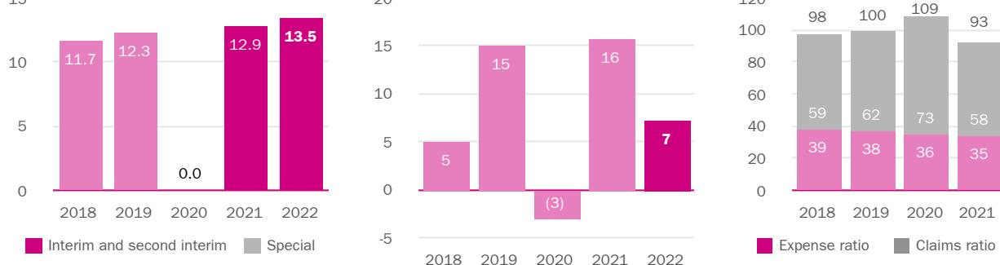
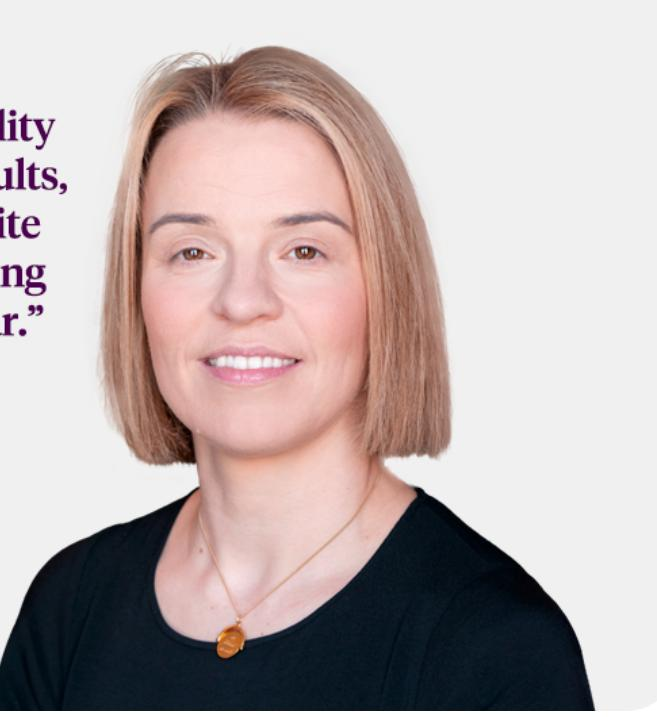

{0}------------------------------------------------

Beazley plc | Annual report and accounts 2022

# Insurance. Just different.

{1}------------------------------------------------

## Preface to Beazley 2022 Annual Report and Accounts

A version of Beazley's Annual Report and Accounts for the year ended 31 December 2022 was originally approved by The Board on 1 March 2023 and Beazley announced its final results for the year ended 31 December 2022 on 2 March 2023. The final results reported an alternative performance measure of net assets per share that had been calculated using the weighted average of shares for the year. This alternative performance measure was used by Beazley to determine the LTIP awards for Adrian Cox and Sally Lake that were initially approved by the Remuneration Committee and included in the Directors Remuneration Report.

It had been intended that the alternative performance measure would be calculated using the number of shares at 31 December 2022, rather than using the weighted average of shares for the year. On 7 March 2023, Beazley published an RNS entitled 'Alternative performance measure correction NAVps', which provided updated information on the net asset value per share calculation. On 8 March 2023, Beazley published an RNS entitled 'Alternative performance measure correction NAVps – update', which provided updated information on the LTIP awards for Adrian Cox and Sally Lake once the Board had considered the updated net asset value per share calculation.

The Company, having taken advice, has determined that the annual report and accounts as initially approved by the Board on 1 March 2023 were neither sent or supplied to shareholders in accordance with the provisions of the Companies Act 2006, nor were such accounts as a matter of fact, laid before a general meeting of the Company or filed with Companies House. The Board therefore rescinded its approval of the version of the accounts that were approved on 1 March 2023 and, in their place, approved this version of the accounts as the 2022 Annual Report and Accounts on 12 March 2023. As a result, this final version of the 2022 Annual Report and Accounts reflects the updated figures set out in the RNSs published on 7 and 8 March 2023. Other than as described in those RNSs and the related changes, no changes have been made to the annual report and accounts as initially approved by The Board on 1 March 2023.

The Company acknowledges that a hyperlink was contained in the announcement of its final results to the version of the accounts that were approved on 1 March 2023 which appeared temporarily on the Company's website. No reliance should be placed on that document which was removed as soon as the error came to light.

The updated information announced by Beazley on 8 March 2023 (which is reflected on page 121 in this 2022 Annual Report and Accounts) is set out below:

|          |            |      | Fixed pay |          |         | Pay for performance |                       |                                   |                       |                       |
|----------|------------|------|-----------|----------|---------|---------------------|-----------------------|-----------------------------------|-----------------------|-----------------------|
| £        |            |      | Salary    | Benefits | Pension | Total fixed pay  | Total annual bonus | Long term incentives (LTI)1 | Total variable pay | Total remuneration |
| Adrian P | Revised    | 2022 | 525,250   | 19,760   | 65,656  | 610,666             | 787,875               | 106,663                           | 894,538               | 1,505,204             |
| Cox      | Original   | 2022 | 525,250   | 19,760   | 65,656  | 610,666             | 787,875               |                                   | 245,127 1,033,002     | 1,643,668             |
|          | Adjustment | 2022 | 0         | 0        | 0       | 0                   | 0                     | -138,464                          | -138,464              | -138,464              |
| Sally M  | Revised    | 2022 | 414,000   | 2,938    | 45,960  | 462,898             | 621,000               | 71,190                            | 692,190               | 1,155,088             |
| Lake     | Original   | 2022 | 414,000   | 2,938    | 45,960  | 462,898             | 621,000               | 179,310                           | 800,310               | 1,263,208             |
|          | Adjustment | 2022 | 0         | 0        | 0       | 0                   | 0                     | -108,120                          | -108,120              | -108,120              |

1 The LTI figures for 2022 have been calculated using the average share price in the last three months of 2022 of 630.7p.

{2}------------------------------------------------

### Strategic report

- 01 Highlights
- 02 Key performance indicators
- 03 Our purpose
- 04 Our business model
- 08 Statement of the Chair
- 11 Chief Executive Officer's statement
- 13 Chief Underwriting Officer's report
- 18 Performance by division
- 21 Responsible business
- 29 Task Force on Climate-Related Financial Disclosures (TCFD) 2022
- 50 Stakeholder engagement
- 55 Section 172 statement
- 58 Financial review
	- 58 Group performance
	- 63 Balance sheet management
	- 64 Capital structure
- 67 Risk management & compliance

#### Governance

- 73 Letter from our Chair
- 75 Statement of corporate governance
- 77 Board of Directors
- 79 Governance Framework
- 87 Shareholder engagement and investor relations
- 88 Board evaluation
- 91 Audit and Risk Committee
- 100 Nomination Committee
- 106 Remuneration Committee
- 108 Letter from the Chair of our
- Remuneration Committee
- 111 Directors' remuneration report 139 Statement of Directors' responsibilities
- 140 Directors' report
- 146 Independent auditor's report

### Financial statements

- 157 Consolidated statement of profit or loss
- 158 Statement of comprehensive income
- 159 Statements of changes in equity
- 161 Statements of financial position
- 162 Statements of cash flows
- 163 Notes to the financial statements
- 232 Alternative performance measures

{3}------------------------------------------------

## Highlights

### Financial

Gross premiums written Net premiums written Net earned premiums

\$5,268.7m \$3,876.2m \$3,614.2m

Net investment (loss)/income Cash and investments Investment return

(2021: \$4,618.9m) (2021: \$3,512.4m) (2021: \$3,147.3m)

\$(179.7)m \$8,998.1m (2.1)% (2021: \$116.4m) (2021: \$7,875.3m) (2021: 1.6%)

Rate increase on renewals Profit before tax for the financial year

14% \$191.0m (2021: 24%) (2021: \$369.2m)

{4}------------------------------------------------

## Key performance indicators

### Financial

Earnings per share (c) Net assets per share (c) Gross premiums written (\$m)

Return on equity (%) Combined ratio (%)

Our combined ratio has averaged 98% over five years.

The Group is of the view that some of the above metrics constitute alternative performance measures (APMs). Further information on our APMs can be found in the financial review on page 59.

Average five year return on equity of 8%.

### Non-financial

Female representation in senior leadership roles

85% 80% (2021: 86%) (2021: 81%)

People of Colour representation in the workforce

Employee engagement Employee favourability

Overall carbon emissions

43% 25% 5,283.0tCO2 e (2021: 38%) (2021: 23%) (2021: 2,228.5 tCO2e)

{5}------------------------------------------------

{6}------------------------------------------------

Beazley | Annual report 2022 www.beazley.com

{7}------------------------------------------------

{8}------------------------------------------------

{9}------------------------------------------------

{10}------------------------------------------------

## Statement of the Chair

#### A specialty insurer that delivers sustainable growth

Our deepest sympathy is with all the people suffering from the devastation in Turkey and Syria, and those impacted by the human tragedy of the war in Ukraine. These events have made us acutely aware of this kind of geopolitical uncertainty. This uncertainty is compounded by the pervasive economic stress of high inflation and the cost of living challenges it creates for so many. In this environment our role, as a sustainable, specialty insurer, is to support clients and broker partners to manage the additional risks as we all adapt and deliver value for our shareholders. Beazley adds tangible value when things are complex, volatile and changing in areas such as Cyber, Specialty, Marine and Political Risk, where we have consistently demonstrated our ability to help our clients grow, while allowing our insureds to explore, create and build.

We believe growth is driven by our ability to assess external realities and use our platforms, people and geographical strengths to lean into emerging opportunities as conditions change, rather than just be dictated by hard or soft market conditions. I like to think of this as anticipatory competence. During 2022 the rating environment in Property insurance and reinsurance reached a transition point, as the market understood that it was unsustainable to continue to underwrite this business in a commoditised way, in the face of overwhelming evidence about the impact of climate change.

This is a moment where our market expertise and underwriting competence becomes a differentiating factor and where we are able to add real value to our brokers and clients. We are excited about the opportunity these changes offer to grow and develop our Property portfolio as we move through 2023.

This enthusiasm is based on the long-term approach we have taken to Property, which saw our exposure, on both our Property and Reinsurance books within our Property Risks division, reduce as rates were depressed and the impact of climate change began to be felt. During this time, we invested in expertise and modelling tools to explore how the changing climate is impacting Property Risks. The knowledge gained is now allowing us to grow our share of the Property market as the underwriting environment significantly improves.

Our successful equity raise in November 2022, puts us in an excellent position to take up the opportunity in Property and also deliver against our Cyber ambitions, while extending our market share across our classes of business, delivering sustainable, diversified growth for shareholders across a balanced portfolio. Focusing on sustainable growth has resulted in our gross premiums written doubling between 2018 and 2022 - and saw our US platform reach a significant milestone as it passed gross premiums written of \$2bn.

{11}------------------------------------------------

#### Strong culture guides us through change

In autumn 2022, I assumed the role of Interim Chair of Beazley, I was previously the Senior Independent Director and Chair of the Remuneration Committee. The role of Chair has offered a fresh perspective on our business and I have been energised by the exciting future our fast changing and growing business has ahead of it.

On 25 April, at the conclusion of the 2023 Annual General Meeting, I will relinquish this role to our outstanding new Chair, Clive Bannister and I will return to my previous role. Clive is currently the Chair of the Rathbones Group plc and the Museum of London. He was previously the CEO of the Phoenix Group plc. He will bring deep strategic, commercial and transformational experience to The Board.

In the selection process we drew on our corporate values and founding principles, which have propelled Beazley to be the business it is today. We are a value driven, growth minded and disciplined company which has created a respectful and inclusive workplace and I believe that in Clive, we have a leader who embodies these values and who will be an outstanding advocate for Beazley.

On behalf of The Board, I would like to thank David Roberts for his leadership as we faced the challenges of COVID-19, for the transformation of our executive management team and for his genuine conviction that by creating a diverse environment that is respectful and open, you achieve better outcomes. He has left us a stronger business and we wish him well as he takes up the challenge as Chair of the Court of the Bank of England.

I would also like to thank Robert Stuchbery for assuming the role of the Senior Independent Director and Nicola Hodson for chairing the Remuneration Committee, while I undertook the Interim Chair role. Nicola will remain Interim Chair of the Remuneration Committee following the 2023 AGM.

On behalf of The Board, I would also like to recognise Catherine Woods for her excellent service as a Non-Executive Director, having stepped down following the conclusion of two three-year terms in March 2022. On 31 May 2022, The Board appointed two new Non-Executive Directors, Fiona Muldoon and Cecilia Reyes Leuzinger. Fiona is a member of the Audit and Risk Committees and Cecilia the Audit, Risk and Remuneration Committees. They both bring insight and offer experience-led advice to The Board.

#### A talented team that champions diverse thinking

Our company has thrived because our people can thrive. People are the bedrock on which we continue to build and grow our business. They are a vital asset and one that becomes more valuable over time. Understanding this leads us to commit to creating a market leading workplace.

Building a highly differentiated, talented, cross functional team means recruiting and retaining the best people. In 2022 we recruited 410 new joiners and our turnover rate was 10%.

We give our people the tools, support and create a learning environment where they are able to grow in their roles, make decisions and execute with autonomy. By remaining a mostly flat organisation, our team knows that they are making individual contributions to the collective success of the company. This approach results in positive behaviours and outcomes and a willingness to seize opportunities - which I believe is not just what makes Beazley a market leading workplace, but is also the key to our ongoing success as a business.

We are able to attract and keep top talent because of this compelling culture and the inviting workplace we have created, which resonates with both new and long-standing staff, as is reflected in our annual employee survey. Our engagement score, which measures whether colleagues are willing to go above and beyond for the organisation, was 85% and we remain above the global benchmark for both favourability and engagement. We continue to see parity in the demographics of respondents such as gender, ethnicity, age and length of service to the employee survey.

Only with a team that embraces the purpose of our business to explore, create and build will we deliver the innovation that our clients and broker partners expect. It is no surprise, therefore that during 2022 innovation remained at our core. We collaborated with the market to explore and create new insurance solutions to the emerging or changing risk landscape and in 2022 these included the build out of Carbon Offset Invalidation and specialist parametric property products, and building on our long-standing expertise in space underwriting by offering the first commercial insurance for vehicles on the moon. We are constantly looking to the risk horizon to identify where our specialist underwriting can add value.

{12}------------------------------------------------

### Statement of the Chair continued

#### Being a responsible business

Beazley is committed to being a responsible business and in 2022 we launched our ESG Consortium and Syndicate 4321. We also made significant strides towards embedding ESG criteria through the underwriting process with the addition of tools and talent to truly get our arms around this challenge.

We continue to make progress at pace against our 2023 targets of 45% senior leadership roles held by women, and 25% of our people being people of colour. The same is true of our target of a 50% reduction in greenhouse gas emissions by 2023, where we have in fact achieved a reduction of 55% so far to date. The Board will closely monitor our achievements against these targets and looks forward to reconfirming our Responsible Business commitments and presenting new targets for beyond 2023.

#### Dividend

The Board is pleased to continue with its progressive dividend policy, which will be paid annually, and as such has declared an interim dividend of 13.5p for the full year of 2022.

#### New Era, consistent vision

In December 2022, Beazley joined the FTSE 100 for the first time. We welcome the additional responsibility, visibility and scrutiny that comes with this and expect to be better for it. It is worth reflecting that we have reached this point not through acquisition or merger but by focusing on growing and developing our business organically through our talented people, expertise and skill.

It has been a pleasure to lead such a committed and talented team of Directors as Chair of The Board for the past several months. Together we are steering your company as it continues to grow successfully and offer meaningful solutions to the challenges that risk presents to our clients and broker partners.

As a business we operate within a framework of underwriting, responsibility and financial probity that we can all be proud of, driven by an extremely skilled team. Our vision of being a leading sustainable, Specialty insurer, is both lived every day and drives our aspirations, as our products, people, platforms and culture all come together. As Clive succeeds me as Chair, I can reflect that our new brand descriptor perfectly encompasses what it is about Beazley that makes us stand out from the crowd.

### Christine LaSala

**Interim Chair**

{13}------------------------------------------------

## Chief Executive Officer's statement

I am proud of Beazley's progress throughout 2022. We delivered a strong underwriting result, raised capital that will enable us to make the most of a structural change in the Property insurance and reinsurance markets, realigned our underwriting teams to better deliver for clients and launched Lloyd's first ESG syndicate. All against a backdrop of high inflation, an energy price crunch and the overhang of war in Europe.

#### Specialty insurance in a time of geopolitical turmoil

The war in Ukraine has shaken us all, causing real human suffering; and, as we all take stock, it is right to reflect on the impact it has had on our business. Firstly, the conflict resulted in us provisioning for claims directly from the war itself, for which our estimate of loss remains unchanged since our 2022 interim report. Secondly, the energy price spike and rising inflation caused central banks to increase interest rates, leading to mark to market losses in our fixed income portfolio resulting in an \$179.7m investment loss. Finally, the war has reinforced the value a specialty insurer like Beazley brings in complex situations. From our claims team's support for mariners injured by missiles in the conflict zone, or enabling shipments of grain needed by some of the world's

poorest people, to offering clients reassurance as they navigate a complex sanctions regime - the innovation and responsiveness of the Beazley team has shone through and I'd like to thank everyone for their hard work and focus on supporting clients.

#### Sustainable growth

Our business received a strong endorsement from the capital markets in November 2022 as we raised \$404m in new equity capital to support our exciting growth agenda. We see a multi-dimensional opportunity to show our agility and grow in response to changes in market conditions whilst continuing to pursue our sustainable long-term growth strategy, which this additional capital will further support.

The market dislocation in Property is a signal of structural change as it adjusts to the increased exposure climate change brings. This gives us a strategic opportunity to accelerate rather than simply re-grow our Property franchise (which used to be a significantly larger proportion of the business than it is now) but also to retain more of our Cyber and Specialty Risks business.

{14}------------------------------------------------

### Chief Executive Officer's statement continued

#### Firm foundations

Our ability to pivot our business to take up new opportunities as they emerge is part of our DNA. Platform strength, product and geographical diversity are cornerstones of this. Our strategy is to achieve the successful intersection of platforms and products to offer our brokers and clients access to our expertise and specialist underwriting capacity where and when they do business. We believe that a mix of international, wholesale and domestic platforms delivers straightforward access to us and adds real value.

People are, of course, Beazley's most important asset and in October 2022 we had to say goodbye to one of the best, David Roberts, our Chair of five years, who left to become Chair of the Court of the Bank of England. We are grateful for David's leadership and I would like to thank him personally for his counsel and wisdom over his time with us, but particularly when I transitioned to CEO last year. David's calm presence during COVID-19 and his personal drive and commitment to diversity and inclusion have had a profound impact on Beazley. Christine LaSala has ably assumed the role of Interim Chair and returns to her role as Senior Independent Director and Chair of the Remuneration Committee with our sincere thanks. I look forward to working with our incoming Chair, Clive Bannister, who brings a wealth of experience with him which will aid us as we enter the next phase of Beazley's journey.

Developing and supporting our employees is crucial to our success and in June 2022 we reflected the cost-of-living challenges we are all facing by making a one-off payment of up to £3,000 (or equivalent currency) to the people in the company most impacted. As we approached the end of year salary and bonus cycle this was also upper most in our minds and we awarded eligible staff an additional 2% cost of living pay rise in addition to an average company wide annual uplift of 5%.

#### What we say is what we do

Beazley believes that fundamentally we must deliver what we promise; and in 2022, we did just that with the launch of the ESG consortium and Syndicate 4321, Lloyd's first ESG syndicate. Since its launch on 1 January 2022 the new syndicate has offered additional capacity to clients who achieve high scores on ESG metrics, the syndicate is also helping Beazley to understand more about how high scoring businesses operate and test our hypothesis that companies which do well on ESG criteria are also likely to be less risky. We are using the lessons learnt as part of a wider effort, which got fully underway in 2022, to embed ESG thinking into all our underwriting.

We also know that what gets measured, gets done and that is why in 2019 we set robust and challenging targets for our own ESG efforts. Specific highlights include targets of 45% of senior leadership roles being held by women, 25% of our team being people of colour and a 50% drop in carbon emissions, from 2019 levels; all to be achieved by the end of 2023. I believe we are firmly on track to deliver our target on senior leadership roles held by women, having reached 43% by the end of 2022, and I am delighted to have already hit our 25% people of colour target and reached a 55% reduction in carbon emissions (for more information please see pages 21 to 28)

and I look forward to reporting our progress in next year's annual report, when we will recommit ourselves to additional and equally challenging targets for the next three year cycle.

#### Insurance. Just different

Beazley's Cyber team took a leading role in the market this year on the issue of systemic Cyber risk. If the Cyber insurance industry is to achieve its potential and play its role in managing and mitigating Cyber risk, it needs to define and build parameters that will allow insurers to manage their balance sheet prudently, whilst encouraging more capital to come into the sector. We are fully committed to supporting this adjustment to happen. Innovation has come right across our business, from insuring the first commercial moon rover vehicle to providing an insurance solution for e-sports events. In early 2023 we launched the market's first cyber catastrophe bond, an innovation that will see new capital come into a cyber market that needs to grow at pace in the next decade to meet business demand. All have the same characteristics in common - they require a specialist approach to insurance as the issues raised are complex; but with the right investment they offer significant long-term potential.

As you can see from our digital version of this annual report; beazley.com/2022-annual-report, in 2022 we refreshed our brand identity to better reflect the age in which we live. Our fresh look and feel retains the essential qualities for which Beazley is well known, reflects our three corporate values of being bold, striving for better and doing the right thing, but introduces a more engaging and forward-looking approach to communication which better represents how our business is growing and changing.

The support of all our stakeholders is key. Brokers are our first, vital link in the chain, but the purpose of our business is to help our clients explore, create and build their businesses. To better achieve this in 2022 we established our client engagement team which will actively ensure clients have access to our full product range and our research and expertise. We see this a two-way process that will allow us to develop more relevant products and insurance solutions that better meet the needs of our clients going forward.

As we start 2023, and we see positive market conditions, Beazley is able to look at that opportunity from a strong capital position, with a talented and committed team and the platform strength and product range to deliver for our clients, brokers and shareholders. For 2023 our growth expectations are for higher net premium growth than gross premium growth, with net growing in the mid 20s while gross is at mid teens. The difference is caused by us no longer writing portfolio underwriting through the Group in 2023 (as syndicate 5623 became a standalone syndicate and no longer requires the Group to cede the majority of the business written to it), alongside our reduction in purchased reinsurance on both Cyber Risks and Specialty Risks. These changes have the impact of increasing the net premium growth compared to the gross premium growth. Taking the above into account, we expect to deliver a high-80s combined ratio for 2023 assuming average claims experience. Although significant geopolitical headwinds remain, I believe we are in an excellent position to sustainably grow our company and I am looking forward to all we will achieve together in 2023.

Adrian Cox **Chief Executive Officer**

{15}------------------------------------------------

## Chief Underwriting Officer's report

Beazley achieved gross premiums written growth of 14% and a very strong combined ratio of 89% (2021: 93%). We delivered this impressive underwriting result by executing against our underwriting strategy of deploying specialist products in markets that value expertise and are demand driven, combined with an agility to pivot in new directions as opportunities from changing market conditions emerge.

#### Balanced underwriting combined with agility

2022 was a year of global dislocation and complexity, but throughout we remained true to our core values, executing our ambitious strategy to deliver profitable growth across all lines. We achieved this by underwriting a balanced book of business across multiple platforms, with the agility to respond to changing market conditions. Innovation also remained at our core with the development of new insurance solutions such as CryptoGuard and Carbon Offset Invalidation. We also continue to evaluate and support various parametric Property products to provide the market with solutions beyond traditional insurance.

Market conditions moved markedly during 2022. The Directors and Officers insurance (D&O) market saw competition emerge and a slow down in IPOs and SPACs, resulting in an over supply of capacity and lack of demand driving rates down. Cyber rates continued an upward path, albeit at a more conservative pace following the much needed price correction of the previous two years. In Property Risks we have reached a market turning point, and we anticipate significant rate increases in Treaty reinsurance and the direct Property market in 2023. However as the market changes, our approach to underwriting remains consistent – our focus is on underlying pricing and risk dynamics, market knowledge and experience, and standing by our clients.

#### New structure – more specialism

In March 2022 we restructured our underwriting teams to improve interconnectivity and achieve synergies. We now have an underwriting structure of four more equally sized divisions, which ensures a balanced book of business and is better able to manage short and long tail drivers of risk and reward.

Bringing together the Property insurance and Reinsurance teams to form Property Risks, and the Executive Risk and Speciality Lines teams to create Specialty Risks, has given us access to deep and broad insights into market dynamics, allowing us to better anticipate trends, identify opportunities or raise the alarm if risks are rising.

MAP Risks underwriters are experts in their specialist products and segments and while the specifics of risk differ between classes, their clients are sometimes the same and often face similar challenges, making for an ideal environment for cross fertilisation of ideas and growth of our underwriting via our international platforms.

Cyber Risks has exciting growth opportunities ahead as digitalisation sees demand for Cyber insurance protection grow exponentially. As a Cyber market leader, we have the experts in-house who continue to build our comprehensive Cyber ecosystem and in 2022 led the market wide debate on catastrophic Cyber, to protect our clients, the market and shareholders from the growing threat of a Cyber catastrophe.

{16}------------------------------------------------

## Chief Underwriting Officer's report continued

#### Small business underwriting

Alongside these four divisions, Beazley Digital offers cross class specialist digital underwriting capabilities to the SME market. Our SME brokers and clients can now access our expert underwriting team via multiple channels, ensuring ease of doing business. In its first full year of trading the new division has experienced significant increased demand.

#### Data driven specialists

To ensure we continue to add greater insight and build knowledge and expertise in exposure management and the use of data, we are actively investing further and adding specialists to our team. Beazley hired its first Chief Data Officer in 2022, appointed a Senior Financial Climate Risk Specialist, and we are focused on building our pricing and exposure management team. As we make a concurrent investment into modelling tools, we will continue to need highly skilled specialists who can turn data into useful tools and benchmarks for underwriting action.

#### Agility in action

New structures, platform strength and a high-quality team are the firm foundations from which we can respond and change as market conditions move. In the second half of 2022 we saw movement in Property markets and as rates began to harden, we were able to optimise our Property portfolio as both a seller and buyer of reinsurance. Our Property Risks division will take advantage of this excellent opportunity for growth as the market is rapidly hardening into 2023. However, it will do so in the certain knowledge that the ongoing work we are doing to manage climate risk will mean we are not just here for short-term gain but to sustainably underwrite this core class of business.

D&O, long one of our key areas of specialism, has seen competition come into the market at a point where our assessment is that the risk landscape remains extremely high. As a result, when we do not believe the rate justifies the risk we have pulled back, reduced our appetite as we continue our disciplined approach to underwriting D&O. This is a caution we will maintain in 2023, although we believe the market will likely stabilise with supply and demand coming more in line.

Our US business continues to grow, and we hit our goal of \$2bn gross premiums written through the platform in December 2022. Beazley's 'Insurance. Just different.' message resonates strongly in the thoughtful way we underwrite and the client centric approach we take to claims in the world's largest insurance market. Growth also continues at pace in Europe, where we see significant opportunities and where we are investing in underwriting expertise. Our Lloyd's wholesale platform sees our underwriters leading global thinking on the challenges our client and brokers face. In particular, we can be proud of innovations that come from our specialist teams in this market, such as underwriting the first commercial insurance policy for projects on the moon.

We underpin our strategy by flexing our reinsurance purchasing and choosing to retain risk or share it based on the pricing dynamic. This thinking came to the fore in the

second half of 2022 as we anticipated dramatic changes to Property Treaty reinsurance rates, and with our November equity raise, we are well placed to retain more risk and profits on our own balance sheet rather than extend our use of outwards reinsurance.

#### Successful strategy

I joined Beazley just over a year ago because I was impressed by the quality of the underwriting team and the effective and considered way in which they execute our underwriting strategy. In 2022, it was testament to this approach that we have delivered a 89% combined ratio and seen growth of 14% despite perhaps the most challenging geopolitical situation in a generation.

Underwriting focused on rigorous attention to detail and delivered by a team of experts who question decision making and actively value challenge and follow up have been key to this result.

This is combined with an agile approach to seizing opportunities as they emerge, whilst always keeping the interests of our shareholders and clients at the forefront of our minds. These will remain our defining principles throughout 2023.

### Cyber Risks

Cyber Risks continued to see strong rate increases of 40% (2021: 88%) leading to an increase in gross premiums written to \$1,156.1m (2021: \$814.3m).

#### A successful year

New business was strong across all geographies with our business outside of our core US client base growing exponentially. In the US, we are seeing strong demand from the mid-market segment which is driving ongoing growth. Outside of the US, demand came from Europe, Asia, Australia and beyond and we expect this trend to continue as business becomes increasingly aware of and keen to protect itself from the Cyber threat. The substantial rate increases we have seen over the last two years, did begin to moderate during 2022, but they remained at very significant levels, reflecting the scale of the challenge that Cyber poses.

Our positive result reflects the good work we have done since October 2020, to build our Cyber ecosystem, which focuses on pre-underwriting and post-loss mitigation efforts. In 2022 we also added our threat intelligence and Beazley Cyber Council to this offering.

{17}------------------------------------------------

To reflect the demand we are experiencing and to respond to that opportunity, the team has continued to grow during the year, we've invested in people, expertise and resources across the globe. We also made specific investments into threat and intelligence pilots during 2022, of which, the successful ones, will become operational during 2023.

#### Adapting now, to grow tomorrow

We are a market leader in Cyber and we believe we need to use that position to address the challenges the market faces. In 2022 this saw us tackle the issue of Cyber catastrophes. To date no Cyber attack has been big enough to create a widespread breakdown in essential services; however, we have modelled the possible scenarios and believe now is the time to actively build market awareness and the capital needed to address the threat as the market grows.

Looking ahead, we believe that the flattening of rate increases will continue through 2023, but we expect that to be a moderation in what have been substantial, but required, rate increases over the last two to three years. We expect to see continued strong new business demand, particularly outside of the US, where we see the mid-market as the largest area of growth for our Cyber products and services. In Europe and across the globe, we are seeing large corporations seek greater Cyber protection and expect the level of demand to continue. Our continued focus is on maintaining and advancing our knowledge and understanding of the Cyber threat, and maintaining vigilance about the threat actors and their changing methods of operation as we move forward.

In January 2023 we launched the market's first cyber catastrophe bond and with strong demand from investors we expect to be able to launch additional tranches through 2023 and beyond.

Through the equity raise in 2022, we are also looking to retain more of the business which we write, and capitalise on future profitability in this division.

### Digital

Our profit before tax of \$14.4m (2021: \$40.6m), reflects the successful build out of our small business proposition across our key territories. Demand for our digital underwriting and distribution capabilities continues to grow and our delivery of \$204.9m (2021: \$190.8m) in gross premiums written for our first year of full operation and combined ratio of 87% (2021: 76%), demonstrate our success.

It is testament to the outstanding work of our team, that in our first year of operating as a separate division we have delivered a strong performance. Throughout the year we have made considerable progress in technology innovation and are seeing the benefits of a multi-skilled team working across all lines of business.

Digital started underwriting as a separate division in January 2022. It was created to build on the success of our myBeazley portal and to respond to demand from clients and brokers for accessible Digital insurance placement for small to medium sized risks. Digital gives brokers one Beazley point of contact, supported by a cross functional team, to access multiple product lines and digital services via their preferred platform or channel.

By committing to our strategy of meeting the client where they want to be met, we are seeing success across all access points: the myBeazley portal, APIs, on digital market hubs and our artificial intelligence enhanced email submission capabilities.

Take up of each channel differs depending on location. In the US, the prevalent method of placement remains via email, but through 2022 we have seen a shift to engagement via APIs and market hubs. In Europe and the UK, myBeazley has established itself as a key link in the insurance chain, while for our German business, market hubs or 'broker pools' are increasing in use.

#### Specialist insurance for small business

We recognise that not all small businesses are the same and neither are the risks they face. A small manufacturing business has very different exposures to business interruption risk than a small financial consultancy. By leveraging the deep-seated specialist knowledge that we are known for and that is prevalent across our organisation, we are able to effectively design and price relevant cover for a myriad of organisation types and sizes, which can be accessed at the touch of a button and delivered digitally.

At our core, we have a broad Specialist Lines portfolio, focused on lines such as Professional Indemnity, Management Liability, Tech Professions Errors and Omissions, Medical Malpractice for small scale health and care services providers, Event Cancellation and Pleasure Craft. During 2022, we have also matured the way we underwrite flagship products like Cyber for small business, where we are seeing significant demand and there is an opportunity to grow at pace.

#### Growth going forward

We remain confident about our growth trajectory going into 2023 and expect to see moderate rate increases across the portfolio.

Service is key, and we continue to invest in the people and technology of our customer success team who support our brokers with client queries, providing product information, and transacting business. Similarly, our dedicated territory manager sales team continues to grow and expand our distribution by region and by digital channel.

In the year ahead, we are targeting growth in all regions. We see plenty of opportunity to expand our digital distribution in the US, and Europe. In 2023, we will also launch the myBeazley portal in Canada, with the support of our well establish specialist teams in Toronto, Montreal and Vancouver.

Although Digital is tailored for the small to medium business segment, looking ahead, we see opportunities to direct more digitally placed larger risk business to our complex risk underwriting teams via channels such as APIs.

{18}------------------------------------------------

## Chief Underwriting Officer's report continued

#### MAP Risks

MAP Risks reported gross premiums written of \$1,107.8m (2021: \$897.5m), and a combined ratio of 84% (2021: 85%). The division is exposed to the war in Ukraine in its Marine, Aviation, Political Risk and Terrorism lines of business - yet, despite the claims arising from the conflict, delivered a profit of \$91.6m (2021: \$167.5m).

#### Positive results from specialist team

The 2022 result was impacted by the war in Ukraine, and this has represented a potentially material loss to our book which remains unchanged since our 2022 interim report. Despite this, MAP Risks delivered a profit for 2022, which is a credit to the expertise and hard work of our team, who have been focusing on helping clients as they have faced extraordinary difficulties.

Bringing together Beazley's Marine division with the Political, Accident and Contingency division and Portfolio Underwriting has brought synergies and opportunities for cross selling. Our specialist underwriting teams are leading members of the Lloyd's market and we see positive opportunities to expand access to their technical skill and sector knowledge by leveraging our domestic underwriting platforms: in the US and Europe alongside Asia via our Singapore operation, where business comes into our Lloyd's syndicates.

#### Value of expert underwriting reflected in rates

The rating environment remains buoyant, with an overall rate increase of 4%, although we are now seeing pressure in some lines, including Aviation where capacity has returned after COVID-19. The war in Ukraine has impacted a range of classes and as a result we have seen significant uplifts in the rating environment in some of these areas. As a responsible business we are mindful of the importance of Ukraine as an exporter of grain, and the negative impact the conflict is having on world food supplies, and are supportive of market efforts to assist in facilitating the flow of these vital global commodities.

2022 saw our Contingency underwriting recover from the impact of COVID-19 with positive premium growth and, despite recessionary fears, we expect that trend to continue into 2023.

The value of our Political Risk cover has been fully demonstrated by the geopolitical turmoil of the past 12 months and we are seeing heightened interest from businesses looking to protect overseas assets, and the rating environment remains robust for this class.

Our Portfolio Underwriting business, which is primarily reinsured to an external special purpose Syndicate 5623, has delivered three consecutive years of profit. In January 2023, Syndicate 5623 became a full stand alone syndicate, writing all Portfolio Underwriting business directly. Beazley will be providing circa 18% of the capacity for the 2023 year of account for this syndicate.

ESG Syndicate 4321 launched in the year and wrote \$10.5m of premium which the Group has a 10% share of. The syndicate provides additional follow capacity across several different classes of business to over 250 Beazley clients with a strong ESG rating since January 2022, building momentum through the year. A unique offering, the ESG consortium has been particularly successful for clients actively seeking to include ESG within their insurance programme and we have registered strong take up for both Financial Lines and Cyber clients in particular, and we are exploring growth opportunities in Europe.

Our specialist underwriters continue to innovate in established lines, be it on Marine, Cyber, embedding ESG principles and helping clients transition to net zero, or in underwriting the first commercial insurance on the moon and acting as the leader in the development of insurance for commercial space ports.

While there are rating pressures beginning to be felt in some classes, the geopolitical turbulence of the last 12 months only serves to demonstrate the importance of the specialist insurance and sector expertise that our underwriters consistently deliver.

### Property Risks

2022 saw the combining of our Property insurance and Reinsurance business. Non-catastrophe exposed business performed well contributing to an increase in gross premiums written to \$859.8m (2021: \$812.6m). Hurricane Ian has, in line with expectations for such a large event, dampened our overall result, which nevertheless saw the combined ratio improve to 98% (2021: 106%).

The success of work painstakingly done in recent years to address the impact of climate events and refine our risk selection, has seen the book progressively improve. With market conditions reaching a pivot point during 2022, we are now in a great position to reap the rewards. While Hurricane Ian will see a claims burden in the range of a \$120m net loss and has undoubtedly had an impact on the 2022 result, we comprehensively plan for events of this size, and it falls within our expectations for such an event.

#### Ready for the future

The combined expertise of our Property insurance and Reinsurance teams is allowing us to look across our portfolio strategically and benefit from both detailed site level insights and high-level trends, giving us a bird's eye view of market dynamics. Over time we believe this bottom up and top down approach will deliver competitive advantages as we address the sector's challenges of which climate change is perhaps the most urgent.

Throughout 2022 we continued to further our understanding of and implement enhancements to our underwriting approach and analysis around climate risk. We believe we are ahead of the curve, having actively invested in modelling tools and taking steps to embed the learnings into our underwriting processes. We are also making strides in regards to the impact of climate change on non-modelled perils such as wildfire, flood, and severe convective storm.

Our non-catastrophe business continues to benefit from the work we've done in the last few years to improve risk selection. A key driver of that has been the use of better, more insightful, modelling and tools. In particular, we released a new dynamic Property underwriting tool that provides the

{19}------------------------------------------------

teams with the ability to analyse, model and rate all aspects of a risk at a location level with an informed view.

#### A significant opportunity

These focused efforts have put us firmly on the front foot to strongly build our Property premium base through 2023 - not just as we respond to an immediate and much needed improvement in the rating environment, but for the long term. As the rating environment remains favourable we will lean into the market opportunity; the equity raise of November 2022, has given further charge to this effort as we anticipate Property Treaty rate increases of up to 50% and over 15% in the direct Property book during 2023.

In contrast, as a buyer of reinsurance we are seeing an increase in costs; but balanced against the overall benefit of more effective market pricing and our dual role as a Property reinsurer, we believe this environment creates excellent opportunities for Beazley as a leading specialist Property insurer.

#### Specialty Risks

Specialty Risks achieved gross premiums written of \$1,940.1m (2021: \$1,903.7m) with rate increases of 2%. The combined ratio improved to 93% (2021: 95%). Through 2022 we achieved synergies and gained insights as we brought together our Executive Risk and Specialty Lines teams.

Specialty Risks offers scale and diversification over 27 different product lines, across global geographies, serving insureds from SME's to the world's largest companies. Our distribution methods are equally diverse and include; broker partners along the insurance value chain, coverholders, delegated authority arrangements and reinsurance. This not only creates a truly diversified book of casualty business but actively offers diversification benefits to Beazley as whole.

The newly combined division leverages its expertise and interconnected broker relationships to deliver strong and effective cycle management across our diverse book, by pushing and pulling the relevant levers of geographies, platforms and products and moving our focus as market conditions evolve and change.

#### Active cycle management

Our focus on active cycle management lets us see where risks are growing, or the rating environment is becoming unattractive and move swiftly to protect that business area.

A good example of how this works is in the current D&O market cycle. We avoided growing in the depth of the soft D&O market by methodical underwriting, and when the market changed direction in 2020/21 we stepped up and seized the opportunity. As conditions have moderated since the second quarter of 2022, we've become more selective on rate and in some instances, reduced our appetite. We are hopeful that conditions will stabilise during this year and we will adjust our underwriting as opportunity emerges.

This year we've seen growth across areas where innovation plays a key role, such as our Safeguard Product and Beazley Product Solutions embedded reinsurance segment. Here we take a market leading position in these smaller or niche lines and invest significantly, giving them airtime to grow at pace. This approach sees us able to move swiftly into new or emerging areas where growth potential and client demand is high for Beazley's unique solutions. Another new area for 2022 was our geographic expansion of Product Recall to Singapore alongside our overall Specialty Risks growth in the Asia Pacific region.

#### Outperformance is our focus

Discipline is the watch word of our approach to underwriting; while growth makes the headlines, profit is the real mark of success. The current economic environment is challenging but the hard de-risking work we undertook during the last recession gives us confidence that we are well placed at the start of 2023.

Our underwriting capabilities are fully demonstrated by how we behave at these moments and this includes leveraging our net growth and varying our reinsurance purchasing, to ensure we deliver market share and a positive result in any given year, regardless of market conditions. Our November equity raise will see us keep more of our carefully selected risk within our own business rather than purchase additional, more expensive, reinsurance thus maintaining our outperformance.

It takes discipline to leave our egos at the door, invest in future business areas and to pull back on some of our most respected classes of business if the rating environment is wrong.

However, this mantra is key to our strategy of growing in a smart, sustainable way.

Bob Quane **Chief Underwriting Officer**

{20}------------------------------------------------

## Performance by division

Growth across all of our divisions, with two divisions growing in double digits.

### Growth of managed gross premiums written by division \$m

{21}------------------------------------------------

|                | 2022  | 2021  |
|----------------|-------|-------|
|                | \$m   | \$m   |
| Gross          |       |       |
| premiums       |       |       |
| written        | 204.9 | 190.8 |
| Net premiums   |       |       |
| written        | 168.8 | 166.2 |
| Results from   |       |       |
| operating      |       |       |
| activities     | 14.4  | 40.6  |
| Claims ratio   | 46%   | 37%   |
| Expense ratio  | 41%   | 39%   |
| Combined ratio | 87%   | 76%   |
| Rate change    | 21%   | 9%    |

| Portfolio mix                        |     |                                         | 2022 \$m | 20 S |
|--------------------------------------|-----|-----------------------------------------|-------------|---------|
|                                      |     | Gross premiums written            | 1,107.8     | 897     |
|                                      |     | Net premiums written                 | 777.0       | 671     |
|                                      |     | Results from operating activities | 91.6        | 167     |
|                                      |     | Claims ratio                            | 43%         | 41      |
| Marine                               | 40% | Expense ratio                           | 41%         | 44      |
| Portfolio Underwriting               | 26% | Combined ratio                          | 84%         | 85      |
| Political. Accident & Contingency | 34% | Rate change                             | 4%          | 9       |

{22}------------------------------------------------

### Performance by division continued

|                           | 2022 \$m | 2021 \$m |
|---------------------------|-------------|-------------|
| Gross                     |             |             |
| premiums written       | 859.8       | 812.6       |
| Net premiums written   | 687.9       | 573.1       |
| Results from operating |             |             |
| activities                | (9.2)       | (1.2)       |
| Claims ratio              | 61%         | 64%         |
| Expense ratio             | 37%         | 42%         |
| Combined ratio            | 98%         | 106%        |
| Rate change               | 11%         | 11%         |

| Portfolio mix                  |     |
|--------------------------------|-----|
| · Small Business               | 20% |
| · Healthcare                   | 14% |
| · Executive Risks              | 28% |
| · Global Treaty                | 89  |
| International Specialties O | 30% |

|                | 2022 \$m | 2021 \$m |
|----------------|-------------|-------------|
| Gross          |             |             |
| premiums       |             |             |
| written        | 1.940.1     | 1.903.7     |
| Net premiums   |             |             |
| written        | 1.410.2     | 1.476.8     |
| Results from   |             |             |
| operating      |             |             |
| activities     | 3.8         | 140.2       |
| Claims ratio   | 57%         | 63%         |
| Expense ratio  | 36%         | 32%         |
| Combined ratio | 93%         | 95%         |
| Rate change    | 2%          | 12%         |

{23}------------------------------------------------

## Responsible Business

### Our vision is to be the highest performing sustainable specialist insurer.

We will not achieve our goal without setting ourselves a series of measurable and bold targets that incorporate ESG thinking into every aspect of our business. We know that we are on a journey and that it will take time to deliver but we are committed to building better resilience for our clients, staff, our local and global communities, the environment and all our stakeholders.

Our Responsible Business strategy is based around four central pillars. These pillars are supported by nine key areas across the organisation which are detailed within the outer ring of our responsible business wheel, which is designed to demonstrate the interconnected nature of our approach to responsible business.

We not only set metrics against which we can measure our performance, these are regularly reviewed by our Executive Committee and Board. Beazley's Responsible Business Steering Group is responsible for challenging the progress and development of the strategy and providing support to the business as it addresses ESG issues and climate related risk.

On pages 29 to 49 you can read our disclosures made as part of Task Force on Climate-Related Financial Disclosures (TCFD), which will give you an in depth overview of how Beazley is addressing the challenges of climate change. On our Responsible Business and culture and values pages of our website you will find detailed information and our key policies and disclosures. In the following pages we have set out our key responsible business metrics for 2022.

### Building a responsible culture

We define our culture, through our brand and values which inspire the way we work, from how we engage with our stakeholders and colleagues, to how we design our workspaces, treat our customers and behave as a responsible business.

We are proud of our culture, which is embodied by our people. We attract and nurture curious people, that value constructive challenge and a collaborative approach to problem solving. We provide an environment where this approach can thrive by creating an inclusive culture, true to our values, to ensure our success now and for the future.

Together our people and culture make it easy to do business with Beazley.

### Inclusion and Diversity

Our culture and people strategy is underpinned by our approach to inclusion and diversity, which is powered by our 5 employee networks. These play an important role in embedding our inclusion and diversity strategy, ensuring that colleagues right across our company have clear channels through which their voices can be heard.

- Beazley Families Our newest network supports parentsto-be and experienced parents on the parental journey in the company
- Beazley Proud Our LGBTQ+ employee network
- Beazley RACE Focused on raising awareness and celebrating People of Colour
- Beazley SHE Our women's network
- Beazley Wellbeing creates supportive content to help break the stigma around talking about mental health.

{24}------------------------------------------------

|                                                  | 2021        | 2022                             |
|--------------------------------------------------|-------------|----------------------------------|
| People of Colour representation in workforce     | 0000 0/0 | THOI 0/0                      |
| Female representation in senior leadership roles | 38%         | 43%                              |
| Employee engagement                              | 86%         | 85% (8% above global average) |

| Enhancing Livelihoods       |           |           |
|-----------------------------|-----------|-----------|
|                             | 2021      | 2022      |
| Number of hours volunteered | 735       | 10003     |
| Charitable donations        | \$379.733 | \$474.426 |

{25}------------------------------------------------

| Responsible Business - Governance and Compliance                                                                                      |             |
|---------------------------------------------------------------------------------------------------------------------------------------|-------------|
| Ensure our reporting measures and metrics align with recognised reporting indices such as SASB.                                       | Achieved    |
| Deliver an environmental management system  and prepare for external certification.                                                   | In progress |
| Become a signatory to UN Global Compact.                                                                                              | Achieved    |
| Inclusion & Diversity                                                                                                                 |             |
| Achieve a workforce of at least 25% People of Colour                                                                                  | Achieved    |
| Achieve a target of 45% female representation in senior leadership roles by end of 2023.                                              | Achieved    |
| Support departments in their objectives on race and gender. Embed data collection methods for sexuality, religion, and disability. | Achieved    |
| Continue to ensure regular internal and external reporting of progress against our race and gender targets.                           | Achieved    |

| 2022 Objective                                                                                                                                                                                | Summary of progress |
|-----------------------------------------------------------------------------------------------------------------------------------------------------------------------------------------------|---------------------|
| Underwriting                                                                                                                                                                                  |                     |
| Use innovative underwriting solutions to help our clients to transition to a low carbon future.                                                                                               | In progress         |
| Develop and support research and thought leadership in ESG and climate-related risks to help broaden our approach and inform decision-making.                                              | Achieved            |
| Harness opportunities to add value to social initiatives as part of underwriting process, either through the provision of additional services, or creating of awareness of key ESG issues. | Not commenced       |
| Continue to embed climate change decision making into the underwriting process.                                                                                                               | In progress         |
| Expand understanding of the financial impacts of environmental issues such as biodiversity, land use and pollution.                                                                           | In progress         |
| Climate Change                                                                                                                                                                                |                     |
| Further develop the pricing of climate change within our underwriting process.                                                                                                                | In progress         |
| Further develop our climate scenarios, specifically focusing on liability risk.                                                                                                               | In progress         |
| Utilise the development of different climate scenarios to further our understanding of our exposure to non modelled climate related risks.                                                 | In progress         |
| Continue participation in industry initiatives investigating the best approach to measure the transition to net zero.                                                                         | Achieved            |
| Become a member of the Net Zero Insurance Alliance.                                                                                                                                           | Achieved            |
| Ensure continued progression against the TCFD guidelines.                                                                                                                                     | Achieved            |
| Environment - GHG emissions                                                                                                                                                                   |                     |
| Introduce an internal carbon budget to encourage reduction of our scope 3 emissions.                                                                                                          | Achieved            |
| Focus on expanding our scope 3 GHG inventory, working with our major suppliers to improve data accuracy.                                                                                      | In progress         |
| Work to increase the percentage of electricity in offices which comes from renewable sources.                                                                                                 | In progress         |
| Set out the process to follow science based targets for the emissions associated with Beazley.                                                                                                | In progress         |
| Commit to an ambition to be net zero by 2050 across our operations, underwriting and investments.                                                                                             | Achieved            |
| Environment - wider environmental initiatives                                                                                                                                                 |                     |
| Set out a programme of events to make informed sustainability decisions within a business and individual setting.                                                                             | Achieved            |
| Review opportunities to provide incentives to encourage behavioural change.                                                                                                                   | Achieved            |
| Where data is available to monitor environmental KPIs, set targets and monitor impacts to reduce, and report progress.                                                                     | In progress         |
| Review further opportunities to help reduce our environmenting initiatives where appropriate                                                                                                  | In progress         |

{26}------------------------------------------------

| Investments                                                                                                   |                                        |
|---------------------------------------------------------------------------------------------------------------|----------------------------------------|
| Produce our first UN PRI report, demonstrating the progress we have made against the principles.              | UN PRI delayed reporting until 2023 |
| Set a target for carbon intensity reduction and increased coverage of ESG compliant investments.              | In progress                            |
| Re-base our carbon intensity calculation to include Scope 3 emissions and set a target for reduction in 2023. | In progress                            |
| Work to align our investment portfolio with a 1.5 degree Celsius pathway.                                     | In progress                            |
| Supply Chain                                                                                                  |                                        |
| Continue to embed environmental management system (EMS) to appraise environmental issues in procurement.      | In progress                            |
| Embed ESG decision-making into supply chain, create a framework to review supplier performance.               | In progress                            |
| Become a signatory to the UN Global Compact.                                                                  | Achieved                               |
| Further understand how we influence our supply chains in our claims process.                                  | In progress                            |

| 2022 Objective                                                                                                                                                                                                | Summary of progress |
|---------------------------------------------------------------------------------------------------------------------------------------------------------------------------------------------------------------|---------------------|
| Community                                                                                                                                                                                                     |                     |
| Volunteer and support our communities near and far, year-round to help drive a positive impact in our communities.                                                                                            | Achieved            |
| Enqage with organisations to deliver support in the areas of socio-economically challenged youth and the broader community, with particular focus on inclusion and diversity and environmental challenges. | Achieved            |
| Continue to have a representative(s) in each office who actively engages their office, drives activity and deepens our presence.                                                                           | Achieved            |
| Host quarterly global activities that are supported by our representatives, with a view that there is substantial participation in Make a Difference and another event of choice.                          | Achieved            |
| Provide support, promotion and engagement with other responsible business workstreams and groups.                                                                                                             | Achieved            |
| Bring brokers and clients along by creating inclusive community events.                                                                                                                                       | Achieved            |
| Charity                                                                                                                                                                                                       |                     |
| Understand the opportunities and relationships created by supporting a more of charity initiatives.                                                                                                           | In progress         |
| Increase our charitable giving.                                                                                                                                                                               | Achieved            |
| Select a new global charity partner for 2023-2025.                                                                                                                                                            | Achieved            |

{27}------------------------------------------------

{28}------------------------------------------------

## Responsible business continued

### Inclusion & diversity

Inclusion and diversity are a key element of being a responsible business. To support our ambitions we have not only set robust targets for inclusion and diversity but actively encourage our staff to play their part via our five employee networks. These networks ensure that colleagues right across the company have clear channels through which their voices can be heard and they can help the business tackle some of the complex issues that will lead to a more equitable and inclusive culture.

### Network Activity

#### The five networks are:

Beazley Families – Our newest network supports parents-to-be and experienced parents focusing on enhancing the support and resources available for those on the parental journey.

Beazley Proud – Our LGBTQ+ employee network.

Beazley RACE – Focused on raising awareness and celebrating People of Colour.

Beazley SHE – Our women's network.

Beazley Wellbeing – Seeks to create supportive content to help break the stigma around talking about mental health.

#### Climate change

For more information please see page 29.

### Supply chain

Ensuring that our supply chains are responsible is vital for us to deliver a seamless service to clients. With much of our supply chain focused mainly on services, products are only a significant part of the mix when associated with an office fit out, the procurement of office supplies, or the delivery of events. During 2022 we continued to use our environmental management system and leveraged ESG data to appraise and inform our procurement decisions.

### Building a responsible culture

Our business is underpinned by our shared values and culture. Attracting diverse talent, building multidisciplinary teams and creating an inclusive culture true to our values is how we create success now and for the future. Put simply, our values inspire the way we work, how we engage with stakeholders and colleagues, the design of our workspaces, and form the basis of our service to customers, ensuring our behaviour is that of a responsible business.

We are proud of our culture, and a mark of our success in building it from the inside out is the high score very high in our employee engagement surveys. By attracting and nurturing curious people. We have built a company that values constructive challenge and has a collaborative approach to problem solving.

### Non-financial information statement

Beazley presents its non-financial information statement in compliance with sections 414CA and 414CB of the Companies Act 2006.

Certain aspects of the non-financial information required pursuant to the Companies Act 2006 is provided in this report by cross reference to the following locations:

| Non-financial information                | Section                        | Pages |
|------------------------------------------|--------------------------------|-------|
| Business model                           | Our business model             | 4     |
| Principal risks                          | Risk management and compliance | 67    |
| Key non-financial performance indicators | Key performance indicators     | 2     |
|                                          | Responsible business metrics   | 22    |

{29}------------------------------------------------

### Policy embedding, due diligence and outcomes

We have a range of policies in relation to environmental matters, employees, human rights, social matters and anti-corruption and anti-bribery, that support our strategy and business model and ensure good outcomes for our stakeholders. Our performance against our non-financial key performance indicators is an important way in which we measure the effectiveness of our strategy and associated policies. The Board ensures that the relevant policies are in place, remain appropriate and are operating effectively through setting a review cycle for the key policies. As part of this process, the key policies are reviewed by the person within Beazley who is the subject matter expert and responsible for the policy. This may include obtaining external advice, where appropriate. The Board also reviews and approves the key policies annually or bi-annually, as well as reviewing non-financial information, KPIs and other monitoring data through its regular reporting.

Our key non-financial policies, a brief description of their purpose and any important outcomes from our due diligence processes during 2022, are set out in the table below.

|                                                                                                                                                                                                                                                         |                                                                                                                                                                                                                                                                                                                                                                                                                                                                                                                                                                                                                                                                             | Relevant non-financial                                                                                                                                                                               |                                                                                                                                                    |
|---------------------------------------------------------------------------------------------------------------------------------------------------------------------------------------------------------------------------------------------------------|-----------------------------------------------------------------------------------------------------------------------------------------------------------------------------------------------------------------------------------------------------------------------------------------------------------------------------------------------------------------------------------------------------------------------------------------------------------------------------------------------------------------------------------------------------------------------------------------------------------------------------------------------------------------------------|------------------------------------------------------------------------------------------------------------------------------------------------------------------------------------------------------|----------------------------------------------------------------------------------------------------------------------------------------------------|
| Reporting requirement                                                                                                                                                                                                                                   | Policy or standard, its purpose, and outcomes                                                                                                                                                                                                                                                                                                                                                                                                                                                                                                                                                                                                                               | KPIs and other metrics                                                                                                                                                                               | Further information                                                                                                                                |
| Environmental matters Our long-term commitment to sustainability and playing our part in addressing the issue of climate change and reducing our impact on the environment is a key competitive advantage.                | Environmental policy Details our approach to environmental matters aligned with ISO14001:2015 and is reviewed every two years, with the next review by the Board in 2023. Responsible business strategy Our responsible business strategy ensures that we act responsibly across every aspect of our business and includes our approach and objectives across the areas of environment, employees, human rights, society and anti-bribery and corruption. Responsible investment policy This financial policy sets out how environmental, social and governance matters are incorporated into investment analysis and decision-making processes. | Weighted average carbon intensity of corporate bond and equity portfolios Overall carbon emissions Greenhouse gas emissions per full time equivalent Energy procured from | Responsible business (page 21) TCFD (page 29) Section 172 statement (page 57) Directors' report (carbon emissions) (page 144) |
|                                                                                                                                                                                                                                                         |                                                                                                                                                                                                                                                                                                                                                                                                                                                                                                                                                                                                                                                                             | certified renewable sources                                                                                                                                                                       |                                                                                                                                                    |
| The company's employees Our people are a key pillar within our business model and our values of being bold, striving for better and doing the right thing inspire the way we work and deliver value for our stakeholders. | Inclusion and diversity policy and Board inclusion and diversity policy These policies cover Beazley's commitment to creating a truly inclusive environment that operates zero tolerance to discrimination or harassment and fully supports and celebrates differences. The Board's inclusion and diversity policy was adopted in                                                                                                                                                                                                                                                                                                                                  | Female representation in senior leadership roles                                                                                                                                               | Responsible business (page 21) Stakeholder engagement (our                                                                                |
|                                                                                                                                                                                                                                                         | 2022, and specifically sets out how the Board can use its influence in meeting our diversity objectives.                                                                                                                                                                                                                                                                                                                                                                                                                                                                                                                                                                 | People of colour representation in the workforce                                                                                                                                               | people) (page 50) Nomination Committee (inclusion and                                                                                        |
|                                                                                                                                                                                                                                                         | Conflicts of interest policy This policy ensures we have effective systems in place to prevent conflicts of interest wherever possible and that potential conflicts of interest are identified and addressed across Beazley plc, its subsidiaries, and syndicates.                                                                                                                                                                                                                                                                                                                                                                                                 | Employee engagement score                                                                                                                                                                         | diversity) (page 104)                                                                                                                              |
|                                                                                                                                                                                                                                                         | Beazley Code of Conduct Our code of conduct sets out the minimum standards required of all employees in their dealings in and on behalf of Beazley and is aligned with our values and ways of working.                                                                                                                                                                                                                                                                                                                                                                                                                                                             | Employee favourability score                                                                                                                                                                      |                                                                                                                                                    |
|                                                                                                                                                                                                                                                         | Employee handbooks Our employee handbooks set out all of the policies and procedures for employees in their local jurisdiction and includes items such as our equal opportunities policy,                                                                                                                                                                                                                                                                                                                                                                                                                                                                             |                                                                                                                                                                                                      |                                                                                                                                                    |

policy for employees with disabilities, and parental leave amongst others. The employee handbooks are owned by the Head of Culture and People and are kept up to date with changing legislation globally through regular review both internally and externally.

#### Health and safety policy

This policy details how health and safety matters are managed for our workforce, contractors, service providers and others impacted by the Group's activities, and ensures we adhere to all health and safety regulations in the jurisdictions in which we operate. The Board annually reviews health and safety information, associated risk assessments and accident reporting. All employees receive a health and safety induction on training and refresher training where required.

{30}------------------------------------------------

### Responsible business continued

Human rights Beazley is committed to respecting human rights and human rights are integrated across our responsible business strategy.

#### Reporting requirement Policy or standard, its purpose, and outcomes

Human Rights policy In 2022, we introduced a new Human Rights policy. The policy explains how we fulfil our commitment to respecting human rights and how we aim to uphold the standards set by the United Nations and International Labour Organisation in respect of human rights. It applies to all Beazley plc entities, employees, contractors, and third-party suppliers. It covers how we respect human rights as an employer, investor, business partner and insurer and incorporates other policies operated by the group which help support our approach. The policy sets out our commitment to prevent adverse impacts on human rights and remedy any adverse impact if it occurs. We also seek to promote awareness and respect along our value and supply chains. The policy is owned by our Responsible Business Steering Group.

#### Supplier code of conduct and procurement policies

Our supplier code of conduct and procurement policy are referenced in our Human Rights policy. They help us ensure that our suppliers follow applicable standards, and our supplier due diligence and RFP questionnaires require confirmation of compliance with human rights legislation and the UK Modern Slavery Act 2015 (where applicable), and that suppliers have other appropriate policies in place.

#### Modern slavery

Beazley group complies with the UK Modern Slavery Act 2015. In accordance with the requirements of the Act, we release an annual Beazley Group Statement on Modern Slavery, which outlines the actions we have taken in seeking to identify and address the risks of modern slavery and human trafficking in our operations and supply chain.

Our employees are encouraged to raise money and donate time to volunteering opportunities in our local communities. We also partner with a chosen charitable organisation on a rotating basis, to allow us to have a deeper relationship with the chosen partner and a greater impact on our communities. The policy sets out the approach taken to charity and community donations, including matched funding, and ensuring organisations receiving donations are registered charities and do not

#### Responsible business strategy

See above under environmental matters.

#### Charity and community donation policy

Charity and community and making a difference in our local communities is important to Beazley and a component of our responsible business strategy.

We operate a zero-

stakeholders is a key pillar of our strategy. Adhering to our values helps protect Beazley, our stakeholders and our communities from financial crime.

Social matters

#### operate discriminatory policies. Responsible business strategy See above under environmental matters

#### Financial crime policy

Anti-corruption and anti-bribery matters tolerance approach to bribery, corruption and fraud and protecting our In 2022 our policies in relation to anti-corruption and anti-bribery were combined into one policy: Beazley Financial Crime Policy. This policy sets out that we do not tolerate criminal activity of any kind both within the business or by our business partners and third-party suppliers, and we are committed to doing the right thing and acting within the law. It covers six broad areas of anti-bribery and corruption, anti-money

laundering, sanctions, fraud, market abuse and anti-tax evasion facilitation.

The policy sets out how our values and culture, systems and controls, management oversight and reporting, assurance monitoring and record keeping create an ethical environment which helps ensure the effectiveness of our policy. Our controls require due diligence to be completed in accordance with the group's due diligence guidelines, which are maintained by our Compliance function. Any exceptions must be reported to and approved by Compliance.

All employees have an important role to play in helping to detect, prevent and deter financial crime and our mandatory annual compliance training program ensures that our workforce is aware of our policies, how to implement them in their day-to-day roles, and how to report any breaches or suspicions. All of the policies and training modules are maintained by our Compliance function, are reviewed annually, and are available in our policy depository on the intranet.

#### Sanctions policy

Our sanctions policy is incorporated into our Financial Crime policy and has been vital during 2022 in keeping our business protected during a time of increased geopolitical uncertainty and sanctions in connection with the Russia-Ukraine conflict. To ensure that Beazley and any agents or third parties do not violate any sanctions requirements in the jurisdictions in which we operate, we also utilise third party screening and subject third parties to regular sanctions screening.

#### Whistleblowing Policy

We operate a separate Whistleblowing policy which sets out how any concerns relating to wrongdoing, malpractice, or danger in connection with Beazley, should be reported, as well as the safeguarding measures in place to protect any employees who report concerns.

During 2022, following review, an independent whistleblowing hotline was introduced as an additional method for the workforce and others to report concerns. The policy was enhanced using external guidance and benchmarking. The whistleblowing policy is included in the annual compliance training program. The Audit Committee has overall responsibility for the effectiveness of the whistleblowing policy and procedures and the Chair of the Audit Committee is the whistleblowing champion.

#### Relevant non-financial

KPIs and other metrics Further information The Board does not monitor any nonfinancial KPIs in relation to human rights, however it receives reporting in relation to these policies and matters.

Responsible business (page 21)

Stakeholder engagement – suppliers (page 54)

Modern Slavery Act statement (our website)

Number of hours volunteered and charitable donations (to match responsible business metrics).

Responsible business (page 21) Stakeholder engagement (communities) (page 54)

The Board does not monitor any nonfinancial KPIs in relation to these policies, however the Board and relevant committees receive reporting and updates from Compliance, which includes monitoring data including information in relation to any breaches.

Risk management and compliance (page 67) Audit and Risk Committee (page 91)

{31}------------------------------------------------

## Task Force on Climate-related Financial Disclosures (TCFD) 2022

## 1. Governance

### 1.1 Board oversight on climate-related risks and opportunities

### 1.1.1 plc Board oversight

A summary of Beazley's corporate governance structure, the general responsibilities of the plc Board and plc Board Committees, on behalf of Beazley plc, are outlined on page 80 of this report.

A description of how the plc Board, and supporting Committees, have oversight of climate-related issues, is set out in the table below. Board members are informed through a combination of Board papers, training and awareness. The corporate governance team support the Chair of the relevant Board/Committee in putting in place a yearly agenda plan and agreeing the agenda for each meeting.

| Board/ Committee                        | Description of how climate-related matters are considered                                                                                                                                                                                                                                                                                                                                                                                                                                                                                                                                                                                                                                                                                                           |
|-----------------------------------------|---------------------------------------------------------------------------------------------------------------------------------------------------------------------------------------------------------------------------------------------------------------------------------------------------------------------------------------------------------------------------------------------------------------------------------------------------------------------------------------------------------------------------------------------------------------------------------------------------------------------------------------------------------------------------------------------------------------------------------------------------------------------|
| Plc Board                               | The plc Board considers climate-related matters as part of the annual process to approve: • the risk framework; • the Group's corporate business plan, including capital adequacy and the own risk and solvency assessment (ORSA); • updates to the Group's Responsible Business Strategy; • the Responsible Investment Policy; • the Investment strategy; • annual report and accounts, including the TCFD report                                                                                                                                                                                                                                                                                                                                |
|                                         | Throughout the year the plc Board monitors progress against the goals and targets set to address climate-related issues, through update papers provided primarily from the following functions: responsible business, risk and underwriting.                                                                                                                                                                                                                                                                                                                                                                                                                                                                                                                     |
| Beazley plc Audit and Risk Committee | The plc Board has delegated oversight of the risk management framework to the Audit and Risk Committee. Committee responsibilities include overseeing the effectiveness of the risk management framework at Beazley, of which climate-related risk is one element. In 2022, the Committee reviewed the draft TCFD report and accompanying improvement report. A paper providing an update on the development of TCFD reporting was also reviewed. One audit on TCFD reporting was undertaken during the year, for which the audit findings were sent to the Committee for review. On 9 December 2022 The Board approved the proposal to replace the Audit and Risk Committee with a separate Audit Committee and Risk Committee from 1 January 2023. |
| Beazley plc Nomination Committee     | The Committee considers the current and anticipated future needs of the organisation to operate effectively. Given the growing importance of climate change, this is a consideration in assessing candidates for future Board and senior executive positions. The Committee also recommends, for approval by the plc Board, the annual board knowledge and training plan. Climate-related matters can form part of this plan.                                                                                                                                                                                                                                                                                                                              |
| Beazley plc Remuneration Committee   | This Committee is responsible for ensuring climate-related risk is considered within executive remuneration. Evidence that this occurs is documented within each Executive Director's remuneration scorecard, where climate-related risk matters are considered as part of Beazley's wider approach to ESG. Remuneration is reviewed on an annual basis.                                                                                                                                                                                                                                                                                                                                                                                                      |

### 1.1.2 Training and awareness

The culture and people team are responsible for maintaining both board skill matrices and the annual board training plan. To facilitate increased knowledge on climate-related matters, and thus enable The Board to make informed decisions, Board members receive additional training and awareness throughout the year. The scope of this training and awareness is shaped by a combination of emerging trends and market developments, stakeholder expectations, progress against Beazley's Responsible Business Strategy, and regulatory demands. In 2022, The Board received an awareness raising session on Beazley's proposed expected future state scenario. Sessions on the impact the transition to net zero will have on key sectors were included as part of the 2022 Board away day.

### 1.1.3 Subsidiary Board oversight

Beazley has four key subsidiary entities: Beazley Furlonge Ltd (BFL), Beazley Insurance Designated Activity Company (BIDAC), Beazley Insurance Company, Inc. (BICI), and Beazley America Insurance Company, Inc. (BAIC), each with their own board and supporting committees. The responsibilities of these Boards mirror those set out at a plc Board level, and ensure the subsidiary company is operating in accordance with both legal and regulatory requirements and relevant Beazley Group policies and procedures. These entities are more insurance-risk-focused than the plc Board, and therefore the impact of climate-related risk on underwriting is considered in greater detail at these Boards.

The subsidiary Boards consider climate-related matters as part of the annual process to approve the risk framework and ORSA. Further updates on climate-related matters are also provided throughout the year, via the Responsible Business report.

{32}------------------------------------------------

## TCFD 2022 continued

### 1.2 Summary of management's role on climate-related matters

### 1.2.1 Key individuals at Beazley for climate-related issues

At management level, the responsibility for ensuring climate-related issues are managed/ assessed is covered by a number of roles across the organisation. In summary these are as follows:

| Responsible individual              | Summary of engagement                                                                                                                                                                                                                                                                                                                                                                                                                                                                                  |
|-------------------------------------|--------------------------------------------------------------------------------------------------------------------------------------------------------------------------------------------------------------------------------------------------------------------------------------------------------------------------------------------------------------------------------------------------------------------------------------------------------------------------------------------------------|
| Chief Executive Officer (CEO)    | The CEO provides a quarterly update to The Board and Executive Committee summarising discussions at the responsible business steering group. This is contained within the CEO report. The CEO is an Executive Director, and a member of both the plc Board and Executive Committee.                                                                                                                                                                                                              |
| Chief Risk Officer (CRO)            | The CRO has responsibility for risk management framework, of which climate-related risk is one part.                                                                                                                                                                                                                                                                                                                                                                                                   |
|                                     | They provide updates on risk matters (including climate-related risk) to the plc Board, Executive Committee, and Audit and Risk Committee. The CRO is a member of the Executive Committee. The role of senior management function (SMF) for climate-related risk is split within Beazley between the Chief Underwriting Officer (CUO) and Chief Risk Officer (CRO).                                                                                                                              |
| Group Finance Director (GFD)     | The GFD provides updates on the financial performance of the company (including investments and capital) to The Board, Executive Committee and Audit and Risk Committee. The GFD is an Executive Director, and a member of both the plc Board and Executive Committee.                                                                                                                                                                                                                           |
| Chief Underwriting Officer (CUO) | The CUO has responsibility for ensuring climate-related matters are embedded within the underwriting process. The Head of Financial Climate Risk and Head of Exposure Management report into the CUO. The CUO has ownership of the outputs of the Climate Risk Working Group and ESG in Underwriting project.                                                                                                                                                                                    |
|                                     | The CUO provides updates on the underwriting performance of the company (including matters arising from climate-related exposures, progress against climate-related risk objectives, and Exposure Management) to the plc Board, Executive Committee, Audit and Risk Committee. The CUO is a member of Executive Committee.                                                                                                                                                                       |
|                                     | The role of senior management function (SMF) for climate-related risk is split within Beazley between the CUO and CRO.                                                                                                                                                                                                                                                                                                                                                                                 |
| Chief Operating Officer (COO)    | The COO has responsibility for business operations, which includes office energy consumption; managing data demands for the business (including the use of data centres); and procurement.                                                                                                                                                                                                                                                                                                          |
| Group Head of Strategy              | The Group Head of Strategy has responsibility for overseeing the delivery of Beazley's business strategy. The Head of Incubation and Head of Responsible Business report into this role.                                                                                                                                                                                                                                                                                                            |
|                                     | The Group Head of Strategy provides updates on at least an annual basis to the plc Board and Executive Committee in respect to business strategy. The Group Head of Strategy is a member of the Executive Committee.                                                                                                                                                                                                                                                                                |
| Chief Investments Officer (CIO)  | The CIO is responsible for all investment activity within the Beazley Group, including the development of investment strategy, delivery of appropriate investment returns, and the effective management of investment risks. Managing climate risks to our investment portfolio is a key aspect of this role.                                                                                                                                                                                    |
| Head of Capital                     | The Head of Capital oversees the assessment of climate-related capital requirements. They do this using modelled and non-modelled information to help determine the impact of climate change on the business. The Head of Capital reports into the Executive Committee and plc Board on a regular basis.                                                                                                                                                                                         |
|                                     | The Head of Capital provides updates on a quarterly basis to the plc Board, Audit and Risk Committee and Executive Committee in respect of capital. This includes the allocation of capital to address the potential impacts of climate-related events occurring and Beazley being liable for insurance claims.                                                                                                                                                                                  |
| Head of Responsible Business     | The Head of Responsible Business leads on the development and delivery of the objectives set within the Responsible Business Strategy, including those in relation to climate-related responsibility. They also ensure all ESG and climate-related disclosures are delivered in line with regulatory and voluntary requirements.                                                                                                                                                                 |
|                                     | The Head of Responsible Business provides a quarterly update on responsible business matters to the Executive Committee and plc Board. These updates include progress against the objectives and targets set out within the Responsible Business Strategy, climate related risk, climate-related responsibility, and an overview of items discussed at the responsible business steering group. An annual update is also provided to the Audit and Risk Committee.                            |
| Head of Financial Climate Risk   | This role was created in 2021 to firstly deliver the CBES return and then to become part of the business as usual approach to managing climate-related financial risk. Their responsibilities include overseeing the day-to-day delivery of embedding climate-related risk into underwriting, coordinating climate risk activities and initiatives across business functions, and providing subject matter expertise to strengthen Beazley's technical capabilities of managing climate risk. |
|                                     | This role reports to the CUO, and also reports to the Underwriting Committee and Responsible Business Steering Group on a quarterly basis.                                                                                                                                                                                                                                                                                                                                                          |

{33}------------------------------------------------

| Responsible individual                          | Summary of engagement                                                                                                                                                                                                                                                                                                                                                                                                                                                                                                                                                                                                                                                                                                                                                                                            |
|-------------------------------------------------|------------------------------------------------------------------------------------------------------------------------------------------------------------------------------------------------------------------------------------------------------------------------------------------------------------------------------------------------------------------------------------------------------------------------------------------------------------------------------------------------------------------------------------------------------------------------------------------------------------------------------------------------------------------------------------------------------------------------------------------------------------------------------------------------------------------|
| Head of Compliance and compliance department | The Head of Compliance is responsible for overseeing the compliance function at Beazley. This includes ensuring that we conduct business in accordance with all applicable laws and regulations we operate a group-wide compliance framework designed to measure risk exposure, govern decision-making and monitor performance. Our framework consists of a number of systems and controls, including: • Senior management oversight; • Risk assessments; • Staff training and awareness; • Compliance monitoring; and • Compliance reporting. Beazley is mandated to ensure compliance with the following climate-related requirements: • Annual disclosure against the TCFD reporting framework; and • Adherence with SS3/19. The Head of Compliance reports into the CRO. |
| Head of Internal Audit and                      | The Head of Internal Audit is responsible for overseeing a robust audit function within Beazley. From the perspective of climate-related                                                                                                                                                                                                                                                                                                                                                                                                                                                                                                                                                                                                                                                                         |
| internal audit department                       | matters, this role holds the responsibility for ensuring appropriate audits are undertaken on underwriting functions, investments and TCFD disclosures.                                                                                                                                                                                                                                                                                                                                                                                                                                                                                                                                                                                                                                                       |
| Head of Exposure Management                  | The Head of Exposure Management leads the team responsible for developing approaches to monitoring the aggregation of exposure to natural catastrophes. The exposure management team reports to the CUO, who in turn provides regular updates to The Board on these matters. The exposure management team is supported by the Head of Financial Climate risk.                                                                                                                                                                                                                                                                                                                                                                                                                                              |

### 1.2.2 Summary of management-level reporting structure

To help the business address climate-related issues, the roles outlined in 1.2.1 report into a number of different committees, steering groups and working groups. A brief description of these committees, steering groups and working groups is as follows:

#### Executive Committee

The Executive Committee is responsible for: managing all operational matters of the Group; reviewing the risk management framework; and having oversight of the Group's sub-committees and business functions. The Executive Committee receives updates throughout the year on both climate-related matters and ESG issues. Throughout 2022, and prior to the plc Board for final sign off, the Executive Committee has approved the updates to Beazley's Responsible Business Strategy, its ESG disclosures, and TCFD report. It also reviewed applications to join global sustainability initiatives for the insurance industry such as the Net Zero Insurance Alliance (NZIA) and Sustainable Market Initiatives (SMI) Terra Carta. In these instances, the matters have been discussed at the Responsible Business Steering Group (RBSG) prior to being submitted to the Executive Committee.

#### Responsible business steering group

The RBSG is scheduled to meet 11 times during the year. The RBSG oversees the delivery of responsible business across Beazley, monitoring progress against the objectives set out in the responsible business strategy. It provides a forum for strategic matters relating to ESG and climate-related issues to be discussed, and knowledge to be shared. In 2022, agenda items have included: progress updates from the climate risk working group and ESG in underwriting project; reviewing the application to join the NZIA and SMI Terra Carta; reviewing progress against key climate-related KPIs e.g. GHG emissions; and the finalisation of the annual responsible business

strategy refresh. The RBSG is chaired by the CEO, and attended by the Chief Risk Officer, Chief Underwriting Officer, Chief Operating Officer, Group Head of Strategy, Head of Responsible Business, Head of Financial Climate Risk, and investment manager responsible for ESG matters. On a quarterly basis, Non-Executive Directors from across the Beazley plc Board and key regulated subsidiaries are also in attendance. This provides a further link between management and the plc Board on climate-related matters.

The RBSG's role is to provide recommendations to the decision-making Committees within Beazley i.e. Executive Committee, Underwriting Committee, Investment Committee. There is often dialogue between the RBSG and these Committees/Boards, which demonstrates that responsible business matters are becoming embedded across the organisation.

#### Investment Committee

Chaired by the Group Finance Director, this Committee is responsible for overseeing the investment strategy, and ensuring there is a robust framework and appropriate resources to deliver against this strategy. It is also responsible for ensuring investment risk aligns with overall business risk appetite.

To further promote sustainability and climate-related matters, Beazley has a responsible investment policy. This policy sets out how we have incorporated ESG issues into our investment analysis and decision-making process, and our approach to the management of climate change risk within the investment portfolio. The Investment Committee, in conjunction with the RBSG, also oversees progress against the investment-related objectives within the responsible business strategy. Beazley has undertaken to invest up to \$100m of its assets in investments with a measurable social and/or environmental impact and the Committee is responsible for reviewing and approving these impact investments.

{34}------------------------------------------------

## TCFD 2022 continued

#### Underwriting Committee

The Underwriting Committee is responsible for monitoring progress and ensuring the delivery of underwriting, claims and reinsurance business plans. Chaired by the CUO, the Underwriting Committee includes representation from the underwriting teams, the Group Head of Claims, the Group Actuary, Chief Risk Officer, Group Head of Strategy, and Digital Head of Underwriting. Within its remit is a responsibility to ensure ESG, with prominence given to climate risk and opportunities, is implemented as efficiently as possible within underwriting. The Underwriting Committee has ultimate oversight and decision- making power on climate-related risk matters related to underwriting. As a minimum, a quarterly update to the Underwriting Committee is made by the Head of Responsible Business, who summarises key discussions at the RBSG, updates are also provided by the Head of Financial Climate Risk on climate-related risk matters. The Underwriting Committee reports into the Executive Committee on a monthly basis, with the outputs summarised within the Chief Underwriting Officer's report.

#### Underwriting sub working groups

Feeding into the Underwriting Committee are the following working groups:

#### Physical damage exposure management group (PDEMG)

This group is responsible for monitoring: the natural catastrophe risk appetite set by the plc Board; the risk appetites assigned to Beazley Group companies, including Beazley plc, BIDAC, BFL and BICI; and the physical damage RDS plan agreed by Lloyd's. The PDEMG reviews, on a monthly basis, the modelled loss output by team and the overall Group total showing utilisation of the plan, and provides challenge where there is a variance to plan. Its remit includes responsibility for the Group view of physical damage catastrophe risk written within the underwriting teams, and climate change analysis. The PDEMG reports to the Underwriting Committee on a monthly basis.

#### Casualty and Cyber Management Group (CCMG)

The CCMG has responsibility for the Group view of Cyber and Casualty risk written within the underwriting teams. This includes how climate change can impact the underwriting. The CCMG provides governance for climate litigation scenario development and monitoring. The CCMG reports to the Underwriting Committee on a monthly basis.

#### Climate risk working group (CRWG)

This group was set up following the delivery of the CBES return in 2021, to further embed climate-related risk into the underwriting process. The CRWG's work forms part of the climate risk strategy, as approved by the plc Board. In 2022 it has been chaired by the CUO and its membership includes the Head of Exposure Management, the Head of Financial Climate Risk, the Head of Responsible Business, the Lead Pricing Actuary - Property Risks, and underwriting representatives from each of the four divisions. The CRWG meets monthly and oversees and tracks climate risk projects and activities in relation to underwriting risk. The CRWG reports into the Underwriting Committee and RBSG on a quarterly basis.

#### ESG in underwriting project group

This group was established to oversee the further embedding of ESG matters within underwriting. Its work includes:

- Enhancing data collection within the underwriting process to facilitate the collection of carbon emissions and transitionrelated information;
- improving data gathering within the underwriting process on ESG matters; and
- enhancing colleagues' knowledge on both ESG and climaterelated issues through the delivery of training modules.

This project group reports to the Chief Underwriting Officer, with regular progress updates also provided to the Underwriting Committee and RBSG. its membership includes the Head of Financial Climate Risk, the Head of Responsible Business, and underwriting representatives from each of the four divisions.

#### Risk and regulatory Committee

The plc Board has delegated executive oversight of the risk management department to the Executive Committee, which in turn has delegated immediate oversight to the Risk and Regulatory Committee, which meets monthly. The roles, responsibilities and oversight of this Committee are further discussed in the risk section.

{35}------------------------------------------------

### 2. Strategy 2.1 Climate-related risks and opportunities

### 2.1.1 Definitions of time horizons

Beazley considers risk across three broad time horizons for climate-related risks. These time horizons are reflective of Beazley's approach to business planning, the type of products Beazley provides, and the investment decisions the company makes. These time horizons are outlined in the table below, along with a summary of climate-related issues which could potentially have a material financial impact on the company within each timeframe. The summary of climate-related issues is based on a general review of external research and information. A more detailed review of how climate-related risks specifically apply to Beazley over the three time horizons will be developed in 2023.

| Time horizon                  | Description                                                                                                                                                                                                                                                                                                                                                                                                                                                                                                                                                                                                                                                              |
|-------------------------------|--------------------------------------------------------------------------------------------------------------------------------------------------------------------------------------------------------------------------------------------------------------------------------------------------------------------------------------------------------------------------------------------------------------------------------------------------------------------------------------------------------------------------------------------------------------------------------------------------------------------------------------------------------------------------|
| Short term (1 year)        | Beazley's performance is evaluated on the results of each financial year and the business plan is developed on this basis. Most of Beazley's underwriting business is in short-tail classes. The impact of physical climate-related events occurring through the year are reflected in Beazley's approach to underwriting and pricing. Specific climate-related issues arising within this time horizon could include: • liability-related claims relating to greenwashing; • reputational incidents arising from the underwriting of, or investment in, companies which have a significant impact on climate change; • impact of green technology; |
|                               | • failure of Beazley to act as a responsible business on these matters; and                                                                                                                                                                                                                                                                                                                                                                                                                                                                                                                                                                                              |
| Medium term (1 to 5 years) | Some of Beazley's underwriting business is in medium-tail classes, whilst investment in larger projects and platform developments may run over multiple years. Some emerging risks may crystallise over several years.                                                                                                                                                                                                                                                                                                                                                                                                                                                |
|                               | Through the medium term, the issues identified within the short term are likely to persist. The frequency and severity with which acute impacts of natural catastrophes are felt is expected to begin to increase. Liability related claims associated with a failure to prepare or adapt to climate change are expected to increase in severity and likelihood. Transitional issues are also expected to arise over the medium term, whether from policy intervention, market forces, or technology advances. Some of Beazley's strategic objectives are typically set over the medium term to deliver the strategy.                                        |
| Long term (5+ years)       | Beazley's strategy and strategic objectives are generally set over multiple years. Mega trends and slow-moving emerging risks may crystallise over many years. From a climate risk perspective there will be an increased trend in the acute physical climate-related risks, whilst longer term and more chronic impacts may also begin to be realised.                                                                                                                                                                                                                                                                                                            |
|                               | From a material financial impact perspective, the issues identified within the short term are likely to persist. The frequency and severity with which acute impacts of natural catastrophes are felt is expected to begin to increase. The chronic impacts of climate change are also expected to begin to feature. Liability claims associated with a failure to prepare or adapt to climate change are expected to increase in severity and likelihood.                                                                                                                                                                                                      |

### 2.1.2 Process to identify climate-related risks with a material financial impact

It is acknowledged that climate-related issues are likely to manifest more over the medium and long term. As set out in the table below, Beazley uses a variety of qualitative and quantitative tools to help manage and prioritise our approach to climaterelated risks and opportunities. This ensures we can prioritise those with the most material financial impact.

| Processes used to identify risks and opportunities                                         | Description                                                                                                                                                                                                                                                                                                                                                                                                                                                                                                                                                                                                                                                             |
|-----------------------------------------------------------------------------------------------|-------------------------------------------------------------------------------------------------------------------------------------------------------------------------------------------------------------------------------------------------------------------------------------------------------------------------------------------------------------------------------------------------------------------------------------------------------------------------------------------------------------------------------------------------------------------------------------------------------------------------------------------------------------------------|
| Materiality assessment process (hereafter referred to as the materiality assessment) | Using 2020 written premium and modelled losses, in 2021 Beazley undertook a materiality assessment by country and physical risk peril. The outputs of the materiality assessment determined that the US is the most material geographical location, and the material perils are US tropical cyclone, US inland flood, US wildfire, US severe convective storm, US winter storm, European windstorm, and Japan tropical cyclone.                                                                                                                                                                                                                                |
| Scenario analysis                                                                             | Beazley participated in the CBES Stress Test in 2021, the results of which have been used to inform Beazley's identification of climate-related risks. The outputs of this exercise are discussed later in this disclosure. Beyond the physical peril analysis, climate litigation risk was identified as a material risk to Beazley, given our exposure on specialty risks. Climate litigation risk will continue to be reviewed by a cross-functional team at Beazley. We are engaging with a third-party expert that could assist us with reviewing and challenging our scenario development and analysis, and wider thinking on climate litigation risk |
| Focus group deep dives                                                                        | In 2022, Beazley commenced a strategic project to further embed ESG considerations within the underwriting process. To facilitate this, the project engaged with each underwriting focus group, through a series of deep dive workshops, to help identify both the risks and opportunities associated with ESG issues. A number of these opportunities are linked to climate-related issues. The output of this work has informed the project objectives for 2023.                                                                                                                                                                                             |
| Wider peer and investor engagement                                                         | As part of our wider approach to responsible business, Beazley is involved in a number of market initiatives. This engagement enables us to identify emerging workforces and disclosure requirements. This work is also supported by feedback from our investors on ESG matters. The outputs of this correspondence can be found within our responsible business strategy and ESG disclosures.                                                                                                                                                                                                                                                                    |

{36}------------------------------------------------

## TCFD 2022 continued

### 2.1.3 Process to identify climate-related opportunities with a material financial impact

Beazley has a number of processes to identifying climate-related opportunities with a material financial impact. These processes complement one other, and which ones we use depends on their alignment with existing products and services, the knowledge required to ascertain the size of the opportunity, and the resources required to deliver the opportunity. In summary, therefore, this means that climate-related opportunities can be identified through the mechanisms described in the following table:

| Method of identification                        | Description                                                                                                                                                                                                                                                                                                                                                                                                                                                                                                                                                                                                                                                                                                                                                                         |
|-------------------------------------------------|-------------------------------------------------------------------------------------------------------------------------------------------------------------------------------------------------------------------------------------------------------------------------------------------------------------------------------------------------------------------------------------------------------------------------------------------------------------------------------------------------------------------------------------------------------------------------------------------------------------------------------------------------------------------------------------------------------------------------------------------------------------------------------------|
| Identified as a result of determining a risk | The methods used to determine a risk also enable identification of an opportunity. The development of an opportunity, where underwriting-related, will be delivered using one of the three processes described below.                                                                                                                                                                                                                                                                                                                                                                                                                                                                                                                                                            |
| Incubation process                              | The Incubation Underwriting team develops new products that sit outside of existing underwriting team business plan and appetite. New product opportunities are sourced from brokers, InsurTechs, Beazley underwriting teams and internally from within the incubation team itself. When reviewing a new product opportunity, and thus its potential materiality, the Incubation team will consider: the addressable market; buyer urgency; market saturation; product economics; and customer interests.                                                                                                                                                                                                                                                                  |
|                                                 | Should the opportunity meet the threshold to pursue further, the incubation team will engage with experts within Beazley before presenting the opportunity to the head of strategy and the underwriting strategy manager. Following feedback from these internal stakeholders, a decision paper is prepared. This is then presented by the Incubation team to the CUO and/or the underwriting committee.                                                                                                                                                                                                                                                                                                                                                                   |
|                                                 | Opportunities are launched in pilot periods, typically to maximum aggregate limits, to test the opportunity. If suitably 'proven' in the underwriting pilot, and following approval, the opportunity will be handed over to an existing Beazley team, where suitable.                                                                                                                                                                                                                                                                                                                                                                                                                                                                                                            |
|                                                 | Currently the Incubation team is investigating solutions for the carbon transition. Their work is monitored by the underwriting committee.                                                                                                                                                                                                                                                                                                                                                                                                                                                                                                                                                                                                                                       |
| Business planning process                       | Underwriting focus group leads are responsible for developing the annual business plan, in which they may identify an area of business in which to either enter or expand their portfolio. They will document their strategy within their business plan. This could include the type of products/services they will insure, and the size of the market and the opportunity for Beazley. This work is supported by input from specialists. One such example of this approach is the work being undertaken to develop a business plan for renewable energy, with a view to the energy team decarbonising its energy portfolio over the long term. This will align with the metric currently disclosed for the premium generated from low and zero carbon technologies. |
| Extension to an existing product or service  | Due to the specialist nature of Beazley's products and services, there may be several existing products and services which can be used to cover similar risks in new settings. Where this occurs, the relevant underwriting team use their knowledge and expertise to ensure any adjustments to the policy wording are implemented. This work is supported by the product development team.                                                                                                                                                                                                                                                                                                                                                                                   |

### 2.1.4 Summary of risks and opportunities identified

#### Physical climate-related risks and opportunities

Based on the materiality assessment, the US was determined the most material geographical location in which the Group operates and underwrites. The material perils are US tropical cyclone, US inland flood, US wildfire, US severe convective storm, and US winter storm. Perils not related to the US are European windstorm, and Japan tropical cyclone, which are material to our Property and Treaty underwriting business.

The opportunities related to these areas for Beazley lie, in the first instance, in further developing our understanding of these perils and the impact they may have on the business. By enhancing our understanding of the risk and being able to improve the quantification of this this risk then we will be able to better mitigate the risk. Such mitigation measures may include; better risk selection and pricing; diversification of our underwriting portfolio to avoid any material risk concentration thus optimizing our portfolio to increase underwriting performance; better transfer of the risk through reinsurance; supporting our clients to mitigate climate risk and improve their risk management.

#### Liability-related climate risks and opportunities

Climate liability risk could be a material risk given Beazley's exposure on speciality risks. We continue evolving our understanding of climate liability risk, and understanding how our policy wording could respond to climate liability scenarios, and engaging with clients to understand the risks better. This risk could also bring products and services opportunities that we will keep exploring.

#### Transition-related climate risks and opportunities

For Beazley, it is important to support a just transition to a net zero world. Whilst there are risks associated with the transition, opportunities are also available in this area for Beazley. These opportunities include Beazley developing its own transition plan, incubating products which provide coverage for clean/green technology, and supporting our clients as they begin their transition. From an investment perspective, seeking to align our investment portfolio with a 1.5 degree Celsius pathway is important, and work has been undertaken to help establish the current alignment of our investment portfolio.

{37}------------------------------------------------

### 2.2 Impact of climate-related risks and opportunities on business strategy and financial planning

Our insureds are the most important part of our value chain, in respect of developing long-term value for Beazley. We do not see this value just in being their insurer, but in the partnerships we can create to support our clients as they themselves address climate-related risk. Both Beazley's climate risk strategy, and wider responsible business strategy. help set out how we manage our material climate-related risks and opportunities. A summary of our approach to climaterelated matters across our underwriting, investments and operations and how they are helping to inform our strategy is provided in the following section.

### 2.2.1 Developing Beazley's plan for the transition to net zero

The transition to net zero is an important topic for Beazley, and cuts across our approach to our operations, investments and underwriting. The development of the first iteration of our transition to net zero plan will be completed in 2023, and will form a key part of our strategic approach to ESG and climaterelated matters going forward. This plan can be broken down into three key areas:

#### Underwriting

In 2022, Beazley became a member of the NZIA, which is an industry initiative led by the United Nations Environment Program Finance Initiative (UN EPFI) to develop an appropriate methodology for measuring the apportioned GHG emissions arising from the underwriting portfolio. The methodology - the NZIA target setting protocol 1.0 was published in January 2023, and will enable all NZIA members to develop their first round of targets relating to the decarbonisation of the underwriting portfolio by 2050. As a condition of continued membership of the NZIA, Beazley is mandated to publish its first target by the end of July 2023, for which work has already commenced.

#### Operations & Investments

Beazley has also committed to adopting a Science Based Targets initiative (SBTi) target. The SBTi methodology is a well established framework by which Beazley can set a credible pathway for the decarbonisation of our operations and investments to near to net zero emissions by 2050. In accordance with the SBTi requirements, the plan will set a number of clear qualitative and quantitative targets, at a maximum of five year intervals, for both the operations and investments.

In brief, for the operations element, this will include the continued decarbonisation of the material GHG emissions generated by Beazley across our Scopes 1, 2 and 3. This plan will build on the GHG reductions the Group has already achieved, as reported within the Metrics section. For our investments, our initial transition plan will cover our approach for the decarbonisation of the relevant asset classes set out within the latest version of the SBTi finance sector guidance. This work will build on the metrics reported in the Metrics section of this report. We will of course, look to expand the reporting of the emissions arising from our investments as and when new guidance is published for asset classes not currently covered within existing methodologies, i.e. sovereign bonds.

For the elements of our transition plan which can be verified by the SBTi, Beazley has set the objective to achieve this verification by the end of 2023.

### 2.2.2 Climate risk strategy for underwriting

Our climate risk strategy forms the basis for the planning the actions the business will take, in the short term, to further embed climate change into our, business as usual, approaches. The strategy covers four key areas:

- embedding climate risk into underwriting;
- underwriting product opportunities;
- risk mitigation; and
- financial stewardship

#### Approach to embedding climate risk into underwriting

The CBES stress test conducted in 2021 has moved us forward in the work required to fully embed climate-related matters into underwriting and has triggered a series of key projects and activities, all of which are overseen by the CRWG. A summary of progress is as follows:

| Initiative                                                                                         | Summary of progress and plan for 2023                                                                                                                                                                                                                                                                                                                                                                                                                                                                                                                                                                                                                                                                                                                                                                                                                                                                                                                                                                                                                                                                                                                                                                                                           |
|----------------------------------------------------------------------------------------------------|-------------------------------------------------------------------------------------------------------------------------------------------------------------------------------------------------------------------------------------------------------------------------------------------------------------------------------------------------------------------------------------------------------------------------------------------------------------------------------------------------------------------------------------------------------------------------------------------------------------------------------------------------------------------------------------------------------------------------------------------------------------------------------------------------------------------------------------------------------------------------------------------------------------------------------------------------------------------------------------------------------------------------------------------------------------------------------------------------------------------------------------------------------------------------------------------------------------------------------------------------|
| 1. Strengthen catastrophe modelling capabilities and develop forward looking view of risk | In 2022, we validated and implemented a US hurricane climate-change-conditioned model for use as our view of risk for 2023. This takes account of the fact that hurricane risk is elevated due to climate change and allows us to develop a forward-looking view of risk. This view of risk for US hurricane is implemented in portfolio management, pricing, and capital setting. We also validated the US wildfire model during 2022 and the model is planned to be implemented in 2023. In 2023, we also plan to further review US hurricane climate change impacts including storm surge and tropical cyclone induced flooding to update our view of risk. For US wildfire and inland flood, we will continue evaluating the models and develop a forward looking view of risk. We will also continue strengthening our modelling approach for other key perils.                                                                                                                                                                                                                                                                                                                                                          |
| 2. Develop climate adjusted pricing for key perils                                           | In 2022, we introduced key peril model calibration pricing. We introduced climate loss trends in pricing for US wildfire, US inland flood at the end 2022, and US hurricane in January 2023. In 2023, we plan to review and incorporate other key peril climate loss trends (US hail, US tornado, and US winter storm). We plan to investigate and evaluate whether catastrophe model outputs for US wildfire and inland flood could be used in pricing. If they are proven to be better than the current climate risk models used in pricing, we will incorporate the catastrophe model outputs for US wildfire and inland flood into the pricing tool and provide underwriters with training to help them understand any changes in pricing methodology and outputs.                                                                                                                                                                                                                                                                                                                                                                                                                                                           |
| 3. Develop underwriting climate change metrics                                                  | We developed a climate change metric on US hurricane risk during 2022 to be implemented in January 2023 into our key property pricing tool. This metric has been developed by using a third-party tool that provides climate change projections for a list of physical risk perils. The US hurricane climate change metric was validated and is to be implemented first, given that it is the most material peril. This metric will help underwriters understand future climate change impact in the assessment of their portfolio, which will support underwriting decision-making. At this stage it will not impact the modelled premium as this is already captured in the hurricane adjusted climate loss trends. This metric could also be shared with clients to support client engagement. During 2023, we plan to embed this metric into the underwriting process and provide training to underwriting teams to understand uses of this metric and how it can be used in underwriting. Additionally during 2023, we also plan to review and evaluate the third-party climate-change conditioned data and scores, and develop and incorporate into the pricing tool climate change metrics for other key perils. |

{38}------------------------------------------------

## TCFD 2022 continued

| Initiative                                                                                           | Summary of progress and plan for 2023                                                                                                                                                                                                                                                                                                                                                                                                                                                                                                                                                                                                                                                   |
|------------------------------------------------------------------------------------------------------|-----------------------------------------------------------------------------------------------------------------------------------------------------------------------------------------------------------------------------------------------------------------------------------------------------------------------------------------------------------------------------------------------------------------------------------------------------------------------------------------------------------------------------------------------------------------------------------------------------------------------------------------------------------------------------------------|
| 4. Portfolio management: develop and implement catastrophe optimisation framework and tools | In 2022, we developed a catastrophe optimisation framework and tool. This framework and tool enables underwriters to optimise the US property risks portfolio using risk appetite metrics and performance metrics. This allows underwriters to manage their portfolios dynamically and make decisions on where we would like to expand or retract our exposure to optimise the overall portfolio. In 2023, we will implement this framework and tool and proactively manage the US property risks portfolio using the optimisation tool. We will consider how climate risk can be further incorporated into the framework and tool.                                         |
| 5. Climate litigation: scenario development                                                       | In 2022, we have developed an internal realistic disaster scenario on greenwashing to assess and quantify the potential impact of greenwashing and consider actions needed to mitigate this risk. In 2023, we plan to work with a third party partner that could assist us with reviewing and challenging our scenario development and analysis, underwriting questions development, wording impact assessment, and our wider thinking on climate litigation risk.                                                                                                                                                                                                             |
| 6. Wording analysis                                                                                  | An analysis of wording was carried out in 2022 to investigate if there were any potential ambiguities of peril coverage in underwriting policies.                                                                                                                                                                                                                                                                                                                                                                                                                                                                                                                                    |
| 7. Development of climate change risk assessment framework                                     | To enhance our approach to defining material issues, Beazley is working to further incorporate scientific research into our materiality assessment. This process is going to be part of the climate change risk assessment framework which will be developed in 2023. This framework will enable Beazley to further communicate not just the material issues, but also the actions being undertaken to manage the risks (e.g. model validation, model adjustment, actions to pricing and underwriting). This work, will be supported by the establishment of a natural hazards research team, which will further strengthen our model evaluation and research capabilities. |

#### Underwriting product opportunities

It is important to consider climate risk impact on end-to-end insurance operations that will drive opportunities for new and changes to existing products and propositions. The processes we have in place, as discussed in section 2.1.3, will help facilitate the development of product opportunities.

In 2022, we undertook a review on how Beazley's current and planned product suite applies for industries and sub-industries that are key to carbon transition (i.e. green/clean tech). As part of the review, we gathered information from our underwriting teams on both their appetite and demand for coverage for these industries. There is clearly a demand for products and services for renewable energies (wind, solar, hydro-electric, wave & tidal, geo-thermal, and hydrogen), as well as being demand for green technology (carbon capture & storage, battery technology, recycling) and green services, (green consulting, technical services, green finance).

The exercise also enabled Beazley to identify the challenges to underwriting green/clean tech, which include:

- a lack of available historical data, such as claims performance, creating significant challenges for underwriting and pricing new products; and
- having difficultly in predicting which green technologies will prove most successful, or how quickly they will be adopted.

#### Risk mitigation services opportunities

We feel it is important to be able to support our clients in better understanding, mitigating and managing their climate risks. This work is to commence in 2023.

#### Financial stewardship

In 2023, work will commence to investigate further how we can best support our clients during their transition to net zero. We wish to support as many of our clients as we can during

their transition to net zero. We believe that this can be delivered through a combination of: education on the need for a smooth and just transition; knowledge sharing from the learnings we gain during our own transition journey; and the provision of products and services in this space.

For Beazley, a key part of the transition to net zero is to ensure it occurs in a just manner, and the short term social needs of energy security are balanced against the longer term needs to reach net zero by 2050. At the beginning of 2022, we adopted a policy of not underwriting any new thermal coal, oil tar sands, or arctic energy exploration projects, or businesses which generated more than 5% revenues from these areas. However, in November, due to the ongoing war in Ukraine, it was decided that the exclusion for thermal coal, would be revised. This revision applies only to our Marine and Political Risk underwriting classes, where Beazley is prepared, until June 2024, to insure new clients who are transporting thermal coal from existing coal mines. This approach was adopted in order to support the need for energy security, and the fact that a number of global countries are having to increase their use of thermal coal plants to provide electricity.

#### Working with brokers

Brokers are a key link between Beazley and our clients and therefore our relationship with our brokers will be central to our response on climate-related matters. We have recently begun working with external analytics teams to enhance our knowledge of the latest research of climate change impacts to physical risk perils, catastrophe models and tools, and climate scenario analysis. This will enhance our ability to model and manage climate risks, and allow us to keep abreast of latest market developments on catastrophe and climate risk analytics.

{39}------------------------------------------------

### 2.2.3 Investments

In 2021 Beazley published, for the first time, its Responsible Investment Policy, which sets out how ESG factors and climate risk are considered as part of the investment decisionmaking process. In 2022, we took a number of steps to further enhance this approach, which include:

- Moving the calculation of climate risk metrics for our corporate bond and listed equity exposures to a specialist platform to improve consistency and quality of data. This has enabled Beazley to determine the apportioned carbon emissions and weighted average carbon intensity (WACI), which we now report as part of our climate-related metrics;
- Using the same platform to access information on the Paris alignment of our assets and physical and transition risks, this knowledge will help us to monitor and manage our climate risk on an ongoing basis; and
- Commencing work to develop and incorporate climate data and emission factors for sovereign exposures. It is anticipated these numbers will be incorporated into our annual reporting at the end of 2023.

Alongside this work, Beazley also made its first impact investment. This was based on a Beazley commitment in 2021 to invest, over time, up to \$100m of the investment portfolio in impact investments (these are defined as investments that have a measurable positive social and environmental impact as well as a financial return). In 2022, following detailed analysis, we made our first such investment, in a fund focused on the creation of renewable energy capacity. This fund is managed by a member of the Natural Capital Investment Alliance (NCIA) which was established through the Sustainable Markets Initiative (SMI) to increase the scale of natural capital investment. In 2023, we will maintain our focus and momentum in searching for impact investments. Progress will be overseen by the Investment Committee.

For 2023, in addition to supporting the development of Beazley's plan for the transition to net zero, will also focus on developing our analysis on the impact of different climate scenarios on the EBITDA of the companies we invest in, over various time horizons out to 2050, to enable us to reduce exposure to climate risk across our investments.

For our internally managed investment-grade fixed income portfolios, we will look to reduce our exposure by disinvesting from companies not making sufficient progress to decarbonise. We feel this approach is appropriate given the size and nature of investments are not sufficient scale to allow us to effectively engage directly with companies we invest in. Equity investment is a small proportion of our portfolio and the management of these assets is outsourced to external investment managers; we do require that they exercise our voting rights and engage with our investee companies on climate issues. We continually monitor available investments to ensure we are invested in the most sustainable comparable option and/or engage with the manager to apply pressure to make changes to the mandate where possible.

### 2.2.4 Operations

#### Greenhouse Gas reduction strategy

Beazley operates from a number of offices across the globe. Whilst these locations could be impacted by physical climaterelated events, in the short term the focus of business strategy is on how Beazley can best work to reduce our contribution to climate change, particularly in respect to the greenhouse gases (GHGs) we generate. As laid out within our Responsible Business Strategy, a 40% reduction in GHG emissions was targeted for 2022, and a 50% reduction sought in 2023; both targets are set against a 2019 baseline. Progress against these figures is reported in the metrics section. Beazley's GHG emissions predominantly arise from our Scopes 2 and 3 emissions, as set out in within our GHG emissions disclosures. We aim to deliver our targets through the following actions:

#### Office space selection

We are selecting our office spaces based on our changing needs as a business. The move to an activity-based working approach means that our office space is smaller than in previous years. Furthermore, by selecting offices which achieve a BREEAM or LEED certificate, we can guarantee that the energy performance of the fabric and technology within the building is energy efficiency.

#### Carbon travel budget

Business travel is a significant part of our scope 3 emissions. To help address the impact of business travel, a carbon budget was introduced at the beginning of 2022. As with a financial budget, each division has a total amount of carbon they can 'spend' on GHG emissions arising from business travel. Updates on performance were provided throughout the year, so teams could track budget spends.

For 2023, we have developed this further to improve the alignment between the carbon travel budget and the financial budget for business travel. We will monitor both the financial and carbon budgets in 2023 in order to identify where improvements to this revised approach can be made.

#### Supply chain

Currently we do not disclose emissions arising from our supply chain, beyond those produced by two of the data centres we lease. However, Beazley has committed to embedding ESG matters into our procurement, including a focus on GHG emissions arising from our suppliers' operations. We will begin to develop this procurement strategy in 2023. Progress against targets, and the emissions arising from our supply chain, will be reported in subsequent years in the metrics section.

{40}------------------------------------------------

## 3. Scenario analysis

### 3.1 Climate Biennial Exploratory Scenario

In 2021, Beazley took part in the PRA's Climate Biennial Exploratory Scenario (CBES) stress test. The exercise covered modelling of physical, transition and liability (litigation) risk over a 30-year time horizon within three different scenarios – Early Action (EA), Late Action (LA), and No Additional Action (NAA). The scenarios were based on those established by the Network for Greening the Financial System (NGFS), with their key characteristics summarised in the table below:

|                                                                             | Early Action                | Late Action                       | No Additional Action                                   |
|-----------------------------------------------------------------------------|-----------------------------|-----------------------------------|--------------------------------------------------------|
| Physical Risks                                                              | Limited                     | Limited                           | High                                                   |
| Mean global warming rise by end of scenario (since pre-industrial times) | 1.8                         | 1.8                               | 3.3                                                    |
| Mean sea level rise in UK (m)                                               | 0.16                        | 0.16                              | 0.39                                                   |
| Transition risks                                                            | Medium                      | High                              | Limited                                                |
| Transition begins                                                           | 2021                        | 2031                              | n/a                                                    |
| Nature of transition                                                        | Early and orderly           | Late and disorderly               | Only policies that were in place before 2021        |
| Impact on output                                                            | Temporarily lower growth | Sudden contraction (recession) | Permanently lower growth and higher uncertainty. |

The exercise focussed on both assets and liabilities, taking a view, based on end-of-year 2020 balance sheets, of what might happen depending on future climate-related policies, technological advancements and consumer behaviour to limit greenhouse gas emissions. A quantitative questionnaire also accompanied the qualitative exercise, asking for the disclosure of potential management actions to improve the management and mitigation of climate-related risks.

It was determined that the overall balance sheet impact is material over the long term, particularly in the NAA scenario which sees greater physical and transitional risk. However, in no scenario is Beazley rendered unviable as an organisation.

On physical risk, the biggest impact on loss occurs in the NAA scenario, specifically the US perils (i.e. US windstorm, US inland flood, US wildfire, US severe convective storm, and US winter storm). There is however, a range of reliability of climate data and this leads to significant uncertainty as to the impacts of climate change on individual perils and regions. As a result, the modelling of physical risk triggered a series of further actions on improving catastrophe modelling by developing climate change conditioned view of risk, incorporating climate risk trends for most material perils.

On transition risk, the largest asset portfolio loss occurs in the NAA scenario and the smallest in the EA scenario. The 'balance sheet shock' approach has its limitation, however we continue to decarbonise our investment portfolio.

The climate litigation risk scenarios have been useful to stimulate discussion, raise awareness, and consider timing of impact on industry sectors. The impact on the underwriting portfolio was estimated to be the highest for the greenwashing scenario. This led to development of an internal deterministic greenwashing scenario.

{41}------------------------------------------------

### 3.2 Post CBES actions

CBES has significantly moved us forward in embedding climate risk into our business and has triggered a number of actions, as discussed previously in section 3.1. From a scenario analysis perspective, our focus in 2022 was to develop a Beazley most likely future state climate scenario, a deterministic greenwashing scenario, and a plan for further scenario development in 2023. Progress on these matters is summarised in the section below.

#### Likely future state scenario

In 2022, we developed a 'likely future state' scenario which ensures that all areas of the business are aligned in terms of views on likely future scenarios and what 'degree world' we are operating in and planning for. This scenario has been developed to support internal business activities (e.g. view of risk selection, underwriting and pricing decisions, capital investment choices). The scenario is based on NGFS scenarios and the Intergovernmental Panel on Climate Change (IPCC) scenarios. The proposed 'Beazley most likely' scenario parameters are:

- a 3 degree celcius warmer world at 2050;
- a 0.6m sea level rise at 2050; and
- a very late and more aggressive policy transition. Assumes annual emissions do not decrease to 2030.

This corresponds to the NGFS 'Delayed transition' scenario and the IPCC RCP4.5 scenario. We also proposed stressed versions of the scenario, for both physical risk and transition and liability risk. The likely future state scenario will be reviewed on a regularly basis to ensure the continued appropriateness of the parameters.

The 'likely future state' scenario parameters have already been used to decide which view of risk we should take in our US hurricane climate-change-conditioned model, and also when developing climate change metrics for US hurricane for underwriters.

#### Deterministic climate litigation scenario

Post CBES, we found that one of the climate litigation scenarios merited further investigation internally, and this has resulted in the development of a deterministic greenwashing scenario to assess and quantify the potential impact of greenwashing and consider actions needed to mitigate this risk.

#### Scenario analysis plan for 2023

On physical risk, we have already assessed the impacts on key perils in our CBES exercise. Recognising the need to continue carrying out such scenario analysis, however, we plan to keep developing short-term, medium-term, and longterm scenarios. We will link these to our business planning and decision making. We plan to link the future likely state scenarios to individual perils when developing physical risk scenarios. This will enable Beazley to understand what the physical risk impacts would be under future likely state scenario, and the stressed version of the scenario.

On litigation risk, we are investigating the merit of working with a third-party partner to review and challenge the way we undertook the CBES litigation scenario, and also our internal climate litigation scenario. This would potentially not only allow us to better understand and assess our climate litigation risk, but also refine/update the scenario and design more scenario(s) if necessary. The internal climate litigation scenario will be monitored on a quarterly basis. We will review the quarterly movement in scenario results linked to climate ligation claims and the risk landscape, enabling us to review the scenario and its use for decision making.

### 3.3 Climate-related issues and the financial planning process

The outputs from scenario analysis and risk modelling help to determine Beazley's capital allocation for risks. The risk modelling continues to be updated to reflect the latest consensus of scientific opinion. For example, the US hurricane model includes assumptions that are based on climateconditioned output. The process also informs the amount of reinsurance which needs to be purchased to cover claims arising from climate-related issues. This work is conducted on an annual basis, as part of the business planning process, and ensures Beazley has sufficient capital to cover ongoing claims.

{42}------------------------------------------------

## TCFD 2022 continued

### 4. Risk management 4.1 Risk management framework 4.1.1 Overview of Beazley's risk

### management framework

Beazley's risk management framework establishes our approach to identifying, measuring, mitigating and monitoring the Group's key risks, including climate risk. See additional detail on the risk management framework in the strategic report which starts on page 1.

### 4.2 Identification and assessment of climate-related risks

We use the key mechanisms set out below to identify and assess a range of climate-related risks relevant to Beazley, whether that be by geographical location, sector or product line.

#### Scenario analysis

Scenario analysis includes stressing the scenarios of the first line or developing additional scenarios to consider climate related risks.

#### Natural catastrophe modelling

Beazley utilises physical damage catastrophe models, such as those created by Moody's proprietary modelling system RMS, to help understand the implications of physical events. The modelling of physical events with a climate-adjusted view, i.e. models that enable us to review potential changes in physical risk as a result of a changing climate, is a discipline in its infancy. The Group has licensed, and validated, the RMS climate-adjusted model for our most material peril and expects to review and validate more climate-adjusted models released in 2023.

The primary purpose of the tool is to gather data from the underwriting portfolio and provide loss-related information about pre-defined events, such as Lloyd's Realistic Disaster Scenarios (RDSs). However, it is also used to assist with determining rate adequacy and as a key input in portfolio management decisions; for example, in terms of diversification and geographical spread.

The modelling enables the impact of climate-related risk to be reviewed from the following perspectives:

- regional variation;
- different climate risk scenarios; and
- different loss perspectives

Beyond this modelling, we also engage with other data and tool providers to review potential changes in physical perils at an individual location level.

#### Deterministic scenarios

Beazley runs RDSs in order to determine the impact of different risks. The natural catastrophe RDS and climate litigation RDS are run on a regular basis. This modelling process is overseen by the exposure management team, who have developed a complex and emerging underwriting risks protocol. This sets out the activity in place to review potential,complex, and / or emerging risks relating to underwriting. There are approximately 60 Deterministic Realistic Disaster Scenarios (D-RDS) used to monitor the most significant.

These scenarios are either modelled, using data drawn from third-party modelling partners, or non-modelled, where experts across Beazley collaborate to determine the impact. An example of our approach to non-modelled risks is wildfires, an increasingly common event due to the impacts of climate change. The modelling approach, meanwhile takes into account the impact of sector, geography and business segment, in order to determine Beazley's exposure. This helps to determine the relative significance of the climate-related risk in relation to other risks. In turn this informs decisionmaking across the business.

#### Climate-related strategic risks

The Board identifies and analyses emerging and strategic risk on an annual basis for discussion at The Board level. In the context of climate-related matters, strategic risks relate to Beazley's approach overall to climate risk and behaving as a responsible business by seeking to minimise our environmental impact. This includes our approach to the transition to net zero, key disclosure requirements, and embedding climate risk and responsibility actions into business as usual approaches.

Strategic risks are also reviewed, twice a year, by the risk team as part of Beazley's risk assessment process. These reviews are a collaborative effort with all the business functions, and are an opportunity to identify emerging risk, review existing risks, and provide appropriate mitigation measures to reduce/manage the risk. This assessment is inward looking and primarily concentrates on operational processes, whilst helping to encourage open dialogue with risk owners. This assessment is also where Beazley's own response to climate change is noted, and the appropriate action to deliver improvements is documented.

{43}------------------------------------------------

#### Identification of emerging trends and regulatory requirements

Regular scanning of the horizon for emerging trends, regulatory requirements and stakeholder perspectives is undertaken. Key elements which are looked for include:

- Understanding the perspectives of stakeholders, whether they be investors, activists or our employees, through regular dialogue;
- Determining current and emerging legal requirements, whether they be mandated or voluntary. This includes compliance with regulatory demands and legislation. It also extends to voluntary initiatives Beazley is a member of, such as the UN Principles for Sustainable Insurance, or the Net Zero Insurance Alliance; and
- Understanding the evolving reputational risks associated with our activities.

Regular communication on these matters occurs across the teams identified in section 1.2 in order to ensure Beazley's approach to responsible business meets stakeholder expectations. Where necessary, proposals are put to the responsible business steering group for further discussion or clarification and recommendations for any appropriate action. Last year the Group committed to setting a net zero target for 2050.

### 4.3 Management of climate-related risks

### 4.3.1 Consideration of climate-related risk within the Risk Management Framework

The classification of climate-related risk has evolved at Beazley. The Board identified it as an emerging risk in 2019 before being reflected under enterprise risk which is a principal risk within the risk framework in 2021. However, enterprise risks including climate-related risks are pervasive and span multiple risk categories and risk owners.

A brief outline of how climate-related matters are reflected in the risk categories wider than enterprise risk, is outlined in the tables below.

#### Insurance risks

| Risk type                           | Relevance to climate-related matters                                                                                                                                                                                                                                                                                                                                                                                                                                                                                                                                                                                                                                                                                  |
|-------------------------------------|-----------------------------------------------------------------------------------------------------------------------------------------------------------------------------------------------------------------------------------------------------------------------------------------------------------------------------------------------------------------------------------------------------------------------------------------------------------------------------------------------------------------------------------------------------------------------------------------------------------------------------------------------------------------------------------------------------------------------|
| Market cycle risks                  | This is the risk of systematic mispricing of the medium-tailed speciality risks business, which could arise due to a change in the US tort environment, changes to the supply and demand of capital, companies using incomplete data to make decisions. In the context of climate-related matters, liability risks could manifest themselves, especially in relation to accusations of greenwashing. Transitional risk may also play a part in claims arising from market cycle risks.                                                                                                                                                                                                                       |
|                                     | The Group uses a range of techniques to mitigate this risk including sophisticated pricing tools, analysis of macro trends, analysis of claim frequency and the expertise of our experienced underwriters and claims managers.                                                                                                                                                                                                                                                                                                                                                                                                                                                                                     |
| Natural catastrophe risks events | This is the risk of one or more large events caused by nature affecting several policies and therefore giving rise to multiple losses. Given Beazley's risk profile, such an event could be a hurricane, major windstorm, earthquake or wildfire.                                                                                                                                                                                                                                                                                                                                                                                                                                                                  |
|                                     | This risk is monitored using exposure management techniques to ensure that the risk and reward are appropriate, and that the exposure is not overly concentrated in one area.                                                                                                                                                                                                                                                                                                                                                                                                                                                                                                                                      |
| Reserve risk                        | This is the risk that established reserves are not sufficient to reflect the ultimate impact climate change may have on paid losses. This includes unanticipated liability risk losses arising from our clients facing litigation if they are held to be responsible for contributing to climate change, or for failing to act properly to respond to the various impacts of climate change. With support from our Group actuarial team, claims teams and other members of management, the Group establishes financial provisions for our ultimate claims liabilities. The Group maintains a consistent approach to reserving to help mitigate the uncertainty within the reserves estimation process. |

#### Asset, credit and liquidity risks

| Risk type               | Relevance to climate-related matters                                                                                                                                                                                                                                                                                                                                                                                                                                                                                                                                                                                           |
|-------------------------|--------------------------------------------------------------------------------------------------------------------------------------------------------------------------------------------------------------------------------------------------------------------------------------------------------------------------------------------------------------------------------------------------------------------------------------------------------------------------------------------------------------------------------------------------------------------------------------------------------------------------------|
| Risk to earnings        | This is a risk of investment loss, in any period, sufficient to impact capital and/or cause reputational damage. Beazley's investment portfolio could suffer detrimental returns following drops in the share prices of investments following a climate-risk related incident.                                                                                                                                                                                                                                                                                                                                           |
|                         | To mitigate this risk, an approved investment strategy is in place that provides guidance on appetite. In addition, adherence to the investment strategy is monitored through ongoing review, oversight and audit work.                                                                                                                                                                                                                                                                                                                                                                                                     |
| Reinsurance credit risk | In the event material natural catastrophe events, there would be a risk that our reinsurance counterparties are unable to pay reinsurance balances due to Beazley. If the frequency or severity of these events is increased due to climate change, this could cause a corresponding increase in credit risk. An important consideration when placing our reinsurance programme is evaluation of our counterparty risk. Every potential reinsurer is evaluated through a detailed benchmarking exercise which considers financial strength ratings, capital metrics, performance metrics and other considerations. |
| Liquidity risk          | There is a risk that losses resulting from unprecedented natural disasters or extreme weather could erode our ability to pay claims in a timely manner, due to unavailability (or not having access to) the neccesary financial resources to meet obligations.                                                                                                                                                                                                                                                                                                                                                              |
|                         |                                                                                                                                                                                                                                                                                                                                                                                                                                                                                                                                                                                                                                |

{44}------------------------------------------------

## TCFD 2022 continued

#### Strategic risk

| Risk type                        | Relevance to climate-related matters                                                                                                                                                                                                                                                              |
|----------------------------------|---------------------------------------------------------------------------------------------------------------------------------------------------------------------------------------------------------------------------------------------------------------------------------------------------|
| Strategic decisions              | The Group's performance would be affected in the event of making strategic decisions that do not add value.                                                                                                                                                                                       |
|                                  | The Group mitigates this risk through the combination of recommendation and challenge from Non-Executive directors, debate at the Executive Committee and input from the Strategy and Performance Group (a group of 30+ senior individuals from across different disciplines at Beazley).   |
|                                  | In the context of climate-related matters, this relates to decision making around the transition to net zero across underwriting, investments and our operations.                                                                                                                              |
| Communication                    | Having the right strategy and environment is of little value if the strategy is not communicated internally so that the whole Group is heading in the same direction, or if key external stakeholders are not aware of Beazley's progress against its strategy.                                |
|                                  | Beazley regularly communicates internally and externally on responsible business matters. This is underpinned by the responsible business strategy.                                                                                                                                            |
| Senior management performance | There is a risk that senior management could be overstretched or could fail to perform, which would have a detrimental impact on the Group's performance.                                                                                                                                      |
|                                  | The performance of the senior management team is monitored by the CEO and Culture and People team, and overseen by the Nomination Committee. Climate-related objectives are built into senior management remuneration packages. This ensures progress can be measured and reported against. |

#### Enterprise risk

| Risk type                                      | Relevance to climate-related matters                                                                                                                                                                                                                                                                                                                                                                                                                                                                                                                                                                                                                              |
|------------------------------------------------|-------------------------------------------------------------------------------------------------------------------------------------------------------------------------------------------------------------------------------------------------------------------------------------------------------------------------------------------------------------------------------------------------------------------------------------------------------------------------------------------------------------------------------------------------------------------------------------------------------------------------------------------------------------------|
| Climate financial risk                         | This relates to potential financial risks that may result from the physical impact and transition requirements of a changing climate on Beazley's underwriting and investment portfolios. This could be due to systemic mispricing of climate-related exposures, mismanagement of our aggregate exposures, or greater claims costs than expected resulting in financial loss and/or reputational damage.                                                                                                                                                                                                                                                 |
|                                                | The Group mitigates this in a number of ways, including having a clearly defined and documented underwriting and investment strategy. There is training and guidance on related risks as part of the business planning process. Pricing models are regularly reviewed and updated to include/reflect climate-risk-related information. Exposure management processes are in place, including stress and scenario analysis.                                                                                                                                                                                                                               |
| Environmental, social, and governance (ESG) | ESG is the umbrella term for environmental, social and governance factors that are used to measure the sustainability and ethical impact of a business. The risk is that we fall short of the expected standard of ESG in relation to our stakeholders. For example, this could stem from failing to understand and keep pace with ESG related thinking (that continues to gain momentum) and consequently not taking appropriate actions to address Beazley's stance and exposure in those areas. This could result in actual, or a potential, material negative impact and/or reputation of Beazley, arising from an adverse sustainability impact. |
|                                                | We mitigate this risk by ensuring there is a clearly defined and documented ESG strategy driven by the executive team, that includes targets and milestones which are communicated to all staff. This is primarily governed via the Responsible Business Steering Group to ensure we take a consistent approach across the Group. Sustainability initiatives are incorporated into the business planning process.                                                                                                                                                                                                                                        |
| Reputation                                     | Although reputational risk is a consequential risk, i.e. it emerges upon the occurrence of another risk manifesting, it has the potential to have a significant impact on an organisation. Beazley expects its staff to always act honourably by doing the right thing.                                                                                                                                                                                                                                                                                                                                                                                     |
|                                                | From a climate-related risk perspective, reputational risk manifests itself in the decisions we make on climate matters. This includes our approach to the transition to net zero, our approach to underwriting and investments, particularly in carbon-intensive sectors, and performance against the objectives we have set within our Responsible Business Strategy.                                                                                                                                                                                                                                                                                     |

#### Operational risk

| Risk type             | Relevance to climate-related matters                                                                                                                                                                                                                                                                                                                                                                                                                                                                                                     |
|-----------------------|------------------------------------------------------------------------------------------------------------------------------------------------------------------------------------------------------------------------------------------------------------------------------------------------------------------------------------------------------------------------------------------------------------------------------------------------------------------------------------------------------------------------------------------|
| External event        | This is the risk that the physical impact of climate-related events has a material impact on our own people, processes and systems, leading to increased operating costs or the inability to deliver uninterrupted client service. The Group has business continuity plans in place to minimise the risk of interrupted client service in the event of a disaster.                                                                                                                                                                 |
| Commercial management | The Group aims to minimise where possible the environmental impact of its business activities and those that arise from the occupation of its office spaces. As we operate in leased office spaces, our ability to directly influence the building's environmental impacts is limited. However, we do choose office space with climate change mitigation in mind, and engage with our employees, vendors and customers in an effort to reduce overall waste and our environmental footprint.                                    |
| Regulatory and legal  | Regulators, investors and other stakeholders are becoming increasingly interested in companies' responses to climate change. Failure to appropriately engage with these stakeholders and provide transparent information could result in the risk of reputational damage or increased scrutiny. The Group regularly monitors the regulatory landscape to ensure that we adhere to any changes in relevant laws and regulations. This includes making any necessary regulatory or statutory filings with regard to climate risk. |

{45}------------------------------------------------

### 4.3.2 Processes for managing climate-related risks

Beazley's risk management philosophy is to balance the risks the business takes on with the associated cost of controlling these risks, whilst also operating within the risk appetite agreed by The Board. In addition, our risk management processes are designed to continuously monitor our risk profile against risk appetite and to exploit opportunities as they arise. As a specialist insurer, a number of classes of business that we underwrite are susceptible to the impact (or potential impact) of climate change. There are broadly four options that we have as an insurance company in relation to these risks: we can accept the risk, avoid the risk, mitigate the risk, or transfer the risk.

#### Tools to help manage climate-related risks

Beazley employs a variety of tools to help manage climate-related risks. These are as follows:

| Tools used                               | Description of use                                                                                                                                                                                                                                                                                                                                                                                                                                                                                                                                              |
|------------------------------------------|-----------------------------------------------------------------------------------------------------------------------------------------------------------------------------------------------------------------------------------------------------------------------------------------------------------------------------------------------------------------------------------------------------------------------------------------------------------------------------------------------------------------------------------------------------------------|
| Stress and scenario framework         | The stress and scenario framework is a key element of the risk management framework, enabling senior management to form an understanding of the vulnerabilities of the business model. There are two levels of stress and scenario tests conducted at Beazley, which ensures there is coverage of the key risks facing us and ownership at the appropriate management level.                                                                                                                                                                              |
|                                          | Single-pillar stress and scenario tests such as RDSs are performed as part of normal business processes, with RDSs for natural catastrophes run on a regular basis in order to determine the impact of different risks.                                                                                                                                                                                                                                                                                                                                      |
|                                          | In addition, multi-pillar testing is conducted as part of the Own Risk and Solvency Assessment (ORSA) process, to ensure that tests continue to develop and reflect the evolving risk environment.                                                                                                                                                                                                                                                                                                                                                           |
| Monitoring of aggregation of exposure | The Exposure Management team has the responsibility for developing approaches to monitor the aggregation of exposure to natural catastrophes. Part of this work involves assessing the latest views on climate change and reporting to the business on the impacts any changes could have to the insurance portfolios. The Exposure Management team reports to the Chief Underwriting Officer, who in turn provides regular updates to The Board on these matters. The Exposure Management team is supported by the Head of Financial Climate Risk. |
| Capital modelling                        | The Head of Capital provides an update to The Board, using modelled and non-modelled information, to help determine the impact of climate change on the business. An example of this is the internal modelling the capital team undertook to determine the impact of wildfires, which are becoming increasingly prevalent as a result of climate change. They also set out a view on the more material hurricane risk as part of this process.                                                                                                         |
| Risk appetite                            | On an annual basis, Beazley's risk appetite is reviewed and is informed by outputs from the RDS, capital model, and credit risk assessment, as well as input from the trading teams. This helps guide the trading teams for the following year, before being reviewed against the capacity available.                                                                                                                                                                                                                                                     |
|                                          | This appetite is agreed and set by The Board, before being tracked by the exposure management team on a monthly basis, who flag up to the business any areas where we are close to the limits the business has set. Capacity is obviously impacted by the number of physical weather events which occur throughout any given year, and therefore the impact of climate change is considered when deciding on risk appetite.                                                                                                                            |
|                                          | During 2022, risk appetite statements and specific Board-level key risk indicators (KRIs) have been developed for climate-related financial risk, which includes investment and underwriting. These are being monitored from 2023 onwards.                                                                                                                                                                                                                                                                                                                   |

#### Quantitative and qualitative assessment of climate-related risks within the Risk Management Framework

Specific Board-level key risk indicators (KRIs), as set out in the risk appetite statements, are being monitored, as part of the risk management framework from 2023 onwards. They are designed to provide triggers that through monitoring can be addressed through Beazley's governance structure. They set out tolerance levels using red, amber and green ('RAG') ratings to help indicate the extent to which a risk is inside or outside appetite and whether any escalation is required. The climate changerelated KRIs will be as follows:

| Area of the business | Key Risk Indicator                                                                                              |
|----------------------|-----------------------------------------------------------------------------------------------------------------|
| Underwriting         | Phase 1 Climate change in underwriting and pricing objectives met                                               |
|                      | Regulatory disclosure requirements met                                                                          |
| Investments          | Compliance with responsible investment policy and transition risk                                               |
| Operations           | Reduction in carbon emissions for our operations compared to the 2019 baseline of 40% in 2022, and 50% in 2023. |

Where possible, these KRI's have been reported in the metrics section of the TCFD disclosure, with full incorporation expected from 2023.

{46}------------------------------------------------

## TCFD 2022 continued

### 5. Metrics 5.1 Enhancing our approach to climate-related matters

The creation of the CRWG in 2022 has enabled the Group to work to begin to enhance our approach to climate-related matters within underwriting. For 2022, there are two quantitative metrics which we can report against as a measure of initial progress, with the expectation that we will develop more metrics to measure our progress against our climate risk strategy in 2023.

#### Number of perils with climate- change- conditioned view of risk

Beazley is investigating the climate change conditioned models in the market and updating our understanding of climate change impact on physical risk perils from dedicated research, in order to develop a forward-looking climate-changeconditioned view of risk. We developed and introduced a climate change conditioned view of risk for US hurricane, our most material peril, in 2022, and plan to develop climate change conditioned view of risk for other key perils in 2023.

| 2021 | 2022             |
|------|------------------|
| 0    | 1 (US hurricane) |

#### Number of perils with climate loss trends introduced into pricing model calibration

Beazley is in the process of incorporating climate trends for key perils into the model calibration for pricing. This is the first step in the process to fully embed climate loss trends for key perils into pricing. In 2022, we reviewed climate loss trends for US hurricane, US wildfire, and US inland flood. These were introduced into the key property pricing tool in December 2022 for US Flood and US Wildfire and January 2023 for US Hurricane. We plan to further embed these perils within pricing, whilst also reviewing and incorporating other key peril climate trends.

| 2021 | 2022                             |
|------|----------------------------------|
| 0    | 2 (US wildfire, US inland flood) |

### 5.2 Underwriting

#### Net Estimate Premium Income arising from low and zero carbon technologies

The sum of net estimated premium income (net EPI) arising from low and zero carbon technologies underwritten in 2021 and 2022 is as outlined in the table below. The scope of inclusion is for estimated insurance premiums written for policies related to energy efficiency and low and net zero carbon technology, including renewable energy insurance, energy savings warranties, and carbon capture and storage insurance).

| 2021   | 2022   |
|--------|--------|
| \$4.5m | \$8.0m |

### 5.3 Investments

Beazley uses data from Standard & Poor's Market Intelligence Capital IQ pro (S&P CAP IQ pro) to help determine a number of metrics across our investment portfolio.

#### Total apportioned GHG emissions arising from our investments

This is the total Carbon Emissions apportioned to Beazley's portfolio of publicly listed equities, which are 1.8% of our overall holdings. The value of holdings is \$159m. This metric is the starting point for carbon footprinting of our listed equity portfolios. It adopts the equity ownership approach, consistent with the GHG Protocol accounting standard, allocating emissions based on levels on equity ownership (market capitalisation) on an enterprise value including cash (EVIC) basis.

The GHG emissions data is based on Scope 1 and 2 emissions only. Data to complete the calculation has been sourced from S&P CAP IQ pro. The data was reported as at 1st January 2023, and is the first year we have reported this figure. This metric will form part of the suite of metrics Beazley will report on going forward.

|                                                 | 2022     |
|-------------------------------------------------|----------|
| Apportioned GHG emissions (tCO2e) arising from  |          |
| our investments (Publicly listed equities only) | 2,359.29 |

#### Weighted average carbon intensity (WACI)

The weighted average carbon intensity (WACI) of our corporate bonds and equity portfolios is set out in the table below. The WACI is calculated by taking the sum of the GHG emissions (Scope 1 and Scope 2) for the holding and dividing by the total revenue of each holding. This figure is then multiplied by its investment weight (the current value of the holding to the current value of the total holdings as at 1 January 2023). The scope of the reporting is limited to the GHG emissions arising from our publicly listed corporate bonds (investment grade and high yield) and publicly listed equities. The GHG emissions data is sourced from S&P CAP IQ. Emissions have been reported for 90.23% of the portfolio of publicly listed equities and corporate bonds. Work continues to source data required to report on the remainder of the portfolio.

|                                         | 2021  | 2022  |
|-----------------------------------------|-------|-------|
| WACI (tCO2e/\$m sales) arising from our |       |       |
| investments (Publicly listed corporate  |       |       |
| bonds (investment grade and high yield) |       |       |
| and publicly listed equities)           | 75.50 | 49.92 |

{47}------------------------------------------------

#### Temperature alignment of our investment portfolio

The reporting of the temperature alignment of Beazley's portfolio is based on the methodology set out by the S&P Cap IQ. The methodology apportions the value of holdings with regards to the 'under/over 2°C budget' metric which is produced by S&P each year for every company. This is calculated by multiplying the 'under/over 2°C budget' figure by the investor's value of holdings and then dividing this value by the total market capitalisation of that particular company. The individual values are then summed across the entire portfolio in order to either give a negative figure (aligned) or positive figure (misaligned). The scope of the reporting is limited to the GHG emissions arising from our publicly listed corporate bonds (investment grade and high yield) and publicly listed equities. The data was reported as at 1 January 2023. Emissions have been reported for 90.23% of the portfolio. Work continues to source the missing data required to report on the remainder of the portfolio.

The reporting of Beazley's current pathway alignment is the starting point from which future comparisons will be made. Beazley has set an objective to align its investment portfolio with a 1.5 degree Celsius pathway and will continue to work towards this in 2023.

|                     | 2022               |
|---------------------|--------------------|
| Current Temperature |                    |
| Pathway Alignment   | 2-3 degree Celsius |

### 5.4 Beazley's operations

### 5.4.1 GHG emissions

The Greenhouse gas (GHG) emissions are calculated and in accordance with the Greenhouse Gas Protocol, Corporate Reporting and Accounting Standard including the amended GHG Protocol Scope 2 Guidance, and HM Government, Environmental Reporting Guidelines, using the applicable UK Government's (BEIS) GHG Conversion Factors for Company Reporting unless otherwise indicated. Beazley Group's (hereafter Beazley) GHG emissions are, where possible, calculated using emission factors for 'kgCO2e' (i.e. the sum of emission factors for carbon dioxide, methane and nitrous oxide). The full methodology for calculating the GHG emissions is available on Beazley's website. The exceptions to this are:

- 1 Emissions associated with refrigerants, which are reported as GHG dioxide equivalent (tCO2e) emissions;
- 2 GHG emissions for company cars are calculated using information provided on: the yearly mileage agreement, make, model, registration and fuel type. Consumption has been based on the maximum agreed mileage for the car in 2022, as set out in the lease agreement.
- 3 GHG emissions associated with the Dublin office electricity use are calculated using information reported by the Sustainable Energy Authority of Ireland (SEAI) and reported as gCO2/kWh (NCV). The kgCO2e emission figure was calculated by adding BEIS NO2 and CH4 emission factors to SEAI's kgCO2 figure.
- 4 Due to data coverage, US office electricity use and heating energy (Scope 2) are estimated using the office floor area and the 2021 CIBSE Guide F for Energy Benchmarking.
- 5 US office electricity use (Scope 2) and US grid electricity transmission and distribution (Scope 3) where the Environment Protection Agency (EPA, 2020) EPA US State emission factors are used
- 6 US office business travel by rental car, personal car, air and rail (Scope 3) where the US Environment Protection Agency (EPA, 2020) emission factors are used.
- 7 Where emissions factors are not listed by BEIS for the country of hotel stay, then data from the Cornell Hotel Sustainability Benchmarking (CHSB) index is applied
- 8 Emission figures for electricity used in 'ROW' offices (Barcelona, Dublin, Munich, Montreal and Paris) are country emission factors sourced from Carbonfootprint's GHG Footprint emissions document
- 9 Car hire for business use has been estimated, as data is unavailable to assess the mileage travelled as part of the rental period. Calculations have been based on an assumption that the user would travel 100 miles per day as part of the rental.

The parameter of Scope 1 and Scope 2 reporting in 2022 includes 16 sites covering London (UK), Birmingham (UK), Dublin (Ireland), Munich (Germany), Paris (France), Barcelona (Spain) and Atlanta, Boston, Chicago, Dallas, Farmington, New York, San Francisco, Philadelphia, Miami (USA) and Montreal (Canada) and two third party data centres. Additional offices are located across the globe, many of which are considered shared space or serviced office suites. Beazley pays a service charge for their use, however, has no control over the operation or use of utility provisions. Responsibility for energy consumption and carbon emissions, therefore, falls to the landlord, and is considered out of scope for the purpose of these calculations. The global emissions reported do not include data for the following office locations: Houston, Los Angeles, Denver, Singapore, Rio de Janerio, Shanghai, and Vancouver. These offices make up 8% of Global FTE in 2022. This equates to 94% of Beazley employees including contractors. The 2022 reporting scope is comparable with the GHG emissions reported for 2019 to 2021. Beazley's two subsidiaries, Lodestone & BHI, are excluded due to data quality and will aim to be incorporated in future reporting.

Reporting is based on operational control. Beazley Group does not have operational control over the building infrastructure and plant at its offices due to the presence of facility management companies and shared tenancy; as a result, emissions primarily fall within Scope 2 and 3 of the Greenhouse Gas Protocol.

{48}------------------------------------------------

## TCFD 2022 continued

### 5.4.2 Location- based GHG emissions

Our Green House Gas (GHG) emissions normalised for Beazley's full-time equivalent (FTE) were 2.49 tonnes carbon dioxide equivalent (tCO2e/ FTE) in 2022. This equates to an 55% reduction when compared to our 2019 baseline. This sizeable reduction is a reflection of the actions taken over the last three years, which have included the relocation of our office in London to more energy efficient premises at 22 Bishopsgate, the outsourcing of our data centres, and a reduction in business travel.

| Location- based GHG Emissions (tCO2e) | 2019     | 2020     | 2021     | 2022     |
|---------------------------------------|----------|----------|----------|----------|
| Scope 1                               | 21.08    | 16.50    | 8.23     | 65.20    |
| Scope 2                               | 2,010.84 | 1,773.92 | 1,412.87 | 1,144.79 |
| Scope 3                               | 6,735.91 | 1,647.04 | 807.37   | 4,073.96 |
| Total tCO2e                           | 8,767.83 | 3,437.46 | 2,228.46 | 5,283.00 |
|                                       |          |          |          |          |
| Total tCO2e/FTE                       | 5.52     | 2.09     | 1.22     | 2.49     |

### 5.4.3 Market- based GHG emissions

Beazley Group's market-based GHG reporting for 2022, taking into account the procurement of 538,589.43 kWh of electricity from certified renewable sources, is summarised in the table below. Renewable energy was procured for our Dublin, Barcelona, Paris and London offices, and equates to renewable energy being 53.46% of Beazley's overall in scope energy use. The procurement of renewable energy resulted in a saving of 116.63 tonnes of CO2 equivalent. The contribution of renewable energy to our overall energy consumption is lower than the 65.55% saving achieved in 2021. This is because we were reporting energy arising from both our new and old London offices whilst in the process of relocating. Both offices used renewable energy, and therefore both our overall energy consumption and the contribution from renewable energy was temporarily higher than in a normal operating year.

The market-based emissions, which take into account the carbon emission reductions achieved through the use of renewable energy in four of Beazley's offices, are set out in the table below.

| Market-based GHG Emissions (tCO2e) | 2021     | 2022     |
|------------------------------------|----------|----------|
| Scope 1                            | 8.23     | 65.20    |
| Scope 2                            | 1,038.22 | 1,027.79 |
| Scope 3                            | 776.12   | 4,066.63 |
| Total tCO2e                        | 1,822.57 | 5,158.65 |
|                                    |          |          |
| Total tCO2e/FTE                    | 1.00     | 2.43     |

### 5.4.4 Detailed Breakdown of Emissions

#### SCOPE 1

Our Scope 1 emissions arise from company car use, refrigerant top ups of air conditioning systems and back-up generator use for our Dublin office. Emissions are as follows for 2022:

| UK   | USA  | Europe |
|------|------|--------|
| 5.71 | 0.00 | 59.49  |

{49}------------------------------------------------

#### SCOPE 2

Beazley Group does not have operational control over the building infrastructure and plant at its offices due to a combination of shared tenancy and the presence of facility management companies. Beazley offices are heated/ cooled by the building's central HVAC systems, which are managed by the landlord or landlord's agent. This does influence the options we have for procuring energy. Our Scope 2 emissions can be broken down by region:

#### UK

|                                            | 2019     | 2020     | 2021   | 2022   |
|--------------------------------------------|----------|----------|--------|--------|
| Total location-based GHG Emissions (tCO2e) | 856.10   | 615.26   | 319.02 | 135.28 |
| Total market-based GHG Emissions (tCO2e)   |          | 173.94   | 19.97  | 72.73  |
|                                            |          |          |        |        |
| USA                                        |          |          |        |        |
|                                            | 2019     | 2020     | 2021   | 2022   |
| Total location-based GHG Emissions (tCO2e) | 1,013.76 | 1,013.76 | 964.18 | 909.32 |
|                                            |          |          |        |        |
| EUROPE                                     |          |          |        |        |
|                                            | 2019     | 2020     | 2021   | 2022   |
| Total location-based GHG Emissions (tCO2e) | 140.98   | 144.90   | 129.67 | 100.19 |
| Total market-based GHG Emissions (tCO2e)   |          | 50.62    | 54.08  | 45.73  |

#### SCOPE 3

A breakdown of our Scope 3 is detailed below, with travel being a predominant part of our overall reported emissions. The UK/ Rest of World (ROW) data includes travel booked through our UK/ROW travel partner, which is predominantly for staff located within all offices except those in the USA. The data cited for the USA includes travel booked through our US travel partner, which is predominantly for staff located within all US offices.

#### UK/Rest of World GHG emissions

|                                                                 | 2019     | 2020    | 2021    | 2022     |
|-----------------------------------------------------------------|----------|---------|---------|----------|
|                                                                 | (tCO2e)  | (tCO2e) | (tCO2e) | (tCO2e)  |
| Air travel                                                      | 4,318.84 | 825.05  | 165.79  | 2,139.48 |
| Rail travel                                                     | 18.32    | 3.68    | 3.54    | 9.16     |
| Hotel stays                                                     | 126.22   | 24.31   | 8.88    | 50.79    |
| Car hire use                                                    | 9.19     | 1.39    | 0.07    | –        |
| Electricity transmission & distribution losses (location-based) | 67.99    | 46.71   | 34.18   | 9.19     |
| Taxi use                                                        | 89.40    | 30.20   | 9.91    | 56.11    |
| Personal car use                                                | 19.51    | 6.07    | 4.81    | 7.79     |
| Electric vehicle charging transmission & distribution losses    | –        | 0.28    | 0.26    | 0.27     |
| Imported heat transmissions & distribution losses               | 0.46     | 0.45    | 0.45    | 0.45     |
| Data centres                                                    | –        | –       | 128.24  | 134.25   |
| Total                                                           | 4,649.94 | 938.14  | 356.13  | 2,407.49 |

#### USA GHG Emissions

|                                                                 | 2019     | 2020    | 2021    | 2022     |
|-----------------------------------------------------------------|----------|---------|---------|----------|
|                                                                 | (tCO2e)  | (tCO2e) | (tCO2e) | (tCO2e)  |
| Air travel                                                      | 1,755.20 | 612.65  | 361.60  | 1,527.01 |
| Rail travel                                                     | 89.33    | 2.01    | 0.66    | 2.78     |
| Hotel stays                                                     | 57.00    | 10.42   | 21.93   | 45.34    |
| Car hire use                                                    | 14.33    | 1.86    | 2.67    | 9.56     |
| Electricity transmission & distribution losses (location-based) | 39.99    | 39.99   | 37.25   | 37.92    |
| Taxi use                                                        | 75.71    | 28.93   | 12.78   | 43.86    |
| Personal car use                                                | 54.41    | 13.04   | 14.34   | 0.00     |
| Electric vehicle charging transmission & distribution losses    | 0.00     | 0.00    | 0.00    | 0.00     |
| Imported heat transmissions & distribution losses               | 0.00     | 0.00    | 0.00    | 0.00     |
| Data centres                                                    | 0.00     | 0.00    | 0.00    | 0.00     |
| Total                                                           | 2,085.98 | 708.90  | 451.24  | 1,666.48 |

{50}------------------------------------------------

## TCFD 2022 continued

Our overall Scope 3 emissions are as detailed below. We have provided further details of how the market based emissions factors also impact our overall emissions.

|                                                                 | 2019     | 2020     | 2021    | 2022     |
|-----------------------------------------------------------------|----------|----------|---------|----------|
|                                                                 | (tCO2e)  | (tCO2e)  | (tCO2e) | (tCO2e)  |
| Air travel                                                      | 6,074.04 | 1,437.70 | 527.39  | 3,666.49 |
| Rail travel                                                     | 107.65   | 5.69     | 4.20    | 11.93    |
| Hotel stays                                                     | 183.22   | 34.74    | 30.81   | 96.13    |
| Car hire use                                                    | 23.52    | 3.24     | 2.74    | 9.56     |
| Electricity transmission & distribution losses (location-based) | 107.98   | 86.70    | 71.43   | 47.11    |
| Taxi use                                                        | 165.11   | 59.13    | 22.68   | 99.97    |
| Personal car use                                                | 73.92    | 19.11    | 19.15   | 7.79     |
| Electric vehicle charging transmission & distribution losses    | 0.00     | 0.28     | 0.26    | 0.27     |
| Imported heat transmissions & distribution losses               | 0.46     | 0.45     | 0.45    | 0.45     |
| Data centres                                                    | 0.00     | 0.00     | 128.24  | 134.25   |
| Total                                                           | 6,735.92 | 1,647.04 | 807.37  | 4,073.96 |
|                                                                 |          |          |         |          |
|                                                                 | 2019     | 2020     | 2021    | 2022     |
|                                                                 | (tCO2e)  | (tCO2e)  | (tCO2e) | (tCO2e)  |
| Electricity transmission & distribution losses (market-based)   | 107.98   | 42.92    | 40.18   | 39.77    |
| Total revised for market-based emissions                        | 6,735.92 | 1,603.27 | 776.12  | 3,932.38 |

### 5.4.4 Carbon offsets

Whilst Beazley does purchase carbon offsets, it does not use these as a mechanism to enable more emissions to be generated during the year. The targets we have set for carbon reductions do not include any allowance of the use of carbon offsets.

### 5.4.5 Water Consumption

As part of the Building Management System, Beazley has sub meters on the incoming water feed to the two floors we occupy within 22 Bishopsgate. This sub metering covers the water consumption arising from the use of our kitchenette facilities, and in 2022 resulted in 1,013m3 of water being used. This is an increase on the 305m3 used in 2021, however, office occupancy rates were lower due to the impact of social distancing for COVID-19. The consumption figures cited do not include for the water being used for the toilets being used on our floors, nor water consumption arising from central functions across the remainder of the building. These elements are controlled and measured by the building's landlord. Water consumption is cited only for our 22 Bishopsgate office, as this is the only office for which we currently have accurate water data for. This office is occupied by 42.51% of FTEs.

### 5.4.6 Waste Consumption and Recycling Rate

Beazley is also able to measure the amount and type of waste being generated from our London office, Data is provided by our landlord, who is responsible for coordinating the collection and disposal of the waste generated by all building occupants. This information confirms the amount and type of waste stream being generated, by weight. This data is recorded and collated by the landlord's appointed waste contractor, before being provided to Beazley. Based on the information provided, for 2022, Beazley generated a total of 10.98 tonnes of waste, with 6.58 tonnes of this waste being recycled across multiple waste streams. We were able to achieve a recycling rate of 59%. This is an increase on the 1.12 tonnes of waste recycled in our London office in 2021, however, office occupancy rates were lower due to the impact of social distancing for COVID-19. This office is occupied by 42.51% of FTEs.

### 5.5 External Benchmarks

Beazley uses a number of external ESG ratings to help benchmark our progress on ESG matters. Of the ESG ratings we participate in, two are relevant to benchmarking climate-related matters: – Climatewise and Carbon Disclosure Project (CDP). The 2022 scores are detailed in the table below, with historic data provided for comparison.

| Rating Scheme | 2020 | 2021 | 2022 | Improvement in 2022? |
|---------------|------|------|------|----------------------|
| Climatewise   | 46   | 72   | 72   | No Change            |
| CDP           | C    | C    | B    | Yes                  |

{51}------------------------------------------------

#### 5.6 Remuneration

As set out within the remuneration dashboard on page 124, a section of executive compensation is linked to the achievement of ESG objectives. The score-card, and the degree to which it has been achieved, is determined by the Remuneration Committee. A quantitative key element of the scorecard is the ESG ratings we achieve, based on third-party ESG rating agencies' assessment of Beazley's ESG performance. The CDP rating cited in this report forms part of the scorecard.

#### Compliance with TCFD Requirements

Beazley has included on pages 29 to 49 in the Strategic Report and various notes within our Financial Statements on page 157 to 232, climate-related financial disclosures consistent with the TCFD's Recommendations and Recommended Disclosures, with the exception of the following:

Strategy 2a: Organisations should describe the climaterelated risks and opportunities the organisation has identified over the short, medium, and long term.

Beazley has partially disclosed against this requirement. In 2023, as part of the development of the Beazley's transition plan we will work to further understand the sectoral impact of climate-related risk. Beazley expect it will add real value to the business to be able to disclose not just the risks, but also the opportunities arising on a sector by sector basis. Beazley has also committed to publish the first iteration of the Group's transition to net zero plan by the end of 2023. This document will include detail on future GHG targets for Beazley. At the point of disclosure, it was considered that the work currently in progress is not sufficiently completed to meet the requirement of the disclosure recommendation.

Strategy 2b: Organisations should describe the impact of climate-related risks and opportunities on the organisations business, strategy and financial planning.

Beazley's responses to this requirement are still developing, it is not possible to consider all possible future outcomes when determining asset and liability valuations, and timing of future cash flows, as these are not yet known. Nevertheless, the current management view is that reasonably possible changes arising from climate risks would not have a material impact on asset and liability valuations at the year-end date. Our TCFD disclosures are to be updated on an annual basis, therefore, we will be able to set out our progress as part of our 2023 TCFD disclosure.

Beazley has partially disclosed against the supplementary requirements for insurance companies and asset owners. Beazley is working to further develop our approach to climaterelated matters. At the point of disclosure, it was considered that the work currently in progress is not sufficiently completed to meet the requirement of the disclosure recommendation.

Strategy 2c: The organization should describe how resilient their strategies are to climate-related risks and opportunities, taking into consideration a transition to a low-carbon economy consistent with a 2°C or lower scenario.

Beazley's responses to this requirement are still developing, it is not possible to consider all possible future outcomes when determining asset and liability valuations, and timing of future cash flows, as these are not yet known. Nevertheless, the current management view is that reasonably possible changes arising from climate risks would not have a material impact on asset and liability valuations at the year-end date. Our TCFD disclosures are to be updated on an annual basis, therefore, we will be able to set out our progress as part of our 2023 TCFD disclosure.

Metrics and Targets 4a: Organisations should disclose the metrics used by the organisation to assess climate-related risks and opportunities in line with its strategy and risk management process. Beazley partially complies with this requirement and is currently working to develop an appropriate tranche of data metrics by which to further monitor climaterelated risks in underwriting. Once developed these metrics will compliment the metrics already reported. Beazley is a member of the NZIA, and has also committed to publish the first iteration of the Group's transition to net zero plan by the end of 2023. At the point of disclosure, it was considered that the work currently in progress is not sufficiently completed to meet the requirement of the disclosure recommendation.

### Supplementary requirements for insurers and asset owners

For the supplementary requirements, our status is as follows:

Strategy 2c: Beazley has partially disclosed against the supplementary requirements for insurance companies and asset owners.

Risk 3a: Beazley does not comply with the supplementary requirements for asset owners and insurance companies.

Risk 3b: Beazley is partially compliant with the supplementary requirements for insurers, but is not compliant with the supplementary requirements for asset owners.

Metrics and Targets 4a: Beazley partially complies with the supplementary requirements for asset owners, but does not comply with the supplementary requirements for insurers.

Metrics and Targets 4b: GHG emissions and related risks Beazley does not comply with the supplementary requirements for insurers, but partially complies with the supplementary requirements for asset owners.

For these areas of the supplementary requirements, Beazley is working to further develop our approach to climate-related matters. At the point of disclosure, it was considered that the work currently in progress is not sufficiently completed to meet the requirement of the disclosure recommendation. Our TCFD disclosures are to be updated on an annual basis, therefore, we will be able to set out our progress as part of our 2023 TCFD disclosure.

{52}------------------------------------------------

## Stakeholder engagement

### Our key stakeholders

The following pages describe how Beazley engages with its stakeholders to enable us to fulfil our purpose, deliver our strategy and deliver great outcomes for all our stakeholders.

Beazley is focussed on achieving long-term sustainable growth that delivers real value to all our stakeholders. The Board is committed to engaging with each of our stakeholder groups to help inform our strategy, annual plans and specific decision making.

The Board reviews who it determines to be its key stakeholders. The key stakeholder groups continue to be: our people, our clients and broker partners, our shareholders and our regulators. The Board also continues to recognise suppliers and communities as important groups.

This section of the report provides further information on how Beazley and The Board engage with each of these key stakeholder groups, what have been the outcomes of this engagement in 2022, and how the views of stakeholders have been considered in the key decisions taken by The Board during the year.

### Our people

#### Why we engage?

Our people are fundamental to Beazley's long-term success and as such have been identified as one of the five key pillars supporting our strategy. We believe that by listening, sharing ideas, and learning we help each other strive for better. We seek to be open and honest in our dealings with our employees and contractors and support Beazley's values and culture of 'doing the right thing'.

#### How does Beazley engage?

Employee engagement takes place informally and formally at all levels of the organisation. Our managers are encouraged to communicate actively with their teams, seeking engagement at team meetings and in their day-to-day work.

We have five employee networks consisting of individuals from across the business in different roles and locations. Each network is focussed on raising awareness of different elements of our inclusion and diversity strategy and are able to give an employee view on matters within their remit. You can read more about these networks in the responsible business report.

Members of our Executive Committee support the overall approach to engagement, including through hosting 'executive coffees' with groups of employees and 'executive Q&A panel events' held virtually with the entire workforce. These sessions provide an opportunity for two-way engagement and for the executive to keep our people updated on what is happening across Beazley. Members of the Executive Committee are also regular contributors to our 'weekly news' emails, and other employees are also encouraged to contribute on relevant work developments and with interesting personal stories.

Our Chief Executive Officer regularly engages with the workforce through his email and spoken updates and encourages questions on all topics through the 'Ask Adrian' forum.

More formal workforce engagement takes place at our 'how are we doing? Live' strategy event. This event is held annually in person in multiple locations globally and gives an opportunity for the Executive Committee members and other employees to present on key developments. There are also annual all-employee surveys on engagement and leadership, the findings of which are presented to the Executive Committee and Board in order that plans can be developed to address any findings. There is regular reporting to the Executive Committee and Board by the Head of Culture & People on employee matters.

An important element to support our employee engagement is our whistleblowing hotline. This enables employees and other members of the workforce to raise in confidence any specific concerns, and we undertake to investigate fully any matters raised.

#### How does The Board engage?

As previously mentioned, The Board receive regular updates from the Head of Culture & People on employee matters in general and on the findings from the annual surveys on employee engagement and leadership.

In addition, and in line with the Corporate Governance Code, we have appointed a Non-Executive Director with responsibility for bringing the 'employee voice' into Board level decision making. For the majority of 2022 this role was held by Bob Stuchbery, with Fiona Muldoon taking on the role from November.

Fiona will continue Bob's work on providing updates to The Board on her formal and informal engagement with the workforce. This engagement includes attendance at meetings of the NexCo (an alternative Executive Committee of high potential employees from across the business which runs in parallel to the usual Executive Committee meetings), and attendance at informal meetings held virtually between members of the Executive Leadership team and a small number of employees. There is also ongoing engagement with employees through matters raised via the dedicated 'employee voice' pages on our intranet site. In 2022, some of the Non-Executive Directors hosted a live virtual panel for all employees, discussing their role and experience and answering employee questions. During the event Bob Stuchbery talked about his role as the 'employee voice' in the boardroom.

#### What is important to our people?

Our annual employee survey continues to highlight the importance of engagement to our employees, and our 2022 survey showed continued high levels of employee engagement. Particular themes from the 2022 survey were the importance of working collaboratively, of feeling trusted and listened to, and being able to share their thoughts, opinions and ideas. Further information on the findings from the 2022 employee survey are contained in the Statement of the Chair on page 8.

{53}------------------------------------------------

#### Outcomes from engagement with our people in 2022

Various steps have been taken during 2022 in response to our engagement with the workforce including:

- Steps to support individual growth and career development – much of our business requires individuals with specialist knowledge built up over a number of years. However, we have addressed feedback around helping individuals further in their own career development. This has included hosting careers fairs and workshops, helping people get to know other areas of Beazley, communicating internal opportunities and sharing examples of how others have developed their careers at Beazley. We have also developed specific career pathways for our underwriters, distinguishing between the technical and managerial elements of the role, and sought to provide further clarity to individuals wishing to sit on our various leadership forums.
- Providing greater transparency on remuneration and bonus setting
- remuneration is a key matter for our employees. We have encouraged open and honest conversations between managers and employees on remuneration topics and continued our 'your compensation explained' sessions where the Chief Executive Office and Group Finance Director provided information and answered questions. In response to specific feedback on challenges faced due to the cost of living crisis, the Executive Committee and Board gave their support to making a one-off cost of living payment to those individuals where the impacts were believed to be hardest felt. These impacts were also considered in agreeing salary increases for 2023.
- Support around mental health the pandemic brought into sharp focus the importance of mental health, and we have continued to receive feedback from employees seeking support in this area. Our Beazley Wellbeing network has led on promoting a number of campaigns encouraging colleagues to strike the right balance between work pressures and their mental health, including encouraging people to take a break when needed. Our Culture & People business partners also work with their teams locally to identify key issues and resolve them.
- Supporting those with, or intending to start, a family we launched the new Beazley Families network in 2022, with a focus on supporting those colleagues already with a family, those seeking to start a family and those with caring responsibilities. Further resources have been developed for employees and managers on our policies around families, including the ability for employees to take up to six months' parental leave. A buddy system has been set up for parents returning to the office who may need informal support.
- Promoting Juneteenth the Beazley RACE network received feedback from our US workforce on the importance of recognising Juneteenth as an official holiday. As a result, the executive leadership team gave its support to granting Juneteenth as a holiday for all of our US workforce from 2023.

### Clients and broker partners

#### Why do we engage

Respecting and listening to the needs of our clients is a stated key pillar of our strategy to enable Beazley to deliver its purpose of helping our clients explore, create and build. We talk about this further in the Chief Underwriting Officer's report.

We strive for two-way dialogue with our clients to help us develop products and insurance solutions to best meet their needs. As Beazley has primarily an intermediated business model, our broker partners play a vital role in helping us engage and connect with our ultimate clients as well as being a vital stakeholder in their own right.

#### How does Beazley engage

Direct engagement with our insureds and broker partners is fundamental to how we do business. There is constant engagement by underwriters with brokers and clients to fully understand specific risks and requirements and by claims teams to ensure responsiveness, fair claims outcomes and excellent service. We are extremely proud that in 2023, for the seventh year running, we were awarded the Outstanding Service Quality Marque for claims service by Gracechurch Consulting.

More coordinated engagement with our broker partners takes place via our dedicated Broker Relations team. Our Broker Relations team ensure we are maintaining and fostering the best possible relationships with brokers to complement our business teams.

During 2022, and building on the work of our 'Closer to the Client' strategic initiative, we created the role of Client Engagement Manager (CEM). The CEM has responsibility for coordinating activities across the business to focus on our ultimate clients. Their work has included appointing a number of strategic relationship officers, who are specifically focussed on the needs of their portfolio of clients, establishing workstreams to engage with medium-sized and SME clients, reviewing customer survey findings and liaising with product development teams to address client feedback on new products. The continued adoption of a customer relationship management (CRM) tool will be key in gathering information on clients from across teams and be able to respond to their needs.

#### How does The Board engage?

The Chief Executive Officer is actively engaged with key clients and broker partners and brings the insight he receives to Board discussions. Maintaining good relationships with our broker partners is a key priority of the Chief Executive Officer, and his engagement takes the form of discussions on specific and general topics in conferences and at other formal and informal settings.

A number of our Non-Executive Directors also maintain contact with broker networks from their previous executive roles and are able to bring relevant insights to the boardroom.

The Board receives reports on key areas of client and broker engagement via reporting from the Chief Executive Officer, Chief Underwriting Officer, and other teams.

{54}------------------------------------------------

### Stakeholder engagement continued

#### What is important to our clients and broker partners?

Our ultimate clients want us to have clear and fair policies and help them find efficient risk solutions, and this is also a priority of our broker partners. We partner with our clients and broker partners to offer risk solutions, expertise and knowledge, to allow our clients to focus on running their businesses.

#### Outcomes from our engagement with clients and broker partners during 2022

Examples of direct engagement with clients and broker partners during 2022 included:

- holding a summit with Beazley and key client representatives on the healthcare claims environment – this summit was very well received by attendees and provided a great opportunity to share insight into the healthcare claims environment on a non-specific basis.
- engagement on developments in our cyber policies we have engaged with brokers to explain the evolving nature of cyber risk, particularly in the context of war, and how Beazley intends to respond to this risk. This engagement has helped support brokers in their discussions with insureds.
- development of the ESG product suite we have engaged with our clients and broker partners on how we can bring more innovative ESG products to the market that provide value to them. The Chief Executive Officer has also provided input on ESG matters through the feedback he receives as a participant in the Sustainable Markets Initiative.

### Our shareholders

#### Why we engage?

At Beazley, we recognise the needs of our different types of shareholder, which range from individuals to large institutions. We place great importance on communicating with our current shareholders and with potential future investors.

The ongoing support of our shareholders, and our ability to attract new investment, is essential as we continue to grow the business. It is vital that shareholders understand and have confidence in not only our strategy and ability to deliver it, but also in the responsible and sustainable way in which we run our business – helping us to become the highest performing sustainable specialty insurer.

#### How does Beazley engage?

We communicate formally with our entire shareholder base through regulatory news, results announcements and the annual report and in conjunction with shareholder meetings. All of our shareholders are also able to access useful information on the company through our website. The annual general meeting provides a formal opportunity for engagement by shareholders with The Board.

Regular engagement with investors is co-ordinated by our Head of Investor Relations. The Chief Executive Officer and Group Finance Director regularly meet with our investors. Any feedback or themes are shared with the wider Board through the Chief Executive Officer's report and the report from the Head of Investor Relations.

We invite investors and analysts to meet with management twice a year following the announcement of the annual and interim results. We have also increased our level of formal investor engagement and, in 2022, management attended four European investor conferences in 2022 and conducted a number of ad hoc investor meetings. Additionally, Beazley hosted a capital markets day in May, where the Chief Executive Officer, Group Finance Director and the Chair met with our investors. The opportunity was used to remind the market about Beazley's products and the platform and distribution strategy which underpins our planned growth. The Chief Executive Officer and Group Finance Director also met with investors as part of the equity raise. More information is included in the Directors' report (page 140).

#### How does The Board engage?

The Board receives regular reports from the Head of Investor Relations on activity during each quarter, which includes feedback from engagement with analysts and institutional shareholders. Key shareholder matters are also reported to The Board via the reports from the Chief Executive Officer and Group Finance Director.

The Chair of the Remuneration Committee also engages with shareholders on matters relating to remuneration. In 2022, there has been specific shareholder engagement by the chair of the Remuneration Committee and the Interim Chair on changes to the remuneration policy which are being proposed for approval by shareholders at the 2023 AGM.

#### What is important to our shareholders?

All of our shareholders are interested in seeing Beazley grow profitably. However, they are also keen that growth is carried out in a responsible and sustainable way to help ensure the long-term success of the company. The Board is very much aligned with shareholders in these priorities.

{55}------------------------------------------------

#### Outcomes from our engagement with shareholders and investors in 2022.

Examples of actions taken in response to dialogue with shareholders during 2022 included:

- Giving shareholders greater visibility of our longer-term outlook - during the year, a number of our larger shareholders have expressed a change in their focus to Beazley's long-term strategy, including the strategy for the Cyber business and other future opportunities. This follows shareholders being more focussed on the shorter term during Covid-19.
- Helping shareholders to understand our platform strategy an agenda topic at the capital markets day in May was to provide specific information on how Beazley carries out its business globally across multiple platforms. This followed feedback that the global reach of the business and the platform strategy were not well understood by some shareholders.
- Seeking shareholder support in our equity raising our shareholders gave us strong support in the raising of new equity capital in November. The additional capital serves to not only support our business plans, but also address feedback from some shareholders on the level of debt to equity that was maintained in the business. The Board's decision to raise equity is further discussed in the Section 172 statement on page 55.
- Providing information to shareholders to support the proposed changes to our remuneration policy – we actively engaged with the top 100 shareholders and with proxy agencies on the proposed changes to our remuneration policy. As part of this, we provided some worked examples on how the changes to the remuneration policy could work in practice. Further information on the engagement with shareholders on the remuneration policy are included on page 90.

### Our regulators

#### Why do we engage?

At Beazley, we recognise the key role played by our regulators in protecting our customers. The Group seeks to maintain a positive and transparent relationship with each of its regulators, as a key element in carrying out its business effectively, and living to its value of 'doing the right thing'.

We have a number of regulators globally including the Prudential Regulation Authority (PRA), Financial Conduct Authority (FCA), Central Bank of Ireland (CBI), Lloyd's, the Connecticut Insurance Department (CIT) and other US state regulators, and regulators in other jurisdictions where Beazley operates.

#### How does Beazley engage?

Our Compliance function coordinates the Group's regulatory relationships, engaging with each of its regulators on a frequent basis and help the Group meet their expectations.

There are regular scheduled meetings with the supervisors of the Group's key regulators, including an annual meeting with supervisors from the PRA, CBI and CIT and the Group's Chief Executive Officer, Group Finance Director, Chief Risk Officer and Head of Compliance. Regulators may also request meetings with other members of senior management and The Board as part of the Group's supervision.

Beazley also engages with regulators through discussions on certain topics and business activities, participates in industrywide thematic reviews, core risk assessments, thought leadership and providing industry feedback. The engagement is two-way, and may be initiated by the regulator or by Beazley.

#### How does The Board engage?

The Board and its Committees receive reports on regulatory priorities and regulatory engagement, including any reviews, requests and responses. This information is considered in discussions and decision-making. The regulated subsidiary Boards and their Committees also receive regular reports which focus on the activities and views of their respective regulators.

As mentioned, our regulators request meetings with our Board Directors as required to support their overall supervision. Following such meetings, Directors share the outcomes and feedback with the wider Board.

#### What is important to our regulators?

Our regulators are primarily concerned with the safety and soundness of the firms which they regulate, the protection of customers and ensuring the stability of the wider economy. This is managed through regulation and oversight of a firm's activities.

#### Outcomes from engagement with regulators during 2022

During 2022, we specifically engaged with our regulators on various matters including business plans and strategy, the war in Ukraine, climate change, cyber insurance, the modernisation programme and governance.

Outcomes from regulatory engagement activities during 2022 included valuable feedback on the PRA climate biennial exploratory scenario (CBES), cyber underwriting and delegated authority thematic reviews. The Group has also participated in the general insurance stress test (GIST) during 2022 and is looking forward to receiving feedback in early 2023.

{56}------------------------------------------------

### Stakeholder engagement continued

### Other stakeholder groups

The Board also recognises suppliers and the communities in which Beazley operates as important stakeholders.

### Suppliers

We actively engage with our suppliers and outsource providers and recognise the important role they play in helping us run our business. This engagement takes a number of forms and is underpinned by a desire to maintain equitable relationships.

Prior to any new engagement, we carry out thorough due diligence, including face-to-face communication on service expectations, contractual terms and business practices. We expect our suppliers to adopt the same standards of ethical business practice that we expect from ourselves, which includes respecting human rights and preventing modern slavery and human trafficking. Further information on the steps taken by Beazley to eradicate modern slavery in its supply chain are contained in Beazley's Modern Slavery Act statement which is available on our website.

We undertake annual monitoring of material suppliers and outsource providers to ensure both performance and practices continue at a high standard. This annual monitoring is a good opportunity for open engagement with suppliers outside of day-to-day activities, and two-way feedback on areas for improvement is encouraged. We also encourage suppliers to raise any concerns independently through Beazley's independent whistleblowing hotline.

In further promoting equitable supplier relationships, Beazley is a willing follower of the Prompt Payment Code and publishes its average supplier payment times twice a year.

The Board is kept informed of material supplier matters through updates from the Chief Operations Officer and other reports. The Board also reviews and approves changes to the key policies governing Beazley's ethical relationships with its suppliers and other third parties.

### Communities

Beazley is committed to actively engaging with and supporting the communities in which it operates. Community engagement is a core part of our responsible business strategy, which is overseen by the Responsible Business Steering Group ('RBSG') and supported through the work of the global charity, community and environmental committees. We invite a number of our Non-Executive Directors to attend meetings of the RBSG on a quarterly basis to give their own perspectives and they in turn, help update The Board on key initiatives.

Our approach to being a responsible business is described in the responsible business section of this report on page 21 and the separate responsible business report, which is available on our website.

Beazley operates in a significant number of local communities, and employees are encouraged to engage in their communities through our 'Make a Difference' programme. This programme encourages all employees to devote one working day a year to volunteering, and Beazley also matches charitable funds raised by our employees. Beazley's charitable efforts are overseen by the Global Charity Committee and take the form of supporting charitable work both in our local communities and globally.

In 2021 and 2022, our global charitable efforts have been focussed on our partnership with Renewable World and supporting the provision of affordable renewable energy programmes in third world countries. For the next two years, our employees have voted that our global charitable efforts should be focussed on providing support to World Central Kitchen, an organisation which provides meals to communities impacted by natural disasters and during prolonged humanitarian crises. Please see the responsible business report for more information.

The Board receives regular updates on the work of the RBSG and reviews and approves changes to Beazley's charity and community donation policy.

{57}------------------------------------------------

## Section 172 statement

The Board of Directors confirm that during the year ended 31 December 2022 they have discharged their duties to act in a way that they believe promotes the long-term success of the company for the benefit of its members as a whole, whilst having regard to the matters set out in Section 172 of the Companies Act 2006. Further information is provided in this statement on how these duties have been discharged.

The Board is responsible for ensuring that the principal decisions it takes promote Beazley's long-term success for its members as a whole and have regard to the matters set out in Section 172 of the Companies Act 2006. Section 172 states that:

A Director of a company must act in the way he considers, in good faith, would be most likely to promote the success of the company for the benefit of its members as a whole, and in doing so have regard (amongst other matters) to:

- (a) the likely consequences of any decision in the long term,
- (b) the interests of the company's employees,
- (c) the need to foster the company's business relationships with suppliers, customers and others,
- (d) the impact of the company's operations on the community and the environment,
- (e) the desirability of the company maintaining a reputation for high standards of business conduct, and
- (f) the need to act fairly as between members of the company.

The Board has determined the company's key stakeholder groups to be its employees, clients and broker partners,shareholders and regulators. The approaches to engagement with these stakeholder groups and the impact of such engagement on the outcomes of certain key board decisions are set out in the stakeholder engagement report. The views of these stakeholders are considered by The Board when principal decisions are taken.

Information is provided below on the principal decisions taken by The Board during the year and how key stakeholders and other matters set out in Section 172 were considered by The Board in making these decisions.

### Principal decisions of The Board

| Decision                                                                                                             | Section 172 and stakeholders                                                                                  |
|----------------------------------------------------------------------------------------------------------------------|---------------------------------------------------------------------------------------------------------------|
| Approval of an updated                                                                                               | ✓ consequences of decisions in the long term                                                                  |
| dividend strategy                                                                                                    | ✓ interests of stakeholders: shareholders and regulators                                                      |
|                                                                                                                      | ✓ the need to act fairly as between members of the company                                                    |
|                                                                                                                      | ✓ reputation for high standards of business conduct                                                           |
| Approval of a medium-term                                                                                            | ✓ consequences of decisions in the long term                                                                  |
| plan to support the long term strategy                                                                            | ✓ interest of stakeholders: employees, clients and broker partners, shareholders, regulators and suppliers |
| Steps to diversify and strengthen Beazley's overall business, supported by the raising of additional equity | ✓ consequences of decisions in the long term                                                                  |
|                                                                                                                      | ✓ interests of stakeholders: shareholders, policyholders and regulators                                       |
|                                                                                                                      | ✓ the need to act fairly as between members of the company                                                    |
|                                                                                                                      | ✓ reputation for high standards of business conduct                                                           |
| Commitment to specific                                                                                               | ✓ consequences of decisions in the long term                                                                  |
| targets and market initiatives around net zero                                                                    | ✓ impact on the environment                                                                                   |
|                                                                                                                      | ✓ reputation for high standards of business conduct                                                           |
|                                                                                                                      | ✓ interests of all stakeholder groups                                                                         |
| Creation of separate Audit                                                                                           | ✓ consequences of decisions in the long term                                                                  |
| and Risk Committees                                                                                                  | ✓ reputation for high standards of business conduct                                                           |

{58}------------------------------------------------

### Section 172 statement continued

### Board decision making in action

#### Approval of an updated dividend strategy

In February 2022, The Board approved that Beazley resumes the payment of dividends and adopted a new dividend strategy. The new policy is for a single annual dividend payment to be considered based on the year-end results, with the intention being to grow the level of dividend annually but recognising that some earnings fluctuations are to be expected.

The Board paused the payment of dividends following the payment in March 2020. The decision to resume dividend payments in March 2022 was taken in consideration of the views of Beazley's established shareholder base, which includes a large number of employee shareholders. The decision to move to an annual cycle of dividend payments was also taken to give better alignment to business and capital planning cycles, including to the annual capital planning cycle with Lloyd's (and other regulators) and give Beazley greater flexibility to be able to respond to the needs of its customers.

#### Approval of the medium-term plan to support the longterm strategy

In April 2022, The Board reviewed a plan for a number of key medium-term projects to support Beazley's longer-term ambitions. The plan was formulated in consideration of our purpose of helping our customers explore, create and build, with key areas of focus around de-risking, simplification, efficiency and product suite.

The medium-term plan has been developed in consideration of the interests of all of Beazley's key stakeholder groups. This has included the views of clients and broker partners on the role they would like Beazley to play over the medium term, and the views of shareholders and regulators to ensure plans are profitable and sustainable.

A key element in the delivery of the medium-term plan is the execution of steps under Beazley's modernisation programme. The modernisation programme impacts all of our people, and there has been a particular focus on communicating to the entire workforce and obtaining feedback to ensure that there is a culture of engagement and openness around this important programme. The Board has received updates on the modernisation programme during the year, including reviewing and approving the overall governance framework for ensuring the modernisation programme is implemented successfully.

The establishment of the Risk Committee is discussed below and a key role of this Committee will be to provide assurance to The Board around the mitigation of risk on delivery of the modernisation programme.

#### Steps to strengthen and diversify Beazley's overall business, supported by the raising of additional equity

2022 has been a year of particular turbulence, with the impacts of war, energy prices and rising inflation impacting all of our stakeholders. The Board has monitored closely the developing economic situation to ensure that steps are taken to support Beazley in remaining resilient through this time.

In the Chief Executive Officer's report, we talk about the support we have provided to our employees most likely impacted by the cost of living crisis, through a one-off payment in June 2022. In the remuneration report, we have provided details of the steps we took for year-end salary adjustments for the workforce.

During the year The Board has also closely monitored the impact across Beazley's markets of the macroeconomic situation. In particular, The Board have noted a strong opportunity to grow the Property book in response to rising rates in Property Treaty. Engagement with senior employees was key to determining that Beazley had the capacity to support growth to its Property book, which would have the further benefit of creating greater diversification across Beazley's overall book.

In November, The Board approved that steps be taken to seek to raise additional equity to support the planned growth. This followed an assessment of market opportunities, including obtaining the views of brokers, and the need to raise additional capital versus other alternatives to support these opportunities. The capital raising is an enabler for the further diversification of Beazley's overall book of business to support long-term and sustainable business growth for the interests of all of its stakeholders.

Prior to launching the equity raise, the views of most significant shareholders were assessed via Beazley's stockbrokers, to the extent possible under a pre-emptive equity raising. The recently published recommendations of the Pre-emption Group were also considered, as Beazley was the first FTSE 350 company to seek to raise capital under the new regime.

Via the company's subsidiary, Beazley Furlonge Limited, The Board also proactively engaged with Lloyd's to obtain views on the impacts to plans for business written in the Lloyd's market.

Overall, the equity raise concluded with £340.8m (\$404.4m) of equity capital being raised through an institutional placing and small retail offering. Some further detailed information on the equity raise is contained in the Directors' report on page 140 and in note 21 to the financial statements.

{59}------------------------------------------------

#### Commitment to specific targets and market initiatives around net zero

During 2022, The Board made a number of decisions to further support Beazley's commitments to making a positive contribution to society and the environment. These decisions were taken not only in consideration to Beazley's impact to its communities and the environment, but also in consideration of the views of shareholders, customers and other stakeholders, given their fundamental impacts.

The specific decisions taken were as follows:

- Committing to a target date for net zero The Board approved that Beazley commit to a target date of 2050 for transition to net zero across all of its operations.
- Becoming a signatory to the United Nations backed Net Zero Insurance Alliance (NZIA) - The Board approved that Beazley become a signatory to the NZIA. The NZIA is focussed on supporting insurers through the specific challenges they face in their transition to net zero, and Beazley is now a key participant in its work.
- Obtaining membership of the UN Global Compact The Board also approved that the company seek membership of the UN Global Compact. The UN Global Compact is a voluntary ESG initiative with a membership of over 15,000 international companies. In order to satisfy the membership requirements, Beazley has committed to taking a number of steps to further strengthen its approach to ESG matters.
- Approving of a revised responsible investment policy The Board approved revisions to the responsible investment policy to include an allocation for impact investments. Impact investments are investments which provide a measurable social and environmental impact, as well as a financial return. The Board also considered the work done to measure the carbon transition pathway of the investment portfolio, with an aim of setting targets for carbon reduction by the end of 2022 and further supporting its commitments as a signatory to the UN Principles for Responsible Investment.
- Supporting the Terra Carta The Board approved a proposal to give formal support to Terra Carta. This is an initiative led by HM King Charles III to drive engagement and commitment from corporations to ensure nature, people and planet are at the core of business value creation. This support builds on Beazley's existing commitments as a member of the Sustainable Markets Initiative taskforce.

#### Creation of separate Audit and Risk Committees

In December 2022 The Board approved the proposal to establish a separate Audit Committee and Risk Committee from 1 January 2023. This step was taken to strengthen the Group's overall approach to corporate governance and enable each committee to give greater focus to their areas of responsibility.

The key function of the Audit Committee is to support The Board in relation to the oversight of the financial reporting process, the system of internal financial controls and the audit process. The key function of the Risk Committee is to provide oversight of the Beazley group's risk management framework and processes for monitoring compliance with laws and regulations. Specific duties of the Risk Committee include oversight of the Group's whistleblowing arrangements and providing assurance to The Board in relation to key group-wide transformational projects, including the modernisation programme.

The Board approved the establishment of the separate Audit and Risk Committees as an important step to strengthen Beazley's overall approach to corporate governance in light of the interests of all of its stakeholders. The decision also supports Beazley's culture of risk management and the longterm and sustainable development of the business.

{60}------------------------------------------------

## Financial review Group performance

Beazley delivered a profit before tax in 2022 of \$191.0m, which consisted of a strong underwriting performance offset by a reduced investment performance, and a return on equity of 7%.

#### Result

Profit before tax in 2022 was \$191.0m (2021: \$369.2m). This was achieved through a substantial underwriting profit of \$402.0m or a combined ratio of 89% (2021: 93%) offset by an investment loss of \$179.7m (2021: gain of \$116.4m) or an investment return of (2.1)% (2021: 1.6%).

#### Premiums

Gross premiums written increased by 14% in 2022 to \$5,268.7m (2021: \$4,618.9m). Rates on renewal business on average increased by 14% across the portfolio (2021: increased by 24%). All of our five divisions saw growth in 2022, with Cyber Risks and MAP Risks achieving double-digit growth of 42% and 23% respectively.

Our net premiums written increased by 10% in 2022 to \$3,876.2m (2021: \$3,512.4m). The slower growth in net premium compared to gross is due to an increase in reinsurance purchased during the period. The main drivers of our additional reinsurance purchasing were areas of significant growth, particularly Cyber Risks, so as to manage our net exposure.

{61}------------------------------------------------

#### Statement of profit or loss

|                                         | 2022    | 2021    | Movement |
|-----------------------------------------|---------|---------|----------|
|                                         | \$m     | \$m     | %        |
| Gross premiums written                  | 5,268.7 | 4,618.9 | 14       |
| Net premiums written                    | 3,876.2 | 3,512.4 | 10       |
| Net earned premiums                     | 3,614.2 | 3,147.3 | 15       |
| Net investment (loss)/income            | (179.7) | 116.4   | (254)    |
| Other income                            | 32.1    | 28.2    | 14       |
| Gain from sale of business              | –       | 54.4    | (100)    |
| Revenue                                 | 3,466.6 | 3,346.3 | 4        |
| Net insurance claims                    | 1,956.4 | 1,826.2 | 7        |
| Acquisition and administrative expenses | 1,255.8 | 1,104.8 | 14       |
| Foreign exchange loss                   | 24.0    | 7.2     | 233      |
| Expenses                                | 3,236.2 | 2,938.2 | 10%      |
| Finance costs                           | (39.4)  | (38.9)  | 1%       |
| Profit before tax                       | 191.0   | 369.2   | (48) %   |
| Income tax expense                      | (30.2)  | (60.5)  | (50) %   |
| Profit after tax                        | 160.8   | 308.7   | (48) %   |
| Claims ratio                            | 54 %    | 58 %    |          |
| Expense ratio                           | 35 %    | 35 %    |          |
| Combined ratio                          | 89 %    | 93 %    |          |
| Rate increase                           | 14 %    | 24 %    |          |
| Investment return                       | (2) %   | 2 %     |          |

| Short tail 1 | 52% |
|-----------------|-----|
| . Long tail     | 48% |
|                 |     |
|                 |     |
|                 |     |
|                 |     |

{62}------------------------------------------------

## Financial review Group performance continued

The Group is of the view that some of the above metrics constitute alternative performance measures (APMs). Further information on our APMs can be found in the key performance indicators on page 2 and the APM tables on page 232.

#### Reinsurance purchased

Reinsurance is purchased for a number of reasons:

- to mitigate the impact of natural catastrophes such as hurricanes, and non-natural catastrophes such as cyber attacks;
- to enable the Group to put down large lead lines on the risks we underwrite; and
- to manage capital to lower levels.

The amount the Group spent on reinsurance in 2022 was \$1,392.5m (2021: \$1,106.5m). As a percentage of gross premiums written it increased to 26% from 24% in 2021.

#### Combined ratio

The combined ratio of an insurance company is a measure of its operating performance and represents the ratio of its total costs (including claims and expenses) to total net earned premium.

A combined ratio under 100% indicates an underwriting profit. Consistent delivery of operating performance across the market cycle is clearly a key objective for an insurer. Beazley's combined ratio improved in 2022 to 89% (2021: 93%).

#### Claims

2022 proved to be a year of several market events, including Hurricane Ian and the war in Ukraine. Despite this our claims ratio for 2022 reduced to 54% (2021: 58%), with our estimate for the war in Ukraine remaining unchanged since our 2022 interim report. Our expectation of losses for Hurricane Ian remains at \$120m net of reinsurance.

#### Reserve margin

Beazley has a consistent reserving philosophy, with initial reserves being set to include risk margins that may be released over time as and when any uncertainty reduces. Historically these margins have given rise to held reserves within the range of 5-10% above our actuarial estimates, which themselves include some margin for uncertainty. The margin held above the actuarial estimate was 5.3% at the end of 2022 (2021: 6.4%). Reserve monitoring is performed at a quarterly 'peer review', which involves a challenge process contrasting the claims reserves of underwriters and claim managers, who make detailed claim-by-claim assessments, and the actuarial team, who provide statistical analysis. This process allows early identification of areas where claims reserves may need adjustment. During years where we experience large losses we tend to see the margin we monitor being lowered as often we hold the same estimates within both the actuarial and held reserve estimates.

With the move to IFRS 17 from IFRS 4, we have taken the opportunity to revisit our reserving strategy. What is currently held under IFRS 4 will change under IFRS 17. The main changes will be how we will set and disclose the level of

reserve margin (known as risk adjustment for non-financial risk under IFRS 17) and that the insurance liabilities will be discounted. Currently, Beazley has an approach of setting reserves within a preferred range of 5-10% above the actuarial estimate. The actuarial estimate itself has a level of prudence already embedded, and is higher than the corresponding best estimate reserve.

Under IFRS 17, we will move to a preferred confidence level range of between the 80th and 90th percentile, which will be disclosed. This will show a percentile giving an indication about where the reserves sits compared to the best estimate and the capital requirement. IFRS 17 requires that the level of this additional amount above a best estimate reserve, known as the risk adjustment for non-financial risk, needs to be considered against a number of principles of which there are two dominant ones. First, the level needs to be consistent with how risk is managed, contracts are priced and the portfolios are managed. The second principle states that the risk adjustment level should make the firm neutral to running off the obligations or selling them.

At the end of 2022, our margin above actuarial estimates of 5.3% equated to a confidence level at the upper end of the 80th to 90th percentile range. At the date of transition to IFRS 17, 1 January 2022, our reserve confidence level was also at the upper end of this range, with an equivalent margin of 6.4% above actuarial estimates. Under IFRS 17, we expect the confidence level on transition to be nearer the middle of this range. Accordingly, the Group expects the provision for claims recognised on adoption of IFRS 17 to be lower than IFRS 4 technical provisions, which have historically been near the upper-end or above the preferred reserve range we will be using under IFRS 17. This is because under IFRS 17, the level of reserve margin has been calculated on a ground up basis with consideration of the compensation we target for each line of business, in line with IFRS 17 principles.

#### Reserve releases

Prior year reserve releases in 2022 totalled \$132.6m (2021: \$209.8m) which represented 3.7% of earned premium. The reduction in reserve releases was driven primarily by a reduction in releases from Cyber Risks and Property Risks.

Once again each of the divisions released reserves off of prior years in total. MAP Risks saw strong releases across all year of account totalling \$66.2m, while the other four divisions released off two of the prior years.

{63}------------------------------------------------

#### Prior year reserve adjustments

|                                                |        |        |        |       |       | 5 year  |
|------------------------------------------------|--------|--------|--------|-------|-------|---------|
|                                                | 2018   | 2019   | 2020   | 2021  | 2022  | average |
|                                                | \$m    | \$m    | \$m    | \$m   | \$m   | \$m     |
| Cyber Risks                                    | 17.5   | 51.1   | 54.5   | 26.3  | 8.0   | 31.5    |
| Digital                                        | 22.5   | 23.4   | 31.9   | 39.7  | 15.5  | 26.6    |
| MAP Risks                                      | 27.3   | 10.4   | 14.4   | 63.0  | 66.2  | 36.3    |
| Property Risks                                 | (23.5) | (47.2) | 25.1   | 59.1  | 14.7  | 5.6     |
| Specialty Risks                                | 71.2   | (28.2) | (32.8) | 21.7  | 28.2  | 12.0    |
| Total                                          | 115.0  | 9.5    | 93.1   | 209.8 | 132.6 | 112.0   |
| Releases as a percentage of net earned premium | 5.5%   | 0.4%   | 3.5%   | 6.7%  | 3.7 % | 4.0 %   |
|                                                |        |        |        |       |       |         |

#### Acquisition costs and administrative expenses

Business acquisition costs and administrative expenses increased during 2022 to \$1,255.8m from \$1,104.8m in 2021. The breakdown of these costs is shown below.

Brokerage costs are the premium commissions paid to insurance intermediaries for providing business. As a percentage of net earned premiums they have increased to 23% in the current year (2021: 22%). Brokerage costs are deferred and expensed over the life of the associated premiums in accordance with the Group's accounting policy. Other acquisition costs comprise costs that have been identified as being directly related to underwriting activity (e.g. underwriters' salaries and Lloyd's box rental). These costs are also deferred in line with premium earning patterns.

|                             | 2022    | 2021    |
|-----------------------------|---------|---------|
|                             | \$m     | \$m     |
| Brokerage costs             | 825.0   | 707.5   |
| Other acquisition costs     | 127.1   | 114.3   |
| Total acquisition costs     | 952.1   | 821.8   |
| Administrative expenses     | 303.7   | 283.0   |
| Total acquisition costs and |         |         |
| administrative expenses     | 1,255.8 | 1,104.8 |

Beazley focuses on improving our expense ratio during times of strong growth. Given our increased spend in 2022 on our infrastructure, plus the world fully opening again after COVID-19 restrictions, it is pleasing that we maintained a flat expense ratio of 35% compared to 2021.

#### Foreign exchange

The majority of Beazley's business is transacted in US dollars, which is the currency we have reported in since 2010 and the currency in which we aim to hold the company's net assets. Changes in the US dollar exchange rate with sterling, the Canadian dollar and the euro do have an impact as we receive premiums in those currencies and a material number of our staff receive their salary in sterling. Beazley's foreign exchange loss taken through the statement of profit or loss in 2022 was \$24.0m (2021: \$7.2m loss). The higher than average loss was driven primarily by the revaluation of our non-monetary items, such as deferred acquisition costs and unearned premium reserve, back to historic rates. From 2023, this revaluation of our non-monetary items will no longer take place as IFRS 17 mandates that all insurance items are now treated as monetary.

#### Investment performance

Recent rapid growth in our financial assets continued in 2022 as the business grew significantly and the value of our investments, cash and cash equivalents increased to \$8,998.1m at year end (2021: \$7,875.3m). We generated an investment return of \$(179.7)m, or (2.1)% (2021: \$116.4m, 1.6%) on these assets during the year.

Inflation became the key consideration for financial markets in 2022, as remaining supply-chain pressures arising from the COVID-19 pandemic were exacerbated by the war in Ukraine, affecting energy and food costs. Earlier expectations that higher inflation would be temporary were revised and central banks became increasingly aggressive in raising interest rates as inflation accelerated. Unusually, both Sovereign bonds and risk assets saw significant losses, as yields rose and economic growth forecasts declined.

US Treasury yields at shorter maturities increased by more than four percentage points during 2022; the biggest increase in more than half a century. We acted to reduce portfolio duration for much of the period, which helped to reduce the adverse impact of rising yields, but our fixed income investments still generated a loss of 3.0%. Global equities lost more than 18% in 2022 and our equity portfolio, which reflects our responsible investment objectives, saw modestly greater losses. However, equities make up less than 3% of our portfolio and all of our other capital growth investments achieved positive returns. Our hedge funds, in particular, proved resilient in the difficult market conditions, returning more than 7% in a year when the hedge fund universe recorded losses. Overall, our capital growth investments returned a small gain, of 0.3%. As part of our responsible investment initiative we have committed to build an 'impact' portfolio, of up to \$100m, targeting investment opportunities which have measurable social or environmental benefits. We made our first such investment in the fourth quarter of 2022, in a private equity fund supporting the creation of renewable energy capacity in Europe. We expect to make further investments throughout 2023.

{64}------------------------------------------------

## Financial review Group performance continued

The unrealised investment loss in 2022 is significant, notwithstanding some recovery in the fourth quarter, as yields stabilised. However, losses were mostly the result of rising yields, which have also acted to reduce the present value of

our Solvency II liabilities, such that our capital position has not been materially affected. Bond yields are now much higher than they were a year ago (our fixed income portfolio yield at 31 December 2022 was 4.7%), suggesting that future investment returns may be better than we have seen for some years. However, many of the factors that drove financial market volatility in 2022, including rampant inflation and rising interest rates, remain unresolved, such that investment returns are likely to remain volatile.

The table below details the breakdown of our portfolio by asset class:

|                                         | 31 Dec 2022 |       | 31 Dec 2021 |       |
|-----------------------------------------|-------------|-------|-------------|-------|
|                                         | \$m         | %     | \$m         | %     |
| Cash and cash equivalents               | 652.5       | 7.3   | 591.8       | 7.5   |
| Fixed and floating rate debt securities |             |       |             |       |
| – Government issued                     | 5,006.3     | 55.6  | 4,008.1     | 50.9  |
| – Corporate bonds                       |             |       |             |       |
| – Investment grade                      | 2,050.5     | 22.8  | 1,861.9     | 23.6  |
| – High yield                            | 308.7       | 3.4   | 402.3       | 5.1   |
| Syndicate loans                         | 32.5        | 0.4   | 37.9        | 0.5   |
| Derivative financial instruments        | 34.7        | 0.4   | 7.6         | 0.1   |
| Core portfolio                          | 8,085.2     | 89.9  | 6,909.6     | 87.7  |
| Equity funds                            | 159.4       | 1.8   | 209.6       | 2.7   |
| Hedge funds                             | 530.6       | 5.9   | 478.2       | 6.1   |
| Illiquid credit assets                  | 222.9       | 2.4   | 277.9       | 3.5   |
| Total capital growth assets             | 912.9       | 10.1  | 965.7       | 12.3  |
| Total                                   | 8,998.1     | 100.0 | 7,875.3     | 100.0 |

Comparison of return by major asset class:

|                       | 31 Dec 2022 |       | 31 Dec 2021 |      |
|-----------------------|-------------|-------|-------------|------|
|                       | \$m         | %     | \$m         | %    |
| Core portfolio        | (182.8)     | (2.4) | 7.2         | 0.1  |
| Capital growth assets | 3.1         | 0.3   | 109.2       | 11.9 |
| Overall return        | (179.7)     | (2.1) | 116.4       | 1.6  |

#### Tax

Beazley is liable to corporation tax in a number of jurisdictions, notably the UK, the US and Ireland. Beazley's effective tax rate is thus a composite tax rate mainly driven by the Irish, UK and US tax rates. The weighted average of the statutory tax rates for the year was 21.2% (2021: 17.2%). The tax rate of 21.2% is higher than last year due to this year's composition of profits and losses across the Group.

The effective tax rate has decreased in 2022 to 15.8% (2021: 16.4%). The decrease has been a result of favourable prior year tax adjustments in 2022.

{65}------------------------------------------------

### Financial review Balance sheet management

#### Summary statement of financial position

|                                                              | 2022     | 2021     | Movement |
|--------------------------------------------------------------|----------|----------|----------|
|                                                              | \$m      | \$m      | %        |
| Intangible assets                                            | 128.8    | 123.5    | 4        |
| Reinsurance assets                                           | 3,286.6  | 2,386.4  | 38       |
| Insurance receivables                                        | 1,811.7  | 1,696.1  | 7        |
| Other assets                                                 | 873.8    | 726.1    | 20       |
| Financial assets at fair value and cash and cash equivalents | 8,998.1  | 7,875.3  | 14       |
| Total assets                                                 | 15,099.0 | 12,807.4 | 18       |
| Insurance liabilities                                        | 10,354.2 | 8,871.8  | 17       |
| Financial liabilities                                        | 562.5    | 554.7    | 1        |
| Other liabilities                                            | 1,608.8  | 1,250.1  | 29       |
| Total liabilities                                            | 12,525.5 | 10,676.6 | 17       |
| Net assets                                                   | 2,573.5  | 2,130.8  | 21       |
| Net assets per share (cents)                                 | 386.7c   | 351.6c   | 10       |
| Net tangible assets per share (cents)                        | 367.4c   | 331.2c   | 11       |
| Net assets per share (pence)                                 | 315.6p   | 265.8p   | 19       |
|                                                              |          |          |          |
| Net tangible assets per share (pence)                        | 299.8p   | 250.4p   | 20       |
| Number of shares1                                            | 665.4m   | 606.1m   | 10       |

1 Excludes shares held in the employee share trust and treasury shares.

#### Intangible assets

Intangible assets consist of goodwill on acquisitions of \$62.0m (2021: \$62.0m), purchased syndicate capacity of \$13.7m (2021: \$10.7m), US admitted licences of \$9.3m (2021: \$9.3m) and capitalised expenditure on IT projects of \$43.8m (2021: \$41.1m).

#### Reinsurance assets

Reinsurance assets represent recoveries from reinsurers in respect of incurred claims of \$2,487.4m (2021: \$1,829.4m), and the unearned reinsurance premiums reserve of \$799.2m (2021: \$557.0m). The reinsurance receivables from reinsurers are split between recoveries on claims paid or notified of \$420.6m (2021: \$371.4m), and an actuarial estimate of recoveries on claims that have not yet been reported of \$2,066.8m (2021: \$1,458.0m).

The Group's exposure to reinsurers is managed through:

- minimising risk through selection of reinsurers who meet strict financial criteria (e.g. minimum net assets, minimum 'A' rating by S&P). These criteria vary by type of business (short vs medium tail);
- timely calculation and issuance of reinsurance collection notes from our ceded reinsurance team; and
- regular monitoring of the outstanding debtor position by our Reinsurance Security Committee and Credit Control Committee. We continue to provide against impairment of reinsurance recoveries and at the end of 2022 our provision in respect of reinsurance recoveries totalled \$29.3m (2021: \$11.5m). The increase is driven by a provision made against reinsurance on our Cyber book.

#### Insurance receivables

Insurance receivables are amounts receivable from brokers in respect of premiums written. The balance at 31 December 2022 was \$1,811.7m (2021: \$1,696.1m). The amount of estimated future premium that remains in insurance receivables relating to years of account that are more than three years developed at 31 December 2022 is \$29.8m (2021: \$15.4m).

#### Insurance liabilities

Insurance liabilities of \$10,354.2m (2021: \$8,871.8m) consist of two main elements, being the unearned premium reserve (UPR) and gross insurance claims liabilities. Our UPR has increased by 20% to \$2,971.7m (2021:\$2,472.7m). The majority of the UPR balance relates to current year premiums that have been deferred and will be earned in future periods. Current indicators are that the business is profitable.

Gross insurance claims reserves are made up of claims which have been notified to us but not yet paid of \$1,758.4m (2021: \$1,627.5m), and an estimate of claims incurred but not yet reported (IBNR) of \$5,624.1m (2021: \$4,771.7m). These are estimated as part of the quarterly reserving process involving the underwriters and Group Actuary. Gross insurance claims reserves have increased 15% from 2021 to \$7,382.5m (2021: \$6,399.1m).

{66}------------------------------------------------

## Financial review Balance sheet management continued

#### Financial liabilities

Financial liabilities comprise borrowings and derivative financial liabilities. The Group utilises two long-term debt facilities:

- in November 2016, Beazley Insurance dac issued \$250m of 5.875% subordinated tier 2 notes due in 2026; and
- in September 2019, Beazley Insurance dac issued \$300m of 5.5% subordinated tier 2 notes due in 2029.

A syndicated short-term banking facility led by Lloyds Banking Group plc provides potential borrowings up to \$450m. Under the facility \$450m may be drawn as letters of credit to support underwriting at Lloyd's, and up to \$225m may be advanced as cash under a revolving facility. The cost of the facility is based on a commitment fee of 0.4725% per annum, and any amounts drawn are charged at a margin of 1.35% per annum.

The cash element of the facility will expire on 23 July 2024, whilst letters of credit issued under the facility can be used to provide support for the 2021, 2022 and 2023 underwriting years. In 2022 \$225m has been placed as a letter of credit as Funds at Lloyd's (FAL).

#### Other assets

Other assets are analysed separately in the notes to the financial statements. The items included comprise:

- deferred acquisition costs of \$550.1m (2021: \$477.8m); and
- deferred tax assets available for use against future taxes payable of \$35.2m (2021: \$16.3m).

Judgement is required in determining the policy for deferring acquisition costs. Beazley's policy assumes that variable reward paid to underwriters relates to prior years' business and is not an acquisition cost. As a result, the quantum of costs classified as acquisition is towards the lower end of the possible range seen across the insurance market. Costs identified as related to acquisition are then deferred in line with premium earnings.

## Capital structure

#### Capital structure

Beazley aims to hold capital in excess of regulatory requirements in order to be best placed to swiftly take advantage of growth opportunities arising outside of our business plan, as well as to provide additional protection against downside events.

The Group actively seeks to manage its capital structure. Our preferred use of capital is to deploy it on opportunities to underwrite profitably.

Beazley has a number of requirements for capital at a Group and subsidiary level. Capital is primarily required to support underwriting at Lloyd's, in the US and through our European branches and is subject to prudential regulation by local regulators (the Prudential Regulation Authority, Lloyd's, the Central Bank of Ireland, and the US state level supervisors). Beazley is subject to the capital adequacy requirements of the European Union (EU) Solvency II regime (SII). We comply with all relevant SII requirements.

Further capital requirements come from rating agencies which provide ratings for Beazley Insurance Company, Inc and Beazley Insurance dac. We aim to manage our capital levels to obtain the ratings necessary to trade with our preferred client base.

Beazley holds a level of capital over and above its regulatory requirements. The amount of surplus capital held is considered on an ongoing basis in light of the current regulatory framework, opportunities for organic or acquisitive growth and a desire to maximise returns for investors.

In November 2022 we raised \$404m of new capital through a non-pre-emptive share issuance. The decision to raise this additional equity was taken following the market dislocation across the Property market. We see this as an opportunity to expand our Property and Reinsurance books, whilst also enabling further growth within our Cyber Risks and Specialty Risks books, net of reinsurance.

|                                 | 2022    | 2021    |
|---------------------------------|---------|---------|
|                                 | \$m     | \$m     |
| Shareholders' funds             | 2,573.5 | 2,130.8 |
| Tier 2 subordinated debt (2026) | 249.4   | 249.1   |
| Tier 2 subordinated debt (2029) | 298.6   | 298.3   |
| Drawdown of letter of credit    | 225.0   | 225.0   |
|                                 | 3,346.5 | 2,903.2 |

During 2022 the equity raise further strengthened our capital base which will enable us to deliver our underwriting plan. Our funding comes from a mixture of our own equity alongside \$548.0m (\$550.0m gross of capitalised borrowing costs) of tier 2 subordinated debt. We also have a banking facility of \$450m (31 December 2021: \$450m) of which, \$225m has been utilised and placed as a letter of credit at Lloyd's to support our Funds at Lloyd's (FAL).

{67}------------------------------------------------

The following table sets out the Group's capital requirement selected for our internal measure of the Group's capital surplus position:

|                                               | 2,758.0     | 2,473.1     |
|-----------------------------------------------|-------------|-------------|
| Capital for US insurance companies            | 180.9       | 247.8       |
| Lloyd's economic capital requirement (ECR) | 2,577.1     | 2,225.3     |
|                                               | 2022 \$m | 2021 \$m |

The final Lloyd's economic capital requirement (ECR) at year end 2022, as confirmed by Lloyd's, reflects the business we expect to write through to the end of 2023 as per our business plan which is targeting net growth of upwards of 20%. Furthermore, rather than taking a one year view of this business, it assumes that all risks run to ultimate. Finally, Lloyd's apply a 35% uplift to this number. These three factors make the ECR requirement considerably more onerous than the standard Solvency II measure which considers a one year time horizon and contains no uplift.

In general we expect our capital requirement to grow broadly in line with the net written premiums in our business plan, which in the short term should be double digit growth; however, premium growth due to rate change has a more limited impact on the capital requirement, as the amount of risk stays broadly the same.

At Beazley we aim to hold excess capital over the Lloyd's ECR and US capital requirement, expressed as a percentage of Lloyd's ECR, and have a preferred range of 15-25%. Given the stringent nature of the Lloyd's ECR as noted above, our Group surplus capital ratio is not directly comparable to the standard Solvency II capital ratio which is based on a one year time horizon.

At 31 December 2022, we have surplus capital (on a Solvency II basis) of 44%, above our current preferred range of 15% to 25% of ECR. Following payment of the proposed interim dividend of 13.5p, this surplus reduces to 40%.

In addition to the surplus above, we have two further capital levers which may be called upon. Firstly, the remaining undrawn banking facility of \$225m may be utilised and is not included within the capital stack used in the capital surplus calculation. Secondly, we continue to use reinsurance as a tool to manage our capital position.

To ensure capital efficiency is maintained for our operations in the US, we continue to use a captive arrangement through Beazley NewCo Captive Company, Inc. that we set up in 2020.

Both tier 2 subordinated debt issuances issued by Beazley Insurance dac in 2016 and 2019 were assigned and maintain an Insurer Financial Strength (IFS) rating of 'A+' by Fitch.

#### Solvency II

The Solvency II regime came into force on 1 January 2016. Beazley continue to provide quarterly Solvency II pillar 3 reporting to both Lloyd's for the Beazley managed syndicates and the Central Bank of Ireland and the Prudential Regulation Authority for Beazley Insurance dac and Beazley plc.

Under Solvency II requirements, the Group is required to produce a Solvency Capital Requirement (SCR) which sets out the amount of capital that is required to reflect the risks contained within the business. Lloyd's reviews the syndicates' SCRs to ensure that SCRs are consistent across the market.

The current SCR has been established using our Solvency II approved internal model approved by Central Bank of Ireland (CBI) which has been run within the regime as prescribed by Lloyd's. In order to perform the capital assessment:

- we use sophisticated mathematical models that reflect the key risks in the business allowing for probability of occurrence, impact if they do occur, and interaction between risk types. A key focus of these models is to understand the risk posed to individual teams, and to the business as a whole, of a possible deterioration in the underwriting cycle; and
- the internal model process is embedded so that teams can see the direct and objective link between underwriting decisions and the capital allocated to each team. This gives a consistent and comprehensive picture of the risk/ reward profile of the business and allows teams to focus on strategies that improve return on capital.

#### IFRS 17

The implementation of the IFRS 17: Insurance Contracts standard came into force for accounting periods commencing on 1 January 2023. Applying this standard has been a major undertaking and involved a multi-functional project over the past six years.

Since the start of 2023, we have been accounting under IFRS 17 for insurance contracts at a Group level. The expected impact on equity at the date of transition, 1 January 2022, is an increase of at least 2% of equity. This increase is primarily driven by discounting, alongside a reduction in reserves held on the balance sheet. As discussed on page 60, these reserve reductions are driven by the different approach to calculating the reserve margin between IFRS 4 and IFRS 17, moving to a confidence level led approach. It is important to note that interest rates have increased since the date of transition, so the discounting effect on more recent balance sheet dates is expected to be more significant at other dates.

{68}------------------------------------------------

## Financial review Capital structure continued

#### Group structure

The Group operates across Europe, Asia, Canada and the US through a variety of legal entities and structures. As at 31 December 2022, the main entities within the legal entity structure are as follows:

- Beazley plc Group holding company, listed on the London Stock Exchange;
- Beazley Ireland Holdings plc intermediate holding company;
- Beazley Underwriting Limited corporate member at Lloyd's writing business through syndicates 2623, 3622 and 3623;
- Beazley Furlonge Limited managing agency for the seven syndicates managed by the Group 623, 2623, 3622, 3623, 6107, 5623 and 4321;
- Beazley Insurance dac insurance company based in Ireland that accepts non-life reinsurance premiums ceded by the corporate member Beazley Underwriting Limited, and also writes business directly from Europe;
- Syndicate 2623 corporate body regulated by Lloyd's through which the Group underwrites its general insurance business excluding accident, life and facilities. Business is written in parallel with syndicate 623;
- Syndicate 623 corporate body regulated by Lloyd's which has its capital supplied by third party names;
- Syndicate 6107 special purpose syndicate writing reinsurance business, and from 2017 cyber, on behalf of third party names;
- Syndicate 3622 corporate body regulated by Lloyd's through which the Group underwrites its life insurance and reinsurance business;
- Syndicate 3623 corporate body regulated by Lloyd's through which the Group underwrites its personal accident, BICI reinsurance business and, from 2018, Market Facilities business;
- Syndicate 5623 corporate body regulated by Lloyd's through which the Group underwrites across a diverse mix of classes;
- Syndicate 4321 a Lloyd's syndicate in a box focussing on writing business on a consortium basis led by syndicate 2623/623 based on ESG scores of insureds;
- Beazley America Insurance Company, Inc. (BAIC) insurance company regulated in the US. In the process of obtaining licenses to write insurance business in all 50 states;
- Beazley Insurance Company, Inc. (BICI) insurance company regulated in the US. Licensed to write insurance business in all 50 states;
- Beazley USA Services, Inc. (BUSA) service company based in Farmington, Connecticut. Underwrites business on behalf of Beazley syndicates, 2623 and 623, BICI and BAIC; and
- Beazley NewCo Captive Company, Inc. provides internal reinsurance to BICI on older accident years.

{69}------------------------------------------------

## Risk management and compliance

In a year of geopolitical instability, our risk management and compliance functions supported our business, and ultimately our clients, successfully through challenging times.

### Risk management oversight and framework

The Beazley plc Board delegates direct oversight of the risk management function and framework to its Audit and Risk Committee, and the primary regulated subsidiary Boards and their Audit and Risk Committees. The Board delegates executive oversight of the risk management function and framework to the Executive Committee, which fulfils this responsibility primarily through its Risk and Regulatory Committee.

Beazley takes an enterprise-wide approach to managing risk. The risk management framework establishes the approach to identifying, measuring, mitigating, monitoring, and reporting on key risks. The risk management framework supports the Group strategy and objectives.

Beazley leverages the 'three lines of defence' model, in which the risk management function is part of the second line of defence. Ongoing communication and collaboration across the three lines of defence ensures that the Group identifies and manages risks effectively.

A suite of risk management reports support senior management and The Board in discharging their oversight and decision-making responsibilities. The risk reports include updates on risk appetite, risk profiles, stress and scenario testing, reverse stress testing, emerging and heightened risks, a report to the Remuneration Committee, and the Own Risk and Solvency Assessment (ORSA) report.

The Board approved the Group risk appetite statements during 2022 and received updates on monitoring against risk appetite throughout the year.

### Risk management

We pride ourselves on understanding the drivers of risk; supporting and challenging management on managing those risks for the Group and its clients. Whilst we managed the challenges that growth can bring, we remain mindful of emerging risks as well as regulatory and legal changes. The risk function continues to engage in key strategic projects to provide second line challenge and ensure the risk management framework adapts accordingly.

During the year, we made refinements to the risk management framework including our approach to articulating and monitoring risk appetite. This work will continue during 2023 to ensure the framework adapts to the Group risk profile and continues to embed a strong risk culture. We have continued working with our colleagues across the first and second lines of defence to ensure effective risk management practices remain embedded in business processes. Ultimately, this will help ensure achievement of the Group's strategic objectives.

Our approach to managing the risks arising from climate change are set out within the TCFD section of this report.

The latest report to The Board confirmed that the control environment identified no significant failings or weaknesses in key processes and that Beazley plc was operating within risk appetite as at 31 December 2022, with the systems having been in place for the entirety of 2022.

The business operated a control environment which supported mitigating risks to stay within risk appetite. The risk management function reviewed and challenged the control environment through various risk management activities throughout the year. In addition, the risk management function worked with the capital model and exposure management teams, particularly in relation to validation of the internal model, preparing the ORSA, monitoring risk appetite and through the business planning process. These teams provided regular reports to the Underwriting Governance Committee which the Chief Risk Officer chairs.

The risk management plan considers, among other inputs, the inherent and residual risk scores for each risk event. The risk management function also includes results from internal audits into its risk assessment process. The internal audit function considers the risk management framework in its audit universe to derive a risk-based audit plan.

In 2022, the Group's approach to identifying, managing and mitigating emerging risks was enhanced to include inputs from the business, post-risk incident lessons learned and industry thought leaders. The approach considers the potential materiality and likelihood of impacts which helps prioritise emerging risks which the Group monitors or undertakes focused work on. Key emerging risks in 2022 included geopolitical risks, the macroeconomic environment (e.g. inflation, global insurance market trends) and ESG. The Board carried out a robust assessment of the Group's emerging and principal risks.

{70}------------------------------------------------

### Risk management and compliance continued

### Principal risks the Group faces

catastrophe, reinsurance and reserves.

giving rise to multiple losses;

cover future claims;

Below summarises the principal risks the Group faces, the control environment, governance and oversight that mitigate these risks.

amount and timing of insurance premium, and claims liabilities. This includes risk from underwriting such as market cycle,

• Market cycle: potential systematic mispricing of medium- or longtailed business that does not support revenue to invest and

• Catastrophe: one or more large events caused by nature (e.g. hurricane, windstorm, earthquake and/or wildfire) or mankind (e.g. coordinated cyber-attack, global pandemic, losses linked to an economic crisis, an act of terrorism or an act of war and/or a political event) impacting a number of policies, and therefore

Key to below table:

- ▲ Within risk appetite
- ► Trending outside of risk appetite
- ▼ Outside of risk appetite

### Principal risks and summary descriptions Mitigation and monitoring The risk arising from inherent uncertainties about the occurrence,

Beazley used a range of techniques to mitigate insurance risks including pricing tools, analysis of macro trends and claim frequency- including alignment with pricing and ensured exposure was not overly concentrated in any one area, especially those with higher risk.

The strategic approach to exposure management and a comprehensive internal and external reinsurance programme helped to reduce volatility of profits in addition to managing net exposure by the transfer of risk.

The prudent and comprehensive approach to reserving helped ensure that claims covered by the policy wording were paid, delivering the right outcome to clients. High calibre claims and underwriting professionals deliver expert service to insureds and claims handling. The Underwriting Committee oversaw these risks.

• Reinsurance arrangements: reinsurance may not be available or purchases not made to support the business (i.e.-mismatch); and

- Reserving: reserves may not be sufficiently established to reflect the ultimate paid losses.
#### Market (asset)▲

Insurance ▲

The value of investments may be adversely impacted by financial market movements of values of investments, interest rates, exchange rates, or external market forces. Expected asset returns may not align to risk and capital requirements.

#### Credit ▲

This risk of failure of another party to perform its financial or contractual obligations in a timely manner. Exposure to credit risk from reinsurers, brokers, and coverholders, of which the reinsurance asset was the largest exposure for the Group.

#### Group ▲

The risk of an occurrence in one area of the Group, which adversely affects another area in the Group, resulting in financial loss and/or reputational damage. This also includes a deterioration in culture which leads to inappropriate behaviour, actions and/or decisions including dilution of culture or negative impact on the Group brand.

#### Liquidity ▲

Investments and/or other assets are not available or adequate in order to settle financial obligations when they fall due.

#### Regulatory and legal ▲

Non-compliance with regulatory and legal requirements, failing to operate in line with the relevant regulatory framework in the territories where the Group operates leading to being unable to underwrite, manage claims, fines, etc.

Beazley operated a conservative investment strategy with a view to limiting investment losses that would impact the company's financial result. Beazley mitigated this risk by carrying out asset liability matching as per the investment constraints specified in the investment strategy. More detail on climate related risks and mitigations impacting the investment strategy can be found in the TCFD report. The Investment Committee oversaw the investment strategy and its implementation.

Beazley traded with strategic reinsurance partners over the long term that support Beazley through the cycle despite catastrophic claim events. The Group did not have significant concentration to reinsurers, ensuring these partners meet internal approval criteria overseen by the Reinsurance Security Committee. Credit risk arising from brokers (nonpayment of premiums or claims) and coverholders being low, has relied on robust due diligence processes and ongoing monitoring of aged debt and financial status.

Group risk culture was centred on principles of transparency, accountability, and awareness. This expected outcome continued to help maintain a strong risk culture that supported the embedding of risk management within Beazley, such that it makes a difference and was overseen by The Board. An effective risk culture supported strong risk management, encouraged sound risk taking, created an awareness of risks and emerging risks. The Executive Committee and The Board oversaw this risk.

By managing liquidity Beazley maximised flexibility in the management of financial assets, including investment strategy, without incurring unacceptable liquidity risks over any time horizon; and in doing so helped to ensure that clients and creditors were financially protected. The Group periodically assessed the liquidity position of Beazley and each entity, and this was overseen by the Audit and Risk Committee. This included a benchmarking view from a third-party assessment.

The control environment supports the nature, exposure scale and complexity of the business with oversight from the Risk and Regulatory Committee. The Group maintains a trusting and transparent relationship with regulators, ensuring coordinated communication and the following of robust processes, policies and procedures in the business. In addition, key staff, particularly those who held defined roles with regulatory requirements, were experienced and maintained regular dialogue with regulators. Beazley horizon scans for regulatory and legal matters and considers their potential impacts on the business.

{71}------------------------------------------------

| Principal risks and summary descriptions                                                                                                                                                                                                                                                                                                                                                                                | Mitigation and monitoring                                                                                                                                                                                                                                                                                                                                                                                                                                                                                                                            |
|-------------------------------------------------------------------------------------------------------------------------------------------------------------------------------------------------------------------------------------------------------------------------------------------------------------------------------------------------------------------------------------------------------------------------|------------------------------------------------------------------------------------------------------------------------------------------------------------------------------------------------------------------------------------------------------------------------------------------------------------------------------------------------------------------------------------------------------------------------------------------------------------------------------------------------------------------------------------------------------|
| Operational ▲ Failures of people, processes and systems or the impact of an external event on operations (e.g. a cyber-attack having a detrimental impact on operations), including transformation and change related risks.                                                                                                                                                                                | We attract and nurture talented colleagues who champion diversity of thought, creating a culture of empowerment, collaboration and innovation to build an environment of employee wellbeing. The Group employs high calibre, motivated, loyal, and productive people with sufficient competence to perform their required duties.                                                                                                                                                                                                        |
|                                                                                                                                                                                                                                                                                                                                                                                                                         | The Group invests in technology and re-engineering processes to support the operation of these activities which are overseen by the Operations Committee. Beazley has policies and procedures across the organisation which ensure effective and efficient operations and drive productivity and quality across people, processes and systems to continue to enable scalable growth.                                                                                                                                                  |
|                                                                                                                                                                                                                                                                                                                                                                                                                         | The business continuity, and disaster recovery and incident response plans, help ensure that processes and systems enable our people to deliver the right outcomes for clients and overall productivity. There were effective controls in the day-to-day operations around information security, including cyber resilience, to mitigate the damage that loss of access to data or the amendment of data can have on the ability to operate.                                                                                       |
| Strategic ▲ Events or decisions that potentially stop the Group from achieving its goals or danger of the Group strategic choices being incorrect, or not responding effectively to changing environments in a timely manner leading to inadequate profitability, insufficient capital, financial loss or reputational damage.                                                                           | Beazley continuously addresses key strategic opportunities and challenges itself to be the highest performing sustainable specialist insurer. Beazley commits to ensuring it recognises, understands, discusses, and develops a plan of action to address any significant strategic priorities in a timely fashion whilst ensuring continuity of operational effectiveness and brand reputation.                                                                                                                                      |
|                                                                                                                                                                                                                                                                                                                                                                                                                         | Beazley creates an environment that attracts, retains and develops high performing talent with diversity of thought to explore, create and build, through investing in understanding the complexity of the risks clients face and deploying expertise where the Group can create value. The Executive Committee and The Board oversee these risks.                                                                                                                                                                                       |
|                                                                                                                                                                                                                                                                                                                                                                                                                         | Beazley maintains coverage above regulatory capital to a target level, ensuring sufficient capital to facilitate meeting the business plan and strategic objectives in the short, medium and long term.                                                                                                                                                                                                                                                                                                                                        |
| Enterprise ▲ Pervasive risks impacting multiple areas of the Group (e.g. conduct, reputation, ESG, concentration and/or viability) occurring through real or perceived action, or lack of action taken, by a regulatory body, market and/or third-party used by the business. A negative change to Beazley's reputation would have a detrimental impact to Group profitability and public perception. | Beazley aims to strategically create a sustainable business for our people, partners and planet through its responsible business goals. Beazley embeds ESG principles and ambitions- it focusses on reducing its carbon footprint (refer to more detail on climate related risks and mitigations in the TCFD report), contributing appropriately to its social environment, and enhancements to governance. Note that while Beazley considers market practice, it does not necessarily move with every prevailing market trend. |
|                                                                                                                                                                                                                                                                                                                                                                                                                         | Being Beazley includes considering the needs of our clients in everything we do. We deliver the right outcomes to our clients through the product                                                                                                                                                                                                                                                                                                                                                                                                 |

lifecycle. The conduct review group oversees this risk. We aim to do the right thing to minimise reputational risk via stakeholder management and oversight through governance. We carry out periodic analysis to identify significant areas of concentration risk across our business and monitor solvency regularly to ensure we are adequately capitalised.

{72}------------------------------------------------

### Risk management and compliance continued

### Viability statement

The Board assesses the viability of the Group within the longterm plan over a five-year period. A period of five years is considered short enough to be reasonably assessable, given the dynamic nature of the business that we underwrite as a specialist insurer, with the need to adapt capital and solvency in response to changing markets and emerging opportunities. However, it is also long enough to reflect the Group risk profile of a portfolio of diversified short-tailed and medium-tailed insurance liabilities.

The business planning process tests and demonstrates the ongoing viability of the business. This includes a base view of profit and growth so that the reinsurance requirements and capital surplus can be projected. As a specialist insurer, we manage several risks as listed above; however the principal risk that could undermine the business model is insurance risk. The business plan sets out a view of the emerging risks that impact this area (e.g. social and economic inflation) and how the business will respond to these trends. The business planning process also considers key risks: for example, natural catastrophe risk was compared to the capital surplus and the cyber exposure as a share of the total is monitored. Scenarios were also tested that allow for a range of gross rates, volume, and reinsurance rates and availability. The impacts of climate related trends were allowed for in the plan and The Board has also assessed the impact of climate change and concluded that it does not lead to unviability.

A range of stresses, scenarios and modelled exposures were reported by the business throughout the year. These help to monitor aggregations across our key insurance risk exposures, such as casualty, cyber and natural catastrophe, as well as potential reserve deteriorations and investment risk stresses. The five most material realistic disaster scenarios relating to our casualty and cyber exposures were reviewed and approved by The Board. We also considered several reverse stress tests, which identified extreme scenarios which could trigger unviability (either through insolvency or a loss of stakeholder confidence) and the possible mitigations and actions. Based on our related risk profile, this considered events such as a natural catastrophe, cyber catastrophe, and major operational incident (e.g., internal fraud). Much of the above stress and scenario testing was incorporated into the annual ORSA that was presented to The Board and summarised the short-term and longer-term risks to the Group and the capital implications.

In the unlikely event that capital surplus falls below the internal 15% threshold, additional capital may be available from a number of sources. The Group maintains a list of mitigation options available to improve its position in the event of liquidity or capital distress. The financial and corporate actions available to Beazley are monitored on an ongoing basis. The available mitigation options following an extreme event include:

- Underwriting action/manage plan growth;
- Stop/delay infrastructure investment;
- Sell off business units;
- Suspension of dividends;
- Additional reinsurance purchases;
- Posting of available unutilised letter of credit as funds at Lloyd's; and
- Accessing additional external capital via debt or equity markets.

The Board has concluded, based on the business plan, scenario and ORSA reporting, that there is a reasonable expectation that the Group will be able to continue to operate and meet its liabilities as they fall due over the five year period of assessment.

### Regulatory compliance

To ensure that we conduct business in accordance with all applicable laws and regulations we operate a Groupwide compliance framework designed to consider the risk, govern decision-making, ensure the best for our clients and monitor performance. Our compliance framework consists of processes, policies and controls, including senior management oversight, training, risk assessments, monitoring and reporting.

The recent challenging geopolitical environment has heightened the importance of ensuring compliance with rapidly changing regulations and laws, such as sanctions, and ensuring there is a robust anti-financial crime control environment. We have supported the business, and our clients, to navigate through this evolving landscape.

There continues to be top-down commitment of senior management to ensure a good culture of regulatory compliance across the Group. This is embedded within our compliance framework and supported by training, controls, policies, periodic risk assessments and monitoring. Key areas of focus within the compliance framework include:

{73}------------------------------------------------

### Culture, controls, training and oversight

A mandatory annual staff training programme covers topics such as financial crime, underwriting due diligence, conduct, and information security. We provide training to staff upon joining Beazley and annually thereafter to ensure that we continue to operate in a responsible manner and in line with Group expectations.

Monitoring of regulatory risks provides assurance on the performance of regulatory controls and enables us to identify areas for improvement. Through regular reporting of our monitoring activities, we ensure that senior management maintain oversight of regulatory risk, including conflicts of interest across the Group.

Conduct has been a core aspect of our business. We pride ourselves on knowing our clients well, meeting their needs, managing our business responsibly and ensuring we transact only with reputable intermediaries, agents and suppliers.

There is a robust approach to information security and privacy controls designed to safeguard data and the rights of data subjects. There were no cases of a data breach that were material to our clients or the Group during 2022.

### Anti-financial crime controls

A key risk for the Group, operating a global organisation is financial crime. There is no appetite for Beazley being used as a vehicle for financial crime. As a responsible business, we adhere to ethical practices and believe in doing the right thing. We monitor sanctions developments closely and are primed to respond when changes occur, such as the events in 2022. To ensure compliance with applicable regimes, the Group embeds anti-financial crime controls and procedures into its underwriting, claims, payments, gifts and hospitality processes, and more widely throughout the business.

### Whistleblowing

In line with our values, we promote a culture that encourages staff to speak up and escalate concerns. In support of this, we operate a whistleblowing policy and an independent hotline, managed by Safecall, that allows for anonymous reporting of concerns without fear of reprisal, harassment, retaliation or victimisation. We received training from Safecall to ensure we appropriately handle any concerns raised. All concerns have been treated with the utmost confidentiality and in accordance with all applicable legal and regulatory requirements. Annual reports were presented to The Board on the effectiveness and operation of our whistleblowing procedures.

{74}------------------------------------------------

# Governance

#### Letter from our Chair

- Statement of corporate governance
#### Board of Directors

- Governance Framework
- Shareholder engagement and investor relations
- Board evaluation
- Audit and Risk Committee
- Nomination Committee
	- Remuneration Committee
- Letter from the Chair of our Remuneration Committee
- Directors' remuneration report
- Statement of Directors' responsibilities
- Directors' report
- Independent auditor's report

{75}------------------------------------------------

## Letter from our Chair

In my statement on pages 8 to 10, I comment on Beazley's performance, the uncertain geopolitical and economic environment and how Beazley's strategy, business model and culture add value when things are complex and changing.

The company maintains a robust governance framework, which helps contribute to the company's long-term strategy, and I am pleased to confirm that the company has complied throughout the year with all the principles and provisions of the 2018 UK Corporate Governance Code. In particular, the work of the Nomination Committee has enabled an orderly and smooth transition of succession following David Roberts' stepping down as Chair of The Board on 21 October 2022 as a result of his appointment as Chair of the Court of the Bank of England. The Board remains highly engaged in fulfilling its principal tasks of leading the company and overseeing the governance of the Group and ensuring its long-term sustainable success.

#### Board changes

The Board takes seriously its responsibility for and oversight of effective succession planning for Board and senior management positions. I succeeded David as Interim Chair with effect from 21 October 2022 until a Chair was found, to ensure continuity of good governance across the Group in this interim period. Bob Stuchbery has taken on the role as Interim Senior Independent Director and Nicola Hodson is acting as Interim Chair of the Remuneration Committee.

On 8 February 2023 we announced that Clive Bannister had joined The Board and would be appointed as Chair with effect from 25 April 2023. Clive brings a breadth of commercial, strategic and significant transformational experience to The Board from both the financial and insurance industries. He has been serving as Chair of investment and wealth management provider, Rathbones Group plc, since 2021 and is the former Group Chief Executive Officer of Phoenix Group plc. The Board and I are delighted that he has joined Beazley to lead The Board and company as we implement our ambitious growth plans in 2023 and beyond. More information about the search for the new Chair is included in the Nomination Committee report on page 100.

We have a strong Board of diverse experience, background and personal skillsets, and there is a good balance of new and more established directors. The 2022 internal board performance evaluation concluded that The Board continues to operate effectively, and that each Director is contributing to The Board's overall effectiveness. We report further on the process and outcomes from The Board and Committee effectiveness review on page 88.

During 2022, The Board welcomed Cecilia Reyes Leuzinger and Fiona Muldoon as newly appointed Directors with effect from 31 May 2022. Cecilia brings a wealth of deep experience to The Board in banking, risk management, investment and asset management covering Europe, Asia Pacific and the Americas. Equally, Fiona augments The Board's strengths through her extensive leadership experience and senior finance positions in listed firms, general insurers and at the Central Bank of Ireland. With these new appointments, I strongly believe that Beazley's Board has the breadth and depth of experience and skills to support the company's strategic aims, purpose and values and this has been further enhanced by the new Board members. I am pleased to report that The Board is currently well-balanced in terms of gender. Following Clive Bannister joining The Board in February 2023, The Board is comprised of 45% women. In addition to David Roberts stepping down as Chair, Catherine Woods also stepped down from The Board in March 2022. Catherine was an extremely dedicated and diligent Director over a six year period and provided excellent insight in board discussions. She moved on with the best wishes of the entire Board.

#### Committee structure

To further support strong governance and evolving requirements, The Board have agreed to separate the Audit and Risk Committees from 1 January 2023. Further information is included in the governance framework on page 79, The Board evaluation report on page 88, and the Audit and Risk Committee report on page 91.

#### Risk management and compliance

Beazley's strong approach to risk management and regulatory compliance has been especially important through the turbulent environment in 2022. The Beazley plc Board, with the support of its Committees, plays a key role in overseeing Beazley's risk management framework and has close visibility of its engagement with regulators. Key emerging risks that The Board has overseen in 2022 have included geopolitical risks, the macroeconomic environment (e.g., inflation, global insurance market trends) and ESG.

{76}------------------------------------------------

### Letter from our Chair continued

#### Culture and our people

At Beazley we define our culture by our values and brand: being bold, striving for better and doing the right thing. They inspire the way we work, from how we engage with our stakeholders and colleagues, to how we design our workspaces, treat our customers and behave as a responsible business. Keeping and renewing our strong culture is key for Beazley in achieving its purpose of helping our clients and people to explore, create and build in a complex and uncertain world.

We are proud of our culture, it resonates with our people, and it always scores very highly in our employee engagement surveys. The Board monitors culture through various mechanisms including: the annual employee engagement and leadership surveys, turnover statistics, whistleblowing and grievance data, feedback from leavers, periodic internal audit reviews, and routine board reporting. The Board is very focused on helping to promote an open culture and maintaining regular engagement with the workforce. This is a key focus of the director with responsibility for bringing the employee voice to The Board. Fiona Muldoon succeeded Bob Stuchbery in this role in November 2022. The stakeholder engagement report on page 50 provides further information on how Beazley's culture supports the interactions with all of its stakeholders, and how The Board oversees stakeholder engagement and considers it in decision making.

The findings of the 2022 employee engagement survey will be assessed by The Board in early 2023. A brief overview is included in the stakeholder engagement report on page 50.

#### Inclusion and Diversity

The Board is committed to promoting inclusion and diversity in all its forms and is pleased to have met the Parker Review recommendations and other targets in relation to Board diversity. However, we recognise our work in this area is never done. To make more impactful progress in this area, Beazley updated its global diversity policy and introduced a Board diversity policy in January 2022, which details a set of pledges aimed at building a diverse, inclusive environment that operates zero tolerance to discrimination or harassment and fully supports and celebrates differences. These policies are aligned to each other and to the Company's strategy.

We also recognise that aspiring to have a diverse workforce is not enough. We remain committed to our race and ethnicity diversity goals to have at least 25% of the global workforce consisting of people of colour. We also committed to reaching at least 45% female representation in senior leadership. Both of these targets were set for the end of 2023. We have already met the race target and are on track to meet the gender target. More information on Beazley's inclusion and diversity initiatives can be found in the responsible business report and the Nomination Committee report.

#### Remuneration policy

In accordance with the normal three-year cycle, our shareholders will have an opportunity to vote on a revised remuneration policy at the 2023 AGM. Over the last 12 months the Remuneration Committee has undertaken a full review of the policy to ensure that it supports our strategy, promotes Beazley's long-term success, and is aligned with our purpose and shareholder expectations. For more information on the proposed changes to the policy, please see the Directors' remuneration report on page 111.

#### Stakeholder engagement

The Board has continued to identify employees, clients and broker partners, shareholders and regulators as its key stakeholders. In addition, we also recognise that Beazley's suppliers and the communities in which the Group operates are important stakeholders to be considered in decision making. On pages 50 to 57 we discuss how these stakeholder groups have been considered in key decisions taken during the year.

#### Looking ahead

As ever, we welcome any and all engagement with our shareholders either via our AGM, our presentations throughout the year and via our website. All directors expect to attend this year's AGM, which will again provide an opportunity for all shareholders to hear more about our performance and to ask key questions of The Board. Where it is not possible for directors to attend in person, arrangements will be in place for these individuals to attend virtually.

I would like to thank all of my colleagues on The Board for their contributions during the year.

Christine LaSala **Interim Chair**

{77}------------------------------------------------

## Statement of corporate governance

#### How have we applied the principles of the Corporate Governance Code?

We are pleased to confirm that the company has applied all the principles and complied with the provisions set out in the 2018 UK Corporate Governance Code (the 'Code') throughout the year ended 31 December 2022. The Code can be viewed on the www.frc.org.uk website. The governance report describes how The Board and its Committees have applied the main principles of the Code and complied with its detailed provisions.

|   | Application of UK Corporate Governance Code Principles                                                                                                                                                                                                                                                                                                                                                                                                                                                                                                                                                                                                                                                                    |                                                                                                                                                                                   |
|---|---------------------------------------------------------------------------------------------------------------------------------------------------------------------------------------------------------------------------------------------------------------------------------------------------------------------------------------------------------------------------------------------------------------------------------------------------------------------------------------------------------------------------------------------------------------------------------------------------------------------------------------------------------------------------------------------------------------------------|-----------------------------------------------------------------------------------------------------------------------------------------------------------------------------------|
|   | Code Provision and Application                                                                                                                                                                                                                                                                                                                                                                                                                                                                                                                                                                                                                                                                                            | See further information                                                                                                                                                           |
|   | Board leadership and company purpose                                                                                                                                                                                                                                                                                                                                                                                                                                                                                                                                                                                                                                                                                      |                                                                                                                                                                                   |
| A | The role of The Board Our Board is comprised of individuals with a wide range of experience, skills and backgrounds which we believe strongly supports Beazley's strategic vision and success. The Board is strengthened by its robust governance framework which enables directors to discharge their duties effectively in promoting the long-term sustainable success of the company and strong performance. The Board is committed to frequent and open communication with both shareholders and stakeholders and this is at the forefront of agenda planning throughout the year.                                                                                                                     | Board of Directors (page 77) Governance framework (page 79) Stakeholder engagement (page 50)                                                                                |
| B | Purpose, Values, Strategy and Culture Beazley's purpose, culture and values centre around being bold, striving for better and doing the right thing. This is reflected in the business model of the organisation, including how we engage with our stakeholders and colleagues, and how we treat our customers and behave as a responsible business. The Board reviews strategy and culture throughout the year via reports it receives from the Group Head of Strategy and the Group Head of Culture & People. Reporting includes topics such as strategy and business plans, employee engagement and leadership surveys (which include cultural metrics) and the employee voice of The Board updates. | Our purpose (page 3) Our business model (page 4) Statement of the Chair (page 8) Chief Executive Officer's statement (page 11) Stakeholder engagement report (page |
|   | Internal audit periodically review culture as part of their audits. In addition to their regular reporting, an analysis of their findings in relation to culture was included in the internal audit annual report to the Audit and Risk Committee during 2022.                                                                                                                                                                                                                                                                                                                                                                                                                                                      | 50) Directors' remuneration report (page 111)                                                                                                                               |
|   | Investing in and rewarding our people We aim to create a company-wide culture of learning in line with our values of striving for better and doing the right thing for our people. Supported by our workforce policies and practices, we empower our people to be the best they can be and develop their career at Beazley.                                                                                                                                                                                                                                                                                                                                                                                      |                                                                                                                                                                                   |
|   | There is a wide range of resources available through the Beazley learning management system, including access to training and learning materials. Employees are supported to gain relevant professional qualifications, and we give individuals the opportunity to both receive mentoring, and to provide mentoring to colleagues.                                                                                                                                                                                                                                                                                                                                                                                  |                                                                                                                                                                                   |
|   | We support our managers in encouraging the development of their teams through the formal appraisal process and in their ongoing conversations. Job opportunities are advertised internally, and we encourage employees to apply for different or more senior roles as part of their career progression.                                                                                                                                                                                                                                                                                                                                                                                                             |                                                                                                                                                                                   |
|   | We offer our employees an attractive remuneration and benefits package, which recognises their efforts and achievements. Our smart working approach also offers an agile and flexible approach to how, when and where people can work and prioritises talent over traditional working practices.                                                                                                                                                                                                                                                                                                                                                                                                                    |                                                                                                                                                                                   |
| C | Resources and controls The Board ensures that the necessary resources are in place to support the business model and for the organisation to meet its objectives and measure performance against these. Beazley has established an Audit and Risk Committee (separated into two different committees from 1 January 2023) and operates a three lines of defence model which allows for a strong governance framework of internal controls and managing risk.                                                                                                                                                                                                                                                  | Risk management and compliance (page 67) Governance framework (page 79) Audit and Risk Committee (page 91)                                                               |
| D | Shareholder and stakeholder engagement The Board is committed to open and regular communication and engagement with shareholders and other stakeholders.                                                                                                                                                                                                                                                                                                                                                                                                                                                                                                                                                            | Stakeholder engagement (page 50) Stakeholder engagement and investor relations (page 87)                                                                                    |
| E | Workforce policies and practices The Board and its Executive Committee have ultimate responsibility for overseeing the company's compliance with the Beazley code of conduct and upkeep of whistleblowing procedures and other employee policies and ensuring they are in line with strategy and culture.                                                                                                                                                                                                                                                                                                                                                                                                        | Stakeholder engagement: our people (page 50) Whistleblowing (page 71) Non-financial information statement (page 26)                                                   |
|   | Division of responsibilities                                                                                                                                                                                                                                                                                                                                                                                                                                                                                                                                                                                                                                                                                              |                                                                                                                                                                                   |
| F | The role of the Chair Christine LaSala (and prior to that David Roberts) leads The Board and facilitates constructive and open debate between The Board and management. The Board is responsible for the overall effectiveness of itself and its Committees, for agreeing and shaping the culture of the organisation and ensuring high standards of corporate governance. The chair reviews the performance of Non-Executive Directors and the Senior Independent Director leads a review of the Chair. The Nomination Committee reviews the performance of the Executive Directors.                                                                                                                      | Governance framework (page 79) Board evaluation (page 88) Nomination Committee (page 100)                                                                                   |
|   | Clive Bannister will be appointed as the new Chair on 25 April 2023.                                                                                                                                                                                                                                                                                                                                                                                                                                                                                                                                                                                                                                                      |                                                                                                                                                                                   |
| G | Board composition and division of responsibilities The Board comprises eleven directors including the Chair: two Executive Directors and nine independent Non Executive Directors, one of whom is the Senior Independent Director. None of the Non-Executive Directors have served on The Board for more than nine years. The Board considers all of the Non-Executive Directors to be independent. The Chair was deemed independent on appointment.                                                                                                                                                                                                                                                          | Board of Directors (page 77) Governance framework (page 79)                                                                                                                    |
| H | Role of the Non-Executive Directors Non-Executive Directors are required to attest on appointment that they are able to allocate sufficient time to discharge their duties effectively and all have done so. The Nomination Committee is responsible for monitoring and reviewing each Non-Executive Director's commitments. All Directors receive information in a regular and timely fashion to enable them to provide challenge, guidance and advice and to hold management to account.                                                                                                                                                                                                                    | Governance framework: The Board (page 81) Training, information and support (page 85) Nomination Committee (page 100)                                                 |
| I | Ensuring the Board functions effectively and efficiently The Company Secretary works with the Chair, the Chairs of the Committees and the Chief Executive Officer to ensure that The Board has the policies, information, time and resources it needs in order to function effectively and efficiently. There is a detailed programme of training for the Directors throughout the year. If a Director requires professional advice in the furtherance of discharging their duties they are authorised to seek advice from                                                                                                                                                                                    | Training, information, and support (page 85)                                                                                                                                   |

independent advisors at the company's expense.

{78}------------------------------------------------

### Statement of corporate governance continued

|   | Application of UK Corporate Governance Code Principles                                                                                                                                                                                                                                                                                                                                                                                                                                                                 |                                                                                                 |
|---|------------------------------------------------------------------------------------------------------------------------------------------------------------------------------------------------------------------------------------------------------------------------------------------------------------------------------------------------------------------------------------------------------------------------------------------------------------------------------------------------------------------------|-------------------------------------------------------------------------------------------------|
|   | Code Provision and Application                                                                                                                                                                                                                                                                                                                                                                                                                                                                                         | See further information                                                                         |
|   | Composition, succession and evaluation                                                                                                                                                                                                                                                                                                                                                                                                                                                                                 |                                                                                                 |
| J | Succession planning for The Board A key remit of the Nomination Committee is reviewing any skills gaps of the Directors and the composition of The Board (including the diversity of The Board, their cognitive and personal strengths and tenure) to allow for smooth succession planning. Succession planning processes are well embedded at Beazley and are formal, rigorous and transparent. Where Beazley uses external search consultants, we ensure that consultants are and remain independent. | Nomination Committee (page 100)                                                                 |
| K | Skills, experience and knowledge of The Board The Nomination Committee ensures that The Board and its committees have the range of skills, experience and knowledge necessary to discharge their roles and to support the management team in the execution of the company's strategy.                                                                                                                                                                                                                         | Nomination Committee (pages 100)                                                                |
| L | Board evaluation During the 2022 financial year, The Board undertook an internally facilitated review in line with the UK Corporate Governance Code guidance. The last externally facilitated board evaluation was conducted in 2021.                                                                                                                                                                                                                                                                            | Board evaluation (page 88)                                                                      |
|   | Audit, risk and internal control                                                                                                                                                                                                                                                                                                                                                                                                                                                                                       |                                                                                                 |
| M | Ensuring the independence and effectiveness of the internal and external audit A key remit of the Audit and Risk Committee is reviewing the effectiveness and quality of the financial and narrative statements, the audit process and the independence and objectivity of the external auditor. From 2023 onwards, the responsibilities of this will fall under the separate Audit Committee. The Committee also reviews and monitors the independence and performance of the internal audit function.    | Audit and Risk Committee (page 91)                                                              |
| N | Fair, balanced and understandable assessment The Board and the Audit and Risk Committee consider the annual report and ensure that it presents a fair, balanced, and understandable assessment of the company's position and prospects. The Board receives a report from management to assist with making this assessment.                                                                                                                                                                                    | Fair, balanced and understandable assessment (page 95) Audit and Risk Committee (page 91) |
| O | Risk management and internal controls The Board and the Risk Committee (previously the Audit and Risk Committee) are responsible for reviewing the effectiveness of the risk management activities from a strategic and operational perspective. These activities are designed to identify and manage the risk of failure to achieve business objectives or to successfully deliver our business strategy. An annual review of the internal controls is undertaken by the internal audit function.         | Risk management and compliance (page 67). Audit and Risk Committee (page 91)              |
|   | Remuneration                                                                                                                                                                                                                                                                                                                                                                                                                                                                                                           |                                                                                                 |
| P | Designing remuneration policies The Remuneration Committee is responsible for determining remuneration policies and practices which support the strategy and promote the long-term sustainable success of the company. The remuneration policy is being put forward for shareholder approval at the 2023 AGM and there has been significant shareholder engagement on the proposals.                                                                                                                       | Remuneration Committee (page 106) Directors' remuneration report (page 111)               |
| Q | Executive remuneration We have benefited from open and constructive shareholder engagement which leads to the proposals being put forward in our remuneration policy for shareholder approval at the 2023 AGM. We continue to ensure that executive remuneration is fit for purpose and aligned with our long-term strategy.                                                                                                                                                                                  | Remuneration Committee (page 106) Directors' remuneration report (page 111)               |
| R | Remuneration outcomes and independent judgement The Remuneration Committee determines remuneration outcomes for the Directors and senior management. It exercises independent judgement and discretion around individual performance and the wider circumstances. No individual is involved in determining their own pay.                                                                                                                                                                                     | Remuneration Committee (page 106) Directors' remuneration report (page 111)               |

{79}------------------------------------------------

## Board of Directors

The Beazley Board is comprised of individuals with broad skillsets and a range of experience in leadership roles, making them well placed to oversee the delivery of Beazley's strategic plans in line with its purpose, vision and values and maintain the long-term success of the company. The Board strengthened its composition with the appointments of Fiona Muldoon and Cecilia Reyes Leuzinger in 2022.

On 8 February 2023, it was announced that Clive Bannister had been appointed as Chair Designate and as a Non-Executive Director with immediate effect. As stated in the interim Chair's letter, it is intended that Clive will take up the role of Chair at the conclusion of the Company's AGM on 25 April 2023.

1. Christine LaSala Interim Chair and independent Non-Executive Director

#### Appointed: 1 July 2016

Experience: Christine became the Interim Chair of The Board with effect from 21 October 2022. She was the Senior Independent Director prior to this interim appointment and chaired the Remuneration Committee from March 2021 to October 2022. Based in New York, she was previously chair of Willis Towers Watson North America. She has over 45 years of management, client leadership and financial experience in the insurance industry including work as an underwriter and 27 years as an insurance broker, leading large business units and working with corporate and public institution clients. Christine's experience includes board and leadership roles at Johnson & Higgins and Marsh and 10 years as Chief Executive Officer of the WTC Captive Insurance Company.

Committee: NC (Interim Chair), RC Skills: insurance, distribution, strategy, risk management, client leadership, regulatory, governance and talent and leadership development

#### 2. Clive Bannister Independent Non-Executive Director and Chair Designate

Appointed: 8 February 2023 Experience: Clive was appointed as a non-executive director on 8 February 2023 and will take up the role of Chair at the conclusion of the company's AGM on 25 April 2023. He will also join and Chair the Nomination Committee following the AGM. Clive is currently the Chair of Rathbones Group plc and the Museum of London. Clive has extensive leadership and strategy experience, having previously been the CEO of Phoenix Group plc from 2011 until retiring in March 2020. Clive's experience at Phoenix Group, at which he led the transformation of the Group and progression to the FTSE 100 brings considerable transformational experience to The Board. Prior to that Clive had a long and distinguished career at HSBC Group, including leadership roles in private banking and insurance. He has previously held a number of non-executive directorships as well as his current chair positions. Committee: Will join NC as Chair from

#### 25 April 2023

Skills: strategy, transformation, mergers and acquisitions, commerce, banking and insurance, leadership and governance

#### 3. Adrian Cox Chief Executive Officer

Appointed: 6 December 2010* Experience: Adrian was appointed as Chief Executive Officer in April 2021. He began his career at Gen Re in 1993 writing short tail facultative reinsurance before moving to the treaty department in 1997, where he wrote both short and long tail business specialising in financial lines. He joined the Specialty Lines division at Beazley in 2001 where he performed a variety of roles including underwriting manager, building the long tail treaty account, managing the private enterprise teams and the large risk teams before taking responsibility for Specialty Lines in 2008. He took on the role of Chief Underwriting Officer in January 2019. Adrian was also appointed to The Board of Beazley Furlonge Limited in 2008.

#### Committee: EC, DC

Skills: insurance, management, international business development, strategy, leadership and people management and governance.

#### 4. Sally Lake Group Finance Director

#### Appointed: 23 May 2019

Experience: A Fellow of the Institute of Actuaries since 2004. Sally joined Beazley in 2006 initially working with the Specialty Lines division, the largest underwriting division, for six years. This gave her a breadth of exposure to many aspects of the business at Beazley, especially focusing on claims analytics and reserving. In 2012 Sally became reserving manager and then Group Actuary in 2014. As Group Actuary, Sally covered both pricing and reserving, as well as capital model validation. She became Group Finance Director in May 2019.

#### Committee: EC, DC

Skills: reserving and actuarial pricing, capital modelling and management, leadership and people management, strategy and governance

{80}------------------------------------------------

## Board of Directors

#### 5. Rajesh Agrawal Independent Non-Executive Director

Appointed: 1 August 2021 Experience: Raj is Senior Vice President and Chief Financial Officer at Arrow Electronics, Inc which is headquartered in Centennial, Colorado. He was appointed to Arrow in September 2022 following a career at Western Union spanning from 2006 to 2022. At Western Union, Raj was a member of the executive team responsible for leading Western Union's global finance organisation, including financial reporting, financial planning and analysis, tax, treasury, internal audit and investor relations as well as providing guidance on the Company's operations and strategic direction. Raj holds an MBA from Columbia University.

#### Committee: AC, RC

Skills: finance, strategy, operations, international business development

#### 9. John Reizenstein Independent Non-Executive Director

#### Appointed: 10 April 2019

Experience: John has more than 30 years' experience in financial services, most recently as Chief Financial Officer of Direct Line Insurance Group plc, from which he retired in 2018. Prior to that he held senior positions in insurance and banking at Co-operative Financial Services and in investment banking at Goldman Sachs and UBS. In addition to the Beazley plc Board, John is also a non-executive Director of Beazley Furlonge Limited and chairs its Audit Committee. He is a Non-Executive Director of Scottish Widows, a member of the Takeover Panel, chair of Farm Africa and a trustee of Nightingale Hammerson. Committee: AC (Chair), RIC, NC Skills: finance, strategy, leadership,

investment and mergers and acquisitions

#### 6. Pierre-Olivier Desaulle Independent Non-Executive Director

#### Appointed: 1 January 2021

Experience: Pierre-Olivier has over 25 years of experience as an international insurance executive, with a focus on products and distribution innovation. He joined the Beazley plc Board in January 2021. Since 2017, he has been a Non-Executive Director of Beazley Insurance dac and has chaired The Board since 2021. He served as Chief Executive Officer of Hiscox Europe until 2017 and has held a number of other executive roles within the (re)insurance industry including strategic planning, operations and systems director at Marsh. With a background in strategy consulting, having been at Strategic Planning Associates (now Oliver Wyman), he transitioned to insurance helping Marsh with the integration of a leading French broker. He is currently the chief insurance officer of the InsurTech startup, Pattern.

#### Committee: RIC, NC

Skills: insurance, reinsurance, strategy, operations and distribution

#### 10. Cecilia Reyes Leuzinger Independent Non-Executive Director

#### Appointed: 31 May 2022

Experience: Cecilia has more than 30 years' experience in banking, asset management and insurance covering Europe, Asia Pacific and the Americas with a focus on investment management and risk.Cecilia spent 17 years with Zurich Insurance Group, latterly as its group chief risk officer, leading the global risk function. Prior to that she was its group chief investment officer and spent eight years on the Group executive committee while holding these positions. Prior to that Cecilia spent her career at ING Barings, ING Asset Management and Credit Suisse Group in various senior roles. Cecilia is a member of the Supervisory Board of NN Group NV. Committee: AC, RIC, RC Skills: risk management, insurance

investment management, strategy, leadership and management, responsible investment strategy

#### 7. Nicola Hodson Non-Executive Director

Appointed: 10 April 2019

Experience: In January 2023, Nicola was appointed as the Chief Executive officer of IBM, UK and Ireland. Nicola was previously Vice President Field Transformation, for Microsoft Global Sales and Marketing and prior to this chief operating officer for Microsoft UK. She is also a Non-Executive Director on The Board of Drax Group plc and is chair of its Remuneration Committee. Nicola was formerly a Non-Executive Director at Ofgem, a board member at the UK Council for Child Internet Safety and at the Child Exploitation and Online Protection Group.

Committee: RIC, RC (Interim Chair) Skills: strategy, leadership and management, business and digital transformation, Information Technology, and sales and marketing

#### 11. Robert Stuchbery Independent Non-Executive Director and interim Senior Independent Director

Appointed: 11 August 2016 Experience: Bob was previously the president of international operations of The Hanover Group until he retired from the Group in May 2016. He brings extensive Lloyd's experience, having been Chief Executive Officer of Chaucer until 2015 and having held numerous management roles at the company for over 25 years, He has a deep knowledge of the Lloyd's market and distribution and operational strategies. In addition to The Beazley plc Board, Bob is also a non-executive Director of Beazley Furlonge Ltd, and chairs its risk committee. Bob acted as the Employee Voice of The Beazley plc Board until November 2022, and he took on the role of Interim Senior independent Director from 21 October 2022. Bob has previously served as a member of the London Market Group, was deputy chairman of the Lloyd's Market Association Board and is currently a Liveryman of The Worshipful Company of Insurers. Committee: AC, RIC (Chair), RC

Skills: insurance, risk management, distribution, and strategy

#### 8. Fiona Muldoon Independent Non-Executive Director

#### Appointed: 31 May 2022

Experience: Fiona has over 30 years' experience in the insurance industry. Fiona was the CEO of FBD Holdings plc, a listed general insurer in Ireland, from 2015 to 2020. Prior to that Fiona was Director of Credit Institutions and Insurance Supervision at the Central Bank of Ireland, the Irish regulator. Fiona spent 17 years of her career with XL group in various progressively senior finance and general management positions, in Dublin, London, and Bermuda. Fiona is currently an independent Non-Executive Director of the Bank of Ireland group, where she is a Director on the Group Board and on the board of New Ireland Life Assurance, its wholly owned life insurance subsidiary.

#### Committee: AC, RIC

Skills: insurance, strategy, stakeholder management, governance, finance, capital management and leadership

| E  | Executive Directors       |
|----|---------------------------|
| N  | Non-Executive Directors   |
|    | NC Nomination committee   |
|    | RC Remuneration committee |
| EC | Executive committee       |
|    | DC Disclosure committee   |
|    | AC Audit committee        |
|    | DIA Diak committee        |

- 

{81}------------------------------------------------

## Governance Framework

The company operates through the main Board and a number of Committees. During 2022, those committees were the Audit and Risk, Nomination and Remuneration Committees and details of their main responsibilities and activities in 2022 are set out on pages 91 to 110.

With effect from 1 January 2023, the combined Audit and Risk Committee has been replaced by separate Audit and Risk Committees. The Board has also established the Disclosure Committee with responsibility for matters relating to the control and disclosure of inside information.

Adrian Cox is the Chief Executive Officer and chairs the Executive Committee which acts under delegated authority from The Board. The Executive Committee usually meets monthly and is responsible for implementing the Group's strategy and managing all operational activities of the Group. The governance framework of the main Board and its Committees is shown in the diagram on page 80.

The roles of the Chair and Chief Executive Officer are separate, with each having clearly defined responsibilities as set out in the corporate governance framework diagram. They maintain a close working relationship to ensure the integrity of The Board's decision-making process and the successful delivery of the Group's strategy. The Board evaluates the membership of its individual Board Committees on at least an annual basis, as well as when required during the year. The Board Committees are governed by terms of reference which detail the matters delegated to each committee and for which they have authority to make decisions. The terms of reference for The Board Committees can be found at www.beazley.com.

{82}------------------------------------------------

- 
- 
- 

- 
- 
- 
- 

| Audit                                                                                          | Risk                                                                                                                | Nomination                                                                                                                                                                                                                                                                                                          | Remuneration                                                                                                                                                                                                                                                                                                                 | Disclosure                                                                          | Executive                                                                                                                                                                                                                                                                                                                                                                                                                                                                                                           |
|------------------------------------------------------------------------------------------------|---------------------------------------------------------------------------------------------------------------------|---------------------------------------------------------------------------------------------------------------------------------------------------------------------------------------------------------------------------------------------------------------------------------------------------------------------|------------------------------------------------------------------------------------------------------------------------------------------------------------------------------------------------------------------------------------------------------------------------------------------------------------------------------|-------------------------------------------------------------------------------------|---------------------------------------------------------------------------------------------------------------------------------------------------------------------------------------------------------------------------------------------------------------------------------------------------------------------------------------------------------------------------------------------------------------------------------------------------------------------------------------------------------------------|
| committee                                                                                      | committee                                                                                                           | committee                                                                                                                                                                                                                                                                                                           | committee                                                                                                                                                                                                                                                                                                                    | committee                                                                           | committee                                                                                                                                                                                                                                                                                                                                                                                                                                                                                                           |
| Chair                                                                                          | Chair                                                                                                               | Chair                                                                                                                                                                                                                                                                                                               | Chair                                                                                                                                                                                                                                                                                                                        | Chair                                                                               | Chair                                                                                                                                                                                                                                                                                                                                                                                                                                                                                                               |
| John Reizenstein                                                                               | Robert Stuchbery                                                                                                    | Christine LaSala (Interim)                                                                                                                                                                                                                                                                                          | Nicola Hodson (Interim)                                                                                                                                                                                                                                                                                                      | Sally Lake                                                                          | Adrian Cox                                                                                                                                                                                                                                                                                                                                                                                                                                                                                                          |
| Members Rajesh Agrawal Fiona Muldoon Cecilia Reyes Leuzinger Robert Stuchbery      | Members Pierre-Olivier Desaulle John Reizenstein Nicola Hodson Cecilia Reyes Leuzinger Fiona Muldoon | Members Pierre-Olivier Desaulle John Reizenstein                                                                                                                                                                                                                                                              | Members Rajesh Agrawal Nicola Hodson Cecilia Reyes Leuzinger                                                                                                                                                                                                                                                        | Members Adrian Cox Rob Anarfi Christine Oldridge                           | Members Rob Anarfi Paul Bantick Troy Dehmann Beth Diamond lan Fantozzi Bethany Greenwood                                                                                                                                                                                                                                                                                                                                                                                                          |
| Key responsibilities                                                                           | Key responsibilities                                                                                                | Key responsibilities                                                                                                                                                                                                                                                                                                | Key responsibilities                                                                                                                                                                                                                                                                                                         | Key responsibilities                                                                | Sally Lake                                                                                                                                                                                                                                                                                                                                                                                                                                                                                                          |
| · Assisting the Board                                                                          | · To provide oversight                                                                                              | · Evaluating the Board                                                                                                                                                                                                                                                                                              | · Ensuring                                                                                                                                                                                                                                                                                                                   | · Overseeing the                                                                    | Lou Ann Layton                                                                                                                                                                                                                                                                                                                                                                                                                                                                                                      |
| of directors in                                                                                | of the Group's risk                                                                                                 | of directors.                                                                                                                                                                                                                                                                                                       | remuneration                                                                                                                                                                                                                                                                                                                 | implementation of                                                                   | Richard Montminy                                                                                                                                                                                                                                                                                                                                                                                                                                                                                                    |
| fulfilling                                                                                     | manaqement                                                                                                          | ensuring an                                                                                                                                                                                                                                                                                                         | arrangements                                                                                                                                                                                                                                                                                                                 | the governance and                                                                  | Bob Quane                                                                                                                                                                                                                                                                                                                                                                                                                                                                                                           |
| its oversight                                                                                  | framework and                                                                                                       | appropriate balance                                                                                                                                                                                                                                                                                                 | support the                                                                                                                                                                                                                                                                                                                  | procedures                                                                          | Rachel Turk                                                                                                                                                                                                                                                                                                                                                                                                                                                                                                         |
| responsibilities for                                                                           | processes of                                                                                                        | of skills, experience,                                                                                                                                                                                                                                                                                              | strategic aims of the                                                                                                                                                                                                                                                                                                        | associated with the                                                                 | Tim Turner                                                                                                                                                                                                                                                                                                                                                                                                                                                                                                          |
| the financial                                                                                  | monitoring                                                                                                          | independence,                                                                                                                                                                                                                                                                                                       | business and                                                                                                                                                                                                                                                                                                                 | assessment.                                                                         | Pippa Vowles                                                                                                                                                                                                                                                                                                                                                                                                                                                                                                        |
| reporting process, the system of internal financial controls and the audit process | compliance with laws and requlation                                                                              | knowledge and diversity Considering and recommending Board and committee candidates and considering Board succession and ongoing director training needs · Reviewing regulatory and corporate governance developments and making recommendations to the Board | enable the recruitment. motivation and retention of senior executives while complying with the requirements of requlatory and governance bodies. satisfying the expectations of shareholders and remaining consistent with the expectations of the wider employee population | control and disclosure of inside information in relation to the company | Key responsibilities · Managing all operational activities of the group under the powers delegated by the board · Proposing strategic projects and group/ syndicate business plans to the board · Reviewing the risk manaqement framework and oversight of the Group's sub- committees and business functions Oversight of strategy, business planning, new business initiatives, financial and control matters, risk management framework and |

{83}------------------------------------------------

#### Separation of Audit and Risk Committee

On 9 December 2022 The Board approved the proposal to replace the Audit and Risk Committee with a separate Audit Committee and Risk Committee from 1 January 2023. This step was taken to strengthen the Group's overall approach to corporate governance and enable each of the new committees to give greater focus to their areas of responsibility.

The key objectives of the Audit Committee are to assist The Board of Directors in fulfilling its oversight responsibilities for the financial reporting process, the system of internal financial controls and the audit process.

The key objectives of the Risk Committee are to provide oversight of the Beazley Group's risk management framework and processes for monitoring compliance with laws and regulation. Specific duties of the Risk Committee include oversight of the Group's whistleblowing arrangements and providing assurance to The Board in relation to key Group-wide transformational projects.

More detail regarding the role of each Committee, including the terms of reference, is available on the website.

#### The Board

Beazley plc's Board consists of Executive and Non-Executive Directors with responsibility for overseeing the company's activities. The Board is responsible for establishing the company's purpose, values and strategy, and satisfying itself that these and its culture are aligned. The Board is required to ensure that the necessary resources are in place for the company to meet its objectives and measure performance against them.

All Directors must act with integrity, lead by example, and promote the company's culture. Non-Executive Directors are required to allow sufficient time to meet their Board responsibilities and provide constructive challenge, strategic guidance, offer specialist advice and hold management to account.

#### Matters reserved for The Board

The Board has a schedule of matters reserved for its decision. This includes, inter alia: strategic matters; statutory matters; matters intended to generate and preserve value over the longer term; acquisitions and disposals over a certain quantum; approval of financial statements and dividends; appointments and terminations of Directors, officers and auditors; and appointments of committees and setting of their terms of reference. The Board is responsible for: setting the company's values, strategy and purpose; oversight of the Group's long-term commercial and sustainable success; reviewing Group performance against budgets; generation of long-term shareholder value; approving material contracts; determining authority levels within which management is required to operate; overseeing the internal control framework; reviewing the Group's annual forecasts; and approving the Group's corporate business plans, including capital adequacy and the Own Risk and Solvency Assessment (ORSA). The Board is responsible for determining the nature and extent of the principal risks it is willing to take in pursuing its strategic objectives. To this end, The Board is responsible for the capital strategy, including the Group's Solvency II internal model. The Board is responsible for climate-related matters including the company's own impact on the environment and climate-related risks. Furthermore, The Board is responsible for considering how stakeholder interests have been considered within decision-making processes and to perform their duties as outlined in Section 172 of the UK Companies Act 2006. Details of how The Board has put this into practice are outlined on pages 50 to 57.

#### Regulated subsidiary Boards

At Beazley we have a strong governance framework which includes governance of the relationship between the Group Board and the Boards of our regulated subsidiary Boards. There are Beazley plc directors on the principal regulated subsidiary Boards, with four Beazley plc Non-Executive Directors also serving on the Beazley Furlonge Limited Board. Pierre-Olivier Desaulle chairs the Beazley Insurance designated activity company Board and Adrian Cox chairs the Beazley Insurance Company Inc Board. The links between our Group Board and principal regulated subsidiary Boards help ensure effective information flows and collaboration across the Group. The Board encourages positive and collaborative relationships between the Boards and further enhancements are being made to the framework following the board effectiveness review. For more information see the board evaluation report on page 88.

{84}------------------------------------------------

## Governance Framework continued

#### Board composition

During 2022, The Board was headed by the Non-Executive Chair David Roberts, who was independent on appointment, until his resignation on 21 October 2022. Following this, Christine LaSala, who was independent on appointment to The Beazley plc Board, was appointed as Interim Chair and has led The Board whilst the recruitment process for a new Chair was being conducted. In addition to the Chair, at 31 December 2022, The Board consisted of seven independent Non-Executive Directors. Prior to David's resignation, there were eight independent Non-Executive Directors in addition to the Chair. Christine LaSala was the Senior Independent Non-Executive Director until her appointment as interim Chair on 21 October 2022. Robert Stuchbery was appointed as the Interim Senior Independent Director on 21 October 2022. The Board also consists of two Executive Directors, Adrian Cox who is Chief Executive Officer and Sally Lake who is the Group Finance Director. The Non-Executive Directors, who have been appointed for specified terms and are subject to annual election or re-election by the shareholders, are considered by The Board to be independent of management and free of any relationship which could materially interfere with the exercise of their independent judgement.

On 8 February 2023, the new Chair Designate Clive Bannister was announced. Following this appointment there are nine independent Non-Executive Directors including the Chair Designate, who was independent on appointment.

The Senior Independent Director will, if required, deputise for the Chair and their role is to act as a sounding board for the Chair and as an intermediary for other directors. They are available to talk to shareholders if they have any issues or concerns or if there are any unresolved matters that shareholders believe should be brought to their attention.

On 25 March 2022, The Board appointed Pierre-Olivier Desaulle to the Nomination Committee and on 26 April 2022 The Board appointed Raj Agrawal to the Remuneration Committee. Cecilia Reyes Leuzinger and Fiona Muldoon were appointed as Non-Executive Directors to The Board and as members of the Audit and Risk Committee with effect from 31 May 2022. Cecilia Reyes Leuzinger was also appointed to the Remuneration Committee on the same date.

Following David Roberts standing down as Chair, and until the new Chair commences the role, Christine La Sala is acting as Chair of the Nomination Committee. Nicola Hodson is acting as Interim Chair of the Remuneration Committee. Bob Stuchbery, as confirmed above, is acting as Interim Senior Independent Director.

#### Board information

The Company Secretary, Christine Oldridge, ensures that board members receive timely and accurate financial and operational information to enable them to discharge their duties appropriately. Board papers are circulated digitally, usually one week in advance of board meetings. Directors also have access to independent professional advice at the company's expense, if they consider this appropriate. During 2022, independent professional advice was sought on conflicts of interest in relation to proposed group transactions.

In accordance with the Code, The Board has recommended that all directors should submit themselves for election or reelection on an annual basis and as such all directors will stand for election or re-election at the forthcoming AGM.

Biographies of current board members appear in The Board of Directors section on page 77. The biographies indicate the high level and wide range of business experience that are essential to manage a business of this size and complexity. An established operational and management structure is in place and the roles and responsibilities of senior executives and key members of staff are clearly defined.

#### Board meeting attendance

The full Board meets at least five times each year and more frequently where business needs require. In 2022, there were six regular board meetings. The activities of The Board are set out on pages 83 and 84. During the year, there were also ad hoc meetings to consider senior management changes, the conflict in Ukraine and the impact on the Group, the equity raise and the business plan and scheduled joint meetings of The Boards and Committees of Beazley plc and other regulated group subsidiaries to consider updates on strategic projects of relevance to entities across the Group as well as various policy updates, risk, compliance and internal audit assurance plans, and environmental, social and governance matters.

All the Beazley plc directors also attend an annual strategy day. All Committees also had additional ad hoc meetings as required to discuss specific matters. The Chair holds meetings with the Non-Executive Directors without the Executive Directors being present.

In addition to its regularly scheduled meetings, The Board met on an additional seven occasions throughout the year with nearly full attendance. In total, there were 13 board meetings throughout 2022. Attendance at the regular board and committee meetings is set out in the table on page 83.

{85}------------------------------------------------

#### Board meeting attendance table

|                          | Board    |          | Audit and Risk Committee |          | Remuneration Committee |          | Nomination Committee |          |
|--------------------------|----------|----------|--------------------------|----------|------------------------|----------|----------------------|----------|
|                          | No. of   | No.      | No. of                   | No.      | No. of                 | No.      | No. of               | No.      |
| Director                 | meetings | attended | meetings                 | attended | meetings               | attended | meetings             | attended |
| Rajesh K Agrawal1        | 6        | 6        | 10                       | 10       | 4                      | 3        | –                    | –        |
| Adrian P Cox             | 6        | 6        | –                        | –        | –                      | –        | –                    | –        |
| Pierre-Olivier Desaulle2 | 6        | 6        | 10                       | 10       | –                      | –        | 3                    | 3        |
| Nicola Hodson3           | 6        | 6        | 10                       | 9        | 6                      | 6        | –                    | –        |
| Sally M Lake             | 6        | 6        | –                        | –        | –                      | –        | –                    | –        |
| Christine LaSala         | 6        | 6        | –                        | –        | 6                      | 6        | 4                    | 4        |
| Fiona Muldoon            | 4        | 4        | 7                        | 7        | –                      | –        | –                    | –        |
| A John Reizenstein       | 6        | 6        | 10                       | 10       | –                      | –        | 4                    | 4        |
| Cecilia Reyes Leuzinger  | 4        | 4        | 7                        | 7        | 4                      | 4        | –                    | –        |
| David L Roberts4         | 4        | 4        | –                        | –        | –                      | –        | 3                    | 3        |
| Robert A Stuchbery       | 6        | 6        | 10                       | 10       | 6                      | 6        | –                    | –        |
| Catherine M Woods5       | 1        | 1        | 2                        | 2        | 2                      | 2        | 1                    | 1        |

1 Raj Agrawal was appointed to the Remuneration Committee on 26 April 2022. He was unable to attend the December Remuneration Committee due to a longstanding scheduling clash.

2 Pierre-Olivier Desaulle was appointed to the Nomination Committee on 25 March 2022.

3 Nicola Hodson was unable to attend the November Audit and Risk Committee due to a long-standing scheduling clash.

4 David Roberts stepped down from The Board and Nomination Committee on 21 October 2022.

5 Catherine Woods stepped down from The Board and Committees on 25 March 2022.

Where a Director joined or stood down from The Board or Board Committee during the year only the number of meetings following appointment or before standing down are shown.

#### Board discussions during the year

At each scheduled meeting The Board receives reports from the Chief Executive Officer and Group Finance Director on the performance and results of the Group and also receives reports from the Chief Underwriting Officer and the Chief Risk Officer and the Chairs of Board Committees. In addition, The Board receives updates on operational matters, strategy and business planning, major projects and corporate governance.

{86}------------------------------------------------

## Governance Framework continued

There is an annual schedule of rolling agenda items to ensure that all matters are given due consideration and are reviewed at the appropriate point in the financial and regulatory cycles. Meetings are structured to ensure that there is sufficient time for consideration and debate of all matters. During the year, The Board has spent time on the following key areas:

|                                                                                                                                                                                                                                                            | For further information, see:                                                                                                                                          |
|------------------------------------------------------------------------------------------------------------------------------------------------------------------------------------------------------------------------------------------------------------|------------------------------------------------------------------------------------------------------------------------------------------------------------------------|
| Strategy                                                                                                                                                                                                                                                   |                                                                                                                                                                        |
| • 2023 business plans and budgets                                                                                                                                                                                                                          | Financial review (page 58)                                                                                                                                             |
| • Medium and long-term plans                                                                                                                                                                                                                               | Financial review (page 58)                                                                                                                                             |
| • Responsible business strategy, including a net zero strategy and joining the Net Zero Alliance, United Nations Global Compact initiative and the Terra Carta Sustainable Markets Intiative • Oversight of key strategic projects • Equity raise | Responsible business (page 21) Responsible business report (www.beazley.com) Section 172 statement (page 55) Directors' report (page 140)                     |
| Performance                                                                                                                                                                                                                                                |                                                                                                                                                                        |
| • Capital position/allocation and the dividend policy                                                                                                                                                                                                      | Capital structure (page 64) Dividends (page 95)                                                                                                                     |
| • 2021 preliminary results and annual report and accounts 2022 interim results and trading updates • Implementation of IFRS 17                                                                                                                          | Interim results (www.beazley.com) Financial review (page 58)                                                                                                        |
| • Business performance reports including underwriting and investments from the Chief Underwriting                                                                                                                                                          | Chief Executive Officer's statement (page 11)                                                                                                                          |
| Officer and Chief Investment Officer respectively • Impact of economic and social inflation including on financial performance and actuarial reserving                                                                                                  | Chief Underwriting Officer's report (page 13) Financial review (page 58)                                                                                            |
| • Regular dashboard and milestone reports                                                                                                                                                                                                                  | Key performance indicators (page 2)                                                                                                                                    |
| • Dividend proposals                                                                                                                                                                                                                                       | Dividends (page 95)                                                                                                                                                    |
| • Ongoing investment in operational infrastructure                                                                                                                                                                                                         | Section 172 statement (page 55)                                                                                                                                        |
| Culture & people                                                                                                                                                                                                                                           |                                                                                                                                                                        |
| • New corporate brand and strategy                                                                                                                                                                                                                         | Chief Executive Officer's statement (page 11)                                                                                                                          |
| • Share plan rule amendments, including the LTIP, deferred plan and UK SAYE plan                                                                                                                                                                           | Directors' remuneration report (page 111)                                                                                                                              |
| • Talent development and succession planning                                                                                                                                                                                                               | Nomination Committee (page 100)                                                                                                                                        |
| • Inclusion and diversity updates                                                                                                                                                                                                                          | Nomination Committee (page 100) Directors' report (page 140)                                                                                                        |
| • Employee engagement and staff surveys                                                                                                                                                                                                                    | Stakeholder engagement (page 50)                                                                                                                                       |
| • Issues impacting employees, including the cost of living crisis                                                                                                                                                                                          | Chief Executive Officer's statement (page 11) Stakeholder engagement (page 50)                                                                                      |
| Governance & risk                                                                                                                                                                                                                                          |                                                                                                                                                                        |
| • Changes to the composition of The Board, in particular the appointment of a new Chair                                                                                                                                                                    | Board of Directors (page 77) Nomination Committee (page 100)                                                                                                        |
| • The impact of the war in Ukraine, including the implementation of Russian sanctions                                                                                                                                                                      | Chief Executive Officer's statement (page 11)                                                                                                                          |
| • Board and Committee evaluations                                                                                                                                                                                                                          | Board evaluation (page 88)                                                                                                                                             |
| • Cyber Risks including threats to the business from cyber attacks, and review of lessons learned from attempted attacks • Review of threats and opportunities to the business model from cyber risks • Cyber systemic risk adjustments           | Chief Executive Officer's statement (page 11) Chief Underwriting Officer's report (page 13)                                                                         |
| • Risk management framework, including risk appetite, risk governance and the Own Risk and Solvency Assessment                                                                                                                                          | Risk management & compliance (page 67) Audit & Risk Committee (page 91)                                                                                             |
| • Legal and regulatory compliance including UK Corporate Governance Code, Companies Act and listed company obligations                                                                                                                                  | Statement of corporate governance (page 75)                                                                                                                            |
| Stakeholder engagement                                                                                                                                                                                                                                     |                                                                                                                                                                        |
| • Engagement with the workforce, including employee voice updates                                                                                                                                                                                          | Stakeholder engagement (page 50)                                                                                                                                       |
| • Engagement with clients and broker partners                                                                                                                                                                                                              | Section 172 statement (page 55)                                                                                                                                        |
| • Engagement with regulators and regulatory correspondence and feedback                                                                                                                                                                                    |                                                                                                                                                                        |
| • Reports from Investor Relations including shareholder engagement, ongoing shareholder consultations, investor relations strategy, and share price performance                                                                                         | Stakeholder engagement (page 50) Engagement in action: spotlight on the remuneration policy (page 90) Shareholder engagement and investor relations (page 87) |
| • Major shareholders and share register analysis                                                                                                                                                                                                           | Shareholder engagement and investor relations (page 87)                                                                                                                |
|                                                                                                                                                                                                                                                            |                                                                                                                                                                        |

{87}------------------------------------------------

#### Training, information and support

New directors receive appropriate induction training when they join The Board. They are asked to complete a skills and knowledge assessment and a tailored initial training plan is developed to ensure the director is capable and comfortable in discharging their duties. Where appropriate, mentoring is provided to new directors by an external provider. Annual training is provided for all directors. The training sessions include business and industry specific topics and information on changes to director duties and responsibilities and to legal, accounting, information security and tax matters. Standard training modules are regularly reviewed to ensure they meet best practice and the changing business environment. Bespoke training will also be provided if requested by any director.

In 2022, director training included: reinsurance strategy and economics, IFRS 17, European operating structure and cyber scenarios. The training sessions include videos sent out in advance, followed by a live question and answer session where the directors can discuss specific aspects of interest to them in detail.

For topics of key significance, more frequent optional briefings are held for directors to ensure they have sufficient information and understanding to discuss and challenge management. For example, during 2022 a series of briefings were held on IFRS 17 to provide director with sufficient detail on the requirements and key judgements which would need to be made by The Board and Committees upon transition to the new standard in 2023.

To enable The Board to function effectively and directors to discharge their responsibilities, full and timely access is given to all relevant information. In the case of board meetings, this consists of a comprehensive set of papers, including regular business progress reports and discussion documents regarding specific matters. Directors have access to an electronic information repository to support their activities. The terms and conditions of appointment for all the Non-Executive Directors set out the expected time commitment and they agree that they have sufficient time to provide what is expected of them.

During the year, there has been a continued focus on improving the quality of board reporting to promote better discussions and further assist decision-making. Refresher training sessions on how to write effective board reports have been carried out by the external provider of the board portal platform and the corporate governance team have also provided training to relevant authors of Board and Committee reports. The Board and Committees consider the quality of reporting at each meeting and feedback is provided to ensure continuous improvement.

There is an agreed principle that directors may take independent professional advice if necessary at the company's expense, assuming that the expense is reasonable. This is in addition to the access which every Director has to the Company Secretary. The Company Secretary supports the chair to ensure that The Board has the necessary policies, processes, information, time and the resources to function effectively and efficiently.

#### Board performance evaluation

The report on the internal Board evaluation carried out during 2022 and progress against the outcomes of the 2021 externally facilitated evaluation is on page 88.

#### Inclusion and diversity

The Board firmly believes that having an inclusive and diverse workplace will support us in our ambitions to outperform the markets in our chosen areas of business. The Board has continued to meet the ethnic diversity targets set by the Parker Review. The Board is currently comprised of 45% women directors.

We were pleased to already be meeting the new Listing Rule requirements that at least one of the chair, senior independent director, chief executive officer or finance director roles is held by a woman; that 40% of The Board are women; and that at least one member of The Board is from a minority ethnic background (as categorised by the UK Office of National Statistics). We have voluntarily disclosed this information for 2022 in the Nomination Committee report.

In addition, we have met the voluntary recommendations of the FTSE Women Leaders Review, that 40% of senior leadership positions are held by women by the end of 2025. Our own goal is 45% representation by the end of 2023, which we are on target to meet.

#### The current composition, gender, tenure and diversity of The Board members are set out below.

{88}------------------------------------------------

### Governance Framework continued

We look to set our own stretching diversity targets in line with our responsible business strategy. During the year The Board approved a new target to increase the representation of people of colour in senior leadership roles. More information is included in the responsible business report on page 21 and the Nomination Committee report on page 100.

The Board has adopted a global Inclusion and Diversity policy, which sets out the approach to inclusion and diversity across the business. In January 2022, The Board also adopted its own Inclusion and Diversity policy. Diversity of thought is also championed, and our Board reflects this, with the skills and experience of the directors set out in the biographies on pages 77 and 78. There is a mix of tenures on The Board which brings a fresh perspective as well as a long-term understanding of the business, how it has grown and its culture.

The Nomination Committee continually reviews our approach to diversity and our aim is to promote diversity in the hiring of new employees and in creating opportunities for individuals to progress their career within Beazley.

Further details regarding The Board's approach are included in the report from the Nomination Committee on page 100. The responsible business report on page 21 looks at our approach to inclusion and diversity including how we monitor the targets set by the business for female and people of colour representation in senior roles and how we collect data for the purposes of making these disclosures in accordance with the Listing Rules.

#### Audit and internal control

EY were first appointed as the external auditor for the 2019 accounting year. The respective responsibilities of the Directors and the auditors in connection with the accounts are explained in the Statement of Directors' Responsibilities on page 139 and the Independent Auditor's Report on page 146.

The Board is responsible for the Group's system of internal control and for reviewing its effectiveness. However, such a system can only provide reasonable, not absolute, assurance against material misstatement or loss. The system is designed to manage, rather than eliminate, the risk of failure to achieve business objectives within the risk appetite set by The Board. The Board confirms that it is comfortable with the effectiveness of the Group's risk management and internal controls (including financial, operational and compliance controls), which have been in place throughout 2022 and continue to operate up to the date of approval of the annual report and accounts. More information is provided in the Audit and Risk Committee report on page 91.

The Board agrees the overall risk appetite for the Group. Throughout the year, The Board has monitored performance against risk appetite in accordance with the risk management framework, which is itself reviewed and approved by The Board annually. Key components of the risk management framework include ongoing assessment and validation of controls, and taking steps to ensure that controls remain effective. Ongoing oversight of risk is undertaken via the Executive Risk and Regulatory Committee, which meets each month and considers risk KPIs and reviews of specific risk areas. There is ongoing reporting of risk matters to the Audit and Risk Committee and Board, via the risk management team. Risk management also provide The Board with specific assessments of risk to support key decision-making. Early in the year, risk management provided a risk assessment for the Ukraine/Russia conflict, with particular regard to our MAP and Cyber classes, which identified key themes and areas of focus as well as recommendations for The Board's consideration. The Board also discussed a risk assessment on inflation (including economic and social inflation) highlighting key recommendations and the mitigations in place across core functions. In addition, risk management provided an opinion on the approach to, and risks around, loss estimates for Hurricane Ian. Other ongoing assessments throughout the year included regular reviews of the Group's modernisation programme, data management control framework and economic downturn risk. During the year the risk management framework and risk appetite statements were reviewed and refreshed. Further information is provided in the risk management and compliance report on page 67.

During 2022, the Audit and Risk Committee and Board have reviewed and provided comment on the Own Risk and Solvency Assessment (ORSA) report. The ORSA provides a detailed assessment of the short- and long-term risks faced by the company to ensure that solvency needs can be met. The ORSA policy is reviewed and approved annually by The Board.

The Audit and Risk Committee receives regular reports on the findings of reviews undertaken by internal audit. The Committee also considered any significant findings raised by the external auditors during their reviews of the annual and interim results. Members of the Audit and Risk Committee could also discuss relevant matters with the internal and external auditors without members of management being present.

On 1 January 2023, the Audit and Risk Committee was replaced by a separate Audit Committee and Risk Committee to enhance oversight responsibilities and committee effectiveness. Recommendations for the membership of both Committees were provided to The Board by the Nomination Committee.

Further information on the activities of the Audit and Risk Committee in 2022 is set out in the Audit and Risk Committee report on page 91 and further information on risk management at Beazley is set out in the risk management report on page 67.

{89}------------------------------------------------

## Shareholder engagement and investor relations

The company places great importance on communication with its shareholders. Further information on how we engage with shareholders is contained in the stakeholder engagement report on page 50. Useful shareholder information is also available in the investor relations section of the company's website www.beazley.com.

The company has the authority within its articles of association to communicate with its shareholders using electronic and website communication and to allow for electronic proxy voting.

Regular dialogue with shareholders is coordinated by the investor relations team. Presentations of the annual and interim results are made to analysts by the Chief Executive Officer, Group Finance Director and, where appropriate, other members of senior management. The Head of Investor Relations, senior management and members of The Board meet with institutional shareholders to discuss relevant matters. The views of shareholders are communicated to The Board via a regular report from the Head of Investor Relations and through feedback from Directors following meetings.

The company's shares are listed on the London Stock Exchange. The share price is available from the company's website. There are currently 17 analysts publishing research notes on the Group. In addition to research coverage from Numis and JP Morgan, the company's joint corporate broker, coverage is provided by Autonomous, Barclays, Berenberg, Bank of America, Citi, Goldman Sachs, HSBC, Jefferies, Keefe Bruyette & Woods, Morgan Stanley, Panmure Gordon, Peel Hunt, Exane Paribas, RBC, and UBS.

#### Analysis of share register

The company's shareholders at 31 December 2022 are analysed below:

|                        |                     |                    | Percentage of |
|------------------------|---------------------|--------------------|---------------|
|                        | Percentage of total | Number of ordinary | issued share  |
| Number of shareholders | shareholders        | shares             | capital       |
| 120                    | 8.24 %              | 29,835             | — %           |
| 122                    | 8.38 %              | 90,825             | 0.01 %        |
| 151                    | 10.37 %             | 223,513            | 0.03 %        |
| 223                    | 15.32 %             | 743,296            | 0.11 %        |
| 158                    | 10.85 %             | 1,141,481          | 0.17 %        |
| 337                    | 23.15 %             | 11,652,650         | 1.74 %        |
| 229                    | 15.73 %             | 86,621,234         | 12.91 %       |
| 116                    | 7.96 %              | 570,701,186        | 85.03 %       |
| 1,456                  | 100.00 %            | 671,204,020        | 100.00 %      |
|                        |                     |                    |               |

| Totals                  | 671,204,020     | 100.00 %      |
|-------------------------|-----------------|---------------|
| Retail                  | 8,182,103       | 1.22 %        |
| Institutional           | 663,021,917     | 98.78 %       |
| Category of shareholder | ordinary shares | capital       |
|                         | Number of       | issued share  |
|                         |                 | Percentage of |

{90}------------------------------------------------

## Board evaluation

#### Board and Committee performance evaluation

An evaluation of the performance of the Beazley plc Board and its committees is carried out annually. The evaluation is designed to assess whether The Board and its Committees are operating effectively and whether the Chair and individual Directors are making effective contributions. Feedback from the evaluation is also used to formulate action plans for improvement areas and identify where the composition of The Board and Committees could be enhanced.

An externally facilitated performance evaluation is carried out every three years, and the evaluation is conducted internally in other years. As an external evaluation was conducted by Clare Chalmers Limited in 2021, the Nomination Committee determined that it was appropriate for the 2022 performance evaluation to be conducted internally. The external and internal evaluations complement Beazley's overall approach to board evaluation.

#### Beazley's overall approach to board evaluation

#### External reviews (every three years) Internal reviews (other years)

| An independent external evaluation firm is appointed who works with the Chair, the Nomination Committee and Company Secretary to define the scope of the evaluation. This scope is designed to build on Beazley's experience from previous evaluations,                                                        | The Chair and Company Secretary meet with Directors individually to obtain their views on the effectiveness of The Board and each Committee. Directors are encouraged to share their views openly, and a number of specific questions are asked to each director to determine overall Board and Committee effectiveness.                                                                                                                                         |
|----------------------------------------------------------------------------------------------------------------------------------------------------------------------------------------------------------------------------------------------------------------------------------------------------------------------------|---------------------------------------------------------------------------------------------------------------------------------------------------------------------------------------------------------------------------------------------------------------------------------------------------------------------------------------------------------------------------------------------------------------------------------------------------------------------------|
| whilst also enabling the evaluator to use their own experience and independence to provide insight.                                                                                                                                                                                                                     | The findings from this work are presented to The Board and an action plan is created to address specific findings. Progress against these actions is monitored by The Board throughout the year.                                                                                                                                                                                                                                                                    |
| The evaluator will conduct interviews with Directors, attend board and committee meetings and review meeting materials to support assessments of the effectiveness of The Board and its Committees. On conclusion of their work, the evaluator will provide a detailed report on their findings, which they | The Chair also conducts separate meetings with each Director to solicit their feedback on board dynamics, review their individual performance and determine any steps to be taken. The Senior Independent Director conducts this review of the Chair. The findings from these discussions are considered alongside individual Directors' skills self assessments to identify any areas for individual or collective board training for the following year. |
| will present to The Board for review and discussion. The Board will therefore have the opportunity to challenge any of the findings before an action plan is agreed. Progress against these actions is monitored by The Board throughout the year.                                                             | This process is undertaken for Beazley plc and other key group subsidiaries.                                                                                                                                                                                                                                                                                                                                                                                              |

This process is undertaken for Beazley plc and other key Group subsidiaries.

#### Findings from the 2022 evaluation

#### Performance of The Board and its Committees

Overall, the 2022 evaluation concluded that The Board and each of its Committees are operating effectively. The overall findings were that The Board and Committees have strong compositions and good diversity of background and experience; there is an inclusive culture in the board room, which encourages challenge and contribution from the Directors; and that the newer Non-Executive Directors have brought new insights and perspectives which are helpful and positive. A number of actions were agreed to address specific observations and support the continued effectiveness of The Board and Committees, and these actions are set out below.

Specific comments are made in the committee reports on relevant findings from the evaluation of that Committee.

#### Chair and individual Director performance

Overall, the evaluation concluded that the Chair and each Director are operating effectively and contributing to the effective operation of The Board and Committees. A number of areas to support Directors' individual or collective performance were identified, and action plans have been formulated. This includes delivery of the 2023 Board knowledge and training plan.

The 2022 review concluded that the Chair provided support to the effective operation of The Board through strong leadership and driving an open and inclusive environment where debate is encouraged. This feedback was considered by the Nomination Committee when assessing candidates for the role as the new Chair of Beazley plc.

{91}------------------------------------------------

#### Recommendations and actions from the 2022 Board performance evaluation

| Recommendations                                                                                                                    | Actions                                                                                                                                                                                                                                                                                                          |
|------------------------------------------------------------------------------------------------------------------------------------|------------------------------------------------------------------------------------------------------------------------------------------------------------------------------------------------------------------------------------------------------------------------------------------------------------------|
| Seek to further improve the efficiency of corporate governance across Boards and Committees without impacting effectiveness. | A governance review project is underway to address this recommendation, with input from Directors and management.                                                                                                                                                                                             |
|                                                                                                                                    | The introduction of separate Audit and Risk Committees was strongly supported by Directors – there will be specific focus on the efficient implementation of these Committees.                                                                                                                             |
| Improve the processes around short- and longer term business planning.                                                          | Steps will be taken to improve interactions between short- and longer-term business plans and how The Board provides input into these plans.                                                                                                                                                                  |
| Create an integrated scorecard as a more impactful means of monitoring the performance of businesses and key programmes.     | An integrated performance scorecard is being developed for implementation in 2023.                                                                                                                                                                                                                               |
| Ensure meeting agendas are appropriately focussed.                                                                                 | Agenda planning work will seek to ensure meeting agendas have the right focus, including to allow sufficient time to fully discuss strategic and commercial items.                                                                                                                                            |
| Ensure The Board has appropriate oversight and understanding of IFRS 17 changes.                                                | For the first part of 2023 up to the full implementation of IFRS 17, necessary time will be devoted by The Board and Audit Committee to understand the commercial and technical implications of the move to IFRS 17 and determine the key judgements to be made.                                        |
| Maximise the effectiveness of the overall board timetable.                                                                      | In 2023, we will take steps to improve the overall effectiveness of the board timetable. This will include consideration of the sequencing of meetings and the use of in-person/hybrid formats to support the effective operation of The Board and Committees and encourage free-flowing conversations. |

#### Progress made on action areas from the 2021 external Board performance evaluation

| Action areas                                                                                                                                                                     | Progress                                                                                                                                                                                                                                                                                                                                                  |
|----------------------------------------------------------------------------------------------------------------------------------------------------------------------------------|-----------------------------------------------------------------------------------------------------------------------------------------------------------------------------------------------------------------------------------------------------------------------------------------------------------------------------------------------------------|
| Ensure Non-Executive Directors continue to provide a creative contribution by stepping back from the detail in areas where management can provide assurance.               | Through 2022, Directors have been focussed on providing the right level of input and oversight, and avoiding getting into too much detail where this is not needed.                                                                                                                                                                                    |
|                                                                                                                                                                                  | This has been supported by improvements to the quality of board reporting (as mentioned below). The Executive Committee also received specific training on how to best manage relationships with The Board.                                                                                                                                         |
| Continuing to improve Board reporting.                                                                                                                                           | Following the work commenced in 2021, steps have continued in 2022 to embed improved reporting to Boards and Committees. At each meeting, views are sought from Directors on areas where reporting can be further improved. Feedback is then shared with authors and support and training provided.                                              |
|                                                                                                                                                                                  | A suite of reporting templates and training materials has been made available to all employees to support in preparing board reports.                                                                                                                                                                                                                  |
| Considering sequencing of meetings to streamline agendas and achieve efficiency between The Board and Committees, and key subsidiary boards, by                            | Specific focus has been given to the timetable of meetings in 2023 to support efficiency of operation and decision-making across Boards and Committees.                                                                                                                                                                                                |
| assigning responsibility for oversight of different topics.                                                                                                                   | Work to further drive the efficiency of corporate governance will continue through the governance review action identified in the 2022 evaluation.                                                                                                                                                                                                     |
| Sharpening The Board's strategic focus by giving more attention to a five- and ten-year time horizon                                                                          | Improving long-term strategy and planning have been key areas of focus in 2022. The board reviewed specific medium-term and long-term plans in 2022, and approved steps for their further development and implementation.                                                                                                                           |
|                                                                                                                                                                                  | In line with previous years, The Board met over a number of days in May to discuss strategic matters. This included consideration of longer-term market trends, technological developments, ESG and overall business strategy. The Board will continue to consider and debate matters of longer-term strategic importance.                       |
| Exploring ways to enhance workforce engagement.                                                                                                                                  | A re-launch of the employee voice took place during 2022 and included the enhancement of board reporting of employee engagement.                                                                                                                                                                                                                       |
|                                                                                                                                                                                  | Fiona Muldoon was appointed as the employee voice of The Board in November 2022, and will continue the work with Culture & People and other stakeholders to review the process and channels for engagement between the workforce and The Board. See the stakeholder engagement report on page 50 for more information on engagement channels. |
| Continuing to lead the Group on ESG matters and ensuring there is sufficient reporting to subsidiary Boards to enable them to fulfil their regulatory responsibilities. | During 2022, the Beazley plc Board's role in overseeing the Group's overall approach to ESG has been embedded. The Board oversees the work of the Responsible Business Steering Group in embedding best ESG practices across the Group, and ensuring appropriate reporting to subsidiary Boards.                                                 |

{92}------------------------------------------------

## Engagement in action: spotlight on the remuneration policy

In accordance with the Code, our remuneration policy is subject to a binding vote from shareholders every three years. The policy was last approved at the 2020 AGM, and the revised policy will be proposed for approval at the company's AGM on 25 April 2023.

In advance of presenting the final policy for approval at the 2023 AGM, the remuneration committee conducted an extensive engagement exercise to ensure that shareholders' views were addressed. This exercise commenced in October 2022 with the chair of the remuneration committee writing to the majority of Beazley's shareholders (who collectively represented 94% of Beazley's issued share capital) and the main proxy advisory agencies to gather shareholder feedback for consideration in the proposed new policy. Through this written communication, the committee was able to clearly set out the key policy changes being considered and how they would further align executive remuneration pay with Beazley's long-term strategy.

We invited shareholders to provide their responses to the proposals and gave them the opportunity to meet with the chair of the remuneration committee and members of Beazley management to further discuss the proposed changes and provide feedback. Following this, a number of meetings were held with shareholders and written feedback was also received. This feedback was discussed by the remuneration committee, and has resulted in a number of changes being made to the remuneration policy being presented for approval at the 2023 AGM, as follows:

- Long-Term Incentive Plan (LTIP) Around 145 employees participate in Beazley's LTIP each year and it represents a critical tool to incentivise and retain senior talent. Since 2012 the vesting of our LTIP has been wholly based on growth in net asset value per share (NAVps). NAVps is Beazley's central KPI and its use in the LTIP strongly aligns the interests of participants with our shareholders. LTIPs are awarded in two tranches with 50% vesting over three years (subject to an additional two year holding period) and 50% vesting over five years. The five year performance period is longer than is typically seen in the market.
During the consultation we explored the idea of amending our performance assessment so that NAVps would be measured over five separate years. The intention being that this would help to limit the disproportionate impact that exceptionally good or bad years can have over the five year performance period. The design included a number of best practice features including an underpin, so that awards could be scaled back if cumulative NAVps growth was negative.

Based on some shareholder feedback the Committee decided against the annualised LTIP approach. Taking into account the views of shareholders the remuneration committee agreed that it would not proceed with this change. Instead, the committee is proposing an amendment to the policy so that the entire LTIP is based on performance measured over three years. This compromise more closely aligns to typical market practice, taking on board the views of shareholders, and reduces the impact that a single year has on multiple LTIP awards.

- ESG in incentives during 2022 the remuneration committee has given careful consideration on how Beazley's commitment to doing the right thing for our people, partners and the planet should be reflected in the remuneration framework. ESG performance forms part of the annual bonus, and as part of the consultation, the committee proposed that ESG metrics should be included in the LTIP.
Shareholders gave their strong support for this proposal, and the committee has taken into account their comments when setting ESG targets that are suitably stretching, quantifiable and align with our external commitments.

- Chief Executive Officer salary Although the Chief Executive Officer's salary is not a matter concerning the new policy, the committee was also keen to discuss this with shareholders.
The Remuneration Committee recognises the calibre, experience and track record of Adrian Cox, and his key role in supporting Beazley to deliver its long-term strategic priorities. The committee was of the view that Adrian's salary did not reflect his particular skills and experience, nor that it was appropriate for Beazley's size and complexity. Accordingly, the committee considered that it would be appropriate to make an increase for 2023.

A number of shareholders commented that generally they expect salary increases for executives directors to be in-line with or below the increases for the workforce, and that this issue was exacerbated by the current macro-economic environment. The committee agrees with this principle as can be seen by the alignment between the Group Finance Director's salary increase and the workforce. In addition, they took into account the recent support provided by Beazley to the workforce, including one-off payments and additional salary increases to those employees most likely impacted by the cost-of-living crisis. Overall, the committee believes that the proposed salary increase to the Chief Executive Officer remains appropriate, further information on which is found on page 122 of the directors' remuneration report.

The other proposed changes to the policy were strongly supported by all shareholders that engaged with the company.

The Remuneration Committee welcomed the opportunity to engage openly with its shareholders and appreciates the input of all those who participated in the consultation. Full information on the proposed changes to the remuneration policy are available in the Directors' remuneration report on page 111.

{93}------------------------------------------------

## Audit and Risk Committee

#### Dear shareholder

I am pleased to report on the activities of the Audit and Risk Committee in 2022 as we supported The Board in overseeing accurate financial reporting and audit processes, compliance with laws and regulations and a robust risk management framework.

#### Firm foundations in a turbulent time

2022 has been a particularly turbulent time on a global level. The devastating war in Ukraine, cost of living crisis and effects of global inflation have further reminded us of our interconnected world and how impacts of events can be far reaching. This followed closely after the impacts of Covid-19 and the changes we all needed to make on a personal and business level.

During this challenging year, the audit and risk committee helped support Beazley's resilience through its oversight of reserving, its role in ensuring the quality and integrity of financial reporting, and of a robust external audit process and its ongoing monitoring of the appropriateness of Beazley's risk management framework. The committee continued to oversee risks arising from the war in Ukraine and its secondary effects, including assumptions around inflation and volatility in energy prices and financial markets.

#### Preparedness for significant accounting and regulatory regime changes

2023 will see a number of significant changes to the way we are required to report and oversee our business. The implementation of IFRS 17 from 1 January 2023 will represent a major change to how all insurers account for their business activities, and has particular impacts on Beazley due to the range of business we write.

There has been a significant project undertaken across many functions in Beazley in preparing the business for the changes under IFRS 17, and I extend my thanks to the team for the work they have undertaken. During 2022, the Audit and Risk Committee closely monitored the progress of this project. Committee members also received training and briefings to ensure they fully understood the scope of IFRS 17 to support their discussions with management.

The Committee was also actively involved in reviewing and debating with management on the key accounting judgements to be made under IFRS 17. Shareholders will ultimately see the full impacts of IFRS 17 in our 2023 reporting, starting with the 2023 half-year results and we are reporting on the transition to IFRS 17 in the financial review on page 58 and in note 1 to the financial statements on page 163.

The Committee has also overseen steps being taken across Beazley in preparedness for changes in US requirements relating to the oversight, monitoring and governance of insurance business, under the Model Audit Rule (MAR).

#### Climate reporting

We discuss throughout this annual report Beazley's commitment to doing the right thing and being a responsible business. In supporting these commitments, the Committee has overseen further enhancement of Beazley's reporting of ESG matters in accordance with the 'Taskforce on Climate-Related Financial Disclosures' (TCFD), and the early adoption of reporting requirements under the Companies (Strategic Report) (Climate-related Financial Disclosure) Regulations 2022.

#### Supporting our shareholders

The Committee carried out an assurance role for The Board in relation to the successful cUSD400m equity raising in November 2022. This role involved not only considering financial assumptions around the capital raising, but also challenging management to ensure the capital raising was carried out in the best interests of all stakeholders.

Prior to any decision to pay a dividend, the Audit and Risk Committee reviews the viability of the business over the long term. The Audit and Risk Committee was happy to support The Board's decision to resume the payment of a dividend following finalisation of the results for 2021.

#### Helping Beazley keep 'different'

The audit and risk committee took a number of steps in 2022 to help support change at Beazley.

During 2022, the committee oversaw a reorganisation of the Risk Management and Compliance teams to ensure these functions are best aligned with to the growth of the business. The committee maintained its strong relationship with Beazley's Chief Risk Officer, Rob Anarfi, in supporting the reorganisation.

#### The transition to separate Audit and Risk Committees

I'd like to sign off this letter, which I write in my previous role of chair of the audit and risk committee, by thanking my fellow committee members. With effect from 1 January 2023, the Beazley plc Board has taken the decision to create separate Audit and Risk committees to further enhance Beazley's corporate governance framework and enable each Committee to have greater focus on their respective roles.

On a personal level, I look forward to taking on the role of Chair of the new Audit Committee. I am also delighted that Bob Stuchbery has taken on the role to chair the Risk Committee. Bob and I will continue to work together In our new capacities.

#### John Reizenstein

**Audit Committee Chair (previously Audit and Risk Committee Chair)**

{94}------------------------------------------------

### Audit and Risk Committee continued

The overall role of the Audit and Risk Committee during 2022 was unchanged from previous years. However, since 1 January 2023 The Board has established separate audit and risk committees to enable greater focus on the different areas of responsibility. More information on this decision is provided in this report. The remainder of this report provides information on the activities of the Audit Committee during 2022, with activities already undertaken by the Audit and Risk Committee specifically highlighted.

The Committee supported The Board of Directors in overseeing the accuracy of financial reporting, and ensuring the system of internal control, the audit process and the company's processes for compliance with laws and regulations and internal policies and procedures are robust, effective and responsive to ever-changing environments. During 2022, the committee was focused on matters relating to maintaining the Group's strong financial performance, notwithstanding the residual impact of COVID-19 and the global effects of the Ukraine conflict and related sanctions monitoring. They also considered the ongoing development of sustainability and climate change responsibilities, the monitoring of the consultation by the UK's Department for Business, Energy and Industrial Strategy (BEIS) on reforms to audit and corporate governance and preparing for the implementation of IFRS 9 and IFRS 17 and the US Model Audit Rule. In the discharge of their remit, the committee gave due consideration to all relevant laws and regulations, the provisions of the UK Corporate Governance Code ('Code') and the requirements of the UK Listing Authority's Listing, Prospectus and Disclosure and Transparency Rules (DTRs) and any other applicable rules, as appropriate.

#### Committee membership and meetings

During the year, Fiona Muldoon and Cecilia Reyes Leuzinger were appointed to the Committee and Catherine Woods stood down. Fiona and Cecilia's appointments strengthened the Committee's 'recent and relevant financial experience' and 'sectoral experience', as required by the Code and DTRs, both having gained over 25 years' experience in the insurance industry. All Committee members were independent Non-Executive Directors and details of each member's relevant experience are given in their biographies on pages 77 and 78.

#### Committee meeting attendance table 2022

|                         | Audit and Risk Committee |                 |  |
|-------------------------|--------------------------|-----------------|--|
| Director                | No. of meetings       | No. attended |  |
| Rajesh K Agrawal        | 10                       | 10              |  |
| Pierre-Olivier Desaulle | 10                       | 10              |  |
| Nicola Hodson1          | 10                       | 9               |  |
| Fiona Muldoon           | 7                        | 7               |  |
| A John Reizenstein      | 10                       | 10              |  |
| Cecilia Reyes Leuzinger | 7                        | 7               |  |
| Robert A Stuchbery      | 10                       | 10              |  |
| Catherine M Woods2      | 2                        | 2               |  |

1 Nicola Hodson was unable to attend the November meeting due to a long-standing scheduling clash

2 Catherine Woods stepped down from the committee on 25 March 2022

The Committee received regular updates from the audit and risk committees of the Group's regulated subsidiaries and holds a joint meeting of the audit and risk committees of Beazley plc and other regulated Group entities to consider policies, the internal audit plans for the forth-coming year and other matters relevant across entities.

The Audit and Risk Committee was required to meet at least quarterly, with meetings scheduled at appropriate intervals in the reporting and audit cycles. Additional meetings were held as required. In 2022, there were a total of nine scheduled meetings in addition to the joint meeting.

Only members of the Committee had the right to attend meetings; however, standing invitations were extended to the Group Chair, the Senior Independent Director, the Chief Executive Officer, the Group Finance Director, the Chief Risk Officer, the Head of Internal Audit and external auditors. The Chairs of the Audit and Risk Committees of the Group's regulated subsidiaries also attended Audit and Risk Committee meetings during the year as and when appropriate. The Company Secretary acted as secretary to the committee.

The internal and external auditors attended committee meetings and periodically met in private with the committee to discuss matters relating to its remit and issues arising from their work. The committee also met in private with the Group Chief Actuary. In addition, the Chair of the Audit and Risk Committee had regular contact with the external and internal auditors throughout the year and members of the committee met individually with regulators when required.

#### Committee performance evaluation

The Committee reviewed its effectiveness during the year, as part of The Board evaluation process (see page 88). The Board confirmed that the committee was effective in its role. However, due to the business's growth strategy, the increasing risk oversight required, and the increasing amount and complexity of reporting requirements, an action arising from the review was to consider creating separate audit and risk committees to ensure strong governance and to allow sufficient time for oversight of these important matters for The Board.

{95}------------------------------------------------

At its board meeting on 9 December 2022, The Board approved the separation of the Beazley plc Audit and Risk Committee into two separate committees. The Committee supported the proposal for the dissolving of the Audit and Risk Committee and the establishment of a separate Audit Committee and Risk Committee with effect from 1 January 2023. The nomination committee provided recommendations to The Board for the membership of both committees. Terms of reference for the separate audit and risk committees were also approved by The Board and are available on the website.

The Committee had oversight of the closure of actions arising from the 2021 committee effectiveness review and reviewed the new actions arising from the 2021 review during the year. See the board evaluation report on page 88 for more details on this process.

#### Responsibilities of the committee

The Committee's main responsibilities are unchanged from the prior year and are set out below:

#### Audit and financial reporting

#### a) Financial and narrative reporting

- monitor the integrity of the company's financial and narrative statements including any disclosures such as the Task Force on Climate-Related Financial Disclosures (TCFD) report, interim report, preliminary or other formal announcement relating to the company's financial performance;
- review significant financial reporting judgements contained in the financial statements;
- review and challenge the consistency of, and any changes to, significant accounting policies both on a year-on-year basis and across the company/Group;
- review and monitor the going concern assumption and viability statement;
- advise The Board on whether, taken as a whole, the annual report is fair, balanced and understandable and provides the information necessary for shareholders to assess the company's performance, business model and strategy; and
- review other reporting such as the solvency and financial condition report.

#### b) Internal audit

- recommend the appointment, or termination of appointment, of the head of the internal audit function;
- monitor and review the effectiveness of the Group's internal audit function; and
- review and approve the internal audit plan and monitor its implementation, including consideration of resources.

#### c) External audit

- review and make recommendations to The Board regarding the external audit contract, including appointment, remuneration, and terms of engagement;
- review and oversee the relationship with the external audit, including their independence, objectivity and the policy on and level of non-audit services; and
- review and monitor the effectiveness of the external auditor and the audit process.

#### d) Internal control, Risk management and compliance

- review and make recommendations to The Board on the effectiveness of the internal financial controls and the internal control and risk management systems, including oversight of breaches of risk appetite;
- review the risk management and compliance plans and level of resources to perform the roles effectively and review the effectiveness of the compliance function;
- review statements in the annual report concerning internal control, risk management and assessment of principal and emerging risks;
- review and recommend to The Board the annual Own Risk and Solvency Assessment (ORSA) report;
- review whistleblowing arrangements in place for raising concerns, in confidence;
- review procedures in place relating to fraud detection, prevention of bribery and anti-money laundering; and
- monitor the performance and independence of consulting actuaries used for the review of insurance reserving.

#### Committee activities during 2022:

#### a) Financial and narrative reporting

The Committee reviewed the full and half year results announcements, the quarterly trading statements, the annual report including viability and going concern statements to recommend to The Board for approval. The Committee also reviewed environmental and sustainability reporting, for example the TCFD report and Solvency II reporting.The 2022 full year results announcement and annual report were ultimately recommended to The Board by the Audit Committee, which commenced its role in 2023.

An important part of the review of financial reporting was to consider and agree the significant financial estimates and judgements in relation to the financial statements. The Committee received reports on these judgements for the full and half year reports and after discussion with EY, agreed whether they were appropriate. The table on page 94 sets out the key accounting estimates and judgements for 2022 and how these were addressed.

The Committee continued to focus on the Group's close and estimation processes generally, and the related controls carried out by the business and specifically the finance team. The Audit and Risk Committee remained committed to ensuring that there were robust controls and oversight over the close process. During the year and at year end, the Committee received updates from management on the level of estimations used in the close process and the controls carried out to review these estimates retrospectively. The Committee continued to receive periodic reporting from both the finance and actuarial functions on our estimation process, and the related controls, in respect of claims reserves, premium income estimates and other key financial statement captions. Based on reporting received and reviewed during the last 12 months, the Audit Committee remains satisfied that the estimation and control processes deployed by the Group are appropriate.

{96}------------------------------------------------

### Audit and Risk Committee continued

#### Critical financial judgements and estimates for year ended 31 December 2022

#### Area of focus How addressed by the committee

#### Valuation of insurance contract liabilities

As further explained in note 24 to the financial statements, the Group's policy is to hold sufficient provisions, including those to cover claims which have been 'incurred but not reported' (IBNR) to meet all liabilities as they fall due. The reserving for these claims represents the most critical estimate in the Group's financial statements.

In 2022, we noted the uncertainty around the impact of the Russia/Ukraine conflict and the rise in inflation, and cost of living increases on the global economy. Accordingly, the potential that higher inflation and insolvency in certain corporate sectors will result in increased volatility, as well as greater estimation challenges in respect of insurance claims, remained a key consideration for 2022.

The Group continued to monitor its exposure to 'social inflation' and the potential for higher than average court settlements. The key areas of exposure are within our healthcare and employment practices lines of businesses where claims can take many years to finalise. As courts continue to deal with increased litigation, the uncertainty around the level and acceleration of social inflation remains. Given the outlook for the US and European economies, reserve loadings for recession, excess economic and social inflation undergo regular monitoring by the actuarial function for potential management action.

There was continued improvement in frequency measures for ransomware claims frequency on our US Cyber book for 2022. However, there are indications that these frequency trend reductions are slowing down, and therefore this remains an area of uncertainty.

The Group also continued to gain more certainty around COVID-19 related claim costs in 2022 as more data materialised on claims settlements.

The Audit and Risk Committee received regular reports from both the internal Group chief actuary and the external audit team (including the Senior Accounting Officer), as the output of independent projections are reviewed at key reporting quarters. In the latter part of the year, the Group Chief Actuary has reported on the results of the third-quarter reserving process, which the committee considered to be a key control as this process provides a level of informed independent challenge for the reserve position. To support the year-end view, the Committee has received a detailed paper in support of the level of margin held within technical reserves in the Group's statement of financial position. Management confirmed that they remain satisfied that the outstanding claims reserves included in the financial statements provide an appropriate margin over projected ultimate claims costs to allow for the risks and uncertainties within the portfolio, and the Committee was satisfied that there were no errors or inconsistencies that were material in the context of the financial statements as a whole.

As in prior years, the committee also considers the report of the external auditor following its re-projection of reserves using its own methodologies.

On the basis of the information provided by the Group actuary and through the consistent application of Beazley's reserving philosophy, the Audit Committee was satisfied that the reserves held on the Group statement of financial position at 31 December 2022 were appropriate.

#### Valuation of unquoted and illiquid financial assets

The Board is responsible for setting the Group's investment strategy, defining the risk appetite and overseeing the internal and outsourced providers via the chief investment officer. The committee has oversight of the assumptions and techniques used to value the Group's investment portfolio. The valuation of our hard to value 'level 3' investments, particularly our illiquid credit assets, requires significant judgement.

The Committee noted that the overall investment strategy was broadly unchanged from prior periods. The Committee received updates from the Group Finance Director and reviewed reports that confirm that the investment portfolio was in line with the 2022 Board-approved risk appetite, that carrying values of the portfolio as at 31 December 2022 were appropriate and that the valuation methodologies applied to each hierarchy level were consistent with the accounting policies. Committee members were invited to and periodically attended the Investment Committee.

No misstatements that were material in the context of the financial statements as a whole were identified and the Audit Committee was satisfied with the approach employed by management in valuing the financial assets at fair value on the balance sheet at 31 December 2022. Further detail on the valuation of financial assets is given in note 16.

#### Premium estimates

A portion of gross written premiums is based on the estimated premium income (EPI) of each contract, which is an underwriters' estimate of the ultimate premium expected to be paid over the life of the contract. Judgement is required in determining these estimates.

The Committee received a summary of the processes and controls around EPI and how they had operated throughout the year. The Committee receives comfort over EPI through managements' quarterly review process over these estimates which validate their adequacy and reasonableness.

#### Assessing indicators of impairment of Goodwill

As further explained in Note 12 to the financial statements, the Group considers annually whether its Goodwill and other indefinite life intangible assets require impairment. The recoverability assessment of these assets involves consideration of a number of judgmental assumptions such as future profitability and premium rates.

The Committee received information to enable it to review managements assumptions and inputs into the analysis of whether there were any indicators of impairment of the Group's Goodwill balance. The Audit Committee was satisfied with management's approach in respect of the carrying value of all of the Group's intangible assets and there was no impairment of the Group's intangible assets as at 31 December 2022.

{97}------------------------------------------------

| Area of focus                                                                                                                                                                                              | How addressed by the committee                                                                                                                                                                                                                                                                                     |  |  |
|------------------------------------------------------------------------------------------------------------------------------------------------------------------------------------------------------------|--------------------------------------------------------------------------------------------------------------------------------------------------------------------------------------------------------------------------------------------------------------------------------------------------------------------|--|--|
| Other financial reporting issues                                                                                                                                                                           |                                                                                                                                                                                                                                                                                                                    |  |  |
| The Committee considered a number of other areas of judgement as part of their review of the Group's financial statements, which whilst less material still warranted review by the Committee: | Materiality – the Committee considered how management determine and apply materiality in the context of preparing the financial statements.                                                                                                                                                                     |  |  |
|                                                                                                                                                                                                            | IFRS 17 Disclosure - the Committee reviewed and approved management's approach to disclosing the potential impact of IFRS 17 on the Group's financial statements.                                                                                                                                               |  |  |
|                                                                                                                                                                                                            | Accounting for employee share schemes – the Committee reviewed an overview of the assumptions and calculation methodology for determining the fair value of shares which are included as part of employee remuneration.                                                                                      |  |  |
|                                                                                                                                                                                                            | Accounting for defined benefit pension scheme – the Committee reviewed a summary of the third-party actuarial valuation of the defined benefit pension scheme liability. The Committee also reviewed the accounting treatment for the purchase of insurance policies by the scheme trustees during the year. |  |  |
|                                                                                                                                                                                                            | Recoverability of insurance and reinsurance receivables – the Committee reviewed management's methodology in assessing the recoverability of insurance reinsurance receivables.                                                                                                                                 |  |  |
|                                                                                                                                                                                                            | Taxation – The Board and Committee receive regular updates from the Group Head of Tax with regard to taxation matters.                                                                                                                                                                                          |  |  |
|                                                                                                                                                                                                            | Equity raise – the Committee reviewed and agreed the accounting treatment and disclosure of the Group's equity raise in November 2022.                                                                                                                                                                          |  |  |

#### Going concern and viability

Assessing the viability and going concern statements was a key activity of the Committee. During key reporting periods, management set out for the Committee evidence for the basis of preparation adopted in the financial statements and any statements around the future viability of the Group.

The Committee reviewed detailed projections of future cash flows, profit forecasts and capital requirements under various scenarios, including scenarios stressed in terms of claims frequency and liquidity. In 2022, we considered the Group's capital position with regards to the Group's issuance of new equity of approximately USD400m. This additional capital will support the growth of our Property business and the retention of more of the business in our Cyber and Specialty Risk divisions.

The Committee also considered the appropriateness of management's viability statement and the period over which this analysis is performed. The Committee was satisfied by the level of analysis presented during the year and the related approach taken and statements made in the Group's key external reporting.

#### Dividends

During the year the Committee also reviewed the appropriateness of reinstating the dividend. It was decided that the dividend would be reassessed at the year end when the full year result was available. In February 2023, the Audit Committee considered the full year result and the declaration of a 13.5p interim dividend.

#### Fair, balanced, and understandable assessment

It is a key requirement of the Group's financial statements to be fair, balanced, and understandable. The Audit Committee applied the same due diligence approach adopted in previous years to assess this requirement under the Code. The annual report is prepared following a well-documented internal process that is performed in parallel with the processes

undertaken by the external auditor. The Audit Committee has reviewed management's assessment as a part of the formal annual report governance process. Following its review, the Audit Committee is satisfied that the 2022 annual report is fair, balanced and understandable, and provides the information necessary for shareholders and other stakeholders to assess the company's position and performance, business model and strategy, and has advised The Board accordingly.

#### Solvency II reporting

The Committee reviewed and approved the Group's 2021 solvency and financial condition report and regular supervisory report as well as approving the Solvency II policy documentation for the Group.

#### ESG reporting

During the year, the Committee has considered the quality of ESG reporting as contained in the Responsible Business and TCFD reports. This topic will remain an area of ongoing focus for the plc audit committee as reporting standards and climate change metrics develop and as Beazley's Responsible Business Strategy is further embedded. The Committee received updates from the external auditor on their review of TCFD reporting, which is performed by their specialist sustainability reporting team. Management commissioned the external auditor to carry out additional 'pre-assurance' procedures over the TCFD report. This included peer analysis of disclosures, scrutiny of metrics and substantiation of qualitative statements.

At the joint meeting of committees in November, the Chief Underwriting Officer reported on the licensing of three new Climate Change models to augment to Group's understanding and estimation of the impact of climate change on the business we write. The Group also continued to hire personnel who strengthened the Group's oversight of Climate change, and will look to continue this in 2023.

{98}------------------------------------------------

### Audit and Risk Committee continued

#### Monitoring forthcoming regulatory changes

The committee received updates on:

- preparedness for forthcoming key accounting and regulatory changes, including IFRS 17 and changes which may occur depending on the outcome of the UK Government's consultation on reforms to audit and corporate governance. The committee notes that management have mobilised a project to consider the impact of these reforms and that more clarity is expected during 2023; and
- monitoring of key reporting and regulatory updates, including updates on accounting standards, changes in tax legislation and changes in regulatory requirements. This included the Model Audit Rule and Lloyd's new risk based approach.

#### IFRS 17

The Committee received detailed reports on the IFRS 17 project, including key implications and judgments as well as progress towards implementation. As well as reports from the finance team, they also received reports from EY. Information shared included the proposed risk adjustment methodology as well as other assumptions and decisions required with the introduction of IFRS 17. Several Board deep dive training sessions were carried out during the year in relation to IFRS 17. The Committee have also concluded on the IAS 8 disclosures included in these financial statements.

#### External audit

One of the committee's most important responsibilities is managing the relationship with the Group's external auditor, Ernst & Young LLP ('EY') on behalf of The Board and having oversight of the external audit process.

During the year, the Committee:

- Reviewed the findings from EY's audit of the 2021 Group Annual report and accounts and the Group's Solvency II Solvency and Financial Condition Report.
- Reviewed EY's Audit Plan Audit plan for the 2022 year end audit. The committee noted that the plan and scoping was consistent with previous audits but responds to the Group's increased size and complexity. EY also set out in this plan their proposed approach and timings with regard to the audit work over IFRS 17.
- Reviewed the findings of EY's review of the Group's Interim report in July 2022. This predominantly focused on EY's assessment of management's approach to estimating exposure to the conflict in Ukraine and the review procedures over the interim report and key judgemental balances such as the valuation of hard to value investments and intangible assets.
- Oversaw the change in role of the head of compliance to also cover risk, and associated changes in the compliance function.
- Reviewed EY's findings coming out of their interim audit work ahead of the year end. This work predominantly focused on the testing of controls over processes from which financial information is derived, in addition to a detailed actuarial review of our Q3 reserving position. The actuarial review included a deep dive on management's treatment of inflation within our reserves, as well as benchmarking losses to natural catastrophes such as Hurricane Ian in the year.
- Reviewed EY's Improvement Ideas report which they issue in consultation with management following the conclusion of the 2021 year end audit across all group entities. This report sets out suggested improvements to controls and processes which will further enhance the integrity of the financial reporting process.
- Reviewed and agreed EY's audit fee for the 2022 year end. A comprehensive paper was set out by EY explaining their proposed increase in fee and benchmarking the Group's fee to similar audits. The significant increase in the audit fee this year reflects both changes in scope, the costs of operational separation and inflationary considerations.
- Received an update from EY on the implementation of operational separation of its audit practice in line with the FRC's principles for Operational Separation. The committee noted that this had limited practical impact on the Group's audit, although the requirement for arm's length rate cards for certain specialists and other structural changes to the audit fee as a result of separation contributed to the increase in the Group's audit fees.
- Were briefed by EY on their global plan to separate their audit and consulting units into two separate businesses. The committee will continue to monitor developments in this area, with a focus on ensuring that the effectiveness and quality of the audit remains high.
- Reviewed management's assessment of the effectiveness of the external audit process and EY's response to the FRC's Audit Quality Inspection and Supervision Report which was issued in June 2022.

The Committee regularly meet EY without management present to facilitate open and transparent discussion, and the Audit Committee Chair and Committee members meet the lead audit partner outside of committee meeting on a regular basis.

#### i) Assessing the effectiveness of the external auditor

The Committee placed great emphasis on ensuring there are high standards of quality and effectiveness in the external audit process.

Audit quality and effectiveness was assessed throughout the year, with a focus on strong audit governance and the quality of the team, including the provision of technical and industry knowledge and the independence, objectivity and level of professional scepticism exercised by the external auditor. The Committee's activities in assessing the effectiveness of the audit included the following activities:

- reviewing the quality and scope of the audit planning and its responsiveness to changes in the business and identified risk;
- an assessment and review of the audit team, where feedback from various stakeholders is conducted through survey and discussions;
- reviewing the results of the annual survey on the effectiveness of the external audit process conducted by management. Feedback was requested in the form of a questionnaire circulated to non-executive directors and management across the Group, including in the US, Ireland and Singapore. The survey focused on five areas; Audit Quality, Forward Looking & Insightful; Efficiency & Audit Delivery; 'No surprises' and Service Quality & Audit Team Engagement. Responses also covered EY's professional scepticism and from non-executive directors the extent to which EY challenged management. The overall results of the survey were favourable, concluding the external audit process to be effective and the challenge provided to be

{99}------------------------------------------------

robust. The survey also highlighted areas proposed by management where EY and management could work together to improve the audit process; and reviewing the FRC's Audit Quality Inspection and Supervision Report for EY. Overall, the FRC concluded that EY had made progress on previous findings raised and had sought to make improvements in relation to audit execution and firm-wide procedures, although the committee noted that overall EY's results had deteriorated compared to prior reviews. The Committee also noted that this predominantly related to EY's non-listed audits and that the 2019 audit of the Group had been subject to review by the FRC with no significant findings raised.

After taking all of the above into account, the Committee concluded that the external audit process was effective.

ii) Non-audit services and independence of the external auditor

The Audit and Risk Committee's responsibility to monitor and review the objectivity and independence of the external auditor was supported by a policy in relation to the provision of nonaudit services by the auditor. The committee regarded the independence of the External Auditor as of the utmost importance in safeguarding the integrity of the external audit process.

During 2022, our non-audit services policy was reviewed by the committee. The objective is to ensure that the provision of such services does not impair the external auditor's objectivity. The policy specifically disallows certain activities from being provided by the auditor, such as bookkeeping and accounting services, internal actuarial services and executive remuneration services. The policy requires consideration and pre-approval for all other material services. Permissible nonaudit services are all closely related to the audit and/or required by law or regulation.

The Committee reviewed the terms of such proposed appointments to ensure they have been robustly justified. The committee receives a report from the external auditors setting out all non-audit services undertaken, so that it could monitor the types of services being provided, and the fees incurred for that work.

In the year, fees for audit and audit related services were \$6.2m (2021:\$3.8m). Fees for non-audit and assurance services for 2022 were \$0.7m (2021:\$0.6m) and included work related to the accounts and regulatory reporting of the syndicates managed by Beazley, which would commonly be carried out by the external auditor. None of the non-audit services provided are considered by the audit and risk committee to affect the auditor's independence or objectivity.

The committee received an overview from EY of the policies and procedures in place to safeguard auditor objectivity and independence. These include annual confirmation by all EY professionals of compliance with independence policies and procedures and wider processes and systems to monitor potential threats to auditor independence throughout the year. EY gave the annual confirmation of their independence to the Committee, confirming in particular that no partners or staff held any financial interests in the Beazley Group and that their ethics and independence policies are consistent with the requirements of the FRC's ethical standard.

Having taken into account the following factors, the Committee concluded that EY was independent from the Group throughout the year and to the date of their audit report:

- non-audit services provided by EY were in compliance with the Group's non-audit policy and the requirements of the FRC's ethical standard;
- EY had complied with the FRC's requirements around rotation of the audit partner and senior members of the audit team;
- the Group has not employed members of the EY audit team or any EY partners during the year; and that
- EY have confirmed compliance of their staff and partners with EY's internal policies and processes around independence, in particular that no partners or staff held financial interests in the Group.

#### iii) Auditor Tenure and reappointment

The 2022 year end audit has been EY's fourth consecutive year end as the Group's auditor, following their appointment in 2019 following a comprehensive tender process. The Group is required to put the audit out to a competitive tender process at least every ten years. It is anticipated that the next competitive tender will be conducted prior to the commencement of the 2029 audit. Following the conclusion of the 2022 year end audit, the current audit partner, Stuart Wilson, will have served as senior statutory auditor for four years. In line with UK regulation the audit engagement partner must rotate after their fifth year leading the audit, and thus a new lead audit partner will be required for the 2024 audit. It is expected that a successor will be identified in 2023.

The Group has complied with the UK Competition & Markets Authority's Statutory Audit Services for Large Companies Market Investigation (Mandatory Use of Competitive Tender Processes and Audit Committee Responsibilities) Order 2014 throughout the year. There are no contractual obligations which restrict the Group's choice of auditor. EY have indicated their willingness to be reappointed as the Group's auditor and the Audit Committee has recommended to The Board that they be reappointed.

#### Internal audit

During 2022, the Group's internal audit function reported directly, and was accountable, to the committee and the head of internal audit had direct access to the committee chair. The committee reviewed the effectiveness of the function and remained satisfied that the internal audit function had sufficient resources during the year to undertake its duties.

During 2022, the Committee:

- considered the results of all internal audit reports, and the findings and themes emerging from them;
- considered the annual report from internal audit, which included: analysis of the delivery of the audit plan; significant findings and overdue actions; the control environment and risk management framework and risk management culture; control environment; and whistleblowing.
- monitored the implementation of the 2022 internal audit plan;
- considered the internal audit approach to monitoring change portfolio risk including the Group's modernisation programme;
- reviewed the proposal for internal audit's approach to the monitoring of external assurance across the Group;

{100}------------------------------------------------

### Audit and Risk Committee continued

- reviewed and approved the basis for internal audit planning. This included reviewing and approving the Group's riskbased audit universe and the internal audit plan, and reviewing other business developments which could also potentially be the subject of internal audit work in the coming year. It also included challenging the frequency of audits in certain areas of the business and the balance between thematic reviews and full end-to-end audits;
- reviewed and approved the internal audit charter;
- reviewed and approved the internal audit budget for 2023; and
- monitored the timely implementation of agreed management actions and reviewed the status of the same.

Overall, the internal audit function was able to report that, in the context of the agreed audit universe and plans, none of the work indicated that the Group was operating outside of its agreed risk appetite.

The effectiveness of internal audit was monitored by the Audit and Risk Committee, through agreeing plans and performance monitoring. External Quality Assurance reviews are also undertaken every five years (unless it is agreed by the committee that a review is required earlier). The last external review was completed in November 2019. The Committee was satisfied that the internal audit function remained effective.

#### Internal controls

The Board is responsible for the Group's system of internal control and for reviewing its effectiveness. However, as part of this process the Audit and Risk Committee was responsible for reviewing the effectiveness of financial controls and internal controls and risk management framework.

Each year an independent and objective opinion is provided by the Internal Audit function regarding the design and operating effectiveness of the system of internal controls covering the integrity of the Group's financial statements and reports, compliance with laws and regulations, and corporate policies and the effective management of risks faced by the Group in executing its strategic and tactical operating plans. In 2022 this also included the Model Audit Rule assessment.

The review includes an assessment of the Control Maturity Grading framework, which enables Internal Audit to formulate a strategic view on the maturity of the Group's control environment. The review has concluded that the Group's overall systems of controls are designed appropriately and are operating effectively.

Internal Audit also noted that de-risking and simplification of the Group's processes is planned for 2023 as part of the Group's modernisation and has implemented a process to monitor change portfolio risk.

The Committee discussed the report prepared by Internal Audit and were satisfied that the Group's system of internal control and risk management framework continues to operate effectively.

#### Risk management and compliance Risk

To assist The Board, the Committee, supported by the risk committees of the regulated subsidiary Boards, received and reviewed reports from the risk management function focusing on the following areas:

#### Regular reporting

- risk appetite: the Committee has monitored the actual risk profile against risk appetite throughout 2022 and the Risk Committee can confirm that Beazley plc has been operating within risk appetite as at 31 December 2022. The Committee has also reviewed the proposed enhancements to the 2023 risk appetite statements and to the risk appetite framework;
- risk assessment: the Committee has performed a review of the Group's risk profile to assess its coverage of the universe of risk and ensure that major underlying risks are visible and are being monitored;
- risk profiles: the Committee reviewed risk profiles, which are focused risk assessments of specific topics. In 2022, the Committee considered an assessment of inflation risk. Risk management also provided an opinion on the approach to, and risks around, estimates for Hurricane Ian in relation to the Q32022 interim management statement which was deemed reasonable and consistent with the approach for previous natural catastrophe losses;
- emerging risk: the Committee specifically considered areas of emerging risk via separate reports and through the Own Risk and Solvency Assessment (ORSA). In addition, the Committee requested that EY provide a schedule of key external topics relevant to the Group for 2022 relevant to the changing economic landscape. This resulted in EY providing presentations on 'Economic Trends impacting underwriting and claims' and 'Leading Practices for Risk and Internal Audit functions';
- oversight of the control environment: the Committee received regular risk management and second line assurance reports which provided commentary on the status of the control environment. These included entries from the risk incidents log. This was supplemented by an annual Chief Risk Officer opinion on the performance of the enterprise risk management framework;
- reverse stress testing: the Committee received the results of the reverse stress testing exercise, which explores what would have to happen for the Group to be unviable and has been able to provide assurance to The Board that this work has been performed with the appropriate level of depth and expertise;
- heightened risk: the Committee considered the heightened risk register half-yearly. A risk is considered heightened if the likelihood or the impact of occurrence is higher than usual;
- oversight of the internal model: the Committee and the risk committees of the subsidiary Board reviewed regular reports associated with the internal model. These have included a standing report on internal model output, and a validation report featuring both internal and independent validation and themed reviews - for example, on the approach used to aggregate risk in individual entities which consolidate up to the Group level. These assessments have supported The Boards' use of the internal model;

{101}------------------------------------------------

- ORSA: the committee received ORSA reports and reviewed them before recommending them to The Board. Transactional ORSA reports were produced to support halfyear and full-year financial reporting for the Group. A transactional ORSA was considered at the April meeting of the Committee which identified the Ukraine conflict and inflation as key risk areas with judgements and estimations relevant to the 2022 half-year result. The uncertainty around potential losses was particularly related to our Marine and PAC and Cyber classes. This resulted in the additional measures being implemented which included the application of a specific uncertainty provision to the booked reserves for the Ukraine conflict, that Specialty Risk exposures be explicitly considered, and that horizon scanning be performed to consider exposures and losses should the conflict escalate;
- risk function: the committee oversaw and monitored the planning of new hires into the risk function;
- capital: the committee approved the Group solvency capital requirement (SCR); and
- culture: the Committee received observations on risk culture as part of the various risk reports presented.

#### Other topics discussed in 2022

- Climate change modelling: the committee received an update on the three additional climate change models licensed by Beazley in 2022; the RMS US Hurricane Climate Change Model, the RMS US Wildfire base model and the RMS US Flood base model. The models will provide a vital tool in helping us to understand and estimate the impacts of climate change on the business we write. In 2023, it is intended that a Natural Catastrophe Research Lead will be hired by our Exposure Management team to help deepen our knowledge of the potential impacts of climate change.
- Strategic projects: the Committee considered of progress updates for the Group's modernisation programme and measures implemented to mitigate any risks arising from the project;
- Conflict in Ukraine: the Committee considered of regular updates on the continued adequacy of loss estimates in connection with the war in Ukraine against the changing landscape of the conflict
- Inflation: the Committee obtained assurance from management on the process for monitoring reserve loadings for recession and excess economic and social inflation in response to the changing economic environment.

#### Compliance

The Chief Risk Officer, who oversees the compliance function, had direct access to the committee members and attended all committee meetings.

To assist The Board, the Committee received reports and updates from the compliance function on various issues including, but not limited to, regulatory developments, routine and non-routine interactions with the Group's regulators and any significant instances of non- compliance with regulatory or internal compliance requirements.

During 2022, the committee:

- reviewed and approved the annual compliance plan, including the compliance monitoring programme;
- monitored the implementation of the 2022 compliance plan;
- received updates on the appointment of the new group head of compliance and other changes to the resourcing of the compliance function. The committee also received updates on the structure and effectiveness of the company's compliance function;
- received updates on the structure and effectiveness of the company's risk management function;
- reviewed changes in the regulatory environment applicable to Beazley;
- received updates on relationships with key Group regulators, and oversight of regulatory requests as well as providing oversight of responses to regulators in relation to corporate developments;
- reviewed updates from the money laundering reporting officer on the adequacy and effectiveness of the company's anti-money laundering systems and controls;
- provided oversight of the progress of the business in addressing identified enhancements to compliance requirements;
- approved the Group policies and controls in respect of antibribery and corruption and anti-fraud; and
- received updates on the framework, training and policy put in place regarding whistleblowing and monitored the implementation of Safecall, an independent whistleblowing hotline.

In reviewing the effectiveness of the risk and compliance functions the Audit and Risk Committee remained satisfied that the risk and compliance functions had sufficient resources during the year and into 2023 to undertake its duties.

In addition, the Risk Committee and/or Boards of the Group's regulated subsidiaries received more locally-focused reports which were specific to those entities.

{102}------------------------------------------------

## Nomination Committee

"I have enjoyed leading the Nomination Committee's activities since October, including the search for a new Chair. I am delighted that our search has concluded with the appointment of Clive Bannister who is aligned with our commitment to creating a respectful and inclusive workplace where our people can thrive."

The Board has delegated responsibility to the Nomination Committee for oversight of the leadership needs of the organisation including Board composition and effectiveness, succession planning for The Board and senior executives, oversight of appointments of new Directors and senior executives and other related regulatory and governance matters. The Committee's role is to ensure that The Board, its Committees, and the executive leadership team have the right skills and capabilities, which promote diversity of thought and approach to successfully oversee and implement the company's strategy.

#### Committee membership and meetings

The Nomination Committee is chaired by Christine LaSala on an interim basis, and also comprises John Reizenstein and Pierre-Olivier Desaulle. Until 21 October 2022, the Committee was chaired by David Roberts with Christine LaSala, John Reizenstein and Pierre-Olivier Desaulle as members. Pierre-Olivier Desaulle was appointed on 25 March 2022, following the resignation of Catherine Woods on the same date.

In 2022, there were four scheduled meetings and additional ad hoc meetings and approvals, reflecting the workload of the Committee during the year. This included the appointment of new Directors, commencing a search for a new Chair and approving interim arrangements. The activities of the

Committee during 2022 are set out below. Only members of the Committee have the right to attend meetings; however, other individuals, such as the Chief Executive Officer, Group Head of Culture and People, representatives from other Boards or Committees, and external advisers, may be invited to attend for all or part of any meeting where this is beneficial to assist the Committee with fulfilling its responsibilities.

#### Committee meeting attendance table 2022

|                          | Nomination Committee |          |  |
|--------------------------|----------------------|----------|--|
|                          | No. of               | No.      |  |
| Director                 | meetings             | attended |  |
| Pierre-Olivier Desaulle1 | 3                    | 3        |  |
| Christine LaSala         | 4                    | 4        |  |
| A John Reizenstein       | 4                    | 4        |  |
| David L Roberts2         | 3                    | 3        |  |
| Catherine M Woods3       | 1                    | 1        |  |

1 Pierre-Olivier Desaulle was appointed to the Nomination Committee on 25 March 2022.

2 David Roberts stepped down from The Board and Nomination Committee on 21 October 2022.

3 Catherine Woods stepped down from The Board and Committees on 25 March 2022.

Where a Director joined or stood down from The Board or Board Committee during the year only the number of meetings following appointment or before standing down are shown.

#### Responsibilities of the Committee

The full responsibilities of the Nomination Committee are set out in its terms of reference, which are available on the company's website.

The Committee's main responsibilities are to:

- regularly review the structure, size and composition (including the skills, knowledge, experience and diversity) required by The Board compared to its current and projected position;
- give full consideration to succession planning for Executive and Non-Executive Directors and in particular for the key roles of Chair and Chief Executive Officer, senior executives and any other member of the senior management that it is relevant to consider, whilst ensuring a diverse pipeline of talent;
- ensure the Directors have the required skills and competencies and receive an appropriate induction programme;
- review annually the time required from Non-Executive Directors;
- review the results of The Board performance evaluation process that relate to the composition and skills and competencies of The Board and ensure an appropriate response to development needs;
- recommend to The Board appointments to the role of Senior Independent Director and Chair as well as membership of Board Committees;
- regularly review legislative, regulatory and corporate governance developments and make recommendations to The Board as necessary; and
- recommend, if appropriate, all Directors for election or reelection by shareholders under the annual re-election provisions of the UK Corporate Governance Code, having due regard to their performance and their ability to continue to contribute to the overall long-term success of The Board.

{103}------------------------------------------------

#### Key Committee activities during 2022

|                                  | Activities                                                                                                                                                                                                                                                                                                                                                                                                                                                                                                                                                                         | More information?                                                                                                                                                                                                                              |
|----------------------------------|------------------------------------------------------------------------------------------------------------------------------------------------------------------------------------------------------------------------------------------------------------------------------------------------------------------------------------------------------------------------------------------------------------------------------------------------------------------------------------------------------------------------------------------------------------------------------------|------------------------------------------------------------------------------------------------------------------------------------------------------------------------------------------------------------------------------------------------|
| Effectiveness and performance | • Reviewed the actions from the 2021 effectiveness reviews. • Reviewed the knowledge, skills and training assessment for the Beazley plc and regulated subsidiary Boards, and determined whether the Boards continued to have the right mix of skills and experience. • Reviewed the plans for and outcomes of the 2022 effectiveness review for the Beazley plc Board, Committees, and key regulated subsidiary Boards and Committees.                                                                                                                       | Board evaluation (page 88).                                                                                                                                                                                                                    |
| Succession planning              | • Reviewed Beazley plc and subsidiary board renewals and appointments, including succession planning. • Committee appointments and changes to membership. • Reviewed and recommended the appointment of two new independent Non-Executive Directors. • Commenced the search for a new Chair and carried out planning associated with the departure of previous Chair. • Reviewed executive performance and succession planning, including a review of the diversity of the talent pipeline. • Considered the composition of the separate Audit and Risk | More information on succession planning and the process for appointing new Directors is included below. More information on the composition of the separate Audit Committee and Risk Committee is included on page 91. |
|                                  | Committees, which became effective from 1 January 2023.                                                                                                                                                                                                                                                                                                                                                                                                                                                                                                                            |                                                                                                                                                                                                                                                |
| Governance                       | • Reviewed diversity commitments and targets set by Beazley. • Reviewed policies including Inclusion and Diversity policies for The Board and the Group. • Reviewed the Committee's terms of reference. • Approved a change of non-executive director responsible for                                                                                                                                                                                                                                                                                                  | More information on Inclusion and Diversity is included below and in the Responsible Business report on page 21.                                                                                                                      |
|                                  | employee voice in the board room, in accordance with the Corporate Governance Code. • Approved interim governance arrangements until new Chair was selected and appointed.                                                                                                                                                                                                                                                                                                                                                                                                | More information on the 'employee voice' is included in the stakeholder engagement report on page 50.                                                                                                                                 |

#### Board and Committee performance evaluation

The Committee reviewed its effectiveness during the year, as part of the annual board evaluation process. The Board confirmed that the Committee is effective in fulfilling its role.

The Committee also had a role in overseeing the evaluation process for The Board and its Committees, and for the Boards of key subsidiaries, which took part in the board and committee evaluation process and in making recommendations to the Boards.

In order to fulfil its responsibility to ensure The Board and its Committees remain effective, the committee spent time reviewing the actions from the 2021 board effectiveness review, which was carried out by an external provider, Clare Chalmers Limited. In addition, the Committee reviewed and approved the plans for the 2022 internal board effectiveness review for The Board, its Committees and for two of the principal regulated subsidiary Boards and their Committees. The Committee received a report on the outcomes of the internal review for all Boards and Committees and discussed common themes and key areas of focus in 2023.

More information on the board evaluation process is provided on page 88.

The Committee is responsible for evaluating the independence of all Non-Executive Directors and undertakes an annual review of each Non-Executive Director's other interests. The Board, on the recommendation of the committee, is satisfied that each Non-Executive Director serving at the end of the year remains independent and continues to have sufficient time to discharge their responsibilities to the company.

#### Board knowledge and skills assessment

The Board and Committee recognise the importance of a diverse and effective team with a broad mix of skills and experience. As part of each annual board evaluation, Non-Executive and Executive Directors carry out a self-assessment of their knowledge against a wide range of skills and competencies. For each area, the Directors assess whether they have considerable knowledge, a base level of knowledge necessary to contribute to discussions, or no knowledge. The Committee receives a report on the self-assessments completed, including information for each Director, to enable them to assess whether each Director and The Board collectively have the right mix of skills and experience. The Chair also considers this information in the performance evaluations of the Directors, along with other relevant information and feedback. The self-assessment helps identify any areas where training would be useful to develop knowledge and skills either for Directors individually or for The Board as a whole, and a training plan for each year is developed. For some skills, which are dynamic and changing, the Directors' knowledge is augmented by external or internal experts who ensure The Board has the right, up to date, expertise to challenge effectively. The balance of skills and experience on The Board is also a core part of Director succession planning.

Based on the information received in 2022, the Committee was satisfied that each of the Directors and The Board remained effective and high-performing and that they had the right mix skills and experience to challenge and support the delivery of the strategy.

{104}------------------------------------------------

### Nomination Committee continued

#### Succession planning

Throughout 2022, the Committee carried out its key responsibilities of ensuring that plans are in place for an orderly succession to The Board, subsidiary Boards and wider senior management positions and ensuring the continued strong executive talent pipeline within the Group, which is a key pillar of our strategy.

The Board and Committee believe that a regular refresh of board membership is beneficial to a progressive, strong, diverse, responsible and balanced leadership and therefore the Committee regularly considered updates to the structure, size and composition of The Board and its Committees. The Committee receives reports which include information on the composition of the Group and regulated subsidiary Boards, the tenure of each of the Directors, and other information for succession planning purposes.

The Committee reviews succession plans for the Executive Committee members annually as well as reviewing their performance against objectives. The succession plans for other senior roles (such as executive committee direct reports) or regulatory roles are also reviewed annually. The reporting includes information regarding potential successors for each role in the short, medium and longer term as well as emergency cover, including whether roles could likely be filled internally or externally. The reporting assists with proactively planning for future roles as well as with developing and progressing our internal talent. The talent pipeline review also covers cross team succession opportunities. The succession plans are linked to the Inclusion and Diversity strategy and policy, to ensure that all areas of the business are contributing to succession planning and development of talent is taking place. The progress towards meeting and/or exceeding externally and internally set diversity targets is reviewed.

For vacancies at both board and executive leadership level, external search agencies are often utilised. Any internal candidates are incorporated into the process run by the appointed external agency. All external agencies are made aware of our Inclusion and Diversity policy and long and short lists are designed to ensure there is a diverse selection of candidates put forward.

During 2022, the Committee spent time focused on Board succession planning and the appointment of new Board members, including the appointment of Fiona Muldoon and Cecilia Reyes Leuzinger in May 2022 and the search for a new Chair following the resignation of David Roberts in October 2022. On 8 February 2023, following recommendation from the Committee, The Board approved the appointment of Clive Bannister as Chair Designate and an Independent NonExecutive Director of Beazley plc. Clive will commence his role as Chair with effect from the conclusion of the company's 2023 AGM. He will also become Chair of the Nomination Committee at the same point.

Since the year end, Nicola Hodson has been appointed Chief Executive of IBM in the UK and Ireland and has joined their UK subsidiary Boards. Nicola previously held a senior global leadership role at Microsoft, and was able to balance well the commitments of this role to her responsibilities as a nonexecutive director of Beazley. The nomination committee believes that this ability does not change with Nicola's new executive role, and is happy to support her proposed reelection as a Beazley non-executive director. However, the committee will keep the situation under close review to ensure that Nicola remains able to commit the time and dedication required as a director of Beazley.

#### Appointment of new Non-Executive Directors

- The Committee, led by David Roberts, spent time in April reviewing the short list and recommended appointments for independent Non-Executive Directors to replace Catherine Woods who stepped down from The Board on 25 March 2022 at the conclusion of the AGM.
- An independent external search consultancy, Hedley May, was engaged to help with the appointment of a new independent Non-Executive Director to replace Catherine Woods. The company and its Directors have no other connection with Hedley May.
- A detailed role description was prepared which included focus on skills and experience, and a diverse candidate list was requested.
- The Committee was pleased with the diverse and experienced candidates available and the Committee therefore decided to recommend two of the four short-listed candidates for appointment as two other Non-Executive Directors would be reaching the end of their second threeyear term in 2023. Fiona Muldoon and Cecilia Reyes Leuzinger were appointed in May 2022.
- Fiona Muldoon was recommended because of her vast leadership experience in the insurance industry as well as having recent experience as a public company CEO and having spent time working for the Central Bank of Ireland. Cecilia Reyes Leuzinger was recommended because of her insurance, risk and investment management experience to add more in-depth investments experience to The Board. Both candidates had styles which would complement but also bring fresh challenge and diversity of opinion to The Board. Both Directors were assessed to have sufficient time to fulfil the responsibilities of the role.
- Following appointment, an induction programme is arranged to onboard new Directors. This includes: meetings with key individuals across the organisation; board procedures and governance; corporate communications; compliance training; meetings with key external parties such as the auditors and regulators where relevant; and deep dives to aid understanding of strategy and the different divisions within the business.

{105}------------------------------------------------

#### Chair succession

In July 2022, David Roberts announced that he was to be appointed as Chair of the Court of the Bank of England in the autumn. The appointment date was unknown at that time. The Board, led by the Nomination Committee began a process to ensure that plans were in place to ensure an orderly transition of the role of Chair and to commence a rigorous selection procedure for a new Chair of Beazley plc.

The process was led by Christine LaSala, notwithstanding that she was Interim Chair of the Company during the process. Robert Stuchbery, the interim Senior Independent Director also provided key support to the process. David Roberts was not involved in the process prior to his resignation on 1 October 2022.

| Stage 1: Interim arrangements            | The Committee determined that interim arrangements should be put into place, based on emergency succession plans previously developed, while the search for a new Chair commenced. In October, David's resignation was confirmed, and the interim arrangements, as set out in the announcement on 21 July 2022, explained in the corporate governance report were put in place. David Roberts spent time providing an induction and handing over responsibilities to Christine LaSala prior to his departure to ensure an orderly transition.                                                                                                                                                                                                                                                                                                                                                                                                                                                   |
|---------------------------------------------|----------------------------------------------------------------------------------------------------------------------------------------------------------------------------------------------------------------------------------------------------------------------------------------------------------------------------------------------------------------------------------------------------------------------------------------------------------------------------------------------------------------------------------------------------------------------------------------------------------------------------------------------------------------------------------------------------------------------------------------------------------------------------------------------------------------------------------------------------------------------------------------------------------------------------------------------------------------------------------------------------------------|
| Stage 2: Appointment of search agency | It was agreed that Christine LaSala (initially as Senior Independent Director) would lead the search, with support from Robert Stuchbery and George Blunden, a Non-Executive Director of Beazley Furlonge Limited. In September, the Committee (excluding David Roberts) considered information regarding the process for appointing a new Chair, including the appointment of an independent external consultancy to lead the search. A review of executive search agencies, including presentations to a panel, was undertaken to identify a firm with the right level of expertise and cultural fit. Russell Reynolds was selected following the process. Russell Reynolds has no other connection with the company or its directors.                                                                                                                                                                                                                                                  |
| Stage 3: Role specification              | To develop the role specification, Christine LaSala led chair specification workshops with Directors to draw out the key skills, competencies, experience and character attributes required in the new Chair and to help ensure that the new Chair would be a good fit for Beazley's growth ambitions culture and taking into consideration Beazley's opportunities and challenges over the next five years. Relevant policies such as the Inclusion and Diversity Policy requirements were incorporated, with the nomination committee having responsibility under the board inclusion and diversity policy for ensuring appointments are made based on objective criteria with due regard to diversity. A key specification for the role was a candidate who demonstrated commitment to inclusion, equity and diversity with evidence of leadership in this regard. A timetable was drawn up with Russell Reynolds and a comprehensive external search process was undertaken. |
| Stage 4: initial interviews                 | Russell Reynolds reviewed a wide range of diverse candidates which resulted in a long list of candidates which were assessed initially, 37.5% of whom were women. Christine LaSala, Bob Stuchbery and George Blunden carried out initial interviews with eight of these candidates, two of which were women. Four candidates were put forward for second stage interviews with the Chief Executive Officer.                                                                                                                                                                                                                                                                                                                                                                                                                                                                                                                                                                                        |
| Stage 5: final interview panel           | The Committee appointed a panel of independent Non-Executive Directors to conduct third stage interviews, with two candidates, one man and one woman, put forward.                                                                                                                                                                                                                                                                                                                                                                                                                                                                                                                                                                                                                                                                                                                                                                                                                                          |
| Stage 6: selection                          | Following the process, Clive Bannister was considered by the Committee to be the most suitable candidate for the role due to his valuable experience and credentials as a Chair, his extensive executive career at HSBC group and Phoenix Group plc, and his wealth of experience including strategic, commercial, and significant transformational skills leading the turnaround and significant growth of Phoenix Group plc as its Chief Executive Officer. Interviews with Clive also demonstrated that he would be a good fit for Beazley and showing the right balance of challenge and support needed by a Chair. In addition, the Committee noted that as chair of Rathbones Group plc, Clive had made a number of board appointments to strengthen The Board and improve its diversity.                                                                                                                                                                                        |
|                                             | The Committee were also satisfied that Clive Bannister has capacity to dedicate sufficient time to Beazley.                                                                                                                                                                                                                                                                                                                                                                                                                                                                                                                                                                                                                                                                                                                                                                                                                                                                                                 |
|                                             | Clive Bannister was appointed as an independent Non-Executive Director of Beazley plc with effect from 8 February 2023. He will commence his duties as Chair and Chair of the Nomination Committee from the close of the AGM on 25 April 2023. At this time, all other Directors fulfilling interim roles will revert to their original duties.                                                                                                                                                                                                                                                                                                                                                                                                                                                                                                                                                                                                                                                       |

{106}------------------------------------------------

## Nomination Committee continued

#### Inclusion and diversity

Beazley's inclusion and diversity policy is largely unchanged from previous years. In January 2022, The Board adopted its own inclusion and diversity policy which is aligned to that of the Group. Both policies are available on the company's website ([www.beazley.com/en-sg/who-we-are/inclusion](http://www.beazley.com/en-sg/who-we-are/inclusion-diversity)[diversity)](http://www.beazley.com/en-sg/who-we-are/inclusion-diversity).

The Beazley inclusion and diversity policy sets out our commitment to recruit, retain and develop people with diverse backgrounds and experiences to thrive at all levels of our business, in a truly inclusive environment that has zero tolerance for discrimination or harassment and fully supports and celebrates differences. These differences could include but are not limited to age, disability, gender, gender reassignment, marital status, pregnancy and maternity, race, nationality or ethnic origin, religion or religious beliefs, sexuality, socio-economic group or working pattern.

We want our workforce to reflect the diversity of our customers and the communities where we work around the world; however, we know that simply aspiring to have a diverse workforce is not enough. We continue to set measurable targets at an organisational level and clear objectives at an individual level as we work to become a truly diverse and inclusive organisation where everyone is able to contribute their best work and develop fully.

The Board's inclusion and diversity policy sets out the commitment of The Board to using its position and influence to create a truly inclusive environment and confirms The Board's view that diversity is central to our strategy by contributing to enhanced risk management and improved business performance, bringing about richness of challenge, debate and innovation. The Board commits to continue to be in line with, or in betterment of, guidelines and regulations for gender or racial diversity set out in the Parker Review and the FTSE Women Leaders review. While accepting there will be natural fluctuations in balance due to the size of The Board, The Board aims to reflect the company's public targets regarding gender and race and ethnicity in its own composition.

The Board's inclusion and diversity policy also applies to The Board's key committees. The Committee takes into account diversity considerations when appointing Directors to Board committees.

As at 31 December 2022, The Board has exceeded the targets set out by the Parker Review and the FTSE Women Leaders Review, now incorporated into the Listing Rules following the FCA's consultation on Diversity and Inclusion on company Boards and Executive Committees. In relation to the changes to the Listing Rules (which will be effective for the year ended 31 December 2023 for the Company and are voluntarily disclosed) The Board has achieved the following:

- At least 40% of the individuals on The Board are women: as at 31 December 2022, 50% of our Board were women, compared with 40% at 31 December 2021. Following the appointment of Clive Bannister on 8 February 2023, 45% of our Board are women.
- At least one of the senior board positions (Chair, CEO, SID, or CFO) is held by a woman: Sally Lake is our Finance Director and Christine LaSala is our Interim Chair (and was and will return to being our Senior Independent Director following the conclusion of the AGM on 25 April 2023.
- At least one member of The Board is from a non-white ethnic minority background: Raj Agrawal and Cecilia Reyes Leuzinger are from a non-white ethnic minority backgrounds.

The Committee is satisfied that the focus on inclusion and diversity by The Board and executive leadership team and the company's diversity strategy, underpinned by bold targets mean that any risks around continuing to meet externally set targets for Board diversity are mitigated. The diversity of The Board in terms of gender and ethnic background is also set out on page 85.

The Committee has agreed targets for gender diversity for the senior leadership, which have been monitored by the Committee during the year. The Committee monitors the diversity of the workforce through reporting as well as through the succession planning activities for the Executive Committee. During the year we have continued to embed the strategy for gender equality to help us reach our target of 45% female representation in senior leadership roles by the end of 2023. At the end of 2022, 43% of the senior leadership team were women.

In 2020, the Committee agreed targets for increasing the representation of people of colour in the Beazley workforce to at least 25% by the end of 2023, with a quarter being black people. We are pleased that this was achieved during 2022 and had increased from 23% at the end of 2021, and we are on track for 25% of this group to be black people by the end of 2023.

The Committee has continued to review broader targets for the Group's race and ethnicity strategy to ensure that these remain progressive. At the end of 2022, we introduced a new target to improve the representation of people of colour in leadership roles by 6% points from 11% to 17% by the end of 2027.

For more information on our inclusion and diversity activities, including our strategy, objectives and outcomes, please see our responsible business report on page 21.

{107}------------------------------------------------

#### Collection of diversity data

As required by the Listing Rules, the approach taken by the company with regards to the collection of diversity data is the same for the directors, senior management and employees. Data is held securely on our human resources system and is only accessible by a select number of employees for reporting at aggregate level. We ask new joiners, where we are able in accordance with local legal requirements, for their diversity information and then periodically ask employees to check that the data we hold about them is still correct. We also analyse diversity data through our employee survey, reward and recognition processes, talent mapping system and through our appraisal systems.

#### Gender and ethnicity of the Beazley plc Board in accordance with the Listing Rules

The following information has been disclosed voluntarily by the company for the year ended 31 December 2022. Numerical data on gender identity or sex of the individuals on The Board and executive management as at 31 December 2022, as required by Listing Rule 9.8.6(10):

|                                 | Number of board members | Percentage of The Board | Number of senior positions on The Board (CEO, CFO, SID and Chair) | Number in executive management | Percentage of executive management |
|---------------------------------|----------------------------|----------------------------|----------------------------------------------------------------------------|-----------------------------------|------------------------------------------|
| Men                             | 5                          | 50%                        | 2                                                                          | 8                                 | 57%                                      |
| Women                           | 5                          | 50%                        | 2                                                                          | 6                                 | 43%                                      |
| Not specified/prefer not to say | –                          | –                          | –                                                                          | –                                 | –                                        |

Numerical data on ethnic background of the individuals on The Board and executive management as at 31 December 2022, as required by Listing Rule 9.8.6(10):

|                                         | Number of board members | Percentage of The Board | Number of senior positions on The Board (CEO, CFO, SID and Chair) | Number in executive management | Percentage of executive management |
|-----------------------------------------|----------------------------|----------------------------|----------------------------------------------------------------------------|-----------------------------------|------------------------------------------|
| White British or other White (including |                            |                            |                                                                            |                                   |                                          |
| minority-white groups)                  | 8                          | 80%                        | 4                                                                          | 13                                | 93%                                      |
| Mixed/Multiple Ethnic Groups            | –                          | –                          | –                                                                          | –                                 | –                                        |
| Asian/Asian British                     | 2                          | 20%                        | –                                                                          | –                                 | –                                        |
| Black/African/Caribbean/Black British   | –                          | –                          | –                                                                          | 1                                 | 7%                                       |
| Other ethnic group, including Arab      | –                          | –                          | –                                                                          | –                                 | –                                        |
| Not specified/ prefer not to say        | –                          | –                          | –                                                                          | –                                 | –                                        |

#### Numerical data regarding gender of senior leadership and employees in accordance with the Companies Act 2006

The numerical data about the number of persons of each sex who were directors of the company, senior managers of the company (other than directors) and company employees, as required by section 414(8) of the Companies Act 2006, as at 31 December 2022 is disclosed in the Responsible Business section on page 25. In the data, senior managers includes the members of the Executive Committee (excluding Directors of Beazley plc), the Company Secretary and directors of subsidiary undertakings, as required by the Companies Act 2006.

#### Gender balance of senior management in accordance with the Corporate Governance Code (the 'Code')

The gender balance of those in senior management and their direct reports is comprised of 57% men and 43% women with a total population of 129 people. This group comprises the executive committee members, the Company Secretary and their direct reports, as required by the Code.

However, historically Beazley has used the population of its Strategy and Performance Group and Extended Long-term Investment Plan leadership groups to monitor and track the inclusion and diversity of its leadership population. These groups drive both Beazley's strategy and business plan; and whilst it comprises 129 leaders from across the business, the population is slightly different to the Code's definition of senior management. The gender balance of Beazley's senior management is the same when compared to the Code definition of senior management.

{108}------------------------------------------------

## Remuneration Committee

The Board has delegated responsibility to the Remuneration Committee for oversight of the remuneration policies of the Group to support our strategy and promote the long-term success of Beazley for our stakeholders. The Committee's role is to ensure that the remuneration policy is designed to retain and incentivise talented people to deliver our strategy. The Committee ensures that remuneration is fair, culturally aligned with our values, promotes effective risk management and, for senior leadership, is aligned to the long-term success of Beazley and to shareholder interests.

#### Attendance at scheduled committee meetings

|                          | Remuneration committee |          |
|--------------------------|------------------------|----------|
|                          | No. of                 | No.      |
| Director                 | meetings               | attended |
| Rajesh K Agrawal1        | 4                      | 3        |
| Nicola Hodson            | 6                      | 6        |
| Christine LaSala         | 6                      | 6        |
| Cecilia Reyes Leuzinger2 | 4                      | 4        |
| Robert A Stuchbery       | 6                      | 6        |
| Catherine M Woods3       | 2                      | 2        |

1 Appointed 26 April 2022. Raj Agrawal was unable to attend the December remuneration committee due to a long-standing scheduling clash.

2 Appointed 31 May 2022

3 Resigned 25 March 2022

The Remuneration Committee is chaired by Nicola Hodson on an interim basis, and also comprises Christine LaSala, Robert Stuchbery, Raj Agrawal and Cecilia Reyes Leuzinger. Until 21 October 2022, the Committee was chaired by Christine LaSala with Nicola Hodson, Robert Stuchbery, Raj Agrawal and Cecilia Reyes Leuzinger as members. Christine stepped down as Chair of the Committee when she was appointed as Interim Chair of The Board on 21 October 2022, so that she would have sufficient time to carry out her duties. Raj Agrawal was appointed to the Committee on 26 April 2022 and Cecilia Reyes Leuzinger was appointed on 31 May 2022. Catherine Woods resigned on 25 March 2022.

In 2022, there were six scheduled meetings and two additional ad hoc meetings and approvals, reflecting the workload of the Committee during the year. The additional meetings and approvals were pertaining to the remuneration policy review and remuneration arrangements for senior hires within the firm. The activities of the committee during 2022 are set out below. Only members of the committee have the right to attend meetings; however, other individuals, such as the Group Head of Culture and People, representatives from other Boards or Committees, and external advisers, may be invited to attend for all or part of any meeting where this is beneficial to assist the Committee with fulfilling its responsibilities.

#### Board and Committee performance evaluation

The Committee reviewed its effectiveness during the year, as part of the annual board evaluation process. The Board confirmed that the Committee is effective in fulfilling its role.

#### Responsibilities of the Committee

The full responsibilities of the Remuneration Committee are set out in its terms of reference, which are available on the company's website.

The Committee's main responsibilities are to:

- Set the remuneration policy for the Group for approval at the annual general meeting. The objective of such policy shall be to ensure that members of the executive management of the company are provided with appropriate incentives to encourage enhanced performance whilst also promoting sound and effective risk management, and are, in a fair and responsible manner, rewarded for their individual contributions to the success of the company.
- Recommend and where appropriate approve targets for performance related pay schemes and seek shareholder approval for any long-term incentive arrangements.
- Recommend and approve the remuneration of the chair of the company.
- Recommend the remuneration of the Chief Executive Officer, the other executive directors, the direct reports to the Chief Executive Officer, the Company Secretary, and such other members of the executive management as it is designated to consider. Setting executive remuneration includes taking into account workforce remuneration and related policies, and the alignment of incentives and rewards with culture. No Director or manager shall be involved in any decisions as to his or her own remuneration.
- Recommending the remuneration policy for all employees including for key functions and other staff whose professional activities have a material impact on the Group.
- Review of the design of all share incentive plans for approval by The Board, and where relevant, the shareholders.
- Obtain reliable, up-to-date information about remuneration in other companies.
- Appoint and review the performance of Remuneration Committee consultants, currently Deloitte LLP.

{109}------------------------------------------------

#### Key Committee activities during 2022

|                                                                        | Activities                                                                                                                                                                                                                                                                                                                                                                                                                                                                                                                                                                      | More information?                                                                                                                                                |
|------------------------------------------------------------------------|---------------------------------------------------------------------------------------------------------------------------------------------------------------------------------------------------------------------------------------------------------------------------------------------------------------------------------------------------------------------------------------------------------------------------------------------------------------------------------------------------------------------------------------------------------------------------------|------------------------------------------------------------------------------------------------------------------------------------------------------------------|
| Remuneration policy                                                 | 1 Performed a full review of Beazley's remuneration policy for approval at the 2023 AGM, including seeking the views of shareholders regarding the proposals, and ensuring shareholders received comprehensive information on the rationale for the proposed changes to the policy, which was of upmost importance to the committee.                                                                                                                                                                                                                             | Directors' remuneration report (page 111) Engagement in action: spotlight on the remuneration policy (page 90)                                       |
| Remuneration of Chair, Executives and other senior management | 1 Approved the remuneration arrangements and bonus awards of the executive directors, executive leadership team, and other senior management, including the Company Secretary. 2 Ensured incentives continued to be appropriate to align company and shareholders. 3 Considered the salary and bonus awards for 2022 for heads of control functions and material risk takers.                                                                                                                                                                                 | Directors' remuneration report (page 111)                                                                                                                     |
| Remuneration of the workforce                                       | 1 Satisfied itself that the current remuneration structure is appropriate to attract and retain talented people and took appropriate action that was necessary throughout the year. 2 Approved specific matters to support the retention of key employees. 3 Considered the aggregate remuneration approach for the wider workforce, including consideration of annual compensation increases in light of inflation and cost of living increases in the regions in which the company operates, to ensure fair compensation across the company.       | Directors' remuneration report (page 111) Cost of living - see Chief Executive Officer's statement (page 11) and Stakeholder engagement (page 50) |
| Share plans                                                            | 1 Approved new all employee share incentive plan for approval at the 2023 AGM. 2 Approved the grant of share awards under the Group's deferred, retention and LTIP plans.                                                                                                                                                                                                                                                                                                                                                                                              | Directors' remuneration report (page 111)                                                                                                                     |
| Governance                                                             | 1 Considered the Chief Risk Officer's report which confirmed that the design of the remuneration policy promotes appropriate risk behaviour throughout the organisation. In addition, the analysis considered the performance of the control environment, profit related pay targets, calculation of the bonus pool, share awards, and review of risk metrics for Solvency II purposes. 2 Approved the gender pay gap report. 3 Reviewed the remuneration landscape for FTSE 250 and FTSE 100 companies and guidance from proxy agencies and investors. | Our gender pay gap report is available on the website                                                                                                         |

{110}------------------------------------------------

## Letter from the Chair of our Remuneration Committee

#### Dear shareholder

On behalf of The Board, it is my pleasure to present Beazley's directors' remuneration report for the year ended 31 December 2022. This report includes both the annual report on remuneration and our proposed remuneration policy (pages 111 to 138), for which we will be seeking shareholder approval at the 2023 AGM.

#### Performance and reward for FY22

#### Focus on the wider workforce

2022 presented new and difficult challenges for the workforce in the form of rising inflation and a cost-of-living crisis. The remuneration committee is cognisant of these challenges and fully supports the decisions management have taken to support employees. In June 2022, those most impacted by cost-of-living received a one-off payment of up to £3,000 to help with increasing financial demands. This helped more than half of the workforce. In addition, at year-end, to recognise the challenges created by rising inflation, those most impacted received greater salary increases than those earning at higher levels, again to support those facing the greatest pressures from the cost-of-living crisis. Those earning at higher levels received c.5%, compared to 10% to 20% for those most impacted. This commitment to ensuring available funding went to those most impacted has been well received across the business.

#### Business performance and incentive out-turns

The resilience of our business strategy and the dedication and motivation of our team met the continuing challenges and uncertainty throughout 2022 such as high inflation, energy price crunch and the continuing tragedy of war in Europe. Despite these challenges the Group maintained profitability with a ROE performance of 7%. We achieved a profit of \$191.0m and an impressive 89% combined ratio from strong underwriting performance which was offset by a reduced investment performance driven by mark to market losses due to the volatile interest rate environment. Having carefully considered the financial performance and personal achievements for the year, the Remuneration Committee determined that the executive directors would receive annual bonuses of 37.5% of maximum in respect of FY22.

Beazley's Long-Term Incentive Plan (LTIP) vests in two equal tranches based on net asset value (NAV) growth measured over a three-year and five-year period. The second tranche of the 2018 LTIP vested at 14.9% of maximum following NAV growth per annum of 10.1%. The first tranche of the 2020 LTIP vested at 20.0% of maximum following NAV growth per annum of 10.5%. The committee is comfortable that executives have not unduly benefited from windfall gains in respect of their LTIP awards. In particular the Committee noted that the 2020 awards were granted in February 2020 prior to the fall in share price resulting from the outbreak of COVID-19.

The remuneration committee considers that the remuneration policy operated as intended during 2022 and that the incentive out-turns are aligned with our pay for performance culture, accordingly no additional discretion was applied.

#### Review of the remuneration policy

In accordance with the normal triennial schedule, we are submitting our remuneration policy for shareholder approval at the 2023 AGM. During the year the remuneration committee undertook a detailed review of the policy to ensure that it is fit to support our strategy to be the highest performing sustainable Specialty insurer. Following the review, the committee believes that now is the right time to make some important changes to ensure that Beazley is appropriately positioned to retain the talent necessary to continue to deliver long-term value to our shareholders. However, we are not proposing any changes to the broad framework or the overall incentive opportunity.

I would like to thank those shareholders who took the time to discuss the policy with us during the year. The committee greatly values the views of our shareholders, and their invaluable feedback was carefully considered when finalising our proposals.

#### Context of the review

The current remuneration framework has operated largely unchanged since 2012 and has supported Beazley well during this period. However, Beazley is a much larger and more complex organisation than it was when the policy was developed and therefore refinements are necessary to allow us to continue to flourish going forward. Over the past two years Beazley has performed exceptionally, and we continue to execute against our strategy and deliver value to shareholders, culminating in our recent promotion to the FTSE 100. We have also achieved a number of significant milestones over the past year, including the streamlining of our underwriting structure, launching Lloyd's first dedicated ESG syndicate and realigning our digital business to be managed under one segment.

{111}------------------------------------------------

#### Reweighting incentives to the long-term

At Beazley, we operate with a genuine long-term focus. In order to further align executives with shareholders over the longer term and reward management for the delivery of our long-term strategic objectives the Committee is proposing a reweighting between the short-term and long-term incentives. From 2023, we are proposing a reduction to the bonus opportunity of 100% of salary and an increase to the LTIP opportunity of 100% of salary. There is no change to the overall incentive opportunity.

#### LTIP performance period

A key feature of the Beazley business model is exposure to catastrophes within a robust risk management framework. Because of this, there is an inherent level of volatility in company performance. We have an established pay-forperformance culture, a track record of aligning individual reward with performance and we do not believe in rewarding failure. During the review of the policy, the remuneration committee identified that the volatility of our annual results can have a disproportionate impact on LTIP awards, which is exacerbated by our longer-than-normal five-year performance period.

Taking this into account the committee gave consideration to moving to an annualised approach so that the LTIP is split into five equal tranches with performance assessed pro-rata in years one to five. We discussed the proposal with the majority of our shareholders (top 100) in order to gauge the potential levels of support. During the consultation process, it became clear that a significant proportion of shareholders had reservations due to the atypical nature of the proposal and there was a preference for a more market-typical approach, that maintained a longer term performance period.

Based on some shareholder feedback the committee decided against the annualised LTIP approach. As an alternative, and aligned with our shareholders' preference for a more markettypical approach, the committee is proposing to simplify the LTIP performance period by removing the five-year performance element so that the entire award is subject to cumulative performance measured over a three year period. We believe that this change is appropriately aligned with the interests of our shareholders, improves the clarity of the LTIP and makes it simpler for both participants and investors. The vesting of awards will continue to be subject to stretching performance targets and shares will be subject to a two-year post-vesting holding period. Ultimately the committee believes that this change, in conjunction with including an ESG metric, will help to continue to incentivise and retain our high calibre, experienced executive team.

#### Incorporation of ESG metrics

The committee is mindful of evolving shareholder views around the use of relevant and robust ESG metrics in incentive plans. During our review, the Committee considered how Beazley's commitment to doing the right thing for our people, partners and the planet was reflected in our current remuneration framework. Our bonus structure already includes consideration of ESG measures, and the committee determined that it would be appropriate for executives to be aligned with our long-term ambitions by incorporating ESG measures into our LTIP. For 2023 the LTIP will include targets linked to our carbon reduction, gender and ethnic diversity goals. These targets will be assessed over three years and will have a weighting of of 17-20% of the overall LTIP award and will pay up to a maximum of 50% of salary.

#### Other changes to policy

From 2023, we intend to increase the CEO shareholding requirement from 200% to 300% of salary to align with the LTIP opportunity. We are also proposing refinements to the policy to ensure that it is aligned with the latest best practice and shareholder expectations. The post cessation shareholding guideline will be increased to 100% of the inemployment guideline for two years following departure. From 2023 the level of bonus deferred into shares will be fixed at one-third, moving away from the current approach whereby the portion of bonus deferred varies depending on the outturn. We also plan to introduce a global share match programme which we believe further aligns employee experience with that of the shareholder as well as creating another form of retention.

{112}------------------------------------------------

## Letter from the Chair of our Remuneration Committee continued

#### Remuneration approach for 2023 Review of Executive Directors' salaries

As part of the policy review, the Remuneration Committee carefully considered the salary levels for the CEO and Group Finance Director to ensure that they remained reflective of their skills and expertise as well as being appropriate for a company of Beazley's size and complexity.

The Committee has identified that the CEO's salary has fallen out of step with the transformative changes that have taken place in our recent history. As context, since 2017, CEO pay has only increased by c.3% per annum and when Adrian Cox replaced Andrew Horton as CEO, the Committee did not increase the CEO salary (£525,25k). However, the Committee were cognisant a review would be required in the near future to permit Beazley to compete for executive talent globally and more importantly to recognise that over the last 5 years, Beazley has grown significantly in terms of scale and complexity. Our annual market capitalisation to 31 December 2017 was c.£2.45bn. During 2022 our market capitalisation exceeded £4.5bn, with an annual average of c.£3.25bn (total growth of more than 300%). Gross written premiums have more than doubled from \$2.1bn to \$5.3bn and the number of Beazley employees has increased two-fold to c.1,900. We are now Lloyds' largest syndicate and in 2019 and 2022 respectively we commenced writing business on our Smart Tracker and ESG syndicates.

Speciality insurance is a global business, and our operations are increasingly US and European based, with few businesses in the Speciality insurance domiciled in the UK with the same scale and scope of Beazley. The Remuneration Committee is therefore mindful that our talent spans across a global footprint and the Committee is mindful that other companies of similar size and scale can offer significantly more attractive packages. We want to retain our best talent and manage an effective succession slate over the long term, ensuring that our remuneration framework remains competitive against these markets. Although benchmarking is not a primary driver for decisions around pay, the Committee took into account market data which showed that the CEO's salary was below the market competitive range against all relevant comparator groups and the other UK-listed Lloyd's of London underwriters.

The Remuneration Committee believes Adrian Cox has an exceptional track record of high performance. Having joined Beazley in 2001, he has served as an Executive Director since 2010 and was appointed as CEO in April 2021. He has continued to prove himself to be a high calibre executive with an extensive knowledge of the insurance industry and a primary driver of Beazley's success. The Remuneration Committee are therefore proposing that his salary is increased to £625,000. On balance, the Committee believes that the enhancements made to the remuneration policy which is considered appropriate within the context set out above and his considerable experience in the industry.

Sally Lake's salary as Group Finance Director was considered to be appropriately positioned following the change made last year in-light of her increased responsibilities. It has therefore been increased by 5% for 2023, which is in-line with the approach for senior management and below the average rate of the workforce.

#### Non-Executive Director fees

In October 2022 David Roberts stepped down as Chair of The Board. As announced in February 2023 Clive Bannister will be appointed as chair with effect from 25 April 2023. Until Clive Bannister's official appointment Christine LaSala has been appointed as Interim Chair of The Board, Robert Stuchbery has been appointed Interim Senior Independent Director and I have been appointed Interim Remuneration Committee Chair. The fees for the three roles have been pro-rated to reflect the additional responsibilities.

As announced in December 2022, The Board decided to split the Audit & Risk Committee into two separate committees from 1 January 2023. The fees for the roles on the new committees have been set with reference to the responsibilities and time commitments required and are set out on page 131. Following the annual fee review, it was determined that the non-executive director fees should be increased by 3%, below the general increase for the workforce.

#### 2023 AGM

At the forthcoming AGM there will be an advisory vote in respect of the directors' remuneration and a binding vote on the proposed new remuneration policy. There will also be a vote to approve amendments to the LTIP rules. These amendments are necessary to affect the reweighting and revised measurement approach set out above. I hope you will feel able to support these proposals and look forward to your continued support.

#### Nicola Hodson

**Interim Remuneration Committee Chair**

{113}------------------------------------------------

## Directors' remuneration report Remuneration in brief

#### Remuneration policy

When developing the revised remuneration policy and considering its implementation for 2023, the Committee was mindful of a wide range of factors including guidance from institutional investors, the requirements of Solvency II and the provisions of the UK Corporate Governance Code. The main aim of Beazley's remuneration policy is to ensure that management and staff are remunerated fairly and in such a manner as to facilitate the recruitment, retention and motivation of suitably qualified personnel. The Committee considers that the policy supports our strategy and promotes the long-term success of Beazley.

The following table summarises how the committee addressed the factors set out in the UK Corporate Governance Code when determining the remuneration policy:

| Factor                                                                                                                                                                                                                | Details                                                                                                                                                                                                                                                                                                                                                                                                                                                                        |  |  |
|-----------------------------------------------------------------------------------------------------------------------------------------------------------------------------------------------------------------------|--------------------------------------------------------------------------------------------------------------------------------------------------------------------------------------------------------------------------------------------------------------------------------------------------------------------------------------------------------------------------------------------------------------------------------------------------------------------------------|--|--|
| Clarity Remuneration arrangements should be transparent and promote effective engagement with shareholders and the                                                                                           | At Beazley performance-related remuneration is an essential motivation to management and staff and is structured to ensure that Executives' interests are aligned with those of our shareholders.                                                                                                                                                                                                                                                                        |  |  |
| workforce                                                                                                                                                                                                             | We operate a bonus structure that is based on Group profitability and long term performance. A key principle is that the committee exercises its judgement in determining individual bonus awards. In recent years we have expanded our disclosure to provide shareholders with further clarity on the way in which we determine awards.                                                                                                                              |  |  |
| Simplicity Remuneration structures should avoid complexity and their rationale and operation                                                                                                                    | In determining our remuneration framework the Committee was mindful of avoiding complexity and making arrangements easy to understand for both participants and our shareholders.                                                                                                                                                                                                                                                                                           |  |  |
| should be easy to understand                                                                                                                                                                                          | As part of the Policy review we have simplified our approach to bonus deferral so that one-third of any bonus is deferred into shares for three years and we have also simplified the LTIP performance period.                                                                                                                                                                                                                                                           |  |  |
| Risk Remuneration arrangements should ensure reputational and other risks from excessive rewards, and behavioural risks that can arise from target-based incentive plans, are identified and mitigated | We believe reward at Beazley is appropriately balanced in light of risk considerations. The Committee receives an annual report from the Chief Risk Officer to ensure that our wider remuneration policy is consistent with, and promotes, effective risk management. Our framework has a number of features which align remuneration out-turns with risk, including a five year time horizon on the LTIP, deferral of bonus into shares and personal shareholding |  |  |
|                                                                                                                                                                                                                       | requirements which extend post departure. Further details of the link between risk and remuneration are set out on page 130.                                                                                                                                                                                                                                                                                                                                                |  |  |
| Predictability The range of possible values of rewards to individual directors and any other limits or discretions should be identified and explained at the time of approving the policy                 | Page 118 provides four illustrations of the application of our remuneration policy including the key elements of remuneration: base salary, pension, benefits and incentives. Payments at Beazley are directly aligned to the Group's performance and the graph set out on page 127 demonstrates how historic annual bonus out-turns have reflected profit and ROE performance.                                                                                       |  |  |
| Proportionality The link between individual awards, the delivery of strategy and the long-term performance of the company should be clear. Outcomes should not reward poor performance                 | Individual remuneration reflects Group objectives but is dependent on the profitability of the Group and is appropriately balanced against risk considerations. Potential rewards are market competitive and the committee is comfortable that the range of potential out-turns are appropriate and reasonable.                                                                                                                                                       |  |  |
| Alignment to culture Incentive schemes should drive behaviours consistent with company purpose, values and strategy                                                                                          | The Remuneration Committee considers that the structure of remuneration packages supports meritocracy, which is an important part of Beazley's culture. All employees at Beazley are eligible to participate in a defined contribution pension plan and a bonus plan. Bonuses are funded by a pool approach which reflects our commitment to encourage teamwork at every level, which is one of our key cultural strengths.                                        |  |  |

{114}------------------------------------------------

## Directors' remuneration report Performance in 2022

Beazley returned a profit in 2022 of \$191.0m and an impressive 89% combined ratio (2021: \$369.2m) through a strong underwriting performance, offset by a reduced investment performance, driven by mark to market losses as a result of the volatile interest rate environment. For the fifth year in a row, Beazley achieved double-digit premium growth, with gross premiums written up by 14% to \$5,268.7m (2021: \$4,618.9m).

Pre-tax profit/(loss)

Profit before tax (\$) Return on equity (%)

{115}------------------------------------------------

## Outcomes for 2022 and implementation for 2023

| Overview of Policy and implementation for 2022                                                                                                                                                                                                                                   | Overview of Policy changes and implementation for 2023                                                                                                                                                                                                                                                                                                                                         |  |
|----------------------------------------------------------------------------------------------------------------------------------------------------------------------------------------------------------------------------------------------------------------------------------|------------------------------------------------------------------------------------------------------------------------------------------------------------------------------------------------------------------------------------------------------------------------------------------------------------------------------------------------------------------------------------------------|--|
| Base salary                                                                                                                                                                                                                                                                      |                                                                                                                                                                                                                                                                                                                                                                                                |  |
| Salaries are set at a level to appropriately recognise responsibilities and to be broadly market competitive. Salary increases generally reflect our standard approach to all-employee salary increases across the Group. Salaries for 2022 were as follows:            | No change to Policy. During the year the Committee reviewed A P Cox's salary and is proposing an increase above the workforce rate. Further details are provided in the Letter from the Chair of the Remuneration Committee. S M Lake's salary is being increased by 5.0%, below the average rate for the wider workforce.                                                         |  |
| • A P Cox £525,250 • S M Lake £414,000                                                                                                                                                                                                                                  | Salaries for 2023 are as follows: • A P Cox £625,000 • S M Lake £434,700                                                                                                                                                                                                                                                                                                           |  |
| Benefits                                                                                                                                                                                                                                                                         |                                                                                                                                                                                                                                                                                                                                                                                                |  |
| Benefits include private medical insurance, travel insurance and company car or monthly car allowance.                                                                                                                                                                        | No change to Policy.                                                                                                                                                                                                                                                                                                                                                                           |  |
| Pension                                                                                                                                                                                                                                                                          |                                                                                                                                                                                                                                                                                                                                                                                                |  |
| Pension allowance of 12.5% of salary, in-line with the rate available to the wider UK workforce.                                                                                                                                                                              | No change to Policy.                                                                                                                                                                                                                                                                                                                                                                           |  |
| Annual Bonus                                                                                                                                                                                                                                                                     |                                                                                                                                                                                                                                                                                                                                                                                                |  |
| Discretionary annual bonus determined by reference to both financial and individual performance.                                                                                                                                                                              | Annual bonuses will continue to be determined by reference to both financial and individual performance.                                                                                                                                                                                                                                                                                    |  |
| The maximum bonus opportunity for executive directors in 2022 was 400% of salary.                                                                                                                                                                                             | As part of the rebalancing of incentives to the longer-term the maximum bonus opportunity will be reduced from 400% of salary to 300% of salary.                                                                                                                                                                                                                                            |  |
| ROE for year was 7%. Profit before tax was \$191.0m. Bonus outcomes were 38% of maximum. 25% of the award will be deferred into shares for three years. Further details are set out on page 126.                                                                           | In order to simplify arrangements the level of deferral will be fixed at 33% of any award. Amounts will be deferred into shares for three years.                                                                                                                                                                                                                                            |  |
| Long-term Incentive Plan (LTIP)                                                                                                                                                                                                                                                  |                                                                                                                                                                                                                                                                                                                                                                                                |  |
| Vesting of LTIP awards is subject to stretching net asset value per share (NAVps) growth targets.                                                                                                                                                                             | As part of the rebalancing of incentives to the longer-term the maximum LTIP opportunity will be increased by 100% of salary.                                                                                                                                                                                                                                                               |  |
| For awards made prior to 2023 50% is subject to NAVps performance over three years and 50% over five years. The first tranche is subject to a further two year holding period taking the total time frame for the entire award to five                                     | From 2023, the maximum LTIP opportunity will be: • A P Cox: 300% of salary                                                                                                                                                                                                                                                                                                                  |  |
| years.                                                                                                                                                                                                                                                                           | • S M Lake: 250% of salary                                                                                                                                                                                                                                                                                                                                                                     |  |
| Awards vesting • The first tranche of the 2020 LTIP award vested at 20.0% of maximum following three year NAVps performance of 10.5% p.a. • The second tranche of the 2018 LTIP award vested at 14.9% of maximum following five year NAVps performance of 10.1% p.a. | Awards will continue to be subject to stretching NAVps growth targets. NAVps performance will continue to be assessed on an cumulative basis, however, the performance period has been simplified so that performance for the entire award is measured over three years. A further two year holding period remains taking the total time frame for the entire award to five years. |  |
| Awards granted during the year In 2022, executive directors received the following grant levels subject to the usual NAVps performance condition:                                                                                                                          | From 2023 a portion of the LTIP will be subject to measures linked to our ESG priorities. A total of 50% of salary for both the CEO and GFD will be based on ESG metrics. For 2023 the ESG metrics relate to carbon reduction and diversity & inclusion targets.                                                                                                                      |  |
| • A P Cox: 200% of salary • S M Lake: 150% of salary                                                                                                                                                                                                                          | Further details of the revised LTIP structure and the performance targets are set out on page 129.                                                                                                                                                                                                                                                                                          |  |
| Shareholding guidelines                                                                                                                                                                                                                                                          |                                                                                                                                                                                                                                                                                                                                                                                                |  |
| Executive Directors are expected to build up and maintain a shareholding of 200% of salary. A P Cox and S M Lake have exceeded their guideline.                                                                                                                               | The shareholding guideline for the CEO has been increased to 300% of salary. The GFD's shareholding guideline will continue to be 200% of salary.                                                                                                                                                                                                                                           |  |
| Executives are expected to maintain 100% of their shareholding requirement for the first year post-departure and 50% of their shareholding requirement for the second year post-departure.                                                                                 | In line with best practice, the post-employment guideline has been enhanced so that executives are expected to maintain 100% of their shareholding requirement for two years after departure.                                                                                                                                                                                            |  |

{116}------------------------------------------------

### Directors' remuneration report Directors' remuneration policy

This part of the report sets out Beazley's Directors' remuneration policy which will be subject to a binding vote at the 2023 AGM.

#### Changes to the remuneration policy

The Remuneration Committee followed a robust decisionmaking process to determine the new remuneration policy, including an in-depth review of the current policy taking into account input from management and our independent advisors. The Committee also sought the views of the Group's major shareholders and took these into account in determining the final policy.

The key changes between this policy and the policy which was approved by shareholders at Beazley's 2020 AGM are as follows:

- Reweighting of incentives to the long term. In recognition that shareholders have generally expressed a preference for longer-term incentives, a reweighting between the bonus
and LTIP maximum opportunities is being proposed. The maximum annual bonus opportunity will reduce by 100% of salary for both executive directors and the maximum LTIP opportunity will increase by 100% of salary. There are no proposed changes to total incentive opportunities.

- Introduction of ESG to the long-term incentive. Historically the LTIP award has been assessed against a single metric. Taking into account the importance of ESG and shareholders' preference for the use of multiple measures the policy has been amended to allow for the introduction of ESG measures in the LTIP.
- Simplified LTIP performance period. From 2023 LTIP awards will be measured over a three-year period only. Awards will continue to be subject to a holding period so that no shares are released until the end of year five.
- Fixed rate of deferral. From 2023, the level of annual bonus that is normally deferred into shares for three years will be fixed at one-third of the bonus.
- Increased shareholding guidelines. The shareholding guideline for the CEO has been increased from 200% to 300% of salary.
- Enhanced post-employment shareholding guidelines. Our post-employment shareholding guidelines have been enhanced. From 2023, executives will be expected to maintain 100% of their in-employment shareholding requirement for two years post departure.

#### Remuneration policy table

Executive Directors

The following tables set out descriptions of each component of Director remuneration packages comprised in the Beazley Directors' remuneration policy.

#### Base salary Salaries are set at a level to appropriately recognise responsibilities and to be broadly market competitive. Salaries are normally reviewed annually. Salaries for 2023 will be as follows: A P Cox: £625,000 S M Lake: £434,700 There is no maximum salary opportunity. Any salary increases will generally reflect our standard approach to all-employee salary increases across the Group. Higher increases may be made in a range of circumstances where the Committee considers that a larger increase is appropriate, including (but not limited to): • a new appointment; • a change in role or adoption of additional responsibilities; • development of the individual in the role; • increased size, scope or complexity of the organisation; and • alignment to market levels. None, although performance in role is taken into account in determining any salary increase. Benefits To provide market levels of benefits. Benefits include, but are not limited to, a company car or car allowance, season ticket, private medical insurance, death in service benefit and income protection insurance. Further benefits may be provided, if the committee considers it appropriate. Executive Directors may participate in Beazley's all-employee share plans on the same basis as other employees. Tax equalisation policies may apply. There is no overall maximum as the cost of insurance benefits will vary depending on the individual's circumstances and the cost of relocation will vary depending upon the jurisdiction. The limits on participation in allemployee share plans reflect the rules of those plans and any limits imposed by applicable tax legislation from time to time. None. Relocation benefits To support Beazley's growth as an international business. Benefits in the event of relocation may include, but are not limited to, relocation allowance, housing allowance and school fees. Element Purpose and link to strategy Operation Maximum Performance conditions

{117}------------------------------------------------

| Element                       | Purpose and link to strategy                                                                                                                                    | Operation                                                                                                                                                                                                                                                                                                                                                 | Maximum                                                                                                                                                               | Performance conditions                                                                                                                                                                                                                 |
|-------------------------------|--------------------------------------------------------------------------------------------------------------------------------------------------------------------|-----------------------------------------------------------------------------------------------------------------------------------------------------------------------------------------------------------------------------------------------------------------------------------------------------------------------------------------------------------|-----------------------------------------------------------------------------------------------------------------------------------------------------------------------|----------------------------------------------------------------------------------------------------------------------------------------------------------------------------------------------------------------------------------------|
| Pension                       | To provide market levels of pension provision.                                                                                                                  | Current policy is to contribute to a defined contribution pension plan. An equivalent cash alternative may be offered.                                                                                                                                                                                                                              | For defined contribution plans, maximum company contribution of 12.5% of salary.                                                                                | None.                                                                                                                                                                                                                                  |
|                               |                                                                                                                                                                    | Legacy defined benefit pension arrangements are in place for A P Cox. Further service accruals ceased on 31 March 2006.                                                                                                                                                                                                                          | The maximum pension contribution for any executive director may be increased to reflect any increase in the pension available to the UK workforce.        |                                                                                                                                                                                                                                        |
|                               |                                                                                                                                                                    |                                                                                                                                                                                                                                                                                                                                                           | Legacy defined benefit pension arrangements will be honoured.                                                                                                      |                                                                                                                                                                                                                                        |
| Annual bonus                  | To link reward to short term financial performance and individual contribution.                                                                           | Discretionary annual bonus to individuals. Bonuses are determined by reference to financial, corporate/strategic and individual performance.                                                                                                                                                                                                     | An individual overall cap of 300% of salary will apply.                                                                                                            | An incentive pool will be calculated as a percentage of profit and by reference to group return on equity, subject to a minimum return on equity and risk adjustment.                                                      |
|                               | Additional alignment with shareholders' interests through the operation of bonus deferral.                                                                | One-third of any annual bonus earned by executive directors will normally be deferred into shares, with the remainder delivered in cash. The deferral period will normally be at least three years. Deferred shares may have dividend equivalents as described below this table.                                                        |                                                                                                                                                                       | While bonus awards are determined by reference to the profit pool, the bonus plan is discretionary and the Committee may take into account any other factors it considers appropriate.                                  |
|                               |                                                                                                                                                                    | In certain circumstances deferred share awards may be subject to malus provisions and annual bonus payments may be subject to clawback, as described below. Additional amounts may be voluntarily                                                                                                                                             |                                                                                                                                                                       | Individual payouts to executive directors are discretionary and take into account broader corporate objectives, the individual's contribution and, where relevant, the performance of their division.                   |
|                               |                                                                                                                                                                    | deferred into the Investment in underwriting arrangements described below.                                                                                                                                                                                                                                                                             |                                                                                                                                                                       | Solvency II requires that performance measures for incentives are based on a combination of group, business unit and individual performance.                                                                               |
|                               |                                                                                                                                                                    |                                                                                                                                                                                                                                                                                                                                                           |                                                                                                                                                                       | The Committee may make year-on year adjustments to the performance framework, in particular to take into account developments in Solvency II requirements.                                                                 |
| LTIP                          | To align the senior management team's interests to the long term performance of the Group by linking reward to performance over the longer-term. | Awards of shares with performance conditions.                                                                                                                                                                                                                                                                                                          | Awards of up to 300% of salary in respect of any financial year.                                                                                                   | Vesting of LTIP awards is dependent on performance measures selected by the Committee.                                                                                                                                           |
|                               |                                                                                                                                                                    | Awards are normally in the form of nil-cost options with a ten-year term, but may also be in the form of a conditional award. LTIP awards vest over a three-year performance period. Awards will normally be subject to an additional holding period following the date on which the award vests, up to the fifth year of the award. |                                                                                                                                                                       | For awards made in 2023, vesting will be dependent on net asset value per share (NAVps) performance against the risk-free rate of return and ESG performance. Performance will be measured over a three-year period. |
|                               |                                                                                                                                                                    | LTIP shares may have dividend equivalents, as described below this table.                                                                                                                                                                                                                                                                              |                                                                                                                                                                       | No more than 25% of the award may vest for threshold performance.                                                                                                                                                                   |
|                               |                                                                                                                                                                    | In certain circumstances LTIP awards may be subject to malus and clawback provisions, as described below.                                                                                                                                                                                                                                           |                                                                                                                                                                       |                                                                                                                                                                                                                                        |
| Investment in underwriting | To align personal capital with underwriting performance.                                                                                                     | Under the plan, Executive Directors and selected staff may voluntarily defer part of their bonus into an underwriting syndicate. Capital commitments can be lost if underwriting performance is poor.                                                                                                                                         | Payments are limited to the returns on the investment in the underwriting syndicate. The level of capital commitment is limited by the bonus opportunity. | The plan mirrors investment in an underwriting syndicate.                                                                                                                                                                           |

{118}------------------------------------------------

### Directors' remuneration report Directors' remuneration policy continued

#### Shareholding requirements

During employment, the CEO and Group Finance Director are expected to build up and maintain a shareholding of 300% and 200% of salary respectively. Post-employment, executive directors will ordinarily be expected to maintain their shareholding requirement, or the number of shares owned at departure if lower, for two years post-departure.

#### Non-Executive Directors

Non-Executive Directors' fees comprise payment of an annual basic fee and additional fees to reflect specific responsibilities, where applicable. No Non-Executive Director participates in the Group's incentive arrangements or pension plan.

| Basic fee       | Payment of a basic annual fee                                                                                                                                                                                                                                                                                                                                                                                                                                                                                   |  |  |  |  |  |
|-----------------|-----------------------------------------------------------------------------------------------------------------------------------------------------------------------------------------------------------------------------------------------------------------------------------------------------------------------------------------------------------------------------------------------------------------------------------------------------------------------------------------------------------------|--|--|--|--|--|
| Additional fees | Additional fees are paid to reflect additional responsibilities of certain Non-Executive Directors, as follows: • Senior Independent Director fee • Audit and Risk Committee Chair fee • Remuneration Committee Chair fee • subsidiary Board membership and Chair fee • membership fee for Non-Executive Directors on the Audit and Risk Committee • membership fee for Non-Executive Directors on the Remuneration Committee • fee for Non-Executive Director representing employee voice |  |  |  |  |  |
|                 | Non-Executive Directors may receive additional fees in the future if in the view of The Board this was considered appropriate, including in circumstances of additional Committees, other Non-Executive Director positions, or to reflect additional time commitments in appropriate circumstances.                                                                                                                                                                                                       |  |  |  |  |  |
|                 | Expenses incurred in the performance of non-executive duties for the company may be reimbursed or paid for directly by the company, including any tax due on the expenses. Non-Executive Directors do not normally receive any benefits however these may be provided in the future if in the view of The Board this was considered appropriate.                                                                                                                                                       |  |  |  |  |  |
|                 | Total fees paid to non-executive directors will remain within the limit stated in the Articles of Association.                                                                                                                                                                                                                                                                                                                                                                                                  |  |  |  |  |  |

#### Notes to the remuneration policy table

Recovery provisions (clawback and malus) apply as follows to awards granted from 1 January 2020 onwards (provisions applying to previous awards are described in previous Directors' Remuneration Reports).

#### Malus

Annual bonuses are discretionary and may be reduced or cancelled before payment. LTIP awards and deferred bonus awards may be reduced or cancelled in the event of conduct which justifies summary dismissal, an exceptional development which has a material adverse impact on the Company (including extreme financial loss which has a significant impact on the company's share price, reputational damage, material failure of risk management, material restatement of group accounts, significant sanction from any regulatory authority, material corporate failure, and other similar events) or to comply with a law or regulatory requirement.

#### Clawback

Annual bonuses paid in cash may be clawed back for up to three years following payment and LTIP awards may be clawed back for two years following vesting. Clawback may be applied in the event of material misstatement of results in respect of the bonus year or a year in the performance period for the

LTIP award (as the case may be), gross misconduct, factual error in calculating vesting or award, reputational damage, material corporate failure, and other similar events. The Committee may increase the proportion of bonus deferred into shares at any time.

For future incentive awards the committee may adjust the performance measures to take into account developments in Solvency II remuneration requirements, or, in the event of a significant event or changing business circumstance. Major shareholders would be consulted prior to any significant changes.

LTIP and deferred share awards will be operated in accordance with the rules of the relevant plan. In accordance with those rules the committee has discretion in the following areas:

- in the event of a variation of Beazley's share capital or a demerger, delisting, special dividend, rights issue or other similar event, which may, in the committee's opinion, affect the current or future value of shares, the number of shares subject to an award and/or any performance condition attached to awards, may be adjusted. Awards under Beazley's other share plans have similar adjustment provisions;

{119}------------------------------------------------

- the Committee may determine that awards may be settled, in whole or in part, in cash, but would only do so in exceptional circumstances such as where there is a regulatory restriction on the delivery of shares;
- the Committee may substitute or amend a performance condition if one or more events occur which cause the committee to consider that a substituted or amended condition would be more appropriate and would not be materially more or less difficult to satisfy;
- the Committee may in its discretion, adjust the vesting level of LTIP awards, including to reflect underlying financial or non-financial performance or if the vesting level would otherwise not be appropriate in the circumstances;
- the Committee may determine the treatment of awards on a winding up, a change of control or similar event in accordance with the rules of the relevant plan; and
- the Committee may determine the basis on which dividend equivalents will be calculated, which may include notional reinvestment.

#### Legacy commitments

The Committee reserves the right to make any remuneration payments and payments for loss of office (including exercising any discretions available to it in connection with such payments) notwithstanding that they are not in line with the policy set out in this report where the terms of the payment were agreed (i) before 26 March 2014 AGM (the date Beazley's first shareholder-approved Directors' remuneration policy came into effect); (ii) before the policy set out in this report comes into effect, provided that the terms of the payment were consistent with the shareholder-approved Directors' remuneration policy in force at the time they were agreed or were otherwise approved by shareholders; or (iii) at a time when the relevant individual was not a Director of Beazley (or other person to whom this policy applies) and, in the opinion of the Committee, the payment was not in consideration for the individual becoming a Director of Beazley or such other person. For these purposes 'payments' includes the Committee satisfying awards of variable remuneration and, in relation to an award over shares, the terms of the payment are 'agreed' at the time the award is granted. This policy applies equally to any individual who is required to be treated as a Director under the applicable regulations.

#### Performance measures and targets

The following table provides further detail on why performance measures are chosen and how targets are set.

| Incentive plan                | Performance measures                                                                                                                                                                                                                                                                                                                                                                                                                                                                                                                                                                                                                                                                                                                                                                                                                                                                                                                              | Why performance measures were chosen and target setting                                                                                                                                                                                                                                                                                                                                                                                                                                                                                                                                                                                                                                                                         |  |  |  |  |
|-------------------------------|---------------------------------------------------------------------------------------------------------------------------------------------------------------------------------------------------------------------------------------------------------------------------------------------------------------------------------------------------------------------------------------------------------------------------------------------------------------------------------------------------------------------------------------------------------------------------------------------------------------------------------------------------------------------------------------------------------------------------------------------------------------------------------------------------------------------------------------------------------------------------------------------------------------------------------------------------|---------------------------------------------------------------------------------------------------------------------------------------------------------------------------------------------------------------------------------------------------------------------------------------------------------------------------------------------------------------------------------------------------------------------------------------------------------------------------------------------------------------------------------------------------------------------------------------------------------------------------------------------------------------------------------------------------------------------------------|--|--|--|--|
| Annual bonus plan          | Financial performance • The Committee believes the approach to the determination of bonuses creates alignment to (including profit and shareholders' interests and ensures that bonuses are affordable, while the ROE targets ROE), corporate/ increase the performance gearing and the risk adjustment is consistent with and promotes strategic performance effective risk management. (including risk • The Committee reviews the bonus pool framework each year to ensure that it remains adjustment) and appropriate and targets are set taking into account the prevailing environment, interest rates individual and expected investment returns, headcount and any other relevant factors. performance • A key principle of the process is that the Committee exercises its judgement in determining individual awards taking into account the individual's contribution and performance. |                                                                                                                                                                                                                                                                                                                                                                                                                                                                                                                                                                                                                                                                                                                                 |  |  |  |  |
| Long term incentive plan   | Growth in net asset value per share (NAVps)                                                                                                                                                                                                                                                                                                                                                                                                                                                                                                                                                                                                                                                                                                                                                                                                                                                                                                 | • Creates alignment to Beazley's central key performance indicator, and recognises that NAVps is a key item supporting increases in share price and shareholder returns. • Vesting of awards requires sustained growth in NAVps over a three-year time period. • The Committee reviews the NAVps targets periodically to ensure they remain appropriate with reference to the internal business plan, the external environment and market practice. • In the event that NAVps were to become unsuitable as a performance measure in the opinion of the Committee (for example due to a change in accounting standards) the Committee would substitute a measure which followed broadly similar principles. |  |  |  |  |
|                               | ESG measures                                                                                                                                                                                                                                                                                                                                                                                                                                                                                                                                                                                                                                                                                                                                                                                                                                                                                                                                      | • The Committee recognises the importance of ESG to Beazley's long-term success and believes the introduction of ESG measures to the LTIP will incentivise the delivery of our ambitions. • For 2023 the ESG measure will be assessed against three categories relating to carbon reduction, gender diversity and ethnic diversity. The Committee will review the ESG targets periodically to ensure they remain appropriate with reference to our long-term ESG priorities and market practice. • For 2023, ESG objectives are to be assessed over a three-year performance period.                                                                                                                          |  |  |  |  |
| Investment in underwriting | The plan mirrors investment in an underwriting syndicate                                                                                                                                                                                                                                                                                                                                                                                                                                                                                                                                                                                                                                                                                                                                                                                                                                                                                    | • The Beazley staff underwriting plan provides for participants to contribute personal capital to Beazley syndicates. Selected staff are invited to participate through bonus deferral with an element of cash incentives 'at risk' as capital commitments.                                                                                                                                                                                                                                                                                                                                                                                                                                                               |  |  |  |  |

#### Differences in policy from broader employee population

The policy for Executive Directors follows the same broad principles in place for all employees in Beazley. Differences in policy for executive directors and senior management as compared to the broader employee population reflect different market levels for seniority, as well as their group

responsibilities. For example, incentive performance conditions for Executive Directors and senior management are more closely aligned to group performance, whereas underwriters participate in incentive plans linked to the performance of their business area.

{120}------------------------------------------------

## Directors' remuneration report Directors' remuneration policy continued

All employees in the Group may participate in a defined contribution pension plan, and are offered benefits such as private medical insurance and permanent health insurance. Beazley also operates all-employee share plans to create staff alignment and promote a sense of ownership.

#### Illustrations of application of remuneration policy

The table below sets out an illustration of the operation of the remuneration policy for the current executive directors in respect of 2023 and includes base salary, pension, benefits, and incentives. Other than as regards the fourth scenario ('Maximum + share price appreciation'), the illustrations do not reflect potential share price increases or decreases. Dividends, dividend equivalents and any deferral of bonus into the investment in underwriting arrangements are disregarded for the purposes of these charts.

#### Assumptions used for the illustrations of the policy

| Element                                                          |          | 'Minimum'                                                                 | 'On-plan'      | 'Maximum'       | 'Maximum + share price appreciation'                   |  |
|------------------------------------------------------------------|----------|---------------------------------------------------------------------------|----------------|-----------------|-----------------------------------------------------------|--|
| Fixed remuneration Base salary Annual base salary for 2023 |          |                                                                           |                |                 |                                                           |  |
|                                                                  | Pension  | 12.5% of base salary Taxable value of annual benefits provided in 2022 |                |                 |                                                           |  |
|                                                                  | Benefits |                                                                           |                |                 |                                                           |  |
| Annual variable remuneration (cash and deferred shares)       |          | 0% of maximum                                                             | 50% of maximum | 100% of maximum | 100% of maximum                                           |  |
| Long-term remuneration (LTIP)                                    |          | 0% vesting                                                                | 25% vesting    | 100% vesting    | 100% vesting + assumed 50% share price appreciation |  |

#### Approach to recruitment remuneration

The Committee would have regard to the following principles when agreeing the components of a remuneration package upon the recruitment of a new Director:

- in order to facilitate the future success of the company it is important that we are able to recruit directors of the calibre required to deliver our strategic priorities. Although the company operates in a highly competitive market for executive talent, the Committee remains conscious of the need to avoid paying more than is necessary on recruitment;
- the Committee will, so far as practical, seek to align the remuneration package for any incoming Executive with the remuneration policy table set out above;
- on recruitment, salaries will be set to take into account role and responsibilities. For interim positions a cash supplement may be paid rather than salary (for example a Non-Executive Director taking on an executive function on a short term basis);
- the Committee may, on appointing an Executive Director, need to 'buy out' remuneration arrangements forfeited on joining the company;
- any buyout would take into account the terms of the arrangements (e.g. form of award, performance conditions, timeframe) being forfeited in the previous package. The form of any award would be determined at the time and the committee could if necessary make use of LR 9.4.2 of the Listing Rules (for the purpose of buyout awards only). The Committee would seek to structure buyout awards to be in line with Beazley's remuneration framework so far as practical. The overriding principle will be that any replacement buyout awards would be of comparable commercial value to the awards which had been forfeited;
- all buyout awards would normally be liable to forfeiture or 'clawback' on early departure. For Executive Directors early departure is defined as being within the first two years of employment;
- the maximum level of variable remuneration which may be granted in the first year (excluding buyouts) is in line with the aggregate maximums set out in the policy table. The Committee retains the flexibility to determine that for the first year of appointment any annual bonus award will be subject to such conditions as it may determine; and

{121}------------------------------------------------

- where an Executive is appointed from within the organisation, the normal policy of the company is that any legacy arrangements would be honoured in line with the original terms and conditions (except that any pension arrangements will be provided in line with the remuneration policy table). Similarly, if an Executive Director is appointed following Beazley's acquisition of or merger with another company, legacy terms and conditions would be honoured.
#### Service contracts and loss of office payment policy

It is company policy that service contracts with Executive Directors contain notice periods, from the company or employee, of not more than 12 months. The company may at its absolute discretion elect to terminate an Executive Director's employment by making a payment in lieu of notice of the individual's salary for that period. Details of the Executive Directors' current contracts are set out on page 132.

Subject to notice requirements, there is no provision in the service agreements for compensation to be payable on early termination of the contract. The Committee has discretion to structure any compensation payments in such a way as it deems appropriate taking into account the circumstances of departure. Any payments of compensation will be subject to negotiation, and the Group policy is to consider whether mitigation and phasing of payments is appropriate.

The Committee reserves the right to make any other payments in connection with a Director's cessation of office or employment where the payments are made in good faith in discharge of an existing legal obligation (or by way of damages for breach of such an obligation) or by way of a settlement of any claim arising in connection with the cessation of a Director's office or employment. Any such payments may include amounts in respect of accrued leave, paying any fees for outplacement assistance and/or the Director's legal or professional advice fees in connection with his or her cessation of office or employment.

In the event of a Director's departure any outstanding share awards will be treated in accordance with the relevant plan rules.

| Remuneration element                                                     | Treatment upon loss of office                                                                                                                                                                                                                                                                                                                                                                                                                                                                                                                                                                                                                                                                                                                                                                                                                         |
|--------------------------------------------------------------------------|-------------------------------------------------------------------------------------------------------------------------------------------------------------------------------------------------------------------------------------------------------------------------------------------------------------------------------------------------------------------------------------------------------------------------------------------------------------------------------------------------------------------------------------------------------------------------------------------------------------------------------------------------------------------------------------------------------------------------------------------------------------------------------------------------------------------------------------------------------|
| Bonus                                                                    | There is no automatic entitlement to annual bonus. Taking into account the circumstances of leaving, the Committee retains the discretion to award a bonus in respect of performance in the financial year with appropriate consideration of time pro-rating.                                                                                                                                                                                                                                                                                                                                                                                                                                                                                                                                                                                   |
| Deferred shares                                                          | If a Director ceases office or employment with the Group any unvested awards will lapse unless the individual is a good leaver.                                                                                                                                                                                                                                                                                                                                                                                                                                                                                                                                                                                                                                                                                                                    |
|                                                                          | Good leaver circumstances are cessation by reason of injury, ill-health, permanent disability or retirement (with the agreement of the employing company) and, if the Committee so determines, redundancy, the sale of the individual's employing company or business out of the group, or such other circumstances as the Committee may determine. In these good leaver circumstances awards may vest in full or be time pro-rated, and be delivered on cessation or at the normal time.                                                                                                                                                                                                                                                                                                                                                 |
|                                                                          | If a Director dies his or her awards will vest in full.                                                                                                                                                                                                                                                                                                                                                                                                                                                                                                                                                                                                                                                                                                                                                                                               |
| Staff underwriting participation plan                                 | For leavers, profit results are payable in respect of years of account commencing before cessation. A participant receives repayment of notional capital invested reduced by any loss result for the relevant year of account.                                                                                                                                                                                                                                                                                                                                                                                                                                                                                                                                                                                                                     |
| LTIP                                                                     | If a Director ceases office or employment with the group any unvested awards will lapse unless the individual is a good leaver.                                                                                                                                                                                                                                                                                                                                                                                                                                                                                                                                                                                                                                                                                                                    |
|                                                                          | An individual is a good leaver if employment ceases because of death, ill-health, injury, disability, the sale of the individual's employing company or business out of the group or for any other reason at the committee's discretion (except where a participant is dismissed lawfully without notice). Awards will vest on the normal vesting date, unless the committee determines that awards should vest at the time the individual ceases employment. Any applicable holding period will ordinarily continue to apply, although the Committee may bring the holding period to an end early in exceptional circumstances (for example in the event of termination due to ill health). If the participant dies awards will vest as soon as practicable after the date of death and the holding period will cease to apply. |
|                                                                          | Awards will vest taking into account the satisfaction of any performance condition and, unless the committee determines otherwise, the period of time that has elapsed since the award was granted until the date of cessation of employment.                                                                                                                                                                                                                                                                                                                                                                                                                                                                                                                                                                                                   |
| Pension                                                                  | The Director will be eligible to receive the standard contribution to the defined contribution pension plan during the notice period, or cash equivalent.                                                                                                                                                                                                                                                                                                                                                                                                                                                                                                                                                                                                                                                                                          |
|                                                                          | Under the Beazley Furlonge Limited Final Salary Pension Scheme, on early retirement the director receives a pension which is reduced to reflect early payment in accordance with the rules of the scheme.                                                                                                                                                                                                                                                                                                                                                                                                                                                                                                                                                                                                                                          |
| HMRC approved all employee plans (or equivalent overseas plans) | Leavers will be treated in accordance with the approved plan rules.                                                                                                                                                                                                                                                                                                                                                                                                                                                                                                                                                                                                                                                                                                                                                                                   |
| Recruitment awards                                                       | Were a buyout award to be made under LR 9.4.2 (or in other circumstances outside of the existing share plan rules) then the leaver provisions would be determined at the time of award.                                                                                                                                                                                                                                                                                                                                                                                                                                                                                                                                                                                                                                                            |

{122}------------------------------------------------

## Directors' remuneration report Directors' remuneration policy continued

In the event of a change of control or winding up of the company, treatment of share awards will be in accordance with the relevant plan rules. In these circumstances unvested LTIP awards and deferred shares may vest early. The extent to which unvested LTIP vest would be determined by the Committee taking into account the satisfaction of any performance conditions, the period of time that has elapsed since the award was granted until the date of the event and any other factors the Committee considers relevant. Deferred shares will vest to the extent determined by the Committee taking into account any factors it considers relevant. Alternatively, the Committee may determine that LTIP awards or deferred shares may be exchanged for equivalent awards on such terms as agreed with the acquiring company. If there is a demerger, delisting or other event which may materially affect the company's share price, LTIP awards may vest on the same basis as for a takeover. In the event of a change of control or other relevant event during the holding period applying to an LTIP award, the holding period will come to an end.

#### Non-Executive Directors' fee policy and service contracts

The standard approach for Non-Executive Director appointment is that the appointment expires at the AGM following the end of the three year term, notwithstanding the fact that each Director is subject to annual re-election at each AGM. Although there is currently no intention to do so, The Board reserves the right to introduce notice periods for Non-Executive Directors in the future. Details of the Non-Executive Directors' current contracts are set out on pages 131 to 132.

Consideration of conditions elsewhere in the company As part of the regular cycle, the Committee is informed of pay and employment conditions of wider employees in the Group and takes these into account when determining the remuneration for Executive Directors. While the review includes various statistics on the outcome of the wider employee pay review, the review does not currently include any direct comparison measures between Executive Directors and wider employee pay. The company does not consult with employees on executive director remuneration.

#### Consideration of shareholders views

Ahead of the 2023 AGM, the chair of the Remuneration Committee consulted with Beazley's largest shareholders and proxy agencies to discuss the proposed changes to the remuneration policy. The Committee greatly values feedback from our shareholders and took their views into account when finalising the proposals.

A number of the changes made to the remuneration policy have been made in direct response to feedback received from shareholders. For example, from 2023 we are fixing the rate of bonus deferral and have enhanced our post-employment shareholding requirements to align with evolving market expectations. We have also responded to shareholders' preference for the use of multiple measures in the LTIP by introducing an ESG measure from 2023.

As a Committee, we monitor evolving shareholder views on Executive remuneration and regularly review guidance from proxy bodies, as well as from our shareholders. We continue to value input from our shareholders and are committed to ensuring an open dialogue.

#### Minor changes

The Committee may make minor amendments to the policy set out above (for regulatory, exchange control, tax, or administrative purposes, or to take account of a change in legislation) without obtaining shareholder approval for such amendments.

{123}------------------------------------------------

### Directors' remuneration report Annual remuneration report

This part of the report, the annual remuneration report, sets out the remuneration out-turns for 2022 (and how these relate to our performance in the year) and details of the operation of our policy for 2023.

The symbol ▪ by a heading indicates that the information in that section has been audited.

#### Single total figure of remuneration ▪

The tables below set out the single figure of total remuneration for Executive Directors and Non-executive Directors for the financial years ending 31 December 2022 and 31 December 2021.

#### Executive Directors

|               |      | Fixed pay |          |         | Pay for performance |                        |                                   |                       |                       |
|---------------|------|-----------|----------|---------|---------------------|------------------------|-----------------------------------|-----------------------|-----------------------|
| £             |      | Salary    | Benefits | Pension | Total fixed pay  | Total annual bonus1 | Long term incentives (LTI)2 | Total variable pay | Total remuneration |
| Adrian P Cox3 | 2022 | 525,250   | 19,760   | 65,656  | 610,666             | 787,875                | 106,663                           | 894,538               | 1,505,204             |
|               | 2021 | 480,625   | 15,083   | 60,078  | 555,786             | 1,441,875              | 102,873                           | 1,544,748             | 2,100,534             |
| Sally M Lake  | 2022 | 414,000   | 2,938    | 45,960  | 462,898             | 621,000                | 71,190                            | 692,190               | 1,155,088             |
|               | 2021 | 390,000   | 2,873    | 43,323  | 436,196             | 1,170,000              | 33,122                            | 1,203,122             | 1,639,318             |

1 A portion of the 2021 and 2022 bonus awards shown in the table above is deferred into shares for three years. Details of the deferral in respect of 2022 awards can be found on page 127.

2 The LTI figures for 2022 have been calculated using the average share price in the last three months of 2022 of 630.7p. The share prices at the time LTI awards were granted were 553.33p for the 2018 award and 595.50p for the 2020 award. The 2022 LTI figures therefore include share appreciation of £8,947 for Adrian P Cox and £5,018 for Sally M Lake. See page 112 for further details. For 2021, the LTI figures have been restated to reflect the share prices at the date of vesting of 482.77p for the 2019 award and 485.63p for the 2017 award. The Committee did not exercise any discretion in relation to share price changes.

3 Adrian P Cox was appointed CEO on 1 April 2021. The 2021 figures in the table reflect the period as CUO from 1 January 2021 to 31 March 2021 and his appointment to CEO effective 1 April 2021 until the end of the financial year.

#### Non-Executive Directors

|                            |                | 2022       |            |            |
|----------------------------|----------------|------------|------------|------------|
|                            | 2022           | Subsidiary | 2022 Total | 2021 Total |
|                            | plc Board fees | Board fees | fees1      | Fees2      |
| Rajesh K Agrawal3, 10      | 77,547         | 0          | 77,547     | 29,417     |
| Pierre-Olivier Desaulle    | 74,000         | 14,322     | 88,322     | 77,388     |
| Nicola Hodson6             | 81,648         | 0          | 81,648     | 75,600     |
| Christine LaSala4,6        | 128,476        | 28,560     | 157,036    | 119,257    |
| Robert A Stuchbery5, 6, 11 | 85,633         | 31,100     | 116,733    | 108,080    |
| David L Roberts6           | 193,846        | 48,462     | 242,308    | 264,000    |
| A John Reizenstein         | 87,500         | 19,600     | 107,100    | 101,100    |
| Catherine M Woods7         | 18,988         | 0          | 18,988     | 87,665     |
| Fiona M Muldoon8, 11       | 44,438         | 0          | 44,438     | –          |
| Cecilia Reyes Leuzinger9   | 46,505         | 0          | 46,505     | –          |
|                            |                |            |            |            |

1 Other than for the Chair, fees include fees paid to the Chair and members of Board Committees, for the role of Senior independent Director, as well as fees, where relevant, for membership of the subsidiary Boards of Beazley Furlonge Limited (BFL) and Beazley Insurance dac, the Chair of the BFL Risk Committee and Beazley Insurance Company, Inc. (BICI).

2 For Christine LaSala, Pierre-Olivier Desaulle and Catherine M Woods the total 2021 fee has not changed but the representation has been amended in order to be consistent with 2022. Fees are paid in multiple currencies – 2021 fees have been restated using 2022 FX rates of GBP 1 : USD 1.25 and GBP 1 : EUR 1.18.

3 Rajesh K Agrawal joined as a Non-Executive Director of the plc Board with effect 1 August 2021. 4 Christine LaSala became chair of the remuneration committee with effect 27 March 2021.

5 Robert A Stuchbery joined as a Non-Executive Director of the Remuneration Committee with effect 14 April 2021.

6 David Roberts stepped down as chair of the plc Board, with effect 21 October 2022. Until a replacement has been appointed, Christine LaSala is acting as Interim Chair of The Board plc and Chair of the Nomination Committee, Robert A Stuchbery is acting as Interim Senior independent Director and Nicola Hodson is acting as Interim Remuneration Committee Chair with effect from 24 October 2022. The fees for the impacted Directors has been amended accordingly to reflect their new roles and responsibilities.

7 Catherine M Woods stepped down as a Non-Executive Director of the plc Board, with effect 25 March 2022.

8 Fiona M Muldoon joined as a Non-Executive Director of the PLC Board and as a member of the Audit and Risk Committee with effect from 31 May 2022.

9 Cecilia Reyes Leuzinger joined as a Non-Executive Director of the plc Board and as a member of the Audit and Risk Committee and Remuneration Committee with effect from 31 May 2022.

10Rajesh K Agrawal joined as a Non-Executive Director of the Remuneration Committee with effect 26 April 2022.

11With effect from 24 October 2022 Robert A Stuchbery stepped down as Employee Voice of the plc Board and Fiona M Muldoon took on the role.

{124}------------------------------------------------

#### Salary ▪

The Committee reviews salaries annually taking into consideration any changes in role and responsibilities, development of the individual in the role, and levels in comparable positions in similar financial service companies. It also considers the performance of the Group and the individual as well as the average salary increase for employees across the whole Group. Salary reviews take place in December of each year, with new salaries effective from 1 January.

During the year the Committee reviewed the executive directors' salaries and identified that Adrian P Cox's salary as CEO had fallen out of step with the transformative changes that have taken place at Beazley in our recent history. The Committee recognised that it was in the interests of

shareholders that Adrian's salary is set at a reasonable level in order to retain and motivate a CEO of the calibre necessary to effectively run Beazley and to deliver our long-term strategic priorities. Therefore the committee has made a step change to his salary for 2023 increasing it from £525,250 to £625,000. Further details on the Committee's rationale are provided on page 110.

As set out in the Remuneration Committee Chair's statement, the committee was cognisant of the cost-of-living challenges facing the wider workforce in light of inflation levels. Therefore the salary increase budget was targeted at those experiencing the greatest pressures. For 2023 the GFD's salary is being increased by 5.0%, in-line with the approach for other senior roles, and considerably below the increases awarded to more junior staff.

The base salaries for the executive directors in 2022 and 2023 are as set out below:

|              | 2022 base salary | 2023 base salary | Increase |
|--------------|---------------------|---------------------|----------|
|              | £                   | £                   | %        |
| Adrian P Cox | 525,250             | 625,000             | 19.0     |
| Sally M Lake | 414,000             | 434,700             | 5.0      |

#### Benefits ▪

Benefits include private medical insurance for the director and their immediate family, income protection insurance, death in service benefit at four times annual salary, travel insurance, health-club membership, season ticket and the provision of either a company car or a monthly car allowance.

#### Pension ▪

Executive directors receive a pension allowance of 12.5% of salary, in-line with the rate available to the majority of the UK workforce.

Prior to 31 March 2006 the company provided pension entitlements to directors that are defined benefit in nature, based on its legacy policy under the Beazley Furlonge Limited Final Salary Pension Scheme. Future service accruals ceased on 31 March 2006. Only base salary is pensionable, subject to an earnings cap. The normal retirement age for pension calculation purposes is 60 years. A spouse's pension is the equivalent of two-thirds of the member's pension (before any commutation) payable on the member's death after retirement.

Details of the defined benefit entitlements of those who served as directors during the year are as follows:

|              | Accrued benefit at 31 December 2022 £ | Increase in accrued benefit excluding inflation (A) £ | Increase in accrued benefit including inflation £ | Transfer value of (A) less directors contribution £ | Transfer value of accrued benefits at 31 December 2022 £ | Transfer value less directors contribution £ | Normal retirement date |
|--------------|---------------------------------------------------|----------------------------------------------------------------------|------------------------------------------------------------------|--------------------------------------------------------------|-------------------------------------------------------------------------|-------------------------------------------------------|---------------------------|
| Adrian P Cox | 16,723                                            | 0                                                                    | 1,933                                                            | 0                                                            | 293,063                                                                 | (263,120)                                             | 12 Mar 2031               |

Under the Beazley Furlonge Limited Final Salary Pension Scheme, on early retirement the Director receives a pension which is reduced to reflect early payment in accordance with the rules of the scheme.

No other pension provisions are made.

{125}------------------------------------------------

#### Annual bonus structure ▪

The annual bonus plan is a discretionary plan in which all employees are eligible to participate. The annual bonus is funded by a bonus pool. The pool is calculated as a percentage of profit subject to a minimum group ROE. The size of the pool as a percentage of profit increases for higher levels of ROE. This ensures that outcomes are strongly aligned with shareholders' interests.

The operation of an annual bonus pool approach reflects Beazley's commitment to encourage teamwork at every level, which, culturally, is one of its key strengths. A broad senior management team, beyond Executive Directors, participate in the bonus pool, reinforcing the company's collegiate culture.

Once the annual bonus pool has been calculated the committee determines individual allocations taking into consideration corporate/strategic achievements and individual achievements. The bonus is discretionary and, rather than adopting a prescriptive formulaic framework, the Committee considers wider factors in its deliberations at the end of the year: for example quality of profit and risk considerations.

In determining awards, the committee will not necessarily award the bonus pool in aggregate (i.e. the sum of the bonus awards may be less than the bonus pool).

The approach to the calculation of bonuses is aligned to shareholders' interests and ensures that bonuses are affordable, while the ROE targets increase the performance gearing. The Committee reviews the bonus pool framework each year to ensure it remains appropriate, taking into account the prevailing environment, interest rates and expected investment returns, headcount and any other relevant factors.

#### Annual bonus out-turn for 2022

The process for determining 2022 bonuses is described below, including full details of the ROE targets underpinning our bonus approach along with the guideline levels which are used by the Committee in its determination for each Executive Director.

#### Annual bonus pool calculation for 2022

At the beginning of the financial year, the risk-free return (RFR) was set at 0.75% taking into account the yield on US treasuries of two to five year maturities. This resulted in the following ROE hurdles and guideline bonus awards:

| ROE performance hurdles                            | Threshold |       |        |        | Maximum |
|----------------------------------------------------|-----------|-------|--------|--------|---------|
| ROE performance                                    | 0.75%     | 3.75% | 10.75% | 18.25% | 25.75%  |
| Guideline/illustrative bonus award as % of maximum | 0%        | 12.5% | 37.5%  | 75%    | 100%    |

These percentages are indicative only and based on broad corporate results. Within the pool framework bonus out-turns may be higher or lower taking into account corporate achievements and individual performance (see next page).

ROE for 2022 was 7% and the overall bonus pool (in which executive directors as well as other senior employees participate) was calculated based on this.

2022 ROE hurdles and guideline bonus awards Guideline/illustrative bonus award as % of maximum 0% 3% 10% 17.5% 25% 30% When considering the annual bonus pool outcome, the Committee takes into account the outcome of the Group's ROE/profit. The framework is used by the Committee as a broad guideline rather than being formulaic and applies to a broader group of Executives than Board Directors. A key principle of the process is that the Committee exercises its judgement in determining individual awards taking into account the corporate/strategic objectives, individual's contribution and performance. In particular, there may be a diverse spread of returns earned across the various divisions within the business which will be reflected in bonus out-turns achieved. The table therefore provides full retrospective disclosure of all the Group financial targets and corporate/ strategic performance which the Committee considers when determining the annual bonuses.

> When determining annual bonuses an assessment against the expectation for each element is made with reference to the following grading system:

Expectation achieved or exceeded

Reasonable outcome against expectation

Expectation not met

{126}------------------------------------------------

### Directors' remuneration report Annual remuneration report continued

#### Assessment of achievements for 2022

In determining annual bonuses for 2022 the Committee took into account a range of (i) financial, (ii) strategic and (iii) individual elements as set out below.

| (i) Financial performance                          |                                                                                                                                                                                                                                     |                            |                                                                                                                                                                              |  |  |  |
|----------------------------------------------------|-------------------------------------------------------------------------------------------------------------------------------------------------------------------------------------------------------------------------------------|----------------------------|------------------------------------------------------------------------------------------------------------------------------------------------------------------------------|--|--|--|
| Element                                            |                                                                                                                                                                                                                                     | Achievement                |                                                                                                                                                                              |  |  |  |
| Profit before tax Gross premiums written growth |                                                                                                                                                                                                                                     | \$191.0m profit before tax |                                                                                                                                                                              |  |  |  |
|                                                    |                                                                                                                                                                                                                                     |                            | Increased by 14%                                                                                                                                                             |  |  |  |
| Net assets per share growth                        |                                                                                                                                                                                                                                     |                            | Achieved a NAVps growth of 10%                                                                                                                                               |  |  |  |
| Investment performance (portfolio return)          |                                                                                                                                                                                                                                     |                            | (2.1)% portfolio return                                                                                                                                                      |  |  |  |
| Expense management                                 |                                                                                                                                                                                                                                     | Remained at 35%            |                                                                                                                                                                              |  |  |  |
| (ii) Strategic performance                         |                                                                                                                                                                                                                                     |                            |                                                                                                                                                                              |  |  |  |
| Element                                            | Expectation                                                                                                                                                                                                                         |                            | Achievement                                                                                                                                                                  |  |  |  |
| Responsible business                               | Improve ESG rating as measured across S&P, Carbon Disclosure Project (CDP) and Sustainalytics.                                                                                                                                |                            | ESG rating improvement achieved. CDP rating increased from C to B. S&P score increased from 43 to 48.                                                                     |  |  |  |
|                                                    | Reduce carbon emissions by 40% in 2022 in line with Responsible Business Strategy.                                                                                                                                               |                            | 55% reduction achieved in 2022.                                                                                                                                              |  |  |  |
|                                                    | Ensure the creation of a group-wide human rights policy, and establish key performance indicators (KPIs) in order to measure the effectiveness of our actions and progress in tackling modern slavery and human rights. |                            | Human rights policy in place. The development of KPIs is ongoing as we work to enhance our approach to responsible procurement.                                        |  |  |  |
|                                                    | Achieve at least 45% female representation at Board and Senior Manager level by 2023.                                                                                                                                            |                            | On track to achieve 2023 target.                                                                                                                                             |  |  |  |
|                                                    | Achieve at least 25% People of Colour representation of the global workforce by end of 2023.                                                                                                                                  |                            | Achieved, in advance of deadline.                                                                                                                                            |  |  |  |
| Wholesale platform growth                       | Increase profitable growth across wholesale platforms in London, Asia Pac and Miami.                                                                                                                                             |                            | Our Wholesale platform has a strong 2022, with growth of 13%. This platform remains our largest platform.                                                                 |  |  |  |
| North American platform growth                  | Achieve profitable growth in the US and Canada.                                                                                                                                                                                     |                            | Our US domestic insurance company reached a significant milestone this year, passing gross premiums written of \$2bn. Overall the North American platform grew 13%.    |  |  |  |
| European platform growth                        | Build out franchise in Europe.                                                                                                                                                                                                      |                            | Our European platform continued to perform well, writing business both on Lloyd's paper and through our European Insurance entity. Growth across the platform was 23%. |  |  |  |

Culture and people Maintain high levels of employee engagement. Employee engagement score of 85% (8% above the global

average). Turnover has decreased to 10.3% at the end of 2022 from 11.4% at the end of 2021. This is below the

average market benchmark of 12%.

#### 124 Beazley | Annual report 2022 www.beazley.com

{127}------------------------------------------------

#### (iii) Individual performance

While a number of the specific individual objectives of the Executive Directors are considered commercially sensitive, the following provides details of Executive Director achievements which the Committee took into account.

| Executive                                  | Objectives                                                                                                                                                              | Achievement                                                                                                                                                                                                                                                                                                                                                                                                                                                                                                                                                                                                                                                                                                                                                                                                                                                                                                                                                                                                                                                                       |  |
|--------------------------------------------|-------------------------------------------------------------------------------------------------------------------------------------------------------------------------|-----------------------------------------------------------------------------------------------------------------------------------------------------------------------------------------------------------------------------------------------------------------------------------------------------------------------------------------------------------------------------------------------------------------------------------------------------------------------------------------------------------------------------------------------------------------------------------------------------------------------------------------------------------------------------------------------------------------------------------------------------------------------------------------------------------------------------------------------------------------------------------------------------------------------------------------------------------------------------------------------------------------------------------------------------------------------------------|--|
| Adrian Cox (Chief Executive Officer) | Deliver 2022 underwriting business plan, GAAP budget and provide leadership for the modernisation programme.                                                   | • Initial guidance to shareholders for 2022 was a combined ratio of around 90% and growth in the mid teens; the combined ratio was better than guidance and growth inline. • Premium growth of 14% achieved rate change of 14% and expense ratio of 35%. • Combined ratio for 2022 of 89% (93% in 2021). • Modernisation programme on track to deliver significant improvements to the business. • Managed budgets and risk appetites proactively through the year to optimise short and long-term positions for the company.                                                                                                                                                                                                                                                                                                                                                                                                                                                                                                                          |  |
|                                            | Execute on five year plan and developing into general business strategy.                                                                                          | • The 2022 element of the 5 year plan achieved and well developed into general business strategy. • Vision and company strategy well embedded across the business which will be explained to shareholders at capital markets day in May 2023.                                                                                                                                                                                                                                                                                                                                                                                                                                                                                                                                                                                                                                                                                                                                                                                                                         |  |
|                                            | Define three year cyber plan and associated plans to deliver (capital, diversification etc).                                                                      | • Cyber plan written and signed off by The Board. • Year one of the plan has been delivered as planned. • Plan forms intrinsic part of future strategy.                                                                                                                                                                                                                                                                                                                                                                                                                                                                                                                                                                                                                                                                                                                                                                                                                                                                                                                     |  |
|                                            | Continue to embed climate change decision making into the underwriting process, further reflecting the financial risk of climate change within our pricing. | Beazley created a Climate Risk Working Group (CRWG) to lead the delivery of the work required to further embed climate risk into the underwriting process. This work included: • Strengthening catastrophe modelling capabilities and developing forward looking view of risk. • Improving key peril model calibration in pricing and incorporating climate loss trends for key perils (US hurricane, US wildfire, US inland flood) in pricing. • Developing and introducing a climate change metric on US hurricane risk into our key property pricing tool. • Developing a catastrophe optimisation framework and tool. This framework and tool enables underwriters to optimise the US property risks portfolio using risk appetite metrics and performance metrics. • Developing an internal realistic disaster scenario on greenwashing to assess and quantify the potential impact of greenwashing and consider actions needed to mitigate this risk. Additional progression is planned for 2023, with the CRWG set further |  |
|                                            | Effective leadership in relation to achieving appropriate levels of capital management for current operations and future growth.                               | objectives to building on the successes delivered in 2022. • Capital strategy delivered as required, with successful equity raise of £340.8m. • Surplus capital remained in preferred range prior to equity raise.                                                                                                                                                                                                                                                                                                                                                                                                                                                                                                                                                                                                                                                                                                                                                                                                                                                       |  |
|                                            | Finalise and execute new governance across Boards, executive and subcommittees.                                                                                   | • On track and will be finalised with the appointment of new Chair.                                                                                                                                                                                                                                                                                                                                                                                                                                                                                                                                                                                                                                                                                                                                                                                                                                                                                                                                                                                                               |  |
|                                            | Deliver inclusion and diversity targets, focusing on rolling recruitment and promotion ratios.                                                                    | • On track to achieve targets by end 2023.                                                                                                                                                                                                                                                                                                                                                                                                                                                                                                                                                                                                                                                                                                                                                                                                                                                                                                                                                                                                                                        |  |
|                                            | Sustain high levels of employee engagement and inclusivity within the business and continue to drive ways of working for a productive workforce.               | • Our engagement score, which measures whether colleagues are willing to go above and beyond for the organisation, was 85%, 1% lower than 2021. We remain above the global benchmark for both favourability and engagement. This year our fully engaged category increased by 5% - meaning that while our overall score hasn't increased, for 5% of colleagues their level of engagement has gone up. Much like last year, we continue to see parity in a majority of our demographic scores such as gender, ethnicity, age and length of service. • Turnover of 10.3% which is better than industry average of 12%.                                                                                                                                                                                                                                                                                                                                                                                                                                   |  |

{128}------------------------------------------------

### Directors' remuneration report Annual remuneration report continued

| Executive                                 | Objectives                                                                                                                                                                          | Achievement                                                                                                                                                                                                                                                                                                                                                                                                                                                                                                                                                                                                                                                                                                                                                                                                       |  |  |  |  |  |
|-------------------------------------------|-------------------------------------------------------------------------------------------------------------------------------------------------------------------------------------|-------------------------------------------------------------------------------------------------------------------------------------------------------------------------------------------------------------------------------------------------------------------------------------------------------------------------------------------------------------------------------------------------------------------------------------------------------------------------------------------------------------------------------------------------------------------------------------------------------------------------------------------------------------------------------------------------------------------------------------------------------------------------------------------------------------------|--|--|--|--|--|
| Sally Lake (Group Finance Director) | Execution of planning and oversight of the IFRS 17 and 9 implementation project for January 2023.                                                                             | • Delivered IFRS 17 requirements for year end 2022. • IFRS 17 programme on target for reporting during 2023.                                                                                                                                                                                                                                                                                                                                                                                                                                                                                                                                                                                                                                                                                                   |  |  |  |  |  |
|                                           | Align long term to strategic decisions on capital, reinsurance and expenses.                                                                                                     | • Equity raise in November 2022 to support opportunity in Property market. • Continued focus on expenses aiming to ensure that growth in business outstrips costs increase, whilst at the same time ensuring investment in automation and simplification continues across the Group.                                                                                                                                                                                                                                                                                                                                                                                                                                                                                                               |  |  |  |  |  |
|                                           | Deliver capital management at appropriate levels for current operations and future growth                                                                                     | • Equity raise of £340.8m in November 2022 to support opportunity in Property market.                                                                                                                                                                                                                                                                                                                                                                                                                                                                                                                                                                                                                                                                                                                          |  |  |  |  |  |
|                                           | Chair the Investment Committee and build a strong Committee that delivers an investment return for 2022.                                                                      | • Investment loss of \$179.7m which was below target investment return due to changes in the macro economic environment.                                                                                                                                                                                                                                                                                                                                                                                                                                                                                                                                                                                                                                                                                       |  |  |  |  |  |
|                                           | Align the investment portfolio below 2 degree world.                                                                                                                             | • Building on Beazley's Responsible Investment Policy, Beazley has commenced the work required to align the investment portfolio to below a 2 degree world. • Beazley has established baseline emissions for the apportioned carbon emissions arising from publicly listed corporate bonds (investment grade and high yield) and publicly listed equities. We have also commenced the work required to develop and incorporating climate data and emissions for sovereign exposures. It is anticipated these numbers will be incorporated into our annual reporting at the end of 2023. • Beazley has also set the objective to align the investment portfolio with a 1.5 degree pathway by 2028. This work delivered in 2022 enables Beazley to work towards this objective. |  |  |  |  |  |
|                                           | Co-sponsor the multi-year modernisation programme with Chief Operating Office to deliver greater efficiencies including the creation of the disclosure management tool. | • Modernisation programme on track, with key 2022 deliverables achieved. • Disclosure management tool implemented.                                                                                                                                                                                                                                                                                                                                                                                                                                                                                                                                                                                                                                                                                          |  |  |  |  |  |
|                                           | Strong ownership of relations with analysts and rating agencies and assured participation in investor calls and presentations.                                             | • Investor roadshows held post half year and year end results. • Engaged with wider group of investors through the year. • Feedback collated indicated investors are pleased with the level of management interaction and overall management performance.                                                                                                                                                                                                                                                                                                                                                                                                                                                                                                                                                |  |  |  |  |  |
|                                           | Achieve a 45% female target within senior leadership positions by end of 2023.                                                                                                | • On target to achieve target by end 2023.                                                                                                                                                                                                                                                                                                                                                                                                                                                                                                                                                                                                                                                                                                                                                                        |  |  |  |  |  |
|                                           | Effective management of the Finance transformation programme.                                                                                                                    | • Finance leadership team has now been in place for the last year and are working strongly as a leadership team. • The Finance team employee engagement score moved from 83% in 2021 to 86% in 2022. • 2022 plans delivered on time and in budget.                                                                                                                                                                                                                                                                                                                                                                                                                                                                                                                                                    |  |  |  |  |  |

#### Annual bonus awards outcomes for 2022

Within the framework of the annual bonus, in respect of individual performance and achievements, awards are dependent on a profit pool and minimum level of ROE performance.

|              | % of maximum | % of salary | Bonus value |
|--------------|--------------|-------------|-------------|
| Adrian P Cox | 37.5%        | 150%        | £787,875    |
| Sally M Lake | 37.5%        | 150%        | £621,000    |

{129}------------------------------------------------

The following graph and table set out the out-turn for 2022 against performance and illustrate the way in which bonuses over time reflect profit and ROE performance.

%

|                                                                  | 2013   | 2014   | 2015   | 2016                               | 2017   | 2018  | 2019         | 2020 | 2021                  | 2022   |
|------------------------------------------------------------------|--------|--------|--------|------------------------------------|--------|-------|--------------|------|-----------------------|--------|
| Pre-tax profit/ (loss)                                           |        |        |        | \$313m \$262m \$284m \$293m \$168m |        |       | \$76m \$268m |      | (\$50m) \$369m \$191m |        |
| Post-tax ROE                                                     | 21%    | 17%    | 19%    | 18%                                | 9%     | 5%    | 15%          | (3%) | 16%                   | 7%     |
| Average Executive Director bonus as a percentage of salary | c.333% | c.294% | c.291% | c.272%                             | c.150% | c.73% | c.212%       | c.0% | c.300%                | c.150% |

#### Bonus deferral

A portion of the bonus will generally be deferred into shares for three years. For 2022 the deferral rate was set at 25%. Deferred shares are generally subject to continued employment.

A portion of bonus may also be deferred under the investment in underwriting plan, and this capital can be lost if underwriting performance is poor (see investment in underwriting section on page 130 for further details).

The following table sets out the deferred bonus awards made during 2022 in respect of the bonus for 2021:

| Individual   | Type of interest | Basis on which award is made | Number of shares awarded | Face value of shares1 | % vesting at threshold |
|--------------|------------------|---------------------------------|-----------------------------|--------------------------|---------------------------|
| Adrian P Cox | Deferred shares  | Deferred bonus                  | 89,132                      | 432,500                  | n/a                       |
| Sally M Lake | Deferred shares  | Deferred bonus                  | 72,326                      | 351,000                  | n/a                       |

1 The face value of shares awarded was calculated using the three day average share price prior to grant, which was 485.3p.

#### Annual bonus approach for 2023

The annual bonus for 2023 will continue to operate within a similar framework as in previous years, with awards dependent on a profit pool and minimum level of ROE performance and taking into account individual performance and achievements. As part of their review of the financial targets for the 2023 annual bonus the Committee noted the potential impact of the implementation of IFRS 17 which applies from January 2023. The bonus ROE framework set out in this report is based on the previous accounting standards and, if necessary, may be updated to reflect the new accounting standards. In making any amendments the committee will ensure that targets are no more or less stretching and that participants do not inadvertently benefit from the change in accounting standards.

As set out earlier in the Report, the Committee are proposing two key changes to the annual bonus approach for 2023. As part of the wider rebalancing to the longer-term the maximum annual bonus opportunity will be reduced to 300% of salary and the level of deferral will be fixed so that one-third of any bonus for 2023 will be deferred into shares for three years.

#### Long term incentive plan (LTIP) ▪

Under the LTIP Executive Directors, senior management and selected underwriters receive awards of shares subject to the achievement of stretching performance conditions. As mentioned in the Letter from the Chair of the Remuneration Committee we are proposing a number of changes to the LTIP as part of the renewal of our Directors' Remuneration Policy at the 2023 AGM. The proposed changes are explained in more detail at the end of this segment whilst the following sections set out the details for outstanding LTIP awards granted under our current structure.

#### LTIP structure for awards granted prior to 2023 ▪

Vesting of awards is based on growth in net asset value per share (NAVps), one of Beazley's key performance indicators. NAVps performance is assessed equally over a three year and five year period. In accordance with the UK Corporate Governance Code the first tranche of LTIP awards is subject to a further two year holding period, taking the total time frame for the entire award to five years.

{130}------------------------------------------------

### Directors' remuneration report Annual remuneration report continued

The NAVps performance conditions for all outstanding awards are as follows:

| NAVps performance                        | % of award vesting |
|------------------------------------------|-----------------------|
| NAVps growth < risk-free rate +7.5% p.a. | 0 %                   |
| NAVps growth = risk-free rate +7.5% p.a. | 10 %                  |
| NAVps growth = risk-free rate +10% p.a.  | 25 %                  |
| NAVps growth = risk-free rate +15% p.a.  | 100 %                 |

The Committee considers the LTIP NAVps growth targets to be very stretching, particularly taking into account that growth must be over a sustained five year period. Growth in NAVps is calculated taking into account any payment of dividends by the company. In line with our reporting to shareholders, NAVps is denominated in US dollars.

#### LTIP outturns in respect of 2022 ▪

The LTIP awards shown in the single total figure of remuneration for 2022 include:

- the second tranche of awards granted on 13 February 2018. These will vest at 14.9%, based on the achievement of the NAVps growth performance condition over the five years ended 31 December 2022; and
- the first tranche of awards granted on 11 February 2020. These will vest at 20.0%, based on the achievement of the NAVps growth performance condition over the three years ended 31 December 2022.

The following table summarises the actual NAVps growth achieved over the two performance periods and the resultant vesting levels:

| LTIP award                        | Performance period                    | NAVps growth | % of award vesting |
|-----------------------------------|---------------------------------------|--------------|--------------------|
| Second tranche of the 2018 awards | Five years ended 31 December 2022  | 10.1% p.a.   | 14.9%              |
| First tranche of the 2020 awards  | Three years ended 31 December 2022 | 10.5% p.a.   | 20.0%              |

The results were independently calculated by Deloitte LLP. The Committee is comfortable that executives have not unduly benefited from windfall gains in respect of their LTIP awards. In particular the Committee noted that the 2020 awards were granted in February 2020 prior to the fall in share price resulting from the outbreak of COVID-19.

#### LTIP awards granted in 2022 ▪

During 2022, LTIP awards with a face value equal to 200% of salary for the CEO and 150% of salary for the GFD were granted to Executive Directors. These awards are subject to the NAVps performance conditions set out above. The awards were as shown in the table below:

|              |                           |                                 |                                |                          |                           | Performance period end |                  |
|--------------|---------------------------|---------------------------------|--------------------------------|--------------------------|---------------------------|------------------------|------------------|
| Individual   | Type of interest          | Basis on which award is made | Number of shares awarded | Face value of shares1 | % vesting at threshold | Three years (50%)      | Five years (50%) |
| Adrian P Cox | Nil cost option (LTIP) | 200% of salary               | 216,464                        | 1,050,500                | 10%                       | 31/12/2024             | 31/12/2026       |
| Sally M Lake | Nil cost option (LTIP) | 150% of salary               | 127,962                        | 621,000                  | 10%                       | 31/12/2024             | 31/12/2026       |

1 The face value of shares awarded was calculated using the three day average share price prior to grant, which was 485.3p.

#### LTIP structure for awards granted from 2023 ▪

The LTIP is an important tool in the remuneration framework for incentivizing participants and aligning their interests with those of our shareholders. During the review of the Remuneration Policy the Committee identified a number of refinements to improve the effectiveness of the LTIP structure and to reflect evolving market practice.

{131}------------------------------------------------

#### Award opportunity for 2023

As part of the wider rebalancing to the longer-term the maximum LTIP opportunity will be increased by 100% of salary. LTIP awards with a face value equal to 300% of salary for the CEO and 250% of salary for the GFD will be granted.

#### Performance period

A key feature of the Beazley business model is exposure to catastrophes within a robust risk management framework. Because of this, there is an inherent level of volatility in company performance. Beazley has an established pay-forperformance culture, a track record of aligning individual reward with performance and a policy of not rewarding failure. During the review of the policy, the Remuneration Committee identified that the volatility of our annual results can have a disproportionate impact on LTIP awards, which is exacerbated by our longer-than-normal five-year performance period.

Taking this into account the Committee gave consideration to moving to an annualised approach so that the LTIP is split into five equal tranches with performance assessed pro-rata in years one to five.

This proposal was discussed with the majority of our shareholders (top 100) in order to gauge the potential levels of support. During the consultation process, it became clear that a significant proportion of shareholders had reservations due to the atypical nature of the proposal and there was a preference for a more market-typical approach, that maintained a longer term performance period.

Based on the shareholder feedback the Committee decided against the annualised LTIP approach. As an alternative, and aligned with our shareholders' preference for a more markettypical approach, the Committee is proposing to simplify the LTIP performance period by removing the five-year performance element so that the entire award is subject to cumulative performance measured over a three year period.

The Committee believes that this change is appropriately aligned with the interests of our shareholders, improves the clarity of the LTIP and makes it simpler for both participants and investors. The vesting of awards will continue to be subject to the stretching performance targets set out below, and shares will be subject to a two-year post-vesting holding period. Ultimately the Committee believes that this change, in conjunction with including an ESG metric, will help to continue to incentivise and retain our high calibre, experienced executive team.

| NAVps performance1                  | % of award vesting |
|-------------------------------------|--------------------|
| NAVps growth < risk-free rate +7.5% | 0 %                |
| NAVps growth = risk-free rate +7.5% | 10 %               |
| NAVps growth = risk-free rate +10%  | 25 %               |
| NAVps growth = risk-free rate +15%  | 100 %              |
|                                     |                    |

1 As part of their review of the financial targets for the 2023 LTIP awards the Committee noted the potential impact of the implementation of IFRS 17 which applies from January 2023. The targets set above are based on the previous accounting standards and, if necessary, may be updated to reflect the new accounting standards. In making any amendments the committee will ensure that targets are no more or less stretching and that participants do not inadvertently benefit from the change in accounting standards.

#### Introduction of ESG metrics

Beazley's aspiration is to be the highest performing sustainable specialist insurer in the market. We believe that we must demonstrate our commitment to this and have made a series of measurable steps to incorporate relevant

environmental, societal and governance (ESG) features into every aspect of our business. From 2023 we are introducing ESG metrics into the LTIP in order to incentivise the delivery of our ambitions over the longer-term. ESG will represent 50% of salary.

| Target                                                                        | Weighting (of ESG element) | Threshold (10% of max) | Max  |
|-------------------------------------------------------------------------------|-------------------------------|---------------------------|------|
| Reduce carbon emissions (Scope 1, 2 & 3) relative to 2019 baseline            | One third                     | TBC1                      | TBC1 |
| Increase female representation at Board and Senior Manager level              | One third                     | 44 %                      | 45 % |
| Increase People of Colour representation at Board and Senior Manager level | One third                     | 13 %                      | 15 % |

1 The sustainability team are in the process of finalising the carbon reduction targets for the 2023 LTIP awards. The Committee intends to set stretching, quantifiable targets which align with our external commitments around carbon reduction. Full details of the targets will be published on the Company's website when available.

We understand that we and the business world are on a complex journey. Whilst we believe that the above metrics are the most appropriate metrics for the LTIP at this time, we acknowledge that our ESG strategy will evolve over time, and we intend to employ alternative metrics in the future where appropriate and relevant given our priorities.

#### Dilution

The share plans permit 10% of the company's issued share capital to be issued pursuant to awards under the LTIP, SAYE and option plan in a 10-year period. The company adheres to a dilution limit of 5% in a 10 year period for executive schemes.

{132}------------------------------------------------

## Directors' remuneration report Annual remuneration report continued

#### Investment in underwriting ▪

Traditionally, Lloyd's underwriters contributed their personal capital to syndicates in which they worked. With the move to corporate provision of capital, individual membership of Lloyd's has declined significantly. The Committee feels that having personal capital at risk in the syndicate is an important part of the remuneration policy and provides a healthy counterbalance to incentivisation through bonuses and long term incentive awards. The company has operated the Beazley staff underwriting plan for this purpose since 2004 and executive directors and other selected staff are invited to participate through bonus deferral with an element of their cash incentives 'at risk' as capital commitments. These capital commitments can be lost in full if underwriting performance is poor.

The Group funds the capital for the plan. The individual capital commitment is then funded through individual's bonus deferral. The aim is for individuals to fund their capital within three years.

To date over 300 employees of the Group have committed to put at risk £15.2m of bonuses to the underwriting results of syndicate 623. Of the total at risk, £13.0m has already been deferred from the bonuses awarded.

The following executive directors participated in syndicate 623 through Beazley Staff Underwriting Limited:

|              | Total bonuses deferred £ | 2021 year of accounting underwriting capacity | 2022 year of accounting underwriting capacity | 2023 year of accounting underwriting capacity |
|--------------|-----------------------------|--------------------------------------------------|--------------------------------------------------|--------------------------------------------------|
| Adrian P Cox | 216,000                     | 400,000                                          | 400,000                                          | 400,000                                          |
| Sally M Lake | 54,000                      | 100,000                                          | 100,000                                          | 250,000                                          |

Adrian P Cox has fully funded the capital requirement. Sally M Lake is fully funded for the capital requirement for 2021-2022, the increase in capital for the 2023 capacity will be funded via future bonus deferral.

#### Malus and clawback

Recovery provisions (malus and clawback) have applied to incentives for a number of years. Further detail on the recovery provisions, including the circumstances and timeframe for which they can be applied are set out in the remuneration policy.

#### Risk and reward at Beazley

The Committee regularly reviews developing remuneration governance in the context of Solvency II remuneration guidance, other corporate governance developments and institutional shareholders' guidance. The chief risk officer reports annually to the remuneration committee on risk and remuneration as part of the regular agenda. The Committee believes the Group is adopting an approach which is consistent with, and takes account of, the risk profile of the Group.

We believe reward at Beazley is appropriately balanced in light of risk considerations, particularly taking into account the following features:

| Features aligned with risk considerations                 |                                                                                                                                                                                                                                                                                                                                                                                                                                                                                                                                                              |  |  |  |
|-----------------------------------------------------------|--------------------------------------------------------------------------------------------------------------------------------------------------------------------------------------------------------------------------------------------------------------------------------------------------------------------------------------------------------------------------------------------------------------------------------------------------------------------------------------------------------------------------------------------------------------|--|--|--|
| Share deferral                                            | A portion of bonus is normally deferred into shares for three years. These deferred shares, together with shares awarded under the LTIP, mean that a significant portion of total remuneration is delivered in the form of shares deferred for a period of years.                                                                                                                                                                                                                                                                                      |  |  |  |
| LTIP holding period                                       | Outstanding LTIP awards vest over a five year period. From 2023 LTIP awards will vest over a three-year period. Any awards which have a performance period of less than five years are subject to an additional holding period, following the date on which the award vests, up to the fifth year of the award.                                                                                                                                                                                                                                        |  |  |  |
| Shareholding requirements                                 | Executive Directors are expected to build up and maintain a shareholding of 300% of salary for the CEO and 200% of salary for the GFD. Executive Directors are also expected to maintain a shareholding post departure.                                                                                                                                                                                                                                                                                                                                |  |  |  |
| Investment in underwriting                                | Management and underwriters may defer part of their bonuses into the Beazley staff underwriting plan, providing alignment with capital providers. Capital commitments can be lost if underwriting performance is poor.                                                                                                                                                                                                                                                                                                                                 |  |  |  |
| Underwriters remuneration aligned with profit received | Under the profit related bonus plan payments are aligned with the timing of profits achieved on the account. For long tail accounts this may be in excess of six years. If the account deteriorates then payouts are 'clawed back' through adjustments to future payments. Since 2012 profit related pay plans may be at risk of forfeiture or reduction if, in the opinion of the Remuneration Committee, there has been a serious regulatory breach by the underwriter concerned, including in relation to the Group's policy on conduct risk. |  |  |  |
| Malus and clawback provisions                             | Malus and clawback provisions apply to all incentives that Executive Directors participate in.                                                                                                                                                                                                                                                                                                                                                                                                                                                               |  |  |  |

{133}------------------------------------------------

#### Service contracts and payments for loss of office

No loss of office payments have been made in the year.

There is no unexpired term as each of the Executive Directors' contracts is on a rolling basis.

#### Non-Executive Directors' fees

The fees of Non-Executive Directors are determined by The Board and are reviewed annually. When setting fee levels consideration is given to levels in comparable companies for comparable services and also to the time commitment and responsibilities of the individual Non-Executive Director. No Non-Executive Director is involved in the determination of their fees.

As announced in February 2023, Clive Bannister will take up the role of Chair of The Board following the AGM on 25 April 2023. Clive Bannister's fee as Chair of The Board has been set at £325,000 and his fee will not be eligible for an increase until 2026. Following the annual review, the Remuneration Committee determined that the base fees for the Non-Executive Directors should increase by 3%, below the general increase of the workforce.

As announced in December 2022, The Board approved the proposal to split its Audit and Risk Committee into a separate Audit Committee and Risk Committee from 1 January 2023. The fee levels have been set taking into account a number of factors, including the expected time commitments and responsibilities of each role and the current fee structure in place.

Details of the Non-Executive Directors' fees payable for the plc Board responsibilities are set out below (the fee for the Chair of The Board is inclusive of subsidiary fees):

|                                                                            | 2022 fee | 2023 fee  |
|----------------------------------------------------------------------------|----------|-----------|
| Chair of Board fee                                                         | £300,000 | £325,0001 |
| Basic fee                                                                  | £65,000  | £67,000   |
| Senior independent Director fee                                            | £11,700  | £11,700   |
| Chair of Audit and Risk Committee fee                                      | £22,500  | –         |
| Chair of Audit Committee                                                   | –        | £22,500   |
| Chair of Risk Committee                                                    | –        | £22,500   |
| Chair of Remuneration Committee fee                                        | £18,100  | £18,100   |
| Membership fee for Non-Executive Directors on the Audit and Risk Committee | £9,000   | –         |
| Membership fee for Non-Executive Directors on the Audit Committee          | –        | £9,000    |
| Membership fee for Non-Executive Directors on the Risk Committee           | –        | £9,000    |
| Membership fee for Non-Executive Directors on the Remuneration Committee   | £5,200   | £5,200    |
| Fee for designated Non-Executive Director representing employee voice      | £5,200   | £5,200    |

1 Christine LaSala is currently acting as interim Chair of The Board and receives a pro-rata fee of £300,000 for the period as interim Chair. Clive Bannister will be appointed Chair of The Board with effect from the AGM on 25 April 2023, the fee has been set at £325,000 for a fixed three-year term.

Beazley operates across Lloyd's, Europe and the US markets through a variety of legal entities and structures. Non-executive Directors, in addition to the plc Board, typically sit on either one of our key subsidiary Boards, namely Beazley Furlonge Ltd, our managing agency at Lloyd's, or Beazley Insurance dac, our Irish insurance company. Non-Executive Directors may receive additional fees for sitting on subsidiary Boards. As a result of developments in regulation, the degree of autonomy in the operation of each Board has increased in recent years, with a consequent increase in time commitment and scope of the role.

No Non-Executive Director participates in the Group's incentive arrangements or pension plan.

Non-Executive Directors are appointed for fixed terms, normally for three years, and may be reappointed for future terms.

Non-Executive Directors are typically appointed through a selection process that assesses whether the candidate brings the desired competencies and skills to the Group. The Board has identified several key competencies for Non-Executive Directors to complement the existing skill-set of the Executive Directors. These competencies may include:

- insurance sector expertise;
- asset management skills;
- public company and corporate governance experience;
- risk management skills;
- finance skills; and
- IT and operations skills.

{134}------------------------------------------------

## Directors' remuneration report Annual remuneration report continued

#### Non-Executive Directors' service contracts

Details of the Non-Executive Directors' terms of appointment are set out below:

|                         | Commencement of employment | Expires  |
|-------------------------|----------------------------|----------|
| Christine LaSala        | 1 Jul 2016                 | AGM 2023 |
| Robert A Stuchbery      | 11 Aug 2016                | AGM 2023 |
| A John Reizenstein      | 10 Apr 2019                | AGM 2025 |
| Nicola Hodson           | 10 Apr 2019                | AGM 2025 |
| Rajesh K Agrawal        | 1 Aug 2021                 | AGM 2025 |
| Pierre-Olivier Desaulle | 1 Jan 2021                 | AGM 2024 |
| Fiona M Muldoon         | 31 May 2022                | AGM 2025 |
| Cecilia Reyes Leuzinger | 31 May 2022                | AGM 2025 |

The standard approach for Non-Executive Director appointments is that the appointment expires at the AGM following the end of a three year term, notwithstanding the fact that each Non-Executive Director is subject to annual re-election at each AGM.

#### Approach to remuneration for employees other than directors

The Committee also has oversight of remuneration arrangements elsewhere in the Group. The following tables set out the additional incentive arrangements for other staff within the organization.

Other incentive arrangements at Beazley (not applicable to executive directors):

| Element                 | Objective                                                                            | Summary                                                                                                                                                                                                     |
|-------------------------|--------------------------------------------------------------------------------------|-------------------------------------------------------------------------------------------------------------------------------------------------------------------------------------------------------------|
| Profit related pay plan | To align underwriters' reward with the profitability of their account.            | Profit on the relevant underwriting account as measured at three years and later.                                                                                                                        |
| Support bonus plan      | To align staff bonuses with individual performance and achievement of objectives. | Participation is limited to staff members not on the executive or in receipt of profit related pay bonus. The support bonus pool may be enhanced by a contribution from the enterprise bonus pool. |
| Retention shares        | To retain key staff                                                                  | Used in certain circumstances. Full vesting dependent on continued employment over six years.                                                                                                            |

#### Underwriter bonus plan – profit related pay plan

Underwriters participate in a profit related pay plan based upon the profitability of their underwriting account. Executive Directors do not participate in this plan.

The objective of the plan is to align the interests of the Group and the individual through aligning an underwriter's reward to the long term profitability of their portfolio. Underwriters who have significant influence over a portfolio may be offered awards under the plan. There is no automatic eligibility. Profit related pay is awarded irrespective of the results of the Group. Awards are capped.

This bonus is awarded as cash and is based upon a fixed proportion of profit achieved on the relevant underwriting account as measured at three years and later. Any movements in prior years are reflected in future year payments as the account develops after three years. For long-tail accounts the class is still relatively immature at the three-year stage and therefore payments will be modest. Underwriters may receive further payouts in years four, five and six (and even later) as the account matures. Therefore each year they could be receiving payouts in relation to multiple underwriting years.

If the account deteriorates as it develops any payouts are 'clawed back' through reductions in future profit related pay bonuses. From 2012 onwards any new profit related pay plans may be at risk of forfeiture or reduction if, in the opinion of the Remuneration Committee, there has been a serious regulatory breach by the underwriter concerned, including in relation to the Group's policy on conduct risk. The Remuneration Committee also have oversight for all materials risk takers who participate in the profit related pay plan.

{135}------------------------------------------------

The fixed proportion is calculated based upon profit targets which are set through the business planning process and reviewed by a Committee formed of Executive Committee members and functional specialists including the Group actuary. Underwriting risk is taken into account when setting profit targets.

In addition to profit related pay, underwriters are also eligible to receive a discretionary bonus, based upon performance, from the enterprise bonus pool. A proportion of this bonus may be paid in deferred shares, which vest after three years subject to continued employment.

#### Support bonus plan

Employees who are not members of the executive and who do not participate in the underwriters' profit related pay plan participate in a discretionary bonus pool. This pool provides employees with a discretionary award of an annual performance bonus that reflects overall individual performance including meeting annual objectives.

A proportion of this award may also be dependent on the Group's ROE and therefore allocated from the enterprise bonus pool. A proportion of this bonus may be paid in deferred shares, which vest after three years subject to continued employment.

#### UK SAYE

The company operates an HMRC-approved SAYE scheme for the benefit of UK-based employees. The scheme offers a threeyear savings contract period with options being offered at a 20% discount to the share price on grant. Monthly contributions are made through a payroll deduction on behalf of participating employees. The UK SAYE scheme has been extended to eligible employees in Singapore, Ireland, Canada, France, Germany and Spain. The Irish SAYE scheme has been approved by the Irish Revenue. However due to changes in Irish regulations in 2021 it was no longer possible to offer an Irish tax approved SAYE plan. Instead, eligible Irish employees were invited to participate in the international SAYE plan offering on a non-tax approved basis. The updated SAYE plan rules were approved at the 2022 AGM.

#### US SAYE

The Beazley plc savings-related share option plan for US employees permits all eligible US-based employees to purchase shares of Beazley plc at a discount of up to 15% to the shares' fair market value. Participants may exercise options after a two-year period. The plan is compliant with the terms of section 423 of the US Internal Revenue Code and is similar to the SAYE scheme operated for UK-based Beazley employees.

#### Retention shares

The retention plan may be used for recruitment or retention purposes. Any awards vest at 25% per annum over years three to six. In line with policy, existing Executive Directors do not participate in this plan and no Executive Directors have subsisting legacy awards outstanding.

#### Annual percentage change in remuneration of directors and employees

|            |          |               | Executive Directors |               |
|------------|----------|---------------|---------------------|---------------|
|            |          | All employees | Adrian P Cox1       | Sally M Lake2 |
| 2021 -2022 | Salary   | 4.5           | 3.5                 | 3.5           |
|            | Benefits | 11.3          | 8.8                 | 5.8           |
|            | Bonus    | -3.5          | -45.4               | -46.9         |
| 2020 -2021 | Salary   | 3.2           | 23.2                | 11.4          |
|            | Benefits | 11.1          | 22.1                | 9.5           |
|            | Bonus    | 119.3         | n/a                 | n/a           |
| 2019 -2020 | Salary   | 3.5           | 2.6                 | 2.9           |
|            | Benefits | -12.8         | -7.2                | 15.4          |
|            | Bonus    | -30.5         | -100                | -100          |

{136}------------------------------------------------

### Directors' remuneration report Annual remuneration report continued

|             |          | Non-Executive Directors |                     |                        |                       |                       |                  |                               |                      |                                |                     |
|-------------|----------|-------------------------|---------------------|------------------------|-----------------------|-----------------------|------------------|-------------------------------|----------------------|--------------------------------|---------------------|
|             |          | Christine LaSala     | David L Roberts3 | Robert A Stuchbery4 | Catherine M Woods8 | A John Reizenstein | Nicola Hodson | Pierre Olivier Desaulle | Rajesh K Agrawal5 | Cecilia Reyes Leuzinger6 | Fiona M Muldoon7 |
| 2021 -20223 | Salary   | 31.7                    | 13.6                | 8.0                    | 2.8                   | 5.9                   | 8.0              | 14.1                          | 12.2                 | –                              | –                   |
|             | Benefits | n/a                     | n/a                 | n/a                    | n/a                   | n/a                   | n/a              | n/a                           | n/a                  | n/a                            | n/a                 |
|             | Bonus    | n/a                     | n/a                 | n/a                    | n/a                   | n/a                   | n/a              | n/a                           | n/a                  | n/a                            | n/a                 |
| 2020 -2021  | Salary   | 8.7                     | –                   | 3.5                    | -6.0                  | –                     | –                | –                             | –                    | –                              | –                   |
|             | Benefits | n/a                     | n/a                 | n/a                    | n/a                   | n/a                   | n/a              | n/a                           | n/a                  | n/a                            | n/a                 |
|             | Bonus    | n/a                     | n/a                 | n/a                    | n/a                   | n/a                   | n/a              | n/a                           | n/a                  | n/a                            | n/a                 |
| 2019 -2020  | Salary   | 40.0                    | 2.5                 | 16.6                   | 18.1                  | 2.5                   | 2.5              | –                             | –                    | –                              | –                   |
|             | Benefits | n/a                     | n/a                 | n/a                    | n/a                   | n/a                   | n/a              | n/a                           | n/a                  | n/a                            | n/a                 |
|             | Bonus    | n/a                     | n/a                 | n/a                    | n/a                   | n/a                   | n/a              | n/a                           | n/a                  | n/a                            | n/a                 |

Note: Salary and bonus are compared against all employees of the Group. Benefits and pension are compared against all UK employees, reflecting the Group's policy that benefits are provided by reference to local market levels.

The average fee increase for 2022 was 3%. During 2021 and 2022 a number of the Non-Executive Directors joined additional Board Committees and therefore received additional fees. Therefore, for these Non-Executive Directors, the year-on-year comparisons reflect their additional responsibilities and corresponding fees.

- 1 Adrian Cox was appointed Chief Executive Officer on 1 April 2021. The percentage change figures for 2021 reflect that his salary increased with effect from this date.
- 2 Sally Lake's responsibilities as Finance Director were increased as set out earlier in this report. The percentage change figures for 2021 reflect that her salary was increased with effect from 1 April to recognise the increased responsibilities.

3 David Roberts stepped down as Chair of the PLC Board, with effect 21 October 2022. Christine LaSala is acting Interim Chair of The Board plc and Chair of the Nomination Committee (and stepping down as Chair of the Remuneration Committee and Senior independent Director), Robert Stuchbery is acting as Interim Senior independent Director and Nicola Hodson is acting as Interim Remuneration Committee Chair with effect from 24 October 2022. The fees for the impacted Directors has been amended accordingly to reflect their new roles and responsibilities. 4 With effect from 24 October 2022 Robert Stuchbery stepped down as employee voice of the plc Board and Fiona Muldoon took on the role.

- 5 Rajesh Agrawal joined as a Non-Executive Director of the Remuneration Committee with effect 26 April 2022.
- 6 Cecilia Reyes Leuzinger joined as a Non-Executive Director of the plc Board, Audit & Risk Committee and Remuneration Committee with effect from 31 May 2022.
- 7 Fiona Muldoon joined as a Non-Executive Director of the plc Board and Audit & Risk Committee with effect from 31 May 2022.
- 8 Catherine M Woods stepped down as a Non-Executive Director of the PLC Board with effect from 25 March 2022.

#### Statement of Directors' shareholdings and share interests ▪

For the year ending 31 December 2022 the Executive Directors had a shareholding requirement of 200% of salary. The CEO and GFD have met their shareholding guidelines (see chart below). From 2023 the shareholding requirement for the CEO has increased to 300% of salary.

1353% 203% Actual holding Holding requirement 200% A Cox S Lake 0% 250% 500% 750% 1000% 1250% 1500%

Shareholding versus holding requirement

{137}------------------------------------------------

The table below shows the total number of Directors' interests in shares as at 31 December 2022 or date of cessation as a director. As at 27 February 2023, there have been no changes.

|                          |                                                                     | Conditional shares not subject to                                   |                                                                              |                                                                  |                                 |                                     |
|--------------------------|---------------------------------------------------------------------|---------------------------------------------------------------------------|------------------------------------------------------------------------------|------------------------------------------------------------------|---------------------------------|-------------------------------------|
| Name                     | Number of shares owned (including by connected persons) | performance conditions (deferred shares and retention shares) | Nil cost options subject to performance conditions (LTIP awards) | Options over shares subject to savings contracts (SAYE) | Unexercised nil cost options | Options exercised in the year |
| Adrian P Cox             | 1,126,545                                                           | 134,472                                                                   | 694,707                                                                      | 0                                                                | -                               | 34,288                              |
| Sally M Lake             | 133,281                                                             | 93,736                                                                    | 398,473                                                                      | 6,250                                                            | -                               | 10,278                              |
| Rajesh K Agrawal         | 23,000                                                              | -                                                                         | -                                                                            | -                                                                | -                               | -                                   |
| Pierre-Olivier Desaulle  | 0                                                                   | -                                                                         | -                                                                            | -                                                                | -                               | -                                   |
| Nicola Hodson            | 1,824                                                               | -                                                                         | -                                                                            | -                                                                | -                               | -                                   |
| Christine LaSala         | 53,085                                                              | -                                                                         | -                                                                            | -                                                                | -                               | -                                   |
| A John Reizenstein       | 16,251                                                              | -                                                                         | -                                                                            | -                                                                | -                               | -                                   |
| David L Roberts1         | 98,914                                                              | -                                                                         | -                                                                            | -                                                                | -                               | -                                   |
| Robert A Stuchbery       | 88,073                                                              | -                                                                         | -                                                                            | -                                                                | -                               | -                                   |
| Catherine M Woods2       | 42,698                                                              | -                                                                         | -                                                                            | -                                                                | -                               | -                                   |
| Fiona M Muldoon3         | 0                                                                   | -                                                                         | -                                                                            | -                                                                | -                               | -                                   |
| Cecilia Reyes Leuzinger4 | 26,086                                                              | -                                                                         | -                                                                            | -                                                                | -                               | -                                   |

1 David L Roberts stepped down from The Board with effect from 21 October 2022.

2 Catherine M Woods stepped down from The Board at the conclusion of the 2022 AGM.

3 Fiona M Muldoon joined The Board with effect 31 May 2022.

4 Cecilia Reyes Leuzinger joined The Board with effect 31 May 2022.

#### CEO Pay versus performance

The following graph sets out Beazley's 10 year total shareholder return performance to 31 December 2022, compared with the FTSE All Share and FTSE 350 Non-Life Insurance indices. These indices were chosen as comparators as they comprise companies listed on the same exchange and, in the case of the Non-Life Insurance index, the same sector as Beazley.

{138}------------------------------------------------

### Directors' remuneration report Annual remuneration report continued

|                       |                      | Annual variable award |                                               |
|-----------------------|----------------------|-----------------------|-----------------------------------------------|
|                       | CEO single figure of | (% of maximum         | Long term incentives vesting (% of maximum |
| Year                  | total remuneration   | opportunity)          | opportunity)                                  |
| 2013                  | £2,922,392           | 93%                   | 100%                                          |
| 2014                  | £3,745,989           | 74%                   | 100%                                          |
| 2015                  | £3,711,647           | 73%                   | 100%                                          |
| 2016                  | £3,715,146           | 70%                   | 100%                                          |
| 2017                  | £3,140,145           | 38%                   | 98%                                           |
| 2018                  | £1,524,600           | 19%                   | 41%                                           |
| 2019                  | £2,157,018           | 57%                   | 37%                                           |
| 2020                  | £631,890             | –                     | 6.6%                                          |
| 2021 (D A Horton)1    | £145,896             | –                     | –                                             |
| 2021 (A P Cox as CEO) | £2,100,534           | 75%                   | 17.8%                                         |
| 2022                  | £1,505,204           | 38%                   | 17.5%                                         |

1 DA Horton stepped down as CEO on 31 March 2021 and was succeeded by AP Cox. The figures for AP Cox relate to the whole of 2021, including the portion of the year when he was Chief Underwriting Officer.

#### Pay ratio data

The following table provides pay ratio data in respect of the CEO's total remuneration compared to the 25th, median and 75th percentile UK employees.

| Financial year | Method   | 25th percentile pay ratio | Median pay ratio | 75th percentile pay ratio |
|----------------|----------|---------------------------|------------------|---------------------------|
| 2022           | Option A | 28:1                      | 16:1             | 11:1                      |
| 2021           | Option A | 39:1                      | 21:1             | 14:1                      |
| 2020           | Option A | 13:1                      | 7:1              | 5:1                       |
| 2019           | Option A | 42:1                      | 25:1             | 15:1                      |

The employees used for the purposes of the table above were identified on a full-time equivalent basis as at 31 December 2022. Option A was chosen as it is considered to be the most accurate way of identifying the relevant employees. This captures all relevant pay and benefits and aligns to how the single figure table is calculated.

The following table provides salary and total remuneration information in respect of the employees at each quartile for 2022.

| Element of pay     | 25th percentile employee | Median employee | 75th percentile employee |
|--------------------|--------------------------|-----------------|--------------------------|
| Salary             | £41,700                  | £70,268         | £99,598                  |
| Total remuneration | £53,016                  | £93,883         | £142,226                 |

Note: Salary and bonus are compared against all employees of the UK Group.

Pay ratios have decreased this year primarily as a result of group performance being lower than 2021, driven by a downturn in investment performance due to mark to market losses in a volatile interest rate environment. Thus, reducing variable pay outturns which are dependent on Group performance.

In-line with our pay-for-performance culture a significant portion of the CEO's remuneration is variable and dependant on performance. Therefore there is a direct correlation between Company performance, the CEO's single figure and the pay ratios. The Committee is comfortable that the pay ratios for 2022 align to the pay and progression policies for employees and, that the link between individual awards, the delivery of strategy and the long-term performance of the company through our incentive schemes drive behaviours consistent with company purpose, values and strategy and appropriately motivate and reward.

{139}------------------------------------------------

#### Relative importance of spend on pay

The following table shows the relative spend on pay compared to distributions to shareholders:

|      | Overall expenditure on pay | Shareholder distributions (dividends in respect of the |  |
|------|----------------------------|-----------------------------------------------------------|--|
|      |                            | year)                                                     |  |
| 2022 | \$302.5m                   | \$110m                                                    |  |
| 2021 | \$287.0m                   | \$105m                                                    |  |

#### Directors' share plan interests ▪

Details of share plan interests of those directors who served during the period are as follows:

|                   | Outstanding options at 1 Jan 20221 | Options | granted Options exercised | Lapsed unvested | Outstanding options at 31 Dec 20222 |
|-------------------|------------------------------------------|---------|---------------------------|--------------------|-------------------------------------------|
| Adrian P Cox      |                                          |         |                           |                    |                                           |
| Deferred bonus:   | 54,160                                   | 89,132  | 8,820                     | 0                  | 134,472                                   |
| LTIP (see notes): | 603,107                                  | 216,464 | 21,266                    | 103,598            | 694,707                                   |
| SAYE:             | 4,202                                    | 0       | 4,202                     | 0                  | 0                                         |
| Sally M Lake      |                                          |         |                           |                    |                                           |
| Deferred bonus:   | 24,840                                   | 72,326  | 3,430                     | 0                  | 93,736                                    |
| LTIP (see notes): | 309,854                                  | 127,962 | 6,848                     | 32,495             | 398,473                                   |
| SAYE:             | 6,250                                    | 0       | 0                         | 0                  | 6,250                                     |

#### Notes to share plan interests table

| Deferred bonus       | Deferred bonus awards are made in the form of conditional shares that normally vest three years after the date of award.                                                                                                                                                                                                                                                                                              |
|----------------------|--------------------------------------------------------------------------------------------------------------------------------------------------------------------------------------------------------------------------------------------------------------------------------------------------------------------------------------------------------------------------------------------------------------------------|
| LTIP awards          | Performance conditions: all awards are subject to NAVps performance, with 50% measured over a three year period and 50% measured over a five year period. NAVps < RFR+7.5% p.a. equates to 0% vesting, NAVps = RFR+7.5% p.a. equates to 10% vesting, NAVps = RFR+10% p.a. equates to 25% vesting, NAVps = or > RFR+15% p.a. equates to 100% vesting, with straight-line pro-rated vesting between these points. |
| LTIP 2017 – 3/5 year | Awards were made on 8 February 2017 at a mid-market share price of 434.33p. Awards expire in February 2027.                                                                                                                                                                                                                                                                                                           |
| LTIP 2018 – 3/5 year | Awards were made on 13 February 2018 at a mid-market share price of 553.33p. Awards expire in February 2028.                                                                                                                                                                                                                                                                                                          |
| LTIP 2019 – 3/5 year | Awards were made on 12 February 2019 at a mid-market share price of 510.16p. Awards expire in February 2029.                                                                                                                                                                                                                                                                                                          |
| LTIP 2020 – 3/5 year | Awards were made on 11 February 2020 at a mid-market share price of 595.5p. Awards expire in February 2030.                                                                                                                                                                                                                                                                                                           |
| LTIP 2021 – 3/5 year | Awards were made on 10 February 2021 at a mid-market share price of 367.0p. Awards expire in February 2031.                                                                                                                                                                                                                                                                                                           |
| LTIP 2022 – 3/5 year | Awards were made on 15 February 2022 at a mid-market share price of 485.3p. Awards expire in February 2032.                                                                                                                                                                                                                                                                                                           |

#### Share prices

The market price of Beazley ordinary shares at 31 December 2022 (the last trading day of the year) was 679.5p and the range during the year was 376.4p to 679.5p.

#### Remuneration Committee

The Committee consists of only Non-Executive Directors and during the year the members were; Christine LaSala, Catherine M Woods, Nicola Hodson, Cecilia Reyes Leuzinger, Rajesh K Agrawal and Robert A Stuchbery. The Board views each of the Committee members as independent.

The Committee considers the individual remuneration packages of the CEO, Executive Directors and Executive Committee members. It also has oversight of the salary and bonus awards of individuals outside the Executive Committee who either directly report to Executive Committee members or who have basic salaries over £200,000, as well as the overall bonus pool and total incentives paid by the Group. The terms of reference of the Committee are available on the company's website. The Committee met 8 times during the year. Further information on the key activities of the Committee for 2022 can be found within the statement of corporate governance on page 87.

{140}------------------------------------------------

### Directors' remuneration report Annual remuneration report continued

During the year the Committee was advised by remuneration consultants from Deloitte LLP. Total fees in relation to Executive remuneration consulting were £105,000. Deloitte LLP also provided advice in relation to share schemes, tax, internal audit and compliance support.

Deloitte LLP was appointed by the Committee. Deloitte LLP is a member of the remuneration consultants' Group and as such voluntarily operates under a code of conduct in relation to Executive remuneration consulting in the UK. The Committee agrees each year the protocols under which Deloitte LLP provides advice, to support independence. The Committee is satisfied that the advice received from Deloitte LLP has been objective and independent.

Input was also received by the committee during the year from the CEO, head of Culture & People, Company Secretary and Chief Risk Officer. However, no individual plays a part in the determination of their own remuneration.

#### Engagement with the workforce

As part of the regular cycle, the Committee is informed of pay and employment conditions of wider employees in the Group and takes these into account when determining the remuneration for Executive Directors.

#### Statement of shareholder voting

The voting outcomes of the 2019 remuneration policy and 2021 annual remuneration report and remuneration policy were as follows:

|                                 |             |        |               |           |                  | Votes withheld |
|---------------------------------|-------------|--------|---------------|-----------|------------------|-------------------|
|                                 | Votes for   | % for  | Votes against | % against | Total votes cast | (abstentions)     |
| 2019 remuneration policy        | 373,357,955 | 90.03% | 41,349,712    | 9.97%     | 414,707,667      | 5,521             |
| 2021 annual remuneration report | 434,012,961 | 89.49% | 50,960,274    | 10.51%    | 484,973,235      | 65,027            |

#### Annual general meeting

At the forthcoming annual general meeting to be held on 25 April 2023, a binding resolution will be proposed to approve the Directors' remuneration policy and an advisory resolution will be proposed to approve this annual remuneration report.

I am keen to encourage an ongoing dialogue with shareholders. Accordingly, if you would like to discuss any matter arising from this report or remuneration issues generally, please email Christine Oldridge at christine.oldridge@beazley.com.

By order of The Board

#### Nicola Hodson

**Interim Remuneration Committee Chair** 12 March 2023

{141}------------------------------------------------

### Statement of Directors' responsibilities in respect of the annual report and financial statements

#### The Directors are responsible for preparing the annual report and the Group financial statements in accordance with applicable United Kingdom law and regulations.

Company law requires the Directors to prepare financial statements for each financial year. Under that law the directors have elected to prepare the Group and parent company financial statements in accordance with UK adopted International Financial Reporting Standards (IFRSs) in conformity with the Companies Act 2006.

Under the Financial Conduct Authority's Disclosure Guidance and Transparency Rules, Group financial statements are required to be prepared in accordance with UK adopted IFRSs and the requirements of the Companies Act 2006.

Under company law the Directors must not approve the Group financial statements unless they are satisfied that they give a true and fair view of the state of affairs of the Group and the company and of the profit or loss of the Group and the company for that period.

In preparing these financial statements the Directors are required to:

- select suitable accounting policies in accordance with IAS 8 Accounting Policies, Changes in Accounting Estimates and Errors and then apply them consistently;
- make judgements and accounting estimates that are reasonable and prudent;
- present information, including accounting policies, in a manner that provides relevant, reliable, comparable and understandable information;
- provide additional disclosures when compliance with the specific requirements in IFRSs is insufficient to enable users to understand the impact of particular transactions, other events and conditions on the Group's financial position and financial performance;
- in respect of the Group financial statements, state whether UK adopted IFRSs and the requirements of the Companies Act 2006 have been followed, subject to any material departures disclosed and explained in the financial statements;
- in respect of the parent company financial statements, state whether IFRSs in conformity with the Companies Act have been followed, subject to any material departures disclosed and explained in the financial statements; and
- prepare the financial statements on the going concern basis unless it is appropriate to presume that the company and the Group will not continue in business.

The Directors are responsible for keeping adequate accounting records that are sufficient to show and explain the company's and Group's transactions and disclose with reasonable accuracy at any time the financial position of the company and the Group and enable them to ensure that the

company and the Group financial statements comply with Section 403 of the Companies Act 2006. They are responsible for such internal control as they determine is necessary to enable the preparation of financial statements that are free from material misstatement, whether due to fraud or error, and have general responsibility for taking such steps as are reasonably open to them to safeguard the assets of the Group and to prevent and detect fraud and other irregularities.

Under applicable law and regulations, the Directors are also responsible for preparing a strategic report, Directors' report, Directors' remuneration report and corporate governance statement that complies with that law and those regulations.

The Directors are responsible for the maintenance and integrity of the corporate and financial information included on the company's website. Legislation in the UK governing the preparation and dissemination of financial statements may differ from legislation in other jurisdictions.

#### Responsibility statement of the directors in respect of the annual financial report

Each of the Directors, whose details can be found on pages 77 to 78, to the best of their knowledge confirm that:

- that the consolidated financial statements, prepared in accordance with UK adopted IFRSs and the requirements of the Companies Act 2006 give a true and fair view of the assets, liabilities, financial position and profit of the parent company and undertakings included in the consolidation taken as a whole;
- that the annual report, including the strategic report and the Directors' report, together includes a fair review of the development and performance of the business and the position of the company and undertakings included in the consolidation taken as a whole, together with a description of the principal risks and uncertainties that they face; and
- we consider the annual report and accounts, taken as a whole, is fair, balanced and understandable and provides the information necessary for shareholders to assess the Group's position and performance, business model and strategy.

C LaSala S M Lake **Chair Group Finance Director**

12 March 2023

{142}------------------------------------------------

## Directors' report

#### Principal activity

Beazley plc (registered number 09763575) is the ultimate holding company for the Beazley Group, a global specialist risk insurance and reinsurance business operating through: its managed syndicates at Lloyd's in the UK; Beazley Insurance Company, Inc. and Beazley American Insurance Company, Inc., both of which are admitted insurance carriers in the US; and Beazley Insurance dac, a European insurance company in Ireland.

#### Management report

The Directors' report, together with the strategic report on pages 1 to 71, serves as the management report for the purpose of Disclosure, Guidance and Transparency Rule 4.1.8R.

#### Directors' responsibilities

The statement of Directors' responsibilities in respect of the annual report and financial statements is set out on page 139.

#### Review of business

A more detailed review of the business for the year and a summary of future developments are included in the statement of the Chair, the Chief Executive Officer's statement and the financial review.

#### Results and dividends

The consolidated profit before taxation for the year ended 31 December 2022 amounted to \$191.0m (2021: \$369.2m). The directors have approved an interim dividend of 13.5p (2022: 12.9p) in March 2023.

#### Future business developments

Information relating to future business developments can be found in the strategic report.

#### Going concern and viability statement

The financial review on page 58 contains details of the financial position of the Group, its cash flows and its borrowing facilities.

After reviewing the Group's current and forecast solvency and liquidity positions, the Directors have a reasonable expectation that the Group has adequate resources to continue in operational existence over a period of 12 months from the date of this report. For this reason, The Board considers it appropriate for the Group to continue to adopt the going concern basis in preparing its accounts.

Further information on The Board's assessment of the Group as a going concern is contained in note 1.2 to the financial statements on page 167.

In accordance with the UK Corporate Governance Code (the 'Code'), the directors have assessed the viability of the Group. The viability statement, which supports the going concern basis mentioned above, is included in the risk management section on page 67.

#### Information to be disclosed under LR9.84R

Information on interest capitalised is shown in note 25 on page 221. Details of long-term incentive schemes are provided in the Directors' remuneration report on page 111. Details of the allotment for cash of equity securities made during the period can be found on page 142.

{143}------------------------------------------------

#### Equity raise

An allotment was made on 18 November 2022 otherwise than to the holders of the company's equity shares in proportion to their holdings of such equity shares and which was not specifically authorised by the company's shareholders. The details of the allotment are set out below in accordance with LR 9.8.4R(7) and the most recently published Pre-Emption Group Statement of Principles (2022).

| Transaction details | In aggregate, the equity raise of 60,959,017 ordinary shares with a nominal value of £3,047,950.85 represented approximately 9.99% of the company's issued ordinary share capital.                                                                                                                                                                                                                                                                                                                                      |  |  |
|------------------------|----------------------------------------------------------------------------------------------------------------------------------------------------------------------------------------------------------------------------------------------------------------------------------------------------------------------------------------------------------------------------------------------------------------------------------------------------------------------------------------------------------------------------|--|--|
|                        | Settlement for the New Ordinary Shares and Admission took place on or before 8.00 a.m. on 18 November 2022.                                                                                                                                                                                                                                                                                                                                                                                                                |  |  |
| Use of proceeds        | The proceeds will be used to support organic growth and provide growth capital to fund attractive underwriting opportunities while maintaining a strong balance sheet that can withstand a range of stress scenarios.                                                                                                                                                                                                                                                                                                   |  |  |
|                        | The proceeds of the equity raise are not intended to be used for any acquisition or specified capital investment.                                                                                                                                                                                                                                                                                                                                                                                                          |  |  |
| Quantum of proceeds | In aggregate, the equity raise represents gross proceeds of approximately £350 million and net proceeds of approximately £340 million.                                                                                                                                                                                                                                                                                                                                                                                  |  |  |
| Discount               | The Issue Price of 575 pence per share represents a discount of 8% to the closing share price of 625 pence per share on 15 November 2022.                                                                                                                                                                                                                                                                                                                                                                               |  |  |
| Allocations            | Soft pre-emption was adhered to in the allocations process. Management was involved in the allocations process, which was carried out in compliance with the MIFID II Allocation requirements. Allocations made outside of soft pre emption were preferentially directed towards existing shareholders in excess of their pro rata, and wall-crossed accounts.                                                                                                                                                    |  |  |
| Consultation           | The joint bookrunners undertook a pre-launch wall-crossing process, including consultation with major shareholders, to the extent reasonably practicable and permitted by law.                                                                                                                                                                                                                                                                                                                                          |  |  |
| Retail investors       | The equity raise included a Retail Offer, for a total of 529,036 Retail Offer Shares.                                                                                                                                                                                                                                                                                                                                                                                                                                      |  |  |
|                        | Retail investors, who participated in the Retail Offer, were able to do so at the same Issue Price as all other investors participating in the Placing and Subscription.                                                                                                                                                                                                                                                                                                                                                |  |  |
|                        | The Retail Offer was made available to existing shareholders and new investors in the UK. Investors had the ability to participate in this transaction through ISAs and SIPPs, as well as General Investment Accounts (GIAs). This combination of participation routes meant that, to the extent practicable on the transaction timetable, eligible UK retail investors (including certificated retail shareholders) had the opportunity to participate in the equity raise alongside institutional investors. |  |  |
|                        | Allocation preference was given to existing shareholders pursuant to the Retail Offer in keeping with the principle of                                                                                                                                                                                                                                                                                                                                                                                                     |  |  |

#### Research and development

In the ordinary course of business, the Group develops new products and services in each of its business divisions and develops IT solutions to support the business requirements.

soft pre-emption.

#### Auditor

Ernst & Young LLP ('EY') has indicated its willingness to continue in office. Resolutions to reappoint EY as auditor of the company and authorise the audit committee to determine their remuneration will be proposed at the 2023 AGM.

#### Disclosure of information to auditor

Each of the directors in office at the date of approval of this Directors' report confirms that, so far as they are aware, there is no relevant audit information of which the company's auditors are unaware; and each director has taken all the steps that he or she ought to have taken as a director to make himself or herself aware of any relevant audit information and to establish that the company's auditors are aware of that information.

{144}------------------------------------------------

## Directors' report continued

#### Directors

The Directors of the company who served during 2022 and/or to the date of this report were as follows:

| Adrian Peter Cox             | Chief Executive Officer |
|------------------------------|-------------------------|
| Anthony Jonathan Reizenstein | Non-Executive Director  |
| Catherine Marie Woods        | Non-Executive Director  |
|                              | (resigned 25/03/2022)   |
| Celia Reyes Leuzinger        | Non-Executive Director  |
|                              | (appointed 31/05/2022)  |
| Christine LaSala             | Non-Executive Director  |
|                              | (until 21/10/2022) /    |
|                              | interim Non-Executive   |
|                              | Chair (appointed        |
|                              | 21/10/2022)             |
| Clive Bannister              | Non-Executive Director/ |
|                              | Chair Designate         |
|                              | (appointed 08/02/2023)  |
| David Lawton Roberts         | Non-Executive Chair     |
|                              | (resigned 21/10/2022)   |
| Fiona Margaret Muldoon       | Non-Executive Director  |
|                              | (appointed 31/05/2022)  |
| Nicola Hodson                | Non-Executive Director  |
| Pierre-Oliver Desaulle       | Non-Executive Director  |
| Rajesh Agrawal               | Non-Executive Director  |
| Robert Arthur Stuchbery      | Non-Executive Director  |
| Sally Michelle Lake          | Group Finance Director  |

The Board is complying with the provision on annual reelection of all Directors in accordance with the Code. The appointment and replacement of Directors is governed by the company's Articles of Association (the 'Articles'), the Code, Companies Act 2006 and related legislation. The Articles may be amended by a special resolution of the shareholders. Subject to the Articles, Companies Act 2006 and any directions given by special resolution, the business of the company will be managed by The Board which may exercise all the powers of the company.

Further information can be found in the Statement of Corporate Governance on page 75.

#### Directors' interests

The Directors' interests in shares of the company, for those Directors in office at the end of the year, including any interests of a connected person (as defined in the Disclosure, Guidance and Transparency Rules of the UK's Financial Conduct Authority), can be found in the Directors' Remuneration report on page 111. Details of Directors' service contracts are given in the Directors' remuneration report. The Directors' biographies are set out in The Board of Directors' section of the annual report on pages 77 to 78.

#### Directors' indemnities

The company maintains Directors' and Officers' Liability insurance which gives appropriate cover for any legal action taken against its Directors. The company has also granted indemnities to each of its Directors to the extent permitted by law in respect of costs of defending claims against them and third-party liabilities. A copy of the indemnity is available for inspection at the company's registered office during normal business hours. These provisions, deemed to be 'qualifying third-party indemnity provisions' pursuant to section 234 of the Companies Act 2006, were in force during the year ended 31 December 2022 for the benefit of the then Directors of the company and remain in force as at the date of this report for the current Directors of the company.

#### Conflicts of interest

The Board has established procedures for the management of potential and actual conflicts of interest of the Directors in accordance with the Companies Act 2006 and the Articles of Association. All Directors are responsible for notifying the Company Secretary and declaring at each Board meeting any new actual or potential conflicts of interest. The Directors are also responsible for declaring any existing conflicts of interest which are relevant to transactions to be discussed at The Board meeting. None of the Directors had any significant contract with the company or with any Group undertaking during the year.

#### Substantial shareholdings

As at 28 February 2023, The Board had been notified of, or was otherwise aware of, the following shareholdings of 3% or more of the company's issued ordinary share capital:

|                                | Number of ordinary shares | %   |
|--------------------------------|------------------------------|-----|
| Fidelity Management & Research | 61,369,569                   | 9.1 |
| MFS Investment Management      | 50,528,997                   | 7.5 |
| Wellington Management          | 46,244,628                   | 6.9 |
| BlackRock                      | 33,600,828                   | 5.0 |
| Vanguard Group                 | 28,252,117                   | 4.2 |
| Platinum Asset Management      | 23,134,491                   | 3.5 |
| Janus Henderson Investors      | 21,558,731                   | 3.2 |

Note: All interests disclosed to the company in accordance with DTRs can be found in the news and alerts section of our corporate website: www.beazley.com.

#### Share capital

As at 31 December 2022, the company's issued share capital comprised 671,204,020 ordinary shares, each with a nominal value of 5p and representing 100% of the total issued share capital. Details of the movement in ordinary share capital during the year can be found in note 21 on page 206. There are no restrictions on the transfer of shares in the company other than as set out in the Articles of Association and certain restrictions which may from time to time be imposed by law and regulations.

{145}------------------------------------------------

#### Authority to purchase own shares

On 25 March 2022 shareholders approved an authority, which will expire on 25 June 2023 or, if earlier, at the conclusion of the 2023 Annual General Meeting (AGM), for the company to repurchase up to a maximum of 60,924,299 ordinary shares (representing approximately 10% of the company's issued ordinary share capital at that time).

The Board continues to regard the ability to repurchase issued shares in suitable circumstances as an important part of the financial management of the company. A resolution will be proposed at the 2023 AGM to renew the authority for the company to purchase its own share capital up to the specified limits for a further year. More detail of this proposal is given in the notice of AGM.

#### Significant agreements – change of control

Details of an agreement to which the company is party that alters on change of control of the company following a takeover bid are as follows.

In 2021 we renewed the \$450m multi-currency standby letter of credit and revolving credit facility. Key terms remain unchanged. The agreement, which is between the company, other members of the Group and various banks, provides that if any person or groups of persons acting in concert gains control of the company or another group obligor, then: (a) the banks are thereafter not obliged to participate in any new revolving advances or issue any letter of credit; and (b) the facility agent may:

- (i) require the Group obligors to repay outstanding revolving advances made to them together with accrued interest; and
- (ii) ensure that the liabilities under letters of credit are reduced to zero or otherwise secured by providing cash collateral in an amount equal to the maximum actual and contingent liabilities under such letters of credit.

Furthermore, the facility agreement includes a covenant that no group obligor (other than a wholly owned subsidiary) will, without prior consent of the banks, amalgamate, merge (within the meaning of generally accepted accounting principles in the UK), consolidate or combine by scheme of arrangement or otherwise with any other corporation or person. If this covenant should be breached without prior consent, then the facility agent may: (a) require the Group obligors to repay outstanding revolving advances made to them together with accrued interest; (b) ensure that the liabilities under letters of credit are reduced to zero or otherwise secured by providing cash collateral in an amount equal to the maximum actual and contingent liabilities under such letters of credit; (c) declare that any unutilised portion of the facility is cancelled; and (d) give a notice of non-extension to Lloyd's in respect of any letter of credit.

#### Annual general meeting

The AGM of the company will be held on 25 April 2023 at 14.30. The notice of the AGM details the business to be put to shareholders.

#### Corporate, social and environmental responsibility

The company's corporate, social and environmental activities are set out in the statement of the Chair on page 8 and the Responsible Business section on page 21. During 2022, Beazley and employees donated over \$470,000 to charities, details of which can be found in the Responsible Business section.

#### Employee engagement

We are committed to employee involvement across the business. We place great emphasis on open and regular communication, to ensure employees are well informed of Beazley's performance and strategy. Active employee engagement has always been a priority and has become increasingly important due to our activity based working policies which allow colleagues to work flexibly and as many of our teams are based across different locations. During the year, regular all-employee meetings, Q&As with senior management and smaller meetings between leadership and groups of employees have taken place both virtually and in person.

The Chief Executive Officer provides a periodic general business update to all employees by email. He also communicates the key focus areas of the Executive Committee via a regular podcast and other areas of interest via regular virtual meetings. The intranet is accessible by all employees and is a useful source of company information.

During 2022, all employees were invited to participate in surveys on the business and its culture and on Beazley's leadership. The key findings from these surveys and actions to address these findings are discussed by The Board. Insight gained through various employee networks and via the day-today engagement of senior management with the workforce was also shared with The Board. In addition, employee views have been obtained by the Non-Executive Director nominated by The Board, this was Bob Stuchbery, for much of 2022 and was replaced by Fiona Muldoon in November 2022. Throughout the year, Bob and Fiona have attended a variety of forums with employees to get direct feedback. Further information on our employee engagement activities and how feedback has informed decisions can be found in the Stakeholder engagement report on page 50.

Employees are able to share financially in Beazley's success. Annual bonus payments may be awarded and relate to the performance of the company, as well as an individual's own performance. The company operates a Save As You Earn scheme to support share ownership amongst employees, and a long-term incentive plan is offered to senior employees. A share incentive plan is also to be put to shareholders at the 2023 annual general meeting.

{146}------------------------------------------------

## Directors' report continued

#### Inclusion & diversity

Information concerning inclusion and diversity, including statistics on the number of women in senior leadership roles, can be found in the Responsible Business section on page 21 and in the Nomination Committee report on page 100.

A key part of Beazley's strategy is to attract and nurture talented colleagues who champion diversity of thought. We are committed to providing equal opportunities irrespective of age, disability, gender reassignment, marital status, pregnancy and maternity, race, nationality or ethnic origin, religion or religious beliefs, sexuality, socio-economic group or working pattern. We hire people with wide perspectives,

leading to a more dynamic, innovative, and responsive organisation in touch with the changing world and marketplace. All applications for employment are objectively assessed on the basis of the skills and aptitudes of the applicant in light of the requirements of the role.

It is the policy of the Group that the training, career development and promotion of disabled persons should, so far as possible, be identical to that of other employees. In the event an employee becomes disabled, every effort is made to ensure that their employment with the Group continues, and that appropriate support is arranged.

#### Political donations policy

It is the policy of the Beazley Group that no political donations are made for and on behalf of the company and its subsidiaries.

#### Carbon emissions

The following data is set out to demonstrate compliance with the Streamlined Energy and Carbon Reporting (SECR) requirements set out by HM UK Government in the Companies Act 2006 (strategic report and directors' report) Regulations 2013 and the Companies (directors' report) and Limited Liability Partnerships (energy and carbon report) Regulations 2018.

#### Methodology

The scope of this reporting differs from the carbon emissions reported in the metrics section of the TCFD report, in that it only covers UK-based operations. Global comparisons for overall energy consumption are also provided for reference. Data has been collated from a number of sources. For all travel including car hire, hotels, rail, air and taxi use data has been provided from our booking agent partners, or through invoices on our accountancy system. Energy data and company car details have been sourced from utility bills and lease agreements, respectively.

#### Company cars

Fuel economy data has been based on the worst-case fuel consumption figures cited by the manufacturer. This has enabled the kWh energy associated with the car to be calculated. There were seven company cars used across 2022 of which six are current at the end of 2022. Five of these cars are either hybrids or electric.

#### Electricity for utilities

UK locations cover our London and Birmingham offices. Europe locations cover our offices in Dublin, Barcelona, Paris and Munich. Rest of the World locations cover our presence in Montreal. US locations cover our offices in New York, Farmington, Miami, Chicago, Atlanta, Boston, San Francisco, and Dallas.

#### Car hire

There was no UK car hire in 2022.

#### Exclusions

Energy consumption from business travel, with the exception of company cars, has not been included as Beazley does not operate the transport in question.

#### Energy report

Beazley has a total of 2,019.70 FTE staff (including contractors) as at 1 January 2023, of which are considered in scope for the global energy consumption reported in the tables below. Within the UK, Beazley has 1,048.85 FTE (including contractors). This is the equivalent of 49.5% of our global workforce.

#### Company cars

The total estimated kWh equivalent for fuel consumption in 2022 is 38,644.28 kWh.

#### Energy for heating, cooling and small power

There was no direct gas use within Beazley operations in 2022, with landlords providing heating to our offices.

|             | Energy consumption kWh |              |              |  |
|-------------|------------------------|--------------|--------------|--|
| Electricity | 2020                   | 2021         | 2022         |  |
| UK          | 1,950,688.05           | 1,456,414.91 | 401,331.67   |  |
| Europe      | 379,139.21             | 362,193.00   | 242,077.00   |  |
| USA         | 2,708,550.00           | 2,708,550.00 | 2,607,072.00 |  |
| Total       | 5,038,377.26           | 4,527,158.00 | 3,250,481.00 |  |

We were able to procure energy from certified renewable sources for the following locations in 2022:

| Office location | Energy consumption (kWh) |
|-----------------|--------------------------------|
| London          | 323,420.17                     |
| Dublin          | 124,496.26                     |
| Barcelona       | 51,892.00                      |
| Paris           | 39,410.00                      |

#### Car hire

There was no in scope energy use related to car hire in 2022. Globally energy use from car hire was estimated to be 36,130.67.

#### Overall energy consumption

Within the scope of the SECR, total energy consumption within the UK was 401,331.67 kWh. This equates to 382.64kWh/ FTE down from 1,640.43kWh/FTE in 2021. This reduction is primarily due to reduction in office space Beazley held in 2022, when compared to 2021 where there was a period of cross over between the Group's old and new London offices. Global energy arising from electricity use from Beazley's operations within the same scope was 3,250,481kWh, which equates to 1,778.79 kWh/FTE.

{147}------------------------------------------------

For carbon emissions associated with Beazley's operations in the UK, please see pages 46 and 47 of this report for Scope 1 and Scope 2 emissions.

#### Target for 2023

Beazley has set itself a target to reduce normalised CO2 emissions by 50% in 2022. This is against a baseline year of 2019. This target does not allow for the offsetting of these emissions through recognised schemes. In 2022, our energy savings will be driven by continued efficiency of our building operations. Although out of scope for SECR, it should be

noted that further energy savings will be achieved through reducing our business travel, as we are using online alternatives to undertake many of our business meetings.

#### Financial instruments

Derivatives are used to manage the Group's capital position, details of these derivatives are contained in note 17 to the financial statements. Disclosure with respect to financial risk is included in the Risk management and compliance report on page 67 and in note 2 to the financial statements.

#### Matters disclosed in the strategic report

The Directors consider the following matters of strategic importance and have chosen to disclose these in the strategic report to the accounts as permitted by section 414C (11) of the Companies Act 2006:

| Future business developments •                                                                                                                                                | Chief Executive Officer's statement (page 11) Chief Underwriting Officer's report (page 13) |
|----------------------------------------------------------------------------------------------------------------------------------------------------------------------------------|------------------------------------------------------------------------------------------------|
| Employee engagement •                                                                                                                                                         | Section 172 statement (page 55)                                                                |
| How the directors have had regard to the need to foster business • relationships with suppliers, customers and others, and the impact of this regard on decision making | Section 172 statement (page 55)                                                                |
| Carbon emissions and Streamlined Energy and Carbon Reporting •                                                                                                                | Responsible business (page 21)                                                                 |
| Matters disclosed elsewhere within the annual report The following matters are disclosed in the notes to the financial statements:                                            |                                                                                                |
| Financial risk management objectives and policies including credit risk, • liquidity risk                                                                                  | Note 2 (page 176)                                                                              |
| • Details of hedge accounting and derivative financial instruments                                                                                                               | Note 1 (page 163)                                                                              |
| • Details of any overseas branches                                                                                                                                               | Note 31 (page 229)                                                                             |

• Recent developments and post balance sheet events Note 34 (page 231)

#### C P Oldridge

**Company Secretary**  22 Bishopsgate London

EC2N 4BQ

12 March 2023

{148}------------------------------------------------

## Independent auditor's report to the members of Beazley plc

#### Opinion

In our opinion:

- Beazley plc's Group financial statements and parent company financial statements (the "financial statements") give a true and fair view of the state of the Group's and of the parent company's affairs as at 31 December 2022 and of the Group's profit for the year then ended;
- the Group financial statements have been properly prepared in accordance with UK adopted international accounting standards;
- the parent company financial statements have been properly prepared in accordance with UK adopted international accounting standards as applied in accordance with section 408 of the Companies Act 2006; and
- the financial statements have been prepared in accordance with the requirements of the Companies Act 2006.

We have audited the financial statements of Beazley plc (the 'parent company') and its subsidiaries (the 'Group') for the year ended 31 December 2022 which comprise:

| Group                                                                                                                                                                | Parent company                                                                                               |
|----------------------------------------------------------------------------------------------------------------------------------------------------------------------|--------------------------------------------------------------------------------------------------------------|
| Consolidated statement of profit or loss for the year then ended 31 December 2022                                                                                 |                                                                                                              |
| Statement of comprehensive income for the year then ended                                                                                                            | Statement of comprehensive income for the year ended 31 December 2022                                        |
| Statement of changes in equity for the year then ended                                                                                                               | Statement of changes in equity for the year then ended                                                       |
| Statement of financial position as at 31 December 2022                                                                                                               | Statement of financial position as at 31 December 2022                                                       |
| Statement of cash flows for the year then ended                                                                                                                      | Statement of cash flows for the year then ended                                                              |
| Related notes 1 to 34 to the financial statements, including a summary of significant accounting policies (except for note 2 where it is marked as unaudited). | Related notes 1 to 34 to the financial statements including a summary of significant accounting policies. |

The financial reporting framework that has been applied in their preparation is applicable law and UK adopted international accounting standards and as regards the parent company financial statements, as applied in accordance with section 408 of the Companies Act 2006.

#### Basis for opinion

We conducted our audit in accordance with International Standards on Auditing (UK) (ISAs (UK)) and applicable law. Our responsibilities under those standards are further described in the Auditor's responsibilities for the audit of the financial statements section of our report. We believe that the audit evidence we have obtained is sufficient and appropriate to provide a basis for our opinion.

#### Independence

We are independent of the Group and parent in accordance with the ethical requirements that are relevant to our audit of the financial statements in the UK, including the FRC's Ethical Standard as applied to listed public interest entities, and we have fulfilled our other ethical responsibilities in accordance with these requirements.

The non-audit services prohibited by the FRC's Ethical Standard were not provided to the Group or the parent company and we remain independent of the Group and the parent company in conducting the audit.

#### Conclusions relating to going concern

In auditing the financial statements, we have concluded that the directors' use of the going concern basis of accounting in the preparation of the financial statements is appropriate. Our evaluation of the Directors' assessment of the Group and parent company's ability to continue to adopt the going concern basis of accounting involved evaluating the reasonableness of the Group's going concern assessment. Beazley's going concern assessment period used was 12 months from the date the financial statements were authorised for issue. We verified that The Board approved the forecasts used in management's analysis and determined whether management's going concern period was appropriate. With support from our actuaries, we challenged and independently stressed the assumptions used by Beazley to develop their forecast, which included liquidity projections and reviewed the clerical accuracy of Beazley's base case, as well as assessed the accuracy of management's historic forecasts to actual performance. Furthermore, management assessed the Group's solvency and liquidity position if a natural catastrophe or cyber catastrophe occurred, including potential mitigation actions that management could take to maintain viability. We evaluated the reasonableness and timeliness of these mitigating actions that management could put in place.

{149}------------------------------------------------

Based on the work we have performed, we have not identified any material uncertainties relating to events or conditions that, individually or collectively, may cast significant doubt on the Group and parent company's ability to continue as a going concern for a period of twelve months from the date the financial statements are authorised for issue.

In relation to the Group and parent company's reporting on how they have applied the UK Corporate Governance Code, we have nothing material to add or draw attention to in relation to the directors' statement in the financial statements about whether the directors considered it appropriate to adopt the going concern basis of accounting.

Our responsibilities and the responsibilities of the directors with respect to going concern are described in the relevant sections of this report. However, because not all future events or conditions can be predicted, this statement is not a guarantee as to the Group's ability to continue as a going concern.

#### Overview of our audit approach

| Audit scope          | • We performed an audit of the complete financial information of two components ((Syndicate 2623 and Beazley Insurance Company Inc ('BICI')) and audit procedures on specific balances for a further six components (Syndicate 3623, Beazley Insurance dac (' BIdac'), Beazley Furlonge Limited ('BFL'), Beazley Management Limited ('BML'), Beazley plc and Beazley Services USA Inc. ('BUSA')) and other audit procedures on group wide processes. • The components where we performed full or specific audit procedures accounted for 95% of Profit before tax, 96% of Revenue and 98% of Total assets. |
|----------------------|------------------------------------------------------------------------------------------------------------------------------------------------------------------------------------------------------------------------------------------------------------------------------------------------------------------------------------------------------------------------------------------------------------------------------------------------------------------------------------------------------------------------------------------------------------------------------------------------------------------------------|
| Key Audit Matters | • Valuation of gross Insurance claims Liabilities and reinsurers' share of Incurred but not reported ('IBNR') – Actuarial assumptions used in estimating gross IBNR and reinsurers' share of IBNR, and – Data • Measurement of estimated premium income • Valuation of level 3 financial investments                                                                                                                                                                                                                                                                                                             |
| Materiality          | • Overall group materiality of \$11.3m (2021: \$11.2m) which represents 5% of pre-tax profits on a 5-year average adjusted for Covid-19 losses and the gain on sale of the Beazley Benefit business. (2021: 5% of pre-tax profits on a 5-year average adjusted for Covid- 19 losses and the gain on sale of the Beazley Benefit business).                                                                                                                                                                                                                                                                          |

#### An overview of the scope of the parent company and Group audits

#### Tailoring the scope

Our assessment of audit risk, our evaluation of materiality and our allocation of performance materiality determine our audit scope for each company within the Group. Taken together, this enables us to form an opinion on the consolidated financial statements. We take into account size, risk profile, the organisation of the Group and effectiveness of Group-wide controls, changes to the business environment and other factors when assessing the level of work to be performed at each reporting component.

In assessing the risk of material misstatement to the Group financial statements, and to ensure we had adequate quantitative coverage of significant accounts in the financial statements, of the 34 legal entities within the Group, we selected eight entities covering components within UK, Ireland and US which represent the material business units within the Group. Of these entities, we designated two as full scope components (Syndicate 2623 and Beazley Insurance Company Inc(and six as specific scope components (Syndicate 3623, Beazley Services USA Inc., Beazley Insurance dac '), Beazley Furlonge Limited, Beazley Management Limited and Beazley plc).

Details of the eight reporting components are set out below:

| Component                  | Scope    | Auditor                                           |
|----------------------------|----------|---------------------------------------------------|
| Syndicate 2623             | Full     | EY Component Team (UK)                            |
| BICI                       | Full     | EY Component Team (New York)                      |
| Syndicate 3623             | Specific | EY Component Team (UK)                            |
| Beazley Services USA Inc   | Specific | EY Component Team (New York)                      |
| BIDAC                      | Specific | EY Primary Team                                   |
| Beazley Furlonge Limited   | Specific | EY Primary Team                                   |
| Beazley Management Limited | Specific | EY Primary Team & EY Component Team (New York) |
| Beazley Plc                | Specific | EY Primary Team                                   |

{150}------------------------------------------------

## Auditors' report continued

In addition to the above we perform specific audit procedures over Group wide processes.

Of the eight components selected, we performed an audit of the complete financial information of two components ("full scope components") which were selected based on their size or risk characteristics. For the remaining six components ("specific scope components"), we performed audit procedures on specific accounts within that component that we considered had the potential for the greatest impact on the significant accounts in the financial statements either because of the size of these accounts or their risk profile. For group-wide processes we performed audit procedures over the specific accounts which consist of IBNR and Reinsurers' share of IBNR, Taxation, Cash and cash equivalents, Share based payments, Right of use assets, Lease liabilities, Financial assets and Intangible assets (indefinite life).

The reporting components where we performed audit procedures accounted for 95% (2021:97%) of the Group's Profit before tax, 96% (2021: 96%) of the Group's Revenue and 98% (2021: 99%) of the Group's Total assets. For the current year, the full scope components contributed 87% (2021: 90%) of the Group's Profit before tax, 89% (2021: 90%) of the Group's Gross Written Premium and 7% (2021: 10%) of the Group's Total assets. The specific scope component contributed 8% (2021: 7%) of the Group's Profit before tax, 7% (2021: 6%) of the Group's Gross Written Premium and 91% (2021: 89%) of the Group's Total assets. The audit scope of these components may not have included testing of all significant accounts of the component but will have contributed to the coverage of significant accounts tested for the Group.

Of the remaining 26 legal entities that together represent 5% (2021: 3%) of the Group's Profit before Income Tax, none are individually greater than 4% (2021: 4%) of the Group's Gross Written Premium, none are individually greater than 2% (2021: 1%) of the Group's total assets. For these components, we performed other procedures, including analytical review, testing of significant balances, review of consolidation journals and intercompany eliminations to respond to any potential risks of material misstatement to the Group financial statements.

#### Involvement with component teams

In establishing our overall approach to the Group audit, we determined the type of work that needed to be undertaken at each of the components by us, as the primary audit engagement team, or by component auditors from the UK and other EY global network firms operating under our instruction.

The primary audit team provided detailed audit instructions to the component team which included guidance on areas of focus, including the relevant risks of material misstatement detailed above, and set out the information required to be reported to the primary audit team.

For three specific scope components (BIDAC, Beazley Furlonge Limited, Beazley Management Limited) and all group-wide processes, all audit procedures were performed directly by the primary audit team whilst the other full scope components (BICI and Syndicate 2623) and specific scope component (Beazley Services USA Inc and Syndicate 3623) were audited by component audit teams in the United States of America and United Kingdom respectively. For the companies where the work was performed by component auditors, the primary audit team was responsible for the scope and direction of the audit process and the primary audit team determined the appropriate level of involvement to enable us to determine that sufficient audit evidence has been obtained as a basis for our opinion on the Group as a whole.

The Senior Statutory Auditor, Stuart Wilson maintained oversight of the UK and US component teams through a programme of meetings (both in person and virtually) with management of each significant component and held regular team interactions with the component teams during various stages of the audit.

The work performed on the components, together with the additional procedures performed at Group level, gave us appropriate evidence for our opinion on the Group financial statements.

{151}------------------------------------------------

#### Climate change

There has been increasing interest from stakeholders as to how climate change will impact Beazley. The Group has determined that the most significant future impacts from climate change on their operations will be from underwriting portfolio management, exposure risk appetite management and investment portfolio management. These are explained on pages 29 to 49 in the required Task Force for Climate related Financial Disclosures, which form part of the "Other information," rather than the audited financial statements as explained below. Our procedures on these disclosures therefore consisted solely of considering whether they are materially inconsistent with the financial statements, or our knowledge obtained in the course of the audit or otherwise appear to be materially misstated, in line with our responsibilities on 'Other information'.

As explained in the Basis of Preparation note governmental and societal responses to climate change risks are still developing, and are interdependent upon each other, and consequently financial statements cannot capture all possible future outcomes as these are not yet known. The degree of certainty of these changes may also mean that they cannot be taken into account when determining asset and liability valuations and timing of future cash flows under the requirements of International Financial Reporting Standards. As explained in note 1, management believe that reasonably possible changes arising from climate risks would not have a material impact on asset and liability valuations at the year-end date.

Our audit effort in considering climate change was focused on validating this assertion, through considering the potential effects of climate risks on asset values and associated disclosures where values are determined through modelling future cash flows. We also challenged the Directors' considerations of climate change in their assessment of going concern and viability and associated disclosures. Based on our work we have not identified the impact of climate change on the financial statements to be a key audit matter or to impact a key audit matter.

Whilst the Group have stated their commitment to the aspirations of the Paris Agreement to achieve net zero emissions by 2050, the Group are currently unable to determine the full future economic impact on their business model, operational plans and customers to achieve this and therefore as set out above the potential impacts are not fully incorporated in these financial statements.

#### Key audit matters

Key audit matters are those matters that, in our professional judgment, were of most significance in our audit of the financial statements of the current period and include the most significant assessed risks of material misstatement (whether or not due to fraud) that we identified. These matters included those which had the greatest effect on: the overall audit strategy, the allocation of resources in the audit; and directing the efforts of the engagement team. These matters were addressed in the context of our audit of the financial statements as a whole, and in our opinion thereon, and we do not provide a separate opinion on these matters.

{152}------------------------------------------------

## Auditors' report continued

Key observations communicated to the Audit and Risk Committee

Valuation of Gross Insurance claims Liabilities of \$7,382.5m and reinsurers' share of IBNR of \$2,066.8m. (PY comparative Gross: \$6,399.1m and reinsurers' share of IBNR: \$1,458.0m) Risk Our response to the risk

*Refer to the Audit and Risk Committee Report (page 94); Accounting policies (pages 168 and 170); and Note 24 of the Consolidated Financial Statements (pages 211 to 220).*

One of the most significant financial statement risk areas from both a business and an audit perspective is the valuation and adequacy of the claims liabilities held by the Group. Gross claims liabilities, and the related reinsurance on IBNR are inherently uncertain and subjective by nature and therefore are more susceptible to fraud or error than other financial statement balances. A small manipulation of an assumption could have a significant impact on the result for the year. This could lead to insurance liabilities not falling within a reasonable range of estimates, resulting in a misstatement in the financial statements. Additionally, the valuation process is conditional upon the accuracy and completeness of the data. We have split the risk relating to the valuation of insurance liabilities into the following component parts:

• Actuarial assumptions used in estimating gross IBNR and reinsurers' share of IBNR; and

#### • Data

The assumptions used to develop the IBNR reserves, which make up a significant component of the insurance liabilities (gross and reinsurers' share on IBNR), involve a significant degree of judgement. As a result we focused on this area as the valuation can be materially impacted by various factors including

- The risk of inappropriate assumptions used in determining gross IBNR and reinsurers' share of IBNR, especially on:
	- Newer or growing classes of business, due to reliance on expert judgement in management's estimates due to the limited historical data available and limitations in use of market data; and
	- Classes subject to changing claims environment or trends such as Cyber, due to greater reliance on expert judgement in management's estimates due to limited relevance of historical data to form a view on future claim development.
- The risk that IBNR loss reserve estimates in respect of catastrophe and large claims losses are insufficient due to the size and extent of these losses being uncertain. The areas we consider as key areas of judgement include the tail development and consistency of reserves specifically on reserving classes where prior year deteriorations are seen, premium rate increases are assumed, and inflationary trends, including social inflation, are experienced.

To obtain sufficient audit evidence to conclude on the appropriateness of actuarial assumptions, we engaged our actuaries as part of our audit team and performed the following procedures:

- Obtained an understanding and tested the design effectiveness of key controls over management's process in respect of the valuation of gross IBNR and reinsurers' share of IBNR including the setting and updating of actuarial assumptions and the reinsurance netting down process to calculate the reinsurers' share of IBNR from the gross IBNR.
- Assessed the reserving methodology on a gross basis and net of reinsurers' share of IBNR. This also involved comparing the Group's reserving methodology with industry practice.
- Performed independent re-projections of IBNR applying our own assumptions, across all classes of business for attritional claims on a net of reinsurance and gross basis and compared these to management's results as at 31 December 2022.

• Assessed whether the assumptions, such as inflation, applied to key areas of uncertainty were appropriate based on our knowledge of the Group, industry practice and regulatory and financial reporting requirements. As part of our re-projections of the net and gross IBNR, we have formed an independent view of the additional claims cost arising from the current economic inflationary environment.

• Compared premium rate increases against industry benchmarks and held discussions with management's underwriting and actuarial teams to understand any variances seen. Additionally, we reviewed evidence of renewals to verify the cause of rate increases which included determining the reasonableness of the factors used to convert price changes to rate increases.

• Benchmarking quantum of catastrophe losses, large losses, assumptions, and rates used in inherently uncertain classes and new growing classes, against other comparable industry participants to challenge and assess the reserving assumptions.

actuarial assumptions as a whole, which are used by management are reasonable based on our analysis of the experience to date, industry practice and the financial and regulatory requirements. We therefore concluded that IBNR reserves lie within a reasonable range of possible outcomes.

We determined that the

{153}------------------------------------------------

| Risk                                                                                                                                                                                                                                                                                                                                                                                                                                                                                                                                                                                                                                                                                                                                                                                                                                                                | Our response to the risk                                                                                                                                                                                                                                                                                                                                                                                                                                                                                                                                                                                                                                                                                                                                                                                                                                                                                                                                                                                                                                                                                                                                                                                                                                                                                                                                                                                                                                                                                                                                                                                                                                                                                                           | Key observations communicated to the Audit and Risk Committee                                                                          |
|---------------------------------------------------------------------------------------------------------------------------------------------------------------------------------------------------------------------------------------------------------------------------------------------------------------------------------------------------------------------------------------------------------------------------------------------------------------------------------------------------------------------------------------------------------------------------------------------------------------------------------------------------------------------------------------------------------------------------------------------------------------------------------------------------------------------------------------------------------------------|------------------------------------------------------------------------------------------------------------------------------------------------------------------------------------------------------------------------------------------------------------------------------------------------------------------------------------------------------------------------------------------------------------------------------------------------------------------------------------------------------------------------------------------------------------------------------------------------------------------------------------------------------------------------------------------------------------------------------------------------------------------------------------------------------------------------------------------------------------------------------------------------------------------------------------------------------------------------------------------------------------------------------------------------------------------------------------------------------------------------------------------------------------------------------------------------------------------------------------------------------------------------------------------------------------------------------------------------------------------------------------------------------------------------------------------------------------------------------------------------------------------------------------------------------------------------------------------------------------------------------------------------------------------------------------------------------------------------------------|----------------------------------------------------------------------------------------------------------------------------------------------|
| Data The valuation of insurance liabilities depends on complete and accurate data used in the actuarial process as this data is used to form expectations about future claims.                                                                                                                                                                                                                                                                                                                                                                                                                                                                                                                                                                                                                                                                    | To obtain sufficient audit evidence to assess the integrity of premiums, paid and outstanding claims data used to determine the gross and net of reinsurance reserves, we performed the following procedures: • Obtained an understanding of the process and tested the design and operating effectiveness of key controls over management's data collection, extraction, and validation process. • Tested the completeness and accuracy of the claims, reinsurance programme and premium data used within the reserving process by reconciling the data used in the actuarial projections to the underlying policy administration, reinsurance, and finance systems. • For a sample of paid and outstanding claims we corroborated to underlying supporting evidence. For paid claims this included authorisation requests and bank statements. For claims outstanding we obtained an understanding of management's process of setting claims reserves and tested the design and operating effectiveness of key controls within the claim outstanding process. For a sample of outstanding claims, we held discussions with claims handlers to further understand the background of the claims and assess the reasonableness of the assumptions made in setting the reserve. We also obtained supporting evidence, where relevant, including lawyer or defence counsel reports provided by third parties to corroborate the year end balances. • Additionally, for claims outstanding we assessed the consistency in reserving methodology used in the current year compared to the methodology used in previous years for similar claims. | We determined based on our audit work that the data used for the actuarial model inputs was materially complete and accurate. |
| Measurement of estimated premium within Gross Written Premium income (Gross Written Premium \$5,268.7m, PY comparative \$4,618.9m) Refer to the Audit and Risk Committee Report (page 94) and Accounting policies (pages 168 and 169). For certain contracts, premium is initially recognised based on estimates of ultimate premium. This occurs where pricing is based on variables which are not known with certainty at the point of binding the policy. Subsequent adjustments to those estimates arise as updated information relating to those pricing variables becomes available and are recorded in the period in which they are determined. These estimates are judgemental and therefore could result in misstatements of revenue recognised in the financial statements. | Our procedures included: • Obtaining an understanding of the process and testing the design and operating effectiveness of key controls, including the monitoring of estimated premium income. • Performing independent re-projections of ultimate premium per underwriting year for the 2021 and prior underwriting years where ultimate premiums are booked, applying our own assumptions and comparing these to the Group's booked ultimate premium on a class of business including distribution channel basis. Where there were significant variances, we challenged management's assumptions used for bias and consistency in approach from prior year. • For the data used in our independent re-projections we corroborated premium data to underlying policy and finance systems in order to test the completeness and accuracy of this data set. This was performed through testing of key reconciliations to external sources such as external service organisations reports. • For a sample of policy estimates in respect of the 2022 underwriting year, we corroborated the estimated premium for polices such as binders and inward reinsurance to supporting evidence such as signed slips. Additionally, to corroborate estimates, including for coverholder business, where similar policies and binders have been written previously, we performed back testing of historical estimated premium income compared to actual premium signed.                                                                                                                                                                                            | Based on the results of the procedures performed we concluded that premium estimates had been recorded appropriately.      |

{154}------------------------------------------------

### Auditors' report continued

#### Valuation of level 3 investments (\$255.4m, PY comparative \$315.8m)

*Refer to the Audit and Risk Committee Report (page 94); Accounting policies (page 168 and 172) and Note 16 of the Consolidated Financial Statements (pages 199 to 204).* Investments in level 3 assets predominately comprise illiquid credit asset funds managed by third party managers (generally closed end limited partnerships or open-ended funds). The investments themselves are in many cases private and unquoted. These assets are inherently harder to value due to the inability to obtain a market price of these assets as at the balance sheet date. Therefore, there is judgement in both deriving the price and the timeliness of receiving the information from the third-party managers, either of which could result in misstatements of the value recognised in the financial statements. Additionally, Beazley holds syndicate loans which are funds provided by Beazley's group syndicates to the Central Funds at Lloyd's in respect of the 2019 and 2020 underwriting years. Observable inputs are not readily available for the valuation of Syndicate loans and so management use models with other inputs to estimate their value. We consider that the key risks on the valuation of Syndicate loans relates to (i) the assumptions used, as these are largely based on non-observable inputs (ii) the appropriateness of the valuation methodology applied to derive the fair value.

#### Risk Our response to the risk

To obtain sufficient audit evidence to conclude on the appropriateness of valuation of level 3 investments, we performed the following procedures for a sample of investments:

- Obtained an understanding of the valuation process and tested the design effectiveness of key controls.
- Obtained net assets valuation ('NAV') statements provided by third party administrators in respect of all investments and compared these to management's valuations.
- Assessed management's valuations by performing independent back testing of recent realisations, to confirm that NAV is an appropriate proxy for fair value.
- Obtained the most recent audited financial statements for each fund and inspected liquidity and going concern disclosures for indication of impairment. Furthermore, we inspected the relevant accounting policies to confirm that the underlying investments are being held at fair value to support the NAV being a suitable proxy for fair value.
- Performed retrospective testing to establish historic consistency between the booked and final audited valuation positions in the underlying funds. This involved an analysis to establish any trends, patterns, conditions, or discrepancies allowing challenge to management's latest valuation.
- Assessed investment carrying values for possible material movements since the latest asset valuation by obtaining confirmation of the investment managers latest percentage change NAV estimates, where available, and inquire if they are aware of any indications of impairment since the latest valuation date.
- With support from our EY valuation specialists, we performed an independent valuation of the syndicate loans.

#### Key observations communicated to the Audit and Risk Committee

Based on our procedures performed we were satisfied that the valuations of illiquid credit asset funds were reasonable. In respect of the syndicate loans, we were satisfied the carrying value was not materially different to our own valuation.

{155}------------------------------------------------

#### Our application of materiality

We apply the concept of materiality in planning and performing the audit, in evaluating the effect of identified misstatements on the audit and in forming our audit opinion.

#### Materiality

*The magnitude of an omission or misstatement that, individually or in the aggregate, could reasonably be expected to influence the economic decisions of the users of the financial statements. Materiality provides a basis for determining the nature and extent of our audit procedures.*

We determined materiality for the Group to be \$11.3 million (2021: \$11.2 million), which is 5% of pre-tax profits on a 5-year average adjusted for Covid-19 losses (\$340m) and the gain on sale of the Beazley Benefit business (\$55.4m) (2021: 5% of pretax profits on a 5-year average adjusted for Covid-19 losses and the gain on sale of the Beazley Benefit business). This materiality basis is in line with our approach taken in the prior year. We considered that adjusted pre-tax profits is the most relevant performance measure used by investors, regulators and other stakeholders when assessing the Group. Given the nature of risks underwritten by Beazley, we believe the use of a five-year average profit is appropriate, as the profitability of the Group is expected to fluctuate from period to period. Despite this we believe that an additional adjustment for COVID losses is also appropriate given its unprecedented nature, which would not normally be expected in such a five-year time horizon.

We determined materiality for the Parent Company to be \$16.4 million (2021: \$10.4 million), which is 1% (2021: 1%) of net assets. The Parent company primarily holds the investment in Group entities and, therefore, net assets is considered to be the key focus for users of the financial statements.

We calculated materiality at the planning stage of the audit and then during the course of our audit, we reassessed initial materiality at year end based on actual 2022 with no change as a result.

#### Performance materiality

*The application of materiality at the individual account or balance level. It is set at an amount to reduce to an appropriately low level the probability that the aggregate of uncorrected and undetected misstatements exceeds materiality.*

On the basis of our risk assessments, together with our assessment of the Group's overall control environment, our judgement was that performance materiality was 50% (2021: 50%) of our planning materiality, namely \$5.6m (2021: \$5.6m).

Audit work at component locations for the purpose of obtaining audit coverage over significant financial statement accounts is undertaken based on a percentage of total performance materiality. The performance materiality set for each component is based on the relative scale and risk of the component to the Group as a whole and our assessment of the risk of misstatement at that component. In the current year, the range of performance materiality allocated to components was \$5.6m to \$1.2m (2021: \$5.6m to \$1.2m).

#### Reporting threshold

*An amount below which identified misstatements are considered as being clearly trivial.*

We agreed with the Audit and Risk Committee that we would report to them all uncorrected audit differences in excess of \$0.6m (2021: \$0.6m), which is set at 5% of planning materiality, as well as differences below that threshold that, in our view, warranted reporting on qualitative grounds.

We evaluate any uncorrected misstatements against both the quantitative measures of materiality discussed above and in light of other relevant qualitative considerations in forming our opinion.

#### Other information

The other information comprises the information included in the annual report set out on pages 1 to 232, other than the financial statements and our auditor's report thereon. The directors are responsible for the other information contained within the annual report.

Our opinion on the financial statements does not cover the other information and, except to the extent otherwise explicitly stated in this report, we do not express any form of assurance conclusion thereon.

Our responsibility is to read the other information and, in doing so, consider whether the other information is materially inconsistent with the financial statements or our knowledge obtained in the course of the audit, or otherwise appears to be materially misstated. If we identify such material inconsistencies or apparent material misstatements, we are required to determine whether this gives rise to a material misstatement in the financial statements themselves. If, based on the work we have performed, we conclude that there is a material misstatement of the other information, we are required to report that fact.

We have nothing to report in this regard.

{156}------------------------------------------------

## Auditors' report continued

#### Opinions on other matters prescribed by the Companies Act 2006

In our opinion, the part of the Directors' remuneration report to be audited has been properly prepared in accordance with the Companies Act 2006.

In our opinion, based on the work undertaken in the course of the audit:

- the information given in the strategic report and the Directors' report for the financial year for which the financial statements are prepared is consistent with the financial statements; and
- the strategic report and the Directors' report have been prepared in accordance with applicable legal requirements.

#### Matters on which we are required to report by exception

In the light of the knowledge and understanding of the Group and the parent company and its environment obtained in the course of the audit, we have not identified material misstatements in the strategic report or the Directors' report.

We have nothing to report in respect of the following matters in relation to which the Companies Act 2006 requires us to report to you if, in our opinion:

- adequate accounting records have not been kept by the parent company, or returns adequate for our audit have not been received from branches not visited by us; or
- the parent company financial statements and the part of the Directors' remuneration report to be audited are not in agreement with the accounting records and returns; or
- certain disclosures of directors' remuneration specified by law are not made; or
- we have not received all the information and explanations we require for our audit

#### Corporate Governance Statement

We have reviewed the Directors' statement in relation to going concern, longer-term viability and that part of the Corporate Governance Statement relating to the Group and company's compliance with the provisions of the UK Corporate Governance Code specified for our review by the Listing Rules.

Based on the work undertaken as part of our audit, we have concluded that each of the following elements of the Corporate Governance Statement is materially consistent with the financial statements or our knowledge obtained during the audit:

- Directors' statement with regards to the appropriateness of adopting the going concern basis of accounting and any material uncertainties identified set out on page 140.
- Directors' explanation as to its assessment of the company's prospects, the period this assessment covers and why the period is appropriate set out on page 70;
- Director's statement on whether it has a reasonable expectation that the Group will be able to continue in operation and meets its liabilities set out on page 70;
- Directors' statement on fair, balanced and understandable set out on page 139;
- Board's confirmation that it has carried out a robust assessment of the emerging and principal risks set out on page 67;
- The section of the annual report that describes the review of effectiveness of risk management and internal control systems set out on page 98; and;
- The section describing the work of the Audit and Risk Committee set out on pages 91 to 99.

#### Responsibilities of Directors

As explained more fully in the Directors' responsibilities statement out on page 139, the Directors are responsible for the preparation of the financial statements and for being satisfied that they give a true and fair view, and for such internal control as the directors determine is necessary to enable the preparation of financial statements that are free from material misstatement, whether due to fraud or error.

In preparing the financial statements, the Directors are responsible for assessing the Group and parent company's ability to continue as a going concern, disclosing, as applicable, matters related to going concern and using the going concern basis of accounting unless the Directors either intend to liquidate the Group or the parent company or to cease operations, or have no realistic alternative but to do so.

#### Auditor's responsibilities for the audit of the financial statements

Our objectives are to obtain reasonable assurance about whether the financial statements as a whole are free from material misstatement, whether due to fraud or error, and to issue an auditor's report that includes our opinion. Reasonable assurance is a high level of assurance, but is not a guarantee that an audit conducted in accordance with ISAs (UK) will always detect a material misstatement when it exists. Misstatements can arise from fraud or error and are considered material if, individually or in the aggregate, they could reasonably be expected to influence the economic decisions of users taken on the basis of these financial statements.

Explanation as to what extent the audit was considered capable of detecting irregularities, including fraud

{157}------------------------------------------------

Irregularities, including fraud, are instances of non-compliance with laws and regulations. We design procedures in line with our responsibilities, outlined above, to detect irregularities, including fraud. The risk of not detecting a material misstatement due to fraud is higher than the risk of not detecting one resulting from error, as fraud may involve deliberate concealment by, for example, forgery or intentional misrepresentations, or through collusion. The extent to which our procedures are capable of detecting irregularities, including fraud is detailed below.

However, the primary responsibility for the prevention and detection of fraud rests with both those charged with governance of the company and management.

- We obtained an understanding of the legal and regulatory frameworks that are applicable to the Group and determined that the most significant are permissions and supervisory requirements of the Central Bank of Ireland ('CBI'), Lloyd's, Prudential Regulation Authority ('PRA'), the Financial Conduct Authority ('FCA'), state of Connecticut Insurance Department and the UK Listing Authority ('UKLA').
- We understood how Beazley plc is complying with those frameworks by making enquiries of management, internal audit and those responsible for legal and compliance matters. We also reviewed correspondence between the Group and regulatory bodies, reviewed minutes of the Executive Committee, Risk and Regulatory Committee and attended the Audit and Risk Committees and gained an understanding of the Group's approach to governance demonstrated by The Board's approval of the Group's governance framework.
- We assessed the susceptibility of the Group's financial statements to material misstatement, including how fraud might occur by occur by considering the controls that the Group has established to address risks identified by the entity, or that otherwise seek to prevent, deter or detect fraud. We also considered areas of significant judgement, including complex transactions, performance targets, external pressures and the impact these have on the control environment and their potential to influence management to manage earnings or influence the perceptions of investors and stakeholders. Where this risk was considered to be higher, within the valuation of insurance liabilities and the reinsurers' share of IBNR and estimated premium income we performed audit procedures to address the identified fraud risk as detailed in the respective key audit matters above. We made enquiries with management in person and via the use of video conferencing and performed analytical review procedures to assess for unusual movements throughout the year. Our procedures to address the risk identified also incorporated unpredictability into the nature, timing and/or extent of our testing; challenging assumptions, significant judgements and estimates made by management within their forward-looking information within their five-year plan, for example. Additionally, we tested year-end manual journals to provide reasonable assurance that the financial statements were free from fraud or error.
- Based on this understanding we designed our audit procedures to identify non-compliance with such laws and regulations. Our procedures involved making enquiry of those charged with governance and senior management for their awareness of any non-compliance of laws or regulations; inquiring about the policies that have been established to prevent non-compliance with laws and regulations by officers and employees both at a Group and component level; inquiring about the Group's methods of enforcing and monitoring compliance with such policies; and inspecting significant correspondence with CBI, Lloyd's, FCA, PRA, State of Connecticut Insurance Department and UKLA.
- The Group operates in the insurance industry which is a highly regulated environment. As such the Senior Statutory Auditor considered the experience and expertise of the engagement team to ensure that the team had the appropriate competence and capabilities, which included the use of specialists where appropriate.

A further description of our responsibilities for the audit of the financial statements is located on the Financial Reporting Council's website at https://www.frc.org.uk/auditorsresponsibilities. This description forms part of our auditor's report.

#### Other matters we are required to address

- Following the recommendation from the Audit and Risk committee, we were appointed by the company on 23 May 2019 to audit the financial statements for the year ending 31 December 2019 and subsequent financial periods.
- The period of total uninterrupted engagement including previous renewals and reappointments is four years covering the years ending 31 December 2019 to 31 December 2022.
- The audit opinion is consistent with the additional report to the Audit Committee.

#### Use of our report

This report is made solely to the company's members, as a body, in accordance with Chapter 3 of Part 16 of the Companies Act 2006. Our audit work has been undertaken so that we might state to the company's members those matters we are required to state to them in an auditor's report and for no other purpose. To the fullest extent permitted by law, we do not accept or assume responsibility to anyone other than the company and the company's members as a body, for our audit work, for this report, or for the opinions we have formed.

Stuart Wilson (Senior statutory auditor) **for and on behalf of Ernst & Young LLP, Statutory Auditor London** 12 March 2023

{158}------------------------------------------------

# Financial statements

| 157 | Consolidated statement of profit or loss |
|-----|------------------------------------------|
| 158 | Statements of comprehensive income       |
| 159 | Statements of changes in equity          |
| 162 | Statements of financial position         |
| 162 | Statements of cash flows                 |
| 164 | Notes to the financial statements        |
| 232 | Alternative performance measures         |
|     |                                          |

{159}------------------------------------------------

## Consolidated statement of profit or loss

for the year ended 31 December 2022

|                                                                    |       | 2022      | 2021      |
|--------------------------------------------------------------------|-------|-----------|-----------|
|                                                                    | Notes | \$m       | \$m       |
| Gross premiums written                                             | 3     | 5,268.7   | 4,618.9   |
| Written premiums ceded to reinsurers                               |       | (1,392.5) | (1,106.5) |
| Net premiums written                                               | 3     | 3,876.2   | 3,512.4   |
| Change in gross provision for unearned premiums                    |       | (507.3)   | (545.0)   |
| Reinsurers' share of change in the provision for unearned premiums |       | 245.3     | 179.9     |
| Change in net provision for unearned premiums                      |       | (262.0)   | (365.1)   |
| Net earned premiums                                                | 3     | 3,614.2   | 3,147.3   |
| Net investment (loss)/income                                       | 4     | (179.7)   | 116.4     |
| Other income                                                       | 5     | 32.1      | 28.2      |
| Gain from sale of business                                         |       | –         | 54.4      |
|                                                                    |       | (147.6)   | 199.0     |
| Revenue                                                            |       | 3,466.6   | 3,346.3   |
| Insurance claims                                                   |       | 3,046.3   | 2,734.3   |
| Insurance claims recoverable from reinsurers                       |       | (1,089.9) | (908.1)   |
| Net insurance claims                                               | 3     | 1,956.4   | 1,826.2   |
| Expenses for the acquisition of insurance contracts                | 3     | 952.1     | 821.8     |
| Administrative expenses                                            | 3     | 303.7     | 283.0     |
| Foreign exchange loss                                              | 3     | 24.0      | 7.2       |
| Operating expenses                                                 |       | 1,279.8   | 1,112.0   |
| Expenses                                                           | 3     | 3,236.2   | 2,938.2   |
| Results of operating activities                                    |       | 230.4     | 408.1     |
| Finance costs                                                      | 8     | (39.4)    | (38.9)    |
| Profit before income tax                                           |       | 191.0     | 369.2     |
| Income tax expense                                                 | 9     | (30.2)    | (60.5)    |
| Profit for the year attributable to equity shareholders            |       | 160.8     | 308.7     |
| Earnings per share (cents per share):                              |       |           |           |
| Basic                                                              | 10    | 26.3      | 50.9      |
| Diluted                                                            | 10    | 25.9      | 50.3      |
| Earnings per share (pence per share):                              |       |           |           |
| Basic                                                              | 10    | 21.1      | 37.0      |
| Diluted                                                            | 10    | 20.8      | 36.5      |

{160}------------------------------------------------

## Statement of comprehensive income

for the year ended 31 December 2022

|                                                                | 2022   | 2021  |
|----------------------------------------------------------------|--------|-------|
|                                                                | \$m    | \$m   |
| Group                                                          |        |       |
| Profit for the year attributable to equity shareholders        | 160.8  | 308.7 |
| Other comprehensive (expense)/income                           |        |       |
| Items that will never be reclassified to profit or loss:       |        |       |
| (Loss)/gain on remeasurement of retirement benefit obligations | (12.5) | 13.0  |
| Income tax on defined benefit obligation                       | 2.7    | (1.8) |
| Items that may be reclassified subsequently to profit or loss: |        |       |
| Foreign exchange translation differences                       | (12.2) | (5.9) |
| Total other comprehensive income                               | (22.0) | 5.3   |
| Total comprehensive income recognised                          | 138.8  | 314.0 |

## Statement of comprehensive income

for the year ended 31 December 2022

|                                                         | 2022  | 2021 |
|---------------------------------------------------------|-------|------|
|                                                         | \$m   | \$m  |
| Company                                                 |       |      |
| Profit for the year attributable to equity shareholders | 303.1 | 37.2 |
| Total comprehensive income recognised                   | 303.1 | 37.2 |

{161}------------------------------------------------

## Statement of changes in equity

for the year ended 31 December 2022

|                                         |       |         |         | Foreign                 |          |          |         |
|-----------------------------------------|-------|---------|---------|-------------------------|----------|----------|---------|
|                                         |       | Share   | Share   | currency translation | Other    | Retained |         |
|                                         |       | capital | premium | reserve                 | reserves | earnings | Total   |
|                                         | Notes | \$m     | \$m     | \$m                     | \$m      | \$m      | \$m     |
| Group                                   |       |         |         |                         |          |          |         |
| Balance at 1 January 2021               |       | 42.9    | 5.3     | (91.3)                  | (9.4)    | 1,862.0  | 1,809.5 |
| Total comprehensive                     |       |         |         |                         |          |          |         |
| (loss) / income recognised              |       | –       | –       | (5.9)                   | –        | 319.9    | 314.0   |
| Equity settled share based              |       |         |         |                         |          |          |         |
| payments                                | 22    | –       | –       | –                       | 11.0     | –        | 11.0    |
| Tax on share option vestings            | 9     | –       | –       | –                       | (3.9)    | –        | (3.9)   |
| Transfer of shares to employees         | 22    | –       | –       | –                       | (1.7)    | 1.9      | 0.2     |
| Balance at 31 December 2021             |       | 42.9    | 5.3     | (97.2)                  | (4.0)    | 2,183.8  | 2,130.8 |
|                                         |       |         |         |                         |          |          |         |
| Balance at 1 January 2022               |       | 42.9    | 5.3     | (97.2)                  | (4.0)    | 2,183.8  | 2,130.8 |
| Total comprehensive                     |       |         |         |                         |          |          |         |
| (loss) / income recognised              |       | –       | –       | (12.2)                  | –        | 151.0    | 138.8   |
| Dividends paid                          | 11    | –       | –       | –                       | –        | (103.0)  | (103.0) |
| Issue of shares                         | 21    | 0.1     | 0.8     | –                       | –        | –        | 0.9     |
| Equity raise1                           | 21    | 3.6     | 3.6     | –                       | 397.2    | –        | 404.4   |
| Transfer of merger reserve to retained  |       |         |         |                         |          |          |         |
| earnings1                               | 21    | –       | –       | –                       | (397.2)  | 397.2    | –       |
| Equity settled share based              |       |         |         |                         |          |          |         |
| payments                                | 22    | –       | –       | –                       | 15.7     | –        | 15.7    |
| Acquisition of own shares held in trust | 22    | –       | –       | –                       | (17.8)   | –        | (17.8)  |
| Tax on share option vestings            | 9     | –       | –       | –                       | 3.1      | 0.6      | 3.7     |
| Transfer of shares to employees         | 22    | –       | –       | –                       | (4.6)    | 4.6      | –       |
| Balance at 31 December 2022             |       | 46.6    | 9.7     | (109.4)                 | (7.6)    | 2,634.2  | 2,573.5 |

1 In November 2022, the Company issued 60,959,017 new ordinary shares of 5 pence each, comprising the 'Placing Shares', the 'Retail Offer Shares' and the 'Subscription Shares'. No share premium was recorded in relation to the Placing Shares as merger relief under the Companies Act was available. The premium over the nominal value of these shares was credited to a merger reserve and subsequently recognised in retained earnings as it was deemed to be distributable. Refer to Note 21 for further details.

{162}------------------------------------------------

## Statement of changes in equity

for the year ended 31 December 2022

|                                                 |       |                  |                  |                    | Foreign currency    |                   |                      |         |
|-------------------------------------------------|-------|------------------|------------------|--------------------|------------------------|-------------------|----------------------|---------|
|                                                 |       | Share capital | Share premium | Merger reserve1 | translation reserve | Other reserves | Retained earnings | Total   |
|                                                 | Notes | \$m              | \$m              | \$m                | \$m                    | \$m               | \$m                  | \$m     |
| Company                                         |       |                  |                  |                    |                        |                   |                      |         |
| Balance at 1 January 2021                       |       | 42.9             | 5.3              | 55.4               | 0.7                    | (16.9)            | 904.1                | 991.5   |
| Total comprehensive income recognised           |       | –                | –                | –                  | –                      | –                 | 37.2                 | 37.2    |
| Equity settled share based payments             | 22    | –                | –                | –                  | –                      | 11.0              | –                    | 11.0    |
| Transfer of shares to employees                 | 22    | –                | –                | –                  | –                      | (1.7)             | 1.9                  | 0.2     |
| Balance at 31 December 2021                     |       | 42.9             | 5.3              | 55.4               | 0.7                    | (7.6)             | 943.2                | 1,039.9 |
|                                                 |       |                  |                  |                    |                        |                   |                      |         |
| Balance at 1 January 2022                       |       | 42.9             | 5.3              | 55.4               | 0.7                    | (7.6)             | 943.2                | 1,039.9 |
| Total comprehensive income recognised           |       | –                | –                | –                  | –                      | –                 | 303.1                | 303.1   |
| Dividends paid                                  | 11    | –                | –                | –                  | –                      | –                 | (103.0)              | (103.0) |
| Issue of shares                                 | 21    | 0.1              | 0.8              | –                  | –                      | –                 | –                    | 0.9     |
| Equity raise²                                   | 21    | 3.6              | 3.6              | 397.2              | –                      | –                 | –                    | 404.4   |
| Transfer of merger reserve to retained earnings | 22    | –                | –                | (397.2)            | –                      | –                 | 397.2                | –       |
| Equity settled share based payments             | 22    | –                | –                | –                  | –                      | 15.7              | –                    | 15.7    |
| Acquisition of own shares held in trust         | 22    | –                | –                | –                  | –                      | (17.8)            | –                    | (17.8)  |
| Transfer of shares to employees                 | 22    | –                | –                | –                  | –                      | (4.6)             | 4.6                  | –       |
| Balance at 31 December 2022                     |       | 46.6             | 9.7              | 55.4               | 0.7                    | (14.3)            | 1,545.1              | 1,643.2 |

1 A merger reserve was created through a scheme of arrangement on 13 April 2016, in which Beazley plc became the parent company of the Group.

2 In November 2022, the Company issued 60,959,017 new ordinary shares of 5 pence each, comprising the 'Placing Shares', the 'Retail Offer Shares' and the 'Subscription Shares'. No share premium was recorded in relation to the Placing Shares as merger relief under the Companies Act was available. The premium over the nominal value of these shares was credited to a merger reserve and subsequently recognised in retained earnings as it was deemed to be distributable. Refer to Note 21 for further details.

{163}------------------------------------------------

## Statements of financial position

as at 31 December 2022

|                                      |            | 2022     |         | 2021     |         |
|--------------------------------------|------------|----------|---------|----------|---------|
|                                      |            | Group    | Company | Group    | Company |
|                                      | Notes      | \$m      | \$m     | \$m      | \$m     |
| Assets                               |            |          |         |          |         |
| Intangible assets                    | 12         | 128.8    | –       | 123.5    | –       |
| Plant and equipment                  | 13         | 14.9     | –       | 19.2     | –       |
| Right of use assets                  | 29         | 60.5     | –       | 75.5     | –       |
| Deferred tax asset                   | 28         | 35.2     | –       | 16.3     | –       |
| Investment in subsidiaries           | 31         | –        | 724.6   | –        | 724.6   |
| Investment in associates             | 14         | 0.4      | –       | 0.6      | –       |
| Deferred acquisition costs           | 15         | 550.1    | –       | 477.8    | –       |
| Retirement benefit asset             | 27         | 4.6      | –       | 18.1     | –       |
| Reinsurance assets                   | 19, 24     | 3,286.6  | –       | 2,386.4  | –       |
| Financial assets at fair value       | 16, 17     | 8,345.6  | –       | 7,283.5  | –       |
| Insurance receivables                | 18         | 1,811.7  | –       | 1,696.1  | –       |
| Other receivables                    | 30         | 196.4    | 919.1   | 106.7    | 315.0   |
| Current income tax asset             |            | 11.7     | 0.3     | 11.9     | 0.7     |
| Cash and cash equivalents            | 20         | 652.5    | 3.4     | 591.8    | 0.3     |
| Total assets                         |            | 15,099.0 | 1,647.4 | 12,807.4 | 1,040.6 |
|                                      |            |          |         |          |         |
| Equity                               |            |          |         |          |         |
| Share capital                        | 21         | 46.6     | 46.6    | 42.9     | 42.9    |
| Share premium                        |            | 9.7      | 9.7     | 5.3      | 5.3     |
| Merger reserve                       |            | –        | 55.4    | –        | 55.4    |
| Foreign currency translation reserve |            | (109.4)  | 0.7     | (97.2)   | 0.7     |
| Other reserves                       | 22         | (7.6)    | (14.3)  | (4.0)    | (7.6)   |
| Retained earnings                    |            | 2,634.2  | 1,545.1 | 2,183.8  | 943.2   |
| Total equity                         |            | 2,573.5  | 1,643.2 | 2,130.8  | 1,039.9 |
|                                      |            |          |         |          |         |
| Liabilities                          |            |          |         |          |         |
| Insurance liabilities                | 24         | 10,354.2 | –       | 8,871.8  | –       |
| Financial liabilities                | 16, 17, 25 | 562.5    | –       | 554.7    | –       |
| Lease liabilities                    | 29         | 72.7     | –       | 84.3     | –       |
| Current income tax liability         |            | 8.6      | –       | 24.5     | –       |
| Other payables                       | 26         | 1,527.5  | 4.2     | 1,141.3  | 0.7     |
| Total liabilities                    |            | 12,525.5 | 4.2     | 10,676.6 | 0.7     |
| Total equity and liabilities         |            | 15,099.0 | 1,647.4 | 12,807.4 | 1,040.6 |

No income statement is presented for the parent company as permitted by Section 408 of the Companies Act 2006. The profit after tax of the parent company for the period was \$303.6m (2021: \$37.2m).

The financial statements were approved by The Board of Directors on 12 March 2023 and were signed on its behalf by:

C LaSala Chair

S M Lake Group Finance Director

12 March 2023

{164}------------------------------------------------

## Statements of cash flows

for the year ended 31 December 2022

|                                                                 |       | 2022      |         | 2021      |         |
|-----------------------------------------------------------------|-------|-----------|---------|-----------|---------|
|                                                                 |       | Group     | Company | Group     | Company |
|                                                                 | Notes | \$m       | \$m     | \$m       | \$m     |
| Cash flow from operating activities                             |       |           |         |           |         |
| Profit before income tax                                        |       | 191.0     | 303.3   | 369.2     | 36.4    |
| Adjustments for:                                                |       |           |         |           |         |
| Amortisation of intangibles                                     | 12    | 14.3      | –       | 20.5      | –       |
| Equity settled share based compensation                         | 22    | 15.7      | 15.7    | 11.0      | 11.0    |
| Net fair value loss/(gain) on financial assets                  | 4     | 274.4     | –       | (45.8)    | –       |
| Depreciation of plant and equipment                             | 13    | 3.3       | –       | 4.9       | –       |
| Depreciation of right of use assets                             | 29    | 12.3      | –       | 15.0      | –       |
| Impairment/(write back) of reinsurance assets recognised        | 2     | 17.8      | –       | (3.3)     | –       |
| Increase/(decrease) in insurance and other payables             |       | 1,868.6   | 3.5     | 1,900.8   | (3.1)   |
| (Increase) in insurance, reinsurance and other receivables      |       | (1,105.5) | (3.4)   | (950.1)   | (47.1)  |
| (Increase) in deferred acquisition costs                        |       | (72.3)    | –       | (92.9)    | –       |
| Interest and dividends received on investments                  | 4     | (101.1)   | (305.0) | (76.5)    | (40.0)  |
| Finance costs                                                   | 8     | 39.4      | 4.8     | 38.9      | 3.6     |
| Income tax paid                                                 |       | (61.1)    | –       | (22.2)    | –       |
| Net cash from/(used in) operating activities                    |       | 1,096.8   | 18.9    | 1,169.5   | (39.2)  |
| Cash flow from investing activities                             |       |           |         |           |         |
| Purchase of plant and equipment                                 | 13    | (1.0)     | –       | (4.5)     | –       |
| Expenditure on software development and other intangible assets | 12    | (22.7)    | –       | (17.7)    | –       |
| Purchase of investments                                         |       | (6,645.4) | –       | (7,979.1) | –       |
| Proceeds from sale of investments                               |       | 5,325.3   | –       | 7,037.1   | –       |
| Proceeds from sale of business                                  |       | –         | –       | 54.4      | –       |
| Loan to subsidiary                                              |       | –         | (600.7) | –         | –       |
| Interest and dividends received                                 | 4     | 94.2      | 305.0   | 70.6      | 40.0    |
| Net cash (used in)/from investing activities                    |       | (1,249.6) | (295.7) | (839.2)   | 40.0    |
| Cash flow from financing activities                             |       |           |         |           |         |
| Acquisition of own shares in trust                              | 22    | (17.8)    | (17.8)  | –         | –       |
| Payment of lease liabilities                                    | 29    | (11.6)    | –       | (12.8)    | –       |
| Equity raise                                                    | 21    | 404.4     | 404.4   | –         | –       |
| Finance costs                                                   | 8     | (36.3)    | (4.8)   | (35.2)    | (3.6)   |
| Dividend paid                                                   |       | (103.0)   | (103.0) | –         | –       |
| Net cash from/(used in) financing activities                    |       | 235.7     | 278.8   | (48.0)    | (3.6)   |
| Net increase/(decrease) in cash and cash equivalents            |       | 82.9      | 2.0     | 282.3     | (2.8)   |
| Cash and cash equivalents at beginning of year                  |       | 591.8     | 0.3     | 309.5     | 0.9     |
| Effect of exchange rate changes on cash and cash equivalents    |       | (22.2)    | 1.1     | –         | 2.2     |
| Cash and cash equivalents at end of year                        | 20    | 652.5     | 3.4     | 591.8     | 0.3     |

{165}------------------------------------------------

## Notes to the financial statements

#### 1 Statement of accounting policies

Beazley plc (registered number 09763575) is a public company incorporated in England and Wales. The company's registered address is 22 Bishopsgate, London, EC2N 4BQ, United Kingdom. The principal activity of the company and its subsidiaries (the 'Group') is to participate as a specialist insurer which transacts primarily in commercial lines of business through its subsidiaries and through Lloyd's syndicates. The Group financial statements for the year ended 31 December 2022 comprise the parent company, its subsidiaries and the Group's interest in associates.

The financial statements of the parent company, Beazley plc, and the Group's consolidated financial statements have been prepared in accordance with UK adopted International Financial Reporting Standards (IFRS) and the requirements of the Companies Act 2006.

By publishing the parent company financial statements together with the Group financial statements, the company is taking advantage of the exemption in s408 of the Companies Act 2006 not to present its individual statement of profit or loss.

In the current year, the Group have applied amendments to IFRS issued by the International Accounting Standards Board (IASB) and endorsed by the UK Endorsement Board (UKEB) that are mandatorily effective for an accounting period that begins on or after 1 January 2022. The new effective amendments are:

- Amendments to IAS 37 'Onerous contracts Cost of Fulfilling a Contract' issued in May 2020;
- Annual Improvements to IFRS Standards 2018–2020 issued in May 2020;
- Amendments to IAS 16 'Property, Plant and Equipment Proceeds before Intended Use' issued in May 2020; and
- Reference to the Conceptual Framework Amendments to IFRS 3 'Business combinations' issued in May 2020.

None of the amendments issued by the IASB and endorsed by the UKEB have had a material impact to the Group.

A number of new standards and interpretations adopted by the UKEB which are not mandatorily effective, as well as standards and interpretations issued by the IASB but not yet adopted by the UKEB, have not been applied in preparing these financial statements. The Group does not plan to adopt these standards early; instead it expects to apply them from their effective dates as determined by their dates of UKEB endorsement. The Group expects the following upcoming standards to have an impact on its future financial statements:

- IFRS 9: Financial Instruments (UKEB effective date: 1 January 2018, deferred in line with implementation of IFRS 17);
- IFRS 9: Amendment: Prepayment Features with Negative Compensation (UKEB effective date: 1 January 2019, deferred in line with implementation of IFRS 17); and
- IFRS 17: Insurance Contracts (UKEB effective date: 1 January 2023);

The IASB have issued a number of other minor amendments to standards which are not yet effective. None of these are expected to have a material impact on the Group.

{166}------------------------------------------------

### Notes to the financial statements continued

#### 1 Statement of accounting policies continued

#### Significant changes in accounting policy not yet effective

#### International Financial Reporting Standard 17, Insurance Contracts ('IFRS 17')

IFRS 17, Insurance Contracts, was issued by the International Accounting Standards Board (IASB) in May 2017 and was approved for adoption in the United Kingdom by the UK endorsement Board on 16 May 2022. UK-adopted IFRS 17 is effective for accounting periods beginning on or after 1 January 2023. IFRS 17 will materially change the way the Group accounts for, and reports, (re)insurance contracts issued and reinsurance contracts entered into in its consolidated financial statements.

#### Changes to accounting policies

The IFRS 17 general measurement model requires that the following balances are recognised on initial recognition of an insurance contract:

- a discounted probability-weighted best estimate of future cash flows relating to the insurance contract;
- a risk adjustment for non-financial risk; and
- a contractual service margin ('CSM') representing the unearned profit that will be recognised over the coverage period of the contract. The CSM is measured such that no profit arises on initial recognition.

The Group intends to measure all contracts consistently using the general measurement model set out above and does not expect to use the simplified premium allocation approach for any portfolios or groups of insurance contracts currently issued. A discount rate to discount future cash flows will be derived using the 'bottom-up' approach, based on a risk-free discount rate that is then adjusted with an illiquidity premium. Subsequent changes in discount rates on remeasurement will be accounted for through the statement of profit or loss.

IFRS 17 requires that insurance contracts where the underlying risks are of a similar nature and where they are managed together be aggregated into groups of insurance contracts. These will then be subdivided based on the year coverage begins and whether it is onerous on initial recognition. The Group intends to align its IFRS 17 groupings with the way it currently manages and reports its business. Where a contract is onerous on initial recognition, the Group will be required to recognise any losses up-front. The Group is currently assessing the extent to which contracts currently in issue may be onerous.

Reinsurance contracts which the Group takes out (reinsurance contracts held) will be measured similarly to (re)insurance contracts issued. However the concept of onerosity does not exist in IFRS 17 for reinsurance and therefore the reinsurance CSM is measured such that no income or expense is recognised on initial recognition.

#### Changes to presentation of financial statements on adoption of IFRS 17

The adoption of IFRS 17 will result in significant changes to the consolidated statement of profit or loss, the consolidated statement of financial position and related notes. These include:

- An insurance service result comprised of insurance revenue, insurance service expense and insurance finance income or expense will replace the current premium and claims lines in the statement of profit or loss.
- Reinsurance will be presented separately to insurance contracts issued.
- The statement of financial position will contain less detail, with all balances in the scope of IFRS 17 being included in insurance assets/liabilities or reinsurance assets/liabilities.
- More extensive analysis of the IFRS 17 balances will be found in the notes to the financial statements.

#### Estimated impact of the adoption of IFRS 17

IFRS 17 requires that on transition comparative information is restated in accordance with the new accounting policies in force. The Group expects to apply the fully retrospective transition approach. Contracts in the scope of IFRS 17 will be recognised and measured as if IFRS 17 had always applied, and previously reported balances which would not have existed if IFRS 17 had always been applied (such as certain insurance receivables and some deferred acquisition costs) will be derecognised. Any resulting net difference will be included as a transition adjustment to retained earnings.

The Group has assessed the initial impact of IFRS 17 will have on its statement of financial position as at 1 January 2022. Based on assessments undertaken to date, the total adjustment (after tax) to the balance of the Group's consolidated retained earnings is expected to be an increase of at least 2% of equity.

{167}------------------------------------------------

#### 1 Statement of accounting policies continued

This increase is due to a number of valuation differences between IFRS 4 and IFRS 17:

- IFRS 17 technical provisions are discounted to reflect the time value of money. Under IFRS 4 the Group does not discount
- technical provisions, and thus under IFRS 17 net technical provisions will be less than when measured under IFRS 4. • In order to cover claims expected to be paid, the Group has historically held reserves within a range of 5-10% over an actuarial estimate. This actuarial estimate itself has a level of prudence within it. Under IFRS 17, reserves will be held at a best estimate (with no prudence), with an added risk adjustment calculated to a specified confidence level. This will show a percentile giving an indication about where reserves sit compared to the best estimate and the capital requirement. The reserve margin at date of transition had a confidence level at the upper end of a 80th to 90th percentile range under IFRS 4. Under IFRS 17 we expect the confidence level on transition to be nearer the middle of this range. Accordingly, the Group expects the provision for claims recognised on adoption of IFRS 17 to be lower than current IFRS 4 technical provisions.
- Under IFRS 4 unearned premium reserves and deferred acquisition costs are treated as non-monetary and are translated to the Group's functional currency using historic exchange rates. These balances are eliminated upon adoption of IFRS 17 and all insurance contract balances are considered to be monetary and are revalued using spot rates at each reporting date.

The assessment above is preliminary as we work to finalise the transition to IFRS 17. The actual impact of the adoption of IFRS 17 may change as the Group refines the accounting processes and internal controls required for applying IFRS 17 whilst carrying out parallel runs alongside IFRS 4 reporting. Additionally, the new accounting policies, judgements and estimation techniques which will be adopted are subject to change until the Group finalises its first set of IFRS 17 compliant financial reporting in 2023.

As at the date of approval of these financial statements, the Group is conducting parallel runs of the IFRS 17 model which will produce an IFRS 17 compliant result for the year ended 31 December 2022. The output of these parallel runs is currently being reviewed by management and will be subject to external audit. As the quantification of the impact of IFRS 17 on these financial statements for the year ended 31 December 2022 is not fully audited, the Group has not disclosed this impact.

#### International Financial Reporting Standard 9, Financial Instruments ('IFRS 9')

IFRS 9 was issued by the IASB in July 2014 and became effective for accounting periods beginning on or after 1 January 2018. The IASB issued amendment to IFRS 4, Insurance Contracts in September 2016 and June 2020 which exempts eligible entities from applying IFRS 9 for accounting periods beginning before 1 January 2023. The Group remains eligible to apply the temporary exemption in IFRS 4 and thus will begin to apply IFRS 9 for accounting periods beginning on 1 January 2023.

The Group qualifies for this exemption because, as at 31 December 2015, \$5,040.7m or 95% of its total liabilities were connected with insurance. There has been no material change in the Group's activities since 31 December 2015, therefore the Group is still eligible to use the exemption. The Group has also disclosed information in relation to specific types of financial instruments to ensure the comparability with the entities applying IFRS 9. As such, fair values are disclosed separately for the Group's financial assets which are managed and evaluated on a fair value basis and those which meet the solely payments of principal and interest (SPPI) test under IFRS 9.

The below table sets out the disclosures required by the amendments to IFRS 4 for the deferral of IFRS 9 and sets out the fair value of assets which are managed and evaluated on a fair value basis and those which meet the SPPI test under IFRS 9. Information on credit exposures can be found in note 2 on page 183.

{168}------------------------------------------------

## Notes to the financial statements continued

#### 1 Statement of accounting policies continued

| 2022    | 2021    |
|---------|---------|
| \$m     | \$m     |
|         |         |
| 5,006.3 | 4,008.1 |
|         |         |
| 2,050.5 | 1,861.9 |
| 308.7   | 402.3   |
| 32.5    | 37.9    |
| 159.4   | 209.6   |
| 530.6   | 478.2   |
| 222.9   | 277.9   |
| 34.7    | 7.6     |
| 8,345.6 | 7,283.5 |
|         |         |
|         |         |
| 652.5   | 591.8   |
| 196.4   | 106.7   |
| 848.9   | 698.5   |
|         |         |

#### Estimated impact of the adoption of IFRS 9

The Group expects the impact of IFRS 9 on the valuation of financial assets to be immaterial at transition as these assets are already held at fair value through profit or loss in accordance with IAS 39. This practice will continue under IFRS 9 as the Group does not manage its investments using a 'hold to collect' or 'hold to collect and sell' business model and therefore is required to measure its investments at fair value through profit or loss. Certain receivable balances will continue to be measured at amortised cost and will have an expected credit loss applied on adoption of IFRS 9. The Group will continue to measure borrowings at amortised cost. The Group does not expect the adoption of IFRS 9 to have a material impact on the Group's earnings or the timing of when profits are recognised.

IFRS 9 is not required to be applied retrospectively, as such the new standard will be applied prospectively from 1 January 2023. At this point an expected credit loss provision will be recognised with the resulting difference recognised as an adjustment in retained earnings. The Group expects this resulting difference to be insignificant on the date of transition.

Beazley plc as a standalone entity adopted IFRS 9 from 1 January 2018, which had an immaterial impact on its financial statements.

{169}------------------------------------------------

#### 1 Statement of accounting policies continued

#### 1.1 Basis of presentation

The Group financial statements are prepared on the historical cost basis, with the exception of financial assets and derivative financial instruments which are stated at their fair value, and the defined benefit pension asset which is measured as the fair value of plan assets less the present value of the defined benefit pension obligation. All amounts presented are in US dollars and millions, unless stated otherwise.

#### 1.2 Going concern

The consolidated financial statements of Beazley plc and the standalone financial statements of the company have been prepared on a going concern basis. In adopting the going concern basis, The Board has reviewed the Group's current and forecast solvency and liquidity positions for the next 12 months from the date that the financial statements are authorised for issue. The Group's business activities, together with the factors likely to affect its future development, performance, and position, are set out in the strategic report contained in the Group's Annual Report & Accounts. In addition, the risk report and financial review includes the Group's risk management objectives and the Group's objectives, policies and processes for managing its capital.

In assessing the Group's going concern position as at 31 December 2022, the Directors have considered a number of factors, including:

- the current statement of financial position and in particular the adequacy of technical provisions;
- the Group's strategic and financial plan for the next 12 months, taking account of possible changes in trading performance and funding retention;
- the Group's capital forecast, which takes into account the capital requirements of major subsidiaries and their current external credit rating and outlook;
- the Group's liquidity at both a group and material subsidiary level;
- stress testing and scenario analysis which, among others, assess the impact of natural and cyber catastrophe events on the Group's capital and liquidity positions and reverse stress test scenarios designed to render the business model unviable; and
- other qualitative factors, such as the market environment and the Group's ability to raise additional capital and/or liquidity.

As a result of the assessment, no material uncertainty in relation to going concern has been identified. As at its most recent regulatory submission, the Group's capital ratios and its total capital resources are comfortably in excess of regulatory solvency requirements, and internal stress testing indicates the Group can withstand severe economic and competitive stresses.

Based on the going concern assessment performed, the directors have a reasonable expectation that the company and the Group have adequate resources to continue in operational existence over a period of at least 12 months from the date of this report and therefore believe that the Group is well placed to manage its business risks successfully. Accordingly, they continue to adopt the going concern basis in preparing the consolidated financial statements.

#### 1.3 Use of estimates and judgements

The preparation of financial statements requires the use of certain critical accounting estimates and judgements that affect the reported amounts of assets, liabilities, income and expenses. Actual results may differ from those on which management's estimates are based. Estimates and assumptions are continually evaluated and are based on historical experience and other factors, including expectations of future events that are believed to be reasonable. Estimates which are sensitive to economic, regulatory and geopolitical conditions could be impacted by significant changes in the external environment such as rising inflation, rising interest rates, climate change, the Russia-Ukraine conflict, and US legislation.

Specific to climate change, since responses to it are still developing, it is not possible to consider all possible future outcomes when determining asset and liability valuations, and timing of future cash flows, as these are not yet known. Nevertheless, the current management view is that reasonably possible changes arising from climate risks would not have a material impact on asset and liability valuations at the year-end date.

Estimates are reviewed on an ongoing basis. Revisions to accounting estimates are recognised in the period in which the estimate is revised and in any future periods affected.

{170}------------------------------------------------

### Notes to the financial statements continued

#### 1 Statement of accounting policies continued

#### *a) Valuation of insurance contract liabilities*

The most critical estimate included within the Group's financial position is the estimate for insurance losses incurred but not reported (IBNR), which is included within total insurance liabilities and reinsurance assets in the statement of financial position and in note 24. This estimate is critical as it outlines the current liability for future expenses expected to be incurred in relation to claims. If this estimation was to prove inadequate then an exposure would arise in future years where a liability has not been provided for.

The best estimate of the most likely ultimate outcome is used when calculating notified claims. This estimate is based upon the facts available at the time, in conjunction with the claims manager's view of likely future developments. Further detail on how the Group determines its technical provisions is included in note 24.

#### *b) Valuation of unquoted and illiquid financial assets*

Determination of fair value of unquoted and illiquid assets involves judgement in model valuations, through the incorporation of both observable and unobservable market inputs. These inputs include assumptions that lead to the existence of a range of plausible valuations. Further detail on the methodologies and inputs used by the Group is included in note 16.

#### *c) Premium estimates*

A portion of gross written premiums is based on the estimated premium income (EPI) of each contract, which is an underwriters' estimate of the ultimate premium expected to be paid over the life of the contract. Where premium is written through delegated authority agreements, the EPI is pro-rated across the agreement period. Judgement is involved in determining the ultimate estimates in order to establish the appropriate premium value and, ultimately, the cash to be received. EPI estimates are updated to reflect changes in an underwriters expectation through consultation with brokers and third-party coverholders, changes in market conditions, historic experience and to reflect actual cash received for a contract.

Due to the nature of the Lloyd's business and the settlement patterns of the underlying business it is also not uncommon for some contracts to take a number of years to finalise and settle, and a receivable on the balance sheet remains. The amount of estimated future premium that remains in insurance receivables relating to years of account that are more than three years developed at 31 December 2022 is \$29.8m (2021: \$15.4m).

#### *d) Assessing indicators of impairment of Goodwill*

A number of estimates are used in determining the key assumptions underlying the recoverable amounts used in assessing the impairment of goodwill. The key assumptions used in the preparation of future cash flows are: premium growth rates, claims experience, discount rates, retention rates and expected future market conditions. Further detail is provided in note 12.

#### 1.4 Significant Accounting Policies Consolidation

#### *a) Subsidiary undertakings*

Subsidiary undertakings are entities controlled by the Group. The Group controls an entity when it is exposed to, or has rights to, variable returns from its involvement with the entity and has the ability to affect those returns through its power over the entity. Subsidiary companies where the Group has control are consolidated within these financial statements.

Equity financial investments made by the parent company in subsidiary undertakings and associates are stated at cost in its separate financial statements and are reviewed for impairment when events or changes in circumstances indicate the carrying value may be impaired.

Certain Group subsidiaries underwrite as corporate members of Lloyd's on syndicates managed by Beazley Furlonge Limited. In view of the several and direct liability of underwriting members at Lloyd's for the transactions of syndicates in which they participate, only attributable shares of transactions, assets and liabilities of those syndicates are included in the Group financial statements. The Group continues to conclude that it remains appropriate to consolidate its share of the result of these syndicates and accordingly, as the Group is the sole provider of capacity on syndicates 2623, 3622 and 3623, these financial statements include 100% of the economic interest in these syndicates. The Group provides 10% of the capacity on Syndicate 4321 and these financial statements include 10% of the economic interest in this syndicate.

For the following syndicates to which Beazley is appointed managing agent, being syndicates 623, 6107, and 5623, for which the capacity is provided entirely by third parties to the Group, these financial statements reflect Beazley's economic interest in the form of agency fees and profit commission to which it is entitled.

{171}------------------------------------------------

#### 1 Statement of accounting policies continued

#### *b) Associates*

Associates are those entities over which the Group has power to exert significant influence but which it does not control. Significant influence is generally presumed if the Group has between 20% and 50% of voting rights. Other factors may be taken into consideration when determining the existence of significant influence. Investments in associates are accounted for using the equity method of accounting.

#### *c) Intercompany balances and transactions*

All intercompany transactions, balances and unrealised gains or losses on transactions between Group companies are eliminated in the Group financial statements. Transactions and balances between the Group and associates are not eliminated.

#### Foreign currency translation

#### *a) Functional and presentational currency*

Items included in the financial statements of the parent and the subsidiaries are measured using the currency of the primary economic environment in which the relevant entity operates (the functional currency). The Group financial statements are presented in US dollars, being the functional and presentational currency of the parent and its main trading subsidiaries, as the majority of trading assets and insurance premiums are denominated in US dollars.

#### *b) Transactions and balances*

Foreign currency transactions are translated into the functional currency using average exchange rates applicable to the period in which the transactions take place. Foreign exchange gains and losses resulting from the settlement of such transactions and from translation at the period end of monetary assets and liabilities denominated in foreign currencies are recognised in the statement of profit or loss. Non-monetary items recorded at historical cost in foreign currencies are translated using the exchange rate on the date of the initial transaction.

#### *c) Foreign operations*

The results and financial position of the Group companies that have a functional currency different from the Group presentational currency are translated into the presentational currency as follows:

- assets and liabilities are translated at the closing rate as at the statement of financial position date;
- income and expenses for each statement of profit or loss are translated at average exchange rates for the reporting period where this is determined to be a reasonable approximation of the actual transaction rates; and
- all resulting exchange differences are recognised in other comprehensive income and as a separate component of equity.

#### Insurance contracts

Insurance contracts (including inwards reinsurance contracts) are defined as those containing significant insurance risk. Insurance risk is considered significant if, and only if, an insured event could cause Beazley to pay significant additional benefits in any scenario, excluding scenarios that lack commercial substance. Such contracts remain insurance contracts until all rights and obligations are extinguished or expire.

#### Net earned premiums

#### *a) Premiums*

Gross premiums written represent premiums on business commencing in the financial year together with adjustments to premiums written in previous accounting periods and estimates for premiums from contracts entered into during the course of the year. Gross premiums written are stated before deduction of brokerage, taxes, duties levied on premiums and other deductions.

#### *b) Unearned premiums*

A provision for unearned premiums (gross of reinsurance) represents that part of the gross premiums written that it is estimated will be earned in the following financial periods. It is calculated using the daily pro-rata method, under which the premium is apportioned over the period of risk.

{172}------------------------------------------------

### Notes to the financial statements continued

#### 1 Statement of accounting policies continued

#### Deferred acquisition costs (DAC)

Acquisition costs comprise brokerage, premium levy and staff-related costs (excluding performance related pay) of the underwriters acquiring new business and renewing existing contracts. The proportion of acquisition costs in respect of unearned premiums is deferred at the reporting date and recognised in later periods when the related premiums are earned.

#### Claims

These include the cost of claims and claims handling expenses paid during the period, together with the movements in provisions for outstanding claims, claims incurred but not reported (IBNR) and claims handling provisions. The provision for claims comprises amounts set aside for claims advised and IBNR, including claims handling expenses.

The IBNR amount is based on estimates calculated using widely accepted actuarial techniques which are reviewed quarterly by the Group actuary and annually by Beazley's independent syndicate reporting actuary. The techniques generally use projections, based on past experience of the development of claims over time, to form a view on the likely ultimate claims to be experienced.

For more recent underwriting years, attention is paid to the variations in the business portfolio accepted and the underlying terms and conditions. Thus, the critical assumptions used when estimating provisions are that past experience is a reasonable predictor of likely future claims development and that the rating and business portfolio assumptions are a fair reflection of the likely level of ultimate claims to be incurred for the more recent years.

#### Liability adequacy testing

At each reporting date, liability adequacy tests are performed to ensure the adequacy of the claims liabilities net of DAC and unearned premium reserves. In performing these tests, current best estimates of future contractual cash flows, claims handling and administration expenses, and investment income from the assets backing such liabilities are used.

Any deficiency is immediately charged to the statement of profit or loss and subsequently by establishing a URR provision for losses arising from liability adequacy tests.

#### Ceded reinsurance

Any benefits to which the Group is entitled under its outwards reinsurance contracts held are recognised as reinsurance assets. These assets consist of balances due from reinsurers and include reinsurers' share of provisions for claims. These balances are based on calculated amounts of outstanding claims and projections for IBNR and URR, net of estimated irrecoverable amounts, having regard to the reinsurance programme in place for the class of business, the claims experience for the period and the current security rating of the reinsurer involved. Reinsurance liabilities are primarily premiums payable for reinsurance contracts and are recognised as an expense when a contract incepts.

The Group assesses its reinsurance assets for impairment. If there is objective evidence of impairment, then the carrying amount is reduced to its recoverable amount and the impairment loss is recognised in the statement of profit or loss.

#### Other income

Other income is made up of commissions received from Beazley service companies, profit commissions, managing agent's fees and service fees. Profit commissions are recognised and earned as the performance obligations of the related contracts are met. Commissions received from service companies and managing agent's fees are recognised as the services are provided, and therefore the performance obligations of the contracts are met.

#### Dividends paid

Dividend distributions to the shareholders of the Group are recognised in the period in which the dividends are paid.

#### Plant and equipment

All plant and equipment is recorded at cost less accumulated depreciation and any impairment losses. Depreciation is calculated using the straight-line method to allocate the cost of the assets to their residual values over their estimated useful lives, which vary from three to ten years.

The carrying values of plant and equipment are reviewed for impairment when events or changes in circumstances indicate that the carrying value may be impaired. If any such condition exists, the recoverable amount of the asset is estimated in order to determine the extent of impairment and the difference is charged to the statement of profit or loss.

{173}------------------------------------------------

#### 1 Statement of accounting policies continued

#### Intangible assets

#### *a) Goodwill*

Goodwill represents the excess of the cost of an acquisition over the fair value of the Group's share of the fair value of the identifiable assets, liabilities and contingent liabilities of the acquired subsidiary at the date of acquisition. Goodwill is carried at cost less accumulated impairment losses.

Goodwill has an indefinite life and is annually tested for impairment. Goodwill is allocated to each cash-generating unit ('CGU') for the purpose of impairment testing. Goodwill is impaired when the net carrying amount of the relevant CGU exceeds its recoverable amount, being its value in use. Value in use is defined as the present value of the future cash flows expected to be derived from the CGU.

#### *b) Syndicate capacity*

The syndicate capacity represents the cost of purchasing the Group's participation in the combined syndicates. The capacity is capitalised at cost in the statement of financial position. It has an indefinite useful life and is carried at cost less accumulated impairment. It is annually tested for impairment by reference to the latest auction prices provided by Lloyd's.

#### *c) Licences*

Licences have an indefinite useful life and are initially recorded at fair value. Licenses are allocated to each CGU for the purpose of impairment testing. Licences are annually tested for impairment and provision is made for any impairment when the recoverable amount, being the higher of its value in use and fair value, is less than the carrying value.

#### *d) IT development costs*

Costs that are directly associated with the development of identifiable and unique software products and that are anticipated to generate economic benefits exceeding costs beyond one year, are recognised as intangible assets. Costs include external consultants' fees, certain qualifying internal staff costs and other costs incurred to develop software programs. The Group does not routinely capitalise costs relating to software products hosted in the cloud. Costs are amortised over their estimated useful life, three years, on a straight-line basis and subject to impairment testing annually. Amortisation commences when the asset becomes operational. Other non-qualifying costs are expensed as incurred.

#### *e) Renewal rights*

Renewal rights comprise future profits relating to insurance contracts acquired and the expected renewal of those contracts. The costs directly attributable to acquire the renewal rights are recognised as intangible assets where they can be measured reliably and it is probable that they will be recovered by directly related future profits. These costs are subject to an impairment review annually and are amortised on a straight-line basis, based on the estimated useful life of the assets, which is estimated to be between five and 10 years.

#### Financial instruments

Financial instruments are recognised in the statement of financial position at such time as the Group becomes a party to the contractual provisions of the financial instrument. Purchases and sales of financial assets are recognised on the trade date, which is the date the Group commits to purchase or sell the asset. A financial asset is derecognised when the contractual rights to receive cash flows from the financial assets expire, or where the financial assets have been transferred, together with substantially all the risks and rewards of ownership. Financial liabilities are derecognised if the Group's obligations specified in the contract expire, are discharged or are cancelled.

#### *a) Financial Assets*

On acquisition of a financial asset, the Group is required to classify the asset into one of the following categories: financial assets at fair value through the statement of profit or loss, loans and receivables, assets held to maturity and assets available for sale. The Group does not make use of the held to maturity and available for sale categories.

Except for derivative financial instruments and other financial assets listed in policies (c), (e) and (f) below, all financial assets are designated as fair value through the statement of profit or loss upon initial recognition because they are managed and their performance is evaluated on a fair value basis. Information about these financial assets is provided internally on a fair value basis to the Group's key management. The Group's investment strategy is to invest and evaluate their performance with reference to their fair values.

{174}------------------------------------------------

## Notes to the financial statements continued

#### 1 Statement of accounting policies continued

#### *b) Fair value measurement*

Fair value is the price at which an orderly transaction to sell an asset or to transfer a liability would take place between market participants at the measurement date. Fair value is a market-based measure and in the absence of observable market prices in an active market, it is measured using the assumptions that market participants would use when pricing the asset or liability.

The best evidence of the fair value of a financial instrument at initial recognition is the transaction price, i.e. the fair value of the consideration given or received, unless the fair value of that instrument is evidenced by comparison with other observable current market transactions in the same instrument (i.e. without modification or repackaging) or based on a valuation technique whose variables include only data from observable markets.

When the transaction price provides the best evidence of fair value at initial recognition, the financial instrument is initially measured at the transaction price and any difference between this price and the value initially obtained from a valuation model is subsequently recognised in profit or loss depending on the individual facts and circumstances of the transaction but before the valuation is supported wholly by observable market data or the transaction is closed out.

Upon initial recognition, attributable transaction costs relating to financial instruments at fair value through profit or loss are recognised in the statement of profit or loss when incurred. Financial assets at fair value through profit or loss are continuously measured at fair value, and changes therein are recognised in the statement of profit or loss. Net changes in the fair value of financial assets at fair value through profit or loss exclude interest and dividend income, as these items are accounted for separately.

#### *c) Loans and receivables*

Loans and receivables are non-derivative financial assets with fixed or determinable payments that are not quoted in an active market. Loans and receivables are carried at amortised cost less any impairment losses.

#### *d) Hedge funds, equity funds and illiquid credit assets*

The Group invests in a number of hedge funds, equity funds and illiquid credit assets for which there are no available quoted market prices. The valuation of these assets is based on fair value techniques as described in note 16. The fair value of our hedge fund and illiquid asset portfolio is calculated by reference to the underlying net asset values (NAVs) of each of the individual funds. Consideration is also given to adjusting such NAV valuations for any restriction applied to distributions, the existence of side pocket provisions and the timing of the latest available valuations. At certain times, we will have uncalled unfunded commitments in relation to our illiquid credit assets. These uncalled unfunded commitments are actively monitored by the Group and are disclosed in the notes 2 and 16 to the financial statements. The additional investment into our illiquid credit asset portfolio is recognised on the date that this funding is provided by the Group.

#### *e) Insurance receivables and payables*

Insurance receivables and payables are recognised when due. These include amounts due to and from agents, brokers and insurance contract holders. Insurance receivables are classified as 'loans and receivables' as they are non-derivative financial assets with fixed or determinable payments that are not quoted on an active market. Insurance receivables are measured at amortised cost less any impairment losses. Insurance payables are stated at amortised cost.

#### *f) Other receivables*

Other receivables categorised as loans and receivables are carried at amortised cost less any impairment losses.

#### *g) Investment income*

Investment income consists of dividends, interest, realised and unrealised gains and losses and foreign exchange gains and losses on financial assets and liabilities at fair value through the statement of profit or loss. Dividends on equity securities are recorded as revenue on the ex-dividend date. Interest is recognised on an effective rate basis for financial assets at fair value through the statement of profit or loss. The realised gains or losses on disposal of an investment are the difference between the proceeds and the original cost of the investment. Unrealised investment gains and losses represent the difference between the carrying value at the reporting date, and the carrying value at the previous period end or purchase value during the period.

{175}------------------------------------------------

#### 1 Statement of accounting policies continued

#### *h) Borrowings*

Borrowings are initially recorded at their issue proceeds less transaction costs incurred. Subsequently borrowings are stated at amortised cost and interest is recognised in the statement of profit or loss over the period of the borrowings using the effective interest method.

Finance costs comprise interest, fees paid for the arrangement of debt and letter of credit facilities, and commissions charged for the utilisation of letters of credit. These costs are recognised in the statement of profit or loss using the effective interest method.

In addition, finance costs include gains on the early redemption of the Group's borrowings. These gains are recognised in the statement of profit or loss, being the difference between proceeds paid plus related costs and the carrying value of the borrowings redeemed.

#### *i) Other payables*

Other payables are stated at amortised cost determined according to the effective interest rate method.

#### *j) Hedge accounting and derivative financial instruments*

Derivatives are initially recognised at fair value on the date on which a derivative contract is entered into and are subsequently remeasured at their fair value. The best evidence of fair value of a derivative at initial recognition is the transaction price. The method of recognising the resulting fair value gains or losses depends on whether the derivative is designated as a hedging instrument and, if so, the nature of the item being hedged. Fair values are obtained from quoted market prices in active markets, recent market transactions, and valuation techniques which include discounted cash flow models. All derivatives are carried as assets when fair value is positive and as liabilities when fair value is negative.

Derivative assets and liabilities are offset and the net amount reported in the statement of financial position when there is a legally enforceable right to set off the recognised amounts and the parties intend to settle on a net basis, or realise the assets and settle the liability simultaneously.

The Group has not designated any derivatives as fair value hedges, cash flow hedges or net investment hedges and therefore all fair value movements are recorded through profit or loss.

#### *k) Impairment of financial assets*

The Group considers evidence of impairment for financial assets measured at amortised cost at both a specific asset and a collective level. The Group assesses at each reporting date whether there is objective evidence that a specific financial asset measured at amortised cost is impaired. A financial asset is impaired and impairment losses are incurred only if there is objective evidence of impairment as a result of one or more events that have occurred after the initial recognition of the assets and that event has an impact on the estimated cash flows of the financial asset that can be reliably estimated. Assets that are not individually significant are collectively assessed for impairment by grouping together assets with similar risk characteristics.

If there is objective evidence that impairment exists, the amount of the loss is measured as the difference between the asset's carrying amount and the value of the estimated future cash flows discounted at the financial asset's original effective interest rate. The amount of the loss is recognised in the statement of profit or loss.

In assessing collective impairment, the Group uses historical trends of the probability of default, the timing of recoveries and the amount of loss incurred, adjusted for management's judgement as to whether current economic and credit conditions are such that the actual losses are likely to be greater or lesser than those suggested by historical trends.

#### *l) Cash and cash equivalents*

Cash and cash equivalents consist of cash held at bank, cash in hand, deposits held at call with banks, cash held in Lloyd's trust accounts and other short term highly liquid investments that are readily convertible to known amounts of cash and which are subject to an insignificant risk of changes in value. These investments have less than three months maturity from the date of acquisition. Cash and cash equivalents are measured at fair value through the profit and loss account.

#### *m) Unfunded commitment capital*

Unfunded committed capital arising in relation to certain financial asset investments is not shown on the statement of financial position as unfunded committed capital represents a loan commitment that is scoped out of IAS 39.

{176}------------------------------------------------

### Notes to the financial statements continued

#### 1 Statement of accounting policies continued

#### Leases

Where the Group is the lessee, a lease liability equal to the present value of outstanding lease payments and a corresponding right-of use asset equal to cost are initially recognised at the commencement of the lease. The right-of-use asset is subsequently measured at amortised cost and depreciated on a straight-line basis over the length of the lease term. The cost of right of use assets includes the amount of lease liabilities recognised, initial direct costs incurred, an estimate of any costs to be incurred at expiration of the lease agreements and lease payments made at or before the commencement date less any lease incentives received. Recognised right of use assets are depreciated on a straight-line basis over the shorter of its estimated useful life and the lease term. Right of use assets are subject to impairment.

The lease term is determined as the non-cancellable term of the lease, together with any periods covered by an option to extend the lease if it is reasonably certain to be exercised, or any periods covered by an option to terminate the lease, if it is reasonably certain not to be exercised. The Group applies judgement in evaluating whether it is reasonably certain to exercise the option to renew. After the commencement date, the Group reassesses the lease term if there is a significant event or change in circumstances that is within its control and affect its ability to exercise (or not to exercise) the option to renew (e.g., a change in business strategy).

The Group applies the IFRS 16 election not to recognise any amounts on the balance sheet associated with leases that are either deemed to be short-term, or where the underlying asset is of low-value. Lease payments on short-term leases and leases of low-value assets are recognised as an expense in the profit or loss on a straight-line basis over the lease term.

#### Employee benefits

#### *a) Pension obligations*

The Group operates a defined benefit pension plan that is closed to new entrants and future service accruals. All employees may now participate in defined contribution pension arrangements, to which the Group contributes.

A defined benefit plan is a pension plan that defines an amount of pension benefit that an employee will receive on retirement, usually dependent on one or more factors such as age, years of service and compensation. The pension costs are assessed using the projected unit credit method. Under this method the costs of providing pensions are charged to the statement of profit or loss so as to spread the regular costs over the service lives of employees in accordance with the advice of the qualified actuary, who values the plans annually. The net pension obligation is measured at the present value of the estimated future net cash flows and is stated net of plan assets.

Remeasurements of the net defined benefit liability, which comprise actuarial gains and losses, the return on plan assets (excluding interest) and the effect of the asset ceiling (if any, excluding interest), are recognised immediately in other comprehensive income.

The Group also determines the net interest income/expense for the period on the net defined benefit asset/liability by applying the discount rate used to measure the defined benefit obligation at the beginning of the annual period to the net defined benefit asset/liability at the beginning of the annual period, taking into account any changes in the net defined benefit asset/liability during the period as a result of contributions and benefit payments. Consequently, the net interest on the defined benefit asset/ liability comprises:

- interest cost on the defined benefit obligation;
- interest income on plan assets; and
- interest on the effect of the asset ceiling.

Net interest income/expense is recognised in the statement of profit or loss.

Past service costs are recognised as an expense at the earlier of the date when a plan amendment or curtailment occurs and the date when an entity recognises any termination benefits.

For the defined contribution plan, the Group pays contributions to a privately administered pension plan. Once the contributions have been paid, the Group has no further obligations. The Group's contributions are charged to the statement of profit or loss in the period to which they relate.

{177}------------------------------------------------

#### 1 Statement of accounting policies continued

#### *b) Share based compensation*

The grant date fair value of share based payment awards granted to employees is recognised as an employee expense, with a corresponding increase in equity, over the period that the employees become unconditionally entitled to the awards. The amount recognised as an expense is adjusted to reflect the number of awards for which the related service and non-market performance conditions are expected to be met, such that the amount ultimately recognised as an expense is based on the number of awards that meet the related service and non-market performance conditions at the vesting date. For share based payment awards with non-vesting conditions, the grant date fair value of the share based payment is measured to reflect such conditions and there is no true-up for differences between expected and actual outcomes.

When options are exercised and new shares are issued, the proceeds received, net of any transaction costs, are credited to share capital (nominal value) with the excess amount going to share premium. For other plans, when no proceeds are received, the nominal value of shares issued is to share capital and debited to retained earnings. When the options are exercised and the shares are granted from the employee share trust, the proceeds received, net of any transaction costs, and the value of shares held within the trust, are credited to retained earnings.

#### Income taxes

Income tax on the profit or loss for the period comprises current and deferred tax. Income tax is recognised in the statement of profit or loss except to the extent that it relates to items recognised in other comprehensive income or directly in equity, in which case it is recognised respectively in other comprehensive income or directly in equity.

Current tax is the expected tax payable on the taxable income for the year using tax rates enacted or substantively enacted at the year end reporting date and any adjustments to tax payable in respect of prior periods.

Deferred tax is provided, using the liability method, on temporary differences arising between the tax bases of assets and liabilities and their carrying amounts in the financial statements. The amount of deferred tax provided is based on the expected manner of realisation or settlement of the carrying amount of the assets and liabilities, using tax rates enacted or substantively enacted at the reporting date.

Deferred tax assets are recognised in the statement of financial position to the extent that it is probable that future taxable profit will be available against which the temporary differences can be utilised.

#### Earnings per share

Basic earnings per share are calculated by dividing profit or loss after tax available to shareholders by the weighted average number of ordinary shares in issue during the period.

For diluted earnings per share, the weighted average number of ordinary shares in issue is adjusted to assume conversion of all dilutive potential ordinary shares such as share options granted to employees. Share options with performance conditions attaching to them have been excluded from the weighted average number of shares to the extent that these conditions have not been met at the reporting date.

The shares held in the employee share options plan (ESOP) and treasury shares are excluded from both the calculations, until such time as they vest unconditionally with the employees.

#### Provisions and contingencies

Provisions are recognised when the Group has a present legal or constructive obligation as a result of a past event, it is probable that an outflow of resources or economic benefits will be required to settle the obligation, and a reliable estimate of the obligation can be made. Where the Group expects a provision to be reimbursed, the reimbursement is recognised as a separate asset but only when the reimbursement is most probable.

Contingent liabilities are present obligations that are not recognised because it is not probable that an outflow of resources will be required to meet the liabilities or because the amount of the obligation cannot be measured with sufficient reliability.

{178}------------------------------------------------

### Notes to the financial statements continued

#### 2 Risk management

The symbol † by a table or numerical information means it has not been audited.

#### 2.1 Insurance Risk

Insurance risk arises from this risk transfer due to inherent uncertainties about the occurrence, amount and timing of insurance premium and claim liabilities. The Group seeks insurance risks as its core business. The four key components of insurance risk are underwriting, reinsurance, claims management and reserving. Each element is considered below.

#### *a) Underwriting risk*

Underwriting risk comprises four elements that apply to all insurance products offered by the Group:

- cycle risk the risk that business is written without full knowledge as to the (in)adequacy of rates, terms and conditions; • event risk – the risk that individual risk losses or catastrophes lead to claims that are higher than anticipated in plans and
- pricing; • pricing risk – the risk that the level of expected loss is understated in the pricing process; and
- expense risk the risk that the allowance for expenses and inflation in pricing is inadequate.

The Group's underwriting strategy is to seek a diverse and balanced portfolio of risks in order to limit the variability of outcomes. This is achieved by accepting a spread of business over time, segmented between different products, geographies and sizes. The annual business plans for each underwriting team reflect the Group's underwriting strategy, and set out the classes of business, the territories and the industry sectors in which business is to be written which are approved by the appropriate Boards.

Our underwriters determine premiums for risks written based on a range of criteria tailored specifically to each individual risk. These factors include but are not limited to financial exposure, loss history, risk characteristics, limits, deductibles, terms and conditions and acquisition expenses depending on the type of risk. A proportion of the Group's insurance risks are transacted by third parties under delegated underwriting and claims authorities. Each third party is thoroughly vetted by our coverholder approval group before it can bind risks, and is subject to monitoring to maintain underwriting quality and confirm ongoing compliance with contractual guidelines. All underwriters also have a right to refuse renewal or change the terms and conditions of insurance contracts upon renewal. Rate monitoring details, including limits, deductibles, exposures, terms and conditions and risk characteristics are also captured and the results are combined to monitor the rating environment for each class of business.

The Group also recognises that insurance events are, by their nature, random, and the actual number and size of events during any one year may vary from those estimated using established statistical techniques. To address this, the Group sets out the exposure that it is prepared to accept in certain territories to a range of events such as natural catastrophes and specific scenarios which may result in large industry losses. This is monitored through regular calculation of realistic disaster scenarios (RDSs). The aggregate position is monitored at the time of underwriting a risk, and reports are regularly produced to highlight the key aggregations to which the Group is exposed.

The Group uses a number of modelling tools to monitor its exposures against the agreed risk appetite set and to simulate catastrophe losses in order to measure the effectiveness of its reinsurance programmes. Stress and scenario tests are also run using these models. The range of scenarios considered includes natural catastrophe, cyber, marine, liability, political, terrorism and war events.

One of the largest types of event exposure relates to natural catastrophe events such as windstorm or earthquake. With the increasing risk from climate change impacts the frequency and severity of natural catastrophes, the Group continues to monitor its exposure. Where possible the Group measures geographic accumulations and uses its knowledge of the business, historical loss behaviour and commercial catastrophe modelling software to assess the expected range of losses at different return periods. Upon application of the reinsurance coverage purchased, the key gross and net exposures are calculated on the basis of extreme events at a range of return periods.

{179}------------------------------------------------

#### 2 Risk management continued

The Group's catastrophe risk appetite is set by the risk management function and approved by The Board and the business plans of each team are determined within these parameters. The Board may adjust these limits over time as conditions change. In 2022 the Group operated to a catastrophe risk appetite for a probabilistic 1-in-250 years US event of † \$438.0m (2021: \$520.0m) net of reinsurance. This represents a reduction of 16% in 2022.

Lloyd's has also defined its own specific set of RDS events for which all syndicates with relevant exposures must report. Of these the three largest, net of reinsurance, events which could have impacted Beazley in 2021 and 2022 are:

| †                                                                    | 2022                                        |                                            |
|----------------------------------------------------------------------|---------------------------------------------|--------------------------------------------|
|                                                                      | Modelled PML1 (before reinsurance) | Modelled PML1 (after reinsurance) |
| Lloyd's prescribed natural catastrophe event (total incurred losses) | \$m                                         | \$m                                        |
| Los Angeles quake (2022: \$78bn)                                     | 692.4                                       | 266.8                                      |
| US Northeast windstorm (2022: \$81bn)                                | 579.6                                       | 257.2                                      |
| Gulf of Mexico windstorm (2022: \$118bn)                             | 725.0                                       | 253.2                                      |

|                                                                      | 2021                                        |                                            |
|----------------------------------------------------------------------|---------------------------------------------|--------------------------------------------|
|                                                                      | Modelled PML1 (before reinsurance) | Modelled PML1 (after reinsurance) |
| Lloyd's prescribed natural catastrophe event (total incurred losses) | \$m                                         | \$m                                        |
| Los Angeles quake (2021: \$78bn)                                     | 737.6                                       | 265.2                                      |
| San Francisco quake (2021: \$78bn)                                   | 708.0                                       | 249.9                                      |
| US Northeast windstorm (2021: \$112bn)                               | 560.4                                       | 231.5                                      |

1 Probable market loss.

The tables above show each event independent of each other and considered on their own. Net of reinsurance exposures for the Los Angeles quake scenario have increased by less than 1% in 2022, whereas gross exposures have reduced by 6%. The reduction in gross exposures is being driven by less exposure being written in the Property Risks division, which has had minimal impact on the net, as the loss is contained within the Reinsurance protections. The US Northeast windstorm scenario has increased by 3% gross and 11% net, with the increase in gross being driven by an increase in exposure in Contingency, and the net increasing across both Contingency & Property Risks. Windstorm exposures have increased in the Gulf of Mexico during 2022, which has resulted in the Gulf of Mexico scenario replacing the San Francisco quake scenario as one of the three largest net scenarios for 2022. The net natural catastrophe risk appetite reduced by 16% in 2022 to \$438.0m from \$520.0m in 2021, with the reduction in appetite coming from the Property Risks division.

The net exposure of the Group to each of these modelled events at a given point in time is a function of assumptions made about how and where the event occurs, its magnitude, the amount of business written that is exposed to each event and the reinsurance arrangements in place.

The Group also has exposure to man-made claim aggregations, such as those arising from terrorism, liability, and cyber events. Beazley chooses to underwrite cyber insurance within the Cyber Risks and Specialty Risks divisions using our team of specialist underwriters, claims managers and data breach services managers. Other than for affirmative cyber coverage, Beazley's preference is to exclude cyber exposure where possible.

To manage the potential exposure, The Board has approved a risk budget for the aggregation of cyber related claims which is monitored by reference to the largest of seventeen realistic disaster scenarios that have been developed internally. These scenarios include the failure of a data aggregator, the failure of a shared hardware or software platform, the failure of a cloud provider & physical damage scenarios. Whilst it is not possible to be precise, as there is sparse data on actual aggregated events, these severe scenarios are expected to be very infrequent. To manage underwriting exposures, the Group has developed limits of authority and business plans which are binding upon all staff authorised to underwrite and are specific to underwriters, classes of business and industry. In 2022, the maximum line that any one underwriter could commit the managed syndicates to was \$150m. In most cases, maximum lines for classes of business were much lower than this.

{180}------------------------------------------------

### Notes to the financial statements continued

#### 2 Risk management continued

The largest net realistic disaster scenario is currently just under \$140m for the Group as at 31 December 2022. The reinsurance programmes that protect the Cyber and Specialty Risks divisions would partially mitigate the cost of most, but not all, Cyber catastrophes.

Beazley also reports on Cyber exposure to Lloyd's using the three largest internal realistic disaster scenarios and three new prescribed scenarios which include a cloud provider scenario & a ransomware scenario.

#### Operating divisions

In 2022, the Group's business consisted of five operating divisions. The following table provides a breakdown of gross premiums written by division, and also provides a geographical split based on placement of risk.

|                 | Lloyd's   | Non-Lloyd's | Non-Lloyds |       |
|-----------------|-----------|-------------|------------|-------|
| 2022            | Worldwide | US          | Europe     | Total |
| Cyber Risks     | 17 %      | 3 %         | 2 %        | 22 %  |
| Digital         | 3 %       | 1 %         | –          | 4 %   |
| MAP Risks       | 19 %      | 2 %         | –          | 21 %  |
| Property Risks  | 16 %      | –           | –          | 16 %  |
| Specialty Risks | 28 %      | 6 %         | 3 %        | 37 %  |
| Total           | 83 %      | 12 %        | 5 %        | 100 % |

| 2021            | Lloyd's Worldwide | Non-Lloyd's US | Non-Lloyd's Europe | Total |
|-----------------|----------------------|-------------------|-----------------------|-------|
| Cyber Risks     | 13 %                 | 4 %               | 1 %                   | 18 %  |
| Digital         | 2 %                  | 2 %               | –                     | 4 %   |
| MAP Risks       | 18 %                 | 1 %               | –                     | 19 %  |
| Property Risks  | 18 %                 | –                 | –                     | 18 %  |
| Specialty Risks | 31 %                 | 7 %               | 3 %                   | 41 %  |
| Total           | 82 %                 | 14 %              | 4 %                   | 100 % |

#### *b) Reinsurance risk*

Reinsurance risk to the Group arises where reinsurance contracts put in place to reduce gross insurance risk do not perform as anticipated, result in coverage disputes or prove inadequate in terms of the vertical or horizontal limits purchased. Failure of a reinsurer to pay a valid claim is considered a credit risk which is detailed in the credit risk section on page 183. In some cases the Group deems it more economic to hold capital than purchase reinsurance. These decisions are regularly reviewed. The reinsurance security committee examines and approves all reinsurers to ensure that they possess suitable security. The Group's ceded reinsurance team ensures that these guidelines are followed, undertakes the administration of reinsurance contracts and monitors and instigates our responses to any erosion of the reinsurance programmes.

#### *c) Claims management risk*

Claims management risk may arise within the Group in the event of inaccurate or incomplete case reserves and claims settlements, poor service quality or excessive claims handling costs. These risks may damage the Group brand and undermine its ability to win and retain business, or incur punitive damages. These risks can occur at any stage of the claims life cycle. The Group's claims teams are focused on delivering quality, reliability and speed of service to both internal and external clients. Their aim is to adjust and process claims in a fair, efficient and timely manner, in accordance with the policy's terms and conditions, the regulatory environment, and the business's broader interests. Case reserves are set for all known claims liabilities, including provisions for expenses, as soon as a reliable estimate can be made of the claims liability.

#### *d) Reserving and ultimate reserves risk*

Reserving and ultimate reserves risk occurs within the Group where established insurance liabilities are insufficient through inaccurate forecasting, or where there is inadequate allowance for expenses and reinsurance bad debts in provisions.

{181}------------------------------------------------

#### 2 Risk management continued

To manage reserving and ultimate reserves risk, our actuarial team uses a range of recognised techniques to project gross premiums written, monitor claims development patterns and stress-test ultimate insurance liability balances. The Group aims to hold reserves within a range of 5-10% above the actuarial estimates, which themselves include some margin for uncertainty. The objective of the Group's reserving policy is to produce accurate and reliable estimates that are consistent over time and across classes of business. The estimates of gross premiums written and claims prepared by the actuarial department are used through a formal quarterly peer review process to independently test the integrity of the estimates produced by the underwriting teams for each class of business. These meetings are attended by senior management, senior underwriters, and actuarial, claims, and finance representatives.

#### 2.2 Market risk

Market risk (known as asset risk in the Group's risk management framework) arises from adverse financial market movements of values of investments, interest rates, exchange rates, or external market forces. Efficient management of market risk is key to the investment of Group assets for matching to future liabilities. Appropriate levels of investment risk are determined by limiting the proportion of forecast Group earnings which could be at risk from lower than expected investment returns, using a 1 in 10 confidence level as a practical measure of such risk. In 2022, this permitted variance from the forecast investment return was set at † \$200m. For 2023, the permitted variance is likely to be modestly increased due to the higher level of investment assets. Investment strategy is developed to be consistent with this limit and investment risk is monitored on an ongoing basis, using outputs from our internal model.

Changes in interest rates also impact the present values of estimated Group liabilities, which are used for solvency and capital calculations. The four key components of asset risk are foreign exchange, interest rate, prices of assets and derivatives and investment. Each element is in more detail considered below.

#### *a) Foreign exchange risk*

The functional currency of Beazley plc and its main trading entities is US dollars and the presentational currency in which the Group reports its consolidated results is US dollars. The effect of this on foreign exchange risk is that the Group is mainly exposed to fluctuations in exchange rates for non-dollar denominated transactions and to net asset translation risk on nondollar functional currency entities.

The Group operates in four main currencies: US dollars, sterling, Canadian dollars and euros. Transactions in all currencies are converted to US dollars on initial recognition with any resulting monetary items being translated to the US dollar spot rate at the reporting date. If any foreign exchange risk arises it is actively managed as described below.

In 2022, the Group managed its foreign exchange risk by periodically assessing its non-dollar exposures and hedging these to a tolerable level while targeting to have net assets that are predominantly denominated in US dollar. As part of this hedging strategy, exchange rate derivatives were used to rebalance currency exposure across the Group. Details of foreign currency derivative contracts entered into with external parties are disclosed in note 17. On a forward looking basis an assessment is made of expected future exposure development and appropriate currency trades put in place to reduce risk.

The Group's underwriting capital is matched by currency to the principal underlying currencies of its written premiums. This helps to mitigate the risk that the Group's capital required to underwrite business is materially affected by any future movements in exchange rates.

The Group also has foreign operations with functional currencies that are different from the Group's presentational currency. The effect of this on foreign exchange risk is that the Group is exposed to fluctuations in exchange rates for US dollar denominated transactions and net assets arising in those foreign currency operations. It also gives rise to a currency translation exposure for the Group to sterling, euro, Canadian dollars, Singapore dollars and Australian dollars on translation to the Group's presentational currency. These exposures are minimal and are not hedged.

{182}------------------------------------------------

### Notes to the financial statements continued

#### 2 Risk management continued

The following table summarises the carrying value of total assets and total liabilities categorised by the Group's main currencies:

|                   | UK £      | CAD \$  | EUR €   | Subtotal  | US \$      | Total \$   |
|-------------------|-----------|---------|---------|-----------|------------|------------|
| 31 December 2022  | \$m       | \$m     | \$m     | \$m       | \$m        | \$m        |
| Total assets      | 1,123.7   | 268.0   | 669.5   | 2,061.2   | 13,037.8   | 15,099.0   |
| Total liabilities | (1,151.9) | (280.1) | (628.4) | (2,060.4) | (10,465.1) | (12,525.5) |
| Net assets        | (28.2)    | (12.1)  | 41.1    | 0.8       | 2,572.7    | 2,573.5    |
|                   |           |         |         |           |            |            |
|                   | UK £      | CAD \$  | EUR €   | Subtotal  | US \$      | Total \$   |
| 31 December 2021  | \$m       | \$m     | \$m     | \$m       | \$m        | \$m        |
| Total assets      | 904.3     | 248.8   | 501.9   | 1,655.0   | 11,152.4   | 12,807.4   |
| Total liabilities | (1,038.0) | (236.1) | (561.7) | (1,835.8) | (8,840.8)  | (10,676.6) |
| Net assets        | (133.7)   | 12.7    | (59.8)  | (180.8)   | 2,311.6    | 2,130.8    |

#### Sensitivity analysis to foreign currency fluctuations

Fluctuations in the Group's trading currencies against the US dollar would result in a change to profit after tax and net asset value. The table below gives an indication of the impact on profit after tax and net assets of a percentage change in the relative strength of the US dollar against the value of sterling, the Canadian dollar and the euro, simultaneously. The analysis is based on information on net asset positions as at the balance sheet date.

|                                                                                     | Impact on profit after |        |                      |        |
|-------------------------------------------------------------------------------------|------------------------|--------|----------------------|--------|
|                                                                                     | tax for the year ended |        | Impact on net assets |        |
|                                                                                     | 2022                   | 2021   | 2022                 | 2021   |
| Change in exchange rate of sterling, Canadian dollar and euro relative to US dollar | \$m                    | \$m    | \$m                  | \$m    |
| Dollar weakens 30% against other currencies                                         | 0.2                    | (45.3) | (13.5)               | (64.0) |
| Dollar weakens 20% against other currencies                                         | 0.1                    | (30.2) | (9.0)                | (42.7) |
| Dollar weakens 10% against other currencies                                         | 0.1                    | (15.1) | (4.5)                | (21.3) |
| Dollar strengthens 10% against other currencies                                     | (0.1)                  | 15.1   | 4.5                  | 21.3   |
| Dollar strengthens 20% against other currencies                                     | (0.1)                  | 30.2   | 9.0                  | 42.7   |
| Dollar strengthens 30% against other currencies                                     | (0.2)                  | 45.3   | 13.5                 | 64.0   |

#### *b) Interest rate risk*

Some of the Group's financial instruments, including cash and cash equivalents, certain financial assets at fair value and borrowings, are exposed to movements in market interest rates.

The Group manages interest rate risk by primarily investing in short duration financial assets along with cash and cash equivalents. The investment committee monitors the duration of these assets on a regular basis.

The Group also entered into bond futures contracts to manage the interest rate risk on bond portfolios.

The following table shows the modified duration at the reporting date of the financial instruments that are exposed to movements in market interest rates. Modified duration is a commonly used measure of volatility which represents the percentage change of the price of a security to yield. The Group believes gives a better indication than maturity of the likely sensitivity of the portfolio to changes in interest rates.

{183}------------------------------------------------

#### 2 Risk management continued

| Duration                                | <1 yr   | 1-2 yrs | 2-3 yrs | 3-4 yrs | 4-5 yrs | 5-10 yrs | Total   |
|-----------------------------------------|---------|---------|---------|---------|---------|----------|---------|
| 31 December 2022                        | \$m     | \$m     | \$m     | \$m     | \$m     | \$m      | \$m     |
| Fixed and floating rate debt securities | 1,962.9 | 3,094.1 | 1,430.9 | 441.2   | 434.9   | 1.5      | 7,365.5 |
| Syndicate loans                         | –       | 6.9     | 25.6    | –       | –       | –        | 32.5    |
| Cash and cash equivalents               | 652.5   | –       | –       | –       | –       | –        | 652.5   |
| Derivative financial instruments        | 34.7    | –       | –       | –       | –       | –        | 34.7    |
| Borrowings                              | –       | –       | –       | (249.4) | –       | (298.6)  | (548.0) |
| Total                                   | 2,650.1 | 3,101.0 | 1,456.5 | 191.8   | 434.9   | (297.1)  | 7,537.2 |
| 2 Risk management continued             |         |         |         |         |         |          |         |
| Duration                                | <1 yr   | 1-2 yrs | 2-3 yrs | 3-4 yrs | 4-5 yrs | 5-10 yrs | Total   |
| 31 December 2021                        | \$m     | \$m     | \$m     | \$m     | \$m     | \$m      | \$m     |
| Fixed and floating rate debt securities | 1,938.5 | 2,624.4 | 1,033.2 | 390.8   | 216.6   | 68.8     | 6,272.3 |
| Syndicate loans                         | –       | –       | 7.8     | 30.1    | –       | –        | 37.9    |
| Cash and cash equivalents               | 591.8   | –       | –       | –       | –       | –        | 591.8   |
| Derivative financial instruments        | 7.3     | –       | –       | –       | 0.3     | –        | 7.6     |
| Borrowings                              | –       | –       | –       | –       | (249.2) | (298.4)  | (547.6) |
| Total                                   | 2,537.6 | 2,624.4 | 1,041.0 | 420.9   | (32.3)  | (229.6)  | 6,362.0 |

Borrowings consist of two items. The first is \$250m of subordinated tier 2 debt raised in November 2016. This debt is due in 2026 and has annual interest of 5.875% payable in May and November of each year. The second comprises \$300m of subordinated tier 2 debt raised in September 2019. This debt is due in 2029 and has annual interest of 5.5% payable in March and September each year.

#### Sensitivity analysis of yields

Changes in yields, with all other variables constant, would result in changes in the capital value of debt securities and syndicate loans as well as subsequent interest receipts and payments. This would affect reported profits and net assets as indicated in the table below:

|                               |         | Impact on profit after income tax for the year |         |                              |
|-------------------------------|---------|---------------------------------------------------|---------|------------------------------|
|                               | 2022    | 2021                                              | 2022    | Impact on net assets 2021 |
|                               | \$m     | \$m                                               | \$m     | \$m                          |
| Shift in yield (basis points) |         |                                                   |         |                              |
| 150 basis point increase      | (179.0) | (124.1)                                           | (179.0) | (124.1)                      |
| 100 basis point increase      | (119.3) | (82.8)                                            | (119.3) | (82.8)                       |
| 50 basis point increase       | (59.7)  | (41.4)                                            | (59.7)  | (41.4)                       |
| 50 basis point decrease       | 59.7    | 41.4                                              | 59.7    | 41.4                         |
| 100 basis point decrease      | 119.3   | 82.8                                              | 119.3   | 82.8                         |

#### *c) Price risk of assets and derivatives*

Financial assets and derivatives that are recognised in the statement of financial position at their fair value are susceptible to losses due to adverse changes in prices. This is referred to as price risk.

Financial assets include fixed and floating rate debt securities, syndicate loans, hedge funds, illiquid credit assets, equity investments and derivative financial assets. The price of debt securities is affected by interest rate risk, as described above, and also by issuer's credit risk. The sensitivity to price risk that relates to the Group's hedge fund, syndicate loans, illiquid credit and equity investments is presented below.

Listed investments that are quoted in an active market are recognised in the statement of financial position at quoted bid price, which is deemed to be approximate exit price. If the market for the investment is not considered to be active, then the Group establishes fair value using valuation techniques (refer to note 16). This includes comparison of orderly transactions between market participants, reference to the current fair value of other investments that are substantially the same, discounted cash flow models and other valuation techniques that are commonly used by market participants.

{184}------------------------------------------------

### Notes to the financial statements continued

#### 2 Risk management continued

|                                         | Impact on profit after income tax for the year |         | Impact on net assets |         |
|-----------------------------------------|---------------------------------------------------|---------|----------------------|---------|
|                                         | 2022                                              | 2021    | 2022                 | 2021    |
|                                         | \$m                                               | \$m     | \$m                  | \$m     |
| Change in fair value of hedge funds,    |                                                   |         |                      |         |
| equity funds and illiquid credit assets |                                                   |         |                      |         |
| 30% increase in fair value              | 230.6                                             | 242.2   | 230.6                | 242.2   |
| 20% increase in fair value              | 153.7                                             | 161.5   | 153.7                | 161.5   |
| 10% increase in fair value              | 76.9                                              | 80.7    | 76.9                 | 80.7    |
| 10% decrease in fair value              | (76.9)                                            | (80.7)  | (76.9)               | (80.7)  |
| 20% decrease in fair value              | (153.7)                                           | (161.5) | (153.7)              | (161.5) |
| 30% decrease in fair value              | (230.6)                                           | (242.2) | (230.6)              | (242.2) |

#### *d) Investment risk*

The value of the Group's investment portfolio is impacted by interest rate and market price risks, as described above. Managing the Group's exposures to these risks is an intrinsic part of the investment strategy. Beazley uses an Economic Scenario Generator to simulate multiple simulations of financial conditions, to support stochastic analysis of asset risk. Beazley uses these outputs to assess the value at risk (VAR) of its investments, at different confidence levels, including '1 in 200', which reflects Solvency II modelling requirements, and '1 in 10', reflecting scenarios which are more likely to occur in practice. It is assessed for investments in isolation and also in conjunction with the present value of our liabilities, to help us monitor and manage asset risk for solvency and capital purposes. By its nature, stochastic modelling does not provide a precise measure of risk, and Economic Scenario Generator outputs are regularly validated against actual market conditions, and Beazley also uses a number of other, qualitative measures to support the monitoring and management of investment risk. These include stress testing and scenario analysis.

Beazley's investment strategy is developed by reference to an investment risk budget, approved annually by The Board. The Solvency II internal model is used to monitor compliance with the budget, which limits the amount by which our reported annual investment return may deviate from a predetermined target, at the 1 in 10 confidence level. In 2022, this permitted deviation was set at † \$200m. Additionally, a limit is specified for the net interest rate sensitivity of assets and liabilities combined and investments are managed to ensure that this limit is not exceeded.

#### 2.3 Credit risk

The risk arises when failure of another party to perform its financial or contractual obligations to the Group in a timely manner. The Group accepts credit risk overall and recognizes credit risk is aligned to its appetite for insurance risk. The primary sources of credit risk for the Group are:

- reinsurers reinsurers may fail to pay valid claims against a reinsurance contract held by the Group;
- brokers and coverholders counterparties fail to pass on premiums or claims collected or paid on behalf of the Group;
- investments issuer default results in the Group losing all or part of the value of a financial instrument or a derivative financial instrument; and
- cash and cash equivalents.

An approval system also exists for brokers with their credit and performance monitored. The investment committee has established parameters for investment managers regarding the type, duration and quality of investments including credit ratings acceptable to the Group. The performance of investment managers is regularly reviewed to confirm adherence to these guidelines. The Group has developed processes to examine all reinsurers before entering into new business arrangements and they receive periodic review of their continued relationship with Beazley. Reinsurance recoverables are reviewed regularly to assess their collectability.

To assist in the understanding of credit risks, A.M. Best, Moody's and Standard & Poor's (S&P) ratings are used. These ratings have been categorised below as used for Lloyd's reporting:

|        | A.M. Best  | Moody's     | S&P        |
|--------|------------|-------------|------------|
| Tier 1 | A++ to A-  | Aaa to A3   | AAA to A   |
| Tier 2 | B++ to B-  | Baa1 to Ba3 | BBB+ to BB |
| Tier 3 | C++ to C-  | B1 to Caa   | B+ to CCC  |
| Tier 4 | D, E, F, S | Ca to C     | R, (U,S) 3 |

{185}------------------------------------------------

#### 2 Risk management continued

The following tables summarise the Group's concentrations of credit risk:

|                                           | Tier 1   | Tier 2 | Tier 3 | Tier 4 | Unrated | Total    |
|-------------------------------------------|----------|--------|--------|--------|---------|----------|
| 31 December 2022                          | \$m      | \$m    | \$m    | \$m    | \$m     | \$m      |
| Financial assets at fair value            |          |        |        |        |         |          |
| – fixed and floating rate debt securities | 6,767.0  | 598.5  | –      | –      | –       | 7,365.5  |
| – syndicate loans                         | 32.5     | –      | –      | –      | –       | 32.5     |
| – equity funds                            | –        | –      | –      | –      | 159.4   | 159.4    |
| – hedge funds                             | –        | –      | –      | –      | 530.6   | 530.6    |
| – illiquid credit assets                  | –        | –      | –      | –      | 222.9   | 222.9    |
| – derivative financial instruments        | –        | –      | –      | –      | 34.7    | 34.7     |
| Insurance receivables                     | 157.4    | –      | –      | –      | 1,654.3 | 1,811.7  |
| Reinsurance assets                        | 2,487.4  | –      | –      | –      | 799.2   | 3,286.6  |
| Other receivables                         | –        | –      | –      | –      | 196.4   | 196.4    |
| Cash and cash equivalents                 | 652.5    | –      | –      | –      | –       | 652.5    |
| Total                                     | 10,096.8 | 598.5  | –      | –      | 3,597.5 | 14,292.8 |

|                                           | Tier 1  | Tier 2 | Tier 3 | Tier 4 | Unrated | Total    |
|-------------------------------------------|---------|--------|--------|--------|---------|----------|
| 31 December 2021                          | \$m     | \$m    | \$m    | \$m    | \$m     | \$m      |
| Financial assets at fair value            |         |        |        |        |         |          |
| – fixed and floating rate debt securities | 5,517.1 | 755.2  | –      | –      | –       | 6,272.3  |
| – syndicate loans                         | 37.9    | –      | –      | –      | –       | 37.9     |
| – equity funds                            | –       | –      | –      | –      | 209.6   | 209.6    |
| – hedge funds                             | –       | –      | –      | –      | 478.2   | 478.2    |
| – illiquid credit assets                  | –       | –      | –      | –      | 277.9   | 277.9    |
| – derivative financial instruments        | –       | –      | –      | –      | 7.6     | 7.6      |
| Insurance receivables                     | 177.0   | –      | –      | –      | 1,519.1 | 1,696.1  |
| Reinsurance assets                        | 1,829.4 | –      | –      | –      | 557.0   | 2,386.4  |
| Other receivables                         | –       | –      | –      | –      | 106.7   | 106.7    |
| Cash and cash equivalents                 | 589.7   | 0.3    | –      | –      | 1.8     | 591.8    |
| Total                                     | 8,151.1 | 755.5  | –      | –      | 3,157.9 | 12,064.5 |

The largest counterparty exposure within tier 1 is \$3,715.8m of US treasuries (2021: \$2,956.3m).

Financial investments falling within the unrated category comprise hedge funds and illiquid credit assets for which there is no readily available market data to allow classification within the respective tiers. Additionally, insurance receivables are classified as unrated, due to premium debtors not being credit rated with the exception of the CRI accrual element. At 31 December 2022, no cash and cash equivalents fell within the unrated category (2021: \$1.8m). This was due to the Group transacting with a bank in the US that did not have an external credit rating. Additionally the reinsurance share of unearned premium provision is classified as unrated.

Insurance receivables and other receivables balances held by the Group have not been impaired, based on all evidence available, and no impairment provision has been recognised in respect of these assets. Insurance receivables in respect of coverholder business are credit controlled by third-party managers. We monitor third party coverholders' performance and their financial processes. These assets are individually impaired after considering information such as the occurrence of significant changes in the counterparties' financial position, patterns of historical payment information and disputes with counterparties. An analysis of the overall credit risk exposure indicates that the Group has reinsurance assets that are impaired at the reporting date.

{186}------------------------------------------------

### Notes to the financial statements continued

#### 2 Risk management continued

The total impairment in respect of the reinsurance assets, including reinsurers' share of outstanding claims, at 31 December 2022 was as follows:

| Balance at 31 December 2022  | 29.3  |
|------------------------------|-------|
| Impairment loss recognised   | 17.8  |
| Balance at 31 December 2021  | 11.5  |
| Impairment loss written back | (3.3) |
| Balance at 1 January 2021    | 14.8  |
|                              | \$m   |
|                              | Total |

The Group has insurance receivables and reinsurance assets that are past due at the reporting date. An aged analysis of these is presented below:

|                       | Up to 30 days past due | 30-60 days past due | 60-90 days past due | Greater than 90 days past due | Total |
|-----------------------|---------------------------|------------------------|------------------------|-------------------------------------|-------|
| 31 December 2022      | \$m                       | \$m                    | \$m                    | \$m                                 | \$m   |
| Insurance receivables | 102.0                     | 28.0                   | 16.6                   | 62.0                                | 208.6 |
| Reinsurance assets    | 24.7                      | 29.2                   | 8.9                    | 82.6                                | 145.4 |

|                       | Up to 30 days past due | 30-60 days past due | 60-90 days past due | Greater than 90 days past due | Total |
|-----------------------|---------------------------|------------------------|------------------------|-------------------------------------|-------|
| 31 December 2021      | \$m                       | \$m                    | \$m                    | \$m                                 | \$m   |
| Insurance receivables | 79.3                      | 23.7                   | 16.0                   | 33.4                                | 152.4 |
| Reinsurance assets    | 55.6                      | 16.7                   | 9.9                    | 81.9                                | 164.1 |

The total impairment provision in the statement of financial position in respect of reinsurance assets past due (being reinsurance recoverables due on paid claims) by more than 30 days at 31 December 2022 was \$17.3m (2021: \$2.1m). This \$17.3m provision in respect of overdue reinsurance recoverables is included within the total provision of \$29.3m shown in the table at the top of the page.

The Group believes that the unimpaired amounts that are past due more than 30 days are still collectable in full, based on historic payment behaviour and analyses of credit risk.

#### 2.4 Liquidity risk

Liquidity risk arises where cash may not be available to pay obligations. The Group is exposed to daily calls on its available cash resources, principally from claims arising from its insurance business which is an industry norm. In the majority of the cases, these claims are settled from the premiums received held as assets. Beazley avoids the risk of having insufficient liquid assets to meet expected cash flow requirements.

The Group's approach is to manage its liquidity position so that it can reasonably survive a significant individual or market loss event (details of the Group's exposure to realistic disaster scenarios are provided on pages 177 to 179. This means that the Group maintains sufficient liquid assets, or assets that can be converted into liquid assets at short notice and without any significant capital loss, to meet expected cash flow requirements. These liquid funds are regularly monitored using cash flow forecasting to ensure that surplus funds are invested to achieve a higher rate of return. The Group also makes use of loan facilities and borrowings, details of which can be found in note 25. Further information on the Group's capital resources is contained on pages 64 to 66.

{187}------------------------------------------------

#### 2 Risk management continued

The following is an analysis by business segment of the estimated timing of the net cash flows based on the net claims liabilities1 balance held at 31 December:

|                        | Within 1 year | 1-3 years | 3-5 years | Greater than 5 years | Total   | Weighted average term to settlement (years) |
|------------------------|---------------|-----------|-----------|-------------------------|---------|------------------------------------------------------|
| 31 December 2022       | \$m           | \$m       | \$m       | \$m                     | \$m     | \$m                                                  |
| Cyber Risks            | 219.4         | 321.4     | 112.2     | 30.3                    | 683.3   | 2.0                                                  |
| Digital                | 70.2          | 56.4      | 10.7      | 1.4                     | 138.7   | 1.3                                                  |
| MAP Risks              | 294.5         | 241.2     | 73.1      | 44.5                    | 653.3   | 1.8                                                  |
| Property Risks         | 343.9         | 265.9     | 69.9      | 45.3                    | 725.0   | 1.7                                                  |
| Specialty Risks        | 520.8         | 933.7     | 584.0     | 656.3                   | 2,694.8 | 3.6                                                  |
| Net claims liabilities | 1,448.8       | 1,818.6   | 849.9     | 777.8                   | 4,895.1 |                                                      |

|                        | Within 1 year | 1-3 years | 3-5 years | Greater than 5 years | Total   | Weighted average term to settlement (years) |
|------------------------|---------------|-----------|-----------|-------------------------|---------|------------------------------------------------------|
| 31 December 2021       | \$m           | \$m       | \$m       | \$m                     | \$m     | \$m                                                  |
| Cyber Risks            | 184.4         | 264.5     | 92.0      | 23.6                    | 564.5   | 1.9                                                  |
| Digital                | 58.1          | 51.1      | 9.9       | 1.1                     | 120.2   | 1.3                                                  |
| MAP Risks              | 270.4         | 230.5     | 69.5      | 40.2                    | 610.6   | 1.8                                                  |
| Property Risks         | 321.8         | 258.5     | 68.3      | 41.7                    | 690.3   | 1.7                                                  |
| Specialty Risks        | 463.4         | 910.4     | 576.2     | 634.1                   | 2,584.1 | 3.7                                                  |
| Net claims liabilities | 1,298.1       | 1,715.0   | 815.9     | 740.7                   | 4,569.7 |                                                      |

1 For a breakdown of net claims liabilities refer to note 24.

The following table is an analysis of the net contractual cash flows based on all the liabilities held at 31 December:

|                        |               |           |           | Greater than |         |
|------------------------|---------------|-----------|-----------|--------------|---------|
| 31 December 2022       | Within 1 year | 1-3 years | 3-5 years | 5 years      | Total   |
| Net claims liabilities | 1,448.8       | 1,818.6   | 849.9     | 777.8        | 4,895.1 |
| Borrowings             | 31.2          | 62.4      | 295.4     | 327.9        | 716.9   |
| Lease liabilities      | 9.6           | 20.8      | 7.7       | 37.3         | 75.4    |
| Other payables         | 1,527.5       | –         | –         | –            | 1,527.5 |

|                        |               |           |           | Greater than |         |
|------------------------|---------------|-----------|-----------|--------------|---------|
| 31 December 2021       | Within 1 year | 1-3 years | 3-5 years | 5 years      | Total   |
| Net claims liabilities | 1,298.1       | 1,715.0   | 815.9     | 740.7        | 4,569.7 |
| Borrowings             | 31.2          | 62.4      | 310.1     | 344.4        | 748.1   |
| Lease liabilities      | 10.6          | 22.2      | 17.4      | 47.0         | 97.2    |
| Other payables         | 1,141.3       | –         | –         | –            | 1,141.3 |

The next two tables summarise the carrying amount at reporting date of financial instruments analysed by maturity date.

{188}------------------------------------------------

### Notes to the financial statements continued

#### 2 Risk management continued

Maturity

|                                         | <1 yr     | 1-2 yrs | 2-3 yrs | 3-4 yrs |       | 4-5 yrs 5-10 yrs | Total     |
|-----------------------------------------|-----------|---------|---------|---------|-------|------------------|-----------|
| 31 December 2022                        | \$m       | \$m     | \$m     | \$m     | \$m   | \$m              | \$m       |
| Fixed and floating rate debt securities | 1,854.9   | 2,651.4 | 1,676.5 | 431.0   | 652.8 | 98.9             | 7,365.5   |
| Syndicate loans                         | –         | 6.9     | 25.6    | –       | –     | –                | 32.5      |
| Derivative financial instruments        | 34.7      | –       | –       | –       | –     | –                | 34.7      |
| Cash and cash equivalents               | 652.5     | –       | –       | –       | –     | –                | 652.5     |
| Insurance receivables                   | 1,811.7   | –       | –       | –       | –     | –                | 1,811.7   |
| Other receivables                       | 196.4     | –       | –       | –       | –     | –                | 196.4     |
| Other payables                          | (1,527.5) | –       | –       | –       | –     | –                | (1,527.5) |
| Borrowings                              | –         | –       | –       | (249.4) | –     | (298.6)          | (548.0)   |
| Total                                   | 3,022.7   | 2,658.3 | 1,702.1 | 181.6   | 652.8 | (199.7)          | 8,017.8   |

|                                         | <1 yr     | 1-2 yrs | 2-3 yrs | 3-4 yrs |         | 4-5 yrs 5-10 yrs | Total     |
|-----------------------------------------|-----------|---------|---------|---------|---------|------------------|-----------|
| 31 December 2021                        | \$m       | \$m     | \$m     | \$m     | \$m     | \$m              |           |
| Fixed and floating rate debt securities | 1,675.6   | 2,316.7 | 953.5   | 706.8   | 361.9   | 257.8            | 6,272.3   |
| Syndicate loans                         | –         | –       | 7.8     | 30.1    | –       | –                | 37.9      |
| Derivative financial instruments        | 7.6       | –       | –       | –       | –       | –                | 7.6       |
| Cash and cash equivalents               | 591.8     | –       | –       | –       | –       | –                | 591.8     |
| Insurance receivables                   | 1,696.1   | –       | –       | –       | –       | –                | 1,696.1   |
| Other receivables                       | 106.7     | –       | –       | –       | –       | –                | 106.7     |
| Other payables                          | (1,141.3) | –       | –       | –       | –       | –                | (1,141.3) |
| Borrowings                              | –         | –       | –       | –       | (249.2) | (298.4)          | (547.6)   |
| Total                                   | 2,936.5   | 2,316.7 | 961.3   | 736.9   | 112.7   | (40.6)           | 7,023.5   |

Illiquid credit assets, hedge funds and equity funds are not included in the maturity profile because the maturity profiles of these asset classes cannot be determined with any degree of certainty.

The Group makes additional interest payments for borrowings. Further details are provided in notes 8 and 25.

#### 2.5 Capital management

The Group follows a risk-based approach to determine the amount of capital required to support its activities. Recognised stochastic modelling techniques are used to measure risk exposures, and capital to support business activities is allocated according to risk profile. Stress and scenario analysis is regularly performed and the results are documented and reconciled to The Board's risk appetite where necessary.

The Group has several requirements for capital, including:

- to support underwriting at Lloyd's through the syndicates in which it participates, being 2623, 3622, 3623 and 4321. This is based on the Group's own individual capital assessment. It may be provided in the form of either the Group's cash, investments, debt facilities, or letter of credit;
- to support underwriting in Beazley Insurance Company, Inc., Beazley America Insurance Company, Inc., and Beazley NewCo Captive Company, Inc. in the US;
- to support underwriting in Beazley Insurance dac in Europe; and
- to support strategic acquisitions and investments.

{189}------------------------------------------------

#### 2 Risk management continued

All entities within the Group have been in compliance with externally imposed capital requirements during the year. The Group uses letters of credit (LOC) available under a syndicated short term banking facility led by Lloyds Banking Group plc to support Funds at Lloyd's (FAL) requirements. Lloyd's of London apply certain criteria to banks issuing LOCs as FAL, including minimum credit rating requirements and counterparty limits. Should any of the banks on the existing LOC facility breach Lloyd's of London requirements, the Group might be asked to replace the LOC provided with alternative eligible issuer(s) and/or assets meeting Lloyd's requirements. The creditworthiness of the counterparties on the facility is monitored by the Group on an ongoing basis.

The Group considers Shareholders' Funds, Tier 2 subordinated debt and letters of credit to be the primary sources of capital for the Group. For more detail on the value of capital managed and how its value has changed in the year, please see pages 64 to 66.

The Internal Model Solvency Capital Requirement is a dedicated quantitative review of syndicate models and it sets outs to be a key input to the Lloyd's Internal Model.

The Board operates a progressive dividend strategy, intending to grow the dividend each year but recognising that some earnings fluctuations are to be expected. When determining the level of the dividend, The Board considers the Group's capital position, future investment and growth opportunities and our ability to generate cash flows. Dividends are typically paid on an annual basis to align with the Group's capital planning cycle. Our capital management strategy is to carry some surplus capital to enable us to take advantage of growth opportunities which may arise. At 31 December 2022, we have surplus capital of 44% of ECR (on a Solvency II basis), above our preferred target range of 15% to 25% of ECR. The capital base has been strengthened following the recent equity raise to enable us to continue to pursue our sustainable long-term growth strategy, particularly in opportunities identified in Property Risks.

#### 2.6 Company risk

The Group's parent company is exposed to the same interest rate and liquidity risk exposure experienced on its mutual borrowings with the Group. The Group's exposure can be seen in sections 2.3b and 2.7. The company also experiences operational, regulatory and legal risks as defined in section 2.4 and 2.6.

{190}------------------------------------------------

## Notes to the financial statements continued

#### 3 Segmental analysis

#### a) Reporting Segments

Segment information is presented based on the Group's management and internal reporting structures, which represent the level at which financial information is reported, performance is analysed and resources are allocated by the Group's Executive Committee, being the chief operating decision maker as defined in IFRS 8.

In March 2022, the Group updated its underwriting team structure with the creation of four underwriting divisions: Cyber Risks, Marine, Accident and Political (MAP) Risks, Property Risks and Specialty Risks.

From January 2022, the Group began separately reporting the performance of the Digital division, following the creation of that team in 2021.

Accordingly the Group has determined that its reporting segments are now as follows:

#### *Cyber Risks*

This segment underwrites cyber and technology risks.

#### *Digital*

This segment underwrites a variety of marine, contingency and SME liability risks through digital channels such as e-trading platforms and broker portals.

#### *MAP Risks*

This segment underwrites marine, portfolio underwriting and political and contingency business.

#### *Property Risks*

This segment underwrites first party property risks and reinsurance business.

#### *Specialty Risks*

This segment underwrites a wide range of liability classes, including employment practices risks and directors and officers, as well as healthcare, lawyers and international financial institutions.

{191}------------------------------------------------

#### 3 Segmental analysis continued

#### b) Segment information

Segment results, assets and liabilities include items directly attributable to a segment as well as those that can be allocated on a reasonable basis. Those items that are allocated on a reasonable basis, including net investment income, are split based on each segment's capital requirements which is taken from the Group's most up to date business plan.

Finance costs and taxation have not been allocated to operating segments as these items are determined at a consolidated level and do not relate to operating performance.

As a result of the changes in reporting segments, prior period comparative information has been re-presented in accordance with the requirements of IFRS 8.

|                                                     | 12 months ended 31 December 2022 |         |           |                   |                    |                                                  |
|-----------------------------------------------------|----------------------------------|---------|-----------|-------------------|--------------------|--------------------------------------------------|
|                                                     | Cyber Risks                      | Digital | MAP Risks | Property Risks | Specialty Risks | Total                                            |
| 2022                                                | \$m                              | \$m     | \$m       | \$m               | \$m                | \$m                                              |
| Gross premiums written                              | 1,156.1                          | 204.9   | 1,107.8   | 859.8             | 1,940.1            | 5,268.7                                          |
| Net premiums written                                | 832.3                            | 168.8   | 777.0     | 687.9             | 1,410.2            | 3,876.2                                          |
| Net earned premiums                                 | 783.9                            | 163.4   | 726.5     | 663.4             | 1,277.0            | 3,614.2                                          |
| Net investment loss                                 | (34.5)                           | (8.7)   | (20.5)    | (27.1)            | (88.9)             | (179.7)                                          |
| Other income                                        | 7.9                              | 2.3     | 1.0       | 7.4               | 13.5               | 32.1                                             |
| Revenue                                             | 757.3                            | 157.0   | 707.0     | 643.7             | 1,201.6            | 3,466.6                                          |
| Net insurance claims                                | 432.1                            | 74.4    | 312.1     | 403.2             | 734.6              | 1,956.4                                          |
| Expenses for the acquisition of insurance contracts | 155.7                            | 47.8    | 232.2     | 170.9             | 345.5              | 952.1                                            |
| Administrative expenses                             | 34.5                             | 19.3    | 66.3      | 74.4              | 109.2              | 303.7                                            |
| Foreign exchange loss                               | 5.2                              | 1.1     | 4.8       | 4.4               | 8.5                | 24.0                                             |
| Expenses                                            | 627.5                            | 142.6   | 615.4     | 652.9             | 1,197.8            | 3,236.2                                          |
| Segment result Finance costs                     | 129.8                            | 14.4    | 91.6      | (9.2)             | 3.8                | 230.4 (39.4)                                  |
| Profit before income tax                            |                                  |         |           |                   |                    | 191.0                                            |
| Income tax expense                                  |                                  |         |           |                   |                    | (30.2)                                           |
| Profit after income tax                             |                                  |         |           |                   |                    | 160.8                                            |
| Claims ratio                                        | 55 %                             | 46 %    | 43 %      | 61 %              | 57 %               | 54 %                                             |
| Expense ratio                                       | 24 %                             | 41 %    | 41 %      | 37 %              | 36 %               | 35 %                                             |
| Combined ratio                                      | 79 %                             | 87 %    | 84 %      | 98 %              | 93 %               | 89 %                                             |
| Segment assets and liabilities                      |                                  |         |           |                   |                    |                                                  |
| Segment assets                                      | 2,964.1                          | 461.5   | 2,258.4   | 2,370.8           | 7,044.2            | 15,099.0                                         |
| Segment liabilities                                 | (2,244.6)                        |         |           |                   |                    | (359.3) (1,980.6) (1,920.3) (6,020.7) (12,525.5) |
| Net assets                                          | 719.5                            | 102.2   | 277.8     | 450.5             | 1,023.5            | 2,573.5                                          |

{192}------------------------------------------------

### Notes to the financial statements continued

#### 3 Segmental analysis continued

12 months ended 31 December 2021 (re-presented)

|                                                         | Cyber Risks | Digital | MAP Risks | Property Risks | Specialty Risks | Total                |
|---------------------------------------------------------|-------------|---------|-----------|-------------------|--------------------|----------------------|
| 2021                                                    | \$m         | \$m     | \$m       | \$m               | \$m                | \$m                  |
| Gross premiums written                                  | 814.3       | 190.8   | 897.5     | 812.6             | 1,903.7            | 4,618.9              |
| Net premiums written                                    | 624.8       | 166.2   | 671.5     | 573.1             | 1,476.8            | 3,512.4              |
| Net earned premiums                                     | 499.7       | 149.3   | 613.3     | 521.7             | 1,363.3            | 3,147.3              |
| Net investment income                                   | 14.5        | 3.6     | 17.0      | 22.6              | 58.7               | 116.4                |
| Other income                                            | 4.6         | 1.9     | 2.7       | 7.5               | 11.5               | 28.2                 |
| Gain from sale of business1                             | –           | –       | 54.4      | –                 | –                  | 54.4                 |
| Revenue                                                 | 518.8       | 154.8   | 687.4     | 551.8             | 1,433.5            | 3,346.3              |
| Net insurance claims                                    | 326.9       | 56.1    | 252.5     | 335.4             | 855.3              | 1,826.2              |
| Expenses for the acquisition of insurance contracts     | 100.7       | 42.2    | 206.8     | 149.4             | 322.7              | 821.8                |
| Administrative expenses                                 | 29.0        | 15.6    | 59.2      | 66.9              | 112.3              | 283.0                |
| Foreign exchange gain                                   | 1.2         | 0.3     | 1.4       | 1.3               | 3.0                | 7.2                  |
| Expenses                                                | 457.8       | 114.2   | 519.9     | 553.0             | 1,293.3            | 2,938.2              |
|                                                         |             |         |           |                   |                    |                      |
| Segment result                                          | 61.0        | 40.6    | 167.5     | (1.2)             | 140.2              | 408.1                |
| Finance costs                                           |             |         |           |                   |                    | (38.9)               |
| Profit before income tax                                |             |         |           |                   |                    | 369.2                |
| Income tax expense                                      |             |         |           |                   |                    | (60.5)               |
| Profit for the year attributable to equity shareholders |             |         |           |                   |                    | 308.7                |
| Claims ratio                                            | 65 %        | 37 %    | 41 %      | 64 %              | 63 %               | 58 %                 |
| Expense ratio                                           | 26 %        | 39 %    | 44 %      | 42 %              | 32 %               | 35 %                 |
| Combined ratio                                          | 91 %        | 76 %    | 85 %      | 106 %             | 95 %               | 93 %                 |
| Segment assets and liabilities                          |             |         |           |                   |                    |                      |
| Segment assets                                          | 2,289.7     | 432.1   | 1,844.6   | 2,244.5           | 5,996.5            | 12,807.4             |
| Segment liabilities                                     | (1,737.8)   | (322.7) | (1,599.6) | (1,809.8)         |                    | (5,206.7) (10,676.6) |
| Net assets                                              | 551.9       | 109.4   | 245.0     | 434.7             | 789.8              | 2,130.8              |

1 The gain from sale of business relates to the sale of the Beazley Benefits business in the second half of 2021. A net gain of \$54.4m was recognised, following the receipt of gross proceeds of \$56.7m and recognised closing costs of \$2.3m. Further details can be found in note 5b of Beazley's 2021 Annual report and accounts.

{193}------------------------------------------------

#### 3 Segmental analysis continued

#### c) Information about geographical areas

The Group's generates revenue in multiple geographies, an overview of which is set out below. UK earned premium in the analysis below represents all risks placed at Lloyd's; US earned premium represents all risks placed at the Group's US insurance companies, Beazley Insurance Company, Inc. and Beazley America Insurance Company, Inc; and Europe earned premium represents all risks placed at the Group's European insurance company, Beazley Insurance dac. An analysis of gross premiums written split geographically by placement of risk and by reportable segment is provided in note 2 on page 179.

|                      | 2022     | 2021     |
|----------------------|----------|----------|
|                      | \$m      | \$m      |
| Net earned premiums  |          |          |
| UK (Lloyd's)         | 3,008.7  | 2,550.6  |
| US (Non-Lloyd's)     | 437.6    | 477.1    |
| Europe (Non-Lloyd's) | 167.9    | 119.6    |
|                      | 3,614.2  | 3,147.3  |
|                      |          |          |
|                      |          |          |
|                      | 2022     | 2021     |
|                      | \$m      | \$m      |
| Assets by Geography  |          |          |
| UK (Lloyd's)         | 13,256.7 | 11,267.5 |
| US (Non-Lloyd's)     | 1,281.5  | 1,164.9  |
| Europe (Non-Lloyd's) | 560.8    | 375.0    |
|                      | 15,099.0 | 12,807.4 |

Segment assets are allocated based on where the assets are located.

#### 4 Net investment income

|                                                                                                  | 2022    | 2021   |
|--------------------------------------------------------------------------------------------------|---------|--------|
|                                                                                                  | \$m     | \$m    |
| Interest and dividends on financial investments at fair value through profit or loss             | 101.1   | 76.5   |
| Interest on cash and cash equivalents                                                            | 0.5     | –      |
| Net realised (losses)/gains on financial investments at fair value through profit or loss        | (7.6)   | 79.8   |
| Net unrealised fair value (losses) on financial investments at fair value through profit or loss | (266.8) | (34.0) |
| Investment income from financial investments                                                     | (172.8) | 122.3  |
| Investment management expenses                                                                   | (6.9)   | (5.9)  |
|                                                                                                  | (179.7) | 116.4  |

{194}------------------------------------------------

### Notes to the financial statements continued

#### 5 Other Income

|                                                   | 2022 | 2021 |
|---------------------------------------------------|------|------|
|                                                   | \$m  | \$m  |
| Commissions received by Beazley service companies | 20.0 | 19.4 |
| Profit commissions from syndicates                | 7.2  | 3.8  |
| Agency fees from syndicate 623                    | 4.0  | 3.9  |
| Other income                                      | 0.9  | 1.1  |
|                                                   | 32.1 | 28.2 |

#### Profit commissions

There is an agreement between syndicate 623 and Beazley Furlonge Limited (the managing agent) where the syndicate remunerates Beazley for writing business in parallel with syndicate 2623. As such, profitability of 623 is a performance criterion for this contract. The transaction price represents a fixed percentage on profit by YOA. No other variable considerations (for example: discounts, rebates, refunds, incentives) are attached. The value of a transaction price is derived at each reporting period from the actual profit syndicate 623 has made to date and therefore represents the most likely amount of consideration at the reporting date.

#### Commissions received from service companies

Commission is payable to the Group by syndicate 623 due to Group service companies writing business on behalf of the syndicate. While the commercial purpose of the contract is to pass business to syndicate 623, the remuneration is triggered by incurring expenses, irrespective of volume of business gained. The performance criterion is deemed to be the realisation of expenses.

#### 6 Auditor's Remuneration

|                                                                           | 2022 | 2021 |
|---------------------------------------------------------------------------|------|------|
|                                                                           | \$m  | \$m  |
| Operating expenses include amounts receivable by the Group's auditors in: |      |      |
| – audit of the Group's annual report & accounts                           | 1.7  | 0.8  |
| – audit of subsidiaries pursuant to legislation                           | 3.1  | 1.9  |
| – audit-related assurance services                                        | 1.4  | 1.1  |
| – other non-audit services                                                | 0.7  | 0.6  |
|                                                                           | 6.9  | 4.4  |

Other than the fees disclosed above, no other fees were paid to the company's auditor. Audit-related assurance services primarily comprise the review and audit of regulatory reporting pursuant to legislation and review of the Group's condensed interim financial statements.

#### 7 Employee benefit expenses

|                               | 2022   | 2021   |
|-------------------------------|--------|--------|
|                               | \$m    | \$m    |
| Wages and salaries            | 215.8  | 199.1  |
| Short term incentive payments | 78.1   | 82.5   |
| Social security               | 30.0   | 26.6   |
| Share based remuneration      | 14.7   | 11.6   |
| Pension costs1                | 17.0   | 15.7   |
|                               | 355.6  | 335.5  |
| Recharged to syndicate 623    | (53.1) | (48.5) |
|                               | 302.5  | 287.0  |

1 Pension costs primarily include contributions made under the defined contribution scheme. Further information on the defined benefit pension scheme can be found in note 27.

The average number of employees for 2022 was 1,808 (2021: 1,617). An overview of employees by type is included on page 25.

{195}------------------------------------------------

#### 8 Finance costs

|                                                 | 2022 | 2021 |
|-------------------------------------------------|------|------|
|                                                 | \$m  | \$m  |
| Interest expense on financial liabilities       | 35.6 | 35.2 |
| Interest expense on lease liabilities           | 3.1  | 3.7  |
| Equity raise costs not charged to share premium | 0.7  | –    |
|                                                 | 39.4 | 38.9 |

#### 9 Income tax expense

| Income tax charge                                 | 30.2   | 60.5  |
|---------------------------------------------------|--------|-------|
|                                                   | (13.1) | 4.0   |
| Prior year adjustments                            | (0.1)  | 0.2   |
| Impact of change in UK/US tax rates               | (1.0)  | (0.6) |
| Origination and reversal of temporary differences | (12.0) | 4.4   |
| Deferred tax expense                              |        |       |
|                                                   | 43.3   | 56.5  |
| Prior year adjustment                             | (9.9)  | (7.5) |
| Current tax expense                               | 53.2   | 64.0  |
| Current tax expense                               |        |       |
|                                                   | \$m    | \$m   |
|                                                   | 2022   | 2021  |

#### Reconciliation of tax expense

The Group makes the majority of its profit in Ireland, the UK and the US. The weighted average of statutory tax rates applied to the profits earned in each country in which the Group operates is 21.2% (2021: 17.2%), whereas the tax charged for the year ending 31 December 2022 as a percentage of profit before tax is 15.8% (2021: 16.4%). The reasons for the difference are explained below:

|                                                              | 2022   | 2022  | 2021  | 2021  |
|--------------------------------------------------------------|--------|-------|-------|-------|
|                                                              | \$m    | %     | \$m   | %     |
| Profit before tax                                            | 191.0  |       | 369.2 | –     |
| Tax calculated at the weighted average of statutory tax rate | 40.6   | 21.2  | 63.3  | 17.2  |
| Effects of:                                                  |        |       |       |       |
| – non-deductible expenses                                    | 1.8    | 1.0   | 3.5   | 1.0   |
| – tax relief on remuneration                                 | (1.2)  | (0.6) | 1.6   | 0.4   |
| – over provided in prior years                               | (10.0) | (5.2) | (7.3) | (2.0) |
| – change in UK/US tax rates1                                 | (1.0)  | (0.5) | (0.6) | (0.2) |
| Tax charge for the period                                    | 30.2   | 15.8  | 60.5  | 16.4  |

1 The Finance Act 2021, which provides for an increase in the UK corporation tax rate from 19% to 25% effective from 1 April 2023 received Royal Assent on 10 June 2021. This tax rate change to 25% will increase the Group's future current tax charge. It was reflected in the calculation of the deferred tax balances as at 31 December 2021 for relevant temporary differences expected to reverse on or after 1 April 2023.

The Tax Act (the Tax Cuts and Jobs Act) was signed into law in the US in December 2017. The Tax Act includes base erosion anti-avoidance tax provisions (the 'BEAT'). We have performed an assessment for our intra-group transactions potentially in scope of BEAT. The application of this new BEAT legislation is still uncertain for some types of transaction and we are keeping developments under review. With support from external advisors, we believe that the BEAT impact on the Group is not significant. No amount has been provided for BEAT liabilities in these financial statements (2021: nil). The ultimate outcome may differ and if any additional amounts did fall within the scope of the BEAT, incremental tax at 10% might arise on some or all of those amounts.

{196}------------------------------------------------

## Notes to the financial statements continued

#### 9 Income tax expense continued

The Group is monitoring the impact of the implementation of a Global Minimum Tax Rate of 15%, expected to apply in some countries from 2024. Our initial assessment is that the impact will not be significant as the Group mainly operates in jurisdictions with a statutory tax rate above 15%. We anticipate some additional tax arising in Ireland if profits are taxed at 15% rather than 12.5%.

#### Amounts recognised directly in equity

Aggregate current and deferred tax arising in the reporting period and not recognised in net profit or loss or other comprehensive income but directly debited or credited to equity:

|                                    | 2022  | 2021 |
|------------------------------------|-------|------|
|                                    | \$m   | \$m  |
| Current tax: share based payments  | (0.6) | –    |
| Deferred tax: share based payments | (3.1) | 3.9  |
|                                    | (3.7) | 3.9  |

#### 10 Earnings per share

|                 | 2022  | 2021  |
|-----------------|-------|-------|
| Basic (cents)   | 26.3c | 50.9c |
| Diluted (cents) | 25.9c | 50.3c |
| Basic (pence)   | 21.1p | 37.0p |
| Diluted (pence) | 20.8p | 36.5p |

#### Basic

Basic earnings per share are calculated by dividing profit after tax of \$160.8m (2021: \$308.7m) by the weighted average number of shares in issue during the year of 611.7m (2021: 606.0m). The shares held in the Beazley plc Employee Benefit Trust of 5.7m (2021: 3.1m) have been excluded from the calculation, until such time as they vest unconditionally with the employee.

#### Diluted

Diluted earnings per share are calculated by dividing profit after tax of \$160.8m (2021: \$308.7m) by the adjusted weighted average number of shares of 619.7m (2021: 614.3m). The adjusted weighted average number of shares assumes conversion of dilutive potential ordinary shares, being shares from the equity settled compensation schemes. The shares held in the Employee Benefit Trust of 5.7m (2021: 3.1m) have been excluded from the calculation, until such time as they vest unconditionally with the employees. Further details of equity compensation plans can be found in note 23 as well as in the Directors' remuneration report on pages 112 to 139.

#### 11 Dividends per share

An interim dividend of 13.5p covering the whole of 2022 (2021: 12.9p) will be payable on 28 April 2023 to Beazley plc shareholders registered on 10 March 2023. The company expects the total amount to be paid in respect of the interim dividend to be approximately £91m (2021: £78m). These financial statements do not provide for the interim dividend as a liability.

{197}------------------------------------------------

#### 12 Intangible assets

|                                |          | Syndicate |          | IT development | Renewal |         |
|--------------------------------|----------|-----------|----------|-------------------|---------|---------|
|                                | Goodwill | capacity  | Licences | costs             | rights  | Total   |
|                                | \$m      | \$m       | \$m      | \$m               | \$m     | \$m     |
| Cost                           |          |           |          |                   |         |         |
| Balance at 1 January 2021      | 72.0     | 10.7      | 9.3      | 109.2             | 61.3    | 262.5   |
| Disposal                       | –        | –         | –        | (10.4)            | –       | (10.4)  |
| Other additions                | –        | –         | –        | 17.7              | –       | 17.7    |
| Foreign exchange (loss) / gain | –        | –         | –        | (1.1)             | 0.1     | (1.0)   |
| Balance at 31 December 2021    | 72.0     | 10.7      | 9.3      | 115.4             | 61.4    | 268.8   |
|                                |          |           |          |                   |         |         |
| Balance at 1 January 2022      | 72.0     | 10.7      | 9.3      | 115.4             | 61.4    | 268.8   |
| Disposal                       | –        | –         | –        | –                 | –       | –       |
| Additions                      | –        | 3.0       | –        | 19.7              | –       | 22.7    |
| Foreign exchange (loss)        | –        | –         | –        | (9.8)             | (2.5)   | (12.3)  |
| Balance at 31 December 2022    | 72.0     | 13.7      | 9.3      | 125.3             | 58.9    | 279.2   |
| Amortisation and impairment    |          |           |          |                   |         |         |
| Balance at 1 January 2021      | (10.0)   | –         | –        | (73.6)            | (52.6)  | (136.2) |
| Disposal                       | –        | –         | –        | 10.4              | –       | 10.4    |
| Amortisation for the year      | –        | –         | –        | (12.4)            | (8.1)   | (20.5)  |
| Foreign exchange gain / (loss) | –        | –         | –        | 1.3               | (0.3)   | 1.0     |
| Balance at 31 December 2021    | (10.0)   | –         | –        | (74.3)            | (61.0)  | (145.3) |
|                                |          |           |          |                   |         |         |
| Balance at 1 January 2022      | (10.0)   | –         | –        | (74.3)            | (60.8)  | (145.1) |
| Disposal                       | –        | –         | –        | –                 | –       | –       |
| Amortisation for the year      | –        | –         | –        | (13.6)            | (0.7)   | (14.3)  |
| Foreign exchange gain          | –        | –         | –        | 6.4               | 2.6     | 9.0     |
| Balance at 31 December 2022    | (10.0)   | –         | –        | (81.5)            | (58.9)  | (150.4) |
| Carrying amount                |          |           |          |                   |         |         |
| 31 December 2022               | 62.0     | 13.7      | 9.3      | 43.8              | –       | 128.8   |
| 31 December 2021               | 62.0     | 10.7      | 9.3      | 41.1              | 0.4     | 123.5   |

{198}------------------------------------------------

### Notes to the financial statements continued

#### 12 Intangible assets continued Impairment tests

Goodwill, syndicate capacity and US insurance authorisation licences are deemed to have indefinite life as they are expected to have value in use that does not erode or become obsolete over the course of time. Consequently, they are not amortised but annually tested for impairment. For the purpose of impairment testing, they are allocated to the Group's cash-generating units (CGUs) as follows:

|          | Cyber Risks | Digital | MAP Risks | Property Risks | Specialty Risks | Total |
|----------|-------------|---------|-----------|-------------------|--------------------|-------|
| 2022     | \$m         | \$m     | \$m       | \$m               | \$m                | \$m   |
| Goodwill | 1.7         | 0.3     | 31.9      | 25.7              | 2.4                | 62.0  |
| Capacity | 3.1         | 0.6     | 3.0       | 3.7               | 3.3                | 13.7  |
| Licences | 2.8         | 0.6     | –         | 1.9               | 4.0                | 9.3   |
| Total    | 7.6         | 1.5     | 34.9      | 31.3              | 9.7                | 85.0  |
|          |             |         |           |                   |                    |       |
|          |             |         |           | Property          | Specialty          |       |
|          | Cyber Risks | Digital | MAP Risks | Risks             | Risks              | Total |
| 2021     | \$m         | \$m     | \$m       | \$m               | \$m                | \$m   |
| Goodwill | 1.7         | 0.3     | 31.9      | 25.7              | 2.4                | 62.0  |
| Capacity | 1.8         | 0.4     | 2.6       | 3.3               | 2.6                | 10.7  |
| Licences | 2.8         | 0.6     | –         | 1.9               | 4.0                | 9.3   |

Value in use is defined as the present value of the future cash flows expected to be derived from the CGU and represents recoverable amount for goodwill. It is estimated by discounting future cash flows sourced from financial budgets approved by management which cover specific estimates for a five year period. The key assumptions used in the preparation of future cash flows are: premium growth rates,combined ratios, retention rates and expected future market conditions.

A discount rate, based on weighted average cost of capital (WACC) of 10.9% (2021: 9%) has been applied to projected future cash flows. This has been calculated using independent measures of the risk-free rate of return and is indicative of the Group's risk profile relative to the market. The impairment test for goodwill confirms that no impairment is required.

The Group has taken the following measures to ensure that the key assumptions used in deriving value in use for each CGU considers the potential adverse effects of these potential changes in economic and regulatory environments:

- Projected combined ratio The Group has used projected combined ratios consistent with its five year financial budgets. Sensitivity testing (a 5% increase in combined ratio for all classes and all years) has been performed to model the impact of reasonably possible changes in combined ratio to our base case impairment analysis and headroom. Within these ranges, the recoverable amounts remain supportable.
- Future market conditions to test the segment's sensitivity to variances (including those caused by the factors listed above) from forecast profits, the discount rate has been flexed to 5% above and 5% below the central assumption. Within this range, the recovery of goodwill was stress tested and remains supportable across all CGUs. Headroom was calculated in respect of the value in use of all the Group's other intangible assets.
- Premium growth rates/Retention rates The Group has used a terminal growth rate of 0% (2021: 0%) to extrapolate projections beyond the covered five year period.

The Group's intangible assets relating to syndicate capacity is allocated across all CGUs. The fair value of syndicate capacity can be determined from the latest Lloyd's of London capacity auctions. Based upon the latest market prices, management concludes that the fair value exceeds the carrying amount and as such no impairment is necessary.

US insurance authorisation licences represent the privilege to write insurance business in particular states in the US. Licences are allocated to the relevant CGU. There is no active market for licences, therefore the recoverable amount is deemed to be the fair value. As described above, a WACC discount rate applied to projected future cash flows sourced from management approved budgets. Key assumptions are the same as those outlined above. Based upon all available evidence the results of the testing indicate that no impairment is required.

{199}------------------------------------------------

#### 13 Plant and equipment

| Fixtures & fittings                    | Computer equipment | Total  |
|-------------------------------------------|-----------------------|--------|
| \$m                                       | \$m                   | \$m    |
| Cost                                      |                       |        |
| Balance at 1 January 2021 37.8         | 14.3                  | 52.1   |
| Additions 3.8                          | 0.7                   | 4.5    |
| Disposals (9.7)                        | –                     | (9.7)  |
| Foreign exchange gain / (loss) 0.7     | (0.1)                 | 0.6    |
| Balance at 31 December 2021 32.6       | 14.9                  | 47.5   |
|                                           |                       |        |
| Balance at 1 January 2022 32.6         | 14.9                  | 47.5   |
| Additions 0.8                          | 0.2                   | 1.0    |
| Foreign exchange (loss) (1.3)          | (0.5)                 | (1.8)  |
| Balance at 31 December 2022 32.1       | 14.6                  | 46.7   |
|                                           |                       |        |
| Accumulated Depreciation                  |                       |        |
| Balance at 1 January 2021 (22.9)       | (9.5)                 | (32.4) |
| Depreciation charge for the year (2.3) | (2.6)                 | (4.9)  |
| Disposals 9.7                          | –                     | 9.7    |
| Foreign exchange (loss) (0.5)          | (0.2)                 | (0.7)  |
| Balance at 31 December 2021 (16.0)     | (12.3)                | (28.3) |
|                                           |                       |        |
| Balance at 1 January 2022 (16.0)       | (12.3)                | (28.3) |
| Depreciation charge for the year (2.8) | (0.5)                 | (3.3)  |
| Foreign exchange gain / (loss) 0.3     | (0.5)                 | (0.2)  |
| Balance at 31 December 2022 (18.5)     | (13.3)                | (31.8) |
| Carrying amounts                          |                       |        |
| 31 December 2022 13.6                  | 1.3                   | 14.9   |
| 31 December 2021 16.6                  | 2.6                   | 19.2   |

{200}------------------------------------------------

## Notes to the financial statements continued

#### 14 Investment in associates

Associates are those entities over which the Group has power to exert significant influence but which it does not control. Significant influence is generally presumed if the Group has between 20% and 50% of voting rights.

| As at 31 December              | 0.4   | 0.6  |
|--------------------------------|-------|------|
| Share of loss                  | (0.2) | –    |
| Investment in CyberAcuView LLC | –     | 0.3  |
| As at 1 January                | 0.6   | 0.3  |
| Group                          | \$m   | \$m  |
|                                | 2022  | 2021 |

The Group's investment in associates consists of:

|                                                             | Country/region of incorporation | % interest held | Carrying value \$m |
|-------------------------------------------------------------|------------------------------------|--------------------|-----------------------|
| 2022                                                        |                                    |                    |                       |
| Falcon Money Management Holdings Limited (and subsidiaries) | Malta1                             | 25 %               | —                     |
| Pegasus Underwriting Limited                                | Hong Kong2                         | 33 %               | —                     |
| CyberAcu View                                               | USA3                               | 13 %               | 0.4                   |
|                                                             |                                    |                    | 0.4                   |

1 259 St Paul Street, Valletta, Malta.

2 Suite 126, 12/F Somptuex Central, 52-54 Wellington Street, Hong Kong

3 8130 Lakewood Main Street, Suite 103 #329. Lakewood Ranch, FL 34202

The CyberAcuView LLC board is charged with governance over its affairs. The board is composed of individuals who are selected by the investors. The Group has the ability to appoint a member to the board of CyberAcuView LLC to represent the Group's interest. As a result, the Group is deemed to have significant influence over CyberAcuView LLC and therefore this investment is recognised as an associate.

{201}------------------------------------------------

#### 15 Deferred acquisition costs

|                        | 2022    | 2021    |
|------------------------|---------|---------|
|                        | \$m     | \$m     |
| Balance at 1 January   | 477.8   | 384.9   |
| Additions              | 1,024.4 | 914.7   |
| Amortisation charge    | (952.1) | (821.8) |
| Balance at 31 December | 550.1   | 477.8   |

#### 16 Financial assets and liabilities

Set out below is a comparison of the carrying amounts and fair values of financial assets and liabilities.

|                                                                               | 2022    | 2021    |
|-------------------------------------------------------------------------------|---------|---------|
|                                                                               | \$m     | \$m     |
| Financial assets at fair value                                                |         |         |
| Debt securities:                                                              |         |         |
| – Government issued                                                           | 5,006.3 | 4,008.1 |
| Corporate bonds                                                               |         |         |
| – Investment grade                                                            | 2,050.5 | 1,861.9 |
| – High yield                                                                  | 308.7   | 402.3   |
| Syndicate loans                                                               | 32.5    | 37.9    |
| Total debt securities and syndicate loans                                     | 7,398.0 | 6,310.2 |
|                                                                               |         |         |
| Equity funds                                                                  | 159.4   | 209.6   |
| Hedge funds                                                                   | 530.6   | 478.2   |
| Illiquid credit assets                                                        | 222.9   | 277.9   |
| Total capital growth assets                                                   | 912.9   | 965.7   |
| Total financial investments at fair value through statement of profit or loss | 8,310.9 | 7,275.9 |
| Derivative financial assets                                                   | 34.7    | 7.6     |
| Total financial assets at fair value                                          | 8,345.6 | 7,283.5 |

{202}------------------------------------------------

## Notes to the financial statements continued

#### 16 Financial assets and liabilities continued

Investment corporate bonds are rated BBB-/Baa3 or higher by at least one major rating agency, while high yield corporate bonds have lower credit ratings. Hedge funds are investment vehicles pursuing alternative investment strategies, structured to have minimal correlation to traditional asset classes. Equity funds are investment vehicles which invest in equity securities and provide diversified exposure to global equity markets. Illiquid credit assets are investment vehicles that predominantly target private lending opportunities, often with longer investment horizons. The fair value of these assets at 31 December 2022 excludes an unfunded commitment of \$30.5m (2021: \$40.5m).

The amounts expected to mature within and after one year are:

|                 | 2022    | 2021    |
|-----------------|---------|---------|
|                 | \$m     | \$m     |
| Assets          |         |         |
| Within one year | 1,673.5 | 1,409.4 |
| After one year  | 5,759.2 | 4,908.4 |
| Total           | 7,432.7 | 6,317.8 |
| Liabilities     |         |         |
| Within one year | 14.5    | 7.1     |
| After one year  | 548.0   | 547.6   |
| Total           | 562.5   | 554.7   |
|                 |         |         |

Our capital growth assets have no defined maturity dates and have thus been excluded from the above maturity table. However, all \$159.4m (2021: \$209.6m) of equity funds could be liquidated within two weeks, \$416.8m (2021: \$378.1m) of hedge fund assets within six months and the remaining \$113.8m (2021: \$100.0m) of hedge fund assets within 18 months, in normal market conditions. Illiquid credit assets are not readily realisable and principal will be returned over the life of these assets, which may be up to 12 years.

|                                  | 2022  | 2021  |
|----------------------------------|-------|-------|
| Financial liabilities            | \$m   | \$m   |
| Tier 2 subordinated debt (2026)  | 249.4 | 249.2 |
| Tier 2 subordinated debt (2029)  | 298.6 | 298.4 |
| Derivative financial liabilities | 14.5  | 7.1   |
| Total financial liabilities      | 562.5 | 554.7 |

The Group has given a fixed and floating charge over certain of its investments and other assets to secure obligations to Lloyd's in respect of its corporate member subsidiary. Further details are provided in note 32.

#### Valuation hierarchy

All assets and liabilities for which fair value is measured or disclosed in the financial statements are categorised within the fair value hierarchy described as follows, based on the lowest level input that is significant to the fair value measurement as a whole. If the inputs used to measure the fair value of an asset or a liability could be categorised in different levels of the fair value hierarchy, then the fair value measurement is categorised in its entirety in the same level of the fair value hierarchy as the lowest level input that is significant to the entire measurement.

Level 1 – Valuations based on quoted prices in active markets for identical instruments. An active market is a market in which transactions for the instrument occur with sufficient frequency and volume on an ongoing basis such that quoted prices reflect prices at which an orderly transaction would take place between market participants at the measurement date.

{203}------------------------------------------------

#### 16 Financial assets and liabilities continued

Level 2 – Valuations based on quoted prices in markets that are not active, or based on pricing models for which significant inputs can be corroborated by observable market data, directly or indirectly (e.g. interest rates and exchange rates). Level 2 inputs include:

- Quoted prices for similar assets and liabilities in active markets;
- Quoted prices for identical or similar assets and liabilities in markets that are not active, the prices are not current, or price quotations vary substantially either over time or among market makers, or in which little information is released publicly;
- Inputs other than quoted prices that are observable for the asset or liability (for example, interest rates and yield curves observable at commonly quoted intervals, implied volatilities and credit spreads); and
- Market corroborated inputs. Included within level 2 are government bonds and treasury bills, equity funds and corporate bonds which are not actively traded, hedge funds and senior secured loans.

Level 3 – Valuations based on inputs that are unobservable or for which there is limited market activity against which to measure fair value. The availability of financial data can vary for different financial assets and is affected by a wide variety of factors, including the type of financial instrument, whether it is new and not yet established in the marketplace, and other characteristics specific to each transaction. To the extent that valuation is based on models or inputs that are unobservable in the market, the determination of fair value requires more judgement. Accordingly the degree of judgement exercised by management in determining fair value is greatest for instruments classified in level 3. The Group uses prices and inputs that are current as of the measurement date for valuation of these instruments.

Our valuation approach for fair value assets and liabilities classified as level 2:

a) For the Group's level 2 debt securities, our fund administrator obtains the prices used in the valuation from independent pricing vendors. The independent pricing vendors derive an evaluated price from observable market inputs. These inputs are verified in their pricing assumptions such as weighted average life, discount margins, default rates, and recovery and prepayments assumptions for mortgage securities.

b) For our hedge funds , the pricing and valuation of each fund is undertaken by administrators in accordance with each underlying fund's valuation policy. Individual fund prices are communicated by the administrators to all investors via the monthly investor statements. The fair value of the hedge fund portfolios are calculated by reference to the underlying net asset values of each of the individual funds.

c) Subordinated debt and tier 2 subordinated debt fair value are based on quoted market prices.

Our valuation approach for fair value assets and liabilities classified as level 3:

a) Our illiquid credit fund investments are managed by third party managers (generally closed ended limited partnerships or open ended funds). While the funds provide full transparency on their underlying investments, the investments themselves are predominantly in private and unquoted instruments. The valuation techniques used by the fund managers to establish the fair value of the underlying private/unquoted investments may incorporate discounted cash flow models or a more market-based approach, whilst the main inputs might include discount rates, fundamental pricing multiples, recent transaction prices, or comparable market information to create a benchmark multiple.

b) The syndicate loans are loans provided by our Group syndicates to the Central Fund at Lloyd's in respect of the 2019 and 2020 underwriting years. These instruments are not tradeable and are valued using discounted cash flow models, designed to appropriately reflect the credit and illiquidity risk of the instruments.

There were no changes in the valuation techniques during the year compared to those described in the Group's 2021 Annual Report and Accounts.

{204}------------------------------------------------

### Notes to the financial statements continued

#### 16 Financial assets and liabilities continued

The following table shows the fair values of financial assets and financial liabilities, including their levels in the fair value hierarchy.

|                                                    | Level 1 | Level 2 | Level 3 | Total   |
|----------------------------------------------------|---------|---------|---------|---------|
| 2022                                               | \$m     | \$m     | \$m     | \$m     |
| Financial assets carried at fair value             |         |         |         |         |
| Fixed and floating rate debt securities            |         |         |         |         |
| – Government issued                                | 4,022.5 | 983.8   | –       | 5,006.3 |
| – Corporate bonds                                  |         |         |         |         |
| – Investment grade                                 | 893.8   | 1,156.7 | –       | 2,050.5 |
| – High yield                                       | 34.2    | 274.5   | –       | 308.7   |
| Syndicate loans                                    | –       | –       | 32.5    | 32.5    |
| Equity funds                                       | 159.4   | –       | –       | 159.4   |
| Hedge funds                                        | –       | 530.6   | –       | 530.6   |
| Illiquid credit assets                             | –       | –       | 222.9   | 222.9   |
| Derivative financial assets                        | 34.7    | –       | –       | 34.7    |
| Total financial assets carried at fair value       | 5,144.6 | 2,945.6 | 255.4   | 8,345.6 |
|                                                    |         |         |         |         |
| Financial liabilities carried at fair value        |         |         |         |         |
| Derivative financial liabilities                   | 14.5    | –       | –       | 14.5    |
|                                                    |         |         |         |         |
| Financial liabilities not measured at fair value   |         |         |         |         |
| Tier 2 subordinated debt (2029)                    | –       | 265.9   | –       | 265.9   |
| Tier 2 subordinated debt (2026)                    | –       | 240.3   | –       | 240.3   |
| Total financial liabilities measured at fair value | 14.5    | 506.2   | –       | 520.7   |
|                                                    | Level 1 | Level 2 | Level 3 | Total   |
| 2021                                               | \$m     | \$m     | \$m     | \$m     |
| Financial assets carried at fair value             |         |         |         |         |
| Fixed and floating rate debt securities            |         |         |         |         |
| – Government issued                                | 3,513.2 | 494.9   | –       | 4,008.1 |
| – Corporate bonds                                  |         |         |         |         |
| – Investment grade                                 | 802.8   | 1,059.1 | –       | 1,861.9 |
| – High yield                                       | 82.1    | 320.2   | –       | 402.3   |
| Syndicate loans                                    | –       | –       | 37.9    | 37.9    |
| Equity funds                                       | 209.6   | –       | –       | 209.6   |
| Hedge funds                                        | –       | 478.2   | –       | 478.2   |
| Illiquid credit assets                             | –       | –       | 277.9   | 277.9   |
| Derivative financial assets                        | 7.6     | –       | –       | 7.6     |
| Total financial assets carried at fair value       | 4,615.3 | 2,352.5 | 315.8   | 7,283.5 |
|                                                    |         |         |         |         |
| Financial liabilities carried at fair value        |         |         |         |         |
| Derivative financial liabilities                   | 7.1     | –       | –       | 7.1     |
|                                                    |         |         |         |         |
| Financial liabilities not measured at fair value   |         |         |         |         |
| Tier 2 subordinated debt (2029)                    | –       | 334.6   | –       | 334.6   |
| Tier 2 subordinated debt (2026)                    | –       | 279.0   | –       | 279.0   |
| Total financial liabilities measured at fair value | 7.1     | 613.6   | –       | 620.7   |

{205}------------------------------------------------

#### 16 Financial assets and liabilities continued

The table above does not include financial assets and liabilities that are, in accordance with the Group's accounting policies, recorded at amortised cost, if the carrying amount of these financial assets and liabilities approximates their fair values at the reporting date. Cash and cash equivalents have not been included in the table above; however, the full amount of cash and cash equivalents would be classified under level 1 in both the current and prior year.

#### Transfers

The Group determines whether transfers have occurred between levels in the fair value hierarchy by assessing categorisation at the end of the reporting period.

The following transfers between levels 1 & 2 for the period ended 31 December 2022 reflect the level of trading activities including frequency and volume derived from market data obtained from an independent external valuation tool.

|                                                                       | Level 1 | Level 2 |
|-----------------------------------------------------------------------|---------|---------|
| 31 December 2022 vs 31 December 2021 transfer from level 2 to level 1 | \$m     | \$m     |
| – Corporate Bonds – Investment grade                                  | 187.7   | (187.7) |
|                                                                       |         |         |
|                                                                       | Level 1 | Level 2 |
| 31 December 2022 vs 31 December 2021 transfer from level 1 to level 2 | \$m     | \$m     |
| – Corporate Bonds – Investment grade                                  | (307.2) | 307.2   |
| – Government issued                                                   | (213.7) | 213.7   |

The values shown in the transfer tables above are translated at foreign exchange rate as at 31 December 2022.

#### Level 3 investment reconciliations

The table below shows a reconciliation from the opening balances to the closing balances of level 3 fair values.

|                          | 2022   | 2021   |
|--------------------------|--------|--------|
|                          | \$m    | \$m    |
| As at 1 January          | 315.8  | 268.5  |
| Purchases                | 13.0   | 87.1   |
| Sales                    | (81.4) | (60.2) |
| Realised gain            | 13.2   | 12.1   |
| Unrealised (loss) / gain | (5.2)  | 8.3    |
| As at 31 December        | 255.4  | 315.8  |

#### Unconsolidated structured entities

A structured entity is defined as an entity that has been designed so that voting or similar rights are not the dominant factor in deciding who controls the entity, such as when any voting rights relate to administrative tasks only, or when the relevant activities are directed by means of contractual arrangements.

As part of its standard investment activities the Group holds fixed interest investments in high yield bond funds, as well as capital growth investments in equity funds, hedge funds and illiquid credit assets which in accordance with IFRS 12 are classified as unconsolidated structured entities. The Group does not sponsor any of the unconsolidated structured entities. The assets classified as unconsolidated structured entities are held at fair value on the statement of financial position.

{206}------------------------------------------------

### Notes to the financial statements continued

#### 16 Financial assets and liabilities continued

As at 31 December the investments comprising the Group's unconsolidated structured entities are as follows:

|                                                        | 2022    | 2021    |
|--------------------------------------------------------|---------|---------|
|                                                        | \$m     | \$m     |
| High yield bond funds                                  | 308.7   | 402.3   |
| Equity funds                                           | 159.4   | 209.6   |
| Hedge funds                                            | 530.6   | 478.2   |
| Illiquid credit assets                                 | 222.9   | 277.9   |
| Investments through unconsolidated structured entities | 1,221.6 | 1,368.0 |

Apart from a relatively small exposure to high yield bond funds, our unconsolidated structured entity exposures fall within our capital growth assets. The capital growth assets are held in investee funds managed by asset managers who apply various investment strategies to accomplish their respective investment objectives. The Group's investments in investee funds are subject to the terms and conditions of the respective investee fund's offering documentation and are susceptible to market price risk arising from uncertainties about future values of those investee funds. Investment decisions are made after extensive due diligence on the underlying fund, its strategy and the overall quality of the underlying fund's manager and assets.

The right to sell or request redemption of investments in high yield bond funds, asset backed securities, equity funds and hedge funds ranges in frequency from daily to semi-annually. The Group did not sponsor any of the respective structured entities.

The Group's maximum exposure to loss from its interests in investee funds is equal to the total fair value of its investments in investee funds and unfunded commitments.

#### *Currency exposures*

The currency exposures of our financial assets held at fair value are detailed below:

| 2022                                    | UK £ \$m | CAD \$ \$m | EUR € \$m | Sub Total \$m | US \$ \$m | Total \$m |
|-----------------------------------------|-------------|---------------|--------------|------------------|--------------|--------------|
| Financial assets at fair value          |             |               |              |                  |              |              |
| Fixed and floating rate debt securities | 636.1       | 365.9         | –            | 1,002.0          | 6,363.5      | 7,365.5      |
| Syndicate loans                         | 32.5        | –             | –            | 32.5             | –            | 32.5         |
| Equity Linked Funds                     | –           | –             | –            | –                | 159.4        | 159.4        |
| Hedge funds                             | –           | –             | –            | –                | 530.6        | 530.6        |
| Illiquid credit assets                  | 0.1         | –             | 46.2         | 46.3             | 176.6        | 222.9        |
| Derivative financial assets             | –           | –             | –            | –                | 34.7         | 34.7         |
| Total                                   | 668.7       | 365.9         | 46.2         | 1,080.8          | 7,264.8      | 8,345.6      |
|                                         |             |               |              |                  |              |              |
|                                         | UK £        | CAD \$        | EUR €        | Sub Total        | US \$        | Total        |
| 2021                                    | \$m         | \$m           | \$m          | \$m              | \$m          | \$m          |
| Financial assets at fair value          |             |               |              |                  |              |              |
| Fixed and floating rate debt securities | 465.0       | 341.4         | –            | 806.4            | 5,465.9      | 6,272.3      |
| Syndicate loans                         | 37.9        | –             | –            | 37.9             | –            | 37.9         |
| Equity funds                            | –           | –             | –            | –                | 209.6        | 209.6        |
| Hedge funds                             | –           | –             | –            | –                | 478.2        | 478.2        |
| Illiquid credit assets                  | 0.5         | –             | 39.8         | 40.3             | 237.6        | 277.9        |
| Derivative financial assets             | –           | –             | –            | –                | 7.6          | 7.6          |
| Total                                   | 503.4       | 341.4         | 39.8         | 884.6            | 6,398.9      | 7,283.5      |

{207}------------------------------------------------

#### 17 Derivative financial instruments

The Group uses a variety of derivative financial instruments, including both over-the-counter and exchange traded contracts. These derivatives help the Group to manage exposure to market and foreign currency and/or interest rate risk on existing assets or liabilities. The Group had the right and the intention to settle each contract on a net basis.

The assets and liabilities of these contracts at 31 December are detailed below:

|                                        | 2022                     |                                           | 2021                     |                                           |
|----------------------------------------|--------------------------|-------------------------------------------|--------------------------|-------------------------------------------|
|                                        | Gross contract amount | Market value of derivative position | Gross contract amount | Market value of derivative position |
| Derivative financial instrument assets | \$m                      | \$m                                       | \$m                      | \$m                                       |
| Foreign exchange forward contracts     | 560.1                    | 34.7                                      | 317.8                    | 7.3                                       |
| Bond futures contract                  | –                        | –                                         | 522.7                    | 0.3                                       |
|                                        | 560.1                    | 34.7                                      | 840.5                    | 7.6                                       |

|                                             | 2022                     |                                           | 2021                     |                                              |
|---------------------------------------------|--------------------------|-------------------------------------------|--------------------------|----------------------------------------------|
|                                             | Gross contract amount | Market value of derivative position | Gross contract amount | Market value of derivative position |
| Derivative financial instrument liabilities | \$m                      | \$m                                       | \$m                      | \$m                                          |
| Foreign exchange forward contracts          | 549.7                    | (14.5)                                    | 351.4                    | (7.1)                                        |
| Bond futures contract                       | –                        | –                                         | 141.2                    | –                                            |
|                                             | 549.7                    | (14.5)                                    | 492.6                    | (7.1)                                        |

#### Foreign exchange forward contracts

The Group utilises over-the-counter foreign exchange forward agreements to economically hedge the foreign currency risk resulting from transactions and balances held in currencies that are different to the functional currency of the Group.

#### Bond futures positions

The Group utilises bond futures transactions for the purpose of efficiently managing the term structure of its interest rate exposures. A negative gross contract amount represents a notional short position that generates positive fair value as interest rates rise.

#### 18 Insurance receivables

| 2022                             | 2021    |
|----------------------------------|---------|
| \$m                              | \$m     |
| Insurance receivables 1,811.7 | 1,696.1 |
| 1,811.7                          | 1,696.1 |

These are receivables due within one year and relate to business transacted with brokers and intermediaries. All insurance receivables are classified as loans and receivables and their carrying values approximate fair value at the reporting date.

{208}------------------------------------------------

### Notes to the financial statements continued

#### 19 Reinsurance assets

|                                               | 2022    | 2021    |
|-----------------------------------------------|---------|---------|
|                                               | \$m     | \$m     |
| Reinsurers' share of claims                   | 2,516.7 | 1,840.9 |
| Impairment provision                          | (29.3)  | (11.5)  |
|                                               | 2,487.4 | 1,829.4 |
| Reinsurers' share of unearned premium reserve | 799.2   | 557.0   |
|                                               | 3,286.6 | 2,386.4 |

The total impairment provision in the statement of financial position in respect of reinsurance assets past due by more than 30 days at 31 December was \$17.3m (2021: \$2.1m). This provision in respect of overdue reinsurance recoverables is included within the total provision of \$29.3m.

Operating expenses include an impairment loss / (write back) on reinsurance assets of \$17.8m (2021: \$(3.3)m).

#### 20 Cash and cash equivalents

|                          | 2022  | 2021  |
|--------------------------|-------|-------|
| Group                    | \$m   | \$m   |
| Cash at bank and in hand | 652.5 | 591.8 |
|                          |       |       |

|                          | 2022 | 2021 |
|--------------------------|------|------|
| Company                  | \$m  | \$m  |
| Cash at bank and in hand | 3.4  | 0.3  |

#### 21 Share capital

|                                                   | 2022                 |      | 2021                 |      |
|---------------------------------------------------|----------------------|------|----------------------|------|
|                                                   | No. of shares (m) | \$m  | No. of shares (m) | \$m  |
| Ordinary shares of 5p each                        |                      |      |                      |      |
| Issued and fully paid                             | 671.2                | 46.6 | 609.2                | 42.9 |
| Balance at 1 January                              | 609.2                | 42.9 | 608.9                | 42.9 |
| Issue of shares to satisfy employee share schemes | 1.0                  | 0.1  | 0.3                  | –    |
| Equity raise                                      | 61.0                 | 3.6  | –                    | –    |
| Balance at 31 December                            | 671.2                | 46.6 | 609.2                | 42.9 |

There are no limits to the authorised share capital of the company.

On 16 November 2022, the company issued 60,959,017 new ordinary shares of 5 pence each, comprising the 'Placing Shares', the 'Retail Offer Shares' and the 'Subscription Shares' (together, the 'equity raise'). The shares issued represented approximately 9.99% of the company's issued ordinary share capital on the day to prior to the equity raise. The shares were issued at a price of 575 pence per share, representing a discount of 8.0% to the closing share price of 625 pence on 15 November 2022. In aggregate, the equity raise represented gross proceeds of £350.5m (\$415.8m) and net proceeds of £340.8m (\$404.4m). The company incurred other transaction costs of \$0.7m which were recognised in the consolidated statement of profit or loss.

{209}------------------------------------------------

#### 21 Share capital continued

The 60,403,895 Placing Shares were issued for non-cash consideration by way of a 'cash box' structure structure. involving a newly incorporated subsidiary of the company ('Cash Box'). This structure involved the issue of ordinary and preference shares by Cash Box to one of the investment banks advising the company in respect of the equity raise. These preference and ordinary shares were subsequently acquired by the company and the preference shares were redeemed by Cash Box. The acquisition by the company of the ordinary shares in Cash Box held by the investment bank resulted in the company securing over 90% of the equity share capital of Cash Box. The company was therefore able to rely on Section 612 of the Companies Act 2006, which provides relief from the requirements under Section 610 of the Companies Act 2006 to create a share premium account. Therefore, no share premium was recorded in relation to the Placing shares.

The premium over the nominal value of the Placing shares was credited to a merger reserve and subsequently recognised in retained earnings. The merger reserve created was determined to be distributable for the purposes of the Companies Act 2006. Certain Directors of the company participated in the equity raise via the Placing Shares and the 26,086 Subscription Shares.

Retail investors were able to participate in the equity raise on the same terms as institutional investors via the retail offer, which was hosted on the PrimaryBid platform. A total of 529,036 Retail Offer Shares were issued, and Share Premium of \$3.6m was recognised.

{210}------------------------------------------------

### Notes to the financial statements continued

#### 22 Other reserves

|       | Employee                                            |                                    |
|-------|-----------------------------------------------------|------------------------------------|
|       |                                                     |                                    |
|       |                                                     | Total                              |
|       |                                                     | \$m                                |
|       |                                                     |                                    |
| 16.0  | (25.4)                                              | (9.4)                              |
| 11.0  | –                                                   | 11.0                               |
| (3.9) | –                                                   | (3.9)                              |
| (6.1) | 4.4                                                 | (1.7)                              |
| 17.0  | (21.0)                                              | (4.0)                              |
|       |                                                     | 15.7                               |
| 3.1   | –                                                   | 3.1                                |
| –     | (17.8)                                              | (17.8)                             |
| (7.2) | 2.6                                                 | (4.6)                              |
| 28.6  | (36.2)                                              | (7.6)                              |
|       | Employee share options reserve \$m 15.7 | share trust reserve \$m – |

|                                         | Employee share options | Employee share trust |        |
|-----------------------------------------|---------------------------|-------------------------|--------|
|                                         | reserve                   | reserve                 | Total  |
|                                         | \$m                       | \$m                     | \$m    |
| Company                                 |                           |                         |        |
| Balance at 1 January 2021               | (13.2)                    | (3.7)                   | (16.9) |
| Share based payments                    | 11.0                      | –                       | 11.0   |
| Transfer of shares to employees         | (6.1)                     | 4.4                     | (1.7)  |
| Balance at 31 December 2021             | (8.3)                     | 0.7                     | (7.6)  |
|                                         |                           |                         |        |
| Share based payments                    | 15.7                      | –                       | 15.7   |
| Acquisition of own shares held in trust | –                         | (17.8)                  | (17.8) |
| Transfer of shares to employees         | (7.2)                     | 2.6                     | (4.6)  |
| Balance at 31 December 2022             | 0.2                       | (14.5)                  | (14.3) |

The merger reserve is shown within the statement of changes in equity as a separate category and as such has been excluded from the other reserves note.

The employee share options reserve is held in accordance with IFRS 2: Share-based payment. For more information refer to note 23.2.

More information on the employee share trust reserve is included in note 23.

{211}------------------------------------------------

#### 23 Equity compensation plans

23.1 Employee share trust

|                                           | 2022       |       | 2021       |       |
|-------------------------------------------|------------|-------|------------|-------|
|                                           | Number (m) | \$m   | Number (m) | \$m   |
| Movements in employee share trust reserve |            |       |            |       |
| Balance at 1 January                      | 3.1        | 21.0  | 3.7        | 25.4  |
| Additions                                 | 3.0        | 17.6  | –          | –     |
| Transfer of shares to employees           | (0.4)      | (2.5) | (0.6)      | (4.4) |
| Balance at 31 December                    | 5.7        | 36.1  | 3.1        | 21.0  |

The shares are owned by the employee share trust to satisfy awards under the Group's deferred share plan, retention plan, oneoff share incentive plan and long term incentive plan (LTIP). These shares are purchased on the market and carried at cost.

On the third anniversary of an award the shares under the deferred share plan are transferred from the trust to the employee. Under the retention plan, on the third anniversary, and each year after that up to the sixth anniversary, 25.0% of the shares awarded are transferred to the employee.

The deferred share plan is recognised in the statement of profit or loss on a straight-line basis over a period of three years, while the retention share plan is recognised in the statement of profit or loss on a straight-line basis over a period of six years.

#### 23.2 Employee share option plans

The Group has a long term incentive plan (LTIP), one-off share incentive plan, deferred share plan, retention plan and save-asyou-earn (SAYE) plan that entitle employees to purchase shares in the Group.

The terms and conditions of the grants are as follows:

|                                 | No. of options |                                       | Contractual life |
|---------------------------------|----------------|---------------------------------------|------------------|
| Share option plan Grant date | (m)            | Vesting conditions                    | of options       |
| LTIP 20/10/2022              | 0.3            |                                       |                  |
| 15/02/2022                      | 1.9            |                                       |                  |
| 10/02/2021                      | 2.1            | Five year's service + NAV +           | 10 years         |
| 11/02/2020                      | 1.2            | minimum shareholding requirement   |                  |
| 12/02/2019                      | 1.1            |                                       |                  |
| 13/02/2018                      | 0.9            |                                       |                  |
| LTIP 20/10/2022              | 0.3            |                                       |                  |
| 15/02/2022                      | 1.9            | Three year's service + NAV            |                  |
| 10/02/2021                      | 2.1            | + minimum shareholding requirement | 10 years         |
| 11/02/2020                      | 1.2            |                                       |                  |
| SAYE (UK) 28/03/2022         | 0.6            |                                       |                  |
| 30/03/2021                      | 1.7            | Three years' service                  | N/A              |
| 30/03/2020                      | 0.2            |                                       |                  |
| SAYE (US) 30/05/2022         | 0.1            |                                       |                  |
| 02/06/2021                      | 0.1            | Two years' service                    | N/A              |
| SAYE (Others) 28/03/2022     | 0.2            | Two years' service                    | N/A              |
| Total share options outstanding | 15.9           |                                       |                  |

#### Vesting conditions

In summary the vesting conditions are defined as:

• two years' service – an employee has to remain in employment until the second anniversary from the grant date;

• three years' service – an employee has to remain in employment until the third anniversary from the grant date; and

• NAV – the NAV growth, after adjusting for the effect of dividends, is greater than the risk-free rate of return plus a premium per year.

{212}------------------------------------------------

## Notes to the financial statements continued

#### 23 Equity compensation plans continued

Further details of equity compensation plans can be found in the Directors' remuneration report on pages 112 to 139. The total gain on Directors' exercises of share option plans during the period was £0.2m (2021: £nil).

The number and weighted average exercise prices of share options are as follows:

|                            | 2022                                                          |                          |                                                               | 2021                     |  |
|----------------------------|---------------------------------------------------------------|--------------------------|---------------------------------------------------------------|--------------------------|--|
|                            | Weighted average exercise price (pence per share) | No. of options (m) | Weighted average exercise price (pence per share) | No. of options (m) |  |
| Outstanding at 1 January   | 80.7                                                          | 14.9                     | 63.5                                                          | 13.6                     |  |
| Forfeited during the year  | 74.5                                                          | (3.2)                    | 58.0                                                          | (5.8)                    |  |
| Exercised during the year  | 124.3¹                                                        | (1.1)                    | 25.0²                                                         | (0.3)                    |  |
| Granted during the year    | 54.5                                                          | 5.3                      | 80.9                                                          | 7.4                      |  |
| Outstanding at 31 December | 56.5                                                          | 15.9                     | 80.7                                                          | 14.9                     |  |
| Exercisable at 31 December | –                                                             | –                        | –                                                             | –                        |  |

1 The weighted average share price at the point of exercise of these options was 498.7p.

2 The weighted average share price at the point of exercise of these options was 366.2p.

The range of exercise prices for options outstanding at the end of the year was £0 to £4.56 (2021: £0 to £4.56). The weighted average remaining contractual life for the outstanding options at end of the year was 1.89 years (2021: 1.87 years).

The share option programmes allow Group employees to acquire shares of the company. The fair value of options granted is recognised as an employee expense with a corresponding increase in the employee share options reserve. The fair value of the options granted is measured at grant date and spread over the period in which the employees become unconditionally entitled to the options. The fair value of the options granted is measured using the Black Scholes model, taking into account the terms and conditions upon which the options were granted. The amount recognised as an expense is adjusted to reflect the actual number of share options that vest.

The following is a summary of the assumptions used to calculate the fair value of share options awarded during the period:

|                                                        | 2022   | 2021   |
|--------------------------------------------------------|--------|--------|
|                                                        | \$m    | \$m    |
| Share options charge to employee share options reserve | 14.7   | 11.6   |
| LTIP                                                   |        |        |
| Weighted average share price (pence per option)        | 509.9  | 366.6  |
| Weighted average fair value (pence per option)         | 509.8  | 367.0  |
| Weighted average exercise price (pence per option)     | –      | –      |
| Average expected life of options                       | 4.3yrs | 4.3yrs |
| Expected volatility                                    | 38.9 % | 36.4 % |
| Expected dividend yield                                | –      | –      |
| Average risk-free interest rate                        | 3.0 %  | 0.4 %  |
| SAYE                                                   |        |        |
| Weighted average share price (pence per option)        | 435.7  | 348.7  |
| Weighted average fair value (pence per option)         | 143.4  | 95.0   |
| Weighted average exercise price (pence per option)     | 350.6  | 287.8  |
| Average expected life of options                       | 3.3yrs | 3.3yrs |
| Expected volatility                                    | 39.3 % | 36.6 % |
| Expected dividend yield                                | 2.6 %  | 3.2 %  |
| Average risk-free interest rate                        | 2.6 %  | 0.4 %  |

The expected volatility is based on historic volatility over a period of at least two years.

{213}------------------------------------------------

#### 24 Insurance liabilities and reinsurance assets

|                                                  | 2022     | 2021    |
|--------------------------------------------------|----------|---------|
|                                                  | \$m      | \$m     |
| Gross                                            |          |         |
| Claims reported and loss adjustment expenses     | 1,758.4  | 1,627.4 |
| Claims incurred but not reported                 | 5,624.1  | 4,771.7 |
| Gross claims liabilities                         | 7,382.5  | 6,399.1 |
| Unearned premiums                                | 2,971.7  | 2,472.7 |
| Total insurance liabilities, gross               | 10,354.2 | 8,871.8 |
| Recoverable from reinsurers                      |          |         |
| Claims reported and loss adjustment expenses     | 420.6    | 371.4   |
| Claims incurred but not reported                 | 2,066.8  | 1,458.0 |
| Reinsurers' share of claims liabilities          | 2,487.4  | 1,829.4 |
| Unearned premiums                                | 799.2    | 557.0   |
| Total reinsurers' share of insurance liabilities | 3,286.6  | 2,386.4 |
|                                                  |          |         |
|                                                  | 2022     | 2021    |
| Net                                              | \$m      | \$m     |
| Claims reported and loss adjustment expenses     | 1,337.8  | 1,256.0 |

| Total insurance liabilities, net 7,067.6             | 6,485.4 |
|---------------------------------------------------------|---------|
| Unearned premiums 2,172.5                            | 1,915.7 |
| Net claims liabilities 4,895.1                       | 4,569.7 |
| Claims incurred but not reported 3,557.3             | 3,313.7 |
| Claims reported and loss adjustment expenses 1,337.8 | 1,256.0 |

The gross claims reported, the loss adjustment liabilities and the liabilities for claims incurred but not reported are net of recoveries from salvage and subrogation.

{214}------------------------------------------------

## Notes to the financial statements continued

#### 24 Insurance liabilities and reinsurance assets continued

24.1 Movements in insurance liabilities and reinsurance assets

*a) Claims and loss adjustment expenses`*

|                                              |           | 2022        |           |           | 2021        |           |
|----------------------------------------------|-----------|-------------|-----------|-----------|-------------|-----------|
|                                              | Gross     | Reinsurance | Net       | Gross     | Reinsurance | Net \$m   |
|                                              | \$m       | \$m         | \$m       | \$m       | \$m         |           |
| Claims reported and loss adjustment expenses | 1,627.4   | (371.4)     | 1,256.0   | 1,507.3   | (262.2)     | 1,245.1   |
| Claims incurred but not reported             | 4,771.7   | (1,458.0)   | 3,313.7   | 3,855.3   | (1,034.4)   | 2,820.9   |
| Unexpired risk reserve                       | –         | –           | –         | 91.5      | (9.0)       | 82.5      |
| Balance at 1 January                         | 6,399.1   | (1,829.4)   | 4,569.7   | 5,454.1   | (1,305.6)   | 4,148.5   |
|                                              |           |             |           |           |             |           |
| Claims paid                                  | (1,936.7) | 371.7       | (1,565.0) | (1,718.5) | 378.9       | (1,339.6) |
| Increase in claims                           |           |             |           |           |             |           |
| Arising from current year claims             | 3,093.0   | (1,003.9)   | 2,089.1   | 2,911.5   | (875.5)     | 2,036.0   |
| Arising from prior year claims               | (46.8)    | (85.9)      | (132.7)   | (177.2)   | (32.6)      | (209.8)   |
| Net exchange differences                     | (126.1)   | 60.1        | (66.0)    | (70.8)    | 5.4         | (65.4)    |
| Balance at 31 December                       | 7,382.5   | (2,487.4)   | 4,895.1   | 6,399.1   | 1,829.4     | 4,569.7   |
|                                              |           |             |           |           |             |           |
| Claims reported and loss adjustment expenses | 1,758.4   | (420.6)     | 1,337.8   | 1,627.4   | (371.4)     | 1,256.0   |
| Claims incurred but not reported             | 5,624.1   | (2,066.8)   | 3,557.3   | 4,771.7   | (1,458.0)   | 3,313.7   |
| Unexpired risk reserve                       | –         | –           | –         | –         | –           | –         |
| Balance at 31 December                       | 7,382.5   | (2,487.4)   | 4,895.1   | 6,399.1   | (1,829.4)   | 4,569.7   |

{215}------------------------------------------------

#### 24 Insurance liabilities and reinsurance assets continued

*b) Unearned premiums reserve*

|                        |           | 2022        | 2021      |           |             |           |
|------------------------|-----------|-------------|-----------|-----------|-------------|-----------|
|                        | Gross     | Reinsurance | Net       | Gross     | Reinsurance | Net       |
|                        | \$m       | \$m         | \$m       | \$m       | \$m         | \$m       |
| Balance at 1 January   | 2,472.7   | (557.0)     | 1,915.7   | 1,924.3   | (379.1)     | 1,545.2   |
| Increase in the year   | 5,268.7   | (1,392.5)   | 3,876.2   | 4,618.9   | (1,122.8)   | 3,496.1   |
| Release in the year    | (4,769.7) | 1,150.3     | (3,619.4) | (4,070.5) | 944.9       | (3,125.6) |
| Balance at 31 December | 2,971.7   | (799.2)     | 2,172.5   | 2,472.7   | (557.0)     | 1,915.7   |

24.2 Assumptions, changes in assumptions and claims reserve strength analysis

#### *a) Process used to decide on assumptions*

#### *The peer review reserving process*

Beazley uses a quarterly dual track process to set its reserves:

- the actuarial team uses several actuarial and statistical methods to estimate the ultimate premium and claims costs, with the most appropriate methods selected depending on the nature of each class of business; and
- the underwriting teams concurrently review the development of the incurred loss ratio over time, work with our claims managers to set reserve estimates for identified claims and utilise their detailed understanding of both risks underwritten and the nature of the claims to establish an alternative estimate of ultimate claims cost, which is compared to the actuarially established figures.

A formal internal peer review process is then undertaken to determine the reserves held for accounting purposes which, in totality, are not lower than the actuarially established figure.

The Group has a consistent reserving philosophy, with initial reserves being set to include risk margins which may be released over time as uncertainty reduces.

#### *Actuarial assumptions*

Chain-ladder techniques are applied to premiums, paid claims and incurred claims (i.e. paid claims plus case estimates). The basic technique involves the analysis of historical claims development factors and the selection of estimated development factors based on historical patterns. The selected development factors are then applied to cumulative claims data for each underwriting year that is not yet fully developed to produce an estimated ultimate claims cost for each underwriting year.

Chain-ladder techniques are most appropriate for classes of business that have a relatively stable development pattern. Chainladder techniques are less suitable in cases in which the insurer does not have a developed claims history for a particular class of business, or for underwriting years that are still at immature stages of development where there is a higher level of assumption volatility.

The Bornhuetter-Ferguson method uses a combination of a benchmark/market-based estimate and an estimate based on claims experience. The former is based on a measure of exposure such as premiums; the latter is based on the paid or incurred claims observed to date. The two estimates are combined using a formula that gives more weight to the experiencebased estimate as time passes. This technique has been used in situations where developed claims experience was not available for the projection (e.g. recent underwriting years or new classes of business).

The expected loss ratio method uses a benchmark/market-based estimate applied to the expected premium and is used for classes with little or no relevant historical data.

The choice of selected results for each underwriting year of each class of business depends on an assessment of the technique that has been most appropriate to observed historical developments. In certain instances, this has meant that different techniques or combinations of techniques have been selected for individual underwriting years or groups of underwriting years within the same class of business. As such, there are many assumptions used to estimate general insurance liabilities.

{216}------------------------------------------------

## Notes to the financial statements continued

#### 24 Insurance liabilities and reinsurance assets continued

We also review triangulations of the paid/outstanding claim ratios as a way of monitoring any changes in the strength of the outstanding claim estimates between underwriting years so that adjustments can be made to mitigate any subsequent over/ (under) reserving. To date, this analysis indicates no systematic change to the outstanding claim strength across underwriting years.

Where significant large losses impact an underwriting year (e.g. first-party COVID-19 losses, the events of 11 September 2001, the hurricanes in 2004, 2005, 2008, 2012, 2017, 2018 and 2019, the typhoons in 2018 and 2019, or the earthquakes in 2010, 2011 and 2017), the development is usually very different from the attritional losses. In these situations, the large loss total is extracted from the remainder of the data and analysed separately by the respective claims managers using exposure analysis of the policies in force in the areas affected.

Further assumptions are required to convert gross of reinsurance estimates of ultimate claims cost to a net of reinsurance level and to establish reserves for unallocated claims handling expenses and reinsurance bad debt.

#### *b) Major assumptions*

The main assumption underlying these techniques is that the Group's past claims development experience (with appropriate adjustments for known changes) can be used to project future claims development and hence ultimate claims costs. As such these methods extrapolate the development of premiums, paid and incurred losses, average costs per claim and claim numbers for each underwriting year based on the observed development of earlier years.

Another assumption used within insurance liabilities is the estimation of an unexpired risk reserve (URR) for the expected value of net claims and expenses attributable to the unexpired periods of policies in force at the balance sheet date which exceeds the unearned premium reserve.

Throughout, judgement is used to assess the extent to which past trends may or may not apply in the future; for example, to reflect changes in external or market factors such as economic conditions, public attitudes to claiming, levels of claims inflation, premium rate changes, judicial decisions and legislation, as well as internal factors such as portfolio mix, policy conditions and claims handling procedures.

#### *c) Changes in assumptions*

As already discussed, general insurance business requires many different assumptions. The diagram below illustrates the main categories of assumptions used for each underwriting year and class combination.

Further information on the calculation of loss reserves and the risks associated with them is provided in the risk disclosures section in note 2. The risks associated with general insurance contracts are complex and do not readily lend themselves to meaningful sensitivity analysis. Given the range of assumptions used, the Group's profit or loss is relatively insensitive to changes to an individual assumption used for an underwriting year/class combination.

The Group's profit or loss is potentially more sensitive to a systematic change in assumptions that affect many classes, such as judicial changes or when catastrophes produce more claims than expected. The impact of an unreported event could lead to a significant increase in the Group's loss reserves. The Group believes that the loss reserves established are adequate, however a 20% increase in estimated losses would lead to a \$1,476.5m (2021: \$1,279.8m) increase in gross loss reserves and a \$979.0m (2021: \$913.9m) increase in net loss reserves. The Group uses a range of risk mitigation strategies to reduce such volatility including the purchase of reinsurance. In addition, the Group holds capital to absorb volatility.

{217}------------------------------------------------

#### 24 Insurance liabilities and reinsurance assets continued

#### *d) Claims reserve strength analysis*

The estimation of IBNR reserves for future claim notifications is subject to a greater degree of uncertainty than the estimation of the outstanding claims already notified. This is particularly true for the Specialty Risk business, which will typically display greater variations between initial estimates and final outcomes as a result of the greater degree of difficulty in estimating these reserves. The estimation of IBNR reserves for other business written is generally subject to less variability as claims are generally reported and settled relatively quickly.

As such, our reserving assumptions contain a reasonable margin for prudence given the uncertainties inherent in the insurance business underwritten, particularly on the longer tailed Specialty Risk classes.

Since year end 2004, we have identified a range of possible outcomes for each class and underwriting year combination directly from our internal model (previously our individual capital assessment (ICA)) process. Comparing these with our pricing assumptions and reserving estimates gives our management team increased insight into our perceived reserving strength and the relative uncertainties of the business written.

To illustrate the robustness of our reserves, the loss development tables below provide information about historical claims development by the five segments – Cyber Risks, Digital, MAP Risks, Property Risks and Specialty Risks. The tables are by underwriting year which in our view provides the most transparent reserving basis. We have supplied tables for both ultimate gross claims and ultimate net claims.

The top part of the table illustrates how the Group's estimate of the claims ratio for each underwriting year has changed at successive year ends. The bottom half of the table reconciles the gross and net claims to the amount appearing in the statement of financial position.

While the information in the table provides a historical perspective on the adequacy of the claims liabilities established in previous years, users of these financial statements are cautioned against extrapolating past redundancies or deficiencies on current claims liabilities. The Group believes that the estimate of total claims liabilities as at 31 December 2022 is adequate. However, due to inherent uncertainties in the reserving process, it cannot be assured that such balances will ultimately prove to be adequate.

{218}------------------------------------------------

## Notes to the financial statements continued

#### 24 Insurance liabilities and reinsurance assets continued

| Gross ultimate claims | 2012 ae | 2013 | 2014 | 2015 | 2016 | 2017 | 2018 | 2019 | 2020  | 2021 | 2022 |
|-----------------------|---------|------|------|------|------|------|------|------|-------|------|------|
|                       | %       | %    | %    | %    | %    | %    | %    | %    | %     | %    | %    |
| Cyber Risks           |         |      |      |      |      |      |      |      |       |      |      |
| 12 months             |         | 67.8 | 62.9 | 60.7 | 57.5 | 55.1 | 56.7 | 57.6 | 79.9  | 65.6 | 56.0 |
| 24 months             |         | 68.3 | 61.9 | 60.8 | 58.0 | 55.2 | 57.7 | 74.6 | 91.1  | 58.1 |      |
| 36 months             |         | 69.5 | 55.6 | 52.8 | 52.8 | 45.8 | 53.0 | 79.1 | 110.9 |      |      |
| 48 months             |         | 74.3 | 60.3 | 44.4 | 48.3 | 42.0 | 54.8 | 81.4 |       |      |      |
| 60 months             |         | 74.1 | 68.4 | 42.4 | 47.8 | 42.5 | 50.5 |      |       |      |      |
| 72 months             |         | 71.7 | 64.9 | 41.2 | 45.7 | 41.1 |      |      |       |      |      |
| 84 months             |         | 69.0 | 65.3 | 41.0 | 43.2 |      |      |      |       |      |      |
| 96 months             |         | 71.5 | 64.9 | 38.7 |      |      |      |      |       |      |      |
| 108 months            |         | 71.8 | 69.3 |      |      |      |      |      |       |      |      |
| 120 months            |         | 66.5 |      |      |      |      |      |      |       |      |      |
| Digital               |         |      |      |      |      |      |      |      |       |      |      |
| 12 months             |         | 71.5 | 64.9 | 64.1 | 60.1 | 55.2 | 62.0 | 61.6 | 65.9  | 64.6 | 55.3 |
| 24 months             |         | 72.2 | 59.4 | 64.2 | 59.8 | 56.3 | 60.8 | 70.4 | 70.6  | 65.3 |      |
| 36 months             |         | 48.8 | 36.7 | 26.9 | 32.5 | 41.5 | 50.5 | 50.6 | 63.4  |      |      |
| 48 months             |         | 24.7 | 28.7 | 24.2 | 21.5 | 31.2 | 40.6 | 42.9 |       |      |      |
| 60 months             |         | 23.2 | 25.4 | 22.3 | 20.9 | 27.1 | 43.6 |      |       |      |      |
| 72 months             |         | 20.3 | 25.4 | 21.8 | 19.8 | 27.9 |      |      |       |      |      |
| 84 months             |         | 18.0 | 23.1 | 21.6 | 19.7 |      |      |      |       |      |      |
| 96 months             |         | 17.5 | 23.2 | 21.5 |      |      |      |      |       |      |      |
| 108 months            |         | 17.5 | 23.2 |      |      |      |      |      |       |      |      |
| 120 months            |         | 17.5 |      |      |      |      |      |      |       |      |      |
| MAP Risks             |         |      |      |      |      |      |      |      |       |      |      |
| 12 months             |         | 57.7 | 58.5 | 58.5 | 60.7 | 63.9 | 61.0 | 60.0 | 81.0  | 58.9 | 61.9 |
| 24 months             |         | 51.5 | 49.1 | 56.8 | 63.5 | 56.9 | 62.7 | 93.0 | 80.2  | 71.2 |      |
| 36 months             |         | 44.8 | 47.6 | 52.7 | 58.3 | 55.1 | 76.1 | 87.8 | 80.9  |      |      |
| 48 months             |         | 43.3 | 48.4 | 52.0 | 56.8 | 54.3 | 76.7 | 89.7 |       |      |      |
| 60 months             |         | 43.6 | 54.0 | 49.1 | 55.2 | 51.5 | 77.6 |      |       |      |      |
| 72 months             |         | 43.0 | 52.5 | 48.3 | 53.7 | 51.9 |      |      |       |      |      |
| 84 months             |         | 42.1 | 52.3 | 48.0 | 53.5 |      |      |      |       |      |      |
| 96 months             |         | 41.4 | 52.7 | 47.9 |      |      |      |      |       |      |      |
| 108 months            |         | 41.2 | 52.2 |      |      |      |      |      |       |      |      |
| 120 months            |         | 40.6 |      |      |      |      |      |      |       |      |      |

{219}------------------------------------------------

#### 24 Insurance liabilities and reinsurance assets continued

|                                                   | 2012 ae   | 2013    | 2014    | 2015    | 2016    | 2017                                                      | 2018    | 2019    | 2020    | 2021    | 2022              |                   |
|---------------------------------------------------|-----------|---------|---------|---------|---------|-----------------------------------------------------------|---------|---------|---------|---------|-------------------|-------------------|
| Gross ultimate claims                             | %         | %       | %       | %       | %       | %                                                         | %       | %       | %       | %       | %                 | Total             |
| Property Risks                                    |           |         |         |         |         |                                                           |         |         |         |         |                   |                   |
| 12 months                                         |           | 55.9    | 56.0    | 58.5    | 61.7    | 92.5                                                      | 75.4    | 70.4    | 72.0    | 72.8    | 69.8              |                   |
| 24 months                                         |           | 47.1    | 42.7    | 43.4    | 58.5    | 100.1                                                     | 84.3    | 64.7    | 75.7    | 74.5    |                   |                   |
| 36 months                                         |           | 44.0    | 37.5    | 38.6    | 60.1    | 106.0                                                     | 84.6    | 58.4    | 73.9    |         |                   |                   |
| 48 months                                         |           | 43.5    | 35.9    | 37.8    | 60.8    | 106.7                                                     | 82.0    | 54.9    |         |         |                   |                   |
| 60 months                                         |           | 42.4    | 35.2    | 37.0    | 60.6    | 106.2                                                     | 81.7    |         |         |         |                   |                   |
| 72 months                                         |           | 43.4    | 35.4    | 38.4    | 60.2    | 105.4                                                     |         |         |         |         |                   |                   |
| 84 months                                         |           | 42.7    | 35.1    | 38.0    | 60.1    |                                                           |         |         |         |         |                   |                   |
| 96 months                                         |           | 43.0    | 35.3    | 37.8    |         |                                                           |         |         |         |         |                   |                   |
| 108 months                                        |           | 43.0    | 34.9    |         |         |                                                           |         |         |         |         |                   |                   |
| 120 months                                        |           | 42.9    |         |         |         |                                                           |         |         |         |         |                   |                   |
| Specialty Risks                                   |           |         |         |         |         |                                                           |         |         |         |         |                   |                   |
| 12 months                                         |           | 74.7    | 70.0    | 69.6    | 68.7    | 67.3                                                      | 69.4    | 68.2    | 68.0    | 66.8    | 65.5              |                   |
| 24 months                                         |           | 74.4    | 70.6    | 70.1    | 68.5    | 69.1                                                      | 70.3    | 69.1    | 68.6    | 65.2    |                   |                   |
| 36 months                                         |           | 74.8    | 69.7    | 71.1    | 69.6    | 71.6                                                      | 70.3    | 64.3    | 62.3    |         |                   |                   |
| 48 months                                         |           | 70.1    | 66.5    | 70.9    | 71.6    | 71.1                                                      | 69.1    | 64.4    |         |         |                   |                   |
| 60 months                                         |           | 64.9    | 64.5    | 74.7    | 70.1    | 73.9                                                      | 75.6    |         |         |         |                   |                   |
| 72 months                                         |           | 62.0    | 63.0    | 83.0    | 70.7    | 79.4                                                      |         |         |         |         |                   |                   |
| 84 months                                         |           | 62.5    | 62.2    | 87.5    | 72.7    |                                                           |         |         |         |         |                   |                   |
| 96 months                                         |           | 61.0    | 63.3    | 89.6    |         |                                                           |         |         |         |         |                   |                   |
| 108 months                                        |           | 59.6    | 63.4    |         |         |                                                           |         |         |         |         |                   |                   |
| 120 months                                        |           | 59.5    |         |         |         |                                                           |         |         |         |         |                   |                   |
| Total                                             |           |         |         |         |         |                                                           |         |         |         |         |                   |                   |
| 12 months                                         |           | 63.6    | 62.1    | 62.6    | 63.2    | 70.4                                                      | 66.8    | 65.1    | 73.2    | 66.1    | 62.9              |                   |
| 24 months                                         |           | 59.2    | 55.9    | 58.5    | 62.9    | 71.5                                                      | 69.7    | 74.1    | 75.7    | 66.7    |                   |                   |
| 36 months                                         |           | 56.4    | 52.7    | 54.5    | 60.7    | 71.4                                                      | 71.2    | 69.8    | 75.4    |         |                   |                   |
| 48 months                                         |           | 54.4    | 51.7    | 52.7    | 60.2    | 70.2                                                      | 70.1    | 69.6    |         |         |                   |                   |
| 60 months                                         |           | 52.4    | 53.2    | 52.8    | 59.2    | 70.4                                                      | 72.1    |         |         |         |                   |                   |
| 72 months                                         |           | 51.4    | 52.0    | 55.6    | 58.5    | 71.9                                                      |         |         |         |         |                   |                   |
| 84 months                                         |           | 50.8    | 51.6    | 56.8    | 58.7    |                                                           |         |         |         |         |                   |                   |
| 96 months                                         |           | 50.5    | 52.1    | 57.2    |         |                                                           |         |         |         |         |                   |                   |
| 108 months                                        |           | 50.0    | 52.3    |         |         |                                                           |         |         |         |         |                   |                   |
| 120 months                                        |           | 49.3    |         |         |         |                                                           |         |         |         |         |                   |                   |
| Estimated total ultimate                          |           |         |         |         |         |                                                           |         |         |         |         |                   |                   |
| losses (\$m)                                      | 8,586.5   | 886.4   | 985.6   | 1,135.5 | 1,242.1 | 1,731.5                                                   | 1,892.2 | 2,117.4 | 2,711.2 | 3,033.0 | 3,286.9           | 27,608.3          |
| Less paid claims (\$m)                            | (8,415.5) | (831.2) | (932.8) |         |         | (991.1) (1,055.7) (1,379.1) (1,377.6) (1,252.3) (1,168.4) |         |         |         | (566.0) |                   | (72.6) (18,042.3) |
| Less unearned portion of ultimate losses (\$m) | –         | –       | –       | –       | –       | –                                                         | –       | –       | (43.9)  |         | (288.8) (1,850.8) | (2,183.5)         |
| Gross claims liabilities (\$m)                 | 171.0     | 55.2    | 52.8    | 144.4   | 186.4   | 352.4                                                     | 514.6   | 865.1   | 1,498.9 | 2,178.2 | 1,363.5           | 7,382.5           |

{220}------------------------------------------------

## Notes to the financial statements continued

#### 24 Insurance liabilities and reinsurance assets continued

|                     | 2012 ae | 2013 | 2014 | 2015 | 2016 | 2017 | 2018 | 2019 | 2020 | 2021 | 2022 |
|---------------------|---------|------|------|------|------|------|------|------|------|------|------|
| Net ultimate claims | %       | %    | %    | %    | %    | %    | %    | %    | %    | %    | %    |
| Cyber Risks         |         |      |      |      |      |      |      |      |      |      |      |
| 12 months           |         | 63.6 | 60.4 | 56.9 | 54.8 | 53.7 | 53.5 | 55.6 | 80.2 | 64.6 | 53.9 |
| 24 months           |         | 64.1 | 59.4 | 57.1 | 55.5 | 53.1 | 55.6 | 71.2 | 79.0 | 56.1 |      |
| 36 months           |         | 61.7 | 53.6 | 50.3 | 51.0 | 44.0 | 54.0 | 72.7 | 86.9 |      |      |
| 48 months           |         | 65.8 | 56.0 | 41.7 | 46.6 | 41.1 | 53.3 | 73.5 |      |      |      |
| 60 months           |         | 64.5 | 62.4 | 38.7 | 42.9 | 40.1 | 45.1 |      |      |      |      |
| 72 months           |         | 62.6 | 58.5 | 34.2 | 41.2 | 36.6 |      |      |      |      |      |
| 84 months           |         | 59.7 | 59.3 | 33.6 | 39.1 |      |      |      |      |      |      |
| 96 months           |         | 61.6 | 58.3 | 31.3 |      |      |      |      |      |      |      |
| 108 months          |         | 61.8 | 63.2 |      |      |      |      |      |      |      |      |
| 120 months          |         | 56.2 |      |      |      |      |      |      |      |      |      |
| Digital             |         |      |      |      |      |      |      |      |      |      |      |
| 12 months           |         | 65.7 | 62.9 | 60.5 | 57.8 | 54.0 | 59.7 | 60.8 | 65.2 | 63.0 | 52.2 |
| 24 months           |         | 66.8 | 56.9 | 60.9 | 57.7 | 54.9 | 59.9 | 68.8 | 69.0 | 61.9 |      |
| 36 months           |         | 47.2 | 36.8 | 25.0 | 31.7 | 40.8 | 49.6 | 49.1 | 60.9 |      |      |
| 48 months           |         | 22.8 | 28.9 | 22.4 | 21.6 | 30.9 | 38.7 | 41.0 |      |      |      |
| 60 months           |         | 21.4 | 25.0 | 20.5 | 20.7 | 27.0 | 40.4 |      |      |      |      |
| 72 months           |         | 18.9 | 24.9 | 20.0 | 19.6 | 27.7 |      |      |      |      |      |
| 84 months           |         | 16.6 | 22.6 | 19.9 | 19.4 |      |      |      |      |      |      |
| 96 months           |         | 16.1 | 22.7 | 19.1 |      |      |      |      |      |      |      |
| 108 months          |         | 16.0 | 22.8 |      |      |      |      |      |      |      |      |
| 120 months          |         | 16.0 |      |      |      |      |      |      |      |      |      |
| MAP Risks           |         |      |      |      |      |      |      |      |      |      |      |
| 12 months           |         | 57.3 | 56.9 | 57.5 | 58.8 | 57.5 | 58.2 | 55.3 | 67.5 | 51.5 | 51.2 |
| 24 months           |         | 52.8 | 49.5 | 54.7 | 59.1 | 56.2 | 60.8 | 78.2 | 63.8 | 53.0 |      |
| 36 months           |         | 47.7 | 46.5 | 51.6 | 56.5 | 54.6 | 72.6 | 73.1 | 59.4 |      |      |
| 48 months           |         | 45.7 | 47.6 | 51.0 | 55.5 | 53.5 | 73.8 | 72.3 |      |      |      |
| 60 months           |         | 45.4 | 48.5 | 49.0 | 54.0 | 51.4 | 72.6 |      |      |      |      |
| 72 months           |         | 45.0 | 47.7 | 48.4 | 52.7 | 50.7 |      |      |      |      |      |
| 84 months           |         | 43.6 | 47.5 | 47.5 | 51.9 |      |      |      |      |      |      |
| 96 months           |         | 43.5 | 47.2 | 47.8 |      |      |      |      |      |      |      |
| 108 months          |         | 43.3 | 46.7 |      |      |      |      |      |      |      |      |
| 120 months          |         | 42.8 |      |      |      |      |      |      |      |      |      |
| Property Risks      |         |      |      |      |      |      |      |      |      |      |      |
| 12 months           |         | 56.0 | 56.0 | 57.0 | 58.5 | 86.5 | 71.1 | 65.6 | 73.1 | 64.3 | 65.6 |
| 24 months           |         | 54.4 | 47.5 | 45.7 | 60.4 | 94.8 | 76.3 | 67.1 | 79.9 | 69.7 |      |
| 36 months           |         | 50.6 | 41.4 | 40.4 | 61.7 | 99.5 | 76.4 | 61.5 | 77.1 |      |      |
| 48 months           |         | 48.9 | 39.5 | 38.9 | 62.0 | 98.9 | 73.7 | 57.2 |      |      |      |
| 60 months           |         | 47.5 | 38.8 | 38.7 | 61.6 | 99.7 | 73.4 |      |      |      |      |
| 72 months           |         | 48.5 | 39.4 | 40.0 | 61.4 | 98.7 |      |      |      |      |      |
| 84 months           |         | 48.3 | 39.0 | 38.7 | 61.3 |      |      |      |      |      |      |
| 96 months           |         | 48.5 | 38.8 | 38.4 |      |      |      |      |      |      |      |
| 108 months          |         | 48.2 | 38.4 |      |      |      |      |      |      |      |      |
| 120 months          |         | 48.1 |      |      |      |      |      |      |      |      |      |

{221}------------------------------------------------

| 24 Insurance liabilities and reinsurance assets continued |  |  |
|-----------------------------------------------------------|--|--|
|-----------------------------------------------------------|--|--|

| Net ultimate claims                                  | 2012 ae % | 2013 % | 2014 % | 2015 % | 2016 % | 2017 % | 2018 % | 2019 % | 2020 % | 2021 % | 2022 %         |            |
|------------------------------------------------------|--------------|-----------|-----------|-----------|-----------|-----------|-----------|-----------|-----------|-----------|-------------------|------------|
| Specialty Risks                                      |              |           |           |           |           |           |           |           |           |           |                   |            |
| 12 months                                            |              | 70.8      | 67.4      | 65.7      | 66.4      | 65.3      | 67.2      | 66.3      | 65.0      | 64.9      | 61.9              |            |
| 24 months                                            |              | 70.3      | 68.2      | 66.2      | 66.3      | 66.7      | 68.9      | 65.3      | 63.4      | 62.9      |                   |            |
| 36 months                                            |              | 71.1      | 68.4      | 67.0      | 66.0      | 69.8      | 69.5      | 60.9      | 55.6      |           |                   |            |
| 48 months                                            |              | 65.3      | 63.9      | 63.1      | 65.7      | 68.2      | 67.8      | 59.7      |           |           |                   |            |
| 60 months                                            |              | 60.5      | 62.5      | 65.6      | 62.7      | 69.2      | 69.4      |           |           |           |                   |            |
| 72 months                                            |              | 58.5      | 62.1      | 69.2      | 62.6      | 71.8      |           |           |           |           |                   |            |
| 84 months                                            |              | 59.0      | 61.1      | 73.7      | 63.7      |           |           |           |           |           |                   |            |
| 96 months                                            |              | 57.6      | 62.6      | 75.5      |           |           |           |           |           |           |                   |            |
| 108 months                                           |              | 56.3      | 62.6      |           |           |           |           |           |           |           |                   |            |
| 120 months                                           |              | 56.2      |           |           |           |           |           |           |           |           |                   |            |
| Total                                                |              |           |           |           |           |           |           |           |           |           |                   |            |
| 12 months                                            |              | 62.0      | 60.7      | 60.1      | 60.7      | 66.2      | 63.7      | 62.1      | 69.5      | 62.1      | 58.1              |            |
| 24 months                                            |              | 60.2      | 56.4      | 56.9      | 61.2      | 68.1      | 66.4      | 69.3      | 69.1      | 60.9      |                   |            |
| 36 months                                            |              | 57.4      | 53.1      | 53.0      | 59.0      | 68.1      | 68.2      | 64.7      | 65.1      |           |                   |            |
| 48 months                                            |              | 54.4      | 51.4      | 50.0      | 57.7      | 66.2      | 66.6      | 63.1      |           |           |                   |            |
| 60 months                                            |              | 52.2      | 51.6      | 49.9      | 55.7      | 65.7      | 65.6      |           |           |           |                   |            |
| 72 months                                            |              | 51.5      | 51.0      | 50.7      | 55.0      | 65.8      |           |           |           |           |                   |            |
| 84 months                                            |              | 50.9      | 50.5      | 51.7      | 54.8      |           |           |           |           |           |                   |            |
| 96 months                                            |              | 50.6      | 50.8      | 51.9      |           |           |           |           |           |           |                   |            |
| 108 months                                           |              | 50.1      | 51.1      |           |           |           |           |           |           |           |                   |            |
| 120 months                                           |              | 49.4      |           |           |           |           |           |           |           |           |                   |            |
| Estimated total ultimate                          |              |           |           |           |           |           |           |           |           |           |                   |            |
| losses (\$m)                                         | 6,395.5      | 756.4     | 825.7     | 868.3     | 975.6     | 1,335.0   | 1,453.5   | 1,638.9   | 1,871.2   | 2,163.3   | 2,150.9           | 20,434.3   |
| Less paid claims (\$m)                            | (6,230.6)    | (710.5)   | (783.3)   | (803.7)   | (870.1)   | (1,106.6) | (1,102.9) | (1,003.5) | (891.4)   | (459.2)   | (47.7)            | (14,009.5) |
| Less unearned portion of ultimate losses (\$m) | –            | –         | –         | –         | –         | –         | –         | –         | (30.3)    |           | (217.1) (1,282.3) | (1,529.7)  |
| Net claims liabilities (\$m)                      | 164.9        | 45.9      | 42.4      | 64.6      | 105.5     | 228.4     | 350.6     | 635.4     | 949.5     | 1,487.0   | 820.9             | 4,895.1    |

#### Analysis of movements in loss development tables

We have updated our loss development tables to show the ultimate loss ratios as at 31 December 2022 for each underwriting year. The impact of amounts reported in respect of the unexpired risk reserve are embedded within the loss ratios presented.

#### *Cyber Risks*

The 2021 underwriting year has released following favourable experience. The 2019 and 2020 underwriting years have strengthened in response to adverse claims development on existing claims. However, as these years are recovering under aggregate excess of loss reinsurance programmes, the impact is reduced net of reinsurance.

#### *Digital*

The deterioration on the 2018 underwriting year arises from adverse claims experience on the tech & media private enterprise class. The recent underwriting years have released following the expiry of risk.

#### *MAP Risks*

The 2019 to 2021 underwriting years have been impacted by the Russian invasion of Ukraine. The impact is lower net of reinsurance as a result of the excess of loss reinsurance programmes in place.

{222}------------------------------------------------

## Notes to the financial statements continued

#### 24 Insurance liabilities and reinsurance assets continued

#### *Property Risks*

Favourable developments on attritional claims and established catastrophe events have led to releases on the 2019 and 2020 underwriting years. The 2021 underwriting year has been impacted by weather related events in the US during 2022. The impact is less gross of reinsurance due to favourable developments on established catastrophe events.

#### *Specialty Risks*

The 2017 and 2018 underwriting years have seen adverse claims development gross of reinsurance predominantly driven by the healthcare book. Both these years are recovering under aggregate excess of loss reinsurance programmes, so the impact is lower net of reinsurance. Recent underwriting years continue to improve as the risk expires.

#### *Claim releases*

The below table analyses our net claims between current year claims and adjustments to prior year net claims reserves. These have been broken down by segment and underwriting year. Beazley's reserving policy is to maintain catastrophe reserve margins either until the end of the exposure period or until catastrophe events occur. Therefore margins have been released from prior year reserves where risks have expired during 2022.

The below table has been prepared on an underwriting year of account basis, whereas the net loss development tables on pages 219 to 220 have been prepared on an accident year basis in relation to our US admitted business. However, in aggregate the net release or strengthening is consistent.

Reserve releases during the year totalled \$132.6m (2021: \$209.8m). The net of reinsurance estimates of ultimate claims costs have improved on the 2021, 2020 and 2019 and earlier underwriting years, with releases of \$13.3m, \$96.6m and \$22.7m respectively. Our MAP Risks division saw strong releases across all years of account, while the other four divisions each saw a strengthening on one of the years of account. Our Cyber Risks division saw a large strengthening on the 2020 year of account, while Specialty Risks saw a strengthening on 2019 year and earlier.

The movements shown on 2019 and earlier are absolute claim movements and are not impacted by any current year movements in premium on those underwriting years.

|                                      | Cyber Risks | Digital | MAP Risks | Property Risks | Specialty Risks | Total   |
|--------------------------------------|-------------|---------|-----------|-------------------|--------------------|---------|
| 2022                                 | \$m         | \$m     | \$m       | \$m               | \$m                | \$m     |
| Current year                         | 440.1       | 89.9    | 378.3     | 417.8             | 762.9              | 2,089.0 |
| Prior year                           |             |         |           |                   |                    |         |
| – 2019 underwriting year and earlier | (31.2)      | (6.5)   | (13.5)    | (19.1)            | 47.6               | (22.7)  |
| – 2020 underwriting year             | 33.2        | (9.8)   | (32.0)    | (16.8)            | (71.2)             | (96.6)  |
| – 2021 underwriting year             | (10.0)      | 0.8     | (20.7)    | 21.2              | (4.6)              | (13.3)  |
|                                      | (8.0)       | (15.5)  | (66.2)    | (14.7)            | (28.2)             | (132.6) |
| Net insurance claims                 | 432.1       | 74.4    | 312.1     | 403.1             | 734.7              | 1,956.4 |

|                                      | Cyber Risks | Digital | MAP Risks | Property Risks | Specialty Risks | Total   |
|--------------------------------------|-------------|---------|-----------|-------------------|--------------------|---------|
| 2021                                 | \$m         | \$m     | \$m       | \$m               | \$m                | \$m     |
| Current year                         | 353.1       | 95.8    | 315.4     | 394.6             | 877.1              | 2,036.0 |
| Prior year                           |             |         |           |                   |                    |         |
| – 2018 underwriting year and earlier | (38.3)      | (21.2)  | (15.6)    | (19.5)            | 11.0               | (83.6)  |
| – 2019 underwriting year             | 20.2        | (19.5)  | (36.6)    | (31.1)            | (30.6)             | (97.6)  |
| – 2020 underwriting year             | (8.2)       | 1.0     | (10.8)    | (8.5)             | (2.1)              | (28.6)  |
|                                      | (26.3)      | (39.7)  | (63.0)    | (59.1)            | (21.7)             | (209.8) |
| Net insurance claims                 | 326.8       | 56.1    | 252.4     | 335.5             | 855.4              | 1,826.2 |

{223}------------------------------------------------

#### 25 Borrowings

The carrying amount and fair values of the non-current borrowings are as follows:

|                                             | Tier 2 subordinated debt (2029) | Tier 2 subordinated debt (2026) | Total |
|---------------------------------------------|---------------------------------------|---------------------------------------|-------|
| Carrying Value                              | \$m                                   | \$m                                   | \$m   |
| Balance at 1 January 2021                   | 298.1                                 | 249.0                                 | 547.1 |
| Amortisation of capitalised borrowing costs | 0.3                                   | 0.2                                   | 0.5   |
| Balance at 31 December 2021                 | 298.4                                 | 249.2                                 | 547.6 |
| Amortisation of capitalised borrowing costs | 0.2                                   | 0.2                                   | 0.4   |
| Balance at 31 December 2022                 | 298.6                                 | 249.4                                 | 548.0 |

The total fair value of borrowings is \$506.2m (2021: \$613.6m). Interest accrued of \$7.4m (2021: \$7.4m) is included within Other Payables.

In November 2016, the Group issued \$250m of subordinated tier 2 notes due in 2026. Annual interest, at a fixed rate of 5.875%, is payable in May and November each year.

In September 2019, the Group issued \$300m of subordinated tier 2 notes due in 2029. Annual interest, at a fixed rate of 5.5% is payable in March and September each year.

Under the facility \$450m may be drawn as letters of credit to support underwriting at Lloyd's, and up to \$225m may be advanced as cash under a revolving facility. The cost of the facility is based on a commitment fee of 0.4725% per annum and any amounts drawn are charged at a margin of 1.35% per annum. The cash element of the facility will expire on 23 July 2023, whilst letters of credit issued under the facility can be used to provide support for the 2021, 2022 and 2023 underwriting years. As at 31 December 2022 \$225m has been drawn down under the facility and placed as a letter of credit as Funds at Lloyd's (FAL). No liability is recognised in these financial statements for the letter of credit (2021: nil) All of the above borrowings are subject to covenants, with which the Group has complied with throughout the year. The Group considers the risk of covenants being breached to be remote.

#### 26 Other payables

|                                          | 2022    | 2021    |
|------------------------------------------|---------|---------|
| Group                                    | \$m     | \$m     |
| Reinsurance premiums payable             | 894.3   | 660.2   |
| Accrued expenses including staff bonuses | 276.9   | 229.8   |
| Other payables                           | 48.3    | 47.2    |
| Due to syndicate 623                     | 21.8    | –       |
| Due to syndicate 6107                    | 77.8    | 81.2    |
| Due to syndicate 5623                    | 208.4   | 122.9   |
|                                          | 1,527.5 | 1,141.3 |
|                                          |         |         |
|                                          | 2022    | 2021    |
| Company                                  | \$m     | \$m     |

Other payables 4.2 0.7

All other payables are payable within one year of the reporting date. The carrying value approximates fair value.

4.2 0.7

{224}------------------------------------------------

### Notes to the financial statements continued

#### 27 Retirement benefit obligations

| 2022                                                                   | 2021   |
|------------------------------------------------------------------------|--------|
| \$m                                                                    | \$m    |
| Present value of funded obligations (31.1)                          | (56.9) |
| Fair value of plan assets 35.7                                      | 75.0   |
| Retirement benefit asset in the statement of financial position 4.6 | 18.1   |

Amounts recognised in the statement of profit or loss Interest cost (1.1) (0.9)

| Expected return on plan assets                                          | 1.4 | 0.9 |
|-------------------------------------------------------------------------|-----|-----|
| Retirement benefit return recognised in the statement of profit or loss | 0.3 | –   |

Beazley Furlonge Limited operates a defined benefit pension scheme ('the Beazley Furlonge Limited Pension Scheme'), which closed to new entrants in 2002. The scheme provides the following benefits:

- an annual pension payable to the member from his or her normal pension age (60th birthday) of generally 1/60th of final pensionable salary for each year of pensionable service up to 31 March 2006;
- a spouse's pension of 2/3rds of the member's pension payable on the member's death after retirement;
- a lump sum of four times current pensionable salary for death in service at the date of death; and
- a pension of 2/3rds of the member's prospective pension at the date of death, payable to the spouse until their death. This pension is related to salary at the date of death.

The scheme is administered by a trust that is legally separated from the Group. The trustees consist of both employee and employer representatives and an independent chair, all of whom are governed by the scheme rules.

During 2022, the pension scheme trustees completed a transaction that insures all of the scheme's liabilities to a third party via a bulk annuity buy-in with an external insurance company. The buy-in covers all members of the scheme and preserves their existing pension entitlements. The annuity contracts meet the criteria to be classified as qualifying insurance policies as defined in IAS 19 as the cash flows match the timing and value of the benefits payable to members that they cover. These annuities are thus valued at the present value of the obligations insured.

The pension scheme trustees and the company will consider in due course whether to move to a full buy-out of the plan, whereby the buy-in policies held by the plan will be converted to individual annuity policies which will be issued to scheme members. This is a separate decision for the trustees and the company and whilst the buy-in policy allows for such a buy-out to happen, this is not a requirement. At the reporting date, the trustees and the company retain all obligations to ensure benefits due to scheme members are paid.

The purchase of these annuities has not been treated as a settlement, and the difference between the purchase price of the annuities and their carrying value has been recognised in Other comprehensive income on the revaluation of plan assets, which also includes any valuation movements during the year before the buy-in transaction completed.

Historically the scheme exposed the Group to additional actuarial, interest rate and market risk. However as a result of the buyin transaction in December these risks are now born by the insurance company to which liabilities have been insured. The buy-in transaction does expose the Group to additional credit risk with regard to the insurance company from whom the annuities were purchased.

Contributions to the scheme are determined by a qualified actuary using the projected unit credit method as set out in the scheme rules and the most recent valuation was at 31 December 2022. Following the buy-in transaction the Group expects to make no further contributions to the scheme.

{225}------------------------------------------------

#### 27 Retirement benefit obligations continued

#### Trustees obligations

Under section 222 of the Pension Act 2004, every scheme is subject to the Statutory Funding Objective (SFO), which is to have sufficient and appropriate assets to cover its technical provisions, which represent the present value of benefits to which members are entitled based on pensionable service to the valuation date. This is assessed at least every three years using assumptions agreed between the Trustees and the employer as set out in the Statement of Funding Principles produced in accordance with the Occupational Pensions (Scheme Funding) Regulations 2005 (OP(SF)R 2005) Regulation 6.

The Trustees written Statement of Funding Principles is dated 29 January 2021 and it sets out their policy for securing that the SFO is met (that the scheme will have sufficient assets to cover its technical provisions). In accordance with the OP(SF)R 2005 Regulation 5(2) trustees have chosen the Defined Accrued Benefit Method, a variant of the projected unit credit method where accrual has ceased.

The most recently completed Actuarial Valuation of the Scheme was carried out at 1 January 2020 including a valuation carried out in accordance with the Pensions Protection Fund (Valuation) Regulations 2005 and with appropriate section 179 guidance and assumptions issued by The Board of the Pension Protection Fund.

During 2021 a decision was made to move the plan assets out of equities and to reinvest in quoted corporate bonds and index linked securities. The rationale for this was to protect the scheme's funding position and provide protection against movements in interest rates and expected inflation. Following the buy-in transaction, the main class of plan assets is the purchased annuity contracts. During the year, the scheme had no exposure to liability driven investment products (2021: nil).

The Trust Deed provides Beazley with an unconditional right to a refund of surplus assets assuming the full settlement of plan liabilities in the event of a plan wind-up. Furthermore, in the ordinary course of business the Trustee has no rights to unilaterally wind up, or otherwise augment the benefits due to members of, the scheme. Based on these rights, any net surplus in the UK scheme is recognised in full.

| \$m 56.9 1.0 (22.1) (0.5) (4.2) 31.1 | \$m 64.8 0.8 (4.0) (2.8) (1.9)   |
|--------------------------------------------------------|-------------------------------------------------|
|                                                        |                                                 |
|                                                        |                                                 |
|                                                        |                                                 |
|                                                        |                                                 |
|                                                        |                                                 |
|                                                        |                                                 |
|                                                        |                                                 |
|                                                        | 56.9                                            |
|                                                        |                                                 |
| 2022                                                   | 2021                                            |
| \$m                                                    | \$m                                             |
|                                                        |                                                 |
|                                                        | 69.6                                            |
|                                                        | 0.9                                             |
|                                                        | 8.1                                             |
| –                                                      | 1.3                                             |
|                                                        | (2.8)                                           |
|                                                        | (2.1)                                           |
|                                                        | 75.0                                            |
|                                                        | 75.0 1.3 (34.6) (0.5) (5.5) 35.7 |

#### Plan assets are comprised as follows:

| Purchased annuities     | 31.1 | –    |
|-------------------------|------|------|
| Corporate bonds         | –    | 3.4  |
| Index linked securities | –    | 70.0 |
| Cash                    | 4.6  | 1.6  |
| Total                   | 35.7 | 75.0 |

{226}------------------------------------------------

### Notes to the financial statements continued

#### 27 Retirement benefit obligations continued

The actual gain on plan assets was \$33.3m (2021: gain of \$9.0m).

|                                                    | 2022    | 2021    |
|----------------------------------------------------|---------|---------|
|                                                    | \$m     | \$m     |
| Principal actuarial assumptions                    |         |         |
| Discount rate                                      | 4.8 %   | 1.9 %   |
| Inflation rate                                     | 3.5 %   | 3.8 %   |
| Expected return on plan assets                     | 4.8 %   | 1.9 %   |
| Future salary increases                            | 3.5 %   | 3.8 %   |
| Future pension increases                           | 3.0 %   | 1.9 %   |
| Life expectancy for members aged 60 at 31 December | 90years | 90years |
| Life expectancy for members aged 40 at 31 December | 91years | 91years |

At 31 December 2022, the weighted-average duration of the defined benefit obligation was 23.7 years (2021: 22.6 years).

#### Sensitivity analysis

Changes in the relevant actuarial assumptions would result in a change in the value of the funded obligation as shown below. For 2022 any change in the obligation would be matched by a change in the carrying value of the annuity contracts purchased in the period.

|                                       | Increase | Decrease |
|---------------------------------------|----------|----------|
| 31 December 2022                      | \$m      | \$m      |
| Discount rate (0.5% decrease)         | 2.7      | –        |
| Inflation rate (0.3%)                 | –        | (1.2)    |
| Future salary changes (0.5% decrease) | –        | (0.2)    |
| Life expectancy (1 year increase)     | 0.9      | –        |
|                                       |          |          |
|                                       |          |          |
|                                       | Increase | Decrease |
| December 31 2021                      | \$m      | \$m      |
| Discount rate (0.5% decrease)         | 7.4      | –        |
| Inflation rate (0.3%)                 | –        | (3.7)    |
| Future salary changes (0.5% decrease) | –        | (0.5)    |

The sensitivity analyses above have been determined based on a method that extrapolates the impact on the defined benefit obligation as a result of reasonable changes in key assumptions occurring at the end of the reporting period. The sensitivity analyses are based on a change in a significant assumption, keeping all other assumptions constant. The sensitivity analyses may not be representative of an actual change in the defined benefit obligation as it is unlikely that changes in assumptions would occur in isolation from one another.

{227}------------------------------------------------

#### 28 Deferred Tax

|                                                            | 2022  | 2021  |
|------------------------------------------------------------|-------|-------|
|                                                            | \$m   | \$m   |
| Deferred tax asset                                         | 35.2  | 16.3  |
|                                                            | 35.2  | 16.3  |
|                                                            |       |       |
| The movement in the net deferred income tax is as follows: |       |       |
| Balance at 1 January                                       | 16.3  | 26.2  |
| Income tax charge / (credit)                               | 13.1  | (4.0) |
| Amounts recorded through equity/OCI                        | 6.2   | (5.7) |
| Foreign exchange translation differences                   | (0.4) | (0.2) |
| Balance at 31 December                                     | 35.2  | 16.3  |

Deferred tax assets and deferred tax liabilities relating to the same tax authority are presented net in the Group's balance sheet.

|                                 | Balance 1 Jan 22 | Recognised in income | Recognised in equity/OCI | FX translation differences | Balance 31 Dec 22 |
|---------------------------------|---------------------|-------------------------|-----------------------------|-------------------------------|----------------------|
|                                 | \$m                 | \$m                     | \$m                         | \$m                           | \$m                  |
| Plant and equipment             | (1.2)               | 0.4                     | –                           | –                             | (0.8)                |
| Intangible assets               | (0.5)               | (1.3)                   | –                           | –                             | (1.8)                |
| Underwriting profits            | 14.2                | (6.8)                   | –                           | –                             | 7.4                  |
| Deferred acquisition costs      | (7.8)               | 9.5                     | –                           | –                             | 1.7                  |
| Tax losses carried forward      | 9.6                 | (5.6)                   | –                           | –                             | 4.0                  |
| Share based payments            | 2.6                 | 3.1                     | 3.1                         | (0.4)                         | 8.4                  |
| Unrealised gains on investments | (1.7)               | 11.6                    | –                           | –                             | 9.9                  |
| Other                           | 1.2                 | 2.2                     | 3.1                         | –                             | 6.5                  |
| Net deferred income tax account | 16.3                | 13.1                    | 6.2                         | (0.4)                         | 35.2                 |

|                                 | Balance 1 Jan 21 | Recognised in income | Recognised in equity/OCI | FX translation differences | Balance 31 Dec 21 |
|---------------------------------|---------------------|-------------------------|-----------------------------|-------------------------------|----------------------|
|                                 | \$m                 | \$m                     | \$m                         | \$m                           | \$m                  |
| Plant and equipment             | 0.1                 | (1.3)                   | –                           | –                             | (1.2)                |
| Intangible assets               | (1.5)               | 1.0                     | –                           | –                             | (0.5)                |
| Underwriting profits            | 25.3                | (11.1)                  | –                           | –                             | 14.2                 |
| Deferred acquisition costs      | (7.5)               | (0.3)                   | –                           | –                             | (7.8)                |
| Tax losses carried forward      | 6.3                 | 3.3                     | –                           | –                             | 9.6                  |
| Share based payments            | 7.0                 | (0.4)                   | (3.9)                       | (0.1)                         | 2.6                  |
| Other                           | (3.5)               | 4.7                     | (1.8)                       | –                             | (0.6)                |
| Net deferred income tax account | 26.2                | (4.1)                   | (5.7)                       | (0.1)                         | 16.3                 |

Deferred tax assets of \$4.0m (2021: \$9.6m) relating to tax losses, which depend on the availability of future taxable profits, have been recognised. The Group has concluded that, it is probable that the deferred tax assets will be recovered using the estimated future taxable profits based on the approved business plans. The losses can be carried forward indefinitely.

The Group has unrecognised realised and unrealised capital losses of \$2.2m (2021: nil) that will expire in five years.

{228}------------------------------------------------

### Notes to the financial statements continued

#### 29 Leases

#### Leases as lessee (IFRS 16)

The Group leases offices, IT equipment and motor vehicles. The leased offices are in several locations and the leases of large offices such as London and New York typically run for a period of 10 years with an option to renew the lease after that date or continue on a rolling month by month basis. Lease payments are renegotiated as agreed in the lease contracts.

Information about leases for which the Group is a lessee is presented below.

#### *Right of use assets*

Right of use assets related to leased properties that do not meet the definition of investment property are presented as property, plant and equipment.

|                                          | Offices | IT equipment | Motor vehicle | Total  |  |
|------------------------------------------|---------|--------------|---------------|--------|--|
|                                          | \$m     | \$m          | \$m           | \$m    |  |
| Balance at 1 January 2022                | 63.4    | 12.0         | 0.1           | 75.5   |  |
| Depreciation charge for the year         | (8.0)   | (4.2)        | (0.1)         | (12.3) |  |
| Additions of right of use assets         | 0.9     | –            | –             | 0.9    |  |
| Foreign exchange translation differences | (3.0)   | (0.6)        | –             | (3.6)  |  |
| Balance at 31 December 2022              | 53.3    | 7.2          | –             | 60.5   |  |

#### *Lease liabilities*

|                                                          | Offices | IT equipment | Motor vehicle | Total  |
|----------------------------------------------------------|---------|--------------|---------------|--------|
|                                                          | \$m     | \$m          | \$m           | \$m    |
| Balance at 1 January 2022                                | 72.1    | 12.1         | 0.1           | 84.3   |
| Lease payments                                           | (6.9)   | (4.5)        | (0.2)         | (11.6) |
| Interest on lease liabilities and dilapidation provision | 2.8     | 0.4          | –             | 3.2    |
| Additions to lease portfolio                             | 0.9     | –            | –             | 0.9    |
| Foreign exchange translation differences                 | (3.5)   | (0.7)        | 0.1           | (4.1)  |
| Balance at 31 December 2022                              | 65.4    | 7.3          | –             | 72.7   |

#### *Right of use assets*

|                                          | Offices | IT equipment | Motor vehicle | Total  |
|------------------------------------------|---------|--------------|---------------|--------|
|                                          | \$m     | \$m          | \$m           | \$m    |
| Balance at 1 January 2021                | 69.5    | 16.8         | 0.1           | 86.4   |
| Depreciation charge for the year         | (10.6)  | (4.3)        | (0.1)         | (15.0) |
| Additions of right of use assets         | 3.0     | –            | 0.1           | 3.1    |
| Disposals of right of use assets         | 3.1     | –            | –             | 3.1    |
| Foreign exchange translation differences | (1.6)   | (0.5)        | –             | (2.1)  |
| Balance at 31 December 2021              | 63.4    | 12.0         | 0.1           | 75.5   |

{229}------------------------------------------------

### 29 Leases continued

*Lease liabilities*

|                                          | Offices | IT equipment | Motor vehicle | Total  |
|------------------------------------------|---------|--------------|---------------|--------|
|                                          | \$m     | \$m          | \$m           | \$m    |
| Balance at 1 January 2021                | 73.3    | 16.7         | 0.1           | 90.1   |
| Lease payments                           | (8.0)   | (4.7)        | (0.1)         | (12.8) |
| Interest on lease liabilities            | 7.5     | 0.5          | –             | 8.0    |
| Additions to lease portfolio             | 1.0     | –            | 0.1           | 1.1    |
| Foreign exchange translation differences | (1.7)   | (0.4)        | –             | (2.1)  |
| Balance at 31 December 2021              | 72.1    | 12.1         | 0.1           | 84.3   |

#### *Amounts recognised in profit or loss*

|                                             | 2022   | 2021   |
|---------------------------------------------|--------|--------|
|                                             | \$m    | \$m    |
| Leases under IFRS 16                        |        |        |
| Interest on lease liabilities               | (3.1)  | (3.7)  |
| Depreciation                                | (12.3) | (15.0) |
| Income from sub-leasing right of use assets | –      | 0.1    |
| Expenses relating to low value leases       | (4.2)  | (5.1)  |
| Expenses relating to short-term leases      | (0.1)  | (0.1)  |
| Total recognised in profit or loss          | (19.7) | (23.8) |

#### *Extension options*

Some property leases contain extension options exercisable by the Group before the end of the non-cancellable contract period or the option to continue with the lease on a monthly rolling basis. The Group reassess whether it is reasonably certain to exercise the options if there is a significant event or changes in circumstances within its control.

{230}------------------------------------------------

### Notes to the financial statements continued

#### 30 Related party transactions

The Group and company have related party relationships with syndicates 623, 4321, 5623, 6107, its subsidiaries, associates and its Directors.

#### 30.1 Syndicates 623, 4321, 5623 and 6107

The Group received management fees and profit commissions for providing a range of management services to syndicates 623 and 6107 which are all managed by the Group. In addition, the Group ceded portions or all of a group of insurance policies to syndicates 6107 and 5623. The participants on syndicates 623, 6107 and 5623 are solely third party capital while the Group provides 10% of the capital for syndicate 4321.

Details of transactions entered into and the balances with these syndicates are as follows:

|                                       | 2022    | 2021    |
|---------------------------------------|---------|---------|
|                                       | \$m     | \$m     |
| Written premium ceded to syndicates   | 318.7   | 257.3   |
| Other income received from syndicates | 20.7    | 28.6    |
| Services provided                     | 58.9    | 45.8    |
| Balances due:                         |         |         |
| Due (to) / from syndicate 623         | (7.2)   | 1.8     |
| Due to syndicate 5623                 | (208.4) | (122.9) |
| Due to syndicate 6107                 | (77.8)  | (81.2)  |
|                                       |         |         |

#### 30.2 Key management compensation

|                                        | 2022 | 2021 |
|----------------------------------------|------|------|
|                                        | \$m  | \$m  |
| Salaries and other short term benefits | 18.9 | 25.6 |
| Pension costs                          | 0.5  | 0.6  |
| Share based remuneration               | 8.0  | 2.7  |
|                                        | 27.4 | 28.9 |

Key management include Executive and Non-Executive Directors and other senior management.

The total number of Beazley plc ordinary shares held by key management was 2.8m. Apart from the transactions listed in the table above, there were no further related party transactions involving key management or a close member of their family. Further details of directors' shareholdings and remuneration can be found in the Directors' remuneration report on pages 112 to 139.

#### 30.3 Other related party transactions

At 31 December 2022, the Group had purchased services from Falcon Money Management Holdings Limited of \$2.9m (2021: \$2.7m) throughout the year. All transactions with the associate and subsidiaries are priced on an arm's length basis.

#### 30.4 Company related party transactions

Beazley plc lends funds to subsidiary entities to help meet group working capital and liquidity requirements. Such loans are repayable on demand and no interest is payable. A summary of amounts due to Beazley plc from other group entities is set out below:

|                                            | 919.1 | 315.0 |
|--------------------------------------------|-------|-------|
| Due from other Group companies             | 20.2  | –     |
| Due from Beazley Underwriting Limited      | 667.2 | 84.7  |
| Due from Beazley Management Limited        | 39.0  | 35.8  |
| Due from Beazley Furlonge Holdings Limited | 192.7 | 194.5 |
| Balances due:                              |       |       |
| Company                                    | \$m   | \$m   |
|                                            | 2022  | 2021  |

{231}------------------------------------------------

#### 30 Related party transactions continued

The key management of Beazley plc as a standalone entity is deemed to be the same as that of the wider Beazley Group. The majority of costs are incurred by other Group companies and are not recharged to the Company. Amounts paid to key management by Beazley plc were \$1.1m (2021: \$1.1m).

#### 31 Parent company and subsidiary undertakings

Beazley plc, a company incorporated in England and Wales and resident for tax purposes in the United Kingdom, is the ultimate parent and the ultimate controlling party within the Group.

The following is a list of all the subsidiaries in the Group as at 31 December 2022:

|                                            |                                    |                       | Beazley plc direct             |
|--------------------------------------------|------------------------------------|-----------------------|-----------------------------------|
|                                            | Country/region of incorporation | Ownership interest | investment in subsidiary (\$m) |
| Beazley Ireland Holdings plc               | Jersey                             | 100 %                 | 724.6                             |
| Beazley Underwriting Pty Ltd               | Australia                          | 100 %                 |                                   |
| Beazley Canada Limited                     | Canada                             | 100 %                 |                                   |
| Beazley Corporate Member (No.2) Limited    | England                            | 100 %                 |                                   |
| Beazley Corporate Member (No.3) Limited    | England                            | 100 %                 |                                   |
| Beazley Corporate Member (No.6) Limited    | England                            | 100 %                 |                                   |
| Beazley Furlonge Holdings Limited          | England                            | 100 %                 |                                   |
| Beazley Furlonge Limited                   | England                            | 100 %                 |                                   |
| Beazley Group Limited                      | England                            | 100 %                 |                                   |
| Beazley Investments Limited                | England                            | 100 %                 |                                   |
| Beazley Leviathan Limited ~                | England                            | 100 %                 |                                   |
| Beazley Management Limited                 | England                            | 100 %                 |                                   |
| Beazley Staff Underwriting Limited         | England                            | 100 %                 |                                   |
| Beazley Solutions Limited                  | England                            | 100 %                 |                                   |
| Beazley Underwriting Limited               | England                            | 100 %                 |                                   |
| Beazley Underwriting Services Limited      | England                            | 100 %                 |                                   |
| Lodestone Security Limited                 | England                            | 100 %                 |                                   |
| Beazley Insurance dac                      | Ireland                            | 100 %                 |                                   |
| Beazley Solutions International Limited    | Ireland                            | 100 %                 |                                   |
| Beazley Labuan Limited                     | Malaysia                           | 100 %                 |                                   |
| Beazley America Insurance Company, Inc.*** | USA                                | 100 %                 |                                   |
| Beazley Group (USA) General Partnership**  | USA                                | 100 %                 |                                   |
| Beazley Holdings, Inc.*                    | USA                                | 100 %                 |                                   |
| Beazley Holdings, Inc. Digital LLC*        | USA                                | 100 %                 |                                   |
| Beazley Insurance Company, Inc.***         | USA                                | 100 %                 |                                   |
| Beazley Newco Captive Company, Inc.***     | USA                                | 100 %                 |                                   |
| Beazley USA Services, Inc.*                | USA                                | 100 %                 |                                   |
| Lodestone Securities LLC****               | USA                                | 100 %                 |                                   |
| Beazley Pte. Limited                       | Singapore                          | 100 %                 |                                   |
|                                            |                                    |                       | 724.6                             |

Please see page 232 for registered addresses.

{232}------------------------------------------------

## Notes to the financial statements continued

#### 31 Parent company and subsidiary undertakings continued

The following is a list of Group registered office locations:

| Address                                                          | City                    | Postcode | Country/region |
|------------------------------------------------------------------|-------------------------|----------|----------------|
| United Kingdom and Continental Europe                            |                         |          |                |
| 22 Bishopsgate                                                   | London                  | EC2N 4AJ | England        |
| C/O RSM UK Restructuring Advisory LLP, 25 Farringdon Street ~ | London                  | EC4A 4AB | England        |
| 2 Northwood Avenue                                               | Dublin                  | D09 X5N9 | Ireland        |
| 22 Grenville Street                                              | Saint Helier            | JE4 8PX  | Jersey         |
| North America                                                    |                         |          |                |
| 1209 Orange Street*                                              | Wilmington, Delaware    | 19801    | USA            |
| 2711 Centerville Road Suite 400**                                | Wilmington, Delaware    | 19808    | USA            |
| 30 Batterson Park Road***                                        | Farmington, Connecticut | 06032    | USA            |
| 160 Greentree Drive, Suite 101****                               | Dover, Delaware         | 19904    | USA            |
| 55 University Avenue, Suite 550                                  | Toronto, Ontario        | M5J 2HJ  | Canada         |
| Asia                                                             |                         |          |                |
| 138 Market Street, 03-04 Capita Green                            | Singapore               | 048946   | Singapore      |
| Kensington Gardens, No. I1317, Lot 7616, Jalan                   |                         |          |                |
| Jumidar Buyong                                                   | Labuan                  | 87000    | Malaysia       |
| Australia                                                        |                         |          |                |
| Level 15, 1 O'Connell Street                                     | Sydney                  | NSW 2000 | Australia      |

#### 32 Contingencies

#### Funds at Lloyd's

The following amounts are held in trust by Lloyd's to secure underwriting commitments:

| Total Funds at Lloyd's 1,532.6                  | 1,828.5     |
|----------------------------------------------------|-------------|
| Letters of credit ('LOC') 225.0                 | 225.0       |
| Financial assets at fair value and cash 1,307.6 | 1,603.5     |
| \$m                                                | \$m         |
| 2022                                               | 2021        |
| 31 December                                        | 31 December |
| As at                                              | As at       |

The funds are held in trust and can be used to meet claims liabilities should syndicates fail to meet their claim liabilities. The funds can be only used to meet claim liabilities of the relevant member.

Since 2020, \$225m under the Group's syndicated short term banking facility has been utilised as letters of credit placed as Funds at Lloyd's (FAL) to provide capital support for the Group's underwriting at Lloyd's. Letters of credit issued under the facility are uncollateralised. No liability was recognised for these letters of credit in the current or prior period, amounts would only become due if the letters of credit were called upon to fund liabilities.

Other than the letters of credit these balances are included within financial assets at fair value and cash and cash equivalents on the statement of financial position.

#### Other letters of credit

As of December 31, 2022, the Group has placed letters of credit totalling \$35.0m (2021: \$25.0m) with the State of Connecticut Insurance Department to collateralise reinsurance arrangements between the Group's US admitted carrier, Beazley Insurance Company Inc. ("BICI") and Beazley NewCo Captive Company Inc. These amounts are guaranteed by Beazley plc. In addition, BICI has a standby letter of credit of \$5.3m (2021: \$2.9m) in place to secure certain reinsurance transactions settled through Lloyd's. No amounts relating to these letters of credit are recognised in the Group or Company Statement of Financial Position.

{233}------------------------------------------------

#### 33 Foreign exchange rates

The Group used the following exchange rates to translate foreign currency assets, liabilities, income and expenses into US dollars, being the Group's presentational currency:

|                 | 2022    |               | 2021    |               |
|-----------------|---------|---------------|---------|---------------|
|                 | Average | Year end spot | Average | Year end spot |
| Pound sterling  | 0.80    | 0.82          | 0.73    | 0.76          |
| Canadian dollar | 1.29    | 1.37          | 1.25    | 1.27          |
| Euro            | 0.94    | 0.95          | 0.84    | 0.88          |

#### 34 Subsequent events

There are no events that are material to the operations of the Group that have occurred since the reporting date.

{234}------------------------------------------------

## Alternative performance measures

The Group uses APMs to help explain its financial performance and position. These measures are not defined under IFRS. The Group is of the view that the use of these measures enhances the usefulness of our financial reporting and allows for improved comparison to industry peers.

Information on APMs which the Group uses are set out below. Where relevant, percentages have been annualised to allow for comparison with the full year result.

#### Claims ratio

Ratio, in percentage terms, of net insurance claims to net earned premiums. The calculation is performed excluding the impact of foreign exchange.

|                                | 2022    | 2021    |
|--------------------------------|---------|---------|
| Net insurance claims           | 1,956.4 | 1,826.2 |
| Divided by net earned premiums | 3,614.2 | 3,147.3 |
| Claims ratio                   | 54 %    | 58 %    |

#### Expense ratio

Ratio, in percentage terms, of the sum of expenses for acquisition of insurance contracts and administrative expenses to net earned premiums. The calculation is performed excluding the impact of foreign exchange.

|                                                        | 2022    | 2021    |
|--------------------------------------------------------|---------|---------|
| Expenses for the acquisition of insurance contracts | 952.1   | 821.8   |
| Administrative expenses                                | 303.7   | 283.0   |
| Subtotal                                               | 1,255.8 | 1,104.8 |
| Divided by net premiums earned                         | 3,614.2 | 3,147.3 |
| Expense ratio                                          | 35 %    | 35 %    |

#### Combined ratio

Ratio, in percentage terms, of the sum of net insurance claims, expenses for acquisition of insurance contracts and administrative expenses to net earned premiums. This is also the sum of the expense ratio and the claims ratio. The calculation is performed excluding the impact of foreign exchange.

|                | 2022 | 2021 |
|----------------|------|------|
| Claims ratio   | 54 % | 58 % |
| Expense ratio  | 35 % | 35 % |
| Combined ratio | 89 % | 93 % |

#### Net assets per share & net tangible assets per share

Net assets per share is the ratio, in pence and cents, calculated by dividing the net assets (total equity) by the number of shares in issue at the end of the period (excluding those held by the employee benefits trust).

Net tangible assets per share excludes intangible assets from net assets in the above calculation.

|                                                      | 2022    | 2021    |
|------------------------------------------------------|---------|---------|
| Net assets                                           | 2,573.5 | 2,130.8 |
| Less intangible assets & goodwill                    | 128.8   | 123.5   |
| Net tangible assets                                  | 2,444.7 | 2,007.3 |
| Divided by the shares in issue at the period end: | 665.4   | 606.0   |
| Net assets per share (cents)                         | 386.7   | 351.6   |
| Net tangible assets per share (cents)                | 367.4   | 331.2   |
| Converted at spot rate:                              |         |         |
| Net assets per share (pence)                         | 315.6   | 265.8   |
| Net tangible assets per share (pence)                | 299.8   | 250.4   |

#### Return on equity

Ratio, in percentage terms, calculated by dividing the consolidated profit after tax by the average equity for the period. Average equity for the period is calculated as the average of the opening and closing equity position adjusted for share issuance, dividend payments and share based payment transactions.

|                                 | 2022    | 2021    |
|---------------------------------|---------|---------|
| Profit after tax                | 160.8   | 308.7   |
| Divided by average total equity | 2,224.3 | 1,970.2 |
| Annualised return on equity     | 7 %     | 16 %    |

#### Investment return

Ratio, in percentage terms, calculated by dividing the net investment income by the average financial assets at fair value for the period, including cash.

|                                                    | 2022    | 2021    |
|----------------------------------------------------|---------|---------|
| Net investment (loss)/income                       | (179.7) | 116.4   |
| Financial assets at fair value                     | 7,283.5 | 6,362.0 |
| Cash and cash equivalents                          | 591.8   | 309.5   |
| Invested assets at the beginning of the period: | 7,875.3 | 6,671.5 |
| Financial assets at fair value                     | 8,345.6 | 7,283.5 |
| Cash and cash equivalents                          | 652.5   | 591.8   |
| Invested assets at the end of the period:       | 8,998.1 | 7,875.3 |
| Divided by average invested assets                 | 8,436.7 | 7,273.4 |
| Annualised investment return                       | (2.1) % | 1.6 %   |

{235}------------------------------------------------

{236}------------------------------------------------

#### Beazley plc

22 Bishopsgate London EC2N 4BQ

T +44 (0)20 7667 0623

info@beazley.com www.beazley.com

Beazley online annual report and accounts 2022

### beazley.com/2022-annual-report

