{0}------------------------------------------------

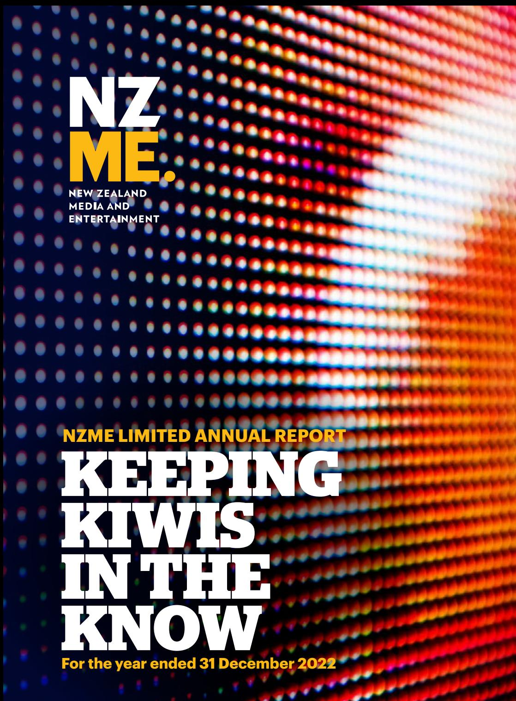

{1}------------------------------------------------

- 2022 Financial Results Summary
- Divisional Snapshot
- Chairman's and Chief Executive Officer's Report
- Financial Commentary
- Our Sustainability Commitment
- The Board
- The Executive Team
- Corporate Governance
- Statutory Disclosures
- Consolidated Financial Statements
- Independent Auditor's Report
- Directory

This annual report is dated 21 February 2023 and is signed on behalf of the Board of Directors by:

**Barbara Chapman** Chairman

**Carol Campbell** Director

{2}------------------------------------------------

{3}------------------------------------------------

## **2022 FINANCIAL RESULTS SUMMARY**

**Operating Revenue1 2021 \$342.2m 7%**

**Statutory NPAT 2021 \$34.4m 66%**

**Operating EPS1**

# **\$64.7m**

**Operating EBITDA1 2021 \$62.4m 4%**

# **\$22.7m \$23.3m**

**Operating NPAT1 2021 \$21.1m 10%**

# **12.1cps 6.0 cps**

**Final Dividend Payable on 22 March 2023**

**\$43.0m \$17.5m**

**2021 10.7cps 13%**

**Distributions to shareholders during the year**

**Net Debt** 

**Increased by \$31.0m**

1 Operating results presented are non-GAAP measures that include the impact of NZ IFRS 16, however, exclude exceptional items to allow for a like for like comparison between 2021 and 2022 financial years. 2021 has been restated to exclude the impact of GrabOne (sold October 2021). Please refer to pages 38-39 of the NZME 2022 Full Year Results Presentation for a detailed reconciliation.

{4}------------------------------------------------

## **DIVISIONAL SNAPSHOT**

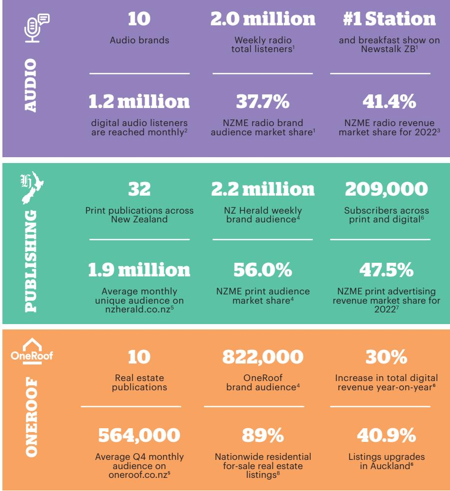

1 GfK RAM, Commercial Radio, Total NZ 4/2022, M-S 12mn-12mn, M-F 6am-9am, Share %, Cume 000, AP10+ 2 Adswizz monthly reach Jan-Dec 2022 (monthly average). 3 PwC Radio advertising market benchmark report, Q1 2022 – Q4 2022. Note: report excludes independent broadcasters and contra revenue. 4 Nielsen CMI Q4 21 – Q3 22 Fused Nov 2022 AP15+ Note: NZME, Publishing and OneRoof audience includes weekly print and monthly digital. 5 Nielsen Online Ratings as of Dec 2022 AP15+ (excludes APP) 6 NZME Analysis (listings upgrades Q4 2022). 7 PwC NPA quarterly performance comparison report, Q1 2022 – Q4 2022. Note: report excludes any publishers that are not part of the NPA. 8 OneRoof's listings as a percentage of residential for-sale real estate listings on trademe.co.nz. Dec 2022 monthly average. Excluding private listings. FY 2020 and 2021 figures as previously stated in 2021 FY results announced on 23 February 2022.

{5}------------------------------------------------

## **CHAIRMAN AND CEO REPORT**

### **Kia Ora, we are delighted to deliver New Zealand Media and Entertainment's Annual Report for the year ended 31 December 2022.**

We are proud to reflect on a year where, despite many challenges, NZME continued our transformation and made very good progress in the second year of our three-year strategy.

Like most companies across New Zealand and globally, in 2022 NZME once again experienced an extremely challenging operating environment. Business confidence fell to historic lows in New Zealand, with supply chain challenges, labour shortages, higher interest rates and inflationary pressures all contributing factors to this. Despite this, NZME has made significant progress and has delivered strong earnings results.

Advertising revenue has grown, which shows the strength and trust in our various platforms. Our digital transformation efforts continue to come to fruition, with record audiences across radio and digital audio platforms, as well as strong growth in publishing and digital platforms, including OneRoof.

NZME has demonstrated flexibility and agility, adapting through the challenging times to remain largely on track to achieve the 2023 targets that were set under our three-year strategy back in 2020.

#### **NZME's Key Strategic Priorities**

To recap, our strategic priorities are:

- To be New Zealand's leading audio company
- For the NZ Herald to become New Zealand's Herald

- And finally, for OneRoof to become your complete property destination.
Having a very clear and targeted strategy has ensured a strong focus on the initiatives that drive growth and transformation, ensuring the long-term success of the business.

#### **Financial Results Highlights**

The 2022 operating EBITDA1 of \$64.7 million was four percent higher than the comparative result for last year. Statutory net profit after tax was \$22.7 million, which was lower than last year's \$34.4 million with last year's result including a gain on the sale of GrabOne of \$15.4 million. These results translated to operating earnings per share1 of 12.1 cents per share, 13% higher than 2021.

The improved performance was driven by a seven percent increase in Operating Revenue1 to \$364.6 million with advertising revenue four percent higher than last year.

Total revenue increased across all three strategic pillars: Audio, Publishing and OneRoof, with total digital revenue up 16% on 2021. Our focus on the digital transformation and diversification of our platforms is having a positive influence on business performance and digital revenues are becoming a more significant part of NZME's total revenues. The share of revenue has nearly doubled in the last three years, with digital revenues now representing 27% of total advertising revenue.

#### NEW ZEALAND'S LEADING AUDIO COMPANY

**Create New Zealand's best local audio content**

**Grow broadcast and digital reach**

**Grow market revenue share and digital revenue**

### NEW ZEALAND'S HERALD

- **The #1 News brand for all New Zealanders**
**Subscriber first**

**Be a safe, scalable destination for advertisers**

**Be indispensable to agents**

**Expand the portfolio**

{6}------------------------------------------------

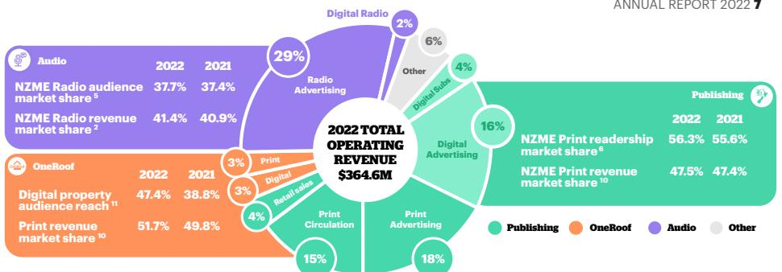

#### **KEY ACHIEVEMENTS**

#### **Audio**

Radio market revenue share2 reached 41.4% - the highest it has been since 2016, with radio advertising revenue increasing by 5% year on year. Audio's digital revenue overall also grew to \$6.8 million from \$4.5 million in FY21 with digital audio becoming a strategic focus of the business.

Digital audio platform iHeartRadio performed strongly once again, celebrating a significant milestone of over 50 million podcast downloads3, and now reaching more than 1.2 million Kiwis4.

As well as growing digital radio, NZME has also expanded its broadcast reach, with the addition of Radio Wanaka to its radio network.

NZME radio also celebrated its highest ever audience this year – more than two million Kiwis across its broadcast radio stations listen every week5.

NZME is strategically focused on expanding its podcast network, recognising that podcasting is one of the fastest growing digital media platforms in the world. We're proud to offer the country's most diverse and expansive range of world-class global and local content across our podcast network. We are focused on growing our already hugely diverse audience, with more content to come in 2023.

#### **Publishing**

NZME is focused on providing the news that our audience of 3.6 million6 people can trust, and recently launched a distinctive new brand campaign, highlighting our promise to provide our audience with the 'news worth knowing'.

Publishing is reaping the benefits of the digital transformation that is well progressed, and remains the major contributor to earnings, growing EBITDA1 year on year from \$45.4 million to \$47.4 million (including NZ IFRS 16).

Publishing subscriptions increased to 209,0007, including 113,000 digital only subscriptions. Digital publishing advertising revenue has also increased by 6% year-on-year.

NZME formally acquired BusinessDesk on 17 January 2022 – an esteemed business news, opinion and analysis website. BusinessDesk has provided us with the opportunity to continue to improve the overall insight we provide to New Zealand businesses and wider audiences, and we have accelerated growth in the platform over the year.

Further elevating its premium digital offering, in November 2022 NZME launched Viva Premium – an online subscription for access to Viva's first-class fashion, food, beauty, culture and design content. Direct from Viva's trusted, award-winning team of editors, journalists and contributors, Viva Premium is offered in addition to New Zealand Herald's premium

1 Operating results presented are non-GAAP measures that include the impact of NZ IFRS 16, however, exclude exceptional items to allow for a like for like comparison between 2021 and 2022 financial years.2021 has been restated to exclude the impact of GrabOne (sold October 2021). Please refer to pages 38-39 of the investor presentation for a detailed reconciliation. 2 PwC Radio advertising market benchmark report, rolling 12-month average to 31 Dec 2022. FY 2020 and 2021 figures as previously stated in FY 2021 results announced on 23 February 2022. Note: report excludes independent broadcasters, contra revenue and digital audio. 3 Triton NZ Podranker Jan – Dec 2022 – total downloads. 4 Adswizz monthly reach Jan-Dec 2022 (monthly average). 5 GfK RAM, Commercial Radio, Total NZ S2, S4 2022, M-S 12mn-12mn, M-F 6am-9am, Share %, Cume 000, AP10+ 6 Source: Nielsen CMI Q4 21 – Q3 22 November 22 Fused AP15+. Monthly coverage for Daily & Community titles, Weekly coverage for Newspaper Inserted Magazines, Monthly UA for Digital, Weekly Reach for Radio (GfK RAM S3 22). Note: Fused data has potential for duplication. 7 Includes the impact of the BusinessDesk acquisition. RAM, Commercial Radio, Total NZ 4/2022, M-S 12mn-12mn, M-F 6am-9am, Share %, Cume 000, AP10+. 8 OneRoof's listings as a percentage of residential for-sale real estate listings on trademe.co.nz. Dec 2022 monthly average. Excluding private listings. FY 2020 and 2021 figures as previously stated in 2021 FY results announced on 23 February 2022. 9 Nielsen Online Ratings monthly average Q4 2022 AP15+ (excludes APP). 10 PwC NPA quarterly performance comparison report, 12 months to Dec 2022 compared to 2021, rolling 4-quarter average for market share. Print Includes Publishing and OneRoof print advertising revenue. OneRoof is Property only. 11 Nielsen CMI Fused Q4 21 – Q3 22, Nov 2022 People 15+. Compared to Q4 20 – Q3 21. OneRoof reach of property visitors (property visitors=unduplicated audience of oneroof.co.nz, trademe.co.nz/property, homes.co.nz & realestate.co.nz).

{7}------------------------------------------------

content. It sees NZME evolving its digital subscription offering to appeal to a wider audience, as well as offering advertisers a new, unique opportunity and pleasingly, three months in, the platform is meeting its commercial targets.

The NZ Herald also celebrated its highest weekly brand audience in its 158-year history – over 2.2 million6, or nearly half New Zealand's population.

This year the NZME Board strongly supported the focus on quality and trust in our newsroom, with codes and principles that have been captured in NZME's new editorial Code of Conduct and Ethics.

#### **OneRoof**

OneRoof digital listings upgrades nationwide increased significantly, delivering a 53% increase in listings revenue year-on-year, despite a cooling housing market. The platform also celebrated a 30% increase in digital revenue compared to 2021, up from \$8.1 million to \$10.5 million.

OneRoof has 89% of residential for sale listings nationwide8 and has grown its audience to 564,000 – up from 497,000 the year prior9. OneRoof continues to close the gap with its closest competitor, Trade Me, moving OneRoof further towards its strategic target to be New Zealand's complete property destination.

NZME is committed to continuing growth in OneRoof listing conversion both in Auckland and the rest of New Zealand, further building valuebased relationships with agents regionally and nationwide to help their clients with selling their homes.

#### **Net Debt Reduction**

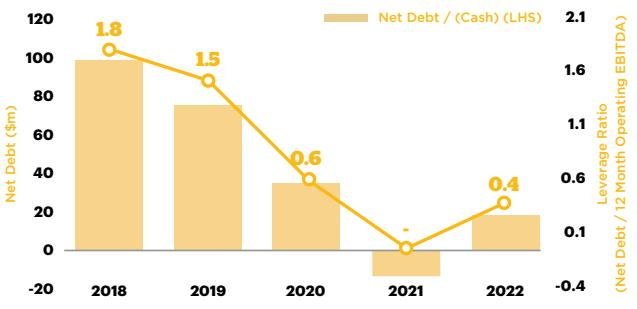

Greg Hornblow was appointed as acting Chief of OneRoof, with Paul Maher departing the company. Greg will act in the role while NZME recruits for a fulltime replacement for the role.

#### **Capital Management**

NZME remains committed to delivering value for shareholders. Having repaid debt in prior years the company commenced a \$30 million capital return programme at the start of 2022. During the year the company purchased 14.7 million shares, representing around 7.4% of the shares on issue at the start of the year. The total of distributions to shareholders was \$43 million during the year comprising:

- 2021 final dividend of 5 cents per share, totalling \$9.9 million;
- Interim dividend of 3 cents per share, totalling \$5.8 million;
- Special dividend of 5 cents per share, totalling \$9.7 million; and
- Share buy-back totalling \$17.6 million.

Net Debt increased \$31.0 million during the year from a net cash position at the end of 2021 to a net debt position of \$17.5 million. This represents a leverage ratio of 0.4 times EBITDA (pre IFRS 16) and remains below the bottom of the company's target leverage range of 0.5 to 1.0 times.

Based on the business outlook, capital requirements and continued strong cash flows the Board has declared a fully imputed final dividend of 6.0 cents per share bringing the total normal dividends declared in relation to the 2022 year to 9.0 cents per share.

#### **Outlook**

It has been a soft start to 2023, especially given the subdued real estate market. However, March 2023 is tracking to deliver growth over 2022.

Cost pressures remain across the business and we continue to be focused on substantially mitigating these through disciplined cost controls.

There is uncertainty across the economy and the market and we will update you further at the Annual Shareholders Meeting on 26 April 2023.

We are pleased to have made significant distributions to shareholders over the past year.

{8}------------------------------------------------

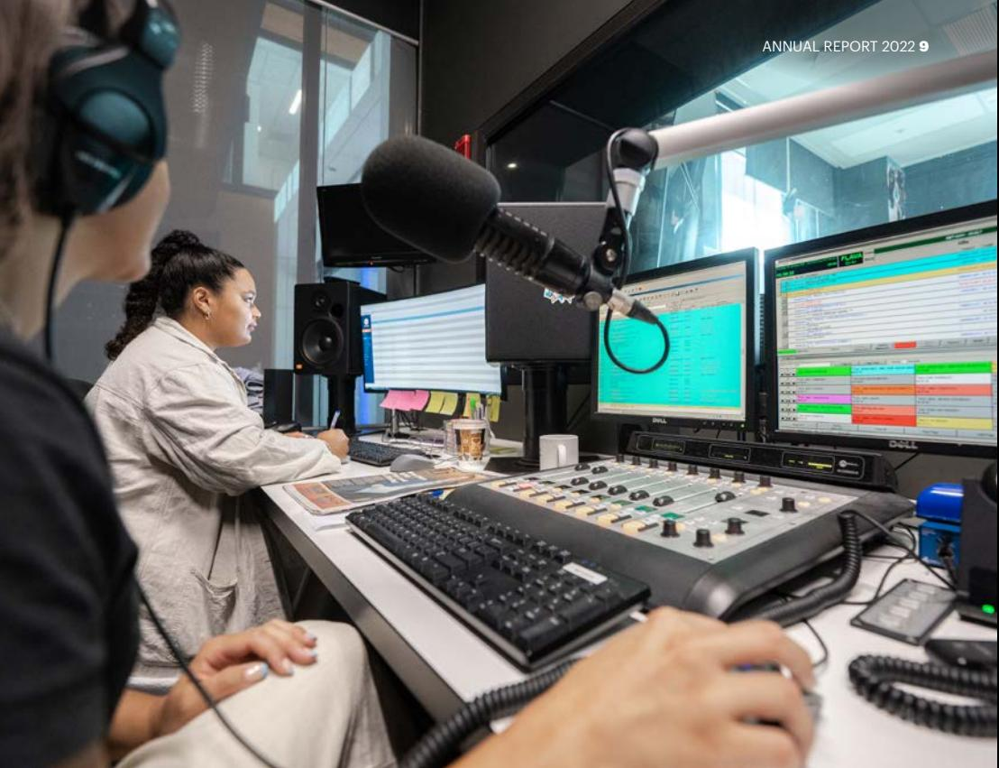

The Board has a desire to operate at the lower end of the target leverage ratio in the current environment but will continue to return excess capital to shareholders, subject to the operating environment and investment opportunities.

#### **Conclusion**

We're excited to be introducing new innovative products to market in 2023 and beyond that will continue to engage audiences and support advertisers. These include live shopping, digital advertising as a service, text to speech technology, expanded podcast content, a new

automobile vertical proposition for DRIVEN and an upcoming digital subscription vertical.

Although 2022 has been a challenging year, the dedication and adaptability of our team at NZME has meant we have been able to achieve very good results once again this year. A big thank you to our people at NZME, our customers, support partners and our shareholders.

A huge thanks also to our audience of 3.6 million people6. Thank you for engaging with NZME – whether that be through one of our many radio stations, via our digital audio

platform iHeartRadio, one of our newspapers, online, or via our OneRoof property platform. Your support of NZME is very much appreciated and we look forward to continuing to deliver exceptional experiences for our audiences well into the future.

Finally, a big thank you to the NZME Board and the Executive team for their support and guidance through what has been another challenging year. Thank you for your hard work, commitment and passion to drive success at NZME, in turn providing an excellent future for the company and shareholders.

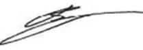

**Barbara Chapman** Chairman

**Michael Boggs** Chief Executive Officer

{9}------------------------------------------------

# **FINANCIAL COMMENTARY**

#### **Financial Results**

Statutory NPAT for 2022 was \$22.7million, which was lower than last year's \$34.4 million in 2021 which included a \$15.4 million gain on sale of GrabOne.

Operating EBITDA1 was \$64.7 million in 2022 which was 4% higher than last year (excluding GrabOne). Operating Revenue1 was \$364.6 million in 2022, up 7% compared the 2021 operating revenue excluding GrabOne of \$342.2 million.

Operating Expenses were \$299.9 million, an increase of 7% due to:

- People and Contributors costs were 9% higher than 2021 due to people costs associated with the addition of BusinessDesk, additional resources to deliver the government grant projects and a one-off \$1,000 discretionary bonus paid to each eligible employee make up around half the increase. The remaining increase relates to additional resources to deliver growth, and rate increases.
- Print and Distribution costs were similar year-on-year with increased paper and distribution costs offset by lower volumes.
- Content costs were higher due to increased activity in the re-selling of digital services and increased licence costs.
- Other expenses grew 14% reflecting the impact of the BusinessDesk / Radio Wanaka acquisitions, higher radio broadcast costs and the return to more normal levels of acitivity.

NZME's Operating NPAT1 for 2022 was \$23.3 million, up 10% year-on-year resulting in an operating earnings per share of 12.1 cents compared to 10.7 cents in 2021.

#### **Balance Sheet and Cash Flow**

Net debt increased by \$31.0 million to \$17.5 million as at 31 December 2022 primarily due to the capital return programme completed in 2022. At the end of 2021 the company had a net cash position of \$13.5 million.

The Capital return programme resulted in \$27.3 million returned to shareholders and included \$17.6m repurchase of shares and a special dividend paid of \$9.7 million. In addition, normal dividends of \$15.7 million were paid bringing the total of distributions to shareholders to \$43 million.

Working capital excluding cash increased by \$11.6 million as a result of:

- the increased value of paper stocks held due to a decision to hold higher volumes combined with increased paper cost.
- lower tax payable due to the additional supplementary dividends, which are treated as tax credits were paid during the year.
- the increase in receivables is expected to be temporary due to one-off timing of certain receipts due.

Cash flow from operations for the year was \$37.5 million, which is lower than 2021 due to the decrease in working capital and higher amount of tax paid during the year.

Capital expenditure of \$10.7 million was higher than the prior year which was reduced due to covid.

Plant property & equipment, intangibles and other noncurrent assets decreased due to depreciation and amortisation exceeding capital expenditure. Right of Use assets reduced in line with the reduction in lease liabilities as the term reduces.

1 Operating results presented are non-GAAP measures that include the impact of NZ IFRS 16, however, exclude exceptional items to allow for a like for like comparison between 2021 and 2022 financial years. 2021 has been restated to exclude the impact of GrabOne (sold October 2021). Please refer to pages 38-39 of the investor presentation for a detailed reconciliation.

{10}------------------------------------------------

The audio division includes NZME's many radio brands, as well as digital audio platform iHeartRadio.

Total audio revenue was \$113.9 million in 2022, up 7% year-on-year. NZME's digital audio platform, iHeartRadio, continued to grow with digital revenue 54% higher than in 2021.

NZME's share of total audience grew to 37.7%, up 0.3 percentage points compared to 2021. For the first time in NZME history, its radio stations reached more than 2 million people, with Newstalk ZB remaining New Zealand's number one commercial radio station1 – a position it has held for 15 years. In addition, the radio revenue market share was 41.4% which was 0.5 percentage points above 20212.

NZME continue to grow its 10+ audience market share to deliver revenue ambitions, leveraging off NZME's platform of 3.6 million3 New Zealanders to help grow audio audience.

NZME continues to dominate the commercial podcast network in New Zealand, reaching over 50 million podcast downloads and growing4. Since September 2021, when the Triton Podcast Ranker was first introduced in New Zealand, NZME's network has taken out the Top Network spot, regularly seeing more than 4 million monthly podcast downloads across its network4.

NZME will continue to enhance its commercial offering in 2023 with a range of new podcasts and content via iHeartRadio and across other podcast networks, with sales representation agreements including the addition of the Stitcher Podcast network to support revenue growth.

NZME also celebrated one of its biggest wins at the NZ Radio Awards 2022, taking out six of the seven awards in the premier category and winning the majority of the overall awards' pool. Newstalk ZB was once again a standout performer, taking out eleven awards in total, including four premier awards.

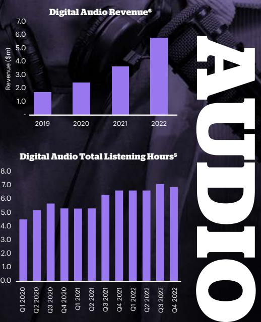

1 GfK RAM, Commercial Radio, Total NZ S2, S4 2022, M-S 12mn-12mn, M-F 6am-9am, Share %, Cume 000, AP10+. 2 PwC Radio advertising market benchmark report, rolling 12-month average to 31 Dec 2022. FY 2020 and 2021 figures as previously stated in FY 2021 results announced on 23 February 2022. Note: report excludes independent broadcasters, contra revenue and digital audio. 3 Source: Nielsen CMI Q4 21 – Q3 22 November 22 Fused AP15+. Monthly coverage for Daily & Community titles, Weekly coverage for Newspaper Inserted Magazines, Monthly UA for Digital, Weekly Reach for Radio (GfK RAM S3 22). Note: Fused data has potential for duplication. 4 Triton NZ Podranker Jan – Dec 2022 – total downloads. 5 Adswizz and StreamGuys, TLH, monthly average for the quarter. 6 NZME Analysis.

Listening Hours (millions)

{11}------------------------------------------------

#### 12 NEW ZEALAND MEDIA AND ENTERTAINMENT

NZME Publishing includes all NZME's print publications nationwide, as well as digital news and journalism products.

Total publishing revenue was \$225.4 million in 2022, up 6% compared to 2021.

Total reader revenue increased by 2% to \$83.7 million, with strong digital subscription revenue growth of 39% to \$16.1 million, which more than offset the decline in print reader revenue. Total subscribers across print and digital grew to 209,0001, including 113,000 digital only subscriptions.

Total advertising revenue grew 2%, with digital advertising revenue making up nearly half of the Publishing division's advertising revenue for 2022 and growing 6% compared to 2021.

NZME formally acquired esteemed business news, opinion and analysis website BusinessDesk on 17 January 2022, and with the introduction of BusinessDesk and Herald Premium bundles, drove strong growth in corporate subscriptions.

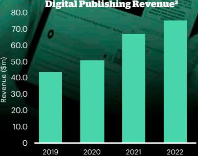

#### **Subscriptions Mix2**

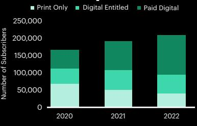

1 Includes the impact of the BusinessDesk acquisition 2NZME Analysis.

{12}------------------------------------------------

The OneRoof division includes the OneRoof property platform and all NZME's real estate publications including OneRoof Property Report and OneRoof regional editions.

Total OneRoof revenue increased 7% to \$22.9 million, with 30% growth in digital revenue to \$10.5 million, despite a cooling housing market. Digital growth continues to out-pace print resulting in a stronger digital revenue mix.

A full customer experience analysis was undertaken in 2022, with an action plan developed to increase audience engagement. A new OneRoof brand campaign was delivered to increase unprompted brand awareness and preference, with digital marketing strategies also implemented to build on total platform sessions. Localised strategies were also deployed across the country to encourage real estate agents to include all listings with OneRoof.

OneRoof's monthly audience continues to grow and finished the year with significantly reduced audience gap to the number one New Zealand real estate platform.

OneRoof listing upgrade products are a key revenue driver with the conversion rate of base listings to upgraded product a key strategic metric. The conversion rates for the last quarter of 2022 were 40.9% for Auckland and 14.9% for other regions residential listings which was up from 27.5% and 7% respectively in 2021.

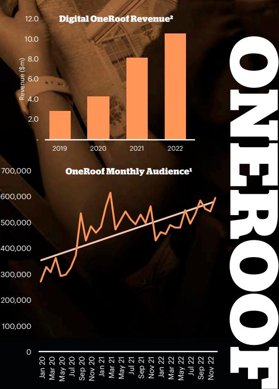

1 Nielsen Online Ratings monthly average Jan 20 - Dec 2022 AP15+ (excludes APP). 2 NZME Analysis

Unique Audience

{13}------------------------------------------------

## **OUR SUSTAINABILITY COMMITMENT**

### **We are committed to protecting the craft of journalism and broadcasting to keep Kiwis in the know.**

New Zealanders look to our platforms for quality news they can trust. We take our responsibility seriously to ensure our journalism is fair, accurate and balanced, and to ensure our communities are connected, and our people are healthy and safe.

We have supported our people with an increased focus on wellbeing and engagement at NZME, including through regular communication, the availability of our employee assistance programme, Benestar, and ensuring that our leaders are equipped to support flexible and hybrid working models for team members as well as the general wellbeing of our team members.

NZME's has a Diversity and Inclusion Committee that is charged with ensuring that NZME maintains its focus on initiatives to support diversity and inclusion at NZME. During the year these

initiatives included a Menstruation & Menopause Policy to support team members in the workplace, including the provision of free sanitary items, and a Gender Identity and Transitioning Policy to support team members bringing their gender identity to work and also provision of education and information to all about gender identity.

In 2022, NZME launched a new employer brand promise, 'This Could Lead Anywhere' with a focus on the endless possibilities available to employees of NZME. We aim to attract and retain talent, highlighting the career pathways available to people at NZME, supported by the 2023 launch of 'Develop Me', a leadership development programme to accelerate leadership capabilities across the business.

NZME supports the increasing ESG (environmental, social and governance) regulation and is

committed to ensuring we have a sustainable business that supports the wellbeing of our community, people and environment.

NZME has developed and issued a Modern Slavery Statement and is taking several steps to prepare for New Zealand's modern slavery legislation. We are identifying key overseas suppliers to assess where there is any risk of exposure to modern slavery practices within our supply chain, as well as reviewing our contractual terms to further reduce risk of these practices. We have also filed two modern slavery statements in Australia this is discussed on page 37.

The following tables outline the progress made to date across the three key pillars: communities, people and environment. NZME is developing a roadmap for its sustainability commitment up to 2030 and will report on this in our 2023 Annual Report, which will include for the first time the required climaterelated disclosures.

**Case Study:** 'This Could Lead Anywhere' was launched to ensure NZME attracts, retains and develops the very best talent in New Zealand, supported by the DevelopMe leadership programme launching in 2023.

{14}------------------------------------------------

#### ANNUAL REPORT 2022 15

**Case Study:** The Big Boost was an extension of the highly successful The 90% Project - a 2021 campaign that aimed to get 90 percent of New Zealanders vaccinated against COVID-19 by Christmas 2021. The Big Boost was supported by the Ministry of Health, leading to The Big Boost week, during which more than 300,000 New Zealanders received their third dose of the COVID-19 vaccine (otherwise known as a booster). We used our platforms to share health updates, raise awareness and prepare Kiwis for the waves of COVID-19 that would come.

**We are committed to protecting the craft of journalism and broadcasting to keep Kiwis in the know.** 

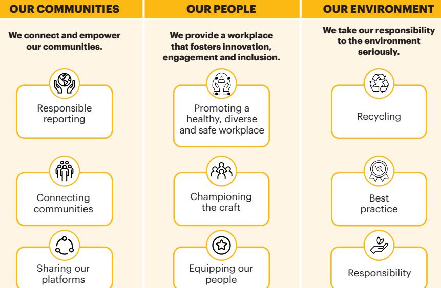

NZME's sustainability programme is aligned to the guidelines set out in the UN Sustainable Development Goals – an international blueprint to achieve a better and more sustainable future for everyone.

{15}------------------------------------------------

**Pictured:** On-air hosts Brad Watson and Laura McGoldrick, The Hits Drive show.

# **OUR COMMUNITIES**

**We connect and empower our communities.**

Through our digital platforms, radio networks, extensive range of publications and our growing suite of podcasts, NZME was proud to provide quality, trusted, diverse and balanced journalism and entertainment.

NZME is deeply involved in our communities and as one of Aotearoa New Zealand's largest media companies we facilitate conversations about the topics that matter to Kiwis, and we continue to partner with charitable organisations throughout the year (see page 17). In 2022, NZME launched a major wellbeing and mental health campaign 'Great Minds' – the search for happiness, alongside the NZ Herald's 'In Her Head' series, campaigning for better women's health services.

NZME has joined the Shielded Site Project, to provide a safe way for victims of domestic violence in our communities to find help. Every NZ Herald digital page has a Shielded Site icon, which leads to a domestic violence support portal, without it showing up in browser history.

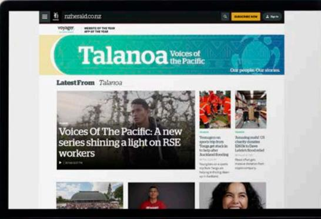

Together with World Vision, the NZ Herald highlighted the plight of millions of refugees from the war in Ukraine, with numerous personal stories shared across our platforms. More than \$1.9 million was raised for World Vision, to support children and families who had been forced to flee Ukraine.

We use our wide reach across Aotearoa to provide a range of opinions and ensure diversity of voice. The Herald on Sunday relaunch introduced an even more diverse group of columnists, including Pasifika law student Shaneel Lal, who was instrumental in getting conversion therapy banned in New Zealand, and Alice Soper, a staunch advocate for women's rugby.

**Case Study:** Launched in 2022, Talanoa, Voices of the Pacific, is NZ Herald's home of Pasifika news and storytelling led by Vaimoana Mase, Pasifika Editor.

{16}------------------------------------------------

#### **INITIATIVE PROGRESS**

#### **RESPONSIBLE REPORTING AND BROADCASTING**

Through best practice broadcasting and journalism, we will provide a diverse and balanced reporting platform, promoting the law and holding the powerful to account.

Where justified in the interests of freedom of expression, open justice and holding the powerful to account, NZME invests in legal challenges to suppression, take down orders, access to court files and other media law challenges. In 2022 NZME participated in more than 30 legal challenges, some of which involved continued investment in opposing or appealing to the High Court, Court of Appeal and the Supreme Court. In 2022 NZME continued with the Open Justice Project, which provides NZME with additional funding for court reporting through Public Interest Journalism funding.

NZME strives to adhere to our Editorial Code of Conduct & Ethics and the principles and standards of the NZ Media Council and the Broadcasting Standards Authority (BSA).

| Regulator     | Number of Upholds                    |              |
|---------------|--------------------------------------|--------------|
|               | 2021                                 | 2022         |
| BSA           | Nil                                  | One uphold   |
| Media Council | One uphold and One partial uphold | Three upheld |

We have maintained our commitment to our communities through the presence of local journalists and broadcasters. We employ 596 journalists and broadcasters nationwide, up from 550 in 2021.

We increased diversity of content and contributors across our platforms. Initiatives in 2022 included:

- The launch of Talanoa, Voices of the Pacific, NZ Herald's home of Pasifika news and storytelling
- The NZ Herald joined with broadcasters Moana Maniapoto and Toby Mills of Tawera Productions, Tapu Misa of E-Tangata and NZ On Air to present Moana Jackson: Portrait of a Quiet Revolutionary, a 50-minute documentary which provided an insight into one of modern Maoridom's greatest thinkers in the final months of his life
- Matariki (marking the beginning of the new year in the Māori lunar calendar) was celebrated by our Te Rito cadets, producing a collection of stories on Kāhu including a special animation to educate people about the significance of Matariki and the explanation of the stars, working with Stacey and Scotty Morrison
- Te Wiki o te Reo Māori (Māori language week) events, including Te Reo Māori news bulletins and news content, podcasts and video content across our online platforms
- NZME continued its media partnership with Auckland Unlimited across major summer cultural festivals including Diwali and Pasifika

We continue to participate in and support Local Democracy Reporters (NZ On Air funded journalists), hosting two (of 14) democracy reporters in our newsrooms in 2022.

We have utilised our platforms to fight for New Zealanders including the disadvantaged, facilitating conversations that matter and holding the powerful to account. Refer to examples case studies on page 18.

We will use our wide reach across New Zealand to provide a range of opinion and ensure a diversity of voices.

In 2022 we have championed and supported charitable causes, providing support to:

Breast Cancer Foundation, Cure Kids, Cystic Fibrosis NZ, Graeme Dingle Foundation, Leukemia & Blood Cancer New Zealand, Men's Health Week, Sir John Kirwan Foundation, The Funding Network New Zealand, Women's Refuge World Vision, Women's Refuge (Shielded Initiative).

#### **CONNECTING COMMUNITIES**

We are deeply involved in our communities and as one of New Zealand's largest media platforms we will facilitate conversations about the topics that matter to Kiwis.

#### **SHARING OUR PLATFORMS**

We will use our wide reach across New Zealand to provide a range of opinion and ensure a diversity of voices.

{17}------------------------------------------------

**Case Study:** In 2022, NZME launched a new sustainable fashion-forward partnership with New Zealand clothing design powerhouse RUBY through Liam patterns. NZME and RUBY created a circular solution, turning wastepaper from the end of newspaper print rolls from NZME's Ellerslie printing press into printed clothing patterns under RUBY's Liam Patterns brand.

#### **Case Study:**

In Her Head was a NZ Herald campaign for better women's health services. Health reporter Emma Russell investigated what's wrong with our system and talked with wāhine who have been made to feel their serious illness is a figment of their imagination or "just part of being a woman".

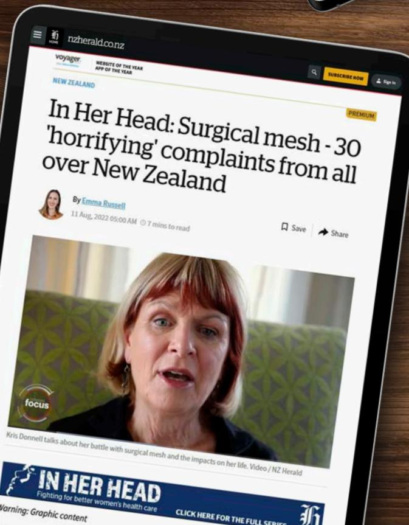

{18}------------------------------------------------

**Case Study:** Matariki was celebrated by our Te Rito cadets who produced a collection of stories to educate people about the significance of Matariki, and the explanation of the stars.

**Case Study:** The Alternative

Commentary Collective (The ACC) partnered with The Movember Foundation NZ launching The ACC Golf Open along with The Movember Sports Club, which has now expanded into six events held around New Zealand.

#### **Case Study:**

NZME partnered with Philips Search & Rescue Trust which saw the Trust supported by NZME's media platforms to raise much needed funds to operate its helicopters.

{19}------------------------------------------------

# **OUR PEOPLE**

### **We provide a workplace that fosters innovation, engagement and inclusion.**

NZME strives to maintain its position as an employer of choice in the media industry. In 2022 we finished the year with an Employee Net Promoter Score that was within the top 25 percent, and approaching the top 10%, of consumer media businesses globally.

NZME has launched a development programme for our leaders. The new programme, 'Develop Me', will be rolled out in 2023 and aims to create vibrant and exceptional leadership across NZME.

NZME continues to uphold a high performing health and safety culture, regularly reporting on our performance (refer to page 42). In 2022 the protection of our team from the risks of COVID-19 was again a priority focus, continuing to support flexible

ways of working that ensured business continuity. NZME is cognisant of the high-profile nature of our leading media brands and the need to protect the health and safety of our people in the public eye (seen as representatives of these brands). There is a focus on supporting our people and putting in place safety and security measures whether they are out in the field, in the office or interacting online.

Initiatives to support and promote mental health and wellbeing included resiliency workshops, as well as continued support through Benestar - our Employee Assistance Programme. NZME introduced a Gender Identity and Transition Policy, and a Menstruation and Menopause Policy, which provides access to free sanitary items for our people.

In 2022, NZME's focus on improving diversity across the business continued, with 21 Te Rito journalism cadets. Te Rito is an industry collaboration to train and develop new journalism cadets, including those from Māori, Pasifika, LGBTQ and other communities traditionally under-represented in media. At completion of the programme, eight of the graduates are set to move into a mix of permanent and fixed-term roles with NZME, with others being offered roles with our media partner organisations. NZME looks forward to continuing this cadet programme for a second round in 2023, offering 12 cadetships.

{20}------------------------------------------------

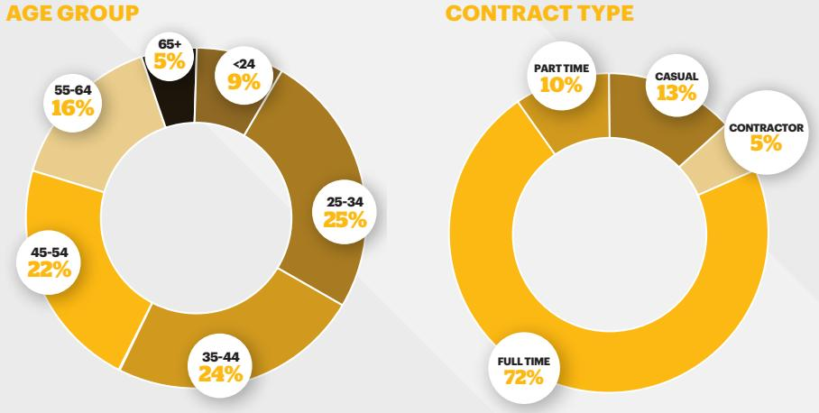

#### **GENDER / LEVEL**

**F M**

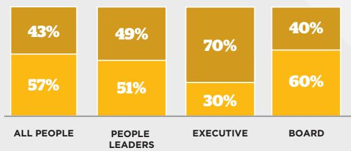

**300 LENGTH OF SERVICE**

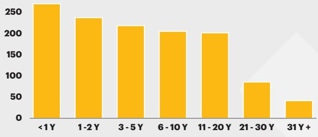

#### **ETHNICITY**

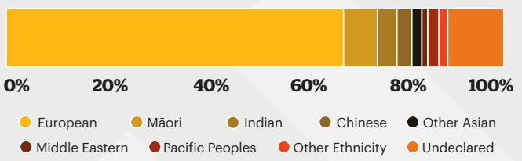

{21}------------------------------------------------

### **OUR PEOPLE**

#### **INITIATIVE PROGRESS**

#### **PROMOTING A HEALTHY, DIVERSE AND SAFE WORKPLACE**

We will embed a high performing health and safety culture and will regularly report on our performance. We will strive for a collaborative and welcoming place to work that celebrates diversity. We will adopt and strengthen policies for the promotion of gender equality.

We have been highly focused on safety engagement in 2022 and have seen an increase in the number of employees proactively reporting incidents. Please refer to page 42 for further detail. We have been focused on engaging our leadership team in health, safety and wellbeing and stepping in and taking preventative actions as soon as an issue is identified.

The Diversity and Inclusion Committee hosted a calendar of events including:

- Chinese New Year and the Chinese Moon Festival with a cultural performance and traditional Chinese lunch
- Unconscious Bias training through our partnership with Diversity Works NZ
- Pink Shirt Day participation advocating for a culture free from bullying, harassment, and discrimination
- Hosting a panel session for International Women's Day with a group of NZME leaders discussing gender bias and how to foster allyship in the workplace
- Te Wiki o te Reo Māori (Māori language week) events, including Te Reo Māori zoom sessions to inspire and teach everyday Te Reo Māori
- Diwali Festival of Light with Professor Paul Spoonley
- Wellbeing Week with support from Benestar and a focus on mental health, women's and men's health.

NZME has maintained the Rainbow Tick certification mark (awarded to organisations that demonstrate diversity and inclusion, measured through a thorough assessment process).

NZME supports initiatives that reduce the gender pay gap and eliminate gender inequities across the business as demonstrated through the roll out of "Understanding Unconscious Bias" training for leaders, and the introduction of the Menstruation and Menopause Policy and the Gender Identity and Transition Policy. NZME continues to closely monitor relevant data points across the business to hold leaders accountable and ensure continued progress with diversity, inclusion and reducing inequities.

{22}------------------------------------------------

#### **PROMOTING A HEALTHY, DIVERSE AND SAFE WORKPLACE**

Continued

#### **CHAMPIONING THE CRAFT**

We will ensure we are mentoring the next generation of journalists and broadcasters. We will develop our people to maintain and grow the craft.

#### **INITIATIVE PROGRESS**

We are striving for diversity at Board, Executive and People Leader levels:

In 2022, for gender, we have at Board level F60%:M40%, at Executive level F30%:M70% and for our People Leaders F49%:M51%

For ethnicity, we have at Board level all members identifying as European and at Executive level 10% identifying as Chinese and 90% as European and for our People Leaders we have 84.9% European, 7.6% (2021: 6.8%) Maori, 3.1% Indian, 2.2% Chinese and 2.2% Other Ethnicity.

A mandate remains that at least 20% of all interns be non-European and this has been supported by our Te Rito cadet programme and our partnership with Tupu Toa. Our recruitment processes have been refreshed to support diverse recruitment.

NZME supports flexible working for diverse needs and/or shared responsibility in the household. Policies and initiatives in 2022 to support this included work to refresh our processes and policies and better support leaders to manage hybrid and flexible working arrangements.

NZME was voted Top Graduate Employer in the media and communications category in the Top 100 Graduate Employers in GradNewZealand's 2022 Student Survey. 26 interns and cadets (2021: 19) were part of our team at NZME in 2022.

We highlighted our broadcast and journalistic talent through online profiles and supporting our journalists on television panels such as Q&A and The Nation.

A total of 247 hours (2021: 115 hours) of media law and regulation training was undertaken by our journalists and broadcasters at NZME in 2022, with a focus on BSA training due to updated codes.

Refer to page 26 for our Awards list celebrating the talent and commitment of our people.

#### **EQUIPPING OUR PEOPLE**

We will commit to offering our staff relevant and impactful training to create new opportunities for growth and innovation.

NZME has launched a leadership development programme for our leaders. The new programme, "DevelopMe", will be rolled out in 2023 and aims to create vibrant and exceptional leadership across NZME.

{23}------------------------------------------------

## **OUR ENVIRONMENT**

### **We take our responsibility to the environment seriously.**

In 2022, NZME's print operations in Ellerslie, Auckland were awarded the Toitu enviromark gold certification. We are gold standard at reducing waste, working efficiently, and minimising harm to the environment and our people. The Waste Committee and Plastic Reduction Project initiatives, both based at the Ellerslie print plant, are discussed on page 25.

NZME continues to collaborate with our suppliers and partners to ensure best practice sustainable

operations. We are in the process of finalising a Responsible Sourcing Policy to ensure we partner with suppliers, aligning our focus on the environment and sustainability.

A recent review of our motor vehicle fleet has resulted in us working with our fleet car supplier, Orix, to introduce hybrid vehicles in 2023. We look forward to continuing to work with Orix to lower our carbon emissions in this area.

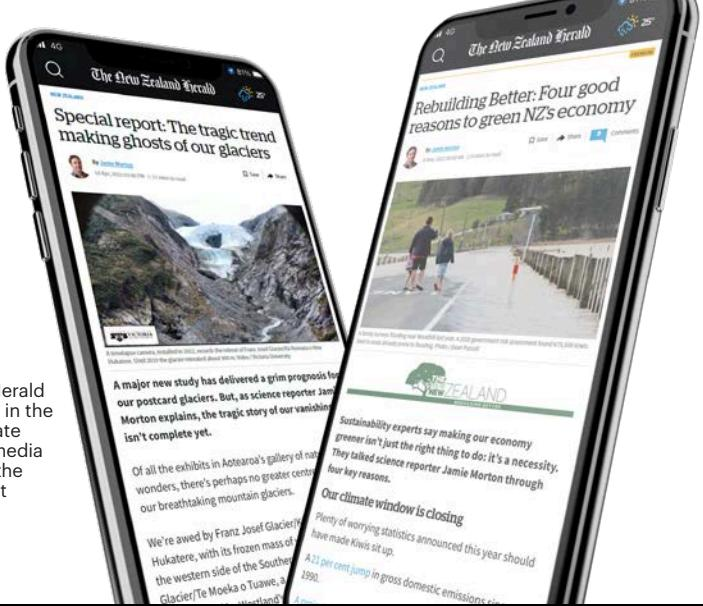

**Case Study:** The NZ Herald continued to take part in the annual Covering Climate Now – a global news media initiative highlighting the need for action against climate change.

{24}------------------------------------------------

#### **INITIATIVE PROGRESS**

#### **RECYCLING**

We will separate our internal waste streams – including paper, food and green waste, and recyclables – to optimise value and reduce environmental impacts.

The Waste Committee and the Plastic Reduction Project (PRP) both launched in 2020 and continued to accelerate initiatives in 2022 across both production and distribution teams at the Ellerslie print plant.

The PRP led to a reduction in plastic used at the plant. NZME has optimised the number of papers per bundle to reduce the total bundle numbers, with an expected reduction of 41,000m of plastic per year. 2022 resulted in 49 tonnes of plastic use at the print plant in 2022, a decrease of 5% from 52 tonnes of plastic used in 2021.

The following initiatives were implemented by the Waste

- Committee during 2022: Removal of all general rubbish bins
- All cardboard materials diverted from landfill to a dedicated collection point
- Our people encouraged to reuse broken or unserviceable wood pallets as firewood or DIY projects, diverting them from landfill.

In 2022, NZME continued to identify and initiate the recycling of batteries, ink and toner cartridges at more of our offices. At the Auckland Central office, where there is a barista station, we removed all plastic coffee cups. NZME supported Plastic Free July, World Car Free day in September and Recycling Week in October throughout the organisation.

In 2022, 29 tonnes of general waste was removed from the print plant; this was a reduction of 25% from 2021 (restated 2021: 39 tonnes).

NZME's print operations were again awarded the Toitu Enviromark Gold certificate in 2022. NZME has attained gold level certification since 2011.

We are in the process of finalising a Responsible Sourcing Policy to be adhered to for our sourcing requirements.

Employees travelled 3.8 million kilometers within NZ in 2022, this is up slightly from 2021 (with the restated amount of 3.5 million kilometers), due to the return of domestic travel and events.

In 2022 carbon emissions from our motor vehicle fleet were 522 tCO2e, higher than in 2021 (which has been restated as emissions of 491 tCO2e). The intention is to introduce hybrid vehicles into the fleet to lower carbon emissions in this area.

Our newspaper distribution network generated 2,855 tCO2e in 2022, this decreased by 5% from 2021 (restated 3,000 tCO2e). This reduction is due to optimising distribution routes and reducing kilometers travelled on the network.

#### **RESPONSIBILITY**

We will share our platform to promote environmental issues impacting Kiwis including carbon emissions and climate change.

Our motoring website, DRIVEN, regularly covers the impact motor vehicles can have on our environment. During 2022 DRIVEN produced a Sustainable Mobility/Motoring guide which included a clean car feebate calculator to help readers understand what cars will receive government discount or fee, along with other pieces of advice regarding sustainable motoring.

#### **BEST PRACTICE**

We will maintain our print operation's Environmental Management System.

We will collaborate with our suppliers and partners to ensure best practice sustainable operations.

{25}------------------------------------------------

We are proud of our people and their achievements. In 2022 we celebrated with the following award wins:

#### **GradNew Zealand**

Top 100 Graduate Employers (Media & Communications): NZME

#### **IAB NZ Digital Advertising Awards**

#### **Categories won by NZME:**

- GOLD Audio Sales Excellence: Sarah Catran
- GOLD NZME Podcast Network: James Butcher, Sarah Catran, Sam Collins

#### **INMA**

#### **Categories won by NZME:**

- Best Public Relations or Community Service Campaign, Groups: 'The 90% Project'
- Best Multi-Channel Client Advertising Campaign, Groups: NZME x Tourism Australia — Think You Know Australia? Think Again

#### **NZ HR Awards**

- Excellence HR Team of the Year
#### **NZ Law Awards**

- Excellence Inhouse Team of the Year
#### **NZ Podcast Awards**

#### **Categories won by NZME:**

- GOLD Best Business Podcast: Money Talks, NZ Herald
- GOLD Best Radio Podcast: ZM's Bree & Clint, ZM Podcast Network

#### **NZ Radio Awards**

#### **Categories won by NZME:**

- Network / Metropolitan Station of the Year: Newstalk ZB
- Sir Paul Holmes Broadcaster of the Year: Mike Hosking, Newstalk ZB
- Best Network Team Show: ZM's Fletch, Vaughan & Megan, Carl Fletcher, Vaughan Smith, Megan Papas, Anna Henvest, Sarah Mount, Jared Pickstock, Carwen Jones, Hayley Sproull, ZM Network
- Best Talk Presenter Breakfast or Drive: Heather du Plessis-Allan, Heather du Plessis-Allan Drive, Newstalk ZB Network
- Best Talk Presenter Non-Breakfast or Drive: Marcus Lush, Marcus Lush Nights, Newstalk ZB Network
- The Blackie Award': Hayley's Driver's Licence, Hayley Sproull, ZM Network
- Best Content Director / Content Team: Jason Winstanley, Edward Swift, Laura Heathcote, Newstalk ZB Network
- Best Show Producer or Producing Team - Music Show: Ben McDowell, Anastasia Loeffen, ZM's Bree & Clint, ZM Network
- Best Show Producer or Producing Team - Talk Show: Michael Allan, Sam Carran, Glenn Hart, The Mike Hosking Breakfast, Newstalk ZB Network
- Best Station Imaging: Alistair Cockburn, Brynee Wilson, Sam Harvey, Zoe Norton, ZM Network
- Best Station Trailer: ZM's Add to Cart, Alistair Cockburn, Tom Harper, Sarah Accorsi, Claire Chellew, ZM Network
- Best Video Short Form: Taskmaster NZ Co-Pro, Claire Chellew, Anthony Plant, Allan George, Susan Bridges, Evan Paea, Radio Hauraki Network
- Best Network Station Promotion: The Box, Alistair Cockburn, Gary Pointon, ZM Network
- Best Digital Content: ZM Online, Megan Sagar, Carwen Jones, Sarah Mount, Rowan Naude, Ella Shepherd, Gary Pointon, ZM Network
- Best Branded Podcast: HP Business Class, Phil Guyan, Heather du Plessis-Allan, Josh Couch, Mick Andrews, Stephanie Soh, Emma Freeman, Anna Lawson, Drum Agency / Newstalk ZB
- Best Podcast by a Radio Show: The Matt & Jerry Show Podcast, Matt Heath, Jeremy Wells, Chris Goodwin, Finn Caddie
- Best Local Music Host: Dave Nicholas, The Hits Auckland
- Best News Story Team Coverage: Delta 2021, Newstalk ZB Team, Newstalk ZB Network
- Best Newsreader: Niva Retimanu, Newstalk ZB Network

{26}------------------------------------------------

- Best Sports Reader, Presenter or Commentator: D'Arcy Waldegrave, All Sport Breakfast & Sportstalk, Newstalk ZB Network
- Best Sports Story Team Coverage: ICC World Test Championship, Bryan Waddle, Jeremy Coney, Andrew Alderson, Malcolm Jordan, Peter McGlashan, Craig Cumming, Andy McDonnell, Gold AM Network
- Best Client Promotion/ Activation: Jono & Ben's Battery Operated Torch Tour with The Warehouse, Harriett Whiting, Danielle Tolich, Ben Boyce, Jono Pryor, Ben Humphrey, Margaret Hawker, Gareth McDonald, Ben Sullivan, Sarah De Villers, Jessica Boell, Anthony Plant, The Hits Network
- Best Marketing Campaign: Newstalk ZB Brand, Monique Hodgson, Xanthe Williams
- Best Voice Talent: Chris Ryan, NZME
- Sales Team of the Year: NZME Taranaki, Nikki Verbeet, Tracey Black, Colleen Deegan, Carole Morgan, Julie Petley

#### **NZ Shareholders' Association Business Journalism Awards**

#### **Categories won by NZME:**

- Business News Oliver Lewis, BusinessDesk
- Young Business Journalist Riley Kennedy, BusinessDesk
- Business Features: Murray Jones, BusinessDesk

#### **NZTV Awards**

- Television Personality of the Year: Bree Tomasel (ZM Drive show host)
#### **Pride in Print Awards**

#### **Categories won by NZME:**

- 2 Gold Medals for editions of the NZ Herald Compact
- 1 Gold Medal for an edition of the Travel Magazine

#### **Voyager Media Awards**

#### **Categories won by NZME:**

- News App of the Year: NZ Herald
- News Website of the Year: nzherald.co.nz
- Best Data Journalism: Chris McDowall and Keith Ng
- Best Editorial Campaign or Project: The 90% Project
- Best Reporting Art & Culture: Steve Braunias
- Best Reporting Crime & Justice: Jared Savage
- Best Reporting Local Government: Felix Desmarais
- Best Reporting Science: Jamie Morton
- Editorial Leader of the Year Hamish Fletcher
- Best Photography Sport: John Cowpland
- Photographer of the Year: Brett Phibbs
- Best Newspaper Magazine: Canvas
- Weekly Newspaper of the Year: The Weekend Herald
- Feature Writer of the Year (Short-Form): Simon Wilson
- Best First-Person Essay or Feature: Simon Wilson
- Best Documentary: The Brains Trust
- Best Student Journalist: Jem Traylen BusinessDesk

#### **Webstar Magazine Media Awards**

#### **Categories won by NZME:**

- Best Cover Consumer special interest, current affairs, business and trade - Viva Magazine
- Best Advertising Solution Viva Magazine

{27}------------------------------------------------

# **THE NZME BOARD**

#### **Barbara Chapman** Independent Chairman

Barbara Chapman served as Chief Executive and Managing Director of ASB Bank Limited from 2011 until February 2018. She has extensive business experience gained through a successful career in banking and insurance. During her career she has held a number of senior and executive roles in retail banking, marketing, communications, human resources and life insurance. Barbara is passionate about people and culture, and promoting best practice in community, governance and sustainability. She is the Chairman of Genesis Energy Limited and holds an independent directorship on the board of Fletcher Building Limited and Bank of New Zealand. She is also Deputy Chair of The New Zealand Initiative and Patron of the New Zealand Rainbow Excellence Awards. Barbara was appointed Chairman of the NZME Board in June 2020.

#### **Carol Campbell**  Independent Director

Carol Campbell is a Chartered Accountant and Fellow of CAANZ, and Chartered member of the Institute of Directors. Carol was a partner at Ernst & Young for over 25 years and has been a professional director for the last 10 years. Carol has extensive financial experience and a sound understanding of efficient board governance and chairs NZME's Audit and Risk Committee. Carol is chair of NZ Post Limited and Kiwibank Limited, and a director of T&G Global Limited, Asset Plus Limited, Chubb Insurance Limited.

{28}------------------------------------------------

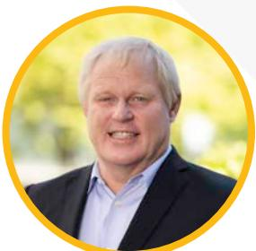

#### **David Gibson** Independent Director

David Gibson has a strong background in strategy and finance with over 20 years investment banking experience, including as Co-Head of Investment Banking in New Zealand for Deutsche Bank and Deutsche Craigs. During his finance career David has advised on many of New Zealand's largest capital market transactions, including within the media industry. David is director of Freightways Limited, Goodman (NZ) Limited and Rangatira Limited.

#### **Sussan Turner** Independent Director

For the past 25 years Sussan has held senior leadership roles across media companies, including Group CEO of MediaWorks, Managing Director of Radio Otago and CEO of RadioWorks. She is currently Group CEO and Director of Aspire2 Group Limited, one of the leading private tertiary education groups in New Zealand and is passionate about building executive teams and company cultures. Sussan has extensive experience as a director and is currently Pro-chancellor of Auckland University of Technology.

#### **Guy Horrocks** Independent Director

Guy established himself as an early pioneer of the mobile app industry co-founding the world's first commercial iPhone app company in 2007, Polar Bear Farm. He is one of a number of high powered, experienced New Zealand entrepreneurs who've built internationally successful digital enterprises. With clients including Expedia, DreamWorks, HBO, OREO, CNN, Time Magazine as well as NZ Herald, Horrocks helped launch over 100 mobile apps with his award winning mobile agency Carnival Labs, many of which were featured by Apple. Guy Horrocks has since launched a new real-time data warehouse called SOLVE and is also a director of New Zealand Mint Limited, New Zealand's only precious metal mint, and an advisor to Tracksuit Limited.

{29}------------------------------------------------

# **THE NZME EXECUTIVE TEAM**

#### **Michael Boggs** Chief Executive Officer

Michael was appointed CEO of New Zealand Media and Entertainment (NZME) in March 2016. Prior to that he held the Chief Financial Officer position at NZME. Michael's core focus at NZME has been to develop and implement a group wide strategy to accelerate growth across NZME's brands particularly in the areas of subscription and classified offerings, digital and video content, while ensuring the sustainable growth of the company's traditional print and radio platforms. Michael has extensive senior executive experience including as Chief Financial Officer at leading insurance company Tower Limited. While at Tower, Michael managed the company's multibillion- dollar assets, its Pacific Islands operations, earthquake recovery programme and the sale of Tower's life insurance, health insurance and investment management businesses. This industry leading work was recognised in 2014 when Michael was awarded CFO of the year at the annual New Zealand CFO Awards. Michael also has significant background in the telecommunications and technology sectors with executive roles in the finance, commercial and business functions of major organisations including Telstra's New Zealand operations.

### **Shayne Currie** Managing Editor

As Managing Editor, a role he took up in 2015, Shayne is responsible for NZME's 300-plus journalists and the company's editorial and news strategy. His role includes overseeing NZME's unique mix of digital, print, audio and visual storytelling across the New Zealand Herald, nzherald.co.nz, Newstalk ZB, Radio Sport, NZME's five regional daily newspapers and more than 20 community titles. In 2019, Shayne helped oversee the successful launch of NZ Herald Premium digital subscriptions and he has helped lead some of the most significant projects at the Herald in the past 15 years including the launch of the Herald on Sunday in 2004 and the Herald's move to compact format in 2012. He is a former editor of the NZ Herald and Herald on Sunday, and celebrated his 30th year in journalism in 2019, including two decades in senior editorial leadership roles across New Zealand. In 2016 he was awarded the Wolfson Scholarship at Cambridge University in the UK, studying audience patterns in the digital age.

#### **Paul Hancox** Chief Commercial Officer

Paul was appointed as Chief Commercial Officer in 2021. Prior to this, Paul was part of the NZME Executive Team as Chief Revenue Officer, where he was accountable for agency and key customer revenues, including programmatic, trading and integration performance. In his role as CCO, he continues to oversee his existing portfolio in addition to direct clients, and is accountable for revenue growth across NZME platforms. Prior to joining the Executive team, Paul led a significant commercial portfolio at NZME as Head of Agency, Enterprise, Events, Partnerships, Government and Rural, a role he took up in January 2018. Paul previously spent 9 years in various senior roles at MediaWorks including as Group Head of Revenue where he successfully designed, implemented and managed the integration of the TV and radio sales teams. Paul brings with him 25 years of experience in the media industry including a 9-year stint with The Radio Network early in his career, operating in a variety of roles including as Newstalk ZB and Radio Sport Sales and Marketing Manager.

{30}------------------------------------------------

#### **Greg Hornblow** Acting Chief of OneRoof

Greg was appointed as the acting Chief of OneRoof in January 2023.

Greg has an incredibly strong commercial background, with more than 30 years of experience working alongside real estate professionals in a variety of roles and in advertising and marketing, including previously at NZME. His passion for the real estate industry and proven track record will ensure OneRoof is well placed to create further value for our agent partners.

#### **Carolyn Luey**

#### Chief Digital and Publishing Officer

Carolyn was appointed Chief Digital and Publishing Officer in August 2021.

After 5 years at NZME, Carolyn left as Chief Operating Officer in December 2016. She then went on to senior transformational roles at MYOB and Vodafone where she was Chief Consumer Officer.

With extensive experience as a strategic business leader in large New Zealand telecommunications, technology and media companies, Carolyn brings a wealth of knowledge and understanding of how best NZME can deliver growing digital audience engagement for our commercial partners.

#### **David Mackrell** Chief Financial Officer

David was appointed Chief Financial Officer of NZME in March 2019, leading NZME's Finance, Technology and Strategy functions. He moved to NZME from Heartland Bank where he was their Chief Financial Officer.

David started his professional career at Ernst & Young as an Auditor before joining Air New Zealand in 1992. His career at Air New Zealand spanned 25 years and a large gamut of senior finance and commercial roles, finishing with the company as Deputy Chief Financial Officer.

#### **Katie Mills**

#### Chief Marketing Officer

Katie joined the NZME Executive Team in December 2018 assuming leadership of the company's Marketing and Communications functions. Immediately prior, Katie held the role of Group Marketing Director at Aspire2 Group Limited and was previously General Manager (Global) Marketing & Communications at Opus International Consultants.

Along with Katie's wide marketing industry experience, she also brings to her role, more than 20 years of media-specific experience. 15 of those years were spent at MediaWorks in senior leadership positions including as Head of Marketing, successfully developing and delivering marketing and brand strategies for a portfolio of radio, digital, event and television ventures.

{31}------------------------------------------------

#### **Allison Whitney** General Counsel & Company Secretary

Allison joined NZME in 2013. As General Counsel she heads up the legal team and manages the provision of legal advice and company secretarial services across NZME, as well as leading NZME's Culture & Performance function. Prior to commencing her role at NZME, Allison held roles both in-house and in private practice, including five years as Legal Counsel at Westpac, six years as Group Legal Advisor to a Londonbased international media group and three years in private practice at Kensington Swan.

Allison brings over 20 years of legal experience to her role spanning areas from corporate and commercial to intellectual property, consumer and media law.

### **Matthew Wilson**

#### Chief Operations Officer

Matt was appointed Chief Operations Officer in December 2016. In this role, Matt is responsible for NZME's print product performance; driving NZME's Operations functions including print, distribution, print and digital subscriptions and advertising production. Prior to that, Matt's role was GM Print Operations for NZME.

His passion for media has resulted in over two decades of experience working across NZME's newspaper brands, including finance roles in print, commercial, content and corporate through to leading the Newspaper Sales, Print and NZ Herald product functions. During his time, Matt has led the consolidation of newspaper sales and distribution functions across NZME, the development of NZME's highly successful distribution services business, and customer streams for the launch of Herald on Sunday and NZH Premium digital subscribers. Matt's focus on operating performance has driven a strong passion for NZME's people, their engagement and the culture fostered in the company.

#### **Jason Winstanley**

#### Chief Radio Officer

Jason is one of New Zealand's most experienced audio executives with extensive experience across music and talk radio. He has led high profile and successful music radio brands including 7 years as Assistant Content Director at ZM and 5 years as Content Director of The Hits. He also led the successful transition of 'Classic Hits' to the 'The Hits' brand in 2014.

In his most recent role as Head of Talk for NZME, Jason has led New Zealand's #1 Radio Station Newstalk ZB to record audience growth and continued commercial success.

Jason's role includes responsibility for the radio business and the content delivery to support audience and revenue growth across NZME's radio networks.

{32}------------------------------------------------

{33}------------------------------------------------

# **CORPORATE GOVERNANCE**

#### **GOVERNANCE FRAMEWORK**

The Company is listed on the NZX Main Board and has a Foreign Exempt Listing on the ASX (both under the ticker code "NZM"). The ASX Foreign Exempt Listing category is based on a principle of substituted compliance recognising that, for secondary listings, the primary regulatory role and oversight rests with the home exchange and the supervisory regulator in that jurisdiction.

As such, NZME is required to comply with a limited set of ASX Listing Rules.

The Company's corporate governance framework, as described in this section, therefore primarily takes into consideration contemporary standards in New Zealand, incorporating the NZX Corporate Governance Code ("NZX Code").

The Group is committed to having a strong governance framework and therefore complies with the recommendations of the NZX Code (unless specifically stated otherwise). The corporate governance policies referred to in this section reflect the Group's governance framework as at 31 December 2022 (unless otherwise stated) and are available on the Company's website. The Board of NZME has approved this corporate governance statement.

#### **PRINCIPLE 1 - CODE OF ETHICAL BEHAVIOUR**

Directors should set high standards of ethical behaviour, model this behaviour and hold management accountable for these standards being followed throughout the organisation.

#### **Code of Conduct & Ethics**

The Company's Code of Conduct & Ethics governs the Company and its subsidiaries' commercial operations and the conduct of directors, employees, consultants and all other people when they represent the Company and its subsidiaries. The Code of Conduct & Ethics comprises certain fundamental principles and demonstrates the high standards of conduct expected of us. The current Code of Conduct & Ethics was updated on 11 April 2019. Reporting of breaches of the Code is encouraged and steps for doing so are set out in the Code of Conduct & Ethics and the Whistleblower Policy.

The Company has provided training on the Code of Conduct & Ethics in the form of a video series on key points relevant to employees.

The Company also has an Editorial Code of Conduct & Ethics which was extensively reviewed during 2022 to align with international best practice. This code is published on the Company's website and highlights our responsibility to the truth - and to our communities and audiences - and our commitment to journalism of the highest quality possible that earns the trust of our audience. The Code states our belief that freedom of the press and dissemination of editorial content is a cornerstone of a healthy, thriving democracy. The Codes includes our responsibilities in relation to accuracy, independence, opinion, editing, diversity and conduct and integrity.

#### **Securities Trading Policy**

The Securities Trading Policy, which was reviewed and updated based on best practice in 2022 and is available on the Company's website, details the Company's trading policy and guidelines, including trading restrictions on dealing in the Company's quoted financial products. This policy applies to the directors and all employees and contractors. The Securities Trading Policy places additional trading restrictions on the directors, the Chief Executive Officer ("CEO") and their direct reports (and employees reporting directly to them), all administrative staff of the CEO and direct reports referred to above and anyone else notified by NZME's General Counsel.

#### **PRINCIPLE 2 - BOARD COMPOSITION & PERFORMANCE**

To ensure an effective Board, there should be a balance of independence, skills, knowledge, experience and perspectives.

#### **Role of the Board and Board Charter**

The business and affairs of the Company is managed under the direction and supervision of the Board currently comprised (and as at 31 December 2022 was comprised) of independent Chairman, Barbara Chapman, and independent directors; Carol Campbell, David Gibson,

{34}------------------------------------------------

Sussan Turner and Guy Horrocks. The directors acknowledge their duty to act in good faith and in the best interests of the Company. The objective of the Company is to generate growth, corporate profit and shareholder gain from the activities of the Group. In pursuing this objective, the role of the Board is to assume accountability for the success of the Company by taking overall responsibility for the strategic direction and monitoring of operational management of the Group in accordance with good corporate governance principles. More details regarding the main functions of the Board and the distinction from the roles of management can be found in the Board Charter available on the Company's website. No person ceased to be a director of the Company during the financial year ended 31 December 2022.

#### **Director Nomination and Appointment**

Directors are appointed by the Company's shareholders, with rotation and retirement being determined by the Constitution. The Board may appoint directors to fill casual vacancies. Directors appointed to fill casual vacancies are required to retire and stand for election at the first annual shareholders' meeting after their appointment. The Governance & Remuneration Committee recommends to the Board potential candidates for appointment as directors. The Committee follows the nomination and appointment processes set out in the Governance & Remuneration Committee Charter available on the Company's website. The Company enters into written agreements with each newly appointed director establishing the terms of their appointment.

#### **Director Independence and Profiles**

All of the Company's directors, including the Chair, are independent directors for the purposes of the NZX Listing Rules as none of them are executives of the Company or have direct or indirect interests or relationships that could reasonably influence, or could reasonably be perceived to influence, in a material way, their decisions in relation to the Company. The profile for each director is available on the Company's website and on page 28-29 of the Annual Report. Information about director attendance at meetings and ownership interests is set out on pages 37 and 44 of the Annual Report.

#### **Diversity and Inclusion**

The Group believes that a diverse and inclusive workforce is essential for it to be able to deliver its strategic objectives and continue to meet its responsibilities to its customers, its employees, the communities in which it works, and its shareholders.

The Group is currently operating in accordance with, and applying the principles of its Diversity and Inclusion Policy which is available on the Company's website.

The Our People section on pages 20-23 of the Annual Report sets out more detail about our diversity and inclusion objectives and progress towards achieving them. In accordance with the Diversity and Inclusion Policy, the Board assesses those objectives and NZME's progress towards achieving them on an annual basis. The Board is comfortable with the Company's 2022 performance with respect to its Diversity and Inclusion Policy and objectives but notes the ongoing nature of efforts to meet those objectives.

The table below includes the quantitative breakdown as to the gender composition of NZME's Board and Officers as at the balance date.

| As at            |      | Board  |      | Officers 1 |
|------------------|------|--------|------|------------|
|                  | Male | Female | Male | Female     |
| 31 December 2022 | 2    | 3      | 7    | 3          |
| 31 December 2021 | 2    | 3      | 7    | 3          |

1 The term 'Officer' is defined in the NZX Listing Rules as a person, however designated, who is concerned or takes part in the management of the Issuer's business, but excludes (i) a person who does not report directly to the Board or (ii) a person who does not report directly to a person who reports to the Board. NZME has interpreted this to mean the Chief Executive and any person reporting to the Chief Executive or the Board directly. The numbers above therefore include the CEO and other members of the Group Executive Team.

{35}------------------------------------------------

## CONTINUED **CORPORATE GOVERNANCE**

#### **Director Access to Training, Information and Advice**

On appointment the Company's directors are offered induction training as to the responsibilities of the directors and to enable the director to become familiar with the Company's operations and sites. Further training on pertinent topics is provided to the Board during the year. All directors have access to the advice and assistance of the General Counsel on the Board's affairs and governance matters. In addition, all directors may access such information and seek independent advice as they consider necessary to fulfil their duties and responsibilities.

#### **Performance Review**

The Chair meets annually with directors of the Company to discuss their performance. The Board reviews its performance as a whole, and the performance of its committees, on an annual basis. The Board may choose to use external facilitators, where appropriate, to assist with reviewing the performance of directors, the Board and its committees.

#### **PRINCIPLE 3 - BOARD COMMITTEES**

The Board should use committees where this will enhance its effectiveness in key areas, while retaining Board responsibility.

The Board has two standing Committees; the Audit & Risk Committee and the Governance & Remuneration Committee, to assist in carrying out its responsibilities. The Committees operate under Board approved charters which are available on the Company's website.

The Board may establish other committees from time to time to deal with specific projects or matters relating to the Company's various activities.

The Board does not have a separate Health and Safety Committee, but Health and Safety is considered by the full Board.

The Board did not identify a need for any other standing Board committees.

The Company also has an NZME Takeover Response Manual (not publicly available) as recommended by Recommendation 3.6 of the NZX Code.

#### **Audit & Risk Committee**

The Committee consists of three independent directors (one of whom has an accounting and financial background). The functions of the Committee are to:

- Review, consider and if necessary, investigate any reports or findings arising from any audit function either internally or externally;
- Evaluate financial information submitted to it, along with relevant policies and procedures; and
- Assess the effectiveness of risk management throughout the Group.

The Committee is also responsible for communicating and engaging with the external auditors and for oversight and review of the risk management framework. For further information, also refer to the Committee's charter which is available on the Company's website.

As at 31 December 2022, directors Barbara Chapman and David Gibson were members of the Audit & Risk Committee and it was chaired by Carol Campbell. Employees and external parties may attend meetings of the Audit & Risk Committee at the invitation of the Audit & Risk Committee.

#### **Governance & Remuneration Committee**

The Governance & Remuneration Committee ensures that remuneration policies and practices are consistent with the strategic goals of the Group and are relevant to the achievement of those goals. The Committee also reviews and approves the remuneration of the CEO and, in consultation with the CEO, the remuneration packages of executives reporting directly to the CEO.

The Governance & Remuneration Committee also makes recommendations to the full Board regarding the composition of the Board, filling of vacancies, appointing additional directors to the Board, and to review and adopt corporate governance policies and practices which reflect contemporary standards in New Zealand, incorporating principles and guidelines issued by the Financial Markets Authority and NZX. For further information, refer to the Committee's charter available on the Company's website. This charter was updated to reflect current best practices in December 2022.

{36}------------------------------------------------

As at 31 December 2022, director Sussan Turner was a member of the Governance & Remuneration Committee and it was chaired by David Gibson. Employees and external parties may attend meetings of the Governance & Remuneration Committee at the invitation of the Governance & Remuneration Committee.

#### **Board & Committee Attendance 1 January 2022 to 31 December 2022**

| Director        | Board    | Audit & Risk | Governance & Remuneration |
|-----------------|----------|--------------|------------------------------|
| Barbara Chapman | 10 of 10 | 4 of 4       | N/A                          |
| Carol Campbell  | 10 of 10 | 4 of 4       | N/A                          |
| David Gibson    | 10 of 10 | 4 of 4       | 5 of 5                       |
| Guy Horrocks    | 9 of 10  | N/A          | N/A                          |
| Sussan Turner   | 9 of 10  | N/A          | 5 of 5                       |

#### **PRINCIPLE 4 - REPORTING & DISCLOSURE**

The Board should demand integrity in financial and non- financial reporting, and in the timeliness and balance of corporate disclosures.

#### **Market Disclosure Policy**

The Board has policies and procedures in place to keep investors and staff informed of material information about the Company and to ensure compliance with the continuous disclosure obligations under the Financial Markets Conduct Act 2013 and the NZX Listing Rules.

The Market Disclosure Policy (available on the Company's website) is designed to ensure that:

- There is full and timely disclosure of the Company's activities and price sensitive information to shareholders and the market; and
- All stakeholders (including shareholders, the market and other interested parties) have an equal opportunity to receive and obtain externally available information issued by the Company.

The Company will immediately notify the market of any material information concerning the Company in accordance with legislative and regulatory disclosure requirements.

#### **Corporate governance documents**

The following documents have been adopted by the Company and are available on the Company's website under the Corporate Governance section:

- NZME Constitution
- Board Charter
- Code of Conduct & Ethics
- Remuneration Policy
- Diversity and Inclusion Policy
- Editorial Code of Conduct & Ethics
- Fraud Policy
- Market Disclosure Policy
- Whistleblower Policy
- Securities Trading Policy
- Audit & Risk Committee Charter
- Governance & Remuneration Committee Charter
- Risk Management Policy
- Health and Safety Policy
- Modern Slavery Statements (pursuant to Australian legislation)

{37}------------------------------------------------

## CONTINUED **CORPORATE GOVERNANCE**

#### **Financial Reporting and Disclosure**

The Company is committed to providing financial reporting that is balanced, clear and objective. The Audit & Risk Committee oversees the quality, integrity and timeliness of external reporting. The Group's Consolidated Financial Statements for the year ended 31 December 2022 are set out on pages 48 to 108 of the Annual Report. Also refer to the reports from the Chair and the CEO in this Annual Report and the NZME Full Year 2022 Results Presentation (available on the Company's website) for additional information.

#### **Non-Financial Reporting and Disclosure**

The Company provides non-financial disclosures relating to Health and Safety, Risk Management, our interaction with our communities, people and our environment – see our Sustainability Commitment. We also include information about our performance against our operational priorities during the year.

NZME's Sustainability Commitment aligns with the UN Sustainability Development Goals – an international blueprint to achieve a better and more sustainable future for everyone.

Combined with our promise to keep Kiwis in the know, NZME's commitment to sustainable practices contributes to the prosperity of our business and our communities, people and the environment.

In 2022 we continued to measure our progress against key initiatives and objectives for each of the three pillars of our Sustainability Commitment: Our Communities, Our People and Our Environment. This is discussed on pages 14 to 25 of the Annual Report.

NZME continues to develop its Sustainability Commitment with the guidance of the Board. Pursuant to the Financial Sector (Climate-related Disclosures and Other Matters) Amendment Act 2021 the Company will be required to commence making climate-related disclosures for the financial year ending 31 December 2023. The Company is the process of reviewing its Sustainability Commitment with these changes in mind, collecting and analysing data and preparing to make the required disclosures.

#### **PRINCIPLE 5 - REMUNERATION**

The remuneration of directors and executives should be transparent, fair and reasonable.

#### **Remuneration Policy**

The Company's Remuneration Policy (available on its website) outlines the Company's approach to the remuneration of its directors and executives. The Governance & Remuneration Committee is responsible for reviewing non-executive directors' remuneration and benefits. The pool available to be paid to directors (including non-executive directors) is subject to shareholder approval. The current directors fee pool is fixed at \$900,000 per annum (as was set out in the Explanatory Memorandum for the Demerger of NZME by APN dated 11 May 2016) The levels of fixed fees payable to non-executive directors should reflect the time commitment and responsibilities of the role. The Governance & Remuneration Committee will obtain independent advice, as necessary, and will also consider the results of market comparison and a benchmarking assessment in setting the fixed fees payable to non-executive directors.

#### **Directors' Remuneration**

While the Company does not pay equity-based remuneration to its non-executive directors, it encourages those directors to hold shares in the Company to better align their interests with the interests of other shareholders.

The Governance & Remuneration Committee is also responsible for reviewing and approving the remuneration of the CEO and any executive directors and, in consultation with the CEO, the remuneration packages of executives reporting directly to the CEO. The Company conducts external benchmarking analysis in order to determine the market rate for a role. The Company provides a combination of cash and non-cash benefits and takes a total remuneration approach. The Company reviews remuneration with the objective of achieving pay equity, including by gender.

The fees paid to each director depends on the duties of the director, including committee work. Current fees per annum are as follows:

{38}------------------------------------------------

| 1 January 2022 to 31 December 2022                                                         | Fees (\$) |
|--------------------------------------------------------------------------------------------|-----------|
| Chairman of the NZME Board (from 1 April 2022 their fees were increased from \$150,000) | 170,000   |
| Membership of the NZME Board                                                               | 100,000   |
| Chairman of NZME Board Committees                                                          | 20,000    |
| Membership of NZME Board Committees                                                        | 10,000    |

Total fees paid to each director during 2022 are shown in the following table:

|                      | Date appointed  | Chairman of the Board (\$) | Board Member (\$) | Committee Chair (\$) | Committee Member (\$) | Total (\$) |
|----------------------|-----------------|----------------------------------|-------------------------|-------------------------|-----------------------------|---------------|
| Barbara Chapman      | 18 April 2018   | 165,000                          |                         |                         | 10,000                      | 175,000       |
| Carol Campbell       | 24 June 2016    |                                  | 100,000                 | 20,000                  |                             | 120,000       |
| David Gibson         | 8 December 2017 |                                  | 100,000                 | 20,000                  | 10,000                      | 130,000       |
| Guy Horrocks         | 8 February 2021 |                                  | 100,000                 |                         |                             | 100,000       |
| Sussan Turner        | 16 July 2018    |                                  | 100,000                 |                         | 10,000                      | 110,000       |
| Total fees paid 2022 |                 |                                  |                         |                         |                             | 635,000       |

In addition to the fees noted in the table above, Guy Horrocks was paid a gross amount of \$16,393 in FY22 for additional services provided to the Group. Directors are also entitled to be reimbursed for all reasonable travel, accommodation and other costs incurred by them in connection with their attendance at NZME board or shareholder meetings or otherwise in connection with NZME business. Any such amounts are not included in the table above.

#### **Chief Executive Officer's Remuneration**

|               | Salary  | Bonus   | TIP     | Benefits | Total     |
|---------------|---------|---------|---------|----------|-----------|
|               | (\$) A  | (\$) B  | (\$) C  | (\$) D   | (\$)      |
| Michael Boggs | 880,454 | 428,820 | 802,218 | 39,278   | 2,150,771 |

A A Salary includes normal basic salary and paid leave. B Bonus payments are those paid during the current accounting period and excludes any bonus accrual not yet paid. C TIP relates to the value of shares issued during the year under the Group's Total Incentive Plan. D Benefits relate to company contributions for KiwiSaver.

Michael Boggs held 1,505,390 shares in the company as at 31 December 2022. In addition to the remuneration disclosed above as at the date of this report, Michael Boggs held 2,098,291 performance rights issued to him under the Group's Total

Incentive Plan ("TIP"). Please refer to note 4.3 of the Consolidated Financial Statements for a summary of the TIP and the performance criteria used to determine performance based payments.

{39}------------------------------------------------

### CONTINUED **CORPORATE GOVERNANCE**

#### **Employee Remuneration**

The Group paid remuneration including benefits in excess of \$100,000 to employees (other than directors) during the year ended 31 December 2022. The salary banding for these employees are disclosed in the following table (bands with zero number of employees have been excluded).

| Remuneration Amount   | Employees | Remuneration Amount       | Employees |
|-----------------------|-----------|---------------------------|-----------|
| \$100,001 - \$110,000 | 73        | \$300,001 - \$310,000     | 2         |
| \$110,001 - \$120,000 | 63        | \$310,001 - \$320,000     | 3         |
| \$120,001 - \$130,000 | 46        | \$320,001 - \$330,000     | 3         |
| \$130,001 - \$140,000 | 52        | \$330,001 - \$340,000     | 3         |
| \$140,001 - \$150,000 | 36        | \$340,001 - \$350,000     | 2         |
| \$150,001 - \$160,000 | 24        | \$350,001 - \$360,000     | 1         |
| \$160,001 - \$170,000 | 27        | \$390,001 - \$400,000     | 1         |
| \$170,001 - \$180,000 | 19        | \$410,001 - \$420,000     | 1         |
| \$180,001 - \$190,000 | 13        | \$420,001 - \$430,000     | 2         |
| \$190,001 - \$200,000 | 6         | \$470,001 - \$480,000     | 1         |
| \$200,001 - \$210,000 | 8         | \$500,001 - \$510,000     | 1         |
| \$210,001 - \$220,000 | 9         | \$510,001 - \$520,000     | 3         |
| \$220,001 - \$230,000 | 12        | \$530,001 - \$540,000     | 1         |
| \$230,001 - \$240,000 | 6         | \$540,001 - \$550,000     | 1         |
| \$240,001 - \$250,000 | 4         | \$600,001 - \$610,000     | 1         |
| \$250,001 - \$260,000 | 8         | \$610,001 - \$620,000     | 1         |
| \$260,001 - \$270,000 | 4         | \$660,001 - \$670,000     | 1         |
| \$270,001 - \$280,000 | 4         | \$980,001 - \$990,000     | 1         |
| \$280,001 - \$290,000 | 4         | \$2,150,001 - \$2,160,000 | 1         |
| \$290,001 - \$300,000 | 4         |                           |           |

**Total number of employees that were paid remuneration of \$100,000+ 452**

The remuneration above includes all remuneration paid to permanent employees, including fixed remuneration, employer KiwiSaver contributions, medical aid contributions, bonuses, commission, settlements and redundancies.

#### **PRINCIPLE 6 - RISK MANAGEMENT**

Directors should have a sound understanding of the material risks faced by the issuer and how to manage them. The Board should regularly verify that the issuer has appropriate processes that identify and manage potential and material risks.

#### **Risk Management Framework**

The Audit & Risk Committee is responsible for the oversight and independent review of the Group's risk management framework, including:

- Review and approval of the risk management policy;
- Receiving and considering reports on risk management;
- Assessing the effectiveness of the Group's responses to risk; and
- Providing the Board with regular reports on risk management.

The Group has a formal Risk Management Policy (available on its website) and is committed to the consistent, proactive and effective monitoring and management of risk throughout the organisation, in accordance with best practice and the NZME Risk Management Framework and Guidelines.

{40}------------------------------------------------

The Board is ultimately responsible for the effectiveness, oversight and implementation of the Group's approach to risk management.

The CEO is responsible for:

- The management of strategic, operational and financial risk of the Group;
- Continually monitoring the Group's progress against financial and operational performance targets;
- The day-to-day identification, assessment and management of risks applicable to the Group;
- Implementation of risk management controls, processes and policies and procedures appropriate for the Group; and
- Driving a culture of risk management throughout the Group.

The Company's Risk Committee (a management committee) acts as a governance forum to assist the CEO and the Executive Team in fulfilling their corporate governance responsibilities.

This committee provides assurance that the following aspects are managed appropriately:

- Strategic and operational risk management;
- Workplace Health and Safety matters;
- Legal, regulatory and policy compliance;
- Technology and security matters; and
- Business continuity planning.

The Group is a diversified media company and is subject to diverse types of risk including, but not limited to cyber security, legal and regulatory compliance, financial and market, government policy and political, reputation and brand, operational risks and trading conditions.

The Group recognises that in order to achieve its strategic objectives it must be willing to take and accept informed risks. Risks relating to innovation, attracting and retaining talent, and content to drive audiences and address the needs of advertisers are encouraged within defined parameters. However, in doing so, it is not acceptable to trade off financial or strategic returns by compromising compliance with the law, the safety of our people,

or our reputation as a responsible corporate citizen and provider of news, sport and entertainment.

When setting the appetite for taking and accepting risk, the Group also considers the risk posed by inaction in what is a fast-paced and disrupted market.

The Group's approach to risk management is assessed at least annually by the Audit & Risk Committee of the Board in order to make a recommendation to the full Board on the appropriateness of the Company's Risk Management Framework and Guidelines.

For additional information on financial risks, please also refer to Note 4.7 of the Consolidated Financial Statements.

#### **Health and Safety**

The NZME Board Charter states that the role of the Board includes ensuring that the Group health and safety, environmental practices and culture comply with legal requirements, reflect best practice, and are recognised by employees and contractors as key priorities for the Group.

NZME does not have a separate Board-level Health and Safety Committee as Health and Safety is dealt with regularly by the full Board.

The Health and Safety Policy (updated in June 2022 and available on the Company's website) sets out the Company's health and safety principles and explains that the Board regularly monitors key health and safety performance indicators, the effectiveness of the Company's health and safety system and the controls that are in place to manage the risks that arise from NZME's operations.

Health and Safety is included on the Company's Risk Register. The Company's annual Health and Safety Plan captures the projects and objectives for the year to prioritise responses to the identified risks.

The Company records and monitors critical health and safety risks in a separate Health and Safety Risk Register. Currently the company's key health and safety risks are monitored by the Risk Committee, who meet monthly and receive and review reporting on health and safety performance, trends, and updates, with key matters and progress against the annual plan being reported to the Board.

{41}------------------------------------------------

## CONTINUED **CORPORATE GOVERNANCE**

In 2022, areas of focus included continuing to manage the ongoing risks (including mental health impacts) associated with the COVID-19 pandemic, monitoring employee health, safety and wellbeing engagement , and undertaking our 'Connected Culture' workshops across the business which emphasised the culture we want to sustain at NZME, the responsibilities and expectations of our leaders, how to raise issues regarding bullying, harassment and other harmful behaviours and NZME's commitment to addressing these.

Health and Safety advice and direction are overseen by the Culture and Performance team and a full-time Health, Safety and Compliance Manager.

Engagement in health and safety is monitored through questions that target employees' views and opinions on health and safety initiatives and their effectiveness, with the use of NZME's engagement tool 'HearMe'. This provides Leadership teams with valuable feedback and insights into areas of concern and where improvements can be made.

Health and safety training forms part of staff inductions and is further expanded on through a range of training workshops to drive awareness of NZME's health and safety obligations, critical risks, and the resources available to satisfy these. NZME maintains a Wellness and Safety page on its intranet with sections for safety across NZME.

To ensure effective worker involvement, NZME has multiple Health and Safety Committees in place across New Zealand and health and safety performance is communicated throughout all levels of NZME through leadership team meetings and internal business communications. NZME also has a range of internally trained Wellbeing Advocates and Women's Health Advocates who provide confidential support and guidance to employees.

Lost Time Injuries decreased to a total of three across the year, compared to five in 2021. Total reported incidents have decreased from 39 to 25 year-on-year.

#### **PRINCIPLE 7 - AUDITORS**

The Board should ensure the quality and independence of the external audit process.

Refer to note 2.2.5 of the Consolidated Financial Statements for fees paid to the auditors, PricewaterhouseCoopers, for the year ended 31 December 2022.

The Audit & Risk Committee Charter requires the Committee to assess the following:

- The independence of the auditors;
- The ability of the auditors to provide additional services which may be occasionally required;
- The competency and reputation of the auditors;
- The projected audit fees; and
- Review the appointment, performance and remuneration of external auditors.

The Audit & Risk Committee also monitors and approves any services provided by the auditors other than in their statutory role and receives confirmation from the auditors as to their independence from the Company. This is undertaken on a service by service basis and assesses whether the service is permissible under Professional and Ethical Standard 1 ("PES 1") issued by the New Zealand Auditing and Assurance Standards Board, ensuring that any potential threat to independence is identified and appropriate safeguards to eliminate the threat or reduce the threat to an acceptable level are established. The Audit & Risk Committee receives an annual confirmation from the auditor as to their independence from the Group. The auditor is also required to provide the Audit & Risk Committee with a detailed analysis of fees relating to non-audit services provided during the year, including a description of potential threats to their independence and the applicable safeguards implemented by the auditor and the Company to either mitigate those threats or reduce them to an acceptable level as required by PES 1. The Audit & Risk Committee takes the nature of the services provided, the quantum of the fee, the reason for

{42}------------------------------------------------

the additional services and whether the services are likely to be one-off or repetitive in nature into consideration when evaluating and concluding on auditor independence.

For the year ended 31 December 2022, given the nature of the services provided and based on the Committee's continuous monitoring of auditor independence, the Audit & Risk Committee do not believe that the non-audit services provided by the auditors compromised their objectivity and independence.

The Company requires the external auditor to attend the Annual Shareholders' Meeting ("ASM") to answer questions from shareholders in relation to the audit. The Group's auditor, PricewaterhouseCoopers, attended the last ASM on 11 April 2022.

#### **Internal Audit**

The Audit & Risk Committee is responsible for reviewing the integrity and effectiveness of the internal audit function. NZME operates a cosourced internal audit programme that utilises a mix of self-certifications, scheduled control testing by Group Financial Services, ad hoc assignments, investigations by risk and compliance personnel and a structured internal audit programme executed by an external firm.

Any reporting from external parties is presented to the Audit & Risk Committee and any significant findings from other internal activities are reported to the Audit & Risk Committee.

#### **PRINCIPLE 8 - SHAREHOLDER RIGHTS & RELATIONS**

The Board should respect the rights of shareholders and foster constructive relationships with shareholders that encourage them to engage with the issuer.

In addition to holding its Annual Shareholders' Meeting, NZME seeks to regularly engage with shareholders to ensure they are informed about our activities and our progress against our stated priorities.

The NZME website has a dedicated Investor Relations section containing NZX / ASX announcements, presentations and webcasts, financial reports, frequently asked questions and other information that might be useful to our shareholders.

The share registry is maintained by Link Market Services and their contact details are available under the Investor Relations section of the Company's website. Shareholders can elect to receive communications electronically.

Following each results announcement, NZME holds an investor call to present the results and to allow investors to ask questions. This is usually followed by an investor roadshow during which the CEO and other members of the Executive aim to meet with as many shareholders as possible. In 2022 NZME also held a virtual Investor Day.

Shareholders are entitled to exercise their voting rights as provided for under the applicable legislation and listing rules.

In order for shareholders to fully participate in shareholder meetings, the Board will endeavour where possible, to distribute a notice of shareholder meeting as soon as possible and in any event at least 20 working days prior to any shareholder meeting. During the financial year ended 31 December 2022, shareholders were given 20 working days' notice of the annual shareholder meeting of the Company held on 11 April 2022.

{43}------------------------------------------------

# **STATUTORY DISCLOSURES**

#### **INTEREST REGISTER ENTRIES**

In accordance with section 211(1)(e) of the Companies Act 1993, particulars of general disclosures of interest in the Interest Register of NZME for current directors are set out in the table below. Disclosures during 2022 are noted in italics.

| Director        | Position                 | Company                                        |
|-----------------|--------------------------|------------------------------------------------|
| Barbara Chapman | Chairman                 | Genesis Energy Limited                         |
|                 | Deputy Chair             | The New Zealand Initiative                     |
|                 | Patron                   | New Zealand Rainbow Excellence Awards       |
|                 | Director                 | Fletcher Building Limited                      |
|                 | Director                 | Bank of New Zealand                            |
| Carol Campbell  | Director                 | T&G Global Limited                             |
|                 | Director                 | Asset Plus Limited                             |
|                 | Chair                    | NZ Post Limited                                |
|                 | Director                 | Chubb Insurance New Zealand Limited            |
|                 | Director                 | Kiwibank Limited                               |
| David Gibson    | Director and shareholder | DG Advisory Limited                            |
|                 | Director                 | Rangatira Limited                              |
|                 | Director                 | Biostrategy Holdings Limited                   |
|                 | Director                 | Trustpower Limited (resigned 26 March 2022) |
|                 | Director                 | Goodman (NZ) Limited                           |
|                 | Director                 | Freightways Limited                            |
| Guy Horrocks    | Shareholder              | Solve Data, Inc.                               |
|                 | Director                 | New Zealand Mint Limited                       |
|                 | Advisor and shareholder  | Tracksuit Limited                              |
|                 | Shareholder              | Setpoint Technologies Inc.                     |
| Sussan Turner   | Director and shareholder | Aspire2 Group Limited                          |
|                 | Shareholder              | Organic Initiative Limited                     |
|                 | Pro-Chancellor           | Auckland University of Technology (AUT)        |

#### **Disclosures of Directors' interests in share transactions**

During 2022, no disclosures were made in the Interests Register by Directors as to the acquisition of relevant interests in Company shares under section 148 of the Companies Act 1993.

#### **Directors' interests in shares**

Ordinary shares held by directors and parties associated with them are as follows:

| Director        | Number of shares as at 31 December 2022 |
|-----------------|-----------------------------------------|
| Barbara Chapman | 73,000                                  |
| Carol Campbell  | 150,000                                 |
| David Gibson    | 50,000                                  |

{44}------------------------------------------------

#### **Use of Company information**

No notices have been received by the Board under section 145 of the Companies Act 1993 with regard to the use of Company information received by the Directors in their capacities as Directors of the Company or its subsidiary companies.

#### **Indemnities or insurance effected for directors**

In accordance with Section 162 of the Companies Act 1993 and the Company's Constitution, the Company has indemnified and arranged insurance for all directors and executive officers to the extent permitted by law for liabilities arising out of the performance of their normal duties as directors and officers. The total amount of insurance for directors and officers contract premiums for the period was \$843,895.

#### **SUBSIDIARY COMPANY INFORMATION**

NZME's subsidiary companies are listed at Note 6.1 of the Consolidated Financial Statements.

#### **Directors of Subsidiary Companies**

As at 31 December 2022, Michael Boggs (CEO) and David Mackrell (CFO) were directors of the wholly owned subsidiaries listed in Note 6.1 of the Consolidated Financial Statements, other than NZME Australia Pty Limited. Michael Boggs and Mark O'Sullivan (a professional director resident in Australia) were directors of NZME Australia Pty Limited as at 31 December 2022. Michael Boggs, David Mackrell, Paul Maher and Peng Yin (director representing OneRoof's minority shareholder) were directors of the subsidiary OneRoof Limited, in which an 80% interest was held, as detailed in Note 6.1 of the Consolidated Financial Statements. No person ceased to be a director of any of the

companies listed at note 6.1 of the Consolidated Financial Statements during the year ended 31 December 2022.

Other than Mark O'Sullivan who received A\$10,000 for his services as a director of NZME Australia Pty Limited, these directors did not receive any fees or other benefit for their services as directors to any of these companies. Michael Boggs, David Mackrell and Paul Maher receive remuneration as employees of the Company, which is not directly related to their duties as directors of these companies. Peng Yin receives remuneration through his company, Hougarden.com Limited, which provides services to OneRoof Limited.

#### **Entries in interest registers of Subsidiary Companies**

For each subsidiary company in which they act as a director Michael Boggs and David Mackrell have made general disclosures of interests in all other subsidiary companies as a result of their executive positions at the Company and their positions as directors of the other subsidiary companies. Peng Yin has made a general disclosure of interest in the OneRoof Limited Interest Register arising from his position as director and shareholder of Hougarden.com Limited and Hougarden Motors Limited.

#### **SHAREHOLDER INFORMATION**

#### **Substantial product holders**

According to notices given to the Company under the Financial Markets Conduct Act 2013, the following persons were substantial product holders of the Company as at 31 December 2022. There were 183,913,614 ordinary shares in the Company at that date. The Company did not have any other quoted voting products at that date.

| Shareholder                                     | Number of shares in which relevant interest is held | Date of notice    |
|-------------------------------------------------|-----------------------------------------------------------|-------------------|
| Repertoire Partners LP                          | 36,090,368 1                                              | 1 July 2022       |
| UBS Group AG and its related bodies corporate 2 | 32,119,313                                                | 22 September 2022 |
| Spheria Asset Management Pty Ltd                | 23,658,182                                                | 4 July 2022       |
| Osmium Partners LLC                             | 19,497,373                                                | 27 October 2022   |

1 Repertoire Partners LP's substantial product holder notice dated 1 July 2022 discloses a holding of 22,229,678 ordinary shares (11.49% of the Company's shares held at date of notice) or 36,090,368 ordinary shares (18.65% of the Company's shares held at date of notice) which includes certain cash-settled swaps (derivative relevant interest in respect of 13,860,690

ordinary shares). The latter is included in the table above. Repertoire Partners LP's substantial product holder notice dated 1 July 2022 notes UBS Group AG (see footnote 2) is also a party to such derivative.

2 UBS AG London Branch, UBS Securities Australia Ltd and UBS Securities LLC.

{45}------------------------------------------------

## CONTINUED **STATUTORY DISCLOSURES**

#### **Top 20 shareholders**

As at 20 February 2023

| Rank | Investor Name                                                | Total Units | % Issued Capital |
|------|--------------------------------------------------------------|-------------|------------------|
| 1    | Citicorp Nominees Pty Limited                                | 40,008,589  | 21.75            |
| 2    | Warbont Nominees Pty Ltd                                     | 13,932,737  | 7.58             |
| 3    | Bnp Paribas Nominees Pty Ltd                                 | 12,569,183  | 6.83             |
| 4    | Bnp Paribas Nominees (Nz) Limited                            | 9,727,693   | 5.29             |
| 5    | HSBC Custody Nominees (Australia) Limited                    | 9,433,075   | 5.13             |
| 6    | Accident Compensation Corporation                            | 9,137,352   | 4.97             |
| 7    | J P Morgan Nominees Australia Pty Limited                    | 8,997,740   | 4.89             |
| 8    | Bnp Paribas Nominees Pty Ltd Acf Clearstream                 | 8,913,189   | 4.85             |
| 9    | FNZ Custodians Limited                                       | 7,892,599   | 4.29             |
| 10   | HSBC Custody Nominees (Australia) Limited                    | 5,420,813   | 2.95             |
| 11   | Bnp Paribas Noms Pty Ltd                                     | 4,278,822   | 2.33             |
| 12   | Forsyth Barr Custodians Limited                              | 4,020,558   | 2.19             |
| 13   | New Zealand Permanent Trustees Limited                       | 2,100,000   | 1.14             |
| 14   | JBWere (NZ) Nominees Limited                                 | 2,069,518   | 1.13             |
| 15   | New Zealand Depository Nominee                               | 1,514,108   | 0.82             |
| 16   | Michael Raymond Boggs                                        | 1,505,390   | 0.82             |
| 17   | Leh Soon Yong                                                | 1,233,549   | 0.67             |
| 18   | Merrill Lynch (Australia) Nominees Pty Limited               | 1,205,696   | 0.66             |
| 19   | Morgan Stanley Australia Securities (Nominee) Pty Limited | 1,085,595   | 0.59             |
| 20   | Forsyth Barr Custodians Limited                              | 1,033,200   | 0.56             |
|      | Total                                                        | 146,079,406 | 79.44            |

{46}------------------------------------------------

#### **Spread of Quoted Security Holders**

As at 20 February 2023

| Range of Securities Held | Holders | Holders % | Issued Capital | Issued Capital % |
|--------------------------|---------|-----------|----------------|------------------|
| 1-1000                   | 3,363   | 66.66     | 839,706        | 0.46             |
| 1001-5000                | 923     | 18.29     | 2,293,561      | 1.25             |
| 5001-10000               | 261     | 5.17      | 2,012,252      | 1.09             |
| 10001-50000              | 350     | 6.94      | 8,125,711      | 4.42             |
| 50001-100000             | 68      | 1.35      | 4,908,678      | 2.67             |
| Greater than 100000      | 80      | 1.59      | 165,733,706    | 90.11            |
| Total                    | 5,045   | 100       | 183,913,614    | 100              |

#### **OTHER INFORMATION**

#### **Waivers from NZX**

During the financial year ended 31 December 2022, the Company was not granted any waivers from any of the NZX Listing Rules, nor did the Company rely on any previously granted or published waiver from the NZX Listing Rules.

#### **Donations**

In accordance with section 211(1)(h) of the Companies Act 1993, NZME notes that the Group made cash donations of \$8,652. In addition, and as discussed elsewhere in this Annual Report (our Sustainability Commitment), NZME regularly donates advertising space and other services to a number of worthwhile charities.

#### **Credit rating**

As at the date of this Annual Report NZME does not have a credit rating.

#### **Direct director appointments under the Company's Constitution**

Rule 2.4.1 of the NZX Listing Rules allows a company to include in its Constitution a right for a product holder to appoint a director to the Board under certain circumstances. As at 31 December 2022, none of the Directors were appointed pursuant to Rule 2.4.1.

{47}------------------------------------------------

48 NEW ZEALAND MEDIA AND ENTERTAINMENT

# **CONSOLIDATED FINANCIAL STATEMENTS NZME LIMITED FOR THE YEAR ENDED 31 DECEMBER 2022**

{48}------------------------------------------------

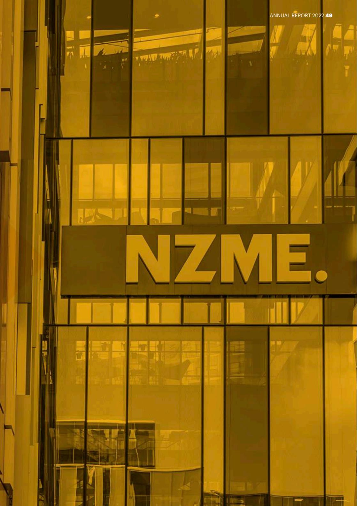

{49}------------------------------------------------

## **CONTENTS**

| Directors' Statement                                  | 51  |
|-------------------------------------------------------|-----|
| Consolidated Income Statement                         | 52  |
| Consolidated Statement of Comprehensive Income        | 53  |
| Consolidated Balance Sheet                            | 54  |
| Consolidated Statement of Changes in Equity           | 55  |
| Consolidated Statement of Cash Flows                  | 56  |
| Notes to the Consolidated Financial Statements*       |     |
| 1.0 Basis of Preparation                              | 57  |
| 2.0 Group Performance                                 | 60  |
| 3.0 Operating Assets and Liabilities                  | 69  |
| 4.0 Capital Management                                | 84  |
| 5.0 Taxation                                          | 100 |
| 6.0 Group Structure and Investments in Other Entities | 103 |
| 7.0 Related Parties                                   | 107 |
| 8.0 Commitments and Contingent Liabilities            | 108 |
| 9.0 Subsequent Events                                 | 108 |
| Independent Auditor's Report                          | 109 |

- * The notes to the financial statements have been grouped into nine sections; aimed at grouping items of a similar nature together. The Basis of Preparation section presents a summary of material information and general accounting policies that are necessary to understand the basis on which these consolidated financial statements have been prepared. Accounting policies specific to a particular note are included in that note and are boxed for ease of reference. Significant accounting estimates and judgments relevant to a particular note are also included in the relevant note, and are clearly marked as such. A summary of the significant accounting estimates and judgments is also included under the Basis of Preparation section on pages 57 to 59.

{50}------------------------------------------------

## **DIRECTORS' STATEMENT**

The Directors are pleased to present the consolidated financial statements of NZME Limited (the "Company") and its subsidiaries (together the "Group") for the year ended 31 December 2022, incorporating the consolidated financial statements and the independent auditor's report.

The Directors are responsible, on behalf of the Company, for presenting these consolidated financial statements in accordance with applicable New Zealand legislation and generally acceptable accounting practices in New Zealand in order to present consolidated financial statements that present fairly, in all material respects, the financial position of the Group as at 31 December 2022 and the results of the Group's operations and cash flows for the year then ended.

The consolidated financial statements for the Group as presented on pages 52 to 108 are signed on behalf of the Board of Directors, and are authorised for issue on the date below.

For and on behalf of the Board of Directors

**Barbara Chapman Carol Campbell** Chairman Director 

**Date: 21 February 2023** 

{51}------------------------------------------------

### FOR THE YEAR ENDED 31 DECEMBER 2022 **CONSOLIDATED INCOME STATEMENT**

| Note                                                                                  | 2022 \$'000 | 2021 \$'000 |
|---------------------------------------------------------------------------------------|----------------|----------------|
| Revenue 2.1                                                                        | 355,433        | 348,559        |
| Finance and other income 2.1                                                       | 10,453         | 17,075         |
| Total revenue and other income 2.1                                                 | 365,886        | 365,634        |
| Expenses from operations before finance costs, depreciation, 2.2.1 amortisation | (301,435)      | (286,854)      |
| Depreciation and amortisation 2.2.2                                                | (27,391)       | (26,319)       |
| Finance costs 2.2.3                                                                | (5,665)        | (7,282)        |
| Share of joint ventures and associates net loss after tax 6.2.2                    | (156)          | (450)          |
| Impairment of assets 2.2.4                                                         | -              | (2,477)        |
| Profit before income tax expense                                                      | 31,239         | 42,252         |
| Income tax expense 5.1                                                             | (8,559)        | (7,818)        |
| Net profit after tax                                                                  | 22,680         | 34,434         |
| Profit for the year is attributable to:                                               |                |                |
| Owners of the Company                                                                 | 23,383         | 34,645         |
| Non-controlling interests                                                             | (703)          | (211)          |
|                                                                                       | 22,680         | 34,434         |

|                                                                                | Cents | Cents |
|--------------------------------------------------------------------------------|-------|-------|
| Earnings per share attributable to the ordinary shareholders of the Company |       |       |
| Basic earnings per share 2.3                                                | 12.09 | 17.54 |
| Diluted earnings per share 2.3                                              | 11.69 | 16.93 |

The above Consolidated Income Statement should be read in conjunction with the accompanying notes.

{52}------------------------------------------------

## **CONSOLIDATED STATEMENT OF COMPREHENSIVE INCOME**

FOR THE YEAR ENDED 31 DECEMBER 2022

| Note                                                                  | 2022 \$'000 | 2021 \$'000 |
|-----------------------------------------------------------------------|----------------|----------------|
| Net profit after tax                                                  | 22,680         | 34,434         |
| Other comprehensive income                                            |                |                |
| Items that may be reclassified to profit or loss                      |                |                |
| Effective gain on hedging instruments 4.2                          | 166            | 396            |
| Reclassification to profit or loss 4.2                             | (199)          | 168            |
| Net (loss) / gain on hedging instruments                              | (33)           | 564            |
| Net exchange differences on translation of foreign operations 4.2  | 5              | (17)           |
| Items that will not be reclassified to profit or loss                 |                |                |
| Share of revaluation of joint ventures' and associates' assets 4.2 | 51             | -              |
| Other comprehensive income, net of tax                                | 23             | 547            |
| Total comprehensive income                                            | 22,703         | 34,981         |
| Total comprehensive income attributable to:                           |                |                |
| Owners of the Company                                                 | 23,406         | 35,192         |
| Non-controlling interests                                             | (703)          | (211)          |
|                                                                       | 22,703         | 34,981         |

The above Consolidated Statement of Comprehensive Income should be read in conjunction with the accompanying notes.

{53}------------------------------------------------

### AS AT 31 DECEMBER 2022 **CONSOLIDATED BALANCE SHEET**

| Note                                     | 2022 \$'000 | 2021 \$'000 |
|------------------------------------------|----------------|----------------|
| Current assets                           |                |                |
| Cash and cash equivalents 4.5         | 5,670          | 13,538         |
| Trade and other receivables 3.5       | 48,751         | 45,176         |
| Inventories 3.6                       | 5,644          | 1,909          |
| Derivative financial instruments 3.9  | 279            | 25             |
| Total current assets                     | 60,344         | 60,648         |
| Non-current assets                       |                |                |
| Intangible assets 3.1                 | 141,487        | 138,195        |
| Property, plant and equipment 3.2     | 23,095         | 26,976         |
| Right-of-use assets 3.3               | 63,657         | 67,513         |
| Capital work in progress 3.4          | 3,795          | 4,006          |
| Other financial assets                   | 815            | 815            |
| Equity accounted investments 6.2.2    | 3,443          | 3,623          |
| Other receivables and prepayments 3.5 | 5,642          | 6,879          |
| Derivative financial instruments 3.9  | -              | 228            |
| Deferred tax asset 5.2                | 3,959          | 3,485          |
| Total non-current assets                 | 245,893        | 251,720        |
| Total assets                             | 306,237        | 312,368        |
| Current liabilities                      |                |                |
| Trade and other payables 3.7          | 52,477         | 53,780         |
| Current lease liabilities 4.5.2       | 11,596         | 11,340         |
| Current tax provision                    | 1,674          | 4,689          |
| Total current liabilities                | 65,747         | 69,809         |
| Non-current liabilities                  |                |                |
| Non-current lease liabilities 4.5.2   | 79,578         | 85,445         |
| Interest bearing liabilities 4.5.1    | 23,134         | -              |
| Total non-current liabilities            | 102,712        | 85,445         |
| Total liabilities                        | 168,459        | 155,254        |
| Net assets                               | 137,778        | 157,114        |
| EQUITY                                   |                |                |
| Share capital 4.1                     | 344,473        | 361,758        |
| Reserves 4.2                          | 5,282          | 4,920          |
| Retained earnings                        | (211,188)      | (209,478)      |
| Total Company interest                   | 138,567        | 157,200        |
| Non-controlling interests                | (789)          | (86)           |
| Total equity                             | 137,778        | 157,114        |

The above Consolidated Balance Sheet should be read in conjunction with the accompanying notes.

{54}------------------------------------------------

## **CONSOLIDATED STATEMENT OF CHANGES IN EQUITY**

#### FOR THE YEAR ENDED 31 DECEMBER 2022

|                                                 |       | Attributable to owners of the company |                    |                                |                 |                                           |                           |
|-------------------------------------------------|-------|---------------------------------------|--------------------|--------------------------------|-----------------|-------------------------------------------|---------------------------|
|                                                 | Note  | Share capital \$'000            | Reserves \$'000 | Retained earnings \$'000 | Total \$'000 | Non controlling interests \$'000 | Total equity \$'000 |
| Balance at 1 January 2021                       |       | 361,758                               | 3,485              | (238,867)                      | 126,376         | 125                                       | 126,501                   |
| Net profit / (loss) after tax                   |       | -                                     | -                  | 34,645                         | 34,645          | (211)                                     | 34,434                    |
| Other comprehensive income                      |       | -                                     | 547                | -                              | 547             | -                                         | 547                       |
| Total comprehensive income / (loss)          |       | -                                     | 547                | 34,645                         | 35,192          | (211)                                     | 34,981                    |
| Dividends paid                                  | 4.4.2 | -                                     | -                  | (5,927)                        | (5,927)         | -                                         | (5,927)                   |
| Supplementary dividends paid                    | 4.4.2 | -                                     | -                  | (678)                          | (678)           | -                                         | (678)                     |
| Tax credit on supplementary dividends paid   |       | -                                     | -                  | 678                            | 678             | -                                         | 678                       |
| Transfer from revaluation reserve               | 4.2   | -                                     | (671)              | 671                            | -               | -                                         | -                         |
| Share based payments expense                    | 4.2   | -                                     | 1,559              | -                              | 1,559           | -                                         | 1,559                     |
| Balance at 31 December 2021                     |       | 361,758                               | 4,920              | (209,478)                      | 157,200         | (86)                                      | 157,114                   |
| Balance at 1 January 2022                       |       | 361,758                               | 4,920              | (209,478)                      | 157,200         | (86)                                      | 157,114                   |
| Net profit / (loss) after tax                   |       | -                                     | -                  | 23,383                         | 23,383          | (703)                                     | 22,680                    |
| Other comprehensive income                      |       | -                                     | 23                 | -                              | 23              | -                                         | 23                        |
| Total comprehensive income / (loss)          |       | -                                     | 23                 | 23,383                         | 23,406          | (703)                                     | 22,703                    |
| Dividends paid                                  | 4.4.2 | -                                     | -                  | (25,352)                       | (25,352)        | -                                         | (25,352)                  |
| Supplementary dividends paid                    | 4.4.2 | -                                     | -                  | (3,171)                        | (3,171)         | -                                         | (3,171)                   |
| Tax credit on supplementary dividends paid   |       | -                                     | -                  | 3,171                          | 3,171           | -                                         | 3,171                     |
| Repurchase of shares                            | 4.1   | (17,599)                              | -                  | -                              | (17,599)        | -                                         | (17,599)                  |
| Transfer from revaluation reserve               | 4.2   | -                                     | (259)              | 259                            | -               | -                                         | -                         |
| Share based payments expense                    | 4.2   | -                                     | 1,683              | -                              | 1,683           | -                                         | 1,683                     |
| 2019 total incentive plan ("TIP") settlement |       | 314                                   | (1,085)            | -                              | (771)           | -                                         | (771)                     |
| Balance at 31 December 2022                     |       | 344,473                               | 5,282              | (211,188)                      | 138,567         | (789)                                     | 137,778                   |

The above Consolidated Statement of Changes in Equity should be read in conjunction with the accompanying notes.

{55}------------------------------------------------

## **CONSOLIDATED STATEMENT OF CASH FLOWS**

#### FOR THE YEAR ENDED 31 DECEMBER 2022

| Note                                                                                             | 2022 \$'000 | 2021 \$'000 |
|--------------------------------------------------------------------------------------------------|----------------|----------------|
| Cash flows from operating activities                                                             |                |                |
| Receipts from customers                                                                          | 352,191        | 346,859        |
| Payments to suppliers and employees                                                              | (301,078)      | (281,074)      |
| Government grants                                                                                | 4,080          | 328            |
| Dividends received                                                                               | 75             | 89             |
| Interest received - leases                                                                       | 285            | 102            |
| Interest received - other                                                                        | 116            | 43             |
| Interest paid - bank facilities                                                                  | (1,242)        | (2,100)        |
| Interest paid - leases 4.5.2                                                                  | (4,890)        | (5,097)        |
| Income taxes paid                                                                                | (12,048)       | (7,308)        |
| Net cash inflows from operating activities 4.6                                                | 37,489         | 51,842         |
| Cash flows from investing activities                                                             |                |                |
| Payments for property, plant and equipment and intangible assets (including work in progress) | (10,686)       | (6,505)        |
| Acquisition of BusinessDesk 3.10                                                              | (2,717)        | -              |
| Acquisition of Radio Wanaka assets 3.11                                                       | (892)          | -              |
| Proceeds from sale of GrabOne Limited's assets and certain liabilities 6.2.3                  | -              | 17,500         |
| Proceeds from sale of property, plant and equipment                                              | 14             | 1,853          |
| Net cash (outflows) / inflows from investing activities                                          | (14,281)       | 12,848         |
| Cash flows from financing activities                                                             |                |                |
| Proceeds from borrowings 4.5.1                                                                | 71,250         | 37,000         |
| Repayments of borrowings 4.5.1                                                                | (47,250)       | (83,000)       |
| Repurchase of shares 4.1                                                                      | (17,599)       | -              |
| Payments for borrowing costs 4.5.1                                                            | (166)          | -              |
| Dividends paid to Company's shareholders 4.4.2                                                | (25,352)       | (5,927)        |
| Payments for lease liability principal 4.5.2                                                  | (11,959)       | (10,785)       |
| Net cash outflows from financing activities                                                      | (31,076)       | (62,712)       |
| Net (decrease) / increase in cash and cash equivalents                                           | (7,868)        | 1,978          |
| Cash and cash equivalents at beginning of the year                                               | 13,538         | 11,560         |
| Cash and cash equivalents at end of the year 4.5.1                                            | 5,670          | 13,538         |

The above Consolidated Statement of Cash Flows should be read in conjunction with the accompanying notes.

{56}------------------------------------------------

### **1.0 BASIS OF PREPARATION**

#### **1.1 REPORTING ENTITY AND STATUTORY BASE**

NZME Limited (NZX:NZM and ASX:NZM) is a forprofit company limited by ordinary shares which are publicly traded on the NZX Main Board and the Australian Securities Exchange as a Foreign Exempt Listing. NZME Limited is incorporated and domiciled in New Zealand. It is registered under the Companies Act 1993 and is a FMC reporting entity under Part 7 of the Financial Markets Conduct Act 2013. The entity's registered office is 2 Graham Street, Auckland, 1010, New Zealand.

NZME Limited (the "Company" or "Parent") and its subsidiaries' (together the "Group") principal activity during the financial year was the operation of an integrated media and entertainment business.

#### **1.2 GENERAL ACCOUNTING POLICIES**

These consolidated financial statements have been prepared in accordance with New Zealand Generally Accepted Accounting Practice ("NZ GAAP"). They comply with New Zealand equivalents to International Financial Reporting Standards ("NZ IFRS") and other applicable Financial Reporting Standards, as appropriate for for-profit entities. The consolidated financial statements also comply with International Financial Reporting Standards ("IFRS"). The consolidated financial statements have also been prepared in accordance with Part 7 of the Financial Markets Conduct Act 2013 and the NZX Listing Rules

The Group has used non-GAAP measures which are not prepared in accordance with NZ IFRS in relation to the following:

- total operating adjusted EBITDA (note 2.4.2); and
- net tangible assets (note 3.8).

These measures should not be viewed in isolation, nor considered as a substitute for measures reported in accordance with NZ IFRS. Non-GAAP financial measures may not be comparable to similarly titled amounts reported by other companies.

The principal accounting policies adopted in the preparation of the consolidated financial statements are either set out below, or in

the relevant note. These policies have been consistently applied to all the years presented, unless otherwise stated. These consolidated financial statements are presented for the Group and were approved for issue by the Board of Directors on 21 February 2023.

#### **1.2.1 Basis of measurement**

These consolidated financial statements have been prepared under the historical cost convention with the exception of certain items for which specific accounting policies are identified.

#### **1.2.2 Prior period comparatives**

Some prior period information has been reclassified to ensure consistency with current year disclosures and to provide more meaningful comparison. The prior period information that has been reclassified is:

The disaggregation of revenue and other income note (2.1) and the operating revenue and results note (2.4.2) have been restated to reflect the changes in segment reporting. See note 1.2.3 for further information.

#### **1.2.3 Disaggregation of revenue and operating results**

Historically the Group's principal activity was the operation of an integrated media and entertainment business with the Board and Executive Team, considered to be the Chief Operating Decision Maker ("CODM"), making operating decisions based on analysis of the Group as one operating segment. The continued digital transformation of the Group and changes to the reporting structure has resulted in changes to the information supplied to the CODM following the budgeting process for 2023. Management reporting to the Board changed in the final quarter of the year ended 31 December 2022. The additional reporting includes EBITDA contribution of segments now separately reported to the Directors. This change in reporting reflects changes in the way the Group is now managed, and performance tracked, with the Group comprising of three reportable segments compared to a single reported segment in prior years. The reporting segments are "Audio", "Publishing" and "OneRoof". As a result the Board has revised its reporting of revenue and operating segments to align to this reporting structure.

{57}------------------------------------------------

The introduction of these segments has resulted in the reclassification of some of the prior year comparatives in the disaggregation of revenue and other income note (note 2.1) and the operating revenue and results note (note 2.4.2) to show the prior year comparatives on a consistent basis with this year's results.

In prior year's, these notes had revenue split between print, radio and digital and e-commerce. A summary of the reclassification is as follows:

- Audio: includes revenue generated by the Group's audio business comprising broadcast revenue and digital advertising revenue generated by the radio brand websites. Broadcast revenues were previously classified as radio revenue while the digital revenue from the radio websites was classified as digital and e-commerce.
- Publishing: includes revenue generated by the Group's publishing business comprising of advertising revenue from print publications (excluding dedicated real estate publications) and publishing websites. The publishing website advertising revenue was previously classified as digital and e-commerce while the print publication advertising was previously classified as print revenue.
- OneRoof: comprises the revenue generated by the oneroof.co.nz website, previously classified as digital and e-commerce, and the real estate print publications, previously classified as print revenue.

The prior year's e-commerce revenue was generated by GrabOne Limited prior to its sale in 2021. GrabOne Limited's revenue is included in "Other" in this year's comparatives.

#### **1.2.4 Foreign currency translation**

#### **Functional and presentation currency**

Items included in the financial statements of each of the Group's entities are measured using the currency of the primary economic environment in which the entity operates (functional currency). The consolidated financial statements are presented in New Zealand dollars, which is the Company's functional and the Group's presentation currency, and rounded to the nearest thousand, except where otherwise stated.

#### **1.2.5 Goods and Services Tax ("GST")**

The income statement has been prepared so that all components are stated exclusive of GST. All items in the balance sheet are stated net of GST, with the exception of receivables and payables, which include GST invoiced. In the statement of cash flows, receipts from customers and payments to suppliers are shown exclusive of GST.

#### **1.3 SIGNIFICANT ACCOUNTING ESTIMATES AND JUDGEMENTS**

The preparation of the consolidated financial statements requires the use of certain significant judgements, accounting estimates and assumptions, including judgements, estimates and assumptions concerning the future. The estimates and assumptions are based on historical experiences and other factors that are considered to be relevant. The resulting accounting estimates will by definition, seldom equal the related actual results and are reviewed on an ongoing basis. A list of those areas of significant estimation or judgement and a reference to the notes containing further information is provided below:

| Areas of significant accounting estimates or judgements                                                                                              | Note  |
|---------------------------------------------------------------------------------------------------------------------------------------------------------|-------|
| Determination of reportable segments                                                                                                                    | 2.4.1 |
| Intangible assets with indefinite useful lives                                                                                                       | 3.1   |
| Assumptions used in testing for impairment of indefinite life intangible assets                                                                   | 3.1.1 |
| Lease terms and discount rates used in determining right-of-use assets and associated lease liabilities (see note 4.5.2 for lease liabilities) | 3.3   |

#### **1.4 NEW STANDARDS AND INTERPRETATIONS**

Certain new accounting standards, amendments to accounting standards and interpretations have been published that are not mandatory for 31 December 2022 reporting periods and have not been early adopted by the Group. These standards, amendments or interpretations are not expected to 

{58}------------------------------------------------

have a material impact on the Group in the current or future reporting periods and on foreseeable future transactions.

On 14 December 2022 the External Reporting Board ("XRB") published its Climate-related Disclosures standards. The Group has begun planning how it will prepare for the necessary climate-related disclosures and what information and external assistance it will require. The Group will be including climate-related disclosures based on the three new climate standards in the 31 December 2023 Annual Report.

The Group intends to specifically review and report on exposure to climate related risk as required in the consolidated financial statements for the year ended 31 December 2023. The Group's emissions profile is not considered to be material and it does not believe there to be any significant financial impact for the Group from climate change standards.

#### **1.5 COVID-19**

The global pandemic that was declared by the World Health Organisation on 11 March 2020 continues to impact the world and New Zealand as new variants continue to evolve. In 2022 New Zealand has reduced the restrictions that were imposed in response to Covid-19, re-opened its borders to returning citizens and international travellers as well as removing most of the mask wearing mandates.

The risks and uncertainty faced by the Group relate to (and are not limited to) the impact of wider economic pressures in New Zealand and globally.

#### **1.6 WORKING CAPITAL**

 

As at 31 December 2022 the Group had negative working capital of \$5.4 million compared to \$9.2 million as at 31 December 2021. The Group's level of negative working capital is primarily due to deferred revenue of \$16.3 million (31 December 2021: \$16.9 million). The Directors are satisfied that there will be adequate cash flows generated from operating and financing activities to meet the obligations of the Group for at least the next 12 months.

{59}------------------------------------------------

### **2.0 GROUP PERFORMANCE**

#### **2.1 DISAGGREGATION OF REVENUE AND OTHER INCOME**

|                                                                       | Audio \$'000 | Publishing \$'000 | OneRoof \$'000 | Other \$'000 | Total \$'000 |
|-----------------------------------------------------------------------|-----------------|----------------------|-------------------|-----------------|-----------------|
| For the year ended 31 December 2022                                   |                 |                      |                   |                 |                 |
| Advertising                                                           | 112,424         | 123,274              | 22,821            | -               | 258,519         |
| Circulation and subscription                                          | -               | 83,655               | -                 | -               | 83,655          |
| External printing and distribution                                    | -               | 4,462                | -                 | -               | 4,462           |
| Other                                                                 | 897             | 5,104                | -                 | -               | 6,001           |
| Segment revenue from integrated media and entertainment activities | 113,321         | 216,495              | 22,821            | -               | 352,637         |
| Revenue from shared services centre                                   | 165             | 311                  | 42                | 4               | 522             |
| Events                                                                | -               | -                    | -                 | 2,274           | 2,274           |
| Total revenue from external customers                                 | 113,486         | 216,806              | 22,863            | 2,278           | 355,433         |
| Other income A                                                        | 430             | 8,598                | -                 | 1,024           | 10,052          |
| Finance income                                                        | -               | -                    | -                 | 401             | 401             |
| Total finance and other income                                        | 430             | 8,598                | -                 | 1,425           | 10,453          |
| Total revenue and other income                                        | 113,916         | 225,404              | 22,863            | 3,703           | 365,886         |

A Other income includes Government grants of \$4,079,668 received from the Ministry of Culture and New Zealand On Air for the production of content, journalism training & creating greater cultural awareness. There are no unfulfilled conditions or contingencies attaching to these grants. The Group did not benefit directly from any other forms of Government assistance.

{60}------------------------------------------------

|                                                                       | Audio Reclassified \$'000 | Publishing Reclassified \$'000 | OneRoof Reclassified \$'000 | Other Reclassified \$'000 | Total \$'000 |
|-----------------------------------------------------------------------|---------------------------------|--------------------------------------|-----------------------------------|---------------------------------|-----------------|
| For the year ended 31 December 2021                                   |                                 |                                      |                                   |                                 |                 |
| Advertising                                                           | 105,426                         | 121,082                              | 21,376                            | 79                              | 247,963         |
| Circulation and subscription                                          | -                               | 81,921                               | -                                 | -                               | 81,921          |
| External printing and distribution                                    | -                               | 4,655                                | -                                 | -                               | 4,655           |
| Other                                                                 | 779                             | 3,248                                | 4                                 | 6,932                           | 10,963          |
| Segment revenue from integrated media and entertainment activities | 106,205                         | 210,906                              | 21,380                            | 7,011                           | 345,502         |
| Revenue from shared services centre                                   | 350                             | 705                                  | 71                                | 30                              | 1,156           |
| Events                                                                | -                               | -                                    | -                                 | 1,901                           | 1,901           |
| Total revenue from external customers                              | 106,555                         | 211,611                              | 21,451                            | 8,942                           | 348,559         |
| Other income A                                                        | (17)                            | 322                                  | -                                 | 16,625                          | 16,930          |
| Finance income                                                        | -                               | -                                    | -                                 | 145                             | 145             |
| Total finance and other income                                        | (17)                            | 322                                  | -                                 | 16,770                          | 17,075          |
| Total revenue and other income                                        | 106,538                         | 211,933                              | 21,451                            | 25,712                          | 365,634         |

A Other income includes the profit on sale of GrabOne Limited (see note 6.2.3) and Government grants of \$327,545 received from the Ministry of Culture and New Zealand On Air for the production of content, journalism training & creating greater cultural awareness.

#### **Accounting policies**

The Group applies the following accounting policies in relation to revenue:

#### **Advertising**

The Group operates an integrated media and entertainment business and contracts with customers to provide advertising on multiple platforms across the divisions consisting of a series of distinct services that are substantially the same and that have the same pattern of transfer to the customer. Advertising is often bundled to include publishing, audio and real estate components. In most cases each component of the bundle is treated as a distinct performance obligation and the transaction price is allocated on a relative stand-alone selling price basis. Experiential campaigns are a type of bundling focused on providing an experience utilising a mix of traditional advertising mediums with bespoke elements like competitions, product sampling, street performances etc. These activities are highly integrated and inter-dependent and are therefore a single performance obligation with revenue recognised over the period of the campaign. These campaigns often include elements that are provided by external parties and the Group acts as the principal in those instances. These campaigns are typically run over a short period of time and are typically completed and billed for in the same reporting or billing period. Where the Group provides advertising for non-cash consideration, revenue is recognised at the fair value of the consideration received, unless the Group cannot reasonably estimate the fair value of the non-cash consideration; in which case revenue is recognised by reference to the stand-alone selling price of the advertising promised to the customer. When advertising is exchanged for advertising, revenue is recognised on a gross basis as set out above.

{61}------------------------------------------------

#### **Subscriptions**

The Group enters into contracts with customers to deliver a specified publication on specified days. The performance obligation is satisfied, and revenue is recognised, when the publication is delivered.

#### **Circulation**

The Group enters into contracts with customers to deliver specified publications on specified days which the customer will on-sell to the public. The performance obligation is satisfied when the publication is delivered. Certain customers have a right to return any unsold publications which is treated as variable consideration. Customers are required to report unsold publications using an online system on a weekly basis. The Group therefore includes in the transaction price an estimate of the unsold publications using the most likely amount method based on the weekly reporting from customers to the extent that it is highly probable that a significant reversal in the amount of cumulative revenue recognised will not occur when the uncertainty associated with the variable consideration is subsequently resolved.

#### **External printing and distribution**

The Group enters into contracts with customers to print their publications and, in certain cases, distribute those publications on their behalf; including maintaining a distribution network. The printing, delivery and maintenance of a distribution network are distinct performance obligations. The performance obligation to print a publication is satisfied when those publications are printed. Similarly, the performance obligation to deliver a publication is satisfied when it is delivered. The performance obligation to maintain a distribution network is a service that is largely the same on a monthly basis and is satisfied, and revenue recognised, in equal increments over the billing period.

#### **e-Commerce (GrabOne)**

The Group acts as an agent for merchants selling their products or services to the public using the GrabOne platform. The Group does not control the product or service before it is transferred to the purchaser. Revenue is recognised in the amount of any fees or commissions the Group expects to be entitled to in exchange for arranging for the product or service to be promoted on the GrabOne platform.

#### **Shared services centre**

The Group provides back-office support services to customers. These services consist of a number of functions that are largely consistent on a month-to-month basis. Revenue is therefore recognised in equal increments over the billing period.

#### **Deferred revenue**

When a customer pays for goods or services in advance, the Group recognises a deferred revenue liability which is reduced, and revenue recognised, as the Group satisfies each distinct performance obligation. The Group also recognises a deferred revenue liability when a customer has been invoiced for future goods or services but the invoice is unpaid at the balance sheet date.

#### **Government grants**

Cash received and receivable from Government grants is recognised where there is reasonable assurance that the grant will be received and the group will comply with all attached conditions. Government grants relating to costs are deferred and recognised in "Other income" over the period necessary to match them with the costs that they are intended to compensate.

{62}------------------------------------------------

#### **Significant financing component**

The Group does not expect, at contract inception, that the period between transferring the promised goods or services from contracts with customers and when the customer pays for those goods and services to be more than one year. The Group applies the practical expedient in NZ IFRS 15 to not adjust the promised amount of consideration it expects to receive for those goods or services for the effects of a significant financing component.

#### **Incremental cost of obtaining a contract**

The Group applies the practical expedient in NZ IFRS 15 to recognise the incremental cost of obtaining a contract (such as commission) when incurred if the amortisation period is one year or less. If material, the Group will recognise an asset for any incremental cost of obtaining a contract with a customer if the Group expects to recover those costs and the amortisation period is expected to be more than one year. Those costs will be amortised on a systematic basis that is consistent with the transfer of the good or service to which the asset relates.

#### **Costs to fulfil a contract**

If the costs incurred in fulfilling a contract with a customer are material and not within the scope of another standard, the Group recognises an asset from the costs incurred if all of the following criteria are met:

- the costs relate directly to the contract;
- the costs generate or enhance resources that the Group will use to satisfy the performance obligations in that contract; and
- the costs are expected to be recovered.

Those costs will be amortised on a systematic basis that is consistent with the transfer of the goods or services promised in that contract. Given the nature of the Group's activities, this is expected to be rare.

{63}------------------------------------------------

#### **2.2 EXPENSES**

| Note                                                                                  | 2022 \$'000 | 2021 \$'000 |
|---------------------------------------------------------------------------------------|----------------|----------------|
| 2.2.1 Expenses from operations before finance costs, depreciation, amortisation |                |                |
| Employee benefits expenses                                                            | 152,044        | 141,565        |
| Production and distribution expenses                                                  | 61,341         | 60,427         |
| Selling and marketing expenses                                                        | 49,461         | 48,040         |
| Rental and occupancy expenses                                                         | 7,224          | 6,497          |
| Travel and entertainment expenses                                                     | 2,785          | 1,625          |
| Repairs and maintenance expenses                                                      | 9,038          | 8,103          |
| Other operating expenses                                                              | 18,047         | 16,901         |
| Operating expenses 2.4.2                                                           | 299,940        | 283,158        |
| Costs in relation to one-off projects                                                 | 556            | 1,673          |
| Commerce Commission provision                                                         | 206            | -              |
| Redundancies and associated expenses                                                  | 565            | 2,023          |
| Lease adjustments and make good costs                                                 | 168            | -              |
| Total expenses from operations before finance costs, depreciation, amortisation    | 301,435        | 286,854        |
| 2.2.2 Depreciation and amortisation                                                |                |                |
| Depreciation on owned assets                                                          | 9,064          | 8,323          |
| Depreciation on right-of-use assets                                                   | 11,225         | 11,443         |
| Amortisation                                                                          | 7,102          | 6,553          |
| Total depreciation and amortisation                                                   | 27,391         | 26,319         |
| 2.2.3 Finance costs                                                                |                |                |
| Interest and finance charges on bank facilities                                       | 1,374          | 1,776          |
| Interest (income) / expense on interest rate swaps                                    | (212)          | 175            |
| Interest expense on leases                                                            | 4,890          | 5,097          |
| Gain on loan modification                                                             | (564)          | -              |
| Fair value adjustment on interest rate swaps                                          | (59)           | (15)           |
| Borrowing cost amortisation                                                           | 236            | 249            |
| Total finance costs                                                                   | 5,665          | 7,282          |
| 2.2.4 Impairment of assets                                                         |                |                |
| Impairment of right-of-use assets A                                                   | -              | 1,126          |
| Impairment of property, plant and equipment B                                         | -              | 1,351          |
| Impairment of assets                                                                  | -              | 2,477          |

A The impairment of right-of-use assets relates to the Graham Street and Whangarei offices with adjustments resulting from the sub-lease of office space in both buildings.

B The impairment to property, plant and equipment is for the portion of Graham Street building fitout costs that relate to the area of the headlease that was sub-leased.

{64}------------------------------------------------

|                                                                        | 2022 \$'000 | 2021 \$'000 |
|------------------------------------------------------------------------|----------------|----------------|
| 2.2.5 Fees paid to auditors                                         |                |                |
| Fees paid to the Group's auditors, PricewaterhouseCoopers, consist of: |                |                |
| Audit or review of financial statements A                              | 542            | 485            |
| Other services                                                         |                |                |
| Other assurance services B                                             | -              | 7              |
| Tax services C                                                         | -              | 8              |
| Other services D                                                       | 18             | 18             |
| Total other services                                                   | 18             | 33             |
| Total fees paid to auditors                                            | 560            | 518            |

A Fee for both the audit of the consolidated annual financial statements and the independent review of the consolidated interim financial statements.

- B Compliance engagement of NZME Publishing Limited with the Rules and Circulation Audit Guidelines established by the Audit Bureau of Circulations Incorporated for the year ended 31 March 2021.
C Taxation services provided during 2021 on the franked dividend declared to NZME's shareholders including tax considerations in PBR application.

D Agreed upon procedures performed for monthly market revenue benchmarking and the annual Broadcasting Standards Authority return.

#### **2.3 EARNINGS PER SHARE ("EPS")**

|                                                                                    | 2022 \$'000 | 2021 \$'000 |
|------------------------------------------------------------------------------------|----------------|----------------|
| Reconciliation of earnings used in calculating basic / diluted EPS                 |                |                |
| Profit attributable to owners of the parent entity                                 | 23,383         | 34,645         |
| Profit attributable to owners of the parent entity used in calculating EPS         | 23,383         | 34,645         |
|                                                                                    | 2022 Number | 2021 Number |
| Weighted average number of shares                                                  |                |                |
| Weighted average number of shares in the denominator in calculating basic EPS   | 193,375,810    | 197,570,061    |
| Adjusted for calculation of diluted EPS                                            | 6,715,262      | 7,126,686      |
| Weighted average number of shares in the denominator in calculating diluted EPS | 200,091,072    | 204,696,747    |
|                                                                                    | 2022 Cents  | 2021 Cents  |
| Basic / diluted EPS                                                                |                |                |
| Basic EPS                                                                          | 12.09          | 17.54          |
| Diluted EPS                                                                        | 11.69          | 16.93          |

{65}------------------------------------------------

#### **Accounting policies**

#### **Basic earnings per share**

Basic earnings per share is determined by dividing:

- the profit or loss attributable to owners of the Company; by
- the weighted average number of ordinary shares outstanding during the financial year, adjusted for bonus elements in ordinary shares issued during the financial year.

#### **Diluted earnings per share**

Diluted earnings per share adjusts the figures used in the determination of basic earnings per share by taking into account:

- the after-tax effect of dividends, interest and other changes in income or expense associated with dilutive potential ordinary shares; and
- the weighted average number of additional ordinary shares that would have been outstanding assuming the conversion of all dilutive potential ordinary shares.

#### **2.4 SEGMENT INFORMATION**

#### **2.4.1 Determination of reportable segments**

The Group operates an integrated media and entertainment business that incorporates the sale of advertising, goods and services generated from the audiences attached to the Group's media platforms.

**Significant judgements:** The Group has three operating segments – being "Audio", "Publishing" and "OneRoof". All significant operating decisions are based upon analysis of NZME as three operating segments. The Executive Team and the Board of Directors have been identified as the Chief Operating Decision Maker. The Group's major products and services are split into the three segments with revenue, income, direct and allocated costs reported to the Chief Operating Decision Maker on this basis. Although the Group operates in many different markets within New Zealand, for management reporting purposes the Group operates in one principal geographical area being New Zealand as a whole. (See note 1.2.3 for further information on the change in judgement).

The operating segments for the Group are:

- Audio terrestrial radio stations, digital iHeartRadio, podcasts and Radio brand websites.
- Publishing print publications (excluding dedicated real estate publications) and digital news websites including nzherald.co.nz. and BusinessDesk.
- OneRoof comprises oneroof.co.nz and dedicated real estate print publications.

Operating expenses comprise those costs that are directly attributable to each segment and allocated costs that are allocated based on different criteria depending on the expense type.

Revenue and expenses that are not included in one of the three operating segments are grouped together in Other. This grouping includes corporate costs.

{66}------------------------------------------------

#### **2.4.2 Operating revenue and results**

The operating information provided to the Directors and the Executive Team, based on the revised reporting segments for the year ended 31 December 2022 is as follows:

|                                     | Audio \$'000 | Publishing \$'000 | OneRoof \$'000 | Other \$'000 | Total \$'000 |
|-------------------------------------|-----------------|----------------------|-------------------|-----------------|-----------------|
| For the year ended 31 December 2022 |                 |                      |                   |                 |                 |
| Revenue                             | 113,486         | 216,806              | 22,863            | 2,278           | 355,433         |
| Other income A                      | 430             | 8,598                | -                 | 182             | 9,210           |
| Operating expenses                  | (91,160)        | (177,986)            | (24,274)          | (6,520)         | (299,940)       |
| Total operating adjusted EBITDAB    | 22,756          | 47,418               | (1,411)           | (4,060)         | 64,703          |

|                                     | Audio Reclassified \$'000 | Publishing Reclassified \$'000 | OneRoof Reclassified \$'000 | OtherC Reclassified \$'000 | Total \$'000 |
|-------------------------------------|---------------------------------|--------------------------------------|-----------------------------------|----------------------------------|-----------------|
| For the year ended 31 December 2021 |                                 |                                      |                                   |                                  |                 |
| Revenue                             | 106,555                         | 211,611                              | 21,451                            | 8,942                            | 348,559         |
| Other income A                      | (17)                            | 322                                  | -                                 | 317                              | 622             |
| Operating expenses                  | (85,658)                        | (166,571)                            | (19,314)                          | (11,615)                         | (283,158)       |
| Total operating adjusted EBITDAB    | 20,880                          | 45,362                               | 2,137                             | (2,356)                          | 66,023          |

A Other income includes rental income of \$178,506 relating to operating sub-leases of right-of-use assets (2021: \$254,952). See note 3.5.4 for the income received from the finance sub-leases on right-of-use assets.

B Adjusted Earnings before Interest, Tax, Depreciation and Amortisation (Adjusted EBITDA) from continuing operations which excludes exceptional items, is a non-GAAP measure that represents the Group's total segment result which is regularly monitored by the Chief Operating Decision Maker. Exceptional items are those gains, losses, income and expense items that are not directly related to the primary business activities of the Group

which are determined in accordance with the NZME Exceptional Items Recognition Framework adopted by the Board. Exceptional items include redundancies, impairment, one-off projects and the disposal of properties or businesses. These items are excluded from the segment result that is regularly reviewed by the Chief Operating Decision Maker.

- C Other includes the GrabOne Limited operating results for the period ended 29 October 2021 comprising Other revenue of \$7,010,888, operating expenses of \$3,395,927 and EBITDA of \$3,614,961 (see note 6.2.3) for additional information on GrabOne Limited.

{67}------------------------------------------------

#### **2.4.3 Reconciliation of operating adjusted EBITDA to net profit before income tax expense**

|                                                                  | Note  | 2022 \$'000 | 2021 \$'000 |
|------------------------------------------------------------------|-------|----------------|----------------|
| Operating adjusted EBITDA                                        | 2.4.2 | 64,703         | 66,023         |
| Finance income                                                   | 2.1   | 401            | 145            |
| Depreciation and amortisation                                    | 2.2.2 | (27,391)       | (26,319)       |
| Finance costs                                                    | 2.2.3 | (5,665)        | (7,282)        |
| Share of joint ventures and associates net loss after tax        | 6.2.2 | (156)          | (450)          |
| Exceptional items                                                |       |                |                |
| Reversal of impairment / (impairment) of assets A                |       | 549            | (2,477)        |
| Gain on sale of transmission site                                |       | -              | 465            |
| Gain on sale of GrabOne Limited's assets and certain liabilities |       | -              | 15,367         |
| Other lease adjustments                                          |       | (81)           | 476            |
| Redundancies and associated costs B                              | 2.2.1 | (565)          | (2,023)        |
| Costs in relation to one-off projects C                          | 2.2.1 | (556)          | (1,673)        |
| Net profit before income tax expense                             |       | 31,239         | 42,252         |

- A The reversal of impairment of assets in 2022 is the reversal of previously recognised impairment to leasehold improvements, plant and equipment and right-of-use assets in relation to the sublease of Graham Street. The 2021 expense is for the impairment of the Graham Street assets relating to area sub-leased and a right-of-use asset impairment for a sub-leased portion of the Whangarei office.
- B The redundancies and associated costs relate to the restructuring and integration of the New Zealand operations.
- C The 2022 costs primarily relate to the BusinessDesk earn-out provision and to further building costs for the Graham Street sub-lease. 2021 costs include building costs for the Graham Street sub-lease, onerous contract costs and costs incurred in relation to the acquisition of BusinessDesk.

See note 3.12 for the segment assets and liabilities of the Group at 31 December 2022.

{68}------------------------------------------------

#### **3.0 OPERATING ASSETS AND LIABILITIES**

#### **3.1 INTANGIBLE ASSETS**

**Significant judgements:** The Directors have determined that masthead brands and brands have indefinite lives and are therefore not amortised. Refer to the accounting policies below for further information. The Directors have also determined that where the Group controls identifiable assets in relation to the integration and customisation costs of SaaS arrangements these costs will be capitalised and amortised over the life of the arrangement. Control exists where the Group determines that the asset could be transfered to an alternative supplier without incurring substantial additional costs.

|                                            | Goodwill \$'000 | Software \$'000 | Masthead brands \$'000 | Radio licences \$'000 | Brands \$'000 | Total \$'000 |
|--------------------------------------------|--------------------|--------------------|------------------------------|-----------------------------|------------------|-----------------|
| As at 1 January 2021                       |                    |                    |                              |                             |                  |                 |
| Cost                                       | -                  | 66,437             | 146,976                      | 78,479                      | 59,019           | 350,911         |
| Accumulated amortisation and impairment | -                  | (56,699)           | (74,336)                     | (47,253)                    | (29,850)         | (208,138)       |
| Net book value                             | -                  | 9,738              | 72,640                       | 31,226                      | 29,169           | 142,773         |
| For the year ended 31 December 2021     |                    |                    |                              |                             |                  |                 |
| Opening net book amount                    | -                  | 9,738              | 72,640                       | 31,226                      | 29,169           | 142,773         |
| Additions                                  | -                  | (55)               | -                            | 396                         | -                | 341             |
| Disposals                                  | -                  | (7)                | -                            | -                           | -                | (7)             |
| Amortisation                               | -                  | (3,497)            | -                            | (3,056)                     | -                | (6,553)         |
| Other transfers and adjustments            | -                  | (82)               | -                            | -                           | -                | (82)            |
| Transfers from capital work in progress    | -                  | 1,539              | -                            | 184                         | -                | 1,723           |
| Net book value                             | -                  | 7,636              | 72,640                       | 28,750                      | 29,169           | 138,195         |
| As at 31 December 2021                     |                    |                    |                              |                             |                  |                 |
| Cost                                       | -                  | 53,909             | 146,976                      | 79,059                      | 59,019           | 338,963         |
| Accumulated amortisation and impairment | -                  | (46,273)           | (74,336)                     | (50,309)                    | (29,850)         | (200,768)       |
| Net book value                             | -                  | 7,636              | 72,640                       | 28,750                      | 29,169           | 138,195         |
| For the year ended 31 December 2022     |                    |                    |                              |                             |                  |                 |
| Opening net book amount                    | -                  | 7,636              | 72,640                       | 28,750                      | 29,169           | 138,195         |
| Additions                                  | 2,693              | 121                | -                            | 889                         | 603              | 4,306           |
| Amortisation                               | -                  | (3,912)            | -                            | (3,190)                     | -                | (7,102)         |
| Transfers from capital work in progress    | -                  | 6,088              | -                            | -                           | -                | 6,088           |
| Net book value                             | 2,693              | 9,933              | 72,640                       | 26,449                      | 29,772           | 141,487         |
| As at 31 December 2022                     |                    |                    |                              |                             |                  |                 |
| Cost                                       | 2,693              | 53,844             | 146,976                      | 79,948                      | 55,249           | 338,710         |
| Accumulated amortisation and impairment | -                  | (43,911)           | (74,336)                     | (53,499)                    | (25,477)         | (197,223)       |
| Net book value                             | 2,693              | 9,933              | 72,640                       | 26,449                      | 29,772           | 141,487         |

{69}------------------------------------------------

#### **Accounting policies**

#### **Goodwill**

Goodwill represents the excess of the cost of an acquisition over the fair value of the Group's share of the net identifiable assets of the acquired business at the date of the acquisition. Goodwill is not amortised but rather is subject to periodic impairment testing (refer to note 3.1.1 below).

#### **Software**

Costs incurred in developing systems, acquiring software and licences are capitalised to software where the activities create an intangible asset that the Group controls and the intangible asset meets the recognition criteria. Costs capitalised include materials, services, payroll and payroll related costs of employees involved in development. Costs incurred in acquiring software or licences and configuration and customisation of Software-asa-Service systems that are not capitalised, are expensed as incurred unless they are paid to the suppliers (or subcontractors of the supplier) of the cloud-based software. In the latter case, the costs paid upfront are recorded as prepayments for services and expensed over the expected terms of the cloud computing arrangements. Amortisation of software assets is calculated on a straight-line basis over the useful life of the asset (typically 2 to 10 years).

#### **Masthead brands**

Masthead brands, being the titles, logo's and similar items of the integrated media assets of the Group are accounted for as identifiable assets and are initially recognised at cost and subsequently measured at cost less any accumulated impairment losses. The Directors believe the masthead brands have indefinite lives as there is no foreseeable limit over which they are expected to generate net cash inflows for the Group. Accordingly, masthead brands are not amortised but are tested for impairment each year (refer to note 3.1.1 below).

#### **Radio licences**

Commercial radio licences are accounted for as identifiable assets and are initially recognised at cost. The current New Zealand radio licences expire on 31 March 2031 and are being amortised on a straight line basis to that date.

#### **Brands**

Brands are accounted for as identifiable assets and are initially recognised at cost and subsequently measured at cost less any accumulated impairment losses. The Directors have considered the geographic location, legal, technical and other commercial factors likely to impact the assets' useful lives and consider that they have indefinite lives. Accordingly, brands are not amortised but are tested for impairment each year (refer to note 3.1.1 below).

{70}------------------------------------------------

#### **3.1.1 Year-end impairment review**

**Significant judgement:** As disclosed in note 2.4 the Directors have determined that the Group has three reportable segments – being "Audio", "Publishing" and "OneRoof". The Directors have also determined that there are three cash generating units (CGU) for impairment testing because these are the lowest level for which there are separately identifiable cash inflows which are largely independent of the cash inflows from other assets or groups of assets. Note 3.12 contains the allocation of the Group's assets and liabilities across the CGUs except for financing and equity accounted investments. Those assets and liabilities that do not relate to one of the three CGUs are grouped as "other". This note also includes details of certain key estimates and assumptions made during the impairment testing process. The Directors should assess, at each reporting date, whether there is any indication that an impairment loss for an asset, other than goodwill, either no longer exists or has decreased. The Directors have determined that, while there is improvement in the headroom since the last impairment was recognised, no reversal of the previous impairment to masthead brands and brands is required.

The recoverable amount of a CGU is determined based on the higher of fair value less costs to sell and valuein-use (VIU) calculations using management forecasts. The recoverable amount of each CGU is compared against the carrying value of that CGU to determine whether there has been impairment. Any impairment is recognised immediately as an expense and in relation to goodwill, is not subsequently reversed.

A comprehensive impairment review was conducted at 31 December 2022. The recoverable amount of the CGUs has been determined based on VIU. Based on the assumptions below no impairment of indefinite life intangible assets has been recognised in the

income statement (2021: \$nil) for any of the CGUs. The impairment review used a set of assumptions which are considered the most appropriate for impairment testing but are more conservative than the Group's medium term plans.

The VIU calculations use Board approved cash flow projections which cover a five-year period. Cash flows beyond the five-year period are extrapolated using an estimated terminal growth rate, which is the weighted average growth rate used to extrapolate cash flows beyond the forecast period. This assessment is required to be made based on events and knowledge as at 31 December 2022.

{71}------------------------------------------------

#### **Key estimates and assumptions used for the value-in-use (VIU) of the cash generating unit (CGU) are as follows:**

|                          | 2022 Audio | 2022 Publishing | 2022 OneRoof | 2021 NZME (single CGU) |
|--------------------------|---------------|--------------------|-----------------|------------------------------|
| Forecast period          | FY23 -FY27    | FY23 -FY27         | FY23 -FY27      | FY22 -FY26                   |
| Discount rate (post tax) | 9.6%          | 9.6%               | 9.6%            | 9.0%                         |
| Terminal value decline   | -             | (1.0%)             | -               | (1.2%)                       |

The discount rate represents the current market assessment of the risks specific to each CGU, taking into account the time value of money and individual risks of the underlying assets that have not been incorporated in the cash flow estimates.

The terminal value within the VIU assessments has been calculated using the terminal growth rate assumptions provided in the above table.

The forecasts used in impairment testing have been prepared by management, and approved by the Board, for that specific purpose. Actual results may differ materially from those forecast or implied. The forecasts used in the impairment assessment were prepared to comply with the requirements of IAS 36.

The forecasts are not, and should not be read as, a forecast of, or guidance as to, the future financial performance and earnings of the Group.

The forecasts used in impairment testing require assumptions and judgements about the future, such as discount rates, long term growth rates, forecasted revenues and forecasted expenses to which the model is sensitive and which are inherently uncertain. Revenue and operating cost forecasts are prepared based on management's current expectations for each CGU, with consideration given to internal information and relevant external industry data and analysis. The publishing segment performance is forecast to be impacted by the forecast continuing decline of the print advertising market as indicated by market surveys. Management's assessment of cash flows and growth assumptions for the forecast periods take into account this uncertainty. Whilst there are further uncertainties around forecasting in a post Covid-19 environment with lower business confidence and the potential impact on revenue, it is considered that the forecast assumptions are reasonable.

Future capex spend is estimated at historical replacement levels, and no incremental revenue or costs savings are assumed as a result of this expenditure.

{72}------------------------------------------------

|                               | 2022 Audio | 2022 Publishing | 2022 OneRoof | 2021 NZME (single CGU) |
|-------------------------------|---------------|--------------------|-----------------|------------------------------|
| Print revenue                 |               | -6.80%             | -10.03%         | -4.92%                       |
| Radio revenue                 | 2.90%         |                    |                 | 1.55%                        |
| Digital advertising revenue   |               | 5.20%              |                 | 4.47%                        |
| Digital classifieds revenue   |               |                    | 21.74%          | 31.57%                       |
| Digital subscriptions revenue |               | 9.60%              |                 | 12.28%                       |
| Operating expenses            | 3.50%         | 0.50%              | 2.50%           | 0.77%                        |

The key forecast assumptions for compound annual growth rates used were:

Short term volatility may be experienced due to the impact of external environmental and economic conditions.

The Directors have reviewed the potential changes to the recoverable amounts that could arise from changes in key assumptions and concluded that, at this time, there are no reasonably possible adverse changes in the key assumptions that would result in material impairment in any of the CGUs. The Directors determined that the increase in the headroom, since the impairment recognised as at 31 December 2019, is not directly attributable to the brands and as a result a reversal of previously recognised impairment of indefinite life intangible assets has not been recognised.

The Group compares the carrying amount of net assets with the market capitalisation value at each balance date. The share price at 31 December 2022 was \$1.15 equating to a market capitalisation of \$211.5 million. This market value excludes any control premium and may not reflect the value of 100% of NZME's net assets. The carrying amount of NZME's net assets at 31 December 2022 was \$137.8 million (\$0.75 per share).

#### **Accounting policy**

Goodwill and intangible assets that have an indefinite useful life are not subject to amortisation and are tested annually for impairment and at the end of each reporting period if there is an indication that they may be impaired. An impairment charge is recognised for the amount by which the asset's carrying amount exceeds its recoverable amount. The recoverable amount is the higher of an asset's fair value less costs to sell and value-in-use. For the

purposes of assessing impairment, assets are grouped at the lowest levels for which there are separately identifiable cash inflows which are largely independent of the cash inflows from other assets or groups of assets (cash-generating units). Currently, the group has three CGUs, being Audio, Publishing and OneRoof. Non-financial intangible assets, other than goodwill, that suffer impairment are reviewed for possible reversal of the impairment at each reporting date.

{73}------------------------------------------------

#### **3.2 PROPERTY, PLANT AND EQUIPMENT**

|                                         | Freehold landA \$'000 | BuildingsA \$'000 | Leasehold improvements \$'000 | Plant and equipment \$'000 | Total \$'000 |
|-----------------------------------------|-----------------------------|----------------------|-------------------------------------|----------------------------------|-----------------|
| As at 1 January 2021                    |                             |                      |                                     |                                  |                 |
| Cost or fair value                      | 265                         | 67                   | 14,727                              | 339,327                          | 354,386         |
| Accumulated depreciation and impairment | -                           | (7)                  | (8,645)                             | (310,756)                        | (319,408)       |
| Net book value                          | 265                         | 60                   | 6,082                               | 28,571                           | 34,978          |
| Year ended 31 December 2021             |                             |                      |                                     |                                  |                 |
| Opening net book amount                 | 265                         | 60                   | 6,082                               | 28,571                           | 34,978          |
| Additions                               | -                           | -                    | -                                   | 25                               | 25              |
| Disposals                               | -                           | -                    | (8)                                 | (309)                            | (317)           |
| Depreciation                            | -                           | (7)                  | (1,005)                             | (7,311)                          | (8,323)         |
| Impairment                              | -                           | -                    | (1,076)                             | (275)                            | (1,351)         |
| Other adjustments                       | -                           | -                    | (1)                                 | 61                               | 60              |
| Transfers from capital work in progress | -                           | -                    | 140                                 | 1,764                            | 1,904           |
| Net book value                          | 265                         | 53                   | 4,132                               | 22,526                           | 26,976          |
| As at 31 December 2021                  |                             |                      |                                     |                                  |                 |
| Cost or fair value                      | 265                         | 67                   | 14,854                              | 264,070                          | 279,256         |
| Accumulated depreciation and impairment | -                           | (14)                 | (10,722)                            | (241,544)                        | (252,280)       |
| Net book value                          | 265                         | 53                   | 4,132                               | 22,526                           | 26,976          |
| Year ended 31 December 2022             |                             |                      |                                     |                                  |                 |
| Opening net book amount                 | 265                         | 53                   | 4,132                               | 22,526                           | 26,976          |
| Additions                               | -                           | -                    | -                                   | 32                               | 32              |
| Disposals                               | -                           | -                    | (1)                                 | (20)                             | (21)            |
| Depreciation                            | -                           | 3                    | (1,056)                             | (8,011)                          | (9,064)         |
| Reversal of impairment                  | -                           | -                    | 312                                 | 80                               | 392             |
| Transfers from capital work in progress | -                           | -                    | 34                                  | 4,746                            | 4,780           |
| Net book value                          | 265                         | 56                   | 3,421                               | 19,353                           | 23,095          |
| As at 31 December 2022                  |                             |                      |                                     |                                  |                 |
| Cost or fair value                      | 265                         | 67                   | 14,425                              | 254,804                          | 269,561         |
| Accumulated depreciation and impairment | -                           | (11)                 | (11,004)                            | (235,451)                        | (246,466)       |
| Net book value                          | 265                         | 56                   | 3,421                               | 19,353                           | 23,095          |

A Freehold land and buildings are held at fair value based on Director's valuations. If land and buildings were stated on the historical cost basis, the net book value of land would have been \$214,000 (2021: \$214,000) and the net book value of buildings would have been \$21,784 (2021: \$23,286). The last revaluation was performed for the year ended 31 December 2015.

{74}------------------------------------------------

#### **Accounting policies**

Land is not depreciated. Depreciation on other assets is calculated using the straight line method to allocate their cost or revalued amounts, net of their residual values, over their estimated useful lives, as follows:

- Furniture and fittings 3 to 25 years
- Buildings 10 to 50 years
- 
- Leasehold improvements 2.5 to 50 years
- Motor vehicles 5 to 10 years
	-
- Plant & equipment 1.5 to 29 years
- 

The assets' residual values and useful lives are reviewed and adjusted, if appropriate, at each balance sheet date. Gains and losses on disposals are determined by comparing proceeds with carrying amounts and are included in the income statement.

Land and buildings (excluding leasehold improvements) are recorded at fair value, based on Director's valuations, less subsequent depreciation for buildings. At the end of each reporting period, the directors update their assessment of the fair value of each property. Any accumulated depreciation at the date of revaluation is eliminated against the gross carrying amount of the asset and the net amount is restated to the revalued amount of the asset. Increases in the carrying amounts arising on revaluation of land and buildings are credited to revaluation reserves in equity. To the extent that the increase reverses a decrease previously recognised in the income statement, the increase is first recognised

in the income statement. Decreases that reverse previous increases of the same asset are first charged against the revaluation reserves directly in equity to the extent of the remaining reserve attributable to the asset. All other decreases are charged to the income statement.

Plant and equipment, furniture and fittings and motor vehicles are stated at historical cost less depreciation. Historical cost includes expenditure that is directly attributable to the acquisition of the items. Subsequent costs are included in the assets carrying amount or recognised as a separate asset, as appropriate, only when it is probable that future economic benefits associated with the item will flow to the Group and the cost of the item can be reliably measured. All other repairs and maintenance are charged to the income statement during the financial period in which they are incurred.

#### **Impairment of assets**

An asset's carrying amount is written down immediately to its recoverable amount if the asset's carrying amount is greater than its estimated recoverable amount. Assets that are subject to depreciation are tested for impairment whenever changes in circumstances indicate that the asset's carrying amount may exceed its recoverable amount. An impairment charge is recognised for the amount by which the asset's carrying amount exceeds its recoverable amount. Assets that suffer an impairment are reviewed for possible reversal of the impairment at each balance sheet date.

#### **3.3 RIGHT-OF-USE ASSETS**

**Significant judgments:** Where a discount rate is not explicit in a lease the Group determines an applicable discount rate to use based on publicly available rates for Government Bonds, Bloomberg corporate bond spreads and yields and New Zealand swap rates and then applies an adjustment to these rates to apply a company specific credit risk. In determining the lease term the Group includes any periods covered by options to extend where the Group is reasonably certain to exercise that option.

{75}------------------------------------------------

|                                                 | Buildings \$'000 | Transmission \$'000 | Vehicles \$'000 | Other \$'000 | Total \$'000 |
|-------------------------------------------------|---------------------|------------------------|--------------------|-----------------|-----------------|
| As at 1 January 2021                            |                     |                        |                    |                 |                 |
| Net book value                                  | 58,399              | 25,985                 | 994                | 4               | 85,382          |
| Year ended 31 December 2021                     |                     |                        |                    |                 |                 |
| Additions                                       | 175                 | 638                    | 730                | -               | 1,543           |
| Depreciation                                    | (7,411)             | (3,359)                | (667)              | (6)             | (11,443)        |
| Impairment of right-of-use assets               | (1,126)             | -                      | -                  | -               | (1,126)         |
| Transfer to lease receivables                   | (5,898)             | -                      | -                  | -               | (5,898)         |
| Changes in scope or lease terms                 | (653)               | (224)                  | (70)               | 2               | (945)           |
| As at 31 December 2021                          |                     |                        |                    |                 |                 |
| Net book value                                  | 43,486              | 23,040                 | 987                | -               | 67,513          |
| Year ended 31 December 2022                     |                     |                        |                    |                 |                 |
| Additions                                       | 2,865               | -                      | 513                | 50              | 3,428           |
| Depreciation                                    | (6,988)             | (3,670)                | (562)              | (5)             | (11,225)        |
| Reversal of impairment previously recognised | 157                 | -                      | -                  | -               | 157             |
| Transfer from lease receivables                 | 775                 | -                      | -                  | -               | 775             |
| Changes in scope or lease terms                 | (885)               | 3,899                  | (4)                | (1)             | 3,009           |
| Net book value                                  | 39,410              | 23,269                 | 934                | 44              | 63,657          |

#### **Accounting policy**

The Group leases various offices, transmission towers, vehicles and other equipment which are all classified as operating leases.

Leases are recognised as a right-of-use asset and a corresponding lease liability. Each lease payment is allocated between the lease principal and finance costs. Finance costs are charged to profit or loss over the lease period and the right-of-use asset is depreciated over the shorter of the asset's useful life and the lease term on a straight-line basis.

Assets and liabilities arising from a lease are initially measured on a present value basis. Lease liabilities include the net present value of the following lease payments:

- fixed payments (including in-substance fixed payments), less any lease incentives receivable:
- variable lease payments that are based on an index or a rate;
- amounts expected to be payable by the lessee under residual value guarantees;
- the exercise price of a purchase option if the lessee is reasonably certain to exercise that option; and
- payments of penalties for terminating the lease, if the lease term reflects the lessee exercising that option.

{76}------------------------------------------------

#### **3.4 CAPITAL WORK IN PROGRESS**

|                                            | 2022 \$'000 | 2021 \$'000 |
|--------------------------------------------|----------------|----------------|
| As at 1 January                            | 4,006          | 2,220          |
| Additions                                  | 10,657         | 5,482          |
| Disposals                                  | -              | (69)           |
| Transfers to intangible assets             | (6,088)        | (1,723)        |
| Transfers to property, plant and equipment | (4,780)        | (1,904)        |
| As at 31 December                          | 3,795          | 4,006          |

Capital work in progress is transferred to the relevant asset category once the project is completed. Capital work in progress is not depreciated or amortised prior to being transferred to the relevant asset category. Intangible assets not yet available for use, that are included in capital work in progress, are subject to annual impairment tests.

#### **3.5 TRADE AND OTHER RECEIVABLES**

| Note                                                      | 2022 \$'000 | 2021 \$'000 |
|-----------------------------------------------------------|----------------|----------------|
| Trade receivables                                         | 42,534         | 38,813         |
| Provision for impairment                                  | (516)          | (634)          |
|                                                           | 42,018         | 38,179         |
| Amounts due from related companies 7.2                 | 65             | 9              |
| Finance lease receivables 3.5.4                        | 528            | 356            |
| Other receivables and prepayments                         | 6,140          | 6,632          |
| Total current trade and other receivables                 | 48,751         | 45,176         |
| Movements in the provision for impairment are as follows: |                |                |
| Balance at beginning of the year                          | 634            | 717            |
| Provision for impairment expense                          | 17             | 51             |
| Receivables written off                                   | (135)          | (134)          |
| Provision for impairment                                  | 516            | 634            |
| Other receivables and prepayments                         | 1,207          | 1,101          |
| Finance lease receivables 3.5.4                        | 4,435          | 5,778          |
| Total non-current trade and other receivables             | 5,642          | 6,879          |

#### **3.5.1 Classification**

Trade receivables are amounts due from customers for goods sold or services performed in the ordinary course of business as well as receivables in relation to goods or services to be sold or performed in the future. Receivables and other financial assets are classified and subsequently measured at amortised cost on the basis of both the Group's business model for managing the financial assets and the contractual cash flow characteristics of the financial asset. If collection of the amounts is expected in one year or less they are classified as current assets. If collection is expected to be in greater than one year they are classified as non-current.

#### **3.5.2 Fair values of trade and other receivables**

Due to the short-term nature of the current receivables, their carrying amount is considered to be the same as their fair value.

#### **3.5.3 Impairment and risk exposure**

The maximum exposure to credit risk at the balance sheet date is the higher of the carrying value and fair value of each receivable. The Group does not hold any collateral as security. Refer to note 4.7.3 for credit risk and note 4.8 for fair value information.

{77}------------------------------------------------

#### **Accounting policy**

Trade receivables are recognised initially at fair value and subsequently measured at amortised cost using the effective interest method, less provision for impairment.

Receivables are monitored on an individual basis and the Group considers the probability of default upon initial recognition of the receivable and throughout the period and provides for

receivables expected to be impaired. The amount of loss is recognised in the income statement within other expenses. When a trade receivable is uncollectible, it is written off against the provision account for trade receivables. Subsequent recoveries of amounts previously written off are credited to the income statement against the impairment losses on receivables.

#### **3.5.4 Finance lease receivables**

Finance lease receivables relate to the sub-leases of parts of the Graham Street and Whangarei right-ofuse assets sub-let during the financial year.

|                                                      | 2022 \$'000 | 2021 \$'000 |
|------------------------------------------------------|----------------|----------------|
| As at 1 January                                      | 6,134          | -              |
| Transfer (to) / from right-of-use assets             | (775)          | 5,898          |
| Other direct costs                                   | -              | 338            |
| Total additions for the year                         | (775)          | 6,236          |
| Interest on lease receivables                        | 285            | 102            |
| Total lease receivables before cash payments         | (490)          | 6,338          |
| Rent concession                                      | (29)           | -              |
| Interest received                                    | (285)          | (102)          |
| Principal received                                   | (367)          | (102)          |
| Net investment in lease receivables at 31 December A | 4,963          | 6,134          |
| Current assets                                       | 528            | 356            |
| Non-current assets                                   | 4,435          | 5,778          |
| Net investment in lease receivables at 31 December   | 4,963          | 6,134          |

A Make good provisions are included in material sub-leases to ensure the Group's exposure to risk is minimised.

{78}------------------------------------------------

The table below details the Group's contractual undiscounted cash flows for the finance lease receivable assets to maturity.

|                                                    | 2022 \$'000 | 2021 \$'000 |
|----------------------------------------------------|----------------|----------------|
| Less than 1 year                                   | 764            | 655            |
| 1 to 5 years                                       | 2,243          | 3,137          |
| Greater than 5 years                               | 3,009          | 3,980          |
| Total lease payments receivable                    | 6,016          | 7,772          |
| Unearned finance income                            | (1,053)        | (1,638)        |
| Net investment in lease receivables at 31 December | 4,963          | 6,134          |

#### **Accounting policy**

When the Group acts as a lessor in sub-leasing its right-of-use assets, it determines, at lease commencement date, whether each lease is a finance lease or an operating lease by assessing whether the lease transfers to the lessee substantially all the risks and rewards of ownership incidental to ownership of the underlying asset. If this is the case then the lease is a finance lease; if not then it is an operating lease. As part of this assessment the Group considers certain indicators such as whether the lease is for the major part of the economic life of the asset.

For the purposes of classifying the sub-lease reference is to the right-of-use asset arising from the head lease, not with reference to the underlying asset.

Assets arising from a sub-lease are initially measured on a present value basis and include the following:

- initial direct costs incurred in acquiring the sub-lease;
- fixed payments (including in-substance fixed payments), less any lease incentives payable;
- variable lease payments that are based on an index or a rate;
- amounts expected to be receivable under residual value guarantees;
- the exercise price of a purchase option if the lessee is reasonably certain to exercise that option; and
- payments of penalties for terminating the lease, if the lease term reflects the lessee exercising that option.

#### **3.6 INVENTORIES**

Inventories is predominantly the stock of newsprint held at the Ellerslie print plant and is valued at cost. The stock of newsprint held equates to approximately 15 weeks supply. The longevity of the commodity, and the short period of time that stock is on hand, reduces the Group's risk of holding obsolete stock.

During the year ended 31 December 2022 inventories totalling \$11,167,379 were expensed through production and distribution expenses (2021: \$9,934,471).

#### **Accounting policy**

Inventories are measured at cost and are expensed, using the first in first out ("FIFO") method, as used. All paper stock is inspected on delivery and, if damaged returned to the supplier, with undamaged stock recorded in the stock system. Weekly stock takes are performed to ensure stock on hand agrees to the inventory system.

{79}------------------------------------------------

#### **3.7 TRADE AND OTHER PAYABLES**

| Note                                    | 2022 \$'000 | 2021 \$'000 |
|-----------------------------------------|----------------|----------------|
| Current payables                        |                |                |
| Amounts due to related companies 7.2 | -              | 24             |
| Employee entitlements                   | 6,009          | 5,664          |
| Deferred revenue                        | 16,335         | 16,882         |
| Trade payables and accruals             | 30,133         | 31,210         |
| Total current trade and other payables  | 52,477         | 53,780         |

#### **Accounting policies**

#### **Trade and other payables**

Trade payables, including accruals not yet billed, are recognised when the Group becomes obliged to make future payments as a result of a purchase of assets or services. Trade payables are carried at amortised cost which is the fair value of the consideration to be paid in the future for goods and services received. Trade payables are unsecured and are generally settled within 30 to 45 days.

#### **Employee entitlements**

#### Wages and salaries and annual leave

Liabilities for wages and salaries, including nonmonetary benefits and annual leave expected to be wholly settled within 12 months from the balance sheet date are recognised in payables and accruals in respect of employees' services up to the balance sheet date and are measured at the amounts expected to be paid when the liabilities are settled. Amounts to be settled more than 12 months after the balance sheet date are recognised as a non-current payable. Liabilities for non-accumulating sick leave are recognised when the leave is taken and measured at the rates paid or payable.

#### Short-term incentive plans

A liability for short-term incentives is recognised in trade payables when there is an expectation of settlement and at least one of the following conditions is met:

- there are contracted terms in the plan for determining the amount of the benefit;
- the amounts to be paid are determined before the time of completion of the financial statements; or
- past practice gives clear evidence of the amount of the obligation.

Liabilities for short-term incentives are expected to be settled within 12 months and are recognised at the amounts expected to be paid when they are settled.

Refer to note 4.3 for disclosures relating to share based payments and note 7.1 for key management compensation.

#### **Deferred revenue**

The accounting policy for deferred revenue is disclosed in note 2.1.

{80}------------------------------------------------

#### **3.8 NET TANGIBLE ASSETS**

Net tangible assets per share is a non-GAAP measure that is required to be disclosed by the NZX Listing Rules. The calculation of the Group's net tangible assets per share and its reconciliation to the consolidated balance sheet is presented below:

|                                                                   | 2022 \$'000 | 2021 \$'000 |
|-------------------------------------------------------------------|----------------|----------------|
| As at 31 December                                                 |                |                |
| Total assets                                                      | 306,237        | 312,368        |
| Deferred tax asset                                                | (3,959)        | (3,485)        |
| Intangible assets                                                 | (141,487)      | (138,195)      |
| Total liabilities                                                 | (168,459)      | (155,254)      |
| Net tangible (liabilities) / assets                               | (7,668)        | 15,434         |
| Minority interest                                                 | 789            | 86             |
| Net tangible (liabilities) / assets for the owners of the company | (6,879)        | 15,520         |
| Number of shares issued (in thousands)                            | 183,914        | 197,570        |
| Net tangible (liabilities) / assets per share (in \$)             | (\$0.04)       | \$0.08         |

#### **3.9 DERIVATIVE FINANCIAL INSTRUMENTS**

#### **Accounting policy**

For each cash flow hedge relationship, the effective part of any gain or loss on the derivative financial instrument is recognised directly in other comprehensive income. Gains or losses that are recognised in other comprehensive income are transferred to the income statement in the same period in which the hedged exposure affects the income statement. The ineffective part of any gain or loss is recognised immediately in the income statement at the time hedge effectiveness is tested.

Hedge accounting is discontinued when the hedging instrument expires or is sold, terminated or exercised, or no longer qualifies for hedge accounting. At that point in time, any cumulative gain or loss on the hedging instrument recognised in other comprehensive income is kept in other comprehensive income until the forecasted transaction occurs. If a hedged transaction is no longer expected to occur, the net cumulative gain or loss recognised in other comprehensive income is immediately transferred to the income statement.

The Group has invested \$15 million (2021: \$25 million) in two (2021: four) different interest rate swaps with maturity dates from February 2023 to August 2023 (2021: February 2022 to August 2023) to minimise the Group's interest rate risk. As at 31 December 2022 the Group had a current asset of \$279,485 (2021: \$25,054 current asset) and a non-current asset of \$nil

(2021: \$228,242 non-current asset) and has recycled interest expense of \$198,291 (2021: \$168,113) through other comprehensive income. The hedges were ineffective from November 2021 to June 2022 resulting in \$58,605 (2021: \$15,789) of fair value adjustment being recorded directly to finance costs on the income statement.

{81}------------------------------------------------

#### **3.10 BUSINESSDESK ACQUISITION**

On 17 January 2022 the Group acquired the assets, certain liabilities and business of BusinessDesk from Content Limited. In addition to the cash paid in January 2022 of \$2.7 million a maximum earn-out of \$1.5 million is payable on 31 December 2023 with the exact amount payable on that date to be determined in accordance with the terms of the sale and purchase agreement. At 31 December 2022 the Group has estimated the earn-out-provision that will be paid on 31 December 2023 to be \$905,000 with half of the provision accrued at 31 December 2022. The fair value of the provision is \$413,242 and is included in current Trade and other payables.

The purchase of BusinessDesk by the Group will assist BusinessDesk to reach its full potential by utilising the Group's strong digital publishing experience, subscription growth experience and international partnerships, and will enable the Group to provide BusinessDesk and NZ Herald Premium subscribers with comprehensive and trusted business news.

The goodwill generated in the acquisition is nondeductible for tax purposes. The following is a summary of the purchase transaction.

| Total purchase price    | 2,724          |
|-------------------------|----------------|
| Employee entitlements   | (53)           |
| Deferred revenue        | (647)          |
| Minor assets            | 7              |
| Total intangible assets | 3,417          |
| Brands                  | 603            |
| Goodwill                | 2,693          |
| Software                | 121            |
|                         | 2022 \$'000 |

The goodwill of \$2,692,723 arising on acquisition is attributed to the business know-how and the premium paid for a proven business.

The results for the Group for the year include revenue of \$3,084,970 and a net loss before tax of \$131,618 from BusinessDesk with these amounts being \$3,248,179 and \$84,484 respectively if BusinessDesk had been owned for the entire period.

#### **3.11 RADIO WANAKA ASSET ACQUISITION**

The Group acquired the assets of Radio Wanaka on 1 February 2022 for \$0.9 million, with the purchase primarily consisting of radio frequencies.

#### **3.12 SEGMENT ASSETS AND LIABILITIES**

The segment assets and liabilities of the Group are shown in the following table. The segment assets and liabilities are measured in the same way as in the financial statements.

The "Other" grouping includes the deferred tax asset and the current tax provision of the Group as well as the assets and liabilities of the Group that are not directly attributable to the segments or allocated to them.

{82}------------------------------------------------

|                                     | Audio \$'000 | Publishing \$'000 | OneRoof \$'000 | Other \$'000 | Total \$'000 |
|-------------------------------------|-----------------|----------------------|-------------------|-----------------|-----------------|
| For the year ended 31 December 2022 |                 |                      |                   |                 |                 |
| Goodwill                            | -               | 2,693                | -                 | -               | 2,693           |
| Masthead brands                     | -               | 72,640               | -                 | -               | 72,640          |
| Brands                              | 29,169          | 603                  | -                 | -               | 29,772          |
| Non-amortising intangible assets    | 29,169          | 75,936               | -                 | -               | 105,105         |
| Other assets                        | 91,749          | 91,779               | 10,543            | 7,061           | 201,132         |
| Total assets                        | 120,918         | 167,715              | 10,543            | 7,061           | 306,237         |
| Total liabilities                   | 60,948          | 96,483               | 7,039             | 3,989           | 168,459         |
| Net assets                          | 59,970          | 71,232               | 3,504             | 3,072           | 137,778         |

| For the year ended 31 December 2021 | Audio Reclassified \$'000 | Publishing Reclassified \$'000 | OneRoof Reclassified \$'000 | Other Reclassified \$'000 | Total \$'000 |
|-------------------------------------|---------------------------------|--------------------------------------|-----------------------------------|---------------------------------|-----------------|
|                                     |                                 |                                      |                                   |                                 |                 |
| Masthead brands                     | -                               | 72,640                               | -                                 | -                               | 72,640          |
| Brands                              | 29,169                          | -                                    | -                                 | -                               | 29,169          |
| Non-amortising intangible assets    | 29,169                          | 72,640                               | -                                 | -                               | 101,809         |
| Other assets                        | 98,016                          | 95,446                               | 9,901                             | 7,196                           | 210,559         |
| Total assets                        | 127,185                         | 168,086                              | 9,901                             | 7,196                           | 312,368         |
| Total liabilities                   | 52,564                          | 87,694                               | 5,138                             | 9,858                           | 155,254         |
| Net assets / (liabilities)          | 74,621                          | 80,392                               | 4,763                             | (2,662)                         | 157,114         |

{83}------------------------------------------------

### **4.0 CAPITAL MANAGEMENT**

#### **4.1 SHARE CAPITAL**

On 4 April 2022 the Group commenced a share buyback programme for up to 21,428,571 shares, approximately 11% of NZME's issued share capital as at 31 December 2021, and an aggregate purchase

price of up to \$30.0 million. The shares purchased by the Group under the programme were cancelled. The share buyback programme ended on 16 December 2022.

|                                              | 2022 '000 | 2021 '000 | 2022 \$'000 | 2021 \$'000 |
|----------------------------------------------|--------------|--------------|----------------|----------------|
| Authorised, issued and paid up share capital |              |              |                |                |
| Balance at the beginning of the period       | 197,570      | 197,570      | 361,758        | 361,758        |
| Repurchase of shares                         | (14,705)     | -            | (17,599)       | -              |
| Shares issued during the year                | 1,049        | -            | 314            | -              |
| Balance at the end of the year               | 183,914      | 197,570      | 344,473        | 361,758        |

#### **Accounting policy**

Ordinary shares are classified as equity. Incremental costs directly attributable to the issue of new shares or options are shown in equity as a deduction, net of tax, from the proceeds.

On 12 July 2022 a special dividend of \$9,677,877 was paid, see note 4.4.2 for details. This special dividend was declared due to the slower than anticipated progress of the buyback programme. The total aggregate purchase price for shares acquired by the Group, through the buyback programme, and the special dividend paid was \$27,276,393.

{84}------------------------------------------------

#### **4.2 RESERVES**

| Note                                                                   | 2022 \$'000 | 2021 \$'000 |
|------------------------------------------------------------------------|----------------|----------------|
| Share based payments reserve                                           |                |                |
| Balance at the beginning of the year                                   | 3,060          | 1,501          |
| Share based payment expense 7.1                                     | 1,683          | 1,559          |
| 2019 TIP settlement                                                    | (1,085)        | -              |
| Balance at end of the year                                             | 3,658          | 3,060          |
| Cash flow hedge reserve                                                |                |                |
| Balance at the beginning of the year                                   | 238            | (326)          |
| Effective gain on hedging instruments                                  | 166            | 396            |
| Reclassification (from) / to profit or loss                            | (199)          | 168            |
| Balance at end of the year                                             | 205            | 238            |
| Asset revaluation reserve                                              |                |                |
| Balance at beginning of the year                                       | 51             | 722            |
| Transfer to retained earnings                                          | -              | (671)          |
| Balance at end of the year                                             | 51             | 51             |
| Equity investments revaluation reserve                                 |                |                |
| Balance at beginning of the year                                       | 1,271          | 1,271          |
| Share of revaluation of joint ventures' and associates assets 6.2.2 | 51             | -              |
| Transfer to retained earnings                                          | (259)          | -              |
| Balance at end of the year                                             | 1,063          | 1,271          |
| Foreign currency translation reserve                                   |                |                |
| Balance at beginning of the year                                       | 300            | 317            |
| Net exchange difference on translation of foreign operations           | 5              | (17)           |
| Balance at end of the year                                             | 305            | 300            |
| Total reserves                                                         | 5,282          | 4,920          |

#### **4.2.1 Nature and purpose of reserves**

#### **Share based payments reserve**

The share based payments reserve is used to recognise the fair value of the performance rights issued but not yet vested as described in note 4.3.

#### **Cash flow hedge reserve**

The cash flow reserve is used to record unrealised gains or losses on hedging instruments that are recognised directly in equity. The modified fair value method has now been applied to the interest rate swaps and therefore no tax adjustments are required.

#### **Asset revaluation reserve**

The asset revaluation reserve is used to record increments and decrements on the revaluation of non-current assets as described in note 3.2. In the event of the sale of an asset, the revaluation surplus is transferred to retained earnings.

#### **Equity investments revaluation reserve**

The equity investments revaluation reserve is used to record the Group's share of increments and decrements on the revaluation of assets owned by its joint ventures and associates. In the event of the sale of an asset, the revaluation surplus is transferred to retained earnings.

#### **Foreign currency translation reserve**

Exchange differences arising on translation of any foreign controlled entities are taken to the foreign currency translation reserve, as described in the basis of preparation.

{85}------------------------------------------------

#### **4.3 SHARE BASED PAYMENTS**

|                                          | Average price per right (\$) | 2022 Number of rights | Average price per right (\$) | 2021 Number of rights |
|------------------------------------------|---------------------------------|-----------------------------|---------------------------------|-----------------------------|
| As at 1 January                          | 0.52                            | 7,126,686                   | 0.41                            | 5,235,314                   |
| Granted (2021 TIP) A                     | 0.52                            | (7,398)                     | -                               | -                           |
| Granted (2022 TIP LTI component) B       | 1.13                            | 585,324                     | -                               | -                           |
| Adjustment for dividends foregone C      | 1.30                            | 518,446                     | -                               | -                           |
| Surrendered D                            | 0.63                            | (735,561)                   | 0.95                            | 126,089                     |
| Shares issued (2019 TIP) E               | 0.63                            | (1,048,583)                 | -                               | -                           |
| Granted and awarded as at 31 December |                                 | 6,438,914                   |                                 | 5,361,403                   |
| 2021 TIP (estimation) F                  | -                               | -                           | 0.72                            | 1,765,283                   |
| 2022 TIP STI component (estimation) G    | 1.43                            | 276,348                     | -                               | -                           |
| As at 31 December                        | 0.82                            | 6,715,262                   | 0.52                            | 7,126,686                   |

- A Adjustment to the number of actual rights issued under the 2021 TIP.
- B The number of performance rights granted in respect of the 2022 TIP LTI component.
- C For the 2019, 2020 and 2021 TIP schemes the Board has approved that participants will be entitled to additional shares, or a cash payment, when the rights are exercised for any dividends foregone during the period that the rights are held. For dividends declared during the period 1 January 2022 to 31 December 2022, this resulted in an additional 713,762 rights accrued.

In relation to the 2022 TIP the Group expects to issue the net shares after withholding the number of shares with a fair value equal to the monetary value of the participants tax obligations under New Zealand tax legislation in relation to the issue of shares at the relevant exercise date. This reduces the dilutive impact of the rights on the earnings per share calculation for the Group for the year ended

- D The 2022 surrendered performance rights relate to the 2019 TIP, with participants surrendering rights in lieu of PAYE owing on the issue of shares, and the 2022 LTI component in relation to one participant surrendering their rights on leaving the Company.
- E The rights granted under the 2019 TIP were exercised on 30 December 2022 with 1,048,583 shares being issued. The share price at the date of issue was \$1.15.
- F The number of performance rights expected to be granted in 2022 in respect of the 2021 TIP.
- G The number of performance rights expected to be granted in 2023 in respect of the 2022 TIP STI component.

31 December 2022. The shares that are expected to be withheld are excluded from the rights table above.

Participants of the 2022 TIP are not entitled to receive any dividends paid by the Company as a holder of rights.

{86}------------------------------------------------

**2022** 2021

**Share rights outstanding at the end of the year have the following exercise date and grant date price per right:**

|                   |                |              |               | Grant price per right (\$) | 2022 Number of rights | 2021 Number of rights |
|-------------------|----------------|--------------|---------------|-------------------------------|-----------------------------|-----------------------------|
| Grant date        | Plan           | Vesting date | Exercise date |                               |                             |                             |
| 29 March 2019     | 2019 TIP       | 31 Dec 2020  | 31 Dec 2022   | 0.55                          | -                           | 1,600,566                   |
| 5 March 2020      | 2020 TIP       | 31 Dec 2021  | 31 Dec 2023   | 0.36                          | 3,979,651                   | 3,760,837                   |
| 4 December 2020   | 2021 TIP       | 31 Dec 2022  | 31 Dec 2024   | 0.71                          | 1,208,526                   | 1,131,675                   |
| 10 December 2020  | 2021 TIP       | 31 Dec 2022  | 31 Dec 2024   | 0.66                          | 641,825                     | 553,845                     |
| 5 November 2021   | 2021 TIP       | 31 Dec 2022  | 31 Dec 2024   | 1.25                          | 88,739                      | 79,763                      |
| 22 April 2022     | 2022 TIP (STI) | 1 Jan 2024   | 1 Jan 2024    | 1.43                          | 276,348                     | -                           |
| 22 April 2022     | 2022 TIP (LTI) | 1 Jan 2025   | 1 Jan 2025    | 1.43                          | 520,173                     | -                           |
| As at 31 December |                |              |               |                               | 6,715,262                   | 7,126,686                   |
|                   |                |              |               |                               |                             |                             |

Weighted average remaining time until rights outstanding at the end of the period automatically convert to ordinary shares 14 months 24 months

#### **4.3.1 Background**

#### **Total incentive plan for 2020 and 2021 ("Original TIP")**

The Original TIP was designed to align the reward outcomes with the shareholders' interest and to support the achievement of the Group's business strategy and was approved by the Board on 20 December 2016. Under the Original TIP, and at the absolute discretion of the Board, the CEO and other executive key management personnel were eligible to participate in the TIP. Eligible participants had a target award opportunity, which varied between 50% and 100% of fixed remuneration, depending on the participant's role and responsibilities. A new TIP opportunity was offered at the commencement of each financial year. The award was dependent on performance over a one year period ("performance period") with no opportunity for retesting. Performance was formally evaluated after the date that the full year financial performance was announced to the market.

#### **4.3.2 2021 and 2020 and TIP Schemes**

#### **Performance measures**

- Financial performance conditions (50% to 75%): Performance was measured against earnings before interest, tax, depreciation and amortisation ("EBITDA"). This portion was determined based on actual EBITDA against budgeted EBITDA on the following scale:

| % of EBITDA    | % of target opportunity awarded        |
|----------------|-------------------------------------------|
| < 95%          | 0%                                        |
| > 95% to 100%  | Pro-rata vesting between 25% and 100%  |
| > 100% to 110% | Pro-rata vesting between 100% and 150% |

- Business Unit Goals (0% to 25%): This portion was determined based on actual achievement against Business Unit ("BU") Goals on the following scale:

| % of BU Goal achieved | % of target opportunity awarded        |
|--------------------------|-------------------------------------------|
| < 95%                    | 25%                                       |
| > 95% to 100%            | Pro-rata vesting between 25% and 100%  |
| > 100% to 110%           | Pro-rata vesting between 100% and 150% |

- Individual performance conditions (25%): This portion was determined against individual performance conditions, as determined for each participant. The TIP award was earned if all of the individual performance conditions were achieved, although the Board had discretion to award less than a 100% of the target for partial performance and more than a 100% of the target for exceptional performance.

{87}------------------------------------------------

Awards under the TIP were granted to participants following the assessment of performance. To the extent that performance measures were met:

- 50% of awards were made in cash; and
- 50% of awards were granted in rights to acquire fully paid ordinary shares in the Company for nil consideration ("Rights").

The performance period for the awards was a twelve month period commencing on 1 January of the relevant year. Subject to remaining employed by the Company for a further one year period following the performance period ("service period"), rights would vest. The vested rights cannot be exercised for a further two years ("deferral period"). Vested rights will automatically convert into ordinary shares for nil consideration at the end of the deferral period without the requirement for the participant to exercise their rights. At the discretion of the Board, validly exercised rights may be satisfied in cash, rather than in shares. Participants are not entitled to receive any dividends for the rights they hold, but the Board may, at its sole discretion, allocate shares or make a cash payment to participants equal to the value of dividends that were payable whilst holding the unvested and / or vested rights.

The Company may reduce unvested equity awards in certain circumstances such as gross misconduct, material misstatement or fraud. The Board may also reduce unvested awards to recover amounts where performance that led to payments being awarded is later determined to have been incorrectly measured or not sustained. Awards were normally forfeited if a participant left before the end of the performance period, except in limited circumstances that were approved by the Board on a case-by-case basis. If a participant left during the service period, the rights that would vest would be determined on a pro-rata basis based on when they left during the service period. If a participant leaves during the deferral period, no rights will be forfeited, but rights will still only convert into ordinary shares at the end of the deferral period.

The fair value of the rights at grant date was estimated based on the NZME share price at that date, being the date after the Board approved the TIP and the terms were communicated to the eligible participants. The number of rights awarded are based on the Volume Weighted Average Price (VWAP) of the Company's shares for the first 5 trading days of each performance period.

The following is a summary of the key inputs in calculating the share-based payment expense under the 2021 TIP:

| • Performance period                                                      | 1 January 2021 to 31 December 2021 |
|---------------------------------------------------------------------------|------------------------------------|
| • Service period                                                          | 1 January 2022 to 31 December 2022 |
| • Vesting period (being the performance period and the service period) | 1 January 2021 to 31 December 2022 |
| • Deferral period                                                         | 1 January 2023 to 31 December 2024 |
| • Share price at grant date 4 December 2020                               | 71 cents                           |
| • Share price at grant date 10 December 2020                              | 66 cents                           |
| • Share price at grant date 5 November 2021                               | \$1.25                             |
| • VWAP                                                                    | 73.7 cents                         |

{88}------------------------------------------------

The following is a summary of the key inputs in calculating the share-based payment expense under the 2020 TIP:

| • Performance period                                                      | 1 January 2020 to 31 December 2020 |
|---------------------------------------------------------------------------|------------------------------------|
| • Service period                                                          | 1 January 2021 to 31 December 2021 |
| • Vesting period (being the performance period and the service period) | 1 January 2020 to 31 December 2021 |
| • Deferral period                                                         | 1 January 2022 to 31 December 2023 |
| • Share price at grant date                                               | 36 cents                           |
| • VWAP                                                                    | 39.8 cents                         |

It is assumed that all participating employees will remain employed with the Company until the end of the vesting period.

#### **4.3.3 2019 TIP**

The rights owing to the participants of the 2019 TIP were settled on 30 December 2022 with the issue of 1,048,583 shares.

#### **4.3.4 2022 TIP scheme**

In February 2022 the Board approved an updated framework for the Company's Total Incentive Plan ("the TIP"). The TIP is designed to align reward outcomes with individual performance and the performance of the Company and value creation for shareholders over both the short and long term.

The updated TIP framework includes both a shortterm component ("STI") and a long-term incentive ("LTI"). The STI comprises 60% of the total 2022 TIP opportunity with the LTI comprising the remaining 40%.

The STI is be based on the performance of the Company for the financial year measured in terms of earnings and the achievement of various specific targets set for each individual participant that align with the Company's strategic goals. The STI component includes both a cash element and a share rights element. The cash payment is payable following the end of the financial year period, with share rights issued at the same time and deferred for an additional year before they vest, subject to continued employment over that extended period.

#### **STI Performance measures**

- A minimum EBITDA threshold to be met before any STI awards will be payable.
- Individual performance target payments (60% to 130%)

| % of target        | % of target opportunity awarded       |
|--------------------|------------------------------------------|
| < minimum target   | 0%                                       |
| minimum up to 100% | Pro-rata vesting between 50% and 100% |
| > 100%             | Potential of receiving 150%              |

Awards under the STI portion of the TIP are granted to participants following the assessment of performance. To the extent that performance measures are met:

- 58.3% of awards are made in cash; and
- 41.7% of awards are granted in rights to acquire fully paid ordinary shares in the Company for nil consideration ("Rights").

{89}------------------------------------------------

The following is a summary of the key inputs in calculating the share-based payment expense under the 2022 TIP:

| • Performance period        | 1 January 2022 to 31 December 2022 |
|-----------------------------|------------------------------------|
| • Deferral period           | 1 January 2023 to 31 December 2023 |
| • Vesting date of rights    | 1 January 2024                     |
| • Share price at grant date | \$1.43                             |
| • VWAP                      | \$1.39                             |

It is assumed that all participating employees will remain employed with the Company until the end of the deferral period (unless already resigned).

#### **LTI Performance measures**

The LTI is based on a three-year performance period commencing on 1 January 2022 with awards subject to both earnings per share ("EPS") and total shareholder return ("TSR") performance targets. The long-term component comprises an issue of share rights that may vest at the end of three years, subject to achievement of the EPS and TSR performance targets and continued employment by the Company. The EPS and TSR components both comprise equal portions of the LTI.

The Board will determine the performance of the EPS and TSR compared to target and the Board may adjust calculations at the relevant date to take account of any capital reconstructions, corporate transactions or any other circumstances which in its opinion are appropriate in the circumstances and consistent with the intention in respect of the LTI performance conditions.

The allocation of rights to participants of the scheme, for both the EPS and TSR components, is based on the following levels of performance:

| % of target        | % of target opportunity awarded       |
|--------------------|------------------------------------------|
| < minimum target   | 0%                                       |
| minimum up to 100% | Pro-rata vesting between 50% and 100% |
| > 100%             | 100%                                     |

The following is a summary of the key inputs in calculating the share-based payment expense under the 2022 TIP:

| • Performance period        | 1 January 2022 to 31 December 2024                    |
|-----------------------------|-------------------------------------------------------|
| • Vesting date of rights    | A date after LTI performance conditions determined |
| • Share price at grant date | \$1.43                                                |
| • VWAP                      | \$1.39                                                |
|                             |                                                       |

{90}------------------------------------------------

#### **Accounting policy**

#### **Total incentive plan ("TIP")**

The fair value of rights granted under the TIP plan is recognised as an employee benefits expense with a corresponding increase in equity over the vesting period, being the performance period and the service period. The fair value is measured at grant date and the number of rights are determined using the volume weighted average price of NZME's shares on the NZX over the first 5 trading days of the performance period, for the 2020 and 2021 TIP schemes, and the first 20 consecutive NZX trading days after the release of the Group's financial result for the preceding year for the 2022 TIP scheme.

The fair value at grant date is determined taking into account the share price, any market performance conditions and any non-vesting conditions, but excluding the impact of any service and non-market performance vesting conditions.

Non-market vesting conditions are included in assumptions about the number of rights that are expected to vest. At each balance sheet date, the Group revises its estimate of the number of rights that are expected to become exercisable.

The performance target for the TSR component of current and future incentive plans is a market vesting condition which is taken into account in calculating the grant date fair value. The fair value reflects the likelihood of various TSR outcomes and adjustments to unvested rights are only made to reflect changes in the number of participants that will meet the service condition.

The employee benefits expense recognised each period takes into account the most recent estimate. The impact of the revision to the original estimates, is recognised in profit or loss with a corresponding adjustment to equity.

#### **4.4 DIVIDENDS**

#### **4.4.1 Dividend policy**

The Group's dividend policy is to pay dividends of between 30-80% (2021: 30-50%) of free cash flow while having regard to the Company's capital requirements, operating performance and financial position. The payment of dividends is also subject to the Company being within the leverage ratio range of 0.5 to 1 times the rolling 12 month trading EBITDA.

#### **4.4.2 Dividends paid and declared**

Amounts recognised as distributions to equity holders during the year.

|                                                                   | 2022 Cents per share | 2021 Cents per share | 2022 \$'000 | 2021 \$'000 |
|-------------------------------------------------------------------|----------------------------|----------------------------|----------------|----------------|
| Final dividend for 2021, declared 21 February 2022 A              | 5.0                        | -                          | 9,879          | -              |
| Special dividend, declared 20 June 2022 B                         | 5.0                        | -                          | 9,678          | -              |
| Interim dividend for 2022, declared 22 August 2022 C              | 3.0                        | 3.0                        | 5,795          | 5,927          |
| Total dividends declared and paid during the year                 |                            |                            | 25,352         | 5,927          |
| Supplementary final dividend for 2021 paid 23 March 2022       | 0.9                        | -                          | 1,166          | -              |
| Supplementary special dividend paid 12 July 2022                  | 0.9                        | -                          | 1,188          | -              |
| Supplementary interim dividend for 2022 paid 27 September 2022 | 0.5                        | 0.01                       | 817            | 678            |
| Total supplementary dividends declared and paid                   |                            |                            | 3,171          | 678            |
| Proposed final dividend for the year ended 31 December 2022    | 6.0                        | 5.0                        | 11,035         | 9,879          |

A Dividend was fully franked.

B Dividend was partially franked.

C Dividend was not franked, see note 4.4.3 for details.

{91}------------------------------------------------

Supplementary dividends were paid to registered shareholders who were not tax residents in New Zealand and who held less than 10% of the shares in the Company at the record date for the related distribution.

The proposed dividend, declared by the Board of Directors on 21 February 2023, is to be paid on 22 March 2023 to registered shareholders as at 10 March 2023.

**4.4.3 Franking and imputation credits**

The dividends declared and paid were approved by the Directors to be paid out of profits from NZME Limited, as a standalone legal entity, which had been specifically earmarked as being available for the declaration of the dividend and had not been appropriated or earmarked for other purposes.

|                                                                                                                                  | 2022 \$'000 | 2021 \$'000 |
|----------------------------------------------------------------------------------------------------------------------------------|----------------|----------------|
| Imputation credits available for subsequent reporting periods based on the New Zealand 28% tax rate for the Group             | NZ\$ 24,211    | NZ\$ 25,047    |
| Franking credits available to the Company for subsequent reporting periods based on the Australian 30% tax rate for the Group | \$ - A         | A\$ 6,700A     |

- A Following the payment of the special dividend on 12 July 2022, there are no further franking credits available and the Company does not expect to frank any further dividends. At 31 December 2021, there were A\$6,699,711 available for use by the Company.
#### **4.5 INTEREST BEARING LIABILITIES**

The following table details the Group's combined net debt at 31 December 2022.

The movements in these balances during the year are provided in notes 4.5.1 Secured bank loans and 4.5.2 Lease liabilities.

|                           | 2022 \$'000 | 2021 \$'000 |
|---------------------------|----------------|----------------|
| Bank loans                | 23,134         | -              |
| Cash and cash equivalents | (5,670)        | (13,538)       |
| Net bank debt / (cash)    | 17,464         | (13,538)       |
| Lease liabilities         | 91,174         | 96,785         |
| Net debt at 31 December   | 108,638        | 83,247         |

{92}------------------------------------------------

#### **4.5.1 Secured bank loans**

|                                                                         | 2022 \$'000 | 2021 \$'000 |
|-------------------------------------------------------------------------|----------------|----------------|
| Bank loans                                                              |                |                |
| As at 1 January                                                         | -              | 45,379         |
| Net cash flows                                                          | 24,000         | (46,000)       |
| Capitalised borrowing costs                                             | (166)          | -              |
| Amortisation of borrowing costs                                         | 236            | 249            |
| Gain on loan modification                                               | (564)          | -              |
| Reclassification of unamortised borrowing costs (from) / to prepayments | (372)          | 372            |
| As at 31 December                                                       | 23,134         | -              |
| Cash and cash equivalents                                               |                |                |
| As at 1 January                                                         | (13,538)       | (11,560)       |
| Cash flows                                                              | 7,868          | (1,978)        |
| As at 31 December                                                       | (5,670)        | (13,538)       |
| Net bank debt / (cash)                                                  | 17,464         | (13,538)       |

Capitalised borrowing costs of \$302,331 are included in the secured bank loans balance at 31 December 2022. At 31 December 2021 capitalised borrowing costs of \$372,761 were reclassified as current prepayments (\$248,507) and non-current prepayments (\$124,254). Capitalised borrowing costs are the costs incurred on acquiring the loan less accumulated amortisation to 31 December 2022 with the costs being amortised over the period of the loan.

The Group is funded from a combination of its own cash reserves and NZ\$50 million bilateral bank loan facilities, which NZME refinanced on 21 November 2018, 22 July 2020 and 9 December 2022, of which \$24.0 million (2021: \$nil million) is drawn and \$26.0 million (2021: \$50 million) is undrawn as at 31 December 2022. This facility expires on 31 January 2026.

The interest rate for the drawn facility is the BKBM plus credit margin.

The NZME bilateral facilities contain undertakings which are customary for facilities of this nature including, but not limited to, provision of information, negative pledge and restrictions on priority indebtedness and disposals of assets. The assets of the Group are collateral for the interest bearing liability.

In addition, the Group must comply with financial covenants (a net debt to EBITDA ratio and an EBITDA to net interest expense ratio) for each 12 month period ending on 31 March, 30 June, 30 September and 31 December. The Group has complied with these covenants throughout the reporting period.

{93}------------------------------------------------

#### **Accounting policy**

Borrowings are initially recognised at fair value less attributable transaction costs and subsequently measured at amortised cost. Any difference between cost and redemption value is recognised in the income statement over the period of the borrowing on an effective interest basis.

Costs incurred in connection with the arrangement of borrowings are deferred and amortised over the period of the borrowing. These costs are netted off against the carrying value of borrowings in the balance sheet.

#### **4.5.2 Lease liabilities**

|                                                     | 2022 \$'000 | 2021 \$'000 |
|-----------------------------------------------------|----------------|----------------|
| As at 1 January                                     |                |                |
| Current lease liabilities                           | 11,340         | 10,931         |
| Non-current lease liabilities                       | 85,445         | 96,521         |
| Total lease liabilities                             | 96,785         | 107,452        |
| Interest on lease liabilities                       | 4,890          | 5,097          |
| New leases                                          | 3,428          | 1,538          |
| Rent concessions                                    | -              | (361)          |
| Changes in scope, lease terms and other adjustments | 2,920          | (1,059)        |
| Total lease liabilities before cash payments        | 108,023        | 112,667        |
| Interest paid on leases                             | (4,890)        | (5,097)        |
| Principal payments                                  | (11,959)       | (10,785)       |
| Total cash payments                                 | (16,849)       | (15,882)       |
| Total lease liabilities at 31 December              | 91,174         | 96,785         |
| Current lease liabilities                           | 11,596         | 11,340         |
| Non-current lease liabilities                       | 79,578         | 85,445         |
| Total lease liabilities at 31 December              | 91,174         | 96,785         |

{94}------------------------------------------------

#### **4.6 CASH FLOW INFORMATION**

| Note                                                                                    |      | 2022 \$'000 | 2021 \$'000 |
|-----------------------------------------------------------------------------------------|------|----------------|----------------|
| Reconciliation of net cash inflows from operating activities to profit for the year: |      |                |                |
| Profit for the year                                                                     |      | 22,680         | 34,434         |
| Depreciation and amortisation expense                                                   |      | 27,391         | 26,319         |
| Borrowing cost amortisation                                                             |      | 236            | 249            |
| Fair value movement on over hedged swaps                                                |      | (59)           | (15)           |
| Gain on loan modification                                                               |      | (564)          | -              |
| Change in current / deferred tax payable                                                |      | (3,489)        | 510            |
| Net loss / (gain) on sale of non-current assets                                         |      | 7              | (15,809)       |
| Group's share of retained losses in joint ventures and associates                       |      | 231            | 539            |
| Lease adjustments                                                                       |      | (58)           | (476)          |
| (Impairment reversal) / impairment of property plant and equipment                      |      | (392)          | 1,351          |
| (Impairment reversal) / impairment of right-of-use asset                                |      | (157)          | 1,126          |
| Share based payment expense                                                             |      | 1,683          | 1,559          |
| BusinessDesk earn-out provision                                                         | 3.10 | 413            | -              |
| Changes in assets and liabilities net of effect of acquisitions:                        |      |                |                |
| Trade and other receivables                                                             |      | (3,109)        | (503)          |
| Inventories                                                                             |      | (3,735)        | (429)          |
| Prepayments                                                                             |      | (198)          | 182            |
| Trade and other payables and employee entitlements                                      |      | (3,391)        | 2,805          |
| Net cash inflows from operating activities                                              |      | 37,489         | 51,842         |

#### **Accounting policy**

For the purposes of presentation on the statement of cash flows, cash and cash equivalents includes cash on hand and short term deposits held at call with finance institutions, net of bank overdrafts.

{95}------------------------------------------------

#### **4.7 FINANCIAL RISK MANAGEMENT**

#### **4.7.1 Capital and risk management**

The Group's objectives when managing capital are to:

- safeguard their ability to continue as a going concern, so that they can continue to provide returns for shareholders and benefits for other stakeholders; and
- maintain an optimal capital structure to reduce the cost of capital.

In order to maintain or adjust the capital structure, the Group may adjust the amount of dividends paid to shareholders, return capital to shareholders, issue new shares or sell assets to reduce debt.

Refer to note 4.5 for undrawn facilities to which the Group has access to as well as the net debt calculation that is used by the group to manage capital requirements.

The Group's activities expose it to a variety of financial risks:

- market risk, including interest rate risk and price risk;
- credit risk; and
- liquidity risk.

The Group's overall risk management programme focuses on the unpredictability of financial markets and seeks to minimise potential adverse effects on the financial performance of the Group. The Group uses different methods to measure different types of risk to which it is exposed. These methods include sensitivity analysis in the case of interest rate and ageing analysis for credit risk.

Financial risk management is carried out by the Group Treasury function. The Group Treasury function meet regularly with the Group CFO to cover specific areas, such as interest rate risk and credit risk, use of derivative financial instruments and non-derivative financial instruments, and investment of excess liquidity. Due to the Group's limited operations in foreign jurisdictions, the Group does not have a significant foreign exchange exposure.

#### **4.7.2 Market risk**

#### **Cash flow and fair value interest rate risk**

Long term borrowings issued at variable rates expose the Group to cash flow interest rate risk. Borrowings issued at fixed interest rates expose the Group to fair value interest rate risk. The Group has undertaken hedging transactions to mitigate this risk (note 3.9). Current interest bearing debt is fixed for 30 days on a rolling basis.

NZME's interest rate risk is managed with interest rate derivatives. Hedge accounting is applied to derivatives that are effective in offsetting the changes in fair value or cash flows of the hedged items. The hedge relationship is documented and the effectiveness of such hedges is tested at regular intervals, at least on a semi-annual basis.

Based on the outstanding net floating debt at 31 December 2022 a change in interest rates of +/-1% per annum with all other variables being constant would have impacted post-tax profit and equity by \$0.2 million lower / higher. The Company had no debt at 31 December 2021 and therefore no sensitivity analysis on changes in interest rates was performed.

#### **Price risk**

The Group is not exposed to significant price risk. There is some risk associated with other financial assets however this is not deemed to be significant.

#### **4.7.3 Credit risk**

Credit risk is managed on a Group basis. Credit risk arises from cash and cash equivalents and deposits with banks and financial institutions, as well as credit exposures to wholesale and retail customers, including outstanding receivables and committed transactions. For banks and financial institutions, the creditworthiness is assessed prior to entering into arrangements and approved by the Board. For other customers, NZME's credit control department assesses the credit quality, taking into account financial position, past experience and other factors. The utilisation of credit limits is regularly monitored and the Group does not normally obtain collateral from its customers.

{96}------------------------------------------------

|                      |                   |                                  |                                     | Past due                         |                              |                 |
|----------------------|-------------------|----------------------------------|-------------------------------------|----------------------------------|------------------------------|-----------------|
|                      | Current \$'000 | Less than one month \$'000 | One to three months \$'000 | Three to six months \$'000 | Over six months \$'000 | Total \$'000 |
| 31 December 2022     |                   |                                  |                                     |                                  |                              |                 |
| Expected loss rate   | 0.1%              | 0.7%                             | 2.1%                                | 8.7%                             | 22.9%                        |                 |
| Trade receivables    | 29,924            | 8,264                            | 1,873                               | 1,339                            | 1,134                        | 42,534          |
| Impaired receivables | (39)              | (60)                             | (40)                                | (117)                            | (260)                        | (516)           |
|                      | 29,885            | 8,204                            | 1,833                               | 1,222                            | 874                          | 42,018          |

The table below sets out additional information about the credit quality of trade receivables net of the provision for impairment.

|                      |                   |                                  |                                     | Past due                         |                              |                 |
|----------------------|-------------------|----------------------------------|-------------------------------------|----------------------------------|------------------------------|-----------------|
|                      | Current \$'000 | Less than one month \$'000 | One to three months \$'000 | Three to six months \$'000 | Over six months \$'000 | Total \$'000 |
| 31 December 2021     |                   |                                  |                                     |                                  |                              |                 |
| Expected loss rate   | 0.3%              | 1.4%                             | 7.2%                                | 25.9%                            | 13.4%                        |                 |
| Trade receivables    | 29,464            | 5,828                            | 1,516                               | 580                              | 1,425                        | 38,813          |
| Impaired receivables | (103)             | (81)                             | (109)                               | (150)                            | (191)                        | (634)           |
|                      | 29,361            | 5,747                            | 1,407                               | 430                              | 1,234                        | 38,179          |

Trade receivables are generally settled within 30 to 45 days. The Directors consider the carrying amount of trade receivables approximates to their net fair value. Trade receivables are monitored on an individual basis and the Company considers the probability of default upon initial recognition of the trade receivable and throughout the year and provides for trade receivables considered to be impaired.

As of 31 December 2022, trade receivables of \$3,929,000 (2021: \$3,071,000) were past due but not impaired.

The maximum exposure to credit risk at 31 December 2022 is equal to the carrying amount of cash and cash equivalents and trade and other receivables. The Group is not exposed to any concentrations of credit risk within cash and cash equivalents or trade and other receivables.

Credit risk further arises in relation to financial guarantees given to certain parties from time to time.

#### **4.7.4 Liquidity risk**

Prudent liquidity risk management implies maintaining sufficient cash and marketable securities, the availability of funding through an adequate amount of committed credit facilities and the ability to close out market positions. Due to the dynamic nature of the underlying business, Group Treasury aims at maintaining flexibility in funding by keeping committed credit lines available. Management monitors rolling forecasts of the Group's liquidity reserve on the basis of expected cash flows.

The tables below analyse the Group's financial liabilities including interest to maturity into relevant maturity groupings based on the remaining period at the balance sheet date to the contractual maturity date. The amounts disclosed in the tables are the contractual undiscounted cash flows.

{97}------------------------------------------------

|                             | Less than one year \$'000 | Between one and two years \$'000 | Between two and five years \$'000 | Over five years \$'000 | Total cash flows \$'000 |
|-----------------------------|---------------------------------|-------------------------------------------|--------------------------------------------|------------------------------|-------------------------------|
| 31 December 2022            |                                 |                                           |                                            |                              |                               |
| Trade payables and accruals | 30,133                          | -                                         | -                                          | -                            | 30,133                        |
| Lease liabilities           | 15,992                          | 14,932                                    | 42,124                                     | 36,950                       | 109,998                       |
| Bank loans                  | 2,160                           | 2,160                                     | 26,160                                     | -                            | 30,480                        |
| Total                       | 48,285                          | 17,092                                    | 68,284                                     | 36,950                       | 170,611                       |
| 31 December 2021            |                                 |                                           |                                            |                              |                               |
| Trade payables and accruals | 31,210                          | -                                         | -                                          | -                            | 31,210                        |
| Lease liabilities           | 15,954                          | 15,006                                    | 40,845                                     | 46,733                       | 118,538                       |
| Total                       | 47,164                          | 15,006                                    | 40,845                                     | 46,733                       | 149,748                       |

#### **4.8 FAIR VALUE MEASUREMENT**

The Group measures and recognises the following assets and liabilities at fair value on a recurring basis:

- Financial assets at fair value through profit or loss (FVTPL);
- Land and buildings (excluding leasehold improvements).

#### **4.8.1 Fair value hierarchy**

NZ IFRS 13 requires disclosure of fair value measurements by level of the following fair value measurement hierarchy:

- Level 1: quoted prices (unadjusted) in active markets for identical assets or liabilities;
- Level 2: inputs other than quoted prices included within level 1 that are observable for the asset or liability, either directly or indirectly; and
- Level 3: inputs for the asset or liability that are not based on observable market data (unobservable inputs).

{98}------------------------------------------------

#### **4.8.2 Recognised fair value measurements**

|                                                                                                                                                                                                     | Note | 2022 \$'000 | 2021 \$'000 |
|-----------------------------------------------------------------------------------------------------------------------------------------------------------------------------------------------------|------|----------------|----------------|
| Recurring fair value measurements                                                                                                                                                                   |      |                |                |
| Financial assets (Level 2)                                                                                                                                                                          |      |                |                |
| Derivative financial instruments: current assets                                                                                                                                                    | 3.9  | 279            | 25             |
| Derivative financial instruments: non-current assets                                                                                                                                                | 3.9  | -              | 228            |
| Financial assets (Level 3)                                                                                                                                                                          |      |                |                |
| There are no financial assets carried at fair value. Other financial assets of \$815,000 A (2021: \$815,000) are measured at amortised cost and therefore have been excluded from this table. |      |                |                |
| Total financial assets                                                                                                                                                                              |      | 279            | 253            |
| Non-financial assets (Level 3)                                                                                                                                                                      |      |                |                |
| Freehold land                                                                                                                                                                                       | 3.2  | 265            | 265            |
| Buildings (excluding leasehold improvements)                                                                                                                                                        | 3.2  | 56             | 53             |
| Total non-financial assets                                                                                                                                                                          |      | 321            | 318            |

A Other financial assets comprise of a loan to Event Finda NZ Ltd. The loan is interest bearing and is repayable under certain conditions.

All fair value measurements referred to above are in either level 2 or level 3 of the fair value hierarchy and there were no transfers between levels. The Group's policy is to recognise transfers between fair value hierarchy levels as at the end of the year.

#### **4.8.3 Disclosed fair values**

The Group also has a number of assets and liabilities which are not measured at fair value but for which fair values are disclosed in these notes.

The carrying amounts of current trade receivables and payables are assumed to approximate their fair values due to their short-term nature.

The fair value of the non-current trade receivables are assumed to approximate their carrying values as the balances comprise of prepayments in relation to cash already received by the Group and lease receivables where the carrying value has been calculated based on net present values of future cash inflows.

The fair value of interest bearing liabilities disclosed in note 4.5 is estimated by discounting the future contractual cash flows at the current market interest rates that are available to the Group for similar financial instruments. For the year ended 31 December 2022, the borrowing rates were determined to be between 3.8% and 7.2% (2021: between 3.0% and 3.6%), depending on the type of borrowing. The fair value of borrowings approximates the carrying amount, as the impact of discounting is not significant (level 2).

#### **4.8.4 Valuation techniques used to derive at level 2 and 3 fair values**

#### **Recurring fair value measurements**

The fair value of financial instruments that are not traded in an active market is determined using valuation techniques. These valuation techniques maximise the use of observable market data where it is available and rely as little as possible on entity specific estimates. If all significant inputs required to fair value an instrument are observable, the instrument is included in level 2.

If one or more of the significant inputs is not based on observable market data, the instrument is included in level 3.

The Group uses Director valuation for its freehold land and buildings less subsequent depreciation for buildings, to ensure that the carrying value of the assets is materially consistent with their fair value. The land and buildings owned by the Group are transmission sites and associated buildings, and as such are specialised and have limited saleability. The best evidence of fair value is current prices in an active market for similar properties; however, these are not readily available for such specialised sites in such locations. The Directors believe that the current carrying value of the assets equates to their fair value given the nature and location of the assets. All resulting fair value estimates for properties are included as level 3.

{99}------------------------------------------------

#### **5.0 TAXATION**

#### **5.1 INCOME TAX EXPENSE**

|                                                                                               | 2022 \$'000 | 2021 \$'000 |
|-----------------------------------------------------------------------------------------------|----------------|----------------|
| Reported income tax expense comprises:                                                        |                |                |
| Current tax expense                                                                           | 9,055          | 9,416          |
| Deferred tax benefit                                                                          | (475)          | (1,573)        |
| Over provision in prior years                                                                 | (21)           | (25)           |
| Income tax expense                                                                            | 8,559          | 7,818          |
| Income tax expense differs from the amount prima facie payable as follows:                    |                |                |
| Profit before income tax expense                                                              | 31,239         | 42,252         |
| Prima facie income tax at 28%                                                                 | 8,747          | 11,831         |
| Non-assessable asset sales and exempt distribution receipts                                   | (363)          | (4,446)        |
| Non-assessable loss from equity accounting of investments in joint ventures and associates | 43             | 126            |
| Non-deductible expenses                                                                       | 153            | 332            |
| Over provision in prior years                                                                 | (21)           | (25)           |
| Income tax expense                                                                            | 8,559          | 7,818          |

{100}------------------------------------------------

#### **5.2 DEFERRED TAX**

Deferred tax assets and liabilities are attributable to:

|                               | Opening Balance \$'000 | Recognised in income \$'000 | Other movements \$'000 | Closing Balance \$'000 |
|-------------------------------|------------------------------|-----------------------------------|------------------------------|------------------------------|
| 2021                          |                              |                                   |                              |                              |
| Employee entitlements         | 729                          | 293                               | (2)                          | 1,020                        |
| Provision for impairment      | 201                          | (23)                              | -                            | 178                          |
| Accruals / restructuring      | 168                          | 184                               | 1                            | 353                          |
| Intangible assets             | (381)                        | 37                                | -                            | (344)                        |
| Property, plant and equipment | 348                          | 156                               | -                            | 504                          |
| Leases                        | 427                          | 490                               | -                            | 917                          |
| Share schemes                 | 421                          | 436                               | -                            | 857                          |
|                               | 1,913                        | 1,573                             | (1)                          | 3,485                        |
| 2022                          |                              |                                   |                              |                              |
| Employee entitlements         | 1,020                        | 337                               | -                            | 1,357                        |
| Provision for impairment      | 178                          | (33)                              | -                            | 145                          |
| Accruals / restructuring      | 353                          | (375)                             | -                            | (22)                         |
| Intangible assets             | (344)                        | 37                                | -                            | (307)                        |
| Property, plant and equipment | 504                          | 428                               | -                            | 932                          |
| Leases                        | 917                          | 70                                | -                            | 987                          |
| Share schemes                 | 857                          | 167                               | -                            | 1,024                        |
| Other                         | -                            | (157)                             | -                            | (157)                        |
|                               | 3,485                        | 474                               | -                            | 3,959                        |

There are unrecognised tax losses of \$1,860,736 (A\$1,744,812) (2021: \$1,852,045 (A\$1,744,812)) in an Australian subsidiary of the Company which have not been recognised as there is uncertainty as to their future recoverability. The deferred tax asset on these losses was not offset against the deferred tax liabilities of the rest of the Group because they are levied by a different tax authority.

{101}------------------------------------------------

#### **Accounting policies**

The tax expense for the year comprises current and deferred tax. Tax is recognised in the income statement, except to the extent that it relates to items recognised in other comprehensive income or directly in equity. In this case the tax is also recognised in other comprehensive income or directly in equity, respectively.

The current income tax charge is calculated on the basis of the tax laws enacted or substantively enacted at the balance sheet date in the countries where the company and its subsidiaries operate and generate taxable income. Management periodically evaluates positions taken in tax returns with respect to situations in which applicable tax regulation is subject to interpretation. It establishes provision where appropriate on the basis of amounts expected to be paid to the tax authorities.

Deferred tax is recognised, using the liability method, on temporary differences arising between the tax bases of assets and liabilities and their carrying amounts in the consolidated financial statements. However, deferred tax liabilities are not recognised if they arise from the initial recognition of goodwill; deferred income tax is not accounted for if it arises from initial recognition of an asset or liability in a transaction other than a business combination that at the time of the transaction affects neither accounting nor taxable profit or loss. Deferred income tax is determined using tax rates (and laws) that have been enacted or substantially enacted by the balance sheet date and are expected to apply when the related deferred income tax asset is realised or the deferred income tax liability is settled.

Deferred income tax assets are recognised only to the extent that it is probable that future taxable profit will be available against which the temporary differences can be utilised.

Deferred income tax is provided on temporary differences arising on investments in subsidiaries and associates, except for deferred income tax liability where the timing of the reversal of the temporary difference is controlled by the Group and it is probable that the temporary difference will not reverse in the foreseeable future.

Deferred income tax assets and liabilities are offset when there is a legally enforceable right to offset current tax assets against current tax liabilities and when the deferred income tax assets and liabilities relate to income taxes levied by the same taxation authority on either the same taxable entity or different taxable entities where there is an intention to settle the balances on a net basis.

{102}------------------------------------------------

#### **6.0 GROUP STRUCTURE AND INVESTMENTS IN OTHER ENTITIES**

#### **6.1 CONTROLLED ENTITIES**

The consolidated financial statements incorporate the assets, liabilities and results of the subsidiaries listed below. Unless otherwise stated, they have share capital consisting solely of ordinary shares that are held directly by the Group, and the proportion of ownership interest held equals the voting rights held by the Group. All entities are incorporated in, and operate in, New Zealand unless otherwise stated. There were no changes in control during the years ended 31 December 2021 and 31 December 2022.

|                                   | 2022 Ownership interest | 2021 Ownership interest |
|-----------------------------------|-------------------------------|-------------------------------|
| Name of entity                    |                               |                               |
| NZME Advisory Limited             | 100%                          | 100%                          |
| NZME Australia Pty Limited A      | 100%                          | 100%                          |
| NZME Educational Media Limited    | 100%                          | 100%                          |
| NZME Holdings Limited             | 100%                          | 100%                          |
| NZME Investments Limited          | 100%                          | 100%                          |
| NZME Print Limited                | 100%                          | 100%                          |
| NZME Publishing Limited           | 100%                          | 100%                          |
| NZME Radio Investments Limited    | 100%                          | 100%                          |
| NZME Radio Limited B              | 100%                          | 100%                          |
| NZME Specialist Limited           | 100%                          | 100%                          |
| The Hive Online Limited           | 100%                          | 100%                          |
| New Zealand Radio Network Limited | 100%                          | 100%                          |
| The Radio Bureau Limited          | 100%                          | 100%                          |
| OneRoof Limited                   | 80%                           | 80%                           |

A Incorporated in, and operates in, Australia.

B One "Kiwi Share" held by the Minister of Finance. The rights and obligations are set out in the NZME Radio constitution.

{103}------------------------------------------------

#### **Accounting policy**

The Group controls an entity when the Group is exposed to, or has rights to, variable returns from its involvement with the entity and has the ability to affect those returns through its power to direct the activities of the entity. Subsidiaries are fully consolidated from the date on which control is transferred to the Group. They are de-consolidated from the date that control ceases. The acquisition method of accounting is used to account for business combinations by the Group.

Intercompany transactions, balances and unrealised gains on transactions between Group companies are eliminated. Accounting policies of subsidiaries have been changed where necessary to ensure consistency with the policies adopted by the Group. Non-controlling interests in the results and equity of subsidiaries are shown separately in the consolidated income statement, statement of comprehensive income, statement of changes in equity and balance sheet respectively.

#### **6.2 INTERESTS IN OTHER ENTITIES**

#### **6.2.1 Associates, joint ventures and joint operations**

The Group has the following associates, joint ventures and joint operations:

|                                                    | 2022 Ownership interest | 2021 Ownership interest |
|----------------------------------------------------|-------------------------------|-------------------------------|
| Name of entity                                     |                               |                               |
| Eveve New Zealand Limited A                        | 40%                           | 40%                           |
| New Zealand Press Association Limited A            | 38.82%                        | 38.82%                        |
| Restaurant Hub Limited A                           | 38%                           | 38%                           |
| The Beacon Printing & Publishing Company Limited A | 21%                           | 21%                           |
| The Gisborne Herald Company Limited A              | 49%                           | 49%                           |
| The Wairoa Star Limited A                          | 40.41%                        | 40.41%                        |
| The Radio Bureau B                                 | 50%                           | 50%                           |

- A These entities are classified as joint ventures or associates and are accounted for using the equity method in the consolidated financial statements.
- B The Radio Bureau is classified as a joint operation and the Group has included its direct right to the assets, liabilities, revenues and expenses of joint operations and its share of any jointly held or incurred assets, liabilities, revenues and expenses in these consolidated financial statements.

{104}------------------------------------------------

#### **Accounting policies**

#### **Associates**

Associates are all entities over which the Group has significant influence but not control or joint control. Interests in associates are accounted for in the consolidated financial statements using the equity method (see below), after initially being recognised at cost. The Group's investment in associates includes goodwill (net of any accumulated impairment loss) identified on acquisition.

#### **Joint arrangements**

Under IFRS 11: Joint Arrangements investments in joint arrangements are classified as either joint operations or joint ventures. The classification depends on the contractual rights and obligations of each investor, rather than the legal structure of the joint arrangement.

The Group recognises its direct right to the assets, liabilities, revenues and expenses of joint operations and its share of any jointly held or incurred assets, liabilities, revenues and expenses. These have been incorporated in the consolidated financial statements under the appropriate headings.

The Group's interests in joint ventures are accounted for using the equity method (see below) after initially being recognised at cost in the consolidated balance sheet.

#### **Equity method of accounting**

Under the equity method of accounting, the investments are initially recognised at cost and adjusted thereafter to recognise the Group's share of the post-acquisition profits or losses of the investee in profit or loss, and the Group's share of movements in other comprehensive income of the investee in other comprehensive income. Dividends received or receivable from associates and joint ventures are recognised as a reduction in the carrying amount of the investment.

When the Group's share of losses in an equityaccounted investment equals or exceeds its interest in the entity, including any other unsecured long-term receivables, the Group does not recognise further losses, unless it has incurred obligations or made payments on behalf of the other entity.

Unrealised gains on transactions between the Group and its associates and joint ventures are eliminated to the extent of the Group's interest in these entities. Unrealised losses are also eliminated unless the transaction provides evidence of an impairment of the asset transferred. Accounting policies of equity accounted investees have been changed where necessary to ensure consistency with the policies adopted by the Group.

The carrying amount of equity-accounted investments is tested for impairment whenever events or changes in circumstances indicate that the carrying amount may not be recoverable.

#### **6.2.2 Equity accounted investments**

|                                 | 2022 \$'000 | 2021 \$'000 |
|---------------------------------|----------------|----------------|
| As at 1 January                 | 3,623          | 4,162          |
| Share of operating losses       | (156)          | (450)          |
| Dividends received              | (75)           | (89)           |
| Asset revaluation (Wairoa Star) | 51             | -              |
| As at 31 December               | 3,443          | 3,623          |

The equity accounted investments are not considered to be material to the Group's operations or results and therefore no disclosures of the summarised financial information for these investments have been made.

{105}------------------------------------------------

#### **6.2.3 GrabOne Limited**

GrabOne Limited's business, assets and certain liabilities were sold to Global Market Place in October 2021 for \$17.5 million resulting in a gain on sale of \$15.4 million. GrabOne Limited was not considered to be a significant component of the Group, or separate major line of business, and was therefore not a discontinued operation. The Group is responsible for settling the outstanding

merchant liabilities as at 29 October 2021 which were \$3.9 million, and at 31 December 2022 these outstanding merchant liabilities were \$31,196 (2021:\$1.1 million) and are included in trade and other payables on the balance sheet.

The Income statement for GrabOne Limited for the period ended 29 October 2021 is given below:

|                                                                              | 2021 \$'000 |
|------------------------------------------------------------------------------|----------------|
| Revenue                                                                      | 7,030          |
| Other income                                                                 | 15,367         |
| Expenses from operations before finance costs, depreciation and amortisation | (3,396)        |
| Profit before income tax expense                                             | 19,001         |
| Income tax expense                                                           | (1,173)        |
| Profit after tax                                                             | 17,828         |

Operating EBITDA of GrabOne Limited for the period ended 29 October 2021 is given below:

|                                 | 2021 \$'000 |
|---------------------------------|----------------|
| Revenue                         | 7,011          |
| Operating expenses              | (3,396)        |
| Total operating adjusted EBITDA | 3,615          |

{106}------------------------------------------------

#### **7.0 RELATED PARTIES**

#### **7.1 KEY MANAGEMENT COMPENSATION**

| Note                                                                    | 2022 \$'000 | 2021 \$'000 |
|-------------------------------------------------------------------------|----------------|----------------|
| Total remuneration for Directors and other key management personnel: |                |                |
| Short term benefits                                                     | 6,112          | 6,598          |
| Termination benefits                                                    | -              | 306            |
| Dividends (relating to shares held in the Company during the year)      | 212            | 56             |
| Share-based payments 4.2                                             | 1,683          | 1,559          |
|                                                                         | 8,007          | 8,519          |

The table above includes remuneration of the Board of Directors and the Executive Team, including amounts paid to members of the Executive Team who left during the year. Where a staff member was acting in a position on the Executive Team, that portion of their remuneration has been included in the table above.

#### **7.2 OTHER TRANSACTIONS WITH RELATED PARTIES**

The following table details the year end balances between the Group and its associates.

|                          | 2022 \$'000 | 2021 \$'000 |
|--------------------------|----------------|----------------|
| Balances with associates |                |                |
| Receivables              | 65             | 9              |
| Payables                 | -              | (24)           |

The following table details the transactions between the Group and its associates during the year.

|                                | 2022 \$'000 | 2021 \$'000 |
|--------------------------------|----------------|----------------|
| Transactions with associates   |                |                |
| Advertising revenue earned     | 25             | 13             |
| Services provided by the Group | 98             | 91             |
| Paper usage reimbursed         | 46             | 1              |
| Services received by the Group | (19)           | (10)           |

{107}------------------------------------------------

#### **8.0 COMMITMENTS AND CONTINGENT LIABILITIES**

The Group is subject to litigation incidental to the business, none of which is expected to be material.

The consolidated financial statements include a provision of \$206,000 in relation to the court proceedings filed against NZME Advisory Limited (as a subsidiary of NZME, and formerly called GrabOne Limited) by the Commerce Commission on 15 December 2022. The provision is an estimate of total costs that the Group believes will be incurred in relation to the proceedings with any potential fines and costs covered by insurance. An equal amount has been recorded as other income that will be receivable from the accepted insurance claim.

No other provisions have been made in the consolidated financial statements in relation to the Group's other current litigation and the Directors believe that such litigation will not have a significant effect on the Group's financial position, results of operations or cash flows.

#### **9.0 SUBSEQUENT EVENTS**

Subsequent to the reporting period several regions across New Zealand have been impacted by significant weather events. The Group's operations have been impacted with temporary disruption to radio broadcasts and the delivery of print publications in some areas. As at the date these financial statements were signed it was not possible to make a reliable estimate of the financial impact resulting from these events.

The Directors are not aware of any other material events subsequent to the balance sheet date.

{108}------------------------------------------------

1

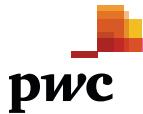

### Independent auditor's report

To the shareholders of NZME Limited

#### **Our opinion**

In our opinion, the accompanying consolidated financial statements of NZME Limited (the Company), including its subsidiaries (the Group), present fairly, in all material respects, the financial position of the Group as at 31 December 2022, its financial performance and its cash flows for the year then ended in accordance with New Zealand Equivalents to International Financial Reporting Standards (NZ IFRS) and International Financial Reporting Standards (IFRS).

#### **What we have audited**

The Group's consolidated financial statements comprise:

- the consolidated balance sheet as at 31 December 2022;
- the consolidated income statement for the year then ended;
- the consolidated statement of comprehensive income for the year then ended;
- the consolidated statement of changes in equity for the year then ended;
- the consolidated statement of cash flows for the year then ended; and
- the notes to the consolidated financial statements, which include significant accounting policies and other explanatory information.

#### **Basis for opinion**

We conducted our audit in accordance with International Standards on Auditing (New Zealand) (ISAs (NZ)) and International Standards on Auditing (ISAs). Our responsibilities under those standards are further described in the *Auditor's responsibilities for the audit of the consolidated financial statements* section of our report.

We believe that the audit evidence we have obtained is sufficient and appropriate to provide a basis for our opinion.

#### **Independence**

We are independent of the Group in accordance with Professional and Ethical Standard 1 *International Code of Ethics for Assurance Practitioners (including International Independence Standards) (New Zealand)* (PES 1) issued by the New Zealand Auditing and Assurance Standards Board and the *International Code of Ethics for Professional Accountants (including International Independence Standards)* issued by the International Ethics Standards Board for Accountants (IESBA Code), and we have fulfilled our other ethical responsibilities in accordance with these requirements.

Our firm carries out other services for the Group in the areas of agreed upon procedures relating to the benchmarking of market revenue data and agreed upon procedures relating to the Group's return to the Broadcasting Standards Authority. In addition, our firm, its partners and employees may deal with the Company on normal terms within the ordinary course of trading activities of the Group. The provision of these other services and relationships have not impaired our independence as auditor of the Group.

#### **Key audit matters**

Key audit matters are those matters that, in our professional judgement, were of most significance in our audit of the consolidated financial statements of the current year. These matters were addressed in the context of our audit of the consolidated financial statements as a whole, and in forming our opinion thereon, and we do not provide a separate opinion on these matters.

PricewaterhouseCoopers, 15 Customs Street West, Private Bag 92162, Auckland 1142, New Zealand T: +64 9 355 8000, F: +64 9 355 8001, pwc.co.nz

{109}------------------------------------------------

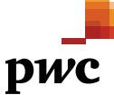

#### **Impairment assessment of indefinite life intangible assets**

As at 31 December 2022, the total carrying amount of the Group's indefinite life intangible assets, comprising goodwill, masthead brands and other brands (the assets), amounts to \$105.1 million. Annual impairment testing is required under NZ IFRS.

To assess the recoverable amount of these assets, the Group prepared discounted cash flow models on a Value-In-Use (VIU) basis.

The assets have been allocated to individual cash generating units (CGUs) and have been tested for impairment at this level. The CGUs identified are Audio, Publishing and OneRoof.

The impairment assessments are considered a key audit matter due to the significance of the carrying value of the assets as well as the inherent judgements involved in estimating forecast cash flows, discount rates, and long-term growth rates.

Key estimates and assumptions included in the impairment assessment are:

- the identification of CGUs for impairment testing purposes;
- expected future cash flows of each CGU, which include estimates and assumptions around revenue and operating expenses;
- discount rates; and
- long-term growth rates.

Based on the assumptions above, no impairment of indefinite life intangible assets has been recognised. Management also concluded that there were no reasonably possible adverse changes in the key assumptions that would result in material impairment in any of the CGUs.

Refer to note 3.1.1 of the consolidated financial statements for further information.

#### **Description of the key audit matter How our audit addressed the key audit matter**

We performed the following audit procedures in relation to the impairment assessment and key management judgements:

- held discussions with management and understood the processes undertaken and basis for determining the key assumptions;
- evaluated the design of controls, determined if they are designed effectively, and confirmed that they have been implemented;
- considered the appropriateness of management's CGU assessment;
- considered the appropriateness of the basis of allocation of assets and liabilities and the forecast cash flows to the CGUs;
- considered the reasonableness of unallocated costs and whether these should be allocated to a CGU;
- gained an understanding of the forecast outlook for the industry and the strategic direction of the business; and
- performed our own sensitivity assessment on the cash flow forecasts to determine whether reasonably possible adverse changes in the key assumptions would result in an impairment.

In relation to the recoverable amounts determined using VIU, we:

- tested the mathematical accuracy of the VIU calculations;
- compared the forecast cash flows used for 2023 to the Board approved budget;
- assessed and challenged the reasonableness of future cash flows of each CGU, including management's estimates and assumptions around forecast revenues and operating expenses, with reference to historical performance and external market evidence;
- engaged our auditor's valuation expert to assist us to assess and challenge the reasonableness of the discount rates and terminal growth rates.

We also considered the appropriateness of disclosures made.

As a result of our procedures, we have no matters to report.

{110}------------------------------------------------

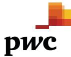

#### **Recognition of revenue**

The Group has reported total revenue from external customers totalling \$355.4 million for the year.

Advertising arrangements are often customised and consist of multiple performance obligations and a series of distinct goods and services. They meet the definition for revenue recognition over time in accordance with IFRS 15.

Circulation and subscription revenue is recognised at a point in time as single performance obligations.

External printing and distribution as well as other revenue is recognised over time in accordance with IFRS 15.

Management judgement, in the form of estimates, is applied in the following areas:

- measuring progress towards complete satisfaction of a performance obligation;
- determining the transaction price in respect of contracts with non- standard consideration; and
- allocating the transaction price to performance obligations.

The recognition of revenue is a judgemental area with multiple revenue streams, requiring significant audit focus and attention. As a result, we consider it a key audit matter.

#### **Description of the key audit matter How our audit addressed the key audit matter**

Our audit approach for revenue is largely substantive. We performed the following procedures:

- updated our understanding of the systems, processes and controls in place over the recognition of revenue;
- performed disaggregated risk assessment analytics over all material revenue streams;
- on a sample basis, tested the completeness, cut-off and occurrence of advertising revenue by agreeing published and broadcasted advertisements to booking schedules and vice versa;
- tested the accuracy of advertising revenue with reference to relevant rate cards and standard terms of business;
- reconciled booking schedules for advertising revenue to the general ledger to ensure complete and accurate recognition of revenue, including recognition within the correct period;
- performed confirmation procedures for external printing and distribution revenue's largest customer;
- for all other revenue, including circulation and subscriptions, on a sample basis, examined invoices, contracts with customers, or payment and pricing arrangements to ensure revenue recognition was in accordance with agreed terms and the principles of IFRS 15;
- tested the credit notes issued throughout the year and after year end to assess the level of credit notes subsequent to revenue recognition; and
- tested the accuracy and classification of segmental disclosures on revenue.

As a result of our procedures, we have no matters to report.

{111}------------------------------------------------

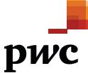

#### **Our audit approach**

#### **Overview**

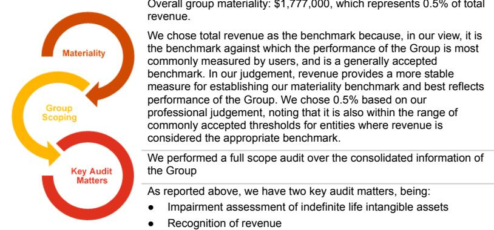

As part of designing our audit, we determined materiality and assessed the risks of material misstatement in the consolidated financial statements. In particular, we considered where management made subjective judgements; for example, in respect of significant accounting estimates that involved making assumptions and considering future events that are inherently uncertain. As in all of our audits, we also addressed the risk of management override of internal controls, including among other matters, consideration of whether there was evidence of bias that represented a risk of material misstatement due to fraud.

#### **Materiality**

The scope of our audit was influenced by our application of materiality. An audit is designed to obtain reasonable assurance about whether the consolidated financial statements are free from material misstatement. Misstatements may arise due to fraud or error. They are considered material if, individually or in aggregate, they could reasonably be expected to influence the economic decisions of users taken on the basis of the consolidated financial statements.

Based on our professional judgement, we determined certain quantitative thresholds for materiality, including the overall Group materiality for the consolidated financial statements as a whole as set out above. These, together with qualitative considerations, helped us to determine the scope of our audit, the nature, timing and extent of our audit procedures and to evaluate the effect of misstatements, both individually and in aggregate, on the consolidated financial statements as a whole.

#### **How we tailored our group audit scope**

We tailored the scope of our audit in order to perform sufficient work to enable us to provide an opinion on the consolidated financial statements as a whole, taking into account the structure of the Group, the accounting processes and controls, and the industry in which the Group operates.

{112}------------------------------------------------

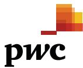

#### **Other information**

The Directors are responsible for the other information. The other information comprises the information included in the Annual report, but does not include the consolidated financial statements and our auditor's report thereon.

Our opinion on the consolidated financial statements does not cover the other information and we do not express any form of audit opinion or assurance conclusion thereon.

In connection with our audit of the consolidated financial statements, our responsibility is to read the other information and, in doing so, consider whether the other information is materially inconsistent with the consolidated financial statements or our knowledge obtained in the audit, or otherwise appears to be materially misstated. If, based on the work we have performed on the other information that we obtained prior to the date of this auditor's report, we conclude that there is a material misstatement of this other information, we are required to report that fact. We have nothing to report in this regard.

#### **Responsibilities of the Directors for the consolidated financial statements**

The Directors are responsible, on behalf of the Company, for the preparation and fair presentation of the consolidated financial statements in accordance with NZ IFRS and IFRS, and for such internal control as the Directors determine is necessary to enable the preparation of consolidated financial statements that are free from material misstatement, whether due to fraud or error.

In preparing the consolidated financial statements, the Directors are responsible for assessing the Group's ability to continue as a going concern, disclosing, as applicable, matters related to going concern and using the going concern basis of accounting unless the Directors either intend to liquidate the Group or to cease operations, or have no realistic alternative but to do so.

#### **Auditor's responsibilities for the audit of the consolidated financial statements**

Our objectives are to obtain reasonable assurance about whether the consolidated financial statements, as a whole, are free from material misstatement, whether due to fraud or error, and to issue an auditor's report that includes our opinion. Reasonable assurance is a high level of assurance, but is not a guarantee that an audit conducted in accordance with ISAs (NZ) and ISAs will always detect a material misstatement when it exists. Misstatements can arise from fraud or error and are considered material if, individually or in the aggregate, they could reasonably be expected to influence the economic decisions of users taken on the basis of these consolidated financial statements.

A further description of our responsibilities for the audit of the consolidated financial statements is located at the External Reporting Board's website at:

https://www.xrb.govt.nz/assurance-standards/auditors-responsibilities/audit-report-1/ This description forms part of our auditor's report.

{113}------------------------------------------------

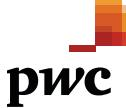

#### **Who we report to**

This report is made solely to the Company's shareholders, as a body. Our audit work has been undertaken so that we might state those matters which we are required to state to them in an auditor's report and for no other purpose. To the fullest extent permitted by law, we do not accept or assume responsibility to anyone other than the Company and the Company's shareholders, as a body, for our audit work, for this report or for the opinions we have formed.

The engagement partner on the audit resulting in this independent auditor's report is Lisa Crooke.

For and on behalf of:

Chartered Accountants Auckland 21 February 2023

{114}------------------------------------------------

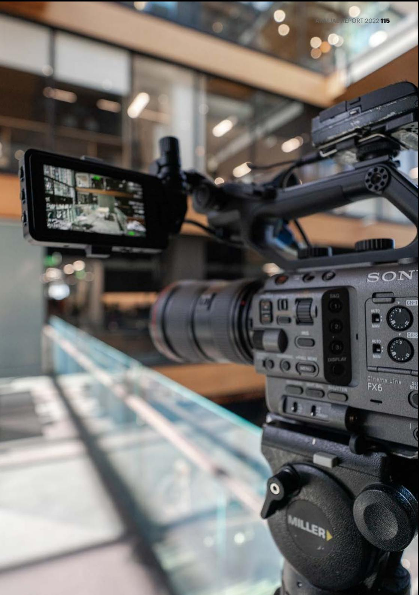

{115}------------------------------------------------

**DIRECTORY**

#### Registered Address

NZME Limited 2 Graham St Auckland 1010 New Zealand

#### Registred Office Contact Details

|        | Postal Address: Private Bag 92198 |
|--------|-----------------------------------|
|        | Victoria St West                  |
|        | Auckland 1142                     |
|        | New Zealand                       |
|        |                                   |
| Phone: | +64 9 379 5050                    |

Website: www.nzme.co.nz Email: Investor_Relations@nzme.co.nz

Auditors PricewaterhouseCoopers

Principal Bankers

Westpac

Principal Solicitors Bell Gully

Share Registry Link Market Services

Share Registry Contact Details Postal Address: PO Box 91976 Auckland 1142

Street Address: Level 30 PwC Tower 15 Customs Street West Auckland Phone: +64 9 375 5998 Website: www.linkmarketservices.co.nz Email: enquiries@linkmarketservices.co.nz

{116}------------------------------------------------

ANNUAL REPORT 2022 117

{117}------------------------------------------------

