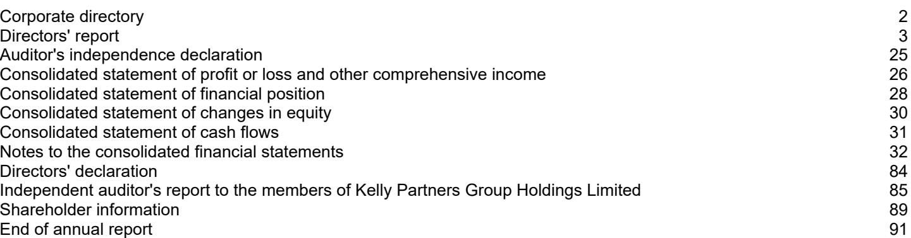

{0}------------------------------------------------

# **KELLY PARTNERS GROUP HOLDINGS LIMITED**

**ABN 25 124 908 363**

**Kelly Partners Group Holdings Limited Front Page - 2022 Annual Report**

**30 June 2022**

**ANNUAL REPORT – 2022**

{1}------------------------------------------------

# **Kelly Partners Group Holdings Limited Contents 30 June 2022**

{2}------------------------------------------------

# **Kelly Partners Group Holdings Limited Corporate directory 30 June 2022**

| Directors                           | Brett Kelly – Chairman, Executive Director Stephen Rouvray – Deputy Chairman, Non-Executive Independent Director Ryan Macnamee – Non-Executive Independent Director Lawrence Cunningham – Non-Executive Independent Director (Appointed on 1 July 2022) Paul Kuchta – Executive Director Ada Poon - Executive Director                                                                                                                                                                                            |
|-------------------------------------|----------------------------------------------------------------------------------------------------------------------------------------------------------------------------------------------------------------------------------------------------------------------------------------------------------------------------------------------------------------------------------------------------------------------------------------------------------------------------------------------------------------------------------|
| Company secretary                   | Joyce Au                                                                                                                                                                                                                                                                                                                                                                                                                                                                                                                         |
| Notice of annual general meeting | The annual general meeting ('AGM') of Kelly Partners Group Holdings Limited will be held on Tuesday, 8 November 2022 with the format of the AGM to be confirmed.                                                                                                                                                                                                                                                                                                                                                              |
| Registered office                   | Level 8 32 Walker Street North Sydney, NSW 2060 Telephone: (02) 9923 0800                                                                                                                                                                                                                                                                                                                                                                                                                                               |
| Share register                      | Computershare Investor Services Pty Limited Level 3 60 Carrington Street Sydney, NSW 2000 Telephone: 1300 787 272                                                                                                                                                                                                                                                                                                                                                                                                    |
| Auditor                             | William Buck Accountants & Advisors Level 29 66 Goulburn Street Sydney, NSW 2000                                                                                                                                                                                                                                                                                                                                                                                                                                        |
| Stock exchange listing              | Kelly Partners Group Holdings Limited shares are listed on the Australian Securities Exchange (ASX code: KPG) since 21 June 2017.                                                                                                                                                                                                                                                                                                                                                                                             |
| Website                             | http://www.kellypartnersgroup.com.au                                                                                                                                                                                                                                                                                                                                                                                                                                                                                             |
| Corporate Governance Statement   | The directors and management are committed to conducting the business of Kelly Partners Group Holdings Limited in an ethical manner and in accordance with the highest standards of corporate governance. Kelly Partners Group Holdings Limited has adopted and has substantially complied with the ASX Corporate Governance Principles and Recommendations (Fourth Edition) ('Recommendations') to the extent appropriate to the size and nature of its operations.                                              |
|                                     | The Group's Corporate Governance Statement, which sets out the corporate governance practices that were in operation during the financial year and identifies and explains any Recommendations that have not been followed and ASX Appendix 4G are released to the ASX on the same day the Annual Report is released. The Corporate Governance Statement and Corporate Governance Compliance Manual can be found on the Company's website - www.kellypartnersgroup.com.au/investor-centre/corporate-governance-2. |

{3}------------------------------------------------

The directors present their report, together with the financial statements, of the consolidated entity (referred to hereafter as the 'Group') consisting of Kelly Partners Group Holdings Limited (referred to hereafter as the 'Company' or 'parent entity') and the entities it controlled at the end of, or during, the year ended 30 June 2022.

# **Directors**

The following persons were directors of Kelly Partners Group Holdings Limited during the whole of the financial year and up to the date of this report, unless otherwise stated:

Brett Kelly - Chairman Stephen Rouvray - Deputy Chairman Ryan Macnamee Paul Kuchta Ada Poon Lawrence Cunningham (appointed 1 July 2022)

# **Principal activities**

During the financial year, the principal continuing activities of the Group were the provision of chartered accounting and other professional services, predominantly to private businesses and high net worth individuals.

# **Strategy**

The Company aims to build per-share intrinsic value by:

- (1) Improving the earning power of the operating businesses;
- (2) Further increase the earnings of the operating businesses through tuck-in acquisitions;
- (3) (a) Growing the accounting businesses;
- (b) Growing the complementary businesses;
- (4) (a) Making programmatic acquisitions;
- (b) Making an occasional large acquisition where there is strategic alignment (i.e. greater than \$5m in revenue); and
- (5) Repurchasing Company's shares when available at a meaningful discount from intrinsic value.

{4}------------------------------------------------

The following table presents the performance of the business against the comparative year in delivering the Group's strategy:

|                                                                                                                |                                                                                |        |       |       |        |       | FY17  |
|----------------------------------------------------------------------------------------------------------------|--------------------------------------------------------------------------------|--------|-------|-------|--------|-------|-------|
| Strategy                                                                                                       | Measure                                                                        | FY22   | FY21  | FY20  | FY19   | FY18  | (IPO) |
| (1) Improving the earning power of the operating businesses                                                 | EBITDA margin of operating businesses                                       | 30.9%  | 33.4% | 32.5% | 27.7%  | 34.0% | 30.9% |
| (2) Further increase earnings through tuck-in acquisitions                                                  | Contribution to revenue growth from acquired businesses                  | 26.5%  | 4.8%  | 6.6%  | 6.4%   | 17.2% | -     |
| (3) a. Growing our accounting businesses                                                                    | Contribution to revenue growth from existing accounting businesses       | 4.7%   | 1.4%  | 6.6%  | (6.9%) | 10.5% | -     |
| (3) b. Growing our complementary businesses                                                              | Contribution to revenue growth from existing complementary businesses | 1.5%   | 1.2%  | 2.8%  | 1.8%   | 3.1%  | -     |
|                                                                                                                | Wealth                                                                         | 0.9%   | 1.0%  | 0.4%  | 0.7%   | 1.0%  | -     |
|                                                                                                                | Finance                                                                        | 0.6%   | 0.2%  | 0.4%  | 0.7%   | 0.8%  | -     |
|                                                                                                                | Investment office                                                              | (0.2%) | 0.0%  | 0.9%  | 0.0%   | 0.4%  | -     |
|                                                                                                                | Discontinued operations                                                        | n/a    | n/a   | 1.1%  | 0.4%   | 0.9%  | -     |
|                                                                                                                | Insurance (from Jan-21)                                                        | n/a    | n/a   | n/a   | n/a    | n/a   | -     |
| (4) a. Making programmatic acquisitions                                                                     | Number of acquisitions                                                         | 8      | 7     | 3     | 4      | -     | -     |
| (4) b. Making an occasional large acquisition (i.e. greater than \$5m in revenue)                     | Number of large acquisitions                                                   | -      | -     | -     | -      | -     | 1     |
| (5) Repurchasing the Company's shares when available at a meaningful discount from intrinsic value | (i) Number of shares repurchased                                            | -      | 400k  | 95k   | 2k     | -     | -     |
|                                                                                                                | (ii) % of shares issued repurchased                                         | -      | 0.88% | 0.21% | -      | -     | -     |
|                                                                                                                | (iii) number of shares on issue                                             | 45.0m  | 45.0m | 45.4m | 45.5m  | 45.5m | 45.5m |

# **Key financial metrics**

The Company uses Return on Equity ('ROE'), Return on Invested Capital ('ROIC'), Earnings Per Share ('EPS') and Owners' earnings as key financial metrics to measure the performance of the Group and its return to shareholders. The Group continues to achieve superior returns on equity and invested capital, as measured by ROE and ROIC.

{5}------------------------------------------------

The following table summarises the key financial metrics used by the Company to measure the performance of the Group and its return to shareholders, since IPO:

| Full year metrics Key financial metric     | Formula                                                                                      | FY22        | FY21        | FY20                                                                       | FY19            | FY18      | FY17 (IPO) |
|--------------------------------------------------|----------------------------------------------------------------------------------------------|-------------|-------------|----------------------------------------------------------------------------|-----------------|-----------|------------|
| Return to owners Owners' earnings* - Group | Cash from operating activities - repayment of lease liabilities - maintenance capex |             |             | \$13,959,305 \$12,807,837 \$12,174,442 \$9,673,451 \$6,304,912 \$6,619,077 |                 |           |            |
| Owners' earnings* - Parent                    | Cash from operating activities - repayment of lease liabilities - maintenance capex | \$6,312,568 | \$5,014,894 | \$3,885,041                                                                | \$3,128,904 n/a |           | n/a        |
| Return on equity                                 | Underlying NPATA / Equity                                                                 | 41.7%       | 46.7%       | 44.2%                                                                      | 36.6%           | 47.8%     | 35.1%      |
| Return on invested capital^                   | (Underlying NPATA + cash interest) / (Equity + debt)                                   | 22.3%       | 27.9%       | 26.1%                                                                      | 22.7%           | 31.2%     | 21.9%      |
| Earnings per share (EPS) (cents per share) | Underlying attributed NPATA / Weighted average number of shares                     | 13.99       | 11.32       | 8.67                                                                       | 7.02            | 9.51      | 4.97       |
|                                                  | Annual increase (EPS)                                                                        | 23.5%       | 30.7%       | 23.5%                                                                      | (26.2%)         | 25.6%     | -          |
| Dividends (cents per share)**                 | Dividends paid                                                                               | 7.98        | 7.08        | 4.84                                                                       | 4.40            | 4.00      | -          |
| Dividends payout ratio**                      | Dividends per share / EPS (underlying NPATA)                                           | 57.0%       | 62.0%       | 55.8%                                                                      | 62.7%           | 42.1%     | -          |
| Cash conversion / debt                        |                                                                                              |             |             |                                                                            |                 |           |            |
| Cash conversion^^                                | Operating cashflow / Statutory EBITDA                                                     | 83.3%       | 93.5%       | 97.3%                                                                      | 116.8%          | 63.5%     | 269.6%     |
| Gearing ratio                                    | Net Debt / Underlying EBITDA                                                              | 1.36x       | 0.84x       | 0.96x                                                                      | 1.35x           | 0.79x     | 1.4x       |
|                                                  | Net debt per partner Net Debt / Number of Partners                                        | \$505,938   | \$296,758   | \$346,198                                                                  | \$366,813       | \$291,167 | \$326,230  |
| Number of partners                               | Number of partners                                                                           | 62          | 54          | 45                                                                         | 41              | 40        | 37         |

^ Return on Invested Capital is impacted in FY22 as only part year contributions from in year acquisitions have been included in the calculation of which the entire debt capital has been used as the denominator. Adjusted ROIC taking in to account annualised contributions from in year acquisitions is 25.5%.

^^ Cash conversion is impacted in FY22 as the initial lockup (WIP & debtors) of the in-year acquisitions reduces the cashflow in the first year. Cash conversion normalised for acquisition lockup is 98.0% (i.e. (Cash from operating activities + debtors from in year acquisitions + accrued income from in year acquisitions)/ EBITDA)).

{6}------------------------------------------------

- * The Group uses owners' earnings to measure cash flow available to the Group. Owners' earnings is a non-IFRS measure which is used to measure cash flow to the Group (after taxes and finance costs) and after taking into account the necessary:
- additions or deductions of working capital investment (debtors, accrued Income, and other accrual movements) required as the business grows and makes acquisitions;
- deductions required for the maintenance capital expenditure for the business to maintain on-going operations in the long term; and
- deducting the repayment of lease liability from cash from operations (which AASB16 reclassifies to cash from financing activities).

In FY22, Owners' earnings for the 12 months were \$13,959,305 (FY21: \$12,807,837) up 9.0% from the prior corresponding period. Owners' earnings for the parent entity were \$6,312,568 (FY21: \$5,041,894), up 25.2% from the prior corresponding period.

- ** Ordinary dividends paid represent the dividends paid relating to the stated financial year. For example, dividends paid in FY22 relating to FY21 is shown in the FY21 column. Dividends shown for FY22 include the estimated final dividends, including special dividends, that will be paid prior to November 2022.
# **Review of operations**

In the year ended 30 June 2022 ('FY22' or '2022'), the Group has recorded a consolidated statutory net profit after income tax from continuing operations of \$13,328,745 (year ended 30 June 2021 ('FY21' or '2021'): \$10,945,476), an increase of 21.8%. The statutory net profit attributable to the members of the parent entity was \$5,565,475 (FY21: \$4,625,330), an increase of 20.3%.

The directors consider Underlying Earnings Before Interest, Tax, Depreciation and Amortisation ('Underlying EBITDA') and Underlying Net Profit After Tax Before Amortisation ('Underlying NPATA') reflects the core earnings of the Group. Underlying EBITDA and Underlying NPATA are financial measures not prescribed by Australian Accounting Standards ('AAS') and represents the profit under AAS adjusted for non-cash and other items which management consider to be one-off nonrecurring in nature.

Underlying EBITDA and Underlying NPATA are key measurements used by management and the board to assess and review business performance and accordingly the following table provides a reconciliation between profit after income tax expense and Underlying EBITDA.

The following table provides a reconciliation between the NPAT and the Underlying EBITDA of the consolidated Group.

{7}------------------------------------------------

|                                                                                  | Consolidated |            |
|----------------------------------------------------------------------------------|--------------|------------|
|                                                                                  | 2022 \$   | 2021 \$ |
| Statutory net profit after income tax ('NPAT') from continuing operations        | 13,328,745   | 10,945,476 |
| Finance costs                                                                    | 2,038,179    | 1,550,839  |
| Income tax expense                                                               | 3,092,565    | 1,963,663  |
| Depreciation and amortisation expense                                            | 6,330,126    | 4,427,456  |
| Earnings before interest, tax, depreciation and amortisation ('EBITDA')          | 24,789,615   | 18,887,434 |
| Add: Non-recurring expenses                                                      |              |            |
| Restructuring costs                                                              | -            | 91,306     |
| Acquisition costs                                                                | 740,178      | 721,474    |
| Non-operating business losses                                                    | -            | 169,246    |
| Other non-recurring expenses                                                     | 38,179       | 165,314    |
| Less: Non-recurring income                                                       |              |            |
| One-off government grants in relation to COVID-19                                | (1,348,189)  | (825,368)  |
| Government subsidies in relation to Australian Apprenticeships Incentive Program | (689,468)    | -          |
| Change in fair value of contingent consideration                                 | (416,755)    | (447,508)  |
| Net proceeds from settlement of legal dispute                                    | -            | (107,963)  |
| Underlying EBITDA                                                                | 23,113,560   | 18,653,935 |

Underlying EBITDA of the Group was \$23,113,560 (2021: \$18,653,935), an increase of 23.9%.

The following table provides a reconciliation between the NPAT and the Underlying NPATA which is attributable to the owners of Kelly Partners Group Holdings Limited.

|                                                                                          | Consolidated |           |
|------------------------------------------------------------------------------------------|--------------|-----------|
|                                                                                          | 2022         | 2021      |
|                                                                                          | \$           | \$        |
| Statutory NPAT from continuing operations attributable to owners of Kelly Partners Group |              |           |
| Holdings Limited                                                                         | 5,562,969    | 4,625,330 |
| Amortisation of customer relationship intangibles                                        | 1,184,824    | 553,624   |
| NPATA attributable to owners of Kelly Partners Group Holdings Limited                    | 6,747,793    | 5,178,954 |
| Add: Non-recurring expenses                                                              |              |           |
| Restructuring costs                                                                      | -            | 87,366    |
| Acquisition costs                                                                        | 616,020      | 426,836   |
| Non-operating business losses                                                            | -            | 96,180    |
| Other non-recurring expenses                                                             | 22,774       | 82,854    |
| Less: Non-recurring income                                                               |              |           |
| One-off government grants in relation to COVID-19                                        | (708,346)    | (450,458) |
| Government grants in relation to Australian Apprenticeships Incentives Program           | (343,002)    | -         |
| Change in fair value of contingent consideration                                         | (225,794)    | (211,462) |
| Net proceeds from settlement of legal dispute                                            | -            | (49,107)  |
| Net non-recurring items                                                                  | (638,348)    | (17,791)  |
| Less: Tax effect of non-recurring items                                                  | 187,510      | (46,331)  |
| Underlying NPATA attributable to owners of Kelly Partners Group Holdings Limited         | 6,296,955    | 5,114,832 |
|                                                                                          |              |           |

Underlying NPATA attributable to members of the parent entity was \$6,296,955 (2021: \$5,114,832), an increase of 23.1%.

{8}------------------------------------------------

# **COVID-19**

#### **Management response and action**

During the first half of FY22, the Greater Sydney and Melbourne area were subject to lockdown and extensive restrictions as a result of a renewed COVID-19 outbreak. This has led to working from home arrangements being implemented across the Group. Due to the COVID-19 outbreak and the working from home arrangements, the Group has experienced the following impacts:

- the timing of regular compliance and advisory work being completed has been impacted or delayed where the operating businesses have had to prioritise assisting COVID-19 impacted clients with applying for government grants; and
- the fees charged in relation to assisting COVID-19 impacted clients with applying for government grants are lower and less profitable for the reasons of supporting our clients.

During the COVID-19 outbreak, various operating businesses of the Group satisfied the criteria for JobSaver and the Group received in total \$1,348,189 of COVID-19 government grants. As at 30 June 2022, the JobSaver program has ended. The Group views the government grants received to be one-off non-recurring in nature and has deducted such income from its underlying results for the purposes of looking through the true underlying performance of the business.

Irrespective of the above, the Group continues to grow and operate profitably. The Group continues to monitor the potential impacts and risks posed by the pandemic and focuses heavily on protecting the physical and mental health of its people.

# **Quality shareholders**

During the first half of FY22 the Group continued its Quality Shareholders initiative and was pleased to have William Thorndike (author of '*The Outsiders : Eight Unconventional CEOs and Their Radically Rational Blueprint for Success'*) and Lawrence Cunningham (author of '*The Essays of Warren Buffett: Lessons for Corporate America'* and now a Non-Executive Independent Director of the Company from 1 July 2022) speak at our 2021 Annual General Meeting. The Group extends its thanks and appreciation to William and Lawrence for their contributions to cultivating the Group's quality shareholder base. The Group firmly believes that attracting Quality Shareholders, who view themselves as part owners of the business and are willing to invest a meaningful amount of their wealth for a very long time, is critical in achieving the Group's longterm strategy and vision.

# **Financial performance**

# **Acquisitions and integration**

During FY22, the Group has completed acquisitions with estimated total annual revenues in the range of \$11.7m to \$15.2m. Further, the Group has completed one acquisition in July 2022 with estimated total annual revenues in the range of \$3.4m to \$4.2m. In aggregate the Group has completed eight acquisitions with estimated total annual revenues in the range of \$15.1m to \$19.4m, representing 30.9% to 39.7% of FY21 revenue. The Group has well surpassed the \$4.4m target acquisition for FY22 as per the Group's 5-year plan.

The completed acquisitions are listed in the table below.

| # Acquired / scheduled                                                                                                                           | Location                                                                | Type                                                | Acquired Revenue                                                                            |
|--------------------------------------------------------------------------------------------------------------------------------------------------|-------------------------------------------------------------------------|-----------------------------------------------------|---------------------------------------------------------------------------------------------|
| 1 Nov-21 2 Dec-21 3 Jan-22 4 Feb-22 5 Feb-22                                                                                         | Western Sydney Canberra Melbourne Northern Beaches Canberra | Tuck-in Marquee Tuck-in Tuck-in Tuck-in | \$3.2m - \$4.3m \$0.8m - \$0.9m \$1.0m - \$1.4m \$1.0m - \$1.4m \$0.9m - \$1.1m |
| 6 Mar-22                                                                                                                                         | Central Coast                                                           | Tuck-in                                             | \$1.0m - \$1.4m                                                                             |
| 7 Apr-22 Acquisitions completed in FY22 % of FY21 Revenue (\$48.9m)                                                                        | Bendigo                                                                 | Marquee                                             | \$3.8m - \$4.7m \$11.7m - \$15.2m 23.9% - 31.1%                                       |
| 8 Jul-22 Acquisitions completed in FY23 % of FY21 Revenue (\$48.9m) Total Acquisitions since 1 July 2021 % of FY21 Revenue (\$48.9m) | Hunter Region                                                           | Marquee                                             | \$3.4m - \$4.2m \$3.4m - \$4.2m 7.0% - 8.6% \$15.1m - \$19.4m 30.9% - 39.7%     |

{9}------------------------------------------------

#### **Offices and partners**

As at 30 June 2022, the Group operated out of 19 offices (30 June 2021: 16). During the year, the Group commenced businesses in three new locations in Newcastle, NSW (Jul-21), Canberra, ACT (Dec-21) and Bendigo, VIC (Apr-22). All of the new office openings were a result of acquisitions of local accounting firms that were completed during the year. We are pleased that 10 of our 19 offices now qualify as a top 100 accounting firm in their own right, commanding dominant market positions in their respective regions. During the year, 6 of our offices underwent or are currently undergoing fitout upgrades. Over the last 2 years, the Group has progressively upgraded the fitouts for each of its 19 offices in order to build a consistent brand and office experience for its people and its clients.

As at 30 June 2022, the total number of equity partners (including the CEO, Brett Kelly) was 62 (30 June 2021: 54) with two partners promoted internally, and eight partners joining the group from completed acquisitions. Post balance date, four partners joined the group from the Hunter Region acquisition, taking the total number of equity partners to 66. The Group continues its focus in admitting and recruiting new partners as part of its strategy to retain and motivate key talents and to drive revenue growth.

#### **Properties**

On 20 December 2021, Kelly Partners (Canberra) Property Trust, a wholly owned subsidiary of Kelly Partners Group Holdings Limited, purchased a 100% interest in a commercial property located in Kingston ACT for a total consideration of \$2.2m. Kelly Partners Canberra has operated from these premises since April 2022, having completed the acquisitions of two Canberra accounting firms in December 2021 and February 2022. The office is located in a prime location on the Kingston foreshore and will assist the business in building a presence in Canberra.

As detailed in previous commentary, the Group continues to pursue a strategy of removing properties off balance sheet. Nonetheless, the Group still believes that the properties from which its business operate should be owned in a separate structure in which our operating partners can own a share. The Group is currently in the process of considering and establishing such structures to own the properties.

#### **Revenue**

Revenue for FY22 increased 32.6% to \$64,862,110 (FY21: \$48,906,446). A reconciliation of acquisition and organic growth is set out below:

|                                                                                     | \$                                | Growth rate %  |
|-------------------------------------------------------------------------------------|-----------------------------------|-------------------|
| FY21 Revenue                                                                        | 48,906,446                        | -                 |
| Accounting business growth Complementary business growth Total organic growth | 2,308,576 711,275 3,019,851 | 4.7 1.5 6.2 |
| Total revenue from acquired businesses                                              | 12,935,813                        | 26.5              |
| FY22 Revenue                                                                        | 64,862,110                        | 32.6              |

Acquired revenue of \$12,935,813 contributed 26.5% of revenue growth, with in year acquisitions completed to date in FY22 contributing \$10,507,605 and revenue from the acquisitions completed in FY21 contributing \$2,428,208.

Organic revenue growth contributed 6.2% of revenue growth and has exceeded the Group's target annual organic growth of 5%.

# **Operating expenses**

Employment and related expenses have increased 42.4% compared to revenue growth of 32.6%. This is due to higher cost of sales and administration staff costs from in year acquisitions and additional team members recruited in the parent entity's central progress team to support the Group's growth. In many of the in year acquisitions, the outgoing vendor also receives a consulting fee for the first 1-2 years post completion to ensure a successful transition of their business and clients to Kelly+Partners. Other expenses have increased 21.1% on prior year.

# **Underlying EBITDA**

Underlying EBITDA (which measures EBITDA before one off and non-recurring items) increased 23.9% to \$23,113,559 (FY21: \$18,653,935).

{10}------------------------------------------------

The directors consider underlying EBITDA margin before AASB 16 as a more meaningful measurement of performance. The underlying EBITDA margin before AASB 16 is slightly lower than the prior year at 30.8% (FY21: 32.6%). The EBITDA margins have been slightly depressed this year due to the large number of acquisitions completed and additional costs initially required to transform the acquired businesses in order to achieve Kelly+Partners benchmark profitability metrics. Our aim is to increase the EBITDA margin to 35.0% and we expect to do so once the recently completed acquisitions have undergone a successful transition and transformation under our Kelly Partners Partner-Owner-DriverTM model.

A reconciliation of Underlying EBITDA before and after the AASB 16 leasing adjustment is set out in the table below.

|                                                                  | FY22 \$ | FY21 \$                                 | FY20 \$ |
|------------------------------------------------------------------|------------|--------------------------------------------|------------|
| Underlying EBITDA Growth %                                    | +23.9%     | 23,113,559 18,653,935 15,922,576 +17.2% | -          |
| AASB 16 leasing adjustment - rent expense                        |            | (3,129,291) (2,703,699) (2,456,469)        |            |
| Underlying EBITDA before AASB 16 leasing adjustments Growth % | +25.3%     | 19,984,268 15,950,236 13,466,107 +18.4% | -          |
| As a % of revenue                                                | 30.8%      | 32.6%                                      | 29.6%      |

# **Additional investment expenditure in the Parent Entity**

Since the IPO, the parent entity has continued to invest in order to further develop the capabilities of the central services team and to enable the business to be positioned for long term growth as well as to increase its competitive advantage. These investments have sometimes exceeded the central Services Fee and IP Fee income that the Company receives from its operating businesses, as shown in the table below.

As communicated in prior financial results releases and announcements, the Company undertook a significant review of its cost structures and additional investment expenditure made during the coronavirus outbreak in March 2020 and committed to reducing the ongoing additional investment spend to be in line with the income it receives from its operating businesses. This focus and review have brought the additional investments expenditure down to \$77,836 for the FY22 year contributing to the uplift in the Underlying attributed NPATA. Investment expenditure continue to be brought in line with the income received from its operating businesses in the current year.

The Company maintains its strategy to continue to improve operational efficiency impact overtime, unless attractive opportunities arise where the Company sees a benefit in committing additional investments expenditure.

|                                      | FY22         | FY21         | FY20         | FY19         |
|--------------------------------------|--------------|--------------|--------------|--------------|
| Group revenue                        | \$64,862,110 | \$48,906,446 | \$45,495,584 | \$39,975,031 |
| Group revenue growth on prior period | +32.6%       | +7.5%        | 13.8%        | 1.3%         |
| Additional investment expenditure    | \$77,836     | \$371,127    | \$1,630,905  | \$742,439    |
| % of Revenue                         | 0.1%         | 0.8%         | 3.6%         | 1.9%         |

# **Non-recurring and one-off items**

Total non-recurring income for the Group for the year was \$2,454,412 (FY21: \$1,380,839) and included:

- 1) \$1,348,189 in one-off government grants in relation to COVID-19;
- 2) \$689,468 in subsidies received through the Australian Apprenticeships Incentives Program; and
- 3) \$416,755 in non-cash income relating to a change in fair value of contingent consideration. This relates to a completed acquisition in FY20 where the vendor had not achieved the required targets for the payment of the contingent consideration.

{11}------------------------------------------------

Total non-recurring expenses for the year of \$778,358 (FY21: \$1,147,340) which included:

- (1) \$292,296 in implementation costs relating to the in-year acquisitions, including but not limited to legal costs, costs to establish financing, costs in relation to migration of databases, transitioning of servers and other IT infrastructure, relocation costs to Kelly+Partners offices, conversion of ledgers and client bases etc. These costs cover the 8 acquisitions completed in FY22.
- (2) \$240,468 in lease, occupancy and termination costs relating to leases inherited as part of the acquisitions completed during the year, including Canberra, Penrith, Narrabeen, Central Coast etc. In all of these leases, the existing team was relocated to an existing Kelly Partners office on completion of the acquisition, rendering the existing premise vacant.
- (3) \$159,212 in lease expenses relating to a lease inherited as part of the Sydney CBD acquisition completed in July 2021. On completion of the acquisition, as part of integrating the acquired business, the existing team was relocated to the Kelly Partners Sydney CBD office, rendering the existing premise vacant. This cost is not expected to recur post the expiration of the existing lease in October 2022, and hence has been excluded from underlying results.
- (4) \$86,381 in redundancy costs relating to restructuring of acquired businesses and other non-recurring expenses.

The Group classifies costs related to acquiring businesses under non-recurring and one-off items on the basis that those specific acquisition costs (related to specific businesses acquired) will not re-occur in future periods whilst their associated revenues and earnings are expected to continue into future periods. As part of its growth strategy, management continue to identify acquisition targets and any future acquisition expenses are expected to be accompanied by future revenues and earnings associated with those expenses. The separate classification of acquisition costs into non-recurring and one-off items provides transparency to look-through to the underlying performance of the Group.

# **Depreciation and amortisation and finance costs**

Depreciation and Amortisation expense increased to \$6,330,126 (FY21: \$4,427,456) and includes depreciation expense of \$3,968,067 (FY21: \$3,352,706) and amortisation expense of \$2,362,059 (FY21: \$1,074,750). The increase in depreciation expenses is due to the recent fitout upgrades as well as an increase number of leases (leading to higher number of 'right-ofuse assets' that need to be depreciated). The increase in amortisation expense is due to recent acquisitions completed creating customer relationship intangible assets that are amortised in accordance with Australian accounting standards.

Finance costs increased to \$2,038,179 (FY21: \$1,550,839). Finance costs include interest on lease liabilities recognised under AASB 16 and the increase is due to new property leases that the Group has entered into as part of acquiring businesses in new locations.

#### **Income tax expense**

|                                                         | 2022         | 2021         |
|---------------------------------------------------------|--------------|--------------|
| Net profit before income tax from continuing operations | \$16,421,310 | \$12,909,139 |
| % Growth                                                | 27.2%        | 11.6%        |
| Income tax expense                                      | \$3,092,565  | \$1,963,663  |
| % of net profit                                         | 18.8%        | 15.2%        |

The Group's Income Tax Expense has increased to \$3,092,565 (FY21: \$1,963,663), mainly due to an increase in taxable income and an increase in the applicable tax rates. The Group's revenue for FY22 is greater than \$50m, resulting in the Group no longer being eligible as a 'base rate entity'. This has led to an increase in the tax rates to 30% (from 26% in FY21), such that the proportionate increase in the Income Tax Expense is much higher than the increase in Net Profit Before Tax. Note that, as the majority of businesses are structured as partnerships, the income tax expense attributable to the outside interests in these partnerships is not included in the consolidated accounts and therefore the actual tax expense is below the applicable tax rate.

# **Cash flow**

*Cash from operations*

Receipts from customers increased 23.9% to \$66,092,248 (FY21: \$53,359,426). Payments to suppliers and employees increased 28.8% to \$47,559,811 (FY21: \$36,939,488). Operating Cashflow defined as Receipts from Customers less Payments to suppliers and employees) excluding Other Income (which mainly consists of one-off items) was up 12.9% to \$18,532,437.

{12}------------------------------------------------

# **2022 2021**

Operating cashflow \$18,532,437 \$16,419,938 % Growth on prior year 12.9% 2.9%

#### *Cash from investing activities*

In FY22 the Group spent \$6,797,390 on property, plant and equipment capital expenditure. Of this, \$2,093,275 was used to acquire a commercial property in Canberra now occupied by the Kelly Partners Canberra operating business. Amounts totalling \$4,009,103 was used in fitout upgrades completed in the Oran Park, Hunter Region, North Sydney, Western Sydney, Canberra and Melbourne offices. Over the last 2 years, the Group has progressively upgraded the fitouts for each of its 19 offices in order to build a consistent brand and office experience for its people and its clients. The remaining \$695,012 represents office and computer equipment, new motor vehicles and other capital expenditures.

#### *Cash from financing activities*

In FY22 the Group's borrowings (excluding overdrafts considered as working capital) increased significantly by \$15,867,226 or 96.1% to \$32,372,077 (30 June 2021: \$16,504,851). New borrowings of \$23,406,865 were taken out during the year, mainly for the completion of in year acquisitions. The difference reflects the repayments made during the year of \$7,539,639 and reflects the Group's strong and disciplined approach in repaying debt, compared to \$6,426,892 in the prior period, representing an increase of 17.3%. Proceeds from borrowings of \$23,406,865 included \$13,980,301 for acquisition funding, \$2,200,000 for the purchase of the Canberra property, \$3,405,946 for fitout funding, \$1,937,847 for recapitalisation loans, \$601,002 relating to the buy in by two new partners and the remaining \$1,281,771 for insurance premium funding, motor vehicle financing and other uses.

#### **Working capital**

The Group continues to maintain a disciplined approach to managing its lockup (defined as trade receivables and accrued income less contract liabilities), with lockup of 55.8 days or \$11,622,743 (calculated on run rate revenue with annualised revenue contributions from completed acquisitions) compared with the prior year (30 June 2021: 51.1 days, \$6,841,427).

This continues to be a strong result and has been achieved alongside strong acquisition and organic growth. Note that lockup calculated on actual revenue (which is used to calculate lockup) does not include the full 12 months' revenue of the in-year acquisitions. For the purposes of achieving a more meaningful comparison, the lockup based on annualised revenue has been used.

|                                              | 2022         | 2021        |
|----------------------------------------------|--------------|-------------|
| Lockup \$                                    | \$11,622,743 | \$6,841,427 |
| Lock up days                                 | 55.8         | 51.1        |
| Debtor                                       | \$9,904,836  | \$6,204,659 |
| Debtor days                                  | 47.6         | 46.3        |
| Accrued income and contract liabilities      | \$1,717,907  | \$636,768   |
| Accrued income and contract liabilities days | 8.3          | 4.8         |

# **Capital structure**

The business continues to maintain a capital structure that supports its accelerated growth. As at 30 June 2022 the Group's Gearing Ratio (defined as Net Debt / Underlying EBITDA) increased to 1.36x (2021: 0.84x) mainly as a result of debt taken out to complete the acquisitions. The Group does not view the increased gearing ratio as a risk given acquisition debt is amortized and repaid through profits generated from the acquired business and is expected to be repaid in full over a 4-5 year term. Net Debt is a non-IFRS measure and means Total Borrowings less Cash and Cash Equivalents.

|                                              | 2022  | 2021  |
|----------------------------------------------|-------|-------|
| Gearing Ratio (Net Debt / Underlying EBITDA) | 1.36x | 0.84x |

{13}------------------------------------------------

# **Dividends** *Amounts recognised as dividends:*

|                                                                                   | Consolidated |           |  |
|-----------------------------------------------------------------------------------|--------------|-----------|--|
|                                                                                   | 2022         | 2021      |  |
|                                                                                   | \$           | \$        |  |
| During the year ended 30 June 2022:                                               |              |           |  |
| For the year ended 30 June 2022:                                                  |              |           |  |
| First interim dividend of \$0.00363 per ordinary share, paid on 30 July 2021      | 163,350      | -         |  |
| Second interim dividend of \$0.00363 per ordinary share, paid on 31 August 2021   | 163,350      | -         |  |
| Third interim dividend of \$0.00363 per ordinary share, paid on 30 September 2021 | 163,350      | -         |  |
| Fourth interim dividend of \$0.00363 per ordinary share, paid on 29 October 2021  | 163,350      | -         |  |
| Fifth interim dividend of \$0.00363 per ordinary share, paid on 30 November 2021  | 163,350      | -         |  |
| Sixth interim dividend of \$0.00363 per ordinary share, paid on 31 December 2021  | 163,350      | -         |  |
| Seventh interim dividend of \$0.00363 per ordinary share, paid on 31 January 2022 | 163,350      | -         |  |
| Eighth interim dividend of \$0.00363 per ordinary share, paid on 28 February 2022 | 163,350      | -         |  |
| Ninth interim dividend of \$0.00363 per ordinary share, paid on 31 March 2022     | 163,350      | -         |  |
| Tenth interim dividend of \$0.00363 per ordinary share, paid on 29 April 2022     | 163,350      | -         |  |
| Eleventh interim dividend of \$0.00363 per ordinary share, paid on 31 May 2022    | 163,350      | -         |  |
| Twelfth interim dividend of \$0.00363 per ordinary share, paid on 30 June 2022    | 163,350      | -         |  |
|                                                                                   | 1,960,200    | -         |  |
|                                                                                   |              |           |  |
| For the year ended 30 June 2021:                                                  |              |           |  |
| Final dividend of \$0.00680 per ordinary share, paid on 20 August 2021            | 306,000      | -         |  |
| Special dividend of \$0.00520 per ordinary share, paid on 20 August 2021          | 234,000      | -         |  |
| Special dividend of \$0.00440 per ordinary share, paid on 30 September 2021       | 198,000      | -         |  |
| Special dividend of \$0.00800 per ordinary share, paid on 29 October 2021         | 360,000      | -         |  |
|                                                                                   | 1,098,000    | -         |  |
|                                                                                   |              |           |  |
| During the year ended 30 June 2021:                                               |              |           |  |
| For the year ended 30 June 2021:                                                  |              |           |  |
| First interim dividend of \$0.0133 per ordinary share, paid on 1 October 2020     | -            | 602,490   |  |
| Second interim dividend of \$0.0133 per ordinary share, paid on 4 January 2021    | -            | 599,831   |  |
| Third interim dividend of \$0.0033 per ordinary share, paid on 29 January 2021    | -            | 148,683   |  |
| Fourth interim dividend of \$0.0033 per ordinary share, paid on 26 February 2021  | -            | 148,684   |  |
| Fifth interim dividend of \$0.0033 per ordinary share, paid on 31 March 2021      | -            | 148,684   |  |
| Sixth interim dividend of \$0.0033 per ordinary share, paid on 30 April 2021      | -            | 148,500   |  |
| Seventh interim dividend of \$0.0033 per ordinary share, paid on 31 May 2021      | -            | 148,500   |  |
| Eighth interim dividend of \$0.0033 per ordinary share, paid on 30 June 2021      | -            | 148,500   |  |
|                                                                                   | -            | 2,093,872 |  |
|                                                                                   | 3,058,200    | 2,093,872 |  |
|                                                                                   |              |           |  |
|                                                                                   |              |           |  |

Final dividend for the year ended 30 June 2022 will be declared and paid prior to November 2022 and will be at a minimum 1.49 cents per share. Total ordinary dividends (excluding special dividends) for the year ended 30 June 2022 including the final dividend is expected to be 5.85 cents per share, representing a 10% increase on prior year ordinary dividends.

# **Significant changes in the state of affairs**

# *Acquisition*

During the financial year, the Group completed 7 acquisitions with total annual revenues of \$11.7m to \$15.2m. Details of the acquisitions can be found in the preceding "Acquisitions and integration" section.

There were no other significant changes in the state of affairs of the Group during the financial year.

# **Matters subsequent to the end of the financial year**

*Appointment of Non-Executive Independent Director*

On 1 July 2022, Lawrence Cunningham was appointed Non-Executive Independent Director.

{14}------------------------------------------------

#### *Acquisitions*

On 1 July 2022, Kelly Partners Group Holdings Limited, acquired an accounting firm located in Dungog, NSW. The acquisition is expected to contribute approximately \$3.4m to \$4.2m in annual revenues to the consolidated Group and approximately \$0.4m to \$0.5m NPATA to the Parent.

On 21 July 2022, a subsidiary of Kelly Partners Group Holdings Limited executed agreements to acquire an accounting firm located in Leeton, NSW. The acquisition is expected to contribute approximately \$0.8m to \$1.0m in annual revenues to the Consolidated Group and approximately \$0.1m NPATA to the Parent. The acquisition is expected to complete on 1 September 2022. For further details on the above acquisition, please refer to the latest ASX announcements.

The business combination disclosures have not been included as the acquisition accounting has not been finalised.

# *Parent entity facilities*

On 7 July 2022, Westpac approved the increase in the parent's revolving line of credit from \$400,000 to \$3,000,000.

Apart from the matters discussed above, no other matter or circumstance has arisen since 30 June 2022 that has significantly affected, or may significantly affect the Group's operations, the results of those operations, or the Group's state of affairs in future financial years.

# **Likely developments and expected results of operations**

The Group will continue to pursue its policy of increasing the profitability and market share in the markets within which it operates during the next financial year.

The Group's growth plan is based on a three-pronged strategy: organic growth, network expansion (which includes acquisitions, tuck-ins and greenfields) and the introduction of new services.

# **Economic, environmental and social sustainability risks**

The operations of the Group are not subject to any particular or significant Commonwealth, State or Territory environmental regulations.

Accounting services, which require associated expert advice typically provided by accountants, are important particularly in the case of small and medium enterprises where the complexity of taxation and other compliance requirements are increasing, and therefore it is unlikely that there would be a material risk in relation to economic sustainability. Risks that may arise include rapidity in changes in technology and simplification of tax legislation. The risks in relation to economic sustainability are considered as part of determining strategy and management regularly monitor market developments.

Part of the Group's commitment to managing these risks is ensuring that it has governance systems, structures, values, principles, frameworks and policies to define its decision making context for managing its business sustainably.

| Information on directors                                                                                    |                                                                                                                                                                                                                                                                                                                                                                                                                                                                                                                                                                                                                                                |
|-------------------------------------------------------------------------------------------------------------|------------------------------------------------------------------------------------------------------------------------------------------------------------------------------------------------------------------------------------------------------------------------------------------------------------------------------------------------------------------------------------------------------------------------------------------------------------------------------------------------------------------------------------------------------------------------------------------------------------------------------------------------|
| Name:                                                                                                       | Brett Kelly (appointed on 16 April 2017)                                                                                                                                                                                                                                                                                                                                                                                                                                                                                                                                                                                                       |
| Title:                                                                                                      | Executive Chairman and Chief Executive Officer                                                                                                                                                                                                                                                                                                                                                                                                                                                                                                                                                                                                 |
| Qualifications:                                                                                             | BBus, CA, MTax, DipFS, RTA, JP                                                                                                                                                                                                                                                                                                                                                                                                                                                                                                                                                                                                                 |
| Experience and expertise:                                                                                   | Brett is the Founder and CEO of Kelly+Partners. He has more than 20 years of commercial and professional accountancy experience, specialising in assisting private clients, private business owners and families. He commenced his career as a Chartered Accountant with 5 years at PwC Australia, and then worked at 3 mid-sized accounting firms. In 2006, Brett founded Kelly+Partners with accounting businesses in North Sydney and the Central Coast, before building out the network to 31 businesses over 20 locations to date. Brett is also the best-selling author of four books on life, business and wisdom. |
| Other current directorships:                                                                                | None                                                                                                                                                                                                                                                                                                                                                                                                                                                                                                                                                                                                                                           |
| Former directorships (last 3 years):                                                                        | None                                                                                                                                                                                                                                                                                                                                                                                                                                                                                                                                                                                                                                           |
| Special responsibilities: Interests in shares: Interests in options: Contractual rights to shares: | Member of the Nomination and Remuneration Committee 22,646,592 ordinary shares None None                                                                                                                                                                                                                                                                                                                                                                                                                                                                                                                                              |
|                                                                                                             |                                                                                                                                                                                                                                                                                                                                                                                                                                                                                                                                                                                                                                                |

{15}------------------------------------------------

| this, he was General Manager for ING Australia Holdings from 2002 to 2005 having joined ING's predecessor company, Mercantile Mutual, in 1985. Over this 20 year period, Stephen held the position of Company Secretary which included its subsidiary companies operating in the life & general insurance, investment management, funds management and banking sectors. At the start of his career, he worked in the accountancy profession from 1971 to 1984. Since retiring as CFO, Stephen continues to represent AUB Group as a director for a number of its associates.                                                                                                                                                                                                                                                      |
|-----------------------------------------------------------------------------------------------------------------------------------------------------------------------------------------------------------------------------------------------------------------------------------------------------------------------------------------------------------------------------------------------------------------------------------------------------------------------------------------------------------------------------------------------------------------------------------------------------------------------------------------------------------------------------------------------------------------------------------------------------------------------------------------------------------------------------------------------------|
| Other current directorships: None                                                                                                                                                                                                                                                                                                                                                                                                                                                                                                                                                                                                                                                                                                                                                                                                                |
| Former directorships (last 3 years): None                                                                                                                                                                                                                                                                                                                                                                                                                                                                                                                                                                                                                                                                                                                                                                                                        |
| Special responsibilities: Chairman of the Nomination and Remuneration Committee                                                                                                                                                                                                                                                                                                                                                                                                                                                                                                                                                                                                                                                                                                                                                                  |
| Chairman of the Audit and Risk Committee                                                                                                                                                                                                                                                                                                                                                                                                                                                                                                                                                                                                                                                                                                                                                                                                            |
| Interests in shares: 150,000 ordinary shares                                                                                                                                                                                                                                                                                                                                                                                                                                                                                                                                                                                                                                                                                                                                                                                                     |
| Interests in options: None                                                                                                                                                                                                                                                                                                                                                                                                                                                                                                                                                                                                                                                                                                                                                                                                                       |
| Contractual rights to shares: None                                                                                                                                                                                                                                                                                                                                                                                                                                                                                                                                                                                                                                                                                                                                                                                                               |
| Name: Ryan Macnamee (appointed on 2 May 2017)                                                                                                                                                                                                                                                                                                                                                                                                                                                                                                                                                                                                                                                                                                                                                                                                    |
| Title: Non-Executive Independent Director                                                                                                                                                                                                                                                                                                                                                                                                                                                                                                                                                                                                                                                                                                                                                                                                        |
| Qualifications: BCom, GACID                                                                                                                                                                                                                                                                                                                                                                                                                                                                                                                                                                                                                                                                                                                                                                                                                      |
| Experience and expertise: Ryan is an experienced business technology executive with over 25 years of IT management and cyber security experience. He is currently on the board of thinkproject Australia & New Zealand, and previously held board positions at the Open Data Institute and Advanced Navigation. Ryan has served in numerous senior IT management roles, including Group Chief Information Officer (CIO) and Group Chief Information Security Officer (CISO) at Laing O'Rourke (2012-2022), Ryan has also held various senior IT positions at financial, insurance, construction, and retail operations globally. Ryan is co-founder of ECPPro, a Microsoft Azure cloud focused solution provider helping large corporations and MSP (Managed Service Providers) to manage complex cloud environments. |
| Other current directorships: None                                                                                                                                                                                                                                                                                                                                                                                                                                                                                                                                                                                                                                                                                                                                                                                                                |
| Former directorships (last 3 years): None                                                                                                                                                                                                                                                                                                                                                                                                                                                                                                                                                                                                                                                                                                                                                                                                        |
| Special responsibilities: Member of the Nomination and Remuneration Committee Member of the Audit and Risk Committee                                                                                                                                                                                                                                                                                                                                                                                                                                                                                                                                                                                                                                                                                                                          |
| Interests in shares: 159,901 ordinary shares                                                                                                                                                                                                                                                                                                                                                                                                                                                                                                                                                                                                                                                                                                                                                                                                     |
| Interests in options: None                                                                                                                                                                                                                                                                                                                                                                                                                                                                                                                                                                                                                                                                                                                                                                                                                       |
| Contractual rights to shares: None                                                                                                                                                                                                                                                                                                                                                                                                                                                                                                                                                                                                                                                                                                                                                                                                               |

{16}------------------------------------------------

Name: Lawrence Cunningham (appointed on 1 July 2022) Title: Non-Executive Independent Director Qualifications: BA Economics, JD

Experience and expertise: Lawrence is an expert on corporate governance, culture, and structure. Since 2007, he has been the Tucker Research Professor at The George Washington University. Cunningham has written extensively on corporate affairs in university journals and periodicals. He has published many influential books, including The Essays of Warren Buffett: Lessons for Corporate America, in collaboration with Mr. Buffett; The AIG Story, with Hank Greenberg; and Quality Shareholders: How the Best Managers Attract and Keep Them.

Lawrence is Vice Chairman of the Board of Constellation Software Inc., a Toronto Stock Exchange company, and Director and former Treasurer of Ocean Colony LLC, a private resort in East Hampton, New York. Cunningham is a Trustee of the Museum of American Finance; a Member of the Dean's Council of Lerner College of Business at the University of Delaware; and a Member of the Editorial Board of Financial History. Lawrence has served on the Boards of Directors of Ashford Hospitality Prime, an NYSE

investor in luxury hotels; Pearl West Group, a private investment company in Vancouver, and Strata, a private technology company in Silicon Valley. A former Corporate Associate of Cravath, Swaine & Moore, Lawrence consults for

public and private corporations and advises management and boards of directors. He has received numerous awards, including the 2018 B. Kenneth West Lifetime Achievement Award from the National Association of Corporate Directors (NACD). Other current directorships: Vice Chairman of the Board of Constellation Software Inc. (TSE: CSU)

> in the provision of compliance, tax and advisory services to private SME's and their owners. He commenced his career with Farrar & Company Chartered Accountants in 1998, where he worked for 10 years. Paul then joined Crowe Horwath in 2008 for a further 4 years. He was a founding partner of Kelly+Partners Norwest when the practice was launched in 2012. Paul is the managing director of Kelly+Partners Sydney.

> in accounting and taxation services to Private Business Owners based in Sydney,

Former directorships (last 3 years): None Special responsibilities: None Interests in shares: None Interests in options: None Contractual rights to shares: None

Name: Paul Kuchta (appointed on 2 May 2017) Title: Executive Director Qualifications: BBus, CA, FTIA, DipFP, RTA, JP Experience and expertise: Paul is a Chartered Accountant with over 20 years' accounting experience specialising

Other current directorships: None Former directorships (last 3 years): None Special responsibilities: Member of the Audit and Risk Committee Interests in shares: 166,243 ordinary shares Interests in options: None Contractual rights to shares: None

Name: Ada Poon (appointed on 6 September 2019) Title: Executive Director Qualifications: BCom, MCom, JP, Registered Tax Agent, SMSF Specialist Advisor Experience and expertise: Ada has more than 20 years' professional accountancy experience and has specialised

business and personal taxation compliance self-managed super funds and outsourced finance department services. Other current directorships: None Former directorships (last 3 years): None Special responsibilities: None Interests in shares: 397,698 ordinary shares Interests in options: None Contractual rights to shares: None

{17}------------------------------------------------

#### **Company secretary**

*Joyce Au - BCom, MCom, MTax, MA(Law), MAppFin. CA* 

Joyce is a solicitor admitted to the Supreme Court of NSW and a Chartered Accountant. Joyce has 15 years' experience across accounting, tax, finance, commercial law, corporate transactions and business operations. Joyce has worked with Kelly Partners for over 10 years since its inception in 2006 across a number of roles including accounting, audit, finance and operations. Most recently she worked as the Corporate Advisor and Investment Analyst in Kelly Partners Corporate Advisory and Kelly Partners Investment Office businesses, covering due diligence, transactions management, financial analysis and fund administration. Prior to that, Joyce practised commercial law for several years advising on corporate structures & transactions, taxation and Corporations Act matters. Joyce is an alumni of the University of Cambridge and has graduated with a first class honours in law. She also holds Masters degrees in Accounting, Tax and Applied Finance.

# **Meetings of directors**

The number of meetings of the Company's Board of Directors ('the Board') and of each Board committee held during the year ended 30 June 2022, and the number of meetings attended by each director were:

|                 | Nomination and |                        |          |                          |          |      |  |
|-----------------|----------------|------------------------|----------|--------------------------|----------|------|--|
|                 | Full Board     | Remuneration Committee |          | Audit and Risk Committee |          |      |  |
|                 | Attended       | Held                   | Attended | Held                     | Attended | Held |  |
| Brett Kelly     | 6              | 6                      | 1        | 1                        | -        | -    |  |
| Stephen Rouvray | 6              | 6                      | 1        | 1                        | 2        | 2    |  |
| Ryan Macnamee   | 6              | 6                      | 1        | 1                        | 2        | 2    |  |
| Paul Kuchta     | 6              | 6                      | -        | -                        | 2        | 2    |  |
| Ada Poon        | 6              | 6                      | -        | -                        | -        | -    |  |

Held: represents the number of meetings held during the time the director held office or was a member of the relevant committee.

#### **Committee membership**

As at the date of this report, the Company had an Audit and Risk Committee and a Nomination and Remuneration Committee. Members acting on the Committees of the Board during the year were:

Stephen Rouvray (Chairman) Stephen Rouvray (Chairman) Ryan Macnamee Ryan Macnamee Paul Kuchta Brett Kelly

#### **Audit and Risk Committee Nomination and Remuneration Committee**

#### **Remuneration report (audited)**

The remuneration report details the key management personnel ('KMP') remuneration arrangements for the Group, in accordance with the requirements of the Corporations Act 2001 and its Regulations.

KMP are those persons having authority and responsibility for planning, directing and controlling the activities of the entity, directly or indirectly, including all directors.

The remuneration report is set out under the following main headings:

- Principles used to determine the nature and amount of remuneration
- Details of remuneration
- Service agreements
- Share-based compensation
- Additional information
- Additional disclosures relating to KMP

{18}------------------------------------------------

# *Principles used to determine the nature and amount of remuneration*

The objective of the Group's executive reward framework is to ensure reward for performance is competitive and appropriate for the results delivered. The framework aligns executive reward with the achievement of strategic objectives and the creation of value for shareholders, and it is considered to conform to the market best practice for the delivery of reward. The Board of Directors ('the Board') ensures that executive reward satisfies the following key criteria for good reward governance practices:

- competitiveness and reasonableness;
- acceptability to shareholders;
- performance linkage / alignment of executive compensation; and
- transparency.

The Nomination and Remuneration Committee is responsible for determining and reviewing remuneration arrangements for its directors and executives. The performance of the Group depends on the quality of its directors and executives. The remuneration philosophy is to attract, motivate and retain high performance and high quality personnel.

The reward framework is designed to align executive reward to shareholders' interests. The Board has considered that it should seek to enhance shareholders' interests by:

- having economic profit as a core component of plan design;
- focusing on sustained growth in shareholder wealth, consisting of dividends and growth in share price, and delivering constant or increasing return on assets as well as focusing the executive on key non-financial drivers of value; and
- attracting and retaining high calibre executives.

Additionally, the reward framework should seek to enhance executives' interests by:

- rewarding capability and experience;
- reflecting competitive reward for contribution to growth in shareholder wealth; and
- providing a clear structure for earning rewards.

In accordance with best practice corporate governance, the structure of non-executive director and executive director remuneration is separate.

#### *Non-executive directors' remuneration*

Fees and payments to non-executive directors reflect the demands and responsibilities of their role. Non-executive directors' fees and payments are reviewed annually by the Nomination and Remuneration Committee. The Nomination and Remuneration Committee may, from time to time, receive advice from independent remuneration consultants to ensure nonexecutive directors' fees and payments are appropriate and in line with the market.

ASX listing rules require the aggregate non-executive directors' remuneration be determined periodically by a general meeting. A maximum annual aggregate remuneration of \$160,000 is currently in place.

#### *Executive remuneration*

The Group aims to reward executives based on their position and responsibility, with a level and mix of remuneration which has both fixed and variable components.

The executive remuneration and reward framework has four components:

- base pay and non-monetary benefits;
- short-term performance incentives;
- share-based payments; and
- other remuneration such as superannuation and long service leave.

The combination of these comprises the executive's total remuneration.

Fixed remuneration, consisting of base salary, superannuation and non-monetary benefits, are reviewed annually by the Nomination and Remuneration Committee based on individual and business unit performance, the overall performance of the Group and comparable market remunerations.

Executives may receive their fixed remuneration in the form of cash or other benefits (for example motor vehicle benefits) where it does not create any additional costs to the Group and provides additional value to the executive.

{19}------------------------------------------------

# *Employee Incentive Plan ('EIP')*

In December 2019, the Board approved the establishment of the EIP. The EIP is designed to assist in the attraction, motivation, retention and reward of employees by allowing them to participate in the overall success and growth of the Group. The EIP is also designed to align the interests of employees with the interests of shareholders by providing an opportunity for the participants to receive an equity interest in the Company. In FY2022 the EIP Trust purchased 190,023 shares on market for a total of \$797,963 with an average share price of \$4.04. As at 30 June 2022, total shares of 256,112 continue to be held in trust and have not been allocated to any employees.

# *Group performance and link to remuneration*

For the year ended 30 June 2022 there was no link between Group performance and KMP remuneration.

# *Use of remuneration consultants*

During the financial year ended 30 June 2021, the Group engaged Godfrey Remuneration Group ('GRG'), remuneration consultants, to review its existing remuneration policies and provide recommendations on short term incentive ('STI') and long term incentive ('LTI') programs. A total amount of \$49,500 was paid to engage GRG. The Board was satisfied that the remuneration recommendation received was free from undue influence by members of the KMP to whom the recommendation relates, because of strict protocols observed and complied with regarding any interaction between GRG and management, and because all remuneration advice was provided to the Nomination and Remuneration Committee. At the date of the report, no recommendations have been implemented.

*Voting and comments made at the Company's 2021 Annual General Meeting ('AGM')* The motion was put to a poll at the AGM and was carried.

# *Details of remuneration*

#### *Amounts of remuneration*

Details of the remuneration of KMP of the Group are set out in this section.

The KMP of the Group consisted of the following directors of Kelly Partners Group Holdings Limited:

- Brett Kelly Chairman, Chief Executive Officer, Executive Director
- Stephen Rouvray Deputy Chairman, Non-Executive Independent Director
- Paul Kuchta Executive Director
- Ryan Macnamee Non-Executive Independent Director
- Ada Poon Executive Director

|                          | Short-term benefits              |                     |                       | Post employ ment benefits | Leave                            | Share based payments |             |
|--------------------------|----------------------------------|---------------------|-----------------------|------------------------------------|----------------------------------|----------------------------|-------------|
| 2022                     | Cash salary and fees \$ | Cash bonus \$ | Non monetary \$ | Super annuation \$           | Annual /long service \$ | Equity settled \$    | Total \$ |
| Non-Executive Directors: |                                  |                     |                       |                                    |                                  |                            |             |
| Stephen Rouvray          | 45,455                           | -                   | -                     | 4,545                              | -                                | -                          | 50,000      |
| Ryan Macnamee            | 36,364                           | -                   | -                     | 3,636                              | -                                | -                          | 40,000      |
| Executive Directors:     |                                  |                     |                       |                                    |                                  |                            |             |
| Brett Kelly              | 338,306                          | -                   | 26,945                | 23,568                             | 40,633                           | -                          | 429,452     |
| Paul Kuchta              | 10,909                           | -                   | -                     | 1,091                              | -                                | -                          | 12,000      |
| Ada Poon                 | 10,909                           | -                   | -                     | 1,091                              | -                                | -                          | 12,000      |
|                          | 441,943                          | -                   | 26,945                | 33,931                             | 40,633                           | -                          | 543,452     |

{20}------------------------------------------------

|                          | Short-term benefits              |                     |                       | Post employ ment benefits | Leave                            | Share based payments |             |
|--------------------------|----------------------------------|---------------------|-----------------------|------------------------------------|----------------------------------|----------------------------|-------------|
| 2021                     | Cash salary and fees \$ | Cash bonus \$ | Non monetary \$ | Super annuation \$           | Annual /long service \$ | Equity settled \$    | Total \$ |
| Non-Executive Directors: |                                  |                     |                       |                                    |                                  |                            |             |
| Stephen Rouvray          | 45,662                           | -                   | -                     | 4,338                              | -                                | -                          | 50,000      |
| Ryan Macnamee            | 38,844                           | -                   | -                     | 1,156                              | -                                | -                          | 40,000      |
| Executive Directors:     |                                  |                     |                       |                                    |                                  |                            |             |
| Brett Kelly              | 338,306                          | -                   | 44,389                | 21,694                             | 54,425                           | -                          | 458,814     |
| Paul Kuchta              | 10,959                           | -                   | -                     | 1,041                              | -                                | -                          | 12,000      |
| Ada Poon                 | 10,959                           | -                   | -                     | 1,041                              | -                                | -                          | 12,000      |
|                          | 444,730                          | -                   | 44,389                | 29,270                             | 54,425                           | -                          | 572,814     |
|                          |                                  |                     |                       |                                    |                                  |                            |             |

Details of Paul Kuchta and Ada Poon's remuneration are outlined below under 'Service agreements'.

The fixed and the variable at risk proportions of remuneration are as follows:

|                          | Fixed remuneration |      | At risk - STI |      | At risk - LTI |      |
|--------------------------|--------------------|------|---------------|------|---------------|------|
| Name                     | 2022               | 2021 | 2022          | 2021 | 2022          | 2021 |
| Non-Executive Directors: |                    |      |               |      |               |      |
| Stephen Rouvray          | 100%               | 100% | -             | -    | -             | -    |
| Ryan Macnamee            | 100%               | 100% | -             | -    | -             | -    |
| Executive Directors:     |                    |      |               |      |               |      |
| Brett Kelly              | 100%               | 100% | -             | -    | -             | -    |
| Paul Kuchta              | 100%               | 100% | -             | -    | -             | -    |
| Ada Poon                 | 100%               | 100% | -             | -    | -             | -    |

#### *Service agreements*

Remuneration and other terms of employment for KMP are formalised in service agreements. Details of these agreements are as follows:

| Name: Title: Agreement commenced: Term of agreement: Details: | Brett Kelly Chairman, Chief Executive Officer, Executive Director 16 May 2017 No fixed period Base salary of \$360,000 p.a. inclusive of superannuation, to be reviewed annually by the Nomination and Remuneration Committee. Terms include a 12 month termination notice by either party, non-solicitation and non-compete clauses. |
|---------------------------------------------------------------------------|---------------------------------------------------------------------------------------------------------------------------------------------------------------------------------------------------------------------------------------------------------------------------------------------------------------------------------------------------------|
| Name:                                                                     | Stephen Rouvray                                                                                                                                                                                                                                                                                                                                         |
| Title:                                                                    | Deputy Chairman, Non-Executive Independent Director                                                                                                                                                                                                                                                                                                     |
| Agreement commenced:                                                      | 2 May 2017                                                                                                                                                                                                                                                                                                                                              |
| Term of agreement:                                                        | No fixed period                                                                                                                                                                                                                                                                                                                                         |
| Details:                                                                  | Director fees of \$50,000 inclusive of superannuation, to be reviewed annually by the Nomination and Remuneration Committee.                                                                                                                                                                                                                         |

{21}------------------------------------------------

| Name: Title: Agreement commenced: Term of agreement: Details: | Ryan Macnamee Non-Executive Independent Director 2 May 2017 No fixed period Director fees of \$40,000 inclusive of superannuation, to be reviewed annually by the Nomination and Remuneration Committee.                                                                                                                                                                                                                                          |
|---------------------------------------------------------------------------|------------------------------------------------------------------------------------------------------------------------------------------------------------------------------------------------------------------------------------------------------------------------------------------------------------------------------------------------------------------------------------------------------------------------------------------------------------------|
| Name: Title: Agreement commenced: Term of agreement: Details: | Lawrence Cunningham Non-Executive Independent Director 1 July 2022 No fixed period Director fees of \$60,000 inclusive of superannuation, to be reviewed annually by the Nomination and Remuneration Committee.                                                                                                                                                                                                                                   |
| Name: Title: Agreement commenced: Term of agreement: Details: | Paul Kuchta Executive Director 2 May 2017 No fixed period Director fees of \$12,000 inclusive of superannuation, to be reviewed annually by the Nomination and Remuneration Committee. Paul Kuchta is an Operating Business Owner in the Kelly Partners Norwest and Kelly Partners Sydney and receives a base salary plus dividends from the Operating Business in accordance with the terms of the shareholders' agreement.             |
| Name: Title: Agreement commenced: Term of agreement: Details: | Ada Poon Executive Director 6 September 2019 No fixed period Director fees of \$12,000 inclusive of superannuation, to be reviewed annually by the Nomination and Remuneration Committee. Ada Poon is an Operating Business Owner in the Kelly Partners North Sydney Partnership and receives a base distribution plus a distribution of profits from that Operating Business in accordance with the terms of the Partnership Agreement. |

# *Share-based compensation*

# *Issue of shares*

There were no shares issued to directors and other KMP as part of compensation during the year ended 30 June 2022.

#### *Options*

There were no options over ordinary shares issued to directors and other KMP as part of compensation that were outstanding as at 30 June 2022.

# *Additional information*

The earnings of the Group for the five years to 30 June 2022 are summarised below:

|                         | 2022 \$ | 2021 \$ | 2020 \$ | 2019 \$ | 2018 \$ |
|-------------------------|------------|------------|------------|------------|------------|
| Revenue and other gains | 67,435,877 | 50,709,118 | 47,289,924 | 40,342,134 | 40,824,551 |
| EBITDA                  | 24,789,615 | 18,887,434 | 16,849,427 | 10,165,144 | 13,553,603 |
| Profit after income tax | 13,328,745 | 10,940,551 | 10,359,306 | 7,147,654  | 9,964,034  |

The factors that are considered to affect total shareholders return ('TSR') are summarised below:

|                                              | 2022  | 2021  | 2020 | 2019 | 2018 |
|----------------------------------------------|-------|-------|------|------|------|
| Share price at financial year end (\$)       | 3.88  | 3.40  | 0.88 | 0.89 | 1.23 |
| Basic earnings per share (cents per share)   | 12.36 | 10.24 | 8.84 | 5.35 | 9.63 |
| Diluted earnings per share (cents per share) | 12.36 | 10.24 | 8.84 | 5.35 | 9.63 |

{22}------------------------------------------------

# *Additional disclosures relating to KMP*

*Shareholding*

The number of shares in the Company held during the financial year by each director and other members of KMP of the Group, including their personally related parties, is set out below:

|                 | Balance at the start of the year | Additions*/ (reduction) | Other | Balance at the end of the year |
|-----------------|----------------------------------------|----------------------------|-------|--------------------------------------|
| Ordinary shares |                                        |                            |       |                                      |
| Brett Kelly     | 22,701,961                             | (55,369)                   | -     | 22,646,592                           |
| Stephen Rouvray | 150,000                                | -                          | -     | 150,000                              |
| Ryan Macnamee   | 145,046                                | 14,855                     | -     | 159,901                              |
| Paul Kuchta     | 164,000                                | 2,243                      | -     | 166,243                              |
| Ada Poon        | 351,227                                | 46,471                     | -     | 397,698                              |
|                 | 23,512,234                             | 8,200                      | -     | 23,520,434                           |

* There were no shares received as part of remuneration.

*Loans to/(from) KMP and their related parties*

#### *Key management personnel*

|                                      | 2022 \$ |
|--------------------------------------|------------|
| Loans to directors:                  |            |
| Balance at the beginning of the year | (73,926)   |
| - interest on loans                  | (237)      |
| - repayment of loans advanced        | 74,163     |
| Balance at the end of the year       | -          |

On 23 February 2021, an associated entity of Brett Kelly and David Irwin advanced a short term loan facility to Kelly Partners Inner West Partnership. The facility is unsecured, repayable on demand and interest is charged at commercial rates. As at 30 June 2022 this facility was repaid in full.

# *Kelly Partners (Canberra) Property Trust*

|                                        | 2022 \$  |
|----------------------------------------|-------------|
| Loans from related party:              |             |
| Balance at the beginning of the period | -           |
| - loans from                           | (2,200,000) |
| - interest on loan                     | (110,512)   |
| - payment                              | 110,512     |
| Balance at the end of the period       | (2,200,000) |

Kelly Partners (Investment Office) Pty Ltd is the investment manager of Kelly Partners Investment Office Special Opportunities Fund #2. Kelly Partners (Canberra) Property Trust is a wholly owned subsidiary of Kelly Partners Group Holdings Limited.

On 20 December 2021, the Kelly Partners Investment Office Special Opportunities Fund #2 advanced a short term loan facility of \$2.2m to Kelly Partners (Canberra) Property Trust, to assist with the purchase of Unit 141, 39 Eastlake Parade, Kingston ACT ('the Canberra Property'). The facility is secured by a mortgage over the Canberra Property and is guaranteed by Kelly Partners Group Holdings Limited. The term of the facility is 12 months with interest charged at commercial rates. Kelly Partners (Canberra) Property Trust expects to repay the facility in full on successful refinancing of the facility with a commercial bank.

The Kelly Partners Canberra business has operated out of the Canberra Property since April 2022.

{23}------------------------------------------------

# *This concludes the remuneration report, which has been audited.*

# **Shares under option**

There were no unissued ordinary shares of Kelly Partners Group Holdings Limited under option outstanding at the date of this report.

#### **Shares issued on the exercise of options**

There were no ordinary shares of Kelly Partners Group Holdings Limited issued on the exercise of options during the year ended 30 June 2022 and up to the date of this report.

### **Indemnity and insurance of officers**

The Company has indemnified the directors and executives of the Company for costs incurred, in their capacity as a director or executive, for which they may be held personally liable, except where there is a lack of good faith.

During the financial year, the Company paid a premium in respect of a contract to insure the directors and executives of the Company against a liability to the extent permitted by the Corporations Act 2001. The contract of insurance prohibits disclosure of the nature of the liability and the amount of the premium.

#### **Indemnity and insurance of auditor**

The Company has not, during or since the end of the financial year, indemnified or agreed to indemnify the auditor of the Company or any related entity against a liability incurred by the auditor.

During the financial year, the Company has not paid a premium in respect of a contract to insure the auditor of the Company or any related entity.

#### **Proceedings on behalf of the Company**

No person has applied to the Court under section 237 of the Corporations Act 2001 for leave to bring proceedings on behalf of the Company, or to intervene in any proceedings to which the Company is a party for the purpose of taking responsibility on behalf of the Company for all or part of those proceedings.

#### **Non-audit services**

Details of the amounts paid or payable to the auditor for non-audit services provided during the financial year by the auditor are outlined in note 32 to the financial statements.

The directors are satisfied that the provision of non-audit services during the financial year, by the auditor (or by another person or firm on the auditor's behalf), is compatible with the general standard of independence for auditors imposed by the Corporations Act 2001.

The directors are of the opinion that the services as disclosed in note 32 to the financial statements do not compromise the external auditor's independence requirements of the Corporations Act 2001 for the following reasons:

- all non-audit services have been reviewed and approved to ensure that they do not impact the integrity and objectivity of the auditor; and
- none of the services undermine the general principles relating to auditor independence as set out in APES 110 Code of Ethics for Professional Accountants (including Independence Standards) issued by the Accounting Professional and Ethical Standards Board, including reviewing or auditing the auditor's own work, acting in a management or decisionmaking capacity for the Company, acting as advocate for the Company or jointly sharing economic risks and rewards.

#### **Officers of the Company who are former partners of William Buck Accountants & Advisors**

There are no officers of the Company who are former partners of William Buck Accountants & Advisors.

# **Auditor's independence declaration**

A copy of the auditor's independence declaration as required under section 307C of the Corporations Act 2001 is set out immediately after this directors' report.

{24}------------------------------------------------

This report is made in accordance with a resolution of directors, pursuant to section 298(2)(a) of the Corporations Act 2001.

On behalf of the directors

___________________________

Brett Kelly Executive Chairman and Chief Executive Officer

1 August 2022 Sydney

{25}------------------------------------------------

# **Kelly Partners Group Holdings Limited**

**Auditor's independence declaration under section 307c of the Corporations Act 2001** 

I declare that, to the best of my knowledge and belief, during the year ended 30 June 2022 there have been:

- **—** no contraventions of the auditor independence requirements as set out in the *Corporations Act 2001* in relation to the audit; and
- **—** no contraventions of any applicable code of professional conduct in relation to the audit.

**William Buck** Accountants & Advisors ABN: 16 021 300 521

**L.E. Tutt** Partner Sydney, 1 August 2022

#### ACCOUNTANTS & ADVISORS

Sydney Office Level 29, 66 Goulburn Street Sydney NSW 2000

Parramatta Office Level 7, 3 Horwood Place Parramatta NSW 2150

Telephone: +61 2 8263 4000 williambuck.com

{26}------------------------------------------------

# **Kelly Partners Group Holdings Limited Consolidated statement of profit or loss and other comprehensive income For the year ended 30 June 2022**

|                                                               | Note | 2022 \$   | 2021 \$   |
|---------------------------------------------------------------|------|--------------|--------------|
| Revenue from continuing operations                            |      |              |              |
| Professional services revenue                                 | 5    | 64,862,110   | 48,906,446   |
| Government grants and subsidies                               | 6    | 2,084,521    | 825,368      |
| Other income                                                  | 7    | 489,246      | 977,304      |
| Total revenue and other income                                |      | 67,435,877   | 50,709,118   |
| Expenses                                                      |      |              |              |
| Employment and related expenses                               | 8    | (32,267,931) | (22,659,311) |
| Rent and utilities                                            |      | (96,409)     | (145,900)    |
|                                                               |      |              |              |
| Other expenses                                                |      | (9,503,564)  | (7,847,131)  |
| Business acquisition and restructuring costs                  |      | (778,358)    | (1,169,342)  |
| Depreciation and amortisation expense                         | 8    | (6,330,126)  | (4,427,456)  |
| Finance costs                                                 | 8    | (2,038,179)  | (1,550,839)  |
| Total expenses                                                |      | (51,014,567) | (37,799,979) |
| Profit before income tax expense from continuing operations   |      | 16,421,310   | 12,909,139   |
| Income tax expense                                            | 9    | (3,092,565)  | (1,963,663)  |
| Profit after income tax expense from continuing operations    |      | 13,328,745   | 10,945,476   |
| Loss after income tax benefit from discontinued operations    | 10   | -            | (4,925)      |
| Profit after income tax (expense)/benefit for the year        |      | 13,328,745   | 10,940,551   |
| Other comprehensive income                                    |      |              |              |
| Items that may be reclassified subsequently to profit or loss |      |              |              |
| Foreign currency translation                                  |      | 4,915        | (3,788)      |
| Other comprehensive income for the year, net of tax           |      | 4,915        | (3,788)      |
| Total comprehensive income for the year                       |      | 13,333,660   | 10,936,763   |
| Profit for the year is attributable to:                       |      |              |              |
| Non-controlling interests                                     |      | 7,765,776    | 6,318,214    |
|                                                               |      |              |              |
| Owners of Kelly Partners Group Holdings Limited               |      | 5,562,969    | 4,622,337    |
|                                                               |      | 13,328,745   | 10,940,551   |
| Total comprehensive income for the year is attributable to:   |      |              |              |
| Continuing operations                                         |      | 7,768,185    | 6,316,358    |
| Discontinued operations                                       |      | -            | -            |
| Non-controlling interests                                     |      | 7,768,185    | 6,316,358    |
|                                                               |      |              |              |
| Continuing operations                                         |      | 5,565,475    | 4,625,330    |
| Discontinued operations                                       |      | -            | (4,925)      |
| Owners of Kelly Partners Group Holdings Limited               |      | 5,565,475    | 4,620,405    |
|                                                               |      | 13,333,660   | 10,936,763   |

**Consolidated**

{27}------------------------------------------------

# **Kelly Partners Group Holdings Limited**

**Consolidated statement of profit or loss and other comprehensive income**

|  | KP+GF |
|--|-------|
|  |       |

|                                                                                                                                 |    | Cents | Cents  |
|---------------------------------------------------------------------------------------------------------------------------------|----|-------|--------|
| Earnings per share for profit from continuing operations attributable to the owners of Kelly Partners Group Holdings Limited |    |       |        |
| Basic earnings per share                                                                                                        | 11 | 12.36 | 10.25  |
| Diluted earnings per share                                                                                                      | 11 | 12.36 | 10.25  |
| Earnings per share for loss from discontinued operations attributable to the owners of Kelly Partners Group Holdings Limited |    |       |        |
| Basic earnings per share                                                                                                        | 11 | -     | (0.01) |
| Diluted earnings per share                                                                                                      | 11 | -     | (0.01) |
| Earnings per share for profit attributable to the owners of Kelly Partners Group Holdings Limited                            |    |       |        |
| Basic earnings per share                                                                                                        | 11 | 12.36 | 10.24  |
| Diluted earnings per share                                                                                                      | 11 | 12.36 | 10.24  |

{28}------------------------------------------------

# **Kelly Partners Group Holdings Limited Consolidated statement of financial position As at 30 June 2022**

|                               |      |             | Consolidated |  |
|-------------------------------|------|-------------|--------------|--|
|                               | Note | 2022        | 2021         |  |
|                               |      | \$          | \$           |  |
| Assets                        |      |             |              |  |
| Current assets                |      |             |              |  |
| Cash and cash equivalents     | 12   | 2,968,829   | 4,039,976    |  |
| Trade and other receivables   | 13   | 9,904,836   | 6,204,659    |  |
| Lease receivables             | 14   | 56,416      | 51,325       |  |
| Accrued income                |      | 2,717,508   | 1,953,426    |  |
| Other financial assets        | 15   | 1,706,552   | 738,200      |  |
| Other assets                  | 19   | 735,296     | 723,583      |  |
| Total current assets          |      | 18,089,437  | 13,711,169   |  |
| Non-current assets            |      |             |              |  |
| Lease receivables             | 14   | 72,557      | 128,973      |  |
| Other financial assets        | 15   | 4,565,815   | 3,044,453    |  |
| Property, plant and equipment | 16   | 11,576,552  | 6,332,309    |  |
| Right-of-use assets           | 17   | 15,909,455  | 9,485,670    |  |
| Intangible assets             | 18   | 55,892,451  | 34,474,428   |  |
| Other assets                  | 19   | 536,229     | 437,552      |  |
| Total non-current assets      |      | 88,553,059  | 53,903,385   |  |
| Total assets                  |      | 106,642,496 | 67,614,554   |  |
| Liabilities                   |      |             |              |  |
| Current liabilities           |      |             |              |  |
| Trade and other payables      | 20   | 3,995,213   | 3,028,694    |  |
| Contract liabilities          |      | 999,601     | 1,316,658    |  |
| Borrowings                    | 21   | 11,438,712  | 8,290,304    |  |
| Lease liabilities             | 22   | 2,371,834   | 2,383,296    |  |
| Current tax liabilities       | 9    | 1,982,877   | 1,051,065    |  |
| Provisions                    | 23   | 3,431,756   | 1,993,586    |  |
| Contingent consideration      | 24   | 2,031,626   | 697,682      |  |
| Other financial liabilities   | 25   | 79,658      | 60,473       |  |
| Total current liabilities     |      | 26,331,277  | 18,821,758   |  |
| Non-current liabilities       |      |             |              |  |
| Borrowings                    | 21   | 22,898,248  | 11,477,861   |  |
| Lease liabilities             | 22   | 15,907,207  | 8,663,693    |  |
| Deferred tax liabilities      | 9    | 2,653,473   | 794,503      |  |
| Provisions                    | 23   | 460,263     | 227,632      |  |
| Contingent consideration      | 24   | 3,394,771   | 1,471,269    |  |
| Other financial liabilities   | 25   | 1,044,553   | 969,609      |  |
| Other liabilities             | 26   | -           | 32,083       |  |
| Total non-current liabilities |      | 46,358,515  | 23,636,650   |  |
| Total liabilities             |      | 72,689,792  | 42,458,408   |  |
| Net assets                    |      | 33,952,704  | 25,156,146   |  |
|                               |      |             |              |  |

{29}------------------------------------------------

# **Kelly Partners Group Holdings Limited Consolidated statement of financial position As at 30 June 2022**

| 2022       | 2021                           |
|------------|--------------------------------|
|            | Consolidated                   |
|            | \$                             |
|            |                                |
| 13,469,960 | 13,469,960                     |
| 2,088      | (418)                          |
| 7,224,669  | 4,479,057                      |
|            | 17,948,599                     |
| 13,255,987 | 7,207,547                      |
|            | 25,156,146                     |
|            | \$ 20,696,717 33,952,704 |

{30}------------------------------------------------

# **Kelly Partners Group Holdings Limited Consolidated statement of changes in equity For the year ended 30 June 2022**

| Consolidated                                                                                           | Issued capital \$ | Reserve \$ | Retained profits \$ | Non controlling interest \$ | Total equity \$        |
|--------------------------------------------------------------------------------------------------------|-------------------------|---------------|---------------------------|--------------------------------------|---------------------------|
| Balance at 1 July 2020                                                                                 | 14,081,465              | 1,514         | 1,812,094                 | 7,028,325                            | 22,923,398                |
| Profit after income tax expense for the year Other comprehensive income for the year, net           | -                       | -             | 4,622,337                 | 6,318,214                            | 10,940,551                |
| of tax                                                                                                 | -                       | (1,932)       | -                         | (1,856)                              | (3,788)                   |
| Total comprehensive income for the year                                                                | -                       | (1,932)       | 4,622,337                 | 6,316,358                            | 10,936,763                |
| Transactions with owners in their capacity as owners:                                               |                         |               |                           |                                      |                           |
| Share buy-back (note 27) Equity attributable to acquisitions                                        | (611,505) -          | - -        | - -                    | - 279,535                         | (611,505) 279,535      |
| Sale of equity interests                                                                               | -                       | -             | 138,498                   | -                                    | 138,498                   |
| Amounts recognised as dividends (note 29)                                                              | -                       | -             | (2,093,872)               | -                                    | (2,093,872)               |
| Distributions to non-controlling interests                                                             | -                       | -             | -                         | (6,416,671)                          | (6,416,671)               |
| Balance at 30 June 2021                                                                                | 13,469,960              | (418)         | 4,479,057                 | 7,207,547                            | 25,156,146                |
| Consolidated                                                                                           | Issued capital \$ | Reserve \$ | Retained profits \$ | Non controlling interest \$ | Total equity \$        |
| Balance at 1 July 2021                                                                                 | 13,469,960              | (418)         | 4,479,057                 | 7,207,547                            | 25,156,146                |
| Profit after income tax expense for the year Other comprehensive income for the year, net of tax | -                       | -             | 5,562,969                 | 7,765,776                            | 13,328,745                |
|                                                                                                        | -                       | 2,506         | -                         | 2,409                                | 4,915                     |
| Total comprehensive income for the year                                                                | -                       | 2,506         | 5,562,969                 | 7,768,185                            | 13,333,660                |
| Transactions with owners in their capacity as owners:                                               |                         |               |                           |                                      |                           |
| Equity attributable to acquisitions (note 37)                                                          | -                       | -             | -                         | 5,166,150                            | 5,166,150                 |
| Acquisition / sale of equity interest in subsidiary                                                    |                         |               |                           |                                      | 240,843                   |
|                                                                                                        | -                       | -             | 240,843                   | -                                    |                           |
| Distributions to non-controlling interests                                                             | -                       | -             | -                         | (6,885,895)                          | (6,885,895)               |
| Amounts recognised as dividends (note 29) Balance at 30 June 2022                                   | - 13,469,960         | - 2,088    | (3,058,200) 7,224,669  | - 13,255,987                      | (3,058,200) 33,952,704 |

{31}------------------------------------------------

# **Kelly Partners Group Holdings Limited Consolidated statement of cash flows For the year ended 30 June 2022**

| IN DADTNEDS COOLD HOLDINGS LIM |  |
|--------------------------------|--|

|                                                                  |      | Consolidated |              |
|------------------------------------------------------------------|------|--------------|--------------|
|                                                                  | Note | 2022         | 2021         |
|                                                                  |      | \$           | \$           |
|                                                                  |      |              |              |
| Cash flows from operating activities                             |      |              |              |
| Receipts from customers                                          |      | 66,092,248   | 53,359,426   |
| Payments to suppliers and employees                              |      | (47,559,811) | (36,939,488) |
| Government grants received                                       |      | 2,084,521    | 1,125,254    |
| Other income                                                     |      | 23,670       | 106,515      |
| Finance costs paid                                               |      | (1,041,670)  | (843,579)    |
| Income taxes paid                                                |      | (2,017,201)  | (1,725,327)  |
|                                                                  |      |              |              |
| Net cash from operating activities                               | 39   | 17,581,757   | 15,082,801   |
| Cash flows from investing activities                             |      |              |              |
| Payment for purchase of business                                 |      | (12,200,812) | (2,310,632)  |
| Payment for contingent consideration                             | 24   | (326,140)    | (507,275)    |
| Proceeds from sale of equity interest in subsidiary              |      | 240,843      | -            |
|                                                                  |      |              |              |
| Payments for investments                                         |      | -            | (41,605)     |
| Payments for property, plant and equipment                       |      | (6,797,390)  | (2,322,365)  |
| Payments for intangibles                                         |      | (675,253)    | (1,391)      |
| Payments to employee share scheme trust                          |      | (768,840)    | (110,989)    |
| Loans to partners - loans advanced                               |      | (1,804,778)  | (681,504)    |
| Loans to partners - proceeds from repayments                     |      | 471,669      | 1,252,212    |
| Proceeds from fitout contribution                                |      | 889,338      | 233,333      |
| Proceeds from disposal of property, plant and equipment          |      | 170,711      | -            |
| (Payments)/proceeds in respect of deposits                       |      | (130,191)    | 37,636       |
|                                                                  |      |              |              |
| Net cash used in investing activities                            |      | (20,930,843) | (4,452,580)  |
| Cash flows from financing activities                             |      |              |              |
| Proceeds from borrowings                                         | 39   | 21,206,865   | 6,538,544    |
| Proceeds from related party loans                                | 39   | 2,200,000    | -            |
| Repayment of borrowings                                          | 39   | (7,539,639)  | (6,426,892)  |
| Payments for share buy-back                                      | 27   | -            | (611,505)    |
| Proceeds from equity contribution, non-controlling interests     |      | 975,691      | -            |
| Dividends paid                                                   |      | (3,058,200)  | (1,945,372)  |
|                                                                  |      |              |              |
| Distributions paid to non-controlling interests                  |      | (6,885,895)  | (6,416,671)  |
| Repayment of lease liabilities                                   | 39   | (3,381,744)  | (2,228,943)  |
| Proceeds from sub lease                                          |      | 59,292       | 92,956       |
| Net cash from/(used in) financing activities                     |      | 3,576,370    | (10,997,883) |
|                                                                  |      |              |              |
| Net increase/(decrease) in cash and cash equivalents             |      | 227,284      | (367,662)    |
| Cash and cash equivalents at the beginning of the financial year |      | 776,662      | 1,144,324    |
|                                                                  |      |              |              |
| Cash and cash equivalents at the end of the financial year       | 12   | 1,003,946    | 776,662      |

{32}------------------------------------------------

# **Note 1. General information**

The financial statements cover Kelly Partners Group Holdings Limited (the 'Company' or 'parent entity') and its controlled entities as a consolidated entity consisting of Kelly Partners Group Holdings Limited and the entities (the 'Group') it controlled at the end of, or during, the year. The financial statements are presented in Australian dollars, which is Kelly Partners Group Holdings Limited and its controlled entities functional and presentation currency.

Kelly Partners Group Holdings Limited is a listed public company limited by shares, incorporated and domiciled in Australia. Its registered office and principal place of business is:

Level 8, 32 Walker Street North Sydney NSW 2060

A description of the nature of the Group's operations and its principal activities are included in the directors' report, which is not part of the financial statements.

The financial statements were authorised for issue, in accordance with a resolution of directors, on 1 August 2022. The directors have the power to amend and reissue the financial statements.

# **Note 2. Significant accounting policies**

The principal accounting policies adopted in the preparation of the financial statements are set out below. These policies have been consistently applied to all the years presented, unless otherwise stated.

# **New or amended Accounting Standards and Interpretations adopted**

The Group has adopted all of the new or amended Accounting Standards, amendments and Interpretations issued by the Australian Accounting Standards Board ('AASB') that are mandatory for the current reporting period.

Any new or amended Accounting Standards, amendments or Interpretations that are not yet mandatory have not been early adopted.

#### **Basis of preparation**

These general purpose financial statements have been prepared in accordance with Australian Accounting Standards and Interpretations issued by the Australian Accounting Standards Board ('AASB') and the Corporations Act 2001, as appropriate for for-profit oriented entities. These financial statements also comply with International Financial Reporting Standards as issued by the International Accounting Standards Board ('IASB').

#### *Historical cost convention*

The financial statements have been prepared under the historical cost convention except for certain financial assets and financial liabilities at fair value.

#### *Critical accounting estimates*

The preparation of the financial statements requires the use of certain critical accounting estimates. It also requires management to exercise its judgement in the process of applying the Group's accounting policies. The areas involving a higher degree of judgement or complexity, or areas where assumptions and estimates are significant to the financial statements, are disclosed in note 3.

#### **Parent entity information**

In accordance with the Corporations Act 2001, these financial statements present the results of the Group only. Supplementary information about the parent entity is disclosed in note 36.

# **Principles of consolidation**

The consolidated financial statements incorporate the assets and liabilities of all subsidiaries of Kelly Partners Group Holdings Limited as at 30 June 2022 and the results of all subsidiaries for the year then ended.

Subsidiaries are all those entities over which the Group has control. The Group controls an entity when the Group is exposed to, or has rights to, variable returns from its involvement with the entity and has the ability to affect those returns through its power to direct the activities of the entity. Subsidiaries are fully consolidated from the date on which control is transferred to the Group. They are de-consolidated from the date that control ceases.

{33}------------------------------------------------

Intercompany transactions, balances and unrealised gains on transactions between entities in the Group are eliminated. Unrealised losses are also eliminated unless the transaction provides evidence of the impairment of the asset transferred. Accounting policies of subsidiaries have been changed where necessary to ensure consistency with the policies adopted by the Group.

The acquisition of subsidiaries is accounted for using the acquisition method of accounting. A change in ownership interest, without the loss of control, is accounted for as an equity transaction, where the difference between the consideration transferred and the book value of the share of the non-controlling interests acquired is recognised directly in equity attributable to the parent.

Non-controlling interests in the results and equity of subsidiaries are shown separately in the statement of profit or loss and other comprehensive income, statement of financial position and statement of changes in equity of the Group. Losses incurred by the Group are attributed to the non-controlling interests in full, even if that results in a deficit balance.

Where the Group loses control over a subsidiary, it derecognises the assets including goodwill, liabilities and non-controlling interests in the subsidiary together with any cumulative translation differences recognised in equity. The Group recognises the fair value of the consideration received and the fair value of any investment retained together with any gain or loss in profit or loss.

# **Operating segments**

Operating segments are presented using the 'management approach', where the information presented is on the same basis as the internal reports provided to the Chief Operating Decision Makers ('CODM'). The CODM is responsible for the allocation of resources to operating segments and assessing their performance.

# **Foreign currency translation**

# *Foreign currency transactions*

Foreign currency transactions are translated into the entity's functional currency using the exchange rates prevailing at the dates of the transactions. Foreign exchange gains and losses resulting from the settlement of such transactions and from the translation at financial year-end exchange rates of monetary assets and liabilities denominated in foreign currencies are recognised in profit or loss.

# *Foreign operations*

The assets and liabilities of foreign operations are translated into Australian dollars using the exchange rates at the reporting date. The revenues and expenses of foreign operations are translated into Australian dollars using the average exchange rates, which approximate the rates at the dates of the transactions, for the period. All resulting foreign exchange differences are recognised in other comprehensive income through the foreign currency reserve in equity.

The foreign currency reserve is recognised in profit or loss when the foreign operation or net investment is disposed of.

# **Revenue recognition**

The Group recognises revenue as follows:

#### *Revenue from contracts with customers*

Revenue is recognised at an amount that reflects the consideration to which the Group is expected to be entitled in exchange for transferring goods or services to a customer. For each contract with a customer, the Group: identifies the contract with a customer; identifies the performance obligations in the contract; determines the transaction price which takes into account estimates of variable consideration and the time value of money; allocates the transaction price to the separate performance obligations on the basis of the relative stand-alone selling price of each distinct good or service to be delivered; and recognises revenue when or as each performance obligation is satisfied in a manner that depicts the transfer to the customer of the goods or services promised.

{34}------------------------------------------------

# **Note 2. Significant accounting policies (continued)**

Variable consideration within the transaction price, if any, reflects concessions provided to the customer such as discounts and refunds, any potential bonuses receivable from the customer and any other contingent events. Such estimates are determined using either the 'expected value' or 'most likely amount' method. The measurement of variable consideration is subject to a constraining principle whereby revenue will only be recognised to the extent that it is highly probable that a significant reversal in the amount of cumulative revenue recognised will not occur. The measurement constraint continues until the uncertainty associated with the variable consideration is subsequently resolved. Amounts received that are subject to the constraining principle are initially recognised as deferred revenue in the form of a separate refund liability.

# *Provision of services*

Revenue from a contract to provide services is recognised over time as the services are rendered based on either a fixed price or an hourly rate.

# *Commissions and other income*

Commissions and other income is recognised when it is received or when the right to receive the payment is established.

# **Government grants**

Grants from the government are recognised at their fair value when there is reasonable assurance that the grant will be received and the Group will comply with all attached conditions. Government grants relating to costs are deferred and recognised in profit or loss over the period necessary to match them with the costs that they are intended to compensate.

#### **Income tax**

The income tax expense or benefit for the period is the tax payable on that period's taxable income based on the applicable income tax rate for each jurisdiction, adjusted by the changes in deferred tax assets and liabilities attributable to temporary differences, unused tax losses and the adjustment recognised for prior periods, where applicable.

An income tax benefit will arise for the financial year where an income tax loss is incurred and, where permitted to do so, is carried-back against a qualifying prior period's tax payable to generate a refundable tax offset.

Deferred tax assets and liabilities are recognised for temporary differences at the tax rates expected to be applied when the assets are recovered or liabilities are settled, based on those tax rates that are enacted or substantively enacted, except for:

- when the deferred income tax asset or liability arises from the initial recognition of goodwill or an asset or liability in a transaction that is not a business combination and that, at the time of the transaction, affects neither the accounting nor taxable profits; or
- when the taxable temporary difference is associated with interests in subsidiaries, associates or joint ventures, and the timing of the reversal can be controlled and it is probable that the temporary difference will not reverse in the foreseeable future.

Deferred tax assets are recognised for deductible temporary differences and unused tax losses only if it is probable that future taxable amounts will be available to utilise those temporary differences and losses.

The carrying amount of recognised and unrecognised deferred tax assets are reviewed at each reporting date. Deferred tax assets recognised are reduced to the extent that it is no longer probable that future taxable profits will be available for the carrying amount to be recovered. Previously unrecognised deferred tax assets are recognised to the extent that it is probable that there are future taxable profits available to recover the asset.

Deferred tax assets and liabilities are offset only where there is a legally enforceable right to offset current tax assets against current tax liabilities and deferred tax assets against deferred tax liabilities; and they relate to the same taxable authority on either the same taxable entity or different taxable entities which intend to settle simultaneously.

Kelly Partners Group Holdings Limited (the 'head entity') and its wholly-owned Australian subsidiaries have formed an income tax consolidated group under the tax consolidation regime. The head entity and each subsidiary in the tax consolidated group continue to account for their own current and deferred tax amounts. The tax consolidated group has applied the 'separate taxpayer within group' approach in determining the appropriate amount of taxes to allocate to members of the tax consolidated group.

In addition to its own current and deferred tax amounts, the head entity also recognises the current tax liabilities (or assets) and the deferred tax assets arising from unused tax losses and unused tax credits assumed from each subsidiary in the tax consolidated group.

{35}------------------------------------------------

Assets or liabilities arising under tax funding agreements with the tax consolidated entities are recognised as amounts receivable from or payable to other entities in the tax consolidated group. The tax funding arrangement ensures that the intercompany charge equals the current tax liability or benefit of each tax consolidated group member, resulting in neither a contribution by the head entity to the subsidiaries nor a distribution by the subsidiaries to the head entity.

#### **Discontinued operations**

A discontinued operation is a component of the Group that has been disposed of or is classified as held for sale and that represents a separate major line of business or geographical area of operations, is part of a single co-ordinated plan to dispose of such a line of business or area of operations, or is a subsidiary acquired exclusively with a view to resale. The results of discontinued operations are presented separately on the face of the statement of profit or loss and other comprehensive income.

## **Current and non-current classification**

Assets and liabilities are presented in the statement of financial position based on current and non-current classification.

An asset is classified as current when: it is either expected to be realised or intended to be sold or consumed in the Group's normal operating cycle; it is held primarily for the purpose of trading; it is expected to be realised within 12 months after the reporting period; or the asset is cash or cash equivalent unless restricted from being exchanged or used to settle a liability for at least 12 months after the reporting period. All other assets are classified as non-current.

A liability is classified as current when: it is either expected to be settled in the Group's normal operating cycle; it is held primarily for the purpose of trading; it is due to be settled within 12 months after the reporting period; or there is no unconditional right to defer the settlement of the liability for at least 12 months after the reporting period. All other liabilities are classified as non-current.

Deferred tax assets and liabilities are always classified as non-current.

#### **Cash and cash equivalents**

Cash and cash equivalents includes cash on hand, deposits held at call with financial institutions, other short-term, highly liquid investments with original maturities of three months or less that are readily convertible to known amounts of cash and which are subject to an insignificant risk of changes in value. For the statement of cash flows presentation purposes, cash and cash equivalents also includes bank overdrafts, which are shown within borrowings in current liabilities on the statement of financial position.

#### **Trade and other receivables**

Trade receivables are initially recognised at fair value and subsequently measured at amortised cost using the effective interest method, less any allowance for expected credit losses. Trade receivables are generally due for settlement immediately.

The Group has applied the simplified approach to measuring expected credit losses, which uses a lifetime expected loss allowance. To measure the expected credit losses, trade receivables have been grouped based on days overdue.

#### **Accrued income and contract liabilities**

An accrued income asset arises where the Group has performed by transferring goods or services to a customer prior to the receipt of consideration from the customer or prior to payment becoming due and represents the Group's right to consideration for the transferred good or service.

Contract liabilities represent the Group's obligation to transfer services to a customer and are recognised when a customer pays consideration, or when the Group recognises a receivable to reflect its unconditional right to consideration (whichever is earlier) before the Group has transferred the services to the customer.

When a customer pays in advance, the amount received by the Group is recognised as a contract liability until the service has been provided to the customer.

#### **Property, plant and equipment**

Plant and equipment is stated at historical cost less accumulated depreciation and impairment. Historical cost includes expenditure that is directly attributable to the acquisition of the items.

{36}------------------------------------------------

Depreciation is calculated on a straight-line basis to write off the net cost of each item of property, plant and equipment over their expected useful lives as follows:

| Buildings              | 40 years   |
|------------------------|------------|
| Leasehold improvements | 3-10 years |
| Plant and equipment    | 3-7 years  |
| Motor vehicles         | 8 years    |

The residual values, useful lives and depreciation methods are reviewed, and adjusted if appropriate, at each reporting date.

Leasehold improvements are depreciated over the unexpired period of the lease or the estimated useful life of the assets, whichever is shorter.

An item of property, plant and equipment is derecognised upon disposal or when there is no future economic benefit to the Group. Gains and losses between the carrying amount and the disposal proceeds are taken to profit or loss.

#### **Right-of-use assets**

A right-of-use asset is recognised at the commencement date of a lease. The right-of-use asset is measured at cost, which comprises the initial amount of the lease liability, adjusted for, as applicable, any lease payments made at or before the commencement date net of any lease incentives received, any initial direct costs incurred, and, except where included in the cost of inventories, an estimate of costs expected to be incurred for dismantling and removing the underlying asset, and restoring the site or asset.

Right-of-use assets are depreciated on a straight-line basis over the unexpired period of the lease or the estimated useful life of the asset, whichever is the shorter. Where the Group expects to obtain ownership of the leased asset at the end of the lease term, the depreciation is over its estimated useful life. Right-of use assets are subject to impairment or adjusted for any remeasurement of lease liabilities.

The Group has elected not to recognise a right-of-use asset and corresponding lease liability for short-term leases with terms of 12 months or less and leases of low-value assets. Lease payments on these assets are expensed to profit or loss as incurred.

#### **Intangible assets**

Intangible assets acquired as part of a business combination, other than goodwill, are initially measured at their fair value at the date of the acquisition. Intangible assets acquired separately are initially recognised at cost. Indefinite life intangible assets are not amortised and are subsequently measured at cost less any impairment. Finite life intangible assets are subsequently measured at cost less amortisation and any impairment. The gains or losses recognised in profit or loss arising from the derecognition of intangible assets are measured as the difference between net disposal proceeds and the carrying amount of the intangible asset. The method and useful lives of finite life intangible assets are reviewed annually. Changes in the expected pattern of consumption or useful life are accounted for prospectively by changing the amortisation method or period.

# *Goodwill*

Goodwill arises on the acquisition of a business. Goodwill is not amortised. Instead, goodwill is tested annually for impairment, or more frequently if events or changes in circumstances indicate that it might be impaired, and is carried at cost less accumulated impairment losses. Impairment losses on goodwill are taken to profit or loss and are not subsequently reversed.

#### *Brand names and intellectual property*

Brand names and intellectual property have indefinite useful lives and are not amortised.

#### *Customer relationships*

Customer contracts acquired in a business combination are amortised on a straight-line basis over the period of their expected benefit, being their finite life of 3 to 7 years.

#### *Software - Computer software*

Significant costs associated with computer software are deferred and amortised on a straight-line basis over the period of their expected benefit, being their finite life of 3 years.

{37}------------------------------------------------

# **Impairment of non-financial assets**

Goodwill and other intangible assets that have an indefinite useful life are not subject to amortisation and are tested annually for impairment, or more frequently if events or changes in circumstances indicate that they might be impaired. Other nonfinancial assets are reviewed for impairment whenever events or changes in circumstances indicate that the carrying amount may not be recoverable. An impairment loss is recognised for the amount by which the asset's carrying amount exceeds its recoverable amount.

Recoverable amount is the higher of an asset's fair value less costs of disposal and value-in-use. The value-in-use is the present value of the estimated future cash flows relating to the asset using a pre-tax discount rate specific to the asset or cash-generating unit to which the asset belongs. Assets that do not have independent cash flows are grouped together to form a cash-generating unit.

#### **Trade and other payables**

Trade and other payables represent liabilities for goods and services provided to the Group prior to the end of the financial year and which are unpaid. Due to their short-term nature they are measured at amortised cost and are not discounted. The amounts are unsecured and are usually paid within 30 days of recognition.

#### **Borrowings**

Loans and borrowings are initially recognised at the fair value of the consideration received, net of transaction costs. They are subsequently measured at amortised cost using the effective interest method.

Where there is an unconditional right to defer settlement of the liability for at least 12 months after the reporting date, the loans and borrowings are classified as non-current.

Borrowings are removed from the balance sheet when the obligation specified in the contract is discharged, cancelled or expired. The difference between the carrying amount of a financial liability that has been extinguished or transferred to another party and the consideration paid, including any non-cash assets transferred or liabilities assumed, is recognised in profit or loss as other income or finance costs.

#### **Lease liabilities**

A lease liability is recognised at the commencement date of a lease. The lease liability is initially recognised at the present value of the lease payments to be made over the term of the lease, discounted using the Group's incremental borrowing rate. Lease payments comprise of fixed payments less any lease incentives receivable, variable lease payments that depend on an index or a rate, amounts expected to be paid under residual value guarantees, exercise price of a purchase option when the exercise of the option is reasonably certain to occur, and any anticipated termination penalties.

The variable lease payments that do not depend on an index or a rate are expensed in the period in which they are incurred. Variable lease payments include rent concessions in the form of rent forgiveness or a waiver as a direct consequence of COVID-19 and which relate to payments originally due on or before 30 June 2022.

Lease liabilities are measured at amortised cost using the effective interest method. The carrying amounts are remeasured if there is a change in the following: future lease payments arising from a change in an index or a rate used; residual guarantee; lease term; certainty of a purchase option and termination penalties. When a lease liability is remeasured, an adjustment is made to the corresponding right-of use asset, or to profit or loss if the carrying amount of the right-of-use asset is fully written down.

#### **Group as a lessor**

When the Group is an intermediate lessor, it accounts for the head lease and the sublease as two separate contracts. The sublease is classified as a finance or operating lease by reference to the right-of-use asset arising from the head lease.

Leases in which the Group transfers substantially all the risks and rewards incidental to the ownership of an asset are classified as a finance lease, where the asset is recognised on the statement of financial position and presented as a lease receivable at an amount equal to the net investment in the lease. The interest rate implicit in the lease is used to measure the net investment in the lease. Initial direct costs are included in the initial measurement of the net investment in the lease.

#### **Finance costs**

All finance costs are expensed in the period in which they are incurred.

{38}------------------------------------------------

# **Provisions**

Provisions are recognised when the Group has a present (legal or constructive) obligation as a result of a past event, it is probable the Group will be required to settle the obligation, and a reliable estimate can be made of the amount of the obligation. The amount recognised as a provision is the best estimate of the consideration required to settle the present obligation at the reporting date, taking into account the risks and uncertainties surrounding the obligation. If the time value of money is material, provisions are discounted using a current pre-tax rate specific to the liability. The increase in the provision resulting from the passage of time is recognised as a finance cost.

#### **Employee benefits**

#### *Short-term employee benefits*

Liabilities for wages and salaries, including non-monetary benefits, annual leave and long service leave expected to be settled wholly within 12 months of the reporting date are measured at the amounts expected to be paid when the liabilities are settled.

# *Other long-term employee benefits*

The liability for annual leave and long service leave not expected to be settled within 12 months of the reporting date are measured at the present value of expected future payments to be made in respect of services provided by employees up to the reporting date. Consideration is given to expected future wage and salary levels, experience of employee departures and periods of service. Expected future payments are discounted using market yields at the reporting date on high quality corporate bonds with terms to maturity and currency that match, as closely as possible, the estimated future cash outflows.

#### *Equity-settled compensation*

Equity-settled compensation benefits are provided to employees.

Equity-settled transactions are awards of shares, or options over shares, that are provided to employees in exchange for the rendering of services.

The cost of equity-settled transactions are recognised as an expense with a corresponding increase in equity over the vesting period. The cumulative charge to profit or loss is calculated based on the grant date fair value of the award, the best estimate of the number of awards that are likely to vest and the expired portion of the vesting period.

#### **Fair value measurement**

When an asset or liability, financial or non-financial, is measured at fair value for recognition or disclosure purposes, the fair value is based on the price that would be received to sell an asset or paid to transfer a liability in an orderly transaction between market participants at the measurement date; and assumes that the transaction will take place either: in the principal market; or in the absence of a principal market, in the most advantageous market.

Fair value is measured using the assumptions that market participants would use when pricing the asset or liability, assuming they act in their economic best interests. For non-financial assets, the fair value measurement is based on its highest and best use. Valuation techniques used to measure fair value are those that are appropriate in the circumstances and which maximise the use of relevant observable inputs and minimise the use of unobservable inputs.

Assets and liabilities measured at fair value are classified into three levels, using a fair value hierarchy that reflects the significance of the inputs used in making the measurements. Classifications are reviewed at each reporting date and transfers between levels are determined based on a reassessment of the lowest level of input that is significant to the fair value measurement.

For recurring and non-recurring fair value measurements, external valuers may be used when internal expertise is either not available or when the valuation is deemed to be significant. External valuers are selected based on market knowledge and reputation. Where there is a significant change in fair value of an asset or liability from one period to another, an analysis is undertaken, which includes a verification of the major inputs applied in the latest valuation and a comparison, where applicable, with external sources of data.

#### **Issued capital**

Ordinary shares are classified as equity.

{39}------------------------------------------------

Incremental costs directly attributable to the issue of new shares or options are shown in equity as a deduction, net of tax, from the proceeds.

# **Share buy-back**

Where any group company purchases the Company's equity instruments, for example as the result of a share buy-back or a share-based payment plan, the consideration paid, including any directly attributable incremental costs (net of income taxes) is deducted from equity attributable to the owners of Kelly Partners Group Holdings Limited as treasury shares until the shares are cancelled or reissued. Where such ordinary shares are subsequently reissued, any consideration received, net of any directly attributable incremental transaction costs and the related income tax effects, is included in equity attributable to the owners of Kelly Partners Group Holdings Limited.

# **Dividends**

Provision is made for the amount of any dividend declared, being appropriately authorised and no longer at the discretion of the Company, on or before the end of the financial year but not distributed at the reporting date.

# **Business combinations**

The acquisition method of accounting is used to account for business combinations regardless of whether equity instruments or other assets are acquired.

The consideration transferred is the sum of the acquisition-date fair values of the assets transferred, equity instruments issued or liabilities incurred by the acquirer to former owners of the acquiree and the amount of any non-controlling interests in the acquiree. For each business combination, the non-controlling interests in the acquiree is measured at either fair value or at the proportionate share of the acquiree's identifiable net assets. All acquisition costs are expensed as incurred to profit or loss.

On the acquisition of a business, the Group assesses the financial assets acquired and liabilities assumed for appropriate classification and designation in accordance with the contractual terms, economic conditions, the Group's operating or accounting policies and other pertinent conditions in existence at the acquisition-date.

Where the business combination is achieved in stages, the Group remeasures its previously held equity interest in the acquiree at the acquisition-date fair value and the difference between the fair value and the previous carrying amount is recognised in profit or loss.

Contingent consideration to be transferred by the acquirer is recognised at the acquisition-date fair value. Subsequent changes in the fair value of the contingent consideration classified as an asset or liability is recognised in profit or loss. Contingent consideration classified as equity is not remeasured and its subsequent settlement is accounted for within equity.

The difference between the acquisition-date fair value of assets acquired, liabilities assumed and any non-controlling interests in the acquiree and the fair value of the consideration transferred and the fair value of any pre-existing investment in the acquiree is recognised as goodwill. If the consideration transferred and the pre-existing fair value is less than the fair value of the identifiable net assets acquired, being a bargain purchase to the acquirer, the difference is recognised as a gain directly in profit or loss by the acquirer on the acquisition-date, but only after a reassessment of the identification and measurement of the net assets acquired, the non-controlling interests in the acquiree, if any, the consideration transferred and the acquirer's previously held equity interest in the acquirer.

Business combinations are initially accounted for on a provisional basis. The acquirer retrospectively adjusts the provisional amounts recognised and also recognises additional assets or liabilities during the measurement period, based on new information obtained about the facts and circumstances that existed at the acquisition-date. The measurement period ends on either the earlier of (i) 12 months from the date of the acquisition or (ii) when the acquirer receives all the information possible to determine fair value.

# **Earnings per share**

# *Basic earnings per share*

Basic earnings per share is calculated by dividing the profit attributable to the owners of Kelly Partners Group Holdings Limited, excluding any costs of servicing equity other than ordinary shares, by the weighted average number of ordinary shares outstanding during the financial year, adjusted for bonus elements in ordinary shares issued during the financial year.

{40}------------------------------------------------

# *Diluted earnings per share*

Diluted earnings per share adjusts the figures used in the determination of basic earnings per share to take into account the after income tax effect of interest and other financing costs associated with dilutive potential ordinary shares and the weighted average number of shares assumed to have been issued for no consideration in relation to dilutive potential ordinary shares.

# **Goods and Services Tax ('GST') and other similar taxes**

Revenues, expenses and assets are recognised net of the amount of associated GST, unless the GST incurred is not recoverable from the tax authority. In this case it is recognised as part of the cost of the acquisition of the asset or as part of the expense.

Receivables and payables are stated inclusive of the amount of GST receivable or payable. The net amount of GST recoverable from, or payable to, the tax authority is included in other receivables or other payables in the statement of financial position.

Cash flows are presented on a gross basis. The GST components of cash flows arising from investing or financing activities which are recoverable from, or payable to the tax authority, are presented as operating cash flows.

Commitments and contingencies are disclosed net of the amount of GST recoverable from, or payable to, the tax authority.

#### **New Accounting Standards and Interpretations not yet mandatory or early adopted**

Australian Accounting Standards and Interpretations that have recently been issued or amended but are not yet mandatory, have not been early adopted by the Group for the annual reporting period ended 30 June 2022. The Group has not yet assessed the impact of these new or amended Accounting Standards and Interpretations.

# **Note 3. Critical accounting judgements, estimates and assumptions**

The preparation of the financial statements requires management to make judgements, estimates and assumptions that affect the reported amounts in the financial statements. Management continually evaluates its judgements and estimates in relation to assets, liabilities, contingent liabilities, revenue and expenses. Management bases its judgements, estimates and assumptions on historical experience and on other various factors, including expectations of future events, management believes to be reasonable under the circumstances. The resulting accounting judgements and estimates will seldom equal the related actual results. The judgements, estimates and assumptions that have a significant risk of causing a material adjustment to the carrying amounts of assets and liabilities (refer to the respective notes) within the next financial year are discussed below.

# *COVID-19*

Judgement has been exercised in considering the impacts that COVID-19 has had, or may have, on the Group based on known information. This consideration extends to the nature of the products and services offered, customers, supply chain, staffing and geographic regions in which the Group operates. Other than as addressed in specific notes, there does not currently appear to be either any significant impact upon the financial statements or any significant uncertainties with respect to events or conditions which may impact the Group unfavourably as at the reporting date or subsequently as a result of COVID-19.

# *Allowance for expected credit losses*

The allowance for expected credit losses assessment requires a degree of estimation and judgement. It is based on the lifetime expected credit loss, grouped based on shared credit risk characteristics and on days overdue, and makes assumptions to allocate an overall expected credit loss rate for each group. These assumptions include past default experience of the debtor profile and an assessment of the historical loss rates.

# *Accrued income*

An accrued income asset arises where the Group has performed by transferring goods or services to a customer prior to the receipt of consideration from the customer and represents the Group's right to consideration for the transferred good or service. While assessing the accrued income balance, a degree of estimation needs to be applied on its recoverability and the assessment is primarily based on the Operating Business Owner's professional judgement on the proportionate completion of the performance obligations in comparison to the transaction price stated in the contract .

{41}------------------------------------------------

# **Note 3. Critical accounting judgements, estimates and assumptions (continued)**

# *Goodwill and other indefinite life intangible assets*

The Group tests annually, or more frequently if events or changes in circumstances indicate impairment, whether goodwill and other indefinite life intangible assets have suffered any impairment, in accordance with the accounting policy stated in note 2. The recoverable amounts of cash-generating units have been determined based on value-in-use calculations. These calculations require the use of assumptions, including estimated discount rates based on the current cost of capital and growth rates of the estimated future cash flows.

#### *Lease term*

The lease term is a significant component in the measurement of both the right-of-use asset and lease liability. Judgement is exercised in determining whether there is reasonable certainty that an option to extend the lease or purchase the underlying asset will be exercised, or an option to terminate the lease will not be exercised, when ascertaining the periods to be included in the lease term. In determining the lease term, all facts and circumstances that create an economical incentive to exercise an extension option, or not to exercise a termination option, are considered at the lease commencement date. Factors considered may include the importance of the asset to the Group's operations; comparison of terms and conditions to prevailing market rates; incurrence of significant penalties; existence of significant leasehold improvements; and the costs and disruption to replace the asset. The Group reassesses whether it is reasonably certain to exercise an extension option, or not exercise a termination option, if there is a significant event or significant change in circumstances.

# *Incremental borrowing rate*

Where the interest rate implicit in a lease cannot be readily determined, an incremental borrowing rate is estimated to discount future lease payments to measure the present value of the lease liability at the lease commencement date. Such a rate is based on what the Group estimates it would have to pay a third party to borrow the funds necessary to obtain an asset of a similar value to the right-of-use asset, with similar terms, security and economic environment.

# *Business combinations*

As discussed in note 2, business combinations are initially accounted for on a provisional basis. The fair value of assets acquired, liabilities and contingent liabilities assumed are initially estimated by the Group taking into consideration all available information at the reporting date. Fair value adjustments on the finalisation of the business combination accounting is retrospective, where applicable, to the period the combination occurred and may have an impact on the assets and liabilities, depreciation and amortisation reported.

# **Note 4. Operating segments**

The Group is organised into two reportable segments: (1) Accounting and (2) Other services.

The principal products and services of each of these operating segments are as follows: Accounting Accounting and taxation services, corporate secretarial, outsourced CFO, audits, business structuring, bookkeeping, and all other accounting related services. Other services Financial broking services, wealth management, investment office and all other nonaccounting services.

The operating segments are based on the internal reports that are reviewed and used by the Board of Directors (who are identified as the Chief Operating Decision Makers ('CODM')) in assessing performance and in determining the allocation of resources.

The CODM reviews EBITDA (earnings before interest, tax, depreciation and amortisation). The accounting policies adopted for internal reporting to the CODM are consistent with those adopted in the financial statements.

{42}------------------------------------------------

# **Note 4. Operating segments (continued)**

# *Operating reportable segment information*

|                                                                                                      | Accounting \$                                                       | Other services \$                                        | Total \$                                                            |
|------------------------------------------------------------------------------------------------------|------------------------------------------------------------------------|----------------------------------------------------------------|------------------------------------------------------------------------|
| Year ended 30 June 2022:                                                                             |                                                                        |                                                                |                                                                        |
| Revenue                                                                                              | 59,077,175                                                             | 5,784,935                                                      | 64,862,110                                                             |
| EBITDA Profit before income tax expense                                                           | 23,071,019 14,870,041                                               | 1,718,596 1,551,269                                         | 24,789,615 16,421,310                                               |
| Segment assets, liabilities and net assets at 30 June 2022:                                          |                                                                        |                                                                |                                                                        |
| Current assets Non-current assets Current liabilities Non-current liabilities Net assets | 15,218,830 86,340,511 (24,067,820) (43,541,117) 33,950,407 | 2,870,607 2,212,548 (2,263,457) (2,817,398) 2,297  | 18,089,437 88,553,059 (26,331,277) (46,358,515) 33,952,704 |
|                                                                                                      | Accounting \$                                                       | Other services \$                                        | Total \$                                                            |
| Year ended 30 June 2021:                                                                             |                                                                        |                                                                |                                                                        |
| Revenue EBITDA Profit before income tax expense                                                | 45,874,517 17,928,432 11,986,462                                 | 3,031,929 959,002 922,677                                | 48,906,446 18,887,434 12,909,139                                 |
| Segment assets, liabilities and net assets at 30 June 2021:                                          |                                                                        |                                                                |                                                                        |
| Current assets Non-current assets Current liabilities Non-current liabilities Net assets | 11,177,990 53,284,032 (17,243,216) (21,995,145) 25,223,661 | 2,533,179 619,353 (1,578,542) (1,641,505) (67,515) | 13,711,169 53,903,385 (18,821,758) (23,636,650) 25,156,146 |
| Note 5. Professional services revenue                                                                |                                                                        |                                                                |                                                                        |
|                                                                                                      |                                                                        | Consolidated 2022 \$                                     | 2021 \$                                                             |

#### Professional services revenue 64,862,110 48,906,446

*Timing of revenue recognition*

The revenue from provision of services from contracts with customers is recognised over time.

Refer to note 4 for revenue by operating segments.

{43}------------------------------------------------

|                                             | Consolidated |         |
|---------------------------------------------|--------------|---------|
|                                             | 2022         | 2021    |
|                                             | \$           | \$      |
| Government grants in relation to COVID-19   | 1,348,189    | 825,368 |
| Government apprenticeship support programme | 736,332      | -       |
|                                             | 2,084,521    | 825,368 |

#### *Government grants*

Of the \$1,348,189 (2021: \$825,368) recognised in government grants relating to the Australian Governments' supporting measures in response to COVID-19, \$1,348,189 (2021: \$825,368) has been received in cash and \$nil (2021: \$nil) has been accrued relating to FY22.

#### **Note 7. Other income**

|                                                  | Consolidated |            |
|--------------------------------------------------|--------------|------------|
|                                                  | 2022 \$   | 2021 \$ |
| Remeasurement of lease liabilities               | 48,821       | 123,395    |
| Change in fair value of contingent consideration | 416,755      | 447,508    |
| Proceeds from settlement of legal dispute        | -            | 300,000    |
| Commissions                                      | 16,388       | 59,708     |
| Other income                                     | 7,282        | 46,693     |
| Other income                                     | 489,246      | 977,304    |

{44}------------------------------------------------

# **Note 8. Expenses**

|                                                                                               | Consolidated |            |
|-----------------------------------------------------------------------------------------------|--------------|------------|
|                                                                                               | 2022 \$   | 2021 \$ |
| Profit before income tax from continuing operations includes the following specific expenses: |              |            |
| Depreciation and amortisation                                                                 |              |            |
| Depreciation right-of-use of assets                                                           | 2,477,468    | 2,174,598  |
| Depreciation property, plant and equipment                                                    | 1,490,599    | 1,178,108  |
| Amortisation                                                                                  | 2,362,059    | 1,074,750  |
|                                                                                               | 6,330,126    | 4,427,456  |
| Finance costs                                                                                 |              |            |
| Interest and finance charges paid/payable on lease liabilities                                | 651,823      | 505,023    |
| Interest on bank overdrafts and loans                                                         | 1,041,670    | 843,579    |
| Interest on unwinding retention                                                               | 344,686      | 202,237    |
|                                                                                               | 2,038,179    | 1,550,839  |
| Net loss on disposal                                                                          |              |            |
| Net loss on disposal of property, plant and equipment                                         | 336          | 49,450     |
| Employment and related expenses                                                               |              |            |
| Salaries, wages and contractors                                                               | 28,968,513   | 20,494,875 |
| Superannuation*                                                                               | 2,006,042    | 1,351,327  |
| Other on costs                                                                                | 879,782      | 677,683    |
| Employee leave                                                                                | 413,594      | 135,426    |
| Total employment and related expenses                                                         | 32,267,931   | 22,659,311 |

- * Superannuation as a percentage of salaries, wages and contractors may vary from year to year due to changes in salary sacrifice arrangements as well as changes to contractor engagements.

{45}------------------------------------------------

#### **Note 9. Income tax**

|                                                                                                                                                                                                            | Consolidated                                        |                                                    |
|------------------------------------------------------------------------------------------------------------------------------------------------------------------------------------------------------------|-----------------------------------------------------|----------------------------------------------------|
|                                                                                                                                                                                                            | 2022 \$                                          | 2021 \$                                         |
| Income tax expense Current tax Origination and reversal of temporary differences Adjustment recognised for prior periods Change in tax rate to 30%                                             | 3,072,893 37,093 (17,421) -                | 1,891,749 (99,906) 127,794 43,273         |
| Aggregate income tax expense                                                                                                                                                                               | 3,092,565                                           | 1,962,910                                          |
| Income tax expense is attributable to: Profit from continuing operations Loss from discontinued operations                                                                                           | 3,092,565 -                                      | 1,963,663 (753)                                 |
| Aggregate income tax expense                                                                                                                                                                               | 3,092,565                                           | 1,962,910                                          |
| Numerical reconciliation of income tax expense and tax at the statutory rate Profit before income tax expense from continuing operations Loss before income tax benefit from discontinued operations | 16,421,310 -                                     | 12,909,139 (5,678)                              |
|                                                                                                                                                                                                            | 16,421,310                                          | 12,903,461                                         |
| Tax at the statutory tax rate of 30% (2021: 26%)                                                                                                                                                           | 4,926,393                                           | 3,354,900                                          |
| Tax effect amounts which are not deductible/(taxable) in calculating taxable income: Other non-taxable items                                                                                            | 83,394                                              | 8,414                                              |
| Current year tax losses not recognised Adjustment recognised for prior periods Distributions to non-controlling interests Change in tax rate to 30%                                               | 5,009,787 50,974 (17,421) (1,950,775) - | 3,363,314 - 127,794 (1,571,471) 43,273 |
| Income tax expense                                                                                                                                                                                         | 3,092,565                                           | 1,962,910                                          |

As the majority of operating businesses are structured as partnerships, the income tax expense attributable to the noncontrolling interests in these partnerships is not included in the consolidated accounts. This is with the exception of subsidiaries that are in a corporate structure where the consolidated income tax expense is included in the profit attributable to non-controlling interests in these subsidiaries. The remaining balance of the consolidated income tax expense is included in the profit attributable to the shareholders in the parent entity.

{46}------------------------------------------------

|                                                     |              | Consolidated |  |
|-----------------------------------------------------|--------------|--------------|--|
|                                                     | 2022         | 2021         |  |
|                                                     | \$           | \$           |  |
| Net deferred tax liability                          |              |              |  |
| Amounts recognised in profit or loss:               |              |              |  |
| Accrued expenses                                    | (939,484)    | (532,492)    |  |
| Income assessable on receipt                        | 625,768      | 334,405      |  |
| Differences between accounting and tax depreciation | 735,331      | 382,243      |  |
| Customer relationship intangibles                   | 2,479,428    | 954,858      |  |
| Expenses deductible over five years                 | -            | (78,244)     |  |
| Leases                                              | (247,570)    | (266,267)    |  |
| Deferred tax liability                              | 2,653,473    | 794,503      |  |
| Movements:                                          |              |              |  |
| Opening balance                                     | 794,503      | 307,394      |  |
| Charged/(credited) to profit or loss                | 37,093       | (99,906)     |  |
| Additions through business combinations (note 37)   | 1,715,418    | 413,733      |  |
| Other movements                                     | 106,459      | 173,282      |  |
| Closing balance                                     | 2,653,473    | 794,503      |  |
|                                                     | Consolidated |              |  |
|                                                     | 2022         | 2021         |  |
|                                                     | \$           | \$           |  |
| Provision for income tax                            |              |              |  |
| Provision for income tax                            | 1,982,877    | 1,051,065    |  |

#### **Note 10. Discontinued operations**

# *Description*

In August 2020, Kelly Partners Corporate Advisory ceased operating with the exit of its operating business partner. The business' cashflows and operations can clearly be distinguished operationally and financially from the rest of the Group and hence is disclosed as a discontinued operation.

#### *Financial performance information*

|                                                            |            | Consolidated   |  |
|------------------------------------------------------------|------------|----------------|--|
|                                                            | 2022 \$ | 2021 \$     |  |
| Other expenses                                             | -          | (5,678)        |  |
| Loss before income tax benefit Income tax benefit       | - -     | (5,678) 753 |  |
| Loss after income tax benefit from discontinued operations | -          | (4,925)        |  |

{47}------------------------------------------------

# **Note 10. Discontinued operations (continued)**

*Cash flow information*

|                                                                                                                      | Consolidated |                               |
|----------------------------------------------------------------------------------------------------------------------|--------------|-------------------------------|
|                                                                                                                      | 2022 \$   | 2021 \$                    |
| Net cash used in operating activities Net cash from investing activities Net cash used in financing activities | - - -  | (11,028) 21,500 (3,695) |
| Net increase in cash and cash equivalents from discontinued operations                                               | -            | 6,777                         |

#### **Note 11. Earnings per share**

|                                                                                                                                                       | Consolidated 2022 \$ | 2021 \$                |
|-------------------------------------------------------------------------------------------------------------------------------------------------------|----------------------------|---------------------------|
| Earnings per share for profit from continuing operations Profit after income tax Non-controlling interests                                      | 13,328,745 (7,765,776)  | 10,945,476 (6,318,214) |
| Profit after income tax attributable to the owners of Kelly Partners Group Holdings Limited                                                           | 5,562,969                  | 4,627,262                 |
|                                                                                                                                                       | Cents                      | Cents                     |
| Basic earnings per share Diluted earnings per share                                                                                                | 12.36 12.36             | 10.25 10.25            |
|                                                                                                                                                       | Consolidated 2022 \$ | 2021 \$                |
| Earnings per share for loss from discontinued operations Loss after income tax attributable to the owners of Kelly Partners Group Holdings Limited | -                          | (4,925)                   |
|                                                                                                                                                       | Cents                      | Cents                     |
| Basic earnings per share Diluted earnings per share                                                                                                | - -                     | (0.01) (0.01)          |
|                                                                                                                                                       | Consolidated               |                           |
|                                                                                                                                                       | 2022 \$                 | 2021 \$                |
| Earnings per share for profit Profit after income tax Non-controlling interests                                                                 | 13,328,745 (7,765,776)  | 10,940,551 (6,318,214) |
| Profit after income tax attributable to the owners of Kelly Partners Group Holdings Limited                                                           | 5,562,969                  | 4,622,337                 |
|                                                                                                                                                       | Cents                      | Cents                     |
| Basic earnings per share Diluted earnings per share                                                                                                | 12.36 12.36             | 10.24 10.24            |

{48}------------------------------------------------

# **Note 11. Earnings per share (continued)**

|                                                                                                                                       | Number     | Number     |
|---------------------------------------------------------------------------------------------------------------------------------------|------------|------------|
| Weighted average number of ordinary shares Weighted average number of ordinary shares used in calculating basic earnings per share | 45,000,000 | 45,142,289 |
| Weighted average number of ordinary shares used in calculating diluted earnings per share                                             | 45,000,000 | 45,142,289 |

#### **Note 12. Cash and cash equivalents**

|                                                                                                                                                                                                                                       | Consolidated |             |
|---------------------------------------------------------------------------------------------------------------------------------------------------------------------------------------------------------------------------------------|--------------|-------------|
|                                                                                                                                                                                                                                       | 2022         | 2021        |
|                                                                                                                                                                                                                                       | \$           | \$          |
| Cash at bank and in hand                                                                                                                                                                                                              | 2,968,829    | 4,039,976   |
| Reconciliation to cash and cash equivalents at the end of the financial year The above figures are reconciled to cash and cash equivalents at the end of the financial year as shown in the statement of cash flows as follows: |              |             |
| Balances as above                                                                                                                                                                                                                     | 2,968,829    | 4,039,976   |
| Bank overdrafts (note 21)                                                                                                                                                                                                             | (1,964,883)  | (3,263,314) |
| Balance as per statement of cash flows                                                                                                                                                                                                | 1,003,946    | 776,662     |
| Note 13. Trade and other receivables                                                                                                                                                                                                  |              |             |
|                                                                                                                                                                                                                                       | Consolidated |             |
|                                                                                                                                                                                                                                       | 2022         | 2021        |
|                                                                                                                                                                                                                                       | \$           | \$          |
| Current assets                                                                                                                                                                                                                        |              |             |
| Trade receivables                                                                                                                                                                                                                     | 10,273,615   | 6,420,216   |
| Less: Allowance for expected credit losses                                                                                                                                                                                            | (368,779)    | (215,557)   |
|                                                                                                                                                                                                                                       | 9,904,836    | 6,204,659   |

#### *Allowance for expected credit losses*

The Group has written off a loss of \$51,834 (2021: \$140,323) in respect of credit losses during the year ended 30 June 2022.

The ageing of the receivables and allowance for expected credit losses provided for above are as follows:

|                       |        | Expected credit loss rate Carrying amount |            |           |         | Allowance for expected credit losses |  |
|-----------------------|--------|----------------------------------------------|------------|-----------|---------|-----------------------------------------|--|
|                       | 2022   | 2021                                         | 2022       | 2021      | 2022    | 2021                                    |  |
| Consolidated          | %      | %                                            | \$         | \$        | \$      | \$                                      |  |
| 0 to 3 months overdue | 0.81%  | 0.88%                                        | 8,793,989  | 5,522,598 | 70,819  | 48,432                                  |  |
| 3 to 6 months overdue | 5.64%  | 5.77%                                        | 871,599    | 533,218   | 49,155  | 30,791                                  |  |
| Over 6 months overdue | 40.92% | 37.41%                                       | 608,027    | 364,400   | 248,805 | 136,334                                 |  |
|                       |        |                                              | 10,273,615 | 6,420,216 | 368,779 | 215,557                                 |  |

The Group has adopted a lifetime expected loss allowance in estimating expected credit losses to trade receivables through the use of a provisions matrix using fixed rates of credit loss provisioning. These provisions are considered representative across all customers of the Group based on recent sales experience, historical collection rates and forward-looking information that is available.

{49}------------------------------------------------

4,565,815 3,044,453

6,272,367 3,782,653

# **Note 13. Trade and other receivables (continued)**

Movements in the allowance for expected credit losses are as follows:

|                                                          |           | Consolidated |  |
|----------------------------------------------------------|-----------|--------------|--|
|                                                          | 2022      | 2021         |  |
|                                                          | \$        | \$           |  |
| Opening balance                                          | 215,557   | 253,954      |  |
| Additional provisions recognised                         | 205,056   | 101,926      |  |
| Receivables written off during the year as uncollectable | (51,834)  | (140,323)    |  |
| Closing balance                                          | 368,779   | 215,557      |  |
| Note 14. Lease receivables                               |           |              |  |
|                                                          |           | Consolidated |  |
|                                                          | 2022      | 2021         |  |
|                                                          | \$        | \$           |  |
| Current assets                                           |           |              |  |
| Lease receivables                                        | 56,416    | 51,325       |  |
| Non-current assets                                       |           |              |  |
| Lease receivables                                        | 72,557    | 128,973      |  |
|                                                          | 128,973   | 180,298      |  |
| Note 15. Other financial assets                          |           |              |  |
|                                                          |           | Consolidated |  |
|                                                          | 2022      | 2021         |  |
|                                                          | \$        | \$           |  |
| Current assets                                           |           |              |  |
| Loans to partners                                        | 1,706,552 | 738,200      |  |
| Non-current assets                                       |           |              |  |
| Loans to partners                                        | 3,667,686 | 2,927,454    |  |
| Loans to related parties                                 | 898,129   | 116,999      |  |

Loans to partners primarily represents amounts of money which have first been borrowed on the balance sheet of various controlled entities, and then secondly on lent to partners to assist them with their purchase of equity into that entity. This results in the controlled entity having both a financial liability to the financier, and a corresponding financial asset to the partner. These loans are typically repaid over a four to eight year period. As the loans are repaid by the partners and the financial asset amortises, there is a corresponding amortisation in the financial liability. Repayment of these loans is typically from partner equity distributions.

{50}------------------------------------------------

# **Note 16. Property, plant and equipment**

|                                  | Consolidated               |  |
|----------------------------------|----------------------------|--|
|                                  | 2022 2021               |  |
|                                  | \$ \$                   |  |
| Non-current assets               |                            |  |
| Land and buildings - at cost     | 4,178,688 2,085,413     |  |
| Less: Accumulated depreciation   | (118,302) (46,860)      |  |
|                                  | 4,060,386 2,038,553     |  |
|                                  |                            |  |
| Leasehold improvements - at cost | 6,137,289 4,457,611     |  |
| Less: Accumulated depreciation   | (2,388,567) (1,780,741) |  |
|                                  | 3,748,722 2,676,870     |  |
| Plant and equipment - at cost    | 5,272,840 2,621,146     |  |
| Less: Accumulated depreciation   | (1,989,573) (1,403,303) |  |
|                                  | 3,283,267 1,217,843     |  |
|                                  |                            |  |
| Motor vehicles - at cost         | 775,540 648,011         |  |
| Less: Accumulated depreciation   | (291,363) (248,968)     |  |
|                                  | 484,177 399,043         |  |

#### *Reconciliations*

Reconciliations of the written down values at the beginning and end of the current and previous financial year are set out below:

11,576,552 6,332,309

| Consolidated                                  | Land and buildings \$ | Leasehold improve ments \$ | Plant and equipment \$ | Motor vehicles \$ | Total \$ |
|-----------------------------------------------|-----------------------------|-------------------------------------|------------------------------|-------------------------|-------------|
| Balance at 1 July 2020                        | 2,085,413                   | 1,898,260                           | 806,828                      | 397,551                 | 5,188,052   |
| Additions                                     | -                           | 1,375,526                           | 892,412                      | 100,001                 | 2,367,939   |
| Disposals - written down value                | -                           | (5,360)                             | (19,774)                     | (19,981)                | (45,115)    |
| Other movements                               | -                           | -                                   | (459)                        | -                       | (459)       |
| Depreciation expense                          | (46,860)                    | (591,556)                           | (461,164)                    | (78,528)                | (1,178,108) |
| Balance at 30 June 2021                       | 2,038,553                   | 2,676,870                           | 1,217,843                    | 399,043                 | 6,332,309   |
| Additions                                     | 2,093,275                   | 1,726,370                           | 2,612,245                    | 370,423                 | 6,802,313   |
| Additions through business combinations (note |                             |                                     |                              |                         |             |
| 37)                                           | -                           | -                                   | 92,491                       | 10,387                  | 102,878     |
| Disposals - written down value                | -                           | (3,052)                             | (4,600)                      | (163,058)               | (170,710)   |
| Net foreign currency and other movements      | -                           | -                                   | 361                          | -                       | 361         |
| Depreciation expense                          | (71,442)                    | (651,466)                           | (635,073)                    | (132,618)               | (1,490,599) |
| Balance at 30 June 2022                       | 4,060,386                   | 3,748,722                           | 3,283,267                    | 484,177                 | 11,576,552  |

{51}------------------------------------------------

|                                                                                                                                                                          |             | Consolidated |  |
|--------------------------------------------------------------------------------------------------------------------------------------------------------------------------|-------------|--------------|--|
|                                                                                                                                                                          | 2022 \$  | 2021 \$   |  |
|                                                                                                                                                                          |             |              |  |
|                                                                                                                                                                          | 21,467,495  | 14,379,975   |  |
| Non-current assets Land and buildings - right-of-use assets Less: Accumulated depreciation Plant and equipment - right-of-use Less: Accumulated depreciation | (5,653,581) | (4,994,496)  |  |
|                                                                                                                                                                          | 15,813,914  | 9,385,479    |  |
|                                                                                                                                                                          | 337,073     | 252,355      |  |
|                                                                                                                                                                          | (241,532)   | (152,164)    |  |
|                                                                                                                                                                          | 95,541      | 100,191      |  |
|                                                                                                                                                                          | 15,909,455  | 9,485,670    |  |
|                                                                                                                                                                          |             |              |  |

The Group leases land and buildings for its offices under agreements of between 2 to 10 years with, in some cases, options to extend. The leases have various escalation clauses. On renewal, the terms of the leases are renegotiated. The Group also leases office equipment under agreements of between 2 to 5 years.

*For other AASB 16 and lease related disclosures refer to the following:*

- note 8 for details of depreciation on right-of-use assets, interest on lease liabilities and other lease payments;
- note 22 for lease liabilities and maturities of lease liabilities;
- consolidated statement of cash flow for repayment of lease liabilities.

#### *Reconciliations*

Reconciliations of the written down values at the beginning and end of the current and previous financial year are set out below:

| Consolidated                                                                  | Land and buildings \$ | Plant and equipment \$ | Total \$ |
|-------------------------------------------------------------------------------|-----------------------------|------------------------------|-------------|
| Balance at 1 July 2020                                                        | 5,835,349                   | 60,101                       | 5,895,450   |
| Additions through business combinations (note 37)                             | 367,935                     | 69,049                       | 436,984     |
| Additions                                                                     | 6,066,537                   | -                            | 6,066,537   |
| Impairment of assets                                                          | (189,802)                   | (69,049)                     | (258,851)   |
| Adjustments as a result of a different treatment of extension and termination |                             |                              |             |
| options                                                                       | (557,958)                   | 78,106                       | (479,852)   |
| Depreciation expense                                                          | (2,136,582)                 | (38,016)                     | (2,174,598) |
| Balance at 30 June 2021                                                       | 9,385,479                   | 100,191                      | 9,485,670   |
| Additions through business combinations (note 37)                             | 183,416                     | -                            | 183,416     |
| Additions                                                                     | 7,627,691                   | 24,294                       | 7,651,985   |
| Impairment of assets                                                          | (165,902)                   | -                            | (165,902)   |
| Adjustments as a result of a different treatment of extension and termination |                             |                              |             |
| options                                                                       | 1,231,754                   | -                            | 1,231,754   |
| Depreciation expense                                                          | (2,448,524)                 | (28,944)                     | (2,477,468) |
| Balance at 30 June 2022                                                       | 15,813,914                  | 95,541                       | 15,909,455  |

{52}------------------------------------------------

|                                                 | Consolidated |             |
|-------------------------------------------------|--------------|-------------|
|                                                 | 2022 \$   | 2021 \$  |
| Non-current assets                              |              |             |
| Goodwill - at cost                              | 36,058,902   | 25,264,891  |
| Brand names and intellectual property - at cost | 3,300,000    | 3,300,000   |
| Customer relationships - at cost                | 24,325,076   | 11,780,770  |
| Less: Accumulated amortisation                  | (8,120,351)  | (5,949,854) |
|                                                 | 16,204,725   | 5,830,916   |
| Computer software - at cost                     | 665,141      | 223,376     |
| Less: Accumulated amortisation                  | (336,317)    | (144,755)   |
|                                                 | 328,824      | 78,621      |
|                                                 | 55,892,451   | 34,474,428  |

#### *Reconciliations*

Reconciliations of the written down values at the beginning and end of the current and previous financial year are set out below:

| Consolidated                                               | Goodwill \$ | Brand names and intellectual property \$ | Customer relationships \$ | Computer Software \$ | Total \$              |
|------------------------------------------------------------|----------------|------------------------------------------------------|---------------------------------|----------------------------|--------------------------|
| Balance at 1 July 2020                                     | 22,438,348     | 3,300,000                                            | 4,442,511                       | 118,713                    | 30,299,572               |
| Additions                                                  | -              | -                                                    | 127,000                         | 1,390                      | 128,390                  |
| Additions through business combinations (note              |                |                                                      |                                 |                            |                          |
| 37) Amortisation expense                                | 2,826,543 - | - -                                               | 2,294,673 (1,033,268)        | - (41,482)              | 5,121,216 (1,074,750) |
|                                                            |                |                                                      |                                 |                            |                          |
| Balance at 30 June 2021                                    | 25,264,891     | 3,300,000                                            | 5,830,916                       | 78,621                     | 34,474,428               |
| Additions Additions through business combinations (note | -              | -                                                    | 358,850                         | 436,484                    | 795,334                  |
| 37)                                                        | 10,794,011     | -                                                    | 12,185,456                      | 5,281                      | 22,984,748               |
| Amortisation expense                                       | -              | -                                                    | (2,170,497)                     | (191,562)                  | (2,362,059)              |
| Balance at 30 June 2022                                    | 36,058,902     | 3,300,000                                            | 16,204,725                      | 328,824                    | 55,892,451               |
|                                                            |                |                                                      |                                 |                            |                          |

Brand names and intellectual property have indefinite useful lives and are not amortised.

{53}------------------------------------------------

#### **Note 18. Intangible assets (continued)**

#### **Impairment testing**

In disclosing the carrying amount of goodwill allocated to each cash-generating units ('CGU'), a materially threshold of 10% of the total value of goodwill was used. Any individual CGU with a carrying amount of goodwill under the threshold is grouped in the 'Other partnerships' category. The aggregate carrying amount of goodwill allocated to each CGU is:

|                                              | Brand names and intellectual |                |             |
|----------------------------------------------|------------------------------------|----------------|-------------|
| 2022 - Consolidated                          | Goodwill \$                     | property \$ | Total \$ |
| Kelly Partners North Sydney Partnership      | 3,950,548                          | 361,542        | 4,312,090   |
| Kelly Partners (Sydney) Pty Ltd              | 5,232,200                          | 478,835        | 5,711,035   |
| Kelly Partners South West Sydney Partnership | 5,246,636                          | 480,156        | 5,726,792   |
| Kelly Partners Western Sydney Partnership    | 5,101,496                          | 466,873        | 5,568,369   |
| Kelly Partners Wollongong Partnership        | 3,391,692                          | 310,397        | 3,702,089   |
| Other partnerships                           | 13,136,330                         | 1,202,197      | 14,338,527  |
|                                              | 36,058,902                         | 3,300,000      | 39,358,902  |

|                                              | Brand names and intellectual |                |             |
|----------------------------------------------|------------------------------------|----------------|-------------|
| 2021 - Consolidated                          | Goodwill \$                     | property \$ | Total \$ |
| Kelly Partners (Sydney) Pty Ltd              | 3,538,147                          | 462,139        | 4,000,286   |
| Kelly Partners South West Sydney Partnership | 5,246,636                          | 685,295        | 5,931,931   |
| Kelly Partners Wollongong Partnership        | 3,391,692                          | 443,009        | 3,834,701   |
| Other partnerships                           | 13,088,416                         | 1,709,557      | 14,797,973  |
|                                              | 25,264,891                         | 3,300,000      | 28,564,891  |

The recoverable amount of each CGU above is determined based on value in use calculations. These calculations use cashflow projections over a five year period, based on financial budgets approved by management. These budgets use historical growth rates to project revenue. Costs are calculated taking into account historical gross margins as well as estimated inflation rates over the period which are consistent with inflation rates applicable to the locations in which the CGU operates. With regard to the assessment of the CGU's, management believes that no reasonable possible change in any of the key assumptions used would cause the carrying value of the unit to materially exceed its recoverable amount.

The following assumptions were used in the calculations:

|                      |      | Consolidated |  |
|----------------------|------|--------------|--|
|                      | 2022 | 2021         |  |
|                      | %    | %            |  |
| Terminal growth rate | 2.5% | 2.5%         |  |
| Discount rate        | 8.1% | 8.6%         |  |

The discount rate is calculated using the Weighted Average Cost of Capital (WACC) of the Group, taking into account the Group's sources of capital including listed equity, unlisted equity and bank debt.

{54}------------------------------------------------

#### **Note 19. Other assets**

|                    | Consolidated |           |
|--------------------|--------------|-----------|
|                    | 2022         | 2021      |
|                    | \$           | \$        |
| Current assets     |              |           |
| Prepayments        | 735,296      | 723,583   |
| Non-current assets |              |           |
| Deposits           | 482,418      | 384,310   |
| Other              | 53,811       | 53,242    |
|                    | 536,229      | 437,552   |
|                    | 1,271,525    | 1,161,135 |

Deposits primarily comprise of amounts used as security for bank guarantees. Refer to note 33 for further information on guarantees.

#### **Note 20. Trade and other payables**

|                                      |           | Consolidated |  |
|--------------------------------------|-----------|--------------|--|
|                                      | 2022      | 2021         |  |
|                                      | \$        | \$           |  |
| Current liabilities                  |           |              |  |
| Trade payables                       | 991,748   | 853,898      |  |
| GST payable                          | 1,188,202 | 932,975      |  |
| Sundry payables and accrued expenses | 1,815,263 | 1,241,821    |  |
|                                      | 3,995,213 | 3,028,694    |  |
|                                      |           |              |  |

Refer to note 30 for further information on financial instruments.

#### **Note 21. Borrowings**

|                         | Consolidated |            |
|-------------------------|--------------|------------|
|                         | 2022 \$   | 2021 \$ |
| Current liabilities     |              |            |
| Bank overdrafts         | 1,964,883    | 3,263,314  |
| Bank loans              | 7,273,829    | 5,026,990  |
| Related party loans     | 2,200,000    | -          |
|                         | 11,438,712   | 8,290,304  |
| Non-current liabilities |              |            |
| Bank loans              | 22,898,248   | 11,477,861 |
|                         | 34,336,960   | 19,768,165 |

Refer to note 30 for further information on financial instruments.

#### *Controlled entities' facilities*

The Group has banking facilities in place with Westpac for all of its operating businesses. The facilities consist of overdraft facilities, term loans, bank guarantees and other ancillary facilities.

{55}------------------------------------------------

# **Note 21. Borrowings (continued)**

Each subsidiary's debt facilities is granted security by that entity, the corporate partners of that entity, limited personal guarantees of the operating business owners, and a guarantee provided by the parent over all existing and future assets and undertakings.

Subsidiaries also have bilateral arrangements in place with Westpac and other financiers for other facilities including credit cards, equipment finance, and bank guarantees. These facilities and their securities are permitted under the Westpac arrangements.

# *Parent entity facilities*

As at 30 June 2022, the parent has a \$400,000 revolving line of term credit. As at 7 July 2022, the revolving line of term credit was increased to \$3,000,000. The debt facilities are granted security over the parent entity, as well as the guarantor group which comprises Kelly Partners Group Holdings Limited and the majority of its wholly owned subsidiaries. The guarantor group does not include the local owner-driven operating partnerships.

The parent entity also has bilateral arrangements in place with Westpac and other financiers for ancillary facilities including credit cards, equipment finance, and bank guarantees. These facilities and their securities are permitted under the Westpac arrangements.

# *Covenants*

The Group's financier has financial covenants in place, which may act to limit the total indebtedness of the Group under certain circumstances, such as if there were a significant drop in earnings. As at balance date, the Group is in compliance with its financial covenants.

# *Related party loans*

Refer to note 35 for further information.

# *Financing arrangements*

Unrestricted access was available at the reporting date to the following lines of credit:

|                              | Consolidated |            |
|------------------------------|--------------|------------|
|                              | 2022         | 2021       |
|                              | \$           | \$         |
| Total facilities             |              |            |
| Bank overdraft               | 11,450,137   | 7,544,000  |
| Bank loans                   | 30,452,116   | 18,395,150 |
| Related party loan           | 2,200,000    | -          |
|                              | 44,102,253   | 25,939,150 |
|                              |              |            |
| Used at the reporting date   |              |            |
| Bank overdraft               | 1,964,883    | 3,263,314  |
| Bank loans                   | 30,172,077   | 16,504,851 |
| Related party loan           | 2,200,000    | -          |
|                              | 34,336,960   | 19,768,165 |
|                              |              |            |
| Unused at the reporting date |              |            |
| Bank overdraft               | 9,485,254    | 4,280,686  |
| Bank loans                   | 280,039      | 1,890,299  |
| Related party loan           | -            | -          |
|                              | 9,765,293    | 6,170,985  |

{56}------------------------------------------------

#### **Note 22. Lease liabilities**

|                                              |            | Consolidated |  |
|----------------------------------------------|------------|--------------|--|
|                                              | 2022 \$ | 2021 \$   |  |
| Current liabilities Lease liabilities     | 2,371,834  | 2,383,296    |  |
| Non-current liabilities Lease liabilities | 15,907,207 | 8,663,693    |  |
|                                              | 18,279,041 | 11,046,989   |  |

Refer to note 30 for further information on financial instruments.

Contractual maturities of lease liabilities at 30 June 2022 and 30 June 2021 is set out below:

|                                                           | Carrying amount \$ | 1 year or less \$ | Between 1 and 2 years \$ | Between 2 and 5 years \$ | Over 5 years \$ | Remaining contractual maturities \$ |  |
|-----------------------------------------------------------|--------------------------|-------------------------|--------------------------------|--------------------------------|-----------------------|----------------------------------------------|--|
| Consolidated - 2022                                       |                          |                         |                                |                                |                       |                                              |  |
| Lease liabilities                                         | 18,279,041               | 2,371,834               | 2,067,661                      | 4,858,378                      | 8,981,168             | 18,279,041                                   |  |
| Consolidated - 2021 Lease liabilities                  | 11,046,989               | 2,383,295               | 2,077,487                      | 3,438,285                      | 3,147,922             | 11,046,989                                   |  |
| Note 23. Provisions                                       |                          |                         |                                |                                |                       |                                              |  |
|                                                           |                          |                         |                                |                                |                       | Consolidated                                 |  |
|                                                           |                          |                         |                                |                                | 2022 \$            | 2021 \$                                   |  |
| Current liabilities Employee entitlements Dividends |                          |                         |                                |                                | 3,431,756 -        | 1,845,086 148,500                         |  |
|                                                           |                          |                         |                                |                                | 3,431,756             | 1,993,586                                    |  |
| Non-current liabilities Employee entitlements          |                          |                         |                                |                                | 460,263               | 227,632                                      |  |
|                                                           |                          |                         |                                |                                |                       |                                              |  |
|                                                           |                          |                         |                                |                                | 3,892,019             | 2,221,218                                    |  |

#### **Note 24. Contingent consideration**

|                                                     | Consolidated |            |
|-----------------------------------------------------|--------------|------------|
|                                                     | 2022 \$   | 2021 \$ |
| Current liabilities Contingent consideration     | 2,031,626    | 697,682    |
| Non-current liabilities Contingent consideration | 3,394,771    | 1,471,269  |
|                                                     | 5,426,397    | 2,168,951  |

{57}------------------------------------------------

# **Note 24. Contingent consideration (continued)**

Contingent consideration relates to the fair value of the contingent component of the purchase price of the acquisitions completed in the current and prior period(s).

Contingent consideration is classified as Level 3 in the fair value hierarchy and has been estimated using a present value approach. The contingent consideration fair value is estimated by discounting the future cash outflows by the discount rate disclosed in note 18. The discount rate is calculated using the weighted average cost of capital ('WACC') of the Group.

A reconciliation of the movement in contingent consideration for the financial year is set out below:

|                                                  |            | Consolidated |  |
|--------------------------------------------------|------------|--------------|--|
|                                                  | 2022 \$ | 2021 \$   |  |
|                                                  |            |              |  |
| Opening balance                                  | 2,168,951  | 1,445,800    |  |
| Additions                                        | 125,362    | 127,000      |  |
| Additions through business combination (note 37) | 3,530,293  | 1,348,697    |  |
| Change in fair value of contingent consideration | (416,755)  | (447,508)    |  |
| Settled in cash                                  | (326,140)  | (507,275)    |  |
| Fair value movement - unwinding of interest      | 344,686    | 202,237      |  |
|                                                  | 5,426,397  | 2,168,951    |  |

#### **Note 25. Other financial liabilities**

|                                                | Consolidated |            |
|------------------------------------------------|--------------|------------|
|                                                | 2022 \$   | 2021 \$ |
| Current liabilities Loans from partners     | 79,658       | 60,473     |
| Non-current liabilities Loans from partners | 1,044,553    | 969,609    |
|                                                | 1,124,211    | 1,030,082  |

Refer to note 15 for details on loans to and from partners.

#### **Note 26. Other liabilities**

|                         |      | Consolidated |  |
|-------------------------|------|--------------|--|
|                         | 2022 | 2021         |  |
|                         | \$   | \$           |  |
| Non-current liabilities |      |              |  |
| Deposits held           | -    | 32,083       |  |
|                         |      |              |  |

#### **Note 27. Issued capital**

|                              | Consolidated   |                |            |            |
|------------------------------|----------------|----------------|------------|------------|
|                              | 2022 Shares | 2021 Shares | 2022 \$ | 2021 \$ |
| Ordinary shares - fully paid | 45,000,000     | 45,000,000     | 13,469,960 | 13,469,960 |

{58}------------------------------------------------

# **Note 27. Issued capital (continued)**

#### *Movements in ordinary share capital*

| Details        | Date             | Shares     | Issue price | \$         |
|----------------|------------------|------------|-------------|------------|
| Balance        | 1 July 2020      | 45,400,000 |             | 14,081,465 |
| Share buy-back | 25 August 2020   | (9,882)    | \$1.17      | (11,515)   |
| Share buy-back | 26 August 2020   | (63,638)   | \$1.23      | (78,230)   |
| Share buy-back | 27 August 2020   | (26,480)   | \$1.25      | (32,968)   |
| Share buy-back | 15 October 2020  | (3,670)    | \$1.30      | (4,771)    |
| Share buy-back | 16 October 2020  | (6,330)    | \$1.36      | (8,592)    |
| Share buy-back | 20 October 2020  | (136,000)  | \$1.36      | (184,996)  |
| Share buy-back | 26 October 2020  | (2,497)    | \$1.46      | (3,646)    |
| Share buy-back | 28 October 2020  | (1,503)    | \$1.54      | (2,307)    |
| Share buy-back | 29 October 2020  | (47,615)   | \$1.55      | (73,908)   |
| Share buy-back | 30 October 2020  | (1)        | \$1.61      | (2)        |
| Share buy-back | 7 December 2020  | (2,384)    | \$1.68      | (4,005)    |
| Share buy-back | 29 December 2020 | (11,557)   | \$1.98      | (22,883)   |
| Share buy-back | 30 December 2020 | (32,339)   | \$2.05      | (66,252)   |
| Share buy-back | 31 December 2020 | (510)      | \$2.08      | (1,061)    |
| Share buy-back | 30 March 2021    | (5,594)    | \$2.10      | (11,624)   |
| Share buy-back | 7 April 2021     | (50,000)   | \$2.10      | (104,745)  |
| Balance        | 30 June 2021     | 45,000,000 |             | 13,469,960 |
| Balance        | 30 June 2022     | 45,000,000 |             | 13,469,960 |

#### *Ordinary shares*

Ordinary shares entitle the holder to participate in any dividends declared and any proceeds attributable to shareholders should the Company be wound up, in proportions that consider both the number of shares held and the extent to which those shares are paid up. The fully paid ordinary shares have no par value and the Company does not have a limited amount of authorised capital.

On a show of hands every member present at a meeting in person or by proxy shall have one vote and upon a poll each share shall have one vote.

#### *Share buy-back*

On 11 October 2021, the Company announced the continuation of its share buy-back program of up to 5% of the minimum number of Company's shares outstanding in the last 12 months (being a buy-back of up to 2,250,000 shares at 23 September 2020). During the financial year ended 30 June 2022, the Company did not buy-back any shares. At 30 June 2022, 2,250,000 shares are authorised for on-market buy-back.

#### *Capital risk management*

Management controls the capital of the Group in order to maintain acceptable debt to equity and debt to EBITDA ratios, provide the shareholders and partners with adequate returns and ensure that the Group can fund its operations and continue as a going concern. The Group's capital includes ordinary share capital and financial liabilities.

There are no externally imposed capital requirements other than the financial covenants outlined in note 21.

Management effectively manages the Group's capital by assessing the Group's financial risks and adjusting its capital structure in response to changes in these risks and the market. These responses include the management of debt levels, distributions to shareholders and partners and share issues.

There have been no changes to the strategy adopted by management to manage the capital of the Group since the prior year.

{59}------------------------------------------------

#### **Note 28. Reserve**

|                          |            | Consolidated |  |
|--------------------------|------------|--------------|--|
|                          | 2022 \$ | 2021 \$   |  |
| Foreign currency reserve | 2,088      | (418)        |  |

#### *Foreign currency reserve*

The reserve is used to recognise exchange differences arising from the translation of the financial statements of foreign operations to Australian dollars.

*Movements in reserve*

Movements in reserve during the current and previous financial year are set out below:

|                                                                                                    | Foreign currency       |
|----------------------------------------------------------------------------------------------------|---------------------------|
| Consolidated                                                                                       | \$                        |
| Balance at 1 July 2020 Foreign currency translation Less: share of non-controlling interest  | 1,514 (3,788) 1,856 |
| Balance at 30 June 2021 Foreign currency translation Less: share of non-controlling interest | (418) 4,915 (2,409) |
| Balance at 30 June 2022                                                                            | 2,088                     |

{60}------------------------------------------------

#### **Note 29. Dividends**

*Amounts recognised as dividends:*

|                                                                                   | Consolidated |           |
|-----------------------------------------------------------------------------------|--------------|-----------|
|                                                                                   | 2022         | 2021      |
|                                                                                   | \$           | \$        |
| During the year ended 30 June 2022:                                               |              |           |
| For the year ended 30 June 2022:                                                  |              |           |
| First interim dividend of \$0.00363 per ordinary share, paid on 30 July 2021      | 163,350      | -         |
| Second interim dividend of \$0.00363 per ordinary share, paid on 31 August 2021   | 163,350      | -         |
| Third interim dividend of \$0.00363 per ordinary share, paid on 30 September 2021 | 163,350      | -         |
| Fourth interim dividend of \$0.00363 per ordinary share, paid on 29 October 2021  | 163,350      | -         |
| Fifth interim dividend of \$0.00363 per ordinary share, paid on 30 November 2021  | 163,350      | -         |
| Sixth interim dividend of \$0.00363 per ordinary share, paid on 31 December 2021  | 163,350      | -         |
| Seventh interim dividend of \$0.00363 per ordinary share, paid on 31 January 2022 | 163,350      | -         |
| Eighth interim dividend of \$0.00363 per ordinary share, paid on 28 February 2022 | 163,350      | -         |
| Ninth interim dividend of \$0.00363 per ordinary share, paid on 31 March 2022     | 163,350      | -         |
| Tenth interim dividend of \$0.00363 per ordinary share, paid on 29 April 2022     | 163,350      | -         |
| Eleventh interim dividend of \$0.00363 per ordinary share, paid on 31 May 2022    | 163,350      | -         |
| Twelfth interim dividend of \$0.00363 per ordinary share, paid on 30 June 2022    | 163,350      | -         |
|                                                                                   | 1,960,200    | -         |
|                                                                                   |              |           |
| For the year ended 30 June 2021:                                                  |              |           |
| Final dividend of \$0.00680 per ordinary share, paid on 20 August 2021            | 306,000      | -         |
| Special dividend of \$0.00520 per ordinary share, paid on 20 August 2021          | 234,000      | -         |
| Special dividend of \$0.00440 per ordinary share, paid on 30 September 2021       | 198,000      | -         |
| Special dividend of \$0.00800 per ordinary share, paid on 29 October 2021         | 360,000      | -         |
|                                                                                   | 1,098,000    | -         |
| During the year ended 30 June 2021:                                               |              |           |
| For the year ended 30 June 2021:                                                  |              |           |
| First interim dividend of \$0.0133 per ordinary share, paid on 1 October 2020     | -            | 602,490   |
| Second interim dividend of \$0.0133 per ordinary share, paid on 4 January 2021    | -            | 599,831   |
| Third interim dividend of \$0.0033 per ordinary share, paid on 29 January 2021    | -            | 148,683   |
| Fourth interim dividend of \$0.0033 per ordinary share, paid on 26 February 2021  | -            | 148,684   |
| Fifth interim dividend of \$0.0033 per ordinary share, paid on 31 March 2021      | -            | 148,684   |
| Sixth interim dividend of \$0.0033 per ordinary share, paid on 30 April 2021      | -            | 148,500   |
| Seventh interim dividend of \$0.0033 per ordinary share, paid on 31 May 2021      | -            | 148,500   |
| Eighth interim dividend of \$0.0033 per ordinary share, paid on 30 June 2021      | -            | 148,500   |
|                                                                                   | -            | 2,093,872 |
|                                                                                   | 3,058,200    | 2,093,872 |
|                                                                                   |              |           |

Final dividend for the year ended 30 June 2022 will be declared and paid prior to November 2022 and will be at a minimum 1.49 cents per share. Total ordinary dividends (excluding special dividends) for the year ended 30 June 2022 including the final dividend is expected to be 5.85 cents per share, representing a 10% increase on prior year ordinary dividends.

*Franking credits*

|                                                           |            | Consolidated |  |
|-----------------------------------------------------------|------------|--------------|--|
|                                                           | 2022 \$ | 2021 \$   |  |
| Franking credits available for subsequent financial years | 3,858,563  | 2,796,189    |  |

{61}------------------------------------------------

# **Note 29. Dividends (continued)**

The above amounts represent the balance of the franking account as at the end of the financial year, adjusted for:

- franking credits that will arise from the payment of the amount of the provision for income tax at the reporting date
- franking debits that will arise from the payment of dividends recognised as a liability at the reporting date
- franking credits that will arise from the receipt of dividends recognised as receivables at the reporting date

#### **Note 30. Financial instruments**

#### *Financial risk management objectives*

The Group is exposed to a variety of financial risks through its use of financial instruments: market risk (including interest rate risk and price risk), credit risk and liquidity risk.

The Group's overall risk management plan seeks to minimise potential adverse effects due to the unpredictability of financial markets.

The Group does not use derivative financial instruments or speculate in financial assets.

Risk management is carried out by senior management under policies approved by the Board of Directors ('the Board'). The policies include identification and analysis of the risk exposure of the Group and appropriate procedures, controls and risk limits. Management identifies and evaluates financial risks within the Group's businesses and reports to the Board on a regular basis.

The Group's financial instruments consist mainly of deposits with banks, accounts receivable and payable, bank loans and overdrafts, loans to and from subsidiaries, and leases.

#### *Market risk*

#### *Price risk*

The Group is not exposed to any significant market risk in relation to the prices it charges for the provision of professional services.

#### *Interest rate risk*

The Group is exposed to interest rate risk as funds are borrowed at floating and fixed rates. Borrowings issued at floating rates expose the Group to fair value interest rate risk.

The Group's policy is to minimise interest rate cash flow risk exposures on long-term financing. At the reporting date, the Group is exposed to changes in market interest rates through its bank borrowings, which are subject to variable interest rates.

The following table illustrates the sensitivity on the net result for the year and equity to a reasonably possible change in interest rates of 1% and -1% (2021: +1% and -1%), with effect from the beginning of the year. These changes are considered to be reasonably possible based on observation of current market conditions.

The calculations are based on the financial instruments held at each reporting date. All other variables are held constant.

|                               | 2022 Weighted              |                       | Weighted          |                               | 2021                  |                   |
|-------------------------------|-------------------------------|-----------------------|-------------------|-------------------------------|-----------------------|-------------------|
| Borrowings                    | average interest rate % | +1% \$             | -1% \$         | average interest rate % | +1% \$             | -1% \$         |
| Bank overdrafts Bank loans | 4.74% 4.56%                | (19,649) (301,721) | 19,649 301,721 | 3.68% 2.92%                | (32,633) (165,049) | 32,633 165,049 |

#### *Credit risk*

Credit risk refers to the risk that a counterparty will default on its contractual obligations resulting in financial loss to the Group. The maximum exposure to credit risk at the reporting date to recognised financial assets is the carrying amount, net of any provisions for impairment of those assets, as disclosed in the statement of financial position and notes to the financial statements. The Group does not hold any collateral.

{62}------------------------------------------------

# **Note 30. Financial instruments (continued)**

The Group has adopted a lifetime expected loss allowance in estimating expected credit losses to trade receivables through the use of a provisions matrix using fixed rates of credit loss provisioning. These provisions are considered representative across all customers of the Group based on recent sales experience, historical collection rates and forward-looking information that is available.

Generally, trade receivables are written off when there is no reasonable expectation of recovery. Indicators of this include the failure of a debtor to engage in a repayment plan and no active enforcement activity.

# *Liquidity risk*

Liquidity risk arises from the Group's management of working capital and the finance charges and principal repayments on its debt instruments. It is the risk that the Group will encounter difficulty in meeting its financial obligations as they fall due.

The Group's policy is to ensure that it will always have sufficient cash to allow it to meet its liabilities when they become due. The Group maintains cash and available facilities to meet its liquidity requirements for up to a minimum 30-day period.

The Group manages its liquidity needs by carefully monitoring scheduled debt servicing payments for long-term financial liabilities as well as cash-outflows due in day-to-day business.

Liquidity needs are monitored in various time bands, on a day-to-day and week-by-week basis, as well as on the basis of a rolling 30-day projection. Long-term liquidity needs for a 180-day and a 360-day periods are identified monthly.

At the reporting date, these reports indicate that the Group expected to have sufficient liquid resources to meet its obligations under all reasonably expected circumstances.

The Group's financial liabilities have contractual maturities which are summarised below:

| Consolidated - 2022                    | Weighted average interest rate % | 1 year or less \$ | Between 1 and 2 years \$ | Between 2 and 5 years \$ | Over 5 years \$ | Remaining contractual maturities \$ |
|----------------------------------------|-------------------------------------------|-------------------------|--------------------------------|--------------------------------|--------------------|----------------------------------------------|
| Non-derivatives                        |                                           |                         |                                |                                |                    |                                              |
| Non-interest bearing Trade payables | -                                         | 991,748                 | -                              | -                              | -                  | 991,748                                      |
| Other payables                         | -                                         | 3,003,465               | -                              | -                              | -                  | 3,003,465                                    |
| Contingent consideration               | -                                         | 2,031,626               | 3,394,771                      | -                              | -                  | 5,426,397                                    |
| Interest-bearing                       |                                           |                         |                                |                                |                    |                                              |
| Bank overdrafts                        | 4.74%                                     | 1,964,883               | -                              | -                              | -                  | 1,964,883                                    |
| Bank loans*                            | 4.56%                                     | 7,273,829               | 6,130,475                      | 14,528,259                     | 2,239,514          | 30,172,077                                   |
| Related party loans                    | 9.50%                                     | 2,200,000               | -                              | -                              | -                  | 2,200,000                                    |
| Lease liabilities                      | 5.11%                                     | 2,371,834               | 2,067,661                      | 4,858,378                      | 8,981,168          | 18,279,041                                   |
| Total non-derivatives                  |                                           | 19,837,385              | 11,592,907                     | 19,386,637                     | 11,220,682         | 62,037,611                                   |

Lease liabilities of \$2,371,834 includes \$1,187,952 payable within 6 months.

- * As at 30 June 2022, bank loans of \$6,816,721 represents the current portion of long term debt which is being repaid under scheduled amortisation repayments, and is not expected to be refinanced or face refinance risk.

{63}------------------------------------------------

# **Note 30. Financial instruments (continued)**

| Consolidated - 2021      | Weighted average interest rate % | 1 year or less \$ | Between 1 and 2 years \$ | Between 2 and 5 years \$ | Over 5 years \$ | Remaining contractual maturities \$ |
|--------------------------|-------------------------------------------|-------------------------|--------------------------------|--------------------------------|--------------------|----------------------------------------------|
| Non-derivatives          |                                           |                         |                                |                                |                    |                                              |
| Non-interest bearing     |                                           |                         |                                |                                |                    |                                              |
| Trade payables           | -                                         | 853,898                 | -                              | -                              | -                  | 853,898                                      |
| Other payables           | -                                         | 2,174,796               | -                              | -                              | -                  | 2,174,796                                    |
| Contingent consideration | -                                         | 697,682                 | 1,471,269                      | -                              | -                  | 2,168,951                                    |
| Interest-bearing         |                                           |                         |                                |                                |                    |                                              |
| Bank overdrafts          | 3.68%                                     | 3,263,314               | -                              | -                              | -                  | 3,263,314                                    |
| Bank loans*              | 2.92%                                     | 5,026,990               | 6,598,635                      | 4,879,226                      | -                  | 16,504,851                                   |
| Lease liabilities        | 5.06%                                     | 2,383,295               | 2,077,487                      | 3,438,285                      | 3,147,922          | 11,046,989                                   |
| Total non-derivatives    |                                           | 14,399,975              | 10,147,391                     | 8,317,511                      | 3,147,922          | 36,012,799                                   |

Lease liabilities of \$2,383,295 includes \$1,224,528 payable within 6 months.

- * As at 30 June 2021, bank loans of \$3,462,872 represents the current portion of long term debt which is being repaid under scheduled amortisation repayments, and is not expected to be refinanced or face refinance risk.
# *Fair value of financial instruments*

The fair value of financial assets and financial liabilities must be estimated for recognition and measurement or for disclosure purposes. The carrying value less impairment provision of trade and other receivables and of trade and other payables is a reasonable approximation of their fair values due to the short-term nature of these balances.

# **Note 31. Key management personnel disclosures**

# *Compensation*

The aggregate compensation made to directors and other members of key management personnel of the Group is set out below:

|                                                                                |                             | Consolidated               |  |
|--------------------------------------------------------------------------------|-----------------------------|----------------------------|--|
|                                                                                | 2022 \$                  | 2021 \$                 |  |
| Short-term employee benefits Post-employment benefits Long-term benefits | 466,284 33,931 43,237 | 538,671 29,270 4,873 |  |
|                                                                                | 543,452                     | 572,814                    |  |

*Other key management personnel transactions*

For details of other transactions with key management personnel, refer to note 35.

{64}------------------------------------------------

# **Note 32. Remuneration of auditors**

During the financial year the following fees were paid or payable for services provided by William Buck Accountants & Advisors, the auditor of the Company:

|                                                      |        | Consolidated |  |
|------------------------------------------------------|--------|--------------|--|
|                                                      | 2022   | 2021         |  |
|                                                      | \$     | \$           |  |
| Audit services - William Buck Accountants & Advisors |        |              |  |
| Audit or review of the financial statements          | 86,600 | 71,150       |  |
| Other services - William Buck Accountants & Advisors |        |              |  |
| Audit of operating business' trust accounts          | 5,465  | 6,020        |  |
|                                                      | 92,065 | 77,170       |  |

#### **Note 33. Contingent liabilities**

Bank guarantees as at 30 June 2022 totalling \$932,909 (2021: \$778,567) have been provided in relation to the leases of various premises by the Group. These guarantees will only be payable in specific circumstances, such as failure to meet rental liabilities. In the opinion of the directors, no loss will result to the Group as a result of these guarantees.

Guarantees have been provided in relation to the banking facilities of the operating businesses by the parent entity. These guarantees will only be payable in specific circumstances, such as when the operating business is unable to meet its repayment obligations.

Contingent considerations in respect of acquisitions are carried on balance sheet and are not classified as contingent liabilities by the management.

Except as noted above, in the opinion of the directors, the Group did not have any contingencies at 30 June 2022 and 30 June 2021.

#### **Note 34. Commitments**

|                                                                                                                                | Consolidated |            |
|--------------------------------------------------------------------------------------------------------------------------------|--------------|------------|
|                                                                                                                                | 2022 \$   | 2021 \$ |
| Short-term lease commitments Committed at the reporting date but not recognised as liabilities, payable: Within one year | 48,743       | -          |
| Capital commitments Committed at the reporting date but not recognised as liabilities, payable: Leasehold improvements   | -            | 229,818    |
| Note 35. Related party transactions                                                                                            |              |            |

*Parent entity* Kelly Partners Group Holdings Limited is the parent entity.

*Subsidiaries* Interests in subsidiaries are set out in note 38.

#### *Key management personnel*

Disclosures relating to key management personnel are set out in note 31 and the remuneration report included in the directors' report.

{65}------------------------------------------------

# **Note 35. Related party transactions (continued)**

# *Transactions with related parties*

Transactions between related parties are on normal commercial terms and conditions no more favourable than those available to other parties unless otherwise stated.

# *Loans to/(from) related parties*

#### *Key management personnel*

|                                      | 2022 \$ | 2021 \$ |
|--------------------------------------|------------|------------|
| Loans to directors:                  |            |            |
| Balance at the beginning of the year | (73,926)   | 18,143     |
| - loans from                         | -          | (72,000)   |
| - interest on loans                  | (237)      | (1,065)    |
| - repayment of loans advanced/(from) | 74,163     | (19,004)   |
| Balance at the end of the year       | -          | (73,926)   |

On 23 February 2021, an associated entity of Brett Kelly and David Irwin advanced a short term loan facility to Kelly Partners Inner West Partnership. The facility is unsecured, repayable on demand and interest is charged at commercial rates. As at 30 June 2022 this facility was repaid in full.

# *Kelly Partners (Canberra) Property Trust*

|                                        | 2022 \$  | 2021 \$ |
|----------------------------------------|-------------|------------|
| Loans from related party:              |             |            |
| Balance at the beginning of the period | -           | -          |
| - loans from                           | (2,200,000) | -          |
| - interest on loan                     | (110,512)   | -          |
| - payment                              | 110,512     | -          |
| Balance at the end of the period       | (2,200,000) | -          |

Kelly Partners (Investment Office) Pty Ltd is the investment manager of Kelly Partners Investment Office Special Opportunities Fund #2. Kelly Partners (Canberra) Property Trust is a wholly owned subsidiary of Kelly Partners Group Holdings Limited.

On 20 December 2021, the Kelly Partners Investment Office Special Opportunities Fund #2 advanced a short term loan facility of \$2.2m to Kelly Partners (Canberra) Property Trust, to assist with the purchase of Unit 141, 39 Eastlake Parade, Kingston ACT ('the Canberra Property'). The facility is secured by a mortgage over the Canberra Property and is guaranteed by Kelly Partners Group Holdings Limited. The term of the facility is 12 months with interest charged at commercial rates. Kelly Partners (Canberra) Property Trust expects to repay the facility in full on successful refinancing of the facility with a commercial bank.

The Kelly Partners Canberra business has operated out of the Canberra Property since April 2022.

{66}------------------------------------------------

# **Note 35. Related party transactions (continued)**

### *Employee Share trust*

|                                      | 2022 \$ | 2021 \$ |
|--------------------------------------|------------|------------|
| Balance at the beginning of the year | 116,999    | -          |
| - loans advanced                     | 768,840    | 110,989    |
| - interest on loan                   | 13,957     | 6,010      |
| - repayment of loans                 | (1,667)    | -          |
| Balance at the end of the year       | 898,129    | 116,999    |

In FY2021 and FY2022, a number of operating businesses paid amounts to an Employee Share Trust as part of the Employee Share Scheme ('ESS'). The monies received by the Employee Share Trust were used to acquire the shares of Kelly Partners Group Holdings Limited (KPG.ASX).

# *Partners*

Loans (to)/from partners are set out in note 15 and note 25.

#### *Direct interest in subsidiaries*

The following related parties hold a direct interest in the respective subsidiary of the Group:

| Related party | Subsidiary                              | 2022 Interest held | 2021 Interest held |
|---------------|-----------------------------------------|-----------------------|-----------------------|
| Paul Kuchta   | Kelly Partners Norwest Partnership      | -                     | 25.50%                |
| Paul Kuchta   | Kelly Partners (Sydney) Pty Ltd         | 9.00%                 | -                     |
| Ada Poon      | Kelly Partners North Sydney Partnership | 9.75%                 | 10.00%                |

# **Note 36. Parent entity information**

Set out below is the supplementary information about the parent entity. The following table summarises the standalone financial information of the parent entity and is before inter company eliminations and adjustments on consolidation.

#### *Statement of profit or loss and other comprehensive income*

|                                                                                 | 2022 \$                            | 2021 \$                            |
|---------------------------------------------------------------------------------|---------------------------------------|---------------------------------------|
| Profit after income tax                                                         | 5,878,341                             | 4,713,746                             |
| Total comprehensive income                                                      | 5,878,341                             | 4,713,746                             |
| Statement of financial position                                                 |                                       |                                       |
|                                                                                 | 2022 \$                            | 2021 \$                            |
| Total current assets Total non-current assets Total assets                | 9,179,179 25,470,679 34,649,858 | 6,051,543 20,769,806 26,821,349 |
| Total current liabilities Total non-current liabilities Total liabilities | 2,543,437 8,745,976 11,289,413  | 1,851,979 4,669,910 6,521,889   |
| Net assets                                                                      | 23,360,445                            | 20,299,460                            |

{67}------------------------------------------------

# **Note 36. Parent entity information (continued)**

# *Guarantees entered into by the parent entity in relation to the debts of its subsidiaries*

Each subsidiary's debt facilities are granted security by that entity, the corporate partners of that entity, limited personal guarantees of the operating business owners, and a guarantee provided by the parent over all existing and future assets and undertakings.

#### *Contingent liabilities*

The parent entity had no contingent liabilities as at 30 June 2022 and 30 June 2021.

*Capital commitments - Property, plant and equipment*

The parent entity had no capital commitments for property, plant and equipment as at 30 June 2022 and 30 June 2021.

*Significant accounting policies*

The accounting policies of the parent entity are consistent with those of the Group, as disclosed in note 2, except for the following:

● Investments in subsidiaries are accounted for at cost, less any impairment, in the parent entity.

# **Note 37. Business combinations**

# *Acquisitions during the year ended 30 June 2022*

# *Kelly Partners Newcastle (formerly Kelly Partners Hunter Region)*

On 1 July 2021, Kelly Partners (Newcastle) Pty Ltd acquired an accounting business in Newcastle, NSW.

The goodwill is attributable to synergies expected to be achieved from integrating the business in to the Kelly Partners system. The goodwill recognised is not deductible for tax purposes.

Contingent consideration is based on the acquired business achieving the target revenue post completion.

The acquired business contributed revenues of \$1,047,321 and a net profit before tax and amortisation of \$94,161 to the Group for the period from 1 July 2021 to 30 June 2022. Note the revenue and profit figures disclosed here may be part year and include implementation and restructuring costs that may be one-off and non-recurring in nature.

Details of the acquisition are as follows:

|                                                                             | Fair value \$                |
|-----------------------------------------------------------------------------|---------------------------------|
| Customer relationships Deferred tax liabilities Employee benefits     | 312,628 (35,079) (83,354) |
| Net assets acquired Goodwill                                             | 194,195 889,878              |
| Acquisition-date fair value of the total consideration transferred          | 1,084,073                       |
| Representing: Cash paid or payable to vendor Contingent consideration | 782,012 302,061              |
|                                                                             | 1,084,073                       |

# *Kelly Partners Sydney*

On 12 July 2021, Kelly Partners (Sydney) Pty Ltd acquired an accounting business in Sydney, NSW.

The goodwill is attributable to synergies expected to be achieved from integrating the business in to the Kelly Partners system. The goodwill recognised is not deductible for tax purposes.

{68}------------------------------------------------

Contingent consideration is based on the acquired business achieving the target revenue post completion.

The acquired business contributed revenues of \$2,534,835 and a net profit before tax and amortisation of \$818,096 to the Group for the period from 12 July 2021 to 30 June 2022. Note the revenue and profit figures disclosed here may be part year and include implementation and restructuring costs that may be one-off and non-recurring in nature.

Details of the acquisition are as follows:

|                                                                    | Fair value \$ |
|--------------------------------------------------------------------|------------------|
| Customer relationships                                             | 999,887          |
| Right-of-use assets                                                | 165,902          |
| Deferred tax liabilities                                           | (239,097)        |
| Employee benefits                                                  | (202,898)        |
| Lease liabilities                                                  | (209,045)        |
| Net assets acquired                                                | 514,749          |
| Goodwill                                                           | 1,694,053        |
| Acquisition-date fair value of the total consideration transferred | 2,208,802        |
| Representing:                                                      |                  |
| Cash paid or payable to vendor                                     | 1,801,814        |
| Contingent consideration                                           | 406,988          |
|                                                                    | 2,208,802        |

# *Kelly Partners Western Sydney*

On 11 November 2021, Kelly Partners (Western Sydney) Pty Ltd acquired an accounting business in Penrith, NSW.

The goodwill is attributable to synergies expected to be achieved from integrating the business in to the Kelly Partners system. The goodwill recognised is not deductible for tax purposes.

Contingent consideration is based on the acquired business achieving the target revenue post completion.

The NCI is valued based on a proportion of net assets.

The acquired business contributed revenues of \$3,049,059 and a net profit before tax and amortisation of \$961,446 to the Group for the period from 11 November 2021 to 30 June 2022. Note the revenue and profit figures disclosed here may be part year and include implementation and restructuring costs that may be one-off and non-recurring in nature.

{69}------------------------------------------------

Details of the acquisition are as follows:

|                                                                                                             | Fair value \$                    |
|-------------------------------------------------------------------------------------------------------------|-------------------------------------|
| Customer relationships Deferred tax liabilities Employee benefits                                     | 3,114,172 (398,024) (465,976) |
| Net assets acquired Goodwill                                                                             | 2,250,172 3,807,986              |
| Acquisition-date fair value of the total consideration transferred                                          | 6,058,158                           |
| Representing: Cash paid or payable to vendor Equity contribution from NCI Contingent consideration | 3,101,642 2,100,031 856,485   |
|                                                                                                             | 6,058,158                           |

# *Kelly Partners Canberra*

On 1 December 2021, Kelly Partners (Canberra) acquired an accounting business in Canberra, ACT.

The goodwill is attributable to synergies expected to be achieved from integrating the business in to the Kelly Partners system. The goodwill recognised is not deductible for tax purposes.

Contingent consideration is based on the acquired business achieving the target revenue post completion.

The acquired business contributed revenues of \$272,225 and a net profit before tax and amortisation of \$53,146 to the Group for the period from 1 December 2021 to 30 June 2022. Note the revenue and profit figures disclosed here may be part year and include implementation and restructuring costs that may be one-off and non-recurring in nature.

Details of the acquisition are as follows:

|                                                                    | Fair value \$ |
|--------------------------------------------------------------------|------------------|
| Fixed assets                                                       | 10,000           |
| Accrued income                                                     | 7,500            |
| Customer relationships                                             | 599,490          |
| Deferred tax liabilities                                           | (45,501)         |
| Employee benefits                                                  | (5,699)          |
| Net assets acquired                                                | 565,790          |
| Goodwill                                                           | 472,191          |
| Acquisition-date fair value of the total consideration transferred | 1,037,981        |
| Representing:                                                      |                  |
| Cash paid or payable to vendor                                     | 935,681          |
| Contingent consideration                                           | 102,300          |
|                                                                    | 1,037,981        |

#### *Kelly Partners Melbourne*

On 17 January 2022, Kelly Partners (Melbourne CBD) Pty Ltd acquired an accounting business in Carlton, VIC.

{70}------------------------------------------------

# **Note 37. Business combinations (continued)**

The goodwill is attributable to synergies expected to be achieved from integrating the business in to the Kelly Partners system. The goodwill recognised is not deductible for tax purposes.

Contingent consideration is based on the acquired business achieving the target revenue post completion.

The acquired business contributed revenues of \$719,547 and a net profit before tax and amortisation of \$201,729 to the Group for the period from 17 January 2022 to 30 June 2022. Note the revenue and profit figures disclosed here may be part year and include implementation and restructuring costs that may be one-off and non-recurring in nature.

Details of the acquisition are as follows:

|                                                                             | Fair value \$                  |
|-----------------------------------------------------------------------------|-----------------------------------|
| Customer relationships Deferred tax liabilities Employee benefits     | 951,138 (119,330) (171,205) |
| Net assets acquired Goodwill                                             | 660,603 619,255                |
| Acquisition-date fair value of the total consideration transferred          | 1,279,858                         |
| Representing: Cash paid or payable to vendor Contingent consideration | 781,905 497,953                |
|                                                                             | 1,279,858                         |

# *Kelly Partners Northern Beaches*

On 1 February 2022, Kelly Partners (Northern Beaches) Pty Ltd acquired an accounting business in Narrabeen, NSW.

The goodwill is attributable to synergies expected to be achieved from integrating the business in to the Kelly Partners system. The goodwill recognised is not deductible for tax purposes.

Contingent consideration is based on the acquired business achieving the target revenue post completion.

The acquired business contributed revenues of \$406,962 and a net profit before tax and amortisation of \$147,428 to the Group for the period from 1 February 2022 to 30 June 2022. Note the revenue and profit figures disclosed here may be part year and include implementation and restructuring costs that may be one-off and non-recurring in nature.

{71}------------------------------------------------

Details of the acquisition are as follows:

|                                                                    | Fair value \$ |
|--------------------------------------------------------------------|------------------|
| Customer relationships                                             | 743,947          |
| Deferred tax liabilities                                           | (101,593)        |
| Employee benefits                                                  | (79,944)         |
| Net assets acquired                                                | 562,410          |
| Goodwill                                                           | 134,286          |
| Acquisition-date fair value of the total consideration transferred | 696,696          |
| Representing:                                                      |                  |
| Cash paid or payable to vendor                                     | 493,202          |
| Contingent consideration                                           | 203,494          |
|                                                                    | 696,696          |
|                                                                    |                  |

# *Kelly Partners Private Wealth (Northern Beaches)*

On 1 February 2022, Kelly Partners Private Wealth (Northern Beaches) Pty Ltd acquired a wealth management business in Narrabeen, NSW.

The goodwill is attributable to synergies expected to be achieved from integrating the business in to the Kelly Partners system. The goodwill recognised is not deductible for tax purposes.

Contingent consideration is based on the acquired business achieving the target revenue post completion.

The acquired business contributed revenues of \$196,910 and a net loss before tax and amortisation of \$76,447 to the Group for the period from 1 February 2022 to 30 June 2022. Note the revenue and profit figures disclosed here may be part year and include implementation and restructuring costs that may be one-off and non-recurring in nature.

Details of the acquisition are as follows:

|                                                                    | Fair value \$ |
|--------------------------------------------------------------------|------------------|
| Customer relationships                                             | 621,973          |
| Deferred tax liabilities                                           | (124,336)        |
| Employee benefits                                                  | (76,639)         |
| Net assets acquired                                                | 420,998          |
| Goodwill                                                           | 402,976          |
| Acquisition-date fair value of the total consideration transferred | 823,974          |
| Representing:                                                      |                  |
| Cash paid or payable to vendor                                     | 587,217          |
| Contingent consideration                                           | 236,757          |
|                                                                    | 823,974          |

{72}------------------------------------------------

# *Kelly Partners Canberra*

On 1 February 2022, Kelly Partners (Canberra) acquired an accounting business in Canberra, ACT.

The goodwill is attributable to synergies expected to be achieved from integrating the business in to the Kelly Partners system. The goodwill recognised is not deductible for tax purposes.

Contingent consideration is based on the acquired business achieving the target revenue post completion.

The acquired business contributed revenues of \$375,575 and a net profit before tax and amortisation of \$48,468 to the Group for the period from 1 February 2022 to 30 June 2022. Note the revenue and profit figures disclosed here may be part year and include implementation and restructuring costs that may be one-off and non-recurring in nature.

Details of the acquisition are as follows:

|                                                                             | Fair value \$                |
|-----------------------------------------------------------------------------|---------------------------------|
| Customer relationships Deferred tax liabilities Employee benefits     | 778,921 (59,120) (12,077) |
| Net assets acquired Goodwill                                             | 707,724 346,289              |
| Acquisition-date fair value of the total consideration transferred          | 1,054,013                       |
| Representing: Cash paid or payable to vendor Contingent consideration | 873,695 180,318              |
|                                                                             | 1,054,013                       |

# *Kelly Partners Central Coast*

On 1 March 2022, Kelly Partners (Central Coast) Pty Ltd acquired an accounting business in Erina, NSW.

The goodwill is attributable to synergies expected to be achieved from integrating the business in to the Kelly Partners system. The goodwill recognised is not deductible for tax purposes.

The acquired business contributed revenues of \$341,364 and a net profit before tax and amortisation of \$221,008 to the Group for the period from 1 March 2022 to 30 June 2022. Note the revenue and profit figures disclosed here may be part year and include implementation and restructuring costs that may be one-off and non-recurring in nature.

{73}------------------------------------------------

Details of the acquisition are as follows:

|                                                                    | Fair value \$ |
|--------------------------------------------------------------------|------------------|
| Accrued income                                                     | 20,067           |
| Customer relationships                                             | 584,097          |
| Deferred tax liabilities                                           | (82,806)         |
| Employee benefits                                                  | (33,157)         |
| Net assets acquired                                                | 488,201          |
| Goodwill                                                           | 351,899          |
| Acquisition-date fair value of the total consideration transferred | 840,100          |
| Representing: Cash paid or payable to vendor                    | 840,100          |

# *Kelly Partners Private Wealth (Central Coast & Hunter Region)*

On 1 March 2022, Kelly Partners Private Wealth (Central Coast & Hunter Region) Pty Ltd acquired a wealth management business in Erina, NSW.

The goodwill is attributable to synergies expected to be achieved from integrating the business in to the Kelly Partners system. The goodwill recognised is not deductible for tax purposes.

Contingent consideration is based on the acquired business achieving the target revenue post completion.

The acquired business contributed revenues of \$94,864 and a net profit before tax and amortisation of \$10,744 to the Group for the period from 1 March 2022 to 30 June 2022. Note the revenue and profit figures disclosed here may be part year and include implementation and restructuring costs that may be one-off and non-recurring in nature.

Details of the acquisition are as follows:

|                                                                             | Fair value \$                |
|-----------------------------------------------------------------------------|---------------------------------|
| Customer relationships Deferred tax liabilities Employee benefits     | 113,846 (34,154) (11,187) |
| Net assets acquired Goodwill                                             | 68,505 460,924               |
| Acquisition-date fair value of the total consideration transferred          | 529,429                         |
| Representing: Cash paid or payable to vendor Contingent consideration | 434,041 95,388               |
|                                                                             | 529,429                         |

# *Kelly Partners Bendigo*

On 1 April 2022, Kelly Partners (Bendigo) Pty Ltd acquired an accounting business in Bendigo, VIC.

The goodwill is attributable to synergies expected to be achieved from integrating the business in to the Kelly Partners system. The goodwill recognised is not deductible for tax purposes.

{74}------------------------------------------------

# **Note 37. Business combinations (continued)**

Contingent consideration is based on the acquired business achieving the target revenue post completion.

The NCI is valued based on a proportion of net assets.

The acquired business contributed revenues of \$1,058,930 and a net profit before tax and amortisation of \$99,623 to the Group for the period from 1 April 2022 to 30 June 2022. Note the revenue and profit figures disclosed here may be part year and include implementation and restructuring costs that may be one-off and non-recurring in nature.

Details of the acquisition are as follows:

|                                                                    | Fair value \$ |
|--------------------------------------------------------------------|------------------|
| Fixed assets                                                       | 98,159           |
| Right-of-use assets                                                | 17,514           |
| Customer relationships                                             | 3,265,718        |
| Lease liabilities                                                  | (20,705)         |
| Deferred tax liabilities                                           | (446,486)        |
| Employee benefits                                                  | (289,742)        |
| Net assets acquired                                                | 2,624,458        |
| Goodwill                                                           | 1,557,235        |
| Acquisition-date fair value of the total consideration transferred | 4,181,693        |
| Representing:                                                      |                  |
| Cash paid or payable to vendor                                     | 1,488,503        |
| Equity contribution from NCI                                       | 2,090,428        |
| Contingent consideration                                           | 602,762          |
|                                                                    | 4,181,693        |

# *Kelly Partners Growth Consulting Pty Ltd*

On 5 April 2022, Kelly Partners Growth Consulting Pty Ltd acquired a consulting business in Melbourne, VIC.

The goodwill is attributable to synergies expected to be achieved from integrating the business in to the Kelly Partners system. The goodwill recognised is not deductible for tax purposes.

Contingent consideration is based on the acquired business achieving the target revenue post completion.

The acquired business contributed revenues of \$70,052 and a net profit before tax and amortisation of \$49,198 to the Group for the period from 5 April 2022 to 30 June 2022. Note the revenue and profit figures disclosed here may be part year and include implementation and restructuring costs that may be one-off and non-recurring in nature.

{75}------------------------------------------------

Details of the acquisition are as follows:

|                                                                             | Fair value \$   |
|-----------------------------------------------------------------------------|--------------------|
| Customer relationships Deferred tax liabilities                          | 99,639 (29,892) |
| Net assets acquired Goodwill                                             | 69,747 57,039   |
| Acquisition-date fair value of the total consideration transferred          | 126,786            |
| Representing: Cash paid or payable to vendor Contingent consideration | 81,000 45,786   |
|                                                                             | 126,786            |

# *Acquisitions during the year ended 30 June 2021*

# *Kelly Partners Oran Park*

On 16 November 2020, Kelly Partners (Oran Park) Pty Ltd acquired an accounting business in Camden, NSW.

The goodwill is attributable to synergies expected to be achieved from integrating the business in to the Kelly Partners Oran Park business.

The acquired business contributed revenues of \$246,434 and a net profit before tax of \$71,222 to the Group for the period from 16 November 2020 to 30 June 2021. The profit includes one-off transaction and implementation costs.

The revenue and net profit of the acquired business, from 1 July 2020 to the date of acquisition, has not been disclosed due to limitations in the financial information relating to the pre-acquisition period.

Details of the acquisition are as follows:

|                                                                    | Fair value \$ |
|--------------------------------------------------------------------|------------------|
| Customer relationships                                             | 267,887          |
| Employee benefits                                                  | (35,179)         |
| Net assets acquired                                                | 232,708          |
| Goodwill                                                           | 159,905          |
| Acquisition-date fair value of the total consideration transferred | 392,613          |
| Representing:                                                      |                  |
| Cash paid or payable to vendor                                     | 242,939          |
| Contingent consideration                                           | 149,674          |
|                                                                    | 392,613          |

# *Kelly Partners Central Coast*

On 15 March 2021, Kelly Partners (Central Coast) Pty Ltd acquired an accounting business in Central Coast, NSW.

The goodwill is attributable to synergies expected to be achieved from integrating the business in to the Kelly Partners Central Coast business.

{76}------------------------------------------------

# **Note 37. Business combinations (continued)**

The acquired business contributed revenues of \$140,262 and a net profit before tax of \$29,275 to the Group for the period from 15 March 2021 to 30 June 2021. The profit includes one-off transaction and implementation costs.

The revenue and net profit of the acquired business, from 1 July 2020 to the date of acquisition, has not been disclosed due to limitations in the financial information relating to the pre-acquisition period.

Details of the acquisition are as follows:

|                                                                    | Fair value \$ |
|--------------------------------------------------------------------|------------------|
| Customer relationships                                             | 243,536          |
| Deferred tax liabilities                                           | (31,723)         |
| Net assets acquired                                                | 211,813          |
| Goodwill                                                           | 164,299          |
| Acquisition-date fair value of the total consideration transferred | 376,112          |
| Representing:                                                      |                  |
| Cash paid or payable to vendor                                     | 214,661          |
| Contingent consideration                                           | 161,451          |
|                                                                    | 376,112          |

# *Kelly Partners Inner West*

On 1 March 2021, Kelly Partners (Inner West) Pty Ltd acquired an accounting business in Stanmore, NSW.

The goodwill is attributable to synergies expected to be achieved from integrating the business in to the Kelly Partners Inner West business.

The acquired business contributed revenues of \$206,151 and a net profit before tax of \$24,929 to the Group for the period from 1 March 2021 to 30 June 2021. The profit includes one-off transaction and implementation costs.

The revenue and net profit of the acquired business, from 1 July 2020 to the date of acquisition, has not been disclosed due to limitations in the financial information relating to the pre-acquisition period.

Details of the acquisition are as follows:

|                                                                             | Fair value \$                |
|-----------------------------------------------------------------------------|---------------------------------|
| Customer relationships Deferred tax liabilities Employee benefits     | 330,484 (43,822) (41,571) |
| Net assets acquired Goodwill                                             | 245,091 522,861              |
| Acquisition-date fair value of the total consideration transferred          | 767,952                         |
| Representing: Cash paid or payable to vendor Contingent consideration | 553,779 214,173              |
|                                                                             | 767,952                         |

{77}------------------------------------------------

# *Kelly Partners Private Wealth (Central Coast & Hunter Region) Pty Ltd*

On 23 April 2021, Kelly Partners Group Holdings Limited acquired a 51% interest in a financial planning business in Central Coast, NSW.

The acquired business contributed revenues of \$380,392 and a net profit before tax of \$81,288 to the Group for the period from 23 April 2021 to 30 June 2021. The profit includes one-off transaction and implementation costs.

The revenue and net profit of the acquired business, from 1 July 2020 to the date of acquisition, has not been disclosed due to limitations in the financial information relating to the pre-acquisition period.

Details of the acquisition are as follows:

|                                                                    | \$        |
|--------------------------------------------------------------------|-----------|
| Cash and cash equivalents                                          | 124,764   |
| Trade and other receivables                                        | 2,832     |
| Other assets                                                       | 125,590   |
| Customer relationships                                             | 1,119,416 |
| Right of use asset                                                 | 436,984   |
| Trade and other payables                                           | (93,740)  |
| Lease liability                                                    | (485,432) |
| Deferred tax liabilities                                           | (338,188) |
| Contract liabilities                                               | (477,144) |
| Borrowings                                                         | (16,164)  |
| Other liabilities                                                  | (35,424)  |
| Employee benefits                                                  | (152,042) |
| Net assets acquired                                                | 211,452   |
| Less: non-controlling interests                                    | (103,611) |
| Goodwill                                                           | 1,570,038 |
| Acquisition date fair value of the total consideration transferred | 1,677,879 |
| Representing:                                                      |           |
| Cash consideration                                                 | 1,057,256 |
| Contingent consideration                                           | 620,623   |
|                                                                    | 1,677,879 |
|                                                                    |           |
| Cash used to acquire business, net of cash acquired:               |           |
| Acquisition-date fair value of the total consideration transferred | 1,677,879 |
| Less: cash and cash equivalents                                    | (124,764) |
| Less: contingent consideration                                     | (620,623) |
|                                                                    | 932,492   |

# *Kelly Partners Finance (Central Coast & Hunter Region) Pty Ltd*

On 23 April 2021, Kelly Partners Group Holdings Limited acquired a 51% interest in a mortgage broking business in Central Coast, NSW.

The acquired business contributed revenues of \$31,602 and a net loss before tax of (\$30,706) to the Group for the period from 23 April 2021 to 30 June 2021. The loss includes one-off transaction and implementation costs.

The revenue and net profit of the acquired business, from 1 July 2020 to the date of acquisition, has not been disclosed due to limitations in the financial information relating to the pre-acquisition period.

{78}------------------------------------------------

Details of the acquisition are as follows:

| Cash and cash equivalents 4,215 Customer relationships 174,301 Trade and other payables (311) Net assets acquired 178,205 Less: non-controlling interests (87,321) Goodwill 214,082 Acquisition date fair value of the total consideration transferred 304,966 Representing: Cash consideration 198,940 Contingent consideration 106,026 304,966 Cash used to acquire business, net of cash acquired: Acquisition-date fair value of the total consideration transferred 304,966 Less: cash and cash equivalents (4,215) Less: contingent consideration (106,026) 194,725 | \$ |
|------------------------------------------------------------------------------------------------------------------------------------------------------------------------------------------------------------------------------------------------------------------------------------------------------------------------------------------------------------------------------------------------------------------------------------------------------------------------------------------------------------------------------------------------------------------------------------------------------------------------------------------------------------|----|
|                                                                                                                                                                                                                                                                                                                                                                                                                                                                                                                                                                                                                                                            |    |
|                                                                                                                                                                                                                                                                                                                                                                                                                                                                                                                                                                                                                                                            |    |
|                                                                                                                                                                                                                                                                                                                                                                                                                                                                                                                                                                                                                                                            |    |
|                                                                                                                                                                                                                                                                                                                                                                                                                                                                                                                                                                                                                                                            |    |
|                                                                                                                                                                                                                                                                                                                                                                                                                                                                                                                                                                                                                                                            |    |
|                                                                                                                                                                                                                                                                                                                                                                                                                                                                                                                                                                                                                                                            |    |
|                                                                                                                                                                                                                                                                                                                                                                                                                                                                                                                                                                                                                                                            |    |
|                                                                                                                                                                                                                                                                                                                                                                                                                                                                                                                                                                                                                                                            |    |

# *Kelly Partners Insurance Services (Central Coast & Hunter Region) Pty Ltd*

On 23 April 2021, Kelly Partners Group Holdings Limited acquired a 51% interest in a life insurance broking business in Central Coast, NSW.

The acquired business contributed revenues of \$57,966 and a net profit before tax of \$43,316 to the Group for the period from 23 April 2021 to 30 June 2021. The profit includes one-off transaction and implementation costs.

The revenue and net profit of the acquired business, from 1 July 2020 to the date of acquisition, has not been disclosed due to limitations in the financial information relating to the pre-acquisition period.

Details of the acquisition are as follows:

|                                                                    | Fair value \$ |
|--------------------------------------------------------------------|------------------|
| Cash and cash equivalents                                          | 18,791           |
| Customer relationships Trade and other receivables              | 159,049 2,980 |
| Net assets acquired                                                | 180,820          |
| Less: non-controlling interests                                    | (88,602)         |
| Goodwill                                                           | 195,358          |
| Acquisition date fair value of the total consideration transferred | 287,576          |

{79}------------------------------------------------

# **Note 37. Business combinations (continued)**

| Representing:                                                      |          |
|--------------------------------------------------------------------|----------|
| Cash consideration                                                 | 190,827  |
| Contingent consideration                                           | 96,749   |
|                                                                    | 287,576  |
| Cash used to acquire business, net of cash acquired:               |          |
| Acquisition-date fair value of the total consideration transferred | 287,576  |
| Less: cash and cash equivalents                                    | (18,791) |
| Less: contingent consideration                                     | (96,749) |
|                                                                    | 172,036  |

#### **Note 38. Interests in subsidiaries**

#### **(a) Subsidiaries**

The consolidated financial statements incorporate the assets, liabilities and results of the following subsidiaries in accordance with the accounting policy described in note 2:

|                                                        |               | Ownership interest |         |
|--------------------------------------------------------|---------------|--------------------|---------|
|                                                        |               | 2022               | 2021    |
|                                                        | Country of    |                    |         |
| Name                                                   | incorporation | %                  | %       |
| KP GH NS Pty Ltd                                       | Australia     | 100.00%            | 100.00% |
| Kelly Partners North Sydney Partnership                | Australia     | 58.25%             | 58.25%  |
| KP GH CC Pty Ltd                                       | Australia     | 100.00%            | 100.00% |
| Kelly Partners Central Coast Partnership               | Australia     | 50.10%             | 50.10%  |
| KP GH WS Pty Ltd                                       | Australia     | 100.00%            | 100.00% |
| Kelly Partners (Western Sydney) Partnership            | Australia     | 50.01%             | 51.00%  |
| KP GH SWS Pty Ltd                                      | Australia     | 100.00%            | 100.00% |
| Kelly Partners South West Sydney Partnership           | Australia     | 50.50%             | 50.50%  |
| Kelly Partners Management Services Pty Ltd             | Australia     | 100.00%            | 100.00% |
| Kelly Partners Services Trust                          | Australia     | 100.00%            | 100.00% |
| KP GH NW Pty Ltd                                       | Australia     | 100.00%            | 100.00% |
| Kelly Partners Norwest Partnership                     | Australia     | 51.00%             | 51.00%  |
| KP GH TC Pty Ltd                                       | Australia     | 100.00%            | 100.00% |
| Kelly Partners Tax Consulting Partnership              | Australia     | 51.00%             | 51.00%  |
| Kelly Partners (Strategy Consulting) Pty Ltd           | Australia     | 100.00%            | 100.00% |
| KP GH BM Pty Ltd (formerly KP GH BMCT Pty Ltd)         | Australia     | 100.00%            | 100.00% |
| Kelly Partners Blue Mountains Partnership              | Australia     | 51.00%             | 51.00%  |
| KP GH WO Pty Ltd                                       | Australia     | 100.00%            | 100.00% |
| Kelly Partners Wollongong Partnership                  | Australia     | 59.64%             | 51.00%  |
| KP GH NB Pty Ltd                                       | Australia     | 100.00%            | 100.00% |
| Kelly Partners Northern Beaches Partnership            | Australia     | 51.00%             | 51.00%  |
| KP GH SH Pty Ltd                                       | Australia     | 100.00%            | 100.00% |
| Kelly Partners Southern Highlands Partnership          | Australia     | 51.00%             | 51.00%  |
| Kelly Partners (South West Sydney) Trust               | Australia     | 50.50%             | 50.50%  |
| Kelly Partners Oran Park Partnership                   | Australia     | 25.30%             | 25.30%  |
| Super Certain Pty Ltd                                  | Australia     | 50.50%             | 50.50%  |
| Kelly Partners Management Services (Hong Kong) Limited | Hong Kong     | 51.00%             | 51.00%  |
| KP GH FIN Pty Ltd                                      | Australia     | 100.00%            | 100.00% |
| KP GH WM Pty Ltd                                       | Australia     | 100.00%            | 100.00% |
| KP GH HK Pty Ltd                                       | Australia     | 100.00%            | 100.00% |
| Kelly Partners Finance Partnership                     | Australia     | 51.00%             | 51.00%  |
| Kelly Partners Private Wealth Sydney Partnership       | Australia     | 51.00%             | 51.00%  |
| Kelly Partners Property Group Holdings Pty Ltd         | Australia     | 100.00%            | 100.00% |

{80}------------------------------------------------

# **Note 38. Interests in subsidiaries (continued)**

**Ownership interest**

|                                                                        |               | 2022    | 2021    |
|------------------------------------------------------------------------|---------------|---------|---------|
|                                                                        | Country of    |         |         |
| Name                                                                   | incorporation | %       | %       |
| Kelly Property Group Pty Ltd                                           | Australia     | 100.00% | 100.00% |
| Kelly Partners (Central Coast) Property Trust                          | Australia     | 51.00%  | 51.00%  |
| KP GH SYD CBD Pty Ltd                                                  | Australia     | 100.00% | 100.00% |
| Kelly Partners (Sydney) Pty Ltd                                        | Australia     | 50.05%  | 50.05%  |
| KP GH IW Pty Ltd                                                       | Australia     | 100.00% | 100.00% |
| Kelly Partners Inner West Partnership                                  | Australia     | 51.00%  | 51.00%  |
|                                                                        |               |         |         |
| Kelly Partners (Tax Legal) Pty Ltd                                     | Australia     | 51.00%  | 51.00%  |
| Kelly Partners (Sydney) Audit Partnership                              | Australia     | 99.97%  | 50.04%  |
| Kelly Partners Private Wealth Group Holdings Pty Ltd                   | Australia     | 100.00% | 100.00% |
| KP GH MCBD Pty Ltd                                                     | Australia     | 100.00% | 100.00% |
| KP GH CA Pty Ltd                                                       | Australia     | 100.00% | 100.00% |
| Kelly Partners Corporate Advisory Partnership                          | Australia     | 51.00%  | 51.00%  |
| KP GH NZ Pty Ltd (deregistered 25 April 2022)                          | New Zealand   | -       | 100.00% |
| Kelly Partners New Zealand Partnership (dissolved April 2022)          | New Zealand   | -       | 51.00%  |
| Kelly Partners SMSF Advisory Pty Ltd                                   | Australia     | 100.00% | 100.00% |
| KPIO Pty Ltd                                                           | Australia     | 75.50%  | 75.50%  |
| Kelly Partners Private Wealth Pty Ltd                                  | Australia     | 100.00% | 100.00% |
| Kelly Partners Melbourne CBD Partnership                               | Australia     | 51.00%  | 66.00%  |
| Kelly Partners Private Wealth Wholesale Partnership                    | Australia     | 51.00%  | 51.00%  |
| Kelly Partners Alternative Asset Management Pty Ltd                    | Australia     | 100.00% | 100.00% |
| Kelly Partners Ancillary Services Pty Ltd                              | Australia     | 100.00% | 100.00% |
| Kelly Partners Finance (Central Coast & Hunter Region) Pty Ltd         | Australia     | 51.00%  | 51.00%  |
| Kelly Partners (Investment Office) 3 Pty Ltd (formerly Kelly Partners  |               |         |         |
| Investment Office (Locations) Pty Ltd)                                 | Australia     | 100.00% | 100.00% |
| Kelly Partners (Investment Office) Pty Ltd                             | Australia     | 51.00%  | 51.00%  |
| Kelly Partners Life Insurance Services (Central Coast & Hunter Region) |               |         |         |
| Pty Ltd                                                                | Australia     | 51.00%  | 51.00%  |
|                                                                        |               |         |         |
| Kelly Partners Private Wealth (Central Coast & Hunter Region) Pty Ltd  | Australia     | 51.00%  | 51.00%  |
| KP GH AI Pty Ltd                                                       | Australia     | 100.00% | 100.00% |
| KP GH HR Pty Ltd (formerly KP GH Care Pty Ltd)                         | Australia     | 100.00% | 100.00% |
| KP GH CT Pty Ltd                                                       | Australia     | 100.00% | 100.00% |
| KP GH EL Pty Ltd (deregistered 11 April 2022)                          | Australia     | -       | 100.00% |
| KP GH FIN CC Pty Ltd                                                   | Australia     | 100.00% | 100.00% |
| KP GH GI Pty Ltd                                                       | Australia     | 100.00% | 100.00% |
| KP GH NE Pty Ltd (formerly KP GH HR Pty Ltd)                           | Australia     | 100.00% | 100.00% |
| KP GH IS CC Pty Ltd                                                    | Australia     | 100.00% | 100.00% |
| KP GH PW Pty Ltd                                                       | Australia     | 100.00% | 100.00% |
| KPGH Pty Ltd                                                           | Australia     | 100.00% | 100.00% |
| Cancer Schmancer Movement Limited (public company limited by           |               |         |         |
| guarantee – registered charity)                                        | Australia     | 100.00% | 100.00% |
| Kelly Partners Alternative Investments Partnership (dissolved March    |               |         |         |
| 2021)                                                                  | Australia     | -       | 51.00%  |
| Kelly Partners Newcastle Partnership (formerly Kelly Partners Hunter   |               |         |         |
| Region Partnership)                                                    | Australia     | 51.00%  | 51.00%  |
| Kelly Partners Central Tablelands Partnership                          | Australia     | 68.00%  | 68.00%  |
| Kelly Partners Pittwater Partnership                                   | Australia     | 51.00%  | 51.00%  |
| KP Care Partnership (dissolved May 2022)                               | Australia     | -       | 51.00%  |
| Kelly Partners (Gold Coast) Pty Ltd                                    | Australia     | 100.00% | -       |
| Kelly Partners (Growth Consulting) Pty Ltd                             | Australia     | 100.00% | -       |
| Kelly Partners Strategic Alliances Pty Ltd                             | Australia     | 100.00% | 100.00% |
| KP GH BD Pty Ltd                                                       | Australia     | 100.00% | -       |
| KP GH UNS Pty Ltd                                                      | Australia     | 100.00% | -       |
| KP GH WM CC Pty Ltd                                                    | Australia     | 100.00% | 100.00% |
|                                                                        |               |         |         |

{81}------------------------------------------------

# **Note 38. Interests in subsidiaries (continued)**

|               | Ownership interest |        |
|---------------|--------------------|--------|
|               |                    | 2021   |
|               |                    |        |
| incorporation | %                  | %      |
| Australia     | 100.00%            | -      |
| Australia     | 100.00%            | -      |
| Australia     | 100.00%            | -      |
| Australia     | 100.00%            | -      |
| Australia     | 100.00%            | -      |
| Australia     | 100.00%            | -      |
| Australia     | 100.00%            | -      |
| Australia     | 100.00%            | -      |
| Australia     | 100.00%            | -      |
| Australia     | 99.99%             | 51.00% |
| Australia     | 76.00%             | -      |
| Australia     | 50.01%             | -      |
| Australia     | 100.00%            | -      |
| Australia     | 90.00%             | 90.00% |
| Australia     | 100.00%            | -      |
|               | Country of         | 2022   |

The percentage of ownership interest held is equivalent to the percentage voting rights for all subsidiaries.

The Group has control over the Kelly Partners Oran Park Partnership because it controls the controlling partner of the partnership, the Kelly Partners (South West Sydney) Trust.

# **(b) Subsidiaries with non-controlling interests**

The following table summarises the aggregate financial information in relation to the share of the Group's subsidiaries held by non-controlling interests. The information is before inter-company eliminations with other companies within the Group.

|                                                  | Consolidated |             |
|--------------------------------------------------|--------------|-------------|
|                                                  | 2022         | 2021        |
|                                                  | \$           | \$          |
| Revenue                                          | 31,750,801   | 23,791,845  |
| Profit attributable to non-controlling interests | 7,765,776    | 6,318,214   |
| Distributions to non-controlling interests       | 6,885,895    | 6,416,667   |
| Current assets                                   | 15,289,774   | 8,523,584   |
| Non-current assets                               | 25,881,074   | 14,061,542  |
| Current liabilities                              | (7,253,393)  | (4,839,385) |
| Non-current liabilities                          | (18,736,774) | (7,944,082) |
| Net assets                                       | 15,180,682   | 9,801,658   |

**(c) Consequences of changes in a parent's ownership in a subsidiary that do not result in a loss of control** There were no material changes to the parent entity's ownership in subsidiaries during the current and prior financial year.

#### **(d) Significant restrictions**

There are no significant restrictions on the ability of the holding company or its subsidiaries to access or use the assets and settle the liabilities of the Group.

{82}------------------------------------------------

# **Note 39. Cash flow information**

#### *Reconciliation of profit after income tax to net cash from operating activities*

|                                                        |             | Consolidated |  |
|--------------------------------------------------------|-------------|--------------|--|
|                                                        | 2022 \$  | 2021 \$   |  |
| Profit after income tax (expense)/benefit for the year | 13,328,745  | 10,940,551   |  |
| Adjustments for:                                       |             |              |  |
| Depreciation and amortisation                          | 6,330,126   | 4,427,456    |  |
| Fair value movement - unwinding of interest            | 344,686     | 202,237      |  |
| Other non-cash movements                               | (3,056,873) | (1,397,002)  |  |
| Change in operating assets and liabilities:            |             |              |  |
| Increase in trade and other receivables                | (4,981,886) | (54,803)     |  |
| Decrease in deferred tax assets                        | 1,858,970   | 302,027      |  |
| Increase in trade and other payables                   | 2,826,177   | 497,375      |  |
| Increase in provision for income tax                   | 931,812     | 164,960      |  |
| Net cash from operating activities                     | 17,581,757  | 15,082,801   |  |
|                                                        |             |              |  |

#### *Non-cash investing and financing activities*

|                                                                                       | Consolidated |            |
|---------------------------------------------------------------------------------------|--------------|------------|
|                                                                                       | 2022 \$   | 2021 \$ |
| Additions to the right-of-use assets                                                  | 7,651,984    | 6,299,871  |
| Adjustments as a result of a different treatment of extension and termination options | 1,231,755    | (479,852)  |
|                                                                                       | 8,883,739    | 5,820,019  |

{83}------------------------------------------------

# **Note 39. Cash flow information (continued)**

# *Changes in liabilities arising from financing activities*

| Consolidated                                                                                                     | Bank loans \$ | Lease liabilities \$ | Related party loans \$ | Total \$ |
|------------------------------------------------------------------------------------------------------------------|---------------------|----------------------------|------------------------------|-------------|
| Balance at 1 July 2020                                                                                           | 16,377,035          | 7,093,874                  | -                            | 23,470,909  |
| Net cash used in financing activities                                                                            | -                   | (2,228,943)                | -                            | (2,228,943) |
| Proceeds from borrowings                                                                                         | 6,538,544           | -                          | -                            | 6,538,544   |
| Repayment of borrowings                                                                                          | (6,426,892)         | -                          | -                            | (6,426,892) |
| Acquisition of leases                                                                                            | -                   | 6,299,871                  | -                            | 6,299,871   |
| Changes through business combinations (note 37) Adjustments as a result of a different treatment of extension | 16,164              | 485,432                    | -                            | 501,596     |
| and termination options                                                                                          | -                   | (603,245)                  | -                            | (603,245)   |
| Balance at 30 June 2021                                                                                          | 16,504,851          | 11,046,989                 | -                            | 27,551,840  |
| Net cash used in financing activities                                                                            | -                   | (3,381,744)                | -                            | (3,381,744) |
| Acquisition of leases                                                                                            | -                   | 8,541,322                  | -                            | 8,541,322   |
| Proceeds from borrowings                                                                                         | 21,206,865          | -                          | 2,200,000                    | 23,406,865  |
| Repayment of borrowings                                                                                          | (7,539,639)         | -                          | -                            | (7,539,639) |
| Interest on loan                                                                                                 | -                   | -                          | 110,512                      | 110,512     |
| Repayment of loan                                                                                                | -                   | -                          | (110,512)                    | (110,512)   |
| Changes through business combinations (note 37)                                                                  | -                   | 229,750                    | -                            | 229,750     |
| Adjustments as a result of a different treatment of extension                                                    |                     |                            |                              |             |
| and termination options                                                                                          | -                   | 1,182,934                  | -                            | 1,182,934   |
| Other changes                                                                                                    | -                   | 659,790                    | -                            | 659,790     |
| Balance at 30 June 2022                                                                                          | 30,172,077          | 18,279,041                 | 2,200,000                    | 50,651,118  |

# **Note 40. Events after the reporting period**

# *Appointment of Non-Executive Independent Director*

On 1 July 2022, Lawrence Cunningham was appointed Non-Executive Independent Director.

#### *Acquisitions*

On 1 July 2022, Kelly Partners Group Holdings Limited, acquired an accounting firm located in Dungog, NSW. The acquisition is expected to contribute approximately \$3.4m to \$4.2m in annual revenues to the consolidated Group and approximately \$0.4m to \$0.5m NPATA to the Parent.

On 21 July 2022, a subsidiary of Kelly Partners Group Holdings Limited executed agreements to acquire an accounting firm located in Leeton, NSW. The acquisition is expected to contribute approximately \$0.8m to \$1.0m in annual revenues to the Consolidated Group and approximately \$0.1m NPATA to the Parent. The acquisition is expected to complete on 1 September 2022. For further details on the above acquisition, please refer to the latest ASX announcements.

The business combination disclosures have not been included as the acquisition accounting has not been finalised.

# *Parent entity facilities*

On 7 July 2022, Westpac approved the increase in the parent's revolving line of credit from \$400,000 to \$3,000,000.

Apart from the matters discussed above and dividend declared as disclosed in note 29, no other matter or circumstance has arisen since 30 June 2022 that has significantly affected, or may significantly affect the Group's operations, the results of those operations, or the Group's state of affairs in future financial years.

{84}------------------------------------------------

In the directors' opinion:

- the attached financial statements and notes comply with the Corporations Act 2001, the Accounting Standards, the Corporations Regulations 2001 and other mandatory professional reporting requirements;
- the attached financial statements and notes comply with International Financial Reporting Standards as issued by the International Accounting Standards Board as described in note 2 to the financial statements;
- the attached financial statements and notes give a true and fair view of the Group's financial position as at 30 June 2022 and of its performance for the financial year ended on that date; and
- there are reasonable grounds to believe that the Company will be able to pay its debts as and when they become due and payable.

The directors have been given the declarations required by section 295A of the Corporations Act 2001.

Signed in accordance with a resolution of directors made pursuant to section 295(5)(a) of the Corporations Act 2001.

On behalf of the directors

___________________________

Brett Kelly Executive Chairman and Chief Executive Officer

1 August 2022 Sydney

{85}------------------------------------------------

# **Kelly Partners Group Holdings Limited**

**Independent auditor's report to members**

# **Report on the Audit of the Financial Report**

# **Opinion**

We have audited the financial report of Kelly Partners Group Holdings Limited (the Company and its subsidiaries [the Group]), which comprises the consolidated statement of financial position as at 30 June 2022, the consolidated statement of profit or loss and other comprehensive income, the consolidated statement of changes in equity and the consolidated statement of cash flows for the year then ended, and notes to the financial statements, including a summary of significant accounting policies and other explanatory information, and the directors' declaration.

In our opinion, the accompanying financial report of the Group, is in accordance with the *Corporations Act 2001*, including:

- (i) giving a true and fair view of the Group's financial position as at 30 June 2022 and of its financial performance for the year ended on that date; and
- (ii) complying with Australian Accounting Standards and the *Corporations Regulations 2001*.

# **Basis for Opinion**

We conducted our audit in accordance with Australian Auditing Standards. Our responsibilities under those standards are further described in the *Auditor's Responsibilities for the Audit of the Financial Report* section of our report. We are independent of the Group in accordance with the auditor independence requirements of the *Corporations Act 2001* and the ethical requirements of the Accounting Professional and Ethical Standards Board's APES 110 *Code of Ethics for Professional Accountants (including Independence Standards)* (the Code) that are relevant to our audit of the financial report in Australia. We have also fulfilled our other ethical responsibilities in accordance with the Code.

We believe that the audit evidence we have obtained is sufficient and appropriate to provide a basis for our opinion. Parramatta Office

# **Key Audit Matters** Telephone: +61 2 8263 4000

Key audit matters are those matters that, in our professional judgement, were of most significance in our audit of the financial report of the current period. These matters were addressed in the context of our audit of the financial report as a whole, and in forming our opinion thereon, and we do not provide a separate opinion on these matters.

#### ACCOUNTANTS & ADVISORS

Sydney Office Level 29, 66 Goulburn Street Sydney NSW 2000

Level 7, 3 Horwood Place Parramatta NSW 2150

williambuck.com

{86}------------------------------------------------

# **KEY AUDIT MATTER**

| Recovery of Goodwill and Intangible Assets Refer also to note 18                                                                       | How our audit addressed it                                                                                                                                             |
|-------------------------------------------------------------------------------------------------------------------------------------------|------------------------------------------------------------------------------------------------------------------------------------------------------------------------|
| The Group has \$55,892,451 of intangible assets including:                                                                             | We have performed procedures to respond to the risk of misstatement of Goodwill and Intangible Assets, these procedures included:                                |
| Goodwill of \$36,058,902 —                                                                                                             |                                                                                                                                                                        |
| — Brand names and intellectual property of \$3,300,000                                                                              | Assessing the Group's — determination of finite and indefinite lives of intangible assets;                                                                    |
| Customer relationships of \$16,204,725 —                                                                                               |                                                                                                                                                                        |
| — Computer software of \$328,824                                                                                                       | Evaluating the Group's budgeting — procedures (upon which the                                                                                                    |
| The Group has assessed that the customer                                                                                                  | forecasts are based);                                                                                                                                                  |
| relationships and computer software have finite lives and are amortising these assets over their useful lives. The other intangible | — Assessing the principles and integrity of the cash flow models;                                                                                                |
| assets have indefinite lives.                                                                                                             | — Consulting our own valuation specialists when considering the appropriateness of                                                                               |
| The carrying values of the identifiable intangible assets are contingent on future                                                     | the discount rates and the long-term growth rates;                                                                                                                  |
| cash flows and there is a risk that, if these cash flows do not meet the Group's expectations, the assets might be impaired.        | Testing the sensitivity of the value in use — calculations to variations in the underlying assumptions;                                                       |
| These recoverable amounts use cash flow forecasts in which the Directors make judgements over certain key inputs, for               | Reviewing the historical accuracy by — comparing actual results with the original forecasts; and                                                              |
| example, but not limited to, revenue growth, discount rates applied, long term growth rates and inflation rates.                    | — Assessing the amortisation rates used for customer relationships and computer software as well as testing the corresponding charges made in the year. |
|                                                                                                                                           | We have also assessed the adequacy of the Group's disclosures in respect of the intangible assets.                                                               |

# **Other Information**

The directors are responsible for the other information. The other information comprises the information in the Group's annual report for the year ended 30 June 2022 but does not include the financial report and the auditor's report thereon.

Our opinion on the financial report does not cover the other information and we do not express any form of assurance conclusion thereon.

In connection with our audit of the financial report, our responsibility is to read the other information and, in doing so, consider whether the other information is materially inconsistent with the financial report or our knowledge obtained in the audit or otherwise appears to be materially misstated.

{87}------------------------------------------------

If, based on the work we have performed, we conclude that there is a material misstatement of this other information, we are required to report that fact. We have nothing to report in this regard.

# **Responsibilities of the Directors for the Financial Report**

The directors of the Company are responsible for the preparation of the financial report that gives a true and fair view in accordance with Australian Accounting Standards and the *Corporations Act 2001* and for such internal control as the directors determine is necessary to enable the preparation of the financial report that gives a true and fair view and is free from material misstatement, whether due to fraud or error.

In preparing the financial report, the directors are responsible for assessing the ability of the Group to continue as a going concern, disclosing, as applicable, matters related to going concern and using the going concern basis of accounting unless the directors either intend to liquidate the Group or to cease operations, or has no realistic alternative but to do so.

# **Auditor's Responsibilities for the Audit of the Financial Report**

Our objectives are to obtain reasonable assurance about whether the financial report as a whole is free from material misstatement, whether due to fraud or error, and to issue an auditor's report that includes our opinion. Reasonable assurance is a high level of assurance but is not a guarantee that an audit conducted in accordance with the Australian Auditing Standards will always detect a material misstatement when it exists. Misstatements can arise from fraud or error and are considered material if, individually or in the aggregate, they could reasonably be expected to influence the economic decisions of users taken on the basis of this financial report.

A further description of our responsibilities for the audit of these financial statements is located at the Auditing and Assurance Standards Board website at:

<http://www.auasb.gov.au/auditors_responsibilities/ar1.pdf>

This description forms part of our independent auditor's report.

# **Report on the Remuneration Report**

# **Opinion on the Remuneration Report**

We have audited the Remuneration Report included pages 17 to 23 of the directors' report for the year ended 30 June 2022.

In our opinion, the Remuneration Report of Kelly Partners Group Holdings Limited, for the year ended 30 June 2022, complies with section 300A of the *Corporations Act 2001*.

{88}------------------------------------------------

# **Responsibilities**

The directors of the Company are responsible for the preparation and presentation of the Remuneration Report in accordance with section 300A of the *Corporations Act 2001*. Our responsibility is to express an opinion on the Remuneration Report, based on our audit conducted in accordance with Australian Auditing Standards.

**William Buck** Accountants & Advisors ABN: 16 021 300 521

**L.E. Tutt** Partner Sydney, 1 August 2022

{89}------------------------------------------------

The shareholder information set out below was applicable as at 15 July 2022.

# **Distribution of equitable securities**

Analysis of number of equitable security holders by size of holding:

|                                       | Ordinary shares % of total |                  | Options over ordinary shares % of total |                  |
|---------------------------------------|-------------------------------|------------------|-----------------------------------------------|------------------|
|                                       |                               |                  |                                               |                  |
|                                       | Number of holders          | shares issued | Number of holders                          | shares issued |
| 1 to 1,000                            | 511                           | 44.13            | 292,118                                       | 0.65             |
| 1,001 to 5,000                        | 332                           | 28.67            | 828,063                                       | 1.84             |
| 5,001 to 10,000                       | 105                           | 9.07             | 799,188                                       | 1.78             |
| 10,001 to 100,000                     | 164                           | 14.16            | 4,827,318                                     | 10.73            |
| 100,001 and over                      | 46                            | 3.97             | 38,253,313                                    | 85.00            |
|                                       | 1,158                         | 100.00           | 45,000,000                                    | 100.00           |
| Holding less than a marketable parcel | 54                            | 4.66             | 2,840                                         | 0.01             |

The number of shareholders holding less than a marketable parcel of ordinary shares is based on Kelly Partners Group Holdings Limited's closing share price of \$3.88 on 30 June 2022.

#### **Equity security holders**

#### *Twenty largest quoted equity security holders*

The names of the twenty largest security holders of quoted equity securities are listed below:

|                                                                 | Ordinary shares % of total shares |        |
|-----------------------------------------------------------------|-----------------------------------------|--------|
|                                                                 | Number held                             | issued |
| KELLY INVESTMENTS 1 PTY LTD (KELLY FAMILY A/C 1)                | 22,524,120                              | 50.05  |
| BNP PARIBAS NOMS PTY LTD (DRP)                                  | 3,707,055                               | 8.24   |
| CITICORP NOMINEES PTY LIMITED                                   | 1,126,221                               | 2.50   |
| BNP PARIBAS NOMINEES PTY LTD (IB AU NOMS RETAILCLIENT DRP)      | 906,623                                 | 2.01   |
| HSBC CUSTODY NOMINEES (AUSTRALIA) LIMITED                       | 747,966                                 | 1.66   |
| KALUMIC PTY LTD (THE MICHELAKIS FAMILY A/C)                     | 636,000                                 | 1.41   |
| ACKC SUPER PTY LTD (CAMPBELL FAMILY S/F A/C)                    | 500,000                                 | 1.11   |
| GILDALE SUPER FUND PTY LTD (GILDALE SUPER FUND A/C)             | 500,000                                 | 1.11   |
| BNP PARIBAS NOMINEES PTY LTD HUB24 CUSTODIAL SERV LTD (DRP A/C) | 460,582                                 | 1.02   |
| BULLOCK SUPERANNUATION PTY LTD (SUPER KAY BULLOCK A/C)          | 458,984                                 | 1.02   |
| MR KRISTIAN GARNET HAIGH                                        | 446,327                                 | 0.99   |
| HSBC CUSTODY NOMINEES (AUSTRALIA) LIMITED                       | 429,120                                 | 0.95   |
| KENNETH KO                                                      | 393,504                                 | 0.87   |
| MR SUNDEEP KALRA + MR ANOOP KALRA + MRS SHIKHA MOHANTY (GANESH  |                                         |        |
| SUPER FUND A/C)                                                 | 300,199                                 | 0.67   |
| SANTRA SMSF PTY LTD (SANTRA SUPER A/C)                          | 284,337                                 | 0.63   |
| BULLOCK SUPERANNUATION PTY LTD (SUPER CRAIG BULLOCK A/C)        | 264,263                                 | 0.59   |
| PACIFIC CUSTODIANS PTY LIMITED (KPG EMP SHARE PLAN TST A/C      | 256,112                                 | 0.57   |
| INVIA CUSTODIAN PTY LIMITED (BARYL INVESTMENT A/C)              | 250,000                                 | 0.56   |
| INVIA CUSTODIAN PTY LIMITED (BARYL SUPER FUND A/C)              | 250,000                                 | 0.56   |
| BRJT ACCOUNTING PTY LTD (BRJT FAMILY A/C)                       | 231,910                                 | 0.52   |
|                                                                 | 34,673,323                              | 77.04  |

{90}------------------------------------------------

# **Kelly Partners Group Holdings Limited Shareholder information 30 June 2022**

*Unquoted equity securities* There are no unquoted equity securities.

# **Substantial holders**

Substantial holders in the Company are set out below:

|                                                                                    | Ordinary shares % of total |                  |  |
|------------------------------------------------------------------------------------|-------------------------------|------------------|--|
|                                                                                    | Number held                   | shares issued |  |
| KELLY INVESTMENTS 1 PTY LTD (KELLY FAMILY A/C 1) BNP PARIBAS NOMS PTY LTD (DRP) | 22,524,120 3,707,055       | 50.05 8.24    |  |

# **Voting rights**

The voting rights attached to ordinary shares are set out below:

### *Ordinary shares*

On a show of hands every member present at a meeting in person or by proxy shall have one vote and upon a poll each share shall have one vote.

There are no other classes of equity securities.

{91}------------------------------------------------

# **KELLY PARTNERS GROUP HOLDINGS LIMITED**

91

*Office - Level 8/32 Walker Street, North Sydney, NSW 2060*

**Kelly Partners Group Holdings Limited**

**End of annual report**

**30 June 2022**