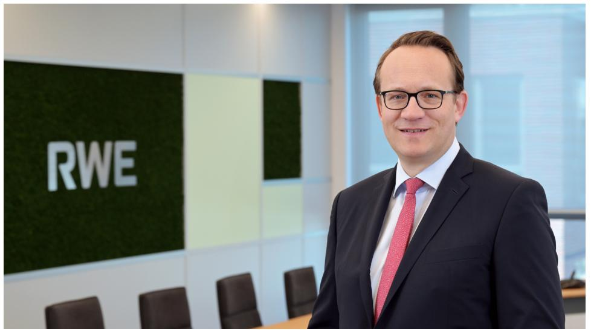
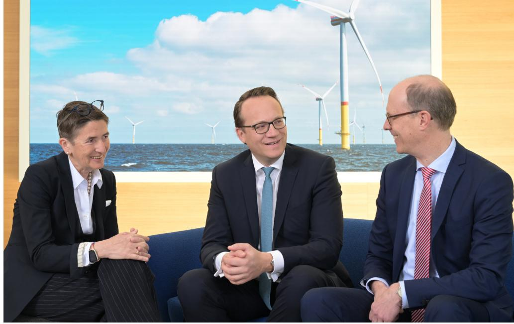
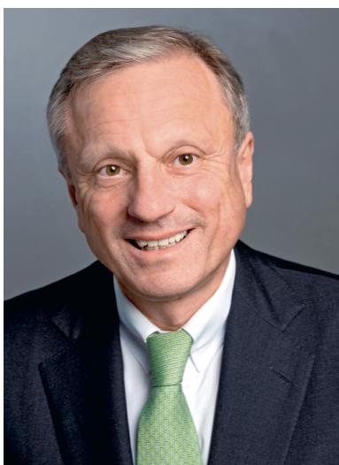
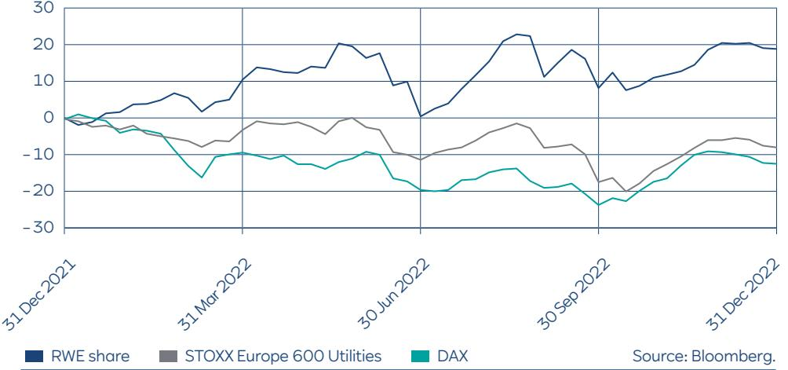
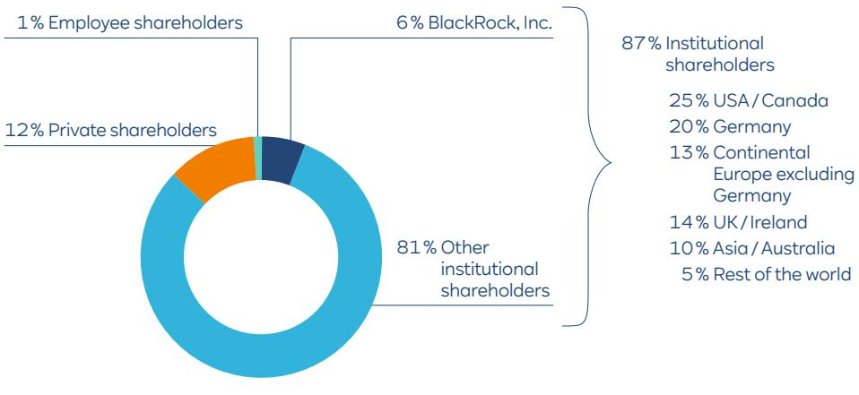
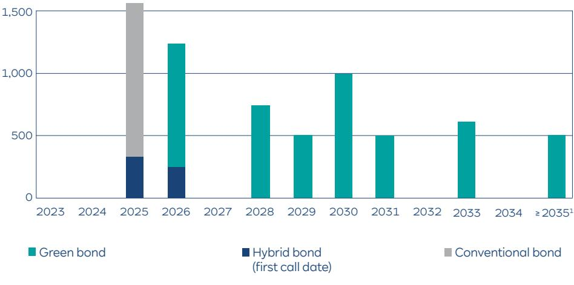
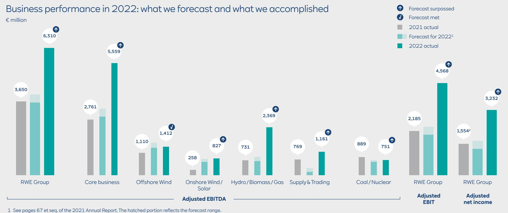
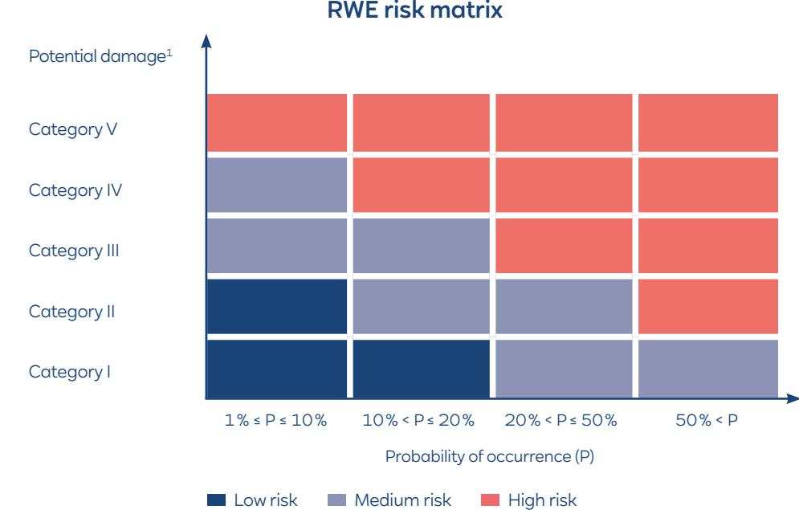
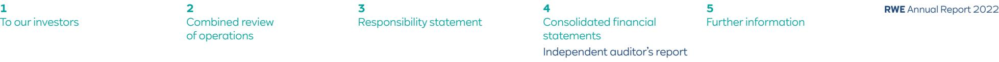

{0}------------------------------------------------


# **Energy is our passion Passion is our energy**

**Annual Report 2022**

{1}------------------------------------------------

### Our energy for a sustainable life.

RWE has been around for 125 years. And in that time, our society has changed dramatically. But what hasn't changed is our product: electricity. The only difference is how we now generate that electricity. We produced our very first megawatt hour from hard coal. Later, lignite and nuclear fuel rods were our main energy sources. Today, they have been replaced with natural gas, wind, sun and water. Tomorrow, we will make a full transition to zero-carbon energy sources. Because our objective is to be carbon neutral. And we want to accomplish this by 2040.

Green energy is the lifeblood of a sustainable economy. And demand for it is also rising outside of the energy sector. Be it in industry, transport or buildings, fossil fuels such as oil and natural gas must be replaced by zero-carbon energy sources everywhere. And where it is not possible to switch to green electricity directly, for example when producing steel, hydrogen is a suitable alternative – that is hydrogen produced using electricity from renewables. Which we believe presents us with significant opportunities. Our long-term goal is to supply both green electricity and green hydrogen, a second product with huge potential demand.

It takes a major effort to achieve major goals. In the current decade, our gross investment in green growth – in new wind and solar farms, battery storage, flexible backup power plants and electrolysers for hydrogen production – will exceed €50 billion. Our objective here is to expand generation capacity in our core business to more than 50 GW. At the same time, we will be making a socially acceptable exit from coal-fired generation by 2030.

Why are we doing all of this? Because we shoulder a unique responsibility for society. RWE's purpose 'Our energy for a sustainable life' expresses that this responsibility is what drives us and shapes our actions.

For 125 years, we have worked tirelessly to harness the benefits of a secure, affordable and increasingly climate-friendly electricity supply for businesses and society as a whole. And we will carry on down this road – with our sights firmly set on a clean and green energy economy.

Come join us!

{2}------------------------------------------------

**1 RWE** Annual Report 2022 **3** [Responsibility statement](#page-115-0)

**4** [Consolidated financial](#page-117-0)  statements

**5** [Further information](#page-281-0)

# At a glance

| RWE Group – key figures1                                       |           | 2022<br>2021 |             |         |
|----------------------------------------------------------------|-----------|--------------|-------------|---------|
| Power generation                                               | GWh       | 156,794      | 160,547     | – 3,753 |
| External revenue (excluding natural gas tax / electricity tax) | € million | 38,366       | 24,571      | 13,795  |
| Adjusted EBITDA                                                | € million | 6,310        | 3,650       | 2,660   |
| Adjusted EBIT                                                  | € million | 4,568        | 2,185       | 2,383   |
| Income before tax                                              | € million | 715          | 1,522       | – 807   |
| Net income / income attributable to RWE AG shareholders        | € million | 2,717        | 721         | 1,996   |
| Adjusted net income                                            | € million | 3,232        | 1,554       | 1,678   |
| Cash flows from operating activities                           | € million | 2,406        | 7,274       | – 4,868 |
| Capital expenditure                                            | € million | 4,484        | 3,769       | 715     |
| Property, plant and equipment and intangible assets            | € million | 3,303        | 3,689       | – 386   |
| Financial assets                                               | € million | 1,181        | 80          | 1,101   |
| Proportion of taxonomy-aligned investments2                    | %         | 83           | –           | –       |
| Free cash flow                                                 | € million | – 1,968      | 4,562       | – 6,530 |
| Number of shares outstanding (annual average)                  | thousands | 691,2473     | 676,220     | 15,027  |
| Earnings per share                                             | €         | 3.93         | 1.07        | 2.86    |
| Adjusted net income per share                                  | €         | 4.68         | 2.30        | 2.38    |
| Dividend per share                                             | €         | 0.904        | 0.90        | –       |
|                                                                |           |              |             |         |
|                                                                |           | 31 Dec 2022  | 31 Dec 2021 |         |
| Net cash (+) / net debt (–)                                    | € million | 1,630        | 360         | 1,270   |
| Workforce5                                                     |           | 18,310       | 18,246      | 64      |

1 Prior-year figures relating to power generation, external revenue and adjusted net income restated.

2 Taxonomy-aligned activities are economic activities which meet criteria under the EU Taxonomy Regulation.

3 The new shares from the conversion of the mandatory convertible bond issued to Qatar Holding LLC have been taken into account since the bond was issued on 10 October 2022. They have been prorated and included in the number of shares.

4 Dividend proposal for fiscal 2022, subject to the passing of a resolution by the 4 May 2023 Annual General Meeting.

5 Converted to full-time positions.

{3}------------------------------------------------

**2** [Combined review](#page-19-0)  of operations

**1 RWE** Annual Report 2022 **3** [Responsibility statement](#page-115-0)

**4** [Consolidated financial](#page-117-0)  statements

[Further information](#page-281-0)

**5**

# Contents

| 1    | To our investors                           | 5   |
|------|--------------------------------------------|-----|
| 1.1  | Letter from the CEO                        | 6   |
| 1.2  | Executive Board of RWE AG                  | 8   |
| 1.3  | Supervisory Board report                   | 9   |
| 1.4  | RWE on the capital market                  | 16  |
| 2    | Combined review of operations              | 20  |
| 2.1  | Strategy                                   | 21  |
| 2.2  | Innovation                                 | 27  |
| 2.3  | Business environment                       | 31  |
| 2.4  | Major events                               | 38  |
| 2.5  | Commentary on reporting                    | 43  |
| 2.6  | Business performance                       | 45  |
| 2.7  | Financial position and net worth           | 57  |
| 2.8  | Notes to the financial statements of       |     |
|      | RWE AG (holding company)                   | 61  |
| 2.9  | Outlook                                    | 63  |
| 2.10 | Development of risks and opportunities     | 65  |
| 2.11 | Disclosure relating to German takeover law | 75  |
| 2.12 | Non-financial Group statement              | 78  |
| 3    | Responsibility statement                   | 116 |

| 4    | Consolidated financial statements         | 118 |
|------|-------------------------------------------|-----|
| 4.1  | Income statement                          | 119 |
| 4.2  | Statement of comprehensive income         | 120 |
| 4.3  | Balance sheet                             | 121 |
| 4.4  | Cash flow statement                       | 123 |
| 4.5  | Statement of changes in equity            | 125 |
| 4.6  | Notes                                     | 126 |
| 4.7  | List of shareholdings (part of the Notes) | 210 |
| 4.8  | Boards (part of the Notes)                | 261 |
| 4.9  | Independent auditor's report              | 269 |
| 4.10 | Information on the auditor                | 278 |
| 4.11 | Report from the independent auditor       | 279 |
| 5    | Further information                       | 282 |
| 5.1  | Five-year overview                        | 283 |
| 5.2  | Imprint                                   | 284 |
| 5.3  | Financial calendar                        | 285 |

In accordance with Section 162 of the German Stock Corporation Act, we published the **Remuneration Report** for fiscal 2022 as a separate report. It has also been included in the invitation to the virtual Annual General Meeting, scheduled for 4 May 2023. The publications are available at [www.rwe.com/remuneration](http://www.rwe.com/remuneration) and [www.rwe.com/agm](http://www.rwe.com/agm).

{4}------------------------------------------------

<span id="page-4-0"></span>

| 1.1 | Letter from the CEO       | 6  |
|-----|---------------------------|----|
| 1.2 | Executive Board of RWE AG | 8  |
| 1.3 | Supervisory Board report  | 9  |
| 1.4 | RWE on the capital market | 16 |

{5}------------------------------------------------

### <span id="page-5-0"></span>**1** [To our investors](#page-4-0) Letter from the CEO

[Combined review](#page-19-0)  of operations

**2 RWE** Annual Report 2022 **3** [Responsibility statement](#page-115-0)

**4** [Consolidated financial](#page-117-0)  statements

**5** [Further information](#page-281-0)

# 1.1 Letter from the CEO



Dr. Markus Krebber, Chief Executive Officer of RWE AG

**Dear Shareholders, Ladies and Gentlemen**

On 25 April 1898, Germany's economy started a new, important chapter in its history: the establishment of Rheinisch-Westfälische Elektrizitätswerk (Rhenish-Westphalian Electricity Works) – or in short: 'RWE'. The purpose of this young company was to supply its hometown of Essen with electricity. Today, 125 years later, our product is still the same as it was back then. The only change is how we produce the electricity. We stopped building coal power plants a long time ago. Now, we invest billions every year in renewables such as wind energy

and photovoltaics. Our global reach is also nothing like what it was in 1898. The Essenbased electricity works have become a world-leading energy company that reliably supplies electricity to millions of people, most notably in Europe and North America.

Our company's journey has taken in peaks and valleys. Time and again, the course of history presented us with challenges. Unfortunately, this is one of those times. A horrific war has been raging in Europe for over a year now, and there is no end in sight. By attacking Ukraine, Russia's leadership has brought immense human suffering to the country. In addition to being a humanitarian catastrophe, this senseless war has plunged Europe into a serious energy crisis. Politics, business and society have successfully weathered this crisis so far. Despite the discontinuation of gas deliveries from Russia, the energy supply system was kept up and running at all times, with our company making several contributions to this cause. For example, we organised imports of large quantities of liquefied natural gas (LNG) to Europe. On behalf of the German government, we chartered two special ships, docked at Wilhelmshaven and Brunsbüttel, in order to regasify ocean shipments of LNG. Moreover, at the government's request, we brought several lignite-fired power plants back online and deferred the decommissioning of two lignite units as well as of the Emsland nuclear power station, in order to reduce the amount of gas used to generate electricity. Some of our employees postponed their retirement, while others even came out of retirement to lend a helping hand. We were able to rely on them during the crisis, in the same way that society was able to rely on us.

But despite all the action taken to manage the crisis, we did not lose sight of our long-term goal. In fact, we made good progress in rolling out our Growing Green strategy. Last year, we completed the large-scale North Sea wind farms Triton Knoll and Kaskasi as well as numerous onshore wind farms in Europe and the USA. In all, we commissioned 2.4 GW of wind, solar and battery capacity with a further 6 GW of green generation capacity currently under construction. Furthermore, we succeeded in getting our foot in the door to the offshore wind business in the United States and the Netherlands. The groundwork for this was laid with successful bids at auctions for sites for new large-scale projects.

{6}------------------------------------------------

### **1** [To our investors](#page-4-0) Letter from the CEO

[Combined review](#page-19-0)  of operations

**3** [Responsibility statement](#page-115-0)

**2 RWE** Annual Report 2022 **4** [Consolidated financial](#page-117-0)  statements

**5** [Further information](#page-281-0)

In addition, we acquired PV specialist firm Con Edison Clean Energy Businesses. This transaction has made us the fourth-largest renewables company in the United States. We therefore now hold leading positions in all our core regions – in the EU, Great Britain, and the US. We further underscored our growth ambitions by acquiring a British and a Polish solar developer.

RWE's green transformation goes hand in hand with phasing out electricity generation from coal. In October 2022, we reached an agreement with the federal government and the state of North Rhine-Westphalia to take our last lignite unit offline at the end of March 2030, eight years earlier than originally envisaged. This sent a clear signal: although we are currently using more coal to produce electricity to ensure security of supply, as a whole our coal-fired operations will scale back significantly. We will not receive additional compensation for this. But we now have planning certainty for our activities in the Rhenish lignite-mining region. Furthermore, we have laid the foundation to ensure our actions will now be in alignment with the 1.5-degree goal of the Paris Climate Conference.

Our performance last year was also positive in economic terms. At €6.3 billion, adjusted EBITDA was clearly higher than anticipated. We made gains over 2021 across all segments of our core business. Our new wind and solar farms, favourable conditions on the power generation market and a very strong trading performance were the basis for this achievement. The past year demonstrated that our growth in the renewables business is paying off. And we will keep it this way in 2023. We expect adjusted EBITDA for the current fiscal year to come in between €5.8 billion and €6.4 billion. This would put us roughly on a par with 2022. The acquisition of Con Edison Clean Energy Businesses, which took effect on 1 March 2023, will be a major contributing factor. In light of the good earnings prospects, we aim to pay a dividend of €1.00 per share for fiscal 2023. This will also constitute the minimum dividend for the coming years.

Although we are making good headway in economic terms, major challenges lie ahead of us. At the beginning of this decade, we launched an ambitious growth programme through which we want to make RWE and the energy economy more climate friendly overall.

Although we are resolute in our commitment to deliver this programme, we still require suitable energy policies. Until recently, crisis management was understandably our top priority. Setting a long-term course for the future had to be put on the back burner. This year, we hope to see governments take decisive action, particularly in Germany. For one, the expansion of the power grids needs to be massively accelerated. After all, what good is a wind farm in the North Sea if the electricity it generates never finds its way to industry in the south? We need investment incentives for new, hydrogen-capable gas-fired power plants to ensure security of supply when wind and solar power fall short. But above all else, we need a reliable long-term market design. The energy transition is a once-in-a-century challenge that calls for policymakers, companies and individuals to pull their weight in equal measure. We have already done a lot to ensure it succeeds. With political tailwind, we could progress even faster in future.

In its 125-year history, RWE has shown that successful entrepreneurial action and taking responsibility for societal issues are not mutually exclusive, but are in fact two sides of the same coin. The enormous commitment shown by our employees when it came to securing energy supply whilst also driving our growth is in keeping with RWE tradition. Their incredible resolve moved me deeply. On behalf of the Executive Board, I would like to extend my heartfelt thanks. I am also grateful to our shareholders for their continued support and for joining us on our journey as we travel towards a climate-neutral, sustainable energy supply. We start our next chapter with hope, drive – and a dash of pride.

Sincerely yours,

{7}------------------------------------------------

**3** [Responsibility statement](#page-115-0) **4** [Consolidated financial](#page-117-0)  statements

**5** [Further information](#page-281-0)

# <span id="page-7-0"></span>1.2 Executive Board of RWE AG

**Markus Krebber**, Chief Executive Officer, was born in 1973 in Kleve, Germany. He has held this position since May 2021. He trained as a banker and holds a doctorate in economics. Markus started his career in 2000 at McKinsey & Company. Thereafter, he held various managerial positions at Commerzbank AG. In November 2012, Markus joined the Board of Directors of RWE Supply & Trading GmbH, where he was responsible for finance and became CEO in March 2015. Markus joined the Executive Board of RWE AG in October 2016, where he was Chief Financial Officer until May 2021.

**Michael Müller** has been Chief Financial Officer since May 2021. Born in 1971 in Cologne, Germany, he is an economist and holds a doctorate in mechanical engineering. After five years at McKinsey & Company, in mid-2005 he joined the RWE Group where he held managerial positions at RWE Power AG, RWE Generation SE and RWE AG. In September2016, he became the Managing Director of RWE Supply & Trading GmbH in charge of finance. Michael has been a Member of the Executive Board of RWE AG since November 2020.

**Zvezdana Seeger** was appointed Chief Human Resources Officer and Labour Director in November 2020. She was born in 1964 in Jajce, Bosnia and Herzegovina, holds a degree in economics and started her career in mechanical engineering. From 1995 to 2008, she worked for Deutsche Telekom AG, exiting as Managing Director of T-Systems Enterprise Service GmbH. In 2010, Zvezdana joined the Board of Directors of DHL Global Forwarding, Freight. In 2015, she was responsible for IT and operations on the Board of Management of Postbank AG. After Postbank was folded into DB Privat- und Firmenkundenbank AG, she sat on the Board of Management of the latter company. In addition, she was COO of the Private and Corporate Business Unit of Deutsche Bank AG. Zvezdana has been a Member of the Executive Board of RWE AG since November 2020.



**Zvezdana Seeger Dr. Markus Krebber Dr. Michael Müller**

{8}------------------------------------------------

**2** [Combined review](#page-19-0)  of operations

**3** [Responsibility statement](#page-115-0) **4** [Consolidated financial](#page-117-0)  statements

**5** [Further information](#page-281-0)

# <span id="page-8-0"></span>1.3 Supervisory Board report



Dr. Werner Brandt, Chairman of the Supervisory Board of RWE AG

The first thing that comes to mind when I look back on 2022 is an event that took us all by surprise and shook us to the core: Russia's attack on Ukraine. Those who thought that war was a relic of the past were mistaken. The war in Ukraine has lasted over a year now, and regrettably, there is no sign of a return to peace. But we mustn't lose hope. This suffering must come to an end. The courage with which Ukrainians are coping with this horrific situation is admirable. We at RWE really feel for the victims of this absurd war. And many of us have underpinned this by providing hands-on support.

When looking back on 2022, I am also reminded of the turmoil on European energy markets caused by the war in Ukraine. The loss of commodity supplies from Russia jeopardised security of electricity and gas supply in Germany in particular – a situation that remains to this very day. However, efforts to manage the crisis have been very effective so far, thanks in part to RWE. Our company organised large deliveries of liquefied natural gas (LNG) and chartered two floating regasification units on behalf of the government, enabling LNG to be shipped directly to Germany. At the request of policymakers, to enable gas savings in electricity generation, RWE brought lignite units back online and extended the lifetimes of three further assets: two lignite blocks and the Emsland nuclear power station. Our company and employees are the epitome of reliability. We proved how seriously we take the responsibility we have to society as a major energy utility.

Despite all the immediate action we took to manage the crisis, we never lost sight of our medium and long-term mission. This brings me to our Growing Green strategy, with which RWE wants to make itself and the energy economy as a whole more sustainable and climate-friendly. Undeterred by the crisis, the company pressed on with its ambitions for growth. Through the acquisition of Con Edison Clean Energy Businesses, we advanced to the premier league of solar power producers in the United States of America. In addition, we got our foot in the door to the US offshore wind business thanks to successful bids at site auctions. We had a similar success in the Netherlands as well. Not to mention the numerous wind and solar farms that RWE completed in 2022 in Europe and the USA. Another milestone passed was the agreement reached with the federal government and the state of North Rhine-Westphalia to bring forward the lignite phaseout by eight years to 2030. This sent a clear signal: although more lignite is being used to produce electricity in the current crisis than originally envisaged, less lignite will be utilised in total. My fellow Supervisory Board members and I advised company management in making all these fundamental decisions and endorsed their chosen path.

{9}------------------------------------------------

**2** [Combined review](#page-19-0)  of operations

**3** [Responsibility statement](#page-115-0) **4** [Consolidated financial](#page-117-0)  statements

**5** [Further information](#page-281-0)

**Supervisory Board activity in the past year.** Now let's take a closer look at the Supervisory Board's work in the year that just ended. As usual, we conscientiously fulfilled all of the duties imposed on us by German law and the Articles of Incorporation. We advised the Executive Board on running the company and monitored its actions. We were involved in all fundamental decisions. Management informed us of all material developments both within and outside of the Group. In addition, I was regularly in touch with the Chief Executive Officer, allowing us to resolve urgent matters without delay.

When in session, we frequently concerned ourselves in particular detail with the impact that Russia's war against Ukraine has had on the economy, with a particular focus on the energy sector and RWE's operations. Further focal topics were security of supply, our company's early exit from lignite, its liquidity position, the evolution of our growth strategy, and – closely related to this – the acquisition of Con Edison Clean Energy Businesses.

Our duties include the regular review and improvement of the quality of our work on the Supervisory Board. This involves performing regular self-assessments. Another such audit took place in 2022. We concluded that our workflows were goal-oriented and effective. However, we also identified a need to hone our competency profile, which reflects the qualifications members of the Supervisory Board are required to hold. We came to the conclusion that considerations such as globality and sustainability should be emphasised more. The necessary amendments were approved at the Supervisory Board meeting on 9 December. The quality of our work is also enhanced by the extensive basic and advanced training that we undertake on our own authority and with RWE's support. In light of the increasing frequency of cyber attacks on commercial enterprises, last year we focused on IT security.

One of the Supervisory Board's main tasks is to maintain dialogue with the company's shareholders. As we're of the opinion that this discourse should not be limited to the Annual General Meeting, I have been regularly holding talks with investors and shareholder representatives on behalf of the Supervisory Board for several years now. I kept with this practice in 2022 despite the restrictions imposed by COVID-19. Topics included the

Supervisory Board's composition, the staggered tenures, the remuneration system for the Executive Board, RWE's strategy, and the coal phaseout.

**Main points of debate of the Supervisory Board meetings.** Last year, the Supervisory Board convened for eight meetings, including five ordinary and three extraordinary sessions. The Executive Board was present at all the meetings. However, some individual agenda items were discussed when it was not in attendance. The shareholder and employee representatives met separately before the Supervisory Board meetings, in order to consult on matters in a smaller circle and establish joint positions where necessary. The Executive Board was also present during these sessions where necessary. This brings me to the main points of each meeting:

- Our first meeting last year took place on 9 March. It centred on Russia's war on Ukraine that had just begun. The Executive Board informed us of its decision to discontinue business with Russia owing to the war. Moreover, it presented the effects the conflict could have on RWE. In addition, we discussed aid measures to help people affected by the war and the risks this posed for European energy supply. The Ukraine conflict and its fallout remained on our agenda for the whole year. In our March session, we discussed and approved the 2021 financial statements of RWE AG, the consolidated financial statements, and the separate Non-financial Statement. For the first time, we endorsed the Remuneration Report, as it must now be prepared jointly by the Executive Board and the Supervisory Board pursuant to the law on the implementation of the Second EU Shareholder Rights Directive. Moreover, we approved the Agenda for RWE's Annual General Meeting, which was held in virtual format on 28 April. Further topics included cyber security, the market power report from the German Cartel Office, the company's sustainability strategy and the successful participation in auctions of offshore wind sites in the New York Bight. In addition, we decided to enlist the services of PricewaterhouseCoopers GmbH Wirtschaftsprüfungsgesellschaft (PwC) for the audit of the financial statements for fiscal 2022. This resolution was subject to the approval of RWE's Annual General Meeting, which it received thereafter.

{10}------------------------------------------------

**2** [Combined review](#page-19-0)  of operations

**3** [Responsibility statement](#page-115-0) **4** [Consolidated financial](#page-117-0)  statements

**5** [Further information](#page-281-0)

- At our second ordinary session on 28 April 2022 we made preparations for the virtual Annual General Meeting, which was held on the same day. Furthermore, we consulted on the planned acquisition of the Magnum gas-fired power plant at the Eemshaven site in the Netherlands.
- The acquisition of the Magnum power station was also the main item on the agenda of our extraordinary meeting on 1 June 2022. We concerned ourselves with the transaction in detail once again, after which we approved it.
- In our ordinary session on 14 June 2022, we discussed the German law on equal opportunities for women and men in executive positions. We set a new target female quota for the Executive Board of RWE AG of 33.3 %. This means that the three-member corporate body must include at least one woman. This rule will remain in force until June 2027. Also on the agenda were the consequences of the war in Ukraine for European energy supply and the planned expansion of German LNG infrastructure.
- The most important item on the agenda of our extraordinary meeting on 31 August 2022 was the upheaval on Europe's energy markets. We paid special attention to the extremely high commodity prices and their impact on RWE's liquidity position. The Executive Board updated us on market developments and the measures taken to safeguard liquidity.
- In our extraordinary session on 20 September 2022, we again debated the developments on the energy markets and the Group's liquidity. Another major topic was the impending agreement with policymakers on bringing forward Germany's lignite phaseout to 2030, which we unanimously endorsed. Our consultations also addressed the reform of the German Corporate Governance Code in 2022, which reinforced the focus on sustainability and social issues. Furthermore, we analysed the findings of the selfassessment of our work. Other items on the agenda included the regular review of the remuneration received by Dr. Michael Müller and Zvezdana Seeger, which had taken place in the summer. The Supervisory Board agreed with the remuneration amendment put forward by the Personnel Affairs Committee. In addition, we covered strategic issues and

progress made in rolling out current renewable energy projects. During the meeting, the Executive Board informed us of its plan to acquire US-based power producer Con Edison Clean Energy Businesses.

- This transaction was a pivotal topic of an extraordinary session on 30 September 2022. Following an in-depth discussion, we passed all the resolutions necessary for the Executive Board to reach a contractual arrangement to make the acquisition.
- At an extraordinary meeting on 9 December 2022, we reviewed and approved the business plan for fiscal 2023, the outlook on fiscal 2024 and 2025 as well as the risk report. Moreover, we fulfilled our corporate governance reporting duties: we updated the Supervisory Board's competency profile pursuant to the recommendations of the German Corporate Governance Code and documented the state of implementation of the requirements defined in the competency profile within a qualification matrix, which was disclosed in the Corporate Governance Statement. Together with the Executive Board, we adopted an updated statement of compliance in accordance with Section 161 of the German Stock Corporation Act and approved the parts of the Corporate Governance Declaration relating to the Supervisory Board pursuant to Section 289a of the German Commercial Code. The documents are available at [www.rwe.com/corporate](http://www.rwe.com/corporate-governance-declaration)[governance-declaration](http://www.rwe.com/corporate-governance-declaration), respectively. Furthermore, we set the stage for the future composition of the Executive Board: we resolved to extend the contract of Michael Müller by five years with effect from 1 November 2023. In addition, we appointed Katja van Doren to the corporate body as of 1 August 2023 for an initial term of three years. She will take office as Chief HR Officer and Labour Director as successor to Zvezdana Seeger, who will leave the company for personal reasons. All of these resolutions were based on recommendations from the Personnel Affairs Committee. Moreover, we concerned ourselves with the company's strategy and approved the Commercial Paper Programme in the USA. In addition, the Executive Board provided us with detailed information on the latest developments in energy policy in both Germany and the Netherlands. Another issue addressed was the German law on the introduction of virtual annual general meetings that had come into force on 22 July 2022. Together with the Executive Board, we decided to hold the shareholders' meeting as a purely virtual event once again in 2023.

{11}------------------------------------------------

**2** [Combined review](#page-19-0)  of operations

**3** [Responsibility statement](#page-115-0) **4** [Consolidated financial](#page-117-0)  statements

**5** [Further information](#page-281-0)

**Work of the Supervisory Board committees.** The Supervisory Board has six committees, the members of which are listed on [page 266](#page-265-0) of the Annual Report. The committees are charged with preparing topics discussed by the Supervisory Board in order to establish a basis for the corporate body to pass resolutions. In certain cases, they themselves exercise decision-making powers if they have been conferred on them by the Supervisory Board. More detailed information can be found on Section 10 et seqq. of the Rules of Procedure for the Supervisory Board, which are available at [www.rwe.com/en/investor-relations/](http://www.rwe.com/en/investor-relations/corporate-governance/management-board-and-supervisory-board) [corporate-governance/management-board-and-supervisory-board](http://www.rwe.com/en/investor-relations/corporate-governance/management-board-and-supervisory-board). The Supervisory Board is informed of the work of the committees by their chairs at every ordinary meeting. In the year under review, a total of 17 committee meetings were held, on which I would like to report in more detail.

- **Executive Committee.** The Executive Committee held one ordinary meeting at which, as usual, it discussed the company's planning for fiscal 2022 and the outlook on the two subsequent years. In addition, there were two extraordinary sessions. At the first one, we debated a request filed by a shareholder to add an item to the Agenda of the Annual General Meeting, seeking to oblige the Executive Board to initiate the spin-off of RWE Power AG from its parent RWE AG. We did not endorse this proposal, as we believe it is not in the interests of RWE or its owners. The topic addressed at the second extraordinary meeting was the issuance of a mandatory convertible bond to Qatar Holding LLC, a subsidiary of the Qatar Investment Authority. Proceeds from the issuance were to be used to finance the acquisition of Con Edison Clean Energy Businesses.
- **Audit Committee.** The Audit Committee convened five times. It carefully reviewed the financial statements of RWE AG and the Group, the combined review of operations, the report on the first half of the year, the quarterly statements, and the Non-financial Statement. It discussed the financial statements with the Executive Board before they were published and received reports on the outcome of the audits and audit-like reviews from the independent auditors. Furthermore, the Audit Committee submitted a recommendation to the Supervisory Board regarding the election of the independent auditors for fiscal 2022, prepared the grant of the audit award to the independent auditors including the fee agreement, set the priorities of the audit and also verified the independence of the auditors along with the quality of the audit. The Committee also

concerned itself with the appointment of an external auditor for the 2022 Remuneration Report and the 2022 Non-financial Group Statement. One key item on last year's agenda was to appoint new independent auditors, which we were legally required to do by fiscal 2024 at the latest. The Committee opted for an early tender procedure. Following a diligent evaluation of the applications, it recommended enlisting the services of Deloitte GmbH Wirtschaftsprüfungsgesellschaft. The Supervisory Board passed a corresponding resolution by circular in November. When in session, the Audit Committee also addressed a number of additional topics: the impact of the war in Ukraine on RWE, liquidity management, protection of IT systems from cyber attacks, the compliance management system as well as legal and tax matters. Further major items on the agenda were the planning and results of the internal audit and RWE's risk exposure. The Committee subjected the accounting-related Internal Control System (ICS) to an appropriateness and effectiveness check. It reached the conclusion that the ICS did not have any material shortcomings. Related party transactions were also on the agenda. This entailed the Committee verifying whether these transactions were performed in the ordinary course of business and in line with practices generally accepted on the market, as required by the German law on the implementation of the Second EU Shareholders Directive. The independent auditors attended four of the five Audit Committee meetings and also exchanged information with the Committee Chair between sessions. In-house experts were occasionally involved in the consultations.

- **Personnel Affairs Committee.** The Personnel Affairs Committee held four ordinary meetings, at which it mainly concerned itself with Executive Board matters, in particular the target female quota, remuneration matters, and long-term succession planning. It issued a recommendation to the Supervisory Board to extend the contract of Michael Müller and to appoint Katja van Doren to the Executive Board. As set out earlier, the Supervisory Board passed the recommended resolutions in its December session.
- **Nomination Committee.** The Nomination Committee convened three ordinary and one extraordinary session. The main points of debate were long-term succession planning on the Supervisory Board, its skills matrix, and documentation of individual competencies in the qualification matrix. In addition, the Committee dealt with a change in personnel:

{12}------------------------------------------------

| 1                        | 2               | 3                        | 4                      | 5                   | RWE Annual Report 2022 |
|--------------------------|-----------------|--------------------------|------------------------|---------------------|------------------------|
| To our investors         | Combined review | Responsibility statement | Consolidated financial | Further information |                        |
| Supervisory Board report | of operations   |                          | statements             |                     |                        |

after Günther Schartz resigned from his office as of 30 September 2021, the Mayor of Essen, Thomas Kufen, was appointed to the corporate body by the Essen District Court as of 18 October 2021. The Supervisory Board submitted the restaffing matter to the Annual General Meeting on 28 April 2022 for the passage of a corresponding resolution. Prior to this, the Committee had held a consultation during which it considered a second candidate, who had been suggested by a shareholder. After carefully weighing its options, it recommended that the Supervisory Board endorse the election of Thomas Kufen. The Annual General Meeting approved the motion with a 98 % majority vote.

- **Strategy and Sustainability Committee.** The Strategy and Sustainability Committee held one ordinary and two extraordinary meetings. Issues discussed included management's plans to expand renewable energy and ramp up the hydrogen economy. The Committee also extensively debated the sustainability strategy. Moreover, Committee members were informed by the Executive Board of the action plan and long-term goals regarding the environment, social affairs and corporate governance. The Committee discussed the consequences of the war in Ukraine in respect of security of supply and European climate policy. It also discussed whether the change in the geopolitical situation required RWE to adjust its strategic orientation.
• **Mediation Committee.** This committee did not convene in the 2022 reporting year.

**Parent company and consolidated financial statements for 2022.** PwC audited and issued an unqualified auditor's opinion on the 2022 financial statements of RWE AG, which were prepared by the Executive Board in compliance with the German Commercial Code, the financial statements of the Group, which were prepared in compliance with IFRS pursuant to Section 315e of the German Commercial Code, the combined review of operations for RWE AG and the Group, and the accounts. The opinion was signed by the auditors in charge, Markus Dittmann und Aissata Touré. In addition, PwC subjected the Non-financial Statement in the combined review of operations to a limited assurance audit and even went as far as to carry out reasonable assurance checks on individual indicators. It found that the Executive Board had established an appropriate early risk detection system. PwC had been elected as the independent auditor by the 2022 Annual General Meeting. Thereafter, the Supervisory Board had commissioned them to audit the aforementioned financial statements and reports.

The Executive Board commented on the documents supporting the parent company financial statements, the Annual Report and the audit reports at the Supervisory Board's balance-sheet meeting on 15 March 2023. The documents were made available to the members of the Supervisory Board in good time. During the session, certified public accountants reported on the material findings of the audit and were available to furnish supplementary information. The Audit Committee had concerned itself in depth with the financial statements of RWE AG, the consolidated financial statements and the audit reports with the auditors present the day before. The Committee recommended that the Supervisory Board approve the financial statements and endorse the appropriation of distributable profit proposed by the Executive Board.

The financial statements of RWE AG, the consolidated financial statements, the combined review of operations, the Executive Board's proposal regarding the appropriation of distributable profit, and the Non-financial Statement were reviewed by the Supervisory Board. The corporate body did not raise any objections as a result of this review. As recommended by the Audit Committee, the Supervisory Board endorsed the findings of the audits of the financial statements of RWE AG and the consolidated financial statements and approved both financial statements. The 2022 annual financial statements are therefore adopted. The Supervisory Board concurs with the Executive Board's proposal regarding the appropriation of profits, which envisages paying a dividend of €0.90 per share.

**Attendance.** The table on the [next page](#page-13-0) contains an overview of Supervisory Board member attendance at the meetings of this corporate body and its committees. As the Mediation Committee did not convene in 2022, it has been omitted from this table. Here is an example of how to interpret the numbers: '7 / 8' means that the individual attended seven out of eight sessions held during their membership of the corporate body. The figures show that absence from a meeting was the exception. The attendance rate was 99.2 %.

{13}------------------------------------------------

<span id="page-13-0"></span>

| 1                        | 2               | 3                        | 4                      | 5                   | RWE Annual Report 2022 |
|--------------------------|-----------------|--------------------------|------------------------|---------------------|------------------------|
| To our investors         | Combined review | Responsibility statement | Consolidated financial | Further information |                        |
| Supervisory Board report | of operations   |                          | statements             |                     |                        |

| Attendance at meetings in fiscal 2022 by Supervisory Board member | Supervisory<br>Board | Executive<br>Committee | Audit<br>Committee | Personnel<br>Affairs<br>Committee | Nomination<br>Committee | Strategy and<br>Sustainability<br>Committee |
|-------------------------------------------------------------------|----------------------|------------------------|--------------------|-----------------------------------|-------------------------|---------------------------------------------|
| Dr. Werner Brandt, Chairman                                       | 8 / 8                | 3 / 3                  | 5 / 51             | 4 / 4                             | 3 / 3                   | 2 / 2                                       |
| Ralf Sikorski, Deputy Chairman                                    | 8 / 8                | 3 / 3                  |                    | 4 / 4                             |                         | 2 / 2                                       |
| Michael Bochinsky                                                 | 8 / 8                |                        | 5 / 5              |                                   |                         | 1 / 2                                       |
| Sandra Bossemeyer                                                 | 8 / 8                |                        |                    | 4 / 4                             |                         |                                             |
| Dr. Hans Friedrich Bünting                                        | 8 / 8                |                        |                    | 4 / 4                             |                         | 2 / 2                                       |
| Matthias Dürbaum                                                  | 8 / 8                |                        | 5 / 5              |                                   |                         |                                             |
| Ute Gerbaulet                                                     | 7 / 8                | 3 / 3                  |                    |                                   |                         |                                             |
| Prof. Dr.-Ing. Dr.-Ing. E. h.Hans-Peter Keitel                    | 8 / 8                | 3 / 3                  |                    |                                   | 3 / 3                   | 2 / 2                                       |
| Mag. Dr. h. c. Monika Kircher                                     | 8 / 8                |                        | 5 / 5              |                                   |                         |                                             |
| Thomas Kufen                                                      | 8 / 8                |                        |                    |                                   |                         |                                             |
| Reiner van Limbeck                                                | 8 / 8                | 3 / 3                  |                    |                                   |                         |                                             |
| Harald Louis                                                      | 8 / 8                |                        |                    | 4 / 4                             |                         | 2 / 2                                       |
| Dagmar Paasch                                                     | 8 / 8                |                        | 5 / 5              |                                   |                         | 2 / 2                                       |
| Dr. Erhard Schipporeit                                            | 8 / 8                |                        | 5 / 5              |                                   |                         |                                             |
| Dirk Schumacher                                                   | 8 / 8                | 3 / 3                  |                    |                                   |                         |                                             |
| Ullrich Sierau                                                    | 8 / 8                |                        | 5 / 5              |                                   |                         |                                             |
| Hauke Stars                                                       | 8 / 8                |                        |                    | 4 / 4                             | 3 / 3                   |                                             |
| Helle Valentin                                                    | 8 / 8                |                        |                    |                                   |                         | 2 / 2                                       |
| Dr. Andreas Wagner                                                | 8 / 8                |                        |                    |                                   |                         |                                             |
| Marion Weckes                                                     | 8 / 8                |                        |                    |                                   |                         |                                             |

1 Werner Brandt attended meetings of the Audit Committee as a guest.

{14}------------------------------------------------

| 1                        | 2               | 3                        | 4                      | 5                   | RWE Annual Report 2022 |
|--------------------------|-----------------|--------------------------|------------------------|---------------------|------------------------|
| To our investors         | Combined review | Responsibility statement | Consolidated financial | Further information |                        |
| Supervisory Board report | of operations   |                          | statements             |                     |                        |

| Meeting formats in fiscal 2022                    | Supervisory<br>Board | Executive<br>Committee | Audit<br>Committee | Personnel<br>Affairs<br>Committee | Nomination<br>Committee | Strategy and<br>Sustainability<br>Committee |
|---------------------------------------------------|----------------------|------------------------|--------------------|-----------------------------------|-------------------------|---------------------------------------------|
| On-site meeting                                   |                      | 1                      | 1                  |                                   | 1                       | 1                                           |
| On-site meeting with video participation (hybrid) | 4                    |                        | 3                  | 3                                 | 1                       | 1                                           |
| Virtual meeting                                   | 4                    | 2                      | 1                  | 1                                 | 1                       |                                             |

**Meeting formats.** The table above shows the individual format of each Supervisory Board and committee meeting. Ordinary meetings were generally attended in person, although individual participants often dialled into the sessions via a video feed. Extraordinary meetings were held as purely virtual events.

**Changes in personnel on the Executive and Supervisory Boards.** There were no changes in personnel on the Executive Board or the Supervisory Board in the fiscal year that just ended. As mentioned earlier, Thomas Kufen, who had already been appointed to the Supervisory Board by court order, was elected to the corporate body by the 2022 Annual General Meeting. Furthermore, we reached decisions on the Executive Board's future composition, on which I have already commented. We extended the contract with our CFO Michael Müller by five years through to 31 October 2028. Zvezdana Seeger, who will leave the corporate body with effect from the end of the day on 31 July 2023 for personal reasons, will be succeeded by Katja van Doren, who has been appointed as an ordinary member of the Executive Board and Labour Director of RWE AG for an initial term of three years starting on 1 August 2023. In addition to HR, she will be responsible for IT. To ensure a seamless transition, Ms. Seeger will assist her in an advisory capacity from August through to the end of October 2023.

**Thanks to our employees.** We have a long-standing tradition of closing out this report by expressing the gratitude of the Supervisory Board to the Executive Board and the employees of our company. These words are not a meaningless ritual. Our thanks come from the bottom of our hearts, as the people who work at RWE deserve it time and again. In opening, I spoke about how our company has had a part to play in managing the energy crisis, and how it has also set the stage for even faster green growth. Examples of outstanding

personal dedication abound. What comes to mind, for example, are all the employees who helped the victims of the war in Ukraine, who ensured that sufficient supplies of liquefied natural gas made their way to Germany, and who drove our major investment projects undeterred. And of course this also reminds me of our employees in the Rhenish lignite mining region, many of whom had to change their plans for the future because of RWE's early exit from the lignite business. Others returned to our power plants from retirement in order to guarantee security of supply. They were and remain ready and willing to do so because they are committed to us and our goals. I would like to thank them and RWE's entire workforce on behalf of the Supervisory Board for their exceptional dedication in the past year. I hope that they are respected by family, friends and their communities for their accomplishments for the benefit of society as a result of the work they do in our company.

Werner Brandt

Chairman of the Supervisory Board

Essen, 15 March 2023

{15}------------------------------------------------

<span id="page-15-0"></span>**1 RWE** Annual Report 2022 [To our investors](#page-4-0) RWE on the capital market

**2** [Combined review](#page-19-0)  of operations

**3** [Responsibility statement](#page-115-0) **4** [Consolidated financial](#page-117-0)  statements

**5** [Further information](#page-281-0)

### 1.4 RWE on the capital market

**2022 was a disappointing year for equity investors. The war in Ukraine, inflation and rising interest rates weighed on market sentiment as the DAX buckled by 12 %. At times, Germany's blue-chip index lost as much as a quarter of its value. RWE stock performed significantly better: taking the dividend payment into account, our share turned in a performance of 19 %. Improved earnings prospects played an important part in this regard, to some extent due to more favourable market conditions in power generation. The rapid progress we are making as we implement our growth strategy has also proven to be an important success factor. In addition, we are making good headway in financing this growth. In 2022 and early 2023, thanks to new placements, we increased our green bond volume by €3 billion to almost €5 billion. The funds are exclusively reserved for the expansion of our renewables portfolio.**

**Total return of the RWE share and the DAX and STOXX Europe 600 Utilities indices** % (average weekly figures)



**War in Ukraine and interest rate turnaround dampen market sentiment.** 2022 was a sobering year for stock markets around the world. Germany's leading index, the DAX, lost 12 % of its value, closing the year at 13,924 points. By the end of September, the German stock market barometer was down by as much as 25 %, before making up lost ground. The main reason for the weak performance was Russia's invasion of Ukraine. The conflict plunged Germany and various other European states into a deep energy crisis. The sharp decline in fuel imports from Russia caused elevated commodity prices to soar even further, fuelling fears about security of supply. Inflation, driven up by energy shortages, also weighed on market sentiment. Central banks in the Eurozone, the UK and the USA had no other choice than to abandon their loose monetary policy, which had been a key factor in buoying stock markets, resulting in multiple base rate rises.

**RWE share delivers 19 % return on investment.** The RWE share was one of the bestperforming stocks in the DAX in 2022, achieving an annual closing price of €41.59 – a big improvement on last year (€35.72). Including the dividend of €0.90 paid in May, the share turned in a performance of 19 %, thus also significantly outstripping the STOXX Europe 600 Utilities (– 8 %). Financial analysts confirm RWE's good earnings prospects despite the difficult environment. This is partly due to the success of our efforts to expand renewables and better realisable generation margins. Our improved earnings forecast for 2022, which was published in the middle of the year, helped improve market sentiment further. There were, however, factors which weighed on earnings: we had to deal with the curtailment of coal and gas supplies from Russia, for example. The introduction of additional levies on electricity revenues in the EU and the UK also triggered markdowns.

{16}------------------------------------------------

| 1                         | 2               | 3                        | 4                      | 5                   | RWE Annual Report 2022 |
|---------------------------|-----------------|--------------------------|------------------------|---------------------|------------------------|
| To our investors          | Combined review | Responsibility statement | Consolidated financial | Further information |                        |
| RWE on the capital market | of operations   |                          | statements             |                     |                        |

| RWE share indicators1                          |           | 2022     | 2021    | 2020    | 2019    | 2018    |
|------------------------------------------------|-----------|----------|---------|---------|---------|---------|
| Earnings per share                             | €         | 3.93     | 1.07    | 1.65    | 13.82   | 0.54    |
| Adjusted net income per share                  | €         | 4.68     | 2.30    | 1.97    | –       | –       |
| Cash flows from operating activities per share | €         | 3.48     | 10.76   | 6.47    | – 1.59  | 7.50    |
| Dividend per share                             | €         | 0.902    | 0.90    | 0.85    | 0.80    | 0.70    |
| Dividend payment                               | € million | 6702     | 609     | 575     | 492     | 430     |
| Share price                                    |           |          |         |         |         |         |
| End of fiscal year                             | €         | 41.59    | 35.72   | 34.57   | 27.35   | 18.97   |
| Highest closing price                          | €         | 43.72    | 38.65   | 35.02   | 28.69   | 22.48   |
| Lowest closing price                           | €         | 34.34    | 28.64   | 21.00   | 18.97   | 15.10   |
| Share dividend yield3                          | %         | 2.2      | 2.5     | 2.5     | 2.9     | 3.7     |
| Number of shares outstanding (annual average)  | thousands | 691,2474 | 676,220 | 637,286 | 614,745 | 614,745 |
| Market capitalisation at the end of the year   | € billion | 28.1     | 24.2    | 23.4    | 16.8    | 11.7    |

1 The comparability of some of the figures for various fiscal years is limited due to changes in reporting.

2 Dividend proposal for RWE AG's 2022 fiscal year, subject to the passing of a resolution by the 4 May 2023 Annual General Meeting. The increase in the number of shares due to the conversion of the mandatory convertible bond issued to Qatar Holding LLC has also been taken into account.

3 Ratio of the dividend per share to the share price at the end of the respective fiscal year.

4 The new shares from the conversion of the mandatory convertible bond issued to Qatar Holding LLC on 10 October 2022 have been prorated.

**Dividend of €0.90 per share proposed for past fiscal year.** In view of the Group's continued good earnings, the Executive Board and the Supervisory Board of RWE AG will propose a dividend of €0.90 per share for fiscal 2022 to the Annual General Meeting on 4 May 2023. The Executive Board envisages that the dividend payment for 2023 will likely be higher at €1.00 per share. This is intended to be the new lower limit for coming fiscal years. To date this figure had been set at €0.90 per share.

**Broad international shareholder base.** Based on our latest survey, at the end of 2022, an estimated 87 % of the total of 676.2 million RWE shares were held by institutional investors and 13 % were owned by individuals (including employees). The new shares from the conversion of the mandatory convertible bond issued to Qatar Holding LLC in October 2022 are not included in the figures. At the last count, institutional investors from Germany owned 20 % of our capital stock. This investor group accounted for 13 % in the rest of Continental Europe, 14 % in the United Kingdom / Ireland, 25 % in North America and 10 % in Asia / Australia. At the end of 2022, our single-largest shareholder with a stake of 6.47 % was US asset management company BlackRock. As a result of the conversion of the mandatory convertible bond in March 2023, Qatar Holding LLC received a 9.1 % share of RWE's increased share capital.

{17}------------------------------------------------

### [To our investors](#page-4-0) RWE on the capital market

**2** [Combined review](#page-19-0)  of operations

**1 RWE** Annual Report 2022 **3** [Responsibility statement](#page-115-0)

**4** [Consolidated financial](#page-117-0)  statements

[Further information](#page-281-0)

**5**

**Shareholder structure of RWE AG1**



| Ticker symbols and identification numbers of the RWE share |              |
|------------------------------------------------------------|--------------|
| Reuters: Xetra                                             | RWEG.DE      |
| Bloomberg: Xetra                                           | RWE GY       |
| German Securities Identification Number                    | 703712       |
| International Securities Identification Number (ISIN)      | DE0007037129 |
| ADR CUSIP Number                                           | 74975E303    |

**RWE represented on numerous stock markets.** RWE shares are traded on the Frankfurt Stock Exchange and other stock exchanges in Germany, as well as via electronic platforms such as Xetra. They are also available on stock markets in the rest of Europe. In the USA, RWE is represented via a Level 1 ADR programme, under which American Depositary Receipts – or ADRs for short – are traded in place of our shares. ADRs are share certificates issued by US depositary banks, representing a certain number of a foreign company's deposited shares. Under RWE's programme, one ADR represents one share.

1 As of the end of 2022; percentages reflect shares in subscribed capital. Sources: RWE data and notifications from shareholders in accordance with the German Securities Trading Act.

**Profit participation through employee shares.** About 1 % of our stock is owned by our current and former staff members. German and British Group companies offer their employees the opportunity to take shares in RWE on preferential terms. Last year, 7,654 people, representing 47 % of all qualifying staff members, made use of these offers and bought a total of 445,000 shares. The preferential terms and the administration of the employee share ownership programmes led to an expense of €4.9 million.

{18}------------------------------------------------

<span id="page-18-0"></span>

| 1                         | 2               | 3                        | 4                      | 5                   | RWE Annual Report 2022 |
|---------------------------|-----------------|--------------------------|------------------------|---------------------|------------------------|
| To our investors          | Combined review | Responsibility statement | Consolidated financial | Further information |                        |
| RWE on the capital market | of operations   |                          | statements             |                     |                        |

**4** [Consolidated financial](#page-117-0)  statements

**New placements trigger RWE bond volume rise to €6.7 billion.** As of early March 2023, RWE bonds with a nominal value of around €6.7 billion were outstanding. This figure does not include the mandatory convertible bond we issued to Qatar Holding LLC as it is an equity financing instrument. Our bond volume has increased by €4.25 billion compared to late 2021. This is largely attributable to a number of new placements: on 24 May 2022, we issued two green bonds with a nominal volume of €1 billion each, one with a tenor of four years and a coupon of 2.125 % and another with a tenor of eight years and a coupon of 2.75 %. Three months later, on 24 August 2022, we issued a bond in the amount of €1.25 billion with a three-year tenor and a coupon of 2.5 %. On 6 February 2023, we placed two €0.5 billion green bonds on the market. The coupons were 3.625 % and 4.125 % with tenors of six and twelve years each. The chart on the lower right hand side, shows their respective volumes and maturity dates. For more information on this subject please see [www.rwe.com/bonds](http://www.rwe.com/bonds).

**Solid investment grade credit rating.** The level of our borrowing costs largely depends on how independent rating agencies assess of our creditworthiness. Moody's and Fitch make such evaluations at our request. They both give us an investment grade credit rating. Moody's gives our long-term creditworthiness a rating of 'Baa2', and Fitch has graded us one rating higher at 'BBB+'. The outlook on our rating is 'stable' for both agencies. Over the last year, both agencies have reconfirmed their assessment of our creditworthiness, despite turbulence on the energy markets. They highlighted our robust financial position, in particular, along with our status as a leading company in renewable energy.

| Credit rating of RWE AG (as of March 2023) | Moody's | Fitch  |
|--------------------------------------------|---------|--------|
| Long-term debt                             |         |        |
| Senior debt                                | Baa2    | BBB+   |
| Subordinated debt (hybrid bonds)           | Ba1     | BBB–   |
| Short-term debt                            | P–2     | F1     |
| Outlook                                    | Stable  | Stable |



**Maturity profile of RWE bonds in € million**

1 Excludes a residual amount (€12.2 million) of a conventional bond due to mature in 2037, which we were not able to fully transfer in 2016 to innogy, a subsidiary which has since been sold.

{19}------------------------------------------------

<span id="page-19-0"></span>

| 2.1  | Strategy                                   | 21 |
|------|--------------------------------------------|----|
| 2.2  | Innovation                                 | 27 |
| 2.3  | Business environment                       | 31 |
| 2.4  | Major events                               | 38 |
| 2.5  | Commentary on reporting                    | 43 |
| 2.6  | Business performance                       | 45 |
| 2.7  | Financial position and net worth           | 57 |
| 2.8  | Notes to the financial statements of       |    |
|      | RWE AG (holding company)                   | 61 |
| 2.9  | Outlook                                    | 63 |
| 2.10 | Development of risks and opportunities     | 65 |
| 2.11 | Disclosure relating to German takeover law | 75 |
| 2.12 | Non-financial Group statement              | 78 |

{20}------------------------------------------------

**2** [Combined review](#page-19-0)  of operations Strategy

<span id="page-20-0"></span>**1 RWE** Annual Report 2022 **3** [Responsibility statement](#page-115-0)

**4** [Consolidated financial](#page-117-0)  statements

**5** [Further information](#page-281-0)

## 2.1 Strategy

**RWE has an ambitious growth strategy, the cornerstones of which we presented to the public at the end of 2021. We have progressed faster than anticipated in implementing our strategy, despite the war in Ukraine and the energy crisis triggered by it. We had intended to almost double generation capacity in our green core business to 50 GW by building new wind and solar farms, battery storage systems, gas-fired power plants and electrolysers. It is already becoming apparent that we will exceed our target. An additional mainstay of our strategy is the accelerated exit from coal-fired generation – another area where we have stepped up the pace. We have reached an agreement with the German government and the state of North Rhine-Westphalia to stop producing power from lignite by as early as 2030 – eight years ahead of schedule. In so doing, we have laid the foundations to ensure our operations are in alignment with the 1.5-degree goal of the Paris Climate Conference.**

**Who we are and what we do.** RWE is a leading international energy company headquartered in Essen, Germany, with a focus on electricity generation. Renewable energy sources such as wind and solar are an increasingly important part of our business. Our core activities also include gas and electricity storage, the hydrogen business, trading of energy- related commodities and innovative energy solutions for industrial customers. We generated revenues of €38.4 billion in fiscal 2022. Our key markets are Germany, the United Kingdom, the Netherlands and the USA. In the field of renewables, we are also active in a whole host of other countries, for example in Poland, Spain, Italy, France, Greece, Sweden, Denmark and Australia. We intend to further broaden the regional spread of our renewables business.

**The energy triumvirate – carbon neutrality, security and affordability.** Most industrialised countries where we do business have made their energy policies contingent on more ambitious climate protection targets. They want to minimise greenhouse gas emissions caused by the use of fossil fuels. Another objective is to ensure that energy supply is both reliable and affordable. This goal has become more of a focus for policymakers as a result of tensions on electricity and gas markets. Energy companies like RWE are faced with the following tasks:

- **• Decarbonising electricity generation.** A core component of the energy transition is moving away from electricity generation from fossil fuels and embracing renewables. Coal and natural gas are finite resources, which when combusted lead to the emission of greenhouse gases. By contrast, wind, solar and hydro are not only energy sources that do not generate CO2 emissions. They are also available in abundance, enabling renewables to provide the basis for a sustainable supply of electricity and heat. Another advantage is that these renewable power sources allow EU member states and the UK to reduce their dependency on fuel imports. Greater autonomy in this regard shields countries against the fallout from rising gas and coal prices on global markets and prevents axed imports from posing such a risk to security of supply.
- **• Providing storage and environmentally friendly backup plants.** As energy supply relies increasingly on wind and solar farms, energy storage systems become ever more important for stabilising the power grids. Furthermore, we need more environmentally friendly, flexible generation assets, which can reliably produce electricity when there is no wind and no sunshine. Modern gas-fired power stations that can be retrofitted to run on carbon-neutral fuels will be well-positioned for this task. Hydrogen (H2) is one such fuel. During combustion, it does not emit greenhouse gases and producing H2 can also be carbon-free e. g. if it is made by electrolysis using renewable energy (green hydrogen). Moreover, there is a need to secure long-term, diversified supplies of natural gas and climate-friendly hydrogen.

{21}------------------------------------------------

**3** [Responsibility statement](#page-115-0)

**1 RWE** Annual Report 2022 **4** [Consolidated financial](#page-117-0)  statements

**5** [Further information](#page-281-0)

- **• Replacing fossil fuels with green power.** Reducing emissions only in the electricity sector is not enough to achieve climate neutrality. Action also needs to be taken in the manufacturing, heat and transportation sectors. At present, oil, coal and gas cover more than 70 % of European energy consumption. Switching to electricity produced with carbon-neutral methods – e. g. by using heat pumps instead of oil and gas heating systems – also enables emission reductions across sectors. Electrification is indispensable to achieving climate goals. This is why demand for electricity in our markets is expected to increase significantly.
- **• Establishing the hydrogen economy.** The economy can only be completely decarbonised if solutions are also found for applications where direct electrification is not an option. Examples of this are the production of steel and fertilisers. In the near future, hydrogen produced using climate-neutral methods would be a solution. As previously explained, hydrogen can contribute to lowering greenhouse gas emissions in other ways on top of using it to generate electricity.

**We're driving the energy transition.** RWE is well positioned to contribute to transforming the energy sector and the broader economy in all of the areas discussed above. That is precisely what we are doing, by investing billions of euros in wind power, photovoltaics, battery storage and the hydrogen economy, phasing out coal-based generation, building environmentally friendly backup capacities and helping industrial customers to optimise energy consumption. In addition, we are working with policymakers to ensure security of supply. This task has become more important due to the war in Ukraine. For instance, we are organising imports of liquefied natural gas (LNG) to Germany and helping to develop the necessary LNG infrastructure. At the behest of the German government, we continue to operate two lignite units and our Emsland nuclear power station which had been scheduled to be decommissioned on 31 December 2022. We also temporarily put three lignite units which had been placed in reserve back online. However, the interim increase in coal-fired power generation does not change our long-term commitment to a fully decarbonised energy value chain.

At the Paris Climate Conference in 2015, the international community committed to limiting the increase in average global temperatures to well below two degrees Celsius compared to pre-industrial levels, preferably to 1.5 degrees Celsius. RWE aims to be carbon neutral by 2040 at the latest, ten years earlier than the EU. Not only does this apply to our own greenhouse gas emissions, it also covers the upstream and downstream value chain. At the end of 2020, the independent Science Based Targets initiative confirmed that the emission reductions we have planned for this decade are in line with the Paris target of 'significantly less than 2 degrees Celsius'. However, we are now working towards decreasing carbon emissions even further: in October 2022, we agreed with the German government and the state of North Rhine-Westphalia that we would phase out German lignite-fired power production by 2030, eight years ahead of the exit date established by law. In doing so, we will create the basis for complying with the 1.5-degree Celsius target.

**Sustainability – at the heart of our corporate culture.** Our mission statement 'Our energy for a sustainable life' expresses our purpose as a company and reaffirms our commitment to sustainability as a guiding principle of our actions. Although cutting greenhouse gas emissions may be a priority for us, it is not our only focus. Sustainability is measured in a myriad of ways. The expression is generally used within the context of environment, social and governance (ESG). Working together with internal and external experts, we defined the fields of action that are most significant for RWE and what we want to achieve in these areas. Further information on our ESG goals and the degree to which we have achieved them can be found on [pages 78](#page-77-0) et seqq. of this report.

{22}------------------------------------------------

**3** [Responsibility statement](#page-115-0)

**1 RWE** Annual Report 2022 **4** [Consolidated financial](#page-117-0)  statements

**5** [Further information](#page-281-0)

**Growing Green – our strategic roadmap to 2030.** In November 2021, we informed the public about the strategy and goals for our business activities during the current decade at our Capital Market Day. Profitable growth in our green core business forms the centrepiece of our strategy, which is called 'Growing Green'. At the Capital Market Day, we announced our intention to invest approximately €50 billion in new wind farms, photovoltaic assets, battery storage, gas-fired power plants and electrolysers in the 10-year period from 2021 to the end of 2030. After deducting cash flows from divestments, this capital expenditure should total approximately €30 billion. We had thought that this would enable us to expand our green generation capacity (including battery storage systems and electrolysers) to 50 GW by 2030. This figure has been prorated, meaning that it reflects capacity based on our shareholding ratios. However, as the rollout of our growth strategy is coming along better than expected, we now expect investments to be higher. Our green capacity should significantly exceed 50 GW by 2030. This is in part attributable to the acquisition of US energy company Con Edison Clean Energy Businesses which has made us one of the leading solar power producers in the USA. This year, we will revise our strategy and update our growth targets. We want to present the results of this to the public at our next Capital Market Day, which has been scheduled for the fourth quarter of 2023.

Turning to the individual components of our growth programme:

- **• Offshore Wind.** We are a world leader in offshore wind. At the end of 2022, we had a total pro-rata capacity of 3.3 GW in this field. We intend to increase this figure to 8 GW by 2030. We currently operate wind farms in the coastal waters of the United Kingdom, Germany, Belgium, Sweden and Denmark. Europe is our most important growth region, as exemplified by the British projects Sofia (1.4 GW) and Dogger Bank South (3 GW) as well as Thor (1 GW) located off the coast of Denmark. However, we are also looking to markets outside Europe: together with local partner companies, we are working on projects in the USA, Japan, Taiwan, South Korea and India. Last year, we secured areas for offshore wind farms in the New York Bight and off the Californian and the Dutch coasts through auctions. But we are seizing more than just geographic opportunities, as we tap into new
technological options as well. In order to realise the full potential of offshore wind, we will also be expanding our generation portfolio in the future with the addition of floating wind turbines, which can be operated in deep waters. Together with our partners, we are exploring which types of floating foundation offer the best technical capabilities (see [pages 27](#page-26-0) et seq.).

- **• Onshore Wind / Solar.** We also command a strong position in onshore wind. By the end of 2022, our prorated generation capacity totalled 8 GW, and we aim to increase it to 12 GW by 2030. In terms of solar, we are still in the starting phase: at the end of 2022 our PV portfolio had a capacity of 0.8 GW. Over the course of the current decade, we expect to add significantly more assets. Our original target was 8 GW. Through the acquisition of Con Edison Clean Energy Businesses, we will exceed this figure by a considerable margin. We are concentrating our onshore wind and solar efforts on North America, Europe and Australia, where we are looking to diversify geographically. Our main focus in terms of growth ventures is on countries and market segments harbouring potential for more than one technology, e. g. for photovoltaics plus wind energy and / or battery storage.
- **• Battery storage.** The increased dependence on more variable energy sources such as wind and photovoltaics calls for more battery storage systems. RWE has been involved in the development, construction and operation of large-scale batteries for many years now. During this decade, we are targeting an installed capacity of 3 GW, compared to 274 MW (pro rata) at the end of 2022. In June 2022, we commissioned a key battery project in Hickory Park in the US state of Georgia, which consists of a 196 MW solar farm coupled to a 40 MW battery storage system. This combination enables electricity feed-ins into the local grid to be optimised, thereby improving the solar plant's yield. Future photovoltaic projects will largely follow this approach. We are also building battery storage to provide grid services. Two examples of this are the megabatteries with capacities of 72 MW and 45 MW, which we installed at our German power plant sites in Werne and Lingen (see [page 40)](#page-39-0).

{23}------------------------------------------------

**3** [Responsibility statement](#page-115-0)

**1 RWE** Annual Report 2022 **4** [Consolidated financial](#page-117-0)  statements

**5** [Further information](#page-281-0)

- **• Flexible gas-fired power stations.** The supply gap caused by the coal phaseout cannot be plugged with battery storage solutions alone. We need to build flexible, low-carbon backup capacities that can balance out the fluctuations in power generation from solar and wind. Gas-fired power plants play a key role in this regard. We see a need for investments in Germany, where we plan to build gas-fired power stations with a total capacity of 3 GW. Potential sites include locations in North Rhine-Westphalia which have until now been utilised for coal-fired generation. That said, we will only make these investments if Germany provides the necessary incentives, which could include investment subsidies, for example. Furthermore, conditions must be in place for us to operate our gas-fired power stations using green hydrogen over the longer term. We are planning the necessary retrofits throughout Europe for existing assets and have already finalised the relevant concepts. In power plants that do not run on hydrogen, carbon dioxide could be separated from the flue gases and stored underground or used to produce plastics or fuels.
- **• Hydrogen.** The hydrogen economy is a crucial part of the energy transition and a perfect complement to our business model. We want to be active along the entire value chain, from green electricity generation and hydrogen production through electrolysis to hydrogen trading and storage to the conclusion of individual supply agreements with major industrial customers. Our regional focus for these activities is on Germany, the Netherlands and the United Kingdom. In recent years, we have forged a range of partnerships with businesses and research institutes seeking to work closely with us to develop a comprehensive hydrogen infrastructure. Noteworthy projects include the German GET H2 and AquaVentus initiatives as well as Eemshydrogen in the Netherlands. More information on our hydrogen strategy and our major projects can be found at [www.rwe.com/hydrogen.](http://www.rwe.com/hydrogen)

**Energy trading and customer solutions.** In addition to power generation, we are also focused on energy trading as one of our core competencies. It is managed by the Group company RWE Supply & Trading, which acts as our interface to the energy markets. Around 200 specialists trade electricity, fuel and emission rights around the clock. In addition, RWE Supply & Trading markets the electricity from our power stations and procures the fuel and emission allowances required to produce it. The objective here is to limit price risks. On top of that, the company is in charge of the commercial optimisation of our power plant dispatch, with associated earnings going to our generation companies. Companies outside of the RWE Group can also benefit from the expertise of our trading subsidiary. They are offered a wide range of products and services, running the gamut from traditional energy supply contracts and comprehensive energy management solutions to sophisticated risk management concepts.

Above and beyond this, RWE Supply & Trading has established itself as an intermediary for pipeline gas and liquefied natural gas (LNG). Thus, in addition to meeting the needs of our Group companies, it also serves numerous industrial customers around the world. To this end, RWE Supply & Trading enters into long-term supply agreements with producers, organises gas transportation by booking pipelines, LNG tankers and regasification terminals as well as using storage facilities to time deliveries. In this regard, the greater the size and diversification of the procurement and supply portfolios, the better the chances to commercially optimise them. The gas business also opens up opportunities for hydrogen activities. For example, we are planning to build a second terminal next to the LNG terminal planned in Brunsbüttel – on which we report on [page 41](#page-40-0) – for importing green ammonia that could be used to generate hydrogen.

{24}------------------------------------------------

**3** [Responsibility statement](#page-115-0)

**1 RWE** Annual Report 2022 **4** [Consolidated financial](#page-117-0)  statements

**5** [Further information](#page-281-0)

**Socially acceptable phaseout of coal-fired generation.** Our growth programme is flanked by an accelerated coal exit. In the United Kingdom and Germany, we already phased out hard-coal-fired power generation in 2019 and 2021, respectively. We are currently using hard coal in only our Dutch stations Amer 9 and Eemshaven, where biomass is co-fired. From 2025 and 2030, respectively, we will no longer be using hard coal in these plants. Conversely, the phaseout of lignite, which is produced and used to generate electricity in the Rhenish region to the west of Cologne, is significantly more complex for RWE due to the social ramifications. We agreed with the German government and the state of North Rhine-Westphalia that we would stop producing electricity from lignite in the Rhenish mining region as soon as 2030 for climate reasons. In contrast, policymakers ordered limited lifetime extensions for five of our lignite units, in order to ensure security of supply. These measures are deviations from the present exit roadmap and require plans to be substantially adjusted. First and foremost, this affects our employees. We will do all we can to avoid social hardship for our staff. As before, comprehensive compensatory measures will be taken for the affected individuals, such as a statutory adjustment allowance.

Our responsibility to the people in the Rhenish region does not end at the factory gates: despite the coal phaseout, we want to play our part in ensuring that the region remains structurally resilient and integrated within the energy sector, e. g. through the expansion of renewable energy. We intend to build no less than 500 MW of wind and solar capacities in the Rhenish region alone. Parts of the recultivated land are very well suited for these plans. Three RWE wind farms are already located there. We also want to continue using the power plant sites, for instance by operating new hydrogen-compatible gas-fired power stations. In addition, there are plans to build an innovation, technology and commercial park in and around Frimmersdorf and we are going to build a megabattery in Neurath. Furthermore, we are researching power-to-gas technology at the Niederaussem Innovation Centre. This is where, since 2013, we have used hydrogen and carbon dioxide made by electrolysis to produce fuel and feedstock for the chemical industry for research purposes.

**Nuclear power – our focus is on safe and efficient dismantling.** Germany's nuclear phaseout is a done deal. The German government may have delayed the decommissioning of the last three nuclear power stations from 31 December 2022 to 15 April 2023 to ensure security of supply in the winter of 2022 / 2023, however, this does not equate to a change in German energy policy. One of the three remaining German nuclear plants – the Emsland station near Lingen – is operated by RWE. We expect the unit to be finally decommissioned in April 2023. After that, our nuclear activities will be exclusively focused on the safe and efficient dismantling of decommissioned plants. Moreover, we are making efforts to ensure that the sites continue to be used for energy-related purposes. For example, we built a gas-fired plant in Biblis, which will help stabilise power grid frequency from 2023, thus making a contribution to security of supply.

**RWE AG's management system.** Our management system is geared towards sustainable growth that creates value and is based on RWE's strategic guidelines. To develop these guidelines, we analyse the market environment and competitiveness of our segment activities, identify growth potential and weigh up the opportunities and risks involved. Which projects are ultimately realised is at the discretion of the management of the Group company concerned. Larger investments are approved by the Executive Board of RWE AG. It also determines the allocation of capital, the long-term portfolio development and the type of financing.

To operationally manage the Group's activities, RWE AG deploys a groupwide planning and controlling system, which allows for timely, detailed insights into the current and prospective development of the company's assets, financial position and net earnings. Based on the targets set by the Executive Board and management's expectations regarding the development of the business, once a year we deliver our medium-term and long-term plans, in which we forecast the development of key financial indicators. The medium-term plan contains the budget figures for the following fiscal year and planned figures for the two years thereafter. The Executive Board submits the plan to the Supervisory Board, which reviews and approves it. During each fiscal year, we produce internal forecasts based on the budget. Members of the Executive Board of RWE AG and the main operating companies

{25}------------------------------------------------

**3** [Responsibility statement](#page-115-0)

<span id="page-25-0"></span>**1 RWE** Annual Report 2022 **4** [Consolidated financial](#page-117-0)  statements

**5** [Further information](#page-281-0)

meet regularly to analyse our financial position, net worth and earnings and update the forecasts. In the event that the forecast figures deviate significantly from the budget figures during a fiscal year, we analyse the underlying reasons and take countermeasures if necessary. We also immediately notify the capital market if published forecasts need to be modified.

**Key earnings indicators.** Among other things, we use key earnings indicators such as EBITDA, EBIT and net income to manage our business; however, we adjust these indicators by removing special items. EBITDA is defined as earnings before interest, taxes, depreciation and amortisation. In order to improve its explanatory power in relation to the development of ordinary activities, we carry out adjustments: non-operating or aperiodic effects are removed and presented in the non-operating result. This applies to capital gains or losses, temporary effects from the fair valuation of derivatives, goodwill impairments and other relevant special items. Subtracting operating depreciation and amortisation from adjusted EBITDA yields adjusted EBIT. Adjusted net income is another key operating indicator for us. We calculate it by correcting net income to exclude the non-operating result. Instead of the actual tax rate, which reflects one-off effects, we apply the budgeted rates of 15 % (until 2022) and 20 % (from 2023), which we have derived in consideration of the (expected) taxable earnings in our core market and the tax rates applicable there.

**Expected minimum return on investments.** We primarily use the internal rate of return (IRR) to evaluate the attractiveness of investment projects. We only undertake projects if – at the time of the investment decision – the expected IRR stays within a defined minimum threshold, which is determined using the weighted average cost of capital (WACC). The expected minimum returns are calculated by taking the WACC plus project-specific risk premiums, which usually range from 100 to 300 basis points, depending on the technology or region.

**Safeguarding our financial strength and creditworthiness.** The RWE Group's financial position is analysed using cash flows from operating activities, amongst other things. We also attach special importance to the development of free cash flow, which is derived by deducting capital expenditure from cash flows from operating activities and adding proceeds from divestments and asset disposals. Net cash / net debt is another indicator of RWE's financial strength: it is calculated by deducting provisions for pensions and similar obligations for the dismantling of renewables assets and for nuclear waste management to RWE's net financial position. Conversely, mining provisions, our 15 % stake in E.ON and compensation for the German lignite exit we expect to receive from the German government, are disregarded.

In managing our indebtedness, we orientate ourselves towards the leverage factor, i. e. the ratio of net debt to adjusted EBITDA in our core business. Given that we recorded negative net debt, i. e. net cash, as of 31 December 2022, the leverage factor was below zero. In future, we expect net debt to trend upward, as we will partially finance our growth investments with debt capital. Over the medium term, however the leverage factor should not exceed 3.0, as we wish to maintain our financial flexibility. For the period after 2025 we believe that an upper limit of 3.5 is acceptable, as the expansion of renewables will further enhance our financial stability.

{26}------------------------------------------------

**2** [Combined review](#page-19-0)  of operations Innovation

<span id="page-26-0"></span>**1 RWE** Annual Report 2022 **3** [Responsibility statement](#page-115-0)

**4** [Consolidated financial](#page-117-0)  statements

**5** [Further information](#page-281-0)

# 2.2 Innovation

**As an energy provider, we tend to be focused more on using rather than researching new technologies. Nevertheless, we do still contribute to innovation in our industry – whether it be by launching new projects, making funds available, creating the necessary infrastructure or offering our experience as a technology-forward company. This past year, we helped drive 188 research and development initiatives. Approximately 340 RWE employees made this happen, with many taking on these projects in addition to their normal workload. They all want to do their bit to make our energy supply more sustainable and – above all – climate friendly.**

**Solutions for a sustainable energy system.** RWE is innovative in many ways. We are motivated both by a desire to remain competitive in an ever-changing environment as well as a passion to be a driving force of this change. Our innovation projects are dedicated to developing solutions that help us advance the utilisation of renewable energy, expand energy storage and become involved in large-scale hydrogen production. We also want to play a part in building a circular economy which puts carbon dioxide to the best ecological use.

Our 1,184 patents and patent applications, based on 233 inventions, are testimony to RWE's capability for innovation, as are our range of activities in the field of research and development (R & D). Last year, we drove forward 188 R & D projects, with around 340 RWE employees working full or part time on these endeavours. Such ventures often entail working with other companies or research institutions, allowing us to benefit from their valuable insights. This approach is also financially advantageous, as the costs are then shouldered by many stakeholders. Last year, our R & D spending amounted to €20 million (previous year: €22 million). On the following pages, we present a small selection of our current innovation projects. They illustrate the breadth and variety of the challenges we face in light of the energy transition and demonstrate the creativity with which we are tackling them.

**German premiere for fully recyclable rotor blades.** Wind energy is only truly renewable if the wind turbines themselves are also renewable. Nowadays, they are already up to 90 % recyclable. The main sticking point to becoming fully recyclable are the rotor blades. The significant dynamic forces they must withstand during operation make composite materials indispensable. However, these materials are difficult to dismantle and therefore cannot be recycled. This is due to the glass fibre–reinforced epoxy resin that becomes completely solid once hardened. We are the first company in Germany to introduce fully recyclable rotor blades – namely at the new Kaskasi wind farm off the coast of Heligoland, which we completed in late 2022. Three of the wind farm's 38 wind turbines, supplied by Siemens Gamesa, feature rotor blades made from a new type of resin that allows for the different materials to be separated. Taking this approach largely preserves their properties, and allows for the individual materials to be reused once the rotor blade has reached the end of its life. We are now testing the new rotor blades under real-world conditions. If they prove effective, we also intend to use them in future wind farms.

**Revolutionising offshore wind with floating wind turbines.** Most offshore wind farms have one thing in common: they are located in shallow coastal waters with the turbines firmly anchored to the seabed. For a long time, areas with waters that exceeded 60 metres in depth were off-limits to offshore wind farms due to the limitations of fixed-bottom foundations. But the tide is turning – thanks to the development of floating turbines, which are mounted on buoyant platforms made of steel or concrete and secured to the seabed using mooring systems. These units unlock the possibility of generating power in deeper, hitherto untapped waters. RWE has taken a leading role in developing this new market. We are currently involved in demonstration projects, researching the pros and cons of various floating foundations. We reported on a number of these plans, e. g. the TetraSpar Demonstrator and DemoSATH projects, in last year's Annual Report on page 30 et seq. Our TetraSpar Demonstrator, located off the coast of Norway, went online in 2021. We are currently assessing whether its behaviour under real-world conditions aligns with our assumptions from prior calculations and tests.

{27}------------------------------------------------

**2** [Combined review](#page-19-0)  of operations Innovation

**3** [Responsibility statement](#page-115-0)

**1 RWE** Annual Report 2022 **4** [Consolidated financial](#page-117-0)  statements

**5** [Further information](#page-281-0)

Our DemoSATH project, which is being delivered in partnership with Saitec Offshore Technologies, reached an important milestone in 2022: the catamaran-like floating platform, which has been equipped with a 2 MW turbine, was launched into the water in the port of Bilbao, northern Spain. In a next step scheduled for this year, it will be attached to a preinstalled single-point mooring system in the Bay of Biscay. This will allow the floating turbine to adjust its position depending on the direction of the wind, ocean currents and waves. The system has already been used to great success in oil and gas extraction. We will now be using it – on a much greater scale – for offshore wind, allowing us to lay the groundwork to scale up the technology even further.

**RWE sounds out potential for offshore photovoltaics.** As we are already using wind turbines at sea, why can't we operate offshore solar farms? Well, we believe we can! Our first floating solar farm became operational in the middle of 2022. With 13,400 modules and a total capacity of 6.1 MW, it is located on a lake near our Amer power station in the Netherlands. Now we want to show that we can even generate solar power in more challenging maritime conditions. We see significant potential, particularly for areas with high solar irradiation, such as the Mediterranean Sea, as the technology offers a solution to the growing issue of land shortages. We also believe combining the technology with offshore wind farms will prove particularly beneficial as the surface of the sea can be used more efficiently for electricity generation. This will also unlock potential synergies in terms of plant construction and maintenance at sea.

RWE has joined forces with leading technology partners through pilot projects aimed at driving the commercialisation of offshore photovoltaics. We are participating in the EUfunded research initiative EU-SCORES, which is testing a 3 MW offshore photovoltaic plant from the company Oceans of Energy, for example. It is located off the coast of Belgium and should start producing electricity this year. We are also collaborating on a second project with Dutch-Norwegian start-up SolarDuck: our partner will be commissioning a 0.5 MW pilot plant in the North Sea. Photovoltaics at sea call for wind- and wave-proof technology that can withstand being exposed to seawater. These two pilot projects will give us valuable practical insights that could help us drive the commercialisation of offshore photovoltaics.

**Hydrogen – an indispensable part of the energy transition.** Hydrogen is an all-rounder when it comes to the energy transition. It can be produced climate-neutrally, for example using electrolysis with electricity from renewable sources, and it can also be re-electrified if necessary. This makes it an ideal storage medium for wind and solar power. It also acts as an excellent fossil fuel substitute for industrial processes that cannot be decarbonised such as steel or fertiliser manufacturing, for example. It is no wonder that developing the hydrogen economy is such a high political priority. And RWE has taken a leading role in this regard. Together with our partners, we are currently working on around 30 hydrogen projects centred on Germany, the Netherlands and the UK. We report on our most important projects at [www.rwe.com/hydrogen.](http://www.rwe.com/hydrogen)

**First steps towards large-scale hydrogen production.** One of the first cross-sector hydrogen initiatives in Germany is GET H2. RWE, BASF, BP, Evonik, Nowega, OGE, Thyssengas, Uniper and a host of other companies and scientific institutions are participating in the project. GET H2 spans the entire hydrogen value chain, from production and transport to usage. The long-term objective is to build a nationwide hydrogen infrastructure in Germany. As part of the initiative, in 2020 we joined forces with partners in the vicinity of our Lingen power station to launch the GET H2 Nukleus project. By 2026, three electrolysers are set to be built on the site, each with a capacity of 100 MW. The aim is to use electrolysis technology on a larger scale to bring it to mass production and unlock economies of scale. As a first step, we want to trial two electrolysis technologies under industrial conditions. To make this possible, we have ordered a 10 MW pressurised alkaline electrolyser from Sunfire and a 4 MW proton exchange membrane (PEM) electrolyser from

{28}------------------------------------------------

**2** [Combined review](#page-19-0)  of operations Innovation

**3** [Responsibility statement](#page-115-0)

**1 RWE** Annual Report 2022 **4** [Consolidated financial](#page-117-0)  statements

**5** [Further information](#page-281-0)

Linde. RWE will own and operate both systems. The combined pilot plant will generate up to 290 kg of hydrogen per hour using green power as of mid 2023. The trial is currently scheduled to last three years and we will be investing approximately €30 million. The government of Lower Saxony believes the initiative is so important, that it wants to help shoulder the costs.

**RWE and OGE launch large-scale hydrogen infrastructure project.** During the year, we launched another initiative for driving the development of German hydrogen infrastructure together with gas grid operator OGE. The project is named H2ercules, and both partners have clearly defined roles: RWE will provide the green hydrogen and OGE will deliver it to the customer. To ensure the latter, our partner will need to convert existing natural gas pipelines to carry hydrogen and also build new ones. The plan is to construct a network spanning approximately 1,500 kilometres that will connect electrolysers, storage facilities and import terminals in the north with industrial customers in the west and south of Germany. By the end of the decade, RWE plans to construct electrolysers with a total capacity of 1 GW along the pipelines and import large volumes of hydrogen. We are also planning to connect no less than 2 GW of hydrogen-capable gas-fired power stations to the network. RWE and OGE made the infrastructure concept for H2ercules public in March 2022, with a view to completing the project as early as 2030. The fact that the initiative is something of a herculean task is also reflected in the required budget, which we have set at €3.5 billion. The consumption centres located along the planned route will account for around two-thirds of Germany's expected hydrogen demand. The first major companies, including Thyssenkrupp for example, have expressed their interest in being connected to the network.

**EU-backed project in the Netherlands – RWE turns waste into hydrogen.** The prospect of a circular economy is becoming increasingly popular in Europe. A key element is recycling waste – namely by turning it into raw materials for manufacturing purposes, for example. This is where RWE's Dutch project, FUREC (Fuse, Reuse, Recycle), comes in – which received a €108 million grant from the EU Innovation Fund in early 2023. We want to turn waste into hydrogen that can then be used in the chemical industry or to generate power. First, we will

need to develop a waste-to-hydrogen plant at the Chemelot industrial park in the Dutch province of Limburg. The plan is to process waste from the region, creating biomass pellets which are then turned into H2. The hydrogen is considered to be 'green' if it is made using organic materials, and is circular if it is recovered from plastic waste. FUREC is pioneering in three areas: hydrogen production, CO2 reduction and waste management. The final decision on the construction of the plant will be made in the coming year. If the project becomes a reality, it could serve as a blueprint for similar projects at other RWE sites across Europe.

#### **Underground carbon storage – an opportunity for our Pembroke gas-fired power plant.**

The complete decarbonisation of industrial processes will most likely remain elusive in the coming decades. So the question of whether Europe is able to meet its target of carbon neutrality by the middle of the century or not will essentially depend on how we deal with the CO2 that is unavoidably emitted during manufacturing processes. One option is to capture the carbon dioxide and store it below ground, preventing it from entering the atmosphere, in a process known as carbon capture and storage (CCS). Countries such as the UK, the Netherlands and Norway are either already using CCS technology or are planning its application on an industrial scale.

RWE has been exploring CCS technology for many years now and, to date, our R & D projects in this field have largely been focused on the Niederaussem Innovation Centre in the Rhenish lignite-mining region. We now have another site, the Pembroke Net Zero Centre (PNZC), located next to the eponymous gas-fired power station in Wales. The site will be dedicated to a range of activities aiming to decarbonise the energy economy. In addition to CCS, we are also looking into the production and electrification of hydrogen and are even researching floating offshore wind in the Celtic Sea. Most recently, the PNZC honed in on the technical options for separating carbon dioxide from flue gases and commissioned Fluor Corporation to produce a feasibility study. The results have been available since early 2023 and we will use them in deciding on possible retrofits to the Pembroke power plant or other generation assets.

{29}------------------------------------------------

**2** [Combined review](#page-19-0)  of operations Innovation

**3** [Responsibility statement](#page-115-0)

**1 RWE** Annual Report 2022 **4** [Consolidated financial](#page-117-0)  statements

**5** [Further information](#page-281-0)

**Carbon as a component of sustainable aviation fuel.** CCS technology is used to store captured carbon dioxide in subterranean layers of rock on land or under the seabed. A clever alternative would be to give the CO2 a purpose, for example by combining it with green hydrogen to create chemical products (e. g. plastics) or synthetic fuels. This is known as carbon capture and usage (CCU). For more than ten years now, we have been developing techniques that use CO2 in an ecologically meaningful way. In doing so, we collaborate with manufacturing firms, universities and research institutes.

One of our current R & D projects is investigating the potential for deriving sustainable aviation fuel from carbonaceous waste. In doing so, we are collaborating with BP Europa and the Jülich Research Centre. The first project milestone was compiling a study titled 'NRW-Revier-Power-to-BioJetFuel', which focused on determining what regulatory framework would be necessary to operate a demonstration plant in the Rhenish region for deriving synthetic fuels from alternative carbon sources (e. g. sewage sludge or biomass). The study also considered to what extent the resulting fuels could be further processed and used for industrial applications in an existing refinery in North Rhine-Westphalia. The report was finalised in May 2022 and the results are now being used to assess the feasibility of a concrete initiative. We are planning to take carbon dioxide from the flue gases of a sewage sludge incineration plant and convert it into kerosene by adding green hydrogen. The hydrogen will be manufactured on site using electricity from a nearby wind farm. Alternatively, it could also be delivered by pipeline, in which case an offshore wind farm in the North Sea could act as a power source for the electrolysis. The proof of concept is likely to be finished in the summer of 2023. If the results are promising, project development for the construction of a carbon capture demonstration plant could start as early as this year. However, this requires the necessary regulatory framework to be established which allows for the application of sustainable fuels.

**How we plan to remove carbon dioxide from the atmosphere.** According to the Intergovernmental Panel on Climate Change (IPCC), it will not be possible to meet the Paris Agreement's 1.5-degree warming target by simply emitting less CO2. In addition, comprehensive measures must be applied to remove carbon dioxide from the atmosphere. One particularly promising project aimed at delivering these negative emissions is our Dutch initiative, BECCUS@Amer & Eemshaven. The concept involves our Amer and Eemshaven power stations, which are currently hard coal and biomass-fuelled, being converted to run on 100 percent biomass. The fuel is deemed carbon-neutral as the gases emitted when burning the plants are reabsorbed as the vegetation grows back. The initiative has to go one step further to achieve negative emissions. The plan is to capture the carbon dioxide emitted by the two plants. We could then either store it underground or use it to produce chemical raw materials, which are entirely reliant on CO2. This would allow us to play an integral part in helping the Netherlands to reach its climate targets. However, the local authorities will need to introduce a suitable regulatory framework offering economic incentives for projects such as BECCUS@Amer & Eemshaven. We remain optimistic that this framework can be established, allowing us to move forward with our plans.

{30}------------------------------------------------

**2** [Combined review](#page-19-0)  of operations Business environment **3** [Responsibility statement](#page-115-0)

<span id="page-30-0"></span>**1 RWE** Annual Report 2022 **4** [Consolidated financial](#page-117-0)  statements

**5** [Further information](#page-281-0)

## 2.3 Business environment

**Russia's war against Ukraine caused severe turbulence on European energy markets with electricity and gas trading at extreme highs. In response, the EU and the UK introduced new energy policies to become more independent of commodity imports from Russia. In doing so, the countries have moved to expedite the expansion of renewables. Temporary special levies on energy producer's revenues and relief packages for customers were also unveiled. Meanwhile, the US government introduced its Inflation Reduction Act, paving the way for a stable, attractive support framework for investments in green tech.**

### Regulatory environment

**EU Commission unveils REPowerEU package of measures.** Since February 2022, political and economic developments on the energy markets have been dominated by the war in Ukraine. Cancelled commodity deliveries from Russia have caused prices to soar to record highs and led various European states to introduce measures to safeguard security of supply. The EU also responded swiftly to the new political situation. In May, the EU Commission unveiled REPowerEU, a package of measures intended to establish a climate-friendly European energy supply that is independent of Russia. At its core, the package envisages an accelerated expansion of renewables, with an increased 45 % share of primary energy consumption by 2030; the previous target had been set at 32 %. The EU aims to boost wind power capacity to 510 GW and increase solar capacity to almost 600 GW over the current decade. In addition, it is looking to drive the ramp-up of the hydrogen economy, particularly in the transport and industrial sectors. By 2030, annual domestic green hydrogen production volumes in the EU should hit 10 million metric tons – with imports to match. According to the Commission's plans, Europe's future gas supply will rely largely on imports of liquefied natural gas (LNG) from overseas.

Once the European heads of government had thrown their weight behind the package at the end of May, the Commission began drafting the necessary legislation. The European Parliament and the Council of Ministers have already reached a provisional agreement on financing: the EU recovery package introduced during the pandemic will be bolstered by an additional €20 billion. The necessary funds will be raised through the sale of emission allowances from the Innovation Fund (€12 billion) and the frontloading of allowances (€8 billion).

**EU wants to overhaul emissions trading.** In December, the European Parliament and the Council of Ministers agreed on a reform of the European Emissions Trading System (ETS), which is due to become effective on 1 January 2024. According to the plans, the sectors covered by the ETS will have to reduce their greenhouse gas emissions by 62 % by 2030 compared to 2005. The previous target had been set at 43 %. The ambitious guideline is a result of the EU's 2021 decision to raise its climate targets. To drive decarbonisation, the EU will cut the number of certificates in 2024 and 2026 by 90 million and 27 million, respectively. The number of available CO2 certificates issued to the market will be reduced annually by 4.3 % (from 2024) and 4.4 % (from 2028). Currently, the reduction factor is 2.2 %. In addition, each year 24 % of the surplus certificates in circulation will continue to be held back until 2030 and transferred to a market stability reserve. Under previous legislation, the rate was to be lowered to 12 % in 2024. The reform also provides for a separate emissions trading system for the transport and construction sectors, which is expected to be implemented by 2028 at the latest.

{31}------------------------------------------------

**3** [Responsibility statement](#page-115-0)

<span id="page-31-0"></span>**1 RWE** Annual Report 2022 **4** [Consolidated financial](#page-117-0)  statements

**5** [Further information](#page-281-0)

**Taxonomy criteria for gas and nuclear plants approved.** In mid-2022, it was established that gas-fired and nuclear power plants can be classified as sustainable subject to certain criteria in accordance with the European Taxonomy Regulation. In February 2022, the EU Commission signed a delegated act that established the necessary classification framework. The European Parliament and the Council of Ministers indirectly gave their approval by allowing their right to veto to expire on 11 July. The criteria, put forward by the Commission therefore entered into force on 1 January 2023. The regulations relating to gas-fired power stations are relevant for RWE: these stations can be considered sustainable transition activities, provided they are approved by 2030. They must replace more emission-intensive plants and be exclusively fired with environmentally friendly gases such as hydrogen from 2036 onwards. In addition, their CO2 emissions should not be too high. The delegated act specifies two upper limits, one of which must be complied with: 270 g CO2 / kWh in direct greenhouse gas emissions or 550 kg CO2 / kW as the annual average of direct emissions over 20 years.

**EU nations and the UK introduce extraordinary levies on electricity revenues.** In light of the extremely high energy prices, many European countries introduced measures to bring relief for consumers and redirect producers' excess earnings. Since then, power producers must pay temporary levies on their revenues, with these levies taking effect above certain electricity price thresholds. In September, the EU had specified a structural framework for this purpose, stipulating that the measures be limited to generation technologies with low variable costs and respectively high margins. These include e. g. run-of-river, lignite-fired and nuclear power stations as well as wind and solar farms. Gas-fired power plants should remain exempt. The EU recommended only taxing revenues above a price of €180 / MWh, but also gave countries the option to set technology-specific price limits that deviate from the benchmark. Off the back of Brussels' cornerstones, many EU countries introduced temporary levies on electricity producers' revenues. The UK has since also enacted a similar tax. In the following section, we discuss the individual power revenue levies in our key markets Germany, the Netherlands and the UK.

Germany enshrined the EU's guideline into law in late 2022, providing for a 90 % redirection of electricity revenue above a technology-specific price level. The levy has been in force since 1 December 2022 and is due to expire on 30 June 2023 – although it may be extended to 30 April 2024. The revenue cap results from the sum of two components: a technology-specific benchmark cost and a premium. The latter amounts to €30 / MWh, which rises for wind and solar power systems depending on the market price. The benchmark costs can vary widely even for the same technology. For renewables, they are derived from the price guaranteed under the support framework of the Renewable Energy Act (EEG). Additionally, there is a floor of €100 / MWh for offshore wind farms. The benchmark costs for renewables assets that do not receive support are also set at €100 / MWh. The figure for lignite-fired plants is €30 / MWh plus 1.236 times the price of CO2 emission rights. For our three most modern lignite units, this figure increases by €20 / MWh to account for the fact that we are decommissioning them ahead of schedule (see [next page](#page-32-0)). The benchmark costs for nuclear energy assets are set at €40 / MWh (December 2022) and €90 / MWh (since 1 January 2023), respectively. The amount that is redirected is calculated on a monthly basis using the average prices achieved. Hedges for the levy period are taken into account. Gas-fired power plants and hard coal-fired power stations remain exempt from these measures.

The Netherlands will also redirect 90 % of electricity revenue above a certain price threshold. According to current plans, the price limit will be set at €130 / MWh. Due to high fuel costs, biomass plants are expected to be subject to a higher limit of €240 / MWh. Unlike in Germany, hard coal-fired power plants are also affected. The revenue cap for these assets is based on the total variable costs of an efficient power station plus a premium of €40 / MWh. As in Germany, the levy will be applied on a monthly basis between 1 December 2022 to 30 June 2023 and take hedges into account. The legislative process had not yet been completed when this report was published.

{32}------------------------------------------------

**3** [Responsibility statement](#page-115-0)

<span id="page-32-0"></span>**1 RWE** Annual Report 2022 **4** [Consolidated financial](#page-117-0)  statements

**5** [Further information](#page-281-0)

The UK has also introduced a special levy on electricity producers' revenue. Since 1 January 2023, revenue above £75 / MWh is taxed at 45 % – regardless of the technology. Realised prices are calculated based on an annual average that includes hedges. As in the EU, gas-fired power plants are exempt from the levy. The same goes for renewables, which are supported via contracts for difference.

**Germany lays foundations for accelerated expansion of renewables.** As soon as the coalition between Germany's Social Democrats, Greens and Free Democrats assumed office at the end of 2021, they made the accelerated expansion of renewable energy a top priority. The government laid out its plans in the Easter Package on 6 April 2022, which proceeded to be enshrined in law three months later by way of various legislative amendments. The changes stipulated that electricity production from renewables should hit 80 % of gross electricity consumption by 2030. The previous target had been set at 65 %. The total capacity of German offshore wind farms shall increase to 30 GW over the current decade. A target of 70 GW is planned for 2045. The law also introduces new targets for onshore wind and photovoltaic capacities, which shall increase to 115 GW and 215 GW respectively by 2030. By the middle of the decade, the federal government wants to achieve annual build-out rates for these two technologies of 10 GW and 22 GW, respectively. A new legal principle that the construction and operation of renewables is a matter of significant public interest which contributes to public security will help achieve this target. The regulation sets a new precedence for weighing up other protected interests, ensuring that existing investment barriers are removed, and planning and approval processes are accelerated. Every state is obligated to dedicate an average of 2 % of its land for onshore wind. This target needs to be met by 2032. Nationwide, a total of 0.8 % of land is currently earmarked for wind energy.

The support framework for offshore wind has also been redesigned by introducing a two-track system. In addition to sites that have been pre-investigated by the Federal Maritime and Hydrographic Agency, wind power developers can now also bid for sites that have not yet been investigated. The two tracks involve different auction criteria and procedures. Pre-examined sites must satisfy qualitative criteria as well as financial bidding considerations. For sites that have not yet been investigated, all of the auction participants bid for support. If several zero-subsidy bids are submitted, in the next round the bidder with the highest bid for the site is awarded the contract.

The law reform also brings relief for consumers: financial support for renewables will no longer be accounted for with a levy included in the price of electricity but will instead be financed via the federal budget.

**Coal exit in the Rhenish region brought forward to 2030.** In early October, we reached an agreement with the German government and the state of North Rhine-Westphalia to stop generating electricity using lignite in the Rhenish region in 2030. That is eight years earlier than originally planned. We will receive no additional payments for doing so. The amount of compensation set forth in the Coal Phaseout Act of 2020 totalling €2.6 billion will therefore remain unchanged. However, this figure still needs to be approved by the EU Commission. The new exit plan for the Rhenish region was enshrined in law at the end of 2022. Compared to the former agreement, approximately 280 million metric tons of coal will remain buried in the ground and will not be used for power generation. In doing so, we are making an important contribution to meeting both German and international climate protection targets. At the 2015 Climate Change Conference in Paris, the global community committed to limiting global warming to well below 2 degrees Celsius compared to pre-industrial levels. Our actions to date were already consistent with this target, as officially confirmed by the independent Science Based Targets initiative in late 2020. By expediting our phaseout of lignite-fired power generation, we are laying the foundations to operate in line with the Paris Climate Conference's more ambitious target of limiting the temperature increase to 1.5 degrees Celsius. Bringing forward the phaseout mainly affects our three most modern lignite-fired plants with a combined capacity of 3.1 GW, that were expected to remain operational until 2038. They are now due to be decommissioned on 31 March 2030. However, the German government can also request that the plants then be put on standby and not decommissioned until late 2033.

In conjunction with the agreement to expedite the phaseout of lignite, the German government and the state of North Rhine-Westphalia have also deferred the decommissioning of two power plant units, Neurath D (607 MW) and Neurath E (604 MW), originally scheduled for 31 December 2022. This is intended to reduce the amount of gas used in power generation during the energy crisis. The two units will remain online until 31 March 2024. The government reserves the right to decide whether to again extend their lifetimes or to transfer the units to a power plant reserve. Both measures would be limited to 31 March 2025.

{33}------------------------------------------------

**3** [Responsibility statement](#page-115-0)

<span id="page-33-0"></span>**1 RWE** Annual Report 2022 **4** [Consolidated financial](#page-117-0)  statements

**5** [Further information](#page-281-0)

The decision to bring the lignite phaseout forward will have far-reaching consequences for many RWE employees. Although we will need more staff in the short term to operate additional lignite power stations during the present energy crisis, staff reductions will accelerate towards the end of the decade. As is already the case, a range of compensatory measures have been planned for those impacted, e. g. early retirement plans and a statutory adjustment allowance. Younger employees will be offered additional training, allowing them to take on new roles within or outside the company.

**German government activates emergency gas plan.** In March 2022, following the invasion of Ukraine, one of the first measures taken by the German government was activating the Emergency Plan for Gas, which is based on an EU regulation and has been around since 2019. The plan has three phases: the first was invoked on 30 March 2022, followed by the second on 23 June, which is still in force. Phase 1 (the Early Warning Level) is activated when a significant drop in gas supply is possible, whereas phase 2 (Alert Level) is triggered when gas supply is already disrupted. To enter the third phase (Emergency Level), which has not yet been activated, there has to be a significant drop in gas deliveries, which the market is not able to withstand. The German government would then be authorised, at its discretion, to intervene and initiate gas rationing, if necessary.

**New law establishes minimum fill levels for German gas storage facilities.** At the end of April 2022, the German Gas Storage Act entered into effect. It aims to ensure that enough gas is available for the winter months. The law sets minimum fill levels for German gas storage units: 65 % as of 1 August, 80 % as of 1 October, 90 % as of 1 November and 40 % as of 1 February. In July, the Federal government issued a decree to raise the limits for 1 October and 1 November to 85 % and 95 % respectively. Gas storage operators are responsible for monitoring compliance with these requirements. If the lessees do not fill booked capacities sufficiently, they are at risk of losing them. The capacities would then be handed over to the entity responsible for their market zone, which ensures the right fill level. The law will expire in April 2025.

**Federal government passes LNG Acceleration Act.** To diversify gas procurement and drive independence of Russian natural gas, in May, Germany's lower house passed the LNG Acceleration Act. By temporarily forgoing environmental impact assessments and curtailing the public consultation process, the aim is to rapidly construct terminals for receiving and regasifying LNG along with the necessary pipeline infrastructure. According to the law, actions against LNG projects no longer have a suspensive effect and the appeals process is limited to one instance. The operational permits for the terminals will expire in 2043 at the latest. After that, the terminals are only to be used for climateneutral gases such as green ammonia.

#### **Federal government puts coal and oil-fired plants back on the market to save gas.**

In July, the Substitute Power Stations Act entered into force in Germany. It provides for additional coal and oil-fired power stations to be called upon to cut down on gas-fired power generation. The law expires at the end of March 2024. The gas replacement fleet can be used on the wholesale market. It has a capacity of around 10 GW and includes essential hard coal-fired power stations (2.6 GW) which were due to be closed in 2022 and 2023 in line with the Coal Phaseout Act, as well as stations in the existing grid reserve which run on hard coal (4.3 GW) or oil (1.6 GW). The gas replacement fleet is rounded off by lignite-fired power plants (1.9 GW), which are currently on legally mandated security standby. These include three RWE units, Niederaussem E and F as well as Neurath C, with a total capacity of 0.9 GW. These plants came back online in October. The necessary regulation was only introduced at short notice. It stipulates that the lignite units should stay online until 30 June 2023. If they are needed beyond that date, the government can extend their lifetimes. The new law also allows the government to introduce measures to limit or cease gas-fired power generation in the event of emergencies, although this does not apply to combined heat and power (CHP) plants. These interventions should last no longer than six months.

{34}------------------------------------------------

**3** [Responsibility statement](#page-115-0)

<span id="page-34-0"></span>**1 RWE** Annual Report 2022 **4** [Consolidated financial](#page-117-0)  statements

**5** [Further information](#page-281-0)

**Germany extends lifetime of nuclear plants by three and a half months.** To ensure security of supply in the winter of 2022 / 2023, the government also extended the operational lifetimes of Germany's three remaining active nuclear power stations. According to the 19th amendment to the Atomic Energy Act, which was approved by the upper and lower houses in November, plants may produce power until mid-April 2023. Originally, they were due to be shut down at the end of 2022. The units Neckarwestheim 2 and Isar 2 as well as RWE's Emsland power station are affected. However, they do not need to be equipped with new fuel rods. We expect our Emsland power plant to generate around 2 TWh of electricity during this extension period.

**The Netherlands suspends output limits for coal power stations.** On 20 June 2022, the Dutch government repealed a law limiting the use of hard coal for power generation. The decision has yet to be formally approved by parliament. According to the law, annual coal-fired CO2 emissions in the period between 2022 and 2024 were not to exceed 35 % of the individual power plant's theoretical coal-fired capacity. The operators were due to be compensated accordingly. By repealing the law, the Dutch government is looking to rely on more coal-fired power generation to cut down on natural gas usage. Negotiations concerning the extent of compensation due to the operators for limiting power plant capacity in the first half of 2022 are ongoing.

**US government creates long-term support framework for green technologies.** After protracted factional negotiations, the Democratic Party in the USA passed their social spending and climate package. After both the Senate and the House of Representatives had approved the package, President Joe Biden signed the bill into law in mid August. The Inflation Reduction Act extends the support scheme for renewables by another ten years, and accordingly new plants will receive production tax credits or investment tax credits. Moving forward, hydrogen and battery projects will join wind power and solar systems in being eligible for support. An additional tax benefit is applied if a certain portion of the required raw materials and plant components are sourced nationally – a move that should strengthen the US economy.

**New customs requirements for importing solar modules to the USA.** In June 2022, the United States introduced new sanctions on products from the Chinese region of Xinjiang. This is due to the suspicion that members of the Uyghur ethnic group are being used as forced labour to manufacture products and mine raw materials in Xinjiang. Imports are therefore subject to extensive checks upon arrival in the USA. Importers must provide documentation to prove their goods are not from Xinjiang. The region is a leading provider of minerals for solar cells. The photovoltaic industry has therefore been particularly affected by the documentation requirements. Due to the time-consuming reviews of solar module deliveries, there have been considerable project delays including for RWE. In 2021 there were similar delays when the USA sanctioned individual Chinese companies.

**No US tariffs on southeast Asian solar panels for the time being.** After a protracted investigation, the US Department of Commerce announced in December that numerous solar module manufacturers are dodging tariffs on panels made in China. According to the authorities, the companies had components which were largely produced in China assembled in Cambodia, Malaysia, Thailand or Vietnam with the aim of then exporting them from there to the USA. In future, manufacturers will need to prove that their products do not contain certain Chinese components in order to avoid tariffs. The findings of the investigation are irrelevant to solar panels that have already been delivered. US President Joe Biden had taken an executive action to prevent duties from being imposed on solar modules from the aforementioned southeast Asian countries until mid-2024. The aim of this action was to reassure the market. The probe conducted by the US Department of Commerce had caused major uncertainty in the US solar industry and triggered a sudden halt to imports of southeast Asian modules. As a result, there were additional delays for RWE projects.

{35}------------------------------------------------

**2** [Combined review](#page-19-0)  of operations Business environment

**1 RWE** Annual Report 2022 **3** [Responsibility statement](#page-115-0)

**4** [Consolidated financial](#page-117-0)  statements

**5** [Further information](#page-281-0)

### Market environment

**War in Ukraine dampens economic recovery in RWE's core markets.** According to current data, global economic output was up by around 3 % in 2022 versus the previous year. In Germany, growth was reported to be around 2 %, whereas in the UK and in the Netherlands it was about 4 %. The start of the year saw the effects of the pandemic subside as pent-up demand propelled the economy. Due to the outbreak of the war in Ukraine, however, the economy soon slipped back into crisis mode. More than anything else, the limited supply of commodities and the associated extreme price hikes dampened recovery. Inflationary trends and supply chain bottlenecks that were already evident in 2021 intensified. In the USA, recovery also slowed, with GDP rising around 2 % in the past year.

**German power consumption significantly lower than the previous year.** Surveys carried out by the German Association of Energy and Water Industries (BDEW) indicate that German electricity consumption last year was down 3 % on 2021. The main reason for this was the range of energy saving measures taken in response to soaring electricity prices. The mild weather also played a part. For these same reasons, consumption also declined in the UK (– 5 %) and the Netherlands (– 4 %). In the USA however, power consumption rose by as much as 3 %.

**Wind conditions better than in 2021.** Utilisation and profitability of renewables assets are largely weather-dependent. This is why wind speeds are extremely important. In the year under review, our production sites in Europe reported lower velocities than the long-term average, while those in North America measured similar if not higher speeds. In comparison to 2021, wind conditions have improved at the majority of our locations. The utilisation of run-of-river power stations depends on precipitation and melt water volumes. In Germany, where most of the RWE Group's hydropower plants are located, these volumes were below the long-term average and also fell short of the previous year's figure.

| Average RWE wind farm utilisation |      | Onshore |      | Offshore |  |
|-----------------------------------|------|---------|------|----------|--|
| %                                 | 2022 | 2021    | 2022 | 2021     |  |
| Germany                           | 19   | 17      | 37   | 35       |  |
| United Kingdom                    | 27   | 27      | 39   | 35       |  |
| Netherlands                       | 28   | 30      | –    | –        |  |
| Poland                            | 28   | 27      | –    | –        |  |
| Spain                             | 22   | 24      | –    | –        |  |
| Italy                             | 22   | 24      | –    | –        |  |
| Sweden                            | 30   | 29      | 45   | 47       |  |
| USA                               | 33   | 32      | –    | –        |  |

#### **Prices for natural gas, hard coal and emission allowances hit unprecedented levels.**

The utilisation and earnings of our conventional power plants are heavily dependent on how electricity prices and the price of the fuel needed for electricity production (gas, coal etc.) and emission allowances perform. Natural gas became significantly more expensive from mid-2021 onwards. Spot prices at the Dutch Title Transfer Facility (TTF) – the main trading hub in Continental Europe – averaged €124 / MWh in 2022, which clearly surpassed the previous year's price (€47 / MWh). This is largely attributable to the general halt in gas imports via pipelines from Russia to Central Europe due to the war in Ukraine, with the affected countries being forced to procure significantly more expensive LNG elsewhere. There was also a massive price hike on the gas futures markets due to the general uncertainty regarding the future supply situation in Europe. TTF forward contracts for 2023 averaged €114 / MWh last year. In comparison, in 2021, the 2022 TTF forward traded at €33 / MWh.

{36}------------------------------------------------

**3** [Responsibility statement](#page-115-0)

**1 RWE** Annual Report 2022 **4** [Consolidated financial](#page-117-0)  statements

**5** [Further information](#page-281-0)

Prices for hard coal used in power plants (steam coal) also rose notably in the year under review. Deliveries to the ARA ports (ARA = Amsterdam, Rotterdam, Antwerp) including freight and insurance were settled for an average of US\$290 / metric ton in 2022, compared to US\$122 / metric ton the previous year. As with gas trading, post-pandemic economic recovery and the war in Ukraine were the main price drivers. The embargo on Russian coal imports fuelled European demand for supplies from overseas even further. In some EU countries, such as Germany, prices were also pushed higher due to the fact that more coal was used to generate electricity in response to the high gas prices and the reduced availability of French nuclear power plants. Energy markets are pricing in continued strain for the foreseeable future, with forward trading prices for hard coal also increasing substantially. In the year under review, the 2023 forward (API 2 Index) was quoted at an average of US\$222 / metric ton. This is US\$127 more than was paid for the 2022 forward in 2021.

An increasingly important price factor for fossil fuel-fired power plants is the procurement of CO2 emission allowances. A European Union Allowance (EUA), entitling the holder to emit one metric ton of carbon dioxide, was traded at an average of €84 in 2022 – compared to €54 the year prior. This figure is based on contracts for delivery that mature in December of the following year. The rising prices can largely be traced back to the EU's decision to raise its emissions target for 2030, leading to a further reduction in the number of available emission allowances. As explained on [page 31,](#page-30-0) the necessary reform to the Emissions Trading System was approved in late 2022 and will become effective in early 2024. Many market participants anticipated this and began stockpiling EUAs some time ago. Furthermore, the increased use of coal-fired power plants led to more emissions and a correspondingly higher demand for CO2 certificates.

After leaving the EU, the United Kingdom introduced its own CO2 emissions trading system. UK Allowances (UKAs) have been traded on the secondary market since the first auction in May 2021. In 2022 prices averaged £83. The benchmark figure for the previous year was £57.

**Surge in fuel and emission allowance prices impacts cost of electricity.** Due to soaring fuel prices, quotations on European wholesale electricity markets reached record highs. Base-load electricity was traded at €237 / MWh on average in 2022 on the German spot market. The benchmark figure for the year prior was €97 / MWh. In the UK and the Netherlands, spot prices rose from £118 to £206 / MWh and from €103 to €243 / MWh, respectively. Electricity forward trading painted the following picture: the German 2023 base-load forward cost €298 / MWh on average. By way of comparison, companies paid €89 / MWh for the 2022 forward the year prior. One-year forward prices surged from £92 to £265 / MWh in the UK and from €89 to €263 / MWh in the Netherlands.

The North American electricity market is subdivided into different regions, which are managed by independent transmission system operators. Our most important market region is currently Texas, where most of our wind farms in the USA are located and where the power grid is operated by the Electric Reliability Council of Texas (ERCOT). Here, the average electricity spot price averaged US\$66 / MWh, compared to US\$179 / MWh the year before. However, the figure for 2021 was skewed due to Winter Storm Uri, which triggered extreme price spikes for a week in February. Disregarding this one week, the 2021 average price was US\$34 / MWh. The ERCOT futures market developed as follows: the one-year-forward became more expensive, rising from US\$37 / MWh to US\$57 / MWh. The higher gas prices in the USA were largely attributable to the increase in LNG exports to Europe.

**Improved margins on electricity sales.** In order to mitigate risks associated with earnings, we sell most of our power generation forward and hedge the prices for the necessary fuel and emission allowances using forward transactions with a lead time of up to four years. The margins realised in 2022 were thus greatly defined by the conditions of the forward contracts, which were concluded in previous years. We achieved better margins with these advance sales for most of our power stations than we did in 2021. At times, margins realised for short-notice spot trading were significantly up on the previous year's level. In addition, volatility on the energy markets allowed us to achieve significantly higher earnings from the short-term optimisation of our power plant dispatch.

{37}------------------------------------------------

**2** [Combined review](#page-19-0)  of operations Major events

<span id="page-37-0"></span>**1 RWE** Annual Report 2022 **3** [Responsibility statement](#page-115-0)

**4** [Consolidated financial](#page-117-0)  statements

**5** [Further information](#page-281-0)

# 2.4 Major events

**The energy industry has been affected by the impacts of the war in Ukraine since early 2022. Despite the challenging environment, we have managed to hit a number of milestones in our growth strategy. The acquisition of Con Edison Clean Energy Businesses, in particular, signified a huge step forward, making us one of the leading solar power producers in the United States. We also secured our first maritime sites for offshore wind farms there in two auctions. We also had important breakthroughs in Europe. Triton Knoll and Kaskasi, two large-scale offshore wind farms, went online and we reinforced our flexible generation portfolio with the acquisition of Dutch gas-fired power plant, Magnum. In this chapter, we present the main events that took place in 2022 and the beginning of 2023, focusing on those which are not outlined elsewhere in the review of operations.**

**Significant financial pressure from halt of coal imports from Russia.** Russia's invasion of Ukraine was one of the defining moments of last year. Although RWE does not have any business activities in Russia or Ukraine, our company is among those directly affected by the economic impact of the conflict. When the war broke out at the end of February 2022, we had contracts for deliveries of Russian hard coal totalling 12 million metric tons through to 2025. The agreed prices were far below the market average observed since 2021. Sanctions introduced by the UK and the EU caused imports to grind to a halt. We had to compensate for lost volumes by making purchases from third parties at much less favourable conditions to meet existing supply obligations. This resulted in a financial loss of €748 million for RWE.

When the war broke out, our contractual gas procurement volumes from Russian producers totalled 15 TWh through to the end of 2023. Here too, we limited our financial risk exposure by procuring alternative gas supplies to cover the entirety of the contracted volumes. It is not yet possible to quantify the extent of the shortfall in deliveries.

**RWE purchases Con Edison's renewable energy business.** With the acquisition of Con Edison Clean Energy Businesses, we are accelerating our growth in renewables. The transaction was agreed in October 2022 and became effective on 1 March 2023, once all regulatory approvals had been received. The acquired company had been part of US group Con Edison and is a leading operator and developer of renewable energy plants in the United States. The company boasts 3.1 GW of power generation capacity, around 90 % of which is from solar systems. The portfolio is complemented by a development pipeline of more than 7 GW. With the addition of the Con Edison Clean Energy Businesses portfolio, RWE has now become the fourth-largest renewables player in the USA and the secondlargest in the field of photovoltaics. The purchase price was based on a valuation of US\$6.8 billion.

We will partially finance the acquisition with equity: on 10 October, we issued a mandatory convertible bond with a nominal value of €2,428 million to Qatar Holding LLC, a subsidiary of the Qatar Investment Authority. The 67.6 million new RWE shares resulting from the conversion of the bond in March 2023 represent 9.1 % of the increased capital stock.

{38}------------------------------------------------

**3** [Responsibility statement](#page-115-0)

<span id="page-38-0"></span>**1 RWE** Annual Report 2022 **4** [Consolidated financial](#page-117-0)  statements

**5** [Further information](#page-281-0)

**RWE wins rights to lease sites for two offshore wind farms in the USA.** In the past financial year, we laid the foundation for our first offshore wind power projects in the USA by successfully participating in two offshore lease auctions. The first auction took place in February, when RWE secured an area in the New York Bight for US\$1.1 billion together with National Grid Ventures. The site is suitable for around 3 GW of generation capacity. Our successful bid gave us the right to develop the site and participate in upcoming offtake auctions. If the project progresses as planned, we will be commissioning a wind farm by the end of this decade.

At the second auction, which took place in December, we purchased the right to use a site off the coast of northern California for US\$158 million. The area is located near Humboldt Bay and could one day be home to as much as 1.6 GW of offshore capacity. The water here is 700 metres deep, meaning the turbines will need to be erected on floating foundations. As explained on [page 27](#page-26-0) et seq., RWE has been involved in various demonstration projects dedicated to this new technology. The insights we have gained will now help us choose the best foundation structure. The floating wind farm off the coast of California could go online in the mid 2030s, provided the necessary approvals are granted within the required timeframe.

**Success at Dutch offshore wind auction.** We also proved successful in a tender process for an offshore wind site in the Netherlands. In November 2022, we won the contract for the Hollandse Kust West VII site, where we plan to build a wind farm with a capacity in excess of 760 MW. All turbines are expected to be online by early 2028. We will not receive state support for the undertaking. The project has been designed to allow the wind farm to be combined with e-boilers, battery storage systems and / or electrolysers for producing hydrogen. This will allow us to tailor power generation to demand, and thus contribute to grid stability.

**Wind energy joint venture launched with Northland Power.** In January 2022, RWE and Northland Power agreed to deliver three wind power projects together to the north of the island of Juist in Germany, creating more than 1.3 GW of generation capacity. A joint venture, in which RWE holds a 51 % stake and our Canadian partner owns a 49 % share, will be responsible for carrying out the project. In August, the companies agreed to collaborate on the delivery of another wind farm, which will also be built north of Juist and have a capacity of 225 MW. RWE was previously developing this project independently. Northland Power now holds a 49 % share. Two of the four joint venture projects have already been successful at auctions. The auctions for the remaining two initiatives will take place in 2023.

**Large-scale wind farms completed in Europe and the USA.** Last year, we successfully completed a series of wind power projects, thereby increasing our pro-rata capacity from this technology from 9.4 GW to 11.2 GW. We commissioned the following wind farms:

- In March 2022, El Algodon Alto in Texas entered commercial operation. Altogether, the wind farm's 91 turbines have a capacity of 200 MW. We invested approximately €280 million in the wind farm.
- One month later, we completed our Triton Knoll offshore wind farm. It is located off the eastern coast of England and has 90 turbines with a total capacity of 857 MW, making it one of the largest wind farms in the world. RWE holds a majority stake of 59 % in Triton Knoll and is also responsible for its operation. The other shares are held by the Japanese energy utilities J-Power (25 %) and Kansai Electric Power (16 %). The investment volume amounted to £2.4 billion. This figure includes expenses for the grid connection, which we will sell to an independent third party to comply with regulatory requirements.
- In June, the Swedish onshore wind farm Nysäter was inaugurated. The 114 turbines boast a combined capacity of 474 MW. Swiss infrastructure investment firm Energy Infrastructure Partners is the majority shareholder with a stake of 80 % and RWE holds a 20 % stake. In total, €575 million was invested in the wind farm.

{39}------------------------------------------------

**3** [Responsibility statement](#page-115-0)

<span id="page-39-0"></span>**1 RWE** Annual Report 2022 **4** [Consolidated financial](#page-117-0)  statements

**5** [Further information](#page-281-0)

- In November, the Blackjack Creek onshore wind farm in Texas was completed. It is wholly owned by RWE. In all, its 50 turbines have a capacity of 240 MW. The investment volume amounted to €225 million.
- By December, all 38 turbines of our Kaskasi wind farm in the German North Sea had been put online. Together, they have a combined capacity of 342 MW. Kaskasi is located 35 kilometres to the north of Heligoland. We are the sole owners of the wind farm and have invested approximately €780 million in the project. As explained on [page 27,](#page-26-0) three turbines were fitted with recyclable rotor blades from Siemens Gamesa, which feature a new resin that allows the different materials to be separated after use. This is the first time that these environmentally friendly rotor blades are being used in Germany.

**Hickory Park in the USA starts producing solar power.** In the last fiscal year, we upped our solar capacities by 318 MW to 804 MW. At 196 MW, our new photovoltaic ground-mounted system, Hickory Park, in Mitchell County in the state of Georgia made a significant contribution in this regard. Its approximately 650,000 modules have been operating commercially since June 2022. The facility is enhanced with a 40 MW 2-hour battery storage system. This enables optimal timing of feed-ins to the local grid, which increases the solar farm's yield. We have spent around €250 million on Hickory Park and have concluded a 30-year power purchase agreement with energy provider Georgia Power.

**RWE acquires solar developers in Poland and the UK.** By acquiring two major solar developers, we laid the cornerstone for rapid expansion of photovoltaics in both Poland and the United Kingdom. First, we acquired Poland-based Alpha Solar, adding an approximately 3 GW solar project pipeline to our portfolio. The price totalled an equivalent of €123 million. The projects are located throughout Poland and are in various stages of development. In addition, we can welcome a team of around 60 that will help drive our ambitious expansion plans in Poland.

This was followed in early March 2023 by the acquisition of JBM Solar, a UK developer of solar and battery storage projects. The company owns a mature 6.1 GW development pipeline, with solar and battery storage accounting for 3.8 GW and 2.3 GW, respectively. The transaction puts us among the top three PV developers in the United Kingdom. We also gained a 30-strong team of experts. Most of JBM Solar's projects are being implemented in central and southern England. The first assets from the pipeline are scheduled to be commissioned by the end of 2024. We expect to build an average of some 450 MW per year thereafter.

**Large-scale battery storage systems completed in Werne and Lingen.** After only 14 months of construction, we were able to commission two megabattery storage facilities at our power plant sites in Werne and Lingen. The assets are being used to secure security of supply and have capacities of 72 MW (Werne) and 45 MW (Lingen), and storage volumes of 79 MWh and 49 MWh, respectively. We have invested around €50 million in the project.

**Green light for the construction of megabatteries in Hamm and Neurath.** In November 2022, we decided that our power plant sites in Hamm and Neurath should also host two large-scale battery storage facilities. The batteries will have a capacity of 140 MW (Hamm) and 80 MW (Neurath), and storage volumes of 151 MWh and 84 MWh, respectively. We are looking to start construction in 2023 and begin commercial operation in 2024. We have earmarked €140 million for the project.

**RWE acquires Dutch gas-fired power station, Magnum.** In June 2022, we agreed to acquire the Magnum gas-fired power plant in the Netherlands from Vattenfall. The transaction became effective on 31 January 2023 following the EU Commission's approval under competition law. Magnum is one of the most state-of-the-art power stations in the Netherlands. The facility has been in operation since 2013, and has a net capacity of 1.4 GW. The preliminary purchase price is €443 million. The transaction also includes a neighbouring 5.6 MW solar farm. Magnum is located a stone's throw away from our Eemshaven power station, which is fired using hard coal and biomass. We expect to leverage considerable synergies from the joint use of local infrastructure. Our new gas-fired power station can be operated with 30 % hydrogen following basic technical conversions. There is also the option to transition to 100 percent hydrogen use in the long term. This will allow

{40}------------------------------------------------

**3** [Responsibility statement](#page-115-0)

<span id="page-40-0"></span>**1 RWE** Annual Report 2022 **4** [Consolidated financial](#page-117-0)  statements

**5** [Further information](#page-281-0)

Magnum to be part of the future hydrogen infrastructure which we are looking to build together with partners from the energy and manufacturing sectors in the province of Groningen.

**RWE proves successful at British capacity market auction.** At two British capacity market auctions held in February 2022 and 2023, all participating RWE power stations secured a capacity payment. The first call for bids related to the period from 1 October 2025 to 30 September 2026. RWE plants with a secured capacity of 6,647 MW submitted qualifying bids – these assets are almost exclusively gas-fired and include two small new-build projects. The capacity payment was set at £30.59 / kW (plus inflation adjustment) and will be paid for the plants being online and contributing to the electricity supply during the above period. The second auction pertained to the period from 1 October 2026 to 30 September 2027. This time, RWE assets with a secured capacity of 6,638 MW were successful. We will receive a payment of £63 / kW (plus inflation adjustment) for their availability.

**Gersteinwerk wins tender for German capacity reserve.** Our F and G combined cycle gas units at the Gersteinwerk site in Werne (Westphalia) qualified for inclusion in the German capacity reserve once again. This resulted from a tender process held by the Federal Network Agency in February 2022. The stations will keep a total capacity of 710 MW in reserve in the period from 1 October 2022 to 30 September 2024, which can be used to safeguard grid stability whenever necessary. In return, we will receive an annual payment of €62.94 / kW. The two units had also been successful at the previous capacity auction. Given that they are standby stations, they stopped participating in the wholesale electricity market on 1 October 2020 and have since only been ramped up when ordered to do so by the transmission system operator.

**KfW, Gasunie and RWE to build LNG terminal in Brunsbüttel.** In March 2022, RWE signed a memorandum of understanding with the German state-owned development bank KfW and the Dutch gas network operator Gasunie to build a terminal for importing liquefied natural gas (LNG) to Germany. The facility will be built to the north-west of Hamburg in Brunsbüttel and process gas imports of up to 10 billion cubic metres (after regasification) annually as of 2026. We have already contractually secured usage rights for part of the capacities. We are planning to build another terminal at the same location to import climate-neutral ammonia.

**On behalf of the government RWE charters two floating LNG terminals.** Acting as an agent of the German government, in spring 2022 we chartered two special ships equipped to regasify LNG. These Floating Storage and Regasification Units (FSRUs) will provide a quick interim solution for landing LNG in Germany. The first ship arrived in Wilhelmshaven in December 2022 and the second arrived in Brunsbüttel in January 2023. The two FSRUs can deliver more than 10 billion cubic metres of natural gas annually. Uniper (Wilhelmshaven) and RWE (Brunsbüttel) are providing the onshore infrastructure. Together with EnBW, the two companies are also organising the LNG deliveries for the FSRUs. In February 2023, the first LNG delivery, supplied by Abu Dhabi National Oil Company (ADNOC), arrived in Brunsbüttel. In September 2022, we signed a memorandum of understanding with ADNOC for the company to export LNG to Germany over several years.

**RWE secures LNG imports from the USA.** To further expand our LNG procurement portfolio, in December, we signed a 15-year supply contract with US energy company Sempra Infrastructure for the delivery of 2.25 million metric tons of LNG (approx. 3 billion cubic metres) annually. The liquefied gas will be shipped from Port Arthur in Texas, where the requisite LNG terminal is still being planned. All the necessary approvals have now been received, meaning the facility should be operational by 2027. We will be free to market the liquefied gas, thereby aiding the diversification of European gas supply sources. The contractually secured liquid gas volumes will be sufficient to harness the full potential of our reserved regasification capacities at the planned LNG terminal in Brunsbüttel.

{41}------------------------------------------------

**3** [Responsibility statement](#page-115-0)

**1 RWE** Annual Report 2022 **4** [Consolidated financial](#page-117-0)  statements

**5** [Further information](#page-281-0)

**RWE and Equinor agree strategic partnership.** In January 2023, RWE and Equinor entered into a strategic partnership to drive the ramp-up of the hydrogen economy and the expansion of renewables. The two companies are working towards harnessing Norwegian hydrogen to decarbonise the German energy industry within the context of a number of major projects. The plan is for Equinor to create up to 2 GW of capacity for producing 'blue' hydrogen in its domestic market of Norway by 2030. Blue hydrogen is produced using methane, and the resulting carbon dioxide is stored underground. The hydrogen would be transported via a North Sea pipeline to Germany, where it could be used to produce power. Over the current decade, RWE and Equinor are therefore looking to build hydrogen-capable gas-fired power stations totalling 3 GW. In addition, the partners are considering building offshore wind farms and electrolysers near the North Sea pipeline, so green hydrogen, which is expected to slowly replace blue hydrogen, can be fed into the grid. The partnership with Equinor also includes wind power projects in Norway and Germany that are exclusively focused on power generation. One basic requirement for the realisation of these major projects is the completion of the hydrogen pipeline between Norway and Germany. In addition, Germany's hydrogen infrastructure will have to be sufficiently developed.

**End of the line for Neurath A lignite-fired unit and briquetting in Frechen.** On 1 April 2022, Unit A of the Neurath lignite-fired power station stopped generating electricity. With a net capacity of 294 MW, the facility began operating in 1972. It was decommissioned in accordance with Germany's statutory coal phaseout timeline, which also spelled the end of the road for our Frechen lignite briquette production facility at the end of 2022. The employees affected by the closures have since either retired or taken on other roles at RWE.

{42}------------------------------------------------

**2** [Combined review](#page-19-0)  of operations Commentary on reporting **3** [Responsibility statement](#page-115-0)

<span id="page-42-0"></span>**1 RWE** Annual Report 2022 **4** [Consolidated financial](#page-117-0)  statements

**5** [Further information](#page-281-0)

### 2.5 Commentary on reporting

**In our financial reporting, the RWE Group is broken down into five segments, which we present in detail in this chapter. Renewable energy, gas-fired power plants, energy storage, our hydrogen business and energy trading are distributed among the first four segments. These activities play a key role in the energy transition and therefore make up our core business. The fifth segment covers power generation from coal and nuclear energy, which will increasingly lose importance due to legally mandated phaseout roadmaps.**

**Group structure with five segments.** This report is based on a Group structure comprising five segments, the first four of which represent our core business. The responsibility for the economic development of each segment lies with the individual RWE AG subsidiaries. This past year, we restructured our renewables activities. RWE Renewables will no longer be solely responsible for these operations. Instead, they have been distributed across three organisational units (see below). This change will not affect our reporting structure. The segments continue to be divided as follows:

- **1.Offshore Wind:** We present our business relating to offshore wind here. It is now overseen by RWE Offshore Wind.
- **2.Onshore Wind / Solar:** This is the segment in which we pool our onshore wind and solar business as well as parts of our battery storage activities. Depending on the continent, it is managed by RWE Renewables (Europe / Australia) or RWE Renewables Americas, the latter having been renamed RWE Clean Energy following the acquisition of Con Edison Clean Energy Businesses on 1 March 2023.
- **3.Hydro / Biomass / Gas:** Generation from our run-of-river, pumped storage, biomass and gas power stations is pooled here. The segment also includes the Dutch Amer 9 and Eemshaven power plants, which run on biomass and hard coal, as well as individual battery storage systems. The project management and engineering consulting company RWE Technology International and our 37.9 % stake in Austrian energy utility KELAG are also allocated to this segment. The activities are overseen by RWE Generation, which is also responsible for designing and implementing our hydrogen strategy.
- **4.Supply & Trading:** Proprietary trading of energy commodities is at the core of this segment. It is overseen by RWE Supply & Trading. The company also acts as an intermediary for pipeline and liquefied natural gas, supplies key accounts with energy, and undertakes a number of additional trading-related activities. Our German and Czech gas storage facilities also form part of this segment along with our LNG infrastructure development activities.
- **5.Coal / Nuclear:** This is where we report on the activities which are not part of our core business. First and foremost, these consist of our German electricity generation from lignite and nuclear fuel as well as our lignite production in the Rhenish mining region to the west of Cologne. This segment also covers our investments in Dutch nuclear power plant operator EPZ (30 %) and Germany-based URANIT (50 %), which holds a 33 % stake in uranium enrichment specialist Urenco. Most of the aforementioned activities and investments are overseen by RWE Power.

Group companies with cross-segment tasks, such as the Group holding company RWE AG, are stated as part of the core business under the 'other, consolidation' line item. This also applies to our stakes of 25.1 % in German transmission system operator Amprion and 15 % in E.ON. However, we recognise dividends from E.ON in the financial result. The 'other, consolidation' line item also contains accounting effects of the consolidation of Group activities.

{43}------------------------------------------------

**2** [Combined review](#page-19-0)  of operations Commentary on reporting **3** [Responsibility statement](#page-115-0)

<span id="page-43-0"></span>**1 RWE** Annual Report 2022 **4** [Consolidated financial](#page-117-0)  statements

[Further information](#page-281-0)

**5**

**Transition to 'adjusted financial result'.** As of fiscal 2022, we have adjusted the methodology for the presentation of the financial result. In the past, this indicator only contained unadjusted components. It was therefore affected by special items, which hindered the assessment of business developments. Examples include effects from the adjustment of discount rates used to determine nuclear or mining provisions, and temporary gains and losses from the valuation of currency derivatives used for hedging purposes. These special matters are now no longer assigned to the financial result, but are reported as part of the non-operating result, corresponding to the methodology applied to (adjusted) EBIT. We will use the term 'adjusted financial result' to express this in the future. In the table presenting the non-operating result, we now include the item 'Adjustments to the financial result'. To allow for comparison with prior-year figures, we present these using the new methodology.

**Forward-looking statements.** This report contains forward-looking statements regarding the future development of the RWE Group and its companies as well as economic and political developments. These statements are assessments that we have made based on information available to us at the time this document was prepared. Despite this, actual developments can deviate from the prognoses, for instance if underlying assumptions do not materialise or unforeseen risks arise. Therefore, we cannot assume responsibility for the correctness of forward-looking statements.

**References.** The contents of web pages and publications to which we refer in this chapter are not part of the combined review of operations and merely provide additional information.

{44}------------------------------------------------

**2** [Combined review](#page-19-0)  of operations Business performance

<span id="page-44-0"></span>**1 RWE** Annual Report 2022 **3** [Responsibility statement](#page-115-0)

**4** [Consolidated financial](#page-117-0)  statements

**5** [Further information](#page-281-0)

# 2.6 Business performance

**Our business performed so well in 2022 that we comfortably beat the earnings forecast published at the beginning of the year. We achieved EBITDA of €6.3 billion. The projected figure was between €3.6 billion and €4.0 billion. We also posted a significant gain over the previous year. This growth was predominantly due to improved**

**conditions on the power generation market and a very strong trading performance. Furthermore, we benefited from the expansion of renewables, as a large number of new wind and solar farms contributed to the Group's operating earnings for the first time in 2022.**



 2 Adjusted figure (see commentary on [page 44)](#page-43-0).

{45}------------------------------------------------

**2** [Combined review](#page-19-0)  of operations

Business performance

**3** [Responsibility statement](#page-115-0)

**1 RWE** Annual Report 2022 **4** [Consolidated financial](#page-117-0)  statements

**5** [Further information](#page-281-0)

| Power generation1     |        | Renewables |      | Pumped storage,<br>batteries |        | Gas    |        | Lignite |       | Hard coal | Nuclear |        |         | Total2  |
|-----------------------|--------|------------|------|------------------------------|--------|--------|--------|---------|-------|-----------|---------|--------|---------|---------|
| GWh                   | 2022   | 2021       | 2022 | 2021                         | 2022   | 2021   | 2022   | 2021    | 2022  | 2021      | 2022    | 2021   | 2022    | 2021    |
| Offshore Wind         | 10,203 | 7,564      | –    | –                            | –      | –      | –      | –       | –     | –         | –       | –      | 10,203  | 7,564   |
| Onshore Wind / Solar  | 19,011 | 16,503     | –    | –                            | –      | –      | –      | –       | –     | –         | –       | –      | 19,011  | 16,503  |
| Hydro / Biomass / Gas | 6,269  | 7,879      | 52   | 41                           | 51,507 | 52,257 | –      | –       | 7,241 | 6,952     | –       | –      | 65,264  | 67,301  |
| of which:             |        |            |      |                              |        |        |        |         |       |           |         |        |         |         |
| Germany               | 1,450  | 1,645      | 52   | 41                           | 5,708  | 5,988  | –      | –       | –     | –         | –       | –      | 7,405   | 7,846   |
| United Kingdom        | 519    | 473        | –    | –                            | 38,464 | 35,263 | –      | –       | –     | –         | –       | –      | 38,983  | 35,736  |
| Netherlands           | 4,300  | 5,725      | –    | –                            | 4,821  | 6,647  | –      | –       | 7,241 | 6,952     | –       | –      | 16,362  | 19,324  |
| Türkiye               | –      | –          | –    | –                            | 2,514  | 4,359  | –      | –       | –     | –         | –       | –      | 2,514   | 4,359   |
| Coal / Nuclear        | 16     | 18         | –    | –                            | 186    | 147    | 50,019 | 45,916  | –     | 188       | 11,883  | 22,704 | 62,316  | 69,179  |
| RWE Group             | 35,499 | 31,964     | 52   | 41                           | 51,693 | 52,404 | 50,019 | 45,916  | 7,241 | 7,140     | 11,883  | 22,704 | 156,794 | 160,547 |

1 Some prior-year figures restated.

2 Including production volumes not attributable to any of the energy sources mentioned (e. g. electricity from waste-to-energy plants).

**Electricity production slightly lower year on year – strong gains from renewables.** Last year, RWE generated 156,794 GWh of electricity, 2 % less than in 2021. The decline was largely because Gundremmingen Unit C was taken offline with effect from 31 December 2021 as part of Germany's nuclear phaseout. This essentially halved the share of nuclear energy in power generation. Utilisation of our gas-fired power stations in the UK was above the prior-year level despite high fuel costs. Conversely, in both Germany and the Netherlands it was lower, in part as a result of gas shortages due to the war in Ukraine. An outage at Dutch unit Claus C from 3 January to 19 April due to steam turbine damage also came to bear. In addition, our gas-fired plant in Denizli, Türkiye was utilised less than in 2021, inter alia due to shortages in gas deliveries from network operator BOTAS.

A substantial gain was posted by renewables. The commissioning of new generation capacity and slightly improved wind conditions made a major contribution. Our German lignite-fired power plants also generated more electricity than in the previous year as they were utilised more due to the gas supply crisis. In addition, we put the Niederaussem E / F and Neurath C units back online in October 2022 in compliance with the German Substitute Power Station Act (see [page 34](#page-33-0)). However, we also suffered volume shortfalls caused by power station closures: in line with the German lignite phaseout roadmap, Neurath B (294 MW), Niederaussem C (295 MW) and Weisweiler E (321 MW) were decommissioned at the end of December 2021. Neurath A (294 MW) followed suit as of 1 April 2022.

{46}------------------------------------------------

**2** [Combined review](#page-19-0)  of operations

Business performance

**3** [Responsibility statement](#page-115-0)

**1 RWE** Annual Report 2022 **4** [Consolidated financial](#page-117-0)  statements

**5** [Further information](#page-281-0)

| Power generation from renewables1 | Offshore Wind |       | Onshore Wind |        | Solar |      | Hydro |       | Biomass |       | Total  |        |
|-----------------------------------|---------------|-------|--------------|--------|-------|------|-------|-------|---------|-------|--------|--------|
| GWh                               | 2022          | 2021  | 2022         | 2021   | 2022  | 2021 | 2022  | 2021  | 2022    | 2021  | 2022   | 2021   |
| Germany                           | 2,202         | 1,811 | 1,081        | 939    | 8     | 3    | 1,450 | 1,645 | –       | –     | 4,741  | 4,398  |
| United Kingdom                    | 7,813         | 5,557 | 1,866        | 1,719  | –     | –    | 158   | 169   | 360     | 304   | 10,197 | 7,749  |
| Netherlands                       | –             | –     | 892          | 727    | 26    | 17   | 15    | 27    | 4,285   | 5,697 | 5,218  | 6,468  |
| Poland                            | –             | –     | 1,153        | 1,039  | 2     | 1    | –     | –     | –       | –     | 1,155  | 1,040  |
| Spain                             | –             | –     | 880          | 934    | 81    | 96   | 6     | 29    | –       | –     | 967    | 1,059  |
| Italy                             | –             | –     | 973          | 1,008  | –     | –    | –     | –     | –       | –     | 973    | 1,008  |
| Sweden                            | 188           | 196   | 305          | 293    | –     | –    | –     | –     | –       | –     | 493    | 489    |
| USA                               | –             | –     | 10,330       | 8,961  | 742   | 354  | –     | –     | –       | –     | 11,072 | 9,315  |
| Australia                         | –             | –     | –            | –      | 468   | 245  | –     | –     | –       | –     | 468    | 245    |
| Rest of the world                 | –             | –     | 137          | 41     | 78    | 81   | –     | 71    | –       | –     | 215    | 193    |
| RWE Group                         | 10,203        | 7,564 | 17,617       | 15,661 | 1,405 | 797  | 1,629 | 1,941 | 4,645   | 6,001 | 35,499 | 31,964 |

1 Some prior-year figures restated.

Electricity production from renewables rose by 11 % to 35,499 GWh. Wind power generation was up 20 % on the previous year's level, driven above all by the progressive capacity expansion and more favourable weather conditions. Moreover, we increased our stake in the Rampion offshore wind farm (400 MW) in the UK from 30.1 % to 50.1 % with effect from 1 April 2021 and began to consolidate the shareholding fully as of that date. Solar power volumes also posted a strong rise. This growth was largely driven by the commissioning of new assets. By contrast, we produced 23 % less electricity from biomass, in part owing to difficulties in commodity sourcing. Generation volumes from our run-ofriver power stations declined by 16 % due to dry weather, which resulted in lower river water levels.

In addition to our in-house generation, we procure electricity from suppliers outside of the Group. In 2022, these purchases amounted to 43,168 GWh (previous year: 48,151 GWh). **Higher installed capacity thanks to new wind and solar farms.** As of 31 December 2022, we had an installed power generation capacity of 39.3 GW. This figure does not consider Con Edison Clean Energy Businesses, as the acquisition of this company only closed on 1 March 2023. Our generation capacity rose by 2.3 GW compared to 2021. The basis for this was the successful implementation of our growth strategy in the renewable energy business. Last year, we completed the Triton Knoll (857 MW) and Kaskasi (342 MW) North Sea wind farms, the El Algodon Alto (200 MW) and Blackjack Creek (240 MW) onshore wind farms in Texas as well as the Hickory Park ground-mounted PV array (196 MW) in the US state of Georgia (see [pages 39 et seq.)](#page-38-0). However, some capacity was also taken offline: we decommissioned Unit A (294 MW) of the Neurath lignite-fired power station as part of the German coal phaseout.

{47}------------------------------------------------

| To our investors |  |
|------------------|--|

**2** [Combined review](#page-19-0)  of operations Business performance **3** [Responsibility statement](#page-115-0)

**1 RWE** Annual Report 2022 **4** [Consolidated financial](#page-117-0)  statements

[Further information](#page-281-0)

**5**

In terms of generation capacity, gas is our No. 1 energy source, commanding a 36 % share by the end of 2022. Renewables take second spot, with a share of 33 %. Our biggest source of renewable energy is wind (11.0 GW), followed by solar and biomass (0.8 GW each), along with hydro (0.5 GW).

The geographic focus of our generation business is Germany, where 41 % of our installed capacity was located at the end of 2022. The United Kingdom and the Netherlands follow, accounting for shares of 27 % and 13 %, respectively. Fourth spot is taken by the USA, with 11 %. This share has since increased considerably as a result of the acquisition of Con Edison Clean Energy Businesses.

| Installed capacity1   |        | Renewables |      | Pumped storage,<br>batteries |        | Gas    |       | Lignite |       | Hard coal |       | Nuclear |        | Total2  |
|-----------------------|--------|------------|------|------------------------------|--------|--------|-------|---------|-------|-----------|-------|---------|--------|---------|
| As of 31 December, MW | 2022   | 2021       | 2022 | 2021                         | 2022   | 2021   | 2022  | 2021    | 2022  | 2021      | 2022  | 2021    | 2022   | 2021    |
| Offshore Wind         | 3,517  | 2,318      | –    | –                            | –      | –      | –     | –       | –     | –         | –     | –       | 3,517  | 2,318   |
| Onshore Wind / Solar  | 8,247  | 7,082      | 128  | 28                           | –      | –      | –     | –       | –     | –         | –     | –       | 8,375  | 7,110   |
| Hydro / Biomass / Gas | 1,263  | 1,285      | 296  | 168                          | 13,869 | 13,901 | –     | –       | 1,469 | 1,469     | –     | –       | 17,200 | 17,115  |
| of which:             |        |            |      |                              |        |        |       |         |       |           |       |         |        |         |
| Germany               | 377    | 393        | 296  | 168                          | 3,830  | 3,807  | –     | –       | –     | –         | –     | –       | 4,553  | 4,407   |
| United Kingdom        | 133    | 139        | –    | –                            | 6,929  | 6,984  | –     | –       | –     | –         | –     | –       | 7,315  | 7,376   |
| Netherlands / Belgium | 753    | 753        | –    | –                            | 2,323  | 2,323  | –     | –       | 1,469 | 1,469     | –     | –       | 4,545  | 4,545   |
| Türkiye               | –      | –          | –    | –                            | 787    | 787    | –     | –       | –     | –         | –     | –       | 787    | 787     |
| Coal / Nuclear        | 12     | 12         | –    | –                            | 400    | 400    | 8,250 | 8,5243  | –     | –         | 1,482 | 1,482   | 10,171 | 10,4453 |
| RWE Group4            | 13,039 | 10,697     | 426  | 199                          | 14,269 | 14,301 | 8,250 | 8,5243  | 1,469 | 1,469     | 1,482 | 1,482   | 39,265 | 36,9903 |

1 Figures reported in accordance with IFRS accounting, i. e. fully consolidated activities are recognised in full, whereas activities in which we own minority shareholdings are generally not recognised.

2 Including production capacity not attributable to any of the energy sources mentioned (e. g. electricity from waste-to-energy plants).

3 Adjusted figure: now includes our Niederaussem E and F as well as Neurath C lignite units again, which were put back online in compliance with the German Substitute Power Station Act in October 2022.

4 Including insignificant capacity at RWE Supply & Trading.

{48}------------------------------------------------

**2** [Combined review](#page-19-0)  of operations

Business performance

**1 RWE** Annual Report 2022 **3** [Responsibility statement](#page-115-0)

**4** [Consolidated financial](#page-117-0)  statements

**5** [Further information](#page-281-0)

| DIAIC | Annual Donort |
|-------|---------------|

| Installed capacity based on renewables1 | Offshore Wind |       | Onshore Wind |       | Solar |      | Hydro |      | Biomass |      | Total  |        |
|-----------------------------------------|---------------|-------|--------------|-------|-------|------|-------|------|---------|------|--------|--------|
| As of 31 December, MW                   | 2022          | 2021  | 2022         | 2021  | 2022  | 2021 | 2022  | 2021 | 2022    | 2021 | 2022   | 2021   |
| Germany                                 | 940           | 598   | 689          | 637   | 19    | 3    | 376   | 393  | 1       | –    | 2,024  | 1,630  |
| United Kingdom                          | 2,529         | 1,672 | 803          | 803   | –     | –    | 78    | 84   | 55      | 55   | 3,466  | 2,615  |
| Netherlands                             | –             | –     | 383          | 331   | 21    | 17   | 11    | 11   | 742     | 742  | 1,157  | 1,100  |
| Poland                                  | –             | –     | 497          | 425   | 17    | 1    | –     | –    | –       | –    | 514    | 426    |
| Spain                                   | –             | –     | 488          | 447   | 89    | 45   | –     | 12   | –       | –    | 577    | 504    |
| Italy                                   | –             | –     | 514          | 488   | –     | –    | –     | –    | –       | –    | 514    | 488    |
| Sweden                                  | 48            | 48    | 116          | 116   | –     | –    | –     | –    | –       | –    | 164    | 164    |
| USA                                     | –             | –     | 3,874        | 3,313 | 321   | 125  | –     | –    | –       | –    | 4,195  | 3,438  |
| Australia                               | –             | –     | –            | –     | 249   | 249  | –     | –    | –       | –    | 249    | 249    |
| Rest of the world                       | –             | –     | 92           | 36    | 88    | 47   | –     | –    | –       | –    | 180    | 83     |
| RWE Group                               | 3,517         | 2,318 | 7,455        | 6,596 | 804   | 486  | 465   | 500  | 798     | 797  | 13,039 | 10,697 |

1 Figures reported in accordance with IFRS accounting, i. e. fully consolidated activities are recognised in full, whereas activities in which we own minority shareholdings are generally not recognised. Commercial rounding can result in inaccurate sum totals.

**Marginal increase in carbon dioxide emissions.** Last year, our power stations emitted 83 million metric tons of carbon dioxide. This is 2.1 million metric tons more than in 2021. The utilisation of our lignite-fired power stations was up considerably on 2021 due to the scarcity of gas. Our specific emissions, i. e. the amount of carbon dioxide emitted per megawatt hour of electricity generated, rose from 0.50 metric tons to 0.53 metric tons. In addition to higher generation volumes from coal, the significant reduction in production from zero-carbon nuclear energy came to bear here. The increase in our power generation from the climate-friendly energy sources wind and solar had a counteracting impact.

| CO2 emissions of our power stations<br>Million metric tons | 2022 | 2021 | + / – |
|------------------------------------------------------------|------|------|-------|
| Hydro / Biomass / Gas                                      | 24.2 | 25.0 | – 0.8 |
| of which:                                                  |      |      |       |
| Germany                                                    | 2.4  | 2.6  | – 0.2 |
| United Kingdom                                             | 13.9 | 12.8 | 1.1   |
| Netherlands                                                | 7.0  | 8.0  | – 1.0 |
| Türkiye                                                    | 0.9  | 1.6  | – 0.7 |
| Coal / Nuclear                                             | 58.8 | 55.9 | 2.9   |
| RWE Group                                                  | 83.0 | 80.9 | 2.1   |

{49}------------------------------------------------

**2** [Combined review](#page-19-0)  of operations Business performance **3** [Responsibility statement](#page-115-0)

**1 RWE** Annual Report 2022 **4** [Consolidated financial](#page-117-0)  statements

**5** [Further information](#page-281-0)

**65.3 million metric tons of lignite produced.** We procure most of the fuel we need to generate electricity on international trading markets. By contrast, lignite is sourced from proprietary opencast mines. In our Rhenish mining area west of Cologne, we produced 65.3 million metric tons of lignite last year. This was 2.7 million metric tons more than in 2021, owing to the increased power generation of our lignite power plants in response to the gas supply crisis. We used the lion's share, or 56.6 million metric tons, of the mined lignite to generate electricity. The remainder was dedicated to manufacturing refined products (e. g. lignite powder, hearth furnace coke and briquettes) and, to a limited extent, to generating process steam and district heat.

**Electricity and gas sales down on previous year.** In fiscal 2022, we sold 193,930 GWh of electricity and 39,479 GWh of gas. Most of these volumes are attributable to the company RWE Supply & Trading, which markets the electricity generated by our power stations externally and is in charge of the key account business: the company is assigned to the Supply & Trading segment. We sold 4 % less of our main product, electricity, than in 2021, in part owing to the slight decline in generation volumes. In addition, some companies we supply reduced energy consumption due to high prices. This was also the main reason why our gas sales were 14 % down on the year-earlier level.

**Revenue reflects substantial increase in energy prices.** Our external revenue amounted to €38,366 million as opposed to €24,571 million in the preceding year. These figures do not include natural gas tax or electricity tax. Despite marginally lower generation volumes, electricity revenue jumped by 51 % to €31,027 million. Gas revenue was more than twice as high as in 2021, totalling €4,633 million. Both of these developments can be traced back to price effects.

One key performance indicator that is of particular interest to ESG investors is the portion of our revenue accounted for by coal-fired generation and other coal products. In the fiscal year that just ended, this share was 17 % (previous year: 22 %).

| External revenue1<br>€ million                      | 2022   | 2021   | + / –  |
|-----------------------------------------------------|--------|--------|--------|
| Offshore Wind                                       | 1,401  | 727    | 674    |
| Onshore Wind / Solar                                | 2,232  | 2,330  | – 98   |
| Hydro / Biomass / Gas                               | 1,830  | 1,315  | 515    |
| Supply & Trading                                    | 31,959 | 19,296 | 12,663 |
| Other                                               | –      | 4      | – 4    |
| Core business                                       | 37,422 | 23,672 | 13,750 |
| Coal / Nuclear                                      | 944    | 899    | 45     |
| RWE Group (excl. natural gas tax / electricity tax) | 38,366 | 24,571 | 13,795 |
| Natural gas tax / electricity tax                   | 203    | 235    | – 32   |
| RWE Group                                           | 38,569 | 24,806 | 13,763 |

1 Some prior-year figures restated.

| External revenue by product1<br>€ million           | 2022   | 2021   | + / –  |
|-----------------------------------------------------|--------|--------|--------|
| Electricity revenue                                 | 31,027 | 20,521 | 10,506 |
| of which:                                           |        |        |        |
| Offshore Wind                                       | 1,377  | 727    | 650    |
| Onshore Wind / Solar                                | 2,165  | 2,113  | 52     |
| Hydro / Biomass / Gas                               | 1,323  | 877    | 446    |
| Supply & Trading                                    | 25,958 | 16,540 | 9,418  |
| Core business                                       | 30,823 | 20,257 | 10,566 |
| Coal / Nuclear                                      | 204    | 264    | – 60   |
| Gas revenue                                         | 4,633  | 2,142  | 2,491  |
| Other revenue                                       | 2,706  | 1,908  | 798    |
| RWE Group (excl. natural gas tax / electricity tax) | 38,366 | 24,571 | 13,795 |

1 Some prior-year figures restated.

{50}------------------------------------------------

# **2**

[Combined review](#page-19-0)  of operations Business performance **3**

[Responsibility statement](#page-115-0)

| Adjusted EBITDA<br>€ million | 2022  | 2021  | + / – |
|------------------------------|-------|-------|-------|
| Offshore Wind                | 1,412 | 1,110 | 302   |
| Onshore Wind / Solar         | 827   | 258   | 569   |
| Hydro / Biomass / Gas        | 2,369 | 731   | 1,638 |
| Supply & Trading             | 1,161 | 769   | 392   |
| Other, consolidation         | – 210 | – 107 | – 103 |
| Core business                | 5,559 | 2,761 | 2,798 |
| Coal / Nuclear               | 751   | 889   | – 138 |
| RWE Group                    | 6,310 | 3,650 | 2,660 |

**At €6.3 billion, adjusted EBITDA clearly exceeds expectations.** Our adjusted earnings before interest, taxes, depreciation and amortisation (adjusted EBITDA) amounted to €6,310 million. This is more than we had forecast. The outlook which was drawn up in February 2022 and published on pages 67 et seq. of the 2021 Annual Report envisaged a range of €3.6 billion to €4.0 billion. We raised this forecast in July 2022 to between €5.0 billion and €5.5 billion. This new range was, again, exceeded. The fact that we have performed better than expected is primarily due to the very good trading performance, favourable conditions on the electricity generation market and strong income from the short-term optimisation of power plant dispatch. Adjusted EBITDA posted by our core business amounted to €5,559 million. Our forecast in February envisaged this figure being between €2.9 billion and €3.3 billion. In the Coal / Nuclear segment, which does not form part of our core business, we recorded €751 million. We had forecast €650 million to €750 million.

Adjusted EBITDA at the Group level improved by 73 % over the previous year. Besides the aforementioned factors, the substantial hit taken by the Onshore Wind / Solar segment in 2021 came to bear: an ice storm in Texas in February 2021 resulted in unscheduled outages, forcing us to fulfil existing electricity supply commitments through expensive purchases on the market. More information on this can be found on page 43 of the 2021 Annual Report.

**1 RWE** Annual Report 2022 **4** [Consolidated financial](#page-117-0)  statements

**5** [Further information](#page-281-0)

The following developments were observed in the segments:

- **• Offshore Wind:** At €1,412 million, adjusted EBITDA was within the forecast range of €1,350 million to €1,600 million. It recorded a 27 % gain compared to 2021 (€1,110 million), in particular driven by new generation capacity being commissioned. Wind levels were below average at our offshore sites, but higher than in the prior year. Another contributing factor was that we took a majority stake in the Rampion wind farm in the UK as of 1 April 2021, which has been fully consolidated since then.
- **• Onshore Wind / Solar:** In this segment, adjusted EBITDA totalled €827 million. On the back of improved margins, we were slightly above the range of €650 million to €800 million which we had forecast in February 2022. Compared to the previous year's figure, which was exceptionally low (€258 million) due to the ice storm in Texas, adjusted EBITDA more than tripled. In addition to the non-recurrence of this charge, the commissioning of new generation assets, more favourable wind conditions and margin improvements contributed to the positive development. A counteracting effect was felt from the fact that the year-earlier result contained book gains on the sale of majority interests in the Stella, Cranell, as well as East and West Raymond wind farms in Texas.
- **• Hydro / Biomass / Gas:** Here, we registered adjusted EBITDA of €2,369 million, clearly exceeding the projected range of €700 million to €900 million. Due to the volatility of the market, we realised unusually high gains from the short-term optimisation of our power plant dispatch in the year under review. Generation margins also exceeded expectations. The aforementioned factors were the main reason why adjusted EBITDA more than tripled compared to 2021 (€731 million). Earnings shortfalls stemmed from the outage at the Dutch Claus C gas-fired power plant caused by steam turbine damage. Moreover, we received lower payments from the British capacity market.

{51}------------------------------------------------

**2** [Combined review](#page-19-0)  of operations Business performance **3** [Responsibility statement](#page-115-0)

**1 RWE** Annual Report 2022 **4** [Consolidated financial](#page-117-0)  statements

**5** [Further information](#page-281-0)

- **• Supply & Trading:** RWE Supply & Trading posted another very good performance in international energy trading. Adjusted EBITDA recorded by this segment totalled €1,161 million, easily surpassing the forecast range of €150 million to €350 million. This figure also clearly exceeded the year-earlier figure (€769 million). We also achieved unexpectedly strong income in the gas business. Charges resulted from an impairment of €748 million recognised for contracts relating to hard coal purchases from Russia (see [page 38](#page-37-0)). We had considered this effect in the non-operating result in our reporting during the year. Now we recognise it in adjusted EBITDA.
- **• Coal / Nuclear:** At €751 million, adjusted EBITDA was at the upper end of our forecast, which was attributable to unexpectedly good power plant utilisation. In spite of this, we closed the year down on the previous one (€889 million). This was largely due to the power station closures in line with Germany's coal and nuclear phaseouts (see page 44 of the 2021 Annual Report). The decommissioning of the Gundremmingen C nuclear power plant as of 31 December 2021 weighed particularly heavily on earnings. Cost savings and the short-term optimisation of our power plant dispatch had a positive impact.

| Adjusted EBIT<br>€ million | 2022  | 2021  | + / – |
|----------------------------|-------|-------|-------|
| Offshore Wind              | 836   | 636   | 200   |
| Onshore Wind / Solar       | 370   | – 145 | 515   |
| Hydro / Biomass / Gas      | 2,005 | 418   | 1,587 |
| Supply & Trading           | 1,111 | 721   | 390   |
| Other, consolidation       | – 210 | – 106 | – 104 |
| Core business              | 4,112 | 1,524 | 2,588 |
| Coal / Nuclear             | 456   | 661   | – 205 |
| RWE Group                  | 4,568 | 2,185 | 2,383 |

**Adjusted EBIT more than twice as high as a year earlier.** The RWE Group's adjusted EBIT advanced by €2,383 million to €4,568 million, clearly exceeding the range of €2.0 billion to €2.4 billion projected in February 2022. This increase was driven by the same factors benefiting adjusted EBITDA. The difference between these two key figures is that operating depreciation and amortisation, which totalled €1,742 million as opposed to €1,465 million in the previous year, is included in adjusted EBIT, but not in adjusted EBITDA.

{52}------------------------------------------------

# **2**

[Combined review](#page-19-0)  of operations Business performance

| Reconciliation to net income<br>€ million | 2022    | 2021  | + / –   |
|-------------------------------------------|---------|-------|---------|
| Adjusted EBIT                             | 4,568   | 2,185 | 2,383   |
| Non-operating result1                     | – 442   | – 226 | – 216   |
| Financial result1                         | – 3,411 | – 437 | – 2,974 |
| Income before tax                         | 715     | 1,522 | – 807   |
| Taxes on income                           | 2,277   | – 690 | 2,967   |
| Income                                    | 2,992   | 832   | 2,160   |
| of which:                                 |         |       |         |
| Non-controlling interests                 | 275     | 111   | 164     |
| Net income / income attributable to       |         |       |         |
| RWE AG shareholders                       | 2,717   | 721   | 1,996   |

| 1                | 2               | 3                        | 4                      | 5                   | RWE Annual Report 2022 |
|------------------|-----------------|--------------------------|------------------------|---------------------|------------------------|
| To our investors | Combined review | Responsibility statement | Consolidated financial | Further information |                        |
|                  | of operations   |                          | statements             |                     |                        |

| Financial result                             | – 442 | – 226 | – 216 |
|----------------------------------------------|-------|-------|-------|
| Other financial result                       | – 68  | – 38  | – 30  |
| Interest accretion to non-current provisions | – 149 | – 131 | – 18  |
| Net interest                                 | – 225 | – 57  | – 168 |
| Interest expenses                            | – 581 | – 317 | – 264 |
| Interest income                              | 356   | 260   | 96    |
| Financial result1<br>€ million               | 2022  | 2021  | + / – |
|                                              |       |       |       |

1 New indicator and some prior-year figures adjusted (see commentary on [page 44)](#page-43-0); except for interest income in the prior year, all items in the table contain adjustments.

1 Newly defined key figures and adjusted prior-year figures (see commentary on [page 44](#page-43-0)).

**Reconciliation to net income dominated by exceptional effects.** The reconciliation from adjusted EBIT to net income is characterised by extraordinary effects in the non-operating result and in relation to taxes on income, which – compared to the previous year – almost netted each other out. We present the development of the reconciliation items below.

Our financial result amounted to – €442 million. This represents a €216 million deterioration compared to the previous year and is essentially attributable to adjusted net interest, which dropped by €168 million to – €225 million. The reasons were additional costs incurred to take out new lines of credit, the increase in bond volume and greater project financing needs. Furthermore, additional costs were incurred to pledge collateral in the energy trading business. The dividend on our 15 % stake in E.ON, which is included in net interest, amounted to €194 million, which was slightly higher than in 2021 (€186 million).

{53}------------------------------------------------

### **2** [Combined review](#page-19-0)  of operations

| 3                        |
|--------------------------|
| Responsibility statement |
|                          |

| Non-operating result1<br>€ million                  | 2022    | 2021  | + / –   |
|-----------------------------------------------------|---------|-------|---------|
| Adjustment items in EBIT                            | – 4,680 | – 650 | – 4,030 |
| of which:                                           |         |       |         |
| Disposal result                                     | –       | 21    | – 21    |
| Effects on income from the valuation of derivatives | – 4,195 | – 503 | – 3,692 |
| Other                                               | – 485   | – 168 | – 317   |
| Adjustment items in the financial result            | 1,269   | 213   | 1,056   |
| Non-operating result                                | – 3,411 | – 437 | – 2,974 |

Business performance

1 New definition – therefore, some prior-year figures have been adjusted (see commentary on [page 44](#page-43-0)).

The non-operating result, in which we recognise certain items which are not related to operations or the period being reviewed, came to – €3,411 million (previous year: – €437 million). Material effects were recorded with regard to the following items:

- Effects on income from the valuation of derivatives totalled – €4,195 million (previous year: – €503 million). Such impacts are only temporary and are primarily due to the fact that, pursuant to IFRS, financial instruments used to hedge price risks are accounted for at fair value at the corresponding balance-sheet date, whereas the hedged underlying transactions are only recognised as a profit or loss when they are realised.
- In the 'other' line item, we reported a result of – €485 million (previous year:
- – €168 million). We took charges of €1,157 million and €239 million from additions to mining and restructuring provisions caused by the accelerated lignite phaseout. Moreover, inflation-driven cost increases led to accruals to mining and nuclear provisions. A positive effect was felt from the write-backs we performed on lignite power plants and opencast mines (€962 million) and on power stations in the Hydro / Biomass / Gas segment (€952 million) reflecting the more favourable earnings prospects in the generation business.

#### **1 RWE** Annual Report 2022 **4** [Consolidated financial](#page-117-0)  statements

**5** [Further information](#page-281-0)

- Adjustments to the financial result totalled €1,269 million (previous year: €213 million). This high figure is due to the increase in the real discount rates used to calculate our nuclear and mining provisions. This coincides with the associated almost complete recognition in profit or loss of the reduction in the net present value of the obligations.
Income before tax amounted to €715 million (previous year: €1,522 million). In the year being reviewed, we recorded a tax gain of €2,277 million. This was due to write-backs on deferred tax assets for which valuation allowances had previously been made. The allowances were made because no profits are foreseeable in Germany or the Netherlands, with which we could have offset the deferred tax assets. Earnings prospects in these countries have since improved again.

At €275 million, non-controlling interests in income were much higher than in the preceding year (€111 million), above all due to a rise in income from offshore wind farms in which third parties hold minority interests. This mainly related to Rampion (400 MW), Humber Gateway (219 MW) and Triton Knoll (857 MW) in the United Kingdom. In addition, we have been fully consolidating Rampion since 1 April 2021 and thus stated the share in income attributable to the co-owners that hold a 49.9 % stake for the full reporting period in 2022.

The RWE Group's net income amounted to €2,717 million (previous year: €721 million). This corresponds to earnings per share of €3.93 (previous year: €1.07) which was calculated based on 691.2 million shares. The new shares from the conversion of the mandatory convertible bond issued to Qatar Holding LLC on 10 October 2022 are taken into account on a prorated basis as per IFRS. Earnings per share for 2021 had been calculated based on 676.2 million RWE shares.

{54}------------------------------------------------

# **2**

[Combined review](#page-19-0)  of operations Business performance **3**

[Responsibility statement](#page-115-0)

| Reconciliation to adjusted net income1<br>€ million     | 2022    | 2021  | + / –   |
|---------------------------------------------------------|---------|-------|---------|
| Income before financial result and taxes                | – 112   | 1,535 | – 1,647 |
| Adjustment to EBIT                                      | 4,680   | 650   | 4,030   |
| Adjusted EBIT                                           | 4,568   | 2,185 | 2,383   |
| Financial result                                        | 827     | – 13  | 840     |
| Adjustment items in the financial result                | – 1,269 | – 213 | – 1,056 |
| Taxes on income                                         | 2,277   | – 690 | 2,967   |
| Adjustments to taxes on income to a<br>tax rate of 15 % | – 2,896 | 396   | – 3,292 |
| Non-controlling interests                               | – 275   | – 111 | – 164   |
| Adjusted net income                                     | 3,232   | 1,554 | 1,678   |

### **Capital expenditure on property, plant and equipment and on intangible assets1** € million 2022 2021 + / – Offshore Wind 1,029 1,683 – 654 Onshore Wind / Solar 1,580 1,404 176 Hydro / Biomass / Gas 424 294 130 Supply & Trading 42 47 – 5 Other, consolidation – 2 – 2 **Core business 3,075 3,430 – 355** Coal / Nuclear 228 259 – 31 **RWE Group 3,303 3,689 – 386**

1 Some prior-year figures restated (see commentary on [page 44](#page-43-0)).

**Adjusted net income higher than expected.** Adjusted net income came to €3,232 million. Due to the unexpectedly positive earnings of our operating activities, it was above the guided range of €1.3 billion to €1.7 billion. The prior-year figure of €1,554 million was also exceeded. To calculate adjusted net income, first we deducted the non-operating result on the reconciliation statement. Then, instead of applying the actual tax rate we used a budgeted rate of 15 % which was not impacted by exceptional effects (see [page 26)](#page-25-0).

1 Table only shows cash investments.

| Capital expenditure on financial assets1<br>€ million | 2022  | 2021 | + / – |
|-------------------------------------------------------|-------|------|-------|
| Offshore Wind                                         | 847   | 27   | 820   |
| Onshore Wind / Solar                                  | 256   | 27   | 229   |
| Hydro / Biomass / Gas                                 | 68    | 6    | 62    |
| Supply & Trading                                      | 9     | 20   | – 11  |
| Other, consolidation                                  | 1     | –    | 1     |
| Core business                                         | 1,181 | 80   | 1,101 |
| Coal / Nuclear                                        | –     | –    | –     |
| RWE Group                                             | 1,181 | 80   | 1,101 |

1 Table only shows cash investments.

**4**

statements

[Consolidated financial](#page-117-0) 

**5** [Further information](#page-281-0) 

{55}------------------------------------------------

**2** [Combined review](#page-19-0)  of operations Business performance **3** [Responsibility statement](#page-115-0)

<span id="page-55-0"></span>**1 RWE** Annual Report 2022 **4** [Consolidated financial](#page-117-0)  statements

**5** [Further information](#page-281-0)

**Marked increase in capital expenditure on renewable energy.** In the past fiscal year, our capital spending totalled €4,484 million (previous year: €3,769 million). The funds were mostly used for our Offshore Wind (42 %) and Onshore Wind / Solar (41 %) segments.

At €3,303 million (previous year: €3,689 million), capital expenditure on property, plant and equipment and intangible assets was significant. Due to delays resulting from supply chain disruptions, however, it was lower than planned. The single-largest expenditure item was the construction of the Kaskasi offshore wind farm (342 MW) near Heligoland, Germany, all turbines of which have been online since the end of 2022. Substantial funds were also dedicated to the Sofia wind farm (1,400 MW) in the UK North Sea, which is scheduled for completion in 2026. Further major investment recipients were wind and solar projects in the USA as well as the construction of the gas-fired power plant in Biblis, which will contribute to stabilising the German power grid from 2023 onwards.

We spent €1,181 million on financial assets (previous year: €80 million). Of this sum, €743 million was used to make a capital contribution to our US joint venture with National Grid Ventures. The funds were used to pay a one-off lease fee for a site in the New York Bight where we intend to build offshore wind assets. Further major spending items were the acquisition of Polish project developer Alpha Solar and a capital contribution to the joint venture with Greece's leading energy utility Public Power Corporation (PPC) established at the end of 2021.

In the year under review, 83 % of our capital expenditure was taxonomy-aligned. This means that these funds were spent on activities classified as sustainable according to the EU Taxonomy Regulation. This percentage is based on total investments of €4,231 million. The difference to the amount stated above (€4,484 million) results from the fact that non-cash transactions are also taxonomy-relevant whereas capital expenditure on financial assets is not considered.

| Workforce1            | 31 Dec 2022 | 31 Dec 2021 | + / – |
|-----------------------|-------------|-------------|-------|
| Offshore Wind         | 1,663       | 1,277       | 386   |
| Onshore Wind / Solar  | 2,509       | 2,146       | 363   |
| Hydro / Biomass / Gas | 2,691       | 2,606       | 85    |
| Supply & Trading      | 1,965       | 1,804       | 161   |
| Other2                | 499         | 467         | 32    |
| Core business         | 9,327       | 8,300       | 1,027 |
| Coal / Nuclear        | 8,983       | 9,946       | – 963 |
| RWE Group             | 18,310      | 18,246      | 64    |

1 Converted to full-time positions.

2 This item exclusively comprises employees of the holding company RWE AG.

**Personnel increase in renewables – job cuts in lignite.** As of 31 December 2022, the RWE Group had 18,310 people on its payroll, of which 12,992 were employed in Germany and 5,318 worked abroad. Part-time positions were considered in these figures on a pro-rata basis. Headcount was essentially unchanged compared to the end of the prior year. We recorded a significant decline (– 963) in the Coal / Nuclear segment where many employees accepted early retirement offers as part of the German coal phaseout. Conversely, we increased the workforce in our core business in order to accelerate our growth, adding 1,027 new positions last year. Large-scale projects involving the construction of new wind and solar farms played an important role in this context.

Personnel figures do not include apprentices or trainees. At the end of 2022, 742 young adults were learning a profession at RWE, compared to 785 in the previous year.

{56}------------------------------------------------

**2** [Combined review](#page-19-0)  **3** [Responsibility statement](#page-115-0)

of operations Financial position and net worth

<span id="page-56-0"></span>**1 RWE** Annual Report 2022 **4** [Consolidated financial](#page-117-0)  statements

**5** [Further information](#page-281-0)

# 2.7 Financial position and net worth

**Our financial position and net worth is fundamentally solid. Despite once again investing billions in the expansion of renewables in 2022, our net debt remained below zero. As of the balance-sheet date, RWE posted net cash in the amount of €1.6 billion. We cover most of our financing needs with earnings from our operating activities. In addition, we have a wide range of tools to procure debt capital. This past year, we managed to increase our debt financing headroom by upping our credit line volume and adding a second Commercial Paper Programme. The Group is thus much better positioned to provide for greater short-term liquidity coverage in the event of turbulence on the energy markets.**

**How we procure funds.** Our ambitious growth strategy means that we require significant financial resources to be available long term. However at times, we will also require substantial liquidity at short notice, for example as collateral for commodity futures. RWE's most important source of financing are our cash flows from operating activities. Debt capital procurement is also an integral component and we have a range of tools at our disposal to this end:

- Our Debt Issuance Programme (DIP) gives us latitude in raising debt capital for the long term. It allows us to issue senior bonds with a total face value of up to €10 billion. The mandatory convertible bond issued to Qatar Holding LLC and our two hybrid bonds are not part of the programme. In late 2022 and early 2023, we issued bonds in the amount of €4.25 billion within the framework of our DIP. By the end of February 2023, we had used €6.1 billion of the programme's headroom. We plan to bolster our DIP to ensure long-term access to the necessary debt capital to fund our growth investments.
- For short-term refinancing, we have two Commercial Paper Programmes, a European programme (ECP) and – since late 2022 – an American one (USCP). The ECP allows us to raise funds equivalent to up to €5 billion on the European money market. We largely exhausted this funding volume during the past fiscal year. The volume of commercial paper outstanding fluctuated between €2.4 billion and €3.8 billion in 2022. The USCP allows us to issue commercial paper to American investors with a total value of up to US\$3 billion. We have been utilising this programme since February 2023.
- To secure our liquidity, we also have access to three syndicated credit lines totalling €8 billion, which are extended by a consortium of 27 international banks. We secured the first credit line in the amount of €3 billion back in April 2019. It is due to expire in April 2026. The second has a volume of €2 billion and replaced a credit line which expired in April 2022; it will also remain at our disposal until April 2026. In light of increased volatility in energy prices and the related rise in liquidity requirements to hedge forward contracts, we secured a third credit line in March 2022, which increases our financing headroom by another €3 billion. It was initially going to expire after a year, however, we exercised the option to extend it for six months and reserve the right to do so for a second time. At our request, the conditions of all three credit lines are linked to sustainability criteria. Among other things, the conditions depend on the development of the following three indicators: the share of renewables in RWE's generation portfolio, the CO2 intensity of our plants and the percentage of our capex that is classified as sustainable in accordance with the EU taxonomy regulation. We have set goals for all three of these criteria. If we do not achieve them, we would have to pay higher interest and commitment fees. Half of the additional expenses would be directed to non-profit organisations.

{57}------------------------------------------------

### **2**

**3** [Responsibility statement](#page-115-0)

**1 RWE** Annual Report 2022 **4** [Consolidated financial](#page-117-0)  statements

**5** [Further information](#page-281-0)

[Combined review](#page-19-0)  of operations Financial position and net worth

| Cash flow statement<br>€ million                                                                        | 2022    | 2021    | + / –   |
|---------------------------------------------------------------------------------------------------------|---------|---------|---------|
| Funds from operations                                                                                   | 5,306   | 7,103   | – 1,797 |
| Change in working capital                                                                               | – 2,900 | 171     | – 3,071 |
| Cash flows from operating activities                                                                    | 2,406   | 7,274   | – 4,868 |
| Cash flows from investing activities                                                                    | – 9,892 | – 7,738 | – 2,154 |
| Cash flows from financing activities                                                                    | 8,615   | 1,457   | 7,158   |
| Effects of changes in foreign exchange rates and other changes<br>in value on cash and cash equivalents | 34      | 58      | – 24    |
| Total net changes in cash and cash equivalents                                                          | 1,163   | 1,051   | 112     |
|                                                                                                         |         |         |         |
| Cash flows from operating activities                                                                    | 2,406   | 7,274   | – 4,868 |
| Minus capital expenditure                                                                               | – 4,484 | – 3,769 | – 715   |
| Plus proceeds from divestitures / asset disposals                                                       | 110     | 1,057   | – 947   |
| Free cash flow                                                                                          | – 1,968 | 4,562   | – 6,530 |

**Operating cash flow significantly below the previous year at €2.4 billion.** Cash flows from operating activities, the RWE Group's most important source of finance, amounted to €2,406 million in 2022. Despite significantly improving our operating income, we fell far short of the previous year's high level (€7,274 million). This was largely due to the fact that we paid more variation margins for commodity derivatives than we received, following a high positive net figure in 2021. These margins are sureties for exchange-traded futures contracts pledged during the term of the contracts. We recognise the resulting change in liquidity in operating cash flow, which was also burdened by the fact that we purchased and stored gas at extremely high market prices. The cash outflow was associated with an increase in working capital. Another reason for the decline in cash flow was that last year's figure contained a one-off payment of €880 million, which the government issued as compensation for the German nuclear phaseout.

Investing activities led to a cash outflow of €9,892 million (previous year: €7,738 million). We made significant investments in securities in the year under review. Added to this was capital expenditure on property, plant and equipment and financial assets, which came to €4,484 million (see [page 56](#page-55-0)).

Our financing activities brought in a cash inflow of €8,615 million (previous year: €1,457 million). The significant increase is, inter alia, attributable to substantially boosted proceeds on the issuance of bonds. Taking the mandatory convertible bond issued to Qatar Holding LLC into account, the issuance volume in 2022 amounted to €5.7 billion. On balance, we also reported revenue generated from initial margins and collaterals. Unlike variation margins, these sureties are reported in cash flows from financing activities. In 2021, they had been associated with significant cash outflows. The redemption of commercial paper and short-term bank loans in the fiscal year led to cash outflows. Dividend payments to RWE shareholders and minority shareholders totalled €913 million, compared to €730 million in the previous year.

On balance, the aforementioned cash flows from operating, investing and financing activities increased our cash and cash equivalents by €1,163 million.

Cash flows from operating activities, less capital expenditure, plus proceeds from divestments and asset disposals, results in free cash flow. In the year under review, this figure amounted to – €1,968 million, down on the high prior-year figure (€4,562 million).

{58}------------------------------------------------

#### **2** [Combined review](#page-19-0)

**3** [Responsibility statement](#page-115-0)

of operations Financial position and net worth

| Net cash / net debt1<br>€ million                          | 31 Dec 2022 | 31 Dec 2021 | + / –   |
|------------------------------------------------------------|-------------|-------------|---------|
| Cash and cash equivalents                                  | 6,988       | 5,825       | 1,163   |
| Marketable securities                                      | 13,730      | 8,347       | 5,383   |
| Other financial assets                                     | 8,543       | 12,403      | – 3,860 |
| Financial assets                                           | 29,261      | 26,575      | 2,686   |
| Bonds, other notes payable, bank debt,<br>commercial paper | – 15,621    | – 10,704    | – 4,917 |
| Hedging of bond currency risk                              | 8           | – 9         | 17      |
| Other financial liabilities                                | – 5,382     | – 7,090     | 1,708   |
| Financial liabilities                                      | – 20,995    | – 17,803    | – 3,192 |
| Plus 50 % of the hybrid capital stated as debt             | 299         | 290         | 9       |
| Net financial assets                                       | 8,565       | 9,062       | – 497   |
| Provisions for pensions and similar obligations            | – 900       | – 1,934     | 1,034   |
| Surplus of plan assets over benefit obligations            | 680         | 459         | 221     |
| Provisions for nuclear waste management                    | – 5,704     | – 6,029     | 325     |
| Provisions for dismantling wind farms                      | – 1,011     | – 1,198     | 187     |
| Net cash (+) / net debt (–)                                | 1,630       | 360         | 1,270   |

1 Mining provisions are not included in net debt. The same holds true for the assets which we attribute to them. At present, this includes our 15 % stake in E.ON and our claim for state compensation for the German lignite phaseout in the amount of €2.6 billion.

<span id="page-58-0"></span>**1 RWE** Annual Report 2022 **4** [Consolidated financial](#page-117-0)  statements

**5** [Further information](#page-281-0)

**€1,630 million in net cash.** On the balance-sheet date, the net cash (+) / net debt (–) item was once again positive. At €1,630 million it was in fact higher than last year (€360 million). This rise was largely attributable to the issuance of a mandatory convertible bond to Qatar Holding LLC, which caused equity to rise in accordance with IFRS, despite the fact that it had not yet been converted into RWE shares at the balance-sheet date. In addition, provisions declined, particularly for pensions and similar obligations. This was due to the fact that the discount rates we use to calculate the present value of obligations increased as a result of market developments. The interest rates used to calculate pension provisions amounted to 4.2 % for Germany and 4.9 % for the UK, compared to 1.1 % and 1.8 % last year. A market-induced decrease in the plan assets we use to cover major portions of our pension obligations triggered an increase in provisions. Conversely, negative free cash flow and the dividend payments to RWE shareholders weighed on net financial assets.

**Leverage factor below zero.** One of our key management parameters is the ratio of net debt to the adjusted EBITDA of the core business, also referred to as the leverage factor. We set the upper limit for the leverage factor at 3.0 in order to secure our financial flexibility. On the balance-sheet date, this indicator was below zero. However, it should increase in the medium term, above all due to growth investments in our green core business, which we will also finance using debt capital.

**Significantly reduced off-balance-sheet obligations from fuel purchases.** Net debt does not include our off-balance-sheet obligations, which largely stem from long-term purchase agreements for commodities. As of the balance-sheet date, our payment obligations from material fuel procurement contracts amounted to €4.5 billion (previous year: €22.3 billion). In relation to electricity procurement, they amounted to €7.2 billion (previous year: €7.1 billion). The figures are based on assumptions regarding the prospective development of commodity prices. Our contractual commitments for the acquisition of property, plant and equipment remained largely constant at €5.7 billion versus last year. Further off-balance-sheet obligations result, inter alia, from liabilities for pension commitments that employees of our former subsidiary innogy had earned up to its IPO in 2016.

{59}------------------------------------------------

**2** [Combined review](#page-19-0) 

of operations

Financial position and net worth

**1 RWE** Annual Report 2022 **3** [Responsibility statement](#page-115-0)

**4** [Consolidated financial](#page-117-0) 

statements

**5** [Further information](#page-281-0)

| Group balance sheet structure  | 31 Dec 2022 |       | 31 Dec 2021 |       |                                   | 31 Dec 2022 |       | 31 Dec 2021 |       |
|--------------------------------|-------------|-------|-------------|-------|-----------------------------------|-------------|-------|-------------|-------|
|                                | € million   | %     | € million   | %     |                                   | € million   | %     | € million   | %     |
| Assets                         |             |       |             |       | Equity and liabilities            |             |       |             |       |
|                                |             |       |             |       | Equity                            | 29,279      | 21.1  | 16,996      | 11.9  |
| Non-current assets             | 42,286      | 30.5  | 38,863      | 27.3  | Non-current liabilities           | 29,584      | 21.4  | 28,306      | 19.9  |
| of which:                      |             |       |             |       | of which:                         |             |       |             |       |
| Intangible assets              | 5,668       | 4.1   | 5,884       | 4.1   | Provisions                        | 15,595      | 11.3  | 16,943      | 11.9  |
| Property, plant and equipment  | 23,749      | 17.1  | 19,984      | 14.0  | Financial liabilities             | 9,789       | 7.1   | 6,798       | 4.8   |
| Current assets                 | 96,262      | 69.5  | 103,446     | 72.7  | Current liabilities               | 79,685      | 57.5  | 97,007      | 68.2  |
| of which:                      |             |       |             |       | of which:                         |             |       |             |       |
| Trade accounts receivable      | 9,946       | 7.2   | 6,470       | 4.5   | Provisions                        | 6,489       | 4.7   | 4,268       | 3.0   |
| Derivatives, other receivables |             |       |             |       | Financial liabilities             | 11,214      | 8.1   | 10,996      | 7.7   |
| and other assets               | 61,035      | 44.1  | 79,626      | 56.0  | Trade accounts payable            | 7,464       | 5.4   | 4,428       | 3.1   |
| Marketable securities          | 13,468      | 9.7   | 8,040       | 5.6   | Derivatives and other liabilities | 54,518      | 39.3  | 77,315      | 54.4  |
| Assets held for sale           | 619         | 0.4   | 657         | 0.5   | Liabilities held for sale         | –           | –     | –           | –     |
| Total                          | 138,548     | 100.0 | 142,309     | 100.0 | Total                             | 138,548     | 100.0 | 142,309     | 100.0 |

**Equity ratio up by 9.2 percentage points to 21.1 %.** In our consolidated financial statements dated 31 December 2022, we reported a balance-sheet total of €138.5 billion. This was slightly lower than last year (€142.3 billion). The ongoing bullish sentiment on the electricity and fuel markets is reflected in our elevated commodity derivative positions. However, they failed to reach the level achieved in 2021: they dropped by €15.7 billion to €48.7 billion on the assets side and by €23.5 billion to €52.7 billion on the equity and liabilities side of the balance sheet. Other significant changes versus 2021 concerned our marketable securities portfolio, which increased by €5.4 billion. Property, plant and equipment rose by €3.8 billion. One reason for this was that we recognised €1.9 billion in

write-backs in relation to power plants and opencast mines. The equity and liabilities side of the balance sheet increased by €12.3 billion to €29.3 billion. In addition to the changes to the derivative positions and the write-backs, the issuance of a mandatory convertible bond to Qatar Holding LLC in the amount of €2.4 billion also came to bear. The share of equity in total assets (equity ratio) increased by 9.2 percentage points to 21.1 %.

{60}------------------------------------------------

Notes to the financial statements of RWE AG (holding company)

<span id="page-60-0"></span>

| 1                | 2               | 3                        | 4                      | 5                   | RWE Annual Report 2022 |
|------------------|-----------------|--------------------------|------------------------|---------------------|------------------------|
| To our investors | Combined review | Responsibility statement | Consolidated financial | Further information |                        |
|                  | of operations   |                          | statements             |                     |                        |

## 2.8 Notes to the financial statements of RWE AG (holding company)

**The financial statements of RWE AG are largely influenced by the business performance of its subsidiaries. The profit transfers of these companies declined in comparison to 2021. This was more than compensated for by a write-back we recognised in relation to our stake in RWE Power, due to more favourable earnings prospects in the generation business. This move was also instrumental in achieving a higher net profit of €1.3 billion for the year. Our distributable profit, which amounted to €670 million, reflects the intended distribution to RWE shareholders: we plan to propose a dividend of €0.90 per share to the Annual General Meeting taking place in May 2023.**

| Balance sheet of RWE AG (abridged)<br>€ million     | 31 Dec 2022 | 31 Dec 2021 | + / –  |
|-----------------------------------------------------|-------------|-------------|--------|
| Assets                                              |             |             |        |
| Financial assets                                    | 19,174      | 17,866      | 1,308  |
| Accounts receivable from affiliated companies       | 24,052      | 7,922       | 16,130 |
| Other accounts receivable and other assets          | 306         | 616         | – 310  |
| Marketable securities and cash and cash equivalents | 15,713      | 11,709      | 4,004  |
| Total assets                                        | 59,245      | 38,113      | 21,132 |
|                                                     |             |             |        |
| Equity and liabilities                              |             |             |        |
| Equity                                              | 9,091       | 8,359       | 732    |
| Provisions                                          | 3,067       | 2,245       | 822    |
| Accounts payable to affiliated companies            | 35,857      | 18,743      | 17,114 |
| Other liabilities                                   | 11,230      | 8,766       | 2,464  |
| Total equity and liabilities                        | 59,245      | 38,113      | 21,132 |

| Income statement of RWE AG (abridged)<br>€ million | 2022  | 2021  | + / –   |
|----------------------------------------------------|-------|-------|---------|
| Income from financial assets                       | 1,202 | 378   | 824     |
| Net interest                                       | – 803 | 318   | – 1,121 |
| Other income and expenses                          | 818   | 132   | 686     |
| Taxes on income                                    | 118   | 280   | – 162   |
| Net profit                                         | 1,335 | 1,108 | 227     |
| Transfer to other retained earnings                | – 665 | – 499 | – 166   |
| Distributable profit                               | 670   | 609   | 61      |

**Financial statements in accordance with German commercial law.** RWE AG prepares its financial statements in compliance with the rules set out in the German Commercial Code and the German Stock Corporation Act. The financial statements are submitted to Bundesanzeiger Verlag GmbH, located in Cologne, Germany, which publishes them in the Company Register. They are available on the internet at [www.rwe.com/financial-reports](http://www.rwe.com/financial-reports).

**Assets.** RWE's annual financial statements dated 31 December 2022 record €59.2 billion in total assets. This is significantly higher than the previous year (€38.1 billion). Accounts receivable and payable from affiliated companies registered a significant rise. This was mainly due to internal refinancing, which involved RWE AG taking on a subsidiary's receivables from RWE Renewables, indebting itself in the same amount with the subsidiary. The issuance of the mandatory convertible bond to Qatar Holding LLC played a part in increasing total assets: proceeds from the issue were allocated to the assets side of the balance sheet whilst the liability toward the subsidiary issuing the bond impacted the equity and liabilities side. In addition, the balance-sheet items 'marketable securities and cash and cash equivalents' and 'other liabilities' increased, which was, inter alia, due to our bonds issued in 2022 (see [page 19)](#page-18-0). At €9,091 million, RWE AG's equity rose by €732 million

{61}------------------------------------------------

[Combined review](#page-19-0) 

**2**

**3**

[Responsibility statement](#page-115-0)

of operations Notes to the financial statements of RWE AG (holding company)

**1 RWE** Annual Report 2022 **4** [Consolidated financial](#page-117-0)  statements

**5** [Further information](#page-281-0)

versus last year's figure. The equity ratio dropped by 6.6 percentage points to 15.3 %. The increase in equity due to the mandatory convertible bond issued to Qatar Holding LLC is not yet included in the figures. In this regard, the regulations pursuant to German commercial law are different than the IFRS rules for the consolidated financial statements. When the bond is converted in March 2023, equity will grow by €2.4 billion.

**Financial position.** RWE AG has a solid economic position with high levels of cash and cash equivalents and a number of financing tools at its disposal that it can use flexibly. Accordingly, our long-term credit ratings from Moody's (Baa2) and Fitch (BBB+) are classified as 'investment grade'. Last year, both these rating agencies reaffirmed their positive assessments. You can find detailed information on RWE's financial situation on [pages 57](#page-56-0) et seqq.

**Earnings position.** RWE AG's earnings position improved compared to 2021. The main items on the income statement developed as follows:

- Income from financial assets rose by €824 million to €1,202 million. The main contributing factor here was the write-back recognised in relation to the stake in RWE Power, due to more favourable earnings prospects in the generation business. Financial burdens from profit- and loss-pooling agreements with subsidiaries also came to bear, however. For example, RWE AG absorbed a considerable loss from RWE Power, which had to significantly adjust its mining provisions upwards due to the decision to expedite the lignite phaseout to 2030 and inflationary cost rises. Only last year, RWE Power had transferred a profit. Our subsidiary RWE Nuclear also closed the financial year at a loss, despite posting a positive result in 2021 due to the compensation paid for the nuclear phaseout. By contrast, RWE Generation's profit transfer increased substantially. This was due to write-backs recognised in relation to stakes in Dutch and British generation companies.
- Net interest decreased by €1,121 million to – €803 million. This was in part due to a decline in capital gains from the management of plan assets used to cover our pension obligations.
- The 'other income and expenses' line item improved by €686 million to €818 million. In the year under review – as in 2021 – we recognised write-backs for financial accounts receivable from a Dutch subsidiary. This reversed impairments in previous years.
- The presented earnings figures and tax income of €118 million (previous year: €280 million) led to a net profit of €1,335 million. Compared to 2021, we were therefore able to achieve an increase of €227 million.
- The distributable profit of €670 million corresponds to the proposed dividend payment of €0.90 per share to our shareholders. The new shares resulting from the conversion of the mandatory convertible bond issued to Qatar Holding LLC on 10 October 2022 are taken into account here.

**Outlook for 2023.** RWE AG's earnings largely depend on the business performance of its subsidiaries. Our current assessment for 2023 makes us confident that net profit will provide the necessary headroom for the intended dividend of €1.00 per share. It will probably remain at around the same level as in 2022.

**Corporate governance declaration in accordance with Sections 289f and 315d of the German Commercial Code.** On 15 February 2023, the Executive Board and the Supervisory Board of RWE AG issued its Corporate Governance Declaration in accordance with Sections 289f and 315d of the German Commercial Code. The declaration contains the Corporate Governance Report and has been published at [www.rwe.com/corporate-governance](http://www.rwe.com/corporate-governance-declaration)[declaration.](http://www.rwe.com/corporate-governance-declaration)

{62}------------------------------------------------

**2** [Combined review](#page-19-0)  of operations Outlook

<span id="page-62-0"></span>**1 RWE** Annual Report 2022 **3** [Responsibility statement](#page-115-0)

**4** [Consolidated financial](#page-117-0)  statements

**5** [Further information](#page-281-0)

# 2.9 Outlook

**We are confident that we will be able to carry our good earnings position through into 2023. As things stand, we anticipate adjusted EBITDA of €5.8 billion to €6.4 billion. For our core business, we expect a figure between €4.8 billion and €5.4 billion. The acquisition of Con Edison Clean Energy Businesses on 1 March 2023 and the commissioning of new generation capacities will have a positive impact on earnings. We also expect the utilisation of our wind farms to improve due to better weather conditions. Conversely, our energy trading income and earnings from the short-term optimisation of our power plant dispatch are likely to fall well below the high levels seen in 2022. Moreover, the revenue cap may lead to tangible earnings shortfalls.**

**Gloomy economic prospects in RWE's core markets.** The war in Ukraine and high inflation will continue to weigh heavily on the global economy in 2023. The German Council of Economic Experts expects global growth to be around 2 % (source: Annual Report 2022 / 2023). For the eurozone, it puts this figure at 0.3 %. The outlook for Germany is even more subdued: the Council expects the gross domestic product of the largest economy in the currency union to drop by 0.2 %. High energy prices are expected to play a part in limiting growth. According to estimates from the Council, the Netherlands should scrape by with a moderate increase of 0.6 %, whereas economic output in our most important non-EU market, the UK, is likely to stagnate. For the USA, the experts project growth of 0.4 %.

**Decreased power consumption on the cards.** Our projections for power consumption during the current year are based on the above economic outlook. We also predict energy saving measures to continue, particularly in Europe. In light of these factors, electricity demand in Germany, the Netherlands, the UK and the USA should be 1 % to 4 % lower than in 2022.

| Forecast<br>€ million | 2022 actual | Outlook for 2023 |
|-----------------------|-------------|------------------|
| Adjusted EBITDA       | 6,310       | 5,800 – 6,400    |
| of which:             |             |                  |
| Core business         | 5,559       | 4,800 – 5,400    |
| of which:             |             |                  |
| Offshore Wind         | 1,412       | 1,400 – 1,800    |
| Onshore Wind / Solar  | 827         | 1,100 – 1,500    |
| Hydro / Biomass / Gas | 2,369       | 1,750 –2,150     |
| Supply & Trading      | 1,161       | 300 – 600        |
| Coal / Nuclear        | 751         | 800 – 1,200      |
| Adjusted EBIT         | 4,568       | 3,600 – 4,200    |
| Adjusted net income   | 3,232       | 2,200 – 2,700    |

**Adjusted EBITDA in 2023: range of €5.8 billion to €6.4 billion expected.** We are confident that we will be able to pick up where we left off last year in terms of our earnings position. The Group's adjusted EBITDA in 2023 is expected to range between €5,800 million to €6,400 million (previous year: €6,310 million). For our core business, we forecast a figure between €4,800 million and €5,400 million (previous year: €5,559 million). The acquisition of Con Edison Clean Energy Businesses on 1 March 2023 and the commissioning of new wind and solar farms will have a positive impact on earnings. We also assume wind conditions will return to normal levels, which would be associated with better utilisation of our wind farms versus 2022. Conversely, income from the short-term optimisation of our power plant dispatch and from energy trading will likely fail to meet the high level achieved last year. Furthermore, we expect the European revenue cap to weigh heavily on earnings. Outside our core business in our Coal / Nuclear segment, adjusted EBITDA will likely improve due to better margins.

{63}------------------------------------------------

**2** [Combined review](#page-19-0)  of operations Outlook

**3** [Responsibility statement](#page-115-0)

**1 RWE** Annual Report 2022 **4** [Consolidated financial](#page-117-0)  statements

**5** [Further information](#page-281-0)

Adjusted EBIT should fall within a range of €3,600 million to €4,200 million (previous year: €4,568 million), with operating depreciation and amortisation at approximately €2,200 million. We expect adjusted net income to be between €2,200 million to €2,700 million (previous year: €3,232 million).

Our outlook broken down by segment is as follows:

- **Offshore Wind:** Adjusted EBITDA in this business is expected to total between €1,400 million and €1,800 million (previous year: €1,412 million). The first full year of operation of our Triton Knoll and Kaskasi wind farms will have a positive impact on earnings. We also expect both better asset utilisation due to improved weather conditions as well as higher realised electricity prices. This is juxtaposed by national electricity revenue caps and rising costs for the development of growth projects.
- **Onshore Wind / Solar:** Adjusted EBITDA in this segment is forecast at €1,100 million to €1,500 million. This would see us closing 2023 significantly above the previous year (€827 million), mainly driven by the additional earnings from Con Edison Clean Energy Businesses which has been fully consolidated since 1 March 2023. New-build facilities will also help boost EBITDA. In a similar vein to our Offshore Wind segment, we expect improved weather conditions and higher realised electricity prices, but also counteractive effects from national revenue caps and rising expenditure for project development.
- **Hydro / Biomass / Gas:** Here, adjusted EBITDA will most likely not match last year's high level (€2,369 million). We project a figure in the €1,750 million to €2,150 million range. Realised electricity prices and income from the short-term optimisation of our power plant dispatch is expected to be lower than the high levels seen in 2022. We expect that the commissioning of our grid stabilisation plant in Biblis and the addition of Magnum, the Dutch gas-fired power plant we acquired on 1 February 2023, will have a positive impact.
- **Supply & Trading:** Assuming business develops normally, adjusted EBITDA in this segment should range between €300 million and €600 million. In this case, it would fall clearly below the exceptional level registered in 2022 (€1,161 million).
- **Coal / Nuclear:** Here, adjusted EBITDA will likely rise to between €800 million and €1,200 million (previous year: €751 million), despite the shutdown of our Emsland nuclear plant planned for April 2023. Higher margins from lignite-based power generation will be the deciding factor here.

### **Capital expenditure on property, plant and equipment markedly up on last year.**

In comparison to 2022 (€3,303 million), we plan on substantially increasing our property, plant and equipment and intangible asset investments. We will focus our other investments on wind and solar power projects as well as batteries in the USA and Europe. Considerable funds will be allocated to building the Sofia offshore wind farm in the British North Sea. In addition to property, plant and equipment investments, we will be investing significant sums in financial assets, not least due to the acquisition of Con Edison Clean Energy Businesses.

**Leverage factor to stay below upper limit of 3.0.** As explained on [page 59](#page-58-0), we reported negative net debt as at 31 December 2022. The ratio of net debt to adjusted EBITDA for our core business (leverage factor) was therefore below zero. However, it will probably rise in the long run as we plan to partially finance our growth investments by raising debt capital. The completion of our acquisition of Con Edison Clean Energy Businesses, in particular, will have a debt-increasing effect. At the same time, we remain confident that at the end of the current year the leverage factor will stay well below 3.0, which is the upper limit we set for it.

**Dividend for fiscal 2023.** The Executive Board of RWE AG aims to pay a dividend of €1.00 per share for the 2023 financial year. This is an increase of €0.10 over the dividend proposal for 2022.

{64}------------------------------------------------

```
2
Combined review 
of operations
Development of risks 
and opportunities
```
<span id="page-64-0"></span>**1 RWE** Annual Report 2022 **3** [Responsibility statement](#page-115-0)

**4** [Consolidated financial](#page-117-0)  statements

**5** [Further information](#page-281-0)

### 2.10 Development of risks and opportunities

**The last year has shown just how fast framework conditions in the energy sector can change. Examples include massive price spikes on energy markets and the new revenue caps on electricity production in Europe. Thanks to our lignite exit agreement with the government, there has, however, also been progress in terms of planning security. Energy supply is a long-term business. Companies like RWE need a reliable framework, but also have to be able to respond quickly to changes, managing their impact effectively. Our professional risk management is essential in this regard. 'Professional' not only means systematically measuring, assessing and managing our risks. It also means identifying and leveraging opportunities.**

**RWE's controlling and risk management system.** Our internal controlling and risk management system enables the early detection and management of various businessrelated risks. It also helps us identify and leverage opportunities. Our analyses and actions relate to processes that impact the success of our business. They also take sustainability matters into consideration. To ensure our financial reporting is accurate and reliable, we use an accounting-related internal control system (see [pages 73](#page-72-0) et seq.) and also rely on a compliance management system (CMS), designed to ensure compliance with the regulations and standards applicable to RWE (see [page 74)](#page-73-0).

Internal Audit regularly verifies the quality and functionality of our controlling and risk management system. Such assessments were also carried out in 2022 and gave no cause to doubt the appropriateness and effectiveness of our controlling and risk management system. The Executive Board of RWE AG confirmed the Group's risk bearing capacity by way of a resolution dated 23 November 2022.

**Distribution of risk management tasks.** Responsibility for risk and opportunity management within the Group lies with the parent company RWE AG. Its Executive Board monitors and manages the Group's overall risk. In addition, it determines the general risk appetite of RWE and defines upper limits for single risk positions. At the level below the Executive Board, the Controlling & Risk Management Department has the task of applying and constantly refining the risk management system. It derives detailed limits for the individual business fields and operating units from the risk caps set by the Executive Board. Its tasks also include checking that the risks have been identified in full and are plausible before aggregating them. In so doing, it receives support from the Risk Management Committee, which is composed of the heads of the following five RWE AG departments: (1) Controlling & Risk Management (Chair), (2) Finance & Credit Risk, (3) Accounting, (4) Legal, Compliance & Insurance, and (5) Strategy & Sustainability. The Controlling & Risk Management Department provides the Executive Board and the Supervisory Board of RWE AG with regular reports on the company's risk exposure.

A number of additional organisational units and committees have been entrusted with risk management tasks:

- The Group's financial risks and credit risks are managed by the Finance & Credit Risk Department of RWE AG.
- The Accounting Department ensures that financial reporting is free of material misstatements. It has an accounting-related internal control system for this purpose. A committee consisting of officers from Accounting and other departments of relevance to accounting assists in securing the quality of financial reporting.

{65}------------------------------------------------

**1 RWE** Annual Report 2022 **3** [Responsibility statement](#page-115-0)

**4** [Consolidated financial](#page-117-0)  statements

**5** [Further information](#page-281-0)

- To prevent violations of statutory regulations and other norms, we have established a compliance management system, overseen by the Chief Compliance Officer. We also employ Group compliance officers, who dedicate their time to ensuring Group-wide rules and regulations are implemented uniformly.
- Risks from changes in commodity prices are monitored by RWE Supply & Trading. The company not only manages these risks in relation to energy trading but also with regard to electricity generation and our gas business.
- The Commodity Strategy Group, established in 2022, is responsible for the strategic management of the commodity positions we take in relation to our power generation activities. RWE AG is represented by the Chief Executive Officer, the Chief Financial Officer and the Head of Controlling & Risk Management. The management team of RWE Supply & Trading is also represented in the committee.
- The Commodity Management Committee is responsible for implementing the risk management strategies developed by the aforementioned committee. This expert panel consists of the CFO of RWE AG, the Management Team of RWE Supply & Trading and a representative of the Controlling & Risk Management Department.
- Risks relating to data availability and protection, and the security of IT systems are overseen by the Group Cyber Security Department of RWE AG. It analyses risk exposure and ensures that our Group companies implement necessary safeguards.

Under the expert management of the aforementioned organisational units, RWE AG and its subsidiaries are responsible for identifying risks early, assessing them correctly and managing them in compliance with corporate standards.

**Risk identification and assessment.** Risks and opportunities are defined as negative or positive deviations from expected figures. Their management is an integral and continuous part of operating processes. We assess risks every six months, using a bottom-up analysis. We also monitor risk exposure between the regular survey dates. The Executive Board of RWE AG is immediately notified of any material changes. The executive and supervisory bodies are updated on the Group's risks once a quarter.

Our risk analysis normally covers the three-year horizon of our medium-term plan, but can extend beyond that in individual cases. We measure the potential damage based on the possible effects on net income, liquidity, net debt and equity. In doing so, we take hedges into account.

We display the material risks using a matrix (see [next page)](#page-66-0) in which they are categorised by potential damage and probability of occurrence. Where possible, we aggregate risks that share the same cause to one single risk. To clearly assign them to the matrix fields, we have established damage potential thresholds, which are oriented towards the RWE Group's ability to bear risks. They are presented in the table below the matrix. Depending on their position in the matrix, we distinguish between low, medium and high risks. Through this systematic risk identification, we determine whether there is a need for action and initiate measures to mitigate the risks if necessary.

{66}------------------------------------------------

# **2**

[Combined review](#page-19-0)  of operations Development of risks and opportunities

#### <span id="page-66-0"></span>**1 RWE** Annual Report 2022 **3** [Responsibility statement](#page-115-0)

### **4**

[Consolidated financial](#page-117-0)  statements

[Further information](#page-281-0)

**5**



| Potential damage1<br>€ million | Earnings risks<br>Potential impact on<br>net income(X) | Indebtedness / equity risks<br>Potential impact on liquidity,<br>net debt and / or equity (Y) |
|--------------------------------|--------------------------------------------------------|-----------------------------------------------------------------------------------------------|
| Category V                     | 8,000 ≤ X                                              | 8,000 ≤ Y                                                                                     |
| Category IV                    | 1,500 ≤ X < 8,000                                      | 4,000 ≤ Y < 8,000                                                                             |
| Category III                   | 600 ≤ X < 1,500                                        | 2,000 ≤ Y < 4,000                                                                             |
| Category II                    | 300 ≤ X < 600                                          | 1,000 ≤ Y < 2,000                                                                             |
| Category I                     | X < 300                                                | Y < 1,000                                                                                     |

1 Aggregated over the planning horizon.

| Risk classes                          | Classification of the highest single risk |            |
|---------------------------------------|-------------------------------------------|------------|
|                                       | March 2023                                | March 2022 |
| Market risks                          | High                                      | Medium     |
| Regulatory and political risks        | High                                      | High       |
| Legal risks                           | Low                                       | Low        |
| Operational risks                     | Medium                                    | Medium     |
| Financial risks                       | Medium                                    | Medium     |
| Creditworthiness of business partners | Medium                                    | Medium     |
| Other risks                           | Low                                       | Low        |

**Main risks for the RWE Group.** Depending on their causes, our risks can be divided into seven classes, which are shown in the table above. The highest individual risk determines the classification of the risk of the entire risk class. Our classification of risks reflects the situation in March 2023. The following are the most important changes that occurred compared to our assessment in the previous year (see pages 70 et seqq. of the 2021 Annual Report):

- We have upgraded the classification of our market risks from 'medium' to 'high'. As the elevated energy prices helped improve our earnings prospects, we are now exposed to greater downside deviations if prices drop again.
- In October 2022, we reached an agreement with the German government and the state of North Rhine-Westphalia on the framework conditions for bringing the lignite phaseout forward to 2030. This gives us more planning certainty for our activities in the Rhenish region. Nevertheless, we continue to classify our regulatory and political risks as 'high'. This assessment was triggered by recent state intervention in the energy market, above all the introduction of an electricity revenue cap in the EU and UK. It cannot be ruled out that the revenue cap will be prolonged and / or lowered. In the long run, we also see the risk of a fundamental change in the electricity market's design, leaning towards increased price regulation by the state.

{67}------------------------------------------------

**1 RWE** Annual Report 2022 **3** [Responsibility statement](#page-115-0)

**4** [Consolidated financial](#page-117-0)  statements

[Further information](#page-281-0)

**5**

In this section, we provide commentary on the main risks and opportunities we have identified for 2023 and the following two years. We will also explain what measures have been taken to counter the threat of negative developments.

- **Market risks.** In most of the countries in which we are active, the energy sector is characterised by the free formation of prices. This presents both opportunities and risks. Prices quoted on our key European electricity forward markets reached new heights in 2022 and are still inflated. The situation is likely to remain tense for some time, particularly due to the continued absence of Russian fuel imports. We have therefore upped our planning estimates related to future electricity quotations. The risk of suffering a setback should prices drop has thus become greater. We therefore classify our market risks as 'high'.
Should power prices decline, we may be forced to recognise impairments on plants and mines. In fiscal 2022, €1.9 billion in write-backs were applied to these activities, due to improved market conditions. If price developments are unfavourable, we will revise the book value downward.

We assess the price risks to which we are exposed on the procurement and supply markets taking account of current forward prices and expected volatility. For our power plants and parts of our renewable energy portfolio, we limit the earnings risks by selling a significant portion of the electricity forward. We secure the prices of fuel and CO2 emission allowances needed to produce power when we sell the electricity. This makes it easier for us to plan future margins.

However, by selling electricity forward, we run the risk of having to make expensive purchases on the market to fulfil supply commitments in the event of production outages or missing fuel deliveries. In addition, as seen with the recent price hikes, collateralising forward contracts can lead to significant temporary cash outflows. We address this risk when deciding how much power to sell forward.

RWE Supply & Trading plays a central role when it comes to managing commodity price risks. It functions as the Group's interface to the global wholesale markets for electricity and energy commodities. RWE Supply & Trading markets large portions of our electricity output on behalf of our power generation companies and purchases the necessary fuel and CO2 certificates. In compliance with risk thresholds, the company also takes commodity positions to achieve a profit.

Our risk management system for energy trading is aligned with the best practice standards as applied to the trading businesses of banks. As part of this, we only conclude transactions if the associated risks are within approved limits. There are guidelines governing the treatment of commodity price risks and associated credit risks. Our commodity positions are constantly monitored. Risks associated with trades conducted by RWE Supply & Trading for its own account are monitored daily.

The Value at Risk (VaR) is of central importance for risk measurement in trading. It specifies the maximum loss from a risk position not exceeded with a given probability over a certain planning horizon. In the Group we generally base our VaR figures on a confidence interval of 95 % – with a holding period of one day. This means that, with a probability of 95 %, the daily loss will not exceed the VaR. The VaR for the price risks of commodity positions in the trading business must adhere to a €60 million ceiling. In the year under review, we periodically raised this limit to €80 million. The actual daily figures were usually significantly lower. They averaged at €36 million.

In addition, limits derived from the aforementioned VaR thresholds have been set for each individual trading desk. Furthermore, we develop extreme scenarios and factor them into stress tests, determine their consequences for earnings and take countermeasures if we deem the risks to be too high.

{68}------------------------------------------------

**1 RWE** Annual Report 2022 **3** [Responsibility statement](#page-115-0)

**4** [Consolidated financial](#page-117-0)  statements

[Further information](#page-281-0)

**5**

The management of our gas portfolio and LNG business is pooled in a dedicated organisational unit at RWE Supply & Trading. These activities are also subject to a daily cap, which is set at €40 million. We also temporarily raised this upper limit to €65 million. The actual average VaR for the year under review was €38 million.

We also use financial instruments to hedge our commodity positions. In the consolidated financial statements, these instruments are, inter alia, presented through the statement of on-balance-sheet hedges. The same applies to financial instruments serving the purpose of limiting interest rate and currency risks. More detailed information on this can be found on [pages 136](#page-135-0) and [187](#page-186-0) et seqq. in the Notes.

- **Regulatory and political risks.** Most countries in which we are active have set their sights on ambitious climate protection goals. Having designed our business model around the energy transition, our company is now able to leverage a range of opportunities for growth. We want to swiftly cut our CO2 emissions whilst contributing to security of supply. This strategy offers more assurance that regulatory interventions to improve climate protection will not have a disruptive impact on our business.
Despite the growing proportion of carbon-free or low-carbon technologies in our generation business, it continues to be affected by substantial regulatory and political risks. In the past year in particular, there were massive state interventions in the energy sector. One example of this is the electricity revenue cap in the EU and the UK, which we report on in more detail on [page 32](#page-31-0). In light of the high energy and commodity prices resulting from the Ukraine crisis, governments imposed temporary limits on revenues achieved by electricity producers exceeding a certain price level. In the short term, we see the risk of the revenue caps being lowered or prolonged, while in the long term, we see the risk of a fundamental change in the electricity market's design leaning towards an energy industry with more state regulation in which revenue is set, e. g. by revenue caps or contracts for difference. Proponents of such measures are increasing in number in the political sphere. If these measures were implemented, they could significantly reduce earnings in the entire generation business.

Support programmes for renewables and hydrogen projects are also difficult to forecast. Amendments could make investments less attractive, causing us to abandon them, and there is also the risk that subsidies might retrospectively be cut. We do, however, also see the possibility of European governments creating a more favourable framework for investments in green technologies, in a similar vein to the Inflation Reduction Act in the USA. In the dialogue we maintain with policymakers, we point out that companies looking to invest in building climate-friendly energy infrastructure need attractive and reliable framework conditions. Discretionary interventions to the detriment of investors could contribute to governments missing their emissions reduction targets.

State-imposed restrictions on cross-border trade could also significantly hinder plans to build a green energy infrastructure. We see an elevated risk of this being the case in the USA. As explained on [page 35,](#page-34-0) solar module imports from Asia are now subject to stringent checks, causing considerable delays for solar projects. If the USA continues to impede the procurement of solar panels, then it is possible that our photovoltaic expansion initiatives could fall behind schedule.

By contrast, the risk exposure of our lignite business has declined somewhat. Germany's governing parties had declared in their coalition agreement at the end of 2021 that Germany should ideally stop producing electricity from coal as early as 2030, eight years before the exit date established in the German Coal Phaseout Act. We had feared significant financial losses due to this plan. As explained on [pages 33](#page-32-0) et seq., in October 2022 we were able to reach an agreement with policymakers on the future of our lignite business in the Rhenish region. It was decided that RWE would prematurely shut down its last plants by 2030, but would operate more units in the interim than originally legislatively envisaged, to avoid supply shortages. The negotiated conditions are acceptable to us. Furthermore, we now have a reliable basis for planning. Although the exit date has been brought forward, the compensation that we are legally entitled to for the lignite phaseout will remain at €2.6 billion. The European Commission is yet to grant antitrust approval, but we remain confident that Brussels will give the green light.

{69}------------------------------------------------

**3** [Responsibility statement](#page-115-0)

**1 RWE** Annual Report 2022 **4** [Consolidated financial](#page-117-0)  statements

**5** [Further information](#page-281-0)

In energy trading, there is risk of stricter regulatory requirements that limit the scope for transactions or give rise to additional costs. The recently high commodity prices and the associated rise in regulatory action have given weight to this risk.

Dismantling decommissioned power stations is also associated with regulatory risks, particularly in relation to nuclear energy. There is a risk here that stricter legal or regulatory requirements will lead to unexpectedly high expenditure. However, we also see the potential to make better progress than expected and to achieve cost savings.

Even in the present regulatory environment, we are exposed to risks associated with, for instance, approvals for constructing and operating production facilities. This particularly affects our opencast mines, power stations and wind farms. The danger here is that approvals are granted late or not at all and that granted approvals are withdrawn temporarily or for good. Furthermore, delays in the transfer of land that has been assigned to us for lignite mining are also possible.

- **Legal risks.** Individual RWE Group companies are involved in litigation and arbitration proceedings due to their operations or M & A transactions. Out-of-court claims have been filed against some of them. Furthermore, Group companies are directly involved in various procedures with public authorities or are at least affected by their outcomes. To the extent necessary, we have accrued provisions for possible losses resulting from pending proceedings before ordinary courts and arbitration courts.
Risks may also result from exemptions and warranties that we granted in connection with the sale of assets. Exemptions ensure that the seller covers the risks that are identified within the scope of due diligence, the probability of occurrence of which is, however, uncertain. In contrast, warranties cover risks that are unknown at the time of sale. These hedging instruments are standard practice in sales of companies and equity holdings.

We currently have low exposure to legal risks. This assessment did not change compared to the previous year.

- **Operational risks.** RWE operates technologically complex, interconnected generation assets. Despite all the precautions taken, damage and outages cannot be entirely excluded. If generation capacity is subject to unplanned downtime, this can result in significant earnings losses given the current elevated prices. Conversely, there is also potential for additional earnings, if plant availability is better than expected. To mitigate risks, we ensure that our power supply commitments are not too high, as we may be forced to buy electricity at a high cost to meet these obligations in the event of production outages. Furthermore, we also regularly maintain our facilities and take out insurance policies if economically viable.
Utilisation of our wind and solar farms primarily depends on weather conditions. Longer periods of low wind, cloud coverage or darkness coinciding with high energy prices can cause generation volumes and revenue in individual years to remain significantly below estimates. We minimise the impact of weather conditions on Group earnings by dispersing our green assets geographically. This helps us to at least partially compensate for less favourable meteorological conditions at one location with more favourable weather at another.

When production facilities are built and modernised, delays and cost increases can occur, for example due to logistical bottlenecks or inadequate services provided by suppliers. In recent years, the coronavirus pandemic and international trade conflicts have proven to be risk factors. Project delays can trigger additional spending and even have a negative impact on the level of support received in relation to renewables assets. With the help of circumspect planning and diligent project management, we do everything within our power to deliver projects within the expected time frames.

{70}------------------------------------------------

**1 RWE** Annual Report 2022 **3** [Responsibility statement](#page-115-0)

**4** [Consolidated financial](#page-117-0)  statements

**5** [Further information](#page-281-0)

Operational risks due to the COVID-19 pandemic continue to be a factor, albeit to a significantly lesser extent. A new wave of infections would be associated with potential delays in deliveries from suppliers. It is also conceivable that the reliable operation of our plants may be jeopardised if a large number of employees goes on sick leave. Thanks to comprehensive preventive measures and forward-looking emergency plans, we were able to keep all major operational processes up and running during the peaks of the pandemic. We are confident of being able to accomplish this in the future if necessary.

RWE has ambitious growth targets and has increased its investment budgets significantly. We take care to ensure that our new-build projects and acquisitions satisfy our return requirements. It is difficult to project the actual income our projects will generate. If events unfold unfavourably, new-build initiatives could retrospectively turn out to be unprofitable and prices paid for acquisitions could prove to have been too high. We prepare our investment decisions by conducting extensive analyses to try and map the financial and strategic effects as realistically as possible before taking investment decisions. Moreover, RWE has specific accountability provisions and approval processes in place to prepare and implement the decisions.

Our business processes are supported by secure data processing systems. Nevertheless, it is not possible to rule out a lack of availability of IT infrastructure or a breach in data security. There is a significant risk of cyber attacks. The Ukraine conflict may trigger a rise in these sorts of attacks. We limit our IT risks with high security standards, and groupwide cyber security training programmes are designed to mitigate them. In addition, we regularly invest in hardware and software upgrades.

As in the previous year, we classify our operational risks as 'medium'.

- **Financial risks.** Interest rates, foreign exchange rates, securities prices and rates of inflation are subject to fluctuations, which can be difficult to predict and can have a major impact on our net worth and earnings.
Changes in interest rates give rise to risks and opportunities in several respects. Market interest rates, for example, can impact our provisions, as they are the point of reference for the discount rates used for determining the net present values of obligations. This means that, all other things being equal, provisions decrease when market interest rates rise and increase when market interest rates fall. On [pages 174](#page-173-0) et seqq. of the Notes, we present the effects of changes in interest rates on the net present values of our pension obligations and on nuclear and mining provisions.

Financing costs rise and fall in line with interest rates. We measure the possible impact using the Cash Flow at Risk (CFaR), applying a confidence level of 95 % and a holding period of one year. The average CFaR at RWE AG in 2022 was €61 million.

Rises in market interest rates can lead to reductions in the prices of the securities we hold and vice versa. This primarily relates to fixed-interest bonds. We measure the risk of such price fluctuations using a sensitivity analysis. As of the balance-sheet date, an increase in market interest rates of 100 basis points would have lowered the value of the bonds on our books by €36 million.

We are also exposed to price risks in relation to our 15 % stake in E.ON, which had a fair value of €3.7 billion at the end of 2022.

Security price fluctuations not only have an impact on RWE's financial assets but also on pension funds. In the case of unfavourable capital market developments, we might have to significantly increase our pension provisions in order to compensate for our fund assets potentially losing value.

We control risks and opportunities from changes in the price of securities with a professional fund management system. Range of action, responsibilities and controls are set out in internal guidelines which the Group companies are obliged to adhere to when concluding financial transactions. All financial transactions are recorded using special software and are monitored by RWE AG.

{71}------------------------------------------------

**1 RWE** Annual Report 2022 **3** [Responsibility statement](#page-115-0)

**4** [Consolidated financial](#page-117-0)  statements

[Further information](#page-281-0)

**5**

Foreign exchange risks are overseen centrally by RWE AG. We aggregate foreign currency payments made and received across all Group companies to net financial positions for each currency and hedge the latter almost in full using currency derivatives.

Pricing changes can also give rise to risks. High inflation and rapidly rising wages can trigger an unplanned increase in operational costs. Where applicable, we then have to up our provisions for future obligations. We are particularly exposed to rises in sectors from which we source products and services for nuclear waste disposal and recultivating opencast mine areas.

Cash collateral pledged for forward transactions also harbours a risk. The amount of the payments depends on the extent to which the contractually agreed prices deviate from market quotations as of the respective cut-off date. Substantial differences may weigh heavily on our liquidity. The wholesale price hikes on commodity markets in 2021 and particularly 2022, forced us to periodically pledge unusually high collateral for forward sales. Thanks to our robust financial position and use of financing instruments at our disposal, we were always able to provide the required funds. Another positive was that we also received significant collateral due to the rising commodity prices, in particular for forward transactions for fuel and CO2 emission allowances.

The conditions at which we finance our debt capital are in part dependent on the credit ratings we receive from independent rating agencies. Moody's and Fitch classify our creditworthiness in the investment grade category. If our rating deteriorates, we may incur additional costs if we have to raise debt capital. This would probably also increase the liquidity requirement when pledging collateral for forward transactions. However, we believe that such a scenario is unlikely. Just last year, Moody's and Fitch confirmed our credit score. They appreciate our solid financial position and RWE's transformation into a leading renewable energy company.

The assessment of our creditworthiness by rating agencies, banks and capital investors depends in part on the level of our net debt. We have set ourselves a net debt cap for this purpose, which amounts to three times the adjusted EBITDA of our core business. We are optimistic that we will be able to adhere to this limit, but we cannot rule out the possibility that we may temporarily exceed it, for example if significant collateral is needed for commodity forward contracts.

Despite the significant increase in volatility on commodity markets, we continue to classify our financial risks as 'medium'.

- **Creditworthiness of business partners.** Our business relations with key accounts, suppliers, trading partners and financial institutions expose us to credit risks. Therefore, we track the creditworthiness of our partners closely and assess their credit standing based on internal and external ratings, both before and during the business relationship. We determine credit limits prior to concluding transactions above a certain size and all trading transactions. These are adjusted if necessary, for instance in the event of a change in the business partner's creditworthiness. At times, we request cash collateral or bank guarantees.
In the trading and financing business, credit risks and the utilisation of the limits are measured daily. We agree on collateral when concluding most over-the-counter trading transactions. Furthermore, we enter into framework agreements, e. g. those of the European Federation of Energy Traders. For financial derivatives, we make use of the German Master Agreement for forward financial transactions or the Master Agreement of the International Swaps and Derivatives Association.

The significant price spikes on commodity markets have increased the danger of transaction partners being unable to meet their obligations. Tangible financial losses from contracts that are particularly valuable to us could be the consequence. We are monitoring the default risks closely and are assessing counterbalancing measures.

{72}------------------------------------------------

**3** [Responsibility statement](#page-115-0)

<span id="page-72-0"></span>**1 RWE** Annual Report 2022 **4** [Consolidated financial](#page-117-0)  statements

**5** [Further information](#page-281-0)

Although our risks stemming from the creditworthiness of our business partners have increased overall, they still do not exceed the 'medium' category.

• **Other risks.** Here, we record the potential effects of damage to our reputation, compliance infringements and criminal acts. We continue to classify other risks as 'low'.

**RWE's risks and opportunities – general assessment by management.** RWE is presented with a number of risks and opportunities that can have a material impact on our economic situation. Our company's risk exposure has not changed fundamentally compared to our assessment of March 2022. There are currently no foreseeable developments that would undermine the viability of RWE AG or the RWE Group.

Recently, our core markets witnessed significant political interventions that weighed on the investment climate. One example is the introduction of revenue caps on electricity production in Europe. It cannot be ruled out that the revenue cap may be lowered and / or prolonged. It is conceivable that this may be the start of more extensive price regulation in the electricity sector. We believe that this currently represents a significant risk. However, there were also positive developments. In the USA, the government introduced the Inflation Reduction Act, creating a reliable framework for green technology investments. The agreement we reached with the German government and the state of North Rhine-Westphalia to bring the lignite phaseout forward to 2030 also gives us more stability. Furthermore, we expect this to go hand in hand with stronger political support for creating climate-friendly replacement assets.

Market developments also present risks and opportunities, as exemplified in the past year. Due to the extreme price spikes on the electricity wholesale market, we were temporarily required to pledge significant collateral for forward contracts. Thanks to our solid financial planning, we were always able to raise the necessary funds. Our economic outlook has improved with the rising electricity prices. However, we are also exposed to more significant earnings shortfalls, should prices drop again. Nevertheless, we remain confident that the

market environment will remain favourable for RWE, allowing the company to continue achieving attractive returns by investing in climate-friendly generation assets.

Thanks to the measures for safeguarding our financial and earning power over the long term and our comprehensive controlling and risk management system, we are confident that we can manage our current risks. At the same time, we are establishing the prerequisites for ensuring this remains the case in the future.

**Accounting-related internal control system – statements in accordance with Sec. 289, Para. 4, and Sec. 315, Para. 4 of the German Commercial Code.** Our financial reporting is exposed to the risk of misrepresentations that could have a significant influence on the decisions made by their addressees. This may cause capital investors to invest in a company based on incorrect assumptions. Capital market law regulations and RWE's Code of Conduct require that we inform the public of our business performance and important company-specific events completely, objectively, accurately, clearly and in a timely manner. We use a series of tools to meet this ambition. Examples of this are our IFRS accounting regulation and the high minimum standards to which we subject the IT systems used to record and process accounting-related data. Furthermore, we use an accounting-related Internal Control System (ICS) for quality assurance purposes. The ICS aims to prevent potential errors and misrepresentations that result from non-compliance with accounting standards.

The Accounting Department of RWE AG is responsible for designing the ICS and reviewing its effectiveness. In doing so, it applies groupwide rules. In addition, it receives assistance from the ICS Committee, the objective of which is to ensure that the ICS is applied throughout the Group following uniform principles and meeting high ambitions in terms of correctness and transparency. The Committee consists of representatives from the Accounting, Controlling & Risk Management and Internal Audit & Security Departments, along with officers from the human resources, procurement, trading, finance, taxes and IT functions, which are closely related to accounting.

{73}------------------------------------------------

**2** [Combined review](#page-19-0)  of operations Development of risks and opportunities

**3** [Responsibility statement](#page-115-0)

<span id="page-73-0"></span>**1 RWE** Annual Report 2022 **4** [Consolidated financial](#page-117-0)  statements

**5** [Further information](#page-281-0)

We subject the ICS to a comprehensive review every year. First, we examine whether the risk situation is presented appropriately and whether suitable controls are in place for the identified risks. Then, we test the effectiveness of the controls. ICS reviews that pertain to accounting-related processes, for example, to the preparation of financial statements or to consolidation, are conducted by employees from the Accounting Department. When it comes to processes handled by service centres on our behalf, for example invoice processing, an auditor certifies the appropriateness and effectiveness of the controls. The representatives of the finance, human resources, procurement, trading and IT functions document whether the agreed ICS quality standards are adhered to by their respective areas. Our Internal Audit & Security Department provides assistance for the ICS reviews. The results of the reviews are documented in a report to the Executive Board of RWE AG. The review conducted in 2022 once again demonstrated that the ICS is effective.

Within the scope of external reporting, the members of the Executive Board of RWE AG take an initial half-year and a full-year balance-sheet oath, confirming that the prescribed accounting standards have been adhered to and that the financial statements give a true and fair view of the net worth, financial position and earnings. When in session, the Supervisory Board's Audit Committee regularly concerns itself with the effectiveness of the ICS. Once a year, the Executive Board of RWE AG submits a report on this to the Committee.

**Notes on the compliance management system.** The RWE Group has established a compliance management system (CMS) that is aligned to its risk exposure and aims to ensure adherence to legal provisions as well as internal guidelines and regulations. With the help of our CMS, we want to enshrine compliance as a core value, solidifying it in the thoughts and actions of our staff and thereby avoiding potential misconduct. In doing so, we are particularly diligent in identifying and avoiding the risk of corruption. Measures taken include consulting in case of isolated incidents and training courses. We also carry out regular compliance risk analyses. Our employees have access to a whistleblower channel – where they can choose to remain anonymous – to notify compliance officers if they witness violations or activity that could damage the business. For more information on our CMS, please refer to [page 90](#page-89-0) et seqq.

{74}------------------------------------------------

- **2** [Combined review](#page-19-0)  of operations Disclosure relating to German takeover law
<span id="page-74-0"></span>**1 RWE** Annual Report 2022 **3** [Responsibility statement](#page-115-0)

**4** [Consolidated financial](#page-117-0)  statements

**5** [Further information](#page-281-0)

### 2.11 Disclosure relating to German takeover law

**The following disclosures are in accordance with Sections 315a and 289a of the German Commercial Code as well as with Section 176, Paragraph 1, Sentence 1 of the German Stock Corporation Act. They relate to company-specific regulations, for example regarding adjustments to the capital structure by the Executive Board or a change of control of the company. At RWE, these provisions are in line with the standards of German listed companies.**

**Composition of subscribed capital.** On 31 December 2022, RWE AG's capital stock amounted to €1,731,123,322.88. It is divided among 676,220,048 no-par-value bearer shares.

**Limitation of voting rights or share transfers and employee share schemes.** One share grants one vote at the Annual General Meeting and determines the proportion of the company's profit to which the shareholder is entitled. This does not apply to RWE AG's treasury stock, which does not confer any rights to the company. Voting rights are excluded by law in cases where Section 136 of the German Stock Corporation Act applies.

Within the scope of an employee share plan, we issued 424,120 RWE shares to our employees in Germany in the financial year that just ended. The beneficiaries may only freely dispose of the shares after 31 December 2023.

RWE also has employee share schemes in the United Kingdom. Participating companies are RWE Generation UK plc, RWE Supply & Trading GmbH UK and RWE Technology UK Limited. Last year, 21,267 RWE shares were purchased under these schemes. The shares are also subject to a restriction on disposal, which lasts five years from the grant date.

Employees can exercise the control rights conferred on them from the employee shares in the same manner as other shareholders can whilst in compliance with statutory regulations and the provisions of the Articles of Incorporation.

**Shares in capital accounting for more than 10 % of voting rights and special rights with control powers.** As of 31 December 2022, no holding in RWE AG exceeded 10 % of the voting rights. There are no RWE shares with special rights that confer control powers.

**Appointment and dismissal of Executive Board members / amendments to the Articles of Incorporation.** Executive Board members are appointed and dismissed in accordance with Sections 84 et seq. of the German Stock Corporation Act in conjunction with Section 31 of the German Co-Determination Act. Amendments to the Articles of Incorporation are made pursuant to Sections 179 et seqq. of the German Stock Corporation Act in conjunction with Article 16, Paragraph 5 of the Articles of Incorporation of RWE AG. According to the aforementioned provision in the Articles of Incorporation, unless otherwise required by law or the Articles of Incorporation, the Annual General Meeting shall adopt all resolutions by a simple majority of the votes cast or – if a capital majority is required – by the simple majority of the capital stock represented when the resolution is passed. Pursuant to Article 10, Paragraph 9 of the Articles of Incorporation, the Supervisory Board is authorised to pass resolutions in favour of amendments to the Articles of Incorporation that only concern formal matters, without having a material impact on the content.

#### **Executive Board authorisation to implement issuances and buybacks of RWE shares.**

The Annual General Meeting of 26 April 2018 authorised the Executive Board of RWE AG, subject to Supervisory Board approval, to purchase shares in the company accounting for up to 10 % of the capital stock when the resolution was passed or when the authorisation is exercised, if the latter is lower at that time. At the Executive Board's discretion, the purchase can be made on the stock exchange or via a public offer. Shares acquired in this manner may be used for all purposes described in the authorisation. Shareholder subscription rights may be waived depending on the purpose for which the shares are used.

{75}------------------------------------------------

**2** [Combined review](#page-19-0)  of operations Disclosure relating to German takeover law **3** [Responsibility statement](#page-115-0)

**1 RWE** Annual Report 2022 **4** [Consolidated financial](#page-117-0)  statements

[Further information](#page-281-0)

**5**

The Annual General Meeting of 28 April 2021 authorised the Executive Board to increase the company's capital stock subject to the approval of the Supervisory Board by up to €346,224,663.04 through the issuance of up to 135,244,009 bearer shares (authorised capital). The authorisation is limited to five years and expires on 27 April 2026.

The Annual General Meeting of 28 April 2021 further authorised the Executive Board until 27 April 2026, subject to Supervisory Board approval, to issue bearer convertible and / or option bonds with a total face value of up to €5,000,000,000 with or without a limited maturity and to grant the bondholders convertible or option rights to bearer shares in the company. To enable the issuance of shares to holders of convertible and / or option bonds, the Annual General Meeting of 28 April 2021 conditionally increased the company's capital stock by up to €173,112,330.24 (conditional capital), corresponding to 67,622,004 bearer shares.

New shares from authorised capital and the aforementioned bonds may be issued in exchange for contributions in cash or in kind. These shares must generally be tendered to the shareholders for subscription. However, the Executive Board is authorised, subject to Supervisory Board approval, to waive subscription rights in the following cases:

- to avoid fractions of shares resulting from the subscription rate;
- if the issuance is conducted in exchange for contributions in kind;
- to provide protection from dilution in connection with convertible and / or option bonds that have already been issued;
- if the issue price of the new shares or bonds is not significantly below their quotation or their theoretical fair value calculated by generally accepted methods of quantitative finance and if waived subscription rights are limited to no more than 10 % of the capital stock.

In sum, shares issued from authorised capital with a waiver of subscription rights and in connection with convertible or option bonds may not exceed 10 % of the capital stock. The aforementioned upper limit is defined by the amount of capital stock at the time the resolution providing the authorisation was adopted or when the authorisation is exercised, if the capital stock is lower at that time. Other measures taken waiving subscription rights count towards the upper limit.

RWE exercised the authorisation to issue convertible bonds in connection with the acquisition of Con Edison Clean Energy Businesses. On 1 October 2022, the Executive Board decided with the approval of the Supervisory Board to issue a mandatory convertible bond with a total nominal value of €2,427,600,000.00 to Qatar Holding LLC in exchange for a cash contribution. The new shares from the conversion of the bond account for 9.1 % of the increased capital stock.

The issuance of the mandatory convertible bond used nearly all the leeway for taking capital measures waiving subscription rights under the existing authorisations.

{76}------------------------------------------------

**2** [Combined review](#page-19-0)  of operations Disclosure relating to German takeover law **3** [Responsibility statement](#page-115-0)

**1 RWE** Annual Report 2022 **4** [Consolidated financial](#page-117-0)  statements

**5** [Further information](#page-281-0)

**Effects of a change of control on financing instruments.** Our debt financing instruments often contain clauses that take effect in the event of a change of control. Such provisions are in place e. g. in respect of our €8 billion in syndicated credit lines, and essentially mean that in the event of a change of control or majority at RWE AG, drawings are suspended until further notice. The lenders shall enter into negotiations with us on a continuation of the respective credit line. The time limit for doing this is 30 days from the notification of the change of control. On expiry of the time limit, lenders who are not satisfied with the outcome of the negotiations may revoke their loan commitment or cancel the loan if it has already been paid out, requesting immediate repayment.

The RWE bonds that we placed publicly in 2021 and 2022 are also subject to change-ofcontrol clauses. In the event that a change of control is announced or implemented, investors may request that their bonds be redeemed by a certain deadline, if RWE's longterm credit rating falls below investment grade due to the change of control or if the rating agencies stop issuing us a credit rating. A similar rule applies to the senior bond that matures in 2037, a small portion of which remained on our books as it could not be fully transferred to innogy in 2016.

In the event of a change of control, we can redeem our two subordinated hybrid bonds with volumes of €282 million and US\$317 million within the determined change-of-control period. If they are not redeemed and our long-term credit rating falls below investment grade or credit ratings are no longer issued, their annual yield rises by 500 basis points.

### **Compensation agreement with the Executive Board and employees in the event of a**

**takeover offer.** The current version of the German Corporate Governance Code dated 28 April 2022 recommends that no commitments to additional benefits be made in the event that Executive Board members terminate their employment contract early due to a change of control. We fully adhere to this principle, meaning that we have not included clauses envisaging a special right of termination or rights to severance subject to a change of control in any of the current employment contracts of the members of the Executive Board of RWE AG.

Share-based compensation for Executive Board members and executives is subject to the following provisions: in the event of a change of control, RWE will pay out all the performance shares that have been finally granted, but have not been paid out yet on expiry of the holding period. Performance shares granted on a preliminary basis on the date of a change of control are valued based on the degree to which the targets have been achieved up to that point in time. Performance shares granted on a preliminary basis in the year of the change of control lapse. They are replaced by a new plan of equal value for the Executive Board members and executives for the fiscal year in which the change of control occurs and the following years.

{77}------------------------------------------------

- **2** [Combined review](#page-19-0)  of operations Non-financial Group statement
<span id="page-77-0"></span>**1 RWE** Annual Report 2022 **3** [Responsibility statement](#page-115-0)

**4** [Consolidated financial](#page-117-0)  statements

**5** [Further information](#page-281-0)

## 2.12 Non-financial Group statement

**For RWE, green growth and responsible action go hand in hand. Every day, our over 18,000 employees work on shaping a climate-friendly and sustainable future. We have been reporting on our approaches, goals and progress in the field of corporate responsibility for over 20 years. We are committed to operating sustainably along our entire value chain and want to play our part in mastering the environmental, economic and social challenges of our time. In so doing, we make a strong pledge to the Sustainable Development Goals (SDGs), the ten principles of the United Nations Global Compact, and the objectives of the Paris Climate Agreement.**

**Group statement compliant with clear targets and standards.** In accordance with Section 315c in conjunction with Sections 289c to 289e of the German Commercial Code, this statement for the RWE Group sets out our approach and progress in relation to the sustainability issues which we consider to be material to our business. Materiality is determined and concepts are described based on our years-long reporting and on the standards of the Global Reporting Initiative (GRI). In addition, by making this statement, we are complying with the reporting requirements for ecologically sustainable economic activities pursuant to Regulation (EU) 2020 / 852 of the European Parliament and Council dated 18 June 2020 governing the creation of a framework for simplifying sustainable investments and the amendment to Regulation (EU) 2019 / 2088 (referred to as the 'EU taxonomy' hereinafter). Our non-financial reporting covers all fully consolidated companies, in line with the consolidated financial statements. Period-related disclosure pertains to the period from 1 January 2022 to 31 December 2022. Information per the cut-off date is reported as of 31 December 2022, in line with the scope of consolidation. The Nonfinancial Statement has been reviewed and approved by the Supervisory Board of RWE AG. The external audit was conducted by PricewaterhouseCoopers GmbH Wirtschaftsprüfungsgesellschaft. The key figures in this statement are subject to various audit depths. The key figures, which have been audited with reasonable assurance, can be found under the heading 4.11 Note from the independent financial auditor.

**Our road to a sustainable business model.** RWE ranks among the world's leading energy companies. We want to help shape the green energy world and have aligned our business model to our Growing Green growth and investment strategy. Our operations focus on producing electricity, increasingly from the wind and sun. Our core activities also include electricity and gas storage, the hydrogen business, trading in energy commodities and offering innovative energy solutions to industrial customers. Power generation from coal and nuclear fuel as well as lignite mining in the Rhenish region west of Cologne no longer form part of our core business.

Our main markets are Germany, the United Kingdom, the Netherlands and the USA, although we also conduct our renewable energy activities in a number of other countries such as Poland, Spain, Italy, France, Greece, Sweden, Denmark and Australia. This is a business in which we intend to increase our geographic footprint. More detailed information on our business model can be found in chapter [2.1 Strategy](#page-20-0).

**Identifying risks and seizing opportunities.** One key to our company's success is our ability to recognise change in the energy market early on, to plan for certain scenarios, to manage risk effectively and to seize opportunities arising from such changes. Our groupwide risk management system is tasked with identifying, assessing and controlling quantifiable risks as early as possible. This includes opportunities and risks arising from sustainability matters in cases where these exceed the notification thresholds established in the German Corporate Control and Transparency Act. More detailed information can be found in chapter [2.10 Development of risks and opportunities](#page-64-0).

The challenges we face in managing sustainability matters arise from the long-term horizon over which many changes materialise and the substantial uncertainty surrounding the assessment of their potential effects and probabilities of occurrence. In line with the topics of strategic relevance, we identified potential risks arising from RWE's business activities

{78}------------------------------------------------

**3** [Responsibility statement](#page-115-0)

**1 RWE** Annual Report 2022 **4** [Consolidated financial](#page-117-0)  statements

**5** [Further information](#page-281-0)

and business relations. These risks may affect the company as well as its business environment and stakeholders. Risks addressed here exceed the reporting duties stipulated by the German Corporate Control and Transparency Act, and the definition of risk differs from the definition used in the rest of the review of operations. In particular, some transitional risks, i. e. risks arising from long-term developments, are difficult to identify or quantify. Non-financial risks mentioned in this statement represent potential material risks that may have a high probability of occurrence and severe ramifications before potential mitigation measures are taken (gross perspective). They were assessed in a total of three areas: influence on RWE, influence exerted by RWE, and relevance for stakeholders. Risks rated at least '++' on a three-level scale in at least two categories are presented below.

| Aspect in accordance<br>with the German<br>Commercial Code | Potential risk                                   | Influence on<br>RWE | Influence<br>exerted by<br>RWE | Relevance<br>for<br>stakeholders |
|------------------------------------------------------------|--------------------------------------------------|---------------------|--------------------------------|----------------------------------|
| Environmental matters                                      | Extreme weather events                           | ++                  | +                              | ++                               |
| Environmental matters                                      | Climate goals                                    | ++                  | ++                             | +++                              |
| Environmental matters                                      | Disruption of ecosystems                         | +                   | ++                             | ++                               |
| Employee matters                                           | Fatal occupational accidents                     | +                   | ++                             | ++                               |
| Employee matters                                           | Lack of appeal as an employer                    | ++                  | +++                            | ++                               |
| Employee matters                                           | Demographic change and<br>lack of skilled labour | +                   | ++                             | ++                               |
| Social matters                                             | Negative public perception                       | +                   | ++                             | ++                               |
| Respect for human rights                                   | Human rights violations in<br>the supply chain   | +++                 | ++                             | ++                               |

Scale: (+) low risk, (++) medium risk, (+++) high risk

**Sustainability strategy with broad focus.** Sustainability is a driving force of our strategy. Our purpose 'Our energy for a sustainable life' expresses the road we want to travel. As we continue to expand renewable energy, we strengthen our position as an industrial group evolving to create a sustainable business model. In 2021, we announced our plan to invest some €50 billion in new wind and solar farms, battery storage systems, gas-fired power stations and electrolysers through to 2030. After subtracting cash flows from divestments, capital expenditure should total approximately €30 billion. We expected this to put us in a position to expand our green generation capacity (including battery storage systems and electrolysers) to 50 GW by 2030. This figure is prorated, meaning that it reflects capacity based on our stakes. Renewables accounted for 13.3 GW, or 32 %, of our total capacity at the end of 2022. As we made better progress than expected in rolling out our growth strategy, we now anticipate that capital expenditure will be higher and that our green capacity may well clearly exceed 50 GW. A central role is played by the acquisition of US-based energy utility Con Edison Clean Energy Businesses, which made us one of the leading solar power producers in the United States of America. Our growth offensive is flanked by a rapid and socially acceptable exit from the coal business. More detailed information on our business model can be found in chapter [2.1 Strategy](#page-20-0).

We want to be a trailblazer in transforming an industrial business model from a conventional to a sustainable one. The nine major topics of our sustainability strategy underpin our ambition to grow worldwide while adhering to environmental, social and ethical corporate principles and aspirations. These topics remained in focus in the year under review, after we determined them as part of a broad-based strategy process in 2021. Our sustainability strategy was developed in partnership with our colleagues and co-workers while taking external assessments, for example by industry representatives, investors and representatives of civil society into consideration before being adopted by the Executive Board of RWE AG. The Executive Board discussed the sustainability strategy with the Supervisory Board, which fully endorses the strategic positioning adopted by the Executive Board.

{79}------------------------------------------------

**3** [Responsibility statement](#page-115-0)

**1 RWE** Annual Report 2022 **4** [Consolidated financial](#page-117-0)  statements

**5** [Further information](#page-281-0)

An all-encompassing set of measures that is updated regularly guides us in fulfilling our ambitions and achieving our goals. The nine topics cover the full environmental, social and governance spectrum. In the year under review, we summarised them in three categories:

- We Grow We grow in our green business and create lasting value by investing in the technologies of a sustainable future. This group primarily consists of sustainable investments and innovation.
- We Act We preserve nature for future generations based on scientific facts and methods. This group covers climate change, biodiversity and recultivation as well as the circular economy.
- We Care We honour the interests of our stakeholders and act responsibly wherever we operate. Our focus in this area lies primarily on social and societal responsibility, diversity, compliance as well as occupational health and safety.

**Groupwide organisation for sustainability processes.** Our company's strategic orientation is determined by the Executive Board of RWE AG, which is responsible for establishing and achieving the Group's objectives. The Supervisory Board is directly involved in the corporate and sustainability strategy as well as in decisions of fundamental importance to the company and is kept abreast of developments by the Executive Board, for example via the Strategy and Sustainability Committee. A breakdown of accountabilities by Executive Board member can be found in the schedule of responsibilities. Each Executive Board member runs their area under their own responsibility. We take an integrated approach to spurring sustainability, which is why we distribute responsibility for our main topics. The Strategy & Sustainability Department is assigned to the office of the CEO and is in charge of developing the Group's sustainability strategy, reporting and implementing initiatives of strategic relevance. It assists the Executive Board with its expertise on the climate, biodiversity, circular economy and further strategic matters. This is done by working closely with the relevant functions and Group companies, which can develop their own strategies and in some cases have appointed their own sustainability officers. The Strategy & Sustainability Department provides the Executive Board with quarterly updates

on progress made on the variety of sustainability activities within the Group. The Legal, Compliance & Insurance Department is also overseen by the CEO. Personnel matters are within the scope of accountability of the Chief HR Officer. This includes the Employee Relations and People Management & Talent Attraction Departments. She is also responsible for groupwide coordination and assessment of occupational health and safety. The degree to which sustainability targets are achieved determines both the short-term and long-term remuneration of the members of the Executive Board of RWE AG. More detailed information can be found in the Remuneration Report, which we publish separately. This document can be viewed and downloaded at [www.rwe.com/remuneration](http://www.rwe.com/remuneration).

RWE's Executive Board and employees are guided by our corporate values. They form part of our culture and demonstrate how we want to be perceived by customers, partners and society: passionate, trustworthy and capable. Moreover, our Code of Conduct establishes groupwide behavioural rules and obliges our employees to demonstrate responsibility, honesty, loyalty and respect to both people and the environment. The values and principles are set out in further documents and policies on specific topics.

**Topics covered by the report are embedded in our strategy.** We observed legal requirements and the results of our materiality test when identifying topics for the Nonfinancial Statement. Selected topics are based on an analysis conducted in 2021 and an update which was carried out in 2022, evaluating the effects the topics have on us as a company as well as the impact we have on the sustainability issues. A list of potential topics based on dialogues conducted with stakeholders was compiled while considering relevant sustainability rankings and standards. The survey on the assessment of the topics was conducted in 2021 via an online questionnaire for external stakeholders. They included business partners, investors, political officials as well as community groups and associations. Assessment and evaluation were handled by the Strategy & Sustainability Department of RWE AG with assistance from decision makers within the company. The 2022 update again made use of an online questionnaire which was sent to a random selection of employees across the Group. For the purposes of this report, the topics identified in 2021 and largely confirmed in 2022 were assigned to the five aspects set out in the German Commercial Code. Unlike in the preceding year, we aligned our reporting in

{80}------------------------------------------------

- **2** [Combined review](#page-19-0)  of operations Non-financial Group statement
**3** [Responsibility statement](#page-115-0)

**1 RWE** Annual Report 2022 **4** [Consolidated financial](#page-117-0)  statements

**5** [Further information](#page-281-0)

### Environment

**Environmental issues play a prominent role for power producers. Our conventional and green energy assets mean that we have an impact on the climate, nature and environment. In the following sections, we report on our major strategic topics: climate change, innovation, biodiversity and the circular economy. We also comment on our environmental management system as well as how we record environmental events, as these topics represent components of the variable remuneration of the Executive Board.**

**Clear pledge to protect the climate.** We are committed to the goals of the Paris Climate Agreement, which seek to limit global warming to a maximum of 1.5 degrees Celsius above pre-industrial levels. Decarbonisation of the electricity sector is a major factor. The latest reports of the Intergovernmental Panel on Climate Change (IPCC) reveal that urgent action is needed in order to avert the most damaging consequences of global warming. We emit greenhouse gases above all from our conventional power stations. At the same time, however, our capital expenditure on renewable energy is enabling us to switch to climatefriendly electricity production. Our business activities also result in our triggering emissions outside of our own operations, which are referred to as Scope 3 emissions. These stem, e. g. from the production of goods and services which we purchase as well as retail sales of gas and lignite products, which are then fired to generate electricity.

We want to be carbon neutral in all three scopes of the Greenhouse Gas Protocol by 2040. To this end, we are reducing our direct and indirect emissions. Our strategy is also oriented to hitting this target. By rapidly expanding renewable energy, we are making our contribution to decarbonising the electricity system. We will retrofit or close existing fossil-fuelled and conventional generation assets. Our plans envisage making a full exit from lignite-fired power production by 2030. We develop deployment schedules for our existing gas-fired power stations that enable them to generate electricity in a climatefriendly manner. Research in conversion to hydrogen plays a major role in this context, as does carbon capture and storage (CCS) technology in some countries. We are converting our Dutch power plants, which run on hard coal and biomass, to constantly increase the share of biomass firing, so that we can stop generating electricity from hard coal by 2030

the Non-financial Statement primarily with the topics of strategic relevance to RWE. Previously, we reported above all based on the sustainability components of the remuneration of the Executive Board of RWE AG. This change in approach has resulted in some new topics being addressed by the report.

| Section of the<br>Non<br>financial<br>Statement | Material topic in RWE's<br>sustainability strategy | Section                                                        | Aspect according to the<br>German Commercial Code                      |
|-------------------------------------------------|----------------------------------------------------|----------------------------------------------------------------|------------------------------------------------------------------------|
| Environment                                     | Climate change                                     | Clear pledge to protect<br>the climate                         | Environmental matters                                                  |
|                                                 | Innovation                                         | Technologies driving<br>sustainable development                | Environmental matters                                                  |
|                                                 | Biodiversity and<br>recultivation                  | Growth in harmony with<br>biodiversity                         | Environmental matters                                                  |
|                                                 | Circular economy                                   | Driving the circular<br>economy                                | Environmental matters                                                  |
| Social                                          | Diversity, equity and<br>inclusion                 | Promoting diversity and<br>inclusion within the<br>company     | Employee matters                                                       |
|                                                 | Occupational health and<br>safety                  | Staying safe and healthy<br>at RWE                             | Employee matters                                                       |
|                                                 | Social responsibility                              | Driving change together<br>and justly                          | Social matters                                                         |
| Governance                                      | Compliance and ethical<br>behaviour                | Integrity and legal<br>compliance are pillars of<br>our action | Anti-corruption and<br>combatting bribery;<br>Respect for human rights |
|                                                 | Sustainable investments                            | EU Taxonomy                                                    |                                                                        |

{81}------------------------------------------------

**3** [Responsibility statement](#page-115-0)

**1 RWE** Annual Report 2022 **4** [Consolidated financial](#page-117-0)  statements

[Further information](#page-281-0)

**5**

in the Netherlands. Our milestones in 2025 and 2030 provide important guiderails on our road to carbon neutrality. By 2025, we want to scale back our Scope 1 and 2 greenhouse gas emissions per unit of electricity generated by 27 %. With regard to upstream and downstream emissions (Scope 3), we are aiming for a reduction of 15 % relative to the reference year, 2019. Our climate goals for 2030 have been confirmed by the Science Based Targets initiative: a 50 % drop in Scope 1 and 2 emissions per unit of electricity generated and a 30 % decline in Scope 3 emissions. Executive Board members' long-term remuneration contains a key figure which is the average carbon intensity of our power plant fleet expressed in metric tons of carbon dioxide per megawatt of installed capacity for every full-load hour. This key figure enables measurement of carbon dioxide emissions independent of load fluctuations caused by the weather and the market. More detailed information can be found in the Remuneration Report, which is published separately.

Last year, our power stations emitted 83 million metric tons of carbon dioxide, 2.1 million more than in the preceding year. This was due to higher capacity utilisation of our lignitefired power plants caused by gas shortages. As a result of the increased emissions, our direct Scope 1 emissions also rose, advancing to 89.6 million metric tons of CO2e. Conversely, our indirect Scope 2 and 3 emissions remained essentially unchanged in 2022. The rise in Category 1 Scope 3 emissions is in part a result of a change in calculation methodology. Furthermore, this also reflects a higher purchasing volume. Carbon intensity, i. e. Scope 1 and 2 emissions per unit of electricity generated, grew to 0.57 owing to the rise in power plant emissions. The significant decline in generation volume from nuclear energy also came to bear here.

| CO2 emissions of our power stations1<br>million mt CO2 | 2022 | 2021 | + / – |
|--------------------------------------------------------|------|------|-------|
| RWE Group                                              | 83.0 | 80.9 | 2.1   |

1 Excluding CO**2** emissions of generation assets owned by third parties that we can use based on long-term use agreements.

| Greenhouse gas emissions (according to<br>the Greenhouse Gas Protocol)1<br>million mt CO2e                       | 2022  | 2021  | + / – |
|------------------------------------------------------------------------------------------------------------------|-------|-------|-------|
| Direct greenhouse gas emissions - Scope 12                                                                       | 89.6  | 86.9  | 2.7   |
| Indirect energy-related greenhouse gas<br>emissions - Scope 2 (location based)                                   | 2.8   | 2.7   | 0.1   |
| Indirect upstream and downstream<br>greenhouse gas emissions as the sum of<br>the following categories - Scope 3 | 22.1  | 22.7  | – 0.6 |
| Category 1: Purchased goods and services4                                                                        | 1.5   | 0.9   | 0.6   |
| Category 2: Capital goods4                                                                                       | 1.2   | 1.4   | – 0.2 |
| Category 3: Combustion fuel and<br>energy-related emissions2                                                     | 5.9   | 6.5   | – 0.6 |
| Category 4: Upstream transmission and<br>distribution                                                            | 0.4   | 0.3   | 0.1   |
| Category 5: Waste5                                                                                               | 0.2   | 0.1   | 0.1   |
| Category 6: Business travel                                                                                      | < 0.1 | < 0.1 | –     |
| Category 7: Commuting by employees                                                                               | < 0.1 | < 0.1 | –     |
| Category 9: Downstream transmission and<br>distribution                                                          | < 0.1 | < 0.1 | –     |
| Category 10: Processing of sold products                                                                         | 0.1   | 0.1   | –     |
| Category 11: Use of sold products6                                                                               | 12.8  | 13.4  | – 0.6 |

1 Our emissions reporting for the categories shown is carried out in accordance with the Greenhouse Gas Protocol. Further information at [www.rwe.com/emissions.](http://www.rwe.com/emissions)

2 Our electricity generation amounted to 162,612 GWh in the 2022 reporting year, (2021: 166,560 GWh). Direct emissions of contract power plants are included in CO2 and electricity figures, but not in other figures, e. g. Scope 1. However, indirect emissions of power stations we do not own are disregarded, e. g. purchased goods and services or waste, water or input materials.

3 It cannot be ruled out that proportions of Scope 2 emissions in data used for in-house consumption have already been considered in Scope 1 emissions.

4 Greenhouse gas emissions were calculated using input / output modelling based on our procurement volume. Further emission factors were optimised in the 2022 reporting year. Since 2021, we have been making increasing use of public libraries such as DEFRA and the GHG Scope 3 Evaluator.

- 5 Emission factors used do not take account of radiative forcing.
6 Includes, e. g. gas sold to end customers. Excludes commercial transactions without delivery to the end customer.

{82}------------------------------------------------

### **2** [Combined review](#page-19-0)  of operations Non-financial

Group statement

**3** [Responsibility statement](#page-115-0)

| Carbon intensity (Scope 1 and 2)<br>mt CO2e per MWh                 | 2022  | 2021  | + / –   |
|---------------------------------------------------------------------|-------|-------|---------|
| RWE Group                                                           | 0.57  | 0.50  | 0.07    |
|                                                                     |       |       |         |
| Average Group power plant carbon<br>intensity1,2<br>mt CO2 per MW/h | 2022  | 2021  | + / –   |
| RWE Group                                                           | 0.354 | 0.410 | – 0.056 |

1 This key figure is considered in Executive Board remuneration and differs from other intensity figures by its definition: average carbon intensity is measured in metric tons of CO2 per megawatt of installed capacity for every full-load hour of RWE's power stations.

- 2 Figure adjusted to exclude exogenous effects that cannot be controlled by RWE. These relate to exceptional circumstances, e. g. mandatory extended lifetimes of the Emsland nuclear power station and of our lignite-fired power plants.
In early October 2022, we agreed with the German government and the state of North Rhine-Westphalia to stop producing electricity from lignite in the Rhenish mining region by 2030 with a view to putting our company on an ambitious climate path. Bringing forward our lignite phaseout by eight years compared to the previous legal requirement will reduce coal mining and firing by about 280 million metric tons. This will significantly reduce our Scope 1 emissions from 2030 onwards. Moreover, we have continued our efforts and focused on further emission sources within the scope of our sustainability strategy. For instance, we are switching to climate-friendly electricity at our office sites as current agreements expire. Examples are our campus in Essen and our office complex in Swindon, UK. To identify potential for reductions, we are also reviewing emissions from our supply chain, for instance from the procurement of wind farm components, and have forged partnerships as part of a pilot project in the renewables business in order to gradually scale back emissions from the production of major input materials such as steel. One such partnership was forged with steel producer ArcelorMittal in 2022. The letter of intent envisages working together on the development, construction and operation of offshore wind farms and hydrogen plants which will provide the green energy necessary to manufacture low-emissions steel in Germany. Furthermore, we champion climate protection in our dialogue with major stakeholders and via industrial partnerships. Here, our focus primarily lies on the continued, rapid expansion of renewable energy and on driving the hydrogen economy with innovative cross-sector concepts to enable us to play our part in decarbonising industry. We expect the industrial

**1 RWE** Annual Report 2022 **4** [Consolidated financial](#page-117-0)  statements

**5** [Further information](#page-281-0)

associations of which we are members to defend our key positions on climate matters. This is why, in the spring of 2022, we completed a review of the associations we are affiliated with, which involved examining and evaluating the public statements of some 30 associations. In 2022, we conducted our first climate risk analysis for over 250 sites around the world in order to be prepared for the long-term effects of climate change. We drew on the latest findings and simulations of climate science, including those from the sixth IPCC report. The main points were potential changes in precipitation, temperature and wind speed in the marine and coastal areas of Asia, Australia, Europe as well as North and South America. Further information on this can be found in the section on the [EU Taxonomy.](#page-91-0)

**Technologies driving sustainable development.** The resolve with which the energy transition is implemented will determine how successful it is. Another decisive factor is the innovative contribution we make and how successful we are in forming partnerships to this end. Be it in expanding renewable energy, building the hydrogen economy or recycling carbon in a climate-friendly manner, solutions must be found for technological challenges in all these areas. More detailed information on our activities is set out in chapter 2.2 [Innovation](#page-26-0).

**Growth in harmony with biodiversity.** Worldwide biodiversity loss and damage caused to ecosystems pose a risk to our planet. Based on current knowledge, this is exacerbated by climate change. Both the use of renewable energy and the preservation of biological diversity are crucial to the future of our planet's habitability. However, construction work and production of electricity from renewable energy affect nature. Our lignite mining operations consume natural resources and interfere with ecosystems. Therefore, we have made biodiversity one of the priorities of our sustainability strategy. Environmental legislation and approval conditions, which are often strict, set the framework for our operating activities in the regions in which we do business.

{83}------------------------------------------------

**3** [Responsibility statement](#page-115-0)

**1 RWE** Annual Report 2022 **4** [Consolidated financial](#page-117-0)  statements

**5** [Further information](#page-281-0)

Responsibility for the fulfilment of our legal obligations relating to planning and building, operating as well as decommissioning our assets rests with the operating units, which have experts in every area. We try to avoid, reduce or offset negative effects. These principles have been established in our biodiversity guidelines, which we put into force in 2022 and supplements existing rules at the segment level. Since 2015, RWE has had a set of rules that establishes measures to protect and promote biodiversity in the Rhenish lignite mining region. In our growth business, we already meet permit conditions, which can be extensive, through a variety of audits and measures. By taking early and continuous measures such as environmental compatibility audits and monitoring, we ensure that our activities have the least possible impact on existing ecosystems and the flora and fauna they include. We apply the highest standards in restoring biodiversity when recultivating land used for mining.

Each RWE company nominates an environmental officer, who sits on its management board. These officers work within the environmental management system to ensure that environmental protection is implemented responsibly and action is taken in compliance with applicable operator duties and our sustainability principles. Above and beyond this, environmental management officers and central environmental coordinators regularly review, evaluate and improve the relevant environmental management systems. Within the framework of integrated compliance reporting, the Chief Compliance Officer also reports environmental protection matters as well as severe environmental events to the Executive Board and Audit Committee of RWE AG. In certain cases, the responsible departments also report directly to the Executive Board. The goals and processes we have in place to protect the environment are set out in groupwide rules. For example, the Group's environmental policy leans on ISO 14001:2015 in determining the fundamentals of environmental protection. This holds true for all affiliated companies reported in the consolidated financial statements which have operations involving personnel and / or assets.

We want all new assets to have a positive net effect on biodiversity from no later than 2030 onwards – including measures implemented. Developing and operating energy assets and

projects as well as associated infrastructure requires being extremely mindful of flora and fauna, taking account of the fact that every project and asset has its own unique natural surroundings. There are no standardised methods for measuring these influences, but we are working on developing them in initiatives such as the Science Based Targets for Nature. In pilot projects, we are working on concepts that may be used in various applications to protect biodiversity in various ways.

Our environmental management system and established reporting to cover potential environmental events are important mainstays of our endeavours to protect environmental matters. RWE uses the degree of coverage of its environmental management system as a key performance indicator. Our objective is to achieve 100 % coverage by way of our environmental management system either via certification or internal audits. Coverage is made up of the share of the workforce covered by the environmental management system and the degree of coverage. We achieved this goal yet again in 2022. In addition, we aim to avoid severe environmental incidents, which, based on our definition, have serious ramifications that are of substantial public interest and can only be controlled or managed with external support. They also include permit infractions caused by or associated with our activities. Once again, there were no such incidents in the reporting year.

| Environmental management coverage<br>%                                                                               | 2022 | 2021 | + / – |  |
|----------------------------------------------------------------------------------------------------------------------|------|------|-------|--|
| RWE Group                                                                                                            | 1001 | 100  | –     |  |
| 1 Excluding our US operations due to a reorganisation process that had not been completed yet in the reporting year. |      |      |       |  |
| Severe environmental incidents<br>Number                                                                             | 2022 | 2021 | + / – |  |

RWE Group 0 0 –

{84}------------------------------------------------

**3** [Responsibility statement](#page-115-0)

**1 RWE** Annual Report 2022 **4** [Consolidated financial](#page-117-0)  statements

**5** [Further information](#page-281-0)

In the year being reviewed, we launched a pilot project to increase the variety of species on and surrounding our onshore wind farms, which could act as a lighthouse for other ventures. Small bodies of water were created and piles of deadwood and stones were set up beside wind turbines on the site of the former lignite opencast mine near Bedburg to provide a new habitat for local animal species. Furthermore, RWE is part of the Dutch Black Blade study, which involves seven RWE wind turbines each being given one black and two white rotor blades. One of the goals of this study is to find out whether painting rotor blades black can help birds fly between the turbines more safely. The study builds on the assumption that black rotor blades create a starker contrast, thus increasing visibility and making it easier for birds to detect the wind turbines and avoid collisions. The impact of the black rotor blades on birds will be monitored for two years. We have witnessed at a global level a rise in calls for bids for new plants in which environmental and biodiversity matters play an important role. For instance, we participated in an invitation to tender by submitting an innovative ecological concept. Even if we do not win a contract in this auction, the ideas and findings will help us to continue developing our biodiversity activities.

**Driving the circular economy.** At present, consumption of natural resources clearly outweighs replenishment and regeneration. To implement our strategy, we depend on a steady supply of raw materials as well as of the components and products manufactured from them. Some of them have been identified as critical commodities, e. g. by the European Union. Gradually increasing circular quotas enables us to reduce our dependency on primary materials while increasing value added by a more efficient use of resources. This can keep growth from being curtailed by scarcity. Furthermore, we expect stakeholders and legislation in the EU in particular to call for increasingly high standards in the circular economy.

Flanking RWE's Code of Conduct, which contains general goals regarding the protection of the environment and usage of resources, we have detailed our efforts to help build a circular economy in a Group policy. Responsibility for devising a roadmap through to at least 2030

and deriving goals from it lies within directly held Group companies. Implementation is up to the management board members in charge of sustainability and the environment. They receive assistance from the sustainability teams and environmental management officers.

We aim to become a company that observes the principles of the circular economy with every step we take. One goal for our core business is to achieve a recycling rate of over 90 % by 2030. This figure reflects the share of materials and components no longer needed as well as of our waste that is not disposed of in landfill sites or incineration plants but is instead put through a recovery, extraction or recycling process to ready it for reuse. This quota does not consider ash from our lignite-fired electricity generation that is used to recultivate land in line with applicable permits. We aim to maximise our compatibility with the circular economy by 2050. This involves reducing the use of natural resources as well as designing plants and processes that enable materials to be reused or recycled and waste to be minimised when working with our vendors and service providers.

Having made the circular economy a fixture of our sustainability strategy for the first time in 2021, we completed an implementation project in the year under review. This resulted in uniform definitions, a framework and a roadmap for further steps and objectives. Our recycling target for 2030 is one of the outcomes. Initiatives promoting a resource-friendly economy were spurred within the Group: for example, in the Offshore Wind segment, recyclable rotor blades were installed at our Kaskasi offshore wind farm for the first time in 2022 and are now being tested in commercial operation. Whereas there are established recycling methods for many wind turbine components such as the tower and nacelle, recycling rotor blades has posed challenges to date. The new rotor blades at the Kaskasi site are the first of their kind and feature composite materials, which can be debonded at the end of their service life and recycled for new applications. This helps to reduce the amount of material that is disposed of in landfill sites or incineration plants and to pave the way for fully recyclable wind turbines.

{85}------------------------------------------------

**2** [Combined review](#page-19-0)  of operations Non-financial Group statement

**3** [Responsibility statement](#page-115-0)

**1 RWE** Annual Report 2022 **4** [Consolidated financial](#page-117-0)  statements

**5** [Further information](#page-281-0)

### Social

**RWE seeks to maintain good relationships and be regarded as a reliable partner. We report on some of these groups in this chapter, amongst other things as we comment on our approach to diversity, health and social responsibility. To us, the last of these topics encompasses engaging with local communities and municipalities.**

**Promoting diversity and inclusion within the company.** Every day, more than 18,000 employees give their all to ensure our company's success. The breadth of experience, backgrounds and talent in our company is what makes us unique and we believe this is an asset that helps our company grow. This highlights how important diversity is for RWE. Moreover, we are subject to statutory regulations in many markets, such as in relation to the number of women in managerial positions and antidiscrimination.

It is important to us to create a working environment that enables all our employees to reach their full potential at every stage of their career. Diversity, inclusion and antidiscrimination are enshrined throughout the Group in our Code of Conduct. We expressly oppose all forms of discrimination. In 2022, we reinforced this pledge in the RWE Antidiscrimination Policy. In addition to the Corporate Diversity & Inclusion team, which prepares objectives and measures, companies within the Group are also accountable for spurring activities going above and beyond this. Diversity champions are nominated for this. As regards employees, many groups and networks are active at RWE, including the advocate group for the disabled, the Women's Network, the LGBT*IQ & Friends Network, Diversity Ambassadors and the Empower Network for Disability, Neurodiversity and Mental Health. In addition to the network members, a large number of further employees actively helps to take measures and implement a lived, inclusive corporate culture. To promote gender diversity, the general rule at RWE is that all leadership and management positions shortlist a woman. Additional initiatives are carried out at the operational level. For example, hiring measures include a variety of one-on-ones with the aim of overcoming systemic bias. We raise awareness through campaigns and purpose-designed measures in the fields of personnel development, training, employment and health as well as suitable workplace designs and accessibility.

RWE has set itself goals regarding various aspects of diversity. Information on targets imposed on supervisory boards and management by law in Germany can be found in the Corporate Governance Declaration, which has been published at [www.rwe.com/corporate](http://www.rwe.com/corporate-governance-declaration)[governance-declaration.](http://www.rwe.com/corporate-governance-declaration) One objective is to have women in 30 % of managerial positions throughout the Group in the core business (i. e. excluding the Coal / Nuclear segment). This objective only applies to our core business as setting a goal for the Coal / Nuclear segment is not deemed practical given the personnel cuts necessary in this part of our business. In the year under review, we increased the quota to 20.8 % in part by filling vacancies at the management level. At the close of 2022, the 20-member Supervisory Board of RWE AG included seven women, four of whom are employer representatives. The share of women on the Executive Board of RWE AG was 33.3 %. Diversity and inclusion targets in Germany are supplemented by the legally prescribed 5 % quota for severely disabled people.

| Women in leadership positions<br>% | 2022 | 2021 | + / – |
|------------------------------------|------|------|-------|
| RWE Group (core business)1         | 20.8 | 19.0 | 1.8   |

1 The Coal / Nuclear segment is not part of our core business.

We adopted a new antidiscrimination policy in the year under review. It underpins our ambition to create and nurture an open and integrative working environment devoid of all discrimination and harassment throughout our entire organisation. Amongst other things, the policy establishes how to handle potential incidents of discrimination and harassment within the company. To get our workforce involved in this topic, the Diversity & Inclusion Week was again held as a virtual event and given an international focus. During the week, management board members got together with external guests to demonstrate RWE's commitment to diversity and inclusion. Our networks continue to grow across borders. With over 300 and 600 members in many countries, the LGBT*IQ & Friends Network and our Women's Network host their own online and offline events. A new focal point is the Diversity Ambassador Community, which operates internationally as a collective of disseminators and allies throughout the entire RWE Group. Furthermore, digital accessibility was spurred groupwide in the year under review. Over 500 apps were reviewed and improvements for

{86}------------------------------------------------

**3** [Responsibility statement](#page-115-0)

**1 RWE** Annual Report 2022 **4** [Consolidated financial](#page-117-0)  statements

**5** [Further information](#page-281-0)

employees with disabilities were initiated. Some examples are real-time subtitling, gaze controls and voice commands.

**Staying safe and healthy at RWE.** The health, safety and wellbeing of our employees are particularly important to us as an employer. To keep an eye on all matters related to the variety of workplaces we have, occupational health and safety (H&S) has become a firm fixture in our corporate policy. The guiding principle 'All accidents are avoidable – we give priority to occupational health and safety' expresses our ambition in this area.

The Chief Human Resources Officer and Labour Director, who sits on the Executive Board of RWE AG, is responsible for the groupwide coordination and assessment of occupational H&S. She is informed, advised and assisted by the Health and Safety Unit of RWE Power AG which, in addition to providing occupational H&S services to RWE AG, also acts centrally in addressing general topics and pools expertise throughout the Group. Group companies have their own units dedicated to H&S. The Occupational Health and Safety Group Policy helps to organise and comply with H&S standards throughout the entire RWE Group. Designated executive board members and managing directors at the Group companies ensure implementation and compliance with H&S regulations. Each Group company is obligated to make at least one member of its executive or management board responsible for occupational H&S. We have established occupational safety management systems in our Group companies to facilitate achieving the company's H&S goals. The systems establish structures, goals and procedures. Corresponding guidelines and processes are monitored systematically and constantly improved adhering to the plan-do-check-act cycle. Furthermore, Group companies are advised to obtain external certification for their occupational safety management systems (e. g. ISO 45001). Tasks performed as part of the health management system satisfy the legal requirements in the relevant country. In Germany, these tasks primarily consist of services rendered by company physicians and

emergency medical technicians, the continued development of measures to promote health and prevent illness and injury, ergonomic workplace design and counselling. The International Health Standard (IHS) of the RWE Group specifies the health products and services that must be offered to every RWE employee such as counselling to assist them in overcoming professional and personal challenges, referrals to specialised physicians and emergency care on business trips.

We aim to optimise the safety of every employee's workplace, be it in an office, at a wind farm, in an opencast mine or at one of our power stations. The object of our health management work is to offer staff members measures tailored to their needs through which they can maintain and promote their physical, mental and social health and wellbeing. Occupational safety is of central importance to the RWE Group and is thus linked to executive and management board remuneration. The key performance indicator established for occupational safety is the number of work-related accidents among in-house and contract staff resulting in at least one day of absence for every 1 million work hours (lost time incident frequency – LTIF). The target within the RWE Group is 1.9. This figure was exceeded in 2021, but the LTIF dropped back down to 1.5 in 2022. The LTIF for RWE personnel was 1.1 and also dropped compared to the preceding year. Our objective remains to allow not a single fatal work-related accident among our staff or the employees of our partner companies. Unfortunately a contract worker had a fatal accident while cleaning a coaling system at one of our power plants in November 2022.

{87}------------------------------------------------

### **2** [Combined review](#page-19-0)  of operations Non-financial Group statement


**4** [Consolidated financial](#page-117-0)  statements

**5** [Further information](#page-281-0)

| Lost Time Injury Frequency (LTIF)      | 2022 | 2021 | + / – |  |
|----------------------------------------|------|------|-------|--|
| RWE Group                              | 1.1  | 1.5  | – 0.4 |  |
| RWE Group including contract workers   | 1.5  | 2.0  | – 0.5 |  |
|                                        |      |      |       |  |
| Fatal work-related accidents<br>Number | 2022 | 2021 | + / – |  |
| RWE Group                              | 0    | 0    | –     |  |

As always, the incident is being investigated by conducting a root cause analysis. This method is applied to systematically identify the reasons for events with a view to developing measures and strategies to prevent them in the future. All fatal accidents and events that are very likely to lead to serious or fatal injuries are subjected to systematic investigations. Prevention programmes aiming to ensure responsible behaviour among executives are implemented in Group companies in order to convey the main elements of occupational H&S in the context of managing employees. The RWE Group stopped imposing international minimum standards for protective measures relating to the coronavirus in February 2022, transferring this responsibility to the operating companies. At present, Group companies and locations take measures to prevent corona from spreading in line with risk assessments made on site. These may include hygiene and social distancing rules, mandatory masks, mobile working, restrictions imposed on business travel, events and meetings as well as free corona tests.

RWE Group including contract workers 1 1 –

**Driving change together and justly.** Our company is undergoing a process of transformation. This is affecting both our employees and local communities. Despite the differences between these stakeholder groups, it is very important to us to interact with them honestly to enable just change. After all, the transformation of the working world 2.0 along with the challenging demographics and shortage of skilled labour it brings will change the way in which people work. As plants are decommissioned, sites that have often been operated for years will have to be closed down. This will affect employees, suppliers, partners and local communities. At the same time, the construction and expansion of new power generation technologies will open the door to myriad opportunities and possibilities. As a company, it is incumbent upon us to shape this change transparently and in a socially acceptable manner. We strive to be a good employer, no matter where our employees work. Maintaining a dialogue to involve and communicate with them early on is important for us.

RWE interacts with a large number of stakeholders on a daily basis. We take their interests into account to ensure that their views are considered in our goals and plans, from project planning and execution to operation. Accountabilities vary within the Group from one set of stakeholders to the next.

RWE AG and its HR team create the framework for employees. The operating companies have their own HR departments, which implement independent processes and measures in areas such as career development and recruitment while taking account of regional needs.

Operating functions manage their own contacts with local municipalities and communities in the areas in which they operate, paying due regard to national regulations and local requirements. This enables us to cater to local needs and expectations.

It is our ambition to make a positive contribution to the communities in which we operate. To ensure a just transition, we stand by those of our employees whose jobs are affected by the energy transition and come up with socially acceptable solutions and prospects for them. To us, a just transition translates into treating employees, partners and communities both fairly and responsibly especially whenever disruptive steps are unavoidable. In our company, we want to offer a working environment that attracts new talent, promotes existing potential and provides fair, performance-based pay. The engagement index is an important indicator when it comes to measuring our success in this area. The index is compiled at the Group level, which ensures comparability with other industrial groups. Motivation reflecting the workforce's general perspective is polled once a year and has been documented in a groupwide survey since 2021. Four of the 24 questions expressly relate to the engagement

{88}------------------------------------------------

- **2** [Combined review](#page-19-0)  of operations Non-financial Group statement
**3** [Responsibility statement](#page-115-0)

**1 RWE** Annual Report 2022 **4** [Consolidated financial](#page-117-0)  statements

**5** [Further information](#page-281-0)

index. The indices and figures are determined applying the top 2 logic. This involves calculating the percentage share of people responding to questions by selecting one of the first two options ('I agree entirely' and 'I agree'). In the year being reviewed, the engagement index rose to 84 %, up 3 % compared to 2021 and surpassing the 78 % target. Therefore, all key indicators improved, based on a participation rate of 74 % (compared to 67 % in 2021).

| Engagement index<br>% | 2022 | 2021 | + / – |
|-----------------------|------|------|-------|
| RWE Group             | 84   | 81   | 3     |

There is no general indicator that would enable progress in local engagement to be measured. Due to the differences in approach, a variety of formats is evaluated by the responsible units to establish whether they are fit for purpose.

We are supporting the company's transformation by taking measures for our employees. Whereas the growth business involves recruiting new staff, we are confronted with necessary decommissioning activities in the Coal / Nuclear segment. Despite the manpower required for dismantling, in the next few years, thousands of jobs will have to be cut in a socially acceptable manner and existing staff will have to be transferred to new positions. The announced accelerated exit from lignite will have significant ramifications for many employees. We will need more personnel in the short term to operate power plants longer than envisaged during the European energy crisis caused by the continuing war in Ukraine. However, job cuts will pick up considerably towards the end of the decade. As before, RWE plans to carry out the personnel adjustment to the new decommissioning roadmap in a socially acceptable manner. One objective is to provide younger employees, who cannot take early retirement, with prospects within the company or with other employers. Extensive qualification and retraining measures will underpin the adjustment path. RWE AG's HR organisation was rearranged in the year under review to support the continued growth strategy. A focal point of the new structure will primarily consist of creating and improving services and processes, for instance when onboarding new staff members, identifying talent or recruiting new employees. For RWE, it is important to attract new talent and retain skilled labour while increasing the staff's identification with our company. To this end, an employer brand under the motto 'Our energy has impact' and an employer value proposition were developed and launched in the year being reviewed. One improvement relates to the ways in which talent and interested individuals come across job offers. RWE's central career website was revamped extensively and now accepts applications without prior registration. Furthermore, the internal job board has been made uniform, enabling vacancies to be searched across borders. In the reporting year, all internal onboarding, offboarding and job change processes were reviewed, harmonised and standardised both groupwide and around the globe. These improvements guarantee uniform quality throughout the Group, paving the way for automation. This increases the efficiency of HR processes, provides everyone involved with an optimal experience and supports the growth strategy of our company. We are currently preparing for new ways of working in our offices, and work started on a pilot for hybrid offices in 2022. A pilot concept including office equipment and furnishings is being worked on at several locations. This mainly involves redesigning team rooms and offices in order to create a more comfortable working environment and create a balance between individual work stations and work spaces designed for interaction, in which colleagues can collaborate more effectively than in the past.

In addition to our employees, the people who live in the areas adjacent to and surrounding our facilities are important, and we involve them early on and – if possible – share the value added by our plants with them. Payments continued to be made via community funds in 2022. In the year under review, through wind farms operated by RWE in the UK and Ireland, we invested over €5 million in local communities. In Germany, we decided to give all communities in which an RWE wind farm or ground-mounted solar system is located a share of the profit in accordance with the German Renewable Energy Act. The 'RWE Climate Bonus' went into effect on 1 January 2023 and generally applies to existing facilities as well as future RWE assets once they are commissioned.

{89}------------------------------------------------

**2** [Combined review](#page-19-0)  of operations Non-financial Group statement

**3** [Responsibility statement](#page-115-0)

<span id="page-89-0"></span>**1 RWE** Annual Report 2022 **4** [Consolidated financial](#page-117-0)  statements

**5** [Further information](#page-281-0)

### Governance

**Entrepreneurial action in accordance with applicable laws and values is of great importance to us. Good company management and adequate corporate governance are indispensable in terms of achieving our growth goals and creating value for our stakeholders. In this chapter, we set out our approach and progress made in compliance and ethics.**

**Integrity and legal compliance are pillars of our action.** We seek to grow in adherence to applicable laws while staying true to our own values and principles. In this context, we believe our priority topics compliance and ethics translate into preventing corruption and bribery while being guided by our values when working with our vendors and partners. They must meet the standards we impose on ourselves.

All our business activities and decisions meet pre-established compliance requirements. Corruption and all types of compliance infractions are not tolerated. As a preventive measure, we set up a Compliance Management System (CMS) for the RWE Group, which is regularly reviewed in accordance with the IDW 980 Audit Standard of the Institute of Public Auditors in Germany and was last subjected to a review in 2021. Overarching control of the system is handled by the Chief Compliance Officer. Furthermore, Group companies in Germany and abroad have designated compliance officers, who work to ensure uniform implementation of groupwide compliance. The compliance officers report to the Chief Compliance Officer of RWE AG, who keeps the Executive Board and the Supervisory Board's Audit Committee abreast of relevant issues such as developments in legislation, the refinement of the CMS and leads on potential compliance violations.

The main objective of the CMS is to permanently ingrain compliant behaviour in the mindset and actions of all staff members and strengthen the compliance culture within the Group in a sustainable manner. A regular compliance risk analysis is an integral component of the CMS. Departments and operating units are covered by the risk assessment conducted by the Compliance Department, which starts by identifying and assessing the key compliance risk fields and ends by deriving from the analysis any necessary measures. Our employees attend

training sessions to learn about specific behaviours and measures, in particular to avoid corruption and the appearance thereof. Mandatory compliance training is conducted once a year on a web-based platform with variable points of focus. Furthermore, employees attend in-person training sessions depending on the risks to which their work is exposed. The training concept also includes the Executive Board. We support our employees in notifying their superiors, the appropriate compliance officers / managers and / or the Chief Compliance Officer of RWE AG of potential breaches of our Code of Conduct and other non-compliant behaviour. In addition, throughout the Group our employees have access to a web-based whistleblower system. With the option of remaining anonymous, whistleblowers can use this system to report incidents, e. g. violations of our Code of Conduct or the German Basic Data Privacy Regulation, white-collar offences and actions that harm the company. Furthermore, our staff members and external entities such as vendors and other business partners can get in touch with an independent external contact via the phone or e-mail. We treat received tips confidentially and, if so desired, anonymously. We protect whistleblowers by all means necessary from the potential fallout of their notification. When following leads, we protect the justified interests of individuals affected by a notification. We investigate all tips pointing at potential compliance infractions. These are recorded by the Compliance Department and reviewed by the Group functions in charge of the investigation. Thereafter, if necessary, remedies are initiated as part of a systematic follow-up process. Necessary and appropriate measures are set in motion for all confirmed compliance violations committed by employees and / or business partners.

The Group's purchasing teams have established structures and processes to minimise the risk of bad business practices by our partners and vendors and to ensure ethical and responsible action. Various procurement teams were involved in purchasing transactions throughout the Group until the end of the year under review. The common basis for purchases is our Group Procurement Policy, which establishes the principles of procurement applicable throughout the Group. A reorganisation planned during the reporting year became effective at the beginning of 2023. The Code of Conduct is a binding element of contracts the Group signs with suppliers. By entering into these agreements, vendors pledge to observe our ethical and environmental principles and to put them into practice in their supply chains. We

{90}------------------------------------------------

**3** [Responsibility statement](#page-115-0)

**1 RWE** Annual Report 2022 **4** [Consolidated financial](#page-117-0)  statements

[Further information](#page-281-0)

**5**

review business relations with partners whenever it becomes public knowledge that they have violated the principles of the UN Global Compact and take all measures necessary and appropriate from our point of view. When purchasing energy fuel and derivatives on trading markets, we also apply standards in an effort to minimise risks to us and to sustainability aspects. All potential trading partners are reviewed before we engage in business relations with them on the wholesale market and purchase coal, gas or biomass for use as fuel from them. This is done as a standardised, multi-stage process. We consult global databases and information systems to determine whether there are any indications of misconduct, irrespective of the purchasing volume contracted from the trading partner in question. Every trading partner is evaluated under application of the established know-your-customer (KYC) process and reviewed by RWE Supply & Trading.

It is important to us to have a strong compliance culture throughout the Group. All managers are obliged to report on the implementation of the Code of Conduct within their sphere of responsibility. Referred to as 'executives' compliance reporting', this is conducted once a year starting in the autumn, in order to create transparency with respect to adherence to the Code of Conduct and to provide an overview of compliance awareness at RWE. The feedback rate of this executives' compliance reporting serves as an indicator of attention to compliance. We aim for a feedback rate of 100 %, which was achieved yet again in 2022.

| Feedback rate of the executives' | 2022 | 2021 | + / – |
|----------------------------------|------|------|-------|
| compliance survey<br>%           |      |      |       |
| RWE Group                        | 100  | 100  | –     |

We aim to back all purchases from suppliers and partners with contracts including our Code of Conduct as an element. We also aim for this full contractual coverage of our business partners via our KYC process when sourcing fuel. We recorded another year of full coverage for both key figures in 2022.

| Coverage of contracts with suppliers of<br>which the Code of Conduct is an element<br>% | 2022 | 2021 | + / – |
|-----------------------------------------------------------------------------------------|------|------|-------|
| RWE Group                                                                               | 100  | 100  | –     |
|                                                                                         |      |      |       |
| Fuel trade partners audited by the KYC                                                  | 2022 | 2021 | + / – |
| process<br>%                                                                            |      |      |       |
| RWE Group                                                                               | 100  | 100  | –     |

In our efforts to avoid corruption, we concentrated on sensitising our workforce in 2022 once again. The compulsory annual compliance training via a web-based programme focused on dealing with business partners. In addition, our employees are regularly informed via in-house media of further compliance matters such as breaking developments, existing and new Group policies, the requirements of compliant behaviour, and potential risks arising from infractions.

In 2022, we reviewed our responsibilities and processes in place to ensure due diligence in relation to human rights against the backdrop of the German Supply Chain Due Diligence Act. From 2023 onwards, this law will oblige certain companies to observe due diligence obligations relating to human rights and environmental matters within their supply chains in a reasonable manner. In the year being reviewed, a risk management system was introduced to ensure adherence to due diligence obligations and was institutionalised for all material business transactions. This enables potential human rights and environmental risks to be detected and minimised while avoiding, ending or minimising the scope of human rights violations and breaches of environmental duties. Risk management also involved publishing a policy statement adopted by the Executive Board and designating a human rights officer. Once the law is enacted, this role will be assigned to the Head of the Strategy & Sustainability Department. The Human Rights Officer assists the sustainability

{91}------------------------------------------------

risks.

**2** [Combined review](#page-19-0)  of operations Non-financial Group statement

**3** [Responsibility statement](#page-115-0)

<span id="page-91-0"></span>**1 RWE** Annual Report 2022 **4** [Consolidated financial](#page-117-0)  statements

**5** [Further information](#page-281-0)

### team, monitors risk management and keeps the Executive Board updated on these issues. This occurs in close co-operation and agreement with the purchasing units and further units within the Group. In addition, each segment has established responsibilities for due diligence with regard to human rights. Within the scope of our risk management procedures, we performed a risk analysis to identify human rights and environmental risks in our business activities and at our direct suppliers in 2022 for the first time. The risk assessment did not reveal any substantial risks in our business operations. A few potential risks were detected at our direct suppliers and are being analysed further. Building wind and solar farms as well as battery storage systems requires some raw materials which may have to be mined under conditions that are critical in terms of human rights. Therefore, we also give high priority to monitoring the supply chains of these raw materials, which is a very challenging task. Through our human rights risk management system, we analyse critical commodities for human rights risks, create transparency in our supply chains and take measures to reduce

### EU Taxonomy

**Only by transforming the economy can sustainability goals be achieved. This requires substantial investments in climate and environmentally friendly technologies. The EU Taxonomy provides a system for classifying sustainable investments in the European Union.**

With the introduction of the European Green Deal, the European Commission seeks to make the economy modern, resource-efficient and competitive, to enable zero net greenhouse gas emissions and decouple economic growth from resource consumption by 2050. The EU Taxonomy is a key element of the European Green Deal. It forms a system for a uniform classification of environmentally sustainable company activities. Business activities are analysed for their contribution to six defined environmental goals (climate change mitigation, climate change adaptation, sustainable use and protection of water and marine resources, transition to a circular economy, pollution prevention and control, and protection and restoration of biodiversity and ecosystems). We published information on the first two environmental goals in the reporting year. Our investigation of the contribution made to achieving the aforementioned environmental goals revealed that our activities as an energy company, which predominantly consist of the production and storage of renewable energy, and thus reduce carbon dioxide emissions, make a major contribution to achieving the goal of climate change mitigation.

Since 2021, we have been applying the provisions of Regulation (EU) 2020 / 852 of the European Parliament and of the Council dated 18 June 2020 about setting up a framework for facilitating sustainable investments and for amending Regulation (EU) 2019 / 2088 (hereinafter referred to as EU Taxonomy). Last year, we applied the existing simplification rules and reported exclusively on the taxonomy-eligible activities. In the year being reviewed, we applied the regulations on reporting our taxonomy-aligned activities for the first time. Furthermore, we apply the regulations pursuant to Delegated Regulation (EU) 2021 / 2139 of the European Parliament and of the Council dated 9 March 2022 in relation to business activities in certain energy sectors and pursuant to Delegated Regulation (EU) 2021 / 2178 in relation to special disclosure duties for these business activities. This is a regulation

{92}------------------------------------------------

**1 RWE** Annual Report 2022 **3** [Responsibility statement](#page-115-0)

**4** [Consolidated financial](#page-117-0)  statements

**5** [Further information](#page-281-0)

supplementing the EU Taxonomy for recording activities in the natural gas and nuclear businesses.

We established analytical processes and reviewed our activities for their taxonomy eligibility and taxonomy alignment. Taxonomy-eligible activities relate to business activities listed in the delegated legal acts of the Taxonomy Regulation for which concrete, defined technical screening criteria are available. We screened the listed activities that we undertake based on the defined technical screening criteria to determine whether they can be classified as environmentally sustainable activities as defined by the EU Taxonomy (taxonomy alignment).

The requirements for taxonomy alignment are met if all the following criteria are fulfilled:

- a) the business activity makes a major contribution to achieving one or more of the environmental goals;
- b) it does not significantly harm ('DNSH') any of the other environmental goals;
- c) it is carried out while ensuing minimum safeguards.

Our aligned economic activities primarily comprise electricity generation from wind, photovoltaics and hydropower. We also state electricity storage and the establishment of hydrogen production among our taxonomy-aligned activities.

Our taxonomy-eligible business activities predominantly comprise electricity generation from natural gas. As our natural gas activities do not satisfy the criteria of the Taxonomy Regulation, we state them as taxonomy-eligible, but not taxonomy-aligned. In the previous year, these activities were stated as being not taxonomy-eligible, because the applicable supplementary delegated legal act had not entered into force yet. We also state our bioenergy activities as not being taxonomy-aligned at present due to the criterion that

requires exclusive use of bioenergy. Furthermore, certain offshore wind farms are currently not taxonomy-aligned but are taxonomy-eligible because they are pending proof or clarification of supplementary measures regarding existing permits.

Our business activities that are not taxonomy-eligible mainly comprise electricity generation from coal and nuclear energy. The latter is stated as not taxonomy-eligible since no more expansion investments are being made in this technology. As a result, the mandatory criterion of activity 4.28 of the supplementary delegated legal act on gas and nuclear energy is not satisfied. This is in line with the prior year's presentation. At the time, electricity production from nuclear energy had not yet been addressed by the Taxonomy Regulation because the corresponding delegated legal act hat not entered into force yet.

Taxonomy-alignment was assessed in a multi-stage process. First, we clustered our asset portfolio by business activity in accordance with the EU Taxonomy and by region, e. g., the USA and the European Union. Regional clustering allows screening criteria to be considered appropriately through similarities in regional legislation. Then we assessed their material contributions to climate change mitigation since all our taxonomy-eligible activities contribute to achieving this goal of the EU Taxonomy. For most of our activities, no further technical screening criteria have been defined to prove that they make a major contribution to climate change mitigation. The delegated legal acts only define specific screening criteria including firm limits for electricity generation from hydropower, hydrogen production and electricity generation from fossil gaseous fuels. As we comply with these limits with the exception of our natural gas activities, these activities do not meet the alignment criteria.

After considering the technical screening criteria for determining major contributions to climate change mitigation (1), an analysis was performed to determine whether any of the five other taxonomy goals, i. e., climate change adaptation (2), sustainable use and protection of water and marine resources (3), transition to a circular economy (4), pollution prevention and control (5), and protection and restoration of biodiversity and ecosystems (6) are being jeopardised and procedures to ensure minimum safeguards are implemented.

{93}------------------------------------------------

**3** [Responsibility statement](#page-115-0)

**1 RWE** Annual Report 2022 **4** [Consolidated financial](#page-117-0)  statements

**5** [Further information](#page-281-0)

We took a systematic approach at the Group level to goal 2 (climate change adaptation), which applies to all activities, and conducted the first cross-portfolio climate risk assessment for our taxonomy-aligned business activities in this reporting year. The assessment focused on climate projection scenarios that are the best possible fit for the lifetimes of our newest assets. In so doing, we also considered long-term scenarios. All the predefined and evaluable climate hazards listed in annex 2 to the delegated legal act were considered. The climate models do not contain any projection data relating to climate hazards caused by solid matter or certain serious events such as hailstorms. Projected changes to climate variables were identified using a group of global climate models. Various sources of uncertainty are mitigated by taking account of various driver scenarios, amongst other things. The first result of the assessment reveals a higher relevance for assets that are planned, under construction, or have recently been commissioned. In addition, as a rule, technology-dependent climate data were also analysed for material identified risks and adaptation solutions were implemented, some of which were extensive. Examples are flood protection for run-of-river power stations and retaining basins for plants with water-based cooling systems. The first step of the vulnerability assessment revealed, among other things, changes in wind, sunshine, precipitation and drought duration as being technology-specific climate hazards. The next step will involve looking at further specific data such as the age and service life of individual assets to concretise vulnerability.

According to the delegated legal act, activities that help achieve goal 3, 'sustainable use and protection of water and marine resources', must satisfy criteria regarding the impact of their construction and operation on existing bodies of water. Our offshore wind, hydropower and hydrogen production activities meet these criteria. The criteria that must be met are proven at the project and asset level by means of permit applications, environmental impact assessments, studies, and permit requirements in relation to bodies of water in co-ordination with the relevant authorities. Goal 4, 'transition to a circular economy', is being pursued systematically and is not significantly jeopardised. The transition to a circular economy is an element of our sustainability strategy. Associated processes are implemented throughout the Group. In addition, we prove that requirements are met by taking measures specific to the circular economy at the project and asset level. The only

requirements defined for goal 5, 'pollution prevention and control', and proven via investigations are those for the activity 'hydrogen production'. The delegated legal act defines criteria for all our activities in relation to goal 6, 'protection and restoration of biodiversity and ecosystems'. Here, taxonomy alignment is achieved through compliance with requirements imposed by approval procedures and is proven at the asset level. This is done, e. g., by furnishing proof of environmental impact assessments and studies.

As regards the 'minimum safeguards', we lean on the report of the platform for sustainable finance on minimum safeguards and have focused our screening and proof of alignment on key topics for which honouring minimum guarantees at the company level based on EU and international standards have been defined as relevant. Human rights, corruption and bribery, taxes, competition and antitrust law and data privacy. Overall, we ensure minimum safeguards.

When it comes to human rights, notable mention should be made of RWE's Code of Conduct, which provides a general explanation of human rights and the main labour standards of the International Labour Organisation (ILO). This Code of Conduct is binding on all employees and is an element of the contracts entered into by the purchasing teams. We have supplemented the Code with a policy statement on our human rights strategy.

To combat corruption and bribery, RWE has a compliance management system designed to detect corruption, which has been institutionalised in several Group regulations, among other things. The management system is regularly audited by an external auditing firm. Our staff members have a groupwide web-based whistleblower system and external contacts at their disposal.

{94}------------------------------------------------

**3** [Responsibility statement](#page-115-0)

**1 RWE** Annual Report 2022 **4** [Consolidated financial](#page-117-0)  statements

**5** [Further information](#page-281-0)

RWE has had a tax compliance management system based on German audit standards since 2019. Its suitability and effectiveness are monitored internally. We monitor compliance risks of major foreign companies of the RWE Group through the international management system by reviewing tax declarations, tax payments and tax risks on a quarterly basis. Similar measures have been taken in the remaining compliance areas with a view to ensuring minimum safeguards at all times.

Our reporting is carried out in accordance with the metrics for the three key performance indicators (KPIs): revenue, capital expenditure (CapEx) and operating expenditure (OpEx). These metrics are calculated using the EU Taxonomy definitions: revenues correspond to the proportion of net revenues with goods or services, which are associated with taxonomyaligned business activities (numerator), in total consolidated revenues (denominator). CapEx corresponds to the proportion of additions to property, plant and equipment and intangible assets during the fiscal year before depreciation, amortisation and re-evaluations, which are associated with aligned business activities (numerator), in the total amount of CapEx (denominator). OpEx corresponds to the proportion of direct, non-capitalised costs for research and development, building refurbishment measures, short-term leasing, maintenance and repair, and all other direct expenditure in relation to the day-to-day maintenance of assets included in property, plant and equipment, which are associated with taxonomy-aligned business activities (numerator), in the total amount of OpEx (denominator). Expenditure in connection with daily maintenance of our property, plant and equipment primarily relates to expenses for the maintenance of wind and solar farms as well as of our conventional power plants. This takes account of purchased and in-house repair measures. In addition to the service cost, directly attributable material costs, personnel costs and other operating expenses are also included here.

The first step of determining the KPIs was an analysis of our business activities. This involved directly assigning individual business units and, in turn, the revenue, CapEx and OpEx generated by them, to a business activity in accordance with the Taxonomy Regulation. This was followed by a review of each business activity to establish its taxonomy alignment. If a direct assignment to business activities was not possible, we were able to use appropriate allocation procedures to allocate the KPIs to taxonomy-aligned, taxonomy-eligible but non-taxonomy-aligned and non-taxonomy-eligible activities. To calculate revenue, it was allocated to our business activities essentially based on internal revenue from the Supply & Trading segment. The reason for this is that electricity production is carried out at the level of the individual business activities, whereas the sale of electricity generally takes place via the Supply & Trading segment.

We calculated the following data for the taxonomy-aligned activities of the RWE Group for the reporting year:

{95}------------------------------------------------

**2** [Combined review](#page-19-0)  of operations Non-financial

Group statement

**1 RWE** Annual Report 2022 **3** [Responsibility statement](#page-115-0)

**4** [Consolidated financial](#page-117-0)  statements

**5** [Further information](#page-281-0)

#### **Absolute revenue and proportion of revenue**

|                                                                                  |       |                  |                       |                                  |                               |                                  |                      | DNSH criteria ('Does Not<br>Significantly Harm') |                                    |                                  |                               |                                  |                      |           |                                    |                            |                                                  |                                 |                                     |
|----------------------------------------------------------------------------------|-------|------------------|-----------------------|----------------------------------|-------------------------------|----------------------------------|----------------------|--------------------------------------------------|------------------------------------|----------------------------------|-------------------------------|----------------------------------|----------------------|-----------|------------------------------------|----------------------------|--------------------------------------------------|---------------------------------|-------------------------------------|
|                                                                                  | Codes | Absolute revenue | Proportion of revenue | mitigation<br>mate change<br>Cli | mate change adaptation<br>Cli | marine<br>resources<br>Water and | my<br>Circular econo | Pollution                                        | Biodiversity and<br>ms<br>ecosyste | mitigation<br>mate change<br>Cli | mate change adaptation<br>Cli | marine<br>resources<br>Water and | my<br>Circular econo | Pollution | Biodiversity and<br>ms<br>ecosyste | m safeguards<br>mu<br>Mini | my-aligned<br>proportion of CapEx 2022<br>Taxono | Category<br>(enabling activity) | Category<br>(transitional activity) |
| Economic activities (1)                                                          | (2)   | (3)              | (4)                   | (5)                              | (6)                           | (7)                              | (8)                  | (9)                                              | (10)                               | (11)                             | (12)                          | (13)                             | (14)                 | (15)      | (16)                               | (17)                       | (18)                                             | (20)                            | (21)                                |
|                                                                                  |       | € million        | %                     | %                                | %                             | %                                | %                    | %                                                | %                                  | Y / N                            | Y / N                         | Y / N                            | Y / N                | Y / N     | Y / N                              | Y / N                      | %                                                | E                               | T                                   |
| A. TAXONOMY-ELIGIBLE ACTIVITIES                                                  |       |                  |                       |                                  |                               |                                  |                      |                                                  |                                    |                                  |                               |                                  |                      |           |                                    |                            |                                                  |                                 |                                     |
| A.1 Environmentally sustainable<br>activities (taxonomy-aligned)                 |       |                  |                       |                                  |                               |                                  |                      |                                                  |                                    |                                  |                               |                                  |                      |           |                                    |                            |                                                  |                                 |                                     |
| Electricity generation from<br>PV technology                                     | 4.1   | 67               |                       | 100                              |                               | n / a                            | n / a                | n / a                                            | n / a                              |                                  | Y                             | Y                                | Y                    | Y         | Y                                  | Y                          |                                                  |                                 |                                     |
| Electricity generation from<br>wind energy                                       | 4.3   | 4,087            | 11                    | 100                              |                               | n / a                            | n / a                | n / a                                            | n / a                              |                                  | Y                             | Y                                | Y                    | Y         | Y                                  | Y                          | 11                                               |                                 |                                     |
| Electricity generation from<br>hydropower                                        | 4.5   | 457              | 1                     | 100                              |                               | n / a                            | n / a                | n / a                                            | n / a                              |                                  | Y                             | Y                                | Y                    | Y         | Y                                  | Y                          | 1                                                |                                 |                                     |
| Electricity storage                                                              | 4.10  | 11               |                       | 100                              |                               | n / a                            | n / a                | n / a                                            | n / a                              |                                  | Y                             | Y                                | Y                    | Y         | Y                                  | Y                          |                                                  |                                 |                                     |
| Revenue of environmentally<br>sustainable activities<br>(taxonomy-aligned) (A.1) |       | 4,622            | 12                    | 12                               |                               |                                  |                      |                                                  |                                    |                                  |                               |                                  |                      |           |                                    |                            | 12                                               |                                 |                                     |

{96}------------------------------------------------

**2** [Combined review](#page-19-0)  of operations Non-financial

Group statement

**3** [Responsibility statement](#page-115-0)

**1 RWE** Annual Report 2022 **4** [Consolidated financial](#page-117-0)  statements

**5** [Further information](#page-281-0)

|                                                                                                                |       |                  |                       | Substantial contribution criteria |                               |                                  |                      |           |                                    |                                  |                               |                                  | DNSH criteria ('Does Not<br>Significantly Harm') |           |                                    |                            |                                                  |                                 |                                     |
|----------------------------------------------------------------------------------------------------------------|-------|------------------|-----------------------|-----------------------------------|-------------------------------|----------------------------------|----------------------|-----------|------------------------------------|----------------------------------|-------------------------------|----------------------------------|--------------------------------------------------|-----------|------------------------------------|----------------------------|--------------------------------------------------|---------------------------------|-------------------------------------|
|                                                                                                                | Codes | Absolute revenue | Proportion of revenue | mitigation<br>mate change<br>Cli  | mate change adaptation<br>Cli | marine<br>resources<br>Water and | my<br>Circular econo | Pollution | Biodiversity and<br>ms<br>ecosyste | mitigation<br>mate change<br>Cli | mate change adaptation<br>Cli | marine<br>resources<br>Water and | my<br>Circular econo                             | Pollution | Biodiversity and<br>ms<br>ecosyste | m safeguards<br>mu<br>Mini | my-aligned<br>proportion of CapEx 2022<br>Taxono | Category<br>(enabling activity) | Category<br>(transitional activity) |
| Economic activities (1)                                                                                        | (2)   | (3)              | (4)                   | (5)                               | (6)                           | (7)                              | (8)                  | (9)       | (10)                               | (11)                             | (12)                          | (13)                             | (14)                                             | (15)      | (16)                               | (17)                       | (18)                                             | (20)                            | (21)                                |
|                                                                                                                |       | € million        | %                     | %                                 | %                             | %                                | %                    | %         | %                                  | Y / N                            | Y / N                         | Y / N                            | Y / N                                            | Y / N     | Y / N                              | Y / N                      | %                                                | E                               | T                                   |
| A.2 Taxonomy-eligible but not<br>environmentally sustainable<br>activities (not taxonomy-aligned)              |       |                  |                       |                                   |                               |                                  |                      |           |                                    |                                  |                               |                                  |                                                  |           |                                    |                            |                                                  |                                 |                                     |
| Electricity generation from<br>wind energy                                                                     | 4.3   | 448              | 1                     |                                   |                               |                                  |                      |           |                                    |                                  |                               |                                  |                                                  |           |                                    |                            |                                                  |                                 |                                     |
| Electricity generation from bioenergy                                                                          | 4.8   | 27               |                       |                                   |                               |                                  |                      |           |                                    |                                  |                               |                                  |                                                  |           |                                    |                            |                                                  |                                 |                                     |
| CHP with fossil gaseous fuels                                                                                  | 4.30  | 245              | 1                     |                                   |                               |                                  |                      |           |                                    |                                  |                               |                                  |                                                  |           |                                    |                            |                                                  |                                 |                                     |
| CHP / CCP with bioenergy                                                                                       | 4.20  | 7                |                       |                                   |                               |                                  |                      |           |                                    |                                  |                               |                                  |                                                  |           |                                    |                            |                                                  |                                 |                                     |
| Electricity generation from<br>natural gas                                                                     | 4.29  | 10,927           | 28                    |                                   |                               |                                  |                      |           |                                    |                                  |                               |                                  |                                                  |           |                                    |                            |                                                  |                                 |                                     |
| Production of technologies for<br>renewable energy                                                             | 3.1   | 22               |                       |                                   |                               |                                  |                      |           |                                    |                                  |                               |                                  |                                                  |           |                                    |                            |                                                  |                                 |                                     |
| Revenue of taxonomy-eligible but<br>not environmentally sustainable<br>activities (not taxonomy-aligned) (A.2) |       | 11,676           | 30                    |                                   |                               |                                  |                      |           |                                    |                                  |                               |                                  |                                                  |           |                                    |                            |                                                  |                                 |                                     |
| Total (A.1 + A.2)                                                                                              |       | 16,298           | 42                    |                                   |                               |                                  |                      |           |                                    |                                  |                               |                                  |                                                  |           |                                    |                            | 12                                               |                                 |                                     |
| B. NOT TAXONOMY-ELIGIBLE<br>ACTIVITIES                                                                         |       |                  |                       |                                   |                               |                                  |                      |           |                                    |                                  |                               |                                  |                                                  |           |                                    |                            |                                                  |                                 |                                     |
| Revenue of not taxonomy-eligible<br>activities (B)                                                             |       | 22,068           | 58                    |                                   |                               |                                  |                      |           |                                    |                                  |                               |                                  |                                                  |           |                                    |                            |                                                  |                                 |                                     |
| Total (A + B)                                                                                                  |       | 38,366           | 100                   |                                   |                               |                                  |                      |           |                                    |                                  |                               |                                  |                                                  |           |                                    |                            |                                                  |                                 |                                     |

{97}------------------------------------------------

Taxonomy-aligned revenue accounts for a share of 12% and was largely achieved by renewable energy, mainly wind power production. We expect to be able to further increase the share of taxonomy-aligned revenue through the strategically driven expansion of

electricity generation from these sources. More detailed commentary on the Group's total revenue can be found on [page 140](#page-139-0) of the Annual Report of RWE AG.

### **Absolute CapEx and proportion of CapEx**

|                                                                                |       |                |                     |                                  |                                  |                               | DNSH criteria ('Does Not<br>Significantly Harm') |           |                                    |                                  |                                   |                               |                      |           |                                    |                            |                                                 |                                 |                                     |
|--------------------------------------------------------------------------------|-------|----------------|---------------------|----------------------------------|----------------------------------|-------------------------------|--------------------------------------------------|-----------|------------------------------------|----------------------------------|-----------------------------------|-------------------------------|----------------------|-----------|------------------------------------|----------------------------|-------------------------------------------------|---------------------------------|-------------------------------------|
|                                                                                | Codes | Absolute CapEx | Proportion of CapEx | mitigation<br>mate change<br>Cli | mate change<br>adaptation<br>Cli | Water and<br>marine resources | my<br>Circular econo                             | Pollution | Biodiversity and<br>ms<br>ecosyste | mitigation<br>mate change<br>Cli | mate change adapta<br>tion<br>Cli | Water and<br>marine resources | my<br>Circular econo | Pollution | Biodiversity and<br>ms<br>ecosyste | m safeguards<br>mu<br>Mini | my-aligned portion<br>of revenue 2022<br>Taxono | Category<br>(enabling activity) | Category<br>(Transitional activity) |
| Economic activities (1)                                                        | (2)   | (3)            | (4)                 | (5)                              | (6)                              | (7)                           | (8)                                              | (9)       | (10)                               | (11)                             | (12)                              | (13)                          | (14)                 | (15)      | (16)                               | (17)                       | (18)                                            | (20)                            | (21)                                |
|                                                                                |       | € million      | %                   | %                                | %                                | %                             | %                                                | %         | %                                  | Y / N                            | Y / N                             | Y / N                         | Y / N                | Y / N     | Y / N                              | Y / N                      | %                                               | E                               | T                                   |
| A. TAXONOMY-ELIGIBLE ACTIVITIES                                                |       |                |                     |                                  |                                  |                               |                                                  |           |                                    |                                  |                                   |                               |                      |           |                                    |                            |                                                 |                                 |                                     |
| A.1 Environmentally sustainable<br>activities (taxonomy-aligned)               |       |                |                     |                                  |                                  |                               |                                                  |           |                                    |                                  |                                   |                               |                      |           |                                    |                            |                                                 |                                 |                                     |
| Electricity generation from<br>PV technology                                   | 4.1   | 701            | 17                  | 100                              |                                  | n / a                         | n / a                                            | n / a     | n / a                              |                                  | Y                                 | Y                             | Y                    | Y         | Y                                  | Y                          | 17                                              |                                 |                                     |
| Electricity generation from<br>wind energy                                     | 4.3   | 2,441          | 58                  | 100                              |                                  | n / a                         | n / a                                            | n / a     | n / a                              |                                  | Y                                 | Y                             | Y                    | Y         | Y                                  | Y                          | 58                                              |                                 |                                     |
| Electricity generation from<br>hydropower                                      | 4.5   | 20             |                     | 100                              |                                  | n / a                         | n / a                                            | n / a     | n / a                              |                                  | Y                                 | Y                             | Y                    | Y         | Y                                  | Y                          |                                                 |                                 |                                     |
| Electricity storage                                                            | 4.10  | 271            | 6                   | 100                              |                                  | n / a                         | n / a                                            | n / a     | n / a                              |                                  | Y                                 | Y                             | Y                    | Y         | Y                                  | Y                          | 6                                               |                                 |                                     |
| Hydrogen production                                                            | 3.10  | 68             | 2                   | 100                              |                                  | n / a                         | n / a                                            | n / a     | n / a                              |                                  | Y                                 | Y                             | Y                    | Y         | Y                                  | Y                          | 2                                               |                                 |                                     |
| CapEx of environmentally<br>sustainable activities<br>(taxonomy-aligned) (A.1) |       | 3,501          | 83                  | 83                               |                                  |                               |                                                  |           |                                    |                                  |                                   |                               |                      |           |                                    |                            | 83                                              |                                 |                                     |

{98}------------------------------------------------

> Non-financial Group statement

**3** [Responsibility statement](#page-115-0)

**1 RWE** Annual Report 2022 **4** [Consolidated financial](#page-117-0)  statements

**5** [Further information](#page-281-0)

|                                                                                                                 |       |                | Substantial contribution criteria |                                  |                                  |                               |                      |           |                                    |                                  | DNSH criteria ('Does Not<br>Significantly Harm') |                               |                      |           |                                    |                            |                                                 |                                 |                                     |
|-----------------------------------------------------------------------------------------------------------------|-------|----------------|-----------------------------------|----------------------------------|----------------------------------|-------------------------------|----------------------|-----------|------------------------------------|----------------------------------|--------------------------------------------------|-------------------------------|----------------------|-----------|------------------------------------|----------------------------|-------------------------------------------------|---------------------------------|-------------------------------------|
|                                                                                                                 | Codes | Absolute CapEx | Proportion of CapEx               | mitigation<br>mate change<br>Cli | mate change<br>adaptation<br>Cli | Water and<br>marine resources | my<br>Circular econo | Pollution | Biodiversity and<br>ms<br>ecosyste | mitigation<br>mate change<br>Cli | mate change adapta<br>tion<br>Cli                | Water and<br>marine resources | my<br>Circular econo | Pollution | Biodiversity and<br>ms<br>ecosyste | m safeguards<br>mu<br>Mini | my-aligned portion<br>of revenue 2022<br>Taxono | Category<br>(enabling activity) | Category<br>(Transitional activity) |
| Economic activities (1)                                                                                         | (2)   | (3)            | (4)                               | (5)                              | (6)                              | (7)                           | (8)                  | (9)       | (10)                               | (11)                             | (12)                                             | (13)                          | (14)                 | (15)      | (16)                               | (17)                       | (18)                                            | (20)                            | (21)                                |
|                                                                                                                 |       | € million      | %                                 | %                                | %                                | %                             | %                    | %         | %                                  | Y / N                            | Y / N                                            | Y / N                         | Y / N                | Y / N     | Y / N                              | Y / N                      | %                                               | E                               | T                                   |
| A.2 Taxonomy-eligible but not<br>environmentally sustainable<br>activities (not taxonomy-aligned)               |       |                |                                   |                                  |                                  |                               |                      |           |                                    |                                  |                                                  |                               |                      |           |                                    |                            |                                                 |                                 |                                     |
| Electricity generation from<br>wind energy                                                                      | 4.3   | 29             | 1                                 |                                  |                                  |                               |                      |           |                                    |                                  |                                                  |                               |                      |           |                                    |                            |                                                 |                                 |                                     |
| Electricity generation from<br>bioenergy                                                                        | 4.8   | 3              |                                   |                                  |                                  |                               |                      |           |                                    |                                  |                                                  |                               |                      |           |                                    |                            |                                                 |                                 |                                     |
| Hydrogen storage                                                                                                | 4.12  | 4              |                                   |                                  |                                  |                               |                      |           |                                    |                                  |                                                  |                               |                      |           |                                    |                            |                                                 |                                 |                                     |
| CHP with fossil gaseous fuels                                                                                   | 4.30  | 4              |                                   |                                  |                                  |                               |                      |           |                                    |                                  |                                                  |                               |                      |           |                                    |                            |                                                 |                                 |                                     |
| Electricity generation from<br>natural gas                                                                      | 4.29  | 172            | 4                                 |                                  |                                  |                               |                      |           |                                    |                                  |                                                  |                               |                      |           |                                    |                            |                                                 |                                 |                                     |
| CapEx of taxonomy-eligible but not<br>environmentally sustainable<br>activities (not taxonomy-aligned)<br>(A.2) |       | 212            | 5                                 |                                  |                                  |                               |                      |           |                                    |                                  |                                                  |                               |                      |           |                                    |                            |                                                 |                                 |                                     |
| Total (A.1 + A.2)                                                                                               |       | 3,713          | 88                                |                                  |                                  |                               |                      |           |                                    |                                  |                                                  |                               |                      |           |                                    |                            | 83                                              |                                 |                                     |
| B. NOT TAXONOMY-ELIGIBLE<br>ACTIVITIES                                                                          |       |                |                                   |                                  |                                  |                               |                      |           |                                    |                                  |                                                  |                               |                      |           |                                    |                            |                                                 |                                 |                                     |
| CapEx of not taxonomy-eligible<br>activities (B)                                                                |       | 518            | 12                                |                                  |                                  |                               |                      |           |                                    |                                  |                                                  |                               |                      |           |                                    |                            |                                                 |                                 |                                     |
| Total (A + B)                                                                                                   |       | 4,231          | 100                               |                                  |                                  |                               |                      |           |                                    |                                  |                                                  |                               |                      |           |                                    |                            |                                                 |                                 |                                     |

{99}------------------------------------------------

**3** [Responsibility statement](#page-115-0)

**1 RWE** Annual Report 2022 **4** [Consolidated financial](#page-117-0)  statements

[Further information](#page-281-0)

**5**

The taxonomy-aligned proportion of CapEx of 83 % reflects our substantial investments in renewable energy as part of our Growing Green investment and growth strategy, which we published in 2021. Our strategy aims to significantly expand our green generation portfolio and to make the Group carbon-neutral by 2040. Total CapEx is comprised, among other things, of additions in the schedule of fixed assets presented on [pages 147](#page-146-0) et seq. and [151](#page-150-0) et seq. of the Annual Report plus the additions to property, plant and equipment and intangible assets from changes of control on [page 204](#page-203-0) of the Annual Report. We have also invested in renewable energy projects, predominantly wind and solar farms and hydrogen, which will be commissioned in the coming years. All assets under construction or in operation meet the criteria for taxonomy alignment at the beginning of the construction phase. Therefore, we state these activities as CapEx in accordance with Item 1.2.2.2. a) of the Taxonomy Regulation. As a result, presentation changed compared to the previous year. €109 million in CapEx was in relation to an offshore wind auction for rights to lease a site off the coast of northern California. Further CapEx of up to €7.5 billion is envisaged for the

offshore wind project in the next few years. We thus state these activities as CapEx pursuant to Item 1.1.2.2 b) of the Taxonomy Regulation. The following overview shows taxonomyaligned CapEx broken down by component of the CapEx definition. Additions essentially relate to additions to property, plant and equipment in the renewables business.

| Composition of taxonomy-aligned CapEx<br>€ million                                                                        | 2022  |
|---------------------------------------------------------------------------------------------------------------------------|-------|
| Additions to intangible assets                                                                                            | 10    |
| Additions to property, plant and equipment                                                                                | 3,409 |
| Additions to property, plant and equipment and intangible assets from business<br>combinations                            | 28    |
| Additions to property, plant and equipment and intangible assets from initial<br>consolidation (no business combinations) | 54    |
| Total taxonomy-aligned CapEx                                                                                              | 3,501 |

{100}------------------------------------------------

| To our investors |
|------------------|

**2** [Combined review](#page-19-0)  of operations Non-financial

Group statement

**1 RWE** Annual Report 2022 **3** [Responsibility statement](#page-115-0)

**4** [Consolidated financial](#page-117-0)  statements

**5** [Further information](#page-281-0)

#### **Absolute OpEx and proportion of OpEx**

|                                                                            |       |               |                    | Substantial contribution criteria |                               |                               |                      |           |                                 |                                  |                               | DNSH criteria ('Does Not<br>Significantly Harm') |                      |           |                                 |                            |                                              |                                 |                                     |
|----------------------------------------------------------------------------|-------|---------------|--------------------|-----------------------------------|-------------------------------|-------------------------------|----------------------|-----------|---------------------------------|----------------------------------|-------------------------------|--------------------------------------------------|----------------------|-----------|---------------------------------|----------------------------|----------------------------------------------|---------------------------------|-------------------------------------|
|                                                                            | Codes | Absolute OpEx | Proportion of OpEx | mitigation<br>mate change<br>Cli  | mate change adaptation<br>Cli | Water and<br>marine resources | my<br>Circular econo | Pollution | ms<br>Biodiversity and ecosyste | mitigation<br>mate change<br>Cli | mate change adaptation<br>Cli | Water and<br>marine resources                    | my<br>Circular econo | Pollution | ms<br>Biodiversity and ecosyste | m safeguards<br>mu<br>Mini | my-aligned portion of<br>OpEx 2022<br>Taxono | Category<br>(enabling activity) | Category<br>(Transitional activity) |
| Economic activities (1)                                                    | (2)   | (3)           | (4)                | (5)                               | (6)                           | (7)                           | (8)                  | (9)       | (10)                            | (11)                             | (12)                          | (13)                                             | (14)                 | (15)      | (16)                            | (17)                       | (18)                                         | (20)                            | (21)                                |
|                                                                            |       | € million     | %                  | %                                 | %                             | %                             | %                    | %         | %                               | Y / N                            | Y / N                         | Y / N                                            | Y / N                | Y / N     | Y / N                           | Y / N                      | %                                            | E                               | T                                   |
| A. TAXONOMY-ELIGIBLE ACTIVITIES                                            |       |               |                    |                                   |                               |                               |                      |           |                                 |                                  |                               |                                                  |                      |           |                                 |                            |                                              |                                 |                                     |
| A.1 Environmentally sustainable<br>activities (taxonomy-aligned)           |       |               |                    |                                   |                               |                               |                      |           |                                 |                                  |                               |                                                  |                      |           |                                 |                            |                                              |                                 |                                     |
| Electricity generation from<br>PV technology                               | 4.1   | 4             |                    | 100                               |                               | n / a                         | n / a                | n / a     | n / a                           |                                  | Y                             | Y                                                | Y                    | Y         | Y                               | Y                          |                                              |                                 |                                     |
| Electricity generation from<br>wind energy                                 | 4.3   | 302           | 16                 | 100                               |                               | n / a                         | n / a                | n / a     | n / a                           |                                  | Y                             | Y                                                | Y                    | Y         | Y                               | Y                          | 16                                           |                                 |                                     |
| Electricity generation from<br>hydropower                                  | 4.5   | 53            | 3                  | 100                               |                               | n / a                         | n / a                | n / a     | n / a                           |                                  | Y                             | Y                                                | Y                    | Y         | Y                               | Y                          | 3                                            |                                 |                                     |
| Electricity storage                                                        | 4.10  | 2             |                    | 100                               |                               | n / a                         | n / a                | n / a     | n / a                           |                                  | Y                             | Y                                                | Y                    | Y         | Y                               | Y                          |                                              |                                 |                                     |
| Hydrogen production                                                        | 3.10  | 2             |                    | 100                               |                               | n / a                         | n / a                | n / a     | n / a                           |                                  | Y                             | Y                                                | Y                    | Y         | Y                               | Y                          |                                              |                                 |                                     |
| OpEx of environmentally sustainable<br>activities (taxonomy-aligned) (A.1) |       | 363           | 19                 | 19                                |                               |                               |                      |           |                                 |                                  |                               |                                                  |                      |           |                                 |                            | 19                                           |                                 |                                     |

{101}------------------------------------------------

> Non-financial Group statement

**3** [Responsibility statement](#page-115-0)

**1 RWE** Annual Report 2022 **4** [Consolidated financial](#page-117-0)  statements

**5** [Further information](#page-281-0)

|                                                                                                             |       |               |                    | Substantial contribution criteria |                               |                               |                      |           |                                 |                                  | DNSH criteria ('Does Not<br>Significantly Harm') |                               |                      |           |                                 |                            |                                              |                                 |                                     |
|-------------------------------------------------------------------------------------------------------------|-------|---------------|--------------------|-----------------------------------|-------------------------------|-------------------------------|----------------------|-----------|---------------------------------|----------------------------------|--------------------------------------------------|-------------------------------|----------------------|-----------|---------------------------------|----------------------------|----------------------------------------------|---------------------------------|-------------------------------------|
|                                                                                                             | Codes | Absolute OpEx | Proportion of OpEx | mitigation<br>mate change<br>Cli  | mate change adaptation<br>Cli | Water and<br>marine resources | my<br>Circular econo | Pollution | ms<br>Biodiversity and ecosyste | mitigation<br>mate change<br>Cli | mate change adaptation<br>Cli                    | Water and<br>marine resources | my<br>Circular econo | Pollution | ms<br>Biodiversity and ecosyste | m safeguards<br>mu<br>Mini | my-aligned portion of<br>OpEx 2022<br>Taxono | Category<br>(enabling activity) | Category<br>(Transitional activity) |
| Economic activities (1)                                                                                     | (2)   | (3)           | (4)                | (5)                               | (6)                           | (7)                           | (8)                  | (9)       | (10)                            | (11)                             | (12)                                             | (13)                          | (14)                 | (15)      | (16)                            | (17)                       | (18)                                         | (20)                            | (21)                                |
|                                                                                                             |       | € million     | %                  | %                                 | %                             | %                             | %                    | %         | %                               | Y / N                            | Y / N                                            | Y / N                         | Y / N                | Y / N     | Y / N                           | Y / N                      | %                                            | E                               | T                                   |
| A.2 Taxonomy-eligible but not<br>environmentally sustainable<br>activities (not taxonomy-aligned)           |       |               |                    |                                   |                               |                               |                      |           |                                 |                                  |                                                  |                               |                      |           |                                 |                            |                                              |                                 |                                     |
| Electricity generation from<br>wind energy                                                                  | 4.3   | 38            | 2                  |                                   |                               |                               |                      |           |                                 |                                  |                                                  |                               |                      |           |                                 |                            |                                              |                                 |                                     |
| Electricity generation from bioenergy                                                                       | 4.8   | 1             |                    |                                   |                               |                               |                      |           |                                 |                                  |                                                  |                               |                      |           |                                 |                            |                                              |                                 |                                     |
| CHP with fossil gaseous fuels                                                                               | 4.30  | 25            | 1                  |                                   |                               |                               |                      |           |                                 |                                  |                                                  |                               |                      |           |                                 |                            |                                              |                                 |                                     |
| CHP / CCP with bioenergy                                                                                    | 4.20  | 9             |                    |                                   |                               |                               |                      |           |                                 |                                  |                                                  |                               |                      |           |                                 |                            |                                              |                                 |                                     |
| Electricity generation from natural gas                                                                     | 4.29  | 151           | 9                  |                                   |                               |                               |                      |           |                                 |                                  |                                                  |                               |                      |           |                                 |                            |                                              |                                 |                                     |
| OpEx of taxonomy-eligible but not<br>environmentally sustainable activities<br>(not taxonomy-aligned) (A.2) |       | 224           | 12                 |                                   |                               |                               |                      |           |                                 |                                  |                                                  |                               |                      |           |                                 |                            |                                              |                                 |                                     |
| Total (A.1 + A.2)                                                                                           |       | 587           | 31                 |                                   |                               |                               |                      |           |                                 |                                  |                                                  |                               |                      |           |                                 |                            | 19                                           |                                 |                                     |
| B. NOT TAXONOMY-ELIGIBLE<br>ACTIVITIES                                                                      |       |               |                    |                                   |                               |                               |                      |           |                                 |                                  |                                                  |                               |                      |           |                                 |                            |                                              |                                 |                                     |
| OpEx of not taxonomy-eligible<br>activities (B)                                                             |       | 1,316         | 69                 |                                   |                               |                               |                      |           |                                 |                                  |                                                  |                               |                      |           |                                 |                            |                                              |                                 |                                     |
| Total (A + B)                                                                                               |       | 1,903         | 100                |                                   |                               |                               |                      |           |                                 |                                  |                                                  |                               |                      |           |                                 |                            |                                              |                                 |                                     |

{102}------------------------------------------------

**3** [Responsibility statement](#page-115-0)

**1 RWE** Annual Report 2022 **4** [Consolidated financial](#page-117-0)  statements

[Further information](#page-281-0)

The proportion of taxonomy-aligned OpEx is 19 %. This mainly stems from operating expenditure on electricity generation from renewable energy. These generation technologies enable relatively low operating expenditure in comparison to other, not taxonomy-eligible activities, above all in the lignite business. The following overview shows taxonomy-aligned OpEx broken down by component of the OpEx definition. These are predominantly maintenance costs.

| Composition of taxonomy-aligned OpEx<br>€ million | 2022 |
|---------------------------------------------------|------|
| Research and development costs                    | 7    |
| Short-term leasing                                |      |
| Maintenance costs                                 | 356  |
| Total taxonomy-aligned OpEx                       | 363  |

Furthermore, we issued green bonds with a total volume of €2 billion in the year under review. In the previous year, we had already issued green bonds with a total volume of €1.85 billion. The proceeds from the green bonds are being used to expand our renewable energy business as part of our Growing Green strategy. The bonds met with keen interest among investors and were therefore placed at attractive conditions.

Solely for the disclosure purposes of financial enterprises including asset management firms, banks, securities companies and insurance companies, adjusted CapEx is also reported in order to avoid duplicate recognition of revenue and CapEx from green bonds in such financial enterprises. Adjusted CapEx differs from normal CapEx in that the numerator is reduced by the amount of investments financed with proceeds from green bonds during the reporting period. This figure totalled €2 billion in fiscal 2022. The adjustments thus expressly do not reflect any adjustments from a management perspective. Adjusted CapEx calculated for financial enterprises in the fiscal year amounted to €1,501 million.

More detailed information on the taxonomy eligibility of our natural gas and nuclear activities can be found below.

**5**

| Row | Nuclear energy related activities                                                                                                                                                                                                                                                                                                                |     |  |  |  |  |  |  |
|-----|--------------------------------------------------------------------------------------------------------------------------------------------------------------------------------------------------------------------------------------------------------------------------------------------------------------------------------------------------|-----|--|--|--|--|--|--|
| 1.  | The undertaking carries out, funds or has exposures to research, development,<br>demonstration and deployment of innovative electricity generation facilities<br>that produce energy from nuclear processes with minimal waste from the fuel<br>cycle.                                                                                           | No  |  |  |  |  |  |  |
| 2.  | The undertaking carries out, funds or has exposures to construction and safe<br>operation of new nuclear installations to produce electricity or process heat,<br>including for the purposes of district heating or industrial processes such as<br>hydrogen production, as well as their safety upgrades, using best available<br>technologies. | No  |  |  |  |  |  |  |
| 3.  | The undertaking carries out, funds or has exposures to safe operation of existing<br>nuclear installations that produce electricity or process heat, including for the<br>purposes of district heating or industrial processes such as hydrogen production<br>from nuclear energy, as well as their safety upgrades.                             | No  |  |  |  |  |  |  |
|     | Fossil gas related activities                                                                                                                                                                                                                                                                                                                    |     |  |  |  |  |  |  |
| 4.  | The undertaking carries out, funds or has exposures to construction or<br>operation of electricity generation facilities that produce electricity using fossil<br>gaseous fuels.                                                                                                                                                                 | Yes |  |  |  |  |  |  |
| 5.  | The undertaking carries out, funds or has exposures to construction, refurbish<br>ment, and operation of combined heat / cool and power generation facilities<br>using fossil gaseous fuels.                                                                                                                                                     | Yes |  |  |  |  |  |  |
| 6.  | The undertaking carries out, funds or has exposures to construction, refurbish<br>ment and operation of heat generation facilities that produce heat / cool using<br>fossil gaseous fuels.                                                                                                                                                       | No  |  |  |  |  |  |  |

As set out earlier, we do not satisfy the requirements of taxonomy alignment for the activities that are listed in the above table and are of relevance to us. Therefore, none of these activities may be stated as being taxonomy-aligned.

{103}------------------------------------------------

**3** [Responsibility statement](#page-115-0) **4** [Consolidated financial](#page-117-0)  statements

**5** [Further information](#page-281-0)

### **Taxonomy-aligned economic activities (denominator): Revenue**

| Row | Economic activities                                                                                                                                                                         | Amount and proportion (the information is to be presented in monetary amounts and as percentages) |    |           |                                 |                                 |   |  |  |
|-----|---------------------------------------------------------------------------------------------------------------------------------------------------------------------------------------------|---------------------------------------------------------------------------------------------------|----|-----------|---------------------------------|---------------------------------|---|--|--|
|     |                                                                                                                                                                                             | CCM + CCA                                                                                         |    |           | Climate change mitigation (CCM) | Climate change adaptation (CCA) |   |  |  |
|     |                                                                                                                                                                                             | € million                                                                                         | %  | € million | %                               | € million                       | % |  |  |
| 1.  | Amount and proportion of taxonomy-aligned economic activity referred to in<br>Section 4.26 of Annexes I and II to Delegated Regulation 2021 / 2139 in the<br>denominator of the revenue KPI |                                                                                                   |    |           |                                 |                                 |   |  |  |
| 2.  | Amount and proportion of taxonomy-aligned economic activity referred to in<br>Section 4.27 of Annexes I and II to Delegated Regulation 2021 / 2139 in the<br>denominator of the revenue KPI |                                                                                                   |    |           |                                 |                                 |   |  |  |
| 3.  | Amount and proportion of taxonomy-aligned economic activity referred to in<br>Section 4.28 of Annexes I and II to Delegated Regulation 2021 / 2139 in the<br>denominator of the revenue KPI |                                                                                                   |    |           |                                 |                                 |   |  |  |
| 4.  | Amount and proportion of taxonomy-aligned economic activity referred to in<br>Section 4.29 of Annexes I and II to Delegated Regulation 2021 / 2139 in the<br>denominator of the revenue KPI |                                                                                                   |    |           |                                 |                                 |   |  |  |
| 5.  | Amount and proportion of taxonomy-aligned economic activity referred to in<br>Section 4.30 of Annexes I and II to Delegated Regulation 2021 / 2139 in the<br>denominator of the revenue KPI |                                                                                                   |    |           |                                 |                                 |   |  |  |
| 6   | Amount and proportion of taxonomy-aligned economic activity referred to in<br>Section 4.31 of Annexes I and II to Delegated Regulation 2021 / 2139 in the<br>denominator of the revenue KPI |                                                                                                   |    |           |                                 |                                 |   |  |  |
| 7.  | Amount and proportion of other taxonomy-aligned economic activities<br>not referred to in rows 1 to 6 above in the denominator of the revenue KPI                                           | 4,622                                                                                             | 12 | 4,622     | 12                              |                                 |   |  |  |
| 8.  | Total revenue KPI                                                                                                                                                                           | 38,366                                                                                            |    |           |                                 |                                 |   |  |  |

{104}------------------------------------------------

**1 RWE** Annual Report 2022 **3** [Responsibility statement](#page-115-0)

**4** [Consolidated financial](#page-117-0)  statements

**5** [Further information](#page-281-0)

### **Taxonomy-aligned economic activities (denominator): CapEx**

| Row | Economic activities                                                                                                                                                                       | Amount and proportion (the information is to be presented in monetary amounts and as percentages) |    |           |                                 |                                 |   |
|-----|-------------------------------------------------------------------------------------------------------------------------------------------------------------------------------------------|---------------------------------------------------------------------------------------------------|----|-----------|---------------------------------|---------------------------------|---|
|     |                                                                                                                                                                                           | CCM + CCA                                                                                         |    |           | Climate change mitigation (CCM) | Climate change adaptation (CCA) |   |
|     |                                                                                                                                                                                           | € million                                                                                         | %  | € million | %                               | € million                       | % |
| 1.  | Amount and proportion of taxonomy-aligned economic activity referred to in<br>Section 4.26 of Annexes I and II to Delegated Regulation 2021 / 2139 in the<br>denominator of the CapEx KPI |                                                                                                   |    |           |                                 |                                 |   |
| 2.  | Amount and proportion of taxonomy-aligned economic activity referred to in<br>Section 4.27 of Annexes I and II to Delegated Regulation 2021 / 2139 in the<br>denominator of the CapEx KPI |                                                                                                   |    |           |                                 |                                 |   |
| 3.  | Amount and proportion of taxonomy-aligned economic activity referred to in<br>Section 4.28 of Annexes I and II to Delegated Regulation 2021 / 2139 in the<br>denominator of the CapEx KPI |                                                                                                   |    |           |                                 |                                 |   |
| 4.  | Amount and proportion of taxonomy-aligned economic activity referred to in<br>Section 4.29 of Annexes I and II to Delegated Regulation 2021 / 2139 in the<br>denominator of the CapEx KPI |                                                                                                   |    |           |                                 |                                 |   |
| 5.  | Amount and proportion of taxonomy-aligned economic activity referred to in<br>Section 4.30 of Annexes I and II to Delegated Regulation 2021 / 2139 in the<br>denominator of the CapEx KPI |                                                                                                   |    |           |                                 |                                 |   |
| 6   | Amount and proportion of taxonomy-aligned economic activity referred to in<br>Section 4.31 of Annexes I and II to Delegated Regulation 2021 / 2139 in the<br>denominator of the CapEx KPI |                                                                                                   |    |           |                                 |                                 |   |
| 7   | Amount and proportion of other taxonomy-aligned economic activities<br>not referred to in rows 1 to 6 above in the denominator of the CapEx KPI                                           | 3,501                                                                                             | 83 | 3,501     | 83                              |                                 |   |
| 8.  | Total CapEx KPI                                                                                                                                                                           | 4,231                                                                                             |    |           |                                 |                                 |   |

{105}------------------------------------------------

**1 RWE** Annual Report 2022 **3** [Responsibility statement](#page-115-0)

**4** [Consolidated financial](#page-117-0)  statements

**5** [Further information](#page-281-0)

### **Taxonomy-aligned economic activities (denominator): OpEx**

| Row | Economic activities                                                                                                                                                                      | Amount and proportion (the information is to be presented in monetary amounts and as percentages) |    |                                 |    |                                 |   |  |
|-----|------------------------------------------------------------------------------------------------------------------------------------------------------------------------------------------|---------------------------------------------------------------------------------------------------|----|---------------------------------|----|---------------------------------|---|--|
|     |                                                                                                                                                                                          | CCM + CCA                                                                                         |    | Climate change mitigation (CCM) |    | Climate change adaptation (CCA) |   |  |
|     |                                                                                                                                                                                          | € million                                                                                         | %  | € million                       | %  | € million                       | % |  |
| 1.  | Amount and proportion of taxonomy-aligned economic activity referred to in<br>Section 4.26 of Annexes I and II to Delegated Regulation 2021 / 2139 in the<br>denominator of the OpEx KPI |                                                                                                   |    |                                 |    |                                 |   |  |
| 2.  | Amount and proportion of taxonomy-aligned economic activity referred to in<br>Section 4.27 of Annexes I and II to Delegated Regulation 2021 / 2139 in the<br>denominator of the OpEx KPI |                                                                                                   |    |                                 |    |                                 |   |  |
| 3.  | Amount and proportion of taxonomy-aligned economic activity referred to in<br>Section 4.28 of Annexes I and II to Delegated Regulation 2021 / 2139 in the<br>denominator of the OpEx KPI |                                                                                                   |    |                                 |    |                                 |   |  |
| 4.  | Amount and proportion of taxonomy-aligned economic activity referred to in<br>Section 4.29 of Annexes I and II to Delegated Regulation 2021 / 2139 in the<br>denominator of the OpEx KPI |                                                                                                   |    |                                 |    |                                 |   |  |
| 5.  | Amount and proportion of taxonomy-aligned economic activity referred to in<br>Section 4.30 of Annexes I and II to Delegated Regulation 2021 / 2139 in the<br>denominator of the OpEx KPI |                                                                                                   |    |                                 |    |                                 |   |  |
| 6.  | Amount and proportion of taxonomy-aligned economic activity referred to in<br>Section 4.31 of Annexes I and II to Delegated Regulation 2021 / 2139 in the<br>denominator of the OpEx KPI |                                                                                                   |    |                                 |    |                                 |   |  |
| 7.  | Amount and proportion of other taxonomy-aligned economic activities<br>not referred to in rows 1 to 6 above in the denominator of the OpEx KPI                                           | 363                                                                                               | 19 | 363                             | 19 |                                 |   |  |
| 8.  | Total OpEx KPI                                                                                                                                                                           | 1,903                                                                                             |    |                                 |    |                                 |   |  |

{106}------------------------------------------------

**1 RWE** Annual Report 2022 **3** [Responsibility statement](#page-115-0)

**4** [Consolidated financial](#page-117-0)  statements

**5** [Further information](#page-281-0)

### **Taxonomy-aligned economic activities (numerator): Revenue**

| Row | Economic activities                                                                                                                                                                       | Amount and proportion (the information is to be presented in monetary amounts and as percentages) |     |                                 |     |                                 |   |  |  |
|-----|-------------------------------------------------------------------------------------------------------------------------------------------------------------------------------------------|---------------------------------------------------------------------------------------------------|-----|---------------------------------|-----|---------------------------------|---|--|--|
|     |                                                                                                                                                                                           | CCM + CCA                                                                                         |     | Climate change mitigation (CCM) |     | Climate change adaptation (CCA) |   |  |  |
|     |                                                                                                                                                                                           | € million                                                                                         | %   | € million                       | %   | € million                       | % |  |  |
| 1.  | Amount and proportion of taxonomy-aligned economic activity referred to in<br>Section 4.26 of Annexes I and II to Delegated Regulation 2021 / 2139 in the<br>numerator of the revenue KPI |                                                                                                   |     |                                 |     |                                 |   |  |  |
| 2.  | Amount and proportion of taxonomy-aligned economic activity referred to in<br>Section 4.27 of Annexes I and II to Delegated Regulation 2021 / 2139 in the<br>numerator of the revenue KPI |                                                                                                   |     |                                 |     |                                 |   |  |  |
| 3.  | Amount and proportion of taxonomy-aligned economic activity referred to in<br>Section 4.28 of Annexes I and II to Delegated Regulation 2021 / 2139 in the<br>numerator of the revenue KPI |                                                                                                   |     |                                 |     |                                 |   |  |  |
| 4.  | Amount and proportion of taxonomy-aligned economic activity referred to in<br>Section 4.29 of Annexes I and II to Delegated Regulation 2021 / 2139 in the<br>numerator of the revenue KPI |                                                                                                   |     |                                 |     |                                 |   |  |  |
| 5.  | Amount and proportion of taxonomy-aligned economic activity referred to in<br>Section 4.30 of Annexes I and II to Delegated Regulation 2021 / 2139 in the<br>numerator of the revenue KPI |                                                                                                   |     |                                 |     |                                 |   |  |  |
| 6.  | Amount and proportion of taxonomy-aligned economic activity referred to in<br>Section 4.31 of Annexes I and II to Delegated Regulation 2021 / 2139 in the<br>numerator of the revenue KPI |                                                                                                   |     |                                 |     |                                 |   |  |  |
| 7.  | Amount and proportion of other taxonomy-aligned economic activities not<br>referred to in rows 1 to 6 above in the numerator of the revenue KPI                                           | 4,622                                                                                             | 100 | 4,622                           | 100 |                                 |   |  |  |
| 8.  | Total amount and proportion of taxonomy-aligned economic activities in<br>the numerator of the revenue KPI                                                                                | 4,622                                                                                             | 100 |                                 |     |                                 |   |  |  |

{107}------------------------------------------------

**1 RWE** Annual Report 2022 **3** [Responsibility statement](#page-115-0)

**4** [Consolidated financial](#page-117-0)  statements

**5** [Further information](#page-281-0)

**Taxonomy-aligned economic activities (numerator): CapEx**

| Row | Economic activities                                                                                                                                                                     | Amount and proportion (the information is to be presented in monetary amounts and as percentages) |     |                                 |     |                                 |   |  |
|-----|-----------------------------------------------------------------------------------------------------------------------------------------------------------------------------------------|---------------------------------------------------------------------------------------------------|-----|---------------------------------|-----|---------------------------------|---|--|
|     |                                                                                                                                                                                         | CCM + CCA                                                                                         |     | Climate change mitigation (CCM) |     | Climate change adaptation (CCA) |   |  |
|     |                                                                                                                                                                                         | € million                                                                                         | %   | € million                       | %   | € million                       | % |  |
| 1.  | Amount and proportion of taxonomy-aligned economic activity referred to in<br>Section 4.26 of Annexes I and II to Delegated Regulation 2021 / 2139 in the<br>numerator of the CapEx KPI |                                                                                                   |     |                                 |     |                                 |   |  |
| 2.  | Amount and proportion of taxonomy-aligned economic activity referred to in<br>Section 4.27 of Annexes I and II to Delegated Regulation 2021 / 2139 in the<br>numerator of the CapEx KPI |                                                                                                   |     |                                 |     |                                 |   |  |
| 3.  | Amount and proportion of taxonomy-aligned economic activity referred to in<br>Section 4.28 of Annexes I and II to Delegated Regulation 2021 / 2139 in the<br>numerator of the CapEx KPI |                                                                                                   |     |                                 |     |                                 |   |  |
| 4.  | Amount and proportion of taxonomy-aligned economic activity referred to in<br>Section 4.29 of Annexes I and II to Delegated Regulation 2021 / 2139 in the<br>numerator of the CapEx KPI |                                                                                                   |     |                                 |     |                                 |   |  |
| 5.  | Amount and proportion of taxonomy-aligned economic activity referred to in<br>Section 4.30 of Annexes I and II to Delegated Regulation 2021 / 2139 in the<br>numerator of the CapEx KPI |                                                                                                   |     |                                 |     |                                 |   |  |
| 6   | Amount and proportion of taxonomy-aligned economic activity referred to in<br>Section 4.31 of Annexes I and II to Delegated Regulation 2021 / 2139 in the<br>numerator of the CapEx KPI |                                                                                                   |     |                                 |     |                                 |   |  |
| 7.  | Amount and proportion of other taxonomy-aligned economic activities<br>not referred to in rows 1 to 6 above in the numerator of the CapEx KPI                                           | 3,501                                                                                             | 100 | 3,501                           | 100 |                                 |   |  |
| 8.  | Total amount and proportion of taxonomy-aligned economic activities in<br>the numerator of the CapEx KPI                                                                                | 3,501                                                                                             | 100 |                                 |     |                                 |   |  |

{108}------------------------------------------------

**1 RWE** Annual Report 2022 **3** [Responsibility statement](#page-115-0)

**4** [Consolidated financial](#page-117-0)  statements

**5** [Further information](#page-281-0)

**Taxonomy-aligned economic activities (numerator): OpEx**

| Row | Economic activities                                                                                                                                                                    | Amount and proportion (the information is to be presented in monetary amounts and as percentages) |     |                                 |     |                                  |   |
|-----|----------------------------------------------------------------------------------------------------------------------------------------------------------------------------------------|---------------------------------------------------------------------------------------------------|-----|---------------------------------|-----|----------------------------------|---|
|     |                                                                                                                                                                                        | CCM + CCA                                                                                         |     | Climate change mitigation (CCM) |     | Climate change adaptationl (CCA) |   |
|     |                                                                                                                                                                                        | € million                                                                                         | %   | € million                       | %   | € million                        | % |
| 1.  | Amount and proportion of taxonomy-aligned economic activity referred to in<br>Section 4.26 of Annexes I and II to Delegated Regulation 2021 / 2139 in the<br>numerator of the OpEx KPI |                                                                                                   |     |                                 |     |                                  |   |
| 2.  | Amount and proportion of taxonomy-aligned economic activity referred to in<br>Section 4.27 of Annexes I and II to Delegated Regulation 2021 / 2139 in the<br>numerator of the OpEx KPI |                                                                                                   |     |                                 |     |                                  |   |
| 3.  | Amount and proportion of taxonomy-aligned economic activity referred to in<br>Section 4.28 of Annexes I and II to Delegated Regulation 2021 / 2139 in the<br>numerator of the OpEx KPI |                                                                                                   |     |                                 |     |                                  |   |
| 4.  | Amount and proportion of taxonomy-aligned economic activity referred to in<br>Section 4.29 of Annexes I and II to Delegated Regulation 2021 / 2139 in the<br>numerator of the OpEx KPI |                                                                                                   |     |                                 |     |                                  |   |
| 5.  | Amount and proportion of taxonomy-aligned economic activity referred to in<br>Section 4.30 of Annexes I and II to Delegated Regulation 2021 / 2139 in the<br>numerator of the OpEx KPI |                                                                                                   |     |                                 |     |                                  |   |
| 6   | Amount and proportion of taxonomy-aligned economic activity referred to in<br>Section 4.31 of Annexes I and II to Delegated Regulation 2021 / 2139 in the<br>numerator of the OpEx KPI |                                                                                                   |     |                                 |     |                                  |   |
| 7.  | Amount and proportion of other taxonomy-aligned economic activities<br>not referred to in rows 1 to 6 above in the numerator of the OpEx KPI                                           | 363                                                                                               | 100 | 363                             | 100 |                                  |   |
| 8.  | Total amount and proportion of taxonomy-aligned economic activities in<br>the numerator of the OpEx KPI                                                                                | 363                                                                                               | 100 |                                 |     |                                  |   |

{109}------------------------------------------------

| To our investors |
|------------------|

**1 RWE** Annual Report 2022 **3** [Responsibility statement](#page-115-0)

**4** [Consolidated financial](#page-117-0)  statements

[Further information](#page-281-0)

**5**

Therefore, we state our activities in the natural gas business as being taxonomy-eligible, but not taxonomy-aligned. These essentially consist of electricity generation from natural gas.

### **Taxonomy-eligible but not taxonomy-aligned economic activities: Revenue**

| Row | Economic activities                                                                                                                                                                                           | Amount and proportion (the information is to be presented in monetary amounts and as percentages) |     |                                 |    |                                 |   |
|-----|---------------------------------------------------------------------------------------------------------------------------------------------------------------------------------------------------------------|---------------------------------------------------------------------------------------------------|-----|---------------------------------|----|---------------------------------|---|
|     |                                                                                                                                                                                                               | CCM + CCA                                                                                         |     | Climate change mitigation (CCM) |    | Climate change adaptation (CCA) |   |
|     |                                                                                                                                                                                                               | € million                                                                                         | %   | € million                       | %  | € million                       | % |
| 1.  | Amount and proportion of taxonomy-eligible but not taxonomy-aligned<br>activity referred to in Section 4.26 of Annexes I and II to Delegated Regulation<br>2021 / 2139 in the denominator of the revenue KPI  |                                                                                                   |     |                                 |    |                                 |   |
| 2.  | Amount and proportion of taxonomy-eligible but not taxonomy-aligned<br>activity referred to in Section 4.27 of Annexes I and II to Delegated Regulation<br>2021 / 2139 in the denominator of the revenue KPI  |                                                                                                   |     |                                 |    |                                 |   |
| 3.  | Amount and proportion of taxonomy-eligible but not taxonomy-aligned<br>activity referred to in Section 4.28 of Annexes I and II to Delegated Regulation<br>2021 / 2139 in the denominator of the revenue KPI  |                                                                                                   |     |                                 |    |                                 |   |
| 4.  | Amount and proportion of taxonomy-eligible but not taxonomy-aligned<br>activity referred to in Section 4.29 of Annexes I and II to Delegated Regula<br>tion 2021 / 2139 in the denominator of the revenue KPI | 10,927                                                                                            | 94  | 10,927                          | 94 |                                 |   |
| 5.  | Amount and proportion of taxonomy-eligible but not taxonomy-aligned<br>activity referred to in Section 4.30 of Annexes I and II to Delegated Regula<br>tion 2021 / 2139 in the denominator of the revenue KPI | 245                                                                                               | 2   | 245                             | 2  |                                 |   |
| 6   | Amount and proportion of taxonomy-eligible but not taxonomy-aligned<br>activity referred to in Section 4.31 of Annexes I and II to Delegated Regula<br>tion 2021 / 2139 in the denominator of the revenue KPI |                                                                                                   |     |                                 |    |                                 |   |
| 7   | Amount and proportion of other taxonomy-eligible but not taxono<br>my-aligned economic activities not referred to in rows 1 to 6 above in the<br>denominator of the revenue KPI                               | 504                                                                                               | 4   | 504                             | 4  |                                 |   |
| 8.  | Total amount and proportion of taxonomy-eligible but not taxono<br>my-aligned economic activities in the denominator of the revenue KPI                                                                       | 11,676                                                                                            | 100 |                                 |    |                                 |   |

{110}------------------------------------------------

**2** [Combined review](#page-19-0)  of operations Non-financial Group statement

**1 RWE** Annual Report 2022 **3** [Responsibility statement](#page-115-0)

**4** [Consolidated financial](#page-117-0)  statements

**5** [Further information](#page-281-0)

### **Taxonomy-eligible but not taxonomy-aligned economic activities: CapEx**

| Row | Economic activities                                                                                                                                                                                         | Amount and proportion (the information is to be presented in monetary amounts and as percentages) |     |                                 |    |                                 |   |
|-----|-------------------------------------------------------------------------------------------------------------------------------------------------------------------------------------------------------------|---------------------------------------------------------------------------------------------------|-----|---------------------------------|----|---------------------------------|---|
|     |                                                                                                                                                                                                             | CCM + CCA                                                                                         |     | Climate change mitigation (CCM) |    | Climate change adaptation (CCA) |   |
|     |                                                                                                                                                                                                             | € million                                                                                         | %   | € million                       | %  | € million                       | % |
| 1.  | Amount and proportion of taxonomy-eligible but not taxonomy-aligned<br>activity referred to in Section 4.26 of Annexes I and II to Delegated Regulation<br>2021 / 2139 in the denominator of the CapEx KPI  |                                                                                                   |     |                                 |    |                                 |   |
| 2.  | Amount and proportion of taxonomy-eligible but not taxonomy-aligned activity<br>referred to in Section 4.27 of Annexes I and II to Delegated Regulation<br>2021 / 2139 in the denominator of the CapEx KPI  |                                                                                                   |     |                                 |    |                                 |   |
| 3.  | Amount and proportion of taxonomy-eligible but not taxonomy-aligned activity<br>referred to in Section 4.28 of Annexes I and II to Delegated Regulation<br>2021 / 2139 in the denominator of the CapEx KPI  |                                                                                                   |     |                                 |    |                                 |   |
| 4.  | Amount and proportion of taxonomy-eligible but not taxonomy-aligned<br>activity referred to in Section 4.29 of Annexes I and II to Delegated Regula<br>tion 2021 / 2139 in the denominator of the CapEx KPI | 172                                                                                               | 81  | 172                             | 81 |                                 |   |
| 5.  | Amount and proportion of taxonomy-eligible but not taxonomy-aligned<br>activity referred to in Section 4.30 of Annexes I and II to Delegated Regula<br>tion 2021 / 2139 in the denominator of the CapEx KPI | 4                                                                                                 | 2   | 4                               | 2  |                                 |   |
| 6.  | Amount and proportion of taxonomy-eligible but not taxonomy-aligned<br>activity referred to in Section 4.31 of Annexes I and II to Delegated Regula<br>tion 2021 / 2139 in the denominator of the CapEx KPI |                                                                                                   |     |                                 |    |                                 |   |
| 7.  | Amount and proportion of other taxonomy-eligible but not taxono<br>my-aligned economic activities not referred to in rows 1 to 6 above in the<br>denominator of the CapEx KPI                               | 36                                                                                                | 17  | 36                              | 17 |                                 |   |
| 8.  | Total amount and proportion of taxonomy eligible but not taxono<br>my-aligned economic activities in the denominator of the CapEx KPI                                                                       | 212                                                                                               | 100 |                                 |    |                                 |   |

{111}------------------------------------------------

**2** [Combined review](#page-19-0)  of operations Non-financial

Group statement

**1 RWE** Annual Report 2022 **3** [Responsibility statement](#page-115-0)

**4** [Consolidated financial](#page-117-0)  statements

**5** [Further information](#page-281-0)

### **Taxonomy-eligible but not taxonomy-aligned economic activities: OpEx**

| Row | Economic activities                                                                                                                                                                                        | Amount and proportion (the information is to be presented in monetary amounts and as percentages) |     |                                 |    |                                 |   |
|-----|------------------------------------------------------------------------------------------------------------------------------------------------------------------------------------------------------------|---------------------------------------------------------------------------------------------------|-----|---------------------------------|----|---------------------------------|---|
|     |                                                                                                                                                                                                            | CCM + CCA                                                                                         |     | Climate change mitigation (CCM) |    | Climate change adaptation (CCA) |   |
|     |                                                                                                                                                                                                            | € million                                                                                         | %   | € million                       | %  | € million                       | % |
| 1.  | Amount and proportion of taxonomy-eligible but not taxonomy-aligned<br>activity referred to in Section 4.26 of Annexes I and II to Delegated Regulation<br>2021 / 2139 in the denominator of the OpEx KPI  |                                                                                                   |     |                                 |    |                                 |   |
| 2.  | Amount and proportion of taxonomy-eligible but not taxonomy-aligned activity<br>referred to in Section 4.27 of Annexes I and II to Delegated Regulation<br>2021 / 2139 in the denominator of the OpEx KPI  |                                                                                                   |     |                                 |    |                                 |   |
| 3.  | Amount and proportion of taxonomy-eligible but not taxonomy-aligned activity<br>referred to in Section 4.28 of Annexes I and II to Delegated Regulation<br>2021 / 2139 in the denominator of the OpEx KPI  |                                                                                                   |     |                                 |    |                                 |   |
| 4.  | Amount and proportion of taxonomy-eligible but not taxonomy-aligned<br>activity referred to in Section 4.29 of Annexes I and II to Delegated Regula<br>tion 2021 / 2139 in the denominator of the OpEx KPI | 151                                                                                               | 67  | 151                             | 67 |                                 |   |
| 5.  | Amount and proportion of taxonomy-eligible but not taxonomy-aligned<br>activity referred to in Section 4.30 of Annexes I and II to Delegated Regula<br>tion 2021 / 2139 in the denominator of the OpEx KPI | 25                                                                                                | 11  | 25                              | 11 |                                 |   |
| 6   | Amount and proportion of taxonomy-eligible but not taxonomy-aligned<br>activity referred to in Section 4.31 of Annexes I and II to Delegated Regula<br>tion 2021 / 2139 in the denominator of the OpEx KPI |                                                                                                   |     |                                 |    |                                 |   |
| 7.  | Amount and proportion of other taxonomy-eligible but not taxono<br>my-aligned economic activities not referred to in rows 1 to 6 above in the<br>denominator of the OpEx KPI                               | 48                                                                                                | 22  | 48                              | 22 |                                 |   |
| 8.  | Total amount and proportion of taxonomy eligible but not taxono<br>my-aligned economic activities in the denominator of the OpEx KPI                                                                       | 224                                                                                               | 100 |                                 |    |                                 |   |

{112}------------------------------------------------

| To our investors |
|------------------|

**1 RWE** Annual Report 2022 **3** [Responsibility statement](#page-115-0)

**4** [Consolidated financial](#page-117-0)  statements

[Further information](#page-281-0)

**5**

As set out earlier, we state our nuclear activities as being not taxonomy-eligible.

#### **Not taxonomy-eligible economic activities: Revenue**

| Row | Economic activities                                                                                                                                                                           |           |     |
|-----|-----------------------------------------------------------------------------------------------------------------------------------------------------------------------------------------------|-----------|-----|
|     |                                                                                                                                                                                               | € million | %   |
| 1.  | Amount and proportion of not taxonomy-eligible economic activity referred to in Section 4.26 of Annexes I and II to Delegated Regulation 2021 / 2139 in the<br>denominator of the revenue KPI |           |     |
| 2.  | Amount and proportion of not taxonomy-eligible economic activity referred to in Section 4.27 of Annexes I and II to Delegated Regulation 2021 / 2139 in the<br>denominator of the revenue KPI |           |     |
| 3.  | Amount and proportion of not taxonomy-eligible economic activity referred to in Section 4.28 of Annexes I and II to Delegated Regulation 2021 / 2139 in the<br>denominator of the revenue KPI | 539       | 2   |
| 4.  | Amount and proportion of not taxonomy-eligible economic activity referred to in Section 4.29 of Annexes I and II to Delegated Regulation 2021 / 2139 in the<br>denominator of the revenue KPI |           |     |
| 5.  | Amount and proportion of not taxonomy-eligible economic activity referred to in Section 4.30 of Annexes I and II to Delegated Regulation 2021 / 2139 in the<br>denominator of the revenue KPI |           |     |
| 6.  | Amount and proportion of not taxonomy-eligible economic activity referred to in Section 4.31 of Annexes I and II to Delegated Regulation 2021 / 2139 in the<br>denominator of the revenue KPI |           |     |
| 7.  | Amount and proportion of other not taxonomy-eligible economic activities not referred to in rows 1 to 6 above in the denominator of the revenue KPI                                           | 21,529    | 98  |
| 8.  | Total amount and proportion of not taxonomy-eligible economic activities in the denominator of the revenue KPI                                                                                | 22,068    | 100 |

{113}------------------------------------------------

**1 RWE** Annual Report 2022 **3** [Responsibility statement](#page-115-0)

**4** [Consolidated financial](#page-117-0)  statements

**5** [Further information](#page-281-0)

**Not taxonomy-eligible economic activities: CapEx**

| Row | Economic activities                                                                                                                                                                         |           |     |
|-----|---------------------------------------------------------------------------------------------------------------------------------------------------------------------------------------------|-----------|-----|
|     |                                                                                                                                                                                             | € million | %   |
| 1.  | Amount and proportion of not taxonomy-eligible economic activity referred to in Section 4.26 of Annexes I and II to Delegated Regulation 2021 / 2139 in the<br>denominator of the CapEx KPI |           |     |
| 2.  | Amount and proportion of not taxonomy-eligible economic activity referred to in Section 4.27 of Annexes I and II to Delegated Regulation 2021 / 2139 in the<br>denominator of the CapEx KPI |           |     |
| 3.  | Amount and proportion of not taxonomy-eligible economic activity referred to in Section 4.28 of Annexes I and II to Delegated Regulation 2021 / 2139 in the<br>denominator of the CapEx KPI | 28        | 5   |
| 4.  | Amount and proportion of not taxonomy-eligible economic activity referred to in Section 4.29 of Annexes I and II to Delegated Regulation 2021 / 2139 in the<br>denominator of the CapEx KPI |           |     |
| 5.  | Amount and proportion of not taxonomy-eligible economic activity referred to in Section 4.30 of Annexes I and II to Delegated Regulation 2021 / 2139 in the<br>denominator of the CapEx KPI |           |     |
| 6.  | Amount and proportion of not taxonomy-eligible economic activity referred to in Section 4.31 of Annexes I and II to Delegated Regulation 2021 / 2139 in the<br>denominator of the CapEx KPI |           |     |
| 7.  | Amount and proportion of other not taxonomy-eligible economic activities not referred to in rows 1 to 6 above in the denominator of the CapEx KPI                                           | 490       | 95  |
| 8.  | Total amount and proportion of not taxonomy-eligible economic activities in the denominator of the CapEx KPI                                                                                | 518       | 100 |

{114}------------------------------------------------

**1 RWE** Annual Report 2022 **3** [Responsibility statement](#page-115-0)

**4** [Consolidated financial](#page-117-0)  statements

**5** [Further information](#page-281-0)

### **Not taxonomy-eligible economic activities: OpEx**

| Row | Economic activities                                                                                                                                                                        |           |     |
|-----|--------------------------------------------------------------------------------------------------------------------------------------------------------------------------------------------|-----------|-----|
|     |                                                                                                                                                                                            | € million | %   |
| 1.  | Amount and proportion of not taxonomy-eligible economic activity referred to in Section 4.26 of Annexes I and II to Delegated Regulation 2021 / 2139 in the<br>denominator of the OpEx KPI |           |     |
| 2.  | Amount and proportion of not taxonomy-eligible economic activity referred to in Section 4.27 of Annexes I and II to Delegated Regulation 2021 / 2139 in the<br>denominator of the OpEx KPI |           |     |
| 3.  | Amount and proportion of not taxonomy-eligible economic activity referred to in Section 4.28 of Annexes I and II to Delegated Regulation 2021 / 2139 in the<br>denominator of the OpEx KPI | 66        | 5   |
| 4.  | Amount and proportion of not taxonomy-eligible economic activity referred to in Section 4.29 of Annexes I and II to Delegated Regulation 2021 / 2139 in the<br>denominator of the OpEx KPI |           |     |
| 5.  | Amount and proportion of not taxonomy-eligible economic activity referred to in Section 4.30 of Annexes I and II to Delegated Regulation 2021 / 2139 in the<br>denominator of the OpEx KPI |           |     |
| 6.  | Amount and proportion of not taxonomy-eligible economic activity referred to in Section 4.31 of Annexes I and II to Delegated Regulation 2021 / 2139 in the<br>denominator of the OpEx KPI |           |     |
| 7.  | Amount and proportion of other not taxonomy-eligible economic activities not referred to in rows 1 to 6 above in the denominator of the OpEx KPI                                           | 1,250     | 95  |
| 8.  | Total amount and proportion of not taxonomy-eligible economic activities in the denominator of the OpEx KPI                                                                                | 1,316     | 100 |

{115}------------------------------------------------

# <span id="page-115-0"></span>**Responsibility Statement** 3

{116}------------------------------------------------

**1 RWE** Annual Report 2022 **3** [Responsibility statement](#page-115-0)

**4** [Consolidated financial](#page-117-0)  statements

[Further information](#page-281-0)

**5**

# 3 Responsibility Statement

To the best of our knowledge, and in accordance with the applicable reporting principles, the consolidated financial statements give a true and fair view of the assets, liabilities, financial position and profit or loss of the Group, and the Group review of operations includes a fair review of the development and performance of the business and the position of the Group, together with a description of the principal opportunities and risks associated with the expected development of the Group.

Essen, 3 March 2023

The Executive Board

Krebber Müller Seeger

{117}------------------------------------------------

# <span id="page-117-0"></span>4 **Consolidated financial statements**

| 4.1  | Income statement                          | 119 |
|------|-------------------------------------------|-----|
| 4.2  | Statement of comprehensive income         | 120 |
| 4.3  | Balance sheet                             | 121 |
| 4.4  | Cash flow statement                       | 123 |
| 4.5  | Statement of changes in equity            | 125 |
| 4.6  | Notes                                     | 126 |
| 4.7  | List of shareholdings (part of the Notes) | 210 |
| 4.8  | Boards (part of the Notes)                | 261 |
| 4.9  | Independent auditor's report              | 269 |
| 4.10 | Information on the auditor                | 278 |
| 4.11 | Report from the independent auditor       | 279 |

{118}------------------------------------------------

**3** [Responsibility statement](#page-115-0) **4** [Consolidated financial](#page-117-0)  statements Income statement

**5** [Further information](#page-281-0)

### <span id="page-118-0"></span>4.1 Income statement

| € million                                                         | Note      | 2022   | 2021   |
|-------------------------------------------------------------------|-----------|--------|--------|
| Revenue (including natural gas tax / electricity tax)1            |           | 38,569 | 24,806 |
| Natural gas tax / electricity tax                                 | (1)       | 203    | 235    |
| Revenue1                                                          | (1)       | 38,366 | 24,571 |
| Other operating income                                            | (2)       | 5,883  | 2,257  |
| Cost of materials1                                                | (3)       | 31,348 | 17,758 |
| Staff costs                                                       | (4)       | 3,120  | 2,502  |
| Depreciation, amortisation and impairment losses                  | (5), (10) | 1,823  | 2,373  |
| Other operating expenses                                          | (6)       | 8,336  | 3,081  |
| Income from investments accounted for using the equity method     | (7), (12) | 298    | 291    |
| Other income from investments                                     | (7)       | – 32   | 130    |
| Income before financial result and tax                            |           | –112   | 1,535  |
| Financial income                                                  | (8)       | 2,313  | 1,810  |
| Finance costs                                                     | (8)       | 1,486  | 1,823  |
| Income before tax                                                 |           | 715    | 1,522  |
| Taxes on income                                                   | (9)       | 2,277  | – 690  |
| Income                                                            |           | 2,992  | 832    |
| of which: non-controlling interests                               |           | 275    | 111    |
| of which: net income / income attributable to RWE AG shareholders |           | 2,717  | 721    |
| Basic and diluted earnings per share in €                         | (26)      | 3.93   | 1.07   |

1 Prior-year figures restated due to a change in the reporting of amounts from CfD contracts (see [page 139](#page-138-0)).

{119}------------------------------------------------

.

**2** [Combined review](#page-19-0)  of operations

**3** [Responsibility statement](#page-115-0) **4** [Consolidated financial](#page-117-0)  statements Statement of comprehensive income **5** [Further information](#page-281-0)

# <span id="page-119-0"></span>4.2 Statement of comprehensive income

| Figures stated after taxes – € million                                                            | Note       | 2022    | 2021    |
|---------------------------------------------------------------------------------------------------|------------|---------|---------|
| Income                                                                                            |            | 2,992   | 832     |
| Actuarial gains and losses of defined benefit pension plans and similar obligations               |            | 1,588   | 1,150   |
| Income and expenses of investments accounted for using the equity method (pro-rata)               | (12)       | 52      | 10      |
| Fair valuation of equity instruments                                                              |            | – 1,121 | 1,117   |
| Income and expenses recognised in equity, not to be reclassified through profit or loss           |            | 519     | 2,277   |
| Currency translation adjustment                                                                   | (20)       | – 257   | 126     |
| Fair valuation of debt instruments                                                                |            | – 16    | – 29    |
| Fair valuation of financial instruments used for hedging purposes                                 | (27)       | 10,135  | – 3,474 |
| Income and expenses of investments accounted for using the equity method (pro-rata)               | (12), (20) | – 23    | 17      |
| Income and expenses recognised in equity, to be reclassified through profit or loss in the future |            | 9,839   | –3,360  |
| Other comprehensive income                                                                        |            | 10,358  | –1,083  |
| Total comprehensive income                                                                        |            | 13,350  | –251    |
| of which: attributable to RWE AG shareholders                                                     |            | 13,085  | – 462   |
| of which: attributable to non-controlling interests                                               |            | 265     | 211     |

{120}------------------------------------------------

<span id="page-120-0"></span>

| 1 |                  |
|---|------------------|
|   | To our investors |

**3** [Responsibility statement](#page-115-0) **4** [Consolidated financial](#page-117-0)  statements Balance sheet

**5** [Further information](#page-281-0)

## 4.3 Balance sheet

| Assets                                            | Note | 31 Dec 2022 | 31 Dec 2021 |
|---------------------------------------------------|------|-------------|-------------|
| € million                                         |      |             |             |
| Non-current assets                                |      |             |             |
| Intangible assets                                 | (10) | 5,668       | 5,884       |
| Property, plant and equipment                     | (11) | 23,749      | 19,984      |
| Investments accounted for using the equity method | (12) | 3,827       | 3,021       |
| Other non-current financial assets                | (13) | 4,434       | 5,477       |
| Financial receivables                             | (14) | 160         | 111         |
| Derivatives and other assets                      | (15) | 3,842       | 3,490       |
| Income tax assets                                 |      |             | 233         |
| Deferred taxes                                    | (16) | 606         | 663         |
|                                                   |      | 42,286      | 38,863      |
| Current assets                                    |      |             |             |
| Inventories                                       | (17) | 4,206       | 2,828       |
| Financial receivables                             | (14) | 8,526       | 12,394      |
| Trade accounts receivable                         |      | 9,946       | 6,470       |
| Derivatives and other assets                      | (15) | 52,306      | 66,805      |
| Income tax assets                                 |      | 203         | 427         |
| Marketable securities                             | (18) | 13,468      | 8,040       |
| Cash and cash equivalents                         | (19) | 6,988       | 5,825       |
| Assets held for sale                              |      | 619         | 657         |
|                                                   |      | 96,262      | 103,446     |
|                                                   |      | 138,548     | 142,309     |

{121}------------------------------------------------

| 1                | 2               | 3                        | 4                      | 5                   |
|------------------|-----------------|--------------------------|------------------------|---------------------|
| To our investors | Combined review | Responsibility statement | Consolidated financial | Further information |
|                  | of operations   |                          | statements             |                     |

| Equity and liabilities            | Note | 31 Dec 2022 | 31 Dec 2021 |
|-----------------------------------|------|-------------|-------------|
| € million                         |      |             |             |
| Equity                            | (20) |             |             |
| RWE AG shareholders' interest     |      | 27,576      | 15,254      |
| Non-controlling interests         |      | 1,703       | 1,742       |
|                                   |      | 29,279      | 16,996      |
| Non-current liabilities           |      |             |             |
| Provisions                        | (22) | 15,595      | 16,943      |
| Financial liabilities             | (23) | 9,789       | 6,798       |
| Income tax liabilities            | (24) | 756         | 888         |
| Derivatives and other liabilities | (25) | 1,663       | 1,729       |
| Deferred taxes                    | (16) | 1,781       | 1,948       |
|                                   |      | 29,584      | 28,306      |
| Current liabilities               |      |             |             |
| Provisions                        | (22) | 6,489       | 4,268       |
| Financial liabilities             | (23) | 11,214      | 10,996      |
|                                   |      |             |             |

Balance sheet

**79,685 97,007 138,548 142,309**

**RWE** Annual Report 2022

Trade accounts payable 7,464 4,428 Income tax liabilities (24) 225 44 Derivatives and other liabilities (25) 54,293 77,271

{122}------------------------------------------------

**3** [Responsibility statement](#page-115-0) **4** [Consolidated financial](#page-117-0)  statements Cash flow statement

**5** [Further information](#page-281-0)

# <span id="page-122-0"></span>4.4 Cash flow statement

| € million                                                                                  | Note (30) | 2022    | 2021    |
|--------------------------------------------------------------------------------------------|-----------|---------|---------|
| Income                                                                                     |           | 2,992   | 832     |
| Depreciation, amortisation, impairment losses / write-backs                                |           | – 112   | 2,117   |
| Changes in provisions                                                                      |           | 2,349   | 847     |
| Changes in deferred taxes                                                                  |           | – 2,714 | 840     |
| Income from disposal of non-current assets and marketable securities                       |           | – 22    | – 268   |
| Other non-cash income / expenses                                                           |           | 2,813   | 2,735   |
| Changes in working capital                                                                 |           | – 2,900 | 171     |
| Cash flows from operating activities                                                       |           | 2,406   | 7,274   |
| Intangible assets / property, plant and equipment                                          |           |         |         |
| Capital expenditure                                                                        |           | – 3,303 | – 3,689 |
| Proceeds from disposal of assets                                                           |           | 74      | 393     |
| Acquisitions, investments                                                                  |           |         |         |
| Capital expenditure                                                                        |           | – 1,181 | – 80    |
| Proceeds from disposal of assets / divestitures                                            |           | 36      | 664     |
| Changes in marketable securities and cash investments                                      |           | – 5,518 | – 3,934 |
| Cash flows from investing activities (before initial / subsequent transfer to plan assets) |           | –9,892  | –6,646  |
| Initial / subsequent transfer to plan assets                                               |           |         | – 1,092 |
| Cash flows from investing activities (after initial / subsequent transfer to plan assets)  |           | –9,892  | –7,738  |

{123}------------------------------------------------

| 1                |
|------------------|
| To our investors |

**3** [Responsibility statement](#page-115-0) **4** [Consolidated financial](#page-117-0)  statements Cash flow statement

[Further information](#page-281-0)

**5**

**RWE** Annual Report 2022

| € million                                                                                            | Note (30) | 2022     | 2021     |
|------------------------------------------------------------------------------------------------------|-----------|----------|----------|
| Net change in equity (incl. non-controlling interests)                                               |           | 2,349    | – 184    |
| Dividends paid to RWE AG shareholders and non-controlling interests                                  |           | – 913    | – 730    |
| Issuance of financial debt                                                                           |           | 51,744   | 16,485   |
| Repayment of financial debt                                                                          |           | – 44,565 | – 14,114 |
| Cash flows from financing activities                                                                 |           | 8,615    | 1,457    |
| Net cash change in cash and cash equivalents                                                         |           | 1,129    | 993      |
| Effects of changes in foreign exchange rates and other changes in value on cash and cash equivalents |           | 34       | 58       |
| Net change in cash and cash equivalents                                                              |           | 1,163    | 1,051    |
| Cash and cash equivalents at beginning of the reporting period                                       |           | 5,825    | 4,774    |
| Cash and cash equivalents at end of the reporting period                                             |           | 6,988    | 5,825    |

{124}------------------------------------------------

**3** [Responsibility statement](#page-115-0) **4** [Consolidated financial](#page-117-0)  statements Statement of changes in equity **5**

[Further information](#page-281-0)

**RWE** Annual Report 2022

# <span id="page-124-0"></span>4.5 Statement of changes in equity

| Statement of changes in equity<br>€ million<br>Note (20) | Subscribed<br>capital  | Additional<br>paid– in capital | Retained<br>earnings and | Accumulated other<br>comprehensive Income |                                                                                         |                                 | RWE AG<br>share–     | Non– controlling<br>interests | Total   |  |
|----------------------------------------------------------|------------------------|--------------------------------|--------------------------|-------------------------------------------|-----------------------------------------------------------------------------------------|---------------------------------|----------------------|-------------------------------|---------|--|
|                                                          | of RWE AG<br>of RWE AG |                                | distributable<br>profit1 | Currency<br>translation                   | Fair value measurement<br>of financial instruments                                      |                                 | holders'<br>interest |                               |         |  |
|                                                          |                        |                                |                          | adjustments                               | Debt instruments<br>measured at fair<br>value through<br>other compre<br>hensive income | Used for<br>hedging<br>purposes |                      |                               |         |  |
| Balance at 1 Jan 2021                                    | 1,731                  | 4,229                          | 8,303                    | 731                                       | 64                                                                                      | 1,858                           | 16,916               | 790                           | 17,706  |  |
| Capital  paid out                                        |                        |                                |                          |                                           |                                                                                         |                                 |                      | – 175                         | – 175   |  |
| Dividends paid                                           |                        |                                | – 575                    |                                           |                                                                                         |                                 | – 575                | – 155                         | – 730   |  |
| Income                                                   |                        |                                | 721                      |                                           |                                                                                         |                                 | 721                  | 111                           | 832     |  |
| Other comprehensive income                               |                        |                                | 2,277                    | 62                                        | – 29                                                                                    | – 3,493                         | – 1,183              | 100                           | – 1,083 |  |
| Total comprehensive income                               |                        |                                | 2,998                    | 62                                        | – 29                                                                                    | – 3,493                         | – 462                | 211                           | – 251   |  |
| Other changes                                            |                        |                                | – 21                     |                                           |                                                                                         | – 604                           | – 625                | 1,071                         | 446     |  |
| Balance at 1 Jan 2022 prior to<br>adjustment             | 1,731                  | 4,229                          | 10,705                   | 793                                       | 35                                                                                      | –2,239                          | 15,254               | 1,742                         | 16,996  |  |
| First-time application of IAS 29                         |                        |                                | 18                       | – 4                                       |                                                                                         |                                 | 14                   | 6                             | 20      |  |
| Balance at 1 Jan 2022                                    | 1,731                  | 4,229                          | 10,723                   | 789                                       | 35                                                                                      | –2,239                          | 15,268               | 1,748                         | 17,016  |  |
| Capital paid in / paid out                               |                        | 52                             | 2,3592                   |                                           |                                                                                         |                                 | 2,364                | – 15                          | 2,349   |  |
| Dividends paid                                           |                        |                                | – 609                    |                                           |                                                                                         |                                 | – 609                | – 304                         | – 913   |  |
| Income                                                   |                        |                                | 2,717                    |                                           |                                                                                         |                                 | 2,717                | 275                           | 2,992   |  |
| Other comprehensive income                               |                        |                                | 519                      | – 167                                     | – 16                                                                                    | 10,032                          | 10,368               | – 10                          | 10,358  |  |
| Total comprehensive income                               |                        |                                | 3,236                    | – 167                                     | – 16                                                                                    | 10,032                          | 13,085               | 265                           | 13,350  |  |
| Other changes                                            |                        |                                | 24                       |                                           |                                                                                         | – 2,556                         | – 2,532              | 9                             | – 2,523 |  |
| Balance at 31 Dec 2022                                   | 1,731                  | 4,234                          | 15,733                   | 622                                       | 19                                                                                      | 5,237                           | 27,576               | 1,703                         | 29,279  |  |

1 In the reporting year, this item contains capital paid in from the issuance of the mandatory convertible bond (see [pages 162](#page-161-0) et seq.).

2 Effects from the issuance of the mandatory convertible bond (see [pages 162](#page-161-0) et seq.).

{125}------------------------------------------------

**3** [Responsibility statement](#page-115-0) **4** [Consolidated financial](#page-117-0)  statements Notes

**5** [Further information](#page-281-0)

# <span id="page-125-0"></span>4.6 Notes

### Basis of presentation

RWE AG, recorded in Commercial Register B of the Essen District Court under HRB 14525 and headquartered at RWE Platz 1 in 45141 Essen, Germany, is the parent company of the RWE Group ('RWE' or 'Group'). RWE generates electricity from renewable and conventional sources, primarily in Europe and the USA. RWE also trades primarily in gas and electricity.

The consolidated financial statements for the period ended 31 December 2022 were approved for publication on 3 March 2023 by the Executive Board of RWE AG. The statements were prepared in accordance with the International Financial Reporting Standards (IFRSs) applicable in the European Union (EU), as well as in accordance with the supplementary accounting regulations applicable pursuant to Sec.315e, Para. 1 of the German Commercial Code (HGB). The previous year's figures were calculated according to the same principles.

A statement of changes in equity has been disclosed in addition to the income statement, the statement of comprehensive income, the balance sheet and the cash flow statement. The Notes also include segment reporting.

Several balance sheet and income statement items have been combined in the interests of clarity. These items are stated and explained separately in the Notes to the financial statements. The income statement is structured according to the nature of expense method.

The consolidated financial statements have been prepared in euros. Unless specified otherwise, all amounts are stated in millions of euros (€ million). Due to calculation procedures, rounding differences may occur.

These consolidated financial statements were prepared for the fiscal year from 1 January to 31 December 2022.

The Executive Board of RWE AG is responsible for the preparation, completeness and accuracy of the consolidated financial statements and the Group review of operations, which is combined with the review of operations of RWE AG.

We employ internal control systems, uniform groupwide directives and programmes for basic and advanced staff training to ensure that the consolidated financial statements and combined review of operations are adequately prepared. Compliance with legal regulations and the internal guidelines as well as the reliability and viability of the control systems are continuously monitored throughout the Group.

In line with the requirements of the German Corporate Control and Transparency Act (KonTraG), the Group's risk management system enables the Executive Board to identify risks at an early stage and take countermeasures, if necessary.

The consolidated financial statements, the combined review of operations and the related independent auditors' report are discussed in detail by the Audit Committee and at the Supervisory Board's meeting on financial statements with the auditors present.

### Scope of consolidation

In addition to RWE AG, the consolidated financial statements contain all material German and foreign companies which RWE AG controls directly or indirectly. In determining whether there is control, in addition to voting rights, other rights in company, inter-company, consortial and management contracts, and potential voting rights are also taken into consideration.

Material associates are accounted for using the equity method, and principal joint arrangements are accounted for using the equity method or as joint operations.

{126}------------------------------------------------

**2** [Combined review](#page-19-0)  of operations

**3** [Responsibility statement](#page-115-0) **4** [Consolidated financial](#page-117-0)  statements Notes

[Further information](#page-281-0)

**5**

Associates are companies on which RWE AG exercises a significant influence on the basis of voting rights of 20 % up to and including 50 % or on the basis of contractual agreements. In classifying joint arrangements which are structured as independent vehicles, as joint operations or as joint ventures, other facts and circumstances – in particular delivery relationships between the independent vehicle and the parties participating in such – are taken into consideration, in addition to the legal form and contractual agreements.

Investments in subsidiaries, joint ventures, joint operations or associates which are of secondary importance from a Group perspective are accounted for in accordance with IFRS 9.

The list of Group shareholdings pursuant to Sec. 313, Para. 2 of the German Commercial Code (HGB) is presented on [pages 210](#page-209-0) et seqq.

The following summaries show the changes in the number of fully-consolidated companies as well as associates and joint ventures accounted for using the equity method:

| Number of fully consolidated companies | Germany | Abroad | Total |
|----------------------------------------|---------|--------|-------|
| 1 Jan 2022                             | 55      | 205    | 260   |
| First– time consolidation              | 3       | 197    | 200   |
| Deconsolidation                        | – 2     | – 4    | – 6   |
| Mergers                                | – 2     | – 3    | – 5   |
| 31 Dec 2022                            | 54      | 395    | 449   |

| Number of companies accounted for using the<br>equity method | Germany | Abroad | Total |
|--------------------------------------------------------------|---------|--------|-------|
| 1 Jan 2022                                                   | 11      | 20     | 31    |
| Disposals                                                    |         | – 1    | – 1   |
| Other changes                                                |         | 2      | 2     |
| 31 Dec 2022                                                  | 11      | 21     | 32    |

As in the previous year, two companies are presented as joint operations. Of these, Greater Gabbard Offshore Winds Limited, Reading, UK, is a material joint operation of the RWE Group. Greater Gabbard holds a 500 MW offshore wind farm, which RWE operates together with Scottish and Southern Energy (SSE) Renewables Holdings. RWE owns 50 % of the shares and receives 50 % of the power generated (including green power certificates). The wind farm is part of the Offshore Wind segment.

First-time consolidation and deconsolidation generally take place when control is obtained or lost.

Sales of shares which led to a change of control resulted in sales proceeds from disposals amounting to €5 million, which were reported in other operating income (previous year: €186 million).

{127}------------------------------------------------

**2** [Combined review](#page-19-0)  of operations

**3** [Responsibility statement](#page-115-0) **4** [Consolidated financial](#page-117-0)  statements Notes

**5** [Further information](#page-281-0)

### Acquisitions

**Acquisition of the Polish solar developer Alpha Solar.** At the end of August 2022, RWE completed the purchase of 100% of the shares in the Alpha Solar Group, a Polish photovoltaics developer with 163 companies. With this acquisition, RWE added a solar project pipeline with a total capacity of 3 GW. Alpha Solar's projects are spread around Poland, in various stages of development. Along with the projects, RWE also took on a team of 60 professionals. With this acquisition, RWE continues to build up its presence and local competence in Poland and to diversify its global presence in the solar market.

The assets and liabilities acquired within the scope of the transaction are presented in the following table:

| Balance-sheet items<br>€ million | IFRS carrying<br>amounts (fair value)<br>at initial consolidation<br>(as at 31 Dec 2022) |
|----------------------------------|------------------------------------------------------------------------------------------|
| Non-current assets               | 28                                                                                       |
| Current assets                   | 2                                                                                        |
| Non-current liabilities          | 5                                                                                        |
| Current liabilities              | 7                                                                                        |
| Net assets                       | 18                                                                                       |
| Purchase price                   | 123                                                                                      |
| Goodwill                         | 105                                                                                      |

Since initial consolidation, the acquired operations have not made significant contributions to the Group's revenue and earnings.

The purchase price was paid exclusively in cash and cash equivalents.

Goodwill is primarily based on expected future use and synergy effects.

The initial accounting of the business combination has not been finalised due to the complex structure of the transaction.

**Shareholding in Rampion Renewables Ltd. increased to 100%.** On 1 April 2021, RWE acquired the roughly 40% share in Rampion Renewables Limited ('RRL'), Coventry, UK, which had been held by E.ON until then. Consequently, RWE obtained control over RRL and its subsidiary Rampion Offshore Wind Limited, in which RRL holds a 50.1% stake. As a result of the transaction, RWE became the majority owner of the UK offshore wind farm Rampion, which has been fully consolidated since 1 April 2021. This transaction does not represent the acquisition of an operation in the sense of IFRS 3.

### Disposals, disposal groups, assets held for sale

**Sale of the grid connection for the Triton Knoll offshore wind farm.** In order to comply with competition law requirements, RWE must sell the grid connection for the Triton Knoll offshore wind farm. The book value of the grid connection, which consists exclusively of property, plant and equipment, is reported as 'held for sale' in the balance sheet as of 31 December 2022, in the amount of €619 million. This asset held for sale is assigned to the Offshore Wind segment. The sale is expected to be completed in the first half of 2023.

{128}------------------------------------------------

**3** [Responsibility statement](#page-115-0) **4** [Consolidated financial](#page-117-0)  statements Notes

**5** [Further information](#page-281-0)

**Sale of a 75% stake in the onshore wind farms Stella, Cranell, East Raymond and West Raymond.** In January 2021, the sale of 75 % of the shares in the three onshore wind farms Stella, Cranell and East Raymond in Texas was completed. 75 % of the shares in West Raymond were sold in August 2021.

The divested wind farms were assigned to the Onshore Wind / Solar segment. Upon completion of the transaction in January and August 2021, RWE deconsolidated the above wind farms and reported its remaining 25 % stake as an investment accounted for using the equity method. The gain on deconsolidation amounted to €156 million and was recognised in the 'other operating income' line item on the income statement in the previous year. Additionally, in relation to the derecognition of a commodity derivative in this transaction, a current expense of €34 million reported under 'other operating expenses' in the previous year was also taken into account.

**Sale of 100% of the shares in Energies France and Investerg to KELAG.** At the end of April 2021, RWE sold 100% of the shares in Energies France, S.A.S., Paris, France. The deconsolidation gain on this transaction amounted to €9 million, which was recognised in the 'other operating income' line item on the income statement in the previous year.

RWE also sold 100% of the shares in Investerg – Investimentos em Energias, SGPS, Lda., São João do Estoril, Portugal, to KELAG at the end of September 2021. The deconsolidation gain on this transaction amounted to €7 million, which was recognised in the 'other operating income' line item on the income statement in the previous year.

Energies France was part of the Hydro / Biomass / Gas segment, while Investerg was assigned to Onshore Wind / Solar. KELAG is an associate company of RWE.

**Sale of the grid connection for the Rampion offshore wind farm.** In order to comply with competition law requirements, RWE was obligated to sell the grid connection for the Rampion offshore wind farm, which had been fully consolidated since 1 April 2021. The sale of the grid connection, which was part of the Offshore Wind segment, was completed on

19 November 2021. No disposal result was recorded.

**Disposal of parts of the Belectric Group.** In December 2021, RWE sold the companies BELECTRIC GmbH, Kolitzheim, Germany, Belectric France S.à.r.l., Vendres, France, Belectric Israel Ltd., Be'er Scheva, Israel, Belectric Italia s.r.l., Latina, Italy, and Belectric Solar Ltd., Slough, United Kingdom, to the Elevion Group B.V. The deconsolidation gain on this transaction amounted to €4 million, which was recognised in the 'other operating income' line item on the income statement in the previous year. The divested companies were assigned to the segment Onshore Wind / Solar.

### Consolidation principles

The financial statements of German and foreign companies included in the scope of the Group's financial statements are prepared using uniform accounting policies. On principle, subsidiaries whose fiscal years do not end on the Group's balance-sheet date (31 December) prepare interim financial statements as of this date. One subsidiary has a different balance-sheet date of 31 March (previous year: one). Different fiscal years compared to the calendar year stem from tax-related reasons or country-specific regulations.

Business combinations are reported according to the acquisition method. This means that capital consolidation takes place by offsetting the purchase price, including the amount of the non-controlling interests, against the acquired subsidiary's revalued net assets at the time of acquisition. In doing so, the non-controlling interests can either be measured at the prorated value of the subsidiary's identifiable net assets or at fair value. The subsidiary's identifiable assets, liabilities and contingent liabilities are measured at full fair value, regardless of the amount of the non-controlling interests. Intangible assets are reported separately from goodwill if they are separable from the company or if they stem from a contractual or other right. In accordance with IFRS 3, no new restructuring provisions are recognised within the scope of the purchase price allocation. If the purchase price exceeds the revalued prorated net assets of the acquired subsidiary, the difference is capitalised as goodwill. If the purchase price is lower, the difference is included in income.

{129}------------------------------------------------

**3** [Responsibility statement](#page-115-0) **4** [Consolidated financial](#page-117-0)  statements Notes

**5** [Further information](#page-281-0)

In the event of deconsolidation, the related pro-rata goodwill is derecognised with an effect on income. Changes in the ownership share which do not alter the ability to control the subsidiary are recognised without an effect on income. By contrast, if there is a loss of control, the remaining shares are remeasured at fair value with an effect on income.

Expenses and income as well as receivables and payables between consolidated companies are eliminated; intra-group profits and losses are eliminated.

For investments accounted for using the equity method, goodwill is not reported separately, but rather included in the value recognised for the investment. In other respects, the consolidation principles described above apply analogously. If impairment losses on the equity value become necessary, we report such under income from investments accounted for using the equity method. The financial statements of investments accounted for using the equity method are also prepared using the Group's uniform accounting policies.

### Foreign currency translation

In their individual financial statements, the companies measure non-monetary foreign currency items at the balance-sheet date using the exchange rate in effect on the date they were initially recognised. Monetary items are converted using the exchange rate valid on the balance-sheet date. Exchange rate gains and losses from the measurement of monetary balance-sheet items in foreign currency occurring up to the balance-sheet date are recognised on the income statement.

Functional foreign currency translation is applied when converting the financial statements of companies outside of the Eurozone. As the principal foreign enterprises included in the consolidated financial statements conduct their business activities independently in their national currencies, their balance-sheet items are translated into euros in the consolidated financial statements using the average exchange rate prevailing on the balance-sheet date. This also applies for goodwill, which is viewed as an asset of the economically autonomous foreign entity. Expense and income items are translated using annual average exchange rates. Foreign currency translation differences from converting the financial statements of companies outide the euro area are reported in other comprehensive income without an

effect on income. When translating the adjusted equity of foreign companies accounted for using the equity method, we follow the same procedure.

The following exchange rates (among others) were used as a basis for foreign currency translations:

| Exchange rates    |      | Average | Year-end    |             |  |
|-------------------|------|---------|-------------|-------------|--|
| in €              | 2022 | 2021    | 31 Dec 2022 | 31 Dec 2021 |  |
| 1 US dollar       | 0.95 | 0.85    | 0.94        | 0.88        |  |
| 1 British pound   | 1.17 | 1.16    | 1.13        | 1.19        |  |
| 100 Czech korunas | 4.08 | 3.90    | 4.15        | 4.02        |  |
| 1 Polish zloty    | 0.21 | 0.22    | 0.21        | 0.22        |  |
| 1 Danish crown    | 0.13 | 0.13    | 0.13        | 0.13        |  |
| 1 Swedish crown   | 0.09 | 0.10    | 0.09        | 0.10        |  |
| 1 Norwegian crown | 0.10 | 0.10    | 0.10        | 0.10        |  |

Since 30 June 2022, Türkiye has been classified as a hyperinflationary economy according to IAS 29. In these financial statements as of 31 December 2022, RWE thus applies IAS 29 in respect of the financial statements of one fully consolidated Turkish subsidiary. As of 1 January 2022, the related effect from retrospective first-time application amounted to €20 million, which was recognised in equity. As a result of the application of IAS 29, a loss of €13 million from the net positions of the monetary items was recorded in the reporting period, which was reported in depreciation, amortisation and impairment losses as well as in the financial result. In this regard, the consumer price index of the Turkish Statistical Institute was used to adjust purchasing power effects. As of 1 January 2022, this amounted to 687 basis points, which increased to 1,128 basis points at the end of the reporting period. In accordance with IAS 21, the prior-year figures were not adjusted.

{130}------------------------------------------------

**3** [Responsibility statement](#page-115-0) **4** [Consolidated financial](#page-117-0)  statements Notes

**5** [Further information](#page-281-0)

| Item<br>€ million                                              | Adjustment effects<br>from IAS 29<br>application in the<br>reporting period |
|----------------------------------------------------------------|-----------------------------------------------------------------------------|
| Income                                                         | 11                                                                          |
| Depreciation, amortisation and impairment losses / write-backs | – 31                                                                        |
| Changes in deferred taxes                                      | 9                                                                           |
| Other non-cash income / expenses                               | 13                                                                          |
| Changes in working capital                                     | – 2                                                                         |
| Cash flows from operating activities                           |                                                                             |

The inflation effect on the initial balance of cash in Türkiye, which was not recognised in the cash flow statement, amounted to €24 million as of 31 December 2022.

### Accounting policies

**Intangible assets** are accounted for at amortised cost. With the exception of goodwill, all intangible assets have finite useful lives and are amortised using the straight-line method. Useful lives and methods of amortisation are reviewed on an annual basis.

Software for commercial and technical applications is amortised over three to five years. 'Operating rights' refer to the entirety of the permits and approvals required for the operation of a power plant. Such rights are generally amortised over the economic life of the power plant, using the straight-line method. Capitalised customer relations are amortised over a maximum period of up to 18 years.

The following effects were registered for the cash flow statement for the year under review: Goodwill is not amortised; instead it is subjected to an impairment test once every year, or more frequently if there are triggers for an impairment.

> Development costs are capitalised if a newly developed product or process can be clearly defined, is technically feasible, and it is the company's intention to either use the product or process itself or market it. Furthermore, asset recognition requires that there be a sufficient level of certainty that the development costs lead to future cash inflows. Capitalised development costs are amortised over the period during which the products are expected to be sold. Research expenditures are recognised as expenses in the period in which they are incurred.

An impairment loss is recognised for an intangible asset if the recoverable amount of the asset is less than its carrying amount. A special regulation applies for cases when the asset is part of a cash-generating unit. Such units are defined as the smallest identifiable group of assets which generates cash inflows; these inflows must be largely independent of cash inflows from other assets or groups of asset. If the intangible asset is a part of a cashgenerating unit, the impairment loss is calculated based on the recoverable amount of this unit. If goodwill was allocated to a cash-generating unit and the carrying amount of the unit exceeds the recoverable amount, the allocated goodwill is initially written down by the difference. Impairment losses which must be recognised in addition to this are taken into account by reducing the carrying amount of the other assets of the cash-generating unit on a prorated basis. If the reason for an impairment loss recognised in prior periods has ceased to exist, a write-back to intangible assets is performed. The increased carrying amount resulting from the write-back may not, however, exceed the amortised cost. Impairment losses on goodwill are not reversed.

{131}------------------------------------------------

**3** [Responsibility statement](#page-115-0) **4** [Consolidated financial](#page-117-0)  statements Notes

**5** [Further information](#page-281-0)

**Property, plant and equipment** is stated at depreciated cost. Borrowing costs are capitalised as part of the asset's cost, if they are incurred directly in connection with the acquisition or production of a 'qualified asset'. What characterises a qualified asset is that a considerable period of time is required to prepare it for use or sale. If necessary, the cost of property, plant and equipment may contain the estimated expenses for the decommissioning of plants or site restoration. Maintenance and repair costs are recognised as expenses.

With the exception of land and leasehold rights, as a rule, property, plant and equipment is depreciated using the straight-line method, unless in exceptional cases another depreciation method is better suited to the usage pattern. The depreciation methods are reviewed annually. We calculate the depreciation of RWE's typical property, plant and equipment according to the following useful lives, which apply throughout the Group and are also reviewed annually:

| Useful life in years                  |          |
|---------------------------------------|----------|
| Buildings                             | 7 – 50   |
| Technical plants                      |          |
| Thermal power plants                  | 6 – 40   |
| Wind and solar assets                 | Up to 25 |
| Gas and water storage facilities      | 10 – 60  |
| Mining facilities                     | 3 – 25   |
| Other renewable generation facilities | 5 – 50   |

In relation to lignite mining and generation, the decommissioning data from the Act on Coal Phaseout are taken into consideration in determining the useful life spans.

Property, plant and equipment also include right-of-use assets resulting from leases of which RWE is the lessee. These right-of-use assets are measured at cost. The cost results from the present value of the lease instalments, adjusted to take into account advance payments, initial direct costs and potential dismantling obligations and corrected for

received lease incentives. Right-of-use assets are depreciated using the straight-line method over the lease term.

For short-term leases and leases for low-value assets, lease instalments are recognised as an expense over the lease term. For operating leases of which RWE is the lessor, the minimum lease instalments are recognised as income over the lease term.

Impairment losses and write-backs on property, plant and equipment are recognised according to the principles described for intangible assets.

**Investments accounted for using the equity method** are initially accounted for at cost and thereafter based on the carrying amount of their prorated net assets. The carrying amounts are increased or reduced annually by prorated profits or losses, dividends and all other changes in equity. Goodwill is not reported separately, but rather included in the recognised value of the investment. Goodwill is not amortised. An impairment loss is recognised for investments accounted for using the equity method, if the recoverable amount is less than the carrying amount.

The initial measurement of **other financial assets** occurs at the settlement date. Shares in non-consolidated subsidiaries and in associates or joint ventures are recognised at fair value through profit or loss insofar as such can be determined reliably. Other investments are also recognised at fair value, insofar as such can be determined reliably. The option to state changes in fair value in other comprehensive income is exercised for some of these equity instruments. Non-current securities are also accounted for at fair value and changes in value are recognised through profit or loss or other comprehensive income depending on their classification. Gains and losses on sales of equity instruments, for which the option to state changes in fair value in other comprehensive income is exercised, remain in equity and are not reclassified to the income statement. An impairment in the amount of the expected credit losses is recognised through profit or loss for debt instruments that are recognised at fair value through other comprehensive income. The changes reported in other comprehensive income are recognised with an effect on earnings upon the sale of these instruments.

{132}------------------------------------------------

**3** [Responsibility statement](#page-115-0) **4** [Consolidated financial](#page-117-0)  statements Notes

**5** [Further information](#page-281-0)

Receivables are comprised of **financial receivables, trade accounts receivable** and **other receivables.** Aside from financial derivatives, **receivables and other assets** are stated at amortised cost minus a risk provision in the amount of the expected losses.

Loans reported under financial receivables are stated at amortised cost minus a risk provision in the amount of the expected losses. Loans with interest rates common in the market are shown on the balance sheet at nominal value; as a rule, however, non-interest or low-interest loans are disclosed at their present value discounted using an interest rate commensurate with the risks involved.

CO2 emission allowances and certificates for renewable energies are accounted for as intangible assets and reported under other assets; both are stated at cost and are not amortised.

**Deferred taxes** result from temporary differences in the carrying amount in the separate IFRS financial statements and tax bases, and from consolidation procedures. Deferred tax assets also include tax reduction claims resulting from the expected utilisation of existing loss carryforwards in subsequent years. Deferred taxes are capitalised if it is sufficiently certain that the related economic advantages can be used. Their amount is assessed with regard to the tax rates applicable or expected to be applicable in the specific country at the time of realisation. The tax regulations valid or adopted as of the balance-sheet date are key considerations in this regard. Deferred tax assets and deferred tax liabilities are netted out for each company and / or tax group.

**Inventories** are assets which are held for sale in the ordinary course of business (finished goods and goods for resale), which are in the process of production (work in progress – goods and services) or which are consumed in the production process or in the rendering of services (raw materials including nuclear fuel assemblies).

Insofar as inventories are not acquired primarily for the purpose of realising a profit on a short-term resale transaction, they are carried at the lower of cost or net realisable value. Production costs reflect the full costs directly related to production; they are determined

based on normal capacity utilisation and, in addition to directly allocable costs, they also include adequate portions of required materials and production overheads. They also include production-related depreciation. Borrowing costs, however, are not capitalised as part of the cost. The determination of cost is generally based on average values.

If the net realisable value of inventories written down in earlier periods has increased, the reversal of the write-down is recognised as a reduction of the cost of materials.

Nuclear fuel assemblies are stated at amortised cost. Depreciation is determined by operation and capacity, based on consumption and the reactor's useful life.

Inventories which are acquired primarily for the purpose of realising a profit on a short-term resale transaction are recognised at fair value less costs to sell. Changes in value are recognised with an effect on income. The fair value of gas inventories purchased for resale is determined every month on the basis of the current price curves of the relevant indices for gas (e. g. TTF). The valuations are based on prices which can be observed directly or indirectly (Level 2 of the fair value hierarchy). Differences between the fair value and the carrying value of inventories acquired for resale purposes are recognised on the income statement at the end of the month.

**Securities** classified as current marketable securities essentially consist of fixed-interest securities which have a maturity of more than three months and less than one year from the date of acquisition. Securities are measured in part at fair value through profit or loss or at fair value through other comprehensive income. The transaction costs directly associated with the acquisition of these securities are included in the initial measurement, which occurs on their settlement date. Unrealised gains and losses are recognised through profit or loss or other comprehensive income, with due consideration of any deferred taxes depending on the underlying measurement category. In part, current marketable securities are also measured at amortised cost. An impairment in the amount of the expected credit losses is recognised through profit or loss for debt instruments that are stated at fair value through other comprehensive income. Changes included in other comprehensive income are recognised through profit or loss on disposal of such instruments.

{133}------------------------------------------------

**3** [Responsibility statement](#page-115-0) **4** [Consolidated financial](#page-117-0)  statements Notes

**5** [Further information](#page-281-0)

**Cash and cash equivalents** consist of cash on hand, demand deposits and current fixed-interest securities with a maturity of three months or less from the date of acquisition.

Assets are stated under **Assets held for sale** if they can be sold in their present condition and their sale is highly probable within the next twelve months. Such assets may be certain non-current assets, asset groups ('disposal groups') or operations ('discontinued operations'). Liabilities intended to be sold in a transaction together with assets are a part of a disposal group or discontinued operations, and are reported separately under **Liabilities held for sale**.

Non-current assets held for sale are no longer depreciated or amortised. They are recognised at fair value less costs to sell, as long as this amount is lower than the carrying amount.

Gains or losses on the valuation of specific assets held for sale and of disposal groups are stated under income from continuing operations until final completion of the sale. Gains or losses on the valuation of discontinued operations and on certain assets of a discontinued operation, which are not subject to the valuation rules pursuant to IFRS 5, are stated under income from discontinued operations.

The stock option plans granted by RWE to executives and members of corporate bodies are accounted for as cash-settled **share-based payment**. At the balance-sheet date, a provision is recognised in the amount of the prorated fair value of the payment obligation. Changes in the fair value are recognised with an effect on income. The fair value of options is determined using generally accepted valuation methodologies.

**Provisions** are recognised for all legal or constructive obligations to third parties which exist on the balance-sheet date and stem from past events which will probably lead to an outflow of resources, and the amount of which can be reliably estimated. Provisions are carried at their prospective settlement amount and are not offset against reimbursement claims. If a provision involves a large number of items, the obligation is estimated by weighting all possible outcomes by their probability of occurrence (expected value method).

All non-current provisions are recognised at their prospective settlement amount, which is discounted as of the balance-sheet date. In the determination of the settlement amount, any cost increases likely to occur up until the time of settlement are taken into account.

If necessary, the cost of property, plant and equipment may contain the estimated expenses for the decommissioning of plants or site restoration. Decommissioning, restoration and similar provisions are recognised for these expenses. If changes in the discount rate or changes in the estimated timing or amount of the payments result in changes in the provisions, the carrying amount of the respective asset is increased or decreased by the corresponding amount. If the decrease in the provision exceeds the carrying amount, the excess is recognised immediately through profit or loss.

As a rule, releases of provisions are credited to the expense account on which the provision was originally recognised.

Provisions for pensions and similar obligations are recognised for defined benefit plans. These are obligations of the company to pay future and ongoing post-employment benefits to entitled current and former employees and their surviving dependents. In particular, the obligations refer to retirement pensions. Individual commitments are generally oriented to the employees' length of service and compensation.

Provisions for defined benefit plans are based on the actuarial present value of the respective obligation. This is measured using the projected unit credit method. This method not only takes into account the pension benefits and benefit entitlements known as of the balance-sheet date, but also anticipated future increases in salaries and pension benefits. The calculation is based on actuarial reports, taking into account appropriate biometric parameters (for Germany, in particular the 'Richttafeln 2018 G' by Klaus Heubeck, and the Standard SAPS Table S3PA of the respective year for the United Kingdom, taking into consideration future changes in mortality rates). The provision derives from the balance of the actuarial present value of the obligations and the fair value of the plan assets. The service cost is disclosed in staff costs. Net interest is included in the financial result.

{134}------------------------------------------------

**3** [Responsibility statement](#page-115-0) **4** [Consolidated financial](#page-117-0)  statements Notes

**5** [Further information](#page-281-0)

Gains and losses on the revaluation of net defined benefit liability or asset are fully recognised in the fiscal year in which they occur. They are reported outside of profit or loss, as a component of other comprehensive income in the statement of comprehensive income, and are immediately assigned to retained earnings. They remain outside profit or loss in subsequent periods as well.

In the case of defined contribution plans, the enterprise's obligation is limited to the amount it contributes to the plan. Contributions to the plan are reported under staff costs.

Waste management provisions in the nuclear energy sector are based on obligations under public law, in particular the German Atomic Energy Act, and on restrictions from operating licenses. These provisions are measured using estimates, which are based on and defined in contracts as well as on information from internal and external specialists.

Provisions for mining damage are recognised for obligations existing as of the balancesheet date and identifiable when the balance sheet is being prepared to cover land recultivation, resettlement and relocation and remediation of mining damage that has already occurred or been caused. The provisions must be recognised due to obligations under public law, such as the German Federal Mining Act, and formulated, above all, in operating schedules and water law permits. Such provisions are measured at full expected cost or according to estimated compensation payments. Cost estimates are based on external expert opinions to a significant extent.

A provision is recognised to cover the obligation to submit CO2 emission allowances and certificates for renewable energies to the respective authorities; this provision is primarily measured at the secured forward price of the CO2 allowances or certificates for renewable energies. If a portion of the obligation is not covered with allowances that are available or have been purchased forward, the provision for this portion is measured using the market price of the emission allowances or certificates for renewable energies on the reporting date.

Liabilities consist of **financial liabilities, trade accounts payable, income tax liabilities** and **derivatives and other liabilities**. Upon initial recognition, these are generally stated at fair value including transaction costs and are carried at amortised cost in the periods thereafter (except for derivative financial instruments). Lease liabilities are measured at the present value of the future lease payments. For subsequent measurements, the lease payments are divided into the financing costs and repayment portion of the outstanding debt. Financing costs are distributed over the lease term in such a manner that a steady interest rate is created for the outstanding debt.

If uncertain income tax items are recognised in income tax liabilities because they are probable, the former are generally measured at the most likely amount. Measurement at expected value is only considered in exceptional cases.

Moreover, other liabilities also include contract liabilities. A contract liability is the obligation of the Group to transfer goods or services to a customer, for which we have already received consideration or for which the consideration is already due.

Government grants provided in relation to the acquisition of an asset are not deducted from the cost of the subsidised asset; they are reported as deferrals under other liabilities. These deferrals are reversed with an effect on income over the economic life of the subsidised asset. Government grants related to income are offset against the corresponding expenses.

**Derivative financial instruments** are recognised as assets or liabilities and measured at fair value, regardless of their purpose. Changes in this value are recognised with an effect on income, unless the instruments are used for hedge accounting purposes. In such cases, recognition of changes in the fair value depends on the type of hedging transaction.

Fair value hedges are used to hedge assets or liabilities carried on the balance sheet against the risk of a change in their fair value. The following applies: changes in the fair value of the hedging instrument and the fair value of the respective underlying transactions

{135}------------------------------------------------

**3** [Responsibility statement](#page-115-0) **4** [Consolidated financial](#page-117-0)  statements Notes

**5** [Further information](#page-281-0)

<span id="page-135-0"></span>are recognised in the same line item on the income statement. Hedges of unrecognised firm commitments are also recognised as fair value hedges. Changes in the fair value of the firm commitments with regard to the hedged risk result in the recognition of an asset or liability with an effect on income.

Cash flow hedges are used to hedge the risk of variability in future cash flows related to an asset or liability carried on the balance sheet or related to a highly probable forecast transaction. If a cash flow hedge exists, unrealised gains and losses from the hedging instrument are initially stated as other comprehensive income. Such gains or losses are only included on the income statement when the hedged underlying transaction has an effect on income. If forecast transactions are hedged and such transactions lead to the recognition of a financial asset or financial liability in subsequent periods, the amounts that were recognised in equity until this point in time are recognised on the income statement in the period during which the asset or liability affects the income statement. If the transactions result in the recognition of non-financial assets or liabilities, for example the acquisition of property, plant and equipment, the amounts recognised in equity without an effect on income are included in the initial cost of the asset or liability.

The purpose of hedges of a net investment in foreign operations (net investment hedges) is to hedge the currency risk from investments with foreign functional currencies. With the exception of hedging costs, unrealised gains and losses from such hedges are recognised in other comprehensive income until disposal of the foreign operation.

Hedging relationships must be documented in detail and meet the following effectiveness requirements:

- there is an economic relationship between the hedged item and the hedging instrument,
- the value change of hedging relationship is not dominated by the credit risk, and
- the hedge ratio is the same as that resulting from the quantities used within the scope of risk management.

Only the effective portion of a hedge is recognised in accordance with the preceding rules. The ineffective portion is recognised immediately on the income statement with an effect on income.

Contracts on the receipt or delivery of non-financial items in accordance with the company's expected purchase, sale or usage requirements (own-use contracts) are not accounted for as derivative financial instruments, but rather as executory contracts. If the contracts contain embedded derivatives, the derivatives are accounted separately from the host contract, insofar as the economic characteristics and risks of the embedded derivatives are not closely related to the economic characteristics and risks of the host contract. Written options to buy or sell a non-financial item which can be settled in cash are not own-use contracts.

**Contingent liabilities** are possible obligations to third parties or existing obligations which will probably not lead to an outflow of economic benefits or the amount of which cannot be measured reliably. Contingent liabilities are only recognised on the balance sheet if they were assumed within the framework of a business combination. The amounts disclosed in the Notes correspond to the best possible estimate of the settlement amount at the balance-sheet date.

Renewable energy projects in the USA are primarily subsidised via tax credits and tax benefits (hereinafter referred to jointly as tax items). Within the framework of so-called **tax equity** financing, tax equity investors participate directly in financing the generation facilities of individual project companies. Due to its financing character, the capital contributed by the tax equity investor is reported under financial liabilities, in the amount of the outstanding repayment.

Repayment of interest and capital for the tax equity liability occurs primarily without cash outflows via the direct allocation of the tax items generated by the project to the tax equity investor, which can then apply the items in relation to its own tax accounting. In addition to this, repayment of interest and capital also occurs in cash.

{136}------------------------------------------------

**3** [Responsibility statement](#page-115-0) **4** [Consolidated financial](#page-117-0)  statements Notes

**5** [Further information](#page-281-0)

The tax equity arrangement and the related obligation to maintain proper operations is treated similar to a contract for services. The income resulting from the tax items is recorded under other operating income, with this income realised using the straight-line method over the anticipated duration of the tax equity contracts. In this regard, linear realisation of the income is capped at the amount of income that will most likely be generated during the contract, and any amounts above and beyond this are only recognised up to the amount of income that is actually generated.

**Management judgements in the application of accounting policies.** Management judgements are required in the application of accounting policies. In particular, this pertains to the following aspects:

- With regard to certain contracts, a decision must be made as to whether they are to be treated as derivatives or as so-called own-use contracts, and be accounted for as executory contracts.
- Financial assets are classified by contractual cash flows and applied business model. Whereas the contractual cash flows are determined by the characteristics of the financial instruments, the business model is based on the Group's internal requirements relating to the portfolios of financial instruments.
- With regard to assets held for sale, it must be determined if they can be sold in their current condition and if the sale of such is highly probable in the next twelve months. If both conditions apply, the assets and any related liabilities must be reported and measured as assets or liabilities held for sale, respectively.

**Management estimates and judgements.** Preparation of consolidated financial statements pursuant to IFRS requires assumptions and accounting estimates to be made. In the event of uncertainties in relation to the measurement of items in the financial statements, it can be necessary to make accounting estimates. The estimates can have an impact on the recognised value of the assets and liabilities carried on the balance sheet, on income and expenses and on the disclosure of contingent liabilities.

Amongst other things, these assumptions and estimates relate to the accounting and measurement of provisions. With regard to non-current provisions, the discount factor and price increases to be applied are important estimates, in addition to the amount and timing of future cash flows. The discount factor for pension obligations is determined on the basis of yields on high-quality, fixed-rate corporate bonds on the financial markets as of the balance-sheet date, in accordance with the maturities and due dates.

The rules governing valuation allowances for financial assets under IFRS 9 stipulate that the expected credit losses must be determined. The valuation allowance is based on information from within and outside the Group.

The impairment test for goodwill and non-current assets is based on certain assumptions pertaining to the future, which are regularly adjusted. Property, plant and equipment is tested for indications of impairment on each cut-off date.

Power plants and in some cases opencast mines are grouped together as a cashgenerating unit if their production capacity and fuel needs are centrally managed as part of a portfolio, and it is not possible to ascribe individual contracts and cash flows to the specific power plants.

{137}------------------------------------------------

**3** [Responsibility statement](#page-115-0) **4** [Consolidated financial](#page-117-0)  statements Notes

**5** [Further information](#page-281-0)

Upon first-time consolidation of an acquired company, the identifiable assets, liabilities and contingent liabilities are recognised at fair value. Determination of the fair value is based on valuation methods which require a projection of anticipated future cash flows.

Deferred tax assets are recognised if realisation of future tax benefits is probable. Actual future development of income for tax purposes and hence the realisability of deferred tax assets, however, may deviate from the estimation made when the deferred taxes are capitalised.

Further information on the assumptions and estimates upon which these consolidated financial statements are based can be found in the explanations of the individual items.

All assumptions and estimates are based on valuation methods and input factors. These, in turn, are based on the circumstances and forecasts prevailing on the balance-sheet date. Furthermore, as of the balance-sheet date, realistic assessments of overall economic conditions in the sectors and regions in which RWE conducts operations are taken into consideration with regard to the prospective development of business. Actual amounts may deviate from the estimated amounts if the overall conditions develop differently than expected. In such cases, the assumptions, and, if necessary, the carrying amounts of the affected assets and liabilities are adjusted.

As of the date of preparation of the consolidated financial statements, it is not presumed that there will be any material changes compared to the assumptions and accounting estimates.

**Capital management.** The focus of RWE's financing policy is on ensuring uninterrupted access to the capital market. The goal is to be in a position to refinance maturing debts and finance the operating activities at all times. Maintaining a solid rating and a positive operating cash flow from continuing activities serve this purpose.

The management of RWE's capital structure is oriented towards a leverage factor of three or less. This indicator is calculated by adding material non-current provisions, with the exception of mining provisions, to net financial debt and comparing the resulting figure to the adjusted EBITDA of the core business. RWE's liabilities of relevance to net debt primarily consist of (hybrid) bonds, commercial paper, tax equity liabilities, short-term borrowing and provisions for pensions, nuclear waste management and wind and solar farms.

In the reporting period, the issuance of a mandatory convertible bond and cash flows from continuing operations had a positive effect on the RWE Group's net cash. Conversely, capital expenditures, in particular on wind and solar power, increased compared to the previous year. In total, net financial assets amounted to €8.6 billion on 31 December 2022 and were thus lower than at the end of 2021 (€9.1 billion). Furthermore, net debt provisions fell by €1.8 billion to €6.9 billion (previous year: €8.7 billion). On average, provisions have a very long duration; their level is primarily determined by external factors such as the general level of interest rates. A precise calculation of net debt / net cash and net financial debt / assets is presented on [page 59](#page-58-0) of the review of operations. In total, as of 31 December 2022, RWE's net cash amounted to €1.6 billion (previous year: €0.4 billion). As of 31 December 2022, the leverage factor was –0.3 (previous year: –0.1) and was thus well below the planned ceiling.

RWE's credit rating is influenced by a number of qualitative and quantitative factors. These include aspects such as the amount of cash flows and debt as well as market conditions, competition and the political framework. Our hybrid bonds also have a positive effect on our rating. The leading rating agency, Moody's, classifies part of hybrid capital as equity.

In October and December 2022, the rating agencies Moody's and Fitch both confirmed their credit ratings for RWE. RWE's long-term creditworthiness is now classified as Baa2 (Moody's) and BBB+ (Fitch), with a stable outlook. RWE's short-term credit ratings are unchanged versus the previous year at P-2 (Moody's) and F1 (Fitch).

{138}------------------------------------------------

**3** [Responsibility statement](#page-115-0) **4** [Consolidated financial](#page-117-0)  statements Notes

**5** [Further information](#page-281-0)

### <span id="page-138-0"></span>Changes in accounting regulations

The International Accounting Standards Board (IASB) has approved several amendments to existing IFRSs, which are effective for the RWE Group as of fiscal 2022 due to EU endorsement:

- Amendments to IFRS 3 Business Combinations: Reference to the Conceptual Framework (2020)
- Amendments to IAS 16 Property, Plant and Equipment: Proceeds before Intended Use (2020)
- Amendments to IAS 37 Provisions, Contingent Liabilities and Contingent Assets: Onerous Contracts – Cost of Fulfilling a Contract (2020) )
- Annual Improvements to IFRS Standards 2018-2020 (2020)

These new regulations do not have any material effects on the RWE Group's consolidated financial statements.

**Change in the reporting of amounts from CfD contracts.** In the past, revenue contained state subsidies for the sale of green electricity and the refund of such to the state, including subsidies from contracts for differences (CfD). These contracts for differences are used as a state subsidy mechanism within the framework of climate-protection measures and essentially result in a fixed price for the electricity that is sold, by offsetting positive and negative deviations (in so-called two-way CfD contracts) and negative deviations (in so-called one-way CfD contracts) from a defined reference price that is agreed with state contractual partners or the subsidy mechanism counterparty.

In order to more accurately present the effects of these subsidy systems, starting from this reporting year the related refunds paid to government bodies are reported in the cost of materials. The prior-year figures were adjusted accordingly, as a result of which the revenue and cost of materials reported for the previous year both increased by €45 million.

### New accounting policies

The IASB issued further standards and amendments to standards, which were not yet mandatory in the EU in fiscal 2022. These standards and amendments to standards, which are not expected to have any material effects on RWE's consolidated financial statements, are listed below:

- IFRS 17 Insurance Contracts (2017)
- Amendments to IAS 1 Presentation of Financial Statements: Classification of Liabilities as Current or Non-current (2020) and Presentation of Financial Statements: Classification of Liabilities as Current or Non-current – Deferral of Effective Date (2020)
- Amendments to IAS 1 Presentation of Financial Statements (2021)
- Amendments to IAS 8 Accounting Policies, Changes in Accounting Estimates and Errors (2021)
- Amendments to IAS 12 Income Taxes: Deferred Tax related to Assets and Liabilities arising from a Single Transaction (2021)
- Amendments to IFRS 17 Initial Application of IFRS 17 and IFRS 9 Comparative Information (2021)
- Amendments to IAS 1 Presentation of Financial Statements: Non-current Liabilities with Covenants (2022)
- Amendments to IFRS 16 Leases: Lease Liability in a Sale and Leaseback (2022)

{139}------------------------------------------------

**3** [Responsibility statement](#page-115-0) **4** [Consolidated financial](#page-117-0)  statements Notes

[Further information](#page-281-0)

**5**

### <span id="page-139-0"></span>Notes to the Income Statement

#### **(1) Revenue**

Revenue is recorded when the customer has obtained control over goods or services.

We recognise income from the sale of the electricity generated by all of RWE Group's generation technologies and the consumer business in revenue. Revenue resulting from the commercial optimisation of generation dispatch is based on the net sale price, after deduction of the relevant material costs. By contrast, all other revenue from our generation activities and the consumer business is reported on a gross basis.

In the year under review, RWE did not generate reportable external revenue with any large customers (previous year: three large customers at €4,683 million, €2,475 million and €2,471 million in the Supply & Trading segment).

A breakdown of revenue by division, geographical region and product is contained in the segment reporting on [pages 200](#page-199-0) et seqq.

The item 'natural gas tax / electricity tax' comprises the taxes paid directly by Group companies.

Certain performance obligations of the RWE Group were not yet or not yet fully met by the end of the fiscal year. The €1,816 million in revenue due from these performance obligations (previous year: €2,319 million) is expected to be received over the following three years. The receipt of this revenue will depend on when these performance obligations to the customer are met. It does not include future revenue from contracts with an original contractual term of twelve months or less.

#### **(2) Other operating income**

| Other operating income<br>€ million                                                                | 2022  | 2021  |
|----------------------------------------------------------------------------------------------------|-------|-------|
| Income from own work capitalised                                                                   | 93    | 47    |
| Income from changes in product inventories                                                         | 3     | 20    |
| Income from release of provisions                                                                  | 3     | 20    |
| Cost allocations / refunds                                                                         | 88    | 151   |
| Income from disposal and write-back of non-current assets<br>including income from deconsolidation | 2,065 | 442   |
| Income from derivative financial instruments                                                       | 2,867 | 96    |
| Compensation and insurance benefits                                                                | 79    | 33    |
| Income from leases                                                                                 | 17    | 16    |
| Miscellaneous                                                                                      | 668   | 1,432 |
|                                                                                                    | 5,883 | 2,257 |

To improve the presentation of the development of business, unrealised and realised gains from contracts measured at fair value in the Supply & Trading segment are stated as a net amount in income from derivative financial instruments. In the year under review, net income totalled €2,096 million. In the previous year, a net expense was recognised, which was reported in expenses from derivative financial instruments under other operating expenses.

{140}------------------------------------------------

**3** [Responsibility statement](#page-115-0) **4** [Consolidated financial](#page-117-0)  statements Notes

[Further information](#page-281-0)

**5**

The amount of income from derivative financial instrument was mainly influenced by the high volatility of commodity market prices during the review period.

In the previous year, the miscellaneous operating income included the statutory compensation of €880 million for the residual production volumes of RWE-owned nuclear power plants which could no longer be used as a result of the accelerated German nuclear phaseout.

Income from the disposal of non-current financial assets and loans is disclosed under income from investments if it relates to investments; otherwise it is recorded as part of the financial result as is the income from the disposal of current marketable securities.

In the segment Coal / Nuclear, during the reporting period the previously separate cash-generating units (CGU) Garzweiler and Hambach were combined into the CGU Nord-Süd-Bahn, as there is a uniform decommissioning date within the framework of the coal phaseout agreed with the Federal government for 2030. The new CGU Nord-Süd-Bahn includes the Hambach and Garzweiler opencast mines, the Niederaußem and Neurath power stations and the refining operations. A write-back up of €801 million was recorded for the CGU Nord-Süd-Bahn (recoverable amount: €1.0 billion; after-tax discount rate: 5.25%). Of this write-back, €794 million was recognised in property, plant and equipment and €7 million in intangible assets. Additionally, during the reporting period a write-back up to the amount of the depreciated cost of the CGU of €137 million was recorded for the CGU Inden, on which impairments had been recognised in previous periods in accordance with IAS 36 (recoverable amount: €0.4 billion; after-tax discount rate: 5.25%). The entire amount of this write-back was recognised in property, plant and equipment. The CGU Inden includes the Inden opencast mine and the associated Weisweiler power station. The write-backs are justified primarily by the improvement in earnings expectations.

In the segment Hydro / Biomass / Gas, during the reporting period write-backs of €462 million and €186 million were recorded for the CGU Dutch Power Plant Portfolio and the CGU German Gas and Hydroelectric Power Plants, on which impairments had been recognised in previous periods in accordance with IAS 36 (recoverable amounts: €1.0 billion; after-tax discount rate: 5.25%, and €4.0 billion; after-tax discount rate: 5.75%, respectively) as well as €304 million for previously impaired power plants in the United Kingdom (recoverable amount: €1.5 billion; after-tax discount rate: 6.25%). The write-backs were applied exclusively to property, plant and equipment and are justified primarily by the improvement in earnings expectations. The CGU Dutch Power Plant Portfolio includes the gas-, coal- and biomass-fired power plants in the Netherlands, while the CGU German Gas and Hydroelectric Power Plants contains the gas-fired and run-of-river power stations in Germany. The power plants in the United Kingdom are considered individually.

Other write-backs of secondary importance which applied to property, plant and equipment were mainly based on the improvement in earnings expectations.

Details on the calculation of recoverable amounts can be found on [pages 142](#page-141-0) et seq. A breakdown of the write-backs by individual segment can be found in the segment reporting on [pages 200](#page-199-0) et seq.

### **(3) Cost of materials**

| Cost of materials1<br>€ million               | 2022   | 2021   |
|-----------------------------------------------|--------|--------|
| Cost of raw materials and of goods for resale | 29,783 | 16,589 |
| Cost of purchased services                    | 1,388  | 1,124  |
| Expenses from CfD contracts                   | 177    | 45     |
|                                               | 31,348 | 17,758 |

1 Prior-year figures restated due to a change in the reporting of amounts from CfD contracts (see [page 139)](#page-138-0).

The cost of materials primarily includes expenses for the input materials of conventional power plants. Expenses for coal in the amount of €623 million (previous year:

€276 million) and for gas in the amount of €3,151 million (previous year: €1,218 million) were recognised at the market price prevailing at settlement.

{141}------------------------------------------------

**3** [Responsibility statement](#page-115-0) **4** [Consolidated financial](#page-117-0)  statements Notes

[Further information](#page-281-0)

**5**

**RWE** Annual Report 2022

### <span id="page-141-0"></span>**(4) Staff costs**

| Staff costs<br>€ million                  |              |              | 2022      | 2021         |
|-------------------------------------------|--------------|--------------|-----------|--------------|
| Wages and salaries                        |              |              | 2,639     | 2,012        |
| Social security payments                  |              |              | 270       | 288          |
| Support benefits                          |              |              | 15        | 4            |
| Cost of pensions                          |              |              | 196       | 198          |
|                                           |              |              | 3,120     | 2,502        |
|                                           |              |              |           |              |
| Number of employees<br>(annual average)   | 2022<br>2021 |              |           |              |
|                                           | Number of    | In full-time | Number of | In full-time |
|                                           | employees    | equivalents  | employees | equivalents  |
| Employees covered by                      |              |              |           |              |
| collective agreements and other employees | 11,733       | 11,522       | 12,994    | 12,754       |
| Employees not covered by                  |              |              |           |              |
| collective agreements                     | 6,894        | 6,756        | 6,248     | 6,113        |
|                                           |              |              |           |              |

The headcount figures do not include trainees. On average, 682 trainees were employed (previous year: 710). This corresponds to the figure calculated in full-time equivalents. As in the previous years, executive personnel are included in the number of employees who are not covered by collective agreements.

#### **(5) Depreciation, amortisation and impairment losses**

| Depreciation, amortisation and impairment losses<br>€ million | 2022  | 2021  |
|---------------------------------------------------------------|-------|-------|
| Intangible assets                                             | 213   | 180   |
| Property, plant and equipment                                 | 1,610 | 2,193 |
|                                                               | 1,823 | 2,373 |

The following impairments were included in depreciation, amortisation and impairment losses:

| Impairments<br>€ million      | 2022 | 2021 |
|-------------------------------|------|------|
| Intangible assets             | 17   | 4    |
| Property, plant and equipment | 176  | 948  |
|                               | 193  | 952  |

During the reporting period, in the segment Hydro / Biomass / Gas, an impairment in the amount of €46 million was recognised on the combined-cycle gas turbine power plant King's Lynn in the United Kingdom (recoverable amount: €0.1 billion; after-tax discount rate: 6.25%). This essentially stemmed from a shorter-than-expected useful lifespan of the power plant, as a result of the UK government's efforts to decarbonise the energy sector by 2035.

In the previous year, the impairment test in the Coal / Nuclear segment for the CGU Garzweiler resulted in a write-down of €729 million on property, plant and equipment (recoverable amount: €0.1 billion; after-tax discount rate: 3.00%). Additionally, impairments of €26 million were recognised in the previous year on property, plant and equipment outside of the CGU Garzweiler.

Other impairments on intangible assets and property, plant and equipment were recognised primarily on the basis of cost increases, changes in price expectations and higher capital costs.

Recoverable amounts are generally determined on the basis of fair values less costs to sell; in the Onshore Wind / Solar segment, they are also determined on the basis of values in use. Fair values are determined using valuation models based on planned cash flows. Our key planning assumptions relate to the development of wholesale prices of electricity, crude oil, natural gas, coal and CO2 emission allowances, market shares and regulatory framework conditions.

{142}------------------------------------------------

**3** [Responsibility statement](#page-115-0) **4** [Consolidated financial](#page-117-0)  statements Notes

[Further information](#page-281-0)

**5**

Based on the use of internal planning assumptions, the determined fair values are assigned to Level 3 of the fair value hierarchy.

### **(6) Other operating expenses**

| Other operating expenses<br>€ million                                                                                                | 2022  | 2021  |
|--------------------------------------------------------------------------------------------------------------------------------------|-------|-------|
| Maintenance and renewal obligations                                                                                                  | 422   | 538   |
| Additions to provisions / reversals                                                                                                  | 1,926 | 419   |
| Structural and adaptation measures                                                                                                   | 9     | 57    |
| Legal and other consulting and data processing services                                                                              | 352   | 322   |
| Disposal of current assets and decreases in values<br>(excluding decreases in the value of inventories and<br>marketable securities) | 18    | 18    |
| Disposal of non-current assets including expenses from<br>deconsolidation                                                            | 13    | 37    |
| Insurance, commissions, freight and similar distribution costs                                                                       | 98    | 83    |
| General administration                                                                                                               | 76    | 49    |
| Expenses from derivative financial instruments                                                                                       | 4,518 | 1,125 |
| Expenses from leases                                                                                                                 | 60    | 43    |
| Fees and membership dues                                                                                                             | 51    | 70    |
| Exchange rate losses                                                                                                                 | 302   | 29    |
| Other taxes / levies                                                                                                                 | 251   | 48    |
| Miscellaneous                                                                                                                        | 240   | 243   |
|                                                                                                                                      | 8,336 | 3,081 |

To improve the presentation of the development of business, in the previous year unrealised and realised losses from contracts measured at fair value in the Supply & Trading segment were stated as a net amount in expenses from contracts measured at fair value. In the previous year, a net expense of €765 million was recognised. In the year under review, net

income was recorded, which is recognised in expenses from derivative financial instruments under other operating income.

The amount of income from derivative financial instrument was mainly influenced by the high volatility of commodity market prices during the review period.

During the year under review, impairments in the amount of €748 million were recognised in 'expenses from derivative financial instruments' in relation to contracts for hard coal deliveries which were reported as derivatives at fair value. These impairments were necessary due to the sanctions imposed on Russia by the EU and the United Kingdom as a result of the Ukraine war.

With regard to the reporting period, the item 'other taxes and levies' essentially includes for the first time the special taxes introduced in many European countries for power generation companies.

#### **(7) Income from investments**

Income from investments includes all income and expenses which have arisen in relation to operating investments. It is comprised of income from investments accounted for using the equity method and other income from investments.

| Income from investments<br>€ million                             | 2022 | 2021 |
|------------------------------------------------------------------|------|------|
| Income from investments accounted for using the<br>equity method | 298  | 291  |
| Income from non-consolidated subsidiaries                        | – 1  | 36   |
| Income from other investments                                    | – 37 | 79   |
| Income from the disposal of investments                          | – 4  | 9    |
| Income from loans to investments                                 | 10   | 6    |
| Other income from investments                                    | –32  | 130  |
|                                                                  | 266  | 421  |

{143}------------------------------------------------

**3** [Responsibility statement](#page-115-0) **4** [Consolidated financial](#page-117-0)  statements Notes

[Further information](#page-281-0)

**5**

| Financial result<br>€ million                                                                     | 2022    | 2021  |
|---------------------------------------------------------------------------------------------------|---------|-------|
| Interest and similar income                                                                       | 356     | 260   |
| Other financial income                                                                            | 1,957   | 1,550 |
| Financial income                                                                                  | 2,313   | 1,810 |
| Interest and similar expenses                                                                     | 816     | 340   |
| Interest accretion to                                                                             |         |       |
| Provisions for pensions and similar obligations (including<br>capitalised surplus of plan assets) | 13      | 21    |
| Provisions for nuclear waste management as well as to<br>mining provisions                        | – 1,043 | 135   |
| Other provisions                                                                                  | – 339   | – 19  |
| Other finance costs                                                                               | 2,039   | 1,346 |
| Finance costs                                                                                     | 1,486   | 1,823 |
|                                                                                                   | 827     | –13   |

Interest accretion to provisions contains the annual amounts of accrued interest and the effects of changes in real interest rates. In the case of provisions for pensions, it is reduced by the imputed interest income on plan assets for the coverage of pension obligations. The high 2022 figure for the item 'interest accretion to provisions for nuclear waste management as well as to mining provisions' is explained by the fact that real discount rates used to calculate our nuclear and mining provisions increased and the resulting decline in the present value of the obligations was recognised primarily as an expense.

Interest expenses incurred for lease liabilities amounted to €43 million in the year under review (previous year: €42 million).

**(8) Financial result** Net interest essentially includes interest income from interest-bearing securities and loans, income and expenses relating to marketable securities, and interest expenses.

> Interest income includes dividend income of €194 million from the 15% stake in E.ON (previous year: €186 million).

In the year under review, €46 million in borrowing costs were capitalised as costs in connection with the acquisition, construction or production of qualifying assets (previous year: €80 million). The underlying capitalisation rate ranged from 2.1 % to 2.8 % (previous year: from 3.6 % to 3.7 %).

| Net interest<br>€ million     | 2022 | 2021 |
|-------------------------------|------|------|
| Interest and similar income   | 356  | 260  |
| Interest and similar expenses | 816  | 340  |
|                               | –460 | –80  |

Net interest stems from financial assets and liabilities, which were allocated to the following measurement categories pursuant to IFRS 9:

| Interest result by category<br>€ million                                        | 2022  | 2021  |
|---------------------------------------------------------------------------------|-------|-------|
| Debt instruments measured at amortised cost                                     | 162   | 64    |
| Debt instruments measured at fair value through other<br>comprehensive income   |       | 10    |
| Equity instruments measured at fair value through other<br>comprehensive income | 194   | 186   |
| Financial liabilities measured at<br>amortised cost                             | – 816 | – 340 |
|                                                                                 | –460  | – 80  |

{144}------------------------------------------------

| 1                | 2                                | 3                        | 4                                    | 5                   |
|------------------|----------------------------------|--------------------------|--------------------------------------|---------------------|
| To our investors | Combined review<br>of operations | Responsibility statement | Consolidated financial<br>statements | Further information |

The other financial income and finance costs mainly involve fair value changes and the realisation of derivatives as well as non-derivative financial instruments. Other financial income also includes €1 million in gains realised from the disposal of marketable securities (previous year: €60 million). Of the other finance costs, €26 million (previous year: €41 million) stem from realised losses on the disposal of marketable securities.

### **(9) Taxes on income**

| Taxes on income<br>€ million | 2022    | 2021  |
|------------------------------|---------|-------|
| Current taxes on income      | 437     | – 150 |
| Deferred taxes               | – 2,714 | 840   |
|                              | –2,277  | 690   |

Of the deferred taxes, –€2,109 million is related to temporary differences (previous year: €931 million). In the year under review, changes in valuation allowances for deferred tax assets amounted to –€2,149 million (previous year: €701 million).

Current taxes on income contain €97 million in net tax expenses (previous year: income of €419 million) relating to prior periods.

Due to the utilisation of tax loss carryforwards unrecognised in prior years, current taxes on income were reduced by €129 million (previous year: €8 million).

**RWE** Annual Report 2022

Expenses from deferred taxes declined by €685 million (previous year: €5 million) due to reassessments of and previously unrecognised tax loss carryforwards.

| Income taxes recognised in other comprehensive income<br>€ million                      | 2022    | 2021  |
|-----------------------------------------------------------------------------------------|---------|-------|
| Fair valuation of equity instruments                                                    | – 1     |       |
| Fair valuation of debt instruments                                                      | 6       | 15    |
| Fair valuation of financial instruments used for hedging<br>purposes                    | – 4,044 | 1,035 |
| Actuarial gains and losses of defined benefit pension plans<br>and similar obligations1 | 185     | – 105 |
|                                                                                         | –3,854  | 945   |

1 Including valuation allowances.

Notes

{145}------------------------------------------------

**3** [Responsibility statement](#page-115-0) **4** [Consolidated financial](#page-117-0)  statements Notes

[Further information](#page-281-0)

**5**

Taxes in the amount of €1,239 million (previous year: €186 million) were offset directly against equity.

| Tax reconciliation<br>€ million                                                                                                        | 2022    | 2021  |
|----------------------------------------------------------------------------------------------------------------------------------------|---------|-------|
| Income before tax                                                                                                                      | 715     | 1,522 |
| Theoretical tax expense                                                                                                                | 233     | 497   |
| Differences to foreign tax rates                                                                                                       | – 32    | – 327 |
| Tax effects on                                                                                                                         |         |       |
| Tax-free dividends                                                                                                                     | – 137   | – 127 |
| Other tax-free income                                                                                                                  | – 60    | – 126 |
| Expenses not deductible for tax purposes                                                                                               | 97      | 99    |
| Accounting for associates using the equity method<br>(including impairment losses on associates' goodwill)                             | – 13    | – 40  |
| Unutilisable loss carryforwards, utilisation of<br>unrecognised loss carryforwards, write-downs /<br>write-backs of loss carryforwards | – 649   | 342   |
| Income on the disposal of investments                                                                                                  | 7       | 15    |
| Changes in foreign tax rates                                                                                                           | – 12    | 210   |
| Other allowances for deferred taxes in the German<br>and Dutch tax group                                                               | – 1,413 | 450   |
| Other                                                                                                                                  | – 298   | – 303 |
| Effective tax expense                                                                                                                  | –2,277  | 690   |
| Effective tax rate in %                                                                                                                | – 318.5 | 45.3  |

The theoretical tax expense is calculated using the tax rate for the RWE Group of 32.6 % (previous year: 32.6 %). This is derived from the prevailing 15 % corporate tax rate, the solidarity surcharge of 5.5 %, and the Group's average local trade tax rate.

{146}------------------------------------------------

<span id="page-146-0"></span>

| 1                | 2               | 3                        | 4                      | 5                   | RWE Annual Report 2022 |
|------------------|-----------------|--------------------------|------------------------|---------------------|------------------------|
| To our investors | Combined review | Responsibility statement | Consolidated financial | Further information |                        |
|                  | of operations   |                          | statements             |                     |                        |

Notes

### Notes to the Balance Sheet

#### **(10) Intangible assets**

| Intangible assets                                                     | Development<br>costs | Concessions,<br>patent rights,<br>licences and | Customer<br>relationships<br>and similar | Goodwill | Advances paid | Total |
|-----------------------------------------------------------------------|----------------------|------------------------------------------------|------------------------------------------|----------|---------------|-------|
| € million                                                             |                      | similar rights                                 | assets                                   |          |               |       |
| Cost                                                                  |                      |                                                |                                          |          |               |       |
| Balance at 1 Jan 2022                                                 | 31                   | 5,036                                          | 152                                      | 2,736    | 28            | 7,983 |
| Additions / disposals due to changes in<br>the scope of consolidation |                      | 21                                             |                                          | 107      |               | 128   |
| Additions                                                             |                      | 11                                             |                                          |          | 14            | 25    |
| Transfers                                                             | 1                    | 15                                             |                                          |          | – 24          | – 8   |
| Currency translation adjustments                                      | – 1                  | – 138                                          | 3                                        | – 43     |               | – 179 |
| Disposals                                                             | 5                    | 2                                              |                                          |          | 1             | 8     |
| Balance at 31 Dec 2022                                                | 26                   | 4,943                                          | 155                                      | 2,800    | 17            | 7,941 |
| Accumulated amortisation /<br>impairment losses                       |                      |                                                |                                          |          |               |       |
| Balance at 1 Jan 2022                                                 | 28                   | 2,050                                          | 21                                       |          |               | 2,099 |
| Additions / disposals due to changes in<br>the scope of consolidation |                      | – 3                                            |                                          |          |               | – 3   |
| Amortisation / impairment losses in<br>the reporting period           | 2                    | 205                                            | 6                                        |          |               | 213   |
| Transfers                                                             | 1                    | – 1                                            |                                          |          |               |       |
| Currency translation adjustments                                      | – 1                  | – 22                                           | 1                                        |          |               | – 22  |
| Disposals                                                             | 5                    | 2                                              |                                          |          |               | 7     |
| Write-backs                                                           |                      | 7                                              |                                          |          |               | 7     |
| Balance at 31 Dec 2022                                                | 25                   | 2,220                                          | 28                                       |          |               | 2,273 |
| Carrying amounts                                                      |                      |                                                |                                          |          |               |       |
| Balance at 31 Dec 2022                                                | 1                    | 2,723                                          | 127                                      | 2,800    | 17            | 5,668 |

{147}------------------------------------------------

| 1                | 2                                | 3                        | 4                                    | 5                   | RWE Annual Report 2022 |
|------------------|----------------------------------|--------------------------|--------------------------------------|---------------------|------------------------|
| To our investors | Combined review<br>of operations | Responsibility statement | Consolidated financial<br>statements | Further information |                        |
|                  |                                  |                          | Notes                                |                     |                        |

| Intangible assets                                                     | Development<br>costs | Concessions,<br>patent rights,<br>licences and | Customer<br>relationships<br>and similar | Goodwill | Advances paid | Total |
|-----------------------------------------------------------------------|----------------------|------------------------------------------------|------------------------------------------|----------|---------------|-------|
| € million                                                             |                      | similar rights                                 | assets                                   |          |               |       |
| Cost                                                                  |                      |                                                |                                          |          |               |       |
| Balance at 1 Jan 2021                                                 | 37                   | 3,832                                          | 296                                      | 2,679    | 10            | 6,854 |
| Additions / disposals due to changes<br>in the scope of consolidation |                      | 1,058                                          | – 157                                    | 2        |               | 903   |
| Additions                                                             |                      | 14                                             |                                          |          | 18            | 32    |
| Transfers                                                             | 1                    | 7                                              |                                          |          |               | 8     |
| Currency translation adjustments                                      | 2                    | 134                                            | 13                                       | 55       |               | 204   |
| Disposals                                                             | 9                    | 9                                              |                                          |          |               | 18    |
| Balance at 31 Dec 2021                                                | 31                   | 5,036                                          | 152                                      | 2,736    | 28            | 7,983 |
| Accumulated amortisation /<br>impairment losses                       |                      |                                                |                                          |          |               |       |
| Balance at 1 Jan 2021                                                 | 34                   | 1,901                                          | 20                                       |          |               | 1,955 |
| Additions / disposals due to changes<br>in the scope of consolidation |                      | – 33                                           | – 11                                     |          |               | – 44  |
| Amortisation / impairment losses in<br>the reporting period           | 2                    | 167                                            | 11                                       |          |               | 180   |
| Transfers                                                             |                      | 2                                              |                                          |          |               | 2     |
| Currency translation adjustments                                      | 1                    | 18                                             | 1                                        |          |               | 20    |
| Disposals                                                             | 9                    | 2                                              |                                          |          |               | 11    |
| Write-backs                                                           |                      | 3                                              |                                          |          |               | 3     |
| Balance at 31 Dec 2021                                                | 28                   | 2,050                                          | 21                                       |          |               | 2,099 |
| Carrying amounts                                                      |                      |                                                |                                          |          |               |       |
| Balance at 31 Dec 2021                                                | 3                    | 2,986                                          | 131                                      | 2,736    | 28            | 5,884 |

{148}------------------------------------------------

**3** [Responsibility statement](#page-115-0)

**1 RWE** Annual Report 2022 **4** [Consolidated financial](#page-117-0)  statements Notes

**5** [Further information](#page-281-0)

In the reporting period, the RWE Group's total expenditures on research and development amounted to €20 million (previous year: €22 million).

### Goodwill breaks down as follows:

| Goodwill              | 31 Dec 2022 | 31 Dec 2021 |
|-----------------------|-------------|-------------|
| € million             |             |             |
| Offshore Wind         | 1,397       | 1,441       |
| Onshore Wind / Solar  | 292         | 184         |
| Hydro / Biomass / Gas | 105         | 105         |
| Supply&Trading        | 1,006       | 1,006       |
|                       | 2,800       | 2,736       |

In the reporting period, goodwill of €105 million was generated as a result of the first-time consolidation of the Polish developer Alpha Solar in the Onshore Wind / Solar segment.

In the third quarter of the fiscal year, a regular impairment test was performed to determine if there was any need to write down goodwill. In doing so, goodwill is allocated to the cash-generating units (CGUs). In the reporting period, the decision was made to move the timing of the regular impairment test to the fourth quarter, and consequently a new regular impairment was performed in the fourth quarter. The following information pertains to the latest impairment test.

The recoverable amount of the CGU is determined, which is defined as the higher of fair value less costs to sell or value in use. Fair value is the best estimate of the price that an independent third party would pay to purchase the CGU as of the balance-sheet date. Value in use reflects the present value of the future cash flows which are expected to be generated with the CGU.

Fair value less costs to sell is assessed from an external perspective and value in use from a company-internal perspective. Values are determined using a business valuation model, based on planned future cash flows. These cash flows, in turn, are based on the medium- and long-term business plans, as approved by the Executive Board and valid at the time of the impairment test. They pertain to a detailed planning period of three to ten years. The cash flow plans are based on experience as well as on expected market trends in the future. If available, market transactions in the same sector or third-party valuations are taken as a basis for determining fair value. Based on the use of internal planning assumptions, the determined fair values are assigned to Level 3 of the fair value hierarchy.

The medium- and long-term business plans are based on country-specific assumptions regarding the development of key economic indicators such as gross domestic product, consumer prices, interest rate levels and nominal wages. These estimates are, amongst others, derived from macro-economic and financial studies.

Our key planning assumptions for the business segments active in electricity and gas markets relate to the development of wholesale prices of electricity, crude oil, natural gas, coal and CO2 emission allowances, market shares and regulatory framework conditions.

For the renewables segments, the valuation is based on a normal wind year, which is calculated as the average of the last 20 years.

The discount rates used for business valuations are determined on the basis of market data. During the period under review, they were 6.00 % for the CGU Supply & Trading (previous year: 4.25 %), 5.50 % for Offshore Wind (previous year: 3.75 %), 5.75 % for Onshore Wind / Solar (previous year: 3.50%) and 6.00 % for Hydro / Biomass / Gas (previous year: 4.00%).

In the CGUs Offshore Wind and Onshore Wind / Solar, we used a growth rate of 0.75 % (previous year: 0.50 %) as a basis for extrapolating future cash flows going beyond the

{149}------------------------------------------------

**2** [Combined review](#page-19-0)  of operations

**3** [Responsibility statement](#page-115-0)

**1 RWE** Annual Report 2022 **4** [Consolidated financial](#page-117-0)  statements Notes

[Further information](#page-281-0)

**5**

detailed planning period. For all of the other CGUs, we do not base the extrapolation of future cash flows going beyond the detailed planning period on growth rates. The growth rate for each segment is generally derived from experience and expectations of the future and does not exceed the long-term average growth rates of the respective markets in which the Group companies are active. The annual cash flows assumed for the years after the detailed planning period include as a deduction capital expenditure in the amount necessary to maintain the scope of business.

As of the balance-sheet date, the recoverable amounts of the CGUs, which are determined as the fair value less costs to sell, were higher than their carrying amounts. The surpluses react especially sensitively to changes in the discount rate, the growth rate – insofar as such are used in the model – and cash flows in terminal value. The change in the CGU Offshore Wind results from translation differences.

Of all of the CGUs, the CGU Onshore Wind / Solar exhibited the smallest surplus of recoverable amount over the carrying amount. The recoverable amount was €2.6 billion higher than the carrying amount. This surplus would have been exhausted if the calculations had used an after-tax discount rate increased by more than 1.19 percentage points to 6.94 %, a growth rate reduced by 1.64 percentage point to – 0.89% or cash flows reduced by more than €224 million in terminal value.

{150}------------------------------------------------

<span id="page-150-0"></span>

| 1<br>To our investors | 2<br>Combined review<br>of operations | 3<br>Responsibility statement | 4<br>Consolidated financial<br>statements | 5<br>Further information | RWE Annual Report 2022 |
|-----------------------|---------------------------------------|-------------------------------|-------------------------------------------|--------------------------|------------------------|
|                       |                                       |                               |                                           |                          |                        |

Notes

### **(11) Property, plant and equipment**

| Property, plant and equipment                                         | Land, land rights                      | Technical plant | Other equipment,   | Advances paid and plants | Total  |
|-----------------------------------------------------------------------|----------------------------------------|-----------------|--------------------|--------------------------|--------|
|                                                                       | and buildings                          | and machinery   | factory and office | under construction       |        |
| € million                                                             | incl. buildings on<br>third-party land |                 | equipment          |                          |        |
| Cost                                                                  |                                        |                 |                    |                          |        |
| Balance at 1 Jan 2022 prior<br>to first-time application of IAS 29    | 6,133                                  | 55,743          | 1,012              | 4,105                    | 66,993 |
| First-time application of IAS 29                                      | 1                                      | 226             | 1                  | – 1                      | 227    |
| Balance at 1 Jan 2022                                                 | 6,134                                  | 55,969          | 1,013              | 4,104                    | 67,220 |
| Additions / disposals due to changes                                  |                                        |                 |                    |                          |        |
| in the scope of consolidation                                         | 40                                     | – 43            |                    | 74                       | 71     |
| Additions                                                             | 322                                    | 907             | 60                 | 2,834                    | 4,123  |
| Transfers                                                             | – 106                                  | 2,199           | 8                  | – 2,093                  | 8      |
| Currency translation adjustments                                      | – 20                                   | – 594           | 1                  | 3                        | – 610  |
| Disposals                                                             | 64                                     | 1,444           | 26                 | 26                       | 1,560  |
| IAS-29-adjustments                                                    | 1                                      | 154             | 1                  | – 1                      | 155    |
| Balance at 31 Dec 2022                                                | 6,307                                  | 57,148          | 1,057              | 4,895                    | 69,407 |
| Accumulated depreciation / impairment losses                          |                                        |                 |                    |                          |        |
| Balance at 1 Jan 2022 prior<br>to first-time application of IAS 29    | 3,959                                  | 41,188          | 881                | 981                      | 47,009 |
| First-time application of IAS 29                                      |                                        | 208             |                    | – 1                      | 207    |
| Balance at 1 Jan 2022                                                 | 3,959                                  | 41,396          | 881                | 980                      | 47,216 |
| Additions / disposals due to changes<br>in the scope of consolidation | 1                                      | – 8             |                    |                          | – 7    |
| Amortisation / impairment losses in the reporting period1             | 190                                    | 1,343           | 60                 | 18                       | 1,611  |
| Transfers                                                             | – 27                                   | 89              | 4                  | – 66                     |        |
| Currency translation adjustments                                      | – 10                                   | – 303           | 1                  | 2                        | – 310  |
| Disposals                                                             | 22                                     | 929             | 25                 | 12                       | 988    |

{151}------------------------------------------------

| 1<br>To our investors                      | 2<br>Combined review<br>of operations | 3<br>Responsibility statement                                                | 4<br>statements<br>Notes         | 5<br>Consolidated financial                         | Further information                            | RWE Annual Report 2022 |
|--------------------------------------------|---------------------------------------|------------------------------------------------------------------------------|----------------------------------|-----------------------------------------------------|------------------------------------------------|------------------------|
| Property, plant and equipment<br>€ million |                                       | Land, land rights<br>and buildings<br>incl. buildings on<br>third-party land | Technical plant<br>and machinery | Other equipment,<br>factory and office<br>equipment | Advances paid and plants<br>under construction | Total                  |
| Write-backs                                |                                       | 395                                                                          | 1,467                            | 60                                                  | 72                                             | 1,994                  |
| IAS-29-adjustments                         |                                       |                                                                              | 130                              |                                                     |                                                | 130                    |
| Balance at 31 Dec 2022                     |                                       | 3,696                                                                        | 40,251                           | 861                                                 | 850                                            | 45,658                 |
| Carrying amounts                           |                                       |                                                                              |                                  |                                                     |                                                |                        |
| Balance at 31 Dec 2022                     |                                       | 2,611                                                                        | 16,897                           | 196                                                 | 4,045                                          | 23,749                 |

1 In part from the use of a provision for impending losses for purchase commitments.

{152}------------------------------------------------

| 1<br>To our investors                                                  | 2<br>Combined review<br>of operations |                                                          | 4<br>Responsibility statement<br>statements<br>Notes | 5<br>Consolidated financial                         | Further information                            | RWE Annual Report 2022 |  |
|------------------------------------------------------------------------|---------------------------------------|----------------------------------------------------------|------------------------------------------------------|-----------------------------------------------------|------------------------------------------------|------------------------|--|
| Property, plant and equipment                                          |                                       | Land, land rights<br>and buildings<br>incl. buildings on | Technical plant<br>and machinery                     | Other equipment,<br>factory and office<br>equipment | Advances paid and plants<br>under construction | Total                  |  |
| € million                                                              |                                       | third-party land                                         |                                                      |                                                     |                                                |                        |  |
| Cost                                                                   |                                       |                                                          |                                                      |                                                     |                                                |                        |  |
| Balance at 1 Jan 2021                                                  |                                       | 5,728                                                    | 51,459                                               | 1,033                                               | 4,851                                          | 63,071                 |  |
| Additions / disposals due to changes in the scope of<br>consolidation2 |                                       | 22                                                       | 535                                                  | – 8                                                 | – 837                                          | – 288                  |  |
| Additions                                                              |                                       | 365                                                      | 828                                                  | 61                                                  | 2,755                                          | 4,009                  |  |
| Transfers2                                                             |                                       | 116                                                      | 2,808                                                | – 16                                                | – 2,878                                        | 30                     |  |
| Currency translation adjustments                                       |                                       | 67                                                       | 883                                                  | 12                                                  | 228                                            | 1,190                  |  |
| Disposals                                                              |                                       | 165                                                      | 770                                                  | 70                                                  | 14                                             | 1,019                  |  |
| Balance at 31 Dec 2021                                                 |                                       | 6,133                                                    | 55,743                                               | 1,012                                               | 4,105                                          | 66,993                 |  |
| Accumulated depreciation / impairment losses                           |                                       |                                                          |                                                      |                                                     |                                                |                        |  |

| Balance at 1 Jan 2021                                                  | 3,697 | 39,677 | 862  | 933   | 45,169 |
|------------------------------------------------------------------------|-------|--------|------|-------|--------|
| Additions / disposals due to changes in the scope of<br>consolidation2 |       | – 76   | – 6  |       | – 82   |
| Amortisation / impairment losses in the reporting period1              | 330   | 1,764  | 114  | 108   | 2,316  |
| Transfers2                                                             | 66    | 48     | – 21 | – 57  | 36     |
| Currency translation adjustments                                       | 18    | 262    | 8    | 3     | 291    |
| Disposals                                                              | 83    | 408    | 65   | 2     | 558    |
| Write-backs                                                            | 69    | 79     | 11   | 4     | 163    |
| Balance at 31 Dec 2021                                                 | 3,959 | 41,188 | 881  | 981   | 47,009 |
| Carrying amounts                                                       |       |        |      |       |        |
| Balance at 31 Dec 2021                                                 | 2,174 | 14,555 | 131  | 3,124 | 19,984 |

1 In part from the use of a provision for impending losses for purchase commitments.

2 Prior-year figures restated.

{153}------------------------------------------------

| To our investors |  |
|------------------|--|

**3** [Responsibility statement](#page-115-0)

**1 RWE** Annual Report 2022 **4** [Consolidated financial](#page-117-0)  statements Notes

[Further information](#page-281-0)

**5**

Property, plant and equipment in the amount of €1,388 million (previous year: €1,426 million) was subject to restrictions from land charges, chattel mortgages or other restrictions. Disposals of property, plant and equipment resulted from sale or decommissioning.

Property, plant and equipment includes legally owned assets as well as right-of-use assets from leases of which RWE is the lessee.

These leases primarily comprise long-term rights of use to leased office buildings and land (e. g. leaseholds, properties for green electricity production) and rights of use to leased assets relating to vehicle fleets and power plants.

The following table shows the development of right-of-use assets recognised in property, plant and equipment:

| Right–of–use assets<br>Development in 2022<br>€ million | Balance at<br>1 Jan 2022 | Additions | Depreciation,<br>amortisation and<br>impairments | Disposals | Other changes1 | Balance at<br>31 Dec 2022 |
|---------------------------------------------------------|--------------------------|-----------|--------------------------------------------------|-----------|----------------|---------------------------|
| Cost                                                    |                          |           |                                                  |           |                |                           |
| Buildings                                               | 243                      | 34        | 22                                               |           | 6              | 261                       |
| Land                                                    | 758                      | 193       | 45                                               | 2         | 12             | 916                       |
| Technical plant and machinery                           | 3                        | 1         | 2                                                |           | 21             | 23                        |
| Pumped storage power stations                           | 258                      | 9         | 13                                               |           |                | 254                       |
| Vehicle fleet                                           | 8                        | 17        | 9                                                |           | 5              | 21                        |
| Other plant, factory and office equipment               | 1                        | 13        | 11                                               |           | 5              | 8                         |
|                                                         | 1,271                    | 267       | 102                                              | 2         | 49             | 1,483                     |

1 Other changes comprise transfers, write-backs, currency translation adjustments as well as additions and disposals in the scope of consolidation.

{154}------------------------------------------------

| 1                | 2                                | 3                        | 4                                    | 5                   | RWE Annual Report 2022 |
|------------------|----------------------------------|--------------------------|--------------------------------------|---------------------|------------------------|
| To our investors | Combined review<br>of operations | Responsibility statement | Consolidated financial<br>statements | Further information |                        |
|                  |                                  |                          | Notes                                |                     |                        |

| Right-of-use assets<br>Development in 2021<br>€ million | Balance at<br>1 Jan 2021 | Additions | Depreciation,<br>amortisation and<br>impairments | Disposals | Other changes1 | Balance at<br>31 Dec 2021 |
|---------------------------------------------------------|--------------------------|-----------|--------------------------------------------------|-----------|----------------|---------------------------|
| Cost                                                    |                          |           |                                                  |           |                |                           |
| Buildings                                               | 161                      | 117       | 31                                               |           | – 4            | 243                       |
| Land                                                    | 631                      | 132       | 52                                               | 10        | 57             | 758                       |
| Technical plant and machinery                           | 29                       | 1         | 27                                               |           |                | 3                         |
| Pumped storage power stations                           | 264                      | 5         | 11                                               |           |                | 258                       |
| Vehicle fleet                                           | 22                       | 11        | 22                                               | 2         | – 1            | 8                         |
| Other plant, factory and office equipment               | 16                       | 7         | 21                                               | 1         |                | 1                         |
|                                                         | 1,123                    | 273       | 164                                              | 13        | 52             | 1,271                     |

1 Other changes comprise transfers, write-backs, currency translation adjustments as well as additions and disposals in the scope of consolidation.

{155}------------------------------------------------

**3** [Responsibility statement](#page-115-0)

**1 RWE** Annual Report 2022 **4** [Consolidated financial](#page-117-0)  statements Notes

[Further information](#page-281-0)

**5**

Disclosure on the corresponding lease liabilities and interest expenses can be found in Notes (8) Financial result, (23) Financial liabilities and (27) Reporting on financial instruments.

In addition, leases had the following effect on the RWE Group's income and cash flows in the year under review:

| Effects of leases on income and cash flows<br>€ million                                         | 2022 | 2021 |
|-------------------------------------------------------------------------------------------------|------|------|
| RWE as lessee                                                                                   |      |      |
| Expenses from short-term leases                                                                 | 109  | 85   |
| Expenses from leases for low-value assets                                                       | 1    | 1    |
| Expenses from variable lease payments not considered in the measurement<br>of lease liabilities | 30   | 22   |
| Income from subleases                                                                           | 3    | 5    |
| Total cash outflows from leases                                                                 | 286  | 235  |
| RWE as lessor                                                                                   |      |      |
| Income from operating leases                                                                    | 11   | 9    |

Leases primarily relating to wind farm sites that have been contractually agreed, but not begun yet, lead to future lease payments of €53 million (previous year: €118 million). Moreover, potential lease payments predominantly relating to leases of wind farm sites were disregarded when valuing lease liabilities. This relates to €407 million (previous year: €390 million) in variable payments which may come due depending on generation volumes and €224 million (previous year: €261 million) in potential payments associated with extension and termination options.

In addition to right-of-use assets, property, plant and equipment also include land and buildings leased as operating leases by RWE as lessor. As of 31 December 2022, the carrying amount of these assets totalled €170 million (previous year: €153 million).

The following payment claims resulted from these operating leases:

| Nominal lease payments from operating leases<br>€ million | 31 Dec 2022 | 31 Dec 2021 |
|-----------------------------------------------------------|-------------|-------------|
| Due in up to 1 year                                       | 6           | 7           |
| Due in > 1 to 2 years                                     | 5           | 6           |
| Due in > 2 to 3 years                                     | 5           | 5           |
| Due in > 3 to 4 years                                     | 4           | 5           |
| Due in > 4 to 5 years                                     | 4           | 5           |
| Due after 5 years                                         | 27          | 34          |

{156}------------------------------------------------

| 1                | 2               | 3                        | 4                      | 5                   | RWE Annual Report 2022 |
|------------------|-----------------|--------------------------|------------------------|---------------------|------------------------|
| To our investors | Combined review | Responsibility statement | Consolidated financial | Further information |                        |
|                  | of operations   |                          | statements             |                     |                        |

Notes

### **(12) Investments accounted for using the equity method**

Information on material and non-material investments in associates and joint ventures accounted for using the equity method is presented in the following summaries:

| Material investments accounted for using the equity method | Amprion GmbH,<br>Dortmund |             | KELAG-Kärntner Elektrizitäts-AG /<br>Kärntner Energieholding Beteiligungs GmbH<br>(KEH), Klagenfurt (Austria) |             |
|------------------------------------------------------------|---------------------------|-------------|---------------------------------------------------------------------------------------------------------------|-------------|
| € million                                                  | 31 Dec 2022               | 31 Dec 2021 | 31 Dec 2022                                                                                                   | 31 Dec 2021 |
| Balance sheet1                                             |                           |             |                                                                                                               |             |
| Non-current assets                                         | 7,722                     | 6,676       | 2,071                                                                                                         | 1,826       |
| Current assets                                             | 6,860                     | 4,982       | 917                                                                                                           | 346         |
| Non-current liabilities                                    | 4,453                     | 2,657       | 1,008                                                                                                         | 950         |
| Current liabilities                                        | 6,865                     | 5,681       | 972                                                                                                           | 253         |
| Share of equity2                                           | 819                       | 833         | 441                                                                                                           | 436         |
| Goodwill                                                   |                           |             | 198                                                                                                           | 198         |
| Carrying amounts                                           | 819                       | 833         | 639                                                                                                           | 634         |
| Statement of comprehensive income1                         |                           |             |                                                                                                               |             |
| Revenue                                                    | 11,510                    | 9,000       | 1,203                                                                                                         | 1,061       |
| Income after taxes                                         | – 48                      | 137         | 130                                                                                                           | 110         |
| Other comprehensive income                                 | 126                       | – 20        | – 49                                                                                                          | – 6         |
| Total comprehensive income                                 | 78                        | 117         | 81                                                                                                            | 104         |
| Dividends (prorated)                                       | 33                        | 25          | 22                                                                                                            | 19          |
| RWE shareholding                                           | 25 %                      | 25 %        | 49 %                                                                                                          | 49 %        |

1 Figures based on KEH's last available consolidated financial statements; KELAG is fully consolidated in these figures.

2 Figures based on proportional share of equity in KEH and KELAG.

{157}------------------------------------------------

| 1                | 2               | 3                        | 4                      | 5                   | RWE Annual Report 2022 |
|------------------|-----------------|--------------------------|------------------------|---------------------|------------------------|
| To our investors | Combined review | Responsibility statement | Consolidated financial | Further information |                        |
|                  | of operations   |                          | statements             |                     |                        |

**Amprion GmbH**, headquartered in Dortmund, Germany, is a transmission system operator for the electricity sector, pursuant to the German Energy Act. Amprion's main shareholder is a consortium of financial investors.

**KELAG-Kärntner Elektrizitäts-AG**, headquartered in Klagenfurt, Austria, is a leading Austrian energy supplier in the fields of electricity, district heating and natural gas. RWE has an interest of 49 % in Kärntner Energieholding Beteiligungs GmbH (KEH), KELAG's largest shareholder and also holds 12.85% of KELAG directly (imputed RWE shareholding of 37.9 %).

| Non-material investments accounted for using the equity method<br>Associates |             |             | Joint ventures |             |
|------------------------------------------------------------------------------|-------------|-------------|----------------|-------------|
| € million                                                                    | 31 Dec 2022 | 31 Dec 2021 | 31 Dec 2022    | 31 Dec 2021 |
| Income (pro-rata)                                                            | 10          | 27          | 235            | 160         |
| Other comprehensive income                                                   | 11          | 1           | 25             | 13          |
| Total comprehensive income                                                   | 21          | 28          | 260            | 173         |
| Carrying amounts                                                             | 398         | 367         | 1,971          | 1,187       |

Notes

The RWE Group holds shares with a book value of €3 million (previous year: €3 million) in associates and joint ventures, which are subject to temporary restrictions or conditions in relation to their distributions of profits, due to conditions in loan agreements.

{158}------------------------------------------------

**3** [Responsibility statement](#page-115-0)

**1 RWE** Annual Report 2022 **4** [Consolidated financial](#page-117-0)  statements Notes

[Further information](#page-281-0)

**5**

### **(13) Other non-current financial assets**

Other non-current financial assets encompass non-consolidated subsidiaries, other investments and non-current securities.

Non-current securities amounting to €118 million and €3 million (previous year: €146 million and €3 million) were deposited in trust for RWE AG and its subsidiaries, in order to cover credit balances stemming from the block model for pre-retirement part-time work, pursuant to Sec. 8a of the Pre-Retirement Part-Time Work Act and from the management of long-term working hours accounts pursuant to Sec. 7e of the German Code of Social Law IV, respectively. This coverage applies to the employees of RWE AG as well as to the employees of Group companies.

### **(14) Financial receivables**

| Financial receivables                                     | 31 Dec 2022    |         | 31 Dec 2021    |         |
|-----------------------------------------------------------|----------------|---------|----------------|---------|
| € million                                                 | Non<br>current | Current | Non<br>current | Current |
| Loans to non-consolidated subsidiaries and<br>investments | 141            | 1       | 101            | 1       |
| Collaterals for trading activities                        |                | 8,145   |                | 11,997  |
| Other financial receivables                               |                |         |                |         |
| Accrued interest                                          |                | 80      |                | 64      |
| Miscellaneous other financial receivables                 | 19             | 300     | 10             | 332     |
|                                                           | 160            | 8,526   | 111            | 12,394  |

Companies of the RWE Group deposited collateral for the trading activities stated above for exchange-based and over-the-counter transactions. These are to guarantee that the obligations from the transactions are discharged even if the development of prices is not favourable for RWE. Regular replacement of the deposited collateral depends on the contractually agreed thresholds, above which collateral must be provided for the market value of the trading activities.

#### **(15) Derivatives and other assets**

| Derivatives and other assets                                   | 31 Dec 2022    |         | 31 Dec 2021    |         |
|----------------------------------------------------------------|----------------|---------|----------------|---------|
| € million                                                      | Non<br>current | Current | Non<br>current | Current |
| Derivatives                                                    | 1,111          | 49,250  | 668            | 64,492  |
| Capitalised surplus of plan assets over<br>benefit obligations | 680            |         | 459            |         |
| Prepayments for items other than<br>inventories                |                | 206     |                | 167     |
| CO<br>emission allowances<br>2                                 |                | 1,107   |                | 793     |
| Miscellaneous other assets                                     | 2,051          | 1,743   | 2,363          | 1,353   |
|                                                                | 3,842          | 52,306  | 3,490          | 66,805  |
| of which: financial assets                                     | 1,789          | 49,514  | 1,134          | 64,584  |
| of which: non-financial assets                                 | 2,053          | 2,792   | 2,356          | 2,221   |

The financial instruments reported under miscellaneous other assets are measured at amortised cost. Derivative financial instruments are stated at fair value. The carrying values of exchange-traded derivatives with netting agreements are offset.

€2,383 million of the miscellaneous other assets comprise the compensatory payments for our early exit from the lignite business awarded by the German government, which are recognised at present value (previous year: €2,600 million). The compensatory payments are currently under review by the EU Commission for compliance with state aid law.

{159}------------------------------------------------

**2** [Combined review](#page-19-0)  of operations

**3** [Responsibility statement](#page-115-0)

**1 RWE** Annual Report 2022 **4** [Consolidated financial](#page-117-0)  statements Notes

[Further information](#page-281-0)

**5**

#### **(16) Deferred taxes**

Deferred tax assets and liabilities principally stem from the fact that measurements in the IFRS statements differ from those in the tax bases. As of 31 December 2022, no deferred tax liabilities were recognised for the difference between net assets and the carrying value of the subsidiaries and associates for tax purposes (known as 'outside basis differences') in the amount of €1,182 million (previous year: €817 million), as it is neither probable that there will be any distributions in the foreseeable future, nor will the temporary differences reduce in the foreseeable future. €36,819 million and €36,752 million of the gross deferred tax assets and liabilities, respectively, will be realised within twelve months (previous year: €36,348 million and €35,531 million).

The following is a breakdown of deferred tax assets and liabilities by item:

| Deferred taxes                                             | 31 Dec 2022 |             | 31 Dec 2021 |             |
|------------------------------------------------------------|-------------|-------------|-------------|-------------|
| € million                                                  | Assets      | Liabilities | Assets      | Liabilities |
| Non-current assets                                         | 815         | 2,141       | 487         | 2,055       |
| Current assets                                             | 10,035      | 28,788      | 9,875       | 26,245      |
| Exceptional tax items                                      |             | 116         |             | 126         |
| Non-current liabilities                                    |             |             |             |             |
| Provisions for pensions                                    | 170         | 43          | 15          | 26          |
| Other non-current liabilities                              | 405         | 1,076       | 356         | 900         |
| Current liabilities                                        | 26,784      | 7,964       | 26,473      | 9,286       |
|                                                            | 38,209      | 40,128      | 37,206      | 38,638      |
| Tax loss carryforwards                                     |             |             |             |             |
| Corporate income tax (or comparable<br>foreign income tax) | 485         |             | 146         |             |
| Trade tax (or comparable foreign local<br>income tax)      | 259         |             | 1           |             |
| Gross total                                                | 38,953      | 40,128      | 37,353      | 38,638      |
| Netting                                                    | – 38,347    | – 38,347    | – 36,690    | – 36,690    |
| Net total                                                  | 606         | 1,781       | 663         | 1,948       |

As of 31 December 2022, RWE reported deferred tax claims which exceeded the deferred tax liabilities by €175 million (previous year: €48 million), in relation to companies which suffered a loss in the current or previous period. The basis for the recognition of deferred tax assets is the judgement of the management that it is likely that the companies in question will generate taxable earnings, against which unutilised tax losses and deductible temporary differences can be applied.

{160}------------------------------------------------

**3** [Responsibility statement](#page-115-0)

**1 RWE** Annual Report 2022 **4** [Consolidated financial](#page-117-0)  statements Notes

[Further information](#page-281-0)

**5**

The capitalised tax reduction claims from loss carryforwards result from the expected utilisation of previously unused tax loss carryforwards in subsequent years.

It is sufficiently certain that these tax carryforwards will be realised. At the end of the reporting period, corporate income tax loss carryforwards and trade tax loss carryforwards (or such related to comparable foreign income tax) for which no deferred tax claims have been recognised amounted to €2,116 million and €1,637 million, respectively (previous year: €4,187 million and €2,965 million).

The tax loss carryforwards essentially do not have any time limits. It is expected that most of the corporate income tax loss carryforwards will be used. By contrast, the trade tax loss carryforwards (or comparable foreign local income tax) essentially cannot be utilised.

As of 31 December 2022, temporary differences for which no deferred tax assets were recognised amounted to €8,549 million (previous year: €14,678 million).

In the year under review, deferred tax income of €32 million arising from the currency translation of foreign financial statements was offset against equity (previous year: deferred tax expense of €68 million).

### **(17) Inventories**

| Inventories                                                          | 31 Dec 2022 | 31 Dec 2021 |
|----------------------------------------------------------------------|-------------|-------------|
| € million                                                            |             |             |
| Raw materials, incl. nuclear fuel assemblies and earth excavated for |             |             |
| lignite mining                                                       | 598         | 436         |
| Work in progress – goods / services                                  | 43          | 31          |
| Finished goods and goods for resale                                  | 3,568       | 2,368       |
| Advances paid and received                                           | – 3         | – 7         |
|                                                                      | 4,206       | 2,828       |

The carrying amount of inventories acquired for resale purposes was €3,503 million (previous year: €2,340 million). As in the previous year, this entire amount related to gas inventories in the reporting period.

Inventories amounting to €634 million (previous year: €0 million) were subject to restrictions from liens, chattel mortgages or other restrictions.

### **(18) Marketable securities**

Current marketable securities include fixed-interest marketable securities totalling €13,468 million (previous year: €8,036 million) which predominantly have a maturity of more than three months from the date of acquisition. Stocks and profit-participation certificates accounted for €0 million (previous year: €4 million). Marketable securities are stated in part at fair value and in part at amortised cost.

{161}------------------------------------------------

**3** [Responsibility statement](#page-115-0)

<span id="page-161-0"></span>**1 RWE** Annual Report 2022 **4** [Consolidated financial](#page-117-0)  statements Notes

**5** [Further information](#page-281-0)

### **(19) Cash and cash equivalents**

| Cash and cash equivalents<br>€ million                                                                         | 31 Dec 2022 | 31 Dec 2021 |
|----------------------------------------------------------------------------------------------------------------|-------------|-------------|
| Cash and demand deposits                                                                                       | 6,988       | 5,824       |
| Marketable securities and other cash investments (maturity less than<br>3 months from the date of acquisition) |             | 1           |
|                                                                                                                | 6,988       | 5,825       |

RWE keeps demand deposits exclusively for short-term cash positions. For cash investments, banks are selected on the basis of various creditworthiness criteria, including their rating from one of the three renowned rating agencies – Moody's, S & P and Fitch – as well as their equity capital and prices for credit default swaps. As in the previous year, interest rates on cash and cash equivalents were at market levels in 2022.

#### **(20) Equity**

A breakdown of fully paid-up equity is shown on [page 125.](#page-124-0) The subscribed capital of RWE AG consists exclusively of common no-par-value bearer shares.

| Subscribed capital | 31 Dec 2022 | 31 Dec 2021 | 31 Dec 2022 | 31 Dec 2021 |
|--------------------|-------------|-------------|-------------|-------------|
|                    | Number of   | Number of   | Carrying    | Carrying    |
|                    | shares      | shares      | amount      | amount      |
|                    | in '000     | in '000     | € million   | € million   |
| Shares             | 676,220     | 676,220     | 1,731       | 1,731       |

Pursuant to the resolution passed by the General Meeting on 28 April 2021, the Executive Board is authorised, subject to Supervisory Board approval, to increase the company's capital stock by up to €346,224,663.04 – equivalent to approximately 20% of the current capital stock – until 27 April 2026 through the issue of up to 135,244,009 bearer shares in return for contributions in cash and / or in kind (approved capital). In certain cases, with the approval of the Supervisory Board, the subscription rights of shareholders can be excluded.

On 28 April 2021, the General Meeting also decided on a conditional increase of the company's capital stock by up to €173,112,330.24, divided into up to 67,622,004 bearer shares. This conditional capital increase serves the purpose of granting shares to the holders or creditors of convertible and / or option bonds. It shall only be implemented by 27 April 2026 to the extent that the holders or creditors of convertible and / or option bonds issued on the basis of the resolution passed by the Annual General Meeting on 28 April 2021 by the company or a company affiliated with the company within the meaning of Sections 15 et seqq. of the German Stock Corporation Act, in which the company has a direct or indirect stake of at least 90%, exercise conversion / option rights, fulfil conversion / option obligations, or shares are tendered and no other forms of fulfilment are used. The Executive Board is authorised, subject to Supervisory Board approval, to determine further details of implementing conditional capital increases.

With the approval of the Supervisory Board, partially exercising the authorisation of 28 April 2021, the Executive Board decided on 1 October 2022 to issue a mandatory convertible bond with a total nominal value of €2,427,600,000 to Qatar Holding LLC, a subsidiary of Qatar Investment Authority, in return for a cash contribution. This mandatory convertible bond will be converted into new RWE shares in March 2023, prospectively amounting to 9.1 % of the increased share capital. Of the amount of the mandatory convertible bond,

{162}------------------------------------------------

**3** [Responsibility statement](#page-115-0)

**1 RWE** Annual Report 2022 **4** [Consolidated financial](#page-117-0)  statements Notes

**5** [Further information](#page-281-0)

€2,365,138,635 was recognised in equity and €62,461,365 was recognised as a financial liability at the time of issuance. Additionally, transaction costs related to the issuance of the mandatory convertible bond were offset directly against equity in the amount of €1,319,970.

Pursuant to a resolution passed by the Annual General Meeting on 26 April 2018, the company was further authorised until 25 April 2023 to acquire shares of the company up to a volume of 10 % of the capital stock when the resolution on this authorisation was passed, or if the following is lower, when this authorisation is exercised. Based on the authorisation, the Executive Board is authorised to cancel treasury shares without a further resolution by the Annual General Meeting. Moreover, the Executive Board is authorised to transfer or sell such shares to third parties under certain conditions and excluding shareholders' subscription rights. Furthermore, treasury shares may be issued to holders of option or convertible bonds under certain conditions. The Executive Board is also authorised to use the treasury shares to discharge obligations from future employee share schemes; in this regard, shareholders' subscription rights shall be excluded.

No treasury shares were held as of 31 December 2022, as was also the case at last year's reporting date.

In fiscal 2022, RWE AG purchased a total of 424,120 RWE shares (previous year: 288,624) for a purchase price of €16,794,705.09 on the capital market (previous year: €9,459,816.32). This is equivalent to €1,085,747.20 of the capital stock (0.06% of subscribed capital) (previous year: €738,877.44 and 0.04% of subscribed capital). Employees of RWE AG and its subsidiaries received a total of 424,120 shares for capital formation under the employee share plan (previous year: 288,624). This resulted in total proceeds of €16,596,862.76 (previous year: €9,356,616.42). The difference to the purchase price was offset against freely available retained earnings.

As a result of equity capital transactions with subsidiary companies which did not lead to a change of control, the share of equity attributable to RWE AG's shareholders changed by a total of €0 million (previous year: –€10 million) and the share of equity attributable to other shareholders changed by a total of €0 million (previous year: €6 million).

**Accumulated other comprehensive income (OCI)** reflects changes in the fair values of debt instruments measured at fair value through other comprehensive income, cash flow hedges and hedges of the net investment in foreign operations, as well as changes stemming from foreign currency translation adjustments from foreign financial statements.

As of 31 December 2022, the share of accumulated other comprehensive income attributable to investments accounted for using the equity method amounted to – €35 million (previous year: – €11 million).

During the reporting year, €17 million in differences from currency translation which had originally been recognised without an effect on income were realised as income (previous year: €7 million).

### **Dividend proposal**

We propose to the Annual General Meeting that RWE AG's distributable profit for fiscal 2022 be appropriated as follows:

Distribution of a dividend of €0.90 per share.

| Dividend             | €608,598,043.20 |
|----------------------|-----------------|
| Profit carryforward  | €60,919,561.45  |
| Distributable profit | €669,517,604.65 |

This dividend proposal is based on the number of shares issued at the time that the financial statements were prepared.

{163}------------------------------------------------

**2** [Combined review](#page-19-0)  of operations

**3** [Responsibility statement](#page-115-0)

**1 RWE** Annual Report 2022 **4** [Consolidated financial](#page-117-0)  statements Notes

[Further information](#page-281-0)

**5**

With conversion in March 2023 of the mandatory convertible bond issued to Qatar Holding LLC in October 2022, the number of dividend-bearing shares for fiscal 2022 will increase. A proposal for a resolution which has been adjusted accordingly and foresees an unchanged dividend of €0.90 per dividend-bearing share shall be submitted to the Annual General Meeting.

Based on a resolution of RWE AG's Annual General Meeting on 28 April 2022, the dividend for fiscal 2021 amounted to €0.90 per dividend-bearing share. The dividend payment to shareholders of RWE AG amounted to €609 million (previous year: €575 million).

### **Non-controlling interests**

The share ownership of third parties in Group entities is presented in this item.

The income and expenses recognised directly in equity (OCI) include the following non-controlling interests:

| Non-controlling interests in OCI<br>€ million                                                              | 2022 | 2021 |
|------------------------------------------------------------------------------------------------------------|------|------|
| Currency translation adjustment                                                                            | – 90 | 64   |
| Fair valuation of financial instruments used for hedging purposes                                          | 80   | 36   |
| Income and expenses recognised directly in equity, to be reclassified through profit or loss in the future |      | 100  |

{164}------------------------------------------------

**3** [Responsibility statement](#page-115-0)

**1 RWE** Annual Report 2022 **4** [Consolidated financial](#page-117-0)  statements Notes

**5** [Further information](#page-281-0)

Material non-controlling interests are attributable to the subsidiary Rampion Offshore Wind Limited., headquartered in Coventry, United Kingdom.

| Subsidiaries with material non-controlling interests | Rampion Offshore Wind Limited,<br>United Kingdom |             |
|------------------------------------------------------|--------------------------------------------------|-------------|
| € million                                            | 31 Dec 2022                                      | 31 Dec 2021 |
| Balance sheet                                        |                                                  |             |
| Non-current assets                                   | 1,735                                            | 1,929       |
| Current assets                                       | 159                                              | 169         |
| Non-current liabilities                              | 237                                              | 250         |
| Statement of comprehensive income                    |                                                  |             |
| Revenue                                              | 458                                              | 278         |
| Income                                               | 196                                              | 85          |
| Total comprehensive income                           | 104                                              | 123         |
| Cash flows from operating activities                 | 278                                              | 183         |
| Non-controlling interests                            |                                                  |             |
| Dividends paid to non-controlling interests          | 147                                              | 68          |
| Income of non-controlling interests                  | 98                                               | 42          |
| Share of non-controlling interests in equity         | 49.90 %                                          | 49.90 %     |
| Share of non-controlling interests in voting rights  | 49.90 %                                          | 49.90 %     |

Rampion Offshore Wind Limited, United Kingdom, was fully consolidated for the first time in the second quarter of 2021.

#### **(21) Share-based payment**

For executives of RWE AG as well as of affiliated companies, Long Term Incentive Plans (LTIPs) are in place as share-based payment systems known as Strategic Performance Plans (SPPs). The expenses associated with these are borne by the Group companies which employ the persons holding notional stocks.

The LTIP SPP 2016-2020 was introduced in 2016. It uses an internal performance target (net income of relevance to remuneration) derived from the mid-term planning and takes into account the development of RWE AG's share price. Executives receive conditionally granted virtual shares (performance shares). The final number of virtual shares in a tranche is determined based on the achievement of the adjusted net income target. Each of the issued LTIP SPP tranches has a term of four years before payment is possible.

The plan conditions of the LTIP SPP were adjusted and extended for grants starting from fiscal 2021. In the future, along with the development of adjusted net income of relevance to remuneration, the share-based payment scheme LTIP SPP 2021 will orientate to two additional success factors: the carbon footprint of our generation portfolio and the relative total shareholder return, which puts the total return of the RWE share in relation to that of other European utility stocks. These three success factors determine how many of the conditionally granted performance shares are finally granted at the end of the performance period. The performance period was extended from the previous one year to three years. Once it ends, all three success factors will be given equal weight in calculating the final grant. Thereafter, the performance shares must be held for a further year. Therefore, the vesting period will still be four years.

{165}------------------------------------------------

| 1                | 2               | 3                        | 4                      | 5                   | RWE Annual Report 2022 |
|------------------|-----------------|--------------------------|------------------------|---------------------|------------------------|
| To our investors | Combined review | Responsibility statement | Consolidated financial | Further information |                        |
|                  | of operations   |                          | statements             |                     |                        |

**4** [Consolidated financial](#page-117-0)  statements Notes

```
5
Further information
```

| LTIP SPP 2016-2020                                    | 2018 tranche                                                                                                                                                                                                                                                                                                                                                                                                                                                                                                                                                                                                                                                                                                                                                                                                                                                                                                                                                                                                                                                                                                                                                                                                                                                                                                                                                                                                                                                                                                                                                                                                                                                     | 2019 tranche        | 2020 tranche        |  |
|-------------------------------------------------------|------------------------------------------------------------------------------------------------------------------------------------------------------------------------------------------------------------------------------------------------------------------------------------------------------------------------------------------------------------------------------------------------------------------------------------------------------------------------------------------------------------------------------------------------------------------------------------------------------------------------------------------------------------------------------------------------------------------------------------------------------------------------------------------------------------------------------------------------------------------------------------------------------------------------------------------------------------------------------------------------------------------------------------------------------------------------------------------------------------------------------------------------------------------------------------------------------------------------------------------------------------------------------------------------------------------------------------------------------------------------------------------------------------------------------------------------------------------------------------------------------------------------------------------------------------------------------------------------------------------------------------------------------------------|---------------------|---------------------|--|
| Start of term                                         | 1 Jan 2018                                                                                                                                                                                                                                                                                                                                                                                                                                                                                                                                                                                                                                                                                                                                                                                                                                                                                                                                                                                                                                                                                                                                                                                                                                                                                                                                                                                                                                                                                                                                                                                                                                                       | 1 Jan 2019          | 1 Jan 2020          |  |
| Number of conditionally granted<br>performance shares | 883,974                                                                                                                                                                                                                                                                                                                                                                                                                                                                                                                                                                                                                                                                                                                                                                                                                                                                                                                                                                                                                                                                                                                                                                                                                                                                                                                                                                                                                                                                                                                                                                                                                                                          | 932,889             | 935,331             |  |
| Term (vesting period)                                 | 4 years                                                                                                                                                                                                                                                                                                                                                                                                                                                                                                                                                                                                                                                                                                                                                                                                                                                                                                                                                                                                                                                                                                                                                                                                                                                                                                                                                                                                                                                                                                                                                                                                                                                          | 4 years             | 4 years             |  |
| Performance target                                    | Adjusted net income                                                                                                                                                                                                                                                                                                                                                                                                                                                                                                                                                                                                                                                                                                                                                                                                                                                                                                                                                                                                                                                                                                                                                                                                                                                                                                                                                                                                                                                                                                                                                                                                                                              | Adjusted net income | Adjusted net income |  |
| Cap / number of<br>performance shares                 | 150 %                                                                                                                                                                                                                                                                                                                                                                                                                                                                                                                                                                                                                                                                                                                                                                                                                                                                                                                                                                                                                                                                                                                                                                                                                                                                                                                                                                                                                                                                                                                                                                                                                                                            | 150 %               | 150 %               |  |
| Cap / payment amount                                  | 200 %                                                                                                                                                                                                                                                                                                                                                                                                                                                                                                                                                                                                                                                                                                                                                                                                                                                                                                                                                                                                                                                                                                                                                                                                                                                                                                                                                                                                                                                                                                                                                                                                                                                            | 200 %               | 200 %               |  |
|                                                       | a) the mathematical average of the closing share price of the RWE share (ISIN DE 000703129), with all available decimal places, in Xetra trading of Deutsche Börse AG<br>(or a successor trading system which subsequently takes the place of the Xetra system) for the last 30 trading days prior to the end of the vesting period rounded according<br>to standard commercial practice to two decimal places, and<br>b) the dividends paid per share for the fiscal years between the determination of the final number of performance shares and the end of the vesting period. Dividends do not<br>bear interest and are not reinvested. If a dividend payment occurs during the 30-day period for calculating the share price in accordance with item a), the share prices of<br>the trading days leading up to the payment (CUM share prices) are adjusted by the dividend, as the dividend would otherwise be considered twice.<br>Payment amount = (number of finally granted performance shares) x (mathematical average of the share price + dividends paid).<br>The payment amount calculated in this manner is limited to no more than 200 % of the grant amount.                                                                                                                                                                                                                                                                                                                                                                                                                                                                                    |                     |                     |  |
| Change in corporate control /<br>merger               | A change in corporate control ('change of control') shall occur if<br>a) a shareholder gains control in accordance with Sec. 29 of the German Securities Acquisition and Takeover Act by holding at least 30 % of the voting rights including<br>third-party voting rights attributable to it in accordance with Sec. 30 of the German Securities Acquisition and Takeover Act, or<br>b) a control agreement in accordance with Sec. 291 of the German Stock Corporation Act is concluded with RWE AG as the dependent company, or<br>c) RWE AG is merged with another legal entity that does not belong to the Group in accordance with Sec. 2 of the German Company Transformation Act, unless the value of the<br>other legal entity is less than 50 % of the value of RWE AG based on the agreed conversion rate; in such a case, item a) shall not apply.<br>In the event of a change of control, all of the performance shares which have been fully granted and have not been paid out shall be paid out early. The payment amount is<br>determined according to the exercise conditions, with the deviation that the last 30 trading days prior to the announcement of the change in control is to be used; plus the<br>dividends paid per share in the fiscal years between the determination of the final number of performance shares and the time of the change in control. The payment amount<br>calculated in this manner shall be paid to the plan participant together with his or her next salary payment.<br>All conditionally granted performance shares as of the effective date of the change of control shall lapse without consideration. |                     |                     |  |
| Form of settlement                                    | Cash settlement                                                                                                                                                                                                                                                                                                                                                                                                                                                                                                                                                                                                                                                                                                                                                                                                                                                                                                                                                                                                                                                                                                                                                                                                                                                                                                                                                                                                                                                                                                                                                                                                                                                  | Cash settlement     | Cash settlement     |  |
| Payment date                                          | 2022                                                                                                                                                                                                                                                                                                                                                                                                                                                                                                                                                                                                                                                                                                                                                                                                                                                                                                                                                                                                                                                                                                                                                                                                                                                                                                                                                                                                                                                                                                                                                                                                                                                             | 2023                | 2024                |  |

{166}------------------------------------------------

| 1                | 2               | 3                        | 4                      | 5                   | RWE Annual Report 2022 |
|------------------|-----------------|--------------------------|------------------------|---------------------|------------------------|
| To our investors | Combined review | Responsibility statement | Consolidated financial | Further information |                        |
|                  | of operations   |                          | statements             |                     |                        |

Notes

| LTIP SPP 2021                                         | 2021 tranche<br>2022 tranche                                                                                                                                                                                                                                                                                                                                                                                                                                                                                                                                                                                                                                                                                                                                                                                                                                                                                                                                                                                                                                                                                                                                                                                                                                                                                                                                                                                                                                                                                                                                                                                                                                                                                                                                                                                                                                                                                                                                                                                                                                                                                                                                                                                                                                   |                                                                                |  |  |  |
|-------------------------------------------------------|----------------------------------------------------------------------------------------------------------------------------------------------------------------------------------------------------------------------------------------------------------------------------------------------------------------------------------------------------------------------------------------------------------------------------------------------------------------------------------------------------------------------------------------------------------------------------------------------------------------------------------------------------------------------------------------------------------------------------------------------------------------------------------------------------------------------------------------------------------------------------------------------------------------------------------------------------------------------------------------------------------------------------------------------------------------------------------------------------------------------------------------------------------------------------------------------------------------------------------------------------------------------------------------------------------------------------------------------------------------------------------------------------------------------------------------------------------------------------------------------------------------------------------------------------------------------------------------------------------------------------------------------------------------------------------------------------------------------------------------------------------------------------------------------------------------------------------------------------------------------------------------------------------------------------------------------------------------------------------------------------------------------------------------------------------------------------------------------------------------------------------------------------------------------------------------------------------------------------------------------------------------|--------------------------------------------------------------------------------|--|--|--|
| Start of term                                         | 1 Jan 2021                                                                                                                                                                                                                                                                                                                                                                                                                                                                                                                                                                                                                                                                                                                                                                                                                                                                                                                                                                                                                                                                                                                                                                                                                                                                                                                                                                                                                                                                                                                                                                                                                                                                                                                                                                                                                                                                                                                                                                                                                                                                                                                                                                                                                                                     | 1 Jan 2022                                                                     |  |  |  |
| Number of conditionally granted<br>performance shares | 823,566                                                                                                                                                                                                                                                                                                                                                                                                                                                                                                                                                                                                                                                                                                                                                                                                                                                                                                                                                                                                                                                                                                                                                                                                                                                                                                                                                                                                                                                                                                                                                                                                                                                                                                                                                                                                                                                                                                                                                                                                                                                                                                                                                                                                                                                        | 855,532                                                                        |  |  |  |
| Term (vesting period)                                 | 4 years                                                                                                                                                                                                                                                                                                                                                                                                                                                                                                                                                                                                                                                                                                                                                                                                                                                                                                                                                                                                                                                                                                                                                                                                                                                                                                                                                                                                                                                                                                                                                                                                                                                                                                                                                                                                                                                                                                                                                                                                                                                                                                                                                                                                                                                        | 4 years                                                                        |  |  |  |
| Performance targets                                   | 1. Adjusted net income; 2. CO2 intensity; 3. Relative total shareholder return                                                                                                                                                                                                                                                                                                                                                                                                                                                                                                                                                                                                                                                                                                                                                                                                                                                                                                                                                                                                                                                                                                                                                                                                                                                                                                                                                                                                                                                                                                                                                                                                                                                                                                                                                                                                                                                                                                                                                                                                                                                                                                                                                                                 | 1. Adjusted net income; 2. CO2 intensity; 3. Relative total shareholder return |  |  |  |
| Weighting of performance<br>targets                   | Average achievement of performance targets, each weighted 1/3                                                                                                                                                                                                                                                                                                                                                                                                                                                                                                                                                                                                                                                                                                                                                                                                                                                                                                                                                                                                                                                                                                                                                                                                                                                                                                                                                                                                                                                                                                                                                                                                                                                                                                                                                                                                                                                                                                                                                                                                                                                                                                                                                                                                  | Average achievement of performance targets, each weighted 1/3                  |  |  |  |
| Performance period                                    | 3 years                                                                                                                                                                                                                                                                                                                                                                                                                                                                                                                                                                                                                                                                                                                                                                                                                                                                                                                                                                                                                                                                                                                                                                                                                                                                                                                                                                                                                                                                                                                                                                                                                                                                                                                                                                                                                                                                                                                                                                                                                                                                                                                                                                                                                                                        | 3 years                                                                        |  |  |  |
| Cap / number of<br>performance shares                 | 150 %                                                                                                                                                                                                                                                                                                                                                                                                                                                                                                                                                                                                                                                                                                                                                                                                                                                                                                                                                                                                                                                                                                                                                                                                                                                                                                                                                                                                                                                                                                                                                                                                                                                                                                                                                                                                                                                                                                                                                                                                                                                                                                                                                                                                                                                          | 150 %                                                                          |  |  |  |
| Cap / payment amount                                  | 200 %                                                                                                                                                                                                                                                                                                                                                                                                                                                                                                                                                                                                                                                                                                                                                                                                                                                                                                                                                                                                                                                                                                                                                                                                                                                                                                                                                                                                                                                                                                                                                                                                                                                                                                                                                                                                                                                                                                                                                                                                                                                                                                                                                                                                                                                          | 200 %                                                                          |  |  |  |
|                                                       | a) the mathematical average of the closing share price of the RWE share (ISIN DE 000703129), with all available decimal places, in Xetra trading of Deutsche Börse AG (or a<br>successor trading system which subsequently takes the place of the Xetra system) for the last 30 trading days prior to the end of the vesting period rounded according to<br>standard commercial practice to two decimal places, and<br>b) the dividends paid per share for the fiscal years during the vesting periods. Dividends do not bear interest and are not reinvested. If a dividend payment occurs during the<br>30-day period for calculating the share price in accordance with item a), the share prices of the trading days leading up to the payment (CUM share prices) are adjusted by<br>the dividend, as the dividend would otherwise be considered twice.<br>Payment amount = (number of finally granted performance shares) x (mathematical average of the share price + dividends paid).                                                                                                                                                                                                                                                                                                                                                                                                                                                                                                                                                                                                                                                                                                                                                                                                                                                                                                                                                                                                                                                                                                                                                                                                                                                                   |                                                                                |  |  |  |
| Change in corporate control /<br>merger               | The payment amount calculated in this manner is limited to no more than 200 % of the grant amount.<br>A change in corporate control ('change of control') shall occur if<br>a) a shareholder gains control in accordance with Sec. 29 of the German Securities Acquisition and Takeover Act by holding at least 30 % of the voting rights including<br>third-party voting rights attributable to it in accordance with Sec. 30 of the German Securities Acquisition and Takeover Act, or<br>b) a control agreement in accordance with Sec. 291 of the German Stock Corporation Act is concluded with RWE AG as the dependent company, or<br>c) RWE AG is merged with another legal entity that does not belong to the Group in accordance with Sec. 2 of the German Company Transformation Act, unless the value of the<br>other legal entity is less than 50 % of the value of RWE AG based on the agreed conversion rate; in such a case, item a) shall not apply.<br>In the event of a change of control, all of the performance shares which have been fully granted and have not been paid out shall be paid out without change on expiry of the<br>holding period. The payment amount is determined according to the exercise conditions, with the deviation that the takeover price per share is to be used, plus the dividends<br>paid per share in the fiscal years between the start of the vesting period and the time of the change in control. The value of all performance shares granted conditionally at<br>the time of the change of control shall be determined with appropriate application of the exercise conditions based on the full-year results for the targets that are available up<br>to the fiscal year in which the change of control occurs, even if in this case the performance period only lasts one or two years. The payment amount is determined according<br>to the exercise conditions, with the deviation that the takeover price per share is to be used, plus the dividends paid per share in the fiscal years between the start of the vesting<br>period and the time of the change in control.<br>All granted performance shares for the calendar year of the change of control shall lapse without consideration. |                                                                                |  |  |  |
| Form of settlement                                    | Cash settlement                                                                                                                                                                                                                                                                                                                                                                                                                                                                                                                                                                                                                                                                                                                                                                                                                                                                                                                                                                                                                                                                                                                                                                                                                                                                                                                                                                                                                                                                                                                                                                                                                                                                                                                                                                                                                                                                                                                                                                                                                                                                                                                                                                                                                                                | Cash settlement                                                                |  |  |  |

Payment date 2025 2026

{167}------------------------------------------------

**3** [Responsibility statement](#page-115-0)

**1 RWE** Annual Report 2022 **4** [Consolidated financial](#page-117-0)  statements Notes

[Further information](#page-281-0)

**5**

The fair value of the performance shares conditionally granted under SPP included the following sums on the grant date:

| Performance Shares from | 2018    | 2019    | 2020    | 2021    | 2022    |
|-------------------------|---------|---------|---------|---------|---------|
| the RWE AG SPP          | tranche | tranche | tranche | tranche | tranche |
| €                       |         |         |         |         |         |
| Fair value per share    | 18.80   | 19.10   | 26.41   | 34.07   | 34.51   |

The fair values of the tranches of the RWE AG SPP 2016-2020 are based on RWE AG's current share price plus the dividends per share which have already been paid to the shareholders during the term of the corresponding tranche. The limited payment per SPP was implemented via a sold call option. The option value calculated using the Black Scholes Model was deducted. The maximum payments per conditionally granted SPP (= option strike) established in the plan conditions, the discount rates relative to the remaining term as well as the volatilities and expected dividends of RWE AG were considered in determining the option price.

Multivariate Monte Carlo simulations were used for the valuation of RWE AG's 2021 tranche of the SPP. In this context, the success factors not dependent on the capital market were taken as the best estimators without variability. In the valuation model, due consideration was given to the maximum payment amounts stipulated in the programme's conditions for each conditionally granted SPP (= option strike), the success factors not dependent on the capital market, the current level of the RWE AG share and the index, the volatilities and correlations, the discount rates for the remaining term and the expected dividends of RWE AG.

The performance shares displayed the following development in the fiscal year that just came to a close:

| Performance Shares from<br>the RWE AG SPP      | 2018<br>tranche | 2019<br>tranche | 2020<br>tranche | 2021<br>tranche | 2022<br>tranche |
|------------------------------------------------|-----------------|-----------------|-----------------|-----------------|-----------------|
| Outstanding at the start<br>of the fiscal year | 1,077,881       | 1,395,559       | 1,013,151       | 823,566         |                 |
| Granted                                        |                 |                 |                 |                 | 855,532         |
| Change1                                        |                 | – 17,734        | – 26,681        | – 13,741        |                 |
| Paid out                                       | – 1,077,881     |                 |                 |                 |                 |
| Outstanding at the end of<br>the fiscal year   |                 | 1,377,825       | 986,470         | 809,825         | 855,532         |
| Payable at the end of the<br>fiscal year       |                 | 1,377,825       |                 |                 |                 |

1 'Change' pertains to the final grant based on target achievement or the subsequent grant or lapse of performance shares.

For the SPP options exercised in the period under review, the average weighted daily share price on the day of exercise was €41.83. €35 million is payable for the 2019 tranche.

During the period under review, expenses for the share-based payment system totalled €43 million (previous year: €33 million). As of the balance-sheet date, provisions for cash-settled share-based payment programmes amounted to €94 million (previous year: €85 million).

{168}------------------------------------------------

| To our investors |
|------------------|

**1 RWE** Annual Report 2022 **3** [Responsibility statement](#page-115-0)

**4** [Consolidated financial](#page-117-0)  statements Notes

**5** [Further information](#page-281-0)

### **(22) Provisions**

| Provisions                                                                             | 31 Dec 2022 |         |        | 31 Dec 2021 |         |        |
|----------------------------------------------------------------------------------------|-------------|---------|--------|-------------|---------|--------|
| € million                                                                              | Non-current | Current | Total  | Non-current | Current | Total  |
| Provisions for pensions and similar obligations                                        | 900         |         | 900    | 1,934       |         | 1,934  |
| Provisions for nuclear waste management                                                | 5,053       | 651     | 5,704  | 5,577       | 452     | 6,029  |
| Provisions for mining damage                                                           | 6,299       | 139     | 6,438  | 4,871       | 122     | 4,993  |
|                                                                                        | 12,252      | 790     | 13,042 | 12,382      | 574     | 12,956 |
| Other provisions                                                                       |             |         |        |             |         |        |
| Staff-related obligations (excluding restructuring)                                    | 258         | 1,199   | 1,457  | 304         | 832     | 1,136  |
| Restructuring obligations                                                              | 690         | 25      | 715    | 579         | 31      | 610    |
| Purchase and sales obligations                                                         | 535         | 221     | 756    | 1,266       | 213     | 1,479  |
| Provisions for dismantling wind and solar farms                                        | 1,007       | 4       | 1,011  | 1,196       | 2       | 1,198  |
| Other dismantling and retrofitting obligations                                         | 432         | 119     | 551    | 553         | 94      | 647    |
| Environmental protection obligations                                                   | 42          | 1       | 43     | 73          | 1       | 74     |
| Interest payment obligations                                                           | 114         |         | 114    | 223         |         | 223    |
| Obligations to deliver CO<br>emission allowances / certificates for renewable energies |             | 3,494   | 3,494  |             | 2,099   | 2,099  |
| 2<br>Miscellaneous other provisions                                                    | 265         | 636     | 901    | 367         | 422     | 789    |
|                                                                                        | 3,343       | 5,699   | 9,042  | 4,561       | 3,694   | 8,255  |
|                                                                                        | 15,595      | 6,489   | 22,084 | 16,943      | 4,268   | 21,211 |

**Provisions for pensions and similar obligations.** The company pension plan consists of defined contribution and defined benefit plans. The defined benefit commitments mainly relate to pension benefits based on final salary. These are exposed to the typical risks of longevity, inflation and salary increases.

In the reporting period, €36 million (previous year: €36 million) was paid into defined contribution plans. This includes payments made by RWE for a benefit plan in the Netherlands which covers the commitments of various employers. This fund does not provide the participating companies with information allowing for the pro-rata allocation of defined benefit obligations, plan assets and service cost. In the consolidated financial statements, the contributions are thus recognised analogously to a defined contribution plan, although this is a defined benefit plan. The pension plan for employees in the Netherlands is administered by Stichting Pensioenfonds ABP (see [www.abp.nl)](http://www.abp.nl). Contributions to the pension plan are calculated as a percentage rate of employees' salaries and are paid by the employees and employers. The rate of the contributions is determined by ABP. There are no minimum funding obligations. Approximately €10 million in employer contributions are

{169}------------------------------------------------

**2** [Combined review](#page-19-0)  of operations

**3** [Responsibility statement](#page-115-0)

**1 RWE** Annual Report 2022 **4** [Consolidated financial](#page-117-0)  statements Notes

**5** [Further information](#page-281-0)

expected to be paid to the ABP pension fund in the following fiscal 2023 (prior-year figure for fiscal 2022: €9 million). The contributions are used for all of the beneficiaries. If ABP's funds are insufficient, it can either curtail pension benefits and future post-employment benefits, or increase the contributions of the employer and employees. In the event that RWE terminates the ABP pension plan, ABP will charge a termination fee. Amongst other things, its level depends on the number of participants in the plan, the amount of salary and the age structure of the participants. As of 31 December 2022, we had around 550 active participants in the plan (previous year: approximately 600).

RWE transferred assets to RWE Pensionstreuhand e.V. within the framework of a contractual trust arrangement (CTA) in order to finance the pension commitments of German Group companies. There is no obligation to provide further funds. From the assets held in trust, funds were transferred to RWE Pensionsfonds AG to cover pension commitments to most of the employees who have already retired. RWE Pensionsfonds AG falls under the scope of the Act on the Supervision of Insurance Undertakings and oversight by the Federal Financial Supervisory Agency (BaFin). Insofar as a regulatory deficit occurs in the pension fund, supplementary payment shall be requested from the employer. Independently of the aforementioned rules, the liability of the employer shall remain in place. The boards of RWE Pensionstreuhand e.V. and RWE Pensionsfonds AG are responsible for ensuring that the funds under management are used in compliance with the contract and thus fulfil the requirements for recognition as plan assets. In March 2021, RWE made an extraordinary funding payment of €1,049 million to the assets held in trust, in order to further improve the capital coverage of the domestic pension obligations.

In the United Kingdom, it is legally mandated that defined benefit plans are provided with adequate and suitable assets to cover pension obligations. The corporate pension system is managed by the sector-wide Electricity Supply Pension Scheme (ESPS). There are two dedicated, independent sections: the RWE Section and the Innogy Section. The sections are managed by trustees which are elected by members of the pension plans or appointed by

the sponsoring employers. The trustees are responsible for managing the pension plans. This includes investments, pension payments and financing plans. The pension plans comprise the benefit obligations and plan assets for the subsidiaries of the RWE Group. It is required by law to assess the required financing of the pension plans once every three years in compliance with the UK regulations for pensions (a so-called funding valuation). This involves measuring pension obligations on the basis of conservative assumptions, which deviate from the requirements imposed by IFRS. The underlying actuarial assumptions primarily include the projected life expectancies of the members of the pension plans as well as assumptions relating to inflation, imputed interest rates and the market returns on the plan assets.

The last funding valuation for the RWE Section occurred as at 31 March 2022. This valuation had not been completed prior to the balance-sheet date. We do not expect that the valuation will identify a financing deficit. For the Innogy Section, the last funding valuation as at 31 March 2021 did not reveal a financing deficit. The next funding valuation must occur by 31 March 2024.

The payments to settle a financing deficit that is identified are charged to the participating companies on the basis of a contractual agreement. Above and beyond this, payments are regularly made to finance the newly arising benefit obligations of active employees which increase the pension claims.

Provisions for defined benefit plans are determined using actuarial methods. We apply the following assumptions:

{170}------------------------------------------------

| 1                | 2               | 3                        | 4                      | 5                   | RWE Annual Report 2022 |
|------------------|-----------------|--------------------------|------------------------|---------------------|------------------------|
| To our investors | Combined review | Responsibility statement | Consolidated financial | Further information |                        |
|                  | of operations   |                          | statements             |                     |                        |

[Consolidated financial](#page-117-0)  statements Notes

| RWE Annual Report 2022 |  |  |
|------------------------|--|--|
|------------------------|--|--|

| Calculation assumptions     |                     | 31 Dec 2022   | 31 Dec 2021         |               |  |
|-----------------------------|---------------------|---------------|---------------------|---------------|--|
| in %                        | Germany<br>Foreign1 |               | Germany             | Foreign1      |  |
| Discount rate               | 4.20                | 4.90          | 1.10                | 1.80          |  |
| Wage and salary growth rate | 2.75                | 3.10          | 2.35                | 3.20          |  |
| Pension increase rate       | 1.00, 2.00 and 2.15 | 2.20 and 3.00 | 1.00, 1.60 and 1.75 | 2.20 and 3.10 |  |

1 Pertains to benefit commitments to employees of the RWE Group in the UK.

| Composition of plan assets (fair value)    | 31 Dec 2022                      |         |                                  |         | 31 Dec 2021                      |        |          |                                  |
|--------------------------------------------|----------------------------------|---------|----------------------------------|---------|----------------------------------|--------|----------|----------------------------------|
|                                            | Of which: Level 1<br>pursuant to |         | Of which: Level 1<br>pursuant to |         | Of which: Level 1<br>pursuant to |        |          | Of which: Level 1<br>pursuant to |
| € million                                  | Germany1                         | IFRS 13 | Foreign2                         | IFRS 13 | Germany1                         | IFRS13 | Foreign2 | IFRS 13                          |
| Equity instruments, exchange-traded funds5 | 1,264                            | 1,243   | 440                              | 78      | 1,784                            | 1,754  | 497      | 108                              |
| Interest-bearing instruments5              | 4,428                            | 2       | 3,181                            | 265     | 5,430                            |        | 5,254    | 562                              |
| Mixed funds3, 5                            | 45                               |         |                                  |         |                                  |        |          |                                  |
| Alternative investments5                   | 454                              | 407     | 1,040                            |         | 664                              | 609    | 1,155    |                                  |
| Other4, 5                                  | 51                               | 51      | 116                              | 116     | 60                               | 24     | 226      | 226                              |
|                                            | 6,242                            | 1,703   | 4,777                            | 459     | 7,938                            | 2,387  | 7,132    | 896                              |

1 Plan assets in Germany primarily pertain to assets of RWE AG and other Group companies which are managed by RWE Pensionstreuhand e.V. as a trust, as well as to assets of RWE Pensionsfonds AG.

2 Foreign plan assets pertain to the assets of the RWE Group within the British ESPS to cover benefit commitments to employees of the RWE Group in the UK.

3 Includes equity and interest-bearing instruments.

4 Includes reinsurance claims against insurance companies and other fund assets.

5 Prior-year figures restated.

Our investment policy in Germany is based on a detailed analysis of the plan assets and the pension commitments and the relation of these two items to each other, in order to determine the best possible investment strategy (Asset Liability Management Study). Using an optimisation process, portfolios are identified which can earn the best targeted results at a defined level of risk. One of these efficient portfolios is selected and the strategic asset allocation is determined; furthermore, the related risks are analysed in detail.

The focus of RWE's strategic investment policy is on domestic and foreign government bonds. In order to increase the average yield, corporate bonds with a higher yield are also included in the portfolio. The ratio of equities in the portfolio is lower than that of bonds. Investment occurs in various regions. The investment position in equities is intended to earn a risk premium over bond investments over the long term. Furthermore, in order to achieve consistently high returns, there is also investment in products which are more likely to offer relatively regular positive returns over time. This involves products with returns

{171}------------------------------------------------

**3** [Responsibility statement](#page-115-0)

**1 RWE** Annual Report 2022 **4** [Consolidated financial](#page-117-0)  statements Notes

[Further information](#page-281-0)

**5**

which fluctuate like those of bond investments, but which achieve an additional return over the medium term, such as so-called absolute return products.

In the United Kingdom, our capital investment takes account of the structure of the pension obligations as well as liquidity and risk matters. The goal of the investment strategy in this context is to maintain the level of pension plan funding and ensure the full financing of the pension plans over time. To reduce financing costs and earn surplus returns, we also include higher-risk investments in our portfolio. The capital investment focusses on government and corporate bonds.

Pension provisions for pension commitments changed as follows:

| Changes in pension provisions<br>€ million        | Present value of<br>pension commitments | Fair value of<br>plan assets | Capitalised surplus of<br>plan assets | Total   |
|---------------------------------------------------|-----------------------------------------|------------------------------|---------------------------------------|---------|
| Balance at 1 Jan 2022                             | 16,545                                  | 15,070                       | 459                                   | 1,934   |
| Current service cost                              | 156                                     |                              |                                       | 156     |
| Interest cost / income                            | 224                                     | 211                          |                                       | 13      |
| Return on fund assets less interest components    |                                         | – 3,295                      |                                       | 3,295   |
| Gain / loss on change in demographic assumptions  | – 17                                    |                              |                                       | – 17    |
| Gain / loss on change in financial assumptions    | – 5,292                                 |                              |                                       | – 5,292 |
| Experience-based gains / losses                   | 610                                     |                              |                                       | 610     |
| Currency translation adjustments                  | – 274                                   | – 301                        | – 28                                  | – 1     |
| Employee contributions                            | 8                                       | 8                            |                                       |         |
| Employer contributions 1                          |                                         | 34                           |                                       | – 34    |
| Benefits paid 2                                   | – 730                                   | – 705                        |                                       | – 25    |
| Changes in the scope of consolidation / transfers | 5                                       | 2                            |                                       | 3       |
| Past service cost                                 | 4                                       |                              |                                       | 4       |
| General administration expenses                   |                                         | – 5                          |                                       | 5       |
| Change in capitalised surplus of plan assets      |                                         |                              | 249                                   | 249     |
| Balance at 31 Dec 2022                            | 11,239                                  | 11,019                       | 680                                   | 900     |
| of which: domestic                                | 6,981                                   | 6,242                        | 146                                   | 885     |
| of which: foreign                                 | 4,258                                   | 4,777                        | 534                                   | 15      |

1 Of which: €0 million from initial and subsequent transfers to plan assets and €34 million in cash flows from operating activities.

2 Contained in cash flows from operating activities.

{172}------------------------------------------------

| 1                | 2               | 3                        | 4                      | 5                   | RWE Annual Report 2022 |
|------------------|-----------------|--------------------------|------------------------|---------------------|------------------------|
| To our investors | Combined review | Responsibility statement | Consolidated financial | Further information |                        |
|                  | of operations   |                          | statements             |                     |                        |

Notes

| Changes in pension provisions                     | Present value of    | Fair value of | Capitalised surplus of | Total   |
|---------------------------------------------------|---------------------|---------------|------------------------|---------|
| € million                                         | pension commitments | plan assets   | plan assets            |         |
| Balance at 1 Jan 2021                             | 17,201              | 13,509        | 172                    | 3,864   |
| Current service cost                              | 171                 |               |                        | 171     |
| Interest cost / income                            | 170                 | 149           |                        | 21      |
| Return on fund assets less interest components    |                     | 503           |                        | – 503   |
| Gain / loss on change in demographic assumptions  | 35                  |               |                        | 35      |
| Gain / loss on change in financial assumptions    | – 782               |               |                        | – 782   |
| Experience-based gains / losses                   | – 4                 |               |                        | – 4     |
| Currency translation adjustments                  | 458                 | 474           | 18                     | 2       |
| Employee contributions                            | 8                   | 8             |                        |         |
| Employer contributions1                           |                     | 1,129         |                        | – 1,129 |
| Benefits paid 2                                   | – 727               | – 702         |                        | – 25    |
| Changes in the scope of consolidation / transfers | 7                   | 5             |                        | 2       |
| Past service cost                                 | 8                   |               |                        | 8       |
| General administration expenses                   |                     | – 5           |                        | 5       |
| Change in capitalised surplus of plan assets      |                     |               | 269                    | 269     |
| Balance at 31 Dec 2021                            | 16,545              | 15,070        | 459                    | 1,934   |
| of which: domestic                                | 9,844               | 7,938         | 3                      | 1,909   |
| of which: foreign                                 | 6,701               | 7,132         | 456                    | 25      |

1 Of which: €1,092 million from initial and subsequent transfers to plan assets and €37 million in cash flows from operating activities.

2 Contained in cash flows from operating activities.

{173}------------------------------------------------

**3** [Responsibility statement](#page-115-0)

<span id="page-173-0"></span>**1 RWE** Annual Report 2022 **4** [Consolidated financial](#page-117-0)  statements Notes

[Further information](#page-281-0)

**5**

Changes in the actuarial assumptions would lead to the following changes in the present

value of the defined benefit obligations:

| Sensitivity analysis of pension provisions                            | Changes in the present value of defined benefit obligations |             |             |     |  |
|-----------------------------------------------------------------------|-------------------------------------------------------------|-------------|-------------|-----|--|
| € million                                                             |                                                             | 31 Dec 2022 | 31 Dec 2021 |     |  |
| Change in the discount rate by + 50 / − 50 basis points               |                                                             |             |             |     |  |
| Domestic                                                              | – 384                                                       | 425         | – 715       | 813 |  |
| Foreign                                                               | – 218                                                       | 242         | – 458       | 518 |  |
| Change in the wage and salary growth rate by − 50 / + 50 basis points |                                                             |             |             |     |  |
| Domestic                                                              | – 19                                                        | 20          | – 44        | 46  |  |
| Foreign                                                               | – 12                                                        | 14          | – 36        | 42  |  |
| Change in the pension increase rate by − 50 / + 50 basis points       |                                                             |             |             |     |  |
| Domestic                                                              | – 273                                                       | 295         | – 463       | 507 |  |
| Foreign                                                               | – 170                                                       | 129         | – 307       | 267 |  |
| Increase of one year in life expectancy                               |                                                             |             |             |     |  |
| Domestic                                                              |                                                             | 275         |             | 478 |  |
| Foreign                                                               |                                                             | 134         |             | 223 |  |

The sensitivity analyses are based on the change of one assumption each, with all other assumptions remaining unchanged. Actual developments will probably be different than this. The methods of calculating the aforementioned sensitivities and for calculating the pension provisions are in agreement. The dependence of pension provisions on market interest rates is limited by an opposite effect. The background of this is that the commitments stemming from company pension plans are primarily covered by funds, and mostly plan assets exhibit negative correlation with the market yields of fixed-interest securities. Consequently, declines in market interest rates are typically reflected in an increase in plan assets, whereas rising market interest rates are typically reflected in a reduction in plan assets.

The present value of pension obligations, less the fair value of the plan assets, equals the net amount of funded and unfunded pension obligations.

As of the balance-sheet date, the recognised amount of pension provisions totalled €462 million for funded pension plans (previous year: €1,367 million) and €438 million for unfunded pension plans (previous year: €567 million).

As in the previous year, a portion of the past service cost related to effects in connection with restructuring measures in Germany and severance payments in the UK.

{174}------------------------------------------------

**3** [Responsibility statement](#page-115-0)

**1 RWE** Annual Report 2022 **4** [Consolidated financial](#page-117-0)  statements Notes

[Further information](#page-281-0)

**5**

Domestic company pensions are subject to an obligation to review for adjustment every three years pursuant to the Act on the Improvement of Company Pensions (Sec 16 of the German Company Pension Act (BetrAVG)). Additionally, some commitments grant annual adjustments of pensions, which may exceed the adjustments in compliance with the legally mandated adjustment obligation.

Some domestic pension plans guarantee a certain pension level, taking into account the statutory pension (total retirement earnings schemes). As a result, future reductions in the statutory pension can result in higher pension payments by RWE.

The weighted average duration of the pension obligations was 12 years in Germany (previous year: 16 years) and 11 years outside of Germany (previous year: 16 years).

In fiscal 2022, RWE expects to make €45 million in payments for defined benefit plans (previous-year target: €65 million), as direct benefits and contributions to plan assets.

| Provisions for nuclear energy and mining<br>€ million | Balance at<br>1 Jan 2022 | Additions | Unused amounts<br>released | Interest accretion | Amounts used | Balance at<br>31 Dec 2022 |
|-------------------------------------------------------|--------------------------|-----------|----------------------------|--------------------|--------------|---------------------------|
| Provisions for nuclear waste management               | 6,029                    | 541       |                            | – 454              | – 412        | 5,704                     |
| Provisions for mining damage                          | 4,993                    | 2,260     | – 3                        | – 730              | – 82         | 6,438                     |
|                                                       | 11,022                   | 2,801     | –3                         | –1,184             | –494         | 12,142                    |

**Provisions for nuclear waste management** are recognised in the full amount for the nuclear power plants Biblis A and B, Emsland and Gundremmingen A, B and C, as well as Lingen and Mülheim-Kärlich. Provisions for waste disposal for the Dutch nuclear power plant Borssele are included at a rate of 30 %, in line with RWE's stake.

Provisions for nuclear waste disposal are almost exclusively reported as non-current provisions, and their settlement amount is discounted to the balance-sheet date. Based on the current state of planning, these provisions will essentially be used by the beginning of the 2040s. The average discount rate calculated on the basis of the current level of market interest rates for no-risk cash investments was 2.5 % as of the balance-sheet date (previous year: 0.0 %); the average escalation rate based on current inflation expectations was 2.6 % (previous year: 1.5 %). As a result, the real average discount rate used for nuclear waste management purposes, which is the difference between the average discount rate and the average escalation rate, amounted to –0.1 % (previous year: –1.5 %). An increase (decrease) in this rate by 0.1 percentage point would reduce (increase) the present value of the provision by roughly €30 million.

Excluding the interest accretion, additions to provisions for nuclear waste management are mainly based on inflation-driven increases in the provisions as well as updates of the cost estimates and amount to €541 million. Of the changes in provisions, €6 million was offset against the corresponding costs of nuclear power plants still in operation. In the reporting period, we also used provisions of €330 million for the decommissioning of nuclear power plants. Decommissioning and dismantling costs had originally been capitalised in a corresponding amount and reported under the cost of the respective nuclear power plants.

The provisions of the law on the reassignment of responsibility for nuclear waste disposal stipulate that accountability for the shutdown and dismantling of the assets in Germany as well as for packaging radioactive waste remains with the companies. The shutdown and

{175}------------------------------------------------

**3** [Responsibility statement](#page-115-0)

**1 RWE** Annual Report 2022 **4** [Consolidated financial](#page-117-0)  statements Notes

**5** [Further information](#page-281-0)

dismantling process encompasses all activities following the final termination of production by the nuclear power plant until the plant site is removed from the regulatory scope of the Nuclear Energy Act. A request to decommission and dismantle the nuclear power plant will be filed with the nuclear licensing authority during its operating period so that the decommissioning and dismantling work can be performed in time after the expiry of the operating permit. Dismantling operations essentially consist of dismantling and removal of the radioactive contamination from the facilities and structures, radiation protection and regulatory monitoring of the dismantling measures and residual operations.

We thus subdivide our provisions for nuclear waste management into the residual operation of nuclear power plants, the dismantling of nuclear power station facilities as well as the cost of residual material processing and radioactive waste treatment facilities.

| Provisions for nuclear waste management<br>€ million | 31 Dec 2022 | 31 Dec 2021 |  |
|------------------------------------------------------|-------------|-------------|--|
|                                                      |             |             |  |
| Residual operation                                   | 2,061       | 2,211       |  |
| Dismantling                                          | 1,920       | 2,126       |  |
| Processing of residual material and waste management | 1,723       | 1,692       |  |
|                                                      | 5,704       | 6,029       |  |

Provisions for the residual operation of nuclear power station facilities cover all steps that must be taken largely independent of dismantling and disposal but are necessary to ensure that the assets are safe and in compliance with permits or are required by the authorities. In addition to works monitoring and facility protection, these mainly include service, recurrent audits, maintenance, radiation and fire protection as well as infrastructural adjustments.

Provisions for the dismantling of nuclear power plant facilities include all work done to dismantle plants, parts of plants, systems and components as well as on buildings that must be dismantled to comply with the Nuclear Energy Act. They also consider the conventional dismantling of nuclear power plant facilities to fulfil legal or other obligations.

Provisions for residual material processing and waste management include the costs of processing radioactive residual material for non-hazardous recycling and the costs of treating radioactive waste produced during the plant's service life and dismantling operations. This includes the various processes for conditioning, proper packaging of the low-level and intermediate-level radioactive waste in suitable containers, and the transportation of such waste to BGZ Gesellschaft für Zwischenlagerung mbH (BGZ), which has been commissioned by the Federal government for intermediate storage. This item also contains the cost of transporting the waste produced by recycling and of the proper packaging of spent nuclear fuel elements, i. e. the cost of procuring and loading freight and interim storage containers.

Commissioned by the plant operator, the internationally renowned company NIS Ingenieurgesellschaft mbH, Alzenau, assesses the prospective costs of residual operation and dismantling of the nuclear power plants on an annual basis. The costs are determined specifically for each facility and take into consideration the current state of the art, regulatory requirements and previous practical experience from ongoing and completed dismantling projects. Additionally, current developments are also incorporated into the cost calculations. They also include the cost of conditioning and packaging radioactive waste generated during dismantling operations and the transportation of such waste to BGZ. Further cost estimates for the disposal of radioactive waste are based on contracts with foreign reprocessing companies and other disposal companies. Furthermore, the cost estimates are based on plans by internal and external experts.

{176}------------------------------------------------

**2** [Combined review](#page-19-0)  of operations

**3** [Responsibility statement](#page-115-0)

**1 RWE** Annual Report 2022 **4** [Consolidated financial](#page-117-0)  statements Notes

**5** [Further information](#page-281-0)

In terms of their contractual definition, provisions for nuclear waste management break down as follows:

| Provisions for nuclear waste management<br>€ million              | 31 Dec 2022 | 31 Dec 2021 |
|-------------------------------------------------------------------|-------------|-------------|
| Provisions for nuclear obligations, not yet contractually defined | 3,940       | 4,148       |
| Provisions for nuclear obligations, contractually defined         | 1,764       | 1,881       |
|                                                                   | 5,704       | 6,029       |

The provision for obligations which are not yet contractually defined covers the costs of the remaining operational phase of the operating plants, the costs of dismantling as well as the residual material processing and waste treatment costs incurred in connection with waste produced as a result of shutdowns.

Provisions for contractually defined nuclear obligations relate to all obligations the value of which is specified in contracts under civil law. The obligations include the anticipated residual costs of reprocessing and returning the resulting radioactive waste. These costs stem from existing contracts with foreign reprocessing companies and with GNS. Moreover, these provisions also include the costs for transport and intermediate storage containers for and the loading of spent fuel assemblies within the framework of final direct storage. Furthermore, this item also includes the amounts for the professional packaging of radioactive operational waste as well as the in-house personnel costs incurred for the decommissioning of plants which are permanently shut down.

**Provisions for mining damage** also consist almost entirely of non-current provisions and fully covered the volume of obligations as of the balance-sheet date. They are reported at their settlement amount discounted to the balance-sheet date. The cost estimates are based on internal planning and estimates and are largely backed by external expert opinions.

In discounting the amounts used in the coming 30 years, we have oriented ourselves towards the current market interest rates for risk-free cash investments. Since no market interest rates are available for later periods, a sustainable, long-term interest rate is used to discount the amounts used after the next 30 years. The average discount rate was 3.2 % (previous year: 2.1 %). The majority of the provisions pertains to claims that are expected to materialise over the next 30 years. The average escalation rate based on current inflation expectations was 2.2 % (previous year: 1.5 %). As a result, the real average discount rate applied for mining purposes, which is the difference between the average discount rate and the average escalation rate, amounted to 1.0 % (previous year: 0.6 %).

A decline of 0.1 percentage point in the real discount rate would increase the present value of the provision by around €130 million, while an increase of 0.1 percentage point would reduce the present value by around €120 million.

Excluding the interest accretion, additions to provisions for mining damage amounted to €2,260 million in the reporting period. These mainly include the additional costs for recultivation of the Garzweiler opencast mine area due to the early phaseout of lignite-fired power generation in 2030, the inflation-driven increase in the obligatory volume and updates of the cost estimates, of which €177 million was capitalised in the item 'property, plant and equipment'. The interest accretion reduced provisions for mining damage by €730 million, of which €66 million was offset in 'property, plant and equipment'.

{177}------------------------------------------------

| To our investors |
|------------------|

**3** [Responsibility statement](#page-115-0)

**1 RWE** Annual Report 2022 **4** [Consolidated financial](#page-117-0)  statements Notes

**5** [Further information](#page-281-0)

| Other provisions                                   | Balance at<br>1 Jan 2022 | Additions | Unused amounts<br>released | Interest accretion | Changes in the scope of<br>consolidation, currency | Amounts used | Balance at<br>31 Dec 2022 |
|----------------------------------------------------|--------------------------|-----------|----------------------------|--------------------|----------------------------------------------------|--------------|---------------------------|
| € million                                          |                          |           |                            |                    | adjustments, transfers                             |              |                           |
| Staff-related obligations                          |                          |           |                            |                    |                                                    |              |                           |
| (excluding restructuring)                          | 1,136                    | 1,011     | – 34                       | – 28               | 35                                                 | – 663        | 1,457                     |
| Restructuring obligations                          | 610                      | 322       | – 33                       | – 129              | – 39                                               | – 16         | 715                       |
| Purchase and sales obligations                     | 1,479                    | 229       | – 651                      | – 95               | – 3                                                | – 203        | 756                       |
| Provisions for dismantling wind and solar farms    | 1,198                    | 281       | – 7                        | – 435              | – 26                                               |              | 1,011                     |
| Other dismantling and retrofitting obligations     | 647                      | 51        | – 3                        | – 106              | – 11                                               | – 27         | 551                       |
| Environmental protection obligations               | 74                       | 1         |                            | – 3                | – 29                                               |              | 43                        |
| Interest payment obligations                       | 223                      | 1         | – 108                      |                    | – 1                                                | – 1          | 114                       |
| Obligations to deliver CO<br>emission allowances / |                          |           |                            |                    |                                                    |              |                           |
| 2<br>certificates for renewable energies           | 2,099                    | 3,562     | – 56                       |                    | – 42                                               | – 2,069      | 3,494                     |
| Miscellaneous other provisions                     | 789                      | 693       | – 109                      | – 76               | 5                                                  | – 401        | 901                       |
|                                                    | 8,255                    | 6,151     | –1,001                     | –872               | –111                                               | –3,380       | 9,042                     |

**Provisions for staff-related obligations** mainly consist of provisions for pre-retirement part-time work arrangements, severance, outstanding vacation and service jubilees, and performance-based pay components. Based on current estimates, we expect most of these to be used from 2023 to 2025.

**Provisions for restructuring obligations** pertain mainly to measures for socially acceptable payroll downsizing. We currently expect the majority of these to be used from 2023 to 2033. In so doing, sums ear-marked for personnel measures are reclassified from provisions for restructuring obligations to provisions for staff-related obligations as soon as the underlying restructuring measure has been specified. This is the case if individual contracts governing socially acceptable payroll downsizing are signed by affected employees.

**Provisions for purchase and sales obligations** primarily relate to contingent losses from pending transactions.

From the current perspective, we expect that the majority of the **provisions for the dismantling of wind and solar farms** will be used from 2023 to 2052, and the **provisions for other dismantling and retrofitting obligations** will be used from 2023 to 2060.

{178}------------------------------------------------

**3** [Responsibility statement](#page-115-0)

**1 RWE** Annual Report 2022 **4** [Consolidated financial](#page-117-0)  statements Notes

[Further information](#page-281-0)

**5**

### **(23) Financial liabilities**

| Financial liabilities                     | 31 Dec 2022    |         | 31 Dec 2021    |         |  |
|-------------------------------------------|----------------|---------|----------------|---------|--|
| € million                                 | Non<br>current | Current | Non<br>current | Current |  |
| Bonds payable1                            | 5,661          | 64      | 2,411          |         |  |
| Commercial paper                          |                | 2,426   |                | 2,710   |  |
| Bank debt                                 | 1,376          | 6,094   | 2,014          | 3,569   |  |
| Other financial liabilities               |                |         |                |         |  |
| Collateral for trading activities         |                | 1,927   |                | 4,239   |  |
| Miscellaneous other financial liabilities | 2,752          | 703     | 2,373          | 478     |  |
|                                           | 9,789          | 11,214  | 6,798          | 10,996  |  |

1 Including hybrid bonds classified as debt as per IFRS.

The following overview shows the key data on the bonds of the RWE Group as of 31 December 2022:

| Bonds payable<br>Issuer | Outstanding<br>amount | Carrying<br>amount<br>€ million | Coupon in % | Maturity      |
|-------------------------|-----------------------|---------------------------------|-------------|---------------|
| RWE AG                  | € 12 million          | 12                              | 3.5         | October 2037  |
| RWE AG                  | € 282 million1        | 281                             | 3.5         | April 2075    |
| RWE AG                  | US\$ 317 million1     | 296                             | 6.625       | July 2075     |
| RWE AG                  | € 500 million         | 500                             | 0.625       | June 2031     |
| RWE AG                  | € 750 million         | 747                             | 0.5         | November 2028 |
| RWE AG                  | € 600 million         | 594                             | 1.0         | November 2033 |
| RWE AG                  | € 1,000 million       | 995                             | 2.125       | May 2026      |
| RWE AG                  | € 1,000 million       | 991                             | 2.75        | May 2030      |
| RWE AG                  | € 1,250 million       | 1,245                           | 2.5         | August 2025   |
|                         |                       | 5,661                           |             |               |

In May 2022, RWE issued a green corporate bond with a total volume of €2 billion. It was issued in two tranches of €1 billion each, with maturities in 2026 and 2030. For the first tranche, the yield-to-maturity amounts to 2.217 % p.a., based on a coupon of 2.125 % p.a. and an issue price of 99.652 %. For the second tranche, the yield-to-maturity amounts to 2.851 % p.a., based on a coupon of 2.750 % p.a. and an issue price of 99.287 %. In accordance with RWE's guidelines for green bonds (RWE Green Bond Framework), the proceeds from the issue may only be used for the financing or refinancing of wind and solar projects.

RWE issued another bond in August 2022. This conventional bond has a maturity of three years. Based on a coupon of 2.5 % p.a. and an issue price of 99.775 %, the yield-to-maturity amounts to 2.579 % p.a.

In June 2021, RWE issued a green corporate bond with a volume of €500 million and a maturity of ten years. Based on a coupon of 0.625% p.a. and an issue price of 99.711%, the yield-to-maturity amounts to 0.655% p.a.

RWE issued another green bond in November 2021. It consisted of two tranches, with a volume of €750 million and a maturity of seven years and a volume of €600 million and a maturity of twelve years, respectively. Based on a coupon of 0.5% p.a. and an issue price of 99.808%, the yield-to-maturity amounts to 0.528% p.a. for the first tranche. The yield-tomaturity is 1.077% p.a. for the second tranche, with a coupon of 1.0% and an issue price of 99.138%.

€15 million of the financial liabilities are secured by mortgages (previous year: €23 million). Other financial liabilities contain lease liabilities.

1 Hybrid bonds classified as debt as per IFRS.

{179}------------------------------------------------

**2** [Combined review](#page-19-0)  of operations

**3** [Responsibility statement](#page-115-0)

**1 RWE** Annual Report 2022 **4** [Consolidated financial](#page-117-0)  statements Notes

**5** [Further information](#page-281-0)

### **(24) Income tax liabilities**

Income tax liabilities contain uncertain income tax items in the amount of €860 million (previous year: €905 million). This item primarily includes income taxes for periods for which the tax authorities have not yet finalised a tax assessment, including the current year.

### **(25) Derivatives and other liabilities**

| Derivatives and other liabilities |                | 31 Dec 2022 | 31 Dec 2021 |         |  |
|-----------------------------------|----------------|-------------|-------------|---------|--|
|                                   | Non<br>Current |             | Non         | Current |  |
| € million                         | current        |             | current     |         |  |
| Derivatives                       | 808            | 52,848      | 873         | 76,119  |  |
| Tax liabilities                   |                | 112         |             | 226     |  |
| Social security liabilities       | 1              | 22          | 1           | 20      |  |
| Miscellaneous other liabilities   | 854            | 1,311       | 855         | 906     |  |
|                                   | 1,663          | 54,293      | 1,729       | 77,271  |  |
| of which: financial debt          | 893            | 53,542      | 961         | 76,677  |  |
| of which: non-financial debt      | 770            | 751         | 768         | 594     |  |

The principal component of social security liabilities are the amounts payable to social security institutions.

Miscellaneous other liabilities contain €224 million in contract liabilities (previous year: €150 million).

Moreover, €77 million (previous year: €63 million) in miscellaneous other liabilities were allocable to investment-related government grants primarily granted in connection with the construction of wind farms.

### Other information

#### **(26) Earnings per share**

Basic and diluted earnings per share are calculated by dividing the portion of net income attributable to RWE shareholders by the average number of shares outstanding; treasury shares are not taken into account in this calculation. The number of shares resulting from conversion of the mandatory convertible bond issued on 10 October 2022 are taken into account in the determination of basic and diluted earnings per share starting from the time at which the mandatory convertible bond was issued, using the weighted average number of shares in circulation.

| Earnings per share                              |           | 2022    | 2021    |
|-------------------------------------------------|-----------|---------|---------|
| Net income for RWE AG shareholders              | € million | 2,717   | 721     |
| Number of shares outstanding (weighted average) | in '000   | 691,247 | 676,220 |
| Basic and diluted earnings per share            | €         | 3.93    | 1.07    |
| Dividend per share                              | €         | 0.901   | 0.90    |

1 Dividend proposal for fiscal 2022, subject to the resolution of the Annual General Meeting on 4 May 2023.

{180}------------------------------------------------

**3** [Responsibility statement](#page-115-0)

**1 RWE** Annual Report 2022 **4** [Consolidated financial](#page-117-0)  statements Notes

**5** [Further information](#page-281-0)

### **(27) Reporting on financial instruments**

Financial instruments are divided into non-derivative and derivative. Non-derivative financial assets essentially include other non-current financial assets, accounts receivable, marketable securities and cash and cash equivalents. Financial instruments are recognised either at amortised cost or at fair value, depending on their classification. Financial instruments are recognised in the following categories:

- Debt instruments measured at amortised cost: the contractual cash flows solely consist of interest and principal on the outstanding capital: there is an intention to hold the financial instrument until maturity.
- Debt instruments measured at fair value through other comprehensive income: the contractual cash flows solely consist of interest and principal on the outstanding capital; there is an intention to hold and sell the financial instrument.
- Equity instruments measured at fair value through other comprehensive income: the option to recognise changes in fair value directly in equity is exercised.
- Financial assets measured at fair value through profit or loss: the contractual cash flows of a debt instrument do not solely consist of interest and principal on the outstanding capital or the option to recognise changes in the fair value of equity instruments in other comprehensive income is not exercised.

On the liabilities side, non-derivative financial instruments principally include liabilities measured at amortised cost.

Financial instruments recognised at fair value are measured based on the published exchange price, insofar as the financial instruments are traded on an active market. The fair value of non-quoted debt and equity instruments is generally determined on the basis of discounted expected cash flows, taking into consideration macro-economic developments

and corporate business plan data. Current market interest rates corresponding to the remaining maturity are used for discounting.

Derivative financial instruments are recognised at their fair values as of the balance-sheet date, insofar as they fall under the scope of IFRS 9. Exchange-traded products are measured using the published closing prices of the relevant exchange. Non-exchange traded products are measured on the basis of publicly available broker quotations or, if such quotations are not available, on generally accepted valuation methods. In doing so, we draw on prices on active markets as much as possible. If such prices are not available, companyspecific planning estimates are used in the measurement process. These estimates encompass all of the market factors which other market participants would take into account in the course of price determination. Assumptions pertaining to the energy sector and economy are made within the scope of a comprehensive process with the involvement of both in-house and external experts.

Measurement of the fair value of a group of financial assets and financial liabilities is conducted on the basis of the net risk exposure per business partner.

The following overview presents the classifications of financial instruments measured at fair value in the fair value hierarchy prescribed by IFRS 13. The individual levels of the fair value hierarchy are defined as follows:

- Level 1: Measurement using (unadjusted) prices of identical financial instruments formed on active markets,
- Level 2: Measurement on the basis of input parameters which are not the prices from Level 1, but which can be observed for the financial instrument either directly (i. e. as price) or indirectly (i. e. derived from prices),
- Level 3: Measurement using factors which cannot be observed on the basis of market data.

{181}------------------------------------------------

| 1<br>To our investors | 2<br>Combined review<br>of operations | 3<br>Responsibility statement | 4<br>Consolidated financial<br>statements | 5<br>Further information | RWE Annual Report 2022 |
|-----------------------|---------------------------------------|-------------------------------|-------------------------------------------|--------------------------|------------------------|
|                       |                                       |                               | Notes                                     |                          |                        |

| Fair value hierarchy1<br>€ million  | Total<br>31 Dec 2022 | Level 1 | Level 2 | Level 3 | Total<br>31 Dec 2021 | Level 1 | Level 2 | Level 3 |
|-------------------------------------|----------------------|---------|---------|---------|----------------------|---------|---------|---------|
| Other financial assets              | 4,434                | 3,871   | 97      | 466     | 5,477                | 5,109   | 86      | 282     |
| Derivatives (assets)                | 50,361               |         | 45,279  | 5,082   | 65,160               |         | 61,281  | 3,879   |
| of which: used for hedging purposes | 9,058                |         | 9,058   |         | 6,768                |         | 6,768   |         |
| Securities                          | 10,695               | 10,695  |         |         | 7,069                | 7,048   | 21      |         |
| Derivatives (liabilities)           | 53,656               |         | 51,118  | 2,538   | 76,992               |         | 75,760  | 1,232   |
| of which: used for hedging purposes | 8,029                |         | 8,029   |         | 14,609               |         | 14,609  |         |

#### 1 Some prior-year figures restated.

Due to the higher number of price quotations on active markets, financial assets with a fair value of €0 million (previous year: €16 million) were reclassified from Level 2 to Level 1 and €0 million (previous year: €93 million) from Level 3 to Level 1. Conversely, due to a drop in the number of price quotations, financial assets with a fair value of €0 million (previous year: €13 million) were reclassified from Level 1 to Level 2.

The development of the fair values of Level 3 financial instruments is presented in the following table:

| Level 3 financial instruments:<br>Development in 2022 | Balance at<br>1 Jan 2022 | Changes in the scope<br>of consolidation, | Changes                         |                   |                       | Balance at<br>31 Dec 2022 |
|-------------------------------------------------------|--------------------------|-------------------------------------------|---------------------------------|-------------------|-----------------------|---------------------------|
| € million                                             |                          | currency adjustments<br>and other         | Recognised in<br>profit or loss | Recognised in OCI | With a<br>cash effect |                           |
| Other financial assets                                | 282                      | – 17                                      | – 7                             | 13                | 195                   | 466                       |
| Derivatives (assets)                                  | 3,879                    | – 2                                       | 4,276                           |                   | – 3,071               | 5,082                     |
| Derivatives (liabilities)                             | 1,232                    |                                           | 2,348                           |                   | – 1,042               | 2,538                     |

| Level 3 financial instruments:<br>Development in 2021 | Balance at<br>1 Jan 2021 | Changes in the scope<br>of consolidation, | Changes                         |                   |                       | Balance at<br>31 Dec 2021 |
|-------------------------------------------------------|--------------------------|-------------------------------------------|---------------------------------|-------------------|-----------------------|---------------------------|
| € million                                             |                          | currency adjustments<br>and other         | Recognised in<br>profit or loss | Recognised in OCI | With a<br>cash effect |                           |
| Other financial assets                                | 364                      | – 95                                      | 21                              | – 103             | 95                    | 282                       |
| Derivatives (assets)                                  | 699                      |                                           | 3,466                           |                   | – 286                 | 3,879                     |
| Derivatives (liabilities)                             | 256                      | – 29                                      | 1,190                           |                   | – 185                 | 1,232                     |

{182}------------------------------------------------

**3** [Responsibility statement](#page-115-0)

**1 RWE** Annual Report 2022 **4** [Consolidated financial](#page-117-0)  statements Notes

[Further information](#page-281-0)

**5**

Amounts recognised in profit or loss generated through Level 3 financial instruments relate to the following line items on the income statement:

| Level 3 financial instruments:<br>Amounts recognised in profit or loss | Total<br>31 Dec 2022 | Of which:<br>attributable to  | Total<br>31 Dec 2021 | Of which:<br>attributable to  |
|------------------------------------------------------------------------|----------------------|-------------------------------|----------------------|-------------------------------|
|                                                                        |                      | financial instruments held at |                      | financial instruments held at |
| € million                                                              |                      | the balance-sheet date        |                      | the balance-sheet date        |
| Other operating income / expenses                                      | 1,928                | 1,928                         | 2,276                | 2,277                         |
| Income from investments                                                | – 7                  | – 7                           | 21                   | 20                            |
|                                                                        | 1,921                | 1,921                         | 2,297                | 2,297                         |

Level 3 derivative financial instruments essentially consist of energy purchase and commodity agreements, which relate to trading periods for which there are no active markets yet. The valuation of such depends on the development of electricity, oil and gas prices in particular. All other things being equal, rising market prices cause the fair values to increase, whereas declining gas prices cause them to drop. A change in pricing by + / – 10 % would cause the market value to rise by €23 million (previous year: €82 million) or decline by €23 million (previous year: €82 million).

Financial assets and liabilities can be broken down into the measurement categories with the following carrying amounts according to IFRS 9 in the year under review:

| Carrying amounts by category1<br>€ million                                      | 31 Dec 2022 | 31 Dec 2021 |
|---------------------------------------------------------------------------------|-------------|-------------|
| Financial assets measured at fair value through profit or loss                  | 52,557      | 65,854      |
| of which: obligatorily measured at fair value                                   | 52,557      | 65,854      |
| Debt instruments measured at amortised cost                                     | 28,680      | 25,882      |
| Debt instruments measured at fair value through other<br>comprehensive income   | 177         | 265         |
| Equity instruments measured at fair value through other<br>comprehensive income | 3,698       | 4,819       |
| Financial liabilities measured at fair value through profit or loss             | 45,627      | 62,384      |
| of which: obligatorily measured at fair value                                   | 45,627      | 62,384      |
| Financial liabilities measured at amortised cost                                | 27,566      | 21,359      |

1 Some prior-year figures restated.

{183}------------------------------------------------

| 1                | 2               | 3                        | 4                      | 5                   | RWE Annual Report 2022 |
|------------------|-----------------|--------------------------|------------------------|---------------------|------------------------|
| To our investors | Combined review | Responsibility statement | Consolidated financial | Further information |                        |
|                  | of operations   |                          | statements             |                     |                        |

**4** [Consolidated financial](#page-117-0)  statements Notes

The carrying amounts of financial assets and liabilities within the scope of IFRS 7 basically correspond to their fair values. The only deviations are for financial liabilities. The carrying amount of these is €19,438 million (previous year: €16,385 million), while the fair value amounts to €18,830 million (previous year: €16,419 million). Of this, €5,059 million (previous year: €2,460 million) is related to Level 1 and €13,771 million (previous year: €13,959 million) to Level 2 of the fair value hierarchy.

The following net results from financial instruments as per IFRS 7 were recognised on the income statement, depending on the category:

| Net gain / loss by category<br>€ million                                       | 2022    | 2021    |
|--------------------------------------------------------------------------------|---------|---------|
| Financial assets and liabilities measured at fair value through profit or loss | – 2,290 | – 1,270 |
| of which: obligatorily measured at fair value                                  | – 2,290 | – 1,270 |
| Debt instruments measured at amortised cost                                    | 66      | 600     |
| Debt instruments measured at fair value through other<br>comprehensive income  |         | 59      |
| Equity instruments measured at fair value through other                        |         |         |
| comprehensive income                                                           | 194     | 194     |
| Financial liabilities measured at amortised cost                               | – 719   | – 648   |

The net result as per IFRS 7 essentially includes interest, dividends and results from the measurement of financial instruments at fair value.

The option to recognise changes in fair value in OCI is exercised for a portion of the investments in equity instruments. These are strategic investments and other long-term investments.

| Fair value of equity instruments measured at<br>fair value through other comprehensive income<br>€ million | 31 Dec 2022 | 31 Dec 2021 |
|------------------------------------------------------------------------------------------------------------|-------------|-------------|
| Nordsee One GmbH                                                                                           | 30          | 17          |
| E.ON SE                                                                                                    | 3,668       | 4,802       |

In fiscal 2022, €194 million (previous year: €194 million) in income from dividends from these financial instruments was recognised.

The following is an overview of the financial assets and financial liabilities which are netted out in accordance with IAS 32 or are subject to enforceable master netting agreements or similar agreements. The netted financial assets and liabilities essentially consist of collateral for stock market transactions due on a daily basis.

| Netting of financial assets and financial liabilities<br>as of 31 Dec 2022 | Gross amounts<br>recognised | Netting  | Net amounts<br>recognised | Related amounts not set off |                                       | Net amount |
|----------------------------------------------------------------------------|-----------------------------|----------|---------------------------|-----------------------------|---------------------------------------|------------|
| € million                                                                  |                             |          |                           | Financial<br>instruments    | Cash collateral<br>received / pledged |            |
| Derivatives (assets)                                                       | 63,830                      | – 61,381 | 2,449                     |                             | – 1,925                               | 524        |
| Derivatives (liabilities)                                                  | 66,506                      | – 61,450 | 5,056                     | – 357                       | – 4,698                               | 1          |

{184}------------------------------------------------

| 1<br>To our investors     | 2<br>Combined review<br>of operations                                                | 3                                       | Responsibility statement | 4<br>Consolidated financial<br>statements<br>Notes | 5<br>Further information    |                                       | RWE Annual Report 2022 |
|---------------------------|--------------------------------------------------------------------------------------|-----------------------------------------|--------------------------|----------------------------------------------------|-----------------------------|---------------------------------------|------------------------|
| of 31 Dec 2021            | Netting of financial assets and financial liabilities as<br>Gross amounts<br>Netting | Net amounts<br>recognised<br>recognised |                          |                                                    | Related amounts not set off |                                       | Net amount             |
| € million                 |                                                                                      |                                         |                          |                                                    | Financial<br>instruments    | Cash collateral<br>received / pledged |                        |
| Derivatives (assets)      |                                                                                      | 69,985                                  | – 65,273                 | 4,712                                              |                             | – 4,039                               | 673                    |
| Derivatives (liabilities) |                                                                                      | 69,714                                  | – 61,564                 | 8,150                                              | – 1,107                     | – 7,004                               | 39                     |

The related amounts not set off include cash collateral received and pledged for over-thecounter transactions as well as collateral pledged in advance for stock market transactions.

As an energy producer with international operations, the RWE Group is exposed to market, credit and liquidity risks in its ordinary business activity. We limit these risks via systematic, groupwide risk management. The range of action, responsibilities and controls are defined in binding internal directives.

**Market risks** stem from changes in exchange rates and share prices as well as interest rates and commodity prices, which can have an influence on business results.

Due to the RWE Group's international profile, currency management is a key issue. Fuels are traded in British pounds and US dollars as well as in other currencies. In addition, RWE does business in a number of currency areas. The companies of the RWE Group are required to hedge their foreign currency risks via RWE AG. Foreign currency risks arising from the involvement in and the financing of the renewable energy business are hedged by RWE Renewables International Participations B.V.

Interest rate risks stem primarily from financial debt and the Group's interest-bearing investments. We hedge against negative changes in value caused by unexpected interest-rate movements using non-derivative and derivative financial instruments.

Opportunities and risks from changes in the values of non-current securities are centrally controlled by a professional fund management system operated by RWE AG.

The Group's other financial transactions are recorded using centralised risk management software and monitored by RWE AG.

For commodity operations, risk management directives have been established by RWE AG's Controlling & Risk Management Department. These regulations stipulate that derivatives may be used to hedge price risks. Furthermore, commodity derivatives may be traded, subject to limits. Compliance with limits is monitored daily.

Risks stemming from fluctuations in commodity prices and financial market risks (foreign currency risks, interest rate risks, securities risks) are monitored and managed by RWE using indicators such as the Value at Risk (VaR) and sensitivities, amongst other things. In addition, for the management of interest rate risk, a Cash Flow at Risk (CFaR) is determined.

Using the VaR method, RWE determines and monitors the maximum expected loss arising from changes in market prices with a specific level of probability during specific periods. Historical price volatility is taken as a basis in the calculations. With the exception of the CFaR data, all VaR figures are based on a confidence interval of 95 % and a holding period of one day. For the CFaR, a confidence interval of 95 % and a holding period of one year is taken as a basis.

{185}------------------------------------------------

**2** [Combined review](#page-19-0)  of operations

**3** [Responsibility statement](#page-115-0)

**1 RWE** Annual Report 2022 **4** [Consolidated financial](#page-117-0)  statements Notes

**5** [Further information](#page-281-0)

In respect of interest rate risks, RWE distinguishes between two risk categories: on the one hand, increases in interest rates can result in declines in the prices of securities from the holdings of RWE. This pertains primarily to fixed-rate instruments. Price risk is measured using sensitivity analysis in relation to an interest rate change of 100 basis points. As of the balance-sheet date, it amounted to €35.6 million (previous year: €28.2 million). On the other hand, financing costs also increase along with the level of interest rates. The sensitivity of interest expenses to increases in market interest rates is measured with the CFaR. As of 31 December 2022 this amounted to €86.1 million (previous year: €2.0 million). RWE calculates the CFaR based on the assumption of the refinancing of maturing debt.

Risks related to financial positions in foreign currency are also measured using sensitivity analysis, which shows the impact on the value of the position stemming from a 10% change in the exchange rate. As of 31 December 2022, this sensitivity was €0.7 million (previous year: €0.3 million).

The price risk of equities in RWE's portfolio is also measured using sensitivity analysis. As of the balance-sheet date, this analysis yielded the following results (before taxes): In the event of a 10 % rise in the relevant share prices, equity would increase by €370 million (previous year: €490 million) and income by €4 million (previous year: €9 million). In the event of a 10 % fall in the relevant share prices, equity would decrease by €370 million (previous year: €490 million) and income by €4 million (previous year: €9 million).

The key internal control parameters for commodity positions at RWE Supply & Trading are the VaR for the trading business and the VaR for the pipeline and liquefied natural gas (LNG) business. Here, the maximum VaR is €60 million and €45 million, respectively; in the course of the year, however, these were temporarily increased to €80 million and €65 million. As of 31 December 2022, the VaR was €12.4 million in the trading business (previous year: €30.6 million) and €27.5 million for the pooled gas and LNG business (previous year: €14.9 million).

Additionally, stress tests are carried out on a monthly basis in relation to the trading and pooled LNG and gas business of RWE Supply & Trading to model the impact of commodity price changes on the earnings conditions and take risk-mitigating measures if necessary. In

these stress tests, market price curves are modified, and the commodity position is revalued on this basis. Historical scenarios of extreme prices and realistic, fictitious price scenarios are modelled. In the event that the stress tests exceed internal thresholds, these scenarios are then analysed in detail in relation to their impact and probability, and – if necessary – risk-mitigating measures are considered.

Commodity risks of the Group's power generation companies are managed by the Commodity Management Committee (CMC) and hedged by the Supply & Trading segment on the basis of available market liquidity in accordance with the guidelines from the Commodity Strategy Group. In accordance with the approach for long-term investments for example, it is not possible to manage commodity risks from long-term positions or positions which cannot be hedged due to their size and the prevailing market liquidity using the VaR concept. As a result, these positions are not included in the VaR figures. Above and beyond open production positions which have not yet been transferred, Group companies are not allowed to maintain significant risk positions, according to a Group guideline. Furthermore, commodity price risks may exist in the gas storage business. The subsidiaries that own the gas storage facilities manage their positions independently, in compliance with unbundling regulations.

One of our most important instruments to limit market risk is the conclusion of hedging transactions. The instruments most commonly used are forwards and options with foreign currency, interest rate swaps, interest rate currency swaps, equity derivatives and forwards, options, futures and swaps with commodities.

Maturities of derivatives related to interest rates, currencies, equity, indices and commodities for the purpose of hedging are based on the maturities of the underlying transactions and are thus primarily short term and medium term in nature. Hedges of the foreign currency risks of foreign investments have maturities of up to nine years.

All derivative financial instruments within the scope of IFRS 9 are recognised as assets or liabilities and are measured at fair value. When interpreting their positive and negative fair values, it should be taken into account that, with the exception of trading in commodities, these financial instruments are generally matched with underlying transactions that carry offsetting risks.

{186}------------------------------------------------

**3** [Responsibility statement](#page-115-0)

<span id="page-186-0"></span>**1 RWE** Annual Report 2022 **4** [Consolidated financial](#page-117-0)  statements Notes

[Further information](#page-281-0)

**5**

**Hedge accounting** pursuant to IFRS 9 is used primarily for mitigating currency risks from net investments in foreign functional currencies, commodity market price risks, interest risks from non-current liabilities, and currency and price risks from sales and purchase transactions.

Cash flow hedges are primarily used to hedge against interest risks from non-current liabilities as well as currency and price risks from sales and purchase transactions. Hedging instruments consist of forwards, swaps and options with foreign currency and interest rates, and forwards, futures and swaps with commodities. Changes in the fair value of the hedging instruments – insofar as they affect the effective portion – are recorded in other comprehensive income until the underlying transaction is realised. The ineffective portion of changes in value is recognised in profit or loss. When hedging commodities, underlying and hedging transactions are based on the same price index. This generally does not result in ineffectiveness. When hedging foreign currency risks, ineffectiveness can result from the difference in timing between the origination of the hedged item and the hedging instrument. Ineffectiveness can likewise stem from hedges containing material foreign currency basis spreads. Upon realisation of the underlying transaction, the hedge's contribution to income from accumulated other comprehensive income is recognised on the income statement or is offset against the initial value recognition of an asset or a liability.

RWE held the following instruments to hedge future cash flows relating to foreign currency risks:

| Hedging instruments in cash flow hedges | Maturity     |               |             |  |
|-----------------------------------------|--------------|---------------|-------------|--|
| as of 31 Dec 2022                       | 1 – 6 months | 7 – 12 months | > 12 months |  |
| Currency forwards – purchases           |              |               |             |  |
| Nominal volume (€ million)              | 666          | 180           | 1,414       |  |
| Avg. EUR / USD exchange rate            | 1.06         | 1.12          | 1.20        |  |
| Avg. EUR / GBP exchange rate            | 0.87         | 0.88          | 0.88        |  |
| Avg. EUR / CAD exchange rate            | 1.57         | 1.64          | 1.66        |  |
| Avg. EUR / DKK exchange rate            |              |               | 7.44        |  |
| Avg. EUR / SGD exchange rate            | 1.51         |               | 1.64        |  |
| Currency forwards – sales               |              |               |             |  |
| Nominal volume (€ million)              | – 1,260      | – 292         | – 2,606     |  |
| Avg. EUR / USD exchange rate            | 1.04         | 1.15          | 1.27        |  |
| Avg. EUR / GBP exchange rate            | 0.87         | 0.88          | 0.90        |  |
| Avg. EUR / CAD exchange rate            | 1.46         | 1.37          |             |  |
| Avg. EUR / DKK exchange rate            |              |               | 7.45        |  |

{187}------------------------------------------------

**2** [Combined review](#page-19-0)  of operations

**3** [Responsibility statement](#page-115-0)

**1 RWE** Annual Report 2022 **4** [Consolidated financial](#page-117-0)  statements Notes

[Further information](#page-281-0)

**5**

| Hedging instruments in cash flow hedges | Maturity     |               |             |  |
|-----------------------------------------|--------------|---------------|-------------|--|
| as of 31 Dec 2021                       | 1 – 6 months | 7 – 12 months | > 12 months |  |
| Interest swaps                          |              |               |             |  |
| Nominal volume (£ million)              | 950          |               | 1,155       |  |
| Secured average interest rate (%)       | 1.62         |               | 1.82        |  |

The commercial optimisation of the power plant portfolio is based on a dynamic hedging strategy. Hedged items and hedging instruments are constantly adjusted based on changes in market prices, market liquidity and the sales business with consumers. Commodity prices are hedged if this leads to a positive margin. Proprietary commodities trading is strictly separated from this when managing risks.

Hedges of net investment in a foreign operation are used to hedge the foreign currency risks of net investment in foreign entities whose functional currency is not the euro. We use interest rate currency swaps and other currency derivatives as hedging instruments. If there are changes in the fair value of interest rate currency swaps, the amount of the effective portion is recorded under foreign currency translation adjustments in other comprehensive income.

The forward and spot elements of the hedging instruments used in net investment hedges are sometimes treated separately and only the value of the spot element is designated. In these cases, the fair value change of the forward element (hedging costs) is recognised in other comprehensive income to the extent that the fair value change relates to the hedged net investment. Moreover, the fair value of the forward element as of the time of designation is amortised over the duration of the hedging instrument using the straight-line method and recognised in profit or loss.

| Hedging instruments in cash flow hedges | Maturity     |               |             |  |
|-----------------------------------------|--------------|---------------|-------------|--|
| as of 31 Dec 2021                       | 1 – 6 months | 7 – 12 months | > 12 months |  |
| Currency forwards – purchases           |              |               |             |  |
| Nominal volume (€ million)              | 850          | 377           | 686         |  |
| Avg. EUR / USD exchange rate            | 1.17         | 1.19          | 1.17        |  |
| Avg. EUR / GBP exchange rate            | 0.86         | 0.86          | 0.89        |  |
| Avg. EUR / CAD exchange rate            | 1.60         | 1.48          | 1.65        |  |
| Avg. EUR / DKK exchange rate            |              |               | 7.44        |  |
| Avg. EUR / SGD exchange rate            | 1.59         | 1.60          | 1.62        |  |
| Avg. EUR / CHF exchange rate            | 1.10         |               |             |  |
| Currency forwards – sales               |              |               |             |  |
| Nominal volume (€ million)              | – 1,001      | – 554         | – 2,188     |  |
| Avg. EUR / USD exchange rate            | 1.19         | 1.18          | 1.26        |  |
| Avg. EUR / GBP exchange rate            | 0.87         | 0.88          | 0.90        |  |
| Avg. EUR / CAD exchange rate            | 1.47         | 1.45          |             |  |
| Avg. EUR / DKK exchange rate            |              |               | 7.45        |  |

RWE held the following instruments to hedge future cash flows relating to interest risks:

| Hedging instruments in cash flow hedges | Maturity     |               |             |  |  |
|-----------------------------------------|--------------|---------------|-------------|--|--|
| as of 31 Dec 2022                       | 1 – 6 months | 7 – 12 months | > 12 months |  |  |
| Interest swaps                          |              |               |             |  |  |
| Nominal volume (£ million)              | 526          |               | 1,158       |  |  |
| Secured average interest rate (%)       | 1.17         |               | 1.82        |  |  |

{188}------------------------------------------------

**1 RWE** Annual Report 2022 **3** [Responsibility statement](#page-115-0)

**4** [Consolidated financial](#page-117-0)  statements Notes

**5** [Further information](#page-281-0)

RWE held the following instruments to hedge net investments in foreign operations:

| Hedging instruments in net investment | Maturity     |               |             |  |  |
|---------------------------------------|--------------|---------------|-------------|--|--|
| hedges as of 31 Dec 2022              | 1 – 6 months | 7 – 12 months | > 12 months |  |  |
| Currency forwards – purchases         |              |               |             |  |  |
| Nominal volume (€ million)            |              |               | 8,050       |  |  |
| Avg. EUR / GBP exchange rate          |              |               | 0.89        |  |  |
| Currency forwards – sales             |              |               |             |  |  |
| Nominal volume (€ million)            | – 674        | – 84          | – 13,035    |  |  |
| Avg. EUR / GBP exchange rate          | 0.85         | 0.88          | 0.88        |  |  |

| Hedging instruments in net investment |              | Maturity      |             |  |  |  |
|---------------------------------------|--------------|---------------|-------------|--|--|--|
| hedges as of 31 Dec 2021              | 1 – 6 months | 7 – 12 months | > 12 months |  |  |  |
| Currency forwards – purchases         |              |               |             |  |  |  |
| Nominal volume (€ million)            | 59           |               | 2,888       |  |  |  |
| Avg. EUR / GBP exchange rate          | 0.84         |               | 0.88        |  |  |  |
| Currency forwards – sales             |              |               |             |  |  |  |
| Nominal volume (€ million)            | – 702        | – 557         | – 7,507     |  |  |  |
| Avg. EUR / GBP exchange rate          | 0.86         | 0.86          | 0.87        |  |  |  |

{189}------------------------------------------------

| To our investors |
|------------------|

**1 RWE** Annual Report 2022 **3** [Responsibility statement](#page-115-0)

**4** [Consolidated financial](#page-117-0)  statements Notes

**5** [Further information](#page-281-0)

The hedging instruments designated in hedging relationships had the following effects on

the company's net asset, financial and earnings position:

| Hedging instruments – effects on the net asset, financial and<br>earnings position as of 31 Dec 2022 | Nominal<br>amount | Carrying value |             | Fair value changes in the<br>current period | Recognised<br>ineffectiveness |
|------------------------------------------------------------------------------------------------------|-------------------|----------------|-------------|---------------------------------------------|-------------------------------|
| € million                                                                                            |                   | Assets         | Liabilities |                                             |                               |
| Cash flow hedges                                                                                     |                   |                |             |                                             |                               |
| Interest risks                                                                                       | 1,684             | 188            |             |                                             |                               |
| Foreign currency risks                                                                               | 1,898             | 25             | 14          | 18                                          |                               |
| Commodity price risks                                                                                | 5,1861            | 8,319          | 7,890       | 8,273                                       |                               |
| Net investment hedges                                                                                |                   |                |             |                                             |                               |
| Foreign currency risks                                                                               | 5,743             | 142            | 318         | 16                                          | 73                            |

1 The net nominal amount stated is made up of purchases in the amount of €16,430 million and sales in the amount of – €21,626 million.

| Hedging instruments – effects on the net asset, financial and<br>earnings position as of 31 Dec 2021 | Nominal<br>Carrying value<br>amount |        |             | Fair value changes in the<br>current period | Recognised<br>ineffectiveness |
|------------------------------------------------------------------------------------------------------|-------------------------------------|--------|-------------|---------------------------------------------|-------------------------------|
| € million                                                                                            |                                     | Assets | Liabilities |                                             |                               |
| Cash flow hedges                                                                                     |                                     |        |             |                                             |                               |
| Interest risks                                                                                       | 1,866                               |        | 67          | – 93                                        |                               |
| Foreign currency risks                                                                               | – 70                                |        | 1           | 3                                           |                               |
| Commodity price risks                                                                                | 6,8901                              | 6,242  | 14,146      | – 7,899                                     |                               |
| Net investment hedges                                                                                |                                     |        |             |                                             |                               |
| Foreign currency risks                                                                               | 5,8192                              | 5      | 327         | – 386                                       | 70                            |

1 The net nominal amount stated is made up of purchases in the amount of €7,733 million and sales in the amount of – €14,623 million.

2 Restated figure.

{190}------------------------------------------------

**3** [Responsibility statement](#page-115-0)

**1 RWE** Annual Report 2022 **4** [Consolidated financial](#page-117-0)  statements Notes

**5** [Further information](#page-281-0)

The carrying amounts of the hedging instruments are recognised in the balance-sheet items 'derivatives and other assets' and 'derivatives and other liabilities'.

The hedged items designated in hedging relationships had the following effects on the company's net asset, financial and earnings position:

| Cash flow hedges and net investment<br>hedges as of 31 Dec 2022<br>€ million | Changes in fair<br>value during the<br>current period | Reserve for<br>current hedges | Reserve for<br>terminated<br>hedges |
|------------------------------------------------------------------------------|-------------------------------------------------------|-------------------------------|-------------------------------------|
| Cash flow hedges                                                             |                                                       |                               |                                     |
| Interest risks                                                               | 258                                                   | 108                           | – 44                                |
| Foreign currency risks                                                       | 91                                                    | 9                             | – 10                                |
| Commodity price risks                                                        | 9,289                                                 | 7,709                         |                                     |
| Net investment hedges                                                        |                                                       |                               |                                     |
| Foreign currency risks                                                       | 195                                                   | 1,031                         | 350                                 |

| Cash flow hedges and net investment<br>hedges as of 31 Dec 2021<br>€ million | Changes in fair<br>value during the<br>current period | Reserve for<br>current hedges | Reserve for<br>terminated<br>hedges |
|------------------------------------------------------------------------------|-------------------------------------------------------|-------------------------------|-------------------------------------|
| Cash flow hedges                                                             |                                                       |                               |                                     |
| Interest risks                                                               | 54                                                    | – 68                          | 14                                  |
| Foreign currency risks                                                       | 14                                                    | 1                             | 1                                   |
| Commodity price risks                                                        | – 4,973                                               | – 1,567                       |                                     |
| Net investment hedges                                                        |                                                       |                               |                                     |
| Foreign currency risks                                                       | – 413                                                 | 836                           | 350                                 |

Amounts realised from other comprehensive income and any ineffectiveness are recognised in the items on the income statement in which the underlying transactions are also recognised with an effect on income. The amounts realised from other comprehensive income are recognised in the items 'revenue' and 'cost of materials', whereas any ineffectiveness is recognised in 'other operating income' and 'other operating expenses'. Amounts recognised and any ineffectiveness of hedging interest risks are recognised in 'financial income' and 'financial expenses' on the income statement.

The reconciliation of the changes in the hedge reserve in relation to the various risk categories of hedge accounting follows below:

{191}------------------------------------------------

**2** [Combined review](#page-19-0)  of operations

**1 RWE** Annual Report 2022 **3** [Responsibility statement](#page-115-0)

**4** [Consolidated financial](#page-117-0)  statements Notes

[Further information](#page-281-0)

**5**

| RWE Annual Report 2022 |  |
|------------------------|--|
|------------------------|--|

#### **Hedge reserve 2022**

| € million                                                                                              |         |
|--------------------------------------------------------------------------------------------------------|---------|
| Balance at 1 Jan 2022                                                                                  | –2,243  |
| Cash flow hedges                                                                                       |         |
| Effective portion of changes in market value                                                           | – 587   |
| Interest risks                                                                                         | 418     |
| Foreign currency risks                                                                                 | – 67    |
| Commodity price risks                                                                                  | – 938   |
| Gain or loss reclassified from OCI to the income<br>statement – realisation of underlying transactions | 14,801  |
| Foreign currency risks                                                                                 |         |
| Commodity price risks                                                                                  | 14,801  |
| Gain or loss recognised as a basis adjustment                                                          | – 3,798 |
| Foreign currency risks                                                                                 | 2       |
| Commodity price risks                                                                                  | – 3,800 |
| Tax effect of the change in the hedge reserve                                                          | – 2,804 |
| Net investment hedges                                                                                  |         |
| Effective portion of changes in market value                                                           | 307     |
| Foreign currency risks                                                                                 | 307     |
| Offsetting against currency adjustments                                                                | – 307   |
| Fair value changes of hedging costs                                                                    | – 67    |
| Amortisation of hedging costs                                                                          | 31      |
| Balance at 31 Dec 2022                                                                                 | 5,333   |

| Hedge reserve 2021                                                                                     |         |
|--------------------------------------------------------------------------------------------------------|---------|
| € million                                                                                              |         |
| Balance at 1 Jan 2021                                                                                  | 1,837   |
| Cash flow hedges                                                                                       |         |
| Effective portion of changes in market value                                                           | – 5,243 |
| Interest risks                                                                                         | 3       |
| Foreign currency risks                                                                                 | – 14    |
| Commodity price risks                                                                                  | – 5,232 |
| Gain or loss reclassified from OCI to the income<br>statement – realisation of underlying transactions | 470     |
| Foreign currency risks                                                                                 | 25      |
| Commodity price risks                                                                                  | 445     |
| Gain or loss recognised as a basis adjustment                                                          | – 586   |
| Foreign currency risks                                                                                 | – 3     |
| Commodity price risks                                                                                  | – 583   |
| Tax effect of the change in the hedge reserve                                                          | 1,222   |
| Net investment hedges                                                                                  |         |
| Effective portion of changes in market value                                                           | – 414   |
| Foreign currency risks                                                                                 | – 414   |
| Offsetting against currency adjustments                                                                | 414     |
| Fair value changes of hedging costs                                                                    | 24      |
| Amortisation of hedging costs                                                                          | 33      |
| Balance at 31 Dec 2021                                                                                 | –2,243  |

**Credit risks.** In the fields of finance and commodities, RWE primarily has credit relationships with banks that have good creditworthiness and other trading partners with predominantly good creditworthiness. Furthermore, RWE has credit relationships primarily with banks and other business partners with good creditworthiness within the scope of large-scale projects such as the construction of wind farms. RWE reviews counterparty default risks before

contracts are concluded. RWE mitigates such risks by establishing limits which are adjusted during the business relationships if the creditworthiness of the business partners changes. Counterparty risks are monitored constantly so that countermeasures can be initiated early on. Furthermore, RWE is exposed to credit risks due to the possibility of customers failing to

{192}------------------------------------------------

**3** [Responsibility statement](#page-115-0)

**1 RWE** Annual Report 2022 **4** [Consolidated financial](#page-117-0)  statements Notes

**5** [Further information](#page-281-0)

meet their payment obligations. We identify these risks by conducting regular analyses of the creditworthiness of our customers and initiate countermeasures if necessary.

Due to the war in Ukraine, the coronavirus and the energy price crises, the economic situation of many companies deteriorated and RWE's business partners, competitors and customers may be impacted by the consequences of these crises. RWE is thus carefully monitoring critical branches of the economy and exercising greater caution when conducting new transactions or extending existing ones. If necessary, previously approved limits are being lowered.

Amongst other things, RWE demands guarantees, cash collateral and other forms of security in order to mitigate credit risks. Furthermore, RWE takes out credit insurance policies to protect against defaults. Bank guarantees received as collateral are from financial institutions with the required good ratings. Collateral for credit insurance is pledged by insurers with an investment-grade rating.

The maximum balance-sheet default risk is derived from the carrying amounts of the financial assets stated on the balance sheet. The default risks for derivatives correspond to their positive fair values. Risks can also stem from financial guarantees and loan commitments which we have to fulfil vis-à-vis external creditors in the event of a default of a certain debtor. As of 31 December 2022, these obligations amounted to €2,133 million (previous year: €1,231 million). As of 31 December 2022, default risks were balanced against credit collateral, financial guarantees, bank guarantees and other collaterals amounting to €7.5 billion (previous year: €10.1 billion). Of this, €1.0 billion relates to trade receivables (previous year: €0.6 billion), €1.1 billion to derivatives used for hedging purposes (previous year: €1.5 billion), and €5.4 billion to other derivatives (previous year: €8.0 billion). There were no material defaults in fiscal 2022 or the previous year.

In the RWE Group, the risk provision for financial assets is determined on the basis of expected credit losses. These are determined on the basis of the probability of default, loss given default and the exposure at default. We determine the probability of default and loss given default using historical data and forward-looking information. The exposure at default date for financial assets is the gross carrying amount on the balance-sheet date. The expected credit loss for financial assets determined on this basis corresponds to the difference between the contractually agreed payments and the payments expected by RWE, discounted by the original effective interest rate. The assignment to one of the levels described below influences the level of the expected losses and the effective interest income recognised.

- Stage 1 Expected 12-month credit losses: At initial recognition, financial assets are generally assigned to this stage – with the exception of those that have been purchased or originated credit impaired, which are thus considered separately. The level of impairment results from the cash flows expected for the entire term of the financial instrument, multiplied by the probability of a default within 12 months from the reporting date. The effective interest rate used for measurement is determined on the basis of the carrying amount before impairment (gross).
- Stage 2 Lifetime expected credit losses (gross): If the credit risk has risen significantly between initial recognition and the reporting date, the financial instrument is assigned to this stage. Unlike Stage 1, default events expected beyond the 12-month period from the reporting date are also considered in calculating the impairment. The effective interest rate used for measurement is still determined on the basis of the carrying amount before impairment (gross).
- Stage 3 Lifetime expected credit losses (net): If in addition to the criteria for Stage 2 there is an objective indication of an impairment, the financial asset is assigned to Stage 3. The impairment is calculated analogously to Stage 2. In this case, however, the effective interest rate used for measurement is applied to the carrying amount after impairment (net).

In the RWE Group, risk provisions are formed for financial instruments in the following categories:

{193}------------------------------------------------

**3** [Responsibility statement](#page-115-0)

**1 RWE** Annual Report 2022 **4** [Consolidated financial](#page-117-0)  statements Notes

**5** [Further information](#page-281-0)

- debt instruments measured at amortised cost,
- debt instruments measured at fair value through other comprehensive income.

For debt instruments for which there has been no significant rise in credit risk since initial recognition, a risk provision is recognised in the amount of the expected 12-month credit losses (Stage 1). In addition, a financial instrument is assigned to Stage 1 of the impairment model if the absolute credit risk is low on the balance-sheet date.

The credit risk is classified as low if the debtor's internal or external rating is investment-grade. For trade accounts receivable, the risk provision corresponds to the lifetime expected credit losses (Stage 2).

To determine whether a financial instrument is assigned to Stage 2 of the impairment model, it must be determined whether the credit risk has increased significantly since initial recognition. To make this assessment, we consider quantitative and qualitative information supported by our experience and assumptions regarding future developments. In so doing, special importance is accorded to the sector in which the RWE Group's debtors are active. Our experience is based on studies and data from financial analysts and government authorities, amongst others. Special attention is paid to the following developments:

- significant deterioration of the internal or external rating of the financial instrument,
- unfavourable changes in risk indicators, e. g. credit spreads or debtor-related credit default swaps,
- negative development of the debtor's regulatory, technological or economic environment,
- danger of an unfavourable development of business resulting in a significant reduction in operating income.

Independent thereof, a significant rise in credit risk and thus an assignment of the financial instrument to Stage 2 are assumed if the contractually agreed payments are more than 30 days overdue and there is no information that contradicts the assumption of a payment default.

We draw conclusions about the potential default of a counterparty from information from internal credit risk management. If internal or external information indicates that the counterparty cannot fulfil its obligations, the associated receivables are classified as unrecoverable and assigned to Stage 3 of the impairment model. Examples of such information are:

- The debtor of the receivable has apparent financial difficulties.
- The debtor has already committed a breach of contract by missing or delaying payments.
- Concessions already had to be made to the debtor.
- An insolvency or another restructuring procedure is impending.
- The market for the financial asset is no longer active.
- A sale is only possible at a high discount, which reflects the debtor's reduced creditworthiness.

A payment default and an associated assignment of the financial asset to Stage 3 is also assumed if the contractually agreed payments are more than 90 days overdue and there is no information disproving the assumption of a payment default. Based on our experience, we generally assume that this assumption does not apply to trade accounts receivable.

A financial asset is impaired if there are indications that the counterparty is in serious financial difficulty and the situation is unlikely to improve. We may also take legal recourse and other measures in order to enforce the contractually agreed payments in the event of an impairment.

The following impairments were recognised for financial assets stated under the following balance-sheet items within the scope of IFRS 7:

{194}------------------------------------------------

| 1<br>2<br>3<br>4<br>To our investors<br>Combined review<br>Responsibility statement<br>Consolidated financial<br>of operations<br>statements | 5<br>RWE Annual Report 2022<br>Further information |
|----------------------------------------------------------------------------------------------------------------------------------------------|----------------------------------------------------|
|----------------------------------------------------------------------------------------------------------------------------------------------|----------------------------------------------------|

Notes

| Impairment of financial assets | Stage 1 –<br>12-month  | Stage 2 –<br>lifetime  | Stage 3 –<br>lifetime  | Total |
|--------------------------------|------------------------|------------------------|------------------------|-------|
| € million                      | expected credit losses | expected credit losses | expected credit losses |       |
| Financial receivables          |                        |                        |                        |       |
| Balance at 1 Jan 2022          | 3                      | 2                      | 11                     | 16    |
| Level transfer                 |                        | – 2                    |                        | – 2   |
| Currency adjustments           | 1                      |                        |                        | 1     |
| Balance at 31 Dec 2022         | 4                      |                        | 11                     | 15    |

| Impairment of financial assets                  | Stage 1 –<br>12-month  | Stage 2 –<br>lifetime  | Stage 3 –<br>lifetime  | Total |
|-------------------------------------------------|------------------------|------------------------|------------------------|-------|
| € million                                       | expected credit losses | expected credit losses | expected credit losses |       |
| Financial receivables                           |                        |                        |                        |       |
| Balance at 1 Jan 2021                           | 6                      |                        | 13                     | 19    |
| Remeasurement due to new measurement parameters | – 2                    |                        |                        | – 2   |
| Redeemed or derecognised financial assets       | – 1                    |                        | – 2                    | – 3   |
| Level transfer                                  |                        | 2                      |                        | 2     |
| Balance at 31 Dec 2021                          | 3                      | 2                      | 11                     | 16    |

For trade accounts receivable, the expected credit loss is determined by applying the simplified approach taking account of the entire lifetime of the financial instruments.

In the RWE Group, there are no cases where a risk provision for trade accounts receivable was not recognised due to the collateral on the books.

The following tables show the development of the risk provisions for trade accounts receivable:

#### **Risk provision for trade accounts receivable**

€ million

| Balance at 1 Jan 2022   | 28  |
|-------------------------|-----|
| Addition                | 11  |
| Redeemed / derecognised | – 7 |
| Balance at 31 Dec 2022  | 32  |

{195}------------------------------------------------

| To our investors |
|------------------|

**1 RWE** Annual Report 2022 **3** [Responsibility statement](#page-115-0)

**4** [Consolidated financial](#page-117-0)  statements Notes

[Further information](#page-281-0)

**5**

### **Risk provision for trade accounts receivable**

| € million                             |      |
|---------------------------------------|------|
| Balance at 1 Jan 2021                 | 42   |
| Addition                              | 16   |
| Redeemed / derecognised               | – 25 |
| Changes in the scope of consolidation | – 5  |
| Balance at 31 Dec 2021                | 28   |

The following table presents the gross carrying amounts of the financial instruments under the scope of the impairment model:

| Gross carrying amounts of financial assets<br>as of 31 Dec 2022<br>€ million | Equivalent<br>to<br>S & P scale | Stage 1 –<br>12-month<br>expected<br>credit losses | Stage 2 –<br>lifetime<br>expected<br>credit losses | Stage 3 –<br>lifetime<br>expected<br>credit losses | Trade accounts<br>receivable | Total  |
|------------------------------------------------------------------------------|---------------------------------|----------------------------------------------------|----------------------------------------------------|----------------------------------------------------|------------------------------|--------|
| Class 1–5: low risk                                                          | AAA to BBB–                     | 17,808                                             | 16                                                 |                                                    | 8,756                        | 26,580 |
| Class 6–9: medium risk                                                       | BB+ to BB–                      | 1,158                                              | 1                                                  | 11                                                 | 608                          | 1,778  |
| Class 10: high risk                                                          | B+ to B–                        | 148                                                |                                                    |                                                    | 244                          | 392    |
| Class 11: doubtful                                                           | CCC to C                        | 100                                                |                                                    |                                                    | 69                           | 169    |
| Class 12: loss                                                               | D                               | 10                                                 |                                                    | 1                                                  | 15                           | 26     |
|                                                                              |                                 | 19,224                                             | 17                                                 | 12                                                 | 9,692                        | 28,945 |
| Gross carrying amounts of financial assets<br>as of 31 Dec 2021              | Equivalent<br>to<br>S & P scale | Stage 1 –<br>12-month<br>expected                  | Stage 2 –<br>lifetime<br>expected                  | Stage 3 –<br>lifetime<br>expected                  | Trade accounts<br>receivable | Total  |
| € million                                                                    |                                 | credit losses                                      | credit losses                                      | credit losses                                      |                              |        |
| Class 1 – 5: low risk                                                        | AAA to BBB–                     | 18,502                                             | 38                                                 |                                                    | 6,330                        | 24,870 |
| Class 6 – 9: medium risk                                                     | BB+ to BB–                      | 776                                                |                                                    | 11                                                 | 345                          | 1,132  |
| Class 10: high risk                                                          | B+ to B–                        | 37                                                 |                                                    |                                                    | 138                          | 175    |
| Class 11: doubtful                                                           | CCC to C                        | 1                                                  |                                                    |                                                    | 10                           | 11     |
| Class 12: loss                                                               | D                               |                                                    |                                                    | 1                                                  | 38                           | 39     |
|                                                                              |                                 | 19,316                                             | 38                                                 | 12                                                 | 6,861                        | 26,227 |

{196}------------------------------------------------

**3** [Responsibility statement](#page-115-0)

**1 RWE** Annual Report 2022 **4** [Consolidated financial](#page-117-0)  statements Notes

**5** [Further information](#page-281-0)

**Liquidity risks.** As a rule, RWE Group companies refinance with RWE AG. In this regard, there is a risk that liquidity reserves will prove to be insufficient to meet financial obligations in a timely manner. In 2023, liabilities owed to banks of €5.9 billion (previous year: €3.6 billion) are due. Above and beyond this, commercial paper in the amount of €2.4 billion matures in 2023 (previous year: €2.7 billion).

As of 31 December 2022, holdings of cash and cash equivalents and current marketable securities amounted to €20,456 million (previous year: €13,865 million).

The volume of RWE AG's credit line amounts to €8 billion. It consists of three tranches: A and B, which run until April 2026 (with volumes of €3 billion and €2 billion, respectively) and C,

which runs until March 2024 at the latest (with a volume of €3 billion). The commercial paper programme allows for issuance up to a maximum amount of €5 billion (previous year: €5 billion). As of the balance-sheet date, €2.4 billion of this programme was used (previous year: €2.7 billion). Above and beyond this, RWE AG can finance itself using a €10 billion debt issuance programme; as of the balance-sheet date, outstanding bonds from this programme amounted to €5.10 billion (previous year: €1.85 billion) at RWE AG. Accordingly, the RWE Group's medium-term liquidity risk can be classified as low.

Financial liabilities falling under the scope of IFRS 7 are expected to result in the following (undiscounted) payments in the coming years:

| Redemption and interest payments on       |                                 |        | Redemption payments |           | Interest payments |              |           |  |
|-------------------------------------------|---------------------------------|--------|---------------------|-----------|-------------------|--------------|-----------|--|
| financial liabilities<br>€ million        | Carrying amounts<br>31 Dec 2022 | 2023   | 2024 to 2027        | From 2028 | 2023              | 2024 to 2027 | From 2028 |  |
| Bonds payable 1                           | 5,725                           | 64     | 2,829               | 2,832     | 123               | 368          | 139       |  |
| Commercial paper                          | 2,426                           | 2,426  |                     |           |                   |              |           |  |
| Bank debt                                 | 7,245                           | 5,947  | 319                 | 980       | 60                | 195          | 141       |  |
| Lease liabilities                         | 1,565                           | 92     | 287                 | 1,210     | 30                | 126          | 322       |  |
| Other financial liabilities               | 1,890                           | 629    | 672                 | 615       | 96                | 251          | 457       |  |
| Derivative financial liabilities          | 53,656                          | 51,722 | 1,525               | 410       | 67                | 84           | 51        |  |
| Collateral for trading activities         | 1,927                           | 1,927  |                     |           |                   |              |           |  |
| Miscellaneous other financial liabilities | 8,128                           | 8,056  | 82                  | 2         |                   |              |           |  |

1 Including hybrid bonds classified as debt as per IFRS, taking into account the earliest possible call date.

{197}------------------------------------------------

| To our investors |
|------------------|

**3** [Responsibility statement](#page-115-0)

**1 RWE** Annual Report 2022 **4** [Consolidated financial](#page-117-0)  statements Notes

[Further information](#page-281-0)

**5**

| Redemption and interest payments on       |                                 |        | Redemption payments | Interest payments |      |              |           |
|-------------------------------------------|---------------------------------|--------|---------------------|-------------------|------|--------------|-----------|
| financial liabilities<br>€ million        | Carrying amounts<br>31 Dec 2021 | 2022   | 2023 to 2026        | From 2027         | 2022 | 2023 to 2026 | From 2027 |
| Bonds payable 1                           | 2,411                           |        | 562                 | 1,849             | 42   | 157          | 70        |
| Commercial paper                          | 2,710                           | 2,710  |                     |                   |      |              |           |
| Bank debt                                 | 5,583                           | 3,568  | 281                 | 1,733             | 34   | 127          | 98        |
| Lease liabilities                         | 1,409                           | 86     | 273                 | 1,061             | 20   | 102          | 252       |
| Other financial liabilities               | 1,442                           | 374    | 441                 | 649               | 80   | 197          | 498       |
| Derivative financial liabilities          | 76,992                          | 76,250 | 222                 | 532               | 45   | 68           | 128       |
| Collateral for trading activities         | 4,239                           | 4,239  |                     |                   |      |              |           |
| Miscellaneous other financial liabilities | 4,975                           | 4,892  | 86                  | 2                 |      |              |           |

1 Including hybrid bonds classified as debt as per IFRS, taking into account the earliest possible call date.

Above and beyond this, as of 31 December 2022, there were financial guarantees for external creditors in the amount of €2,070 million (previous year: €1,191 million), which are to be allocated to the first year of repayment. Additionally, Group companies have provided loan commitments to third-party companies amounting to €63 million (previous year: €40 million), which are callable in 2023.

Detailed information on the risks of the RWE Group and on the objectives and procedures of the risk management is presented on [pages 65](#page-64-0) et seqq. in the review of operations.

### **(28) Contingent liabilities and financial commitments**

As of 31 December 2022, the amount of contractual commitments totalled €5,651 million (previous year: €5,668 million). This mainly consisted of investment in property, plant and equipment.

We have made long-term contractual purchase commitments for supplies of fuels, including natural gas in particular. Payment obligations stemming from the major

long-term purchase contracts amounted to €4.5 billion as of 31 December 2022 (previous year: €22.3 billion), of which €0.3 billion is due within one year (previous year: €0.3 billion).

Gas purchases by the RWE Group are partially based on long-term take-or-pay contracts. The conditions in these contracts, which have terms up to 2042 in some cases, are renegotiated by the contractual partners at certain intervals, which may result in changes in the reported payment obligations. Calculation of the payment obligations resulting from the purchase contracts is based on parameters from the internal planning.

Furthermore, RWE has long-term financial commitments for purchases of electricity. As of 31 December 2022, the minimum payment obligations stemming from the major purchase contracts totalled €7.2 billion (previous year: €7.1 billion), of which €0.6 billion is due within one year (previous year: €0.4 billion). Above and beyond this, there are also purchase and service contracts for uranium, conversion, enrichment and fabrication.

{198}------------------------------------------------

**3** [Responsibility statement](#page-115-0)

**1 RWE** Annual Report 2022 **4** [Consolidated financial](#page-117-0)  statements Notes

**5** [Further information](#page-281-0)

We bear legal and contractual liability from our membership in various associations which exist in connection with power plant projects, profit- and loss-pooling agreements, and for the provision of liability cover for nuclear risks, amongst others.

On the basis of a mutual benefit agreement, RWE AG and other parent companies of German nuclear power plant operators undertook to provide approximately €2,244 million in funding to liable nuclear power plant operators to ensure that they are able to meet their payment obligations in the event of nuclear damages. RWE AG has a 36.927 % contractual share in the liability, plus 5 % for damage settlement costs.

As part of the Group restructuring that occurred in fiscal 2016, a large portion of the pension commitments which up to then had been reported at the holding level were transferred to former Group companies (former subsidiaries innogy SE, Essen, and affiliated companies) by cancelling the performance obligation existing on an intra-group basis. The guarantees remaining vis-à-vis external parties were cancelled. The Group is liable for the accrued claims of the active and former employees of these companies in the amount of €4,114 million (previous year: €5,875 million).

RWE AG and its subsidiaries are involved in official, regulatory and antitrust proceedings, litigation and arbitration proceedings related to their operations and are affected by the results of such. In some cases, out-of-court claims are also filed. However, RWE does not expect any material negative repercussions from these proceedings on the RWE Group's economic or financial position.

#### **(29) Segment reporting**

RWE is divided into five segments, which are separated from each other based on functional criteria.

In the Offshore Wind segment, we report on our business in offshore wind, which is overseen by RWE Offshore Wind. The main production sites are located in the United Kingdom and

Germany. In addition to electricity generation, activities in this field also include the development and realisation of projects to expand capacity.

The segment Onshore Wind / Solar encompasses our activities with onshore wind, solar power and parts of our battery storage. Here again, in addition to electricity generation, the focus is on expanding capacities. Depending on the continent, RWE Renewables (Europe / Australia) or RWE Renewables Americas has operating responsibility. Along with the USA, the main production sites are located in the United Kingdom, Germany, Italy, Spain, Poland and the Netherlands, as well as in Australia in the field of solar power.

Activities with run-of-river, pumped storage, biomass and gas-fired power plants are bundled in the Hydro / Biomass / Gas segment. It also contains the Dutch power stations Amer 9 and Eemshaven, which use hard coal and biomass, certain battery storage units and the company RWE Technology International, which specialises in project management and engineering services. This segment is the responsibility of RWE Generation, which is also responsible for formulating and implementing RWE's hydrogen strategy. The 37.9 % stake in the Austrian energy utility KELAG is also reported in the Hydro / Biomass / Gas segment.

The Supply & Trading segment handles the proprietary trading of energy commodities and intermediary trading with pipeline gas and LNG. This segment is the responsibility of RWE Supply & Trading, which also supplies energy to some major industrial and commercial customers. Additionally, gas storage facilities in Germany and the Czech Republic also belong to this segment, as well as our LNG infrastructure development activities.

The Coal / Nuclear segment, which represents our non-core business, covers German electricity production using coal and nuclear power, as well as lignite mining operations in the Rhineland. It also includes the pro-rata activities of the Dutch power plant operator EPZ (30 %) and shares in the German company URANIT (50 %), which holds a 33 % stake in Urenco, a uranium enrichment specialist. The aforementioned activities and investments are primarily the responsibility of the group company RWE Power.

{199}------------------------------------------------

<span id="page-199-0"></span>

| To our investors |
|------------------|

**3** [Responsibility statement](#page-115-0)

**1 RWE** Annual Report 2022 **4** [Consolidated financial](#page-117-0)  statements Notes

[Further information](#page-281-0)

**5**

'Other, consolidation' covers RWE AG, consolidation effects and the activities of other business areas which are not presented separately. These activities primarily include the non-controlling interests in the German transmission system operator Amprion and in E.ON; the E.ON dividend is reported in the financial result.

| Segment reporting<br>Divisions 2022<br>€ million                           | Offshore<br>Wind | Onshore<br>Wind / Solar | Hydro /<br>Biomass / Gas | Supply& | Trading | Other,<br>consolidation | Core business | Coal /<br>Nuclear | Consoli<br>dation | RWE Group |
|----------------------------------------------------------------------------|------------------|-------------------------|--------------------------|---------|---------|-------------------------|---------------|-------------------|-------------------|-----------|
| External revenue<br>(incl. natural gas tax / electricity tax)              | 1,401            | 2,232                   | 1,831                    | 32,152  |         |                         | 37,616        | 953               |                   | 38,569    |
| Intra-group revenue                                                        | 721              | 476                     | 11,092                   |         | 9,947   | – 20,831                | 1,405         | 5,483             | – 6,888           |           |
| Total revenue                                                              | 2,122            | 2,708                   | 12,923                   | 42,099  |         | – 20,831                | 39,021        | 6,436             | – 6,888           | 38,569    |
| Adjusted EBIT                                                              | 836              | 370                     | 2,005                    |         | 1,111   | – 210                   | 4,112         | 456               |                   | 4,568     |
| Operating income from investments                                          | 135              |                         | 80                       |         | 39      | – 13                    | 241           | 82                |                   | 323       |
| Operating income from investments<br>accounted for using the equity method | 139              | – 8                     | 79                       |         | 11      | – 14                    | 207           | 82                |                   | 289       |
| Operating depreciation, amortisation and<br>impairment losses              | 576              | 457                     | 364                      |         | 50      |                         | 1,447         | 295               |                   | 1,742     |
| Impairment losses                                                          | 41               | 25                      | 50                       |         | 51      | 1                       | 168           | 90                |                   | 258       |
| Write-backs                                                                | 14               | 57                      | 990                      |         |         |                         | 1,061         | 940               |                   | 2,001     |
| Adjusted EBITDA                                                            | 1,412            | 827                     | 2,369                    |         | 1,161   | –210                    | 5,559         | 751               |                   | 6,310     |
| Carrying amount of investments accounted<br>for using the equity method    | 1,721            | 406                     | 738                      |         | 3       | 819                     | 3,687         | 140               |                   | 3,827     |
| Capital expenditure on intangible assets,<br>property, plant and equipment | 1,029            | 1,580                   | 424                      |         | 42      |                         | 3,075         | 228               |                   | 3,303     |
|                                                                            |                  |                         |                          |         |         |                         |               |                   |                   |           |
| Regions 2022<br>€ million                                                  |                  | Germany                 |                          | UK      |         | Rest of Europe          | North America |                   | Other             | RWE Group |
| External revenue 1, 2                                                      |                  | 10,717                  |                          | 15,073  |         | 11,225                  | 811           |                   | 540               | 38,366    |
| Intangible assets and property, plant and equipment                        |                  | 6,666                   |                          | 12,437  |         | 4,358                   | 5,624         |                   | 332               | 29,417    |

1 Excluding natural gas tax / electricity tax.

2 Broken down by the region in which the service was provided.

{200}------------------------------------------------

| 1                | 2               | 3                        | 4                      | 5                   | RWE Annual Report 2022 |
|------------------|-----------------|--------------------------|------------------------|---------------------|------------------------|
| To our investors | Combined review | Responsibility statement | Consolidated financial | Further information |                        |
|                  | of operations   |                          | statements             |                     |                        |

**4** [Consolidated financial](#page-117-0)  statements Notes

| Segment reporting<br>Divisions 2021<br>€ million                              | Offshore<br>Wind | Onshore<br>Wind / Solar | Hydro /<br>Biomass / Gas | Supply&<br>Trading | Other,<br>consolidation | Core business | Coal /<br>Nuclear | Consoli<br>dation | RWE Group |
|-------------------------------------------------------------------------------|------------------|-------------------------|--------------------------|--------------------|-------------------------|---------------|-------------------|-------------------|-----------|
| External revenue<br>(incl. natural gas tax / electricity tax)1                | 727              | 2,330                   | 1,316                    | 19,518             | 4                       | 23,895        | 911               |                   | 24,806    |
| Intra-group revenue                                                           | 808              | 361                     | 5,361                    | 5,214              | – 10,986                | 758           | 4,116             | – 4,874           |           |
| Total revenue                                                                 | 1,535            | 2,691                   | 6,677                    | 24,732             | – 10,982                | 24,653        | 5,027             | – 4,874           | 24,806    |
| Adjusted EBIT                                                                 | 636              | – 145                   | 418                      | 721                | – 106                   | 1,524         | 661               |                   | 2,185     |
| Operating income from investments                                             | 116              | 10                      | 61                       | 68                 | 47                      | 302           | 51                |                   | 353       |
| Operating income from investments<br>accounted for using the equity method    | 105              | 10                      | 62                       | 7                  | 48                      | 232           | 53                |                   | 285       |
| Operating depreciation, amortisation and<br>impairment losses                 | 474              | 403                     | 313                      | 48                 | – 1                     | 1,237         | 228               |                   | 1,465     |
| Impairment losses                                                             |                  | 80                      | 7                        |                    |                         | 87            | 872               |                   | 959       |
| Write-backs                                                                   |                  | 37                      | 11                       |                    |                         | 48            | 118               |                   | 166       |
| Adjusted EBITDA                                                               | 1,110            | 258                     | 731                      | 769                | –107                    | 2,761         | 889               |                   | 3,650     |
| Carrying amount of investments accounted<br>for using the equity method       | 973              | 382                     | 700                      | 3                  | 833                     | 2,891         | 130               |                   | 3,021     |
| Capital expenditure on intangible assets<br>and property, plant and equipment | 1,683            | 1,404                   | 294                      | 47                 | 2                       | 3,430         | 259               |                   | 3,689     |

1 Prior-year figures restated due to a change in the reporting of amounts from CfD contracts (see [page 139](#page-138-0)).

| Regions 2021                                        | Germany | UK     | Rest of Europe | North America | Other | RWE Group |
|-----------------------------------------------------|---------|--------|----------------|---------------|-------|-----------|
| € million                                           |         |        |                |               |       |           |
| External revenue 1, 2, 3                            | 9,081   | 8,304  | 6,051          | 810           | 325   | 24,571    |
| Intangible assets and property, plant and equipment | 4,941   | 13,045 | 3,402          | 4,261         | 219   | 25,868    |

1 Excluding natural gas tax / electricity tax.

2 Broken down by the region in which the service was provided.

3 Prior-year figures restated due to a change in the reporting of amounts from CfD contracts (see [page 139)](#page-138-0).

{201}------------------------------------------------

| 1<br>To our investors | 2<br>Combined review<br>of operations | 3<br>Responsibility statement | 4<br>Consolidated financial<br>statements | 5<br>Further information | RWE Annual Report 2022 |
|-----------------------|---------------------------------------|-------------------------------|-------------------------------------------|--------------------------|------------------------|
|                       |                                       |                               | Notes                                     |                          |                        |

| External revenue by product in 2022<br>€ million | Offshore<br>Wind | Onshore<br>Wind / Solar | Hydro /<br>Biomass / Gas | Supply&<br>Trading | Other | Core business | Coal /<br>Nuclear | RWE Group |
|--------------------------------------------------|------------------|-------------------------|--------------------------|--------------------|-------|---------------|-------------------|-----------|
| External revenue1                                | 1,401            | 2,232                   | 1,830                    | 31,959             |       | 37,422        | 944               | 38,366    |
| of which: electricity                            | 1,377            | 2,165                   | 1,323                    | 25,958             |       | 30,823        | 204               | 31,027    |
| of which: gas                                    |                  |                         |                          | 4,633              |       | 4,633         |                   | 4,633     |
| of which: other revenue                          | 24               | 67                      | 507                      | 1,368              |       | 1,966         | 740               | 2,706     |

1 Excluding natural gas tax / electricity tax.

| External revenue by product in 2021<br>€ million | Offshore<br>Wind | Onshore<br>Wind / Solar | Hydro /<br>Biomass / Gas | Supply&<br>Trading | Other | Core business | Coal /<br>Nuclear | RWE Group |
|--------------------------------------------------|------------------|-------------------------|--------------------------|--------------------|-------|---------------|-------------------|-----------|
| External revenue1, 2                             | 727              | 2,330                   | 1,315                    | 19,296             | 4     | 23,672        | 899               | 24,571    |
| of which: electricity2                           | 727              | 2,113                   | 877                      | 16,540             |       | 20,257        | 264               | 20,521    |
| of which: gas                                    |                  |                         |                          | 2,142              |       | 2,142         |                   | 2,142     |
| of which: other revenue                          |                  | 217                     | 438                      | 614                | 4     | 1,273         | 635               | 1,908     |

1 Excluding natural gas tax / electricity tax.

2 Prior-year figures restated due to a change in the reporting of amounts from CfD contracts (see [page 139)](#page-138-0).

**Notes on segment data.** We report revenue between the segments as RWE intra-group revenue. Internal supply of goods and services is settled at arm's length conditions.

Adjusted EBITDA is used for internal management. The following table presents the reconciliation of adjusted EBITDA to adjusted EBIT and income before tax:

| Reconciliation of income items<br>€ million                  | 2022    | 2021    |
|--------------------------------------------------------------|---------|---------|
| Adjusted EBITDA                                              | 6,310   | 3,650   |
| – Operating depreciation, amortisation and impairment losses | – 1,742 | – 1,465 |
| Adjusted EBIT                                                | 4,568   | 2,185   |
| + Adjusted financial result                                  | – 442   | – 226   |
| + Non-operating result1                                      | – 3,411 | – 437   |
| Income before tax                                            | 715     | 1,522   |

1 Prior-year figures restated (see [page 203)](#page-202-0).

{202}------------------------------------------------

**2** [Combined review](#page-19-0)  of operations

**3** [Responsibility statement](#page-115-0)

<span id="page-202-0"></span>**1 RWE** Annual Report 2022 **4** [Consolidated financial](#page-117-0)  statements Notes

[Further information](#page-281-0)

**5**

Income and expenses that are unusual from an economic perspective, or stem from exceptional events, prejudice the assessment of operating activities. They are reclassified to the non-operating result. In addition to proceeds from the disposal of shareholdings or non-current assets not necessary for operations, this item mainly covers effects from the valuation of certain derivatives. These involve valuation effects which are only temporary and mainly arise because financial instruments to hedge price risks are reported at their fair value on the respective reporting date, while the hedged underlying transactions may only be recorded with an effect on income upon the realisation of such. In fiscal 2022, we also adjusted the methodology for the presentation of the financial result in the table 'Reconciliation of income items'. Previously, this item only contained unadjusted components. Starting from this fiscal year, we report the adjusted financial result, which excludes special items. For example, this removes one-off effects from the adjustment of discount rates, which we use to determine nuclear power or mining provisions and temporary gains or losses stemming from the measurement of currency derivatives used for hedging purposes. These kinds of special items are now reported in the non-operating result. The prior-year figures were adjusted accordingly.

A loss of –€485 million is reported in the item 'other' (previous year: –€168 million). The 2021 result included impairment charges on lignite-fired power plants and opencast mines amounting to €780 million. In the reporting period, write-backs to our lignite-fired power plants and opencast mines in the amount of €962 million and to our operations in Hydro / Biomass / Gas in the amount of €952 million had a positive effect. There were burdens from additions to mining and restructuring provisions due to the early lignite phaseout (€1,157 million and €239 million). In addition to this, inflation-induced cost increases made it necessary to raise the amount of mining and nuclear provisions.

| Non-operating result1<br>€ million                  | 2022    | 2021  |
|-----------------------------------------------------|---------|-------|
| Adjustment items in EBIT                            | –4,680  | –650  |
| Of which:                                           |         |       |
| Disposal result                                     |         | 21    |
| Effects on income from the valuation of derivatives | – 4,195 | – 503 |
| Other                                               | – 485   | – 168 |
| Adjustment items in the financial result            | 1,269   | 213   |
| Non-operating result                                | –3,411  | –437  |

1 Some prior-year figures restated (see page 203).

#### **(30) Notes to the cash flow statement**

The cash flow statement classifies cash flows according to operating, investing and financing activities. Cash and cash equivalents in the cash flow statement correspond to the amount stated on the balance sheet. Cash and cash equivalents consist of cash on hand, demand deposits and fixed-interest marketable securities with a maturity of three months or less from the date of acquisition.

Among other things, cash flows from operating activities include:

- cash flows from interest and dividends of €381 million (previous year: €263 million) and cash flows used for interest expenses of €428 million (previous year: €284 million),
- €77 million (previous year: €163 million paid) in taxes on income received,
- income from investments, corrected for items without an effect on cash flows, in particular from accounting using the equity method, which amounted to €262 million (previous year: €185 million),
- variation margins paid in the amount of €4,026 million (previous year: €2,154 million received), of which €2,413 million related to trading activities (previous year: €2,923 million received).

Cash flows from the acquisition and sale of consolidated subsidiaries and other business units are included in cash flows from investing activities, while effects stemming from

{203}------------------------------------------------

**2** [Combined review](#page-19-0)  of operations

**3** [Responsibility statement](#page-115-0)

<span id="page-203-0"></span>**1 RWE** Annual Report 2022 **4** [Consolidated financial](#page-117-0)  statements Notes

[Further information](#page-281-0)

**5**

exchange rate developments and other changes in value are shown separately. During the fiscal year, sales prices in the amount of –€14 million (previous year: €619 million) were recognised for disposals resulting in a change of control. During the fiscal year, purchase prices amounting to  €137 million (previous year: –€5 million received) were recognised for acquisitions which also resulted in a change of control. As in the previous year, sales prices received and purchase prices paid were effected exclusively in cash. In relation to this, cash and cash equivalents (disregarding assets held for sale) were acquired in the amount of €1 million (previous year: €52 million) and were sold in the amount of €21 million (previous year: €39 million).

Of the capital expenditure for acquisitions and investments, €743 million related to a capital contribution to the US joint venture with National Grid Ventures. The funds were used to pay a one-time lease fee for a site the New York Bight, on which we intend to build offshore wind turbines.

With regard to subsidiaries or other business units of which control was gained or lost, the amounts of assets and liabilities (with the exception of cash and cash equivalents) are presented in the following, broken down by main groups:

| Balance-sheet items 2022      | Additions | Disposals |
|-------------------------------|-----------|-----------|
| € million                     |           |           |
| Non-current assets            | 133       | 4         |
| Intangible assets             | 127       |           |
| Property, plant and equipment | 5         | 4         |
| Other non-current assets      | 1         |           |
|                               |           |           |
| Current assets                | 2         | 47        |
|                               |           |           |
| Non-current liabilities       | 4         | 29        |
| Provisions                    |           | 29        |
| Other non-current liabilities | 4         |           |
|                               |           |           |
| Current liabilities           | 1         | 1         |

| Balance-sheet items 2021<br>€ million | Additions | Disposals |
|---------------------------------------|-----------|-----------|
| Non-current assets                    | 2,073     | 786       |
| Intangible assets                     | 951       | 29        |
| Property, plant and equipment         | 1,003     | 119       |
| Other non-current assets              | 119       | 638       |
| Current assets                        | 451       | 1,238     |
| Non-current liabilities               | 189       | 201       |
| Provisions                            | 116       | 1         |
| Financial liabilities                 | 24        | 175       |
| Other non-current liabilities         | 49        | 25        |
| Current liabilities                   | 27        | 654       |

Cash flows from financing activities include €609 million (previous year: €575 million) which was distributed to RWE shareholders, and €304 million (previous year: €155 million) which was distributed to non-controlling shareholders. Furthermore, cash flows from financing activities include purchases of €0 million (previous year: €1 million) and sales in the amount of €0 million (previous year: -€7 million) of shares in subsidiaries and other business units which did not lead to a change of control.

{204}------------------------------------------------

| To our investors |
|------------------|

**1 RWE** Annual Report 2022 **3** [Responsibility statement](#page-115-0)

**4** [Consolidated financial](#page-117-0)  statements Notes

**5** [Further information](#page-281-0)

Changes in liabilities from financing activities are presented in the following table:

| Development of financial liabilities | 1 Jan 2022 | Increase /<br>repayment | Changes in<br>the scope of | Currency<br>effects | Other<br>changes | 31 Dec 2022 |
|--------------------------------------|------------|-------------------------|----------------------------|---------------------|------------------|-------------|
| € million                            |            |                         | consolidation              |                     |                  |             |
| Current financial liabilities        | 10,996     | – 451                   | 28                         | – 33                | 674              | 11,214      |
| Non-current financial liabilities    | 6,798      | 3,688                   | 3                          | – 27                | – 673            | 9,789       |
| Other items                          |            | 3,942                   |                            |                     |                  |             |
|                                      |            |                         |                            |                     |                  |             |
| Development of financial liabilities | 1 Jan 2021 | Increase /              | Changes in                 | Currency            | Other            | 31 Dec 2021 |
|                                      |            | repayment               | the scope of               | effects             | changes          |             |
| € million                            |            |                         | consolidation              |                     |                  |             |
| Current financial liabilities        | 1,247      | 9,535                   | – 1                        | – 581               | 273              | 10,996      |
| Non-current financial liabilities    | 3,951      | 2,862                   | – 138                      | 241                 | – 118            | 6,798       |
| Other items                          |            | – 10,026                |                            |                     |                  |             |

1 Prior-year figure restated.

The amount stated in the 'other items' line item contains cash-effective changes resulting from derivative financial instruments and margin payments, which are recognised in cash flows from financing activities in the cash flow statement and in financial receivables in the balance sheet.

The item 'other changes' includes interest expenses which are reported in cash flows from operating activities.

Restrictions on the disposal of cash and cash equivalents amounted to €8 million (previous year: €4 million).

### **(31) Related party disclosures**

Within the framework of their ordinary business activities, RWE AG and its subsidiaries have business relationships with numerous companies. These include associated companies and joint ventures, which are classified as related parties. In particular, this category includes material investments of the RWE Group, which are accounted for using the equity method.

Business transactions were concluded with major associates and joint ventures, resulting in the following items in RWE's consolidated financial statements:

{205}------------------------------------------------

**2** [Combined review](#page-19-0)  of operations

**3** [Responsibility statement](#page-115-0)

**1 RWE** Annual Report 2022 **4** [Consolidated financial](#page-117-0)  statements Notes

**5** [Further information](#page-281-0)

| Key items from transactions with           |      | Associated companies | Joint ventures |      |  |
|--------------------------------------------|------|----------------------|----------------|------|--|
| associates and joint ventures<br>€ million | 2022 | 2021                 | 2022           | 2021 |  |
| Income                                     | 695  | 597                  | 140            | 140  |  |
| Expenses                                   | 497  | 370                  | 40             | 30   |  |
| Receivables                                | 202  | 170                  | 42             | 56   |  |
| Liabilities                                | 302  | 247                  | 103            | 65   |  |

The key items from transactions with associates and joint ventures mainly stem from supply and service transactions. In addition to supply and service transactions, there are also financial links with joint ventures. During the reporting period, income of €1 million (previous year: €1 million) was recorded from interest-bearing loans to joint ventures. As of the balance-sheet date, financial receivables accounted for €37 million of the receivables from joint ventures (previous year: €44 million). All transactions were completed at arm's length conditions, i. e. on principle the conditions of these transactions did not differ from those with other enterprises. €202 million of the receivables (previous year: €173 million) and €358 million of the liabilities (previous year: €266 million) fall due within one year. Other obligations from executory contracts amounted to €111 million (previous year: €114 million).

Above and beyond this, the RWE Group did not execute any material transactions with related companies or persons.

The members of the Executive Board and Supervisory Board of RWE AG are deemed to be key management personnel for the RWE Group, in respect of whom the following information on total compensation is to be reported pursuant to IAS 24.

Key management personnel (Executive and Supervisory Board members) received €11,448,000 in short-term compensation components for fiscal 2022 (previous year: €11,673,000). Additionally, share-based payments within the framework of LTIP SPP amounted to €4,280,000 (previous year: €3,191,000). Share-based payment was

measured according to IFRS 2 and service cost for pensions according to IAS 19. Provisions totalling €13,441,000 (previous year: €11,334,000) were formed for obligations vis-à-vis key management personnel.

The following information pertains to total remuneration pursuant to the guidelines of German commercial law.

In total, the remuneration of the Executive Board amounted to €12,259,000 (previous year: €12,234,000). This contains share-based payments amounting to €3,980,000 (115,347 RWE performance shares) granted within the framework of the LTIP SPP. In the previous year, share-based payments amounting to €4,417,000 (129,635 RWE performance shares) were granted.

Including remuneration from subsidiaries for the exercise of mandates, the Supervisory Board received total remuneration of €3,609,000 (previous year: €3,571,000) in fiscal 2022. The employee representatives on the Supervisory Board have labour contracts with the respective Group companies. Remuneration occurs in accordance with the relevant contractual conditions.

During the period under review, no loans or advances were granted to members of the Executive Board. Two employee representatives on the Supervisory Board had employee loans totalling €15,000.

Former members of the Executive Board and their surviving dependants received €14,115,000 (previous year: €11,432,000), of which €686,000 came from subsidiaries (previous year: €678,000). As of the balance-sheet date, €111,506,000 (previous year: €148,241,000) were accrued for defined benefit obligations to former members of the Executive Board and their surviving dependants. Of this, €5,170,000 was set aside at subsidiaries (previous year: €6,405,000).

Information on the members of the Executive and Supervisory Boards is presented on [pages 261](#page-260-0) et seqq. of the Notes.

{206}------------------------------------------------

**3** [Responsibility statement](#page-115-0)

**1 RWE** Annual Report 2022 **4** [Consolidated financial](#page-117-0)  statements Notes

[Further information](#page-281-0)

**5**

The fees for audit services primarily contain the fees for the audit of the consolidated financial statements and for the audit of the financial statements of RWE AG and its subsidiaries, along with the review of the interim statements. Other assurance services mainly include fees for reviews related to statutory or court-ordered requirements. Other services include compensation for consultation related to M & A activity.

RWE recognised the following fees as expenses for the services rendered by the auditors of the consolidated financial statements, PricewaterhouseCoopers GmbH Wirtschaftsprüfungsgesellschaft (PwC) and companies belonging to PwC's international network:

| PwC network fees         | 2022  |                      | 2021  |                      |
|--------------------------|-------|----------------------|-------|----------------------|
| € million                | Total | Of which:<br>Germany | Total | Of which:<br>Germany |
| Audit services           | 12.6  | 6.7                  | 12.5  | 6.8                  |
| Other assurance services | 0.8   | 0.6                  | 0.5   | 0.4                  |
| Tax services             |       |                      | 0.3   | 0.3                  |
| Other services           | 0.3   | 0.3                  | 0.7   | 0.7                  |
|                          | 13.7  | 7.6                  | 14.0  | 8.2                  |

### **(33) Application of the exemption rule pursuant to Sec. 264, Para. 3 and Sec. 264b of the German Commercial Code**

In fiscal 2022, the following German subsidiaries made partial use of the exemption clause pursuant to Sec. 264, Para. 3 and Sec. 264b of the German Commercial Code (HGB):

- BGE Beteiligungs-Gesellschaft für Energieunternehmen mbH, Essen
- GBV Zweiunddreißigste Gesellschaft für Beteiligungsverwaltung mbH, Essen
- KMG Kernbrennstoff-Management Gesellschaft mit beschränkter Haftung, Essen
- Nordsee Windpark Beteiligungs GmbH, Essen
- Rheinbraun Brennstoff GmbH, Cologne
- Rheinische Baustoffwerke GmbH, Bergheim
- RV Rheinbraun Handel und Dienstleistungen GmbH, Cologne
- RWE Generation Service GmbH, Essen
- RWE Offshore Wind GmbH, Essen
- RWE Renewables Beteiligungs GmbH, Dortmund
- RWE Renewables Deutschland GmbH, Schönefeld
- RWE Renewables Offshore HoldCo One GmbH, Essen
- RWE Renewables Offshore HoldCo Three GmbH, Essen
- RWE Technology International GmbH, Essen
- RWE Trading Services GmbH, Essen

### **(34) Events after the balance-sheet date**

In the period from 1 January 2023 until the completion of the consolidated financial statements on 3 March 2023, the following significant events occurred:

**Acquisition of the Dutch gas-fired power station, Magnum.** On 31 January 2023, RWE purchased 100 % of the shares in the company Eemshaven Magnum B.V., Amsterdam, Netherlands. With this acquisition, RWE took over the gas-fired power plant Magnum with a net capacity of around 1.4 GW, together with about 70 employees and related solar activities of approximately 6 MW.

The preliminary purchase price amounts to €443 million. This may still change due to the purchase price mechanism. As a result, it is not possible to provide any information on the final purchase price and fair value of the assets involved, including the receivables and debts acquired.

**Purchase of Con Edison's renewable energy business.** The purchase of 100 % of the shares of Con Edison Clean Energy Businesses, Inc. (CEB), Valhalla, USA, was completed on 1 March 2023. This acquisition was agreed with the US group Con Edison, Inc., New York, USA, in October 2022. CEB is a leading renewables company in the United states, with 3.1 GW of power generation capacity, around 90 % of which comes from solar systems. The portfolio is complemented by a development pipeline which could contribute more than 7 GW.

The transaction was based on an enterprise value of US\$ 6.8 billion. The final purchase price will be determined taking into account CEB's net debt and net working capital as at the

{207}------------------------------------------------

**3** [Responsibility statement](#page-115-0)

**1 RWE** Annual Report 2022 **4** [Consolidated financial](#page-117-0)  statements Notes

**5** [Further information](#page-281-0)

time of acquisition on 1 March 2023. This information was not yet available when RWE's consolidated financial statements were finalised. As a result, it is not possible to provide any information on the final purchase price and fair value of the assets involved, including the receivables and debts acquired.

**Acquisition of the UK developer JBM Solar.** On 1 March 2023, RWE acquired 100 % of the shares in the UK photovoltaic and battery storage developer JBM Solar Ltd, Cardiff, United Kingdom. Along with a PV project pipeline with a total capacity of around 3.8 GW and 2.3 GW of battery storage, RWE is also taking on a team of around 30 employees.

The purchase price was based on an enterprise value of approximately £355 million. The final purchase price will be determined taking into account JBM Solar's net debt and net working capital as at the time of acquisition on 1 March 2023. This information was not yet available when RWE's consolidated financial statements were finalised. As a result, it is not possible to provide any information on the final purchase price and fair value of the assets involved, including the receivables and debts acquired.

**RWE successful at British capacity auction.** At a British capacity market auction in February 2023, all participating RWE power stations secured a capacity payment. RWE assets with 6,638 MW of generation capacity qualified at the auction. From 1 October 2026 to 30 September 2027 they will receive a payment of £63 / kW / year (plus inflation adjustment).

**RWE and Equinor agree strategic partnership.** In January 2023, RWE and Equinor entered into a strategic partnership to drive the ramp-up of the hydrogen economy and the expansion of renewables. With the help of major projects, the two companies are working towards using Norwegian hydrogen to decarbonise the German energy economy. The plan is for Equinor to create up to 2 GW of capacity for producing 'blue' hydrogen in its domestic market of Norway by 2030. Adding the term 'blue' highlights the fact that the hydrogen is generated using fossil fuels (e. g. methane) and the resulting carbon dioxide is stored underground. The hydrogen would be transported via a North Sea pipeline to Germany, where it would be used for power generation. For this purpose, RWE and Equinor are looking to build hydrogen-capable gas-fired power stations totalling 3 GW over the current decade. In addition, the partners are considering building offshore wind farms and electrolysers near the North Sea pipeline, so green hydrogen, which is to slowly replace blue hydrogen, can be fed into the grid. The cooperation with Equinor also includes purely wind power projects in Norway and Germany that are exclusively focused on power production. One basic requirement for the realisation of these major projects is the completion of the hydrogen pipeline between Norway and Germany. In addition, Germany's hydrogen infrastructure will have to be sufficiently developed.

{208}------------------------------------------------

**3** [Responsibility statement](#page-115-0)

**1 RWE** Annual Report 2022 **4** [Consolidated financial](#page-117-0)  statements Notes

**5** [Further information](#page-281-0)

### **(35) Declaration according to Sec. 161 of the German Stock Corporation Act**

The declaration on the German Corporate Governance Code prescribed by Sec. 161 of the German Stock Corporation Act (AktG) has been submitted for RWE AG and has been made permanently and publicly available to shareholders on the Internet pages of RWE AG.1

Essen, 3 March 2023

The Executive Board

Krebber Müller Seeger

1 <https://www.rwe.com/statement-of-compliance-2022>

{209}------------------------------------------------

**2** [Combined review](#page-19-0)  of operations

**3** [Responsibility statement](#page-115-0)

<span id="page-209-0"></span>**1 RWE** Annual Report 2022 **4** [Consolidated financial](#page-117-0)  statements List of Shareholdings (part of the Notes)

**5** [Further information](#page-281-0)

## 4.7 List of Shareholdings (part of the Notes)

List of shareholdings as per Sec. 285 No. 11 and No. 11a and Sec. 313 Para. 2 (in relation to Sec. 315e Para. 1) of HGB as of 31 December 2022

| I. Affiliated companies which are included in the consolidated financial statements |        | Shareholding in % |         | Net income / loss |
|-------------------------------------------------------------------------------------|--------|-------------------|---------|-------------------|
|                                                                                     | Direct | Total             | € '000  | € '000            |
| Aktivabedrijf Wind Nederland B.V., Geertruidenberg/Netherlands                      |        | 100               | 20,874  | 28,326            |
| Alpha Solar sp. z o.o., Warsaw/Poland                                               |        | 100               | 5       | 92                |
| Alte Haase Bergwerks-Verwaltungs-Gesellschaft mbH, Dortmund                         |        | 100               | –70,911 | –2,782            |
| Amrum-Offshore West GmbH, Essen                                                     |        | 100               | 2,632   | 1                 |
| An Suidhe Wind Farm Limited, Swindon/United Kingdom                                 |        | 100               | 18,306  | – 1,831           |
| Anacacho Holdco, LLC, Wilmington/USA                                                |        | 100               | 62,160  | – 90              |
| Anacacho Wind Farm, LLC, Wilmington/USA                                             |        | 100               | 123,260 | 1,206             |
| Andromeda Wind s.r.l., Bolzano /Italy                                               |        | 51                | 15,897  | 6,746             |
| Avolta Storage Limited, Kilkenny/Ireland                                            |        | 100               | – 266   | 254               |
| Baron Winds LLC, Chicago/USA                                                        |        | 100               | 0       | 0                 |
| BGE Beteiligungs-Gesellschaft für Energieunternehmen mbH, Essen                     | 100    | 100               | 201     | 1                 |
| Big Star Class B, LLC, Wilmington/USA                                               |        | 100               | 0       | 0                 |
| Big Star Holdco, LLC, Wilmington/USA                                                |        | 100               | 0       | 0                 |
| Big Star Solar, LLC, Wilmington/USA                                                 |        | 100               | 789     | 769               |
| Bilbster Wind Farm Limited, Swindon/United Kingdom                                  |        | 100               | 4,596   | 586               |
| Blackjack Creek Wind Farm, LLC, Wilmington/USA                                      |        | 100               | 0       | 0                 |
| Boiling Springs Holdco, LLC, Wilmington/USA                                         |        | 100               | 120,690 | – 297             |
| Boiling Springs Wind Farm, LLC, Wilmington/USA                                      |        | 100               | 120,703 | – 12,394          |
| Bray Offshore Wind Limited, Kilkenny/Ireland                                        |        | 504               | 122     | – 15              |

1 Profit and loss-pooling agreement.

2 Figures from the Group's consolidated financial statements.

3 Newly founded, financial statements not yet available.

4 Control by virtue of company contract.

5 No control by virtue of company contract.

6 Significant influence via indirect investments.

{210}------------------------------------------------

**3** [Responsibility statement](#page-115-0)

**1 RWE** Annual Report 2022 **4** [Consolidated financial](#page-117-0)  statements List of Shareholdings (part of the Notes)

**5** [Further information](#page-281-0)

| I. Affiliated companies which are included in the consolidated financial statements | Shareholding in % |       | Equity  | Net income / loss |
|-------------------------------------------------------------------------------------|-------------------|-------|---------|-------------------|
|                                                                                     | Direct            | Total | € '000  | € '000            |
| Bright Arrow Solar, LLC, Wilmington/USA                                             |                   | 100   | – 3,592 | – 3,498           |
| Bruenning's Breeze Holdco, LLC, Wilmington/USA                                      |                   | 100   | 93,226  | – 498             |
| Bruenning's Breeze Wind Farm, LLC, Wilmington/USA                                   |                   | 100   | 218,785 | – 29,840          |
| Carl Scholl GmbH, Cologne                                                           |                   | 100   | 405     | – 58              |
| Carnedd Wen Wind Farm Limited, Swindon/United Kingdom                               |                   | 100   | – 4,703 | – 106             |
| Cassadaga Class B Holdings LLC, Wilmington/USA                                      |                   | 100   | 184,426 | – 86              |
| Cassadaga Wind Holdings LLC, Wilmington/USA                                         |                   | 100   | 183,429 | – 1,103           |
| Cassadaga Wind LLC, Chicago/USA                                                     |                   | 100   | 269,379 | – 27,163          |
| Champion WF Holdco, LLC, Wilmington/USA                                             |                   | 100   | 15,128  | – 241             |
| Champion Wind Farm, LLC, Wilmington/USA                                             |                   | 100   | 15,128  | – 241             |
| Cloghaneleskirt Energy Supply Limited, Kilkenny/ Ireland                            |                   | 100   | 2,028   | 1,876             |
| Colbeck's Corner Holdco, LLC, Wilmington/USA                                        |                   | 100   | 72,854  | – 502             |
| Colbeck's Corner, LLC, Wilmington/USA                                               |                   | 100   | 232,572 | – 11,554          |
| Conrad Solar Inc., Vancouver/Canada                                                 |                   | 100   | 9,511   | – 115             |
| Danta de Energías, S.A., Soria/Spain                                                |                   | 99    | 30,585  | 15,187            |
| DOTTO MORCONE S.r.l., Rome /Italy                                                   |                   | 100   | 17,629  | 13,278            |
| Dromadda Beg Wind Farm Limited, Kilkenny/Ireland                                    |                   | 100   | 2,950   | 144               |
| Edgware Energy Limited, Swindon/United Kingdom                                      |                   | 100   | 445     | 94                |
| Eko-En 1 Sp. z o.o., Warsaw/Poland                                                  |                   | 100   | 1,835   | 1,822             |
| Eko-En 3 Sp. z o.o., Warsaw/Poland                                                  |                   | 100   | 55      | 9                 |
| Eko-En 4 Sp. z o.o., Warsaw/Poland                                                  |                   | 100   | 414     | 0                 |
| El Algodon Alto Wind Farm, LLC, Wilmington/USA                                      |                   | 100   | – 464   | – 471             |
| Energy Resources Holding B.V., Geertruidenberg/Netherlands                          |                   | 100   | 90,041  | – 9,636           |

1 Profit and loss-pooling agreement.

2 Figures from the Group's consolidated financial statements.

3 Newly founded, financial statements not yet available.

4 Control by virtue of company contract.

5 No control by virtue of company contract.

6 Significant influence via indirect investments.

{211}------------------------------------------------

**3** [Responsibility statement](#page-115-0)

**1 RWE** Annual Report 2022 **4** [Consolidated financial](#page-117-0)  statements List of Shareholdings (part of the Notes)

**5** [Further information](#page-281-0)

| I. Affiliated companies which are included in the consolidated financial statements |        | Shareholding in % |            | Net income / loss |  |
|-------------------------------------------------------------------------------------|--------|-------------------|------------|-------------------|--|
|                                                                                     | Direct | Total             | € '000     | € '000            |  |
| Energy Resources Ventures B.V., Geertruidenberg/Netherlands                         |        | 100               | 16,949     | 0                 |  |
| Explotaciones Eólicas de Aldehuelas, S.L., Soria/Spain                              |        | 95                | 16,656     | 7,187             |  |
| Extension Du Parc Eolien De L'Epine Marie Madeleine SAS, Clichy/France              |        | 100               | – 107      | – 68              |  |
| Extension Du Parc Eolien Du Douiche SAS, Clichy/France                              |        | 100               | 4          | – 3               |  |
| Farma Wiatrowa Barzowice Sp. z o.o., Warsaw/Poland                                  |        | 100               | 24,501     | – 2,138           |  |
| Farma Wiatrowa Rozdrazew sp. z o.o., Warsaw/Poland                                  |        | 100               | – 284      | 122               |  |
| Fifth Standard Solar PV, LLC, Wilmington/USA                                        |        | 100               | 0          | 0                 |  |
| Forest Creek Investco, Inc., Wilmington/USA                                         |        | 100               | 108        | – 8               |  |
| Forest Creek WF Holdco, LLC, Wilmington/USA                                         |        | 100               | 14,006     | – 1,483           |  |
| Forest Creek Wind Farm, LLC, Wilmington/USA                                         |        | 100               | 14,006     | – 1,483           |  |
| Fri-El Anzi s.r.l., Bolzano /Italy                                                  |        | 51                | 20,461     | 4,551             |  |
| Fri-El Guardionara s.r.l., Bolzano /Italy                                           |        | 51                | 13,799     | 5,031             |  |
| Gazules I Fotovoltaica, S.L., Barcelona/Spain                                       |        | 100               | – 134      | – 57              |  |
| GBV Zweiunddreißigste Gesellschaft für Beteiligungsverwaltung mbH, Essen            | 100    | 100               | 17,585,771 | 1                 |  |
| Generación Fotovoltaica Castellano Manchega, S.L., Murcia/Spain                     |        | 100               | – 112      | – 91              |  |
| Generación Fotovoltaica De Alarcos, S.L.U., Barcelona/Spain                         |        | 100               | 977        | 766               |  |
| Generación Fotovoltaica Puerta del Sol, S.L.U., Murcia/Spain                        |        | 100               | – 23       | – 90              |  |
| GfV Gesellschaft für Vermögensverwaltung mbH, Dortmund                              | 100    | 100               | 115,652    | – 10,507          |  |
| Grandview Holdco, LLC, Wilmington/USA                                               |        | 100               | 98,679     | – 884             |  |
| Green Gecco GmbH & Co. KG, Essen                                                    |        | 51                | 69,940     | 6,325             |  |
| Hardin Class B Holdings LLC, Wilmington/USA                                         |        | 100               | 174,489    | – 202             |  |
| Hardin Wind Holdings LLC, Wilmington/USA                                            |        | 100               | 172,346    | – 2,336           |  |
| Hardin Wind LLC, Chicago/USA                                                        |        | 100               | 269,150    | – 11,286          |  |

1 Profit and loss-pooling agreement.

2 Figures from the Group's consolidated financial statements.

3 Newly founded, financial statements not yet available.

4 Control by virtue of company contract.

5 No control by virtue of company contract.

6 Significant influence via indirect investments.

{212}------------------------------------------------

**3** [Responsibility statement](#page-115-0)

**1 RWE** Annual Report 2022 **4** [Consolidated financial](#page-117-0)  statements List of Shareholdings (part of the Notes)

**5** [Further information](#page-281-0)

| I. Affiliated companies which are included in the consolidated financial statements |        | Shareholding in % |          | Net income / loss |
|-------------------------------------------------------------------------------------|--------|-------------------|----------|-------------------|
|                                                                                     | Direct | Total             | € '000   | € '000            |
| Harryburn Wind Farm Limited, Swindon/United Kingdom                                 |        | 100               | 7        | 3                 |
| Hickory Park Class B, LLC, Wilmington/USA                                           |        | 100               | 0        | 0                 |
| Hickory Park Holdco, LLC, Wilmington/USA                                            |        | 100               | 0        | 0                 |
| Hickory Park Solar, LLC, Wilmington/USA                                             |        | 100               | – 9,626  | – 7,039           |
| Inadale Wind Farm, LLC, Wilmington/USA                                              |        | 100               | 43,481   | 19,183            |
| Kernkraftwerke Lippe-Ems Gesellschaft mit beschränkter Haftung, Lingen (Ems)        |        | 100               | 432,269  | 1                 |
| Kish Offshore Wind Limited, Kilkenny/Ireland                                        |        | 504               | – 143    | – 15              |
| KMG Kernbrennstoff-Management Gesellschaft mit beschränkter Haftung, Essen          |        | 100               | 696,225  | 1                 |
| Knabs Ridge Wind Farm Limited, Swindon/United Kingdom                               |        | 100               | 15,680   | 2,635             |
| KW Solar IV Sp. z o.o., Warsaw/Poland                                               |        | 100               | – 6      | – 4               |
| Las Vaguadas I Fotovoltaica S.L., Barcelona/Spain                                   |        | 100               | – 5,075  | – 5,107           |
| Limondale Sun Farm Pty. Ltd., Melbourne/Australia                                   |        | 100               | – 50,901 | – 56,294          |
| Little Cheyne Court Wind Farm Limited, Swindon/United Kingdom                       |        | 59                | 31,283   | 10,605            |
| L10 Sp. z o.o., Kraków/Poland                                                       |        | 100               | 0        | – 1               |
| L100 Sp. z o.o., Warsaw/Poland                                                      |        | 100               | – 4      | – 5               |
| L110 Sp. z o.o., Warsaw/Poland                                                      |        | 100               | 0        | – 1               |
| L120 Sp. z o.o., Warsaw/Poland                                                      |        | 100               | 0        | – 1               |
| L130 Sp. z o.o., Warsaw/Poland                                                      |        | 100               | 0        | – 1               |
| L140 Sp. z o.o., Warsaw/Poland                                                      |        | 100               | 0        | – 1               |
| L150 Sp. z o.o., Warsaw/Poland                                                      |        | 100               | 0        | – 1               |
| L160 Sp. z o.o., Warsaw/Poland                                                      |        | 100               | 0        | – 1               |
| L170 Sp. z o.o., Warsaw/Poland                                                      |        | 100               | 0        | 0                 |
| L180 Sp. z o.o., Warsaw/Poland                                                      |        | 100               | 0        | – 1               |

1 Profit and loss-pooling agreement.

2 Figures from the Group's consolidated financial statements.

3 Newly founded, financial statements not yet available.

4 Control by virtue of company contract.

5 No control by virtue of company contract.

6 Significant influence via indirect investments.

{213}------------------------------------------------

**3** [Responsibility statement](#page-115-0)

**1 RWE** Annual Report 2022 **4** [Consolidated financial](#page-117-0)  statements List of Shareholdings (part of the Notes)

**5** [Further information](#page-281-0)

| I. Affiliated companies which are included in the consolidated financial statements |        | Shareholding in % |         | Net income / loss |
|-------------------------------------------------------------------------------------|--------|-------------------|---------|-------------------|
|                                                                                     | Direct | Total             | € '000  | € '000            |
| L190 Sp. z o.o., Warsaw/Poland                                                      |        | 100               | 0       | – 1               |
| L20 Sp. z o.o., Warsaw/Poland                                                       |        | 100               | 0       | – 1               |
| L200 Sp. z o.o., Warsaw/Poland                                                      |        | 100               | 0       | – 1               |
| L30 Sp. z o.o., Warsaw/Poland                                                       |        | 100               | – 8     | – 7               |
| L40 Sp. z o.o., Warsaw/Poland                                                       |        | 100               | 0       | – 1               |
| L50 Sp. z o.o., Warsaw/Poland                                                       |        | 100               | 0       | – 1               |
| L60 Sp. z o.o., Warsaw/Poland                                                       |        | 100               | 0       | – 1               |
| L70 Sp. z o.o., Warsaw/Poland                                                       |        | 100               | – 1     | – 1               |
| L80 Sp. z o.o., Warsaw/Poland                                                       |        | 100               | – 1     | – 2               |
| L90 Sp. z o.o., Warsaw/Poland                                                       |        | 100               | 0       | – 1               |
| ML Wind LLP, Swindon/United Kingdom                                                 |        | 51                | 69,239  | 18,822            |
| Munnsville Investco, LLC, Wilmington/USA                                            |        | 100               | 15,041  | – 31              |
| Munnsville WF Holdco, LLC, Wilmington/USA                                           |        | 100               | 2,740   | 3,088             |
| Munnsville Wind Farm, LLC, Wilmington/USA                                           |        | 100               | 2,740   | 3,088             |
| Nordsee Windpark Beteiligungs GmbH, Essen                                           |        | 100               | 15,318  | 1                 |
| Oranje Wind Power II B.V., Geertruidenberg/Netherlands                              |        | 100               | 0       | 0                 |
| Oranje Wind Power II C.V., Geertruidenberg/Netherlands                              |        | 100               | 100     | 0                 |
| Orcoien Energy Orcoien, S.L.U., Barasoain/Spain                                     |        | 100               | 166     | – 43              |
| Panther Creek Holdco, LLC, Wilmington/USA                                           |        | 100               | 215,456 | 0                 |
| Panther Creek Three Class B, LLC, Wilmington/USA                                    |        | 100               | 234,091 | 0                 |
| Panther Creek Three Holdco, LLC, Wilmington/USA                                     |        | 100               | 234,091 | 0                 |
| Panther Creek Wind Farm I & II, LLC, Wilmington/USA                                 |        | 100               | 317,141 | – 6,671           |
| Panther Creek Wind Farm Three, LLC, Wilmington/USA                                  |        | 100               | 75,276  | – 19,571          |

1 Profit and loss-pooling agreement.

2 Figures from the Group's consolidated financial statements.

3 Newly founded, financial statements not yet available.

4 Control by virtue of company contract.

5 No control by virtue of company contract.

6 Significant influence via indirect investments.

{214}------------------------------------------------

**3** [Responsibility statement](#page-115-0)

**1 RWE** Annual Report 2022 **4** [Consolidated financial](#page-117-0)  statements List of Shareholdings (part of the Notes)

**5** [Further information](#page-281-0)

| I. Affiliated companies which are included in the consolidated financial statements |        | Shareholding in % |         | Net income / loss |
|-------------------------------------------------------------------------------------|--------|-------------------|---------|-------------------|
|                                                                                     | Direct | Total             | € '000  | € '000            |
| Parc Eolien D'Allerey SAS, Clichy/France                                            |        | 100               | – 172   | – 53              |
| Parc Eolien De Catillon-Fumechon SAS, Clichy/France                                 |        | 100               | 24      | – 2               |
| Parc Eolien De La Brie Nangissienne SAS, Clichy/France                              |        | 100               | 20      | – 2               |
| Parc Eolien De La Butte Aux Chiens SAS, Clichy/France                               |        | 100               | 25      | – 2               |
| Parc Eolien De La Voie Corette SAS, Clichy/France                                   |        | 100               | – 111   | – 17              |
| Parc Eolien De Luçay-Le-Libre Et De Giroux SAS, Clichy/France                       |        | 100               | 18      | – 2               |
| Parc Eolien De Martinpuich SAS, Clichy/France                                       |        | 100               | – 173   | – 158             |
| Parc Eolien De Mirebalais SAS, Clichy/France                                        |        | 100               | 20      | – 7               |
| Parc Eolien Des Grands Lazards SAS, Clichy/France                                   |        | 100               | 24      | – 2               |
| Parc Eolien Des Hauts-Bouleaux SAS, Clichy/France                                   |        | 100               | – 234   | – 121             |
| Parc Eolien Des Nouvions SAS, Clichy/France                                         |        | 100               | – 195   | – 31              |
| Parc Eolien Du Balinot SAS, Clichy/France                                           |        | 100               | 24      | – 2               |
| Parc Eolien Du Ban Saint-Jean SAS, Clichy/France                                    |        | 100               | 23      | – 2               |
| Parc Eolien Du Catesis SAS, Clichy/France                                           |        | 100               | – 39    | – 12              |
| Parc Eolien Du Chemin De Chálons SAS, Clichy/France                                 |        | 100               | 0       | – 5               |
| Parc Eolien Du Chemin De Saint-Gilles SAS, Clichy/France                            |        | 100               | – 17    | – 3               |
| Parc Eolien Du Moulin Du Bocage SAS, Clichy/France                                  |        | 100               | 24      | – 2               |
| Parc Eolien Les Pierrots SAS, Clichy/France                                         |        | 60                | 1,830   | 1,136             |
| Park Wiatrowy Dolice Sp. z o.o., Warsaw/Poland                                      |        | 100               | 780     | 818               |
| Park Wiatrowy Gaworzyce Sp. z o.o., Warsaw/Poland                                   |        | 100               | 1,791   | 676               |
| Peyton Creek Holdco, LLC, Wilmington/USA                                            |        | 100               | – 54    | 14,941            |
| Peyton Creek Wind Farm, LLC, Wilmington/USA                                         |        | 100               | 166,495 | 69,175            |
| Piecki Sp. z o.o., Warsaw/Poland                                                    |        | 51                | 22,485  | 7,714             |

1 Profit and loss-pooling agreement.

2 Figures from the Group's consolidated financial statements.

3 Newly founded, financial statements not yet available.

4 Control by virtue of company contract.

5 No control by virtue of company contract.

6 Significant influence via indirect investments.

{215}------------------------------------------------

| To our investors |
|------------------|

**3** [Responsibility statement](#page-115-0)

**1 RWE** Annual Report 2022 **4** [Consolidated financial](#page-117-0)  statements List of Shareholdings (part of the Notes)

**5** [Further information](#page-281-0)

| I. Affiliated companies which are included in the consolidated financial statements |        | Shareholding in % |         | Net income / loss |
|-------------------------------------------------------------------------------------|--------|-------------------|---------|-------------------|
|                                                                                     | Direct | Total             | € '000  | € '000            |
| Pioneer Trail Wind Farm, LLC, Wilmington/USA                                        |        | 100               | 155,739 | 6,210             |
| Primus Projekt GmbH & Co. KG, Hanover                                               |        | 100               | 0       | – 331             |
| PV 1000 Sp. z o.o., Warsaw/Poland                                                   |        | 100               | – 1     | – 1               |
| PV 1010 Sp. z o.o., Warsaw / Poland                                                 |        | 100               | – 1     | – 1               |
| PV 1020 Sp. z o.o., Warsaw / Poland                                                 |        | 100               | – 2     | – 2               |
| PV 1040 Sp. z o.o., Warsaw / Poland                                                 |        | 100               | – 4     | – 5               |
| PV 1050 Sp. z o.o., Warsaw / Poland                                                 |        | 100               | – 1     | – 2               |
| PV 1060 Sp. z o.o., Warsaw / Poland                                                 |        | 100               | – 1     | – 2               |
| PV 1070 Sp. z o.o., Warsaw / Poland                                                 |        | 100               | – 3     | – 3               |
| PV 1080 Sp. z o.o., Warsaw / Poland                                                 |        | 100               | – 3     | – 3               |
| PV 1090 Sp. z o.o., Warsaw / Poland                                                 |        | 100               | – 1     | – 1               |
| PV 1160 Sp. z o.o., Warsaw / Poland                                                 |        | 100               | – 1     | – 2               |
| PV 1170 Sp. z o.o., Warsaw / Poland                                                 |        | 100               | – 2     | – 2               |
| PV 1180 Sp. z o.o., Warsaw / Poland                                                 |        | 100               | – 1     | – 1               |
| PV 1190 Sp. z o.o., Warsaw / Poland                                                 |        | 100               | – 2     | – 2               |
| PV 1200 Sp. z o.o., Warsaw / Poland                                                 |        | 100               | – 1     | – 1               |
| PV 1210 Sp. z o.o., Warsaw / Poland                                                 |        | 100               | – 1     | – 1               |
| PV 1220 Sp. z o.o., Warsaw / Poland                                                 |        | 100               | – 2     | – 2               |
| PV 1240 Sp. z o.o., Warsaw / Poland                                                 |        | 100               | – 1     | – 2               |
| PV 1250 Sp. z o.o., Warsaw / Poland                                                 |        | 100               | – 1     | – 1               |
| PV 1260 Sp. z o.o., Warsaw / Poland                                                 |        | 100               | – 1     | – 1               |
| PV 1280 Sp. z o.o., Warsaw / Poland                                                 |        | 100               | – 1     | – 1               |
| PV 1290 Sp. z o.o., Warsaw / Poland                                                 |        | 100               | – 1     | – 2               |

1 Profit and loss-pooling agreement.

2 Figures from the Group's consolidated financial statements.

3 Newly founded, financial statements not yet available.

4 Control by virtue of company contract.

5 No control by virtue of company contract.

6 Significant influence via indirect investments.

{216}------------------------------------------------

| To our investors |
|------------------|

**3** [Responsibility statement](#page-115-0)

**1 RWE** Annual Report 2022 **4** [Consolidated financial](#page-117-0)  statements List of Shareholdings (part of the Notes)

**5** [Further information](#page-281-0)

| I. Affiliated companies which are included in the consolidated financial statements |        | Shareholding in % |        | Net income / loss |
|-------------------------------------------------------------------------------------|--------|-------------------|--------|-------------------|
|                                                                                     | Direct | Total             | € '000 | € '000            |
| PV 1300 Sp. z o.o., Warsaw / Poland                                                 |        | 100               | – 1    | – 1               |
| PV 1320 Sp. z o.o., Warsaw / Poland                                                 |        | 100               | – 1    | – 1               |
| PV 1330 Sp. z o.o., Warsaw / Poland                                                 |        | 100               | – 1    | – 1               |
| PV 1340 Sp. z o.o., Warsaw / Poland                                                 |        | 100               | – 1    | – 1               |
| PV 1350 Sp. z o.o., Warsaw / Poland                                                 |        | 100               | – 1    | – 3               |
| PV 1360 Sp. z o.o., Warsaw / Poland                                                 |        | 100               | – 2    | – 2               |
| PV 1370 Sp. z o.o., Warsaw / Poland                                                 |        | 100               | – 1    | – 1               |
| PV 1380 Sp. z o.o., Warsaw / Poland                                                 |        | 100               | – 1    | – 1               |
| PV 1390 Sp. z o.o., Warsaw / Poland                                                 |        | 100               | – 1    | – 1               |
| PV 1400 Sp. z o.o., Warsaw / Poland                                                 |        | 100               | – 1    | – 1               |
| PV 1410 Sp. z o.o., Warsaw / Poland                                                 |        | 100               | – 1    | – 2               |
| PV 1420 Sp. z o.o., Warsaw / Poland                                                 |        | 100               | – 1    | – 1               |
| PV 1430 Sp. z o.o., Warsaw / Poland                                                 |        | 100               | – 1    | – 1               |
| PV 1440 Sp. z o.o., Warsaw / Poland                                                 |        | 100               | – 3    | – 4               |
| PV 1450 Sp. z o.o., Warsaw / Poland                                                 |        | 100               | – 1    | – 1               |
| PV 1470 Sp. z o.o., Warsaw / Poland                                                 |        | 100               | – 1    | – 1               |
| PV 1480 Sp. z o.o., Warsaw / Poland                                                 |        | 100               | – 1    | – 1               |
| PV 1490 Sp. z o.o., Warsaw / Poland                                                 |        | 100               | – 1    | – 1               |
| PV 1500 Sp. z o.o., Warsaw / Poland                                                 |        | 100               | – 24   | – 10              |
| PV 1530 Sp. z o.o., Warsaw / Poland                                                 |        | 100               | – 1    | – 2               |
| PV 1540 Sp. z o.o., Warsaw / Poland                                                 |        | 100               | – 1    | – 2               |
| PV 1550 Sp. z o.o., Warsaw / Poland                                                 |        | 100               | – 1    | – 2               |
| PV 1560 Sp. z o.o., Warsaw / Poland                                                 |        | 100               | – 1    | – 1               |

1 Profit and loss-pooling agreement.

2 Figures from the Group's consolidated financial statements.

3 Newly founded, financial statements not yet available.

4 Control by virtue of company contract.

5 No control by virtue of company contract.

6 Significant influence via indirect investments.

{217}------------------------------------------------

| To our investors |
|------------------|

**3** [Responsibility statement](#page-115-0)

**1 RWE** Annual Report 2022 **4** [Consolidated financial](#page-117-0)  statements List of Shareholdings (part of the Notes)

**5** [Further information](#page-281-0)

| I. Affiliated companies which are included in the consolidated financial statements |        | Shareholding in % |        | Net income / loss |
|-------------------------------------------------------------------------------------|--------|-------------------|--------|-------------------|
|                                                                                     | Direct | Total             | € '000 | € '000            |
| PV 1570 Sp. z o.o., Warsaw / Poland                                                 |        | 100               | – 1    | – 1               |
| PV 1580 Sp. z o.o., Warsaw / Poland                                                 |        | 100               | 0      | – 1               |
| PV 1590 Sp. z o.o., Warsaw / Poland                                                 |        | 100               | – 1    | – 2               |
| PV 160 Sp. z o.o., Warsaw / Poland                                                  |        | 100               | – 1    | – 2               |
| PV 1600 Sp. z o.o., Warsaw / Poland                                                 |        | 100               | – 1    | – 1               |
| PV 1610 Sp. z o.o., Warsaw / Poland                                                 |        | 100               | – 1    | – 2               |
| PV 1620 Sp. z o.o., Warsaw / Poland                                                 |        | 100               | – 1    | – 1               |
| PV 1630 Sp. z o.o., Warsaw / Poland                                                 |        | 100               | – 1    | – 1               |
| PV 1640 Sp. z o.o., Warsaw / Poland                                                 |        | 100               | – 1    | – 2               |
| PV 1650 Sp. z o.o., Warsaw / Poland                                                 |        | 100               | – 1    | – 1               |
| PV 1660 Sp. z o.o., Warsaw / Poland                                                 |        | 100               | – 7    | – 8               |
| PV 1670 Sp. z o.o., Warsaw / Poland                                                 |        | 100               | – 1    | – 2               |
| PV 1680 Sp. z o.o., Warsaw / Poland                                                 |        | 100               | – 1    | – 2               |
| PV 1690 Sp. z o.o., Warsaw / Poland                                                 |        | 100               | – 6    | – 7               |
| PV 1700 Sp. z o.o., Warsaw / Poland                                                 |        | 100               | – 1    | – 1               |
| PV 1710 Sp. z o.o., Warsaw / Poland                                                 |        | 100               | – 1    | – 2               |
| PV 1720 Sp. z o.o., Warsaw / Poland                                                 |        | 100               | 0      | – 1               |
| PV 1730 Sp. z o.o., Warsaw / Poland                                                 |        | 100               | – 1    | – 1               |
| PV 1740 Sp. z o.o., Warsaw / Poland                                                 |        | 100               | – 2    | – 3               |
| PV 1750 Sp. z o.o., Warsaw / Poland                                                 |        | 100               | – 1    | – 2               |
| PV 1760 Sp. z o.o., Warsaw / Poland                                                 |        | 100               | 0      | – 1               |
| PV 1770 Sp. z o.o., Warsaw / Poland                                                 |        | 100               | 0      | – 2               |
| PV 1780 Sp. z o.o., Warsaw / Poland                                                 |        | 100               | – 1    | – 2               |

1 Profit and loss-pooling agreement.

2 Figures from the Group's consolidated financial statements.

3 Newly founded, financial statements not yet available.

4 Control by virtue of company contract.

5 No control by virtue of company contract.

6 Significant influence via indirect investments.

{218}------------------------------------------------

| To our investors |
|------------------|

**3** [Responsibility statement](#page-115-0)

**1 RWE** Annual Report 2022 **4** [Consolidated financial](#page-117-0)  statements List of Shareholdings (part of the Notes)

**5** [Further information](#page-281-0)

| I. Affiliated companies which are included in the consolidated financial statements |        | Shareholding in %<br>Equity |        | Net income / loss |
|-------------------------------------------------------------------------------------|--------|-----------------------------|--------|-------------------|
|                                                                                     | Direct | Total                       | € '000 | € '000            |
| PV 1790 Sp. z o.o., Warsaw / Poland                                                 |        | 100                         | 0      | – 1               |
| PV 1800 Sp. z o.o., Warsaw / Poland                                                 |        | 100                         | 0      | – 1               |
| PV 1810 Sp. z o.o., Warsaw / Poland                                                 |        | 100                         | 0      | – 1               |
| PV 1820 Sp. z o.o., Warsaw / Poland                                                 |        | 100                         | 0      | – 1               |
| PV 1830 Sp. z o.o., Warsaw / Poland                                                 |        | 100                         | 0      | – 1               |
| PV 1840 Sp. z o.o., Warsaw / Poland                                                 |        | 100                         | 2      | – 1               |
| PV 1850 Sp. z o.o., Warsaw / Poland                                                 |        | 100                         | 0      | – 1               |
| PV 1860 Sp. z o.o., Warsaw / Poland                                                 |        | 100                         | 0      | – 1               |
| PV 1870 Sp. z o.o., Warsaw / Poland                                                 |        | 100                         | 0      | – 1               |
| PV 1880 Sp. z o.o., Warsaw / Poland                                                 |        | 100                         | 0      | – 1               |
| PV 1890 Sp. z o.o., Warsaw / Poland                                                 |        | 100                         | 3      | – 1               |
| PV 190 Sp. z o.o., Warsaw / Poland                                                  |        | 100                         | – 13   | – 13              |
| PV 1900 Sp. z o.o., Warsaw / Poland                                                 |        | 100                         | 0      | – 1               |
| PV 1910 Sp. z o.o., Warsaw / Poland                                                 |        | 100                         | 0      | – 1               |
| PV 1920 Sp. z o.o., Warsaw / Poland                                                 |        | 100                         | 0      | – 1               |
| PV 1930 Sp. z o.o., Warsaw / Poland                                                 |        | 100                         | 0      | – 1               |
| PV 1940 Sp. z o.o., Warsaw / Poland                                                 |        | 100                         | 2      | – 1               |
| PV 1950 Sp. z o.o., Warsaw / Poland                                                 |        | 100                         | 0      | – 1               |
| PV 1960 Sp. z o.o., Warsaw / Poland                                                 |        | 100                         | 0      | – 1               |
| PV 1970 Sp. z o.o., Warsaw / Poland                                                 |        | 100                         | 0      | – 1               |
| PV 1980 Sp. z o.o., Warsaw / Poland                                                 |        | 100                         | 0      | – 1               |
| PV 1990 Sp. z o.o., Warsaw / Poland                                                 |        | 100                         | 2      | – 1               |
| PV 200 Sp. z o.o., Warsaw / Poland                                                  |        | 100                         | – 3    | – 2               |

1 Profit and loss-pooling agreement.

2 Figures from the Group's consolidated financial statements.

3 Newly founded, financial statements not yet available.

4 Control by virtue of company contract.

5 No control by virtue of company contract.

6 Significant influence via indirect investments.

{219}------------------------------------------------

| To our investors |
|------------------|

**3** [Responsibility statement](#page-115-0)

**1 RWE** Annual Report 2022 **4** [Consolidated financial](#page-117-0)  statements List of Shareholdings (part of the Notes)

**5** [Further information](#page-281-0)

| I. Affiliated companies which are included in the consolidated financial statements |        | Shareholding in % |        | Net income / loss |
|-------------------------------------------------------------------------------------|--------|-------------------|--------|-------------------|
|                                                                                     | Direct | Total             | € '000 | € '000            |
| PV 2000 Sp. z o.o., Warsaw / Poland                                                 |        | 100               | 2      | – 1               |
| PV 2010 Sp. z o.o., Warsaw / Poland                                                 |        | 100               | 0      | – 1               |
| PV 2020 Sp. z o.o., Warsaw / Poland                                                 |        | 100               | 0      | – 1               |
| PV 2030 Sp. z o.o., Warsaw / Poland                                                 |        | 100               | 0      | – 1               |
| PV 2040 Sp. z o.o., Warsaw / Poland                                                 |        | 100               | 0      | – 1               |
| PV 2050 Sp. z o.o., Warsaw / Poland                                                 |        | 100               | 0      | – 1               |
| PV 2060 Sp. z o.o., Warsaw / Poland                                                 |        | 100               | 0      | – 1               |
| PV 2070 Sp. z o.o., Warsaw / Poland                                                 |        | 100               | 0      | – 1               |
| PV 2080 Sp. z o.o., Warsaw / Poland                                                 |        | 100               | 0      | – 1               |
| PV 2090 Sp. z o.o., Warsaw / Poland                                                 |        | 100               | 0      | – 1               |
| PV 2100 Sp. z o.o., Warsaw / Poland                                                 |        | 100               | 0      | – 1               |
| PV 2110 Sp. z o.o., Warsaw / Poland                                                 |        | 100               | 0      | – 1               |
| PV 2120 Sp. z o.o., Warsaw / Poland                                                 |        | 100               | 0      | – 1               |
| PV 2130 Sp. z o.o., Warsaw / Poland                                                 |        | 100               | 0      | – 1               |
| PV 2140 Sp. z o.o., Warsaw / Poland                                                 |        | 100               | 0      | – 1               |
| PV 2150 Sp. z o.o., Warsaw / Poland                                                 |        | 100               | 0      | – 1               |
| PV 2160 Sp. z o.o., Warsaw / Poland                                                 |        | 100               | 0      | – 1               |
| PV 2170 Sp. z o.o., Warsaw / Poland                                                 |        | 100               | 0      | – 1               |
| PV 2180 Sp. z o.o., Warsaw / Poland                                                 |        | 100               | 0      | – 1               |
| PV 2190 Sp. z o.o., Warsaw / Poland                                                 |        | 100               | 0      | – 1               |
| PV 2200 Sp. z o.o., Warsaw / Poland                                                 |        | 100               | 0      | – 1               |
| PV 2210 Sp. z o.o., Warsaw / Poland                                                 |        | 100               | 0      | – 1               |
| PV 2220 Sp. z o.o., Warsaw / Poland                                                 |        | 100               | 0      | – 1               |

1 Profit and loss-pooling agreement.

2 Figures from the Group's consolidated financial statements.

3 Newly founded, financial statements not yet available.

4 Control by virtue of company contract.

5 No control by virtue of company contract.

6 Significant influence via indirect investments.

{220}------------------------------------------------

| To our investors |
|------------------|

**3** [Responsibility statement](#page-115-0)

**1 RWE** Annual Report 2022 **4** [Consolidated financial](#page-117-0)  statements List of Shareholdings (part of the Notes)

**5** [Further information](#page-281-0)

| I. Affiliated companies which are included in the consolidated financial statements |        | Shareholding in % |        | Net income / loss |
|-------------------------------------------------------------------------------------|--------|-------------------|--------|-------------------|
|                                                                                     | Direct | Total             | € '000 | € '000            |
| PV 2230 Sp. z o.o., Warsaw / Poland                                                 |        | 100               | 0      | – 1               |
| PV 2240 Sp. z o.o., Warsaw / Poland                                                 |        | 100               | 0      | – 1               |
| PV 270 Sp. z o.o., Warsaw / Poland                                                  |        | 100               | – 3    | – 3               |
| PV 280 Sp. z o.o., Warsaw / Poland                                                  |        | 100               | – 1    | – 1               |
| PV 290 Sp. z o.o., Warsaw / Poland                                                  |        | 100               | – 4    | – 4               |
| PV 300 Sp. z o.o., Warsaw / Poland                                                  |        | 100               | – 2    | – 2               |
| PV 320 Sp. z o.o., Warsaw / Poland                                                  |        | 100               | 4      | – 2               |
| PV 330 Sp. z o.o., Warsaw / Poland                                                  |        | 100               | – 2    | – 2               |
| PV 340 Sp. z o.o., Warsaw / Poland                                                  |        | 100               | – 2    | – 2               |
| PV 360 Sp. z o.o., Warsaw / Poland                                                  |        | 100               | – 1    | – 1               |
| PV 370 Sp. z o.o., Warsaw / Poland                                                  |        | 100               | – 2    | – 2               |
| PV 380 Sp. z o.o., Warsaw / Poland                                                  |        | 100               | – 2    | – 2               |
| PV 400 Sp. z o.o., Warsaw / Poland                                                  |        | 100               | – 2    | – 2               |
| PV 410 Sp. z o.o., Warsaw / Poland                                                  |        | 100               | – 2    | – 2               |
| PV 420 Sp. z o.o., Warsaw / Poland                                                  |        | 100               | – 3    | – 2               |
| PV 430 Sp. z o.o., Warsaw / Poland                                                  |        | 100               | – 2    | – 2               |
| PV 470 Sp. z o.o., Warsaw / Poland                                                  |        | 100               | – 2    | – 1               |
| PV 500 Sp. z o.o., Warsaw / Poland                                                  |        | 100               | – 2    | 2                 |
| PV 630 Sp. z o.o., Warsaw / Poland                                                  |        | 100               | – 1    | – 2               |
| PV 640 Sp. z o.o., Warsaw / Poland                                                  |        | 100               | – 2    | – 2               |
| PV 660 Sp. z o.o., Warsaw / Poland                                                  |        | 100               | – 1    | – 1               |
| PV 670 Sp. z o.o., Warsaw / Poland                                                  |        | 100               | – 2    | – 1               |
| PV 680 Sp. z o.o., Warsaw / Poland                                                  |        | 100               | – 2    | – 1               |

1 Profit and loss-pooling agreement.

2 Figures from the Group's consolidated financial statements.

3 Newly founded, financial statements not yet available.

4 Control by virtue of company contract.

5 No control by virtue of company contract.

6 Significant influence via indirect investments.

{221}------------------------------------------------

**3** [Responsibility statement](#page-115-0)

**1 RWE** Annual Report 2022 **4** [Consolidated financial](#page-117-0)  statements List of Shareholdings (part of the Notes)

**5** [Further information](#page-281-0)

| I. Affiliated companies which are included in the consolidated financial statements |        | Shareholding in % |           | Net income / loss |
|-------------------------------------------------------------------------------------|--------|-------------------|-----------|-------------------|
|                                                                                     | Direct | Total             | € '000    | € '000            |
| PV 700 Sp. z o.o., Warsaw / Poland                                                  |        | 100               | – 1       | – 2               |
| PV 710 Sp. z o.o., Warsaw / Poland                                                  |        | 100               | – 1       | – 1               |
| PV 720 Sp. z o.o., Warsaw / Poland                                                  |        | 100               | – 2       | – 3               |
| PV 730 Sp. z o.o., Warsaw / Poland                                                  |        | 100               | – 4       | – 5               |
| PV 740 Sp. z o.o., Warsaw / Poland                                                  |        | 100               | – 1       | – 1               |
| Pyron Wind Farm, LLC, Wilmington / USA                                              |        | 100               | 85,721    | 16,222            |
| Radford's Run Holdco, LLC, Wilmington / USA                                         |        | 100               | 134,709   | – 580             |
| Radford's Run Wind Farm, LLC, Wilmington / USA                                      |        | 100               | 345,710   | – 67,964          |
| Rampion Offshore Wind Limited, Coventry/United Kingdom                              |        | 50                | 827,525   | 139,563           |
| Rampion Renewables Limited, Coventry/United Kingdom                                 |        | 100               | 701,160   | 256,031           |
| Renewables Solar Holding GmbH, Essen                                                |        | 100               | 41,701    | 38,816            |
| Rheinbraun Brennstoff GmbH, Cologne                                                 |        | 100               | 82,619    | 1                 |
| Rheinische Baustoffwerke GmbH, Bergheim                                             |        | 100               | 9,236     | 1                 |
| Rheinkraftwerk Albbruck-Dogern Aktiengesellschaft, Waldshut-Tiengen                 |        | 77                | 32,191    | 1,757             |
| Rhenas Insurance Limited, St. Julians/Malta                                         | 100    | 100               | 54,673    | 607               |
| Rhyl Flats Wind Farm Limited, Swindon/United Kingdom                                |        | 50                | 116,133   | 23,589            |
| Roscoe WF Holdco, LLC, Wilmington / USA                                             |        | 100               | 1,990     | 175               |
| Roscoe Wind Farm, LLC, Wilmington / USA                                             |        | 100               | 1,990     | 175               |
| RV Rheinbraun Handel und Dienstleistungen GmbH, Cologne                             |        | 100               | 36,694    | 1                 |
| RWE & Turcas Güney Elektrik Üretim A.S., Ankara/Türkiye                             |        | 70                | 93,476    | 19,026            |
| RWE Aktiengesellschaft, Essen                                                       |        |                   | 9,090,655 | 1,334,593         |
| RWE Battery Solutions GmbH, Essen                                                   |        | 100               | 1,180     | 1                 |
| RWE Bergheim Windparkbetriebsgesellschaft mbH, Hanover                              |        | 100               | 25        | 1                 |

1 Profit and loss-pooling agreement.

2 Figures from the Group's consolidated financial statements.

3 Newly founded, financial statements not yet available.

4 Control by virtue of company contract.

5 No control by virtue of company contract.

6 Significant influence via indirect investments.

{222}------------------------------------------------

**3** [Responsibility statement](#page-115-0)

**1 RWE** Annual Report 2022 **4** [Consolidated financial](#page-117-0)  statements List of Shareholdings (part of the Notes)

**5** [Further information](#page-281-0)

| I. Affiliated companies which are included in the consolidated financial statements |        | Shareholding in % |             | Net income / loss |
|-------------------------------------------------------------------------------------|--------|-------------------|-------------|-------------------|
|                                                                                     | Direct | Total             | € '000      | € '000            |
| RWE Brise Windparkbetriebsgesellschaft mbH, Hanover                                 |        | 100               | 225         | 1                 |
| RWE Canada Ltd., Saint John/Canada                                                  |        | 100               | 4,620       | – 644             |
| RWE Eemshaven Holding II B.V., Geertruidenberg/Netherlands                          |        | 100               | – 1,492,815 | – 539,226         |
| RWE Energie Odnawialne Sp. z o.o., Szczecin/Poland                                  |        | 100               | 131,400     | 15,541            |
| RWE Energy Services, LLC, Wilmington / USA                                          |        | 100               | 909         | – 50              |
| RWE Evendorf Windparkbetriebsgesellschaft mbH, Hanover                              |        | 100               | 25          | 1                 |
| RWE Gas Storage CZ, s.r.o., Prague /Czech Republic                                  |        | 100               | 270,594     | 35,676            |
| RWE Gas Storage West GmbH, Dortmund                                                 |        | 100               | 350,087     | 1                 |
| RWE Generation Holding B.V., Geertruidenberg/Netherlands                            |        | 100               | – 10,700    | 45,600            |
| RWE Generation Hydro GmbH, Essen                                                    |        | 100               | 25          | 1                 |
| RWE Generation NL B.V., Geertruidenberg/Netherlands                                 |        | 100               | – 2,121,699 | – 1,570,710       |
| RWE Generation NL Personeel B.V., Geertruidenberg/Netherlands                       |        | 100               | 15,049      | 0                 |
| RWE Generation SE, Essen                                                            | 100    | 100               | 281,269     | 1                 |
| RWE Generation Service GmbH, Essen                                                  |        | 100               | 25          | 1                 |
| RWE Generation UK Holdings Limited, Swindon/United Kingdom                          |        | 100               | 2,904,418   | 6,961             |
| RWE Generation UK plc, Swindon/United Kingdom                                       |        | 100               | 609,985     | – 1,019,969       |
| RWE Hörup Windparkbetriebsgesellschaft mbH, Hörup                                   |        | 100               | 26          | 1                 |
| RWE indeland Windpark Eschweiler GmbH & Co. KG, Eschweiler                          |        | 51                | 39,022      | 7,806             |
| RWE Investco EPC Mgmt, LLC, Wilmington / USA                                        |        | 100               | 423,637     | 11,892            |
| RWE Investco Mgmt II, LLC, Wilmington / USA                                         |        | 100               | 603,934     | 12,464            |
| RWE Investco Mgmt, LLC, Wilmington / USA                                            |        | 100               | 1,697,197   | – 7,783           |
| RWE Kaskasi GmbH, Hamburg                                                           |        | 100               | 2,099       | 1                 |
| RWE KL Limited, Swindon/United Kingdom                                              |        | 100               | 0           | 0                 |

1 Profit and loss-pooling agreement.

2 Figures from the Group's consolidated financial statements.

3 Newly founded, financial statements not yet available.

4 Control by virtue of company contract.

5 No control by virtue of company contract.

6 Significant influence via indirect investments.

{223}------------------------------------------------

**3** [Responsibility statement](#page-115-0)

**1 RWE** Annual Report 2022 **4** [Consolidated financial](#page-117-0)  statements List of Shareholdings (part of the Notes)

**5** [Further information](#page-281-0)

| I. Affiliated companies which are included in the consolidated financial statements |        | Shareholding in % |           | Net income / loss |
|-------------------------------------------------------------------------------------|--------|-------------------|-----------|-------------------|
|                                                                                     | Direct | Total             | € '000    | € '000            |
| RWE Lengerich Windparkbetriebsgesellschaft mbH, Gersten                             |        | 100               | 25        | 1                 |
| RWE Limondale Sun Farm Holding Pty. Ltd., Melbourne/Australia                       |        | 100               | – 40,909  | – 51,004          |
| RWE Lüneburger Heide Windparkbetriebsgesellschaft mbH, Hanover                      |        | 100               | 25        | 1                 |
| RWE Magicat Holdco, LLC, Wilmington / USA                                           |        | 100               | 79,072    | 3,211             |
| RWE Markinch Limited, Swindon/United Kingdom                                        |        | 100               | 11,231    | – 77,261          |
| RWE Mistral Windparkbetriebsgesellschaft mbH, Hanover                               |        | 100               | 578       | 1                 |
| RWE Nuclear GmbH, Essen                                                             | 100    | 100               | 100,000   | 1                 |
| RWE Offshore Wind GmbH, Essen                                                       |        | 100               | 25        | 1                 |
| RWE Offshore Wind Holdings LLC, Dover/USA                                           |        | 100               | 9,756     | – 93              |
| RWE Offshore Wind Netherlands B.V., Geertruidenberg/Netherlands                     |        | 100               | – 1,121   | – 783             |
| RWE Offshore Wind Netherlands Participations V B.V., Geertruidenberg/Netherlands    |        | 100               | 0         | 0                 |
| RWE Offshore Wind Netherlands Participations VI B.V., Geertruidenberg/Netherlands   |        | 100               | 0         | 0                 |
| RWE Offshore Wind Netherlands Participations VII B.V., Geertruidenberg/Netherlands  |        | 100               | 0         | 0                 |
| RWE Offshore Wind Netherlands Participations VIII B.V., Geertruidenberg/Netherlands |        | 100               | 0         | 0                 |
| RWE Offshore Wind Poland sp. z o.o., Slupsk/Poland                                  |        | 100               | 24,030    | – 805             |
| RWE Personeel B.V., Geertruidenberg/Netherlands                                     |        | 100               | 334       | 0                 |
| RWE Power Aktiengesellschaft, Cologne and Essen                                     | 100    | 100               | 2,020,613 | 1                 |
| RWE Renewables Americas, LLC, Wilmington / USA                                      |        | 100               | 1,707,973 | – 174,021         |
| RWE Renewables Asset Management, LLC, Wilmington / USA                              |        | 100               | 298,886   | 3,305             |
| RWE Renewables Australia Pty. Ltd., Melbourne/Australia                             |        | 100               | 3,884     | 176               |
| RWE Renewables Benelux B.V., Geertruidenberg/Netherlands                            |        | 100               | – 18,235  | 25,955            |
| RWE Renewables Beteiligungs GmbH, Dortmund                                          |        | 100               | 358,950   | 1                 |
| RWE Renewables Canada Holdings Inc., Vancouver /Canada                              |        | 100               | – 1,262   | 225               |

1 Profit and loss-pooling agreement.

2 Figures from the Group's consolidated financial statements.

3 Newly founded, financial statements not yet available.

4 Control by virtue of company contract.

5 No control by virtue of company contract.

6 Significant influence via indirect investments.

{224}------------------------------------------------

**3** [Responsibility statement](#page-115-0)

**1 RWE** Annual Report 2022 **4** [Consolidated financial](#page-117-0)  statements List of Shareholdings (part of the Notes)

**5** [Further information](#page-281-0)

| I. Affiliated companies which are included in the consolidated financial statements |        | Shareholding in % |           | Net income / loss |
|-------------------------------------------------------------------------------------|--------|-------------------|-----------|-------------------|
|                                                                                     | Direct | Total             | € '000    | € '000            |
| RWE Renewables Denmark A / S, Copenhagen/Denmark                                    |        | 100               | 1,342     | 1,241             |
| RWE Renewables Deutschland GmbH, Schönefeld                                         |        | 100               | 25        | 1                 |
| RWE Renewables Development, LLC, Wilmington / USA                                   |        | 100               | 840,470   | – 16,878          |
| RWE Renewables Energy Marketing Australia Pty. Ltd., Melbourne/Australia            |        | 100               | 7         | 13                |
| RWE Renewables GmbH, Essen                                                          |        | 100               | 1,109     | 1                 |
| RWE Renewables GYM 2 Limited, Swindon/United Kingdom                                |        | 100               | 4,218     | 12,895            |
| RWE Renewables GYM 3 Limited, Swindon / United Kingdom                              |        | 100               | 4,217     | 12,895            |
| RWE Renewables GYM 4 Limited, Swindon / United Kingdom                              |        | 100               | 8,271     | 34,132            |
| RWE Renewables Hellas Single Member S.A., Marousi/Greece                            |        | 100               | 194       | – 306             |
| RWE Renewables HoldCo B.V., Geertruidenberg/Netherlands                             |        | 100               | 176,994   | – 93,764          |
| RWE Renewables Iberia, S.A.U., Barcelona/Spain                                      |        | 100               | 70,853    | – 30,148          |
| RWE Renewables International Participations B.V., Geertruidenberg/Netherlands       |        | 100               | 2,844,800 | 494,800           |
| RWE Renewables Ireland Limited, Kilkenny/ Ireland                                   |        | 100               | – 13,344  | – 4,808           |
| RWE Renewables Italia S.r.l., Rome /Italy                                           |        | 100               | 196,880   | – 182,888         |
| RWE Renewables Japan G.K., Tokyo/Japan                                              |        | 100               | 34,257    | – 8,278           |
| RWE Renewables Management UK Limited, Swindon / United Kingdom                      |        | 100               | 269,301   | 42,493            |
| RWE Renewables Offshore HoldCo One GmbH, Essen                                      |        | 100               | 25        | 1                 |
| RWE Renewables Offshore HoldCo Three GmbH, Essen                                    |        | 100               | 50        | 1                 |
| RWE Renewables O & M, LLC, Wilmington / USA                                         |        | 100               | 20,753    | 12,148            |
| RWE Renewables Operations Australia Pty Ltd, Melbourne/Australia                    |        | 100               | 1,594     | 46                |
| RWE Renewables Poland Sp. z o.o., Warsaw / Poland                                   |        | 100               | 434,034   | 13,744            |
| RWE Renewables QSE, LLC, Wilmington / USA                                           |        | 100               | – 5,048   | 22                |
| RWE Renewables Services, LLC, Wilmington / USA                                      |        | 100               | 432,882   | – 52,034          |

1 Profit and loss-pooling agreement.

2 Figures from the Group's consolidated financial statements.

3 Newly founded, financial statements not yet available.

4 Control by virtue of company contract.

5 No control by virtue of company contract.

6 Significant influence via indirect investments.

{225}------------------------------------------------

**3** [Responsibility statement](#page-115-0)

**1 RWE** Annual Report 2022 **4** [Consolidated financial](#page-117-0)  statements List of Shareholdings (part of the Notes)

**5** [Further information](#page-281-0)

| I. Affiliated companies which are included in the consolidated financial statements |        | Shareholding in % |           | Net income / loss |
|-------------------------------------------------------------------------------------|--------|-------------------|-----------|-------------------|
|                                                                                     | Direct | Total             | € '000    | € '000            |
| RWE Renewables Sweden AB, Malmö/Sweden                                              |        | 100               | 27,730    | – 18,837          |
| RWE Renewables Trident Offshore GmbH, Essen                                         |        | 100               | 25        | 1                 |
| RWE Renewables UK Blyth Limited, Coventry/United Kingdom                            |        | 100               | 280       | – 30              |
| RWE Renewables UK Dogger Bank South (East) Limited, Swindon / United Kingdom        |        | 100               | – 933     | – 968             |
| RWE Renewables UK Dogger Bank South (West) Limited, Swindon / United Kingdom        |        | 100               | – 933     | – 968             |
| RWE Renewables UK Holdings Limited, Swindon / United Kingdom                        |        | 100               | 1,723,587 | – 4               |
| RWE Renewables UK Humber Wind Limited, Coventry/United Kingdom                      |        | 51                | 561,803   | 94,952            |
| RWE Renewables UK Limited, Coventry/United Kingdom                                  |        | 100               | 537,982   | 386,990           |
| RWE Renewables UK London Array Limited, Coventry/United Kingdom                     |        | 100               | 194,647   | 34,108            |
| RWE Renewables UK Onshore Wind Limited, Coventry/United Kingdom                     |        | 100               | 100,373   | 10,450            |
| RWE Renewables UK Operations Limited, Coventry/United Kingdom                       |        | 100               | 22,758    | 22                |
| RWE Renewables UK Robin Rigg East Limited, Coventry/United Kingdom                  |        | 100               | 14,105    | 8,670             |
| RWE Renewables UK Robin Rigg West Limited, Coventry / United Kingdom                |        | 100               | 15,963    | 1,441             |
| RWE Renewables UK Scroby Sands Limited, Coventry / United Kingdom                   |        | 100               | 6,418     | 1,656             |
| RWE Renewables UK Swindon Limited, Swindon / United Kingdom                         |        | 100               | 2,178,455 | – 67,708          |
| RWE Renewables UK Wind Services Limited, Coventry / United Kingdom                  |        | 100               | 11,818    | 20,512            |
| RWE Renewables UK Zone Six Limited, Coventry / United Kingdom                       |        | 100               | 0         | 0                 |
| RWE Renouvelables France SAS, Clichy / France                                       |        | 100               | 88,101    | – 23,645          |
| RWE SERVICE IBERIA, S.L.U., Barcelona / Spain                                       |        | 100               | 381       | 272               |
| RWE Solar Development, LLC, Wilmington / USA                                        |        | 100               | 286,142   | – 17,120          |
| RWE Solar India Private Limited, Mumbai/India                                       |        | 100               | 3,380     | 1,747             |
| RWE Solar NC Lessee LLC, Wilmington / USA                                           |        | 100               | 3,358     | 526               |
| RWE Solar NC Pledgor LLC, Wilmington / USA                                          |        | 100               | 2,672     | 0                 |

1 Profit and loss-pooling agreement.

2 Figures from the Group's consolidated financial statements.

3 Newly founded, financial statements not yet available.

4 Control by virtue of company contract.

5 No control by virtue of company contract.

6 Significant influence via indirect investments.

{226}------------------------------------------------

**3** [Responsibility statement](#page-115-0)

**1 RWE** Annual Report 2022 **4** [Consolidated financial](#page-117-0)  statements List of Shareholdings (part of the Notes)

**5** [Further information](#page-281-0)

| I. Affiliated companies which are included in the consolidated financial statements |        | Shareholding in % |         | Net income / loss |
|-------------------------------------------------------------------------------------|--------|-------------------|---------|-------------------|
|                                                                                     | Direct | Total             | € '000  | € '000            |
| RWE Solar Netherlands B.V., Geertruidenberg / Netherlands                           |        | 100               | – 175   | 63                |
| RWE Solar PV, LLC, Wilmington / USA                                                 |        | 100               | 68,901  | – 7,042           |
| RWE Sommerland Windparkbetriebsgesellschaft mbH, Sommerland                         |        | 100               | 26      | 1                 |
| RWE Süderdeich Windparkbetriebsgesellschaft mbH, Süderdeich                         |        | 100               | 106     | 1                 |
| RWE Supply & Trading Americas, LLC, Wilmington / USA                                |        | 100               | 61,165  | – 424,372         |
| RWE Supply & Trading Asia-Pacific PTE. LTD., Singapore/Singapore                    |        | 100               | 45,449  | 15,449            |
| RWE Supply & Trading CZ, a.s., Prague /Czech Republic                               |        | 100               | 59,522  | – 200,415         |
| RWE Supply & Trading GmbH, Essen                                                    | 100    | 100               | 446,778 | 1                 |
| RWE Supply & Trading Japan KK, Tokyo/Japan                                          |        | 100               | 7,344   | 1,359             |
| RWE Supply & Trading Participations Limited, London / United Kingdom                |        | 100               | 15,268  | – 192             |
| RWE Supply and Trading (Shanghai) Co. Ltd, Shanghai/China                           |        | 100               | 11,108  | – 1,677           |
| RWE Technology International GmbH, Essen                                            |        | 100               | 12,463  | 1                 |
| RWE Technology UK Limited, Swindon / United Kingdom                                 |        | 100               | 3,397   | 1,046             |
| RWE THOR 1 B.V., Geertruidenberg / Netherlands                                      |        | 100               | 1,242   | 0                 |
| RWE THOR 2 B.V., Geertruidenberg / Netherlands                                      |        | 100               | 585     | 0                 |
| RWE THOR 3 B.V., Geertruidenberg / Netherlands                                      |        | 100               | 304     | 0                 |
| RWE THOR 4 B.V., Geertruidenberg / Netherlands                                      |        | 100               | 304     | 0                 |
| RWE Titz Windparkbetriebsgesellschaft mbH, Essen                                    |        | 100               | 25      | 1                 |
| RWE Trading Services GmbH, Essen                                                    |        | 100               | 5,735   | 1                 |
| RWE Wind Karehamn AB, Malmö/Sweden                                                  |        | 100               | 1,352   | – 8,829           |
| RWE Wind Onshore & PV Deutschland GmbH, Hanover                                     |        | 100               | 80,111  | 1                 |
| RWE Wind Services Denmark A / S, Rødby/Denmark                                      |        | 100               | 6,774   | 6,571             |

1 Profit and loss-pooling agreement.

2 Figures from the Group's consolidated financial statements.

3 Newly founded, financial statements not yet available.

4 Control by virtue of company contract.

5 No control by virtue of company contract.

6 Significant influence via indirect investments.

{227}------------------------------------------------

**3** [Responsibility statement](#page-115-0)

**1 RWE** Annual Report 2022 **4** [Consolidated financial](#page-117-0)  statements List of Shareholdings (part of the Notes)

**5** [Further information](#page-281-0)

| I. Affiliated companies which are included in the consolidated financial statements |        | Shareholding in % |         | Net income / loss |
|-------------------------------------------------------------------------------------|--------|-------------------|---------|-------------------|
|                                                                                     | Direct | Total             | € '000  | € '000            |
| RWE Windpark Bedburg A44n GmbH & Co. KG, Bedburg                                    |        | 51                | 12,086  | – 66              |
| RWE Windpark Bedburg GmbH & Co. KG, Bedburg                                         |        | 51                | 48,713  | 13,736            |
| RWE Windpark Garzweiler GmbH & Co. KG, Essen                                        |        | 51                | 33,301  | 889               |
| RWE Windpower Netherlands B.V., Geertruidenberg / Netherlands                       |        | 100               | 8,193   | – 79              |
| RWEST Middle East Holdings B.V., 's-Hertogenbosch/Netherlands                       |        | 100               | 14,462  | 8,108             |
| Sand Bluff WF Holdco, LLC, Wilmington / USA                                         |        | 100               | 29,046  | 19,955            |
| Sand Bluff Wind Farm, LLC, Wilmington / USA                                         |        | 100               | – 1,877 | 13,675            |
| Settlers Trail Wind Farm, LLC, Wilmington / USA                                     |        | 100               | 38,513  | 19,530            |
| Sofia Offshore Wind Farm Holdings Limited, Swindon / United Kingdom                 |        | 100               | 0       | 0                 |
| Sofia Offshore Wind Farm Limited, Swindon / United Kingdom                          |        | 100               | – 406   | 5                 |
| Solar Holding India GmbH, Essen                                                     |        | 100               | 5,924   | – 2               |
| Solar Holding Poland GmbH, Essen                                                    |        | 100               | 13      | – 2               |
| SOLARENGO Energia, Unipessoal, Lda., Cascais/Portugal                               |        | 100               | 6,276   | – 156             |
| Solarengo Portugal, SGPS, Unipessoal Lda., Cascais/Portugal                         |        | 100               | 9,709   | – 14              |
| Stillwater Energy Storage, LLC, Wilmington / USA                                    |        | 100               | 0       | 0                 |
| Taber Solar 1 Inc., Vancouver/Canada                                                |        | 100               | 8,671   | – 1,401           |
| Taber Solar 2 Inc., Vancouver/Canada                                                |        | 100               | 4,640   | – 4,666           |
| Tamworth Holdings, LLC, Raleigh/USA                                                 |        | 100               | 7,441   | 111               |
| Tanager Holdings, LLC, Raleigh/USA                                                  |        | 100               | 6,758   | 39                |
| TE Portfolio Financing One, LLC, Wilmington / USA                                   |        | 100               | 0       | 0                 |
| TE Portfolio Financing Two, LLC, Wilmington / USA                                   |        | 100               | 135,935 | – 348             |
| Tech Park Solar, LLC, Wilmington / USA                                              |        | 100               | 13,900  | 50                |
| TEP EAA BJC Class B, LLC, Wilmington / USA                                          |        | 100               | 0       | 0                 |

1 Profit and loss-pooling agreement.

2 Figures from the Group's consolidated financial statements.

3 Newly founded, financial statements not yet available.

4 Control by virtue of company contract.

5 No control by virtue of company contract.

6 Significant influence via indirect investments.

{228}------------------------------------------------

**3** [Responsibility statement](#page-115-0)

**1 RWE** Annual Report 2022 **4** [Consolidated financial](#page-117-0)  statements List of Shareholdings (part of the Notes)

**5** [Further information](#page-281-0)

| I. Affiliated companies which are included in the consolidated financial statements  |        | Shareholding in % |          | Net income / loss |
|--------------------------------------------------------------------------------------|--------|-------------------|----------|-------------------|
|                                                                                      | Direct | Total             | € '000   | € '000            |
| TEP Sand Baron Class B, LLC, Wilmington / USA                                        |        | 100               | 136,273  | 0                 |
| The Hollies Wind Farm Limited, Swindon / United Kingdom                              |        | 100               | 1,083    | 406               |
| Thor Wind Farm I/S, Copenhagen/Denmark                                               |        | 100               | – 62     | – 62              |
| Trade Asset Securitisation Company S.a.r.l. Compartment RWEST 1, Strassen/Luxembourg |        | 100               | – 1,376  | – 1,376           |
| Triton Knoll HoldCo Limited, Swindon / United Kingdom                                |        | 59                | 93,709   | 0                 |
| Triton Knoll Offshore Wind Farm Limited, Swindon / United Kingdom                    |        | 100               | – 54,439 | 1,288             |
| Valencia Solar, LLC, Tucson / USA                                                    |        | 100               | 11,280   | 1,176             |
| West of the Pecos Holdco, LLC, Wilmington / USA                                      |        | 100               | 69,582   | – 8               |
| West of the Pecos Solar, LLC, Wilmington / USA                                       |        | 100               | 101,953  | – 8,738           |
| Willowbrook Solar I, LLC, Wilmington / USA                                           |        | 100               | 0        | 0                 |
| Wind Farm Deliceto s.r.l., Bolzano /Italy                                            |        | 100               | 31,175   | 5,650             |
| Windpark Eekerpolder B.V., Geertruidenberg / Netherlands                             |        | 100               | 7,839    | 6,015             |
| Windpark Kattenberg B.V., Geertruidenberg / Netherlands                              |        | 100               | 1,089    | – 66              |
| Windpark Nordsee Ost GmbH, Heligoland                                                |        | 100               | 256      | 1                 |
| Windpark Oostpolderdijk B.V., Geertruidenberg / Netherlands                          |        | 100               | – 86     | – 39              |
| Windpark Zuidwester B.V., Geertruidenberg / Netherlands                              |        | 100               | 7,586    | – 577             |
| WKN Windkraft Nord GmbH & Co. Windpark Wönkhausen KG, Hanover                        |        | 100               | 4,322    | 1,345             |

1 Profit and loss-pooling agreement.

2 Figures from the Group's consolidated financial statements.

3 Newly founded, financial statements not yet available.

4 Control by virtue of company contract.

5 No control by virtue of company contract.

6 Significant influence via indirect investments.

{229}------------------------------------------------

**3** [Responsibility statement](#page-115-0)

**1 RWE** Annual Report 2022 **4** [Consolidated financial](#page-117-0)  statements List of Shareholdings (part of the Notes)

**5** [Further information](#page-281-0)

| II. Affiliated companies which are not included in the consolidated financial statements due to secondary importance for | Shareholding in % |       | Equity | Net income / loss |
|--------------------------------------------------------------------------------------------------------------------------|-------------------|-------|--------|-------------------|
| the assets, liabilities, financial position and profit or loss of the Group                                              | Direct            | Total | € '000 | € '000            |
| Agenzia Carboni S.r.l., Genoa/Italy                                                                                      |                   | 100   | 305    | 81                |
| Ajolote Recursos Ambientales, S. de R.L. de C.V., Mexico City/Mexico                                                     |                   | 100   | 0      | 0                 |
| Alcamo II S.r.l., Rome /Italy                                                                                            |                   | 100   | 29     | – 17              |
| Alvarado Solar S.L., Barcelona / Spain                                                                                   |                   | 100   | – 6    | – 10              |
| Anemos Ala Segarra, S.L., Barcelona / Spain                                                                              |                   | 100   | 3      | 0                 |
| Antlers Road Solar, LLC, Wilmington / USA                                                                                |                   | 100   | 0      | 0                 |
| Ashwood Solar I, LLC, Wilmington / USA                                                                                   |                   | 100   | 0      | 0                 |
| Auzoberri Desarrollo, S.L.U., Barcelona / Spain                                                                          |                   | 100   | 204    | – 29              |
| Azagra Energy Quel, S.L.U., Barcelona / Spain                                                                            |                   | 100   | 377    | – 5               |
| Baron Winds II LLC, Chicago/USA                                                                                          |                   | 100   | 0      | 0                 |
| Bayou Macon Solar, LLC, Wilmington / USA                                                                                 |                   | 100   |        | 3                 |
| Beargrass Solar Inc., Vancouver/Canada                                                                                   |                   | 100   | 0      | 0                 |
| Belectric Mexico Fotovoltaica S.de R.L. de C.V., Bosques de las Lomas/Mexico                                             |                   | 100   | 0      | 0                 |
| Biznaga Recursos Ambientales, S. de R.L. de C.V., Mexico City/Mexico                                                     |                   | 100   | 0      | 0                 |
| Blackbeard Solar, LLC, Wilmington / USA                                                                                  |                   | 100   | 0      | 0                 |
| Blueberry Hills LLC, Chicago/USA                                                                                         |                   | 100   | 0      | 0                 |
| BO Baltic Offshore GmbH, Hamburg                                                                                         |                   | 98    | 6      | – 1               |
| Bowler Flats Energy Hub LLC, Chicago/USA                                                                                 |                   | 100   | 0      | 0                 |
| Buckeye Wind LLC, Chicago/USA                                                                                            |                   | 100   | 0      | 0                 |
| Burgar Hill Wind Farm Limited, Swindon / United Kingdom                                                                  |                   | 100   | 0      | 0                 |
| Bursjöliden Vind AB, Malmö/Sweden                                                                                        |                   | 100   | 527    | – 1               |
| Camaiore Sp. z o.o., Warsaw / Poland                                                                                     |                   | 100   | 17     | – 15              |
| Camellia Solar LLC, Wilmington / USA                                                                                     |                   | 100   | 0      | 0                 |

1 Profit and loss-pooling agreement.

2 Figures from the Group's consolidated financial statements.

3 Newly founded, financial statements not yet available.

4 Control by virtue of company contract.

5 No control by virtue of company contract.

6 Significant influence via indirect investments.

{230}------------------------------------------------

| To our investors |
|------------------|

**3** [Responsibility statement](#page-115-0)

**1 RWE** Annual Report 2022 **4** [Consolidated financial](#page-117-0)  statements List of Shareholdings (part of the Notes)

**5** [Further information](#page-281-0)

| II. Affiliated companies which are not included in the consolidated financial statements due to secondary importance for | Shareholding in % |       | Equity  | Net income / loss |
|--------------------------------------------------------------------------------------------------------------------------|-------------------|-------|---------|-------------------|
| the assets, liabilities, financial position and profit or loss of the Group                                              | Direct            | Total | € '000  | € '000            |
| Camellia Solar Member LLC, Wilmington / USA                                                                              |                   | 100   | 0       | 0                 |
| Camster II Wind Farm Limited, Swindon / United Kingdom                                                                   |                   | 100   | 0       | 0                 |
| Cardinal Wind Farm, LLC, Wilmington / USA                                                                                |                   | 100   | 0       | 0                 |
| Carmagnola Sp. z o.o., Warsaw / Poland                                                                                   |                   | 100   | 2,160   | – 40              |
| Casarano Sp. z o.o., Warsaw / Poland                                                                                     |                   | 100   | 362     | – 19              |
| Casey Fork Solar, LLC, Wilmington / USA                                                                                  |                   | 100   | 0       | 0                 |
| Cattleman Wind Farm II, LLC, Wilmington / USA                                                                            |                   | 100   | 0       | 0                 |
| Cattleman Wind Farm, LLC, Wilmington / USA                                                                               |                   | 100   | 0       | 0                 |
| Cecina Sp. z o.o., Warsaw / Poland                                                                                       |                   | 100   | 17      | – 14              |
| Cempasúchil Recursos Ambientales, S. de R.L. de C.V., Mexico City/Mexico                                                 |                   | 100   | 0       | 0                 |
| Cercola Sp. z o.o., Warsaw / Poland                                                                                      |                   | 100   | 412     | – 15              |
| Cerignola Sp. z o.o., Warsaw / Poland                                                                                    |                   | 100   | 412     | – 15              |
| Champaign Wind LLC, Chicago/USA                                                                                          |                   | 100   | 0       | 0                 |
| Clavellinas Solar, S.L., Barcelona / Spain                                                                               |                   | 100   | – 3     | – 8               |
| Clinton Wind, LLC, Wilmington / USA                                                                                      |                   | 100   | 0       | 0                 |
| Cordeneos Sp. z o.o., Warsaw / Poland                                                                                    |                   | 100   | 530     | – 15              |
| Cordova Wind Farm, LLC, Wilmington / USA                                                                                 |                   | 100   | 0       | 0                 |
| Cormano Sp. z o.o., Warsaw / Poland                                                                                      |                   | 100   | 484     | – 22              |
| Corning Solar, LLC, Wilmington / USA                                                                                     |                   | 100   |         | 3                 |
| County Run, LLC, Wilmington / USA                                                                                        |                   | 100   | 0       | 0                 |
| Cremona Sp. z o.o., Warsaw / Poland                                                                                      |                   | 100   | 17      | – 15              |
| Curns Energy Limited, Kilkenny/Ireland                                                                                   |                   | 70    | – 1,303 | – 267             |

1 Profit and loss-pooling agreement.

2 Figures from the Group's consolidated financial statements.

3 Newly founded, financial statements not yet available.

4 Control by virtue of company contract.

5 No control by virtue of company contract.

6 Significant influence via indirect investments.

{231}------------------------------------------------

**2** [Combined review](#page-19-0)  of operations

**3** [Responsibility statement](#page-115-0)

**1 RWE** Annual Report 2022 **4** [Consolidated financial](#page-117-0)  statements List of Shareholdings (part of the Notes)

**5** [Further information](#page-281-0)

| II. Affiliated companies which are not included in the consolidated financial statements due to secondary importance for<br>the assets, liabilities, financial position and profit or loss of the Group | Shareholding in % |       | Equity | Net income / loss |
|---------------------------------------------------------------------------------------------------------------------------------------------------------------------------------------------------------|-------------------|-------|--------|-------------------|
|                                                                                                                                                                                                         | Direct            | Total | € '000 | € '000            |
| Decadia GmbH, Essen                                                                                                                                                                                     | 100               | 100   | 3,749  | 1,034             |
| Dohema Offshore sp. z o.o., Slupsk/Poland                                                                                                                                                               |                   | 100   | 130    | – 2               |
| E & Z Industrie-Lösungen GmbH, Essen                                                                                                                                                                    |                   | 100   | 16,316 | – 659             |
| Eko-En 2 Sp. z o.o., Warsaw / Poland                                                                                                                                                                    |                   | 100   | 386    | – 7               |
| Eko-En 5 Sp. z o.o., Warsaw / Poland                                                                                                                                                                    |                   | 100   | – 4    | 0                 |
| Eko-En 6 Sp. z o.o., Warsaw / Poland                                                                                                                                                                    |                   | 100   | 0      | – 1               |
| El Navajo Solar, S.L., Barcelona / Spain                                                                                                                                                                |                   | 100   | – 5    | – 6               |
| Elbehafen LNG GmbH, Essen                                                                                                                                                                               |                   | 100   |        | 3                 |
| Eólica Alta Anoia, S.L., Barcelona / Spain                                                                                                                                                              |                   | 100   | 3      | 0                 |
| Eólica La Conca, S.L., Barcelona / Spain                                                                                                                                                                |                   | 100   | 3      | 0                 |
| Eólica La Conca 2, S.L., Barcelona / Spain                                                                                                                                                              |                   | 100   | 3      | 0                 |
| Eólica La Conca 3, S.L., Barcelona / Spain                                                                                                                                                              |                   | 100   | 3      | 0                 |
| ETI NA Investments GmbH, Essen                                                                                                                                                                          |                   | 100   | 71     | – 310             |
| EverPower Maine LLC, Chicago/USA                                                                                                                                                                        |                   | 100   | 0      | 0                 |
| EverPower Ohio LLC, Chicago/USA                                                                                                                                                                         |                   | 100   | 0      | 0                 |
| EverPower Solar LLC, Chicago/USA                                                                                                                                                                        |                   | 100   | 0      | 0                 |
| EverPower Wind Development, LLC, Chicago/USA                                                                                                                                                            |                   | 100   | 0      | 0                 |
| Extension Du Parc Eolien Des Nouvions SAS, Clichy / France                                                                                                                                              |                   | 100   | 25     | – 2               |
| Flatlands Wind Farm, LLC, Wilmington / USA                                                                                                                                                              |                   | 100   | 0      | 0                 |
| Flexilis Power Limited, Kilkenny/Ireland                                                                                                                                                                |                   | 100   | 95     | 0                 |
| Florida Solar and Power Group LLC, Wilmington / USA                                                                                                                                                     |                   | 100   | 0      | 0                 |
| Fotovoltaica Delibes, S.A. de C.V., Mexico City/Mexico                                                                                                                                                  |                   | 100   | 2      | 0                 |
| Frazier Solar, LLC, Wilmington / USA                                                                                                                                                                    |                   | 100   | 0      | 0                 |

1 Profit and loss-pooling agreement.

2 Figures from the Group's consolidated financial statements.

3 Newly founded, financial statements not yet available.

4 Control by virtue of company contract.

5 No control by virtue of company contract.

6 Significant influence via indirect investments.

{232}------------------------------------------------

**3** [Responsibility statement](#page-115-0)

**1 RWE** Annual Report 2022 **4** [Consolidated financial](#page-117-0)  statements List of Shareholdings (part of the Notes)

**5** [Further information](#page-281-0)

| II. Affiliated companies which are not included in the consolidated financial statements due to secondary importance for<br>the assets, liabilities, financial position and profit or loss of the Group | Shareholding in % |       | Equity | Net income / loss |
|---------------------------------------------------------------------------------------------------------------------------------------------------------------------------------------------------------|-------------------|-------|--------|-------------------|
|                                                                                                                                                                                                         | Direct            | Total | € '000 | € '000            |
| Gas Link Lubmin GmbH, Essen                                                                                                                                                                             |                   | 100   | 25     | 0                 |
| Gazules II Solar, S.L., Barcelona / Spain                                                                                                                                                               |                   | 100   | – 155  | – 48              |
| GBV Achtunddreißigste Gesellschaft für Beteiligungsverwaltung mbH, Essen                                                                                                                                |                   | 100   | 25     | 1                 |
| GBV Dreiunddreißigste Gesellschaft für Beteiligungsverwaltung mbH, Essen                                                                                                                                | 100               | 100   | 25     | 1                 |
| GBV Dreiundvierzigste Gesellschaft für Beteiligungsverwaltung mbH, Essen                                                                                                                                | 100               | 100   |        | 3                 |
| GBV Einunddreißigste Gesellschaft für Beteiligungsverwaltung mbH, Essen                                                                                                                                 | 100               | 100   | 30     | 1                 |
| GBV Einundvierzigste Gesellschaft für Beteiligungsverwaltung mbH, Essen                                                                                                                                 | 100               | 100   |        | 3                 |
| GBV Siebte Gesellschaft für Beteiligungsverwaltung mbH, Essen                                                                                                                                           |                   | 100   | 100    | 1                 |
| GBV Vierzigste Gesellschaft für Beteiligungsverwaltung mbH, Essen                                                                                                                                       | 100               | 100   |        | 3                 |
| GBV Zweiundvierzigste Gesellschaft für Beteiligungsverwaltung mbH, Essen                                                                                                                                | 100               | 100   |        | 3                 |
| Geun Heung Offshore Wind Power Co., Ltd., Seoul/South Korea                                                                                                                                             |                   | 100   | 7      | 0                 |
| Grandview Wind Farm III, LLC, Wilmington / USA                                                                                                                                                          |                   | 100   | 0      | 0                 |
| Grandview Wind Farm IV, LLC, Wilmington / USA                                                                                                                                                           |                   | 100   | 0      | 0                 |
| Grandview Wind Farm V, LLC, Wilmington / USA                                                                                                                                                            |                   | 100   | 0      | 0                 |
| Green Gecco Verwaltungs GmbH, Essen                                                                                                                                                                     |                   | 51    | 39     | 1                 |
| Greene Solar, LLC, Wilmington / USA                                                                                                                                                                     |                   | 100   |        | 3                 |
| Greenswitch Wind, LLC, Wilmington / USA                                                                                                                                                                 |                   | 100   | 0      | 0                 |
| Haube Wind Sp. z o.o., Slupsk/Poland                                                                                                                                                                    |                   | 100   | 103    | – 85              |
| Highland III LLC, Chicago/USA                                                                                                                                                                           |                   | 100   | 0      | 0                 |
| Horse Thief Wind Project LLC, Chicago/USA                                                                                                                                                               |                   | 100   | 0      | 0                 |
| INDI Energie B.V., Utrecht/Netherlands                                                                                                                                                                  |                   | 100   | 125    | 18                |
| INDI Solar-Projects 1 B.V., Utrecht/Netherlands                                                                                                                                                         |                   | 100   | 135    | 46                |
| Infraestructuras de Aldehuelas, S.A., Barcelona / Spain                                                                                                                                                 |                   | 100   | 428    | 0                 |

1 Profit and loss-pooling agreement.

2 Figures from the Group's consolidated financial statements.

3 Newly founded, financial statements not yet available.

4 Control by virtue of company contract.

5 No control by virtue of company contract.

6 Significant influence via indirect investments.

{233}------------------------------------------------

**3** [Responsibility statement](#page-115-0)

**1 RWE** Annual Report 2022 **4** [Consolidated financial](#page-117-0)  statements List of Shareholdings (part of the Notes)

**5** [Further information](#page-281-0)

| II. Affiliated companies which are not included in the consolidated financial statements due to secondary importance for<br>the assets, liabilities, financial position and profit or loss of the Group | Shareholding in % |       | Equity | Net income / loss |
|---------------------------------------------------------------------------------------------------------------------------------------------------------------------------------------------------------|-------------------|-------|--------|-------------------|
|                                                                                                                                                                                                         | Direct            | Total | € '000 | € '000            |
| Infrastrukturgesellschaft Netz Lübz mit beschränkter Haftung, Hanover                                                                                                                                   |                   | 100   | 42     | – 18              |
| Iron Horse Battery Storage, LLC, Wilmington / USA                                                                                                                                                       |                   | 100   | 7,234  | – 206             |
| Janus Solar PV, LLC, Wilmington / USA                                                                                                                                                                   |                   | 100   | 0      | 0                 |
| Jerez Fotovoltaica S.L., Barcelona / Spain                                                                                                                                                              |                   | 100   | 1      | – 7               |
| Jugondo Desarrollo, S.L.U., Barcelona / Spain                                                                                                                                                           |                   | 100   | 1,114  | – 71              |
| Key Solar, LLC, Wilmington / USA                                                                                                                                                                        |                   | 100   | 0      | 0                 |
| Kieswerk Kaarst GmbH & Co. KG, Bergheim                                                                                                                                                                 |                   | 51    | 1,977  | 528               |
| Kieswerk Kaarst Verwaltungs GmbH, Bergheim                                                                                                                                                              |                   | 51    | 32     | 0                 |
| Lafitte Solar, LLC, Wilmington / USA                                                                                                                                                                    |                   | 100   | 0      | 0                 |
| Lake Fork Wind Farm, LLC, Wilmington / USA                                                                                                                                                              |                   | 100   | 0      | 0                 |
| Lampasas Wind LLC, Chicago/USA                                                                                                                                                                          |                   | 100   | 0      | 0                 |
| Las Vaguadas II Solar S.L., Barcelona / Spain                                                                                                                                                           |                   | 100   | – 1    | – 7               |
| Lincoln Solar Farm, LLC, Wilmington / USA                                                                                                                                                               |                   | 100   | 0      | 0                 |
| Littlefield Tax Partners, LLC, New York City/USA                                                                                                                                                        |                   | 70    |        | 3                 |
| Mahanoy Mountain, LLC, Chicago/USA                                                                                                                                                                      |                   | 100   | 0      | 0                 |
| Major Wind Farm, LLC, Wilmington / USA                                                                                                                                                                  |                   | 100   | 0      | 0                 |
| March Road Solar, LLC, Wilmington / USA                                                                                                                                                                 |                   | 100   | 0      | 0                 |
| Maricopa East Solar PV, LLC, Wilmington / USA                                                                                                                                                           |                   | 100   | 0      | 0                 |
| Maricopa East Solar PV 2, LLC, Wilmington / USA                                                                                                                                                         |                   | 100   | 0      | 0                 |
| Maricopa Land Holding, LLC, Wilmington / USA                                                                                                                                                            |                   | 100   | 0      | 0                 |
| Maricopa West Solar PV 2, LLC, Wilmington / USA                                                                                                                                                         |                   | 100   | 0      | 0                 |
| Maryland Sunlight 1 LLC, Wilmington / USA                                                                                                                                                               |                   | 100   | 0      | 0                 |
| Montgomery Ranch Wind Farm, LLC, Wilmington / USA                                                                                                                                                       |                   | 100   | 0      | 0                 |

1 Profit and loss-pooling agreement.

2 Figures from the Group's consolidated financial statements.

3 Newly founded, financial statements not yet available.

4 Control by virtue of company contract.

5 No control by virtue of company contract.

6 Significant influence via indirect investments.

{234}------------------------------------------------

**3** [Responsibility statement](#page-115-0)

**1 RWE** Annual Report 2022 **4** [Consolidated financial](#page-117-0)  statements List of Shareholdings (part of the Notes)

**5** [Further information](#page-281-0)

| II. Affiliated companies which are not included in the consolidated financial statements due to secondary importance for<br>the assets, liabilities, financial position and profit or loss of the Group | Shareholding in % |       | Equity | Net income / loss |
|---------------------------------------------------------------------------------------------------------------------------------------------------------------------------------------------------------|-------------------|-------|--------|-------------------|
|                                                                                                                                                                                                         | Direct            | Total | € '000 | € '000            |
| Morska Farma Wiatrowa Antares sp. z o.o., Warsaw / Poland                                                                                                                                               |                   | 100   | 513    | – 27              |
| Mud Springs Wind Project LLC, Chicago/USA                                                                                                                                                               |                   | 100   | 0      | 0                 |
| Muñegre Desarrollo, S.L.U., Barcelona / Spain                                                                                                                                                           |                   | 100   | 195    | – 7               |
| Neulsaem Ui Offshore Wind Power Co., Ltd., Aphae-eup/South Korea                                                                                                                                        |                   | 90    | 37     | 0                 |
| Northern Orchard Solar PV, LLC, Wilmington / USA                                                                                                                                                        |                   | 100   | 0      | 0                 |
| Northern Orchard Solar PV 2, LLC, Wilmington / USA                                                                                                                                                      |                   | 100   | 0      | 0                 |
| Northern Orchard Solar PV 3, LLC, Wilmington / USA                                                                                                                                                      |                   | 100   | 0      | 0                 |
| Nouvions Poste de Raccordement SAS, Clichy / France                                                                                                                                                     |                   | 100   | – 6    | – 2               |
| Nukleus Green H2 GmbH & Co. KG, Lingen (Ems)                                                                                                                                                            |                   | 100   |        | 3                 |
| Oddeheia Wind DA, Oslo/Norway                                                                                                                                                                           |                   | 100   |        | 3                 |
| OHD Offshore Hydrogen Development Administration Two GmbH, Berlin                                                                                                                                       |                   | 100   | 24     | – 1               |
| OHD Offshore Hydrogen Development One GmbH, Essen                                                                                                                                                       |                   | 100   |        | 3                 |
| OHD Offshore Hydrogen Development Two GmbH & Co. KG, Essen                                                                                                                                              |                   | 100   | 0      | 0                 |
| Ohio Sunlight 1 LLC, Wilmington / USA                                                                                                                                                                   |                   | 100   | 0      | 0                 |
| Olmunite Investments sp. z o.o., Slupsk/Poland                                                                                                                                                          |                   | 100   | 9      | 0                 |
| Oranje Wind Power B.V., Geertruidenberg / Netherlands                                                                                                                                                   |                   | 100   | 0      | 0                 |
| Oranje Wind Power C.V., Geertruidenberg / Netherlands                                                                                                                                                   |                   | 100   | 0      | 0                 |
| Ostsee LNG Holding GmbH, Essen                                                                                                                                                                          |                   | 100   |        | 3                 |
| Ostsee LNG Terminal GmbH, Essen                                                                                                                                                                         |                   | 100   | 25     | 0                 |
| Owen Prairie Wind Farm, LLC, Wilmington / USA                                                                                                                                                           |                   | 100   | 0      | 0                 |
| Painter Energy Storage, LLC, Wilmington / USA                                                                                                                                                           |                   | 100   | 0      | 0                 |
| Panther Creek Solar, LLC, Wilmington / USA                                                                                                                                                              |                   | 100   | 0      | 0                 |
| Parc de Stockage d'Electricité de Vésigneul, Clichy / France                                                                                                                                            |                   | 100   |        | 3                 |

1 Profit and loss-pooling agreement.

2 Figures from the Group's consolidated financial statements.

3 Newly founded, financial statements not yet available.

4 Control by virtue of company contract.

5 No control by virtue of company contract.

6 Significant influence via indirect investments.

{235}------------------------------------------------

**2** [Combined review](#page-19-0)  of operations

**3** [Responsibility statement](#page-115-0)

**1 RWE** Annual Report 2022 **4** [Consolidated financial](#page-117-0)  statements List of Shareholdings (part of the Notes)

**5** [Further information](#page-281-0)

| II. Affiliated companies which are not included in the consolidated financial statements due to secondary importance for<br>the assets, liabilities, financial position and profit or loss of the Group | Shareholding in % |       | Equity | Net income / loss |
|---------------------------------------------------------------------------------------------------------------------------------------------------------------------------------------------------------|-------------------|-------|--------|-------------------|
|                                                                                                                                                                                                         | Direct            | Total | € '000 | € '000            |
| Parc Eolien De Beg Ar C'hra SAS, Clichy / France                                                                                                                                                        |                   | 70    | 24     | – 2               |
| Parc Eolien de Buire-au-Bois, Clichy / France                                                                                                                                                           |                   | 100   |        | 3                 |
| Parc Eolien De Canny SAS, Clichy / France                                                                                                                                                               |                   | 100   | 31     | – 2               |
| Parc Eolien de Ciré d'Aunis et d'Ardillières SAS, Clichy / France                                                                                                                                       |                   | 100   | 20     | – 2               |
| Parc Eolien De Foissy-Sur-Vanne SAS, Clichy / France                                                                                                                                                    |                   | 100   | 31     | – 2               |
| Parc Eolien de Fouchères aux Bois, Clichy / France                                                                                                                                                      |                   | 100   | 31     | – 2               |
| Parc Eolien De Ganochaud SAS, Clichy / France                                                                                                                                                           |                   | 100   | 18     | – 2               |
| Parc Eolien De La Cabane Blanche SAS, Clichy / France                                                                                                                                                   |                   | 100   | 20     | – 2               |
| Parc Eolien De La Croix Blanche SAS, Clichy / France                                                                                                                                                    |                   | 100   | 25     | – 2               |
| Parc Eolien De La Jarrie-Audouin SAS, Clichy / France                                                                                                                                                   |                   | 100   | 31     | – 2               |
| Parc Eolien De La Plaine De Beaulieu SAS, Clichy / France                                                                                                                                               |                   | 100   | 31     | – 2               |
| Parc Eolien de la Souche SAS, Clichy / France                                                                                                                                                           |                   | 100   |        | 3                 |
| Parc Eolien de la Vallée de l'Eaulne SAS, Clichy / France                                                                                                                                               |                   | 100   | 32     | – 3               |
| Parc Eolien De Langeron SAS, Clichy / France                                                                                                                                                            |                   | 100   | 19     | – 2               |
| Parc Eolien de Langonnet SAS, Clichy / France                                                                                                                                                           |                   | 100   |        | 3                 |
| Parc Eolien De Mesbrecourt-Richecourt SAS, Clichy / France                                                                                                                                              |                   | 100   | 23     | – 10              |
| Parc Eolien de Morgat, Clichy / France                                                                                                                                                                  |                   | 100   | 34     | – 2               |
| Parc Eolien de Morley SAS, Clichy / France                                                                                                                                                              |                   | 100   |        | 3                 |
| Parc Eolien De Nuisement Et Cheniers SAS, Clichy / France                                                                                                                                               |                   | 100   | 31     | – 2               |
| Parc Eolien de Saint Vaast d'Equiqueville SAS, Clichy / France                                                                                                                                          |                   | 100   |        | 3                 |
| Parc Eolien De Soudron SAS, Clichy / France                                                                                                                                                             |                   | 100   | 31     | – 2               |
| Parc Eolien de Viam SAS, Clichy / France                                                                                                                                                                |                   | 100   |        | 3                 |
| Parc Eolien des Ailes du Gatinais SAS, Clichy / France                                                                                                                                                  |                   | 100   | 31     | – 2               |

1 Profit and loss-pooling agreement.

2 Figures from the Group's consolidated financial statements.

3 Newly founded, financial statements not yet available.

4 Control by virtue of company contract.

5 No control by virtue of company contract.

6 Significant influence via indirect investments.

{236}------------------------------------------------

**2** [Combined review](#page-19-0)  of operations

**3** [Responsibility statement](#page-115-0)

**1 RWE** Annual Report 2022 **4** [Consolidated financial](#page-117-0)  statements List of Shareholdings (part of the Notes)

**5** [Further information](#page-281-0)

| II. Affiliated companies which are not included in the consolidated financial statements due to secondary importance for<br>the assets, liabilities, financial position and profit or loss of the Group | Shareholding in % |       | Equity | Net income / loss |
|---------------------------------------------------------------------------------------------------------------------------------------------------------------------------------------------------------|-------------------|-------|--------|-------------------|
|                                                                                                                                                                                                         | Direct            | Total | € '000 | € '000            |
| Parc Eolien des Baumes SAS, Clichy / France                                                                                                                                                             |                   | 100   | 33     | – 2               |
| Parc Eolien des Cinq Poiriers SAS, Clichy / France                                                                                                                                                      |                   | 100   | 33     | – 2               |
| Parc Eolien des Milles Vents SAS, Clichy / France                                                                                                                                                       |                   | 100   | 34     | – 2               |
| Parc Eolien des Pressoirs, Clichy / France                                                                                                                                                              |                   | 100   | 34     | – 2               |
| Parc Eolien Des Raisinières SAS, Clichy / France                                                                                                                                                        |                   | 100   | 31     | – 2               |
| Parc Eolien D'Ormesnil SAS, Clichy / France                                                                                                                                                             |                   | 100   | 30     | – 3               |
| Parc Eolien Du Bocage SAS, Clichy / France                                                                                                                                                              |                   | 100   | – 96   | – 5               |
| Parc Eolien Du Champ Madame SAS, Clichy / France                                                                                                                                                        |                   | 100   | 31     | – 2               |
| Parc Eolien Du Chemin Vert SAS, Clichy / France                                                                                                                                                         |                   | 100   | 31     | – 2               |
| Parc Eolien Du Mont Hellet SAS, Clichy / France                                                                                                                                                         |                   | 100   | 31     | – 2               |
| Parc Eolien Du Mont Herbé SAS, Clichy / France                                                                                                                                                          |                   | 100   | 24     | – 3               |
| Parc Eolien Du Moulin De Thiau SAS, Clichy / France                                                                                                                                                     |                   | 100   | 24     | – 2               |
| Parc Eolien du Plateau de la Chapelle-sur-Chézy SAS, Clichy / France                                                                                                                                    |                   | 100   | 31     | – 2               |
| Parc Eolien Du Ru Garnier SAS, Clichy / France                                                                                                                                                          |                   | 100   | 25     | – 2               |
| Parc Eolien Portes Bourgogne SAS, Clichy / France                                                                                                                                                       |                   | 100   |        | 3                 |
| Parc Eolien 107 SAS, Clichy / France                                                                                                                                                                    |                   | 100   | 34     | – 2               |
| Parc Eolien 113 SAS, Clichy / France                                                                                                                                                                    |                   | 100   |        | 3                 |
| Parc Eolien 115 SAS, Clichy / France                                                                                                                                                                    |                   | 100   |        | 3                 |
| Parc Solaire de Canny SAS, Clichy / France                                                                                                                                                              |                   | 100   |        | 3                 |
| Parc Solaire de Gannat SAS, Clichy / France                                                                                                                                                             |                   | 100   |        | 3                 |
| Parc Solaire de l'Echineau SAS, Clichy / France                                                                                                                                                         |                   | 100   | 34     | – 2               |
| Parc Solaire de Pimorin SAS, Clichy / France                                                                                                                                                            |                   | 100   | 34     | – 2               |
| Parc Solaire de Vernusse SAS, Clichy / France                                                                                                                                                           |                   | 100   |        | 3                 |

1 Profit and loss-pooling agreement.

2 Figures from the Group's consolidated financial statements.

3 Newly founded, financial statements not yet available.

4 Control by virtue of company contract.

5 No control by virtue of company contract.

6 Significant influence via indirect investments.

{237}------------------------------------------------

**3** [Responsibility statement](#page-115-0)

**1 RWE** Annual Report 2022 **4** [Consolidated financial](#page-117-0)  statements List of Shareholdings (part of the Notes)

**5** [Further information](#page-281-0)

| II. Affiliated companies which are not included in the consolidated financial statements due to secondary importance for<br>the assets, liabilities, financial position and profit or loss of the Group | Shareholding in % |       | Equity | Net income / loss |
|---------------------------------------------------------------------------------------------------------------------------------------------------------------------------------------------------------|-------------------|-------|--------|-------------------|
|                                                                                                                                                                                                         | Direct            | Total | € '000 | € '000            |
| Parc Solaire des Pierrieres SAS, Clichy / France                                                                                                                                                        |                   | 100   | 33     | – 2               |
| Parc Solaire du Ban Saint Jean SAS, Clichy / France                                                                                                                                                     |                   | 100   |        | 3                 |
| Parc Ynni Cymunedol Alwen Cyfyngedig, Swindon / United Kingdom                                                                                                                                          |                   | 100   | 0      | 0                 |
| Parque Eólico El Ópalo, S. de R.L. de C.V., Mexico City/Mexico                                                                                                                                          |                   | 100   | 0      | 0                 |
| Pawnee Spirit Wind Farm, LLC, Wilmington / USA                                                                                                                                                          |                   | 100   | 0      | 0                 |
| Paz 'Éole SAS, Clichy / France                                                                                                                                                                          |                   | 100   | 24     | – 2               |
| Pe Ell North LLC, Chicago/USA                                                                                                                                                                           |                   | 100   | 0      | 0                 |
| Peyton Creek Wind Farm II, LLC, Wilmington / USA                                                                                                                                                        |                   | 100   | 0      | 0                 |
| PI E&P Holding Limited, George Town/Cayman Islands                                                                                                                                                      |                   | 100   | 49,716 | 5                 |
| PI E&P US Holding LLC, New York City/USA                                                                                                                                                                |                   | 100   | 48,675 | – 271             |
| Pinckard Solar LLC, Wilmington / USA                                                                                                                                                                    |                   | 100   | 0      | 0                 |
| Pinckard Solar Member LLC, Wilmington / USA                                                                                                                                                             |                   | 100   | 0      | 0                 |
| Pinto Pass, LLC, Wilmington / USA                                                                                                                                                                       |                   | 100   | 0      | 0                 |
| Pipkin Ranch Wind Farm, LLC, Wilmington / USA                                                                                                                                                           |                   | 100   | 0      | 0                 |
| Prairie Creek Wind, LLC, Wilmington / USA                                                                                                                                                               |                   | 100   | 0      | 0                 |
| Proyectos Solares Iberia I, S.L., Barcelona / Spain                                                                                                                                                     |                   | 100   | 17     | – 6               |
| Proyectos Solares Iberia II, S.L., Barcelona / Spain                                                                                                                                                    |                   | 100   | 16     | – 10              |
| Proyectos Solares Iberia III, S.L., Barcelona / Spain                                                                                                                                                   |                   | 100   | – 61   | – 81              |
| Proyectos Solares Iberia IV, S.L., Barcelona / Spain                                                                                                                                                    |                   | 100   | 15     | – 6               |
| Proyectos Solares Iberia V, S.L., Barcelona / Spain                                                                                                                                                     |                   | 100   | 15     | – 6               |
| Pryor Caves Wind Project LLC, Chicago/USA                                                                                                                                                               |                   | 100   | 0      | 0                 |
| PT Rheincoal Supply & Trading Indonesia, PT, Jakarta/ Indonesia                                                                                                                                         |                   | 100   | 2,695  | – 245             |
| Quartz Solar, LLC, Wilmington / USA                                                                                                                                                                     |                   | 100   | 0      | 0                 |

1 Profit and loss-pooling agreement.

2 Figures from the Group's consolidated financial statements.

3 Newly founded, financial statements not yet available.

4 Control by virtue of company contract.

5 No control by virtue of company contract.

6 Significant influence via indirect investments.

{238}------------------------------------------------

**3** [Responsibility statement](#page-115-0)

**1 RWE** Annual Report 2022 **4** [Consolidated financial](#page-117-0)  statements List of Shareholdings (part of the Notes)

**5** [Further information](#page-281-0)

| II. Affiliated companies which are not included in the consolidated financial statements due to secondary importance for<br>the assets, liabilities, financial position and profit or loss of the Group | Shareholding in % |       | Equity  | Net income / loss |
|---------------------------------------------------------------------------------------------------------------------------------------------------------------------------------------------------------|-------------------|-------|---------|-------------------|
|                                                                                                                                                                                                         | Direct            | Total | € '000  | € '000            |
| Quintana Fotovoltaica S.L.U., Barcelona / Spain                                                                                                                                                         |                   | 100   | – 3     | – 6               |
| RD Hanau GmbH, Hanau                                                                                                                                                                                    |                   | 100   | 0       | 1                 |
| Renewables JV GmbH, Essen                                                                                                                                                                               |                   | 100   | 226     | – 15              |
| R-Gen Renewables Limited, Altrincham/United Kingdom                                                                                                                                                     |                   | 100   | 123     | – 447             |
| Ribaforada Energy Ribaforada, S.L.U., Barcelona / Spain                                                                                                                                                 |                   | 100   | 207     | – 5               |
| Rose Rock Wind Farm, LLC, Wilmington / USA                                                                                                                                                              |                   | 100   | 0       | 0                 |
| Rouget Road Solar Farm, LLC, Lake Mary/USA                                                                                                                                                              |                   | 100   | 0       | 0                 |
| RWE & Turcas Dogalgaz Ithalat ve Ihracat A.S., Istanbul/Türkiye                                                                                                                                         |                   | 100   | 501     | 91                |
| RWE Belgium B.V., Brussels /Belgium                                                                                                                                                                     |                   | 100   | 1,350   | – 101             |
| RWE Carbon Sourcing North America, LLC, Wilmington / USA                                                                                                                                                |                   | 100   | 0       | 0                 |
| RWE Dhabi Union Energy LLC, Abu Dhabi/UAE                                                                                                                                                               |                   | 49    | 38      | 0                 |
| RWE Eemshydrogen B.V., Geertruidenberg / Netherlands                                                                                                                                                    |                   | 100   | 0       | 0                 |
| RWE Energy APAC Co. Ltd., Chengdu/China                                                                                                                                                                 |                   | 100   | 227     | – 335             |
| RWE Energy Solutions Belgium N.V., Hasselt/Belgium                                                                                                                                                      |                   | 100   | – 1,701 | – 11,280          |
| RWE Enerji Toptan Satis A.S., Istanbul/Türkiye                                                                                                                                                          |                   | 100   | 2,361   | 361               |
| RWE Eolien en Mer France SAS, Clichy / France                                                                                                                                                           |                   | 100   | 2,973   | – 1,073           |
| RWE Gas Storage Beteiligungsverwaltungs GmbH, Essen                                                                                                                                                     |                   | 100   | 10,984  | – 2               |
| RWE Hillston Sun Farm Holding Pty. Ltd., Melbourne/Australia                                                                                                                                            |                   | 100   | 2       | 0                 |
| RWE Hydrogen Lingen Management GmbH, Lingen (Ems)                                                                                                                                                       |                   | 100   |         | 3                 |
| RWE indeland Windpark Eschweiler Verwaltungs GmbH, Eschweiler                                                                                                                                           |                   | 100   | 65      | 6                 |
| RWE Ingen!us Limited, Swindon / United Kingdom                                                                                                                                                          |                   | 100   | 2,552   | 0                 |
| RWE NSW PTY LTD, Sydney/Australia                                                                                                                                                                       |                   | 100   | 40      | – 14              |
| RWE Offshore Development, LLC, Wilmington / USA                                                                                                                                                         |                   | 100   | – 344   | 0                 |

1 Profit and loss-pooling agreement.

2 Figures from the Group's consolidated financial statements.

3 Newly founded, financial statements not yet available.

4 Control by virtue of company contract.

5 No control by virtue of company contract.

6 Significant influence via indirect investments.

{239}------------------------------------------------

**3** [Responsibility statement](#page-115-0)

**1 RWE** Annual Report 2022 **4** [Consolidated financial](#page-117-0)  statements List of Shareholdings (part of the Notes)

**5** [Further information](#page-281-0)

| II. Affiliated companies which are not included in the consolidated financial statements due to secondary importance for<br>the assets, liabilities, financial position and profit or loss of the Group | Shareholding in % |       | Equity | Net income / loss |
|---------------------------------------------------------------------------------------------------------------------------------------------------------------------------------------------------------|-------------------|-------|--------|-------------------|
|                                                                                                                                                                                                         | Direct            | Total | € '000 | € '000            |
| RWE Offshore Wind A / S, Copenhagen/Denmark                                                                                                                                                             |                   | 100   | 631    | 577               |
| RWE Offshore Wind Netherlands Participations I B.V., Geertruidenberg / Netherlands                                                                                                                      |                   | 100   | 0      | 0                 |
| RWE Offshore Wind Netherlands Participations II B.V., Geertruidenberg / Netherlands                                                                                                                     |                   | 100   | 0      | 0                 |
| RWE Offshore Wind Netherlands Participations III B.V., Geertruidenberg / Netherlands                                                                                                                    |                   | 100   | 0      | 0                 |
| RWE Offshore Wind Netherlands Participations IV B.V., Geertruidenberg / Netherlands                                                                                                                     |                   | 100   | 0      | 0                 |
| RWE Offshore Wind Norway 1 AS, Oslo/Norway                                                                                                                                                              |                   | 100   |        | 3                 |
| RWE Offshore Wind Norway 2 AS, Oslo/Norway                                                                                                                                                              |                   | 100   |        | 3                 |
| RWE Pensionsfonds AG, Essen                                                                                                                                                                             | 100               | 100   | 3,990  | 41                |
| RWE Principal Investments UK Limited, Swindon / United Kingdom                                                                                                                                          |                   | 100   | 89     | – 242             |
| RWE Principal Investments USA, LLC, New York City/USA                                                                                                                                                   |                   | 100   | 22,604 | – 2,196           |
| RWE Renewables Australia Holdings Pty Ltd., Brisbane/Australia                                                                                                                                          |                   | 100   | 19     | – 42              |
| RWE Renewables Chile SpA, Santiago/Chile                                                                                                                                                                |                   | 100   | 0      | 0                 |
| RWE Renewables Estonia OÜ, Tallinn/Estonia                                                                                                                                                              |                   | 100   |        | 3                 |
| RWE Renewables Estonia 10 OÜ, Tallinn / Estonia                                                                                                                                                         |                   | 100   |        | 3                 |
| RWE Renewables Estonia 4 OÜ, Tallinn / Estonia                                                                                                                                                          |                   | 100   |        | 3                 |
| RWE Renewables Estonia 5 OÜ, Tallinn / Estonia                                                                                                                                                          |                   | 100   |        | 3                 |
| RWE Renewables Estonia 6 OÜ, Tallinn / Estonia                                                                                                                                                          |                   | 100   |        | 3                 |
| RWE Renewables Estonia 7 OÜ, Tallinn / Estonia                                                                                                                                                          |                   | 100   |        | 3                 |
| RWE Renewables Estonia 8 OÜ, Tallinn / Estonia                                                                                                                                                          |                   | 100   |        | 3                 |
| RWE Renewables Estonia 9 OÜ, Tallinn / Estonia                                                                                                                                                          |                   | 100   |        | 3                 |
| RWE Renewables India Private Limited, Mumbai/India                                                                                                                                                      |                   | 100   |        | 3                 |
| RWE Renewables Inversiones Latinoamericana S.L., Barcelona / Spain                                                                                                                                      |                   | 100   | 104    | – 11              |
| RWE Renewables InvestCo B.V., Geertruidenberg / Netherlands                                                                                                                                             |                   | 100   |        | 3                 |

1 Profit and loss-pooling agreement.

2 Figures from the Group's consolidated financial statements.

3 Newly founded, financial statements not yet available.

4 Control by virtue of company contract.

5 No control by virtue of company contract.

6 Significant influence via indirect investments.

{240}------------------------------------------------

**3** [Responsibility statement](#page-115-0)

**1 RWE** Annual Report 2022 **4** [Consolidated financial](#page-117-0)  statements List of Shareholdings (part of the Notes)

**5** [Further information](#page-281-0)

| II. Affiliated companies which are not included in the consolidated financial statements due to secondary importance for<br>the assets, liabilities, financial position and profit or loss of the Group | Shareholding in % |       | Equity | Net income / loss |
|---------------------------------------------------------------------------------------------------------------------------------------------------------------------------------------------------------|-------------------|-------|--------|-------------------|
|                                                                                                                                                                                                         | Direct            | Total | € '000 | € '000            |
| RWE Renewables Ireland East Celtic Limited, Kilkenny/ Ireland                                                                                                                                           |                   | 100   | – 4    | – 4               |
| RWE Renewables Japan Holdings K.K., Tokyo/Japan                                                                                                                                                         |                   | 100   | 21     | 0                 |
| RWE Renewables Korea LLC, Seoul/South Korea                                                                                                                                                             |                   | 100   | 9,208  | – 1,928           |
| RWE Renewables Land, LLC, Wilmington / USA                                                                                                                                                              |                   | 100   | 0      | 0                 |
| RWE Renewables Latvia SIA, Riga/Latvia                                                                                                                                                                  |                   | 100   |        | 3                 |
| RWE Renewables Lithuania, UAB, Vilnius/Lithuania                                                                                                                                                        |                   | 100   |        | 3                 |
| RWE Renewables Mexico, S. de R.L. de C.V., Mexico City/Mexico                                                                                                                                           |                   | 100   | 0      | 0                 |
| RWE Renewables Norway AS, Oslo/Norway                                                                                                                                                                   |                   | 100   | – 288  | – 464             |
| RWE Renewables Offshore Development One GmbH, Essen                                                                                                                                                     |                   | 100   | 25     | 1                 |
| RWE Renewables Offshore HoldCo Four GmbH, Essen                                                                                                                                                         |                   | 100   | 0      | 1                 |
| RWE Renewables Offshore Wind Sweden AB, Sundsvall/Sweden                                                                                                                                                |                   | 100   |        | 3                 |
| RWE RENEWABLES PROYECTO RENOVABLE 1, S.L.U., Barcelona / Spain                                                                                                                                          |                   | 100   | 209    | – 3               |
| RWE RENEWABLES PROYECTO RENOVABLE 2, S.L.U., Barcelona / Spain                                                                                                                                          |                   | 100   | 354    | – 4               |
| RWE Renewables PV Schönau GmbH, Essen                                                                                                                                                                   |                   | 100   | 8      | – 17              |
| RWE Renewables Services GmbH, Essen                                                                                                                                                                     |                   | 100   | 25     | 1                 |
| RWE Renewables Services Mexico, S. de R.L. de C.V., Mexico City/Mexico                                                                                                                                  |                   | 100   | 0      | 0                 |
| RWE Renewables Sweden Offshore AB, Sundsvall/Sweden                                                                                                                                                     |                   | 100   |        | 3                 |
| RWE Renewables Taiwan Ltd., Taipei/Taiwan                                                                                                                                                               |                   | 100   | 20,102 | – 1,048           |
| RWE Renewables UK Scotland Offshore Wind Limited, Edinburgh/United Kingdom                                                                                                                              |                   | 100   |        | 3                 |
| RWE Renewables UK Spareco Limited, Swindon / United Kingdom                                                                                                                                             |                   | 100   | 0      | 0                 |
| RWE Renewables Wind Project Offshore AB, Sundsvall/Sweden                                                                                                                                               |                   | 100   |        | 3                 |
| RWE Slovak Holding B.V., Geertruidenberg / Netherlands                                                                                                                                                  | 100               | 100   | 237    | – 5               |
| RWE Solar Poland Sp. z o.o., Warsaw / Poland                                                                                                                                                            |                   | 100   | – 716  | – 73              |

1 Profit and loss-pooling agreement.

2 Figures from the Group's consolidated financial statements.

3 Newly founded, financial statements not yet available.

4 Control by virtue of company contract.

5 No control by virtue of company contract.

6 Significant influence via indirect investments.

{241}------------------------------------------------

**3** [Responsibility statement](#page-115-0)

**1 RWE** Annual Report 2022 **4** [Consolidated financial](#page-117-0)  statements List of Shareholdings (part of the Notes)

**5** [Further information](#page-281-0)

| II. Affiliated companies which are not included in the consolidated financial statements due to secondary importance for<br>the assets, liabilities, financial position and profit or loss of the Group | Shareholding in % |       | Equity | Net income / loss |
|---------------------------------------------------------------------------------------------------------------------------------------------------------------------------------------------------------|-------------------|-------|--------|-------------------|
|                                                                                                                                                                                                         | Direct            | Total | € '000 | € '000            |
| RWE Stallingborough Limited, Swindon / United Kingdom                                                                                                                                                   |                   | 100   | 0      | 0                 |
| RWE Supply & Trading (India) Private Limited, Mumbai/India                                                                                                                                              |                   | 100   | 823    | – 67              |
| RWE SUPPLY TRADING TURKEY ENERJI ANONIM SIRKETI, Istanbul/Türkiye                                                                                                                                       |                   | 100   | 454    | 40                |
| RWE Technology International Energy Environment Engineering GmbH, Essen                                                                                                                                 |                   | 100   | 25     | 1                 |
| RWE TECNOLOGIA LTDA, Rio de Janeiro/Brazil                                                                                                                                                              |                   | 100   | 105    | 0                 |
| RWE Trading Americas Inc., New York City/USA                                                                                                                                                            |                   | 100   | 2,716  | – 415             |
| RWE Trading Services Limited, Swindon / United Kingdom                                                                                                                                                  |                   | 100   | 807    | 9                 |
| RWE Utsira Wind Services AS, Oslo/Norway                                                                                                                                                                |                   | 100   |        | 3                 |
| RWE Wind Holding A / S, Copenhagen/Denmark                                                                                                                                                              |                   | 100   | 655    | 601               |
| RWE Wind Norway AB, Malmö/Sweden                                                                                                                                                                        |                   | 100   | 8,605  | 4,938             |
| RWE Wind Service Italia S.r.l., Rome /Italy                                                                                                                                                             |                   | 100   | 264    | 21                |
| RWE Wind Services Estonia OÜ, Tallinn / Estonia                                                                                                                                                         |                   | 100   |        | 3                 |
| RWE Wind Services Lithuania, UAB, Vilnius/Lithuania                                                                                                                                                     |                   | 100   |        | 3                 |
| RWE Wind Services Norway AS, Oslo/Norway                                                                                                                                                                |                   | 100   | 11     | – 28              |
| RWE Wind Transmission AB, Malmö/Sweden                                                                                                                                                                  |                   | 100   | 645    | 6                 |
| RWE Windpark Bedburg A44n Verwaltungs GmbH, Bedburg                                                                                                                                                     |                   | 100   | 35     | 7                 |
| RWE Windpark Bedburg Verwaltungs GmbH, Bedburg                                                                                                                                                          |                   | 51    | 50     | 2                 |
| RWE Windpark Garzweiler Verwaltungs GmbH, Essen                                                                                                                                                         |                   | 100   | 19     | – 4               |
| RWE Windpark Papenhagen GmbH & Co. KG, Hanover                                                                                                                                                          |                   | 100   | 551    | – 12              |
| RWE Windpark Papenhagen Verwaltungs GmbH, Hanover                                                                                                                                                       |                   | 100   | 44     | 6                 |
| RWE Windparks Deutschland GmbH, Essen                                                                                                                                                                   |                   | 100   | 24     | 1                 |
| RWEST PI Bras Limited, London / United Kingdom                                                                                                                                                          |                   | 100   | 795    | 27,973            |
| RWEST PI FRE Holding LLC, New York City/USA                                                                                                                                                             |                   | 100   | 8      | – 20              |

1 Profit and loss-pooling agreement.

2 Figures from the Group's consolidated financial statements.

3 Newly founded, financial statements not yet available.

4 Control by virtue of company contract.

5 No control by virtue of company contract.

6 Significant influence via indirect investments.

{242}------------------------------------------------

| To our investors |
|------------------|

**3** [Responsibility statement](#page-115-0)

**1 RWE** Annual Report 2022 **4** [Consolidated financial](#page-117-0)  statements List of Shareholdings (part of the Notes)

**5** [Further information](#page-281-0)

| II. Affiliated companies which are not included in the consolidated financial statements due to secondary importance for | Shareholding in % |       | Equity | Net income / loss |
|--------------------------------------------------------------------------------------------------------------------------|-------------------|-------|--------|-------------------|
| the assets, liabilities, financial position and profit or loss of the Group                                              | Direct            | Total | € '000 | € '000            |
| Scioto Solar LLC, Wilmington / USA                                                                                       |                   | 100   | 0      | 0                 |
| Seohae Offshore Wind Power Co., Ltd., Taean-eup/South Korea                                                              |                   | 100   | 10,779 | – 346             |
| Sergenite Investments sp. z o.o., Slupsk/Poland                                                                          |                   | 100   | 9      | 0                 |
| Sharco Wind sp. z o.o., Slupsk/Poland                                                                                    |                   | 100   | 8      | – 3               |
| Shay Solar, LLC, Wilmington / USA                                                                                        |                   | 100   | 0      | 0                 |
| Snow Shoe Wind Farm, LLC, Wilmington / USA                                                                               |                   | 100   | 0      | 0                 |
| Solar PV Construction Poland sp. z o.o., Warsaw / Poland                                                                 |                   | 100   | – 133  | – 40              |
| Sparta North, LLC, Wilmington / USA                                                                                      |                   | 100   | 0      | 0                 |
| Sparta South, LLC, Wilmington / USA                                                                                      |                   | 100   | 0      | 0                 |
| SRS EcoTherm GmbH, Salzbergen                                                                                            |                   | 90    | 25,069 | 3,572             |
| Stoneridge Solar, LLC, Wilmington / USA                                                                                  |                   | 100   | 0      | 0                 |
| Storage Facility 1 Ltd., Swindon / United Kingdom                                                                        |                   | 100   | – 2    | – 21              |
| Sugar Maple Wind, LLC, Chicago/USA                                                                                       |                   | 100   | 0      | 0                 |
| Sun Data GmbH (i.L.), Kolitzheim                                                                                         |                   | 100   | 60     | – 7               |
| Sunrise Energy Generation Pvt. Ltd., Mumbai/ India                                                                       |                   | 100   | 76     | 3                 |
| Sunrise Wind Holdings, LLC, Chicago/USA                                                                                  |                   | 100   | 0      | 0                 |
| Teporingo Recursos Ambientales, S. de R.L. de C.V., Mexico City/Mexico                                                   |                   | 100   | 0      | 0                 |
| Terrapin Hills LLC, Chicago/USA                                                                                          |                   | 100   | 0      | 0                 |
| Three Rocks Solar, LLC, Wilmington / USA                                                                                 |                   | 100   | 0      | 0                 |
| Tierra Blanca Wind Farm, LLC, Wilmington / USA                                                                           |                   | 100   | 0      | 0                 |
| Tika Solar, S. de R.L. de C.V., Mexico City/Mexico                                                                       |                   | 100   | 0      | 0                 |
| Tipton Wind, LLC, Wilmington / USA                                                                                       |                   | 100   | 0      | 0                 |

1 Profit and loss-pooling agreement.

2 Figures from the Group's consolidated financial statements.

3 Newly founded, financial statements not yet available.

4 Control by virtue of company contract.

5 No control by virtue of company contract.

6 Significant influence via indirect investments.

{243}------------------------------------------------

**2** [Combined review](#page-19-0)  of operations

**3** [Responsibility statement](#page-115-0)

**1 RWE** Annual Report 2022 **4** [Consolidated financial](#page-117-0)  statements List of Shareholdings (part of the Notes)

**5** [Further information](#page-281-0)

| II. Affiliated companies which are not included in the consolidated financial statements due to secondary importance for |        | Shareholding in % |                  | Net income / loss |  |
|--------------------------------------------------------------------------------------------------------------------------|--------|-------------------|------------------|-------------------|--|
| the assets, liabilities, financial position and profit or loss of the Group                                              | Direct | Total             | Equity<br>€ '000 | € '000            |  |
| Todd Solar Farm, LLC, Wilmington / USA                                                                                   |        | 100               | 0                | 0                 |  |
| Torrontes Sp. z o.o., Warsaw / Poland                                                                                    |        | 100               | 1                | 0                 |  |
| Valverde Wind Farm, LLC, Wilmington / USA                                                                                |        | 100               | 0                | 0                 |  |
| VDE Komplementär GmbH, Hanover                                                                                           |        | 100               | 15               | 2                 |  |
| Venado Wind Farm, LLC, Wilmington / USA                                                                                  |        | 100               | 0                | 0                 |  |
| Versuchsatomkraftwerk Kahl GmbH, Karlstein am Main                                                                       |        | 80                | 696              | 31                |  |
|                                                                                                                          |        |                   |                  |                   |  |

| the assets, liabilities, financial position and profit or loss of the Group | Direct | Total | € '000 | € '000 |
|-----------------------------------------------------------------------------|--------|-------|--------|--------|
| Todd Solar Farm, LLC, Wilmington / USA                                      |        | 100   | 0      | 0      |
| Torrontes Sp. z o.o., Warsaw / Poland                                       |        | 100   | 1      | 0      |
| Valverde Wind Farm, LLC, Wilmington / USA                                   |        | 100   | 0      | 0      |
| VDE Komplementär GmbH, Hanover                                              |        | 100   | 15     | 2      |
| Venado Wind Farm, LLC, Wilmington / USA                                     |        | 100   | 0      | 0      |
| Versuchsatomkraftwerk Kahl GmbH, Karlstein am Main                          |        | 80    | 696    | 31     |
| Vici Wind Farm II, LLC, Wilmington / USA                                    |        | 100   | 0      | 0      |
| Vici Wind Farm III, LLC, Wilmington / USA                                   |        | 100   | 0      | 0      |
| Vici Wind Farm, LLC, Wilmington / USA                                       |        | 100   | 0      | 0      |
| Villarrobledo Desarrollo 2, S.L.U., Barcelona / Spain                       |        | 100   | 1,125  | – 60   |
| Vindkraftpark Aurvandil AB, Uppsala / Sweden                                |        | 100   | 673    | 120    |
| Vindkraftpark Brynhild AB, Uppsala / Sweden                                 |        | 100   | 3,027  | – 15   |
| Vortex Energy Deutschland GmbH i.L., Kassel                                 |        | 100   | 3,627  | 810    |
| Vortex Energy Windpark GmbH & Co. KG, Hanover                               |        | 100   | 4,900  | 431    |
| Walker Road Solar Farm, LLC, Lake Mary/USA                                  |        | 100   | 0      | 0      |
| West Fork Solar, LLC, Wilmington / USA                                      |        | 100   | 0      | 0      |
| Wildcat Wind Farm II, LLC, Wilmington / USA                                 |        | 100   | 0      | 0      |
| Wildcat Wind Farm III, LLC, Wilmington / USA                                |        | 100   | 0      | 0      |
| Windpark Winterlingen-Alb GmbH & Co. KG, Hanover                            |        | 100   | 3,350  | – 35   |
| WIT Ranch Wind Farm, LLC, Wilmington / USA                                  |        | 100   | 0      | 0      |
| WR Graceland Solar, LLC, Wilmington / USA                                   |        | 100   | 0      | 0      |
| Yellow Bell Solar, LLC, Wilmington / USA                                    |        | 100   | 0      | 0      |
| Zielone Glówczyce Sp. z o.o., Slupsk/Poland                                 |        | 100   | 9,424  | – 136  |

1 Profit and loss-pooling agreement.

2 Figures from the Group's consolidated financial statements.

3 Newly founded, financial statements not yet available.

4 Control by virtue of company contract.

5 No control by virtue of company contract.

6 Significant influence via indirect investments.

{244}------------------------------------------------

| 1<br>To our investors | 2<br>Combined review<br>of operations | 3<br>Responsibility statement | 4<br>Consolidated financial<br>statements<br>List of Shareholdings<br>(part of the Notes) | 5<br>Further information |                 | RWE Annual Report 2022 |
|-----------------------|---------------------------------------|-------------------------------|-------------------------------------------------------------------------------------------|--------------------------|-----------------|------------------------|
| III. Joint operations |                                       |                               |                                                                                           | Shareholding in %        | Equity          | Net income / loss      |
|                       |                                       |                               |                                                                                           | Direct                   | Total<br>€ '000 | € '000                 |

| Greater Gabbard Offshore Winds Limited, Reading/United Kingdom                     | 50 | 891,498 | 194,544 |
|------------------------------------------------------------------------------------|----|---------|---------|
| N.V. Elektriciteits-Produktiemaatschappij Zuid-Nederland EPZ, Borssele/Netherlands | 30 | 107,331 | 9,540   |

| IV. Affiliated companies of joint operations | Shareholding in % |       | Equity | Net income / loss |
|----------------------------------------------|-------------------|-------|--------|-------------------|
|                                              | Direct            | Total | € '000 | € '000            |
| Enzee B.V., Borssele/Netherlands             |                   | 100   | 702    | 197               |

| V. Associated companies of joint operations | Shareholding in % |       | Equity | Net income / loss |
|---------------------------------------------|-------------------|-------|--------|-------------------|
|                                             | Direct            | Total | € '000 | € '000            |
| B.V. NEA, Arnhem/Netherlands                |                   | 29    | 77,062 | 2,451             |

1 Profit and loss-pooling agreement.

2 Figures from the Group's consolidated financial statements.

3 Newly founded, financial statements not yet available.

4 Control by virtue of company contract.

5 No control by virtue of company contract.

6 Significant influence via indirect investments.

{245}------------------------------------------------

| To our investors |
|------------------|

**3** [Responsibility statement](#page-115-0)

**1 RWE** Annual Report 2022 **4** [Consolidated financial](#page-117-0)  statements List of Shareholdings (part of the Notes)

**5** [Further information](#page-281-0)

| VI. Joint ventures accounted for using the equity method             |        | Shareholding in % |         | Net income / loss |
|----------------------------------------------------------------------|--------|-------------------|---------|-------------------|
|                                                                      | Direct | Total             | € '000  | € '000            |
| AS 3 Beteiligungs GmbH, Essen                                        |        | 515               | 29,738  | 1,520             |
| AWE-Arkona-Windpark Entwicklungs-GmbH, Hamburg                       |        | 50                | 929,580 | 128,237           |
| Awel y Môr Offshore Wind Farm Limited, Swindon / United Kingdom      |        | 605               | 20,855  | – 25              |
| Community Offshore Wind, LLC, Wilmington / USA                       |        | 735               | 4,179   | – 41              |
| C-Power N.V., Oostende/Belgium                                       |        | 27                | 290,841 | 10,425            |
| Elevate Wind Holdco, LLC, Wilmington / USA                           |        | 50                | 80,981  | 7,076             |
| Galloper Wind Farm Holding Company Limited, Swindon / United Kingdom |        | 25                | 63,550  | 111,197           |
| Grandview Wind Farm, LLC, Wilmington / USA                           |        | 50                | 151,629 | 15,711            |
| Gwynt y Môr Offshore Wind Farm Limited, Swindon / United Kingdom     |        | 50                | – 3,486 | 0                 |
| Meton Energy S.A., Athens / Greece                                   |        | 515               | 153,433 | – 6               |
| Parc Eolien Du Coupru SAS, Paris/France                              |        | 50                | – 106   | – 29              |
| Parc Eolien Du Vilpion SAS, Paris/France                             |        | 50                | – 147   | – 40              |
| Rampion Extension Development Limited, Swindon / United Kingdom      |        | 505               | 20,042  | – 20              |
| RWE Venture Capital GmbH, Essen                                      |        | 755               | 432     | – 410             |
| Société Electrique de l'Our S.A., Luxembourg /Luxembourg             |        | 40                | 24,621  | 5,8472            |
| TCP Petcoke Corporation, Dover/USA                                   |        | 50                | 60,419  | 41,8892           |
| URANIT GmbH, Jülich                                                  |        | 50                | 71,245  | 98,212            |

1 Profit and loss-pooling agreement.

2 Figures from the Group's consolidated financial statements.

3 Newly founded, financial statements not yet available.

4 Control by virtue of company contract.

5 No control by virtue of company contract.

6 Significant influence via indirect investments.

{246}------------------------------------------------

| To our investors |
|------------------|

**3** [Responsibility statement](#page-115-0)

**1 RWE** Annual Report 2022 **4** [Consolidated financial](#page-117-0)  statements List of Shareholdings (part of the Notes)

**5** [Further information](#page-281-0)

| VII. Associates accounted for using the equity method                       |        | Shareholding in % | Equity    | Net income / loss |
|-----------------------------------------------------------------------------|--------|-------------------|-----------|-------------------|
|                                                                             | Direct | Total             | € '000    | € '000            |
| Amprion GmbH, Dortmund                                                      | 25     | 25                | 2,530,700 | 183,600           |
| DOTI Deutsche Offshore-Testfeld- und Infrastruktur-GmbH & Co. KG, Oldenburg |        | 26                | 29,312    | – 5,261           |
| GNS Gesellschaft für Nuklear-Service mbH, Essen                             |        | 28                | 32,031    | 8,8302            |
| Grosskraftwerk Mannheim Aktiengesellschaft, Mannheim                        |        | 40                | 147,375   | 6,647             |
| Kärntner Energieholding Beteiligungs GmbH, Klagenfurt/Austria               |        | 49                | 1,008,692 | 129,9262          |
| KELAG-Kärntner Elektrizitäts-AG, Klagenfurt/Austria                         |        | 136               | 1,007,510 | 130,1242          |
| Magicat Holdco, LLC, Wilmington / USA                                       |        | 20                | 219,763   | 23,856            |
| Mingas-Power GmbH, Essen                                                    |        | 40                | 6,720     | 6,051             |
| Nysäter Wind AB, Malmö/Sweden                                               |        | 20                | 51,732    | – 1,436           |
| PEARL PETROLEUM COMPANY LIMITED, Road Town/British Virgin Islands           |        | 107               | 1,915,221 | 344,838           |
| Rødsand 2 Offshore Wind Farm AB, Malmö/Sweden                               |        | 20                | 127,825   | 8,807             |
| RWE Renewables Technology Fund I GmbH & Co. KG, Essen                       |        | 785               | 14,981    | 362               |
| Schluchseewerk Aktiengesellschaft, Laufenburg Baden                         |        | 50                | 73,384    | 2,809             |
| Vela Wind Holdco, LLC, Wilmington / USA                                     |        | 25                | 501,713   | – 29,253          |
| Vliegasunie B.V., De Bilt/Netherlands                                       |        | 755               | 5,356     | – 39              |

1 Profit and loss-pooling agreement.

2 Figures from the Group's consolidated financial statements.

3 Newly founded, financial statements not yet available.

4 Control by virtue of company contract.

5 No control by virtue of company contract.

6 Significant influence via indirect investments.

{247}------------------------------------------------

**3** [Responsibility statement](#page-115-0)

**1 RWE** Annual Report 2022 **4** [Consolidated financial](#page-117-0)  statements List of Shareholdings (part of the Notes)

**5** [Further information](#page-281-0)

| VIII. Companies which are not accounted for using the equity method due to secondary importance for the assets,<br>liabilities, financial position and profit or loss of the Group | Shareholding in % |       | Equity  | Net income / loss |
|------------------------------------------------------------------------------------------------------------------------------------------------------------------------------------|-------------------|-------|---------|-------------------|
|                                                                                                                                                                                    | Direct            | Total | € '000  | € '000            |
| Abwasser-Gesellschaft Knapsack, Gesellschaft mit beschränkter Haftung, Hürth                                                                                                       |                   | 33    | 688     | 216               |
| Alfred Thiel-Gedächtnis-Unterstützungskasse GmbH, Essen                                                                                                                            |                   | 50    | 5,276   | – 207             |
| Ascent Energy LLC, Wilmington / USA                                                                                                                                                |                   | 50    | 46,033  | 28,273            |
| CARBON Climate Protection GmbH, Langenlois/Austria                                                                                                                                 |                   | 50    | 3,742   | 1,811             |
| CARBON Egypt Ltd. (under liquidation), Cairo/Egypt                                                                                                                                 |                   | 49    | – 1,550 | – 222             |
| Deutsche Gesellschaft für Wiederaufarbeitung von Kernbrennstoffen AG & Co. oHG, Essen                                                                                              |                   | 31    | 856     | 344               |
| DOTI Management GmbH, Oldenburg                                                                                                                                                    |                   | 26    | 120     | 0                 |
| Five Estuaries Offshore Wind Farm Limited, Swindon / United Kingdom                                                                                                                |                   | 25    | 17,052  | – 21              |
| Fond du Moulin SAS, Asnières sur Seine/France                                                                                                                                      |                   | 25    | – 6     | 129               |
| Gazules Renovables, S.L., Sevilla / Spain                                                                                                                                          |                   | 38    |         | 3                 |
| Gemeinschaftswerk Hattingen Gesellschaft mit beschränkter Haftung, Essen                                                                                                           |                   | 52    | 2,045   | – 1,073           |
| GfS Gesellschaft für Simulatorschulung mbH, Essen                                                                                                                                  |                   | 33    | 69      | 3                 |
| Kraftwerk Buer GbR, Gelsenkirchen                                                                                                                                                  |                   | 50    | 5,113   | 0                 |
| KSG Kraftwerks-Simulator-Gesellschaft mbH, Essen                                                                                                                                   |                   | 33    | 692     | 26                |
| London Array Limited, Tunbridge Wells/United Kingdom                                                                                                                               |                   | 30    | 0       | 0                 |
| Moravske Hidroelektrane d.o.o., Belgrade/ Serbia                                                                                                                                   |                   | 51    | 22      | – 5               |
| Netzanbindung Tewel OHG, Cuxhaven                                                                                                                                                  |                   | 25    | 574     | 12                |
| New England Aqua Ventus, LLC, Los Angeles/USA                                                                                                                                      |                   | 50    | 3,869   | – 8,162           |
| Nordsee Two GmbH, Oststeinbek                                                                                                                                                      |                   | 51    | 0       | – 79              |
| Nordseecluster B GmbH, Hamburg                                                                                                                                                     |                   | 51    | 943     | 971               |
| North Falls Offshore Wind Farm HoldCo Limited, Swindon / United Kingdom                                                                                                            |                   | 50    | – 498   | – 413             |
| Parc Eolien de Dissay-sous-Courcillon SAS, Angers/France                                                                                                                           |                   | 40    |         | 3                 |
| Parc Eolien de Saint-Pierremont SAS, Clichy / France                                                                                                                               |                   | 50    |         | 3                 |

1 Profit and loss-pooling agreement.

2 Figures from the Group's consolidated financial statements.

3 Newly founded, financial statements not yet available.

4 Control by virtue of company contract.

5 No control by virtue of company contract.

6 Significant influence via indirect investments.

{248}------------------------------------------------

**3** [Responsibility statement](#page-115-0)

**1 RWE** Annual Report 2022 **4** [Consolidated financial](#page-117-0)  statements List of Shareholdings (part of the Notes)

**5** [Further information](#page-281-0)

| VIII. Companies which are not accounted for using the equity method due to secondary importance for the assets, | Shareholding in % |       | Equity | Net income / loss |
|-----------------------------------------------------------------------------------------------------------------|-------------------|-------|--------|-------------------|
| liabilities, financial position and profit or loss of the Group                                                 |                   | Total | € '000 | € '000            |
| Parc Eolien De Sepmes SAS, Angers/France                                                                        |                   | 50    | 29     | – 7               |
| Parc Eolien Des Monts Jumeaux SAS, Paris/France                                                                 |                   | 50    | 0      | – 3               |
| Perspektive.Struktur.Wandel GmbH, Bergheim                                                                      |                   | 50    |        | 3                 |
| Pine Tree Offshore Wind, LLC, Los Angeles/USA                                                                   |                   | 50    | 0      | 0                 |
| Renewables Offshore Development Two GmbH, Essen                                                                 |                   | 51    | 25     | – 14              |
| rostock EnergyPort cooperation GmbH, Rostock                                                                    |                   | 25    |        | 3                 |
| Scarweather Sands Limited, Coventry / United Kingdom                                                            |                   | 50    | 0      | 0                 |
| Subestacion Y Linea Los Siglos 2004 AIE, Valencia / Spain                                                       |                   | 35    | 200    | 57                |
| TetraSpar Demonstrator ApS, Copenhagen/Denmark                                                                  |                   | 23    | 4,786  | – 15,642          |
| Toledo PV A.E.I.E., Madrid/Spain                                                                                |                   | 33    | 931    | 601               |
| Umspannwerk Putlitz GmbH & Co. KG, Oldenburg                                                                    |                   | 25    | 0      | – 112             |
| Versorium Energy (GP) Ltd., Calgary/Canada                                                                      |                   | 48    |        | 3                 |
| Versorium Energy LP, Calgary/Canada                                                                             |                   | 50    | 1,769  | – 2,725           |
| Walden Renewables Development LLC, New York City/USA                                                            |                   | 92    | 30,018 | – 4,819           |
| Windesco Inc, Boston / USA                                                                                      |                   | 21    | 1,525  | – 4,046           |
| WINDTEST Grevenbroich GmbH, Grevenbroich                                                                        |                   | 38    | 1,011  | 115               |
| WP France 15 SAS, Puteaux/France                                                                                |                   | 40    | – 64   | – 22              |

1 Profit and loss-pooling agreement.

2 Figures from the Group's consolidated financial statements.

3 Newly founded, financial statements not yet available.

4 Control by virtue of company contract.

5 No control by virtue of company contract.

6 Significant influence via indirect investments.

{249}------------------------------------------------

| To our investors |
|------------------|

**3** [Responsibility statement](#page-115-0)

**1 RWE** Annual Report 2022 **4** [Consolidated financial](#page-117-0)  statements List of Shareholdings (part of the Notes)

**5** [Further information](#page-281-0)

| IX. Other investments                                                                                                  | Shareholding in % |       | Equity     | Net income / loss |
|------------------------------------------------------------------------------------------------------------------------|-------------------|-------|------------|-------------------|
|                                                                                                                        | Direct            | Total | € '000     | € '000            |
| APEP Dachfonds GmbH & Co. KG, Munich                                                                                   | 36                | 36    | 56,496     | 8,822             |
| Chrysalix Energy II U.S. Limited Partnership, Vancouver /Canada                                                        |                   | 6     | 35,630     | 16,749            |
| Chrysalix Energy III U.S. Limited Partnership, Vancouver /Canada                                                       |                   | 5     | 164,490    | 91,267            |
| Energías Renovables de Ávila, S.A., Madrid/Spain                                                                       |                   | 17    | 595        | 0                 |
| E.ON SE, Essen                                                                                                         |                   | 15    | 11,440,000 | 2,006,100         |
| Glenrothes Paper Limited, Glenrothes/United Kingdom                                                                    |                   | 0     | – 563      | 0                 |
| High-Tech Gründerfonds II GmbH & Co. KG, Bonn                                                                          |                   | 1     | 115,318    | 0                 |
| HOCHTEMPERATUR-KERNKRAFTWERK Gesellschaft mit beschränkter Haftung (HKG) Gemeinsames Europäisches Unternehmen,<br>Hamm |                   | 31    | 0          | 0                 |
| Nordsee One GmbH, Oststeinbek                                                                                          |                   | 15    | 82,947     | 31,984            |
| Parque Eólico Cassiopea, S.L., Oviedo/Spain                                                                            |                   | 10    | 77         | – 5               |
| Parque Eólico Escorpio, S.A., Oviedo/Spain                                                                             |                   | 10    | 2,389      | – 4               |
| Parque Eólico Leo, S.L., Oviedo/Spain                                                                                  |                   | 10    | 311        | – 5               |
| PEAG Holding GmbH, Dortmund                                                                                            | 12                | 12    | 20,220     | 2,278             |
| Promocion y Gestion Cáncer, S.L., Oviedo/Spain                                                                         |                   | 10    | 90         | – 5               |
| Q-Portal GmbH, Grevenbroich                                                                                            |                   | 10    | 2,639      | 114               |
| Renercycle S.L., Pamplona / Spain                                                                                      |                   | 6     |            | 3                 |
| SET Fund II C.V., Amsterdam/Netherlands                                                                                |                   | 6     | 23,122     | 7,554             |
| Stem Inc., Milbrae/USA                                                                                                 |                   | 3     | 626,128    | – 96,393          |
| Sustainable Energy Technology Fund C.V., Amsterdam/Netherlands                                                         |                   | 48    | 20,042     | 945               |
| Technologiezentrum Jülich GmbH, Jülich                                                                                 |                   | 5     | 2,232      | 85                |
| Transport- und Frischbeton-Gesellschaft mit beschränkter Haftung & Co. Kommanditgesellschaft Aachen, Aachen            |                   | 17    | 390        | 166               |
| Trinkaus Secondary GmbH & Co. KGaA, Düsseldorf                                                                         | 43                | 43    | 972        | – 28              |

1 Profit and loss-pooling agreement.

2 Figures from the Group's consolidated financial statements.

3 Newly founded, financial statements not yet available.

4 Control by virtue of company contract.

5 No control by virtue of company contract.

6 Significant influence via indirect investments.

{250}------------------------------------------------

| 1<br>To our investors | 2<br>Combined review<br>of operations | 3<br>Responsibility statement | 4<br>Consolidated financial<br>statements<br>List of Shareholdings<br>(part of the Notes) | 5<br>Further information | RWE Annual Report 2022 |
|-----------------------|---------------------------------------|-------------------------------|-------------------------------------------------------------------------------------------|--------------------------|------------------------|
|                       |                                       |                               |                                                                                           |                          |                        |

| IX. Other investments                         | Shareholding in % |       | Equity | Net income / loss |
|-----------------------------------------------|-------------------|-------|--------|-------------------|
|                                               | Direct            | Total | € '000 | € '000            |
| Umspannwerk Lübz GbR, Lübz                    |                   | 18    | 55     | 14                |
| Versorgungskasse Energie (VVaG) i.L., Hanover |                   | 0     | 51,729 | 0                 |
| Versorium Energy Ltd., Calgary/Canada         |                   | 15    | 1,769  | – 2,726           |

1 Profit and loss-pooling agreement.

2 Figures from the Group's consolidated financial statements.

3 Newly founded, financial statements not yet available.

4 Control by virtue of company contract.

5 No control by virtue of company contract.

6 Significant influence via indirect investments.

{251}------------------------------------------------

| To our investors |
|------------------|

**3** [Responsibility statement](#page-115-0)

**1 RWE** Annual Report 2022 **4** [Consolidated financial](#page-117-0)  statements List of Shareholdings (part of the Notes)

**5** [Further information](#page-281-0)

| Changes in shareholding with change of control                                      | Shareholding in %<br>31 Dec 2022 | Shareholding in %<br>31 Dec 2021 | Change |
|-------------------------------------------------------------------------------------|----------------------------------|----------------------------------|--------|
| Additions to affiliated companies included in the consolidated financial statements |                                  |                                  |        |
| Alpha Solar sp. z o.o., Warsaw / Poland                                             | 100                              |                                  | 100    |
| Big Star Class B, LLC, Wilmington / USA                                             | 100                              |                                  | 100    |
| Big Star Holdco, LLC, Wilmington / USA                                              | 100                              |                                  | 100    |
| KW Solar IV Sp. z o.o., Warsaw / Poland                                             | 100                              |                                  | 100    |
| L10 Sp. z o.o., Kraków / Poland                                                     | 100                              |                                  | 100    |
| L100 Sp. z o.o., Warsaw / Poland                                                    | 100                              |                                  | 100    |
| L110 Sp. z o.o., Warsaw / Poland                                                    | 100                              |                                  | 100    |
| L120 Sp. z o.o., Warsaw / Poland                                                    | 100                              |                                  | 100    |
| L130 Sp. z o.o., Warsaw / Poland                                                    | 100                              |                                  | 100    |
| L140 Sp. z o.o., Warsaw / Poland                                                    | 100                              |                                  | 100    |
| L150 Sp. z o.o., Warsaw / Poland                                                    | 100                              |                                  | 100    |
| L160 Sp. z o.o., Warsaw / Poland                                                    | 100                              |                                  | 100    |
| L170 Sp. z o.o., Warsaw / Poland                                                    | 100                              |                                  | 100    |
| L180 Sp. z o.o., Warsaw / Poland                                                    | 100                              |                                  | 100    |
| L190 Sp. z o.o., Warsaw / Poland                                                    | 100                              |                                  | 100    |
| L20 Sp. z o.o., Warsaw / Poland                                                     | 100                              |                                  | 100    |
| L200 Sp. z o.o., Warsaw / Poland                                                    | 100                              |                                  | 100    |
| L30 Sp. z o.o., Warsaw / Poland                                                     | 100                              |                                  | 100    |
| L40 Sp. z o.o., Warsaw / Poland                                                     | 100                              |                                  | 100    |
| L50 Sp. z o.o., Warsaw / Poland                                                     | 100                              |                                  | 100    |
| L60 Sp. z o.o., Warsaw / Poland                                                     | 100                              |                                  | 100    |

1 No control by virtue of company contract.

{252}------------------------------------------------

| To our investors |
|------------------|

**3** [Responsibility statement](#page-115-0)

**1 RWE** Annual Report 2022 **4** [Consolidated financial](#page-117-0)  statements List of Shareholdings (part of the Notes)

**5** [Further information](#page-281-0)

| Changes in shareholding with change of control           | Shareholding in %<br>31 Dec 2022 | Shareholding in %<br>31 Dec 2021 | Change |
|----------------------------------------------------------|----------------------------------|----------------------------------|--------|
| L70 Sp. z o.o., Warsaw / Poland                          | 100                              |                                  | 100    |
| L80 Sp. z o.o., Warsaw / Poland                          | 100                              |                                  | 100    |
| L90 Sp. z o.o., Warsaw / Poland                          | 100                              |                                  | 100    |
| Oranje Wind Power II B.V., Geertruidenberg / Netherlands | 100                              |                                  | 100    |
| Oranje Wind Power II C.V., Geertruidenberg / Netherlands | 100                              |                                  | 100    |
| PV 1000 Sp. z o.o., Warsaw / Poland                      | 100                              |                                  | 100    |
| PV 1010 Sp. z o.o., Warsaw / Poland                      | 100                              |                                  | 100    |
| PV 1020 Sp. z o.o., Warsaw / Poland                      | 100                              |                                  | 100    |
| PV 1040 Sp. z o.o., Warsaw / Poland                      | 100                              |                                  | 100    |
| PV 1050 Sp. z o.o., Warsaw / Poland                      | 100                              |                                  | 100    |
| PV 1060 Sp. z o.o., Warsaw / Poland                      | 100                              |                                  | 100    |
| PV 1070 Sp. z o.o., Warsaw / Poland                      | 100                              |                                  | 100    |
| PV 1080 Sp. z o.o., Warsaw / Poland                      | 100                              |                                  | 100    |
| PV 1090 Sp. z o.o., Warsaw / Poland                      | 100                              |                                  | 100    |
| PV 1160 Sp. z o.o., Warsaw / Poland                      | 100                              |                                  | 100    |
| PV 1170 Sp. z o.o., Warsaw / Poland                      | 100                              |                                  | 100    |
| PV 1180 Sp. z o.o., Warsaw / Poland                      | 100                              |                                  | 100    |
| PV 1190 Sp. z o.o., Warsaw / Poland                      | 100                              |                                  | 100    |
| PV 1200 Sp. z o.o., Warsaw / Poland                      | 100                              |                                  | 100    |
| PV 1210 Sp. z o.o., Warsaw / Poland                      | 100                              |                                  | 100    |
| PV 1220 Sp. z o.o., Warsaw / Poland                      | 100                              |                                  | 100    |
| PV 1240 Sp. z o.o., Warsaw / Poland                      | 100                              |                                  | 100    |
| PV 1250 Sp. z o.o., Warsaw / Poland                      | 100                              |                                  | 100    |

1 No control by virtue of company contract.

{253}------------------------------------------------

| To our investors |
|------------------|

**3** [Responsibility statement](#page-115-0)

**1 RWE** Annual Report 2022 **4** [Consolidated financial](#page-117-0)  statements List of Shareholdings (part of the Notes)

**5** [Further information](#page-281-0)

| Changes in shareholding with change of control | Shareholding in %<br>31 Dec 2022 | Shareholding in %<br>31 Dec 2021 | Change |
|------------------------------------------------|----------------------------------|----------------------------------|--------|
| PV 1260 Sp. z o.o., Warsaw / Poland            | 100                              |                                  | 100    |
| PV 1280 Sp. z o.o., Warsaw / Poland            | 100                              |                                  | 100    |
| PV 1290 Sp. z o.o., Warsaw / Poland            | 100                              |                                  | 100    |
| PV 1300 Sp. z o.o., Warsaw / Poland            | 100                              |                                  | 100    |
| PV 1320 Sp. z o.o., Warsaw / Poland            | 100                              |                                  | 100    |
| PV 1330 Sp. z o.o., Warsaw / Poland            | 100                              |                                  | 100    |
| PV 1340 Sp. z o.o., Warsaw / Poland            | 100                              |                                  | 100    |
| PV 1350 Sp. z o.o., Warsaw / Poland            | 100                              |                                  | 100    |
| PV 1360 Sp. z o.o., Warsaw / Poland            | 100                              |                                  | 100    |
| PV 1370 Sp. z o.o., Warsaw / Poland            | 100                              |                                  | 100    |
| PV 1380 Sp. z o.o., Warsaw / Poland            | 100                              |                                  | 100    |
| PV 1390 Sp. z o.o., Warsaw / Poland            | 100                              |                                  | 100    |
| PV 1400 Sp. z o.o., Warsaw / Poland            | 100                              |                                  | 100    |
| PV 1410 Sp. z o.o., Warsaw / Poland            | 100                              |                                  | 100    |
| PV 1420 Sp. z o.o., Warsaw / Poland            | 100                              |                                  | 100    |
| PV 1430 Sp. z o.o., Warsaw / Poland            | 100                              |                                  | 100    |
| PV 1440 Sp. z o.o., Warsaw / Poland            | 100                              |                                  | 100    |
| PV 1450 Sp. z o.o., Warsaw / Poland            | 100                              |                                  | 100    |
| PV 1470 Sp. z o.o., Warsaw / Poland            | 100                              |                                  | 100    |
| PV 1480 Sp. z o.o., Warsaw / Poland            | 100                              |                                  | 100    |
| PV 1490 Sp. z o.o., Warsaw / Poland            | 100                              |                                  | 100    |
| PV 1500 Sp. z o.o., Warsaw / Poland            | 100                              |                                  | 100    |
| PV 1530 Sp. z o.o., Warsaw / Poland            | 100                              |                                  | 100    |

1 No control by virtue of company contract.

{254}------------------------------------------------

| To our investors |
|------------------|

**3** [Responsibility statement](#page-115-0)

**1 RWE** Annual Report 2022 **4** [Consolidated financial](#page-117-0)  statements List of Shareholdings (part of the Notes)

**5** [Further information](#page-281-0)

| Changes in shareholding with change of control | Shareholding in %<br>31 Dec 2022 | Shareholding in %<br>31 Dec 2021 | Change |
|------------------------------------------------|----------------------------------|----------------------------------|--------|
| PV 1540 Sp. z o.o., Warsaw / Poland            | 100                              |                                  | 100    |
| PV 1550 Sp. z o.o., Warsaw / Poland            | 100                              |                                  | 100    |
| PV 1560 Sp. z o.o., Warsaw / Poland            | 100                              |                                  | 100    |
| PV 1570 Sp. z o.o., Warsaw / Poland            | 100                              |                                  | 100    |
| PV 1580 Sp. z o.o., Warsaw / Poland            | 100                              |                                  | 100    |
| PV 1590 Sp. z o.o., Warsaw / Poland            | 100                              |                                  | 100    |
| PV 160 Sp. z o.o., Warsaw / Poland             | 100                              |                                  | 100    |
| PV 1600 Sp. z o.o., Warsaw / Poland            | 100                              |                                  | 100    |
| PV 1610 Sp. z o.o., Warsaw / Poland            | 100                              |                                  | 100    |
| PV 1620 Sp. z o.o., Warsaw / Poland            | 100                              |                                  | 100    |
| PV 1630 Sp. z o.o., Warsaw / Poland            | 100                              |                                  | 100    |
| PV 1640 Sp. z o.o., Warsaw / Poland            | 100                              |                                  | 100    |
| PV 1650 Sp. z o.o., Warsaw / Poland            | 100                              |                                  | 100    |
| PV 1660 Sp. z o.o., Warsaw / Poland            | 100                              |                                  | 100    |
| PV 1670 Sp. z o.o., Warsaw / Poland            | 100                              |                                  | 100    |
| PV 1680 Sp. z o.o., Warsaw / Poland            | 100                              |                                  | 100    |
| PV 1690 Sp. z o.o., Warsaw / Poland            | 100                              |                                  | 100    |
| PV 1700 Sp. z o.o., Warsaw / Poland            | 100                              |                                  | 100    |
| PV 1710 Sp. z o.o., Warsaw / Poland            | 100                              |                                  | 100    |
| PV 1720 Sp. z o.o., Warsaw / Poland            | 100                              |                                  | 100    |
| PV 1730 Sp. z o.o., Warsaw / Poland            | 100                              |                                  | 100    |
| PV 1740 Sp. z o.o., Warsaw / Poland            | 100                              |                                  | 100    |
| PV 1750 Sp. z o.o., Warsaw / Poland            | 100                              |                                  | 100    |

1 No control by virtue of company contract.

{255}------------------------------------------------

| To our investors |
|------------------|

**3** [Responsibility statement](#page-115-0)

**1 RWE** Annual Report 2022 **4** [Consolidated financial](#page-117-0)  statements List of Shareholdings (part of the Notes)

**5** [Further information](#page-281-0)

| Changes in shareholding with change of control | Shareholding in %<br>31 Dec 2022 | Shareholding in %<br>31 Dec 2021 | Change |
|------------------------------------------------|----------------------------------|----------------------------------|--------|
| PV 1760 Sp. z o.o., Warsaw / Poland            | 100                              |                                  | 100    |
| PV 1770 Sp. z o.o., Warsaw / Poland            | 100                              |                                  | 100    |
| PV 1780 Sp. z o.o., Warsaw / Poland            | 100                              |                                  | 100    |
| PV 1790 Sp. z o.o., Warsaw / Poland            | 100                              |                                  | 100    |
| PV 1800 Sp. z o.o., Warsaw / Poland            | 100                              |                                  | 100    |
| PV 1810 Sp. z o.o., Warsaw / Poland            | 100                              |                                  | 100    |
| PV 1820 Sp. z o.o., Warsaw / Poland            | 100                              |                                  | 100    |
| PV 1830 Sp. z o.o., Warsaw / Poland            | 100                              |                                  | 100    |
| PV 1840 Sp. z o.o., Warsaw / Poland            | 100                              |                                  | 100    |
| PV 1850 Sp. z o.o., Warsaw / Poland            | 100                              |                                  | 100    |
| PV 1860 Sp. z o.o., Warsaw / Poland            | 100                              |                                  | 100    |
| PV 1870 Sp. z o.o., Warsaw / Poland            | 100                              |                                  | 100    |
| PV 1880 Sp. z o.o., Warsaw / Poland            | 100                              |                                  | 100    |
| PV 1890 Sp. z o.o., Warsaw / Poland            | 100                              |                                  | 100    |
| PV 190 Sp. z o.o., Warsaw / Poland             | 100                              |                                  | 100    |
| PV 1900 Sp. z o.o., Warsaw / Poland            | 100                              |                                  | 100    |
| PV 1910 Sp. z o.o., Warsaw / Poland            | 100                              |                                  | 100    |
| PV 1920 Sp. z o.o., Warsaw / Poland            | 100                              |                                  | 100    |
| PV 1930 Sp. z o.o., Warsaw / Poland            | 100                              |                                  | 100    |
| PV 1940 Sp. z o.o., Warsaw / Poland            | 100                              |                                  | 100    |
| PV 1950 Sp. z o.o., Warsaw / Poland            | 100                              |                                  | 100    |
| PV 1960 Sp. z o.o., Warsaw / Poland            | 100                              |                                  | 100    |
| PV 1970 Sp. z o.o., Warsaw / Poland            | 100                              |                                  | 100    |

1 No control by virtue of company contract.

{256}------------------------------------------------

| To our investors |
|------------------|

**3** [Responsibility statement](#page-115-0)

**1 RWE** Annual Report 2022 **4** [Consolidated financial](#page-117-0)  statements List of Shareholdings (part of the Notes)

**5** [Further information](#page-281-0)

| Changes in shareholding with change of control | Shareholding in %<br>31 Dec 2022 | Shareholding in %<br>31 Dec 2021 | Change |
|------------------------------------------------|----------------------------------|----------------------------------|--------|
| PV 1980 Sp. z o.o., Warsaw / Poland            | 100                              |                                  | 100    |
| PV 1990 Sp. z o.o., Warsaw / Poland            | 100                              |                                  | 100    |
| PV 200 Sp. z o.o., Warsaw / Poland             | 100                              |                                  | 100    |
| PV 2000 Sp. z o.o., Warsaw / Poland            | 100                              |                                  | 100    |
| PV 2010 Sp. z o.o., Warsaw / Poland            | 100                              |                                  | 100    |
| PV 2020 Sp. z o.o., Warsaw / Poland            | 100                              |                                  | 100    |
| PV 2030 Sp. z o.o., Warsaw / Poland            | 100                              |                                  | 100    |
| PV 2040 Sp. z o.o., Warsaw / Poland            | 100                              |                                  | 100    |
| PV 2050 Sp. z o.o., Warsaw / Poland            | 100                              |                                  | 100    |
| PV 2060 Sp. z o.o., Warsaw / Poland            | 100                              |                                  | 100    |
| PV 2070 Sp. z o.o., Warsaw / Poland            | 100                              |                                  | 100    |
| PV 2080 Sp. z o.o., Warsaw / Poland            | 100                              |                                  | 100    |
| PV 2090 Sp. z o.o., Warsaw / Poland            | 100                              |                                  | 100    |
| PV 2100 Sp. z o.o., Warsaw / Poland            | 100                              |                                  | 100    |
| PV 2110 Sp. z o.o., Warsaw / Poland            | 100                              |                                  | 100    |
| PV 2120 Sp. z o.o., Warsaw / Poland            | 100                              |                                  | 100    |
| PV 2130 Sp. z o.o., Warsaw / Poland            | 100                              |                                  | 100    |
| PV 2140 Sp. z o.o., Warsaw / Poland            | 100                              |                                  | 100    |
| PV 2150 Sp. z o.o., Warsaw / Poland            | 100                              |                                  | 100    |
| PV 2160 Sp. z o.o., Warsaw / Poland            | 100                              |                                  | 100    |
| PV 2170 Sp. z o.o., Warsaw / Poland            | 100                              |                                  | 100    |
| PV 2180 Sp. z o.o., Warsaw / Poland            | 100                              |                                  | 100    |
| PV 2190 Sp. z o.o., Warsaw / Poland            | 100                              |                                  | 100    |

1 No control by virtue of company contract.

{257}------------------------------------------------

| To our investors |
|------------------|

**3** [Responsibility statement](#page-115-0)

**1 RWE** Annual Report 2022 **4** [Consolidated financial](#page-117-0)  statements List of Shareholdings (part of the Notes)

**5** [Further information](#page-281-0)

4 No control by virtue of company contract. 5 Significant influence via indirect investments. 6 Significant influence by virtue of company contract.

| Changes in shareholding with change of control | Shareholding in %<br>31 Dec 2022 | Shareholding in %<br>31 Dec 2021 | Change |
|------------------------------------------------|----------------------------------|----------------------------------|--------|
| PV 2200 Sp. z o.o., Warsaw / Poland            | 100                              |                                  | 100    |
| PV 2210 Sp. z o.o., Warsaw / Poland            | 100                              |                                  | 100    |
| PV 2220 Sp. z o.o., Warsaw / Poland            | 100                              |                                  | 100    |
| PV 2230 Sp. z o.o., Warsaw / Poland            | 100                              |                                  | 100    |
| PV 2240 Sp. z o.o., Warsaw / Poland            | 100                              |                                  | 100    |
| PV 270 Sp. z o.o., Warsaw / Poland             | 100                              |                                  | 100    |
| PV 280 Sp. z o.o., Warsaw / Poland             | 100                              |                                  | 100    |
| PV 290 Sp. z o.o., Warsaw / Poland             | 100                              |                                  | 100    |
| PV 300 Sp. z o.o., Warsaw / Poland             | 100                              |                                  | 100    |
| PV 320 Sp. z o.o., Warsaw / Poland             | 100                              |                                  | 100    |
| PV 330 Sp. z o.o., Warsaw / Poland             | 100                              |                                  | 100    |
| PV 340 Sp. z o.o., Warsaw / Poland             | 100                              |                                  | 100    |
| PV 360 Sp. z o.o., Warsaw / Poland             | 100                              |                                  | 100    |
| PV 370 Sp. z o.o., Warsaw / Poland             | 100                              |                                  | 100    |
| PV 380 Sp. z o.o., Warsaw / Poland             | 100                              |                                  | 100    |
| PV 400 Sp. z o.o., Warsaw / Poland             | 100                              |                                  | 100    |
| PV 410 Sp. z o.o., Warsaw / Poland             | 100                              |                                  | 100    |
| PV 420 Sp. z o.o., Warsaw / Poland             | 100                              |                                  | 100    |
| PV 430 Sp. z o.o., Warsaw / Poland             | 100                              |                                  | 100    |
| PV 470 Sp. z o.o., Warsaw / Poland             | 100                              |                                  | 100    |
| PV 500 Sp. z o.o., Warsaw / Poland             | 100                              |                                  | 100    |
| PV 630 Sp. z o.o., Warsaw / Poland             | 100                              |                                  | 100    |
| PV 640 Sp. z o.o., Warsaw / Poland             | 100                              |                                  | 100    |

1 No control by virtue of company contract.

{258}------------------------------------------------

| To our investors |
|------------------|

**3** [Responsibility statement](#page-115-0)

**1 RWE** Annual Report 2022 **4** [Consolidated financial](#page-117-0)  statements List of Shareholdings (part of the Notes)

**5** [Further information](#page-281-0)

| Changes in shareholding with change of control                                              | Shareholding in %<br>31 Dec 2022 | Shareholding in %<br>31 Dec 2021 | Change |
|---------------------------------------------------------------------------------------------|----------------------------------|----------------------------------|--------|
| PV 660 Sp. z o.o., Warsaw / Poland                                                          | 100                              |                                  | 100    |
| PV 670 Sp. z o.o., Warsaw / Poland                                                          | 100                              |                                  | 100    |
| PV 680 Sp. z o.o., Warsaw / Poland                                                          | 100                              |                                  | 100    |
| PV 700 Sp. z o.o., Warsaw / Poland                                                          | 100                              |                                  | 100    |
| PV 710 Sp. z o.o., Warsaw / Poland                                                          | 100                              |                                  | 100    |
| PV 720 Sp. z o.o., Warsaw / Poland                                                          | 100                              |                                  | 100    |
| PV 730 Sp. z o.o., Warsaw / Poland                                                          | 100                              |                                  | 100    |
| PV 740 Sp. z o.o., Warsaw / Poland                                                          | 100                              |                                  | 100    |
| RWE Offshore Wind Netherlands Participations V B.V., Geertruidenberg / Netherlands          | 100                              |                                  | 100    |
| RWE Offshore Wind Netherlands Participations VI B.V., Geertruidenberg / Netherlands         | 100                              |                                  | 100    |
| RWE Offshore Wind Netherlands Participations VII B.V., Geertruidenberg / Netherlands        | 100                              |                                  | 100    |
| RWE Offshore Wind Netherlands Participations VIII B.V., Geertruidenberg / Netherlands       | 100                              |                                  | 100    |
| TE Portfolio Financing Two, LLC, Wilmington / USA                                           | 100                              |                                  | 100    |
| TEP EAA BJC Class B, LLC, Wilmington / USA                                                  | 100                              |                                  | 100    |
| TEP Sand Baron Class B, LLC, Wilmington / USA                                               | 100                              |                                  | 100    |
| Trade Asset Securitisation Company S.a.r.l. Compartment RWEST 1, Strassen/Luxembourg        | 100                              |                                  | 100    |
| Disposal of affiliated companies included in the consolidated financial statements          |                                  |                                  |        |
| BELECTRIC Solar Power, S.L. en liquidación, Barcelona / Spain                               |                                  | 100                              | – 100  |
| Electra Insurance Limited, Hamilton/Bermudas                                                |                                  | 100                              | – 100  |
| Hidroeléctrica del Trasvase, S.A., Barcelona / Spain                                        |                                  | 60                               | – 60   |
| MI-FONDS G50, Frankfurt am Main                                                             |                                  | 100                              | – 100  |
| RWE Technology Tasarim ve Mühendislik Danismanlik Ticaret Limited Sirketi, Istanbul/Türkiye |                                  | 100                              | – 100  |
| Disposal of associated companies accounted for using the equity method                      |                                  |                                  |        |
| Belectric Gulf Limited, Abu Dhabi/UAE                                                       |                                  | 49                               | – 49   |

1 No control by virtue of company contract.

{259}------------------------------------------------

| 1<br>To our investors | 2<br>Combined review<br>of operations | 3<br>Responsibility statement | 4<br>Consolidated financial<br>statements<br>List of Shareholdings<br>(part of the Notes) | 5<br>Further information | RWE Annual Report 2022 |
|-----------------------|---------------------------------------|-------------------------------|-------------------------------------------------------------------------------------------|--------------------------|------------------------|
|-----------------------|---------------------------------------|-------------------------------|-------------------------------------------------------------------------------------------|--------------------------|------------------------|

| Changes in shareholding without change of control                                | Shareholding in %<br>31 Dec 2022 | Shareholding in %<br>31 Dec 2021 | Change |
|----------------------------------------------------------------------------------|----------------------------------|----------------------------------|--------|
| Affiliated companies which are included in the consolidated financial statements |                                  |                                  |        |
| Fri-El Anzi s.r.l., Bolzano /Italy                                               | 51                               | 100                              | – 49   |
| Joint ventures accounted for using the equity method                             |                                  |                                  |        |
| Community Offshore Wind, LLC, Wilmington / USA                                   | 731                              | 701                              | 3      |

| Change of control without change in shareholding                                                                                                              | Shareholding in %<br>31 Dec 2022 | Shareholding in %<br>31 Dec 2022 | Change |
|---------------------------------------------------------------------------------------------------------------------------------------------------------------|----------------------------------|----------------------------------|--------|
| Change from associated companies accounted for using the equity method to affiliated companies which are included in<br>the consolidated financial statements |                                  |                                  |        |
| Bray Offshore Wind Limited, Kilkenny/Ireland                                                                                                                  | 502                              | 50                               |        |
| Kish Offshore Wind Limited, Kilkenny/Ireland                                                                                                                  | 502                              | 50                               |        |

<sup>1</sup> No control by virtue of company contract.

<sup>2</sup> Control by virtue of company contract.

{260}------------------------------------------------

**2** [Combined review](#page-19-0)  of operations

<span id="page-260-0"></span>**1 RWE** Annual Report 2022 **3** [Responsibility statement](#page-115-0)

**4** [Consolidated financial](#page-117-0)  statements Boards (part of the Notes)

[Further information](#page-281-0)

**5**

# 4.8 Boards (part of the Notes)

As of 3 March 2023

### Supervisory Board

### **Dr. Werner Brandt**

Bad Homburg Chairman Member of the Supervisory Board of Siemens AG Year of birth: 1954 Member since 18 April 2013 End of term: 2025

Other appointments:

• Siemens AG1

### **Ralf Sikorski**2

Hanover Deputy Chairman Deputy Chairman of IGBCE Year of birth: 1961 Member since 1 July 2014 End of term: 2026

### Other appointments:

- CHEMIE Pensionsfonds AG
- Lanxess AG1
- Lanxess Deutschland GmbH
- RAG AG
- RWE Generation SE3
- RWE Power AG3

#### **Michael Bochinsky**2

Grevenbroich Deputy Chairman of the General Works Council of RWE Power AG Year of birth: 1967 Member since 1 August 2018 End of term: 2026

Other appointments:

• RWE Power AG3

• Member of other mandatory supervisory boards as defined in Section 125 of the German Stock Corporation Act.

- Member of comparable domestic and foreign supervisory boards of commercial enterprises as defined in Section 125 of the German Stock Corporation Act.

1 Listed company.

2 Employee representative.

3 Office within the Group.

{261}------------------------------------------------

**3** [Responsibility statement](#page-115-0)

**1 RWE** Annual Report 2022 **4** [Consolidated financial](#page-117-0)  statements Boards (part of the Notes)

[Further information](#page-281-0)

**5**

### **Sandra Bossemeyer**2

- Duisburg Chairwoman of the Works Council of RWE AG Representative of the disabled Year of birth: 1965 Member since 20 April 2016 End of term: 2026
### **Dr. Hans Friedrich Bünting**

- Mülheim an der Ruhr Independent Corporate Consultant Year of birth: 1964 Member since 28 April 2021 End of term: 2025
### **Matthias Dürbaum**2

Heimbach Chairman of the Works Council of the Hambach Opencast Mine, RWE Power AG Year of birth: 1987 Member since 30 September 2019 End of term: 2026

### **Ute Gerbaulet**

Düsseldorf General Partner at Dr. August Oetker KG Year of birth: 1968 Member since 27 April 2017 End of term: 2024

Other appointments:

- Flaschenpost SE
- Dr. August Oetker Nahrungsmittel KG (Chairwoman)
- OEDIV Oetker Daten- und Informationsverarbeitung KG (Chairwoman)
- Oetker Digital GmbH (Chairwoman)
- Radeberger Gruppe KG
- NRW.Bank AöR

### **Prof. Dr.-Ing. Dr.-Ing. E. h. Hans-Peter Keitel**

Essen Former Chairman of the Executive Board of HOCHTIEF AG Independent Corporate Consultant Year of birth: 1947 Member since 18 April 2013 End of term: 2024

• Member of other mandatory supervisory boards as defined in Section 125 of the German Stock Corporation Act.

- Member of comparable domestic and foreign supervisory boards of commercial enterprises as defined in Section 125 of the German Stock Corporation Act.

1 Listed company.

2 Employee representative.

3 Office within the Group.

{262}------------------------------------------------

**3** [Responsibility statement](#page-115-0)

**1 RWE** Annual Report 2022 **4** [Consolidated financial](#page-117-0)  statements Boards (part of the Notes)

[Further information](#page-281-0)

### **Mag. Dr. h. c. Monika Kircher**

Krumpendorf, Austria Independent Corporate Consultant Year of birth: 1957 Member since 15 October 2016 End of term: 2025

#### Other appointments:

- Andritz AG1
- Kärntner Energieholding Beteiligungs GmbH (Chairwoman)
- KELAG-Kärntner Elektrizitäts AG
- Siemens AG Austria

### **Thomas Kufen**

Essen Mayor of the City of Essen Year of birth: 1973 Member since 18 October 2021 End of term: 2025

Other appointments:

- Essener Versorgungs- und Verkehrsgesellschaft mbH (EVV) (Chairman)
- Stadtwerke Essen AG (Chairman)
- Advisory Board, Sparkasse Essen (Chairman)
- RAG Foundation (Member of the Board of Trustees)

### **Reiner van Limbeck**2

Dinslaken Chairman of the Works Council of the Essen Headquarters, RWE Generation SE and RWE Technology International GmbH Year of birth: 1965 Member since 15 September 2021 End of term: 2026

**5**

#### Other appointments:

- RWE Generation SE3
### **Harald Louis**2

Jülich Chairman of the General Works Council of RWE Power AG Year of birth: 1967 Member since 20 April 2016 End of term: 2026

#### Other appointments:

• RWE Power AG3

• Member of other mandatory supervisory boards as defined in Section 125 of the German Stock Corporation Act.

- Member of comparable domestic and foreign supervisory boards of commercial enterprises as defined in Section 125 of the German Stock Corporation Act.

1 Listed company.

2 Employee representative.

<sup>3</sup> Office within the Group.

{263}------------------------------------------------

**2** [Combined review](#page-19-0)  of operations

**3** [Responsibility statement](#page-115-0)

**1 RWE** Annual Report 2022 **4** [Consolidated financial](#page-117-0)  statements Boards (part of the Notes)

[Further information](#page-281-0)

**5**

### **Dagmar Paasch**2

#### Solingen

Regional Head of Financial Services, Communication, Technology, Culture, Supply and Waste Management Division at ver.di NRW since 1 March 2023 Year of birth: 1974 Member since 15 September 2021 End of term: 2026

Other appointments:

• RWE Generation SE3

### **Dr. Erhard Schipporeit**

Hanover Independent Corporate Consultant Year of birth: 1949 Member since 20 April 2016 End of term: 2024

Other appointments:

- BDO AG Wirtschaftsprüfungsgesellschaft
- Hannover Rück SE1
- HDI Haftpflichtverband der Deutschen Industrie VVaG
- Talanx AG1

### **Dirk Schumacher**2

Rommerskirchen Chairman of the HW Grefrath Works Council, RWE Power AG Year of birth: 1970 Member since 15 September 2021 End of term: 2026

#### **Ullrich Sierau**

Dortmund Independent Consultant for Companies, Administrations, Political Parties and Civil Society Initiatives Year of birth: 1956 Member since 20 April 2011 End of term: 2024

#### **Hauke Stars**

Königstein Member of the Executive Board of Volkswagen AG Year of birth: 1967 Member since 28 April 2021 End of term: 2025

Other appointments:

- Audi AG
- Porsche AG
- PowerCo SE
- CARIAD SE
- Kühne + Nagel International AG1
- Member of other mandatory supervisory boards as defined in Section 125 of the German Stock Corporation Act.

- Member of comparable domestic and foreign supervisory boards of commercial enterprises as defined in Section 125 of the German Stock Corporation Act.

- 1 Listed company.
- 2 Employee representative.

<sup>3</sup> Office within the Group.

{264}------------------------------------------------

**3** [Responsibility statement](#page-115-0)

**1 RWE** Annual Report 2022 **4** [Consolidated financial](#page-117-0)  statements Boards (part of the Notes)

[Further information](#page-281-0)

**5**

### **Helle Valentin**

Birkeroed, Denmark Managing Partner, IBM Consulting EMEA, IBM Corporation Year of birth: 1967 Member since 28 April 2021 End of term: 2025

Other appointments:

- Danske Bank A / S, Denmark

- IBM Danmark ApS, Denmark
### **Dr. Andreas Wagner**2

Grevenbroich Head of Drilling and Water Management, RWE Power AG Year of birth: 1967 Member since 15 September 2021 End of term: 2026

### **Marion Weckes**2

Dormagen Officer of the Group Works Council of GEA Group AG Year of birth: 1975 Member since 20 April 2016 End of term: 2026

- Member of comparable domestic and foreign supervisory boards of commercial enterprises as defined in Section 125 of the German Stock Corporation Act.

1 Listed company.

- 2 Employee representative.
- 3 Office within the Group.

<sup>•</sup> Member of other mandatory supervisory boards as defined in Section 125 of the German Stock Corporation Act.

{265}------------------------------------------------

**3** [Responsibility statement](#page-115-0)

<span id="page-265-0"></span>**1 RWE** Annual Report 2022 **4** [Consolidated financial](#page-117-0)  statements Boards (part of the Notes)

[Further information](#page-281-0)

**5**

### Supervisory Board Committees

### **Executive Committee of the Supervisory Board**

Dr. Werner Brandt (Chairman) Ute Gerbaulet Prof. Dr. Hans-Peter Keitel Reiner van Limbeck Dirk Schumacher Ralf Sikorski

### **Mediation Committee in accordance with Section 27, Paragraph 3 of the German Co-Determination Act**

Dr. Werner Brandt (Chairman) Thomas Kufen Ralf Sikorski Marion Weckes

#### **Personnel Affairs Committee**

- Dr. Werner Brandt (Chairman) Sandra Bossemeyer Dr. Hans Friedrich Bünting Harald Louis Ralf Sikorski Hauke Stars
#### **Audit Committee**

Dr. Erhard Schipporeit (Chairman) Michael Bochinsky Matthias Dürbaum Mag. Dr. h. c. Monika Kircher Dagmar Paasch Ullrich Sierau

#### **Nomination Committee**

Dr. Werner Brandt (Chairman) Prof. Dr. Hans-Peter Keitel Hauke Stars

### **Strategy and Sustainability Committee**

Dr. Werner Brandt (Chairman) Michael Bochinsky Dr. Hans Friedrich Bünting Prof. Dr. Hans-Peter Keitel Harald Louis Dagmar Paasch Ralf Sikorski Helle Valentin

{266}------------------------------------------------

**3** [Responsibility statement](#page-115-0)

**1 RWE** Annual Report 2022 **4** [Consolidated financial](#page-117-0)  statements Boards (part of the Notes)

[Further information](#page-281-0)

**5**

### Executive Board

#### **Dr. Markus Krebber**

Chief Executive Officer since 1 May 2021 Member of the Executive Board of RWE AG since 1 October 2016, appointed until 30 June 2026

#### Offices:

- Group Communications & Public Affairs
- Energy Transition & Regulatory Affairs
- Legal, Compliance & Insurance
- Mergers & Acquisitions
- Strategy & Sustainability
- Corporate Transformation

#### Other appointments:

- RWE Generation SE2 (Chairman)
- RWE Power AG2
- RWE Renewables GmbH2 (Chairman)
- RWE Supply & Trading GmbH2

#### **Dr. Michael Müller**

Chief Financial Officer since 1 May 2021 Member of the Executive Board of RWE AG since 1 November 2020, appointed until 31 October 2028

#### Offices:

- Accounting
- Controlling & Risk Management
- Finance & Credit Risk
- Investor Relations
- Tax

### Other appointments:

- Amprion GmbH
- RWE Generation SE2
- RWE Power AG2
- RWE Renewables GmbH2
- RWE Supply & Trading GmbH2 (Chairman)

• Member of other mandatory supervisory boards as defined in Section 125 of the German Stock Corporation Act.

- Member of comparable domestic and foreign supervisory boards of commercial enterprises as defined in Section 125 of the German Stock Corporation Act.

1 Listed company.

2 Office within the Group.

{267}------------------------------------------------

**3** [Responsibility statement](#page-115-0)

**1 RWE** Annual Report 2022 **4** [Consolidated financial](#page-117-0)  statements Boards (part of the Notes)

[Further information](#page-281-0)

**5**

### **Zvezdana Seeger**

Chief HR Officer and Labour Director since 1 November 2020 Member of the Executive Board of RWE AG since 1 November 2020, appointed until 31 July 2023

### Offices:

- HR Services & Analytics
- Employee Relations
- People Management & Talent Attraction
- Group Information Technology
- Internal Audit & Security

#### Other appointments:

- Deutsche Kreditbank AG
- RWE Generation SE2
- RWE Pensionsfonds AG2 (Chairwoman)
- RWE Power AG2 (Chairwoman)
- RWE Supply & Trading GmbH2
- Kärntner Energieholding Beteilgungs GmbH
- KELAG-Kärntner Elektrizitäts-Aktiengesellschaft

- Member of comparable domestic and foreign supervisory boards of commercial enterprises as defined in Section 125 of the German Stock Corporation Act.

1 Listed company.

2 Office within the Group.

<sup>•</sup> Member of other mandatory supervisory boards as defined in Section 125 of the German Stock Corporation Act.

{268}------------------------------------------------

**2** [Combined review](#page-19-0)  of operations

**3** [Responsibility statement](#page-115-0)

<span id="page-268-0"></span>**1 RWE** Annual Report 2022 **4** [Consolidated financial](#page-117-0)  statements Independent auditor's report

[Further information](#page-281-0)

**5**

The following copy of the auditor's report also includes a "Report on the audit of the electronic renderings of the financial statements and the management report prepared for disclosure purposes in accordance with § 317 Abs. 3a HGB" ("Separate report on ESEF conformity"). The subject matter (ESEF documents) to which the Separate report on ESEF conformity relates is not attached. The audited ESEF documents can be inspected in or retrieved from the company register.

## 4.9 Independent auditor's report

### To RWE Aktiengesellschaft, Essen

Report on the audit of the consolidated financial statements and of the group management report

### **Audit Opinions**

We have audited the consolidated financial statements of RWE Aktiengesellschaft, Essen, and its subsidiaries (the Group), which comprise the consolidated statement of financial position as at December 31, 2022, and the consolidated statement of comprehensive income, consolidated income statement, consolidated statement of changes in equity and consolidated statement of cash flows for the financial year from January 1 to December 31, 2022, and notes to the consolidated financial statements, including a summary of significant accounting policies. In addition, we have audited the group management report of RWE Aktiengesellschaft, which is combined with the Company's management report, for the financial year from January 1 to December 31, 2022. In accordance with the German legal requirements, we have not audited the content of the non-financial group statement to comply with §§ [Articles] 315b to 315c HGB [Handelsgesetzbuch: German Commercial Code].

In our opinion, on the basis of the knowledge obtained in the audit,

- the accompanying consolidated financial statements comply, in all material respects, with the IFRSs as adopted by the EU, and the additional requirements of German commercial law pursuant to § 315e Abs. [paragraph] 1 HGB and, in compliance with these requirements, give a true and fair view of the assets, liabilities, and financial position of the Group
as at December 31, 2022, and of its financial performance for the financial year from January 1 to December 31, 2022,

- the accompanying group management report as a whole provides an appropriate view of the Group's position. In all material respects, this group management report is consistent with the consolidated financial statements, complies with German legal requirements and appropriately presents the opportunities and risks of future development. Our audit opinion on the group management report does not cover the content of the non-financial group statement referred to above.
Pursuant to § 322 Abs. 3 Satz [sentence] 1 HGB, we declare that our audit has not led to any reservations relating to the legal compliance of the consolidated financial statements and of the group management report.

#### **Basis for the Audit Opinions**

We conducted our audit of the consolidated financial statements and of the group management report in accordance with § 317 HGB and the EU Audit Regulation (No. 537 / 2014, referred to subsequently as "EU Audit Regulation") in compliance with German Generally Accepted Standards for Financial Statement Audits promulgated by the Institut der Wirtschaftsprüfer [Institute of Public Auditors in Germany] (IDW). We performed the audit of the consolidated financial statements in supplementary compliance with the International Standards on Auditing (ISAs). Our responsibilities under those requirements, principles and standards are further described in the "Auditor's Responsibilities for the Audit of the Consolidated Financial Statements and of the Group Management Report" section of our auditor's report. We are independent of the group entities in accordance with the

{269}------------------------------------------------

**3** [Responsibility statement](#page-115-0)

**1 RWE** Annual Report 2022 **4** [Consolidated financial](#page-117-0)  statements Independent auditor's report

[Further information](#page-281-0)

**5**

requirements of European law and German commercial and professional law, and we have fulfilled our other German professional responsibilities in accordance with these requirements. In addition, in accordance with Article 10 (2) point (f) of the EU Audit Regulation, we declare that we have not provided non-audit services prohibited under Article 5 (1) of the EU Audit Regulation. We believe that the audit evidence we have obtained is sufficient and appropriate to provide a basis for our audit opinions on the consolidated financial statements and on the group management report.

### **Key Audit Matters in the Audit of the Consolidated Financial Statements**

Key audit matters are those matters that, in our professional judgment, were of most significance in our audit of the consolidated financial statements for the financial year from January 1 to December 31, 2022. These matters were addressed in the context of our audit of the consolidated financial statements as a whole, and in forming our audit opinion thereon; we do not provide a separate audit opinion on these matters.

In our view, the matters of most significance in our audit were as follows:

- Recoverability of goodwill
- Measurement of property, plant and equipment in the "Coal / Nuclear" and "Hydro /  Biomass / Gas" segments
- Measurement of provisions for mining damage and restructuring

Our presentation of these key audit matters has been structured in each case as follows:

- Matter and issue
- Audit approach and findings
- Reference to further information

Hereinafter we present the key audit matters:

#### **Recoverability of goodwill**

- In the consolidated financial statements of RWE Aktiengesellschaft, goodwill amounting to EUR 2.8 billion (2.0 % of consolidated total assets) is reported under the "Intangible assets" balance sheet item.
Goodwill is tested for impairment annually or when there are indications of impairment, to determine any possible need for write-downs. The carrying amounts of the relevant cash-generating units, including goodwill, are compared with the corresponding recoverable amounts in the context of the impairment tests. The recoverable amount is generally calculated on the basis of fair value less costs of disposal. The impairment tests are performed at the level of the cash-generating units or groups of cashgenerating units to which the respective goodwill is allocated. The measurements to calculate the fair value less costs of disposal carried out for the purposes of the impairment tests are based on the present values of the future cash flows generally derived from the planning projections for the next three years (medium-term plan) prepared by the executive directors and acknowledged by the supervisory board. Expectations relating to future market developments and country-specific assumptions about the performance of macroeconomic indicators are also taken into account. Present values are calculated using discounted cash flow models. The discount rate applied is the weighted average cost of capital for the relevant cash-generating unit. The impairment test determined that no write-downs were necessary. The outcome of these valuations is dependent to a large extent on the estimates made by the executive directors of the future cash inflows of the cash-generating units, and on the respective discount rates, rates of growth and other assumptions employed. The measurement is therefore subject to considerable uncertainty. Against this background and due to the underlying complexity of the measurement, this matter was of particular significance in the context of our audit.

- As part of our audit, we, among other things, evaluated the method used for performing impairment tests and assessed the calculation of the weighted average cost of capital. In addition, we assessed whether the future cash inflows underlying the measurements together with the weighted average cost of capital used represent an appropriate basis for the impairment tests overall. We evaluated the appropriateness of the future cash

{270}------------------------------------------------

**3** [Responsibility statement](#page-115-0)

**1 RWE** Annual Report 2022 **4** [Consolidated financial](#page-117-0)  statements Independent auditor's report

[Further information](#page-281-0)

**5**

inflows used in the calculations, among other things, by comparing this data with the Group's medium-term plan and by reconciling it against general and sector-specific market expectations. In this context, we also assessed whether the costs of Group functions were properly included in the respective cash-generating unit. With the knowledge that even relatively small changes in the discount rate applied can have material effects on the fair values less costs of disposal calculated in this way, we also focused our assessment on the parameters used to determine the discount rate applied, and evaluated the measurement model. Furthermore, we evaluated the sensitivity analyses performed by the Company in order to assess any impairment risk (carrying amount higher than recoverable amount) in the event of a reasonably possible change in a material assumption underlying the measurement. Overall, the measurement parameters and assumptions used by the executive directors are in line with our expectations and are also within the ranges considered by us to be reasonable.

- The Company's disclosures relating to goodwill are contained in the notes to the financial statements in section "Notes to the Balance Sheet" in note "(10) Intangible assets".
### **Measurement of property, plant and equipment in the "Coal / Nuclear" and "Hydro / Biomass / Gas" segments**

- In the consolidated financial statements of RWE Aktiengesellschaft, property, plant and equip-ment amounting to EUR 5.7 billion in total (4.1 % of consolidated total assets) is reported in the "Coal / Nuclear" and "Hydro / Biomass / Gas" segments. The Company identified indications for both impairment and reversals of impairment on assets in the "Coal / Nuclear" and "Hydro / Biomass / Gas" segments due to the major changes in the political and economic environment (including significantly increased interest rates and prices), and consequently carried out impairment tests. The measurement of items of property, plant and equipment was tested on the basis of their fair values less costs of disposal that exceed their values in use. The fair values of the respective property, plant
and equipment are determined by the Company as the present value of the future cash flows using discounted cash flow models. The budget projections for the coming three years (medium-term planning) prepared by the executive directors and acknowledged by the supervisory board are used as a basis and extrapolated on the basis of long-term assumptions with regard to electricity, coal, natural gas and CO2 certificate prices as well as the planned service lives of the power plants. The assessment of the measurement of property, plant and equipment identified write-downs amounting in total to EUR 136 million and the need to reverse write-downs by a total of EUR 1.924 million. The outcome of these valuations is dependent to a large extent on the estimates made by the executive directors of the future cash flows, and on the discount rates and other assumptions employed. The measurements are therefore subject to considerable uncertainties, meaning that this matter was of particular significance in the context of our audit.

- As part of our audit, we, among other things, evaluated the method used for testing the measurement of property, plant and equipment and assessed the calculation of the weighted average cost of capital. In addition, we assessed whether the future cash inflows underlying the measurements together with the weighted cost of capital used represent an appropriate overall basis for testing the measurement. We assessed the appropriateness of the future cash inflows used in the measurement, among other things by comparing this data with the medium-term planning and reconciling it against general and sector-specific market expectations with regard to electricity, coal, natural gas and CO2 certificate prices and the planned service lives of the power plants. Furthermore, on the basis of the medium-term planning, we assessed the measurement of property, plant and equipment based on the evidence provided to us. With the knowledge that even relatively small changes in the discount rate applied can have material effects on the fair values calculated in this way, we also focused our assessment on the parameters used to determine the discount rate applied, and evaluated the

{271}------------------------------------------------

**3** [Responsibility statement](#page-115-0)

**1 RWE** Annual Report 2022 **4** [Consolidated financial](#page-117-0)  statements Independent auditor's report **5**

[Further information](#page-281-0)

measurement model. We then verified whether the reversals of write-downs thus calculated did not exceed amortized cost. Overall, the measurement parameters and assumptions used by the executive directors are in line with our expectations and are also within the ranges considered by us to be reasonable.

- The Company's disclosures relating to reversals of write-downs on items of property, plant and equipment are contained in the notes to the financial statements in section "Accounting policies", and in section "Notes to the Income Statement" in note "(2) Other operating income" and note "(5) Depreciation, amortisation and impairment losses".
#### 3 **Measurement of provisions for mining damage and restructuring**

- 1 In the consolidated financial statements of RWE Aktiengesellschaft, provisions for mining damage and restructuring (hereinafter "provisions") amounting to EUR 7.2 billion (5.2 % of total assets) are reported under the "Provisions" balance sheet item. The material reason for assessing and recognizing additions to these provisions was the political understanding reached in October 2022 between the Federal Ministry of Economics and Climate Protection, the Ministry of Economic Affairs, Industry, Climate Action and Energy of the State of North Rhine-Westphalia, and RWE AG to phase out coal in the Rhenish lignite area early by 2030. For the purposes of measuring the provisions, the expected future payments at the prices as of the end of the reporting period were first escalated using expected price increases, and then discounted using an appropriate rate of interest to calculate the settlement amount. This was based on the restoration plans drawn up by the executive directors using opinions issued by external experts. The escalation and discount rates were modified in the financial year to reflect incurring expenditure at an earlier date as a result of bringing forward the coal phaseout, as well as the market rate of interest for this amended period. The result of measuring provisions depends to a large extent on the executive directors' planning assumptions and estimates as to the amount and timing of future cash outflows,
as well as of the escalation and discount rates used for the measurement models. The measurements are therefore subject to considerable uncertainties, meaning that this matter was of particular significance in the context of our audit.

- 2 As part of our audit, we began by assessing whether the conditions for recognizing the earlier coal phaseout in the consolidated financial statements were fulfilled on their merits. We then evaluated which obligations could have increased in value. As part of our audit of the provisions for existing obligations, we assessed, among other things, the measurement method and evluated the calculation of the discount and escalation rates. In addition, we assessed whether the future cash outflows underlying the measurements together with the discount and escalation rates used represent an appropriate basis for the measurement overall. We evaluated the appropriateness of the future cash outflows used in the calculations, among other things by comparing this data with the planning projections and restoration plans prepared by the executive directors and by reconciling them against general and sector-specific market expectations. In the knowledge that even relatively small changes in the discount rates and, in the measurement of restoration provisions, the escalation rates applied can in some cases have a material impact on the settlement amount calculated in this way, we also focused our testing on the parameters used to determine the discount and escalation rates applied, and assessed the respective calculation model. We inspected the opinions drawn up by external experts and assessed their usability, among other things by evaluating the assumptions they contained and checking them for plausibility. Overall, the measurement parameters and assumptions used by the executive directors are in line with our expectations and are also within the ranges considered by us to be reasonable.
- 3 The Company's disclosures relating to the effects of the earlier coal phaseout in Germany on the measurement of provisions are contained in the notes to the financial statements in section "Notes to the Balance Sheet" in note "(22) Provisions". Additional disclosures can be found in the section "2.3 Business Performance" of the management report.

{272}------------------------------------------------

**3** [Responsibility statement](#page-115-0)

**1 RWE** Annual Report 2022 **4** [Consolidated financial](#page-117-0)  statements Independent auditor's report

### **Other Information**

The executive directors are responsible for the other information.

The other information comprises the non-financial group statement to comply with §§ 315b to 315c HGB as an unaudited part of the group management report.

The other information comprises further

- the group statement on corporate governance pursuant to § 289f HGB and § 315d HGB
- all remaining parts of the annual report excluding cross-references to external information – with the exception of the audited consolidated financial statements, the audited group management report and our auditor's report

Our audit opinions on the consolidated financial statements and on the group management report do not cover the other information, and consequently we do not express an audit opinion or any other form of assurance conclusion thereon.

In connection with our audit, our responsibility is to read the other information mentioned above and, in so doing, to consider whether the other information

- is materially inconsistent with the consolidated financial statements, with the group management report disclosures audited in terms of content or with our knowledge obtained in the audit, or
- otherwise appears to be materially misstated.

If, based on the work we have performed, we conclude that there is a material misstatement of this other information, we are required to report that fact. We have nothing to report in this regard.

### **Responsibilities of the Executive Directors and the Supervisory Board for the Consolidated Financial Statements and the Group Management Report**

**5**

The executive directors are responsible for the preparation of the consolidated financial statements that comply, in all material respects, with IFRSs as adopted by the EU and the additional requirements of German commercial law pursuant to § 315e Abs. 1 HGB and that the consolidated financial statements, in compliance with these requirements, give a true and fair view of the assets, liabilities, financial position, and financial performance of the Group. In addition, the executive directors are responsible for such internal control as they have determined necessary to enable the preparation of consolidated financial statements that are free from material misstatement, whether due to fraud (i. e., fraudulent financial reporting and misappropriation of assets) or error.

[Further information](#page-281-0)

In preparing the consolidated financial statements, the executive directors are responsible for assessing the Group's ability to continue as a going concern. They also have the responsibility for disclosing, as applicable, matters related to going concern. In addition, they are responsible for financial reporting based on the going concern basis of accounting unless there is an intention to liquidate the Group or to cease operations, or there is no realistic alternative but to do so.

Furthermore, the executive directors are responsible for the preparation of the group management report that, as a whole, provides an appropriate view of the Group's position and is, in all material respects, consistent with the consolidated financial statements, complies with German legal requirements, and appropriately presents the opportunities and risks of future development. In addition, the executive directors are responsible for such arrangements and measures (systems) as they have considered necessary to enable the preparation of a group management report that is in accordance with the applicable German legal requirements, and to be able to provide sufficient appropriate evidence for the assertions in the group management report.

{273}------------------------------------------------

**3** [Responsibility statement](#page-115-0)

**1 RWE** Annual Report 2022 **4** [Consolidated financial](#page-117-0)  statements Independent auditor's report

[Further information](#page-281-0)

**5**

The supervisory board is responsible for overseeing the Group's financial reporting process for the preparation of the consolidated financial statements and of the group management report.

### **Auditor's Responsibilities for the Audit of the Consolidated Financial Statements and of the Group Management Report**

Our objectives are to obtain reasonable assurance about whether the consolidated financial statements as a whole are free from material misstatement, whether due to fraud or error, and whether the group management report as a whole provides an appropriate view of the Group's position and, in all material respects, is consistent with the consolidated financial statements and the knowledge obtained in the audit, complies with the German legal requirements and appropriately presents the opportunities and risks of future development, as well as to issue an auditor's report that includes our audit opinions on the consolidated financial statements and on the group management report.

Reasonable assurance is a high level of assurance, but is not a guarantee that an audit conducted in accordance with § 317 HGB and the EU Audit Regulation and in compliance with German Generally Accepted Standards for Financial Statement Audits promulgated by the Institut der Wirtschaftsprüfer (IDW) and supplementary compliance with the ISAs will always detect a material misstatement. Misstatements can arise from fraud or error and are considered material if, individually or in the aggregate, they could reasonably be expected to influence the economic decisions of users taken on the basis of these consolidated financial statements and this group management report.

We exercise professional judgment and maintain professional skepticism throughout the audit. We also:

- Identify and assess the risks of material misstatement of the consolidated financial statements and of the group management report, whether due to fraud or error, design and perform audit procedures responsive to those risks, and obtain audit evidence that is sufficient and appropriate to provide a basis for our audit opinions. The risk of not
detecting a material misstatement resulting from fraud is higher than for one resulting from error, as fraud may involve collusion, forgery, intentional omissions, misrepresentations, or the override of internal controls.

- Obtain an understanding of internal control relevant to the audit of the consolidated financial statements and of arrangements and measures (systems) relevant to the audit of the group management report in order to design audit procedures that are appropriate in the circumstances, but not for the purpose of expressing an audit opinion on the effectiveness of these systems.
- Evaluate the appropriateness of accounting policies used by the executive directors and the reasonableness of estimates made by the executive directors and related disclosures.
- Conclude on the appropriateness of the executive directors' use of the going concern basis of accounting and, based on the audit evidence obtained, whether a material uncertainty exists related to events or conditions that may cast significant doubt on the Group's ability to continue as a going concern. If we conclude that a material uncertainty exists, we are required to draw attention in the auditor's report to the related disclosures in the consolidated financial statements and in the group management report or, if such disclosures are inadequate, to modify our respective audit opinions. Our conclusions are based on the audit evidence obtained up to the date of our auditor's report. However, future events or conditions may cause the Group to cease to be able to continue as a going concern.
- Evaluate the overall presentation, structure and content of the consolidated financial statements, including the disclosures, and whether the consolidated financial statements present the underlying transactions and events in a manner that the consolidated financial statements give a true and fair view of the assets, liabilities, financial position and financial performance of the Group in compliance with IFRSs as adopted by the EU and the additional requirements of German commercial law pursuant to § 315e Abs. 1 HGB.

{274}------------------------------------------------

**3** [Responsibility statement](#page-115-0)



[Further information](#page-281-0)

**5**

• Obtain sufficient appropriate audit evidence regarding the financial information of the entities or business activities within the Group to express audit opinions on the consolidated financial statements and on the group management report. We are responsible for the direction, supervision and performance of the group audit. We remain solely responsible for our audit opinions.

• Evaluate the consistency of the group management report with the consolidated financial statements, its conformity with German law, and the view of the Group's position it provides.

• Perform audit procedures on the prospective information presented by the executive directors in the group management report. On the basis of sufficient appropriate audit evidence we evaluate, in particular, the significant assumptions used by the executive directors as a basis for the prospective information, and evaluate the proper derivation of the prospective information from these assumptions. We do not express a separate audit opinion on the prospective information and on the assumptions used as a basis. There is a substantial unavoidable risk that future events will differ materially from the prospective information.

We communicate with those charged with governance regarding, among other matters, the planned scope and timing of the audit and significant audit findings, including any significant deficiencies in internal control that we identify during our audit.

We also provide those charged with governance with a statement that we have complied with the relevant independence requirements, and communicate with them all relationships and other matters that may reasonably be thought to bear on our independence, and where applicable, actions taken to eliminate threats or safeguards applied.

From the matters communicated with those charged with governance, we determine those matters that were of most significance in the audit of the consolidated financial statements of the current period and are therefore the key audit matters. We describe these matters in our auditor's report unless law or regulation precludes public disclosure about the matter.

### Other legal and regulatory requirements

**Report on the Assurance on the Electronic Rendering of the Consolidated Financial Statements and the Group Management Report Prepared for Publication Purposes in Accordance with § 317 Abs. 3a HGB**

### **Assurance Opinion**

We have performed assurance work in accordance with § 317 Abs. 3a HGB to obtain reasonable assurance as to whether the rendering of the consolidated financial statements and the group management report (hereinafter the "ESEF documents") contained in the electronic file RWE_AG_KA_KLB_ESEF_2022-12-31.zip and prepared for publication purposes complies in all material respects with the requirements of § 328 Abs. 1 HGB for the electronic reporting format ("ESEF format"). In accordance with German legal requirements, this assurance work extends only to the conversion of the information contained in the consolidated financial statements and the group management report into the ESEF format and therefore relates neither to the information contained within these renderings nor to any other information contained in the electronic file identified above.

In our opinion, the rendering of the consolidated financial statements and the group management report contained in the electronic file identified above and prepared for publication purposes complies in all material respects with the requirements of § 328 Abs. 1 HGB for the electronic reporting format. Beyond this assurance opinion and our audit opinion on the accompanying consolidated financial statements and the accompanying group management report for the financial year from January 1 to December 31, 2022, contained in the "Report on the Audit of the Consolidated Financial Statements and on the Group Management Report" above, we do not express any assurance opinion on the information contained within these renderings or on the other information contained in the electronic file identified above.

{275}------------------------------------------------

**3** [Responsibility statement](#page-115-0)

**1 RWE** Annual Report 2022 **4** [Consolidated financial](#page-117-0)  statements Independent auditor's report

[Further information](#page-281-0)

**5**

### **Basis for the Assurance Opinion**

We conducted our assurance work on the rendering of the consolidated financial statements and the group management report contained in the electronic file identified above in accordance with § 317 Abs. 3a HGB and the IDW Assurance Standard: Assurance Work on the Electronic Rendering, of Financial Statements and Management Reports, Prepared for Publication Purposes in Accordance with § 317 Abs. 3a HGB (IDW AsS 410 (06.2022)) and the International Standard on Assurance Engagements 3000 (Revised). Our responsibility in accordance therewith is further described in the "Group Auditor's Responsibilities for the Assurance Work on the ESEF Documents" section. Our audit firm applies the IDW Standard on Quality Management 1: Requirements for Quality Management in the Audit Firm (IDW QS 1).

### **Responsibilities of the Executive Directors and the Supervisory Board for the ESEF Documents**

The executive directors of the Company are responsible for the preparation of the ESEF documents including the electronic renderings of the consolidated financial statements and the group management report in accordance with § 328 Abs. 1 Satz 4 Nr. [number] 1 HGB and for the tagging of the consolidated financial statements in accordance with § 328 Abs. 1 Satz 4 Nr. 2 HGB.

In addition, the executive directors of the Company are responsible for such internal control as they have considered necessary to enable the preparation of ESEF documents that are free from material non-compliance with the requirements of § 328 Abs. 1 HGB for the electronic reporting format, whether due to fraud or error.

The supervisory board is responsible for overseeing the process for preparing the ESEF documents as part of the financial reporting process.

#### **Group Auditor's Responsibilities for the Assurance Work on the ESEF Documents**

Our objective is to obtain reasonable assurance about whether the ESEF documents are free from material non-compliance with the requirements of § 328 Abs. 1 HGB, whether due to fraud or error. We exercise professional judgment and maintain professional skepticism throughout the assurance work. We also:

- Identify and assess the risks of material non-compliance with the requirements of § 328 Abs. 1 HGB, whether due to fraud or error, design and perform assurance procedures responsive to those risks, and obtain assurance evidence that is sufficient and appropriate to provide a basis for our assurance opinion.
- Obtain an understanding of internal control relevant to the assurance work on the ESEF documents in order to design assurance procedures that are appropriate in the circumstances, but not for the purpose of expressing an assurance opinion on the effectiveness of these controls.
- Evaluate the technical validity of the ESEF documents, i. e., whether the electronic file containing the ESEF documents meets the requirements of the Delegated Regulation (EU) 2019 / 815 in the version in force at the date of the consolidated financial statements on the technical specification for this electronic file.
- Evaluate whether the ESEF documents provide an XHTML rendering with content equivalent to the audited consolidated financial statements and to the audited group management report.
- Evaluate whether the tagging of the ESEF documents with Inline XBRL technology (iXBRL) in accordance with the requirements of Articles 4 and 6 of the Delegated Regulation (EU) 2019 / 815, in the version in force at the date of the consolidated financial statements, enables an appropriate and complete machine-readable XBRL copy of the XHTML rendering.

#### **Further Information pursuant to Article 10 of the EU Audit Regulation**

We were elected as group auditor by the annual general meeting on April 28, 2022. We were engaged by the supervisory board on April 28, 2022. We have been the group auditor of RWE Aktiengesellschaft, Essen without interruption since the financial year 2001.

{276}------------------------------------------------

| To our investors |
|------------------|

**3** [Responsibility statement](#page-115-0)

**1 RWE** Annual Report 2022 **4** [Consolidated financial](#page-117-0)  statements Independent auditor's report

[Further information](#page-281-0)

We declare that the audit opinions expressed in this auditor's report are consistent with the additional report to the audit committee pursuant to Article 11 of the EU Audit Regulation (long-form audit report).

### Reference to an other matter – use of the auditor's report

Our auditor's report must always be read together with the audited consolidated financial statements and the audited group management report as well as the assured ESEF documents. The consolidated financial statements and the group management report converted to the ESEF format – including the versions to be filed in the company register – are merely electronic renderings of the audited consolidated financial statements and the audited group management report and do not take their place. In particular, the "Report on the Assurance on the Electronic Rendering of the Consolidated Financial Statements and the Group Management Report Prepared for Publication Purposes in Accordance with § 317 Abs. 3a HGB" and our assurance opinion contained therein are to be used solely together with the assured ESEF documents made available in electronic form.

### German Public Auditor responsible for the engagement

The German Public Auditor responsible for the engagement is Aissata Touré.

**5**

Essen, March 3, 2023

PricewaterhouseCoopers GmbH Wirtschaftsprüfungsgesellschaft

| (sgd. Markus Dittmann)  | (sgd. Aissata Touré)    |
|-------------------------|-------------------------|
| Wirtschaftsprüfer       | Wirtschaftsprüferin     |
| (German Public Auditor) | (German Public Auditor) |

{277}------------------------------------------------

**3** [Responsibility statement](#page-115-0)

<span id="page-277-0"></span>**1 RWE** Annual Report 2022 **4** [Consolidated financial](#page-117-0)  statements Information on the auditor

[Further information](#page-281-0)

**5**

# 4.10 Information on the auditor

The consolidated financial statements of RWE AG and its subsidiaries for the 2022 fiscal year – consisting of the Group balance sheet, Group income statement and statement of comprehensive income, Group statement of changes in equity, Group cash flow statement and Group notes to the financial statements – were audited by the auditing company PricewaterhouseCoopers GmbH Wirtschaftsprüfungsgesellschaft.

The auditor at PricewaterhouseCoopers GmbH Wirtschaftsprüfungsgesellschaft responsible for RWE is Mrs. Aissata Touré. Mrs. Touré performed this function for the second time.

{278}------------------------------------------------

**2** [Combined review](#page-19-0)  of operations

**3** [Responsibility statement](#page-115-0)

<span id="page-278-0"></span>**4** [Consolidated financial](#page-117-0)  statements Report from the independent auditor **1 RWE** Annual Report 2022

**5** [Further information](#page-281-0)

PricewaterhouseCoopers GmbH has performed a limited and reasonable assurance engagement on the German version of the non-financial group statement and issued an independent practitioner's report in German, which is authoritative. The following text is a translation of the independent practitioner's report.

### 4.11 Report from the independent auditor

### To RWE Aktiengesellschaft, Essen

### Independent Practitioner's Report on a Limited and Reasonable Assurance Engagement on Non-financial Reporting

We have performed an assurance engagement on the non-financial group statement of RWE AG, Essen, (hereinafter the "Company") for the period from 1 January 2022 to 31 December 2022 (hereinafter the "Non-financial Group Statement") included in section "Non-financial Group statement" of the combined management report.

In accordance with our engagement we have divided the level of assurance to be obtained by us and

- performed a reasonable assurance engagement on the indicators
	- o Information for 2022 in the table "CO2 emissions of our power stations" o Information for 2022 in the table "Environmental management coverage" o Information for 2022 in the table "Severe environmental incidents" o Information for 2022 in the table "Women in leadership positions" (hereafter the "Indicators") and
- the disclosures in section "EU Taxonomy" of the Non-financial Group Statement and
- performed a limited assurance engagement on all information other than the disclosures in section "EU Taxonomy" and the Indicators in the Non-financial Group Statement.

Not subject to our assurance engagement are the external sources of documentation or expert opinions mentioned in the Non-financial Group Statement.

### **Responsibility of the Executive Directors**

The executive directors of the Company are responsible for the preparation of the Non-financial Group Statement in accordance with §§ (Articles) 315c in conjunction with 289c to 289e HGB ("Handelsgesetzbuch": "German Commercial Code") and Article 8 of REGULATION (EU) 2020 / 852 OF THE EUROPEAN PARLIAMENT AND OF THE COUNCIL of 18 June 2020 on establishing a framework to facilitate sustainable investment and amending Regulation (EU) 2019 / 2088 (hereinafter the "EU Taxonomy Regulation") and the Delegated Acts adopted thereunder, as well as for making their own interpretation of the wording and terms contained in the EU Taxonomy Regulation and the Delegated Acts adopted thereunder, as set out in section "EU Taxonomy" of the Non-financial Group Statement.

This responsibility includes the selection and application of appropriate non-financial reporting methods and making assumptions and estimates about individual non-financial disclosures of the Company that are reasonable in the circumstances. Furthermore, the executive directors are responsible for such internal controls as the executive directors consider necessary to enable the preparation of a Non-financial Group Statement that is free from material misstatement whether due to fraud or error.

The EU Taxonomy Regulation and the Delegated Acts issued thereunder contain wording and terms that are still subject to considerable interpretation uncertainties and for which clarifications have not yet been published in every case. Therefore, the executive directors have disclosed their interpretation of the EU Taxonomy Regulation and the Delegated Acts

{279}------------------------------------------------

| 1<br>To our investors | 2<br>Combined review<br>of operations | 3<br>Responsibility statement | 4<br>Consolidated financial<br>statements<br>Report from the<br>independent auditor | 5<br>Further information | RWE Annual Report 2022 |
|-----------------------|---------------------------------------|-------------------------------|-------------------------------------------------------------------------------------|--------------------------|------------------------|
|                       |                                       |                               |                                                                                     |                          |                        |

adopted thereunder in section "EU Taxonomy" of the Non-financial Group Statement. They are responsible for the defensibility of this interpretation. Due to the immanent risk that indeterminate legal terms may be interpreted differently, the legal conformity of the interpretation is subject to uncertainties.

### **Independence and Quality Control of the Audit Firm**

We have complied with the German professional provisions regarding independence as well as other ethical requirements.

Our audit firm applies the national legal requirements and professional standards – in particular the Professional Code for German Public Auditors and German Chartered Auditors ("Berufssatzung für Wirtschaftsprüfer und vereidigte Buchprüfer": "BS WP / vBP") as well as the Standard on Quality Control 1 published by the Institut der Wirtschaftsprüfer (Institute of Public Auditors in Germany; IDW): Requirements to quality control for audit firms (IDW Qualitätssicherungsstandard 1: Anforderungen an die Qualitätssicherung in der Wirtschaftsprüferpraxis – IDW QS 1) – and accordingly maintains a comprehensive system of quality control including documented policies and procedures regarding compliance with ethical requirements, professional standards and applicable legal and regulatory requirements.

### **Responsibility of the Assurance Practitioner**

Our responsibility is to express a conclusion with reasonable assurance on the disclosures in section "EU Taxonomy" and the Indicators in the Company's Non-financial Group Statement and a limited assurance on all information other than the disclosures in section "EU Taxonomy" and the Indicators in the Non-financial Group Statement based on our assurance engagement.

We conducted our assurance engagement in accordance with International Standard on Assurance Engagements (ISAE) 3000 (Revised): Assurance Engagements other than Audits or Reviews of Historical Financial Information, issued by the IAASB. This Standard requires that we plan and perform the assurance engagement to

- obtain reasonable assurance whether the disclosures in section "EU Taxonomy" and the Indicators in the Company's Non-financial Group Statement for the period from 1 January 2022 to 31 December 2022 have been prepared, in all material respects, in accordance with §§ 315 c in conjunction with 289c to 289e HGB by the executive directors and the EU Taxonomy Regulation and the Delegated Acts issued thereunder as well as the interpretation by the executive directors disclosed in section "EU Taxonomy" of the Non-financial Group Statement and
- obtain limited assurance about whether any matters have come to our attention that cause us to believe that all information other than the disclosures in section "EU Taxonomy" and the Indicators in the Company's Non-financial Group Statement, other than the external sources of documentation or expert opinions mentioned in the Non-financial Group Statement, are not prepared, in all material respects, in accordance with §§ 315c in conjunction with 289c to 289e HGB.

The procedures performed for the limited assurance engagement part are less extensive than those performed for the reasonable assurance engagement part, and accordingly a substantially lower level of assurance is obtained. The selection of the assurance procedures is subject to the professional judgement of the assurance practitioner.

In the course of our assurance engagement, we have, amongst other things, performed the following assurance procedures and other activities:

- Gain an understanding of the structure of the Company's sustainability organisation and stakeholder engagement
- Inquiries of the executive directors and relevant employees involved in the preparation of the Non-financial Group Statement about the preparation process, about the internal control system relating to this process and about disclosures in the Non-financial Group Statement
- Identification of likely risks of material misstatement in the Non-financial Group Statement

{280}------------------------------------------------

**2** [Combined review](#page-19-0)  of operations

**3** [Responsibility statement](#page-115-0)

**4** [Consolidated financial](#page-117-0)  statements Report from the independent auditor **1 RWE** Annual Report 2022

**5** [Further information](#page-281-0)

- Analytical procedures on selected disclosures in the Non-financial Group Statement
- Reconciliation of selected disclosures with the corresponding data in the consolidated financial statements and group management report
- Evaluation of the presentation of the Non-financial Group Statement
- Inquiries on the relevance of climate risks

In the course of our reasonable assurance engagement part on the disclosures in section "EU Taxonomy" and the Indicators in the Company's Non-financial Group Statement, we have performed the following assurance procedures and other activities in addition to those described above:

- Evaluation of the internal control system regarding the Indicators
- Inspection of processes for the collection, control, analysis and aggregation of selected data of different sites of the Company on the basis of samples
- Evaluation of the process to identify taxonomy-eligible and taxonomy-aligned economic activities and the corresponding disclosures in the Non-financial Group Statement

In determining the disclosures in accordance with Article 8 of the EU Taxonomy Regulation, the executive directors are required to interpret undefined legal terms. Due to the immanent risk that undefined legal terms may be interpreted differently, the legal conformity of their interpretation and, accordingly, our assurance engagement thereon are subject to uncertainties.

### **Assurance Opinion**

In our opinion the disclosures in section "EU Taxonomy" and the Indicators in the Company's Non-financial Group Statement for the period from 1 January 2022 to 31 December 2022 have been prepared, in all material respects, in accordance with §§ 315 c in conjunction with 289c to 289e HGB and the EU Taxonomy Regulation and the Delegated Acts issued thereunder as well as the interpretation by the executive directors disclosed in section "EU Taxonomy" of the Non-financial Group Statement.

Based on the assurance procedures performed and evidence obtained, nothing has come to our attention that causes us to believe that all information other than the disclosures in section "EU Taxonomy" and the Indicators in the Non-financial Group Statement of the Company for the period from 1 January 2022 to 31 December 2022 is not prepared, in all material respects, in accordance with §§ 315c in conjunction with 289c to 289e HGB.

We do not express an assurance opinion on the external sources of documentation or expert opinions mentioned in the Non-financial Group Statement.

### **Restriction of Use**

We draw attention to the fact that the assurance engagement was conducted for the Company's purposes and that the report is intended solely to inform the Company about the result of the assurance engagement. Consequently, it may not be suitable for any other purpose than the aforementioned. Accordingly, the report is not intended to be used by third parties for making (financial) decisions based on it. Our responsibility is to the Company. We do not accept any responsibility to third parties. Our assurance opinion is not modified in this respect.

Essen, 3 March 2023

PricewaterhouseCoopers GmbH Wirtschaftsprüfungsgesellschaft

Aissata Touré ppa. Susanne Klages Wirtschaftsprüferin German public auditor

{281}------------------------------------------------

<span id="page-281-0"></span>

| 5.1 | Five-year overview | 283 |
|-----|--------------------|-----|
| 5.2 | Imprint            | 284 |
| 5.3 | Financial calendar | 285 |


{282}------------------------------------------------

**2** [Combined review](#page-19-0)  of operations

<span id="page-282-0"></span>**1 RWE** Annual Report 2022 **3** [Responsibility statement](#page-115-0)

**4** [Consolidated financial](#page-117-0)  statements

**5** [Further information](#page-281-0) Five-year overview

# 5.1 Five-year overview

| Five-year overview of the RWE Group1                           |                     | 2022    | 2021    | 2020    | 2019    | 2018     |
|----------------------------------------------------------------|---------------------|---------|---------|---------|---------|----------|
| External revenue (excluding natural gas tax / electricity tax) | € million           | 38,366  | 24,571  | 13,688  | 13,125  | 13,406   |
| Adjusted EBITDA                                                | € million           | 6,310   | 3,650   | 3,286   | 2,489   | 1,538    |
| Adjusted EBIT                                                  | € million           | 4,568   | 2,185   | 1,823   | 1,267   | 619      |
| Income before tax                                              | € million           | 715     | 1,522   | 1,265   | – 752   | 49       |
| Net income / RWE AG shareholders' share in income              | € million           | 2,717   | 721     | 1,051   | 8,498   | 335      |
| Earnings per share                                             | €                   | 3.93    | 1.07    | 1.65    | 13.82   | 0.54     |
| Cash flows from operating activities                           | € million           | 2,406   | 7,274   | 4,125   | – 977   | 4,611    |
| Free cash flow                                                 | € million           | – 1,968 | 4,562   | 1,132   | – 2,053 | 3,439    |
| Non-current assets                                             | € million           | 42,286  | 38,863  | 34,418  | 35,768  | 18,595   |
| Current assets                                                 | € million           | 96,262  | 103,446 | 27,224  | 28,241  | 61,513   |
| Balance sheet equity                                           | € million           | 29,279  | 16,996  | 17,706  | 17,467  | 14,257   |
| Non-current liabilities                                        | € million           | 29,584  | 28,306  | 27,435  | 26,937  | 20,007   |
| Current liabilities                                            | € million           | 79,685  | 97,007  | 16,501  | 19,605  | 45,844   |
| Balance sheet total                                            | € million           | 138,548 | 142,309 | 61,642  | 64,009  | 80,108   |
| Equity ratio                                                   | %                   | 21.1    | 11.9    | 28.7    | 27.3    | 17.8     |
| Net assets (+) / net debt (–)                                  | € million           | 1,630   | 360     | – 4,432 | – 7,159 | – 19,339 |
| Workforce at the end of the year2                              |                     | 18,310  | 18,246  | 19,498  | 19,792  | 17,748   |
| CO2 emissions of our power stations                            | million metric tons | 83.0    | 80.9    | 67.0    | 88.1    | 118.0    |

1 The comparability of some of the figures for various fiscal years is limited due to changes in reporting.

2 Converted to full-time positions.

{283}------------------------------------------------

**2** [Combined review](#page-19-0)  of operations

<span id="page-283-0"></span>**1 RWE** Annual Report 2022 **3** [Responsibility statement](#page-115-0)

**4** [Consolidated financial](#page-117-0)  statements

**5** [Further information](#page-281-0) Imprint

# 5.2 Imprint

### **RWE Aktiengesellschaft**

RWE Platz 1 45141 Essen Germany

Phone +49 201 5179-0 Fax +49 201 5179-5299 E-mail [contact@rwe.com](mailto:contact%40rwe.com?subject=)

### **Investor Relations**

Phone +49 201 5179-5391 Internet [www.rwe.com/ir](http://www.rwe.com/ir) E-mail [invest@rwe.com](mailto:invest%40rwe.com?subject=)

### **Corporate Communications**

Phone +49 201 5179-5009 E-mail [communications@rwe.com](mailto:communications%40rwe.com?subject=)

For annual reports, interim reports, interim statements and further information on RWE, please visit us online at [www.rwe.com/en](http://www.rwe.com/en).

RWE is a member of DIRK – the German Investor Relations Association.

This document was published on 21 March 2023. It is a translation of the German annual report. The consolidated financial statements and the review of operations are also published in the Commercial Register. These are the definitive versions.

### **Typesetting and production**

MPM Corporate Communication Solutions, Mainz, Germany Part of RYZE Digital [www.mpm.de](http://www.mpm.de)

**Translation** Olu Taylor, Geretsried, Germany

**Proofreading** Nicola Thackeray, Swindon, UK

**Photography** André Laaks, Essen, Germany RWE media library

{284}------------------------------------------------

# <span id="page-284-0"></span>**Financial calendar 2023**

| 04 May 2023      | Virtual Annual General Meeting                        |
|------------------|-------------------------------------------------------|
| 05 May 2023      | Ex-dividend date                                      |
| 09 May 2023      | Dividend payment                                      |
| 11 May 2023      | Interim statement on the first quarter of 2023        |
| 10 August 2023   | Interim report on the first half of 2023              |
| 14 November 2023 | Interim statement on the first three quarters of 2023 |

The Annual General Meeting and all events concerning the publication of our financial reports are broadcast live online and recorded. We will keep recordings on our website for at least twelve months.