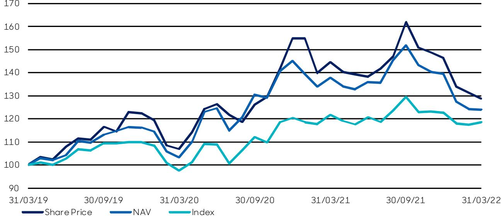

{0}------------------------------------------------

# **abrdn Japan Investment Trust plc**

# **Annual Report 31 March 2022**

Japan specialists identifying exceptional companies

# **abrdn.com**

{1}------------------------------------------------

{2}------------------------------------------------

**"The Company's medium-term relative performance remains strong, with a NAV return of 24.1% over the last three years, compared to the benchmark return of 18.4%."** 

Karen Brade, Chairman

**"We believe that the Company's good quality holdings – broadly defined as having tried and tested management teams, strong business fundamentals, with above average return on capital and ESG standards – should overcome the challenges of the current environment."** 

> Kwok Chern-Yeh, abrdn Japan Limited Investment Manager

{3}------------------------------------------------

# **Performance Highlights**

| Net asset value total returnA                   |         | Index total return                              |        |
|-------------------------------------------------|---------|-------------------------------------------------|--------|
| Figures to 31 March 2022                        |         | Figures to 31 March 2022                        |        |
| –10.0%                                          |         | –2.7%                                           |        |
| Figures to 31 March 2021                        | +33.5%  | Figures to 31 March 2021                        | +24.8% |
| Return since 8 October 2013 (change of mandate) | +109.7% | Return since 8 October 2013 (change of mandate) | +99.6% |
|                                                 |         |                                                 |        |
| Share price total returnA                       |         | Ongoing charges ratioA                          |        |
| Figures to 31 March 2022                        |         | Year to 31 March 2022                           |        |
| –10.9%                                          |         | 1.00%                                           |        |
| Figures to 31 March 2021                        | +35.2%  | Year to 31 March 2021                           | 1.04%  |
| Return since 8 October 2013 (change of mandate) | +106.4% |                                                 |        |
|                                                 |         |                                                 |        |
| Discount to net asset valueA                    |         | Dividend per share                              |        |
| As at 31 March 2022                             |         | Year to 31 March 2022                           |        |
| 11.0%                                           |         | 15.00p                                          |        |
| As at 31 March 2021                             | 9.9%    | Year to 31 March 2021                           | 15.00p |
|                                                 |         |                                                 |        |

A Alternative Performance Measure (see pages 81 and 82). Comparatives for the corresponding period can be also be found on these pages.

#### **Net asset value per share Share price Dividends per share**

At 31 March 2022– pence At 31 March 2022- pence Year ended 31 March 2022 – pence

{4}------------------------------------------------

# **Contents**

**"We believe that the Company's strategy of seeking high quality companies, run by capable management teams, with good governance, will serve our shareholders well over the long term."** 

Karen Brade, Chairman

| Overview                                                |     |
|---------------------------------------------------------|-----|
| Performance Highlights                                  | 2   |
| Financial Calendar, Dividends and Highlights            | 4   |
| Strategic Report                                        |     |
| Chairman's Statement                                    | 8   |
| Investment Manager's Review                             | 11  |
| Overview of Strategy                                    | 14  |
| Results                                                 | 21  |
| Performance                                             | 22  |
| Portfolio                                               |     |
| Ten Largest Investments                                 | 26  |
| Investment Portfolio                                    | 27  |
| Sector Analysis and Currency Graph                      | 30  |
| Investment Case Studies                                 | 32  |
| Governance                                              |     |
| Board of Directors                                      | 36  |
| Directors' Report                                       | 38  |
| Statement of Corporate Governance                       | 42  |
| Report of Audit Committee                               | 46  |
| Directors' Remuneration Report                          | 49  |
| Statement of Directors' Responsibilities                | 52  |
| Independent Auditor's Report for abrdn Japan Investment |     |
| Trust plc                                               | 53  |
| Financial Statements                                    |     |
| Statement of Comprehensive Income                       | 62  |
| Statement of Financial Position                         | 63  |
| Statement of Changes in Equity                          | 64  |
| Statement of Cash Flows                                 | 65  |
| Notes to the Financial Statements                       | 66  |
| Alternative Performance Measures                        | 81  |
| Corporate Information                                   |     |
| Information about the Investment Manager                | 84  |
| Investment Policy                                       | 86  |
| The Manager's ESG Approach                              | 87  |
| Investor Information                                    | 91  |
| General                                                 |     |
| Glossary of Terms                                       | 95  |
| AIFMD Disclosures (Unaudited)                           | 97  |
| Notice of Annual General Meeting                        | 98  |
| Contact Addresses                                       | 105 |

{5}------------------------------------------------

# **Financial Calendar, Dividends and Highlights**

# **Financial Calendar**

| Payment dates of dividends                                                      | July 2022 December 2022 |
|---------------------------------------------------------------------------------|----------------------------|
| Annual General Meeting (London)                                                 | 1 July 2022                |
| Half year end                                                                   | 30 September 2022          |
| Expected announcement of results for the six months ending 30 September 2022 | November 2022              |
| Financial year end                                                              | 31 March 2023              |
| Expected announcement of results for the year ending 31 March 2023           | June 2023                  |

# **Dividends**

|                              | Rate   | Ex-dividend date | Record date     | Payment date     |
|------------------------------|--------|------------------|-----------------|------------------|
| Proposed final dividend 2022 | 9.00p  | 23 June 2022     | 24 June 2022    | 22 July 2022     |
| Interim dividend 2022        | 6.00p  | 2 December 2021  | 3 December 2021 | 30 December 2021 |
| Total dividends 2022         | 15.00p |                  |                 |                  |
| Final dividend 2021          | 9.00p  | 24 June 2021     | 25 June 2021    | 23 July 2021     |
| Interim dividend 2021        | 6.00p  | 3 December 2020  | 4 December 2020 | 31 December 2020 |
| Total dividends 2021         | 15.00p |                  |                 |                  |

{6}------------------------------------------------

# **Highlights**

|                                               | 31 March 2022 | 31 March 2021 | % change |
|-----------------------------------------------|---------------|---------------|----------|
| Total assets (as defined on page 96)          | £100,564,000  | £118,585,000  | -15.2    |
| Total equity shareholders' funds (net assets) | £89,930,000   | £107,438,000  | -16.3    |
| Market capitalisation                         | £80,043,000   | £96,775,000   | -17.3    |
| Share price (mid market)                      | 635.00p       | 727.50p       | -12.7    |
| Net asset value per Ordinary share            | 713.43p       | 807.66p       | -11.7    |
| Discount to net asset valueA                  | 11.0%         | 9.9%          |          |
| Net gearingA                                  | 11.4%         | 10.0%         |          |
|                                               |               |               |          |

#### **Operating costs**

| Ongoing charges ratioA | 1.00% | 1.04% |  |
|------------------------|-------|-------|--|
|                        |       |       |  |

#### **Earnings**

| Total return per Ordinary share                                | (81.70p)   | 203.49p    |  |
|----------------------------------------------------------------|------------|------------|--|
| Revenue return per Ordinary share                              | 8.54p      | 6.57p      |  |
| Dividends per Ordinary shareB                                  | 15.00p     | 15.00p     |  |
| Revenue reserves (prior to payment of proposed final dividend) | £1,631,000 | £1,758,000 |  |

A Considered to be an Alternative Performance Measure. See pages 81 and 82 for more information.

B The figure for dividends reflects the years in which they were earned

{7}------------------------------------------------

# **Strategic Report**

**6 abrdn Japan Investment Trust plc** 

{8}------------------------------------------------

**The Company is an investment trust aiming to achieve long-term capital growth principally through investment in listed Japanese companies which are believed by the Manager to have above average prospects for growth.** 

{9}------------------------------------------------

# **Chairman's Statement**

A year ago I wrote that we had come through a momentous year with the challenges of Covid-19 and its significant impact globally. We recognised the risks relating to Covid-19 had not gone away and that inflation was a looming threat. In our more recent interim report we added slowing Chinese growth to the list of concerns. However, we certainly did not anticipate the Russian invasion of Ukraine, which has had a profound impact geopolitically and on the global economy, and whose outcome and longer term effects remain uncertain.

# **Overview**

The Japanese stock market moved through a number of alternating phases during the year: early on, markets benefited from positive investor sentiment arising from vaccine breakthroughs and improved economic data. Then fears of rising infections, the initially slow vaccination programme and Tokyo entering its third emergency lockdown weighed on markets in the late spring and early summer. However, Japan became one of the strongest major developed markets in August and September 2021, as investors reacted positively to the change in the political landscape and easing of the Covid-19 pandemic. Fumio Kishida replaced former prime minister Yoshihide Suga as leader of the ruling Liberal Democratic Party in the third quarter, and the party comfortably retained power in the general election held at the end of October.

In November 2021, Prime Minister Kishida released details of a stimulus package of almost ¥56 trillion. The measures included direct payments to families with children and support for businesses. However, in common with global stock markets, Japanese equities sold-off abruptly in January 2022, with technology-related stocks especially weak. Unlike the US Federal Reserve, however, the Bank of Japan ("BoJ") indicated that it will not raise interest rates quickly. The initial impact of Russia's invasion of Ukraine on the Japanese stock market was limited. While Russia is a relatively small trading partner for Japan, the implications of the invasion for global energy prices are very relevant given that Japan is an energy-importer. Inflation is rising in Japan with implications for the consumer and businesses.

# **Performance**

Performance weakened in the second half of the year. The Company's net asset value (NAV) total return for the year to 31 March 2022 was -10.0%, underperforming the TOPIX benchmark's -2.7% total return, both in sterling terms.

The Company's medium-term relative performance remains strong, with a NAV return of 24.1% over the last three years, compared to the benchmark return of 18.4%. The Company's Ordinary share price ended the year at 635.0p, down 92.5p on 31 March 2021. The total return for the period was -10.9% with dividends reinvested and the discount to NAV per Ordinary share widened slightly from 9.9% to 11.0% as at 31 March 2022.

# **Dividend**

The Board continues to believe in the importance of income to our shareholders and makes use of the benefits of the investment trust structure to allow the Company to support the enhanced dividend policy.

The Company's revenue return per share for the financial year was 8.5p (2021 – 6.6p). An interim dividend of 6.0p has already been declared and was paid to shareholders on 30 December 2021. The Board proposes a final dividend of 9.0p, making a total dividend of 15.0p (2021 – 15.0p) for the year ended 31 March 2022. The dividend comprises 8.5p revenue return, 3.0p from revenue reserves and 3.5p from capital reserves. The Board believes that this level of distribution for the year continues to balance a prudent retention of capital for future investment with a recognition of the ongoing importance of income to our shareholders, especially as economic circumstances worsen for many.

# **Gearing**

The Company continues to make use of its capacity to gear through its loan facilities provided by ING Bank. Earlier in the year these were renewed with the Yen 1.3 billion fixed term loan now expiring in January 2023 and the Yen 1.0 billion floating rate facility now extended to expire in December 2024. Further details can be found on page 40.

The Board considers a gearing level of around 10% to be appropriate, although, with stock market fluctuations, this may range between 5–15%. Net gearing as at 31 March 2022 was 11.4% (2021: 10.0%).

The Board believes that the potential to gear the portfolio at the right time is one of the strong advantages of the closed ended company structure, with the sensible use of modest financial gearing seeking to enhance returns to shareholders.

# **Environmental, Social & Corporate Governance ("ESG")**

Japan is changing its approach and embracing the principles of ESG. This development and improvement, particularly on the corporate governance front, has accelerated over the year under review. Your Manager has had the privilege of not only having a front row seat to 

{10}------------------------------------------------

what has unfolded, but has also, I believe, played an active role in helping some of these changes materialise.

Over the year, the portfolio's holdings have continued to register improvements, including greater transparency in terms of disclosure. Encouragingly, companies are more willing to engage with investors, and the composition of boards is growing more inclusive and diverse. Overall, these developments foster a change in attitude, with management more mindful of helping to not only preserve, but also enhance, shareholder value, both in their day-to-day decisions and at more strategic policymaking levels. Additionally, your Manager has been working with several companies to encourage them to track their key indicators (such as carbon emissions, supply chain management, carbon intensity, and health and safety) and to disclose these regularly. Meticulously tracking and then publishing these numbers will not only help companies provide an objective track record that will result in improved ESG standards, but also keep them accountable in sticking to the targets that they have set for themselves. It is also worth noting that Japanese companies have an added advantage, in that they possess the technology and leading-edge materials that can help them attain these goals.

With this in mind, I wanted to draw your attention to three examples of engagement with companies in our portfolio. **Tokio Marine**, one of our top performing holdings, has consistently announced share buyback programmes. Earlier in 2021, the company had disappointed the market with a vague explanation about its use of excess capital, which led your Manager to engage with the company's management on improved communication of its shareholder returns policy. Your Manager intends to continue its conversation with the company on this and other matters.

The real estate developer **Tokyu Fudosan Holding** announced the sale of its stake in DIY store Tokyu Hands to home center operator Cainz. Your Manager had been actively engaging with the company's management on reviewing its weaker businesses to help the company build a more resilient organisation. It intends to continue the conversation with the company as there are other lowmargin operations that could pose risks for the business.

Your Manager has had multiple engagements over the years urging the companies whose shares are held in the portfolio to relinquish their poison pills, and for these companies to adopt stronger governance frameworks and reflect an increased awareness of shareholder interests. These engagements have worked alongside a broader improvement in ESG standards in the market.

The latest example of your Manager's involvement is that with property owner and developer **Heiwa Real Estate**, which decided not to bring its poison pill resolution forwards for a renewal vote at its annual general meeting.

More information on the Manager's ESG Approach can be found on pages 87 to 90 of this report.

# **Discounts and Share Buybacks**

The Board regularly monitors the discount level of the Company's shares in relation to the NAV. There is a mechanism in place to buy back shares at appropriate levels, when doing so will add value for shareholders, while having regard to the overall size of the Company. During the financial year, 697,191 shares were bought back into treasury at a cost of £.4.9 million. Since the year end, a further 45,358 shares have been repurchased at a cost of £265,000.

Overall, the discount averaged 9.4% over the last 90 days of the Company's financial year and there is therefore no requirement under the Company's articles of association to put forward a continuation vote to shareholders.

# **The Board**

For its ongoing effectiveness, your Board believes in the importance of an orderly succession plan. The Board regularly reviews its composition, considering the balance of skills and experience of the Directors, as well as their tenure. Having now served on the Board for nine years, with over three years as Chairman, I shall retire as a Director at the Annual General Meeting in 2023. Sir David Warren has agreed to be appointed the Senior Independent Director with immediate effect.

# **abrdn Rebranding**

In July 2021, Standard Life Aberdeen plc changed its name to abrdn plc as part of a rebranding exercise. It is expected that the Company's Manager and Company Secretary (Aberdeen Standard Fund Managers Limited and Aberdeen Asset Management PLC respectively) will also change their names in future, following the same approach taken by the Company's Investment Manager, abrdn Japan Limited (formerly Aberdeen Standard Investments (Japan) Limited).

Following the abrdn name change, the Board made the decision to align itself with the Manager's new brand by changing the Company's name to abrdn Japan Investment Trust plc on 9 May 2022.

{11}------------------------------------------------

# **Chairman's Statement**

# **Continued**

# **Annual General Meeting ("AGM")**

The Company's AGM will be held on 1 July 2022 at 10:00am at the offices of abrdn at Bow Bells House, 1 Bread Street, London, EC4M 9HH.

I encourage all shareholders to complete and return the form of proxy enclosed with the Annual Report to ensure that your votes are represented at the meeting (whether or not you intend to attend in person). If you hold your shares via a share plan or a platform and would like to attend and/or vote at the AGM, then you will need to make arrangements with the administrator of your share plan or platform. For this purpose, investors who hold their shares in the Company via the abrdn Investment Plan for Children, Share Plan or ISA will find a Letter of Direction enclosed. abrdn Planholders are encouraged to complete and return the Letter of Direction in accordance with the instructions.

The Notice of Meeting is contained on pages 98 to 102.

# **Outlook**

Japan has a large, sophisticated economy which remains at the forefront of technological innovation and occupies a key role in the global economy with a huge export sector. The country hosts a wealth of successful companies of all sizes, many with leading global market shares and strong products. In view of this, the Board is optimistic about the long term future for Japanese equities. Despite the multiple challenges posed by the ongoing pandemic, rising commodity prices and the global outlook for inflation, companies with strong business models and management teams have coped and, in some cases, thrived. Alongside structural improvements in governance in Japan, we remain resolute in our belief that these companies will do well. Weighing the risk-reward in the market, valuations look attractive for these companies for the medium term.

On a global scale, risks remain in the system. The Omicron variant of Covid-19 resulted in less severe illness and governments globally have treated the surge differently, some with fewer lockdowns and less severe restrictions. Nevertheless, infection rates are still high globally. The effects of high energy prices following Russia's invasion of Ukraine are feeding through into widespread price inflation – the impact is only just being felt by the Japanese consumer. For now, the slow growth in the Japanese economy means that the Bank of Japan will keep rates low – it remains to be seen if rising inflationary pressures or a weakening currency will change that calculation later in 2022.

Your portfolio of investments, in companies with healthy balance sheets and ample free cash flow, puts us in a strong position. A solid fundamental base, coupled with management teams' experience in navigating the pandemic and previous crises, should allow these companies to continue their recovery and progress. Many investee companies have built dominant positions in their own fields and should continue to thrive regardless of the external pressures faced.

The Board recognises that in such a difficult and complex environment, it is more important than ever to check and challenge the positioning of the portfolio and the investment decisions taken by the Manager. However, the Manager's process of seeking out the best companies – whether small, mid or large capitalisation stocks – through stringent screening and regular meetings with senior management is designed to deliver the best long-term growth prospects of the underlying investments in your Company's portfolio. The Manager's ESG focus, which is very much core to the investment process, should also help to encourage effective engagement at all levels. We expect better and more sustainable practices, and subsequently better share price ratings, as a result of their efforts.

Your Board recognises that investors have the choice of a range of investment funds through which they can obtain exposure to Japan. We believe that the Company's strategy of seeking high quality companies, run by capable management teams, with good governance, will serve our shareholders well over the long term.

**Karen Brade** Chairman 27 May 2022

{12}------------------------------------------------

# **Investment Manager's Review**

# **Overview**

The Japanese equity market declined by 2.7% in sterling terms over the 12 months to 31 March 2022. The year was characterised by a strengthening economy, a change of Prime Minister and, towards the end of the period, a relaxation of pandemic-related restrictions.

The Company's NAV, however, fell by 10.0% in sterling total return terms, while the share price lost 10.9% with dividends reinvested. This poorer performance in the portfolio over the year reflected higher bond yields and rising inflation expectations supporting lower value cyclical and interest rate-sensitive financial stocks. Our stock choices underperformed the broader market but we believe that our investment approach – that of investing in good quality companies – will outperform over a market cycle, especially in periods where company fundamentals are being rewarded. We may, however, underperform when the markets are disrupted by specific events or unforeseeable circumstances. This was the case in the past year. We recognise that our bottom-up approach may lead to periods of underperformance, but our goal remains to deliver outperformance over the medium to long-term through adherence to our core investment principles.

On the political front, the Liberal Democratic Party's (LDP) popularity suffered over the summer months. Former Prime Minister Yoshihide Suga was criticised for his handling of the Covid-19 pandemic, and on 4 October 2021 Fumio Kishida won the LDP leadership race to become Japan's new prime minister. The former foreign minister ran against the popular vaccinations minister, Taro Kono, in the run-off vote, having outperformed the two female candidates in the first round. The LDP comfortably retained power in the subsequent general election on 31 October, although the equity market declined as investors became concerned about possible tax rises. The new administration proposed a stimulus package of almost ¥56 trillion together with a record setting annual budget for 2022. The package included pandemic countermeasures, social spending for the elderly and record defence spending to prepare against rising regional threats. Kishida's own ratings remain reasonably stable.

The Covid-19 pandemic was a feature adding to uncertainty throughout the period. The Japanese government declared a state of emergency in Tokyo and other economic hubs in January 2021. The infection rate undulated throughout the period, peaking in April 2021. After a slow start, Japan's vaccination campaign gathered speed in the third quarter of 2021, not long before the new Omicron variant was first identified. Cases surged early in 2022, while the government began a drive for booster

shots. Japan's quasi-state of emergency was lifted in 18 prefectures, including Tokyo and Osaka, in March 2022, following a decline in new infections and an easing strain on hospitals. Japan has also been relaxing its border controls, with the daily cap on the number of international arrivals increasing from 7,000 to 10,000 in April 2022. The booster shot campaign that began in December 2021 had reached 41% of the population by the end of March 2022. Recent polling on the government's handling of the Omicron variant has been positive.

Fortunately Japan's economy avoided a recession in the second quarter of 2021. A rebound in consumer spending defied pandemic-related restrictions, while renewed investments by businesses and increased government spending also underpinned a higher growth rate. Industrial production saw a record increase of 7.2% month-onmonth in November 2021, on the back of a recovery in automotive production as supply chain issues eased. However, in early 2022, higher inflation and a weakening yen has impacted sentiment. Purchasing manager index data indicates that businesses expect contraction and the Bank of Japan's Tankan survey, released soon after the period end, showed falling confidence among large manufacturers.

Rising inflation has been an issue globally. One important driver has been higher energy prices, resulting from Russia's invasion of Ukraine. Brent crude oil traded at around \$108 per barrel at the end of March 2022 but had been within a whisker of \$140 early in the month. Economists expect the price pressure from these rising energy costs will slow Japan's economic growth. International pressure on Prime Minister Kishida to pull away from the Sakhalin-2 liquefied natural gas project has increased; however he has refused to do so, citing energy shortages as a threat to the Japanese economy, and has announced plans fora relief package to help households cope with higher fuel bills.

While many developed central banks have begun hiking interest rates and withdrawing support, the BoJ held interest rates throughout the year. This has led to a widening of the interest rate differential between the US and Japan and the BoJ has increased its bond buying programme in an effort to control interest rates. This has resulted in the yen weakening to a five year low, providing a tailwind for exporters, but putting pressure on import costs.

In general, corporate results have been positive. Quarterly reporting has reaffirmed our view that fundamentals remain solid for our portfolio holdings. While geopolitical tensions, supply shortage issues and rising raw material costs have hampered a number of industries, certain companies fared well, thanks to their pricing power,

{13}------------------------------------------------

# **Investment Manager's Review**

# **Continued**

ability to procure components and flexibility in adjusting production. Many companies reported profit increases and a large number have announced share buyback programmes.

With this backdrop, we have been busy considering the new trends, assessing how they might affect the portfolio's underlying holdings, and evaluating the opportunities that lie ahead. We lay this out in greater detail below.

# **Portfolio review**

Several of our holdings reported weaker-than-expected results, primarily due to rising costs and component shortages, which has resulted in a muted near-term outlook for some companies and led to share price weakness. While the stock price declines are disappointing, we believe these companies' issues are manageable and will be resolved.

The biggest detractor from the Company's performance was **Nabtesco**. The factory automation company sector has struggled over the year, facing higher expenses and shortages of key components. Weak automotive capital expenditure has meant lower investment in robots, slowing orders for the company's reduction gears. The company's recent results have been mixed, with investors fearing that supply chain shortages will continue to slow shipments. **Koito Manufacturing's** profits were also weaker than expected as higher raw material costs and weaker auto production from component shortages reduced margins. While we do see some conservatism forecast into its new assumptions, management made considerable cuts to its profit guidance. Elsewhere, our holding of **Tokyo Century** weighed on returns. Results from the diversified financial firm have been mixed as travelrelated businesses, such as its airline leasing and car rental subsidiaries, remained weak due to rolling shutdowns across markets. Meanwhile, the company's aircraft leasing business will record an impairment from planes that were leased to airlines in Russia, although we believe that the exposure is contained and relatively manageable.

In contrast, **Tokio Marine** was one of our best performing stocks, as the company delivered impressive results and consistently raised its full-year guidance to factor in better-than-expected underwriting profits and investment gains. A recent purchase of **Kohoku Kogyo** also performed well, further detail on the company is given below. We also benefited from our holding in mobile operator **KDDI**, which reported strong results and increased its share buyback programme. KDDI offers a range of bundled services that have helped raise its average revenue per account. It has also been able to deliver on both earnings growth and shareholder return in what is a mature market.

During the year, we took advantage of the market's volatility to initiate several new holdings, exiting others to fund these more attractive investment opportunities.

Early in the year, we initiated a position in **AGC**, a leading maker of glass products, chemicals and electronics that trades at attractive valuations. The company has been using cash generated by mature businesses, including glass products, to invest in structural growth opportunities such as pharmaceutical development, manufacturing outsourcing, EUV mask blanks and glass and display products for next-generation vehicles. The company has a number of world leading products, enabling stable cashflow generation to support continued reinvestment in the business and underpinning shareholder returns. For further details on AGC, see our case study on page 32.

Late in 2021, we participated in the initial public offerings of **Kohoku Kogyo** and **Net Protections Holdings**. **Kohoku Kogyo** is the global leader in manufacturing key components used in submarine optical cables and automotive aluminium electrolytic capacitors. The company's integrated production system and its ability to produce everything internally, from raw materials to equipment, enables it to maintain its business advantage. The president, who comes from the founder's family, is keen to establish a third pillar of growth, leveraging on the company's existing technologies. **Net Protections** is Japan's largest Buy-Now-Pay-Later service provider. Its credit technology, built on the large amount of settlement data collected over its 20-year history, gives the company a solid competitive position. The company's offering represents an attractive solution to both parties in credit based e-commerce transactions: its high and accurate approval rate offers retail customers frictionless purchasing experiences while enabling merchants to maximise sales opportunities. The company also brings this technology to transactions among corporate customers, offering one-stop solutions such as payment collection and invoicing, aiming to replicate its success gained in the e-commerce business.

Towards the end of the year, we bought **Ajinomoto**, **Ibiden**  and **Denso**. **Ajinomoto**, Japan's largest producer of seasonings, has a strong sales and product development capability to develop products suited to local tastes. With a high market share in its core business, the company commands pricing power. In addition, the management team have successfully restructured the business portfolio through the divestment of lower-return, commoditised businesses, while prioritising investments in value-added areas within foods and higher growth sectors. The company has also expanded into products such as semiconductor materials and contract development and manufacturing for biopharmaceuticals. **Ibiden** is a manufacturer of packaging substrates that protect

{14}------------------------------------------------

semiconductors. We expect a rapidly growing endmarket, product innovation and a shift to higher value products to fuel the company's future growth. Moreover, we are encouraged by the improved business mix achieved in recent years and the reduced reliance on cyclical end applications such as smartphones. Automotive components maker **Denso** has a leading position in key components for electric vehicles, such as inverters, battery engine control units and thermal management systems. We believe the company is well positioned to benefit from automotive electrification, as it has the technology to provide products that help to improve energy efficiency.

We undertook a number of sales to enable us to make these purchases. Early in the year, we exited material handling systems provider **Daifuku,** which we had purchased early in 2020. Valuations were no longer as attractive, following last year's welcome re-rating and management had released cautious guidance, anticipating a rise in fixed costs in research and development. In September 2021, we exited **Edulab.** Following the accounting investigation referenced in our Half-Yearly Report, we engaged with the company on its governance framework and internal controls, and decided it was an appropriate time to sell our position completely.

More recently, we sold our long-held positions in babycare products supplier, **Pigeon,** and car auction facility operator, **USS**, to free up cash to invest in better opportunities. We also sold our holding in medical equipment maker **Sysmex** due to its high valuation coupled with concerns over a slowdown in China, fuelled by central procurement and distributor issues. Our position in Honda-affiliated car parts maker **Stanley Electric** was also sold due to a deteriorating outlook amid supply chain risks, elevated market expectations for nearterm earnings, and better opportunities elsewhere.

# **Outlook**

Russia's invasion of Ukraine, and its impact on global commodity prices, has put a chill on sentiment across global markets. While the direct impact on most Japanese corporates, including the Company's holdings, is low, the indirect impact from sharp rises in commodity prices, logistical difficulties and supply chain shortages puts further pressure on companies' profitability.

Following this re-positioning we believe that the Company's good quality holdings – broadly defined as having tried and tested management teams, strong business fundamentals, with above average return on capital and ESG standards – should overcome the challenges of the current environment. These companies tend to be flexible in how they manage their businesses, have strong pricing power while not allowing governance to take a back seat. With this backdrop, and with the rotation in the markets earlier in the year, valuations for quality stocks have fallen sharply, yet commentary from these companies suggests that their business fundamentals remain sound. We remain confident in our belief that these companies will outperform over the medium to longer term and offer shareholders good relative returns.

**Kwok Chern-Yeh, abrdn Japan Limited** 27 May 2022

{15}------------------------------------------------

# **Overview of Strategy**

# **Business Model**

This report provides shareholders with details of the Company's business model and strategy as well as the principal risks and challenges it faces.

The Company is an investment trust which seeks to deliver a competitive return to its shareholders through the investment of its funds in accordance with the investment policy as approved by shareholders.

The Board appoints and oversees an investment manager, decides the appropriate financial policies to manage the assets and liabilities of the Company, ensures compliance with legal and regulatory requirements and reports objectively to shareholders on performance.

The Directors do not envisage any change in this model in the foreseeable future.

### **Investment Objective and Purpose**

To achieve long-term capital growth principally through investment in listed Japanese companies which are believed by the Investment Manager to have above average prospects for growth.

The Board's strategy is represented by its investment policy, financial policies, and risk management policies.

### **Investment Policy**

The Company primarily invests in the shares of companies which are listed in Japan. The portfolio is constructed through the identification of individual companies of any market capitalisation and in any business sector, which offer long-term growth potential.

The portfolio is selected from the 3,800 listed stocks in Japan and is actively managed to contain between 30 and 70 stocks which, in the Manager's opinion, represent the best basis for producing higher returns than those of the market as a whole in the long term. There will therefore inevitably be periods in which the Company's portfolio either outperforms or underperforms the market as represented by the Company's benchmark.

The Board does not impose any restrictions on these shorter term performance variations from the benchmark, nor any limits on the concentration of stock or sector weightings within the portfolio, except that no individual shareholding shall exceed 10% of the Company's portfolio at the time of purchase, although market movements may subsequently increase this percentage.

The full text of the Company's investment policy is provided on page 86.

### **Benchmark Index**

Topix (in Sterling terms)

### **Investment Approach**

The Investment Manager's investment philosophy is that markets are not always efficient. The Investment Manager's approach is therefore that superior investment returns are attainable by investing in companies with good fundamentals and above average growth prospects that in the Investment Manager's opinion drive share prices over the long-term. The Investment Manager follows a bottom-up investment process based on a disciplined evaluation of companies through active engagement, at least twice a year, with management on performance including environmental, social and governance issues by its fund managers who are based in Japan and supported by the Manager's Asian investment team in Singapore. The Manager estimates a company's worth in two stages; quality, defined by reference to management, business focus, the balance sheet and corporate governance; and then price, calculated by reference to key financial ratios, the market, the peer group and business prospects. Understanding a company's management and gauging its experience is essential and no stock is bought without the fund managers having first met management.

Stock selection is key in constructing a diversified portfolio of companies with macroeconomic, political factors and benchmark weightings being secondary.

Given the long-term fundamental investment philosophy, the Manager expects to hold most companies in which the Company invests for extended periods of time.

{16}------------------------------------------------

# **Financial Policies**

The Board's main financial policies cover the management of shareholder capital, risk management of the Company's assets and liabilities, including currency risk, the use of gearing and the reporting to shareholders of the Company's performance and financial position.

# **Management of Shareholder Capital**

The Board's policy for the management of shareholder capital is primarily to ensure its long term growth. This growth will reflect both the Manager's investment performance and from time to time the issue of shares, when sufficient demand exists to do this, without diluting the value of existing shareholder capital.

The Board's dividend policy is to make distributions on a semi-annual basis and currently consists of the Company's earnings for the year, 3.0p released from the revenue reserves and an amount from the distributable capital reserves.

The Board will authorise the buyback of shares in order to avoid excessive variability in the discount and if, despite this, the average discount exceeds 10% during the 90 day period preceding its financial year end, the Board will offer shareholders the opportunity to vote on the continuation of the Company at a general meeting.

# **Risk Management**

The policy for risk management is primarily focused on the investment risk in the portfolio using the Manager's risk management systems and risk parameters, overseen by the Board.

### **Derivatives**

The Company may use derivatives from time to time for the purpose of mitigating risk in its investments. The performance of the Company is subject to fluctuations in the Yen/£ exchange rate. The Company's exposure to Yen fluctuations is partially offset by the natural hedge provided by any borrowing in Yen as well as by investments in Japanese companies which have significant sources of income from exports of goods or from non-Japanese operations.

The wider corporate risks, including those arising from the increasingly regulated and competitive marketplace, are managed directly by the Board. The principal risks are more fully described under the paragraph 'Principal Risks and Uncertainties'.

# **Use of Gearing**

Gearing is the amount of borrowing used to increase the Company's portfolio of investments in order to enhance returns when and to the extent it is considered appropriate to do so or to finance share buybacks when necessary. The level of borrowing under the Company's investment policy is subject to a maximum of 25% of net assets but will normally be set at a stable and lower level than the maximum. The Board has currently established a gearing level of around 10% of net assets although, with stock market fluctuations, this may range between 5% and 15%.

{17}------------------------------------------------

# **Overview of Strategy**

# **Continued**

# **Principal Risks and Uncertainties**

There are a number of risks which, if realised, could have a material adverse effect on the Company and its business model, financial position, performance and prospects.

The Board has in place a robust process to identify, assess and monitor the principal risks and uncertainties facing the Company and to identify and evaluate newly emerging risks. The Company's risks are regularly

assessed by the Audit Committee and managed by the Board through the adoption of a risk matrix which identifies the key risks for the Company, including emerging risks, and covers strategy, investment management, operations, shareholders, regulatory and financial obligations and third party service providers. The principal risks and uncertainties facing the Company, which have been identified by the Board, are described in the table below, together with the mitigating actions.

#### **Market, Economic and Political Risk**  The Company's assets consist mainly of listed securities and the principal risks are therefore market-related. This includes concerns about stock market volatility caused by geopolitical instability, political change, economic growth, interest rates, currency, and other price risks, as well as national or global crises that are harder to predict and may cause major market shocks An explanation of these risks and the management of them is included in Note 16 to the Financial Statements on pages 76 to 78. The Board considers the composition and diversification of the portfolio by industry, size and growth rates, as well as purchases and sales, at each meeting, and in monthly papers. Individual holdings are discussed with the Manager, as well as views by sector and industry. The Board considers geopolitical risk to have increased following Russia's invasion of Ukraine. Ò **Investment Strategy Risk**  The Company and its investment objective may become unattractive to investors, leading to reduced returns for shareholders, decreased demand for the Company's shares, reduced value of shareholder funds and possible widening of the share price discount to NAV. The Board regularly reviews and monitors: the Company's investment objective, policy and strategy; the portfolio and its performance; longer term trends in investor demand; and the performance of the Manager in operating the investment policy against the long-term objectives of the Company. If appropriate, the Board can propose changes in the investment objective. Ù **Investment Management Risk**  Investment risk arises from the Company's exposure to variations of share prices within its portfolio in response to individual company and to wider Japanese or international factors. Investment in a focussed portfolio of shares can lead to greater short-term changes in the portfolio's value than in a The Board relies on the Investment Manager's skills and judgment to make investment decisions based on research and analysis of stocks and sectors. The Board regularly monitors the investment performance of the portfolio and reviews holdings, purchases and sales on a monthly basis, as well as with the Manager at Board meetings. The Board regularly reviews performance data and attribution analysis and other relevant factors and, were any Ù

take remedial measures.

**Description Mitigating Action Trend** 

#### **Operational Risk**

Company's discount.

The Company relies on a number of third-party service providers, principally the Manager, Registrar, Custodian and Depositary.

larger portfolio of stocks and these variations will be amplified by the use of gearing. Inappropriate investment decisions may result in the Company's underperformance against the benchmark index

and peer group and a widening of the

The Manager has extensive business continuity procedures and contingency arrangements to ensure that they are able to continue to service their clients. Third parties are subject to risk-based reviews by the Manager. The Board reviews reports on the operation and efficacy of the risk management and control systems of the Manager and other key third- party service providers, including those relating to cybercrime.

underperformance seen as likely to be sustained, would be able to

{18}------------------------------------------------

| Description                                                                                                                                                                                                                                                                                                                                                                   | Mitigating Action                                                                                                                                                                                                                                                                                                                                                                                                                                                                                                                                                                                                                                                                                                                                                                                                                                                                                                                        | Trend |
|-------------------------------------------------------------------------------------------------------------------------------------------------------------------------------------------------------------------------------------------------------------------------------------------------------------------------------------------------------------------------------|------------------------------------------------------------------------------------------------------------------------------------------------------------------------------------------------------------------------------------------------------------------------------------------------------------------------------------------------------------------------------------------------------------------------------------------------------------------------------------------------------------------------------------------------------------------------------------------------------------------------------------------------------------------------------------------------------------------------------------------------------------------------------------------------------------------------------------------------------------------------------------------------------------------------------------------|-------|
| Regulatory Risk The Company operates under a complex regulatory environment. Serious breaches of regulations, such as Section 1158 of the Corporation Tax Act 2010, the UKLA Listing Rules, Companies Act 2006 and the Alternative Investment Fund Managers Directive could lead to a number of detrimental outcomes and reputational damage.            | The Board is active in ensuring that it fully complies with all applicable laws and regulation and is assisted by the Manager and other advisers in doing this. The Board believes that, while the consequences of non-compliance can be severe, the control arrangements it has put in place reduce the likelihood of this happening.                                                                                                                                                                                                                                                                                                                                                                                                                                                                                                                                                                                    | Ù     |
| Share Price and Discount risk The principal risks described above can affect the movement of the Company's share price and in some cases have the potential to increase the discount in the market value of the Company compared with the NAV.                                                                                                                 | The price of the Company's shares and its discount to NAV are not wholly within the Company's control, as both are subject to market volatility, as witnessed through the pandemic and more recently with Russia's invasion of Ukraine, where the discount has increased during the year. However, the Board can influence this through the ability to authorise the buyback of existing shares, when deemed to be in the best interests of shareholders. The share price, NAV and discount are monitored daily by the Manager and regularly reviewed by the Board.                                                                                                                                                                                                                                                                                                                                              | Ò     |
| Leverage The Company may borrow money for investment purposes. If investments fall in value, gearing has the effect of magnifying the extent of this fall.                                                                                                                                                                                                           | The maximum level of borrowing permitted by the Company's investment policy is 25% of net assets. All borrowing requires prior approval of the Board. In order to manage the level of gearing, the Board has established a gearing level of around 10% of net assets although, with stock market fluctuations, this may range between 5% and 15%. The Board regularly reviews the Company's gearing levels and its compliance with bank covenants.                                                                                                                                                                                                                                                                                                                                                                                                                                                                     | Ù     |
| Pandemic The Board is cognisant of the risks arising from a global pandemic, including stock market instability and longer term economic effects, and the impact on the operations of the third-party suppliers, including the Manager.                                                                                                                        | The Manager's robust and disciplined investment process is focused on long term company fundamentals including balance sheet strength and deliverability of sustainable earnings growth. As part of that process, the Manager continues to assess and review the investment risks arising from a global pandemic on companies in the portfolio, including but not limited to: employee absence, reduced demand, supply chain breakdown, balance sheet strength, ability to pay dividends, and takes the necessary investment decisions. The Manager has business continuity procedures and contingency arrangements to ensure they are able to service their clients, including investment trusts. The services from third parties, including the Manager, have continued to be supplied effectively and the Board will continue to monitor arrangements through regular updates from the Manager | Ù     |
| ESG Risks Applying ESG and sustainability criteria in the investment process may result in loss of value from companies in which the Company might otherwise invest. The Manager also monitors and responds to ESG and sustainability risks at portfolio companies as they evolve over time. This may have a positive or negative impact on performance. | The Board supports the Manager's active engagement and analysis of ESG and risks associated with climate change. The Board reviews ESG engagement by the Manager on a quarterly basis, and company research notes in the board papers address and rate ESG risks for all new investments.                                                                                                                                                                                                                                                                                                                                                                                                                                                                                                                                                                                                                                    | Ù     |

In all other respects, the Company's principal risks and uncertainties have not changed materially since the year end.

{19}------------------------------------------------

# **Overview of Strategy**

# **Continued**

# **Promoting the Success of the Company**

The Board is required to report on how it has discharged its duties and responsibilities under section 172 of the Companies Act 2006 (the "s172 Statement"). Under section 172, the Directors have a duty to promote the success of the Company for the benefit of its members as a whole, taking into account the likely long term consequences of decisions, the need to foster relationships with the Company's stakeholders and the impact of the Company's operations on the environment.

The Company consists of four Directors and has no employees or customers in the traditional sense. As the Company has no employees, the culture of the Company is embodied in the Board of Directors. The Board seeks to promote a culture of strong governance and to challenge, in a constructive and respectful way, the Company's advisers and other stakeholders.

The Board's principal concern has been, and continues to be, the interests of the Company's shareholders and potential investors.

The Manager undertakes an annual programme of meetings with the largest shareholders and investors and reports back to the Board on issues raised at these meetings. The Investment Manager, who is based in the Manager's Tokyo office, will attend such meetings. In normal circumstances, the Board encourage all shareholders to attend and participate in the Company's AGM and shareholders can contact the Directors via the Company Secretary. Shareholders and investors can obtain up-to-date information on the Company through its website and the Manager's information services and have direct access to the Company through the Manager's customer services team or the Company Secretary.

As an investment trust, a number of the Company's functions are outsourced to third parties. The key outsourced function is the provision of investment management services to the Manager and other stakeholders support the Company by providing secretarial, administration, depositary, custodial, banking and audit services.

The Board undertakes a robust evaluation of the Manager, including investment performance and responsible ownership, to ensure that the Company's objective of providing sustainable income and capital growth for its investors is met. The Board typically visits the Manager's offices in Tokyo on an annual basis. This enables the Board to conduct due diligence of the fund management and research teams. The Board has not travelled to Japan over the last two years whilst government restrictions on entry to the country as a result of Covid-19 were in place, however, a number of virtual meetings were held between the Board and the Manager's investment team in Tokyo to review portfolio construction and sector analysis. The portfolio activities undertaken by the Manager on behalf of the Company can be found in the Manager's Review and details of the Board's relationship with the Manager and other third party providers, including oversight, is provided in the Statement of Corporate Governance (pages 42 to 45).

Whilst the Company's direct operations are limited, the Board recognises the importance of considering the impact of the Company's investment strategy and policy on the wider community and the environment. The Board believes that its oversight of environmental, social and governance ("ESG") matters is an important part of its responsibility to stakeholders, and its proper consideration aligns with the objective to achieve long-term capital growth. The Board's review of the Manager includes an assessment of their ESG approach, which embeds ESG considerations in the investment process. Further information on how the Manager addresses ESG is disclosed in the Statement of Corporate Governance on pages 42 to 45 and in the Manager's ESG Approach on pages 87 to 90.

During the year, the Board focused on the performance of the Manager in achieving the Company's investment objective within an appropriate risk framework. In addition to ensuring that the Company's investment objective was being pursued, key decisions and actions undertaken by the Directors during the financial year and up to the date of this report have included:

- · renewal of the Company's loan facilities which matured in December 2021 and January 2022 respectively, in order to continue to take advantage of the Company's investment structure to allow the use of gearing, where appropriate, to enhance long-term total returns to shareholders.

{20}------------------------------------------------

- · working closely with the Manager to develop communications to raise the profile of the Company, in order to increase demand for and improve liquidity in the Company's shares, including the change of company name to align with the 'abrdn' brand.
- · the decision to pay an interim dividend of 6.0p per share and a final dividend of 9.0p, in order to balance the objective of long term capital growth with the policy of providing a regular and sustainable dividend for shareholders.
- · the ongoing succession planning and Board composition.

In summary, the Directors are cognisant of their duties under section 172 and decisions made by the Board take into account the interests of all of the Company's key stakeholders and reflect the Board's belief that the longterm sustainable success of the Company is linked directly to its key stakeholders.

# **Key Performance Indicators ("KPIs")**

Performance is compared against the Company's benchmark index and its Peer Group. In view of the Manager's style of investing, there can be, in the shortterm, considerable divergence from both comparators. The Board uses a three year rolling performance for the following KPIs: total NAV return against the benchmark index and share price total return compared with the Peer Group. The KPI for the discount comparison to its Peer Group is over one year. The Company's Ongoing Charges Ratio is compared with the Peer Group, taking into account its size, to ensure that total running costs remain competitive.

| KPI                                                                                           | Achievement of KPI |
|-----------------------------------------------------------------------------------------------|-----------------------|
| NAV (total return) relative to the Company's benchmark index (3 years)A                    | Yes                   |
| Share price (total return) vs Peer Group (3 years)A                                           | Yes                   |
| Discount or premium of the share price to NAV vs Peer Group on an annual average (1 year)A | No                    |

A See page 21 for details of key performance indicator results.

Over the three year period to 31 March 2022, the Company's NAV and share price return outperformed its KPI.

### **Duration**

The Company does not have a fixed life. However, under the articles of association, if, in the 90 days preceding the Company's financial year-end (31 March), the Ordinary shares have been trading, on average, at a discount in excess of 10% to the underlying NAV over the same period, notice will be given of an ordinary resolution to be proposed at the following AGM to approve the continuation of the Company. In the 90 days to 31 March 2022, the Ordinary shares traded at an average discount of 9.4% to the underlying NAV and, as such, a continuation vote was not required.

# **Board Diversity**

The Board recognises the importance of having a diverse group of Directors with the appropriate mix of competencies and expertise to allow the Board to fulfil its obligations. At 31 March 2022 there were two male Directors and two female Directors, all of whom bring a variety of knowledge, experience and skills and contribute distinctively to the Board's performance. Further detail is provided on page 44 (under Nomination Committee).

# **Employee, Environmental, Social & Human Rights Issues**

The Company has no employees as it has delegated operational management to the Manager. There are therefore no disclosures to be made in respect of employees. Further information on socially responsible investment can be found on pages 42 to 45.

# **Global Greenhouse Gas Emissions and Streamlined Energy and Carbon Reporting ("SECR")**

All of the Company's activities are outsourced to third parties. The Company therefore has no greenhouse gas emissions to report from the operations of its business, nor does it have responsibility for any other emissions producing sources under the Companies Act 2006 (Strategic Report and Directors' Reports) Regulations 2013. For the same reason as set out above, the Company considers itself to be a low energy user under the SECR regulations and therefore is not required to disclose energy and carbon information.

{21}------------------------------------------------

# **Overview of Strategy**

# **Continued**

# **Modern Slavery Act**

Due to the nature of the Company's business, being a company that does not offer goods and services to customers, the Board considers that it is not within the scope of the Modern Slavery Act 2015 because it has no turnover. The Company is therefore not required to make a slavery and human trafficking statement. In any event, the Board considers the Company's supply chains, dealing predominantly with professional advisers and service providers in the financial services industry, to be low risk in relation to this matter.

# **Viability Statement**

The Company's business model is designed to deliver long term capital growth to its shareholders through investment in readily realisable stocks in the Japanese equity markets. Its plans are therefore based on having no fixed or limited life provided the global equity markets continue to operate normally.

The Board has assessed the Company's prospects over a three year period in accordance with the UK Corporate Governance Code. The Board considers that this period reflects a balance between looking out over a long-term horizon and the inherent uncertainties of looking out further than three years. In assessing the viability of the Company over the review period the Directors have focused upon the following factors:

- · The ongoing relevance of the Company's investment objective in the current environment;
- · The principal risks detailed in the strategic report on pages 16 to 17 and the steps taken to mitigate these risks. In particular, the Board has considered the operational resilience of the Company to continue in the current environment and the ability of the key thirdparty suppliers to continue to provide essential services to the Company. Third party services have continued to be provided effectively;
- · The liquidity of the Company's underlying portfolio;
- · Recent stress testing has confirmed that shares can be easily liquidated, despite the more uncertain and volatile economic environment;
- · The level of forecast revenue surplus generated by the Company and its ability to achieve the dividend policy;
- · The level of gearing is closely monitored by the Board. Covenants are actively monitored and there is adequate headroom in place; and
- · The Company has a fixed term loan facility of JPY 1.3 billion in place until January 2023 and a revolving loan facility of JPY 1.0 billion in place until December 2024. The Company has the ability to renew or repay its gearing through proceeds from equity sales.

Accordingly, taking into account the Company's current position and its prospects, and the potential impact of its principal risks and uncertainties, the Directors have a reasonable expectation that the Company will be able to continue in operation and meet its liabilities as they fall due for a period of three years from the date of this Report.

In making this assessment, the Board has considered that matters such as significant economic or stock market volatility (including the possibility of a greater than anticipated economic impact of geopolitical developments), a substantial reduction in the liquidity of the portfolio, or changes in investor sentiment could have an impact on its assessment of the Company's prospects and viability in the future.

The Strategic Report was approved by the Board of Directors and signed on its behalf for abrdn Japan Investment Trust plc by:

#### **Karen Brade,**

Chairman 27 May 2022

{22}------------------------------------------------

# **Results**

# **Key Performance Indicators**

|                                     | 1 year return | 3 year return | 5 year return | Return since 8 October 2013 (change of mandate) |
|-------------------------------------|------------------|------------------|------------------|-------------------------------------------------------|
| Net asset value total returnA       | –10.0%           | +24.1%           | +25.4%           | +109.7%                                               |
| Index total return                  | –2.7%            | +18.4%           | +25.9%           | +99.6%                                                |
| Share price total returnA           | –10.9%           | +28.7%           | +25.8%           | +106.4%                                               |
| Peer Group share price total return | –15.4%           | +23.5%           | +41.6%           | +134.2%                                               |

|                               | Over 1 year | Over 3 years | Over 5 years | Over period since 8 October 2013 (change of mandate) |
|-------------------------------|----------------|-----------------|-----------------|------------------------------------------------------------|
| Average discount - Company    | –10.5%         | –11.6%          | –11.5%          | –10.5%                                                     |
| Average discount - Peer Group | –7.0%          | –7.8%           | –6.4%           | –6.3%                                                      |

A Considered to be an Alternative Performance Measure. See pages 81 to 82 for further details.

Source: abrdn plc, Lipper & Morningstar.

Peer group is the average of Baillie Gifford Japan, CC Japan Income & Growth, Fidelity Japan, JP Morgan Japanese and Schroder Japan Growth.

# **Ten Year Financial Record**

| Year to 31 March                        | 2013   | 2014    | 2015   | 2016    | 2017   | 2018    | 2019    | 2020   | 2021           | 2022    |
|-----------------------------------------|--------|---------|--------|---------|--------|---------|---------|--------|----------------|---------|
| Total revenue (£'000)                   | 1,604  | 1,710   | 1,222  | 1,681   | 2,015  | 1,879   | 1,839   | 1,981  | 1,815          | 1,996   |
| Per share (p)                           |        |         |        |         |        |         |         |        |                |         |
| Net revenue return                      | 5.13   | 6.00    | 3.70   | 5.67    | 7.25   | 6.59    | 6.83    | 8.08   | 6.57           | 8.54    |
| Total return                            | 58.98  | (30.91) | 174.47 | (36.18) | 102.69 | 75.83   | (70.63) | 19.03  | 203.49         | (81.70) |
| Dividends paid from revenue reserves | 4.75   | 4.50    | 2.60   | 4.20    | 6.00   | 5.20    | 5.40    | 11.00  | 9.50           | 11.50   |
| Dividends paid from capital reserves | -      | -       | -      | -       | -      | -       | -       | 4.00   | 5.50           | 3.50    |
| Net asset value                         | 413.61 | 377.94  | 547.91 | 511.29  | 611.41 | 682.31  | 607.89  | 617.09 | 807.66         | 713.43  |
| Shareholders' funds (£'000)             | 60,352 | 55,148  | 79,949 | 79,723  | 92,168 | 100,472 | 88,025  |        | 85,206 107,438 | 89,930  |

{23}------------------------------------------------

# **Performance**

# **Discount (%) v Peer Group Average**

One year to 31 March 2022

# **Total Return of NAV and Share Price vs Index (in Sterling terms)**

Three years to 31 March 2022 (rebased to 100 at 31 March 2019)

{24}------------------------------------------------

### **Share Price Total Return v Peer Group**

8 October 2013 (Change of Mandate) to 31 March 2022 (rebased to 100 at 8 October 2013)

**Invest** 

{25}------------------------------------------------

# **Portfolio**

{26}------------------------------------------------

**The Company invests in a portfolio of over 60 companies in Japan, selected by the Investment Manager from the c. 3,800 stocks listed on the Tokyo Stock Exchange** 

{27}------------------------------------------------

# **Ten Largest Investments**

# **As at 31 March 2022**

#### **Tokio Marine Holdings, Inc.**

Tokio Marine is the most progressive of the three largest local property and casualty insurers. Of note is its positive view on shareholder returns, which we expect will grow gradually as it makes further inroads abroad that add value to its business.

Total assets

#### **Toyota Motor Corporation**

The automaker has continued to gain market share and post strong profitability, despite a challenging operating environment in the last year. In the medium to longer term, the company's focus on research and technology places it ahead of many peers in the areas of autonomous driving, connectivity, sharing and subscription services, and electrification.

#### **KDDI Corporation**

KDDI stands out among the telecom incumbents for its approach to growth and shareholder returns. Its stable user base helps drive earnings, and by bundling telecoms and non-telecoms services, KDDI has a good record of enhancing revenue while lowering customer churn.

Total assets

#### **Sony Corporation**

The electronics giant has a dominant market share in the image sensor and video games. The company has been able to leverage on these and its other distinct businesses – particularly in music, TV and motion pictures – to collectively create greater value.

Total assets

#### **Asahi Group Holdings**

Japan's largest brewer is well positioned to achieve growth through premiumisation, cost synergies and crossselling across different brands and geographies. In addition to its leading market share in Japan, the company has a strong presence in Europe and Australia, a result of acquisitions in recent years.

Total assets

#### **Recruit Holdings Corporation**

Recruit has a dominant HR platform that drives its growth by capturing the hiring needs of SMEs worldwide. It invests in technology, particularly in job search platform Indeed, using cash generated from its strong domestic HR and lifestylerelated media businesses.

**4.0%** 

Total assets

#### **Shin-Etsu Chemical Company**

The Japanese maker of specialty chemicals remains a global leader in the majority of its businesses: PVC, silicon wafers, and silicones, amongst others. Over the long term, the company has been very prudent in its use of capital.

**3.6%**  Total assets

#### **Tokyu Fudosan Holdings**

After several years of investments, Tokyu Fudosan, a real estate developer affiliated with railway operator Tokyu Corp, stands to gain from several re-development projects in Tokyo's Shibuya district, which will help improve its earnings and profitability in the medium term.

**2.7%**  Total assets

#### **Keyence Corporation**

Keyence runs an efficient direct sales organisation that develops and manufactures sensors, vision systems, barcode readers, and laser markers, amongst other factory automation equipment, across the world. The company has a cash generative business and is backed by a strong balance sheet and technological expertise.

#### **Misumi Group**

Misumi produces and distributes precision machinery parts and other automation equipment, and it has successfully extended its business model abroad in recent years. We see its growth prospects underpinned by China and expansion to new areas such as logistics automation.

{28}------------------------------------------------

# **Investment Portfolio**

# **As at 31 March 2022**

| Company                       | Sector                                 | Valuation 2022 £'000 | Total investments % |
|-------------------------------|----------------------------------------|----------------------------|---------------------------|
| Tokio Marine Holdings, Inc.   | Non-life Insurance                     | 6,039                      | 6.0                       |
| Toyota Motor Corporation      | Automobiles and Parts                  | 4,422                      | 4.4                       |
| KDDI Corporation              | Telecommunications Service Providers   | 4,337                      | 4.4                       |
| Shin-Etsu Chemical Company    | Chemicals                              | 3,998                      | 4.0                       |
| Sony Corporation              | Leisure Goods                          | 3,975                      | 4.0                       |
| Tokyu Fudosan Holdings        | Real Estate Investment and Services    | 3,632                      | 3.6                       |
| Asahi Group Holdings          | Beverages                              | 3,142                      | 3.2                       |
| Keyence Corporation           | Electronic and Electrical Equipment    | 2,758                      | 2.8                       |
| Recruit Holdings Corporation  | Industrial Support Services            | 2,686                      | 2.7                       |
| Misumi Group                  | Industrial Engineering                 | 2,671                      | 2.7                       |
| Top ten investments           |                                        | 37,660                     | 37.8                      |
| Sho-Bond Holdings Company     | Construction and Materials             | 2,347                      | 2.4                       |
| Tokyo Electron                | Technology Hardware and Equipment      | 2,252                      | 2.3                       |
| Chugai Pharmaceutical Company | Pharmaceuticals and Biotechnology      | 2,238                      | 2.2                       |
| Zenkoku Hosho Company         | Finance and Credit Services            | 2,193                      | 2.2                       |
| Daikin Industries             | Construction and Materials             | 2,102                      | 2.1                       |
| Nippon Sanso Holdings         | Chemicals                              | 2,078                      | 2.1                       |
| Ajinomoto                     | Food Producers                         | 2,037                      | 2.0                       |
| Resorttrust                   | Travel and Leisure                     | 1,974                      | 2.0                       |
| Hoya Corporation              | Medical Equipment and Services         | 1,878                      | 1.9                       |
| Astellas Pharma               | Pharmaceuticals and Biotechnology      |                            | 1.9                       |
| Top twenty investments        |                                        | 58,612                     | 58.9                      |
| Amada Company                 | Industrial Engineering                 | 1,711                      | 1.7                       |
| Welcia Holdings Company       | Personal Care, Drug and Grocery Stores | 1,546                      | 1.5                       |
| ValueCommerce Company         | Media                                  | 1,537                      | 1.5                       |
| Denso Corporation             | Automobiles and Parts                  | 1,490                      | 1.5                       |
| AGC                           | 1,481 General Industrials           |                            | 1.5                       |
| Heiwa Real Estate             | Real Estate Investment and Services    | 1,368                      | 1.4                       |
| Shoei Co                      | Household Goods and Home Construction  | 1,247                      | 1.3                       |
| Nippon Paint Holdings Company | General Industrials                    | 1,141                      | 1.1                       |
| Kansai Paint Company          | General Industrials                    | 1,112                      | 1.1                       |
| Elecom Company                | Technology Hardware and Equipment      | 1,069                      | 1.1                       |
| Top thirty investments        |                                        | 72,314                     | 72.6                      |

{29}------------------------------------------------

# **Investment Portfolio**

**Continued** 

# **As at 31 March 2022**

| Company                                       | Sector                                    | Valuation 2022 £'000 | Total investments % |
|-----------------------------------------------|-------------------------------------------|----------------------------|---------------------------|
| Advantest Corporation                         | Technology Hardware and Equipment         | 1,065                      | 1.1                       |
| Kohoku Kogyo                                  | Electronic and Electrical Equipment       | 1,059                      | 1.1                       |
| Z Holdings Corporation                        | Software and Computer Services            | 1,057                      | 1.1                       |
| Yamaha Corporation                            | Leisure Goods                             | 1,039                      | 1.0                       |
| NEC Networks & System Integration Corporation | Telecommunications Equipment              | 1,010                      | 1.0                       |
| NEC Networks                                  | Technology Hardware and Equipment         | 1,007                      | 1.0                       |
| Fanuc Corporation                             | Industrial Engineering                    | 1,001                      | 1.0                       |
| Makita Corporation                            | Household Goods and Home Construction     | 958                        | 1.0                       |
| Nitori Holdings                               | Retailers                                 | 942                        | 0.9                       |
| Jeol                                          | Electronic and Electrical Equipment       | 941                        | 0.9                       |
| Top forty investments                         |                                           | 82,393                     | 82.7                      |
| Scroll Corporation                            | Retailers                                 | 933                        | 0.9                       |
| Koito Manufacturing                           | Automobiles and Parts                     | 910                        | 0.9                       |
| Murata Manufacturing                          | Technology Hardware and Equipment         | 899                        | 0.9                       |
| As One Corporation                            | Medical Equipment and Services            | 817                        | 0.8                       |
| Fukui Computer Holdings                       | Software and Computer Services            | 805                        | 0.8                       |
| Zuken                                         | Software and Computer Services            | 802                        | 0.8                       |
| Nabtesco Corporation                          | Industrial Engineering                    | 798                        | 0.8                       |
| Shiseido Company                              | Personal Goods                            | 785                        | 0.8                       |
| Milbon Company                                | Personal Goods                            | 765                        | 0.8                       |
| Kaga Electronics                              | Technology Hardware and Equipment         | 762                        | 0.8                       |
| Top fifty investments                         |                                           | 90,669                     | 91.0                      |
| Japan Exchange Group                          | Investment Banking and Brokerage Services | 749                        | 0.8                       |
| Okinawa Cellular Telephone                    | Telecommunications Service Providers      | 743                        | 0.7                       |
| Tokyo Century Corporation                     | Finance and Credit Services               | 700                        | 0.7                       |
| Asahi Intecc Company                          | Medical Equipment and Services            | 689                        | 0.7                       |
| Menicon Company                               | Medical Equipment and Services            | 649                        | 0.7                       |
| Ibiden                                        | Technology Hardware and Equipment         | 564                        | 0.6                       |
| Daiichi Sankyo                                | Pharmaceuticals and Biotechnology         | 535                        | 0.5                       |
| Sanken Electric                               | Technology Hardware and Equipment         | 484                        | 0.5                       |
| Takuma                                        | Construction and Materials                | 481                        | 0.5                       |
| Takara Bio                                    | Pharmaceuticals and Biotechnology         | 477                        | 0.5                       |
| Top sixty investments                         |                                           | 96,740                     | 97.2                      |

{30}------------------------------------------------

# **As at 31 March 2022**

|                                                                                         |                                           | Valuation 2022 | Total investments |
|-----------------------------------------------------------------------------------------|-------------------------------------------|-------------------|----------------------|
| Company                                                                                 | Sector                                    | £'000             | %                    |
| BML                                                                                     | Health Care Providers                     | 471               | 0.5                  |
| Otsuka Corporation                                                                      | Software and Computer Services            | 464               | 0.5                  |
| WealthNavi                                                                              | Investment Banking and Brokerage Services | 382               | 0.4                  |
| Nihon M&A Centre                                                                        | Investment Banking and Brokerage Services | 358               | 0.3                  |
| Sansan                                                                                  | Software and Computer Services            | 332               | 0.3                  |
| Appier Group                                                                            | Software and Computer Services            | 319               | 0.3                  |
| Net Protections Holdings                                                                | Industrial Support Services               | 278               | 0.3                  |
| Workman                                                                                 | Retailers                                 | 232               | 0.2                  |
| Total investments                                                                       |                                           | 99,576            | 100.0                |
| Unless otherwise stated, foreign stock is held and all investments are equity holdings. |                                           |                   |                      |

**abrdn Japan Investment Trust plc 29** 

{31}------------------------------------------------

# **Sector Analysis and Currency Graph**

# **Sector Breakdown**

As at 31 March 2022

{32}------------------------------------------------

# **Yen/Sterling Currency Movement**

Year ended 31 March 2022

{33}------------------------------------------------

# **Investment Case Studies**

# **AGC**

AGC (formerly the Asahi Glass Co., Ltd) was founded as a maker of flat glass in 1907. The company later expanded into other business areas including vehicle coatings, chemicals and electronics. It has been using the funds from its highly cash-generative businesses, including glass products, to invest in structural growth opportunities. These include pharmaceutical development and manufacturing outsourcing, EUV masks blanks (used in the semiconductor industry), and glass and display products for next-generation vehicles.

In the Investment Manager's discussions with AGC's senior management regarding the company's climate strategy and policy on greenhouse gas (GHG) emissions, it was encouraged to learn that AGC undertook a review of its climate footprint via the Taskforce for Climate-related Financial Disclosures (TCFD) framework in 2019. This enabled AGC to work through the impact of various climate change scenarios on its business and acknowledge the significant risks that it faces. As a result, the company committed to being a net-zero carbon business by 2050.

In 2021, AGC established an additional, more immediate, carbon reduction milestone. By 2030, it intends to reduce its carbon footprint using several methods, including upgrading its 30-plus float furnaces which are the main source of greenhouse gas emissions (GHG) in its glassmaking activities. AGC intends to enhance the production, fuel combustion and energy efficiencies of its furnaces, as well as install solar panels. Whilst this was encouraging, the Investment Manager suggested that the company could better inform investors by disclosing one-year emissions targets, as well as reporting on its annual emissions.

The Investment Manager also learned that AGC's architectural glass helps reduce carbon dioxide emissions during product use by ten times the amount of GHG emitted during production of the glass. This is a typical issue for manufacturing companies, where so-called scope 1 (direct) and scope 2 (indirect) emissions are high, but the manufacturer's products significantly reduce scope 3 emissions (emissions from a company's value chain). The Investment Manager again advised the company to better inform the market through the disclosure of this information and will monitor the company's progress in this regard.

{34}------------------------------------------------

# **Welcia Holdings (Welcia)**

Welcia is the leading drugstore operator in Japan, offering its customers an attractive mix of convenience retail. It sells household goods, wellness foods and cosmetics and provides pharmaceutical dispensing services.

The company has demonstrated higher than average industry growth rates in customer spending and footfall growth through a mix of tailored stores, intelligent use of promotions and a dedicated focus on in-store pharmacies, a structural growth area in Japan's ageing society. Moreover, the company has a solid record in mergers and acquisitions and in raising the profitability of acquired stores. With the drugstore industry still being comparatively more fragmented than other retail formats in Japan, stronger drugstore players such as Welcia have been able to make opportunistic acquisitions.

The Investment Manager took the opportunity to speak to the company about its diversity efforts during a recent meeting and views its efforts and targets as encouraging. As part of its three-year plan, Welcia established a goal of having women make up at least 20% of its store managers by February 2023. The company also introduced genderneutral uniforms in 2021.

Furthermore, Welcia ran a seminar programme for all employees to deepen their understanding of LGBTQ. The company's hiring rate of people with disabilities remains over 3%, above Japan's legal requirement of 2.2%. Welcia also supports the work-life balance of its employees during their child-raising years, establishing a system beyond legal requirements. For example, parental leave is set one year longer than the legal stipulation. The Investment Manager intends to continue this type of conversation with the company to encourage diversity and to promote other ESG matters.

{35}------------------------------------------------

# **Governance**

**34 abrdn Japan Investment Trust plc** 

{36}------------------------------------------------

**The Company is committed to high standards of corporate governance and applies the principles identified in the UK Corporate Governance Code and the AIC Code of Corporate Governance. The Company is registered as a public limited company and has been accepted by HM Revenue & Customs as an investment trust. The Directors, all of whom are non-executive and independent of the Manager, supervise the management of the Company and represent the interests of shareholders** 

{37}------------------------------------------------

# **Board of Directors**

**Karen Brade**  Independent Chairman

# **Length of Service**

9 years; appointed a Director on 1 May 2013 and Chairman in July 2018

# **Experience:**

Over 25 years of investment experience in a range of sectors and markets. She began her career at Citibank, working on various multi-national project finance transactions. Between 1994 and 2004 she was an investment principal at CDC Group plc (the UK Government's Development Finance Institution) where she directed equity and debt investing, portfolio management, fund raising and investor development including India, South Asia, Africa and China. Since 2005 she has been an adviser to hedge funds, family offices and private equity houses and is currently the Audit Committee Chairman of Augmentum Fintech, Chairman of Keystone Positive Change Investment Trust plc and a non-executive director of HeiQ.

**Claire Boyle**  Independent Director and Audit Committee Chairman

# **Length of Service**

3 years: appointed a Director on 1 February 2019

# **Experience:**

Over 20 years' experience working in finance and equity investment management, working on funds over a wide range of sectors for international corporate, Government, State and retail clients, including unit and investment trusts. She was a partner at Oxburgh Partners LLP with responsibility for their European Equity Hedge Fund, and prior to that a European Equity Fund Manager at American Express Asset Management, where her role included both equity investment and business development. She is a Fellow of the Institute of Chartered Accountants, qualifying in 1993 whilst working in litigation support at Coopers & Lybrand, before starting her investment career on the UK research desk at Robert Fleming. She is currently the Chairman of Life Science REIT plc, the Audit Committee Chairman of Fidelity Special Values plc and a director of The Monks Investment Trust plc

{38}------------------------------------------------

**Sam Dean**  Independent Director

# **Length of Service**

1 year; appointed a Director on 1 December 2020

# **Experience:**

A long career in investment banking of over 25 years, working in equity capital markets and corporate finance on behalf of corporate and government clients globally. After starting his career in 1993 at Kleinwort Benson, he subsequently worked as a Managing Director at Citibank (1998-2001), Deutsche Bank (2001-2009), and Barclays (2009-2017). At Deutsche and Barclays, he held senior management positions as global head of equity capital markets and head of corporate finance, whilst continuing to work on client transactions.

**Sir David Warren**  Senior Independent Director

# **Length of Service**

6 years; appointed a Director on 1 December 2015

# **Experience:**

A career in the British Diplomatic Service of over 35 years concentrating on East Asia following his initial Japanese language training, including three postings to Tokyo, and culminating in four and a half years as British Ambassador to Japan from 2008 to 2012. He was an Associate Fellow of the Asia-Pacific Programme of the Royal Institute of International Affairs and is currently Chair of the Nursery and Midwifery Council, as well as acting as adviser to a number of cultural and educational bodies. He is a Director of the UK/Japan 21st Century Group, the nongovernmental leadership group promoting closer collaboration between the two countries.

{39}------------------------------------------------

# **Directors' Report**

# **Status**

The Company is registered as a public limited company in England & Wales under No. 3582911 and is an investment company as defined by Section 833 of the Companies Act 2006. It is a member of the Association of Investment Companies (AIC).

The Company has been accepted by HM Revenue & Customs as an investment trust subject to it continuing to meet the relevant eligibility conditions of Section 1158 of the Corporation Tax Act 2010 and the ongoing requirements of Part 2 Chapter 3 Statutory Instrument 2011/2999 for all financial years commencing on or after 1 April 2012. The Directors are of the opinion that the Company has conducted its affairs for the year ended 31 March 2022 so as to enable it to comply with the ongoing requirements for investment trust status.

The Company has conducted its affairs so as to satisfy the requirements as a qualifying security for Individual Savings Accounts. The Directors intend that the Company will continue to conduct its affairs in this manner.

# **Share Capital and Rights attaching to the Company's Ordinary shares**

At 31 March 2022 the Company had 12,605,268 Ordinary shares of 10p ("Ordinary shares") in issue (2021 – 13,302,459) and 3,216,304 Ordinary shares held in treasury (2020 – 2,519,113).

During the year to 31 March 2022 the Company purchased 697,191 Ordinary shares (4.4% of the issued share capital) at a discount to its NAV for treasury for a consideration of £4.9 million. Since the year end a further 45,358 Ordinary shares have been purchased in the market for treasury.

Each Ordinary shareholder is entitled to one vote on a show of hands and, on a poll, to one vote for every share held. The Ordinary shares carry a right to receive dividends which are declared from time to time by an ordinary resolution of the Company (up to the amount recommended by the Board). On a winding-up, after meeting the liabilities of the Company, the surplus assets would be paid to Ordinary shareholders in proportion to their shareholdings.

There are no restrictions on the transfer of Ordinary shares in the Company other than certain restrictions which may from time to time be imposed by law (for example, insider trading law) and there are no special rights attached to any of the shares. The Company is not aware of any agreements between shareholders which may result in restriction on the transfer of Ordinary shares or the voting rights.

The rules concerning amendments to the articles of association and powers to issue or buy back the Company's Ordinary shares are contained in the articles of association of the Company and the Companies Act 2006.

# **Results and Dividend**

The Company's results and performance for the year are detailed on pages 5 and 22.

The Directors recommend that a final dividend of 9.0p (2021 – 9.0p) is paid on 22 July 2022 to shareholders on the register on 24 June 2022. The ex-dividend date is 23 June 2022. A resolution in respect of the final dividend will be proposed at the forthcoming AGM.

# **Directors**

Biographies of the Directors serving on the Board at the Company's year end are provided on page 36 and 37. There were no changes to the Board of Directors during the year.

All Directors will stand for election or re-election at the AGM. The reasons for the Board's recommendations for their re-elections are set out in the Statement of Corporate Governance.

No contract or arrangement existed during the year in which any of the Directors was materially interested. No Director has a service contract with the Company.

## **Directors' Insurances and Indemnities**

Directors' & Officers' liability insurance cover has been maintained throughout the year at the expense of the Company.

Each Director of the Company is entitled to be indemnified out of the assets of the Company to the extent permitted by law against all costs, charges, losses, expenses and liabilities incurred by them in the actual or purported execution and/or discharge of their duties and/or the exercise or purported exercise of their powers and/or otherwise in relation to or in connection with their duties, powers or office. These rights are included in the Articles of Association of the Company and the Company has granted indemnities to each Director on this basis.

# **Corporate Governance**

The Statement of Corporate Governance, which forms part of the Directors' Report, is contained on pages 42 to 45.

{40}------------------------------------------------

# **Principal Agreements**

#### **Management Agreement**

The Company has appointed Aberdeen Standard Fund Managers Limited ("ASFML" or "Manager"), a wholly owned subsidiary of abrdn plc, as its alternative investment fund manager ("AIFM"). ASFML has been appointed to provide investment management, risk management, administration and company secretarial services as well as promotional activities. The Company's portfolio is managed by abrdn Japan Limited (the "Investment Manager") by way of a group delegation agreement between ASFML and abrdn Japan Limited.

Under delegation from ASFML, company secretarial, accounting and administrative services are provided by Aberdeen Asset Management PLC (the "Secretary"). The management agreement may be terminated by either the Company or the Manager on the expiry of six months' written notice. The Secretary supplies the Board with monthly reports on the Company's activities.

The management fees paid during the year ended 31 March 2022 are shown in Note 4 to the Financial Statements.

The management fee is 0.75% per annum on the lesser of the Company's net asset value or market capitalisation. Market capitalisation is defined as the closing share price quoted on the London Stock Exchange multiplied by the number of shares in issue (less the number of any shares held in treasury), as determined on the last business day of the applicable calendar month to which the remuneration relates.

The total Ongoing Charges Ratio (OCR) for the period was 1.00% of net assets, (2021 – 1.04%).

#### **Depositary Agreement**

The Company has appointed BNP Paribas Securities Services, London Branch as its depositary.

# **Disclosure of information to the Auditor**

The Directors who held office at the date of this Report each confirm that, so far as he or she is aware, there is no relevant audit information of which the Company's auditor is unaware; and he or she has taken all the steps that he or she might reasonably be expected to have taken as a Director in order to make himself or herself aware of any relevant audit information and to establish that the Company's auditor is aware of that information.

A resolution will be proposed at the AGM to re-appoint KPMG LLP as auditor, and to authorise the Directors to agree their remuneration.

# **Global Greenhouse Gas Emissions**

The Company has no greenhouse gas emissions or other emissions producing sources to report from its operations.

### **Substantial Interests**

At 31 March 2022 the following were registered, or had notified the Company, as being interested in 3% or more of the Company's Ordinary share capital:

| Shareholder                       | Number of shares held | % held |
|-----------------------------------|--------------------------|--------|
| 1607 Capital Partners             | 2,096,054                | 16.6   |
| abrdn Retail Plans                | 1,166,042                | 9.2    |
| Allspring Global Investments      | 1,066,818                | 8.4    |
| Wesleyan Assurance                | 749,950                  | 5.9    |
| Schroder Investment Management    | 542,907                  | 4.3    |
| Hargreaves Lansdown               | 513,907                  | 4.1    |
| Interactive Investor              | 481,337                  | 3.8    |
| Raymond James Investment Services | 460,550                  | 3.7    |
| Brewin Dolphin                    | 401,759                  | 3.2    |

As at the date of this Report, no other changes to the above interests had been notified to the Company.

# **Going Concern**

The Company's assets consist of equity shares in companies listed on recognised stock exchanges and in most circumstances are realisable within a short timescale. The Board has reviewed the results of stress testing prepared by the Manager in relation to the ability of the assets to be realised in the current market environment.

The Company does not have a fixed life. However, under the articles of association, if, in the 90 days preceding the Company's financial year-end (31 March), the Ordinary shares have been trading, on average, at a discount in excess of 10% to the underlying NAV over the same period, notice will be given of an ordinary resolution to be proposed at the following AGM to approve the continuation of the Company. In the 90 days to 31 March 2022, the Ordinary shares traded at an average discount of 9.4% to the underlying NAV. Accordingly, no resolution on the continuation of the Company will be put to the Company's shareholders at the AGM.

{41}------------------------------------------------

# **Directors' Report**

# **Continued**

The Company has a fixed term loan facility of JPY 1.3 billion in place until January 2023 and a revolving loan facility of JPY 1.0 billion in place until December 2024. The Board has set limits for borrowing and regularly reviews the Company's gearing levels and its compliance with bank covenants. A replacement option would be sought in advance of the expiry of the facility in January 2023, or, should the Board decide not to renew this facility, any outstanding borrowing would be repaid through the proceeds of equity sales as required.

The Company's portfolio comprises primarily "Level 1" assets (listed on a recognisable exchange and realisable within a short timescale). The results of stress testing prepared by the Manager, which models a sharp decline in market levels and income, demonstrated that the Company had the ability to raise sufficient funds so as to remain within its debt covenants and pay expenses.

Taking the above factors into consideration, the Board has a reasonable expectation that the Company has adequate resources to continue in operational existence for a period of at least 12 months from the date of approval of these financial statements. Accordingly, the Board continues to adopt the going concern basis in preparing the financial statements.

# **Annual General Meeting**

The AGM will be held on 1 July 2022. The notice of the Annual General Meeting, related notes and appendices may be found on pages 98 to 102. Resolutions relating to the following items will be proposed at the forthcoming AGM:–

#### **Authority to Allot Shares**

Resolution 9, which is an ordinary resolution, seeks to renew the authority to allot the unissued share capital up to an aggregate nominal amount of £125,599 (equivalent to 10% of the Company's existing issued share capital at the date of this Report).

#### **Limited Disapplication of Pre-emption Provisions**

Resolution 10, which is a special resolution, seeks to renew the Directors' authority to allot Ordinary shares and sell shares held in treasury (see below), without first being required to offer those shares to shareholders, at a price above the undiluted NAV per share at the allotment. The authorisation is limited to:-

- a) the issue of shares otherwise than as described in (b) up to an aggregate nominal value of £125,599 (equivalent to 10% of the Ordinary shares in issue at the date of this Report); and
- b) the allotment of shares in connection with an offer to all holders of Ordinary shares in proportion to their holdings in the Company.

This authority will last until the conclusion of the Annual General Meeting held in 2023 or, if earlier, 30 September 2023 (unless previously varied, revoked or extended).

The Company may hold such shares "in treasury" and then sell them at a later date for cash rather than simply cancelling them. Such sales are required to be on a preemptive, pro rata, basis to existing shareholders, unless shareholders agree by special resolution to disapply such pre-emption rights. Accordingly, in addition to giving the Directors power to allot unissued Ordinary share capital on a non pre-emptive basis, Resolution 11 will also give the Directors power to sell Ordinary shares held in treasury on a non pre-emptive basis, subject always in both cases to the limitations noted above. Pursuant to this power, Ordinary shares would only be issued for cash and treasury shares would only be sold for cash at a price not less than the NAV per share. Treasury shares are explained in more detail under the heading "Share Repurchases" below.

{42}------------------------------------------------

#### **Share Repurchases**

Resolution 11, which is a special resolution, will be proposed to authorise the Company to make market purchases of its own Ordinary shares. The Company may do either of the following in respect of its own Ordinary shares which it buys back and does not immediately cancel but, instead, holds "in treasury":-

- a) sell such shares (or any of them) for cash (or its equivalent); or
- b) ultimately cancel the shares (or any of them).

The Directors intend to continue to take advantage of this flexibility. No dividends will be paid on treasury shares, and no voting rights attach to them. The maximum aggregate number of Ordinary shares which may be purchased pursuant to the authority is 14.99% of the issued Ordinary share capital of the Company as at the date of the passing of the resolution (approximately 2.0 million Ordinary shares at the date of this report). The minimum price which may be paid for an Ordinary share shall be 10p (exclusive of expenses). The maximum price (exclusive of expenses) which may be paid for the shares is the higher of:

- a) 5% above the average of the market value of the Ordinary shares (as derived from the Daily Official List of the London Stock Exchange) for the shares for the five business days immediately preceding the date of purchase; and
- b) the higher of the price of the last independent trade and the highest current independent bid on the main market for the Ordinary shares.

This authority, if conferred, will only be exercised if to do so would result in an increase in NAV per Ordinary share for the remaining shareholders, and if it is in the best interests of shareholders generally. This authority will last until the conclusion of the Annual General Meeting of the Company to be held in 2023 or, if earlier, 30 September 2023 (unless previously revoked, varied or renewed).

### **Other Information**

There are no agreements which the Company is party to that might affect its control following a takeover bid and there are no agreements between the Company and its Directors concerning compensation for loss of office. Other than the management agreement with the Manager, further details of which are set out on page 39, the Company is not aware of any contractual or other agreements which are essential to its business which ought to be disclosed in the Directors' Report.

The financial risk management objectives and policies arising from its financial instruments and the exposure of the Company to risk are disclosed in note 16 to the Financial Statements.

#### **By Order of the Board and signed on its behalf Aberdeen Asset Management PLC,**

Secretary Bow Bells House 1 Bread Street London, EC4M 9HH

27 May 2022

{43}------------------------------------------------

# **Statement of Corporate Governance**

This Statement of Corporate Governance forms part of the Directors' Report which is provided on pages 38 to 41.

# **Introduction**

The Company is committed to high standards of corporate governance. The Board is accountable to the Company's shareholders for good governance, and this statement describes how the Company applies the principles identified in the 2018 UK Corporate Governance Code (the "UK Code"), which is available on the Financial Reporting Council's website: **frc.org.uk**. The Association of Investment Companies has also published a Code of Corporate Governance for Investment Trusts© ("AIC Code"), which is available on the AIC's website: **theaic.co.uk**. The AIC Code forms a comprehensive guide to best practice in certain areas of governance where the specific characteristics of investment trusts suggests alternative approaches to those set out in the UK Code that may be preferable. There is a certain amount of overlap with the UK Code, although the focus of attention is on the points of difference.

# **Application of the Principles of the Codes**

The Listing Rules of the UK Listing Authority require the Board to report on compliance with the UK Code provisions. In instances where the UK Code and AIC Code differ, an explanation is given in this Statement of Corporate Governance.

The Board confirms that, during the year to 31 March 2022, the Company complied with the recommendations of the AIC Code and the relevant provisions of the UK Code, except as set out below:

- 1. there was not a Senior Independent Director during the financial year (UK Code Provision 12 and AIC Code Provision 37).
- 2. the Chairman chairs the Remuneration Committee (UK Code Provision 32 and AIC Code Provision 37).
- 3. the Chairman is a member of the Audit Committee (UK Code Provision 24).

Due to the small size of the Board, it has not been considered necessary for there to be a Senior Independent Director during the financial year; and the Remuneration Committee is chaired by Karen Brade. In line with the AIC Code, Karen Brade is deemed an independent member of the Audit Committee.

### **Board Structure**

The Board comprises four Non-Executive Directors, all of whom are considered to be independent of the Manager, Aberdeen Standard Fund Managers Limited, and free of any relationship which could materially interfere with the exercise of their independent judgement on issues of strategy, performance, resources and standards of conduct.

The Board's policy on tenure is that Directors need not serve on the Board for a limited period of time only and that the independence of Directors is not necessarily constrained by their length of service. The Board does not consider that the length of service of a Director is as important as the contribution he or she has to make, and therefore the relevance of individual length of service will be determined on a case by case basis, which is consistent with the AIC Code. The Company benefits from a balance of Board members with different tenures, different backgrounds and a wide variety of experience which the Directors believe adds significantly to the Board's strength. There is no age limit for Directors in the articles of association.

The Board is mindful of the importance of having an orderly succession plan and actively evaluates Directors' performance annually to an appropriate balance of up to date skills and capacity. As part of an agreed succession plan, Karen Brade will retire as Chairman of the Company at the AGM in 2023. Sir David Warren has agreed to be appointed the Senior Independent Director, with effect from 27 May 2022.

# **Role and Operation of the Board**

The Board sets the Company's values and objectives and ensures that its obligations to its shareholders are met. It has formally adopted a schedule of matters which are required to be brought to it for decision, thus ensuring that it maintains full and effective control over appropriate strategic, financial, operational and compliance issues. This includes:

- · maintenance of clear investment objectives and risk management policies;
- · monitoring of the business activities of the Company ranging from analysis of investment performance through to annual budgeting and quarterly forecasting and variance analysis;
- · setting the range of gearing and hedging within which the Manager may operate;
- · major changes relating to the Company's structure, including share buy-backs and share issuance;
- · Board appointments and removals and the related terms;

{44}------------------------------------------------

- · authorisation of Directors' conflicts or possible conflicts of interest;
- · terms of reference and membership of Board Committees;
- · appointment and removal of the Manager and the terms and conditions of the management and administration agreements relating thereto; and
- · regulatory, accounting and legal requirements such as the approval of the half yearly and annual financial statements and approval and recommendation of any dividends respectively, any circulars, listing particulars and other releases concerning matters decided by the Board.

| Meetings held and attendance | Board | Audit Committee | Remuneration Committee | Nomination Committee | Management Engagement Committee |
|------------------------------|-------|--------------------|---------------------------|-------------------------|---------------------------------------|
| Karen Brade                  | 5/5   | 2/2                | 2/2                       | 2/2                     | 2/2                                   |
| Claire Boyle                 | 5/5   | 2/2                | 2/2                       | 2/2                     | 2/2                                   |
| Sam Dean                     | 5/5   | 2/2                | 2/2                       | 2/2                     | 2/2                                   |
| Sir David Warren             | 5/5   | 2/2                | 2/2                       | 2/2                     | 2/2                                   |

The number of routine Board and Committee meetings attended by each Director during the year compared to the total number of meetings that each Director was eligible to attend is provided in the table above. The Board meets formally at least five times a year, and more frequently where business needs require. In addition, the Board maintains regular contact with the Manager.

To enable the Board to function effectively and allow Directors to discharge their responsibilities, full and timely access is given to all relevant information. At each meeting the Board reviews the following:

- · Reports from the Manager covering stock market environment, portfolio activities, performance and investment outlook;
- · Company financial information including revenue forecasts, balance sheet and gearing position;
- · Shareholder analysis and relations;
- · Regulatory issues and industry matters;
- · Reports from other service providers such as brokers and depositary.

# **Management of Conflicts of Interests**

The Board regularly monitors the interests of each Director and a register of Directors' interests, including potential conflicts of interest, is maintained by the Company. Directors who have potential conflicts of interest will not take part in any discussions which relate to that particular conflict.

The Board adopts a zero tolerance approach to bribery and corruption and has implemented appropriate procedures designed to prevent bribery.

In relation to the corporate offence of failing to prevent tax evasion, it is the Company's policy to conduct all business in an honest and ethical manner. The Company takes a zero-tolerance approach to facilitation of tax evasion whether under UK law or under the law of any foreign country and is committed to acting professionally, fairly and with integrity in all its business dealings and relationships.

There is an agreed procedure for Directors to take independent professional advice, if necessary, at the Company's expense. The Directors have access to the advice and services of the corporate Company Secretary through its appointed representatives who are responsible to the Board:

- · for ensuring that Board procedures are complied with;
- · under the direction of the Chairman, for ensuring good information flows with the Board and its Committees, as well as facilitating induction and assisting with professional development as required; and
- · for advising, through the Chairman, on all corporate governance matters.

{45}------------------------------------------------

# **Statement of Corporate Governance**

# **Continued**

# **Board Committees**

The terms of reference, which are reviewed annually, for each of the four Board Committees, may be found on the Company's website (**abrdnjapan.co.uk**) under 'Key Literature'.

#### **Audit Committee**

The Audit Committee is chaired by Claire Boyle and comprises all Directors of the Company. Full details of the Report of the Audit Committee are disclosed on pages 46 to 48.

#### **Management Engagement Committee**

The Management Engagement Committee is chaired by Karen Brade and comprises all Directors of the Company.

The Board monitors the resources and performance of the Manager during the financial year. The Committee undertakes a detailed annual review of the performance of the Manager and the terms of the management agreement.

As a result of these reviews, the Board concluded that the Manager has satisfactorily met the terms of the management agreement with the Company, and considers that the continuing appointment of the Manager is in the interests of the Company and its shareholders. The key factors taken into account in reaching this decision were the commitment, investment skills and experience of the Manager's personnel and the long term record of their performance in managing equities in Japan.

#### **Remuneration Committee**

The Remuneration Committee is chaired by Karen Brade and comprises all Directors of the Company due to the small size of the Board.

Remuneration has been set in order to attract individuals of a calibre appropriate to the future development of the Company. The Company's policy, together with details of the remuneration of each Director, is detailed in the Directors' Remuneration Report.

### **Nomination Committee**

The Nomination Committee is chaired by Karen Brade and comprises all Directors of the Company. The Committee's duties include annual appraisals, succession planning, new appointments and training. New appointments are made on merit, taking into account the benefits of diversity. The Board's overriding priority is to

appoint the most appropriate candidate and it has not set any measurable targets in relation to the diversity of the Board. The Committee reviews the composition, experience and commitment of the Directors.

New Directors are given appropriate induction from the Manager covering the Manager's operations, legal responsibilities and industry matters. Directors are provided with appropriate training on changes in regulatory requirements, relevant industry issues and developments and are able to participate in training courses run by the AIC and other financial services providers.

The Committee has undertaken an annual performance evaluation, using questionnaires and discussion, to ensure that the Directors have all devoted sufficient time and contributed adequately to the work of the Board and Committees and to consider each Director's independence and other commitments. The outcome of this evaluation was satisfactory in each case and each Director is committed to serve the Company effectively.

The Committee considers that the Board's current significant diversity of skills, experience and culture serve the Company well and should be a consideration in selecting a new Director.

All Directors of the Company will stand for re-election on an annual basis in line with the provisions of the UK Code.

The Chairman's performance appraisal is led by the Senior Independent Director. The Directors are unanimously of the opinion that Karen Brade, who was independent on appointment, remains independent of the Manager in character and judgment. She exercises independent thought, routinely considers shareholder views in decisions and is not overly reliant upon the Manager. Notwithstanding her continued independence, Karen Brade will retire at the AGM in 2023.

The Committee recommended, with the relevant Directors recusing themselves, the nomination for election or re-election, at the forthcoming AGM, of Karen Brade, Claire Boyle, Sam Dean and Sir David Warren. Karen Brade has over 25 years' investment experience in a range of sectors and markets, including equity and debt investing, portfolio management, fund raising and investor development in Asia. Claire Boyle is a chartered accountant and has over 20 years' experience of finance and equity investment management. Sam Dean has over 25 years of investment banking experience. Sir David Warren has over 40 years' experience and knowledge of Japan from his diplomatic career.

{46}------------------------------------------------

# **The Role of the Chairman and Senior Independent Director**

The Chairman is responsible for providing effective leadership to the Board, by setting the tone of the Company, demonstrating objective judgement and promoting a culture of openness and debate. The Chairman facilitates the effective contribution of, and encourages active engagement by, each Director. In conjunction with the Company Secretary, the Chairman ensures that Directors receive accurate, timely and clear information to assist them with effective decision-making. The Chairman acts upon the results of the Board evaluation process by recognising strengths and addressing any weaknesses and also ensures that the Board engages with major shareholders and that all Directors understand shareholder views.

The role of the Senior Independent Director is to act as a sounding board for the Chairman and as an intermediary for other directors, when necessary. Working closely with the Nomination Committee, the Senior Independent Director takes responsibility for an orderly succession process for the Chairman, and leads the annual appraisal of the Chairman's performance. The Senior Independent Director is also available to shareholders to discuss any concerns they may have.

# **Communication with Shareholders**

The Company places a great deal of importance on communication with its shareholders. The Manager has an annual programme of meetings with institutional shareholders and reports back to the Board on them.

When shares in the Company are held in the name of nominee companies and notification has been received in advance, nominee companies will be provided with copies of shareholder communications for distribution to their customers. Nominee investors may attend and speak at general meetings.

Participants in the Manager's Savings Scheme are given the opportunity to vote by means of a Letter of Direction enclosed with the Annual Report. The Letter of Direction is forwarded to the administrator of the Savings Scheme, who will complete a proxy on behalf of the participants and forward it to the Company's registrars for inclusion in the voting figures.

As recommended best practice under the UK Code, the Annual Report is normally posted to shareholders at least 20 business days before the AGM. The Notice of Meeting sets out the business of the meeting and the resolutions are explained more fully in the Directors' Report. Separate resolutions are proposed for each substantive issue.

The Board encourages shareholders to attend and participate at the Company's AGM. The Investment Manager usually provides a presentation at the meeting outlining the key investment issues that affect the Company and all shareholders have the opportunity to raise questions. Proxy voting figures for each resolution are announced to the meeting after voting on a show of hands and details are available on the Company's website.

The Board's policy is to communicate directly with shareholders and their representative bodies without the involvement of the management group (either the Company Secretary or the Manager) in situations where direct communication is required. Shareholders have direct access to the Company via the Customer Services Department operated by the Manager. The Company also responds to letters from shareholders. Contact details may be found on page 105.

The Company maintains a website, **abrdnjapan.co.uk**, from which the Company's reports and other publications can be downloaded.

# **ESG Investing**

Details of the Manager's ESG Approach is provided on pages 87 to 90.

# **The UK Stewardship Code and Proxy Voting**

The Company supports the UK's Stewardship Code, and seeks to play its role in supporting good stewardship of the companies in which it invests. Responsibility for actively monitoring the activities of portfolio companies has been delegated by the Board to the Manager which has subdelegated that authority to the Investment Manager.

The Company has been assessed by the FRC as a Tier 1 signatory to the Stewardship Code and the full text of the Company's response to the Stewardship Code may be found on its website.

The Board has also given discretionary powers to the Manager to exercise voting rights on resolutions proposed by the investee companies within the Company's portfolio. The Manager reports on a quarterly basis on stewardship (including voting) issues.

{47}------------------------------------------------

# **Report of Audit Committee**

# **Composition**

The Audit Committee ("Committee") is chaired by Claire Boyle and comprises all Directors. In line with the AIC Code, Karen Brade is deemed to be an independent member of the Committee. The Committee is satisfied that it has the necessary recent and relevant financial experience and competence relevant to the investment trust sector to fulfil its responsibilities. The main responsibilities of the Committee include:

- · to monitor the integrity of the annual and half yearly financial statements, including the accounting policies applied therein and to ensure compliance with financial and regulatory reporting requirements;
- · to assess whether the annual report and financial statements, taken as a whole, are fair, balanced and understandable and provide the information necessary for shareholders to assess the Company's position and performance, business model and strategy;
- · to review and report to the Board on the significant issues and judgements made in connection with the financial reporting including the statement on the Company's viability;
- · to review the internal control and risk management systems on which the Company is reliant and meet the needs of the Company and provide appropriate mitigation to the risks of the Company's operations.
- · to consider annually the need for the Company to have its own internal audit function;
- · as the Company has no employees, to consider the Manager's arrangements whereby staff may, in confidence, raise concerns about possible improprieties in matters of financial reporting or other matters ('whistleblowing');
- · to consider the re-appointment, remuneration and terms of engagement of the external auditor and to review annually the external auditor's independence, objectivity, effectiveness, resources and qualification;
- · to consider reports from the external auditor, including its audit strategy and findings; and
- · to develop and implement policy on the engagement of the external auditor to supply non-audit services. All non-audit services must be approved in advance by the Committee.

The Committee undertakes an annual performance evaluation, in relation to discharging its responsibilities, through questionnaires and discussion.

The respective responsibilities of the Directors and the external auditor in connection with the financial statements appear on pages 52 and 59.

# **Activities during the Year**

The Committee meets at least twice per year when it reviews the annual and half yearly financial reports in detail. Reports from the Manager's internal audit, risk and compliance departments are also considered by the Committee which cover internal control systems, risk and the conduct of the business in the context of its regulatory environment. The Committee also receives reports directly from the independent depositary on the effectiveness of its operations and internal controls.

# **Significant Accounting Issue**

The significant accounting issue considered by the Committee, including those communicated by the external auditor, in relation to the Company's financial statements for the year to 31 March 2022 was the valuation, existence and ownership of investments. The valuation of investments is undertaken in accordance with the stated accounting policies. All investments are in quoted securities in active markets, are considered to be liquid and have been categorised as Level 1 within FRS 102 fair value hierarchy. The portfolio holdings and their pricing is reviewed and verified by the Manager on a regular basis and management accounts, including a full portfolio listing, are prepared for each Board meeting. The Company used the services of an independent Depositary (BNP Paribas Securities Services, London Branch) during the year under review to hold the assets of the Company. The investment portfolio is reconciled regularly by the Manager. The Committee reviews internal control reports from the Manager which provides details of the controls in place regarding the recording and pricing of investments. In addition, the Depositary, which is appointed to safeguard the Company's assets, checks its records on a monthly basis.

{48}------------------------------------------------

# **Other Accounting Issues**

Other accounting issues considered by the Committee include:

- · Improper revenue recognition. Investment income is accounted for in accordance with stated accounting policies and regularly reviewed by the Committee. The Board regularly reviews the Company's income and revenue forecasts.
- · Compliance with investment trust status, under section 1158 of the Corporation Tax Act 2010 which is monitored by the Manager on an ongoing basis and reported to the Committee.

# **Review of Auditor**

The Committee has reviewed the independence and the effectiveness of the auditor, KPMG LLP ("KPMG"), as follows:

- · The auditor reports on an annual basis the steps it takes to ensure its independence and objectivity and confirms that it has complied with the relevant UK independence guidelines. The level of non-audit services provided by the auditor is assessed and for the year ended 31 March 2022 there were no non-audit services provided.
- · The Committee considers the experience, continuity and tenure of the audit team, including the senior statutory auditor. The audit team consists of suitably experienced staff with knowledge of the investment trust sector and there is a process in place for the rotation of the audit director.
- · The Committee assesses the level of audit service annually. The audit plan is reviewed well in advance and subsequent audit findings are reported comprehensively in a timely manner and are resolved satisfactorily. The auditor has a good working relationship with both the Board and the Manager.

Following a review, the Committee is satisfied that KPMG remains independent and effective and supports the re-appointment of KPMG LLP as auditor for approval at the AGM.

# **Audit Tenure**

Under EU legislation listed companies are required to tender the external audit at least every ten years, and change auditor at least every twenty years. The Committee last undertook an audit tender process in 2015 when KPMG LLP was appointed as auditor in respect of the financial year ended 31 March 2016. Under EU legislation, the Company will be required to tender the external audit no later than for the year ending 31 March 2026. In accordance with professional and regulatory standards, the audit director responsible for the audit is rotated at least every five years in order to protect independence and objectivity and to provide fresh challenge to the business. The senior statutory auditor, Gary Fensom, has served four years (including the year to 31 March 2022).

# **Internal Control**

The Board is ultimately responsible for the Company's system of internal control and for reviewing its effectiveness. The Audit Committee confirms that as at 31 March 2022 there was a robust process for identifying, evaluating and managing the significant risks faced by the Company. This process has been in place for the year under review and up to the date of approval of this annual report and financial statements, and is regularly reviewed by the Board and accords with the Financial Reporting Council's Guidance on Internal Controls.

Under the Management Agreement, the management of the Company's assets has been delegated to the Manager within overall guidelines. Risks are identified and documented through a risk management framework by each function within the Manager's activities. The internal control systems operated by the Manager are monitored and supported by internal audit and compliance function which undertakes periodic examination of business processes, including compliance with the terms of the management agreement, and ensures that recommendations to improve controls are implemented.

The Committee has reviewed the effectiveness of the Manager's system of internal control, in particular the process for identifying and evaluating the significant risks affecting the Company, including financial, operational, regulatory and compliance, and the policies by which these risks are managed.

{49}------------------------------------------------

# **Report of Audit Committee**

# **Continued**

In addition, the Committee has adopted its own risk matrix which identifies the key risks for the Company and covers strategy, investment management, operations, regulatory and financial obligations and third party service providers. A monitoring system is undertaken whereby the controls to mitigate these risks, and the impact of the residual risks, are assessed on a regular basis. The risk matrix is formally reviewed on a six monthly basis in order to identify emerging risks which may arise. Details of the risks faced by the Company during the financial year are provided in the Overview of Strategy.

The key components designed to provide effective internal control are outlined below:

- · the Manager prepares management reports, covering investment activities and financial matters which allow the Board to assess the Company's activities and review its performance;
- · the Board and Investment Manager have agreed clearly defined investment criteria, specified levels of authority and exposure limits. Reports on these issues, including performance statistics and investment valuations, are regularly submitted to the Board and there are meetings with the Manager as appropriate;
- · the Manager's internal audit, risk and compliance departments continually review the Manager's operations and reports to the Committee on a six monthly basis. A representative from the Manager's internal audit team meets with the Committee annually;
- · written agreements are in place which specifically define the roles and responsibilities of the Manager and other third party service providers; and
- · an independent depositary, BNP Paribas Securities Services, London Branch, is appointed to safeguard the Company's investments, which are registered in the name of the depositary's nominee company.

The Committee has monitored developments within abrdn plc to ensure that the effective management of the Company, including its performance, continues. The Committee has considered the need for an internal audit function but, because of the compliance and internal control systems in place at the Manager, has decided to place reliance on the Manager's systems and internal audit procedures. During the year the Committee reviewed detailed reports from the Manager's internal audit, risk and compliance functions in addition to a report from the Depositary covering their functions in relation to safeguarding the Company's assets.

Internal control systems are designed to meet the Company's particular needs and the risks to which it is exposed. Accordingly, the internal control systems are designed to manage rather than eliminate the risk of failure to achieve business objectives and by their nature can only provide reasonable and not absolute assurance against mis-statement and loss.

No significant failings or weaknesses in the Company's process for identifying, evaluating and managing the significant risks faced by the Company were identified during the year under review.

#### **Claire Boyle,**

Audit Committee Chairman 27 May 2022

{50}------------------------------------------------

# **Directors' Remuneration Report**

The Board has prepared this Remuneration Report in accordance with the regulations governing the disclosure and approval of Directors' remuneration. This Remuneration Report comprises three parts:

- i. a Remuneration Policy, set out below, which was last approved by shareholders at the Annual General Meeting held in 2020. This policy is subject to a vote at least every three years. Any change to this policy during this interval would also require shareholder approval.
- ii. An annual Implementation Report, which provides information on how the Remuneration policy has been applied during the year and will be subject to an advisory vote.
- iii. An Annual Statement.

The law requires the Company's auditor to audit certain of the disclosures provided in the Remuneration Report. Where disclosures have been audited, they are indicated as such. The auditor's opinion is included in the report on pages 53 to 59.

The principles remain the same as for previous years. There have been no changes to the Directors' Remuneration Policy during the period of this Report nor are there any proposals for the foreseeable future, except for the level of Directors' fees as set out in the Implementation Report below.

### **Remuneration Policy for Directors**

The Remuneration Policy takes into consideration the principles of the UK Corporate Governance Code and the AIC's recommendations regarding the application of those principles to investment companies. Directors' remuneration is determined by the Remuneration Committee which comprises all Directors of the Company.

### **Directors' Fees**

The Directors are non-executive and their fees are set within the limits of the Company's articles of association, which limit the aggregate fees payable to £200,000 per annum. The limit may only be increased by a shareholder resolution. The Directors' fees for the year to 31 March 2022 totalled £104,000 (2021: £.89,834)

Subject to this overall limit, the Board's policy is that the remuneration of non-executive Directors should reflect the nature of their duties, responsibilities and the value of their time spent and be fair and comparable to that of other investment trusts that are similar in size, have a similar capital structure and have a similar investment objective. No shareholder views were sought in setting the remuneration policy although any comments received from shareholders would be considered on an on-going basis.

Fee rates are established after reviewing external sources as to current market levels.

|                             | From 1 April 2022 £ | From 1 April 2021 £ |
|-----------------------------|---------------------------|---------------------------|
| Chairman                    | 36,000                    | 32,000                    |
| Chairman of Audit Committee | 29,500                    | 26,000                    |
| Director                    | 26,000                    | 23,000                    |

# **Appointment of Directors**

- · The Company only intends to appoint non-executive Directors under the terms of Letters of Appointment.
- · Directors must retire and be subject to election at the first AGM after their appointment, and annually thereafter.
- · New appointments to the Board will be placed on the fee applicable to all Directors at the time of appointment.
- · No incentive or introductory fees will be paid to encourage a Directorship.
- · The Directors are not eligible for bonuses, pension benefits, share options, long term incentive schemes or other benefits.
- · The Company indemnifies its Directors for costs, charges, losses, expenses and liabilities which may be incurred in the discharge of duties, as a Director of the Company.
- · The Directors are entitled to be reimbursed for out-ofpocket expenses incurred in connection with performing their duties including travel expenses.

{51}------------------------------------------------

# **Directors' Remuneration Report**

# **Continued**

# **Performance, Service Contracts, Compensation and Loss of Office**

- · The Directors' remuneration is not subject to any performance related fee.
- · No Director has a service contract.
- · No Director was interested in contracts with the Company during the period or subsequently.
- · The terms of appointment provide that a Director may be removed without notice.
- · Compensation will not be due upon leaving office.
- · No Director is entitled to any other monetary payment or any assets of the Company.

Directors' & Officers' liability insurance cover is maintained by the Company on behalf of the Directors.

# **Implementation Report**

#### **Directors' Fees Increase**

During the financial year the Board carried out a review of the level of Directors' fees and increased the amounts payable to £36,000 for the Chairman, £29,500 for the Audit Committee Chairman and £26,000 for each Director, effective from 1 April 2022 in accordance with the Remuneraton Policy set out on page 49. The increase is considered by the Committee to be a sufficiently competitive rate, commensurate with the time commitment required by Directors of the Company to adequately discharge their duties, taking into account increasingly complex and onerous legal and regulatory requirements. There are no further fees to disclose as the Company has no employees, Chief Executive or Executive Directors.

#### **Company Performance**

During the year the Board carried out a review of investment performance. The graph below shows the share price and NAV total return (assuming all dividends are reinvested) to Ordinary shareholders compared to the total return from a composite index, in Sterling terms, consisting of the MSCI All Countries Asia Pacific Index (including Japan) up to 7 October 2013 and the TOPIX Index thereafter, for the ten year period ended 31 March 2022 (rebased to 100 at 31 March 2012). This index was chosen for comparison purposes, as it is the reference index used for investment performance measurement purposes.

# **Statement of Voting at General Meeting**

At the Company's last AGM, held on 20 July 2021, shareholders approved the Directors' Remuneration Report (excluding the Director's Remuneration Policy) in respect of the year ended 31 March 2021. 99.1% of proxy votes were in favour of the resolution, 0.4% were against, and 0.5% abstained.

At the AGM held on 24 July 2020, shareholders approved the Directors' Remuneration Policy with 99.5% of proxy votes in favour of the resolution, 0.3% against and 0.2% abstained.

# **Spend on Pay**

As the Company has no employees, the Directors do not consider it appropriate to present a table comparing remuneration paid to employees with distributions to shareholders. The total fees paid to Directors are shown below.

# **Audited Information**

#### **Fees Payable**

The Directors who served in the year received the fees in the table below which exclude employers' NI payable. This represents the entire remuneration paid to the Directors.

| Director         | 2022 £ | 2021 £ |
|------------------|-----------|-----------|
| Karen Brade      | 32,000    | 30,000    |
| Claire Boyle     | 26,000    | 24,000    |
| Sam Dean 1       | 23,000    | 7,167     |
| Kevin Pakenham 2 | -         | 7,167     |
| Sir David Warren | 23,000    | 21,500    |
| Total            | 104,000   | 89,834    |
|                  |           |           |

1Appointed on 1 December 2020.

2 Passed away on 19 July 2020.

{52}------------------------------------------------

Fees are pro-rated where a change takes place during a financial year. No fees were paid to third parties.

# **Annual Percentage Change in Directors' Remuneration**

The following table sets out the annual percentage change in Directors' fees for the years from 31 March 2021 to 31 March 2022.

| Director         | 2022 % | 2021 % |
|------------------|-----------|-----------|
| Karen Brade      | 6.6       | 3.5       |
| Claire Boyle     | 8.3       | 10.3      |
| Sam Dean1        | 7.0       | n/a       |
| Sir David Warren | 7.0       | 3.6       |

1. Appointed on 1 December 2020.

### **Directors' Interests in the Company**

Directors are not required to have a shareholding in the Company. The Directors (including their connected persons) at 31 March 2022 and 31 March 2021 had no interest in the share capital of the Company other than those interests, all of which are beneficial interests, shown in the table below.

|                  | 31 March 2022 Ord 10p | 31 March 2021 Ord 10p |
|------------------|--------------------------|--------------------------|
| Karen Brade      | 1,628                    | 1,596                    |
| Claire Boyle     | nil                      | nil                      |
| Sam Dean ¹       | nil                      | nil                      |
| Sir David Warren | 3,526                    | 3,454                    |

1. Appointed on 1 December 2020.

### **Annual Statement**

On behalf of the Board and in accordance with Part 2 of Schedule 8 of the Large and Medium-sized Companies and Groups (Accounts and Reports) (Amendment) Regulations 2013, I confirm that the above Report on Remuneration Policy and Remuneration Implementation summarises, as applicable, for the year ended 31 March 2022:

- · the major decisions on Directors' remuneration;
- · any substantial changes relating to Directors' remuneration made during the year; and
- · the context in which the changes occurred and in which decisions have been taken.

The Directors' Remuneration Report was approved by the Board of Directors and signed on its behalf by:

#### **Karen Brade**,

Chairman 27 May 2022

{53}------------------------------------------------

# **Statement of Directors' Responsibilities**

The Directors are responsible for preparing the Annual Report and the financial statements in accordance with applicable law and regulations.

Company law requires the Directors to prepare financial statements for each financial year. Under that law they have elected to prepare the financial statements in accordance with UK accounting standards and applicable law, including FRS 102, The Financial Reporting Standard applicable in the UK and Republic of Ireland.

Under company law the Directors must not approve the financial statements unless they are satisfied that they give a true and fair view of the state of affairs of the Company and of the profit or loss of the Company for that period. In preparing these financial statements, the Directors are required to:

- · select suitable accounting policies and then apply them consistently;
- · make judgements and estimates that are reasonable and prudent
- · state whether applicable UK accounting standards have been followed, subject to any material departures disclosed and explained in the financial statements;
- · assess the Company's ability to continue as a going concern, disclosing, as applicable, matters related to going concern; and
- · use the going concern basis of accounting unless they either intend to liquidate the Company or to cease operations, or have no realistic alternative but to do so.

The Directors are responsible for keeping adequate accounting records that are sufficient to show and explain the Company's transactions and disclose with reasonable accuracy at any time the financial position of the Company and enable them to ensure that the financial statements comply with the Companies Act 2006. They are responsible for such internal control as they determine is necessary to enable the preparation of financial statements that are free from material misstatement, whether due to fraud or error, and have general responsibility for taking such steps as are reasonably open to them to safeguard the assets of the Company and to prevent and detect fraud and other irregularities.

Under applicable law and regulations, the Directors are also responsible for preparing a Strategic Report, Directors' Report, Directors' Remuneration Report and Corporate Governance Statement that complies with that law and those regulations.

The Directors are responsible for the maintenance and integrity of the corporate and financial information included on the Company's website. Legislation in the UK governing the preparation and dissemination of financial statements may differ from legislation in other jurisdictions.

Responsibility statement of the Directors in respect of the annual financial report

We confirm that to the best of our knowledge:

- · the financial statements, prepared in accordance with the applicable set of accounting standards, give a true and fair view of the assets, liabilities, financial position and profit or loss of the Company; and
- · the strategic report includes a fair review of the development and performance of the business and the position of the issuer, together with a description of the principal risks and uncertainties that they face.

In accordance with Disclosure Guidance and Transparency Rule 4.1.14R, the financial statements will form part of the annual financial report prepared using the single electronic reporting format under the TD ESEF Regulation. The auditor's report on these financial statements provides no assurance over the ESEF format.

We consider the annual report and accounts, taken as a whole, is fair, balanced and understandable and provides the information necessary for shareholders to assess the Company's position and performance, business model and strategy.

**For and on behalf of abrdn Japan Investment Trust plc Karen Brade,** Chairman 27 May 2022

{54}------------------------------------------------

# **Independent Auditor's Report for abrdn Japan Investment Trust plc**

# **1 Our opinion is unmodified**

We have audited the financial statements of abrdn Japan Investment Trust plc ("the Company") for the year ended 31 March 2022 which comprise the Statement of Comprehensive Income, Statement of Financial Position, Statement of Changes in Equity, Statement of Cash Flows and the related notes, including the accounting policies in note 2.

In our opinion the financial statements:

- · give a true and fair view of the state of the Company's affairs as at 31 March 2022 and of its return for the year then ended;
- · have been properly prepared in accordance with UK accounting standards, including FRS 102 The Financial Reporting Standard applicable in the UK and Republic of Ireland; and
- · have been prepared in accordance with the requirements of the Companies Act 2006.

#### **Basis for opinion**

We conducted our audit in accordance with International Standards on Auditing (UK) ("ISAs (UK)") and applicable law. Our responsibilities are described below. We believe that the audit evidence we have obtained is a sufficient and appropriate basis for our opinion. Our audit opinion is consistent with our report to the audit committee.

We were first appointed as auditor by the shareholders on 14 July 2015. The period of total uninterrupted engagement is for the seven financial years ended 31 March 2022. We have fulfilled our ethical responsibilities under, and we remain independent of the Company in accordance with, UK ethical requirements including the FRC Ethical Standard as applied to listed public interest entities. No non-audit services prohibited by that standard were provided.

### **2 Key audit matters: our assessment of risks of material misstatement**

Key audit matters are those matters that, in our professional judgement, were of most significance in the audit of the financial statements and include the most significant assessed risks of material misstatement (whether or not due to fraud) identified by us, including those which had the greatest effect on: the overall audit strategy; the allocation of resources in the audit; and directing the efforts of the engagement team. We summarise below the key audit matter (unchanged from 2021), in arriving at our audit opinion above, together with our key audit procedures to address this matter and, as required for public interest entities, our results from those procedures. This matter was addressed, and our results are based on procedures undertaken, in the context of, and solely for the purpose of, our audit of the financial statements as a whole, and in forming our opinion thereon, and consequently are incidental to that opinion, and we do not provide a separate opinion on this matter.

|                                                                                                                                                                                                                        | The risk                                                                                                                                                                                                                                                                                 | Our response                                                                                                                                                                                                                                                                                      |  |  |
|------------------------------------------------------------------------------------------------------------------------------------------------------------------------------------------------------------------------|------------------------------------------------------------------------------------------------------------------------------------------------------------------------------------------------------------------------------------------------------------------------------------------|---------------------------------------------------------------------------------------------------------------------------------------------------------------------------------------------------------------------------------------------------------------------------------------------------|--|--|
| Carrying amount of quoted investments (£99.5m; 2021: £117.7m) Refer to page 46 (Audit Committee Report), pages 66 to 68 (accounting policy) and pages 72 and 80 (financial disclosures). | Low risk, high value The Company's portfolio of level 1 quoted investments makes up 99% (2021: 98%) of the Company's total assets (by value) and is considered to be the key driver of results.                                                                              | We performed the detailed tests below rather than seeking to rely on the Company's controls, because the nature of the balance is such that we would expect to obtain audit evidence primarily through the detailed procedures below.                                                 |  |  |
|                                                                                                                                                                                                                        | We do not consider these investments to be at a high risk of significant misstatement, or to be subject to a significant level of judgement because they comprise liquid, quoted                                                                                                | Our procedures included: · Tests of detail: Agreeing the valuation of 100% of level 1 quoted investments in the portfolio to externally quoted prices; and                                                                                                                            |  |  |
|                                                                                                                                                                                                                        | investments. However, due to their materiality in the context of the financial statements as a whole, they are considered to be the area which had the greatest effect on our overall audit strategy and allocation of resources in planning and completing our audit. | · Enquiry of Depositary: Agreeing 100% of level 1 investment holdings in the portfolio to independently received third party confirmations from the investment depositary. Our results: We found the carrying amount of quoted investments to be acceptable (2021: acceptable). |  |  |

{55}------------------------------------------------

# **Independent Auditor's Report for abrdn Japan Investment Trust plc**

# **Continued**

# **3 Our application of materiality and an overview of the scope of our audit**

Materiality for the financial statements as a whole was set at £1.009m (2021: £1.19m), determined with reference to a benchmark of total assets, of which it represents 1% (2021: 1%).

In line with our audit methodology, our procedures on individual account balances and disclosures were performed to a lower threshold, performance materiality, so as to reduce to an acceptable level the risk that individually immaterial misstatements in individual account balances add up to a material amount across the financial statements as a whole. Performance materiality was set at 75% (2021: 75%) of materiality for the financial statements as a whole, which equates to £756k (2021: £893k). We applied this percentage in our determination of performance materiality because we did not identify any factors indicating an elevated level of risk.

We agreed to report to the Audit Committee any corrected or uncorrected identified misstatements exceeding £50k (2021: £59k), in addition to other identified misstatements that warranted reporting on qualitative grounds.

Our audit of the Company was undertaken to the materiality level specified above and was performed by a single audit team.

The Scope of the audit work performed was fully substantive as we did not rely upon the Company's internal control over financial reporting.

# **4 Going Concern**

The Directors have prepared the financial statements on the going concern basis as they do not intend to liquidate the Company or to cease its operations, and as they have concluded that the Company's financial position means that this is realistic. They have also concluded that there are no material uncertainties that could have cast significant doubt over its ability to continue as a going concern for at least a year from the date of approval of the financial statements ("the going concern period").

We used our knowledge of the Company, its industry, and the general economic environment to identify the inherent risks to its business model and analysed how those risks might affect the Company's financial resources or ability to continue operations over the going concern period. The risks that we considered most likely to adversely affect the Company's available financial resources and its ability to operate over this period were:

- · The impact of a significant reduction in the valuation of investments and the implications for the Company's debt covenants;
- · The liquidity of the investment portfolio and its ability to meet the liabilities of the Company as and when they fall due; and
- · The operational resilience of key service organisations.

We considered whether these risks could plausibly affect the liquidity in the going concern period by assessing the degree of downside assumption that, individually and collectively, could result in a liquidity issue, taking into account the Company's current and projected cash and liquid investment position.

We considered whether the going concern disclosure in note 2 to the financial statements gives a full and accurate description of the Directors' assessment of going concern, including the identified risks and related sensitivities.

{56}------------------------------------------------

Our conclusions based on this work:

- · we consider that the Directors' use of the going concern basis of accounting in the preparation of the financial statements is appropriate;
- · we have not identified, and concur with the Directors' assessment that there is not, a material uncertainty related to events or conditions that, individually or collectively, may cast significant doubt on the Company's ability to continue as a going concern for the going concern period;
- · we have nothing material to add or draw attention to in relation to the Directors' statement in Note 2 (a) to the financial statements on the use of the going concern basis of accounting with no material uncertainties that may cast significant doubt over the Company's use of that basis for the going concern period, and we found the going concern disclosure in note 2 (a) to be acceptable; and
- · the related statement under the Listing Rules set out on page 39 is materially consistent with the financial statements and our audit knowledge.

However, as we cannot predict all future events or conditions and as subsequent events may result in outcomes that are inconsistent with judgements that were reasonable at the time they were made, the above conclusions are not a guarantee that the Company will continue in operation.

### **5 Fraud and breaches of laws and regulations – ability to detect**

To identify risks of material misstatement due to fraud ("fraud risks") we assessed events or conditions that could indicate an incentive or pressure to commit fraud or provide an opportunity to commit fraud. Our risk assessment procedures included:

- · Enquiring of Directors as to the Company's high-level policies and procedures to prevent and detect fraud, as well as whether they have knowledge of any actual, suspected or alleged fraud;
- · Assessing the segregation of duties in place between the Directors, the Administrator and the Company's Investment Manager; and
- · Reading Board and Audit Committee minutes.

As required by auditing standards, we perform procedures to address the risk of management override of controls, in particular to the risk that management may be in a position to make inappropriate accounting entries. We evaluated the design and implementation of the controls over journal entries and other adjustments and made inquiries of the Administrator about inappropriate or unusual activity relating to the processing of journal entries and other adjustments. We identified no material post-closing entries and, based on the results of our risk assessment procedures and understanding of the process, including the segregation of duties between the Directors and the Administrator, no highrisk journal entries or other adjustments were identified.

On this audit we do not believe there is a fraud risk related to revenue recognition because the revenue is nonjudgemental and straightforward, with limited opportunity for manipulation. We did not identify any significant unusual transactions or additional fraud risks.

#### **Identifying and responding to risks of material misstatement due to non-compliance with laws and regulations**

We identified areas of laws and regulations that could reasonably be expected to have a material effect on the financial statements from our general commercial and sector experience and through discussion with the Directors, the Investment Manager and the Administrator (as required by auditing standards) and discussed with the Directors the policies and procedures regarding compliance with laws and regulations. As the Company is regulated, our assessment of risks involved gaining an understanding of the control environment including the entity's procedures for complying with regulatory requirements.

{57}------------------------------------------------

# **Independent Auditor's Report for abrdn Japan Investment Trust plc**

# **Continued**

The potential effect of these laws and regulations on the financial statements varies considerably.

Firstly, the Company is subject to laws and regulations that directly affect the financial statements including financial reporting legislation (including related companies legislation), distributable profits legislation, and its qualification as an Investment Trust under UK taxation legislation, any breach of which could lead to the Company losing various deductions and exemptions from UK corporation tax, and we assessed the extent of compliance with these laws and regulations as part of our procedures on the related financial statement items.

We assessed the legality of the distributions made by the Company in the period based on comparing the dividends paid to the distributable reserves prior to each distribution, including consideration of interim accounts filed during the year.

Secondly, the Company is subject to many other laws and regulations where the consequences of non-compliance could have a material effect on amounts or disclosures in the financial statements, for instance through the imposition of fines or litigation. We identified the following areas as those most likely to have such an effect: money laundering, data protection, bribery and corruption legislation and certain aspects of company legislation recognising the financial and regulated nature of the Company's activities and its legal form. Auditing standards limit the required audit procedures to identify non-compliance with these laws and regulations to enquiry of the Directors and the Administrator and inspection of regulatory and legal correspondence, if any. Therefore if a breach of operational regulations is not disclosed to us or evident from relevant correspondence, an audit will not detect that breach.

#### **Context of the ability of the audit to detect fraud or breaches of law or regulation**

Owing to the inherent limitations of an audit, there is an unavoidable risk that we may not have detected some material misstatements in the financial statements, even though we have properly planned and performed our audit in accordance with auditing standards. For example, the further removed non-compliance with laws and regulations is from the events and transactions reflected in the financial statements, the less likely the inherently limited procedures required by auditing standards would identify it.

In addition, as with any audit, there remained a higher risk of non-detection of fraud, as these may involve collusion, forgery, intentional omissions, misrepresentations, or the override of internal controls. Our audit procedures are designed to detect material misstatement. We are not responsible for preventing non-compliance or fraud and cannot be expected to detect non-compliance with all laws and regulations.

# **6 We have nothing to report on the other information in the Annual Report**

The Directors are responsible for the other information presented in the Annual Report together with the financial statements. Our opinion on the financial statements does not cover the other information and, accordingly, we do not express an audit opinion or, except as explicitly stated below, any form of assurance conclusion thereon.

Our responsibility is to read the other information and, in doing so, consider whether, based on our financial statements audit work, the information therein is materially misstated or inconsistent with the financial statements or our audit knowledge. Based solely on that work we have not identified material misstatements in the other information.

{58}------------------------------------------------

#### **Strategic report and Directors' report**

Based solely on our work on the other information:

- · we have not identified material misstatements in the Strategic report and the Directors' report;
- · in our opinion the information given in those reports for the financial year is consistent with the financial statements; and
- · in our opinion those reports have been prepared in accordance with the Companies Act 2006.

#### **Directors' remuneration report**

In our opinion the part of the Directors' Remuneration Report to be audited has been properly prepared in accordance with the Companies Act 2006.

#### **Disclosures of emerging and principal risks and longer-term viability**

We are required to perform procedures to identify whether there is a material inconsistency between the Directors' disclosures in respect of emerging and principal risks and the viability statement, and the financial statements and our audit knowledge.

Based on the knowledge we acquired during our financial statements audit, we have nothing material to add or draw attention to in relation to:

- · the Directors' confirmation within the viability statement on page 20 that they have carried out a robust assessment of the emerging and principal risks facing the Company, including those that would threaten its business model, future performance, solvency and liquidity;
- · he principal risk and uncertainties disclosures describing these risks and explaining how they are being managed and mitigated; and
- · the Directors' explanation in the viability statement of how they have assessed the prospects of the Company, over what period they have done so and why they considered that period to be appropriate, and their statement as to whether they have a reasonable expectation that the Company will be able to continue in operation and meet its liabilities as they fall due over the period of their assessment, including any related disclosures drawing attention to any necessary qualifications or assumptions.

We are also required to review the viability statement, set out on page 20 under the Listing Rules. Based on the above procedures, we have concluded that the above disclosures are materially consistent with the financial statements and our audit knowledge.

Our work is limited to assessing these matters in the context of only the knowledge acquired during our financial statements audit. As we cannot predict all future events or conditions and as subsequent events may result in outcomes that are inconsistent with judgements that were reasonable at the time they were made, the absence of anything to report on these statements is not a guarantee as to the Company's longer-term viability.

{59}------------------------------------------------

# **Independent Auditor's Report for abrdn Japan Investment Trust plc**

# **Continued**

#### **Corporate governance disclosures**

We are required to perform procedures to identify whether there is a material inconsistency between the Directors' corporate governance disclosures and the financial statements and our audit knowledge.

Based on those procedures, we have concluded that each of the following is materially consistent with the financial statements and our audit knowledge:

- · the Directors' statement that they consider that the annual report and financial statements taken as a whole is fair, balanced and understandable, and provides the information necessary for shareholders to assess the Company's position and performance, business model and strategy;
- · the section of the annual report describing the work of the audit committee, including the significant issues that the Audit Committee considered in relation to the financial statements, and how these issues were addressed; and
- · the section of the annual report that describes the review of the effectiveness of the Company's risk management and internal control systems.

We are required to review the part of the Corporate Governance Statement relating to the Company's compliance with the provisions of the UK Corporate Governance Code specified by the Listing Rules for our review. We have nothing to report in this respect.

# **7 We have nothing to report on the other matters on which we are required to report by exception**

Under the Companies Act 2006, we are required to report to you if, in our opinion:

- · adequate accounting records have not been kept, or returns adequate for our audit have not been received from branches not visited by us; or
- · the financial statements and the part of the Directors' Remuneration Report to be audited are not in agreement with the accounting records and returns; or
- · certain disclosures of Directors' remuneration specified by law are not made; or
- · we have not received all the information and explanations we require for our audit.

We have nothing to report in these respects.

{60}------------------------------------------------

# **8 Respective responsibilities**

#### **Directors' responsibilities**

As explained more fully in their statement set out on page 52, the Directors are responsible for: the preparation of the financial statements including being satisfied that they give a true and fair view; such internal control as they determine is necessary to enable the preparation of financial statements that are free from material misstatement, whether due to fraud or error; assessing the Company's ability to continue as a going concern, disclosing, as applicable, matters related to going concern; and using the going concern basis of accounting unless they either intend to liquidate the Company or to cease operations, or have no realistic alternative but to do so.

#### **Auditor's responsibilities**

Our objectives are to obtain reasonable assurance about whether the financial statements as a whole are free from material misstatement, whether due to fraud or error, and to issue our opinion in an auditor's report. Reasonable assurance is a high level of assurance, but does not guarantee that an audit conducted in accordance with ISAs (UK) will always detect a material misstatement when it exists. Misstatements can arise from fraud or error and are considered material if, individually or in aggregate, they could reasonably be expected to influence the economic decisions of users taken on the basis of the financial statements.

A fuller description of our responsibilities is provided on the FRC's website at: www.frc.org.uk/auditorsresponsibilities.

The Company is required to include these financial statements in an annual financial report prepared using the single electronic reporting format specified in the TD ESEF Regulation. This auditor's report provides no assurance over whether the annual financial report has been prepared in accordance with that format.

# **9 The purpose of our audit work and to whom we owe our responsibilities**

This report is made solely to the Company's members, as a body, in accordance with Chapter 3 of Part 16 of the Companies Act 2006. Our audit work has been undertaken so that we might state to the Company's members those matters we are required to state to them in an auditor's report and for no other purpose. To the fullest extent permitted by law, we do not accept or assume responsibility to anyone other than the Company and the Company's members, as a body, for our audit work, for this report, or for the opinions we have formed.

**Gary Fensom (Senior Statutory Auditor) for and on behalf of KPMG LLP, Statutory Auditor Chartered Accountants**  Saltire Court 20 Castle Terrace Edinburgh EH1 2EG

27 May 2022

{61}------------------------------------------------

# **Financial Statements**

{62}------------------------------------------------

**For the year to 31 March 2022, your Company's revenue return per Ordinary share increased to 8.5p (2021: 6.6p) and the Board proposes to pay a total dividend amounting to 15.0p (2021: 15.0p).** 

{63}------------------------------------------------

# **Statement of Comprehensive Income**

|                                              | Notes | Year ended 31 March 2022 |                  |                | Year ended 31 March 2021 |                  |                |
|----------------------------------------------|-------|--------------------------|------------------|----------------|--------------------------|------------------|----------------|
|                                              |       | Revenue £'000         | Capital £'000 | Total £'000 | Revenue £'000         | Capital £'000 | Total £'000 |
| Net (losses)/gains on investments            | 10    | -                        | (11,731)         | (11,731)       | -                        | 25,747           | 25,747         |
| Income                                       | 3     | 1,996                    | -                | 1,996          | 1,815                    | -                | 1,815          |
| Exchange gains                               | 14    | -                        | 501              | 501            | -                        | 1,491            | 1,491          |
| Management fee                               | 4     | (276)                    | (413)            | (689)          | (275)                    | (412)            | (687)          |
| Administrative expenses                      | 5     | (353)                    | (6)              | (359)          | (423)                    | (14)             | (437)          |
| Net return before finance costs and taxation |       | 1,367                    | (11,649)         | (10,282)       | 1,117                    | 26,812           | 27,929         |
| Finance costs                                | 6     | (57)                     | (85)             | (142)          | (44)                     | (65)             | (109)          |
| Net return before taxation                   |       | 1,310                    | (11,734)         | (10,424)       | 1,073                    | 26,747           | 27,820         |
| Taxation                                     | 7     | (200)                    | -                | (200)          | (181)                    | -                | (181)          |
| Net return after taxation                    |       | 1,110                    | (11,734)         | (10,624)       | 892                      | 26,747           | 27,639         |
| Return per Ordinary share (pence)            | 9     | 8.54                     | (90.24)          | (81.70)        | 6.57                     | 196.92           | 203.49         |

The total column of this statement represents the profit and loss account of the Company.

All revenue and capital items in the above statement derive from continuing operations.

The accompanying notes are an integral part of the financial statements.

{64}------------------------------------------------

# **Statement of Financial Position**

|                                                       |       | As at                  | As at                  |  |
|-------------------------------------------------------|-------|------------------------|------------------------|--|
|                                                       | Notes | 31 March 2022 £'000 | 31 March 2021 £'000 |  |
| Fixed assets                                          |       |                        |                        |  |
| Investments held at fair value through profit or loss | 10    | 99,576                 | 117,711                |  |
| Current assets                                        |       |                        |                        |  |
| Debtors                                               | 11    | 1,154                  | 916                    |  |
| Cash at bank and in hand                              |       | 264                    | 528                    |  |
|                                                       |       | 1,418                  | 1,444                  |  |
| Creditors: amounts falling due within one year        | 12    |                        |                        |  |
| Foreign currency bank loans                           |       | (10,634)               | (11,147)               |  |
| Other creditors                                       |       | (430)                  | (570)                  |  |
|                                                       |       | (11,064)               | (11,717)               |  |
| Net current liabilities                               |       | (9,646)                | (10,273)               |  |
| Net assets                                            |       | 89,930                 | 107,438                |  |
| Share capital and reserves                            |       |                        |                        |  |
| Called-up share capital                               | 13    | 1,582                  | 1,582                  |  |
| Share premium                                         |       | 6,656                  | 6,656                  |  |
| Capital redemption reserve                            |       | 2,273                  | 2,273                  |  |
| Capital reserve                                       | 14    | 77,788                 | 95,169                 |  |
| Revenue reserve                                       |       | 1,631                  | 1,758                  |  |
| Equity shareholders' funds                            |       | 89,930                 | 107,438                |  |
|                                                       | 15    | 713.43                 | 807.66                 |  |
| Net asset value per Ordinary share (pence)            |       |                        |                        |  |

The financial statements were approved and authorised for issue by the Board of Directors on 27 May 2022 and were signed on its behalf by:

#### **Karen Brade**

Chairman

The accompanying notes are an integral part of the financial statements.

{65}------------------------------------------------

# **Statement of Changes in Equity**

# **For the year ended 31 March 2022**

|                                                    | Notes | Share capital £'000 | premium £'000 | Capital Share redemption reserve £'000 | Capital reserve £'000 | Revenue reserve £'000 | Total £'000 |
|----------------------------------------------------|-------|---------------------------|------------------|-------------------------------------------------|-----------------------------|-----------------------------|----------------|
| Balance at 31 March 2021                           |       | 1,582                     | 6,656            | 2,273                                           | 95,169                      | 1,758                       | 107,438        |
| Return after taxation                              |       | -                         | -                | -                                               | (11,734)                    | 1,110                       | (10,624)       |
| Dividends paid                                     | 8     | -                         | -                | -                                               | (724)                       | (1,237)                     | (1,961)        |
| Purchase of Ordinary shares to be held in treasury | 13    | -                         | -                | -                                               | (4,923)                     | -                           | (4,923)        |
| Balance at 31 March 2022                           |       | 1,582                     | 6,656            | 2,273                                           | 77,788                      | 1,631                       | 89,930         |

# **For the year ended 31 March 2021**

|                                                    |       |                           |                  | Capital                              |                             |                             |                |
|----------------------------------------------------|-------|---------------------------|------------------|--------------------------------------|-----------------------------|-----------------------------|----------------|
|                                                    | Notes | Share capital £'000 | premium £'000 | Share redemption reserve £'000 | Capital reserve £'000 | Revenue reserve £'000 | Total £'000 |
| Balance at 31 March 2020                           |       | 1,582                     | 6,656            | 2,273                                | 72,334                      | 2,361                       | 85,206         |
| Return after taxation                              |       | -                         | -                | -                                    | 26,747                      | 892                         | 27,639         |
| Dividends paid                                     | 8     | -                         | -                | -                                    | (548)                       | (1,495)                     | (2,043)        |
| Purchase of Ordinary shares to be held in treasury | 13    | -                         | -                | -                                    | (3,364)                     | -                           | (3,364)        |
| Balance at 31 March 2021                           |       | 1,582                     | 6,656            | 2,273                                | 95,169                      | 1,758                       | 107,438        |

The accompanying notes are an integral part of the financial statements.

{66}------------------------------------------------

# **Statement of Cash Flows**

|                                                    | Year ended 31 March 2022 £'000 | Year ended 31 March 2021 £'000 |
|----------------------------------------------------|--------------------------------------|--------------------------------------|
| Operating activities                               |                                      |                                      |
| Net return before taxation                         | (10,424)                             | 27,820                               |
| Adjustment for:                                    |                                      |                                      |
| Losses/(gains) on investments                      | 11,731                               | (25,747)                             |
| (Decrease)/increase in other creditors             | (114)                                | 150                                  |
| Finance costs                                      | 142                                  | 109                                  |
| Expenses taken to capital reserve                  | 6                                    | 14                                   |
| Foreign exchange gains                             | (501)                                | (1,491)                              |
| Overseas withholding tax                           | (200)                                | (181)                                |
| Increase in accrued dividend income                | (31)                                 | (16)                                 |
| Decrease/(increase) in other debtors               | 11                                   | (18)                                 |
| Net cash inflow from operating activities          | 620                                  | 640                                  |
| Investing activities                               |                                      |                                      |
| Purchases of investments                           | (26,105)                             | (59,281)                             |
| Sales of investments                               | 32,137                               | 63,755                               |
| Expenses allocated to capital                      | (6)                                  | (14)                                 |
| Net cash inflow from investing activities          | 6,026                                | 4,460                                |
| Financing activities                               |                                      |                                      |
| Bank and loan interest paid                        | (146)                                | (107)                                |
| Equity dividends paid                              | (1,961)                              | (2,043)                              |
| Purchase of own shares to treasury                 | (4,791)                              | (3,364)                              |
| Net cash outflow from financing activities         | (6,898)                              | (5,514)                              |
| Decrease in cash                                   | (252)                                | (414)                                |
| Analysis of changes in cash during the year        |                                      |                                      |
| Opening balance                                    | 528                                  | 1,000                                |
| Effects of exchange rate fluctuations on cash held | (12)                                 | (58)                                 |
| Decrease in cash as above                          | (252)                                | (414)                                |
| Closing balance                                    | 264                                  | 528                                  |

The accompanying notes are an integral part of the financial statements.

{67}------------------------------------------------

# **Notes to the Financial Statements**

**For the year ended 31 March 2022** 

# **1. Principal activity**

 The Company is a closed-end investment company, registered in England and Wales No. 03582911, with its Ordinary shares being listed on the London Stock Exchange.

# **2. Accounting policies**

- **(a) Basis of accounting and going concern**. The financial statements have been prepared in accordance with Financial Reporting Standard 102 and with the Statement of Recommended Practice 'Financial Statements of Investment Trust Companies and Venture Capital Trusts' ("SORP") issued by the Association of Investment Companies ("AIC") in April 2021. They have also been prepared on the assumption that approval as an investment trust will continue to be granted.
The Company's assets consist mainly of equity shares in companies listed on a recognised stock exchange and in most circumstances, including in the current market environment, are considered to be realisable within a short timescale. The Board has reviewed the results of stress testing prepared by the Manager in relation to the ability of the assets to be realised in the current market environment.

The Company does not have a fixed life. However, under the Articles of Association, if, in the 90 days preceding the Company's financial year-end (31 March), the Ordinary shares have been trading, on average, at a discount in excess of 10% to the underlying NAV over the same period, notice will be given of an ordinary resolution to be proposed at the following AGM to approve the continuation of the Company. In the 90 days to 31 March 2022, the Ordinary shares traded at an average discount of 9.4% to the underlying NAV and therefore there is no requirement to convene a general meeting of the Company. The earliest date that the Company may be subject to a further continuation vote would be at a general meeting of the Company which would be likely to be held in mid-2023 following the next review of the discount control mechanism within the Articles.

The Company has a fixed term loan facility of JPY 1.3 billion maturing on 20 January 2023. In addition, the Company has a three year revolving credit facility of JPY 1.0 billion which expires on 21 December 2024. The Board has set limits for borrowing and regularly reviews the Company's gearing levels and its compliance with bank covenants. A replacement option would be sought in advance of the expiry of the facility in January 2023, or, should the Board decide not to renew this facility, any outstanding borrowing may be repaid through the proceeds of equity sales as required.

The Board has considered the ongoing impact of COVID-19 and recent geopolitical developments and believes that there will be a limited resulting impact on the Company's operational resources and existence. The results of stress testing prepared by the Manager, which models a sharp decline in market levels and income, demonstrated that the Company had the ability to raise sufficient funds so as to remain within its debt covenants and pay expenses.

Taking the above factors into consideration, the Board has a reasonable expectation that the Company has adequate resources to continue in operational existence for a period of at least 12 months from the date of approval of these financial statements. Accordingly, the Board continues to adopt the going concern basis in preparing the financial statements.

The Company's financial statements are presented in Sterling, which is also the functional currency as it is the basis upon which shareholders operate and expenses are generally paid. All values are rounded to the nearest thousand pounds (£'000) except when otherwise indicated.

The accounting policies applied are unchanged from the prior year and have been applied consistently.

{68}------------------------------------------------

- **(b) Valuation of investments.** The Company's business is investing in financial assets with a view to profiting from their total return in the form of income and capital growth. This portfolio of financial assets is managed and its performance evaluated on a fair value basis, in accordance with a documented investment strategy, and information about the portfolio is provided internally on that basis to the Company's Board of Directors. Accordingly, upon initial recognition the Company designates the investments 'at fair value through profit or loss'. Fair value is taken to be the investment's cost at the trade date (excluding expenses incidental to the acquisition which are written off in the Statement of Comprehensive Income, and allocated to 'capital' at the time of acquisition).
Subsequent to initial recognition, investments continue to be designated at fair value through profit or loss, which is deemed to be bid prices, where the bid price is available, or otherwise at fair value based on published price quotations.

- **(c) Income.** Dividends, including taxes deducted at source, are included in revenue by reference to the date on which the investment is quoted ex-dividend. Special dividends are reviewed on a case-by-case basis and may be credited to capital, if circumstances dictate. Dividends receivable on equity shares where no ex-dividend date is quoted are brought into account when the Company's right to receive payment is established. Where the Company has elected to receive its dividends in the form of additional shares rather than cash, the amount of the cash dividend is recognised as income. Any excess in the value of the shares received over the amount of the cash dividend is recognised in capital reserves. Interest receivable on bank balances is dealt with on an accruals basis**.**
Where applicable the dividend income is disclosed net of irrecoverable taxes deducted at source.

- **(d) Expenses**. All expenses are accounted for on an accruals basis. Expenses are allocated to revenue in the Statement of Comprehensive Income except as follows:
 – expenses are allocated and borne by capital where a connection with the maintenance or enhancement of the value of the investments can be demonstrated. In this respect, the investment management fee is allocated 40% to revenue and 60% to realised capital reserves to reflect the Company's investment policy and prospective income and capital growth; and

– transactions costs are charged to capital.

- **(e) Taxation.** The tax payable is based on the taxable profit for the year. Taxable profit differs from net profit as reported in the Statement of Comprehensive Income because it excludes items of income or expenditure that are taxable or deductible in other years and it further excludes items that are never taxable or deductible (see note 7 for a more detailed explanation). The Company has no liability for current tax.
 **Deferred taxation.** Deferred taxation is provided on all timing differences, that have originated but not reversed at the Statement of Financial Position date, where transactions or events that result in an obligation to pay more or a right to pay less tax in future have occurred at the Statement of Financial Position date, measured on an undiscounted basis and based on tax rates expected to apply in the period that the timing differences reverse. This is subject to deferred tax assets only being recognised if it is considered more likely than not that there will be suitable profits from which the future reversal of the underlying timing differences can be deducted. Timing differences are differences arising between the Company's taxable profits and its results as stated in the accounts which are capable of reversal in one or more subsequent periods. Due to the Company's status as an investment trust company, and the intention to continue to meet the conditions required to maintain approval for the foreseeable future, the Company has not provided deferred tax on any capital gains and losses arising on the revaluation or disposal of investments.

#### **(f) Nature and purpose of reserves**

 **Called-up share capital.** The Ordinary share capital on the Statement of Financial Position relates to the number of shares in issue and in treasury. Only when the shares are cancelled, either from treasury or directly, is a transfer made to the capital redemption reserve. This reserve is not distributable.

{69}------------------------------------------------

# **Notes to the Financial Statements**

# **Continued**

 **Share premium.** The balance classified as share premium includes the premium above nominal value from the proceeds on issue of any equity share capital comprising Ordinary shares of 10p. This reserve is not distributable.

 **Capital redemption reserve.** The capital redemption reserve is used to record the amount equivalent to the nominal value of any of the Company's own shares purchased and cancelled in order to maintain the Company's capital. This reserve is not distributable.

 **Capital reserve.** Gains or losses on disposal of investments and changes in fair values of investments are transferred to the capital reserve. The capital element of the management fee and relevant finance costs are charged to this reserve. Any associated tax relief is also credited to this reserve. The costs of share buybacks to be held in treasury are also deducted from this reserve. The capital reserve, to the extent that the gains are deemed realised, is distributable including by way of dividend.

 **Revenue reserve.** This reserve reflects all income and costs which are recognised in the revenue column of the Statement of Comprehensive Income. The revenue reserve represents the amount of the Company's reserves distributable by way of dividend.

- **(g) Foreign currencies.** Transactions involving foreign currencies are converted at the rate ruling at the date of the transaction.
Foreign currency asset and liability balances are translated to Sterling at the middle rate of exchange at the year end. Differences arising from translation are treated as capital gain or loss to capital or revenue within the Statement of Comprehensive Income depending upon the nature of the gain or loss.

- **(h) Dividends payable.** Dividends are recognised in the financial statements in the period in which they are paid.
- **(i) Borrowings.** All secured borrowings are initially recognised at cost, being the fair value of the consideration received, less issue costs where applicable. After initial recognition, all interest bearing borrowings are subsequently measured at amortised cost. The finance costs of such borrowings are accounted for on an accruals basis using the effective interest rate method and are charged 40% to revenue and 60% to realised capital reserves to reflect the Company's investment policy and prospective income and capital growth.
- **(j) Significant estimates and judgements.** The Directors do not believe that any accounting judgements or estimates have been applied to these financial statements that have a significant risk of causing material adjustment to the carrying amount of assets and liabilities within the next financial year. The Directors believe that there is one key judgement. The Company's investments and borrowings are made in Japanese yen, however the Board considers the Company's functional currency to be Sterling. In arriving at this conclusion, the Board considered that the shares of the Company are listed on the London Stock Exchange, it is regulated in the United Kingdom, principally having its shareholder base in the United Kingdom and also, pays dividends and expenses in Sterling.

# **3. Income**

|                         | 2022 £'000 | 2021 £'000 |
|-------------------------|---------------|---------------|
| Income from investments |               |               |
| Overseas dividends      | 1,996         | 1,815         |
| Total income            | 1,996         | 1,815         |
|                         |               |               |

{70}------------------------------------------------

# **4. Management fee**

|                |         | 2022    |       |         | 2021    |       |  |
|----------------|---------|---------|-------|---------|---------|-------|--|
|                | Revenue | Capital | Total | Revenue | Capital | Total |  |
|                | £'000   | £'000   | £'000 | £'000   | £'000   | £'000 |  |
| Management fee | 276     | 413     | 689   | 275     | 412     | 687   |  |

 For the year ended 31 March 2022 management and secretarial services were provided by Aberdeen Standard Fund Managers Limited ("ASFML"). The agreement for the provision of management services has been sub-delegated to abrdn Japan Limited.

 The management fee is charged on the lesser of the Company's net asset value or market capitalisation, payable monthly in arrears. Market capitalisation is defined as the closing share price quoted on the London Stock Exchange multiplied by the number of shares in issue less the number of any shares held in treasury, as determined on the last business day of the applicable calendar month to which the fee relates. The balance due to ASFML at the year end was £101,000 (2021 – £185,000).

# **5. Administrative expenses**

|                                                                                 |                  | 2022             |                |                  | 2021             |                |
|---------------------------------------------------------------------------------|------------------|------------------|----------------|------------------|------------------|----------------|
|                                                                                 | Revenue £'000 | Capital £'000 | Total £'000 | Revenue £'000 | Capital £'000 | Total £'000 |
| Promotional fees                                                                | 53               | -                | 53             | 51               | -                | 51             |
| Directors' fees                                                                 | 104              | -                | 104            | 90               | -                | 90             |
| Custody fees                                                                    | 20               | -                | 20             | 22               | -                | 22             |
| Depositary fees                                                                 | 11               | -                | 11             | 15               | -                | 15             |
| Registrars fees                                                                 | 38               | -                | 38             | 45               | -                | 45             |
| Printing and postage                                                            | 22               | -                | 22             | 31               | -                | 31             |
| Legal and professional fees                                                     | 20               | -                | 20             | 92               | -                | 92             |
| Transaction costs on investment purchases                                       | -                | 6                | 6              | -                | 14               | 14             |
| Auditor's remuneration (excluding irrecoverable VAT):                        |                  |                  |                |                  |                  |                |
| - fees payable to the Company's auditor for the audit of the annual accounts | 44               | -                | 44             | 35               | -                | 35             |
| Other                                                                           | 41               | -                | 41             | 42               | -                | 42             |
|                                                                                 | 353              | 6                | 359            | 423              | 14               | 437            |

 The management agreement with ASFML also provides for the provision of promotional activities. The total fees paid and payable under the management agreement in relation to promotional activities were £53,000 (2021 - £51,000) with a balance of £13,000 (2021 - £38,000) being due to ASFML at the year end. The Company has an agreement with ASFML for the provision of company secretarial services and administration services; no separate fee is charged to the Company in respect of this agreement.

{71}------------------------------------------------

# **Notes to the Financial Statements**

# **Continued**

# **6. Finance costs**

|            |         | 2022    |       |         | 2021    |       |  |
|------------|---------|---------|-------|---------|---------|-------|--|
|            | Revenue | Capital | Total | Revenue | Capital | Total |  |
|            | £'000   | £'000   | £'000 | £'000   | £'000   | £'000 |  |
| Bank loans | 57      | 85      | 142   | 44      | 65      | 109   |  |

# **7. Taxation**

|     |                                 | 2022             |                  |                | 2021             |                  |                |
|-----|---------------------------------|------------------|------------------|----------------|------------------|------------------|----------------|
|     |                                 | Revenue £'000 | Capital £'000 | Total £'000 | Revenue £'000 | Capital £'000 | Total £'000 |
| (a) | Analysis of charge for the year |                  |                  |                |                  |                  |                |
|     | Irrecoverable overseas taxation | 200              | -                | 200            | 181              | -                | 181            |
|     | Total tax charge                | 200              | -                | 200            | 181              | -                | 181            |

#### **(b) Factors affecting current tax charge for the year.** The tax assessed for the year is higher (2021 – lower) than the standard rate of corporation tax in the UK. The differences can be explained below:

|                                                                                            | 2022             |                  |                | 2021             |                  |                |
|--------------------------------------------------------------------------------------------|------------------|------------------|----------------|------------------|------------------|----------------|
|                                                                                            | Revenue £'000 | Capital £'000 | Total £'000 | Revenue £'000 | Capital £'000 | Total £'000 |
| Net return before taxation                                                                 | 1,310            | (11,734)         | (10,424)       | 1,073            | 26,747           | 27,820         |
| Net return multiplied by standard rate of corporation tax in the UK of 19% (2021 - 19%) | 249              | (2,230)          | (1,981)        | 204              | 5,082            | 5,286          |
| Effects of:                                                                                |                  |                  |                |                  |                  |                |
| Losses/(gains) on investments not taxable                                                  | -                | 2,230            | 2,230          | -                | (4,889)          | (4,889)        |
| Currency gains not taxable                                                                 | -                | (95)             | (95)           | -                | (284)            | (284)          |
| Irrecoverable overseas withholding tax                                                     | 200              | -                | 200            | 181              | -                | 181            |
| Excess management expenses                                                                 | 130              | 95               | 225            | 141              | 91               | 232            |
| Non-taxable overseas dividends                                                             | (379)            | -                | (379)          | (345)            | -                | (345)          |
| Total tax charge for the year                                                              | 200              | -                | 200            | 181              | -                | 181            |

- **(c) Provision for deferred taxation**. At 31 March 2022 the Company had surplus management expenses and loan relationship debits with a tax value of £3,893,000 (2021 – £2,734,000) based on enacted tax rates, in respect of which a deferred tax asset has not been recognised. No deferred tax asset has been recognised because the Company is not expected to generate taxable income in the future in excess of the deductible expenses of those future periods. Therefore, it is unlikely that the Company will generate future taxable revenue that would enable the existing tax losses to be utilised.

{72}------------------------------------------------

# **8. Dividends**

|                                                                    | 2022 £'000 | 2021 £'000 |
|--------------------------------------------------------------------|---------------|---------------|
| Amounts recognised as distributions to equity holders in the year: |               |               |
| Prior year final dividend (2021 - 9.00p; 2020 - 9.00p)             | 1,185         | 1,233         |
| Current year interim dividend (2022 – 6.00p; 2021 – 6.00p)         | 776           | 810           |
|                                                                    | 1,961         | 2,043         |

 In order to comply with the requirements of Sections 1158-1159 of the Corporation Tax Act 2010 the Company is required to make a dividend distribution.

 The proposed final dividend is subject to approval by shareholders at the Annual General Meeting and has not been included as a liability. It is proposed that the final dividend will be paid on 22 July 2022 to shareholders on the register at the close of business on 24 June 2022.

 The table below sets out the total dividends proposed in respect of the financial year, which is the basis on which the requirements of Sections 1158 –1159 are considered. The revenue available for distribution by way of dividend for the year is £1,110,000 (2021 – £892,000). It is anticipated that the total dividend for the year of 15.00p (2021 – 15.00p) will be funded 11.50p (2021 – 9.50p) from the revenue reserve and 3.50p (2021 – 5.50p) from the capital reserve.

| 2022 £'000 | 2021 £'000 |
|---------------|---------------|
| 1,130         | 1,185         |
| 776           | 810           |
| 1,906         | 1,995         |
|               |               |

The cost of the proposed final dividend for 2022 is based on 12,559,910 Ordinary shares in issue, being the number of Ordinary shares in issue excluding treasury shares at the date of this report.

# **9. Return per Ordinary share**

|                                                       |         |            | 2021   | 2021 £'000 |
|-------------------------------------------------------|---------|------------|--------|---------------|
|                                                       | 2022    | 2022       |        |               |
|                                                       | p       | £'000      | p      |               |
| Returns per share are based on the following figures: |         |            |        |               |
| Revenue return                                        | 8.54    | 1,110      | 6.57   | 892           |
| Capital return                                        | (90.24) | (11,734)   | 196.92 | 26,747        |
| Total return                                          | (81.70) | (10,624)   | 203.49 | 27,639        |
|                                                       |         |            |        |               |
| Weighted average number of Ordinary shares in issue   |         | 13,002,993 |        | 13,582,690    |

{73}------------------------------------------------

# **Notes to the Financial Statements**

**Continued** 

# **10. Investments held at fair value through profit or loss**

|                                      | 2022 £'000 | 2021 £'000 |
|--------------------------------------|---------------|---------------|
| Opening book cost                    | 97,537        | 84,216        |
| Opening investment holding net gains | 20,174        | 12,031        |
| Opening fair value                   | 117,711       | 96,247        |

#### **Analysis of transactions made during the year**

| Purchases at cost (excluding transaction costs) | 25,951   | 59,374   |
|-------------------------------------------------|----------|----------|
| Sales - proceeds (net of transaction costs)     | (32,355) | (63,657) |
| Net (losses)/gains on investments               | (11,731) | 25,747   |
| Closing fair value                              | 99,576   | 117,711  |

|                                      | 2022   | 2021    |
|--------------------------------------|--------|---------|
|                                      | £'000  | £'000   |
| Closing book cost                    | 90,973 | 97,537  |
| Closing investment holding net gains | 8,603  | 20,174  |
| Closing fair value                   | 99,576 | 117,711 |
|                                      |        |         |

 The Company received £32,355,000 (2021 - £63,657,000) from investments sold in the period. The book cost of these investments when they were purchased was £32,516,000 (2021 - £46,053,000). These investments have been revalued over time and until they were sold any unrealised gains/losses were included in the fair value of the investments.

As at 31 March 2022, all investments held are in quoted stocks (2021 - same).

**Transaction costs**. During the year expenses were incurred in acquiring or disposing of investments designated as fair value through profit or loss. Expenses incurred in acquiring investments have been expensed through capital and are included within administration expenses in the Statement of Comprehensive Income, whilst expenses incurred in disposing of investments have been expensed through capital and are included within gains on investments in the Statement of Comprehensive Income. The total costs were as follows:

|           | 2022 £'000 | 2021 £'000 |
|-----------|---------------|---------------|
| Purchases | 6             | 14            |
| Sales     | 7             | 15            |
|           | 13            | 29            |

 The above transaction costs are calculated in line with the AIC SORP. The transaction costs in the Company's Key Information Document are calculated on a different basis and in line with the PRIIPs regulations.

{74}------------------------------------------------

# **11. Debtors: amounts falling due within one year**

|                                | 2022 £'000 | 2021 £'000 |
|--------------------------------|---------------|---------------|
| Amounts due from brokers       | 347           | 129           |
| Prepayments and accrued income | 807           | 787           |
|                                | 1,154         | 916           |

All financial assets are included at amortised cost.

# **12. Creditors**

|                                 | 2022 £'000 | 2021 £'000 |
|---------------------------------|---------------|---------------|
| (a) Foreign currency bank loans |               |               |
| Falling due within one year     | 10,634        | 11,147        |

The Company entered into a one year fixed term loan facility with ING Bank on 21 January 2022. At the year end, JPY 1,300,000,000 (2021 - JPY1,300,000,000) equivalent to £8,131,000 (2021 - £8,523,000) had been drawn down at an all-in interest rate of 0.90% (2021 - 0.900%) which is due to mature on 20 January 2023.

In addition, on 21 December 2021, the Company entered into a three year JPY 1,000,000,000 revolving credit facility with ING Bank which expires on 21 December 2024. At the year end JPY 400,000,000 (2021 – JPY 400,000,000), equivalent to £2,503,000 (2021 – £2,624,000), had been drawn down at an all-in interest rate of 1.50% (2021 – 0.95%). At the date of this Report, the Company had drawn down JPY 400,000,000 at an all-in interest rate of 1.50%.

The terms of both loan facilities with ING Bank contain a covenant that total borrowings should not exceed 35% of the adjusted net asset value of the Company at any time and that the net asset value should not fall below £40,000,000 at any time. The Company has met these covenants throughout the period.

| (b) Other creditors falling due within one year | 2022 £'000 | 2021 £'000 |
|-------------------------------------------------|---------------|---------------|
| Amounts due to brokers                          | 190           | 214           |
| Sundry creditors                                | 240           | 356           |
|                                                 | 430           | 570           |

{75}------------------------------------------------

# **Notes to the Financial Statements**

# **Continued**

# **13. Called-up share capital**

|                                    | 2022       |                    | 2021               |       |
|------------------------------------|------------|--------------------|--------------------|-------|
|                                    | Number     | £'000              | Number             | £'000 |
| Allotted, called-up and fully paid |            |                    |                    |       |
| Ordinary shares of 10p each        | 12,605,268 | 1,261              | 13,302,459         | 1,330 |
| Held in treasury                   | 3,216,304  | 321                | 2,519,113          | 252   |
|                                    | 15,821,572 | 1,582              | 15,821,572         | 1,582 |
|                                    |            | Ordinary shares | Treasury shares | Total |
|                                    |            |                    |                    |       |

|                                                     | shares Number | shares Number | Total Number |
|-----------------------------------------------------|------------------|------------------|-----------------|
| Opening balance                                     | 13,302,459       | 2,519,113        | 15,821,572      |
| Ordinary shares bought back for holding in treasury | (697,191)        | 697,191          | –               |
| Closing balance                                     | 12,605,268       | 3,216,304        | 15,821,572      |

 During the year 697,191 Ordinary shares (2021 – 505,321) were bought back and held in treasury at a cost of £4,923,000 (2021 – £3,364,000). Subsequent to the year end a further 45,358 Ordinary shares were bought back for holding in treasury at a cost of £265,000.

# **14. Capital reserve**

|                                                                     | 2022 £'000 | 2021 £'000 |
|---------------------------------------------------------------------|---------------|---------------|
| At 1 April 2021                                                     | 95,169        | 72,334        |
| (Losses)/gains over cost arising on movement in investment holdings | (11,571)      | 8,143         |
| (Losses)/gains on realisation of investments at fair value          | (160)         | 17,604        |
| Currency gains                                                      | 501           | 1,491         |
| Administrative expenses charged to capital                          | (6)           | (14)          |
| Management fee charged to capital                                   | (413)         | (412)         |
| Buyback of Ordinary shares for holding in treasury                  | (4,923)       | (3,364)       |
| Finance costs charged to capital                                    | (85)          | (65)          |
| Final dividend 2021 – 5.50p paid from capital (2020 – 4.00p)        | (724)         | (548)         |
| At 31 March 2022                                                    | 77,788        | 95,169        |

 The capital reserve includes investment holding gains amounting to £8,603,000 (2021 - gains of £20,174,000) as disclosed in note 10.

Net currency gains arising during the year of £501,000 (2021 - gains of £1,491,000) are analysed further in the table below.

{76}------------------------------------------------

|                                   | 2022  | 2021  |
|-----------------------------------|-------|-------|
|                                   | £'000 | £'000 |
| Gains on revaluation of bank loan | 513   | 1,549 |
| Losses on cash deposits           | (12)  | (58)  |
|                                   | 501   | 1,491 |
|                                   |       |       |

### **15. Net asset value per share**

 The net asset value per share and the net asset values attributable to Ordinary shareholders at the year end calculated in accordance with the Articles of Association were as follows:

|                 |        | Net asset value per share |        | Net asset values attributable |  |
|-----------------|--------|---------------------------|--------|-------------------------------|--|
|                 | 2022   | 2021                      | 2022   | 2021                          |  |
|                 | p      | p                         | £'000  | £'000                         |  |
| Ordinary shares | 713.43 | 807.66                    | 89,930 | 107,438                       |  |

The movements during the year of the assets attributable to the Ordinary shares were as follows:

|                                                    | 2022 £'000 | 2021 £'000 |
|----------------------------------------------------|---------------|---------------|
| Net assets attributable at 1 April 2021            | 107,438       | 85,206        |
| Capital return for the year                        | (11,734)      | 26,747        |
| Revenue after taxation                             | 1,110         | 892           |
| Dividend paid from revenue                         | (1,237)       | (1,495)       |
| Dividend paid from capital                         | (724)         | (548)         |
| Purchase of Ordinary shares to be held in treasury | (4,923)       | (3,364)       |
| Net assets attributable at 31 March 2022           | 89,930        | 107,438       |

 The net asset value per Ordinary share is based on net assets, and on 12,605,268 (2021 – 13,302,459) Ordinary shares, being the number of Ordinary shares in issue, after deducting 3,216,304 (2021 – 2,519,113) shares held in treasury, at the year end.

{77}------------------------------------------------

# **Notes to the Financial Statements**

# **Continued**

# **16. Financial instruments**

**Risk management.** The Company's investment activities expose it to various types of financial risk associated with the financial instruments and markets in which it invests. The Company's financial instruments comprise securities and other investments, cash balances, loans, debtors and creditors that arise directly from its operations; for example, in respect of sales and purchases awaiting settlement, and debtors for accrued income.

 Certain risk management functions have been delegated to Aberdeen Standard Fund Managers Limited ("ASFML" or "Manager") under the terms of the management agreement (further details of which are included under notes 4 and 5). The Board regularly reviews and agrees policies for managing each type of risk, as summarised below. This approach has been applied throughout the year within the Manager's risk management framework which is described below and has not changed since the previous accounting period.

**Risk management framework.** The directors of ASFML collectively assume responsibility for ASFML's obligations under the AIFMD including reviewing investment performance and monitoring the Company's risk profile during the year.

 ASFML is a fully integrated member of the abrdn plc group ("the Group"), which provides a variety of services and support to ASFML in the conduct of its business activities, including in the oversight of the risk management framework for the Company. The AIFM has delegated the day to day administration of the investment policy to Aberdeen Standard Investments (Japan) Limited, which is responsible for ensuring that the Company is managed within the terms of its investment guidelines and the limits set out in its pre-investment disclosures to investors (details of which can be found on the Company's website). The AIFM has retained responsibility for monitoring and oversight of investment performance, product risk and regulatory and operational risk for the Company.

 The Manager conducts its risk oversight function through the operation of the Group's risk management processes and systems which are embedded within the Group's operations. The Group's Risk Division supports management in the identification and mitigation of risks and provides independent monitoring of the business. The Division includes Compliance, Business Risk, Market Risk and Risk Management. The team is headed up by the Group's Head of Risk, who reports to the CEO of the Group. The Risk Division achieves its objective through embedding the Risk Management Framework throughout the organisation using the Group's operational risk management system ("SHIELD").

 The Group's Internal Audit Department is independent of the Risk Division and reports directly to the Audit Committee of the Group's Board of Directors and to the Group's CEO. The Internal Audit Department is responsible for providing an independent assessment of the Group's control environment.

 The Group's corporate governance structure is supported by several committees to assist the Board of Directors of the Group, its subsidiaries and the Company to fulfil their roles and responsibilities. The Group's Risk Division is represented on all committees, with the exception of those committees that deal with investment recommendations. The specific goals and guidelines on the functioning of those committees are described on the committees' terms of reference.

**Risk management.** The main risks the Company faces from its financial instruments are (i) market risk (comprising interest rate risk, price risk and currency risk), (ii) liquidity risk and (iii) credit risk.

**Market risk.** The fair value or future cash flows of a financial instrument held by the Company may fluctuate because of changes in market prices. This market price risk comprises three elements – interest rate risk, price risk and currency risk.

**Interest rate risk**. Interest rate movements may affect:

- the level of income receivable on cash deposits; and
- interest payable on the Company's variable rate borrowings.

{78}------------------------------------------------

**Management of the risk.** The possible effects on fair value and cash flows that could arise as a result of changes in interest rates are taken into account when making investment and borrowing decisions.

**Interest rate sensitivity.** Movements in interest rates would not significantly affect net assets attributable to the Company's shareholders and total profit due to there being no investments in fixed interest securities during the year and a relatively low level of bank borrowings.

**Price risk**. Price risks (ie changes in market prices other than those arising from interest rate or currency risk) may affect the value of quoted investments.

**Management of the risk.** It is the Board's investment policy for the Company's assets to be invested in a selected portfolio of securities in quoted companies as explained on page 14. The Manager has a dedicated investment management process, which ensures that the risk inherent in this investment policy is controlled. Underlying the process is the belief that risk is not that individual stock prices fluctuate in the short term, or that movement in the value of the portfolio deviates from the benchmark but that risk is investment in poorly managed expensive companies which the Manager does not understand. In-depth research and stock selection procedures are in place based on this risk control philosophy. The portfolio is reviewed on a periodic basis by the Manager's Investment Committee and by the Board.

**Price sensitivity**. If market prices at the Statement of Financial Position date had been 10% higher or lower while all other variables remained constant, the return attributable to Ordinary shareholders for the year ended 31 March 2022 would have increased/(decreased) by £9,958,000 (2021 increased/(decreased) by £11,771,000) and equity reserves would have increased/(decreased) by the same amount.

**Foreign currency risk**. The Company primarily invests in the shares of companies which are listed in Japan but can include companies listed on other stock markets which earn significant revenue from trading in Japan or hold net assets predominantly in Japan. The Statement of Financial Position, therefore, can be significantly affected by movements in foreign exchange rates.

**Management of the risk**. The Company may, from time to time, match specific overseas investment with foreign currency borrowings. The Company's borrowings, as detailed in note 12, are also in foreign currency.

 The revenue account is subject to currency fluctuation arising on dividends paid in foreign currencies. The Company does not hedge this currency risk.

|              | 31 March 2022 |          | 31 March 2021 |             |          |          |
|--------------|---------------|----------|---------------|-------------|----------|----------|
|              |               | Net      | Total         |             | Net      | Total    |
|              | Overseas      | monetary | currency      | Overseas    | monetary | currency |
|              | investments   | assets   | exposure      | investments | assets   | exposure |
|              | £'000         | £'000    | £'000         | £'000       | £'000    | £'000    |
| Japanese Yen | 99,576        | (9,413)  | 90,163        | 117,711     | (10,051) | 107,660  |

Foreign currency risk exposure by currency of denomination:

**Foreign currency sensitivity.** The following table details the positive impact to a 10% decrease in Sterling against the foreign currency in which the Company has exposure (based on exposure >5% of total exposure including foreign exchange contracts). The sensitivity analysis includes foreign currency denominated monetary items and adjusts their translation at the year end for a 10% change in foreign currency rates. In the event of a 10% increase in Sterling then there would be a negative impact on the Company's returns.

{79}------------------------------------------------

# **Notes to the Financial Statements**

# **Continued**

|              | 2022    | 2022    | 2021    | 2021    |
|--------------|---------|---------|---------|---------|
|              | Revenue | EquityA | Revenue | EquityA |
|              | £'000   | £'000   | £'000   | £'000   |
| Japanese Yen | 200     | 9,016   | 182     | 10,766  |

A Represents equity exposure to relevant currencies.

**Liquidity risk**. This is the risk that the Company will encounter difficulty in meeting obligations associated with financial liabilities.

**Management of the risk**. Liquidity risk is not considered to be significant as the Company's assets mainly comprise readily realisable securities which can be sold to meet funding requirements if necessary and flexibility is achieved through the use of loan facilities, details of which may be found in note 12.

**Liquidity risk exposure**. At 31 March 2022, the Company had a fixed term bank loan of £8,131,000 (2021 – £8,523,000) which is due to mature on 20 January 2023, with interest due on the principal every six months. The Company had also drawn down £2,503,000 (2021 – £2,624,000) which matures on 15 July 2022 with interest payable at each set maturity date, from its revolving credit facility (see note 12 for further details).

**Credit risk.** This is the risk of failure of the counterparty to a transaction to discharge its obligations under that transaction that could result in the Company suffering a loss.

**Management of the risk.** Investment transactions are carried out with a large number of brokers of good quality credit standing, and cash is held only with reputable banks with high quality external credit enhancements.

 In addition, both stock and cash reconciliations to the Depositary's records are performed on a daily basis to ensure discrepancies are investigated on a timely basis.

 None of the Company's financial assets are secured by collateral or other credit enhancements and none are past due or impaired.

**Credit risk exposure.** The amount of cash at bank and in hand of £264,000 (2021 - £528,000) and debtors of £1,154,000 (2021 - £916,000) in the Statement of Financial Position represent the maximum exposure to credit risk at 31 March.

**Fair values of financial assets and financial liabilities.** The fair value of borrowings has been calculated at £10,634,000 as at 31 March 2022 (2021 - £11,147,000) compared to an accounts value in the financial statements of £10,634,000 (2021 - £11,147,000) (note 12), due to the short-term maturity. The fair value of each loan is determined by aggregating the expected future cash flows for that loan discounted at a rate comprising the borrower's margin plus an average of market rates applicable to loans of a similar period of time and currency. The carrying value of all other assets and liabilities is an approximation of fair value.

{80}------------------------------------------------

# **17. Analysis of changes in net debt**

|                           | At                     | Currency |             | Non-cash   | At        |               |
|---------------------------|------------------------|----------|-------------|------------|-----------|---------------|
|                           | 31 March 2021 £'000 |          | differences | Cash flows | movements | 31 March 2022 |
|                           |                        | £'000    | £'000       | £'000      | £'000     |               |
| Cash and cash equivalents | 528                    | (12)     | (252)       | -          | 264       |               |
| Debt due within one year  | (11,147)               | 513      | -           | -          | (10,634)  |               |
|                           | (10,619)               | 501      | (252)       | -          | (10,370)  |               |

|                           | At                     | Currency             |                     | Non-cash           | At                     |
|---------------------------|------------------------|----------------------|---------------------|--------------------|------------------------|
|                           | 31 March 2020 £'000 | differences £'000 | Cash flows £'000 | movements £'000 | 31 March 2021 £'000 |
|                           |                        |                      |                     |                    |                        |
| Cash and cash equivalents | 1,000                  | (58)                 | (414)               | -                  | 528                    |
| Debt due within one year  | (12,698)               | 1,549                | -                   | 2                  | (11,147)               |
|                           | (11,698)               | 1,491                | (414)               | 2                  | (10,619)               |

 A statement reconciling the movement in net funds to the net cash flow has not been presented as there are no differences from the above analysis.

### **18. Capital management policies and procedures**

The Company's capital management objectives are:

- to ensure that the Company will be able to continue as a going concern; and
 - to maximise the income and capital return to its equity shareholders through an appropriate balance of equity capital and debt. The Company's investment policy states that the maximum gearing level is 25% of net assets, however gearing will normally be set at a stable and lower level than the maximum. The Board has currently established a gearing level of around 12% of net assets although, with stock market fluctuations, this may range between 5% and 15%.

 The Board monitors and reviews the broad structure of the Company's capital on an ongoing basis. This review includes the nature and planned level of gearing, which takes account of the Manager's views on the market and the extent to which revenue in excess of that which is required to be distributed should be retained.

 The Company's objectives, policies and processes for managing capital are unchanged from the preceding accounting period and year end positions are presented in the Statement of Financial Position.

{81}------------------------------------------------

# **Notes to the Financial Statements**

# **Continued**

# **19. Fair value hierarchy**

 FRS 102 requires an entity to classify fair value measurements using a fair value hierarchy that reflects the significance of the inputs used in making the measurements. The fair value hierarchy has the following classifications:

 Level 1 - unadjusted quoted prices in an active market for identical assets or liabilities that the entity can access at the measurement date.

 Level 2 - inputs other than quoted prices included within Level 1 that are observable (ie developed using market data) for the asset or liability, either directly or indirectly.

Level 3 - inputs are unobservable (ie for which market data is unavailable) for the asset or liability.

 All of the Company's investments are in quoted equities actively traded on a recognised stock exchange, with their fair value being determined by reference to their quoted bid prices at the reporting date (2021 - same). The total value of the investments (2022 - £99,576,000; 2021 - £117,711,000) have therefore been deemed as Level 1.

# **20. Related party transactions and transactions with the Manager**

 Directors' fees and interests. Fees payable during the year to the Directors and their interest in shares of the Company are disclosed within the Directors' Remuneration Report on pages 50 and 51.

 Transactions with the Manager. The Company has agreements with ASFML to provide management, accounting, administrative and secretarial duties. Details of the transactions and balances outstanding at the year end are disclosed in notes 4 and 5.

{82}------------------------------------------------

# **Alternative Performance Measures**

Alternative performance measures are numerical measures of the Company's current, historical or future performance, financial position or cash flows, other than financial measures defined or specified in the applicable financial framework. The Company's applicable financial framework includes FRS 102 and the AIC SORP. The Directors assess the Company's performance against a range of criteria which are viewed as particularly relevant for closed-end investment companies.

# **Discount to net asset value per Ordinary share**

The discount is the amount by which the share price is lower than the net asset value per share, expressed as a percentage of the net asset value.

|                            |         | 2022   | 2021   |
|----------------------------|---------|--------|--------|
| NAV per Ordinary share (p) | a       | 713.43 | 807.66 |
| Share price (p)            | b       | 635.00 | 727.50 |
| Discount                   | (a-b)/a | 11.0%  | 9.9%   |

# **Net gearing**

Net gearing measures the total borrowings less cash and cash equivalents divided by shareholders' funds, expressed as a percentage. Under AIC reporting guidance cash and cash equivalents includes net amounts due from and to brokers at the year end as well as cash and short term deposits.

|                                  |             | 2022   | 2021    |
|----------------------------------|-------------|--------|---------|
| Borrowings (£'000)               | a           | 10,634 | 11,147  |
| Cash (£'000)                     | b           | 264    | 528     |
| Amounts due to brokers (£'000)   | c           | 190    | 214     |
| Amounts due from brokers (£'000) | d           | 347    | 129     |
| Shareholders' funds (£'000)      | e           | 89,930 | 107,438 |
| Net gearing                      | (a-b+c-d)/e | 11.4%  | 10.0%   |

# **Ongoing charges ratio**

The ongoing charges ratio has been calculated in accordance with guidance issued by the AIC as the total of investment management fees and administrative expenses and expressed as a percentage of the average net asset values with debt at fair value throughout the year.

|                                                         | 2022    | 2021    |
|---------------------------------------------------------|---------|---------|
| Investment management fees (£'000)                      | 689     | 687     |
| Administrative expenses (£'000)                         | 359     | 437     |
| Less: non recurring chargesA (£'000)                    | (2)     | (27)    |
| Less: transaction costs on investment purchases (£'000) | (6)     | (14)    |
| Ongoing charges (£'000)                                 | 1,040   | 1,083   |
| Average net assets (£'000)                              | 103,730 | 103,977 |
| Ongoing charges ratio                                   | 1.00%   | 1.04%   |

A Comprises legal and professional fees which are not expected to recur.

{83}------------------------------------------------

# **Alternative Performance Measures**

# **Continued**

At 31 March 2022 the Company's OCR was 1.00% as above compared to the Peer Group weighted average OCR of 0.74% (average net assets at 31 March 2022 – £420 million)(Source AIC).The ongoing charges ratio provided in the Company's Key Information Document is calculated in line with the PRIIPs regulations which includes amongst other things, the cost of borrowings and transaction costs.

# **Total return**

NAV and share price total returns show how the NAV and share price has performed over a period of time in percentage terms, taking into account both capital returns and dividends paid to shareholders. Share price and NAV total returns are monitored against openended and closed-ended competitors, and the Reference Index, respectively.

|                          |           |        | Share  |
|--------------------------|-----------|--------|--------|
| Year ended 31 March 2022 |           | NAV    | Price  |
| Opening at 31 March 2021 | a         | 807.7p | 727.5p |
| Closing at 31 March 2022 | b         | 713.4p | 635.0p |
| Price movements          | c=(b/a)-1 | –11.7% | –12.7% |
| Dividend reinvestmentA   | d         | 1.7%   | 1.8%   |
| Total return             | c+d       | –10.0% | –10.9% |

|                          |           |        | Share  |
|--------------------------|-----------|--------|--------|
| Year ended 31 March 2021 |           | NAV    | Price  |
| Opening at 31 March 2020 | a         | 617.1p | 550.0p |
| Closing at 31 March 2021 | b         | 807.7p | 727.5p |
| Price movements          | c=(b/a)-1 | 30.9%  | 32.3%  |
| Dividend reinvestmentA   | d         | 2.6%   | 2.9%   |
| Total return             | c+d       | +33.5% | +35.2% |

A NAV and share price total returns show how the NAV and share price has performed over a period of time in percentage terms, taking into account both capital returns and dividends paid to shareholders. NAV total return involves investing the net dividend in the NAV of the Company with debt at fair value on the ex-dividend date. Share price total return involves reinvesting the net dividend in the share price of the Company on the ex-dividend date.

{84}------------------------------------------------

# **Corporate Information**

**The Company's Investment Manager, abrdn Japan Limited, is a subsidiary of abrdn plc. Assets under management and administration of the abrdn group were £542 billion at 31 December 2021.** 

{85}------------------------------------------------

# **Information about the Investment Manager**

# **Aberdeen Standard Fund Managers Limited**

Aberdeen Standard Fund Managers Limited ("ASFML"), authorised and regulated by the Financial Conduct Authority, has been appointed as the alternative investment fund manager to the Company. ASFML has in turn delegated portfolio management to abrdn Japan Limited, which is based in Tokyo.

Both ASFML and abrdn Japan Limited are subsidiaries of abrdn plc.

**The Investment Team Senior Managers** 

**Chern-Yeh Kwok**  Deputy Head of Equities, Asia Pacific & Head of Investment Management, Japan

BA in Journalism from the University of Missouri-Columbia and MSc in Finance from the London Business School. Joined abrdn Asia in 2005 from MSCI Barra where he was an equity research analyst. Became Head of Japanese equities in January 2011 and is based in Singapore.

**Flavia Cheong**  Head of Equities, Asia Pacific

Masters in Economics from University of Auckland. Previously with Investment Company of the People's Republic of China and Development Bank of Singapore. Started investment career in 1987. Joined abrdn Asia in 1996 and is based in Singapore.

abrdn Japan Limited is primarily responsible for the Japan equity portfolios managed within abrdn and is supported

by the Group's Asian equities team in Singapore.

**Hisashi Arakawa**  Investment Manager (Japan Equities)

MPhys in Physics from the University of Oxford and MBA from INSEAD and is a CFA® charterholder. Previously was vice president in the corporate banking group of Development Bank of Japan. Joined abrdn Asia in 2016 and is based in Tokyo.

{86}------------------------------------------------

# **The Investment Process**

#### **Philosophy and Style**

The Manager's investment philosophy is that markets are not always efficient. The Manager believes that superior investment returns are therefore attainable by identifying good companies cheaply, defined in terms of the fundamentals that in our opinion drive share prices over the long term. The Manager undertakes substantial due diligence before initiating any investment including company visits in order to assure themselves of the quality of the prospective investment. The Manager is then careful not to pay too high a price when making the investment. Subsequent to that investment the Manager then keeps in close touch with the company, aiming to meet management at least twice a year. Given their longterm fundamental investment philosophy, one would not expect much change in the companies in which we invest. The Manager does, however, take opportunities offered to them by what they see as anomalous price movements within stock markets to either top up or top slice positions, which accounts for the bulk of the activity within the portfolio.

#### **Risk Controls**

The Manager seeks to minimise risk by in depth research. The Manager does not view divergence from a benchmark as risk – they view investment in poorly run expensive companies that they do not understand as risk. In fact where risk parameters are expressed in benchmark relative terms, asset – including sector – allocation constitutes a significant constraint on stock selection. Hence diversification of stocks provides their main control.

The Manager's performance and investment risk unit independently monitors portfolio positions, and reports monthly. As well as attributing performance it also produces statistical analysis, which is used by the Investment Manager primarily to check the portfolio is behaving as expected, not as a predictive tool.

{87}------------------------------------------------

# **Investment Policy**

The Company's holdings will be generally listed in Japan although the portfolio may also include companies traded on stock markets outside Japan whose consolidated revenue is earned predominantly from trading in, or consolidated net assets are predominantly held in, Japan. The investment portfolio of the Company may comprise investments of any market capitalisation or sector. From time to time, fixed interest holdings, or quasi-equity investments such as convertible securities and warrants, may be held although the book value of such investments will never represent in aggregate more than 25% of gross assets.

The portfolio will be constructed through the identification of individual companies which offer long-term growth potential. The portfolio will be actively managed and not seek to track the Company's reference benchmark, hence a degree of volatility against the benchmark is inevitable.

In constructing the equity portfolio a spread of risk will be achieved by diversifying the portfolio through investment in 30 to 70 holdings. Sector concentration and thematic characteristics of the portfolio will be carefully monitored. There will be no maximum limits to deviation from the Company's reference benchmark, stock or sector weights except as imposed by banking covenants on any borrowings.

On acquisition, no holding shall exceed 10% of the Company's portfolio at the time of purchase although market movements may increase this percentage. Also, on acquisition, no more than 15% of the Company's gross assets will be invested in other UK listed investment companies, being companies holding the majority of their net assets in Japan.

The Board is responsible for determining the gearing strategy for the Company. Gearing may be used selectively to leverage the Company's portfolio in order to enhance returns where and to the extent it is considered appropriate to do so. Gearing will be subject to a maximum gearing level of 25% of net assets at the time of draw down. Any borrowing, except for short-term liquidity purposes, will be used for investment purposes or buying back shares.

The Company may use derivatives for the purpose of efficient portfolio management and hedging (i.e. for the purpose of reducing, transferring or eliminating investment risk in its investments, including protection against currency risks). The Company may purchase and sell derivative investments such as exchange-listed and over-the-counter put and call options on currencies, securities, fixed income, currency and interest rate indices and other financial instruments, purchase and sell financial futures contracts and options thereon and enter into various interest rate and currency transactions such as swaps, caps, floors or collars or credit transactions and credit derivative instruments. The Company may also purchase derivative instruments that combine features of these instruments. The Company's aggregate exposure to derivative instruments will not exceed 50% of its gross assets.

The Company will not acquire securities that are unlisted or unquoted at the time of investment (with the exception of securities which are about to be listed or traded on a stock exchange or are convertible into listed securities). However, the Company may continue to hold securities that cease to be listed or quoted if the Investment Manager considers this to be appropriate.

The Company may underwrite or sub-underwrite any issue or offer for sale of investments. No such commitment will be entered into if the aggregate of such investments would exceed 10% of the Company's gross assets and no such individual investment would exceed 5% of the Company's gross assets.

Any minimum and maximum percentage limits set out in the Investment Policy will only be applied at the time of the relevant acquisition, trade or borrowing.

The Company will normally be substantially fully invested in accordance with its investment policy but, during periods in which changes in economic conditions or other factors (such as political and diplomatic events, natural disasters and changes in laws) so warrant, the Company may reduce its exposure to securities and increase its position in cash and money market instruments.'

The Company will invest and manage its assets, including its exposure to derivatives, with the objective of spreading risk, in accordance with the Company's investment policy.

{88}------------------------------------------------

# **The Manager's ESG Approach**

### **Introduction**

Whilst Environmental, Social and Governance (ESG) factors alone are not the over-riding criteria in relation to the investment decisions taken by the Manager for the Company, ESG is fully integrated across the Manager's investment process. The following pages highlight the way that ESG factors are considered by the Manager. These processes are reviewed regularly and liable to change and the latest information is available on the Company's website.

# **Responsible investing – integration of ESG into the Manager's investment process**

"By embedding ESG factors into our active equity investment process we aim to reduce risk, enhance potential value for our investors and foster companies that can contribute positively to the world."abrdn

# **Core beliefs: Assessing risk, enhancing value**

Whilst the management of the Company's investments is not undertaken with any specific instructions to exclude certain asset types or classes, the consideration of material ESG factors is a fundamental part of the Manager's investment process and has been for over 30 years. It is one of the key dimensions on which the Manager assesses the investment case for any company in which it invests for three key reasons:

| Financial returns     | ESG factors can be financially material – the level of consideration they are given in a company will ultimately have an impact on corporate performance, either positively or negatively. Those companies that take their ESG responsibilities seriously tend to outperform those that do not. |
|-----------------------|-------------------------------------------------------------------------------------------------------------------------------------------------------------------------------------------------------------------------------------------------------------------------------------------------------|
| Fuller insight        | Systematically assessing a company's material ESG risks and opportunities alongside other financial metrics allows the Manager to make better informed investment decisions.                                                                                                                       |
| Corporate advancement | Informed and constructive engagement helps foster better companies, protecting and enhancing the value of the Company's investments.                                                                                                                                                               |

"We believe that the market systematically undervalues the importance of ESG factors. We believe that in-depth ESG analysis is part of both fundamental company research and portfolio construction and will lead to better client outcomes" abrdn 

### **Researching companies: Deeper company insights for better investor outcomes**

The Manager conducts extensive and high quality fundamental and first-hand research to fully understand the investment case for every company in its global universe. A key part of the Manager's research involves focusing its extensive resources on analysis of key ESG issues. The Manager's investment managers, on-desk ESG equity analysts and central ESG Investment Team collaborate to generate a deep understanding of the ESG risks and opportunities associated with each company. Stewardship and active engagement with every company are also fundamental to the investment process helping to produce positive outcomes that lead to better risk-adjusted returns.

# **abrdn's Global ESG Infrastructure**

abrdn has around 150 equity professionals globally. Each systematically analyses ESG risks and opportunities as part of the Manager's research output for each company. Its central ESG team and on-desk ESG equity analysts support the investment managers' first-hand company analysis, producing research into specific themes (e.g. labour relations or climate change), sectors (e.g. forestry) and ESG topics to understand and highlight best practice. Examples of thematic and sector research can be found at **abrdn.com/en/uk/investor/responsible-investing**.

{89}------------------------------------------------

# **The Manager's ESG Approach**

# **Continued**

| Investment Managers | All abrdn equity investment managers seek to engage actively with companies to gain insight into their specific risks and opportunities and provide a positive ongoing influence on their corporate strategy for governance and environmental and social impact.                                                                                                                                                                                                                                                                                                                                                                    |
|---------------------|-------------------------------------------------------------------------------------------------------------------------------------------------------------------------------------------------------------------------------------------------------------------------------------------------------------------------------------------------------------------------------------------------------------------------------------------------------------------------------------------------------------------------------------------------------------------------------------------------------------------------------------------|
| ESG Equity Analysts | abrdn has dedicated and highly experienced ESG equity analysts located across the UK, US, Asia and Australia. Working as part of individual regional investment desks – rather than as a separate department – these specialists work side by side with investment managers and are integral to pre investment due diligence and post-investment ongoing company engagement. They are also responsible for taking thematic research produced by the central ESG Investment Team (see below), interpreting and translating it into actionable insights and engagement programmes for our regional investment strategies. |
| ESG Investment Team | This central team of more than 20 experienced specialists based in Edinburgh and London provides ESG consultancy and insight for all asset classes. Taking a global approach both identifies regions, industries and sectors that are most vulnerable to ESG risks and identifies those that can take advantage of the opportunities presented. Working with investment managers, the team is key to the Manager's active stewardship approach of using shareholder voting and corporate engagement to drive positive change.                                                                                              |

### **From laggards to best in class: rating company ESG credentials**

A systematic and globally-applied approach to evaluating stocks allows the Manager to compare companies consistently on their ESG credentials – both regionally and against their peer group. The Manager captures the findings from its research and company engagement meetings in formal research notes. Some of the key questions include:

- · Which ESG issues are relevant for this company, how material are they, and how are they being addressed?
- · What is abrdn's assessment of the quality of this company's governance, ownership structure and management?
- · Are incentives and key performance indicators aligned with the company's strategy and the interests of shareholders?

Having considered the regional universe and peer group in which the company operates, the Manager's equity team then allocates it an ESG Quality score (ESG Q Score) between one and five (see below) which will be applied across every stock that the Manager covers globally.

| 1. Best in class                                                                                                                                                             | 2. Leader                                                                                                                        | 3. Average                                                                                                                                                                         | 4. Below average                                                                                                                                                                        | 5. Laggard                                                                                                                |
|------------------------------------------------------------------------------------------------------------------------------------------------------------------------------|----------------------------------------------------------------------------------------------------------------------------------|------------------------------------------------------------------------------------------------------------------------------------------------------------------------------------|-----------------------------------------------------------------------------------------------------------------------------------------------------------------------------------------|---------------------------------------------------------------------------------------------------------------------------|
| ESG considerations are a material part of the company's core business strategy Excellent disclosure Makes opportunities from strong ESG risk management | ESG considerations not market leading Disclosure is good, but not best in class Governance is generally very good | ESG risks are considered as a part of principal business Disclosure in line with regulatory requirements Governance is generally good but some minor concerns | Evidence of some financially material controversies Poor governance or limited oversight of key ESG issues Some issues in treating minority shareholders poorly | Many financially material controversies Severe governance concerns Poor treatment of minority shareholders |

{90}------------------------------------------------

The Manager also uses a combination of external and proprietary in-house quantitative scoring techniques to complement and cross-check analyst-driven ESG assessments. ESG analysis is peer-reviewed within the equities team, and ESG factors impacting both sectors and stocks are discussed as part of the formal sector reviews. To be considered 'best in class', the management of ESG factors must be a material part of the company's core business strategy. It must provide excellent disclosure of data on key risks. It must also have clear policies and strong governance structures, among other criteria.

### **Working with companies: Staying engaged, driving change**

Once abrdn invests in a company, it is committed to helping that company maintain or raise their ESG standards further, using the Manager's position as a shareholder to press for action as needed. abrdn actively engages with the companies in which it invests to help them improve and become even better businesses.

The Manager sees this programme of regular engagement as a necessary fulfilment of its duty as a responsible steward of clients' assets. It is also an opportunity to share examples of best practice seen in other companies and to use the Manager's influence to effect positive change. The Manager's engagement is not limited to the company's management team. It can include many other stakeholders such as non-government agencies, industry and regulatory bodies, as well as activists and the company's clients. What gets measured gets managed – so the Manager strongly encourages companies to set clear targets or key performance indicators on all material ESG risks where appropriate.

The investment process consists of four interconnected and equally important stages.

| Monitor                 | Contact                  | Engage                      | Act                      |
|-------------------------|--------------------------|-----------------------------|--------------------------|
| Ongoing due diligence   | Frequent dialogue        | Exercise rights             | Consider all options     |
| ·                       | ·                        | ·                           | ·                        |
| Business performance    | Senior executives        | Attend AGM/EGMs             | Increase or decrease our |
| ·                       | ·                        | ·                           | shareholding             |
| Company financials      | Board members            | Always vote                 | ·                        |
| ·                       | ·                        | ·                           | Collaborate with other   |
| Corporate governance    | Heads of departments and | Explain voting decisions    | investors                |
| ·                       | specialists              | ·                           | ·                        |
| Company's key risks and | ·                        | Maximise influence to drive | Take legal action if     |
| opportunities           | Site visits              | positive outcomes           | necessary                |

# **Climate Change**

Managers have a duty to consider all factors that may have a financially material impact on returns. Climate change is such a key factor. The related physical and transition risks are vast and are becoming increasingly financially material for many investments. Not only in the obvious high-emitting sectors, such as energy, utilities and transportation, but also along the supply chain, providers of finance and in those reliant on agricultural outputs and water.

In abrdn's view, companies that successfully manage climate change risks will perform better in the long term. It is important that the financial implications of material climate-change risks are assessed across all asset classes, including real assets, and make portfolios more resilient to climate risk.

Adaptation measures are essential to help limit damages from the physical impacts of climate change. This is a particularly important consideration for the real assets in which abrdn invest, such as real estate and infrastructure.

Comparable climate-related data is necessary to enable effective decision making, and is something abrdn actively sources and incorporates into its process. abrdn is supportive of the Task Force on Climate-related Financial Disclosures (TCFD) framework to strengthen climate reporting globally.

Regular engagement with high-emitting investee companies allows abrdn to better understand their exposure and management of climate change risks and opportunities. In the actively managed investments, ownership provides abrdn with a strong ability to challenge companies where appropriate. abrdn can also influence corporate behaviour positively in relation to climate risk management.

{91}------------------------------------------------

# **The Manager's ESG Approach**

# **Continued**

abrdn believes that this is more powerful for an effective energy transition than a generic fossil fuel divestment approach. Through active engagement abrdn can steer investee companies towards ambitious targets and more sustainable low-carbon solutions. If abrdn finds that there is limited progress in response to engagement, and we believe that the climate-related risks of a company are not being adequately addressed, the ultimate option of selling our holdings will be considered.

abrdn influences management of climate-related risks through engagement and voting. abrdn is part of Climate Action 100+ and has signed the 2018 Just Transition statement.

abrdn strongly encourages companies to consider the social dimension of the energy transition to ensure it is inclusive and 'just'. This means worker and community needs are considered on the path to a low-carbon economy so they are not left stranded. Other social aspects, such as affordability and reliability of energy supply are also important. Influencing through engagement has worked particularly well in collaboration with other asset managers and asset owners as part of abrdn's involvement in Climate Action 100+. This is a five-year initiative to engage and influence highemitting companies collaboratively.

To achieve desired outcomes for clients, consideration of climate-change risks and opportunities is an integral part of abrdn's investment process.

Corporate engagement is essential to ensure investee companies manage climate-related risks and support a 'just' energy transition. This is an important part of abrdn's role as active investors.

abrdn provides climate change insights through research and data to investment decision makers. This helps assess the financial materiality of climate change risks and opportunities.

{92}------------------------------------------------

# **Investor Information**

# **Direct**

Investors can buy and sell shares in abrdn Japan Investment Trust plc (the "Company") directly through a stockbroker or indirectly through a lawyer, accountant or other professional adviser. Many have online facilities. Alternatively, for retail clients, shares may be bought directly through abrdn Investment Trust Share Plan, Individual Savings Account ("ISA") or Investment Plan for Children.

# **abrdn Investment Trust Share Plan**

abrdn operates an Investment Trust Share Plan (the "Plan") through which shares in the Company can be purchased. There are no dealing charges on the initial purchase of shares, although investors will suffer the bidoffer spread, which can, on some occasions, be a significant amount. Lump sum investments start at £250, while regular savers may invest from £100 per month. Investors simply pay Government Stamp Duty (currently 0.5%) on purchases. Selling costs are £10 + VAT. There is no restriction on how long an investor need invest in a Plan, and regular savers can stop or suspend participation by instructing abrdn in writing at any time.

# **abrdn Investment Trust ISA**

abrdn operates an Investment Trust ISA ("ISA") through which an investment made be made of up to £20,000 in the tax year 2022/23.

There are no brokerage or initial charges for the ISA, although investors will suffer the bid-offer spread, which can, on some occasions, be a significant amount. Investors only pay Government Stamp Duty (currently 0.5%) on purchases. Selling costs are £15 + VAT. The annual ISA administration charge is £24 + VAT calculated annually and applied on 31 March (or the last business day in March) and collected soon thereafter either by direct debit or, if there is no valid direct debit mandate in place, from the available cash in the Plan prior to the distribution or reinvestment of any income, or, where there is insufficient cash in the Plan, from the sale of investments held in the Plan. Under current legislation, investments in ISAs can grow free of capital gains tax.

# **ISA Transfer**

You can choose to transfer previous tax year investments to us which can be invested in abrdn Japan Investment Trust plc while retaining your ISA wrapper. The minimum lump sum for an ISA transfer is £1,000 and is subject to a minimum per investment trust of £250.

# **abrdn Investment Plan for Children**

abrdn operates an Investment Plan for Children (the "Children's Plan") which covers a number of investment companies under its management including the Company. Anyone can invest in the Children's Plan, including parents, grandparents and family friends (subject to eligibility criteria as stated within terms and conditions). All investments are free of dealing charges on the initial purchase of shares, although investors will suffer the bid-offer spread, which can, on some occasions, be a significant amount. Lump sum investments start at £150 per trust, while regular savers may invest from £30 per month. Investors simply pay Government Stamp Duty (currently 0.5%) on purchases. Selling costs are £10 + VAT. There is no restriction on how long an investor need invest in the Children's Plan, and regular savers can stop or suspend participation by instructing abrdn in writing at any time.

# **Nominee Accounts and Voting Rights**

In common with other schemes of this type, all investments in abrdn Investment Trust Share Plan, Investment Plan for Children and Investment Trust ISA are held in nominee accounts and investors have full voting and other rights of share ownership.

# **Dividend Tax Allowance**

The annual tax-free personal allowance for dividend income, for UK investors, is £2,000 for the 2022/23 tax year. Above this amount, individuals will pay tax on their dividend income at a rate dependent on their income tax bracket and personal circumstances. The Company will continue to provide registered shareholders with a confirmation of dividends paid by the Company and this should be included with any other dividend income received when calculating and reporting to HMRC total dividend income received. It is the shareholder's responsibility to include all dividend income when calculating any tax liability.

# **Keeping You Informed**

The Company's share price appears under the heading 'Investment Companies' in the Financial Times and information on the Company may be found on its dedicated website, **abrdnjapan.co.uk.** 

This provides access to information on the Company's share price performance, capital structure, London Stock Exchange announcements, current and historic Annual and Half Yearly Reports, and the latest monthly factsheet on the Company issued by the Manager.

{93}------------------------------------------------

# **Investor Information**

# **Continued**

If investors would like details on the Company or literature and application forms on abrdn investment trust products please contact:

abrdn Investment Trusts PO Box 11020 Chelmsford Essex CM99 2DB

#### Telephone: **0808 500 00 40** E-mail**: inv.trusts@abrdn.com** Website: **invtrusts.co.uk**

Terms and conditions for the abrdn investment trust products can be found under the Literature section of this website.

# **Registrar (for direct shareholdings)**

If you have an administrative query which relates to a direct shareholding, please contact the Company's Registrar, as follows:

Link Group 10th Floor Central Square 29 Wellington Street Leeds LS1 4DL

### Tel: **0371 664 0300**

(UK calls cost 10p per minute plus network extras. Lines are open 9.00 am - 5.30 pm, Monday – Friday excluding public holidays)

Tel International: **++44 (0) 371 664 0300** E-mail: **enquiries@linkgroup.co.uk** Website: **linkassetservices.com**

# **Pre-investment Disclosure Document ("PIDD")**

The Alternative Investment Fund Managers Directive ("AIFMD") requires Aberdeen Standard Fund Managers Limited, as the Manager of the Company, to make available to investors certain information prior to making an investment in the Company. The AIFMD is intended to offer increased protection to investors in investment products that do not fall under the existing European Union regime for regulation of investment products known as the UCITS regime.

The Company's PIDD is available for viewing on the Company's website.

# **Key Information Document ("KID")**

Under the PRIIPS Regulation, the Manager is required to prepare a key information document ("KID") in respect of the Company. This KID must be made available to retail investors prior to them making any investment decision and a link to it is available from the Company's website. The information and the procedures for calculating the risks, costs and potential returns contained in the KID are prescribed by the law. Investors should note that the figures in the KID may not reflect the expected returns for the Company and anticipated performance returns cannot be guaranteed.

The KID relating to the Company and published by the Manager can be found on the Manager's website at: **invtrusts.co.uk/en/investmenttrusts/literature-library**.

# **Suitable for Retail/NMPI Status**

The Company's shares are intended for investors primarily in the UK (including retail investors), professional-advised private clients and institutional investors who are wanting to benefit from the growth prospects of Japanese companies by investment in a relatively risk averse investment trust and who understand and are willing to accept the risks of exposure to equities. Investors should consider consulting a financial adviser who specialises in advising on the acquisition of shares and other securities before acquiring shares. Investors should be capable of evaluating the risks and merits of such an investment and should have sufficient resources to bear any loss that may result.

The Company currently conducts its affairs so that the shares issued by abrdn Japan Investment Trust plc can be recommended by a financial adviser to ordinary retail investors in accordance with the FCA's rules in relation to non-mainstream pooled investments (NMPIs) and intends to continue to do so for the foreseeable future.

The Company's shares are excluded from the FCA's restrictions which apply to NMPIs because they are shares in an investment trust.

# **Online Dealing providers and platforms**

There are a number of online dealing platforms for private investors that offer share dealing, ISAs and other means to invest in the Company, such as self-invested personal pension (SIPP). Real-time execution-only stockbroking services allow you to trade online, manage your portfolio and buy UK listed shares. These sites do not give advice. Some comparison websites also look at dealing rates and terms. Some well-known online providers, which can be found through internet search engines.

{94}------------------------------------------------

# **Discretionary Private Client Stockbrokers**

If you have a large sum to invest, you may wish to contact a discretionary private client stockbroker. They can manage your entire portfolio of shares and will advise you on your investments. To find a private client stockbroker visit The Personal Investment Management & Financial Advice Association at: **pimfa.co.uk.** 

# **Financial Advisers**

To find an adviser who recommends on investment trusts, visit: **unbiased.co.uk**

### **Regulation of Stockbrokers**

Before approaching a stockbroker, always check that they are regulated by the Financial Conduct Authority:

Tel: **0800 111 6768** or at

**fca.org.uk/firms/systems-reporting/register/search** Email: **register@fca.org.uk**

# **Investor Warning: Be alert to share fraud and boiler room scams**

By law, the Company has to make certain details from its share register publicly available. As such, it is possible that some registered shareholders could receive unsolicited mail or phone calls. You could also be targeted by fraudulent 'investment specialists'. Fraud is becoming much more sophisticated and may use branding, or email addresses that appear to come from the Company or the Manager. If you get a social or email message and you're unsure if it is from us, please don't hesitate to contact the Manager or Company Secretary using the contact details on page 105.

The Financial Conduct Authority provides advice with respect to share fraud and boiler room scams: **fca.org.uk/consumers/scams**

### **Note**

Please remember that past performance is not a guide to the future. Stock market and currency movements may cause the value of shares and the income from them to fall as well as rise and investors may not get back the amount they originally invested.

As with all equity investments, the value of investment trusts purchased will immediately be reduced by the difference between the buying and selling prices of the shares, the market maker's spread.

Investors should further bear in mind that the value of any tax relief will depend on the individual circumstances of the investor and that tax rates and reliefs, as well as the tax treatment of ISAs may be changed by future legislation.

The above information has been approved for the purposes of Section 21 of the Financial Services and Markets Act 2000 (as amended by the Financial Services Act 2012) by Aberdeen Standard Fund Managers Limited, which is authorised and regulated by the Financial Conduct Authority in the United Kingdom.

{95}------------------------------------------------

# **General**

{96}------------------------------------------------

# **Glossary of Terms**

# **abrdn**

abrdn is a brand of the investment businesses of abrdn plc.

# **ASFML or AIFM or Manager**

Aberdeen Standard Fund Managers Limited ("ASFML") is a wholly owned subsidiary of abrdn plc and acts as the alternative investment fund manager ("AIFM") for the Company. It is authorised and regulated by the Financial Conduct Authority.

# **AJL or Investment Manager**

abrdn Japan Limited ("AJL") is a subsidiary company of abrdn plc has been delegated responsibility for the Company's day-to-day investment management. AJL is regulated by the by the Financial Services Authority in Japan.

### **Alternative Performance Measures**

An alternative performance measure is a financial measure of historical or future financial performance, financial position, or cash flows, other than a financial measure defined or specified in the applicable financial reporting framework.

# **AIC**

The Association of Investment Companies.

### **AIFMD or the Directive**

The Alternative Investment Fund Managers Directive (AIFMD) is European legislation which created a European-wide framework for regulating managers of 'alternative investment funds' ("AIFs"). It is designed to regulate any fund which is not a UCITS fund and which is managed and/or marketed in the EU. The Company has been designated as an AIF.

# **Asset Cover**

The value of a company's net assets available to repay a certain security. Asset cover is usually expressed as a multiple and calculated by dividing the net assets available by the amount required to repay the specific security.

### **Benchmark Index or Index**

The benchmark index is the TOPIX (in Sterling terms). Prior to October 2013 the Company invested in companies across Asia Pacific including Japan. Performance is measured against the Composite Index which is comprised of:

TOPIX (in Sterling terms) from 8 October 2013.

MSCI AC Asia Pacific (including Japan) Index (in Sterling terms) to 7 October 2013.

# **Closed-End Fund**

A collective investment scheme which has a fixed number of shares which are not redeemable from the fund itself. Unlike open-ended funds, new shares/units are not created by managers to meet demand from investors; instead, shares are purchased (or sold) only in the market. Closed-end funds are normally listed on a recognised stock exchange, such as the London Stock Exchange, and shares can be bought and sold on that exchange.

## **Discount**

The amount by which the market price per share of an investment trust is lower than the net asset value per share. The discount is normally expressed as a percentage of the net asset value per share.

### **Dividend Cover**

Earnings per share divided by dividends per share expressed as a ratio.

### **Dividend Yield**

The annual dividend expressed as a percentage of the share price.

# **FCA**

Financial Conduct Authority

### **Investment Trust**

A type of Closed-End Fund which invests in other securities, allowing shareholders to share the risks, and returns, of collective investment.

{97}------------------------------------------------

# **Glossary of Terms**

# **Continued**

# **Key Information Document or KID**

The Packaged Retail and Insurance-based Investment Products ("PRIIPS") Regulation requires the Manager, as the Company's PRIIP 'manufacturer', to prepare a Key Information Document ("KID") in respect of the Company. This KID must be made available by the Manager to retail investors prior to them making any investment decision and is available via the Company's website. The Company is not responsible for the information contained in the KID and investors should note that the procedures for calculating the risks, costs and potential returns are prescribed by law. The figures in the KID may not reflect the expected returns for the Company and anticipated performance returns cannot be guaranteed.

# **Leverage**

For the purposes of the AIFMD, leverage is any method which increases the Company's exposure, including the borrowing of cash and the use of derivatives. It is expressed as a ratio between the Company's exposure and its net asset value and can be calculated on a gross and a commitment method. Under the gross method, exposure represents the sum of the Company's positions after the deduction of sterling cash balances, without taking into account any hedging and netting arrangements. Under the commitment method, exposure is calculated without the deduction of sterling cash balances and after certain hedging and netting positions are offset against each other.

# **Net Asset Value ("NAV")**

The value of total assets less liabilities. Liabilities for this purpose included current and long-term liabilities. The net asset value divided by the number of shares in issue produces the net asset value per share.

# **Net Gearing/Cash**

Net gearing/cash is calculated by dividing total borrowings less cash or cash equivalents, by shareholders' funds expressed as a percentage.

# **Ongoing Charges or OCR**

Ratio of expenses as percentage of average daily shareholders' funds calculated as per the AIC's industry standard method.

# **Pre-Investment Disclosure Document ("PIDD")**

The AIFM and the Company are required to make certain disclosures available to investors in accordance with the AIFMD. Those disclosures that are required to be made pre-investment are included within a PIDD, a copy of which can be found on the Company's website.

# **Premium**

The amount by which the market price per share of an investment trust exceeds the net asset value per share. The premium is normally expressed as a percentage of the net asset value per share.

# **Price/Earnings (P/E) Ratio**

The ratio is calculated by dividing the middle-market price per share by the earnings per share. The calculation assumes no change in earnings but in practice the multiple reflects the stock market's view of a company's prospects and profit growth potential.

# **Prior Charges**

The name given to all borrowings including debentures, loan and short term loans and overdrafts that are to be used for investment purposes, reciprocal foreign currency loans, currency facilities to the extent that they are drawn down, index-linked securities, and all types of preference or preferred capital and the income shares of split capital trusts, irrespective of the time until repayment.

# **PRIIPs**

Packaged Retail and Insurance-based Investment Products Regulations which applies to a broad range of structures and products including investment trusts. The regulations require the product 'manufacturer' to prepare a key information document ("KID") in respect of the investment trust.

# **abrdn plc or the Group**

The abrdn plc group of companies.

# **Total Assets**

Total Assets as per the balance sheet less current liabilities (before deducting prior charges as defined above).

# **Total Return**

Total Return involves reinvesting the net dividend in the month that the share price goes ex-dividend. The NAV Total Return involves investing the same net dividend in the NAV of the Company on the date to which that dividend was earned.

{98}------------------------------------------------

# **AIFMD Disclosures (Unaudited)**

# **Pre-investment Disclosure Document (PIDD)**

The AIFMD is intended to offer increased protection to investors in investment products that do not fall under the existing European Union regime for regulation of investment products known as "UCITS".

The Manager and the Company are required to make certain disclosures available to investors in accordance with the AIFMD. Those disclosures that are required to be made pre-investment are included within a PIDD, the latest version of which can be found on the Company's website abrdnjapan.co.uk. There have been no material changes to the disclosures contained within the PIDD since its most recent update in July 2021.

The periodic disclosures as required under the AIFMD to investors are made below:

- · Information on the investment strategy and sector investment focus and principal stock exposures are included in the Strategic Report.
- · None of the Company's assets are subject to special arrangements arising from their illiquid nature.
- · The Strategic Report, note 16 to the Financial Statements and the PIDD together set out the risk profile and risk management systems in place. There have been no changes to the risk management systems in place in the period under review and no breaches of any of the risk limits set, with no breach expected. The financial instruments as described in note 16 are managed within the risk management framework operated by ASFML and further details are provided below.
- · There are no new arrangements for managing the liquidity of the Company or any material changes to the liquidity management systems and procedures employed by ASFML.
- · All authorised Alternative Investment Fund Managers are required to comply with the AIFMD Remuneration Code. In accordance with the Remuneration Code, the Company's AIFM remuneration policy is available from the Company Secretaries, Aberdeen Asset Management PLC on request (see contact details on page 105) and the remuneration disclosures in respect of the AIFM's reporting period for the year ended 31 December 2021 are available on the Company's website.

### **Leverage**

The table below sets out the current maximum permitted limit and actual level of leverage for the Company:

|                               | Gross method | Commitment method |
|-------------------------------|--------------|-------------------|
| Maximum level of leverage     | 2.50:1       | 2.00:1            |
| Actual level at 31 March 2022 | 1.23:1       | 1.23:1            |

There have been no breaches of the maximum level during the period and no changes to the maximum level of leverage employed by the Company. There is no right of re-use of collateral or any guarantees granted under the leveraging arrangement. Changes to the information contained either within this annual report or the PIDD in relation to any special arrangements in place, the maximum level of leverage which ASFML may employ on behalf of the Company; the right of use of collateral or any guarantee granted under any leveraging arrangement; or any change to the position in relation to any discharge of liability by the Depositary will be notified via a regulatory news service without undue delay in accordance with the AIFMD.

The information on this page has been approved for the purposes of Section 21 of the Financial Services and Markets Act 2000 (as amended by the Financial Services Act 2012) by Aberdeen Standard Fund Managers Limited which is authorised and regulated by the Financial Conduct Authority in the United Kingdom. 

{99}------------------------------------------------

# **Notice of Annual General Meeting**

NOTICE IS HEREBY GIVEN that the Annual General Meeting of abrdn Japan Investment Trust plc will be held at Bow Bells House, 1 Bread Street, London EC4M 9HH, at 10.00am on Friday 1 July 2022 for the following purposes:

### **Ordinary Business**

As ordinary business to consider and, if thought fit, pass the following resolutions as Ordinary Resolutions:

- 1. To receive and adopt the Directors' Report and Financial Statements for the year ended 31 March 2022, together with the independent auditor's report thereon.
- 2. To receive and adopt the Directors' Remuneration Report (excluding the Directors' Remuneration Policy) for the year ended 31 March 2022.
- 3. To approve a final dividend of 9.0p per share for the year ended 31 March 2022.
- 4. To re-elect Karen Brade as a Director of the Company.
- 5. To re-elect Claire Boyle as a Director of the Company.
- 6. To re-elect Sam Dean as a Director of the Company.
- 7. To re-elect Sir David Warren as a Director of the Company.
- 8. To re-appoint KPMG LLP as independent auditor and to authorise the Directors to agree their remuneration.

### **Special Business**

As special business to consider and, if thought fit, pass the following resolutions in the case of resolution 9 as an Ordinary Resolution and in the case of resolutions 10 and 11 as Special Resolutions:

- 9. THAT, in substitution for any existing authority under section 551 of the Companies Act 2006 (the "Act"), but without prejudice to the exercise of any such authority prior to the date of the passing of this resolution, the Directors of the Company be generally and unconditionally authorised for the purposes of Section 551 of the Act to allot Ordinary shares of 10p each in the Company ("shares") and to grant rights ("relevant rights") to subscribe for or convert any security into shares in the Company up to an aggregate nominal amount of £125,591, such authorisation to expire at the earlier of the conclusion of the next Annual General Meeting of the Company to be held in 2023 or 30 September 2023 unless previously renewed, revoked or varied by the Company in general meeting, save that the Company may at any time before the expiry of this authorisation make an offer which would or might require shares to be allotted or relevant rights to be granted after the expiry of this authorisation and the Directors of the Company may allot shares or grant relevant rights in pursuance of any such offer or agreement as if the authorisation conferred hereby had not expired.
- 10. THAT, subject to the passing of the resolution numbered 9 set out in this notice of meeting ("Section 551 Resolution") and in substitution for any existing authority under sections 570 and 573 of the Companies Act 2006 (the "Act") but without prejudice to the exercise of any such authority prior to the date of this resolution, the directors of the Company be empowered pursuant to sections 570 and 573 of the Act to allot equity securities (within the meaning of section 560 of the Act) either pursuant to the authorisation conferred by the Section 551 Resolution or by way of a sale of treasury shares, in each case for cash as if section 561(1) of the Act did not apply to such allotment or sale, provided that this power shall be limited to:
	- a) the allotment of equity securities (otherwise than pursuant to sub-paragraph (b) below) up to an aggregate nominal amount of £125,591 at a price not less than the undiluted net asset value per share at allotment, as determined by the Directors of the Company; and

{100}------------------------------------------------

- b) the allotment of equity securities at a price not less than the undiluted net asset value per share at allotment, as determined by the Directors of the Company in connection with an offer to (a) all holders of such Ordinary shares of 10p each in the capital of the Company in proportion (as nearly as may be) to the respective numbers of Ordinary shares held by them and (b) to holders of other equity securities as required by the rights of those securities (but subject to such exclusions, limits or restrictions or other arrangements as the Directors of the Company may consider necessary or appropriate to deal with treasury shares, fractional entitlements, record dates or legal, regulatory or practical problems in or under the laws of, or requirements of, any regulatory body of any stock exchange in any territory or otherwise howsoever); and
such power shall expire at the earlier of the conclusion of the next Annual General Meeting of the Company to be held in 2023 or 30 September 2023, but so that this power shall enable the Company to make offers or agreements before such expiry which would or might require equity securities to be allotted after such expiry and the directors of the Company may allot equity securities in pursuance of any such offer or agreement as if such expiry had not occurred.

- 11. THAT the Company be and is hereby generally and, subject as hereinafter appears, unconditionally authorised, in accordance with Section 701 of the Companies Act 2006 (the "Act"), to make market purchases (within the meaning of Section 693(4) of the Act) of fully paid Ordinary shares of 10p each in the capital of the Company ("Ordinary shares") and to cancel or hold in treasury such shares, provided that:
	- a) the maximum aggregate number of Ordinary shares hereby authorised to be purchased shall be an aggregate of 1,882,731 Ordinary shares or, if less, the number representing 14.99% of the issued Ordinary share capital of the Company as at the date of the passing of this resolution;
	- b) the minimum price which may be paid for an Ordinary share shall be 10p (exclusive of expenses);
	- c) the maximum price (exclusive of expenses) which may be paid for an Ordinary share shall be the higher of:
		- i. 5% above the average of the market values of the Ordinary shares (as derived from the Daily Official List of the London Stock Exchange) for the Ordinary shares for the five business days immediately preceding the date of purchase; and
		- ii. the higher of the price of the last independent trade in Ordinary shares and the highest current independent bid for Ordinary shares on the London Stock Exchange; and

unless previously varied, revoked or renewed, the authority hereby conferred shall expire at earlier of the conclusion of the Annual General Meeting of the Company to be held in 2023 or 30 September 2023, save that the Company may, at any time prior to such expiry, enter into a contract or contracts to purchase Ordinary shares under such authority which will or might be completed or executed wholly or partly after the expiration of such authority and may make a purchase of Ordinary shares pursuant to any such contract or contracts.

**By order of the Board Aberdeen Asset Management PLC Secretary** Bow Bells House 1 Bread Street London EC4M 9HH

27 May 2022

{101}------------------------------------------------

# **Notice of Annual General Meeting**

# **Continued**

# **Notes**

- i. A member entitled to attend, speak and vote is entitled to appoint one or more proxies to attend, speak and vote instead of him. A proxy need not be a member of the Company. You may appoint more than one proxy provided each proxy is appointed to exercise rights attached to different shares. You may not appoint more than one proxy to exercise the rights attached to any one share. A reply-paid form of proxy is enclosed.
- ii. Forms of proxy and the power of attorney or other authority, if any, under which they are signed or a notarially certified copy of that power of attorney or authority, should be sent to the address noted on the form of proxy so as to arrive not less than 48 hours (excluding non-working days) before the time fixed for the meeting. The return of a completed proxy form or other instrument of proxy will not prevent you attending the meeting and voting in person if you wish to do so. hands and on a of which they are with at the meeting. A member present in person or by proxy shall have one vote on a show of poll every member present in person or by proxy shall have one vote for every Ordinary share a holder. As a member, you have the right to put questions at the meeting relating to the business being dealt
- iii. In accordance with Regulation 41 of the Uncertificated Securities Regulations 2001, to have the right to attend and vote at the meeting referred to above a member must first have his or her name entered in the Company's register of members by not later than 6pm on the date two days (excluding non-working days) before the time fixed for the meeting (or in the event that the meeting be adjourned on the register of members by not later than 6pm on the date two days (excluding non-working days) before the time of the adjourned meeting). Changes to entries on that register after that time (or, in the event that the meeting is adjourned, on the register of members after 6pm on the date two days (excluding non-working days) before the time of any adjourned meeting) shall be disregarded in determining the rights of any member to attend and vote at the meeting referred to above.
- iv. CREST members who wish to appoint a proxy or proxies by utilising the CREST electronic proxy appointment service may do so for the meeting and any adjournment(s) thereof by utilising the procedures described in the CREST Manual which can be viewed at www.euroclear.com. CREST personal members or other CREST sponsored members, and those CREST members who have appointed a voting service provider(s), should refer to their CREST sponsor or voting service provider(s), who will be able to take the appropriate action on their behalf.
- v. In order for a proxy appointment made by means of CREST to be valid, the appropriate CREST message (a "CREST Proxy Instruction") must be properly authenticated in accordance with Euroclear UK & Ireland Limited's ("EUI") specifications and must contain the information required for such instructions, as described in the CREST Manual. The message must be transmitted so as to be received by the issuer's agent (ID RA10) no later than 48 hours before the time of the meeting or any adjournment. For this purpose, the time of receipt will be taken to be the time (as determined by the timestamp applied to the message by the CREST Applications Host) from which the issuer's agent is able to retrieve the message by enquiry to CREST in the manner prescribed by CREST.
- vi. CREST members and, where applicable, their CREST sponsors or voting service providers should note that EUI does not make available special procedures in CREST for any particular messages. Normal system timings and limitations will therefore apply in relation to the input of CREST Proxy Instructions. It is the responsibility of the CREST member concerned to take (or, if the CREST member is a CREST personal member or sponsored member or has appointed a voting service provider(s), to procure that his CREST sponsor or voting service provider(s) take(s)) such action as shall be necessary to ensure that a message is transmitted by means of the CREST system by any particular time. In this connection, CREST members and, where applicable, their CREST sponsors or voting service providers are referred, in particular, to those sections of the CREST Manual concerning practical limitations of the CREST system and timings.
- vii. The Company may treat as invalid a CREST Proxy Instruction in the circumstances set out in Regulation 35(5)(a) of the Uncertificated Securities Regulations 2001.

{102}------------------------------------------------

- viii. Any person holding 3% of the total voting rights in the Company who appoints a person other than the Chairman as his proxy will need to ensure that both he and such third party complies with their respective disclosure obligations under the Disclosure Guidance and Transparency Rules.
- ix. A person to whom this notice is sent who is a person nominated under Section 146 of the Companies Act 2006 to enjoy information rights (a "Nominated Person") may, under an agreement between him/her and the shareholder by whom he/she was nominated, have a right to be appointed (or to have someone else appointed) as a proxy for the meeting. If a Nominated Person has no such proxy appointment right or does not wish to exercise it, he/she may, under any such agreement, have a right to give instructions to the shareholder as to the exercise of voting rights. The statements of the rights of members in relation to the appointment of proxies in notes (i) and (ii) above do not apply to a Nominated Person. The rights described in those notes can only be exercised by registered members of the Company.
- x. It is possible that, pursuant to requests made by members of the Company under section 527 of the Companies Act 2006, the Company may be required to publish on a website a statement setting out any matter relating to: (i) the audit of the Company's accounts (including the auditor's report and the conduct of the audit) that are to be laid before the meeting: or (ii) any circumstances connected with an auditor of the Company ceasing to hold office since the previous meeting at which annual accounts and reports were laid in accordance with section 437 of the Companies Act 2006. The Company may not require the members requesting any such website publication to pay its expenses in complying with sections 527 or 528 of the Companies Act 2006. Where the Company is required to place a statement on a website under section 527 of the Companies Act 2006, it must forward the statement to the Company's auditor not later than the time when it makes the statement available on the website. The business which may be dealt with at the meeting includes any statement that the Company has been required under section 527 of the Companies Act 2006 to publish on a website.
- xi. No Director has a service contract with the Company. Copies of the Directors' letters of appointment are available for inspection on any day (except Saturdays, Sundays and bank holidays) from the date of this notice until the date of the meeting during usual business hours at the Company's registered office and for 15 minutes prior to, and at, the meeting.
- xii. Information regarding the Annual General Meeting, including information required by Section 311A of the Companies Act 2006, is available from the Company's website, www.abrdnjapan.co.uk.
- xiii. Under Section 319A of the Companies Act 2006, the Company must answer any question relating to the business being dealt with at the meeting put by a member attending the meeting unless:
	- 1. answering the question would interfere unduly with the preparation for the meeting or involve the disclosure of confidential information;
	- 2. the answer has already been given on a website in the form of an answer to a question; or
	- 3. it is undesirable in the interests of the Company or the good order of the meeting that the question be answered.
- xiv. The Register of Directors' Interests kept by the Company in accordance with Section 809 of the Companies Act 2006 will be open for inspection at the meeting.
- xv. Shareholders are advised that, unless otherwise stated, any telephone number, website or e-mail address which may be set out in this Notice of Annual General Meeting or in any related documents (including the proxy form) is not to be used for the purposes of serving information or documents on, or otherwise communicating with, the Company for any purposes other than those expressly stated.

{103}------------------------------------------------

# **Notice of Annual General Meeting**

# **Continued**

- xvi. As at 27 May 2022, the latest practicable date prior to publication of this document, the Company had 15,821,572 Ordinary shares in issue of which 3,261,662 were held as Treasury shares. Therefore, the total number of voting rights in the Company as at 27 May 2022 were 12,559,910.
- xvii. There are special arrangements for holders of shares through the Share Plan and Investment Trust ISA. These are explained in the 'Letter of Direction' which such holders will have received with this report.
- xviii. Except as provided above, members who have general queries about the Meeting should use the following means of communication (no other methods of communication will be accepted):

Tel: **0371 664 0300** (Lines are open 9.00 am – 5.30 pm Mon–Fri.) Tel International: **(+ 44 208 639 3399)** Email: **enquiries@linkgroup.co.uk**

{104}------------------------------------------------

{105}------------------------------------------------

{106}------------------------------------------------

# **Contact Addresses**

### **Directors**

Karen Brade, Chairman Claire Boyle Sam Dean Sir David Warren

### **Manager, Secretary and Registered Office Alternative Investment Fund Manager**

Aberdeen Standard Fund Managers Limited Bow Bells House 1 Bread Street London EC4M 9HH

(Authorised and regulated by the Financial Conduct Authority)

### **Investment Manager**

abrdn Japan Limited 9th Floor, Otemachi Financial City Grand Cube, 9-2 Otemachi 1 Chome, Chiyoda-ku Tokyo

# **Secretary and Registered Office**

Aberdeen Asset Management PLC Bow Bells House 1 Bread Street London, EC4M 9HH

#### Email: **CEF.CoSec@abrdn.com**

# **Registrars**

Link Group 10th Floor Central Square 29 Wellington Street Leeds, LS1 4DL

Telephone: **0371 664 0300** (Lines are open 9.00 am – 5.30 pm Mon–Fri.)

Telephone International: **+44 208 639 3399** Email: **enquiries@linkgroup.co.uk** Website **linkassetservices.com**

### **Company Website abrdnjapan.co.uk**

# **Bankers**

ING N. V. London Branch 8-10 Moorgate, London, EC2R 6DA

### **Depositary**

BNP Paribas Securities Services, London Branch 10 Harewood Ave, London, NW1 6AA

# **Company Broker**

Shore Capital Stockbrokers Limited Cassini House 57 St James' Street, London, SW1A 1LD

# **Independent Auditor**

KPMG LLP 91 West George Street, Glasgow, G2 2LJ

# **Legal Entity Identifier ("LEI")**

5493007LN438OBLNLM64

# **Foreign Account Tax Compliance Act**

**("FATCA") Registration Number (GIIN)**  IRS Registration Number (GIIN): QHB2WK.99999.SL.826

# **Company Registration Number**

Registered in England & Wales No. 03582911

{107}------------------------------------------------

THIS DOCUMENT IS IMPORTANT AND REQUIRES YOUR IMMEDIATE ATTENTION. If you are in any doubt about the action you should take, you are recommended to seek your own financial advice from your stockbroker, bank manager, solicitor, accountant or other financial adviser authorised under the Financial Services and Markets Act 2000 (as amended by the Financial Services Act 2012) if you are in the United Kingdom or, if not, from another appropriately authorised financial adviser. If you have sold or otherwise transferred all your Ordinary shares in abrdn Japan Investment Trust plc, please forward this document, together with any accompanying documents, immediately to the purchaser or transferee, or to the stockbroker, bank or agent through whom the sale or transfer was effected for onward transmission.

For more information visit **abrdnjapan.co.uk**

