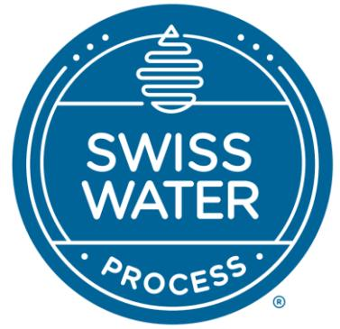
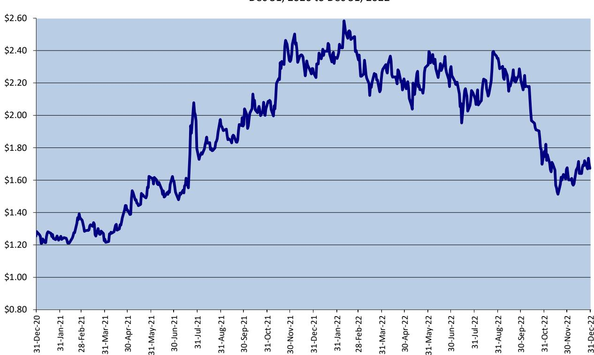
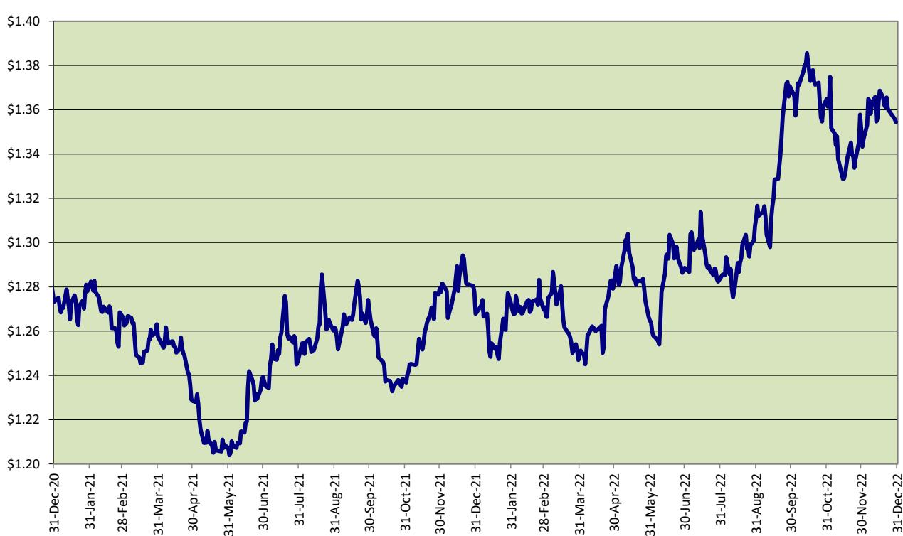
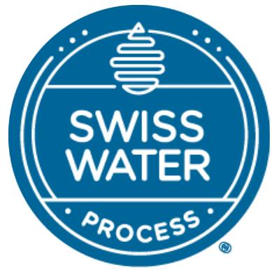
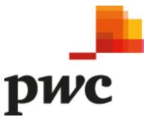
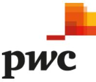
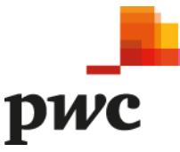
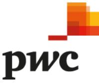
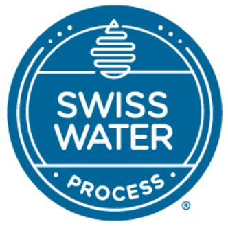

{0}------------------------------------------------

# **2022 ANNUAL REPORT**

{1}------------------------------------------------

{2}------------------------------------------------

### **Management Discussion and Analysis For the year ended December 31, 2022**

# **MANAGEMENT DISCUSSION AND ANALYSIS**

*This Management's Discussion and Analysis ("MD&A") of Swiss Water Decaffeinated Coffee Inc. ("Swiss Water" or the "Company"), dated as of March 16, 2023, provides a review of the financial results for the quarter and year ended December 31, 2022 relative to the comparable periods of 2021. The quarter period represents the fourth quarter ("Q4") of* our *2022 fiscal year. This MD&A should be read in conjunction with Swiss Water's audited consolidated financial statements for the year ended December 31, 2022, and in conjunction with the Annual Information Form ("AIF"), which are available on [www.sedar.com.](http://www.sedar.com/)*

*All financial information is presented in Canadian dollars, unless otherwise specified.*

# **FORWARD-LOOKING STATEMENTS**

This MD&A contains forward-looking statements, including statements regarding the future success of our business and market opportunities. Forward-looking statements typically contain words such as "believes", "expects", "anticipates", "continue", "could", "indicates", "plans", "will", "intends", "may", "projects", "schedule", "would" or similar expressions suggesting future outcomes or events, although not all forwardlooking statements contain these identifying words. Examples of such statements include, but are not limited to, statements concerning: (i) expectations regarding Swiss Water's future success in various geographic markets; (ii) future financial results, including anticipated future sales and processing volumes; (iii) future dividends; (iv) the expected actions of the third parties described herein; (v) factors affecting the coffee market including supplies and commodity pricing; (vi) the expected cost to complete production line currently under construction; and (vii) the business and financial outlook of Swiss Water. In addition, this MD&A contains financial outlook information that is intended to provide general guidance for readers based on our current estimates, which are based on numerous assumptions and may prove to be incorrect. Therefore, such financial outlook information should not be relied upon by readers. These statements are neither promises nor guarantees but involve known and unknown risks and uncertainties that may cause our actual results, level of activity, performance or achievements to be materially different from any future results, levels of activity, performance or achievements expressed in or implied by these statements. These risks include, but are not limited to, risks related to processing volumes and sales growth, operating results, supply of coffee, supply of utilities, general industry conditions, commodity price risks, technology, competition, foreign exchange rates, interest rate risks, construction timing, inflation, costs and financing of capital projects, general economic conditions and those factors described herein under the heading 'Risks & Uncertainties'.

The forward-looking statements contained herein are also based on assumptions that we believe are current and reasonable, including but not limited to, assumptions regarding: (i) trends in certain market segments and the economic climate generally; (ii) the financial strength of our customers; (iii) the value of the Canadian dollar versus the US dollar ("US\$"); (iv) the expected financial and operating performance of Swiss Water going forward; (v) the availability and expected terms and conditions of debt facilities; (vi) the expected level of dividends payable to shareholders; (vii) the potential impact of pandemics (viii) the potential impact of any war and terrorist activity. We cannot assure readers that the actual results will be consistent with the statements contained in this MD&A. The forward-looking statements and financial outlook information contained herein are made as of the date of this MD&A and are expressly qualified in their entirety by this cautionary statement. Except to the extent required by applicable securities law, Swiss Water undertakes no obligation to publicly update or revise any such statements to reflect any change in our expectations or in events, conditions, or circumstances on which any such statements may be based, or that may affect the likelihood that actual results will differ from those described herein.

{3}------------------------------------------------

### **Management Discussion and Analysis For the year ended December 31, 2022**

# **EXECUTIVE SUMMARY**

The following selected information, other than Adjusted EBITDA was derived from the financial statements for the year ended December 31, 2022, prepared in accordance with IFRS. For the definition of Adjusted EBITDA, refer to the Non-IFRS Measures section of this MD&A.

| In \$000s except per share amounts     |              | 3 months ended December 31, | Year ended December 31, |         |    |         |  |
|----------------------------------------|--------------|-----------------------------|-------------------------|---------|----|---------|--|
| (unaudited)                            | 2022         | 2021                        |                         | 2022    |    | 2021    |  |
| Revenue                                | \$ 43,998 | \$ 35,129                | \$                      | 176,935 | \$ | 125,076 |  |
| Gross Profit                           | 5,759        | 4,389                       |                         | 26,088  |    | 17,611  |  |
| Operating income                       | 2,792        | 1,517                       |                         | 13,381  |    | 6,686   |  |
| Net income (loss)                      | (254)        | 241                         |                         | 2,387   |    | 496     |  |
| Adjusted EBITDA1                       | 3,087        | 2,111                       |                         | 16,659  |    | 10,533  |  |
| Net income (loss) per share – basic2   | \$ (0.03) | \$ 0.03                  | \$                      | 0.26    | \$ | 0.05    |  |
| Net income (loss) per share – diluted2 | \$ (0.03) | \$ 0.03                  | \$                      | 0.26    | \$ | 0.05    |  |

1 Adjusted EBITDA is defined in the 'Non-IFRS Measures' section of this MD&A and is a "Non-GAAP Financial Measure" as defined by CSA Staff Notice 52-306.

2 Per-share calculations are based on the weighted average number of shares outstanding during the periods. Diluted earnings per share take into account shares that may be issued upon the exercise of warrants and RSUs.

#### **Financial highlights**

- Revenue for the quarter and year ended December 31, 2022, was \$44.0 million and \$176.9 million respectively, which represents a 25% and 41% increase over the same periods in 2021. The increase is a result of strong volume growth and higher green coffee prices. In addition, our Seaforth subsidiary continues to operate at record levels of activity.
- Gross profit for the quarter and year ended December 31, 2022, was \$5.8 million and \$26.1 million respectively, which represents a 31% and 48% increase over the same periods in 2021. Gross profit percent for the year ended December 31, 2022, was 15%, which represents a 1% increase over the same period in 2021. The increase in gross profit dollars was primarily driven by higher sales volume. In addition, we benefited from a significantly higher green coffee differential margin. The increase was partially offset by inflationary pressure on variable production costs and freight.
- Operating income for the quarter and year ended December 31, 2022, was \$2.8 million and \$13.4 million respectively, which represents an 84% and 100% increase over the same periods in 2021. The increase is a result of the improvements in gross profit from increased volumes and higher green coffee differential margin, partially offset by increases in administration expenses. The increased expenses were due to general inflationary pressure, higher professional fees, increased headcount and salaries, and overall costs of running two facilities, including depreciation and rental expenses.
- In Q4 2022, we performed an assessment of the salvageable assets associated with our Burnaby location in advance of the expiry of the lease, in June 2023. With the support of a third party engineering consultancy, we considered the potential future use, cost and benefit, and related cash flows to salvage equipment from the Burnaby location and determined that only a portion of the equipment should be salvaged for future use. As a result, a one-time \$2.5 million impairment of plant and equipment was recorded in Q4 2022. The impairment is a non-cash expense that, if removed, would have resulted in a \$2.5 million increase in annual net income in 2022. There was no such impairment in 2021.

{4}------------------------------------------------

## **Management Discussion and Analysis For the year ended December 31, 2022**

- Net income for the quarter and year ended December 31, 2022, was a loss of \$0.3 million and income of \$2.4 million, respectively. The decrease in Q4 net income was mainly due to the impairment of plant and equipment associated with the Burnaby location. For the full year, the increase resulted from improvements in operating income, materially offset by a one-time impairment of plant and equipment associated with the Burnaby location. Increased losses on foreign exchange due to the strengthening of the US dollar in Q3 2022, and increased losses on risk management activities due to mark-to-market revaluations of commodity and foreign currency hedges were also deductions against 2022 net income.
- Adjusted EBITDA[1](#page-4-0) for the quarter and year ended December 31, 2022, was \$3.1 million and \$16.7 million respectively, which represents a 46% and 58% increase over the same periods in 2021. The improvement in Adjusted EBITDA was mainly driven by the positive impact of increased sales volume and a higher green coffee differential margin.

## **Operational highlights**

- Total sales volumes for the year increased by 15% compared to 2021. Volume growth during the first half of the year was enhanced by the shipment of products to new out-of-home food service customers within North America. Over the second half of the year, our customers continued to see strong consumer demand within most segments. Encouragingly, we recorded 19% and 10% volume growth in our North America and Asia-Pacific regions respectively, during 2022.
- Our largest geographical market by volume during 2022 was the United States, followed by Canada and international markets. By dollar value, 48% of our sales were to customers in the United States, 26% were to Canadian customers, and the remaining 26% were to international customers. Our international business continues to expand rapidly, and we anticipate demand from our Asia-Pacific and European markets to remain strong in 2023.
- On November 7, 2022, Swiss Water announced the expansion of our credit facilities with our existing creditors, resulting in \$33.25 million of incremental capital availability. This consists of \$21.25 million of expanded revolving credit capacity for working capital and \$12.0 million of incremental senior-term financing for capital expansions. The capital allocation is specifically to help finance oursecond production line in Delta, British Columbia ("Delta 2") (see Press Release dated November 7, 2022).

Looked at sequentially, we did see a slow down in the rate of volume growth during the second half of 2022, when compared to the strong double-digit growth we experienced in the first half of the year. However, despite this, as well as inflationary pressures, we continue to see strong volume increases across the business. Sales to customers in the United States increased by \$11.9 million during the fourth quarter and by \$32.1 million for the full year, when compared to the same periods in 2021. Sales to customers in Canada increased by \$3.4 million in the quarter and by \$7.1 million for the full year. Although we saw a decline in our international sales during the fourth quarter, this was largely due to timing issues. For the full year, sales to international customers were strong, increasing by \$12.7 million, or 39% over the 2021 level. Within the international business, 2022 sales volumes to Asia-Pacific customers were substantial, growing by a 10% increase year-over-year. Generally, we continue to see robust organic growth with existing customers, as well as incremental volume from new customers switching to chemical free decaffeinated coffee. Ultimately, our

1 Adjusted EBITDA is defined in the 'Non-IFRS Measures' section of the MD&A and is a "Non-GAAP Financial Measure" as defined by CSA Staff Notice 52-306.

{5}------------------------------------------------

## **Management Discussion and Analysis For the year ended December 31, 2022**

strong volume performance reflects our well-diversified customer base and the growing recognition of the importance of drinking coffee decaffeinated without the use of harmful chemicals.

Regarding customer mix, 2022 saw incremental volumes going to restaurants and out-of-home specialty coffee shops which are now operating at or above pre-pandemic capacity. This was evidenced by the 28% annual growth in business with our specialty roaster customers. As in recent quarters, we also continue to see new volume associated with the addition of new customers and brands within our North American business.

Throughout 2022, we have remained well positioned with green coffee inventory and can react to short-term demand increases in most coffee origins. However, we continue to be affected by persistent disruptions in deliveries of green coffee, particularly from Brazil, as supply chain bottlenecks and equipment shortages persist in many outbound ports, and container-ship service to the Port of Vancouver is still reduced. This has led to significant increases in freight rates. While these costs are generally recoverable, they are nonetheless inflationary. We remain in daily contact with our customers and suppliers regarding the movement of coffee. However, many of them have remained cautious of the time it will take for supply chains to return to normal operating efficiency. This caution has caused participants throughout the coffee supply chain to increase their inventories despite a high New York Futures contract coffee commodity price, or NY'C.

The NY'C for Arabica coffee increased rapidly in the third quarter of 2021 and remained high until the third quarter of 2022. It is unusual for the NY'C to experience such an elevated level for a sustained period. A rare double frost occurred in July 2021, in Brazil, the world's largest producer of coffee. This caused an immediate run-up in the NY'C reaching a peak of US\$2.58 that occurred during the first quarter of 2022. The tight availability of exportable coffee due to crop shortages and ongoing logistical backlogs has kept the pressure on the futures market and we have seen spot availability of coffees fall substantially as a result. The NY'C for Arabica coffee did decrease in the fourth quarter of 2022. However, the effects of this on the coffee market will not be fully realized until later in 2023, and its impact depends on the futures market remaining at this lower level for a sustained period of time.

We also experienced and continue to feel inflationary pressures within other components of our variable cost structure. These increases include higher costs for natural gas, packaging, shipping, and labour. The resulting pressure on our profitability drove our decision to increase processing prices toward the end of the fourth quarter of 2021, to help maintain our margins.

On November 7, 2022, Justin Jacobs, Managing Director of Mill Road Capital LLC ("Mill Road"), was appointed to Swiss Water's Board of Directors, pursuant to Mill Road's existing board nomination rights. Mr. Jacobs has been with Mill Road since the firm's founding in 2005. Previously, he worked at LiveWire Capital, an investment and management group, and in the private equity group at The Blackstone Group. Mr. Jacobs has been a director at numerous public and private companies, including British Columbia's based PRT Growing Services Ltd., a British Columbia based leader in the reforestation sector. In addition to the debenture with warrants referred to in Note 17.3 of our audited consolidated financial statements, Mill Road currently holds 608,500 shares of Swiss Water, representing approximately 6.6% of the issued and outstanding shares of the Company.

# **NON-IFRS MEASURES**

# **Adjusted EBITDA**

Adjusted EBITDA is a Non-GAAP measure that is often used by publicly traded companies as a measure of cash from operations, as it excludes financing costs, taxation, and non-cash items. We believe that disclosing this Non-IFRS measure provides readers of this MD&A with important information regarding Swiss Water's

{6}------------------------------------------------

## **Management Discussion and Analysis For the year ended December 31, 2022**

financial performance and our ability to pay distributions to stakeholders. By considering Adjusted EBITDA in combination with IFRS, we believe that readers are provided with additional and more useful information about Swiss Water than readers would have if they simply considered IFRS measures alone. Reported Adjusted EBITDA is intended to assist readers with their own financial analysis. However, since this measure does not have a standardized meaning prescribed by IFRS, it is unlikely to be comparable to similar measures presented by other entities.

We define Adjusted EBITDA as net income before interest, depreciation, amortization, impairments, sharebased compensation, gains/losses on foreign exchange, gains/losses on disposal of property and equipment, fair value adjustments on embedded options, gains/losses on extinguishment of debt, adjustment for the impact of IFRS 16 - Leases, and provision for income taxes. Our definition of Adjusted EBITDA also excludes unrealized gains and losses on the undesignated portion of foreign exchange forward contracts.

Adjusted EBITDA for the quarter and year ended December 31, 2022, was \$3.1 million and \$16.7 million respectively, compared to \$2.1 million and \$10.5 million for the same periods in 2021. Operationally, the change in Adjusted EBITDA was driven by increased processing volume, revenue growth, and higher green coffee differentials. These gains were partially offset by an increase in green coffee costs and inflationary pressures on our underlying cost structure.

To help readers better understand our financial results, the following table provides a reconciliation between Adjusted EBITDA and operating income, the most comparable IFRS measure for the periods as indicated:

| (In \$000s)                                         | 3 months ended December 31, |             | Year ended December 31, |              |
|-----------------------------------------------------|-----------------------------|-------------|-------------------------|--------------|
| (unaudited)                                         | 2022                        | 2021        | 2022                    | 2021         |
| Operating income                                    | \$ 2,792                 | \$ 1,517 | \$ 13,381            | \$ 6,686  |
| Depreciation and amortization                       | 1,686                       | 1,095       | 7,018                   | 6,208        |
| Share-based compensation                            | 173                         | 205         | 552                     | 690          |
| (Gain) loss on risk management activities           | (65)                        | 179         | (1,560)                 | (323)        |
| Unrealized (gain) loss on foreign exchange forwards | (796)                       | (183)       | 44                      | 80           |
| Impact of IFRS 16 Leases                            | (703)                       | (702)       | (2,776)                 | (2,808)      |
| Adjusted EBITDA                                     | \$ 3,087                 | \$ 2,111 | \$ 16,659            | \$ 10,533 |

The reconciliation of net income, an IFRS measure, to Adjusted EBITDA is as follows:

| (In \$000s)                                         |             | 3 months ended December 31, | Year ended December 31, |    |         |
|-----------------------------------------------------|-------------|-----------------------------|-------------------------|----|---------|
| (unaudited)                                         | 2022        | 2021                        | 2022                    |    | 2021    |
| Income (loss) for the period                        | \$ (254) | \$ 241                   | \$ 2,387             | \$ | 496     |
| Income taxes expense (recovery)                     | (130)       | 128                         | 819                     |    | 509     |
| Income (loss) before tax                            | \$ (384) | \$ 369                   | \$ 3,206             | \$ | 1005    |
| (Gain) loss on the embedded option                  | (513)       | -                           | (513)                   |    | 48      |
| (Gain) loss on the extinguishment of debt           | (583)       | (4)                         | (583)                   |    | 1,381   |
| Finance income                                      | (174)       | (72)                        | (509)                   |    | (442)   |
| Finance expenses                                    | 1,577       | 1,189                       | 5,567                   |    | 4,364   |
| Impairment of plant and equipment                   | 2,470       | -                           | 2,470                   |    | -       |
| Loss on foreign exchange                            | 334         | 214                         | 2,183                   |    | 7       |
| Depreciation and amortization                       | 1,686       | 1,095                       | 7,018                   |    | 6,208   |
| Unrealized loss (gain) on foreign exchange forwards | (796)       | (183)                       | 44                      |    | 80      |
| Share-based compensation                            | 173         | 205                         | 552                     |    | 690     |
| Impact of IFRS 16 Leases                            | (703)       | (702)                       | (2,776)                 |    | (2,808) |
| Adjusted EBITDA                                     | \$ 3,087 | \$ 2,111                 | \$ 16,659            | \$ | 10,533  |

{7}------------------------------------------------

**Management Discussion and Analysis For the year ended December 31, 2022**

# **OUTLOOK**

Swiss Water delivered an exceptionally strong financial performance in 2022. Sustained volume growth over the last two years has been a major driver of our strong results. This momentum initially emerged during the early stages of the COVID-19 pandemic when working remotely gained traction, resulting in a significant increase in the at-home consumption of coffee. As pandemic restrictions eased and, things began to return to normal through 2022, many businesses and organizations have now moved away from the modified workfrom-home model. This change slowed the growth of at-home consumption and, as a result, the volumes we deliver to our large commercial customers who serve the grocery channel. However, at the same time, our sales to our specialty roaster segment grew significantly during 2022. Now, many of our specialty customers are ordering in-line or exceeding pre-pandemic levels of activity.

We continue to see increased demand from all our customers that serve the out-of-home market through cafes and restaurants. This has been particularly evident in North America where our food service customers have generally returned to a normal operating environment. It is particularly encouraging that our sales volumes in the Asia-Pacific region grew by 10% during 2022, while sales to our largest market, North America, grew by 19% over the last twelve months.

Despite the normalization of trading conditions, uncertainty persists. Inflationary pressures are becoming ever more apparent and interest rates have risen rapidly across the globe. We cannot reliably predict the ultimate impact these factors will have on global supply chains and customer demand. If inflation rates continue through the first quarter of 2023, we may have to increase the process rates we charge our customers. However, we are cautiously optimistic that our volume growth will offset some of this anticipated inflationary pressure.

On a further cautionary note, the post-pandemic recovery of the global economy combined with the negative impact of the conflict in Ukraine has placed additional stress on international supply chains and production costs. These developments are actively undermining the efficient movement of coffee from some growing regions, and we are experiencing delays in the delivery of some coffees to our production facilities. Furthermore, although coffee prices have started to soften, high coffee prices can have a destabilizing impact on the efficient movement of coffee inventories and will result in higher prices on retail grocery shelves. Historically, sharp increases in retail pricing have resulted in demand destruction in the grocery channel, which has the effect of decreasing Swiss Water's volumes. We are paying close attention to these risks and will implement necessary mitigation steps, as required, to ensure that our production schedules are not compromised as we move through 2023.

Operationally, Swiss Water ran both production lines at our legacy plant in Burnaby on a 24/7 basis during the fourth quarter of 2022. Since completing the first production run of commercial-grade coffee from our new decaffeination line in Delta, in September 2020, we have been steadily transitioning a significant proportion of production volume to this new facility. Aside from scheduled maintenance, the Delta line has been running on a 24/7 basis as we continue its optimization. However, record demand in the last six quarters drove higher than expected utilization of our legacy assets in Burnaby. During this period, the capacity utilization rate across all three of our current production lines regularly exceeded 80%, Operating at these elevated production levels would not have been possible without the investment we made in our first production line in Delta. Furthermore, it provides valuable insight into the value creation opportunity available when we operate at high-capacity utilization rates and supports our decision to invest in a second line in Delta.

As reported previously, in the second quarter of 2020, the landlord of our Burnaby manufacturing site provided formal notice that our lease would not be extended beyond June 2023. This made clear the need for

{8}------------------------------------------------

# **Management Discussion and Analysis For the year ended December 31, 2022**

Swiss Water to build a second new decaffeination line in Delta to ensure our ability to meet customer demand is uninterrupted upon the conclusion of our Burnaby lease and to provide additional capacity for intermediateterm growth. Last summer, we were issued the necessary building permits and began construction of the Delta expansion. The targeted completion date of this project is the third quarter of 2023. Based on engineering reports from a third-party engineering firm, when both are completed the two lines in Delta are expected to have a targeted endpoint capacity at least 40% greater than the current existing capacity of the two lines at our Burnaby site. This should provide sufficient capacity to satisfy current demand and projected intermediate term growth.

During the fourth quarter, Swiss Water continued construction of a second production line at its facility in Delta, BC. The preliminary cost estimate of this project was approximately \$45.0 million, plus commissioning costs of approximately \$2.0 million. During the second half of 2022, the impacts of global macroeconomic pressures, including inflation, trades disruptions, and supply chain issues, became more acute in terms of project budget and schedule. The Company currently projects a \$53.0 million final cost as it approaches substantial completion, factoring in the vast majority of realized inflationary factors to date, and there is no change to the commissioning budget. These estimates are preliminary and like all major design and construction projects, are highly dependent on local and global economic factors impacting construction. These include, without limitation, changes in labour, commodity and materials pricing, trade policies, and supply chain issues. In addition, the continuing impact of inflation is unknown and could impact the timing and costs of the project.

The progress and estimated completion of Delta 2 has been closely monitored in light of the deadline to exit the Burnaby site. We plan to utilize our Burnaby assets into the second quarter of 2023. However, given the targeted completion date of Delta 2 is the third quarter of 2023, we recognize that there will be a period of time when our production capacity will be reduced. As a result, we have been proactive in our communications with customers and suppliers regarding the production of coffee leading up to the Burnaby exit, during the estimated period of lower production capacity, and after Delta 2 begins producing a commercially viable product. We are cautiously optimistic that this proactive response will minimize any disruptions to our business and customers. However, it will necessitate a front loaded working capital investment to cover elevated production volumes during Q1 2023, and may also temporarily compress net income during Q3 2023 when our production capacity is constrained.

During 2022, we engaged a third party engineering consultancy to help us to evaluate the exit cost and transition plan associated with permanently shutting down our Burnaby location ("Exit Plan"). This evaluation, not only considered the Exit Plan, but assessed the recoverability of existing production assets from the site. This planning process recently concluded, and it has been determined that only a portion of existing assets should be salvaged for future use. In reaching this decision, we considered the probability of near-term future use, as well as the costs, potential benefits and related cash flow impacts of extracting the equipment from the Burnaby location.

The preliminary cost estimate to execute this plan is \$1.5 million. We now consider 20% of the preliminary cost estimate to be an approximate risk factor and we are now actively working to mitigate cost and schedule impacts. This estimate is preliminary and is dependent on variable local and global economic factors. The decision to limit the recovery of existing assets triggered a one-time, non-cash impairment charge which has been reflected in our 2022 financial statements.

Finally, on November 7, 2022, we announced the expansion of our credit facilities with existing creditors, resulting in \$33.25 million of incremental capital availability. This consists of \$21.25 million of expanded

{9}------------------------------------------------

## **Management Discussion and Analysis For the year ended December 31, 2022**

revolving credit capacity for working capital and \$12.0 million of incremental senior-term financing for capital expansions. The capital allocation is specifically to help finance our second production line in Delta, British Columbia (see Press Release dated November 7, 2022). As part of the refinancing, we amended our agreement with Mill Road to increase our senior debt covenant to \$123.25 million.

# **BUSINESS OVERVIEW**

Swiss Water Decaffeinated Coffee Inc. is a premium green coffee decaffeinator located in Burnaby and in Delta, British Columbia. We employ the proprietary Swiss Water® Process to decaffeinate green coffee without the use of chemical solvents, leveraging science-based systems and controls to produce coffee that is 99.9% caffeine free. Our process is certified organic by the Organic Crop Improvement Association and is the world's only consumer-branded decaffeination process. Decaffeinating premium green coffee without the use of harmful chemical solvents is our primary business.

Our Seaforth subsidiary provides a complete range of green coffee logistics services including devanning coffee received from their origin; inspecting, weighing, and sampling coffees; and storing, handling and preparing green coffee for outbound shipments. Seaforth provides all of Swiss Water's local green coffee handling and storage services. In addition, Seaforth handles and stores coffees for several other coffee importers and brokers and is the main green coffee handling and storage company in Metro Vancouver. Seaforth is organically certified by Ecocert Canada.

Swiss Watershares trade on the Toronto Stock Exchange under the symbol 'SWP'. As at the date of this report, 9,165,815 shares were issued and outstanding.

## **Swiss Water Decaffeinated Coffee's Business**

We carry an inventory of premium-grade Arabica coffees that we purchase from the specialty green coffee trade, decaffeinate and then sell to our customers (our "Regular" or "Non-Toll" business). Revenue from our Regular business includes both processing revenue and green coffee cost recovery revenue.

We also decaffeinate coffee owned by our customers for a processing fee under toll arrangements (our "toll" business). The value of the coffee processed under toll arrangements does not form part of our inventory, our revenue, or our cost of sales. Revenue from toll arrangements consists entirely of processing revenue.

Our cost of sales is comprised primarily of the cost of green coffee purchased for our regular business, plant labour and other processing costs directly associated with our production facility. This incorporates an allocation of fixed overhead costs, which includes depreciation of our production equipment and amortization of our proprietary process technology. For our regular business, we work with coffee importers to source premium-grade green coffees from coffee-producing countries located in Central and South America, Africa and Asia. The purchase price is based on the NY'C coffee futures price on the Intercontinental Exchange, plus a quality differential. The NY'C component typically makes up more than 80% of the total cost of green coffee, while the quality differential typically accounts for less than 20%. Both the NY'C price and the quality differential fluctuate in response to fundamental commodity factors that affect supply and demand.

## **CAPACITY TO DELIVER RESULTS**

The following resources allow us to deliver on our business strategy:

- Proprietary Chemical Free Production Lines We have three decaffeination production lines which is projected to be two lines by Q3 2023. This enables us to align our production capacity with changes in demand throughout the year. We are able to better control our variable cost by operating a reduced

{10}------------------------------------------------

# **Management Discussion and Analysis For the year ended December 31, 2022**

number of lines when demand is lower and all lines when demand is higher. In Q3 2020, we initiated production from our new processing facility in Delta, BC. In prior years we completed an efficiency enhancement project in Q2 2018 to increase capacity at our Burnaby operating facility, and in 2016, we expanded the capacity of one of our production lines, which enabled us to meet near-term growth in demand for our products. The construction of our second production line in Delta, which commenced in 2021 will enable us to meet our intermediate term growth ambition.

- Consumer Branding as the Premium, 100% Chemical Free Method of Decaffeinating Green Coffee We have been successful in establishing our brand as a leading chemical free processor of green decaffeinated coffee. Consumers and participants in the coffee trade are increasingly aware of the value of the chemical free Swiss Water® Process due to its quality and taste. We believe that there is significant potential to continue to broaden consumer awareness of the benefits of the Swiss Water® Process.
- Established Customer Base The Swiss Water® Process has an established customer base across North America and in many international markets. Our customers include some of North America's largest roasters, roaster-retailers and leading coffee brands.
- Broad Distribution Channels Green coffee decaffeinated using the Swiss Water® Process is sold through the coffee market's key distribution channels: roaster retailers, commercial roasters and coffee importers. This diversity ensures that we access all key segments of the specialty coffee trade and consumer coffee markets.
- Working Capital and Expansion Capital In 2015, 2016, 2018, 2019, and 2022 we raised capital, which was used to fund the construction of our first and second production lines in Delta. The first production line in Delta was commissioned in 2020. In 2021 and 2022, we raised capital through debt financing to finance our second production line in Delta. We expect to utilize internally generated and external funds to finance the capital costs associated with the new production facility, and our future working capital investments.
- Management Expertise Swiss Water is highly regarded in the coffee industry for our senior management team's substantial experience, our close attention to consumer trends in the specialty coffee market, and our in-depth knowledge of green and roasted coffee. In particular, our intense focus on premium product quality and commitment to science-driven insight is well recognized. To maximize these strengths, we have invested significant resources in enhancing our team's industry-related skills and talents over the past few years. Going forward, we intend to leverage our exceptional experience with, and knowledge of, the specialty coffee industry to continue to build our business.

## **KEY PERFORMANCE DRIVERS**

The following key performance drivers are critical to the successful implementation of our strategy and ability to improve profitability and cash from operations:

## **Internal Factors**

- Sustainability and Environmental Responsibility The Swiss Water® Process is a 100% chemical free decaffeination process that enables us to consistently deliver high-quality coffee. Our approach to sustainability is to continually improve and innovate this process to be more efficient by actively managing resource usage in a safe and environmentally responsible manner. In addition to carefully managing our operations, we take steps to ensure a sustainable coffee supply by purchasing sustainably certified coffees and organic coffees. We promote social sustainability by participating in programs within the coffee

{11}------------------------------------------------

## **Management Discussion and Analysis For the year ended December 31, 2022**

industry that advance the health of women and their families living in coffee-growing communities (Grounds for Health) and that foster research-based approaches to advancing coffee cultivation (World Coffee Research).

- Processing Volumes Our decaffeination facility generates a certain level of fixed operating costs that are incurred regardless of the volume of coffee processed. Accordingly, our profitability and cash from operations will increase as processing volumes increase. Processing volume is a key performance indicator ("KPI") that we monitor continuously.
- Process Consistency We manage our operations in order to reduce variability in production and drive continuous improvement. Production consistency results in improved product quality. We have developed a number of KPIs designed to monitor process consistency and have set targets for continuous process improvement.
- Product Quality Quality control is a key part of our operations. We operate under the Food Safety Systems Certification (FSSC) 22000, which manages our food safety, as well as HACCP (Hazard Analysis Critical Control Points) and quality assurance programs. All green coffees delivered to our processing facility are weighed and inspected and are subject to rigorous internal quality-control evaluations. Each lot of green coffee processed is monitored throughout the decaffeination process, and a certificate of analysis is prepared for each lot. A sample from each production lot is also roasted, brewed and cupped to ensure quality. In addition, our focus on reducing the size of production lots and increasing inventory turnover results in fresher coffee being provided to our customers. Production batch size and inventory turns are two other KPIs that we monitor regularly.
- Order Fulfillment Our integrated supply chain management strategy includes maintaining inventories of finished goods at various coffee warehousesthroughout North America, and of raw goods for improved inventory replenishment times. Our order fulfillment rates are monitored regularly. An improved order fulfillment rate contributes to our volume growth and improved customer service levels.
- Employee Safety We are focused on operating our business in a safe manner, and reducing the likelihood that employees will be injured at work. We track employee safety metrics by department, and our safety committee proactively seeks ways to reduce the risks inherent in our operating environment. While we cannot completely eliminate the risk of workplace incidents or accidents, we have significantly reduced the number of safety-related incidents over the past few years. We believe that ensuring employee safety leads to improved employee retention and morale, increased efficiency and lower operating costs.

## **External Factors**

- Coffee Futures Prices We buy and sell coffees based on the NY'C plus the quality differentials for specified coffees, both of which rise and fall in response to changes in supply and demand. We manage our exposure to changes in the NY'C futures price on the value of our inventories through a commodity hedging program (discussed under 'Hedge Accounting' below) but cannot hedge our exposure to changes in quality differentials. In addition to the price risks associated with holding coffee inventories, our revenue and cost of sales are affected by changes in the underlying commodity price. Commodity price increases (decreases) raise (lower) the green coffee cost recovery revenue generated through our nontoll business, as well as the costs of green coffee sold to customers to generate sales.
Changes in the NY'C also affect our statement of financial position and the amount of working capital we use in our business. When coffee prices rise (fall), our inventory values gradually increase (decrease) as

{12}------------------------------------------------

# **Management Discussion and Analysis For the year ended December 31, 2022**

we replace coffee at higher prices. Our accounts receivable and our accounts payable also rise and fall with the NY'C. Finally, there is no open market to hedge the quality differential component of our green coffee cost. We sell coffee at replacement quality differentials, and as such, in a period of falling (rising) differentials, we will generate differential cost recovery losses (gains), as green coffee revenues will be less than (exceed) green coffee costs.

The chart below shows the movement in the NY'C for the last eight quarters:

NY'C Close (US\$/lb) Intercontinental Exchange Dec 31, 2020 to Dec 31, 2022

In Q4 2022, the NY'C averaged US\$1.77/lb compared to an average of US\$2.20/lb in Q4 2021. In 2022, the NY'C averaged US\$2.13/lb compared to an average of US\$1.68/lb in the same period in 2021. The rise and fall of the NY'C affects our volume of shipments, our revenues, our cost of sales, and our working capital requirements. In an upward trending market, our customers tend to consume their inventories rather than build them. When the NY'C declines over a sustained period, our customers tend to add to their inventories.

- US\$/C\$ Exchange Rates The majority of our ("C\$") revenues are generated in US dollars ("US\$"), while a significant portion of our costs are paid in Canadian dollars. We, therefore, have exposure to changes in the US\$/C\$ exchange rates. This is managed, in part, through derivative financial instruments. All other factors being equal, our profitability and cash from operations will be higher when the US dollar appreciates relative to the Canadian dollar. A long-term depreciation of the Canadian dollar will improve our long-term profitability and cash generation.

{13}------------------------------------------------

# **Management Discussion and Analysis**

**For the year ended December 31, 2022**

The chart below shows the US\$ to C\$" exchange rates for the last eight quarters:

US Dollars to Canadian Dollars Bank of Canada Noon Rates Dec 31, 2020 to Dec 31, 2022

In Q4 2022, the US\$ averaged C\$1.36 compared to an average of C\$1.26 in Q4 2021. In 2022, the US\$ averaged C\$1.30 compared to an average of C\$1.25 in the same period in 2021. When the US\$ depreciates (appreciates), it decreases (increases) our gross profit on green coffee revenues.

## **OPERATING RESULTS**

## **Revenue**

We categorize our customers by the nature of their business: either coffee importers or roasters. Coffee importers act like grocery stores to roasters, sourcing and importing green coffee from various origins and carrying a selection of different origins and quality levels for roasters to choose from. Importers buy from us to resell our coffees to roasters when and where they need them. Roasters are in the business of roasting and packaging coffee for sale to consumers in their own coffee shops, or for home or office use. Roasters either buy directly from Swiss Water, or they buy from an importer. Roasters generally carry lower inventories, as they tend to take delivery of green coffee shortly before roasting it. As such, when comparing period to period, shipments to roasters are more stable when compared to shipments to importers.

We also monitor and report our revenue in three categories. "Process revenue" represents the amount we charge our customers for decaffeinating green coffee, and it generally increases as our processing volumes increase. "Green coffee cost recovery revenue", or "green revenue", is the amount we charge our customers for the green coffee we purchase for decaffeination. "Distribution revenue" consists of shipping, handling, 

{14}------------------------------------------------

## **Management Discussion and Analysis For the year ended December 31, 2022**

and warehousing charges billed to our customers. It typically rises with our processing volumes and with the growth of Seaforth's business.

Our revenue by category for the indicated period was:

| (In \$000s)          |              | 3 months ended December 31, |    | Year ended December 31, |    |         |
|----------------------|--------------|-----------------------------|----|-------------------------|----|---------|
| (unaudited)          | 2022         | 2021                        |    | 2022                    |    | 2021    |
| Process revenue      | \$ 8,405  | \$ 8,396                 | \$ | 36,952                  | \$ | 30,482  |
| Green revenue        | 32,248       | 24,444                      |    | 128,039                 |    | 86,157  |
| Distribution revenue | 3,345        | 2,289                       |    | 11,944                  |    | 8,437   |
| Total revenue        | \$ 43,998 | \$ 35,129                | \$ | 176,935                 | \$ | 125,076 |

For the quarter and year ended December 31, 2022, sales totaled \$44.0 million and \$176.9 million respectively, an increase of \$8.9 million or 25% and \$51.9 million or 41% compared to the same periods in 2021. The increase was driven by volume demand from our customers, the impact of an increase in the New York Arabica Futures market, and the appreciation of the US dollar.

Our sales for the quarter and year ended December 31, 2022, by revenue category, are as follows:

- Process revenue remained flat in Q4 and increased \$6.5 million or 21% year to date. The increase reflects growth in our processing volumes, prices, and foreign exchange hedging activities.
- Green revenue increased \$7.8 million or 32% in Q4, and \$41.9 million or 49% year to date. The increase reflects higher green coffee sales volume and coffee futures price, NY'C, and appreciation of the US dollar.
- Distribution revenue increased \$1.1 million or 46% in Q4, and \$3.5 million or 42% year to date. The increase reflects higher shipment volumes, inflationary pressure on freight rates, and stronger than expected capacity utilization rates in our Seaforth subsidiary.

Our sales volumes for the year ended December 31, 2022, by geographical segment, are as follows:

- Sales volume in North America increased 19%;
- Sales volume in Asia-Pacific increased 10%.

### **Cost of Sales**

Cost of sales includes the cost of green coffee purchased for our regular business, the plant labour and other processing costs directly associated with our production facility, customer-specific hedges and commodity hedges. The cost of sales incorporates an allocation of fixed overhead costs, which includes depreciation of our production equipment and amortization of our proprietary process technology. In addition, cost of sales includes the costs of operating Seaforth's warehouse.

For the quarter and year ended December 31, 2022, cost of sales totaled \$38.2 million and \$150.8 million respectively, an increase of \$7.5 million or 24% and \$43.4 million or 40%, compared to the same periods in 2021. This was driven mainly by increased production volume, green coffee costs, and freight.

{15}------------------------------------------------

## **Management Discussion and Analysis For the year ended December 31, 2022**

## **Gross Profit**

For the quarter and year ended December 31, 2022, gross profit totaled \$5.8 million and \$26.1 million respectively, an increase of \$1.4 million or 31% and \$8.5 million or 48%, compared to the same periods in 2021. The improvement was primarily driven by higher sales volume. In addition, we benefited from a higher green coffee differential margin.

### **Administration Expenses**

Administration includes general management, inbound and outbound logistics, finance and accounting, quality control and assurance, engineering, research and development, and other administrative or support functions. Administration expenses include compensation expenses, travel and other personnel-related expenses for administrative staff, director fees, investor relations expenses, professional fees, depreciation of office-related equipment, and amortization of the brand asset.

For the quarter and year ended December 31, 2022, administration expenses totaled \$1.8 million and \$8.9 million respectively, a decrease of \$0.3 million or 14% and an increase of \$1.4 million or 19%, compared to the same periods in 2021. The primary drivers of the overall increase were general inflationary pressure, increased professional fees, increased headcount and salaries, and overall administrative costs associated with operating two facilities, including depreciation and rental expenses.

### **Sales and Marketing Expenses**

Sales and marketing expenses include compensation and other personnel-related expenses for sales and marketing staff, consumer initiatives, trade advertising and promotion costs, as well as related travel expenses. We invest in research regarding the behavior of decaffeinated coffee consumers. These insights enable us to create effective consumer advertising programs, and they form the foundation of the consultative services we provide to our customers. We also aim to grow brand awareness with both the coffee trade and consumers. We employ a range of marketing activities to achieve this, including digital and print advertising, social media communications, sponsorship and exhibiting at key industry events.

For the quarter and year ended December 31, 2022, sales and marketing expenses totaled \$1.2 million and \$3.8 million respectively, an increase of \$0.4 million or 47% and \$0.3 million or 10%, compared to the same periods in 2021. An increase in headcount and salaries in the current year, together with increased travel and trade shows, more than offset savings generated in 2021 following the restructuring of various departments in the first half of 2021.

### **Gains and Losses on Risk Management Activities**

Under hedge accounting, gains or losses on designated hedges are included in either revenue or cost of sales, held on the balance sheet, or included in other comprehensive income for future transactions (see 'Hedge Accounting', below). Thus, any gain or loss on risk management activities includes only those gains and losses on derivative financial instruments or portions of such instruments that are not designated as hedging instruments.

For the quarter and year ended December 31, 2022, we recorded a loss on risk management activities of \$0.1 million and \$1.6 million respectively, a decrease of \$0.2 million and \$1.2 million, compared to the same periods in 2021. The main drivers for this are unrealized losses due to fluctuations in the Canadian versus US dollar and fluctuations in NY'C.

{16}------------------------------------------------

## **Management Discussion and Analysis For the year ended December 31, 2022**

## **Finance Expenses and Income**

Finance income reflects the charges we bill to customers for financing coffee inventories and interest earned on cash balances. Finance expenses include interest costs on credit facilities and bank debt, other borrowings, the accretion expense on our asset retirement obligation, interest expense on a debenture with warrants and interest expense on finance leases.

For the quarter and year ended December 31, 2022, net finance expense totaled \$1.4 million and \$5.1 million respectively, an increase of \$0.3 million or 26% and \$1.1 million or 29%, compared to the same periods in 2021. The overall increase primarily relates to a higher outstanding balance on our construction loans and credit facility, higher variable interest rates, and higher interest rate on our debenture with warrants.

On July 20, 2021, we amended our convertible debenture agreement with Mill Road into a debenture with warrants. Until the amendment, the interest on the 2016 convertible debenture agreement was expensed at an effective interest rate of 12.15% (a rate determined in accordance with IFRS), while the contractual interest paid on this loan was at a rate of 6.85%, causing the amortization of the bond discount to change over time. The new agreement, effective July 20, 2021, with Mill Road had an effective interest rate of 16.2% and a contractual interest paid rate of 9%. There is also an additional 1.5% interest calculated quarterly to be paid at the debt maturity date. Refer to Note 12.2 of the audited consolidated financial statements for more details.

On November 22, 2022, we amended our debenture with warrants with Mill Road. The new agreement had an effective interest rate of 18.3%. The contractual interest paid rate remained at 9% and there is still an additional 1.5% interest calculated quarterly to be paid at the debt maturity date. Refer to Note 12.2 of the audited consolidated financial statements for more details.

### **Gains and Losses on Foreign Exchange**

We realize gains and losses on transactions denominated in foreign currencies when they occur, and on assets and liabilities denominated in foreign currencies when they are translated into Canadian dollars as at the financial statement date.

For the quarter and year ended December 31, 2022, we recorded a loss on foreign exchange of \$0.3 million and \$2.2 million respectively, an increase of \$0.1 million and \$2.2 million, compared to the same periods in 2021. The large swing in foreign exchange is due to fluctuation in the Canadian versus US dollar as the exchange rate averaged C\$1.30 in 2022, compared to C\$1.25 in 2021. The majority of the foreign exchange loss was recorded in Q3 2022.

### **Fair Value of Embedded Option**

Before the agreement amendment on July 20, 2021, Swiss Water had a convertible debenture with Mill Road. Under IFRS, this instrument was deemed to contain an embedded option, or derivative liability, that was revalued at each balance sheet date. The fair value of the derivative liability was determined using the Black Scholes Option Pricing Model. The variables and assumptions used in calculating the fair value are based on management's best estimate at each balance sheet date.

In 2021, Swiss Water extinguished the Mill Road convertible debenture and the embedded option was written off, as such there was no revaluation of the embedded option in Q4 2021. For the year 2021, there was a small loss of \$0.05 million. In 2021 until extinguishment, the share price did not fluctuate as much, and as such the year to date figure was less significant.

{17}------------------------------------------------

# **Management Discussion and Analysis For the year ended December 31, 2022**

Effective November 22, 2022, we amended our debenture with warrants with Mill Road. Under IFRS, the warrants are deemed to contain an embedded option that is revalued at each balance sheet date. The fair value of the derivative liability was determined using the Black-Scholes Option Pricing Model. The variables and assumptions used in computing the fair value are based on our best estimate at each balance sheet date.

The revaluation of this embedded option resulted in a gain of \$0.5 million in Q4 2022. The fluctuations are due to swings in Swiss Water's share price and the risk-free interest rate that are used as inputs in the Black Scholes model. Refer to Note 12.2 in the audited consolidated financial statements for more details on the amended debt agreement with Mill Road.

## **Extinguishment of Debt**

On July 20, 2021, Swiss Water amended the convertible debenture agreement with Mill Road to a debenture with warrants. Under IFRS 9, the accounting for the transaction depends on whether the debt restructuring is considered an extinguishment or an adjustment to the existing liability ("extinguishment accounting" vs "modification accounting").

Given there is a 2.15% change in the interest rate and a replacement of the debt conversion to shares with warrants, we determined that the terms within the convertible debenture and the terms within the debenture with warrants are substantially different. As such, this debt restructuring transaction was accounted for using the extinguishment method of accounting for debt reconstruction. During the year ended December 31, 2021, Swiss Water recognized a loss on extinguishment of the convertible debenture in the amount of \$1.4 million. The loss consists of a \$0.2 million cash payment for professional fees, a loss of \$1.6 million on the extinguishment of the liability component of the convertible debenture net of a gain of \$0.4 million on the embedded derivative related to the conversion.

Effective November 22, 2022, we amended our debenture with warrants with Mill Road. Under IFRS 9, the accounting for the transaction depends on whether the debt restructuring is considered an extinguishment or an adjustment to the existing liability ("extinguishment accounting" vs "modification accounting").

Given the amendments included a cashless exercise option where the agreement no longer limits an exchange of a fixed amount of cash for a fixed amount of common shares (option allows a variable number of shares and no cash), this debenture with warrants restructuring transaction was accounted for using the extinguishment method of accounting for debt reconstruction.

During the year ended December 31, 2022, Swiss Water recognized a gain on extinguishment of the debenture with warrants in the amount of \$0.6 million. The gain consists of a \$2.4 million gain on the embedded derivative related to the conversion, net of a \$1.6 million loss on the extinguishment of the equity component of the debenture with warrants and \$0.2 million in professional fees. Refer to Note 12.2 in the audited consolidated financial statements for more details on the amended debt agreement with Mill Road.

#### **Impairment of Plant and Equipment**

In 2022, Swiss Water performed an assessment of the salvageable assets associated with the Burnaby location following the expiry of the lease, in June 2023. In accordance with IAS 36, Impairment of Assets, we identified indicators of impairment at the Burnaby location. While reviewing plans to dismantle the plant and equipment, we considered the cost and benefit and related cash flows to salvage equipment from the Burnaby location. It was determined that only a portion of the equipment should be salvaged for future use. We also quantified the recoverable amount of the cash-generating unit's fair value less the cost of disposal

{18}------------------------------------------------

## **Management Discussion and Analysis For the year ended December 31, 2022**

using the "value-in-use" method. It was determined that a \$2.5 million impairment of plant and equipment was required. There was no such impairment in 2021.

## **Income Before Taxes and Net Income**

Net income consists of income before tax less deferred and current income taxes. Swiss Water and its subsidiaries are subject to tax in Canada, USA, and France. The current income tax expense arises as a reflection of increases and decreases in net income before taxes, adjusted for non-tax items. The deferred income tax arises from temporary differences between the depreciation and amortization expenses deducted for accounting purposes and related capital cost allowances deducted for tax purposes, timing differences on the deductibility of derivatives, accruals such as asset retirement obligation, cash liabilities of the DSU and RSU, bond value warrants, leases, as well as changes in corporate income tax rates as adjusted for substantively enacted higher future tax rates. The latter is offset by the tax benefit of tax loss carry forwards.

For the quarter and year ended December 31, 2022, we recorded a net loss before taxes of \$ 0.4 million and net income before tax of \$3.2 million respectively, compared to a net income before taxes of \$0.4 million and \$1.0 million for the same periods in 2021. Overall, we recorded a net loss of \$0.3 million and a net income of \$2.4 million for the quarter and year ended December 31, 2022, respectively, compared to net income of \$0.2 million and \$0.5 million for the same periods in 2021.

### **Other Comprehensive Income**

Gains or losses on our designated revenue hedges that will mature in future periods are recorded in other comprehensive income, net of income tax expense. Other comprehensive income or loss, net of tax, for the quarter and year ended December 31, 2022, was income of \$0.8 million and a loss of \$1.5 million respectively, compared to a loss of \$0.5 million and income of \$0.1 million for the same periods in 2021. Increases and decreases are related to fluctuations in the value of the Canadian dollar versus the US dollar.

#### **Basic and Diluted Earnings per Share**

Basic earnings per share are calculated by dividing net income by the basic weighted average number of shares outstanding during the period. Similarly, diluted earnings per share are calculated by dividing net income adjusted for the effects of all dilutive potential common shares, by the diluted weighted average number of shares outstanding. For the purposes of the calculation in 2022, under IFRS we are required to assume that the maximum number of shares issuable under the warrant agreement will be issued.

For the quarter and year ended December 31, 2022 and 2021, all potential common shares issuable under the RSU Plan and debenture with warrants were anti-dilutive and excluded from the dilution calculation.

The calculations of basic and diluted earnings per share are shown in the following table:

| In 000s except for shares and per share data   | 3 months ended December 31, |           |    |           |    | Year ended December 31, |    |           |  |
|------------------------------------------------|-----------------------------|-----------|----|-----------|----|-------------------------|----|-----------|--|
| (unaudited)                                    |                             | 2022      |    | 2021      |    | 2022                    |    | 2021      |  |
| Basic and diluted earnings per share           |                             |           |    |           |    |                         |    |           |  |
| Net income (loss) attributable to shareholders | \$                          | (254)     | \$ | 241       | \$ | 2,387                   | \$ | 496       |  |
| Weighted average number of shares              |                             | 9,165,815 |    | 9,129,673 |    | 9,158,161               |    | 9,122,283 |  |
|                                                | \$                          | (0.03)    | \$ | 0.03      | \$ | 0.26                    | \$ | 0.05      |  |

{19}------------------------------------------------

### **Management Discussion and Analysis For the year ended December 31, 2022**

# **QUARTERLY INFORMATION / SEASONALITY**

There is an element of seasonality in our business, in that the second half of the year tends to have higher volumes and revenues. The pandemic masked the typical seasonality pattern in 2020, however, this trend reemerged in 2021 and was sustained through 2022.

The following table summarizes results for each of the eight most recently completed fiscal quarters. For comparative purposes, we have also provided the averages for the previous 8-quarter period:

| In \$000s except for per share | 8 Quarter | Q4     | Q3     | Q2     | Q1     | Q4     | Q3     | Q2     | Q1     |
|--------------------------------|-----------|--------|--------|--------|--------|--------|--------|--------|--------|
| amounts (unaudited)            | Average   | 2022   | 2022   | 2022   | 2022   | 2021   | 2021   | 2021   | 2021   |
| Revenue                        | 37,751    | 43,998 | 46,154 | 48,368 | 38,415 | 35,129 | 35,496 | 28,759 | 25,692 |
| Gross Profit                   | 5,462     | 5,759  | 6,614  | 7,952  | 5,763  | 4,389  | 6,018  | 3,652  | 3,552  |
| Operating income               | 2,508     | 2,792  | 3,293  | 4,416  | 2,880  | 1,517  | 3,325  | 1,106  | 738    |
| Adjusted EBITDA1               | 3,398     | 3,087  | 4,346  | 5,335  | 3,882  | 2,111  | 3,974  | 2,461  | 1,987  |
| Net income (loss)              | 360       | (254)  | (204)  | 1,460  | 1,385  | 241    | 135    | 216    | (96)   |
| Per Share2                     |           |        |        |        |        |        |        |        |        |
| Net income (loss) - basic      | 0.04      | (0.03) | (0.02) | 0.16   | 0.15   | 0.03   | 0.01   | 0.02   | (0.01) |
| Net income (loss) - diluted    | 0.04      | (0.03) | (0.02) | 0.16   | 0.15   | 0.03   | 0.01   | 0.02   | (0.01) |

1 Adjusted EBITDA is defined in the 'Non-IFRS Measures' section of this MD&A and is a "Non-GAAP Financial Measure" as defined by CSA Staff Notice 52-306.

2 Per-share calculations are based on the weighted average number of shares outstanding during the periods.

# **SELECTED ANNUAL INFORMATION**

| (In \$000s except per share amounts) | December 31, | December 31, | December 31, |
|--------------------------------------|--------------|--------------|--------------|
| (unaudited)                          | 2022         | 2021         | 2020         |
| Balance Sheet                        |              |              |              |
| Total assets                         | 219,039      | 168,245      | 139,233      |
| Total non-current liabilities        | 123,405      | 70,783       | 70,262       |
| Income Statement                     |              |              |              |
| Revenue                              | 176,935      | 125,076      | 97,571       |
| Net income                           | 2,387        | 496          | 2,949        |
| Adjusted EBITDA1                     | 16,659       | 10,533       | 7,042        |
| Dividends paid 2                     | -            | -            | 566          |
| Per share, basic 3                   |              |              |              |
| Net income                           | 0.26         | 0.05         | 0.32         |
| Adjusted EBITDA1                     | 1.82         | 1.15         | 0.78         |
| Dividends declared                   | -            | -            | -            |
| Per share, diluted 3                 |              |              |              |
| Net income                           | 0.26         | 0.05         | 0.25         |
| Adjusted EBITDA1                     | 1.82         | 1.15         | 0.65         |

1 Adjusted EBITDA is defined in the 'Non-IFRS Measures' section of this MD&A and is a "Non-GAAP Financial Measure" as defined by CSA Staff Notice 52-306.

2 Dividend paid in 2020 was for dividend declared in Q4 2019.

3 Per-share calculations are based on the weighted average number of shares outstanding during the periods.

Our total assets and our total long-term liabilities increased in each of the last three years as we were building our new facility in Delta, BC along with our first production line. The second production line is currently in the construction phase.

{20}------------------------------------------------

### **Management Discussion and Analysis For the year ended December 31, 2022**

# **LIQUIDITY AND CAPITAL RESOURCES**

## **Operating Activities**

For the quarter and year ended December 31, 2022, net cash used in operating activities was \$0.7 million and \$1.0 million respectively, compared to net cash used of \$6.5 million and \$6.4 million for the same periods in 2021. In both years, cash inflows from operations were mainly offset by cash outflows required for green inventory purchases.

### **Investing Activities**

For the quarter and year ended December 31, 2022, net cash used in investing activities was \$7.3 million and \$24.6 million respectively, compared to net cash used of \$3.0 million and \$13.7 million for the same periods in 2021. In both years, this was driven by capital expenditures associated with the second production line in Delta. During the first half of 2022, we also recovered \$1.3 million in cash from vendor reimbursements, which is related to equipment on the first production line in Delta (2021: nil). During the third quarter of 2022, we received a \$0.1 million energy efficiency cash incentive from a gas utility company (2021: nil).

### **Financing Activities**

For the quarter and year ended December 31, 2022, net cash generated from financing activities was \$8.9 million and \$25.2 million respectively, compared to net cash generated of \$11.6 million and \$21.6 million for the same periodsin 2021. In both years, this was driven by proceeds, net of repayment, from our credit facility and construction loans.

During the year 2022, Swiss Water renegotiated its credit facilities, construction loan and debenture with warrants with the purpose to expand on available funding for capital expansions in Delta, BC and to support growth and operations. Swiss Water has successfully completed the expansion of its credit facilities with its existing senior lenders, resulting in \$33.25 million of incremental capital availability, consisting of \$21.25 million of expanded revolving credit capacity and \$12.0 million of incremental senior term financing. Swiss Water incurred financing expenditures in the amount of \$0.8 million of which \$0.4 million was paid by December 31, 2022.

In Q4 2021, Swiss Water renegotiated its Mill Road borrowings from convertible debenture to debenture with warrants. The Company recognized an extinguishment of debt related to the convertible debenture, of which \$1.2 million was a non-cash write-off of the convertible debenture bond value and the value of non-cash derivative related to the conversion option. Associated with this, Swiss Water paid \$0.2 million in debt financing transaction costs. No cash was received for the \$2.5 million of warrants issued for debenture with warrants and financing costs to issue these warrants were \$0.03 million.

#### **Inventory**

Our inventory increased by \$24.9 million or 71% between December 31, 2021, and December 31, 2022. The increase reflects a higher NY'C combined with a higher volume of coffee inventory on hand and a higher exchange rate. Inventory consists of coffee, hedges related to NY'C, and foreign exchange, as well as carbon used in production, and packaging.

Under hedge accounting, gains and losses on derivative instruments for coffee to be sold in future periods are recorded in inventory. The hedge accounting component of inventory as at December 31, 2022, was a reduction of \$7.4 million compared to an increase of \$3.8 million as at December 31, 2021.

{21}------------------------------------------------

## **Management Discussion and Analysis For the year ended December 31, 2022**

## **Accounts Receivable**

Our accounts receivable increased by \$6.7 million or 47% between December 31, 2021, and December 31, 2022. 84% of Swiss Water accounts receivable are current as at December 31, 2022. The majority of past due amounts were collected shortly after quarter end. Accounts receivable consist of receivables from customers.

## **Credit Facilities**

We have arranged for two credit facilities, one with a major Canadian Bank and the other with Export Development Canada ("EDC"). Our facilities are collateralized by general security agreements over all of the assets of Swiss Water and a floating hypothecation agreement over cash balances. As at December 31, 2022, the balance due on the Credit facility with a Canadian bank is \$38.1 million and the Swiss Water incurred \$1.4 million in interest expense (2021: \$23.3 million and \$\$0.4 million). Meanwhile, no funds were drawn from the EDC credit facility.

We have certain bank covenants that relate to the maintenance of specified financial ratios, and as of December 31, 2022, we were in compliance with all covenants.

## Credit Facility with Canadian Bank

In 2019, Swiss Water entered into a revolving credit facility agreement ("Credit Facility"), with a major Canadian bank, for borrowings up to the lower of the Borrowing Base (defined below) and \$30.0 million.

Effective November 22, 2022, the available credit was increased from \$30.0 million to \$45.0 million with the purpose to support operations and growth. In tandem, this Credit facility lending provided additional lending of up to \$6.25 million credit facility through EDC. The maturity date of October 18, 2022, was extended to the earlier of October 19, 2025, and the maturity of the debenture with warrants, October 31, 2024.

Swiss Water is not required to repay any balance outstanding until maturity, as long as the outstanding balance is not in excess of the Borrowing Base.

The Credit Facility's Borrowing Base margins Swiss Water's eligible inventories and accounts receivable, commodity hedging account equity margin plus its market-to-market gains, which are netted against any losses in the commodity account and foreign exchange contract facility. Amounts can be drawn in either Canadian or in US dollars and can be borrowed, repaid, and re-borrowed to fund operations, capital expansions, letters of credit, a security lien bond, and for general corporate purposes.

The Credit Facility has multiple interest rate options that are based on the Canadian Prime Rate, Base Rate, LIBO Rate, Bankers' Acceptance Rate plus an acceptance fee, in addition to an Applicable Margin for each of these rates. Fees apply to outstanding letters of credit and the unused portion of the credit.

As part of the Credit Facility, Swiss Water has a US\$8.0 million foreign exchange and commodity futures contract facility, which allows Swiss Water to enter into spot, forward and other foreign exchange rate transactions and commodity futures transactions with the bank with a maximum term of up to 60 months.

### Credit Facility with EDC

EDC offers two services, a credit facility of up to \$6.25 million and a \$6.0 million foreign exchange guarantee.

Effective November 22, 2022, Swiss Water entered into a revolving credit facility agreement with EDC (the "EDC Credit") for borrowings of up to \$6.25 million. The EDC Credit is to be used for the purpose of providing additional liquidity to finance the Company's operations, should it be needed. The lender of the abovementioned Credit Facility with a Canadian bank is the administrative agent for the EDC Credit and all

{22}------------------------------------------------

# **Management Discussion and Analysis For the year ended December 31, 2022**

security and guarantees held by the lender of the Credit Facility as security for the Credit Facility are also held as security for the EDC Credit. Amounts drawn on the EDC Credit bear interest at the Canadian Prime Rate plus 1.5% per annum. The EDC Credit is subject to certain fees. The EDC Credit facility will terminate on the earliest of: (i) demand by the lender of the Credit Facility for repayment, (ii) the first anniversary of the effective date, and (iii) the maturity date under the Credit Facility. Bank may in its sole discretion, renew the EDC Credit for a maximum of five successive one-year periods after the first anniversary of the effective date. As at December 31, 2022, no amounts were drawn on EDC Credit.

On June 1, 2020, Swiss Water entered into a foreign exchange facility guarantee with EDC to cover margin requirements in relation to the foreign exchange facility. On August 4, 2020, the Company's Credit Facility Lender amended the credit agreement to recognize the foreign exchange facility guarantee provided by the third party. The facility guarantees a maximum aggregate liability of up to \$6.0 million and it is valid until May 31, 2023. This guarantee provides additional borrowing capacity within the referenced credit facility.

## **Construction Loan with BDC and FCC**

In Q4 2018, we completed a transaction with the Business Development Bank of Canada ("BDC") for a term loan facility ("Term Loan") of up to \$20.0 million. The purpose of the Term Loan was to assist in the financing of new equipment for the first production line built in Delta, British Columbia. The interest rate for the Term Loan was 4.95% per annum over 12 years. Principal repayment was scheduled to begin on July 1, 2021 and matures on June 1, 2033.

On June 3, 2021, we completed a financing transaction by increasing the existing term to \$45.0 million from the existing \$20.0 million to provide funding for the planned construction of a second production line at the Delta location. The financing was provided by Business Development Corp ("BDC") and Farm Credit Canada ("FCC") in a Pari Passu structure. Each lender will fund 50% of the \$45.0 million total loan value. The original borrowing with BDC will increase from \$20.0 million to \$22.5 million ("BDC Amended Term Loan") and FCC will also fund \$22.5 million ("FCC Term Loan"). Upon closing of the transaction, Swiss Water's outstanding debt to each party, FCC and BDC, was \$10 million. FCC paid \$10.0 million to BDC on Swiss Water's behalf to ensure that existing borrowings were restructured on a Pari Passu basis.

Only interest will be paid on the outstanding balance on a monthly basis prior to July 1, 2024, for both the BDC Amended Term Loan and FCC Term Loan. Principal repayments for both loans commence on July 1, 2024 and will be repaid in monthly installments until both loans mature on June 1, 2034.

The FCC Term Loan consists of a fixed term loan and a variable loan. Until maturity, the fixed term loan bears an interest rate of 4.38% and the variable loan bears an interest rate of a variable rate minus 0.75%.

The BDC Amended Term Loan bears an interest rate of 4.45% until maturity. The new terms in the BDC Amended Term Loan supersede the terms on the previous agreement.

Both loans are secured by a general security agreement and a first security interest on all existing equipment and machinery plus new equipment and machinery financed with the BDC and FCC construction loans. Seaforth has provided a guarantee for construction loans to FCC and BDC. As of December 31, 2022, the construction loan amount outstanding was \$38.3 million.

Effective November 22, 2022, Swiss Water entered into an amendment (the "Amended Senior Facility") to the existing senior debt facility with our two lenders, BDC and FCC, which will provide an additional \$12.0 million of senior debt financing at a favourable payment, interest rate and amortization schedule by increasing the senior debt facility from \$45.0 million to \$57.0 million. The incremental funds available under the

{23}------------------------------------------------

## **Management Discussion and Analysis For the year ended December 31, 2022**

Amended Senior Facility, together with our existing available credit and projected internally generated cash flow are anticipated to be sufficient to fund the completion of the second production line in Delta by the third quarter of 2023. Each lender will fund 50% of the additional \$12.0 million.

We have certain bank and creditor covenants that relate to the maintenance of specified financial ratios, and as of December 31, 2022, we were in compliance with all covenants.

## **Debenture with Warrants / Convertible Debenture with Mill Road Capital**

On July 20, 2021, Swiss Water amended the \$15.0 million convertible debenture agreement with Mill Road to a \$15.0 million debenture with warrants. Under the new terms of the agreement, the maturity date was extended by one year from October 11, 2023, to October 31, 2024. The other amended terms were: (i) the interest rate increased from a maximum of 7.85% to 9%, (ii) a 1.5% additional interest "payment in kind" was added, (iii) the debt to shares conversion feature was amended, and (iv) the senior debt covenant was increased from \$45.0 million to \$60.0 million. The debt to shares conversion was amended by (a) cancelling the existing conversion feature and (b) replacing the existing conversion feature with warrants to allow Mill Road to purchase up to 2.25 million common shares at a price of \$3.33 per share. The warrants expire on October 31, 2024.

We determined that this modification should be considered an extinguishment as the terms of the agreement were substantially different given there was a 2.15% change in the interest rate and a replacement of the conversion shares with warrants and we recognized a loss on extinguishment of debt in the amount of \$1.4 million for the year ended December 31, 2021.

The warrants were recorded as a component of equity as they would be settled by the exchange of a fixed amount of cash for a fixed number of Swiss Water's equity and would not be subsequently remeasured. The warrants were valued at \$2.5 million using the Black Scholes model.

Effective November 22, 2022, Swiss Water amended the debenture with warrants agreement to (i) expand on the Senior Debt restricted covenant; (ii) allow Swiss Water a right to prepay the principal, and (iii) add secondary security on the debenture (iv) increase the senior debt limit to \$123.25 million. The original principal of \$15.0 million and the maturity date of October 31, 2024 remain the same. Also, the interest on the debenture remains unchanged, at 9% paid quarterly plus 1.5% interest in kind accrued quarterly. Meanwhile, the warrants agreement to issue 2.25 million warrants, with an exercise price of \$3.33 was amended (i) to extend the maturity date from October 31, 2024, to April 30, 2026; and (ii) to add a cashless exercise option whereby Mill Road may elect to receive, upon exercise, such number of shares that is equal to the difference between the \$3.33 exercise price and the fair market value of the shares at the time of exercise.

Following the negotiations in 2022, Swiss Water extinguished the 2021 debenture with warrants with Mill Road. Given that amendments included a cashless exercise option where the agreement no longer limits an exchange of a fixed amount of cash for a fixed amount of common shares (subject to terms, the option allows a variable number of shares being issued), this debenture with warrants restructuring transaction was accounted for using the extinguishment method of accounting for debt reconstruction.

During the year ended December 31, 2022, Swiss Water recognized a \$0.5 million gain on the extinguishment of debt in net income and it includes financing transaction costs in the amount of \$0.2 million.

{24}------------------------------------------------

## **Management Discussion and Analysis For the year ended December 31, 2022**

The option for cashless exercise of warrants embedded in the debenture with warrants was recognized as a derivative financial liability "Borrowings embedded option" on the Consolidated Statements of Financial Position and it is valued at \$1.4 million as at December 31, 2022, using the Black Scholes model.

We have certain bank and creditor covenants that relate to the maintenance of specified financial ratios, and as of December 31, 2022, we were in compliance with all covenants.

## **Share Capital**

On May 9, 2022, at the Annual and Special Meeting of Shareholders, the Shareholders approved the amendment to the Articles of Amalgamation of the Company to create two new classes of shares, Class A Preferred Shares and Class B Preferred Shares. As at December 31, 2022 there were no preferred shares issued and outstanding.

On May 9, 2022, at the Annual and Special Meeting of Shareholders, the Shareholders approved the amendment to the 2011 RSU Plan as previously amended in 2019. Under the 2022 amendment, the aggregate number of common shares that may be issuable pursuant to the plan shall not exceed 1,115,509 common shares. This represents an additional 300,000 RSU units.

### **Contractual Obligations**

The following table sets forth our contractual obligations and commitments as at December 31, 2022:

| (In \$000s)                   | Total         | Less than 1 year | 2-3 years    | 4-5 years    | Over 5       |
|-------------------------------|---------------|------------------|--------------|--------------|--------------|
| (unaudited)                   |               |                  |              |              | years        |
| Long-term debt1               | \$ 59,979  | \$ 191        | \$ 25,295 | \$ 9,966  | \$ 24,527 |
| Financing leases2             | 12,897        | 2,618            | 5,049        | 4,484        | 746          |
| Credit facility3              | 38,414        | -                | 38,414       | -            | -            |
| Purchase obligations4         | 39,667        | 39,667           | -            | -            | -            |
| Total contractual obligations | \$ 150,957 | \$ 42,476     | \$ 68,758 | \$ 14,450 | \$ 25,273 |

1 Long-term debt represents the principal amounts of the debenture with warrants and construction loans.

2 Minimum obligations for our finance leases.

3 Credit facility matures in 2024, where the maturity date can be extended subject to lenders' approval.

4 Purchase obligations represent outstanding capital, and coffee and purchase commitments.

Swiss Water leases the following offices, warehouses, and equipment:

On August 26, 2016, we signed a lease agreement for a build-to-suit production facility in Delta. From the lease commencement date, the lease has an initial term of five years and can be renewed at our option in five-year increments up to a total of 30 years. The lease commencement date was in July 2018. Under the lease, Swiss Water has multiple options to buy out the lease starting at the end of the second five-year term. The buy-out value will be equal to the fair market value of the property as determined by an appraisal process, subject to specified maximum and minimum values. During 2022 we exercised the first option to renew Swiss Water's lease in Delta for another five years until July 2028.

Seaforth leases a warehouse in Delta and the lease expires in June 2027. We have two options to renew the lease for an additional term of five years each.

Swiss Water leases a sales office in France which expires in October 2027.

Swiss Water leases a facility in Burnaby that houses our decaffeination plant and offices. The lease expires in June 2023.

{25}------------------------------------------------

## **Management Discussion and Analysis For the year ended December 31, 2022**

Swiss Water Decaffeinated Coffee Company USA, Inc. leased a sales office in Seattle, Washington. During Q1 2022, we exited our Seattle Washington office lease, and the Company recognized a negligible loss in the statement of income. The lease was set to expire on October 31, 2022.

Seaforth leases a truck. The lease expires in April 2023.

Swiss Water leases various office equipment with expiring dates of October 2024 and January 2025.

# **OFF-BALANCE SHEET ARRANGEMENTS**

Swiss Water has no off-balance sheet arrangements.

# **RELATED PARTY TRANSACTIONS**

We provide toll decaffeination services and/or sell finished goods to and purchase raw material inventory from a company that is related to one of Swiss Water's Directors, Roland Veit.

The following table summarizes related party sales and purchases during the periods:

| (In \$000s)                |             | Year ended December 31, |
|----------------------------|-------------|-------------------------|
| (unaudited)                | 2022        | 2021                    |
| Sales                      | \$ 1,728 | \$ 648               |
| Purchases of raw materials | \$ 9,007 | \$ 5,344             |

All transactions were in the normal course of operations and were measured at the fair value of the consideration received or receivable, which was established and agreed to by the related parties. As at December 31, 2022, our accounts receivable balance with this company was nil (December 31, 2021: \$0.04 million) while our accounts payable balance with this company was \$2.2 million (December 31, 2021: nil).

On October 26, 2021, Swiss Water and a member of key management ("Borrower") entered into a promissory note in the amount of \$0.07 million. For as long as the borrower remains an employee, the obligation to repay the principal is forgiven against current and future awards under the RSU Plan, by forfeiture of awards. The loan is interest free other than in the event of default, in which case the promissory note would bear simple interest at a rate of 10% per annum. As at December 31, 2022, the loan balance was \$0.03 million (2021: \$0.07 million).

Mill Road, is a shareholder of Swiss Water, and under the terms of the debenture with warrants agreement, Mill Road added a senior executive to Swiss Water's board of directors. Also, as a holder of the debenture with warrants, Mill Road has the right to a cashless exercise of warrants to obtain an additional 2.25 million shares of Swiss Water. As such Mill Road is considered a related party. Refer to Note 12.2 in the audited consolidated financial statements for more details on the amended debt agreement with Mill Road.

# **RISKS AND UNCERTAINTIES**

Cash from operations may fluctuate with the performance of the business, which can be susceptible to a number of risks. These risks may include, but are not limited to, foreign exchange fluctuations, labour relations, coffee prices (notwithstanding hedging programs, as exact hedging correlation is not attainable), the availability of coffee, competition from existing chemical and other natural or chemical free coffee decaffeinators, competition from new entrants with alternate processing methods or agricultural technologies, environmental and regulatory risks, terms of credit agreements, customer concentration, commodity futures losses, ability to maintain organic certification, adequacy of insurance, risks related to information technology, dependence on key personnel, product liability, uncollectable debts, liquidity risk and timing and costs of capital projects including the construction of the second line at the Delta facility,

{26}------------------------------------------------

# **Management Discussion and Analysis For the year ended December 31, 2022**

decommissioning of the Burnaby facilities, Swiss Water's ability to raise funds through either debt or equity, availability of labour force, equipment and supplies, global environmental change and climate effects on our products and supply chain, inflation, changes in interest rates, global pandemics, and general economic downturns. These risks and how Swiss Water manages them are described in the AIF. The future effect of these risks and uncertainties cannot be quantified or predicted.

Following the emergence of conflict in Ukraine in late February 2022, many countries enacted sanctions against Russia and the supply of some commodities from Russia, such as natural gas, has been interrupted. Potential consequences of these sanctions and commodity interruptions that could impact our business are not limited to: 1) demand for our products 2) delays in transportation to customers within Europe, 3) increase of costs in fertilizers or supply components, thus increasing the costs of our coffee inventory, 4) decaffeinating coffee in Europe may become more expensive if traditional fuel sources are curtailed. Some North American customers, currently sourcing from European suppliers, may consider switching to Swiss Water as it can be sourced closer to their market, and 5) overall supply chain interruptions. At this time there is uncertainty over the full impact of the conflict in Europe, as such, we cannot provide assurance that this conflict will not affect our business and further expansions into the European market.

Swiss Water's operations may be negatively impacted in the event of a local or global outbreak of disease, such as the coronavirus, COVID-19 outbreak pandemic declared in March 2020. A pandemic may impact demand for our products and services and the capability of our supply chains. It may also impact expected credit losses on our amounts due from customers and whether the entity continues to meet the criteria for hedge accounting. For example, if a hedged forecast transaction is no longer highly probable to occur, hedge accounting would be discontinued.

Risks are also discussed in detail in the 'Financial Risk Management' note in our audited consolidated financial statements. Furthermore, in this management discussion and analysis, we discuss risk under the headings 'Hedge Accounting' and 'Financial Instruments'.

# **ENVIRONMENTAL RISKS**

The Canadian Securities Administrators ("CSA") identifies five categories of risks: litigation, physical, regulatory, reputational and business model, for which issuers are asked to identify material risks and if they are reasonably likely to affect financial statements in the future.

Environmental matters relate to a broad range of issues, including those related to air, water, waste and land. As a small company with limited human and financial resources, we focus on only those risks that we believe could have a materially adverse impact on our operations and/or financial results within our planning horizon, rather than seeking to identify all possible future risks. Risk assessment involves judgment, uncertainty and estimates, which can provide only reasonable, rather than an absolute, assurance that all the applicable risks and their expected impacts on Swiss Water are considered.

The most pervasive environmental risks that we face relate to the fact that we buy, sell and store an agricultural commodity. The supply of green coffee can be impacted by numerous environmental conditions such as frosts, drought, plant disease and insect damage, which can impact the quality and size of the coffee crop. In addition, certain environmental conditions, such as excessive rains, can hamper crop harvesting. A shortage of coffee can impact our processing volumes and revenues. We seek to mitigate the risks of coffee shortages by maintaining an extensive list of coffee suppliers; by dealing with importers who themselves have multiple suppliers rather than contracting directly with farmers or coffee co-operative organizations; by maintaining up to three months of coffee inventories at any time; by developing and modifying coffee blends

{27}------------------------------------------------

## **Management Discussion and Analysis For the year ended December 31, 2022**

that take into consideration coffee availability and cost from various coffee origins; and, by entering into purchase contracts with suppliers for future delivery of coffee (rather than relying on 'spot' deliveries). In addition, the coffee commodity price is closely tied to available supplies of coffee globally. We mitigate the commodity price risk through our commodity price risk management policy.

Our leased facilities are located in the Metro Vancouver area of British Columbia. Vancouver is considered to be at high risk of a major earthquake and flooding. Any significant earthquake in the vicinity could have a material impact on our operations for a period of time, depending on the extent of the damage to the facilities, our equipment, and the transportation infrastructure in the region. In short, a major earthquake could have a material adverse impact on our revenues. We carry property and business interruption insurance, including earthquake coverage, which would help offset the cash flow impact of such an event. In addition, we keep some finished goods inventory in third-party coffee warehouses in other regions, and we would be able to sell these finished goods even if our production and distribution of coffee were temporarily interrupted by an earthquake. Nevertheless, the financial and operational impact of a major earthquake cannot be reasonably predicted.

We are subject to a number of environmental laws and regulations related to our facilities in British Columbia, which mandate, among other things, the maintenance of air and water quality. We routinely monitor our compliance with these standards. Based on our compliance record and our maintenance programs, as well as currently enacted laws and regulations, we do not believe that these regulatory risks are material.

We expect to incur increased costs for energy and water consumption over time. If we cannot pass on such increased costs to our customers, our profitability may be adversely impacted.

We believe that all known environmental obligations and provisions have been appropriately reflected in our financial statements. We have not identified any material litigation, reputational, or business model risks related to environmental matters. Nevertheless, we may be subject to potential unknown or unforeseeable environmental impacts arising from, or related to, our business. Costs associated with such issues could be material.

We believe that the trend toward increased environmental awareness creates an opportunity for us to grow our business, as consumers and coffee industry participants place greater emphasis on reducing their impact on the environment. As one of the few chemical free decaffeinators in the world, we believe that an increased focus on environmental matters will allow us to win more business from decaffeinators that use chemicals such as methylene chloride to decaffeinate coffee.

# **CRITICAL ACCOUNTING JUDGMENTS AND ESTIMATES**

## **Measurement of Uncertainty**

The preparation of financial statements in accordance with IFRS requires us to make estimates and assumptions that affect the reported amounts of assets and liabilities and disclosure of contingencies at the date of the financial statements, and the reported amounts of revenues and expenses during the reporting period. Estimates are used when accounting for asset retirement obligations, useful lives of depreciable assets, share-based compensation, debenture with warrants with embedded derivatives, convertible debt with embedded derivatives and income taxes. Actual results may be different from these estimates.

Effective January 1, 2019, we adopted IFRS 16 Leases in accounting for leases of our offices, warehouses, and equipment. Estimates and assumptions were made and applied, including the useful lives of right-of-use assets and the implicit borrowing rates. The useful lives of right-of-use assets are estimated to be the length

{28}------------------------------------------------

## **Management Discussion and Analysis For the year ended December 31, 2022**

of the related lease terms, ranging from 2 to 18 years. The weighted average implicit borrowing rate is 4.92% per annum which was based on borrowing rates available to the Company.

An accounting estimate is deemed critical only if it requires us to make assumptions about matters that are highly uncertain at the time the accounting estimate is made, and different estimates that we could have used in the current period would have a material impact on our financial condition or results of operations.

## **Property, Plant, Equipment and Intangible Asset**

Property, plant and equipment, and intangible assets with finite lives that are subject to depreciation or amortization are tested for impairment indicators at the end of each reporting period. If any such indicator exists, the recoverable amount of the asset is estimated in order to determine the extent of the impairment loss. In 2022, Swiss Water performed an assessment of the salvageable assets associated with the Burnaby location following the expiry of the lease, in June 2023. In accordance with IAS 36, Impairment of Assets, Swiss Water identified qualitative and quantitative indicators of impairment at the Burnaby location. While reviewing plans to dismantle the plant and equipment, we worked with a third-party engineering consultancy and considered the probability of near term future use, cost, benefit and related cash flows to salvage equipment from the Burnaby location. It was determined that only a portion of the equipment should be salvaged for future use. We also quantified the recoverable amount of the cash-generating unit's fair value less the cost of disposal using the "value in-use" method. It was determined that a \$2.5 million impairment of plant and equipment was required, as shown in the non-operating section of the Consolidated Statements of Income.

After recognizing the impairment, the amortization of the remaining salvaged assets is to be adjusted in future periods to allocate the assets' revised carrying amount on a systematic basis over its remaining useful life.

## **Useful lives of depreciable assets – change in accounting estimates**

The Company reduced the estimated useful life of its production line machinery and equipment at the Burnaby location from 10 years to the expiry of the lease term (June 2023). This change in accounting estimate was accounted for prospectively and results from the decision to cease the two production lines in Burnaby BC when the Company exits the lease in June 2023 and the impact of this change is de minimis in 2022.

## **Asset Retirement Obligation**

The future value of the asset retirement obligation ("ARO") with respect to our leased decaffeination facilities is estimated at \$6.2 million. This estimate assumes that we relocate from the current locations upon expiry of the lease in Burnaby, in 2023, at an estimated cost of \$1.5 million, and the expiry of lease before renewal in 2038 for the two lines in Delta, BC at an estimated cost of \$4.7 million. Further, the estimate reflects the expected costs of vacating the leased facility in 2023 and 2038 respectively, having regard for the contract language in the lease, the expected useful lives of our plant and equipment, and the expected costs that would be paid to a third party to remove equipment.

#### **Income Taxes**

We compute income taxes using the liability method, under which deferred income taxes are provided for the temporary differences between the financial reporting bases and the tax bases of our assets and liabilities. Deferred tax assets and liabilities are measured using the enacted and substantively enacted income tax rates that are expected to apply to taxable income in the years in which those temporary differences are expected to be recovered or settled.

{29}------------------------------------------------

## **Management Discussion and Analysis For the year ended December 31, 2022**

Deferred tax assets also reflect estimates of the recoverability of non-capital loss carryforwards. We have recognized the benefit of loss carryforwards to the extent that it is probable that taxable income will be available in the future against which our non-capital loss carryforwards can be utilized. As at December 31, 2022, Swiss Water and its subsidiaries had combined non-capital tax loss carryforwards totaling \$19.8 million, which can be used to reduce income taxes payable in future years.

The financial reporting bases of our assets reflect the useful lives of depreciable assets, as well as the carrying amounts of assets with indefinite useful lives. Accordingly, management estimates that impact the carrying amounts of depreciable and non-depreciable assets also have an impact on deferred income tax assets and liabilities.

## **Leases and Right-of-Use Assets**

The preparation of consolidated financial statements requires that Swiss Water's management make assumptions and estimates on its finance leases. Certain estimates and assumptions need to be made and applied, which include, but are not limited to, the determination of the expected lease term and minimum lease payments, the assessment of the likelihood of exercising options, and the estimation of the fair value of the leased properties at lease inception.

### **Debenture with Warrants with Embedded Option**

Effective November 22, 2022, the amended debenture with warrants contains an embedded cashless option feature. This embedded option is a financial liability and was recognized initially at \$1.9 million effective on November 22, 2022, and is subsequently revaluated at each reporting date. As at December 31, 2022, Swiss Water recognized the fair value of the embedded option in the debenture with warrants in the amount of \$1.4 million and recorded a gain of \$0.5 million.

During the year 2021, the embedded option within the debenture with warrants was recognized as a part of equity, refer to the Share Capital note disclosure, under Warrants, in the audited consolidated financial statements.

The fair value of the embedded option in the debenture with warrants was determined using the Black-Scholes Option Pricing Model. The variables and assumptions used in computing the fair value are based on management's best estimate, as discussed in Note 4 of the audited consolidated financial statements.

|                         |          | December 31, 2022 | November 22, 2022 |
|-------------------------|----------|-------------------|-------------------|
| Share price             | \$       | 2.31              | \$ 2.70        |
| Exercise price          | \$ \$ | 3.33              | \$ 3.33        |
| Option life             |          | 3.33 years        | 3.44 years        |
| Volatility              |          | 49%               | 48%               |
| Risk-free interest rate |          | 4.07%             | 3.90 %            |
| Dividend yield          |          | 0.00%             | 0.00%             |

### **Convertible Debenture with Embedded Option**

Management estimates the interest rate on a similar instrument of comparable credit status and provides for substantially the same cash flows, on the same terms, but without the equity conversion option in the calculation of the fair value of the liability portion of the convertible debenture upon initial recognition. Management also estimates the fair values of the derivative liability related to the convertible debenture at initial recognition and at the end of each reporting period using the Black-Scholes option pricing model which requires management estimates.

{30}------------------------------------------------

## **Management Discussion and Analysis For the year ended December 31, 2022**

# **CHANGES IN ACCOUNTING STANDARDS**

The following amendments to accounting standards became effective for annual periods beginning on or after January 1, 2022. The adoption of these revised standards by the Company did not have a material impact on its consolidated financial statements.

- IFRS 1 amended the exemption in IFRS 1.D16(a) to allow a subsidiary adopting IFRS at a later date than its parent to also measure cumulative translation differences using the amounts reported by the parent based on the parent's date of transition to IFRS.
- IFRS 3 Reference to Conceptual Framework was amended to (i) replace references to the 2001 Conceptual Framework for Financial Reporting to the 2018 Conceptual Framework for Financial Reporting in order to determine what constitutes an asset or liability in a business combination, (ii) add a new exception for certain liabilities and contingent liabilities to refer to IAS 37 or IFRIC 21 rather than the 2018 Conceptual Framework, and (iii) clarify that an acquirer should not recognize contingent assets at the acquisition date.
- IFRS 9 was amended to address which fees should be included in the 10% test for a derecognition of financial liability.
- IFRS 16 amended illustrative example 13 to remove the illustration of payments from the lessor related to leasehold improvements.
- IAS 16 Proceeds before intended use was amended to (i) prohibit an entity from deducting from the cost of an item of PP&E any proceeds received from selling items produced while the entity is preparing the asset for its intended use (for example, the proceeds from selling samples produced when testing a machine to see if it is functioning properly), (ii) clarify that an entity is "testing whether the asset is functioning properly" when it assesses the technical and physical performance of the asset and (iii) require certain related disclosures.
- IAS 37 Onerous contracts Cost of fulfilling a contract was amended to clarify (i) the meaning of "costs to fulfil a contract", and (ii) that, before a separate provision for an onerous contract is established, an entity recognizes any impairment loss that has occurred on assets used in fulfilling the contract, rather than on assets dedicated to that contract.

The following standards are effective for periods beginning after January 1, 2023 and Swiss Water does not anticipate a material impact on its financial statements:

- IFRS 1 was amended to require companies to recognize deferred tax on particular transactions that, on initial recognition, give rise to equal amounts of taxable and deductible temporary differences. The consequential amendment to IFRS 1 is to add an exception to retrospective application.
- IAS 1 has changes to accounting policy disclosures in changes in estimates vs accounting policies.
- IAS 1 was amended to clarify how to classify debt and other liabilities as either current or non-current. This standard defers the effective date of previous amendments to IAS 1 to years beginning after January 1, 2024.
- IAS 8 contains a narrow scope of amendments to improve accounting policy disclosures and to distinguish changes in accounting estimates from changes in accounting policies.

{31}------------------------------------------------

# **Management Discussion and Analysis**

## **For the year ended December 31, 2022**

- IAS 12 was amended to require companies to recognize deferred tax on transactions that, on initial recognition, give rise to equal amounts of taxable and deductible temporary differences.
# **HEDGE ACCOUNTING**

There are risks related to unpredictability over coffee commodity prices and foreign exchange rates. To minimize these risks, we follow our risk management program, which is carried out under two policies approved by the Board of Directors: The Foreign Exchange Risk Management Policy and the Commodity Price Risk Management Policy. With the use of derivative financial instruments, we hedge potential adverse effects on our financial performance and cash flows. Under the risk management program, we enter into three types of hedges and each type is discussed below:

- 1) Commodity price risk hedges on coffee purchase commitments and coffee inventory ("commodity hedges");
- 2) Currency risk hedges related to US\$ denominated future process revenues ("revenue hedges");
- 3) Currency risk hedges related to US\$ denominated purchases of green coffee ("purchase hedges");
- 4) Currency risk hedges related to US\$ denominated purchases of property, plant and equipment ("purchase hedges").

### **Commodity Hedges**

When we enter into a purchase commitment to buy green coffee, the contract specifies that the purchase price will be based, in part, on the future (to-be-determined) coffee futures price, or NY'C. We agree on or 'fix' the NY'C price with the vendor on or before receiving the coffee into inventory. When we bear the economic risk of a change in the commodity price, we offset this risk by selling short a futures contract on the Intercontinental Exchange. When we later sell such coffee at a fixed price to a customer, we cover our short by going long on a futures contract on the Intercontinental Exchange.

At each period-end, commodity hedges are re-measured to their fair value. Under hedge accounting, gains /losses for hedged coffee purchase commitments and inventory are recorded in the statement of financial position until such coffee is sold at which time the gains/losses on our commodity hedges are recognized in cost of sales. In this way, gains/losses on our commodity hedges are matched to our sales in the period.

#### **Revenue Hedges**

We enter into forward contracts to sell US\$ at future dates to hedge the foreign exchange cash flow variability of expected US\$ processing fee revenue up to 60 months in advance. The hedged process revenue includes both process revenue from tolling arrangements (processing of customer-owned coffee) as well as the US\$ processing fee layer of inventory sales agreements. This enables us to more reliably predict how much Canadian currency we will receive for our US\$ process revenue. Cash flows in the immediate 12-month period are hedged at a higher percentage of expected future revenues than those farther out, reflecting greater uncertainty in the 13 to 60-month period.

At each period end, revenue hedges are re-measured to their fair value. Under hedge accounting, unrealized gains/losses for open revenue hedges are recorded in other comprehensive income. When a revenue hedge matures, the realized gain/loss on that contract is reclassified from accumulated other comprehensive income to process revenue.

{32}------------------------------------------------

## **Management Discussion and Analysis For the year ended December 31, 2022**

# **Purchase Hedges**

We enter into forward contracts to buy US\$ for green coffee inventory which, once decaffeinated, will be sold at a fixed C\$ price pursuant to a customer-specific contract. Similarly, on occasions, we enter into forward contracts to buy US\$ to be used to pay for purchases of equipment. To mitigate the exposure to margin changes on these transactions arising from fluctuations in the US\$/C\$ exchange rate, we enter into US\$ forward purchase contracts which economically lock in the US\$/C\$ exchange rate, and effectively locks in the C\$ cost of inventory to be sold at the fixed C\$ amount.

The hedge accounting allows for a matching of US\$ purchases with the associated gains/losses on the forward contracts used to economically hedge these items. At each period-end, customer-specific hedges are remeasured to their fair value. Under hedge accounting, the gains/losses on these hedges are deferred on the statement of financial position until the inventory is sold, at which time the gains/losses are recorded in cost of sales on the income statement. Similarly, hedges related to property plant and equipment are re-measured at each period end and once the hedges mature the gains and losses on these hedges are recorded in property plant and equipment.

# **FINANCIAL INSTRUMENTS**

We use financial instruments to mitigate economic risks associated with our business. The three types of hedges we enter into, and the hedging instruments used, are discussed in more detail under 'Hedge Accounting' above.

We classify our financial assets and financial liabilities in the following measurement categories (i) those to be measured subsequently at fair value (either through other comprehensive income or through profit or loss); and (ii) those to be measured at amortized cost. We have implemented the following classifications for financial instruments other than derivatives:

- Cash and cash equivalents and short-term investments are classified as assets at fair value and any period change in fair value is recorded through interest income in the consolidated statement of income, as applicable.
- Accounts receivable and other receivables are classified as assets at amortized cost using the effective interest rate method. Interest income is recorded in the consolidated statement of income, as applicable.
- Accounts payable, credit facilities, the debt portion of the debenture with warrants/convertible debenture and other liabilities are classified as other financial liabilities and are measured at amortized cost using the effective interest rate method. Interest expense is recorded in the consolidated statement of income, as applicable.

## **Commodity Price Risk**

Commodity price risk is the risk that the fair value of inventory will fluctuate as a result of changes in commodity prices. Swiss Water utilizes futures contracts to manage our commodity price exposure. We buy and sells futures contracts for coffee on the Intercontinental Exchange in order to offset its inventory position and fix the input cost of green coffee. As at December 31, 2022, Swiss Water had futures contracts to buy 16.8 million lbs of green coffee with a notional value of US\$27.1 million, and contracts to sell 26.8 million lbs of green coffee with a notional value of US\$43.4 million. The furthest contract matures in September 2023 (2021: buy 1.7 million lbs of green coffee with a notional value of US\$3.1 million, and contracts to sell 11.8 million lbs of green coffee with a notional value of US\$25.1 million). An estimated 1% decrease in the mark-

{33}------------------------------------------------

## **Management Discussion and Analysis For the year ended December 31, 2022**

to-market rate applied to coffee futures would have resulted in an estimated gain of \$0.2 million to the net income before tax, and vice versa.

## **Foreign Currency Risk**

We realize a significant portion of our revenues in US\$ and we purchase green coffee in US\$ which is, in some cases, sold to customers in Canadian dollars. Swiss Water enters into forward foreign currency contracts to manage our exposure to currency rate fluctuations and to minimize the effect of exchange rate fluctuations on business decisions.

As at December 31, 2022, Swiss Water had forward currency contracts to buy US\$7.1 million and sell US\$54.8 million (2021: buy US\$8.0 million and sell US\$47.7 million) from January 2023 through to September 2025 at various Canadian exchange rates ranging from \$1.26 to \$1.37. An estimated CAD 1 cent decrease in the value of US dollar would have resulted in an estimated gain of \$0.5 million to the net income and other comprehensive income before tax, and vice versa.

As at December 31, 2022, Swiss Water designated as hedging instruments nil in forward contracts to buy US dollars, with the purpose to purchase equipment for the new production line (2021: US\$1.0 million). As at December 31, 2022, we designated as hedging instruments US\$40.2 million in forward contracts to sell US dollars, which relate to highly probable forecasted sales revenue (2021: US\$27.3 million).

## **INTERNAL CONTROLS OVER FINANCIAL REPORTING & DISCLOSURE CONTROLS AND PROCEDURES**

The Chief Executive Officer ("CEO") and the Chief Financial Officer ("CFO") of Swiss Water are responsible for establishing and maintaining adequate internal control over financial reporting ("ICFR") to provide reasonable assurance regarding the reliability of financial reporting and the preparation of financial statements for external purposes in accordance with IFRS. Under the supervision and with the participation of management, we conducted an evaluation of the design and effectiveness of our ICFR as of December 31, 2022, based on the updated framework issued by the Committee of Sponsoring Organizations of the Treadway Commission ("COSO 2013"). Based on this assessment, the CEO and CFO concluded that, as of December 31, 2022, Swiss Water's ICFR was effective.

The CEO and CFO are also responsible for establishing and maintaining adequate disclosure controls and procedures. Disclosure controls and procedures are controls and other procedures designed to provide reasonable assurance that information required to be disclosed in documents filed or submitted under securities legislation is recorded, processed, summarized and reported within the time periods specified in securities legislation and includes controls and procedures designed to ensure that information required to be disclosed in documents filed or submitted under securities legislation is accumulated and communicated to Swiss Water's management, including the CEO and CFO, as appropriate to allow timely decisions regarding required disclosure.

The CEO and CFO evaluated or caused to be evaluated under supervision, the effectiveness of our disclosure controls and procedures and based on this evaluation, the CEO and CFO concluded that, as of December 31, 2022, Swiss Water's disclosure controls and procedures were effective. There were no changes in our ICFR that occurred during the period beginning on January 1, 2022, and ended on December 31, 2022, that have materially affected or are reasonably likely to materially affect, Swiss Water's ICFR.

{34}------------------------------------------------

## **Management Discussion and Analysis For the year ended December 31, 2022**

# **SUBSEQUENT EVENT**

On February 25, 2023, a total of 111,140 of the outstanding RSUs vested and were converted to common shares, pursuant to the 2011 Restricted Share Unit Plan as amended on June 25, 2019 and May 9, 2022. To date, 47,140 RSUs were elected to be converted to shares.

{35}------------------------------------------------

{36}------------------------------------------------

# **SWISS WATER DECAFFEINATED COFFEE INC. CONSOLIDATED FINANCIAL STATEMENTS**

**For the Year Ended December 31, 2022**

{37}------------------------------------------------

# Independent auditor's report

To the Shareholders of Swiss Water Decaffeinated Coffee Inc.

## **Our opinion**

In our opinion, the accompanying consolidated financial statements present fairly, in all material respects, the financial position of Swiss Water Decaffeinated Coffee Inc. and its subsidiaries (together, the Company) as at December 31, 2022 and 2021, and its financial performance and its cash flows for the years then ended in accordance with International Financial Reporting Standards as issued by the International Accounting Standards Board (IFRS).

#### **What we have audited**

The Company's consolidated financial statements comprise:

- the consolidated statements of financial position as at December 31, 2022 and 2021;
- the consolidated statements of income for the years then ended;
- the consolidated statements of comprehensive (loss) income and changes in equity for the years then ended;
- the consolidated statements of cash flows for the years then ended; and
- the notes to the consolidated financial statements, which include significant accounting policies and other explanatory information.

# **Basis for opinion**

We conducted our audit in accordance with Canadian generally accepted auditing standards. Our responsibilities under those standards are further described in the *Auditor's responsibilities for the audit of the consolidated financial statements* section of our report.

We believe that the audit evidence we have obtained is sufficient and appropriate to provide a basis for our opinion.

#### **Independence**

We are independent of the Company in accordance with the ethical requirements that are relevant to our audit of the consolidated financial statements in Canada. We have fulfilled our other ethical responsibilities in accordance with these requirements.

## **Key audit matters**

Key audit matters are those matters that, in our professional judgment, were of most significance in our audit of the consolidated financial statements for the year ended December 31, 2022. These matters were addressed in the context of our audit of the consolidated financial statements as a whole, and in forming our opinion thereon, and we do not provide a separate opinion on these matter.

PricewaterhouseCoopers LLP

PricewaterhouseCoopers Place, 250 Howe Street, Suite 1400, Vancouver, British Columbia, Canada V6C 3S7 T: +1 604 806 7000, F: +1 604 806 7806

{38}------------------------------------------------

| Key audit matter                               | How our audit addressed the key audit matter   |
|------------------------------------------------|------------------------------------------------|
| Application of hedge accounting for derivative | Our approach to addressing the matter included |
| financial instruments                          | the following procedures, among others:        |

*Refer to note 3.13 – Summary of significant accounting policies - Financial instruments, note 8 – Derivative financial instruments, note 24.2 – Commodity price risk hedges and note 24.3 – Foreign currency risk hedges to the consolidated financial statements.* 

The Company uses derivative financial instruments and applies hedge accounting to manage and hedge commodity price risks and foreign currency risks.

The Company designates derivative financial instruments as hedging instruments and the change in fair value of designated coffee inventory and hedged firm commitments as hedged items in a fair value relationship to manage the risk of changes in benchmark commodity prices. As well, the Company designates derivative financial instruments as hedging instruments and the change in fair value of designated purchase commitments as hedged items in a fair value hedge relationship to manage the risk of changes in foreign exchange. At each period end, management calculates the effective portion of the changes in the fair value of the hedging instruments and hedged items, which are recorded in the consolidated statement of income and in inventory, and derivative assets/liabilities and hedged firm commitments. The Company's hedging instruments designated in a fair value relationship amounted to \$3.3 million (derivative assets of \$3.4 million and derivative liabilities of \$0.1 million) as at December 31, 2022.

The Company also designates derivative financial instruments as hedging instruments and designates highly probable forecasted sales revenue as hedged items in a cash flow hedge relationship to manage the foreign exchange risk associated with the cash flows of highly probable forecast transactions. The portion of the gains/losses on the hedging instruments

 Obtained the Company's documented risk management objective and strategy for

- Assessed the appropriateness of management's hedge documentation and eligibility of hedge designation.
undertaking the hedge.

- Tested the operating effectiveness of relevant internal controls related to management's hedge designations.
- Assessed the ongoing hedge effectiveness by evaluating if there are any changes in the economic relationships between the hedged item and hedging instrument.
- Evaluated management's assessment that the hedged forecasted sales revenue is highly probable by comparing to historical results.
- Tested the completeness, accuracy and existence of underlying hedging instruments and hedged items outstanding as at year-end used in management's calculations on a sample basis, which included confirming with third parties and inspecting the underlying contracts.
- With the assistance of professionals with specialized skill and knowledge:
	- recalculated measurements of hedge ineffectiveness as at December 31, 2022;
	- recalculated the fair value adjustments from the change in fair value of the hedging instruments and hedged items as at December 31, 2022; and
	- recalculated the gains/losses on the cash flow hedging instruments.
- Traced the hedge accounting adjustments to the related financial statement line items.

{39}------------------------------------------------

| Key audit matter                                                                                                                                                                                                                                                                                                                                                                                                                                                                                                                                                                                                               |   | How our audit addressed the key audit matter                                                                                                                                                  |
|--------------------------------------------------------------------------------------------------------------------------------------------------------------------------------------------------------------------------------------------------------------------------------------------------------------------------------------------------------------------------------------------------------------------------------------------------------------------------------------------------------------------------------------------------------------------------------------------------------------------------------|---|-----------------------------------------------------------------------------------------------------------------------------------------------------------------------------------------------|
| determined to be effective are recorded in other comprehensive income and cash flow hedge reserve within equity until the hedged expected future cash flows affect profit or loss, at which time the gains/losses are reclassified to the consolidated statement of income. The Company's hedging instruments designated in a cash flow hedge relationship amounted to \$1.0 million (assets of \$0.1 million and liabilities of \$1.1 million) as at December 31, 2022. The Company's cash flow hedge reserve recorded within equity amounted to (\$1.0) million as at December 31, 2022. |  | Assessed the appropriateness of consolidated financial statement disclosures in relation to hedging instruments and hedged items designated in the hedge accounting relationship. |

**Other information** 

procedures.

We considered this a key audit matter due to the pervasive impact of hedge accounting on the Company's financial performance, the complexity and audit effort in performing audit procedures to assess the appropriateness of hedge accounting and the presentation of the related fair value adjustments. Professionals with specialized skills and knowledge assisted us in performing the

Management is responsible for the other information. The other information comprises the Management's Discussion and Analysis.

Our opinion on the consolidated financial statements does not cover the other information and we do not express any form of assurance conclusion thereon.

In connection with our audit of the consolidated financial statements, our responsibility is to read the other information identified above and, in doing so, consider whether the other information is materially inconsistent with the consolidated financial statements or our knowledge obtained in the audit, or otherwise appears to be materially misstated.

If, based on the work we have performed, we conclude that there is a material misstatement of this other information, we are required to report that fact. We have nothing to report in this regard.

{40}------------------------------------------------

# **Responsibilities of management and those charged with governance for the consolidated financial statements**

Management is responsible for the preparation and fair presentation of the consolidated financial statements in accordance with IFRS, and for such internal control as management determines is necessary to enable the preparation of consolidated financial statements that are free from material misstatement, whether due to fraud or error.

In preparing the consolidated financial statements, management is responsible for assessing the Company's ability to continue as a going concern, disclosing, as applicable, matters related to going concern and using the going concern basis of accounting unless management either intends to liquidate the Company or to cease operations, or has no realistic alternative but to do so.

Those charged with governance are responsible for overseeing the Company's financial reporting process.

### **Auditor's responsibilities for the audit of the consolidated financial statements**

Our objectives are to obtain reasonable assurance about whether the consolidated financial statements as a whole are free from material misstatement, whether due to fraud or error, and to issue an auditor's report that includes our opinion. Reasonable assurance is a high level of assurance, but is not a guarantee that an audit conducted in accordance with Canadian generally accepted auditing standards will always detect a material misstatement when it exists. Misstatements can arise from fraud or error and are considered material if, individually or in the aggregate, they could reasonably be expected to influence the economic decisions of users taken on the basis of these consolidated financial statements.

As part of an audit in accordance with Canadian generally accepted auditing standards, we exercise professional judgment and maintain professional skepticism throughout the audit. We also:

- Identify and assess the risks of material misstatement of the consolidated financial statements, whether due to fraud or error, design and perform audit procedures responsive to those risks, and obtain audit evidence that is sufficient and appropriate to provide a basis for our opinion. The risk of not detecting a material misstatement resulting from fraud is higher than for one resulting from error, as fraud may involve collusion, forgery, intentional omissions, misrepresentations, or the override of internal control.
- Obtain an understanding of internal control relevant to the audit in order to design audit procedures that are appropriate in the circumstances, but not for the purpose of expressing an opinion on the effectiveness of the Company's internal control.
- Evaluate the appropriateness of accounting policies used and the reasonableness of accounting estimates and related disclosures made by management.

{41}------------------------------------------------

- Conclude on the appropriateness of management's use of the going concern basis of accounting and, based on the audit evidence obtained, whether a material uncertainty exists related to events or conditions that may cast significant doubt on the Company's ability to continue as a going concern. If we conclude that a material uncertainty exists, we are required to draw attention in our auditor's report to the related disclosures in the consolidated financial statements or, if such disclosures are inadequate, to modify our opinion. Our conclusions are based on the audit evidence obtained up to the date of our auditor's report. However, future events or conditions may cause the Company to cease to continue as a going concern.
- Evaluate the overall presentation, structure and content of the consolidated financial statements, including the disclosures, and whether the consolidated financial statements represent the underlying transactions and events in a manner that achieves fair presentation.
- Obtain sufficient appropriate audit evidence regarding the financial information of the entities or business activities within the Company to express an opinion on the consolidated financial statements. We are responsible for the direction, supervision and performance of the group audit. We remain solely responsible for our audit opinion.

We communicate with those charged with governance regarding, among other matters, the planned scope and timing of the audit and significant audit findings, including any significant deficiencies in internal control that we identify during our audit.

We also provide those charged with governance with a statement that we have complied with relevant ethical requirements regarding independence, and to communicate with them all relationships and other matters that may reasonably be thought to bear on our independence, and where applicable, related safeguards.

From the matters communicated with those charged with governance, we determine those matters that were of most significance in the audit of the consolidated financial statements of the current period and are therefore the key audit matters. We describe these matters in our auditor's report unless law or regulation precludes public disclosure about the matter or when, in extremely rare circumstances, we determine that a matter should not be communicated in our report because the adverse consequences of doing so would reasonably be expected to outweigh the public interest benefits of such communication.

The engagement partner on the audit resulting in this independent auditor's report is Robert Coard.

#### **/s/PricewaterhouseCoopers LLP**

Chartered Professional Accountants

Vancouver, British Columbia March 16, 2023

{42}------------------------------------------------

## **Consolidated Statements of Financial Position as at**

(Tabular amounts are in thousands of Canadian dollars)

|                                                                       |                                    | December 31, 2022                  | December 31, 2021 |
|-----------------------------------------------------------------------|------------------------------------|------------------------------------|-------------------|
|                                                                       |                                    |                                    |                   |
| Assets                                                                | Note                               |                                    |                   |
| Current assets                                                        |                                    |                                    |                   |
| Cash                                                                  |                                    | \$ 3,761                        | \$ 4,250       |
| Accounts receivable                                                   | 6                                  | 20,732                             | 14,075            |
| Inventories                                                           | 7                                  | 60,248                             | 35,308            |
| Prepaid expenses and other receivables                                |                                    | 1,081                              | 917               |
| Derivative assets and hedged firm commitments Total current assets | 8, 24                              | 4,590 90,412                    | 5,618 60,168   |
| Non-current assets                                                    |                                    |                                    |                   |
| Receivables                                                           | 6                                  | 209                                | 255               |
| Property, plant and equipment                                         | 9                                  | 128,123                            | 106,654           |
| Intangible assets                                                     | 10                                 | 110                                | 375               |
| Deferred tax assets                                                   | 13                                 | 139                                | 151               |
| Derivative assets                                                     | 8, 24                              | 46                                 | 642               |
| Total non-current assets                                              |                                    | 128,627                            | 108,077           |
| Total assets                                                          |                                    | \$ 219,039                      | \$ 168,245     |
|                                                                       |                                    |                                    |                   |
| Liabilities and shareholders' equity                                  |                                    |                                    |                   |
| Current liabilities                                                   |                                    |                                    |                   |
| Accounts payable and accrued liabilities                              | 11, 25                             | \$ 35,371                       | \$ 15,409      |
| Borrowings                                                            | 12                                 | 191                                | 23,416            |
|                                                                       | 16                                 |                                    |                   |
| Asset retirement obligation Other liabilities                      | 14                                 | 1,334 554                       | - 426          |
|                                                                       |                                    |                                    |                   |
| Lease liabilities                                                     | 15                                 | 1,671                              | 1,793             |
| Derivative liabilities and hedged firm commitments                    | 8, 24                              | 1,607                              | 823               |
| Total current liabilities                                             |                                    | 40,728                             | 41,867            |
| Non-current liabilities                                               |                                    |                                    |                   |
| Other liabilities                                                     | 14                                 | 208                                | 146               |
| Borrowings                                                            | 12                                 | 95,563                             | 43,436            |
| Borrowings embedded option                                            | 12                                 | 1,429                              | -                 |
| Lease liabilities                                                     | 15                                 | 18,256                             | 19,926            |
| Asset retirement obligation                                           | 16                                 | 2,846                              | 1,911             |
| Deferred tax liabilities                                              | 13                                 | 4,758                              | 5,346             |
| Derivative liabilities                                                | 8, 24                              | 345                                | 18                |
| Total non-current liabilities                                         |                                    | 123,405                            | 70,783            |
| Total liabilities                                                     |                                    | 164,133                            | 112,650           |
| Shareholders' equity                                                  |                                    |                                    |                   |
| Share capital                                                         | 17                                 | \$ 44,194                       | \$ 43,992      |
| Warrants                                                              | 17                                 | -                                  | 1,773             |
| Share-based compensation reserve                                      |                                    | 375                                | 351               |
| Accumulated other comprehensive (loss) income                         |                                    | (697)                              | 832               |
| Retained earnings                                                     |                                    | 11,034                             | 8,647             |
| Total equity                                                          |                                    | 54,906                             | 55,595            |
| Total liabilities and shareholders' equity                            |                                    | \$ 219,039                      | \$ 168,245     |
| Commitments (Note 25)                                                 |                                    |                                    |                   |
| Subsequent event (Note 27)                                            |                                    |                                    |                   |
| Approved on behalf of the Board:                                      | (signed) "Alan Wallac e", Director | (signed) "Frank Dennis ", Director |                   |

{43}------------------------------------------------

## **Consolidated Statements of Income for the Years Ended**

(Tabular amounts are in thousands of Canadian dollars, except for per share amounts)

|                                              | Note   |               | December 31, 2022 December 31, 2021 |
|----------------------------------------------|--------|---------------|-------------------------------------|
|                                              |        |               |                                     |
|                                              |        |               |                                     |
| Revenue                                      | 18, 23 | \$ 176,935 | \$ 125,076                       |
| Cost of sales                                |        | (150,847)     | (107,465)                           |
| Gross profit                                 |        | 26,088        | 17,611                              |
| Operating expenses                           |        |               |                                     |
| Administration expenses                      |        | (8,900)       | (7,462)                             |
| Sales and marketing expenses                 |        | (3,807)       | (3,463)                             |
| Total operating expenses                     |        | (12,707)      | (10,925)                            |
| Operating income                             |        | 13,381        | 6,686                               |
| Non-operating or other                       |        |               |                                     |
| Loss on risk management activities           |        | (1,560)       | (323)                               |
| Gain (loss) on fair value of embedded option | 12.2   | 513           | (48)                                |
| Gain (loss) on extinguishment of debt        | 12.2   | 583           | (1,381)                             |
| Finance income                               |        | 509           | 442                                 |
| Finance expense                              |        | (5,567)       | (4,364)                             |
| Impairment of plant and equipment            | 9      | (2,470)       | -                                   |
| Loss on foreign exchange                     |        | (2,183)       | (7)                                 |
| Total non-operating or other                 |        | (10,175)      | (5,681)                             |
| Income before tax                            |        | 3,206         | 1,005                               |
| Income tax expense                           | 13     | (819)         | (509)                               |
| Net income                                   |        | \$ 2,387   | \$ 496                           |
| Earnings per share                           |        |               |                                     |
| Basic and diluted earnings per share         | 21     | \$ 0.26    | \$ 0.05                          |

{44}------------------------------------------------

#### **Consolidated Statements of Comprehensive (Loss) Income and Consolidated Statements of Changes in Equity**

(Tabular amounts are in thousands of Canadian dollars)

#### **Consolidated Statements of Comprehensive (Loss) Income**

**For the Years Ended**

|                                                                                             |         | December 31, 2022 December 31, 2021 |
|---------------------------------------------------------------------------------------------|---------|-------------------------------------|
| Net income                                                                                  | \$      | 2,387 \$ 496                     |
| Other comprehensive (loss) income, net of tax                                               |         |                                     |
| Items that may be subsequently reclassified to income:                                      |         |                                     |
| Unrealized (loss) gain                                                                      |         |                                     |
| Derivatives designated as cash flow hedges - currency risk hedges on US\$ future revenue | (2,283) | 473                                 |
| Items reclassified to income:                                                               |         |                                     |
| Realized loss recognized in income                                                          |         |                                     |
| Derivatives designated as cash flow hedges                                                  |         |                                     |
| - currency risk hedges on US\$ future revenue, recognized in revenue                     |         | (302) 150                        |
| Other comprehensive (loss) income related to hedging activities                             | (2,133) | 171                                 |
| Tax recovery (expense) on other comprehensive income relating to hedging activities         |         | (46) 566                         |
| Cumulative translation adjustment                                                           |         | (7) 38                           |
| Other comprehensive (loss) income, net of tax                                               | (1,529) | 118                                 |
| Net (loss) income and other comprehensive (loss) income                                     | \$      | 858 \$ 614                       |

#### **Consolidated Statements of Changes in Equity**

|                                                |      |              | Share capital |          |              | Share-based Accumulated other |           |              |
|------------------------------------------------|------|--------------|---------------|----------|--------------|-------------------------------|-----------|--------------|
|                                                |      |              |               |          | compensation | comprehensive                 | Retained  |              |
|                                                | Note | Shares       | Amount        | Warrants | reserve      | income                        | earnings  | Total equity |
| Balance at December 31, 2020                   |      | 9,078,780 \$ | 43,710 \$     | - \$     | 419 \$       | 714 \$                        | 8,151 \$  | 52,994       |
| Shares issued for restricted share units       |      | 50,893       | 282           | -        | (282)        | -                             | -         | -            |
| Share-based compensation                       |      | -            | -             | -        | 214          | -                             | -         | 214          |
| Warrants issued                                |      | -            | -             | 1,773    | -            | -                             | -         | 1,773        |
| Net income and other comprehensive income      |      | -            | -             | -        | -            | 118                           | 496       | 614          |
| Balance at December 31, 2021                   |      | 9,129,673 \$ | 43,992 \$     | 1,773 \$ | 351 \$       | 832 \$                        | 8,647 \$  | 55,595       |
| Balance at December 31, 2021                   |      | 9,129,673 \$ | 43,992 \$     | 1,773 \$ | 351 \$       | 832 \$                        | 8,647 \$  | 55,595       |
| Shares issued for restricted share units       | 17.4 | 36,142       | 202           | -        | (202)        | -                             | -         | -            |
| Settlement of loan with restricted share units |      | -            | -             | -        | (37)         | -                             | -         | (37)         |
| Share-based compensation                       |      | -            | -             | -        | 263          | -                             | -         | 263          |
| Warrant reclassified to liabilities            | 17   | -            | -             | (1,773)  | -            | -                             | -         | (1,773)      |
| Net income and other comprehensive income      |      | -            | -             | -        | -            | (1,529)                       | 2,387     | 858          |
| Balance at December 31, 2022                   |      | 9,165,815 \$ | 44,194 \$     | - \$     | 375 \$       | (697) \$                      | 11,034 \$ | 54,906       |

{45}------------------------------------------------

## **Consolidated Statements of Cash Flows For the Years Ended**

(Tabular amounts are in thousands of Canadian dollars)

|                                                        | Note | December 31, 2022 |          | December 31, 2021 |
|--------------------------------------------------------|------|-------------------|----------|-------------------|
|                                                        |      |                   |          |                   |
| Operating activities Net income                     |      | \$                | 2,387 \$ | 496               |
| Items not affecting cash:                              |      |                   |          |                   |
| Depreciation and amortization                          |      |                   | 7,018    | 6,208             |
| Share-based compensation expense                       |      |                   | 415      | 690               |
| Unrealized loss on risk management activities          |      |                   | 44       | 80                |
| (Gain) loss on fair value of embedded option           | 12.2 |                   | (513)    | 48                |
| (Gain) loss on extinguishment of debt                  | 12.2 |                   | (583)    | 1,381             |
| Finance income                                         |      |                   | (509)    | (442)             |
| Finance expense                                        |      |                   | 5,567    | 4,364             |
| Impairment of plant and equipment                      | 9    |                   | 2,470    | -                 |
| Income tax expense                                     |      |                   | 819      | 509               |
| Other                                                  |      |                   | (153)    | (132)             |
|                                                        |      |                   | 16,962   | 13,202            |
| Change in non-cash working capital relating to         |      |                   |          |                   |
| operating activities                                   | 22   |                   | (14,606) | (16,832)          |
| Net cash generated from (used in) operations           |      |                   | 2,356    | (3,630)           |
| Interest received                                      |      |                   | 449      | 551               |
| Interest paid                                          | 22   |                   | (3,796)  | (3,272)           |
| Income taxes paid                                      |      |                   | (51)     | (26)              |
| Net cash used in operating activities                  |      |                   | (1,042)  | (6,377)           |
| Investing activities                                   |      |                   |          |                   |
| Additions to plant and equipment                       | 22   |                   | (25,966) | (13,716)          |
| Recovery of costs related to equipment                 | 9.1  |                   | 1,361    | -                 |
| Net cash used in investing activities                  |      |                   | (24,605) | (13,716)          |
| Financing activities                                   |      |                   |          |                   |
| Payment of lease liabilities                           |      |                   | (1,742)  | (1,698)           |
| Proceeds from credit facility                          |      |                   | 15,100   | 16,500            |
| Repayments of credit facility                          |      |                   | (1,500)  | (3,500)           |
| Proceeds from construction loans                       |      |                   | 13,690   | 10,648            |
| Transaction costs related to debt financing activities |      |                   | (390)    | (327)             |
| Transaction costs related to warrants issuance         |      |                   | -        | (29)              |
| Net cash generated from financing activities           |      |                   | 25,158   | 21,594            |
| (Decrease) increase in cash and cash equivalents       |      |                   | (489)    | 1,501             |
| Cash and cash equivalents, beginning of the year       |      |                   | 4,250    | 2,749             |
| Cash and cash equivalents, end of the year             |      | \$                | 3,761 \$ | 4,250             |

{46}------------------------------------------------

## **Notes to the Consolidated Financial Statements**

### **For the Year ended December 31, 2022**

(Tabular amounts are in thousands of Canadian dollars, except share and per share amounts)

## **1. NATURE OF BUSINESS**

Swiss Water Decaffeinated Coffee Inc., ("Swiss Water" or the "Company"), is an entity incorporated under the Canada Business Corporations Act ("CBCA"). The common shares of the Company are listed on the Toronto Stock Exchange under the symbol 'SWP'. The Company's head office is located at 7750 Beedie Way, Delta, British Columbia, V4G 0A5, Canada.

Swiss Water is primarily involved in the decaffeination of green coffee without the use of chemicals by employing the proprietary SWISS WATER® Process. The Company leverages science-based systems and quality controls to produce coffee that is 99.9% caffeine free.

Swiss Water owns all of the interests of Seaforth Supply Chain Solutions Inc. ("Seaforth"), which is incorporated under CBCA and operates in Delta, British Columbia, Canada; Swiss Water Decaffeinated Coffee Company USA, Inc. ("SWUS"), an entity registered in Washington State, USA, and; Swiss Water Decaffeinated Coffee Europe SARL ("SWEU"), an entity registered in Bordeaux, France.

Seaforth provides a complete range of green coffee handling and storage services, while SWUS and SWEU act as marketing and sales companies and do not have significant assets.

## **2. BASIS OF PREPARATION**

These consolidated financial statements have been prepared in accordance with International Financial Reporting Standards ("IFRS") as issued by the International Accounting Standards Board ("IASB"). IFRS comprises IFRS's, International Accounting Standards ("IAS"), and interpretations issued by the IFRS Interpretations Committee ("IFRIC") and the former Standing Interpretations Committee ("SIC").

These consolidated financial statements for the year ended December 31, 2022 were approved for issuance by the Company's Directors on March 14, 2023. There were no significant non-adjusting events that occurred between the reporting date and the date of authorization, except as disclosed in Note 27.

## **3. SUMMARY OF SIGNIFICANT ACCOUNTING POLICIES**

The accounting policies used in the preparation of these consolidated financial statements are as follows:

#### **3.1 Basis of measurement**

The consolidated financial statements have been prepared on the historical cost basis, except for certain financial instruments that are measured at fair values at the end of each reporting period. Historical cost is based on the fair value of the consideration given in exchange for assets.

#### **3.2 Currency of presentation**

These consolidated financial statements are presented in Canadian dollars. Except for per share amounts, all amounts are expressed in thousands of Canadian dollars, unless otherwise stated. References to US\$ are to United States dollars.

#### **3.3 Basis of consolidation**

The consolidated financial statements include the accounts of the Company and its subsidiaries, all of which are wholly owned. Subsidiaries are all entities over which the Company has the power to control the financial and operating policies generally accompanying a shareholding of more than half of the voting rights. The existence and effect of potential voting rights that are currently exercisable, or convertible, are considered when assessing whether the Company controls another entity. All intercompany transactions, balances, income and expenses are eliminated on consolidation.

{47}------------------------------------------------

## **Notes to the Consolidated Financial Statements**

### **For the Year ended December 31, 2022**

(Tabular amounts are in thousands of Canadian dollars, except share and per share amounts)

### **3.4 New and amended standards adopted by the Company**

The following amendments to accounting standards became effective for annual periods beginning on or after January 1, 2022. The adoption of these revised standards by the Company did not have a material impact on its consolidated financial statements.

- IFRS 1 amended the exemption in IFRS 1.D16(a) to allow a subsidiary adopting IFRS at a later date than its parent to also measure cumulative translation differences using the amounts reported by the parent based on the parent's date of transition to IFRS.
- IFRS 3 Reference to Conceptual Framework was amended to (i) replace references to the 2001 Conceptual Framework for Financial Reporting to the 2018 Conceptual Framework for Financial Reporting in order to determine what constitutes an asset or liability in a business combination, (ii) add a new exception for certain liabilities and contingent liabilities to refer to IAS 37 or IFRIC 21 rather than the 2018 Conceptual Framework, and (iii) clarify that an acquirer should not recognize contingent assets at the acquisition date.
- IFRS 9 was amended to address which fees should be included in the 10% test for derecognition of financial liability.
- IFRS 16 amended illustrative example 13 to remove the illustration of payments from the lessor related to leasehold improvements.
- IAS 16 Proceeds before intended use was amended to (i) prohibit an entity from deducting from the cost of an item of PP&E any proceeds received from selling items produced while the entity is preparing the asset for its intended use (for example, the proceeds from selling samples produced when testing a machine to see if it is functioning properly), (ii) clarify that an entity is "testing whether the asset is functioning properly" when it assesses the technical and physical performance of the asset and (iii) require certain related disclosures.
- IAS 37 Onerous contracts Cost of fulfilling a contract was amended to clarify (i) the meaning of "costs to fulfil a contract", and (ii) that, before a separate provision for an onerous contract is established, an entity recognizes any impairment loss that has occurred on assets used in fulfilling the contract, rather than on assets dedicated to that contract.

#### **3.5 Changes in accounting standards not yet effective**

These standards are effective for periods beginning after January 1, 2023 and the Company does not anticipate a material impact on its financial statements:

- IFRS 1 was amended to require companies to recognize deferred tax on particular transactions that, on initial recognition, give rise to equal amounts of taxable and deductible temporary differences. The consequential amendment to IFRS 1 is to add an exception to retrospective application.
- IAS 1 has changes to accounting policy disclosures in changes in estimates vs accounting policies.
- IAS 1 was amended to clarify how to classify debt and other liabilities as either current or noncurrent. This standard defers the effective date of previous amendments to IAS 1 to years beginning after January 1, 2024.
- IAS 8 contains a narrow scope of amendments to improve accounting policy disclosures and to distinguish changes in accounting estimates from changes in accounting policies.
- IAS 12 was amended to require companies to recognize deferred tax on transactions that, on initial recognition, give rise to equal amounts of taxable and deductible temporary differences.

{48}------------------------------------------------

## **Notes to the Consolidated Financial Statements**

### **For the Year ended December 31, 2022**

(Tabular amounts are in thousands of Canadian dollars, except share and per share amounts)

### **3.6 Segment reporting**

Operating segments are reported in a manner consistent with the internal reporting provided to the chief operating decision makers, the Chief Executive Officer and the Chief Financial Officer. A business segment is a group of assets and operations engaged in providing products or services that are subject to risks and returns that are different from those of other business segments. A geographical segment reflects the provision of products or services within a particular economic environment that is subject to risks and returns that are different from those of other economic environments. The Company's sales are primarily generated in a single business segment of decaffeination of green coffee beans. The chief operating decision makers examine the Company's performance and operating activities of the single business segment from a reported geographic perspective.

### **3.7 Foreign currency translation**

### **Functional and presentation currency**

Items included in the consolidated financial statements of each of the Company's subsidiaries are measured using the currency of the primary economic environment in which each entity operates ("the functional currency"). The functional and presentation currency of Swiss Water is the Canadian dollar. The functional currencies of the USA and the European subsidiaries are the United States dollar and the Euro, respectively.

#### **Foreign currency transactions**

Foreign currency transactions and balances are translated as follows: (i) monetary assets and liabilities denominated in foreign currencies are translated to Canadian dollars at the exchange rate prevailing at the reporting date; (ii) non-monetary items which are measured using historical cost in a foreign currency are translated using the exchange rate at the date of the transaction; (iii) non-monetary items that are measured at fair value in a foreign currency are translated using the exchange rates at the date when the fair value was determined; and (iv) foreign currency transactions are translated into the functional currency of the entity at the exchange rates prevailing at the date of the transaction. Foreign exchange gains and losses are recognized in net income and presented in the consolidated statement of income in accordance with the nature of the transactions to which the foreign currency gains and losses relate, in the period in which they occur.

#### **Foreign operations**

Foreign operations are translated from their functional currencies into Canadian dollars on consolidation as follows: (i) assets and liabilities for each consolidated statement of financial position presented are translated at the closing rate at the date of the consolidated statement of financial position; (ii) income and expenses for each statement of loss are translated at a quarterly average exchange rate (unless this rate is not a reasonable approximation of the cumulative effect of the rates prevailing on the transaction dates, in which case income and expenses are translated at the dates of the transactions); (iii) share capital for each consolidated statement of financial position presented are translated at historical rate; and (iv) all resulting exchange differences are recognized in other comprehensive income as cumulative translation adjustments. Exchange differences that arise relating to long-term intercompany balances that form part of the net investment in a foreign operation are also recognized in this separate component of equity through other comprehensive income.

{49}------------------------------------------------

### **Notes to the Consolidated Financial Statements**

#### **For the Year ended December 31, 2022**

(Tabular amounts are in thousands of Canadian dollars, except share and per share amounts)

### **3.8 Cash and cash equivalents**

Cash and cash equivalents include cash on hand, other short-term, highly liquid investments with original maturities of three months or less that are readily convertible to known amounts of cash and which are subject to an insignificant risk of changes in value, and bank overdrafts. Bank overdrafts are shown within borrowings in current liabilities on the consolidated statement of financial position.

#### **3.9 Inventories**

Raw materials are stated at the lower of cost, determined on a specific identification basis, and net realizable value, being the estimated selling price of finished goods less the estimated cost of completion of the finished goods.

Finished goods are stated at the lower of cost and net realizable value. Cost of finished goods includes all expenses directly attributable to the manufacturing process like direct labour and direct materials, as well as suitable portions of related fixed and variable production overheads, based on normal operating capacity. Costs of ordinarily interchangeable items are assigned on a first-in first-out basis. Net realizable value is the estimated selling price in the ordinary course of business, less applicable variable selling expenses.

#### **3.10 Property, plant and equipment**

The Company leases facilities that house its production facilities, offices and warehouse facilities. Property, plant and equipment are carried at acquisition cost or manufacturing cost less depreciation and impairment losses. Historical cost includes expenditures that are directly attributable to the acquisition of the items, costs related to interest on the lease liability and depreciation of right-of-use assets relating to leased properties. Cost may also include asset retirement obligations and transfers from the equity of any gains or losses on qualifying cash flow hedges of foreign currency purchases of property, plant and equipment. Subsequent costs are recognized in the asset's carrying amount or recognized as a separate asset, as appropriate, only when it is probable that future economic benefits associated with the item will flow to the Company and the cost of the item can be measured reliably. All other repairs and maintenance expenditures are recognized in the consolidated statement of income during the financial period in which they are incurred.

Borrowing costs directly attributed to the construction of any qualifying asset, are capitalized during the period of time that is required to complete and prepare the asset for its intended use.

Major renovations are depreciated over the remaining useful life of the related asset or to the date of the next major renovation, whichever is sooner.

The costs related to the property, plant and equipment in the course of construction are classified as construction-in-progress. Such items are transferred to the appropriate category of property, plant and equipment when they are completed and ready for use as intended. Depreciation of these assets commences when the asset is available for use.

Depreciation is recognized on a straight-line basis to allocate the cost or valuation of each asset to its residual value over its estimated useful life commencing when the asset is ready for its intended use. The estimated useful lives of property, plant and equipment are as follows:

| Building               | to the expiry of the lease renewal option or lease term |
|------------------------|---------------------------------------------------------|
| Right-of-use assets | to the expiry of the lease renewal option or lease term |

{50}------------------------------------------------

## **Notes to the Consolidated Financial Statements**

### **For the Year ended December 31, 2022**

(Tabular amounts are in thousands of Canadian dollars, except share and per share amounts)

| Leasehold improvements             | to the expiry of the lease renewal option or lease term |
|------------------------------------|---------------------------------------------------------|
| Production machinery and equipment | 5 to 35 years                                        |
| Machinery & equipment              | 10 years                                                |
| Computer equipment              | 5 years                                                 |
| Furniture and fixtures             | 5 years                                                 |

The assets' residual values and useful lives are reviewed, and adjusted if appropriate, at each reporting date. An asset's carrying amount is written down immediately to its recoverable amount if the asset's carrying amount is greater than its estimated recoverable amount. Gains and losses on disposals are determined by comparing proceeds with carrying amounts. These are included in profit or loss.

For additional policies related to Right-of-use assets, refer to 'Lease liabilities and right of use assets'.

### **3.11 Intangible assets**

### **Proprietary process technology ("PPT")**

PPT represents intangible assets of Swiss Water with a finite life and is carried at cost less accumulated amortization. Amortization is recognized on a straight-line basis to allocate the cost of PPT to its residual value over its estimated useful life of 14 years.

### **Brand**

Swiss Water's brand has a finite useful life and is carried at cost less accumulated amortization. Amortization is recognized on a straight-line basis over its estimated useful life of 14 years.

#### **3.12 Impairment of assets**

Property, plant and equipment, and intangible assets with finite lives, that are subject to depreciation or amortization, are tested for impairment indicators at the end of each reporting period. If any such indicator exists, the recoverable amount of the asset is estimated in order to determine the extent of the impairment loss.

An impairment loss is recognized for the amount by which the carrying amount of an asset or cashgenerating unit ("CGU") exceeds its recoverable amount. The Company has determined that it has two CGUs and that all assets relate to those CGUs. To determine the recoverable amount, management estimates either the fair value less costs to sell, or the value-in-use based on the present value of expected future cash flows from the CGU. In estimating the value-in-use, management must determine the appropriate discount rate in order to calculate the present value of those cash flows, as well as make certain assumptions about future profits which relate to future events and circumstances. Discount factors are determined individually for each asset, or CGU, and reflect their respective risk profiles as assessed by management.

## **3.13 Financial instruments**

IFRS 9 requires the classification and measurement of financial assets and for all recognized financial assets to be measured at amortized cost or fair value in subsequent accounting periods following initial recognition. IFRS 9 also outlines the treatment of hedge accounting and introduces a single, forwardlooking expected credit loss impairment model.

{51}------------------------------------------------

## **Notes to the Consolidated Financial Statements**

### **For the Year ended December 31, 2022**

(Tabular amounts are in thousands of Canadian dollars, except share and per share amounts)

All financial assets, other than accounts receivable, are included in the measurement category of fair value through profit and loss. There was no change to the measurement category for financial liabilities at amortized cost.

### **Classification**

The Company classifies its financial assets and financial liabilities in the following measurement categories:

- a) those to be measured subsequently at fair value (either through other comprehensive income or through profit or loss) and
- b) those to be measured at amortized cost.

The classification of financial assets depends on the business model for managing the financial assets and the contractual terms of the cash flows. Financial liabilities are classified as those to be measured at amortized cost unless they are designated as those to be measured subsequently at fair value through profit or loss ("FVPL") (irrevocable election at the time of recognition).

For assets and liabilities measured at fair value, gains and losses are either recorded in profit or loss or other comprehensive income. The Company reclassifies financial assets when and only when its business model for managing those assets changes. Financial liabilities are not reclassified.

The Company has implemented the following classifications for financial instruments, other than derivatives:

- a) Cash and cash equivalents and short-term investments are classified as assets at fair value and any period change in fair value is recorded through interest income in the consolidated statement of income, as applicable.
- b) Accounts receivable and other receivables are recognized initially at fair value and subsequently are classified as assets at amortized cost using the effective interest rate method, less loss allowance. Interest income is recorded in the consolidated statement of income, as applicable.
- c) Accounts payable, credit facilities, the debt portion of the convertible debenture, the debt portion of the debenture with warrants, the construction loans, borrowings and other liabilities are classified as other financial liabilities and are measured at amortized cost using the effective interest rate method. Interest expense is recorded in the consolidated statement of income, as applicable.

With the adoption of hedge accounting, "gains/losses on risk management activities" reflects the change in fair value of undesignated revenue hedges and gains or losses on designated hedging instruments that are not otherwise recorded in the income statement with the hedged item (revenue or cost of sales).

Also, with the adoption of hedge accounting, "gains/losses on fair value on the embedded option" are gains or losses on the embedded derivative in the convertible debenture debt instrument and the debenture with warrants.

The full fair value of a hedging derivative is classified as a non-current asset or liability when the remaining maturity of the hedged item is more than 12 months, and it is classified as a current asset or liability when the remaining maturity of the hedged item is less than 12 months.

#### **Recognition and de-recognition**

Financial assets and financial liabilities, including derivatives, are recognized on the consolidated statement of financial position when the Company becomes a party to the financial instrument or

{52}------------------------------------------------

## **Notes to the Consolidated Financial Statements**

### **For the Year ended December 31, 2022**

(Tabular amounts are in thousands of Canadian dollars, except share and per share amounts)

derivative contract. Financial assets are derecognized when the rights to receive cash flows from the financial assets have expired or have been transferred and the Company has transferred substantially all the risks and rewards of ownership.

#### **Measurement**

At initial recognition, the Company measures a financial asset at its fair value, plus, in the case of a financial asset or liability not at FVPL, transaction costs that are directly attributable to the acquisition or issue of the financial asset or liability. Transaction costs of financial assets and financial liabilities carried at FVPL are expensed in profit and loss. Financial assets and financial liabilities with embedded derivatives are considered in their entirety when determining whether their cash flows are solely payment of principal and interest.

#### Debt instruments

Subsequent measurement of debt instruments depends on the Company's business model for managing the asset and the cash flow characteristics of the asset. There are three measurement categories into which the Company classifies its debt instruments:

- a) Amortized cost: Assets that are held for the collection of contractual cash flows where those cash flows represent solely payments of principal and interest are measured at amortized cost. Interest income from these financial assets is included in finance income using the effective interest rate method. Any gain or loss arising on derecognition is recognized directly in profit or loss and presented in other gains/(losses) together with foreign exchange gains and losses. Impairment losses are presented as a separate line item in the statement of profit or loss.
- b) FVOCI: Assets that are held for a collection of contractual cash flows and for selling the financial assets, where the assets' cash flows represent solely payments of principal and interest, are measured at fair value through other comprehensive income ("FVOCI"). Movements in the carrying amount are taken through other comprehensive income ("OCI"), except for the recognition of impairment gains or losses, interest income and foreign exchange gains and losses which are recognized in profit or loss. When the financial asset is derecognized, the cumulative gain or loss previously recognized in OCI is reclassified from equity to profit or loss and recognized in other gains/(losses). Interest income from these financial assets is included in finance income using the effective interest rate method. Foreign exchange gains and losses are presented in other gains/(losses) and impairment expenses are presented as a separate line item in the statement of profit or loss.
- **c)** FVPL: Assets that do not meet the criteria for amortized cost or FVOCI are measured at FVPL. A gain or loss on a debt investment that is subsequently measured at FVPL is recognized in profit or loss and presented net within other gains/(losses) in the period in which it arises.

#### **Impairment**

The Company assesses all information available, including on a forward-looking basis, the expected credit losses associated with its assets carried at amortized cost and FVOCI. The impairment methodology applied depends on whether there has been a significant increase in credit risk. The Company's only financial assets at amortized cost are accounts receivable and other receivables, for these the Company applies the simplified approach as permitted by IFRS 9 which requires expected lifetime credit losses to be recognized from the initial recognition of the receivables.

{53}------------------------------------------------

## **Notes to the Consolidated Financial Statements**

#### **For the Year ended December 31, 2022**

(Tabular amounts are in thousands of Canadian dollars, except share and per share amounts)

### **Derivatives and hedging activities**

#### Recognition and measurement

Derivatives are initially recognized at fair value on the date a derivative contract is entered into and are subsequently remeasured to their fair value at the end of each reporting period. The accounting for subsequent changes in fair value depends on whether the derivative is designated as a hedging instrument, and if so, the nature of the item being hedged, and the type of hedge relationship designated. The Company designates certain derivatives as either:

- a) hedges of the fair value of recognized assets or liabilities or a firm commitment (fair value hedges),
- b) hedges of a particular risk associated with the cash flows of recognized assets and liabilities and highly probable forecast transactions (cash flow hedges), or
- c) hedges of a net investment in a foreign operation (net investment hedges).

The Company documents at the inception of the hedging transaction the economic relationship between hedging instruments and hedged items including whether the hedging instrument is expected to offset changes in cash flows of hedged items. The Company documents its risk management objective and strategy for undertaking various hedge transactions at the inception of each hedging relationship.

#### Cash flow hedges that qualify for hedge accounting

The effective portion of changes in the fair value of derivatives that are designated and qualify as cash flow hedges is recognized in the cash flow hedge reserve within equity until the hedged expected future cash flows affect profit or loss; at which time, the gains/losses are reclassified to the consolidated statement of income. The gain or loss relating to the ineffective portion is recognized immediately in profit or loss. When option contracts are used to hedge forecast transactions, the group designates only the intrinsic value of the options as the hedging instrument.

Gains or losses relating to the effective portion of the change in the intrinsic value of the options are recognized in the cash flow hedge reserve within equity. The changes in the time value of the options, that relate to the hedged item ('aligned time value'), are recognized within other comprehensive income in the costs of hedging reserve within equity.

#### Commodity and Currency risk hedges

The Company applied hedge accounting to economic hedges entered into in accordance with its Foreign Exchange Risk Management Policy (FX Policy) and the Commodity Price Risk Management Policy (Commodity Policy). Economically, the specific hedging activities carried out under these policies by the Company are as follows.

The Company designates derivative financial instruments as hedging instruments and the change in fair value of designated coffee inventory and hedged firm commitments as hedged items in a fair value relationship to manage the risk of changes in benchmark commodity prices, as described under '*Commodity price risk hedges'*.

The Company designates derivative financial instruments as hedging instruments and designates highly probable forecasted sales revenue as hedged items in a cash flow hedge relationship to manage the foreign exchange risk associated with the cash flows of highly probable forecast transactions, as described under '*Currency risk hedges related to US\$ denominated future process revenue'*.

{54}------------------------------------------------

## **Notes to the Consolidated Financial Statements**

### **For the Year ended December 31, 2022**

(Tabular amounts are in thousands of Canadian dollars, except share and per share amounts)

As well, the Company also designates derivative financial instruments as hedging instruments and the change in fair value of designated purchase commitments as hedged items in a fair value hedge relationship to manage the risk of changes in foreign exchange, as described under '*Currency risk hedges related to US\$ denominated purchases',* below.

- a) Commodity price risk hedges
Commodity price risk hedges relate to purchase commitments and inventory ("commodity hedges"). When the Company enters into a purchase commitment to purchase green coffee and fixes the New York 'C' ("NY'C") price component (which it will later sell at a to-be-determined price based on the NY'C'), the Company enters into an offsetting short position on the Intercontinental Exchange. The Company monitors, on a macro basis, the amount of purchase commitments and amount of inventory on hand for which the ultimate sale price is variable and has not yet been fixed based on the NY'C' and compares this to the amount of coffee covered by future net short positions to determine whether the net short position requires adjustment.

At each period end, commodity hedges are remeasured to their fair value. Under hedge accounting, the effective portion of the gains (losses) for price fixed hedged coffee contracts and coffee inventory will be held on the consolidated statement of financial position until inventory for such contracts is received and subsequently sold, at which time the gains (losses) will flow to cost of sales on the consolidated statement of income.

- b) Currency risk hedges
Currency risk hedges related to US\$ denominated future process revenue:

The Company enters into forward contracts to sell US\$ at future dates to hedge the foreign exchange cash flow variability of expected US\$ from processing fee revenue. The hedged processing revenue includes both processing fee revenue from tolling arrangements (processing of customer owned coffee) as well as the US\$ processing fee layer of inventory sales agreements.

At each period end, currency risk hedges on US\$ future revenues are remeasured to their fair value. Under hedge accounting, unrealized gains (losses) for US\$ forward contracts are reclassified so that the impact on the consolidated statement of income is deferred through other comprehensive income, until the hedge instrument matures, at which time the realized gain (loss) is reflected in revenue on the consolidated statement of income.

#### Currency risk hedges related to US\$ denominated purchases:

The Company enters into forward contracts to buy US dollars (US\$) for significant purchase commitments denominated in US\$. Purchase commitments denominated in US\$ include procurements of equipment for Company use and purchases of green coffee inventory which, once decaffeinated, is sold at a fixed Canadian dollar (C\$) price. To mitigate the exposure to changing margin on these transactions arising from fluctuations in the US\$/C\$ exchange rate, the Company enters into US\$ forward purchase contracts which economically lock in the US\$/C\$ exchange rate and effectively locks in the C\$ cost of equipment or inventory (inventory which is to be sold at the fixed C\$ amount).

At each period end, currency risk hedges on US\$ denominated purchases are remeasured to their fair value and:

{55}------------------------------------------------

## **Notes to the Consolidated Financial Statements**

## **For the Year ended December 31, 2022**

(Tabular amounts are in thousands of Canadian dollars, except share and per share amounts)

- a) under hedge accounting, the effective portion of the gains (losses) will be held on the consolidated statement of financial position until the inventory is received and subsequently sold, at which time the gains (losses) will flow to the cost of sales on the consolidated statement of income, as well as
- b) under hedge accounting, the effective portion of the gains (losses) will be held on the consolidated statement of financial position until the equipment is received at which time the gains (losses) will flow to the property plant and equipment on the consolidated statement of financial position.

On all hedges entered into, if the hedge ratio for risk management purposes is no longer optimal but the risk management objective remains unchanged and the hedge continues to qualify for hedge accounting, the hedge relationship will be rebalanced by adjusting either the volume of the hedged instrument or the volume of the hedged item so that the hedge ratio aligns with the ratio used for risk management purposes. Any hedge ineffectiveness is calculated and accounted for in profit or loss at the time of the hedge relationship rebalancing.

#### **Fair value hierarchy**

The Company classifies and discloses the fair value measurements of its financial instruments using a fair value hierarchy that reflects the significance of the inputs used in making the measurements. The fair value hierarchy has the following levels:

- a) Level 1 valuation based on quoted prices (unadjusted) in active markets for identical assets or liabilities;
- b) Level 2 valuation techniques based on inputs other than quoted prices that are observable for the asset or liability, either directly (i.e. as prices) or indirectly (i.e. derived from prices); and
- c) Level 3 valuation techniques using inputs for the asset or liability that are not based on observable market data (unobservable inputs).

The fair value hierarchy requires the use of observable market inputs whenever such inputs exist. The Company classifies a financial instrument to the lowest level of the hierarchy for which a significant input has been considered in measuring fair value.

### **3.14 Lease liabilities and right of use assets**

### **Adoption of IFRS 16 - Leases**

IFRS 16 introduces a single, on-balance sheet accounting model for lessees that is similar to the former finance lease accounting, with limited exceptions for short-term leases or leases of low-value assets. Lessees recognize a right-of-use asset representing its rights to use the underlying asset and a lease liability representing its obligation to make lease payments. IFRS 16 replaces existing leases guidance, including *IAS 17, Leases*, *IFRIC 4: Determining whether an Arrangement contains a Lease*, *SIC-15: Operating Leases – Incentives* and *SIC-27: Evaluating the Substance of Transactions Involving the Legal Form of a Lease.*

#### **Management judgement and estimates over leases**

The preparation of consolidated financial statements requires that the Company's management makes assumptions and estimates on the classification of leases. When assessing the classification of a lease agreement, certain estimates and assumptions need to be made and applied, which include, but are not limited to, the determination of the expected lease term and minimum lease payments, implicit borrowing

{56}------------------------------------------------

## **Notes to the Consolidated Financial Statements**

### **For the Year ended December 31, 2022**

(Tabular amounts are in thousands of Canadian dollars, except share and per share amounts)

rate, the assessment of the likelihood of exercising options, and estimation of the fair value of the leased property at lease inception.

#### **Lease policy**

At the inception of a lease contract, the Company assesses whether the contract is or contains a lease. A contract is, or contains, a lease if the contract conveys that right of control of the use of an identified asset for a period of time in exchange for consideration. To assess whether a contract conveys the right to control the use of an identified asset, the Company assesses whether: (i) the contract involves the use of an identified asset; (ii) the Company has the right to obtain substantially all of the economic benefits from the use of the asset throughout the period, and; (iii) the Company has the right to direct the use of the asset. The Company has determined that contracts for its offices, warehouses, and select equipment contain a lease.

At inception or on a reassessment of a contract that contains a lease component, the Company allocates the consideration in the contract to each lease component on the basis of their relative stand-alone prices. However, for the leases of land and buildings, the Company has elected not to separate non-lease components and account for the lease and non-lease components as a single lease component.

The Company presents right-of-use assets in 'Property, plant and equipment' and related liabilities in 'Lease liabilities'.

The Company recognizes a right-of-use asset and a lease liability at the lease commencement date. The right-of-use asset is initially measured at cost, which comprises the initial amount of the lease liability adjusted for any lease payments made at or before the commencement date, plus any initial direct costs incurred and an estimate of costs to dismantle and remove the underlying asset or to restore the underlying asset or the site on which it is located, less any lease incentives received.

The right-of-use asset is subsequently depreciated using the straight-line method from the commencement date to the earlier of the end of the useful life of the right-of-use asset or the end of the lease term plus expected renewal options that are available to the Company. The estimated useful lives of right-of-use assets are determined on the same basis as those of property, plant and equipment. In addition, the right-of-use asset is reduced by impairment losses, if any are identified, and adjusted for certain remeasurements of the lease liability.

The lease liability is initially measured at the present value of the lease payments that are not paid at the commencement date, discounted using the interest rate implicit in the lease or, and if that rate cannot be readily determined, the Company's incremental borrowing rate. Generally, the Company uses its incremental borrowing rate as the discount rate.

Lease payments included in the measurement of the lease liability comprise of: (i) fixed payments; (ii) variable lease payments that depend on an index rate, initially measured using the index as at the commencement date; (iii) amounts expected to be payable under a residual value guarantee, and : (iv) the exercise price under purchase option that the Company is reasonably certain to exercise, lease payments in an optional renewal period if the Company is reasonably certain to exercise an extension option, and penalties for early termination of a lease unless the Company is reasonably certain not to terminate early.

The lease liability is measured at amortized cost using the effective interest method. It is remeasured when there is a change in future lease payments arising from a change in an index or rate, if there is a change in the Company's estimate of the amount expected to be payable under a residual value

{57}------------------------------------------------

## **Notes to the Consolidated Financial Statements**

### **For the Year ended December 31, 2022**

(Tabular amounts are in thousands of Canadian dollars, except share and per share amounts)

guarantee, or if the Company changes its assessment of whether it will exercise a purchase, extension or termination option. When the lease liability is remeasured in this way, a corresponding adjustment is made to the carrying amount of the right-of-use asset or is recorded in profit or loss if the carrying amount of the right-of-use asset has been reduced to zero.

The Company has elected not to recognize right-of-use assets and lease liabilities for short-term leases of machinery that have a lease term of 12 months or less and leases of low-value assets. The Company recognizes these lease payments as an expense on a straight-line basis over the lease term.

The Company recognizes a depreciation charge for right-of-use assets and interest expense on lease liabilities in the consolidated income statement.

On the statement of cash flows, the Company includes repayments of the principal portion of the lease liabilities under financing activities whereas before the implementation of IFRS 16, they were included in cash flows from operations. The interest portion of the lease continues to be classified within cash flows from operating activities. Lease payments for short-term leases and lease payments for leases of lowvalue assets that are not included in the measurement of the lease liability are classified as cash flows from operating activities.

#### **3.15 Current and deferred income taxes**

Income tax expense or credit comprises current and deferred tax. Income tax expense is recognized in the consolidated statement of income and comprehensive income except to the extent that it relates to items recognized either in other comprehensive income or directly in equity. The income tax expense or credit for the period is the tax payable on the current period's taxable income based on the applicable income tax rate for each jurisdiction adjusted by changes in deferred tax assets and liabilities attributable to temporary differences and to unused tax losses.

The current income tax charge is calculated on the basis of the tax laws enacted or substantively enacted at the reporting date, and any adjustments to taxes payable in respect of previous years. The Company periodically evaluates positions taken in tax returns with respect to situations in which applicable tax regulation is subject to interpretation. It establishes provisions where appropriate on the basis of amounts expected to be paid to the tax authorities.

Deferred income tax is recognized, using the liability method, on temporary differences arising between the tax bases of assets and liabilities and their carrying amounts in the consolidated financial statements. However, if the deferred income tax arises from the initial recognition of an asset or liability in a transaction other than a business combination that at the time of the transaction affects neither accounting nor taxable income or loss, it is not accounted for. Deferred income tax is determined using tax rates (and laws) that have been enacted or substantively enacted by the reporting date and are expected to apply when the related asset is realized, or the liability is settled.

Deferred income tax assets are recognized only to the extent that it is probable that future taxable income will be available against which temporary differences and non-capital loss carry forwards can be utilized.

Deferred tax assets and liabilities are offset when there is a legally enforceable right to offset current tax assets and liabilities and when the deferred tax balances relate to the same taxation authority. Current tax assets and tax liabilities are offset where the entity has a legally enforceable right to offset and intends either to settle on a net basis or to realize the asset and settle the liability simultaneously.

{58}------------------------------------------------

## **Notes to the Consolidated Financial Statements**

### **For the Year ended December 31, 2022**

(Tabular amounts are in thousands of Canadian dollars, except share and per share amounts)

Current and deferred tax is recognized in profit or loss, except to the extent that it relates to items recognized in other comprehensive income or directly in equity. In this case, the tax is also recognized in other comprehensive income or directly in equity, respectively.

### **3.16 Provisions**

Provisions are recognized when the Company has a present legal or constructive obligation as a result of a past event, it is probable that it will lead to an outflow of economic resources from the Company and amounts can be estimated reliably, although timing or amount of the outflow may still be uncertain.

Provisions are measured at the present value of management's best estimate of the expenditure required to settle the present obligation at the reporting date, including the risks and uncertainties associated with the present obligation. The discount rate used to determine the present value reflects current market assessments of the time value of money and the increases specific to the liability.

Any reimbursement that the Company can be virtually certain to collect from a third party with respect to the obligation is recognized as a separate asset. However, this asset may not exceed the amount of the related provision.

All provisions are reviewed at the end of each reporting period and adjusted or reversed to reflect management's current best estimate of the expenditure required to settle the present obligation at the end of the reporting period. If it is no longer probable that an outflow of resources embodying economic benefits will be required to settle the obligation, the provision is reversed. Provisions are reduced by actual expenditures for which the provision was originally recognized.

Where discounting has been used, the carrying amount of a provision is accreted during the period to reflect the passage of time.

### **3.17 Share capital**

### **Common shares**

Common shares are classified as equity and are recorded at the value of proceeds received. Issuance costs directly attributable to the issuances of new common shares are deducted against the share capital account. Repurchases are removed from equity and no gain or loss is recognized in the Statement of Income on the issue, sale, purchase, or cancellation of the Company's shares. On share repurchases, any excess between the purchase price and the cost per share is allocated to retained earnings.

#### **Warrants**

The Company issues warrants subject to shareholders, regulatory body, and creditor approvals. Each warrant allows the holder to obtain one share of Swiss Water in exchange for cash at a price per share determined at the time the warrants are issued. Each warrant can be exercised at any time and not later than the exercise date of the warrant. The initial fair value of the warrants is measured at the grant date using the Black-Scholes option-pricing model.

When the warrant holder holds a warrant where a fixed amount of shares are issued for a fixed amount of cash, the fair value of the warrants is initially recognized as a component of equity in the statement of equity and is not remeasured at each period end. If the holder of warrants decides to exercise the warrants, the fair value of the warrants will be de-recognized from the warrants reserve component of the equity and recognized as a part of share capital. No adjustment is made for warrants that expire.

{59}------------------------------------------------

## **Notes to the Consolidated Financial Statements**

### **For the Year ended December 31, 2022**

(Tabular amounts are in thousands of Canadian dollars, except share and per share amounts)

Financing transactions directly attributed to the issuances of warrants are deducted against the warrant's value.

When a warrant holder holds a warrant where a variable amount of shares are issued for a non-fixed amount of cash such as a cashless option, the fair value of the warrants is initially recognized as a financial liability in the consolidated statement of financial position and is remeasured at each period end. If the holder of warrants decides to exercise the warrants, the fair value of the warrants will be de-recognized from the warrant's financial liability component of the Statement of Financial Position and recognized as a part of share capital on the Statement of Changes in Equity. Expired warrants and financing transactions related to financial liabilities are accounted for in accordance with IFRS 9. Refer to accounting policies related to financial liabilities under the section 'Summary of significant accounting policies', sub-heading 'Financial instruments'.

As at each period end warrants are tested for potential dilution effect when calculating basic and diluted earnings per share.

### **Dividends**

Dividends to the Company's shareholders are recognized when dividends are approved for payment.

#### **3.18 Share-based compensation**

The Company has a restricted share unit ("RSU") plan for certain officers and employees and a deferred share unit ("DSU") plan for non-employee directors (collectively, "participants").

The RSUs granted are compound financial instruments as they are expected to be settled using a combination of cash and equity.

The equity-settled share-based compensation is measured at the fair value of the Company's common shares as at the grant date using a volume weighted average share price in accordance with the terms of the RSU plan. The fair value determined at the grant date is charged to income on a straight-line basis over the vesting period, based on the estimate of the number of RSUs that will eventually vest and be converted to common shares, with a corresponding increase in equity (share-based compensation reserve). As necessary, the Company revises its estimate if subsequent information indicates that the number of RSUs expected to vest differs from previous estimates. On the vesting date, the Company revises the estimate to equal the number of equity instruments that are ultimately vested. The impact of the revision of estimates, if any, is recognized in income or expense such that the cumulative expense reflects the revised estimate, with a corresponding adjustment to the share-based compensation reserve.

For cash-settled share-based compensation, a long-term liability is recognized, measured initially at the fair value of the long-term liability using a volume weighted average share price. The amount of the liability is charged to income on a straight-line basis over the vesting period, based on the estimate of the number of RSUs that will eventually vest and be settled in cash. As necessary, the Company revises its estimate if subsequent information indicates that the number of RSUs expected to vest differs from previous estimates. On the vesting date, the Company revises the estimate to equal the number of RSUs that ultimately vested and are settled in cash. The impact of the revision of estimates, if any, is recognized in income or expenses such that the cumulative expense reflects the revised estimate, with a corresponding adjustment to the long-term liability or current liability depends on the timing when the liability becomes due. At the end of each reporting period until the liability is settled, and at the date of settlement, the fair value of the liability is remeasured using a volume weighted average share price, with any change in fair value recognized in income or expense for the year.

{60}------------------------------------------------

## **Notes to the Consolidated Financial Statements**

### **For the Year ended December 31, 2022**

(Tabular amounts are in thousands of Canadian dollars, except share and per share amounts)

DSUs are issued to participants who elect to defer a portion of their current compensation in exchange for DSUs. DSUs are classified as cash-settled share-based payment transactions as participants receive cash following a redemption. The DSUs do not contain any vesting conditions or forfeiture provisions, as they are issued in exchange for deferred compensation. The Company recognizes the expense and the liability to pay for the eventual redemption when the DSUs are issued. Thereafter, the Company remeasures the liability at the end of each reporting date and the date of settlement, with the difference recognized in income or expense for the period. The fair value of DSUs is determined in accordance with the DSU Plan, which uses the average closing price for Swiss Water shares for the five trading days immediately preceding the relevant date.

#### **3.19 Revenue recognition**

IFRS 15 requires revenue recognition to follow a five-step model of identifying contracts, separating performance obligations, determining and allocating the transaction price, and recognizing the revenue as each performance obligation is satisfied.

The Company's primary sources of revenue are proceeds from sales of Swiss Water's decaffeinated coffee and from services provided to decaffeinate customers' owned coffee.

Swiss Water's revenue is measured based on consideration agreed on in contracts with customers and is recognized when the Company transfers control over products and services to the customer either at a point in time or over time.

For all revenue contracts, no significant judgements are made with respect to evaluating the timing of satisfaction of performance obligations, transaction prices, and amounts allocated to performance obligations. Consideration amounts are not variable. Payment terms are typically between 30 and 60 days, apart from select customers where payment terms are extended. For contracts with extended payment terms, the Company charges customers an insignificant financing component. Warranty, returns or refunds do not apply to the Company.

Revenue is disaggregated based on the customer's geographic region as described in the segmented reporting accounting policy. Also, the revenue, from contracts with customers, is disaggregated by major products and services: decaffeinated coffee sales, decaffeination services, and distribution.

#### **Decaffeinated coffee sales**

Decaffeinated coffee sales are the amounts that are charged to customers for the sale of decaffeinated coffee. The performance obligation is satisfied at a point in time when a customer obtains control of the product, which is when decaffeinated coffee is picked up by or delivered to the customer.

#### **Decaffeination services**

Decaffeination services represent the amount charged to customers for the service to decaffeinate customer-owned coffee. The performance obligation is to provide the service, which is satisfied over time.

#### **Distribution**

Distribution revenue consists of shipping, handling and warehousing charges billed to customers. The performance obligation is satisfied over time as services are provided, which is at the same time as these services are consumed.

{61}------------------------------------------------

## **Notes to the Consolidated Financial Statements**

### **For the Year ended December 31, 2022**

(Tabular amounts are in thousands of Canadian dollars, except share and per share amounts)

## **3.20 Employee benefits**

Liabilities for wages and salaries, including non-monetary benefits, annual leave and accumulating sick leave that are expected to be settled wholly within 12 months after the end of the period in which the employees render the related services are recognized in respect of employees' services up to the end of the reporting period and are measured at the amounts expected to be paid when the liabilities are settled. The liabilities are presented as current employee benefit obligations on the consolidated statement of financial position.

The Company provides benefits to employees through a registered retirement savings plan ("RRSP"). The Company contributes a percentage of earnings into an RRSP administered by an independent entity. Ultimately, each employee manages his or her own RRSP within the scope of the plan provided by the third-party administrator. The RRSP has no assurance of defined benefits to employees, and as such the Company has no legal or constructive obligations to make further contributions.

The Company also pays contributions to government pension insurance plans. The contributions are recognized as employee benefit expenses when they are due.

### **3.21 Earning per share ("EPS")**

The Company presents basic and diluted EPS for its common shares. Basic EPS is calculated by dividing income or loss attributable to shareholders of the Company by the weighted average number of common shares outstanding during the year. Diluted EPS is calculated by dividing income or loss attributable to shareholders of the Company by the weighted average number of common shares outstanding, adjusted for the effects of all dilutive potential common shares.

## **4. MANAGEMENT JUDGMENTS AND ESTIMATION UNCERTAINTY**

Judgment is used by management in selecting accounting policies, the determination of functional currency, the identification of cash generating units ("CGUs"), and the identification of revenue streams. In addition, judgment is often required in applying accounting policies, and in respect of items where the choice of a specific policy, accounting estimate or assumption to be followed could materially affect the reported results or net asset position of the Company should it later be determined that a different choice would be more appropriate.

Management considers the accounting estimates and assumptions discussed below to be its critical accounting estimates and accordingly, provides an explanation of each below. Actual results could differ from those estimates and assumptions.

### **4.1 Useful lives of depreciable assets**

Change in accounting estimates

The Company reduced the estimated useful life of its production line machinery and equipment at the Burnaby location from 10 years to the expiry of the lease term (June 2023). This change in accounting estimate was accounted for prospectively and results from the decision to cease the two production lines in Burnaby BC when the Company exits the lease in June 2023 and the impact of this change is de minimis in 2022.

#### **4.2 Provision for asset retirement obligations**

Analysis and estimates are performed by the Company in order to determine the amount of restoration costs to be recognized as a provision in the Company's consolidated financial statements. The estimates

{62}------------------------------------------------

## **Notes to the Consolidated Financial Statements**

## **For the Year ended December 31, 2022**

(Tabular amounts are in thousands of Canadian dollars, except share and per share amounts)

consider the contract language in the lease, the expected useful lives of the Company's equipment, inflation rates, discount rates, and the expected costs that would be paid to a third party to remove property and equipment.

The amount recognized as a provision is the best estimate of the consideration required to settle the present obligation at the end of the reporting period, taking into account the risks and uncertainties surrounding the obligation. When the final determination of such obligation amounts differs from the recognized provisions, the Company's financial statements will be impacted.

### **4.3 Income taxes**

The Company computes income taxes using the liability method, under which deferred income taxes are provided for the temporary differences between the financial reporting bases and the tax bases of the Company's assets and liabilities. Deferred tax assets and liabilities are measured using the enacted and substantively enacted income tax rates that are expected to apply to taxable income in the years in which those temporary differences are expected to be recovered or settled.

Deferred tax assets also reflect estimates of the recoverability of non-capital loss carry forwards. The Company has recognized the benefit of loss carry forwards to the extent that it is probable that taxable income will be available in the future against which the non-capital loss carry forwards can be utilized.

The financial reporting bases of the Company's assets reflect the useful lives of depreciable assets, as well as the carrying amounts of assets with indefinite useful lives. Accordingly, management estimates that impact the carrying amounts of depreciable and non-depreciable assets also have an impact on deferred income tax assets and liabilities.

#### **4.4 Leases and right of use assets**

The preparation of consolidated financial statements requires that the Company's management makes assumptions and estimates on the classification of operating and finance leases. When assessing the classification of a lease agreement, certain estimates and assumptions need to be made and applied, which include, but are not limited to, the determination of the expected lease term and minimum lease payments, the discount rate/implicit borrowing rate, the assessment of the likelihood of exercising options, and estimation of the fair value of the leased property at lease inception.

#### **4.5 Debenture with warrants**

At initial recognition, in the calculation of the fair value of the liability portion of the Debenture with warrants, management estimated the interest rate on a similar instrument of comparable credit status providing for substantially the same cash flows, on the same terms, but without the warrants exercise option. Management estimates the fair values of the Borrowings embedded option liability related to the debenture with warrants at initial recognition and at the end of each reporting period using the Black-Scholes option pricing model which requires management estimates. Pricing models require the input of highly subjective assumptions including the expected share price volatility. Changes in the subjective input assumptions can materially affect the fair value estimate, and therefore the existing models do not necessarily provide a reliable single measure of the fair value of the Company's warrants.

#### **4.6 Convertible debenture**

Management estimates the interest rate on a similar instrument of comparable credit status and provides for substantially the same cash flows, on the same terms, but without the equity conversion option in the calculation of the fair value of the liability portion of the convertible debenture upon initial recognition.

{63}------------------------------------------------

### **Notes to the Consolidated Financial Statements**

#### **For the Year ended December 31, 2022**

(Tabular amounts are in thousands of Canadian dollars, except share and per share amounts)

Management also estimates the fair values of the derivative liability related to the convertible debenture at initial recognition and at the end of each reporting period using the Black-Scholes option pricing model which requires management estimates.

## **5. CAPITAL MANAGEMENT**

The Company's policy is to maintain a strong capital base so as to maintain investor, creditor and market confidence and to sustain the future development of the business. The Company manages its capital structure and makes adjustments to it in light of changes in economic conditions and the risk characteristics of the underlying assets. The Company considers its capital structure to include shareholders' equity and indebtedness. In order to maintain or adjust the capital structure, the Company may from time-to-time issue common shares, preferred shares, issue additional debt, adjust its capital spending, modify its dividend policy, and/or dispose of certain assets to manage current and projected debt levels.

The Company manages its capital in order to meet its growth objectives and payments of quarterly dividends to its shareholders. The dividend policy of Swiss Water is subject to the discretion of the Board of Directors, which reviewsthe level of dividends periodically on the basis of a number of factors including Swiss Water's financial performance, future prospects, and the capital requirements of the business.

## **6. ACCOUNTS RECEIVABLE**

Accounts receivable are amounts due from customers for goods sold or services performed in the ordinary course of business. Information about the Company's exposure to foreign currency risk, interest rate risk and credit risk can be found in the 'Financial risk management' (Note 24). The Company monitors lifetime expected credit losses using the simplified approach which is determined based on historic and adjusted relevant forward-looking information. The Company's customers have a negligible default rate and the Company's experience both in frequency and amount of losses are not significant. As a result, the expected credit losses provision as at December 31, 2022 is \$0.1 million (2021: nil).

## **7. INVENTORIES**

During the year ended December 31, 2022, the cost of inventories recognized in cost of sales was \$143.1 million (2021: \$102.4 million). The hedge accounting component represents the derivative adjustment related to designated hedges for inventory on hand as at each period. As at December 31, 2022, the inventory provision was \$0.2 million (2021: \$0.1 million).

|                            | December 31, 2022 | December 31, 2021 |
|----------------------------|-------------------|-------------------|
| Raw materials              | \$ 38,177      | \$ 13,607      |
| Finished goods             | 28,517            | 17,238            |
| Carbon                     | 496               | 365               |
| Packaging                  | 490               | 292               |
| Hedge accounting component | (7,432)           | 3,806             |
|                            | \$ 60,248      | \$ 35,308      |

{64}------------------------------------------------

**Notes to the Consolidated Financial Statements**

**For the Year ended December 31, 2022**

(Tabular amounts are in thousands of Canadian dollars, except share and per share amounts)

# **8. DERIVATIVE FINANCIAL INSTRUMENTS**

The Company's derivative financial instruments are carried at fair value through profit or loss as follows:

|                                          |           | December 31, 2022 | December 31, 2021 |
|------------------------------------------|-----------|-------------------|-------------------|
| Net Coffee futures contracts             |           | \$ 3,288       | \$ 3,458       |
| Net US Dollar forward contracts, current |           | 455               | 187               |
| US Dollar forward contracts, long-term   |           | (285)             | -                 |
| Borrowings embedded option               | Note 12.2 | (1,429)           | -                 |
|                                          |           | \$ 2,029       | \$ 3,645       |

The Company's derivative financial instruments are carried at fair value through other comprehensive income as follows:

|                                            | December 31, 2022 | December 31, 2021 |
|--------------------------------------------|-------------------|-------------------|
| Net US Dollar forward contracts, current   | \$ (991)       | \$ 505         |
| Net US Dollar forward contracts, long-term | (14)              | 623               |
|                                            | \$ (1,005)     | \$ 1,128       |

## **9. PROPERTY, PLANT AND EQUIPMENT**

Property, plant and equipment comprise owned and leased right-of-use assets.

|                               | December 31, 2022 | December 31, 2021 |
|-------------------------------|-------------------|-------------------|
| Property, plant and equipment | \$ 110,694     | \$ 87,036      |
| Right-of-use assets           | 17,429            | 19,618            |
|                               | \$ 128,123     | \$ 106,654     |

{65}------------------------------------------------

### **Notes to the Consolidated Financial Statements**

#### **For the Year ended December 31, 2022**

(Tabular amounts are in thousands of Canadian dollars, except share and per share amounts)

### **9.1 Property, plant and equipment**

The carrying value of the Company's property plant and equipment is as follows:

|                          | Machinery and     |              | Leasehold    | Computer    | Furniture and              | Construction |                |
|--------------------------|-------------------|--------------|--------------|-------------|----------------------------|--------------|----------------|
|                          | equipment         | Building     | improvements | equipment   | fixtures                   | in progress  | Total          |
| Cost                     |                   |              |              |             |                            |              |                |
| January 1, 2022          | \$ 83,555      | \$ 13,880 | \$ 9,729  | \$ 1,180 | \$ 282                  | \$ 15,294 | \$ 123,920  |
| Additions                | -                 | -            | 2,388        | -           | 10                         | 29,792       | 32,190         |
| Disposals                | -                 | -            | (55)         | (1)         | (14)                       | -            | (70)           |
| Impairment               | (2,161)           | -            | (309)        | -           | -                          | -            | (2,470)        |
| Vendor reimbursement     | (1,423)           | -            | -            | -           | -                          | -            | (1,423)        |
| Transfers                | 3,098             | -            | 162          | 45          | 2                          | (3,307)      | -              |
| December 31, 2022        | \$ 83,069 \$   | 13,880       | \$ 11,915 | \$ 1,224 | \$ 280                  | \$ 41,779 | \$ 152,147  |
|                          |                   |              |              |             |                            |              |                |
| Accumulated depreciation |                   |              |              |             |                            |              |                |
| January 1, 2022          | \$ (29,652) \$ | (1,120) \$   | (5,044) \$   | (873) \$    | (195) \$                   | -            | \$ (36,884) |
| Depreciation             | (3,135)           | (769)        | (591)        | (111)       | (24)                       | -            | (4,630)        |
| Disposals                | -                 | -            | 52           | 1           | 8                          | -            | 61             |
| December 31, 2022        | \$ (32,787) \$ | (1,889) \$   | (5,583) \$   | (983) \$    | (211) \$                   | -            | \$ (41,453) |
| December 31, 2022        | \$ 50,282 \$   | 11,991 \$    | 6,332 \$     | 241 \$      | 69 \$                      | 41,779 \$    | 110,694        |
|                          | Machinery and     |              | Leasehold    | Computer    | Furniture and Construction |              |                |
|                          | equipment         | Building     | improvements | equipment   | fixtures                   | in progress  | Total          |
| Cost                     |                   |              |              |             |                            |              |                |
| January 1, 2021          | \$ 83,002 \$   | 13,880       | \$ 8,546  | \$ 1,066 | \$ 248                  | \$ 2,085  | \$ 108,827  |
| Additions                | 137               | -            | 492          | -           | 17                         | 14,447       | 15,093         |
| Transfers                | 416               | -            | 691          | 114         | 17                         | (1,238)      | -              |
| December 31, 2021        | \$ 83,555 \$   | 13,880       | \$ 9,729  | \$ 1,180 | \$ 282                  | \$ 15,294 | \$ 123,920  |
|                          |                   |              |              |             |                            |              |                |
| Accumulated depreciation |                   |              |              |             |                            |              |                |
| January 1, 2021          | \$ (26,745) \$ | (351) \$     | (4,517) \$   | (749) \$    | (170) \$                   | -            | \$ (32,532) |
| Depreciation             | (2,907)           | (769)        | (527)        | (124)       | (25)                       | -            | (4,352)        |
| December 31, 2021        | \$ (29,652) \$ | (1,120) \$   | (5,044) \$   | (873) \$    | (195) \$                   | -            | \$ (36,884) |
| December 31, 2021        | \$ 53,903 \$   | 12,760 \$    | 4,685 \$     | 307 \$      | 87 \$                      | 15,294 \$    | 87,036         |

During the year ended December 31, 2022, depreciation expense of \$4.4 million (2021: \$3.5 million) was charged to cost of sales and \$0.2 million (2021: \$0.2 million) was included in administrative expenses.

In 2022, the Company received from vendors \$1.4 million in cash, which is related to the first production line in Delta. These proceeds were recorded as a reduction in property, plant and equipment.

As at December 31, 2022, and 2021, the majority of the construction in progress are costs related to the construction of the second production line at the Delta location. In 2022, the Company included in construction in progress \$0.7 million of interest expense on construction loans (2021: \$0.1 million).

In 2022, the Company recognized additions in leasehold improvements in the amount of \$2.4 million of asset retirement obligations related to production facilities (2021: \$0.5 million), of which \$1.8 million is related to the Delta location and \$0.6 million is related to the Burnaby location.

{66}------------------------------------------------

### **Notes to the Consolidated Financial Statements**

#### **For the Year ended December 31, 2022**

(Tabular amounts are in thousands of Canadian dollars, except share and per share amounts)

### **Impairment to plant and equipment**

The Burnaby, BC, Canada, lease expires in June 2023. During the year ended December 31, 2022, the Company reviewed the dismantling plan and restoration obligation for the two production lines housed on the leased property (the cash-generating unit ("CGU")), including the assessment of salvageable assets.

In accordance with IAS 36, Impairment of Assets, the Company identified indicators of impairment. Management considered both the cost and benefit, including cash proceeds from the sale of extracted assets, cash required to salvage equipment, and the expected utilization of salvaged machinery.

Management determined the recoverable amount of the CGU using the "value-in-use" method. The carrying amount exceeded the estimated recoverable amount of \$2.7 million, and the Company recognized a \$2.5 million impairment loss to plant and equipment, where \$2.2 million was allocated to machinery and equipment and \$0.3 million was allocated to leasehold improvements (2021: \$nil).

The value-in-use estimates used assumptions drawn from both internal and external sources related to future cash flows from the remaining life of Burnaby assets. Management did not identify any significant assumptions.

The Company's carrying amount of intangible assets of \$0.1 million with definite useful lives is allocated across the Delta and Burnaby CGUs. The amount allocated to Burnaby CGU is not significant in comparison with the entity's total carrying amount of intangible assets.

After recognizing the impairment, the amortization of the remaining carrying value of Burnaby CGU will be adjusted in future periods to allocate the asset's revised carrying amount on a systematic basis over its remaining useful life, the earlier of the cessation of production and June 2023, the month in which the Company exits the Burnaby property.

### **9.2 Right-of-use assets**

For the year ended December 31, 2022, right-of-use assets depreciation expense of \$1.9 million (2021: \$1.9 million) was charged to cost of sales and \$0.2 million (2021: \$0.3 million) was included in administrative expenses. There was no impairment loss recognized for the years ended December 31, 2022 and 2021.

{67}------------------------------------------------

### **Notes to the Consolidated Financial Statements**

#### **For the Year ended December 31, 2022**

(Tabular amounts are in thousands of Canadian dollars, except share and per share amounts)

The carrying amounts of right-of-use assets at the end of December 31 2022 was as follows:

|                              | Equipment       | Property     | Total   |
|------------------------------|-----------------|--------------|---------|
| Cost                         |                 |              |         |
| Balance at January 1, 2022   | \$ \$ 207 | \$ 25,737 | 25,944  |
| Disposals                    | -               | (166)        | (166)   |
| Balance at December 31, 2022 | \$ \$ 207 | \$ 25,571 | 25,778  |
| Accumulated depreciation     |                 |              |         |
| Balance at January 1, 2022   | \$ (114) \$  | (6,201) \$   | (6,315) |
| Depreciation                 | (46)            | (2,102)      | (2,148) |
| Disposals                    | -               | 125          | 125     |
| Balance at December 31, 2022 | \$ (160) \$  | (8,178) \$   | (8,338) |
| Foreign exchange             | -               | (11)         | (11)    |
| Balance at December 31, 2022 | \$ \$ 47  | \$ 17,382 | 17,429  |
|                              | Equipment       | Property     | Total   |
| Cost                         |                 |              |         |
| Balance at January 1, 2021   | \$ \$ 207 | \$ 25,737 | 25,944  |
| Balance at December 31, 2021 | \$ \$ 207 | \$ 25,737 | 25,944  |
| Accumulated depreciation     |                 |              |         |
| Balance at January 1, 2021   | \$ (68) \$   | (4,047) \$   | (4,115) |
| Depreciation                 | (46)            | (2,154)      | (2,200) |
| Balance at December 31, 2021 | \$ (114) \$  | (6,201) \$   | (6,315) |
| Foreign exchange             | -               | (11)         | (11)    |
| Balance at December 31, 2021 | \$ \$ 93  | \$ 19,525 | 19,618  |

#### **10. INTANGIBLE ASSETS**

For the year ended December 31, 2022, amortization expense of \$0.2 million (2021: \$0.2 million) relating to proprietary process technology ("PPT") has been charged to cost of sales and \$0.02 million (2021: \$0.02 million) relating to brand was included in administrative expenses. There was no impairment loss recognized for the years ended December 31, 2022 and 2021.

|                              | PPT               | Brand       | Total   |
|------------------------------|-------------------|-------------|---------|
| Cost                         |                   |             |         |
| Balance January 1, 2022      | \$ \$ 3,246 | \$ 1,000 | 4,246   |
| Balance December 31, 2022    | \$ \$ 3,246 | \$ 1,000 | 4,246   |
| Amortization                 |                   |             |         |
| Balance January 1, 2022      | \$ (2,896) \$  | (975) \$    | (3,871) |
| Amortization                 | (246)             | (19)        | (265)   |
| Balance December 31, 2022    | \$ (3,142) \$  | (994) \$    | (4,136) |
| Balance at December 31, 2022 | \$ \$ 104   | \$ 6     | 110     |

{68}------------------------------------------------

### **Notes to the Consolidated Financial Statements**

#### **For the Year ended December 31, 2022**

(Tabular amounts are in thousands of Canadian dollars, except share and per share amounts)

|                              | PPT               | Brand       | Total   |
|------------------------------|-------------------|-------------|---------|
| Cost                         |                   |             |         |
| Balance January 1, 2021      | \$ \$ 3,246 | \$ 1,000 | 4,246   |
| Balance December 31, 2021    | \$ \$ 3,246 | \$ 1,000 | 4,246   |
| Amortization                 |                   |             |         |
| Balance January 1, 2021      | \$ (2,650) \$  | (956) \$    | (3,606) |
| Amortization                 | (246)             | (19)        | (265)   |
| Balance December 31, 2021    | \$ (2,896) \$  | (975) \$    | (3,871) |
| Balance at December 31, 2021 | \$ \$ 350   | \$ 25    | 375     |

# **11. ACCOUNTS PAYABLE AND ACCRUED LIABILITIES**

Accounts payable and accrued liabilities comprise as follows:

|                     | December 31, 2022 | December 31, 2021 |
|---------------------|-------------------|-------------------|
| Accounts payable    | \$ 27,043      | \$ 8,602       |
| Accrued liabilities | 8,186             | 6,658             |
| Income tax payable  | 142               | 149               |
|                     | \$ 35,371      | \$ 15,409      |

Accounts payable, accrued liabilities and income tax payable are presented together as they are similar in nature. As such, the classification as disclosed as at December 31, 2021, was changed to align against the presentation used in the current year.

## **12. BORROWINGS**

As at and during the year ended December 31, 2022 and 2021, the Company was in compliance with all banks' and creditor's covenants. The Company's borrowings and credit facilities are as follows.

|                                     |           | December 31, 2022 | December 31, 2021 |
|-------------------------------------|-----------|-------------------|-------------------|
| Construction loans with BDC and FCC | Note 12.1 | \$ 44,131      | \$ 30,655      |
| Debenture with warrants with MRC    | Note 12.2 | 13,477            | 12,890            |
| Credit facility                     | Note 12.3 | 38,146            | 23,307            |
| Borrowings, total                   |           | \$ 95,754      | \$ 66,852      |
| Less current portion                |           |                   |                   |
| Construction loans interest         | Note 12.1 | (191)             | (109)             |
| Credit facility                     | Note 12.3 | -                 | (23,307)          |
| Borrowings, current                 |           | \$ (191) \$    | (23,416)          |
| Borrowings, non-current             |           | \$ 95,563      | \$ 43,436      |

{69}------------------------------------------------

### **Notes to the Consolidated Financial Statements**

#### **For the Year ended December 31, 2022**

(Tabular amounts are in thousands of Canadian dollars, except share and per share amounts)

## **12.1 Construction loans with BDC and FCC**

As of December 31, 2022 and 2021, the construction loans' balances due to BDC and FCC are as follows:

|                                                         | December 31, 2022  | December 31, 2021 |
|---------------------------------------------------------|--------------------|-------------------|
| Construction loans interest, current                    | \$ \$ 191    | 109               |
| Construction loan with BDC, non-current, fixed 4.45%    | 22,173             | 15,330            |
| Construction loan with FCC, non-current, fixed 4.38%    | 10,000             | 10,000            |
| Construction loan with FCC, non-current, variable 4.04% | 12,285             | 5,438             |
| Financing costs                                         | (518)              | (222)             |
|                                                         | \$ \$ 44,131 | 30,655            |

### **12.1 (i) BDC/FCC - Agreements and transaction costs**

In 2018, the Company completed a transaction with the Business Development Bank of Canada ("BDC") for a term loan facility ("Term Loan") of up to \$20.0 million. The purpose of the Term Loan was to assist in the financing of new equipment for the first production line built in Delta, British Columbia. The interest rate for the Term Loan was 4.95% per annum over 12 years. Principal repayments were to commence on July 1, 2021 until the Term Loan maturity date of June 1, 2033.

On June 3, 2021, the Company completed a financing transaction by increasing the existing term loan to \$45.0 million to fund the planned construction of a second production line at the Delta location. The financing was provided by BDC, our existing creditor, and Farm Credit Canada ("FCC") in a Pari Passu structure. Each lender will fund 50% of the \$45.0 million total loan value. The existing borrowing with BDC will increase from \$20.0 million to \$22.5 million ("BDC Amended Term Loan") and FCC will also fund the \$22.5 million ("FCC Term Loan"). Upon closing of the transaction, the Company's outstanding debt to each party, FCC and BDC, was \$10.0 million. FCC paid \$10.0 million to BDC on the Company's behalf to ensure that existing borrowings were restructured on a Pari Passu basis.

Effective November 22, 2022, as the Company continued constructing its second production line in Delta, BC, the Company entered into an amendment (the "Amended Senior Facility") to the existing senior debt facilities with BDC and FCC. Both lenders agreed to provide the Company with up to an additional \$12.0 million, in total, of senior debt financing, available at variable rates, funded equally between lenders.

At December 31, 2022, the FCC Term Loans consist of a fixed term loan and a variable loan, where, until maturity, the fixed term loan bears an interest rate of 4.38% and the variable loan bears an interest rate of a variable personal property rate minus 0.75%. BDC Term Loans consist of a fixed term and a variable loan, where, until maturity, the fixed term loan bears an interest rate of 4.45%, while the variable loan bears an interest rate of variable BDC floating rate minus 1.5%.

Interest only will be paid on the outstanding balance on a monthly basis prior to July 1, 2024 for both the BDC Amended Term Loan and FCC Term Loan. Principal repayments for both loans commence on July 1, 2024 and will be repaid in monthly installments until June 1, 2034. Early principal repayment is available subject to conditions.

During the year ended December 31, 2022, the Company incurred \$0.3 million in financing transaction costs to complete the Amended Senior Facility, while during the year ended December 31, 2021, a total of \$0.2 million in financing transaction costs was incurred in connection with the Pari Passu agreements: BDC Amended Term Loan and FCC Term Loan. The Company recorded these as deferred financing 

{70}------------------------------------------------

### **Notes to the Consolidated Financial Statements**

#### **For the Year ended December 31, 2022**

(Tabular amounts are in thousands of Canadian dollars, except share and per share amounts)

transaction costs in the non-current period of borrowings. These transaction costs are amortized until the construction loan maturity date.

### **12.1 (ii) BDC/FCC - Borrowing capacity**

After the amendments on November 22, 2022, the Company's borrowing capacity with BDC and FCC increased from \$45.0 million to \$57.0 million with the purpose to fund capital expansions in Delta, BC. As at December 31, 2022, the Company's available borrowing was as follows:

|                                                                | December 31, 2022 | December 31, 2021 |
|----------------------------------------------------------------|-------------------|-------------------|
| Construction loan, BDC, fixed 4.45%                            | \$ 22,500      | \$ 22,500      |
| Construction loan, BDC, variable BDC floating rate minus 1.5%  | 6,000             | n/a               |
| Construction loan, FCC, fixed 4.38%                            | 10,000            | 10,000            |
| Construction loan, FCC, variable personal property minus 0.75% | 18,500            | 12,500            |
| Gross borrowing capacity available                             | \$ 57,000      | \$ 45,000      |
| Advances, repayments, fees and interest from inception         | (44,131)          | (30,655)          |
| Available borrowing                                            | \$ 12,869      | \$ 14,345      |

#### **12.1 (iii) BDC/FCC - Finance expense and interest paid**

For both lenders, interest is based on the outstanding loan balance and is paid monthly. Interest incurred on the BDC and FCC loans was \$0.8 million and \$0.8 million, respectively during the year ended December 31, 2022 (2021: \$0.7 million and \$0.3 million). Of that incurred interest, \$0.7 million was capitalized in property plant and equipment during the construction of the second production line in Delta (2021: \$0.9 million), and \$0.9 million was expensed in the consolidated statement of income (2021: \$0.1 million).

Loan additions, interest charged, and interest paid during the years 2022 and 2021 were as follows:

|                                    | December 31, 2022 | December 31, 2021 |
|------------------------------------|-------------------|-------------------|
| Balance, open                      | \$ 30,655      | \$ 20,083      |
| Additions                          | 13,690            | 10,793            |
| Interest charged                   | 1,614             | 938               |
| Interest paid                      | (1,532)           | (937)             |
| Less unamortized transaction costs | (296)             | (222)             |
| Balance, end                       | \$ 44,131      | \$ 30,655      |

The FCC's variable rate loan effective interest rate is 4.04%. The finance costs and the effective interest rate are based on the average balance drawn as follows:

|                                      | December 31, 2022 | December 31, 2021 |
|--------------------------------------|-------------------|-------------------|
| \$ Weighted average daily balance | 8,163             | \$ 3,335       |
| \$ Finance costs                  | 330               | \$ 57          |
| Number of days outstanding           | 365               | 212               |
| Effective interest rate %         | 4.04 %            | 2.95              |

{71}------------------------------------------------

## **Notes to the Consolidated Financial Statements**

### **For the Year ended December 31, 2022**

(Tabular amounts are in thousands of Canadian dollars, except share and per share amounts)

## **12.1 (iv) BDC/FCC - Extinguishment of debt**

After considering the amendments to increase borrowing capacity, during the year ended December 31, 2022, management determined that the terms within the Amended Senior Facility with BDC and FCC were not substantially different as such no extinguishment method of accounting for debt was required. However, during the year ended December 31, 2021, management determined that the terms within the BDC Amended Term Loan and the terms within the original BDC Term Loan were substantially different, as such this debt restructuring transaction was accounted for using the extinguishment method of accounting for debt reconstruction. In the year 2021, the loss on extinguishment of the original Term Loan with BDC was de minimis.

#### **12.1 (v) BDC/FCC - Security**

The construction loans are secured by a general security agreement and a first security interest on all existing equipment and machinery plus new equipment and machinery financed with the construction loans for both BDC and FCC. Seaforth provided a guarantee for construction loans to both BDC and FCC.

## **12.2 Debenture with warrants / Convertible debenture with Mill Road Capital LLC**

As at December 31, 2022 and 2021, the value of the debenture with warrants, which consists of a principal amount due to Mill Road Capital LLC ("MRC"), a related party, net of valuation of conversion-to-sharesoption, and net of valuation of warrants is as follows:

|                                                | December 31, 2022  | December 31, 2021 |
|------------------------------------------------|--------------------|-------------------|
| Principal amount due to MRC, 9%+1.5%           | \$ \$ 15,000 | 15,000            |
| Liability component, unamortized bond discount | (1,853)            | (2,212)           |
| Accrued interest                               | 330                | 102               |
|                                                | \$ \$ 13,477 | 12,890            |

## **12.2 (i) MRC – Agreements and transaction costs**

In 2016, the Company issued an unsecured subordinated convertible debenture to MRC for gross proceeds of \$15.0 million. The convertible debenture maturity date was on October 11, 2023. The Company paid financing costs of \$0.5 million in respect of issuing the convertible debenture. Until the debt extinguishment on July 20, 2021, the Company used the residual value method to allocate the fair value of the convertible debenture between the liability component and the derivative liability.

On July 20, 2021, Swiss Water amended the convertible debenture agreement with MRC to a debenture with warrants. Under the new terms of the agreement, the maturity date was extended by one year from October 11, 2023, to October 31, 2024. The other amended terms were: (i) the interest rate increased from a maximum of 7.85% to 9%, (ii) a 1.5% additional interest "payment in kind" was added, and (iii) the debt to shares conversion feature was amended. The debt to shares conversion was amended by (a) cancelling the existing conversion feature and (b) replacing the existing conversion feature with warrants to allow MRC to purchase up to 2.25 million common shares at a price of \$3.33 per share. The warrants expire on October 31, 2024. This amendment triggered an extinguishment of the convertible debenture and a new debenture with warrants was established.

Effective November 22, 2022, Swiss Water amended the debenture with warrants agreements to (i) expand on Senior Debt restricted covenant; (ii) allow Swiss Water a right to prepay the principal, and (iii) add security on the debenture. The original principal of CAD\$15.0 million and the maturity date of October 

{72}------------------------------------------------

## **Notes to the Consolidated Financial Statements**

## **For the Year ended December 31, 2022**

(Tabular amounts are in thousands of Canadian dollars, except share and per share amounts)

31, 2024, remain the same. Also, the interest on the debenture remains unchanged, at 9% paid quarterly plus 1.5% interest in kind accrued quarterly. Meanwhile, the warrants agreement to issue 2.25 million warrants, with an exercise price of \$3.33 was amended (i) to extend the maturity date from October 31, 2024, to April 30, 2026; and (ii) to add a cashless exercise option whereby MRC may elect to receive, upon exercise, such number of shares that is equal to the difference between the \$3.33 exercise price and the fair market value of the shares at the time of exercise.

During the year ended December 31, 2022, the Company incurred \$0.2 million in financing transaction costs with respect to amending the debenture with warrants, while during the year ended December 31, 2021, the Company incurred \$0.2 million to amend the agreements from convertible debenture to debenture with warrants. These transaction costs are amortized until the debenture's maturity date.

### **12.2 (ii) MRC – Finance expense and interest paid**

For the year ended December 31, 2022 and 2021, interest expensed and interest paid on debt due to MRC was as follows:

|                                                                 | December 31, 2022 | December 31, 2021 |
|-----------------------------------------------------------------|-------------------|-------------------|
| Balance, open                                                   | \$ 12,890      | \$ 13,102      |
| Interest charged for convertible debenture                      | -                 | 840               |
| Interest paid on convertible debenture                          | -                 | (510)             |
| July 20, 2021 convertible debenture                             | 12,890            | 13,432            |
| Extinguishment of liability component of convertible debt       | -                 | 1,568             |
|                                                                 | 12,890            | 15,000            |
| Liability component of debenture with warrants, July 20, 2021   | -                 | (2,468)           |
| Remeasurement of liability component of debenture with warrants | (307)             | -                 |
| Interest charged for debenture with warrants                    | 2,261             | 1,022             |
| Interest paid on debenture with warrants                        | (1,367)           | (664)             |
| Balance, end                                                    | \$ 13,477      | \$ 12,890      |

#### Debenture with Warrants

The debenture with warrants interest rate is 9% per annum, paid quarterly in arrears. The 9% is subject to reaching a specific covenant threshold, in excess of these, the interest rate increases to 12.5 % per annum. The Company also incurs an additional 1.5% of interest "payment in kind", which accrues quarterly and is due at the maturity date.

#### Convertible debenture

Prior to the amendment on July 20, 2021, the convertible debenture's interest rate was 6.85% per annum, paid quarterly in arrears. The 6.85% interest rate was subject to reaching specific covenant thresholds, in excess of these, the interest rate would have increased to 7.85% per annum. Under the terms of the agreement, Swiss Water had the option to pay interest-in-kind for the first two years. If elected, this option would have increased the principal sum by the interest owing. The Company chose not to elect to pay interest-in-kind and this option is now extinguished.

### **12.2 (iii) MRC – Gain (loss) on extinguishment of debt**

During the years 2022 and 2021, the Company renegotiated its debenture agreements with MRC and recorded the following Gain (loss) on the extinguishment of debt.

{73}------------------------------------------------

## **Notes to the Consolidated Financial Statements**

#### **For the Year ended December 31, 2022**

(Tabular amounts are in thousands of Canadian dollars, except share and per share amounts)

|                                                                    | December 31, 2022 | December 31, 2021 |
|--------------------------------------------------------------------|-------------------|-------------------|
| Professional fees                                                  | \$ (222) \$    | (213)             |
| Extinguishment of liability component of the convertible debenture | -                 | (1,568)           |
| Extinguishment of derivative embedded in convertible debenture     | -                 | 400               |
| Extinguishment of equity component of debenture with warrants      | 2,439             | -                 |
| Extinguishment of liability component of debenture with warrants   | (1,634)           | -                 |
|                                                                    | \$ \$ 583   | (1,381)           |

Under IFRS 9, the accounting for the transaction to amend the agreements with MRC depends on whether the debt restructuring is considered an extinguishment or an adjustment to the existing liability ("extinguishment accounting" vs "modification accounting").

#### Debenture with Warrants

Effective November 22, 2022, the Company extinguished the July 2021 debenture with warrants with MRC. Given that amendments included a cashless exercise option where the agreement no longer limits an exchange of a fixed amount of cash for a fixed amount of common shares (subject to terms, the option allows a variable number of shares being issued), this debenture with warrants restructuring transaction was accounted for using the extinguishment method of accounting for debt reconstruction.

Related to the extinguishment of the 2021 debenture with warrants, during the year ended December 31, 2022, the Company recognized a \$0.5 million gain on the extinguishment of debt on the Statement of Income.

#### Convertible debenture

In the prior year, on July 20, 2021, the Company extinguished its convertible debenture with MRC. Given that there was a 2.15% change in the interest rate and a replacement of the debt conversion to shares with warrants, management determined that the terms within the convertible debenture and the terms within the debenture with warrants are substantially different. As such, this debt restructuring transaction was accounted for using the extinguishment method of accounting for debt reconstruction.

Related to the extinguishment of the convertible debenture, during the year ended December 31, 2021, the Company recognized a \$1.4 million loss on the extinguishment of debt on the Statement of Income.

#### **12.2 (iv) MRC – Liability component of the debenture with warrants/convertible debenture**

The liability component of the debenture with warrants is a liability measured at amortized cost and it includes the principal on the debenture, accrued interest and unamortized bond discount, which is a discounted combination of financing transaction costs plus a valuation of the embedded option, recognized at the inception of debt. As at December 31, 2022 and 2021, the liability component of debenture with warrants was \$13.4 million and \$12.9 million respectively.

#### Debenture with Warrants

On November 22, 2022 the liability component of the debenture with warrants was initially measured at a fair value of \$13.4 million, which represented the present value of the contractually determined stream of cash flows discounted at the prevailing market interest rate at that time applicable to instruments of comparable credit status and providing substantially the same cash flows, on the same terms, but without derivative components, of 18.3% per annum. It consists of transaction costs and valuation of warrants as noted under the Borrowings embedded option. 

{74}------------------------------------------------

## **Notes to the Consolidated Financial Statements**

### **For the Year ended December 31, 2022**

(Tabular amounts are in thousands of Canadian dollars, except share and per share amounts)

On July 20, 2021, the liability component of the debenture with warrants was measured at a fair value of \$12.5 million, which represents the present value of the contractually determined flow of cash discounted at the prevailing market interest rate applicable to instruments of comparable credit status and providing substantially the same cash flows on the same terms, but without the warrants rights, of 16.99%.

As at July 20, 2021, and November 22, 2022, the amendment dates, the value of the principal amount due to MRC, and the value of the warrants were as follows:

|                                                                             | At amendment on November 22, 2022 |                         | At inception on July 20, 2021 |  |
|-----------------------------------------------------------------------------|--------------------------------------|-------------------------|----------------------------------|--|
| Principal amount with accrued interest Initial unamortized bond discount | \$                                   | \$ 15,305 (1,942) | 15,000 (2,468)                |  |
| Liability component of debenture with warrants                              | \$                                   | \$ 13,363            | 12,532                           |  |

From the initial recognition of the amended unamortized bond discount until December 31 2022, the total amortization accreted to the liability was \$0.09million (2021: \$0.3 million).

#### Convertible debenture

In 2016 the liability component of the convertible debenture was initially measured at a fair value of \$11.2 million, which represented the present value of the contractually determined stream of cash flows discounted at the prevailing market interest rate at that time applicable to instruments of comparable credit status and providing substantially the same cash flows, on the same terms, but without derivative components, of 12.15% per annum. The liability component of the convertible debenture in the amount of \$1.6 million was extinguished on July 20, 2021 and a loss of \$1.6 million was recognized in the consolidated statement of income under Gain (loss) on extinguishment of debt.

#### **12.2 (v) MRC – Embedded option component within debenture with warrants/convertible debenture**

Borrowings embedded option is a derivative financial liability component embedded in the debt due to MRC, it reflects the net share settlement feature. The fair valuation and gains and loss recognized on the Borrowings embedded option are as follows:

|                                                                    | December 31, 2022 | December 31, 2021 |
|--------------------------------------------------------------------|-------------------|-------------------|
| \$ Balance, open                                                | -                 | \$ 352         |
| Initial recognition of embedded option in debenture with warrants  | 1,942             | -                 |
| Change in fair value of embedded option in debenture with warrants | (513)             | -                 |
| Change in fair value of embedded option in convertible debenture   | -                 | 48                |
| Extinguishment of embedded option in convertible debenture         | -                 | (400)             |
| \$ Balance, end                                                 | 1,429             | \$ -           |

#### Debenture with Warrants

Effective November 22, 2022, the amended debenture with warrants contains an embedded option feature, where if MRC were to elect it, it would result in fewer common shares being issued. This embedded option is a financial liability and was recognized initially at \$1.9 million on November 22, 2022 and, subsequently, revaluated at each reporting date. As at December 31, 2022, the Company recognized the fair value of the embedded option in the debenture with warrants in the amount of \$1.4 million and recorded a Gain in embedded option in the amount of \$0.5 million.

{75}------------------------------------------------

## **Notes to the Consolidated Financial Statements**

### **For the Year ended December 31, 2022**

(Tabular amounts are in thousands of Canadian dollars, except share and per share amounts)

During the year 2021, the embedded option within debenture with warrants was recognized as a part of equity and was not revaluated, refer to the share capital note disclosure, under warrants.

The fair value of the embedded option in the debenture with warrants was determined using the Black-Scholes Option Pricing Model. The variables and assumptions used in computing the fair value are based on management's best estimate as discussed in Note 4.

|                               | December 31, 2022 | Valuation on      |
|-------------------------------|-------------------|-------------------|
|                               |                   | November 22, 2022 |
| Share price                   | \$ 2.31        | \$ 2.70        |
| Exercise price                | \$ 3.33        | \$ 3.33        |
| Option life                   | 3.33 years        | 3.44 years        |
| Volatility                    | 49%               | 48%               |
| Risk-free interest rate       | 4.07%             | 3.90%             |
| Dividend yield                | 0.00%             | 0.00%             |
| Fair value of embedded option | \$ 1,429       | \$ 1,942       |

#### Convertible debenture

In 2021, before the amendment to debenture with warrants, on July 20, 2021, the convertible debenture contained an embedded option, the debt was convertible into common shares of the Company at a conversion price of \$8.25 per common share. The convertible debenture also included a net share settlement feature that allowed Swiss Water, upon conversion, to elect to pay cash equal to the face value of the convertible debenture and to issue common shares equal to the excess value of the underlying equity above the face value of the convertible debenture. If the net share settlement option were elected, it would have resulted in fewer common shares being issued.

The fair value of the embedded option in the convertible debenture was determined using the Black-Scholes Option Pricing Model. The variables and assumptions used in computing the fair value are based on management's best estimate as discussed in Note 4.

|                         | Valuation on July 20, |  |
|-------------------------|-----------------------|--|
|                         | 2021                  |  |
| Share price             | \$ 3.33            |  |
| Exercise price          | \$ 8.25            |  |
| Option life             | 2.23 years            |  |
| Volatility              | 51%                   |  |
| Risk-free interest rate | 0.46%                 |  |
| Dividend yield          | 0.00%                 |  |

Prior to the extinguishment, on July 20, 2021, the revaluation of the embedded option on convertible debenture was a loss of \$0.05 million while the extinguishment of the option was \$0.4 million. This embedded option in convertible debenture was extinguished on July 20, 2021.

#### **12.2 (vi) MRC – Warrants component of the debenture with warrants**

On July 20, 2021, the Company issued 2.25 million of warrants with a strike price of \$3.33 per share, to MRC that allowed MRC to exercise the warrants where a fixed number, 2.25 million, of Company common shares would be exchanged for a fixed amount of cash. This embedded option was fair valued at \$2.5 

{76}------------------------------------------------

## **Notes to the Consolidated Financial Statements**

### **For the Year ended December 31, 2022**

(Tabular amounts are in thousands of Canadian dollars, except share and per share amounts)

million using the Black Scholes model and recognized as a part of warrants in equity. Details on the valuation of the warrants are disclosed in the share capital note disclosure, under warrants (Note 17).

Effective November 22, 2022, the debenture with warrants was amended and the new agreement no longer limits an exchange where parties would exchange a fixed amount of cash for a fixed amount of common shares. There is a cashless option whereby MRC may elect to receive, upon exercise, such number of shares that is equal to the difference between the \$3.33 exercise price and the fair market value of the shares at the time of exercise. Therefore, the fair value of this option was de-recognized from equity and the embedded option is now recognized as a financial liability 'Borrowings – embedded option'.

### **12.2 (vii) MRC – Security over debenture with warrants/convertible debenture**

Effective November 22, 2022, the debenture with warrants is secured by a secondary general security agreement, after primary lendersranking senior to MRC, for the construction loans and credit facility, over all Swiss Water present and newly acquired personal property and proceeds. Prior to this the debenture with warrants and the convertible debenture were unsecured.

## **12.3 Credit Facility with a Canadian Bank**

As at December 31, 2022 and 2021, the Credit Facility comprises:

|                                    | December 31, 2022 | December 31, 2021 |
|------------------------------------|-------------------|-------------------|
| Credit Facility                    | \$ 38,414      | \$ 23,412      |
| Less unamortized transaction costs | (268)             | (105)             |
|                                    | \$ 38,146      | \$ 23,307      |

#### **12.3 (i) Credit Facility - Agreements and transaction costs**

In 2019, Swiss Water entered into a revolving credit facility agreement ("Credit Facility"), with a major Canadian bank, for borrowings up to the lower of the Borrowing Base (defined below) and \$30.0 million.

Effective November 22, 2022 the available credit was increased from \$30.0 million to \$45.0 million with the purpose to support operations and growth. In tandem, this Credit facility lending provided additional lending of up to \$6.25 million credit facility through Export Development Canada "EDC", as discussed below. The maturity date of October 18, 2022 was extended to the earlier of the maturity of the debenture with warrants, which is on October 31, 2024 and October 19, 2025.

The Company is not required to repay any balance outstanding until maturity, as long as the outstanding balance is not in excess of the Borrowing Base.

During the year ended December 31, 2022, the Company incurred \$0.3 million (2021: \$0.01 million) in financing transaction costs in connection with the amendments to the Credit Facility which were recorded as deferred financing transaction costs as a part borrowings. These transaction costs are amortized until the Credit Facility's maturity date.

#### **12.3 (ii) Credit Facility - Finance expense and interest paid**

The Credit Facility has multiple interest rate options that are based on the Canadian Prime Rate, Base Rate, LIBO Rate, Bankers' Acceptance Rate plus an acceptance fee, in addition to an Applicable Margin for each of these rates. Fees apply to outstanding letters of credit and the unused portion of the credit. The Credit Facility variable rate loan effective interest rate for the year was 4.37%. For the year ended December 31, 2022, finance expenses on the credit facility were as follows:

{77}------------------------------------------------

### **Notes to the Consolidated Financial Statements**

#### **For the Year ended December 31, 2022**

(Tabular amounts are in thousands of Canadian dollars, except share and per share amounts)

|                                       | December 31, 2022 | December 31, 2021 |
|---------------------------------------|-------------------|-------------------|
| Balance, open                         | \$ 23,307      | \$ 9,800       |
| Advances                              | 15,100            | 16,500            |
| Repayments                            | (1,500)           | (3,500)           |
| Fees and interest charged             | 1,402             | 391               |
| Financing transaction costs           | (268)             | (15)              |
| Amortized financing transaction costs | 105               | 131               |
| Balance, end                          | \$ 38,146      | \$ 23,307      |

The finance costs and the effective interest rate based on the average balance drawn were as follows:

|                                | December 31, 2022 | December 31, 2021 |
|--------------------------------|-------------------|-------------------|
| Weighted average daily balance | \$ 29,044      | \$ 14,166      |
| Interest expense               | \$ 1,268       | \$ 353         |
| Number of days outstanding     | 365               | 365               |
| Effective interest rate        | 4.37%             | 2.49%             |

### **12.3 (iii) Credit Facility - Security**

The Company has pledged substantially all of its assets, except for assets pledged to BDC, FCC, as a collateral for the Credit Facility, including a first priority security interest over all inventory, accounts receivable, excess margin and gains on the commodity account, gains in the foreign exchange line of credit and other assets of the Company.

#### **12.3 (iv) Credit Facility - Borrowing base**

The Credit Facility's Borrowing Base margins Company's eligible inventories and accounts receivable, commodity hedging account equity margin plus its market-to-market gains, which are netted against any losses in the commodity account and foreign exchange contract facility. Amounts can be drawn in either Canadian or in US\$ dollars and can be borrowed, repaid, and re-borrowed to fund operations, capital expansions, letters of credit, security lien bond, and for general corporate purposes.

As at December 31, 2022, the Company's borrowing availability was as follows:

|                                                        | December 31, 2022 | December 31, 2021 |
|--------------------------------------------------------|-------------------|-------------------|
| Gross borrowing base availability                      | \$ 45,000      | \$ 25,912      |
| Advances, repayments, fees and interest from inception | (38,414)          | (23,412)          |
| Outstanding letter of credit and security lien bond    | (837)             | (300)             |
| Interests and fees accrued                             | 212               | 47                |
|                                                        | \$ 5,961       | \$ 2,247       |

#### **12.3 (v) Credit Facility - Foreign exchange and commodity futures contract facilities**

As part of the Credit Facility, the Company has a US\$8.0 million foreign exchange and commodity futures contract facility, which allows the Company to enter into spot, forward and other foreign exchange rate transactions and commodity futures transactions with the bank with a maximum term of up to 60 months.

{78}------------------------------------------------

## **Notes to the Consolidated Financial Statements**

#### **For the Year ended December 31, 2022**

(Tabular amounts are in thousands of Canadian dollars, except share and per share amounts)

### **12.4 Credit Facility with EDC**

Effective November 22, 2022, the Company entered into a revolving credit facility agreement with EDC (the "EDC Credit") for borrowings of up to \$6.25 million. The EDC Credit is to be used for the purpose of providing additional liquidity to finance the Company's operations, should it be needed. The lender of the abovementioned Credit Facility with a Canadian bank is the administrative agent for the EDC Credit and all security and guarantees held by the lender of the Credit Facility as security for the Credit Facility are also held as security for the EDC Credit. Amounts drawn on the EDC Credit bear interest at the Canadian Prime Rate plus 1.5% per annum. The EDC Credit is subject to certain fees. The EDC Credit facility will terminate on the earliest of: (i) demand by the lender of the Credit Facility for repayment, (ii) the first anniversary of the effective date, and (iii) the maturity date under the Credit Facility. The lender of the Credit Facility may in its sole discretion, renew the EDC Credit for a maximum of five successive one-year periods after the first anniversary of the effective date. As at December 31, 2022, no amounts were drawn on EDC Credit.

### **12.5 Foreign exchange facility guarantee with EDC**

On June 1, 2020, the Company entered into a foreign exchange facility guarantee with EDC to cover margin requirements in relation to the foreign exchange facility. On August 4, 2020, the Company's Credit Facility Lender amended the credit agreement to recognize the foreign exchange facility guarantee provided by the third party. The facility guarantees a maximum aggregate liability of up to \$6.0 million and it is valid until May 31, 2023. This guarantee provides additional borrowing capacity within the referenced credit facility.

## **13. INCOME TAXES**

### **13.1 Income tax recovery and expense**

For the year ended December 31, 2022, tax recovery on other comprehensive income related to hedging activities was \$0.06 million (2021: \$0.05 million tax expense). Current and deferred income tax expense was as follows:

|                            | December 31, 2022 | December 31, 2021 |     |
|----------------------------|-------------------|-------------------|-----|
| Current income tax expense | \$ 36          | \$                | 141 |
| Deferred tax expense       | 783               |                   | 368 |
| Total income tax expense   | \$ 819         | \$                | 509 |

## **13.2 Current income tax payable**

As at December 31, 2022 income tax payable was \$0.1 million (2021: \$0.2 million). Current tax payable is included within 'Accounts payable and accrued liabilities' on the Statement of Financial Position.

{79}------------------------------------------------

### **Notes to the Consolidated Financial Statements**

#### **For the Year ended December 31, 2022**

(Tabular amounts are in thousands of Canadian dollars, except share and per share amounts)

### **13.3 Reconciliation**

Income tax expense for the year can be reconciled to the accounting profit as follows:

|                                               | December 31, 2022 |       | December 31, 2021 |
|-----------------------------------------------|-------------------|-------|-------------------|
| Statutory rate                                |                   | 27%   | 27%               |
| Income before tax                             | \$                | 3,206 | \$ 1,005       |
| Income tax calculated at applicable tax rates | \$                | 866   | \$ 271         |
| Non-deductible expenses                       |                   | (43)  | 247               |
| Foreign tax rate differential                 |                   | (4)   | (9)               |
| Income tax expense                            | \$                | 819   | \$ 509         |

## **13.4 Deferred income tax assets (liabilities)**

Deferred tax assets and liabilities are offset when there is a legally enforceable right to offset current tax assets and liabilities and when the deferred tax balances relate to the same taxation authority. The movement in deferred income tax assets and liabilities during the year was as follows:

|                                 |             |                | Financing |      |        |     |                          | Share  | Derivatives    |                    |          |    | Other   |                |            |
|---------------------------------|-------------|----------------|-----------|------|--------|-----|--------------------------|--------|----------------|--------------------|----------|----|---------|----------------|------------|
|                                 | Goodwill    | Property       | issuance  |      |        |     |                          | based  | liability and  | Debentur compre |          |    |         |                |            |
|                                 | and         | plant and      | costs and |      |        |     | Lease                    | compen | convertible    |                    | e with   |    | hensive | Tax            |            |
|                                 | intangibles | equipment      | other     |      |        | ARO | Liability                | sation | debenture      |                    | warrants |    | income  | Losses         | Total      |
| Balance at January 1, 2021      | \$ 684   | \$ (16,709) \$ |           |      | 111 \$ |     | 382 \$ 6,316 \$          | 200    | \$ (751) \$ |                    | -        | \$ |         | (273) \$ 5,692 | \$ (4,348) |
| To income tax expense           | 8           | (2,165)        | 290       |      |        | 134 | (454)                    | (46)   | (496)          |                    | -        |    | -       | 2,525          | (204)      |
| To equity                       |             |                |           |      |        |     |                          |        |                |                    | (597)    |    | (46)    |                | (643)      |
| Balance at December 31, 2021 \$ | 692         | \$ (18,874) \$ |           |      | 401 \$ |     | 516 \$ 5,862 \$          | 154 \$ | (1,247) \$     |                    | (597) \$ |    |         | (319) \$ 8,217 | \$ (5,195) |
| Balance at January 1, 2022      | \$ 692   | \$ (18,874) \$ |           |      | 401 \$ |     | 516 \$ 5,862 \$          | 154 \$ | (1,247) \$     |                    | (597) \$ |    |         | (319) \$ 8,217 | \$ (5,195) |
| To income tax expense           | 11          | 251            |           | (70) |        | 612 | (482)                    | 53     | 2,017          |                    | 483      |    | -       | (2,874)        | 1          |
| To equity                       | -           | -              | -         |      |        | -   | -                        | -      | -              |                    | -        |    | 575     | -              | 575        |
| Balance at December 31, 2022 \$ | 703         | \$ (18,623) \$ |           |      |        |     | 331 \$ 1,128 \$ 5,380 \$ | 207 \$ | 770            | \$                 | (114) \$ |    |         | 256 \$ 5,343   | \$ (4,619) |

During the year ended December 31, 2022, the Company recognized in the property plant and equipment a Scientific Research and Experimental Development ("SRED") tax credit of \$nil (2021: \$0.1 million).

Swiss Water has \$19.8 million non-capital tax losses carry forward as of the end of December 31, 2022, which will begin to expire in 2039.

# **14. OTHER LIABILITIES**

Other liabilities balances represent the fair value of the deferred share units ("DSUs") and the cash-settled portion of the restricted share units ("RSUs") outstanding as follows:

|                                | December 31, 2022 | December 31, 2021 |
|--------------------------------|-------------------|-------------------|
| Other liabilities, current     | \$ 554         | \$ 426         |
| Other liabilities, non-current | 208               | 146               |
|                                | \$ 762         | \$ 572         |

{80}------------------------------------------------

### **Notes to the Consolidated Financial Statements**

#### **For the Year ended December 31, 2022**

(Tabular amounts are in thousands of Canadian dollars, except share and per share amounts)

## **15. LEASE LIABILITIES**

### **15.1 Lease liabilities**

Lease liabilities are as follows:

|                                | December 31, 2022 | December 31, 2021 |
|--------------------------------|-------------------|-------------------|
| Lease liabilities, current     | \$ 1,671       | \$ 1,793       |
| Lease liabilities, non-current | 18,256            | 19,926            |
|                                | \$ 19,927      | \$ 21,719      |

The Company leases the following offices, warehouses, and equipment:

- Swiss Water leases a build-to-suit production facility in Delta. The lease can be renewed at the Company's option in five-year increments up to a total of 30 years. The lease commenced in July 2018. Under the lease, the Company has multiple options to buy-out the lease starting at the end of the second five-year term. The buy-out value will be equal to the fair market value of the property as determined by an appraisal process, subject to specified maximum and minimum values. In 2022 the Company exercised its first lease renewal option which will expire in July 2028.
- Swiss Water leases a facility in Burnaby that houses its decaffeination plant and offices. The lease expires in June 2023. There are no options to renew this lease. Refer to note 'Property plant and equipment' (Note 9) for additional information related to the expiry of this lease.
- Swiss Water leases various office equipment with expiring dates of October 2024 and January 2025.
- Seaforth leases a warehouse in Delta and the lease expires in June 2027. The Company has two options to renew the lease for an additional term of five years each.
- Seaforth leases a truck. The lease expires in April 2023.
- SWEU leases a sales office in France which expires in October 2027.
- SWUS leased premises in Seattle, Washington. The lease was set to expire on October 31, 2022. The Company exited its Seattle office lease in January 2022 and recognized a negligible loss in the consolidated statement of income.

## **15.2 Adjustments recognized on the adoption of IFRS 16**

On adoption of IFRS 16, the Company recognized \$19.1 million in lease liabilities in relation to leases that had previously been classified as operating leases under the principles of IAS 17 Leases. These liabilities were measured at the present value of the remaining lease payments plus the anticipated exercise of renewal options that are at the discretion of the Company, discounted using the incremental borrowing rate as of January 1, 2019. The weighted average incremental borrowing rate applied to the lease liabilities at inception was 4.92%.

#### **15.3 Amounts recognized in the statement of net income and statement of cash flows**

From the total of lease cash payments, the portion relating to finance expense is recognized in the operating activities while the principal portion of lease payments is recognized in the financing component on the Statement of Cash Flows.

{81}------------------------------------------------

### **Notes to the Consolidated Financial Statements**

#### **For the Year ended December 31, 2022**

(Tabular amounts are in thousands of Canadian dollars, except share and per share amounts)

The amounts recognized in the Statement of Income and Statement of Cash Flows are as follows:

|                     | December 31, 2022  | December 31, 2021 |
|---------------------|--------------------|-------------------|
| Balance, open       | \$ \$ 21,719 | 23,417            |
| Finance expense     | 1,033              | 1,120             |
| Lease cash payments | (2,776)            | (2,818)           |
| Foreign exchange    | (49)               | -                 |
| Balance, end        | \$ \$ 19,927 | 21,719            |

#### **15.4 Minimum lease payments**

As at December 31, 2022, the minimum payments under leases liabilities are as follows:

|                                             | December 31, 2022 |
|---------------------------------------------|-------------------|
| No later than 1 year                        | \$ 2,618       |
| Later than 1 year and no later than 5 years | 9,533             |
| Later than 5 years                          | 746               |
|                                             | \$ 12,897      |

### **16. ASSET RETIREMENT OBLIGATION (ARO)**

The Company estimates that the total undiscounted amount of cash flows required to settle its ARO is approximately \$6.2 million, of which \$1.5 million is allocated for the Burnaby location while \$4.7 million is allocated to the Delta location. As at December 31, 2022, the Company recorded a total of \$4.2 million (2021: \$1.9 million), reflecting the present value of the ARO using risk-free rates between 3.28% and 4.02%.

|                             | December | 31, 2022 | December 31, 2021 |
|-----------------------------|----------|----------|----------------------|
| Balance, open               | \$       | 1,911    | \$ 1,415          |
| Remeasurement and additions |          | 2,225    | 487                  |
| Interest accretion          |          | 44       | 9                    |
| Balance, end                | \$       | 4,180    | \$ 1,911          |
| Less current portion        |          | (1,334)  | -                    |
| Balance, non-current        | \$       | 2,846    | \$ 1,911          |

#### **17. SHARE CAPITAL**

#### **17.1 Common shares**

Swiss Water is authorized to issue an unlimited number of common shares. Each share is equally eligible to receive dividends when declared and represents one vote at meetings of shareholders. As at December 31, 2022, there were 9,165,815 common shares issued and outstanding.

#### **17.2 Preferred shares**

On May 9, 2022, at the Annual and Special Meeting of Shareholders, the Shareholders approved the amendment to the Articles of Amalgamation of the Company to create two new classes of shares, Class A Preferred Shares and Class B Preferred Shares. As at December 31, 2022 and 2021, there were nil preferred shares issued and outstanding.

{82}------------------------------------------------

### **Notes to the Consolidated Financial Statements**

#### **For the Year ended December 31, 2022**

(Tabular amounts are in thousands of Canadian dollars, except share and per share amounts)

#### **17.3 Warrants**

As at December 31, 2022 and 2021, the value of warrants is as follows:

|                           | December 31, 2022 | December 31, 2021 |
|---------------------------|-------------------|-------------------|
| \$ Warrant value       | -                 | \$ 2,468       |
| Warrant transaction costs | -                 | (29)              |
| Warrant defered tax       | -                 | (666)             |
| \$                        | -                 | \$ 1,773       |

As part of the debenture with warrants agreement with Mill Road Capital LLC, on July 20, 2021, the Company issued 2.25 million of Swiss Water's warrants to MRC. Each warrant is exercisable for one common share of Swiss Water at a price of \$3.33 per share, expiring on October 31, 2024.

Effective November 22, 2022 the debenture with warrants agreement was amended to extend the maturity date of the warrants from October 31, 2024, to April 30, 2026, and it now provides for a cashless exercise feature whereby MRC may elect to receive upon exercise such number of shares that is equal to the difference between the \$3.33 exercise price and the fair market value of the shares at the time of exercise. There was no change to the number of shares issuable under the amended agreement or the exercise price of warrants.

Prior to the amendment on November 22, 2022, the warrant's initial value of \$2.5 million was recorded as a component of equity as it was subject to an exchange of a fixed amount of cash for a fixed number of the Company's common shares and subsequently, the value of warrants was not remeasured. The fair value of warrants cannot be reliably measured, therefore, at the time of issuance in 2021, the valuation was using the Black-Scholes option pricing models with assumptions as follows. Pricing models require the input of highly subjective assumptions including the expected share price volatility. Changes in the subjective input assumptions can materially affect the fair value estimate, and therefore the existing models do not necessarily provide a reliable single measure of the fair value of the Company's warrants.

|                                     | At inception on |  |
|-------------------------------------|-----------------|--|
|                                     | July 20, 2021   |  |
| Share price                         | \$ 3.33      |  |
| Exercise price                      | \$ 3.33      |  |
| Option life                         | 3.28 years      |  |
| Volatility                          | 46%             |  |
| Risk-free interest rate             | 0.38%           |  |
| Dividend yield                      | 0.00%           |  |
| Fair value of warrants at inception | \$ 2,468     |  |

Effective November 22, 2022, the agreement no longer limits an exchange where a fixed amount of cash is exchanged for a fixed amount of common shares, there is a cashless option that allows a variable number of shares and no cash. Therefore, the valuation of warrants was de-recognized from equity and is now recognized as a financial liability 'Borrowings – embedded option'. For further details, including recorded Extinguishment of debt on the Statement of Income, refer to note 'Borrowings – Debenture with warrants/ Convertible debenture' (Note 12.2).

In the year 2021, the Company incurred \$0.03 million in transaction costs related to these warrants. There were no such costs in 2022.

{83}------------------------------------------------

### **Notes to the Consolidated Financial Statements**

#### **For the Year ended December 31, 2022**

(Tabular amounts are in thousands of Canadian dollars, except share and per share amounts)

### **17.4 Restricted share units**

The Company has a restricted share unit plan ("RSU Plan") which allows it to grant RSUs to officers, employees and consultants of Swiss Water or its subsidiaries. The RSU Plan is administered by the Board of Directors, which sets the terms of incentive awards under the RSU Plan. On May 9, 2022, Swiss Water shareholders approved an increase in the number of common shares available for issuance under the 2011 Restricted Share Unit Plan as amended in June 2019 and in May 2022. The increase is from a maximum of 815,509 common shares to a maximum of 1,115,509 common shares. All RSU grants vest on the third anniversary of issuance provided the grant recipient is still employed by Swiss Water or one of its subsidiaries as at the date of vesting. Grants are forfeited if a recipient is no longer employed by Swiss Water or one of its subsidiaries. Upon vesting, each RSU converts to one common share. These grants allow participants to receive up to 50% of the market value of the award in cash (instead of shares) upon vesting, in order to facilitate payment of taxes owing on the awards. Any RSUs paid in cash are returned to the pool and may be re-issued, subject to the maximum number of common shares available under RSU.

Periodically, the Company grants RSU awards. Both, non-performance and performance based RSUs vest over time on the third anniversary of their grant, while performance based RSUs, are subject to meeting performance objectives specified by the Board of Directors.

Each award is increased by the value of dividends paid to shareholders during the vesting period, using a formula that uses the higher of the then-current share price and \$3.20. The Company values the RSUs using the volume based weighted average share price ("VWAP"). VWAP is based on the Canadian dollar trading price of the Company's common shares on the Toronto Stock Exchange for the five trading days immediately preceding that relevant date, calculated by dividing the total value by the total volume of common shares traded, according to the RSU Plan.

During the year ended December 31, 2022 the Company issued performance based and non-performancebased RSUs. The movement in RSUs for the years ended December 31, 2022 and December 31, 2021 was as follows:

|                              |                | Volume based     | Average remaining |             |
|------------------------------|----------------|------------------|-------------------|-------------|
|                              |                | weighted average | vesting period    | Performance |
|                              | Number of RSUs | share price      | in years          | based       |
| Balance at January 1, 2021   | 306,850        | \$ 2.88       | 1.26              |             |
| RSUs granted                 | 87,000         | \$ 3.13       | 2.25              | N o         |
| RSUs granted - performance   | 158,300        | \$ 3.07       | 2.21              | Yes         |
| RSUs cash-settled            | (45,792) \$    | 3.51             | -                 | N o         |
| RSUs exercised               | (50,893) \$    | 6.07             | -                 | N o         |
| RSUs forfeited               | (15,718) \$    | 3.70             | -                 | N o         |
| Balance at December 31, 2021 | 439,747        | \$ 3.07       | 1.56              |             |
| Balance at January 1, 2022   | 439,747        | \$ 3.07       | 1.56              |             |
| RSUs granted                 | 63,000         | \$ 2.25       | 2.13              | N o         |
| RSUs granted - performance   | 158,300        | 2.63             | 1.21              | Yes         |
| RSUs cash-settled            | (50,164) \$    | 3.14             | -                 | N o         |
| RSUs exercised               | (36,142) \$    | 5.11             | -                 | N o         |
| Balance at December 31, 2022 | 574,741        | \$ 2.55       | 1.11              |             |

{84}------------------------------------------------

### **Notes to the Consolidated Financial Statements**

#### **For the Year ended December 31, 2022**

(Tabular amounts are in thousands of Canadian dollars, except share and per share amounts)

### **17.5 Deferred share units**

The Company has a deferred share unit plan (the "DSU Plan") in order to issue deferred share units ("DSUs") to non-employee directors (collectively, "participants") of Swiss Water. The DSU Plan was adopted to allow participants the opportunity to defer compensation and encourage a sense of ownership in Swiss Water. Under the DSU Plan, participants may elect to defer compensation and receive DSUs equal to the value of the deferred compensation.

The first DSUs were issued in April 2012. The number of DSUs was determined by dividing the amount of deferred compensation by the Fair Market Value ("FMV"). The FMV of DSUs is defined in the DSU Plan as the weighted average closing price of Swiss Watershares for the five business days immediately preceding the relevant date.

Upon the occurrence of a redemption event, the affected participant will be entitled to receive a lump sum cash payment, net of applicable withholding taxes, equal to the product of the number of DSUs held by that participant and the FMV on the date of the redemption event. The DSUs do not contain any vesting conditions or forfeiture provisions, as they are issued in exchange for deferred compensation.

Under the DSU Plan, outstanding DSUs as at the record date are increased by the dividend whenever dividends are paid to shareholders.

|                              |                | Weighted average | Performance |
|------------------------------|----------------|------------------|-------------|
|                              | Number of DSUs | share price      | based       |
| Balance at January 1, 2021   | 171,318        | \$ 3.06       |             |
| DSUs issued                  | 82,356         | \$ 3.06       | N o         |
| DSUs redeemed                | (153,813)      | \$ 3.17       | N o         |
| Balance at December 31, 2021 | 99,861         | \$ 3.11       |             |
| Balance at January 1, 2022   | 99,861         | \$ 3.11       |             |
| DSUs issued                  | 85,590         | \$ 2.83       | N o         |
| Balance at December 31, 2022 | 185,451        | \$ 2.31       |             |

The movement in DSUs for the years ended December 31, 2022, and December 31, 2021, was as follows:

## **18. REVENUE**

### **18.1 Disaggregation of revenue**

Revenue disaggregated by geographical markets is disclosed in the Note 23 under segment reporting. The Company also disaggregates revenue by major products and services: decaffeinated coffee sales, decaffeination services, and distribution with the following results for the years ended December 31, 2022 and 2021:

|                            | December 31, 2022 | December 31, 2021 |
|----------------------------|-------------------|-------------------|
| Decaffeinated coffee sales | \$ 153,128     | \$ 109,001     |
| Decaffeination services    | 11,350            | 7,547             |
| Distribution               | 12,457            | 8,528             |
|                            | \$ 176,935     | \$ 125,076     |

{85}------------------------------------------------

### **Notes to the Consolidated Financial Statements**

#### **For the Year ended December 31, 2022**

(Tabular amounts are in thousands of Canadian dollars, except share and per share amounts)

### **18.2 Contract balances**

As at December 31, 2022 the accounts receivable balance of \$20.7 million (2021: \$14.1 million) consists of amounts due from customer contracts and reflects the Company's right to a consideration that is unconditional. The Company did not have other contract assets or liabilities from contracts with customers.

### **19. EMPLOYEE BENEFITS EXPENSES**

Expenses recognized for employee benefits are detailed below:

|                          | December 31, 2022 | December 31, 2021 |
|--------------------------|-------------------|-------------------|
| Short-term benefits      | \$ 12,566 \$   | 11,637            |
| Long-term benefits       | 477               | 690               |
| Post-employment benefits | 1,080             | 1,000             |
|                          | \$ 14,123 \$   | 13,327            |

Short-term benefits comprise salaries, accrued bonuses, benefits and director fees. Long-term benefits comprise share-based compensation under the RSU Plan and the DSU Plan.

Post-employment benefits are contributions to employee retirement accounts, as well as statutory remittances related to post-employment benefits. These are recognized as an expense when employees have rendered service entitling them to the contributions.

## **20. RELATED PARTY TRANSACTIONS**

The Company's related parties include its subsidiaries, key management personnel and a company related to a director. Details of transactions between the Company and related parties (other than its subsidiaries identified in Note 1, Nature of Business) are discussed below. All intercompany transactions, balances, income and expenses are eliminated on consolidation.

#### **20.1 Compensation of key management personnel**

The remuneration of directors and key management personnel during the year was as follows:

|                           | December 31, 2022 | December 31, 2021 |
|---------------------------|-------------------|-------------------|
| \$ Short-term benefits | 2,260 \$          | 2,388             |
| Long-term benefits        | 348               | 571               |
| Post-employment benefits  | 249               | 230               |
| \$                        | 2,857 \$          | 3,189             |

#### **20.2 Trading transactions**

During the year, the Company entered into the following transactions with a company that is related to a director of the Company:

|                            | December 31, 2022 | December 31, 2021 |
|----------------------------|-------------------|-------------------|
| Sales                      | \$ 1,728       | \$ 648         |
| Purchases of raw materials | \$ 9,007       | \$ 5,344       |

{86}------------------------------------------------

### **Notes to the Consolidated Financial Statements**

#### **For the Year ended December 31, 2022**

(Tabular amounts are in thousands of Canadian dollars, except share and per share amounts)

As at December 31, 2022, the Company had the following balances receivable from and payable to a company that is related to a director:

|                     | December 31, 2022 | December 31, 2021 |
|---------------------|-------------------|-------------------|
| Accounts receivable | \$ 3           | \$ 38          |
| Accounts payable    | \$ 2,170       | \$ 2           |

These transactions were in the normal course of operations and were measured at the fair value of the consideration or receivable, which was established and agreed to by both parties.

### **20.3 Employee Loans**

On October 26, 2021, the Company and a member of key management ("borrower") entered into a promissory note in the amount of US\$0.07 million. For as long as the borrower remains an employee, the obligation to repay the principal is forgiven against current and future awards under the RSU Plan, by forfeiture of awards. The loan is interest free other than in the event of default, in which case the promissory note would bear simple interest at a rate of 10% per annum. As at December 31, 2022 the loan balance of \$0.04 million was included in other non-current receivables (2021: \$0.07 million).

### **20.4 Debenture with warrants**

MRC is a shareholder of Swiss Water, and under the terms of the debenture with warrants agreement, MRC added their senior executive to Swiss Water's board of directors. As a holder of the debenture with warrants, MRC has the right to exercise the warrants and obtain an additional 2.25 million shares of Swiss Water. As such, MRC is considered a related party. Refer to the Borrowings (Note 12) under the subheading 'MRC – Debenture with warrants /Convertible debenture with Mill Road Capital LLC' for this related party disclosure.

## **21. BASIC AND DILUTED EARNINGS PER SHARE (EPS)**

The Company presents basic and diluted EPS for its common shares. Basic EPS is calculated by dividing income or loss attributable to shareholders of the Company by the weighted average number of common shares outstanding during the year. Diluted EPS is calculated by dividing income or loss attributable to shareholders of the Company by the weighted average number of common shares outstanding, adjusted for the effects of all dilutive potential common shares. The weighted average number of shares outstanding on a diluted basis takes into account the additional shares for the assumed exercise of RSUs and warrants, if dilutive. The number of additional shares is calculated by assuming that outstanding warrants were exercised and that the proceeds from such exercises were used to acquire common stock at the average market price during the reporting period. When the effects of a potential issuance of shares under warrants and RSUs would be anti-dilutive, basic and diluted earnings per share are the same. Basic and dilutive earnings per share are as follows:

|                                                      |             | December 31, 2022 December 31, 2021 |
|------------------------------------------------------|-------------|-------------------------------------|
| Basic and diluted earnings per share                 |             |                                     |
| Net income and diluted                               |             |                                     |
| net income attributable to shareholders              | \$ 2,387 | \$ 496                           |
| Weighted average number of shares, basic and diluted | 9,158,161   | 9,122,283                           |
| Basic and diluted earnings per share                 | \$ 0.26  | \$ 0.05                          |

{87}------------------------------------------------

## **Notes to the Consolidated Financial Statements**

## **For the Year ended December 31, 2022**

(Tabular amounts are in thousands of Canadian dollars, except share and per share amounts)

Potential common shares are antidilutive when their conversion to common shares increases earnings per share or decreases loss per share from continuing operations. Antidilutive potential common shares are excluded from the weighted average number of shares outstanding for the purposes of calculating the diluted earnings per share. The following potential common shares are antidilutive and are therefore excluded from the weighted average number of common shares outstanding for the purposes of calculating the diluted earnings per share:

|                                            |           | December 31, 2022 December 31, 2021 |
|--------------------------------------------|-----------|-------------------------------------|
| Weighted average number of RSUs granted    | 442,511   | 284,730                             |
| Weighted average number of Warrants issued | 2,250,000 | 1,017,123                           |

# **22. SUPPLEMENTAL CASH FLOW INFORMATION**

Cash and cash equivalents are comprised of cash on hand. Changes in non-cash working capital are as follows:

|                                                            | December 31, 2022 | December 31, 2021 |
|------------------------------------------------------------|-------------------|-------------------|
| Accounts receivable                                        | \$ (6,722)     | \$ 1,239       |
| Inventories                                                | (36,091)          | (13,361)          |
| Other assets and liabilities                               | 57                | (682)             |
| Prepaid expenses and other receivables                     | (163)             | (87)              |
| Accounts payable and accrued liabilities                   | 16,681            | 2,363             |
| Payments for asset retirement obligation                   | (164)             | -                 |
| Derivative assets, liabilities and hedged firm commitments |                   |                   |
| at fair value through profit and loss                      | 11,796            | (6,304)           |
|                                                            | \$ (14,606)    | \$ (16,832)    |

The following are cash and non cash items recognized within operating activities.

As at December 31, 2022, \$6.2 million in additions to construction in progress was accrued in accounts payable and accrued liabilities (2021: \$3.3 million). These are operating and investing transactions that did not require the use of the Company's cash.

In the year 2022, \$0.7 million of interest paid on construction loans was capitalized during the construction phase of new manufacturing equipment (2021: \$0.1 million). The capitalized interest is an item affecting the operating and investing sections of the cash flows statement.

During the year ended December 31, 2022 Swiss Water added to property, plant and equipment \$2.4 million, which isrelated to asset retirement obligation (2021: \$0.5 million). The asset retirement obligation additions and remeasurement are non cash items affecting the operating and investing sections of the cash flows statement. During the same period, the Company paid \$0.2 million in cash related to asset retirement obligation for the Burnaby location, whereas there were no such costs paid in 2021.

During the year ended December 31, 2022, cash paid to settle RSUs was \$0.1 million (2021: \$0.2 million).

In the year 2022, Swiss Water incurred \$0.8 million in financing transaction costs related to the renegotiation of all of the Company's borrowings. Of this, \$0.4 million remained unpaid as at December 31, 2022. In the prior year 2021, Swiss Water incurred \$0.2 million in debt financing transaction costs related to the renegotiation of the BDC and FCC construction loans of which \$0.1 million was added to the 

{88}------------------------------------------------

### **Notes to the Consolidated Financial Statements**

### **For the Year ended December 31, 2022**

(Tabular amounts are in thousands of Canadian dollars, except share and per share amounts)

loan balance; the remainder was paid in cash. These items are components of the operating and financing sections of the cash flow statement.

During the year ended December 31, 2022, Swiss Water renegotiated its debenture with warrants, and has recorded a \$0.6 million gain on extinguishment of debt and the Company derecognized warrants form equity, and the fair value of the liability portion of the debenture; and recognized a new debenture with warrants liability and related borrowings embedded option financial instrument. Other than financing costs noted above, no cash was paid or received for this transaction. These items are components of operating and financing sections of the statement of cash flows.

In the prior year, ended December 31, 2021, Swiss Water renegotiated its MRC borrowings from convertible debenture to debenture with warrants and as such, the Company recognized an extinguishment of debt, of which \$1.2 million was a non cash write off of the convertible debenture bond value and the value of non cash derivative related to the conversion option. Associated with this matter, Swiss Water paid \$0.2 million on debt financing transition costs. No cash was received for the \$2.5 million of warrants issued for debenture with warrants and financing costs to issue these warrants were \$0.03 million. These items are components of the operating and financing sections of the cash flows statement.

In the year 2022 the Company recognized a \$0.1 million Scientific Research and Development non-cash tax credit in administrative expenses, while in the year 2021 Swiss Water recognized in the property plant and equipment, and in the administrative expenses a Scientific Research and Development tax credit of \$0.1 million and \$0.1 million, respectively. The tax credit was a non cash transaction recognized within the operating and investing activities.

As at December 31, 2022, \$0.6 million of depreciation on manufacturing equipment was included in inventory (2021: \$0.6 million). This is a non cash item within cash flows from operating and investing activities.

Swiss Water collected \$1.4 million in cash during the year ended December 31, 2022, of which \$1.3 million was from a construction company as reimbursement and \$0.1 million from a utility company under an energy efficiency program, which was related to equipment (2021: nil). The Company reports such as proceeds within investing activities.

Lease payments for a short-term lease not included in the measurement of the lease liability are classified as cash flows from operating activities. The Company has classified the principal portion of lease payments within financing activities and the interest portion within operating activities.

## **23. SEGMENT REPORTING**

The Company's sales are primarily generated by the decaffeination of green coffee segment and in three geographic areas: Canada, the United States and other international markets. The Company's revenue from external customers and its non-current assets (excluding deferred tax assets), by location, are detailed below.

{89}------------------------------------------------

### **Notes to the Consolidated Financial Statements**

#### **For the Year ended December 31, 2022**

(Tabular amounts are in thousands of Canadian dollars, except share and per share amounts)

#### **23.1 Non-current assets (excluding deferred taxes)**

|               | December 31, 2022 |         | December 31, 2021 |
|---------------|-------------------|---------|-------------------|
| Canada        | \$                | 128,341 | \$ 107,676     |
| United States |                   | 22      | 97                |
| Europe        |                   | 125     | 153               |
|               | \$                | 128,488 | \$ 107,926     |

#### **23.2 Revenue**

|                         | December 31, 2022 | December 31, 2021 |  |  |
|-------------------------|-------------------|-------------------|--|--|
| Canada                  | \$ 45,400      | \$ 38,325      |  |  |
| United States           | 86,160            | 54,050            |  |  |
| International and other | 45,375            | 32,701            |  |  |
|                         | \$ 176,935     | \$ 125,076     |  |  |

#### **23.3 Impairment**

As disclosed in the Note 9, 'Property, plant and equipment', during the year ended December 31, 2022, the Company recognized a \$2.5 million impairment of plant and equipment. These assets are located in Canada.

#### **24. FINANCIAL RISK MANAGEMENT**

The Company's exposure to and management of financial risks related to coffee commodity, foreign exchange, interest rates, credit liquidity and other risks.

The Company's risk management program focuses on the unpredictability of coffee commodity prices and foreign exchange rates and seeks to minimize potential adverse effects on the Company's financial performance and cash flows. The Company uses derivative financial instruments to hedge these risk exposures. Commodity and foreign exchange risk management is carried out under the Foreign Exchange Risk management Policy and the Commodity Price Risk Management Policy, both approved by the Board of Directors. In addition, the Company monitors other financial and other risks on a regular basis as discussed below.

### **24.1 Commodity price risk hedges**

### **Commodity price risk hedges on purchase commitments and inventory**

Commodity price risk is the risk that the fair value of inventory will fluctuate as a result of changes in commodity prices. The Company utilizes futures contracts to manage its commodity price exposure. The Company buys and sells futures contracts for coffee on the Intercontinental Exchange in order to offset its inventory position and fix the input cost of green coffee. As at December 31, 2022, the Company had futures contracts to buy 16.8 million lbs of green coffee with a notional value of US\$27.1 million, and contracts to sell 26.8 million lbs of green coffee with a notional value of US\$43.4 million. The furthest contract matures in September 2023 (2021: buy 1.7 million lbs of green coffee with a notional value of US\$3.1 million, and contracts to sell 11.8 million lbs of green coffee with a notional value of US\$25.1 million). An estimated 1% decrease in the mark-to-market rate applied to coffee futures would have resulted in an estimated gain of \$0.2 million to the net income before tax, and vice versa.

{90}------------------------------------------------

## **Notes to the Consolidated Financial Statements**

#### **For the Year ended December 31, 2022**

(Tabular amounts are in thousands of Canadian dollars, except share and per share amounts)

The following tables provide a summary of commodity hedges designated as hedging instruments:

| Carrying amount of hedging instruments                                                                                  | December 31, 2022 |                      | December 31, 2021 |                      |  |
|-------------------------------------------------------------------------------------------------------------------------|-------------------|----------------------|-------------------|----------------------|--|
| Fair value hedge                                                                                                        |                   | Commodity price risk |                   | Commodity price risk |  |
|                                                                                                                         |                   | Coffee futures       |                   | Coffee futures       |  |
| Nominal amount of hedging instruments (in US\$'000)                                                                     | \$                | 16,267               | \$                | 22,039               |  |
| Line item in the statement of financial position where                                                                  |                   |                      |                   |                      |  |
| hedging instrument is located                                                                                           |                   |                      |                   |                      |  |
| Derivative Assets                                                                                                       | \$                | 3,288                | \$                | 3,458                |  |
| Changes in fair value used for calculating hedge ineffectiveness                                                        |                   | -                    |                   | -                    |  |
| Accumulated amount of fair value hedge adjustment on hedged item included in the carrying amount of the hedged items |                   | December 31, 2022    |                   |                      |  |
|                                                                                                                         |                   |                      |                   | December 31, 2021    |  |
| Fair value hedge                                                                                                        |                   | Purchase commitments |                   | Purchase commitments |  |
|                                                                                                                         |                   | and coffee inventory |                   | and coffee inventory |  |
| Nominal amount of hedged item (in '000 lbs)                                                                             |                   | 10,045               |                   | 10,142               |  |
| Line items in the statement of financial position where                                                                 |                   | Inventories & hedged |                   | Inventories & hedged |  |
| hedged item is located                                                                                                  |                   | firm commitments     |                   | firm commitments     |  |
| Assets                                                                                                                  | \$                | 1,056 \$             |                   | 5,148                |  |
| Liabilities                                                                                                             |                   | 8,014                |                   | 611                  |  |
| Changes in fair value used for calculating hedge ineffectiveness                                                        |                   | -                    |                   | -                    |  |

## **24.2 Foreign exchange currency risk hedges**

The Company realizes a significant portion of its revenues in US\$, purchases equipment in US\$, and purchases green coffee in US\$ which is, in some cases, sold to customers in Canadian dollars. The Company enters into forward foreign currency contracts to manage its exposure to currency rate fluctuations and to minimize the effect of exchange rate fluctuations on business decisions. These contracts relate to the Company's future net cash flows in US\$ from sales. In addition, the Company enters into forward contracts to buy US\$ for coffee that it resells in Canadian dollars.

As at December 31, 2022, the Company had forward currency contracts to buy US\$7.1 million and sell US\$54.8 million (2021: buy US\$8.0 million and sell US\$47.7 million) from January 2023 through to September 2025 at various Canadian exchange rates ranging from \$1.26 to \$1.37. An estimated CAD 1 cent decrease in the value of US dollar would have resulted in an estimated gain of \$0.5 million to the net income and other comprehensive income before tax, and vice versa.

The following tables provide a summary of amounts related to foreign currency forward contracts designated as hedging instruments. Not included in the tables below are fair value changes for swap and other contracts, as these are not designated hedge instruments.

#### **Currency risk hedges related to US\$ sales**

As at December 31, 2022, the Company designated as hedging instruments US\$40.2 million in forward contracts to sell US dollars, which relate to highly probable forecasted sales revenue (2021: US\$27.3 million).

{91}------------------------------------------------

#### **Notes to the Consolidated Financial Statements**

#### **For the Year ended December 31, 2022**

(Tabular amounts are in thousands of Canadian dollars, except share and per share amounts)

| Carrying amount of hedging instruments                                                                                  | December 31, 2022 |                                            |    | December 31, 2021                          |  |  |
|-------------------------------------------------------------------------------------------------------------------------|-------------------|--------------------------------------------|----|--------------------------------------------|--|--|
| Cashflow hedge                                                                                                          |                   | Currency risk Foreign currency forwards |    | Currency risk Foreign currency forwards |  |  |
| Nominal amount of hedging instruments (in US\$'000)                                                                     | \$                | 40,205                                     | \$ | 27,289                                     |  |  |
| Line items in the statement of financial position where                                                                 |                   |                                            |    |                                            |  |  |
| hedging instrument is located                                                                                           |                   |                                            |    |                                            |  |  |
| Derivative Assets                                                                                                       | \$                | 67                                         | \$ | 1,192                                      |  |  |
| Derivative Liabilities                                                                                                  |                   | 1,072                                      |    | 63                                         |  |  |
| Changes in fair value used for calculating hedge ineffectiveness                                                        |                   | -                                          |    | -                                          |  |  |
| Accumulated amount of fair value hedge adjustment on hedged item included in the carrying amount of the hedged items |                   | December 31, 2022                          |    | December 31, 2021                          |  |  |
| Cashflow hedge                                                                                                          |                   | Currency risk                              |    | Currency risk                              |  |  |
|                                                                                                                         |                   | Foreign currency forwards                  |    | Foreign currency forwards                  |  |  |
| Nominal amount of hedged item (in US\$'000)                                                                             | \$                | 40,205 \$                                  |    | 27,289                                     |  |  |
| Line items in the statement of financial position where                                                                 |                   | Accumulated other                          |    | Accumulated other                          |  |  |
| hedged item is located                                                                                                  |                   | comprehensive income                       |    | comprehensive income                       |  |  |
| Assets                                                                                                                  | \$                | n/a \$                                     |    | n/a                                        |  |  |
| Liabilities                                                                                                             |                   | n/a                                        |    | n/a                                        |  |  |
| Changes in fair value used for calculating hedge ineffectiveness                                                        |                   | -                                          |    | -                                          |  |  |
| Cashflow hedge reserve                                                                                                  |                   | (1,005)                                    |    | 1,128                                      |  |  |

## **Currency risk hedges related to US\$ purchases**

As at December 31, 2022, the Company designated as hedging instruments US\$7.1 million in forward contracts to buy US dollars, which relate to coffee purchases (2021: US\$7.0 million).

| Carrying amount of hedging instruments                                                                                  |    | December 31, 2022    |      | December 31, 2021    |  |
|-------------------------------------------------------------------------------------------------------------------------|----|----------------------|------|----------------------|--|
| Fair value hedge                                                                                                        |    | Foreign currency     |      | Foreign currency     |  |
|                                                                                                                         |    | purchase forwards    |      | purchase forwards    |  |
| Nominal amount of hedging instruments (in US\$'000)                                                                     | \$ | 7,124                | \$   | 6,962                |  |
| Line item in the statement of financial position where                                                                  |    |                      |      |                      |  |
| hedging instrument is located                                                                                           |    |                      |      |                      |  |
| Derivative Assets                                                                                                       | \$ | 138                  | \$   | 62                   |  |
| Derivative Liabilities                                                                                                  |    | 50                   |      | 50                   |  |
| Changes in fair value used for calculating hedge ineffectiveness                                                        |    | -                    |      | -                    |  |
| Accumulated amount of fair value hedge adjustment on hedged item included in the carrying amount of the hedged items |    | December 31, 2022    |      |                      |  |
|                                                                                                                         |    |                      |      | December 31, 2021    |  |
|                                                                                                                         |    | Firm purchase        |      | Firm purchase        |  |
| Fair value hedge                                                                                                        |    | commitments          |      | commitments          |  |
|                                                                                                                         |    | & inventories        |      | & inventories        |  |
| Nominal amount of hedged item (in US\$'000)                                                                             | \$ | 7,124                | \$   | 6,962                |  |
| Line item in the statement of financial position where                                                                  |    | Inventories & hedged |      | Inventories & hedged |  |
| hedged item is located                                                                                                  |    | firm commitments     |      | firm commitments     |  |
| Assets                                                                                                                  | \$ |                      | - \$ | 3                    |  |
| Liabilities                                                                                                             |    | 244                  |      | 60                   |  |
| Changes in fair value used for calculating hedge ineffectiveness                                                        |    | -                    |      | -                    |  |

{92}------------------------------------------------

## **Notes to the Consolidated Financial Statements**

### **For the Year ended December 31, 2022**

(Tabular amounts are in thousands of Canadian dollars, except share and per share amounts)

Also, as at December 31, 2022, the Company designated as hedging instruments nil in forward contracts to buy US dollars, with the purpose to purchase equipment for the new production line (2021: US\$1.0 million).

| Carrying amount of hedging instruments                           | December 31, 2022 |                   | December 31, 2021 |                   |  |  |
|------------------------------------------------------------------|-------------------|-------------------|-------------------|-------------------|--|--|
| Fair value hedge                                                 |                   | Foreign currency  |                   | Foreign currency  |  |  |
|                                                                  |                   | purchase forwards |                   | purchase forwards |  |  |
| Nominal amount of hedging instruments (in US\$'000)              | \$                | -                 | \$                | 1,048             |  |  |
| Line item in the statement of financial position where           |                   |                   |                   |                   |  |  |
| hedging instrument is located                                    |                   |                   |                   |                   |  |  |
| Derivative Assets                                                | \$                | -                 | \$                | 17                |  |  |
| Changes in fair value used for calculating hedge ineffectiveness |                   | -                 |                   | -                 |  |  |
| Accumulated amount of fair value hedge adjustment on hedged item |                   | December 31, 2022 |                   | December 31, 2021 |  |  |
| included in the carrying amount of the hedged items              |                   |                   |                   |                   |  |  |
| Fair value hedge                                                 |                   | Firm purchase     |                   | Firm purchase     |  |  |
|                                                                  |                   | commitments       |                   | commitments       |  |  |
| Nominal amount of hedged item (in US\$'000)                      | \$                | -                 | \$                | 1,048             |  |  |
| Line item in the statement of financial position where           |                   | Hedged firm       |                   | Hedged firm       |  |  |
| hedged item is located                                           |                   | commitments       |                   | commitments       |  |  |
| Liabilities                                                      |                   | -                 |                   | 28                |  |  |
| Changes in fair value used for calculating hedge ineffectiveness |                   | -                 |                   | -                 |  |  |

## **24.3 Interest rate risk**

Interest rate risk is the risk that the fair value or future cash flows of a financial instrument will fluctuate due to changes in market interest rates. Interest rate risk for cash equivalents and short-term investments is low as they are all made in fixed-rate instruments. The Company does have interest rate risk related to its credit facilities and variable construction loans, where a 1% increase in the Canadian Prime Rate loan, holding all other variables constant, would result in a \$0.5 million decrease to income before taxes. There is no interest rate risk on the debenture with warrants and fixed construction loans as the interest rates are fixed.

### **24.4 Credit risk**

The Company is exposed to credit risk with respect to its cash and cash equivalents, accounts receivable, and derivative financial instruments.

The Company does not have significant credit risk related to cash and cash equivalents as amounts are held with major financial institutions.

The Company follows a program of credit evaluations of customers. A customer's credit check is performed in advance of providing credit to a customer and by reviewing their external credit ratings and interviewing customers' reputable vendors and then reviewed annually.

For the year ended December 31, 2022, revenues from three major customers of \$56.6 million (2021: \$41.4 million) represented 32% (2021: 33%) of total revenues for the year. Three major customers represented 50% of total accounts receivable as at December 31, 2022 (2021: 36%).

{93}------------------------------------------------

## **Notes to the Consolidated Financial Statements**

### **For the Year ended December 31, 2022**

(Tabular amounts are in thousands of Canadian dollars, except share and per share amounts)

The Company had 16% of its accounts receivable past due but not impaired as at December 31, 2022 (2021: 18%). Of the past due accounts receivable, 92% are 1-30 days past due (2021: 80%), while 1% are over 31 days past due (2021: 23%).

The Company manages the credit risk related to its derivative financial instruments by entering into such contracts only with high credit quality institutions.

### **24.5 Liquidity risk**

Non-derivative financial liabilities are as follows:

|                                 | Carrying Amount   |           | Contractual Cash Flows |              |            |  |  |
|---------------------------------|-------------------|-----------|------------------------|--------------|------------|--|--|
|                                 | December 31, 2022 | 2023      | 2024 to 2025           | 2026 to 2027 | Thereafter |  |  |
| Accounts payable                | \$ 27,043 \$   | 27,043 \$ | \$ -                | \$ -      | -          |  |  |
| Other liabilities               | 762               | 554       | 208                    | -            | -          |  |  |
| Lease liabilities               | 19,927            | 2,618     | 5,049                  | 4,484        | 746        |  |  |
| Credit facility                 | 38,146            | -         | 38,414                 | -            | -          |  |  |
| Construction loans and interest | 44,131            | 191       | 7,474                  | 9,966        | 27,018     |  |  |
| Debenture with warrants         | 13,477            | -         | 15,330                 | -            | -          |  |  |
| Total                           | \$ 143,486 \$  | 30,406 \$ | 66,475 \$              | 14,450 \$    | 27,764     |  |  |

The Company has in place a planning and budgeting process to assist in determining the funds required to support the Company's normal operating requirements on an ongoing basis and its future plans. The Company ensures that there are sufficient committed financing facilities to meet its short-term business requirements, taking into account its anticipated cash flows from operations, its existing bank indebtedness and additional borrowing capacity. The Company has maintained compliance with its banking covenants and remains able to satisfy its liabilities as they become due.

#### **24.6 Fair value of financial instruments**

The Company classifies and discloses the fair value measurements of its financial instruments using a fair value hierarchy that reflects the significance of the inputs used in making the measurements. The fair value hierarchy has the following levels:

- a) Level 1 includes financial instruments where the valuation is based on quoted prices (unadjusted) in active markets for identical assets or liabilities. Level 1 captures the Company's cash and commodity futures.
- b) Level 2 includes financial instruments where the valuation techniques are based on inputs other than quoted prices that are observable for the asset or liability, either directly (i.e. as prices) or indirectly (i.e. derived from prices). Level 2 captures the Company's foreign exchange forward contracts, derivative financial liabilities, borrowings embedded option, construction loans, credit facilities and other liabilities.
- c) Level 3 includes financial instruments where the valuation techniques use inputs for the asset or liability that are not based on observable market data (unobservable inputs). The Company does not have level 3 financial instruments.

{94}------------------------------------------------

### **Notes to the Consolidated Financial Statements**

#### **For the Year ended December 31, 2022**

(Tabular amounts are in thousands of Canadian dollars, except share and per share amounts)

Financial instruments that are measured at fair value are categorized as follows. During the year ended December 31, 2022, there were no transfers between level 1 and 2 instruments.

|                            | December 31, 2022 | Level 1     | Level 2      | Level 3 |
|----------------------------|-------------------|-------------|--------------|---------|
| Financial assets           |                   |             |              |         |
| Cash                       | \$ 3,761       | \$ 3,761 | \$ -      | \$ - |
| Derivative assets          | 3,580             | 3,289       | 291          | -       |
|                            | \$ 7,341       | \$ 7,050 | \$ 291    | \$ - |
| Financial liabilities      |                   |             |              |         |
| Derivative liabilities     | \$ 1,126       | \$ -     | \$ 1,126  | \$ - |
| Credit facility            | 38,146            | -           | 38,146       | -       |
| Construction loans         | 44,131            | -           | 44,131       | -       |
| Other liabilities          | 762               | -           | 762          | -       |
| Borrowings embedded option | 1,429             | 1,429       | -            | -       |
|                            | \$ 85,594      | \$ 1,429 | \$ 84,165 | \$ - |
|                            | December 31, 2021 | Level 1     | Level 2      | Level 3 |
| Financial assets           |                   |             |              |         |
| Cash                       | \$ 4,250       | \$ 4,250 | \$ -      | \$ - |
| Derivative assets          | 4,915             | 3,457       | 1,458        | -       |
|                            | \$ 9,165       | \$ 7,707 | \$ 1,458  | \$ - |
| Financial liabilities      |                   |             |              |         |
| Derivative liabilities     | \$ 142         | \$ -     | \$ 142    | \$ - |
| Credit facility            | 23,307            | -           | 23,307       | -       |
| Construction loans         | 30,655            | -           | 30,655       | -       |
| Other liabilities          | 572               | -           | 572          | -       |
|                            | \$ 54,676      | \$ -     | \$ 54,676 | \$ - |

## **25. COMMITMENTS**

In addition to lease liabilities, the Company has the following commitments:

The Company has provided a standby letter of credit in the amount of \$0.3 million as security to the landlord, as well as a standby letter of credit in the amount of \$0.5 million as security for a construction bond. Both commitments are restricting available borrowing base draws as highlighted in Note 12, 'Credit Facility – Borrowing base'.

The Company has also, in the normal course of business, entered into various contracts. As at December 31, 2022, these contracts related to the purchase of green coffee in the amount of \$34.6 million (2021: \$76.4 million), and equipment purchase commitments in the amount of \$5.1 million (2021: \$18.4 million). Of these contracts, \$39.7 million will become payable within twelve months from December 31, 2022.

## **26. COMPARATIVE FIGURES**

Certain comparative figures have been presented together to conform with the presentation used in the current period.

## **27. SUBSEQUENT EVENT**

On February 25, 2023, a total of 111,140 of the outstanding RSUs vested and were converted to common shares, pursuant to the 2011 Restricted Share Unit Plan as amended on June 25, 2019 and May 9, 2022. To date, 47,140 RSUs were elected to be converted to shares.

{95}------------------------------------------------

[www.Swisswater.com](http://www.swisswater.com/)

[https://investor.Swisswater.com](https://investor.swisswater.com/) TSX: SWP