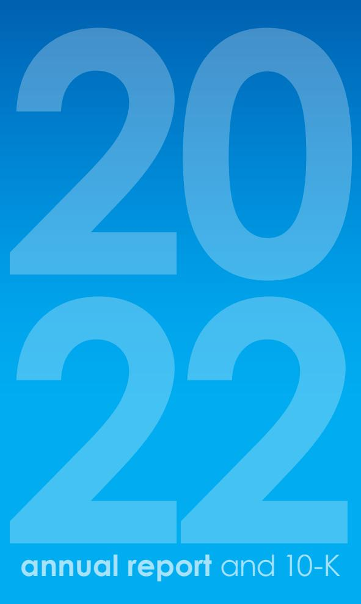
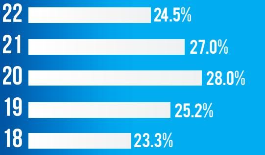
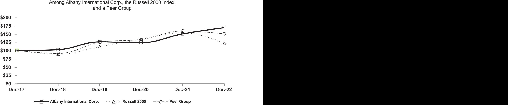

{0}------------------------------------------------

**annual report** and 10-K

{1}------------------------------------------------

# ALBANY INTERNATIONAL

4,200 EMPLOYEES AIN (NYSE) 23 facilities 11 COUNTRIES

#### our strategy

Focus on markets in which we have the basis for sustainable competitive advantage through the application of advanced material engineering and consistent investments in talent and technology, while delivering exceptional value to our customers.

#### our objective

Maintain the market leadership position and profitability of our Machine Clothing business, while growing our Albany Engineered Composites business.

#### our investment proposition

- Industry leader in Machine Clothing with proprietary solutions delivering predictable and strong free cash flow1 .
- Highly attractive & differentiated composites business with ample opportunity to grow both near and long-term.
- Long history of strong balance sheet, solid execution, and prudent capital management.

Albany International is a leading developer and manufacturer of engineered components, using advanced materials processing and automation capabilities, with two core businesses. Machine Clothing is the world's leading producer of custom-designed, consumable fabrics and process belts essential for the manufacture of all grades of paper products. Albany Engineered Composites is a growing designer and manufacturer of advanced materials-based engineered components for demanding aerospace applications, supporting both commercial and military platforms.

Albany International is headquartered in Rochester, New Hampshire, operates 23 facilities in 11 countries, employs approximately 4,200 people worldwide, and is listed on the New York Stock Exchange (Symbol AIN). Additional information about the Company and its products and services can be found at **www.albint.com**.

*1 Free Cash Flow, a non-GAAP measure is defined as Net cash provided by operating activities – Capital expenditures. For 2022: \$128.2 million - \$96.3 million = \$31.9 million*

{2}------------------------------------------------

# FINANCIAL HIGHLIGHTS

| FINANCIAL HIGHLIGHTS                                                         |                               |                                    |                               |                               | 22                                 |
|------------------------------------------------------------------------------|-------------------------------|------------------------------------|-------------------------------|-------------------------------|------------------------------------|
| 2022                                                                         |                               |                                    |                               |                               |                                    |
| US \$ million, except per share                                              | Q1                            | Q2                                 | Q3                            | Q4                            |                                    |
| Albany Engineered Composites Machine Clothing Net sales:               | \$ 90.1 \$154.1 \$244.2 | \$109.7 \$151.7 \$261.4      | \$107.2 \$153.4 \$260.6 | \$118.5 \$150.3 \$268.8 |                                    |
| Operating income Net income attributable                                  | \$ 38.8                       | \$ 50.7                            | \$ 53.6                       | \$ 37.9                       |                                    |
| to the Company Earnings per share - basic Earnings per share - diluted | \$ 27.7 \$ 0.87 \$ 0.87 | \$ 39.2 \$ 1.25 \$ 1.25      | \$ 10.7 \$ 0.34 \$ 0.34 | \$ 18.1 \$ 0.58 \$ 0.58 |                                    |
| Years ended US \$ million, Dec except per 31 share data       | 2018                          | 2019                               | 2020                          | 2021                          | 2022                               |
| Albany Engineered Composites Machine Clothing                             | \$370.6 \$611.9            | \$ 452.9 \$ 601.3               | \$327.7 \$573.0            | \$310.2 \$619.0            | \$ 425.4 \$ 609.5               |
| Total Revenue                                                                | \$982.5                       | \$1,054.1                          | \$900.6                       | \$929.2                       | \$1,034.9                          |
| Albany Engineered Composites Machine Clothing Gross profit             | \$ 52.6 \$297.4 \$349.7 | \$ 88.1 \$ 309.6 \$ 397.7 | \$ 69.9 \$301.1 \$371.1 | \$ 55.9 \$322.4 \$378.4 | \$ 77.5 \$ 312.3 \$ 389.8 |
| Operating income                                                             | \$137.4                       | \$ 193.6                           | \$166.1                       | \$178.0                       | \$ 181.0                           |
| Net income attributable to the Company                                    | \$ 82.9                       | \$ 132.4                           | \$ 98.6                       | \$118.5                       | \$ 95.8                         |
| Earnings per share - basic Earnings per share - diluted                   | \$2.57 \$2.57              | \$4.10 \$4.10                   | \$3.05 \$3.05              | \$3.66 \$3.65              | \$3.06 \$3.04                   |

Adjusted Earnings per share - diluted \$2.82 \$4.11 \$3.72 \$3.57 \$3.89

### Table OfCONTENTS 2 CEO LETTER 6 GLOBAL LOCATIONS 7 FORM 10-K

{3}------------------------------------------------

## **Resilient Operations and Organic Growth in 2022**

My fellow shareholders,

I am pleased to report another strong year in 2022. Our employees continued to do a great job for customers. We delivered solid results for shareholders while adeptly managing through the continuing COVID pandemic, supply chain disruptions, inflation, and tight labor markets. Our success is driven by our people.

As a company, Albany achieved sales revenue of \$1.035 billion in 2022, up about 11% from 2021. Gross profit, Operating income, and Adjusted EBITDA all moved higher as well. We finished 2022 with a strong balance sheet and healthy order books.

Our Machine Clothing (MC) segment maintained its global leadership position in the paper machine clothing market. MC's financial results continued to be impressive with gross margins over 50% and Adjusted EBITDA margins of 37%, despite the headwinds of inflation, supply chain disruptions, tight labor markets, currency shifts, and slowdowns in Europe and China.

Our Engineered Composites (AEC) segment grew top line sales revenues by nearly 40%, and its Adjusted EBITDA was \$79 million, up about \$10 million from 2021's results. We benefited from recovering commercial aviation production led by more than 50% growth in the LEAP program. The business also benefitted from the additional work we won late in 2021 on the Sikorsky CH-53K helicopter program. It's a meaningful step up for us, and with revenues of \$100 million, the CH-53K is now our largest defense program. It is expected to grow further as the program moves toward full-rate production. Additional new business in 2022 came from a variety of smaller commercial, defense and space programs. These wins add another layer to the segment's growth.

{4}------------------------------------------------

#### **Strategy**

Our goal is to position Albany as the "Partner of Choice" in the markets we serve. This is, at its core, an organic growth strategy driven by a combination of technology leadership and operational excellence.

Our Machine Clothing segment is recognized as the global leader in its field with the most advanced technology, cutting-edge products and technical support. The products MC produces are critical to the operation of our customers' paper machines. We invest more than any other competitor in developing the next generation of belts and felts used in paper making. Our technologists and service technicians are second to none when it comes to supporting our customers in their quest to improve efficiencies, quality and cost in their paper production processes.

Demand for our machine clothing solutions is underpinned by long-term secular trends driving demand for paper of all kinds global growth in higher-value tissue and hygiene products, e-commerce and packaging demand, and a continued shift to sustainability as "paper replaces plastic" in more and more applications. We have positioned our global footprint, product offerings and technical services to take advantage of these long-term positive trends. We expect to do so profitably, delivering Adjusted EBITDA margins in the mid-30% range with excellent cash flow.

Our Engineered Composites segment continues to build its reputation in Aerospace markets as a leader in advanced composite engineering, design, and manufacturing. We continue to invest in the next generation of composite materials and their industrialization,

building on the success of our proprietary 3D Woven Composite materials used in the LEAP program.

In addition, we are expanding our material capabilities in composites and diversifying our business mix by adding new customers and new programs. Between 2021 and 2026, we expect to double our AEC revenues and are targeting Adjusted EBITDA margins in the low-to-mid 20% range.

Success requires that we invest in our people to ensure we build a culture that fosters technological leadership, customer collaboration and operational execution that are best-in-class. It starts with our people.

> **Our goal is to position Albany as the"Partner of Choice" in the markets we serve. This is, at its core, an organic growth strategy driven by a combination of technology leadership and operational excellence.**

{5}------------------------------------------------

#### NET SALES USD MILLIONS

| 22 | 1,034.9 |
|----|---------|
| 21 | 929.2   |
| 20 | 900.6   |
| 19 | 1,054.1 |
| 18 | 982.5   |

#### ADJUSTED EBITDA (2) USD MILLIONS

| 22 | 253.5 |       |
|----|-------|-------|
| 21 | 25O.9 |       |
| 20 | 251.9 |       |
| 19 |       | 265.4 |
| 18 | 228.9 |       |

### ADJUSTED EBITDA MARGIN (3)

*(2) Adjusted EBITDA is defined as net income excluding interest, income taxes, depreciation and amortization, excluding costs or benefits that are not reflective of the Company's ongoing or expected future operational performance. Such excluded costs or benefits do not consist of normal, recurring cash items necessary to generate revenues or operate our business. See item 7 in the 2022 Form 10-K for a reconciliation of Adjusted EBITDA to Net Income.*

*(3) Adjusted EBITDA divided by Net sales.*

#### **People**

We believe our employees are our greatest competitive advantage. Our values start with safety, because we know that a safe working environment is an absolute prerequisite for a high-performance organization. We have deliberately built a culture dedicated to foster innovation, bolster our competitive market position, deliver the best products and solutions to our customers, and provide an environment where our people can reach their highest potential.

We provide programs and initiatives that support employees as they develop new skills and gain valuable experience. Employees receive training relevant to their current and evolving roles and responsibilities. And beyond that, multi-level leadership development programs, mentoring programs, and career pathing are designed to enable our team members to advance their careers here at Albany.

#### **Sustainability**

Earlier in this letter I mentioned the central importance of technology leadership to our prospects for long-term value creation. Historically our technology leadership has served as an underpinning in our 125+ years of success and leadership in the Machine Clothing business.

As we look forward, our customers continue to seek solutions to improve their environmental footprint. We believe our culture of innovation has a role to play in addressing those customer challenges. Our products and solutions across Machine Clothing and Engineered Composites enable our customers to improve efficiency – driving positive sustainability and financial outcomes. 

{6}------------------------------------------------

**We have deliberately built a culture dedicated to foster innovation, bolster our competitive market position, deliver the best products and solutions to our customers, and provide an environment where our people can reach their highest potential.** 

 We support our customers to ultimately create more sustainable processes and end products by enhancing resource efficiency, reducing energy consumption, and improving fuel efficiency. Through our partnerships and our own research and technology investments, we continue to develop and bring to market innovative products and proprietary process technologies that align with our customers' evolving needs as demand for products with ever lower environmental footprints continues to increase.

We continue to thoughtfully move forward when it comes to sustainability. We are committed to better quantifying our environmental footprint, setting meaningful long-term goals, and implementing programs to further reduce our environmental impact. For those of you with an interest in learning more about our efforts, I encourage you to read our 2022 Sustainability Report which will be available on our website.

Finally, I want to thank our employees who delivered another year of outstanding performance in 2022. I'm looking forward to the opportunities that 2023 will bring.

With warm regards,

A. William Higgins President & Chief Executive Officer

{7}------------------------------------------------

# GLOBAL LOCATIONS

France Commercy AEC St. Junien MC

GERMANY Kaiserlautern AEC

Switzerland Neuhausen MC HQ

Sweden Halmstad MC R&D

> CHINA Hangzhou MC Panyu MC

S. KOREA Chungju MC

MEXICO Cuautitlán MC Querétaro AEC

> USA CORPORATE OFFICES Rochester, NH Albany, NY

**22**Boerne, TX AEC Homer, NY MC R&D Kaukauna, WI MC R&D Rochester, NH AEC R&D HQ St. Stephen, SC MC Salt Lake City, UT AEC

ITALY Ballò di Mirano (VE) MC

BRAZIL Indaial MC

CANADA

Cowansville, Québec MC

ENGLAND

Bury, Lancashire MC R&D

Perth, Ontario MC

6

{8}------------------------------------------------

#### **UNITED STATES SECURITIES AND EXCHANGE COMMISSION**

Washington, D.C. 20549

#### ______________________________________________________________ **FORM 10-K**

☒ **ANNUAL REPORT PURSUANT TO SECTION 13 OR 15(d) OF THE SECURITIES EXCHANGE ACT OF 1934**

**For the fiscal year ended: December 31, 2022** 

**OR**

☐ **TRANSITION REPORT PURSUANT TO SECTION 13 or 15(d) OF THE SECURITIES EXCHANGE ACT OF 1934**

**For the transition period from __________ to __________. Commission file number: 1-10026**  ______________________________________________________________

#### **ALBANY INTERNATIONAL CORP.**

|                                                      | ____________________________________________________________________ |                                           |  |
|------------------------------------------------------|----------------------------------------------------------------------|-------------------------------------------|--|
|                                                      | (Exact name of registrant as specified in its charter)               |                                           |  |
| Delaware                                             |                                                                      | 14-0462060                                |  |
| (State or other jurisdiction of                      |                                                                      | (IRS Employer Identification No.)         |  |
| incorporation or organization)                       |                                                                      |                                           |  |
| 216 Airport Drive, Rochester, New Hampshire          |                                                                      | 03867                                     |  |
| (Address of principal executive offices)             |                                                                      | (Zip Code)                                |  |
|                                                      | Registrant's telephone number, including area code 603-330-5850      |                                           |  |
|                                                      | Securities registered pursuant to Section 12(b) of the Act:          |                                           |  |
| Title of each class                                  | Trading Symbol(s)                                                    | Name of each exchange on which registered |  |
| Class A Common Stock, \$0.001 par value per share | AIN                                                                  | The New York Stock Exchange (NYSE)        |  |
| Class B Common Stock, \$0.001 par value per          | AIN                                                                  | The New York Stock Exchange (NYSE)        |  |

Class B Common Stock, \$0.001 par value per share

Securities registered pursuant to Section 12(g) of the Act: **None**

Indicate by check mark if the registrant is a well-known seasoned issuer, as defined in Rule 405 of the Securities Act. Yes ☒ No ☐

Indicate by check mark if the registrant is not required to file reports pursuant to Section 13 or Section 15(d) of the Act. Yes ☐ No ☒

Indicate by check mark whether the registrant (1) has filed all reports required to be filed by Section 13 or 15(d) of the Securities Exchange Act of 1934 during the preceding 12 months (or for such shorter period that the registrant was required to file such reports), and (2) has been subject to such filing requirements for the past 90 days. Yes ☒ No ☐

Indicate by check mark whether the registrant has submitted electronically every Interactive Data File required to be submitted pursuant to Rule 405 of Regulation S-T (§ 232.405 of this chapter) during the preceding 12 months (or for such shorter period that the registrant was required to submit such files). Yes ☒ No ☐

Indicate by check mark whether the Registrant is a large accelerated filer, an accelerated filer, a non-accelerated filer, a smaller reporting company, or an emerging growth company. See the definitions of "large accelerated filer," "accelerated filer," "smaller reporting company," and "emerging growth company" in Rule 12b-2 of the Exchange Act.

| Large accelerated filer | ☒ | Accelerated filer         | ☐ |
|-------------------------|---|---------------------------|---|
| Non-accelerated filer   | ☐ | Smaller reporting company | ☐ |
|                         |   | Emerging growth company   | ☐ |

If an emerging growth company, indicate by check mark if the registrant has elected not to use the extended transition period for complying with any new or revised financial accounting standards provided pursuant to Section 13(a) of the Exchange Act. ☐

Indicate by check mark whether the registrant has filed a report on and attestation to its management's assessment of the effectiveness of its internal control over financial reporting under Section 404(b) of the Sarbanes-Oxley Act (15 U.S.C. 7262(b)) by the registered public accounting firm that prepared or issued its audit report. ☒

Indicate by check mark whether the registrant is a shell company (as defined in Rule 12b-2 of the Act). Yes ☐ No ☒

The aggregate market value of the Common Stock held by non-affiliates of the registrant on June 30, 2022, the last business day of the registrant's most recently completed second quarter, computed by reference to the price at which Common Stock was last sold on such a date, was \$2.4 billion.

The registrant had 31.1 million shares of Class A Common Stock and no shares of Class B Common Stock outstanding as of February 17, 2023.

#### **DOCUMENTS INCORPORATED BY REFERENCE PART**

Portions of the Registrant's Proxy Statement for the Annual Meeting of Shareholders to be held on May 12, 2023. III

{9}------------------------------------------------

[This page intentionally left blank]

{10}------------------------------------------------

#### **TABLE OF CONTENTS**

| PART I |  |
|--------|--|
|--------|--|

| Item 1.  | Business                                                                                                             | 10  |
|----------|----------------------------------------------------------------------------------------------------------------------|-----|
| Item 1A. | Risk Factors                                                                                                         | 16  |
| Item 1B. | Unresolved Staff Comments                                                                                            | 28  |
| Item 2.  | Properties                                                                                                           | 28  |
| Item 3.  | Legal Proceedings                                                                                                    | 28  |
| Item 4.  | Mine Safety Disclosures                                                                                              | 28  |
|          | PART II                                                                                                              |     |
| Item 5.  | Market for the Registrant's Common Equity, Related Stockholder Matters, and Issuer Purchases of Equity Securities | 29  |
| Item 6.  | Selected Financial Data                                                                                              | 31  |
| Item 7.  | Management's Discussion and Analysis of Financial Condition and Results of Operations                                | 33  |
| Item 7A. | Quantitative and Qualitative Disclosures about Market Risk                                                           | 49  |
| Item 8.  | Financial Statements and Supplementary Data                                                                          | 50  |
| Item 9.  | Changes in and Disagreements with Accountants on Accounting and Financial Disclosure                                 | 106 |
| Item 9A. | Controls and Procedures                                                                                              | 106 |
| Item 9B. | Other Information                                                                                                    | 107 |
|          | PART III                                                                                                             |     |
| Item 10. | Directors, Executive Officers and Corporate Governance                                                               | 108 |
| Item 11. | Executive Compensation                                                                                               | 108 |
| Item 12. | Security Ownership of Certain Beneficial Owners and Management and Related Stockholder Matters                       | 109 |
| Item 13. | Certain Relationships, Related Transactions and Director Independence                                                | 110 |
| Item 14. | Principal Accountant Fees and Services                                                                               | 110 |
|          | PART IV                                                                                                              |     |
| Item 15. | Exhibits and Financial Statement Schedules                                                                           | 111 |

{11}------------------------------------------------

[This page intentionally left blank]

{12}------------------------------------------------

#### **Forward-Looking Statements**

This annual report and the documents incorporated or deemed to be incorporated by reference in this annual report contain statements concerning our future results and performance and other matters that are "forward-looking" statements within the meaning of Section 27A of the Securities Act of 1933, as amended (the "Securities Act"), and Section 21E of the Securities Exchange Act of 1934, as amended (the "Exchange Act"). The words "believe," "expect," "anticipate," "intend," "estimate," "plan," "project," "may," "will," "should," and variations of such words or similar expressions are intended, but are not the exclusive means, to identify forward-looking statements. Because forwardlooking statements are subject to risks and uncertainties, actual results may differ materially from those expressed or implied by the forward-looking statements.

There are a number of risks, uncertainties, and other important factors that could cause actual results to differ materially from the forward-looking statements, including, but not limited to:

- Conditions in the industries in which our Machine Clothing and Albany Engineered Composites segments compete, along with the general risks associated with macroeconomic conditions, including continuation of COVID-19 pandemic effects for an extended period of time;
- Across the entire Company, increasing labor, raw material, energy, and logistic costs due to supply chain constraints and inflationary pressures; these challenges have only increased as a result of the ongoing Russia-Ukraine war
- In the Machine Clothing segment, greater than anticipated declines in the demand for publication grades of paper, or lower than anticipated growth in other paper grades;
- In the Albany Engineered Composites segment, longer-than-expected timeframe for the aerospace industry to utilize existing inventories, and unanticipated reductions in demand, delays, technical difficulties or cancellations in aerospace programs that are expected to generate revenue and drive long-term growth;
- Failure to achieve or maintain anticipated profitable growth in our Albany Engineered Composites segment; and
- Other risks and uncertainties detailed in this report and other periodic reports.

Further information concerning important factors that could cause actual events or results to be materially different from the forward-looking statements can be found in "Business Environment Overview and Trends" as well as in Item 1A - "Risk Factors." Although we believe the expectations reflected in our other forward-looking statements are based on reasonable assumptions, it is not possible to foresee or identify all factors that could have a material and negative impact on our future performance. The forward-looking statements included or incorporated by reference in this annual report are made on the basis of our assumptions and analyses, as of the time the statements are made, in light of our experience and perception of historical conditions, expected future developments, and other factors believed to be appropriate under the circumstances.

Except as otherwise required by the federal securities laws, we disclaim any obligations or undertaking to publicly release any updates or revisions to any forward-looking statement contained or incorporated by reference in this annual report to reflect any change in our expectations with regard thereto or any change in events, conditions, or circumstances on which any such statement is based.

{13}------------------------------------------------

#### **Item 1. Business**

Albany International Corp. (the Registrant, the Company, we, us, or our) and its subsidiaries are engaged in two business segments.

The Machine Clothing ("MC") segment supplies consumable permeable and impermeable belts used in the manufacture of paper, paperboard, tissue and towel, pulp, nonwovens, fiber cement and several other industrial applications. Within the pulp and paper industry these belts are referred to as "machine clothing" or "paper machine clothing." In other industries we serve the products we produce are generally referred to as "processing belts."

We design, manufacture, and market paper machine clothing for each section of the paper machine and for every grade of paper. We manufacture and sell approximately twice as much paper machine clothing worldwide than any other company. Paper machine clothing products are customized, consumable products of technologically sophisticated design that utilize polymeric materials in a complex structure. The design and material composition of paper machine clothing can have a considerable effect on the quality of paper products produced and a meaningful effect on the energy and resource efficiency of the paper machines on which it is used. Principal paper machine clothing products include forming, pressing, and drying fabrics, and process belts. A forming fabric assists in paper sheet formation and conveys the very wet sheet through the forming section. Pressing fabrics are designed to carry the sheet through the press section, where water is pressed from the sheet as it passes through the press nip. In the drying section, drying fabrics manage air movement and hold the sheet against heated cylinders to enhance drying to a final moisture content between 4% to 9%, depending on the grade.

Process belts are used in the press section to increase dryness and enhance sheet properties, as well as in other sections of the machine to improve runnability and enhance sheet qualities.

The MC segment also supplies engineered processing belts used in the manufacturing process in the pulp, corrugator, nonwovens, fiber cement, building products, and textile industries.

The MC segment sells its products directly to customer end-users in countries across the globe. MC products, manufacturing processes, and distribution channels are substantially the same in each region of the world in which we operate. The sales of paper machine clothing forming, pressing, and drying fabrics, individually and in the aggregate, accounted for more than 10 percent of our consolidated Net sales during one or more of the last three years. No individual customer accounted for as much as 10 percent of MC segment Net sales in any of the periods presented. A majority of MC segment Net sales in the year ended December 31, 2022 were for use in the production of the growing grades of tissue, containerboard, other paper categories, and other engineered fabrics, while less than 20% of MC segment Net sales were for the production of the declining newsprint and printing and writing papers categories.

The Albany Engineered Composites ("AEC") segment, provides highly engineered, advanced composite structures to customers in the commercial and defense aerospace industries. The segment includes Albany Safran Composites, LLC ("ASC"), in which our customer, SAFRAN Group ("SAFRAN"), owns a 10 percent noncontrolling interest. AEC, through ASC, is the exclusive supplier to the LEAP program of advanced composite fan blades and fan cases under a long-term supply contract. The LEAP engine is used on the Airbus A320neo, Boeing 737 MAX, and COMAC 919 aircrafts. AEC's largest aerospace customer is SAFRAN and sales to SAFRAN (consisting primarily of fan blades and cases for CFM's LEAP engine) accounted for approximately 16 percent of the Company's consolidated Net sales in 2022. Other significant AEC programs include the production of structures and parts for the Sikorsky CH-53K helicopter, F-35 fighter jet, Joint Air-to-Surface Standoff Missile ("JASSM"), and Boeing 787 platforms. AEC also supplies vacuum waste tanks for most of the Boeing 7X7 aircraft, as well as the fan case for the GE9X engine. In 2022, approximately 46% of the AEC segment's sales were related to U.S. government contracts or programs.

See "Business Environment Overview and Trends" under Item 7, Management's Discussion and Analysis of Financial Condition and Results of Operations, for a discussion of general segment developments in recent years. 

{14}------------------------------------------------

Following is a table of Net sales by segment for 2022, 2021, and 2020.

| (in thousands)               |    | 2022         | 2021          | 2020 |         |  |
|------------------------------|----|--------------|---------------|------|---------|--|
| Machine Clothing             | \$ | 609,461      | \$ 619,015 | \$   | 572,955 |  |
| Albany Engineered Composites |    | 425,426      | 310,225       |      | 327,655 |  |
| Consolidated total           |    | \$ 1,034,887 | \$ 929,240 | \$   | 900,610 |  |

The table setting forth certain sales, operating income, and balance sheet data that appears in Note 3, is included in "Reportable Segments and Geographic Data," of the Consolidated Financial Statements, included under Item 8 of this Form 10-K.

#### **International Operations**

Our Machine Clothing business segment maintains manufacturing facilities in Brazil, Canada, China, France, Italy, Mexico, South Korea, Sweden, the United Kingdom, and the United States. MC's global manufacturing footprint is designed to most efficiently meet regional customer requirements. Our AEC business segment maintains manufacturing facilities in the United States, France, Mexico, and Germany to meet customer demand in those regions.

Our global presence subjects us to certain risks, including tariffs and other restrictions on trade, and controls on foreign exchange and the repatriation of funds. While the direct impact of recent developments in global trade and tariff policy has not been significant, there is risk that the impact of such developments on companies in our supply chain will be reflected in higher costs from affected suppliers. We have a cash repatriation strategy that targets a certain amount of foreign current year earnings that are not indefinitely reinvested. Changes in the trade or regulatory compliance in any country that we have significant cash balances could make it difficult to repatriate foreign earnings cost-effectively in the future.

#### **Effect of Global Macroeconomic and Political Climate**

The war between Russia and Ukraine is affecting the economic and global financial markets and exacerbating ongoing economic challenges caused by impacts of the ongoing COVID-19 pandemic, including rising inflation and global supply chain disruptions.

Our MC segment has historically generated approximately 2% of its annual net sales from customers in Russia and Ukraine. In addition, a subsidiary within our Machine Clothing segment has been a partner in a joint venture ("JV") that supplies paper machine clothing products to local papermakers in Russia. In March 2022, we made the decision to cease doing business in Russia, including giving notice to our JV partner of our intent to exit the venture. As a result, we recognized \$1.5 million expense in cost of goods sold and in Selling, General, and Administrative expense, representing reserves against the risk of obsolescence of certain inventory destined for Russian customers and uncollectible receivables from Russian customers, respectively. In the first quarter of 2022, we also wrote down the net book value of our investment in the aforementioned JV to reflect our intent to exit such venture, resulting in \$0.8 million impairment loss included in Other (income)/expense, net.

Our cessation of doing business in Russia resulted in a reduction of approximately \$10 million in annual net sales in the MC segment during 2022.

During 2022, our segments saw higher input costs due to increased energy costs, tight supply market, and global logistics challenges. Our MC segment experienced higher energy prices, higher labor costs, and increased raw material prices. We continued to identify alternatives to secure materials in the face of intense supply constraints. Logistics costs have begun to stabilize compared to the same period last year, though they remained higher than prepandemic levels.

We anticipate inflationary pressure and energy cost escalation to be a primary input cost pressure in the near term.

The ultimate financial impact due to the aforementioned global macroeconomic conditions and political climate is difficult to predict. During 2022, MC segment input costs increased approximately \$10 million as a result of these factors, or an unfavorable impact to the segment gross margin of approximately 140 basis points for the year.

Our Albany Engineered Composites segment does not have significant direct exposure in Russia. However, it has not been immune from supply chain disruptions. Increasing fuel prices coupled with higher demand has resulted in increased freight costs during the quarter, along with ongoing logistic constraints, higher labor costs, and increases in raw material prices. Due to the nature of AEC's contracts with its customers, we currently anticipate passing through a portion of such cost increases to the customers.

{15}------------------------------------------------

Until the effects of the macroeconomic conditions and political climate on global markets subside, there can be no assurance that our input costs will not continue to rise beyond our current estimate, thus unfavorably impacting our future results of operations, financial position and liquidity.

#### **Research and Development and Technology**

We invest in research, new product development, and technical analysis with the objective of maintaining our technological leadership in each business segment. While much of our research activity supports existing products, we also engage in significant research and development activities for new technology platforms, products and product enhancements.

MC segment products are custom-designed for each user, depending on the type, size, and speed of the machine, and the products being produced. Product design is also a function of the machine section, the grade of product being produced, and the quality of the stock used. Technical expertise, judgment, and experience are critical in designing the appropriate clothing for each machine, position, and application. As a result, many employees in sales and technical functions have engineering degrees, paper mill experience, or other manufacturing experience in the markets in which they operate. Our market leadership position reflects our commitment to technological innovation. This innovation has resulted in new MC products and/or enhancements across all of our product lines.

Albany Engineered Composites designs, develops and manufactures advanced composite parts for complex aerospace applications, using a range of core technologies, including its proprietary 3D-woven reinforced composites technology, traditional 2D laminated composite structures, automated material placement, filament winding, throughthickness reinforcement, braiding, and thermoplastic pultrusion.

In addition to continuous significant investment in core research and development activities in pursuit of new proprietary products and manufacturing processes, experienced research and development employees in each business segment also work collaboratively with customers, OEMs and suppliers on targeted development efforts to introduce new products and applications in their respective markets.

Company-funded research expenses totaled \$31.4 million in 2022, \$29.6 million in 2021, and \$25.8 million in 2020. In 2022, these costs were 3.0 percent of total Company Net sales, including \$15.4 million, or 3.6 percent of Net sales, in our AEC segment. Research and development in the AEC segment includes both Company-sponsored and customer-funded activities. Some customer funded research and development may be on a cost sharing basis, in which case, amounts charged to the collaborating entity are credited against research and development costs. For customer-funded research and development in which we anticipate funding to exceed expenses, we include amounts charged to the customer in Net sales. Cost of sales associated with customer-funded research was \$5.2 million in 2022, \$5.2 million in 2021, and \$5.1 million in 2020.

We have developed, and continue to develop, proprietary intellectual property germane to the industries we serve. Our intellectual property takes many forms, including patents, trademarks, trade names and domains, and trade secrets. Our trade secrets include, among other things, manufacturing know-how and unique processes and equipment. Because intellectual property in the form of patents is published, we often forgo patent protection and preserve the intellectual property as trade secrets. We aggressively protect our proprietary intellectual property, pursuing patent protection when appropriate. Our active portfolio currently contains over 2,300 patents, and approximately 160 new patents are typically granted each year. While we consider our total portfolio of intellectual property, including our patents, to be an important competitive advantage, we do not believe that any single patent is critical to the continuation of our business. All brand names and product names are trade names of Albany International Corp. or its subsidiaries. We have from time to time licensed some of our patents and/or know-how to one or more competitors, and have been licensed under some competitors' patents, in each case mainly to enhance customer acceptance of new products. The revenue from such licenses is less than 1 percent of consolidated net sales.

#### **Raw Materials**

Primary raw materials for our MC products are polymer monofilaments and fibers, which have generally been available from a number of suppliers. In addition, we manufacture polymer monofilaments, a basic raw material for all types of machine clothing, at our facility in Homer, New York, which supplies approximately 24 percent of our worldwide monofilament requirements. In the AEC segment, the primary raw materials are carbon fiber and resin. While there are a number of potential suppliers of carbon fiber and other raw materials used by AEC, the use of certain suppliers may be mandated by customer agreements, and alternative suppliers would be subject to material

{16}------------------------------------------------

qualification or other requirements that may preclude or delay their availability. In the case of mandated suppliers, AEC endeavors to enter into long-term supply agreements to help mitigate price and availability risks. Currently, the primary raw materials used in each segment are derived from petroleum, and are therefore sensitive to changes in the price of petroleum and petroleum intermediates.

#### **Competition**

In the paper machine clothing market, we believe that we had a worldwide market share of approximately 30 percent in 2022.

Price and technology are the primary means of competitive differentiation in the industry. Albany's Machine Clothing product portfolio is broad and deep, with products for every part of the machine and a wide range of machine types and paper grades. The Company's research and development team works closely with the sales and technical organization to develop new products to meet changes in customer needs, and also pursues targeted joint development activities with customers and equipment manufacturers to create new products. Albany's experienced sales and technical team members – many of whom have worked in the industries that we serve - work closely with each customer to acquire deep understanding of the customer's combination of raw materials, manufacturing equipment, manufacturing processes, and paper, pulp, nonwovens or other product being produced – a combination that is unique to each customer, plant and machine. This experience and knowledge, combined with knowledge of and experience with the Company's own extensive product portfolio, allows the sales and technical teams to ensure that the appropriate machine clothing products are being supplied for each part of the machine, to customize those products as needed for best performance, and to continuously propose new products that offer each customer the possibility of even better performance and increased savings. Our paper machine clothing solutions enable our customers to reduce energy consumption, improve resource efficiency, and help maintain and improve water quality. These efforts – which effectively integrate the Company's experience and technological expertise into each product we sell – are reflected in the Company's strong competitive position in the marketplace. Some of the Company's paper machine clothing competitors also supply paper machines, papermaking equipment, and aftermarket parts and services, and often bundle clothing with original or rebuilt machines and/or aftermarket services.

The primary competitive factors in the markets in which our Albany Engineered Composites segment competes are product performance, delivery performance, quality, and price. Achieving lower weight without sacrificing strength is the key to improving fuel efficiency, which helps reduce the carbon footprint of global aviation, and is a critical performance requirement in the aerospace industry. Our broad array of capabilities in composites enables us to offer customers the opportunity to displace metal components and, in some cases, conventional composites with lowerweight, high-strength, and potentially high-temperature resistant composites. The dominant competitive factor is the relative importance the customer places on these performance benefits, which include fuel savings/ emissions reductions due to lower weight, against the possible cost advantage of more traditional metal and composite components.

#### **Human Capital Resources**

Albany International recognizes that its long, successful history and future opportunities are directly linked to dedicated, engaged and diverse employees that serve the Company in all business operations. Albany currently employs approximately 4,100 people, with significant operations in North America, South America, Europe and Asia. Wages and benefits are competitive with those of other manufacturers in the geographic areas in which our facilities are located. A number of hourly employees outside of the United States are members of various unions. In general, we consider our relations with employees to be excellent. Employees participate in regular training programs appropriate for their responsibility and extensive optional training programs have been developed for those who seek professional and personal growth opportunities. All employees are required to participate in safety training on a regular basis. We have systematically and continuously reduced our Total Recordable Incident Rate (TRIR) by approximately 65% since 2019 to 0.48 in 2022.

The Company's Executive Vice President- Human Resources and Chief Human Resources Officer meets regularly with the Chief Executive Officer to align Human Capital strategy, plan and initiatives with business strategy and goals. Albany's Human Capital Resources plan ensures that we provide a rewarding employee experience across the company. We continuously review our Human Capital Resources metrics, including safety metrics and action plans, to promote an emotionally and physically safe and inclusive working environment.

Our Diversity, Equity and Inclusion (DE&I) Council develops a holistic and actionable DE&I strategy that seeks diversity, nurtures inclusion, amplifies innovation and empowers champions. Our hiring strategy recruits candidates from a broad range of hiring sources that target people with diverse backgrounds and skills to fill open positions within the Company. Approximately 26% of our global workforce were women in 2022. Our Empowering Women Leaders Network aims to continue increasing representation of women at all levels to contribute to the Company's business success through relationships, and partnerships.

{17}------------------------------------------------

#### **Executive Officers of the Registrant**

The following table sets forth certain information with respect to the executive officers of the Company as of February 24, 2023:

*A. William Higgins, 64, President and Chief Executive Officer*, joined the Company in 2020. He has served the Company as President and Chief Executive Officer since January 2020. He has been a director of the Company since 2016 and served as Chairman of the Board from February 2019 until January 2020. From 2005 to 2012 he served CIRCOR International, Inc. in a variety of senior organizational positions, including Chief Executive Officer and Chairman. Prior to joining CIRCOR, he held a variety of senior management positions with Honeywell International and AlliedSignal.

*Stephen M. Nolan, 53, Chief Financial Officer and Treasurer,* joined the Company in 2019. He has served the Company as Chief Financial Officer and Treasurer since April 2019. Prior to joining the Company, he served as Chief Financial Officer of Esterline and previously held the same role at Vista Outdoor, Inc. He previously worked in a number of strategic and operational management roles at ATK, including Senior Vice President for Strategy and Business Development and several business unit leadership positions. Earlier in his career, Mr. Nolan served in corporate development and strategy roles at Raytheon Company and as a strategy consultant at McKinsey & Company.

*Daniel A. Halftermeyer, 61, President* – *Machine Clothing,* joined the Company in 1987. He has served the Company as President – Machine Clothing since February 2012. He previously served the Company as President – Paper Machine Clothing and Engineered Fabrics from August 2011 to February 2012, as President – Paper Machine Clothing from January 2010 until August 2011, Group Vice President – Paper Machine Clothing Europe from 2005 to August 2008, Vice President and General Manager – North American Dryer Fabrics from 1997 to March 2005, and Technical Director – Dryer Fabrics from 1993 to 1997. He held various technical and management positions in St. Stephen, South Carolina, and Sélestat, France, from 1987 to 1993.

*Greg Harwell, 59, President* – *Albany Engineered Composites,* joined the Company in 2019. He has served the Company as President - Albany Engineered Composites since November 2019. Prior to joining the company, he served as President of Aerostructures for Precision Castparts (PCC) managing all aspects of the organization for the Aerostructures division. He also served as Vice President and General Manager in charge of Global Operations Strategy at Alcoa Fastening Systems and Rings, and before November 2014 was responsible for multiple operations within Alcoa Fastening Systems. From June 2019 until he joined Albany International, Mr. Harwell was a consultant to Arlington Capital Partners, providing M&A advisory services.

*Alice McCarvill, 58, Executive Vice President- Human Resources and Chief Human Resources Officer,* joined the Company in 2018. She has served the Company as Executive Vice President- Human Resources and Chief Human Resources Officer since February 2019*.* She joined the Company in March 2018 as Executive Vice President- Human Resources. Prior to 2018 she was Group VP Human Resources for Arconic Engineered Products and Solutions.

*Joseph M. Gaug, 59, Vice President- General Counsel and Secretary,* joined the Company in 2004. He has served the Company as Vice President- Secretary and General Counsel since May 2020. He previously served as Associate General Counsel from 2004 and as Associate General Counsel and Assistant Secretary from 2006 to May 2020. Prior to 2004 he was a principal at McNamee, Lochner, Titus & Williams, PC.

*Robert A. Hansen, 65, Senior Vice President and Chief Technology Officer,* joined the Company in 1981. He has served the Company as Senior Vice President and Chief Technology Officer since January 2010. He previously served as Vice President – Corporate Research and Development from April 2006 to January 2010, and Director of Technical and Marketing – Europe Press Fabrics from 2004 to April 2006. From 2000 to 2004, he served as Technical Director – Press Fabrics, Göppingen, Germany. Before 2000, he served the Company in a number of technical management and research and development positions in Europe and the U.S.

*Elisabeth Indriani, 47, Vice President – Controller*, joined the Company in 2021. Prior to joining the Company, she was the Global Controller at Century Aluminum Company, where she oversaw accounting and financial reporting, led global policy and process transformation initiatives, and was a business partner in financial planning and analysis, M&A due diligence, investor relations, treasury, financing and tax structuring transactions. Earlier in her career, Ms. Indriani served as an Audit Senior Manager with Deloitte and Touche LLP – as a member of the Industry Professional Practice Director group, she authored Deloitte interpretive accounting guides and was a frequent speaker at Deloitte accounting and advisory events, in addition to advising clients on the application of accounting standards on complex transactions.

{18}------------------------------------------------

#### **Governance**

We are incorporated under the laws of the State of Delaware and are the successor to a New York corporation originally incorporated in 1895, which was merged into the company in August 1987 solely for the purpose of changing the domicile of the corporation. References to the Company that relate to any time prior to the August 1987 merger should be understood to refer to the predecessor New York corporation.

We embrace uncompromising honesty and behave ethically and fairly. We are committed to following the laws, regulations, standards, and ethical practices everywhere we do business. Ethics and compliance play an integral part in our decision making and business operations. Our Corporate Governance Guidelines, Business Ethics Policy, and Code of Ethics for the Chief Executive Officer, Chief Financial Officer, and Controller, and the charters of the Audit, Compensation, and Governance Committees of the Board of Directors are available at the Corporate Governance section of our website (www.albint.com).

Data security is a top priority at the Company. To protect our Company and customer data, we employ industry best practices and adhere to the CIS 20 and NIST SP 800-171 cyber security frameworks. Our Data Security strategy is overseen by the Audit Committee of our Board of Directors, regularly reviewed at the executive level, directed by our Chief Information Officer, and managed by our Enterprise Cyber Security (ECS) team. Information on our approach to data security is available in the Sustainability section of our website (www.albint.com).

Our current reports on Form 8-K, quarterly reports on Form 10-Q, and annual reports on Form 10-K are electronically filed with the Securities and Exchange Commission (the "SEC"), and all such reports and amendments to such reports filed subsequent to November 15, 2002, have been and will be made available, free of charge, through our website (www.albint.com) as soon as reasonably practicable after such filing. The public may read and copy any materials filed by the Company with the SEC at the SEC's Public Reading Room at 100 F Street, N.E., Room 1580, Washington, D.C. The public may obtain information on the operation of the Public Reading Room by calling the SEC at 1-800-SEC-0330. The SEC maintains a website (www.sec.gov) that contains reports, proxy, information statements, and other information regarding issuers that file electronically with the SEC.

{19}------------------------------------------------

#### **Item 1A. RISK FACTORS**

*The risks and uncertainties described below are those that we have identified as material, but are not the only risks and uncertainties facing the Company. This list is not all-inclusive or necessarily in order of importance. If any of the events contemplated by the following risks occur, our business, financial condition, or results of operations could be materially adversely affected. Some of these risks are described below and in the documents incorporated by reference, and investors should take these risks into account when evaluating any investment decision involving the Company.* 

#### **Risks related to our business and operations**

#### *The effects of COVID-19 and other potential future public health crises, epidemics, pandemics or similar events on our business, operating results, financial condition and cash flows are uncertain*

The public health crisis caused by the COVID-19 pandemic and the measures being taken by governments, businesses, and the public at large to limit COVID-19's spread has had, and are expected to continue to have, certain negative effects on the markets we serve. These effects include deteriorating general economic conditions in many regions of the world, increased unemployment, decreases in disposable income, decline in consumer confidence, and changes in consumer spending habits. In the U.S. and in several other countries these effects appear to be on the wane. Nevertheless, the evolution of the pandemic, governments' responses to the pandemic, and individuals' behavior in response to the pandemic and its effects, in aggregate, continue to impact business conditions in varied and unpredictable ways. Certain adverse impacts specific to the Company include, without limitation:

• During 2022, some employees in various plants contracted the COVID-19 virus, which led to workforce absences of employees that contracted the virus and others that may have been exposed. Highly contagious diseases such as COVID-19 create the risk that we may need to shut down one of our facilities for an extended period of time, which could increase our costs and affect our ability to meet commitments to customers. In 2022, although we did not shut down any of our plants due to COVID-19, production at some plants was affected by government shutdown orders in areas adjacent to those plants. There is no guarantee that future government shutdown orders, or our own future shutdowns, should they occur, will not have a more significant impact on our production.

• Behavioral changes that have occurred during the pandemic have impacted demand for various products that are made with MC fabrics. The above effects could have an adverse impact on demand for publication paper grades, and perhaps other grades of paper, including without limitation packaging paper grades, as well as on demand for non-woven fabrics and fiber cement products used in the construction industry; such impacts would in turn adversely impact demand for the MC products used to manufacture such paper grades or building products. A decline in revenues would lead to lower gross profit on those products and the possibility of unabsorbed fixed manufacturing costs.

• The Albany Engineered Composites segment generates a significant portion of its revenue from commercial aerospace programs and contracts for the U.S. Department of Defense. The COVID-19 pandemic has significantly impacted passenger air travel which, in turn, has impacted and is likely to continue to impact the commercial aerospace programs that provide a source of revenue for the Company. Such programs could be delayed or canceled which, in addition to a loss of revenue and gross profit, could lead to write-offs for Company investments for those programs. The pandemic has resulted in significant costs for the U.S. government, which could lead to program delays or cancellations, and a corresponding decrease in our revenues.

• Disruptions in supply chains have placed constraints on our ability to source key raw materials and services which could impact our ability to deliver products to customers as scheduled. Additionally, manufacturing or delivery costs could increase.

• While we do not anticipate material impairments on our assets as a result of COVID-19, changes in our expectations for net sales, earnings potential and cash flows associated with our intangible assets and goodwill that fall below our current projections could result in such assets being impaired.

{20}------------------------------------------------

#### *A number of industry factors have had, and in future periods could have, an adverse impact on sales, profitability and cash flow in the Company's MC and AEC segments*

Significant consolidation and rationalization in the paper industry in recent years have reduced global consumption of paper machine clothing in certain markets and for certain grades. Developments in digital media have adversely affected demand for newsprint and for printing and writing grades of paper, which has had, and is likely to continue to have, an adverse effect on demand for paper machine clothing in those markets. At the same time, technological advances in papermaking, including in paper machine clothing, while contributing to the papermaking efficiency of customers, have in some cases lengthened the useful life of our products and reduced the number of pieces required to produce the same volume of paper. These factors have had, and in the future are likely to have, an adverse effect on paper machine clothing sales.

The market for paper machine clothing in recent years has been characterized by continuous pressure to provide more favorable commercial terms, which has continued to place pressure on our operating results. We expect such pressure to remain intense in all paper machine clothing markets, especially during periods of customer consolidation, plant closures, or when major contracts are being renegotiated. The emergence of Chinese competitors exacerbates this risk.

Similar pressures exist in the markets in which AEC competes. During 2019, Net sales under the LEAP contract exceeded \$210 million. Due to the grounding of the Boeing 737 MAX, the destocking of the supply chain and the impact of the pandemic on air travel, Net sales generated by the LEAP contract were approximately \$100 milllion in each of 2020 and 2021, before improving to \$165 million in 2022.

Additionally, many of AEC's customers, as well as the companies supplied by our customers are under pressure to achieve acceptable returns on their substantial investments in recent years in new technologies, new programs and new product introductions. This has contributed to a relentless focus on reducing costs, resulting in continuous pressure for cost reduction and pricing improvement throughout the supply chain. The recent wave of consolidation in the aerospace industry could continue or intensify these pressures.

#### *The long-term organic growth prospects of AEC are subject to a number of risks*

The prospect of future successful organic growth in AEC depends in large part on its ability to maintain and grow a healthy pipeline of potential new products and applications for its technologies, to transform a sufficient number of those potential opportunities into commercial supply agreements, and to then execute its obligations under such agreements. In addition, existing and future supply agreements, especially for commercial and defense aerospace, are subject to the same curtailment or cancellation risks as the programs they support.

AEC is currently working on a broad portfolio of potential new product applications in the aerospace industry. These development projects may or may not result in commercial supply opportunities. In the event that AEC succeeds in developing products and securing contracts to manufacture and supply them, it will face the same industrialization and manufacturing ramp-up risks that it currently faces in its existing contracts, and AEC may or may not be successful in meeting its obligations under these contracts. Failure to manage these development, commercialization and execution risks could have a material adverse impact on AEC's prospects for revenue growth.

In addition to dealing with these development and manufacturing execution risks, future AEC growth will likely require increasingly larger amounts of cash to fund the investments in equipment, capital, and development efforts needed to achieve this growth. Until AEC is able to consistently generate cash flows sufficient to fund its existing operations and any future investment to support its growth, it will remain dependent on the MC segment's ability to generate cash. A significant decline in MC sales, operating income or cash flows could therefore have a material adverse impact on AEC's growth.

#### *The U.S. Government's Department of Defense ("DoD") Cybersecurity Maturity Model Certification ("CMMC") program introduces new and unique risks for DoD contractors*

Under the applicable federal regulations for DoD contractors, AEC is required to comply with the agencies current cybersecurity regulations. In addition to these current regulations, AEC will be required to comply with the new CMMC program requirements on future contracts as they are flowed down from our DoD prime customers in the coming years. Given the current and planned future portfolio of U.S. Government-related business, AEC expects to be required to comply fully with the highest levels of the planned CMMC framework and will potentially be subject to thirdparty or U.S. Government audit to certify our compliance. The CMMC compliance requirements are complex and the costs are significant. To the extent that AEC is unable to comply with the CMMC or other related cybersecurity

{21}------------------------------------------------

requirements, AEC may be unable to maintain or grow its business on programs with the DoD and its prime customers.

#### *AEC is subject to significant risks related to the potential manufacture and sale of defective or nonconforming products*

AEC manufactures and sells products that are incorporated into commercial and military aircraft. If AEC were to supply products with manufacturing defects, or products that failed to conform to contractual requirements, we could be required to recall and/or replace them, and could also be subject to substantial contractual damages or warranty claims from our customers. AEC could also be subject to product liability claims if such failures were to cause death, injury or losses to third parties, or damage claims resulting from the grounding of aircraft into which such defective or non-conforming products had been incorporated. We are required to meet, and maintain continuous independent certification, to certain international industry standards including AS/EN9100 quality management system standards and Nadcap Special Processes certifications that are designed to assure rigorous quality standards are maintained throughout the aerospace industry supply chain. Additionally, we maintain product liability insurance and other insurance at levels we believe to be prudent and consistent with industry practice to help mitigate these risks, these coverages may not be sufficient to fully cover AEC's exposure for such risks, which could have a material adverse effect on AEC's results of operations and cash flows.

#### *Deterioration of global economic conditions could have an adverse impact on the Company's business and results of operations*

The Company identifies in this section a number of risks, the effects of which may be exacerbated by an unfavorable economic climate. For example, a recession could lead to lower consumption in all paper grades including tissue and packaging, which would not only reduce consumption of paper machine clothing but could also increase the risk of greater price competition in the machine clothing industry.

Similarly, in the Company's AEC segment, a decline in global or regional economic conditions could result in lower orders for aircraft or aircraft engines, or the cancellation of existing orders, which would in turn result in reduced demand for the AEC components utilized on such aircraft or engines. Demand for AEC's light-weight composite aircraft components is driven by demand for the lighter, more fuel-efficient aircraft engine and other applications into which they are incorporated, such as the CFM LEAP engine. Fuel costs are a significant part of operating costs for airlines and, in many cases, may constitute a carrier's single largest operating expense. A sustained drop in oil prices, and related decline in the price of jet fuel, could prompt airlines to defer orders or delivery dates for such newer, more fuel-efficient airframes and aircraft engines, as the urgency to reduce fuel consumption may be lessened. In addition, any economic conditions that led to sustained high interest rates could affect the airline's ability to finance new aircraft and engine orders.

Weak or unstable economic conditions also increase the risk that one or more of our customers could be unable to pay outstanding accounts receivable, whether as the result of bankruptcy or an inability to obtain working capital financing from banks or other lenders. Furthermore, both the MC and AEC business segments manufacture products that are custom-designed for a specific customer application. In the event of a customer liquidity issue, the Company could also be required to write off amounts that are included in Contract assets,net or Inventories. In the case of AEC, such write-offs could also include investments in equipment, tooling, and non-recurring engineering, some of which could be significant depending on the program.

#### *The Company continues to experience increasing labor, raw material, energy, and logistic costs due to supply chain constraints and inflationary pressures*

The Company is a significant user of raw materials that are based on petroleum or petroleum derivatives. Increases in the prices of petroleum or petroleum derivatives, particularly in regions that are experiencing higher levels of inflation, could increase our costs, and we may not be able to fully offset the effects through price increases, productivity improvements, and cost-reduction programs.

There is a limited number of suppliers of polymer fiber and monofilaments, key raw materials used in the manufacture of machine clothing, and of carbon fiber and carbon resin, key raw materials used by AEC. In addition, there are a limited number of suppliers of some of the equipment used in each of the MC and AEC segments. The risks associated with limited suppliers increased as a result of the COVID-19 pandemic, which has put pressure on the supply chain in general, and transportation companies that deliver raw materials to us and our products to customers, in particular. While we have been able to meet our raw material and equipment needs, the limited number 

{22}------------------------------------------------

of suppliers of these items creates the potential for disruptions in supply. AEC currently relies on single suppliers under contracts they have with SAFRAN to meet the carbon fiber and carbon resin requirements for the LEAP program. Lack of supply, delivery delays, or quality issues relating to supplied raw materials or for our key manufacturing equipment could harm our production capacity. Such could require the Company to attempt to qualify one or more additional suppliers, which could be a lengthy, expensive and uncertain process. These disruptions could make it difficult to supply our customers with products on time, which could have a negative impact on our business, financial condition, and results of operations.

The Company also relies on the labor market in many regions of the world to meet our operational requirements, advance our technology and differentiate products. Low rates of unemployment in key geographic areas in which the Company operates can lead to high rates of turnover and loss of critical talent, which could in turn lead to higher labor costs.

#### *Our ability to attract and retain business and employees may depend on our reputation in the marketplace*

We believe our brand names and our reputation are important corporate assets that help distinguish our products and services from those of our competitors and also contribute to our efforts to recruit and retain talented employees. However, our reputation is susceptible to material damage by events such as disputes with customers or competitors, cybersecurity incidents or service outages, internal control deficiencies, delivery failures, compliance violations, government investigations or legal proceedings. We may also experience reputational damage from employees, advocacy groups, regulators, investors and other stakeholders that disagree with the way we conduct our business. Similarly, our reputation could be damaged by actions or statements by current or former customers, suppliers, employees, competitors, joint venture partners, adversaries in legal proceedings, legislators or government regulators, as well as members of the investment community or the media, including social media influencers.

Our brand and reputation are also associated with our public commitments to various corporate environmental, social and governance ("ESG") initiatives, including our goals for sustainability and inclusion and diversity. Our failure to achieve our commitments could harm our reputation and adversely affect our relationships with customers and suppliers or our talent recruitment and retention efforts. In addition, positions we take or do not take on social issues may be unpopular with some of our employees or with our customers or potential customers, which may in the future impact our ability to attract or retain employees or customers. We also may choose not to conduct business with potential customers or suppliers or discontinue or not expand business with existing customers due to these positions.

There is a risk that negative or inaccurate information about the Company, even if based on rumor or misunderstanding, could adversely affect our business. Damage to our reputation could be difficult, expensive and time-consuming to repair, could make potential or existing customers reluctant to select us for new opportunities or could negatively impact our relationships with existing customers and suppliers, resulting in a loss of business, and could adversely affect our talent recruitment and retention efforts. Damage to our reputation could also reduce investor confidence in us, materially adversely affecting our share price.

#### *Some of the Company's competitors in the MC segment have the capability to make and sell paper machines and papermaking equipment as well as other engineered fabrics*

Although customers historically have tended to view the purchase of paper machine clothing and the purchase of paper machines as separate purchasing decisions, the ability to bundle fabrics with new machines and after-market services could provide an advantage to our competitors. This underscores the importance of our ability to maintain the technological competitiveness and value of our products, and a failure to do so could have a material adverse effect on our business, financial condition, and results of operations.

Moreover, we cannot predict how the nature of competition in this segment may continue to evolve as a result of future consolidation among our competitors, or consolidation involving our competitors and other suppliers to our customers.

#### *Conditions in the paper industry have required, and could further require, the Company to reorganize its operations, which could result in significant expense and could pose risks to the Company's operations*

In the recent past, we engaged in significant restructuring that included the closing of manufacturing operations. These restructuring activities were intended to match manufacturing capacity to shifting global demand, and also to improve the efficiency of manufacturing and administrative processes. Future shifting of customer demand, the need to reduce costs, or other factors could cause us to determine in the future that additional restructuring steps are required. Restructuring involves risks such as employee work stoppages, slowdowns, or strikes, which can threaten

{23}------------------------------------------------

uninterrupted production, maintenance of high product quality, meeting of customers' delivery deadlines, and maintenance of administrative processes. Increases in output in remaining manufacturing operations can likewise impose stress on these remaining facilities as they undertake the manufacture of greater volume and, in some cases, a greater variety of products. Competitors can be quick to attempt to exploit these situations. Although we plan each step of the process carefully, and work to reassure customers who could be affected that their requirements will continue to be met, we could lose customers and associated revenues if we fail to execute properly.

#### *Natural disasters at one or more of our facilities could make it difficult for us to meet our supply obligations to our customers*

AEC's production of LEAP engine components is currently located in three facilities. A natural disaster at any of these locations could have a significant adverse effect on AEC's ability to timely satisfy orders for LEAP components. Production of almost all of AEC's other legacy and growth programs – including components for the F-35, fuselage components for the Boeing 787, components for the CH-53K helicopter, and missile bodies for Lockheed Martin's JASSM air-to-surface missiles – is located primarily in facilities in Salt Lake City, Utah or Boerne, Texas.

Significant consolidation of manufacturing operations in our MC segment over the past decade has reduced the number of facilities available to produce our products, and increased utilization significantly at remaining facilities. Not all product lines are produced at, or capable of being produced at, all facilities. We have Machine Clothing facilities located near Mexico City, which has been identified as an area vulnerable to flood, storm surge and earthquake risks, and in the Pearl River Delta area of China, which has been identified as vulnerable to flood, storm and storm surge risks.

A significant interruption in the operation of any one or more of our plants, whether as the result of a natural disaster or other causes, could significantly impair our ability to timely meet our supply obligations to customers being supplied from an affected facility. While the occurrence of a natural disaster or other business interruption event in an area where we have a facility may not result in any direct damage to the facility itself, it may cause disruptions in local transportation and public utilities on which such locations are reliant, and may also hinder the ability of affected employees to report for work. Although we carry property and business interruption insurance to help mitigate the risk of property loss or business interruption that could result from the occurrence of such events, such coverage may not be adequate to compensate us for all loss or damage that we may incur.

#### *The Company's insurance coverage may be inadequate to cover other significant risk exposures*

See "*The Company is subject to legal proceedings and legal compliance risks, and has been named as defendant in a large number of suits relating to the actual or alleged exposure to asbestos-containing products."* In addition to asbestos-related claims, the Company may be exposed to other liabilities related to the products and services we provide. AEC is engaged in designing, developing, and manufacturing components for commercial jet aircraft and defense and technology systems and products. We expect this portion of the business to grow in future periods. Although we maintain insurance for the risks associated with this business, there can be no assurance that the amount of our insurance coverage will be adequate to cover all claims or liabilities. In addition, there can be no assurance that insurance coverage will continue to be available to us in the future at a cost that is acceptable. Any material liability not covered by insurance could have a material adverse effect on our business, financial condition, and results of operations.

#### *The Company has significant manufacturing operations outside of the U.S., which could involve many uncertainties*

We currently have manufacturing facilities outside the U.S. In 2022, 43% percent of consolidated Net sales were generated by our non-U.S. subsidiaries. Operations outside of the U.S. are subject to a number of risks and uncertainties, including: governments may impose limitations on our ability to repatriate funds; governments may impose withholding or other taxes on remittances and other payments from our non-U.S. operations, or the amount of any such taxes may increase; an outbreak or escalation of any insurrection or armed conflict may occur; governments may seek to nationalize our assets; or governments may impose or increase investment barriers or other restrictions affecting our business. In addition, emerging markets pose other uncertainties, including the protection of our intellectual property, pressure on the pricing of our products, and risks of political instability. The occurrence of any of these conditions could disrupt our business or prevent us from conducting business in particular countries or regions of the world.

{24}------------------------------------------------

The military invasion of Ukraine by Russia, and the ensuing sanctions are likely to continue to have an impact on our business. We have already stopped shipping our products to Russia and are in the process of winding down a small joint venture in that country which supplied dryer fabrics to local papermakers, resulting in lost sales and possible future write-offs. However, we also expect that there could be further indirect impacts. For instance, the conflict has already caused disruption in the availability of shipping options between Asia and Europe. Supply chain disruptions could make it more difficult to find favorable pricing and reliable sources for the raw materials we need, putting upward pressure on our costs and increasing the risk that we may be unable to acquire the materials or services we need to continue to make and deliver certain products. Moreover, these same pressures could hinder our customers' ability to source materials needed for their own manufacturing efforts, thereby reducing or slowing their demand for our products. There can be no assurance that we will be able to pass through input cost increases to our customers or to fully offset them via operational efficiencies. If we are unsuccessful in managing such cost increases, they could have a material adverse effect on our business, financial position, results of operations, and liquidity.

Geopolitical tensions have heightened elsewhere as well, including between China and Taiwan. MC has significant manufacturing operations in China and vendors that support AEC import significant materials from China, and any escalation in this region could also disrupt our business.

Changes in U.S. trade policy with foreign countries, or other changes in U.S. laws and policies governing foreign trade, as well as any responsive or retaliatory changes in regulations or policies by such countries, could have an adverse impact on our business, either directly or in the form of increased costs due to their impacts on our supply chain. While the direct impact to date of recent developments in global trade and tariff policy has not been significant, there is a risk that the impact of such developments on companies in our supply chain will be reflected in higher costs from affected suppliers.

In addition, our global presence subjects us to certain risks, including controls on foreign exchange and the repatriation of funds. While we have been able to repatriate current earnings in excess of working capital requirements from certain countries in which we operate without substantial governmental restrictions, there can be no assurance that we will be able to cost effectively repatriate foreign earnings in the future.

#### *We might not be successful at acquiring, investing in or integrating businesses, entering into joint ventures or divesting businesses*

We have a history of making acquisitions and we expect to opportunistically seek to make acquisitions in the future. We are subject to numerous risks as a result of our acquisition strategy, including, but not limited to, the following:

- We may invest time and capital pursuing acquisitions that do not materialize
- We may incur costs and expenses associated with any unidentified or potential liabilities of the acquired companies
- We may not achieve anticipated revenue and cost benefits from the acquisitions
- We may encounter unforeseen difficulties in integrating the acquired operations into our existing operations

Our past or future acquisitions might not ultimately improve our competitive position and business.

We also periodically evaluate, and have engaged in, the disposition of assets and businesses. Divestitures could involve difficulties in the separation of operations, services, products and personnel, the diversion of management's attention, the disruption of our business and the potential loss of key employees. After reaching an agreement with a buyer for the disposition of a business, the transaction may be subject to the satisfaction of pre-closing conditions, including obtaining necessary regulatory and government approvals, which, if not satisfied or obtained, may prevent us from completing the transaction. Divestitures may also involve continued financial involvement in or liability with respect to the divested assets and businesses, such as indemnities or other financial obligations, in which the performance of the divested assets or businesses could impact our results of operations. Any divestiture we undertake could adversely affect our results of operations.

#### **Risks related to our contracts**

#### *AEC is subject to significant financial risk related to potential quality escapes that could cause customer recalls, or production shortfalls that could cause delays in customer deliveries*

AEC manufactures critical aerospace parts and must meet increasingly demanding quality, delivery, and cost targets across a broad spectrum of programs and facilities. AEC's ability to realize its full financial objectives will depend on how effectively it meets these challenges. Failure to accomplish these customer quality, delivery, and cost 

{25}------------------------------------------------

targets on any key program could result in material losses to the Company and have a material adverse impact on the amount and timing of anticipated AEC revenues, segment operating income, and cash flows, which could in turn have a material adverse impact on our consolidated financial results.

#### *Long-term supply contracts in our Albany Engineered Composites segment pose certain risks*

AEC has a number of long-term contracts with fixed pricing, and is likely to enter into similar contracts in the future. While long-term contracts provide an opportunity to realize steady and reliable revenues for extended periods, they pose a number of risks, such as program cancellations, reductions or delays in orders by AEC's customers under these contracts, the termination of such contracts or orders, or the occurrence of similar events over which AEC has no or limited control.

Accounting for long-term contracts and related assets requires estimates and judgments related to our progress toward completion and the long-term performance on the contract. Significant judgments include potential risks associated with the ability and cost to achieve program schedule, including customer-directed delays or reductions in scheduled deliveries, and technical and other specific contract requirements including customer activity levels and variable consideration based upon that activity. Due to the size and long-term nature of many of AEC contracts, the estimation of total revenues and cost at completion is complicated and subject to many variables. Management must make assumptions and estimates regarding contract revenue and cost (which may include estimates of variable consideration, including award fees and penalties), including, but not limited to, labor productivity and availability, complexity and scope of the work to be performed, availability and cost of materials, length of time to complete the performance obligation, availability and timing of funding from our customers, as well as overhead cost rates. Because of the significance of management's judgments and estimation processes, it is likely that materially different amounts could be recorded if we used different assumptions or if the underlying circumstances were to change. Changes in underlying assumptions, circumstances or estimates may adversely affect our future results of operations and financial condition.

Sales of components for a number of programs that are currently considered to be important to the future revenue-growth of AEC are pursuant to short-term purchase orders for a finite period or number of parts, or short-term supply agreements with terms of one to four years. Such programs include airframe components for the F-35, forward fuselage frames for the Boeing 787, and aft transition assembly including skins and longerons for the CH-53K helicopter. As a result, while AEC reasonably expects to continue as a supplier on these programs as long as it meets its obligations, there can be no assurance that this will be the case, or that, in programs where it is currently a sole supplier, this sole supplier status will continue. Even if AEC's status as a supplier is extended or renewed, there can be no assurance that such extension or renewal will be on the same or similar commercial or other terms. Any failure by AEC to maintain its current supplier status under these programs, or any material change in their commercial or other terms, could have a material adverse effect on AEC's future revenues and segment operating income.

#### *AEC derives a significant portion of its revenue from contracts with the U.S. Government's Department of Defense, which are subject to unique risks*

The funding of DoD programs is subject to congressional appropriations. Many of the DoD programs in which we participate may last several years, but they are normally funded annually. Changes in military strategy and priorities may affect future opportunities and/or existing programs. Long-term DoD contracts and related orders are subject to cancellation, delay or restructure, if appropriations for subsequent performance periods are not made. The termination or reduction of funding for existing or new DoD programs could result in a material adverse effect on our earnings, cash flow and financial position.

Additionally, our business funded by the U.S. Government is subject to extensive federal and DoD agency acquisition regulations. As a result, specific business systems and processes, as well as our proposed contract costs, are subject to audits by U.S. Government agencies. U.S. Government representatives may audit our compliance with these required federal regulations, and such audits could result in adjustments to allowable contract costs. Any costs found to be improperly allocated to a specific contract will not be reimbursed, and such costs already reimbursed must be refunded. Certain business systems or processes found to be non-compliant to federal and agency regulations could result in a suspension of work until such compliance issues are corrected. If any audit uncovers improper or illegal activities, we may be subject to civil and criminal penalties and administrative sanctions, including termination of contracts, forfeiture of profits, suspension of payments, fines and suspension or prohibition from doing business with the U.S. Government. Realization of any of these risks could result in a material adverse effect on our earnings, cash flow and financial position.

{26}------------------------------------------------

#### See also *"The U.S. Government's Department of Defense Cybersecurity Maturity Model Certification ("CMMC") program introduces new and unique risks for DoD contractors"*

#### *The loss of one or more major customers could have a material adverse effect on sales and profitability*

One customer (SAFRAN) accounted for approximately 40 percent of Net sales in the AEC segment in 2022, substantially all of which was under an exclusive long-term supply agreement relating to parts for the LEAP engine. Although we are an exclusive supplier of such parts, our customer is not obligated to purchase any minimum quantity of parts, and cancellation or significant reduction in demand for the LEAP program would have a material adverse impact on AEC's Net sales and profitability. LEAP engines are currently used on the Boeing 737 MAX, Airbus A320neo and COMAC 919 aircraft. The grounding of the Boeing 737 MAX led to lower deliveries of parts, resulting in lower revenues during 2021 and 2022. While the grounding has now been lifted, the Boeing 737 MAX orders and deliveries have yet to return to pre-grounding levels, which could result in longer than expected return to such levels in the future and in lower LEAP revenues for a longer period.

The LEAP long-term supply agreement contains certain events of default that, if triggered, could result in termination of the agreement by the customer, which would also have a material adverse impact on segment sales and profitability.

A substantial portion of AEC's non-LEAP revenue in the near term, and revenue growth opportunity in the longer term, is dependent upon a small number of customers and programs. Unlike the 3D-woven composite components supplied by ASC, parts supplied for such non-LEAP programs are capable of being made by a number of other suppliers. Such programs include airframe components for the F-35, forward fuselage frames for the Boeing 787, and sponsons, tail-rotor pylons, horizontal stabilizers and struts for the CH-53K helicopter. Any failure by AEC to maintain its current supplier status under these programs, or any material change in their commercial or other terms, could have a material adverse effect on AEC's future sales and operating income.

Our top ten customers in the MC segment accounted for a significant portion of our Net sales in 2022. The loss of one or more of these customers, or a significant decrease in the amount of machine clothing they purchase from us, could have a material adverse impact on MC's net sales and profitability. We could also be subject to similar impacts if one or more such customers were to suffer financial difficulties and be unable to pay us for products they have purchased. While we normally enter into long-term supply agreements with significant MC customers, the agreements generally do not obligate the customer to purchase any products from us, and may be terminated by the customer at any time with appropriate notice.

#### **Risks related to information technology and cybersecurity**

*We are dependent on information technology networks and systems to securely process, transmit and store electronic information and to communicate among our locations around the world and with our employees, customers and suppliers. The failure to prevent attacks on our operational systems or infrastructure could result in disruptions to our businesses, loss or disclosure of regulated data, or the loss or disclosure of confidential and proprietary intellectual property or other assets* 

As the breadth and complexity of this infrastructure continues to grow, including the increasing reliance on, and use of, mobile technologies and cloud-based services, and as many of our employees continue to work remotely following the coronavirus pandemic, the risk of security incidents and cyberattacks has increased. Cybersecurity threats are constantly expanding and evolving, becoming increasingly sophisticated and complex, increasing the difficulty of detecting and defending against them and maintaining effective security measures and protocols.

#### *Our information technology systems, processes and sites may suffer interruptions or failures which may affect our ability to conduct our business*

Our information technology systems may be damaged or cease to function properly due to any number of causes, such as catastrophic events, power outages and security breaches (including destructive malware such as ransomware) resulting in unauthorized access or cyber-attacks. If our business continuity plans, incident response capabilities, and security controls do not function effectively, we may experience partial or complete interruptions in our operations, which may adversely impact our business, financial condition, results of operations and cash flows.

{27}------------------------------------------------

#### *We face legal, reputational and financial risks from any failure to protect customer and/or Company data from security incidents or cyberattacks*

Such incidents could lead to shutdowns or disruptions of or damage to our systems and those of our customers and suppliers, and unauthorized disclosure of sensitive or confidential information, potentially including personal data and proprietary business information. Unauthorized disclosure of, denial of access to, or other incidents involving sensitive or confidential Company, employee, customer or supplier data, whether through systems failure, employee negligence, fraud, misappropriation, or cybersecurity, ransomware or malware attacks, or other intentional or unintentional acts, could damage our reputation and our competitive positioning in the marketplace, disrupt our or our customer's business, cause us to lose customers and result in significant financial exposure and legal liability.

We are subject to numerous laws and regulations designed to protect this information, such as the European Union's General Data Protection Regulation ("GDPR") and the United Kingdom's GDPR, as well as various other U.S. federal and state laws governing the protection of privacy, health or other personally identifiable information and data privacy and cybersecurity laws in other regions. We are subject to U.S. federal procurement regulations such as the DFARS clause 252.204-7012, based on the NIST 800-171 framework whose goal is protecting controlled unclassified information in non-federal systems and organizations. In 2022 we continued efforts to comply with the U.S. Department of Defense Cybersecurity Maturity Model Certification (CMMC) which will impact us in the coming years as it is incorporated into DFARS 252.204-7012 clauses in our contracts for government programs.

These laws and regulations continue to evolve, are increasing in complexity and number and increasingly conflict among the various countries in which we operate, which has resulted in greater compliance risk and cost for us. Various privacy laws impose compliance obligations regarding the handling of personal data, including the crossborder transfer of data, and significant financial penalties for noncompliance. If any person, including any of our employees, negligently disregards or intentionally breaches our established controls with respect to Company, employee, customer or supplier data, or otherwise mismanages or misappropriates that data, we could be subject to significant litigation, monetary damages, regulatory enforcement actions, fines and/or criminal prosecution in one or more jurisdictions. These monetary damages might not be subject to a contractual limit of liability or an exclusion of consequential or indirect damages and could be significant. In addition, our liability insurance, which includes cyber insurance, might not be sufficient in type or amount to cover us against claims related to security incidents, cyberattacks and other related incidents.

#### **Risks related to our financial matters**

#### *Fluctuations in currency exchange rates could adversely affect the Company's business, financial condition, and results of operations*

We operate our business in many regions of the world, and currency rate movements can have a significant effect on operating results. The effect of currency rate changes on gross profit in the MC segment can be difficult to anticipate because we use a global sourcing and manufacturing model. Under this model, while some non-U.S. sales and associated costs are in the same currency, other non-U.S. sales are denominated in currencies other than the currency in which most costs of such sales are incurred. At the same time, the geographic sources of materials purchased (and the currencies in which these purchases are denominated) can vary depending on market forces, and the Company may also shift production of its products between manufacturing locations, which can result in a change in the currency in which certain costs to produce such products are incurred.

Changes in exchange rates can result in revaluation gains and losses that are reflected in our Consolidated Statements of Income. Revaluation gains and losses occur when our business units hold financial assets or liabilities denominated in a currency other than their functional currency. Operating results can also be affected by the translation of sales and costs from each non-U.S. subsidiary's functional currency to the U.S. dollar.

Changes in the value of foreign currencies relative to the U.S. dollar could impact the reported level, in U.S. dollars, of Net Sales and operating expenses which are denominated in those currencies.

Changes in currency exchange rates could adversely affect the Company's business, financial condition or results of operations.

{28}------------------------------------------------

#### *We have a substantial amount of indebtedness. At December 31, 2022, the Company had outstanding longterm debt of \$439 million*

At December 31, 2022, our leverage ratio (as defined in our primary borrowing agreement) was 1.25, and we had borrowed \$439 million under our \$700 million revolving credit facility. While we feel that we generate sufficient cash from operations and have sufficient borrowing capacity to make required capital expenditures to maintain and grow our business, any decrease in our cash generation could result in higher leverage. Higher leverage could hinder our ability to make acquisitions, capital expenditures, or other investments in our businesses, pay dividends, or withstand business and economic downturns. Our primary borrowing agreement contains a number of covenants and financial ratios that the Company is required to satisfy. The most restrictive of these covenants pertain to prescribed leverage and interest coverage ratios and asset dispositions. Any breach of any such covenants or restrictions would result in a default under such agreement that would permit the lenders to declare all borrowings under such agreement to be immediately due and payable and, through cross-default provisions, could entitle other lenders to accelerate their loans. In such an event, the Company would need to modify or restructure all or a portion of such indebtedness. Depending on prevailing economic conditions at the time, the Company might find it difficult to modify or restructure the debt on attractive terms, or at all.

We use interest rate swaps to manage the interest cost associated with our borrowings. Borrowings under the revolving credit facility and the interest rate swaps are currently based on LIBOR, which is expected to be phased out and replaced starting in 2024. Future changes in the interest rate benchmark could affect the Company's cost of borrowing and its cash flows, or the effectiveness of the hedges, which could have an effect on net income.

As of December 31, 2022, we had approximately \$261 million of additional borrowing capacity under our \$700 million revolving credit facility. Incurrence of additional indebtedness could increase the above-described risks associated with higher leverage. In addition, any such indebtedness could contain terms that are more restrictive than our current facilities.

#### *Significant changes in critical estimates and assumptions related to pension and other postretirement benefit ("OPEB") costs and liabilities could affect our earnings and pension contributions in future periods*

The determination of our pension and other postretirement benefit plans' expense or income involves significant judgments, specifically related to our discount rate, long-term return on assets, and other actuarial assumptions. We establish our discount rate assumption annually and review whether to change our long-term return on assets assumption annually. These estimates and actuarial assumptions could change significantly as a result to changes in economic, legislative, and/or demographic profiles. Such changes could result in unfavorable changes to our pension and OPEB expense and funded status, and our cash contributions thereof, which could have a negative impact on our results of operations. Further, the difference between actual investment returns and our long-term return on asset assumptions would result in a change to our pension and OPEB expense, funded status, as well as our required contributions to the plans. We manage our plan assets in accordance with our investment management objectives, and they are subject to market volatility and other conditions. Differences may also arise due to changes in regulatory, accounting and other requirements applicable to pension plans.

#### *The Company is exposed to the risk of increased expense in health-care related costs*

We are largely self-insured for some employee and business risks, including health care programs in the United States. Losses under all of these programs are accrued based upon estimates of the ultimate liability for claims reported and an estimate of claims incurred but not reported, with assistance from third-party actuaries and service providers. However, these liabilities are difficult to assess and estimate due to unknown factors, including the severity of an illness and the number of incidents not reported. The accruals are based upon known facts and historical trends, and management believes such accruals to be adequate. The Company also maintains stop-loss insurance policies to protect against catastrophic claims above certain limits. If actual results significantly differ from estimates, our financial condition, results of operations, and cash flows could be materially impacted by losses under these programs, as well as higher stop-loss premiums in future periods.

{29}------------------------------------------------

#### *Unanticipated changes in tax laws or exposure to additional tax liabilities could affect our future profitability*

We are subject to income taxes in both the United States and various non-U.S. jurisdictions. Unanticipated changes in foreign and domestic tax laws, regulations, or policies, or their interpretation and application by regulatory bodies, or exposure to additional tax liabilities could affect our future profitability and cash flows. Our domestic and international tax liabilities are dependent upon the distribution of income among these jurisdictions. Our future results of operations could be adversely affected by changes in the effective tax rate as a result of a change in the mix of earnings in countries with differing statutory tax rates, as well as changes in the overall profitability of the Company, tax legislation, and generally accepted accounting principles.

As of December 31, 2022, we have approximately \$50.1 million net operating loss ("NOL") carryforward in various taxing jurisdictions. Our ability to utilize the NOL carryforward could be adversely impacted by several factors, including but not limited to significant changes to tax legislation and lower than expected future earnings of the Company.

We are subject to tax audits by various tax authorities in many jurisdictions. The open tax years in these jurisdictions range from approximately 2014 to 2022. We regularly assess the potential outcomes of examinations by tax authorities in determining the adequacy of our provision for income taxes. The results of tax audits and examinations of previously filed tax returns or related litigation and continuing assessments of our tax exposures could materially affect our financial results.

#### **Risks related to our legal and regulatory environment**

#### *The Company may fail to adequately protect its proprietary technology, which would allow competitors or others to take advantage of its research and development efforts*

Proprietary trade secrets are a source of competitive advantage in each of our segments. If our trade secrets were to become available to competitors, it could have a negative impact on our competitive strength. We employ measures to maintain the confidential nature of these secrets, including maintaining employment and confidentiality agreements; maintaining clear policies intended to protect such trade secrets; educating our employees about such policies; clearly identifying proprietary information subject to such agreements and policies; and vigorously enforcing such agreements and policies. Despite such measures, our employees, consultants, and third parties to whom such information may be disclosed in the ordinary course of our business may breach their obligations not to reveal such information, and any legal remedies available to us may be insufficient to compensate our damages.

#### *The Company is subject to legal proceedings and legal compliance risks*

We are subject to a variety of legal proceedings. Litigation is an inherently unpredictable process and unanticipated negative outcomes are always possible. An adverse outcome in any period could have an adverse impact on the Company's operating results for that period.

We are also subject to a variety of legal compliance risks. While we believe that we have adopted appropriate risk management and compliance programs, the global and diverse nature of our operations means that legal compliance risks will continue to exist and related legal proceedings and other contingencies, the outcome of which cannot be predicted with certainty, are likely to arise from time to time. Failure to resolve successfully any legal proceedings related to compliance matters could have an adverse impact on our results in any period.

#### *Our global operations expose us to numerous and sometimes conflicting legal and regulatory requirements, and violation of these regulations could harm our business*

We are subject to numerous, and sometimes conflicting, legal regimes on matters as diverse as anti corruption, import/export controls, content requirements, trade restrictions, tariffs, taxation, sanctions, immigration, internal and disclosure control obligations, securities regulation, ESG initiatives, anti-competition, anti-money-laundering, data privacy and protection, government compliance, wage-and-hour standards, employment and labor relations and human rights. The global nature of our operations further increases the difficulty of compliance.

Compliance with diverse legal requirements is costly, time-consuming and requires significant resources. Violations of one or more of these regulations in the conduct of our business could result in significant fines, enforcement actions or criminal sanctions against us and/or our employees, prohibitions on doing business and damage to our reputation. Violations of these regulations in connection with the performance of our obligations to our 

{30}------------------------------------------------

customers also could result in liability for significant monetary damages, fines, enforcement actions and/or criminal prosecution or sanctions, unfavorable publicity and other reputational damage and restrictions on our ability to effectively carry out our contractual obligations and thereby expose us to potential claims from our customers. Due to the varying degrees of development of the legal systems of the countries in which we operate, local laws may not be well developed or provide sufficiently clear guidance and may be insufficient to protect our rights.

In particular, in many parts of the world, including countries in which we operate and/or seek to expand, practices in the local business community might not conform to international business standards and could violate anti corruption laws, or regulations, including the U.S. Foreign Corrupt Practices Act and the U.K. Bribery Act 2010. The Company provides and all employees must participate in regular training activities with respect to the Company's business ethics standards and expectations. Our employees, subcontractors, suppliers, and agents, any companies we may acquire and their employees, subcontractors, suppliers and agents, and other third parties with which we associate, could take actions that violate policies or procedures designed to promote legal and regulatory compliance or applicable anti corruption laws or regulations. Violations of these laws or regulations by us, our employees or any of these third parties could subject us to criminal or civil enforcement actions (whether or not we participated or knew about the actions leading to the violations), including fines or penalties, disgorgement of profits and suspension or disqualification from work, including U.S. federal contracting, any of which could materially adversely affect our business, including our results of operations and our reputation.

Increasing stakeholder environmental, social and governance (ESG) expectations, physical and transition risks associated with climate change, emerging ESG regulation, contractual requirements, and policy requirements may pose risk to our market outlook, brand and reputation, financial outlook, cost of capital, global supply chain and production continuity, which may impact our ability to achieve long-term business objectives. Changes in environmental and climate change laws or regulations could lead to additional operational restrictions and compliance requirements upon us or our products, require new or additional investment in product designs, result in carbon offset investments or otherwise could negatively impact our business and/or competitive position. Increasing industry performance standards, increasing sustainability disclosure requirements in the U.S. and globally, and requirements on manufacturing and product air pollutant emissions, especially greenhouse gas (GHG) emissions, may result in increased costs or reputational risks and could limit our ability to manufacture and/or market certain of our products at acceptable costs, or at all. Physical impacts of climate change, increasing global chemical restrictions and bans, and water and waste requirements may drive increased costs to us and our suppliers and impact our production continuity and data facilities.

Changes in laws and regulations could also mandate significant and costly changes to the way we conduct our business or could impose additional taxes. Such changes may result in contracts being terminated, greater costs to us, or could have a negative impact on our ability to obtain future work from government customers.

#### *Certain provisions of our Certificate of Incorporation, our Bylaws and Delaware law could hinder, delay or prevent a change in control of us that you might consider favorable, which could also adversely affect the price of our Class A Common Stock*

Certain provisions under our Certificate of Incorporation, our Bylaws and Delaware law could discourage, delay or prevent a transaction involving a change in control of the Company, even if doing so would benefit our stockholders. These provisions could delay or prevent a change in control and could limit the price that investors might be willing to pay in the future for shares of our Class A Common Stock.

Our Certificate of Incorporation authorizes our board of directors to issue new series of preferred stock without stockholder approval. Depending on the rights and terms of any new series created, and the reaction of the market to the series, the rights or value of our Class A Common Stock could be negatively affected. For example, subject to applicable law, our board of directors could create a series of preferred stock with superior voting rights to our existing common stock. The ability of our board of directors to issue this new series of preferred stock could also prevent or delay a third party from acquiring us, even if doing so would be beneficial to our stockholders.

#### *We may not pay cash dividends on our Common Stock*

It is our current practice to pay cash dividends on our common stock. There can be no assurance, however, that we will pay dividends in the future in the amounts that we have in the past, or at all. Our board of directors may change the timing and amount of any future dividend payments or eliminate the payment of future dividends in its sole discretion, without any prior notice to our stockholders. Our ability to pay dividends will depend upon many factors, including our financial position and liquidity, results of operations, legal requirements, restrictions that may be imposed by the terms of our current and future credit facilities and other debt obligations and other factors deemed relevant by

{31}------------------------------------------------

our board of directors. For example, we have a substantial amount of indebtedness and while we feel that we generate sufficient cash from operations and have sufficient borrowing capacity to make required capital expenditures to maintain and grow our business, any decrease in our cash generation could result in higher leverage. Higher leverage could hinder our ability to make acquisitions, capital expenditures, or other investments in our businesses, pay dividends, or withstand business and economic downturns.

In the future, we may also enter into other credit agreements or other borrowing arrangements or issue debt securities that, in each case, restrict or limit our ability to pay cash dividends on our Common Stock. In addition, since a significant portion of our cash is generated from operations of our subsidiaries, our ability to pay dividends is in part dependent on the ability of our subsidiaries – some of which are located outside of the United States – to make distributions to us. Such distributions will be subject to their operating results, cash requirements and financial condition, as well as our ability to repatriate cash held by non-U.S. subsidiaries. Any change in the level of our dividends or the suspension of the payment thereof could adversely affect the market price of our Common Stock.

#### *If securities or industry analysts do not publish research or publish inaccurate or unfavorable research about our business, our stock price and trading volume could decline*

The trading market for our Class A Common Stock depends in part on the research and reports that securities or industry analysts publish about us or our business. If one or more of the analysts who covers us downgrades our Class A Common Stock or publishes inaccurate or unfavorable research about our business, our stock price would likely decline. If one or more of these analysts ceases coverage of us or fails to publish reports on us regularly, demand for our Class A Common Stock could decrease, which could cause our stock price and trading volume to decline.

#### *Future sales of shares by us or our existing stockholders could cause our stock price to decline*

Sales of substantial amounts of our common stock in the public market, or the perception that these sales could occur, could cause the market price of our common stock to decline or might make it more difficult for us to sell equity securities in the future at a time and at a price that we deem appropriate.

As of February 17, 2023 we had 31.1 million shares of Class A Common Stock outstanding and no shares of Class B Common Stock outstanding. In addition, shares of Class A Common Stock are issuable upon the exercise of outstanding stock options or the vesting of outstanding equity awards, and certain shares are reserved for future issuance under our equity compensation plans.

#### **Item 1B. UNRESOLVED STAFF COMMENTS**

None.

#### **Item 2. PROPERTIES**

Our principal manufacturing facilities are located in Brazil, Canada, China, France, Germany, Italy, Mexico, South Korea, Sweden, the United Kingdom, and the United States. The aggregate square footage of our operating facilities in the United States is approximately 2.0 million square feet, of which 1.1 million square feet are owned and 0.9 million square feet are leased. Our facilities located outside the United States comprise approximately 3.5 million square feet, of which 3.0 million square feet are owned and 0.5 million square feet are leased. We consider these facilities to be in good condition and suitable for our purpose. The capacity associated with these facilities is adequate to meet production levels required and anticipated through 2023.

#### **Item 3. LEGAL PROCEEDINGS**

The information set forth above is described in Note 21 of the Consolidated Financial Statements, included under Item 8 of this Form 10-K.

#### **Item 4. MINE SAFETY DISCLOSURES**

None.

{32}------------------------------------------------

#### **PART II**

#### **Item 5. MARKET FOR THE REGISTRANT'S COMMON EQUITY, RELATED STOCKHOLDER MATTERS, AND ISSUER PURCHASES OF EQUITY SECURITIES**

We have two classes of Common Stock, Class A Common Stock and Class B Common Stock, each with a par value of \$0.001 and equal liquidation rights. Our Class A Common Stock is principally traded on the New York Stock Exchange under the symbol AIN. According to Broadridge, as of December 31, 2022, there were over 20,000 beneficial owners of our Class A Common Stock, including employees owning shares through our 401(k) defined contribution plan. Our Class B Common Stock does not trade publicly. As of December 31, 2022, there were no outstanding Class B shares. Dividends are paid equally on shares of each class. Our cash dividends, and the high and low prices per share of our Class A Common Stock, were as follows for the periods presented:

| Quarter Ended                |      | March 31 |       | June 30 |       | September 30 |       | December 31 |        |
|------------------------------|------|----------|-------|---------|-------|--------------|-------|-------------|--------|
|                              | 2022 |          |       |         |       |              |       |             |        |
| Cash dividends per share     |      | \$       | 0.21  | \$      | 0.21  | \$           | 0.21  | \$          | 0.25   |
| Class A Common Stock prices: |      |          |       |         |       |              |       |             |        |
| High                         |      | \$       | 91.25 | \$      | 87.91 | \$           | 97.20 | \$          | 104.34 |
| Low                          |      | \$       | 80.84 | \$      | 75.94 | \$           | 77.50 | \$          | 81.62  |
|                              | 2021 |          |       |         |       |              |       |             |        |
| Cash dividends per share     |      | \$       | 0.20  | \$      | 0.20  | \$           | 0.20  | \$          | 0.21   |
| Class A Common Stock prices: |      |          |       |         |       |              |       |             |        |
| High                         |      | \$       | 88.01 | \$      | 92.26 | \$           | 88.88 | \$          | 89.92  |
| Low                          |      | \$       | 69.52 | \$      | 81.80 | \$           | 75.13 | \$          | 79.31  |

The graph below matches the cumulative 5-Year total return of holders of Albany International Corp.'s common stock with the cumulative total returns of the Russell 2000 index and a customized peer group of eighteen companies included in the customized peer group which are: Barnes Group Inc, Bwx Technologies Inc, Curtiss-Wright Corp, Enpro Industries Inc, Esco Technologies Inc, Franklin Electric Co Inc, Graco Inc, Heico Corp, Hexcel Corp, Kadant Inc, Kaman Corp, Mercury Systems Inc, Nordson Corp, Spx Technologies Inc, Teledyne Technologies Inc, Trimas Corp, Triumph Group Inc and Woodward Inc. The graph assumes that the value of the investment in our common stock, in each index, and in the peer group (including reinvestment of dividends) was \$100 on December 31, 2017 and tracks it through December 31, 2022.

#### **COMPARISON OF 5 YEAR CUMULATIVE TOTAL RETURN***

*\$100 invested on 12/31/17 in stock or index, including reinvestment of dividends.

Copyright© 2023 Russell Investment Group. All rights reserved.

{33}------------------------------------------------

Fiscal year ending December 31.

| December 31,         | 2017   | 2018   | 2019   | 2020   | 2021   | 2022   |
|----------------------|--------|--------|--------|--------|--------|--------|
| Albany International |        |        |        |        |        |        |
| Corp.                | 100.00 | 102.66 | 126.05 | 123.64 | 150.38 | 169.27 |
| Russell 2000         | 100.00 | 88.99  | 111.70 | 134.00 | 153.85 | 122.41 |
| Peer Group           | 100.00 | 91.25  | 124.78 | 133.75 | 158.91 | 150.66 |

*The stock price performance included in this graph is not necessarily indicative of future stock price performance.*

Restrictions on dividends and other distributions are described in Note 17 of the Consolidated Financial Statements, included under Item 8 of this Form 10-K.

Disclosures of securities authorized for issuance under equity compensation plans are included under Item 12 of this Form 10-K.

#### **Issuer Purchases of Equity Securities during the year ended December 31, 2022**

| Period                               | Total number of shares purchased | Average Total number of shares price paid purchased as part of publicly per share announced program |            | Approx. dollar value of shares that may yet be purchased under the program (in thousands) |
|--------------------------------------|----------------------------------------|--------------------------------------------------------------------------------------------------------------------|------------|----------------------------------------------------------------------------------------------------|
| January 1 to January 31, 2022     | 140,879 \$                             | 85.24                                                                                                              | 140,879 \$ | 163,722                                                                                            |
| February 1 to February 28, 2022   | 145,164                                | 86.29                                                                                                              | 145,164    | 151,244                                                                                            |
| March 1 to March 31, 2022         | 228,643                                | 85.51                                                                                                              | 228,643    | 131,688                                                                                            |
| April 1 to April 30, 2022         | 236,091                                | 82.21                                                                                                              | 236,091    | 112,418                                                                                            |
| May 1 to May 31, 2022             | 271,940                                | 80.98                                                                                                              | 271,940    | 90,561                                                                                             |
| June 1 to June 30, 2022           | —                                      | —                                                                                                                  | —          | 90,561                                                                                             |
| July 1 to July 31, 2022           | —                                      | —                                                                                                                  | —          | 90,561                                                                                             |
| August 1 to August 31, 2022       | —                                      | —                                                                                                                  | —          | 90,561                                                                                             |
| September 1 to September 30, 2022 | —                                      | —                                                                                                                  | —          | 90,561                                                                                             |
| October 1 to October 31, 2022     | —                                      | —                                                                                                                  | —          | 90,561                                                                                             |
| November 1 to November 30, 2022   | —                                      | —                                                                                                                  | —          | 90,561                                                                                             |
| December 1 to December 31, 2022   | —                                      | —                                                                                                                  | —          | 90,561                                                                                             |
| Total                                | 1,022,717                              |                                                                                                                    | 1,022,717  | 90,561                                                                                             |

In 2021, the Company's Board of Directors authorized the Company to repurchase shares of up to \$200 million through open market purchases, privately negotiated transactions or otherwise, and to determine the prices, times and amounts. The program does not obligate the Company to acquire any particular amount of common stock, and it may be suspended or terminated at any time at the Company's discretion. The share repurchase program does not have an expiration date. The timing and amount of any share repurchases will be based on the Company's liquidity, general business and market conditions, debt covenant restrictions and other factors, including alternative investment opportunities and capital structure. In total the Company has repurchased 1,308,003 shares for a total cost of \$109.4M, of which 1,022,717 shares were repurchased in 2022 for \$85.1 million and 285,286 shares were repurchased in 2021 for \$24.3 million.

{34}------------------------------------------------

#### **Item 6. SELECTED FINANCIAL DATA**

The following selected historical financial data have been derived from our Consolidated Financial Statements in Item 8. The data should be read in conjunction with those financial statements and Management's Discussion and Analysis of Financial Condition and Results of Operations in Item 7.

| (in thousands, except per share amounts)                         | 2022               | 2021       | 2020       | 2019         | 2018      |
|---------------------------------------------------------------------|--------------------|------------|------------|--------------|-----------|
| Summary of Operations                                               |                    |            |            |              |           |
| Net sales (3) (4)                                                   | \$ 1,034,887 \$ | 929,240 \$ | 900,610 \$ | 1,054,132 \$ | 982,479   |
| Cost of goods sold (3) (4) (5)                                      | 645,105            | 550,849    | 529,538    | 656,431      | 632,730   |
| Restructuring and other (6)                                         | 106                | 1,331      | 5,736      | 2,905        | 15,570    |
| Operating income/(loss) (1) (3) (5)                                 | 181,022            | 178,011    | 166,080    | 193,576      | 137,408   |
| Interest expense, net                                               | 14,000             | 14,891     | 13,584     | 16,921       | 18,124    |
| Income from continuing operations                                   | 96,508             | 118,768    | 97,243     | 133,383      | 83,019    |
| Net income attributable to the Company                              | 95,762             | 118,478    | 98,589     | 132,398      | 82,891    |
| Earnings per share attributable to Company Shareholders- Basic   | 3.06               | 3.66       | 3.05       | 4.10         | 2.57      |
| Earnings per share attributable to Company Shareholders- Diluted | 3.04               | 3.65       | 3.05       | 4.10         | 2.57      |
| Dividends declared per share                                        | 0.88               | 0.81       | 0.77       | 0.73         | 0.69      |
| Weighted average number of shares outstanding - basic            | 31,339             | 32,348     | 32,329     | 32,296       | 32,252    |
| Capital expenditures, including software                            | 96,348             | 53,699     | 42,390     | 67,955       | 82,886    |
| Financial position                                                  |                    |            |            |              |           |
| Cash                                                                | \$ 291,776 \$   | 302,036 \$ | 241,316 \$ | 195,540 \$   | 197,755   |
| Property, plant and equipment, net (2) (3)                       | 445,658            | 436,417    | 448,554    | 466,462      | 462,055   |
| Total assets (1) (2) (3) (4)                                        | 1,642,255          | 1,556,064  | 1,549,936  | 1,474,368    | 1,417,992 |
| Current liabilities (2) (3)                                         | 211,316            | 208,166    | 190,863    | 202,719      | 189,306   |
| Long-term debt (2)                                                  | 439,000            | 350,000    | 398,000    | 424,009      | 523,707   |
| Total noncurrent liabilities (2) (3)                                | 563,396            | 470,293    | 539,208    | 568,960      | 620,406   |
| Total liabilities (2) (3) (4)                                       | 774,712            | 678,459    | 730,071    | 771,679      | 809,712   |
| Total equity (1) (2) (4)                                            | 867,543            | 877,605    | 819,865    | 702,689      | 608,280   |

- (1) In 2020, we adopted the provisions of ASC 326, Current Expected Credit Losses (CECL), using the modified retrospective (or cumulative effect) method for transition. Under this transition method, periods prior to 2020 were not restated and the cumulative effect of initially applying the new standard was recorded as an adjustment to Retained earnings at January 1, 2020.
- (2) In 2019, we adopted the provisions of ASC 842, "Leases", using the modified retrospective (or cumulative effect) method for transition. Under this transition method, periods prior to 2019 have not been restated and the cumulative effect of initially applying the new standard was recorded as an adjustment to Retained earnings at January 1, 2019.
- (3) In 2019, we acquired the outstanding shares of CirComp GmbH for net cash of \$36.3 million, which includes approximately \$5.5 million of deferred payments.
- (4) In 2018, we adopted the provisions of ASC 606, "Revenue from contracts with customers", using the modified retrospective (or cumulative effect) method for transition. Under this transition method, periods prior to 2018 have not been restated and the cumulative effect of initially applying the new standard was recorded as an adjustment to Retained earnings at January 1, 2018.

{35}------------------------------------------------

- (5) In 2018, we adopted the provisions of ASU 2017-07, "Compensation Retirement Benefits: improving the presentation of net periodic pension cost and net periodic postretirement benefit cost". This update resulted in some pension costs being presented on different line items in the Consolidated Statement of Income. As required by that update, we have reclassified pension costs for periods prior to 2018.
- (6) During the period 2018 through 2022, we recorded restructuring charges related to organizational changes and cost reduction initiatives.

{36}------------------------------------------------

#### **ITEM 7. MANAGEMENT'S DISCUSSION AND ANALYSIS OF FINANCIAL CONDITION AND RESULTS OF OPERATIONS**

Management's Discussion and Analysis of Financial Condition and Results of Operations ("MD&A") is intended to help the reader understand the results of operations and financial condition of the Company. MD&A is provided as a supplement to, and should be read in conjunction with, our Consolidated Financial Statements and the accompanying Notes included under Item 8 of this Form 10-K.

The MD&A generally discusses 2022 and 2021 items and year-to-year comparisons between 2022 and 2021. Discussions of 2020 items and year-to-year comparisons between 2021 and 2020 that are not included in this Form 10-K can be found in "Management's Discussion and Analysis of Financial Condition and Results or Operations" in the Company's Annual Report on Form 10-K for the fiscal year ended December 31, 2021, filed with the SEC on February 25, 2022, incorporated herein by reference.

#### **Business Environment Overview and Trends**

Our reportable segments, Machine Clothing ("MC") and Albany Engineered Composites ("AEC") draw on the same advanced textiles and materials processing capabilities, and compete on the basis of product-based advantage that is grounded in those core capabilities.

The MC segment is the Company's long-established core business and primary generator of cash. While it has been negatively impacted by well-documented declines in publication grades in the Company's traditional markets, there has been some offsetting effect due to growth in demand for packaging and tissue grades, as well as the expansion of paper consumption and production in Asia and South America. We feel we are well-positioned in key markets, with high-quality, low-cost production in growth markets, substantially lower fixed costs in mature markets, and continued strength in new product development, technical product support, and manufacturing technology. Some of the markets in which our products are sold are expected to have low levels of growth and we face pricing pressures in all markets. Despite these market pressures on revenue, the MC business retains the potential for maintaining stable earnings in the future. MC has been a significant generator of cash, and we seek to maintain the cashgenerating potential of this business by maintaining the low costs that we have achieved through continuous focus on cost-reduction initiatives, and competing vigorously by using our differentiated and technically superior products to reduce our customers' total cost of operation and improve their paper quality.

The AEC segment provides significant longer term growth potential for the Company. Our strategy is to grow by focusing our proprietary 3D-woven technology, as well as our non-3D technology capabilities, on high-value aerospace (both commercial and defense) applications, while at the same time performing successfully on our portfolio of growth programs. AEC (including Albany Safran Composites, LLC ("ASC"), in which our customer SAFRAN Group owns a 10 percent noncontrolling interest) supplies a number of customers in the aerospace industry. AEC's largest aerospace customer is the SAFRAN Group ("SAFRAN") and sales to SAFRAN, through ASC, (consisting primarily of fan blades and cases for CFM's LEAP engine) accounted for approximately 16 percent of the Company's consolidated Net sales in 2022. AEC, through ASC, also supplies 3D-woven composite fan cases for the GE9X engine. AEC's current portfolio of non-3D programs includes components for the CH-53K helicopter, components for the F-35, missile bodies for Lockheed Martin's JASSM air-to-surface missiles, fuselage components for the Boeing 787, and vacuum waste tanks for Boeing 7-Series aircraft. AEC is actively engaged in research to develop new applications in both commercial and defense aircraft engine and airframe markets. In 2022, approximately 46 percent of AEC sales were related to U.S. government contracts or programs.

{37}------------------------------------------------

#### **Consolidated Results of Operations**

#### **Net sales**

The following table summarizes our Net sales by business segment:

|                              | (in thousands, except percentages) |              |    |         |      |         |  |  |
|------------------------------|------------------------------------|--------------|----|---------|------|---------|--|--|
| Years ended December 31,     | 2022                               |              |    | 2021    | 2020 |         |  |  |
| Machine Clothing             | \$                                 | 609,461      | \$ | 619,015 | \$   | 572,955 |  |  |
| Albany Engineered Composites |                                    | 425,426      |    | 310,225 |      | 327,655 |  |  |
| Total                        |                                    | \$ 1,034,887 | \$ | 929,240 | \$   | 900,610 |  |  |
| % change                     |                                    | 11.4 %       |    | 3.2 %   |      | -14.6 % |  |  |

Changes in currency translation rates had the effect of decreasing 2022 Net sales by \$28.5 million (3% of Net sales) driven by the weaker Euro, as compared to 2021.

Excluding the effect of changes in currency translation rates: consolidated Net sales increased 14.4%, Net sales in MC increased 1.8% compared to 2021, driven by increased sales of packaging, pulp and tissue grades, and AEC experienced significant growth during 2022, with Net sales increasing 39.6%, primarily driven by CH-53K and LEAP programs.

#### **Backlog**

Backlog in the MC segment was \$172 million at December 31, 2022 and \$190 million December, 31 2021. Backlog in the AEC segment increased to \$414 million at December 31, 2022, compared to \$347 million at December 31, 2021. The increase in AEC's backlog was primarily due to increased demand on the CH-53K program. All of the backlog in MC and approximately 65% of the AEC backlog is expected to be invoiced during the next 12 months.

#### **Gross Profit**

The following table summarizes Gross profit by business segment:

|                              | (in thousands, except percentages) |         |      |         |    |         |  |
|------------------------------|------------------------------------|---------|------|---------|----|---------|--|
| Years ended December 31,     |                                    | 2022    | 2021 |         |    | 2020    |  |
| Machine Clothing             | \$                                 | 312,285 | \$   | 322,457 | \$ | 301,144 |  |
| Albany Engineered Composites |                                    | 77,497  |      | 55,934  |    | 69,928  |  |
| Total                        | \$                                 | 389,782 | \$   | 378,391 | \$ | 371,072 |  |
| % of Net Sales               |                                    | 37.7 %  |      | 40.7 %  |    | 41.2 %  |  |

The increase in 2022 Gross profit, as compared to 2021, was principally due to increased Net sales at AEC. Gross profit as a percentage of sales:

- **•** At MC, decreased from 52.1% in 2021 to 51.2% in 2022 in MC, due to an increase in input costs
- **•** At AEC, was largely in line with the prior year, increasing from 18.0% in 2021 to 18.2% in 2022

{38}------------------------------------------------

#### **Selling, Technical, General, and Research (STG&R)**

Selling, technical, general and research (STG&R) expenses include selling, general, administrative, technical, product engineering and research expenses.

The following table summarizes STG&R by business segment:

|                              | (in thousands, except percentages) |         |    |         |    |         |  |
|------------------------------|------------------------------------|---------|----|---------|----|---------|--|
| Years ended December 31,     | 2022                               |         |    | 2021    |    | 2020    |  |
| Machine Clothing             | \$                                 | 105,979 | \$ | 105,602 | \$ | 107,594 |  |
| Albany Engineered Composites |                                    | 45,918  |    | 39,742  |    | 35,571  |  |
| Corporate expenses           |                                    | 56,757  |    | 53,705  |    | 56,091  |  |
| Total                        | \$                                 | 208,654 | \$ | 199,049 | \$ | 199,256 |  |
| % of Net Sales               |                                    | 20.2 %  |    | 21.4 %  |    | 22.1 %  |  |

Consolidated STG&R expenses increased 5% as compared to 2021, but represented a smaller percentage of Net Sales.

- **•** At MC, STG&R remained largely in line with the prior year.
- At AEC, Selling and general expenses increased \$3.7 million related to investments in business development activities, and Research expense increased \$2.5 million related to investments in new technologies and enhanced capabilities.

#### **Research and Development**

The following table is a subset of the STG&R table above and summarizes expenses associated with internally funded research and development by business segment:

|                              | (in thousands) |        |    |        |      |        |  |
|------------------------------|----------------|--------|----|--------|------|--------|--|
| Years ended December 31,     | 2022           |        |    | 2021   | 2020 |        |  |
| Machine Clothing             | \$             | 16,060 | \$ | 16,710 | \$   | 15,922 |  |
| Albany Engineered Composites |                | 15,353 |    | 12,891 |      | 9,828  |  |
| Total                        | \$             | 31,413 | \$ | 29,601 | \$   | 25,750 |  |

#### **Restructuring**

In addition to the items discussed above affecting Gross profit and STG&R expenses, operating income was affected by restructuring expense, net, which was insignificant in both the current and prior year, and was related primarily to the winding down of restructuring actions taken in prior periods. For more information on our restructuring charges, see Note 5 of the Consolidated Financial Statements, included under Item 8 of this Form 10-K.

#### **Operating Income**

The following table summarizes operating income/(loss) by business segment:

|                              | (in thousands) |      |          |    |          |  |  |  |
|------------------------------|----------------|------|----------|----|----------|--|--|--|
| Years ended December 31,     | 2022           | 2021 |          |    | 2020     |  |  |  |
| Machine Clothing             | \$ 206,214  | \$   | 215,654  | \$ | 190,805  |  |  |  |
| Albany Engineered Composites | 31,579         |      | 16,160   |    | 31,536   |  |  |  |
| Corporate expenses           | (56,771)       |      | (53,803) |    | (56,261) |  |  |  |
| Total                        | \$ 181,022  | \$   | 178,011  | \$ | 166,080  |  |  |  |

{39}------------------------------------------------

#### **Other Earnings Items**

| Years ended December 31,                                      |    | 2022     | 2021         |    | 2020    |
|---------------------------------------------------------------|----|----------|--------------|----|---------|
| Interest expense, net                                         | \$ | 14,000   | \$ 14,891 | \$ | 13,584  |
| Pension settlement expense                                    |    | 49,128   | —            |    | —       |
| AMJP grant                                                    |    | —        | (5,832)      |    | —       |
| Other (income)/expense, net                                   |    | (14,086) | 3,021        |    | 13,422  |
| Income tax expense                                            |    | 35,472   | 47,163       |    | 41,831  |
| Net income/(loss) attributable to the noncontrolling interest |    | 746      | 290          |    | (1,346) |

#### **Interest Expense**

Interest expense, net, decreased over the prior year as a result of higher interest earned on Cash and cash equivalents, in addition to decreased interest expense on Finance leases during the fourth quarter. See the Working Capital, Liquidity and Capital Structure section for further discussion of borrowings and interest rates.

#### **Pension settlement expense**

In the third quarter of 2022, the Company took actions to settle certain pension plan liabilities in the U.S., leading to charges totaling \$49.1 million. No similar charges were incurred in the prior year. See Note 4 to the Consolidated Financial Statements for additional information.

#### **AMJP grant**

 During the third quarter of 2021, the Company was awarded an Aviation Manufacturing Jobs Protection Program ("AMJP") grant of \$5.8 million, under the American Rescue Plan of the U.S. Department of Transportation. No such award was granted during 2022. See Note 1 to the Consolidated Financial Statements for additional information.

#### **Other (income)/expense, net**

In 2022, Other (income)/expense, net included gains related to the revaluation of nonfunctional-currency balances of \$10.0 million, as compared to a gain of \$1.2 million during 2021, principally resulting from a weaker Euro throughout the course of 2022. Also in 2022, the Company recorded a gain of \$3.4 million on the sale of IP addresses that the Company had no future critical need to retain. There were no similar gains of this nature in the previous two years.

{40}------------------------------------------------

#### **Income Taxes**

Significant items that impacted the effective tax rate in the years 2022, 2021 and 2020, included the following (percentages reflect the effect of each item as a percentage of income before income taxes):

|                                                                                        | Year Ended December 31, |               |                 |      |                |              |    |            |            |
|----------------------------------------------------------------------------------------|-------------------------|---------------|-----------------|------|----------------|--------------|----|------------|------------|
|                                                                                        | 2022 2021            |               |                 | 2020 |                |              |    |            |            |
| (in thousands, except percentages)                                                     |                         | Tax Amount    | % Tax Amount |      |                | %            |    | Tax Amount | %          |
| Continuing Operations (Excluding Discrete Items)                                       | \$                      | 40,497        | 30.7%           | \$   | 50,045         | 30.2%        | \$ | 39,544     | 28.4%      |
| Changes in uncertain tax positions Impact of amended tax returns                    |                         | (780) (98) | (0.6) (0.1)  |      | 232 (2,098) | 0.1 (1.2) |    | 252 500 | 0.2 0.3 |
| Tax effect of non-deductible foreign exchange loss on intercompany loan             |                         | —             | —               |      | —              | —            |    | 3,801      | 2.7        |
| Changes in opening valuation allowance                                                 |                         | —             | —               |      | —              | —            |    | —          | —          |
| Provision for/adjustment to beginning of year valuation allowances                  |                         | (802)         | (0.6)           |      | 957            | 0.6          |    | 168        | 0.1        |
| True-up of prior year estimated taxes                                                  |                         | (1,436)       | (1.1)           |      | (1,584)        | (1.0)        |    | (2,420)    | (1.8)      |
| Enacted tax legislation and rate change                                                |                         | (587)         | (0.4)           |      | 352            | 0.2          |    | —          | —          |
| US Pension Plan and interest rate swap settlements - Release of Residual Tax Effect |                         | (4,926)       | (3.8)           |      | —              | —            |    | —          | —          |
| Foreign withholding on incremental earnings repatriation                            |                         | 1,518         | 1.2             |      | —              | —            |    | —          | —          |
| Impact of non-election of high tax exclusion under GILTI *                          |                         | 1,723         | 1.3             |      | —              | —            |    | —          | —          |
| Other tax adjustments                                                                  |                         | 363           | 0.3             |      | (741)          | (0.5)        |    | (14)       | 0.2        |
| Effective Tax Rate                                                                     | \$                      | 35,472        | 26.9%           | \$   | 47,163         | 28.4%        | \$ | 41,831     | 30.1%      |

* Global Intangible Low-Taxed Income

Our tax planning initiatives included repatriating additional earnings to the U.S. and managing overall cash taxes in the short term. Such initiatives resulted in discrete adjustments that increased our 2022 effective tax rate, partially offset by true ups of prior year estimated taxes and the release of residual tax effects due to termination of our U.S. Pension Plan and settlements of interest rate swaps.

For more information on income tax, see Note 7 to the Consolidated Statements in item 8.

#### **Segment Results of Operations**

#### **Machine Clothing Segment**

Machine Clothing is our primary business segment and accounted for 59 percent of our consolidated revenues during 2022. MC products are purchased primarily by manufacturers of paper and paperboard. We believe we are well-positioned in these markets, with high-quality, low-cost production in growth markets, substantially lower fixed costs in mature markets, and continued strength in new product development, technical product support, and manufacturing technology. Recent technological advances in paper machine clothing, while contributing to the papermaking efficiency of customers, have lengthened the useful life of many of our products and had an adverse impact on overall paper machine clothing demand. Additionally, we face pricing pressures in all of our markets.

The Company's manufacturing and product platforms position us well to meet these shifting demands across product grades and geographic regions. Our strategy for meeting these challenges continues to be to grow share in 

{41}------------------------------------------------

all markets, with new products and technology, and to maintain our manufacturing footprint to align with global demand, while we offset the effects of inflation through continuous productivity improvement.

#### *Review of Operations*

|                          | (in thousands, except percentages) |         |      |         |      |         |  |  |
|--------------------------|------------------------------------|---------|------|---------|------|---------|--|--|
| Years ended December 31, | 2022                               |         | 2021 |         | 2020 |         |  |  |
| Net sales                | \$                                 | 609,461 | \$   | 619,015 | \$   | 572,955 |  |  |
| % change from prior year |                                    | -1.5 %  |      | 8.0 %   |      | -4.7 %  |  |  |
| Gross profit             |                                    | 312,285 |      | 322,457 |      | 301,144 |  |  |
| % of net sales           |                                    | 51.2 %  |      | 52.1 %  |      | 52.6 %  |  |  |
| STG&R expenses           |                                    | 105,979 |      | 105,602 |      | 107,594 |  |  |
| Operating income         |                                    | 206,214 |      | 215,654 |      | 190,805 |  |  |

#### **Net Sales**

 Net sales decreased 1.5%. Changes in currency translation rates, driven by a weaker Euro, had the effect of decreasing 2022 sales by \$20.8 million compared to 2021. Excluding the effect of changes in currency translation rates, Net sales in MC increased 1.8% compared to 2021, driven by growth in sales of packaging, pulp and tissue grades.

#### **Gross Profit**

 The decrease in MC Gross profit was primarily driven by changes in currency translation rates, principally the weaker Euro, as well as increases in input costs, causing a decrease in Gross margin from 52.1% in 2021 to 51.2% in 2022.

#### **Operating Income**

The decrease in Operating income was principally due to the decrease in Gross profit. STG&R expenses remained largely in line with the prior year.

#### **Albany Engineered Composites Segment**

The Albany Engineered Composites ("AEC") segment, provides highly engineered, advanced composite structures to customers in the commercial and defense aerospace industries. The segment includes Albany Safran Composites, LLC ("ASC"), in which our customer, SAFRAN Group, owns a 10 percent noncontrolling interest, AEC, through ASC, is the exclusive supplier to the LEAP program of advanced composite fan blades and fan cases under a long-term supply contract. The LEAP engine is used on the Airbus A320neo, Boeing 737 MAX, and COMAC 919 aircraft. AEC's largest aerospace customer is SAFRAN and sales to SAFRAN (consisting primarily of fan blades and cases for CFM's LEAP engine) accounted for approximately 16 percent of the Company's consolidated Net sales in 2022. Other significant programs by AEC include the Sikorsky CH-53K, F-35, JASSM, and Boeing 787 programs. AEC also supplies vacuum waste tanks for the Boeing 7-Series programs, and specialty components for the Rolls Royce lift fan on the F-35, as well as the fan case for the GE9X engine. In 2022, approximately 46 percent of AEC sales were related to U.S. government contracts or programs.

#### *Review of Operations*

|                          | (in thousands, except percentages) |         |    |         |    |         |  |  |
|--------------------------|------------------------------------|---------|----|---------|----|---------|--|--|
| Years ended December 31, |                                    | 2022    |    | 2021    |    | 2020    |  |  |
| Net sales                | \$                                 | 425,426 | \$ | 310,225 | \$ | 327,655 |  |  |
| % change from prior year |                                    | 37.1 %  |    | -5.3 %  |    | -27.7 % |  |  |
| Gross profit             |                                    | 77,497  |    | 55,934  |    | 69,928  |  |  |
| % of net sales           |                                    | 18.2 %  |    | 18.0 %  |    | 21.3 %  |  |  |
| STG&R expenses           |                                    | 45,918  |    | 39,742  |    | 35,571  |  |  |
| Operating income/(loss)  |                                    | 31,579  |    | 16,160  |    | 31,536  |  |  |

{42}------------------------------------------------

#### **Net Sales**

AEC experienced significant growth during 2022, with Net sales increasing approximately \$115 million, primarily due to CH-53K and LEAP programs. Excluding the effect of changes in currency translation rates, the increase in Net sales was 39.6%.

AEC has contracts with certain customers, including its contract for the LEAP program, where revenue is determined by a cost-plus-fee agreement. Revenue earned under these arrangements accounted for approximately 40 percent of segment revenue for 2022 and 2021. LEAP engines are currently used on the Airbus A320neo, Boeing 737 MAX, and COMAC 919 aircraft.

In addition, AEC has long-term contracts in which the selling price is fixed. In accounting for those contracts, we estimate the profit margin expected at the completion of the contract and recognize a pro-rata share of that profit during the course of the contract using a cost-to-cost approach. Changes in estimated contract profitability will affect revenue and gross profit when the change occurs, which could have a significant favorable or unfavorable effect on revenue and gross profit in any reporting period. For contracts with anticipated losses, a provision for the entire amount of the estimated remaining loss is charged against income in the period in which the loss becomes known. Contract losses are determined considering all direct and indirect contract costs, exclusive of any selling, general or administrative cost allocations, which are treated as period expenses. Expected losses on projects include losses on contract options that are probable of exercise, excluding profitable options that often follow.

#### **Gross Profit**

The increase in Gross profit was primarily due to increased Net Sales due to growth on CH-53K and LEAP programs. Gross margin remained largely in line with the prior year.

#### **Operating Income/(Loss)**

Operating income nearly doubled year over year, increasing \$15.4 million in 2022, principally due to an increase in Gross profit, as described above, partially offset by an increase in Selling and general expenses of \$3.7 million related to investments in business development activities, and an increase in Research expense of \$2.5 million related to investments in new technologies and enhanced capabilities.

#### **Working Capital, Liquidity and Capital Structure**

#### *Working Capital*

Payment terms granted to paper industry and other machine clothing customers reflect general competitive practices. Terms vary with product, competitive conditions, and the country of operation. In some markets, customer agreements require us to maintain significant amounts of finished goods inventory to assure continuous availability of our products.

In addition to supplying paper, paperboard, and tissue companies, the MC segment is a leading supplier to the nonwovens (which includes the manufacture of products such as diapers, personal care, and household wipes), building products, and tannery and textile industries. These non-paper industries have a wide range of customers, with markets that vary from industrial applications to consumer use products. The AEC segment primarily serves customers in the commercial and defense aerospace market through both engine and airframe applications. AEC's working capital levels rose sharply in the last few years in line with the segment's growth.

In the MC segment, the Chinese New Year, summer months, and the end of the year are often periods of lower production for some of our customers, which, in the past contributed to seasonal variation in sales and orders. In recent years, shorter order cycles and lower inventory levels throughout the supply chain have become a more significant factor in quarterly sales. The impact of these combined factors on any quarter can be difficult to predict, and can make quarterly comparisons less meaningful than annual comparisons. While seasonality is generally not a significant factor in the Albany Engineered Composites segment, the commercial terms of the supply agreement governing the LEAP program resulted in fourth quarter sales volatility in recent years.

{43}------------------------------------------------

#### *Cash Flow Summary*

_________________________

|                                                                    | (in thousands) |          |    |          |    |          |
|--------------------------------------------------------------------|----------------|----------|----|----------|----|----------|
| For the years ended December 31,                                   |                | 2022     |    | 2021     |    | 2020     |
| Net income                                                         | \$             | 96,508   | \$ | 118,768  | \$ | 97,243   |
| Depreciation and amortization                                      |                | 69,049   |    | 74,255   |    | 72,705   |
| Changes in working capital(a)                                      |                | (63,478) |    | 16,488   |    | (60,727) |
| Changes in long-term liabilities, deferred taxes and other credits |                | (18,629) |    | (1,532)  |    | 8,664    |
| Non-cash portion of pension settlement expense                     |                | 42,657   |    | —        |    | 411      |
| Other operating items                                              |                | 2,107    |    | 9,496    |    | 21,957   |
| Net cash provided by operating activities                          |                | 128,214  |    | 217,475  |    | 140,253  |
| Net cash used in investing activities                              |                | (96,348) |    | (53,699) |    | (42,390) |
| Net cash used in financing activities                              |                | (23,652) |    | (99,635) |    | (60,669) |
| Effect of exchange rate changes on cash flows                      |                | (18,474) |    | (3,421)  |    | 8,582    |
| Increase/(decrease) in cash and cash equivalents                   |                | (10,260) |    | 60,720   |    | 45,776   |
| Cash and cash equivalents at beginning of year                     |                | 302,036  |    | 241,316  |    | 195,540  |
| Cash and cash equivalents at end of year                           | \$             | 291,776  | \$ | 302,036  | \$ | 241,316  |

(a) Includes Accounts receivable, Contract assets, Inventories, Accounts payable and Accrued liabilities.

Net cash provided by operating activities was \$128.2 million in 2022, compared to \$217.5 million in the same period last year. The decrease in net cash provided by operating activities was driven primarily by the following. AEC generated working capital cash inflows in Accounts receivable and Contract assets during 2021 (due to significant deliveries of LEAP components throughout the year), while during 2022, AEC invested in working capital as it prepared to execute on its expanded CH-53K scope of work. The Company made contributions of approximately \$12.6 million to the U.S. pension plan during 2022, in connection with the termination of such plan (see discussion in Note 4 to the Consolidated Financial Statements). In addition, the timing of customer and vendor invoice payments, as well as higher incentive compensation payouts during 2022 compared to the same period in 2021, contributed to reduced net cash provided by operating activities.

We strategically deploy our cash with a focus on investing in our business and new technologies to provide our customers with enhanced capabilities, increase shareholder value, and position ourselves to take advantage of new business opportunities as they arise. Based on such strategy, we have continued to invest in our business and technologies through capital expenditures, research and development, and when appropriate, selective business acquisitions. Our capital expenditures totaled \$96.3 million and \$53.7 million for 2022 and 2021, respectively, comprised of both sustaining and return seeking projects. In the recent past, a portion of our capital expenditures consisted of investments to improve operational productivity, in addition to producing a meaningful impact on energy and resource efficiency.

Net cash used in financing activities during 2022 was \$23.7 million compared to \$99.6 million in 2021, driven by increased borrowings during the current year that were partially used to fund repurchases of shares.

#### *Liquidity and Capital Structure*

We finance our business activities primarily with cash generated from operations and borrowings, largely through our revolving credit agreement as discussed below. Our subsidiaries outside of the United States may also maintain working capital lines with local banks, but borrowings under such local facilities tend to be insignificant.

Under our \$700 million unsecured credit agreement, \$439 million of borrowings were outstanding as of December 31, 2022. We believe cash flows from operations and availability under our Credit Agreement will be adequate to cover our operations and business needs over the next twelve months. As of December 31, 2022, we had cash and cash equivalents of \$292 million and availability under our Credit Agreement of \$261 million, for a total liquidity of approximately \$553 million. For more information on the revolving credit agreement, see Note 13 to the Consolidated Financial Statements.

As of December 31, 2022, \$273.2 million of our total cash and cash equivalents was held by non-U.S. subsidiaries. The accumulated undistributed earnings of the Company's foreign operations not targeted for 

{44}------------------------------------------------

repatriation to the U.S. were in excess of \$201 million at December 31, 2022, and are intended to remain indefinitely invested in foreign operations. Our cash planning strategy includes repatriating current earnings in excess of working capital requirements from certain countries in which our subsidiaries operate. While we have been successful in such endeavor to date, there can be no assurance that we will be able to cost effectively repatriate funds in the future. Repatriating such cash from certain jurisdictions may also result in additional withholding taxes.

We have also returned cash to shareholders through dividends and share repurchases. During 2022, we paid \$26.5 million in dividends and repurchased 1 million shares of our Class A Common shares at a cost of \$85 million under the \$200 million share repurchase program that our Board approved in October 2021.

At December 31, 2022, we had no off-balance sheet arrangements. We have contractual commitments to repay debt, make payments under leases, contribute to our pension and postretirement plans, and settle obligations related to agreements to purchase goods and services, income taxes, compensation plans, and as applicable, interest rate swaps. We estimate these contractual commitments amount to approximately \$588 million as of December 31, 2022, of which we expect to pay \$44 million within the next year. Such commitments are not representative of all our future cash requirements, which will vary based on future needs.

#### *Critical Accounting Policies and Estimates*

For the discussion of our accounting policies, see Note 1 to the Consolidated Financial Statements. The preparation of financial statements in conformity with accounting principles generally accepted in the United States of America requires management to make assumptions and estimates that directly affect the amounts reported in the Consolidated Financial Statements. Each of these assumptions is subject to uncertainties and changes in those assumptions or judgments which can affect our results of operations. In addition to the accounting policies stated in Item 8, financial statement amounts and disclosures are significantly influenced by market factors, judgments and estimates as described below.

#### **Revenue Recognition**

Contracts with customers in the Machine Clothing segment have various terms that can affect the point in time when revenue is recognized. The contractual terms are closely monitored in order to ensure revenue is recognized in the proper period.

Products and services provided under long-term contracts represent a significant portion of sales in the Albany Engineered Composites segment. AEC's largest source of revenue is derived from the LEAP contract under a costplus-fee agreement. The fee is variable based on our success in achieving certain cost targets. Revenue is recognized over time as costs are incurred. Under this contract, there is significant judgment involved in determining applicable contract costs and the amount of revenue to be recognized.

We also have fixed price long-term contracts, for which we use the percentage of completion (incurred cost to total estimated cost) method. That method requires significant judgment and estimation, which could be considerably different if the underlying circumstances were to change. When adjustments in estimated contract revenues or costs are required, any changes from prior estimates are included in earnings in the period the change occurs.

AEC has long-term aerospace contracts under which there are two phases: a phase during which the production part is designed and tested, and a phase of supplying production parts. During the design and testing phases, we perform pre-production or nonrecurring engineering services, which are normally considered a fulfillment activity, rather than a performance obligation. Fulfillment activities that create resources that will be used in satisfying performance obligations in the future, and are expected to be recovered, are capitalized in Other assets. The capitalized costs are amortized into Cost of goods sold over the period which the asset is expected to contribute to future cash flows, including anticipated renewal periods. Accumulated capitalized costs are written-off when those costs are determined to be unrecoverable.

For contracts with anticipated losses, a provision for the entire amount of the estimated remaining loss is charged against income in the period in which the loss becomes known. Contract loss provisions include contract options that are probable of exercise, excluding any profitable options that might be expected to follow. Contract losses are determined considering all direct and indirect contract costs, exclusive of any selling, general or administrative costs, which are treated as period expenses. We are required to limit our estimate of contract values to the period of the legally enforceable contract. While certain contracts are expected to be profitable over the course of the program life when including expected renewals, our estimate of contract revenues and costs is limited to the estimated value of enforceable rights and obligations, excluding anticipated renewals. In some cases, the contract period may result in a loss contract provision at the inception of the contract.

{45}------------------------------------------------

#### **Pension and Postretirement Liabilities**

We sponsor several pension and postretirement benefit plans. Our liabilities under these defined benefit plans are determined using methodologies that involve several actuarial assumptions, the most significant of which are the discount rate, health care cost inflation rate and the long-term rate of return on plan assets. We review our actuarial assumptions on an annual basis and make modifications to the assumptions when appropriate.

#### *Discount Rate Selection*

We select a discount rate for purposes of measuring obligations under defined benefit plans by matching cash flows separately for each plan to the yields on high-quality zero coupon bonds. We use the RATE: Link 60-90 model (the "RATE Link"). We believe the projected cash flows used to determine RATE Link provide a good approximation of the timing and amounts of our defined benefit payments under our plans and no adjustments to RATE Link has been made.

Measurement of our postretirement benefit obligations requires the use of several assumptions about factors that will affect the amount and timing of future benefit payments. The assumed health care cost trend rates are the most critical estimates for measurement of the postretirement benefit obligation. Changes in the health care cost trend rates have a significant effect on the amounts reported for the health care benefit obligation.

#### *Long-term Rate of Return on Plan Assets Assumption*

Our expected long-term rate of return on plan assets is derived from our asset allocation strategies and anticipated future long-term performance of individual asset classes. Our analysis gives consideration to recent plan performance and historical returns; however, the assumptions are primarily based on long-term, prospective rates of return. The weighted average long-term rate of return on plan assets for our defined benefit pension plans is 3.2% for 2022.

Based on information provided by actuaries and other relevant sources, the Company believes that the assumptions used to estimate expenses, assets and liabilities of pensions and postretirement benefits are reasonable; however, changes in these assumptions could impact the Company's financial position, results of operations or cash flows.

#### **Income Taxes**

We regularly assess the likelihood that deferred tax assets are expected to be realized through the reversal of existing temporary differences and/or future taxable income. To the extent we believe that it is more likely than not that a deferred tax asset will not be realized, a valuation allowance is established. The amount of a valuation allowance is based upon our best estimate of our ability to realize the deferred tax assets.

#### **Goodwill and Intangible assets**

Goodwill is not amortized, but is tested for impairment at least annually. Estimating the fair value of reporting units requires the use of estimates and significant judgments, including but not limited to revenue growth rates, operating margins, discount rates, and future market conditions. It is possible that these judgments and estimates could change in future periods.

The determination of the fair value of intangible assets acquired in a business acquisition is subject to many estimates and assumptions. Among such estimates and assumptions are royalties, discount rate and useful life. We review amortizable intangible asset groups for impairment whenever events and changes in circumstances indicate that the related carrying amounts may not be recoverable.

#### **Recent Pronouncements**

In March 2022, the SEC issued a proposed rule to enhance and standardize disclosures regarding cybersecurity risk management, strategy, governance, and incident reporting by public companies. The proposed rules are intended to provide more consistent, comparable and decision-useful information so that investors can better evaluate the Company's exposure to cybersecurity risks, incidents, and strategies to mitigate risks and incidents. We will continue to monitor developments around this proposed rule.

Also in March 2022, the SEC issued a proposed rule that would enhance and standardize the climate-related disclosures provided by public companies. Under the proposed rule, we would be required to provide quantitative and qualitative disclosures in registration statements and annual reports that include climate-related financial impact and expenditure metrics as well as a discussion of climate-related impacts on financial estimates and assumptions, all of

{46}------------------------------------------------

which would be presented in a footnote to the financial statements. Such disclosures would also be subject to management's internal control over financial reporting ("ICFR") and external audit. As a Company, we have long been committed to sustainable practices and corporate social responsibility and have more recently taken steps to articulate our values and goals, some of which are summarized in our published sustainability report that is included at our website www.albint.com. In 2020, we began establishing more formalized and scalable approaches to our sustainability practices, reporting and systems, in order to ensure we prioritize efforts that are impactful to our business and stakeholders. We have begun to incorporate certain climate-related disclosures and risk factors in our existing disclosures to this point. We will continue to monitor developments around this proposed rule, which once finalized, is expected to allow for a multi-year phased transition to achieving compliance.

In October 2022, the SEC adopted final rules regarding the recovery of erroneously awarded incentive-based executive compensation. The rules direct US securities exchanges to establish standards to require listed issuers to develop and implement a written policy providing for the recovery of incentive-based compensation received by current and former executive officers in the event of a required accounting restatement when that compensation was based on an erroneously reported financial reporting measure. The new rule and related amendments include a number of new disclosure requirements, including requiring issuers to file their recovery policy as an exhibit to their annual reports and establishing new cover page disclosures on Forms 10-K indicating whether the financial statements included in the filing reflect the correction of an error and whether the error correction required an incentive-based compensation recovery analysis. The exchanges must file proposed listing standards to implement the SEC's directive no later than February 26, 2023 (which is 90 days after the final rules were published in the Federal Register), and those listing standards must be effective no later than November 28, 2023. We will be required to adopt a recovery policy no later than 60 days after the listing standards become effective.

 In November 2022, the Federal Acquisition Regulatory Council proposed new rules that would require many federal contractors to provide certain climate-related disclosures. The proposed rule has a stated intent of prompting suppliers to take action on measuring and managing greenhouse gas (GHG) emissions reductions via public transparency. The proposal would require "major" federal contractors, as defined, to provide public disclosure of:

• scope 1, scope 2, and relevant scope 3 GHG emissions;

• climate-related financial risk factors based on the Task Force on Climate-Related Financial Disclosures (TCFD) framework; and

• GHG reduction targets established in line with the Science Based Targets initiative (SBTi). Major contractors without existing targets would be required to establish them.

Smaller contractors, defined as "significant," would be required to provide disclosure of scope 1 and scope 2 GHG emissions. "Major" contractors are those receiving more than \$50 million in federal contracts, while "significant" contractors are those receiving from \$7.5 to \$50 million in federal contracts. These thresholds are based on the size of contracts awarded and not on related revenue in any given year. There are also limited exceptions. Based on our business with the federal government, we are highly likely to be considered a "significant" or "major" federal contractor in a given year and would be subject to the requirements in this proposal, if passed. We will continue to monitor developments around this proposed rule, which if finalized, is expected to allow for a multi-year phased transition to achieving compliance.

#### **Non-GAAP Measures**

This Form 10-K contains certain non-GAAP measures that should not be considered in isolation or as a substitute for the related GAAP measures. Such non-GAAP measures include net sales and percent change in net sales, excluding the impact of currency translation effects; EBITDA, Adjusted EBITDA, and Adjusted EBITDA margin; Net debt; Net leverage ratio; and Adjusted earnings per share (or Adjusted EPS). Management believes that these non-GAAP measures provide additional useful information to investors regarding the Company's operational performance.

Presenting Net sales and change in Net sales, after currency effects are excluded, provides management and investors insight into underlying sales trends. Net sales, or percent changes in net sales, excluding currency rate effects, are calculated by converting amounts reported in local currencies into U.S. dollars at the exchange rate of a prior period. These amounts are then compared to the U.S. dollar amount as reported in the current period.

EBITDA (calculated as net income excluding interest, income taxes, depreciation and amortization), Adjusted EBITDA, and Adjusted EPS are performance measures that relate to the Company's continuing operations. The Company defines Adjusted EBITDA as EBITDA excluding costs or benefits that are not reflective of the Company's ongoing or expected future operational performance. Such excluded costs or benefits do not consist of normal, 

{47}------------------------------------------------

recurring cash items necessary to generate revenues or operate our business. Adjusted EBITDA margin represents Adjusted EBITDA expressed as a percentage of net sales.

The Company defines Adjusted EPS as basic earnings per share (GAAP), adjusted by the after tax per share amount of costs or benefits not reflective of the Company's ongoing or expected future operational performance. The income tax effects are calculated using the applicable statutory income tax rate of the jurisdictions where such costs or benefits were incurred or the effective tax rate applicable to total company results.

The Company's Adjusted EBITDA, Adjusted EBITDA margin, and Adjusted EPS may not be comparable to similarly titled measures of other companies.

Net debt aids investors in understanding the Company's debt position if all available cash were applied to pay down indebtedness.

Net leverage ratio informs the investors of the Company's financial leverage at the end of the reporting period, providing an indicator of the Company's ability to repay its debt.

We encourage investors to review our financial statements and publicly-filed reports in their entirety and not to rely on any single financial measure.

The following tables show the calculation of EBITDA and Adjusted EBITDA:

| Consolidated results                                          | (in thousands) |         |    |         |      |         |
|---------------------------------------------------------------|----------------|---------|----|---------|------|---------|
| Years ended December 31,                                      | 2022           |         |    | 2021    | 2020 |         |
| Net income (GAAP)                                             | \$             | 96,508  | \$ | 118,768 | \$   | 97,243  |
| Interest expense, net                                         |                | 14,000  |    | 14,891  |      | 13,584  |
| Income tax expense                                            |                | 35,472  |    | 47,163  |      | 41,831  |
| Depreciation and amortization expense                         |                | 69,049  |    | 74,255  |      | 72,705  |
| EBITDA (non-GAAP)                                             |                | 215,029 |    | 255,077 |      | 225,363 |
| Restructuring expenses, net                                   |                | 106     |    | 1,331   |      | 5,736   |
| Foreign currency revaluation (gains)/losses                   |                | (9,829) |    | (1,442) |      | 15,444  |
| Dissolution of business relationships in Russia               |                | 2,275   |    | —       |      | —       |
| Pension settlement expense                                    |                | 49,128  |    | —       |      | —       |
| IP address sales                                              |                | (3,420) |    | —       |      | —       |
| Aviation Manufacturing Jobs Protection (AMJP) grant           |                | —       |    | (4,731) |      | —       |
| Former CEO termination costs                                  |                | —       |    | —       |      | 2,742   |
| Acquisition/integration costs                                 |                | 1,057   |    | 1,166   |      | 1,272   |
| Pre-tax (income)/loss attributable to noncontrolling interest |                | (817)   |    | (510)   |      | 1,348   |
| Adjusted EBITDA (non-GAAP)                                    | \$             | 253,529 | \$ | 250,891 | \$   | 251,905 |

{48}------------------------------------------------

|                                                          |                     | (in thousands)                     |                                    |               |
|----------------------------------------------------------|---------------------|------------------------------------|------------------------------------|---------------|
| Year ended December 31, 2022                             | Machine Clothing | Albany Engineered Composites | Corporate expenses and other | Total Company |
| Net income/(loss) (GAAP)                                 | 206,214             | 31,579                             | (141,285)                          | 96,508        |
| Interest expense, net                                    | —                   | —                                  | 14,000                             | 14,000        |
| Income tax expense                                       | —                   | —                                  | 35,472                             | 35,472        |
| Depreciation and amortization expense                    | 19,483              | 46,202                             | 3,364                              | 69,049        |
| EBITDA (non-GAAP)                                        | 225,697             | 77,781                             | (88,449)                           | 215,029       |
| Restructuring expenses, net                              | 92                  | —                                  | 14                                 | 106           |
| Foreign currency revaluation (gains)/losses (a)          | (520)               | 672                                | (9,981)                            | (9,829)       |
| Dissolution of business relationships in Russia          | 1,494               | —                                  | 781                                | 2,275         |
| Pension settlement expense                               | —                   | —                                  | 49,128                             | 49,128        |
| IP address sales                                         | —                   | —                                  | (3,420)                            | (3,420)       |
| Acquisition/integration costs                            | —                   | 1,057                              | —                                  | 1,057         |
| Pre-tax (income) attributable to noncontrolling interest | —                   | (817)                              | —                                  | (817)         |
| Adjusted EBITDA (non-GAAP)                               | \$ 226,763       | \$ 78,693                       | \$ (51,927) \$                  | 253,529       |

|                                                          | (in thousands) |                     |    |                                    |    |                                    |  |               |  |  |  |
|----------------------------------------------------------|----------------|---------------------|----|------------------------------------|----|------------------------------------|--|---------------|--|--|--|
| Year ended December 31, 2021                             |                | Machine Clothing |    | Albany Engineered Composites |    | Corporate expenses and other |  | Total Company |  |  |  |
| Net income/(loss) (GAAP)                                 | \$             | 215,654             | \$ | 16,160                             | \$ | (113,046) \$                       |  | 118,768       |  |  |  |
| Interest expense, net                                    |                | —                   |    | —                                  |    | 14,891                             |  | 14,891        |  |  |  |
| Income tax expense                                       |                | —                   |    | —                                  |    | 47,163                             |  | 47,163        |  |  |  |
| Depreciation and amortization expense                    |                | 20,191              |    | 50,402                             |    | 3,662                              |  | 74,255        |  |  |  |
| EBITDA (non-GAAP)                                        |                | 235,845             |    | 66,562                             |    | (47,330)                           |  | 255,077       |  |  |  |
| Restructuring expenses, net                              |                | 1,202               |    | 32                                 |    | 97                                 |  | 1,331         |  |  |  |
| Foreign currency revaluation (gains)/losses (a)          |                | (307)               |    | 50                                 |    | (1,185)                            |  | (1,442)       |  |  |  |
| AMJP grant                                               |                | —                   |    | 1,101                              |    | (5,832)                            |  | (4,731)       |  |  |  |
| Acquisition/integration costs                            |                | —                   |    | 1,166                              |    | —                                  |  | 1,166         |  |  |  |
| Pre-tax (income) attributable to noncontrolling interest |                | —                   |    | (510)                              |    | —                                  |  | (510)         |  |  |  |
| Adjusted EBITDA (non-GAAP)                               | \$             | 236,740             | \$ | 68,401                             | \$ | (54,250) \$                        |  | 250,891       |  |  |  |

|                                                      | (in thousands)      |         |                                    |        |                                    |              |  |               |  |  |  |  |
|------------------------------------------------------|---------------------|---------|------------------------------------|--------|------------------------------------|--------------|--|---------------|--|--|--|--|
| Year ended December 31, 2020                         | Machine Clothing |         | Albany Engineered Composites |        | Corporate expenses and other |              |  | Total Company |  |  |  |  |
| Net income/(loss) (GAAP)                             | \$                  | 190,805 | \$                                 | 31,536 | \$                                 | (125,098) \$ |  | 97,243        |  |  |  |  |
| Interest expense, net                                |                     | —       |                                    | —      |                                    | 13,584       |  | 13,584        |  |  |  |  |
| Income tax expense                                   |                     | —       |                                    | —      |                                    | 41,831       |  | 41,831        |  |  |  |  |
| Depreciation and amortization expense                |                     | 20,304  |                                    | 48,496 |                                    | 3,905        |  | 72,705        |  |  |  |  |
| EBITDA (non-GAAP)                                    |                     | 211,109 |                                    | 80,032 |                                    | (65,778)     |  | 225,363       |  |  |  |  |
| Restructuring expenses, net                          |                     | 2,746   |                                    | 2,821  |                                    | 169          |  | 5,736         |  |  |  |  |
| Foreign currency revaluation (gains)/losses (a)      |                     | 1,743   |                                    | 130    |                                    | 13,571       |  | 15,444        |  |  |  |  |
| Former CEO termination costs                         |                     | —       |                                    | —      |                                    | 2,742        |  | 2,742         |  |  |  |  |
| Acquisition/integration costs                        |                     | —       |                                    | 1,272  |                                    | —            |  | 1,272         |  |  |  |  |
| Pre-tax loss attributable to noncontrolling interest |                     | —       |                                    | 1,348  |                                    | —            |  | 1,348         |  |  |  |  |
| Adjusted EBITDA (non-GAAP)                           | \$                  | 215,598 | \$                                 | 85,603 | \$                                 | (49,296) \$  |  | 251,905       |  |  |  |  |

{49}------------------------------------------------

The Company discloses certain income and expense items on a per-share basis. The Company believes that such disclosures provide important insight into the underlying earnings and are financial performance metrics commonly used by investors. The Company calculates the per-share amount for items included in continuing operations by using the income tax rate based on either the tax rates in specific countries or the estimated tax rate applied to total company results. The after-tax amount is then divided by the weighted-average number of shares outstanding for each period. Year-to-date earnings per-share effects are determined by adding the amounts calculated at each reporting period.

The following tables show the earnings per share effect of certain income and expense items:

|                                                                                              |                                          | (in thousands, except per share amounts) |    |               |    |                     |    |                     |  |
|----------------------------------------------------------------------------------------------|------------------------------------------|------------------------------------------|----|---------------|----|---------------------|----|---------------------|--|
| Year ended December 31, 2022                                                                 | Pre tax Amounts                       |                                          |    | Tax Effect |    | After tax Effect |    | Per Share Effect |  |
| Restructuring expenses, net                                                                  | \$                                       | 106                                      | \$ | 34            | \$ | 72                  | \$ | 0.01                |  |
| Foreign currency revaluation (gains)/losses (a)                                              |                                          | (9,829)                                  |    | (2,582)       |    | (7,247)             |    | (0.23)              |  |
| Dissolution of business relationships in Russia                                              |                                          | 2,275                                    |    | 305           |    | 1,970               |    | 0.06                |  |
| Pension settlement expense                                                                   |                                          | 49,128                                   |    | 11,947        |    | 37,181              |    | 1.20                |  |
| Tax impact of stranded OCI benefit from Tax Cuts and Job Act (TCJA) for pension liability |                                          | —                                        |    | 5,217         |    | (5,217)             |    | (0.17)              |  |
| IP address sales                                                                             |                                          | (3,420)                                  |    | (872)         |    | (2,548)             |    | (0.08)              |  |
| Acquisition/integration costs                                                                |                                          | 1,057                                    |    | 316           |    | 741                 |    | 0.04                |  |
|                                                                                              | (in thousands, except per share amounts) |                                          |    |               |    |                     |    |                     |  |
|                                                                                              |                                          | Pre tax                                  |    | Tax           |    | After tax           |    | Per Share           |  |

| Year ended December 31, 2021                    |    | Pre tax Amounts | Tax Effect | After tax Effect | Per Share Effect |        |  |
|-------------------------------------------------|----|--------------------|---------------|---------------------|---------------------|--------|--|
| Restructuring expenses, net                     | \$ | 1,331              | \$ 399     | \$ 932           | \$                  | 0.02   |  |
| Foreign currency revaluation (gains)/losses (a) |    | (1,442)            | (323)         | (1,119)             |                     | (0.04) |  |
| AMJP grant                                      |    | (4,731)            | (1,404)       | (3,327)             |                     | (0.11) |  |
| Acquisition/integration costs                   |    | 1,166              | 349           | 817                 |                     | 0.04   |  |

|                                                     | (in thousands, except per share amounts) |        |    |       |               |        |                     |      |                     |  |  |
|-----------------------------------------------------|------------------------------------------|--------|----|-------|---------------|--------|---------------------|------|---------------------|--|--|
| Year ended December 31, 2020                        | Pre tax Amounts                       |        |    |       | Tax Effect |        | After tax Effect |      | Per Share Effect |  |  |
| Restructuring expenses, net                         | \$                                       | 5,736  | \$ | 1,862 | \$            | 3,874  | \$                  | 0.11 |                     |  |  |
| Foreign currency revaluation (gains)/losses (a) (c) |                                          | 15,444 |    | 896   |               | 14,548 |                     | 0.46 |                     |  |  |
| Former CEO termination costs                        |                                          | 2,742  |    | 713   |               | 2,029  |                     | 0.06 |                     |  |  |
| Acquisition/integration costs                       |                                          | 1,272  |    | 380   |               | 892    |                     | 0.04 |                     |  |  |

{50}------------------------------------------------

The following table contains the calculation of full-year Adjusted EPS, excluding adjustments:

|                                                                        | Per share amounts (Basic) |        |    |        |    |      |
|------------------------------------------------------------------------|---------------------------|--------|----|--------|----|------|
| Years ended December 31,                                               |                           | 2022   |    | 2021   |    | 2020 |
| Earnings per share (GAAP)                                              | \$                        | 3.06   | \$ | 3.66   | \$ | 3.05 |
| Adjustments, after tax (c):                                            |                           |        |    |        |    |      |
| Restructuring expenses, net                                            |                           | 0.01   |    | 0.02   |    | 0.11 |
| Foreign currency revaluation (gains)/losses (a)                        |                           | (0.23) |    | (0.04) |    | 0.46 |
| Dissolution of business relationships in Russia                        |                           | 0.06   |    | —      |    | —    |
| Pension settlement expense                                             |                           | 1.20   |    | —      |    | —    |
| IP address sales                                                       |                           | (0.08) |    | —      |    | —    |
| Tax impact of stranded OCI benefit from TCJA for pension liability (b) |                           | (0.17) |    | —      |    | —    |
| AMJP grant                                                             |                           | —      |    | (0.11) |    | —    |
| Former CEO termination costs                                           |                           | —      |    | —      |    | 0.06 |
| Acquisition/integration costs                                          |                           | 0.04   |    | 0.04   |    | 0.04 |
| Adjusted earnings per share (non-GAAP)                                 | \$                        | 3.89   | \$ | 3.57   | \$ | 3.72 |

(a) Foreign currency revaluation (gains)/losses represent unrealized gains and losses arising from the remeasurement of monetary assets and liabilities denominated in non-functional currencies on the balance sheet date.

(b) Our Adjusted EPS excluded the benefit from the reclassification of stranded income tax effects caused by the TCJA associated with the US pension plan liability that was eliminated in September 2022, a one-time event that would not recur in the future. Such stranded income tax effect represented a one-time benefit that distorted the effective tax rate for the quarter and yearto-date ended September 30, 2022 , and would not be indicative of ongoing or expected future income tax rate at the Company. Management believes excluding pension settlement expense and its income tax impact, including the stranded income tax effects, from its Adjusted EBITDA and Adjusted EPS for the quarter and year-to-date ended September 30, 2022 would provide investors a transparent view and enhanced ability to better assess the Company's ongoing operational and financial performance.

(c) In 2020, the company recorded losses of approximately \$14 million in jurisdictions where it cannot record a tax benefit from the losses, which results in an unusual relationship between the pre-tax and after-tax amounts.

Net debt is, in the opinion of the Company, helpful to investors wishing to understand what the Company's debt position would be if all available cash were applied to pay down indebtedness. The Company calculates Net debt by subtracting Cash and cash equivalents from Total debt. Total debt is calculated by adding Long-term debt, Current maturities of long-term debt, and Notes and loans payable, if any.

The following table contains the calculation of net debt:

|                                      | (in thousands) |         |    |         |    |         |  |
|--------------------------------------|----------------|---------|----|---------|----|---------|--|
| As of December 31,                   |                | 2022    |    | 2021    |    | 2020    |  |
| Current maturities of long-term debt | \$             | —       | \$ | —       | \$ | 9       |  |
| Long-term debt                       |                | 439,000 |    | 350,000 |    | 398,000 |  |
| Total debt                           |                | 439,000 |    | 350,000 |    | 398,009 |  |
| Cash and cash equivalents            |                | 291,776 |    | 302,036 |    | 241,316 |  |
| Net debt                             | \$             | 147,224 | \$ | 47,964  | \$ | 156,693 |  |

{51}------------------------------------------------

Net leverage ratio informs the investors of the Company's financial leverage at the end of the reporting period, providing an indicator of the Company's ability to repay its debt. The Company calculates net leverage ratio by subtracting cash and cash equivalents from total debt, and then dividing by trailing twelve months Adjusted EBITDA.

The calculation of net leverage ratio is as follows:

| Total Company                                            |                   |         |  |
|----------------------------------------------------------|-------------------|---------|--|
|                                                          | Year ended        |         |  |
| (in thousands)                                           | December 31, 2022 |         |  |
| Net income/(loss) (GAAP)                                 |                   | 96,508  |  |
| Interest expense, net                                    |                   | 14,000  |  |
| Income tax expense                                       |                   | 35,472  |  |
| Depreciation and amortization expense                    |                   | 69,049  |  |
| EBITDA (non-GAAP)                                        |                   | 215,029 |  |
| Restructuring expenses, net                              |                   | 106     |  |
| Foreign currency revaluation (gains)/losses (a)          |                   | (9,829) |  |
| Dissolution of business relationships in Russia          |                   | 2,275   |  |
| Pension settlement expense                               |                   | 49,128  |  |
| IP address sales                                         |                   | (3,420) |  |
| Acquisition/integration costs                            |                   | 1,057   |  |
| Pre-tax (income) attributable to noncontrolling interest |                   | (817)   |  |
| Adjusted EBITDA (non-GAAP)                               | \$                | 253,529 |  |
|                                                          |                   |         |  |
| (in thousands, except for net leverage ratio)            | December 31, 2022 |         |  |
| Net debt (non-GAAP)                                      | \$                | 147,224 |  |
| Adjusted EBITDA (non-GAAP)                               |                   | 253,529 |  |
| Net leverage ratio (non-GAAP)                            |                   | 0.58    |  |

{52}------------------------------------------------

#### **Item 7A. QUANTITATIVE AND QUALITATIVE DISCLOSURES ABOUT MARKET RISK**

We have market risk with respect to foreign currency exchange rates and interest rates. The market risk is the potential loss arising from adverse changes in these rates as discussed below.

#### **Foreign Currency Exchange Rate Risk**

We have manufacturing plants and sales transactions worldwide and therefore are subject to foreign currency risk. This risk is composed of both potential losses from the translation of foreign currency financial statements and the remeasurement of foreign currency transactions. To manage this risk, we periodically enter into forward exchange contracts either to hedge the net assets of a foreign investment or to provide an economic hedge against future cash flows. The total net assets of non-U.S. operations and long-term intercompany loans denominated in nonfunctional currencies subject to potential loss amount to approximately \$683.3 million. The potential loss in fair value resulting from a hypothetical 10 percent adverse change in quoted foreign currency exchange rates amounts to \$68.3 million. Furthermore, related to foreign currency transactions, we have exposure to various nonfunctional currency balances totaling \$194.1 million. This amount includes, on an absolute basis, exposures to assets and liabilities held in currencies other than our local entity's functional currency. On a net basis, we had \$161.2 million of foreign currency assets as of December 31, 2022. As currency rates change, these nonfunctional currency balances are revalued, and the corresponding adjustment is recorded in the income statement. A hypothetical change of 10 percent in currency rates could result in an adjustment to the income statement of approximately \$16.1 million. Actual results may differ.

#### **Interest Rate Risk**

We are exposed to interest rate fluctuations with respect to our variable rate debt, depending on general economic conditions.

On December 31, 2022, we had the following variable rate debt:

| (in thousands, except interest rates)                                                                                                       |          |
|---------------------------------------------------------------------------------------------------------------------------------------------|----------|
| Long-term debt                                                                                                                              |          |
| Credit agreement with borrowings outstanding, net of fixed rate portion, at an end of period interest rate of 5.88% in 2022, due in 2024 | \$89,000 |
| Total                                                                                                                                       | \$89,000 |

Assuming borrowings were outstanding for an entire year, an increase of one percentage point in weighted average interest rates would increase interest expense by \$0.9 million. To manage interest rate risk, we may periodically enter into interest rate swap agreements to effectively fix the interest rates on variable rate debt to a specific rate for a period of time. (See Note 18 of the Consolidated Financial Statements, included under Item 8 of this Form 10-K).

{53}------------------------------------------------

#### **Item 8. FINANCIAL STATEMENTS AND SUPPLEMENTARY DATA**

#### **INDEX TO CONSOLIDATED FINANCIAL STATEMENTS**

| Reports of Independent Registered Public Accounting Firm                                              | 51 |
|-------------------------------------------------------------------------------------------------------|----|
| Consolidated Statements of Income for the years ended December 31, 2022, 2021, and 2020               | 54 |
| Consolidated Statements of Comprehensive Income for the years ended December 31, 2022, 2021, and 2020 | 55 |
| Consolidated Balance Sheets as of December 31, 2022 and 2021                                          | 56 |
| Consolidated Statements of Cash Flows for the years ended December 31, 2022, 2021, and 2020           | 57 |
| Notes to Consolidated Financial Statements                                                            | 58 |

{54}------------------------------------------------

#### **Report of Independent Registered Public Accounting Firm**

To the Shareholders and Board of Directors Albany International Corp.:

#### *Opinion on the Consolidated Financial Statements*

We have audited the accompanying consolidated balance sheets of Albany International Corp. and subsidiaries (the Company) as of December 31, 2022 and 2021, the related consolidated statements of income, comprehensive income, and cash flows for each of the years in the three-year period ended December 31, 2022, and the related notes and financial statement Schedule II - Valuation and Qualifying Accounts (collectively, the consolidated financial statements). In our opinion, the consolidated financial statements present fairly, in all material respects, the financial position of the Company as of December 31, 2022 and 2021, and the results of its operations and its cash flows for each of the years in the three-year period ended December 31, 2022, in conformity with U.S. generally accepted accounting principles.

We also have audited, in accordance with the standards of the Public Company Accounting Oversight Board (United States) (PCAOB), the Company's internal control over financial reporting as of December 31, 2022, based on criteria established in Internal Control – Integrated Framework (2013) issued by the Committee of Sponsoring Organizations of the Treadway Commission, and our report dated February 24, 2023 expressed an unqualified opinion on the effectiveness of the Company's internal control over financial reporting.

#### *Basis for Opinion*

These consolidated financial statements are the responsibility of the Company's management. Our responsibility is to express an opinion on these consolidated financial statements based on our audits. We are a public accounting firm registered with the PCAOB and are required to be independent with respect to the Company in accordance with the U.S. federal securities laws and the applicable rules and regulations of the Securities and Exchange Commission and the PCAOB.

We conducted our audits in accordance with the standards of the PCAOB. Those standards require that we plan and perform the audit to obtain reasonable assurance about whether the consolidated financial statements are free of material misstatement, whether due to error or fraud. Our audits included performing procedures to assess the risks of material misstatement of the consolidated financial statements, whether due to error or fraud, and performing procedures that respond to those risks. Such procedures included examining, on a test basis, evidence regarding the amounts and disclosures in the consolidated financial statements. Our audits also included evaluating the accounting principles used and significant estimates made by management, as well as evaluating the overall presentation of the consolidated financial statements. We believe that our audits provide a reasonable basis for our opinion.

#### *Critical Audit Matter*

The critical audit matter communicated below is a matter arising from the current period audit of the consolidated financial statements that was communicated or required to be communicated to the audit committee and that: (1) relates to accounts or disclosures that are material to the consolidated financial statements and (2) involved our especially challenging, subjective, or complex judgments. The communication of a critical audit matter does not alter in any way our opinion on the consolidated financial statements, taken as a whole, and we are not, by communicating the critical audit matter below, providing a separate opinion on the critical audit matter or on the accounts or disclosures to which it relates.

#### *Evaluation of estimated total contract costs at completion for Albany Engineered Composites revenue recognition for certain firm-fixed-price contracts*

As discussed in Note 2 to the consolidated financial statements, a portion of the Albany Engineered Composites (AEC) segment revenue is earned under short duration, firm-fixed-price orders that are placed under definitive agreements, with revenue recognized over time as costs are incurred. Under the cost-to-cost measure of progress, the extent of progress toward completion is measured based on the ratio of costs incurred to date to the total estimated costs at completion of the performance obligation. Revenue is recorded proportionally as costs are incurred.

{55}------------------------------------------------

We identified the evaluation of estimated total contract costs at completion for AEC revenue recognition for certain firm-fixed-price contracts as a critical audit matter. A high degree of auditor judgment was required to evaluate the estimates of total contract costs at completion because of the varied nature and inherent complexities of the contractual performance obligations.

The following are the primary procedures we performed to address this critical audit matter. We evaluated the design and tested the operating effectiveness of certain internal controls over the AEC revenue process. This included controls related to developing forecasted estimated total contract costs. For certain contracts, we compared the Company's historical estimates of costs to actual costs incurred to assess the Company's ability to estimate accurately. We read relevant agreements, including amendments, and inquired of financial and operational personnel of the Company to identify factors that should be considered within the cost to complete estimates. We inspected the Company's analysis of contract status, including forecasted costs, which we compared against historical costs.

#### /s/ KPMG LLP

We have served as the Company's auditor since 2014.

Albany, New York February 24, 2023

{56}------------------------------------------------

#### **Report of Independent Registered Public Accounting Firm**

To the Shareholders and Board of Directors Albany International Corp.:

#### *Opinion on Internal Control Over Financial Reporting*

We have audited Albany International Corp. and subsidiaries' (the Company) internal control over financial reporting as of December 31, 2022, based on criteria established in Internal Control – Integrated Framework (2013) issued by the Committee of Sponsoring Organizations of the Treadway Commission. In our opinion, the Company maintained, in all material respects, effective internal control over financial reporting as of December 31, 2022, based on criteria established in Internal Control – Integrated Framework (2013) issued by the Committee of Sponsoring Organizations of the Treadway Commission.

We also have audited, in accordance with the standards of the Public Company Accounting Oversight Board (United States) (PCAOB), the consolidated balance sheets of the Company as of December 31, 2022 and 2021, the related consolidated statements of income, comprehensive income, and cash flows for each of the years in the three-year period ended December 31, 2022, and the related notes and financial statement Schedule II - Valuation and Qualifying Accounts (collectively, the consolidated financial statements), and our report dated February 24, 2023 expressed an unqualified opinion on those consolidated financial statements.

#### *Basis for Opinion*

The Company's management is responsible for maintaining effective internal control over financial reporting and for its assessment of the effectiveness of internal control over financial reporting, included in the accompanying Management's Report on Internal Control over Financial Reporting (Item 9A). Our responsibility is to express an opinion on the Company's internal control over financial reporting based on our audit. We are a public accounting firm registered with the PCAOB and are required to be independent with respect to the Company in accordance with the U.S. federal securities laws and the applicable rules and regulations of the Securities and Exchange Commission and the PCAOB.

We conducted our audit in accordance with the standards of the PCAOB. Those standards require that we plan and perform the audit to obtain reasonable assurance about whether effective internal control over financial reporting was maintained in all material respects. Our audit of internal control over financial reporting included obtaining an understanding of internal control over financial reporting, assessing the risk that a material weakness exists, and testing and evaluating the design and operating effectiveness of internal control based on the assessed risk. Our audit also included performing such other procedures as we considered necessary in the circumstances. We believe that our audit provides a reasonable basis for our opinion.

#### *Definition and Limitations of Internal Control Over Financial Reporting*

A company's internal control over financial reporting is a process designed to provide reasonable assurance regarding the reliability of financial reporting and the preparation of financial statements for external purposes in accordance with generally accepted accounting principles. A company's internal control over financial reporting includes those policies and procedures that (1) pertain to the maintenance of records that, in reasonable detail, accurately and fairly reflect the transactions and dispositions of the assets of the company; (2) provide reasonable assurance that transactions are recorded as necessary to permit preparation of financial statements in accordance with generally accepted accounting principles, and that receipts and expenditures of the company are being made only in accordance with authorizations of management and directors of the company; and (3) provide reasonable assurance regarding prevention or timely detection of unauthorized acquisition, use, or disposition of the company's assets that could have a material effect on the financial statements.

Because of its inherent limitations, internal control over financial reporting may not prevent or detect misstatements. Also, projections of any evaluation of effectiveness to future periods are subject to the risk that controls may become inadequate because of changes in conditions, or that the degree of compliance with the policies or procedures may deteriorate.

/s/ KPMG LLP

Albany, New York February 24, 2023

{57}------------------------------------------------

#### **CONSOLIDATED STATEMENTS OF INCOME For the years ended December 31, (in thousands, except per share amounts)**

|                                                                   | 2022         | 2021          | 2020          |
|-------------------------------------------------------------------|--------------|---------------|---------------|
| Net sales                                                         | \$ 1,034,887 | \$ 929,240 | \$ 900,610 |
| Cost of goods sold                                                | 645,105      | 550,849       | 529,538       |
| Gross profit                                                      | 389,782      | 378,391       | 371,072       |
| Selling, general and administrative expenses                      | 168,713      | 160,127       | 163,909       |
| Technical and research expenses                                   | 39,941       | 38,922        | 35,347        |
| Restructuring expenses, net                                       | 106          | 1,331         | 5,736         |
| Operating income                                                  | 181,022      | 178,011       | 166,080       |
| Interest income                                                   | (3,835)      | (2,500)       | (2,748)       |
| Interest expense                                                  | 17,835       | 17,391        | 16,332        |
| Pension settlement expense                                        | 49,128       | —             | —             |
| Aviation Manufacturing Jobs Protection (AMJP) grant               | —            | (5,832)       | —             |
| Other expense/(income), net                                       | (14,086)     | 3,021         | 13,422        |
| Income before income taxes                                        | 131,980      | 165,931       | 139,074       |
| Income tax expense                                                | 35,472       | 47,163        | 41,831        |
| Net income                                                        | 96,508       | 118,768       | 97,243        |
| Net income/(loss) attributable to the noncontrolling interest     | 746          | 290           | (1,346)       |
| Net income attributable to the Company                            | \$ 95,762 | \$ 118,478 | \$ 98,589  |
|                                                                   |              |               |               |
| Earnings per share attributable to Company shareholders — Basic   | \$ 3.06   | \$ 3.66    | \$ 3.05    |
| Earnings per share attributable to Company shareholders — Diluted | \$ 3.04   | \$ 3.65    | \$ 3.05    |
|                                                                   |              |               |               |
| Dividends declared per share, Class A and Class B                 | \$ 0.88   | \$ 0.81    | \$ 0.77    |

{58}------------------------------------------------

#### **CONSOLIDATED STATEMENTS OF COMPREHENSIVE INCOME For the years ended December 31,**

**(in thousands)**

|                                                                                  | 2022         | 2021          | 2020          |
|----------------------------------------------------------------------------------|--------------|---------------|---------------|
| Net income                                                                       | \$ 96,508 | \$ 118,768 | \$ 97,243  |
| Other comprehensive income, before tax:                                          |              |               |               |
| Foreign currency translation and other adjustments                               | (40,971)     | (20,808)      | 38,927        |
| Reclassification of loss on pension settlement                                   | 42,657       | —             | 411           |
| Pension/postretirement plan remeasurement                                        | (2,292)      | (2,259)       | 13,407        |
| Amortization of pension and postretirement liability adjustments:                |              |               |               |
| Prior service credit                                                             | (4,497)      | (4,475)       | (4,474)       |
| Net actuarial loss                                                               | 3,260        | 4,625         | 5,004         |
| Payments and amortization related to interest rate swaps included in earnings | 468          | 6,852         | 3,982         |
| Derivative valuation adjustment                                                  | 25,396       | 3,764         | (12,622)      |
| Income taxes related to items of other comprehensive income:                     |              |               |               |
| Reclassification of loss on pension settlement                                   | (16,459)     | —             | (128)         |
| Pension/postretirement plan remeasurement                                        | (370)        | 1,463         | (3,017)       |
| Amortization of pension and postretirement liability adjustments                 | 408          | (52)          | (148)         |
| Payments and amortization related to interest rate swaps included in earnings | (118)        | (1,734)       | (1,028)       |
| Derivative valuation adjustment                                                  | (6,425)      | (952)         | 3,259         |
| Comprehensive income                                                             | 97,565       | 105,192       | 140,816       |
| Comprehensive income/(loss) attributable to the noncontrolling interest          | 856          | (161)         | (207)         |
| Comprehensive income attributable to the Company                                 | \$ 96,709 | \$ 105,353 | \$ 141,023 |

{59}------------------------------------------------

#### **CONSOLIDATED BALANCE SHEETS At December 31, (in thousands, except share data)**

|                                                                                       | 2022          | 2021          |
|---------------------------------------------------------------------------------------|---------------|---------------|
| Assets                                                                                |               |               |
| Current assets:                                                                       |               |               |
| Cash and cash equivalents                                                             | \$ 291,776 | \$ 302,036 |
| Accounts receivable, net                                                              | 200,018       | 191,985       |
| Contract assets, net                                                                  | 148,695       | 112,546       |
| Inventories                                                                           | 139,050       | 117,882       |
| Income taxes prepaid and receivable                                                   | 7,938         | 1,958         |
| Prepaid expenses and other current assets                                             | 50,962        | 32,394        |
| Total current assets                                                                  | 838,439       | 758,801       |
| Property, plant and equipment, net                                                    | 445,658       | 436,417       |
| Intangibles, net                                                                      | 33,811        | 39,081        |
| Goodwill                                                                              | 178,217       | 182,124       |
| Deferred income taxes                                                                 | 15,196        | 26,376        |
| Noncurrent receivables, net                                                           | 27,913        | 31,849        |
| Other assets                                                                          | 103,021       | 81,416        |
| Total assets                                                                          | \$ 1,642,255  | \$ 1,556,064  |
| Liabilities                                                                           |               |               |
| Current liabilities:                                                                  |               |               |
| Accounts payable                                                                      | \$ 69,707  | \$ 68,954  |
| Accrued liabilities                                                                   | 126,385       | 124,325       |
| Current maturities of long-term debt                                                  | —             | —             |
| Income taxes payable                                                                  | 15,224        | 14,887        |
| Total current liabilities                                                             | 211,316       | 208,166       |
| Long-term debt                                                                        | 439,000       | 350,000       |
| Other noncurrent liabilities                                                          | 108,758       | 107,794       |
| Deferred taxes and other liabilities                                                  | 15,638        | 12,499        |
| Total liabilities                                                                     | 774,712       | 678,459       |
| Commitments and Contingencies                                                         |               |               |
|                                                                                       |               |               |
| Shareholders' Equity                                                                  |               |               |
| Preferred stock, par value \$5.00 per share; authorized 2,000,000 shares; none issued | —             | —             |
| Class A Common Stock, par value \$.001 per share; authorized 100,000,000 shares;      |               |               |
| issued 40,785,434 in 2022 and 40,760,577 in 2021                                      | 41            | 41            |
| Class B Common Stock, par value \$.001 per share; authorized 25,000,000 shares;       |               |               |
| issued and outstanding 0 in 2022 and 104 in 2021                                      | —             | —             |
| Additional paid-in capital                                                            | 441,540       | 436,996       |
| Retained earnings                                                                     | 931,318       | 863,057       |
| Accumulated items of other comprehensive income:                                      |               |               |
| Translation adjustments                                                               | (146,851)     | (105,880)     |
| Pension and postretirement liability adjustments                                      | (15,783)      | (38,490)      |
| Derivative valuation adjustment                                                       | 17,707        | (1,614)       |
| Treasury stock (Class A), at cost; 9,674,542 shares in 2022 and 8,665,090 shares in   |               |               |
| 2021                                                                                  | (364,923)     | (280,143)     |
| Total Company shareholders' equity                                                    | 863,049       | 873,967       |
| Noncontrolling interest                                                               | 4,494         | 3,638         |
| Total equity                                                                          | 867,543       | 877,605       |
| Total liabilities and shareholders' equity                                            | \$ 1,642,255  | \$ 1,556,064  |
|                                                                                       |               |               |

{60}------------------------------------------------

#### **CONSOLIDATED STATEMENTS OF CASH FLOWS For the years ended December 31, (in thousands)**

|                                                                                            | 2022 |          | 2021 |          | 2020 |           |
|--------------------------------------------------------------------------------------------|------|----------|------|----------|------|-----------|
| OPERATING ACTIVITIES                                                                       |      |          |      |          |      |           |
| Net income                                                                                 | \$   | 96,508   | \$   | 118,768  | \$   | 97,243    |
| Adjustments to reconcile net income to net cash provided by operating activities:       |      |          |      |          |      |           |
| Depreciation                                                                               |      | 62,480   |      | 65,130   |      | 63,328    |
| Amortization                                                                               |      | 6,569    |      | 9,125    |      | 9,377     |
| Change in deferred taxes and other liabilities                                             |      | (8,496)  |      | 12,181   |      | 11,101    |
| Impairment of property, plant, equipment, and inventory                                    |      | 1,808    |      | 856      |      | 1,173     |
| Non-cash interest expense                                                                  |      | 1,118    |      | 875      |      | (290)     |
| Non-cash portion of pension settlement expense                                             |      | 42,657   |      | —        |      | 411       |
| Compensation and benefits paid or payable in Class A Common Stock                          |      | 4,527    |      | 3,146    |      | 1,505     |
| Provision/(recovery) for credit losses from uncollected receivables and contract assets |      | 1,408    |      | (1,299)  |      | 1,628     |
| Foreign currency remeasurement (gain)/loss on intercompany loans                           |      | (4,434)  |      | (3,150)  |      | 14,246    |
| Fair value adjustment on foreign currency options                                          |      | (509)    |      | 169      |      | —         |
|                                                                                            |      |          |      |          |      |           |
| Changes in operating assets and liabilities that provided/(used) cash:                     |      |          |      |          |      |           |
| Accounts receivable                                                                        |      | (14,301) |      | (7,734)  |      | 31,522    |
| Contract assets                                                                            |      | (36,434) |      | 25,446   |      | (59,122)  |
| Inventories                                                                                |      | (24,541) |      | (9,942)  |      | (13,685)  |
| Prepaid expenses and other current assets                                                  |      | (4,134)  |      | (998)    |      | (7,811)   |
| Income taxes prepaid and receivable                                                        |      | (6,005)  |      | 3,944    |      | 113       |
| Accounts payable                                                                           |      | 8,572    |      | 9,492    |      | (15,586)  |
| Accrued liabilities                                                                        |      | 3,226    |      | (774)    |      | (3,856)   |
| Income taxes payable                                                                       |      | 183      |      | (477)    |      | 5,939     |
| Noncurrent receivables                                                                     |      | 3,911    |      | 4,355    |      | 4,158     |
| Other noncurrent liabilities                                                               |      | (10,133) |      | (13,713) |      | (2,437)   |
| Other, net                                                                                 |      | 4,234    |      | 2,075    |      | 1,296     |
| Net cash provided by operating activities                                                  |      | 128,214  |      | 217,475  |      | 140,253   |
| INVESTING ACTIVITIES                                                                       |      |          |      |          |      |           |
| Purchases of property, plant and equipment                                                 |      | (93,675) |      | (52,793) |      | (41,463)  |
| Purchased software                                                                         |      | (2,673)  |      | (906)    |      | (927)     |
| Net cash used in investing activities                                                      |      | (96,348) |      | (53,699) |      | (42,390)  |
| FINANCING ACTIVITIES                                                                       |      |          |      |          |      |           |
| Proceeds from borrowings                                                                   |      | 162,000  |      | 8,000    |      | 75,000    |
| Principal payments on debt                                                                 |      | (73,000) |      | (56,009) |      | (101,020) |
| Principal payments on finance lease liabilities                                            |      | (654)    |      | (1,438)  |      | (7,214)   |
| Debt acquisition costs                                                                     |      | —        |      | —        |      | (2,432)   |
| Purchase of Treasury shares                                                                |      | (84,780) |      | (23,449) |      | —         |
| Taxes paid in lieu of share issuance                                                       |      | (770)    |      | (998)    |      | (490)     |
| Proceeds from options exercised                                                            |      | 17       |      | 153      |      | 55        |
| Dividends paid                                                                             |      | (26,465) |      | (25,894) |      | (24,568)  |
| Net cash used in financing activities                                                      |      | (23,652) |      | (99,635) |      | (60,669)  |
| Effect of exchange rate changes on cash and cash equivalents                               |      | (18,474) |      | (3,421)  |      | 8,582     |
| Increase/(decrease) in cash and cash equivalents                                           |      | (10,260) |      | 60,720   |      | 45,776    |
| Cash and cash equivalents at beginning of period                                           |      | 302,036  |      | 241,316  |      | 195,540   |
| Cash and cash equivalents at end of period                                                 | \$   | 291,776  | \$   | 302,036  | \$   | 241,316   |

{61}------------------------------------------------

#### **Notes to Consolidated Financial Statements**

#### **1. Accounting Policies**

#### **Basis of Consolidation**

The consolidated financial statements include the accounts of Albany International Corp. and its subsidiaries (the Company, Albany, we, us, or our) after elimination of intercompany transactions.

A subsidiary within our Machine Clothing segment has held a 50 percent interest as partner in a joint venture ("JV") that supplies paper machine clothing products to local papermakers in Russia. Our consolidated financial statements include our original investment in the entity, plus our share of undistributed earnings or losses, in the account "Other Assets." In March 2022, we made the decision to cease doing business in Russia, including giving notice to our JV partner of our intent to exit the venture, resulting in our full write-off of the net book value of our investment.

The Company owns 90 percent of the common equity of Albany Safran Composites, LLC (ASC) which is reported within the Albany Engineered Composites (AEC) segment. Additional information regarding that entity is included in Note 10.

#### **Estimates**

The preparation of the consolidated financial statements in conformity with accounting principles generally accepted in the United States of America requires management to make estimates and assumptions that affect the reported amounts of assets and liabilities and disclosure of contingent assets and liabilities at the date of the consolidated financial statements and the reported amounts of revenues and expenses during the reporting period. Estimates are used in the accounting for, among others, revenue recognition, contract profitability, allowances for doubtful accounts, rebates and sales allowances, inventory allowances, financial instruments, including derivatives, pension and other postretirement benefits, goodwill and intangible assets, contingencies, income taxes, and other accruals. Our estimates are based on historical experience and on various other assumptions, which are believed to be reasonable under the circumstances. Due to the inherent uncertainty involved in making estimates, actual results reported in future periods may differ from those estimates. Estimates and assumptions are reviewed periodically, and the effects of any revisions are reflected in the consolidated financial statements in the period they are determined to be necessary.

#### **Revenue Recognition**

In our Machine Clothing (MC) business segment, we recognize revenue at the point in time when we satisfy our performance obligations related to the manufacture and delivery of products. In our Albany Engineered Composites (AEC) business segment, revenue from most long-term contracts is recognized over time using an input method as the measure of progress. The classification of revenue in excess of progress billings on long-term contracts is included in Contract assets, net, which are rights to consideration that are conditional on something other than the passage of time, such as completion of remaining performance obligations.

We are required to limit our estimate of contract values to the period of the legally enforceable contract. While certain contracts are expected to be profitable over the course of the program life when including expected renewals, our estimate of contract revenues and costs is limited to the estimated value of enforceable rights and obligations, excluding anticipated renewals. This contract period may result in a loss contract provision at contract inception. Expected losses on projects include losses on contract options that are probable of exercise, excluding profitable options that often follow. For contracts with anticipated losses, a provision for the entire amount of the estimated remaining loss is charged against income in the period in which the loss becomes known. Contract losses are determined considering all direct and indirect contract costs, exclusive of any selling, general or administrative cost allocations, which are treated as period expenses.

Products and services provided under long-term contracts represent a significant portion of sales in the Albany Engineered Composites segment. We have a contract with a major customer for which revenue is recognized under a cost-plus-fee agreement. We also have fixed price long-term contracts, for which we use the percentage of completion (incurred cost to total estimated cost) method. That method requires significant judgment and estimation, which could be considerably different if the underlying circumstances were to change. When adjustments in estimated contract

{62}------------------------------------------------

#### **Notes to Consolidated Financial Statements**

#### **1. Accounting Policies — (continued)**

revenues or costs are required, any changes from prior estimates are included in earnings in the period the change occurs. The sum of net adjustments to the estimated profitability of long-term contracts increased AEC operating income by \$0.5 million, \$6.2 million and \$9.9 million in 2022, 2021 and 2020, respectively. The favorable effects in 2021 and 2020 were largely due to changes in customer demand and to a lesser extent, efficiency improvements during the ramp-up of several programs, and the effects in 2022 were more muted.

Additional accounting policies related to revenue from contracts with customers are set forth in Note 2.

We limit the concentration of credit risk in receivables by closely monitoring credit and collection policies. We record allowances for sales returns as a deduction in the computation of net sales. Such provisions are recorded on the basis of written communication with customers and/or historical experience. Any value added taxes that are imposed on sales transactions are excluded from net sales.

#### **Cost of Goods Sold**

Cost of goods sold includes the cost of materials, provisions for obsolete inventories, labor and supplies, shipping and handling costs, depreciation of manufacturing facilities and equipment, purchasing, receiving, warehousing, and other expenses. Cost of goods sold also includes provisions for loss contracts and charges for the write-off of inventories that result from an exit activity.

#### **Selling, General, Administrative, Technical, and Research Expenses**

Selling, general, administrative, and technical expenses are primarily comprised of wages, incentive compensation, benefits, travel, professional fees, revaluation of trade foreign currency balances, and other costs, and are expensed as incurred. Selling expense includes costs related to contract acquisition and provisions for expected credit losses on financial assets measured at amortized cost. Research expenses are charged to operations as incurred and consist primarily of compensation, supplies, and professional fees incurred in connection with intellectual property. Total company research expense was \$31.4 million in 2022, \$29.6 million in 2021, and \$25.8 million in 2020.

The Albany Engineered Composites segment participates in both company-sponsored, and customer-funded research and development. Some customer-funded research and development may be on a cost-sharing basis and considered to be a collaborative arrangement, in which case both parties are active participants and are exposed to the risks and rewards dependent on the success of the activity. In such cases, amounts charged to the collaborating entity are credited against research and development expense. For customer-funded research and development in which we anticipate funding to exceed expenses, we include amounts charged to the customer in Net sales, while expenses are included in Cost of goods sold.

#### **Restructuring Expense**

We may incur expenses related to exiting a line of business or restructuring of our operations, which could include employee termination costs, costs to consolidate or close facilities, or costs to terminate contractual relationships. Restructuring expenses may also include impairment of Property, plant and equipment, as described below under "Property, Plant and Equipment". Employee termination costs include severance pay and social costs for periods after employee service is completed. Termination costs related to an ongoing benefit arrangement are recognized when the amount becomes probable and estimable. Termination costs related to a one-time benefit arrangement are recognized at the communication date to employees. Costs related to contract termination, relocation of employees, outplacement and the consolidation or the closure of facilities, are recognized when incurred.

#### **Income Taxes**

Deferred income taxes are recognized for the tax consequences of temporary differences and tax attributes by applying enacted statutory tax rates applicable for future years to differences between existing assets and liabilities for financial reporting and income tax return purposes. The effect of tax rate changes on deferred taxes is recognized in the income tax provision in the period that includes the enactment date. A valuation allowance is established, as needed, to reduce net deferred tax assets to the amount expected to be realized. In the event it becomes more likely than not that some or all of the deferred tax asset valuation allowances will not be needed, the valuation allowance will be adjusted.

{63}------------------------------------------------

#### **Notes to Consolidated Financial Statements**

#### **1. Accounting Policies — (continued)**

In the ordinary course of business there is inherent uncertainty in quantifying our income tax positions. We assess our income tax positions and record tax benefits for all years subject to examination based upon management's evaluation of the facts, circumstances, and information available at the reporting date. For those tax positions where it is more likely than not that a tax benefit will be sustained, we have determined the amount of the tax benefit to be recognized by estimating the largest amount of tax benefit that has a greater than 50 percent likelihood of being realized upon ultimate settlement with a taxing authority that has full knowledge of all relevant information. For those income tax positions where it is not more-likely-than-not that a tax benefit will be sustained, no tax benefit has been recognized in the financial statements. Where applicable, associated interest and penalties have also been recognized. We recognize accrued interest and penalties related to unrecognized tax benefits as a component of income tax expense.

We have not elected to reclassify stranded tax effects from AOCI to retained earnings.

#### **Earnings Per Share**

Basic net income or loss per share is computed using the weighted average number of shares of Class A Common Stock and Class B Common Stock outstanding during each year. Diluted net income per share includes the effect of all potentially dilutive securities. If we report a net loss from continuing operations, the diluted loss per share is equal to the basic earnings per share calculation.

#### **Translation of Financial Statements**

Assets and liabilities of non-U.S. operations are translated at year-end rates of exchange, and the income statement accounts are translated at average monthly exchange rates. Gains or losses resulting from translating non-U.S. currency financial statements into U.S. dollars are recorded in other comprehensive income and accumulated in Shareholders' equity in the caption "Translation adjustments".

Selling, general, and administrative expenses include foreign currency gains and losses resulting from third party balances, such as receivables and payables, which are denominated in a currency other than the entity's functional currency. Gains or losses resulting from cash and short-term intercompany loans and balances denominated in a currency other than the entity's functional currency, and foreign currency options are generally included in Other expense, net. Gains and losses on long-term intercompany loans not intended to be repaid in the foreseeable future are recorded in other comprehensive income.

The following table summarizes foreign currency transaction gains and losses recognized in the income statement:

| (in thousands)                                | 2022 |             | 2021 |            | 2020 |        |
|-----------------------------------------------|------|-------------|------|------------|------|--------|
| (Gains)/losses included in:                   |      |             |      |            |      |        |
| Selling, general, and administrative expenses | \$   | (554) \$    |      | (263) \$   |      | 1,875  |
| Other (income)/expense, net                   |      | (9,996)     |      | (1,179)    |      | 13,569 |
| Total transaction (gains)/losses              | \$   | (10,550) \$ |      | (1,442) \$ |      | 15,444 |

The following table presents foreign currency gains on long-term intercompany loans that were recognized in Other comprehensive income:

| (in thousands)                                          | 2022 |   | 2021          | 2020    |
|---------------------------------------------------------|------|---|---------------|---------|
| Loss/(gain), before tax, on long-term intercompany loan | \$   | — | \$ (66) \$ | (4,985) |

#### **Cash and Cash Equivalents**

Cash and cash equivalents consist of cash and highly liquid short-term investments with original maturities of three months or less.

{64}------------------------------------------------

#### **Notes to Consolidated Financial Statements**

#### **1. Accounting Policies — (continued)**

#### **Accounts Receivable**

Accounts receivable includes trade receivables and bank promissory notes. In connection with certain sales in Asia Pacific, the Company accepts a bank promissory note as customer payment. The notes may be presented for payment at maturity, which is less than one year.

Effective January 1, 2020, the Company adopted the provisions of ASC 326, Current Expected Credit Losses (CECL), using the effective date (or modified retrospective) approach for transition. Under this transition method, periods prior to 2020 were not restated. The pre-tax cumulative effect of initially applying the new standard was an increase in credit loss reserves of \$1.8 million, primarily for Accounts receivable and Contract assets. Including tax effects, Retained earnings was reduced by \$1.4 million as a result of transitioning to the CECL standard.

The overarching purpose of the CECL standard is to provide greater transparency and understanding of the Company's credit risk. This accounting update replaces the incurred loss impairment methodology under previous GAAP with a methodology that reflects expected credit losses and requires consideration of a broader range of reasonable and supportable information to inform credit loss estimates. Under this standard, the Company recognizes an allowance for expected credit losses on financial assets measured at amortized cost, such as Accounts receivable, Contract assets and Noncurrent receivables. The allowance is determined using a CECL model that is based on an historical average three-year loss rate and is measured by financial asset type on a collective (pool) basis when similar risk characteristics exist, at an amount equal to lifetime expected credit losses. The estimate reflects the risk of loss due to credit default, even when the risk is remote, and considers available relevant information about the collectability of cash flows, including information about past events, current conditions, and reasonable and supportable expected future economic conditions.

The Company also has Noncurrent receivables in the AEC segment that represent revenue earned which have extended payment terms. The Noncurrent receivables are invoiced to the customer, with 2% interest, over a 10-year period that started in 2020.

See additional information, including accounting policies related to our adoption of the CECL update, set forth in Notes 2 and 11.

#### **Contract Assets and Contract Liabilities**

Contract assets includes unbilled amounts typically resulting from sales under contracts when the cost-to-cost method of revenue recognition is utilized, and revenue recognized exceeds the amount billed to the customer. Contract assets are transferred to Accounts receivable, net, when the entitlement to payment becomes unconditional. Contract liabilities include advance payments and billings in excess of revenue recognized. Contract liabilities are included in Accrued liabilities in the Consolidated Balance Sheet.

See additional information, including accounting policies related to our adoption of the CECL update, set forth in Notes 11 and 12.

#### **Inventories**

Costs included in inventories are raw materials, labor, supplies and allocable depreciation and overhead. Raw materials inventory is valued on an average cost basis. Other inventory cost elements are valued at cost, using the first-in, first-out method. The Company writes down the inventories for estimated obsolescence, and to lower of cost or net realizable value based upon assumptions about future demand and market conditions. Write-downs of inventories are charged to Cost of goods sold. If actual demand or market conditions are less favorable than those projected by the Company, additional inventory write-downs may be required. Once established, the original cost of the inventory less the related write-down represents the new cost basis of such inventories.

See additional information set forth in Notes 2 and 13.

{65}------------------------------------------------

#### **Notes to Consolidated Financial Statements**

#### **1. Accounting Policies — (continued)**

#### **Leases**

We determine if an arrangement is a lease at inception. A contract is, or contains a lease if the contract conveys the right to control the use of an identified asset for a period of time in exchange for consideration. To assess whether a contract conveys the right to control the use of an identified asset, we assess whether:

- The contract involves the use of an identified asset. This may be specified explicitly or implicitly, and should be physically distinct or represent substantially all of the capacity of a physically distinct asset,
- The lessee has the right to obtain substantially all of the economic benefits from use of the asset throughout the period of use, and
- The lessee has the right to direct the use of the asset, which is demonstrated when the lessee has decisionmaking rights that are most relevant to changing how and for what purpose the asset is used.

Judgment is required in the determination of whether a contract contains a lease, the appropriate classification, allocation of consideration, and the determination of the discount rate for the lease. Key estimates and judgments include how the Company determines (1) the discount rate it uses to discount the unpaid lease payments to present value, (2) lease term and (3) lease payments.

We have certain lease agreements with lease and non-lease components. For most of these leases, we account for the lease and non-lease components as a single lease component, in accordance with the practical expedient that is available for ongoing accounting. Additionally, for certain other leases, such as for vehicles, we apply a portfolio approach. Such new leases are classified as finance or operating, with classification affecting the pattern and classification of expense recognition in the income statement. Expenses related to operating leases are recognized on a straight-line basis, while those determined to be finance leases are recognized following a front-loaded expense profile, in which interest and amortization are presented separately in the income statement.

Operating lease ROU assets are included in Other assets in the Consolidated Balance Sheets, while finance lease ROU assets are included in Property, plant, and equipment, net. Lease liabilities for both operating and finance leases are included in Accrued liabilities and Other noncurrent liabilities in the Consolidated Balance Sheets.

See additional information set forth in Note 20.

#### **Property, Plant and Equipment**

Property, plant and equipment are recorded at cost, or if acquired as part of a business combination, at fair value. Depreciation is recorded using the straight-line method over the estimated useful lives of the assets for financial reporting purposes. In some cases, accelerated methods are used for income tax purposes. Significant additions or improvements extending assets' useful lives are capitalized; normal maintenance and repair costs are expensed as incurred. The cost of fully depreciated assets remaining in use is included in the respective asset and accumulated depreciation accounts. When items are sold or retired, related gains or losses are included in net income.

Computer software purchased for internal use, at cost, is amortized on a straight-line basis over five to eight years, depending on the nature of the asset, after being placed into service, and is included in property, plant, and equipment. We capitalize internal and external costs incurred related to the software development stage. Capitalized salaries, travel, and consulting costs related to the software development were immaterial in 2022 and 2021.

We review the carrying value of property, plant and equipment and other long-lived assets for impairment whenever events and circumstances indicate that the carrying value of an asset group may not be recoverable from the estimated future cash flows expected to result from its use and eventual disposition.

See additional information set forth in Note 14.

{66}------------------------------------------------

#### **Notes to Consolidated Financial Statements**

#### **1. Accounting Policies — (continued)**

#### **Goodwill, Intangibles, and Other Assets**

The assets and liabilities of acquired businesses are recorded under the acquisition method of accounting at their estimated fair values at the date of acquisition.Goodwill represents the excess of the purchase price over the fair value of the net tangible and identifiable intangible assets acquired in each business combination. Intangible assets from acquired businesses are recognized at fair value on the acquisition date and consist of customer relationships, customer contracts, technology, intellectual property and other intangible assets. Goodwill and intangible assets with indefinite useful lives are not amortized, but are tested for impairment at least annually.

We perform an impairment test of our goodwill at least annually in the second quarter or more frequently whenever events or changes in circumstances indicate the carrying value of goodwill may be impaired. Such events or changes in circumstances may include a significant deterioration in overall economic conditions, changes in the business climate of our industry, a decline in our market capitalization, operating performance indicators, competition, reorganizations of our business, or the disposal of all or a portion of a reporting unit.

Our goodwill has been allocated to and is tested for impairment at a level referred to as the reporting unit, which is our business segment level or a level below the business segment. The level at which we test goodwill for impairment requires us to determine whether the operations below the business segment constitute a self-sustaining business for which discrete financial information is available and segment management regularly reviews the operating results.

 We may use qualitative or quantitative approaches when testing goodwill for impairment. When we use the qualitative approach, we perform a qualitative evaluation of events and circumstances impacting the reporting unit to determine the likelihood of goodwill impairment. Based on that qualitative evaluation, if we determine it is more likely than not that the fair value of a reporting unit exceeds its carrying amount, no further evaluation is necessary. Otherwise, we perform a quantitative impairment test. To perform the quantitative impairment test, we compare the fair value of a reporting unit to its carrying value, including goodwill. If the fair value of a reporting unit exceeds its carrying value, goodwill of the reporting unit is not impaired. If the carrying value of the reporting unit, including goodwill, exceeds its fair value, a goodwill impairment loss is recognized in an amount equal to that excess.

Determining the fair value of a reporting unit requires the use of significant estimates and assumptions, including revenue growth rates, operating margins, discount rates, and future market conditions, among others. To determine fair value, we utilize two market-based approaches and an income approach. Under the market-based approaches, we utilize information regarding the Company, as well as publicly available industry information, to determine earnings multiples. Under the income approach, we determine fair value based on estimated future cash flows of each reporting unit, discounted by an estimated weighted-average cost of capital, which reflects the overall level of inherent risk of a reporting unit and the rate of return an outside investor would expect to earn.

In the second quarter of 2022, management applied the qualitative assessment approach in performing its annual evaluation of goodwill for the Company's Machine Clothing reporting unit and two AEC reporting units and concluded that each reporting unit's fair value continued to exceed its carrying value. In addition, there were no amounts at risk due to the estimated excess between the fair and carrying values. Accordingly, no impairment charges were recorded.

Impairment assessments inherently involve management judgments regarding a number of assumptions such as those described above. Due to the many variables inherent in the estimation of a reporting unit's fair value and the relative size of our recorded goodwill, differences in assumptions could have a material effect on the estimated fair value of one or more of our reporting units and could result in a goodwill impairment charge in a future period. See additional information set forth in Note 18.

For some AEC contracts, we perform pre-production or nonrecurring engineering services. These costs are normally considered a fulfillment activity, rather than a performance obligation. Fulfillment activities that create resources that will be used in satisfying performance obligations in the future, and are expected to be recovered, are capitalized to Other assets, which is classified as a noncurrent asset in the Consolidated Balance Sheets. The capitalized costs are amortized into Cost of goods sold over the period over which the asset is expected to contribute to future cash flows, which includes anticipated renewal periods.

{67}------------------------------------------------

#### **Notes to Consolidated Financial Statements**

#### **1. Accounting Policies — (continued)**

Included in Other assets is \$16.2 million in 2022 and \$32.5 million in 2021 for defined benefit pension plans where plan assets exceed the projected benefit obligations. Other assets also includes financial assets of \$0.6 million in 2022 and \$0.7 million in 2021. See additional information set forth in Note 18.

#### **Stock-Based Compensation**

We have incentive compensation plans that authorize the issuance of stock-based awards for key employees, which are designed to reward short and long-term contributions and provide incentives for recipients to remain with the Company. We issue stock-based awards in the form of restricted stock units and performance stock units that generally vest between one and five years from the grant date and can be settled in cash or shares. Expenses associated with these awards are recognized over each respective vesting period. Liability based awards are settled in cash, while equity based awards are settled in stock. See additional information for stock-based compensation plans in Note 22.

 Unexercised options generally terminate twenty years after the date of grant for all plans, and must be exercised within ten years of retirement. We recognized no stock option expense during 2022, 2021, or 2020 and there are currently no remaining unvested options for which stock-option compensation costs will be recognized in future periods. No stock options have been granted since 2002.

#### **Derivatives**

We use derivatives from time to time to reduce potentially large adverse effects from changes in currency exchange rates and interest rates. We monitor our exposure to these risks and evaluate, on an ongoing basis, the risk of potentially large adverse effects versus the costs associated with hedging such risks.

We may use interest rate swaps in the management of interest rate exposures and foreign currency derivatives in the management of foreign currency exposure related to assets and liabilities (including net investments in subsidiaries located outside the U.S.) denominated in foreign currencies. When we enter into a derivative contract, we make a determination whether the transaction is deemed to be a hedge for accounting purposes. For those contracts deemed to be a hedge, we formally document the relationship between the derivative instrument and the risk being hedged. In this documentation, we specifically identify the asset, liability, forecasted transaction, cash flow, or net investment that has been designated as the hedged item, and evaluate whether the derivative instrument is expected to reduce the risks associated with the hedged item. To the extent these criteria are not met, we do not use hedge accounting for the derivative.

All derivative contracts are recorded at fair value, as a net asset or a net liability. Changes in the fair value of the hedge are recorded, net of tax, in other comprehensive income. For transactions that are designated as hedges, we perform an evaluation of the effectiveness of the hedge. We measure the effectiveness of hedging relationships both at inception and on an ongoing basis. The related gains and losses of derivative instruments, including those designated in hedge accounting relationships, are included as operating activities in the consolidated statements of cash flows.

For derivatives that are designated and qualify as hedges of net investments in subsidiaries located outside the United States, changes in the fair value of derivatives are reported in other comprehensive income as part of Translation adjustments.

#### **Pension and Postretirement Benefit Plans**

As described in Note 4, we have pension and postretirement benefit plans covering substantially all employees. Our Pension Plus Plan in the United States was settled during the third quarter of 2022.This was a qualified defined benefit pension plan that was previously terminated in the third quarter of 2021, and prior to that point was closed to new participants and had frozen accrual of benefits.

We have liabilities for postretirement benefits in the U.S. and Canada. A majority of the liability relates to the U.S. plan. Effective January 2005, our postretirement benefit plan in the U.S. was closed to new participants, except for certain life insurance benefits. In September 2008, we changed the cost sharing arrangement under this program such that increases in health care costs are the responsibility of plan participants and, in August 2013, we reduced the life insurance benefit for retirees and eliminated that benefit for active employees.

{68}------------------------------------------------

#### **Notes to Consolidated Financial Statements**

#### **1. Accounting Policies — (continued)**

The pension plans are generally trusteed or insured, and accrued amounts are funded as required in accordance with governing laws and regulations. The annual expense and liabilities recognized for defined benefit pension plans and postretirement benefit plans are developed from actuarial valuations. Inherent in these valuations are key assumptions, including discount rates and expected return on plan assets, which are updated on an annual basis. We consider current market conditions, including changes in interest rates, in making these assumptions. Discount rate assumptions are based on the population of plan participants and a mixture of high-quality fixed-income investments with durations that match expected future payments. The assumption for expected return on plan assets is based on historical and expected returns on various categories of plan assets.

#### **Government Grants**

The Company recognizes government grants only when there is reasonable assurance that we will comply with the conditions attached to them and the grants will be received. Government grants are recognized in the Consolidated Statements of Income on a systematic basis over the periods in which we recognize as expenses the related costs for which the grants are intended to compensate. A government grant that becomes receivable as compensation for expenses or losses already incurred or for the purpose of giving immediate financial support with no future related costs is recognized in the Consolidated Statements of Income of the period in which it becomes receivable.

During the third quarter of 2021, the Company was awarded an Aviation Manufacturing Jobs Protection Program ("AMJP") grant of \$5.8 million, under the American Rescue Plan of the U.S. Department of Transportation. The AMJP grant is an income related grant, the purpose of which is to provide payroll assistance to eligible U.S. aircraft manufacturing/repair businesses who were impacted due to the COVID-19 downturn during 2020. In order to receive the grant, AEC was required to make several commitments, including a commitment that the company would not involuntarily furlough or lay-off employees within this segment during the period the grant was intended to cover. All conditions were met and the Company recognized \$5.8 million in its Consolidated Statements of Income for the year ended December 31, 2021. The Company received \$2.9 million in cash during 2021 and the remainder during 2022 and reflected cash received as an operating activity within the Consolidated Statements of Cash Flows over the periods cash was received.

#### **Subsequent Events**

We review for subsequent events up through the date when our consolidated financial statements are available for issuance.

#### **2. Revenue Recognition**

We account for a contract when it has approval and commitment from both parties, the rights of the parties are identified, payment terms are identified, the contract has commercial substance, and collectability of consideration is probable. Revenue is measured based on the consideration specified in the contract with the customer, and excludes any amounts collected on behalf of third parties. We recognize revenue when we satisfy a performance obligation by transferring control over a product or service, or a series of distinct goods or services, to the customer which occurs either at a point in time, or over time, depending on the performance obligation in the contract. A performance obligation is a promise in the contract to transfer a distinct good or service to the customer, and is the unit of account. "Control" refers to the ability to direct the use of, and obtain substantially all of the remaining benefits from the product. A contract's transaction price is allocated to each material distinct performance obligation and is recognized as revenue when, or as, the performance obligation is satisfied.

In our MC segment, our primary performance obligation in most contracts is to provide solution-based, customdesigned fabrics and belts to the customer. We satisfy this performance obligation upon transferring control of the product to the customer at a specific point in time. Contracts with customers in the MC segment have various terms that can affect the point in time when revenue is recognized. Generally, the customer obtains control when the product has been received at the location specified by the customer, at which time the only remaining obligations under the

{69}------------------------------------------------

#### **Notes to Consolidated Financial Statements**

#### **2. Revenue Recognition — (continued)**

contract may be fulfillment costs, in the form of shipping and handling, which are accrued when control of the product is transferred.

In the MC segment, contracts with certain customers may also obligate us to provide various product-related services at no additional cost to the customer. When this obligation is material in the context of the contract with the customer, we recognize a separate performance obligation and allocate revenue to those services on a relative estimated standalone selling price basis. The standalone selling price for these services is determined based upon an analysis of the services offered and an assessment of the price we might charge for such services as a separate offering. As we typically provide such services on a stand-ready basis, we recognize this revenue over time. Revenue allocated to such service performance obligations is the only MC revenue that is recognized over time.

In our AEC segment, we primarily enter into contracts to manufacture and deliver highly engineered advanced composite products to our customers. A significant portion of AEC revenue is earned under short duration, firm-fixedprice orders that are placed under a master agreement containing general terms and conditions applicable to all orders placed under the master agreement. To determine the proper revenue recognition method, we evaluate whether two or more orders or contracts should be combined and accounted for as one single contract, and whether the combined or single contract contains single or multiple performance obligations. This evaluation requires significant judgment, and the decision to combine a group of contracts, or to allocate revenue from the combined or single contract among multiple performance obligations, could have a significant impact on the amount of revenue and profit recorded in a given period. For most AEC contracts, the nature of our promise (or our performance obligation) to the customer is to provide a significant service of integrating a complex set of tasks and components into a single project or capability, which will often result in the delivery of multiple highly interdependent and interrelated units.

At the inception of a contract, we determine the transaction price based on the consideration we expect to receive for the products or services being provided under the contract. For contracts where a portion of the price may vary, we estimate variable consideration at the most likely amount, which is included in the transaction price to the extent it is probable that a significant reversal of cumulative revenue recognized will not occur. We analyze the risk of a significant revenue reversal and if necessary constrain the amount of variable consideration recognized in order to mitigate this risk.

We estimate the transaction price based on our current rights, and do not contemplate future modifications (including unexercised options) or follow-on contracts until they become legally enforceable. Many AEC contracts are subsequently modified to include changes in specifications, requirements or price, which may create new or change existing enforceable rights and obligations. Depending on the nature of the modification, we consider whether to account for the modification as an adjustment to the existing contract or as a separate contract. Generally, we are able to conclude that such modifications are not distinct from the existing contract, due to the significant integration of the obligations, and the interrelated nature of tasks, provided for in the modification and the existing contract. Therefore, such modifications are accounted for as if they were part of the existing contract, and we accumulate the values of such modifications in our estimates of contract value.

Revenue is recognized over time for a large portion of our contracts in AEC as most of our contracts have provisions that are deemed to transfer control to the customer over time. Revenue is recognized based on the extent of progress towards completion of the performance obligation. The selection of the method to measure progress toward completion requires judgment and is based on the nature of the products or services to be provided. We generally use the cost-to-cost measure of progress for our contracts because it best depicts the transfer of assets to the customer which occurs as we incur costs to produce the contract deliverables. Under the cost-to-cost measure of progress, the extent of progress toward completion is measured based on the ratio of costs incurred to date to the total estimated costs at completion of the performance obligation. Revenue, including profit, is recorded proportionally as costs are incurred. Accounting for long-term contracts requires significant judgment and estimation, which could be considerably different if the underlying circumstances were to change. When any adjustments of estimated contract revenue or costs are required, any changes from prior estimates are included in revenues or earnings in the period in which the change occurs.

{70}------------------------------------------------

#### **Notes to Consolidated Financial Statements**

#### **2. Revenue Recognition — (continued)**

In other AEC contracts, revenue is recognized at a point in time because the products are offered to multiple customers, or we do not have an enforceable right to payment until the product is shipped or delivered to the location specified by the customer in the contract.

AEC's largest source of revenue is derived from the LEAP contract (see Note 10) under a cost-plus-fee agreement. The fee is variable based on our success in achieving certain cost targets. Revenue is recognized over time as costs are incurred. Under this contract, there is judgment involved in determining applicable contract costs and expected margin, and therefore, in determining the amount of revenue to be recognized.

Payment terms granted to MC and AEC customers reflect general competitive practices. Terms vary with product, competitive conditions, and the country of operation.

The following table provides a summary of the composition of each business segment:

| Segment                               | Reporting Unit Principal Product or Service   |                                                                                                                                           | Principal Locations                                                              |  |  |
|---------------------------------------|--------------------------------------------------|-------------------------------------------------------------------------------------------------------------------------------------------|----------------------------------------------------------------------------------|--|--|
| Machine Clothing (MC)                 | Machine Clothing                                 | Paper machine clothing: Permeable and impermeable belts used in the manufacture of paper, paperboard, tissue and towel, and pulp | World-wide                                                                       |  |  |
|                                       |                                                  | Engineered fabrics: Belts used in the manufacture of nonwovens, fiber cement and several other industrial applications           |                                                                                  |  |  |
| Albany Engineered Composites (AEC) | Albany Safran Composites (ASC)                | 3D-woven, injected composite components for aircraft engines                                                                           | Rochester, NH Commercy, France Queretaro, Mexico                           |  |  |
|                                       | Airframe and engine Components (Other AEC) | Composite airframe and engine components for military and commercial aircraft                                                       | Salt Lake City, UT Boerne, TX Queretaro, Mexico Kaiserslautern, Germany |  |  |

We disaggregate revenue earned from contracts with customers for each of our business segments and product groups based on the timing of revenue recognition, and groupings used for internal review purposes.

{71}------------------------------------------------

#### **Notes to Consolidated Financial Statements**

#### **2. Revenue Recognition — (continued)**

The following table presents disaggregated revenue for each product group by timing of revenue recognition:

|                                    |                                                                          | For the year ended December 31, 2022 |    |         |    |           |
|------------------------------------|--------------------------------------------------------------------------|--------------------------------------|----|---------|----|-----------|
| (in thousands)                     | Point in Time Over Time Revenue Recognition Revenue Recognition |                                      |    | Total   |    |           |
| Machine Clothing                   | \$                                                                       | 605,863                              | \$ | 3,598   | \$ | 609,461   |
| Albany Engineered Composites       |                                                                          |                                      |    |         |    |           |
| ASC                                |                                                                          | —                                    |    | 165,775 |    | 165,775   |
| Other AEC                          |                                                                          | 19,167                               |    | 240,484 |    | 259,651   |
| Total Albany Engineered Composites |                                                                          | 19,167                               |    | 406,259 |    | 425,426   |
| Total revenue                      | \$                                                                       | 625,030                              | \$ | 409,857 | \$ | 1,034,887 |

|                                    | For the year ended December 31, 2021 |         |    |                                  |       |         |  |  |  |
|------------------------------------|--------------------------------------|---------|----|----------------------------------|-------|---------|--|--|--|
| (in thousands)                     | Point in Time Revenue Recognition |         |    | Over Time Revenue Recognition | Total |         |  |  |  |
| Machine Clothing                   | \$                                   | 615,556 | \$ | 3,459                            | \$    | 619,015 |  |  |  |
| Albany Engineered Composites       |                                      |         |    |                                  |       |         |  |  |  |
| ASC                                |                                      | —       |    | 109,803                          |       | 109,803 |  |  |  |
| Other AEC                          |                                      | 15,972  |    | 184,450                          |       | 200,422 |  |  |  |
| Total Albany Engineered Composites |                                      | 15,972  |    | 294,253                          |       | 310,225 |  |  |  |
| Total revenue                      | \$                                   | 631,528 | \$ | 297,712                          | \$    | 929,240 |  |  |  |

|                                    | For the year ended December 31, 2020 |    |                                  |       |         |  |  |  |  |
|------------------------------------|--------------------------------------|----|----------------------------------|-------|---------|--|--|--|--|
| (in thousands)                     | Point in Time Revenue Recognition |    | Over Time Revenue Recognition | Total |         |  |  |  |  |
| Machine Clothing                   | \$ 569,563                        | \$ | 3,392                            | \$    | 572,955 |  |  |  |  |
| Albany Engineered Composites       |                                      |    |                                  |       |         |  |  |  |  |
| ASC                                | —                                    |    | 98,411                           |       | 98,411  |  |  |  |  |
| Other AEC                          | 18,343                               |    | 210,901                          |       | 229,244 |  |  |  |  |
| Total Albany Engineered Composites | 18,343                               |    | 309,312                          |       | 327,655 |  |  |  |  |
| Total revenue                      | \$ 587,906                        | \$ | 312,704                          | \$    | 900,610 |  |  |  |  |

The following table disaggregates MC segment revenue by significant product groupings (paper machine clothing (PMC) and engineered fabrics), and, for PMC, the geographical region to which the paper machine clothing was sold:

|                                  | For the year ended December 31, |         |    |         |      |         |  |  |  |
|----------------------------------|---------------------------------|---------|----|---------|------|---------|--|--|--|
| (in thousands)                   |                                 | 2022    |    | 2021    | 2020 |         |  |  |  |
| Americas PMC                     | \$                              | 321,170 | \$ | 317,907 | \$   | 297,490 |  |  |  |
| Eurasia PMC                      |                                 | 207,115 |    | 219,506 |      | 202,181 |  |  |  |
| Engineered Fabrics               |                                 | 81,176  |    | 81,602  |      | 73,284  |  |  |  |
| Total Machine Clothing Net sales | \$                              | 609,461 | \$ | 619,015 | \$   | 572,955 |  |  |  |

{72}------------------------------------------------

#### **Notes to Consolidated Financial Statements**

#### **2. Revenue Recognition — (continued)**

We do not disclose the value of unsatisfied performance obligations for contracts with an original expected duration of one year or less. Contracts in the MC segment are generally for periods of less than a year. Most contracts in the AEC segment are short duration firm-fixed-price orders representing performance obligations with an original maturity of less than one year. Remaining performance obligations on contracts that had an original duration of greater than one year totaled \$553 million as of December 31, 2022, \$278 million as of December 31, 2021, and \$86 million as of December 31, 2020, and related primarily to firm contracts in the AEC segment. Of the remaining performance obligations as of December 31, 2022 we expect to recognize as revenue approximately \$131 million during 2023, \$98 million during 2024, \$56 million during 2025, and the remainder thereafter.

#### **3. Reportable Segments and Geographic Data**

In accordance with applicable disclosure guidance for enterprise segments and related information, the internal organization that is used by management for making operating decisions and assessing performance is used as the basis for our reportable segments.

The accounting policies of the segments are the same as those described in Note 1. Corporate expenses include wages and benefits for corporate headquarters personnel, costs related to information systems development and support, and professional fees related to legal, audit, and other activities. These costs are not allocated to the reportable segments because the decision-making for these functions lies outside of the segments.

#### **Machine Clothing:**

The Machine Clothing ("MC") segment supplies permeable and impermeable belts used in the manufacture of paper, paperboard, tissue and towel, pulp, nonwovens, fiber cement and several other industrial applications. We sell our MC products directly to customer end-users in countries across the globe. Our products, manufacturing processes, and distribution channels for MC are substantially the same in each region of the world in which we operate.

We design, manufacture, and market paper machine clothing (used in the manufacturing of paper, paperboard, tissue and towel) for each section of the paper machine and for every grade of paper. Paper machine clothing products are customized, consumable products of technologically sophisticated design that utilize polymeric materials in a complex structure.

#### **Albany Engineered Composites**:

The Albany Engineered Composites ("AEC") segment, provides highly engineered, advanced composite structures to customers in the commercial and defense aerospace industries. The segment includes Albany Safran Composites, LLC ("ASC"), in which our customer, SAFRAN Group, owns a 10 percent noncontrolling interest, AEC, through ASC, is the exclusive supplier to the LEAP program of advanced composite fan blades and fan cases under a long-term supply contract.

The LEAP engine is used on the Airbus A320neo, Boeing 737 MAX, and COMAC 919 aircrafts. AEC's largest aerospace customer is SAFRAN and sales to SAFRAN (consisting primarily of fan blades and cases for CFM's LEAP engine) accounted for approximately 16 percent of the Company's consolidated Net sales in 2022. In 2022, SAFRAN leased manufacturing space from AEC for the GE9X program. Rent paid by SAFRAN under this lease amounted to \$0.9 million in both 2022 and 2021. AEC Net sales to SAFRAN were \$169.3 million in 2022, \$111.6 million in 2021, and \$99.0 million in 2020. The total of Accounts receivable, Contract assets and Noncurrent receivable due from SAFRAN amounted to \$80.8 million and \$79.6 million as of December 31, 2022 and 2021, respectively.

Other significant programs by AEC include the Sikorsky CH-53K, F-35, JASSM, and Boeing 787 programs. AEC also supplies vacuum waste tanks for the Boeing 7-Series programs, and specialty components for the Rolls Royce lift fan on the F-35. In 2022, approximately 46 percent of AEC sales were related to U.S. government contracts or programs.

{73}------------------------------------------------

#### **Notes to Consolidated Financial Statements**

#### **3. Reportable Segments and Geographic Data — (continued)**

The following tables show data by reportable segment, reconciled to consolidated totals included in the financial statements:

| (in thousands)                | 2022          |    | 2021     |    | 2020     |  |
|-------------------------------|---------------|----|----------|----|----------|--|
| Net Sales                     |               |    |          |    |          |  |
| Machine Clothing              | \$ 609,461 | \$ | 619,015  | \$ | 572,955  |  |
| Albany Engineered Composites  | 425,426       |    | 310,225  |    | 327,655  |  |
| Consolidated total            | \$ 1,034,887  | \$ | 929,240  | \$ | 900,610  |  |
| Depreciation and amortization |               |    |          |    |          |  |
| Machine Clothing              | 19,483        |    | 20,191   |    | 20,304   |  |
| Albany Engineered Composites  | 46,202        |    | 50,402   |    | 48,496   |  |
| Corporate expenses            | 3,364         |    | 3,662    |    | 3,905    |  |
| Consolidated total            | \$ 69,049  | \$ | 74,255   | \$ | 72,705   |  |
| Operating income/(loss)       |               |    |          |    |          |  |
| Machine Clothing              | 206,214       |    | 215,654  |    | 190,805  |  |
| Albany Engineered Composites  | 31,579        |    | 16,160   |    | 31,536   |  |
| Corporate expenses            | (56,771)      |    | (53,803) |    | (56,261) |  |
| Operating income              | \$ 181,022 | \$ | 178,011  | \$ | 166,080  |  |
| Reconciling items:            |               |    |          |    |          |  |
| Interest income               | (3,835)       |    | (2,500)  |    | (2,748)  |  |
| Interest expense              | 17,835        |    | 17,391   |    | 16,332   |  |
| Pension settlement expense    | 49,128        |    | —        |    | —        |  |
| AMJP grant                    | —             |    | (5,832)  |    | —        |  |
| Other expense, net            | (14,086)      |    | 3,021    |    | 13,422   |  |
| Income before income taxes    | \$ 131,980 | \$ | 165,931  | \$ | 139,074  |  |

 A subsidiary within our Machine Clothing segment has been a partner in a joint venture ("JV") that supplies paper machine clothing products to local papermakers in Russia. In March 2022, we made the decision to cease doing business in Russia, including giving notice to our JV partner of our intent to exit the venture. As a result, we recognized \$1.5 million expense in the consolidated statement of operations, representing reserves against the risk of uncollectible customer receivables and obsolescence of certain inventory destined for Russian customers. We also wrote down the net book value of our investment in the aforementioned JV to reflect our intent to exit such venture, resulting in \$0.8 million impairment loss during the first quarter of 2022.

In the third quarter, we took actions to settle certain pension plan liabilities in the U.S., leading to charges totaling \$49.1 million, which were included as Corporate expenses and other. This led to a reduction of unfunded pension liabilities of \$6.2 million.

The table below presents restructuring costs by reportable segment (also see Note 5):

| (in thousands)               | 2022 |     | 2021        | 2020        |
|------------------------------|------|-----|-------------|-------------|
| Restructuring expenses, net  |      |     |             |             |
| Machine Clothing             | \$   | 92  | \$ 1,202 | \$ 2,746 |
| Albany Engineered Composites |      | —   | 32          | 2,821       |
| Corporate expenses           |      | 14  | 97          | 169         |
| Consolidated total           | \$   | 106 | \$ 1,331 | \$ 5,736 |

In the measurement of assets utilized by each reportable segment, we include Inventories, Accounts receivable, net, Contract assets, net, Noncurrent receivables, net, Property, plant and equipment, net, Intangibles, net and Goodwill.

{74}------------------------------------------------

#### **Notes to Consolidated Financial Statements**

#### **3. Reportable Segments and Geographic Data — (continued)**

The following table presents assets and capital expenditures by reportable segment:

| (in thousands)                                | 2022          |    | 2021         |    | 2020         |  |
|-----------------------------------------------|---------------|----|--------------|----|--------------|--|
| Segment assets                                |               |    |              |    |              |  |
| Machine Clothing                              | \$ 455,390 | \$ | 459,182      | \$ | 443,476      |  |
| Albany Engineered Composites                  | 717,972       |    | 652,702      |    | 713,955      |  |
| Reconciling items:                            |               |    |              |    |              |  |
| Cash                                          | 291,776       |    | 302,036      |    | 241,316      |  |
| Income taxes prepaid, receivable and deferred | 23,134        |    | 28,334       |    | 44,697       |  |
| Prepaid and Other assets                      | 153,983       |    | 113,810      |    | 106,492      |  |
| Consolidated total assets                     | \$ 1,642,255  |    | \$ 1,556,064 |    | \$ 1,549,936 |  |
| Capital expenditures and purchased software   |               |    |              |    |              |  |
| Machine Clothing                              | \$ 20,093  | \$ | 20,177       | \$ | 15,792       |  |
| Albany Engineered Composites                  | 73,614        |    | 31,012       |    | 23,718       |  |
| Corporate expenses                            | 2,641         |    | 2,510        |    | 2,880        |  |
| Consolidated total                            | \$ 96,348  | \$ | 53,699       | \$ | 42,390       |  |

In 2022, the Company extended the lease of its primary manufacturing facility in Salt Lake City, Utah, which resulted in a lease classification change from Finance to Operating and included a non-cash increase of \$37.1 million to both Other assets and to Other noncurrent liabilities in the Consolidated Balance Sheets. Due to the non-cash nature of the transaction, those increases are excluded from amounts reported in the Consolidated Statements of Cash Flows.

The following table shows data by geographic area. Net sales are based on the location of the operation recording the final sale to the customer. Net sales recorded by our entity in Switzerland are derived from products sold throughout Europe and Asia, and are invoiced in various currencies.

| (in thousands)                              | 2022          | 2021          | 2020          |
|---------------------------------------------|---------------|---------------|---------------|
| Net sales                                   |               |               |               |
| United States                               | \$ 586,779 | \$ 497,231 | \$ 503,473 |
| Switzerland                                 | 119,069       | 128,698       | 128,328       |
| France                                      | 76,826        | 68,929        | 55,914        |
| Brazil                                      | 66,175        | 62,925        | 60,259        |
| China                                       | 63,914        | 67,098        | 57,007        |
| Mexico                                      | 58,519        | 37,547        | 39,859        |
| Italy                                       | 20,074        | 21,523        | 12,424        |
| Other countries                             | 43,531        | 45,289        | 43,346        |
| Consolidated total                          | \$ 1,034,887  | \$ 929,240 | \$ 900,610 |
| Property, plant and equipment, at cost, net |               |               |               |
| United States                               | \$ 278,500 | \$ 258,453 | \$ 263,201 |
| Mexico                                      | 42,320        | 40,699        | 41,738        |
| China                                       | 33,432        | 41,039        | 40,898        |
| France                                      | 31,382        | 33,802        | 41,107        |
| Canada                                      | 14,264        | 14,139        | 9,672         |
| Sweden                                      | 11,388        | 12,355        | 12,109        |
| United Kingdom                              | 9,699         | 10,156        | 10,731        |
| Germany                                     | 9,562         | 9,652         | 10,808        |
| Other countries                             | 15,111        | 16,122        | 18,290        |
| Consolidated total                          | \$ 445,658 | \$ 436,417 | \$ 448,554 |
|                                             |               |               |               |

{75}------------------------------------------------

#### **Notes to Consolidated Financial Statements**

#### **4. Pensions and Other Postretirement Benefit Plans**

#### **Pension Plans**

The Company has defined benefit pension plans covering certain U.S. and non-U.S. employees.

In the third quarter of 2022, we took actions to settle pension plan liabilities related to the U.S. Pension Plus Plan, leading to charges totaling \$49.1 million. This led to a reduction of unfunded pension liabilities of \$6.2 million. This was a qualified defined benefit pension plan that was previously terminated in the third quarter of 2021, and prior to that point was closed to new participants and had frozen accrual of benefits.

The December 31, 2022 benefit obligations for remaining U.S. pension and postretirement plans were calculated using the Pri-2012 mortality table with MP-2021 generational projection. For U.S. pension funding purposes, the Company uses the plan's IRS-basis current liability as its funding target, which is determined based on mandated assumptions. Benefit accruals under the U.S. Supplemental Executive Retirement Plan ("SERP"), which is an unfunded plan, have been frozen.

The eligibility, benefit formulas, and contribution requirements for plans outside of the U.S. vary by location.

Benefits under the Company's pension plan in Switzerland utilize a cash balance interest crediting rate for determination of plan liabilities. As of December 31, 2022, the benefit obligation for that plan amounted to \$2.9 million.

In addition to providing pension benefits, the Company provides various medical, dental, and life insurance benefits for certain retired United States employees. U.S. employees hired prior to 2005 may become eligible for these benefits if they reach normal retirement age while working for the Company. Benefits provided under this plan are subject to change. Retirees share in the cost of these benefits. Any new employees hired after January 2005 who wish to be covered under this plan will be responsible for the full cost of such benefits. In September 2008, we changed the cost-sharing arrangement under this program such that increases in health care costs are the responsibility of plan participants. In August 2013, we reduced the life insurance benefit for retirees and eliminated the benefit for active employees. The Company also provides certain postretirement life insurance benefits to retired employees in Canada. As of December 31, 2022, the accrued postretirement liability was \$34.8 million in the U.S. and \$0.8 million in Canada. The Company accrues the cost of providing postretirement benefits during the active service period of the employees. The Company currently funds the plans as claims are paid.

Accounting guidance requires the recognition of the funded status of each defined benefit and other postretirement benefit plan. Each overfunded plan is recognized as an asset and each underfunded plan is recognized as a liability. Company pension plan data for U.S. and non-U.S. plans has been combined for both 2022 and 2021, except where indicated below.

The Company's pension and postretirement benefit costs and benefit obligations are based on actuarial valuations that are affected by many assumptions, the most significant of which are the assumed discount rate, expected rate of return on pension plan assets, and mortality. Each of the assumptions is reviewed and updated annually, as appropriate. The assumed rates of return for pension plan assets are determined for each major asset category based on historical rates of return for assets in that category and expectations of future rates of return based, in part, on simulated future capital market performance. The assumed discount rate is based on yields from a portfolio of currently available high-quality fixed-income investments with durations matching the expected future payments, based on the demographics of the plan participants and the plan provisions.

Gains and losses arise from changes in the assumptions used to measure the benefit obligations, and experience different from what had been assumed, including asset returns different than what had been expected. The Company amortizes gains and losses in excess of a "corridor" over the average future service of the plan's current participants. The corridor is defined as 10 percent of the greater of the plan's projected benefit obligation or market-related value of plan assets. The market-related value of plan assets is also used to determine the expected return on plan assets component of net periodic cost. The Company's market-related value for its U.S. plan is measured by first determining the absolute difference between the actual and the expected return on the plan assets.

{76}------------------------------------------------

#### **Notes to Consolidated Financial Statements**

#### **4. Pensions and Other Postretirement Benefit Plans — (continued)**

The absolute difference in excess of 5 percent of the expected return is added to the market-related value over two years; the remainder is added to the market-related value immediately.

To the extent the Company's unrecognized net losses and unrecognized prior service costs, including the amount recognized through accumulated other comprehensive income, are not reduced by future favorable plan experience, they will be recognized as a component of the net periodic cost in future years.

The following table sets forth the plan benefit obligations:

|                                                                    |    | As of December 31, 2022 |                                     |         | As of December 31, 2021 |               |                                     |         |  |  |
|--------------------------------------------------------------------|----|-------------------------|-------------------------------------|---------|-------------------------|---------------|-------------------------------------|---------|--|--|
| (in thousands) Benefit obligation, beginning of year            |    | Pension plans           | Other postretirement benefits |         |                         | Pension plans | Other postretirement benefits |         |  |  |
|                                                                    |    | \$ 230,790              | \$                                  | 44,884  |                         | \$ 245,800    | \$                                  | 47,977  |  |  |
| Service cost                                                       |    | 1,371                   |                                     | 114     |                         | 2,192         |                                     | 132     |  |  |
| Interest cost                                                      |    | 4,917                   |                                     | 1,221   |                         | 5,467         |                                     | 1,103   |  |  |
| Plan participants' contributions                                   |    | 132                     |                                     | —       |                         | 175           |                                     | —       |  |  |
| Actuarial (gain)/loss                                              |    | (46,995)                |                                     | (6,658) |                         | (7,163)       |                                     | (995)   |  |  |
| Benefits paid                                                      |    | (7,946)                 |                                     | (3,234) |                         | (9,399)       |                                     | (3,338) |  |  |
| Settlements and curtailments                                       |    | (90,568)                |                                     | —       |                         | (3,694)       |                                     | —       |  |  |
| Plan amendments and other                                          |    | (25)                    |                                     | (605)   |                         | (122)         |                                     | —       |  |  |
| Foreign currency changes                                           |    | (7,946)                 |                                     | (64)    |                         | (2,466)       |                                     | 5       |  |  |
| Benefit obligation, end of year                                    | \$ | 83,730                  | \$                                  | 35,658  |                         | \$ 230,790    | \$                                  | 44,884  |  |  |
| Accumulated benefit obligation                                     | \$ | 78,153                  | \$                                  | —       |                         | \$ 223,320    | \$                                  | —       |  |  |
| Weighted average assumptions used to                               |    |                         |                                     |         |                         |               |                                     |         |  |  |
| determine benefit obligations, end of year:                        |    |                         |                                     |         |                         |               |                                     |         |  |  |
| Discount rate — U.S. plan                                          |    | 5.49 %                  |                                     | 5.55 %  |                         | 2.63 %        |                                     | 2.83 %  |  |  |
| Discount rate — non-U.S. plans                                     |    | 5.15 %                  |                                     | 5.20 %  |                         | 2.41 %        |                                     | 3.05 %  |  |  |
| Cash balance interest crediting rate - Switzerland pension plan |    | 2.15 %                  |                                     | —       |                         | 0.25 %        |                                     | —       |  |  |
| Compensation increase — U.S. plan                                  |    | N/A                     |                                     | N/A     |                         | —             |                                     | —       |  |  |
| Compensation increase — non-U.S. plans                             |    | 3.08 %                  |                                     | 2.75 %  |                         | 2.70 %        |                                     | 2.75 %  |  |  |

During 2022, pension benefit obligations decreased by \$147 million, \$91.6 million of which was related to the US Pension Plus plan settlement, and \$47.0 million of which was driven by net actuarial gains, principally resulting from higher discount rates, in addition to employer contributions of \$7.9 million. Other postretirement benefit obligations decreased by \$9.2 million in 2022, primarily driven by net actuarial gains and payments made by the Company to participants of the plan.

During 2021, pension benefit obligations decreased by \$15.0 million, \$7.2 million of which was driven by net actuarial gains, principally resulting from higher discount rates, in addition to employer contributions of \$9.4 million. Other postretirement benefit obligations decreased by \$3.1 million in 2021, primarily driven by payments made by the Company to participants of the plans.

{77}------------------------------------------------

#### **Notes to Consolidated Financial Statements**

#### **4. Pensions and Other Postretirement Benefit Plans — (continued)**

The following sets forth information about plan assets:

|                                               | As of December 31, 2022 |                                     | As of December 31, 2021 |               |                                     |         |  |  |
|-----------------------------------------------|-------------------------|-------------------------------------|-------------------------|---------------|-------------------------------------|---------|--|--|
| (in thousands)                                | Pension plans           | Other postretirement benefits |                         | Pension plans | Other postretirement benefits |         |  |  |
| Fair value of plan assets, beginning of year  | \$ 225,327           | \$ —                             | \$                      | 239,051       | \$                                  | —       |  |  |
| Actual return on plan assets, net of expenses | (57,868)                | —                                   |                         | (2,648)       |                                     | —       |  |  |
| Employer contributions                        | 15,071                  | 3,234                               |                         | 2,431         |                                     | 3,338   |  |  |
| Plan participants' contributions              | 132                     | —                                   |                         | 175           |                                     | —       |  |  |
| Benefits paid                                 | (7,946)                 | (3,234)                             |                         | (9,399)       |                                     | (3,338) |  |  |
| Settlements                                   | (90,568)                | —                                   |                         | (3,694)       |                                     | —       |  |  |
| Foreign currency changes                      | (9,219)                 | —                                   |                         | (589)         |                                     | —       |  |  |
| Fair value of plan assets, end of year        | \$ 74,929            | \$ —                             | \$                      | 225,327       | \$                                  | —       |  |  |

The funded status of the plans was as follows:

|                                                                                   | As of December 31, 2022 |                                                      |    |             |    |               | As of December 31, 2021             |          |  |  |  |  |
|-----------------------------------------------------------------------------------|-------------------------|------------------------------------------------------|----|-------------|----|---------------|-------------------------------------|----------|--|--|--|--|
| (in thousands)                                                                    |                         | Other postretirement Pension plans benefits |    |             |    | Pension plans | Other postretirement benefits |          |  |  |  |  |
| Fair value of plan assets                                                         | \$                      | 74,929                                               | \$ | —           | \$ | 225,327       | \$                                  | —        |  |  |  |  |
| Benefit obligation                                                                |                         | 83,730                                               |    | 35,658      |    | 230,790       |                                     | 44,884   |  |  |  |  |
| Funded status                                                                     | \$                      | (8,801) \$                                           |    | (35,658) \$ |    | (5,463) \$    |                                     | (44,884) |  |  |  |  |
| Accrued benefit cost, end of year                                                 | \$                      | (8,801) \$                                           |    | (35,658) \$ |    | (5,463) \$    |                                     | (44,884) |  |  |  |  |
| Amounts recognized in the consolidated balance sheet consist of the following: |                         |                                                      |    |             |    |               |                                     |          |  |  |  |  |
| Noncurrent asset                                                                  | \$                      | 16,234                                               | \$ | —           | \$ | 32,504        | \$                                  | —        |  |  |  |  |
| Current liability                                                                 |                         | (1,974)                                              |    | (3,660)     |    | (7,116)       |                                     | (3,627)  |  |  |  |  |
| Noncurrent liability                                                              |                         | (23,061)                                             |    | (31,998)    |    | (30,851)      |                                     | (41,257) |  |  |  |  |
| Net amount recognized                                                             | \$                      | (8,801) \$                                           |    | (35,658) \$ |    | (5,463) \$    |                                     | (44,884) |  |  |  |  |
| Amounts recognized in accumulated other comprehensive income consist of:       |                         |                                                      |    |             |    |               |                                     |          |  |  |  |  |
| Net actuarial loss                                                                | \$                      | 17,915                                               | \$ | 8,958       | \$ | 52,138        | \$                                  | 17,483   |  |  |  |  |
| Prior service cost/(credit)                                                       |                         | (134)                                                |    | (4,574)     |    | 256           |                                     | (8,458)  |  |  |  |  |
| Net amount recognized                                                             | \$                      | 17,781                                               | \$ | 4,384       | \$ | 52,394        | \$                                  | 9,025    |  |  |  |  |

The composition of the net pension plan funded status as of December 31, 2022 was as follows:

| (in thousands)                       | U.S. plan |            | Non-U.S. plans | Total        |
|--------------------------------------|-----------|------------|----------------|--------------|
| Pension plans with pension assets    | \$        | —          | \$ 16,234   | \$ 16,234 |
| Pension plans without pension assets |           | (4,161)    | (20,874)       | (25,035)     |
| Total                                | \$        | (4,161) \$ | (4,640) \$     | (8,801)      |

The net underfunded balance in the U.S. principally relates to the Supplemental Executive Retirement Plan.

{78}------------------------------------------------

#### **Notes to Consolidated Financial Statements**

#### **4. Pensions and Other Postretirement Benefit Plans — (continued)**

The composition of the net periodic benefit plan cost for the years ended December 31, 2022, 2021, and 2020, was as follows:

|                                                                    | Pension plans |           |    |         | Other postretirement benefits |         |    |            |    |         |    |         |  |  |
|--------------------------------------------------------------------|---------------|-----------|----|---------|-------------------------------|---------|----|------------|----|---------|----|---------|--|--|
| (in thousands)                                                     |               | 2022      |    | 2021    |                               | 2020    |    | 2022       |    | 2021    |    | 2020    |  |  |
| Components of net periodic benefit cost:                        |               |           |    |         |                               |         |    |            |    |         |    |         |  |  |
| Service cost                                                       | \$            | 1,371     | \$ | 2,192   | \$                            | 2,279   | \$ | 114        | \$ | 132     | \$ | 200     |  |  |
| Interest cost                                                      |               | 4,917     |    | 5,467   |                               | 6,172   |    | 1,221      |    | 1,103   |    | 1,712   |  |  |
| Expected return on assets                                          |               | (5,979)   |    | (6,564) |                               | (6,853) |    | —          |    | —       |    | —       |  |  |
| Amortization of prior service cost/ (credit)                    |               | (8)       |    | 13      |                               | 14      |    | (4,488)    |    | (4,488) |    | (4,488) |  |  |
| Amortization of net actuarial loss                                 |               | 1,377     |    | 2,365   |                               | 2,412   |    | 1,883      |    | 2,260   |    | 2,592   |  |  |
| Settlement                                                         |               | 49,128    |    | —       |                               | 148     |    | —          |    | —       |    | —       |  |  |
| Curtailment (gain)/loss                                            |               | —         |    | —       |                               | 263     |    | —          |    | —       |    | —       |  |  |
| Net periodic benefit cost                                          |               | \$ 50,806 | \$ | 3,473   | \$                            | 4,435   |    | \$ (1,270) | \$ | (993)   | \$ | 16      |  |  |
| Weighted average assumptions used to determine net cost:        |               |           |    |         |                               |         |    |            |    |         |    |         |  |  |
| Discount rate — U.S. plan                                          |               | 2.63 %    |    | 2.65 %  |                               | 3.40 %  |    | 2.83 %     |    | 2.38 %  |    | 3.27 %  |  |  |
| Discount rate — non-U.S. plans                                     |               | 2.41 %    |    | 1.91 %  |                               | 2.31 %  |    | 3.05 %     |    | 2.75 %  |    | 3.05 %  |  |  |
| Cash balance interest crediting rate - Switzerland pension plan |               | 0.25 %    |    | 0.05 %  |                               | 0.25 %  |    | —          |    | —       |    | —       |  |  |
| Expected return on plan assets — U.S. plan                      |               | 3.07 %    |    | 2.74 %  |                               | 3.54 %  |    | —          |    | —       |    | —       |  |  |
| Expected return on plan assets — non-U.S. plans                 |               | 3.31 %    |    | 2.89 %  |                               | 3.45 %  |    | —          |    | —       |    | —       |  |  |
| Rate of compensation increase — U.S. plan                       |               | —         |    | —       |                               | —       |    | —          |    | —       |    | — %     |  |  |
| Rate of compensation increase — non-U.S. plans                  |               | 2.70 %    |    | 2.71 %  |                               | 2.81 %  |    | 2.75 %     |    | 2.75 %  |    | 3.00 %  |  |  |

Pretax (gains)/losses on plan assets and benefit obligations recognized in other comprehensive income for the years ended December 31, 2022, 2021, and 2020, was as follows:

|                                                 | Pension plans |             |  |            |    | Other postretirement benefits |  |            |    |         |    |         |
|-------------------------------------------------|---------------|-------------|--|------------|----|-------------------------------|--|------------|----|---------|----|---------|
| (in thousands)                                  |               | 2022        |  | 2021       |    | 2020                          |  | 2022       |    | 2021    |    | 2020    |
| Settlements/curtailments                        | \$            | (49,128) \$ |  | —          | \$ | (411) \$                      |  | —          | \$ | —       | \$ | —       |
| Asset/liability loss/(gain)                     |               | 16,828      |  | 1,927      |    | (8,053)                       |  | (6,658)    |    | (995)   |    | (4,794) |
| Amortization of actuarial (loss)             |               | (1,377)     |  | (2,365)    |    | (2,412)                       |  | (1,883)    |    | (2,260) |    | (2,592) |
| Amortization of prior service cost/(credit)  |               | 8           |  | (13)       |    | (14)                          |  | 3,884      |    | 4,488   |    | 4,488   |
| Other                                           |               | —           |  | —          |    | (204)                         |  | —          |    | —       |    | —       |
| Currency impact                                 |               | (944)       |  | (612)      |    | 670                           |  | 15         |    | 2       |    | 3       |
| Cost/(benefit) in Other comprehensive income | \$            | (34,613) \$ |  | (1,063) \$ |    | (10,424) \$                   |  | (4,642) \$ |    | 1,235   | \$ | (2,895) |

{79}------------------------------------------------

#### **Notes to Consolidated Financial Statements**

#### **4. Pensions and Other Postretirement Benefit Plans — (continued)**

#### *Investment Strategy*

Our investment strategy for pension assets differs for the various countries in which we have defined benefit pension plans. Some of our defined benefit plans do not require funded trusts and, in those arrangements, the Company funds the plans on a "pay as you go" basis. The largest of the funded defined benefit plans is in the United Kingdom.

#### United States plan:

Since the settlement of the U.S. Pension Plus Plan during the third quarter of 2022, there have been no investments made to the remaining plans in the United States.

#### Non-United States plans:

For the countries in which the Company has funded pension trusts, the investment strategy may also be liability driven or, in other cases, to achieve a competitive, total investment return, achieving diversification between and within asset classes and managing other risks. Investment objectives for each asset class are determined based on specific risks and investment opportunities identified. Actual allocations to each asset class vary from target allocations due to periodic investment strategy changes, market value fluctuations, the length of time it takes to fully implement investment allocation positions, and the timing of benefit payments and contributions.

#### *Fair-Value Measurements*

The following tables present plan assets as of December 31, 2022, and 2021, using the fair-value hierarchy, which has three levels based on the reliability of inputs used, as described in Note 18. Certain investments that are measured at fair value using net asset value (NAV) as a practical expedient are not required to be categorized in the fair value hierarchy table. The total fair value of these investments is included in the table below to permit reconciliation of the fair value hierarchy to amounts presented in the funded status table above. As of December 31, 2022 and 2021, there were no investments expected to be sold at a value materially different than NAV.

|                                               | Assets at Fair Value as of December 31, 2022  |     |    |                                                      |    |                                               |              |
|-----------------------------------------------|-----------------------------------------------|-----|----|------------------------------------------------------|----|-----------------------------------------------|--------------|
| (in thousands)                                | Quoted prices in active markets Level 1 |     |    | Significant other observable inputs Level 2 |    | Significant unobservable inputs Level 3 | Total        |
| Common Stocks and equity funds                | \$                                            | —   | \$ | —                                                    | \$ | —                                             | \$ —      |
| Debt securities                               |                                               | —   |    | 1,003                                                |    | —                                             | 1,003        |
| Insurance contracts                           |                                               | —   |    | —                                                    |    | 2,418                                         | 2,418        |
| Cash and short-term investments               |                                               | 548 |    | —                                                    |    | —                                             | 548          |
| Total investments in the fair value hierarchy | \$                                            | 548 | \$ | 1,003                                                | \$ | 2,418                                         | 3,969        |
| Investments at net asset value:               |                                               |     |    |                                                      |    |                                               |              |
| Common Stocks and equity funds                |                                               |     |    |                                                      |    |                                               | 13,069       |
| Fixed income funds                            |                                               |     |    |                                                      |    |                                               | 57,891       |
| Limited partnerships                          |                                               |     |    |                                                      |    |                                               | —            |
| Total plan assets                             |                                               |     |    |                                                      |    |                                               | \$ 74,929 |
|                                               |                                               |     |    |                                                      |    |                                               |              |

{80}------------------------------------------------

#### **Notes to Consolidated Financial Statements**

#### **4. Pensions and Other Postretirement Benefit Plans — (continued)**

|                                               | Assets at Fair Value as of December 31, 2021  |     |    |                                                      |    |                                               |    |         |
|-----------------------------------------------|-----------------------------------------------|-----|----|------------------------------------------------------|----|-----------------------------------------------|----|---------|
| (in thousands)                                | Quoted prices in active markets Level 1 |     |    | Significant other observable inputs Level 2 |    | Significant unobservable inputs Level 3 |    | Total   |
| Common Stocks and equity funds                | \$                                            | —   | \$ | —                                                    | \$ | —                                             | \$ | —       |
| Debt securities                               |                                               | —   |    | 98,252                                               |    | —                                             |    | 98,252  |
| Insurance contracts                           |                                               | —   |    | —                                                    |    | 3,861                                         |    | 3,861   |
| Cash and short-term investments               |                                               | 724 |    | —                                                    |    | —                                             |    | 724     |
| Total investments in the fair value hierarchy | \$                                            | 724 | \$ | 98,252                                               | \$ | 3,861                                         |    | 102,837 |
| Investments at net asset value:               |                                               |     |    |                                                      |    |                                               |    |         |
| Common Stocks and equity funds                |                                               |     |    |                                                      |    |                                               |    | 18,963  |
| Fixed income funds                            |                                               |     |    |                                                      |    |                                               |    | 101,843 |
| Limited partnerships                          |                                               |     |    |                                                      |    |                                               |    | 1,684   |
| Total plan assets                             |                                               |     |    |                                                      |    |                                               | \$ | 225,327 |

The following tables present a reconciliation of Level 3 assets held during the years ended December 31, 2022 and 2021:

| (in thousands)        | December 31, 2021 | Net realized gains | Net unrealized gains | Net purchases, issuances and settlements | Net transfers (out of) Level 3 | December 31, 2022 |
|-----------------------|----------------------|-----------------------|-------------------------|---------------------------------------------------|-----------------------------------|----------------------|
| Insurance contracts - |                      |                       |                         |                                                   |                                   |                      |
| total level 3 assets  | \$ 3,861          | \$ —               | \$ 20                | \$ (1,463) \$                                  | —                                 | \$ 2,418          |
| (in thousands)        | December 31, 2020 | Net realized gains | Net unrealized gains | Net purchases, issuances and settlements | Net transfers (out of) Level 3 | December 31, 2021 |
| Insurance contracts - |                      |                       |                         |                                                   |                                   |                      |
| total level 3 assets  | \$ 3,819          | \$ —               | \$ 24                | \$ 18                                          | \$ —                           | \$ 3,861          |

The asset allocation for the Company's U.S. and non-U.S. pension plans for 2022 and 2021, and the target allocation, by asset category, are as follows:

|                   |            | United States Plan                                    |       | Non-U.S. Plans |                                                       |       |  |  |  |  |
|-------------------|------------|-------------------------------------------------------|-------|----------------|-------------------------------------------------------|-------|--|--|--|--|
|                   | Target     | Percentage of plan assets at plan measurement date |       | Target         | Percentage of plan assets at plan measurement date |       |  |  |  |  |
| Asset category    | Allocation | 2022                                                  | 2021  | Allocation     | 2022                                                  | 2021  |  |  |  |  |
| Equity securities | N/A        | N/A                                                   | — %   | 14 %           | 15 %                                                  | 13 %  |  |  |  |  |
| Debt securities   | N/A        | N/A                                                   | 98 %  | 81 %           | 76 %                                                  | 80 %  |  |  |  |  |
| Real estate       | N/A        | N/A                                                   | 2 %   | 1 %            | 1 %                                                   | 1 %   |  |  |  |  |
| Other(1)          | N/A        | N/A                                                   | — %   | 4 %            | 8 %                                                   | 6 %   |  |  |  |  |
|                   | — %        | — %                                                   | 100 % | 100 %          | 100 %                                                 | 100 % |  |  |  |  |

(1) Other includes hedged equity and absolute return strategies, and private equity. The Company has procedures to closely monitor the performance of these investments and compares asset valuations to audited financial statements of the funds.

{81}------------------------------------------------

#### **Notes to Consolidated Financial Statements**

#### **4. Pensions and Other Postretirement Benefit Plans — (continued)**

The targeted plan asset allocation is based on an analysis of the actuarial liabilities, a review of viable asset classes, and an analysis of the expected rate of return, risk, and other investment characteristics of various investment asset classes.

At the end of 2022 and 2021, the projected benefit obligation, accumulated benefit obligation, and fair value of plan assets for pension plans with projected benefit obligation and an accumulated benefit obligation in excess of plan assets were as follows:

|                                | Plans with projected benefit obligation in excess of plan assets   |    |         |  |  |  |  |
|--------------------------------|--------------------------------------------------------------------------|----|---------|--|--|--|--|
| (in thousands)                 | 2022                                                                     |    | 2021    |  |  |  |  |
| Projected benefit obligation   | \$ 28,458                                                             | \$ | 142,007 |  |  |  |  |
| Fair value of plan assets      | 3,422                                                                    |    | 104,041 |  |  |  |  |
|                                | Plans with accumulated benefit obligation in excess of plan assets |    |         |  |  |  |  |
| (in thousands)                 | 2022                                                                     |    | 2021    |  |  |  |  |
| Accumulated benefit obligation | \$ 25,941                                                             | \$ | 139,600 |  |  |  |  |
| Fair value of plan assets      | 3,422                                                                    |    | 104,041 |  |  |  |  |

Information about expected cash flows for the pension and other benefit obligations are as follows:

| (in thousands)                                                                          | Pension plans | Other postretirement benefits |        |  |
|-----------------------------------------------------------------------------------------|---------------|----------------------------------|--------|--|
| Expected employer contributions and direct employer payments in the next fiscal year | \$ 2,151   | \$                               | 3,660  |  |
| Expected benefit payments                                                               |               |                                  |        |  |
| 2023                                                                                    | 4,495         |                                  | 3,660  |  |
| 2024                                                                                    | 4,809         |                                  | 3,541  |  |
| 2025                                                                                    | 5,181         |                                  | 3,408  |  |
| 2026                                                                                    | 5,513         |                                  | 3,281  |  |
| 2027                                                                                    | 5,337         |                                  | 3,158  |  |
| 2028-2032                                                                               | 29,238        |                                  | 13,928 |  |

{82}------------------------------------------------

#### **Notes to Consolidated Financial Statements**

#### **5. Restructuring**

Restructuring activities have decreased in the last two years. Restructuring expense, net during this period has been related primarily to the winding down of restructuring actions taken in years previous. The following table summarizes charges reported in the Consolidated Statements of Income under "Restructuring expenses, net":

| Year ended December 31, 2022 (In thousands) | Total restructuring costs incurred |    | Termination and other costs    |    | Impairment of assets |
|---------------------------------------------|------------------------------------------|----|-----------------------------------|----|-------------------------|
| Machine Clothing                            | \$ 92                                 | \$ | 92                                | \$ | —                       |
| Albany Engineered Composites                | —                                        |    | —                                 |    | —                       |
| Corporate expenses                          | 14                                       |    | 14                                |    | —                       |
| Total                                       | \$ 106                                | \$ | 106                               | \$ | —                       |
| Year ended December 31, 2021 (In thousands) | Total restructuring costs incurred |    | Termination and other costs |    | Impairment of assets |
| Machine Clothing                            | \$ 1,202                              | \$ | 1,202                             | \$ | —                       |
| Albany Engineered Composites                | 32                                       |    | 32                                |    | —                       |
| Corporate expenses                          | 97                                       |    | 97                                |    | —                       |
|                                             |                                          |    |                                   |    |                         |

| Year ended December 31, 2020 (In thousands) | Total restructuring costs incurred |       |    | Termination and other costs | Impairment of assets |
|---------------------------------------------|------------------------------------------|-------|----|--------------------------------|-------------------------|
| Machine Clothing                            | \$                                       | 2,746 | \$ | 2,746                          | \$ —                 |
| Albany Engineered Composites                |                                          | 2,821 |    | 2,821                          | —                       |
| Corporate expenses                          |                                          | 169   |    | 169                            | —                       |
| Total                                       | \$                                       | 5,736 | \$ | 5,736                          | \$ —                 |

In 2020, AEC reduced its workforce at various locations, principally in the United States, leading to restructuring charges, and MC recorded charges related to the discontinuance of operations in the Selestat, France location.

As of December 31, 2022, there is no remaining balance in Accrued liabilities for restructuring.

The table below presents the changes in restructuring liabilities for 2022 and 2021, all of which related to termination costs:

| (in thousands)                    | December 31, 2021 | Restructuring charges accrued Payments |       |                                   | Currency translation/ other | December 31, 2022 |  |       |
|-----------------------------------|----------------------|-------------------------------------------------|-------|-----------------------------------|-----------------------------------|----------------------|--|-------|
| Total termination and other costs | \$ 1,045          | \$                                              | 106   | \$                                | (1,079) \$                        | (72) \$              |  | —     |
| (in thousands)                    | December 31, 2020 | Restructuring charges accrued Payments |       | Currency translation/ other |                                   | December 31, 2021 |  |       |
| Total termination and other costs | \$ 2,195          | \$                                              | 1,331 | \$                                | (2,469) \$                        | (12) \$              |  | 1,045 |

{83}------------------------------------------------

#### **Notes to Consolidated Financial Statements**

#### **6. Other expense/(income), net**

The components of Other expense/(income), net, are:

| (in thousands)                                                                   | 2022              | 2021       | 2020 |         |  |
|----------------------------------------------------------------------------------|-------------------|------------|------|---------|--|
| Currency transactions                                                            | \$ (9,996) \$  | (1,179) \$ |      | 13,569  |  |
| Sale of IP addresses                                                             | (3,420)           | —          |      | —       |  |
| Bank fees and amortization of debt issuance costs                                | 313               | 373        |      | 367     |  |
| Components of net periodic pension and postretirement cost other than service | (1,077)           | 156        |      | 1,561   |  |
| Other                                                                            | 94                | 3,671      |      | (2,075) |  |
| Total                                                                            | \$ (14,086) \$ | 3,021      | \$   | 13,422  |  |

In 2022, Other (income)/expense, net included gains related to the revaluation of nonfunctional-currency balances of \$10.0 million, as compared to a gain of \$1.2 million during 2021, principally resulting from a weaker Euro throughout the course of 2022.

As a result of changes in business conditions that occurred in the first quarter of 2020, certain loan repayments were no longer expected in the foreseeable future and, beginning April 1, 2020, the revaluation effects for those loans were recorded in Other comprehensive income, which resulted in a pre-tax gain of \$5.0 million being recorded in Other comprehensive income in 2020. The same loans had an insignificant effect on Other comprehensive income in 2021 and 2022.

In 2022, the Company recorded a gain of \$3.4 million on the sale of IP addresses that the Company had no future critical need to retain. There were no similar gains of this nature in the previous two years.

#### **7. Income Taxes**

Provision for income taxes consisted of the following:

#### **For the year ended December 31**

| (in thousands)               | 2022 |            |    | 2021    |    | 2020    |  |
|------------------------------|------|------------|----|---------|----|---------|--|
| Income before income taxes:  |      |            |    |         |    |         |  |
| U.S.                         | \$   | 20,422     | \$ | 63,708  | \$ | 63,375  |  |
| Non-U.S.                     |      | 111,558    |    | 102,223 |    | 75,699  |  |
|                              | \$   | 131,980    | \$ | 165,931 | \$ | 139,074 |  |
| Income tax expense/(benefit) |      |            |    |         |    |         |  |
| Current:                     |      |            |    |         |    |         |  |
| Federal                      | \$   | 9,781      | \$ | 3,348   | \$ | 1,415   |  |
| State                        |      | 5,126      |    | 2,663   |    | 2,028   |  |
| Non-U.S.                     |      | 28,605     |    | 29,319  |    | 26,916  |  |
|                              | \$   | 43,512     | \$ | 35,330  | \$ | 30,359  |  |
| Deferred:                    |      |            |    |         |    |         |  |
| Federal                      | \$   | (9,592) \$ |    | 9,911   | \$ | 11,211  |  |
| State                        |      | (1,866)    |    | (24)    |    | 192     |  |
| Non-U.S.                     |      | 3,418      |    | 1,946   |    | 69      |  |
|                              | \$   | (8,040) \$ |    | 11,833  | \$ | 11,472  |  |
| Total income tax expense     | \$   | 35,472     | \$ | 47,163  | \$ | 41,831  |  |

{84}------------------------------------------------

#### **Notes to Consolidated Financial Statements**

#### **7. Income Taxes — (continued)**

A reconciliation of the U.S. federal statutory tax rate to the Company's effective income tax rate is as follows:

| For the year ended December 31                                             | 2022   | 2021   | 2020   |
|----------------------------------------------------------------------------|--------|--------|--------|
| U.S. federal statutory tax rate                                            | 21.0 % | 21.0 % | 21.0 % |
| State taxes, net of federal benefit                                        | 2.5    | 1.8    | 1.8    |
| Non-U.S. local income taxes                                                | 3.8    | 2.5    | 3.2    |
| U.S. permanent adjustments                                                 | 1.4    | 1.1    | 0.1    |
| Foreign permanent adjustments                                              | (2.1)  | 0.3    | —      |
| Foreign rate differential                                                  | 3.1    | 1.2    | 0.6    |
| Net U.S. tax on non-U.S. earnings and foreign withholdings                 | 3.5    | 2.1    | 1.2    |
| Provision for/(resolution) of tax audits and contingencies, net            | 0.3    | 0.1    | 0.5    |
| U.S. Pension Settlement - Release of Residual Tax Effect                   | (4.0)  | —      | —      |
| Tax effect of non-deductible foreign exchange loss on intercompany loan | —      | —      | 2.7    |
| Impact of amended tax returns                                              | (0.1)  | (1.3)  | —      |
| Return to provision                                                        | (1.1)  | (1.4)  | (1.6)  |
| Other adjustments                                                          | (1.4)  | 1.0    | 0.6    |
| Effective income tax rate                                                  | 26.9 % | 28.4 % | 30.1 % |

The Company recorded a net tax benefit of \$5.2 million for the release of the residual tax effects that were stranded within other comprehensive income related to the U.S. pension settlement. The residual tax effects were created as a result of the remeasurement of deferred tax assets and liabilities originally established in other comprehensive income in accordance with the Tax Cuts and Jobs Act lowering the U.S. corporate tax rate from 35% to 21% as of December 31, 2017.

The Company's subsidiary in Mexico has an intercompany loan payable in U.S. dollars. As a result of the weaker Mexican peso, the Company recorded a revaluation loss in 2020 which is not deductible under Mexican tax law, leading to a \$3.8 million discrete tax charge.

The Company has operations which constitute a taxable presence in 18 countries outside of the United States. The Company is subject to audit in the U.S. and various foreign jurisdictions. Our open tax years for major jurisdictions generally range from 2014-2022.

During the periods reported, income outside of the U.S. was heavily concentrated within Brazil (34% tax rate), China (25% tax rate), and Mexico (30% tax rate). The foreign rate differential of these jurisdictions was partially offset by Switzerland (7.8% tax rate). As a result, the foreign income tax rate differential was primarily attributable to these tax rate differences.

On August 16th, 2022, The Inflation Reduction Act ("IRA") was enacted, including various provisions which become effective for tax years beginning after December 31, 2022. Included within the IRA were provisions for a newly enacted Stock Repurchase Excise Tax, Corporate Alternative Minimum Tax, among others. None of the enacted provisions within the IRA are expected to have a material effect to the Company.

{85}------------------------------------------------

#### **Notes to Consolidated Financial Statements**

#### **7. Income Taxes — (continued)**

Deferred income taxes reflect the net tax effects of temporary differences between the carrying amounts of certain assets and liabilities for financial reporting purposes and income tax purposes. Significant components of the Company's deferred tax assets and liabilities are as follows:

| For the year ended December 31                  | U.S. |            | Non-U.S.     |    |         |    |          |
|-------------------------------------------------|------|------------|--------------|----|---------|----|----------|
| (in thousands)                                  |      | 2022       | 2021         |    | 2022    |    | 2021     |
| Deferred tax assets:                            |      |            |              |    |         |    |          |
| Accounts receivable, net                        | \$   | 436        | \$ 428    | \$ | 1,300   | \$ | 1,378    |
| Inventories                                     |      | 1,807      | 1,450        |    | 1,111   |    | 1,752    |
| Incentive compensation                          |      | 4,619      | 4,580        |    | 1,333   |    | 1,084    |
| Property, plant, equipment and intangibles, net |      | —          | —            |    | 1,892   |    | 4,339    |
| Pension, post retirement benefits - non-current |      | 9,141      | 12,912       |    | —       |    | —        |
| Tax loss carryforwards                          |      | 239        | 217          |    | 14,201  |    | 19,821   |
| Tax credit carryforwards                        |      | 2,635      | 4,643        |    | —       |    | —        |
| Derivatives                                     |      | —          | 468          |    | —       |    | —        |
| Leases                                          |      | 7,597      | 1,658        |    | —       |    | —        |
| Reserves                                        |      | 721        | 991          |    | —       |    | —        |
| Deferred revenue                                |      | 761        | 239          |    | —       |    | —        |
| Other                                           |      | 47         | 329          |    | 1,707   |    | 1,791    |
| Deferred tax assets before valuation allowance  |      | 28,003     | 27,915       |    | 21,544  |    | 30,165   |
| Less: valuation allowance                       |      | (8)        | (9)          |    | (9,778) |    | (10,650) |
| Total deferred tax assets                       | \$   | 27,995     | \$ 27,906 | \$ | 11,766  | \$ | 19,515   |
| Deferred tax liabilities:                       |      |            |              |    |         |    |          |
| Unrepatriated foreign earnings                  | \$   | 5,827      | \$ 6,308  | \$ | —       | \$ | —        |
| Property, plant, equipment and intangibles, net |      | 3,084      | 5,356        |    | —       |    | —        |
| Basis difference in partner capital             |      | 2,161      | 2,466        |    | —       |    | —        |
| Basis difference in investment                  |      | 4,173      | 3,985        |    | —       |    | —        |
| Derivatives                                     |      | 5,941      | —            |    | —       |    | —        |
| Leases                                          |      | 11,609     | 2,950        |    | —       |    | —        |
| Deferred revenue                                |      | —          | —            |    | 6,440   |    | 10,829   |
| Other                                           |      | —          | —            |    | 419     |    | 602      |
| Total deferred tax liabilities                  |      | 32,795     | 21,065       |    | 6,859   |    | 11,431   |
| Net deferred tax (liability)/asset              | \$   | (4,800) \$ | 6,841        | \$ | 4,907   | \$ | 8,084    |

Deferred income tax assets, net of valuation allowances, are expected to be realized through the reversal of existing taxable temporary differences and future taxable income. In 2022, the Company recorded immaterial movements in its valuation allowance, which are included in Schedule II in Item 15.

{86}------------------------------------------------

#### **Notes to Consolidated Financial Statements**

#### **7. Income Taxes — (continued)**

As of December 31, 2022, the Company's net operating loss, capital loss and tax credit carryforwards were as follows:

| (in thousands) Jurisdiction | Expiration Period | Net Operating and Capital Loss Carryforwards |        | Tax Credit Carryforwards |
|--------------------------------|-------------------|-------------------------------------------------------|--------|-----------------------------|
| U.S. Federal                   | 2025 - 2040       | \$                                                    | —      | \$ 2,792                 |
| U.S. State                     | 2027 - 2041       |                                                       | 3,973  | 402                         |
| U.S. State                     | Indefinite        |                                                       | —      | —                           |
| Non-U.S.                       | 2025 - 2030       |                                                       | 9,094  | —                           |
| Non-U.S.                       | Indefinite        |                                                       | 37,008 | —                           |
| Balance at end of year         |                   | \$                                                    | 50,075 | \$ 3,194                 |

The Company records the residual U.S. and foreign taxes on certain amounts of foreign earnings that have been targeted for repatriation to the U.S. These amounts are not considered to be indefinitely reinvested, and the Company accrued for the tax cost on these earnings to the extent they cannot be repatriated in a tax-free manner. The Company has targeted for repatriation \$215.3 million of current year and prior year earnings of the Company's foreign operations. If these earnings were distributed, the Company would be subject to foreign withholding taxes of \$4.4 million and U.S. income taxes of \$1.5 million which have already been recorded.

The accumulated undistributed earnings of the Company's foreign operations not targeted for repatriation to the U.S. were approximately \$201.6 million, and are intended to remain indefinitely invested in foreign operations.

No additional income taxes have been provided on the indefinitely invested foreign earnings at December 31, 2022. If these earnings were distributed, the Company could be subject to income taxes and additional foreign withholding taxes. Determining the amount of unrecognized deferred tax liability related to any additional outside basis difference in these entities is not practical due to the complexities of the hypothetical calculation.

The following table provides a reconciliation of the beginning and ending amount of unrecognized tax benefits. If recognized, \$0.8 million would impact the effective tax rate at December 31, 2022:

| (in thousands)                                                      | 2022        |       | 2021 |         | 2020 |       |
|---------------------------------------------------------------------|-------------|-------|------|---------|------|-------|
| Unrecognized tax benefits balance at January 1,                     | \$ 1,459 |       | \$   | 5,491   | \$   | 5,834 |
| Increase in gross amounts of tax positions related to prior years   | 399         |       |      | 278     |      | 540   |
| Decrease in gross amounts of tax positions related to prior years   | (929)       |       |      | (4,236) |      | (637) |
| Increase in gross amounts of tax positions related to current years | 37          |       |      | —       |      | —     |
| Decrease due to settlements with tax authorities                    | —           |       |      | —       |      | —     |
| Decrease due to lapse in statute of limitations                     | —           |       |      | (39)    |      | (300) |
| Currency translation                                                |             | (174) |      | (35)    |      | 54    |
| Unrecognized tax benefits balance at December 31,                   | \$          | 792   | \$   | 1,459   | \$   | 5,491 |

The Company recognizes interest and penalties related to unrecognized tax benefits within its global operations as a component of income tax expense. The Company recognized immaterial interest and penalties related to the unrecognized tax benefits noted above, for the years 2022, 2021 and 2020.

{87}------------------------------------------------

#### **Notes to Consolidated Financial Statements**

#### **8. Earnings Per Share**

The amounts used in computing earnings per share and the weighted average number of shares of potentially dilutive securities are as follows:

| (in thousands, except market price and earnings per share)                            | 2022 |        | 2021 |         | 2020 |        |
|---------------------------------------------------------------------------------------|------|--------|------|---------|------|--------|
| Net income attributable to the Company                                                | \$   | 95,762 | \$   | 118,478 | \$   | 98,589 |
| Weighted average number of shares:                                                    |      |        |      |         |      |        |
| Weighted average number of shares used in calculating basic net income per share   |      | 31,339 |      | 32,348  |      | 32,329 |
| Effect of dilutive stock-based compensation plans:                                    |      |        |      |         |      |        |
| Stock options                                                                         |      | —      |      | 2       |      | 7      |
| Long-term incentive plans                                                             |      | 116    |      | 113     |      | 20     |
| Weighted average number of shares used in calculating diluted net income per share |      | 31,455 |      | 32,463  |      | 32,356 |
| Average market price of common stock used for calculation of dilutive shares       | \$   | 87.27  | \$   | 82.88   | \$   | 58.56  |
| Net income per share:                                                                 |      |        |      |         |      |        |
| Basic                                                                                 | \$   | 3.06   | \$   | 3.66    | \$   | 3.05   |
| Diluted                                                                               | \$   | 3.04   | \$   | 3.65    | \$   | 3.05   |

Shares outstanding, net of treasury shares, were 31.1 million as of December 31, 2022, 32.1 million as of December 31, 2021, and 32.3 million as of December 31, 2020.

{88}------------------------------------------------

#### **Notes to Consolidated Financial Statements**

#### **9. Accumulated Other Comprehensive Income (AOCI)**

The table below presents changes in the components of AOCI from January 1, 2020 to December 31, 2022:

| (in thousands)                                                                                       | Translation adjustments | Pension and postretirement liability adjustments | Derivative valuation adjustment | Total Other Comprehensive Income |
|------------------------------------------------------------------------------------------------------|----------------------------|-----------------------------------------------------------|---------------------------------------|----------------------------------------|
| January 1, 2020                                                                                      | \$ (122,852) \$         | (49,994) \$                                               | (3,135) \$                            | (175,981)                              |
| Other comprehensive income/(loss) before reclassifications                                        | 39,649                     | (722)                                                     | (9,363)                               | 29,564                                 |
| Pension/postretirement settlements and curtailments, net of tax                                   | —                          | 283                                                       | —                                     | 283                                    |
| Pension/postretirement plan remeasurement, net of tax                                             | —                          | 10,390                                                    | —                                     | 10,390                                 |
| Interest expense related to swaps reclassified to the Statements of Income, net of tax            | —                          | —                                                         | 2,954                                 | 2,954                                  |
| Pension and postretirement liability adjustments reclassified to Statements of Income, net of tax | —                          | 382                                                       | —                                     | 382                                    |
| Net current period other comprehensive income                                                        | 39,649                     | 10,333                                                    | (6,409)                               | 43,573                                 |
| December 31, 2020                                                                                    | \$ (83,203) \$          | (39,661) \$                                               | (9,544) \$                            | (132,408)                              |
| Other comprehensive income/(loss) before reclassifications                                        | (22,677)                   | 1,869                                                     | 2,812                                 | (17,996)                               |
| Pension/postretirement plan remeasurement, net of tax                                             | —                          | (796)                                                     | —                                     | (796)                                  |
| Interest expense related to swaps reclassified to the Statements of Income, net of tax            | —                          | —                                                         | 5,118                                 | 5,118                                  |
| Pension and postretirement liability adjustments reclassified to Statements of Income, net of tax | —                          | 98                                                        | —                                     | 98                                     |
| Net current period other comprehensive income                                                        | (22,677)                   | 1,171                                                     | 7,930                                 | (13,576)                               |
| December 31, 2021                                                                                    | \$ (105,880) \$         | (38,490) \$                                               | (1,614) \$                            | (145,984)                              |
| Other comprehensive income/(loss) before reclassifications                                        | (40,971)                   | —                                                         | 18,971                                | (22,000)                               |
| Pension settlement expense, net of tax                                                               | —                          | 26,198                                                    | —                                     | 26,198                                 |
| Pension/postretirement plan remeasurement, net of tax                                             | —                          | (2,663)                                                   | —                                     | (2,663)                                |
| Interest expense related to swaps reclassified to the Statements of Income, net of tax            | —                          | —                                                         | 350                                   | 350                                    |
| Pension and postretirement liability adjustments reclassified to Statements of Income, net of tax | —                          | (828)                                                     | —                                     | (828)                                  |
| Net current period other comprehensive income                                                        | (40,971)                   | 22,707                                                    | 19,321                                | 1,057                                  |
| December 31, 2022                                                                                    | \$ (146,851) \$         | (15,783) \$                                               | 17,707                                | \$ (144,927)                        |

The components of our Accumulated Other Comprehensive Income that are reclassified to the Statement of Income relate to our pension and postretirement plans and interest rate swaps.

{89}------------------------------------------------

#### **Notes to Consolidated Financial Statements**

#### **9. Accumulated Other Comprehensive Income (AOCI) — (continued)**

The table below presents the expense/(income) amounts reclassified, and the line items of the Statement of Income that were affected for the years ended December 31, 2022, 2021, and 2020.

| (in thousands)                                                                                             | 2022         | 2021        | 2020 |         |  |
|------------------------------------------------------------------------------------------------------------|--------------|-------------|------|---------|--|
| Pretax Derivative valuation reclassified from Accumulated Other Comprehensive Income:                   |              |             |      |         |  |
| Expense related to interest rate swaps included in Income before taxes(a)                               | \$ 468    | \$ 6,852 | \$   | 3,982   |  |
| Income tax effect                                                                                          | (118)        | (1,734)     |      | (1,028) |  |
| Effect on net income due to items reclassified from Accumulated Other Comprehensive Income              | \$ 350    | \$ 5,118 |      | \$2,954 |  |
| Pretax pension and postretirement liabilities reclassified from Accumulated Other Comprehensive Income: |              |             |      |         |  |
| Pension/postretirement settlements and curtailments                                                        | \$ 42,657 | \$ —     | \$   | 411     |  |
| Amortization of prior service credit                                                                       | (4,497)      | (4,475)     |      | (4,474) |  |
| Amortization of net actuarial loss                                                                         | 3,260        | 4,625       |      | 5,004   |  |
| Total pretax amount reclassified(b)                                                                        | 41,420       | 150         |      | 941     |  |
| Income tax effect                                                                                          | (16,051)     | (52)        |      | (276)   |  |
| Effect on net income due to items reclassified from Accumulated Other Comprehensive Income              | \$ 25,369 | \$ 98    | \$   | 665     |  |

(a) Included in interest expense, net are payments related to the interest rate swap agreements and amortization of swap buyouts (see Notes 17 and 18).

(b) These accumulated other comprehensive income components are included in the computation of net periodic pension cost (see Note 4).

#### **10. Noncontrolling Interest**

________________________

Effective October 31, 2013, SAFRAN S.A. (SAFRAN) acquired a 10 percent equity interest in a new Albany subsidiary, Albany Safran Composites, LLC (ASC). Under the terms of the transaction agreements, ASC will be the exclusive supplier to SAFRAN of advanced 3D-woven composite parts for use in aircraft and rocket engines, thrust reversers and nacelles, and aircraft landing and braking systems (the "SAFRAN Applications"). AEC may develop and supply parts other than advanced 3D-woven composite parts for all aerospace applications, as well as advanced 3Dwoven composite parts for any aerospace applications that are not SAFRAN Applications (such as airframe applications) and any non-aerospace applications.

The agreement provides SAFRAN an option to purchase Albany's remaining 90 percent interest upon the occurrence of certain bankruptcy or performance default events, or if Albany's Engineered Composites business is sold to a direct competitor of SAFRAN. The purchase price is based initially on the same valuation of ASC used to determine SAFRAN's 10 percent equity interest, and increases over time as LEAP production increases.

In accordance with the operating agreement, Albany received a \$28 million preferred holding in ASC which includes a preferred return based on the Company's revolving credit agreement. The common shares of ASC are owned 90 percent by Albany and 10 percent by SAFRAN.

{90}------------------------------------------------

#### **Notes to Consolidated Financial Statements**

#### **10. Noncontrolling Interest — (continued)**

The table below presents a reconciliation of income attributable to the noncontrolling interest and noncontrolling equity in the Company's subsidiary Albany Safran Composites, LLC:

| (in thousands, except percentages)                                            | 2022        |       |    | 2021  |  |
|-------------------------------------------------------------------------------|-------------|-------|----|-------|--|
| Net income/(loss) of Albany Safran Composites (ASC)                           | \$          | 8,720 | \$ | 4,227 |  |
| Less: Return attributable to the Company's preferred holding                  |             | 1,262 |    | 1,325 |  |
| Net income/(loss) of ASC available for common ownership                       | \$ 7,458 |       | \$ | 2,902 |  |
| Ownership percentage of noncontrolling shareholder                            |             | 10 %  |    | 10 %  |  |
| Net income/(loss) attributable to noncontrolling interest                     | \$          | 746   | \$ | 290   |  |
| Noncontrolling interest, beginning of year                                    | \$          | 3,638 | \$ | 3,799 |  |
| Net income/(loss) attributable to noncontrolling interest                     |             | 746   |    | 290   |  |
| Changes in other comprehensive income attributable to noncontrolling interest |             | 110   |    | (451) |  |
| Noncontrolling interest, end of year                                          | \$          | 4,494 | \$ | 3,638 |  |

#### **11. Accounts Receivable**

As of December 31, 2022 and 2021, Accounts receivable consisted of the following:

| (in thousands)                       | December 31, 2022 |         | December 31, 2021 |
|--------------------------------------|----------------------|---------|----------------------|
| Trade and other accounts receivable  | \$                   | 179,676 | \$ 168,046        |
| Bank promissory notes                |                      | 23,439  | 26,284               |
| Allowance for expected credit losses |                      | (3,097) | (2,345)              |
| Accounts receivable, net             | \$                   | 200,018 | \$ 191,985        |

The Company has Noncurrent receivables in the AEC segment that represent revenue earned, which has extended payment terms. The Noncurrent receivables are invoiced to the customer over a 10-year period, which began in 2020. As of December 31, 2022 and December 31, 2021, Noncurrent receivables were as follows:

| (in thousands)                       | December 31, 2022 |        |    |        |
|--------------------------------------|----------------------|--------|----|--------|
| Noncurrent receivables               | \$                   | 28,053 | \$ | 32,049 |
| Allowance for expected credit losses |                      | (140)  |    | (200)  |
| Noncurrent receivables, net          | \$                   | 27,913 | \$ | 31,849 |

As described in Note 1, effective January 1, 2020, the Company adopted the provisions of ASC 326, Current Expected Credit Losses (CECL). This accounting update replaces the incurred loss impairment methodology under previous GAAP with a methodology that reflects expected credit losses and requires consideration of a broader range of reasonable and supportable information to inform credit loss estimates. Under this standard, the Company recognizes an allowance for expected credit losses on financial assets measured at amortized cost, such as Accounts receivable, Contract assets and Noncurrent receivables. The allowance is determined using a CECL model that is based on an historical average three-year loss rate and is measured by financial asset type on a collective (pool) basis when similar risk characteristics exist, at an amount equal to lifetime expected credit losses. The estimate reflects the risk of loss due to credit default, even when the risk is remote, and considers available relevant information about the collectability of cash flows, including information about past events, current conditions, and reasonable and supportable expected future economic conditions.

{91}------------------------------------------------

#### **Notes to Consolidated Financial Statements**

#### **11. Accounts Receivable— (continued)**

While an expected credit loss allowance is recorded at the same time the financial asset is recorded, the Company monitors financial assets for credit impairment events to assess whether there has been a significant increase in credit risk since initial recognition, and considers both quantitative and qualitative information. The risk of loss due to credit default increases when one or more events occur that can have a detrimental impact on estimated future cash flows of that financial asset. Evidence that a financial asset is subject to greater credit risk includes observable data about significant financial difficulty of the customer, a breach of contract, such as a default or past due event, or it becomes probable that the customer will enter bankruptcy or other financial reorganization, among other factors. It may not be possible to identify a single discrete event, but rather, the combined effect of several events that may cause an increase in risk of loss.

The probability of default is driven by the relative financial health of our customer base and that of the industries in which we operate, as well as the broader macro-economic environment. A changing economic environment or forecasted economic scenario can lead to a different probability of default and can suggest that credit risk has changed.

 At each reporting period, the Company will recognize the amount of change in current expected credit losses as an allowance gain or loss in Selling, general, and administrative expenses in the Consolidated Statements of Income. Financial assets are written-off when the Company has no reasonable expectation of recovering the financial asset, either in its entirety, or a portion thereof. This is the case when the Company determines that the customer does not have assets or sources of income that could generate sufficient cash flows to repay the amounts subject to the writeoff.

The following tables present the (increases)/decreases in the allowance for credit losses for Accounts receivable:

| (in thousands)                                | December 31, 2021 | (Charge)/ benefit | Currency translation | Other |        | December 31, 2022 |  |
|-----------------------------------------------|----------------------|----------------------|-------------------------|-------|--------|----------------------|--|
| Specific customer reserves                    | \$ (1,392) \$     | (1,331) \$           |                         | 50 \$ | 597 \$ | (2,076)              |  |
| Incremental expected credit losses         | (953)                | (93)                 | 25                      |       | —      | (1,021)              |  |
| Accounts receivable expected credit losses | \$ (2,345) \$     | (1,424) \$           |                         | 75 \$ | 597 \$ | (3,097)              |  |

| (in thousands)                                | December 31, 2020 | (Charge)/ benefit | Currency translation | Other  | December 31, 2021 |
|-----------------------------------------------|----------------------|----------------------|-------------------------|--------|----------------------|
| Specific customer reserves                    | \$ (1,742) \$     | (187) \$             | 116 \$                  | 421 \$ | (1,392)              |
| Incremental expected credit losses         | (2,065)              | 1,074                | 38                      | —      | (953)                |
| Accounts receivable expected credit losses | \$ (3,807) \$     | 887 \$               | 154 \$                  | 421 \$ | (2,345)              |

The following tables present the (increases)/decreases in the allowance for credit losses for Noncurrent receivables:

| (in thousands)                                   | December 31, 2021 |          | (Charge)/ benefit | Currency translation | Other |      | December 31, 2022 |
|--------------------------------------------------|----------------------|----------|----------------------|-------------------------|-------|------|----------------------|
| Noncurrent receivables expected credit losses | \$                   | (200) \$ | 62 \$                | (2) \$                  |       | — \$ | (140)                |

{92}------------------------------------------------

#### **Notes to Consolidated Financial Statements**

#### **11. Accounts Receivable— (continued)**

| (in thousands)                                   | December 31, 2020 |          | (Charge) / benefit | Currency translation | Other |      | December 31, 2021 |
|--------------------------------------------------|----------------------|----------|-----------------------|-------------------------|-------|------|----------------------|
| Noncurrent receivables expected credit losses | \$                   | (274) \$ |                       | 72 \$                   | 2 \$  | — \$ | (200)                |

#### **12. Contract Assets and Liabilities**

Contract assets and Contract liabilities (included in Accrued liabilities) are reported in the Consolidated Balance Sheets in a net position, on a contract-by-contract basis at the end of each reporting period. Contract assets and contract liabilities are summarized as follows:

| (in thousands)                       | December 31, 2022 |         | December 31, 2021 |         |
|--------------------------------------|----------------------|---------|----------------------|---------|
| Contract assets                      | \$                   | 149,443 | \$                   | 113,249 |
| Allowance for expected credit losses |                      | (748)   |                      | (703)   |
| Contract assets, net                 | \$                   | 148,695 | \$                   | 112,546 |
|                                      |                      |         |                      |         |
| Contract liabilities                 | \$                   | 15,176  | \$                   | 6,959   |
|                                      |                      |         |                      |         |

Contract assets increased \$36.1 million during the year ended December 31, 2022. The increase was primarily due to an increase in unbilled revenue related to the satisfaction of performance obligations, notably for the Sikorsky CH-53K program, in excess of the amounts billed. Other than the allowance for expected credit losses, there were no other provisions for losses related to our Contract assets during the years ended December 31, 2022 and 2021.

The following tables present the (increases)/ decreases in the allowance for credit losses for Contract assets:

| (in thousands)                               | December 31, 2021 | (Charge)/ benefit | Currency translation | Other |      |      | December 31, 2022 |
|----------------------------------------------|----------------------|----------------------|-------------------------|-------|------|------|----------------------|
| Contract assets expected credit losses | \$ (703) \$       | (45) \$              | — \$                    |       | — \$ |      | (748)                |
| (in thousands)                               | December 31, 2020 | (Charge)/ benefit | Currency translation | Other |      |      | December 31, 2021 |
| Contract assets expected credit losses | \$ (1,059) \$     | 339 \$               | 16 \$                   |       |      | 1 \$ | (703)                |

Contract liabilities increased \$8.2 million during the year ended December 31, 2022, primarily due to amounts invoiced to customers for contracts that were in a contract liability position exceeding the revenue recognition from satisfied performance obligations. Revenue recognized for the years ended December 31, 2022 and 2021 that was included in the Contract liability balance at the beginning of the year was \$5.7 million and \$5.8 million, respectively.

{93}------------------------------------------------

#### **Notes to Consolidated Financial Statements**

#### **13. Inventories**

As of December 31, 2022 and 2021, inventories consisted of the following:

| (in thousands)    | December 31, 2022 |    | December 31, 2021 |  |  |
|-------------------|----------------------|----|----------------------|--|--|
| Raw materials     | \$ 74,631         | \$ | 58,689               |  |  |
| Work in process   | 50,516               |    | 44,839               |  |  |
| Finished goods    | 13,903               |    | 14,354               |  |  |
| Total inventories | \$ 139,050        | \$ | 117,882              |  |  |

#### **14. Property, Plant and Equipment**

The table below sets forth the components of property, plant and equipment as of December 31, 2022 and 2021:

| (in thousands)                            | 2022          | 2021          | Estimated useful life     |  |  |  |  |
|-------------------------------------------|---------------|---------------|---------------------------|--|--|--|--|
| Land and land improvements                | \$ 14,059  | \$ 14,832  | 25 years for improvements |  |  |  |  |
| Buildings                                 | 247,136       | 243,584       | 15 to 40 years            |  |  |  |  |
| Right of use assets (a)                   | —             | 10,971        | 10 to 15 years            |  |  |  |  |
| Machinery and equipment                   | 1,053,700     | 1,067,059     | 5 to 15 years             |  |  |  |  |
| Furniture and fixtures                    | 8,158         | 7,857         | 5 years                   |  |  |  |  |
| Computer and other equipment              | 21,570        | 19,135        | 3 to 10 years             |  |  |  |  |
| Software                                  | 66,794        | 63,379        | 5 to 8 years              |  |  |  |  |
| Capital expenditures in progress          | 92,620        | 64,238        |                           |  |  |  |  |
| Property, plant and equipment, gross      | 1,504,037     | 1,491,055     |                           |  |  |  |  |
| Accumulated depreciation and amortization | (1,058,379)   | (1,054,638)   |                           |  |  |  |  |
| Property, plant and equipment, net        | \$ 445,658 | \$ 436,417 |                           |  |  |  |  |

- (a) In 2022, the Company extended the lease of its primary manufacturing facility in Salt Lake City, Utah, which resulted in a lease classification change from Finance to Operating, resulting in the reclassification of the Right of use asset from Property, plant, and equipment to Other assets.
Depreciation expense was \$62.5 million in 2022, \$65.1 million in 2021, and \$63.3 million in 2020. Software amortization is recorded in Selling, general, and administrative expense and was \$1.7 million in 2022, \$1.9 million in 2021, and \$2.1 million in 2020.

Capital expenditures, including purchased software, were \$96.3 million in 2022, \$53.7 million in 2021, and \$42.4 million in 2020. Unamortized software cost was \$5.9 million, \$3.9 million, and \$4.8 million in each of the years ended December 31, 2022, 2021, and 2020, respectively. Expenditures for maintenance and repairs are charged to income as incurred and amounted to \$20.7 million in 2022, \$19.3 million in 2021, and \$17.7 million in 2020.

{94}------------------------------------------------

#### **Notes to Consolidated Financial Statements**

#### **15. Goodwill and Other Intangible Assets**

Goodwill represents the excess of the purchase price over the fair value of the net tangible and identifiable intangible assets acquired in each business combination. Goodwill and intangible assets with indefinite useful lives are not amortized, but are tested for impairment at least annually at the reporting unit level, using either a qualitative or quantitative approach. Impairment is the condition that exists when the carrying amount of a reporting unit, including goodwill, exceeds its fair value.

In the second quarter of 2022, management applied the qualitative assessment approach in performing its annual evaluation of goodwill for the Company's Machine Clothing reporting unit and two AEC reporting units and concluded that each reporting unit's fair value continued to exceed its carrying value. In addition, there were no amounts at risk due to the estimated excess between the fair and carrying values. Accordingly, no impairment charges were recorded.

 We are continuing to amortize certain patents, trademarks and names, customer contracts, relationships and technology assets that have finite lives.The changes in intangible assets and goodwill from December 31, 2020 to December 31, 2022, were as follows:

|                                  | Amortization  | Balance at December 31, |         | Currency     |            | Balance at December 31, |            |      |         |
|----------------------------------|---------------|----------------------------|---------|--------------|------------|----------------------------|------------|------|---------|
| (in thousands, except for years) | life in years |                            | 2021    | Amortization |            | Translation                |            | 2022 |         |
| Finite-Lived intangible          |               |                            |         |              |            |                            |            |      |         |
| assets:                          |               |                            |         |              |            |                            |            |      |         |
| AEC Trademarks and               |               |                            |         |              |            |                            |            |      |         |
| trade names                      | 6-15          | \$                         | 45      | \$           | (11) \$    |                            | —          | \$   | 34      |
| AEC Technology                   | 10-15         |                            | 4,712   |              | (554)      |                            | (274)      |      | 3,884   |
| AEC Intellectual property        | 15            |                            | 1,077   |              | (83)       |                            | —          |      | 994     |
| AEC Customer contracts           | 6             |                            | 720     |              | (720)      |                            | —          |      | —       |
| AEC Customer                     |               |                            |         |              |            |                            |            |      |         |
| relationships                    | 8-15          |                            | 32,527  |              | (3,474)    |                            | (154)      |      | 28,899  |
| Total Finite-Lived intangible    |               |                            |         |              |            |                            |            |      |         |
| assets, net                      |               | \$                         | 39,081  | \$           | (4,842) \$ |                            | (428) \$   |      | 33,811  |
| Indefinite-Lived intangible      |               |                            |         |              |            |                            |            |      |         |
| assets:                          |               |                            |         |              |            |                            |            |      |         |
| MC Goodwill                      |               | \$                         | 68,329  | \$           | —          | \$                         | (2,888) \$ |      | 65,441  |
| AEC Goodwill                     |               |                            | 113,795 |              | —          |                            | (1,019)    |      | 112,776 |
| Total Indefinite-Lived           |               |                            |         |              |            |                            |            |      |         |
| intangible assets                |               | \$                         | 182,124 | \$           | —          | \$                         | (3,907) \$ |      | 178,217 |

{95}------------------------------------------------

#### **Notes to Consolidated Financial Statements**

#### **15. Goodwill and Other Intangible Assets — (continued)**

| (in thousands, except for years) | Amortization life in years | Balance at December 31, 2020 | Amortization |            | Currency Translation |            | Balance at December 31, 2021 |         |
|----------------------------------|-------------------------------|------------------------------------|--------------|------------|-------------------------|------------|------------------------------------|---------|
| Finite-Lived intangible          |                               |                                    |              |            |                         |            |                                    |         |
| assets:                          |                               |                                    |              |            |                         |            |                                    |         |
| AEC Trademarks and trade         |                               |                                    |              |            |                         |            |                                    |         |
| names                            | 6-15                          | \$ 57                           | \$           | (12) \$    |                         | —          | \$                                 | 45      |
| AEC Technology                   | 10-15                         | 5,744                              |              | (629)      |                         | (403)      |                                    | 4,712   |
| AEC Intellectual property        | 15                            | 1,160                              |              | (83)       |                         | —          |                                    | 1,077   |
| AEC Customer contracts           | 6                             | 3,632                              |              | (2,912)    |                         | —          |                                    | 720     |
| AEC Customer                     |                               |                                    |              |            |                         |            |                                    |         |
| relationships                    | 8-15                          | 36,260                             |              | (3,503)    |                         | (230)      |                                    | 32,527  |
| AEC Other intangibles            | 5                             | 16                                 |              | (16)       |                         | —          |                                    | —       |
| Total Finite-Lived intangible    |                               |                                    |              |            |                         |            |                                    |         |
| assets, net                      |                               | \$ 46,869                       | \$           | (7,155) \$ |                         | (633) \$   |                                    | 39,081  |
| Indefinite-Lived intangible      |                               |                                    |              |            |                         |            |                                    |         |
| assets:                          |                               |                                    |              |            |                         |            |                                    |         |
| MC Goodwill                      |                               | \$ 72,290                       | \$           | —          | \$                      | (3,961) \$ |                                    | 68,329  |
| AEC Goodwill                     |                               | 115,263                            |              | —          |                         | (1,468)    |                                    | 113,795 |
| Total Indefinite-Lived           |                               |                                    |              |            |                         |            |                                    |         |
| intangible assets                |                               | \$ 187,553                      | \$           | —          | \$                      | (5,429) \$ |                                    | 182,124 |

As of December 31, 2022, the gross carrying amount and accumulated amortization of Finite-Lived intangible assets was \$77.8 million and \$44.0 million, respectively.

Amortization expense related to Finite-lived intangible assets was reported in the Consolidated Statement of Income as follows: \$0.8 million in Cost of goods sold and \$4.0 million in Selling, general and administrative expenses in 2022; \$3.0 million in Cost of goods sold and \$4.2 million in Selling, general and administrative expenses in 2021; and \$3.0 million in Cost of goods sold and \$4.3 million in Selling, general and administrative expenses in 2020. Estimated amortization expense of intangibles for the years ending December 31, 2023 through 2027, is as follows:

| Year | Annual amortization (in thousands) |
|------|------------------------------------------|
| 2023 | \$ 4,100                              |
| 2024 | 4,100                                    |
| 2025 | 4,100                                    |
| 2026 | 4,100                                    |
| 2027 | 4,100                                    |

{96}------------------------------------------------

#### **Notes to Consolidated Financial Statements**

#### **16. Accrued Liabilities**

Accrued liabilities consist of:

| (in thousands)                          | 2022 |         | 2021          |  |
|-----------------------------------------|------|---------|---------------|--|
| Salaries, wages and benefits            | \$   | 57,867  | \$ 54,254  |  |
| Contract liabilities                    |      | 15,176  | 6,959         |  |
| Returns and allowances                  |      | 9,084   | 9,798         |  |
| Dividends                               |      | 7,778   | 6,742         |  |
| Pension and postretirement              |      | 6,683   | 10,742        |  |
| Operating and Finance lease liabilities |      | 5,929   | 5,336         |  |
| Other tax                               |      | 10,274  | 9,041         |  |
| Contract loss reserve                   |      | 2,359   | 3,608         |  |
| Freight                                 |      | 1,966   | 4,031         |  |
| Professional fees                       |      | 3,439   | 3,926         |  |
| Other                                   |      | 5,830   | 9,888         |  |
| Total                                   | \$   | 126,385 | \$ 124,325 |  |

#### **17. Financial Instruments**

Long-term debt, principally to banks, consists of:

| (in thousands, except interest rates)                                                                                                                                 | 2022          | 2021          |
|-----------------------------------------------------------------------------------------------------------------------------------------------------------------------|---------------|---------------|
| Revolving credit agreement with borrowings outstanding at an end of period interest rate of 3.16% in 2022 and 3.74% in 2021 (including the effect of interest rate |               |               |
| hedging transactions, as described below), due in 2024                                                                                                                | \$ 439,000 | \$ 350,000 |

We had no current maturities of Long-term debt as of December 31, 2022 or December 31, 2021. Principal payments of \$439 million are due on long-term debt in 2024. Cash payments of interest amounted to \$16.0 million in 2022, \$14.9 million in 2021 and \$15.1 million in 2020.

On October 27, 2020, we entered into a \$700 million unsecured Four-Year Revolving Credit Facility Agreement (the "Credit Agreement") which amended and restated the prior amended and restated \$685 million Five-Year Revolving Credit Facility Agreement, which we had entered into on November 7, 2017 (the "Prior Agreement"). Under the Credit Agreement, \$439 million of borrowings were outstanding as of December 31, 2022. The applicable interest rate for borrowings was LIBOR plus a spread, based on our leverage ratio at the time of borrowing. At the time of the last borrowing on December 30, 2022, the spread was 1.625%. The spread was based on a pricing grid, which ranged from 1.500% to 2.000%, based on our leverage ratio. Based on our maximum leverage ratio and our Consolidated EBITDA, and without modification to any other credit agreements, as of December 31, 2022, we would have been able to borrow an additional \$261 million under the Agreement.

The Credit Agreement contains customary terms, as well as affirmative covenants, negative covenants and events of default that are comparable to those in the Prior Agreement. The Borrowings are guaranteed by certain of the Company's subsidiaries.

Our ability to borrow additional amounts under the Credit Agreement is conditional upon the absence of any defaults, as well as the absence of any material adverse change (as defined in the Credit Agreement).

{97}------------------------------------------------

#### **Notes to Consolidated Financial Statements**

#### **17. Financial Instruments — (continued)**

On June 14, 2021, we entered into interest rate swap agreements for the period October 17, 2022 through October 27, 2024. These transactions have the effect of fixing the LIBOR portion of the effective interest rate (before addition of the spread) on \$350 million of indebtedness drawn under the Credit Agreement at the rate of 0.838% during the period. Under the terms of those transactions, we pay the fixed rate of 0.838% and the counterparties pay a floating rate based on the one-month LIBOR rate at each monthly calculation date. The monthly calculation date is the 16th of each month, and on December 16, 2022, one month LIBOR was 4.33%. On December 16, 2022, the allin-rate on the \$350 million of debt was 2.463%.

On October 17, 2022 our interest rate swap agreements that were in effect from December 18, 2017 terminated. These transactions had the effect of fixing the LIBOR portion of the effective interest rate (before addition of the spread) on \$350 million of indebtedness drawn under the Credit Agreement at the rate of 2.11% during the period. Under the terms of those transactions, we paid the fixed rate of 2.11% and the counterparties paid a floating rate based on the one-month LIBOR rate at each monthly calculation date. The all-in-rate on the \$350 million of debt was 3.735%.

These interest rate swaps are accounted for as a hedge of future cash flows, as further described in Note 18. No cash collateral was received or pledged in relation to the swap agreements.

Under the Credit Agreement, we are currently required to maintain a leverage ratio (as defined in the agreement) of not greater than 3.50 to 1.00 and minimum interest coverage (as defined) of 3.00 to 1.00.

As of December 31, 2022, our leverage ratio was 1.25 and our interest coverage ratio was 15.17. We may purchase our Common Stock or pay dividends to the extent our leverage ratio remains at or below 3.50, and may make acquisitions with cash provided our leverage ratio does not exceed the limits noted above.

Indebtedness under the Credit Agreement is ranked equally in right of payment to all unsecured senior debt. We were in compliance with all debt covenants as of December 31, 2022.

Currently, our Credit Agreement and certain of our derivative instruments reference one-month USD LIBORbased rates, which are set to discontinue after June 30, 2023. Regulators in the U.S. and other jurisdictions have been working to replace these rates with alternative reference interest rates that are supported by transactions in liquid and observable markets, such as the Secured Overnight Financing Rate (SOFR) for USD LIBOR. Our Credit Agreement contains provisions specifying alternative interest rate calculations to be employed when LIBOR ceases to be available as a benchmark and we have adhered to the ISDA IBOR Fallbacks Protocol, which will govern our derivatives upon the final cessation of USD LIBOR. Amendments to the Reference Rate Reform standard have helped limit the accounting impact from contract modifications, including hedging relationships, due to the transition from LIBOR to alternative reference rates that are completed by December 31, 2024. We adopted certain provisions of this standard during 2021. While we currently do not expect a significant impact to our operating results, financial position or cash flows from the transition from LIBOR to alternative reference interest rates, we will continue to monitor the impact of this transition until it is completed.

#### **18. Fair-Value Measurements**

Fair value is defined as the exchange price that would be received for an asset or paid to transfer a liability (an exit price) in the principal or most advantageous market for the asset or liability in an orderly transaction between market participants at the measurement date. Accounting principles establish a hierarchy for inputs used in measuring fair value that maximizes the use of observable inputs and minimizes the use of unobservable inputs by requiring that the most observable inputs be used when available. Level 3 inputs are unobservable data points for the asset or liability, and include situations in which there is little, if any, market activity for the asset or liability. We had no Level 3 financial assets or liabilities at December 31, 2022, or at December 31, 2021, other than certain pension assets (see Note 4).

{98}------------------------------------------------

#### **Notes to Consolidated Financial Statements**

#### **18. Fair-Value Measurements — (continued)**

The following table presents the fair-value hierarchy for our Level 1 and Level 2 financial and non-financial assets and liabilities, which are measured at fair value on a recurring basis:

|                                                            | December 31, 2022 |                                                    |    |                                                           | December 31, 2021 |                                                    |    |                                                           |  |
|------------------------------------------------------------|-------------------|----------------------------------------------------|----|-----------------------------------------------------------|-------------------|----------------------------------------------------|----|-----------------------------------------------------------|--|
| (in thousands)                                             |                   | Quoted prices in active markets (Level 1) |    | Significant other observable inputs (Level 2) |                   | Quoted prices in active markets (Level 1) |    | Significant other observable inputs (Level 2) |  |
| Fair Value                                                 |                   |                                                    |    |                                                           |                   |                                                    |    |                                                           |  |
| Assets:                                                    |                   |                                                    |    |                                                           |                   |                                                    |    |                                                           |  |
| Cash equivalents                                           | \$                | 6,533                                              | \$ | —                                                         | \$                | 20,665                                             | \$ | —                                                         |  |
| Other Assets:                                              |                   |                                                    |    |                                                           |                   |                                                    |    |                                                           |  |
| Common stock of unaffiliated foreign public company (a) |                   | 602                                                |    | —                                                         |                   | 702                                                |    | —                                                         |  |
| Interest rate swaps                                        |                   | —                                                  |    | 23,605                                                    |                   | —                                                  |    | 3,328                                                     |  |
| Liabilities:                                               |                   |                                                    |    |                                                           |                   |                                                    |    |                                                           |  |
| Other noncurrent liabilities:                              |                   |                                                    |    |                                                           |                   |                                                    |    |                                                           |  |
| Interest rate swaps                                        |                   | —                                                  |    | —                                                         |                   | —                                                  |    | (5,176)                                                   |  |

#### (a) Original cost basis \$0.5 million

_____________________

Cash equivalents include short-term securities that are considered to be highly liquid and easily tradable. These securities are valued using inputs observable in active markets for identical securities.

The interest rate swaps are accounted for as hedges of future cash flows. The fair value of our interest rate swaps are derived from a discounted cash flow analysis based on the terms of the contract and the interest rate curve, and is included in Other assets and/or Other noncurrent liabilities in the Consolidated Balance Sheets. Amounts determined to be due within one year are reclassified to Other current assets and/or Accrued liabilities in the Consolidated Balance Sheets. Unrealized gains and losses on the swaps flow through the caption Derivative valuation adjustment in the Shareholders' equity section of the Consolidated Balance Sheets. As of December 31, 2022, these interest rate swaps were determined to be highly effective hedges of interest rate cash flow risk. Amounts accumulated in Other comprehensive income are reclassified as Interest expense, net when the related interest payments (that is, the hedged forecasted transactions), and amortization related to the swap buyouts, affect earnings. Interest (income)/expense related to payments under the active swap agreements totaled \$0.5 million in 2022, \$7.1 million in 2021 and \$5.4 million in 2020. Additionally, non-cash interest income related to the amortization of swap buyouts totaled \$0.0 million in 2022, \$0.3 million in 2021, and \$1.4 million in 2020.

We operate our business in many regions of the world, and currency rate movements can have a significant effect on operating results. Foreign currency instruments are entered into periodically, and consist of foreign currency option contracts and forward contracts that are valued using quoted prices in active markets obtained from independent pricing sources. These instruments are measured using market foreign exchange prices and are recorded in the Consolidated Balance Sheets as Other assets and Accounts payable, as applicable. Changes in fair value of these instruments are recorded as gains or losses within Other (income)/expense, net.

When exercised, the foreign currency instruments are net settled with the same financial institution that bought or sold them. For all positions, whether options or forward contracts, there is risk from the possible inability of the financial institution to meet the terms of the contracts and the risk of unfavorable changes in interest and currency rates, which may reduce the value of the instruments. We seek to mitigate risk by evaluating the creditworthiness of counterparties and by monitoring the currency exchange and interest rate markets while reviewing the hedging risks and contracts to ensure compliance with our internal guidelines and policies.

{99}------------------------------------------------

#### **Notes to Consolidated Financial Statements**

#### **18. Fair-Value Measurements — (continued)**

(Gains)/losses related to changes in fair value of derivative instruments that were recognized in Other (income)/ expense, net in the Consolidated Statements of Income were as follows:

| (in thousands)                          | 2022        | 2021 | 2020 |
|-----------------------------------------|-------------|------|------|
| Derivatives not designated as hedging   |             |      |      |
| instruments                             |             |      |      |
| Foreign currency options (gains)/losses | \$ (509) | 169  | 64   |

#### **19. Other Noncurrent Liabilities**

As of December 31, 2022 and 2021, Other Noncurrent Liabilities consisted of the following:

| (in thousands)                              | 2022          | 2021          |
|---------------------------------------------|---------------|---------------|
| Operating leases                            | \$ 50,190  | \$ 11,001  |
| Finance leases                              | —             | 14,515        |
| Postretirement benefits other than pensions | 31,998        | 41,257        |
| Pension liabilities                         | 23,061        | 30,850        |
| Interest rate swap agreements               | —             | 5,176         |
| Incentive and deferred compensation         | 1,395         | 3,257         |
| Other                                       | 2,114         | 1,738         |
| Total                                       | \$ 108,758 | \$ 107,794 |

Pension and postretirement liabilities decreased during 2022 as a result of actions taken to settle the U.S. Pension Plus plan, which, in addition to significant net actuarial gains, lead to a reduction in unfunded pension liabilities.

#### **20. Leases**

We are generally the lessee in our lease transactions. Lessees are required to recognize a lease liability and a right of use (ROU) asset for leases with terms greater than 12 months, in accordance with the practical expedient that is available for ongoing accounting.

ROU assets represent the right to use an underlying asset for the lease term and lease liabilities represent an obligation to make lease payments arising from the lease. Operating lease ROU assets and liabilities are recognized on the commencement date based on the present value of lease payments over the lease term, using the rate implicit in the lease. If that rate is not readily determinable, the rate is based on the Company's incremental borrowing rate. The operating lease ROU asset also includes any lease payments made and excludes lease incentives. Our lease terms may include options to extend or terminate the lease. Our ROU assets include the values associated with the additional periods when it is reasonably certain that we will exercise the option. We review the carrying value of ROU assets for impairment whenever events and circumstances indicate that the carrying value of an asset group may not be recoverable from the estimated future cash flows expected to result from its use and eventual disposition.

We have entered into operating and finance leases for offices, manufacturing facilities, warehouses, vehicles, and certain equipment. Our leases have remaining lease terms of 1 year to 12 years, some of which include options to extend the leases for up to 10 years, and some of which include options to terminate the leases within 1 year.

{100}------------------------------------------------

#### **Notes to Consolidated Financial Statements**

#### **20. Leases — (continued)**

The components of lease expense were as follows:

|                                    | For the years ended |                   |    |                   |                   |       |  |
|------------------------------------|---------------------|-------------------|----|-------------------|-------------------|-------|--|
| (in thousands)                     |                     | December 31, 2022 |    | December 31, 2021 | December 31, 2020 |       |  |
| Finance lease                      |                     |                   |    |                   |                   |       |  |
| Amortization of right-of-use asset | \$                  | 416               | \$ | 997               | \$                | 1,056 |  |
| Interest on lease liabilities      |                     | 529               |    | 1,353             |                   | 1,475 |  |
| Operating lease                    |                     |                   |    |                   |                   |       |  |
| Fixed lease cost                   |                     | 6,036             |    | 5,283             |                   | 5,448 |  |
| Variable lease cost                |                     | 438               |    | (259)             |                   | 314   |  |
| Short-term lease cost              |                     | 1,025             |    | 1,037             |                   | 996   |  |
| Total lease expense                | \$                  | 8,444             | \$ | 8,411             | \$                | 9,289 |  |

Supplemental cash flow information related to leases was as follows:

|                                                                            | For the years ended |                   |                   |       |    |                   |  |  |
|----------------------------------------------------------------------------|---------------------|-------------------|-------------------|-------|----|-------------------|--|--|
| (in thousands)                                                             |                     | December 31, 2022 | December 31, 2021 |       |    | December 31, 2020 |  |  |
| Cash paid for amounts included in the measurement of lease liabilities: |                     |                   |                   |       |    |                   |  |  |
| Operating cash outflows from operating leases                           | \$                  | 6,612             | \$                | 5,233 | \$ | 5,300             |  |  |
| Operating cash outflows from finance leases                                |                     | 529               |                   | 1,353 |    | 1,475             |  |  |
| Financing cash outflows from finance leases                                |                     | 654               |                   | 1,438 |    | 7,214             |  |  |
| Right-of-use assets obtained in exchange for lease obligations:         |                     |                   |                   |       |    |                   |  |  |
| Operating leases                                                           | \$                  | 38,559            | \$                | 2,189 | \$ | 4,017             |  |  |
| Finance leases                                                             |                     | —                 |                   | —     |    | —                 |  |  |

The initial recognition of each ROU asset and lease liability at lease commencement is a noncash transaction that is excluded from amounts reported in the Consolidated Statements of Cash Flows.

In 2022, the Company extended the lease of its primary manufacturing facility in Salt Lake City, Utah, which resulted in a lease classification change from Finance to Operating and included a non-cash increase of \$37.1 million to both Other assets and to Other noncurrent liabilities in the Consolidated Balance Sheets. Due to the non-cash nature of the transaction, those increases are excluded from amounts reported in the Consolidated Statements of Cash Flows.

{101}------------------------------------------------

#### **Notes to Consolidated Financial Statements**

#### **20. Leases — (continued)**

Supplemental balance sheet information related to leases was as follows:

| (in thousands)                                                     | December 31, 2022 |        | December 31, 2021 |        |
|--------------------------------------------------------------------|-------------------|--------|-------------------|--------|
| Operating leases                                                   |                   |        |                   |        |
| Right of use assets included in Other assets                       | \$                | 48,475 | \$                | 14,366 |
| Lease liabilities included in                                      |                   |        |                   |        |
| Accrued liabilities                                                | \$                | 5,929  | \$                | 3,730  |
| Other noncurrent liabilities                                       |                   | 50,190 |                   | 11,001 |
| Total operating lease liabilities                                  | \$                | 56,119 | \$                | 14,731 |
| Finance leases                                                     |                   |        |                   |        |
| Right-of-use assets included in Property, plant and equipment, net | \$                | —      | \$                | 7,979  |
| Lease liabilities included in                                      |                   |        |                   |        |
| Accrued liabilities                                                | \$                | —      | \$                | 1,606  |
| Other noncurrent liabilities                                       |                   | —      |                   | 14,515 |
| Total finance lease liabilities                                    | \$                | —      | \$                | 16,121 |

Additional information for leases existing at December 31, 2022 and 2021 was as follows:

|                                       | December 31, 2022 | December 31, 2021 |  |  |
|---------------------------------------|-------------------|-------------------|--|--|
| Weighted average remaining lease term |                   |                   |  |  |
| Operating leases                      | 11 years          | 6 years           |  |  |
| Finance leases                        | 0 years           | 8 years           |  |  |
| Weighted average discount rate        |                   |                   |  |  |
| Operating leases                      | 5.3 %             | 4.4 %             |  |  |
| Finance leases                        | —                 | 8.0 %             |  |  |

Maturities of lease liabilities as of December 31, 2022 were as follows:

| (in thousands)           | Operating leases |
|--------------------------|------------------|
| Year ending December 31, |                  |
| 2023                     | \$ 8,734      |
| 2024                     | 7,586            |
| 2025                     | 6,970            |
| 2026                     | 6,985            |
| 2027                     | 6,775            |
| Thereafter               | 36,834           |
| Total lease payments     | 73,884           |
| Less imputed interest    | (17,765)         |
| Total                    | \$ 56,119     |

{102}------------------------------------------------

#### **Notes to Consolidated Financial Statements**

#### **20. Leases — (continued)**

Maturities of lease liabilities as of December 31, 2021 were as follows:

| (in thousands)           | Operating leases | Finance leases |
|--------------------------|------------------|----------------|
| Year ending December 31, |                  |                |
| 2022                     | \$ 4,737      | \$ 2,838    |
| 2023                     | 3,412            | 3,004          |
| 2024                     | 2,199            | 3,004          |
| 2025                     | 1,801            | 3,004          |
| 2026                     | 1,782            | 3,004          |
| Thereafter               | 2,789            | 6,501          |
| Total lease payments     | 16,720           | 21,355         |
| Less imputed interest    | (1,989)          | (5,234)        |
| Total                    | \$ 14,731     | \$ 16,121   |

{103}------------------------------------------------

#### **Notes to Consolidated Financial Statements**

#### **21. Commitments and Contingencies**

#### **Asbestos Litigation**

Albany International Corp. is a defendant in suits brought in various courts in the United States by plaintiffs who allege that they have suffered personal injury as a result of exposure to asbestos-containing paper machine clothing synthetic dryer fabrics marketed during the period from 1967 to 1976 and used in certain paper mills.

We were defending 3,598 claims as of December 31, 2022.

The following table sets forth the number of claims filed, the number of claims settled, dismissed or otherwise resolved, and the aggregate settlement amount during the periods presented:

|      | Year ended December 31, | Opening Number of Claims | Claims Dismissed, Settled, or Resolved | New Claims | Closing Number of Claims | Amounts Paid (thousands) to Settle or Resolve |
|------|-------------------------|--------------------------------|-------------------------------------------------|------------|--------------------------------|--------------------------------------------------------|
| 2020 |                         | 3,708                          | 152                                             | 59         | 3,615                          | \$57                                                   |
| 2021 |                         | 3,615                          | 32                                              | 26         | 3,609                          | 93                                                     |
| 2022 |                         | 3,609                          | 43                                              | 32         | 3,598                          | \$125                                                  |

We anticipate that additional claims will be filed against the Company and related companies in the future, but are unable to predict the number and timing of such future claims. Due to the fact that information sufficient to meaningfully estimate a range of possible loss of a particular claim is typically not available until late in the discovery process, we do not believe a meaningful estimate can be made regarding the range of possible loss with respect to pending or future claims and therefore are unable to estimate a range of reasonably possible loss in excess of amounts already accrued for pending or future claims.

While we believe we have meritorious defenses to these claims, we have settled certain claims for amounts we consider reasonable given the facts and circumstances of each case. Our insurance carrier has defended each case and funded settlements under a standard reservation of rights. As of December 31, 2022 we had resolved, by means of settlement or dismissal, 38,022 claims. The total cost of resolving all claims was \$10.6 million. Of this amount, almost 100% was paid by our insurance carrier, who has confirmed that we have approximately \$140 million of remaining coverage under primary and excess policies that should be available with respect to current and future asbestos claims.

We currently do not anticipate, based on currently available information, that the ultimate resolution of the aforementioned proceedings will have a material adverse effect on the financial position, results of operations, or cash flows of the Company. Although we cannot predict the number and timing of future claims, based on the foregoing factors, the trends in claims filed against us, and available insurance, we also do not currently anticipate that potential future claims will have a material adverse effect on our financial position, results of operations, or cash flows.

#### **22. Incentive Plans**

We have incentive compensation plans that authorize the issuance of stock-based awards for key employees, which are designed to reward short and long-term contributions and provide incentives for recipients to remain with the Company. We issue stock-based awards in the form of restricted stock units and performance stock units that generally vest between one and five years from the grant date and can be settled in cash or shares. Expenses associated with these awards are recognized over each respective vesting period. Liability based awards are settled in cash, while equity based awards are settled in stock.

The Albany International 2017 Incentive Plan provides key members of management with incentive compensation based on achieving certain performance or service measures. Awards can be paid in cash, shares of Class A Common Stock, Options, or other stock-based or incentive compensation awards pursuant to the Plan. Participants may elect to receive shares net of applicable income taxes.

{104}------------------------------------------------

#### **Notes to Consolidated Financial Statements**

#### **22. Incentive Plans — (continued)**

Annual awards granted under this plan resulted in cash payments of \$4.5 million in 2022 and \$3.1 million in 2021 as a result of performance in the preceding year.

The Compensation Committee granted the executive management team a multi-year incentive compensation award in each of 2020, 2021 and 2022. Each of these awards vests over three years from the grant date, and the extent of payout is dependent upon the achievement of certain performance metrics during the vesting period, as defined by the Compensation Committee. Payout is scheduled to occur no later than 90 days after the end of the vesting period. If a participant terminates employment prior to the award becoming fully vested, the person may forfeit all or a portion of the incentive compensation award. The grant date share price is determined when the awards are approved each year and that price is used to measure the cost for the share-based portion of an award. Expense associated with these awards is recognized over the vesting period. In connection with these awards, we recognized expense of \$3.9 million in 2022, \$3.7 million in 2021 and \$4.8 million in 2020. The net impact to earnings for the respective years was \$2.7 million, \$2.6 million, and \$3.4 million. Based on current estimates of achievement of certain performance metrics, we anticipate recognizing \$1.2 million of expense in 2022 and \$0.3 million of expense in 2023 and 2024, respectively.

Beginning in 2021, the executive management team also receives restricted stock units that vest annually on December 31 and pay out no later than 90 days after the vesting period ends. The grant date share price is the date when the award is approved by the Compensation Committee and is used to measure the cost of the award. We recognized \$1.5 million of expense in 2022 associated with these restricted stock units. The net impact to earnings was \$1.0 million.

As of December 31, 2022, there were 860,629 shares of Company stock authorized for the payment of awards under these plans. Information with respect to these plans is presented below:

|                                                 | Number of shares | Weighted average grant date value per share | Year-end intrinsic value (000's) |        |  |
|-------------------------------------------------|---------------------|------------------------------------------------------|----------------------------------------|--------|--|
| Shares potentially payable at January 1, 2020   | 81,712              | \$ 65.06                                          | \$                                     | 5,316  |  |
| Forfeitures                                     | —                   |                                                      |                                        |        |  |
| Payments                                        | (20,680) \$         | 47.35                                                |                                        |        |  |
| Shares accrued based on 2020 performance        | 36,808              | \$ 73.43                                          |                                        |        |  |
| Shares potentially payable at December 31, 2020 | 97,840              | \$ 71.95                                          | \$                                     | 7,040  |  |
| Forfeitures                                     | —                   |                                                      |                                        |        |  |
| Payments                                        | (31,722) \$         | 66.25                                                |                                        |        |  |
| Shares accrued based on 2021 performance        | 41,512              | \$ 78.06                                          |                                        |        |  |
| Shares potentially payable at December 31, 2021 | 107,630             | \$ 75.99                                          | \$                                     | 8,179  |  |
| Forfeitures                                     | —                   |                                                      |                                        |        |  |
| Payments                                        | (35,897) \$         | 84.27                                                |                                        |        |  |
| Shares accrued based on 2022 performance        | 64,208              | \$ 86.00                                          |                                        |        |  |
| Shares potentially payable at December 31, 2022 | 135,941             | \$ 79.11                                          | \$                                     | 10,754 |  |
|                                                 |                     |                                                      |                                        |        |  |

In 2012, the Company adopted a Phantom Stock Plan ("PSP") whereby awards under this program vest over a 5 year period and are paid annually in cash based on current market prices of the Company's stock. Under this program, employees may earn more or less than the target award based on the Company's results in the year of the award. Expense recognized for this plan amounted to \$8.6 million in 2022, \$6.6 million in 2021, and \$5.4 million in 2020. The net impact to earnings for the respective years was \$6.0 million, \$4.6 million, and \$3.9 million. Based on awards outstanding at December 31, 2022, we expect to record approximately \$16 million of compensation cost from 2023 to 2026. The weighted average period for recognition of that cost is approximately 2 years.

{105}------------------------------------------------

#### **Notes to Consolidated Financial Statements**

#### **22. Incentive Plans — (continued)**

The determination of compensation expense for the PSP is based on the number of outstanding share units, the end-of-period share price, and Company performance. Information with respect to the PSP is presented below:

|                                                      | Number of shares | Weighted average value per share | Cash paid for share based liabilities (000's) |       |  |  |
|------------------------------------------------------|---------------------|-------------------------------------------|--------------------------------------------------------|-------|--|--|
| Share units potentially payable at January 1, 2020   | 215,072             |                                           |                                                        |       |  |  |
| Grants                                               | 63,104              |                                           |                                                        |       |  |  |
| Changes due to performance                           | 27,921              |                                           |                                                        |       |  |  |
| Payments                                             | (80,808) \$         | 73.04                                     | \$                                                     | 5,848 |  |  |
| Forfeitures                                          | (11,441)            |                                           |                                                        |       |  |  |
| Share units potentially payable at December 31, 2020 | 213,848             |                                           |                                                        |       |  |  |
| Grants                                               | 56,536              |                                           |                                                        |       |  |  |
| Changes due to performance                           | 52,296              |                                           |                                                        |       |  |  |
| Payments                                             | (68,622) \$         | 74.22                                     | \$                                                     | 5,093 |  |  |
| Forfeitures                                          | (5,644)             |                                           |                                                        |       |  |  |
| Share units potentially payable at December 31, 2021 | 248,414             |                                           |                                                        |       |  |  |
| Grants                                               | 49,863              |                                           |                                                        |       |  |  |
| Changes due to performance                           | 34,539              |                                           |                                                        |       |  |  |
| Payments                                             | (81,421) \$         | 85.69                                     | \$                                                     | 6,977 |  |  |
| Forfeitures                                          | (24,644)            |                                           |                                                        |       |  |  |
| Share units potentially payable at December 31, 2022 | 226,751             |                                           |                                                        |       |  |  |

During 2020, 2021 and 2022, the Company granted restricted stock units to executives. The amount of compensation expense is subject to change in the market price of the Company's stock and was recorded in Selling, general, and administrative expenses. The vesting and payments due under these grants will occur in various periods from 2020 to 2024. Expense recognized for these grants was \$1.5 million in 2022, \$0.6 million in 2021, and \$0.4 million in 2020. The net impact to earnings for the respective years was \$1.0 million, \$0.4 million, and \$0.3 million. Based on awards outstanding at December 31, 2022, we expect to record approximately \$1.0 million of compensation cost during 2023.

The Company maintains a voluntary savings plan covering substantially all employees in the United States. The Plan, known as the Prosperity Plus Savings Plan, is a qualified plan under section 401(k) of the U.S. Internal Revenue Code. The Company matches, in the form of cash, between 50 percent and 100 percent of employee contributions up to a defined maximum. The investment of employee contributions to the plan is self-directed. The Company's cost of the plan amounted to \$6.6 million in 2022, \$6.2 million in 2021, and \$6.5 million in 2020.

The Company's profit-sharing plan covers substantially all employees in the United States. After the close of each year, the Board of Directors reviews and approves the amount of the profit-sharing contribution. Company contributions to the plan are in the form of cash. The expense recorded for this plan was \$4.6 million in 2022, \$4.8 million in 2021, and \$3.6 million in 2020.

{106}------------------------------------------------

#### **Notes to Consolidated Financial Statements**

#### **23. Shareholders' Equity**

We have two classes of Common Stock, Class A Common Stock and Class B Common Stock, each with a par value of \$0.001 and equal liquidation rights. Each share of our Class A Common Stock is entitled to one vote on all matters submitted to shareholders, and each share of Class B Common Stock is entitled to 10 votes. Class A and Class B Common Stock will receive equal dividends as the Board of Directors may determine from time to time. The Class B Common Stock is convertible into an equal number of shares of Class A Common Stock at any time. As of December 31, 2022, there were no Class B Common Stock outstanding nor any were anticipated to be issued.

In 2019, a public offering of a portion of the Standish Family shares reduced the number of Class A Common Stock reserved for the conversion of Class B shares, by 1.6 million. In 2021, Standish Family Holdings, LLC and J.S. Standish Company (the "Selling Stockholders") agreed to sell to J.P. Morgan Securities LLC all of its ownership in the Company's Class A common stock. Such constituted a sale of nearly all of the remaining 1.6 million shares of the Company's Class A Common Stock, par value \$0.001 per share, to be issued upon conversion of an equal number of shares of the Company's Class B common stock, par value \$0.001 per share, at a price per share of \$75.9656 (the "Transaction"). Immediately following the Transaction, the Selling Stockholders and related persons (including Christine L. Standish and John C. Standish) hold in the aggregate shares of the Company's common stock entitling them to cast less than one percent of the combined votes entitled to be cast by all stockholders of the Company.

In 2021, the Company's Board of Directors authorized the Company to repurchase shares of up to \$200 million through open market purchases, privately negotiated transactions or otherwise, and to determine the prices, times and amounts. The program does not obligate the Company to acquire any particular amount of common stock, and it may be suspended or terminated at any time at the Company's discretion. The share repurchase program does not have an expiration date. The timing and amount of any share repurchases will be based on the Company's liquidity, general business and market conditions, debt covenant restrictions and other factors, including alternative investment opportunities and capital structure. As of December 31, 2022, the Company has repurchased in total 1,308,003 shares for a total cost of \$109.4 million. Of this, 1,022,717 shares were purchased in 2022 for \$85.1 million and 285,286 shares were purchased in 2021 for \$24.4 million.

| (in thousands)                                            | Class A Common Stock |        | Class B Common Stock |        |    | Additional |  |                    | Accumulated items of other |    |                         | Class A Treasury Stock |                 |                            |         |              |          |
|-----------------------------------------------------------|-------------------------|--------|-------------------------|--------|----|------------|--|--------------------|-------------------------------|----|-------------------------|---------------------------|-----------------|----------------------------|---------|--------------|----------|
|                                                           | Shares                  | Amount |                         | Shares |    | Amount     |  | paid-in capital | Retained earnings          |    | comprehensive income | Shares                    | Amount          | Noncontrolling Interest |         | Total Equity |          |
| January 1, 2020                                           | 39,099                  | \$     | 39                      | 1,618  | \$ | 2          |  | \$ 432,518         | \$ 698,496                    | \$ | (175,981)               | 8,409                     | \$ (256,391) \$ |                            | 4,006   | \$           | 702,689  |
| Net income                                                | —                       |        | —                       | —      |    | —          |  | —                  | 98,589                        |    | —                       | —                         | —               |                            | (1,346) |              | 97,243   |
| Adoption of accounting standards (a)                | —                       |        | —                       | —      |    | —          |  | —                  | (1,443)                       |    | —                       | —                         | —               |                            | —       |              | (1,443)  |
| Compensation and benefits paid or payable in shares | 13                      |        | —                       | —      |    | —          |  | 622                | —                             |    | —                       | —                         | —               |                            | —       |              | 622      |
| Options exercised                                         | 3                       |        | —                       | —      |    | —          |  | 55                 | —                             |    | —                       | —                         | —               |                            | —       |              | 55       |
| Shares issued to Directors'                            | —                       |        | —                       | —      |    | —          |  | 501                | —                             |    | —                       | (18)                      | 382             |                            | —       |              | 883      |
| Dividends declared                                        |                         |        |                         |        |    |            |  |                    |                               |    |                         |                           |                 |                            |         |              |          |
| Class A Common Stock, \$0.77 per share        | —                       |        | —                       | —      |    | —          |  | —                  | (23,651)                      |    | —                       | —                         | —               |                            | —       |              | (23,651) |
| Class B Common Stock, \$0.77 per share        | —                       |        | —                       | —      |    | —          |  | —                  | (1,245)                       |    | —                       | —                         | —               |                            | —       |              | (1,245)  |
| Cumulative translation adjustments                  | —                       |        | —                       | —      |    | —          |  | —                  | —                             |    | 39,649                  | —                         | —               |                            | 1,139   |              | 40,788   |
| Pension and postretirement liability adjustments | —                       |        | —                       | —      |    | —          |  | —                  | —                             |    | 10,333                  | —                         | —               |                            | —       |              | 10,333   |

Activity in Shareholders' equity for 2020, 2021, and 2022 is presented below:

{107}------------------------------------------------

#### **Notes to Consolidated Financial Statements**

#### **23. Shareholders' Equity — (continued)**

| (in thousands)                                                    | Class A Common Stock |    |        | Class B Common Stock |        |          |  |                                  | Accumulated          |    | Class A Treasury Stock                 |           |                 |                            |    |                |
|-------------------------------------------------------------------|-------------------------|----|--------|-------------------------|--------|----------|--|----------------------------------|----------------------|----|-------------------------------------------|-----------|-----------------|----------------------------|----|----------------|
|                                                                   | Shares                  |    | Amount | Shares                  | Amount |          |  | Additional paid-in capital | Retained earnings |    | items of other comprehensive income | Shares    | Amount          | Noncontrolling Interest |    | Total Equity   |
| Derivative valuation adjustment                             | —                       |    | —      | —                       |        | —        |  | —                                | —                    |    | (6,409)                                   | —         | —               | —                          |    | (6,409)        |
| December 31, 2020                                              | 39,115                  | \$ | 39     | 1,618                   | \$     | 2        |  | \$ 433,696                       | \$ 770,746           | \$ | (132,408)                                 | 8,391     | \$ (256,009) \$ | 3,799                      | \$ | 819,865        |
| Net income                                                        | —                       |    | —      | —                       |        | —        |  | —                                | 118,478              |    | —                                         | —         | —               | 290                        |    | 118,768        |
| Compensation and benefits paid or payable in shares         | 20                      |    | —      | —                       |        | —        |  | 2,441                            | —                    |    | —                                         | —         | —               | —                          |    | 2,441          |
| Options exercised                                                 | 7                       |    | —      | —                       |        | —        |  | 153                              | —                    |    | —                                         | —         | —               | —                          |    | 153            |
| Shares issued to Directors'                                    | —                       |    | —      | —                       |        | —        |  | 706                              | —                    |    | —                                         | (11)      | 241             | —                          |    | 947            |
| Purchase of Treasury shares (b)                             | —                       |    | —      | —                       |        | —        |  | —                                | —                    |    | —                                         | 285       | (24,375)        | —                          |    | (24,375)       |
| Class A Common Stock, \$0.81 per                         |                         |    |        |                         |        |          |  |                                  |                      |    |                                           |           |                 |                            |    |                |
| share Class B Common Stock, \$0.81 per                | —                       |    | —      | —                       |        | —        |  | —                                | (25,520)             |    | —                                         | —         | —               | —                          |    | (25,520)       |
| share Conversion of Class B shares to Class A shares (c) | — 1,618              |    | — 2 | — (1,618)            |        | — (2) |  | — —                           | (647) —           |    | — —                                    | — —    | — —          | — —                     |    | (647) —     |
| Cumulative translation adjustments                          | —                       |    | —      | —                       |        | —        |  | —                                | —                    |    | (22,677)                                  | —         | —               | (451)                      |    | (23,128)       |
| Pension and postretirement liability                        |                         |    |        |                         |        |          |  |                                  |                      |    |                                           |           |                 |                            |    |                |
| adjustments Derivative valuation adjustment              | — —                  |    | — — | — —                  |        | — —   |  | — —                           | — —               |    | 1,171 7,930                            | — —    | — —          | — —                     |    | 1,171 7,930 |
| December 31, 2021                                              | 40,760                  | \$ | 41     | —                       | \$     | —        |  | \$ 436,996                       | \$ 863,057           | \$ | (145,984)                                 | 8,665     | \$ (280,143) \$ | 3,638                      | \$ | 877,605        |
| Net income                                                        | —                       |    | —      | —                       |        | —        |  | —                                | 95,762               |    | —                                         | —         | —               | 746                        |    | 96,508         |
| Compensation and benefits paid or payable in shares         | 24                      |    | —      | —                       |        | —        |  | 3,727                            | —                    |    | —                                         | —         | —               | —                          |    | 3,727          |
|                                                                   |                         |    |        |                         |        |          |  |                                  |                      |    |                                           |           |                 |                            |    |                |
| Options exercised Shares issued to Directors'               | 1 —                  |    | — — | — —                  |        | — —   |  | 17 800                        | — —               |    | — —                                    | — (13) | — 285        | — —                     |    | 17 1,085    |
| Purchase of Treasury shares (d)                             | —                       |    | —      | —                       |        | —        |  | —                                | —                    |    | —                                         | 1,023     | (85,065)        | —                          |    | (85,065)       |
| Dividends declared                                                |                         |    |        |                         |        |          |  |                                  |                      |    |                                           |           |                 |                            |    |                |
| Class A Common Stock, \$0.88 per                         |                         |    |        |                         |        |          |  |                                  |                      |    |                                           |           |                 |                            |    |                |
| share Cumulative translation                                | —                       |    | —      | —                       |        | —        |  | —                                | (27,501)             |    | —                                         | —         | —               | —                          |    | (27,501)       |
| adjustments Pension and                                        | —                       |    | —      | —                       |        | —        |  | —                                | —                    |    | (40,971)                                  | —         | —               | 110                        |    | (40,861)       |
| postretirement liability adjustments                        | —                       |    | —      | —                       |        | —        |  | —                                | —                    |    | (3,491)                                   | —         | —               | —                          |    | (3,491)        |
| Settlement of certain pension liabilities                   | —                       |    | —      | —                       |        | —        |  | —                                | —                    |    | 26,198                                    | —         | —               | —                          |    | 26,198         |

{108}------------------------------------------------

#### **Notes to Consolidated Financial Statements**

#### **23. Shareholders' Equity — (continued)**

| (in thousands)                        | Class A Common Stock |    | Class B Common Stock |        |   |         |                                  |                      |    | Class A Treasury Stock                                |        |                 |                            |               |
|---------------------------------------|-------------------------|----|-------------------------|--------|---|---------|----------------------------------|----------------------|----|----------------------------------------------------------|--------|-----------------|----------------------------|---------------|
|                                       | Shares                  |    | Amount                  | Shares |   | Amount  | Additional paid-in capital | Retained earnings |    | Accumulated items of other comprehensive income | Shares | Amount          | Noncontrolling Interest | Total Equity  |
| Derivative valuation adjustment | —                       |    | —                       |        | — | —       | —                                | —                    |    | 19,321                                                   | —      | —               | —                          | 19,321        |
| December 31, 2022                  | 40,785                  | \$ | 41                      |        | — | \$ — | \$ 441,540                       | \$ 931,318           | \$ | (144,927)                                                | 9,675  | \$ (364,923) \$ | 4,494                      | \$ 867,543 |

- (a) As described in Note 1, the Company adopted the provisions of ASC 326, Current expected credit losses (CECL) effective January 1, 2020, which resulted in a decrease to Retained earnings of \$1.4 million.
- (b) On October 25, 2021, the Company's Board of Directors authorized the Company to repurchase shares of up to \$200 million through open market purchases, privately negotiated transactions or otherwise, and to determine the prices, times and amounts. In 2021, the Company repurchased 285,286 shares totaling \$24.4 million.
- (c) In the third and fourth quarters of 2021, Standish Family Holdings, LLC executed a secondary offering of Albany shares. As a result of the offerings, 1.6 million shares of Class B Common Stock previously owned by Standish Family Holdings, LLC were converted to Class A Common Stock and then sold to third parties. Costs associated with the offering were charged directly to Standish Family Holdings, LLC.
- (d) In 2022, as part of the Share Repurchase program, the Company repurchased 1,022,717 shares totaling \$85.1 million.

{109}------------------------------------------------

#### **Item 9. CHANGES IN AND DISAGREEMENTS WITH ACCOUNTANTS ON ACCOUNTING AND FINANCIAL DISCLOSURE**

**None.**

#### **Item 9A. CONTROLS AND PROCEDURES**

#### **Evaluation of Disclosure Controls and Procedures**

The Company, with the participation of its management, including its Chief Executive Officer and Chief Financial Officer, has carried out an evaluation of the effectiveness of the design and operation of the Company's disclosure controls and procedures (as defined in Exchange Act Rules 13a-15 and 15d-15) as of December 31, 2022. Such disclosure controls and procedures are designed to ensure that information required to be disclosed in reports under the Exchange Act is recorded, processed, summarized and reported within the time periods specified in the Commission's rules and forms, and to ensure that information required to be disclosed under the Exchange Act is accumulated and communicated to management, including the Chief Executive Officer and Chief Financial Officer, as appropriate to allow timely decisions regarding required disclosure.

Based on and as of the date of this evaluation, the Chief Executive Officer and the Chief Financial Officer have concluded that the Company's disclosure controls and procedures were effective as of such date.

#### **Management's Report on Internal Control over Financial Reporting**

Management of the Company is responsible for establishing and maintaining adequate internal control over financial reporting as defined in Rules 13a-15(f) and 15d-15(f) under the Securities Exchange Act of 1934. The Company's internal control system is a process designed to provide reasonable assurance regarding the reliability of financial reporting and the preparation of financial statements for external reporting purposes in accordance with accounting principles generally accepted in the United States of America and includes those policies and procedures that (1) pertain to the maintenance of records that, in reasonable detail, accurately and fairly reflect the transactions and dispositions of the assets of the Company; (2) provide reasonable assurance that transactions are recorded as necessary to permit preparation of financial statements in accordance with generally accepted accounting principles, and that receipts and expenditures of the Company are being made only in accordance with authorizations of management and directors of the Company; and (3) provide reasonable assurance regarding prevention or timely detection of unauthorized acquisition, use, or disposition of the Company's assets that could have a material effect on the financial statements.

Because of its limitations, internal control over financial reporting may not prevent or detect misstatements. Also, projections of any evaluation of effectiveness to future periods are subject to the risk that controls may become inadequate because of changes in conditions, or that the degree of compliance with the policies and procedures may deteriorate.

Management, under the supervision of the Company's Chief Executive Officer and Chief Financial Officer, and oversight of the Board of Directors, conducted an assessment of the effectiveness of the Company's internal control over financial reporting as of December 31, 2022 using the criteria set forth by the 2013 Committee of Sponsoring Organizations of the Treadway Commission (COSO) in Internal Control – Integrated Framework.

Based on management's assessment, we have concluded that our internal control over financial reporting was effective at December 31, 2022. Our independent registered accounting firm has issued a report on the effectiveness of our internal control over financial reporting which is included under Item 8.

#### **Changes in Internal Control over Financial Reporting**

There were no changes in our internal control over financial reporting during our fourth fiscal quarter of 2022 that have materially affected, or are reasonably likely to materially affect, our internal control over financial reporting.

{110}------------------------------------------------

| /s/ A. William Higgins        | /s/ Stephen M. Nolan          | /s/ Elisabeth Indriani         |
|-------------------------------|-------------------------------|--------------------------------|
| A. William Higgins            | Stephen M. Nolan              | Elisabeth Indriani             |
| President and                 |                               |                                |
| Chief Executive               | Chief Financial               |                                |
| Officer                       | Officer                       | Vice President and             |
| and Director                  | and Treasurer                 | Controller                     |
| (Principal Executive Officer) | (Principal Financial Officer) | (Principal Accounting Officer) |

Vice President and Controller (Principal Executive Officer) (Principal Financial Officer) (Principal Accounting Officer)

#### **Item 9B. OTHER INFORMATION**

None.

{111}------------------------------------------------

#### **PART III**

The information required by Items 10, 11, 12, 13, and 14 is set forth under the headings below and when applicable is incorporated herein by reference to the Company's 2023 Proxy Statement ("Proxy Statement") to be filed with the SEC within 120 days after December 31, 2022 in connection with the solicitation of proxies for the Company's 2023 annual meeting of shareholders.

#### **Item 10. DIRECTORS, EXECUTIVE OFFICERS AND CORPORATE GOVERNANCE**

- a) Directors. The information set out in the section captioned "Election of Directors", will be filed within the Proxy Statement.
- b) Executive Officers. Information about the officers of the Company is set forth in Item 1 above.
- c) Significant Employees. Same as Executive Officers.
- d) Nature of any family relationship between any director, executive officer, person nominated or chosen to become a director or executive officer. The information set out in the section captioned "Certain Business Relationships and Related Person Transactions", will be filed within in the Proxy Statement.
- e) Business experience, during the past five years, of each director, executive officer, person nominated or chosen to become director or executive officer, and significant employees. Information about the officers of the Company is set forth in Item 1 above and the information set out in the section captioned "Election of Directors" in the Proxy Statement.
- f) Involvement in certain legal proceedings by any director, person nominated to become a director or executive officer. The information set out in the section captioned "Election of Directors", will be filed within the Proxy Statement.
- g) Certain promoters and control persons. None.
- h) Audit Committee Financial Expert. The information set out in the section captioned "Corporate Governance", will be filed within the Proxy Statement.
- i) Code of Ethics. The Company has adopted a Code of Ethics that applies to all of its employees, directors, and officers, including the Chief Executive Officer, Chief Financial Officer and Vice President- Controller. A copy of the Code of Ethics is filed as Exhibit 10(p) and is available at the Corporate Governance section of the Company's website (www.albint.com), within the investor materials section. A copy of the Code of Ethics may be obtained, without charge, by writing to: Investor Relations Department, Albany International Corp., 216 Airport Drive, Rochester, New Hampshire 03867. Any amendment to the Code of Ethics will be disclosed by posting the amended Code of Ethics on the Company's website. Any waiver of any provision of the Code of Ethics will be disclosed by the filing of a Form 8-K.

#### **Item 11. EXECUTIVE COMPENSATION**

The information required by this item is set forth in the sections of the Company's 2023 Proxy Statement captioned "Executive Compensation Earned," "Summary Compensation Table," "CEO Pay Ratio," "Grants of Plan-Based Awards," "Outstanding Equity Awards At Fiscal Year-End," "Option Exercises and Stock Vested," "Pension Benefits," "Nonqualified Deferred Compensation," "Director Compensation," "Compensation Committee Report," "Compensation Discussion and Analysis," and "Compensation Committee Interlocks and Insider Participation" is incorporated herein by reference.

{112}------------------------------------------------

#### **Item 12. SECURITY OWNERSHIP OF CERTAIN BENEFICIAL OWNERS AND MANAGEMENT AND RELATED STOCKHOLDER MATTERS**

The information required by this item is set forth in the section captioned "Share Ownership" in the Company's 2023 Proxy Statement is incorporated herein by reference.

#### **Equity Compensation Plan Information**

_______________________

| Plan Category                                                    | Number of securities to be issued upon exercise of outstanding options, warrants, and rights | Weighted average exercise price of outstanding options, warrants, and rights | Number of securities remaining available for future issuance under equity compensation plans (excluding securities reflected in column (a)) |                         |
|------------------------------------------------------------------|----------------------------------------------------------------------------------------------------------|---------------------------------------------------------------------------------------|---------------------------------------------------------------------------------------------------------------------------------------------------------------|-------------------------|
|                                                                  | (a)                                                                                                      | (b)                                                                                   | (c)                                                                                                                                                           |                         |
| Equity compensation plans approved by security holders     | — (1)                                                                                                    | —                                                                                     |                                                                                                                                                               | 860,629 (2),(3),(4),(5) |
| Equity compensation plans not approved by security holders | —                                                                                                        | —                                                                                     | —                                                                                                                                                             |                         |
| Total                                                            | — (1)                                                                                                    | —                                                                                     |                                                                                                                                                               | 860,629 (2),(3),(4),(5) |

- (1) Does not include 68,561, 46,534, and 59,200 shares that may be issued pursuant to 2020, 2021 and 2022, respectively, performance incentive awards granted to certain executive officers pursuant to the 2017 Incentive Plan. Such awards are not "exercisable," but will be paid out to the recipients in accordance with their terms, subject to certain conditions.
- (2) Reflects the number of shares that may be issued pursuant to future awards under the 2011 Incentive Plan and 2017 Incentive Plan. Additional shares of Class A Common Stock are available for issuance under the 2011 Incentive Plan (see note 3 below) as well as under the Directors' Annual Retainer Plan (see note 5 below). No additional shares are available under any of the stock option plans pursuant to which outstanding options were granted.
- (3) 102,542 shares available for future issuance under the 2011 Incentive Plan. The 2011 Incentive Plan allows the Board from time to time to increase the number of shares that may be issued pursuant to awards granted under that Plan, provided that the number of shares so added may not exceed 500,000 in any one calendar year, and provided further that the total number of shares then available for issuance under the Plan shall not exceed 1,000,000 at any time. Shares of Common Stock covered by awards granted under the 2011 Incentive Plan are only counted as used to the extent they are actually issued and delivered. Accordingly, if an award is settled for cash, or if shares are withheld to pay any exercise price or to satisfy any tax-withholding requirement, only shares issued (if any), net of shares withheld, will be deemed delivered for purposes of determining the number of shares available under the Plan. If shares are issued subject to conditions that may result in the forfeiture, cancellation, or return of such shares to the Company, any shares forfeited, canceled, or returned shall be treated as not issued. Assuming full exercise by the Board of its power to increase annually the number of shares available under the 2011 Incentive Plan, the maximum number of additional shares that could yet be issued pursuant to the Plan awards (including those set forth in column (c) above) would be 1,360,629. No new shares have been awarded under this plan during 2018 or 2019.
- (4) 758,087 shares available for future issuance under the 2017 Incentive Plan. Shares of Common Stock covered by awards granted under the 2017 Incentive Plan are only counted as used to the extent they are actually issued and delivered, including shares withheld to satisfy tax requirement. Accordingly, if an award is settled for cash, or if shares are withheld to pay any exercise price, only shares issued (if any), net of shares withheld, will be deemed delivered for purposes of determining the number of shares available under the Plan. If shares are issued subject to conditions that may result in the forfeiture, cancellation, or return of such shares to the Company, any shares forfeited, canceled, or returned shall be treated as not issued. The Plan awards (including those set forth in column (c) above) would be 758,087.
- (5) The Directors' Annual Retainer Plan provides that the aggregate dollar amount of the annual retainer payable for service as a member of the Company's Board of Directors is \$195,000, \$120,000 of which is required to

{113}------------------------------------------------

be paid in shares of Class A Common Stock, the total number of shares to be paid to each Director each year shall be determined by the closing price of a share of such stock on the day of the Annual Meeting at which the election of directors for such year occurs ("the Valuation Price"), as such Valuation Price is reported for such day in the Wall Street Journal, rounded down to the nearest whole number. Directors are expected to hold shares with a value of \$585,000 or three times the value of the annual retainer. Directors may elect to receive, in stock, all of the retainer payable in shares of Common Stock. A director and related persons, who owns shares of Common Stock with a value of at least \$585,000 may elect to receive, in cash, all or any portion of the retainer otherwise payable in shares of Common Stock.

#### **Item 13. CERTAIN RELATIONSHIPS, RELATED TRANSACTIONS AND DIRECTOR INDEPENDENCE**

The information required by this item is set forth in the section captioned "Election of Directors" in the Company's 2023 Proxy Statement is incorporated herein by reference.

#### **Item 14. PRINCIPAL ACCOUNTANT FEES AND SERVICES**

Our independent registered public accounting firm is KPMG LLP, Albany, NY, Auditor Firm ID: 185.

The information required by this item is set forth in the section captioned "Independent Auditors" in the Company's 2023 Proxy Statement is incorporated herein by reference.

{114}------------------------------------------------

#### **PART IV**

#### **Item 15. EXHIBITS AND FINANCIAL STATEMENT SCHEDULES**

|                        |                                                                                                                                                                                                                                                          |                   | Incorporated by Reference |                  |                      |  |  |
|------------------------|----------------------------------------------------------------------------------------------------------------------------------------------------------------------------------------------------------------------------------------------------------|-------------------|---------------------------|------------------|----------------------|--|--|
| Exhibit Num ber     | Exhibit Description                                                                                                                                                                                                                                      | Filed Herewith | Form                      | Period Ending | Filing Date          |  |  |
| 3 (a)                  | Amended and Restated Certificate of Incorporation                                                                                                                                                                                                        |                   |                           |                  |                      |  |  |
|                        | of Company                                                                                                                                                                                                                                               |                   | 8-K                       |                  | 06/02/15             |  |  |
| 3 (b)                  | Bylaws of Company                                                                                                                                                                                                                                        |                   | 8-K                       |                  | 02/23/11             |  |  |
| 4.1                    | Description of the Company's securities registered pursuant to Section 12 of the Securities Exchange Act                                                                                                                                              |                   |                           |                  |                      |  |  |
|                        | of 1934, as amended.                                                                                                                                                                                                                                     |                   | 8-K                       |                  | 08/05/21             |  |  |
| 4 (a)                  | Article IV of Certificate of Incorporation of Company                                                                                                                                                                                                    |                   | 8-K                       |                  | 06/02/15             |  |  |
| 4 (b)                  | Specimen Stock Certificate for Class A Common Stock                                                                                                                                                                                                      |                   | S-1, No. 33-16254      |                  | 09/30/87             |  |  |
| Credit Agreement       |                                                                                                                                                                                                                                                          |                   |                           |                  |                      |  |  |
| 10(k)(xx)              | \$700 Million Five-Year Revolving Credit Facility Agreement among Albany International Corp., the other Borrowers named therein, the Lenders Party thereto, JPMorgan Chase Bank, N.A., as Administrative Agent, dated as of October 27, 2020 |                   | 8-K                       |                  | 10/29/20             |  |  |
| Restricted Stock Units |                                                                                                                                                                                                                                                          |                   |                           |                  |                      |  |  |
| 10(l)(vi)              | 2003 Restricted Stock Unit Plan, as amended May 7, 2008                                                                                                                                                                                               |                   | 8-K                       |                  | 05/13/08             |  |  |
| 10(l)(viii)            | 2011 Performance Phantom Stock Plan as adopted on May 26, 2011                                                                                                                                                                                        |                   | 10-Q                      | 6/30/11          | 08/09/11             |  |  |
| 10(l)(xi)              | Form of Restricted Stock Unit Award for units granted on August 28, 2018                                                                                                                                                                              |                   | 8-K                       |                  | 09/04/18             |  |  |
| 10(l)(xii)             | Form of Restricted Stock Unit Award for units granted on April 1, 2019                                                                                                                                                                                |                   | 10-Q                      | 3/31/19          | 05/01/19             |  |  |
| 10(l)(xiii)            | Form of Restricted Stock Unit Award for units granted on November 4, 2019                                                                                                                                                                             |                   | 10-K                      | 12/31/19         | 02/28/20             |  |  |
| 10(l)(xiv)             | Form of 2011 Performance Stock Bonus agreement                                                                                                                                                                                                           |                   | 10-K                      | 12/31/19         | 02/28/20             |  |  |
| 10(l)(xv)              | Form of 2021 Restricted Stock Unit Award Agreement                                                                                                                                                                                                       |                   | 8-K                       |                  | 02/25/21             |  |  |
| Stock Options          |                                                                                                                                                                                                                                                          |                   |                           |                  |                      |  |  |
| 10(m)(i)               | 1992 Stock Option Plan                                                                                                                                                                                                                                   |                   | 8-K                       |                  | 01/18/93             |  |  |
| 10(m)(vii)             | 1998 Stock Option Plan, as amended and restated as of August 7, 2003                                                                                                                                                                                  |                   | 10-Q                      | 9/30/03          | 11/06/03             |  |  |
|                        | Executive Compensation                                                                                                                                                                                                                                   |                   |                           |                  |                      |  |  |
| 10(m)(ix)              | 2011 Incentive Plan                                                                                                                                                                                                                                      |                   | 8-K                       |                  | 06/01/11             |  |  |
| 10(m)(xvii)            | Form of 2011 Annual Performance Bonus Agreement                                                                                                                                                                                                          |                   | 8-K                       |                  | 03/29/11             |  |  |
| 10(m)(xviii)           | Form of 2011 Multi-Year Performance Bonus Agreement                                                                                                                                                                                                   |                   | 8-K                       |                  | 03/29/11             |  |  |
| 10(m)(xix)             | Form of 2021 Multi-year Performance Bonus Agreement                                                                                                                                                                                                   |                   | 8-K                       |                  | 02/25/21             |  |  |
| 10(l)(viii)            | Form of Severance Agreement between the Company and certain corporate officers or key executives                                                                                                                                                   |                   | 8-K                       |                  | 01/04/16             |  |  |
| 10(n)(i)               | Supplemental Executive Retirement Plan, adopted as of January 1, 1994, as amended and restated as                                                                                                                                                     |                   |                           |                  |                      |  |  |
| 10(n)(ii)              | of January 1, 2008 2017 Incentive Plan                                                                                                                                                                                                                |                   | 8-K Def 14A            |                  | 01/02/08 03/29/17 |  |  |

{115}------------------------------------------------

|                    |                                                                                                                                                                                              |                   | Incorporated by Reference |                  |             |  |  |
|--------------------|----------------------------------------------------------------------------------------------------------------------------------------------------------------------------------------------|-------------------|---------------------------|------------------|-------------|--|--|
| Exhibit Num ber | Exhibit Description                                                                                                                                                                          | Filed Herewith | Form                      | Period Ending | Filing Date |  |  |
| 10(n)(iii)         | Form of Incentive Award, dated April 1, 2019, between the Company and Stephen M. Nolan                                                                                                    |                   | 10-Q                      | 3/31/19          | 05/01/19    |  |  |
| 10(n)(iv)          | Form of Sign on Bonus Agreement, dated November 4,2019, between the Company and Greg Harwell                                                                                              |                   | 10-K                      | 12/31/19         | 02/28/20    |  |  |
| 10(n)(v)           | Form of Retention Bonus Agreement, dated January 21, 2020, between the Company and Stephen M.                                                                                             |                   |                           |                  |             |  |  |
|                    | Nolan                                                                                                                                                                                        |                   | 8-K                       |                  | 01/23/20    |  |  |
| 10(n)(vi)          | Form of 2021 Annual Performance Bonus Agreement                                                                                                                                              |                   | 8-K                       |                  | 02/25/21    |  |  |
| 10(o)(iv)          | Directors' Annual Retainer Plan, as amended and restated as of February 23, 2018                                                                                                          |                   | Def 14A                   |                  | 03/28/18    |  |  |
| 10(p)              | Code of Ethics                                                                                                                                                                               |                   | 10-K                      | 12/31/03         | 03/11/04    |  |  |
| 10(q)              | Directors Pension Plan, amendment dated as of January 12, 2005                                                                                                                            |                   | 8-K                       |                  | 01/13/05    |  |  |
| 10(t)              | Form of Indemnification Agreement                                                                                                                                                            |                   | 8-K                       |                  | 04/12/06    |  |  |
| 10(u)(vii)         | Employment agreement, dated January 21, 2020, between the Company and A. William Higgins                                                                                                  |                   | 10-K                      | 12/31/19         | 02/28/20    |  |  |
| 10.2               | Amended and restated LLC operating agreement by and between Albany Engineered Composites and Safran Aerospace Composites, Inc. 10% equity interest in ASC for \$28 million          |                   | 10-K                      | 12/31/13         | 02/26/14    |  |  |
| 11                 | Statement of Computation of Earnings per share (provided in Footnote 8 to the Consolidated Financial Statements)                                                                       | X                 | 10-K                      | 12/31/22         | 02/24/23    |  |  |
| 21                 |                                                                                                                                                                                              |                   |                           |                  |             |  |  |
|                    | Subsidiaries of Company                                                                                                                                                                      | X                 | 10-K                      | 12/31/22         | 02/24/23    |  |  |
| 23                 | Consent of Independent Registered Public Accounting Firms                                                                                                                                 | X                 | 10-K                      | 12/31/22         | 02/24/23    |  |  |
| 24                 | Powers of Attorney                                                                                                                                                                           | X                 | 10-K                      | 12/31/22         | 02/24/23    |  |  |
| 31(a)              | Certification of A. William Higgins required pursuant to Rule 13a-14(a) or Rule 15d-14(a)                                                                                                 | X                 | 10-K                      | 12/31/22         | 02/24/23    |  |  |
| 31(b)              | Certification of Stephen M. Nolan required pursuant to Rule 13a-14(a) or Rule 15d-14(a)                                                                                                   | X                 | 10-K                      | 12/31/22         | 02/24/23    |  |  |
| 32(a)              | Certification of A. William Higgins and Stephen M. Nolan required pursuant to Rule 13a-14(b) or Rule 15d-14(b) and Section 1350 of Chapter 63 of Title 18 of the United States Code | X                 | 10-K                      | 12/31/22         | 02/24/23    |  |  |
|                    |                                                                                                                                                                                              |                   |                           |                  |             |  |  |

{116}------------------------------------------------

**The following information from the Registrant's Annual Report on Form 10-K for the year ended December 31, 2022, formatted in Inline XBRL (Extensive Business Reporting Language), filed herewith:**

| 101(i)   | Consolidated Statements of Income for the years ended December 31, 2022, 2021 and 2020                                                                          | X | 10-K | 12/31/22 | 2/24/23 |  |
|----------|--------------------------------------------------------------------------------------------------------------------------------------------------------------------|---|------|----------|---------|--|
| 101(ii)  | Consolidated Statements of Comprehensive Income for the years ended December 31, 2022, 2021, and 2020                                                        | X | 10-K | 12/31/22 | 2/24/23 |  |
| 101(iii) | Consolidated Balance Sheets as of December 31, 2022 and 2021                                                                                                    | X | 10-K | 12/31/22 | 2/24/23 |  |
| 101(iv)  | Consolidated Statements of Cash Flows for the years ended December 31, 2022, 2021, and 2020                                                                     | X | 10-K | 12/31/22 | 2/24/23 |  |
| 101(v)   | Notes to Consolidated Financial Statements                                                                                                                         | X | 10-K | 12/31/22 | 2/24/23 |  |
| 101.INS  | XBRL Instance Document – the instance document does not appear in the Interactive Data File because its XBRL tags are embedded within the Inline XBRL document. |   |      |          |         |  |

- 101.SCH XBRL Taxonomy Extension Schema Document
- 101.CAL XBRL Taxonomy Extension Calculation Linkbase Document
- 101.DEF XBRL Taxonomy Extension Definition Linkbase Document
- 101.LAB XBRL Taxonomy Extension Label Linkbase Document
- 101.PRE XBRL Taxonomy Extension Presentation Linkbase Document
- 104 Cover page formatted as Inline XBRL and contained in Exhibit 101

{117}------------------------------------------------

#### **SIGNATURES**

Pursuant to the requirements of Section 13 or 15(d) of the Securities Exchange Act of 1934, the Company has duly caused this report to be signed on its behalf by the undersigned, thereunto duly authorized on the 24th day of February, 2023.

#### ALBANY INTERNATIONAL CORP.

By /s/ Stephen M. Nolan

Stephen M. Nolan Chief Financial Officer and Treasurer (Principal Financial Officer)

Pursuant to the requirements of the Securities Exchange Act of 1934, this report has been signed by the following persons on behalf of the Company and in the capacities and on the dates indicated.

| Signature                                                        | Title                                                                               | Date              |
|------------------------------------------------------------------|-------------------------------------------------------------------------------------|-------------------|
| * A. William Higgins                                          | President and Chief Executive Officer and Director (Principal Executive Officer) | February 24, 2023 |
| /s/ Stephen M. Nolan Stephen M. Nolan                         | Chief Financial Officer and Treasurer (Principal Financial Officer)              | February 24, 2023 |
| * Elisabeth Indriani                                          | Vice President–Controller (Principal Accounting Officer)                         | February 24, 2023 |
| * Erland E. Kailbourne                                        | Chairman of the Board and Director                                                  | February 24, 2023 |
| *                                                                | Director                                                                            | February 24, 2023 |
| Katharine Plourde *                                           | Director                                                                            | February 24, 2023 |
| Mark J. Murphy *                                              | Director                                                                            | February 24, 2023 |
| John R. Scannell *                                            | Director                                                                            | February 24, 2023 |
| Kenneth W. Krueger *                                          | Director                                                                            | February 24, 2023 |
| J. Michael McQuade                                               |                                                                                     |                   |
| * Christina M. Alvord                                         | Director                                                                            | February 24, 2023 |
| * Russell E. Toney                                            | Director                                                                            | February 24, 2023 |
| *By /s/ Stephen M. Nolan Stephen M. Nolan Attorney-in-fact |                                                                                     |                   |

{118}------------------------------------------------

#### **SCHEDULE II**

#### **ALBANY INTERNATIONAL CORP. AND SUBSIDIARIES VALUATION AND QUALIFYING ACCOUNTS (Dollars in thousands)**

| Column A                                | Column B Balance at beginning of period |        | Column C Charge to expense |          | Column D Other (a) |            | Column E Balance at end of the period |        |
|-----------------------------------------|--------------------------------------------------|--------|----------------------------------|----------|-----------------------|------------|---------------------------------------------|--------|
| Description                             |                                                  |        |                                  |          |                       |            |                                             |        |
| Allowance for doubtful accounts         |                                                  |        |                                  |          |                       |            |                                             |        |
| Year ended December 31:                 |                                                  |        |                                  |          |                       |            |                                             |        |
| 2022                                    | \$                                               | 3,248  | \$                               | 1,408    | \$                    | (672) \$   |                                             | 3,984  |
| 2021                                    |                                                  | 5,140  |                                  | (1,299)  |                       | (593)      |                                             | 3,248  |
| 2020 (b)                                |                                                  | 1,719  |                                  | 1,628    |                       | 1,793      |                                             | 5,140  |
| Allowance for sales returns             |                                                  |        |                                  |          |                       |            |                                             |        |
| Year ended December 31:                 |                                                  |        |                                  |          |                       |            |                                             |        |
| 2022                                    | \$                                               | 9,552  | \$                               | 6,130    | \$                    | (6,612) \$ |                                             | 9,070  |
| 2021                                    |                                                  | 9,668  |                                  | 6,022    |                       | (6,138)    |                                             | 9,552  |
| 2020                                    |                                                  | 11,249 |                                  | 3,199    |                       | (4,780)    |                                             | 9,668  |
| Valuation allowance deferred tax assets |                                                  |        |                                  |          |                       |            |                                             |        |
| Year ended December 31:                 |                                                  |        |                                  |          |                       |            |                                             |        |
| 2022                                    | \$                                               | 10,659 | \$                               | (839) \$ |                       | (34) \$    |                                             | 9,786  |
| 2021                                    |                                                  | 10,270 | \$                               | 949      | \$                    | (560)      |                                             | 10,659 |
| 2020                                    |                                                  | 9,102  |                                  | 391      |                       | 777        |                                             | 10,270 |

(a) Amounts sold, written off, or recovered, and the effect of changes in currency translation rates, are included in Column D. 2020 includes \$1.8 million transition adjustment related to the adoption of ASC 326.

__________________________

(b) Beginning in 2020, Allowance for doubtful accounts includes valuation accounts established for contract assets and noncurrent receivables as a result of the adoption of ASC 326. See Notes 11 and 12 for details.

{119}------------------------------------------------

#### **CORPORATE INFORMATION**

#### **Investor Relations**

The Company's Investor Relations Department may be contacted at: Investor Relations Department Albany International Corp. 216 Airport Drive Rochester, NH 03867 Telephone: (603) 330-5850 Fax: (603) 994-3974 E-mail: investor.relations@albint.com

#### **Transfer Agent and Registrar**

Computershare PO box 43006 Providence, RI 02940-3006 Telephone (toll-free): 1-877-277-9931 Web: www.computershare.com/investor

#### **Shareholder Services**

As an Albany International shareholder, you are invited to take advantage of our convenient shareholder services.

Computershare maintains the records for our registered shareholders and can help you with a variety of shareholder-related services at no charge, including:

- Change of name and/or address
- Consolidation of accounts
- Duplicate mailings
- Dividend reinvestment enrollment
- Lost stock certificates
- Transfer of stock to another person
- Additional administrative services

Access *your investor statements online 24 hours a day, 7 days a week at Investor Center. For more information, go to www.computershare.com/investor.*

#### **Notice of Annual Meeting**

As part of our company-wide efforts to address the public health risks presented by the novel coronavirus pandemic, we will hold our Annual Meeting virtually this year. The Annual Meeting of the Company's shareholders will be held virtually on Friday, May 12, 2023 at 9:00 a.m. EDT. Access details for the virtual meeting will be published in the Company's 2023 Proxy filed with the Securities and Exchange Commission.

#### **Equal Employment Opportunity**

Albany International, as a matter of policy, does not discriminate against any employee or applicant for employment because of race, color, religion, sex, sexual orientation, national origin, age, physical or mental disability, or status as a disabled or Vietnam-era veteran. This policy of nondiscrimination is applicable to matters of hiring, upgrading, promotions, transfers, layoffs, terminations, rates of pay, selection for training, recruitment, and recruitment advertising. The Company maintains affirmative action programs to implement its EEO policy.

{120}------------------------------------------------

#### **Trademarks and Trade Names**

INLINE, KRAFTLINE, PRINTLINE, HYDROCROSS, SEAM HYDROCROSS, HYDROMAX, SEAMPLANE, SEAM KMX, SPRING, VENTABELT EVM, VENTABELT XTS, VENTABELT XTR, TRANSBELT GX, TRANSBELT GXM, SPIRALTOP, AEROPULSE, AEROPOINT, DURASPIRAL, TOPSTAT, SUPRASTAT, PROVANTAGE, PROVANTAGE LC, PACKLINE, PACKTEX, PROLUX, KRAFTEX, FIBRETEX, ULTRA XT, DYNATEX, AEROCLEAN, SPIRALRUN, X-COR, K-COR, NOVALACE, DEXWIN, TWINCONE, FILAWIN, AIRSTRUT, SOFTLINE, and CARBON-24 are all trade names of Albany International Corp.

#### **Directors and Officers**

#### **Directors**

Erland E. Kailbourne, Chairman 2,3 A. William Higgins Retired – Chairman and Chief Executive Officer, President and Chief Executive Officer Fleet National Bank (New York Region)

Katharine L. Plourde1,3 Kenneth Krueger1,3 Donaldson, Lufkin & Jenrette, Inc. Manitowoc Company Inc.

Mark J. Murphy1,3 John R. Scannell2 Micron Technology Moog Inc.

J. Michael McQuade2 Christina M. Alvord2 Carnegie Mellon University Vulcan Materials Company

Russell E. Toney2 President, Specialty Products Group, Dover Corporation

1 Member, Audit Committee 2 Member, Compensation Committee 3 Member, Governance Committee

#### **Officers**

A. William Higgins Stephen M. Nolan President and Chief Executive Officer Chief Financial Officer and Treasurer

Daniel A. Halftermeyer Greg Harwell

Alice McCarvill Robert A. Hansen and Chief Human Resources Officer

Elisabeth Indriani Joseph M. Gaug

Former Principal and Analyst, Former Interim President and Chief Executive Officer

Chief Financial Officer, Retired Chief Executive Officer,

Strategic Advisor to the President, Former President, Southern and Gulf Coast Division,

President – Machine Clothing President – Engineered Composites

Executive Vice President Human Resources Senior Vice President and Chief Technology Officer

Vice President – Controller Vice President – General Counsel and Secretary

{121}------------------------------------------------

#### **Exhibit 21**

#### **SUBSIDIARIES OF REGISTRANT**

| Affiliate                                                                                                       | Percent Ownership | Percent Ownership | Country of Incorporation |
|-----------------------------------------------------------------------------------------------------------------|----------------------|----------------------|-----------------------------|
|                                                                                                                 | Direct               | Indirect             |                             |
| Albany International Corp.                                                                                      |                      |                      | United States               |
| AEC Advanced Programs, Inc.                                                                                     | 100%                 |                      | United States               |
| Albany International Holdings Two, Inc.                                                                         | 100%                 |                      | United States               |
| Albany International Machine Clothing Corp                                                                      | 100%                 |                      | United States               |
| Albany International Research Co.                                                                               | 100%                 |                      | United States               |
| Albany Engineered Composites, Inc.                                                                              | 100%                 |                      | United States               |
| Albany Safran Composites, LLC                                                                                   |                      | 90%                  | United States               |
| Brandon Drying Fabrics, Inc.                                                                                    |                      | 100%                 | United States               |
| Geschmay Corp.                                                                                                  | 100%                 |                      | United States               |
| Geschmay Forming Fabrics Corp.                                                                                  |                      | 100%                 | United States               |
| Geschmay Wet Felts, Inc.                                                                                        |                      | 100%                 | United States               |
| Transglobal Enterprises, Inc.                                                                                   | 100%                 |                      | United States               |
| Albany Aerostructures Composites, LLC                                                                           |                      | 100%                 | United States               |
| Albany International Pty., Ltd.                                                                                 |                      | 100%                 | Australia                   |
| Albany International Tecidos Tecnicos Ltda.                                                                     |                      | 100%                 | Brazil                      |
| Albany International Canada Corp.                                                                               |                      | 100%                 | Canada                      |
| Albany International (China) Co., Ltd.                                                                          |                      | 100%                 | China                       |
| Albany International Engineered Textiles (Hangzhou) Co., Ltd.                                                   |                      | 100%                 | China                       |
| Albany International OY                                                                                         |                      | 100%                 | Finland                     |
| Albany Safran Composites, S.A.S                                                                                 |                      | 90%                  | France                      |
| Albany International France, S.A.S.                                                                             |                      | 100%                 | France                      |
| Albany International Germany GmbH                                                                               |                      | 100%                 | Germany                     |
| CirComp GmbH                                                                                                    |                      | 100%                 | Germany                     |
| Albany International Italia S.r.l.                                                                              |                      | 100%                 | Italy                       |
| Albany International Japan Kabushiki Kaisha                                                                     |                      | 100%                 | Japan                       |
| Albany International Korea, Inc.                                                                                |                      | 100%                 | Korea                       |
| Albany Engineered Composites Mexico, S. de R.L. de C.V.                                                         |                      | 100%                 | Mexico                      |
| Albany Safran Composites Mexico, S. de R.L. de C.V.                                                             |                      | 90%                  | Mexico                      |
| Albany Engineered Composites Services Company, S. de R.L. de C.V. Albany Mexico Services, S. de R.L. de C.V. | 100%                 | 100%                 | Mexico Mexico            |
| Albany International de Mexico S.A. de C.V.                                                                     | 100%                 |                      | Mexico                      |
| Albany International B.V.                                                                                       |                      | 100%                 | Netherlands                 |
| Nevo-Cloth Ltd.                                                                                                 |                      | 50%                  | Russia                      |
| Albany International S.A. Pty. Ltd.                                                                             |                      | 100%                 | South Africa                |
| Albany International AB                                                                                         |                      | 100%                 | Sweden                      |
| Albany International Holding AB                                                                                 |                      | 100%                 | Sweden                      |
| Albany International Holding (Switzerland) AG                                                                   |                      | 100%                 | Switzerland                 |
| Albany International Europe GmbH                                                                                |                      | 100%                 | Switzerland                 |
| Albany Engineered Composites Ltd.                                                                               |                      | 100%                 | United Kingdom              |
| Albany International Ltd.                                                                                       |                      | 100%                 | United Kingdom              |

{122}------------------------------------------------

#### **Consent of Independent Registered Public Accounting Firm**

We consent to the incorporation by reference in the registration statements (Nos. 333-218122, 333-218121, 333-195269, 333-190774, 333-140995, 333-76078, 333-90069, 033-60767) on Form S-8 and in the registration statement (No. 333-231776) on Form S-3ASR of our reports dated February 24, 2023, with respect to the consolidated financial statements of Albany International Corp. and subsidiaries and the effectiveness of internal control over financial reporting.

/s/ KPMG LLP

Albany, New York February 24, 2023

{123}------------------------------------------------

#### **Exhibit 24**

#### **Powers of Attorney**

I hereby constitute and appoint A. William Higgins, Stephen M. Nolan, Elisabeth Indriani, and Joseph M. Gaug, as my true and lawful attorney-in-fact and agent, with full power of substitution, for me and in my name, in any and all capacities, to sign on my behalf the Annual Report on Form 10-K of Albany International Corp. for the fiscal year ended December 31, 2022, and any amendment or supplement thereto; and to file such Annual Report on Form 10-K, and any such amendment or supplement, with the Securities and Exchange Commission and any other appropriate agency pursuant to applicable laws and regulations.

IN WITNESS WHEREOF, I have hereunto set my hand this 24th day of February, 2023.

/s/ Erland E. Kailbourne /s/ A. William Higgins Erland E. Kailbourne A. William Higgins Chairman of the Board and Director President and Chief Executive

/s/ Stephen M. Nolan /s/ Elisabeth Indriani Stephen M. Nolan Elisabeth Indriani Chief Financial Officer and Treasurer Vice President - Controller (Principal Financial Officer) (Principal Accounting Officer)

Director Director

Kenneth W. Krueger J. Michael McQuade Director Director

Director Director

/s/ Russell E. Toney Russell E. Toney Director

Officer and Director (Principal Executive Officer)

/s/ John R. Scannell /s/ Katharine L. Plourde John R. Scannell Katharine L. Plourde

/s/ Kenneth W. Krueger /s/ J. Michael McQuade

/s/ Mark J. Murphy /s/ Christina M. Alvord Mark J. Murphy Christina M. Alvord

{124}------------------------------------------------

#### **Certification of the Chief Executive Officer**

I, A. William Higgins, certify that:

- 1. I have reviewed this report on Form 10-K of Albany International Corp.;
- 2. Based on my knowledge, this report does not contain any untrue statement of a material fact or omit to state a material fact necessary to make the statements made, in light of the circumstances under which such statements were made, not misleading with respect to the period covered by this report;
- 3. Based on my knowledge, the financial statements, and other financial information included in this report, fairly present in all material respects the financial condition, results of operations and cash flows of the registrant as of, and for, the periods presented in this report;
- 4. The registrant's other certifying officer(s) and I are responsible for establishing and maintaining disclosure controls and procedures (as defined in Exchange Act Rules 13a–15(e) and 15d–15(e)) and internal control over financial reporting (as defined in Exchange Act Rules 13a–15(f) and 15d–15(f)) for the registrant and have:
	- (a) Designed such disclosure controls and procedures, or caused such disclosure controls and procedures to be designed under our supervision, to ensure that material information relating to the registrant, including its consolidated subsidiaries, is made known to us by others within those entities, particularly during the period in which this report is being prepared;
	- (b) Designed such internal control over financial reporting, or caused such internal control over financial reporting to be designed under our supervision, to provide reasonable assurance regarding the reliability of financial reporting and the preparation of financial statements for external purposes in accordance with generally accepted accounting principles;
	- (c) Evaluated the effectiveness of the registrant's disclosure controls and procedures and presented in this report our conclusions about the effectiveness of the disclosure controls and procedures, as of the end of the period covered by this report based on such evaluation; and
	- (d) Disclosed in this report any change in the registrant's internal control over financial reporting that occurred during the registrant's most recent fiscal quarter (the registrant's fourth fiscal quarter in the case of an annual report) that has materially affected, or is reasonably likely to materially affect, the registrant's internal control over financial reporting; and
- 5. The registrant's other certifying officer(s) and I have disclosed, based on our most recent evaluation of internal control over financial reporting, to the registrant's auditors and the audit committee of the registrant's board of directors (or persons performing the equivalent functions):
	- (a) All significant deficiencies and material weaknesses in the design or operation of internal control over financial reporting which are reasonably likely to adversely affect the registrant's ability to record, process, summarize and report financial information; and
	- (b) Any fraud, whether or not material, that involves management or other employees who have a significant role in the registrant's internal control over financial reporting.

Date: February 24, 2023

By /s/ A. William Higgins

A. William Higgins President and Chief Executive Officer (Principal Executive Officer)

{125}------------------------------------------------

#### **Certification of the Chief Financial Officer**

I, Stephen M. Nolan, certify that:

- 1. I have reviewed this report on Form 10-K of Albany International Corp.;
- 2. Based on my knowledge, this report does not contain any untrue statement of a material fact or omit to state a material fact necessary to make the statements made, in light of the circumstances under which such statements were made, not misleading with respect to the period covered by this report;
- 3. Based on my knowledge, the financial statements, and other financial information included in this report, fairly present in all material respects the financial condition, results of operations and cash flows of the registrant as of, and for, the periods presented in this report;
- 4. The registrant's other certifying officer(s) and I are responsible for establishing and maintaining disclosure controls and procedures (as defined in Exchange Act Rules 13a–15(e) and 15d–15(e)) and internal control over financial reporting (as defined in Exchange Act Rules 13a–15(f) and 15d–15(f)) for the registrant and have:
	- (a) Designed such disclosure controls and procedures, or caused such disclosure controls and procedures to be designed under our supervision, to ensure that material information relating to the registrant, including its consolidated subsidiaries, is made known to us by others within those entities, particularly during the period in which this report is being prepared;
	- (b) Designed such internal control over financial reporting, or caused such internal control over financial reporting to be designed under our supervision, to provide reasonable assurance regarding the reliability of financial reporting and the preparation of financial statements for external purposes in accordance with generally accepted accounting principles;
	- (c) Evaluated the effectiveness of the registrant's disclosure controls and procedures and presented in this report our conclusions about the effectiveness of the disclosure controls and procedures, as of the end of the period covered by this report based on such evaluation; and
	- (d) Disclosed in this report any change in the registrant's internal control over financial reporting that occurred during the registrant's most recent fiscal quarter (the registrant's fourth fiscal quarter in the case of an annual report) that has materially affected, or is reasonably likely to materially affect, the registrant's internal control over financial reporting; and
- 5. The registrant's other certifying officer(s) and I have disclosed, based on our most recent evaluation of internal control over financial reporting, to the registrant's auditors and the audit committee of the registrant's board of directors (or persons performing the equivalent functions):
	- (a) All significant deficiencies and material weaknesses in the design or operation of internal control over financial reporting which are reasonably likely to adversely affect the registrant's ability to record, process, summarize and report financial information; and
	- (b) Any fraud, whether or not material, that involves management or other employees who have a significant role in the registrant's internal control over financial reporting.

Date: February 24, 2023

By /s/ Stephen M. Nolan

Stephen M. Nolan Chief Financial Officer and Treasurer (Principal Financial Officer)

{126}------------------------------------------------

#### **Exhibit 32(a)**

#### **Certification Pursuant to Section 906 of the Sarbanes-Oxley Act of 2002**

#### **Certification Pursuant to Section 906 of the Sarbanes-Oxley Act of 2002 (Subsections (a) and (b) of Section 1350, Chapter 63 of Title 18, United States Code)**

Pursuant to Section 906 of the Sarbanes-Oxley Act of 2002 (subsections (a) and (b) of Section 1350, Chapter 63 of Title 18, United States Code), A. William Higgins, the Chief Executive Officer, and Stephen M. Nolan, the Chief Financial Officer and Treasurer, of Albany International Corp., a Delaware corporation ("the Company"), do each hereby certify, to such officer's knowledge, that the annual report on Form 10-K for the fiscal year ended December 31, 2022 ("the Form 10-K") of the Company fully complies with the requirements of Section 13(a) or 15(d) of the Securities Exchange Act of 1934 and the information contained in the Form 10-K fairly presents, in all material respects, the financial condition and results of operations of the Company for the period covered by the report.

Dated: February 24, 2023

- By /s/ A. William Higgins A. William Higgins President and Chief Executive Officer (Principal Executive Officer)
- By /s/ Stephen M. Nolan Stephen M. Nolan Chief Financial Officer and Treasurer (Principal Financial Officer)

{127}------------------------------------------------

[This page intentionally left blank]

{128}------------------------------------------------

{129}------------------------------------------------

216 Airport Drive, Rochester, NH 03867 USA Tel: 603 330 5850 • Fax: 603 994 3835 • www.albint.com • investor.relations@albint.com