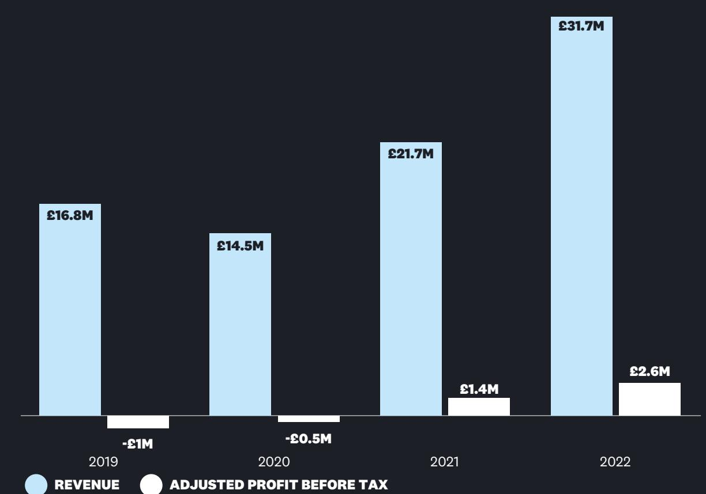
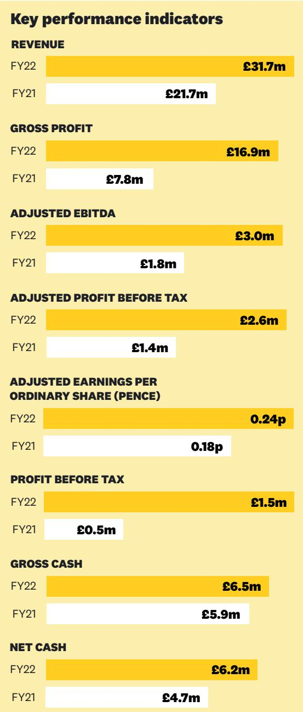
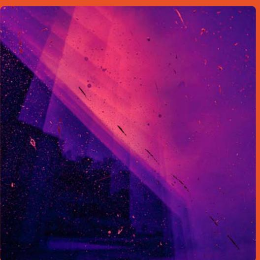

{0}------------------------------------------------

## Annual Report **2022**

 **BRAVE BISON ANNUAL REPORT 2022**

{1}------------------------------------------------

# is a new era social and digital media company.

**IFC WITH DESIGN**Brave Bison operates at the intersection of digital media, digital advertising and digital commerce, connecting the dots for global brands and winning the hearts and minds of digital audiences

#### 35 Revenue and Adjusted Profit before tax

**MILLIONS**

0

5

Adjusted Profit before tax is stated after adding back acquisition costs, restructuring costs, impairments, amortisation of acquired intangibles and share-based payments, and is after the deduction of costs associated with property leases.

{2}------------------------------------------------

# **£31.7m** +46%

Revenue

**£16.9m** +117% Gross profit

**£2.6m** +86% Adjusted Profit before tax

Net cash

**1**

## **Strategic report**

- 4 Chairman's Review
- 6 CFO's Review
- 8 Section 172 statement
- 9 Principal Risks & Uncertainties
- 10 Operational Report
- 12 ESG Report

## **Governance Report**

- 16 Board of Directors
- 18 Statement of Corporate Governance
- 21 Audit & Risk Committee Report
- 22 Remuneration Committee Report
- 24 Directors' Report
- 25 Statement of Directors' Responsibilities

## **Financial Statements**

- 28 Independent auditor's report
- 34 Consolidated income statement and consolidated statement of comprehensive income
- 35 Consolidated statement of financial position
- 36 Consolidated statement of cash flows
- 37 Consolidated statement of changes in equity
- 38 Notes to the financial statements
- 60 Company balance sheet
- 61 Company statement of changes in equity
- 62 Notes to the company financial statements

IBC Company Information and Advisers

{3}------------------------------------------------

# Strategic Report

**2**

{4}------------------------------------------------

## **In this section**

| 4  | Chairman's Review                  |
|----|------------------------------------|
| 6  | CFO's Review                       |
| 8  | Section 172 statement              |
| 9  | Principal Risks & Uncertainties |
| 10 | Operational Report                 |
| 12 | ESG Report                         |

{5}------------------------------------------------

## **CHAIRMAN'S REVIEW**

# "We operate from trend to spend for our customers"

Brave Bison competes in a growing and exciting marketplace at the intersection of social media, technology, data science and ecommerce.

We operate from trend to spend for our customers; promoting products, selling advertising on our channels and building transactional websites and apps to enable check out. Our vision is to build a company for the new era and the past twelve months have seen us consolidate and integrate across what has become our foundational platform.

Brave Bison operates across four business pillars:

**Brave Bison Performance** is a digital media advertising practice. We plan and buy media on platforms such as Google, Meta, TikTok, Amazon and YouTube. All of our work is focused on helping our customers drive conversion metrics such sales, downloads and subscriptions. Customers include New Balance, Curry's and Asus.

**Brave Bison Commerce** is a digital commerce practice. We provide technology services to help customers design and build next generation ecommerce platforms. Our teams use the latest MACH technology from partners such as Salesforce, Adobe, SAP and BigCommerce to design, launch, upgrade and support best-in-class ecommerce systems. Customers include Viking Direct, MKM Building Supplies and Muller.

**Brave Bison Social & Influencer** (re-branded to Social Chain as of February 2023) is a social media advertising practice. We create content for customers on social media platforms and work with influencers to make and distribute content. This creative approach ensures that content is native to the platform, leading to higher engagements from audiences. Customers include Panasonic, Vodafone, WWF and Rapyd.

**Brave Bison Media Network** is a portfolio of channels across YouTube, Facebook, Snapchat, TikTok and Instagram. These channels generate over 1 billion monthly views, and the advertising inventory from each channel is sold through online advertising exchanges. Popular channels include The Hook, PGA Tour, US Open and Link Up TV.

Whilst each of our business pillars is led by a Managing Director and supported by department heads, the Brave Bison platform is one of connection and collaboration. We have worked hard over the past year to ensure that, despite our four centres of excellence, we operate as one company, with a shared vision that aligns across each of our business pillars.

#### **Year in Review**

2022 was a strong year for Brave Bison. During the period revenue grew by 46% to almost £32m, gross profit more than doubled to just under £17m and the company generated adjusted EBITDA of over £3m, a YoY increase of 71%. At year end our balance sheet remained strong with net cash of over £6m, after having completed our third acquisition since Theo, Philippa and I joined the company mid 2020.

During the period the Leadership Team maintained a sharp operational focus. We completed the integration of four businesses, made our third acquisition, and relaunched an enhanced value and service proposition under a refreshed Brave Bison brand. This integrated and connected approach has already proven its ability to attract new customers and allow for effective cross selling across our four business units.

Best Response Media (BRM) was acquired during the period and integrated into Brave Bison Commerce. Until the acquisition, our efforts at Brave Bison Commerce were focused on three major enterprise ecommerce platforms: SAP, Salesforce and BigCommerce. Through the acquisition of BRM, we are now able to offer services on Adobe Commerce Cloud, a ubiquitous platform that has grown from strength-to-strength in recent years. Furthermore, we acquired a highly experienced and flexible resource base in Mansoura, Egypt, as well as Tier 1 customers including NatWest.

Brave Bison is headquartered in London, but the business operates across the world. We have staff in 11 countries and almost a quarter of our team works remotely. Furthermore, over 50% of our staff work on a hybrid basis, often choosing to come into the office between one and three days per week. This new way of working is an important part of our strategy moving forward and is telling of the digital age we are leaning into as a business. Our hybrid and remote workforce enables us to hire more quickly, cheaply and often from a more diverse pool of talent. This approach also means that, as we scale and grow our teams, we can keep property costs low whilst maintaining a strong culture through a mixture of virtual team events and quarterly in person socials.

{6}------------------------------------------------

Theo and I are committed to developing Brave Bison's board in a thoughtful and measured way, in line with modern standards of governance. The appointment of Gordon Brough as non-executive director during the period is a further indication of this commitment. Gordon has extensive experience in UK public companies having been General Counsel at Aberdeen Asset Management plc (subsequently the asset management arm of Abrdn) for almost 10 years. Gordon's legal experience, as well as his expertise in acquisitions will be crucial to the business as we look to further bolster our corporate profile.

#### **Outlook**

We are mindful of macroeconomic challenges over the next 12-18 months, but have confidence in the prevailing trend that continues to shift marketing budgets away from traditional advertising and into digital channels. Furthermore, our position in this expanding marketplace is differentiated and growing from strength-to-strength.

This organic growth will be compounded by our carefully considered Acquisition & Integration strategy that has proven successful to date. Our Leadership Team is both capable and focussed, and we anticipate that the acquisition of Social Chain (completed in February 2023) will have a transformative impact on our ability to win and deliver for customers in the social media advertising space.

#### **Oliver Green**

Executive Chairman 26 April 2023

{7}------------------------------------------------

## **CFO'S REVIEW**

# "2022 was a year of healthy growth at Brave Bison"

2022 was a year of healthy growth at Brave Bison. Revenue increased by 46% to £31.7 million (2021: £21.7 million), gross profit increased by 117% to £16.9 million (2021: £7.8 million) and adjusted profit before tax, a measure of underlying profitability, increased by 86% to £2.6 million (2021: £1.4 million).

Organic growth of gross profit, removing the impact of businesses acquired during the period, was £1.8 million, or approximately 12%.

#### **Principal Activities**

Brave Bison has two business models.

Firstly, the provision of digital advertising and technology services to global blue-chip companies. Services provided include social media advertising, influencer marketing, paid media services, search engine optimisation services, ecommerce software integration, ecommerce system design and others. Customers include New Balance, Muller, Primark and Asus. This operation is referred to as "fee based services" in the Group segmental reporting.

The digital advertising and technology services business unit showed good growth during the year. Revenues increased by 169% to £19.7 million (2021: £7.3 million) and the gross profit approximately tripled to £14.0 million (2021: £4.8 million). In line with our acquisition and integration strategy, Greenlight Digital was integrated into Brave Bison Performance, and Greenlight Commerce and Best Response Media were integrated into Brave Bison Commerce.

Secondly, Brave Bison owns and operates a network of social and digital media channels. These channels principally exist on platforms such as YouTube, Snapchat, Facebook, TikTok and Instagram. Brave Bison publishes content on these channels which attract views and serve advertising which can be bought programmatically through digital advertising platforms. This operation is referred to as "advertising" in Group segmental reporting.

The advertising business unit generated revenue of £11.9 million (2021: £14.3 million) and approximately 1.3 billion views (2021: 1.7 billion). This decrease year-on-year largely relates to channels that are operated but not owned by Brave Bison on a revenue share basis, therefore the underlying gross profit remained broadly flat at £2.9 million (2021: £3.0 million). The small drop in gross profit was largely due to a softening of CPMs (cost per mille) in the second half of the year in response to macroeconomic conditions. As we saw during the pandemic, this part of our business can be sensitive to such conditions, but tends to recover swiftly.

#### **Margins & Operations**

Brave Bison tracks adjusted profit margin (adjusted profit before tax as a percentage of gross profit) as a key performance indicator to measure the Group's financial performance.

The adjusted profit margin for the period was 15.4% (2021: 17.9%) a decrease year-on-year. This decrease was driven by the tripling of digital advertising and technology services net revenues which operates at a lower adjusted profit margin than advertising generated on the media network.

Despite the decrease in adjusted profit margin, Brave Bison has completed a number of initiatives to reduce the underlying operating costs of the business. These include a reduction in property costs through sub-letting excess office space, reduction in IT costs as business units are merged and careful resource management to reduce the staff cost to net revenue ratio for billable customers.

#### **Exceptional Costs & Adjustments**

During the year Brave Bison incurred restructuring costs of £0.1 million (2021:£0.2 million), relating to the restructuring and expansion of the Group's operations in Bulgaria, and acquisition costs of £0.1 million (2021: £0.7 million) relating to the costs associated with acquiring Best Response Media.

Brave Bison carried out a purchase price allocation exercise during the year in relation to the Greenlight acquisitions which completed in 2021, which resulted in identification of intangible assets relating to the acquired brands and customer relationships. As a result of the rebranding, and retirement of the Greenlight trade brand during the year, the amounts relating to this were impaired in full during the year, resulting in an impairment charge of £0.5 million (2021: £nil). The customer relationships are being amortised over a period of 10 years, resulting in a charge of £0.2 million (2021: £nil). As we deliver on our acquisition and integration strategy it is likely that both the amortisation of acquired intangibles, and impairment of acquired brands retired post-integration will continue to impact our financial statements.

Equity settled share-based payments relate to the value of share awards that have been granted to employees of the Group. £0.3 million of this amount relates to the directors' LTIP, which can only be redeemed in accordance with the terms outlined in the Directors' Remuneration Report. The earliest possible redemption date is December 2024, and redemption is contingent on the share price exceeding 3.0 pence.

Adjusted EBITDA is a non-IFRS measure that the Group uses to measure its performance and is defined as earnings before interest, taxation, depreciation and amortisation and after add back of costs related to restructuring, acquisitions and share based payments. It should be noted that a portion of the property costs in both 2022 and 2021 fall into the finance costs and depreciation lines as a result of the introduction of IFRS 16 'Leases'.

{8}------------------------------------------------

As a result, the Group also uses Adjusted profit before tax as a measure of performance, which is stated after add back of costs related to restructuring, acquisitions, share based payments, impairments and amortisation of acquired intangibles, but which is after the deduction of costs associated with property leases.

|                                      | 2022   | 2021   |
|--------------------------------------|--------|--------|
|                                      | £000's | £000's |
| Adjusted EBITDA                      | 3,020  | 1,762  |
| Finance costs                        | (86)   | (67)   |
| Finance income                       | 80     | -      |
| Depreciation                         | (382)  | (279)  |
| Adjusted Profit before tax           | 2,632  | 1,416  |
| Restructuring costs                  | (62)   | (176)  |
| Acquisition costs                    | (56)   | (686)  |
| Impairment charge                    | (456)  | -      |
| Amortisation of acquired intangibles | (215)  | (34)   |
| Equity settled share based payments* | (387)  | (62)   |
| Profit before tax                    | 1,456  | 458    |

* £0.3 million of the equity settled share based payments is a non-cash charge related to the director's LTIP, which can only be redeemed in accordance with the terms outlined in the Directors' Remuneration Report.

#### **Financial Position**

Brave Bison ended the period with cash resources of £6.5 million (2021: £5.9 million) and net cash after deducting outstanding bank loans of £6.2 million (2021: £4.7 million). The bank loan relates to a Government-backed CBIL that is repayable over six years from drawdown.

In addition to the CBIL, Brave Bison has a revolving credit facility with Barclays Bank for a total of £3 million, with an interest margin of 2.75% over Base Rate. This was agreed during the period but was undrawn at the period end.

The Group had cash inflow of £0.6 million during the period (2021: £3.2 million inflow), and expects to maintain positive cashflow throughout 2023. The decrease in cash inflow is largely due to a large customer prepayment received at the end of 2021, which subsequently unwound during the period.

In addition to this, the cashflow generated from operating activities was used to fund the acquisition of Best Response Media (£0.3 million) and the payment of deferred consideration in respect of the Greenlight acquisition made in 2021 (£0.8 million).

The Group is carrying intangible assets of £6.3 million (2021: £6.3 million). Based on an interim fair value exercise the Group capitalised goodwill of £0.2 million (2021: £6.2 million) on the purchase of Best Response Media (2021: Greenlight).

The Group does not capitalise any wages.

The movements in these key performance indicators are discussed above, and in the Chairman's report.

#### **Philippa Norridge**

Chief Financial Officer 26 April 2023

{9}------------------------------------------------

## **SECTION 172 STATEMENT**

#### For the year ended 31 December 2022

The Directors are aware of their responsibilities to promote the success of the Group for the benefit of its members as a whole in accordance with Section 172 of the Companies Act 2006, and in doing so to have regard to:

- The likely consequences of any decisions in the long term;
- the interests of the Group's employees;
- the need to foster the Group's business relationships with suppliers, customers and others;
- the desirability of the Group maintaining a reputation for high standards of business conduct; and
- the need to act fairly as between shareholders of the Company.

The Group's key stakeholders, and the way in which the Directors engage with them, are set out below:

#### **Employees**

The Board acknowledges that people are essential to the delivery of the Group's strategy and the Directors work hard to provide a productive working environment. Employees of the Group receive regular appraisals and performance reviews, and all-company meetings are held weekly to provide company updates. The Group conducts staff surveys to monitor progress of employment initiatives and areas for improvement. The Group is an equal opportunities employer and is committed to furthering diversity and inclusion throughout the business.

Appropriate policies and procedures are in place to ensure the Group complies with relevant legislation and regulations.

#### **Shareholders**

The Board is committed to open and transparent communications with all shareholder groups. The Directors have regular conversations with major shareholders, and the Group uses a stockbroker to manage professional investor relationships and introduce new professional investors. Furthermore, the Group utilises free-to-use platforms to enable retail investors to engage with the Group, attend the AGM and receive presentations on financial performance and strategy.

#### **Customers, Platforms & Suppliers**

The Group's customers are the clients and channel partners who appoint the Group to undertake programmes of work. Customers are serviced by dedicated employees of the Group, and customers receive updates on progress by way of regular business reviews.

The Group works with various social and digital media platforms to publish and monetise video content, as well as advertise on behalf of customers. The Group has dedicated teams that meet regularly with each platform, and discuss current performance, new opportunities and new products.

The Group has long-standing relationships with suppliers and treats all suppliers fairly. Contractual commitments to suppliers are met within a timely manner.

{10}------------------------------------------------

## **PRINCIPAL RISKS AND UNCERTAINTIES**

| Risk                                                        | Potential Risk Description                                                                                                                                                                                                                                                                                                                                                                                                                                                                                                                   | Mitigating Factors                                                                                                                                                                                                                                                                                                                                                                                                                                      |  |  |
|-------------------------------------------------------------|----------------------------------------------------------------------------------------------------------------------------------------------------------------------------------------------------------------------------------------------------------------------------------------------------------------------------------------------------------------------------------------------------------------------------------------------------------------------------------------------------------------------------------------------|---------------------------------------------------------------------------------------------------------------------------------------------------------------------------------------------------------------------------------------------------------------------------------------------------------------------------------------------------------------------------------------------------------------------------------------------------------|--|--|
| Dependence on key personnel and employees             | The continued success of the Group depends partly upon the performance and expertise of its current and future key executives and personnel. A lack of skilled workforce could result in a drop in service levels and customer dissatisfaction, and therefore have an adverse impact on the Group in terms of its reputation. The loss of such individuals, or the failure to train and attract other high calibre individuals may impact on the Group's business and the Group's ability to achieve its targets. | The Group ensures all its employees are supported and managed by way of regular performance appraisals. Furthermore, the Group incentivises key employees using performance-related bonus plans and share option awards that vest over a multi year period.                                                                                                                                                                           |  |  |
| Competitive industry dynamics                            | The Group operates in a highly complex and rapidly changing industry. If the Group is not able to compete successfully against existing or future competitors, its competitive position, business, financial condition and results of operations may be adversely affected.                                                                                                                                                                                                                                                   | The Board believes the Group has adopted a competitive business strategy to increase the profits of the business. The Group has implemented an acquisitive business model to improve its capabilities and scale within the markets which it operates. Furthermore, the Group maintains a substantial net cash position to provide flexibility in the event of a more competitive and less profitable trading environment. |  |  |
| Dependence on the operating policies of key platforms | The Group generates a significant proportion of its revenue from three international technology platforms which are subject to external factors beyond the Group's control. Changes to the commercial agreements or policies implemented by these platforms could have a negative impact on the financial position of the Group.                                                                                                                                                                                           | The Group has diversified its business model away from the advertising platforms, which now only account for 38% (FY21: 66%) of the Group's revenues. Furthermore, the Group has diversified its revenues between three platforms to reduce the impact of any single platform policy change.                                                                                                                                       |  |  |
| Impact of Pandemics                                         | A pandemic could cause an adverse impact on the Group's financial position. Customer marketing budgets could reduce, which may result in lower revenues. The Group's employees may be unable to service customers due to sickness or disruption to the Group's operations.                                                                                                                                                                                                                                                    | The Group operates a robust hybrid working system where its employees are not normally required to be physically present in an office in order to deliver work for customers.                                                                                                                                                                                                                                                               |  |  |
| Foreign Currency Risk                                       | The Group is primarily exposed to foreign exchange movements in the US dollar. These movements could result in a negative impact on the financial position of the Group.                                                                                                                                                                                                                                                                                                                                                            | The Group does not use derivatives to hedge translation exposure. All gains and losses are recognised in the income statement on translation at the reporting date.                                                                                                                                                                                                                                                                         |  |  |

{11}------------------------------------------------

## **OPERATIONAL REPORT**

#### **The Brave Bison Business Model**

Every year many trillions of physical and digital products and services are sold online, and in 2021 over half a trillion dollars was spent advertising these products and services across digital platforms. Furthermore, businesses across the world are spending billions on their digital transformation, often, but not solely, in an effort to make their products and services more accessible in an online world.

Brave Bison is a digital media, digital advertising and technology company, built to exist in this new era. We provide our customers with products and services at each step of this value chain.

Each of our business units, Brave Bison Performance, Brave Bison Commerce, Brave Bison Social & Influencer (now Social Chain) and the Brave Bison Media Network, offers a specialism in this complex digital transformation of global economies.

#### **Business Units**

Brave Bison Performance is a paid and organic media practice. It plans and buys digital media on platforms like Google, Meta, TikTok, Amazon and YouTube, as well as providing search engine optimisation and digital PR services. Customers include New Balance, Curry's and Asus.

Brave Bison Social & Influencer is a social media advertising practice. It creates content for social media platforms, and works with influencers to create and distribute content. This creative approach ensures that content is more native to the platform it is on, leading to higher engagements from its audience. Customers include Panasonic, WWF and Rapyd.

Brave Bison Commerce is a digital commerce practice. It creates, improves and maintains transactional websites and manages the customer experience in a digital environment. This practice builds ecommerce systems in a composable way – where different functions of a website are provided by different software from different vendors. Customers include MKM, Muller and Furniture Village.

Brave Bison Media Network is a portfolio of channels across YouTube, Facebook, Snapchat, TikTok and Instagram. These channels generate over 1 billion monthly views, and the advertising inventory from each channel is sold through online advertising exchanges. Popular channels include The Hook, PGA Tour, US Open and Link Up TV.

{12}------------------------------------------------

## **Digital Advertising**  An indicative value chain

A company launches a new product

A digital advertising agency is appointed to plan an advertising campaign in a specific market

A creative agency is appointed to produce effective content formats that will perform on the relevant channel

A digital advertising agency buys the relevant media through a programmatic advertising exchange

A campaign plan includes the target audience, as well as the most appropriate digital advertising platform

Influencers (independent creators with large, engaged followings) may be chosen to create and distribute content without paid media

A digital commerce agency manages the digital experience and commerce integrations for the transactional website

{13}------------------------------------------------

## **ESG REPORT**

# "Governance is central to the effective delivery of our mission and strategy"

#### **ENVIRONMENTAL**

As a digital media, digital advertising and technology services group, the direct and indirect impact of the Group on the environment is low. Nevertheless, we continue to aim to reduce our environmental impact.

Our sustainability strategy has 3 pillars, emissions, waste & recycling and consumables.

#### **Carbon emissions:**

As a service business our energy use is by far our biggest contributor to our carbon emissions. Combined, electricity and gas represent around 70% of emissions in a normal (non-pandemic) year. We encourage energy saving with simple but effective office measures.

The most important of these is our pledge to offset actual carbon emissions or the highest year of emissions – providing a direct incentive to staff to save energy, since any reduction below our worst year translates into the business being carbon negative. This is critical and, we believe, unique, as it removes the implicit "permission to emit" that carbon offsetting programmes can otherwise create.

Carbon Emissions are classified as Scope 1, 2 or 3. Scope 1 includes direct emissions from burning fossil fuels, Scope 2 is made up of indirect emissions that a company is directly responsible for, such as burning fossil fuels for electricity and emissions from public transport made on company business, and Scope 3 emissions are indirect emissions that the company is indirectly responsible for. Scope 3 is wide and includes emissions from cloud computing, emissions associated with the manufacture of office equipment and much more.

Our Scope 1 and 2 carbon emissions are measured in the first half of each year for the prior year. We partner with specialist consultants Carbon Footprint Ltd to assess and verify our footprint. The assessment includes rigorous estimates of the impact of our people working from home, which they now do a significant proportion of the time. From this year we intend our reports will cover the entirety of Scope 3 emissions, making 2022 the first year a complete and unflinching benchmark of our Carbon Footprint has been made.

Our offsetting programme is a blend of avoided deforestation (REDD) in the Amazon, reforesting in Africa, UK tree planting, and clean cooking technology in rural China and India (where wood and coal burning is otherwise prevalent). Finally, we plant 15 trees for every new client win or renewed client contract in our Tree Nation forest.

As our measurement to date has been for Scopes 1, 2 and part of Scope 3, we only claim Scope 1 & 2 carbon neutrality (or carbon negativity in years where our offsetting is greater than our emissions). Following 2022's Carbon Footprint assessment which we expect to be complete by the end of May, it's our ambition to make a Net Zero commitment in line with the Science Based Targets Initiative, accompanied by a plan to reach Net Zero across all scopes.

Other measures include automatic timers on our TV's and communication with our staff about the impact their energy use has. Travel was significantly reduced as a result of COVID-19, and the Group continues to minimise travel where possible.

#### **Waste & Recycling**

The Group operates a largely paperless office. All employees are advised that documents and emails should not be printed, instead accessed via shared digital drives. When required, printers are set to double-sided and black and white, the aim being to reduce the use of both paper and toner.

We have long been a Group that aims to recycle as much waste as possible. We have clearly labelled recycling points stationed around the offices, and avoid bins at desks to encourage their use.

#### **Consumables**

We have an ongoing programme designed to minimise the environmental impact of our consumption beyond greenhouse gases and recycling.

Livestock farming generates a significant percentage of global greenhouse gas emissions, with red meat and dairy producing the majority of this. A third of the water used for farming goes toward rearing farm animals. Soy and oat milk alternatives are provided, again reducing our dairy farming impact while avoiding water intensive almond milk. From this year, our ambition is to stop the routine purchase of any meat in food bought for staff and clients, with exceptions only for special events and requests.

We have removed all plastic bottled water from our London office and installed fresh still and sparkling water taps instead, avoiding over 600 single use plastic bottles every month.

Lastly, we only buy 100% recycled paper for our office printers.

{14}------------------------------------------------

#### **SOCIAL**

Brave Bison is committed to developing a diverse workforce, an inclusive culture and the removal of barriers for underrepresented groups.

56% of employees are male and 44% of employees are female. Within the Senior Leadership Team, 70% are male and 30% are female. During 2022 we carried out a Diversity, Inclusion and Belonging survey, and from the responses 35% of employees self-identify as being from an ethnic minority background.

Brave Bison seeks to achieve the highest ethical standards and behaviours in conducting its business, with integrity, openness, diversity and inclusiveness being high priority from the Board to senior management and throughout the workforce.

The Company has adopted a formal equal opportunities policy which is contained in our employee handbook.

The aim of the policy is to ensure no job applicant, employee or worker is discriminated against either directly or indirectly on the grounds of race, sex, disability, sexual orientation, gender reassignment; marriage or civil partnership; pregnancy or maternity; religion or belief or age.

In conducting our business and developing strategy we have placed greater emphasis on social and environmental considerations, embarking on a number of initiatives including:

- Running diversity and inclusion and unconscious bias training for all staff;
- Monthly 'Lunch & Learn' sessions where we have guest speakers from various sectors and backgrounds;
- Encouraging employees to take two paid days to volunteer in the local community; and
- Offering unlimited online coaching for all staff.

#### **GOVERNANCE**

The Board believes that governance is central to the effective delivery of our mission and strategy. With this in mind, the Board is committed to ensuring that all decision-making and the oversight it provides promotes success for the long-term benefit of its shareholders, while being respectful of the interests of other key stakeholders. This includes our partners, customers and employees.

The Board has a strong balance of industry knowledge and financial experience. We have established an Audit Committee and a Remuneration Committee with formally delegated duties and responsibilities and with written terms of reference. From time to time, separate committees may be set up by the Board to consider specific issues when the need arises.

{15}------------------------------------------------

# Governance Report

**14**

{16}------------------------------------------------

|    | In this section                             |
|----|---------------------------------------------|
| 16 | Board of Directors                          |
| 18 | Corporate Governance                        |
| 21 | Audit & Risk Committee Report            |
| 22 | Remuneration Committee Report            |
| 24 | Directors' Report                           |
| 25 | Statement of Directors' Responsibilities |

{17}------------------------------------------------

## **BOARD OF DIRECTORS**

**OLIVER GREEN** Executive Chairman

Oli is Executive Chairman of Brave Bison and has worked in digital marketing and technology for the past 10 years. Prior to joining Brave Bison, Oli was Managing Director of Tangent, a Top 100 Technology agency. Oli has worked with clients such as Amazon, SAP, LVMH and Sky across a range of projects spanning digital transformation, conversion rate optimisation and social media strategy. Oli was listed in Campaign magazine's annual #MediaWeek 30 Under 30 for 2020. Oli has a degree from University College London (UCL).

**THEODORE GREEN** Chief Growth Officer

Theo is Chief Growth Officer of Brave Bison and is experienced in both digital media and advertising, as well as acquisitions and corporate finance. Prior to joining Brave Bison, Theo worked at Tangent, a Top 100 technology agency. Prior to Tangent, Theo was an Associate at Brockton Capital, a private equity firm with assets under management of over \$3bn. Theo has a degree from Imperial College London.

**PHILIPPA NORRIDGE** Chief Financial Officer

Philippa is Chief Financial Officer and Company Secretary of Brave Bison and has spent the last 19 years working in the media and marketing services sector. Prior to joining Brave Bison, Philippa was Finance Director of Tangent, a Top 100 Technology agency. Philippa has held senior finance roles at a number of marketing services firms, including Finance Director at global network agency MullenLowe Profero and leading independent agency Albion Brand Communications. Philippa qualified as a chartered accountant with Moore Kingston Smith. Philippa has a degree from the University of Oxford.

{18}------------------------------------------------

**MATTHEW LAW** Non-Executive Director

Matt is an Independent Non-Executive Director of Brave Bison. He has 25 years' experience working in marketing and advertising, with a particular focus on the use of emerging digital technology. Matt is currently founding partner at innovation consultancy Move78, as well as a partner at Outlier Ventures, a startup accelerator and incubator where he provides specialist advice on business strategy and growth. Matt has worked with clients including the Guardian, BBC, Vodafone, HSBC, Nike, Unilever, Pernod Ricard and Sainsbury's as well as numerous early stage technology companies.

**GORDON BROUGH** Non-Executive Director

Gordon is an Independent Non-Executive Director of Brave Bison, and has over 20 years' experience working with public companies and legal affairs. Gordon is currently General Counsel at AssetCo, an AIM-listed asset management company. Prior to this, Gordon was General Counsel at CQS, the specialist asset manager with over \$20bn of assets under management and Aberdeen Asset Management plc, the FTSE 100 investment firm now known as abrdn plc. Gordon holds an LLB (Hons) and a Diploma in Legal Practice from the University of Dundee.

{19}------------------------------------------------

## **STATEMENT OF CORPORATE GOVERNANCE**

The Board of the Group is committed to high standards of corporate governance, which it considers are critical to business integrity and to maintaining investors' trust.

This section of sets out the Board's approach to governance and provides further detail on how the Board and its Committees operate.

The Chairman's role is to lead the Board of Directors and to be responsible for ensuring that the Group adheres to and applies the relevant standards of corporate governance.

The Group formally adopted the Quoted Companies Alliance Corporate Governance Code (the Code) in July 2018, and is broadly compliant with its principles.

The key governance principles and practices are described in the statement below, together with the Audit and Risk and Remuneration Committees' reports and the Directors' Report on pages 21 to 24.

#### **Statement of compliance**

The Group has adopted the QCA Code and is compliant with its principles save as disclosed. Disclosures required by the QCA Code have been made both in this annual report and on our website. Further information on the Group's compliance with the QCA Code can be found on the Group's website on the AIM Rule 26 page.

#### **The Composition of the Board**

The Board is responsible for the strategic direction, investment decisions and effective control of the Group. As at 31 December 2022 the Board comprised three Executive Directors and two Non-Executive Directors.

The Board reviews the effectiveness of its performance and that of its committees and individual Directors and is satisfied that, between the Directors, it has an effective and appropriate balance of skills and knowledge, including a range of financial, commercial, sector specific, public market and entrepreneurial experience.

The Board is also satisfied that it has a suitable balance between independence (of character and judgement) and knowledge of the Group to enable it to discharge its duties and responsibilities effectively. Matthew Law and Gordon Brough are considered to be independent. No single Director is dominant in the decision-making process.

The Group does not have an independent Chairman given the executive function of the Chairman. The Executive Chairman has a significant shareholding in the Company. The Group does not have a separate CEO and, where appropriate, the Executive Chairman assumes the role of CEO. While it is the Board's opinion that the current arrangements are appropriate to the Company at this stage of development the Board recognises the Code requirement on splitting the roles and will keep this under review. Meanwhile there are sufficient compliance structures within the Company to ensure that the governance functions that would be part of an independent Chairman's responsibility are met. The Executive Chairman will meet regularly with the Independent Directors to discuss the operation of the Board and strategy.

The Board aims to convene 6 times a year, with additional meetings being held as required. Board meetings are a mix of virtual and in person.

Prior to their appointment, the Company informed each Director of the nature of their role, their responsibilities and duties to the Company, and the time commitment involved. On appointment, each Director confirmed that, taking into account all of their other commitments, they were able to allocate sufficient time to the Company to discharge their role effectively. The Board is satisfied that the Non-Executive Directors each devote sufficient time to the Company and that there have been no significant changes to their other commitments.

#### **Board and Committee Attendance for the year ended 31 December 2022**

Attendance records for the Board and Committee meetings held during the year are shown below. These include both scheduled Board, Audit Committee and Remuneration Committee meetings and further meetings that were convened as required throughout the year.

| Director          | Board Meetings | Remuneration Committee Meetings | Audit Committee Meetings |  |
|-------------------|-------------------|---------------------------------------|--------------------------------|--|
| Oliver Green      | 8                 | 2                                     | 2                              |  |
| Philippa Norridge | 8                 | 1                                     | 2                              |  |
| Theodore Green    | 8                 | 2                                     | 2                              |  |
| Matthew Law       | 8                 | 2                                     | 2                              |  |
| Gordon Brough*    | 7                 | 2                                     | 1                              |  |

* appointed 11 July 2022, but attended board meetings as an observer prior to this date

{20}------------------------------------------------

## **Appointments to the Board and Re-election**

The Company's Articles of Association require that Directors hold office only until the first annual general meeting of the Company following such appointment and are then subject to election by Shareholders. All Directors are required to seek re-election every three years. The task of searching for appropriate candidates and assessing potential candidates' skills and suitability for the role is performed by the Board as a whole.

### **Division of Responsibilities**

The Board is responsible for the overall management of the Group including the formulation and approval of the Group's long-term objectives and strategy, the approval of budgets, the oversight of Group operations, the maintenance of sound internal control and risk management systems and the implementation of Group strategy, policies and plans.

While the Board may delegate specific responsibilities, there is a formal schedule of matters specifically reserved for decision by the Board.

#### **Matters reserved for the board**

The Board retains control of certain key decisions through the Schedule of Matters reserved for the Board. The Board is responsible for:

- Overall management of the business and monitoring performance against objectives
- Approval of annual financial budgets
- Developing the Company's strategy and risk management
- Major investment and divestment decisions
- Setting business values, standards and culture
- Membership and chairmanship of the Board and Board Committees
- Relationships with shareholders and other stakeholders
- The Company's compliance with relevant legislations and regulations
- Approving results announcements and the annual report and financial statements
- Appointment and reappointment of the Company's auditors.

#### **Audit & Risk Committee**

The Audit & Risk Committee comprises two Non-Executive Directors, namely; Gordon Brough (Committee Chair and Independent Non-Executive Director), and Matthew Law (Independent Non-Executive Director). At the discretion of the Committee Chair, the Chief Financial Officer may be invited to attend meetings of the Audit & Risk Committee during the year.

The Audit & Risk Committee is responsible for the annual and half-yearly reports to shareholders, other public announcements of a financial nature, review of the likelihood of any fraud risks, review of the effectiveness of the Group's internal control and risk management system and oversight of the relationship with the external auditors. The Audit & Risk Committee also reviews the appointment of the external auditor, their independence, the audit fee, and any questions of resignation or dismissal. The Audit & Risk Committee met twice during the year.

#### **Remuneration Committee**

The Remuneration Committee comprises Matthew Law (Committee Chair) and Gordon Brough. Only members of the committee have the right to attend meetings, however other individuals such as the Chairman, CFO or Chief Growth Officer can be invited to attend at different points during the year.

The role of the Remuneration Committee includes responsibility for all aspects of the remuneration of Executive Directors, including salary, annual bonus (where appropriate) and share-based payments and an awareness of remuneration within the wider workforce. The Remuneration Committee met twice during the year.

#### **External Advisors**

The Board makes use of the expertise of external advisors where necessary, to enhance knowledge or gain access to skills or capabilities. Areas where external advisors are used include and are not limited to legal advice and tax advice.

#### **Relationships with shareholders**

The Board is committed to open and ongoing engagement with the Company's Shareholders. The Board will communicate with Shareholders through:

- The annual report and accounts
- The interim and full-year results announcements
- Trading updates (where required or appropriate)
- The annual general meetings in person or online meetings and presentations
- The Company's investor relations website

{21}------------------------------------------------

#### **Risk management and internal controls**

The Board acknowledges its responsibility (delegated to the Audit & Risk Committee) for establishing and maintaining the Group's system of internal controls and will continue to ensure that management keeps these processes under regular review and improves them where appropriate.

#### **Conflicts of Interest**

Outside interests and commitments of Directors, and any changes to these commitments are reported to and agreed by the Board.

#### **Related Party Transactions**

Transactions between parties related to the Directors are conducted at an arms-length basis and are subject to the Related Party Policy, which is implemented by the Board. Details of related party transactions conducted during the period are outlined in the financial statements.

#### **Insurance and indemnity**

In accordance with Article 54 of the Group's articles of association, Directors are entitled to an indemnity against liabilities incurred by them in the actual or purported exercise of their duties, or exercise of their powers including liability incurred in defending any proceedings (whether civil or criminal) which relate to anything done or omitted to be done and in which judgment is given in his favour, or in which he is acquitted, or which are otherwise disposed of.

The Group has purchased and maintains Directors' liability insurance cover against certain legal liabilities and costs for claims incurred in respect of any act or omission in the execution of their duties and which has been in place throughout the year.

{22}------------------------------------------------

## **AUDIT & RISK COMMITTEE REPORT**

As Chair of the Audit & Risk Committee ("the Committee"), I am pleased to present our Audit & Risk Committee Report for the year ended 31 December 2022.

#### **Membership**

The Audit & Risk Committee comprises two members, Matthew Law and myself, Gordon Brough. Matthew and I are Non-Executive Directors of the Company. Both myself and Matthew are considered Independent.

#### **Meetings and Attendance**

The Committee met twice during the year ended 31 December 2022. All members of the Committee at the time of each meeting were present. At the time of the first meeting Matthew Law was the Chair of the Audit & Risk Committee as I had not yet joined the board. Philippa Norridge, Chief Financial Officer, Oliver Green, Executive Chairman, and Theodore Green, Chief Growth Officer also attended all meetings by invitation. The external auditor attended both meetings.

#### **Duties**

The full list of the Committee's responsibilities is set out in its Terms of Reference, and is summarised below as follows:

- External audit (including the independence of the external auditor);
- Financial reporting;
- Internal control and risk management; and
- Reporting on activities of the Committee.

The Terms of Reference for the Committee are reviewed annually and approved by the Board.

The main items of business considered by the Committee during the year included:

- Review and approval of the interim report for the six months ended 30 June 2022;
- A review of the year-end 2021 audit plan, consideration of the scope of the audit, the risks identified by the external auditor and the external auditor's fees; and
- Consideration and approval of the 2021 financial statements of the Group and Company, the external audit report and management representation letter.

#### **External Auditor**

The Committee has the primary responsibility for recommending the appointment of the external auditor and reviewing the findings of the auditor's work. The external auditor has direct access to me and other members of the Committee, without executive management being present if they wish.

The Company's external auditor is Moore Kingston Smith LLP. Having reviewed the auditor's independence and performance to date, the Committee recommended to the Board that they be reappointed for the Company's 2023 audit. Moore Kingston Smith LLP have expressed their willingness to continue in office and a resolution to reappoint them as auditor will be proposed at the next annual general meeting.

During the year to 31 December 2022, fees paid to Moore Kingston Smith LLP in relation to non-audit services amounted to £10k (2021: £5k).

#### **Audit Process**

The external auditor prepares an audit plan setting out how the auditor will audit the full-year financial statements. The audit plan is reviewed, agreed in advance, and overseen by the Committee. The plan includes the proposed scope of the work, the approach to be taken with the audit and also describes the auditor's assessment of the principal risks facing the business. Prior to approval of the financial statements, the external auditor presents its findings to the Committee, highlighting areas of significant financial judgement for discussion.

#### **Internal Audit**

The Audit and Risk Committee has considered the need for an internal audit function during the year and is of the view that, given the size and nature of the Company's operations and finance team, there is no current requirement to establish a separate internal audit function.

#### **Gordon Brough**

Chair of the Audit & Risk Committee 26 April 2023

{23}------------------------------------------------

## **REMUNERATION COMMITTEE REPORT**

As Chair of the Remuneration Committee ("the Committee"), I am pleased to present our report for the year ended 31 December 2022 which sets out details of the composition and activities of the Committee. Details of the remuneration paid to Directors during the year is set out below.

#### **Committee Meetings and Attendance**

The members of the Committee are the two Non-Executive Directors: Gordon Brough and myself, Matthew Law. The Board considers that I have sufficient relevant experience to chair the Committee. In the 12 month period to 31 December 2022, the Committee met a total of 2 times.

#### **Duties**

The Committee works closely with the Board to formulate remuneration policy for the Company. The main duties of the Committee include the following:

- Set remuneration policy for Executive Directors, and in the process, review and give due consideration to pay and employment conditions throughout the Company;
- Approve the design of, and determine targets for any performance-related pay schemes operated by the Company; and
- Manage the consultation with shareholders over remuneration policy, in the event that consultation with shareholders is appropriate.

#### **Remuneration of Executive Directors**

The Remuneration Committee determines the Company's policy on the structure of Executive Directors' remuneration. The objectives of this policy are to:

- Reward Executive Directors in a manner that ensures that they are properly incentivised and motivated to perform in the best interests of shareholders;
- Provide a level of remuneration required to attract and motivate high-calibre Executive Directors; and
- Encourage value creation through consistent and transparent alignment of incentive arrangements with the agreed Company strategy over the long term.

Executive Directors' remuneration packages are considered annually by the Remuneration Committee in line with the above policy and comprise a number of elements:

- Salaries which are normally reviewed annually taking into account inflation, salaries paid to directors of comparable companies, Group and personal performance;
- Annual bonus which is discretionary and only relevant for certain Executive Directors; and
- Share awards which are granted under the Company's approved and unapproved plans.

#### **Director's Remuneration (audited)**

The following table summarises the Director's remuneration for the year ended 31 December 2022 and 31 December 2021:

| Director                | Salary £'000s | Consultancy £'000s | Bonus £'000s | Benefits & Pension £'000s | 2022 Total £'000s | 2021 Total £'000s |
|-------------------------|------------------|-----------------------|-----------------|---------------------------------|-------------------------|-------------------------|
| Executive Directors     |                  |                       |                 |                                 |                         |                         |
| Oliver Green            | 95               | -                     | -               | 9                               | 104                     | 60                      |
| Theodore Green          | 95               | -                     | -               | 9                               | 104                     | 60                      |
| Philippa Norridge       | 139              | -                     | 25              | 25                              | 189                     | 153                     |
| Non-Executive Directors |                  |                       |                 |                                 |                         |                         |
| Matthew Law             | 29               | -                     | -               | 3                               | 32                      | 30                      |
| Gordon Brough           | 14               | 10                    | -               | -                               | 24                      | -                       |
| Total                   | 372              | 10                    | 25              | 46                              | 453                     | 303                     |

The Executive Directors have all entered into service contracts with the Company. Oliver Green and Theodore Green are on service contracts with a notice period of 12 months, and Philippa Norridge is on a service contract with a notice period of 6 months.

{24}------------------------------------------------

#### **Director's Interests**

The interest of each Director in the Company's ordinary shares as at 31 December 2022 is as follows:

| Director                 | Vested Share Options | Ordinary Shares | Total       | % of Total Share Capital |
|--------------------------|----------------------|-----------------|-------------|--------------------------|
| Oliver & Theodore Green* | Nil                  | 241,468,473     | 241,468,473 | 22.34%                   |
| Philippa Norridge        | 8,170,949            | 851,111         | 9,022,060   | 0.83%                    |
| Gordon Brough            | Nil                  | 587,371         | 587,371     | 0.05%                    |
| Matthew Law              | Nil                  | Nil             | Nil         | Nil                      |

* Of these Shares, 240,416,059 are held by Greenspan Investments Limited and 1,052,414 are held by Oliver Green (director and shareholder Greenspan Investments Limited).

#### **Share Awards**

Philippa Norridge, Executive Director and Chief Financial Officer, has been granted share options over 12,256,424 ordinary shares under the Company's approved EMI share option scheme. These options vest annually in equal tranches between May 2020 and May 2023 and have an exercise price of 0.1p. No options were exercised during the year.

In 2021, Brave Bison announced the adoption of a Long Term Incentive Plan ("LTIP") for Oliver Green and Theodore Green. In structuring the LTIP, the Brave Bison Remuneration Committee was advised by remuneration consultants h2glenfem and consulted with the Company's major shareholders representing 69% of the Company's issued share capital, inclusive of the Directors and their connected persons.

Pursuant to the LTIP, Oliver Green and Theodore Green, Executive Chairman and Chief Growth Officer respectively (the "LTIP Executives") have agreed to subscribe for nonvoting subordinate shares in a wholly owned subsidiary of the Company ("B Shares").

Subject to the achievement of performance conditions under the LTIP set out below, the B Shares can be redeemed by the LTIP Executives, who are participating equally in the LTIP on a 50:50 basis, in exchange for new ordinary shares in the Company ("Ordinary Shares"). Redemptions of B Shares under the LTIP may occur at any time from the third anniversary of the adoption of the LTIP (the "First Redemption Date") until the sixth anniversary of the adoption of the LTIP (the "Final Redemption Date").

In the event that the mid-market closing price per Ordinary Share exceeds 3.0 pence on the date(s) of redemption(s), the B Shares will be capable of redemption by the LTIP Executives at any time with an aggregate value (the "Redemption Value") equal to 15% of value created for the Company's shareholders from the adoption of the LTIP to redemption(s) of the B Shares, calculated as:

- a) The market value of all Ordinary Shares in issue on redemption of B Shares, less
- b) The market value of the 1,080,816,000 Ordinary Shares currently in issue on redemption based on an opening share price of 1.425 pence per Ordinary Share, indexed at a compounding annualised growth rate of 8%, less
- c) The issue value of any additional new Ordinary Shares issued following adoption of the LTIP and prior to redemption(s) of the B Shares, indexed at a compounding annualised growth rate of 8%, plus
- d) The value of any dividends, share buy backs or any other distributions to shareholders following the implementation of the LTIP and prior to the redemption(s) of the B Shares.

In calculating the number of new Ordinary Shares to be issued to the LTIP Executives on redemption(s), the Redemption Value will be divided by the prevailing midmarket closing price per Ordinary Share over the previous ten business days prior to Redemption, subject to the total number of Ordinary Shares capable of issue under the LTIP in no circumstances exceeding 12.5% of the Company's issued ordinary share capital.

Furthermore, redemption(s) of the B Shares is restricted such that the aggregate shareholdings of the LTIP Executives and their connected persons does not exceed 29.9% of the Company's share capital. The B Shares can be redeemed in whole or in part to satisfy this restriction. The B Shares will also become eligible for redemption in the event of the sale of the Company, the sale of more than 51% of the Company to an unconnected party or the winding up of the Company. Any new Ordinary Shares issued pursuant to a redemption of B Shares under the LTIP are required to be held for a

minimum period of 12 months, with a carve out for settling tax liabilities due on redemption, and the awards under the LTIP are subject to customary malus provisions.

#### **Matthew Law**

Chair of the Remuneration Committee 26 April 2023

{25}------------------------------------------------

## **DIRECTORS' REPORT**

The Directors present their Annual Report together with the audited financial statements of the Company and its subsidiaries for the year ended 31 December 2022.

The Group has chosen, in accordance with section 414C(11) of the Companies Act 2006, to include such matters of strategic importance to the Group in the Review and Operational Report which otherwise would be required to be disclosed in this Directors' Report.

#### **Results and Dividends**

The results for the year ended 31 December 2022 are set out in the Consolidated Statement of Comprehensive Income. Revenue for the year was £31.7 million, a 46% increase from £21.6 million in the year ended 31 December 2021. The financial position of the Group and Company are set out in the Consolidated and Company Statements of Financial Position.

Future developments are set out in the Chairman's Review.

The Directors do not recommend a dividend at 31 December 2022 (31 December 2021: £nil).

#### **Political Donations**

During the year, the Group made no political donations (2021: £nil).

#### **Charitable Donations**

During the year, the Group made no charitable donations (2021: £nil).

#### **Principal Activity**

The principal activity of the Group and Company is that of a digital media publisher and provider of digital advertising and technology services.

#### **Directors**

Details of Directors who served during the year and biographies for Directors currently in office can be found within the Governance Report.

Details of the Directors' remuneration, share options, service agreements and interests in the Company's shares are provided in the Remuneration Committee Report.

#### **Directors' indemnity**

In accordance with its Articles of Association the Company has entered into contractual indemnities with each of the Directors in respect of its liabilities incurred as a result of their office. In respect of those liabilities for which Directors may not be indemnified, the Company maintained a Directors' and Officers' Liability Insurance policy throughout the period. Although the Directors' defence costs may be met, neither the Company's indemnity nor the insurance policy provides cover in the event that the Director is proved to have acted dishonestly or fraudulently. No claims have been made under the indemnity or against the policy.

#### **Going Concern**

The consolidated financial statements have been prepared on the going concern basis on the assumption that the Group continues in operational existence for the foreseeable future.

The Directors have prepared detailed cash flow projections for at least twelve months from the date of approval of these consolidated financial statements, which are based on their current expectations of trading prospects, and accordingly the Directors have concluded that it is appropriate to continue to adopt the going concern basis in preparing these consolidated financial statements. Further information is provided in Note 2.1 of these consolidated financial statements.

#### **Statement as to disclosure of information to auditors**

So far as the Directors are aware, there is no relevant audit information (as defined by Section 418 of the Companies Act 2006) of which the Group's auditor is unaware, and each Director has taken all the steps that he or she ought to have taken as a Director in order to make himself or herself aware of any relevant audit information and to establish that the Group's auditor is aware of that information.

#### **Auditors**

Moore Kingston Smith LLP having expressed their willingness to continue in office, will be proposed for reappointment at the forthcoming Annual General Meeting in accordance with section 489 of the Companies Act 2006.

{26}------------------------------------------------

## **STATEMENT OF DIRECTORS' RESPONSIBILITIES**

#### **Significant shareholders at 31 December 2022**

| Shareholder                      | % of Total Issued Number of Shares Share Capital |        |  |
|----------------------------------|--------------------------------------------------------|--------|--|
| Oliver Green and Theodore Green* | 241,468,473                                            | 22.34% |  |
| CIP Merchant Capital             | 166,694,144                                            | 15.42% |  |
| Lombard Odier                    | 129,593,240                                            | 11.99% |  |
| James DeLeon**                   | 97,132,017                                             | 8.99%  |  |
| Simon Davies                     | 65,643,814                                             | 6.07%  |  |

* Of these Shares, 240,416,059 are held by Greenspan Investments Limited and 1,052,414 are held by Oliver Green (director and shareholder Greenspan Investments Limited).

** Of these Shares, 30,000,000 are held in James Russell DeLeon's own name, 56,014,648 are held by Vesuvius Limited and 11,117,369 are held by Plum Tree Limited. James Russell DeLeon is the ultimate controlling party of Vesuvius Limited and Plum Tree Limited.

#### **Statement of Directors' Responsibilities**

The Directors are responsible for preparing the Annual Report and the financial statements in accordance with applicable law and regulations. Company law requires the Directors to prepare financial statements for each financial year. Under that law the Directors have prepared the Group financial statements in accordance with UK adopted International Accounting Standards and elected to prepare the parent company financial statements in accordance with the FRS 102, The Financial Reporting Standard applicable in the UK and Republic of Ireland. Under company law the Directors must not approve the financial statements unless they are satisfied that they give a true and fair view of the state of affairs of the Company and Group and of the profit or loss of the Company and Group for that period. In preparing these financial statements, the Directors are required to:

- Select suitable accounting policies and then apply them consistently;
- State whether applicable UK adopted International Accounting Standards/UK accounting standards have been followed, subject to any material departures disclosed and explained in the financial statements;
- Make judgements and accounting estimates that are reasonable and prudent; and
- Prepare the financial statements on the going concern basis unless it is inappropriate to presume that the Group will continue in business.

The Directors are responsible for keeping adequate accounting records that are sufficient to show and explain the Group's transactions and disclose with reasonable accuracy at any time the financial position of the Group and enable them to ensure that the financial statements comply with the Companies Act 2006.

They are also responsible for safeguarding the assets of the Group and, hence, for taking reasonable steps for the prevention and detection of fraud and other irregularities.

The directors confirm that:

- So far as each Director is aware, there is no relevant audit information of which the Company's auditor is unaware
- The Directors have taken all the steps that they ought to have taken as Directors in order to make themselves aware of any relevant audit information and to establish that the Company's auditor is aware of that information

The Directors are responsible for the maintenance and integrity of the corporate and financial information included on the Group's website. Legislation in the United Kingdom governing the preparation and dissemination of financial statements may differ from legislation in other jurisdictions.

#### **Oliver Green**

Executive Chairman, Brave Bison Group plc 26 April 2022

{27}------------------------------------------------

# Financial Statements

**26**

{28}------------------------------------------------

## **In this section**

| 28 | Independent auditor's report                                                              |
|----|-------------------------------------------------------------------------------------------|
| 34 | Consolidated income statement and consolidated statement of comprehensive income |
| 35 | Consolidated statement of financial position                                           |
| 36 | Consolidated statement of cash flows                                                   |
| 37 | Consolidated statement of changes in equity                                            |
| 38 | Notes to the financial statements                                                      |
| 60 | Company balance sheet                                                                     |
| 61 | Company statement of changes in equity                                                 |
| 62 | Notes to the company financial statements                                              |
|    |                                                                                           |

**27**

{29}------------------------------------------------

## **INDEPENDENT AUDITOR'S REPORT TO THE MEMBERS OF BRAVE BISON GROUP PLC**

We have audited the financial statements of Brave Bison Group plc for the year ended 31 December 2022 which comprises the Consolidated Income Statement, the Consolidated Statement of Comprehensive Income, the Consolidated Statement of Financial Position, the Consolidated Statement of Cash Flows, the Consolidated Statement of Changes in Equity, the Company Balance Sheet, the Company Statement of Changes in Equity and notes to the financial statements, including significant accounting policies. The financial reporting framework that has been applied in the preparation of the group financial statements is applicable law and UK adopted International Accounting Standards. The financial reporting framework that has been applied in preparation of the parent company financial statements is applicable law and United Kingdom Accounting Standards, including Financial Reporting Standard 102 'The Financial Reporting Standard applicable in the UK and Republic of Ireland' (United Kingdom Generally Accepted Accounting Practice).

In our opinion:

- the financial statements give a true and fair view of the state of the group's and of the parent company's affairs as at 31 December 2022 and of the group's profit for the year then ended;
- the group financial statements have been properly prepared in accordance with UK adopted International Accounting Standards;
- the parent company financial statements have been properly prepared in accordance with United Kingdom Generally Accepted Accounting Practice; and
- the financial statements have been prepared in accordance with the requirements of the Companies Act 2006.

#### **Basis for opinion**

We conducted our audit in accordance with International Standards on Auditing (UK) (ISAs (UK)) and applicable law. Our responsibilities under those standards are further described in the Auditor's Responsibilities for the audit of the financial statements section of our report. We are independent of the group and the parent company in accordance with the ethical requirements that are relevant to our audit of the financial statements in the UK, including the FRC's Ethical Standard as applied to listed entities, and we have fulfilled our other ethical responsibilities in accordance with these requirements. We believe that the audit evidence we have obtained is sufficient and appropriate to provide a basis for our opinion.

#### **An overview of the scope of our audit**

Our audit approach was a risk-based approach founded on a thorough understanding of the group's business, its environment and risk profile. We conducted substantive audit procedures and evaluated the group's internal control environment. We also addressed the risk of management override of internal controls including assessing whether there was evidence of bias by the directors that may have represented a risk of material misstatement. The components of the group were evaluated by the group audit team based on a measure of materiality, considering each component as a percentage of the group's total assets, current assets, revenue and gross profit, which allowed the group audit team to assess the significance of each component and determine the planned audit response.

For those components that were evaluated as significant components, either a full scope or specified audit approach was determined based on their relative materiality to the group and our assessment of the audit risk. For significant components requiring a full scope approach, we evaluated controls by performing walkthroughs over the financial reporting systems identified as part of our risk assessment, reviewed the accounts production process and addressed critical accounting matters. We then undertook substantive testing on significant transactions and material account balances.

In order to address the audit risks identified during our planning procedures, we performed a full scope audit of the financial statements of the parent company and of the financial information of Brave Bison Limited and Greenlight Digital Limited. We performed specified audit procedures over the other components in the UK, including Greenlight Commerce Limited, Best Response Media Limited and the Singapore and dormant entities.

#### **Key audit matters**

Key audit matters are those matters that, in our professional judgement, were of most significance in our audit of the financial statements of the current period and include the most significant assessed risks of material misstatement (whether or not due to fraud) we identified, including those which had the greatest effect on: the overall audit strategy, the allocation of resources in the audit; and directing the efforts of the engagement team. These matters were addressed in the context of our audit of the financial statements as a whole, and in forming our opinion thereon, and we do not provide a separate opinion on these matters.

{30}------------------------------------------------

#### **Key Audit Matter - Group How the matter was addressed in the audit - Group**

#### **INCORRECT REVENUE RECOGNITION**

Revenue is a significant item in the consolidated income statement and impacts a number of management's key judgements, performance indicators and key strategic indicators.

There is a risk of incorrect revenue recognition due to fraud or error, arising from:

- recognition of revenue in the wrong period;
- revenue not being recognised in accordance with IFRS 15 'Revenue from Contracts with Customers'; and
- manipulation of revenues around the year-end through management override.

We therefore identified incorrect revenue recognition as a significant risk.

Our audit work included, but was not restricted to:

- Evaluating the group's revenue recognition accounting policy to check compliance with IFRS 15, which included assessing the treatment of each revenue stream under the principal versus agent criteria to test appropriate gross versus net presentation.
- Performing substantive testing on a sample of individual revenue transactions throughout the year across the significant revenue streams to evaluate whether revenue is recognised in accordance with the contract terms, having considered the principles of IFRS 15 and the commercial substance of the contracts.
- Testing procedures included agreeing revenue transactions selected for testing through to supporting evidence including sales invoice, contracts and cash receipts.
- Testing a sample of self-billing sales transactions to ensure that the revenue recognition was correct.
- Reviewing material credit notes, invoices and receipts post year end.
- Performing sales cut off tests to ensure revenue had been recognised in the correct period.
- In addition, we reviewed the adequacy of the disclosures under IFRS15.

#### **Key observations**

Based on our audit testing we did not identify any material misstatements of revenue.

We consider that the disclosures in the financial statements relating to this area are adequate.

#### **VALUATION OF INTANGIBLE ASSETS AND GOODWILL**

The directors are required to make an assessment to determine whether there are impairment indicators relating to the group's goodwill and other intangible assets.

The total net book value of the intangible assets at the year end was £6.270m including goodwill of £5.015m as detailed in note 13.

The process for assessing whether impairment exists under International Accounting Standard (IAS) 36 'Impairment of Assets' is complex. The process of determining the value in use, through forecasting cash flows related to each asset and the determination of the appropriate discount rate and other assumptions to be applied, can be highly judgemental and can significantly impact the results of the impairment review.

Based on the judgemental nature of an impairment review and significant impairment adjustments in prior periods, we identified impairment of intangible assets as a significant risk.

Our audit work included, but was not restricted to:

- Critically assessing management's assertion that at the interim valuation management had not been able to reliably estimate the fair value of acquired intangible assets in respect of the acquisition of Greenlight Digital Limited and Greenlight Commerce Limited in the year;
- Obtaining management's analysis of their assessment of whether there were any indicators of impairment.
- Critically assessing the assumptions underpinning the valuation of online channel content and customer relationship intangible assets.
- Evaluating the accounting policy and detailed disclosures to check whether information provided in the financial statements is compliant with the requirements of IAS 36 and consistent with the results of the impairment review.
- We considered the appropriateness of the amortisation policy for all nongoodwill intangible assets.

#### **Key observations**

Based on our audit work, we concluded that the group's intangible assets including goodwill arising on the acquisition of Greenlight Digital limited and Greenlight Commerce Limited are not materially misstated as the yearend and that management's impairment assessment and reassessment of useful economic life is appropriate.

We consider that the disclosures in the financial statements relating to this area are adequate.

{31}------------------------------------------------

#### **INDEPENDENT AUDITOR'S REPORT TO THE MEMBERS OF BRAVE BISON GROUP PLC CONTINUED**

#### **ACQUISITION ACCOUNTING**

The directors are required to make an assessment of the applicable accounting treatment of the acquisition of Best Response Media Limited as detailed in note 29.

Due to the complex nature of this process, we identified the accounting for the acquisition of Best Response Media Limited as a significant risk.

- Our audit work included, but was not restricted to:
- Obtaining and critically assessing management's accounting entries in respect of the acquisition in the consolidated financial statements;
- Obtaining and reviewing the Sales and Purchase Agreement and agreeing the relevant accounting entries;
- Reperforming management's goodwill calculation and critically assessing the underlying assumptions;
- Critically assessing management's assertion that at the interim valuation management had not been able to reliably estimate the fair value of acquired intangible assets and that at the interim valuation no fair value adjustments were required in respect of the acquisition. This included critically assessing management's assertion that no separate intangible assets were required to be recognised in respect of the acquisition;
- Reviewing management's assessment of the pro- rated profit and loss figures since acquisition included within the consolidated financial statements;
- Performing specific audit procedures including cut off testing to ensure the material accuracy of the figures of the acquired entities included within the consolidated financial statements; and
- Evaluating the accounting policy and detailed disclosures to check whether information provided in the financial statements is compliant with the requirements of International Financial Reporting Standard 3 Business Combinations.

#### **Key observations**

Based on our audit work, we concluded that acquisition accounting has been correctly applied in accordance with the requirements of IFRS 3 and that management's year-end impairment assessment is appropriate. We consider that the disclosures in the financial statements relating to this area are adequate.

#### **IMPAIRMENT OF INVESTMENTS**

The directors are required to make an assessment to determine whether the carrying value of the parent company's investments in subsidiaries of £18.022m, as detailed in note 32 is recoverable.

The process for assessing whether impairment exists under Financial Reporting Standard (FRS) 102 is complex. The process of determining the value in use through forecasting cash flows and the determination of the appropriate discount rate and other assumptions to be applied can be highly judgemental and can significantly impact the results of the impairment review.

Due to the complex nature of this process, we identified impairment of investments as a significant risk.

Our audit work included, but was not restricted to:

- Obtaining and recalculating management's cash flow forecasts utilised in the impairment assessment;
- Reviewing the board minutes, and holding discussions with management to understand the strategy for the investments and expectations going forward;
- Challenging management's assumptions utilised in the impairment models, including cash flow forecasts, growth rates and discount rates;
- Performing a sensitivity analysis to check whether management's forecasts would leave positive headroom if the assumptions of values increased or decreased;
- Comparing the calculated value in use for the investment to the carrying value of its net assets to check that is not impaired; and
- Evaluating the accounting policy and detailed disclosures to check whether information provided in the financial statements is compliant with the requirements of FRS 102 and consistent with the results of the impairment review.

#### **Key observations**

Based on our audit work, we concluded that the carrying value of the company's investments is not materially misstated at the year-end and that management's impairment assessment is appropriate.

We consider that the disclosures in the financial statements relating to this area are adequate.

{32}------------------------------------------------

#### **Our application of materiality**

The scope and focus of our audit was influenced by our assessment and application of materiality. We define materiality as the magnitude of misstatement that could reasonably be expected to influence the readers and the economic decisions of the users of the financial statements. We use materiality to determine the scope of our audit and the nature, timing and extent of our audit procedures and to evaluate the effect of misstatements, both individually and on the financial statements as a whole.

Due to the nature of the Group we considered revenue to be the main focus for the readers of the financial statements, accordingly this consideration influenced our judgement of materiality. Based on our professional judgement, we determined materiality for the Group to be £186,000, based on a percentage of revenue.

On the basis of our risk assessment, together with our assessment of the overall control environment, our judgement was that performance materiality (i.e. our tolerance for misstatement in an individual account or balance) for the Group was 50% of materiality, namely £93,000.

We agreed to report to the Audit Committee all audit differences in excess of £9,300, as well as differences below that threshold that, in our view, warranted reporting on qualitative grounds. We also reported to the Audit Committee on disclosure matters that we identified when assessing the overall presentation of the financial statements.

The materiality, performance materiality and trivial threshold for the parent company are £148,500, £74,250 and £7,425 respectively.

#### **Conclusions relating to going concern**

In auditing the financial statements, we have concluded that the use of the going concern basis of accounting in the preparation of the financial statements is appropriate. Our evaluation of the directors' assessment of the entity's ability to continue to adopt the going concern basis of accounting included a critical assessment of the detailed cash flow projections prepared by the directors, which are based on their current expectations of trading prospects, and obtaining an understanding of all relevant uncertainties. We have factored the impact of the ongoing Russia-Ukraine conflict into our analysis of the risks affecting the ability of the group to continue to trade and meet its liabilities as they fall due for at least twelve months from the date of approval of the financial statements.

The group achieved a positive cashflow in the year of £0.6m including the costs of the acquisition in the year. The cash flow projections to 30 June 2024 prepared by the directors indicate that the group will continue to achieve positive cash inflows throughout 2023 and into 2024. Furthermore, the directors are confident that the group's cash flow projections and profit and loss forecasts are achievable, and the directors are committed to taking any actions available to them to ensure that any shortfall in forecast revenues is mitigated by cost savings. As stated above we have critically assessed the projections and the assumptions underlying them in conducting our work in this area.

Based on the work we have performed, we have not identified any material uncertainties relating to events or conditions that, individually or collectively, may cast significant doubt on the company's ability to continue as a going concern for a period of at least twelve months from when the financial statements are authorised for issue.

Our responsibilities and the responsibilities of the directors with respect to going concern are described in the relevant sections of this report.

#### **Other information**

The directors are responsible for the other information. The other information comprises the information included in the annual report, other than the financial statements and our auditor's report thereon. Our opinion on the financial statements does not cover the other information and, except to the extent otherwise explicitly stated in our report, we do not express any form of assurance conclusion thereon.

In connection with our audit of the financial statements, our responsibility is to read the other information and, in doing so, consider whether the other information is materially inconsistent with the financial statements or our knowledge obtained in the audit or otherwise appears to be materially misstated. If we identify such material inconsistencies or apparent material misstatements, we are required to determine whether there is a material misstatement in the financial statements or a material misstatement of the other information. If, based on the work we have performed, we conclude that there is a material misstatement of this other information, we are required to report that fact.

We have nothing to report in this regard.

{33}------------------------------------------------

#### **Opinions on other matters prescribed by the Companies Act 2006**

In our opinion, the part of the directors' remuneration report to be audited has been properly prepared in accordance with the Companies Act 2006.

In our opinion, based on the work undertaken in the course of the audit:

- the information given in the Strategic Report and the Directors' Report for the financial year for which the financial statements are prepared is consistent with the parent company financial statements; and
- the Strategic Report and the Directors' Report have been prepared in accordance with applicable legal requirements.

#### **Matters on which we are required to report by exception**

In the light of the knowledge and understanding of the group and its environment obtained in the course of the audit, we have not identified material misstatements in the Strategic Report or the Directors' Report.

We have nothing to report in respect of the following matters where the Companies Act 2006 requires us to report to you if, in our opinion:

- adequate accounting records have not been kept by the parent company, or returns adequate for our audit have not been received from branches not visited by us; or
- the parent company financial statements and the part of the directors' remuneration report to be audited are not in agreement with the accounting records and returns; or
- certain disclosures of directors' remuneration specified by law are not made; or
- we have not received all the information and explanations we require for our audit.

#### **Responsibilities of directors**

As explained more fully in the directors' responsibilities statement set out on page 25, the directors are responsible for the preparation of the financial statements and for being satisfied that they give a true and fair view, and for such internal control as the directors determine is necessary to enable the preparation of financial statements that are free from material misstatement, whether due to fraud or error.

In preparing the financial statements, the directors are responsible for assessing the group's and the parent company's ability to continue as a going concern, disclosing, as applicable, matters related to going concern and using the going concern basis of accounting unless the directors either intend to liquidate the group or the parent company or to cease operations, or have no realistic alternative but to do so.

#### **Auditor's responsibilities for the audit of the financial statements**

Our objectives are to obtain reasonable assurance about whether the financial statements as a whole are free from material misstatement, whether due to fraud or error, and to issue an auditor's report that includes our opinion. Reasonable assurance is a high level of assurance, but is not a guarantee that an audit conducted in accordance with ISAs (UK) will always detect a material misstatement when it exists. Misstatements can arise from fraud or error and are considered material if, individually or in aggregate, they could reasonably be expected to influence the economic decisions of users taken on the basis of these financial statements.

A further description of our responsibilities is available on the FRC's website at https://www.frc.org.uk/auditors/auditorassurance/auditor-s-responsibilities-for-the-audit-of-the-fi/ description-of-the-auditor's-responsibilities-for

This description forms part of our auditor's report.

#### **Explanation as to what extent the audit was considered capable of detecting irregularities, including fraud**

Irregularities, including fraud, are instances of noncompliance with laws and regulations. We design procedures in line with our responsibilities, outlined above, to detect material misstatements in respect of irregularities, including fraud. The extent to which our procedures are capable of detecting irregularities, including fraud is detailed below.

The objectives of our audit in respect of fraud, are; to identify and assess the risks of material misstatement of the financial statements due to fraud; to obtain sufficient appropriate audit evidence regarding the assessed risks of material misstatement due to fraud, through designing and implementing appropriate responses to those assessed risks; and to respond appropriately to instances of fraud or suspected fraud identified during the audit. However, the primary responsibility for the prevention and detection of fraud rests with both management and those charged with governance of the group and the parent company.

Our approach was as follows:

- We obtained an understanding of the legal and regulatory requirements applicable to the group and the parent company and considered that the most significant are the Companies Act 2006, UK adopted International Accounting Standards, UK financial reporting standards as issued by the Financial Reporting Council, and UK taxation legislation.

{34}------------------------------------------------

- We obtained an understanding of how the group and the parent company complies with these requirements by discussions with management and those charged with governance.
- We assessed the risk of material misstatement of the financial statements, including the risk of material misstatement due to fraud and how it might occur, by holding discussions with management and those charged with governance.
- We inquired of management and those charged with governance as to any known instances of noncompliance or suspected non-compliance with laws and regulations.
- Based on this understanding, we designed specific appropriate audit procedures to identify instances of non-compliance with laws and regulations. This included making enquiries of management and those charged with governance and obtaining additional corroborative evidence as required.

There are inherent limitations in the audit procedures described above. We are less likely to become aware of instances of non-compliance with laws and regulations that are not closely related to events and transactions reflected in the financial statements. Also, the risk of not detecting a material misstatement due to fraud is higher than the risk of not detecting one resulting from error, as fraud may involve deliberate concealment by, for example, forgery or intentional misrepresentations, or through collusion'

#### **Use of our report**

This report is made solely to the company's members, as a body, in accordance with Chapter 3 of Part 16 of the Companies Act 2006. Our audit work has been undertaken for no purpose other than to draw to the attention of the company's members those matters which we are required to include in an auditor's report addressed to them. To the fullest extent permitted by law, we do not accept or assume responsibility to any party other than the company and company's members as a body, for our work, for this report, or for the opinions we have formed.

#### **Matthew Banton (Senior Statutory Auditor)**

for and on behalf of Moore Kingston Smith LLP

Chartered Accountants Statutory Auditor 6th Floor 9 Appold Street London EC2A 2AP

{35}------------------------------------------------

## **CONSOLIDATED INCOME STATEMENT AND CONSOLIDATED STATEMENT OF COMPREHENSIVE INCOME**

for the year ended 31 December 2022

|                                                                                 |      | 31 December    | 31 December    |
|---------------------------------------------------------------------------------|------|----------------|----------------|
|                                                                                 | Note | 2022 £000's | 2021 £000's |
| Revenue                                                                         | 6    | 31,652         | 21,660         |
| Cost of sales                                                                   |      | (14,704)       | (13,854)       |
| Gross profit                                                                    |      | 16,948         | 7,806          |
| Administration expenses                                                         |      | (15,486)       | (7,281)        |
| Operating profit                                                                | 7    | 1,462          | 525            |
| Finance income                                                                  | 9    | 80             | -              |
| Finance costs                                                                   | 9    | (86)           | (67)           |
| Profit before tax                                                               | 7    | 1,456          | 458            |
| Analysed as                                                                     |      |                |                |
| Adjusted EBITDA                                                                 |      | 3,020          | 1,762          |
| Finance costs                                                                   | 9    | (86)           | (67)           |
| Finance income                                                                  | 9    | 80             | -              |
| Depreciation                                                                    | 14   | (382)          | (279)          |
| Adjusted Profit before tax                                                      |      | 2,631          | 1,416          |
| Restructuring costs                                                             | 8    | (62)           | (176)          |
| Acquisition costs                                                               | 29   | (56)           | (686)          |
| Impairment charge                                                               | 15   | (456)          | -              |
| Amortisation of acquired intangibles                                            | 13   | (215)          | (34)           |
| Equity settled share based payments                                             | 24   | (387)          | (62)           |
| Profit before tax                                                               |      | 1,456          | 458            |
| Income tax credit                                                               | 10   | 624            | -              |
| Profit attributable to equity holders of the parent                             |      | 2,080          | 458            |
|                                                                                 |      |                |                |
| Statement of Comprehensive Income                                               |      |                |                |
| Profit for the year                                                             |      | 2,080          | 458            |
| Items that may be reclassified subsequently to profit or loss                   |      |                |                |
| Exchange gain/(loss) on translation of foreign subsidiaries                     |      | 25             | (7)            |
| Total comprehensive profit for the year attributable to owners of the parent |      | 2,105          | 451            |
| Earnings per share (basic and diluted)                                          |      |                |                |
| Basic earnings per ordinary share (pence)                                       | 11   | 0.19p          | 0.06p          |
| Diluted earnings per ordinary share (pence)                                     | 11   | 0.18p          | 0.06p          |

All transactions arise from continuing operations.

{36}------------------------------------------------

## **CONSOLIDATED STATEMENT OF FINANCIAL POSITION**

as at 31 December 2022

|                               |      | At 31 December 2022 | At 31 December 2021 |
|-------------------------------|------|------------------------|------------------------|
|                               | Note | £000's                 | £000's                 |
| Non-current assets            |      |                        |                        |
| Intangible assets             | 13   | 6,270                  | 6,265                  |
| Property, plant and equipment | 14   | 372                    | 672                    |
| Deferred tax asset            | 16   | 48                     | 135                    |
|                               |      | 6,690                  | 7,072                  |
| Current assets                |      |                        |                        |
| Trade and other receivables   | 17   | 7,426                  | 6,636                  |
| Cash and cash equivalents     |      | 6,485                  | 5,906                  |
|                               |      | 13,911                 | 12,542                 |
| Current liabilities           |      |                        |                        |
| Trade and other payables      | 18   | (9,310)                | (10,528)               |
| Bank Loans <1 year            | 20   | (109)                  | (108)                  |
| Lease Liabilities             | 19   | (393)                  | (629)                  |
|                               |      | (9,812)                | (11,265)               |
| Non-current liabilities       |      |                        |                        |
| Lease Liabilities             | 19   | -                      | (393)                  |
| Deferred tax liability        | 16   | (283)                  | -                      |
| Bank loans >1 year            | 20   | (199)                  | (308)                  |
| Provisions                    | 21   | (285)                  | (118)                  |
|                               |      | (767)                  | (819)                  |
| Net Assets                    |      | 10,022                 | 7,530                  |
|                               |      |                        |                        |
| Equity                        |      |                        |                        |
| Share capital                 | 22   | 1,081                  | 1,081                  |
| Share premium                 |      | 84,551                 | 84,551                 |
| Capital redemption reserve    |      | 6,660                  | 6,660                  |
| Merger reserve                |      | (24,060)               | (24,060)               |
| Merger relief reserve         |      | 62,624                 | 62,624                 |
| Retained deficit              |      | (121,001)              | (123,468)              |
| Translation reserve           |      | 167                    | 142                    |
| Total equity                  |      | 10,022                 | 7,530                  |

The financial statements on pages 34 to 68 were authorised for issue by the Board of Directors on 26 April 2023 and were signed on its behalf by

#### **Philippa Norridge**

Chief Financial Officer

{37}------------------------------------------------

## **CONSOLIDATED STATEMENT OF CASH FLOWS**

for the year ended 31 December 2022

|                                                    | 2022 £000's | 2021 £000's |
|----------------------------------------------------|----------------|----------------|
| Operating activities                               |                |                |
| Profit before tax                                  | 1,456          | 458            |
| Adjustments:                                       |                |                |
| Depreciation, amortisation and impairment          | 1,053          | 57             |
| Finance income                                     | (80)           | -              |
| Finance costs                                      | 86             | 67             |
| Share based payment charges                        | 387            | 62             |
| (Increase)/decrease in trade and other receivables | (553)          | 1,314          |
| (Decrease)/increase in trade and other payables    | (721)          | 2,033          |
| Tax received                                       | 84             | -              |
| Cash inflow from operating activities              | 1,712          | 3,991          |
| Investing activities                               |                |                |
| Acquisition of subsidiaries                        | (1,174)        | (7,735)        |
| Net cash acquired on acquisition                   | 840            | 1,451          |
| Purchase of property plant and equipment           | (81)           | (34)           |
| Purchase of intangible assets                      | -              | -              |
| Interest received                                  | 80             | -              |
| Cash outflow from investing activities             | (335)          | (6,318)        |
| Cash flows from financing activities               |                |                |
| Issue of share capital                             | -              | 6,257          |
| Interest paid                                      | (86)           | (5)            |
| Repayment of borrowings                            | (108)          | (36)           |
| Repayment of lease liability                       | (629)          | (730)          |
| Cash (outflow)/inflow from financing activities    | (823)          | 5,486          |
| Net increase in cash and cash equivalents          | 554            | 3,159          |
| Movement in net cash                               |                |                |
| Cash and cash equivalents, beginning of year       | 5,906          | 2,754          |
| Increase in cash and cash equivalents              | 554            | 3,159          |
| Movement in foreign exchange                       | 25             | (7)            |
| Cash and cash equivalents, end of year             | 6,485          | 5,906          |

{38}------------------------------------------------

## **CONSOLIDATED STATEMENT OF CHANGES IN EQUITY**

for the year ended 31 December 2022

|                                        | Share Capital £000's | Share premium £000's | Capital redemption Reserve £000's | Merger Reserve £000's | Merger relief Reserve £000's | Translation Reserve £000's | Retained deficit £000's | Total Equity £000's |
|----------------------------------------|----------------------------|----------------------------|--------------------------------------------|-----------------------------|---------------------------------------|----------------------------------|-------------------------------|---------------------------|
| At 1 January 2021                      | 613                        | 78,762                     | 6,660                                      | (24,060)                    | 62,624                                | 149                              | (123,988)                     | 760                       |
| Shares issued during the year          | 468                        | 5,789                      | -                                          | -                           | -                                     | -                                | -                             | 6,257                     |
| Equity settled share based payments | -                          | -                          | -                                          | -                           | -                                     | -                                | 62                            | 62                        |
| Transactions with owners               | 468                        | 5,789                      | -                                          | -                           | -                                     | -                                | 62                            | 6,319                     |
| Other comprehensive income             |                            |                            |                                            |                             |                                       |                                  |                               |                           |
| Profit and total comprehensive         | -                          | -                          | -                                          | -                           | -                                     | (7)                              | 458                           | 451                       |
| income for the year                    |                            |                            |                                            |                             |                                       |                                  |                               |                           |
| At 31 December 2021                    | 1,081                      | 84,551                     | 6,660                                      | (24,060)                    | 62,624                                | 142                              | (123,468)                     | 7,530                     |
| Shares issued during the year          | -                          | -                          | -                                          | -                           | -                                     | -                                | -                             | -                         |
| Equity settled share based             | -                          | -                          | -                                          | -                           | -                                     | -                                | 387                           | 387                       |
| payments                               |                            |                            |                                            |                             |                                       |                                  |                               |                           |
| Transactions with owners               | -                          | -                          | -                                          | -                           | -                                     | -                                | 387                           | 387                       |
| Other Comprehensive income             |                            |                            |                                            |                             |                                       |                                  |                               |                           |
| Profit and total comprehensive         | -                          | -                          | -                                          | -                           | -                                     | 25                               | 2,080                         | 2,105                     |
| income for the year                    |                            |                            |                                            |                             |                                       |                                  |                               |                           |
| At 31 December 2022                    | 1,081                      | 84,551                     | 6,660                                      | (24,060)                    | 62,624                                | 167                              | (121,001)                     | 10,022                    |

{39}------------------------------------------------

## **NOTES TO THE FINANCIAL STATEMENTS**

for the year ended 31 December 2022

## 1 Brave Bison

Brave Bison Group plc ("the Company") (formerly Rightster Group plc) was incorporated in England and Wales on 30 October 2013 under the Companies Act 2006 (registration number 08754680) and its registered address is The Varnish Works, 3 Bravingtons Walk, London, N1 9AJ. On 12 November 2013 the Company entered into share exchange agreements to acquire 100% of the issued share capital of Brave Bison Limited, a company incorporated in England and Wales on 16 May 2011 and registered at the same address. On 12 November 2013 the Company was admitted to the Alternative Investment Market (AIM) where its ordinary shares are traded.

The consolidated financial statements of the Group for the year ended 31 December 2022 comprise the Company and its subsidiaries (together referred to as the "Group"). The Group's business activities, together with the factors likely to affect its future development, performance and position are set out in the CFO's Review on pages 6-7, and Principal Risks and Uncertainties on page 9. In addition, Note 26 to the financial statements includes the Group's objectives, policies and processes for managing its capital; its financial risk management objectives; details of its financial instruments and its exposure to credit risk and liquidity risk.

## 2 Basis of preparation

### **2.1. Going Concern**

The consolidated financial statements have been prepared on a going concern basis, which assumes that the Group will be able to meet its liabilities as they fall due for the foreseeable future, and at least for 12 months from the date of approval of the consolidated financial statements. The Group is dependent for its working capital requirements on cash generated from operations, and cash holdings. The cash holdings of the Group at 31 December 2022 were £6.5 million (2021: £5.9 million). The Group made a profit before tax of £1.5 million for the year ended 31 December 2022 (2021: £0.5 million), and generated an increase in cash and cash equivalents in 2022 of £0.6 million (2021: £3.2 million). The Group has net assets of £10.0 million (2021: £7.5 million).

The Directors have prepared detailed cash flow projections for the period to 31 December 2023 and for the following 6 month period to 30 June 2024 which are based on their current expectations of trading prospects. The Group achieved positive cashflow of £1.1 million in H2 2022, and the Board forecasts that the Group will continue to achieve positive cash inflows in 2023.

The Directors are confident that the Group's cash flow projections are achievable, and are committed to taking any actions available to them to ensure that any shortfall in forecast revenue receipts is mitigated by cost savings.

The Directors continue to maintain rolling forecasts which are regularly updated.

The Directors remain confident that the Group has sufficient cash resources for a period of at least twelve months from the date of approval of these consolidated financial statements and accordingly, the Directors have concluded that it is appropriate to continue to adopt the going concern basis in preparing these consolidated financial statements.

#### **Basis of consolidation**

The consolidated financial statements consolidate the financial statements of Brave Bison Group plc and all its subsidiary undertakings up to 31 December 2022, with comparative information presented for the year ended 31 December 2021. No profit and loss account is presented for Brave Bison Group plc as permitted by section 408 of the Companies Act 2006.

Subsidiaries are all entities over which the Group has the power to control the financial and operating policies and is exposed to or has rights over variable returns from its involvements with the investee and has the power to affect returns. Brave Bison Group plc obtains and exercises control through more than half of the voting rights for all its subsidiaries. All subsidiaries have a reporting date of 31 December and are consolidated from the acquisition date, which is the date from which control passes to Brave Bison Group plc.

Entities other than subsidiaries or joint ventures, in which the Group has a participating interest and over whose operating and financial policies the Group exercises significant influence, are treated as associates. The results of associate undertakings are consolidated under the equity method of accounting. The Group applies uniform accounting policies and all intra-group transactions, balances, income and expenses are eliminated on consolidation.

Unrealised gains and losses on transactions between Group companies are eliminated. Where recognised losses on intra-group asset sales are reversed on consolidation, the underlying asset is also tested for impairment from a Group perspective.

Business combinations are accounted for using the acquisition method. The acquisition method involves the recognition at fair value of all identifiable assets and liabilities, including contingent liabilities of the subsidiary, at the acquisition date, regardless of whether or not they were recorded in the financial statements of the subsidiary prior to acquisition. On initial recognition, the assets and liabilities of the subsidiary are included in the consolidated statement of financial position at their fair values, which are also used as the basis for subsequent measurement in accordance with the Group accounting policies. Goodwill is stated after separating out identifiable intangible assets. Goodwill represents the excess of acquisition cost over the fair value of the Group's share of the identifiable net assets of the acquired subsidiary at the date of acquisition.

Profit or loss and other comprehensive income of subsidiaries acquired or disposed of during the year are recognised from the effective date of acquisition, or up to the effective date of disposal, as applicable.

{40}------------------------------------------------

#### **2.2. Adoption of new and revised standards**

The Group has applied the following amendments:

- IFRS 3 Reference to the Conceptual Framework;
- IAS 16 Property, Plant and Equipment: Proceeds before intended use;
- IAS 37 Onerous Contracts: Cost of Fulfilling a Contract; and
- Annual Improvements to IFRS Standards 2018 – 2020 Cycle.

Other Standards and amendments that are not yet effective and have not been adopted early by the Company include:

- Amendments to IAS 1 and IFRS Practice Statement 2 – Disclosure of Accounting Policies;
- Amendments to IAS 8 Definition of Accounting Estimates;
- Amendments to IAS 12 Deferred Tax related to Assets and Liabilities arising from a Single Transaction;
- Amendments to IAS 1 Classification of Liabilities as Current or Non-current;
- Amendments to IAS 1 Non-current Liabilities with Covenants; and
- Amendments to IFRS 16 Lease Liability in a Sale and Leaseback.

The directors have assessed the standards above and they will not have a material impact in future periods.

## 3 Statement of compliance

The financial statements have been prepared in accordance with the accounting policies and presentation required by UK adopted International Accounting Standards, and International Financial Reporting Interpretations Committee ("IFRIC") Interpretations as endorsed for use in the UK. The financial statements have also been prepared under the historical cost convention and in accordance with those parts of the Companies Act 2006 that are relevant to companies that prepare financial statements in accordance with UK adopted International Accounting Standards.

## 4 Summary of accounting policies

The Group's presentation and functional currency is £ (Sterling). The financial statements are presented in thousands of pounds (£000's) unless otherwise stated.

#### **4.1. Revenue**

Revenue is measured at the fair value of the consideration received or receivable and represents amounts receivable for services provided in the normal course of business, net of discounts and sales related taxes.

Revenue is recognised when the amount of revenue can be measured reliably, it is probable that the economic benefits associated with the transaction will flow to the entity, the costs incurred or to be incurred can be measured reliably, and when the criteria for each of the Group's different activities has been met.

The determination of whether the Group is acting as a principal or an agent in a transaction involves judgement and is based on an assessment of who controls a specified good or service before it is transferred to a customer. Significant contracts are reviewed for the indicators of control. The Group is deemed to be acting as a principal in all significant contracts.

Where the Group's contractual performance obligations have been satisfied in advance of invoicing the client then unbilled income is recognised on the Statement of Financial Position. Where the Group's contractual performance obligations have been satisfied less than amounts invoiced then a contract liability is recognised.

The accounting policies specific to the Group's key operating revenue categories are outlined below:

Advertising revenue:

- Ad-funded YouTube channel management of third party content owners' videos. Revenue is recognised at the point in time when the performance obligation of delivering monetised views occurs; and
- Monetisation of the Group's owned and operated brands and videos via platforms such as Facebook and Snapchat. Revenue is recognised at the point in time when the performance obligation of delivering monetised views occurs.

Fee Based Service revenue:

- Social Media and Influencer services. Providing social media consultancy and strategy services, and providing creative and influencer management services. Revenue from providing these services is recognised over the time that the performance obligations to provide services are satisfied;
- License fee revenues for the Group's own content and third parties' content are recognised at the point in time when the performance obligation of delivering the content is satisfied;
- Performance marketing services. Revenue from providing these services is recognised over the time that the performance obligations to provide services are satisfied; and
- Technology services. Revenue from providing these services is recognised over the time that the performance obligations to provide services are satisfied.

{41}------------------------------------------------

#### **4.2. Interest and dividend income**

Interest income and expenses are reported on an accrual basis using the effective interest method. Dividend income, other than from investments in associates, is recognised at the time the right to receive payment is established.

#### **4.3. Government grants**

Government grants are recognised at the fair value of the asset received or receivable when there is reasonable assurance that the grant conditions will be met and the grants will be received.

A grant that specifies performance conditions is recognised in income when the performance conditions are met. Where a grant does not specify performance conditions it is recognised in income when the proceeds are received or receivable. A grant received before the recognition criteria are satisfied is recognised as a liability. Government grants are presented as a deduction from the related expense.

#### **4.4. Foreign currency translation**

Transactions in foreign currencies are translated at the exchange rate ruling at the date of the transaction. Monetary assets and liabilities in foreign currencies are translated at the rates of exchange ruling at the balance sheet date. Non-monetary items that are measured at historical cost in a foreign currency are translated at the exchange rate at the date of the transaction. Non-monetary items that are measured at fair value in a foreign currency are translated using the exchange rates at the date when the fair value was determined.

Any exchange differences arising on the settlement of monetary items or on translating monetary items at rates different from those at which they were initially recorded are recognised in the profit or loss in the period in which they arise.

The assets and liabilities in the financial statements of foreign subsidiaries and related goodwill are translated at the rate of exchange ruling at the balance sheet date. Income and expenses are translated at the actual rate on the date of transaction. The exchange differences arising from the retranslation of the opening net investment in subsidiaries and on income and expenses during the year are recognised in other comprehensive income and taken to the "translation reserve" in equity. On disposal of a foreign operation the cumulative translation differences (including, if applicable, gains and losses on related hedges) are transferred to the income statement as part of the gain or loss on disposal.

#### **4.5. Segment reporting**

IFRS 8 Operating Segments requires operating segments to be identified on the same basis as is used internally for the review of performance and allocation of resources by the Group Chief Executive (chief operating decision maker – CODM).

The Board has reviewed the Group and all revenues are functional activities of a digital media and marketing group, and these activities take place on an integrated basis. The senior executive team review the financial information on

an integrated basis for the Group as a whole, but view the business as having 2 key pillars, being the Media Network and the Digital Advertising and Technology Services. The Group will provide a split between these two pillars, as well as a split by geographical location. Segmental information is presented in accordance with IFRS 8 for all periods presented within Note 6.

#### **4.6. Leasing**

For any new contracts entered into on or after 1 January 2019, the Group considers whether a contract is, or contains a lease. A lease is defined as 'a contract, or part of a contract, that conveys the right to use an asset (the underlying asset) for a period of time in exchange for consideration'. To apply this definition the Group assesses whether the contract meets three key evaluations which are whether:

- The contract contains an identified asset, which is either explicitly identified in the contract or implicitly specified by being identified at the time the asset is made available to the Group;
- The Group has the right to obtain substantially all of the economic benefits from use of the identified asset throughout the period of use, considering its rights within the defined scope of the contract; and
- The Group has the right to direct the use of the identified asset throughout the period of use. The Group assess whether it has the right to direct 'how and for what purpose' the asset is used throughout the period of use.

At lease commencement date, the Group recognises a right-of-use asset and a lease liability on the balance sheet. The right-of-use asset is measured at cost, which is made up of the initial measurement of the lease liability, any initial direct costs incurred by the Group, an estimate of any costs to dismantle and remove the asset at the end of the lease, and any lease payments made in advance of the lease commencement date (net of any incentives received).

The Group depreciates the right-of-use assets on a straightline basis from the lease commencement date to the earlier of the end of the useful life of the right-of-use asset or the end of the lease term. The Group also assesses the right-of-use asset for impairment when such indicators exist.

At the commencement date, the Group measures the lease liability at the present value of the lease payments unpaid at that date, discounted using the interest rate implicit in the lease if that rate is readily available or the Group's incremental borrowing rate.

Lease payments included in the measurement of the lease liability are made up of fixed payments (including in substance fixed), variable payments based on an index or rate, amounts expected to be payable under a residual value guarantee and payments arising from options reasonably certain to be exercised.

Subsequent to initial measurement, the liability will be reduced for payments made and increased for interest. It is remeasured to reflect any reassessment or modification, or if there are changes in in-substance fixed payments.

{42}------------------------------------------------

When the lease liability is remeasured, the corresponding adjustment is reflected in the right-of-use asset, or profit and loss if the right-of-use is already reduced to zero.

The Group has elected to account for short-term leases and leases of low-value assets using the practical expedients. Instead of recognising a right-of-use asset and lease liability, the payments in relation to these are recognised as an expense in the profit or loss on a straight-line basis over the lease term.

On the statement of financial position, right-of-use assets have been included in property, plant and equipment and lease liabilities have been included in trade and other payables.

#### **4.7. Property, plant and equipment**

Property, plant and equipment are stated at historical cost less accumulated depreciation and impairment. Depreciation is calculated to write down the cost less estimated residual value of all property, plant and equipment by equal annual instalments over their expected useful lives less estimated residual values, using the straight line method. The rates generally applicable are:

- Fixtures & Fittings 3 years or over remaining lease term
- Computer Equipment 3 years

The gain or loss arising on the disposal or retirement of an item of property, plant and equipment is determined as the difference between the sales proceeds and the carrying amount of the asset and is recognised in profit or loss.

The assets' residual value and useful lives are reviewed, and adjusted if required, at each balance sheet date. The carrying amount of an asset is written down immediately to its recoverable amount if the carrying amount is greater than its estimated recoverable amount.

The Group depreciates the right-of-use assets on a straightline basis from the lease commencement date to the earlier of the end of the useful life of the right-of-use asset or the end of the lease term. The Group also assesses the right-ofuse asset for impairment when such indicators exist.

#### **4.8. Impairment of property, plant and equipment**

At each balance sheet date, the Group reviews the carrying amounts of its property, plant and equipment to determine whether there is any indication that those assets have suffered an impairment loss. If any such indication exists, the recoverable amount of the asset is estimated in order to determine the extent of the impairment loss (if any). Where it is not possible to estimate the recoverable amount of an individual asset, the Group estimates the recoverable amount of the cash-generating unit to which the asset belongs. Recoverable amount is the higher of fair value less costs of disposal and value in use. In assessing value in use, the estimated future cash flows are discounted to their present value using a pre-tax discount rate that reflects current market assessments of the time value of money and the risks specific to the asset.

If the recoverable amount of an asset (or cash-generating unit) is estimated to be less than its carrying amount, the carrying amount of the asset (or cash-generating unit) is reduced to its recoverable amount. An impairment loss is recognised immediately in profit or loss.

Where an impairment loss subsequently reverses, the carrying amount of the asset (or cash-generating unit) is increased to the revised estimate of its recoverable amount, but so that the increased carrying amount does not exceed the carrying amount that would have been determined had no impairment loss been recognised for the asset (cash-generating unit) in prior years. A reversal of an impairment loss is recognised immediately in profit or loss.

#### **Intangible assets**

An intangible asset, which is an identifiable non-monetary asset without physical substance, is recognised to the extent that it is probable that the expected future economic benefits attributable to the asset will flow to the Group and that its cost can be measured reliably. The asset is deemed to be identifiable when it is separable or when it arises from contractual or other legal rights.

Intangible assets acquired as part of a business combination, are shown at fair value at the date of the acquisition less accumulated amortisation. Amortisation is charged on a straight line basis to profit or loss. The rates applicable, which represent the Directors' best estimate of the useful economic life, are:

- Customer relationships 5 to 10 years
- Online channel content 3 to 5 years
- Brands 3 years
- Technology 1 to 5 years

Goodwill is not amortised but is instead reviewed for impairment on an annual basis as outlined below.

#### **4.9. Impairment of intangible assets**

At each balance sheet date, the Group reviews the carrying amounts of its intangible assets and goodwill to determine whether there is any indication that those assets have suffered an impairment loss. If any such indication exists, the recoverable amount of the asset is estimated in order to determine the extent of the impairment loss (if any). Where it is not possible to estimate the recoverable amount of an individual asset, the Group estimates the recoverable amount of the cash-generating unit to which the asset belongs.

Recoverable amount is the higher of fair value less costs of disposal and value in use. In assessing value in use, the estimated future cash flows are discounted to their present value using a pre-tax discount rate that reflects current market assessments of the time value of money and the risks specific to the asset.

If the recoverable amount of an asset is estimated to be less than its carrying amount, the carrying amount of the asset is reduced to its recoverable amount. An impairment loss is recognised immediately in profit or loss.

{43}------------------------------------------------

#### **4.10. Development costs**

Expenditure on the research phase of an internal project is recognised as an expense in the period in which it is incurred. Development costs incurred on specific projects are capitalised when all the following conditions are satisfied:

- Completion of the asset is technically feasible so that it will be available for use or sale;
- The Group intends to complete the asset and use or sell it;
- The Group has the ability to use or sell the asset and the asset will generate probable future economic benefits (over and above cost);
- There are adequate technical, financial and other resources to complete the development and to use or sell the asset; and
- The expenditure attributable to the asset during its development can be measured reliably.

Development costs not meeting the criteria for capitalisation are expensed as incurred. The cost of an internally generated asset comprises all directly attributable costs necessary to create, produce and prepare the asset to be capable of operating in the manner intended by management. Directly attributable costs include employee (other than Director) costs incurred along with third party costs.

Judgement by the Directors is applied when deciding whether the recognition requirements for development costs have been met. Judgements are based on the information available at the time when costs are incurred. In addition, all internal activities related to the research and development of new projects is continuously monitored by the Directors.

#### **4.11. Investments in associates and joint ventures**

Investments in associates and joint ventures are accounted for using the equity method. The carrying amount of the investment in associates and joint ventures is increased or decreased to recognise the Group's share of the profit or loss and other comprehensive income of the associate or joint venture, adjusted where necessary to ensure consistency with the accounting policies of the Group.

#### **4.12. Taxation**

Tax expenses recognised in profit or loss comprise the sum of the tax currently payable and deferred tax not recognised in other comprehensive income or directly in equity.

#### **Current tax**

The tax currently payable is based on taxable profit for the year. Taxable profit differs from profit as reported in the statement of comprehensive income because it excludes items of income or expense that are taxable or deductible in other years and it further excludes items that are never taxable or deductible. The Group's liability for current tax is calculated using tax rates that have been enacted or substantively enacted by the balance sheet date.

#### **Deferred tax**

Deferred tax is recognised on differences between the carrying amounts of assets and liabilities in the financial statements and the corresponding tax bases used in the computation of taxable profit, and are accounted for using the liability method. Deferred tax liabilities are generally recognised for all taxable temporary differences, and deferred tax assets are generally recognised for all deductible temporary differences to the extent that it is probable that taxable profits will be available against which those deductible temporary differences can be recognised. Such assets and liabilities are not recognised if the temporary difference arises from goodwill or from the initial recognition (other than in a business combination) of other assets and liabilities in a transaction that affects neither the taxable profit nor the accounting profit. Deferred tax liabilities are recognised for taxable temporary differences associated with investments in subsidiaries except where the Group is able to control the reversal of the temporary difference and it is probable that the temporary difference will not reverse in the foreseeable future. Deferred tax assets arising from deductible temporary differences associated with such investments are only recognised to the extent that it is probable that there will be sufficient taxable profits against which to recognise the benefits of the temporary differences and they are expected to reverse in the foreseeable future.

The carrying amount of deferred tax assets is reviewed at each reporting date and reduced to the extent that it is no longer probable that sufficient taxable profits will be available to allow all or part of the asset to be recovered. Deferred tax assets and liabilities are measured at the tax rates that are expected to apply in the period in which the liability is settled or the asset recognised based on tax rates (and tax laws) that have been enacted or substantively enacted by the balance sheet date. The measurement of deferred tax liabilities and assets reflects the tax consequences that would follow from the manner in which the Group expects, at the reporting date, to recover or settle the carrying amount of its assets and liabilities. Deferred tax assets and liabilities are offset when there is a legally enforceable right to set off current tax assets against current tax liabilities and when they relate to income taxes levied by the same taxation authority and the Group intends to settle its current tax assets and liabilities on a net basis.

#### **4.13. Financial Instruments**

#### **Recognition and derecognition**

Financial assets and financial liabilities are recognised with the Group becomes a party to the contractual provisions of the financial instrument. Financial assets are derecognised when the contractual rights to the cash flows from the financial asset expire, or when the financial asset and substantially all the risks and rewards are transferred. A financial liability is derecognised when it is extinguished, discharged, cancelled or expires.

{44}------------------------------------------------

#### **Loan and other receivables**

The Group accounts for loan and other receivables by recording the loss allowance as lifetime expected credit losses. These are shortfalls in contractual cash flows, considering the potential for default at any point during the life of the financial instrument. The Group uses its historical experience, external indicators and forwardlooking information to calculate expected credit losses.

#### **Trade and other payables**

Trade and other payables are initially measured at fair value, and are subsequently measured at amortised cost, using the effective interest method.

#### **Contract assets and liabilities**

The Group does not adjust the promised amount of consideration for the effects of a significant financing component if the entity expects, at contract inception, that the period between when the entity transfers a promised good or service to a customer and when the customer pays for that good or service will be one year or less.

#### **4.14. Equity, reserves and dividend payments**

#### **Share capital**

Share capital represents the nominal value of shares that have been issued.

#### **Share premium**

Share premium includes any premiums received on issue of share capital. Any transaction costs associated with the issuing of shares are deducted from share premium arising on those shares, net of any related income tax benefits.

#### **Retained deficits**

Retained deficits include all current and prior period retained profits or losses. It also includes credits arising from share based payment charges.

#### **Translation reserve**

Translation reserve represents the differences arising from translation of investments in overseas subsidiaries.

#### **Merger reserve**

The merger reserve is created when group reconstruction accounting is applied. The difference between the cost of investment and the nominal value of the share capital acquired is recognised in a merger reserve.

#### **Merger relief reserve**

Where the following conditions are met, any excess consideration received over the nominal value of the shares issued is recognised in the merger relief reserve:

- the consideration for shares in another company includes issued shares; and
- on completion of the transaction, the company issuing the shares will have secured at least a 90% equity holding in the other company.

#### **Capital redemption reserve**

Where the Company purchases its own equity share capital, on cancellation, the nominal value of the shares cancelled is deducted from share capital and the amount is transferred to the capital redemption reserve.

Dividend distributions payable to equity shareholders are included in 'other liabilities' when the dividends have been approved in a general meeting prior to the reporting date.

#### **4.15. Cash and cash equivalents**

Cash and cash equivalents include cash in hand, deposits held at call with banks, together with other short-term highly liquid investments that are readily convertible into known amounts of cash having maturities of 3 months or less from inception and which are subject to an insignificant risk of change in value, and bank overdrafts.

#### **4.16. Employee benefits**

The Group operates two schemes on behalf of its employees, private healthcare and a defined contribution pension plan and amounts due are expensed as they fall due.

#### **4.17. Share based payments**

Employees (including Directors) of the Group received remuneration in the form of share-based payment transactions, whereby employees render services in exchange for rights over shares ('equity-settled transactions'). The Group has applied the requirements of IFRS 2 Share-based payments to all grants of equity instruments. The transactions have been treated as equity settled.

The cost of equity settled transactions with employees is measured by reference to the fair value at the grant date of the equity instrument granted. The fair value is determined by using the Black-Scholes method. The cost of equity-settled transactions is recognised, together with a corresponding charge to equity, over the period between the date of grant and the end of a vesting period, where relevant employees become fully entitled to the award. The total value of the options has been pro-rated and allocated on a weighted average basis.

#### **4.18. Restructuring Costs**

Restructuring costs relate to corporate re-organisation activities previously undertaken or announced, as detailed in note 8.

#### **4.19. Provisions**

The Group has recognised a provision for the costs to restore leased property to its original condition, as required by the terms and conditions of the lease. This is recognised when the obligation is incurred, either at the commencement date or as a consequence of having used the underlying asset during a particular period of the lease, at the directors' best estimate of the expenditure that would be required to restore the assets. Estimates are regularly reviewed and adjusted as appropriate for new circumstances.

{45}------------------------------------------------

## 5 Critical accounting judgements and key sources of estimation uncertainty

The preparation of financial statements under UK adopted International Accounting Standards requires the Group to make estimates and assumptions that affect the application of policies and reported amounts. Estimates and judgements are continually evaluated and are based on historical experience and other factors including expectations of future events that are believed to be reasonable under the circumstances. Actual results may differ from these estimates. The estimates and assumptions which have a risk of causing a material adjustment to the carrying amount of assets and liabilities are discussed below.

#### **5.1. Critical accounting judgements**

#### **Intangible assets and impairment**

The Group recognises the intangible assets acquired as part of business combinations at fair value at the date of acquisition. The determination of these fair values is determined by experts engaged by management and based upon management's and the Directors' judgement and includes assumptions on the timing and amount of future incremental cash flows generated by the assets and selection of an appropriate discount rate. Furthermore management must estimate the expected useful lives of intangible assets and charge amortisation on these assets accordingly.

#### **Trade receivables' recovery**

Within trade debtors there is a balance of £0.7 million (2021: £0.7 million) which is over one year in age which the Group has judged it not necessary to provide for. This is because it believes it is recoverable, since there is a trade payable balance of £0.8 million (2021: £0.8 million) with the same company, and the Group is anticipating reaching agreement that these balances may be set off against each other.

#### **Treatment of revenue as agent or principal**

The determination of whether the Group is acting as a principal or an agent in a transaction involves judgment and is based on an assessment of who controls a specified good or service before it is transferred to a customer. Significant contracts are reviewed for the indicators of control. These include if the Group is primarily responsible for fulfilling the promise to provide the good or service, if the Group has inventory risk before the good or services has been transferred to the customer and if the Group has discretion in establishing the price for the good or service.

#### **Deferred taxation**

Deferred tax assets are recognised in respect of tax loss carry forwards only to the extent that the realisation of the related tax benefit through future taxable profits is probable.

#### **Greenlight acquisition and purchase price allocation**

The purchase price allocation of the Greenlight acquisition was fully assessed in the year, within the one year IFRS 3 measurement period from the date of acquisition, and acquired intangibles were identified and a full valuation exercise carried out in relation to the Greenlight trade name and the customer relationships. The purchase price has been reallocated accordingly.

#### **Best Response Media acquisition and purchase price allocation**

The purchase price allocation of the Best Response Media acquisition was provisionally assessed, and the Group judged that at the interim valuation stage it was not able to reliably estimate the fair value of acquired intangibles and therefore the excess of consideration over fair value of other assets and liabilities has been allocated to goodwill. A full valuation exercise will be completed within the one year IFRS3 measurement period from the date of acquisition which may recognise additional intangible assets separately from goodwill.

#### **5.2. Estimates**

#### **Share based payment charges**

The Group is required to measure the fair value of its share based payments. The fair value is determined using the Black-Scholes method which requires assumptions regarding exchange rate volatility, the risk free rate, share price volatility and the expected life of the share based payment. Exchange rate volatility is calculated using historic data over the past three years. The volatility of the Group's share price has been calculated as the average of similar listed companies over the preceding periods. The risk-free rate range used is between 0% and 1.25% and management, including the Directors, have estimated the expected life of most share based payments to be 4 years.

#### **Bad debt provision**

Recoverability of some receivables may be doubtful although not definitely irrecoverable. Where management feel recoverability is in doubt an appropriate provision is made for the possibility that the amounts may not be recovered in full. Provisions are made using past experience however subjectivity is involved when assessing the level of provision required.

{46}------------------------------------------------

## 6 Segment Reporting

#### **Geographic reporting**

The Group has identified three geographic areas (United Kingdom & Europe, Asia Pacific and Rest of the world) and the information is presented based on the customers' location.

|                         | 2022   | 2021   |
|-------------------------|--------|--------|
|                         | £000's | £000's |
| Revenue                 |        |        |
| United Kingdom & Europe | 28,493 | 17,548 |
| Asia Pacific            | 311    | 894    |
| Rest of the world       | 2,848  | 3,218  |
| Total revenue           | 31,652 | 21,660 |

The Group identifies two revenue streams, advertising and fee based services, which correspond to the Media Network and Digital Advertising and Technology Services pillars respectively. The analysis of revenue by each stream is detailed below, a detailed overview can be found in the Strategic Report.

|                    | 2022   | 2021   |
|--------------------|--------|--------|
|                    | £000's | £000's |
| Revenue            |        |        |
| Advertising        | 11,905 | 14,329 |
| Fee based services | 19,747 | 7,331  |
| Total revenue      | 31,652 | 21,660 |
|                    |        |        |
|                    | 2022   | 2021   |
|                    | £000's | £000's |
| Gross profit       |        |        |
| Advertising        | 2,945  | 3,044  |
| Fee based services | 14,003 | 4,762  |
| Total gross profit | 16,948 | 7,806  |

#### **Timing of revenue recognition**

The following table includes revenue from contracts disaggregated by the timing of recognition.

|                                                      | 2022   | 2021   |
|------------------------------------------------------|--------|--------|
|                                                      | £000's | £000's |
| Products and services transferred at a point in time | 11,968 | 14,432 |
| Products and services transferred over time          | 19,684 | 7,228  |
| Total revenue                                        | 31,652 | 21,660 |

## 7 Operating Profit and Profit before taxation

The operating profit and the profit before taxation are stated after:

|                                                                   | 2022 £000's | 2021 £000's |
|-------------------------------------------------------------------|----------------|----------------|
| Auditor's remuneration:                                           |                |                |
| - Audit services for parent company                            | 20             | 20             |
| -- Audit services for subsidiary companies                     | 158            | 60             |
| - Audit related services                                       | 10             | 5              |
| - Tax compliance                                               | 49             | 8              |
| Operating lease rentals – land and buildings on short term leases | -              | 56             |
| Depreciation: property, plant and equipment                       | 382            | 279            |
| Impairment of intangible assets                                   | 456            | -              |
| Amortisation of intangible assets                                 | 215            | 34             |
| Foreign exchange loss                                             | 23             | 28             |

{47}------------------------------------------------

## 8 Restructuring costs

|                     | 2022 £000's | 2021 £000's |
|---------------------|----------------|----------------|
| Restructuring costs | 62             | 176            |

Restructuring costs in 2021 and 2022 relate to corporate reorganisation activities as a result of the acquisition of Greenlight, and costs associated with setting up a Bulgarian subsidiary and transferring employees into this entity.

## 9 Finance income and costs

|                                           | 2022 £000's | 2021 £000's |
|-------------------------------------------|----------------|----------------|
| Bank interest                             | 80             | -              |
|                                           | 2022 £000's | 2021 £000's |
| Interest expense for leasing arrangements | 71             | 62             |
| Interest on bank loans                    | 15             | 5              |
|                                           | 86             | 67             |

## 10 Income tax credit

Major components of tax credit:

|                                                                         | 2022 £000's | 2021 £000's |
|-------------------------------------------------------------------------|----------------|----------------|
| Current tax:                                                            |                |                |
| UK corporation tax at 19.00% (2021: 19.00%)                             | (36)           | -              |
| Overseas tax                                                            | 1              | -              |
| Adjustments to tax charge in respect of previous periods                | (522)          |                |
| Total current tax                                                       | (557)          | -              |
|                                                                         |                |                |
| Deferred Tax:                                                           |                |                |
| Originations and reversal of temporary differences (Note 16)            | (148)          | -              |
| Adjustments to tax charge in respect of previous periods – deferred tax | 78             |                |
| Effect of tax rate change on opening balances                           | 3              | -              |
| Tax credit on profit/loss on ordinary activities                        | (67)           | -              |

UK corporation tax is calculated at 19.00% (2021: 19.00%) of the estimated assessable loss for the year. Taxation for other jurisdictions is calculated at the rates prevailing in those jurisdictions.

{48}------------------------------------------------

The credit for the year can be reconciled to the loss per the income statement as follows:

Reconciliation of effective tax rate:

|                                                                         | 2022   | 2021   |
|-------------------------------------------------------------------------|--------|--------|
|                                                                         | £000's | £000's |
| Profit on ordinary activities before tax                                | 1,456  | 458    |
|                                                                         |        |        |
| Income tax using the Company's domestic tax rate 19.00% (2021: 19.00%)  | 277    | 87     |
| Effect of:                                                              |        |        |
| Property, plant and equipment differences                               | (3)    | (39)   |
| Intangible asset differences                                            | (154)  |        |
| Expenses not deductible for tax purposes                                | 185    | 175    |
| Other permanent differences                                             | (11)   | (55)   |
| R&D tax credit claim in respect of previous periods – current tax       | (522)  | (17)   |
| Adjustments to tax charge in respect of previous periods – deferred tax | 78     | -      |
| Remeasurement of deferred tax for changes in tax rates                  | 3      | -      |
| Difference in tax rates                                                 | (3)    | -      |
| Unutilised tax losses carried forward                                   | (474)  | (151)  |
| Total tax credit for the year                                           | (624)  | -      |

## 11 Earnings per share

Both the basic and diluted earnings per share have been calculated using the profit after tax attributable to shareholders of Brave Bison Group plc as the numerator, i.e. no adjustments to profits were necessary in 2021 or 2022. The calculation of the basic earnings per share is based on the profit attributable to ordinary shareholders divided by the weighted average number of shares in issue during the year.

|                                                      | 2022          | 2021        |
|------------------------------------------------------|---------------|-------------|
| Weighted average number of ordinary shares           | 1,080,816,000 | 768,367,147 |
| Dilution due to share options                        | 62,176,266    | 57,637,981  |
| Total weighted average number of ordinary shares     | 1,142,992,266 | 826,005,128 |
|                                                      |               |             |
| Basic earnings per ordinary share (pence)            | 0.19p         | 0.06p       |
| Diluted earnings per ordinary share (pence)          | 0.18p         | 0.06p       |
| Adjusted basic earnings per ordinary share (pence)   | 0.24p         | 0.18p       |
| Adjusted diluted earnings per ordinary share (pence) | 0.23p         | 0.17p       |

|                                                                        | 2022 £000's | 2021 £000's |
|------------------------------------------------------------------------|----------------|----------------|
| Profit for the year attributable to ordinary shareholders              | 2,080          | 458            |
| Equity settled share based payments                                    | 387            | 62             |
| Restructuring costs                                                    | 62             | 176            |
| Acquisition costs                                                      | 56             | 686            |
| Impairment charge                                                      | 456            | -              |
| Amortisation of acquired intangibles                                   | 215            | 34             |
| Tax credit                                                             | (624)          | -              |
| Adjusted earnings for the year attributable to the equity shareholders | 2,632          | 1,416          |

{49}------------------------------------------------

## 12 Directors and employees

The average number of persons (including Directors) employed by the Group during the year was:

|                                        | 2022   | 2021   |
|----------------------------------------|--------|--------|
|                                        | Number | Number |
| Sales, production and operations       | 137    | 60     |
| Support services and senior executives | 25     | 15     |
|                                        | 162    | 75     |

The aggregate cost of these employees was:

|                       | 2022   | 2021   |
|-----------------------|--------|--------|
|                       | £000's | £000's |
| Wages and salaries    | 5,610  | 3,558  |
| Payroll taxes         | 718    | 341    |
| Pension contributions | 333    | 183    |
|                       | 6,661  | 4,082  |

Directors emoluments paid during the period and included in the above figures were:

|            | 2022   | 2021   |
|------------|--------|--------|
|            | £000's | £000's |
| Emoluments | 446    | 304    |
|            | 446    | 304    |

The highest paid Director received emoluments totalling £0.2 million (2021: £0.2 million). The amount of share based payments charge (see Note 24) which relates to the Directors was £0.3 million. (2021: £0.1 million charge). The key management of the Group are the executive members of Brave Bison Group plc's Board of Directors. Key management personnel remuneration includes the following expenses:

|                            | 2022   | 2021   |
|----------------------------|--------|--------|
|                            | £000's | £000's |
| Salaries including bonuses | 391    | 273    |
| Social security costs      | 54     | 38     |
| Total Emoluments           | 445    | 311    |

{50}------------------------------------------------

## 13 Intangible assets

|                          |          | Online Channel |            |        | Customer Relation |        |  |
|--------------------------|----------|-------------------|------------|--------|----------------------|--------|--|
|                          | Goodwill | Content           | Technology | Brands | ships                | Total  |  |
|                          | £000's   | £000's            | £000's     | £000's | £000's               | £000's |  |
| Cost                     |          |                   |            |        |                      |        |  |
| At 1 January 2021        | 35,075   | 2,034             | 5,213      | 273    | 19,332               | 61,927 |  |
| Additions                | 6,155    | -                 | -          | -      | -                    | 6,155  |  |
| At 31 December 2021      | 41,230   | 2,034             | 5,213      | 273    | 19,332               | 68,082 |  |
| Reallocation of Goodwill | (1,379)  | -                 | -          | 456    | 1,360                | 437    |  |
| Additions                | 239      | -                 | -          | -      | -                    | 239    |  |
| At 31 December 2022      | 40,090   | 2,034             | 5,213      | 729    | 20,692               | 68,758 |  |
| Amortisation and         |          |                   |            |        |                      |        |  |
| impairment               |          |                   |            |        |                      |        |  |
| At 1 January 2021        | 35,075   | 1,890             | 5,213      | 273    | 19,332               | 61,783 |  |
| Charge for the year      | -        | 34                | -          | -      | -                    | 34     |  |
| At 31 December 2021      | 35,075   | 1,924             | 5,213      | 273    | 19,332               | 61,817 |  |
| Charge for the year      | -        | 34                | -          | -      | 181                  | 215    |  |
| Impairment charge        | -        | -                 | -          | 456    | -                    | 456    |  |
| At 31 December 2022      | 35,075   | 1,958             | 5,213      | 729    | 19,513               | 62,486 |  |
| Net Book Value           |          |                   |            |        |                      |        |  |
| At 31 December 2020      | -        | 144               | -          | -      | -                    | 144    |  |
| At 31 December 2021      | 6,155    | 110               | -          | -      | -                    | 6,265  |  |
| At 31 December 2022      | 5,015    | 76                | -          | -      | 1,179                | 6,270  |  |
|                          |          |                   |            |        |                      |        |  |

During the year the Group acquired Best Response Media Limited and capitalised goodwill of £0.2 million.

Goodwill is not amortised, but tested annually for impairment with the recoverable amount being determined from value in use calculations.

The recoverable amount of the intangible assets has been determined based on value in use. Value in use has been determined based on future cash flows after considering current economic conditions and trends, estimated future operating results, growth rates and anticipated future economic conditions.

During the year, within the one year IFRS 3 measurement period from the date of acquisition, the Group carried out a full fair value adjustment exercise in relation to the acquisition of Greenlight Digital and Greenlight Commerce on 1 September 2021. As a result intangible assets have been identified in relation to the Greenlight trade name and the customer relationships, and amounts allocated to goodwill at the interim valuation have been reallocated to these intangible assets. An amount has also been reallocated to deferred tax liabilities resulting in an overall increase of intangible assets related to the Greenlight acquisition of £0.4 million.

As at 31 December 2022, the intangible assets were assessed for impairment. The Greenlight trade names were fully impaired as they are no longer in use following a re-branding during the year. The impairment charge was £0.5million (2021: £nil). The customer relationships acquired as part of the Greenlight acquisitions are being amortised over 10 years.

The estimated cash flows for a period of 5 years were developed using internal forecasts, and a pre-tax discount rate of 10%. The cash flows beyond 5 years have been extrapolated assuming nil growth rates. The key assumptions are based on growth of existing and new customers and forecasts, which are determined through a combination of management's views, market estimates and forecasts and other sector information.

{51}------------------------------------------------

## 14 Property, plant and equipment

|                             | Right of Use asset £000's | Leasehold Improvements £000's | Computer Equipment £000's | Fixtures & Fittings £000's | Total £000's |
|-----------------------------|---------------------------------|-------------------------------------|---------------------------------|----------------------------------|-----------------|
| Cost                        |                                 |                                     |                                 |                                  |                 |
| At 1 January 2021           | 1,035                           | -                                   | 902                             | 220                              | 2,157           |
| Additions                   | -                               | -                                   | 34                              | -                                | 34              |
| Acquisition of subsidiary   | 719                             | 11                                  | 36                              | -                                | 766             |
| At 31 December 2021         | 1,754                           | 11                                  | 972                             | 220                              | 2,957           |
| Additions                   | -                               | -                                   | 54                              | 27                               | 81              |
| Acquisition of subsidiary   | -                               | -                                   | 1                               | -                                | 1               |
| Disposals                   | -                               | -                                   | (904)                           | (220)                            | (1,124)         |
| At 31 December 2022         | 1,754                           | 11                                  | 123                             | 27                               | 1,915           |
| Depreciation and impairment |                                 |                                     |                                 |                                  |                 |
| At 1 January 2021           | 889                             | -                                   | 899                             | 218                              | 2,006           |
| Charge for the year         | 256                             | 2                                   | 19                              | 2                                | 279             |
| At 31 December 2021         | 1,145                           | 2                                   | 918                             | 220                              | 2,285           |
| Charge for the year         | 333                             | 6                                   | 41                              | 2                                | 382             |
| Disposals                   | -                               | -                                   | (904)                           | (220)                            | (1,124)         |
| At 31 December 2022         | 1,478                           | 8                                   | 55                              | 2                                | 1,543           |
| Net Book Value              |                                 |                                     |                                 |                                  |                 |
| At 31 December 2020         | 146                             | -                                   | 3                               | 2                                | 151             |
| At 31 December 2021         | 609                             | 9                                   | 54                              | -                                | 672             |
| At 31 December 2022         | 276                             | 3                                   | 68                              | 25                               | 372             |

## 15 Impairment charge

|                                 | 2022 £000's | 2021 £000's |
|---------------------------------|----------------|----------------|
| Impairment of intangible assets | 456            | -              |
| Total impairment charge         | 456            | -              |

During the year the Group assessed the value in use of the Greenlight Digital and Greenlight Commerce brand names. As a result of the rebranding of Greenlight Digital to Brave Bison Performance and Greenlight Commerce to Brave Bison Commerce, the value in use of the brands was assessed to be zero.

## 16 Deferred taxation assets and liabilities

Deferred tax recognised:

|                        | 2022   | 2021   |
|------------------------|--------|--------|
|                        | £000's | £000's |
| Deferred tax           |        |        |
| Deferred tax asset     | 48     | 135    |
| Deferred tax liability | (283)  | -      |
|                        | (235)  | 135    |

Unutilised tax losses carried forward which have not been recognised as a deferred tax asset at 31 December 2022 were £49.9 million (2021: £52.4 million). These have not been recognised due to uncertainty about future consistent taxable profits. Deferred tax has been calculated at a rate of 25% given the change in rate which has been substantively enacted at the statement of financial position date.

{52}------------------------------------------------

#### **Reconciliation of movement in deferred tax**

|                                                                           | Deferred tax on intangible |
|---------------------------------------------------------------------------|-------------------------------|
|                                                                           | assets                        |
|                                                                           | £000's                        |
| As at December 2020                                                       | –                             |
| Addition due to acquisition of Greenlight                                 | 135                           |
| Recognised in the income statement                                        | -                             |
| As at 31 December 2021                                                    | 135                           |
| Recognised in the income statement                                        | 67                            |
| Balance arising as a result of the PPA exercise in relation to Greenlight | (437)                         |
| As at 31 December 2022                                                    | (235)                         |

This deferred tax asset relates to short term timing differences and has therefore been recognised.

## 17 Trade and other receivables

|                                  | 2022   | 2021   |
|----------------------------------|--------|--------|
|                                  | £000's | £000's |
| Trade receivables                | 5,613  | 4,258  |
| Less allowance for credit losses | (587)  | (559)  |
| Net trade receivables            | 5,026  | 3,699  |
| Unbilled income                  | 1,737  | 1,964  |
| Other receivables                | 663    | 973    |
|                                  | 7,426  | 6,636  |

The contractual value of trade receivables is £5.6 million (2021: £4.3 million). Their carrying value is assessed to be £5.0 million (2021: £3.7 million) after assessing recoverability. The contractual value and the carrying value of other receivables are considered to be the same. The Group's management considers that all financial assets that are not impaired or past due are of good credit quality.

The ageing analysis of these trade receivables showing fully performing and past due but not impaired is as follows:

|                                                     | 2022 £000's | 2021 £000's |
|-----------------------------------------------------|----------------|----------------|
| Not overdue                                         | 3,357          | 1,814          |
| Not more than three months                          | 817            | 786            |
| More than three months but not more than six months | 93             | 53             |
| More than six months but not more than one year     | 34             | -              |
| More than one year                                  | 725            | 1,046          |
|                                                     | 5,026          | 3,699          |

The movement in provision for impairment of trade receivables can be reconciled as follows:

|                                                    | 2022 £000's | 2021 £000's |
|----------------------------------------------------|----------------|----------------|
| Opening provision                                  | (559)          | (40)           |
| Provisions from acquisition of Greenlight          | -              | (500)          |
| Provisions from acquisition of Best Response Media | (70)           | -              |
| Receivables provided for during period             | (359)          | (40)           |
| Reversal of previous provisions                    | 401            | 21             |
|                                                    | (587)          | (559)          |

Provisions are created and released on a specific customer level on a monthly basis when management assesses for possible impairment. At each half year and year end, management will assess for further impairment based upon expected credit loss over and above the specific impairments noted throughout the year. Within trade debtors there is a balance of £0.7 million which is over one year in age which the Group has judged it not necessary to provide for. This is because it believes it is recoverable, since there is a similar trade creditor balance with the same company, and the Group is anticipating reaching agreement that these balances may be set off against each other.

The other classes within trade and other receivables do not contain impaired assets.

{53}------------------------------------------------

## 18 Trade and other payables

|                                    | 2022 £000's | 2021 £000's |
|------------------------------------|----------------|----------------|
| Trade payables                     | 1,366          | 2,030          |
| Other taxation and social security | 945            | 1,161          |
| Contract liabilities               | 1,873          | 1,277          |
| Deferred consideration             | -              | 750            |
| Accruals and deferred income       | 5,126          | 5,310          |
|                                    | 9,310          | 10,528         |

All amounts are short term and the Directors consider that the carrying value of trade and other payables are considered to be a reasonable approximation of fair value.

The average credit period taken for trade purchases was 34 days (2021: 53 days).

Contract liabilities are utilised upon satisfaction of the associated contract performance obligations. The 2022 contract liability of £1.9 million is expected to be utilised in the next reporting periods upon satisfaction of the associated performance obligation. The 2021 contract liability of £1.3 million was recognised within revenue during 2022 upon satisfaction of the associated performance obligation.

## 19 Lease Liabilities

Lease liabilities are presented in the statement of financial position as follows:

|             | 2022   | 2021   |
|-------------|--------|--------|
|             | £000's | £000's |
| Current     | 393    | 629    |
| Non-current | -      | 393    |
|             | 393    | 1,022  |

The Group acquired two office leases with the acquisition of Greenlight which expire in November 2023. Each lease is reflected on the statement of financial position as a right-of-use asset and a corresponding lease liability.

The table below describes the nature of the Group's leasing activities by type of right-of-use asset recognised in the statement of financial position:

|                 | No. of right of-use assets leased | Range of remaining term | Average remaining lease term | No. of leases with extension options | No. of leases with termination options |
|-----------------|-----------------------------------------|-------------------------------|------------------------------------|-----------------------------------------------|-------------------------------------------------|
| Office building | 2                                       | 1 years                       | 1 years                            | -                                             | -                                               |

The lease liabilities are secured by the related underlying assets. Future minimum lease payments at 31 December 2022 were as follows:

|                    | Within one | One to two years £000's |                 |  |
|--------------------|------------|-------------------------------|-----------------|--|
|                    | year       |                               | Total £000's |  |
|                    | £000's     |                               |                 |  |
| Lease payments     | 408        | -                             | 408             |  |
| Finance charges    | (15)       | -                             | (15)            |  |
| Net present values | 393        | -                             | 393             |  |

The Group has elected not to recognise a lease liability for short term leases (leases with an expected term of 12 months or less). Payments made under such leases are expensed on a straight-line basis.

The Group received a COVID-19 related rent concession during the period of £nil (2021: £0.1 million). It has applied the exemption granted by the COVID-19 Related Rent Concessions (Amendment to IFRS 16) and has therefore not assessed this as a lease modification but has included it within administration expenses.

At 31 December 2022 the Group had not committed to any leases which had not yet commenced excluding those recognised as a lease liability.

Further information in relation to the right-of-use assets can be found in note 14.

{54}------------------------------------------------

## 20 Bank loans

|              | 2022   | 2021   |
|--------------|--------|--------|
|              | £000's | £000's |
| Loan <1 year | 109    | 108    |
| Loan >1 year | 199    | 308    |
|              | 308    | 416    |

The Group has a Bounce Back Loan Agreement which is due to be fully repaid in 2026. The repayment amount and timing of each instalment is based on a fixed interest rate of 2.5% payable on the outstanding principal amount of the loan and applicable until the final repayment date. This loan is unsecured. The Group also has a Coronavirus Business Interruption Loan ("CBIL") which was acquired as part of the Greenlight acquisition which is due to be fully repaid in 2026. The repayment amount and timing of each instalment is based on a fixed interest rate of 4.35% per annum payable on the outstanding principal amount of the loan and applicable until the final repayment date. The CBIL is secured by a fixed and floating charge over the assets of Greenlight Digital Limited, together with a cross guarantee with Brave Bison Group Plc, Brave Bison Limited and Greenlight Commerce Limited in favour of Barclays Bank, dated 1 September 2021. During the year the Group agreed a £3mn revolving credit facility (RCF) with Barclays Bank plc. The RCF is a 3 year facility with an interest margin of 2.75% over Base Rate. At the end of 2022 the RCF remained undrawn.

## 21 Provisions for liabilities

|                                  | 2022   | 2021                                |
|----------------------------------|--------|-------------------------------------|
|                                  | £000's | £000's                              |
| Dilapidations provision          | 285    | 118                                 |
|                                  | 285    | 118                                 |
|                                  |        | Dilapidation provision £000's |
| As at 31 December 2021           |        | 118                                 |
| Additional provision in the year |        | 167                                 |
| As at 31 December 2022           |        | 285                                 |

The dilapidations provision represents management's best estimate of the Group's liability relating to the restoration of the leased property to its original condition at the end of the lease.

## 22 Share capital

|                                             | At 31 December 2022 |        | At 31 December 2021 |        |
|---------------------------------------------|---------------------|--------|---------------------|--------|
| Ordinary share capital                      | Number              | £000's | Number              | £000's |
| Ordinary shares of £0.001                   | 1,080,816,000       | 1,081  | 1,080,816,000       | 1,081  |
| Total ordinary share capital of the Company |                     | 1,081  |                     | 1,081  |

#### **Rights attributable to ordinary shares**

The holders of ordinary shares are entitled to receive notice of and attend and vote at any general meeting of the Company.

A reconciliation of the movement in share capital during the year is detailed in Note 23.

## 23 Reconciliation of share capital

|                          |                              | 2022                         |                              | 2021                         |  |
|--------------------------|------------------------------|------------------------------|------------------------------|------------------------------|--|
|                          | Ordinary Shares Number | Ordinary Share Capital | Ordinary Shares Number | Ordinary Share Capital |  |
|                          | £0.0000001                   | £000's                       | £0.0000001                   | £000's                       |  |
| Opening balance          | 1,080,816,000                | 1,081                        | 612,821,228                  | 613                          |  |
| Issue of ordinary shares | -                            | -                            | 467,994,772                  | 468                          |  |
| Closing balance          | 1,080,816,000                | 1,081                        | 1,080,816,000                | 1,081                        |  |

{55}------------------------------------------------

## 24 Share options

During 2022 Brave Bison Limited granted 9,050,000 RSUs, which vest annually over a 3 year period to senior employees in the business at an exercise price of 1.75 pence (2021: 26,500,000).

The options were valued using the Black-Scholes valuation model, using the following assumptions.

|                             | 2022      | 2021    |
|-----------------------------|-----------|---------|
| Expected option life        | 4 years   | 4 years |
| Expected volatility         | 50%       | 50%     |
| Weighted average volatility | 50%       | 50%     |
| Risk-free interest rate     | 0 - 1.25% | 0.75%   |
| Expected dividend yield     | 0%        | 0%      |

Within the assumptions above, a 50% share price volatility has been used, the assumption is based on the average volatility of similar listed companies over the preceding periods and reviewed against the actual volatility of the Group during the year.

The charge included within the financial statements for share options for the year to 31 December 2022 is a £0.1 million (2021: £0.1 million). There is a further charge of £0.3 million within share based payments which relates to an LTIP, which is detailed in the Directors Remuneration Report.

| Details of the options issued under the approved scheme are as follows: | Number      | Weighted average exercise price |
|-------------------------------------------------------------------------|-------------|------------------------------------------|
| For the year ended 31 December 2021                                     |             |                                          |
| Outstanding at the beginning of the year                                | 42,560,773  | 0.7p                                     |
| Granted during the year                                                 | 26,500,000  | 1.4p                                     |
| Exercised during the year                                               | (5,838,212) | (0.3)p                                   |
| Cancelled during the year                                               | (4,391,721) | (0.8)p                                   |
| Outstanding at the end of the year                                      | 58,830,840  | 0.8p                                     |
| Exercisable at the end of the year                                      | 6,671,999   | 1.2p                                     |

|                                                                         |             | Weighted average exercise |  |
|-------------------------------------------------------------------------|-------------|---------------------------------|--|
| Details of the options issued under the approved scheme are as follows: | Number      | price                           |  |
| For the year ended 31 December 2022                                     |             |                                 |  |
| Outstanding at the beginning of the year                                | 58,830,840  | 0.8p                            |  |
| Granted during the year                                                 | 9,050,000   | 1.8p                            |  |
| Exercised during the year                                               | -           | -                               |  |
| Cancelled during the year                                               | (4,511,715) | (1.1)p                          |  |
| Outstanding at the end of the year                                      | 63,369,125  | 1.0p                            |  |
| Exercisable at the end of the year                                      | 19,874,140  | 1.0p                            |  |

Share options expire after 10 years, the options above expiring between August 2024 and December 2032.

{56}------------------------------------------------

## 25 Undertakings included in the financial statements

The consolidated financial statements include:

|                              | Class of share held | Country of incorporation | Proportion held | Nature of business     |
|------------------------------|------------------------|-----------------------------|--------------------|---------------------------|
| Direct subsidiary            |                        |                             |                    |                           |
| Brave Bison 2021 Limited     | Ordinary               | UK                          | 100%               | Non-trading               |
| Indirect subsidiaries        |                        |                             |                    |                           |
| Brave Bison Limited          | Ordinary               | UK                          | 100%               | Online video distribution |
| Greenlight Digital Limited   | Ordinary               | UK                          | 100%               | Performance marketing     |
| Greenlight Commerce Limited  | Ordinary               | UK                          | 100%               | Commerce agency           |
| Best Response Media Limited  | Ordinary               | UK                          | 100%               | Commerce agency           |
| Brave Bison Bulgaria EOOD    | Ordinary               | Bulgaria                    | 100%               | Web development           |
| Rightster India LLP          | Ordinary               | India                       | 100%               | Non-trading               |
| Viral Management Limited     | Ordinary               | UK                          | 100%               | Non-trading               |
| Base 79 Limited              | Ordinary               | UK                          | 100%               | Non-trading               |
| Base 79 Iberia SL            | Ordinary               | Spain                       | 100%               | Non-trading               |
| Brave Bison Asia Pacific Pte | Ordinary               | Singapore                   | 100%               | Online video distribution |

All subsidiaries are exempt from an audit with the exception of Brave Bison Limited, Brave Bison Asia Pacific Pte and Greenlight Digital Limited. Greenlight Commerce Limited is taking the s479A exemption from audit.

During the year, 100% of the ordinary share capital of Brave Bison Limited, Greenlight Digital Limited and Greenlight Commerce Limited was transferred to Brave Bison 2021 Limited.

## 26 Financial Instruments

|                                         | As at 31 December | As at 31 December |  |
|-----------------------------------------|----------------------|----------------------|--|
|                                         | 2022                 | 2021                 |  |
| Categories of financial instruments     | £000's               | £000's               |  |
| Financial assets at amortised cost      |                      |                      |  |
| Trade and other receivables             | 6,167                | 6,285                |  |
| Cash and bank balances                  | 6,485                | 5,906                |  |
|                                         | 12,652               | 12,191               |  |
| Financial liabilities at amortised cost |                      |                      |  |
| Trade and other payables                | 8,067                | 9,811                |  |
| Lease liabilities                       | 393                  | 1,022                |  |
|                                         | 8,460                | 10,833               |  |

#### **Financial risk management**

The Group's financial instruments comprise cash and liquid resources and various items, such as trade receivables and trade payables that arise directly from its operations. The main purpose of these financial instruments is to raise finance for the Group's operations. The principal financial risks faced by the Group are liquidity, foreign currency and credit risks. The policies and strategies for managing these risks are summarised as follows:

#### **Foreign currency risk**

Transactional foreign currency exposures arise from both the export of services from the UK to overseas clients, and from the import of services directly sourced from overseas suppliers. The Group is primarily exposed to foreign exchange in relation to movements in sterling against the US Dollar, the Euro and the Singapore Dollar.

{57}------------------------------------------------

#### **NOTES TO THE FINANCIAL STATEMENTS CONTINUED**

The Group does not use derivatives to hedge translation exposures. All gains and losses are recognised in profit or loss on translation at the reporting date. The Group's current exposures in respect of currency risk are as follows:

|                       | Singapore |           |        |        |        |          |
|-----------------------|-----------|-----------|--------|--------|--------|----------|
|                       | Sterling  | US Dollar | Dollar | Euro   | Other  | Total    |
|                       | £000's    | £000's    | £000's | £000's | £000's | £000's   |
| Financial assets      | 9,297     | 2,606     | 22     | 266    | -      | 12,191   |
| Financial liabilities | (8,095)   | (2,347)   | (178)  | (141)  | (72)   | (10,833) |
| Total exposure at     |           |           |        |        |        |          |
| 31 December 2021      | 1,202     | 259       | (156)  | 125    | (72)   | 1,358    |
| Financial assets      | 11,106    | 888       | 19     | 600    | 40     | 12,653   |
| Financial liabilities | (6,654)   | (1,595)   | (59)   | (52)   | (100)  | (8,460)  |
| Total exposure at     |           |           |        |        |        |          |
| 31 December 2022      | 4,452     | (707)     | (40)   | 548    | (60)   | 4,193    |

#### **Sensitivity analysis**

The table below illustrates the estimated impact on profit or loss as a result of market movements in the US Dollar, Singapore Dollar, Euro and Sterling exchange rate.

| Impact on loss and equity           | 10% Increase US Dollars £000's | 10% Decrease US Dollars £000's | 10% Increase Singapore Dollars £000's | 10% Decrease Singapore Dollars £000's | 10% Increase Euro £000's | 10% Decrease Euro £000's |
|-------------------------------------|-----------------------------------------|-----------------------------------------|---------------------------------------------------|---------------------------------------------------|-----------------------------------|-----------------------------------|
| For the year to 31 December 2021 | (26)                                    | 26                                      | 16                                                | (16)                                              | (13)                              | 13                                |
| For the year to 31 December 2022 | 71                                      | (71)                                    | 4                                                 | (4)                                               | (55)                              | 55                                |

#### **Credit risk**

The Group's principal financial assets are cash and cash equivalents and trade and other receivables. The Group has no significant concentration of credit risk and manages this by running quarterly credit checks and setting appropriate credit limits. The maximum exposure to credit risk is that shown within the balance sheet. Management has assessed the exposure to credit risk and has provided against any items which is considered to be high risk.

#### **Liquidity/funding risk**

The Group's funding strategy is to ensure a mix of funding sources offering flexibility and cost effectiveness to match the requirements of the Group.

#### **Interest rate risk**

The Group holds the majority of its cash and cash equivalents in corporate current accounts and interest bearing money market accounts. These accounts offer a competitive interest rate with the advantage of quick access to the funds. The Group is in a net cash positive position and management consider there to be a low level of risk.

#### **Capital policy**

The Group's objectives when managing capital are to safeguard the Group's ability to continue as a going concern in order to provide returns for shareholders and benefits for other stakeholders and to maintain a capital structure that optimises the cost of capital.

The Group manages its capital to ensure that entities in the Group will be able to continue as a going concern while maximising the return to stakeholders through the optimisation of the debt and equity balance. The capital structure of the Group consists of cash and cash equivalents as disclosed in the statement of financial position and equity attributable to equity holders of the parent, comprising issued capital, reserves and retained earnings as disclosed in the consolidated statement of changes in equity.

Debt is defined as long and short-term borrowings (excluding derivatives). Equity includes all capital and reserves of the Group that are managed as capital.

{58}------------------------------------------------

#### **Financial instruments measured at fair value**

Financial assets and financial liabilities measured at fair value in the statement of financial position are grouped into three levels of fair value hierarchy. This grouping is determined based on the lowest level of significant inputs used in fair value measurement, as follows:

- level 1 quoted prices (unadjusted) in active markets for identical assets or liabilities;
- level 2 inputs other than quoted prices included within level 1 that are observable for the asset or liability, either directly (i.e. as prices) or indirectly (i.e. derived from prices); and
- level 3 inputs for the asset or liability that are not based on observable market data (unobservable inputs).

The Group categorises all financial assets and liabilities as level 1.

#### **Maturity analysis**

Set out below is a maturity analysis for non-derivative financial liabilities. The amounts disclosed are based on contractual undiscounted cash flows. The table includes both interest and principal cash flows. The Group had no derivative financial liabilities at either reporting date.

|                          |        | Less than |           |           |
|--------------------------|--------|-----------|-----------|-----------|
|                          | Total  | 1 Year    | 1-3 Years | 3-5 Years |
|                          | £000's | £000's    | £000's    | £000's    |
| As at 31 December 2021   |        |           |           |           |
| Trade and other payables | 9,811  | 9,811     | -         | -         |
| Leases liabilities       | 1,022  | 629       | 393       | -         |
| As at 31 December 2022   |        |           |           |           |
| Trade and other payables | 8,068  | 8,068     | -         | -         |
| Lease liabilities        | 393    | 393       | -         | -         |
|                          |        |           |           |           |

## 27 Transactions with Directors and other related parties

Transactions with associates and related parties during the year were:

|                                                                      | 2022   | 2021   |
|----------------------------------------------------------------------|--------|--------|
|                                                                      | £000's | £000's |
| Amounts charged to Tangent Marketing Services Limited by Brave Bison |        |        |
| Recharge for HR related salary                                       | 36     | 24     |
| Recharge for IT related salary                                       | 33     | -      |
| Recharge for support staff salary                                    | 13     | -      |
| Charge for property related costs                                    | 107    | 32     |
| Charge for client related work                                       | 43     | 6      |
| Recharge of other staff costs                                        | 8      | -      |
|                                                                      | 240    | 62     |
|                                                                      | 2022   | 2021   |
|                                                                      | £000's | £000's |
| Amounts charged to Brave Bison by Tangent Marketing Services Limited |        |        |
| Recharge for IT related salary                                       | 3      | 13     |
| Charge for marketing related services                                | -      | 27     |
| Charge for client related work                                       | 9      | 4      |
|                                                                      | 12     | 44     |
|                                                                      |        |        |
|                                                                      | 2022   | 2021   |
|                                                                      | £000's | £000's |
| Amounts charged to Printed Group Limited by Brave Bison              |        |        |
| Recharge for property related costs                                  | 50     | -      |
|                                                                      | 50     | -      |

{59}------------------------------------------------

#### **NOTES TO THE FINANCIAL STATEMENTS CONTINUED**

|                                                    | At 31 December 2022 £000's | At 31 December 2021 £000's |
|----------------------------------------------------|-------------------------------------|-------------------------------------|
| Amounts owed to Tangent Marketing Services Limited | 17                                  | 5                                   |
| Amounts owed by Tangent Marketing Services Limited | 68                                  | 4                                   |
| Amounts owed by Printed Group Limited              | 20                                  | 4                                   |

Tangent Marketing Services Limited is a related party by virtue of its common ownership with Greenspan Investments Limited, which has a shareholding in Brave Bison Group. Printed Group Limited is a related party due to Oliver Green and Theodore Green being Directors of both companies. All of the above transactions were conducted at arms length, and in accordance with the Group's related party policy, which requires approval by the Independent Directors..

There are no related party transactions with any family members of the Directors.

## 28 Reconciliation of liabilities arising from financing activities

|                     | Lease Liabilities £000's | Bank loans > 1 year £000's | Bank loans < 1 year £000's | Total £000's |
|---------------------|-----------------------------|----------------------------------|----------------------------------|-----------------|
| At 31 December 2021 | 1,022                       | 308                              | 108                              | 1,438           |
| Cashflows           | (629)                       | (109)                            | 1                                | (737)           |
| At 31 December 2022 | 393                         | 199                              | 109                              | 701             |

## 29 Acquisitions

During the year, the Group carried out a full fair value adjustment exercise in relation to the acquisition of Greenlight Digital on 1 September 2021. As a result intangible assets have been identified in relation to the Greenlight trade name and the customer relationships, and amounts allocated to goodwill at the interim valuation have been reallocated to these intangible assets.

The revised fair value of the assets acquired and liabilities assumed was as follows:

|                             | Interim valuation £000's | Fair value adjustments £000's | Fair value £000's |
|-----------------------------|--------------------------------|-------------------------------------|----------------------|
| Goodwill                    | 5,686                          | (1,140)                             | 4,546                |
| Brands                      | -                              | 346                                 | 346                  |
| Customer relationships      | -                              | 1,155                               | 1,155                |
| Tangible Assets             | 755                            | -                                   | 755                  |
| Trade and other receivables | 3,576                          | -                                   | 3,576                |
| Cash and cash equivalents   | 785                            | -                                   | 785                  |
| Current Liabilities         | (3,679)                        | -                                   | (3,679)              |
| Non-current liabilities     | (722)                          | -                                   | (722)                |
| Deferred tax                | 133                            | (361)                               | (228)                |
|                             | 6,534                          | -                                   | 6,534                |

During the year, the Group carried out a full fair value adjustment exercise in relation to the acquisition of Greenlight Commerce on 1 September 2021. As a result intangible assets have been identified in relation to the Greenlight trade name and the customer relationships, and amounts allocated to goodwill at the interim valuation have been reallocated to these intangible assets.

{60}------------------------------------------------

The revised fair value of the assets acquired and liabilities assumed was as follows:

|                             | Interim valuation | Fair value adjustments | Fair value £000's |  |
|-----------------------------|----------------------|---------------------------|----------------------|--|
|                             | £000's               | £000's                    |                      |  |
| Goodwill                    | 469                  | (239)                     | 230                  |  |
| Brands                      | -                    | 110                       | 110                  |  |
| Customer relationships      | -                    | 205                       | 205                  |  |
| Trade and other receivables | 1,338                | -                         | 1,338                |  |
| Cash and cash equivalents   | 666                  | -                         | 666                  |  |
| Current Liabilities         | (524)                | -                         | (524)                |  |
| Deferred tax                | 2                    | (76)                      | (74)                 |  |
|                             | 1,951                | -                         | 1,951                |  |

On the 28 April 2022, the Group acquired the entire issued share capital of Best Response Media Limited. The consideration was financed by existing cash balances. Best Response Media Limited is a specialist ecommerce and mobile development company focused exclusively on the Adobe Commerce Platform.

The provisional fair value of the assets acquired and liabilities assumed were as follows:

|                             | Fair value           |             |                      |  |
|-----------------------------|----------------------|-------------|----------------------|--|
|                             | Book value £000's | adjustments | Fair value £000's |  |
|                             |                      | £000's      |                      |  |
| Goodwill                    | 239                  | -           | 239                  |  |
| Tangible Assets             | 1                    | -           | 1                    |  |
| Trade and other receivables | 237                  | -           | 237                  |  |
| Cash and cash equivalents   | 840                  | -           | 840                  |  |
| Current Liabilities         | (143)                | -           | (143)                |  |
|                             | 1,174                | -           | 1,174                |  |

The consideration for the acquisition was as follows:

|                                       | £000's |
|---------------------------------------|--------|
| Initial cash consideration – paid     | 962    |
| Completion accounts adjustment – paid | 37     |
| Deferred cash consideration – paid    | 175    |
|                                       | 1,174  |

The consolidated Statement of Comprehensive Income includes £0.1 million of acquisition costs in relation to Best Response Media Limited.

The fair value of the financial assets includes trade and other receivables with a fair value of £0.2 million and a gross contractual value of £0.3 million. The best estimate at acquisition date of the contractual cash flows not to be collected is £0.1 million. The goodwill represents the acquired accumulated workforce and the synergies expected from integrating Best Response Media into the Group's existing business. The Group has carried out an interim fair value adjustment exercise and will be completing a full exercise within the one year measurement period from the date of the acquisition in accordance with IFRS3. At the interim valuation stage the Group has not been able to reliably estimate the fair value of acquired intangibles and therefore the excess of consideration over fair value of other identifiable assets and liabilities has been allocated to goodwill. Once the full valuation exercise has been completed additional intangible assets may be recognised separately from goodwill.

Best Response Media Limited contributed £0.5 million revenue and £0.2 million loss to the Group's profit for the period between the date of acquisition and the reporting date.

If the acquisition of Best Response Media Limited had been completed on the first day of the financial year, Group revenues for the year would have been £32 million and Group profit would have been £1.9 million.

## 30 Post balance sheet events

On the 3 February 2023 the Group announced the purchase of 100% of the issued share capital of Social Chain Limited. The initial consideration for the acquisition consisted of a payment of £7.7m. This was partially funded by way of an oversubscribed vendor placing to raise £4.75 million. Social Chain is one of the UK's leading social media and influencer marketing agencies. The completion balance sheet in relation to the acquisition is still being prepared, and therefore a breakdown of the assets and liabilities acquired has not been disclosed.

{61}------------------------------------------------

## **COMPANY BALANCE SHEET**

as at 31 December 2022

|                                                |    | At 31 December 2022 £000's | At 31 December 2021 £000's |
|------------------------------------------------|----|-------------------------------------|-------------------------------------|
| Fixed asset investments                        |    |                                     |                                     |
| Investments in subsidiaries                    | 32 | 18,022                              | 17,635                              |
| Current Assets                                 |    |                                     |                                     |
| Debtors                                        | 33 | -                                   | -                                   |
|                                                |    | -                                   | -                                   |
| Current Liabilities                            |    |                                     |                                     |
| Creditors: amounts falling due within one year | 34 | (1,432)                             | (2,125)                             |
| Deferred consideration                         | 34 | -                                   | (750)                               |
|                                                |    | (1,432)                             | (2,875)                             |
| Total assets less current liabilities          |    | 16,590                              | 14,760                              |
| Capital and reserves                           |    |                                     |                                     |
| Called up share capital                        | 35 | 1,081                               | 1,081                               |
| Share premium account                          |    | 84,551                              | 84,551                              |
| Capital redemption reserve                     |    | 6,660                               | 6,660                               |
| Merger relief reserve                          |    | 62,624                              | 62,624                              |
| Share options reserve                          |    | 7,458                               | 7,071                               |
| Profit and loss account                        |    | (145,784)                           | (147,227)                           |
|                                                |    | 16,590                              | 14,760                              |

The Directors have taken advantage of the exemption available under section 408 of the Companies Act 2006 and not presented a profit and loss account for the Company alone. The profit for the year was £1.4 million (2021: £0.7 million loss).

The financial statements on pages 60 to 64 were authorised for issue by the Board of Directors on 26 April 2023 and were signed on its behalf by

**Philippa Norridge**

Chief Financial Officer

{62}------------------------------------------------

## **COMPANY STATEMENT OF CHANGES IN EQUITY**

for the year ended 31 December 2022

|                                     | Share Capital £000's | Share Premium £000's | Capital redemption Reserve £000's | Merger relief Reserve £000's | Share options Reserve £000's | Profit and loss account £000's | Total Equity £000's |
|-------------------------------------|----------------------------|----------------------------|--------------------------------------------|---------------------------------------|---------------------------------------|--------------------------------------|---------------------------|
| At 1 January 2021                   | 613                        | 78,762                     | 6,660                                      | 62,624                                | 7,009                                 | (146,579)                            | 9,089                     |
| Shares issued during the year       | 468                        | 5,789                      | -                                          | -                                     | -                                     | -                                    | 6,257                     |
| Transactions with owners            | 468                        | 5,789                      | -                                          | -                                     | -                                     | -                                    | 6,257                     |
| Other Comprehensive income          |                            |                            |                                            |                                       |                                       |                                      |                           |
| Loss and total comprehensive income | -                          | -                          | -                                          | -                                     | 62                                    | (648)                                | (586)                     |
| for the year                        |                            |                            |                                            |                                       |                                       |                                      |                           |
| At 31 December 2021                 | 1,081                      | 84,551                     | 6,660                                      | 62,624                                | 7,071                                 | (147,227)                            | 14,760                    |
| Shares issued during the year       | -                          | -                          | -                                          | -                                     | -                                     | -                                    | -                         |
| Transactions with owners            | -                          | -                          | -                                          | -                                     | -                                     | -                                    | -                         |
| Other Comprehensive income          |                            |                            |                                            |                                       |                                       |                                      |                           |
| Profit and total comprehensive      | -                          | -                          | -                                          | -                                     | 387                                   | 1,443                                | 1,830                     |
| income for the year                 |                            |                            |                                            |                                       |                                       |                                      |                           |
| At 31 December 2022                 | 1,081                      | 84,551                     | 6,660                                      | 62,624                                | 7,458                                 | (145,784)                            | 16,590                    |
|                                     |                            |                            |                                            |                                       |                                       |                                      |                           |

{63}------------------------------------------------

## **NOTES TO THE COMPANY FINANCIAL STATEMENTS**

## 31 Accounting Policies

The financial statements have been prepared in accordance with applicable accounting standards including Financial Reporting Standard 102 The Financial Reporting Standard Applicable in the UK and Republic of Ireland (FRS 102) and the Companies Act 2006. The financial statements have been prepared on a going concern basis under the historical cost convention, modified to include certain items at fair value.

The financial statements are prepared in sterling which is the functional currency of the Company. The figures are presented in thousands of pounds (£000's) unless otherwise stated.

#### **Going concern**

The financial statements have been prepared on a going concern basis, which assumes that the Group will be able to meet its liabilities as they fall due for the foreseeable future, and at least for 12 months from the date of approval of the consolidated financial statements. The Group is dependent for its working capital requirements on cash generated from operations, and cash holdings. The cash holdings of the Group at 31 December 2022 were £6.5 million (2021: £5.9 million). The Group made a profit before tax of £1.5 million for the year ended 31 December 2022 (2021: £0.5 million), and generated an increase in cash and cash equivalents in 2022 of £0.6 million (2021: £3.2 million). The Group has net assets of £10.0 million (2021: £7.5 million).

The Directors have prepared detailed cash flow projections for the period to 31 December 2023 and for the following 6 month period to 30 June 2024 which are based on their current expectations of trading prospects. The Group achieved positive cashflow of £1.1 million in H2 2022, and the Board forecasts that the Group will continue to achieve positive cash inflows in 2023.

The Directors are confident that the Group's cash flow projections are achievable, and are committed to taking any actions available to them to ensure that any shortfall in forecast revenues receipts is mitigated by cost savings.

The Directors also continue to maintain rolling forecasts which are regularly updated.

The Directors remain confident that the Group has sufficient cash resources for a period of at least twelve months from the date of approval of these financial statements and accordingly, the Directors have concluded that it is appropriate to continue to adopt the going concern basis in preparing these financial statements.

#### **Deferred taxation**

Deferred tax represents the future tax consequences of transactions and events recognised in the financial statements of current and previous periods. It is recognised in respect of all timing differences, with certain exceptions. Timing differences are differences between taxable profits and total comprehensive income as stated in the financial statements that arise from the inclusion of income and expense in tax assessments in periods different from those in which they are recognised in the financial statements. Unrelieved tax losses and other deferred tax assets are recognised only to the extent that it is probable that they will be recovered against the reversal of deferred tax liabilities or other future taxable profits. Deferred tax is measured using the tax rates and laws that have been enacted or substantively enacted by the balance sheet date that are expected to apply to the reversal of timing differences. Deferred tax on revalued non-depreciable tangible fixed assets and investment properties is measured using the rates and allowances that apply to the sale of the asset.

#### **Investments**

Investments are recognised initially at fair value which is normally the transaction price excluding transaction costs. Subsequently, they are measured at cost less impairment.

#### **Debtors**

Debtors are stated in the balance sheet at estimated net realisable value.

#### **Share based payments**

Employees (including Directors) of the Company received remuneration in the form of share-based payment transactions, whereby employees render services in exchange for shares or rights over shares ('equity-settled transactions').

The cost of equity settled transactions with employees is recovered by reference to the fair value at the grant date of the equity instrument granted. The fair value is determined by using the Black-Scholes method. The cost of equity-settled transactions are recognised, together with a corresponding credit to equity, over the period between the date of grant and the end of vesting period, where relevant employees become fully entitled to the award. The total value of the options has been pro-rated and allocated on a weighted average basis.

{64}------------------------------------------------

#### **Exemptions**

The Directors have taken advantage of the exemption available under section 408 of the Companies Act 2006 and not presented a profit and loss account for the Company alone.

The Company has adopted the disclosure exemption from the requirement to present a statement of cashflows and the related notes, which are instead presented on a consolidated basis.

The Company has taken advantage of the FRS 102 exemption, under the terms of Financial Reporting Standard 102 'The Financial Reporting Standard applicable in the UK and Republic of Ireland', not to disclose related party transactions between the Company and its wholly owned subsidiaries within the Group.

#### **Share capital and reserves**

Share capital represents the nominal value of shares that have been issued.

Share premium includes any premiums received on issue of share capital. Any transaction costs associated with the issuing of shares are deducted from share premium, net of any related income tax benefits.

Profit and loss account includes all current and prior period retained profits or losses. It also includes charges related to share-based employee remuneration.

Merger relief reserve – where the following conditions are met any excess consideration received over the nominal value of the shares issued is recognised in the merger relief reserve:

- the consideration for shares in another company includes issued shares; and
- on completion of the transaction, the company issuing the shares will have secured at least a 90% equity holding in the other company.

Where the Company purchases its own equity share capital, on cancellation the nominal value of the shares cancelled is deducted from share capital and the amount is transferred to the capital redemption reserve.

Dividend distributions payable to equity shareholders are included in 'other liabilities' when the dividends have been approved in a general meeting prior to the reporting date.

#### **Significant judgements and estimates**

The Company is required to test, at least annually, whether investments have suffered any impairment. The recoverable amount is determined based on value in use calculations. The use of this method requires the estimation of future cash flows attributable to the acquired cash-generating unit and the choice of a suitable discount rate in order to calculate the present value of these cash flows. Actual outcomes could vary.

Where the Company has receivables from other Group entities, the recoverability of the receivables is assessed at the end of each accounting period. Where there is doubt in regards to the recoverability, the receivable is considered to be impaired and written down to its recoverable value. This assessment is made using past experience however subjectivity is involved when assessing the level of recoverability and impairment.

## 32 Investments in subsidiaries and associates

#### **Investments**

|                                                    | 2022   | 2021   |
|----------------------------------------------------|--------|--------|
|                                                    | £000's | £000's |
| Cost of investments brought forward                | 17,635 | 9,088  |
| Investment in Greenlight                           | -      | 8,485  |
| Additions from equity settled share-based payments | 387    | 62     |
| Cost of investment carried forward                 | 18,022 | 17,635 |

As at 31 December 2022, investments were assessed for impairment. The board team have re-assessed projected cash flows. The estimated cash flows for a period of 5 years were developed using internal forecasts, and a pre-tax discount rate of 10%. The cash flows beyond 5 years have been extrapolated assuming nil growth rates. The key assumptions are based on growth of existing and new customers and forecasts, which are determined through a combination of management's views, market estimates and forecasts and other sector information. A sensitivity analysis has also been performed on the projected cash flows. This assessment did not result in an impairment charge for the year ended 31 December 2022.

{65}------------------------------------------------

#### **NOTES TO THE COMPANY FINANCIAL STATEMENTS CONTINUED**

At 31 December 2022 the Company had the following subsidiary undertakings:

|                              | Class of share held | Country of incorporation | Proportion held | Nature of business        |
|------------------------------|------------------------|-----------------------------|--------------------|---------------------------|
| Direct subsidiary            |                        |                             |                    |                           |
| Brave Bison 2021 Limited     | Ordinary               | UK                          | 100%               | Non-trading               |
| Indirect subsidiaries        |                        |                             |                    |                           |
| Brave Bison Limited          | Ordinary               | UK                          | 100%               | Online video distribution |
| Greenlight Digital Limited   | Ordinary               | UK                          | 100%               | Performance marketing     |
| Greenlight Commerce Limited  | Ordinary               | UK                          | 100%               | Commerce agency           |
| Best Response Media Limited  | Ordinary               | UK                          | 100%               | Commerce agency           |
| Rightster India LLP          | Ordinary               | India                       | 100%               | Non-trading               |
| Viral Management Limited     | Ordinary               | UK                          | 100%               | Non-trading               |
| Base 79 Limited              | Ordinary               | UK                          | 100%               | Non-trading               |
| Base 79 SL                   | Ordinary               | Spain                       | 100%               | Non-trading               |
| Brave Bison Asia Pacific Pte | Ordinary               | Singapore                   | 100%               | Online video distribution |

During the year, 100% of the ordinary share capital of Brave Bison Limited, Greenlight Digital Limited and Greenlight Commerce Limited was transferred to Brave Bison 2021 Limited.

## 33 Debtors

|                                                  | 2022     | 2021     |  |
|--------------------------------------------------|----------|----------|--|
|                                                  | £000's   | £000's   |  |
| Amounts owed by group undertakings               | 67,446   | 68,195   |  |
| Provision for amounts owed by group undertakings | (67,446) | (68,195) |  |
|                                                  | -        | -        |  |

## 34 Creditors

|                                    | 2022   | 2021   |
|------------------------------------|--------|--------|
|                                    | £000's | £000's |
| Amounts owed to group undertakings | 1,344  | 2,125  |
| Accruals                           | 88     | -      |
| Deferred consideration             | -      | 750    |
|                                    | 1,432  | 2,875  |

## 35 Capital and reserves

|                                             | At 31 December 2022 |        | At 31 December 2021 |        |
|---------------------------------------------|---------------------|--------|---------------------|--------|
| Ordinary share capital                      | Number              | £000's | Number              | £000's |
| Ordinary shares of £0.001                   | 1,080,816,000       | 1,081  | 1,080,816,000       | 1,081  |
| Total ordinary share capital of the Company |                     | 1,081  |                     | 1,081  |

Called-up share capital represents the nominal value of shares that have been issued.

The movement in share capital can be reconciled as follows:

|                          |                              | 2022                         |                              | 2021                         |  |
|--------------------------|------------------------------|------------------------------|------------------------------|------------------------------|--|
|                          | Ordinary Shares Number | Ordinary Share Capital | Ordinary Shares Number | Ordinary Share Capital |  |
|                          | £0.0000001                   | £000's                       | £0.0000001                   | £000's                       |  |
| Opening balance          | 1,080,816,000                | 1,081                        | 612,821,228                  | 613                          |  |
| Issue of ordinary shares | -                            | -                            | 467,994,772                  | 468                          |  |
| Closing balance          | 1,080,816,000                | 1,081                        | 1,080,816,000                | 1,081                        |  |

## 36 Post balance sheet events

There were no significant post balance sheet events.

{66}------------------------------------------------

## **COMPANY INFORMATION AND ADVISERS**

Oliver Green Philippa Norridge Matthew Law Theodore Green The Board of Directors Gordon Brough (appointed 11 July 2022)

## Company secretary Philippa Norridge

London Registered office N1 9AJ

Company number 08754680

The Varnish Works 3 Bravingtons Walk

Moore Kingston Smith LLP 6th Floor 9 Appold Street

## London Auditors EC2A 2AP

Memery Crystal LLP 165 Fleet Street

## London Solicitors EC4A 2DY

Cenkos Securities Plc 6.7.8 Tokenhouse Yard

## London Nominated Adviser and Broker EC2R 7AS

{67}------------------------------------------------

 **BRAVE BISON ANNUAL REPORT 2022**

The Varnish Works 3 Bravingtons Walk London N1 9AJ

## [bravebison.com](http://bravebison.com)